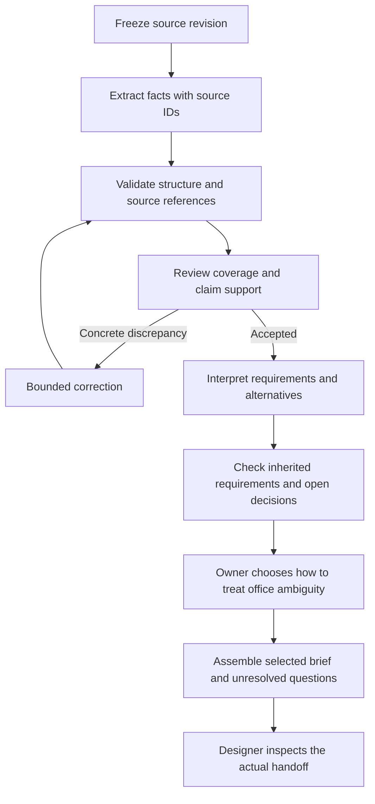

# Synthetic example: a brief becomes a reviewable requirements dossier

This is an invented teaching case, with no client data. It specifies a possible
first slice. No API execution or working approval/resume integration is claimed.

## Source fixture

Source `brief-v1`, statements `S1`–`S5`:

```text
S1: We need two bedrooms.
S2: One adult works from home three days each week; calls need privacy.
S3: The office could be a separate room or a screened corner of the living room.
S4: Step-free access is required.
S5: We have not supplied a budget or selected a site yet.
```

The owner wants a designer to receive a brief with clear requirements, unresolved
choices, and traceable sources. Value, case frequency, and baseline effort are
unknown until measured. This example makes no feasibility or compliance claim.

## Proposed slice



A failed check with no eligible repair or exhausted budget goes to an explicit
review state with its evidence. The diagram's correction loop is not unbounded.
There is no need to force parallel work into this small slice.

## Boundary choices

| Stage | Execution | Acceptance and authority |
|---|---|---|
| Freeze input | Fixed code | Stable source identity and revision |
| Extract | Initially bounded `freeform` task | Facts cite actual S1–S5; no new preferences or approvals |
| Structure/references | Fixed code | Required fields, known source IDs, types |
| Coverage/support | Human in the first pilot; compare a bounded verifier later | Facts and omissions checked against source; known IDs alone are insufficient |
| Interpret | Bounded `freeform` task | Required facts retained; office alternatives preserved; no inferred budget/site |
| Decide | Process owner | Choose an alternative or request both; bind the reviewed artifact revision |
| Assemble | Fixed transformation where sufficient | Combine accepted interpretation and recorded decision |
| Receive | Designer | Read the actual dossier and identify remaining work needed |

Both tasks need source access and output submission. Their proposed profile
requirements are read access to bound evidence, a compatible model/runtime,
explicit limits, and no publishing authority. Actual profiles and resources
must be selected against the installed release before execution.

Chaining fits because these handoffs are known. A correction loop is justified
only if it improves a checked result within the chosen budget. Human review is
the initial verification baseline, not a claim that an agent judge is required.

## Two consequential questions

- `office-choice`: owner chooses a separate room, a screened area, or continued
  exploration of both. It blocks a selected single-option brief; a dossier of
  alternatives can proceed.
- `budget-input`: owner supplies budget before cost ranking. It remains visible
  but does not block extracting requirements or preparing this dossier.

If the owner says the request concerns an existing house rather than a new one,
revise the design context explicitly instead of treating the original assumption
as a fact. Changed answers create a new revision; do not overwrite prior evidence.

For execution, implement persistence of the chosen option, reviewer attribution,
artifact revision, waiting state, and resume event. A CLI-entered decision record
can support an operator-supervised pilot if its attribution limits are explicit.
Production authentication and approval requirements depend on the application.

## Checks and pilot failures

Use a development fixture that incorrectly says three bedrooms, cites an unknown
`S9`, or silently chooses a separate office. These exercise domain support,
reference integrity, and decision authority respectively. Keep a different case
for held-out evaluation.

Success means the designer can use the dossier, source facts are preserved,
unresolved choices remain visible, and measured review/correction effort is
acceptable to the owner. It does not mean a house has been designed or approved.

The runnable example remains to be implemented and measured: real task creation,
accepted output binding, one domain failure and recovery, persisted human
decision/resumption, and inspection by the downstream consumer.
