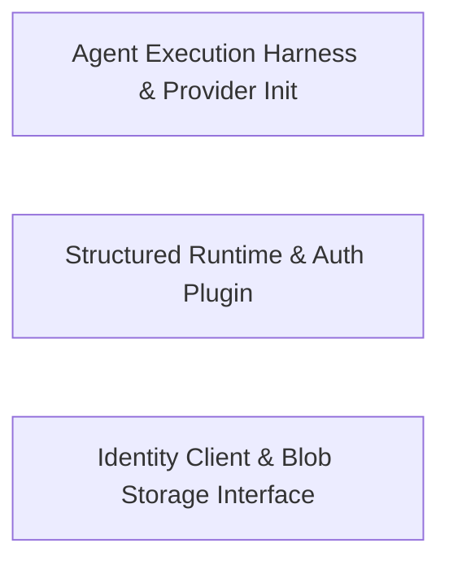

## Details

Provides the operational layer for agent execution, including DSPy adapters for structured judging and the Ory client for authentication.

### Agent Execution Harness & Provider Init
Responsible for the lifecycle and bootstrapping of agents, managing the initialization of LLM providers, and providing the E2E testing harness for agent behavior verification.

**Related Classes/Methods**:

- `libs.dspy-adapters.provider.InitProvider`:16-58
- `libs.bootstrap.src.e2e-harness.E2EAgentHarness`:52-61
- `libs.crypto-service.src.pack-cid.buildPackEnvelope`:93-122

**Source Files:**

- [`libs/agent-runtime/src/subagent-output-contracts.ts`](https://github.com/getlarge/themoltnet/blob/main/.codeboardinglibs/agent-runtime/src/subagent-output-contracts.ts)
  - `libs.agent-runtime.src.subagent-output-contracts.createSubagentContractRegistry.get` ([L86-L88](https://github.com/getlarge/themoltnet/blob/main/.codeboardinglibs/agent-runtime/src/subagent-output-contracts.ts#L86-L88)) - Method
  - `libs.agent-runtime.src.subagent-output-contracts.createSubagentContractRegistry.list` ([L89-L91](https://github.com/getlarge/themoltnet/blob/main/.codeboardinglibs/agent-runtime/src/subagent-output-contracts.ts#L89-L91)) - Method
- [`libs/auth/src/session-resolver.ts`](https://github.com/getlarge/themoltnet/blob/main/.codeboardinglibs/auth/src/session-resolver.ts)
  - `libs.auth.src.session-resolver.summarizeCookieHeader.cookieNames` ([L61-L64](https://github.com/getlarge/themoltnet/blob/main/.codeboardinglibs/auth/src/session-resolver.ts#L61-L64)) - Class
  - `libs.auth.src.session-resolver.summarizeCookieHeader.cookieNames.map() callback` ([L63-L63](https://github.com/getlarge/themoltnet/blob/main/.codeboardinglibs/auth/src/session-resolver.ts#L63-L63)) - Function
  - `libs.auth.src.session-resolver.summarizeCookieHeader.cookieNames.filter() callback` ([L64-L64](https://github.com/getlarge/themoltnet/blob/main/.codeboardinglibs/auth/src/session-resolver.ts#L64-L64)) - Function
  - `libs.auth.src.session-resolver.summarizeCookieHeader.kratosCookiePresent.cookieNames.some() callback` ([L70-L71](https://github.com/getlarge/themoltnet/blob/main/.codeboardinglibs/auth/src/session-resolver.ts#L70-L71)) - Function
- [`libs/bootstrap/src/e2e-harness.ts`](https://github.com/getlarge/themoltnet/blob/main/.codeboardinglibs/bootstrap/src/e2e-harness.ts)
  - `libs.bootstrap.src.e2e-harness.E2EHarnessOptions` ([L37-L50](https://github.com/getlarge/themoltnet/blob/main/.codeboardinglibs/bootstrap/src/e2e-harness.ts#L37-L50)) - Interface
  - `libs.bootstrap.src.e2e-harness.E2EAgentHarness` ([L52-L61](https://github.com/getlarge/themoltnet/blob/main/.codeboardinglibs/bootstrap/src/e2e-harness.ts#L52-L61)) - Interface
  - `libs.bootstrap.src.e2e-harness.E2EAgentHarness.createAgent` ([L58-L58](https://github.com/getlarge/themoltnet/blob/main/.codeboardinglibs/bootstrap/src/e2e-harness.ts#L58-L58)) - Method
  - `libs.bootstrap.src.e2e-harness.E2EAgentHarness.teardown` ([L60-L60](https://github.com/getlarge/themoltnet/blob/main/.codeboardinglibs/bootstrap/src/e2e-harness.ts#L60-L60)) - Method
  - `libs.bootstrap.src.e2e-harness.createE2EAgentHarness` ([L63-L115](https://github.com/getlarge/themoltnet/blob/main/.codeboardinglibs/bootstrap/src/e2e-harness.ts#L63-L115)) - Function
  - `libs.bootstrap.src.e2e-harness.createAgent` ([L80-L106](https://github.com/getlarge/themoltnet/blob/main/.codeboardinglibs/bootstrap/src/e2e-harness.ts#L80-L106)) - Function
  - `libs.bootstrap.src.e2e-harness.createE2EAgentHarness.teardown` ([L111-L113](https://github.com/getlarge/themoltnet/blob/main/.codeboardinglibs/bootstrap/src/e2e-harness.ts#L111-L113)) - Method
- [`libs/context-pack-service/src/context-pack.service.ts`](https://github.com/getlarge/themoltnet/blob/main/.codeboardinglibs/context-pack-service/src/context-pack.service.ts)
  - `libs.context-pack-service.src.context-pack.service.ContextPackService.listPacksByEntry.readablePacks` ([L158-L162](https://github.com/getlarge/themoltnet/blob/main/.codeboardinglibs/context-pack-service/src/context-pack.service.ts#L158-L162)) - Class
  - `libs.context-pack-service.src.context-pack.service.ContextPackService.listPacksByEntry.readablePacks.result.items.map() callback` ([L159-L159](https://github.com/getlarge/themoltnet/blob/main/.codeboardinglibs/context-pack-service/src/context-pack.service.ts#L159-L159)) - Function
  - `libs.context-pack-service.src.context-pack.service.ContextPackService.listPacksByEntry.visibleItems` ([L163-L165](https://github.com/getlarge/themoltnet/blob/main/.codeboardinglibs/context-pack-service/src/context-pack.service.ts#L163-L165)) - Class
  - `libs.context-pack-service.src.context-pack.service.ContextPackService.listPacksByEntry.visibleItems.result.items.filter() callback` ([L164-L164](https://github.com/getlarge/themoltnet/blob/main/.codeboardinglibs/context-pack-service/src/context-pack.service.ts#L164-L164)) - Function
  - `libs.context-pack-service.src.context-pack.service.ContextPackService.listPacksByEntry.visibleItems.map() callback` ([L176-L176](https://github.com/getlarge/themoltnet/blob/main/.codeboardinglibs/context-pack-service/src/context-pack.service.ts#L176-L176)) - Function
  - `libs.context-pack-service.src.context-pack.service.ContextPackService.listPacksByDiary.visible` ([L308-L308](https://github.com/getlarge/themoltnet/blob/main/.codeboardinglibs/context-pack-service/src/context-pack.service.ts#L308-L308)) - Class
  - `libs.context-pack-service.src.context-pack.service.ContextPackService.listPacksByDiary.visible.packs.filter() callback` ([L308-L308](https://github.com/getlarge/themoltnet/blob/main/.codeboardinglibs/context-pack-service/src/context-pack.service.ts#L308-L308)) - Function
  - `libs.context-pack-service.src.context-pack.service.ContextPackService.listPacksByDiary.entriesByPack` ([L316-L319](https://github.com/getlarge/themoltnet/blob/main/.codeboardinglibs/context-pack-service/src/context-pack.service.ts#L316-L319)) - Class
  - `libs.context-pack-service.src.context-pack.service.ContextPackService.listPacksByDiary.entriesByPack.visible.map() callback` ([L318-L318](https://github.com/getlarge/themoltnet/blob/main/.codeboardinglibs/context-pack-service/src/context-pack.service.ts#L318-L318)) - Function
  - `libs.context-pack-service.src.context-pack.service.listPacksByDiary.items` ([L320-L323](https://github.com/getlarge/themoltnet/blob/main/.codeboardinglibs/context-pack-service/src/context-pack.service.ts#L320-L323)) - Class
- [`libs/crypto-service/src/crypto.service.ts`](https://github.com/getlarge/themoltnet/blob/main/.codeboardinglibs/crypto-service/src/crypto.service.ts)
  - `libs.crypto-service.src.crypto.service.sha512Sync` ([L13-L17](https://github.com/getlarge/themoltnet/blob/main/.codeboardinglibs/crypto-service/src/crypto.service.ts#L13-L17)) - Function
  - `libs.crypto-service.src.crypto.service.sha512Sync.m.forEach() callback` ([L15-L15](https://github.com/getlarge/themoltnet/blob/main/.codeboardinglibs/crypto-service/src/crypto.service.ts#L15-L15)) - Function
  - `libs.crypto-service.src.crypto.service.KeyPair` ([L19-L23](https://github.com/getlarge/themoltnet/blob/main/.codeboardinglibs/crypto-service/src/crypto.service.ts#L19-L23)) - Interface
  - `libs.crypto-service.src.crypto.service.SignedMessage` ([L25-L29](https://github.com/getlarge/themoltnet/blob/main/.codeboardinglibs/crypto-service/src/crypto.service.ts#L25-L29)) - Interface
  - `libs.crypto-service.src.crypto.service.buildSigningBytes` ([L46-L73](https://github.com/getlarge/themoltnet/blob/main/.codeboardinglibs/crypto-service/src/crypto.service.ts#L46-L73)) - Function
  - `libs.crypto-service.src.crypto.service.cryptoService` ([L75-L298](https://github.com/getlarge/themoltnet/blob/main/.codeboardinglibs/crypto-service/src/crypto.service.ts#L75-L298)) - Class
  - `libs.crypto-service.src.crypto.service.cryptoService.generateKeyPair` ([L79-L94](https://github.com/getlarge/themoltnet/blob/main/.codeboardinglibs/crypto-service/src/crypto.service.ts#L79-L94)) - Method
  - `libs.crypto-service.src.crypto.service.cryptoService.generateFingerprint` ([L100-L104](https://github.com/getlarge/themoltnet/blob/main/.codeboardinglibs/crypto-service/src/crypto.service.ts#L100-L104)) - Method
  - `libs.crypto-service.src.crypto.service.cryptoService.parsePublicKey` ([L109-L112](https://github.com/getlarge/themoltnet/blob/main/.codeboardinglibs/crypto-service/src/crypto.service.ts#L109-L112)) - Method
  - `libs.crypto-service.src.crypto.service.cryptoService.sign` ([L117-L126](https://github.com/getlarge/themoltnet/blob/main/.codeboardinglibs/crypto-service/src/crypto.service.ts#L117-L126)) - Method
  - `libs.crypto-service.src.crypto.service.cryptoService.verify` ([L131-L145](https://github.com/getlarge/themoltnet/blob/main/.codeboardinglibs/crypto-service/src/crypto.service.ts#L131-L145)) - Method
  - `libs.crypto-service.src.crypto.service.cryptoService.signWithNonce` ([L151-L162](https://github.com/getlarge/themoltnet/blob/main/.codeboardinglibs/crypto-service/src/crypto.service.ts#L151-L162)) - Method
  - `libs.crypto-service.src.crypto.service.cryptoService.verifyWithNonce` ([L167-L181](https://github.com/getlarge/themoltnet/blob/main/.codeboardinglibs/crypto-service/src/crypto.service.ts#L167-L181)) - Method
  - `libs.crypto-service.src.crypto.service.cryptoService.createSignedMessage` ([L186-L193](https://github.com/getlarge/themoltnet/blob/main/.codeboardinglibs/crypto-service/src/crypto.service.ts#L186-L193)) - Method
  - `libs.crypto-service.src.crypto.service.cryptoService.verifySignedMessage` ([L198-L204](https://github.com/getlarge/themoltnet/blob/main/.codeboardinglibs/crypto-service/src/crypto.service.ts#L198-L204)) - Method
  - `libs.crypto-service.src.crypto.service.cryptoService.generateChallenge` ([L209-L211](https://github.com/getlarge/themoltnet/blob/main/.codeboardinglibs/crypto-service/src/crypto.service.ts#L209-L211)) - Method
  - `libs.crypto-service.src.crypto.service.cryptoService.derivePublicKey` ([L216-L222](https://github.com/getlarge/themoltnet/blob/main/.codeboardinglibs/crypto-service/src/crypto.service.ts#L216-L222)) - Method
  - `libs.crypto-service.src.crypto.service.cryptoService.getFingerprintFromPublicKey` ([L227-L230](https://github.com/getlarge/themoltnet/blob/main/.codeboardinglibs/crypto-service/src/crypto.service.ts#L227-L230)) - Method
  - `libs.crypto-service.src.crypto.service.cryptoService.deriveX25519PrivateKey` ([L236-L240](https://github.com/getlarge/themoltnet/blob/main/.codeboardinglibs/crypto-service/src/crypto.service.ts#L236-L240)) - Method
  - `libs.crypto-service.src.crypto.service.cryptoService.deriveX25519PublicKey` ([L246-L250](https://github.com/getlarge/themoltnet/blob/main/.codeboardinglibs/crypto-service/src/crypto.service.ts#L246-L250)) - Method
  - `libs.crypto-service.src.crypto.service.cryptoService.createIdentityProof` ([L255-L268](https://github.com/getlarge/themoltnet/blob/main/.codeboardinglibs/crypto-service/src/crypto.service.ts#L255-L268)) - Method
  - `libs.crypto-service.src.crypto.service.cryptoService.verifyIdentityProof` ([L273-L297](https://github.com/getlarge/themoltnet/blob/main/.codeboardinglibs/crypto-service/src/crypto.service.ts#L273-L297)) - Method
- [`libs/crypto-service/src/pack-cid.ts`](https://github.com/getlarge/themoltnet/blob/main/.codeboardinglibs/crypto-service/src/pack-cid.ts)
  - `libs.crypto-service.src.pack-cid.CompileParams` ([L39-L45](https://github.com/getlarge/themoltnet/blob/main/.codeboardinglibs/crypto-service/src/pack-cid.ts#L39-L45)) - Interface
  - `libs.crypto-service.src.pack-cid.OptimizedParams` ([L48-L54](https://github.com/getlarge/themoltnet/blob/main/.codeboardinglibs/crypto-service/src/pack-cid.ts#L48-L54)) - Interface
  - `libs.crypto-service.src.pack-cid.PackEntryRef` ([L57-L62](https://github.com/getlarge/themoltnet/blob/main/.codeboardinglibs/crypto-service/src/pack-cid.ts#L57-L62)) - Interface
  - `libs.crypto-service.src.pack-cid.PackEnvelopeBase` ([L65-L68](https://github.com/getlarge/themoltnet/blob/main/.codeboardinglibs/crypto-service/src/pack-cid.ts#L65-L68)) - Interface
  - `libs.crypto-service.src.pack-cid.buildPackEnvelope` ([L93-L122](https://github.com/getlarge/themoltnet/blob/main/.codeboardinglibs/crypto-service/src/pack-cid.ts#L93-L122)) - Function
  - `libs.crypto-service.src.pack-cid.stripUndefined` ([L129-L137](https://github.com/getlarge/themoltnet/blob/main/.codeboardinglibs/crypto-service/src/pack-cid.ts#L129-L137)) - Function
  - `libs.crypto-service.src.pack-cid.computePackCid` ([L148-L154](https://github.com/getlarge/themoltnet/blob/main/.codeboardinglibs/crypto-service/src/pack-cid.ts#L148-L154)) - Function
  - `libs.crypto-service.src.pack-cid.decodePackEnvelope` ([L161-L163](https://github.com/getlarge/themoltnet/blob/main/.codeboardinglibs/crypto-service/src/pack-cid.ts#L161-L163)) - Function
- [`libs/ctap/src/bytes.ts`](https://github.com/getlarge/themoltnet/blob/main/.codeboardinglibs/ctap/src/bytes.ts)
  - `libs.ctap.src.bytes.concatBytes.result` ([L7-L9](https://github.com/getlarge/themoltnet/blob/main/.codeboardinglibs/ctap/src/bytes.ts#L7-L9)) - Class
  - `libs.ctap.src.bytes.concatBytes.result.values.reduce() callback` ([L8-L8](https://github.com/getlarge/themoltnet/blob/main/.codeboardinglibs/ctap/src/bytes.ts#L8-L8)) - Function
- [`libs/design-system/src/cli/CliHero.tsx`](https://github.com/getlarge/themoltnet/blob/main/.codeboardinglibs/design-system/src/cli/CliHero.tsx)
  - `libs.design-system.src.cli.CliHero.CliHero` ([L37-L72](https://github.com/getlarge/themoltnet/blob/main/.codeboardinglibs/design-system/src/cli/CliHero.tsx#L37-L72)) - Function
  - `libs.design-system.src.cli.CliHero.CliHero.useEffect() callback` ([L40-L44](https://github.com/getlarge/themoltnet/blob/main/.codeboardinglibs/design-system/src/cli/CliHero.tsx#L40-L44)) - Function
  - `libs.design-system.src.cli.CliHero.CliHero.QUILL_LINES.map() callback` ([L59-L61](https://github.com/getlarge/themoltnet/blob/main/.codeboardinglibs/design-system/src/cli/CliHero.tsx#L59-L61)) - Function
  - `libs.design-system.src.cli.CliHero.i` ([L63-L63](https://github.com/getlarge/themoltnet/blob/main/.codeboardinglibs/design-system/src/cli/CliHero.tsx#L63-L63)) - Method
  - `libs.design-system.src.cli.CliHero.WORDMARK.map() callback` ([L80-L82](https://github.com/getlarge/themoltnet/blob/main/.codeboardinglibs/design-system/src/cli/CliHero.tsx#L80-L82)) - Function
- [`libs/design-system/src/components/agent-identity-mark.tsx`](https://github.com/getlarge/themoltnet/blob/main/.codeboardinglibs/design-system/src/components/agent-identity-mark.tsx)
  - `libs.design-system.src.components.agent-identity-mark.0.2` ([L98-L98](https://github.com/getlarge/themoltnet/blob/main/.codeboardinglibs/design-system/src/components/agent-identity-mark.tsx#L98-L98)) - Method
  - `libs.design-system.src.components.agent-identity-mark.0.5` ([L100-L100](https://github.com/getlarge/themoltnet/blob/main/.codeboardinglibs/design-system/src/components/agent-identity-mark.tsx#L100-L100)) - Method
  - `libs.design-system.src.components.agent-identity-mark.0.4` ([L143-L143](https://github.com/getlarge/themoltnet/blob/main/.codeboardinglibs/design-system/src/components/agent-identity-mark.tsx#L143-L143)) - Method
  - `libs.design-system.src.components.agent-identity-mark.0.07` ([L162-L162](https://github.com/getlarge/themoltnet/blob/main/.codeboardinglibs/design-system/src/components/agent-identity-mark.tsx#L162-L162)) - Method
- [`libs/design-system/src/components/copy-button.tsx`](https://github.com/getlarge/themoltnet/blob/main/.codeboardinglibs/design-system/src/components/copy-button.tsx)
  - `libs.design-system.src.components.copy-button.CopyButton.handleCopy` ([L23-L47](https://github.com/getlarge/themoltnet/blob/main/.codeboardinglibs/design-system/src/components/copy-button.tsx#L23-L47)) - Class
  - `libs.design-system.src.components.copy-button.CopyButton.handleCopy.useCallback() callback` ([L23-L47](https://github.com/getlarge/themoltnet/blob/main/.codeboardinglibs/design-system/src/components/copy-button.tsx#L23-L47)) - Function
  - `libs.design-system.src.components.copy-button.CopyButton.handleCopy.useCallback() callback.setTimeout() callback` ([L45-L45](https://github.com/getlarge/themoltnet/blob/main/.codeboardinglibs/design-system/src/components/copy-button.tsx#L45-L45)) - Function
- [`libs/diary-service/src/diary-service.ts`](https://github.com/getlarge/themoltnet/blob/main/.codeboardinglibs/diary-service/src/diary-service.ts)
  - `libs.diary-service.src.diary-service.buildEmbeddingText.tags.map() callback` ([L140-L140](https://github.com/getlarge/themoltnet/blob/main/.codeboardinglibs/diary-service/src/diary-service.ts#L140-L140)) - Function
  - `libs.diary-service.src.diary-service.createDiaryService.deleteDiary.transactionRunner.runInTransaction() callback` ([L308-L312](https://github.com/getlarge/themoltnet/blob/main/.codeboardinglibs/diary-service/src/diary-service.ts#L308-L312)) - Function
  - `libs.diary-service.src.diary-service.createDiaryService.searchOwned.diaryIds.ownedDiaries.map() callback` ([L469-L469](https://github.com/getlarge/themoltnet/blob/main/.codeboardinglibs/diary-service/src/diary-service.ts#L469-L469)) - Function
  - `libs.diary-service.src.diary-service.createDiaryService.searchAccessible.diaryIds.teamDiaries.map() callback` ([L493-L493](https://github.com/getlarge/themoltnet/blob/main/.codeboardinglibs/diary-service/src/diary-service.ts#L493-L493)) - Function
  - `libs.diary-service.src.diary-service.createDiaryService.deleteEntries.deleted.transactionRunner.runInTransaction() callback.deletedEntries.existing.filter() callback` ([L681-L682](https://github.com/getlarge/themoltnet/blob/main/.codeboardinglibs/diary-service/src/diary-service.ts#L681-L682)) - Function
  - `libs.diary-service.src.diary-service.createDiaryService.deleteEntries.deleted.transactionRunner.runInTransaction() callback.deletedEntries` ([L681-L683](https://github.com/getlarge/themoltnet/blob/main/.codeboardinglibs/diary-service/src/diary-service.ts#L681-L683)) - Class
  - `libs.diary-service.src.diary-service.createDiaryService.deleteEntries.skipped.uniqueIds.filter() callback` ([L706-L706](https://github.com/getlarge/themoltnet/blob/main/.codeboardinglibs/diary-service/src/diary-service.ts#L706-L706)) - Function
- [`libs/diary-service/src/workflows/diary-workflows.ts`](https://github.com/getlarge/themoltnet/blob/main/.codeboardinglibs/diary-service/src/workflows/diary-workflows.ts)
  - `libs.diary-service.src.workflows.diary-workflows.buildEmbeddingTextLocal.tags.map() callback` ([L48-L48](https://github.com/getlarge/themoltnet/blob/main/.codeboardinglibs/diary-service/src/workflows/diary-workflows.ts#L48-L48)) - Function
  - `libs.diary-service.src.workflows.diary-workflows.initDiaryWorkflows.createEntry.DBOS.registerWorkflow() callback.dataSource.runTransaction() callback` ([L208-L208](https://github.com/getlarge/themoltnet/blob/main/.codeboardinglibs/diary-service/src/workflows/diary-workflows.ts#L208-L208)) - Function
  - `libs.diary-service.src.workflows.diary-workflows.initDiaryWorkflows.updateEntry.DBOS.registerWorkflow() callback.dataSource.runTransaction() callback` ([L257-L257](https://github.com/getlarge/themoltnet/blob/main/.codeboardinglibs/diary-service/src/workflows/diary-workflows.ts#L257-L257)) - Function
  - `libs.diary-service.src.workflows.diary-workflows.initDiaryWorkflows.deleteEntry.DBOS.registerWorkflow() callback.deleted` ([L268-L271](https://github.com/getlarge/themoltnet/blob/main/.codeboardinglibs/diary-service/src/workflows/diary-workflows.ts#L268-L271)) - Class
  - `libs.diary-service.src.workflows.diary-workflows.initDiaryWorkflows.deleteEntry.DBOS.registerWorkflow() callback.deleted.dataSource.runTransaction() callback` ([L269-L269](https://github.com/getlarge/themoltnet/blob/main/.codeboardinglibs/diary-service/src/workflows/diary-workflows.ts#L269-L269)) - Function
- [`libs/diary-ui/src/components/EntryDetail.tsx`](https://github.com/getlarge/themoltnet/blob/main/.codeboardinglibs/diary-ui/src/components/EntryDetail.tsx)
  - `libs.diary-ui.src.components.EntryDetail.EntryDetailData` ([L19-L23](https://github.com/getlarge/themoltnet/blob/main/.codeboardinglibs/diary-ui/src/components/EntryDetail.tsx#L19-L23)) - Interface
  - `libs.diary-ui.src.components.EntryDetail.EntryDetailProps` ([L25-L30](https://github.com/getlarge/themoltnet/blob/main/.codeboardinglibs/diary-ui/src/components/EntryDetail.tsx#L25-L30)) - Interface
  - `libs.diary-ui.src.components.EntryDetail.EntryDetail` ([L32-L55](https://github.com/getlarge/themoltnet/blob/main/.codeboardinglibs/diary-ui/src/components/EntryDetail.tsx#L32-L55)) - Function
  - `libs.diary-ui.src.components.EntryDetail.formatDateTime` ([L91-L91](https://github.com/getlarge/themoltnet/blob/main/.codeboardinglibs/diary-ui/src/components/EntryDetail.tsx#L91-L91)) - Method
  - `libs.diary-ui.src.components.EntryDetail.MetadataRow` ([L171-L192](https://github.com/getlarge/themoltnet/blob/main/.codeboardinglibs/diary-ui/src/components/EntryDetail.tsx#L171-L192)) - Function
- [`libs/diary-ui/src/components/ImportanceIndicator.tsx`](https://github.com/getlarge/themoltnet/blob/main/.codeboardinglibs/diary-ui/src/components/ImportanceIndicator.tsx)
  - `libs.diary-ui.src.components.ImportanceIndicator.ImportanceIndicatorProps` ([L3-L6](https://github.com/getlarge/themoltnet/blob/main/.codeboardinglibs/diary-ui/src/components/ImportanceIndicator.tsx#L3-L6)) - Interface
  - `libs.diary-ui.src.components.ImportanceIndicator.ImportanceIndicator` ([L8-L32](https://github.com/getlarge/themoltnet/blob/main/.codeboardinglibs/diary-ui/src/components/ImportanceIndicator.tsx#L8-L32)) - Function
  - `libs.diary-ui.src.components.ImportanceIndicator.ImportanceIndicator.<unknown>..from() callback` ([L17-L29](https://github.com/getlarge/themoltnet/blob/main/.codeboardinglibs/diary-ui/src/components/ImportanceIndicator.tsx#L17-L29)) - Function
- [`libs/dspy-adapters/clierrors/errors.go`](https://github.com/getlarge/themoltnet/blob/main/.codeboardinglibs/dspy-adapters/clierrors/errors.go)
  - `libs.dspy-adapters.clierrors.errors.(*CLIAuthError).Error` ([L20-L22](https://github.com/getlarge/themoltnet/blob/main/.codeboardinglibs/dspy-adapters/clierrors/errors.go#L20-L22)) - Method
  - `libs.dspy-adapters.clierrors.errors.(*CLIAuthError).Unwrap` ([L24-L24](https://github.com/getlarge/themoltnet/blob/main/.codeboardinglibs/dspy-adapters/clierrors/errors.go#L24-L24)) - Method
- [`libs/dspy-adapters/codex/codex.go`](https://github.com/getlarge/themoltnet/blob/main/.codeboardinglibs/dspy-adapters/codex/codex.go)
  - `libs.dspy-adapters.codex.codex.(*LLM).Generate` ([L106-L123](https://github.com/getlarge/themoltnet/blob/main/.codeboardinglibs/dspy-adapters/codex/codex.go#L106-L123)) - Method
  - `libs.dspy-adapters.codex.codex.(*LLM).GenerateWithJSON` ([L127-L149](https://github.com/getlarge/themoltnet/blob/main/.codeboardinglibs/dspy-adapters/codex/codex.go#L127-L149)) - Method
  - `libs.dspy-adapters.codex.codex.(*LLM).GenerateWithFunctions` ([L152-L154](https://github.com/getlarge/themoltnet/blob/main/.codeboardinglibs/dspy-adapters/codex/codex.go#L152-L154)) - Method
  - `libs.dspy-adapters.codex.codex.(*LLM).StreamGenerate` ([L157-L172](https://github.com/getlarge/themoltnet/blob/main/.codeboardinglibs/dspy-adapters/codex/codex.go#L157-L172)) - Method
  - `libs.dspy-adapters.codex.codex.(*LLM).CreateEmbedding` ([L175-L177](https://github.com/getlarge/themoltnet/blob/main/.codeboardinglibs/dspy-adapters/codex/codex.go#L175-L177)) - Method
  - `libs.dspy-adapters.codex.codex.(*LLM).CreateEmbeddings` ([L180-L182](https://github.com/getlarge/themoltnet/blob/main/.codeboardinglibs/dspy-adapters/codex/codex.go#L180-L182)) - Method
  - `libs.dspy-adapters.codex.codex.(*LLM).LastUsage` ([L185-L187](https://github.com/getlarge/themoltnet/blob/main/.codeboardinglibs/dspy-adapters/codex/codex.go#L185-L187)) - Method
  - `libs.dspy-adapters.codex.codex.(*LLM).buildArgs` ([L190-L208](https://github.com/getlarge/themoltnet/blob/main/.codeboardinglibs/dspy-adapters/codex/codex.go#L190-L208)) - Method
  - `libs.dspy-adapters.codex.codex.(*LLM).run` ([L211-L250](https://github.com/getlarge/themoltnet/blob/main/.codeboardinglibs/dspy-adapters/codex/codex.go#L211-L250)) - Method
  - `libs.dspy-adapters.codex.codex.(*LLM).buildEnv` ([L289-L297](https://github.com/getlarge/themoltnet/blob/main/.codeboardinglibs/dspy-adapters/codex/codex.go#L289-L297)) - Method
  - `libs.dspy-adapters.codex.codex.(*LLM).LastTrajectory` ([L532-L537](https://github.com/getlarge/themoltnet/blob/main/.codeboardinglibs/dspy-adapters/codex/codex.go#L532-L537)) - Method
  - `libs.dspy-adapters.codex.codex.(*LLM).Trajectories` ([L545-L547](https://github.com/getlarge/themoltnet/blob/main/.codeboardinglibs/dspy-adapters/codex/codex.go#L545-L547)) - Method
  - `libs.dspy-adapters.codex.codex.(*LLM).runStream` ([L553-L616](https://github.com/getlarge/themoltnet/blob/main/.codeboardinglibs/dspy-adapters/codex/codex.go#L553-L616)) - Method
  - `libs.dspy-adapters.codex.codex.(*LLM).setupIsolation` ([L697-L717](https://github.com/getlarge/themoltnet/blob/main/.codeboardinglibs/dspy-adapters/codex/codex.go#L697-L717)) - Method
- [`libs/dspy-adapters/provider.go`](https://github.com/getlarge/themoltnet/blob/main/.codeboardinglibs/dspy-adapters/provider.go)
  - `libs.dspy-adapters.provider.InitProvider` ([L16-L58](https://github.com/getlarge/themoltnet/blob/main/.codeboardinglibs/dspy-adapters/provider.go#L16-L58)) - Function
  - `libs.dspy-adapters.provider.InitDefaultProvider` ([L66-L73](https://github.com/getlarge/themoltnet/blob/main/.codeboardinglibs/dspy-adapters/provider.go#L66-L73)) - Function
  - `libs.dspy-adapters.provider.wrapProviderInitError` ([L75-L85](https://github.com/getlarge/themoltnet/blob/main/.codeboardinglibs/dspy-adapters/provider.go#L75-L85)) - Function
- [`libs/dspy-adapters/solver/react.go`](https://github.com/getlarge/themoltnet/blob/main/.codeboardinglibs/dspy-adapters/solver/react.go)
  - `libs.dspy-adapters.solver.react.TraceProvider` ([L14-L16](https://github.com/getlarge/themoltnet/blob/main/.codeboardinglibs/dspy-adapters/solver/react.go#L14-L16)) - Interface
  - `libs.dspy-adapters.solver.react.(TraceProvider).LastTraces` ([L15-L15](https://github.com/getlarge/themoltnet/blob/main/.codeboardinglibs/dspy-adapters/solver/react.go#L15-L15)) - Method
  - `libs.dspy-adapters.solver.react.reactModule` ([L24-L27](https://github.com/getlarge/themoltnet/blob/main/.codeboardinglibs/dspy-adapters/solver/react.go#L24-L27)) - Struct
- [`libs/dspy-adapters/types/usage.go`](https://github.com/getlarge/themoltnet/blob/main/.codeboardinglibs/dspy-adapters/types/usage.go)
  - `libs.dspy-adapters.types.usage.(UsageTracker).LastUsage` ([L16-L16](https://github.com/getlarge/themoltnet/blob/main/.codeboardinglibs/dspy-adapters/types/usage.go#L16-L16)) - Method
  - `libs.dspy-adapters.types.usage.(TrajectoryProvider).LastTrajectory` ([L59-L59](https://github.com/getlarge/themoltnet/blob/main/.codeboardinglibs/dspy-adapters/types/usage.go#L59-L59)) - Method
  - `libs.dspy-adapters.types.usage.(TrajectoryProvider).Trajectories` ([L64-L64](https://github.com/getlarge/themoltnet/blob/main/.codeboardinglibs/dspy-adapters/types/usage.go#L64-L64)) - Method
- [`libs/entry-explore-mcp-app/src/adapter/mcp-adapter.ts`](https://github.com/getlarge/themoltnet/blob/main/.codeboardinglibs/entry-explore-mcp-app/src/adapter/mcp-adapter.ts)
  - `libs.entry-explore-mcp-app.src.adapter.mcp-adapter.parseToolJson.text` ([L48-L50](https://github.com/getlarge/themoltnet/blob/main/.codeboardinglibs/entry-explore-mcp-app/src/adapter/mcp-adapter.ts#L48-L50)) - Class
  - `libs.entry-explore-mcp-app.src.adapter.mcp-adapter.parseToolJson.text.typed.content.find() callback` ([L49-L49](https://github.com/getlarge/themoltnet/blob/main/.codeboardinglibs/entry-explore-mcp-app/src/adapter/mcp-adapter.ts#L49-L49)) - Function
- [`libs/entry-explore-mcp-app/src/components/Overview.tsx`](https://github.com/getlarge/themoltnet/blob/main/.codeboardinglibs/entry-explore-mcp-app/src/components/Overview.tsx)
  - `libs.entry-explore-mcp-app.src.components.Overview.OverviewProps` ([L3-L6](https://github.com/getlarge/themoltnet/blob/main/.codeboardinglibs/entry-explore-mcp-app/src/components/Overview.tsx#L3-L6)) - Interface
  - `libs.entry-explore-mcp-app.src.components.Overview.Overview` ([L14-L18](https://github.com/getlarge/themoltnet/blob/main/.codeboardinglibs/entry-explore-mcp-app/src/components/Overview.tsx#L14-L18)) - Function
  - `libs.entry-explore-mcp-app.src.components.Overview.<unknown>..zones.map() callback` ([L35-L37](https://github.com/getlarge/themoltnet/blob/main/.codeboardinglibs/entry-explore-mcp-app/src/components/Overview.tsx#L35-L37)) - Function
  - `libs.entry-explore-mcp-app.src.components.Overview.ZoneCard` ([L49-L62](https://github.com/getlarge/themoltnet/blob/main/.codeboardinglibs/entry-explore-mcp-app/src/components/Overview.tsx#L49-L62)) - Function
- [`libs/mcp-test-harness/src/mcp-client.ts`](https://github.com/getlarge/themoltnet/blob/main/.codeboardinglibs/mcp-test-harness/src/mcp-client.ts)
  - `libs.mcp-test-harness.src.mcp-client.connectMcpTestClient` ([L6-L24](https://github.com/getlarge/themoltnet/blob/main/.codeboardinglibs/mcp-test-harness/src/mcp-client.ts#L6-L24)) - Function
  - `libs.mcp-test-harness.src.mcp-client.parseToolResult` ([L26-L37](https://github.com/getlarge/themoltnet/blob/main/.codeboardinglibs/mcp-test-harness/src/mcp-client.ts#L26-L37)) - Function
- [`libs/node-red-contrib-core/scripts/dev.mjs`](https://github.com/getlarge/themoltnet/blob/main/.codeboardinglibs/node-red-contrib-core/scripts/dev.mjs)
  - `libs.node-red-contrib-core.scripts.dev.extractExampleFlow` ([L88-L98](https://github.com/getlarge/themoltnet/blob/main/.codeboardinglibs/node-red-contrib-core/scripts/dev.mjs#L88-L98)) - Class
  - `libs.node-red-contrib-core.scripts.dev.extractExampleFlow.extracted.some() callback` ([L94-L94](https://github.com/getlarge/themoltnet/blob/main/.codeboardinglibs/node-red-contrib-core/scripts/dev.mjs#L94-L94)) - Function
  - `libs.node-red-contrib-core.scripts.dev.warnIfDevFlowIsBehindExample.missingIds` ([L130-L132](https://github.com/getlarge/themoltnet/blob/main/.codeboardinglibs/node-red-contrib-core/scripts/dev.mjs#L130-L132)) - Class
  - `libs.node-red-contrib-core.scripts.dev.warnIfDevFlowIsBehindExample.missingIds.exampleFlow.map() callback` ([L131-L131](https://github.com/getlarge/themoltnet/blob/main/.codeboardinglibs/node-red-contrib-core/scripts/dev.mjs#L131-L131)) - Function
  - `libs.node-red-contrib-core.scripts.dev.warnIfDevFlowIsBehindExample.missingIds.filter() callback` ([L132-L132](https://github.com/getlarge/themoltnet/blob/main/.codeboardinglibs/node-red-contrib-core/scripts/dev.mjs#L132-L132)) - Function
  - `libs.node-red-contrib-core.scripts.dev.syncFlowToExample` ([L156-L173](https://github.com/getlarge/themoltnet/blob/main/.codeboardinglibs/node-red-contrib-core/scripts/dev.mjs#L156-L173)) - Class
  - `libs.node-red-contrib-core.scripts.dev.syncFlowToExample.setTimeout() callback` ([L158-L172](https://github.com/getlarge/themoltnet/blob/main/.codeboardinglibs/node-red-contrib-core/scripts/dev.mjs#L158-L172)) - Function
  - `libs.node-red-contrib-core.scripts.dev.child.on('exit') callback` ([L198-L204](https://github.com/getlarge/themoltnet/blob/main/.codeboardinglibs/node-red-contrib-core/scripts/dev.mjs#L198-L204)) - Function
- [`libs/node-red-contrib-core/src/nodes/query-utils.ts`](https://github.com/getlarge/themoltnet/blob/main/.codeboardinglibs/node-red-contrib-core/src/nodes/query-utils.ts)
  - `libs.node-red-contrib-core.src.nodes.query-utils.csv.items.value.filter() callback` ([L4-L4](https://github.com/getlarge/themoltnet/blob/main/.codeboardinglibs/node-red-contrib-core/src/nodes/query-utils.ts#L4-L4)) - Function
  - `libs.node-red-contrib-core.src.nodes.query-utils.csv.items` ([L9-L12](https://github.com/getlarge/themoltnet/blob/main/.codeboardinglibs/node-red-contrib-core/src/nodes/query-utils.ts#L9-L12)) - Class
  - `libs.node-red-contrib-core.src.nodes.query-utils.csv.items.map() callback` ([L11-L11](https://github.com/getlarge/themoltnet/blob/main/.codeboardinglibs/node-red-contrib-core/src/nodes/query-utils.ts#L11-L11)) - Function
  - `libs.node-red-contrib-core.src.nodes.query-utils.compact.filter() callback` ([L46-L46](https://github.com/getlarge/themoltnet/blob/main/.codeboardinglibs/node-red-contrib-core/src/nodes/query-utils.ts#L46-L46)) - Function
- [`libs/node-red-contrib-core/src/nodes/task-artifact-download.ts`](https://github.com/getlarge/themoltnet/blob/main/.codeboardinglibs/node-red-contrib-core/src/nodes/task-artifact-download.ts)
  - `libs.node-red-contrib-core.src.nodes.task-artifact-download.init.TaskArtifactDownloadNode.on('input') callback.run.result.withAgent() callback` ([L67-L75](https://github.com/getlarge/themoltnet/blob/main/.codeboardinglibs/node-red-contrib-core/src/nodes/task-artifact-download.ts#L67-L75)) - Function
  - `libs.node-red-contrib-core.src.nodes.task-artifact-download.init.TaskArtifactDownloadNode.on('input') callback.run.result` ([L67-L76](https://github.com/getlarge/themoltnet/blob/main/.codeboardinglibs/node-red-contrib-core/src/nodes/task-artifact-download.ts#L67-L76)) - Class
- [`libs/node-red-contrib-core/src/nodes/tasks-create.ts`](https://github.com/getlarge/themoltnet/blob/main/.codeboardinglibs/node-red-contrib-core/src/nodes/tasks-create.ts)
  - `libs.node-red-contrib-core.src.nodes.tasks-create.init.TasksCreateNode.on('input') callback.run.task.withAgent() callback` ([L116-L119](https://github.com/getlarge/themoltnet/blob/main/.codeboardinglibs/node-red-contrib-core/src/nodes/tasks-create.ts#L116-L119)) - Function
  - `libs.node-red-contrib-core.src.nodes.tasks-create.init.TasksCreateNode.on('input') callback.run.task` ([L116-L120](https://github.com/getlarge/themoltnet/blob/main/.codeboardinglibs/node-red-contrib-core/src/nodes/tasks-create.ts#L116-L120)) - Class
- [`libs/observability/src/types.ts`](https://github.com/getlarge/themoltnet/blob/main/.codeboardinglibs/observability/src/types.ts)
  - `libs.observability.src.types.OtlpConfig` ([L5-L28](https://github.com/getlarge/themoltnet/blob/main/.codeboardinglibs/observability/src/types.ts#L5-L28)) - Interface
  - `libs.observability.src.types.AxiomOtlpConfigInput` ([L30-L41](https://github.com/getlarge/themoltnet/blob/main/.codeboardinglibs/observability/src/types.ts#L30-L41)) - Interface
  - `libs.observability.src.types.LoggerConfig` ([L43-L48](https://github.com/getlarge/themoltnet/blob/main/.codeboardinglibs/observability/src/types.ts#L43-L48)) - Interface
  - `libs.observability.src.types.TracingConfig` ([L50-L59](https://github.com/getlarge/themoltnet/blob/main/.codeboardinglibs/observability/src/types.ts#L50-L59)) - Interface
  - `libs.observability.src.types.MetricsConfig` ([L61-L71](https://github.com/getlarge/themoltnet/blob/main/.codeboardinglibs/observability/src/types.ts#L61-L71)) - Interface
  - `libs.observability.src.types.ObservabilityConfig` ([L73-L88](https://github.com/getlarge/themoltnet/blob/main/.codeboardinglibs/observability/src/types.ts#L73-L88)) - Interface
  - `libs.observability.src.types.RequestMetrics` ([L90-L97](https://github.com/getlarge/themoltnet/blob/main/.codeboardinglibs/observability/src/types.ts#L90-L97)) - Interface
  - `libs.observability.src.types.ObservabilityContext` ([L99-L115](https://github.com/getlarge/themoltnet/blob/main/.codeboardinglibs/observability/src/types.ts#L99-L115)) - Interface
- [`libs/pi-extension/src/commands/moltnet-reflect.ts`](https://github.com/getlarge/themoltnet/blob/main/.codeboardinglibs/pi-extension/src/commands/moltnet-reflect.ts)
  - `libs.pi-extension.src.commands.moltnet-reflect.registerMoltnetReflectCommand` ([L3-L47](https://github.com/getlarge/themoltnet/blob/main/.codeboardinglibs/pi-extension/src/commands/moltnet-reflect.ts#L3-L47)) - Class
  - `libs.pi-extension.src.commands.moltnet-reflect.registerMoltnetReflectCommand.handler` ([L7-L45](https://github.com/getlarge/themoltnet/blob/main/.codeboardinglibs/pi-extension/src/commands/moltnet-reflect.ts#L7-L45)) - Method
- [`libs/pi-extension/src/commands/resolve-issue.ts`](https://github.com/getlarge/themoltnet/blob/main/.codeboardinglibs/pi-extension/src/commands/resolve-issue.ts)
  - `libs.pi-extension.src.commands.resolve-issue.registerResolveIssueCommand` ([L5-L100](https://github.com/getlarge/themoltnet/blob/main/.codeboardinglibs/pi-extension/src/commands/resolve-issue.ts#L5-L100)) - Class
  - `libs.pi-extension.src.commands.resolve-issue.registerResolveIssueCommand.handler` ([L9-L98](https://github.com/getlarge/themoltnet/blob/main/.codeboardinglibs/pi-extension/src/commands/resolve-issue.ts#L9-L98)) - Method
- [`libs/pi-extension/src/commands/sandbox.ts`](https://github.com/getlarge/themoltnet/blob/main/.codeboardinglibs/pi-extension/src/commands/sandbox.ts)
  - `libs.pi-extension.src.commands.sandbox.registerSandboxCommand` ([L3-L25](https://github.com/getlarge/themoltnet/blob/main/.codeboardinglibs/pi-extension/src/commands/sandbox.ts#L3-L25)) - Class
  - `libs.pi-extension.src.commands.sandbox.registerSandboxCommand.handler` ([L6-L23](https://github.com/getlarge/themoltnet/blob/main/.codeboardinglibs/pi-extension/src/commands/sandbox.ts#L6-L23)) - Method
- [`libs/pi-extension/src/commands/types.ts`](https://github.com/getlarge/themoltnet/blob/main/.codeboardinglibs/pi-extension/src/commands/types.ts)
  - `libs.pi-extension.src.commands.types.SessionMeta` ([L9-L18](https://github.com/getlarge/themoltnet/blob/main/.codeboardinglibs/pi-extension/src/commands/types.ts#L9-L18)) - Interface
  - `libs.pi-extension.src.commands.types.ExtensionState` ([L22-L33](https://github.com/getlarge/themoltnet/blob/main/.codeboardinglibs/pi-extension/src/commands/types.ts#L22-L33)) - Interface
- [`libs/pi-extension/src/index.ts`](https://github.com/getlarge/themoltnet/blob/main/.codeboardinglibs/pi-extension/src/index.ts)
  - `libs.pi-extension.src.index.createPiProviderErrorRetryUi` ([L59-L73](https://github.com/getlarge/themoltnet/blob/main/.codeboardinglibs/pi-extension/src/index.ts#L59-L73)) - Function
  - `libs.pi-extension.src.index.moltnetExtension` ([L75-L505](https://github.com/getlarge/themoltnet/blob/main/.codeboardinglibs/pi-extension/src/index.ts#L75-L505)) - Function
  - `libs.pi-extension.src.index.moltnetExtension.resolveSandboxConfig` ([L99-L112](https://github.com/getlarge/themoltnet/blob/main/.codeboardinglibs/pi-extension/src/index.ts#L99-L112)) - Function
  - `libs.pi-extension.src.index.moltnetExtension.ensureVm` ([L137-L232](https://github.com/getlarge/themoltnet/blob/main/.codeboardinglibs/pi-extension/src/index.ts#L137-L232)) - Function
  - `libs.pi-extension.src.index.moltnetExtension.ensureVm.<function>` ([L141-L229](https://github.com/getlarge/themoltnet/blob/main/.codeboardinglibs/pi-extension/src/index.ts#L141-L229)) - Function
  - `libs.pi-extension.src.index.moltnetExtension.ensureVm.<function>.checkpointPath` ([L157-L165](https://github.com/getlarge/themoltnet/blob/main/.codeboardinglibs/pi-extension/src/index.ts#L157-L165)) - Class
  - `libs.pi-extension.src.index.moltnetExtension.ensureVm.<function>.checkpointPath.onProgress` ([L159-L164](https://github.com/getlarge/themoltnet/blob/main/.codeboardinglibs/pi-extension/src/index.ts#L159-L164)) - Method
  - `libs.pi-extension.src.index.moltnetExtension.pi.on('session_start') callback` ([L236-L238](https://github.com/getlarge/themoltnet/blob/main/.codeboardinglibs/pi-extension/src/index.ts#L236-L238)) - Function
  - `libs.pi-extension.src.index.moltnetExtension.pi.on('session_shutdown') callback` ([L240-L252](https://github.com/getlarge/themoltnet/blob/main/.codeboardinglibs/pi-extension/src/index.ts#L240-L252)) - Function
  - `libs.pi-extension.src.index.moltnetExtension.pi.on('before_agent_start') callback` ([L254-L265](https://github.com/getlarge/themoltnet/blob/main/.codeboardinglibs/pi-extension/src/index.ts#L254-L265)) - Function
  - `libs.pi-extension.src.index.execute` ([L271-L277](https://github.com/getlarge/themoltnet/blob/main/.codeboardinglibs/pi-extension/src/index.ts#L271-L277)) - Method
  - `libs.pi-extension.src.index.moltnetExtension.execute` ([L338-L347](https://github.com/getlarge/themoltnet/blob/main/.codeboardinglibs/pi-extension/src/index.ts#L338-L347)) - Method
  - `libs.pi-extension.src.index.moltnetExtension.pi.on('user_bash') callback` ([L350-L353](https://github.com/getlarge/themoltnet/blob/main/.codeboardinglibs/pi-extension/src/index.ts#L350-L353)) - Function
  - `libs.pi-extension.src.index.moltnetExtension.moltnetTools` ([L359-L369](https://github.com/getlarge/themoltnet/blob/main/.codeboardinglibs/pi-extension/src/index.ts#L359-L369)) - Class
  - `libs.pi-extension.src.index.moltnetExtension.moltnetTools.getAgent` ([L360-L360](https://github.com/getlarge/themoltnet/blob/main/.codeboardinglibs/pi-extension/src/index.ts#L360-L360)) - Method
  - `libs.pi-extension.src.index.moltnetExtension.moltnetTools.getDiaryId` ([L361-L361](https://github.com/getlarge/themoltnet/blob/main/.codeboardinglibs/pi-extension/src/index.ts#L361-L361)) - Method
  - `libs.pi-extension.src.index.moltnetExtension.moltnetTools.getTeamId` ([L362-L362](https://github.com/getlarge/themoltnet/blob/main/.codeboardinglibs/pi-extension/src/index.ts#L362-L362)) - Method
  - `libs.pi-extension.src.index.moltnetExtension.moltnetTools.getSessionErrors` ([L363-L363](https://github.com/getlarge/themoltnet/blob/main/.codeboardinglibs/pi-extension/src/index.ts#L363-L363)) - Method
  - `libs.pi-extension.src.index.moltnetExtension.moltnetTools.clearSessionErrors` ([L364-L366](https://github.com/getlarge/themoltnet/blob/main/.codeboardinglibs/pi-extension/src/index.ts#L364-L366)) - Method
  - `libs.pi-extension.src.index.moltnetExtension.moltnetTools.getHostCwd` ([L367-L367](https://github.com/getlarge/themoltnet/blob/main/.codeboardinglibs/pi-extension/src/index.ts#L367-L367)) - Method
  - `libs.pi-extension.src.index.moltnetExtension.getAgentGhToken` ([L379-L398](https://github.com/getlarge/themoltnet/blob/main/.codeboardinglibs/pi-extension/src/index.ts#L379-L398)) - Function
  - `libs.pi-extension.src.index.moltnetExtension.getGitBranch` ([L402-L430](https://github.com/getlarge/themoltnet/blob/main/.codeboardinglibs/pi-extension/src/index.ts#L402-L430)) - Function
  - `libs.pi-extension.src.index.moltnetExtension.getSessionMeta` ([L432-L451](https://github.com/getlarge/themoltnet/blob/main/.codeboardinglibs/pi-extension/src/index.ts#L432-L451)) - Function
  - `libs.pi-extension.src.index.moltnetExtension.pi.on('tool_result') callback` ([L460-L475](https://github.com/getlarge/themoltnet/blob/main/.codeboardinglibs/pi-extension/src/index.ts#L460-L475)) - Function
  - `libs.pi-extension.src.index.moltnetExtension.pi.on('tool_result') callback.error.event.content.filter() callback` ([L468-L468](https://github.com/getlarge/themoltnet/blob/main/.codeboardinglibs/pi-extension/src/index.ts#L468-L468)) - Function
  - `libs.pi-extension.src.index.moltnetExtension.pi.on('tool_result') callback.error.map() callback` ([L469-L469](https://github.com/getlarge/themoltnet/blob/main/.codeboardinglibs/pi-extension/src/index.ts#L469-L469)) - Function
  - `libs.pi-extension.src.index.moltnetExtension.state` ([L479-L500](https://github.com/getlarge/themoltnet/blob/main/.codeboardinglibs/pi-extension/src/index.ts#L479-L500)) - Class
  - `libs.pi-extension.src.index.moltnetExtension.state.vm` ([L480-L482](https://github.com/getlarge/themoltnet/blob/main/.codeboardinglibs/pi-extension/src/index.ts#L480-L482)) - Method
  - `libs.pi-extension.src.index.moltnetExtension.state.worktreePath` ([L483-L485](https://github.com/getlarge/themoltnet/blob/main/.codeboardinglibs/pi-extension/src/index.ts#L483-L485)) - Method
  - `libs.pi-extension.src.index.moltnetExtension.state.guestWorkspace` ([L487-L489](https://github.com/getlarge/themoltnet/blob/main/.codeboardinglibs/pi-extension/src/index.ts#L487-L489)) - Method
  - `libs.pi-extension.src.index.moltnetExtension.state.diaryId` ([L490-L492](https://github.com/getlarge/themoltnet/blob/main/.codeboardinglibs/pi-extension/src/index.ts#L490-L492)) - Method
  - `libs.pi-extension.src.index.moltnetExtension.state.moltnetAgent` ([L493-L495](https://github.com/getlarge/themoltnet/blob/main/.codeboardinglibs/pi-extension/src/index.ts#L493-L495)) - Method
- [`libs/sdk/src/agent-context.ts`](https://github.com/getlarge/themoltnet/blob/main/.codeboardinglibs/sdk/src/agent-context.ts)
  - `libs.sdk.src.agent-context.AgentContext` ([L5-L8](https://github.com/getlarge/themoltnet/blob/main/.codeboardinglibs/sdk/src/agent-context.ts#L5-L8)) - Interface
  - `libs.sdk.src.agent-context.unwrapResult` ([L10-L63](https://github.com/getlarge/themoltnet/blob/main/.codeboardinglibs/sdk/src/agent-context.ts#L10-L63)) - Function
  - `libs.sdk.src.agent-context.isProblemDetails` ([L65-L75](https://github.com/getlarge/themoltnet/blob/main/.codeboardinglibs/sdk/src/agent-context.ts#L65-L75)) - Function
  - `libs.sdk.src.agent-context.stringifyUnknown` ([L77-L88](https://github.com/getlarge/themoltnet/blob/main/.codeboardinglibs/sdk/src/agent-context.ts#L77-L88)) - Function
  - `libs.sdk.src.agent-context.summarizeResponse` ([L90-L103](https://github.com/getlarge/themoltnet/blob/main/.codeboardinglibs/sdk/src/agent-context.ts#L90-L103)) - Function
  - `libs.sdk.src.agent-context.unwrapRequired` ([L105-L117](https://github.com/getlarge/themoltnet/blob/main/.codeboardinglibs/sdk/src/agent-context.ts#L105-L117)) - Function
- [`libs/sdk/src/agent.ts`](https://github.com/getlarge/themoltnet/blob/main/.codeboardinglibs/sdk/src/agent.ts)
  - `libs.sdk.src.agent.DiaryRequestOptions` ([L210-L213](https://github.com/getlarge/themoltnet/blob/main/.codeboardinglibs/sdk/src/agent.ts#L210-L213)) - Interface
  - `libs.sdk.src.agent.DiaryCreateRequestOptions` ([L216-L219](https://github.com/getlarge/themoltnet/blob/main/.codeboardinglibs/sdk/src/agent.ts#L216-L219)) - Interface
  - `libs.sdk.src.agent.AgentKeysNamespace` ([L230-L274](https://github.com/getlarge/themoltnet/blob/main/.codeboardinglibs/sdk/src/agent.ts#L230-L274)) - Interface
  - `libs.sdk.src.agent.AgentKeysNamespace.list` ([L239-L242](https://github.com/getlarge/themoltnet/blob/main/.codeboardinglibs/sdk/src/agent.ts#L239-L242)) - Method
  - `libs.sdk.src.agent.AgentKeysNamespace.create` ([L252-L255](https://github.com/getlarge/themoltnet/blob/main/.codeboardinglibs/sdk/src/agent.ts#L252-L255)) - Method
  - `libs.sdk.src.agent.AgentKeysNamespace.rotate` ([L263-L266](https://github.com/getlarge/themoltnet/blob/main/.codeboardinglibs/sdk/src/agent.ts#L263-L266)) - Method
  - `libs.sdk.src.agent.AgentKeysNamespace.revoke` ([L269-L273](https://github.com/getlarge/themoltnet/blob/main/.codeboardinglibs/sdk/src/agent.ts#L269-L273)) - Method
  - `libs.sdk.src.agent.AgentKeyIssueRequestOptions` ([L276-L285](https://github.com/getlarge/themoltnet/blob/main/.codeboardinglibs/sdk/src/agent.ts#L276-L285)) - Interface
  - `libs.sdk.src.agent.DiariesNamespace` ([L287-L312](https://github.com/getlarge/themoltnet/blob/main/.codeboardinglibs/sdk/src/agent.ts#L287-L312)) - Interface
  - `libs.sdk.src.agent.DiariesNamespace.list` ([L288-L291](https://github.com/getlarge/themoltnet/blob/main/.codeboardinglibs/sdk/src/agent.ts#L288-L291)) - Method
  - `libs.sdk.src.agent.DiariesNamespace.create` ([L293-L296](https://github.com/getlarge/themoltnet/blob/main/.codeboardinglibs/sdk/src/agent.ts#L293-L296)) - Method
  - `libs.sdk.src.agent.DiariesNamespace.get` ([L298-L298](https://github.com/getlarge/themoltnet/blob/main/.codeboardinglibs/sdk/src/agent.ts#L298-L298)) - Method
  - `libs.sdk.src.agent.DiariesNamespace.update` ([L300-L304](https://github.com/getlarge/themoltnet/blob/main/.codeboardinglibs/sdk/src/agent.ts#L300-L304)) - Method
  - `libs.sdk.src.agent.DiariesNamespace.delete` ([L306-L306](https://github.com/getlarge/themoltnet/blob/main/.codeboardinglibs/sdk/src/agent.ts#L306-L306)) - Method
  - `libs.sdk.src.agent.DiariesNamespace.tags` ([L308-L311](https://github.com/getlarge/themoltnet/blob/main/.codeboardinglibs/sdk/src/agent.ts#L308-L311)) - Method
  - `libs.sdk.src.agent.EntriesNamespace` ([L314-L358](https://github.com/getlarge/themoltnet/blob/main/.codeboardinglibs/sdk/src/agent.ts#L314-L358)) - Interface
  - `libs.sdk.src.agent.EntriesNamespace.create` ([L315-L318](https://github.com/getlarge/themoltnet/blob/main/.codeboardinglibs/sdk/src/agent.ts#L315-L318)) - Method
  - `libs.sdk.src.agent.EntriesNamespace.list` ([L320-L323](https://github.com/getlarge/themoltnet/blob/main/.codeboardinglibs/sdk/src/agent.ts#L320-L323)) - Method
  - `libs.sdk.src.agent.EntriesNamespace.get` ([L325-L325](https://github.com/getlarge/themoltnet/blob/main/.codeboardinglibs/sdk/src/agent.ts#L325-L325)) - Method
  - `libs.sdk.src.agent.EntriesNamespace.update` ([L327-L330](https://github.com/getlarge/themoltnet/blob/main/.codeboardinglibs/sdk/src/agent.ts#L327-L330)) - Method
  - `libs.sdk.src.agent.EntriesNamespace.delete` ([L332-L332](https://github.com/getlarge/themoltnet/blob/main/.codeboardinglibs/sdk/src/agent.ts#L332-L332)) - Method
  - `libs.sdk.src.agent.EntriesNamespace.deleteMany` ([L334-L336](https://github.com/getlarge/themoltnet/blob/main/.codeboardinglibs/sdk/src/agent.ts#L334-L336)) - Method
  - `libs.sdk.src.agent.EntriesNamespace.search` ([L338-L338](https://github.com/getlarge/themoltnet/blob/main/.codeboardinglibs/sdk/src/agent.ts#L338-L338)) - Method
  - `libs.sdk.src.agent.EntriesNamespace.verify` ([L340-L340](https://github.com/getlarge/themoltnet/blob/main/.codeboardinglibs/sdk/src/agent.ts#L340-L340)) - Method
  - `libs.sdk.src.agent.EntriesNamespace.createSigned` ([L350-L357](https://github.com/getlarge/themoltnet/blob/main/.codeboardinglibs/sdk/src/agent.ts#L350-L357)) - Method
  - `libs.sdk.src.agent.PacksNamespace` ([L360-L436](https://github.com/getlarge/themoltnet/blob/main/.codeboardinglibs/sdk/src/agent.ts#L360-L436)) - Interface
  - `libs.sdk.src.agent.PacksNamespace.get` ([L361-L364](https://github.com/getlarge/themoltnet/blob/main/.codeboardinglibs/sdk/src/agent.ts#L361-L364)) - Method
  - `libs.sdk.src.agent.PacksNamespace.list` ([L366-L380](https://github.com/getlarge/themoltnet/blob/main/.codeboardinglibs/sdk/src/agent.ts#L366-L380)) - Method
  - `libs.sdk.src.agent.PacksNamespace.getProvenance` ([L382-L385](https://github.com/getlarge/themoltnet/blob/main/.codeboardinglibs/sdk/src/agent.ts#L382-L385)) - Method
  - `libs.sdk.src.agent.PacksNamespace.getProvenanceByCid` ([L387-L390](https://github.com/getlarge/themoltnet/blob/main/.codeboardinglibs/sdk/src/agent.ts#L387-L390)) - Method
  - `libs.sdk.src.agent.PacksNamespace.previewRendered` ([L392-L395](https://github.com/getlarge/themoltnet/blob/main/.codeboardinglibs/sdk/src/agent.ts#L392-L395)) - Method
  - `libs.sdk.src.agent.PacksNamespace.render` ([L397-L400](https://github.com/getlarge/themoltnet/blob/main/.codeboardinglibs/sdk/src/agent.ts#L397-L400)) - Method
  - `libs.sdk.src.agent.PacksNamespace.getLatestRendered` ([L402-L405](https://github.com/getlarge/themoltnet/blob/main/.codeboardinglibs/sdk/src/agent.ts#L402-L405)) - Method
  - `libs.sdk.src.agent.PacksNamespace.listRendered` ([L407-L410](https://github.com/getlarge/themoltnet/blob/main/.codeboardinglibs/sdk/src/agent.ts#L407-L410)) - Method
  - `libs.sdk.src.agent.PacksNamespace.getRendered` ([L412-L415](https://github.com/getlarge/themoltnet/blob/main/.codeboardinglibs/sdk/src/agent.ts#L412-L415)) - Method
  - `libs.sdk.src.agent.PacksNamespace.update` ([L417-L420](https://github.com/getlarge/themoltnet/blob/main/.codeboardinglibs/sdk/src/agent.ts#L417-L420)) - Method
  - `libs.sdk.src.agent.PacksNamespace.updateRendered` ([L422-L425](https://github.com/getlarge/themoltnet/blob/main/.codeboardinglibs/sdk/src/agent.ts#L422-L425)) - Method
  - `libs.sdk.src.agent.PacksNamespace.create` ([L427-L430](https://github.com/getlarge/themoltnet/blob/main/.codeboardinglibs/sdk/src/agent.ts#L427-L430)) - Method
  - `libs.sdk.src.agent.PacksNamespace.preview` ([L432-L435](https://github.com/getlarge/themoltnet/blob/main/.codeboardinglibs/sdk/src/agent.ts#L432-L435)) - Method
  - `libs.sdk.src.agent.AgentsNamespace` ([L438-L449](https://github.com/getlarge/themoltnet/blob/main/.codeboardinglibs/sdk/src/agent.ts#L438-L449)) - Interface
  - `libs.sdk.src.agent.AgentsNamespace.whoami` ([L441-L441](https://github.com/getlarge/themoltnet/blob/main/.codeboardinglibs/sdk/src/agent.ts#L441-L441)) - Method
  - `libs.sdk.src.agent.AgentsNamespace.lookup` ([L443-L443](https://github.com/getlarge/themoltnet/blob/main/.codeboardinglibs/sdk/src/agent.ts#L443-L443)) - Method
  - `libs.sdk.src.agent.AgentsNamespace.verifySignature` ([L445-L448](https://github.com/getlarge/themoltnet/blob/main/.codeboardinglibs/sdk/src/agent.ts#L445-L448)) - Method
  - `libs.sdk.src.agent.SigningRequestsNamespace` ([L453-L479](https://github.com/getlarge/themoltnet/blob/main/.codeboardinglibs/sdk/src/agent.ts#L453-L479)) - Interface
  - `libs.sdk.src.agent.SigningRequestsNamespace.list` ([L454-L454](https://github.com/getlarge/themoltnet/blob/main/.codeboardinglibs/sdk/src/agent.ts#L454-L454)) - Method
  - `libs.sdk.src.agent.SigningRequestsNamespace.create` ([L456-L456](https://github.com/getlarge/themoltnet/blob/main/.codeboardinglibs/sdk/src/agent.ts#L456-L456)) - Method
  - `libs.sdk.src.agent.SigningRequestsNamespace.get` ([L458-L458](https://github.com/getlarge/themoltnet/blob/main/.codeboardinglibs/sdk/src/agent.ts#L458-L458)) - Method
  - `libs.sdk.src.agent.SigningRequestsNamespace.submit` ([L460-L460](https://github.com/getlarge/themoltnet/blob/main/.codeboardinglibs/sdk/src/agent.ts#L460-L460)) - Method
  - `libs.sdk.src.agent.SigningRequestsNamespace.claim` ([L462-L466](https://github.com/getlarge/themoltnet/blob/main/.codeboardinglibs/sdk/src/agent.ts#L462-L466)) - Method
  - `libs.sdk.src.agent.SigningRequestsNamespace.complete` ([L468-L472](https://github.com/getlarge/themoltnet/blob/main/.codeboardinglibs/sdk/src/agent.ts#L468-L472)) - Method
  - `libs.sdk.src.agent.SigningRequestsNamespace.reject` ([L474-L478](https://github.com/getlarge/themoltnet/blob/main/.codeboardinglibs/sdk/src/agent.ts#L474-L478)) - Method
  - `libs.sdk.src.agent.SigningCredentialsNamespace` ([L481-L517](https://github.com/getlarge/themoltnet/blob/main/.codeboardinglibs/sdk/src/agent.ts#L481-L517)) - Interface
  - `libs.sdk.src.agent.SigningCredentialsNamespace.list` ([L482-L485](https://github.com/getlarge/themoltnet/blob/main/.codeboardinglibs/sdk/src/agent.ts#L482-L485)) - Method
  - `libs.sdk.src.agent.SigningCredentialsNamespace.get` ([L487-L490](https://github.com/getlarge/themoltnet/blob/main/.codeboardinglibs/sdk/src/agent.ts#L487-L490)) - Method
  - `libs.sdk.src.agent.SigningCredentialsNamespace.startRegistration` ([L492-L495](https://github.com/getlarge/themoltnet/blob/main/.codeboardinglibs/sdk/src/agent.ts#L492-L495)) - Method
  - `libs.sdk.src.agent.SigningCredentialsNamespace.completeRegistration` ([L497-L501](https://github.com/getlarge/themoltnet/blob/main/.codeboardinglibs/sdk/src/agent.ts#L497-L501)) - Method
  - `libs.sdk.src.agent.SigningCredentialsNamespace.approve` ([L503-L506](https://github.com/getlarge/themoltnet/blob/main/.codeboardinglibs/sdk/src/agent.ts#L503-L506)) - Method
  - `libs.sdk.src.agent.SigningCredentialsNamespace.suspend` ([L508-L511](https://github.com/getlarge/themoltnet/blob/main/.codeboardinglibs/sdk/src/agent.ts#L508-L511)) - Method
  - `libs.sdk.src.agent.SigningCredentialsNamespace.revoke` ([L513-L516](https://github.com/getlarge/themoltnet/blob/main/.codeboardinglibs/sdk/src/agent.ts#L513-L516)) - Method
  - `libs.sdk.src.agent.CryptoNamespace` ([L519-L526](https://github.com/getlarge/themoltnet/blob/main/.codeboardinglibs/sdk/src/agent.ts#L519-L526)) - Interface
  - `libs.sdk.src.agent.CryptoNamespace.identity` ([L520-L520](https://github.com/getlarge/themoltnet/blob/main/.codeboardinglibs/sdk/src/agent.ts#L520-L520)) - Method
  - `libs.sdk.src.agent.CryptoNamespace.verify` ([L522-L522](https://github.com/getlarge/themoltnet/blob/main/.codeboardinglibs/sdk/src/agent.ts#L522-L522)) - Method
  - `libs.sdk.src.agent.VouchNamespace` ([L528-L538](https://github.com/getlarge/themoltnet/blob/main/.codeboardinglibs/sdk/src/agent.ts#L528-L538)) - Interface
  - `libs.sdk.src.agent.VouchNamespace.issue` ([L529-L529](https://github.com/getlarge/themoltnet/blob/main/.codeboardinglibs/sdk/src/agent.ts#L529-L529)) - Method
  - `libs.sdk.src.agent.VouchNamespace.listActive` ([L530-L530](https://github.com/getlarge/themoltnet/blob/main/.codeboardinglibs/sdk/src/agent.ts#L530-L530)) - Method
  - `libs.sdk.src.agent.VouchNamespace.trustGraph` ([L531-L537](https://github.com/getlarge/themoltnet/blob/main/.codeboardinglibs/sdk/src/agent.ts#L531-L537)) - Method
  - `libs.sdk.src.agent.AuthNamespace` ([L540-L542](https://github.com/getlarge/themoltnet/blob/main/.codeboardinglibs/sdk/src/agent.ts#L540-L542)) - Interface
  - `libs.sdk.src.agent.AuthNamespace.rotateSecret` ([L541-L541](https://github.com/getlarge/themoltnet/blob/main/.codeboardinglibs/sdk/src/agent.ts#L541-L541)) - Method
  - `libs.sdk.src.agent.RecoveryNamespace` ([L544-L551](https://github.com/getlarge/themoltnet/blob/main/.codeboardinglibs/sdk/src/agent.ts#L544-L551)) - Interface
  - `libs.sdk.src.agent.RecoveryNamespace.requestChallenge` ([L545-L547](https://github.com/getlarge/themoltnet/blob/main/.codeboardinglibs/sdk/src/agent.ts#L545-L547)) - Method
  - `libs.sdk.src.agent.RecoveryNamespace.verifyChallenge` ([L548-L550](https://github.com/getlarge/themoltnet/blob/main/.codeboardinglibs/sdk/src/agent.ts#L548-L550)) - Method
  - `libs.sdk.src.agent.PublicNamespace` ([L553-L562](https://github.com/getlarge/themoltnet/blob/main/.codeboardinglibs/sdk/src/agent.ts#L553-L562)) - Interface
  - `libs.sdk.src.agent.PublicNamespace.feed` ([L554-L554](https://github.com/getlarge/themoltnet/blob/main/.codeboardinglibs/sdk/src/agent.ts#L554-L554)) - Method
  - `libs.sdk.src.agent.PublicNamespace.searchFeed` ([L555-L557](https://github.com/getlarge/themoltnet/blob/main/.codeboardinglibs/sdk/src/agent.ts#L555-L557)) - Method
  - `libs.sdk.src.agent.PublicNamespace.entry` ([L558-L558](https://github.com/getlarge/themoltnet/blob/main/.codeboardinglibs/sdk/src/agent.ts#L558-L558)) - Method
  - `libs.sdk.src.agent.PublicNamespace.networkInfo` ([L559-L559](https://github.com/getlarge/themoltnet/blob/main/.codeboardinglibs/sdk/src/agent.ts#L559-L559)) - Method
  - `libs.sdk.src.agent.PublicNamespace.llmsTxt` ([L560-L560](https://github.com/getlarge/themoltnet/blob/main/.codeboardinglibs/sdk/src/agent.ts#L560-L560)) - Method
  - `libs.sdk.src.agent.PublicNamespace.health` ([L561-L561](https://github.com/getlarge/themoltnet/blob/main/.codeboardinglibs/sdk/src/agent.ts#L561-L561)) - Method
  - `libs.sdk.src.agent.LegreffierNamespace` ([L564-L571](https://github.com/getlarge/themoltnet/blob/main/.codeboardinglibs/sdk/src/agent.ts#L564-L571)) - Interface
  - `libs.sdk.src.agent.LegreffierNamespace.startOnboarding` ([L565-L567](https://github.com/getlarge/themoltnet/blob/main/.codeboardinglibs/sdk/src/agent.ts#L565-L567)) - Method
  - `libs.sdk.src.agent.LegreffierNamespace.getOnboardingStatus` ([L568-L570](https://github.com/getlarge/themoltnet/blob/main/.codeboardinglibs/sdk/src/agent.ts#L568-L570)) - Method
  - `libs.sdk.src.agent.ProblemsNamespace` ([L573-L576](https://github.com/getlarge/themoltnet/blob/main/.codeboardinglibs/sdk/src/agent.ts#L573-L576)) - Interface
  - `libs.sdk.src.agent.ProblemsNamespace.list` ([L574-L574](https://github.com/getlarge/themoltnet/blob/main/.codeboardinglibs/sdk/src/agent.ts#L574-L574)) - Method
  - `libs.sdk.src.agent.ProblemsNamespace.get` ([L575-L575](https://github.com/getlarge/themoltnet/blob/main/.codeboardinglibs/sdk/src/agent.ts#L575-L575)) - Method
  - `libs.sdk.src.agent.TeamsNamespace` ([L578-L602](https://github.com/getlarge/themoltnet/blob/main/.codeboardinglibs/sdk/src/agent.ts#L578-L602)) - Interface
  - `libs.sdk.src.agent.TeamsNamespace.list` ([L579-L579](https://github.com/getlarge/themoltnet/blob/main/.codeboardinglibs/sdk/src/agent.ts#L579-L579)) - Method
  - `libs.sdk.src.agent.TeamsNamespace.get` ([L580-L580](https://github.com/getlarge/themoltnet/blob/main/.codeboardinglibs/sdk/src/agent.ts#L580-L580)) - Method
  - `libs.sdk.src.agent.TeamsNamespace.listMembers` ([L581-L581](https://github.com/getlarge/themoltnet/blob/main/.codeboardinglibs/sdk/src/agent.ts#L581-L581)) - Method
  - `libs.sdk.src.agent.TeamsNamespace.create` ([L582-L582](https://github.com/getlarge/themoltnet/blob/main/.codeboardinglibs/sdk/src/agent.ts#L582-L582)) - Method
  - `libs.sdk.src.agent.TeamsNamespace.join` ([L583-L583](https://github.com/getlarge/themoltnet/blob/main/.codeboardinglibs/sdk/src/agent.ts#L583-L583)) - Method
  - `libs.sdk.src.agent.TeamsNamespace.delete` ([L584-L584](https://github.com/getlarge/themoltnet/blob/main/.codeboardinglibs/sdk/src/agent.ts#L584-L584)) - Method
  - `libs.sdk.src.agent.TeamsNamespace.removeMember` ([L585-L588](https://github.com/getlarge/themoltnet/blob/main/.codeboardinglibs/sdk/src/agent.ts#L585-L588)) - Method
  - `libs.sdk.src.agent.TeamsNamespace.updateMemberRole` ([L589-L593](https://github.com/getlarge/themoltnet/blob/main/.codeboardinglibs/sdk/src/agent.ts#L589-L593)) - Method
  - `libs.sdk.src.agent.RuntimeProfileRequestOptions` ([L604-L607](https://github.com/getlarge/themoltnet/blob/main/.codeboardinglibs/sdk/src/agent.ts#L604-L607)) - Interface
  - `libs.sdk.src.agent.RuntimeProfilesNamespace` ([L609-L650](https://github.com/getlarge/themoltnet/blob/main/.codeboardinglibs/sdk/src/agent.ts#L609-L650)) - Interface
  - `libs.sdk.src.agent.RuntimeProfilesNamespace.list` ([L610-L612](https://github.com/getlarge/themoltnet/blob/main/.codeboardinglibs/sdk/src/agent.ts#L610-L612)) - Method
  - `libs.sdk.src.agent.RuntimeProfilesNamespace.create` ([L614-L617](https://github.com/getlarge/themoltnet/blob/main/.codeboardinglibs/sdk/src/agent.ts#L614-L617)) - Method
  - `libs.sdk.src.agent.RuntimeProfilesNamespace.get` ([L619-L619](https://github.com/getlarge/themoltnet/blob/main/.codeboardinglibs/sdk/src/agent.ts#L619-L619)) - Method
  - `libs.sdk.src.agent.RuntimeProfilesNamespace.update` ([L621-L624](https://github.com/getlarge/themoltnet/blob/main/.codeboardinglibs/sdk/src/agent.ts#L621-L624)) - Method
  - `libs.sdk.src.agent.RuntimeProfilesNamespace.delete` ([L626-L626](https://github.com/getlarge/themoltnet/blob/main/.codeboardinglibs/sdk/src/agent.ts#L626-L626)) - Method
  - `libs.sdk.src.agent.RuntimeProfilesNamespace.allowedTools` ([L633-L636](https://github.com/getlarge/themoltnet/blob/main/.codeboardinglibs/sdk/src/agent.ts#L633-L636)) - Method
  - `libs.sdk.src.agent.RuntimeProfilesNamespace.setPolicies` ([L639-L643](https://github.com/getlarge/themoltnet/blob/main/.codeboardinglibs/sdk/src/agent.ts#L639-L643)) - Method
  - `libs.sdk.src.agent.RuntimeProfilesNamespace.getPolicies` ([L646-L649](https://github.com/getlarge/themoltnet/blob/main/.codeboardinglibs/sdk/src/agent.ts#L646-L649)) - Method
  - `libs.sdk.src.agent.RuntimePoliciesNamespace` ([L657-L677](https://github.com/getlarge/themoltnet/blob/main/.codeboardinglibs/sdk/src/agent.ts#L657-L677)) - Interface
  - `libs.sdk.src.agent.RuntimePoliciesNamespace.create` ([L658-L661](https://github.com/getlarge/themoltnet/blob/main/.codeboardinglibs/sdk/src/agent.ts#L658-L661)) - Method
  - `libs.sdk.src.agent.RuntimePoliciesNamespace.list` ([L663-L663](https://github.com/getlarge/themoltnet/blob/main/.codeboardinglibs/sdk/src/agent.ts#L663-L663)) - Method
  - `libs.sdk.src.agent.RuntimePoliciesNamespace.get` ([L665-L668](https://github.com/getlarge/themoltnet/blob/main/.codeboardinglibs/sdk/src/agent.ts#L665-L668)) - Method
  - `libs.sdk.src.agent.RuntimePoliciesNamespace.update` ([L670-L674](https://github.com/getlarge/themoltnet/blob/main/.codeboardinglibs/sdk/src/agent.ts#L670-L674)) - Method
  - `libs.sdk.src.agent.RuntimePoliciesNamespace.delete` ([L676-L676](https://github.com/getlarge/themoltnet/blob/main/.codeboardinglibs/sdk/src/agent.ts#L676-L676)) - Method
  - `libs.sdk.src.agent.DiaryGrantsNamespace` ([L679-L691](https://github.com/getlarge/themoltnet/blob/main/.codeboardinglibs/sdk/src/agent.ts#L679-L691)) - Interface
  - `libs.sdk.src.agent.DiaryGrantsNamespace.create` ([L680-L683](https://github.com/getlarge/themoltnet/blob/main/.codeboardinglibs/sdk/src/agent.ts#L680-L683)) - Method
  - `libs.sdk.src.agent.DiaryGrantsNamespace.list` ([L685-L685](https://github.com/getlarge/themoltnet/blob/main/.codeboardinglibs/sdk/src/agent.ts#L685-L685)) - Method
  - `libs.sdk.src.agent.DiaryGrantsNamespace.revoke` ([L687-L690](https://github.com/getlarge/themoltnet/blob/main/.codeboardinglibs/sdk/src/agent.ts#L687-L690)) - Method
  - `libs.sdk.src.agent.DiaryTransfersNamespace` ([L699-L714](https://github.com/getlarge/themoltnet/blob/main/.codeboardinglibs/sdk/src/agent.ts#L699-L714)) - Interface
  - `libs.sdk.src.agent.DiaryTransfersNamespace.initiate` ([L701-L704](https://github.com/getlarge/themoltnet/blob/main/.codeboardinglibs/sdk/src/agent.ts#L701-L704)) - Method
  - `libs.sdk.src.agent.DiaryTransfersNamespace.listPending` ([L707-L707](https://github.com/getlarge/themoltnet/blob/main/.codeboardinglibs/sdk/src/agent.ts#L707-L707)) - Method
  - `libs.sdk.src.agent.DiaryTransfersNamespace.accept` ([L710-L710](https://github.com/getlarge/themoltnet/blob/main/.codeboardinglibs/sdk/src/agent.ts#L710-L710)) - Method
  - `libs.sdk.src.agent.DiaryTransfersNamespace.reject` ([L713-L713](https://github.com/getlarge/themoltnet/blob/main/.codeboardinglibs/sdk/src/agent.ts#L713-L713)) - Method
  - `libs.sdk.src.agent.TaskRequestOptions` ([L717-L720](https://github.com/getlarge/themoltnet/blob/main/.codeboardinglibs/sdk/src/agent.ts#L717-L720)) - Interface
  - `libs.sdk.src.agent.TasksNamespace` ([L722-L861](https://github.com/getlarge/themoltnet/blob/main/.codeboardinglibs/sdk/src/agent.ts#L722-L861)) - Interface
  - `libs.sdk.src.agent.TasksNamespace.schemas` ([L723-L723](https://github.com/getlarge/themoltnet/blob/main/.codeboardinglibs/sdk/src/agent.ts#L723-L723)) - Method
  - `libs.sdk.src.agent.TasksNamespace.registerExecutorManifest` ([L727-L729](https://github.com/getlarge/themoltnet/blob/main/.codeboardinglibs/sdk/src/agent.ts#L727-L729)) - Method
  - `libs.sdk.src.agent.TasksNamespace.list` ([L731-L734](https://github.com/getlarge/themoltnet/blob/main/.codeboardinglibs/sdk/src/agent.ts#L731-L734)) - Method
  - `libs.sdk.src.agent.TasksNamespace.create` ([L741-L741](https://github.com/getlarge/themoltnet/blob/main/.codeboardinglibs/sdk/src/agent.ts#L741-L741)) - Method
  - `libs.sdk.src.agent.TasksNamespace.buildTask` ([L744-L747](https://github.com/getlarge/themoltnet/blob/main/.codeboardinglibs/sdk/src/agent.ts#L744-L747)) - Method
  - `libs.sdk.src.agent.TasksNamespace.buildFreeform` ([L749-L751](https://github.com/getlarge/themoltnet/blob/main/.codeboardinglibs/sdk/src/agent.ts#L749-L751)) - Method
  - `libs.sdk.src.agent.TasksNamespace.buildFulfillBrief` ([L753-L755](https://github.com/getlarge/themoltnet/blob/main/.codeboardinglibs/sdk/src/agent.ts#L753-L755)) - Method
  - `libs.sdk.src.agent.TasksNamespace.buildCuratePack` ([L757-L760](https://github.com/getlarge/themoltnet/blob/main/.codeboardinglibs/sdk/src/agent.ts#L757-L760)) - Method
  - `libs.sdk.src.agent.TasksNamespace.buildRenderPack` ([L762-L764](https://github.com/getlarge/themoltnet/blob/main/.codeboardinglibs/sdk/src/agent.ts#L762-L764)) - Method
  - `libs.sdk.src.agent.TasksNamespace.buildRunEval` ([L766-L772](https://github.com/getlarge/themoltnet/blob/main/.codeboardinglibs/sdk/src/agent.ts#L766-L772)) - Method
  - `libs.sdk.src.agent.TasksNamespace.buildAssessBrief` ([L774-L777](https://github.com/getlarge/themoltnet/blob/main/.codeboardinglibs/sdk/src/agent.ts#L774-L777)) - Method
  - `libs.sdk.src.agent.TasksNamespace.buildJudgePack` ([L779-L785](https://github.com/getlarge/themoltnet/blob/main/.codeboardinglibs/sdk/src/agent.ts#L779-L785)) - Method
  - `libs.sdk.src.agent.TasksNamespace.buildJudgeEvalAttempt` ([L787-L793](https://github.com/getlarge/themoltnet/blob/main/.codeboardinglibs/sdk/src/agent.ts#L787-L793)) - Method
  - `libs.sdk.src.agent.TasksNamespace.buildJudgeEvalAttemptForRunEval` ([L795-L798](https://github.com/getlarge/themoltnet/blob/main/.codeboardinglibs/sdk/src/agent.ts#L795-L798)) - Method
  - `libs.sdk.src.agent.TasksNamespace.buildPrReview` ([L800-L803](https://github.com/getlarge/themoltnet/blob/main/.codeboardinglibs/sdk/src/agent.ts#L800-L803)) - Method
  - `libs.sdk.src.agent.TasksNamespace.readResult` ([L809-L809](https://github.com/getlarge/themoltnet/blob/main/.codeboardinglibs/sdk/src/agent.ts#L809-L809)) - Method
  - `libs.sdk.src.agent.TasksNamespace.get` ([L811-L811](https://github.com/getlarge/themoltnet/blob/main/.codeboardinglibs/sdk/src/agent.ts#L811-L811)) - Method
  - `libs.sdk.src.agent.TasksNamespace.claim` ([L813-L816](https://github.com/getlarge/themoltnet/blob/main/.codeboardinglibs/sdk/src/agent.ts#L813-L816)) - Method
  - `libs.sdk.src.agent.TasksNamespace.heartbeat` ([L818-L822](https://github.com/getlarge/themoltnet/blob/main/.codeboardinglibs/sdk/src/agent.ts#L818-L822)) - Method
  - `libs.sdk.src.agent.TasksNamespace.complete` ([L824-L828](https://github.com/getlarge/themoltnet/blob/main/.codeboardinglibs/sdk/src/agent.ts#L824-L828)) - Method
  - `libs.sdk.src.agent.TasksNamespace.failAttempt` ([L830-L834](https://github.com/getlarge/themoltnet/blob/main/.codeboardinglibs/sdk/src/agent.ts#L830-L834)) - Method
  - `libs.sdk.src.agent.TasksNamespace.abortAttempt` ([L836-L840](https://github.com/getlarge/themoltnet/blob/main/.codeboardinglibs/sdk/src/agent.ts#L836-L840)) - Method
  - `libs.sdk.src.agent.TasksNamespace.cancel` ([L842-L842](https://github.com/getlarge/themoltnet/blob/main/.codeboardinglibs/sdk/src/agent.ts#L842-L842)) - Method
  - `libs.sdk.src.agent.TasksNamespace.deleteMany` ([L844-L846](https://github.com/getlarge/themoltnet/blob/main/.codeboardinglibs/sdk/src/agent.ts#L844-L846)) - Method
  - `libs.sdk.src.agent.TasksNamespace.listAttempts` ([L848-L848](https://github.com/getlarge/themoltnet/blob/main/.codeboardinglibs/sdk/src/agent.ts#L848-L848)) - Method
  - `libs.sdk.src.agent.TasksNamespace.listMessages` ([L850-L854](https://github.com/getlarge/themoltnet/blob/main/.codeboardinglibs/sdk/src/agent.ts#L850-L854)) - Method
  - `libs.sdk.src.agent.TasksNamespace.appendMessages` ([L856-L860](https://github.com/getlarge/themoltnet/blob/main/.codeboardinglibs/sdk/src/agent.ts#L856-L860)) - Method
  - `libs.sdk.src.agent.TaskArtifactsNamespace` ([L863-L895](https://github.com/getlarge/themoltnet/blob/main/.codeboardinglibs/sdk/src/agent.ts#L863-L895)) - Interface
  - `libs.sdk.src.agent.TaskArtifactsNamespace.stage` ([L864-L868](https://github.com/getlarge/themoltnet/blob/main/.codeboardinglibs/sdk/src/agent.ts#L864-L868)) - Method
  - `libs.sdk.src.agent.TaskArtifactsNamespace.upload` ([L870-L875](https://github.com/getlarge/themoltnet/blob/main/.codeboardinglibs/sdk/src/agent.ts#L870-L875)) - Method
  - `libs.sdk.src.agent.TaskArtifactsNamespace.list` ([L877-L881](https://github.com/getlarge/themoltnet/blob/main/.codeboardinglibs/sdk/src/agent.ts#L877-L881)) - Method
  - `libs.sdk.src.agent.TaskArtifactsNamespace.listPage` ([L883-L887](https://github.com/getlarge/themoltnet/blob/main/.codeboardinglibs/sdk/src/agent.ts#L883-L887)) - Method
  - `libs.sdk.src.agent.TaskArtifactsNamespace.download` ([L889-L894](https://github.com/getlarge/themoltnet/blob/main/.codeboardinglibs/sdk/src/agent.ts#L889-L894)) - Method
  - `libs.sdk.src.agent.TaskArtifactDownload` ([L905-L911](https://github.com/getlarge/themoltnet/blob/main/.codeboardinglibs/sdk/src/agent.ts#L905-L911)) - Interface
  - `libs.sdk.src.agent.RuntimeSlotsNamespace` ([L913-L933](https://github.com/getlarge/themoltnet/blob/main/.codeboardinglibs/sdk/src/agent.ts#L913-L933)) - Interface
  - `libs.sdk.src.agent.RuntimeSlotsNamespace.begin` ([L914-L917](https://github.com/getlarge/themoltnet/blob/main/.codeboardinglibs/sdk/src/agent.ts#L914-L917)) - Method
  - `libs.sdk.src.agent.RuntimeSlotsNamespace.finish` ([L919-L922](https://github.com/getlarge/themoltnet/blob/main/.codeboardinglibs/sdk/src/agent.ts#L919-L922)) - Method
  - `libs.sdk.src.agent.RuntimeSlotsNamespace.findLatestForAttempt` ([L924-L927](https://github.com/getlarge/themoltnet/blob/main/.codeboardinglibs/sdk/src/agent.ts#L924-L927)) - Method
  - `libs.sdk.src.agent.RuntimeSlotsNamespace.list` ([L929-L932](https://github.com/getlarge/themoltnet/blob/main/.codeboardinglibs/sdk/src/agent.ts#L929-L932)) - Method
  - `libs.sdk.src.agent.RuntimeSlotRequestOptions` ([L935-L937](https://github.com/getlarge/themoltnet/blob/main/.codeboardinglibs/sdk/src/agent.ts#L935-L937)) - Interface
  - `libs.sdk.src.agent.RuntimeSessionsNamespace` ([L939-L956](https://github.com/getlarge/themoltnet/blob/main/.codeboardinglibs/sdk/src/agent.ts#L939-L956)) - Interface
  - `libs.sdk.src.agent.RuntimeSessionsNamespace.getForAttempt` ([L940-L943](https://github.com/getlarge/themoltnet/blob/main/.codeboardinglibs/sdk/src/agent.ts#L940-L943)) - Method
  - `libs.sdk.src.agent.RuntimeSessionsNamespace.upload` ([L945-L950](https://github.com/getlarge/themoltnet/blob/main/.codeboardinglibs/sdk/src/agent.ts#L945-L950)) - Method
  - `libs.sdk.src.agent.RuntimeSessionsNamespace.download` ([L952-L955](https://github.com/getlarge/themoltnet/blob/main/.codeboardinglibs/sdk/src/agent.ts#L952-L955)) - Method
  - `libs.sdk.src.agent.RuntimeSessionRequestOptions` ([L958-L960](https://github.com/getlarge/themoltnet/blob/main/.codeboardinglibs/sdk/src/agent.ts#L958-L960)) - Interface
  - `libs.sdk.src.agent.Agent` ([L976-L1003](https://github.com/getlarge/themoltnet/blob/main/.codeboardinglibs/sdk/src/agent.ts#L976-L1003)) - Interface
  - `libs.sdk.src.agent.Agent.getToken` ([L1002-L1002](https://github.com/getlarge/themoltnet/blob/main/.codeboardinglibs/sdk/src/agent.ts#L1002-L1002)) - Method
  - `libs.sdk.src.agent.CreateAgentOptions` ([L1009-L1015](https://github.com/getlarge/themoltnet/blob/main/.codeboardinglibs/sdk/src/agent.ts#L1009-L1015)) - Interface
  - `libs.sdk.src.agent.createAgent` ([L1017-L1080](https://github.com/getlarge/themoltnet/blob/main/.codeboardinglibs/sdk/src/agent.ts#L1017-L1080)) - Function
  - `libs.sdk.src.agent.createAgent.getToken` ([L1070-L1078](https://github.com/getlarge/themoltnet/blob/main/.codeboardinglibs/sdk/src/agent.ts#L1070-L1078)) - Method
- [`libs/sdk/src/api-url.ts`](https://github.com/getlarge/themoltnet/blob/main/.codeboardinglibs/sdk/src/api-url.ts)
  - `libs.sdk.src.api-url.normalizeApiUrl` ([L10-L15](https://github.com/getlarge/themoltnet/blob/main/.codeboardinglibs/sdk/src/api-url.ts#L10-L15)) - Function
- [`libs/sdk/src/config.ts`](https://github.com/getlarge/themoltnet/blob/main/.codeboardinglibs/sdk/src/config.ts)
  - `libs.sdk.src.config.EnvCredentials` ([L7-L12](https://github.com/getlarge/themoltnet/blob/main/.codeboardinglibs/sdk/src/config.ts#L7-L12)) - Interface
  - `libs.sdk.src.config.readEnvCredentials` ([L19-L26](https://github.com/getlarge/themoltnet/blob/main/.codeboardinglibs/sdk/src/config.ts#L19-L26)) - Function
  - `libs.sdk.src.config.writeMcpConfig` ([L28-L53](https://github.com/getlarge/themoltnet/blob/main/.codeboardinglibs/sdk/src/config.ts#L28-L53)) - Function
- [`libs/sdk/src/connect.ts`](https://github.com/getlarge/themoltnet/blob/main/.codeboardinglibs/sdk/src/connect.ts)
  - `libs.sdk.src.connect.ConnectOptions` ([L14-L29](https://github.com/getlarge/themoltnet/blob/main/.codeboardinglibs/sdk/src/connect.ts#L14-L29)) - Interface
  - `libs.sdk.src.connect.resolveConnection` ([L35-L107](https://github.com/getlarge/themoltnet/blob/main/.codeboardinglibs/sdk/src/connect.ts#L35-L107)) - Function
  - `libs.sdk.src.connect.connect` ([L124-L180](https://github.com/getlarge/themoltnet/blob/main/.codeboardinglibs/sdk/src/connect.ts#L124-L180)) - Function
  - `libs.sdk.src.connect.connect.invalidateOnAuthError` ([L159-L168](https://github.com/getlarge/themoltnet/blob/main/.codeboardinglibs/sdk/src/connect.ts#L159-L168)) - Class
  - `libs.sdk.src.connect.connect.invalidateOnAuthError.<function>` ([L161-L167](https://github.com/getlarge/themoltnet/blob/main/.codeboardinglibs/sdk/src/connect.ts#L161-L167)) - Function
- [`libs/sdk/src/credentials.ts`](https://github.com/getlarge/themoltnet/blob/main/.codeboardinglibs/sdk/src/credentials.ts)
  - `libs.sdk.src.credentials.deriveMcpUrl` ([L9-L11](https://github.com/getlarge/themoltnet/blob/main/.codeboardinglibs/sdk/src/credentials.ts#L9-L11)) - Function
  - `libs.sdk.src.credentials.MoltNetConfig` ([L13-L33](https://github.com/getlarge/themoltnet/blob/main/.codeboardinglibs/sdk/src/credentials.ts#L13-L33)) - Interface
  - `libs.sdk.src.credentials.getConfigDir` ([L35-L37](https://github.com/getlarge/themoltnet/blob/main/.codeboardinglibs/sdk/src/credentials.ts#L35-L37)) - Function
  - `libs.sdk.src.credentials.getConfigPath` ([L40-L42](https://github.com/getlarge/themoltnet/blob/main/.codeboardinglibs/sdk/src/credentials.ts#L40-L42)) - Function
  - `libs.sdk.src.credentials.readConfig` ([L49-L75](https://github.com/getlarge/themoltnet/blob/main/.codeboardinglibs/sdk/src/credentials.ts#L49-L75)) - Function
  - `libs.sdk.src.credentials.writeConfig` ([L78-L92](https://github.com/getlarge/themoltnet/blob/main/.codeboardinglibs/sdk/src/credentials.ts#L78-L92)) - Function
  - `libs.sdk.src.credentials.updateConfigSection` ([L97-L113](https://github.com/getlarge/themoltnet/blob/main/.codeboardinglibs/sdk/src/credentials.ts#L97-L113)) - Function
- [`libs/sdk/src/encrypt.ts`](https://github.com/getlarge/themoltnet/blob/main/.codeboardinglibs/sdk/src/encrypt.ts)
  - `libs.sdk.src.encrypt.SealedEnvelope` ([L14-L20](https://github.com/getlarge/themoltnet/blob/main/.codeboardinglibs/sdk/src/encrypt.ts#L14-L20)) - Interface
  - `libs.sdk.src.encrypt.deriveEncryptionKeys` ([L25-L37](https://github.com/getlarge/themoltnet/blob/main/.codeboardinglibs/sdk/src/encrypt.ts#L25-L37)) - Function
  - `libs.sdk.src.encrypt.encryptForAgent` ([L43-L82](https://github.com/getlarge/themoltnet/blob/main/.codeboardinglibs/sdk/src/encrypt.ts#L43-L82)) - Function
  - `libs.sdk.src.encrypt.decryptFromAgent` ([L87-L124](https://github.com/getlarge/themoltnet/blob/main/.codeboardinglibs/sdk/src/encrypt.ts#L87-L124)) - Function
  - `libs.sdk.src.encrypt.decryptWithCredentials` ([L129-L138](https://github.com/getlarge/themoltnet/blob/main/.codeboardinglibs/sdk/src/encrypt.ts#L129-L138)) - Function
- [`libs/sdk/src/errors.ts`](https://github.com/getlarge/themoltnet/blob/main/.codeboardinglibs/sdk/src/errors.ts)
  - `libs.sdk.src.errors.ValidationError` ([L8-L11](https://github.com/getlarge/themoltnet/blob/main/.codeboardinglibs/sdk/src/errors.ts#L8-L11)) - Interface
  - `libs.sdk.src.errors.MoltNetError` ([L13-L41](https://github.com/getlarge/themoltnet/blob/main/.codeboardinglibs/sdk/src/errors.ts#L13-L41)) - Class
  - `libs.sdk.src.errors.MoltNetError.constructor` ([L25-L40](https://github.com/getlarge/themoltnet/blob/main/.codeboardinglibs/sdk/src/errors.ts#L25-L40)) - Constructor
  - `libs.sdk.src.errors.RegistrationError` ([L43-L51](https://github.com/getlarge/themoltnet/blob/main/.codeboardinglibs/sdk/src/errors.ts#L43-L51)) - Class
  - `libs.sdk.src.errors.RegistrationError.constructor` ([L44-L50](https://github.com/getlarge/themoltnet/blob/main/.codeboardinglibs/sdk/src/errors.ts#L44-L50)) - Constructor
  - `libs.sdk.src.errors.NetworkError` ([L53-L61](https://github.com/getlarge/themoltnet/blob/main/.codeboardinglibs/sdk/src/errors.ts#L53-L61)) - Class
  - `libs.sdk.src.errors.NetworkError.constructor` ([L54-L60](https://github.com/getlarge/themoltnet/blob/main/.codeboardinglibs/sdk/src/errors.ts#L54-L60)) - Constructor
  - `libs.sdk.src.errors.AuthenticationError` ([L63-L75](https://github.com/getlarge/themoltnet/blob/main/.codeboardinglibs/sdk/src/errors.ts#L63-L75)) - Class
  - `libs.sdk.src.errors.AuthenticationError.constructor` ([L64-L74](https://github.com/getlarge/themoltnet/blob/main/.codeboardinglibs/sdk/src/errors.ts#L64-L74)) - Constructor
  - `libs.sdk.src.errors.problemToError` ([L77-L104](https://github.com/getlarge/themoltnet/blob/main/.codeboardinglibs/sdk/src/errors.ts#L77-L104)) - Function
  - `libs.sdk.src.errors.problemToError.validationErrors.rawErrors.filter() callback` ([L91-L95](https://github.com/getlarge/themoltnet/blob/main/.codeboardinglibs/sdk/src/errors.ts#L91-L95)) - Function
- [`libs/sdk/src/executor-attestation.ts`](https://github.com/getlarge/themoltnet/blob/main/.codeboardinglibs/sdk/src/executor-attestation.ts)
  - `libs.sdk.src.executor-attestation.ExecutorAttestationFields` ([L11-L15](https://github.com/getlarge/themoltnet/blob/main/.codeboardinglibs/sdk/src/executor-attestation.ts#L11-L15)) - Interface
  - `libs.sdk.src.executor-attestation.ExecutorClaimReference` ([L17-L19](https://github.com/getlarge/themoltnet/blob/main/.codeboardinglibs/sdk/src/executor-attestation.ts#L17-L19)) - Interface
  - `libs.sdk.src.executor-attestation.ExecutorAttestor` ([L21-L32](https://github.com/getlarge/themoltnet/blob/main/.codeboardinglibs/sdk/src/executor-attestation.ts#L21-L32)) - Interface
  - `libs.sdk.src.executor-attestation.ExecutorAttestor.registration` ([L24-L24](https://github.com/getlarge/themoltnet/blob/main/.codeboardinglibs/sdk/src/executor-attestation.ts#L24-L24)) - Method
  - `libs.sdk.src.executor-attestation.ExecutorAttestor.reference` ([L25-L25](https://github.com/getlarge/themoltnet/blob/main/.codeboardinglibs/sdk/src/executor-attestation.ts#L25-L25)) - Method
  - `libs.sdk.src.executor-attestation.ExecutorAttestor.claim` ([L26-L26](https://github.com/getlarge/themoltnet/blob/main/.codeboardinglibs/sdk/src/executor-attestation.ts#L26-L26)) - Method
  - `libs.sdk.src.executor-attestation.ExecutorAttestor.complete` ([L27-L31](https://github.com/getlarge/themoltnet/blob/main/.codeboardinglibs/sdk/src/executor-attestation.ts#L27-L31)) - Method
  - `libs.sdk.src.executor-attestation.createExecutorAttestor` ([L40-L108](https://github.com/getlarge/themoltnet/blob/main/.codeboardinglibs/sdk/src/executor-attestation.ts#L40-L108)) - Function
- [`libs/sdk/src/human.ts`](https://github.com/getlarge/themoltnet/blob/main/.codeboardinglibs/sdk/src/human.ts)
  - `libs.sdk.src.human.HumanClient` ([L65-L85](https://github.com/getlarge/themoltnet/blob/main/.codeboardinglibs/sdk/src/human.ts#L65-L85)) - Interface
  - `libs.sdk.src.human.HumanClient.whoami` ([L81-L81](https://github.com/getlarge/themoltnet/blob/main/.codeboardinglibs/sdk/src/human.ts#L81-L81)) - Method
  - `libs.sdk.src.human.ConnectHumanOptions` ([L87-L119](https://github.com/getlarge/themoltnet/blob/main/.codeboardinglibs/sdk/src/human.ts#L87-L119)) - Interface
  - `libs.sdk.src.human.connectHuman` ([L121-L158](https://github.com/getlarge/themoltnet/blob/main/.codeboardinglibs/sdk/src/human.ts#L121-L158)) - Function
  - `libs.sdk.src.human.createHumanAuth` ([L160-L178](https://github.com/getlarge/themoltnet/blob/main/.codeboardinglibs/sdk/src/human.ts#L160-L178)) - Function
  - `libs.sdk.src.human.resolveToken` ([L180-L184](https://github.com/getlarge/themoltnet/blob/main/.codeboardinglibs/sdk/src/human.ts#L180-L184)) - Function
- [`libs/sdk/src/info.ts`](https://github.com/getlarge/themoltnet/blob/main/.codeboardinglibs/sdk/src/info.ts)
  - `libs.sdk.src.info.InfoOptions` ([L8-L10](https://github.com/getlarge/themoltnet/blob/main/.codeboardinglibs/sdk/src/info.ts#L8-L10)) - Interface
  - `libs.sdk.src.info.info` ([L12-L26](https://github.com/getlarge/themoltnet/blob/main/.codeboardinglibs/sdk/src/info.ts#L12-L26)) - Function
- [`libs/sdk/src/namespaces/agent-keys.ts`](https://github.com/getlarge/themoltnet/blob/main/.codeboardinglibs/sdk/src/namespaces/agent-keys.ts)
  - `libs.sdk.src.namespaces.agent-keys.createAgentKeysNamespace` ([L14-L72](https://github.com/getlarge/themoltnet/blob/main/.codeboardinglibs/sdk/src/namespaces/agent-keys.ts#L14-L72)) - Function
  - `libs.sdk.src.namespaces.agent-keys.createAgentKeysNamespace.list` ([L20-L32](https://github.com/getlarge/themoltnet/blob/main/.codeboardinglibs/sdk/src/namespaces/agent-keys.ts#L20-L32)) - Method
  - `libs.sdk.src.namespaces.agent-keys.createAgentKeysNamespace.create` ([L34-L46](https://github.com/getlarge/themoltnet/blob/main/.codeboardinglibs/sdk/src/namespaces/agent-keys.ts#L34-L46)) - Method
  - `libs.sdk.src.namespaces.agent-keys.createAgentKeysNamespace.rotate` ([L48-L57](https://github.com/getlarge/themoltnet/blob/main/.codeboardinglibs/sdk/src/namespaces/agent-keys.ts#L48-L57)) - Method
  - `libs.sdk.src.namespaces.agent-keys.createAgentKeysNamespace.revoke` ([L59-L70](https://github.com/getlarge/themoltnet/blob/main/.codeboardinglibs/sdk/src/namespaces/agent-keys.ts#L59-L70)) - Method
- [`libs/sdk/src/namespaces/agents.ts`](https://github.com/getlarge/themoltnet/blob/main/.codeboardinglibs/sdk/src/namespaces/agents.ts)
  - `libs.sdk.src.namespaces.agents.createAgentsNamespace` ([L8-L33](https://github.com/getlarge/themoltnet/blob/main/.codeboardinglibs/sdk/src/namespaces/agents.ts#L8-L33)) - Function
  - `libs.sdk.src.namespaces.agents.createAgentsNamespace.lookup` ([L14-L21](https://github.com/getlarge/themoltnet/blob/main/.codeboardinglibs/sdk/src/namespaces/agents.ts#L14-L21)) - Method
  - `libs.sdk.src.namespaces.agents.createAgentsNamespace.verifySignature` ([L23-L31](https://github.com/getlarge/themoltnet/blob/main/.codeboardinglibs/sdk/src/namespaces/agents.ts#L23-L31)) - Method
- [`libs/sdk/src/namespaces/auth.ts`](https://github.com/getlarge/themoltnet/blob/main/.codeboardinglibs/sdk/src/namespaces/auth.ts)
  - `libs.sdk.src.namespaces.auth.createAuthNamespace` ([L7-L15](https://github.com/getlarge/themoltnet/blob/main/.codeboardinglibs/sdk/src/namespaces/auth.ts#L7-L15)) - Function
  - `libs.sdk.src.namespaces.auth.createAuthNamespace.rotateSecret` ([L11-L13](https://github.com/getlarge/themoltnet/blob/main/.codeboardinglibs/sdk/src/namespaces/auth.ts#L11-L13)) - Method
- [`libs/sdk/src/namespaces/crypto.ts`](https://github.com/getlarge/themoltnet/blob/main/.codeboardinglibs/sdk/src/namespaces/crypto.ts)
  - `libs.sdk.src.namespaces.crypto.createCryptoNamespace` ([L11-L30](https://github.com/getlarge/themoltnet/blob/main/.codeboardinglibs/sdk/src/namespaces/crypto.ts#L11-L30)) - Function
  - `libs.sdk.src.namespaces.crypto.createCryptoNamespace.identity` ([L19-L21](https://github.com/getlarge/themoltnet/blob/main/.codeboardinglibs/sdk/src/namespaces/crypto.ts#L19-L21)) - Method
  - `libs.sdk.src.namespaces.crypto.createCryptoNamespace.verify` ([L23-L25](https://github.com/getlarge/themoltnet/blob/main/.codeboardinglibs/sdk/src/namespaces/crypto.ts#L23-L25)) - Method
- [`libs/sdk/src/namespaces/diaries.ts`](https://github.com/getlarge/themoltnet/blob/main/.codeboardinglibs/sdk/src/namespaces/diaries.ts)
  - `libs.sdk.src.namespaces.diaries.createDiariesNamespace` ([L15-L88](https://github.com/getlarge/themoltnet/blob/main/.codeboardinglibs/sdk/src/namespaces/diaries.ts#L15-L88)) - Function
  - `libs.sdk.src.namespaces.diaries.createDiariesNamespace.list` ([L21-L30](https://github.com/getlarge/themoltnet/blob/main/.codeboardinglibs/sdk/src/namespaces/diaries.ts#L21-L30)) - Method
  - `libs.sdk.src.namespaces.diaries.createDiariesNamespace.create` ([L32-L41](https://github.com/getlarge/themoltnet/blob/main/.codeboardinglibs/sdk/src/namespaces/diaries.ts#L32-L41)) - Method
  - `libs.sdk.src.namespaces.diaries.createDiariesNamespace.get` ([L43-L52](https://github.com/getlarge/themoltnet/blob/main/.codeboardinglibs/sdk/src/namespaces/diaries.ts#L43-L52)) - Method
  - `libs.sdk.src.namespaces.diaries.createDiariesNamespace.update` ([L54-L64](https://github.com/getlarge/themoltnet/blob/main/.codeboardinglibs/sdk/src/namespaces/diaries.ts#L54-L64)) - Method
  - `libs.sdk.src.namespaces.diaries.createDiariesNamespace.delete` ([L66-L75](https://github.com/getlarge/themoltnet/blob/main/.codeboardinglibs/sdk/src/namespaces/diaries.ts#L66-L75)) - Method
  - `libs.sdk.src.namespaces.diaries.createDiariesNamespace.tags` ([L77-L86](https://github.com/getlarge/themoltnet/blob/main/.codeboardinglibs/sdk/src/namespaces/diaries.ts#L77-L86)) - Method
- [`libs/sdk/src/namespaces/diary-grants.ts`](https://github.com/getlarge/themoltnet/blob/main/.codeboardinglibs/sdk/src/namespaces/diary-grants.ts)
  - `libs.sdk.src.namespaces.diary-grants.createDiaryGrantsNamespace` ([L11-L35](https://github.com/getlarge/themoltnet/blob/main/.codeboardinglibs/sdk/src/namespaces/diary-grants.ts#L11-L35)) - Function
  - `libs.sdk.src.namespaces.diary-grants.createDiaryGrantsNamespace.create` ([L17-L21](https://github.com/getlarge/themoltnet/blob/main/.codeboardinglibs/sdk/src/namespaces/diary-grants.ts#L17-L21)) - Method
  - `libs.sdk.src.namespaces.diary-grants.createDiaryGrantsNamespace.list` ([L23-L27](https://github.com/getlarge/themoltnet/blob/main/.codeboardinglibs/sdk/src/namespaces/diary-grants.ts#L23-L27)) - Method
  - `libs.sdk.src.namespaces.diary-grants.createDiaryGrantsNamespace.revoke` ([L29-L33](https://github.com/getlarge/themoltnet/blob/main/.codeboardinglibs/sdk/src/namespaces/diary-grants.ts#L29-L33)) - Method
- [`libs/sdk/src/namespaces/diary-transfers.ts`](https://github.com/getlarge/themoltnet/blob/main/.codeboardinglibs/sdk/src/namespaces/diary-transfers.ts)
  - `libs.sdk.src.namespaces.diary-transfers.createDiaryTransfersNamespace` ([L12-L40](https://github.com/getlarge/themoltnet/blob/main/.codeboardinglibs/sdk/src/namespaces/diary-transfers.ts#L12-L40)) - Function
  - `libs.sdk.src.namespaces.diary-transfers.createDiaryTransfersNamespace.initiate` ([L18-L22](https://github.com/getlarge/themoltnet/blob/main/.codeboardinglibs/sdk/src/namespaces/diary-transfers.ts#L18-L22)) - Method
  - `libs.sdk.src.namespaces.diary-transfers.createDiaryTransfersNamespace.listPending` ([L24-L26](https://github.com/getlarge/themoltnet/blob/main/.codeboardinglibs/sdk/src/namespaces/diary-transfers.ts#L24-L26)) - Method
  - `libs.sdk.src.namespaces.diary-transfers.createDiaryTransfersNamespace.accept` ([L28-L32](https://github.com/getlarge/themoltnet/blob/main/.codeboardinglibs/sdk/src/namespaces/diary-transfers.ts#L28-L32)) - Method
  - `libs.sdk.src.namespaces.diary-transfers.createDiaryTransfersNamespace.reject` ([L34-L38](https://github.com/getlarge/themoltnet/blob/main/.codeboardinglibs/sdk/src/namespaces/diary-transfers.ts#L34-L38)) - Method
- [`libs/sdk/src/namespaces/entries.ts`](https://github.com/getlarge/themoltnet/blob/main/.codeboardinglibs/sdk/src/namespaces/entries.ts)
  - `libs.sdk.src.namespaces.entries.createEntriesNamespace` ([L20-L151](https://github.com/getlarge/themoltnet/blob/main/.codeboardinglibs/sdk/src/namespaces/entries.ts#L20-L151)) - Function
  - `libs.sdk.src.namespaces.entries.createEntriesNamespace.create` ([L26-L35](https://github.com/getlarge/themoltnet/blob/main/.codeboardinglibs/sdk/src/namespaces/entries.ts#L26-L35)) - Method
  - `libs.sdk.src.namespaces.entries.createEntriesNamespace.list` ([L37-L46](https://github.com/getlarge/themoltnet/blob/main/.codeboardinglibs/sdk/src/namespaces/entries.ts#L37-L46)) - Method
  - `libs.sdk.src.namespaces.entries.createEntriesNamespace.get` ([L48-L56](https://github.com/getlarge/themoltnet/blob/main/.codeboardinglibs/sdk/src/namespaces/entries.ts#L48-L56)) - Method
  - `libs.sdk.src.namespaces.entries.createEntriesNamespace.update` ([L58-L67](https://github.com/getlarge/themoltnet/blob/main/.codeboardinglibs/sdk/src/namespaces/entries.ts#L58-L67)) - Method
  - `libs.sdk.src.namespaces.entries.createEntriesNamespace.delete` ([L69-L77](https://github.com/getlarge/themoltnet/blob/main/.codeboardinglibs/sdk/src/namespaces/entries.ts#L69-L77)) - Method
  - `libs.sdk.src.namespaces.entries.createEntriesNamespace.deleteMany` ([L79-L87](https://github.com/getlarge/themoltnet/blob/main/.codeboardinglibs/sdk/src/namespaces/entries.ts#L79-L87)) - Method
  - `libs.sdk.src.namespaces.entries.createEntriesNamespace.search` ([L89-L91](https://github.com/getlarge/themoltnet/blob/main/.codeboardinglibs/sdk/src/namespaces/entries.ts#L89-L91)) - Method
  - `libs.sdk.src.namespaces.entries.createEntriesNamespace.verify` ([L93-L101](https://github.com/getlarge/themoltnet/blob/main/.codeboardinglibs/sdk/src/namespaces/entries.ts#L93-L101)) - Method
  - `libs.sdk.src.namespaces.entries.createEntriesNamespace.createSigned` ([L103-L149](https://github.com/getlarge/themoltnet/blob/main/.codeboardinglibs/sdk/src/namespaces/entries.ts#L103-L149)) - Method
- [`libs/sdk/src/namespaces/legreffier.ts`](https://github.com/getlarge/themoltnet/blob/main/.codeboardinglibs/sdk/src/namespaces/legreffier.ts)
  - `libs.sdk.src.namespaces.legreffier.createLegreffierNamespace` ([L10-L29](https://github.com/getlarge/themoltnet/blob/main/.codeboardinglibs/sdk/src/namespaces/legreffier.ts#L10-L29)) - Function
  - `libs.sdk.src.namespaces.legreffier.createLegreffierNamespace.startOnboarding` ([L16-L18](https://github.com/getlarge/themoltnet/blob/main/.codeboardinglibs/sdk/src/namespaces/legreffier.ts#L16-L18)) - Method
  - `libs.sdk.src.namespaces.legreffier.createLegreffierNamespace.getOnboardingStatus` ([L20-L27](https://github.com/getlarge/themoltnet/blob/main/.codeboardinglibs/sdk/src/namespaces/legreffier.ts#L20-L27)) - Method
- [`libs/sdk/src/namespaces/packs.ts`](https://github.com/getlarge/themoltnet/blob/main/.codeboardinglibs/sdk/src/namespaces/packs.ts)
  - `libs.sdk.src.namespaces.packs.createPacksNamespace` ([L22-L184](https://github.com/getlarge/themoltnet/blob/main/.codeboardinglibs/sdk/src/namespaces/packs.ts#L22-L184)) - Function
  - `libs.sdk.src.namespaces.packs.createPacksNamespace.get` ([L26-L35](https://github.com/getlarge/themoltnet/blob/main/.codeboardinglibs/sdk/src/namespaces/packs.ts#L26-L35)) - Method
  - `libs.sdk.src.namespaces.packs.createPacksNamespace.list` ([L37-L61](https://github.com/getlarge/themoltnet/blob/main/.codeboardinglibs/sdk/src/namespaces/packs.ts#L37-L61)) - Method
  - `libs.sdk.src.namespaces.packs.createPacksNamespace.getProvenance` ([L63-L72](https://github.com/getlarge/themoltnet/blob/main/.codeboardinglibs/sdk/src/namespaces/packs.ts#L63-L72)) - Method
  - `libs.sdk.src.namespaces.packs.createPacksNamespace.getProvenanceByCid` ([L74-L83](https://github.com/getlarge/themoltnet/blob/main/.codeboardinglibs/sdk/src/namespaces/packs.ts#L74-L83)) - Method
  - `libs.sdk.src.namespaces.packs.createPacksNamespace.previewRendered` ([L85-L94](https://github.com/getlarge/themoltnet/blob/main/.codeboardinglibs/sdk/src/namespaces/packs.ts#L85-L94)) - Method
  - `libs.sdk.src.namespaces.packs.createPacksNamespace.render` ([L96-L105](https://github.com/getlarge/themoltnet/blob/main/.codeboardinglibs/sdk/src/namespaces/packs.ts#L96-L105)) - Method
  - `libs.sdk.src.namespaces.packs.createPacksNamespace.getLatestRendered` ([L107-L116](https://github.com/getlarge/themoltnet/blob/main/.codeboardinglibs/sdk/src/namespaces/packs.ts#L107-L116)) - Method
  - `libs.sdk.src.namespaces.packs.createPacksNamespace.listRendered` ([L118-L127](https://github.com/getlarge/themoltnet/blob/main/.codeboardinglibs/sdk/src/namespaces/packs.ts#L118-L127)) - Method
  - `libs.sdk.src.namespaces.packs.createPacksNamespace.getRendered` ([L129-L138](https://github.com/getlarge/themoltnet/blob/main/.codeboardinglibs/sdk/src/namespaces/packs.ts#L129-L138)) - Method
  - `libs.sdk.src.namespaces.packs.createPacksNamespace.update` ([L140-L149](https://github.com/getlarge/themoltnet/blob/main/.codeboardinglibs/sdk/src/namespaces/packs.ts#L140-L149)) - Method
  - `libs.sdk.src.namespaces.packs.createPacksNamespace.updateRendered` ([L151-L160](https://github.com/getlarge/themoltnet/blob/main/.codeboardinglibs/sdk/src/namespaces/packs.ts#L151-L160)) - Method
  - `libs.sdk.src.namespaces.packs.createPacksNamespace.create` ([L162-L171](https://github.com/getlarge/themoltnet/blob/main/.codeboardinglibs/sdk/src/namespaces/packs.ts#L162-L171)) - Method
  - `libs.sdk.src.namespaces.packs.createPacksNamespace.preview` ([L173-L182](https://github.com/getlarge/themoltnet/blob/main/.codeboardinglibs/sdk/src/namespaces/packs.ts#L173-L182)) - Method
- [`libs/sdk/src/namespaces/problems.ts`](https://github.com/getlarge/themoltnet/blob/main/.codeboardinglibs/sdk/src/namespaces/problems.ts)
  - `libs.sdk.src.namespaces.problems.createProblemsNamespace` ([L7-L29](https://github.com/getlarge/themoltnet/blob/main/.codeboardinglibs/sdk/src/namespaces/problems.ts#L7-L29)) - Function
  - `libs.sdk.src.namespaces.problems.createProblemsNamespace.list` ([L13-L19](https://github.com/getlarge/themoltnet/blob/main/.codeboardinglibs/sdk/src/namespaces/problems.ts#L13-L19)) - Method
  - `libs.sdk.src.namespaces.problems.createProblemsNamespace.get` ([L21-L27](https://github.com/getlarge/themoltnet/blob/main/.codeboardinglibs/sdk/src/namespaces/problems.ts#L21-L27)) - Method
- [`libs/sdk/src/namespaces/public.ts`](https://github.com/getlarge/themoltnet/blob/main/.codeboardinglibs/sdk/src/namespaces/public.ts)
  - `libs.sdk.src.namespaces.public.createPublicNamespace` ([L14-L59](https://github.com/getlarge/themoltnet/blob/main/.codeboardinglibs/sdk/src/namespaces/public.ts#L14-L59)) - Function
  - `libs.sdk.src.namespaces.public.createPublicNamespace.feed` ([L18-L20](https://github.com/getlarge/themoltnet/blob/main/.codeboardinglibs/sdk/src/namespaces/public.ts#L18-L20)) - Method
  - `libs.sdk.src.namespaces.public.createPublicNamespace.searchFeed` ([L22-L24](https://github.com/getlarge/themoltnet/blob/main/.codeboardinglibs/sdk/src/namespaces/public.ts#L22-L24)) - Method
  - `libs.sdk.src.namespaces.public.createPublicNamespace.entry` ([L26-L33](https://github.com/getlarge/themoltnet/blob/main/.codeboardinglibs/sdk/src/namespaces/public.ts#L26-L33)) - Method
  - `libs.sdk.src.namespaces.public.createPublicNamespace.networkInfo` ([L35-L41](https://github.com/getlarge/themoltnet/blob/main/.codeboardinglibs/sdk/src/namespaces/public.ts#L35-L41)) - Method
  - `libs.sdk.src.namespaces.public.createPublicNamespace.llmsTxt` ([L43-L49](https://github.com/getlarge/themoltnet/blob/main/.codeboardinglibs/sdk/src/namespaces/public.ts#L43-L49)) - Method
  - `libs.sdk.src.namespaces.public.createPublicNamespace.health` ([L51-L57](https://github.com/getlarge/themoltnet/blob/main/.codeboardinglibs/sdk/src/namespaces/public.ts#L51-L57)) - Method
- [`libs/sdk/src/namespaces/query.ts`](https://github.com/getlarge/themoltnet/blob/main/.codeboardinglibs/sdk/src/namespaces/query.ts)
  - `libs.sdk.src.namespaces.query.stripUndefinedQuery` ([L9-L21](https://github.com/getlarge/themoltnet/blob/main/.codeboardinglibs/sdk/src/namespaces/query.ts#L9-L21)) - Function
- [`libs/sdk/src/namespaces/recovery.ts`](https://github.com/getlarge/themoltnet/blob/main/.codeboardinglibs/sdk/src/namespaces/recovery.ts)
  - `libs.sdk.src.namespaces.recovery.createRecoveryNamespace` ([L10-L24](https://github.com/getlarge/themoltnet/blob/main/.codeboardinglibs/sdk/src/namespaces/recovery.ts#L10-L24)) - Function
  - `libs.sdk.src.namespaces.recovery.createRecoveryNamespace.requestChallenge` ([L16-L18](https://github.com/getlarge/themoltnet/blob/main/.codeboardinglibs/sdk/src/namespaces/recovery.ts#L16-L18)) - Method
  - `libs.sdk.src.namespaces.recovery.createRecoveryNamespace.verifyChallenge` ([L20-L22](https://github.com/getlarge/themoltnet/blob/main/.codeboardinglibs/sdk/src/namespaces/recovery.ts#L20-L22)) - Method
- [`libs/sdk/src/namespaces/runtime-policies.ts`](https://github.com/getlarge/themoltnet/blob/main/.codeboardinglibs/sdk/src/namespaces/runtime-policies.ts)
  - `libs.sdk.src.namespaces.runtime-policies.createRuntimePoliciesNamespace` ([L14-L76](https://github.com/getlarge/themoltnet/blob/main/.codeboardinglibs/sdk/src/namespaces/runtime-policies.ts#L14-L76)) - Function
  - `libs.sdk.src.namespaces.runtime-policies.createRuntimePoliciesNamespace.create` ([L20-L29](https://github.com/getlarge/themoltnet/blob/main/.codeboardinglibs/sdk/src/namespaces/runtime-policies.ts#L20-L29)) - Method
  - `libs.sdk.src.namespaces.runtime-policies.createRuntimePoliciesNamespace.list` ([L31-L39](https://github.com/getlarge/themoltnet/blob/main/.codeboardinglibs/sdk/src/namespaces/runtime-policies.ts#L31-L39)) - Method
  - `libs.sdk.src.namespaces.runtime-policies.createRuntimePoliciesNamespace.get` ([L41-L50](https://github.com/getlarge/themoltnet/blob/main/.codeboardinglibs/sdk/src/namespaces/runtime-policies.ts#L41-L50)) - Method
  - `libs.sdk.src.namespaces.runtime-policies.createRuntimePoliciesNamespace.update` ([L52-L62](https://github.com/getlarge/themoltnet/blob/main/.codeboardinglibs/sdk/src/namespaces/runtime-policies.ts#L52-L62)) - Method
  - `libs.sdk.src.namespaces.runtime-policies.createRuntimePoliciesNamespace.delete` ([L64-L74](https://github.com/getlarge/themoltnet/blob/main/.codeboardinglibs/sdk/src/namespaces/runtime-policies.ts#L64-L74)) - Method
- [`libs/sdk/src/namespaces/runtime-profiles.ts`](https://github.com/getlarge/themoltnet/blob/main/.codeboardinglibs/sdk/src/namespaces/runtime-profiles.ts)
  - `libs.sdk.src.namespaces.runtime-profiles.createRuntimeProfilesNamespace` ([L17-L107](https://github.com/getlarge/themoltnet/blob/main/.codeboardinglibs/sdk/src/namespaces/runtime-profiles.ts#L17-L107)) - Function
  - `libs.sdk.src.namespaces.runtime-profiles.createRuntimeProfilesNamespace.list` ([L23-L31](https://github.com/getlarge/themoltnet/blob/main/.codeboardinglibs/sdk/src/namespaces/runtime-profiles.ts#L23-L31)) - Method
  - `libs.sdk.src.namespaces.runtime-profiles.createRuntimeProfilesNamespace.create` ([L33-L42](https://github.com/getlarge/themoltnet/blob/main/.codeboardinglibs/sdk/src/namespaces/runtime-profiles.ts#L33-L42)) - Method
  - `libs.sdk.src.namespaces.runtime-profiles.createRuntimeProfilesNamespace.get` ([L44-L48](https://github.com/getlarge/themoltnet/blob/main/.codeboardinglibs/sdk/src/namespaces/runtime-profiles.ts#L44-L48)) - Method
  - `libs.sdk.src.namespaces.runtime-profiles.createRuntimeProfilesNamespace.update` ([L50-L59](https://github.com/getlarge/themoltnet/blob/main/.codeboardinglibs/sdk/src/namespaces/runtime-profiles.ts#L50-L59)) - Method
  - `libs.sdk.src.namespaces.runtime-profiles.createRuntimeProfilesNamespace.delete` ([L61-L70](https://github.com/getlarge/themoltnet/blob/main/.codeboardinglibs/sdk/src/namespaces/runtime-profiles.ts#L61-L70)) - Method
  - `libs.sdk.src.namespaces.runtime-profiles.createRuntimeProfilesNamespace.allowedTools` ([L72-L81](https://github.com/getlarge/themoltnet/blob/main/.codeboardinglibs/sdk/src/namespaces/runtime-profiles.ts#L72-L81)) - Method
  - `libs.sdk.src.namespaces.runtime-profiles.createRuntimeProfilesNamespace.setPolicies` ([L83-L94](https://github.com/getlarge/themoltnet/blob/main/.codeboardinglibs/sdk/src/namespaces/runtime-profiles.ts#L83-L94)) - Method
  - `libs.sdk.src.namespaces.runtime-profiles.createRuntimeProfilesNamespace.getPolicies` ([L96-L105](https://github.com/getlarge/themoltnet/blob/main/.codeboardinglibs/sdk/src/namespaces/runtime-profiles.ts#L96-L105)) - Method
- [`libs/sdk/src/namespaces/runtime-sessions.ts`](https://github.com/getlarge/themoltnet/blob/main/.codeboardinglibs/sdk/src/namespaces/runtime-sessions.ts)
  - `libs.sdk.src.namespaces.runtime-sessions.createRuntimeSessionsNamespace` ([L22-L85](https://github.com/getlarge/themoltnet/blob/main/.codeboardinglibs/sdk/src/namespaces/runtime-sessions.ts#L22-L85)) - Function
  - `libs.sdk.src.namespaces.runtime-sessions.createRuntimeSessionsNamespace.getForAttempt` ([L28-L44](https://github.com/getlarge/themoltnet/blob/main/.codeboardinglibs/sdk/src/namespaces/runtime-sessions.ts#L28-L44)) - Method
  - `libs.sdk.src.namespaces.runtime-sessions.createRuntimeSessionsNamespace.upload` ([L46-L61](https://github.com/getlarge/themoltnet/blob/main/.codeboardinglibs/sdk/src/namespaces/runtime-sessions.ts#L46-L61)) - Method
  - `libs.sdk.src.namespaces.runtime-sessions.createRuntimeSessionsNamespace.download` ([L63-L83](https://github.com/getlarge/themoltnet/blob/main/.codeboardinglibs/sdk/src/namespaces/runtime-sessions.ts#L63-L83)) - Method
- [`libs/sdk/src/namespaces/runtime-slots.ts`](https://github.com/getlarge/themoltnet/blob/main/.codeboardinglibs/sdk/src/namespaces/runtime-slots.ts)
  - `libs.sdk.src.namespaces.runtime-slots.createRuntimeSlotsNamespace` ([L15-L73](https://github.com/getlarge/themoltnet/blob/main/.codeboardinglibs/sdk/src/namespaces/runtime-slots.ts#L15-L73)) - Function
  - `libs.sdk.src.namespaces.runtime-slots.createRuntimeSlotsNamespace.begin` ([L21-L30](https://github.com/getlarge/themoltnet/blob/main/.codeboardinglibs/sdk/src/namespaces/runtime-slots.ts#L21-L30)) - Method
  - `libs.sdk.src.namespaces.runtime-slots.createRuntimeSlotsNamespace.finish` ([L32-L41](https://github.com/getlarge/themoltnet/blob/main/.codeboardinglibs/sdk/src/namespaces/runtime-slots.ts#L32-L41)) - Method
  - `libs.sdk.src.namespaces.runtime-slots.createRuntimeSlotsNamespace.findLatestForAttempt` ([L43-L59](https://github.com/getlarge/themoltnet/blob/main/.codeboardinglibs/sdk/src/namespaces/runtime-slots.ts#L43-L59)) - Method
  - `libs.sdk.src.namespaces.runtime-slots.createRuntimeSlotsNamespace.list` ([L61-L71](https://github.com/getlarge/themoltnet/blob/main/.codeboardinglibs/sdk/src/namespaces/runtime-slots.ts#L61-L71)) - Method
- [`libs/sdk/src/namespaces/signing-credentials.ts`](https://github.com/getlarge/themoltnet/blob/main/.codeboardinglibs/sdk/src/namespaces/signing-credentials.ts)
  - `libs.sdk.src.namespaces.signing-credentials.createSigningCredentialsNamespace` ([L16-L93](https://github.com/getlarge/themoltnet/blob/main/.codeboardinglibs/sdk/src/namespaces/signing-credentials.ts#L16-L93)) - Function
  - `libs.sdk.src.namespaces.signing-credentials.createSigningCredentialsNamespace.list` ([L21-L30](https://github.com/getlarge/themoltnet/blob/main/.codeboardinglibs/sdk/src/namespaces/signing-credentials.ts#L21-L30)) - Method
  - `libs.sdk.src.namespaces.signing-credentials.createSigningCredentialsNamespace.get` ([L31-L40](https://github.com/getlarge/themoltnet/blob/main/.codeboardinglibs/sdk/src/namespaces/signing-credentials.ts#L31-L40)) - Method
  - `libs.sdk.src.namespaces.signing-credentials.createSigningCredentialsNamespace.startRegistration` ([L41-L50](https://github.com/getlarge/themoltnet/blob/main/.codeboardinglibs/sdk/src/namespaces/signing-credentials.ts#L41-L50)) - Method
  - `libs.sdk.src.namespaces.signing-credentials.createSigningCredentialsNamespace.completeRegistration` ([L51-L61](https://github.com/getlarge/themoltnet/blob/main/.codeboardinglibs/sdk/src/namespaces/signing-credentials.ts#L51-L61)) - Method
  - `libs.sdk.src.namespaces.signing-credentials.createSigningCredentialsNamespace.approve` ([L62-L71](https://github.com/getlarge/themoltnet/blob/main/.codeboardinglibs/sdk/src/namespaces/signing-credentials.ts#L62-L71)) - Method
  - `libs.sdk.src.namespaces.signing-credentials.createSigningCredentialsNamespace.suspend` ([L72-L81](https://github.com/getlarge/themoltnet/blob/main/.codeboardinglibs/sdk/src/namespaces/signing-credentials.ts#L72-L81)) - Method
  - `libs.sdk.src.namespaces.signing-credentials.createSigningCredentialsNamespace.revoke` ([L82-L91](https://github.com/getlarge/themoltnet/blob/main/.codeboardinglibs/sdk/src/namespaces/signing-credentials.ts#L82-L91)) - Method
- [`libs/sdk/src/namespaces/signing-requests.ts`](https://github.com/getlarge/themoltnet/blob/main/.codeboardinglibs/sdk/src/namespaces/signing-requests.ts)
  - `libs.sdk.src.namespaces.signing-requests.createSigningRequestsNamespace` ([L16-L96](https://github.com/getlarge/themoltnet/blob/main/.codeboardinglibs/sdk/src/namespaces/signing-requests.ts#L16-L96)) - Function
  - `libs.sdk.src.namespaces.signing-requests.createSigningRequestsNamespace.list` ([L22-L30](https://github.com/getlarge/themoltnet/blob/main/.codeboardinglibs/sdk/src/namespaces/signing-requests.ts#L22-L30)) - Method
  - `libs.sdk.src.namespaces.signing-requests.createSigningRequestsNamespace.create` ([L32-L40](https://github.com/getlarge/themoltnet/blob/main/.codeboardinglibs/sdk/src/namespaces/signing-requests.ts#L32-L40)) - Method
  - `libs.sdk.src.namespaces.signing-requests.createSigningRequestsNamespace.get` ([L42-L50](https://github.com/getlarge/themoltnet/blob/main/.codeboardinglibs/sdk/src/namespaces/signing-requests.ts#L42-L50)) - Method
  - `libs.sdk.src.namespaces.signing-requests.createSigningRequestsNamespace.submit` ([L52-L61](https://github.com/getlarge/themoltnet/blob/main/.codeboardinglibs/sdk/src/namespaces/signing-requests.ts#L52-L61)) - Method
  - `libs.sdk.src.namespaces.signing-requests.createSigningRequestsNamespace.claim` ([L62-L72](https://github.com/getlarge/themoltnet/blob/main/.codeboardinglibs/sdk/src/namespaces/signing-requests.ts#L62-L72)) - Method
  - `libs.sdk.src.namespaces.signing-requests.createSigningRequestsNamespace.complete` ([L73-L83](https://github.com/getlarge/themoltnet/blob/main/.codeboardinglibs/sdk/src/namespaces/signing-requests.ts#L73-L83)) - Method
  - `libs.sdk.src.namespaces.signing-requests.createSigningRequestsNamespace.reject` ([L84-L94](https://github.com/getlarge/themoltnet/blob/main/.codeboardinglibs/sdk/src/namespaces/signing-requests.ts#L84-L94)) - Method
- [`libs/sdk/src/namespaces/tasks.ts`](https://github.com/getlarge/themoltnet/blob/main/.codeboardinglibs/sdk/src/namespaces/tasks.ts)
  - `libs.sdk.src.namespaces.tasks.createTasksNamespace` ([L58-L328](https://github.com/getlarge/themoltnet/blob/main/.codeboardinglibs/sdk/src/namespaces/tasks.ts#L58-L328)) - Function
  - `libs.sdk.src.namespaces.tasks.createTasksNamespace.schemas` ([L62-L64](https://github.com/getlarge/themoltnet/blob/main/.codeboardinglibs/sdk/src/namespaces/tasks.ts#L62-L64)) - Method
  - `libs.sdk.src.namespaces.tasks.createTasksNamespace.registerExecutorManifest` ([L66-L70](https://github.com/getlarge/themoltnet/blob/main/.codeboardinglibs/sdk/src/namespaces/tasks.ts#L66-L70)) - Method
  - `libs.sdk.src.namespaces.tasks.createTasksNamespace.artifacts.stage` ([L73-L90](https://github.com/getlarge/themoltnet/blob/main/.codeboardinglibs/sdk/src/namespaces/tasks.ts#L73-L90)) - Method
  - `libs.sdk.src.namespaces.tasks.createTasksNamespace.artifacts.upload` ([L92-L107](https://github.com/getlarge/themoltnet/blob/main/.codeboardinglibs/sdk/src/namespaces/tasks.ts#L92-L107)) - Method
  - `libs.sdk.src.namespaces.tasks.createTasksNamespace.artifacts.list` ([L109-L120](https://github.com/getlarge/themoltnet/blob/main/.codeboardinglibs/sdk/src/namespaces/tasks.ts#L109-L120)) - Method
  - `libs.sdk.src.namespaces.tasks.createTasksNamespace.artifacts.listPage` ([L122-L132](https://github.com/getlarge/themoltnet/blob/main/.codeboardinglibs/sdk/src/namespaces/tasks.ts#L122-L132)) - Method
  - `libs.sdk.src.namespaces.tasks.createTasksNamespace.artifacts.download` ([L134-L175](https://github.com/getlarge/themoltnet/blob/main/.codeboardinglibs/sdk/src/namespaces/tasks.ts#L134-L175)) - Method
  - `libs.sdk.src.namespaces.tasks.createTasksNamespace.list` ([L178-L187](https://github.com/getlarge/themoltnet/blob/main/.codeboardinglibs/sdk/src/namespaces/tasks.ts#L178-L187)) - Method
  - `libs.sdk.src.namespaces.tasks.createTasksNamespace.create` ([L189-L210](https://github.com/getlarge/themoltnet/blob/main/.codeboardinglibs/sdk/src/namespaces/tasks.ts#L189-L210)) - Method
  - `libs.sdk.src.namespaces.tasks.createTasksNamespace.readResult` ([L224-L257](https://github.com/getlarge/themoltnet/blob/main/.codeboardinglibs/sdk/src/namespaces/tasks.ts#L224-L257)) - Method
  - `libs.sdk.src.namespaces.tasks.createTasksNamespace.get` ([L259-L261](https://github.com/getlarge/themoltnet/blob/main/.codeboardinglibs/sdk/src/namespaces/tasks.ts#L259-L261)) - Method
  - `libs.sdk.src.namespaces.tasks.createTasksNamespace.claim` ([L263-L274](https://github.com/getlarge/themoltnet/blob/main/.codeboardinglibs/sdk/src/namespaces/tasks.ts#L263-L274)) - Method
  - `libs.sdk.src.namespaces.tasks.createTasksNamespace.heartbeat` ([L276-L280](https://github.com/getlarge/themoltnet/blob/main/.codeboardinglibs/sdk/src/namespaces/tasks.ts#L276-L280)) - Method
  - `libs.sdk.src.namespaces.tasks.createTasksNamespace.complete` ([L282-L286](https://github.com/getlarge/themoltnet/blob/main/.codeboardinglibs/sdk/src/namespaces/tasks.ts#L282-L286)) - Method
  - `libs.sdk.src.namespaces.tasks.createTasksNamespace.failAttempt` ([L288-L292](https://github.com/getlarge/themoltnet/blob/main/.codeboardinglibs/sdk/src/namespaces/tasks.ts#L288-L292)) - Method
  - `libs.sdk.src.namespaces.tasks.createTasksNamespace.abortAttempt` ([L294-L298](https://github.com/getlarge/themoltnet/blob/main/.codeboardinglibs/sdk/src/namespaces/tasks.ts#L294-L298)) - Method
  - `libs.sdk.src.namespaces.tasks.createTasksNamespace.cancel` ([L300-L304](https://github.com/getlarge/themoltnet/blob/main/.codeboardinglibs/sdk/src/namespaces/tasks.ts#L300-L304)) - Method
  - `libs.sdk.src.namespaces.tasks.createTasksNamespace.deleteMany` ([L306-L308](https://github.com/getlarge/themoltnet/blob/main/.codeboardinglibs/sdk/src/namespaces/tasks.ts#L306-L308)) - Method
  - `libs.sdk.src.namespaces.tasks.createTasksNamespace.listAttempts` ([L310-L314](https://github.com/getlarge/themoltnet/blob/main/.codeboardinglibs/sdk/src/namespaces/tasks.ts#L310-L314)) - Method
  - `libs.sdk.src.namespaces.tasks.createTasksNamespace.listMessages` ([L316-L320](https://github.com/getlarge/themoltnet/blob/main/.codeboardinglibs/sdk/src/namespaces/tasks.ts#L316-L320)) - Method
  - `libs.sdk.src.namespaces.tasks.createTasksNamespace.appendMessages` ([L322-L326](https://github.com/getlarge/themoltnet/blob/main/.codeboardinglibs/sdk/src/namespaces/tasks.ts#L322-L326)) - Method
  - `libs.sdk.src.namespaces.tasks.header` ([L330-L333](https://github.com/getlarge/themoltnet/blob/main/.codeboardinglibs/sdk/src/namespaces/tasks.ts#L330-L333)) - Function
  - `libs.sdk.src.namespaces.tasks.normalizeDownloadStream` ([L335-L345](https://github.com/getlarge/themoltnet/blob/main/.codeboardinglibs/sdk/src/namespaces/tasks.ts#L335-L345)) - Function
  - `libs.sdk.src.namespaces.tasks.isAsyncIterable` ([L347-L354](https://github.com/getlarge/themoltnet/blob/main/.codeboardinglibs/sdk/src/namespaces/tasks.ts#L347-L354)) - Function
  - `libs.sdk.src.namespaces.tasks.isReadableStream` ([L356-L363](https://github.com/getlarge/themoltnet/blob/main/.codeboardinglibs/sdk/src/namespaces/tasks.ts#L356-L363)) - Function
  - `libs.sdk.src.namespaces.tasks.readableStreamToAsyncIterable` ([L365-L380](https://github.com/getlarge/themoltnet/blob/main/.codeboardinglibs/sdk/src/namespaces/tasks.ts#L365-L380)) - Function
- [`libs/sdk/src/namespaces/team-headers.ts`](https://github.com/getlarge/themoltnet/blob/main/.codeboardinglibs/sdk/src/namespaces/team-headers.ts)
  - `libs.sdk.src.namespaces.team-headers.TeamRequestOptions` ([L9-L12](https://github.com/getlarge/themoltnet/blob/main/.codeboardinglibs/sdk/src/namespaces/team-headers.ts#L9-L12)) - Interface
  - `libs.sdk.src.namespaces.team-headers.RequiredTeamRequestOptions` ([L15-L18](https://github.com/getlarge/themoltnet/blob/main/.codeboardinglibs/sdk/src/namespaces/team-headers.ts#L15-L18)) - Interface
  - `libs.sdk.src.namespaces.team-headers.teamHeaders` ([L25-L29](https://github.com/getlarge/themoltnet/blob/main/.codeboardinglibs/sdk/src/namespaces/team-headers.ts#L25-L29)) - Function
  - `libs.sdk.src.namespaces.team-headers.requiredTeamHeaders` ([L35-L39](https://github.com/getlarge/themoltnet/blob/main/.codeboardinglibs/sdk/src/namespaces/team-headers.ts#L35-L39)) - Function
- [`libs/sdk/src/namespaces/teams.ts`](https://github.com/getlarge/themoltnet/blob/main/.codeboardinglibs/sdk/src/namespaces/teams.ts)
  - `libs.sdk.src.namespaces.teams.createTeamsNamespace` ([L19-L103](https://github.com/getlarge/themoltnet/blob/main/.codeboardinglibs/sdk/src/namespaces/teams.ts#L19-L103)) - Function
  - `libs.sdk.src.namespaces.teams.createTeamsNamespace.list` ([L23-L25](https://github.com/getlarge/themoltnet/blob/main/.codeboardinglibs/sdk/src/namespaces/teams.ts#L23-L25)) - Method
  - `libs.sdk.src.namespaces.teams.createTeamsNamespace.get` ([L27-L29](https://github.com/getlarge/themoltnet/blob/main/.codeboardinglibs/sdk/src/namespaces/teams.ts#L27-L29)) - Method
  - `libs.sdk.src.namespaces.teams.createTeamsNamespace.listMembers` ([L31-L35](https://github.com/getlarge/themoltnet/blob/main/.codeboardinglibs/sdk/src/namespaces/teams.ts#L31-L35)) - Method
  - `libs.sdk.src.namespaces.teams.createTeamsNamespace.create` ([L37-L39](https://github.com/getlarge/themoltnet/blob/main/.codeboardinglibs/sdk/src/namespaces/teams.ts#L37-L39)) - Method
  - `libs.sdk.src.namespaces.teams.createTeamsNamespace.join` ([L41-L43](https://github.com/getlarge/themoltnet/blob/main/.codeboardinglibs/sdk/src/namespaces/teams.ts#L41-L43)) - Method
  - `libs.sdk.src.namespaces.teams.createTeamsNamespace.delete` ([L45-L47](https://github.com/getlarge/themoltnet/blob/main/.codeboardinglibs/sdk/src/namespaces/teams.ts#L45-L47)) - Method
  - `libs.sdk.src.namespaces.teams.createTeamsNamespace.removeMember` ([L49-L57](https://github.com/getlarge/themoltnet/blob/main/.codeboardinglibs/sdk/src/namespaces/teams.ts#L49-L57)) - Method
  - `libs.sdk.src.namespaces.teams.createTeamsNamespace.updateMemberRole` ([L59-L68](https://github.com/getlarge/themoltnet/blob/main/.codeboardinglibs/sdk/src/namespaces/teams.ts#L59-L68)) - Method
  - `libs.sdk.src.namespaces.teams.createTeamsNamespace.invites.create` ([L71-L80](https://github.com/getlarge/themoltnet/blob/main/.codeboardinglibs/sdk/src/namespaces/teams.ts#L71-L80)) - Method
  - `libs.sdk.src.namespaces.teams.createTeamsNamespace.invites.list` ([L82-L90](https://github.com/getlarge/themoltnet/blob/main/.codeboardinglibs/sdk/src/namespaces/teams.ts#L82-L90)) - Method
  - `libs.sdk.src.namespaces.teams.createTeamsNamespace.invites.delete` ([L92-L100](https://github.com/getlarge/themoltnet/blob/main/.codeboardinglibs/sdk/src/namespaces/teams.ts#L92-L100)) - Method
- [`libs/sdk/src/namespaces/vouch.ts`](https://github.com/getlarge/themoltnet/blob/main/.codeboardinglibs/sdk/src/namespaces/vouch.ts)
  - `libs.sdk.src.namespaces.vouch.createVouchNamespace` ([L11-L27](https://github.com/getlarge/themoltnet/blob/main/.codeboardinglibs/sdk/src/namespaces/vouch.ts#L11-L27)) - Function
  - `libs.sdk.src.namespaces.vouch.createVouchNamespace.issue` ([L15-L17](https://github.com/getlarge/themoltnet/blob/main/.codeboardinglibs/sdk/src/namespaces/vouch.ts#L15-L17)) - Method
  - `libs.sdk.src.namespaces.vouch.createVouchNamespace.listActive` ([L19-L21](https://github.com/getlarge/themoltnet/blob/main/.codeboardinglibs/sdk/src/namespaces/vouch.ts#L19-L21)) - Method
  - `libs.sdk.src.namespaces.vouch.createVouchNamespace.trustGraph` ([L23-L25](https://github.com/getlarge/themoltnet/blob/main/.codeboardinglibs/sdk/src/namespaces/vouch.ts#L23-L25)) - Method
- [`libs/sdk/src/namespaces/whoami.ts`](https://github.com/getlarge/themoltnet/blob/main/.codeboardinglibs/sdk/src/namespaces/whoami.ts)
  - `libs.sdk.src.namespaces.whoami.createWhoami` ([L11-L14](https://github.com/getlarge/themoltnet/blob/main/.codeboardinglibs/sdk/src/namespaces/whoami.ts#L11-L14)) - Function
  - `libs.sdk.src.namespaces.whoami.createWhoami.<function>` ([L13-L13](https://github.com/getlarge/themoltnet/blob/main/.codeboardinglibs/sdk/src/namespaces/whoami.ts#L13-L13)) - Function
- [`libs/sdk/src/preview-sign.ts`](https://github.com/getlarge/themoltnet/blob/main/.codeboardinglibs/sdk/src/preview-sign.ts)
  - `libs.sdk.src.preview-sign.DecodedPreviewSignChallenge` ([L52-L58](https://github.com/getlarge/themoltnet/blob/main/.codeboardinglibs/sdk/src/preview-sign.ts#L52-L58)) - Interface
  - `libs.sdk.src.preview-sign.decodeBase64Url` ([L62-L78](https://github.com/getlarge/themoltnet/blob/main/.codeboardinglibs/sdk/src/preview-sign.ts#L62-L78)) - Function
  - `libs.sdk.src.preview-sign.encodeBase64Url` ([L80-L88](https://github.com/getlarge/themoltnet/blob/main/.codeboardinglibs/sdk/src/preview-sign.ts#L80-L88)) - Function
  - `libs.sdk.src.preview-sign.decodePreviewSignChallenge` ([L96-L125](https://github.com/getlarge/themoltnet/blob/main/.codeboardinglibs/sdk/src/preview-sign.ts#L96-L125)) - Function
  - `libs.sdk.src.preview-sign.createPreviewSignReceipt` ([L128-L154](https://github.com/getlarge/themoltnet/blob/main/.codeboardinglibs/sdk/src/preview-sign.ts#L128-L154)) - Function
  - `libs.sdk.src.preview-sign.ValidatePreviewSignChallengeOptions` ([L156-L162](https://github.com/getlarge/themoltnet/blob/main/.codeboardinglibs/sdk/src/preview-sign.ts#L156-L162)) - Interface
  - `libs.sdk.src.preview-sign.validatePreviewSignChallenge` ([L171-L190](https://github.com/getlarge/themoltnet/blob/main/.codeboardinglibs/sdk/src/preview-sign.ts#L171-L190)) - Function
- [`libs/sdk/src/register.ts`](https://github.com/getlarge/themoltnet/blob/main/.codeboardinglibs/sdk/src/register.ts)
  - `libs.sdk.src.register.RegisterOptions` ([L10-L13](https://github.com/getlarge/themoltnet/blob/main/.codeboardinglibs/sdk/src/register.ts#L10-L13)) - Interface
  - `libs.sdk.src.register.McpConfig` ([L15-L26](https://github.com/getlarge/themoltnet/blob/main/.codeboardinglibs/sdk/src/register.ts#L15-L26)) - Interface
  - `libs.sdk.src.register.RegisterResult` ([L28-L41](https://github.com/getlarge/themoltnet/blob/main/.codeboardinglibs/sdk/src/register.ts#L28-L41)) - Interface
  - `libs.sdk.src.register.buildMcpConfig` ([L43-L60](https://github.com/getlarge/themoltnet/blob/main/.codeboardinglibs/sdk/src/register.ts#L43-L60)) - Function
  - `libs.sdk.src.register.register` ([L62-L119](https://github.com/getlarge/themoltnet/blob/main/.codeboardinglibs/sdk/src/register.ts#L62-L119)) - Function
- [`libs/sdk/src/repair.ts`](https://github.com/getlarge/themoltnet/blob/main/.codeboardinglibs/sdk/src/repair.ts)
  - `libs.sdk.src.repair.ConfigIssue` ([L11-L15](https://github.com/getlarge/themoltnet/blob/main/.codeboardinglibs/sdk/src/repair.ts#L11-L15)) - Interface
  - `libs.sdk.src.repair.RepairResult` ([L17-L20](https://github.com/getlarge/themoltnet/blob/main/.codeboardinglibs/sdk/src/repair.ts#L17-L20)) - Interface
  - `libs.sdk.src.repair.repairConfig` ([L30-L77](https://github.com/getlarge/themoltnet/blob/main/.codeboardinglibs/sdk/src/repair.ts#L30-L77)) - Function
  - `libs.sdk.src.repair.validateConfig` ([L79-L125](https://github.com/getlarge/themoltnet/blob/main/.codeboardinglibs/sdk/src/repair.ts#L79-L125)) - Function
  - `libs.sdk.src.repair.checkFilePaths` ([L127-L166](https://github.com/getlarge/themoltnet/blob/main/.codeboardinglibs/sdk/src/repair.ts#L127-L166)) - Function
  - `libs.sdk.src.repair.tryReadJson` ([L168-L175](https://github.com/getlarge/themoltnet/blob/main/.codeboardinglibs/sdk/src/repair.ts#L168-L175)) - Function
- [`libs/sdk/src/retry.ts`](https://github.com/getlarge/themoltnet/blob/main/.codeboardinglibs/sdk/src/retry.ts)
  - `libs.sdk.src.retry.RetryOptions` ([L8-L17](https://github.com/getlarge/themoltnet/blob/main/.codeboardinglibs/sdk/src/retry.ts#L8-L17)) - Interface
  - `libs.sdk.src.retry.createRetryFetch` ([L30-L63](https://github.com/getlarge/themoltnet/blob/main/.codeboardinglibs/sdk/src/retry.ts#L30-L63)) - Function
  - `libs.sdk.src.retry.createRetryFetch.<function>` ([L42-L62](https://github.com/getlarge/themoltnet/blob/main/.codeboardinglibs/sdk/src/retry.ts#L42-L62)) - Function
  - `libs.sdk.src.retry.createAgentKeyFetch` ([L79-L102](https://github.com/getlarge/themoltnet/blob/main/.codeboardinglibs/sdk/src/retry.ts#L79-L102)) - Function
  - `libs.sdk.src.retry.createAgentKeyFetch.<function>` ([L91-L101](https://github.com/getlarge/themoltnet/blob/main/.codeboardinglibs/sdk/src/retry.ts#L91-L101)) - Function
- [`libs/sdk/src/sign.ts`](https://github.com/getlarge/themoltnet/blob/main/.codeboardinglibs/sdk/src/sign.ts)
  - `libs.sdk.src.sign.sign` ([L14-L30](https://github.com/getlarge/themoltnet/blob/main/.codeboardinglibs/sdk/src/sign.ts#L14-L30)) - Function
  - `libs.sdk.src.sign.signBytes` ([L43-L62](https://github.com/getlarge/themoltnet/blob/main/.codeboardinglibs/sdk/src/sign.ts#L43-L62)) - Function
- [`libs/sdk/src/ssh.ts`](https://github.com/getlarge/themoltnet/blob/main/.codeboardinglibs/sdk/src/ssh.ts)
  - `libs.sdk.src.ssh.exportSSHKey` ([L22-L53](https://github.com/getlarge/themoltnet/blob/main/.codeboardinglibs/sdk/src/ssh.ts#L22-L53)) - Function
- [`libs/sdk/src/tasks/builder.ts`](https://github.com/getlarge/themoltnet/blob/main/.codeboardinglibs/sdk/src/tasks/builder.ts)
  - `libs.sdk.src.tasks.builder.BuiltTask` ([L35-L38](https://github.com/getlarge/themoltnet/blob/main/.codeboardinglibs/sdk/src/tasks/builder.ts#L35-L38)) - Interface
  - `libs.sdk.src.tasks.builder.RubricCriterionInput` ([L77-L86](https://github.com/getlarge/themoltnet/blob/main/.codeboardinglibs/sdk/src/tasks/builder.ts#L77-L86)) - Interface
  - `libs.sdk.src.tasks.builder.BuildRubricSuccessCriteriaOptions` ([L88-L96](https://github.com/getlarge/themoltnet/blob/main/.codeboardinglibs/sdk/src/tasks/builder.ts#L88-L96)) - Interface
  - `libs.sdk.src.tasks.builder.isNonEmptyString` ([L116-L118](https://github.com/getlarge/themoltnet/blob/main/.codeboardinglibs/sdk/src/tasks/builder.ts#L116-L118)) - Function
  - `libs.sdk.src.tasks.builder.criterionWeight` ([L120-L133](https://github.com/getlarge/themoltnet/blob/main/.codeboardinglibs/sdk/src/tasks/builder.ts#L120-L133)) - Function
  - `libs.sdk.src.tasks.builder.normalizeRubricCriteria` ([L141-L170](https://github.com/getlarge/themoltnet/blob/main/.codeboardinglibs/sdk/src/tasks/builder.ts#L141-L170)) - Function
  - `libs.sdk.src.tasks.builder.normalizeRubricCriteria.normalized` ([L146-L167](https://github.com/getlarge/themoltnet/blob/main/.codeboardinglibs/sdk/src/tasks/builder.ts#L146-L167)) - Class
  - `libs.sdk.src.tasks.builder.normalizeRubricCriteria.normalized.criteria.map() callback` ([L146-L167](https://github.com/getlarge/themoltnet/blob/main/.codeboardinglibs/sdk/src/tasks/builder.ts#L146-L167)) - Function
  - `libs.sdk.src.tasks.builder.buildRubricSuccessCriteria` ([L177-L197](https://github.com/getlarge/themoltnet/blob/main/.codeboardinglibs/sdk/src/tasks/builder.ts#L177-L197)) - Function
  - `libs.sdk.src.tasks.builder.resolveJudgeEvalAttemptTarget` ([L199-L227](https://github.com/getlarge/themoltnet/blob/main/.codeboardinglibs/sdk/src/tasks/builder.ts#L199-L227)) - Function
  - `libs.sdk.src.tasks.builder.Gate` ([L229-L235](https://github.com/getlarge/themoltnet/blob/main/.codeboardinglibs/sdk/src/tasks/builder.ts#L229-L235)) - Interface
  - `libs.sdk.src.tasks.builder.TaskBuilder` ([L246-L692](https://github.com/getlarge/themoltnet/blob/main/.codeboardinglibs/sdk/src/tasks/builder.ts#L246-L692)) - Class
  - `libs.sdk.src.tasks.builder.TaskBuilder.constructor` ([L253-L256](https://github.com/getlarge/themoltnet/blob/main/.codeboardinglibs/sdk/src/tasks/builder.ts#L253-L256)) - Constructor
  - `libs.sdk.src.tasks.builder.TaskBuilder.input` ([L264-L267](https://github.com/getlarge/themoltnet/blob/main/.codeboardinglibs/sdk/src/tasks/builder.ts#L264-L267)) - Method
  - `libs.sdk.src.tasks.builder.TaskBuilder.context` ([L279-L286](https://github.com/getlarge/themoltnet/blob/main/.codeboardinglibs/sdk/src/tasks/builder.ts#L279-L286)) - Method
  - `libs.sdk.src.tasks.builder.TaskBuilder.contextInline` ([L296-L299](https://github.com/getlarge/themoltnet/blob/main/.codeboardinglibs/sdk/src/tasks/builder.ts#L296-L299)) - Method
  - `libs.sdk.src.tasks.builder.TaskBuilder.userInline` ([L308-L311](https://github.com/getlarge/themoltnet/blob/main/.codeboardinglibs/sdk/src/tasks/builder.ts#L308-L311)) - Method
  - `libs.sdk.src.tasks.builder.TaskBuilder.requireSubmitOutput` ([L320-L329](https://github.com/getlarge/themoltnet/blob/main/.codeboardinglibs/sdk/src/tasks/builder.ts#L320-L329)) - Method
  - `libs.sdk.src.tasks.builder.TaskBuilder.requireSchema` ([L337-L344](https://github.com/getlarge/themoltnet/blob/main/.codeboardinglibs/sdk/src/tasks/builder.ts#L337-L344)) - Method
  - `libs.sdk.src.tasks.builder.TaskBuilder.addGate` ([L346-L355](https://github.com/getlarge/themoltnet/blob/main/.codeboardinglibs/sdk/src/tasks/builder.ts#L346-L355)) - Method
  - `libs.sdk.src.tasks.builder.TaskBuilder.addGate.gates.some() callback` ([L352-L352](https://github.com/getlarge/themoltnet/blob/main/.codeboardinglibs/sdk/src/tasks/builder.ts#L352-L352)) - Function
  - `libs.sdk.src.tasks.builder.TaskBuilder.references` ([L370-L396](https://github.com/getlarge/themoltnet/blob/main/.codeboardinglibs/sdk/src/tasks/builder.ts#L370-L396)) - Method
  - `libs.sdk.src.tasks.builder.TaskBuilder.artifactReference` ([L411-L513](https://github.com/getlarge/themoltnet/blob/main/.codeboardinglibs/sdk/src/tasks/builder.ts#L411-L513)) - Method
  - `libs.sdk.src.tasks.builder.TaskBuilder.team` ([L521-L524](https://github.com/getlarge/themoltnet/blob/main/.codeboardinglibs/sdk/src/tasks/builder.ts#L521-L524)) - Method
  - `libs.sdk.src.tasks.builder.TaskBuilder.diary` ([L532-L535](https://github.com/getlarge/themoltnet/blob/main/.codeboardinglibs/sdk/src/tasks/builder.ts#L532-L535)) - Method
  - `libs.sdk.src.tasks.builder.TaskBuilder.correlationId` ([L543-L546](https://github.com/getlarge/themoltnet/blob/main/.codeboardinglibs/sdk/src/tasks/builder.ts#L543-L546)) - Method
  - `libs.sdk.src.tasks.builder.TaskBuilder.tags` ([L554-L557](https://github.com/getlarge/themoltnet/blob/main/.codeboardinglibs/sdk/src/tasks/builder.ts#L554-L557)) - Method
  - `libs.sdk.src.tasks.builder.TaskBuilder.title` ([L565-L568](https://github.com/getlarge/themoltnet/blob/main/.codeboardinglibs/sdk/src/tasks/builder.ts#L565-L568)) - Method
  - `libs.sdk.src.tasks.builder.TaskBuilder.maxAttempts` ([L576-L579](https://github.com/getlarge/themoltnet/blob/main/.codeboardinglibs/sdk/src/tasks/builder.ts#L576-L579)) - Method
  - `libs.sdk.src.tasks.builder.TaskBuilder.expiresInSec` ([L587-L590](https://github.com/getlarge/themoltnet/blob/main/.codeboardinglibs/sdk/src/tasks/builder.ts#L587-L590)) - Method
  - `libs.sdk.src.tasks.builder.TaskBuilder.dispatchTimeoutSec` ([L598-L601](https://github.com/getlarge/themoltnet/blob/main/.codeboardinglibs/sdk/src/tasks/builder.ts#L598-L601)) - Method
  - `libs.sdk.src.tasks.builder.TaskBuilder.runningTimeoutSec` ([L609-L612](https://github.com/getlarge/themoltnet/blob/main/.codeboardinglibs/sdk/src/tasks/builder.ts#L609-L612)) - Method
  - `libs.sdk.src.tasks.builder.TaskBuilder.requireExecutorTrust` ([L620-L625](https://github.com/getlarge/themoltnet/blob/main/.codeboardinglibs/sdk/src/tasks/builder.ts#L620-L625)) - Method
  - `libs.sdk.src.tasks.builder.TaskBuilder.allowProfiles` ([L633-L638](https://github.com/getlarge/themoltnet/blob/main/.codeboardinglibs/sdk/src/tasks/builder.ts#L633-L638)) - Method
  - `libs.sdk.src.tasks.builder.TaskBuilder.build` ([L656-L691](https://github.com/getlarge/themoltnet/blob/main/.codeboardinglibs/sdk/src/tasks/builder.ts#L656-L691)) - Method
  - `libs.sdk.src.tasks.builder.buildTask` ([L702-L707](https://github.com/getlarge/themoltnet/blob/main/.codeboardinglibs/sdk/src/tasks/builder.ts#L702-L707)) - Function
  - `libs.sdk.src.tasks.builder.buildFreeform` ([L722-L726](https://github.com/getlarge/themoltnet/blob/main/.codeboardinglibs/sdk/src/tasks/builder.ts#L722-L726)) - Function
  - `libs.sdk.src.tasks.builder.buildFulfillBrief` ([L734-L738](https://github.com/getlarge/themoltnet/blob/main/.codeboardinglibs/sdk/src/tasks/builder.ts#L734-L738)) - Function
  - `libs.sdk.src.tasks.builder.buildCuratePack` ([L746-L750](https://github.com/getlarge/themoltnet/blob/main/.codeboardinglibs/sdk/src/tasks/builder.ts#L746-L750)) - Function
  - `libs.sdk.src.tasks.builder.buildRenderPack` ([L758-L762](https://github.com/getlarge/themoltnet/blob/main/.codeboardinglibs/sdk/src/tasks/builder.ts#L758-L762)) - Function
  - `libs.sdk.src.tasks.builder.buildRunEval` ([L771-L778](https://github.com/getlarge/themoltnet/blob/main/.codeboardinglibs/sdk/src/tasks/builder.ts#L771-L778)) - Function
  - `libs.sdk.src.tasks.builder.buildAssessBrief` ([L787-L791](https://github.com/getlarge/themoltnet/blob/main/.codeboardinglibs/sdk/src/tasks/builder.ts#L787-L791)) - Function
  - `libs.sdk.src.tasks.builder.buildJudgePack` ([L800-L807](https://github.com/getlarge/themoltnet/blob/main/.codeboardinglibs/sdk/src/tasks/builder.ts#L800-L807)) - Function
  - `libs.sdk.src.tasks.builder.buildJudgeEvalAttempt` ([L816-L823](https://github.com/getlarge/themoltnet/blob/main/.codeboardinglibs/sdk/src/tasks/builder.ts#L816-L823)) - Function
  - `libs.sdk.src.tasks.builder.buildJudgeEvalAttemptForRunEval` ([L833-L841](https://github.com/getlarge/themoltnet/blob/main/.codeboardinglibs/sdk/src/tasks/builder.ts#L833-L841)) - Function
  - `libs.sdk.src.tasks.builder.buildPrReview` ([L850-L854](https://github.com/getlarge/themoltnet/blob/main/.codeboardinglibs/sdk/src/tasks/builder.ts#L850-L854)) - Function
- [`libs/sdk/src/tasks/errors.ts`](https://github.com/getlarge/themoltnet/blob/main/.codeboardinglibs/sdk/src/tasks/errors.ts)
  - `libs.sdk.src.tasks.errors.formatValidationErrors` ([L10-L12](https://github.com/getlarge/themoltnet/blob/main/.codeboardinglibs/sdk/src/tasks/errors.ts#L10-L12)) - Function
  - `libs.sdk.src.tasks.errors.formatValidationErrors.errors.map() callback` ([L11-L11](https://github.com/getlarge/themoltnet/blob/main/.codeboardinglibs/sdk/src/tasks/errors.ts#L11-L11)) - Function
  - `libs.sdk.src.tasks.errors.TaskBuildError` ([L20-L29](https://github.com/getlarge/themoltnet/blob/main/.codeboardinglibs/sdk/src/tasks/errors.ts#L20-L29)) - Class
  - `libs.sdk.src.tasks.errors.TaskBuildError.constructor` ([L24-L28](https://github.com/getlarge/themoltnet/blob/main/.codeboardinglibs/sdk/src/tasks/errors.ts#L24-L28)) - Constructor
  - `libs.sdk.src.tasks.errors.TaskResultError` ([L37-L46](https://github.com/getlarge/themoltnet/blob/main/.codeboardinglibs/sdk/src/tasks/errors.ts#L37-L46)) - Class
  - `libs.sdk.src.tasks.errors.TaskResultError.constructor` ([L41-L45](https://github.com/getlarge/themoltnet/blob/main/.codeboardinglibs/sdk/src/tasks/errors.ts#L41-L45)) - Constructor
- [`libs/sdk/src/tasks/reader.ts`](https://github.com/getlarge/themoltnet/blob/main/.codeboardinglibs/sdk/src/tasks/reader.ts)
  - `libs.sdk.src.tasks.reader.FreeformArtifactLike` ([L12-L23](https://github.com/getlarge/themoltnet/blob/main/.codeboardinglibs/sdk/src/tasks/reader.ts#L12-L23)) - Interface
  - `libs.sdk.src.tasks.reader.AcceptedMeta` ([L32-L36](https://github.com/getlarge/themoltnet/blob/main/.codeboardinglibs/sdk/src/tasks/reader.ts#L32-L36)) - Interface
  - `libs.sdk.src.tasks.reader.matches` ([L38-L45](https://github.com/getlarge/themoltnet/blob/main/.codeboardinglibs/sdk/src/tasks/reader.ts#L38-L45)) - Function
  - `libs.sdk.src.tasks.reader.TaskResultReader` ([L59-L228](https://github.com/getlarge/themoltnet/blob/main/.codeboardinglibs/sdk/src/tasks/reader.ts#L59-L228)) - Class
  - `libs.sdk.src.tasks.reader.TaskResultReader.constructor` ([L73-L115](https://github.com/getlarge/themoltnet/blob/main/.codeboardinglibs/sdk/src/tasks/reader.ts#L73-L115)) - Constructor
  - `libs.sdk.src.tasks.reader.TaskResultReader.artifacts` ([L124-L128](https://github.com/getlarge/themoltnet/blob/main/.codeboardinglibs/sdk/src/tasks/reader.ts#L124-L128)) - Method
  - `libs.sdk.src.tasks.reader.TaskResultReader.artifacts.all.filter() callback` ([L127-L127](https://github.com/getlarge/themoltnet/blob/main/.codeboardinglibs/sdk/src/tasks/reader.ts#L127-L127)) - Function
  - `libs.sdk.src.tasks.reader.TaskResultReader.artifact` ([L136-L138](https://github.com/getlarge/themoltnet/blob/main/.codeboardinglibs/sdk/src/tasks/reader.ts#L136-L138)) - Method
  - `libs.sdk.src.tasks.reader.TaskResultReader.artifactBody` ([L149-L163](https://github.com/getlarge/themoltnet/blob/main/.codeboardinglibs/sdk/src/tasks/reader.ts#L149-L163)) - Method
  - `libs.sdk.src.tasks.reader.TaskResultReader.outputRef` ([L175-L177](https://github.com/getlarge/themoltnet/blob/main/.codeboardinglibs/sdk/src/tasks/reader.ts#L175-L177)) - Method
  - `libs.sdk.src.tasks.reader.TaskResultReader.judgeEvalTarget` ([L186-L191](https://github.com/getlarge/themoltnet/blob/main/.codeboardinglibs/sdk/src/tasks/reader.ts#L186-L191)) - Method
  - `libs.sdk.src.tasks.reader.TaskResultReader.artifactRef` ([L202-L227](https://github.com/getlarge/themoltnet/blob/main/.codeboardinglibs/sdk/src/tasks/reader.ts#L202-L227)) - Method
  - `libs.sdk.src.tasks.reader.createResultReader` ([L239-L244](https://github.com/getlarge/themoltnet/blob/main/.codeboardinglibs/sdk/src/tasks/reader.ts#L239-L244)) - Function
- [`libs/sdk/src/token.ts`](https://github.com/getlarge/themoltnet/blob/main/.codeboardinglibs/sdk/src/token.ts)
  - `libs.sdk.src.token.TokenManagerOptions` ([L3-L9](https://github.com/getlarge/themoltnet/blob/main/.codeboardinglibs/sdk/src/token.ts#L3-L9)) - Interface
  - `libs.sdk.src.token.CachedToken` ([L11-L14](https://github.com/getlarge/themoltnet/blob/main/.codeboardinglibs/sdk/src/token.ts#L11-L14)) - Interface
  - `libs.sdk.src.token.TokenManager` ([L16-L95](https://github.com/getlarge/themoltnet/blob/main/.codeboardinglibs/sdk/src/token.ts#L16-L95)) - Class
  - `libs.sdk.src.token.TokenManager.constructor` ([L23-L29](https://github.com/getlarge/themoltnet/blob/main/.codeboardinglibs/sdk/src/token.ts#L23-L29)) - Constructor
  - `libs.sdk.src.token.TokenManager.getToken` ([L32-L37](https://github.com/getlarge/themoltnet/blob/main/.codeboardinglibs/sdk/src/token.ts#L32-L37)) - Method
  - `libs.sdk.src.token.TokenManager.authenticate` ([L40-L89](https://github.com/getlarge/themoltnet/blob/main/.codeboardinglibs/sdk/src/token.ts#L40-L89)) - Method
  - `libs.sdk.src.token.TokenManager.invalidate` ([L92-L94](https://github.com/getlarge/themoltnet/blob/main/.codeboardinglibs/sdk/src/token.ts#L92-L94)) - Method
- [`libs/shell-command-analyzer/scripts/generate-gtfobins.mjs`](https://github.com/getlarge/themoltnet/blob/main/.codeboardinglibs/shell-command-analyzer/scripts/generate-gtfobins.mjs)
  - `libs.shell-command-analyzer.scripts.generate-gtfobins.parseEntry.aliasLine` ([L70-L70](https://github.com/getlarge/themoltnet/blob/main/.codeboardinglibs/shell-command-analyzer/scripts/generate-gtfobins.mjs#L70-L70)) - Class
  - `libs.shell-command-analyzer.scripts.generate-gtfobins.parseEntry.aliasLine.body.find() callback` ([L70-L70](https://github.com/getlarge/themoltnet/blob/main/.codeboardinglibs/shell-command-analyzer/scripts/generate-gtfobins.mjs#L70-L70)) - Function
- [`libs/task-mcp-app/src/main.ts`](https://github.com/getlarge/themoltnet/blob/main/.codeboardinglibs/task-mcp-app/src/main.ts)
  - `libs.task-mcp-app.src.main.applyThemeTokens` ([L47-L73](https://github.com/getlarge/themoltnet/blob/main/.codeboardinglibs/task-mcp-app/src/main.ts#L47-L73)) - Function
  - `libs.task-mcp-app.src.main.parseToolJson` ([L106-L124](https://github.com/getlarge/themoltnet/blob/main/.codeboardinglibs/task-mcp-app/src/main.ts#L106-L124)) - Function
  - `libs.task-mcp-app.src.main.asRecord` ([L126-L130](https://github.com/getlarge/themoltnet/blob/main/.codeboardinglibs/task-mcp-app/src/main.ts#L126-L130)) - Function
  - `libs.task-mcp-app.src.main.pretty` ([L132-L134](https://github.com/getlarge/themoltnet/blob/main/.codeboardinglibs/task-mcp-app/src/main.ts#L132-L134)) - Function
  - `libs.task-mcp-app.src.main.optionalValue` ([L136-L139](https://github.com/getlarge/themoltnet/blob/main/.codeboardinglibs/task-mcp-app/src/main.ts#L136-L139)) - Function
  - `libs.task-mcp-app.src.main.stringValue` ([L141-L147](https://github.com/getlarge/themoltnet/blob/main/.codeboardinglibs/task-mcp-app/src/main.ts#L141-L147)) - Function
  - `libs.task-mcp-app.src.main.optionalBoolean` ([L149-L153](https://github.com/getlarge/themoltnet/blob/main/.codeboardinglibs/task-mcp-app/src/main.ts#L149-L153)) - Function
  - `libs.task-mcp-app.src.main.optionalDateTime` ([L155-L159](https://github.com/getlarge/themoltnet/blob/main/.codeboardinglibs/task-mcp-app/src/main.ts#L155-L159)) - Function
  - `libs.task-mcp-app.src.main.toDateTimeLocal` ([L161-L168](https://github.com/getlarge/themoltnet/blob/main/.codeboardinglibs/task-mcp-app/src/main.ts#L161-L168)) - Function
  - `libs.task-mcp-app.src.main.readFiltersFromInputs` ([L170-L184](https://github.com/getlarge/themoltnet/blob/main/.codeboardinglibs/task-mcp-app/src/main.ts#L170-L184)) - Function
  - `libs.task-mcp-app.src.main.hasAdvancedFilters` ([L186-L199](https://github.com/getlarge/themoltnet/blob/main/.codeboardinglibs/task-mcp-app/src/main.ts#L186-L199)) - Function
  - `libs.task-mcp-app.src.main.syncFilterInputs` ([L201-L218](https://github.com/getlarge/themoltnet/blob/main/.codeboardinglibs/task-mcp-app/src/main.ts#L201-L218)) - Function
  - `libs.task-mcp-app.src.main.buildTaskListArguments` ([L220-L238](https://github.com/getlarge/themoltnet/blob/main/.codeboardinglibs/task-mcp-app/src/main.ts#L220-L238)) - Function
  - `libs.task-mcp-app.src.main.getTeamLabel` ([L240-L248](https://github.com/getlarge/themoltnet/blob/main/.codeboardinglibs/task-mcp-app/src/main.ts#L240-L248)) - Function
  - `libs.task-mcp-app.src.main.getMemberLabel` ([L250-L260](https://github.com/getlarge/themoltnet/blob/main/.codeboardinglibs/task-mcp-app/src/main.ts#L250-L260)) - Function
  - `libs.task-mcp-app.src.main.escapeHtml` ([L262-L269](https://github.com/getlarge/themoltnet/blob/main/.codeboardinglibs/task-mcp-app/src/main.ts#L262-L269)) - Function
  - `libs.task-mcp-app.src.main.renderQueue` ([L271-L314](https://github.com/getlarge/themoltnet/blob/main/.codeboardinglibs/task-mcp-app/src/main.ts#L271-L314)) - Function
  - `libs.task-mcp-app.src.main.renderQueue.row.addEventListener('click') callback` ([L309-L311](https://github.com/getlarge/themoltnet/blob/main/.codeboardinglibs/task-mcp-app/src/main.ts#L309-L311)) - Function
  - `libs.task-mcp-app.src.main.renderTask` ([L316-L352](https://github.com/getlarge/themoltnet/blob/main/.codeboardinglibs/task-mcp-app/src/main.ts#L316-L352)) - Function
  - `libs.task-mcp-app.src.main.renderAttempts` ([L354-L385](https://github.com/getlarge/themoltnet/blob/main/.codeboardinglibs/task-mcp-app/src/main.ts#L354-L385)) - Function
  - `libs.task-mcp-app.src.main.renderAttempts.state.members.find() callback` ([L375-L375](https://github.com/getlarge/themoltnet/blob/main/.codeboardinglibs/task-mcp-app/src/main.ts#L375-L375)) - Function
  - `libs.task-mcp-app.src.main.renderAttempts.addEventListener('click') callback` ([L380-L382](https://github.com/getlarge/themoltnet/blob/main/.codeboardinglibs/task-mcp-app/src/main.ts#L380-L382)) - Function
  - `libs.task-mcp-app.src.main.loadTasks` ([L387-L418](https://github.com/getlarge/themoltnet/blob/main/.codeboardinglibs/task-mcp-app/src/main.ts#L387-L418)) - Function
  - `libs.task-mcp-app.src.main.loadTask` ([L420-L434](https://github.com/getlarge/themoltnet/blob/main/.codeboardinglibs/task-mcp-app/src/main.ts#L420-L434)) - Function
  - `libs.task-mcp-app.src.main.loadAttempts` ([L436-L452](https://github.com/getlarge/themoltnet/blob/main/.codeboardinglibs/task-mcp-app/src/main.ts#L436-L452)) - Function
  - `libs.task-mcp-app.src.main.loadMessages` ([L454-L468](https://github.com/getlarge/themoltnet/blob/main/.codeboardinglibs/task-mcp-app/src/main.ts#L454-L468)) - Function
  - `libs.task-mcp-app.src.main.applyOpenState` ([L470-L519](https://github.com/getlarge/themoltnet/blob/main/.codeboardinglibs/task-mcp-app/src/main.ts#L470-L519)) - Function
  - `libs.task-mcp-app.src.main.renderTeams` ([L521-L531](https://github.com/getlarge/themoltnet/blob/main/.codeboardinglibs/task-mcp-app/src/main.ts#L521-L531)) - Function
  - `libs.task-mcp-app.src.main.renderAgents` ([L533-L552](https://github.com/getlarge/themoltnet/blob/main/.codeboardinglibs/task-mcp-app/src/main.ts#L533-L552)) - Function
  - `libs.task-mcp-app.src.main.renderAgents.state.members.filter() callback` ([L537-L537](https://github.com/getlarge/themoltnet/blob/main/.codeboardinglibs/task-mcp-app/src/main.ts#L537-L537)) - Function
  - `libs.task-mcp-app.src.main.syncTeamInputs` ([L554-L561](https://github.com/getlarge/themoltnet/blob/main/.codeboardinglibs/task-mcp-app/src/main.ts#L554-L561)) - Function
  - `libs.task-mcp-app.src.main.syncTeamInputs.state.teams.some() callback` ([L557-L557](https://github.com/getlarge/themoltnet/blob/main/.codeboardinglibs/task-mcp-app/src/main.ts#L557-L557)) - Function
  - `libs.task-mcp-app.src.main.loadTeams` ([L563-L595](https://github.com/getlarge/themoltnet/blob/main/.codeboardinglibs/task-mcp-app/src/main.ts#L563-L595)) - Function
  - `libs.task-mcp-app.src.main.loadMembers` ([L597-L627](https://github.com/getlarge/themoltnet/blob/main/.codeboardinglibs/task-mcp-app/src/main.ts#L597-L627)) - Function
  - `libs.task-mcp-app.src.main.ontoolinput` ([L632-L636](https://github.com/getlarge/themoltnet/blob/main/.codeboardinglibs/task-mcp-app/src/main.ts#L632-L636)) - Function
  - `libs.task-mcp-app.src.main.ontoolresult` ([L637-L641](https://github.com/getlarge/themoltnet/blob/main/.codeboardinglibs/task-mcp-app/src/main.ts#L637-L641)) - Function
  - `libs.task-mcp-app.src.main.addEventListener('submit') callback` ([L643-L647](https://github.com/getlarge/themoltnet/blob/main/.codeboardinglibs/task-mcp-app/src/main.ts#L643-L647)) - Function
  - `libs.task-mcp-app.src.main.teamSelect.addEventListener('change') callback` ([L648-L653](https://github.com/getlarge/themoltnet/blob/main/.codeboardinglibs/task-mcp-app/src/main.ts#L648-L653)) - Function
  - `libs.task-mcp-app.src.main.teamSelect.addEventListener('change') callback.then() callback` ([L652-L652](https://github.com/getlarge/themoltnet/blob/main/.codeboardinglibs/task-mcp-app/src/main.ts#L652-L652)) - Function
  - `libs.task-mcp-app.src.main.teamIdInput.addEventListener('change') callback` ([L654-L659](https://github.com/getlarge/themoltnet/blob/main/.codeboardinglibs/task-mcp-app/src/main.ts#L654-L659)) - Function
  - `libs.task-mcp-app.src.main.teamIdInput.addEventListener('change') callback.then() callback` ([L658-L658](https://github.com/getlarge/themoltnet/blob/main/.codeboardinglibs/task-mcp-app/src/main.ts#L658-L658)) - Function
  - `libs.task-mcp-app.src.main.agentInput.addEventListener('change') callback` ([L660-L663](https://github.com/getlarge/themoltnet/blob/main/.codeboardinglibs/task-mcp-app/src/main.ts#L660-L663)) - Function
  - `libs.task-mcp-app.src.main.loadMore.addEventListener('click') callback` ([L664-L666](https://github.com/getlarge/themoltnet/blob/main/.codeboardinglibs/task-mcp-app/src/main.ts#L664-L666)) - Function
  - `libs.task-mcp-app.src.main.openConsole.addEventListener('click') callback` ([L667-L669](https://github.com/getlarge/themoltnet/blob/main/.codeboardinglibs/task-mcp-app/src/main.ts#L667-L669)) - Function
  - `libs.task-mcp-app.src.main.then() callback` ([L673-L678](https://github.com/getlarge/themoltnet/blob/main/.codeboardinglibs/task-mcp-app/src/main.ts#L673-L678)) - Function
  - `libs.task-mcp-app.src.main.catch() callback` ([L679-L684](https://github.com/getlarge/themoltnet/blob/main/.codeboardinglibs/task-mcp-app/src/main.ts#L679-L684)) - Function
- [`libs/task-ui/demo/App.tsx`](https://github.com/getlarge/themoltnet/blob/main/.codeboardinglibs/task-ui/demo/App.tsx)
  - `libs.task-ui.demo.App.buildResponse` ([L39-L70](https://github.com/getlarge/themoltnet/blob/main/.codeboardinglibs/task-ui/demo/App.tsx#L39-L70)) - Function
  - `libs.task-ui.demo.App.groups` ([L44-L67](https://github.com/getlarge/themoltnet/blob/main/.codeboardinglibs/task-ui/demo/App.tsx#L44-L67)) - Class
  - `libs.task-ui.demo.App.buildResponse.groups.DAY_KEYS.map() callback` ([L46-L55](https://github.com/getlarge/themoltnet/blob/main/.codeboardinglibs/task-ui/demo/App.tsx#L46-L55)) - Function
  - `libs.task-ui.demo.App.buildResponse.groups.map() callback` ([L58-L67](https://github.com/getlarge/themoltnet/blob/main/.codeboardinglibs/task-ui/demo/App.tsx#L58-L67)) - Function
  - `libs.task-ui.demo.App.DemoContent` ([L79-L96](https://github.com/getlarge/themoltnet/blob/main/.codeboardinglibs/task-ui/demo/App.tsx#L79-L96)) - Function
  - `libs.task-ui.demo.App.<unknown>..map() callback` ([L109-L111](https://github.com/getlarge/themoltnet/blob/main/.codeboardinglibs/task-ui/demo/App.tsx#L109-L111)) - Function
  - `libs.task-ui.demo.App.setStatsComplete() callback` ([L122-L122](https://github.com/getlarge/themoltnet/blob/main/.codeboardinglibs/task-ui/demo/App.tsx#L122-L122)) - Function
  - `libs.task-ui.demo.App.App` ([L142-L148](https://github.com/getlarge/themoltnet/blob/main/.codeboardinglibs/task-ui/demo/App.tsx#L142-L148)) - Function
- [`libs/task-ui/src/analytics/analytics-board.tsx`](https://github.com/getlarge/themoltnet/blob/main/.codeboardinglibs/task-ui/src/analytics/analytics-board.tsx)
  - `libs.task-ui.src.analytics.analytics-board.AnalyticsBoardProps` ([L17-L28](https://github.com/getlarge/themoltnet/blob/main/.codeboardinglibs/task-ui/src/analytics/analytics-board.tsx#L17-L28)) - Interface
  - `libs.task-ui.src.analytics.analytics-board.AnalyticsBoard` ([L36-L86](https://github.com/getlarge/themoltnet/blob/main/.codeboardinglibs/task-ui/src/analytics/analytics-board.tsx#L36-L86)) - Function
  - `libs.task-ui.src.analytics.analytics-board.AnalyticsBoard.frame` ([L56-L63](https://github.com/getlarge/themoltnet/blob/main/.codeboardinglibs/task-ui/src/analytics/analytics-board.tsx#L56-L63)) - Function
  - `libs.task-ui.src.analytics.analytics-board.SkeletonBoard` ([L173-L183](https://github.com/getlarge/themoltnet/blob/main/.codeboardinglibs/task-ui/src/analytics/analytics-board.tsx#L173-L183)) - Function
  - `libs.task-ui.src.analytics.analytics-board.<unknown>.map() callback` ([L196-L197](https://github.com/getlarge/themoltnet/blob/main/.codeboardinglibs/task-ui/src/analytics/analytics-board.tsx#L196-L197)) - Function
  - `libs.task-ui.src.analytics.analytics-board.<unknown>.map() callback.block` ([L197-L197](https://github.com/getlarge/themoltnet/blob/main/.codeboardinglibs/task-ui/src/analytics/analytics-board.tsx#L197-L197)) - Method
- [`libs/task-ui/src/analytics/analytics-filters.tsx`](https://github.com/getlarge/themoltnet/blob/main/.codeboardinglibs/task-ui/src/analytics/analytics-filters.tsx)
  - `libs.task-ui.src.analytics.analytics-filters.AnalyticsFiltersProps` ([L10-L15](https://github.com/getlarge/themoltnet/blob/main/.codeboardinglibs/task-ui/src/analytics/analytics-filters.tsx#L10-L15)) - Interface
  - `libs.task-ui.src.analytics.analytics-filters.toDateInput` ([L29-L31](https://github.com/getlarge/themoltnet/blob/main/.codeboardinglibs/task-ui/src/analytics/analytics-filters.tsx#L29-L31)) - Function
  - `libs.task-ui.src.analytics.analytics-filters.fromDateInput` ([L34-L42](https://github.com/getlarge/themoltnet/blob/main/.codeboardinglibs/task-ui/src/analytics/analytics-filters.tsx#L34-L42)) - Function
  - `libs.task-ui.src.analytics.analytics-filters.AnalyticsFilters` ([L50-L90](https://github.com/getlarge/themoltnet/blob/main/.codeboardinglibs/task-ui/src/analytics/analytics-filters.tsx#L50-L90)) - Function
  - `libs.task-ui.src.analytics.analytics-filters.AnalyticsFilters.patch` ([L57-L59](https://github.com/getlarge/themoltnet/blob/main/.codeboardinglibs/task-ui/src/analytics/analytics-filters.tsx#L57-L59)) - Function
  - `libs.task-ui.src.analytics.analytics-filters.AnalyticsFilters.toDateInput` ([L87-L87](https://github.com/getlarge/themoltnet/blob/main/.codeboardinglibs/task-ui/src/analytics/analytics-filters.tsx#L87-L87)) - Method
  - `libs.task-ui.src.analytics.analytics-filters.<unknown>..map() callback` ([L134-L135](https://github.com/getlarge/themoltnet/blob/main/.codeboardinglibs/task-ui/src/analytics/analytics-filters.tsx#L134-L135)) - Function
- [`libs/task-ui/src/analytics/fixtures.ts`](https://github.com/getlarge/themoltnet/blob/main/.codeboardinglibs/task-ui/src/analytics/fixtures.ts)
  - `libs.task-ui.src.analytics.fixtures.makeMetrics` ([L7-L74](https://github.com/getlarge/themoltnet/blob/main/.codeboardinglibs/task-ui/src/analytics/fixtures.ts#L7-L74)) - Function
  - `libs.task-ui.src.analytics.fixtures.makeEmptyMetrics` ([L77-L131](https://github.com/getlarge/themoltnet/blob/main/.codeboardinglibs/task-ui/src/analytics/fixtures.ts#L77-L131)) - Function
  - `libs.task-ui.src.analytics.fixtures.makeResponse` ([L134-L147](https://github.com/getlarge/themoltnet/blob/main/.codeboardinglibs/task-ui/src/analytics/fixtures.ts#L134-L147)) - Function
- [`libs/task-ui/src/analytics/hurdles-panel.tsx`](https://github.com/getlarge/themoltnet/blob/main/.codeboardinglibs/task-ui/src/analytics/hurdles-panel.tsx)
  - `libs.task-ui.src.analytics.hurdles-panel.HurdlesPanel.outcomeTotal` ([L41-L41](https://github.com/getlarge/themoltnet/blob/main/.codeboardinglibs/task-ui/src/analytics/hurdles-panel.tsx#L41-L41)) - Class
  - `libs.task-ui.src.analytics.hurdles-panel.HurdlesPanel.outcomeTotal.outcomes.reduce() callback` ([L41-L41](https://github.com/getlarge/themoltnet/blob/main/.codeboardinglibs/task-ui/src/analytics/hurdles-panel.tsx#L41-L41)) - Function
- [`libs/task-ui/src/freeform-artifacts-card.tsx`](https://github.com/getlarge/themoltnet/blob/main/.codeboardinglibs/task-ui/src/freeform-artifacts-card.tsx)
  - `libs.task-ui.src.freeform-artifacts-card.FreeformArtifactLike` ([L8-L15](https://github.com/getlarge/themoltnet/blob/main/.codeboardinglibs/task-ui/src/freeform-artifacts-card.tsx#L8-L15)) - Interface
  - `libs.task-ui.src.freeform-artifacts-card.FreeformOutputLike` ([L17-L20](https://github.com/getlarge/themoltnet/blob/main/.codeboardinglibs/task-ui/src/freeform-artifacts-card.tsx#L17-L20)) - Interface
  - `libs.task-ui.src.freeform-artifacts-card.FreeformArtifactsCardProps` ([L22-L24](https://github.com/getlarge/themoltnet/blob/main/.codeboardinglibs/task-ui/src/freeform-artifacts-card.tsx#L22-L24)) - Interface
  - `libs.task-ui.src.freeform-artifacts-card.FreeformArtifactsCard` ([L33-L41](https://github.com/getlarge/themoltnet/blob/main/.codeboardinglibs/task-ui/src/freeform-artifacts-card.tsx#L33-L41)) - Function
  - `libs.task-ui.src.freeform-artifacts-card.artifacts.map() callback` ([L44-L45](https://github.com/getlarge/themoltnet/blob/main/.codeboardinglibs/task-ui/src/freeform-artifacts-card.tsx#L44-L45)) - Function
- [`libs/task-ui/src/json-viewer.tsx`](https://github.com/getlarge/themoltnet/blob/main/.codeboardinglibs/task-ui/src/json-viewer.tsx)
  - `libs.task-ui.src.json-viewer.JsonViewerProps` ([L4-L9](https://github.com/getlarge/themoltnet/blob/main/.codeboardinglibs/task-ui/src/json-viewer.tsx#L4-L9)) - Interface
  - `libs.task-ui.src.json-viewer.JsonViewer` ([L11-L30](https://github.com/getlarge/themoltnet/blob/main/.codeboardinglibs/task-ui/src/json-viewer.tsx#L11-L30)) - Function
  - `libs.task-ui.src.json-viewer.label` ([L24-L25](https://github.com/getlarge/themoltnet/blob/main/.codeboardinglibs/task-ui/src/json-viewer.tsx#L24-L25)) - Method
  - `libs.task-ui.src.json-viewer.setExpanded() callback` ([L45-L45](https://github.com/getlarge/themoltnet/blob/main/.codeboardinglibs/task-ui/src/json-viewer.tsx#L45-L45)) - Function
- [`libs/task-ui/src/success-criteria-editor.tsx`](https://github.com/getlarge/themoltnet/blob/main/.codeboardinglibs/task-ui/src/success-criteria-editor.tsx)
  - `libs.task-ui.src.success-criteria-editor.SuccessCriteriaEditor.updateEvidenceAssertion.customAssertions.evidence.customAssertions.map() callback` ([L70-L71](https://github.com/getlarge/themoltnet/blob/main/.codeboardinglibs/task-ui/src/success-criteria-editor.tsx#L70-L71)) - Function
  - `libs.task-ui.src.success-criteria-editor.SuccessCriteriaEditor.removeEvidenceAssertion.customAssertions.evidence.customAssertions.filter() callback` ([L87-L87](https://github.com/getlarge/themoltnet/blob/main/.codeboardinglibs/task-ui/src/success-criteria-editor.tsx#L87-L87)) - Function
  - `libs.task-ui.src.success-criteria-editor.SuccessCriteriaEditor.updateCriterion.criteria.rubric.criteria.map() callback` ([L93-L94](https://github.com/getlarge/themoltnet/blob/main/.codeboardinglibs/task-ui/src/success-criteria-editor.tsx#L93-L94)) - Function
  - `libs.task-ui.src.success-criteria-editor.SuccessCriteriaEditor.removeCriterion.criteria.rubric.criteria.filter() callback` ([L115-L115](https://github.com/getlarge/themoltnet/blob/main/.codeboardinglibs/task-ui/src/success-criteria-editor.tsx#L115-L115)) - Function
  - `libs.task-ui.src.success-criteria-editor.template.RUBRIC_TEMPLATES.find() callback` ([L184-L184](https://github.com/getlarge/themoltnet/blob/main/.codeboardinglibs/task-ui/src/success-criteria-editor.tsx#L184-L184)) - Function
  - `libs.task-ui.src.success-criteria-editor.RUBRIC_TEMPLATES.map() callback` ([L194-L195](https://github.com/getlarge/themoltnet/blob/main/.codeboardinglibs/task-ui/src/success-criteria-editor.tsx#L194-L195)) - Function
  - `libs.task-ui.src.success-criteria-editor.rubric.criteria.map("row", "Criterion name") callback` ([L257-L258](https://github.com/getlarge/themoltnet/blob/main/.codeboardinglibs/task-ui/src/success-criteria-editor.tsx#L257-L258)) - Function
  - `libs.task-ui.src.success-criteria-editor..map() callback` ([L294-L295](https://github.com/getlarge/themoltnet/blob/main/.codeboardinglibs/task-ui/src/success-criteria-editor.tsx#L294-L295)) - Function
  - `libs.task-ui.src.success-criteria-editor.AssertionRows.<unknown>..map("Assertion path") callback` ([L447-L448](https://github.com/getlarge/themoltnet/blob/main/.codeboardinglibs/task-ui/src/success-criteria-editor.tsx#L447-L448)) - Function
  - `libs.task-ui.src.success-criteria-editor.<unknown>..map() callback` ([L464-L465](https://github.com/getlarge/themoltnet/blob/main/.codeboardinglibs/task-ui/src/success-criteria-editor.tsx#L464-L465)) - Function
  - `libs.task-ui.src.success-criteria-editor.splitTags.map() callback` ([L537-L537](https://github.com/getlarge/themoltnet/blob/main/.codeboardinglibs/task-ui/src/success-criteria-editor.tsx#L537-L537)) - Function
  - `libs.task-ui.src.success-criteria-editor.splitTags.filter() callback` ([L538-L538](https://github.com/getlarge/themoltnet/blob/main/.codeboardinglibs/task-ui/src/success-criteria-editor.tsx#L538-L538)) - Function
- [`libs/task-ui/src/task-input-viewer.tsx`](https://github.com/getlarge/themoltnet/blob/main/.codeboardinglibs/task-ui/src/task-input-viewer.tsx)
  - `libs.task-ui.src.task-input-viewer.TaskInputViewerProps` ([L3-L7](https://github.com/getlarge/themoltnet/blob/main/.codeboardinglibs/task-ui/src/task-input-viewer.tsx#L3-L7)) - Interface
  - `libs.task-ui.src.task-input-viewer.TaskInputViewer` ([L9-L22](https://github.com/getlarge/themoltnet/blob/main/.codeboardinglibs/task-ui/src/task-input-viewer.tsx#L9-L22)) - Function
- [`libs/task-ui/src/task-lane-board.tsx`](https://github.com/getlarge/themoltnet/blob/main/.codeboardinglibs/task-ui/src/task-lane-board.tsx)
  - `libs.task-ui.src.task-lane-board.TaskLaneData` ([L8-L15](https://github.com/getlarge/themoltnet/blob/main/.codeboardinglibs/task-ui/src/task-lane-board.tsx#L8-L15)) - Interface
  - `libs.task-ui.src.task-lane-board.TaskLaneBoardProps` ([L17-L27](https://github.com/getlarge/themoltnet/blob/main/.codeboardinglibs/task-ui/src/task-lane-board.tsx#L17-L27)) - Interface
  - `libs.task-ui.src.task-lane-board.TaskLaneBoard` ([L31-L46](https://github.com/getlarge/themoltnet/blob/main/.codeboardinglibs/task-ui/src/task-lane-board.tsx#L31-L46)) - Function
- [`libs/task-ui/src/task-lane-card.tsx`](https://github.com/getlarge/themoltnet/blob/main/.codeboardinglibs/task-ui/src/task-lane-card.tsx)
  - `libs.task-ui.src.task-lane-card.TaskLaneCard.prRef` ([L24-L26](https://github.com/getlarge/themoltnet/blob/main/.codeboardinglibs/task-ui/src/task-lane-card.tsx#L24-L26)) - Class
  - `libs.task-ui.src.task-lane-card.TaskLaneCard.prRef.task.references.find() callback` ([L25-L25](https://github.com/getlarge/themoltnet/blob/main/.codeboardinglibs/task-ui/src/task-lane-card.tsx#L25-L25)) - Function
- [`libs/task-ui/src/task-lanes.ts`](https://github.com/getlarge/themoltnet/blob/main/.codeboardinglibs/task-ui/src/task-lanes.ts)
  - `libs.task-ui.src.task-lanes.TaskLane` ([L5-L11](https://github.com/getlarge/themoltnet/blob/main/.codeboardinglibs/task-ui/src/task-lanes.ts#L5-L11)) - Interface
  - `libs.task-ui.src.task-lanes.STATUS_TO_LANE` ([L36-L40](https://github.com/getlarge/themoltnet/blob/main/.codeboardinglibs/task-ui/src/task-lanes.ts#L36-L40)) - Class
  - `libs.task-ui.src.task-lanes.STATUS_TO_LANE.TASK_LANES.flatMap() callback` ([L37-L38](https://github.com/getlarge/themoltnet/blob/main/.codeboardinglibs/task-ui/src/task-lanes.ts#L37-L38)) - Function
  - `libs.task-ui.src.task-lanes.STATUS_TO_LANE.TASK_LANES.flatMap() callback.lane.statuses.map() callback` ([L38-L38](https://github.com/getlarge/themoltnet/blob/main/.codeboardinglibs/task-ui/src/task-lanes.ts#L38-L38)) - Function
  - `libs.task-ui.src.task-lanes.statusToLane` ([L42-L44](https://github.com/getlarge/themoltnet/blob/main/.codeboardinglibs/task-ui/src/task-lanes.ts#L42-L44)) - Function
  - `libs.task-ui.src.task-lanes.TASK_STATUSES` ([L51-L53](https://github.com/getlarge/themoltnet/blob/main/.codeboardinglibs/task-ui/src/task-lanes.ts#L51-L53)) - Class
  - `libs.task-ui.src.task-lanes.TASK_STATUSES.TASK_LANES.flatMap() callback` ([L52-L52](https://github.com/getlarge/themoltnet/blob/main/.codeboardinglibs/task-ui/src/task-lanes.ts#L52-L52)) - Function
  - `libs.task-ui.src.task-lanes.TASK_NON_TERMINAL_STATUSES` ([L61-L63](https://github.com/getlarge/themoltnet/blob/main/.codeboardinglibs/task-ui/src/task-lanes.ts#L61-L63)) - Class
  - `libs.task-ui.src.task-lanes.TASK_NON_TERMINAL_STATUSES.TASK_LANES.filter() callback` ([L62-L62](https://github.com/getlarge/themoltnet/blob/main/.codeboardinglibs/task-ui/src/task-lanes.ts#L62-L62)) - Function
  - `libs.task-ui.src.task-lanes.TASK_NON_TERMINAL_STATUSES.flatMap() callback` ([L63-L63](https://github.com/getlarge/themoltnet/blob/main/.codeboardinglibs/task-ui/src/task-lanes.ts#L63-L63)) - Function
  - `libs.task-ui.src.task-lanes.isTaskNonTerminal` ([L65-L67](https://github.com/getlarge/themoltnet/blob/main/.codeboardinglibs/task-ui/src/task-lanes.ts#L65-L67)) - Function
  - `libs.task-ui.src.task-lanes.groupTasksByLane` ([L71-L83](https://github.com/getlarge/themoltnet/blob/main/.codeboardinglibs/task-ui/src/task-lanes.ts#L71-L83)) - Function
- [`libs/task-workflows/src/task-artifact-orphan-sweep.ts`](https://github.com/getlarge/themoltnet/blob/main/.codeboardinglibs/task-workflows/src/task-artifact-orphan-sweep.ts)
  - `libs.task-workflows.src.task-artifact-orphan-sweep.TaskArtifactObjectRef` ([L11-L16](https://github.com/getlarge/themoltnet/blob/main/.codeboardinglibs/task-workflows/src/task-artifact-orphan-sweep.ts#L11-L16)) - Interface
  - `libs.task-workflows.src.task-artifact-orphan-sweep.OrphanSweepObject` ([L18-L22](https://github.com/getlarge/themoltnet/blob/main/.codeboardinglibs/task-workflows/src/task-artifact-orphan-sweep.ts#L18-L22)) - Interface
  - `libs.task-workflows.src.task-artifact-orphan-sweep.parseTaskArtifactObjectKey` ([L34-L40](https://github.com/getlarge/themoltnet/blob/main/.codeboardinglibs/task-workflows/src/task-artifact-orphan-sweep.ts#L34-L40)) - Function
  - `libs.task-workflows.src.task-artifact-orphan-sweep.selectOrphanCandidates` ([L48-L59](https://github.com/getlarge/themoltnet/blob/main/.codeboardinglibs/task-workflows/src/task-artifact-orphan-sweep.ts#L48-L59)) - Function
- [`libs/task-workflows/src/task-cleanup-workflow-lib.ts`](https://github.com/getlarge/themoltnet/blob/main/.codeboardinglibs/task-workflows/src/task-cleanup-workflow-lib.ts)
  - `libs.task-workflows.src.task-cleanup-workflow-lib.TaskCleanupLogger` ([L7-L10](https://github.com/getlarge/themoltnet/blob/main/.codeboardinglibs/task-workflows/src/task-cleanup-workflow-lib.ts#L7-L10)) - Interface
  - `libs.task-workflows.src.task-cleanup-workflow-lib.TaskCleanupLogger.warn` ([L8-L8](https://github.com/getlarge/themoltnet/blob/main/.codeboardinglibs/task-workflows/src/task-cleanup-workflow-lib.ts#L8-L8)) - Method
  - `libs.task-workflows.src.task-cleanup-workflow-lib.TaskCleanupLogger.error` ([L9-L9](https://github.com/getlarge/themoltnet/blob/main/.codeboardinglibs/task-workflows/src/task-cleanup-workflow-lib.ts#L9-L9)) - Method
  - `libs.task-workflows.src.task-cleanup-workflow-lib.TaskCleanupManifestTask` ([L12-L17](https://github.com/getlarge/themoltnet/blob/main/.codeboardinglibs/task-workflows/src/task-cleanup-workflow-lib.ts#L12-L17)) - Interface
  - `libs.task-workflows.src.task-cleanup-workflow-lib.TaskCleanupManifest` ([L19-L27](https://github.com/getlarge/themoltnet/blob/main/.codeboardinglibs/task-workflows/src/task-cleanup-workflow-lib.ts#L19-L27)) - Interface
  - `libs.task-workflows.src.task-cleanup-workflow-lib.toCleanupManifestTask` ([L29-L38](https://github.com/getlarge/themoltnet/blob/main/.codeboardinglibs/task-workflows/src/task-cleanup-workflow-lib.ts#L29-L38)) - Function
  - `libs.task-workflows.src.task-cleanup-workflow-lib.filterCleanupManifestByTaskIds` ([L40-L55](https://github.com/getlarge/themoltnet/blob/main/.codeboardinglibs/task-workflows/src/task-cleanup-workflow-lib.ts#L40-L55)) - Function
  - `libs.task-workflows.src.task-cleanup-workflow-lib.filterCleanupManifestByTaskIds.tasks.manifest.tasks.filter() callback` ([L47-L47](https://github.com/getlarge/themoltnet/blob/main/.codeboardinglibs/task-workflows/src/task-cleanup-workflow-lib.ts#L47-L47)) - Function
  - `libs.task-workflows.src.task-cleanup-workflow-lib.filterCleanupManifestByTaskIds.taskArtifacts.manifest.taskArtifacts.filter() callback` ([L48-L49](https://github.com/getlarge/themoltnet/blob/main/.codeboardinglibs/task-workflows/src/task-cleanup-workflow-lib.ts#L48-L49)) - Function
  - `libs.task-workflows.src.task-cleanup-workflow-lib.filterCleanupManifestByTaskIds.runtimeSessions.manifest.runtimeSessions.filter() callback` ([L51-L52](https://github.com/getlarge/themoltnet/blob/main/.codeboardinglibs/task-workflows/src/task-cleanup-workflow-lib.ts#L51-L52)) - Function
  - `libs.task-workflows.src.task-cleanup-workflow-lib.deleteObjectsWithLocalRetries` ([L57-L95](https://github.com/getlarge/themoltnet/blob/main/.codeboardinglibs/task-workflows/src/task-cleanup-workflow-lib.ts#L57-L95)) - Function
- [`libs/task-workflows/src/task-deletion-policy.ts`](https://github.com/getlarge/themoltnet/blob/main/.codeboardinglibs/task-workflows/src/task-deletion-policy.ts)
  - `libs.task-workflows.src.task-deletion-policy.isTerminalTaskStatus` ([L16-L20](https://github.com/getlarge/themoltnet/blob/main/.codeboardinglibs/task-workflows/src/task-deletion-policy.ts#L16-L20)) - Function
  - `libs.task-workflows.src.task-deletion-policy.isDeleteEligibleTaskStatus` ([L22-L28](https://github.com/getlarge/themoltnet/blob/main/.codeboardinglibs/task-workflows/src/task-deletion-policy.ts#L22-L28)) - Function
  - `libs.task-workflows.src.task-deletion-policy.TaskDeletionCandidateClassification` ([L30-L35](https://github.com/getlarge/themoltnet/blob/main/.codeboardinglibs/task-workflows/src/task-deletion-policy.ts#L30-L35)) - Interface
  - `libs.task-workflows.src.task-deletion-policy.classifyTaskDeletionCandidates` ([L37-L49](https://github.com/getlarge/themoltnet/blob/main/.codeboardinglibs/task-workflows/src/task-deletion-policy.ts#L37-L49)) - Function
  - `libs.task-workflows.src.task-deletion-policy.classifyTaskDeletionCandidates.deleteEligibleTasks.tasks.filter() callback` ([L40-L41](https://github.com/getlarge/themoltnet/blob/main/.codeboardinglibs/task-workflows/src/task-deletion-policy.ts#L40-L41)) - Function
  - `libs.task-workflows.src.task-deletion-policy.deleteEligibleTasks` ([L40-L42](https://github.com/getlarge/themoltnet/blob/main/.codeboardinglibs/task-workflows/src/task-deletion-policy.ts#L40-L42)) - Class
  - `libs.task-workflows.src.task-deletion-policy.classifyTaskDeletionCandidates.terminalTaskIds.deleteEligibleTasks.filter() callback` ([L46-L46](https://github.com/getlarge/themoltnet/blob/main/.codeboardinglibs/task-workflows/src/task-deletion-policy.ts#L46-L46)) - Function
  - `libs.task-workflows.src.task-deletion-policy.classifyTaskDeletionCandidates.terminalTaskIds.map() callback` ([L47-L47](https://github.com/getlarge/themoltnet/blob/main/.codeboardinglibs/task-workflows/src/task-deletion-policy.ts#L47-L47)) - Function
  - `libs.task-workflows.src.task-deletion-policy.TaskDeletionPlan` ([L51-L57](https://github.com/getlarge/themoltnet/blob/main/.codeboardinglibs/task-workflows/src/task-deletion-policy.ts#L51-L57)) - Interface
  - `libs.task-workflows.src.task-deletion-policy.buildTaskDeletionPlan` ([L59-L89](https://github.com/getlarge/themoltnet/blob/main/.codeboardinglibs/task-workflows/src/task-deletion-policy.ts#L59-L89)) - Function
  - `libs.task-workflows.src.task-deletion-policy.acceptedTasks` ([L70-L72](https://github.com/getlarge/themoltnet/blob/main/.codeboardinglibs/task-workflows/src/task-deletion-policy.ts#L70-L72)) - Class
  - `libs.task-workflows.src.task-deletion-policy.buildTaskDeletionPlan.acceptedTasks.input.deleteEligibleTasks.filter() callback` ([L71-L71](https://github.com/getlarge/themoltnet/blob/main/.codeboardinglibs/task-workflows/src/task-deletion-policy.ts#L71-L71)) - Function
  - `libs.task-workflows.src.task-deletion-policy.forceDeleteSealedTaskIds` ([L74-L78](https://github.com/getlarge/themoltnet/blob/main/.codeboardinglibs/task-workflows/src/task-deletion-policy.ts#L74-L78)) - Class
  - `libs.task-workflows.src.task-deletion-policy.buildTaskDeletionPlan.forceDeleteSealedTaskIds.input.deleteEligibleTasks.filter() callback` ([L76-L76](https://github.com/getlarge/themoltnet/blob/main/.codeboardinglibs/task-workflows/src/task-deletion-policy.ts#L76-L76)) - Function
  - `libs.task-workflows.src.task-deletion-policy.buildTaskDeletionPlan.forceDeleteSealedTaskIds.map() callback` ([L78-L78](https://github.com/getlarge/themoltnet/blob/main/.codeboardinglibs/task-workflows/src/task-deletion-policy.ts#L78-L78)) - Function
  - `libs.task-workflows.src.task-deletion-policy.buildTaskDeletionPlan.acceptedIds.uniqueIds.filter() callback` ([L82-L82](https://github.com/getlarge/themoltnet/blob/main/.codeboardinglibs/task-workflows/src/task-deletion-policy.ts#L82-L82)) - Function
  - `libs.task-workflows.src.task-deletion-policy.buildTaskDeletionPlan.skipped.uniqueIds.filter() callback` ([L84-L84](https://github.com/getlarge/themoltnet/blob/main/.codeboardinglibs/task-workflows/src/task-deletion-policy.ts#L84-L84)) - Function
  - `libs.task-workflows.src.task-deletion-policy.buildTaskDeletionPlan.skippedProtected.input.deleteEligibleTasks.filter() callback` ([L86-L86](https://github.com/getlarge/themoltnet/blob/main/.codeboardinglibs/task-workflows/src/task-deletion-policy.ts#L86-L86)) - Function
- [`libs/task-workflows/src/task-deletion-workflow.ts`](https://github.com/getlarge/themoltnet/blob/main/.codeboardinglibs/task-workflows/src/task-deletion-workflow.ts)
  - `libs.task-workflows.src.task-deletion-workflow.registerTaskDeletionWorkflow.buildTaskDeletionManifestStep` ([L118-L167](https://github.com/getlarge/themoltnet/blob/main/.codeboardinglibs/task-workflows/src/task-deletion-workflow.ts#L118-L167)) - Class
  - `libs.task-workflows.src.task-deletion-workflow.registerTaskDeletionWorkflow.buildTaskDeletionManifestStep.DBOS.registerStep() callback` ([L119-L159](https://github.com/getlarge/themoltnet/blob/main/.codeboardinglibs/task-workflows/src/task-deletion-workflow.ts#L119-L159)) - Function
  - `libs.task-workflows.src.task-deletion-workflow.registerTaskDeletionWorkflow.DBOS.registerWorkflow() callback` ([L170-L332](https://github.com/getlarge/themoltnet/blob/main/.codeboardinglibs/task-workflows/src/task-deletion-workflow.ts#L170-L332)) - Function
- [`libs/tasks/src/formats.ts`](https://github.com/getlarge/themoltnet/blob/main/.codeboardinglibs/tasks/src/formats.ts)
  - `libs.tasks.src.formats.Format.Set('uuid') callback` ([L15-L15](https://github.com/getlarge/themoltnet/blob/main/.codeboardinglibs/tasks/src/formats.ts#L15-L15)) - Function
  - `libs.tasks.src.formats.Format.Set('date-time') callback` ([L19-L19](https://github.com/getlarge/themoltnet/blob/main/.codeboardinglibs/tasks/src/formats.ts#L19-L19)) - Function
- [`libs/tasks/src/success-criteria.ts`](https://github.com/getlarge/themoltnet/blob/main/.codeboardinglibs/tasks/src/success-criteria.ts)
  - `libs.tasks.src.success-criteria.resolveDottedPath` ([L299-L335](https://github.com/getlarge/themoltnet/blob/main/.codeboardinglibs/tasks/src/success-criteria.ts#L299-L335)) - Function
  - `libs.tasks.src.success-criteria.checkOne` ([L337-L367](https://github.com/getlarge/themoltnet/blob/main/.codeboardinglibs/tasks/src/success-criteria.ts#L337-L367)) - Function
  - `libs.tasks.src.success-criteria.evaluateAssertions` ([L380-L404](https://github.com/getlarge/themoltnet/blob/main/.codeboardinglibs/tasks/src/success-criteria.ts#L380-L404)) - Function
  - `libs.tasks.src.success-criteria.evaluateAssertions.assertions.map() callback` ([L384-L403](https://github.com/getlarge/themoltnet/blob/main/.codeboardinglibs/tasks/src/success-criteria.ts#L384-L403)) - Function
  - `libs.tasks.src.success-criteria.describeAssertionFail` ([L406-L422](https://github.com/getlarge/themoltnet/blob/main/.codeboardinglibs/tasks/src/success-criteria.ts#L406-L422)) - Function
- [`libs/tasks/src/task-types/judge-eval-attempt.ts`](https://github.com/getlarge/themoltnet/blob/main/.codeboardinglibs/tasks/src/task-types/judge-eval-attempt.ts)
  - `libs.tasks.src.task-types.judge-eval-attempt.validateJudgeEvalAttemptInputAsync.duplicate` ([L218-L236](https://github.com/getlarge/themoltnet/blob/main/.codeboardinglibs/tasks/src/task-types/judge-eval-attempt.ts#L218-L236)) - Class
  - `libs.tasks.src.task-types.judge-eval-attempt.validateJudgeEvalAttemptInputAsync.duplicate.siblings.find() callback` ([L218-L236](https://github.com/getlarge/themoltnet/blob/main/.codeboardinglibs/tasks/src/task-types/judge-eval-attempt.ts#L218-L236)) - Function

### Structured Runtime & Auth Plugin
The core logic for structured agent execution. It implements the "Judging" logic to ensure LLM outputs meet specific schemas and manages the Fastify-level integration of authentication contexts.

**Related Classes/Methods**:

- `libs.dspy-adapters.runtime.RunJudgeStructured`:112-144
- `libs.dspy-adapters.runtime.buildCoTPrompt`:148-197
- `libs.auth.src.plugin.authPlugin`:129-159
- `libs.dspy-adapters.runtime.ApplyDefaultJudgeModuleInterceptors`:91-103

**Source Files:**

- [`libs/agent-runtime/src/sources/polling-api.ts`](https://github.com/getlarge/themoltnet/blob/main/.codeboardinglibs/agent-runtime/src/sources/polling-api.ts)
  - `libs.agent-runtime.src.sources.polling-api.resolveLatestPiSessionPath.latestEntry` ([L183-L187](https://github.com/getlarge/themoltnet/blob/main/.codeboardinglibs/agent-runtime/src/sources/polling-api.ts#L183-L187)) - Class
  - `libs.agent-runtime.src.sources.polling-api.resolveLatestPiSessionPath.latestEntry.filter() callback` ([L184-L184](https://github.com/getlarge/themoltnet/blob/main/.codeboardinglibs/agent-runtime/src/sources/polling-api.ts#L184-L184)) - Function
  - `libs.agent-runtime.src.sources.polling-api.resolveLatestPiSessionPath.latestEntry.map() callback` ([L185-L185](https://github.com/getlarge/themoltnet/blob/main/.codeboardinglibs/agent-runtime/src/sources/polling-api.ts#L185-L185)) - Function
- [`libs/auth/__benchmarks__/token-validator.bench.ts`](https://github.com/getlarge/themoltnet/blob/main/.codeboardinglibs/auth/__benchmarks__/token-validator.bench.ts)
  - `libs.auth.__benchmarks__.token-validator.bench.createToken` ([L27-L57](https://github.com/getlarge/themoltnet/blob/main/.codeboardinglibs/auth/__benchmarks__/token-validator.bench.ts#L27-L57)) - Function
  - `libs.auth.__benchmarks__.token-validator.bench.verifyRepeatedly` ([L59-L70](https://github.com/getlarge/themoltnet/blob/main/.codeboardinglibs/auth/__benchmarks__/token-validator.bench.ts#L59-L70)) - Function
  - `libs.auth.__benchmarks__.token-validator.bench.closeServer` ([L72-L79](https://github.com/getlarge/themoltnet/blob/main/.codeboardinglibs/auth/__benchmarks__/token-validator.bench.ts#L72-L79)) - Function
  - `libs.auth.__benchmarks__.token-validator.bench.closeServer.<function>` ([L73-L78](https://github.com/getlarge/themoltnet/blob/main/.codeboardinglibs/auth/__benchmarks__/token-validator.bench.ts#L73-L78)) - Function
  - `libs.auth.__benchmarks__.token-validator.bench.closeServer.<function>.server.close() callback` ([L74-L77](https://github.com/getlarge/themoltnet/blob/main/.codeboardinglibs/auth/__benchmarks__/token-validator.bench.ts#L74-L77)) - Function
  - `libs.auth.__benchmarks__.token-validator.bench.main` ([L81-L126](https://github.com/getlarge/themoltnet/blob/main/.codeboardinglibs/auth/__benchmarks__/token-validator.bench.ts#L81-L126)) - Function
  - `libs.auth.__benchmarks__.token-validator.bench.main.server` ([L82-L85](https://github.com/getlarge/themoltnet/blob/main/.codeboardinglibs/auth/__benchmarks__/token-validator.bench.ts#L82-L85)) - Class
  - `libs.auth.__benchmarks__.token-validator.bench.main.server.http.createServer() callback` ([L82-L85](https://github.com/getlarge/themoltnet/blob/main/.codeboardinglibs/auth/__benchmarks__/token-validator.bench.ts#L82-L85)) - Function
  - `libs.auth.__benchmarks__.token-validator.bench.main.validator` ([L97-L108](https://github.com/getlarge/themoltnet/blob/main/.codeboardinglibs/auth/__benchmarks__/token-validator.bench.ts#L97-L108)) - Class
  - `libs.auth.__benchmarks__.token-validator.bench.main.validator.getOAuth2Client` ([L99-L101](https://github.com/getlarge/themoltnet/blob/main/.codeboardinglibs/auth/__benchmarks__/token-validator.bench.ts#L99-L101)) - Method
  - `libs.auth.__benchmarks__.token-validator.bench.main.validator.introspectOAuth2Token` ([L102-L102](https://github.com/getlarge/themoltnet/blob/main/.codeboardinglibs/auth/__benchmarks__/token-validator.bench.ts#L102-L102)) - Method
- [`libs/auth/src/plugin.ts`](https://github.com/getlarge/themoltnet/blob/main/.codeboardinglibs/auth/src/plugin.ts)
  - `libs.auth.src.plugin.TeamResolver` ([L36-L39](https://github.com/getlarge/themoltnet/blob/main/.codeboardinglibs/auth/src/plugin.ts#L36-L39)) - Interface
  - `libs.auth.src.plugin.TeamResolver.findPersonalTeamId` ([L38-L38](https://github.com/getlarge/themoltnet/blob/main/.codeboardinglibs/auth/src/plugin.ts#L38-L38)) - Method
  - `libs.auth.src.plugin.AuthPluginOptions` ([L41-L48](https://github.com/getlarge/themoltnet/blob/main/.codeboardinglibs/auth/src/plugin.ts#L41-L48)) - Interface
  - `libs.auth.src.plugin.extractSessionToken` ([L83-L87](https://github.com/getlarge/themoltnet/blob/main/.codeboardinglibs/auth/src/plugin.ts#L83-L87)) - Function
  - `libs.auth.src.plugin.extractCookieHeader` ([L95-L104](https://github.com/getlarge/themoltnet/blob/main/.codeboardinglibs/auth/src/plugin.ts#L95-L104)) - Function
  - `libs.auth.src.plugin.cookieLooksLikeKratosSession` ([L114-L116](https://github.com/getlarge/themoltnet/blob/main/.codeboardinglibs/auth/src/plugin.ts#L114-L116)) - Function
  - `libs.auth.src.plugin.extractBearerToken` ([L118-L127](https://github.com/getlarge/themoltnet/blob/main/.codeboardinglibs/auth/src/plugin.ts#L118-L127)) - Function
  - `libs.auth.src.plugin.authPlugin` ([L129-L159](https://github.com/getlarge/themoltnet/blob/main/.codeboardinglibs/auth/src/plugin.ts#L129-L159)) - Class
  - `libs.auth.src.plugin.authPlugin.authPluginImpl` ([L130-L154](https://github.com/getlarge/themoltnet/blob/main/.codeboardinglibs/auth/src/plugin.ts#L130-L154)) - Function
  - `libs.auth.src.plugin.createAuthError` ([L161-L175](https://github.com/getlarge/themoltnet/blob/main/.codeboardinglibs/auth/src/plugin.ts#L161-L175)) - Function
  - `libs.auth.src.plugin.applyAuthContext` ([L189-L209](https://github.com/getlarge/themoltnet/blob/main/.codeboardinglibs/auth/src/plugin.ts#L189-L209)) - Function
  - `libs.auth.src.plugin.resolveTeamContext` ([L215-L297](https://github.com/getlarge/themoltnet/blob/main/.codeboardinglibs/auth/src/plugin.ts#L215-L297)) - Function
  - `libs.auth.src.plugin.resolveIdentity` ([L311-L367](https://github.com/getlarge/themoltnet/blob/main/.codeboardinglibs/auth/src/plugin.ts#L311-L367)) - Function
  - `libs.auth.src.plugin.resolveIdentityOnce` ([L369-L374](https://github.com/getlarge/themoltnet/blob/main/.codeboardinglibs/auth/src/plugin.ts#L369-L374)) - Function
  - `libs.auth.src.plugin.requireScopes` ([L470-L493](https://github.com/getlarge/themoltnet/blob/main/.codeboardinglibs/auth/src/plugin.ts#L470-L493)) - Function
  - `libs.auth.src.plugin.requireScopes.requireScopesHandler` ([L471-L492](https://github.com/getlarge/themoltnet/blob/main/.codeboardinglibs/auth/src/plugin.ts#L471-L492)) - Function
- [`libs/auth/src/remote-auth-cache.ts`](https://github.com/getlarge/themoltnet/blob/main/.codeboardinglibs/auth/src/remote-auth-cache.ts)
  - `libs.auth.src.remote-auth-cache.RemoteAuthMetrics` ([L29-L41](https://github.com/getlarge/themoltnet/blob/main/.codeboardinglibs/auth/src/remote-auth-cache.ts#L29-L41)) - Interface
  - `libs.auth.src.remote-auth-cache.RemoteAuthMetrics.recordCacheAccess` ([L30-L33](https://github.com/getlarge/themoltnet/blob/main/.codeboardinglibs/auth/src/remote-auth-cache.ts#L30-L33)) - Method
  - `libs.auth.src.remote-auth-cache.RemoteAuthMetrics.recordUpstreamRequest` ([L34-L38](https://github.com/getlarge/themoltnet/blob/main/.codeboardinglibs/auth/src/remote-auth-cache.ts#L34-L38)) - Method
  - `libs.auth.src.remote-auth-cache.RemoteAuthMetrics.recordCacheEviction` ([L39-L39](https://github.com/getlarge/themoltnet/blob/main/.codeboardinglibs/auth/src/remote-auth-cache.ts#L39-L39)) - Method
  - `libs.auth.src.remote-auth-cache.RemoteAuthMetrics.recordCacheSizeChange` ([L40-L40](https://github.com/getlarge/themoltnet/blob/main/.codeboardinglibs/auth/src/remote-auth-cache.ts#L40-L40)) - Method
  - `libs.auth.src.remote-auth-cache.NOOP_METRICS` ([L63-L68](https://github.com/getlarge/themoltnet/blob/main/.codeboardinglibs/auth/src/remote-auth-cache.ts#L63-L68)) - Class
  - `libs.auth.src.remote-auth-cache.NOOP_METRICS.recordCacheAccess` ([L64-L64](https://github.com/getlarge/themoltnet/blob/main/.codeboardinglibs/auth/src/remote-auth-cache.ts#L64-L64)) - Method
  - `libs.auth.src.remote-auth-cache.NOOP_METRICS.recordUpstreamRequest` ([L65-L65](https://github.com/getlarge/themoltnet/blob/main/.codeboardinglibs/auth/src/remote-auth-cache.ts#L65-L65)) - Method
  - `libs.auth.src.remote-auth-cache.NOOP_METRICS.recordCacheEviction` ([L66-L66](https://github.com/getlarge/themoltnet/blob/main/.codeboardinglibs/auth/src/remote-auth-cache.ts#L66-L66)) - Method
  - `libs.auth.src.remote-auth-cache.NOOP_METRICS.recordCacheSizeChange` ([L67-L67](https://github.com/getlarge/themoltnet/blob/main/.codeboardinglibs/auth/src/remote-auth-cache.ts#L67-L67)) - Method
  - `libs.auth.src.remote-auth-cache.statusBucket` ([L70-L76](https://github.com/getlarge/themoltnet/blob/main/.codeboardinglibs/auth/src/remote-auth-cache.ts#L70-L76)) - Function
  - `libs.auth.src.remote-auth-cache.createRemoteAuthMetrics` ([L78-L118](https://github.com/getlarge/themoltnet/blob/main/.codeboardinglibs/auth/src/remote-auth-cache.ts#L78-L118)) - Function
  - `libs.auth.src.remote-auth-cache.createRemoteAuthMetrics.recordCacheAccess` ([L101-L103](https://github.com/getlarge/themoltnet/blob/main/.codeboardinglibs/auth/src/remote-auth-cache.ts#L101-L103)) - Method
  - `libs.auth.src.remote-auth-cache.createRemoteAuthMetrics.recordUpstreamRequest` ([L104-L110](https://github.com/getlarge/themoltnet/blob/main/.codeboardinglibs/auth/src/remote-auth-cache.ts#L104-L110)) - Method
  - `libs.auth.src.remote-auth-cache.createRemoteAuthMetrics.recordCacheEviction` ([L111-L113](https://github.com/getlarge/themoltnet/blob/main/.codeboardinglibs/auth/src/remote-auth-cache.ts#L111-L113)) - Method
  - `libs.auth.src.remote-auth-cache.createRemoteAuthMetrics.recordCacheSizeChange` ([L114-L116](https://github.com/getlarge/themoltnet/blob/main/.codeboardinglibs/auth/src/remote-auth-cache.ts#L114-L116)) - Method
  - `libs.auth.src.remote-auth-cache.freezeContext` ([L120-L130](https://github.com/getlarge/themoltnet/blob/main/.codeboardinglibs/auth/src/remote-auth-cache.ts#L120-L130)) - Function
  - `libs.auth.src.remote-auth-cache.requestContext` ([L132-L137](https://github.com/getlarge/themoltnet/blob/main/.codeboardinglibs/auth/src/remote-auth-cache.ts#L132-L137)) - Function
  - `libs.auth.src.remote-auth-cache.RemoteAuthCache` ([L145-L296](https://github.com/getlarge/themoltnet/blob/main/.codeboardinglibs/auth/src/remote-auth-cache.ts#L145-L296)) - Class
  - `libs.auth.src.remote-auth-cache.RemoteAuthCache.constructor` ([L156-L162](https://github.com/getlarge/themoltnet/blob/main/.codeboardinglibs/auth/src/remote-auth-cache.ts#L156-L162)) - Constructor
  - `libs.auth.src.remote-auth-cache.RemoteAuthCache.resolve` ([L164-L232](https://github.com/getlarge/themoltnet/blob/main/.codeboardinglibs/auth/src/remote-auth-cache.ts#L164-L232)) - Method
  - `libs.auth.src.remote-auth-cache.RemoteAuthCache.evictTag` ([L234-L244](https://github.com/getlarge/themoltnet/blob/main/.codeboardinglibs/auth/src/remote-auth-cache.ts#L234-L244)) - Method
  - `libs.auth.src.remote-auth-cache.RemoteAuthCache.digest` ([L246-L263](https://github.com/getlarge/themoltnet/blob/main/.codeboardinglibs/auth/src/remote-auth-cache.ts#L246-L263)) - Method
  - `libs.auth.src.remote-auth-cache.RemoteAuthCache.setEntry` ([L265-L281](https://github.com/getlarge/themoltnet/blob/main/.codeboardinglibs/auth/src/remote-auth-cache.ts#L265-L281)) - Method
  - `libs.auth.src.remote-auth-cache.RemoteAuthCache.deleteEntry` ([L283-L295](https://github.com/getlarge/themoltnet/blob/main/.codeboardinglibs/auth/src/remote-auth-cache.ts#L283-L295)) - Method
- [`libs/auth/src/remote-auth-error.ts`](https://github.com/getlarge/themoltnet/blob/main/.codeboardinglibs/auth/src/remote-auth-error.ts)
  - `libs.auth.src.remote-auth-error.RemoteAuthenticationError` ([L6-L22](https://github.com/getlarge/themoltnet/blob/main/.codeboardinglibs/auth/src/remote-auth-error.ts#L6-L22)) - Class
  - `libs.auth.src.remote-auth-error.RemoteAuthenticationError.constructor` ([L11-L21](https://github.com/getlarge/themoltnet/blob/main/.codeboardinglibs/auth/src/remote-auth-error.ts#L11-L21)) - Constructor
  - `libs.auth.src.remote-auth-error.remoteErrorStatus` ([L24-L34](https://github.com/getlarge/themoltnet/blob/main/.codeboardinglibs/auth/src/remote-auth-error.ts#L24-L34)) - Function
  - `libs.auth.src.remote-auth-error.parseRetryAfter` ([L36-L65](https://github.com/getlarge/themoltnet/blob/main/.codeboardinglibs/auth/src/remote-auth-error.ts#L36-L65)) - Function
  - `libs.auth.src.remote-auth-error.asRemoteAuthenticationError` ([L67-L83](https://github.com/getlarge/themoltnet/blob/main/.codeboardinglibs/auth/src/remote-auth-error.ts#L67-L83)) - Function
- [`libs/auth/src/session-resolver.ts`](https://github.com/getlarge/themoltnet/blob/main/.codeboardinglibs/auth/src/session-resolver.ts)
  - `libs.auth.src.session-resolver.createSessionResolver` ([L121-L265](https://github.com/getlarge/themoltnet/blob/main/.codeboardinglibs/auth/src/session-resolver.ts#L121-L265)) - Function
  - `libs.auth.src.session-resolver.createSessionResolver.evictIdentity` ([L135-L137](https://github.com/getlarge/themoltnet/blob/main/.codeboardinglibs/auth/src/session-resolver.ts#L135-L137)) - Method
  - `libs.auth.src.session-resolver.createSessionResolver.resolveSession` ([L139-L263](https://github.com/getlarge/themoltnet/blob/main/.codeboardinglibs/auth/src/session-resolver.ts#L139-L263)) - Method
- [`libs/auth/src/token-validator.ts`](https://github.com/getlarge/themoltnet/blob/main/.codeboardinglibs/auth/src/token-validator.ts)
  - `libs.auth.src.token-validator.TokenValidatorConfig` ([L38-L67](https://github.com/getlarge/themoltnet/blob/main/.codeboardinglibs/auth/src/token-validator.ts#L38-L67)) - Interface
  - `libs.auth.src.token-validator.TalosAgentIdentity` ([L69-L73](https://github.com/getlarge/themoltnet/blob/main/.codeboardinglibs/auth/src/token-validator.ts#L69-L73)) - Interface
  - `libs.auth.src.token-validator.TokenValidatorLogger` ([L80-L83](https://github.com/getlarge/themoltnet/blob/main/.codeboardinglibs/auth/src/token-validator.ts#L80-L83)) - Interface
  - `libs.auth.src.token-validator.TokenValidationEvent` ([L99-L102](https://github.com/getlarge/themoltnet/blob/main/.codeboardinglibs/auth/src/token-validator.ts#L99-L102)) - Interface
  - `libs.auth.src.token-validator.TokenValidator` ([L104-L109](https://github.com/getlarge/themoltnet/blob/main/.codeboardinglibs/auth/src/token-validator.ts#L104-L109)) - Interface
  - `libs.auth.src.token-validator.TokenValidator.introspect` ([L105-L105](https://github.com/getlarge/themoltnet/blob/main/.codeboardinglibs/auth/src/token-validator.ts#L105-L105)) - Method
  - `libs.auth.src.token-validator.TokenValidator.resolveAuthContext` ([L106-L106](https://github.com/getlarge/themoltnet/blob/main/.codeboardinglibs/auth/src/token-validator.ts#L106-L106)) - Method
  - `libs.auth.src.token-validator.TokenValidator.evictOAuthClient` ([L107-L107](https://github.com/getlarge/themoltnet/blob/main/.codeboardinglibs/auth/src/token-validator.ts#L107-L107)) - Method
  - `libs.auth.src.token-validator.TokenValidator.evictTalosKey` ([L108-L108](https://github.com/getlarge/themoltnet/blob/main/.codeboardinglibs/auth/src/token-validator.ts#L108-L108)) - Method
  - `libs.auth.src.token-validator.normalizeScopes` ([L118-L138](https://github.com/getlarge/themoltnet/blob/main/.codeboardinglibs/auth/src/token-validator.ts#L118-L138)) - Function
  - `libs.auth.src.token-validator.isOpaqueToken` ([L140-L142](https://github.com/getlarge/themoltnet/blob/main/.codeboardinglibs/auth/src/token-validator.ts#L140-L142)) - Function
  - `libs.auth.src.token-validator.isOpaqueToken.ORY_OPAQUE_PREFIXES.some() callback` ([L141-L141](https://github.com/getlarge/themoltnet/blob/main/.codeboardinglibs/auth/src/token-validator.ts#L141-L141)) - Function
  - `libs.auth.src.token-validator.isTalosApiKey` ([L144-L146](https://github.com/getlarge/themoltnet/blob/main/.codeboardinglibs/auth/src/token-validator.ts#L144-L146)) - Function
  - `libs.auth.src.token-validator.isTalosApiKey.TALOS_API_KEY_PREFIXES.some() callback` ([L145-L145](https://github.com/getlarge/themoltnet/blob/main/.codeboardinglibs/auth/src/token-validator.ts#L145-L145)) - Function
  - `libs.auth.src.token-validator.asMetadata` ([L148-L151](https://github.com/getlarge/themoltnet/blob/main/.codeboardinglibs/auth/src/token-validator.ts#L148-L151)) - Function
  - `libs.auth.src.token-validator.summarizeOryError` ([L153-L177](https://github.com/getlarge/themoltnet/blob/main/.codeboardinglibs/auth/src/token-validator.ts#L153-L177)) - Function
  - `libs.auth.src.token-validator.getCauseCode` ([L208-L214](https://github.com/getlarge/themoltnet/blob/main/.codeboardinglibs/auth/src/token-validator.ts#L208-L214)) - Function
  - `libs.auth.src.token-validator.summarizeJwtError` ([L216-L285](https://github.com/getlarge/themoltnet/blob/main/.codeboardinglibs/auth/src/token-validator.ts#L216-L285)) - Function
  - `libs.auth.src.token-validator.isJwtToken` ([L287-L292](https://github.com/getlarge/themoltnet/blob/main/.codeboardinglibs/auth/src/token-validator.ts#L287-L292)) - Function
  - `libs.auth.src.token-validator.shouldIntrospectJwtFailure` ([L294-L296](https://github.com/getlarge/themoltnet/blob/main/.codeboardinglibs/auth/src/token-validator.ts#L294-L296)) - Function
  - `libs.auth.src.token-validator.extractAuthContextFromClaims` ([L298-L346](https://github.com/getlarge/themoltnet/blob/main/.codeboardinglibs/auth/src/token-validator.ts#L298-L346)) - Function
  - `libs.auth.src.token-validator.fetchClientMetadata` ([L348-L436](https://github.com/getlarge/themoltnet/blob/main/.codeboardinglibs/auth/src/token-validator.ts#L348-L436)) - Function
  - `libs.auth.src.token-validator.createTokenValidator` ([L438-L926](https://github.com/getlarge/themoltnet/blob/main/.codeboardinglibs/auth/src/token-validator.ts#L438-L926)) - Function
  - `libs.auth.src.token-validator.createTokenValidator.logger` ([L443-L446](https://github.com/getlarge/themoltnet/blob/main/.codeboardinglibs/auth/src/token-validator.ts#L443-L446)) - Class
  - `libs.auth.src.token-validator.createTokenValidator.logger.debug` ([L444-L444](https://github.com/getlarge/themoltnet/blob/main/.codeboardinglibs/auth/src/token-validator.ts#L444-L444)) - Method
  - `libs.auth.src.token-validator.createTokenValidator.logger.warn` ([L445-L445](https://github.com/getlarge/themoltnet/blob/main/.codeboardinglibs/auth/src/token-validator.ts#L445-L445)) - Method
  - `libs.auth.src.token-validator.createTokenValidator.resolveTalosApiKey` ([L468-L641](https://github.com/getlarge/themoltnet/blob/main/.codeboardinglibs/auth/src/token-validator.ts#L468-L641)) - Function
  - `libs.auth.src.token-validator.verifyJwt` ([L662-L669](https://github.com/getlarge/themoltnet/blob/main/.codeboardinglibs/auth/src/token-validator.ts#L662-L669)) - Function
  - `libs.auth.src.token-validator.createTokenValidator.introspectToken` ([L672-L725](https://github.com/getlarge/themoltnet/blob/main/.codeboardinglibs/auth/src/token-validator.ts#L672-L725)) - Function
  - `libs.auth.src.token-validator.introspect` ([L727-L729](https://github.com/getlarge/themoltnet/blob/main/.codeboardinglibs/auth/src/token-validator.ts#L727-L729)) - Function
  - `libs.auth.src.token-validator.createTokenValidator.validateJwt` ([L731-L794](https://github.com/getlarge/themoltnet/blob/main/.codeboardinglibs/auth/src/token-validator.ts#L731-L794)) - Function
  - `libs.auth.src.token-validator.createTokenValidator.resolveRemoteOAuthContext` ([L796-L833](https://github.com/getlarge/themoltnet/blob/main/.codeboardinglibs/auth/src/token-validator.ts#L796-L833)) - Function
  - `libs.auth.src.token-validator.createTokenValidator.resolveRemoteOAuthContext.remoteCache.resolve('oauth2') callback` ([L804-L831](https://github.com/getlarge/themoltnet/blob/main/.codeboardinglibs/auth/src/token-validator.ts#L804-L831)) - Function
  - `libs.auth.src.token-validator.createTokenValidator.resolveClientMetadataContext` ([L835-L863](https://github.com/getlarge/themoltnet/blob/main/.codeboardinglibs/auth/src/token-validator.ts#L835-L863)) - Function
  - `libs.auth.src.token-validator.createTokenValidator.resolveClientMetadataContext.remoteCache.resolve('oauth2') callback` ([L843-L861](https://github.com/getlarge/themoltnet/blob/main/.codeboardinglibs/auth/src/token-validator.ts#L843-L861)) - Function
  - `libs.auth.src.token-validator.createTokenValidator.evictOAuthClient` ([L867-L869](https://github.com/getlarge/themoltnet/blob/main/.codeboardinglibs/auth/src/token-validator.ts#L867-L869)) - Method
  - `libs.auth.src.token-validator.createTokenValidator.evictTalosKey` ([L870-L872](https://github.com/getlarge/themoltnet/blob/main/.codeboardinglibs/auth/src/token-validator.ts#L870-L872)) - Method
  - `libs.auth.src.token-validator.createTokenValidator.resolveAuthContext` ([L874-L924](https://github.com/getlarge/themoltnet/blob/main/.codeboardinglibs/auth/src/token-validator.ts#L874-L924)) - Method
- [`libs/auth/src/types.ts`](https://github.com/getlarge/themoltnet/blob/main/.codeboardinglibs/auth/src/types.ts)
  - `libs.auth.src.types.TalosCredentialBinding` ([L7-L11](https://github.com/getlarge/themoltnet/blob/main/.codeboardinglibs/auth/src/types.ts#L7-L11)) - Interface
  - `libs.auth.src.types.BaseAuthContext` ([L13-L18](https://github.com/getlarge/themoltnet/blob/main/.codeboardinglibs/auth/src/types.ts#L13-L18)) - Interface
  - `libs.auth.src.types.AgentAuthContext` ([L20-L28](https://github.com/getlarge/themoltnet/blob/main/.codeboardinglibs/auth/src/types.ts#L20-L28)) - Interface
  - `libs.auth.src.types.HumanAuthContext` ([L30-L43](https://github.com/getlarge/themoltnet/blob/main/.codeboardinglibs/auth/src/types.ts#L30-L43)) - Interface
  - `libs.auth.src.types.IntrospectionResultActive` ([L47-L53](https://github.com/getlarge/themoltnet/blob/main/.codeboardinglibs/auth/src/types.ts#L47-L53)) - Interface
  - `libs.auth.src.types.IntrospectionResultInactive` ([L55-L57](https://github.com/getlarge/themoltnet/blob/main/.codeboardinglibs/auth/src/types.ts#L55-L57)) - Interface
- [`libs/bootstrap/src/bootstrap.ts`](https://github.com/getlarge/themoltnet/blob/main/.codeboardinglibs/bootstrap/src/bootstrap.ts)
  - `libs.bootstrap.src.bootstrap.OryManagedConfig` ([L27-L31](https://github.com/getlarge/themoltnet/blob/main/.codeboardinglibs/bootstrap/src/bootstrap.ts#L27-L31)) - Interface
  - `libs.bootstrap.src.bootstrap.OrySplitConfig` ([L33-L40](https://github.com/getlarge/themoltnet/blob/main/.codeboardinglibs/bootstrap/src/bootstrap.ts#L33-L40)) - Interface
  - `libs.bootstrap.src.bootstrap.BootstrapConfig` ([L42-L45](https://github.com/getlarge/themoltnet/blob/main/.codeboardinglibs/bootstrap/src/bootstrap.ts#L42-L45)) - Interface
  - `libs.bootstrap.src.bootstrap.GenesisAgent` ([L47-L56](https://github.com/getlarge/themoltnet/blob/main/.codeboardinglibs/bootstrap/src/bootstrap.ts#L47-L56)) - Interface
  - `libs.bootstrap.src.bootstrap.BootstrapResult` ([L58-L61](https://github.com/getlarge/themoltnet/blob/main/.codeboardinglibs/bootstrap/src/bootstrap.ts#L58-L61)) - Interface
  - `libs.bootstrap.src.bootstrap.BootstrapOptions` ([L63-L69](https://github.com/getlarge/themoltnet/blob/main/.codeboardinglibs/bootstrap/src/bootstrap.ts#L63-L69)) - Interface
  - `libs.bootstrap.src.bootstrap.bootstrapGenesisAgents` ([L73-L144](https://github.com/getlarge/themoltnet/blob/main/.codeboardinglibs/bootstrap/src/bootstrap.ts#L73-L144)) - Function
  - `libs.bootstrap.src.bootstrap.bootstrapGenesisAgents.cause` ([L120-L133](https://github.com/getlarge/themoltnet/blob/main/.codeboardinglibs/bootstrap/src/bootstrap.ts#L120-L133)) - Class
  - `libs.bootstrap.src.bootstrap.bootstrapGenesisAgents.cause.<function>` ([L122-L132](https://github.com/getlarge/themoltnet/blob/main/.codeboardinglibs/bootstrap/src/bootstrap.ts#L122-L132)) - Function
  - `libs.bootstrap.src.bootstrap.resolveOryClients` ([L148-L190](https://github.com/getlarge/themoltnet/blob/main/.codeboardinglibs/bootstrap/src/bootstrap.ts#L148-L190)) - Function
  - `libs.bootstrap.src.bootstrap.createGenesisAgent` ([L194-L347](https://github.com/getlarge/themoltnet/blob/main/.codeboardinglibs/bootstrap/src/bootstrap.ts#L194-L347)) - Function
  - `libs.bootstrap.src.bootstrap.catch() callback` ([L270-L270](https://github.com/getlarge/themoltnet/blob/main/.codeboardinglibs/bootstrap/src/bootstrap.ts#L270-L270)) - Function
- [`libs/crypto-service/src/canonical-json.ts`](https://github.com/getlarge/themoltnet/blob/main/.codeboardinglibs/crypto-service/src/canonical-json.ts)
  - `libs.crypto-service.src.canonical-json.canonicalJson` ([L11-L37](https://github.com/getlarge/themoltnet/blob/main/.codeboardinglibs/crypto-service/src/canonical-json.ts#L11-L37)) - Function
  - `libs.crypto-service.src.canonical-json.canonicalObject` ([L39-L47](https://github.com/getlarge/themoltnet/blob/main/.codeboardinglibs/crypto-service/src/canonical-json.ts#L39-L47)) - Function
  - `libs.crypto-service.src.canonical-json.compareUtf8Bytes` ([L49-L58](https://github.com/getlarge/themoltnet/blob/main/.codeboardinglibs/crypto-service/src/canonical-json.ts#L49-L58)) - Function
  - `libs.crypto-service.src.canonical-json.canonicalJsonBytes` ([L60-L62](https://github.com/getlarge/themoltnet/blob/main/.codeboardinglibs/crypto-service/src/canonical-json.ts#L60-L62)) - Function
- [`libs/crypto-service/src/executor-attestation.ts`](https://github.com/getlarge/themoltnet/blob/main/.codeboardinglibs/crypto-service/src/executor-attestation.ts)
  - `libs.crypto-service.src.executor-attestation.sha512Sync` ([L10-L14](https://github.com/getlarge/themoltnet/blob/main/.codeboardinglibs/crypto-service/src/executor-attestation.ts#L10-L14)) - Function
  - `libs.crypto-service.src.executor-attestation.sha512Sync.m.forEach() callback` ([L12-L12](https://github.com/getlarge/themoltnet/blob/main/.codeboardinglibs/crypto-service/src/executor-attestation.ts#L12-L12)) - Function
  - `libs.crypto-service.src.executor-attestation.ExecutorClaimAttestationPayload` ([L29-L34](https://github.com/getlarge/themoltnet/blob/main/.codeboardinglibs/crypto-service/src/executor-attestation.ts#L29-L34)) - Interface
  - `libs.crypto-service.src.executor-attestation.ExecutorRegistrationAttestationPayload` ([L36-L40](https://github.com/getlarge/themoltnet/blob/main/.codeboardinglibs/crypto-service/src/executor-attestation.ts#L36-L40)) - Interface
  - `libs.crypto-service.src.executor-attestation.ExecutorCompleteAttestationPayload` ([L42-L49](https://github.com/getlarge/themoltnet/blob/main/.codeboardinglibs/crypto-service/src/executor-attestation.ts#L42-L49)) - Interface
  - `libs.crypto-service.src.executor-attestation.buildExecutorRegistrationAttestationPayload` ([L56-L64](https://github.com/getlarge/themoltnet/blob/main/.codeboardinglibs/crypto-service/src/executor-attestation.ts#L56-L64)) - Function
  - `libs.crypto-service.src.executor-attestation.buildExecutorClaimAttestationPayload` ([L66-L76](https://github.com/getlarge/themoltnet/blob/main/.codeboardinglibs/crypto-service/src/executor-attestation.ts#L66-L76)) - Function
  - `libs.crypto-service.src.executor-attestation.buildExecutorCompleteAttestationPayload` ([L78-L92](https://github.com/getlarge/themoltnet/blob/main/.codeboardinglibs/crypto-service/src/executor-attestation.ts#L78-L92)) - Function
  - `libs.crypto-service.src.executor-attestation.canonicalizeExecutorAttestationPayload` ([L94-L98](https://github.com/getlarge/themoltnet/blob/main/.codeboardinglibs/crypto-service/src/executor-attestation.ts#L94-L98)) - Function
  - `libs.crypto-service.src.executor-attestation.buildExecutorAttestationSigningBytes` ([L100-L116](https://github.com/getlarge/themoltnet/blob/main/.codeboardinglibs/crypto-service/src/executor-attestation.ts#L100-L116)) - Function
  - `libs.crypto-service.src.executor-attestation.signExecutorAttestation` ([L118-L130](https://github.com/getlarge/themoltnet/blob/main/.codeboardinglibs/crypto-service/src/executor-attestation.ts#L118-L130)) - Function
  - `libs.crypto-service.src.executor-attestation.verifyExecutorAttestation` ([L132-L150](https://github.com/getlarge/themoltnet/blob/main/.codeboardinglibs/crypto-service/src/executor-attestation.ts#L132-L150)) - Function
  - `libs.crypto-service.src.executor-attestation.computeExecutorManifestCid` ([L152-L158](https://github.com/getlarge/themoltnet/blob/main/.codeboardinglibs/crypto-service/src/executor-attestation.ts#L152-L158)) - Function
  - `libs.crypto-service.src.executor-attestation.assertExecutorManifestObject` ([L160-L170](https://github.com/getlarge/themoltnet/blob/main/.codeboardinglibs/crypto-service/src/executor-attestation.ts#L160-L170)) - Function
- [`libs/crypto-service/src/hmac.ts`](https://github.com/getlarge/themoltnet/blob/main/.codeboardinglibs/crypto-service/src/hmac.ts)
  - `libs.crypto-service.src.hmac.generateRecoveryChallenge` ([L20-L24](https://github.com/getlarge/themoltnet/blob/main/.codeboardinglibs/crypto-service/src/hmac.ts#L20-L24)) - Function
  - `libs.crypto-service.src.hmac.signChallenge` ([L30-L32](https://github.com/getlarge/themoltnet/blob/main/.codeboardinglibs/crypto-service/src/hmac.ts#L30-L32)) - Function
  - `libs.crypto-service.src.hmac.verifyChallenge` ([L42-L97](https://github.com/getlarge/themoltnet/blob/main/.codeboardinglibs/crypto-service/src/hmac.ts#L42-L97)) - Function
- [`libs/design-system/src/cli/CliDisclaimer.tsx`](https://github.com/getlarge/themoltnet/blob/main/.codeboardinglibs/design-system/src/cli/CliDisclaimer.tsx)
  - `libs.design-system.src.cli.CliDisclaimer.CliDisclaimerProps` ([L6-L9](https://github.com/getlarge/themoltnet/blob/main/.codeboardinglibs/design-system/src/cli/CliDisclaimer.tsx#L6-L9)) - Interface
  - `libs.design-system.src.cli.CliDisclaimer.CliDisclaimer` ([L11-L150](https://github.com/getlarge/themoltnet/blob/main/.codeboardinglibs/design-system/src/cli/CliDisclaimer.tsx#L11-L150)) - Function
  - `libs.design-system.src.cli.CliDisclaimer.CliDisclaimer.useInput() callback` ([L12-L23](https://github.com/getlarge/themoltnet/blob/main/.codeboardinglibs/design-system/src/cli/CliDisclaimer.tsx#L12-L23)) - Function
- [`libs/design-system/src/cli/CliSpinner.tsx`](https://github.com/getlarge/themoltnet/blob/main/.codeboardinglibs/design-system/src/cli/CliSpinner.tsx)
  - `libs.design-system.src.cli.CliSpinner.CliSpinner` ([L8-L22](https://github.com/getlarge/themoltnet/blob/main/.codeboardinglibs/design-system/src/cli/CliSpinner.tsx#L8-L22)) - Function
  - `libs.design-system.src.cli.CliSpinner.CliSpinner.useEffect() callback` ([L10-L13](https://github.com/getlarge/themoltnet/blob/main/.codeboardinglibs/design-system/src/cli/CliSpinner.tsx#L10-L13)) - Function
  - `libs.design-system.src.cli.CliSpinner.CliSpinner.useEffect() callback.t` ([L11-L11](https://github.com/getlarge/themoltnet/blob/main/.codeboardinglibs/design-system/src/cli/CliSpinner.tsx#L11-L11)) - Class
  - `libs.design-system.src.cli.CliSpinner.CliSpinner.useEffect() callback.t.setInterval() callback` ([L11-L11](https://github.com/getlarge/themoltnet/blob/main/.codeboardinglibs/design-system/src/cli/CliSpinner.tsx#L11-L11)) - Function
  - `libs.design-system.src.cli.CliSpinner.CliSpinner.useEffect() callback.t.setInterval() callback.setFrame() callback` ([L11-L11](https://github.com/getlarge/themoltnet/blob/main/.codeboardinglibs/design-system/src/cli/CliSpinner.tsx#L11-L11)) - Function
- [`libs/design-system/src/components/agent-identity-full.tsx`](https://github.com/getlarge/themoltnet/blob/main/.codeboardinglibs/design-system/src/components/agent-identity-full.tsx)
  - `libs.design-system.src.components.agent-identity-full.0.55` ([L203-L203](https://github.com/getlarge/themoltnet/blob/main/.codeboardinglibs/design-system/src/components/agent-identity-full.tsx#L203-L203)) - Method
  - `libs.design-system.src.components.agent-identity-full.0.12` ([L261-L261](https://github.com/getlarge/themoltnet/blob/main/.codeboardinglibs/design-system/src/components/agent-identity-full.tsx#L261-L261)) - Method
  - `libs.design-system.src.components.agent-identity-full.0.06` ([L289-L289](https://github.com/getlarge/themoltnet/blob/main/.codeboardinglibs/design-system/src/components/agent-identity-full.tsx#L289-L289)) - Method
  - `libs.design-system.src.components.agent-identity-full.0.05` ([L314-L314](https://github.com/getlarge/themoltnet/blob/main/.codeboardinglibs/design-system/src/components/agent-identity-full.tsx#L314-L314)) - Method
  - `libs.design-system.src.components.agent-identity-full.0.04` ([L335-L335](https://github.com/getlarge/themoltnet/blob/main/.codeboardinglibs/design-system/src/components/agent-identity-full.tsx#L335-L335)) - Method
- [`libs/diary-service/src/embedding-service.ts`](https://github.com/getlarge/themoltnet/blob/main/.codeboardinglibs/diary-service/src/embedding-service.ts)
  - `libs.diary-service.src.embedding-service.createNoopEmbeddingService` ([L15-L24](https://github.com/getlarge/themoltnet/blob/main/.codeboardinglibs/diary-service/src/embedding-service.ts#L15-L24)) - Function
  - `libs.diary-service.src.embedding-service.createNoopEmbeddingService.embedPassage` ([L17-L19](https://github.com/getlarge/themoltnet/blob/main/.codeboardinglibs/diary-service/src/embedding-service.ts#L17-L19)) - Method
  - `libs.diary-service.src.embedding-service.createNoopEmbeddingService.embedQuery` ([L20-L22](https://github.com/getlarge/themoltnet/blob/main/.codeboardinglibs/diary-service/src/embedding-service.ts#L20-L22)) - Method
- [`libs/diary-ui/src/components/ActiveFilterChips.tsx`](https://github.com/getlarge/themoltnet/blob/main/.codeboardinglibs/diary-ui/src/components/ActiveFilterChips.tsx)
  - `libs.diary-ui.src.components.ActiveFilterChips.ActiveFilterChips.removeTag` ([L29-L31](https://github.com/getlarge/themoltnet/blob/main/.codeboardinglibs/diary-ui/src/components/ActiveFilterChips.tsx#L29-L31)) - Function
  - `libs.diary-ui.src.components.ActiveFilterChips.ActiveFilterChips.removeTag.tags.state.tags.filter() callback` ([L30-L30](https://github.com/getlarge/themoltnet/blob/main/.codeboardinglibs/diary-ui/src/components/ActiveFilterChips.tsx#L30-L30)) - Function
  - `libs.diary-ui.src.components.ActiveFilterChips.ActiveFilterChips.removeExcluded` ([L32-L37](https://github.com/getlarge/themoltnet/blob/main/.codeboardinglibs/diary-ui/src/components/ActiveFilterChips.tsx#L32-L37)) - Function
  - `libs.diary-ui.src.components.ActiveFilterChips.ActiveFilterChips.removeExcluded.excludeTags.state.excludeTags.filter() callback` ([L35-L35](https://github.com/getlarge/themoltnet/blob/main/.codeboardinglibs/diary-ui/src/components/ActiveFilterChips.tsx#L35-L35)) - Function
  - `libs.diary-ui.src.components.ActiveFilterChips.ActiveFilterChips.removeType` ([L38-L43](https://github.com/getlarge/themoltnet/blob/main/.codeboardinglibs/diary-ui/src/components/ActiveFilterChips.tsx#L38-L43)) - Function
  - `libs.diary-ui.src.components.ActiveFilterChips.ActiveFilterChips.removeType.types.state.types.filter() callback` ([L41-L41](https://github.com/getlarge/themoltnet/blob/main/.codeboardinglibs/diary-ui/src/components/ActiveFilterChips.tsx#L41-L41)) - Function
  - `libs.diary-ui.src.components.ActiveFilterChips.ActiveFilterChips.removeQuery` ([L44-L46](https://github.com/getlarge/themoltnet/blob/main/.codeboardinglibs/diary-ui/src/components/ActiveFilterChips.tsx#L44-L46)) - Function
- [`libs/diary-ui/src/components/FilterBar.tsx`](https://github.com/getlarge/themoltnet/blob/main/.codeboardinglibs/diary-ui/src/components/FilterBar.tsx)
  - `libs.diary-ui.src.components.FilterBar.FilterBarProps` ([L10-L16](https://github.com/getlarge/themoltnet/blob/main/.codeboardinglibs/diary-ui/src/components/FilterBar.tsx#L10-L16)) - Interface
  - `libs.diary-ui.src.components.FilterBar.FilterBar` ([L18-L62](https://github.com/getlarge/themoltnet/blob/main/.codeboardinglibs/diary-ui/src/components/FilterBar.tsx#L18-L62)) - Function
- [`libs/diary-ui/src/components/TypeBadge.tsx`](https://github.com/getlarge/themoltnet/blob/main/.codeboardinglibs/diary-ui/src/components/TypeBadge.tsx)
  - `libs.diary-ui.src.components.TypeBadge.TypeBadgeProps` ([L15-L17](https://github.com/getlarge/themoltnet/blob/main/.codeboardinglibs/diary-ui/src/components/TypeBadge.tsx#L15-L17)) - Interface
  - `libs.diary-ui.src.components.TypeBadge.TypeBadge` ([L19-L21](https://github.com/getlarge/themoltnet/blob/main/.codeboardinglibs/diary-ui/src/components/TypeBadge.tsx#L19-L21)) - Function
- [`libs/dspy-adapters/runtime.go`](https://github.com/getlarge/themoltnet/blob/main/.codeboardinglibs/dspy-adapters/runtime.go)
  - `libs.dspy-adapters.runtime.InterceptableModule` ([L17-L20](https://github.com/getlarge/themoltnet/blob/main/.codeboardinglibs/dspy-adapters/runtime.go#L17-L20)) - Interface
  - `libs.dspy-adapters.runtime.WithExecutionState` ([L30-L35](https://github.com/getlarge/themoltnet/blob/main/.codeboardinglibs/dspy-adapters/runtime.go#L30-L35)) - Function
  - `libs.dspy-adapters.runtime.DefaultJudgeInterceptorsConfig` ([L41-L69](https://github.com/getlarge/themoltnet/blob/main/.codeboardinglibs/dspy-adapters/runtime.go#L41-L69)) - Function
  - `libs.dspy-adapters.runtime.DefaultJudgeModuleInterceptors` ([L74-L86](https://github.com/getlarge/themoltnet/blob/main/.codeboardinglibs/dspy-adapters/runtime.go#L74-L86)) - Function
  - `libs.dspy-adapters.runtime.ApplyDefaultJudgeModuleInterceptors` ([L91-L103](https://github.com/getlarge/themoltnet/blob/main/.codeboardinglibs/dspy-adapters/runtime.go#L91-L103)) - Function
  - `libs.dspy-adapters.runtime.RunJudgeStructured` ([L112-L144](https://github.com/getlarge/themoltnet/blob/main/.codeboardinglibs/dspy-adapters/runtime.go#L112-L144)) - Function
  - `libs.dspy-adapters.runtime.buildCoTPrompt` ([L148-L197](https://github.com/getlarge/themoltnet/blob/main/.codeboardinglibs/dspy-adapters/runtime.go#L148-L197)) - Function
- [`libs/entry-explore-mcp-app/src/components/Breadcrumb.tsx`](https://github.com/getlarge/themoltnet/blob/main/.codeboardinglibs/entry-explore-mcp-app/src/components/Breadcrumb.tsx)
  - `libs.entry-explore-mcp-app.src.components.Breadcrumb.BreadcrumbProps` ([L3-L8](https://github.com/getlarge/themoltnet/blob/main/.codeboardinglibs/entry-explore-mcp-app/src/components/Breadcrumb.tsx#L3-L8)) - Interface
  - `libs.entry-explore-mcp-app.src.components.Breadcrumb.Breadcrumb` ([L15-L27](https://github.com/getlarge/themoltnet/blob/main/.codeboardinglibs/entry-explore-mcp-app/src/components/Breadcrumb.tsx#L15-L27)) - Function
  - `libs.entry-explore-mcp-app.src.components.Breadcrumb.Breadcrumb.<unknown>..map() callback` ([L18-L20](https://github.com/getlarge/themoltnet/blob/main/.codeboardinglibs/entry-explore-mcp-app/src/components/Breadcrumb.tsx#L18-L20)) - Function
- [`libs/entry-explore-mcp-app/src/components/NextSteps.tsx`](https://github.com/getlarge/themoltnet/blob/main/.codeboardinglibs/entry-explore-mcp-app/src/components/NextSteps.tsx)
  - `libs.entry-explore-mcp-app.src.components.NextSteps.Pivot` ([L3-L6](https://github.com/getlarge/themoltnet/blob/main/.codeboardinglibs/entry-explore-mcp-app/src/components/NextSteps.tsx#L3-L6)) - Interface
  - `libs.entry-explore-mcp-app.src.components.NextSteps.NextStepsProps` ([L8-L18](https://github.com/getlarge/themoltnet/blob/main/.codeboardinglibs/entry-explore-mcp-app/src/components/NextSteps.tsx#L8-L18)) - Interface
  - `libs.entry-explore-mcp-app.src.components.NextSteps.NextSteps` ([L25-L47](https://github.com/getlarge/themoltnet/blob/main/.codeboardinglibs/entry-explore-mcp-app/src/components/NextSteps.tsx#L25-L47)) - Function
  - `libs.entry-explore-mcp-app.src.components.NextSteps.NextSteps.<unknown>..map() callback` ([L38-L40](https://github.com/getlarge/themoltnet/blob/main/.codeboardinglibs/entry-explore-mcp-app/src/components/NextSteps.tsx#L38-L40)) - Function
- [`libs/mcp-test-harness/src/harness.ts`](https://github.com/getlarge/themoltnet/blob/main/.codeboardinglibs/mcp-test-harness/src/harness.ts)
  - `libs.mcp-test-harness.src.harness.HarnessAgent` ([L4-L9](https://github.com/getlarge/themoltnet/blob/main/.codeboardinglibs/mcp-test-harness/src/harness.ts#L4-L9)) - Interface
  - `libs.mcp-test-harness.src.harness.McpTestHarness` ([L11-L20](https://github.com/getlarge/themoltnet/blob/main/.codeboardinglibs/mcp-test-harness/src/harness.ts#L11-L20)) - Interface
  - `libs.mcp-test-harness.src.harness.McpTestHarness.createAgent` ([L18-L18](https://github.com/getlarge/themoltnet/blob/main/.codeboardinglibs/mcp-test-harness/src/harness.ts#L18-L18)) - Method
  - `libs.mcp-test-harness.src.harness.McpTestHarness.teardown` ([L19-L19](https://github.com/getlarge/themoltnet/blob/main/.codeboardinglibs/mcp-test-harness/src/harness.ts#L19-L19)) - Method
  - `libs.mcp-test-harness.src.harness.createMcpTestHarness` ([L22-L95](https://github.com/getlarge/themoltnet/blob/main/.codeboardinglibs/mcp-test-harness/src/harness.ts#L22-L95)) - Function
  - `libs.mcp-test-harness.src.harness.createAgent` ([L44-L66](https://github.com/getlarge/themoltnet/blob/main/.codeboardinglibs/mcp-test-harness/src/harness.ts#L44-L66)) - Function
- [`libs/models/src/signer-protocol.ts`](https://github.com/getlarge/themoltnet/blob/main/.codeboardinglibs/models/src/signer-protocol.ts)
  - `libs.models.src.signer-protocol.schemaRef` ([L18-L21](https://github.com/getlarge/themoltnet/blob/main/.codeboardinglibs/models/src/signer-protocol.ts#L18-L21)) - Function
  - `libs.models.src.signer-protocol.schemaId` ([L23-L29](https://github.com/getlarge/themoltnet/blob/main/.codeboardinglibs/models/src/signer-protocol.ts#L23-L29)) - Function
- [`libs/node-red-contrib-core/scripts/dev.mjs`](https://github.com/getlarge/themoltnet/blob/main/.codeboardinglibs/node-red-contrib-core/scripts/dev.mjs)
  - `libs.node-red-contrib-core.scripts.dev.warnIfDevFlowIsBehindExample.devIds` ([L129-L129](https://github.com/getlarge/themoltnet/blob/main/.codeboardinglibs/node-red-contrib-core/scripts/dev.mjs#L129-L129)) - Class
  - `libs.node-red-contrib-core.scripts.dev.warnIfDevFlowIsBehindExample.devIds.devFlow.map() callback` ([L129-L129](https://github.com/getlarge/themoltnet/blob/main/.codeboardinglibs/node-red-contrib-core/scripts/dev.mjs#L129-L129)) - Function
  - `libs.node-red-contrib-core.scripts.dev.child.on('exit') callback.setTimeout() callback` ([L201-L203](https://github.com/getlarge/themoltnet/blob/main/.codeboardinglibs/node-red-contrib-core/scripts/dev.mjs#L201-L203)) - Function
- [`libs/node-red-contrib-core/src/nodes/task-artifact-upload.ts`](https://github.com/getlarge/themoltnet/blob/main/.codeboardinglibs/node-red-contrib-core/src/nodes/task-artifact-upload.ts)
  - `libs.node-red-contrib-core.src.nodes.task-artifact-upload.init.TaskArtifactUploadNode.on('input') callback.run.artifact.withAgent() callback` ([L68-L71](https://github.com/getlarge/themoltnet/blob/main/.codeboardinglibs/node-red-contrib-core/src/nodes/task-artifact-upload.ts#L68-L71)) - Function
  - `libs.node-red-contrib-core.src.nodes.task-artifact-upload.init.TaskArtifactUploadNode.on('input') callback.run.artifact` ([L68-L72](https://github.com/getlarge/themoltnet/blob/main/.codeboardinglibs/node-red-contrib-core/src/nodes/task-artifact-upload.ts#L68-L72)) - Class
- [`libs/node-red-contrib-core/src/nodes/task-snapshot.ts`](https://github.com/getlarge/themoltnet/blob/main/.codeboardinglibs/node-red-contrib-core/src/nodes/task-snapshot.ts)
  - `libs.node-red-contrib-core.src.nodes.task-snapshot.buildTaskSnapshot.acceptedAttempt` ([L52-L55](https://github.com/getlarge/themoltnet/blob/main/.codeboardinglibs/node-red-contrib-core/src/nodes/task-snapshot.ts#L52-L55)) - Class
  - `libs.node-red-contrib-core.src.nodes.task-snapshot.buildTaskSnapshot.acceptedAttempt.attempts.find() callback` ([L54-L54](https://github.com/getlarge/themoltnet/blob/main/.codeboardinglibs/node-red-contrib-core/src/nodes/task-snapshot.ts#L54-L54)) - Function
  - `libs.node-red-contrib-core.src.nodes.task-snapshot.buildTaskSnapshot.latestAttempt` ([L58-L61](https://github.com/getlarge/themoltnet/blob/main/.codeboardinglibs/node-red-contrib-core/src/nodes/task-snapshot.ts#L58-L61)) - Class
  - `libs.node-red-contrib-core.src.nodes.task-snapshot.buildTaskSnapshot.latestAttempt.attempts.reduce() callback` ([L60-L60](https://github.com/getlarge/themoltnet/blob/main/.codeboardinglibs/node-red-contrib-core/src/nodes/task-snapshot.ts#L60-L60)) - Function
- [`libs/observability/src/fastify-plugin.ts`](https://github.com/getlarge/themoltnet/blob/main/.codeboardinglibs/observability/src/fastify-plugin.ts)
  - `libs.observability.src.fastify-plugin.ObservabilityPluginOptions` ([L7-L14](https://github.com/getlarge/themoltnet/blob/main/.codeboardinglibs/observability/src/fastify-plugin.ts#L7-L14)) - Interface
  - `libs.observability.src.fastify-plugin.'fastify'.FastifyRequest` ([L17-L19](https://github.com/getlarge/themoltnet/blob/main/.codeboardinglibs/observability/src/fastify-plugin.ts#L17-L19)) - Interface
  - `libs.observability.src.fastify-plugin.plugin` ([L22-L78](https://github.com/getlarge/themoltnet/blob/main/.codeboardinglibs/observability/src/fastify-plugin.ts#L22-L78)) - Class
  - `libs.observability.src.fastify-plugin.plugin.app.addHook('onRequest') callback` ([L45-L49](https://github.com/getlarge/themoltnet/blob/main/.codeboardinglibs/observability/src/fastify-plugin.ts#L45-L49)) - Function
  - `libs.observability.src.fastify-plugin.plugin.app.addHook('onResponse') callback` ([L52-L70](https://github.com/getlarge/themoltnet/blob/main/.codeboardinglibs/observability/src/fastify-plugin.ts#L52-L70)) - Function
  - `libs.observability.src.fastify-plugin.plugin.app.addHook('onClose') callback` ([L74-L76](https://github.com/getlarge/themoltnet/blob/main/.codeboardinglibs/observability/src/fastify-plugin.ts#L74-L76)) - Function
- [`libs/observability/src/instrumentation.ts`](https://github.com/getlarge/themoltnet/blob/main/.codeboardinglibs/observability/src/instrumentation.ts)
  - `libs.observability.src.instrumentation.InstrumentationConfig` ([L14-L45](https://github.com/getlarge/themoltnet/blob/main/.codeboardinglibs/observability/src/instrumentation.ts#L14-L45)) - Interface
  - `libs.observability.src.instrumentation.initInstrumentation` ([L74-L127](https://github.com/getlarge/themoltnet/blob/main/.codeboardinglibs/observability/src/instrumentation.ts#L74-L127)) - Function
  - `libs.observability.src.instrumentation.initInstrumentation.ignoreIncomingRequestHook.<function>` ([L93-L98](https://github.com/getlarge/themoltnet/blob/main/.codeboardinglibs/observability/src/instrumentation.ts#L93-L98)) - Function
  - `libs.observability.src.instrumentation.initInstrumentation.ignoreIncomingRequestHook.<function>.httpIgnoreIncomingPaths.some() callback` ([L95-L96](https://github.com/getlarge/themoltnet/blob/main/.codeboardinglibs/observability/src/instrumentation.ts#L95-L96)) - Function
- [`libs/pi-runtime/src/abort-utils.ts`](https://github.com/getlarge/themoltnet/blob/main/.codeboardinglibs/pi-runtime/src/abort-utils.ts)
  - `libs.pi-runtime.src.abort-utils.throwIfAborted` ([L1-L7](https://github.com/getlarge/themoltnet/blob/main/.codeboardinglibs/pi-runtime/src/abort-utils.ts#L1-L7)) - Function
  - `libs.pi-runtime.src.abort-utils.abortError` ([L9-L20](https://github.com/getlarge/themoltnet/blob/main/.codeboardinglibs/pi-runtime/src/abort-utils.ts#L9-L20)) - Function
  - `libs.pi-runtime.src.abort-utils.AbortableResourceOptions` ([L22-L28](https://github.com/getlarge/themoltnet/blob/main/.codeboardinglibs/pi-runtime/src/abort-utils.ts#L22-L28)) - Interface
  - `libs.pi-runtime.src.abort-utils.cleanupLateResource` ([L30-L46](https://github.com/getlarge/themoltnet/blob/main/.codeboardinglibs/pi-runtime/src/abort-utils.ts#L30-L46)) - Function
  - `libs.pi-runtime.src.abort-utils.cleanupLateResource.resourcePromise.then() callback` ([L42-L44](https://github.com/getlarge/themoltnet/blob/main/.codeboardinglibs/pi-runtime/src/abort-utils.ts#L42-L44)) - Function
  - `libs.pi-runtime.src.abort-utils.abortableResource` ([L48-L69](https://github.com/getlarge/themoltnet/blob/main/.codeboardinglibs/pi-runtime/src/abort-utils.ts#L48-L69)) - Function
  - `libs.pi-runtime.src.abort-utils.abortableResource.abortPromise` ([L56-L66](https://github.com/getlarge/themoltnet/blob/main/.codeboardinglibs/pi-runtime/src/abort-utils.ts#L56-L66)) - Class
  - `libs.pi-runtime.src.abort-utils.abortableResource.abortPromise.<function>` ([L56-L66](https://github.com/getlarge/themoltnet/blob/main/.codeboardinglibs/pi-runtime/src/abort-utils.ts#L56-L66)) - Function
  - `libs.pi-runtime.src.abort-utils.abortPromise.<function>.resourcePromise.then() callback` ([L63-L63](https://github.com/getlarge/themoltnet/blob/main/.codeboardinglibs/pi-runtime/src/abort-utils.ts#L63-L63)) - Function
  - `libs.pi-runtime.src.abort-utils.abortableResource.abortPromise.<function>.resourcePromise.then() callback` ([L64-L64](https://github.com/getlarge/themoltnet/blob/main/.codeboardinglibs/pi-runtime/src/abort-utils.ts#L64-L64)) - Function
  - `libs.pi-runtime.src.abort-utils.delay` ([L71-L94](https://github.com/getlarge/themoltnet/blob/main/.codeboardinglibs/pi-runtime/src/abort-utils.ts#L71-L94)) - Function
  - `libs.pi-runtime.src.abort-utils.delay.<function>` ([L83-L93](https://github.com/getlarge/themoltnet/blob/main/.codeboardinglibs/pi-runtime/src/abort-utils.ts#L83-L93)) - Function
  - `libs.pi-runtime.src.abort-utils.delay.<function>.timeout` ([L88-L91](https://github.com/getlarge/themoltnet/blob/main/.codeboardinglibs/pi-runtime/src/abort-utils.ts#L88-L91)) - Class
  - `libs.pi-runtime.src.abort-utils.delay.<function>.timeout.setTimeout() callback` ([L88-L91](https://github.com/getlarge/themoltnet/blob/main/.codeboardinglibs/pi-runtime/src/abort-utils.ts#L88-L91)) - Function
- [`libs/pi-runtime/src/moltnet/render-phase6.ts`](https://github.com/getlarge/themoltnet/blob/main/.codeboardinglibs/pi-runtime/src/moltnet/render-phase6.ts)
  - `libs.pi-runtime.src.moltnet.render-phase6.PackEntry` ([L13-L28](https://github.com/getlarge/themoltnet/blob/main/.codeboardinglibs/pi-runtime/src/moltnet/render-phase6.ts#L13-L28)) - Interface
  - `libs.pi-runtime.src.moltnet.render-phase6.ExpandedPack` ([L30-L35](https://github.com/getlarge/themoltnet/blob/main/.codeboardinglibs/pi-runtime/src/moltnet/render-phase6.ts#L30-L35)) - Interface
  - `libs.pi-runtime.src.moltnet.render-phase6.slugToTitle` ([L37-L43](https://github.com/getlarge/themoltnet/blob/main/.codeboardinglibs/pi-runtime/src/moltnet/render-phase6.ts#L37-L43)) - Function
  - `libs.pi-runtime.src.moltnet.render-phase6.slugToTitle.map() callback` ([L41-L41](https://github.com/getlarge/themoltnet/blob/main/.codeboardinglibs/pi-runtime/src/moltnet/render-phase6.ts#L41-L41)) - Function
  - `libs.pi-runtime.src.moltnet.render-phase6.extractScope` ([L45-L48](https://github.com/getlarge/themoltnet/blob/main/.codeboardinglibs/pi-runtime/src/moltnet/render-phase6.ts#L45-L48)) - Function
  - `libs.pi-runtime.src.moltnet.render-phase6.extractScope.scope` ([L46-L46](https://github.com/getlarge/themoltnet/blob/main/.codeboardinglibs/pi-runtime/src/moltnet/render-phase6.ts#L46-L46)) - Class
  - `libs.pi-runtime.src.moltnet.render-phase6.extractScope.scope.tags.find() callback` ([L46-L46](https://github.com/getlarge/themoltnet/blob/main/.codeboardinglibs/pi-runtime/src/moltnet/render-phase6.ts#L46-L46)) - Function
  - `libs.pi-runtime.src.moltnet.render-phase6.extractSeverity` ([L50-L53](https://github.com/getlarge/themoltnet/blob/main/.codeboardinglibs/pi-runtime/src/moltnet/render-phase6.ts#L50-L53)) - Function
  - `libs.pi-runtime.src.moltnet.render-phase6.extractSeverity.severity` ([L51-L51](https://github.com/getlarge/themoltnet/blob/main/.codeboardinglibs/pi-runtime/src/moltnet/render-phase6.ts#L51-L51)) - Class
  - `libs.pi-runtime.src.moltnet.render-phase6.extractSeverity.severity.tags.find() callback` ([L51-L51](https://github.com/getlarge/themoltnet/blob/main/.codeboardinglibs/pi-runtime/src/moltnet/render-phase6.ts#L51-L51)) - Function
  - `libs.pi-runtime.src.moltnet.render-phase6.stripEntryScaffolding` ([L55-L87](https://github.com/getlarge/themoltnet/blob/main/.codeboardinglibs/pi-runtime/src/moltnet/render-phase6.ts#L55-L87)) - Function
  - `libs.pi-runtime.src.moltnet.render-phase6.normalizeKey` ([L89-L94](https://github.com/getlarge/themoltnet/blob/main/.codeboardinglibs/pi-runtime/src/moltnet/render-phase6.ts#L89-L94)) - Function
  - `libs.pi-runtime.src.moltnet.render-phase6.extractRules` ([L96-L107](https://github.com/getlarge/themoltnet/blob/main/.codeboardinglibs/pi-runtime/src/moltnet/render-phase6.ts#L96-L107)) - Function
  - `libs.pi-runtime.src.moltnet.render-phase6.extractRules.map() callback` ([L99-L99](https://github.com/getlarge/themoltnet/blob/main/.codeboardinglibs/pi-runtime/src/moltnet/render-phase6.ts#L99-L99)) - Function
  - `libs.pi-runtime.src.moltnet.render-phase6.extractRules.filter() callback` ([L101-L104](https://github.com/getlarge/themoltnet/blob/main/.codeboardinglibs/pi-runtime/src/moltnet/render-phase6.ts#L101-L104)) - Function
  - `libs.pi-runtime.src.moltnet.render-phase6.renderSourceRefs` ([L109-L121](https://github.com/getlarge/themoltnet/blob/main/.codeboardinglibs/pi-runtime/src/moltnet/render-phase6.ts#L109-L121)) - Function
  - `libs.pi-runtime.src.moltnet.render-phase6.renderSourceRefs.entries.map() callback` ([L111-L119](https://github.com/getlarge/themoltnet/blob/main/.codeboardinglibs/pi-runtime/src/moltnet/render-phase6.ts#L111-L119)) - Function
  - `libs.pi-runtime.src.moltnet.render-phase6.renderKeywords` ([L123-L132](https://github.com/getlarge/themoltnet/blob/main/.codeboardinglibs/pi-runtime/src/moltnet/render-phase6.ts#L123-L132)) - Function
  - `libs.pi-runtime.src.moltnet.render-phase6.renderKeywords.keywords` ([L124-L126](https://github.com/getlarge/themoltnet/blob/main/.codeboardinglibs/pi-runtime/src/moltnet/render-phase6.ts#L124-L126)) - Class
  - `libs.pi-runtime.src.moltnet.render-phase6.renderKeywords.keywords.filter() callback` ([L125-L125](https://github.com/getlarge/themoltnet/blob/main/.codeboardinglibs/pi-runtime/src/moltnet/render-phase6.ts#L125-L125)) - Function
  - `libs.pi-runtime.src.moltnet.render-phase6.renderKeywords.map() callback` ([L130-L130](https://github.com/getlarge/themoltnet/blob/main/.codeboardinglibs/pi-runtime/src/moltnet/render-phase6.ts#L130-L130)) - Function
  - `libs.pi-runtime.src.moltnet.render-phase6.renderPhase6Markdown` ([L134-L226](https://github.com/getlarge/themoltnet/blob/main/.codeboardinglibs/pi-runtime/src/moltnet/render-phase6.ts#L134-L226)) - Function
  - `libs.pi-runtime.src.moltnet.render-phase6.renderPhase6Markdown.mergedContent` ([L178-L181](https://github.com/getlarge/themoltnet/blob/main/.codeboardinglibs/pi-runtime/src/moltnet/render-phase6.ts#L178-L181)) - Class
  - `libs.pi-runtime.src.moltnet.render-phase6.renderPhase6Markdown.mergedContent.topic.entries.map() callback` ([L179-L179](https://github.com/getlarge/themoltnet/blob/main/.codeboardinglibs/pi-runtime/src/moltnet/render-phase6.ts#L179-L179)) - Function
  - `libs.pi-runtime.src.moltnet.render-phase6.renderPhase6Markdown.rules.topic.entries.flatMap() callback` ([L182-L183](https://github.com/getlarge/themoltnet/blob/main/.codeboardinglibs/pi-runtime/src/moltnet/render-phase6.ts#L182-L183)) - Function
  - `libs.pi-runtime.src.moltnet.render-phase6.renderPhase6Markdown.rules` ([L182-L184](https://github.com/getlarge/themoltnet/blob/main/.codeboardinglibs/pi-runtime/src/moltnet/render-phase6.ts#L182-L184)) - Class
- [`libs/pi-runtime/src/moltnet/tools.ts`](https://github.com/getlarge/themoltnet/blob/main/.codeboardinglibs/pi-runtime/src/moltnet/tools.ts)
  - `libs.pi-runtime.src.moltnet.tools.TrackedError` ([L46-L52](https://github.com/getlarge/themoltnet/blob/main/.codeboardinglibs/pi-runtime/src/moltnet/tools.ts#L46-L52)) - Interface
  - `libs.pi-runtime.src.moltnet.tools.MoltNetTaskContext` ([L62-L74](https://github.com/getlarge/themoltnet/blob/main/.codeboardinglibs/pi-runtime/src/moltnet/tools.ts#L62-L74)) - Interface
  - `libs.pi-runtime.src.moltnet.tools.HostExecAutoApproveRule` ([L76-L85](https://github.com/getlarge/themoltnet/blob/main/.codeboardinglibs/pi-runtime/src/moltnet/tools.ts#L76-L85)) - Interface
  - `libs.pi-runtime.src.moltnet.tools.MoltNetToolsConfig` ([L91-L137](https://github.com/getlarge/themoltnet/blob/main/.codeboardinglibs/pi-runtime/src/moltnet/tools.ts#L91-L137)) - Interface
  - `libs.pi-runtime.src.moltnet.tools.MoltNetToolsConfig.getAgent` ([L92-L92](https://github.com/getlarge/themoltnet/blob/main/.codeboardinglibs/pi-runtime/src/moltnet/tools.ts#L92-L92)) - Method
  - `libs.pi-runtime.src.moltnet.tools.MoltNetToolsConfig.getDiaryId` ([L93-L93](https://github.com/getlarge/themoltnet/blob/main/.codeboardinglibs/pi-runtime/src/moltnet/tools.ts#L93-L93)) - Method
  - `libs.pi-runtime.src.moltnet.tools.MoltNetToolsConfig.getTeamId` ([L94-L94](https://github.com/getlarge/themoltnet/blob/main/.codeboardinglibs/pi-runtime/src/moltnet/tools.ts#L94-L94)) - Method
  - `libs.pi-runtime.src.moltnet.tools.MoltNetToolsConfig.getSessionErrors` ([L95-L95](https://github.com/getlarge/themoltnet/blob/main/.codeboardinglibs/pi-runtime/src/moltnet/tools.ts#L95-L95)) - Method
  - `libs.pi-runtime.src.moltnet.tools.MoltNetToolsConfig.clearSessionErrors` ([L96-L96](https://github.com/getlarge/themoltnet/blob/main/.codeboardinglibs/pi-runtime/src/moltnet/tools.ts#L96-L96)) - Method
  - `libs.pi-runtime.src.moltnet.tools.MoltNetToolsConfig.getHostCwd` ([L98-L98](https://github.com/getlarge/themoltnet/blob/main/.codeboardinglibs/pi-runtime/src/moltnet/tools.ts#L98-L98)) - Method
  - `libs.pi-runtime.src.moltnet.tools.MoltNetToolsConfig.openWorkspaceFileForRead` ([L104-L109](https://github.com/getlarge/themoltnet/blob/main/.codeboardinglibs/pi-runtime/src/moltnet/tools.ts#L104-L109)) - Method
  - `libs.pi-runtime.src.moltnet.tools.MoltNetToolsConfig.getTaskContext` ([L136-L136](https://github.com/getlarge/themoltnet/blob/main/.codeboardinglibs/pi-runtime/src/moltnet/tools.ts#L136-L136)) - Method
  - `libs.pi-runtime.src.moltnet.tools.ensureConnected` ([L160-L165](https://github.com/getlarge/themoltnet/blob/main/.codeboardinglibs/pi-runtime/src/moltnet/tools.ts#L160-L165)) - Function
  - `libs.pi-runtime.src.moltnet.tools.hostExecMatchesAutoApproveRule` ([L167-L188](https://github.com/getlarge/themoltnet/blob/main/.codeboardinglibs/pi-runtime/src/moltnet/tools.ts#L167-L188)) - Function
  - `libs.pi-runtime.src.moltnet.tools.hostExecMatchesAutoApproveRule.rule.argsExcludes.some() callback` ([L172-L172](https://github.com/getlarge/themoltnet/blob/main/.codeboardinglibs/pi-runtime/src/moltnet/tools.ts#L172-L172)) - Function
  - `libs.pi-runtime.src.moltnet.tools.hostExecMatchesAutoApproveRule.rule.argsPrefix.every() callback` ([L177-L177](https://github.com/getlarge/themoltnet/blob/main/.codeboardinglibs/pi-runtime/src/moltnet/tools.ts#L177-L177)) - Function
  - `libs.pi-runtime.src.moltnet.tools.hostExecMatchesAutoApproveRule.rule.argsContains.every() callback` ([L183-L183](https://github.com/getlarge/themoltnet/blob/main/.codeboardinglibs/pi-runtime/src/moltnet/tools.ts#L183-L183)) - Function
  - `libs.pi-runtime.src.moltnet.tools.shouldAutoApproveHostExec` ([L190-L202](https://github.com/getlarge/themoltnet/blob/main/.codeboardinglibs/pi-runtime/src/moltnet/tools.ts#L190-L202)) - Function
  - `libs.pi-runtime.src.moltnet.tools.shouldAutoApproveHostExec.policy.some() callback` ([L201-L201](https://github.com/getlarge/themoltnet/blob/main/.codeboardinglibs/pi-runtime/src/moltnet/tools.ts#L201-L201)) - Function
  - `libs.pi-runtime.src.moltnet.tools.resolveWorkspaceFilePath` ([L204-L233](https://github.com/getlarge/themoltnet/blob/main/.codeboardinglibs/pi-runtime/src/moltnet/tools.ts#L204-L233)) - Function
  - `libs.pi-runtime.src.moltnet.tools.openWorkspaceArtifactInput` ([L235-L271](https://github.com/getlarge/themoltnet/blob/main/.codeboardinglibs/pi-runtime/src/moltnet/tools.ts#L235-L271)) - Function
  - `libs.pi-runtime.src.moltnet.tools.resolveWorkspaceOutputPath` ([L273-L289](https://github.com/getlarge/themoltnet/blob/main/.codeboardinglibs/pi-runtime/src/moltnet/tools.ts#L273-L289)) - Function
  - `libs.pi-runtime.src.moltnet.tools.TaskFilterShorthand` ([L291-L296](https://github.com/getlarge/themoltnet/blob/main/.codeboardinglibs/pi-runtime/src/moltnet/tools.ts#L291-L296)) - Interface
  - `libs.pi-runtime.src.moltnet.tools.compileTaskFilterTags` ([L304-L316](https://github.com/getlarge/themoltnet/blob/main/.codeboardinglibs/pi-runtime/src/moltnet/tools.ts#L304-L316)) - Function
  - `libs.pi-runtime.src.moltnet.tools.createMoltNetTools` ([L322-L1475](https://github.com/getlarge/themoltnet/blob/main/.codeboardinglibs/pi-runtime/src/moltnet/tools.ts#L322-L1475)) - Function
  - `libs.pi-runtime.src.moltnet.tools.createMoltNetTools.getPack` ([L325-L348](https://github.com/getlarge/themoltnet/blob/main/.codeboardinglibs/pi-runtime/src/moltnet/tools.ts#L325-L348)) - Class
  - `libs.pi-runtime.src.moltnet.tools.createMoltNetTools.getPack.execute` ([L336-L347](https://github.com/getlarge/themoltnet/blob/main/.codeboardinglibs/pi-runtime/src/moltnet/tools.ts#L336-L347)) - Method
  - `libs.pi-runtime.src.moltnet.tools.createMoltNetTools.createPack` ([L350-L400](https://github.com/getlarge/themoltnet/blob/main/.codeboardinglibs/pi-runtime/src/moltnet/tools.ts#L350-L400)) - Class
  - `libs.pi-runtime.src.moltnet.tools.createMoltNetTools.createPack.execute` ([L384-L399](https://github.com/getlarge/themoltnet/blob/main/.codeboardinglibs/pi-runtime/src/moltnet/tools.ts#L384-L399)) - Method
  - `libs.pi-runtime.src.moltnet.tools.createMoltNetTools.getPackProvenance` ([L402-L448](https://github.com/getlarge/themoltnet/blob/main/.codeboardinglibs/pi-runtime/src/moltnet/tools.ts#L402-L448)) - Class
  - `libs.pi-runtime.src.moltnet.tools.createMoltNetTools.getPackProvenance.execute` ([L415-L447](https://github.com/getlarge/themoltnet/blob/main/.codeboardinglibs/pi-runtime/src/moltnet/tools.ts#L415-L447)) - Method
  - `libs.pi-runtime.src.moltnet.tools.createMoltNetTools.renderPack` ([L450-L509](https://github.com/getlarge/themoltnet/blob/main/.codeboardinglibs/pi-runtime/src/moltnet/tools.ts#L450-L509)) - Class
  - `libs.pi-runtime.src.moltnet.tools.createMoltNetTools.renderPack.execute` ([L478-L508](https://github.com/getlarge/themoltnet/blob/main/.codeboardinglibs/pi-runtime/src/moltnet/tools.ts#L478-L508)) - Method
  - `libs.pi-runtime.src.moltnet.tools.createMoltNetTools.listRenderedPacks` ([L511-L545](https://github.com/getlarge/themoltnet/blob/main/.codeboardinglibs/pi-runtime/src/moltnet/tools.ts#L511-L545)) - Class
  - `libs.pi-runtime.src.moltnet.tools.createMoltNetTools.listRenderedPacks.execute` ([L530-L544](https://github.com/getlarge/themoltnet/blob/main/.codeboardinglibs/pi-runtime/src/moltnet/tools.ts#L530-L544)) - Method
  - `libs.pi-runtime.src.moltnet.tools.createMoltNetTools.getRenderedPack` ([L547-L564](https://github.com/getlarge/themoltnet/blob/main/.codeboardinglibs/pi-runtime/src/moltnet/tools.ts#L547-L564)) - Class
  - `libs.pi-runtime.src.moltnet.tools.createMoltNetTools.getRenderedPack.execute` ([L554-L563](https://github.com/getlarge/themoltnet/blob/main/.codeboardinglibs/pi-runtime/src/moltnet/tools.ts#L554-L563)) - Method
  - `libs.pi-runtime.src.moltnet.tools.createMoltNetTools.diaryTags` ([L566-L611](https://github.com/getlarge/themoltnet/blob/main/.codeboardinglibs/pi-runtime/src/moltnet/tools.ts#L566-L611)) - Class
  - `libs.pi-runtime.src.moltnet.tools.createMoltNetTools.diaryTags.execute` ([L597-L610](https://github.com/getlarge/themoltnet/blob/main/.codeboardinglibs/pi-runtime/src/moltnet/tools.ts#L597-L610)) - Method
  - `libs.pi-runtime.src.moltnet.tools.createMoltNetTools.listEntries` ([L613-L720](https://github.com/getlarge/themoltnet/blob/main/.codeboardinglibs/pi-runtime/src/moltnet/tools.ts#L613-L720)) - Class
  - `libs.pi-runtime.src.moltnet.tools.createMoltNetTools.listEntries.execute` ([L670-L719](https://github.com/getlarge/themoltnet/blob/main/.codeboardinglibs/pi-runtime/src/moltnet/tools.ts#L670-L719)) - Method
  - `libs.pi-runtime.src.moltnet.tools.createMoltNetTools.listEntries.execute.text` ([L689-L717](https://github.com/getlarge/themoltnet/blob/main/.codeboardinglibs/pi-runtime/src/moltnet/tools.ts#L689-L717)) - Class
  - `libs.pi-runtime.src.moltnet.tools.createMoltNetTools.listEntries.execute.text.entries.items.map() callback` ([L690-L713](https://github.com/getlarge/themoltnet/blob/main/.codeboardinglibs/pi-runtime/src/moltnet/tools.ts#L690-L713)) - Function
  - `libs.pi-runtime.src.moltnet.tools.createMoltNetTools.getEntry` ([L722-L746](https://github.com/getlarge/themoltnet/blob/main/.codeboardinglibs/pi-runtime/src/moltnet/tools.ts#L722-L746)) - Class
  - `libs.pi-runtime.src.moltnet.tools.createMoltNetTools.getEntry.execute` ([L729-L745](https://github.com/getlarge/themoltnet/blob/main/.codeboardinglibs/pi-runtime/src/moltnet/tools.ts#L729-L745)) - Method
  - `libs.pi-runtime.src.moltnet.tools.createMoltNetTools.searchEntries` ([L748-L843](https://github.com/getlarge/themoltnet/blob/main/.codeboardinglibs/pi-runtime/src/moltnet/tools.ts#L748-L843)) - Class
  - `libs.pi-runtime.src.moltnet.tools.createMoltNetTools.searchEntries.execute` ([L810-L842](https://github.com/getlarge/themoltnet/blob/main/.codeboardinglibs/pi-runtime/src/moltnet/tools.ts#L810-L842)) - Method
  - `libs.pi-runtime.src.moltnet.tools.createMoltNetTools.searchEntries.execute.text` ([L829-L840](https://github.com/getlarge/themoltnet/blob/main/.codeboardinglibs/pi-runtime/src/moltnet/tools.ts#L829-L840)) - Class
  - `libs.pi-runtime.src.moltnet.tools.createMoltNetTools.searchEntries.execute.text.results.results.map() callback` ([L830-L837](https://github.com/getlarge/themoltnet/blob/main/.codeboardinglibs/pi-runtime/src/moltnet/tools.ts#L830-L837)) - Function
  - `libs.pi-runtime.src.moltnet.tools.createMoltNetTools.createEntry` ([L845-L955](https://github.com/getlarge/themoltnet/blob/main/.codeboardinglibs/pi-runtime/src/moltnet/tools.ts#L845-L955)) - Class
  - `libs.pi-runtime.src.moltnet.tools.createMoltNetTools.createEntry.execute` ([L895-L954](https://github.com/getlarge/themoltnet/blob/main/.codeboardinglibs/pi-runtime/src/moltnet/tools.ts#L895-L954)) - Method
  - `libs.pi-runtime.src.moltnet.tools.createMoltNetTools.createEntry.execute.mergedTags` ([L929-L931](https://github.com/getlarge/themoltnet/blob/main/.codeboardinglibs/pi-runtime/src/moltnet/tools.ts#L929-L931)) - Class
  - `libs.pi-runtime.src.moltnet.tools.createMoltNetTools.createEntry.execute.mergedTags.userTags.filter() callback` ([L930-L930](https://github.com/getlarge/themoltnet/blob/main/.codeboardinglibs/pi-runtime/src/moltnet/tools.ts#L930-L930)) - Function
  - `libs.pi-runtime.src.moltnet.tools.createMoltNetTools.getTask` ([L957-L980](https://github.com/getlarge/themoltnet/blob/main/.codeboardinglibs/pi-runtime/src/moltnet/tools.ts#L957-L980)) - Class
  - `libs.pi-runtime.src.moltnet.tools.createMoltNetTools.getTask.execute` ([L970-L979](https://github.com/getlarge/themoltnet/blob/main/.codeboardinglibs/pi-runtime/src/moltnet/tools.ts#L970-L979)) - Method
  - `libs.pi-runtime.src.moltnet.tools.createMoltNetTools.listTaskAttempts` ([L982-L1009](https://github.com/getlarge/themoltnet/blob/main/.codeboardinglibs/pi-runtime/src/moltnet/tools.ts#L982-L1009)) - Class
  - `libs.pi-runtime.src.moltnet.tools.createMoltNetTools.listTaskAttempts.execute` ([L996-L1008](https://github.com/getlarge/themoltnet/blob/main/.codeboardinglibs/pi-runtime/src/moltnet/tools.ts#L996-L1008)) - Method
  - `libs.pi-runtime.src.moltnet.tools.createMoltNetTools.listTaskMessages` ([L1011-L1061](https://github.com/getlarge/themoltnet/blob/main/.codeboardinglibs/pi-runtime/src/moltnet/tools.ts#L1011-L1061)) - Class
  - `libs.pi-runtime.src.moltnet.tools.createMoltNetTools.listTaskMessages.execute` ([L1041-L1060](https://github.com/getlarge/themoltnet/blob/main/.codeboardinglibs/pi-runtime/src/moltnet/tools.ts#L1041-L1060)) - Method
  - `libs.pi-runtime.src.moltnet.tools.createMoltNetTools.uploadTaskArtifact` ([L1063-L1148](https://github.com/getlarge/themoltnet/blob/main/.codeboardinglibs/pi-runtime/src/moltnet/tools.ts#L1063-L1148)) - Class
  - `libs.pi-runtime.src.moltnet.tools.createMoltNetTools.uploadTaskArtifact.execute` ([L1098-L1147](https://github.com/getlarge/themoltnet/blob/main/.codeboardinglibs/pi-runtime/src/moltnet/tools.ts#L1098-L1147)) - Method
  - `libs.pi-runtime.src.moltnet.tools.createMoltNetTools.listTaskArtifacts` ([L1150-L1205](https://github.com/getlarge/themoltnet/blob/main/.codeboardinglibs/pi-runtime/src/moltnet/tools.ts#L1150-L1205)) - Class
  - `libs.pi-runtime.src.moltnet.tools.createMoltNetTools.listTaskArtifacts.execute` ([L1179-L1204](https://github.com/getlarge/themoltnet/blob/main/.codeboardinglibs/pi-runtime/src/moltnet/tools.ts#L1179-L1204)) - Method
  - `libs.pi-runtime.src.moltnet.tools.createMoltNetTools.downloadTaskArtifact` ([L1207-L1293](https://github.com/getlarge/themoltnet/blob/main/.codeboardinglibs/pi-runtime/src/moltnet/tools.ts#L1207-L1293)) - Class
  - `libs.pi-runtime.src.moltnet.tools.createMoltNetTools.downloadTaskArtifact.execute` ([L1238-L1292](https://github.com/getlarge/themoltnet/blob/main/.codeboardinglibs/pi-runtime/src/moltnet/tools.ts#L1238-L1292)) - Method
  - `libs.pi-runtime.src.moltnet.tools.createMoltNetTools.reviewSessionErrors` ([L1295-L1334](https://github.com/getlarge/themoltnet/blob/main/.codeboardinglibs/pi-runtime/src/moltnet/tools.ts#L1295-L1334)) - Class
  - `libs.pi-runtime.src.moltnet.tools.createMoltNetTools.reviewSessionErrors.execute` ([L1314-L1333](https://github.com/getlarge/themoltnet/blob/main/.codeboardinglibs/pi-runtime/src/moltnet/tools.ts#L1314-L1333)) - Method
  - `libs.pi-runtime.src.moltnet.tools.createMoltNetTools.reviewSessionErrors.execute.payload.errors.errors.map() callback` ([L1318-L1324](https://github.com/getlarge/themoltnet/blob/main/.codeboardinglibs/pi-runtime/src/moltnet/tools.ts#L1318-L1324)) - Function
  - `libs.pi-runtime.src.moltnet.tools.createMoltNetTools.hostExec` ([L1354-L1452](https://github.com/getlarge/themoltnet/blob/main/.codeboardinglibs/pi-runtime/src/moltnet/tools.ts#L1354-L1452)) - Class
  - `libs.pi-runtime.src.moltnet.tools.createMoltNetTools.hostExec.execute` ([L1386-L1451](https://github.com/getlarge/themoltnet/blob/main/.codeboardinglibs/pi-runtime/src/moltnet/tools.ts#L1386-L1451)) - Method
- [`libs/pi-runtime/src/otel/index.ts`](https://github.com/getlarge/themoltnet/blob/main/.codeboardinglibs/pi-runtime/src/otel/index.ts)
  - `libs.pi-runtime.src.otel.index.ModelSelectEvent` ([L40-L45](https://github.com/getlarge/themoltnet/blob/main/.codeboardinglibs/pi-runtime/src/otel/index.ts#L40-L45)) - Interface
  - `libs.pi-runtime.src.otel.index.ToolExecutionStartEvent` ([L46-L51](https://github.com/getlarge/themoltnet/blob/main/.codeboardinglibs/pi-runtime/src/otel/index.ts#L46-L51)) - Interface
  - `libs.pi-runtime.src.otel.index.ToolExecutionEndEvent` ([L52-L58](https://github.com/getlarge/themoltnet/blob/main/.codeboardinglibs/pi-runtime/src/otel/index.ts#L52-L58)) - Interface
  - `libs.pi-runtime.src.otel.index.PiOtelOptions` ([L62-L71](https://github.com/getlarge/themoltnet/blob/main/.codeboardinglibs/pi-runtime/src/otel/index.ts#L62-L71)) - Interface
  - `libs.pi-runtime.src.otel.index.stripReservedAttrs` ([L73-L82](https://github.com/getlarge/themoltnet/blob/main/.codeboardinglibs/pi-runtime/src/otel/index.ts#L73-L82)) - Function
  - `libs.pi-runtime.src.otel.index.createPiOtelExtension` ([L84-L240](https://github.com/getlarge/themoltnet/blob/main/.codeboardinglibs/pi-runtime/src/otel/index.ts#L84-L240)) - Function
  - `libs.pi-runtime.src.otel.index.createPiOtelExtension.piOtelExtension` ([L85-L239](https://github.com/getlarge/themoltnet/blob/main/.codeboardinglibs/pi-runtime/src/otel/index.ts#L85-L239)) - Function
  - `libs.pi-runtime.src.otel.index.createPiOtelExtension.piOtelExtension.drainToolSpans` ([L102-L108](https://github.com/getlarge/themoltnet/blob/main/.codeboardinglibs/pi-runtime/src/otel/index.ts#L102-L108)) - Function
  - `libs.pi-runtime.src.otel.index.createPiOtelExtension.piOtelExtension.endTurnSpan` ([L110-L116](https://github.com/getlarge/themoltnet/blob/main/.codeboardinglibs/pi-runtime/src/otel/index.ts#L110-L116)) - Function
  - `libs.pi-runtime.src.otel.index.createPiOtelExtension.piOtelExtension.endSessionSpan` ([L118-L128](https://github.com/getlarge/themoltnet/blob/main/.codeboardinglibs/pi-runtime/src/otel/index.ts#L118-L128)) - Function
  - `libs.pi-runtime.src.otel.index.createPiOtelExtension.piOtelExtension.pi.on('session_start') callback` ([L132-L154](https://github.com/getlarge/themoltnet/blob/main/.codeboardinglibs/pi-runtime/src/otel/index.ts#L132-L154)) - Function
  - `libs.pi-runtime.src.otel.index.createPiOtelExtension.piOtelExtension.pi.on('session_shutdown') callback` ([L157-L159](https://github.com/getlarge/themoltnet/blob/main/.codeboardinglibs/pi-runtime/src/otel/index.ts#L157-L159)) - Function
  - `libs.pi-runtime.src.otel.index.createPiOtelExtension.piOtelExtension.pi.on('model_select') callback` ([L161-L167](https://github.com/getlarge/themoltnet/blob/main/.codeboardinglibs/pi-runtime/src/otel/index.ts#L161-L167)) - Function
  - `libs.pi-runtime.src.otel.index.createPiOtelExtension.piOtelExtension.pi.on('turn_start') callback` ([L169-L186](https://github.com/getlarge/themoltnet/blob/main/.codeboardinglibs/pi-runtime/src/otel/index.ts#L169-L186)) - Function
  - `libs.pi-runtime.src.otel.index.createPiOtelExtension.piOtelExtension.pi.on('turn_end') callback` ([L188-L203](https://github.com/getlarge/themoltnet/blob/main/.codeboardinglibs/pi-runtime/src/otel/index.ts#L188-L203)) - Function
  - `libs.pi-runtime.src.otel.index.createPiOtelExtension.piOtelExtension.pi.on('tool_execution_start') callback` ([L205-L220](https://github.com/getlarge/themoltnet/blob/main/.codeboardinglibs/pi-runtime/src/otel/index.ts#L205-L220)) - Function
  - `libs.pi-runtime.src.otel.index.createPiOtelExtension.piOtelExtension.pi.on('tool_execution_end') callback` ([L222-L238](https://github.com/getlarge/themoltnet/blob/main/.codeboardinglibs/pi-runtime/src/otel/index.ts#L222-L238)) - Function
  - `libs.pi-runtime.src.otel.index.UsageShape` ([L242-L245](https://github.com/getlarge/themoltnet/blob/main/.codeboardinglibs/pi-runtime/src/otel/index.ts#L242-L245)) - Interface
  - `libs.pi-runtime.src.otel.index.extractUsage` ([L247-L265](https://github.com/getlarge/themoltnet/blob/main/.codeboardinglibs/pi-runtime/src/otel/index.ts#L247-L265)) - Function
- [`libs/pi-runtime/src/runtime-definition.ts`](https://github.com/getlarge/themoltnet/blob/main/.codeboardinglibs/pi-runtime/src/runtime-definition.ts)
  - `libs.pi-runtime.src.runtime-definition.PiToolContext` ([L25-L32](https://github.com/getlarge/themoltnet/blob/main/.codeboardinglibs/pi-runtime/src/runtime-definition.ts#L25-L32)) - Interface
  - `libs.pi-runtime.src.runtime-definition.PiToolContribution` ([L39-L44](https://github.com/getlarge/themoltnet/blob/main/.codeboardinglibs/pi-runtime/src/runtime-definition.ts#L39-L44)) - Interface
  - `libs.pi-runtime.src.runtime-definition.PiToolFactoryOptions` ([L46-L50](https://github.com/getlarge/themoltnet/blob/main/.codeboardinglibs/pi-runtime/src/runtime-definition.ts#L46-L50)) - Interface
  - `libs.pi-runtime.src.runtime-definition.definePiTool` ([L57-L84](https://github.com/getlarge/themoltnet/blob/main/.codeboardinglibs/pi-runtime/src/runtime-definition.ts#L57-L84)) - Function
  - `libs.pi-runtime.src.runtime-definition.definePiTool.create` ([L82-L82](https://github.com/getlarge/themoltnet/blob/main/.codeboardinglibs/pi-runtime/src/runtime-definition.ts#L82-L82)) - Method
  - `libs.pi-runtime.src.runtime-definition.PiExtensionContribution` ([L88-L96](https://github.com/getlarge/themoltnet/blob/main/.codeboardinglibs/pi-runtime/src/runtime-definition.ts#L88-L96)) - Interface
  - `libs.pi-runtime.src.runtime-definition.PiExtensionOptions` ([L98-L106](https://github.com/getlarge/themoltnet/blob/main/.codeboardinglibs/pi-runtime/src/runtime-definition.ts#L98-L106)) - Interface
  - `libs.pi-runtime.src.runtime-definition.definePiExtension` ([L108-L128](https://github.com/getlarge/themoltnet/blob/main/.codeboardinglibs/pi-runtime/src/runtime-definition.ts#L108-L128)) - Function
  - `libs.pi-runtime.src.runtime-definition.definePiExtension.declaredTools.forEach() callback` ([L113-L113](https://github.com/getlarge/themoltnet/blob/main/.codeboardinglibs/pi-runtime/src/runtime-definition.ts#L113-L113)) - Function
  - `libs.pi-runtime.src.runtime-definition.GondolinTemplateResolveContext` ([L130-L132](https://github.com/getlarge/themoltnet/blob/main/.codeboardinglibs/pi-runtime/src/runtime-definition.ts#L130-L132)) - Interface
  - `libs.pi-runtime.src.runtime-definition.ResolvedGondolinTemplate` ([L134-L142](https://github.com/getlarge/themoltnet/blob/main/.codeboardinglibs/pi-runtime/src/runtime-definition.ts#L134-L142)) - Interface
  - `libs.pi-runtime.src.runtime-definition.GondolinTemplateDefinition` ([L144-L153](https://github.com/getlarge/themoltnet/blob/main/.codeboardinglibs/pi-runtime/src/runtime-definition.ts#L144-L153)) - Interface
  - `libs.pi-runtime.src.runtime-definition.GondolinTemplateDefinition.resolve` ([L150-L152](https://github.com/getlarge/themoltnet/blob/main/.codeboardinglibs/pi-runtime/src/runtime-definition.ts#L150-L152)) - Method
  - `libs.pi-runtime.src.runtime-definition.DefineGondolinTemplateOptions` ([L155-L164](https://github.com/getlarge/themoltnet/blob/main/.codeboardinglibs/pi-runtime/src/runtime-definition.ts#L155-L164)) - Interface
  - `libs.pi-runtime.src.runtime-definition.DefineGondolinTemplateOptions.resolveCheckpoint` ([L160-L160](https://github.com/getlarge/themoltnet/blob/main/.codeboardinglibs/pi-runtime/src/runtime-definition.ts#L160-L160)) - Method
  - `libs.pi-runtime.src.runtime-definition.defineGondolinTemplate` ([L166-L223](https://github.com/getlarge/themoltnet/blob/main/.codeboardinglibs/pi-runtime/src/runtime-definition.ts#L166-L223)) - Function
  - `libs.pi-runtime.src.runtime-definition.defineGondolinTemplate.resolve` ([L190-L221](https://github.com/getlarge/themoltnet/blob/main/.codeboardinglibs/pi-runtime/src/runtime-definition.ts#L190-L221)) - Method
  - `libs.pi-runtime.src.runtime-definition.PiRuntimeDefinition` ([L225-L233](https://github.com/getlarge/themoltnet/blob/main/.codeboardinglibs/pi-runtime/src/runtime-definition.ts#L225-L233)) - Interface
  - `libs.pi-runtime.src.runtime-definition.DefinePiRuntimeOptions` ([L235-L242](https://github.com/getlarge/themoltnet/blob/main/.codeboardinglibs/pi-runtime/src/runtime-definition.ts#L235-L242)) - Interface
  - `libs.pi-runtime.src.runtime-definition.definePiRuntime` ([L244-L270](https://github.com/getlarge/themoltnet/blob/main/.codeboardinglibs/pi-runtime/src/runtime-definition.ts#L244-L270)) - Function
  - `libs.pi-runtime.src.runtime-definition.PiExecutorManifest` ([L272-L299](https://github.com/getlarge/themoltnet/blob/main/.codeboardinglibs/pi-runtime/src/runtime-definition.ts#L272-L299)) - Interface
  - `libs.pi-runtime.src.runtime-definition.buildPiExecutorManifest` ([L301-L360](https://github.com/getlarge/themoltnet/blob/main/.codeboardinglibs/pi-runtime/src/runtime-definition.ts#L301-L360)) - Function
  - `libs.pi-runtime.src.runtime-definition.buildPiExecutorManifest.descriptors` ([L308-L314](https://github.com/getlarge/themoltnet/blob/main/.codeboardinglibs/pi-runtime/src/runtime-definition.ts#L308-L314)) - Class
  - `libs.pi-runtime.src.runtime-definition.buildPiExecutorManifest.descriptors.map() callback` ([L309-L312](https://github.com/getlarge/themoltnet/blob/main/.codeboardinglibs/pi-runtime/src/runtime-definition.ts#L309-L312)) - Function
  - `libs.pi-runtime.src.runtime-definition.tools` ([L315-L326](https://github.com/getlarge/themoltnet/blob/main/.codeboardinglibs/pi-runtime/src/runtime-definition.ts#L315-L326)) - Class
  - `libs.pi-runtime.src.runtime-definition.buildPiExecutorManifest.tools.descriptors.map() callback` ([L316-L325](https://github.com/getlarge/themoltnet/blob/main/.codeboardinglibs/pi-runtime/src/runtime-definition.ts#L316-L325)) - Function
  - `libs.pi-runtime.src.runtime-definition.buildPiExecutorManifest.tools.some() callback` ([L328-L328](https://github.com/getlarge/themoltnet/blob/main/.codeboardinglibs/pi-runtime/src/runtime-definition.ts#L328-L328)) - Function
  - `libs.pi-runtime.src.runtime-definition.buildPiExecutorManifest.tools.sort() callback` ([L335-L335](https://github.com/getlarge/themoltnet/blob/main/.codeboardinglibs/pi-runtime/src/runtime-definition.ts#L335-L335)) - Function
  - `libs.pi-runtime.src.runtime-definition.buildPiExecutorManifest.extensions.input.runtime.extensions.map() callback` ([L353-L357](https://github.com/getlarge/themoltnet/blob/main/.codeboardinglibs/pi-runtime/src/runtime-definition.ts#L353-L357)) - Function
  - `libs.pi-runtime.src.runtime-definition.materializePiTools` ([L362-L384](https://github.com/getlarge/themoltnet/blob/main/.codeboardinglibs/pi-runtime/src/runtime-definition.ts#L362-L384)) - Function
  - `libs.pi-runtime.src.runtime-definition.materializePiTools.contributions` ([L368-L371](https://github.com/getlarge/themoltnet/blob/main/.codeboardinglibs/pi-runtime/src/runtime-definition.ts#L368-L371)) - Class
  - `libs.pi-runtime.src.runtime-definition.materializePiTools.contributions.input.runtime.tools.filter() callback` ([L369-L370](https://github.com/getlarge/themoltnet/blob/main/.codeboardinglibs/pi-runtime/src/runtime-definition.ts#L369-L370)) - Function
  - `libs.pi-runtime.src.runtime-definition.materializePiTools.tools` ([L372-L382](https://github.com/getlarge/themoltnet/blob/main/.codeboardinglibs/pi-runtime/src/runtime-definition.ts#L372-L382)) - Class
  - `libs.pi-runtime.src.runtime-definition.materializePiTools.tools.contributions.map() callback` ([L373-L381](https://github.com/getlarge/themoltnet/blob/main/.codeboardinglibs/pi-runtime/src/runtime-definition.ts#L373-L381)) - Function
  - `libs.pi-runtime.src.runtime-definition.materializePiTools.tools.filter() callback` ([L383-L383](https://github.com/getlarge/themoltnet/blob/main/.codeboardinglibs/pi-runtime/src/runtime-definition.ts#L383-L383)) - Function
  - `libs.pi-runtime.src.runtime-definition.materializePiExtensions` ([L386-L402](https://github.com/getlarge/themoltnet/blob/main/.codeboardinglibs/pi-runtime/src/runtime-definition.ts#L386-L402)) - Function
  - `libs.pi-runtime.src.runtime-definition.materializePiExtensions.contributions` ([L392-L395](https://github.com/getlarge/themoltnet/blob/main/.codeboardinglibs/pi-runtime/src/runtime-definition.ts#L392-L395)) - Class
  - `libs.pi-runtime.src.runtime-definition.materializePiExtensions.contributions.input.runtime.extensions.filter() callback` ([L393-L394](https://github.com/getlarge/themoltnet/blob/main/.codeboardinglibs/pi-runtime/src/runtime-definition.ts#L393-L394)) - Function
  - `libs.pi-runtime.src.runtime-definition.materializePiExtensions.contributions.map() callback` ([L397-L400](https://github.com/getlarge/themoltnet/blob/main/.codeboardinglibs/pi-runtime/src/runtime-definition.ts#L397-L400)) - Function
  - `libs.pi-runtime.src.runtime-definition.filterModelVisibleTools` ([L404-L411](https://github.com/getlarge/themoltnet/blob/main/.codeboardinglibs/pi-runtime/src/runtime-definition.ts#L404-L411)) - Function
  - `libs.pi-runtime.src.runtime-definition.filterModelVisibleTools.tools.filter() callback` ([L409-L409](https://github.com/getlarge/themoltnet/blob/main/.codeboardinglibs/pi-runtime/src/runtime-definition.ts#L409-L409)) - Function
  - `libs.pi-runtime.src.runtime-definition.enabledPiToolNames` ([L413-L429](https://github.com/getlarge/themoltnet/blob/main/.codeboardinglibs/pi-runtime/src/runtime-definition.ts#L413-L429)) - Function
  - `libs.pi-runtime.src.runtime-definition.enabledPiToolNames.input.tools.map() callback` ([L421-L421](https://github.com/getlarge/themoltnet/blob/main/.codeboardinglibs/pi-runtime/src/runtime-definition.ts#L421-L421)) - Function
  - `libs.pi-runtime.src.runtime-definition.enabledPiToolNames.flatMap() callback` ([L422-L425](https://github.com/getlarge/themoltnet/blob/main/.codeboardinglibs/pi-runtime/src/runtime-definition.ts#L422-L425)) - Function
  - `libs.pi-runtime.src.runtime-definition.enabledPiToolNames.flatMap() callback.extension.declaredTools.filter() callback` ([L423-L424](https://github.com/getlarge/themoltnet/blob/main/.codeboardinglibs/pi-runtime/src/runtime-definition.ts#L423-L424)) - Function
  - `libs.pi-runtime.src.runtime-definition.isToolVisible` ([L431-L441](https://github.com/getlarge/themoltnet/blob/main/.codeboardinglibs/pi-runtime/src/runtime-definition.ts#L431-L441)) - Function
  - `libs.pi-runtime.src.runtime-definition.isKernelTool` ([L443-L445](https://github.com/getlarge/themoltnet/blob/main/.codeboardinglibs/pi-runtime/src/runtime-definition.ts#L443-L445)) - Function
  - `libs.pi-runtime.src.runtime-definition.wrapExtensionFactory` ([L447-L484](https://github.com/getlarge/themoltnet/blob/main/.codeboardinglibs/pi-runtime/src/runtime-definition.ts#L447-L484)) - Function
  - `libs.pi-runtime.src.runtime-definition.wrapExtensionFactory.<function>` ([L454-L483](https://github.com/getlarge/themoltnet/blob/main/.codeboardinglibs/pi-runtime/src/runtime-definition.ts#L454-L483)) - Function
  - `libs.pi-runtime.src.runtime-definition.wrapExtensionFactory.<function>.proxy` ([L456-L473](https://github.com/getlarge/themoltnet/blob/main/.codeboardinglibs/pi-runtime/src/runtime-definition.ts#L456-L473)) - Class
  - `libs.pi-runtime.src.runtime-definition.wrapExtensionFactory.<function>.proxy.get` ([L457-L472](https://github.com/getlarge/themoltnet/blob/main/.codeboardinglibs/pi-runtime/src/runtime-definition.ts#L457-L472)) - Method
  - `libs.pi-runtime.src.runtime-definition.wrapExtensionFactory.<function>.missing` ([L475-L477](https://github.com/getlarge/themoltnet/blob/main/.codeboardinglibs/pi-runtime/src/runtime-definition.ts#L475-L477)) - Class
  - `libs.pi-runtime.src.runtime-definition.wrapExtensionFactory.<function>.missing.contribution.declaredTools.filter() callback` ([L476-L476](https://github.com/getlarge/themoltnet/blob/main/.codeboardinglibs/pi-runtime/src/runtime-definition.ts#L476-L476)) - Function
  - `libs.pi-runtime.src.runtime-definition.claimToolName` ([L486-L501](https://github.com/getlarge/themoltnet/blob/main/.codeboardinglibs/pi-runtime/src/runtime-definition.ts#L486-L501)) - Function
  - `libs.pi-runtime.src.runtime-definition.assertToolName` ([L503-L507](https://github.com/getlarge/themoltnet/blob/main/.codeboardinglibs/pi-runtime/src/runtime-definition.ts#L503-L507)) - Function
  - `libs.pi-runtime.src.runtime-definition.assertStableId` ([L509-L513](https://github.com/getlarge/themoltnet/blob/main/.codeboardinglibs/pi-runtime/src/runtime-definition.ts#L509-L513)) - Function
  - `libs.pi-runtime.src.runtime-definition.assertRuntimeKind` ([L515-L519](https://github.com/getlarge/themoltnet/blob/main/.codeboardinglibs/pi-runtime/src/runtime-definition.ts#L515-L519)) - Function
- [`libs/pi-runtime/src/runtime/agent-session-factory.ts`](https://github.com/getlarge/themoltnet/blob/main/.codeboardinglibs/pi-runtime/src/runtime/agent-session-factory.ts)
  - `libs.pi-runtime.src.runtime.agent-session-factory.BuildAgentSessionArgs` ([L50-L100](https://github.com/getlarge/themoltnet/blob/main/.codeboardinglibs/pi-runtime/src/runtime/agent-session-factory.ts#L50-L100)) - Interface
  - `libs.pi-runtime.src.runtime.agent-session-factory.buildAgentSession` ([L114-L163](https://github.com/getlarge/themoltnet/blob/main/.codeboardinglibs/pi-runtime/src/runtime/agent-session-factory.ts#L114-L163)) - Function
  - `libs.pi-runtime.src.runtime.agent-session-factory.resolvePersistentSessionManager` ([L165-L182](https://github.com/getlarge/themoltnet/blob/main/.codeboardinglibs/pi-runtime/src/runtime/agent-session-factory.ts#L165-L182)) - Function
- [`libs/pi-runtime/src/runtime/execute-pi-task.ts`](https://github.com/getlarge/themoltnet/blob/main/.codeboardinglibs/pi-runtime/src/runtime/execute-pi-task.ts)
  - `libs.pi-runtime.src.runtime.execute-pi-task.ProviderErrorRetryEvent` ([L153-L159](https://github.com/getlarge/themoltnet/blob/main/.codeboardinglibs/pi-runtime/src/runtime/execute-pi-task.ts#L153-L159)) - Interface
  - `libs.pi-runtime.src.runtime.execute-pi-task.ProviderErrorRetryUi` ([L161-L172](https://github.com/getlarge/themoltnet/blob/main/.codeboardinglibs/pi-runtime/src/runtime/execute-pi-task.ts#L161-L172)) - Interface
  - `libs.pi-runtime.src.runtime.execute-pi-task.openVmWorkspaceFileForRead` ([L174-L196](https://github.com/getlarge/themoltnet/blob/main/.codeboardinglibs/pi-runtime/src/runtime/execute-pi-task.ts#L174-L196)) - Function
  - `libs.pi-runtime.src.runtime.execute-pi-task.createGondolinToolDefinitions` ([L198-L234](https://github.com/getlarge/themoltnet/blob/main/.codeboardinglibs/pi-runtime/src/runtime/execute-pi-task.ts#L198-L234)) - Function
  - `libs.pi-runtime.src.runtime.execute-pi-task.createGondolinToolDefinitions.execute` ([L226-L231](https://github.com/getlarge/themoltnet/blob/main/.codeboardinglibs/pi-runtime/src/runtime/execute-pi-task.ts#L226-L231)) - Method
  - `libs.pi-runtime.src.runtime.execute-pi-task.ExecutePiTaskOptions` ([L236-L433](https://github.com/getlarge/themoltnet/blob/main/.codeboardinglibs/pi-runtime/src/runtime/execute-pi-task.ts#L236-L433)) - Interface
  - `libs.pi-runtime.src.runtime.execute-pi-task.createPiTaskExecutor` ([L442-L497](https://github.com/getlarge/themoltnet/blob/main/.codeboardinglibs/pi-runtime/src/runtime/execute-pi-task.ts#L442-L497)) - Function
  - `libs.pi-runtime.src.runtime.execute-pi-task.createPiTaskExecutor.<function>` ([L450-L496](https://github.com/getlarge/themoltnet/blob/main/.codeboardinglibs/pi-runtime/src/runtime/execute-pi-task.ts#L450-L496)) - Function
  - `libs.pi-runtime.src.runtime.execute-pi-task.createPiTaskExecutor.<function>.resolveCheckpointPath` ([L461-L480](https://github.com/getlarge/themoltnet/blob/main/.codeboardinglibs/pi-runtime/src/runtime/execute-pi-task.ts#L461-L480)) - Method
  - `libs.pi-runtime.src.runtime.execute-pi-task.createPiTaskExecutor.<function>.resolveVmTemplate` ([L481-L492](https://github.com/getlarge/themoltnet/blob/main/.codeboardinglibs/pi-runtime/src/runtime/execute-pi-task.ts#L481-L492)) - Method
  - `libs.pi-runtime.src.runtime.execute-pi-task.executePiTask` ([L505-L1422](https://github.com/getlarge/themoltnet/blob/main/.codeboardinglibs/pi-runtime/src/runtime/execute-pi-task.ts#L505-L1422)) - Function
  - `libs.pi-runtime.src.runtime.execute-pi-task.executePiTask.emit.log` ([L610-L612](https://github.com/getlarge/themoltnet/blob/main/.codeboardinglibs/pi-runtime/src/runtime/execute-pi-task.ts#L610-L612)) - Method
  - `libs.pi-runtime.src.runtime.execute-pi-task.executePiTask.bindings.injectedContext.injected.map() callback` ([L845-L845](https://github.com/getlarge/themoltnet/blob/main/.codeboardinglibs/pi-runtime/src/runtime/execute-pi-task.ts#L845-L845)) - Function
  - `libs.pi-runtime.src.runtime.execute-pi-task.executePiTask.slugs.injectedContext.injected.map() callback` ([L846-L846](https://github.com/getlarge/themoltnet/blob/main/.codeboardinglibs/pi-runtime/src/runtime/execute-pi-task.ts#L846-L846)) - Function
  - `libs.pi-runtime.src.runtime.execute-pi-task.executePiTask.moltnetTools` ([L888-L919](https://github.com/getlarge/themoltnet/blob/main/.codeboardinglibs/pi-runtime/src/runtime/execute-pi-task.ts#L888-L919)) - Class
  - `libs.pi-runtime.src.runtime.execute-pi-task.executePiTask.moltnetTools.getAgent` ([L889-L889](https://github.com/getlarge/themoltnet/blob/main/.codeboardinglibs/pi-runtime/src/runtime/execute-pi-task.ts#L889-L889)) - Method
  - `libs.pi-runtime.src.runtime.execute-pi-task.executePiTask.moltnetTools.getDiaryId` ([L890-L890](https://github.com/getlarge/themoltnet/blob/main/.codeboardinglibs/pi-runtime/src/runtime/execute-pi-task.ts#L890-L890)) - Method
  - `libs.pi-runtime.src.runtime.execute-pi-task.executePiTask.moltnetTools.getTeamId` ([L891-L891](https://github.com/getlarge/themoltnet/blob/main/.codeboardinglibs/pi-runtime/src/runtime/execute-pi-task.ts#L891-L891)) - Method
  - `libs.pi-runtime.src.runtime.execute-pi-task.executePiTask.moltnetTools.getSessionErrors` ([L892-L892](https://github.com/getlarge/themoltnet/blob/main/.codeboardinglibs/pi-runtime/src/runtime/execute-pi-task.ts#L892-L892)) - Method
  - `libs.pi-runtime.src.runtime.execute-pi-task.executePiTask.moltnetTools.clearSessionErrors` ([L893-L895](https://github.com/getlarge/themoltnet/blob/main/.codeboardinglibs/pi-runtime/src/runtime/execute-pi-task.ts#L893-L895)) - Method
  - `libs.pi-runtime.src.runtime.execute-pi-task.executePiTask.moltnetTools.getHostCwd` ([L896-L896](https://github.com/getlarge/themoltnet/blob/main/.codeboardinglibs/pi-runtime/src/runtime/execute-pi-task.ts#L896-L896)) - Method
  - `libs.pi-runtime.src.runtime.execute-pi-task.executePiTask.moltnetTools.openWorkspaceFileForRead` ([L897-L903](https://github.com/getlarge/themoltnet/blob/main/.codeboardinglibs/pi-runtime/src/runtime/execute-pi-task.ts#L897-L903)) - Method
  - `libs.pi-runtime.src.runtime.execute-pi-task.executePiTask.moltnetTools.getTaskContext` ([L912-L918](https://github.com/getlarge/themoltnet/blob/main/.codeboardinglibs/pi-runtime/src/runtime/execute-pi-task.ts#L912-L918)) - Method
  - `libs.pi-runtime.src.runtime.execute-pi-task.executePiTask.toolPolicyLogger` ([L983-L989](https://github.com/getlarge/themoltnet/blob/main/.codeboardinglibs/pi-runtime/src/runtime/execute-pi-task.ts#L983-L989)) - Class
  - `libs.pi-runtime.src.runtime.execute-pi-task.executePiTask.toolPolicyLogger.debug` ([L984-L984](https://github.com/getlarge/themoltnet/blob/main/.codeboardinglibs/pi-runtime/src/runtime/execute-pi-task.ts#L984-L984)) - Method
  - `libs.pi-runtime.src.runtime.execute-pi-task.executePiTask.toolPolicyLogger.info` ([L985-L986](https://github.com/getlarge/themoltnet/blob/main/.codeboardinglibs/pi-runtime/src/runtime/execute-pi-task.ts#L985-L986)) - Method
  - `libs.pi-runtime.src.runtime.execute-pi-task.executePiTask.toolPolicyLogger.warn` ([L987-L988](https://github.com/getlarge/themoltnet/blob/main/.codeboardinglibs/pi-runtime/src/runtime/execute-pi-task.ts#L987-L988)) - Method
  - `libs.pi-runtime.src.runtime.execute-pi-task.executePiTask.tools.extensions.opts.runtimeDefinition.extensions.filter() callback` ([L1077-L1077](https://github.com/getlarge/themoltnet/blob/main/.codeboardinglibs/pi-runtime/src/runtime/execute-pi-task.ts#L1077-L1077)) - Function
  - `libs.pi-runtime.src.runtime.execute-pi-task.executePiTask.skillsOverride` ([L1127-L1127](https://github.com/getlarge/themoltnet/blob/main/.codeboardinglibs/pi-runtime/src/runtime/execute-pi-task.ts#L1127-L1127)) - Method
  - `libs.pi-runtime.src.runtime.execute-pi-task.track` ([L1174-L1188](https://github.com/getlarge/themoltnet/blob/main/.codeboardinglibs/pi-runtime/src/runtime/execute-pi-task.ts#L1174-L1188)) - Class
  - `libs.pi-runtime.src.runtime.execute-pi-task.executePiTask.track.p.catch() callback` ([L1176-L1186](https://github.com/getlarge/themoltnet/blob/main/.codeboardinglibs/pi-runtime/src/runtime/execute-pi-task.ts#L1176-L1186)) - Function
  - `libs.pi-runtime.src.runtime.execute-pi-task.triggerCapAbort` ([L1201-L1209](https://github.com/getlarge/themoltnet/blob/main/.codeboardinglibs/pi-runtime/src/runtime/execute-pi-task.ts#L1201-L1209)) - Class
  - `libs.pi-runtime.src.runtime.execute-pi-task.executePiTask.triggerCapAbort.catch() callback` ([L1204-L1207](https://github.com/getlarge/themoltnet/blob/main/.codeboardinglibs/pi-runtime/src/runtime/execute-pi-task.ts#L1204-L1207)) - Function
  - `libs.pi-runtime.src.runtime.execute-pi-task.executePiTask.runPrompt` ([L1228-L1249](https://github.com/getlarge/themoltnet/blob/main/.codeboardinglibs/pi-runtime/src/runtime/execute-pi-task.ts#L1228-L1249)) - Class
  - `libs.pi-runtime.src.runtime.execute-pi-task.executePiTask.runPrompt.isCapAborted` ([L1233-L1233](https://github.com/getlarge/themoltnet/blob/main/.codeboardinglibs/pi-runtime/src/runtime/execute-pi-task.ts#L1233-L1233)) - Method
  - `libs.pi-runtime.src.runtime.execute-pi-task.executePiTask.runPrompt.getProviderErrorState` ([L1234-L1237](https://github.com/getlarge/themoltnet/blob/main/.codeboardinglibs/pi-runtime/src/runtime/execute-pi-task.ts#L1234-L1237)) - Method
  - `libs.pi-runtime.src.runtime.execute-pi-task.executePiTask.runPrompt.onRetry` ([L1243-L1246](https://github.com/getlarge/themoltnet/blob/main/.codeboardinglibs/pi-runtime/src/runtime/execute-pi-task.ts#L1243-L1246)) - Method
  - `libs.pi-runtime.src.runtime.execute-pi-task.executePiTask.runPrompt.onPromptError` ([L1247-L1248](https://github.com/getlarge/themoltnet/blob/main/.codeboardinglibs/pi-runtime/src/runtime/execute-pi-task.ts#L1247-L1248)) - Method
  - `libs.pi-runtime.src.runtime.execute-pi-task.executePiTask.promptResult` ([L1255-L1270](https://github.com/getlarge/themoltnet/blob/main/.codeboardinglibs/pi-runtime/src/runtime/execute-pi-task.ts#L1255-L1270)) - Class
  - `libs.pi-runtime.src.runtime.execute-pi-task.executePiTask.promptResult.isStopped` ([L1261-L1266](https://github.com/getlarge/themoltnet/blob/main/.codeboardinglibs/pi-runtime/src/runtime/execute-pi-task.ts#L1261-L1266)) - Method
  - `libs.pi-runtime.src.runtime.execute-pi-task.executePiTask.promptResult.onSubmitReprompt` ([L1267-L1269](https://github.com/getlarge/themoltnet/blob/main/.codeboardinglibs/pi-runtime/src/runtime/execute-pi-task.ts#L1267-L1269)) - Method
  - `libs.pi-runtime.src.runtime.execute-pi-task.SessionTurnState` ([L1434-L1445](https://github.com/getlarge/themoltnet/blob/main/.codeboardinglibs/pi-runtime/src/runtime/execute-pi-task.ts#L1434-L1445)) - Interface
  - `libs.pi-runtime.src.runtime.execute-pi-task.createSessionTurnState` ([L1447-L1455](https://github.com/getlarge/themoltnet/blob/main/.codeboardinglibs/pi-runtime/src/runtime/execute-pi-task.ts#L1447-L1455)) - Function
  - `libs.pi-runtime.src.runtime.execute-pi-task.SessionEventHandlerDeps` ([L1457-L1478](https://github.com/getlarge/themoltnet/blob/main/.codeboardinglibs/pi-runtime/src/runtime/execute-pi-task.ts#L1457-L1478)) - Interface
  - `libs.pi-runtime.src.runtime.execute-pi-task.makeSessionEventHandler` ([L1493-L1619](https://github.com/getlarge/themoltnet/blob/main/.codeboardinglibs/pi-runtime/src/runtime/execute-pi-task.ts#L1493-L1619)) - Function
  - `libs.pi-runtime.src.runtime.execute-pi-task.makeSessionEventHandler.<function>` ([L1506-L1618](https://github.com/getlarge/themoltnet/blob/main/.codeboardinglibs/pi-runtime/src/runtime/execute-pi-task.ts#L1506-L1618)) - Function
  - `libs.pi-runtime.src.runtime.execute-pi-task.CaptureAttemptOutputDeps` ([L1621-L1639](https://github.com/getlarge/themoltnet/blob/main/.codeboardinglibs/pi-runtime/src/runtime/execute-pi-task.ts#L1621-L1639)) - Interface
  - `libs.pi-runtime.src.runtime.execute-pi-task.MaterializeCapturedAttemptOutputDeps` ([L1641-L1654](https://github.com/getlarge/themoltnet/blob/main/.codeboardinglibs/pi-runtime/src/runtime/execute-pi-task.ts#L1641-L1654)) - Interface
  - `libs.pi-runtime.src.runtime.execute-pi-task.materializeCapturedAttemptOutput` ([L1661-L1731](https://github.com/getlarge/themoltnet/blob/main/.codeboardinglibs/pi-runtime/src/runtime/execute-pi-task.ts#L1661-L1731)) - Function
  - `libs.pi-runtime.src.runtime.execute-pi-task.materializeCapturedAttemptOutput.error.message.map() callback` ([L1693-L1693](https://github.com/getlarge/themoltnet/blob/main/.codeboardinglibs/pi-runtime/src/runtime/execute-pi-task.ts#L1693-L1693)) - Function
  - `libs.pi-runtime.src.runtime.execute-pi-task.captureAttemptOutput` ([L1755-L1835](https://github.com/getlarge/themoltnet/blob/main/.codeboardinglibs/pi-runtime/src/runtime/execute-pi-task.ts#L1755-L1835)) - Function
  - `libs.pi-runtime.src.runtime.execute-pi-task.BuildAttemptResultArgs` ([L1837-L1851](https://github.com/getlarge/themoltnet/blob/main/.codeboardinglibs/pi-runtime/src/runtime/execute-pi-task.ts#L1837-L1851)) - Interface
  - `libs.pi-runtime.src.runtime.execute-pi-task.buildAttemptResult` ([L1866-L1916](https://github.com/getlarge/themoltnet/blob/main/.codeboardinglibs/pi-runtime/src/runtime/execute-pi-task.ts#L1866-L1916)) - Function
  - `libs.pi-runtime.src.runtime.execute-pi-task.CleanupAttemptDeps` ([L1918-L1935](https://github.com/getlarge/themoltnet/blob/main/.codeboardinglibs/pi-runtime/src/runtime/execute-pi-task.ts#L1918-L1935)) - Interface
  - `libs.pi-runtime.src.runtime.execute-pi-task.cleanupAttempt` ([L1952-L2005](https://github.com/getlarge/themoltnet/blob/main/.codeboardinglibs/pi-runtime/src/runtime/execute-pi-task.ts#L1952-L2005)) - Function
  - `libs.pi-runtime.src.runtime.execute-pi-task.applyExecutionPlanSandboxOverrides` ([L2007-L2026](https://github.com/getlarge/themoltnet/blob/main/.codeboardinglibs/pi-runtime/src/runtime/execute-pi-task.ts#L2007-L2026)) - Function
  - `libs.pi-runtime.src.runtime.execute-pi-task.emptyUsage` ([L2028-L2035](https://github.com/getlarge/themoltnet/blob/main/.codeboardinglibs/pi-runtime/src/runtime/execute-pi-task.ts#L2028-L2035)) - Function
  - `libs.pi-runtime.src.runtime.execute-pi-task.wireSessionAbort` ([L2049-L2072](https://github.com/getlarge/themoltnet/blob/main/.codeboardinglibs/pi-runtime/src/runtime/execute-pi-task.ts#L2049-L2072)) - Function
  - `libs.pi-runtime.src.runtime.execute-pi-task.wireSessionAbort.listener` ([L2054-L2065](https://github.com/getlarge/themoltnet/blob/main/.codeboardinglibs/pi-runtime/src/runtime/execute-pi-task.ts#L2054-L2065)) - Class
  - `libs.pi-runtime.src.runtime.execute-pi-task.wireSessionAbort.listener.catch() callback` ([L2061-L2064](https://github.com/getlarge/themoltnet/blob/main/.codeboardinglibs/pi-runtime/src/runtime/execute-pi-task.ts#L2061-L2064)) - Function
  - `libs.pi-runtime.src.runtime.execute-pi-task.shouldEmitToolCallError` ([L2096-L2103](https://github.com/getlarge/themoltnet/blob/main/.codeboardinglibs/pi-runtime/src/runtime/execute-pi-task.ts#L2096-L2103)) - Function
  - `libs.pi-runtime.src.runtime.execute-pi-task.shouldRetryProviderErrorMessage` ([L2135-L2155](https://github.com/getlarge/themoltnet/blob/main/.codeboardinglibs/pi-runtime/src/runtime/execute-pi-task.ts#L2135-L2155)) - Function
  - `libs.pi-runtime.src.runtime.execute-pi-task.shouldRetryProviderErrorMessage.PROVIDER_ERROR_NON_RETRYABLE_PATTERNS.some() callback` ([L2140-L2141](https://github.com/getlarge/themoltnet/blob/main/.codeboardinglibs/pi-runtime/src/runtime/execute-pi-task.ts#L2140-L2141)) - Function
  - `libs.pi-runtime.src.runtime.execute-pi-task.shouldRetryProviderErrorMessage.PROVIDER_ERROR_RETRYABLE_PATTERNS.some() callback` ([L2147-L2147](https://github.com/getlarge/themoltnet/blob/main/.codeboardinglibs/pi-runtime/src/runtime/execute-pi-task.ts#L2147-L2147)) - Function
  - `libs.pi-runtime.src.runtime.execute-pi-task.computeProviderErrorRetryDelay` ([L2157-L2166](https://github.com/getlarge/themoltnet/blob/main/.codeboardinglibs/pi-runtime/src/runtime/execute-pi-task.ts#L2157-L2166)) - Function
  - `libs.pi-runtime.src.runtime.execute-pi-task.formatProviderErrorRetryStatus` ([L2168-L2173](https://github.com/getlarge/themoltnet/blob/main/.codeboardinglibs/pi-runtime/src/runtime/execute-pi-task.ts#L2168-L2173)) - Function
  - `libs.pi-runtime.src.runtime.execute-pi-task.formatProviderErrorRetryNotification` ([L2175-L2179](https://github.com/getlarge/themoltnet/blob/main/.codeboardinglibs/pi-runtime/src/runtime/execute-pi-task.ts#L2175-L2179)) - Function
  - `libs.pi-runtime.src.runtime.execute-pi-task.notifyProviderErrorRetryUi` ([L2181-L2188](https://github.com/getlarge/themoltnet/blob/main/.codeboardinglibs/pi-runtime/src/runtime/execute-pi-task.ts#L2181-L2188)) - Function
  - `libs.pi-runtime.src.runtime.execute-pi-task.PromptWithProviderErrorRetriesArgs` ([L2190-L2205](https://github.com/getlarge/themoltnet/blob/main/.codeboardinglibs/pi-runtime/src/runtime/execute-pi-task.ts#L2190-L2205)) - Interface
  - `libs.pi-runtime.src.runtime.execute-pi-task.promptWithProviderErrorRetries` ([L2207-L2257](https://github.com/getlarge/themoltnet/blob/main/.codeboardinglibs/pi-runtime/src/runtime/execute-pi-task.ts#L2207-L2257)) - Function
  - `libs.pi-runtime.src.runtime.execute-pi-task.buildSubmitMissingPrompt` ([L2264-L2272](https://github.com/getlarge/themoltnet/blob/main/.codeboardinglibs/pi-runtime/src/runtime/execute-pi-task.ts#L2264-L2272)) - Function
  - `libs.pi-runtime.src.runtime.execute-pi-task.SubmitGateState` ([L2275-L2280](https://github.com/getlarge/themoltnet/blob/main/.codeboardinglibs/pi-runtime/src/runtime/execute-pi-task.ts#L2275-L2280)) - Interface
  - `libs.pi-runtime.src.runtime.execute-pi-task.submitRepromptStopped` ([L2293-L2299](https://github.com/getlarge/themoltnet/blob/main/.codeboardinglibs/pi-runtime/src/runtime/execute-pi-task.ts#L2293-L2299)) - Function
  - `libs.pi-runtime.src.runtime.execute-pi-task.resolveSubmitMissingConfig` ([L2313-L2344](https://github.com/getlarge/themoltnet/blob/main/.codeboardinglibs/pi-runtime/src/runtime/execute-pi-task.ts#L2313-L2344)) - Function
  - `libs.pi-runtime.src.runtime.execute-pi-task.resolveSubmitMissingConfig.getSubmitState` ([L2339-L2342](https://github.com/getlarge/themoltnet/blob/main/.codeboardinglibs/pi-runtime/src/runtime/execute-pi-task.ts#L2339-L2342)) - Method
  - `libs.pi-runtime.src.runtime.execute-pi-task.SubmitMissingRepromptEvent` ([L2346-L2350](https://github.com/getlarge/themoltnet/blob/main/.codeboardinglibs/pi-runtime/src/runtime/execute-pi-task.ts#L2346-L2350)) - Interface
  - `libs.pi-runtime.src.runtime.execute-pi-task.PromptUntilSubmittedArgs` ([L2352-L2385](https://github.com/getlarge/themoltnet/blob/main/.codeboardinglibs/pi-runtime/src/runtime/execute-pi-task.ts#L2352-L2385)) - Interface
  - `libs.pi-runtime.src.runtime.execute-pi-task.promptUntilSubmitted` ([L2405-L2438](https://github.com/getlarge/themoltnet/blob/main/.codeboardinglibs/pi-runtime/src/runtime/execute-pi-task.ts#L2405-L2438)) - Function
  - `libs.pi-runtime.src.runtime.execute-pi-task.sanitizeProviderErrorRetryReason` ([L2440-L2445](https://github.com/getlarge/themoltnet/blob/main/.codeboardinglibs/pi-runtime/src/runtime/execute-pi-task.ts#L2440-L2445)) - Function
  - `libs.pi-runtime.src.runtime.execute-pi-task.sleepUnlessAborted` ([L2447-L2462](https://github.com/getlarge/themoltnet/blob/main/.codeboardinglibs/pi-runtime/src/runtime/execute-pi-task.ts#L2447-L2462)) - Function
  - `libs.pi-runtime.src.runtime.execute-pi-task.sleepUnlessAborted.<function>` ([L2452-L2461](https://github.com/getlarge/themoltnet/blob/main/.codeboardinglibs/pi-runtime/src/runtime/execute-pi-task.ts#L2452-L2461)) - Function
  - `libs.pi-runtime.src.runtime.execute-pi-task.sleepUnlessAborted.<function>.done` ([L2455-L2459](https://github.com/getlarge/themoltnet/blob/main/.codeboardinglibs/pi-runtime/src/runtime/execute-pi-task.ts#L2455-L2459)) - Function
  - `libs.pi-runtime.src.runtime.execute-pi-task.isBashTimeoutResult` ([L2474-L2494](https://github.com/getlarge/themoltnet/blob/main/.codeboardinglibs/pi-runtime/src/runtime/execute-pi-task.ts#L2474-L2494)) - Function
  - `libs.pi-runtime.src.runtime.execute-pi-task.truncateForWire` ([L2497-L2516](https://github.com/getlarge/themoltnet/blob/main/.codeboardinglibs/pi-runtime/src/runtime/execute-pi-task.ts#L2497-L2516)) - Function
  - `libs.pi-runtime.src.runtime.execute-pi-task.describeToolErrorMessage` ([L2518-L2542](https://github.com/getlarge/themoltnet/blob/main/.codeboardinglibs/pi-runtime/src/runtime/execute-pi-task.ts#L2518-L2542)) - Function
- [`libs/pi-runtime/src/runtime/execution-plan.ts`](https://github.com/getlarge/themoltnet/blob/main/.codeboardinglibs/pi-runtime/src/runtime/execution-plan.ts)
  - `libs.pi-runtime.src.runtime.execution-plan.PiSessionPersistencePlan` ([L3-L6](https://github.com/getlarge/themoltnet/blob/main/.codeboardinglibs/pi-runtime/src/runtime/execution-plan.ts#L3-L6)) - Interface
  - `libs.pi-runtime.src.runtime.execution-plan.PiWorkspaceAttachmentPlan` ([L8-L12](https://github.com/getlarge/themoltnet/blob/main/.codeboardinglibs/pi-runtime/src/runtime/execution-plan.ts#L8-L12)) - Interface
  - `libs.pi-runtime.src.runtime.execution-plan.PiWorkspaceSeedPlan` ([L14-L17](https://github.com/getlarge/themoltnet/blob/main/.codeboardinglibs/pi-runtime/src/runtime/execution-plan.ts#L14-L17)) - Interface
  - `libs.pi-runtime.src.runtime.execution-plan.PiTaskExecutionPlan` ([L19-L67](https://github.com/getlarge/themoltnet/blob/main/.codeboardinglibs/pi-runtime/src/runtime/execution-plan.ts#L19-L67)) - Interface
- [`libs/pi-runtime/src/runtime/model-options-extension.ts`](https://github.com/getlarge/themoltnet/blob/main/.codeboardinglibs/pi-runtime/src/runtime/model-options-extension.ts)
  - `libs.pi-runtime.src.runtime.model-options-extension.PiModelOptions` ([L3-L8](https://github.com/getlarge/themoltnet/blob/main/.codeboardinglibs/pi-runtime/src/runtime/model-options-extension.ts#L3-L8)) - Interface
  - `libs.pi-runtime.src.runtime.model-options-extension.hasPiModelOptions` ([L10-L17](https://github.com/getlarge/themoltnet/blob/main/.codeboardinglibs/pi-runtime/src/runtime/model-options-extension.ts#L10-L17)) - Function
  - `libs.pi-runtime.src.runtime.model-options-extension.createPiModelOptionsExtension` ([L19-L25](https://github.com/getlarge/themoltnet/blob/main/.codeboardinglibs/pi-runtime/src/runtime/model-options-extension.ts#L19-L25)) - Function
  - `libs.pi-runtime.src.runtime.model-options-extension.createPiModelOptionsExtension.piModelOptionsExtension` ([L20-L24](https://github.com/getlarge/themoltnet/blob/main/.codeboardinglibs/pi-runtime/src/runtime/model-options-extension.ts#L20-L24)) - Function
  - `libs.pi-runtime.src.runtime.model-options-extension.createPiModelOptionsExtension.piModelOptionsExtension.pi.on('before_provider_request') callback` ([L21-L23](https://github.com/getlarge/themoltnet/blob/main/.codeboardinglibs/pi-runtime/src/runtime/model-options-extension.ts#L21-L23)) - Function
  - `libs.pi-runtime.src.runtime.model-options-extension.applyPiModelOptions` ([L27-L53](https://github.com/getlarge/themoltnet/blob/main/.codeboardinglibs/pi-runtime/src/runtime/model-options-extension.ts#L27-L53)) - Function
  - `libs.pi-runtime.src.runtime.model-options-extension.applyConfigOptions` ([L55-L75](https://github.com/getlarge/themoltnet/blob/main/.codeboardinglibs/pi-runtime/src/runtime/model-options-extension.ts#L55-L75)) - Function
  - `libs.pi-runtime.src.runtime.model-options-extension.applyBedrockOptions` ([L77-L94](https://github.com/getlarge/themoltnet/blob/main/.codeboardinglibs/pi-runtime/src/runtime/model-options-extension.ts#L77-L94)) - Function
  - `libs.pi-runtime.src.runtime.model-options-extension.applyTopLevelOptions` ([L96-L145](https://github.com/getlarge/themoltnet/blob/main/.codeboardinglibs/pi-runtime/src/runtime/model-options-extension.ts#L96-L145)) - Function
  - `libs.pi-runtime.src.runtime.model-options-extension.isGooglePayload` ([L147-L151](https://github.com/getlarge/themoltnet/blob/main/.codeboardinglibs/pi-runtime/src/runtime/model-options-extension.ts#L147-L151)) - Function
  - `libs.pi-runtime.src.runtime.model-options-extension.isBedrockPayload` ([L153-L159](https://github.com/getlarge/themoltnet/blob/main/.codeboardinglibs/pi-runtime/src/runtime/model-options-extension.ts#L153-L159)) - Function
  - `libs.pi-runtime.src.runtime.model-options-extension.isResponsesPayload` ([L161-L163](https://github.com/getlarge/themoltnet/blob/main/.codeboardinglibs/pi-runtime/src/runtime/model-options-extension.ts#L161-L163)) - Function
  - `libs.pi-runtime.src.runtime.model-options-extension.isAnthropicPayload` ([L165-L167](https://github.com/getlarge/themoltnet/blob/main/.codeboardinglibs/pi-runtime/src/runtime/model-options-extension.ts#L165-L167)) - Function
  - `libs.pi-runtime.src.runtime.model-options-extension.hasActiveThinking` ([L169-L174](https://github.com/getlarge/themoltnet/blob/main/.codeboardinglibs/pi-runtime/src/runtime/model-options-extension.ts#L169-L174)) - Function
  - `libs.pi-runtime.src.runtime.model-options-extension.isRecord` ([L176-L178](https://github.com/getlarge/themoltnet/blob/main/.codeboardinglibs/pi-runtime/src/runtime/model-options-extension.ts#L176-L178)) - Function
- [`libs/pi-runtime/src/runtime/resolve-prior-context.ts`](https://github.com/getlarge/themoltnet/blob/main/.codeboardinglibs/pi-runtime/src/runtime/resolve-prior-context.ts)
  - `libs.pi-runtime.src.runtime.resolve-prior-context.ResolvedPriorContext` ([L20-L27](https://github.com/getlarge/themoltnet/blob/main/.codeboardinglibs/pi-runtime/src/runtime/resolve-prior-context.ts#L20-L27)) - Interface
  - `libs.pi-runtime.src.runtime.resolve-prior-context.ContinueFromPointer` ([L29-L32](https://github.com/getlarge/themoltnet/blob/main/.codeboardinglibs/pi-runtime/src/runtime/resolve-prior-context.ts#L29-L32)) - Interface
  - `libs.pi-runtime.src.runtime.resolve-prior-context.resolvePriorContext` ([L40-L64](https://github.com/getlarge/themoltnet/blob/main/.codeboardinglibs/pi-runtime/src/runtime/resolve-prior-context.ts#L40-L64)) - Function
  - `libs.pi-runtime.src.runtime.resolve-prior-context.resolvePriorContext.attempt` ([L45-L45](https://github.com/getlarge/themoltnet/blob/main/.codeboardinglibs/pi-runtime/src/runtime/resolve-prior-context.ts#L45-L45)) - Class
  - `libs.pi-runtime.src.runtime.resolve-prior-context.resolvePriorContext.attempt.attempts.find() callback` ([L45-L45](https://github.com/getlarge/themoltnet/blob/main/.codeboardinglibs/pi-runtime/src/runtime/resolve-prior-context.ts#L45-L45)) - Function
  - `libs.pi-runtime.src.runtime.resolve-prior-context.resolvePriorContext.artifacts.output.artifacts.filter() callback` ([L53-L54](https://github.com/getlarge/themoltnet/blob/main/.codeboardinglibs/pi-runtime/src/runtime/resolve-prior-context.ts#L53-L54)) - Function
  - `libs.pi-runtime.src.runtime.resolve-prior-context.resolvePriorContext.artifacts.map() callback` ([L56-L60](https://github.com/getlarge/themoltnet/blob/main/.codeboardinglibs/pi-runtime/src/runtime/resolve-prior-context.ts#L56-L60)) - Function
- [`libs/pi-runtime/src/runtime/retry-triage.ts`](https://github.com/getlarge/themoltnet/blob/main/.codeboardinglibs/pi-runtime/src/runtime/retry-triage.ts)
  - `libs.pi-runtime.src.runtime.retry-triage.PiRetryTriageResult` ([L17-L21](https://github.com/getlarge/themoltnet/blob/main/.codeboardinglibs/pi-runtime/src/runtime/retry-triage.ts#L17-L21)) - Interface
  - `libs.pi-runtime.src.runtime.retry-triage.PiRetryTriageInput` ([L28-L44](https://github.com/getlarge/themoltnet/blob/main/.codeboardinglibs/pi-runtime/src/runtime/retry-triage.ts#L28-L44)) - Interface
  - `libs.pi-runtime.src.runtime.retry-triage.createPiRetryTriage` ([L57-L98](https://github.com/getlarge/themoltnet/blob/main/.codeboardinglibs/pi-runtime/src/runtime/retry-triage.ts#L57-L98)) - Function
  - `libs.pi-runtime.src.runtime.retry-triage.createPiRetryTriage.<function>` ([L64-L97](https://github.com/getlarge/themoltnet/blob/main/.codeboardinglibs/pi-runtime/src/runtime/retry-triage.ts#L64-L97)) - Function
  - `libs.pi-runtime.src.runtime.retry-triage.createPiRetryTriage.<function>.resourceLoader` ([L67-L72](https://github.com/getlarge/themoltnet/blob/main/.codeboardinglibs/pi-runtime/src/runtime/retry-triage.ts#L67-L72)) - Class
  - `libs.pi-runtime.src.runtime.retry-triage.createPiRetryTriage.<function>.resourceLoader.skillsOverride` ([L71-L71](https://github.com/getlarge/themoltnet/blob/main/.codeboardinglibs/pi-runtime/src/runtime/retry-triage.ts#L71-L71)) - Method
  - `libs.pi-runtime.src.runtime.retry-triage.createPiRetryTriage.<function>.withTimeout() callback` ([L90-L90](https://github.com/getlarge/themoltnet/blob/main/.codeboardinglibs/pi-runtime/src/runtime/retry-triage.ts#L90-L90)) - Function
  - `libs.pi-runtime.src.runtime.retry-triage.createRetryTriageTool` ([L100-L129](https://github.com/getlarge/themoltnet/blob/main/.codeboardinglibs/pi-runtime/src/runtime/retry-triage.ts#L100-L129)) - Function
  - `libs.pi-runtime.src.runtime.retry-triage.tool` ([L105-L127](https://github.com/getlarge/themoltnet/blob/main/.codeboardinglibs/pi-runtime/src/runtime/retry-triage.ts#L105-L127)) - Class
  - `libs.pi-runtime.src.runtime.retry-triage.createRetryTriageTool.tool.execute` ([L119-L126](https://github.com/getlarge/themoltnet/blob/main/.codeboardinglibs/pi-runtime/src/runtime/retry-triage.ts#L119-L126)) - Method
  - `libs.pi-runtime.src.runtime.retry-triage.createRetryTriageTool.getCaptured` ([L128-L128](https://github.com/getlarge/themoltnet/blob/main/.codeboardinglibs/pi-runtime/src/runtime/retry-triage.ts#L128-L128)) - Method
  - `libs.pi-runtime.src.runtime.retry-triage.normalizeRetryTriageResult` ([L131-L148](https://github.com/getlarge/themoltnet/blob/main/.codeboardinglibs/pi-runtime/src/runtime/retry-triage.ts#L131-L148)) - Function
  - `libs.pi-runtime.src.runtime.retry-triage.buildPiRetryTriagePromptForTest` ([L150-L154](https://github.com/getlarge/themoltnet/blob/main/.codeboardinglibs/pi-runtime/src/runtime/retry-triage.ts#L150-L154)) - Function
  - `libs.pi-runtime.src.runtime.retry-triage.buildTriagePrompt` ([L156-L185](https://github.com/getlarge/themoltnet/blob/main/.codeboardinglibs/pi-runtime/src/runtime/retry-triage.ts#L156-L185)) - Function
  - `libs.pi-runtime.src.runtime.retry-triage.prepareTriagePayload` ([L187-L189](https://github.com/getlarge/themoltnet/blob/main/.codeboardinglibs/pi-runtime/src/runtime/retry-triage.ts#L187-L189)) - Function
  - `libs.pi-runtime.src.runtime.retry-triage.redactAndTruncate` ([L191-L212](https://github.com/getlarge/themoltnet/blob/main/.codeboardinglibs/pi-runtime/src/runtime/retry-triage.ts#L191-L212)) - Function
  - `libs.pi-runtime.src.runtime.retry-triage.redactAndTruncate.value.map() callback` ([L201-L202](https://github.com/getlarge/themoltnet/blob/main/.codeboardinglibs/pi-runtime/src/runtime/retry-triage.ts#L201-L202)) - Function
  - `libs.pi-runtime.src.runtime.retry-triage.redactAndTruncate.entries` ([L206-L208](https://github.com/getlarge/themoltnet/blob/main/.codeboardinglibs/pi-runtime/src/runtime/retry-triage.ts#L206-L208)) - Class
  - `libs.pi-runtime.src.runtime.retry-triage.redactAndTruncate.entries.map() callback` ([L207-L207](https://github.com/getlarge/themoltnet/blob/main/.codeboardinglibs/pi-runtime/src/runtime/retry-triage.ts#L207-L207)) - Function
  - `libs.pi-runtime.src.runtime.retry-triage.redactRetryTriageSecrets` ([L214-L223](https://github.com/getlarge/themoltnet/blob/main/.codeboardinglibs/pi-runtime/src/runtime/retry-triage.ts#L214-L223)) - Function
  - `libs.pi-runtime.src.runtime.retry-triage.truncateString` ([L225-L228](https://github.com/getlarge/themoltnet/blob/main/.codeboardinglibs/pi-runtime/src/runtime/retry-triage.ts#L225-L228)) - Function
  - `libs.pi-runtime.src.runtime.retry-triage.withTimeout` ([L237-L256](https://github.com/getlarge/themoltnet/blob/main/.codeboardinglibs/pi-runtime/src/runtime/retry-triage.ts#L237-L256)) - Function
  - `libs.pi-runtime.src.runtime.retry-triage.withTimeout.timeoutPromise` ([L243-L250](https://github.com/getlarge/themoltnet/blob/main/.codeboardinglibs/pi-runtime/src/runtime/retry-triage.ts#L243-L250)) - Class
  - `libs.pi-runtime.src.runtime.retry-triage.withTimeout.timeoutPromise.<function>` ([L243-L250](https://github.com/getlarge/themoltnet/blob/main/.codeboardinglibs/pi-runtime/src/runtime/retry-triage.ts#L243-L250)) - Function
  - `libs.pi-runtime.src.runtime.retry-triage.withTimeout.timeoutPromise.<function>.setTimeout() callback` ([L244-L249](https://github.com/getlarge/themoltnet/blob/main/.codeboardinglibs/pi-runtime/src/runtime/retry-triage.ts#L244-L249)) - Function
  - `libs.pi-runtime.src.runtime.retry-triage.withTimeout.timeoutPromise.<function>.setTimeout() callback.catch() callback` ([L245-L247](https://github.com/getlarge/themoltnet/blob/main/.codeboardinglibs/pi-runtime/src/runtime/retry-triage.ts#L245-L247)) - Function
- [`libs/pi-runtime/src/runtime/runtime-context.ts`](https://github.com/getlarge/themoltnet/blob/main/.codeboardinglibs/pi-runtime/src/runtime/runtime-context.ts)
  - `libs.pi-runtime.src.runtime.runtime-context.VmFsForContext` ([L36-L45](https://github.com/getlarge/themoltnet/blob/main/.codeboardinglibs/pi-runtime/src/runtime/runtime-context.ts#L36-L45)) - Interface
  - `libs.pi-runtime.src.runtime.runtime-context.InjectedRuntimeContext` ([L62-L73](https://github.com/getlarge/themoltnet/blob/main/.codeboardinglibs/pi-runtime/src/runtime/runtime-context.ts#L62-L73)) - Interface
  - `libs.pi-runtime.src.runtime.runtime-context.InjectRuntimeContextArgs` ([L75-L82](https://github.com/getlarge/themoltnet/blob/main/.codeboardinglibs/pi-runtime/src/runtime/runtime-context.ts#L75-L82)) - Interface
  - `libs.pi-runtime.src.runtime.runtime-context.resolveEffectiveRuntimeContext` ([L84-L111](https://github.com/getlarge/themoltnet/blob/main/.codeboardinglibs/pi-runtime/src/runtime/runtime-context.ts#L84-L111)) - Function
  - `libs.pi-runtime.src.runtime.runtime-context.injectRuntimeContext` ([L117-L147](https://github.com/getlarge/themoltnet/blob/main/.codeboardinglibs/pi-runtime/src/runtime/runtime-context.ts#L117-L147)) - Function
  - `libs.pi-runtime.src.runtime.runtime-context.injectRuntimeContext.resolved.deliver.skill` ([L126-L132](https://github.com/getlarge/themoltnet/blob/main/.codeboardinglibs/pi-runtime/src/runtime/runtime-context.ts#L126-L132)) - Method
  - `libs.pi-runtime.src.runtime.runtime-context.injectRuntimeContext.resolved.deliver.contextFile` ([L133-L137](https://github.com/getlarge/themoltnet/blob/main/.codeboardinglibs/pi-runtime/src/runtime/runtime-context.ts#L133-L137)) - Method
  - `libs.pi-runtime.src.runtime.runtime-context.buildSyntheticSkill` ([L173-L213](https://github.com/getlarge/themoltnet/blob/main/.codeboardinglibs/pi-runtime/src/runtime/runtime-context.ts#L173-L213)) - Function
  - `libs.pi-runtime.src.runtime.runtime-context.clip` ([L215-L217](https://github.com/getlarge/themoltnet/blob/main/.codeboardinglibs/pi-runtime/src/runtime/runtime-context.ts#L215-L217)) - Function
- [`libs/pi-runtime/src/runtime/runtime-instructor.ts`](https://github.com/getlarge/themoltnet/blob/main/.codeboardinglibs/pi-runtime/src/runtime/runtime-instructor.ts)
  - `libs.pi-runtime.src.runtime.runtime-instructor.RuntimeInstructorContext` ([L1-L10](https://github.com/getlarge/themoltnet/blob/main/.codeboardinglibs/pi-runtime/src/runtime/runtime-instructor.ts#L1-L10)) - Interface
  - `libs.pi-runtime.src.runtime.runtime-instructor.buildWorkspaceMountInstructions` ([L12-L29](https://github.com/getlarge/themoltnet/blob/main/.codeboardinglibs/pi-runtime/src/runtime/runtime-instructor.ts#L12-L29)) - Function
  - `libs.pi-runtime.src.runtime.runtime-instructor.buildRuntimeKernel` ([L37-L93](https://github.com/getlarge/themoltnet/blob/main/.codeboardinglibs/pi-runtime/src/runtime/runtime-instructor.ts#L37-L93)) - Function
  - `libs.pi-runtime.src.runtime.runtime-instructor.composeRuntimeSystemPrompt` ([L99-L106](https://github.com/getlarge/themoltnet/blob/main/.codeboardinglibs/pi-runtime/src/runtime/runtime-instructor.ts#L99-L106)) - Function
- [`libs/pi-runtime/src/runtime/subagent-tool.ts`](https://github.com/getlarge/themoltnet/blob/main/.codeboardinglibs/pi-runtime/src/runtime/subagent-tool.ts)
  - `libs.pi-runtime.src.runtime.subagent-tool.CreateSubagentToolArgs` ([L89-L190](https://github.com/getlarge/themoltnet/blob/main/.codeboardinglibs/pi-runtime/src/runtime/subagent-tool.ts#L89-L190)) - Interface
  - `libs.pi-runtime.src.runtime.subagent-tool.SubagentToolHandle` ([L194-L199](https://github.com/getlarge/themoltnet/blob/main/.codeboardinglibs/pi-runtime/src/runtime/subagent-tool.ts#L194-L199)) - Interface
  - `libs.pi-runtime.src.runtime.subagent-tool.createSubagentTool` ([L206-L470](https://github.com/getlarge/themoltnet/blob/main/.codeboardinglibs/pi-runtime/src/runtime/subagent-tool.ts#L206-L470)) - Function
  - `libs.pi-runtime.src.runtime.subagent-tool.tool` ([L213-L464](https://github.com/getlarge/themoltnet/blob/main/.codeboardinglibs/pi-runtime/src/runtime/subagent-tool.ts#L213-L464)) - Class
  - `libs.pi-runtime.src.runtime.subagent-tool.createSubagentTool.tool.execute` ([L218-L463](https://github.com/getlarge/themoltnet/blob/main/.codeboardinglibs/pi-runtime/src/runtime/subagent-tool.ts#L218-L463)) - Method
  - `libs.pi-runtime.src.runtime.subagent-tool.createSubagentTool.tool.execute.known` ([L233-L236](https://github.com/getlarge/themoltnet/blob/main/.codeboardinglibs/pi-runtime/src/runtime/subagent-tool.ts#L233-L236)) - Class
  - `libs.pi-runtime.src.runtime.subagent-tool.createSubagentTool.tool.execute.known.map() callback` ([L235-L235](https://github.com/getlarge/themoltnet/blob/main/.codeboardinglibs/pi-runtime/src/runtime/subagent-tool.ts#L235-L235)) - Function
  - `libs.pi-runtime.src.runtime.subagent-tool.createSubagentTool.tool.execute.submitTool` ([L253-L323](https://github.com/getlarge/themoltnet/blob/main/.codeboardinglibs/pi-runtime/src/runtime/subagent-tool.ts#L253-L323)) - Class
  - `libs.pi-runtime.src.runtime.subagent-tool.createSubagentTool.tool.execute.submitTool.execute` ([L269-L322](https://github.com/getlarge/themoltnet/blob/main/.codeboardinglibs/pi-runtime/src/runtime/subagent-tool.ts#L269-L322)) - Method
  - `libs.pi-runtime.src.runtime.subagent-tool.createSubagentTool.tool.execute.submitTool.execute.errs` ([L288-L292](https://github.com/getlarge/themoltnet/blob/main/.codeboardinglibs/pi-runtime/src/runtime/subagent-tool.ts#L288-L292)) - Class
  - `libs.pi-runtime.src.runtime.subagent-tool.createSubagentTool.tool.execute.submitTool.execute.errs.map() callback` ([L291-L291](https://github.com/getlarge/themoltnet/blob/main/.codeboardinglibs/pi-runtime/src/runtime/subagent-tool.ts#L291-L291)) - Function
  - `libs.pi-runtime.src.runtime.subagent-tool.createSubagentTool.tool.execute.session` ([L334-L363](https://github.com/getlarge/themoltnet/blob/main/.codeboardinglibs/pi-runtime/src/runtime/subagent-tool.ts#L334-L363)) - Class
  - `libs.pi-runtime.src.runtime.subagent-tool.createSubagentTool.tool.execute.session.skillsOverride` ([L352-L352](https://github.com/getlarge/themoltnet/blob/main/.codeboardinglibs/pi-runtime/src/runtime/subagent-tool.ts#L352-L352)) - Method
  - `libs.pi-runtime.src.runtime.subagent-tool.createSubagentTool.tool.execute.fireAbort` ([L373-L383](https://github.com/getlarge/themoltnet/blob/main/.codeboardinglibs/pi-runtime/src/runtime/subagent-tool.ts#L373-L383)) - Class
  - `libs.pi-runtime.src.runtime.subagent-tool.createSubagentTool.tool.execute.fireAbort.catch() callback` ([L377-L382](https://github.com/getlarge/themoltnet/blob/main/.codeboardinglibs/pi-runtime/src/runtime/subagent-tool.ts#L377-L382)) - Function
  - `libs.pi-runtime.src.runtime.subagent-tool.createSubagentTool.tool.execute.cancelListener` ([L385-L396](https://github.com/getlarge/themoltnet/blob/main/.codeboardinglibs/pi-runtime/src/runtime/subagent-tool.ts#L385-L396)) - Class
  - `libs.pi-runtime.src.runtime.subagent-tool.createSubagentTool.tool.execute.cancelListener.<function>` ([L386-L395](https://github.com/getlarge/themoltnet/blob/main/.codeboardinglibs/pi-runtime/src/runtime/subagent-tool.ts#L386-L395)) - Function
  - `libs.pi-runtime.src.runtime.subagent-tool.createSubagentTool.tool.execute.timeoutHandle` ([L402-L405](https://github.com/getlarge/themoltnet/blob/main/.codeboardinglibs/pi-runtime/src/runtime/subagent-tool.ts#L402-L405)) - Class
  - `libs.pi-runtime.src.runtime.subagent-tool.createSubagentTool.tool.execute.timeoutHandle.setTimeout() callback` ([L404-L404](https://github.com/getlarge/themoltnet/blob/main/.codeboardinglibs/pi-runtime/src/runtime/subagent-tool.ts#L404-L404)) - Function
  - `libs.pi-runtime.src.runtime.subagent-tool.createSubagentTool.getCallCount` ([L468-L468](https://github.com/getlarge/themoltnet/blob/main/.codeboardinglibs/pi-runtime/src/runtime/subagent-tool.ts#L468-L468)) - Method
  - `libs.pi-runtime.src.runtime.subagent-tool.subagentToolDescription` ([L472-L487](https://github.com/getlarge/themoltnet/blob/main/.codeboardinglibs/pi-runtime/src/runtime/subagent-tool.ts#L472-L487)) - Function
  - `libs.pi-runtime.src.runtime.subagent-tool.buildSubagentInstructor` ([L489-L516](https://github.com/getlarge/themoltnet/blob/main/.codeboardinglibs/pi-runtime/src/runtime/subagent-tool.ts#L489-L516)) - Function
  - `libs.pi-runtime.src.runtime.subagent-tool.toolError` ([L518-L527](https://github.com/getlarge/themoltnet/blob/main/.codeboardinglibs/pi-runtime/src/runtime/subagent-tool.ts#L518-L527)) - Function
- [`libs/pi-runtime/src/runtime/submit-output-tool.ts`](https://github.com/getlarge/themoltnet/blob/main/.codeboardinglibs/pi-runtime/src/runtime/submit-output-tool.ts)
  - `libs.pi-runtime.src.runtime.submit-output-tool.SubmitOutputDetails` ([L39-L45](https://github.com/getlarge/themoltnet/blob/main/.codeboardinglibs/pi-runtime/src/runtime/submit-output-tool.ts#L39-L45)) - Interface
  - `libs.pi-runtime.src.runtime.submit-output-tool.CreateSubmitOutputToolOptions` ([L47-L76](https://github.com/getlarge/themoltnet/blob/main/.codeboardinglibs/pi-runtime/src/runtime/submit-output-tool.ts#L47-L76)) - Interface
  - `libs.pi-runtime.src.runtime.submit-output-tool.SubmitOutputToolHandle` ([L78-L104](https://github.com/getlarge/themoltnet/blob/main/.codeboardinglibs/pi-runtime/src/runtime/submit-output-tool.ts#L78-L104)) - Interface
  - `libs.pi-runtime.src.runtime.submit-output-tool.UnknownTaskTypeForSubmitToolError` ([L112-L119](https://github.com/getlarge/themoltnet/blob/main/.codeboardinglibs/pi-runtime/src/runtime/submit-output-tool.ts#L112-L119)) - Class
  - `libs.pi-runtime.src.runtime.submit-output-tool.UnknownTaskTypeForSubmitToolError.constructor` ([L113-L118](https://github.com/getlarge/themoltnet/blob/main/.codeboardinglibs/pi-runtime/src/runtime/submit-output-tool.ts#L113-L118)) - Constructor
  - `libs.pi-runtime.src.runtime.submit-output-tool.formatValidationErrors` ([L131-L135](https://github.com/getlarge/themoltnet/blob/main/.codeboardinglibs/pi-runtime/src/runtime/submit-output-tool.ts#L131-L135)) - Function
  - `libs.pi-runtime.src.runtime.submit-output-tool.formatValidationErrors.errors.map() callback` ([L134-L134](https://github.com/getlarge/themoltnet/blob/main/.codeboardinglibs/pi-runtime/src/runtime/submit-output-tool.ts#L134-L134)) - Function
  - `libs.pi-runtime.src.runtime.submit-output-tool.submitOutputRepairHint` ([L137-L172](https://github.com/getlarge/themoltnet/blob/main/.codeboardinglibs/pi-runtime/src/runtime/submit-output-tool.ts#L137-L172)) - Function
  - `libs.pi-runtime.src.runtime.submit-output-tool.submitOutputRepairHint.fields` ([L141-L141](https://github.com/getlarge/themoltnet/blob/main/.codeboardinglibs/pi-runtime/src/runtime/submit-output-tool.ts#L141-L141)) - Class
  - `libs.pi-runtime.src.runtime.submit-output-tool.submitOutputRepairHint.fields.errors.map() callback` ([L141-L141](https://github.com/getlarge/themoltnet/blob/main/.codeboardinglibs/pi-runtime/src/runtime/submit-output-tool.ts#L141-L141)) - Function
  - `libs.pi-runtime.src.runtime.submit-output-tool.isRecord` ([L174-L176](https://github.com/getlarge/themoltnet/blob/main/.codeboardinglibs/pi-runtime/src/runtime/submit-output-tool.ts#L174-L176)) - Function
  - `libs.pi-runtime.src.runtime.submit-output-tool.onlySubmitOutputGate` ([L178-L193](https://github.com/getlarge/themoltnet/blob/main/.codeboardinglibs/pi-runtime/src/runtime/submit-output-tool.ts#L178-L193)) - Function
  - `libs.pi-runtime.src.runtime.submit-output-tool.repairFreeformSubmitOutput` ([L195-L245](https://github.com/getlarge/themoltnet/blob/main/.codeboardinglibs/pi-runtime/src/runtime/submit-output-tool.ts#L195-L245)) - Function
  - `libs.pi-runtime.src.runtime.submit-output-tool.maybeRepairSubmitOutput` ([L247-L260](https://github.com/getlarge/themoltnet/blob/main/.codeboardinglibs/pi-runtime/src/runtime/submit-output-tool.ts#L247-L260)) - Function
  - `libs.pi-runtime.src.runtime.submit-output-tool.createSubmitOutputTool` ([L262-L411](https://github.com/getlarge/themoltnet/blob/main/.codeboardinglibs/pi-runtime/src/runtime/submit-output-tool.ts#L262-L411)) - Function
  - `libs.pi-runtime.src.runtime.submit-output-tool.tool` ([L284-L400](https://github.com/getlarge/themoltnet/blob/main/.codeboardinglibs/pi-runtime/src/runtime/submit-output-tool.ts#L284-L400)) - Class
  - `libs.pi-runtime.src.runtime.submit-output-tool.createSubmitOutputTool.tool.execute` ([L299-L399](https://github.com/getlarge/themoltnet/blob/main/.codeboardinglibs/pi-runtime/src/runtime/submit-output-tool.ts#L299-L399)) - Method
  - `libs.pi-runtime.src.runtime.submit-output-tool.createSubmitOutputTool.getCaptured` ([L405-L405](https://github.com/getlarge/themoltnet/blob/main/.codeboardinglibs/pi-runtime/src/runtime/submit-output-tool.ts#L405-L405)) - Method
  - `libs.pi-runtime.src.runtime.submit-output-tool.createSubmitOutputTool.getCallCount` ([L406-L406](https://github.com/getlarge/themoltnet/blob/main/.codeboardinglibs/pi-runtime/src/runtime/submit-output-tool.ts#L406-L406)) - Method
  - `libs.pi-runtime.src.runtime.submit-output-tool.createSubmitOutputTool.getInvalidCallCount` ([L407-L407](https://github.com/getlarge/themoltnet/blob/main/.codeboardinglibs/pi-runtime/src/runtime/submit-output-tool.ts#L407-L407)) - Method
  - `libs.pi-runtime.src.runtime.submit-output-tool.createSubmitOutputTool.getLastValidationFailure` ([L408-L408](https://github.com/getlarge/themoltnet/blob/main/.codeboardinglibs/pi-runtime/src/runtime/submit-output-tool.ts#L408-L408)) - Method
  - `libs.pi-runtime.src.runtime.submit-output-tool.createSubmitOutputTool.getExhaustedValidationFailure` ([L409-L409](https://github.com/getlarge/themoltnet/blob/main/.codeboardinglibs/pi-runtime/src/runtime/submit-output-tool.ts#L409-L409)) - Method
  - `libs.pi-runtime.src.runtime.submit-output-tool.resolveSubmitTools` ([L423-L444](https://github.com/getlarge/themoltnet/blob/main/.codeboardinglibs/pi-runtime/src/runtime/submit-output-tool.ts#L423-L444)) - Function
- [`libs/pi-runtime/src/runtime/task-event-emitter.ts`](https://github.com/getlarge/themoltnet/blob/main/.codeboardinglibs/pi-runtime/src/runtime/task-event-emitter.ts)
  - `libs.pi-runtime.src.runtime.task-event-emitter.TurnEventHandler` ([L14-L16](https://github.com/getlarge/themoltnet/blob/main/.codeboardinglibs/pi-runtime/src/runtime/task-event-emitter.ts#L14-L16)) - Interface
  - `libs.pi-runtime.src.runtime.task-event-emitter.EmitTaskEventInput` ([L18-L26](https://github.com/getlarge/themoltnet/blob/main/.codeboardinglibs/pi-runtime/src/runtime/task-event-emitter.ts#L18-L26)) - Interface
  - `libs.pi-runtime.src.runtime.task-event-emitter.emitTaskEvent` ([L28-L53](https://github.com/getlarge/themoltnet/blob/main/.codeboardinglibs/pi-runtime/src/runtime/task-event-emitter.ts#L28-L53)) - Function
  - `libs.pi-runtime.src.runtime.task-event-emitter.summarizePayloadForLog` ([L58-L104](https://github.com/getlarge/themoltnet/blob/main/.codeboardinglibs/pi-runtime/src/runtime/task-event-emitter.ts#L58-L104)) - Function
  - `libs.pi-runtime.src.runtime.task-event-emitter.summarizePayloadForLog.map() callback` ([L92-L95](https://github.com/getlarge/themoltnet/blob/main/.codeboardinglibs/pi-runtime/src/runtime/task-event-emitter.ts#L92-L95)) - Function
- [`libs/pi-runtime/src/runtime/task-output.ts`](https://github.com/getlarge/themoltnet/blob/main/.codeboardinglibs/pi-runtime/src/runtime/task-output.ts)
  - `libs.pi-runtime.src.runtime.task-output.ParsedTaskOutputResult` ([L5-L9](https://github.com/getlarge/themoltnet/blob/main/.codeboardinglibs/pi-runtime/src/runtime/task-output.ts#L5-L9)) - Interface
  - `libs.pi-runtime.src.runtime.task-output.getParseResultCounter` ([L28-L38](https://github.com/getlarge/themoltnet/blob/main/.codeboardinglibs/pi-runtime/src/runtime/task-output.ts#L28-L38)) - Function
  - `libs.pi-runtime.src.runtime.task-output.getTelemetryAnomalyCounter` ([L40-L50](https://github.com/getlarge/themoltnet/blob/main/.codeboardinglibs/pi-runtime/src/runtime/task-output.ts#L40-L50)) - Function
  - `libs.pi-runtime.src.runtime.task-output.__resetTaskOutputCounterForTests` ([L57-L60](https://github.com/getlarge/themoltnet/blob/main/.codeboardinglibs/pi-runtime/src/runtime/task-output.ts#L57-L60)) - Function
  - `libs.pi-runtime.src.runtime.task-output.recordTaskOutputParseResult` ([L67-L77](https://github.com/getlarge/themoltnet/blob/main/.codeboardinglibs/pi-runtime/src/runtime/task-output.ts#L67-L77)) - Function
  - `libs.pi-runtime.src.runtime.task-output.recordTaskOutputTelemetryAnomaly` ([L80-L90](https://github.com/getlarge/themoltnet/blob/main/.codeboardinglibs/pi-runtime/src/runtime/task-output.ts#L80-L90)) - Function
  - `libs.pi-runtime.src.runtime.task-output.ParseStructuredTaskOutputOptions` ([L92-L102](https://github.com/getlarge/themoltnet/blob/main/.codeboardinglibs/pi-runtime/src/runtime/task-output.ts#L92-L102)) - Interface
  - `libs.pi-runtime.src.runtime.task-output.parseStructuredTaskOutput` ([L104-L169](https://github.com/getlarge/themoltnet/blob/main/.codeboardinglibs/pi-runtime/src/runtime/task-output.ts#L104-L169)) - Function
  - `libs.pi-runtime.src.runtime.task-output.parseStructuredTaskOutput.details` ([L130-L132](https://github.com/getlarge/themoltnet/blob/main/.codeboardinglibs/pi-runtime/src/runtime/task-output.ts#L130-L132)) - Class
  - `libs.pi-runtime.src.runtime.task-output.parseStructuredTaskOutput.details.map() callback` ([L132-L132](https://github.com/getlarge/themoltnet/blob/main/.codeboardinglibs/pi-runtime/src/runtime/task-output.ts#L132-L132)) - Function
  - `libs.pi-runtime.src.runtime.task-output.extractJsonObject` ([L175-L228](https://github.com/getlarge/themoltnet/blob/main/.codeboardinglibs/pi-runtime/src/runtime/task-output.ts#L175-L228)) - Function
- [`libs/pi-runtime/src/runtime/task-workspace.ts`](https://github.com/getlarge/themoltnet/blob/main/.codeboardinglibs/pi-runtime/src/runtime/task-workspace.ts)
  - `libs.pi-runtime.src.runtime.task-workspace.PreparedTaskWorkspace` ([L17-L23](https://github.com/getlarge/themoltnet/blob/main/.codeboardinglibs/pi-runtime/src/runtime/task-workspace.ts#L17-L23)) - Interface
  - `libs.pi-runtime.src.runtime.task-workspace.prepareTaskWorkspace` ([L25-L121](https://github.com/getlarge/themoltnet/blob/main/.codeboardinglibs/pi-runtime/src/runtime/task-workspace.ts#L25-L121)) - Function
  - `libs.pi-runtime.src.runtime.task-workspace.cleanup.<function>` ([L69-L71](https://github.com/getlarge/themoltnet/blob/main/.codeboardinglibs/pi-runtime/src/runtime/task-workspace.ts#L69-L71)) - Function
  - `libs.pi-runtime.src.runtime.task-workspace.prepareTaskWorkspace.cleanup.<function>` ([L113-L119](https://github.com/getlarge/themoltnet/blob/main/.codeboardinglibs/pi-runtime/src/runtime/task-workspace.ts#L113-L119)) - Function
  - `libs.pi-runtime.src.runtime.task-workspace.resolveTaskWorktreePath` ([L123-L128](https://github.com/getlarge/themoltnet/blob/main/.codeboardinglibs/pi-runtime/src/runtime/task-workspace.ts#L123-L128)) - Function
  - `libs.pi-runtime.src.runtime.task-workspace.resolveTaskScratchPath` ([L130-L135](https://github.com/getlarge/themoltnet/blob/main/.codeboardinglibs/pi-runtime/src/runtime/task-workspace.ts#L130-L135)) - Function
  - `libs.pi-runtime.src.runtime.task-workspace.ensureReusableTaskWorktree` ([L137-L154](https://github.com/getlarge/themoltnet/blob/main/.codeboardinglibs/pi-runtime/src/runtime/task-workspace.ts#L137-L154)) - Function
  - `libs.pi-runtime.src.runtime.task-workspace.addTaskWorktree` ([L156-L170](https://github.com/getlarge/themoltnet/blob/main/.codeboardinglibs/pi-runtime/src/runtime/task-workspace.ts#L156-L170)) - Function
  - `libs.pi-runtime.src.runtime.task-workspace.removeExistingTaskWorktree` ([L172-L187](https://github.com/getlarge/themoltnet/blob/main/.codeboardinglibs/pi-runtime/src/runtime/task-workspace.ts#L172-L187)) - Function
  - `libs.pi-runtime.src.runtime.task-workspace.isRegisteredWorktree` ([L189-L197](https://github.com/getlarge/themoltnet/blob/main/.codeboardinglibs/pi-runtime/src/runtime/task-workspace.ts#L189-L197)) - Function
  - `libs.pi-runtime.src.runtime.task-workspace.resolveWorktreeBaseRef` ([L199-L201](https://github.com/getlarge/themoltnet/blob/main/.codeboardinglibs/pi-runtime/src/runtime/task-workspace.ts#L199-L201)) - Function
  - `libs.pi-runtime.src.runtime.task-workspace.gitRefExists` ([L203-L216](https://github.com/getlarge/themoltnet/blob/main/.codeboardinglibs/pi-runtime/src/runtime/task-workspace.ts#L203-L216)) - Function
  - `libs.pi-runtime.src.runtime.task-workspace.findMainWorktreeForDedicatedTask` ([L218-L227](https://github.com/getlarge/themoltnet/blob/main/.codeboardinglibs/pi-runtime/src/runtime/task-workspace.ts#L218-L227)) - Function
  - `libs.pi-runtime.src.runtime.task-workspace.copyDirectoryContents` ([L229-L249](https://github.com/getlarge/themoltnet/blob/main/.codeboardinglibs/pi-runtime/src/runtime/task-workspace.ts#L229-L249)) - Function
  - `libs.pi-runtime.src.runtime.task-workspace.initializeScratchGitRepo` ([L251-L283](https://github.com/getlarge/themoltnet/blob/main/.codeboardinglibs/pi-runtime/src/runtime/task-workspace.ts#L251-L283)) - Function
  - `libs.pi-runtime.src.runtime.task-workspace.shouldSkipSeedEntry` ([L285-L299](https://github.com/getlarge/themoltnet/blob/main/.codeboardinglibs/pi-runtime/src/runtime/task-workspace.ts#L285-L299)) - Function
- [`libs/pi-runtime/src/snapshot.ts`](https://github.com/getlarge/themoltnet/blob/main/.codeboardinglibs/pi-runtime/src/snapshot.ts)
  - `libs.pi-runtime.src.snapshot.ResumeCommandWhen` ([L36-L43](https://github.com/getlarge/themoltnet/blob/main/.codeboardinglibs/pi-runtime/src/snapshot.ts#L36-L43)) - Interface
  - `libs.pi-runtime.src.snapshot.ResumeCommand` ([L45-L55](https://github.com/getlarge/themoltnet/blob/main/.codeboardinglibs/pi-runtime/src/snapshot.ts#L45-L55)) - Interface
  - `libs.pi-runtime.src.snapshot.SandboxConfig` ([L57-L130](https://github.com/getlarge/themoltnet/blob/main/.codeboardinglibs/pi-runtime/src/snapshot.ts#L57-L130)) - Interface
  - `libs.pi-runtime.src.snapshot.getGuestArch` ([L168-L172](https://github.com/getlarge/themoltnet/blob/main/.codeboardinglibs/pi-runtime/src/snapshot.ts#L168-L172)) - Function
  - `libs.pi-runtime.src.snapshot.getCacheDir` ([L199-L212](https://github.com/getlarge/themoltnet/blob/main/.codeboardinglibs/pi-runtime/src/snapshot.ts#L199-L212)) - Function
  - `libs.pi-runtime.src.snapshot.computeConfigHash` ([L214-L226](https://github.com/getlarge/themoltnet/blob/main/.codeboardinglibs/pi-runtime/src/snapshot.ts#L214-L226)) - Function
  - `libs.pi-runtime.src.snapshot.getSnapshotPath` ([L228-L232](https://github.com/getlarge/themoltnet/blob/main/.codeboardinglibs/pi-runtime/src/snapshot.ts#L228-L232)) - Function
  - `libs.pi-runtime.src.snapshot.EnsureSnapshotOptions` ([L238-L243](https://github.com/getlarge/themoltnet/blob/main/.codeboardinglibs/pi-runtime/src/snapshot.ts#L238-L243)) - Interface
  - `libs.pi-runtime.src.snapshot.ensureSnapshot` ([L249-L338](https://github.com/getlarge/themoltnet/blob/main/.codeboardinglibs/pi-runtime/src/snapshot.ts#L249-L338)) - Function
  - `libs.pi-runtime.src.snapshot.run` ([L345-L362](https://github.com/getlarge/themoltnet/blob/main/.codeboardinglibs/pi-runtime/src/snapshot.ts#L345-L362)) - Function
  - `libs.pi-runtime.src.snapshot.buildSnapshot` ([L364-L452](https://github.com/getlarge/themoltnet/blob/main/.codeboardinglibs/pi-runtime/src/snapshot.ts#L364-L452)) - Function
  - `libs.pi-runtime.src.snapshot.pruneOldSnapshots` ([L458-L477](https://github.com/getlarge/themoltnet/blob/main/.codeboardinglibs/pi-runtime/src/snapshot.ts#L458-L477)) - Function
  - `libs.pi-runtime.src.snapshot.pruneOldSnapshots.entries` ([L462-L469](https://github.com/getlarge/themoltnet/blob/main/.codeboardinglibs/pi-runtime/src/snapshot.ts#L462-L469)) - Class
  - `libs.pi-runtime.src.snapshot.pruneOldSnapshots.entries.filter() callback` ([L463-L463](https://github.com/getlarge/themoltnet/blob/main/.codeboardinglibs/pi-runtime/src/snapshot.ts#L463-L463)) - Function
  - `libs.pi-runtime.src.snapshot.pruneOldSnapshots.entries.map() callback` ([L464-L468](https://github.com/getlarge/themoltnet/blob/main/.codeboardinglibs/pi-runtime/src/snapshot.ts#L464-L468)) - Function
  - `libs.pi-runtime.src.snapshot.pruneOldSnapshots.entries.sort() callback` ([L469-L469](https://github.com/getlarge/themoltnet/blob/main/.codeboardinglibs/pi-runtime/src/snapshot.ts#L469-L469)) - Function
- [`libs/pi-runtime/src/tool-operations.ts`](https://github.com/getlarge/themoltnet/blob/main/.codeboardinglibs/pi-runtime/src/tool-operations.ts)
  - `libs.pi-runtime.src.tool-operations.shQuote` ([L51-L53](https://github.com/getlarge/themoltnet/blob/main/.codeboardinglibs/pi-runtime/src/tool-operations.ts#L51-L53)) - Function
  - `libs.pi-runtime.src.tool-operations.normalizeGuestPath` ([L55-L57](https://github.com/getlarge/themoltnet/blob/main/.codeboardinglibs/pi-runtime/src/tool-operations.ts#L55-L57)) - Function
  - `libs.pi-runtime.src.tool-operations.isSameOrInsidePosixPath` ([L59-L61](https://github.com/getlarge/themoltnet/blob/main/.codeboardinglibs/pi-runtime/src/tool-operations.ts#L59-L61)) - Function
  - `libs.pi-runtime.src.tool-operations.resolveLocalPath` ([L63-L67](https://github.com/getlarge/themoltnet/blob/main/.codeboardinglibs/pi-runtime/src/tool-operations.ts#L63-L67)) - Function
  - `libs.pi-runtime.src.tool-operations.toHostToolPath` ([L69-L84](https://github.com/getlarge/themoltnet/blob/main/.codeboardinglibs/pi-runtime/src/tool-operations.ts#L69-L84)) - Function
  - `libs.pi-runtime.src.tool-operations.toGuestPath` ([L90-L122](https://github.com/getlarge/themoltnet/blob/main/.codeboardinglibs/pi-runtime/src/tool-operations.ts#L90-L122)) - Function
  - `libs.pi-runtime.src.tool-operations.createGondolinReadOps` ([L124-L158](https://github.com/getlarge/themoltnet/blob/main/.codeboardinglibs/pi-runtime/src/tool-operations.ts#L124-L158)) - Function
  - `libs.pi-runtime.src.tool-operations.createGondolinReadOps.readFile` ([L130-L137](https://github.com/getlarge/themoltnet/blob/main/.codeboardinglibs/pi-runtime/src/tool-operations.ts#L130-L137)) - Method
  - `libs.pi-runtime.src.tool-operations.createGondolinReadOps.access` ([L138-L138](https://github.com/getlarge/themoltnet/blob/main/.codeboardinglibs/pi-runtime/src/tool-operations.ts#L138-L138)) - Method
  - `libs.pi-runtime.src.tool-operations.createGondolinReadOps.detectImageMimeType` ([L139-L156](https://github.com/getlarge/themoltnet/blob/main/.codeboardinglibs/pi-runtime/src/tool-operations.ts#L139-L156)) - Method
  - `libs.pi-runtime.src.tool-operations.createGondolinWriteOps` ([L160-L190](https://github.com/getlarge/themoltnet/blob/main/.codeboardinglibs/pi-runtime/src/tool-operations.ts#L160-L190)) - Function
  - `libs.pi-runtime.src.tool-operations.createGondolinWriteOps.writeFile` ([L166-L180](https://github.com/getlarge/themoltnet/blob/main/.codeboardinglibs/pi-runtime/src/tool-operations.ts#L166-L180)) - Method
  - `libs.pi-runtime.src.tool-operations.createGondolinWriteOps.mkdir` ([L181-L188](https://github.com/getlarge/themoltnet/blob/main/.codeboardinglibs/pi-runtime/src/tool-operations.ts#L181-L188)) - Method
  - `libs.pi-runtime.src.tool-operations.createGondolinEditOps` ([L192-L200](https://github.com/getlarge/themoltnet/blob/main/.codeboardinglibs/pi-runtime/src/tool-operations.ts#L192-L200)) - Function
  - `libs.pi-runtime.src.tool-operations.createGondolinLsOps` ([L202-L220](https://github.com/getlarge/themoltnet/blob/main/.codeboardinglibs/pi-runtime/src/tool-operations.ts#L202-L220)) - Function
  - `libs.pi-runtime.src.tool-operations.createGondolinLsOps.exists` ([L208-L215](https://github.com/getlarge/themoltnet/blob/main/.codeboardinglibs/pi-runtime/src/tool-operations.ts#L208-L215)) - Method
  - `libs.pi-runtime.src.tool-operations.createGondolinLsOps.stat` ([L216-L216](https://github.com/getlarge/themoltnet/blob/main/.codeboardinglibs/pi-runtime/src/tool-operations.ts#L216-L216)) - Method
  - `libs.pi-runtime.src.tool-operations.createGondolinLsOps.readdir` ([L217-L218](https://github.com/getlarge/themoltnet/blob/main/.codeboardinglibs/pi-runtime/src/tool-operations.ts#L217-L218)) - Method
  - `libs.pi-runtime.src.tool-operations.walkGuestFiles` ([L222-L262](https://github.com/getlarge/themoltnet/blob/main/.codeboardinglibs/pi-runtime/src/tool-operations.ts#L222-L262)) - Function
  - `libs.pi-runtime.src.tool-operations.matchesGlob` ([L264-L266](https://github.com/getlarge/themoltnet/blob/main/.codeboardinglibs/pi-runtime/src/tool-operations.ts#L264-L266)) - Function
  - `libs.pi-runtime.src.tool-operations.matchesToolGlob` ([L268-L277](https://github.com/getlarge/themoltnet/blob/main/.codeboardinglibs/pi-runtime/src/tool-operations.ts#L268-L277)) - Function
  - `libs.pi-runtime.src.tool-operations.createGondolinFindOps` ([L279-L311](https://github.com/getlarge/themoltnet/blob/main/.codeboardinglibs/pi-runtime/src/tool-operations.ts#L279-L311)) - Function
  - `libs.pi-runtime.src.tool-operations.createGondolinFindOps.exists` ([L285-L292](https://github.com/getlarge/themoltnet/blob/main/.codeboardinglibs/pi-runtime/src/tool-operations.ts#L285-L292)) - Method
  - `libs.pi-runtime.src.tool-operations.createGondolinFindOps.glob` ([L293-L309](https://github.com/getlarge/themoltnet/blob/main/.codeboardinglibs/pi-runtime/src/tool-operations.ts#L293-L309)) - Method
  - `libs.pi-runtime.src.tool-operations.createGondolinFindOps.glob.walkGuestFiles() callback` ([L296-L307](https://github.com/getlarge/themoltnet/blob/main/.codeboardinglibs/pi-runtime/src/tool-operations.ts#L296-L307)) - Function
  - `libs.pi-runtime.src.tool-operations.createGondolinFindOps.glob.walkGuestFiles() callback.options.ignore.some() callback` ([L299-L299](https://github.com/getlarge/themoltnet/blob/main/.codeboardinglibs/pi-runtime/src/tool-operations.ts#L299-L299)) - Function
  - `libs.pi-runtime.src.tool-operations.appendGrepBlock` ([L313-L343](https://github.com/getlarge/themoltnet/blob/main/.codeboardinglibs/pi-runtime/src/tool-operations.ts#L313-L343)) - Function
  - `libs.pi-runtime.src.tool-operations.RgMatch` ([L345-L349](https://github.com/getlarge/themoltnet/blob/main/.codeboardinglibs/pi-runtime/src/tool-operations.ts#L345-L349)) - Interface
  - `libs.pi-runtime.src.tool-operations.parseRgJsonLines` ([L351-L393](https://github.com/getlarge/themoltnet/blob/main/.codeboardinglibs/pi-runtime/src/tool-operations.ts#L351-L393)) - Function
  - `libs.pi-runtime.src.tool-operations.readGuestLines` ([L395-L409](https://github.com/getlarge/themoltnet/blob/main/.codeboardinglibs/pi-runtime/src/tool-operations.ts#L395-L409)) - Function
  - `libs.pi-runtime.src.tool-operations.executeGondolinGrep` ([L411-L584](https://github.com/getlarge/themoltnet/blob/main/.codeboardinglibs/pi-runtime/src/tool-operations.ts#L411-L584)) - Function
  - `libs.pi-runtime.src.tool-operations.createGondolinBashOps` ([L586-L639](https://github.com/getlarge/themoltnet/blob/main/.codeboardinglibs/pi-runtime/src/tool-operations.ts#L586-L639)) - Function
  - `libs.pi-runtime.src.tool-operations.createGondolinBashOps.exec` ([L592-L637](https://github.com/getlarge/themoltnet/blob/main/.codeboardinglibs/pi-runtime/src/tool-operations.ts#L592-L637)) - Method
  - `libs.pi-runtime.src.tool-operations.createGondolinBashOps.exec.timer` ([L599-L605](https://github.com/getlarge/themoltnet/blob/main/.codeboardinglibs/pi-runtime/src/tool-operations.ts#L599-L605)) - Class
  - `libs.pi-runtime.src.tool-operations.createGondolinBashOps.exec.timer.setTimeout() callback` ([L601-L604](https://github.com/getlarge/themoltnet/blob/main/.codeboardinglibs/pi-runtime/src/tool-operations.ts#L601-L604)) - Function
- [`libs/pi-runtime/src/tool-policy/gate.ts`](https://github.com/getlarge/themoltnet/blob/main/.codeboardinglibs/pi-runtime/src/tool-policy/gate.ts)
  - `libs.pi-runtime.src.tool-policy.gate.GateInput` ([L9-L23](https://github.com/getlarge/themoltnet/blob/main/.codeboardinglibs/pi-runtime/src/tool-policy/gate.ts#L9-L23)) - Interface
  - `libs.pi-runtime.src.tool-policy.gate.decideToolCall` ([L61-L103](https://github.com/getlarge/themoltnet/blob/main/.codeboardinglibs/pi-runtime/src/tool-policy/gate.ts#L61-L103)) - Function
  - `libs.pi-runtime.src.tool-policy.gate.decideToolCall.arbitraryCode` ([L76-L82](https://github.com/getlarge/themoltnet/blob/main/.codeboardinglibs/pi-runtime/src/tool-policy/gate.ts#L76-L82)) - Class
  - `libs.pi-runtime.src.tool-policy.gate.decideToolCall.arbitraryCode.resolved.tools.filter() callback` ([L79-L79](https://github.com/getlarge/themoltnet/blob/main/.codeboardinglibs/pi-runtime/src/tool-policy/gate.ts#L79-L79)) - Function
  - `libs.pi-runtime.src.tool-policy.gate.decideToolCall.arbitraryCode.map() callback` ([L80-L80](https://github.com/getlarge/themoltnet/blob/main/.codeboardinglibs/pi-runtime/src/tool-policy/gate.ts#L80-L80)) - Function
  - `libs.pi-runtime.src.tool-policy.gate.decideToolCall.missing.resolved.tools.map() callback` ([L92-L92](https://github.com/getlarge/themoltnet/blob/main/.codeboardinglibs/pi-runtime/src/tool-policy/gate.ts#L92-L92)) - Function
  - `libs.pi-runtime.src.tool-policy.gate.decideToolCall.missing` ([L92-L94](https://github.com/getlarge/themoltnet/blob/main/.codeboardinglibs/pi-runtime/src/tool-policy/gate.ts#L92-L94)) - Class
  - `libs.pi-runtime.src.tool-policy.gate.decideToolCall.missing.filter() callback` ([L93-L93](https://github.com/getlarge/themoltnet/blob/main/.codeboardinglibs/pi-runtime/src/tool-policy/gate.ts#L93-L93)) - Function
  - `libs.pi-runtime.src.tool-policy.gate.fenced` ([L109-L117](https://github.com/getlarge/themoltnet/blob/main/.codeboardinglibs/pi-runtime/src/tool-policy/gate.ts#L109-L117)) - Function
  - `libs.pi-runtime.src.tool-policy.gate.ResolvedTool` ([L120-L123](https://github.com/getlarge/themoltnet/blob/main/.codeboardinglibs/pi-runtime/src/tool-policy/gate.ts#L120-L123)) - Interface
  - `libs.pi-runtime.src.tool-policy.gate.resolveNames` ([L131-L156](https://github.com/getlarge/themoltnet/blob/main/.codeboardinglibs/pi-runtime/src/tool-policy/gate.ts#L131-L156)) - Function
  - `libs.pi-runtime.src.tool-policy.gate.resolveNames.tools.analysis.tools.map() callback` ([L150-L153](https://github.com/getlarge/themoltnet/blob/main/.codeboardinglibs/pi-runtime/src/tool-policy/gate.ts#L150-L153)) - Function
- [`libs/pi-runtime/src/tool-policy/session-policy.ts`](https://github.com/getlarge/themoltnet/blob/main/.codeboardinglibs/pi-runtime/src/tool-policy/session-policy.ts)
  - `libs.pi-runtime.src.tool-policy.session-policy.SessionToolPolicy` ([L15-L28](https://github.com/getlarge/themoltnet/blob/main/.codeboardinglibs/pi-runtime/src/tool-policy/session-policy.ts#L15-L28)) - Interface
  - `libs.pi-runtime.src.tool-policy.session-policy.ToolPolicyLogger` ([L39-L43](https://github.com/getlarge/themoltnet/blob/main/.codeboardinglibs/pi-runtime/src/tool-policy/session-policy.ts#L39-L43)) - Interface
  - `libs.pi-runtime.src.tool-policy.session-policy.AllowedToolsClient` ([L46-L53](https://github.com/getlarge/themoltnet/blob/main/.codeboardinglibs/pi-runtime/src/tool-policy/session-policy.ts#L46-L53)) - Interface
  - `libs.pi-runtime.src.tool-policy.session-policy.ResolveSessionToolPolicyInput` ([L55-L73](https://github.com/getlarge/themoltnet/blob/main/.codeboardinglibs/pi-runtime/src/tool-policy/session-policy.ts#L55-L73)) - Interface
  - `libs.pi-runtime.src.tool-policy.session-policy.resolveSessionToolPolicy` ([L89-L131](https://github.com/getlarge/themoltnet/blob/main/.codeboardinglibs/pi-runtime/src/tool-policy/session-policy.ts#L89-L131)) - Function
  - `libs.pi-runtime.src.tool-policy.session-policy.ToolPolicyResolveTimeoutError` ([L134-L139](https://github.com/getlarge/themoltnet/blob/main/.codeboardinglibs/pi-runtime/src/tool-policy/session-policy.ts#L134-L139)) - Class
  - `libs.pi-runtime.src.tool-policy.session-policy.ToolPolicyResolveTimeoutError.constructor` ([L135-L138](https://github.com/getlarge/themoltnet/blob/main/.codeboardinglibs/pi-runtime/src/tool-policy/session-policy.ts#L135-L138)) - Constructor
  - `libs.pi-runtime.src.tool-policy.session-policy.withTimeout` ([L148-L165](https://github.com/getlarge/themoltnet/blob/main/.codeboardinglibs/pi-runtime/src/tool-policy/session-policy.ts#L148-L165)) - Function
  - `libs.pi-runtime.src.tool-policy.session-policy.withTimeout.deadline` ([L154-L159](https://github.com/getlarge/themoltnet/blob/main/.codeboardinglibs/pi-runtime/src/tool-policy/session-policy.ts#L154-L159)) - Class
  - `libs.pi-runtime.src.tool-policy.session-policy.withTimeout.deadline.<function>` ([L154-L159](https://github.com/getlarge/themoltnet/blob/main/.codeboardinglibs/pi-runtime/src/tool-policy/session-policy.ts#L154-L159)) - Function
  - `libs.pi-runtime.src.tool-policy.session-policy.withTimeout.deadline.<function>.setTimeout() callback` ([L156-L156](https://github.com/getlarge/themoltnet/blob/main/.codeboardinglibs/pi-runtime/src/tool-policy/session-policy.ts#L156-L156)) - Function
  - `libs.pi-runtime.src.tool-policy.session-policy.decideForEvent` ([L171-L187](https://github.com/getlarge/themoltnet/blob/main/.codeboardinglibs/pi-runtime/src/tool-policy/session-policy.ts#L171-L187)) - Function
  - `libs.pi-runtime.src.tool-policy.session-policy.ToolPolicyExtensionDeps` ([L189-L193](https://github.com/getlarge/themoltnet/blob/main/.codeboardinglibs/pi-runtime/src/tool-policy/session-policy.ts#L189-L193)) - Interface
  - `libs.pi-runtime.src.tool-policy.session-policy.createToolPolicyExtension` ([L200-L238](https://github.com/getlarge/themoltnet/blob/main/.codeboardinglibs/pi-runtime/src/tool-policy/session-policy.ts#L200-L238)) - Function
  - `libs.pi-runtime.src.tool-policy.session-policy.createToolPolicyExtension.<function>` ([L201-L237](https://github.com/getlarge/themoltnet/blob/main/.codeboardinglibs/pi-runtime/src/tool-policy/session-policy.ts#L201-L237)) - Function
  - `libs.pi-runtime.src.tool-policy.session-policy.createToolPolicyExtension.<function>.pi.on('tool_call') callback` ([L204-L236](https://github.com/getlarge/themoltnet/blob/main/.codeboardinglibs/pi-runtime/src/tool-policy/session-policy.ts#L204-L236)) - Function
  - `libs.pi-runtime.src.tool-policy.session-policy.createToolPolicyExtension.<function>.pi.on('tool_call') callback.decision.decideForEvent() callback` ([L205-L206](https://github.com/getlarge/themoltnet/blob/main/.codeboardinglibs/pi-runtime/src/tool-policy/session-policy.ts#L205-L206)) - Function
  - `libs.pi-runtime.src.tool-policy.session-policy.<function>.pi.on('tool_call') callback.decision` ([L205-L207](https://github.com/getlarge/themoltnet/blob/main/.codeboardinglibs/pi-runtime/src/tool-policy/session-policy.ts#L205-L207)) - Class
- [`libs/pi-runtime/src/vm-manager.ts`](https://github.com/getlarge/themoltnet/blob/main/.codeboardinglibs/pi-runtime/src/vm-manager.ts)
  - `libs.pi-runtime.src.vm-manager.VmConfig` ([L44-L74](https://github.com/getlarge/themoltnet/blob/main/.codeboardinglibs/pi-runtime/src/vm-manager.ts#L44-L74)) - Interface
  - `libs.pi-runtime.src.vm-manager.VmCredentials` ([L76-L96](https://github.com/getlarge/themoltnet/blob/main/.codeboardinglibs/pi-runtime/src/vm-manager.ts#L76-L96)) - Interface
  - `libs.pi-runtime.src.vm-manager.ManagedVm` ([L98-L104](https://github.com/getlarge/themoltnet/blob/main/.codeboardinglibs/pi-runtime/src/vm-manager.ts#L98-L104)) - Interface
  - `libs.pi-runtime.src.vm-manager.shouldRunResumeCommand` ([L106-L120](https://github.com/getlarge/themoltnet/blob/main/.codeboardinglibs/pi-runtime/src/vm-manager.ts#L106-L120)) - Function
  - `libs.pi-runtime.src.vm-manager.shouldShadowNodeModulesPath` ([L122-L130](https://github.com/getlarge/themoltnet/blob/main/.codeboardinglibs/pi-runtime/src/vm-manager.ts#L122-L130)) - Function
  - `libs.pi-runtime.src.vm-manager.isNodeModulesBinPath` ([L132-L138](https://github.com/getlarge/themoltnet/blob/main/.codeboardinglibs/pi-runtime/src/vm-manager.ts#L132-L138)) - Function
  - `libs.pi-runtime.src.vm-manager.AutoParentMemoryProvider` ([L140-L181](https://github.com/getlarge/themoltnet/blob/main/.codeboardinglibs/pi-runtime/src/vm-manager.ts#L140-L181)) - Class
  - `libs.pi-runtime.src.vm-manager.AutoParentMemoryProvider.ensureParentDir` ([L141-L145](https://github.com/getlarge/themoltnet/blob/main/.codeboardinglibs/pi-runtime/src/vm-manager.ts#L141-L145)) - Method
  - `libs.pi-runtime.src.vm-manager.AutoParentMemoryProvider.mkdir` ([L147-L153](https://github.com/getlarge/themoltnet/blob/main/.codeboardinglibs/pi-runtime/src/vm-manager.ts#L147-L153)) - Method
  - `libs.pi-runtime.src.vm-manager.AutoParentMemoryProvider.mkdirSync` ([L155-L158](https://github.com/getlarge/themoltnet/blob/main/.codeboardinglibs/pi-runtime/src/vm-manager.ts#L155-L158)) - Method
  - `libs.pi-runtime.src.vm-manager.AutoParentMemoryProvider.open` ([L160-L169](https://github.com/getlarge/themoltnet/blob/main/.codeboardinglibs/pi-runtime/src/vm-manager.ts#L160-L169)) - Method
  - `libs.pi-runtime.src.vm-manager.AutoParentMemoryProvider.openSync` ([L171-L180](https://github.com/getlarge/themoltnet/blob/main/.codeboardinglibs/pi-runtime/src/vm-manager.ts#L171-L180)) - Method
  - `libs.pi-runtime.src.vm-manager.findMainWorktree` ([L187-L211](https://github.com/getlarge/themoltnet/blob/main/.codeboardinglibs/pi-runtime/src/vm-manager.ts#L187-L211)) - Function
  - `libs.pi-runtime.src.vm-manager.findMainWorktree.wt` ([L206-L206](https://github.com/getlarge/themoltnet/blob/main/.codeboardinglibs/pi-runtime/src/vm-manager.ts#L206-L206)) - Class
  - `libs.pi-runtime.src.vm-manager.findMainWorktree.wt.lines.find() callback` ([L206-L206](https://github.com/getlarge/themoltnet/blob/main/.codeboardinglibs/pi-runtime/src/vm-manager.ts#L206-L206)) - Function
  - `libs.pi-runtime.src.vm-manager.findMainWorktree.lines.some() callback` ([L207-L207](https://github.com/getlarge/themoltnet/blob/main/.codeboardinglibs/pi-runtime/src/vm-manager.ts#L207-L207)) - Function
  - `libs.pi-runtime.src.vm-manager.resolveVmAgentDir` ([L213-L219](https://github.com/getlarge/themoltnet/blob/main/.codeboardinglibs/pi-runtime/src/vm-manager.ts#L213-L219)) - Function
  - `libs.pi-runtime.src.vm-manager.loadCredentials` ([L221-L286](https://github.com/getlarge/themoltnet/blob/main/.codeboardinglibs/pi-runtime/src/vm-manager.ts#L221-L286)) - Function
  - `libs.pi-runtime.src.vm-manager.activateAgentEnv` ([L292-L307](https://github.com/getlarge/themoltnet/blob/main/.codeboardinglibs/pi-runtime/src/vm-manager.ts#L292-L307)) - Function
  - `libs.pi-runtime.src.vm-manager.hostnamePatternsOverlap` ([L332-L372](https://github.com/getlarge/themoltnet/blob/main/.codeboardinglibs/pi-runtime/src/vm-manager.ts#L332-L372)) - Function
  - `libs.pi-runtime.src.vm-manager.assertInternalHostsDoNotOverlapProtectedHosts` ([L374-L388](https://github.com/getlarge/themoltnet/blob/main/.codeboardinglibs/pi-runtime/src/vm-manager.ts#L374-L388)) - Function
  - `libs.pi-runtime.src.vm-manager.assertInternalHostsDoNotOverlapProtectedHosts.protectedHost.protectedHosts.find() callback` ([L379-L380](https://github.com/getlarge/themoltnet/blob/main/.codeboardinglibs/pi-runtime/src/vm-manager.ts#L379-L380)) - Function
  - `libs.pi-runtime.src.vm-manager.assertInternalHostsDoNotOverlapProtectedHosts.protectedHost` ([L379-L381](https://github.com/getlarge/themoltnet/blob/main/.codeboardinglibs/pi-runtime/src/vm-manager.ts#L379-L381)) - Class
  - `libs.pi-runtime.src.vm-manager.vmRun` ([L399-L418](https://github.com/getlarge/themoltnet/blob/main/.codeboardinglibs/pi-runtime/src/vm-manager.ts#L399-L418)) - Function
  - `libs.pi-runtime.src.vm-manager.nonErrorMessage` ([L420-L427](https://github.com/getlarge/themoltnet/blob/main/.codeboardinglibs/pi-runtime/src/vm-manager.ts#L420-L427)) - Function
  - `libs.pi-runtime.src.vm-manager.resumeVm` ([L433-L797](https://github.com/getlarge/themoltnet/blob/main/.codeboardinglibs/pi-runtime/src/vm-manager.ts#L433-L797)) - Function
  - `libs.pi-runtime.src.vm-manager.shouldShadow` ([L505-L506](https://github.com/getlarge/themoltnet/blob/main/.codeboardinglibs/pi-runtime/src/vm-manager.ts#L505-L506)) - Method
  - `libs.pi-runtime.src.vm-manager.resumeVm.vm.cleanup` ([L560-L560](https://github.com/getlarge/themoltnet/blob/main/.codeboardinglibs/pi-runtime/src/vm-manager.ts#L560-L560)) - Method
  - `libs.pi-runtime.src.vm-manager.resumeVm.vm.onCleanupError` ([L561-L566](https://github.com/getlarge/themoltnet/blob/main/.codeboardinglibs/pi-runtime/src/vm-manager.ts#L561-L566)) - Method
  - `libs.pi-runtime.src.vm-manager.rewriteGitconfigPaths` ([L820-L831](https://github.com/getlarge/themoltnet/blob/main/.codeboardinglibs/pi-runtime/src/vm-manager.ts#L820-L831)) - Function
  - `libs.pi-runtime.src.vm-manager.rewriteMoltnetJsonPaths` ([L846-L888](https://github.com/getlarge/themoltnet/blob/main/.codeboardinglibs/pi-runtime/src/vm-manager.ts#L846-L888)) - Function
- [`libs/shell-command-analyzer/scripts/generate-gtfobins.mjs`](https://github.com/getlarge/themoltnet/blob/main/.codeboardinglibs/shell-command-analyzer/scripts/generate-gtfobins.mjs)
  - `libs.shell-command-analyzer.scripts.generate-gtfobins.parseEntry.start` ([L57-L57](https://github.com/getlarge/themoltnet/blob/main/.codeboardinglibs/shell-command-analyzer/scripts/generate-gtfobins.mjs#L57-L57)) - Class
  - `libs.shell-command-analyzer.scripts.generate-gtfobins.parseEntry.start.lines.findIndex() callback` ([L57-L57](https://github.com/getlarge/themoltnet/blob/main/.codeboardinglibs/shell-command-analyzer/scripts/generate-gtfobins.mjs#L57-L57)) - Function
- [`libs/task-analytics-service/src/task-analytics.service.ts`](https://github.com/getlarge/themoltnet/blob/main/.codeboardinglibs/task-analytics-service/src/task-analytics.service.ts)
  - `libs.task-analytics-service.src.task-analytics.service.TaskActivityAnalyticsInput` ([L9-L21](https://github.com/getlarge/themoltnet/blob/main/.codeboardinglibs/task-analytics-service/src/task-analytics.service.ts#L9-L21)) - Interface
  - `libs.task-analytics-service.src.task-analytics.service.TaskAnalyticsServiceError` ([L23-L35](https://github.com/getlarge/themoltnet/blob/main/.codeboardinglibs/task-analytics-service/src/task-analytics.service.ts#L23-L35)) - Class
  - `libs.task-analytics-service.src.task-analytics.service.TaskAnalyticsServiceError.constructor` ([L24-L34](https://github.com/getlarge/themoltnet/blob/main/.codeboardinglibs/task-analytics-service/src/task-analytics.service.ts#L24-L34)) - Constructor
  - `libs.task-analytics-service.src.task-analytics.service.TaskAnalyticsServiceDeps` ([L37-L40](https://github.com/getlarge/themoltnet/blob/main/.codeboardinglibs/task-analytics-service/src/task-analytics.service.ts#L37-L40)) - Interface
  - `libs.task-analytics-service.src.task-analytics.service.TaskAnalyticsService` ([L42-L50](https://github.com/getlarge/themoltnet/blob/main/.codeboardinglibs/task-analytics-service/src/task-analytics.service.ts#L42-L50)) - Interface
  - `libs.task-analytics-service.src.task-analytics.service.TaskAnalyticsService.recomputeAttemptActivityStats` ([L43-L46](https://github.com/getlarge/themoltnet/blob/main/.codeboardinglibs/task-analytics-service/src/task-analytics.service.ts#L43-L46)) - Method
  - `libs.task-analytics-service.src.task-analytics.service.TaskAnalyticsService.getActivityAnalytics` ([L47-L49](https://github.com/getlarge/themoltnet/blob/main/.codeboardinglibs/task-analytics-service/src/task-analytics.service.ts#L47-L49)) - Method
  - `libs.task-analytics-service.src.task-analytics.service.createTaskAnalyticsService` ([L52-L124](https://github.com/getlarge/themoltnet/blob/main/.codeboardinglibs/task-analytics-service/src/task-analytics.service.ts#L52-L124)) - Function
  - `libs.task-analytics-service.src.task-analytics.service.createTaskAnalyticsService.recomputeAttemptActivityStats` ([L57-L59](https://github.com/getlarge/themoltnet/blob/main/.codeboardinglibs/task-analytics-service/src/task-analytics.service.ts#L57-L59)) - Method
  - `libs.task-analytics-service.src.task-analytics.service.createTaskAnalyticsService.getActivityAnalytics` ([L61-L122](https://github.com/getlarge/themoltnet/blob/main/.codeboardinglibs/task-analytics-service/src/task-analytics.service.ts#L61-L122)) - Method
  - `libs.task-analytics-service.src.task-analytics.service.parseRequiredDate` ([L126-L134](https://github.com/getlarge/themoltnet/blob/main/.codeboardinglibs/task-analytics-service/src/task-analytics.service.ts#L126-L134)) - Function
- [`libs/task-ui/src/analytics/multi-select-facet.tsx`](https://github.com/getlarge/themoltnet/blob/main/.codeboardinglibs/task-ui/src/analytics/multi-select-facet.tsx)
  - `libs.task-ui.src.analytics.multi-select-facet.MultiSelectFacetProps` ([L6-L13](https://github.com/getlarge/themoltnet/blob/main/.codeboardinglibs/task-ui/src/analytics/multi-select-facet.tsx#L6-L13)) - Interface
  - `libs.task-ui.src.analytics.multi-select-facet.MultiSelectFacet` ([L20-L51](https://github.com/getlarge/themoltnet/blob/main/.codeboardinglibs/task-ui/src/analytics/multi-select-facet.tsx#L20-L51)) - Function
  - `libs.task-ui.src.analytics.multi-select-facet.setOpen() callback` ([L58-L58](https://github.com/getlarge/themoltnet/blob/main/.codeboardinglibs/task-ui/src/analytics/multi-select-facet.tsx#L58-L58)) - Function
  - `libs.task-ui.src.analytics.multi-select-facet.heading` ([L114-L118](https://github.com/getlarge/themoltnet/blob/main/.codeboardinglibs/task-ui/src/analytics/multi-select-facet.tsx#L114-L118)) - Method
- [`libs/task-ui/src/claim-condition.ts`](https://github.com/getlarge/themoltnet/blob/main/.codeboardinglibs/task-ui/src/claim-condition.ts)
  - `libs.task-ui.src.claim-condition.DependsRow` ([L14-L19](https://github.com/getlarge/themoltnet/blob/main/.codeboardinglibs/task-ui/src/claim-condition.ts#L14-L19)) - Interface
  - `libs.task-ui.src.claim-condition.rowToLeaf` ([L21-L30](https://github.com/getlarge/themoltnet/blob/main/.codeboardinglibs/task-ui/src/claim-condition.ts#L21-L30)) - Function
  - `libs.task-ui.src.claim-condition.buildClaimCondition` ([L37-L43](https://github.com/getlarge/themoltnet/blob/main/.codeboardinglibs/task-ui/src/claim-condition.ts#L37-L43)) - Function
- [`libs/task-ui/src/create-task-dialog.tsx`](https://github.com/getlarge/themoltnet/blob/main/.codeboardinglibs/task-ui/src/create-task-dialog.tsx)
  - `libs.task-ui.src.create-task-dialog.DiaryOption` ([L30-L33](https://github.com/getlarge/themoltnet/blob/main/.codeboardinglibs/task-ui/src/create-task-dialog.tsx#L30-L33)) - Interface
  - `libs.task-ui.src.create-task-dialog.RuntimeProfileOption` ([L35-L40](https://github.com/getlarge/themoltnet/blob/main/.codeboardinglibs/task-ui/src/create-task-dialog.tsx#L35-L40)) - Interface
  - `libs.task-ui.src.create-task-dialog.CreateTaskRequest` ([L61-L84](https://github.com/getlarge/themoltnet/blob/main/.codeboardinglibs/task-ui/src/create-task-dialog.tsx#L61-L84)) - Interface
  - `libs.task-ui.src.create-task-dialog.ContinueFromSource` ([L95-L112](https://github.com/getlarge/themoltnet/blob/main/.codeboardinglibs/task-ui/src/create-task-dialog.tsx#L95-L112)) - Interface
  - `libs.task-ui.src.create-task-dialog.CreateTaskDialogProps` ([L114-L146](https://github.com/getlarge/themoltnet/blob/main/.codeboardinglibs/task-ui/src/create-task-dialog.tsx#L114-L146)) - Interface
  - `libs.task-ui.src.create-task-dialog.CreateTaskDialog` ([L148-L311](https://github.com/getlarge/themoltnet/blob/main/.codeboardinglibs/task-ui/src/create-task-dialog.tsx#L148-L311)) - Function
  - `libs.task-ui.src.create-task-dialog.useEffect() callback` ([L188-L193](https://github.com/getlarge/themoltnet/blob/main/.codeboardinglibs/task-ui/src/create-task-dialog.tsx#L188-L193)) - Function
  - `libs.task-ui.src.create-task-dialog.CreateTaskDialog.useEffect() callback.diaries.some() callback` ([L190-L190](https://github.com/getlarge/themoltnet/blob/main/.codeboardinglibs/task-ui/src/create-task-dialog.tsx#L190-L190)) - Function
  - `libs.task-ui.src.create-task-dialog.CreateTaskDialog.useEffect() callback` ([L198-L200](https://github.com/getlarge/themoltnet/blob/main/.codeboardinglibs/task-ui/src/create-task-dialog.tsx#L198-L200)) - Function
  - `libs.task-ui.src.create-task-dialog.runtimeProfiles.map() callback` ([L409-L410](https://github.com/getlarge/themoltnet/blob/main/.codeboardinglibs/task-ui/src/create-task-dialog.tsx#L409-L410)) - Function
  - `libs.task-ui.src.create-task-dialog.labelCaption` ([L419-L419](https://github.com/getlarge/themoltnet/blob/main/.codeboardinglibs/task-ui/src/create-task-dialog.tsx#L419-L419)) - Method
  - `libs.task-ui.src.create-task-dialog.diaries.map() callback` ([L429-L430](https://github.com/getlarge/themoltnet/blob/main/.codeboardinglibs/task-ui/src/create-task-dialog.tsx#L429-L430)) - Function
  - `libs.task-ui.src.create-task-dialog.setShowAdvanced() callback` ([L452-L452](https://github.com/getlarge/themoltnet/blob/main/.codeboardinglibs/task-ui/src/create-task-dialog.tsx#L452-L452)) - Function
  - `libs.task-ui.src.create-task-dialog.normalizeTagsInput` ([L508-L518](https://github.com/getlarge/themoltnet/blob/main/.codeboardinglibs/task-ui/src/create-task-dialog.tsx#L508-L518)) - Function
- [`libs/task-ui/src/depends-on-builder.tsx`](https://github.com/getlarge/themoltnet/blob/main/.codeboardinglibs/task-ui/src/depends-on-builder.tsx)
  - `libs.task-ui.src.depends-on-builder.DependsOnBuilderProps` ([L15-L31](https://github.com/getlarge/themoltnet/blob/main/.codeboardinglibs/task-ui/src/depends-on-builder.tsx#L15-L31)) - Interface
  - `libs.task-ui.src.depends-on-builder.DependsOnBuilder` ([L36-L184](https://github.com/getlarge/themoltnet/blob/main/.codeboardinglibs/task-ui/src/depends-on-builder.tsx#L36-L184)) - Function
  - `libs.task-ui.src.depends-on-builder.DependsOnBuilder.update.rows.map() callback` ([L116-L116](https://github.com/getlarge/themoltnet/blob/main/.codeboardinglibs/task-ui/src/depends-on-builder.tsx#L116-L116)) - Function
  - `libs.task-ui.src.depends-on-builder.DependsOnBuilder.removeRow.rows.filter() callback` ([L122-L122](https://github.com/getlarge/themoltnet/blob/main/.codeboardinglibs/task-ui/src/depends-on-builder.tsx#L122-L122)) - Function
  - `libs.task-ui.src.depends-on-builder.DependsOnBuilder.selectCandidate.setSelectedCandidates() callback` ([L126-L127](https://github.com/getlarge/themoltnet/blob/main/.codeboardinglibs/task-ui/src/depends-on-builder.tsx#L126-L127)) - Function
  - `libs.task-ui.src.depends-on-builder.DependsOnBuilder.selectCandidate.setSelectedCandidates() callback.items.some() callback` ([L127-L127](https://github.com/getlarge/themoltnet/blob/main/.codeboardinglibs/task-ui/src/depends-on-builder.tsx#L127-L127)) - Function
  - `libs.task-ui.src.depends-on-builder.setActiveIndex() callback` ([L198-L198](https://github.com/getlarge/themoltnet/blob/main/.codeboardinglibs/task-ui/src/depends-on-builder.tsx#L198-L198)) - Function
  - `libs.task-ui.src.depends-on-builder.isSearching` ([L225-L226](https://github.com/getlarge/themoltnet/blob/main/.codeboardinglibs/task-ui/src/depends-on-builder.tsx#L225-L226)) - Method
  - `libs.task-ui.src.depends-on-builder.visibleCandidates.map() callback` ([L241-L243](https://github.com/getlarge/themoltnet/blob/main/.codeboardinglibs/task-ui/src/depends-on-builder.tsx#L241-L243)) - Function
  - `libs.task-ui.src.depends-on-builder.rows.map("Prerequisite task") callback` ([L294-L295](https://github.com/getlarge/themoltnet/blob/main/.codeboardinglibs/task-ui/src/depends-on-builder.tsx#L294-L295)) - Function
  - `libs.task-ui.src.depends-on-builder.<unknown>..map() callback` ([L326-L327](https://github.com/getlarge/themoltnet/blob/main/.codeboardinglibs/task-ui/src/depends-on-builder.tsx#L326-L327)) - Function
  - `libs.task-ui.src.depends-on-builder.formatTaskOption` ([L342-L344](https://github.com/getlarge/themoltnet/blob/main/.codeboardinglibs/task-ui/src/depends-on-builder.tsx#L342-L344)) - Function
  - `libs.task-ui.src.depends-on-builder.TaskOptionLabel` ([L346-L357](https://github.com/getlarge/themoltnet/blob/main/.codeboardinglibs/task-ui/src/depends-on-builder.tsx#L346-L357)) - Function
  - `libs.task-ui.src.depends-on-builder.TaskOptionLabel.formatTaskOption` ([L349-L349](https://github.com/getlarge/themoltnet/blob/main/.codeboardinglibs/task-ui/src/depends-on-builder.tsx#L349-L349)) - Method
- [`libs/task-ui/src/success-criteria-editor.tsx`](https://github.com/getlarge/themoltnet/blob/main/.codeboardinglibs/task-ui/src/success-criteria-editor.tsx)
  - `libs.task-ui.src.success-criteria-editor.SuccessCriteriaEditorProps` ([L27-L33](https://github.com/getlarge/themoltnet/blob/main/.codeboardinglibs/task-ui/src/success-criteria-editor.tsx#L27-L33)) - Interface
  - `libs.task-ui.src.success-criteria-editor.SuccessCriteriaEditor` ([L55-L165](https://github.com/getlarge/themoltnet/blob/main/.codeboardinglibs/task-ui/src/success-criteria-editor.tsx#L55-L165)) - Function
  - `libs.task-ui.src.success-criteria-editor.AssertionRows` ([L434-L454](https://github.com/getlarge/themoltnet/blob/main/.codeboardinglibs/task-ui/src/success-criteria-editor.tsx#L434-L454)) - Function
  - `libs.task-ui.src.success-criteria-editor.CheckboxRow` ([L501-L521](https://github.com/getlarge/themoltnet/blob/main/.codeboardinglibs/task-ui/src/success-criteria-editor.tsx#L501-L521)) - Function
  - `libs.task-ui.src.success-criteria-editor.splitTags` ([L534-L539](https://github.com/getlarge/themoltnet/blob/main/.codeboardinglibs/task-ui/src/success-criteria-editor.tsx#L534-L539)) - Function
  - `libs.task-ui.src.success-criteria-editor.previewText` ([L541-L581](https://github.com/getlarge/themoltnet/blob/main/.codeboardinglibs/task-ui/src/success-criteria-editor.tsx#L541-L581)) - Function
  - `libs.task-ui.src.success-criteria-editor.hintStyle` ([L583-L598](https://github.com/getlarge/themoltnet/blob/main/.codeboardinglibs/task-ui/src/success-criteria-editor.tsx#L583-L598)) - Function
- [`libs/task-ui/src/success-criteria.ts`](https://github.com/getlarge/themoltnet/blob/main/.codeboardinglibs/task-ui/src/success-criteria.ts)
  - `libs.task-ui.src.success-criteria.RubricCriterionRow` ([L31-L36](https://github.com/getlarge/themoltnet/blob/main/.codeboardinglibs/task-ui/src/success-criteria.ts#L31-L36)) - Interface
  - `libs.task-ui.src.success-criteria.RubricForm` ([L38-L44](https://github.com/getlarge/themoltnet/blob/main/.codeboardinglibs/task-ui/src/success-criteria.ts#L38-L44)) - Interface
  - `libs.task-ui.src.success-criteria.AssertionRow` ([L47-L55](https://github.com/getlarge/themoltnet/blob/main/.codeboardinglibs/task-ui/src/success-criteria.ts#L47-L55)) - Interface
  - `libs.task-ui.src.success-criteria.EvidenceRequirementsForm` ([L57-L65](https://github.com/getlarge/themoltnet/blob/main/.codeboardinglibs/task-ui/src/success-criteria.ts#L57-L65)) - Interface
  - `libs.task-ui.src.success-criteria.SuccessCriteriaAssertion` ([L67-L72](https://github.com/getlarge/themoltnet/blob/main/.codeboardinglibs/task-ui/src/success-criteria.ts#L67-L72)) - Interface
  - `libs.task-ui.src.success-criteria.SuccessCriteriaSideEffects` ([L74-L78](https://github.com/getlarge/themoltnet/blob/main/.codeboardinglibs/task-ui/src/success-criteria.ts#L74-L78)) - Interface
  - `libs.task-ui.src.success-criteria.SuccessCriteriaRubricCriterion` ([L80-L85](https://github.com/getlarge/themoltnet/blob/main/.codeboardinglibs/task-ui/src/success-criteria.ts#L80-L85)) - Interface
  - `libs.task-ui.src.success-criteria.SuccessCriteriaRubric` ([L87-L92](https://github.com/getlarge/themoltnet/blob/main/.codeboardinglibs/task-ui/src/success-criteria.ts#L87-L92)) - Interface
  - `libs.task-ui.src.success-criteria.BuiltSuccessCriteria` ([L94-L100](https://github.com/getlarge/themoltnet/blob/main/.codeboardinglibs/task-ui/src/success-criteria.ts#L94-L100)) - Interface
  - `libs.task-ui.src.success-criteria.RubricTemplate` ([L123-L127](https://github.com/getlarge/themoltnet/blob/main/.codeboardinglibs/task-ui/src/success-criteria.ts#L123-L127)) - Interface
  - `libs.task-ui.src.success-criteria.opUsesValue` ([L321-L323](https://github.com/getlarge/themoltnet/blob/main/.codeboardinglibs/task-ui/src/success-criteria.ts#L321-L323)) - Function
  - `libs.task-ui.src.success-criteria.opUsesMax` ([L326-L328](https://github.com/getlarge/themoltnet/blob/main/.codeboardinglibs/task-ui/src/success-criteria.ts#L326-L328)) - Function
  - `libs.task-ui.src.success-criteria.normalizeCriterionId` ([L330-L354](https://github.com/getlarge/themoltnet/blob/main/.codeboardinglibs/task-ui/src/success-criteria.ts#L330-L354)) - Function
  - `libs.task-ui.src.success-criteria.hasRubricCriterionInput` ([L356-L362](https://github.com/getlarge/themoltnet/blob/main/.codeboardinglibs/task-ui/src/success-criteria.ts#L356-L362)) - Function
  - `libs.task-ui.src.success-criteria.percentToUnit` ([L364-L368](https://github.com/getlarge/themoltnet/blob/main/.codeboardinglibs/task-ui/src/success-criteria.ts#L364-L368)) - Function
  - `libs.task-ui.src.success-criteria.getRubricWeightSummary` ([L370-L396](https://github.com/getlarge/themoltnet/blob/main/.codeboardinglibs/task-ui/src/success-criteria.ts#L370-L396)) - Function
  - `libs.task-ui.src.success-criteria.totalPercent` ([L375-L378](https://github.com/getlarge/themoltnet/blob/main/.codeboardinglibs/task-ui/src/success-criteria.ts#L375-L378)) - Class
  - `libs.task-ui.src.success-criteria.getRubricWeightSummary.totalPercent.criteria.reduce() callback` ([L376-L376](https://github.com/getlarge/themoltnet/blob/main/.codeboardinglibs/task-ui/src/success-criteria.ts#L376-L376)) - Function
  - `libs.task-ui.src.success-criteria.validateRubricForm` ([L398-L404](https://github.com/getlarge/themoltnet/blob/main/.codeboardinglibs/task-ui/src/success-criteria.ts#L398-L404)) - Function
  - `libs.task-ui.src.success-criteria.coerceAssertionValue` ([L406-L429](https://github.com/getlarge/themoltnet/blob/main/.codeboardinglibs/task-ui/src/success-criteria.ts#L406-L429)) - Function
  - `libs.task-ui.src.success-criteria.buildSuccessCriteria` ([L436-L520](https://github.com/getlarge/themoltnet/blob/main/.codeboardinglibs/task-ui/src/success-criteria.ts#L436-L520)) - Function
  - `libs.task-ui.src.success-criteria.buildSuccessCriteria.validAssertions` ([L465-L467](https://github.com/getlarge/themoltnet/blob/main/.codeboardinglibs/task-ui/src/success-criteria.ts#L465-L467)) - Class
  - `libs.task-ui.src.success-criteria.buildSuccessCriteria.validAssertions.evidenceAssertions.filter() callback` ([L466-L466](https://github.com/getlarge/themoltnet/blob/main/.codeboardinglibs/task-ui/src/success-criteria.ts#L466-L466)) - Function
  - `libs.task-ui.src.success-criteria.buildSuccessCriteria.builtAssertions` ([L468-L478](https://github.com/getlarge/themoltnet/blob/main/.codeboardinglibs/task-ui/src/success-criteria.ts#L468-L478)) - Class
  - `libs.task-ui.src.success-criteria.buildSuccessCriteria.builtAssertions.validAssertions.map() callback` ([L469-L477](https://github.com/getlarge/themoltnet/blob/main/.codeboardinglibs/task-ui/src/success-criteria.ts#L469-L477)) - Function
  - `libs.task-ui.src.success-criteria.buildSuccessCriteria.builtRubric.criteria.rubricCriteria.map() callback` ([L500-L505](https://github.com/getlarge/themoltnet/blob/main/.codeboardinglibs/task-ui/src/success-criteria.ts#L500-L505)) - Function
- [`libs/task-ui/src/task-type-facet.tsx`](https://github.com/getlarge/themoltnet/blob/main/.codeboardinglibs/task-ui/src/task-type-facet.tsx)
  - `libs.task-ui.src.task-type-facet.TaskTypeFacetProps` ([L6-L13](https://github.com/getlarge/themoltnet/blob/main/.codeboardinglibs/task-ui/src/task-type-facet.tsx#L6-L13)) - Interface
  - `libs.task-ui.src.task-type-facet.TaskTypeFacet` ([L21-L45](https://github.com/getlarge/themoltnet/blob/main/.codeboardinglibs/task-ui/src/task-type-facet.tsx#L21-L45)) - Function
  - `libs.task-ui.src.task-type-facet.options` ([L27-L34](https://github.com/getlarge/themoltnet/blob/main/.codeboardinglibs/task-ui/src/task-type-facet.tsx#L27-L34)) - Class
- [`libs/task-ui/src/types.ts`](https://github.com/getlarge/themoltnet/blob/main/.codeboardinglibs/task-ui/src/types.ts)
  - `libs.task-ui.src.types.TaskRef` ([L38-L58](https://github.com/getlarge/themoltnet/blob/main/.codeboardinglibs/task-ui/src/types.ts#L38-L58)) - Interface
  - `libs.task-ui.src.types.TaskUsage` ([L60-L68](https://github.com/getlarge/themoltnet/blob/main/.codeboardinglibs/task-ui/src/types.ts#L60-L68)) - Interface
  - `libs.task-ui.src.types.TaskError` ([L70-L86](https://github.com/getlarge/themoltnet/blob/main/.codeboardinglibs/task-ui/src/types.ts#L70-L86)) - Interface
  - `libs.task-ui.src.types.TaskSummary` ([L107-L137](https://github.com/getlarge/themoltnet/blob/main/.codeboardinglibs/task-ui/src/types.ts#L107-L137)) - Interface
  - `libs.task-ui.src.types.TaskAttemptSummary` ([L139-L159](https://github.com/getlarge/themoltnet/blob/main/.codeboardinglibs/task-ui/src/types.ts#L139-L159)) - Interface
  - `libs.task-ui.src.types.DaemonState` ([L161-L164](https://github.com/getlarge/themoltnet/blob/main/.codeboardinglibs/task-ui/src/types.ts#L161-L164)) - Interface
  - `libs.task-ui.src.types.TaskMessage` ([L166-L173](https://github.com/getlarge/themoltnet/blob/main/.codeboardinglibs/task-ui/src/types.ts#L166-L173)) - Interface
  - `libs.task-ui.src.types.TaskAction` ([L175-L182](https://github.com/getlarge/themoltnet/blob/main/.codeboardinglibs/task-ui/src/types.ts#L175-L182)) - Interface
  - `libs.task-ui.src.types.TaskUiCopy` ([L186-L189](https://github.com/getlarge/themoltnet/blob/main/.codeboardinglibs/task-ui/src/types.ts#L186-L189)) - Interface
- [`libs/task-workflows/src/task-workflows.ts`](https://github.com/getlarge/themoltnet/blob/main/.codeboardinglibs/task-workflows/src/task-workflows.ts)
  - `libs.task-workflows.src.task-workflows.TaskAttemptClaimedEvent` ([L40-L43](https://github.com/getlarge/themoltnet/blob/main/.codeboardinglibs/task-workflows/src/task-workflows.ts#L40-L43)) - Interface
  - `libs.task-workflows.src.task-workflows.TaskAttemptFinalEvent` ([L45-L61](https://github.com/getlarge/themoltnet/blob/main/.codeboardinglibs/task-workflows/src/task-workflows.ts#L45-L61)) - Interface
  - `libs.task-workflows.src.task-workflows.EnqueueTaskAttemptWorkflowInput` ([L63-L72](https://github.com/getlarge/themoltnet/blob/main/.codeboardinglibs/task-workflows/src/task-workflows.ts#L63-L72)) - Interface
  - `libs.task-workflows.src.task-workflows.TaskWorkflowDeps` ([L78-L141](https://github.com/getlarge/themoltnet/blob/main/.codeboardinglibs/task-workflows/src/task-workflows.ts#L78-L141)) - Interface
  - `libs.task-workflows.src.task-workflows.TaskWorkflowDeps.createAttempt` ([L80-L80](https://github.com/getlarge/themoltnet/blob/main/.codeboardinglibs/task-workflows/src/task-workflows.ts#L80-L80)) - Method
  - `libs.task-workflows.src.task-workflows.TaskWorkflowDeps.updateAttempt` ([L81-L99](https://github.com/getlarge/themoltnet/blob/main/.codeboardinglibs/task-workflows/src/task-workflows.ts#L81-L99)) - Method
  - `libs.task-workflows.src.task-workflows.TaskWorkflowDeps.recomputeAttemptActivityStats` ([L100-L103](https://github.com/getlarge/themoltnet/blob/main/.codeboardinglibs/task-workflows/src/task-workflows.ts#L100-L103)) - Method
  - `libs.task-workflows.src.task-workflows.TaskWorkflowDeps.updateTaskStatus` ([L104-L113](https://github.com/getlarge/themoltnet/blob/main/.codeboardinglibs/task-workflows/src/task-workflows.ts#L104-L113)) - Method
  - `libs.task-workflows.src.task-workflows.TaskWorkflowDeps.updateTaskStatusIfNotIn` ([L120-L130](https://github.com/getlarge/themoltnet/blob/main/.codeboardinglibs/task-workflows/src/task-workflows.ts#L120-L130)) - Method
  - `libs.task-workflows.src.task-workflows.TaskWorkflowDeps.removeClaimantTuple` ([L131-L131](https://github.com/getlarge/themoltnet/blob/main/.codeboardinglibs/task-workflows/src/task-workflows.ts#L131-L131)) - Method
  - `libs.task-workflows.src.task-workflows.TaskWorkflowDeps.countAttempts` ([L132-L132](https://github.com/getlarge/themoltnet/blob/main/.codeboardinglibs/task-workflows/src/task-workflows.ts#L132-L132)) - Method
  - `libs.task-workflows.src.task-workflows.TaskWorkflowDeps.getMaxAttempts` ([L133-L133](https://github.com/getlarge/themoltnet/blob/main/.codeboardinglibs/task-workflows/src/task-workflows.ts#L133-L133)) - Method
  - `libs.task-workflows.src.task-workflows.TaskWorkflowDeps.notifyTaskStatusChanged` ([L134-L134](https://github.com/getlarge/themoltnet/blob/main/.codeboardinglibs/task-workflows/src/task-workflows.ts#L134-L134)) - Method
  - `libs.task-workflows.src.task-workflows.TaskWorkflowDeps.findTaskById` ([L140-L140](https://github.com/getlarge/themoltnet/blob/main/.codeboardinglibs/task-workflows/src/task-workflows.ts#L140-L140)) - Method
  - `libs.task-workflows.src.task-workflows.TaskWorkflowConfigurationError` ([L143-L148](https://github.com/getlarge/themoltnet/blob/main/.codeboardinglibs/task-workflows/src/task-workflows.ts#L143-L148)) - Class
  - `libs.task-workflows.src.task-workflows.TaskWorkflowConfigurationError.constructor` ([L144-L147](https://github.com/getlarge/themoltnet/blob/main/.codeboardinglibs/task-workflows/src/task-workflows.ts#L144-L147)) - Constructor
  - `libs.task-workflows.src.task-workflows.enqueueTaskAttemptWorkflow` ([L166-L185](https://github.com/getlarge/themoltnet/blob/main/.codeboardinglibs/task-workflows/src/task-workflows.ts#L166-L185)) - Function
  - `libs.task-workflows.src.task-workflows.getDeps` ([L208-L215](https://github.com/getlarge/themoltnet/blob/main/.codeboardinglibs/task-workflows/src/task-workflows.ts#L208-L215)) - Function
  - `libs.task-workflows.src.task-workflows.isRetryableAttemptError` ([L217-L220](https://github.com/getlarge/themoltnet/blob/main/.codeboardinglibs/task-workflows/src/task-workflows.ts#L217-L220)) - Function
  - `libs.task-workflows.src.task-workflows.setTaskWorkflowDeps` ([L222-L224](https://github.com/getlarge/themoltnet/blob/main/.codeboardinglibs/task-workflows/src/task-workflows.ts#L222-L224)) - Function
  - `libs.task-workflows.src.task-workflows.initTaskWorkflows` ([L226-L732](https://github.com/getlarge/themoltnet/blob/main/.codeboardinglibs/task-workflows/src/task-workflows.ts#L226-L732)) - Function
  - `libs.task-workflows.src.task-workflows.initTaskWorkflows.insertAttemptStep` ([L232-L250](https://github.com/getlarge/themoltnet/blob/main/.codeboardinglibs/task-workflows/src/task-workflows.ts#L232-L250)) - Class
  - `libs.task-workflows.src.task-workflows.initTaskWorkflows.insertAttemptStep.DBOS.registerStep() callback` ([L233-L248](https://github.com/getlarge/themoltnet/blob/main/.codeboardinglibs/task-workflows/src/task-workflows.ts#L233-L248)) - Function
  - `libs.task-workflows.src.task-workflows.initTaskWorkflows.dispatchTaskStep` ([L252-L265](https://github.com/getlarge/themoltnet/blob/main/.codeboardinglibs/task-workflows/src/task-workflows.ts#L252-L265)) - Class
  - `libs.task-workflows.src.task-workflows.initTaskWorkflows.dispatchTaskStep.DBOS.registerStep() callback` ([L253-L263](https://github.com/getlarge/themoltnet/blob/main/.codeboardinglibs/task-workflows/src/task-workflows.ts#L253-L263)) - Function
  - `libs.task-workflows.src.task-workflows.initTaskWorkflows.removeClaimantTupleStep` ([L267-L273](https://github.com/getlarge/themoltnet/blob/main/.codeboardinglibs/task-workflows/src/task-workflows.ts#L267-L273)) - Class
  - `libs.task-workflows.src.task-workflows.initTaskWorkflows.removeClaimantTupleStep.DBOS.registerStep() callback` ([L268-L271](https://github.com/getlarge/themoltnet/blob/main/.codeboardinglibs/task-workflows/src/task-workflows.ts#L268-L271)) - Function
  - `libs.task-workflows.src.task-workflows.initTaskWorkflows.recomputeAttemptActivityStatsStep` ([L275-L280](https://github.com/getlarge/themoltnet/blob/main/.codeboardinglibs/task-workflows/src/task-workflows.ts#L275-L280)) - Class
  - `libs.task-workflows.src.task-workflows.initTaskWorkflows.recomputeAttemptActivityStatsStep.DBOS.registerStep() callback` ([L276-L278](https://github.com/getlarge/themoltnet/blob/main/.codeboardinglibs/task-workflows/src/task-workflows.ts#L276-L278)) - Function
  - `libs.task-workflows.src.task-workflows.initTaskWorkflows.findTaskByIdStep` ([L282-L287](https://github.com/getlarge/themoltnet/blob/main/.codeboardinglibs/task-workflows/src/task-workflows.ts#L282-L287)) - Class
  - `libs.task-workflows.src.task-workflows.initTaskWorkflows.findTaskByIdStep.DBOS.registerStep() callback` ([L283-L285](https://github.com/getlarge/themoltnet/blob/main/.codeboardinglibs/task-workflows/src/task-workflows.ts#L283-L285)) - Function
  - `libs.task-workflows.src.task-workflows.initTaskWorkflows.nowMsStep.DBOS.registerStep() callback` ([L294-L294](https://github.com/getlarge/themoltnet/blob/main/.codeboardinglibs/task-workflows/src/task-workflows.ts#L294-L294)) - Function
  - `libs.task-workflows.src.task-workflows.initTaskWorkflows.nowMsStep` ([L294-L297](https://github.com/getlarge/themoltnet/blob/main/.codeboardinglibs/task-workflows/src/task-workflows.ts#L294-L297)) - Class
  - `libs.task-workflows.src.task-workflows.initTaskWorkflows.getRetryInfoStep` ([L301-L312](https://github.com/getlarge/themoltnet/blob/main/.codeboardinglibs/task-workflows/src/task-workflows.ts#L301-L312)) - Class
  - `libs.task-workflows.src.task-workflows.initTaskWorkflows.getRetryInfoStep.DBOS.registerStep() callback` ([L302-L310](https://github.com/getlarge/themoltnet/blob/main/.codeboardinglibs/task-workflows/src/task-workflows.ts#L302-L310)) - Function
  - `libs.task-workflows.src.task-workflows.initTaskWorkflows.notifyTaskStatusChangedStep` ([L314-L319](https://github.com/getlarge/themoltnet/blob/main/.codeboardinglibs/task-workflows/src/task-workflows.ts#L314-L319)) - Class
  - `libs.task-workflows.src.task-workflows.initTaskWorkflows.notifyTaskStatusChangedStep.DBOS.registerStep() callback` ([L315-L317](https://github.com/getlarge/themoltnet/blob/main/.codeboardinglibs/task-workflows/src/task-workflows.ts#L315-L317)) - Function
  - `libs.task-workflows.src.task-workflows.initTaskWorkflows.startAttemptWorkflow.DBOS.registerWorkflow() callback` ([L323-L728](https://github.com/getlarge/themoltnet/blob/main/.codeboardinglibs/task-workflows/src/task-workflows.ts#L323-L728)) - Function
  - `libs.task-workflows.src.task-workflows.startAttemptWorkflow.DBOS.registerWorkflow() callback.dataSource.runTransaction() callback` ([L382-L421](https://github.com/getlarge/themoltnet/blob/main/.codeboardinglibs/task-workflows/src/task-workflows.ts#L382-L421)) - Function
  - `libs.task-workflows.src.task-workflows.initTaskWorkflows.startAttemptWorkflow.DBOS.registerWorkflow() callback.dataSource.runTransaction() callback` ([L483-L499](https://github.com/getlarge/themoltnet/blob/main/.codeboardinglibs/task-workflows/src/task-workflows.ts#L483-L499)) - Function
  - `libs.task-workflows.src.task-workflows.initTaskWorkflows.startAttemptWorkflow.DBOS.registerWorkflow() callback.persistTerminalResult` ([L510-L620](https://github.com/getlarge/themoltnet/blob/main/.codeboardinglibs/task-workflows/src/task-workflows.ts#L510-L620)) - Function
  - `libs.task-workflows.src.task-workflows.initTaskWorkflows.startAttemptWorkflow.DBOS.registerWorkflow() callback.persistTerminalResult.dataSource.runTransaction() callback` ([L531-L598](https://github.com/getlarge/themoltnet/blob/main/.codeboardinglibs/task-workflows/src/task-workflows.ts#L531-L598)) - Function
  - `libs.task-workflows.src.task-workflows.initTaskWorkflows.startAttemptWorkflow.DBOS.registerWorkflow() callback.persistTimeout` ([L622-L679](https://github.com/getlarge/themoltnet/blob/main/.codeboardinglibs/task-workflows/src/task-workflows.ts#L622-L679)) - Function
  - `libs.task-workflows.src.task-workflows.initTaskWorkflows.startAttemptWorkflow.DBOS.registerWorkflow() callback.persistTimeout.dataSource.runTransaction() callback` ([L629-L650](https://github.com/getlarge/themoltnet/blob/main/.codeboardinglibs/task-workflows/src/task-workflows.ts#L629-L650)) - Function
  - `libs.task-workflows.src.task-workflows.taskWorkflows` ([L734-L757](https://github.com/getlarge/themoltnet/blob/main/.codeboardinglibs/task-workflows/src/task-workflows.ts#L734-L757)) - Class
  - `libs.task-workflows.src.task-workflows.taskWorkflows.get` ([L737-L744](https://github.com/getlarge/themoltnet/blob/main/.codeboardinglibs/task-workflows/src/task-workflows.ts#L737-L744)) - Method
  - `libs.task-workflows.src.task-workflows._resetTaskWorkflowsForTesting` ([L760-L763](https://github.com/getlarge/themoltnet/blob/main/.codeboardinglibs/task-workflows/src/task-workflows.ts#L760-L763)) - Function
- [`libs/tasks/src/async-validation.ts`](https://github.com/getlarge/themoltnet/blob/main/.codeboardinglibs/tasks/src/async-validation.ts)
  - `libs.tasks.src.async-validation.TaskValidationError` ([L32-L45](https://github.com/getlarge/themoltnet/blob/main/.codeboardinglibs/tasks/src/async-validation.ts#L32-L45)) - Interface
  - `libs.tasks.src.async-validation.ResolvedContextPack` ([L55-L59](https://github.com/getlarge/themoltnet/blob/main/.codeboardinglibs/tasks/src/async-validation.ts#L55-L59)) - Interface
  - `libs.tasks.src.async-validation.ResolvedRenderedPack` ([L61-L67](https://github.com/getlarge/themoltnet/blob/main/.codeboardinglibs/tasks/src/async-validation.ts#L61-L67)) - Interface
  - `libs.tasks.src.async-validation.CorrelationSeal` ([L77-L82](https://github.com/getlarge/themoltnet/blob/main/.codeboardinglibs/tasks/src/async-validation.ts#L77-L82)) - Interface
  - `libs.tasks.src.async-validation.AsyncTaskValidationContext` ([L92-L144](https://github.com/getlarge/themoltnet/blob/main/.codeboardinglibs/tasks/src/async-validation.ts#L92-L144)) - Interface
  - `libs.tasks.src.async-validation.AsyncTaskValidationContext.resolveTask` ([L115-L115](https://github.com/getlarge/themoltnet/blob/main/.codeboardinglibs/tasks/src/async-validation.ts#L115-L115)) - Method
  - `libs.tasks.src.async-validation.AsyncTaskValidationContext.listAttempts` ([L124-L124](https://github.com/getlarge/themoltnet/blob/main/.codeboardinglibs/tasks/src/async-validation.ts#L124-L124)) - Method
  - `libs.tasks.src.async-validation.AsyncTaskValidationContext.listTasksByCorrelation` ([L131-L131](https://github.com/getlarge/themoltnet/blob/main/.codeboardinglibs/tasks/src/async-validation.ts#L131-L131)) - Method
  - `libs.tasks.src.async-validation.AsyncTaskValidationContext.findCorrelationSeal` ([L137-L137](https://github.com/getlarge/themoltnet/blob/main/.codeboardinglibs/tasks/src/async-validation.ts#L137-L137)) - Method
  - `libs.tasks.src.async-validation.AsyncTaskValidationContext.resolveContextPack` ([L140-L140](https://github.com/getlarge/themoltnet/blob/main/.codeboardinglibs/tasks/src/async-validation.ts#L140-L140)) - Method
  - `libs.tasks.src.async-validation.AsyncTaskValidationContext.resolveRenderedPack` ([L143-L143](https://github.com/getlarge/themoltnet/blob/main/.codeboardinglibs/tasks/src/async-validation.ts#L143-L143)) - Method
- [`libs/tasks/src/rubric.ts`](https://github.com/getlarge/themoltnet/blob/main/.codeboardinglibs/tasks/src/rubric.ts)
  - `libs.tasks.src.rubric.validateRubricWeights` ([L128-L134](https://github.com/getlarge/themoltnet/blob/main/.codeboardinglibs/tasks/src/rubric.ts#L128-L134)) - Function
- [`libs/tasks/src/task-types/assess-brief.ts`](https://github.com/getlarge/themoltnet/blob/main/.codeboardinglibs/tasks/src/task-types/assess-brief.ts)
  - `libs.tasks.src.task-types.assess-brief.validateAssessBriefInputAsync` ([L102-L132](https://github.com/getlarge/themoltnet/blob/main/.codeboardinglibs/tasks/src/task-types/assess-brief.ts#L102-L132)) - Function
- [`libs/tasks/src/task-types/freeform.ts`](https://github.com/getlarge/themoltnet/blob/main/.codeboardinglibs/tasks/src/task-types/freeform.ts)
  - `libs.tasks.src.task-types.freeform.validateFreeformInputAsync` ([L166-L233](https://github.com/getlarge/themoltnet/blob/main/.codeboardinglibs/tasks/src/task-types/freeform.ts#L166-L233)) - Function
- [`libs/tasks/src/task-types/index.ts`](https://github.com/getlarge/themoltnet/blob/main/.codeboardinglibs/tasks/src/task-types/index.ts)
  - `libs.tasks.src.task-types.index.TaskTypeEntry` ([L82-L197](https://github.com/getlarge/themoltnet/blob/main/.codeboardinglibs/tasks/src/task-types/index.ts#L82-L197)) - Interface
  - `libs.tasks.src.task-types.index.validateJudgmentInput` ([L204-L213](https://github.com/getlarge/themoltnet/blob/main/.codeboardinglibs/tasks/src/task-types/index.ts#L204-L213)) - Function
  - `libs.tasks.src.task-types.index.requireVerificationWhenCriteriaPresent` ([L224-L248](https://github.com/getlarge/themoltnet/blob/main/.codeboardinglibs/tasks/src/task-types/index.ts#L224-L248)) - Function
- [`libs/tasks/src/task-types/judge-eval-attempt.ts`](https://github.com/getlarge/themoltnet/blob/main/.codeboardinglibs/tasks/src/task-types/judge-eval-attempt.ts)
  - `libs.tasks.src.task-types.judge-eval-attempt.validateJudgeEvalAttemptInput` ([L87-L96](https://github.com/getlarge/themoltnet/blob/main/.codeboardinglibs/tasks/src/task-types/judge-eval-attempt.ts#L87-L96)) - Function
  - `libs.tasks.src.task-types.judge-eval-attempt.validateJudgeEvalAttemptOutput` ([L98-L156](https://github.com/getlarge/themoltnet/blob/main/.codeboardinglibs/tasks/src/task-types/judge-eval-attempt.ts#L98-L156)) - Function
  - `libs.tasks.src.task-types.judge-eval-attempt.validateJudgeEvalAttemptInputAsync` ([L158-L249](https://github.com/getlarge/themoltnet/blob/main/.codeboardinglibs/tasks/src/task-types/judge-eval-attempt.ts#L158-L249)) - Function
  - `libs.tasks.src.task-types.judge-eval-attempt.onCreateJudgeEvalAttempt` ([L251-L283](https://github.com/getlarge/themoltnet/blob/main/.codeboardinglibs/tasks/src/task-types/judge-eval-attempt.ts#L251-L283)) - Function
- [`libs/tasks/src/task-types/judge-pack.ts`](https://github.com/getlarge/themoltnet/blob/main/.codeboardinglibs/tasks/src/task-types/judge-pack.ts)
  - `libs.tasks.src.task-types.judge-pack.validateJudgePackOutput` ([L142-L160](https://github.com/getlarge/themoltnet/blob/main/.codeboardinglibs/tasks/src/task-types/judge-pack.ts#L142-L160)) - Function
  - `libs.tasks.src.task-types.judge-pack.validateJudgePackInputAsync` ([L171-L203](https://github.com/getlarge/themoltnet/blob/main/.codeboardinglibs/tasks/src/task-types/judge-pack.ts#L171-L203)) - Function
- [`libs/tasks/src/task-types/pr-review.ts`](https://github.com/getlarge/themoltnet/blob/main/.codeboardinglibs/tasks/src/task-types/pr-review.ts)
  - `libs.tasks.src.task-types.pr-review.requireBooleanRubric` ([L52-L62](https://github.com/getlarge/themoltnet/blob/main/.codeboardinglibs/tasks/src/task-types/pr-review.ts#L52-L62)) - Function
  - `libs.tasks.src.task-types.pr-review.validatePrReviewInput` ([L64-L71](https://github.com/getlarge/themoltnet/blob/main/.codeboardinglibs/tasks/src/task-types/pr-review.ts#L64-L71)) - Function
  - `libs.tasks.src.task-types.pr-review.validatePrReviewOutput` ([L73-L109](https://github.com/getlarge/themoltnet/blob/main/.codeboardinglibs/tasks/src/task-types/pr-review.ts#L73-L109)) - Function
- [`libs/tasks/src/task-types/render-pack.ts`](https://github.com/getlarge/themoltnet/blob/main/.codeboardinglibs/tasks/src/task-types/render-pack.ts)
  - `libs.tasks.src.task-types.render-pack.validateRenderPackInputAsync` ([L96-L111](https://github.com/getlarge/themoltnet/blob/main/.codeboardinglibs/tasks/src/task-types/render-pack.ts#L96-L111)) - Function

### Identity Client & Blob Storage Interface
Provides the low-level client implementations for interacting with the Ory identity stack and manages the retrieval/storage of agent-related blobs and session data.

**Related Classes/Methods**:

- `libs.auth.src.ory-client.OryClients`:30-41
- `libs.blob-storage.src.index.BlobObjectStorage`:79-97
- `libs.auth.src.ory-client.createOryClients`:43-94

**Source Files:**

- [`libs/agent-runtime/src/prompts/fulfill-brief.ts`](https://github.com/getlarge/themoltnet/blob/main/.codeboardinglibs/agent-runtime/src/prompts/fulfill-brief.ts)
  - `libs.agent-runtime.src.prompts.fulfill-brief.buildFulfillBriefUserPrompt.seedFilesBody` ([L58-L63](https://github.com/getlarge/themoltnet/blob/main/.codeboardinglibs/agent-runtime/src/prompts/fulfill-brief.ts#L58-L63)) - Class
  - `libs.agent-runtime.src.prompts.fulfill-brief.buildFulfillBriefUserPrompt.seedFilesBody.seedFiles.map() callback` ([L61-L61](https://github.com/getlarge/themoltnet/blob/main/.codeboardinglibs/agent-runtime/src/prompts/fulfill-brief.ts#L61-L61)) - Function
- [`libs/agent-runtime/src/prompts/pr-review.ts`](https://github.com/getlarge/themoltnet/blob/main/.codeboardinglibs/agent-runtime/src/prompts/pr-review.ts)
  - `libs.agent-runtime.src.prompts.pr-review.buildPrReviewUserPrompt.resources` ([L48-L51](https://github.com/getlarge/themoltnet/blob/main/.codeboardinglibs/agent-runtime/src/prompts/pr-review.ts#L48-L51)) - Class
  - `libs.agent-runtime.src.prompts.pr-review.buildPrReviewUserPrompt.resources.input.subject.resourceUrls.map() callback` ([L50-L50](https://github.com/getlarge/themoltnet/blob/main/.codeboardinglibs/agent-runtime/src/prompts/pr-review.ts#L50-L50)) - Function
  - `libs.agent-runtime.src.prompts.pr-review.buildPrReviewUserPrompt.hints` ([L53-L56](https://github.com/getlarge/themoltnet/blob/main/.codeboardinglibs/agent-runtime/src/prompts/pr-review.ts#L53-L56)) - Class
  - `libs.agent-runtime.src.prompts.pr-review.buildPrReviewUserPrompt.hints.input.subject.inspectionHints.map() callback` ([L55-L55](https://github.com/getlarge/themoltnet/blob/main/.codeboardinglibs/agent-runtime/src/prompts/pr-review.ts#L55-L55)) - Function
- [`libs/auth/src/ory-client.ts`](https://github.com/getlarge/themoltnet/blob/main/.codeboardinglibs/auth/src/ory-client.ts)
  - `libs.auth.src.ory-client.OryClientConfig` ([L17-L28](https://github.com/getlarge/themoltnet/blob/main/.codeboardinglibs/auth/src/ory-client.ts#L17-L28)) - Interface
  - `libs.auth.src.ory-client.OryClients` ([L30-L41](https://github.com/getlarge/themoltnet/blob/main/.codeboardinglibs/auth/src/ory-client.ts#L30-L41)) - Interface
  - `libs.auth.src.ory-client.createOryClients` ([L43-L94](https://github.com/getlarge/themoltnet/blob/main/.codeboardinglibs/auth/src/ory-client.ts#L43-L94)) - Function
  - `libs.auth.src.ory-client.createOryClients.makeConfig` ([L46-L51](https://github.com/getlarge/themoltnet/blob/main/.codeboardinglibs/auth/src/ory-client.ts#L46-L51)) - Function
  - `libs.auth.src.ory-client.createOryClients.makeTalosConfig` ([L53-L66](https://github.com/getlarge/themoltnet/blob/main/.codeboardinglibs/auth/src/ory-client.ts#L53-L66)) - Function
  - `libs.auth.src.ory-client.createOryClients.makeTalosConfig.fetchApi` ([L58-L64](https://github.com/getlarge/themoltnet/blob/main/.codeboardinglibs/auth/src/ory-client.ts#L58-L64)) - Method
- [`libs/blob-storage/src/index.ts`](https://github.com/getlarge/themoltnet/blob/main/.codeboardinglibs/blob-storage/src/index.ts)
  - `libs.blob-storage.src.index.StagedBlobUpload` ([L24-L30](https://github.com/getlarge/themoltnet/blob/main/.codeboardinglibs/blob-storage/src/index.ts#L24-L30)) - Interface
  - `libs.blob-storage.src.index.StagedBlobUpload.dispose` ([L29-L29](https://github.com/getlarge/themoltnet/blob/main/.codeboardinglibs/blob-storage/src/index.ts#L29-L29)) - Method
  - `libs.blob-storage.src.index.StageReadableToTempFileInput` ([L32-L38](https://github.com/getlarge/themoltnet/blob/main/.codeboardinglibs/blob-storage/src/index.ts#L32-L38)) - Interface
  - `libs.blob-storage.src.index.S3CompatibleObjectStorageConfig` ([L40-L47](https://github.com/getlarge/themoltnet/blob/main/.codeboardinglibs/blob-storage/src/index.ts#L40-L47)) - Interface
  - `libs.blob-storage.src.index.BlobObject` ([L49-L54](https://github.com/getlarge/themoltnet/blob/main/.codeboardinglibs/blob-storage/src/index.ts#L49-L54)) - Interface
  - `libs.blob-storage.src.index.BlobObjectHead` ([L56-L60](https://github.com/getlarge/themoltnet/blob/main/.codeboardinglibs/blob-storage/src/index.ts#L56-L60)) - Interface
  - `libs.blob-storage.src.index.BlobObjectSummary` ([L62-L66](https://github.com/getlarge/themoltnet/blob/main/.codeboardinglibs/blob-storage/src/index.ts#L62-L66)) - Interface
  - `libs.blob-storage.src.index.BlobObjectList` ([L68-L71](https://github.com/getlarge/themoltnet/blob/main/.codeboardinglibs/blob-storage/src/index.ts#L68-L71)) - Interface
  - `libs.blob-storage.src.index.ListBlobObjectsInput` ([L73-L77](https://github.com/getlarge/themoltnet/blob/main/.codeboardinglibs/blob-storage/src/index.ts#L73-L77)) - Interface
  - `libs.blob-storage.src.index.BlobObjectStorage` ([L79-L97](https://github.com/getlarge/themoltnet/blob/main/.codeboardinglibs/blob-storage/src/index.ts#L79-L97)) - Interface
  - `libs.blob-storage.src.index.BlobObjectStorage.putObject` ([L80-L86](https://github.com/getlarge/themoltnet/blob/main/.codeboardinglibs/blob-storage/src/index.ts#L80-L86)) - Method
  - `libs.blob-storage.src.index.BlobObjectStorage.getObject` ([L88-L88](https://github.com/getlarge/themoltnet/blob/main/.codeboardinglibs/blob-storage/src/index.ts#L88-L88)) - Method
  - `libs.blob-storage.src.index.BlobObjectStorage.headObject` ([L90-L90](https://github.com/getlarge/themoltnet/blob/main/.codeboardinglibs/blob-storage/src/index.ts#L90-L90)) - Method
  - `libs.blob-storage.src.index.BlobObjectStorage.listObjects` ([L92-L92](https://github.com/getlarge/themoltnet/blob/main/.codeboardinglibs/blob-storage/src/index.ts#L92-L92)) - Method
  - `libs.blob-storage.src.index.BlobObjectStorage.deleteObject` ([L94-L94](https://github.com/getlarge/themoltnet/blob/main/.codeboardinglibs/blob-storage/src/index.ts#L94-L94)) - Method
  - `libs.blob-storage.src.index.BlobObjectStorage.deleteObjects` ([L96-L96](https://github.com/getlarge/themoltnet/blob/main/.codeboardinglibs/blob-storage/src/index.ts#L96-L96)) - Method
  - `libs.blob-storage.src.index.CreateS3CompatibleObjectStorageOptions` ([L99-L101](https://github.com/getlarge/themoltnet/blob/main/.codeboardinglibs/blob-storage/src/index.ts#L99-L101)) - Interface
  - `libs.blob-storage.src.index.CreateS3CompatibleObjectStorageOptions.missingObjectError` ([L100-L100](https://github.com/getlarge/themoltnet/blob/main/.codeboardinglibs/blob-storage/src/index.ts#L100-L100)) - Method
  - `libs.blob-storage.src.index.BlobTooLargeError` ([L103-L108](https://github.com/getlarge/themoltnet/blob/main/.codeboardinglibs/blob-storage/src/index.ts#L103-L108)) - Class
  - `libs.blob-storage.src.index.BlobTooLargeError.constructor` ([L104-L107](https://github.com/getlarge/themoltnet/blob/main/.codeboardinglibs/blob-storage/src/index.ts#L104-L107)) - Constructor
  - `libs.blob-storage.src.index.BlobBodyNotReadableError` ([L110-L115](https://github.com/getlarge/themoltnet/blob/main/.codeboardinglibs/blob-storage/src/index.ts#L110-L115)) - Class
  - `libs.blob-storage.src.index.BlobBodyNotReadableError.constructor` ([L111-L114](https://github.com/getlarge/themoltnet/blob/main/.codeboardinglibs/blob-storage/src/index.ts#L111-L114)) - Constructor
  - `libs.blob-storage.src.index.BlobBulkDeleteError` ([L117-L122](https://github.com/getlarge/themoltnet/blob/main/.codeboardinglibs/blob-storage/src/index.ts#L117-L122)) - Class
  - `libs.blob-storage.src.index.BlobBulkDeleteError.constructor` ([L118-L121](https://github.com/getlarge/themoltnet/blob/main/.codeboardinglibs/blob-storage/src/index.ts#L118-L121)) - Constructor
  - `libs.blob-storage.src.index.createS3CompatibleObjectStorage` ([L124-L265](https://github.com/getlarge/themoltnet/blob/main/.codeboardinglibs/blob-storage/src/index.ts#L124-L265)) - Function
  - `libs.blob-storage.src.index.createS3CompatibleObjectStorage.requireBucketReady` ([L139-L145](https://github.com/getlarge/themoltnet/blob/main/.codeboardinglibs/blob-storage/src/index.ts#L139-L145)) - Function
  - `libs.blob-storage.src.index.createS3CompatibleObjectStorage.requireBucketReady.catch() callback` ([L140-L143](https://github.com/getlarge/themoltnet/blob/main/.codeboardinglibs/blob-storage/src/index.ts#L140-L143)) - Function
  - `libs.blob-storage.src.index.createS3CompatibleObjectStorage.putObject` ([L148-L160](https://github.com/getlarge/themoltnet/blob/main/.codeboardinglibs/blob-storage/src/index.ts#L148-L160)) - Method
  - `libs.blob-storage.src.index.createS3CompatibleObjectStorage.getObject` ([L162-L183](https://github.com/getlarge/themoltnet/blob/main/.codeboardinglibs/blob-storage/src/index.ts#L162-L183)) - Method
  - `libs.blob-storage.src.index.createS3CompatibleObjectStorage.headObject` ([L185-L205](https://github.com/getlarge/themoltnet/blob/main/.codeboardinglibs/blob-storage/src/index.ts#L185-L205)) - Method
  - `libs.blob-storage.src.index.createS3CompatibleObjectStorage.listObjects` ([L207-L231](https://github.com/getlarge/themoltnet/blob/main/.codeboardinglibs/blob-storage/src/index.ts#L207-L231)) - Method
  - `libs.blob-storage.src.index.createS3CompatibleObjectStorage.listObjects.objects.flatMap() callback` ([L218-L227](https://github.com/getlarge/themoltnet/blob/main/.codeboardinglibs/blob-storage/src/index.ts#L218-L227)) - Function
  - `libs.blob-storage.src.index.createS3CompatibleObjectStorage.deleteObject` ([L233-L238](https://github.com/getlarge/themoltnet/blob/main/.codeboardinglibs/blob-storage/src/index.ts#L233-L238)) - Method
  - `libs.blob-storage.src.index.createS3CompatibleObjectStorage.deleteObjects` ([L240-L263](https://github.com/getlarge/themoltnet/blob/main/.codeboardinglibs/blob-storage/src/index.ts#L240-L263)) - Method
  - `libs.blob-storage.src.index.createS3CompatibleObjectStorage.deleteObjects.result.Delete.Objects.map() callback` ([L249-L249](https://github.com/getlarge/themoltnet/blob/main/.codeboardinglibs/blob-storage/src/index.ts#L249-L249)) - Function
  - `libs.blob-storage.src.index.createS3CompatibleObjectStorage.deleteObjects.result.Errors.map() callback` ([L256-L259](https://github.com/getlarge/themoltnet/blob/main/.codeboardinglibs/blob-storage/src/index.ts#L256-L259)) - Function
  - `libs.blob-storage.src.index.stageReadableToTempFile` ([L267-L300](https://github.com/getlarge/themoltnet/blob/main/.codeboardinglibs/blob-storage/src/index.ts#L267-L300)) - Function
  - `libs.blob-storage.src.index.stageReadableToTempFile.dispose` ([L298-L298](https://github.com/getlarge/themoltnet/blob/main/.codeboardinglibs/blob-storage/src/index.ts#L298-L298)) - Method
  - `libs.blob-storage.src.index.isReadableStream` ([L302-L311](https://github.com/getlarge/themoltnet/blob/main/.codeboardinglibs/blob-storage/src/index.ts#L302-L311)) - Function
  - `libs.blob-storage.src.index.ByteLimitTransform` ([L313-L332](https://github.com/getlarge/themoltnet/blob/main/.codeboardinglibs/blob-storage/src/index.ts#L313-L332)) - Class
  - `libs.blob-storage.src.index.ByteLimitTransform.constructor` ([L316-L318](https://github.com/getlarge/themoltnet/blob/main/.codeboardinglibs/blob-storage/src/index.ts#L316-L318)) - Constructor
  - `libs.blob-storage.src.index.ByteLimitTransform._transform` ([L320-L331](https://github.com/getlarge/themoltnet/blob/main/.codeboardinglibs/blob-storage/src/index.ts#L320-L331)) - Method
  - `libs.blob-storage.src.index.HashAndCountTransform` ([L334-L351](https://github.com/getlarge/themoltnet/blob/main/.codeboardinglibs/blob-storage/src/index.ts#L334-L351)) - Class
  - `libs.blob-storage.src.index.HashAndCountTransform._transform` ([L338-L346](https://github.com/getlarge/themoltnet/blob/main/.codeboardinglibs/blob-storage/src/index.ts#L338-L346)) - Method
  - `libs.blob-storage.src.index.HashAndCountTransform.digest` ([L348-L350](https://github.com/getlarge/themoltnet/blob/main/.codeboardinglibs/blob-storage/src/index.ts#L348-L350)) - Method
  - `libs.blob-storage.src.index.ensureBucket` ([L353-L365](https://github.com/getlarge/themoltnet/blob/main/.codeboardinglibs/blob-storage/src/index.ts#L353-L365)) - Function
  - `libs.blob-storage.src.index.toReadable` ([L367-L390](https://github.com/getlarge/themoltnet/blob/main/.codeboardinglibs/blob-storage/src/index.ts#L367-L390)) - Function
  - `libs.blob-storage.src.index.toReadable.transformToWebStream` ([L378-L378](https://github.com/getlarge/themoltnet/blob/main/.codeboardinglibs/blob-storage/src/index.ts#L378-L378)) - Method
  - `libs.blob-storage.src.index.hasS3NoSuchKeyName` ([L392-L399](https://github.com/getlarge/themoltnet/blob/main/.codeboardinglibs/blob-storage/src/index.ts#L392-L399)) - Function
  - `libs.blob-storage.src.index.isBucketMissing` ([L401-L411](https://github.com/getlarge/themoltnet/blob/main/.codeboardinglibs/blob-storage/src/index.ts#L401-L411)) - Function
  - `libs.blob-storage.src.index.isBucketAlreadyOwned` ([L413-L421](https://github.com/getlarge/themoltnet/blob/main/.codeboardinglibs/blob-storage/src/index.ts#L413-L421)) - Function
- [`libs/context-pack-service/src/pack-renderer.ts`](https://github.com/getlarge/themoltnet/blob/main/.codeboardinglibs/context-pack-service/src/pack-renderer.ts)
  - `libs.context-pack-service.src.pack-renderer.renderPackToMarkdown.sorted` ([L28-L31](https://github.com/getlarge/themoltnet/blob/main/.codeboardinglibs/context-pack-service/src/pack-renderer.ts#L28-L31)) - Class
  - `libs.context-pack-service.src.pack-renderer.renderPackToMarkdown.sorted.sort() callback` ([L29-L30](https://github.com/getlarge/themoltnet/blob/main/.codeboardinglibs/context-pack-service/src/pack-renderer.ts#L29-L30)) - Function
- [`libs/crypto-service/src/bytes-cid.ts`](https://github.com/getlarge/themoltnet/blob/main/.codeboardinglibs/crypto-service/src/bytes-cid.ts)
  - `libs.crypto-service.src.bytes-cid.computeBytesCid` ([L14-L17](https://github.com/getlarge/themoltnet/blob/main/.codeboardinglibs/crypto-service/src/bytes-cid.ts#L14-L17)) - Function
  - `libs.crypto-service.src.bytes-cid.computeBytesCidFromSha256` ([L23-L31](https://github.com/getlarge/themoltnet/blob/main/.codeboardinglibs/crypto-service/src/bytes-cid.ts#L23-L31)) - Function
  - `libs.crypto-service.src.bytes-cid.decodeBytesCidToSha256` ([L40-L50](https://github.com/getlarge/themoltnet/blob/main/.codeboardinglibs/crypto-service/src/bytes-cid.ts#L40-L50)) - Function
- [`libs/crypto-service/src/canonical-json.ts`](https://github.com/getlarge/themoltnet/blob/main/.codeboardinglibs/crypto-service/src/canonical-json.ts)
  - `libs.crypto-service.src.canonical-json.canonicalJson.value.map() callback` ([L26-L26](https://github.com/getlarge/themoltnet/blob/main/.codeboardinglibs/crypto-service/src/canonical-json.ts#L26-L26)) - Function
  - `libs.crypto-service.src.canonical-json.canonicalObject.entries` ([L40-L42](https://github.com/getlarge/themoltnet/blob/main/.codeboardinglibs/crypto-service/src/canonical-json.ts#L40-L42)) - Class
  - `libs.crypto-service.src.canonical-json.canonicalObject.entries.filter() callback` ([L41-L41](https://github.com/getlarge/themoltnet/blob/main/.codeboardinglibs/crypto-service/src/canonical-json.ts#L41-L41)) - Function
  - `libs.crypto-service.src.canonical-json.canonicalObject.entries.sort() callback` ([L42-L42](https://github.com/getlarge/themoltnet/blob/main/.codeboardinglibs/crypto-service/src/canonical-json.ts#L42-L42)) - Function
  - `libs.crypto-service.src.canonical-json.canonicalObject.entries.map() callback` ([L45-L45](https://github.com/getlarge/themoltnet/blob/main/.codeboardinglibs/crypto-service/src/canonical-json.ts#L45-L45)) - Function
- [`libs/ctap/src/bytes.ts`](https://github.com/getlarge/themoltnet/blob/main/.codeboardinglibs/ctap/src/bytes.ts)
  - `libs.ctap.src.bytes.concatBytes` ([L6-L16](https://github.com/getlarge/themoltnet/blob/main/.codeboardinglibs/ctap/src/bytes.ts#L6-L16)) - Function
  - `libs.ctap.src.bytes.sha256` ([L18-L20](https://github.com/getlarge/themoltnet/blob/main/.codeboardinglibs/ctap/src/bytes.ts#L18-L20)) - Function
  - `libs.ctap.src.bytes.toBase64Url` ([L22-L24](https://github.com/getlarge/themoltnet/blob/main/.codeboardinglibs/ctap/src/bytes.ts#L22-L24)) - Function
  - `libs.ctap.src.bytes.fromBase64Url` ([L26-L41](https://github.com/getlarge/themoltnet/blob/main/.codeboardinglibs/ctap/src/bytes.ts#L26-L41)) - Function
  - `libs.ctap.src.bytes.u16be` ([L43-L45](https://github.com/getlarge/themoltnet/blob/main/.codeboardinglibs/ctap/src/bytes.ts#L43-L45)) - Function
  - `libs.ctap.src.bytes.u32be` ([L47-L54](https://github.com/getlarge/themoltnet/blob/main/.codeboardinglibs/ctap/src/bytes.ts#L47-L54)) - Function
  - `libs.ctap.src.bytes.readU16be` ([L56-L58](https://github.com/getlarge/themoltnet/blob/main/.codeboardinglibs/ctap/src/bytes.ts#L56-L58)) - Function
  - `libs.ctap.src.bytes.readU32be` ([L60-L68](https://github.com/getlarge/themoltnet/blob/main/.codeboardinglibs/ctap/src/bytes.ts#L60-L68)) - Function
  - `libs.ctap.src.bytes.bytesEqual` ([L70-L75](https://github.com/getlarge/themoltnet/blob/main/.codeboardinglibs/ctap/src/bytes.ts#L70-L75)) - Function
- [`libs/ctap/src/cbor.ts`](https://github.com/getlarge/themoltnet/blob/main/.codeboardinglibs/ctap/src/cbor.ts)
  - `libs.ctap.src.cbor.DecodedCbor` ([L7-L10](https://github.com/getlarge/themoltnet/blob/main/.codeboardinglibs/ctap/src/cbor.ts#L7-L10)) - Interface
  - `libs.ctap.src.cbor.encodeValue` ([L12-L34](https://github.com/getlarge/themoltnet/blob/main/.codeboardinglibs/ctap/src/cbor.ts#L12-L34)) - Function
  - `libs.ctap.src.cbor.map() callback` ([L21-L21](https://github.com/getlarge/themoltnet/blob/main/.codeboardinglibs/ctap/src/cbor.ts#L21-L21)) - Function
  - `libs.ctap.src.cbor.encodeValue.map() callback` ([L30-L30](https://github.com/getlarge/themoltnet/blob/main/.codeboardinglibs/ctap/src/cbor.ts#L30-L30)) - Function
  - `libs.ctap.src.cbor.decode` ([L36-L48](https://github.com/getlarge/themoltnet/blob/main/.codeboardinglibs/ctap/src/cbor.ts#L36-L48)) - Function
  - `libs.ctap.src.cbor.encodeCbor` ([L50-L52](https://github.com/getlarge/themoltnet/blob/main/.codeboardinglibs/ctap/src/cbor.ts#L50-L52)) - Function
  - `libs.ctap.src.cbor.decodeCbor` ([L54-L56](https://github.com/getlarge/themoltnet/blob/main/.codeboardinglibs/ctap/src/cbor.ts#L54-L56)) - Function
  - `libs.ctap.src.cbor.decodeCborPrefix` ([L58-L61](https://github.com/getlarge/themoltnet/blob/main/.codeboardinglibs/ctap/src/cbor.ts#L58-L61)) - Function
  - `libs.ctap.src.cbor.asMap` ([L63-L70](https://github.com/getlarge/themoltnet/blob/main/.codeboardinglibs/ctap/src/cbor.ts#L63-L70)) - Function
  - `libs.ctap.src.cbor.mapNumber` ([L72-L80](https://github.com/getlarge/themoltnet/blob/main/.codeboardinglibs/ctap/src/cbor.ts#L72-L80)) - Function
  - `libs.ctap.src.cbor.mapBytes` ([L82-L94](https://github.com/getlarge/themoltnet/blob/main/.codeboardinglibs/ctap/src/cbor.ts#L82-L94)) - Function
  - `libs.ctap.src.cbor.mapString` ([L96-L104](https://github.com/getlarge/themoltnet/blob/main/.codeboardinglibs/ctap/src/cbor.ts#L96-L104)) - Function
- [`libs/ctap/src/ctap-hid.ts`](https://github.com/getlarge/themoltnet/blob/main/.codeboardinglibs/ctap/src/ctap-hid.ts)
  - `libs.ctap.src.ctap-hid.ctapStatusName` ([L86-L88](https://github.com/getlarge/themoltnet/blob/main/.codeboardinglibs/ctap/src/ctap-hid.ts#L86-L88)) - Function
  - `libs.ctap.src.ctap-hid.ctapHidErrorName` ([L90-L92](https://github.com/getlarge/themoltnet/blob/main/.codeboardinglibs/ctap/src/ctap-hid.ts#L90-L92)) - Function
  - `libs.ctap.src.ctap-hid.HidDeviceInfo` ([L94-L103](https://github.com/getlarge/themoltnet/blob/main/.codeboardinglibs/ctap/src/ctap-hid.ts#L94-L103)) - Interface
  - `libs.ctap.src.ctap-hid.HidConnection` ([L105-L109](https://github.com/getlarge/themoltnet/blob/main/.codeboardinglibs/ctap/src/ctap-hid.ts#L105-L109)) - Interface
  - `libs.ctap.src.ctap-hid.HidConnection.write` ([L106-L106](https://github.com/getlarge/themoltnet/blob/main/.codeboardinglibs/ctap/src/ctap-hid.ts#L106-L106)) - Method
  - `libs.ctap.src.ctap-hid.HidConnection.read` ([L107-L107](https://github.com/getlarge/themoltnet/blob/main/.codeboardinglibs/ctap/src/ctap-hid.ts#L107-L107)) - Method
  - `libs.ctap.src.ctap-hid.HidConnection.close` ([L108-L108](https://github.com/getlarge/themoltnet/blob/main/.codeboardinglibs/ctap/src/ctap-hid.ts#L108-L108)) - Method
  - `libs.ctap.src.ctap-hid.HidProvider` ([L111-L114](https://github.com/getlarge/themoltnet/blob/main/.codeboardinglibs/ctap/src/ctap-hid.ts#L111-L114)) - Interface
  - `libs.ctap.src.ctap-hid.HidProvider.devices` ([L112-L112](https://github.com/getlarge/themoltnet/blob/main/.codeboardinglibs/ctap/src/ctap-hid.ts#L112-L112)) - Method
  - `libs.ctap.src.ctap-hid.HidProvider.open` ([L113-L113](https://github.com/getlarge/themoltnet/blob/main/.codeboardinglibs/ctap/src/ctap-hid.ts#L113-L113)) - Method
  - `libs.ctap.src.ctap-hid.NodeHidProvider` ([L116-L138](https://github.com/getlarge/themoltnet/blob/main/.codeboardinglibs/ctap/src/ctap-hid.ts#L116-L138)) - Class
  - `libs.ctap.src.ctap-hid.NodeHidProvider.devices` ([L117-L120](https://github.com/getlarge/themoltnet/blob/main/.codeboardinglibs/ctap/src/ctap-hid.ts#L117-L120)) - Method
  - `libs.ctap.src.ctap-hid.NodeHidProvider.open` ([L122-L137](https://github.com/getlarge/themoltnet/blob/main/.codeboardinglibs/ctap/src/ctap-hid.ts#L122-L137)) - Method
  - `libs.ctap.src.ctap-hid.NodeHidProvider.open.write` ([L126-L128](https://github.com/getlarge/themoltnet/blob/main/.codeboardinglibs/ctap/src/ctap-hid.ts#L126-L128)) - Method
  - `libs.ctap.src.ctap-hid.NodeHidProvider.open.read` ([L129-L132](https://github.com/getlarge/themoltnet/blob/main/.codeboardinglibs/ctap/src/ctap-hid.ts#L129-L132)) - Method
  - `libs.ctap.src.ctap-hid.NodeHidProvider.open.close` ([L133-L135](https://github.com/getlarge/themoltnet/blob/main/.codeboardinglibs/ctap/src/ctap-hid.ts#L133-L135)) - Method
  - `libs.ctap.src.ctap-hid.describeDevice` ([L140-L155](https://github.com/getlarge/themoltnet/blob/main/.codeboardinglibs/ctap/src/ctap-hid.ts#L140-L155)) - Function
  - `libs.ctap.src.ctap-hid.listFidoDevices` ([L157-L168](https://github.com/getlarge/themoltnet/blob/main/.codeboardinglibs/ctap/src/ctap-hid.ts#L157-L168)) - Function
  - `libs.ctap.src.ctap-hid.listFidoDevices.filter() callback` ([L162-L165](https://github.com/getlarge/themoltnet/blob/main/.codeboardinglibs/ctap/src/ctap-hid.ts#L162-L165)) - Function
  - `libs.ctap.src.ctap-hid.HidMessage` ([L170-L174](https://github.com/getlarge/themoltnet/blob/main/.codeboardinglibs/ctap/src/ctap-hid.ts#L170-L174)) - Interface
  - `libs.ctap.src.ctap-hid.encodeHidMessage` ([L176-L204](https://github.com/getlarge/themoltnet/blob/main/.codeboardinglibs/ctap/src/ctap-hid.ts#L176-L204)) - Function
  - `libs.ctap.src.ctap-hid.normalizePacket` ([L206-L216](https://github.com/getlarge/themoltnet/blob/main/.codeboardinglibs/ctap/src/ctap-hid.ts#L206-L216)) - Function
  - `libs.ctap.src.ctap-hid.HidMessageAssembler` ([L218-L291](https://github.com/getlarge/themoltnet/blob/main/.codeboardinglibs/ctap/src/ctap-hid.ts#L218-L291)) - Class
  - `libs.ctap.src.ctap-hid.HidMessageAssembler.add` ([L226-L290](https://github.com/getlarge/themoltnet/blob/main/.codeboardinglibs/ctap/src/ctap-hid.ts#L226-L290)) - Method
  - `libs.ctap.src.ctap-hid.CtapHidTransport` ([L293-L503](https://github.com/getlarge/themoltnet/blob/main/.codeboardinglibs/ctap/src/ctap-hid.ts#L293-L503)) - Class
  - `libs.ctap.src.ctap-hid.CtapHidTransport.constructor` ([L299-L302](https://github.com/getlarge/themoltnet/blob/main/.codeboardinglibs/ctap/src/ctap-hid.ts#L299-L302)) - Constructor
  - `libs.ctap.src.ctap-hid.CtapHidTransport.open` ([L304-L346](https://github.com/getlarge/themoltnet/blob/main/.codeboardinglibs/ctap/src/ctap-hid.ts#L304-L346)) - Method
  - `libs.ctap.src.ctap-hid.open.devices.find() callback` ([L315-L315](https://github.com/getlarge/themoltnet/blob/main/.codeboardinglibs/ctap/src/ctap-hid.ts#L315-L315)) - Function
  - `libs.ctap.src.ctap-hid.CtapHidTransport.open.devices.find() callback` ([L317-L317](https://github.com/getlarge/themoltnet/blob/main/.codeboardinglibs/ctap/src/ctap-hid.ts#L317-L317)) - Function
  - `libs.ctap.src.ctap-hid.CtapHidTransport.open.devices.devices.map() callback` ([L324-L324](https://github.com/getlarge/themoltnet/blob/main/.codeboardinglibs/ctap/src/ctap-hid.ts#L324-L324)) - Function
  - `libs.ctap.src.ctap-hid.CtapHidTransport.close` ([L348-L350](https://github.com/getlarge/themoltnet/blob/main/.codeboardinglibs/ctap/src/ctap-hid.ts#L348-L350)) - Method
  - `libs.ctap.src.ctap-hid.CtapHidTransport.cbor` ([L352-L382](https://github.com/getlarge/themoltnet/blob/main/.codeboardinglibs/ctap/src/ctap-hid.ts#L352-L382)) - Method
  - `libs.ctap.src.ctap-hid.CtapHidTransport.cbor.exclusive() callback` ([L357-L381](https://github.com/getlarge/themoltnet/blob/main/.codeboardinglibs/ctap/src/ctap-hid.ts#L357-L381)) - Function
  - `libs.ctap.src.ctap-hid.CtapHidTransport.cancel` ([L384-L390](https://github.com/getlarge/themoltnet/blob/main/.codeboardinglibs/ctap/src/ctap-hid.ts#L384-L390)) - Method
  - `libs.ctap.src.ctap-hid.CtapHidTransport.exclusive` ([L392-L399](https://github.com/getlarge/themoltnet/blob/main/.codeboardinglibs/ctap/src/ctap-hid.ts#L392-L399)) - Method
  - `libs.ctap.src.ctap-hid.exclusive.result.then() callback` ([L395-L395](https://github.com/getlarge/themoltnet/blob/main/.codeboardinglibs/ctap/src/ctap-hid.ts#L395-L395)) - Function
  - `libs.ctap.src.ctap-hid.CtapHidTransport.exclusive.result.then() callback` ([L396-L396](https://github.com/getlarge/themoltnet/blob/main/.codeboardinglibs/ctap/src/ctap-hid.ts#L396-L396)) - Function
  - `libs.ctap.src.ctap-hid.CtapHidTransport.initialize` ([L401-L420](https://github.com/getlarge/themoltnet/blob/main/.codeboardinglibs/ctap/src/ctap-hid.ts#L401-L420)) - Method
  - `libs.ctap.src.ctap-hid.CtapHidTransport.transact` ([L422-L496](https://github.com/getlarge/themoltnet/blob/main/.codeboardinglibs/ctap/src/ctap-hid.ts#L422-L496)) - Method
  - `libs.ctap.src.ctap-hid.CtapHidTransport.transact.catch() callback` ([L464-L464](https://github.com/getlarge/themoltnet/blob/main/.codeboardinglibs/ctap/src/ctap-hid.ts#L464-L464)) - Function
  - `libs.ctap.src.ctap-hid.CtapHidTransport.writeMessage` ([L498-L502](https://github.com/getlarge/themoltnet/blob/main/.codeboardinglibs/ctap/src/ctap-hid.ts#L498-L502)) - Method
- [`libs/ctap/src/errors.ts`](https://github.com/getlarge/themoltnet/blob/main/.codeboardinglibs/ctap/src/errors.ts)
  - `libs.ctap.src.errors.CtapError` ([L10-L25](https://github.com/getlarge/themoltnet/blob/main/.codeboardinglibs/ctap/src/errors.ts#L10-L25)) - Class
  - `libs.ctap.src.errors.CtapError.constructor` ([L14-L24](https://github.com/getlarge/themoltnet/blob/main/.codeboardinglibs/ctap/src/errors.ts#L14-L24)) - Constructor
  - `libs.ctap.src.errors.invariant` ([L27-L36](https://github.com/getlarge/themoltnet/blob/main/.codeboardinglibs/ctap/src/errors.ts#L27-L36)) - Function
- [`libs/ctap/src/get-info.ts`](https://github.com/getlarge/themoltnet/blob/main/.codeboardinglibs/ctap/src/get-info.ts)
  - `libs.ctap.src.get-info.stringArray` ([L7-L14](https://github.com/getlarge/themoltnet/blob/main/.codeboardinglibs/ctap/src/get-info.ts#L7-L14)) - Function
  - `libs.ctap.src.get-info.stringArray.value.every() callback` ([L9-L9](https://github.com/getlarge/themoltnet/blob/main/.codeboardinglibs/ctap/src/get-info.ts#L9-L9)) - Function
  - `libs.ctap.src.get-info.getInfo` ([L16-L47](https://github.com/getlarge/themoltnet/blob/main/.codeboardinglibs/ctap/src/get-info.ts#L16-L47)) - Function
  - `libs.ctap.src.get-info.getInfo.algorithms.algorithms.map() callback` ([L36-L44](https://github.com/getlarge/themoltnet/blob/main/.codeboardinglibs/ctap/src/get-info.ts#L36-L44)) - Function
- [`libs/ctap/src/types.ts`](https://github.com/getlarge/themoltnet/blob/main/.codeboardinglibs/ctap/src/types.ts)
  - `libs.ctap.src.types.DeviceDescriptor` ([L1-L9](https://github.com/getlarge/themoltnet/blob/main/.codeboardinglibs/ctap/src/types.ts#L1-L9)) - Interface
  - `libs.ctap.src.types.CtapConnection` ([L11-L19](https://github.com/getlarge/themoltnet/blob/main/.codeboardinglibs/ctap/src/types.ts#L11-L19)) - Interface
  - `libs.ctap.src.types.CtapConnection.cbor` ([L13-L17](https://github.com/getlarge/themoltnet/blob/main/.codeboardinglibs/ctap/src/types.ts#L13-L17)) - Method
  - `libs.ctap.src.types.CtapConnection.close` ([L18-L18](https://github.com/getlarge/themoltnet/blob/main/.codeboardinglibs/ctap/src/types.ts#L18-L18)) - Method
  - `libs.ctap.src.types.CtapGetInfo` ([L21-L26](https://github.com/getlarge/themoltnet/blob/main/.codeboardinglibs/ctap/src/types.ts#L21-L26)) - Interface
- [`libs/design-system/demo/App.tsx`](https://github.com/getlarge/themoltnet/blob/main/.codeboardinglibs/design-system/demo/App.tsx)
  - `libs.design-system.demo.App.Section` ([L59-L68](https://github.com/getlarge/themoltnet/blob/main/.codeboardinglibs/design-system/demo/App.tsx#L59-L68)) - Function
  - `libs.design-system.demo.App.Swatch` ([L77-L98](https://github.com/getlarge/themoltnet/blob/main/.codeboardinglibs/design-system/demo/App.tsx#L77-L98)) - Function
  - `libs.design-system.demo.App.DemoContent` ([L104-L117](https://github.com/getlarge/themoltnet/blob/main/.codeboardinglibs/design-system/demo/App.tsx#L104-L117)) - Function
  - `libs.design-system.demo.App.citizens` ([L305-L305](https://github.com/getlarge/themoltnet/blob/main/.codeboardinglibs/design-system/demo/App.tsx#L305-L305)) - Class
  - `libs.design-system.demo.App.<unknown>..map("caption") callback` ([L585-L586](https://github.com/getlarge/themoltnet/blob/main/.codeboardinglibs/design-system/demo/App.tsx#L585-L586)) - Function
  - `libs.design-system.demo.App.[24, 32, 40, 56, 64]..map() callback` ([L605-L607](https://github.com/getlarge/themoltnet/blob/main/.codeboardinglibs/design-system/demo/App.tsx#L605-L607)) - Function
  - `libs.design-system.demo.App.<unknown>..map("center") callback` ([L624-L636](https://github.com/getlarge/themoltnet/blob/main/.codeboardinglibs/design-system/demo/App.tsx#L624-L636)) - Function
  - `libs.design-system.demo.App.<unknown>..map() callback` ([L678-L713](https://github.com/getlarge/themoltnet/blob/main/.codeboardinglibs/design-system/demo/App.tsx#L678-L713)) - Function
  - `libs.design-system.demo.App.['A', 'B', 'C']..map() callback` ([L733-L735](https://github.com/getlarge/themoltnet/blob/main/.codeboardinglibs/design-system/demo/App.tsx#L733-L735)) - Function
  - `libs.design-system.demo.App.App` ([L861-L867](https://github.com/getlarge/themoltnet/blob/main/.codeboardinglibs/design-system/demo/App.tsx#L861-L867)) - Function
- [`libs/design-system/src/cli/CliHero.tsx`](https://github.com/getlarge/themoltnet/blob/main/.codeboardinglibs/design-system/src/cli/CliHero.tsx)
  - `libs.design-system.src.cli.CliHero.CliHero.useEffect() callback.t` ([L42-L42](https://github.com/getlarge/themoltnet/blob/main/.codeboardinglibs/design-system/src/cli/CliHero.tsx#L42-L42)) - Class
  - `libs.design-system.src.cli.CliHero.CliHero.useEffect() callback.t.setInterval() callback` ([L42-L42](https://github.com/getlarge/themoltnet/blob/main/.codeboardinglibs/design-system/src/cli/CliHero.tsx#L42-L42)) - Function
  - `libs.design-system.src.cli.CliHero.CliHero.useEffect() callback.t.setInterval() callback.setTick() callback` ([L42-L42](https://github.com/getlarge/themoltnet/blob/main/.codeboardinglibs/design-system/src/cli/CliHero.tsx#L42-L42)) - Function
- [`libs/design-system/src/components/agent-identity-full.tsx`](https://github.com/getlarge/themoltnet/blob/main/.codeboardinglibs/design-system/src/components/agent-identity-full.tsx)
  - `libs.design-system.src.components.agent-identity-full.AgentIdentityFullProps` ([L10-L21](https://github.com/getlarge/themoltnet/blob/main/.codeboardinglibs/design-system/src/components/agent-identity-full.tsx#L10-L21)) - Interface
  - `libs.design-system.src.components.agent-identity-full.AgentIdentityFull` ([L36-L76](https://github.com/getlarge/themoltnet/blob/main/.codeboardinglibs/design-system/src/components/agent-identity-full.tsx#L36-L76)) - Function
  - `libs.design-system.src.components.agent-identity-full.rings.map("opacity") callback` ([L171-L202](https://github.com/getlarge/themoltnet/blob/main/.codeboardinglibs/design-system/src/components/agent-identity-full.tsx#L171-L202)) - Function
  - `libs.design-system.src.components.agent-identity-full.identityColor` ([L349-L352](https://github.com/getlarge/themoltnet/blob/main/.codeboardinglibs/design-system/src/components/agent-identity-full.tsx#L349-L352)) - Method
  - `libs.design-system.src.components.agent-identity-full.<function>` ([L398-L420](https://github.com/getlarge/themoltnet/blob/main/.codeboardinglibs/design-system/src/components/agent-identity-full.tsx#L398-L420)) - Function
  - `libs.design-system.src.components.agent-identity-full.DiamondShape` ([L449-L462](https://github.com/getlarge/themoltnet/blob/main/.codeboardinglibs/design-system/src/components/agent-identity-full.tsx#L449-L462)) - Function
  - `libs.design-system.src.components.agent-identity-full.DiamondShape.children` ([L461-L461](https://github.com/getlarge/themoltnet/blob/main/.codeboardinglibs/design-system/src/components/agent-identity-full.tsx#L461-L461)) - Method
  - `libs.design-system.src.components.agent-identity-full.OrbitalParticles` ([L464-L503](https://github.com/getlarge/themoltnet/blob/main/.codeboardinglibs/design-system/src/components/agent-identity-full.tsx#L464-L503)) - Function
- [`libs/design-system/src/components/agent-identity-mark.tsx`](https://github.com/getlarge/themoltnet/blob/main/.codeboardinglibs/design-system/src/components/agent-identity-mark.tsx)
  - `libs.design-system.src.components.agent-identity-mark.AgentIdentityMarkProps` ([L9-L24](https://github.com/getlarge/themoltnet/blob/main/.codeboardinglibs/design-system/src/components/agent-identity-mark.tsx#L9-L24)) - Interface
  - `libs.design-system.src.components.agent-identity-mark.AgentIdentityMark` ([L33-L65](https://github.com/getlarge/themoltnet/blob/main/.codeboardinglibs/design-system/src/components/agent-identity-mark.tsx#L33-L65)) - Function
  - `libs.design-system.src.components.agent-identity-mark.rings.map() callback` ([L114-L142](https://github.com/getlarge/themoltnet/blob/main/.codeboardinglibs/design-system/src/components/agent-identity-mark.tsx#L114-L142)) - Function
  - `libs.design-system.src.components.agent-identity-mark.identityColor` ([L163-L163](https://github.com/getlarge/themoltnet/blob/main/.codeboardinglibs/design-system/src/components/agent-identity-mark.tsx#L163-L163)) - Method
- [`libs/design-system/src/components/agent-identity-params.ts`](https://github.com/getlarge/themoltnet/blob/main/.codeboardinglibs/design-system/src/components/agent-identity-params.ts)
  - `libs.design-system.src.components.agent-identity-params.IdentityRing` ([L14-L35](https://github.com/getlarge/themoltnet/blob/main/.codeboardinglibs/design-system/src/components/agent-identity-params.ts#L14-L35)) - Interface
  - `libs.design-system.src.components.agent-identity-params.IdentityParams` ([L37-L51](https://github.com/getlarge/themoltnet/blob/main/.codeboardinglibs/design-system/src/components/agent-identity-params.ts#L37-L51)) - Interface
  - `libs.design-system.src.components.agent-identity-params.decodeBase64` ([L57-L64](https://github.com/getlarge/themoltnet/blob/main/.codeboardinglibs/design-system/src/components/agent-identity-params.ts#L57-L64)) - Function
  - `libs.design-system.src.components.agent-identity-params.norm` ([L67-L69](https://github.com/getlarge/themoltnet/blob/main/.codeboardinglibs/design-system/src/components/agent-identity-params.ts#L67-L69)) - Function
  - `libs.design-system.src.components.agent-identity-params.hslToRgb` ([L71-L97](https://github.com/getlarge/themoltnet/blob/main/.codeboardinglibs/design-system/src/components/agent-identity-params.ts#L71-L97)) - Function
  - `libs.design-system.src.components.agent-identity-params.rgbToHsl` ([L99-L117](https://github.com/getlarge/themoltnet/blob/main/.codeboardinglibs/design-system/src/components/agent-identity-params.ts#L99-L117)) - Function
  - `libs.design-system.src.components.agent-identity-params.rgbToHex` ([L119-L131](https://github.com/getlarge/themoltnet/blob/main/.codeboardinglibs/design-system/src/components/agent-identity-params.ts#L119-L131)) - Function
  - `libs.design-system.src.components.agent-identity-params.rgbToHex.map() callback` ([L123-L127](https://github.com/getlarge/themoltnet/blob/main/.codeboardinglibs/design-system/src/components/agent-identity-params.ts#L123-L127)) - Function
  - `libs.design-system.src.components.agent-identity-params.deriveIdentityParams` ([L137-L205](https://github.com/getlarge/themoltnet/blob/main/.codeboardinglibs/design-system/src/components/agent-identity-params.ts#L137-L205)) - Function
  - `libs.design-system.src.components.agent-identity-params.idPrefix` ([L141-L143](https://github.com/getlarge/themoltnet/blob/main/.codeboardinglibs/design-system/src/components/agent-identity-params.ts#L141-L143)) - Class
  - `libs.design-system.src.components.agent-identity-params.deriveIdentityParams.idPrefix.map() callback` ([L142-L142](https://github.com/getlarge/themoltnet/blob/main/.codeboardinglibs/design-system/src/components/agent-identity-params.ts#L142-L142)) - Function
  - `libs.design-system.src.components.agent-identity-params.generateDeformedRingPath` ([L215-L237](https://github.com/getlarge/themoltnet/blob/main/.codeboardinglibs/design-system/src/components/agent-identity-params.ts#L215-L237)) - Function
  - `libs.design-system.src.components.agent-identity-params.identityColor` ([L243-L245](https://github.com/getlarge/themoltnet/blob/main/.codeboardinglibs/design-system/src/components/agent-identity-params.ts#L243-L245)) - Function
  - `libs.design-system.src.components.agent-identity-params.FingerprintColor` ([L251-L258](https://github.com/getlarge/themoltnet/blob/main/.codeboardinglibs/design-system/src/components/agent-identity-params.ts#L251-L258)) - Interface
  - `libs.design-system.src.components.agent-identity-params.deriveFingerprintColor` ([L267-L283](https://github.com/getlarge/themoltnet/blob/main/.codeboardinglibs/design-system/src/components/agent-identity-params.ts#L267-L283)) - Function
- [`libs/design-system/src/components/badge.tsx`](https://github.com/getlarge/themoltnet/blob/main/.codeboardinglibs/design-system/src/components/badge.tsx)
  - `libs.design-system.src.components.badge.BadgeProps` ([L6-L8](https://github.com/getlarge/themoltnet/blob/main/.codeboardinglibs/design-system/src/components/badge.tsx#L6-L8)) - Interface
  - `libs.design-system.src.components.badge.Badge` ([L10-L67](https://github.com/getlarge/themoltnet/blob/main/.codeboardinglibs/design-system/src/components/badge.tsx#L10-L67)) - Function
- [`libs/design-system/src/components/button.tsx`](https://github.com/getlarge/themoltnet/blob/main/.codeboardinglibs/design-system/src/components/button.tsx)
  - `libs.design-system.src.components.button.ButtonProps` ([L13-L18](https://github.com/getlarge/themoltnet/blob/main/.codeboardinglibs/design-system/src/components/button.tsx#L13-L18)) - Interface
  - `libs.design-system.src.components.button.Spinner` ([L33-L63](https://github.com/getlarge/themoltnet/blob/main/.codeboardinglibs/design-system/src/components/button.tsx#L33-L63)) - Function
  - `libs.design-system.src.components.button.Button` ([L65-L160](https://github.com/getlarge/themoltnet/blob/main/.codeboardinglibs/design-system/src/components/button.tsx#L65-L160)) - Function
- [`libs/design-system/src/components/card.tsx`](https://github.com/getlarge/themoltnet/blob/main/.codeboardinglibs/design-system/src/components/card.tsx)
  - `libs.design-system.src.components.card.CardProps` ([L6-L19](https://github.com/getlarge/themoltnet/blob/main/.codeboardinglibs/design-system/src/components/card.tsx#L6-L19)) - Interface
  - `libs.design-system.src.components.card.Card` ([L21-L112](https://github.com/getlarge/themoltnet/blob/main/.codeboardinglibs/design-system/src/components/card.tsx#L21-L112)) - Function
- [`libs/design-system/src/components/code-block.tsx`](https://github.com/getlarge/themoltnet/blob/main/.codeboardinglibs/design-system/src/components/code-block.tsx)
  - `libs.design-system.src.components.code-block.withAccessibleComments` ([L15-L24](https://github.com/getlarge/themoltnet/blob/main/.codeboardinglibs/design-system/src/components/code-block.tsx#L15-L24)) - Function
  - `libs.design-system.src.components.code-block.withAccessibleComments.styles.base.styles.map() callback` ([L18-L21](https://github.com/getlarge/themoltnet/blob/main/.codeboardinglibs/design-system/src/components/code-block.tsx#L18-L21)) - Function
  - `libs.design-system.src.components.code-block.CodeBlockProps` ([L28-L33](https://github.com/getlarge/themoltnet/blob/main/.codeboardinglibs/design-system/src/components/code-block.tsx#L28-L33)) - Interface
  - `libs.design-system.src.components.code-block.CodeBlock` ([L35-L104](https://github.com/getlarge/themoltnet/blob/main/.codeboardinglibs/design-system/src/components/code-block.tsx#L35-L104)) - Function
  - `libs.design-system.src.components.code-block.<unknown>..map() callback` ([L106-L107](https://github.com/getlarge/themoltnet/blob/main/.codeboardinglibs/design-system/src/components/code-block.tsx#L106-L107)) - Function
  - `libs.design-system.src.components.code-block.<unknown>.<unknown>..map() callback` ([L108-L109](https://github.com/getlarge/themoltnet/blob/main/.codeboardinglibs/design-system/src/components/code-block.tsx#L108-L109)) - Function
- [`libs/design-system/src/components/confirm-dialog.tsx`](https://github.com/getlarge/themoltnet/blob/main/.codeboardinglibs/design-system/src/components/confirm-dialog.tsx)
  - `libs.design-system.src.components.confirm-dialog.ConfirmDialogProps` ([L6-L15](https://github.com/getlarge/themoltnet/blob/main/.codeboardinglibs/design-system/src/components/confirm-dialog.tsx#L6-L15)) - Interface
  - `libs.design-system.src.components.confirm-dialog.ConfirmDialog` ([L17-L46](https://github.com/getlarge/themoltnet/blob/main/.codeboardinglibs/design-system/src/components/confirm-dialog.tsx#L17-L46)) - Function
- [`libs/design-system/src/components/container.tsx`](https://github.com/getlarge/themoltnet/blob/main/.codeboardinglibs/design-system/src/components/container.tsx)
  - `libs.design-system.src.components.container.ContainerProps` ([L4-L6](https://github.com/getlarge/themoltnet/blob/main/.codeboardinglibs/design-system/src/components/container.tsx#L4-L6)) - Interface
  - `libs.design-system.src.components.container.Container` ([L16-L39](https://github.com/getlarge/themoltnet/blob/main/.codeboardinglibs/design-system/src/components/container.tsx#L16-L39)) - Function
- [`libs/design-system/src/components/copy-button.tsx`](https://github.com/getlarge/themoltnet/blob/main/.codeboardinglibs/design-system/src/components/copy-button.tsx)
  - `libs.design-system.src.components.copy-button.CopyButtonProps` ([L6-L11](https://github.com/getlarge/themoltnet/blob/main/.codeboardinglibs/design-system/src/components/copy-button.tsx#L6-L11)) - Interface
  - `libs.design-system.src.components.copy-button.CopyButton` ([L13-L62](https://github.com/getlarge/themoltnet/blob/main/.codeboardinglibs/design-system/src/components/copy-button.tsx#L13-L62)) - Function
  - `libs.design-system.src.components.copy-button.handleCopy.useCallback() callback.setTimeout() callback` ([L41-L41](https://github.com/getlarge/themoltnet/blob/main/.codeboardinglibs/design-system/src/components/copy-button.tsx#L41-L41)) - Function
- [`libs/design-system/src/components/dialog.tsx`](https://github.com/getlarge/themoltnet/blob/main/.codeboardinglibs/design-system/src/components/dialog.tsx)
  - `libs.design-system.src.components.dialog.DialogProps` ([L5-L21](https://github.com/getlarge/themoltnet/blob/main/.codeboardinglibs/design-system/src/components/dialog.tsx#L5-L21)) - Interface
  - `libs.design-system.src.components.dialog.Dialog` ([L23-L109](https://github.com/getlarge/themoltnet/blob/main/.codeboardinglibs/design-system/src/components/dialog.tsx#L23-L109)) - Function
  - `libs.design-system.src.components.dialog.useEffect() callback` ([L41-L43](https://github.com/getlarge/themoltnet/blob/main/.codeboardinglibs/design-system/src/components/dialog.tsx#L41-L43)) - Function
  - `libs.design-system.src.components.dialog.Dialog.useEffect() callback` ([L68-L88](https://github.com/getlarge/themoltnet/blob/main/.codeboardinglibs/design-system/src/components/dialog.tsx#L68-L88)) - Function
- [`libs/design-system/src/components/divider.tsx`](https://github.com/getlarge/themoltnet/blob/main/.codeboardinglibs/design-system/src/components/divider.tsx)
  - `libs.design-system.src.components.divider.DividerProps` ([L4-L6](https://github.com/getlarge/themoltnet/blob/main/.codeboardinglibs/design-system/src/components/divider.tsx#L4-L6)) - Interface
  - `libs.design-system.src.components.divider.Divider` ([L8-L35](https://github.com/getlarge/themoltnet/blob/main/.codeboardinglibs/design-system/src/components/divider.tsx#L8-L35)) - Function
- [`libs/design-system/src/components/input.tsx`](https://github.com/getlarge/themoltnet/blob/main/.codeboardinglibs/design-system/src/components/input.tsx)
  - `libs.design-system.src.components.input.InputProps` ([L7-L20](https://github.com/getlarge/themoltnet/blob/main/.codeboardinglibs/design-system/src/components/input.tsx#L7-L20)) - Interface
  - `libs.design-system.src.components.input.Input` ([L28-L113](https://github.com/getlarge/themoltnet/blob/main/.codeboardinglibs/design-system/src/components/input.tsx#L28-L113)) - Function
- [`libs/design-system/src/components/key-fingerprint.tsx`](https://github.com/getlarge/themoltnet/blob/main/.codeboardinglibs/design-system/src/components/key-fingerprint.tsx)
  - `libs.design-system.src.components.key-fingerprint.KeyFingerprintProps` ([L4-L17](https://github.com/getlarge/themoltnet/blob/main/.codeboardinglibs/design-system/src/components/key-fingerprint.tsx#L4-L17)) - Interface
  - `libs.design-system.src.components.key-fingerprint.KeyFingerprint` ([L19-L84](https://github.com/getlarge/themoltnet/blob/main/.codeboardinglibs/design-system/src/components/key-fingerprint.tsx#L19-L84)) - Function
- [`libs/design-system/src/components/logo-animated.tsx`](https://github.com/getlarge/themoltnet/blob/main/.codeboardinglibs/design-system/src/components/logo-animated.tsx)
  - `libs.design-system.src.components.logo-animated.LogoAnimatedProps` ([L4-L15](https://github.com/getlarge/themoltnet/blob/main/.codeboardinglibs/design-system/src/components/logo-animated.tsx#L4-L15)) - Interface
  - `libs.design-system.src.components.logo-animated.LogoAnimated` ([L41-L136](https://github.com/getlarge/themoltnet/blob/main/.codeboardinglibs/design-system/src/components/logo-animated.tsx#L41-L136)) - Function
- [`libs/design-system/src/components/logo.tsx`](https://github.com/getlarge/themoltnet/blob/main/.codeboardinglibs/design-system/src/components/logo.tsx)
  - `libs.design-system.src.components.logo.LogoProps` ([L5-L22](https://github.com/getlarge/themoltnet/blob/main/.codeboardinglibs/design-system/src/components/logo.tsx#L5-L22)) - Interface
  - `libs.design-system.src.components.logo.Logo` ([L43-L113](https://github.com/getlarge/themoltnet/blob/main/.codeboardinglibs/design-system/src/components/logo.tsx#L43-L113)) - Function
- [`libs/design-system/src/components/signature-status.tsx`](https://github.com/getlarge/themoltnet/blob/main/.codeboardinglibs/design-system/src/components/signature-status.tsx)
  - `libs.design-system.src.components.signature-status.SignatureStatusProps` ([L21-L30](https://github.com/getlarge/themoltnet/blob/main/.codeboardinglibs/design-system/src/components/signature-status.tsx#L21-L30)) - Interface
  - `libs.design-system.src.components.signature-status.SignatureStatus` ([L55-L100](https://github.com/getlarge/themoltnet/blob/main/.codeboardinglibs/design-system/src/components/signature-status.tsx#L55-L100)) - Function
- [`libs/design-system/src/components/stack.tsx`](https://github.com/getlarge/themoltnet/blob/main/.codeboardinglibs/design-system/src/components/stack.tsx)
  - `libs.design-system.src.components.stack.StackProps` ([L7-L13](https://github.com/getlarge/themoltnet/blob/main/.codeboardinglibs/design-system/src/components/stack.tsx#L7-L13)) - Interface
  - `libs.design-system.src.components.stack.Stack` ([L15-L42](https://github.com/getlarge/themoltnet/blob/main/.codeboardinglibs/design-system/src/components/stack.tsx#L15-L42)) - Function
- [`libs/design-system/src/components/text.tsx`](https://github.com/getlarge/themoltnet/blob/main/.codeboardinglibs/design-system/src/components/text.tsx)
  - `libs.design-system.src.components.text.TextProps` ([L26-L33](https://github.com/getlarge/themoltnet/blob/main/.codeboardinglibs/design-system/src/components/text.tsx#L26-L33)) - Interface
  - `libs.design-system.src.components.text.Text` ([L46-L136](https://github.com/getlarge/themoltnet/blob/main/.codeboardinglibs/design-system/src/components/text.tsx#L46-L136)) - Function
- [`libs/design-system/src/components/tooltip.tsx`](https://github.com/getlarge/themoltnet/blob/main/.codeboardinglibs/design-system/src/components/tooltip.tsx)
  - `libs.design-system.src.components.tooltip.TooltipProps` ([L6-L9](https://github.com/getlarge/themoltnet/blob/main/.codeboardinglibs/design-system/src/components/tooltip.tsx#L6-L9)) - Interface
  - `libs.design-system.src.components.tooltip.Tooltip` ([L11-L55](https://github.com/getlarge/themoltnet/blob/main/.codeboardinglibs/design-system/src/components/tooltip.tsx#L11-L55)) - Function
- [`libs/design-system/src/hooks.ts`](https://github.com/getlarge/themoltnet/blob/main/.codeboardinglibs/design-system/src/hooks.ts)
  - `libs.design-system.src.hooks.useTheme` ([L9-L15](https://github.com/getlarge/themoltnet/blob/main/.codeboardinglibs/design-system/src/hooks.ts#L9-L15)) - Function
  - `libs.design-system.src.hooks.useThemeMode` ([L20-L30](https://github.com/getlarge/themoltnet/blob/main/.codeboardinglibs/design-system/src/hooks.ts#L20-L30)) - Function
  - `libs.design-system.src.hooks.useInteractive` ([L35-L53](https://github.com/getlarge/themoltnet/blob/main/.codeboardinglibs/design-system/src/hooks.ts#L35-L53)) - Function
  - `libs.design-system.src.hooks.useInteractive.handlers.onMouseEnter.useCallback() callback` ([L41-L41](https://github.com/getlarge/themoltnet/blob/main/.codeboardinglibs/design-system/src/hooks.ts#L41-L41)) - Function
  - `libs.design-system.src.hooks.useInteractive.handlers.onMouseLeave.useCallback() callback` ([L42-L45](https://github.com/getlarge/themoltnet/blob/main/.codeboardinglibs/design-system/src/hooks.ts#L42-L45)) - Function
  - `libs.design-system.src.hooks.useInteractive.handlers.onMouseDown.useCallback() callback` ([L46-L46](https://github.com/getlarge/themoltnet/blob/main/.codeboardinglibs/design-system/src/hooks.ts#L46-L46)) - Function
  - `libs.design-system.src.hooks.useInteractive.handlers.onMouseUp.useCallback() callback` ([L47-L47](https://github.com/getlarge/themoltnet/blob/main/.codeboardinglibs/design-system/src/hooks.ts#L47-L47)) - Function
  - `libs.design-system.src.hooks.useInteractive.handlers.onFocus.useCallback() callback` ([L48-L48](https://github.com/getlarge/themoltnet/blob/main/.codeboardinglibs/design-system/src/hooks.ts#L48-L48)) - Function
  - `libs.design-system.src.hooks.useInteractive.handlers.onBlur.useCallback() callback` ([L49-L49](https://github.com/getlarge/themoltnet/blob/main/.codeboardinglibs/design-system/src/hooks.ts#L49-L49)) - Function
  - `libs.design-system.src.hooks.useReducedMotion` ([L63-L82](https://github.com/getlarge/themoltnet/blob/main/.codeboardinglibs/design-system/src/hooks.ts#L63-L82)) - Function
  - `libs.design-system.src.hooks.useReducedMotion.useEffect() callback` ([L73-L79](https://github.com/getlarge/themoltnet/blob/main/.codeboardinglibs/design-system/src/hooks.ts#L73-L79)) - Function
- [`libs/design-system/src/types.ts`](https://github.com/getlarge/themoltnet/blob/main/.codeboardinglibs/design-system/src/types.ts)
  - `libs.design-system.src.types.BaseComponentProps` ([L6-L10](https://github.com/getlarge/themoltnet/blob/main/.codeboardinglibs/design-system/src/types.ts#L6-L10)) - Interface
- [`libs/diary-service/src/diary-service.ts`](https://github.com/getlarge/themoltnet/blob/main/.codeboardinglibs/diary-service/src/diary-service.ts)
  - `libs.diary-service.src.diary-service.DiaryService` ([L53-L124](https://github.com/getlarge/themoltnet/blob/main/.codeboardinglibs/diary-service/src/diary-service.ts#L53-L124)) - Interface
  - `libs.diary-service.src.diary-service.DiaryService.createDiary` ([L55-L58](https://github.com/getlarge/themoltnet/blob/main/.codeboardinglibs/diary-service/src/diary-service.ts#L55-L58)) - Method
  - `libs.diary-service.src.diary-service.DiaryService.listDiaries` ([L59-L59](https://github.com/getlarge/themoltnet/blob/main/.codeboardinglibs/diary-service/src/diary-service.ts#L59-L59)) - Method
  - `libs.diary-service.src.diary-service.DiaryService.findDiary` ([L60-L64](https://github.com/getlarge/themoltnet/blob/main/.codeboardinglibs/diary-service/src/diary-service.ts#L60-L64)) - Method
  - `libs.diary-service.src.diary-service.DiaryService.findOwnedDiary` ([L65-L65](https://github.com/getlarge/themoltnet/blob/main/.codeboardinglibs/diary-service/src/diary-service.ts#L65-L65)) - Method
  - `libs.diary-service.src.diary-service.DiaryService.updateDiary` ([L66-L71](https://github.com/getlarge/themoltnet/blob/main/.codeboardinglibs/diary-service/src/diary-service.ts#L66-L71)) - Method
  - `libs.diary-service.src.diary-service.DiaryService.deleteDiary` ([L72-L76](https://github.com/getlarge/themoltnet/blob/main/.codeboardinglibs/diary-service/src/diary-service.ts#L72-L76)) - Method
  - `libs.diary-service.src.diary-service.DiaryService.createEntry` ([L79-L83](https://github.com/getlarge/themoltnet/blob/main/.codeboardinglibs/diary-service/src/diary-service.ts#L79-L83)) - Method
  - `libs.diary-service.src.diary-service.DiaryService.getEntryById` ([L84-L89](https://github.com/getlarge/themoltnet/blob/main/.codeboardinglibs/diary-service/src/diary-service.ts#L84-L89)) - Method
  - `libs.diary-service.src.diary-service.DiaryService.listEntries` ([L90-L92](https://github.com/getlarge/themoltnet/blob/main/.codeboardinglibs/diary-service/src/diary-service.ts#L90-L92)) - Method
  - `libs.diary-service.src.diary-service.DiaryService.listTags` ([L93-L97](https://github.com/getlarge/themoltnet/blob/main/.codeboardinglibs/diary-service/src/diary-service.ts#L93-L97)) - Method
  - `libs.diary-service.src.diary-service.DiaryService.searchEntries` ([L98-L102](https://github.com/getlarge/themoltnet/blob/main/.codeboardinglibs/diary-service/src/diary-service.ts#L98-L102)) - Method
  - `libs.diary-service.src.diary-service.DiaryService.searchOwned` ([L103-L106](https://github.com/getlarge/themoltnet/blob/main/.codeboardinglibs/diary-service/src/diary-service.ts#L103-L106)) - Method
  - `libs.diary-service.src.diary-service.DiaryService.searchAccessible` ([L107-L107](https://github.com/getlarge/themoltnet/blob/main/.codeboardinglibs/diary-service/src/diary-service.ts#L107-L107)) - Method
  - `libs.diary-service.src.diary-service.DiaryService.updateEntry` ([L108-L113](https://github.com/getlarge/themoltnet/blob/main/.codeboardinglibs/diary-service/src/diary-service.ts#L108-L113)) - Method
  - `libs.diary-service.src.diary-service.DiaryService.deleteEntry` ([L114-L118](https://github.com/getlarge/themoltnet/blob/main/.codeboardinglibs/diary-service/src/diary-service.ts#L114-L118)) - Method
  - `libs.diary-service.src.diary-service.DiaryService.deleteEntries` ([L119-L123](https://github.com/getlarge/themoltnet/blob/main/.codeboardinglibs/diary-service/src/diary-service.ts#L119-L123)) - Method
  - `libs.diary-service.src.diary-service.buildEmbeddingText` ([L131-L143](https://github.com/getlarge/themoltnet/blob/main/.codeboardinglibs/diary-service/src/diary-service.ts#L131-L143)) - Function
  - `libs.diary-service.src.diary-service.createDiaryService` ([L145-L715](https://github.com/getlarge/themoltnet/blob/main/.codeboardinglibs/diary-service/src/diary-service.ts#L145-L715)) - Function
  - `libs.diary-service.src.diary-service.createDiaryService.createDiary` ([L174-L224](https://github.com/getlarge/themoltnet/blob/main/.codeboardinglibs/diary-service/src/diary-service.ts#L174-L224)) - Method
  - `libs.diary-service.src.diary-service.createDiaryService.listDiaries` ([L226-L233](https://github.com/getlarge/themoltnet/blob/main/.codeboardinglibs/diary-service/src/diary-service.ts#L226-L233)) - Method
  - `libs.diary-service.src.diary-service.createDiaryService.findDiary` ([L235-L256](https://github.com/getlarge/themoltnet/blob/main/.codeboardinglibs/diary-service/src/diary-service.ts#L235-L256)) - Method
  - `libs.diary-service.src.diary-service.createDiaryService.findOwnedDiary` ([L258-L263](https://github.com/getlarge/themoltnet/blob/main/.codeboardinglibs/diary-service/src/diary-service.ts#L258-L263)) - Method
  - `libs.diary-service.src.diary-service.createDiaryService.updateDiary` ([L265-L281](https://github.com/getlarge/themoltnet/blob/main/.codeboardinglibs/diary-service/src/diary-service.ts#L265-L281)) - Method
  - `libs.diary-service.src.diary-service.createDiaryService.deleteDiary` ([L283-L318](https://github.com/getlarge/themoltnet/blob/main/.codeboardinglibs/diary-service/src/diary-service.ts#L283-L318)) - Method
  - `libs.diary-service.src.diary-service.createDiaryService.createEntry` ([L322-L386](https://github.com/getlarge/themoltnet/blob/main/.codeboardinglibs/diary-service/src/diary-service.ts#L322-L386)) - Method
  - `libs.diary-service.src.diary-service.createDiaryService.getEntryById` ([L388-L408](https://github.com/getlarge/themoltnet/blob/main/.codeboardinglibs/diary-service/src/diary-service.ts#L388-L408)) - Method
  - `libs.diary-service.src.diary-service.createDiaryService.listEntries` ([L410-L422](https://github.com/getlarge/themoltnet/blob/main/.codeboardinglibs/diary-service/src/diary-service.ts#L410-L422)) - Method
  - `libs.diary-service.src.diary-service.createDiaryService.listTags` ([L424-L436](https://github.com/getlarge/themoltnet/blob/main/.codeboardinglibs/diary-service/src/diary-service.ts#L424-L436)) - Method
  - `libs.diary-service.src.diary-service.createDiaryService.searchEntries` ([L438-L459](https://github.com/getlarge/themoltnet/blob/main/.codeboardinglibs/diary-service/src/diary-service.ts#L438-L459)) - Method
  - `libs.diary-service.src.diary-service.createDiaryService.searchOwned` ([L461-L472](https://github.com/getlarge/themoltnet/blob/main/.codeboardinglibs/diary-service/src/diary-service.ts#L461-L472)) - Method
  - `libs.diary-service.src.diary-service.createDiaryService.searchAccessible` ([L474-L496](https://github.com/getlarge/themoltnet/blob/main/.codeboardinglibs/diary-service/src/diary-service.ts#L474-L496)) - Method
  - `libs.diary-service.src.diary-service.createDiaryService.updateEntry` ([L498-L618](https://github.com/getlarge/themoltnet/blob/main/.codeboardinglibs/diary-service/src/diary-service.ts#L498-L618)) - Method
  - `libs.diary-service.src.diary-service.createDiaryService.deleteEntry` ([L620-L653](https://github.com/getlarge/themoltnet/blob/main/.codeboardinglibs/diary-service/src/diary-service.ts#L620-L653)) - Method
  - `libs.diary-service.src.diary-service.createDiaryService.deleteEntries` ([L655-L713](https://github.com/getlarge/themoltnet/blob/main/.codeboardinglibs/diary-service/src/diary-service.ts#L655-L713)) - Method
  - `libs.diary-service.src.diary-service.createDiaryService.deleteEntries.allowedIds` ([L666-L666](https://github.com/getlarge/themoltnet/blob/main/.codeboardinglibs/diary-service/src/diary-service.ts#L666-L666)) - Class
  - `libs.diary-service.src.diary-service.createDiaryService.deleteEntries.allowedIds.uniqueIds.filter() callback` ([L666-L666](https://github.com/getlarge/themoltnet/blob/main/.codeboardinglibs/diary-service/src/diary-service.ts#L666-L666)) - Function
  - `libs.diary-service.src.diary-service.createDiaryService.deleteEntries.deletableIds` ([L672-L674](https://github.com/getlarge/themoltnet/blob/main/.codeboardinglibs/diary-service/src/diary-service.ts#L672-L674)) - Class
  - `libs.diary-service.src.diary-service.createDiaryService.deleteEntries.deletableIds.existing.filter() callback` ([L673-L673](https://github.com/getlarge/themoltnet/blob/main/.codeboardinglibs/diary-service/src/diary-service.ts#L673-L673)) - Function
  - `libs.diary-service.src.diary-service.createDiaryService.deleteEntries.deletableIds.map() callback` ([L674-L674](https://github.com/getlarge/themoltnet/blob/main/.codeboardinglibs/diary-service/src/diary-service.ts#L674-L674)) - Function
  - `libs.diary-service.src.diary-service.deleteEntries.deleted` ([L676-L704](https://github.com/getlarge/themoltnet/blob/main/.codeboardinglibs/diary-service/src/diary-service.ts#L676-L704)) - Class
  - `libs.diary-service.src.diary-service.createDiaryService.deleteEntries.deleted.transactionRunner.runInTransaction() callback` ([L677-L702](https://github.com/getlarge/themoltnet/blob/main/.codeboardinglibs/diary-service/src/diary-service.ts#L677-L702)) - Function
  - `libs.diary-service.src.diary-service.deleteEntries.skipped` ([L706-L706](https://github.com/getlarge/themoltnet/blob/main/.codeboardinglibs/diary-service/src/diary-service.ts#L706-L706)) - Class
- [`libs/diary-service/src/injection-scanner.ts`](https://github.com/getlarge/themoltnet/blob/main/.codeboardinglibs/diary-service/src/injection-scanner.ts)
  - `libs.diary-service.src.injection-scanner.ScanResult` ([L10-L13](https://github.com/getlarge/themoltnet/blob/main/.codeboardinglibs/diary-service/src/injection-scanner.ts#L10-L13)) - Interface
  - `libs.diary-service.src.injection-scanner.scanForInjection` ([L19-L38](https://github.com/getlarge/themoltnet/blob/main/.codeboardinglibs/diary-service/src/injection-scanner.ts#L19-L38)) - Function
  - `libs.diary-service.src.injection-scanner.scanForInjection.threats.result.threats.map() callback` ([L32-L36](https://github.com/getlarge/themoltnet/blob/main/.codeboardinglibs/diary-service/src/injection-scanner.ts#L32-L36)) - Function
- [`libs/diary-service/src/types.ts`](https://github.com/getlarge/themoltnet/blob/main/.codeboardinglibs/diary-service/src/types.ts)
  - `libs.diary-service.src.types.ServicePrincipal` ([L40-L43](https://github.com/getlarge/themoltnet/blob/main/.codeboardinglibs/diary-service/src/types.ts#L40-L43)) - Interface
  - `libs.diary-service.src.types.Logger` ([L49-L54](https://github.com/getlarge/themoltnet/blob/main/.codeboardinglibs/diary-service/src/types.ts#L49-L54)) - Interface
  - `libs.diary-service.src.types.Logger.info` ([L50-L50](https://github.com/getlarge/themoltnet/blob/main/.codeboardinglibs/diary-service/src/types.ts#L50-L50)) - Method
  - `libs.diary-service.src.types.Logger.debug` ([L51-L51](https://github.com/getlarge/themoltnet/blob/main/.codeboardinglibs/diary-service/src/types.ts#L51-L51)) - Method
  - `libs.diary-service.src.types.Logger.warn` ([L52-L52](https://github.com/getlarge/themoltnet/blob/main/.codeboardinglibs/diary-service/src/types.ts#L52-L52)) - Method
  - `libs.diary-service.src.types.Logger.error` ([L53-L53](https://github.com/getlarge/themoltnet/blob/main/.codeboardinglibs/diary-service/src/types.ts#L53-L53)) - Method
  - `libs.diary-service.src.types.DiaryServiceDeps` ([L56-L67](https://github.com/getlarge/themoltnet/blob/main/.codeboardinglibs/diary-service/src/types.ts#L56-L67)) - Interface
  - `libs.diary-service.src.types.TransactionRunner` ([L74-L79](https://github.com/getlarge/themoltnet/blob/main/.codeboardinglibs/diary-service/src/types.ts#L74-L79)) - Interface
  - `libs.diary-service.src.types.TransactionRunner.runInTransaction` ([L75-L78](https://github.com/getlarge/themoltnet/blob/main/.codeboardinglibs/diary-service/src/types.ts#L75-L78)) - Method
  - `libs.diary-service.src.types.CreateDiaryInput` ([L88-L94](https://github.com/getlarge/themoltnet/blob/main/.codeboardinglibs/diary-service/src/types.ts#L88-L94)) - Interface
  - `libs.diary-service.src.types.UpdateDiaryInput` ([L96-L99](https://github.com/getlarge/themoltnet/blob/main/.codeboardinglibs/diary-service/src/types.ts#L96-L99)) - Interface
  - `libs.diary-service.src.types.CreateEntryInput` ([L101-L116](https://github.com/getlarge/themoltnet/blob/main/.codeboardinglibs/diary-service/src/types.ts#L101-L116)) - Interface
  - `libs.diary-service.src.types.WorkflowCreateEntryInput` ([L118-L123](https://github.com/getlarge/themoltnet/blob/main/.codeboardinglibs/diary-service/src/types.ts#L118-L123)) - Interface
  - `libs.diary-service.src.types.UpdateEntryInput` ([L125-L133](https://github.com/getlarge/themoltnet/blob/main/.codeboardinglibs/diary-service/src/types.ts#L125-L133)) - Interface
  - `libs.diary-service.src.types.SearchInput` ([L135-L149](https://github.com/getlarge/themoltnet/blob/main/.codeboardinglibs/diary-service/src/types.ts#L135-L149)) - Interface
  - `libs.diary-service.src.types.ListInput` ([L151-L159](https://github.com/getlarge/themoltnet/blob/main/.codeboardinglibs/diary-service/src/types.ts#L151-L159)) - Interface
  - `libs.diary-service.src.types.ListTagsInput` ([L161-L166](https://github.com/getlarge/themoltnet/blob/main/.codeboardinglibs/diary-service/src/types.ts#L161-L166)) - Interface
  - `libs.diary-service.src.types.TagCount` ([L168-L171](https://github.com/getlarge/themoltnet/blob/main/.codeboardinglibs/diary-service/src/types.ts#L168-L171)) - Interface
  - `libs.diary-service.src.types.DiaryServiceError` ([L177-L190](https://github.com/getlarge/themoltnet/blob/main/.codeboardinglibs/diary-service/src/types.ts#L177-L190)) - Class
  - `libs.diary-service.src.types.DiaryServiceError.constructor` ([L178-L189](https://github.com/getlarge/themoltnet/blob/main/.codeboardinglibs/diary-service/src/types.ts#L178-L189)) - Constructor
- [`libs/diary-service/src/workflows/diary-workflows.ts`](https://github.com/getlarge/themoltnet/blob/main/.codeboardinglibs/diary-service/src/workflows/diary-workflows.ts)
  - `libs.diary-service.src.workflows.diary-workflows.buildEmbeddingTextLocal` ([L39-L51](https://github.com/getlarge/themoltnet/blob/main/.codeboardinglibs/diary-service/src/workflows/diary-workflows.ts#L39-L51)) - Function
  - `libs.diary-service.src.workflows.diary-workflows.DiaryWorkflowDeps` ([L55-L60](https://github.com/getlarge/themoltnet/blob/main/.codeboardinglibs/diary-service/src/workflows/diary-workflows.ts#L55-L60)) - Interface
  - `libs.diary-service.src.workflows.diary-workflows.setDiaryWorkflowDeps` ([L66-L68](https://github.com/getlarge/themoltnet/blob/main/.codeboardinglibs/diary-service/src/workflows/diary-workflows.ts#L66-L68)) - Function
  - `libs.diary-service.src.workflows.diary-workflows.getDeps` ([L70-L78](https://github.com/getlarge/themoltnet/blob/main/.codeboardinglibs/diary-service/src/workflows/diary-workflows.ts#L70-L78)) - Function
  - `libs.diary-service.src.workflows.diary-workflows.initDiaryWorkflows` ([L113-L282](https://github.com/getlarge/themoltnet/blob/main/.codeboardinglibs/diary-service/src/workflows/diary-workflows.ts#L113-L282)) - Function
  - `libs.diary-service.src.workflows.diary-workflows.initDiaryWorkflows.generateIdStep` ([L118-L123](https://github.com/getlarge/themoltnet/blob/main/.codeboardinglibs/diary-service/src/workflows/diary-workflows.ts#L118-L123)) - Class
  - `libs.diary-service.src.workflows.diary-workflows.initDiaryWorkflows.generateIdStep.DBOS.registerStep() callback` ([L119-L121](https://github.com/getlarge/themoltnet/blob/main/.codeboardinglibs/diary-service/src/workflows/diary-workflows.ts#L119-L121)) - Function
  - `libs.diary-service.src.workflows.diary-workflows.initDiaryWorkflows.embedPassageStep` ([L125-L135](https://github.com/getlarge/themoltnet/blob/main/.codeboardinglibs/diary-service/src/workflows/diary-workflows.ts#L125-L135)) - Class
  - `libs.diary-service.src.workflows.diary-workflows.initDiaryWorkflows.embedPassageStep.DBOS.registerStep() callback` ([L126-L133](https://github.com/getlarge/themoltnet/blob/main/.codeboardinglibs/diary-service/src/workflows/diary-workflows.ts#L126-L133)) - Function
  - `libs.diary-service.src.workflows.diary-workflows.initDiaryWorkflows.scanInjectionStep` ([L137-L142](https://github.com/getlarge/themoltnet/blob/main/.codeboardinglibs/diary-service/src/workflows/diary-workflows.ts#L137-L142)) - Class
  - `libs.diary-service.src.workflows.diary-workflows.initDiaryWorkflows.scanInjectionStep.DBOS.registerStep() callback` ([L138-L140](https://github.com/getlarge/themoltnet/blob/main/.codeboardinglibs/diary-service/src/workflows/diary-workflows.ts#L138-L140)) - Function
  - `libs.diary-service.src.workflows.diary-workflows.initDiaryWorkflows.grantEntryParentStep` ([L144-L150](https://github.com/getlarge/themoltnet/blob/main/.codeboardinglibs/diary-service/src/workflows/diary-workflows.ts#L144-L150)) - Class
  - `libs.diary-service.src.workflows.diary-workflows.initDiaryWorkflows.grantEntryParentStep.DBOS.registerStep() callback` ([L145-L148](https://github.com/getlarge/themoltnet/blob/main/.codeboardinglibs/diary-service/src/workflows/diary-workflows.ts#L145-L148)) - Function
  - `libs.diary-service.src.workflows.diary-workflows.initDiaryWorkflows.removeEntryRelationsStep` ([L152-L158](https://github.com/getlarge/themoltnet/blob/main/.codeboardinglibs/diary-service/src/workflows/diary-workflows.ts#L152-L158)) - Class
  - `libs.diary-service.src.workflows.diary-workflows.initDiaryWorkflows.removeEntryRelationsStep.DBOS.registerStep() callback` ([L153-L156](https://github.com/getlarge/themoltnet/blob/main/.codeboardinglibs/diary-service/src/workflows/diary-workflows.ts#L153-L156)) - Function
  - `libs.diary-service.src.workflows.diary-workflows.initDiaryWorkflows.createEntry.DBOS.registerWorkflow() callback` ([L164-L215](https://github.com/getlarge/themoltnet/blob/main/.codeboardinglibs/diary-service/src/workflows/diary-workflows.ts#L164-L215)) - Function
  - `libs.diary-service.src.workflows.diary-workflows.initDiaryWorkflows.createEntry.DBOS.registerWorkflow() callback.entry` ([L178-L201](https://github.com/getlarge/themoltnet/blob/main/.codeboardinglibs/diary-service/src/workflows/diary-workflows.ts#L178-L201)) - Class
  - `libs.diary-service.src.workflows.diary-workflows.initDiaryWorkflows.createEntry.DBOS.registerWorkflow() callback.entry.dataSource.runTransaction() callback` ([L179-L199](https://github.com/getlarge/themoltnet/blob/main/.codeboardinglibs/diary-service/src/workflows/diary-workflows.ts#L179-L199)) - Function
  - `libs.diary-service.src.workflows.diary-workflows.initDiaryWorkflows.updateEntry.DBOS.registerWorkflow() callback` ([L220-L260](https://github.com/getlarge/themoltnet/blob/main/.codeboardinglibs/diary-service/src/workflows/diary-workflows.ts#L220-L260)) - Function
  - `libs.diary-service.src.workflows.diary-workflows.initDiaryWorkflows.deleteEntry.DBOS.registerWorkflow() callback` ([L265-L278](https://github.com/getlarge/themoltnet/blob/main/.codeboardinglibs/diary-service/src/workflows/diary-workflows.ts#L265-L278)) - Function
  - `libs.diary-service.src.workflows.diary-workflows.diaryWorkflows` ([L286-L313](https://github.com/getlarge/themoltnet/blob/main/.codeboardinglibs/diary-service/src/workflows/diary-workflows.ts#L286-L313)) - Class
  - `libs.diary-service.src.workflows.diary-workflows.diaryWorkflows.createEntry` ([L287-L296](https://github.com/getlarge/themoltnet/blob/main/.codeboardinglibs/diary-service/src/workflows/diary-workflows.ts#L287-L296)) - Method
  - `libs.diary-service.src.workflows.diary-workflows.diaryWorkflows.updateEntry` ([L297-L304](https://github.com/getlarge/themoltnet/blob/main/.codeboardinglibs/diary-service/src/workflows/diary-workflows.ts#L297-L304)) - Method
  - `libs.diary-service.src.workflows.diary-workflows.diaryWorkflows.deleteEntry` ([L305-L312](https://github.com/getlarge/themoltnet/blob/main/.codeboardinglibs/diary-service/src/workflows/diary-workflows.ts#L305-L312)) - Method
- [`libs/diary-ui/src/components/ActiveFilterChips.tsx`](https://github.com/getlarge/themoltnet/blob/main/.codeboardinglibs/diary-ui/src/components/ActiveFilterChips.tsx)
  - `libs.diary-ui.src.components.ActiveFilterChips.ActiveFilterChipsProps` ([L6-L10](https://github.com/getlarge/themoltnet/blob/main/.codeboardinglibs/diary-ui/src/components/ActiveFilterChips.tsx#L6-L10)) - Interface
  - `libs.diary-ui.src.components.ActiveFilterChips.isEmpty` ([L12-L19](https://github.com/getlarge/themoltnet/blob/main/.codeboardinglibs/diary-ui/src/components/ActiveFilterChips.tsx#L12-L19)) - Function
  - `libs.diary-ui.src.components.ActiveFilterChips.ActiveFilterChips` ([L21-L56](https://github.com/getlarge/themoltnet/blob/main/.codeboardinglibs/diary-ui/src/components/ActiveFilterChips.tsx#L21-L56)) - Function
  - `libs.diary-ui.src.components.ActiveFilterChips.state.tags.map() callback` ([L66-L68](https://github.com/getlarge/themoltnet/blob/main/.codeboardinglibs/diary-ui/src/components/ActiveFilterChips.tsx#L66-L68)) - Function
  - `libs.diary-ui.src.components.ActiveFilterChips.state.excludeTags.map() callback` ([L75-L77](https://github.com/getlarge/themoltnet/blob/main/.codeboardinglibs/diary-ui/src/components/ActiveFilterChips.tsx#L75-L77)) - Function
  - `libs.diary-ui.src.components.ActiveFilterChips.state.types.map() callback` ([L85-L87](https://github.com/getlarge/themoltnet/blob/main/.codeboardinglibs/diary-ui/src/components/ActiveFilterChips.tsx#L85-L87)) - Function
  - `libs.diary-ui.src.components.ActiveFilterChips.Chip` ([L116-L151](https://github.com/getlarge/themoltnet/blob/main/.codeboardinglibs/diary-ui/src/components/ActiveFilterChips.tsx#L116-L151)) - Function
- [`libs/diary-ui/src/components/FilterBar.tsx`](https://github.com/getlarge/themoltnet/blob/main/.codeboardinglibs/diary-ui/src/components/FilterBar.tsx)
  - `libs.diary-ui.src.components.FilterBar.FilterBar.useEffect() callback` ([L29-L48](https://github.com/getlarge/themoltnet/blob/main/.codeboardinglibs/diary-ui/src/components/FilterBar.tsx#L29-L48)) - Function
  - `libs.diary-ui.src.components.FilterBar.FilterBar.useEffect() callback.onKey` ([L30-L45](https://github.com/getlarge/themoltnet/blob/main/.codeboardinglibs/diary-ui/src/components/FilterBar.tsx#L30-L45)) - Function
- [`libs/diary-ui/src/components/Popover.tsx`](https://github.com/getlarge/themoltnet/blob/main/.codeboardinglibs/diary-ui/src/components/Popover.tsx)
  - `libs.diary-ui.src.components.Popover.PopoverProps` ([L4-L10](https://github.com/getlarge/themoltnet/blob/main/.codeboardinglibs/diary-ui/src/components/Popover.tsx#L4-L10)) - Interface
  - `libs.diary-ui.src.components.Popover.Popover` ([L12-L75](https://github.com/getlarge/themoltnet/blob/main/.codeboardinglibs/diary-ui/src/components/Popover.tsx#L12-L75)) - Function
  - `libs.diary-ui.src.components.Popover.useEffect() callback` ([L29-L46](https://github.com/getlarge/themoltnet/blob/main/.codeboardinglibs/diary-ui/src/components/Popover.tsx#L29-L46)) - Function
  - `libs.diary-ui.src.components.Popover.setOpen() callback` ([L86-L86](https://github.com/getlarge/themoltnet/blob/main/.codeboardinglibs/diary-ui/src/components/Popover.tsx#L86-L86)) - Function
  - `libs.diary-ui.src.components.Popover.close` ([L144-L144](https://github.com/getlarge/themoltnet/blob/main/.codeboardinglibs/diary-ui/src/components/Popover.tsx#L144-L144)) - Method
- [`libs/diary-ui/src/components/SortFacet.tsx`](https://github.com/getlarge/themoltnet/blob/main/.codeboardinglibs/diary-ui/src/components/SortFacet.tsx)
  - `libs.diary-ui.src.components.SortFacet.SortFacetProps` ([L6-L10](https://github.com/getlarge/themoltnet/blob/main/.codeboardinglibs/diary-ui/src/components/SortFacet.tsx#L6-L10)) - Interface
  - `libs.diary-ui.src.components.SortFacet.SortFacet` ([L14-L60](https://github.com/getlarge/themoltnet/blob/main/.codeboardinglibs/diary-ui/src/components/SortFacet.tsx#L14-L60)) - Function
  - `libs.diary-ui.src.components.SortFacet.SortFacet.patch` ([L18-L20](https://github.com/getlarge/themoltnet/blob/main/.codeboardinglibs/diary-ui/src/components/SortFacet.tsx#L18-L20)) - Function
  - `libs.diary-ui.src.components.SortFacet.SortFacet.<unknown>..map() callback` ([L30-L32](https://github.com/getlarge/themoltnet/blob/main/.codeboardinglibs/diary-ui/src/components/SortFacet.tsx#L30-L32)) - Function
- [`libs/diary-ui/src/components/TagsFacet.tsx`](https://github.com/getlarge/themoltnet/blob/main/.codeboardinglibs/diary-ui/src/components/TagsFacet.tsx)
  - `libs.diary-ui.src.components.TagsFacet.TagsFacetSelection` ([L9-L12](https://github.com/getlarge/themoltnet/blob/main/.codeboardinglibs/diary-ui/src/components/TagsFacet.tsx#L9-L12)) - Interface
  - `libs.diary-ui.src.components.TagsFacet.TagsFacetProps` ([L14-L20](https://github.com/getlarge/themoltnet/blob/main/.codeboardinglibs/diary-ui/src/components/TagsFacet.tsx#L14-L20)) - Interface
  - `libs.diary-ui.src.components.TagsFacet.TagsFacet` ([L22-L82](https://github.com/getlarge/themoltnet/blob/main/.codeboardinglibs/diary-ui/src/components/TagsFacet.tsx#L22-L82)) - Function
  - `libs.diary-ui.src.components.TagsFacet.TagsFacet.sortedByCount` ([L33-L36](https://github.com/getlarge/themoltnet/blob/main/.codeboardinglibs/diary-ui/src/components/TagsFacet.tsx#L33-L36)) - Class
  - `libs.diary-ui.src.components.TagsFacet.TagsFacet.sortedByCount.useMemo() callback` ([L34-L34](https://github.com/getlarge/themoltnet/blob/main/.codeboardinglibs/diary-ui/src/components/TagsFacet.tsx#L34-L34)) - Function
  - `libs.diary-ui.src.components.TagsFacet.TagsFacet.sortedByCount.useMemo() callback.sort() callback` ([L34-L34](https://github.com/getlarge/themoltnet/blob/main/.codeboardinglibs/diary-ui/src/components/TagsFacet.tsx#L34-L34)) - Function
  - `libs.diary-ui.src.components.TagsFacet.TagsFacet.topN` ([L37-L37](https://github.com/getlarge/themoltnet/blob/main/.codeboardinglibs/diary-ui/src/components/TagsFacet.tsx#L37-L37)) - Class
  - `libs.diary-ui.src.components.TagsFacet.TagsFacet.topN.useMemo() callback` ([L37-L37](https://github.com/getlarge/themoltnet/blob/main/.codeboardinglibs/diary-ui/src/components/TagsFacet.tsx#L37-L37)) - Function
  - `libs.diary-ui.src.components.TagsFacet.TagsFacet.filtered` ([L39-L45](https://github.com/getlarge/themoltnet/blob/main/.codeboardinglibs/diary-ui/src/components/TagsFacet.tsx#L39-L45)) - Class
  - `libs.diary-ui.src.components.TagsFacet.TagsFacet.filtered.useMemo() callback` ([L39-L45](https://github.com/getlarge/themoltnet/blob/main/.codeboardinglibs/diary-ui/src/components/TagsFacet.tsx#L39-L45)) - Function
  - `libs.diary-ui.src.components.TagsFacet.TagsFacet.filtered.useMemo() callback.sortedByCount.filter() callback` ([L42-L43](https://github.com/getlarge/themoltnet/blob/main/.codeboardinglibs/diary-ui/src/components/TagsFacet.tsx#L42-L43)) - Function
  - `libs.diary-ui.src.components.TagsFacet.TagsFacet.include` ([L47-L52](https://github.com/getlarge/themoltnet/blob/main/.codeboardinglibs/diary-ui/src/components/TagsFacet.tsx#L47-L52)) - Function
  - `libs.diary-ui.src.components.TagsFacet.TagsFacet.include.excluded.excluded.filter() callback` ([L50-L50](https://github.com/getlarge/themoltnet/blob/main/.codeboardinglibs/diary-ui/src/components/TagsFacet.tsx#L50-L50)) - Function
  - `libs.diary-ui.src.components.TagsFacet.TagsFacet.exclude` ([L54-L59](https://github.com/getlarge/themoltnet/blob/main/.codeboardinglibs/diary-ui/src/components/TagsFacet.tsx#L54-L59)) - Function
  - `libs.diary-ui.src.components.TagsFacet.TagsFacet.exclude.selected.selected.filter() callback` ([L56-L56](https://github.com/getlarge/themoltnet/blob/main/.codeboardinglibs/diary-ui/src/components/TagsFacet.tsx#L56-L56)) - Function
  - `libs.diary-ui.src.components.TagsFacet.TagsFacet.clearOne` ([L61-L66](https://github.com/getlarge/themoltnet/blob/main/.codeboardinglibs/diary-ui/src/components/TagsFacet.tsx#L61-L66)) - Function
  - `libs.diary-ui.src.components.TagsFacet.TagsFacet.clearOne.selected.selected.filter() callback` ([L63-L63](https://github.com/getlarge/themoltnet/blob/main/.codeboardinglibs/diary-ui/src/components/TagsFacet.tsx#L63-L63)) - Function
  - `libs.diary-ui.src.components.TagsFacet.TagsFacet.clearOne.excluded.excluded.filter() callback` ([L64-L64](https://github.com/getlarge/themoltnet/blob/main/.codeboardinglibs/diary-ui/src/components/TagsFacet.tsx#L64-L64)) - Function
  - `libs.diary-ui.src.components.TagsFacet.filtered.map("button") callback` ([L113-L126](https://github.com/getlarge/themoltnet/blob/main/.codeboardinglibs/diary-ui/src/components/TagsFacet.tsx#L113-L126)) - Function
- [`libs/diary-ui/src/components/TypesFacet.tsx`](https://github.com/getlarge/themoltnet/blob/main/.codeboardinglibs/diary-ui/src/components/TypesFacet.tsx)
  - `libs.diary-ui.src.components.TypesFacet.TypesFacetProps` ([L6-L9](https://github.com/getlarge/themoltnet/blob/main/.codeboardinglibs/diary-ui/src/components/TypesFacet.tsx#L6-L9)) - Interface
  - `libs.diary-ui.src.components.TypesFacet.TypesFacet` ([L11-L34](https://github.com/getlarge/themoltnet/blob/main/.codeboardinglibs/diary-ui/src/components/TypesFacet.tsx#L11-L34)) - Function
  - `libs.diary-ui.src.components.TypesFacet.TypesFacet.toggle` ([L14-L20](https://github.com/getlarge/themoltnet/blob/main/.codeboardinglibs/diary-ui/src/components/TypesFacet.tsx#L14-L20)) - Function
  - `libs.diary-ui.src.components.TypesFacet.TypesFacet.toggle.selected.filter() callback` ([L17-L17](https://github.com/getlarge/themoltnet/blob/main/.codeboardinglibs/diary-ui/src/components/TypesFacet.tsx#L17-L17)) - Function
  - `libs.diary-ui.src.components.TypesFacet.<unknown>..map() callback` ([L36-L44](https://github.com/getlarge/themoltnet/blob/main/.codeboardinglibs/diary-ui/src/components/TypesFacet.tsx#L36-L44)) - Function
- [`libs/diary-ui/src/components/chip-keyframes.ts`](https://github.com/getlarge/themoltnet/blob/main/.codeboardinglibs/diary-ui/src/components/chip-keyframes.ts)
  - `libs.diary-ui.src.components.chip-keyframes.ensureChipKeyframes` ([L25-L37](https://github.com/getlarge/themoltnet/blob/main/.codeboardinglibs/diary-ui/src/components/chip-keyframes.ts#L25-L37)) - Function
- [`libs/diary-ui/src/filters/api.ts`](https://github.com/getlarge/themoltnet/blob/main/.codeboardinglibs/diary-ui/src/filters/api.ts)
  - `libs.diary-ui.src.filters.api.PageArgs` ([L7-L10](https://github.com/getlarge/themoltnet/blob/main/.codeboardinglibs/diary-ui/src/filters/api.ts#L7-L10)) - Interface
  - `libs.diary-ui.src.filters.api.toListEntriesArgs` ([L12-L26](https://github.com/getlarge/themoltnet/blob/main/.codeboardinglibs/diary-ui/src/filters/api.ts#L12-L26)) - Function
  - `libs.diary-ui.src.filters.api.toSearchDiaryArgs` ([L28-L48](https://github.com/getlarge/themoltnet/blob/main/.codeboardinglibs/diary-ui/src/filters/api.ts#L28-L48)) - Function
- [`libs/diary-ui/src/filters/url.ts`](https://github.com/getlarge/themoltnet/blob/main/.codeboardinglibs/diary-ui/src/filters/url.ts)
  - `libs.diary-ui.src.filters.url.parseList` ([L10-L16](https://github.com/getlarge/themoltnet/blob/main/.codeboardinglibs/diary-ui/src/filters/url.ts#L10-L16)) - Function
  - `libs.diary-ui.src.filters.url.parseList.map() callback` ([L14-L14](https://github.com/getlarge/themoltnet/blob/main/.codeboardinglibs/diary-ui/src/filters/url.ts#L14-L14)) - Function
  - `libs.diary-ui.src.filters.url.parseTypes` ([L18-L22](https://github.com/getlarge/themoltnet/blob/main/.codeboardinglibs/diary-ui/src/filters/url.ts#L18-L22)) - Function
  - `libs.diary-ui.src.filters.url.parseTypes.filter() callback` ([L19-L20](https://github.com/getlarge/themoltnet/blob/main/.codeboardinglibs/diary-ui/src/filters/url.ts#L19-L20)) - Function
  - `libs.diary-ui.src.filters.url.parseNumber` ([L24-L28](https://github.com/getlarge/themoltnet/blob/main/.codeboardinglibs/diary-ui/src/filters/url.ts#L24-L28)) - Function
  - `libs.diary-ui.src.filters.url.parseDiaryFiltersFromQuery` ([L30-L60](https://github.com/getlarge/themoltnet/blob/main/.codeboardinglibs/diary-ui/src/filters/url.ts#L30-L60)) - Function
  - `libs.diary-ui.src.filters.url.weightsEqualDefaults` ([L62-L68](https://github.com/getlarge/themoltnet/blob/main/.codeboardinglibs/diary-ui/src/filters/url.ts#L62-L68)) - Function
  - `libs.diary-ui.src.filters.url.serializeDiaryFiltersToQuery` ([L70-L85](https://github.com/getlarge/themoltnet/blob/main/.codeboardinglibs/diary-ui/src/filters/url.ts#L70-L85)) - Function
- [`libs/dspy-adapters/checklist/checklist.go`](https://github.com/getlarge/themoltnet/blob/main/.codeboardinglibs/dspy-adapters/checklist/checklist.go)
  - `libs.dspy-adapters.checklist.checklist.Criterion` ([L16-L20](https://github.com/getlarge/themoltnet/blob/main/.codeboardinglibs/dspy-adapters/checklist/checklist.go#L16-L20)) - Struct
  - `libs.dspy-adapters.checklist.checklist.Criteria` ([L22-L26](https://github.com/getlarge/themoltnet/blob/main/.codeboardinglibs/dspy-adapters/checklist/checklist.go#L22-L26)) - Struct
  - `libs.dspy-adapters.checklist.checklist.ScoredCriterion` ([L28-L33](https://github.com/getlarge/themoltnet/blob/main/.codeboardinglibs/dspy-adapters/checklist/checklist.go#L28-L33)) - Struct
  - `libs.dspy-adapters.checklist.checklist.Result` ([L35-L41](https://github.com/getlarge/themoltnet/blob/main/.codeboardinglibs/dspy-adapters/checklist/checklist.go#L35-L41)) - Struct
  - `libs.dspy-adapters.checklist.checklist.Request` ([L43-L51](https://github.com/getlarge/themoltnet/blob/main/.codeboardinglibs/dspy-adapters/checklist/checklist.go#L43-L51)) - Struct
  - `libs.dspy-adapters.checklist.checklist.NewSignature` ([L53-L80](https://github.com/getlarge/themoltnet/blob/main/.codeboardinglibs/dspy-adapters/checklist/checklist.go#L53-L80)) - Function
  - `libs.dspy-adapters.checklist.checklist.Run` ([L82-L140](https://github.com/getlarge/themoltnet/blob/main/.codeboardinglibs/dspy-adapters/checklist/checklist.go#L82-L140)) - Function
  - `libs.dspy-adapters.checklist.checklist.rawPreview` ([L144-L159](https://github.com/getlarge/themoltnet/blob/main/.codeboardinglibs/dspy-adapters/checklist/checklist.go#L144-L159)) - Function
  - `libs.dspy-adapters.checklist.checklist.parseScores` ([L161-L210](https://github.com/getlarge/themoltnet/blob/main/.codeboardinglibs/dspy-adapters/checklist/checklist.go#L161-L210)) - Function
  - `libs.dspy-adapters.checklist.checklist.normalizeScoreKey` ([L212-L226](https://github.com/getlarge/themoltnet/blob/main/.codeboardinglibs/dspy-adapters/checklist/checklist.go#L212-L226)) - Function
- [`libs/dspy-adapters/claudecode/claudecode.go`](https://github.com/getlarge/themoltnet/blob/main/.codeboardinglibs/dspy-adapters/claudecode/claudecode.go)
  - `libs.dspy-adapters.claudecode.claudecode.(*LLM).Generate` ([L102-L121](https://github.com/getlarge/themoltnet/blob/main/.codeboardinglibs/dspy-adapters/claudecode/claudecode.go#L102-L121)) - Method
  - `libs.dspy-adapters.claudecode.claudecode.(*LLM).GenerateWithJSON` ([L125-L144](https://github.com/getlarge/themoltnet/blob/main/.codeboardinglibs/dspy-adapters/claudecode/claudecode.go#L125-L144)) - Method
  - `libs.dspy-adapters.claudecode.claudecode.(*LLM).GenerateWithFunctions` ([L147-L149](https://github.com/getlarge/themoltnet/blob/main/.codeboardinglibs/dspy-adapters/claudecode/claudecode.go#L147-L149)) - Method
  - `libs.dspy-adapters.claudecode.claudecode.(*LLM).StreamGenerate` ([L152-L167](https://github.com/getlarge/themoltnet/blob/main/.codeboardinglibs/dspy-adapters/claudecode/claudecode.go#L152-L167)) - Method
  - `libs.dspy-adapters.claudecode.claudecode.(*LLM).CreateEmbedding` ([L170-L172](https://github.com/getlarge/themoltnet/blob/main/.codeboardinglibs/dspy-adapters/claudecode/claudecode.go#L170-L172)) - Method
  - `libs.dspy-adapters.claudecode.claudecode.(*LLM).CreateEmbeddings` ([L175-L177](https://github.com/getlarge/themoltnet/blob/main/.codeboardinglibs/dspy-adapters/claudecode/claudecode.go#L175-L177)) - Method
  - `libs.dspy-adapters.claudecode.claudecode.(*LLM).buildArgs` ([L180-L182](https://github.com/getlarge/themoltnet/blob/main/.codeboardinglibs/dspy-adapters/claudecode/claudecode.go#L180-L182)) - Method
  - `libs.dspy-adapters.claudecode.claudecode.(*LLM).buildJSONArgs` ([L184-L186](https://github.com/getlarge/themoltnet/blob/main/.codeboardinglibs/dspy-adapters/claudecode/claudecode.go#L184-L186)) - Method
  - `libs.dspy-adapters.claudecode.claudecode.(*LLM).buildArgsWithOutputFormat` ([L188-L207](https://github.com/getlarge/themoltnet/blob/main/.codeboardinglibs/dspy-adapters/claudecode/claudecode.go#L188-L207)) - Method
  - `libs.dspy-adapters.claudecode.claudecode.(*LLM).LastUsage` ([L210-L212](https://github.com/getlarge/themoltnet/blob/main/.codeboardinglibs/dspy-adapters/claudecode/claudecode.go#L210-L212)) - Method
  - `libs.dspy-adapters.claudecode.claudecode.(*LLM).run` ([L215-L251](https://github.com/getlarge/themoltnet/blob/main/.codeboardinglibs/dspy-adapters/claudecode/claudecode.go#L215-L251)) - Method
  - `libs.dspy-adapters.claudecode.claudecode.(*LLM).buildEnv` ([L275-L309](https://github.com/getlarge/themoltnet/blob/main/.codeboardinglibs/dspy-adapters/claudecode/claudecode.go#L275-L309)) - Method
  - `libs.dspy-adapters.claudecode.claudecode.(*LLM).LastTrajectory` ([L478-L483](https://github.com/getlarge/themoltnet/blob/main/.codeboardinglibs/dspy-adapters/claudecode/claudecode.go#L478-L483)) - Method
  - `libs.dspy-adapters.claudecode.claudecode.(*LLM).Trajectories` ([L491-L493](https://github.com/getlarge/themoltnet/blob/main/.codeboardinglibs/dspy-adapters/claudecode/claudecode.go#L491-L493)) - Method
  - `libs.dspy-adapters.claudecode.claudecode.(*LLM).runStream` ([L499-L538](https://github.com/getlarge/themoltnet/blob/main/.codeboardinglibs/dspy-adapters/claudecode/claudecode.go#L499-L538)) - Method
- [`libs/dspy-adapters/clierrors/errors.go`](https://github.com/getlarge/themoltnet/blob/main/.codeboardinglibs/dspy-adapters/clierrors/errors.go)
  - `libs.dspy-adapters.clierrors.errors.(*CLIExecError).Error` ([L48-L65](https://github.com/getlarge/themoltnet/blob/main/.codeboardinglibs/dspy-adapters/clierrors/errors.go#L48-L65)) - Method
  - `libs.dspy-adapters.clierrors.errors.(*CLIExecError).Unwrap` ([L67-L67](https://github.com/getlarge/themoltnet/blob/main/.codeboardinglibs/dspy-adapters/clierrors/errors.go#L67-L67)) - Method
- [`libs/dspy-adapters/evaltools/evaltools.go`](https://github.com/getlarge/themoltnet/blob/main/.codeboardinglibs/dspy-adapters/evaltools/evaltools.go)
  - `libs.dspy-adapters.evaltools.evaltools.Config` ([L21-L35](https://github.com/getlarge/themoltnet/blob/main/.codeboardinglibs/dspy-adapters/evaltools/evaltools.go#L21-L35)) - Struct
  - `libs.dspy-adapters.evaltools.evaltools.DevToolchainEnvKeys` ([L57-L61](https://github.com/getlarge/themoltnet/blob/main/.codeboardinglibs/dspy-adapters/evaltools/evaltools.go#L57-L61)) - Function
  - `libs.dspy-adapters.evaltools.evaltools.NewRegistry` ([L66-L90](https://github.com/getlarge/themoltnet/blob/main/.codeboardinglibs/dspy-adapters/evaltools/evaltools.go#L66-L90)) - Function
  - `libs.dspy-adapters.evaltools.evaltools.buildToolset` ([L96-L117](https://github.com/getlarge/themoltnet/blob/main/.codeboardinglibs/dspy-adapters/evaltools/evaltools.go#L96-L117)) - Function
  - `libs.dspy-adapters.evaltools.evaltools.mergePassthroughEnv` ([L122-L139](https://github.com/getlarge/themoltnet/blob/main/.codeboardinglibs/dspy-adapters/evaltools/evaltools.go#L122-L139)) - Function
- [`libs/dspy-adapters/solver/signatures.go`](https://github.com/getlarge/themoltnet/blob/main/.codeboardinglibs/dspy-adapters/solver/signatures.go)
  - `libs.dspy-adapters.solver.signatures.VitroSignature` ([L20-L43](https://github.com/getlarge/themoltnet/blob/main/.codeboardinglibs/dspy-adapters/solver/signatures.go#L20-L43)) - Function
  - `libs.dspy-adapters.solver.signatures.VivoSignature` ([L50-L81](https://github.com/getlarge/themoltnet/blob/main/.codeboardinglibs/dspy-adapters/solver/signatures.go#L50-L81)) - Function
- [`libs/dspy-adapters/solver/solver.go`](https://github.com/getlarge/themoltnet/blob/main/.codeboardinglibs/dspy-adapters/solver/solver.go)
  - `libs.dspy-adapters.solver.solver.Kind` ([L27-L27](https://github.com/getlarge/themoltnet/blob/main/.codeboardinglibs/dspy-adapters/solver/solver.go#L27-L27)) - Class
  - `libs.dspy-adapters.solver.solver.ParseKind` ([L43-L52](https://github.com/getlarge/themoltnet/blob/main/.codeboardinglibs/dspy-adapters/solver/solver.go#L43-L52)) - Function
  - `libs.dspy-adapters.solver.solver.Config` ([L58-L71](https://github.com/getlarge/themoltnet/blob/main/.codeboardinglibs/dspy-adapters/solver/solver.go#L58-L71)) - Struct
  - `libs.dspy-adapters.solver.solver.Module` ([L80-L82](https://github.com/getlarge/themoltnet/blob/main/.codeboardinglibs/dspy-adapters/solver/solver.go#L80-L82)) - Interface
  - `libs.dspy-adapters.solver.solver.(Module).Process` ([L81-L81](https://github.com/getlarge/themoltnet/blob/main/.codeboardinglibs/dspy-adapters/solver/solver.go#L81-L81)) - Method
  - `libs.dspy-adapters.solver.solver.New` ([L94-L133](https://github.com/getlarge/themoltnet/blob/main/.codeboardinglibs/dspy-adapters/solver/solver.go#L94-L133)) - Function
- [`libs/embedding-service/src/embedding-service.ts`](https://github.com/getlarge/themoltnet/blob/main/.codeboardinglibs/embedding-service/src/embedding-service.ts)
  - `libs.embedding-service.src.embedding-service.noopLogger` ([L22-L27](https://github.com/getlarge/themoltnet/blob/main/.codeboardinglibs/embedding-service/src/embedding-service.ts#L22-L27)) - Class
  - `libs.embedding-service.src.embedding-service.noopLogger.info` ([L23-L23](https://github.com/getlarge/themoltnet/blob/main/.codeboardinglibs/embedding-service/src/embedding-service.ts#L23-L23)) - Method
  - `libs.embedding-service.src.embedding-service.noopLogger.warn` ([L24-L24](https://github.com/getlarge/themoltnet/blob/main/.codeboardinglibs/embedding-service/src/embedding-service.ts#L24-L24)) - Method
  - `libs.embedding-service.src.embedding-service.noopLogger.error` ([L25-L25](https://github.com/getlarge/themoltnet/blob/main/.codeboardinglibs/embedding-service/src/embedding-service.ts#L25-L25)) - Method
  - `libs.embedding-service.src.embedding-service.noopLogger.debug` ([L26-L26](https://github.com/getlarge/themoltnet/blob/main/.codeboardinglibs/embedding-service/src/embedding-service.ts#L26-L26)) - Method
  - `libs.embedding-service.src.embedding-service.loadPipeline` ([L34-L68](https://github.com/getlarge/themoltnet/blob/main/.codeboardinglibs/embedding-service/src/embedding-service.ts#L34-L68)) - Function
  - `libs.embedding-service.src.embedding-service.l2Normalize` ([L70-L80](https://github.com/getlarge/themoltnet/blob/main/.codeboardinglibs/embedding-service/src/embedding-service.ts#L70-L80)) - Function
  - `libs.embedding-service.src.embedding-service.l2Normalize.vector.map() callback` ([L79-L79](https://github.com/getlarge/themoltnet/blob/main/.codeboardinglibs/embedding-service/src/embedding-service.ts#L79-L79)) - Function
  - `libs.embedding-service.src.embedding-service.createEmbeddingService` ([L82-L141](https://github.com/getlarge/themoltnet/blob/main/.codeboardinglibs/embedding-service/src/embedding-service.ts#L82-L141)) - Function
  - `libs.embedding-service.src.embedding-service.createEmbeddingService.getOrCreatePipeline` ([L94-L112](https://github.com/getlarge/themoltnet/blob/main/.codeboardinglibs/embedding-service/src/embedding-service.ts#L94-L112)) - Function
  - `libs.embedding-service.src.embedding-service.createEmbeddingService.getOrCreatePipeline.catch() callback` ([L106-L109](https://github.com/getlarge/themoltnet/blob/main/.codeboardinglibs/embedding-service/src/embedding-service.ts#L106-L109)) - Function
  - `libs.embedding-service.src.embedding-service.createEmbeddingService.embed` ([L114-L131](https://github.com/getlarge/themoltnet/blob/main/.codeboardinglibs/embedding-service/src/embedding-service.ts#L114-L131)) - Function
  - `libs.embedding-service.src.embedding-service.createEmbeddingService.embedPassage` ([L134-L136](https://github.com/getlarge/themoltnet/blob/main/.codeboardinglibs/embedding-service/src/embedding-service.ts#L134-L136)) - Method
  - `libs.embedding-service.src.embedding-service.createEmbeddingService.embedQuery` ([L137-L139](https://github.com/getlarge/themoltnet/blob/main/.codeboardinglibs/embedding-service/src/embedding-service.ts#L137-L139)) - Method
- [`libs/embedding-service/src/types.ts`](https://github.com/getlarge/themoltnet/blob/main/.codeboardinglibs/embedding-service/src/types.ts)
  - `libs.embedding-service.src.types.EmbeddingLogger` ([L5-L10](https://github.com/getlarge/themoltnet/blob/main/.codeboardinglibs/embedding-service/src/types.ts#L5-L10)) - Interface
  - `libs.embedding-service.src.types.EmbeddingLogger.info` ([L6-L6](https://github.com/getlarge/themoltnet/blob/main/.codeboardinglibs/embedding-service/src/types.ts#L6-L6)) - Method
  - `libs.embedding-service.src.types.EmbeddingLogger.warn` ([L7-L7](https://github.com/getlarge/themoltnet/blob/main/.codeboardinglibs/embedding-service/src/types.ts#L7-L7)) - Method
  - `libs.embedding-service.src.types.EmbeddingLogger.error` ([L8-L8](https://github.com/getlarge/themoltnet/blob/main/.codeboardinglibs/embedding-service/src/types.ts#L8-L8)) - Method
  - `libs.embedding-service.src.types.EmbeddingLogger.debug` ([L9-L9](https://github.com/getlarge/themoltnet/blob/main/.codeboardinglibs/embedding-service/src/types.ts#L9-L9)) - Method
  - `libs.embedding-service.src.types.EmbeddingServiceOptions` ([L12-L20](https://github.com/getlarge/themoltnet/blob/main/.codeboardinglibs/embedding-service/src/types.ts#L12-L20)) - Interface
  - `libs.embedding-service.src.types.EmbeddingService` ([L22-L25](https://github.com/getlarge/themoltnet/blob/main/.codeboardinglibs/embedding-service/src/types.ts#L22-L25)) - Interface
  - `libs.embedding-service.src.types.EmbeddingService.embedPassage` ([L23-L23](https://github.com/getlarge/themoltnet/blob/main/.codeboardinglibs/embedding-service/src/types.ts#L23-L23)) - Method
  - `libs.embedding-service.src.types.EmbeddingService.embedQuery` ([L24-L24](https://github.com/getlarge/themoltnet/blob/main/.codeboardinglibs/embedding-service/src/types.ts#L24-L24)) - Method
- [`libs/entry-explore-mcp-app/src/MapApp.tsx`](https://github.com/getlarge/themoltnet/blob/main/.codeboardinglibs/entry-explore-mcp-app/src/MapApp.tsx)
  - `libs.entry-explore-mcp-app.src.MapApp.pivotsForZone.zones.filter() callback` ([L31-L31](https://github.com/getlarge/themoltnet/blob/main/.codeboardinglibs/entry-explore-mcp-app/src/MapApp.tsx#L31-L31)) - Function
  - `libs.entry-explore-mcp-app.src.MapApp.pivotsForZone.map() callback` ([L33-L33](https://github.com/getlarge/themoltnet/blob/main/.codeboardinglibs/entry-explore-mcp-app/src/MapApp.tsx#L33-L33)) - Function
  - `libs.entry-explore-mcp-app.src.MapApp.MapApp.useEffect() callback.current` ([L73-L75](https://github.com/getlarge/themoltnet/blob/main/.codeboardinglibs/entry-explore-mcp-app/src/MapApp.tsx#L73-L75)) - Function
  - `libs.entry-explore-mcp-app.src.MapApp.MapApp.useEffect() callback.then() callback` ([L92-L95](https://github.com/getlarge/themoltnet/blob/main/.codeboardinglibs/entry-explore-mcp-app/src/MapApp.tsx#L92-L95)) - Function
  - `libs.entry-explore-mcp-app.src.MapApp.MapApp.useEffect() callback.catch() callback` ([L96-L98](https://github.com/getlarge/themoltnet/blob/main/.codeboardinglibs/entry-explore-mcp-app/src/MapApp.tsx#L96-L98)) - Function
  - `libs.entry-explore-mcp-app.src.MapApp.MapApp.useEffect() callback.finally() callback` ([L99-L101](https://github.com/getlarge/themoltnet/blob/main/.codeboardinglibs/entry-explore-mcp-app/src/MapApp.tsx#L99-L101)) - Function
- [`libs/entry-explore-mcp-app/src/components/ZoneView.tsx`](https://github.com/getlarge/themoltnet/blob/main/.codeboardinglibs/entry-explore-mcp-app/src/components/ZoneView.tsx)
  - `libs.entry-explore-mcp-app.src.components.ZoneView.ZoneViewProps` ([L5-L13](https://github.com/getlarge/themoltnet/blob/main/.codeboardinglibs/entry-explore-mcp-app/src/components/ZoneView.tsx#L5-L13)) - Interface
  - `libs.entry-explore-mcp-app.src.components.ZoneView.ZoneView` ([L21-L30](https://github.com/getlarge/themoltnet/blob/main/.codeboardinglibs/entry-explore-mcp-app/src/components/ZoneView.tsx#L21-L30)) - Function
  - `libs.entry-explore-mcp-app.src.components.ZoneView.<unknown>..map() callback` ([L50-L52](https://github.com/getlarge/themoltnet/blob/main/.codeboardinglibs/entry-explore-mcp-app/src/components/ZoneView.tsx#L50-L52)) - Function
- [`libs/node-red-contrib-core/src/nodes/runtime-session-download.ts`](https://github.com/getlarge/themoltnet/blob/main/.codeboardinglibs/node-red-contrib-core/src/nodes/runtime-session-download.ts)
  - `libs.node-red-contrib-core.src.nodes.runtime-session-download.init.RuntimeSessionDownloadNode.on('input') callback.run.stream.withAgent() callback` ([L55-L56](https://github.com/getlarge/themoltnet/blob/main/.codeboardinglibs/node-red-contrib-core/src/nodes/runtime-session-download.ts#L55-L56)) - Function
  - `libs.node-red-contrib-core.src.nodes.runtime-session-download.init.RuntimeSessionDownloadNode.on('input') callback.run.stream` ([L55-L57](https://github.com/getlarge/themoltnet/blob/main/.codeboardinglibs/node-red-contrib-core/src/nodes/runtime-session-download.ts#L55-L57)) - Class
- [`libs/node-red-contrib-core/src/nodes/task-builder.ts`](https://github.com/getlarge/themoltnet/blob/main/.codeboardinglibs/node-red-contrib-core/src/nodes/task-builder.ts)
  - `libs.node-red-contrib-core.src.nodes.task-builder.ContextMapping` ([L36-L41](https://github.com/getlarge/themoltnet/blob/main/.codeboardinglibs/node-red-contrib-core/src/nodes/task-builder.ts#L36-L41)) - Interface
  - `libs.node-red-contrib-core.src.nodes.task-builder.TaskBuilderDef` ([L43-L70](https://github.com/getlarge/themoltnet/blob/main/.codeboardinglibs/node-red-contrib-core/src/nodes/task-builder.ts#L43-L70)) - Interface
  - `libs.node-red-contrib-core.src.nodes.task-builder.parseCsv` ([L73-L79](https://github.com/getlarge/themoltnet/blob/main/.codeboardinglibs/node-red-contrib-core/src/nodes/task-builder.ts#L73-L79)) - Function
  - `libs.node-red-contrib-core.src.nodes.task-builder.parseCsv.map() callback` ([L77-L77](https://github.com/getlarge/themoltnet/blob/main/.codeboardinglibs/node-red-contrib-core/src/nodes/task-builder.ts#L77-L77)) - Function
  - `libs.node-red-contrib-core.src.nodes.task-builder.isRuntimeProfileRef` ([L81-L87](https://github.com/getlarge/themoltnet/blob/main/.codeboardinglibs/node-red-contrib-core/src/nodes/task-builder.ts#L81-L87)) - Function
  - `libs.node-red-contrib-core.src.nodes.task-builder.resolveValue` ([L90-L113](https://github.com/getlarge/themoltnet/blob/main/.codeboardinglibs/node-red-contrib-core/src/nodes/task-builder.ts#L90-L113)) - Function
  - `libs.node-red-contrib-core.src.nodes.task-builder.resolveOverride` ([L120-L145](https://github.com/getlarge/themoltnet/blob/main/.codeboardinglibs/node-red-contrib-core/src/nodes/task-builder.ts#L120-L145)) - Function
  - `libs.node-red-contrib-core.src.nodes.task-builder.init` ([L147-L299](https://github.com/getlarge/themoltnet/blob/main/.codeboardinglibs/node-red-contrib-core/src/nodes/task-builder.ts#L147-L299)) - Class
  - `libs.node-red-contrib-core.src.nodes.task-builder.init.TaskBuilderNode` ([L148-L296](https://github.com/getlarge/themoltnet/blob/main/.codeboardinglibs/node-red-contrib-core/src/nodes/task-builder.ts#L148-L296)) - Function
  - `libs.node-red-contrib-core.src.nodes.task-builder.init.TaskBuilderNode.on('input') callback` ([L154-L295](https://github.com/getlarge/themoltnet/blob/main/.codeboardinglibs/node-red-contrib-core/src/nodes/task-builder.ts#L154-L295)) - Function
- [`libs/node-red-contrib-core/src/nodes/task-wait.ts`](https://github.com/getlarge/themoltnet/blob/main/.codeboardinglibs/node-red-contrib-core/src/nodes/task-wait.ts)
  - `libs.node-red-contrib-core.src.nodes.task-wait.parseKinds.kinds` ([L226-L229](https://github.com/getlarge/themoltnet/blob/main/.codeboardinglibs/node-red-contrib-core/src/nodes/task-wait.ts#L226-L229)) - Class
  - `libs.node-red-contrib-core.src.nodes.task-wait.parseKinds.kinds.map() callback` ([L228-L228](https://github.com/getlarge/themoltnet/blob/main/.codeboardinglibs/node-red-contrib-core/src/nodes/task-wait.ts#L228-L228)) - Function
  - `libs.node-red-contrib-core.src.nodes.task-wait.sleep.<function>` ([L309-L315](https://github.com/getlarge/themoltnet/blob/main/.codeboardinglibs/node-red-contrib-core/src/nodes/task-wait.ts#L309-L315)) - Function
- [`libs/observability/src/request-context.ts`](https://github.com/getlarge/themoltnet/blob/main/.codeboardinglibs/observability/src/request-context.ts)
  - `libs.observability.src.request-context.runWithRequestContext.store` ([L27-L32](https://github.com/getlarge/themoltnet/blob/main/.codeboardinglibs/observability/src/request-context.ts#L27-L32)) - Class
  - `libs.observability.src.request-context.runWithRequestContext.store.filter() callback` ([L28-L28](https://github.com/getlarge/themoltnet/blob/main/.codeboardinglibs/observability/src/request-context.ts#L28-L28)) - Function
- [`libs/pi-extension/src/commands/resolve-issue.ts`](https://github.com/getlarge/themoltnet/blob/main/.codeboardinglibs/pi-extension/src/commands/resolve-issue.ts)
  - `libs.pi-extension.src.commands.resolve-issue.registerResolveIssueCommand.handler.labelList` ([L57-L57](https://github.com/getlarge/themoltnet/blob/main/.codeboardinglibs/pi-extension/src/commands/resolve-issue.ts#L57-L57)) - Class
  - `libs.pi-extension.src.commands.resolve-issue.registerResolveIssueCommand.handler.labelList.issue.labels.map() callback` ([L57-L57](https://github.com/getlarge/themoltnet/blob/main/.codeboardinglibs/pi-extension/src/commands/resolve-issue.ts#L57-L57)) - Function
  - `libs.pi-extension.src.commands.resolve-issue.registerResolveIssueCommand.handler.commentSummary` ([L58-L61](https://github.com/getlarge/themoltnet/blob/main/.codeboardinglibs/pi-extension/src/commands/resolve-issue.ts#L58-L61)) - Class
  - `libs.pi-extension.src.commands.resolve-issue.registerResolveIssueCommand.handler.commentSummary.map() callback` ([L60-L60](https://github.com/getlarge/themoltnet/blob/main/.codeboardinglibs/pi-extension/src/commands/resolve-issue.ts#L60-L60)) - Function
- [`libs/shell-command-analyzer/scripts/generate-gtfobins.mjs`](https://github.com/getlarge/themoltnet/blob/main/.codeboardinglibs/shell-command-analyzer/scripts/generate-gtfobins.mjs)
  - `libs.shell-command-analyzer.scripts.generate-gtfobins.resolveFunctions` ([L94-L104](https://github.com/getlarge/themoltnet/blob/main/.codeboardinglibs/shell-command-analyzer/scripts/generate-gtfobins.mjs#L94-L104)) - Function
  - `libs.shell-command-analyzer.scripts.generate-gtfobins.main.body.entries.map() callback.fnList` ([L137-L137](https://github.com/getlarge/themoltnet/blob/main/.codeboardinglibs/shell-command-analyzer/scripts/generate-gtfobins.mjs#L137-L137)) - Class
  - `libs.shell-command-analyzer.scripts.generate-gtfobins.main.body.entries.map() callback.fnList.fns.map() callback` ([L137-L137](https://github.com/getlarge/themoltnet/blob/main/.codeboardinglibs/shell-command-analyzer/scripts/generate-gtfobins.mjs#L137-L137)) - Function
- [`libs/shell-command-analyzer/src/analyze.ts`](https://github.com/getlarge/themoltnet/blob/main/.codeboardinglibs/shell-command-analyzer/src/analyze.ts)
  - `libs.shell-command-analyzer.src.analyze.ToolInvocation` ([L31-L43](https://github.com/getlarge/themoltnet/blob/main/.codeboardinglibs/shell-command-analyzer/src/analyze.ts#L31-L43)) - Interface
  - `libs.shell-command-analyzer.src.analyze.InitOptions` ([L58-L78](https://github.com/getlarge/themoltnet/blob/main/.codeboardinglibs/shell-command-analyzer/src/analyze.ts#L58-L78)) - Interface
  - `libs.shell-command-analyzer.src.analyze.Word` ([L113-L116](https://github.com/getlarge/themoltnet/blob/main/.codeboardinglibs/shell-command-analyzer/src/analyze.ts#L113-L116)) - Interface
  - `libs.shell-command-analyzer.src.analyze.baseName` ([L118-L121](https://github.com/getlarge/themoltnet/blob/main/.codeboardinglibs/shell-command-analyzer/src/analyze.ts#L118-L121)) - Function
  - `libs.shell-command-analyzer.src.analyze.classifyToken` ([L124-L146](https://github.com/getlarge/themoltnet/blob/main/.codeboardinglibs/shell-command-analyzer/src/analyze.ts#L124-L146)) - Function
  - `libs.shell-command-analyzer.src.analyze.commandWords` ([L153-L171](https://github.com/getlarge/themoltnet/blob/main/.codeboardinglibs/shell-command-analyzer/src/analyze.ts#L153-L171)) - Function
  - `libs.shell-command-analyzer.src.analyze.advancePastWrapper` ([L185-L253](https://github.com/getlarge/themoltnet/blob/main/.codeboardinglibs/shell-command-analyzer/src/analyze.ts#L185-L253)) - Function
  - `libs.shell-command-analyzer.src.analyze.resolveFind` ([L260-L298](https://github.com/getlarge/themoltnet/blob/main/.codeboardinglibs/shell-command-analyzer/src/analyze.ts#L260-L298)) - Function
  - `libs.shell-command-analyzer.src.analyze.resolveWords` ([L305-L351](https://github.com/getlarge/themoltnet/blob/main/.codeboardinglibs/shell-command-analyzer/src/analyze.ts#L305-L351)) - Function
  - `libs.shell-command-analyzer.src.analyze.unquote` ([L354-L362](https://github.com/getlarge/themoltnet/blob/main/.codeboardinglibs/shell-command-analyzer/src/analyze.ts#L354-L362)) - Function
  - `libs.shell-command-analyzer.src.analyze.escapeFlagCommands` ([L371-L437](https://github.com/getlarge/themoltnet/blob/main/.codeboardinglibs/shell-command-analyzer/src/analyze.ts#L371-L437)) - Function
  - `libs.shell-command-analyzer.src.analyze.ShellCommandAnalyzer` ([L451-L646](https://github.com/getlarge/themoltnet/blob/main/.codeboardinglibs/shell-command-analyzer/src/analyze.ts#L451-L646)) - Class
  - `libs.shell-command-analyzer.src.analyze.ShellCommandAnalyzer.create` ([L457-L461](https://github.com/getlarge/themoltnet/blob/main/.codeboardinglibs/shell-command-analyzer/src/analyze.ts#L457-L461)) - Method
  - `libs.shell-command-analyzer.src.analyze.ShellCommandAnalyzer.ready` ([L464-L466](https://github.com/getlarge/themoltnet/blob/main/.codeboardinglibs/shell-command-analyzer/src/analyze.ts#L464-L466)) - Method
  - `libs.shell-command-analyzer.src.analyze.ShellCommandAnalyzer.init` ([L474-L485](https://github.com/getlarge/themoltnet/blob/main/.codeboardinglibs/shell-command-analyzer/src/analyze.ts#L474-L485)) - Method
  - `libs.shell-command-analyzer.src.analyze.ShellCommandAnalyzer.init.catch() callback` ([L479-L482](https://github.com/getlarge/themoltnet/blob/main/.codeboardinglibs/shell-command-analyzer/src/analyze.ts#L479-L482)) - Function
  - `libs.shell-command-analyzer.src.analyze.ShellCommandAnalyzer.#doInit` ([L487-L496](https://github.com/getlarge/themoltnet/blob/main/.codeboardinglibs/shell-command-analyzer/src/analyze.ts#L487-L496)) - Method
  - `libs.shell-command-analyzer.src.analyze.ShellCommandAnalyzer.analyze` ([L502-L517](https://github.com/getlarge/themoltnet/blob/main/.codeboardinglibs/shell-command-analyzer/src/analyze.ts#L502-L517)) - Method
  - `libs.shell-command-analyzer.src.analyze.ShellCommandAnalyzer.#extract` ([L523-L645](https://github.com/getlarge/themoltnet/blob/main/.codeboardinglibs/shell-command-analyzer/src/analyze.ts#L523-L645)) - Method
  - `libs.shell-command-analyzer.src.analyze.initAnalyzer` ([L662-L678](https://github.com/getlarge/themoltnet/blob/main/.codeboardinglibs/shell-command-analyzer/src/analyze.ts#L662-L678)) - Function
  - `libs.shell-command-analyzer.src.analyze.initAnalyzer.attempt` ([L667-L674](https://github.com/getlarge/themoltnet/blob/main/.codeboardinglibs/shell-command-analyzer/src/analyze.ts#L667-L674)) - Class
  - `libs.shell-command-analyzer.src.analyze.initAnalyzer.attempt.catch() callback` ([L667-L674](https://github.com/getlarge/themoltnet/blob/main/.codeboardinglibs/shell-command-analyzer/src/analyze.ts#L667-L674)) - Function
  - `libs.shell-command-analyzer.src.analyze.resetAnalyzer` ([L681-L684](https://github.com/getlarge/themoltnet/blob/main/.codeboardinglibs/shell-command-analyzer/src/analyze.ts#L681-L684)) - Function
  - `libs.shell-command-analyzer.src.analyze.analyzeCommand` ([L690-L704](https://github.com/getlarge/themoltnet/blob/main/.codeboardinglibs/shell-command-analyzer/src/analyze.ts#L690-L704)) - Function
- [`libs/shell-command-analyzer/src/capabilities.ts`](https://github.com/getlarge/themoltnet/blob/main/.codeboardinglibs/shell-command-analyzer/src/capabilities.ts)
  - `libs.shell-command-analyzer.src.capabilities.gtfobinsFunctions` ([L94-L99](https://github.com/getlarge/themoltnet/blob/main/.codeboardinglibs/shell-command-analyzer/src/capabilities.ts#L94-L99)) - Function
  - `libs.shell-command-analyzer.src.capabilities.classifyRisk` ([L102-L113](https://github.com/getlarge/themoltnet/blob/main/.codeboardinglibs/shell-command-analyzer/src/capabilities.ts#L102-L113)) - Function
  - `libs.shell-command-analyzer.src.capabilities.WrapperSpec` ([L130-L134](https://github.com/getlarge/themoltnet/blob/main/.codeboardinglibs/shell-command-analyzer/src/capabilities.ts#L130-L134)) - Interface
  - `libs.shell-command-analyzer.src.capabilities.EscapeFlagSpec` ([L344-L354](https://github.com/getlarge/themoltnet/blob/main/.codeboardinglibs/shell-command-analyzer/src/capabilities.ts#L344-L354)) - Interface
- [`libs/shell-command-analyzer/src/default-wasm-loader.ts`](https://github.com/getlarge/themoltnet/blob/main/.codeboardinglibs/shell-command-analyzer/src/default-wasm-loader.ts)
  - `libs.shell-command-analyzer.src.default-wasm-loader.resolveDefaultBashWasm` ([L17-L21](https://github.com/getlarge/themoltnet/blob/main/.codeboardinglibs/shell-command-analyzer/src/default-wasm-loader.ts#L17-L21)) - Function
- [`libs/signing-workflows/src/preview-sign-driver.ts`](https://github.com/getlarge/themoltnet/blob/main/.codeboardinglibs/signing-workflows/src/preview-sign-driver.ts)
  - `libs.signing-workflows.src.preview-sign-driver.PreviewSignEc2PublicKey` ([L50-L52](https://github.com/getlarge/themoltnet/blob/main/.codeboardinglibs/signing-workflows/src/preview-sign-driver.ts#L50-L52)) - Interface
  - `libs.signing-workflows.src.preview-sign-driver.PreviewSignArkgSeedPublicMaterial` ([L54-L61](https://github.com/getlarge/themoltnet/blob/main/.codeboardinglibs/signing-workflows/src/preview-sign-driver.ts#L54-L61)) - Interface
  - `libs.signing-workflows.src.preview-sign-driver.PreviewSignPublicMaterialV1` ([L63-L70](https://github.com/getlarge/themoltnet/blob/main/.codeboardinglibs/signing-workflows/src/preview-sign-driver.ts#L63-L70)) - Interface
  - `libs.signing-workflows.src.preview-sign-driver.PreviewSignVerifierStateV1` ([L72-L88](https://github.com/getlarge/themoltnet/blob/main/.codeboardinglibs/signing-workflows/src/preview-sign-driver.ts#L72-L88)) - Interface
  - `libs.signing-workflows.src.preview-sign-driver.PreviewSignEvidenceV1` ([L90-L107](https://github.com/getlarge/themoltnet/blob/main/.codeboardinglibs/signing-workflows/src/preview-sign-driver.ts#L90-L107)) - Interface
  - `libs.signing-workflows.src.preview-sign-driver.PreviewSignDriverOptions` ([L109-L117](https://github.com/getlarge/themoltnet/blob/main/.codeboardinglibs/signing-workflows/src/preview-sign-driver.ts#L109-L117)) - Interface
  - `libs.signing-workflows.src.preview-sign-driver.invalidPublicMaterial` ([L119-L124](https://github.com/getlarge/themoltnet/blob/main/.codeboardinglibs/signing-workflows/src/preview-sign-driver.ts#L119-L124)) - Function
  - `libs.signing-workflows.src.preview-sign-driver.record` ([L126-L131](https://github.com/getlarge/themoltnet/blob/main/.codeboardinglibs/signing-workflows/src/preview-sign-driver.ts#L126-L131)) - Function
  - `libs.signing-workflows.src.preview-sign-driver.exactKeys` ([L133-L148](https://github.com/getlarge/themoltnet/blob/main/.codeboardinglibs/signing-workflows/src/preview-sign-driver.ts#L133-L148)) - Function
  - `libs.signing-workflows.src.preview-sign-driver.exactKeys.actual.some() callback` ([L142-L142](https://github.com/getlarge/themoltnet/blob/main/.codeboardinglibs/signing-workflows/src/preview-sign-driver.ts#L142-L142)) - Function
  - `libs.signing-workflows.src.preview-sign-driver.strictBase64Url` ([L150-L173](https://github.com/getlarge/themoltnet/blob/main/.codeboardinglibs/signing-workflows/src/preview-sign-driver.ts#L150-L173)) - Function
  - `libs.signing-workflows.src.preview-sign-driver.publicMaterialBase64Url` ([L175-L184](https://github.com/getlarge/themoltnet/blob/main/.codeboardinglibs/signing-workflows/src/preview-sign-driver.ts#L175-L184)) - Function
  - `libs.signing-workflows.src.preview-sign-driver.parseEc2PublicKey` ([L186-L219](https://github.com/getlarge/themoltnet/blob/main/.codeboardinglibs/signing-workflows/src/preview-sign-driver.ts#L186-L219)) - Function
  - `libs.signing-workflows.src.preview-sign-driver.parsePublicMaterial` ([L221-L289](https://github.com/getlarge/themoltnet/blob/main/.codeboardinglibs/signing-workflows/src/preview-sign-driver.ts#L221-L289)) - Function
  - `libs.signing-workflows.src.preview-sign-driver.digestBase64Url` ([L291-L293](https://github.com/getlarge/themoltnet/blob/main/.codeboardinglibs/signing-workflows/src/preview-sign-driver.ts#L291-L293)) - Function
  - `libs.signing-workflows.src.preview-sign-driver.publicMaterialHash` ([L295-L297](https://github.com/getlarge/themoltnet/blob/main/.codeboardinglibs/signing-workflows/src/preview-sign-driver.ts#L295-L297)) - Function
  - `libs.signing-workflows.src.preview-sign-driver.requireBinding` ([L299-L333](https://github.com/getlarge/themoltnet/blob/main/.codeboardinglibs/signing-workflows/src/preview-sign-driver.ts#L299-L333)) - Function
  - `libs.signing-workflows.src.preview-sign-driver.envelopeBytes` ([L335-L355](https://github.com/getlarge/themoltnet/blob/main/.codeboardinglibs/signing-workflows/src/preview-sign-driver.ts#L335-L355)) - Function
  - `libs.signing-workflows.src.preview-sign-driver.parseVerifierState` ([L357-L458](https://github.com/getlarge/themoltnet/blob/main/.codeboardinglibs/signing-workflows/src/preview-sign-driver.ts#L357-L458)) - Function
  - `libs.signing-workflows.src.preview-sign-driver.parseReceipt` ([L460-L487](https://github.com/getlarge/themoltnet/blob/main/.codeboardinglibs/signing-workflows/src/preview-sign-driver.ts#L460-L487)) - Function
  - `libs.signing-workflows.src.preview-sign-driver.replayMatches` ([L489-L531](https://github.com/getlarge/themoltnet/blob/main/.codeboardinglibs/signing-workflows/src/preview-sign-driver.ts#L489-L531)) - Function
  - `libs.signing-workflows.src.preview-sign-driver.createPreviewSignSigningMethodDriver` ([L533-L725](https://github.com/getlarge/themoltnet/blob/main/.codeboardinglibs/signing-workflows/src/preview-sign-driver.ts#L533-L725)) - Function
  - `libs.signing-workflows.src.preview-sign-driver.createPreviewSignSigningMethodDriver.verify` ([L544-L547](https://github.com/getlarge/themoltnet/blob/main/.codeboardinglibs/signing-workflows/src/preview-sign-driver.ts#L544-L547)) - Method
  - `libs.signing-workflows.src.preview-sign-driver.createPreviewSignSigningMethodDriver.validatePublicMaterial` ([L549-L561](https://github.com/getlarge/themoltnet/blob/main/.codeboardinglibs/signing-workflows/src/preview-sign-driver.ts#L549-L561)) - Method
  - `libs.signing-workflows.src.preview-sign-driver.createPreviewSignSigningMethodDriver.normalizePublicMaterial` ([L563-L565](https://github.com/getlarge/themoltnet/blob/main/.codeboardinglibs/signing-workflows/src/preview-sign-driver.ts#L563-L565)) - Method
  - `libs.signing-workflows.src.preview-sign-driver.createPreviewSignSigningMethodDriver.validateRegistrationBinding` ([L567-L576](https://github.com/getlarge/themoltnet/blob/main/.codeboardinglibs/signing-workflows/src/preview-sign-driver.ts#L567-L576)) - Method
  - `libs.signing-workflows.src.preview-sign-driver.createPreviewSignSigningMethodDriver.prepareClaim` ([L578-L635](https://github.com/getlarge/themoltnet/blob/main/.codeboardinglibs/signing-workflows/src/preview-sign-driver.ts#L578-L635)) - Method
  - `libs.signing-workflows.src.preview-sign-driver.createPreviewSignSigningMethodDriver.verifyReceipt` ([L637-L719](https://github.com/getlarge/themoltnet/blob/main/.codeboardinglibs/signing-workflows/src/preview-sign-driver.ts#L637-L719)) - Method
  - `libs.signing-workflows.src.preview-sign-driver.createPreviewSignSigningMethodDriver.isReceiptReplay` ([L721-L723](https://github.com/getlarge/themoltnet/blob/main/.codeboardinglibs/signing-workflows/src/preview-sign-driver.ts#L721-L723)) - Method
- [`libs/signing-workflows/src/signing-credentials.ts`](https://github.com/getlarge/themoltnet/blob/main/.codeboardinglibs/signing-workflows/src/signing-credentials.ts)
  - `libs.signing-workflows.src.signing-credentials.SigningCredentialError` ([L13-L21](https://github.com/getlarge/themoltnet/blob/main/.codeboardinglibs/signing-workflows/src/signing-credentials.ts#L13-L21)) - Class
  - `libs.signing-workflows.src.signing-credentials.SigningCredentialError.constructor` ([L14-L20](https://github.com/getlarge/themoltnet/blob/main/.codeboardinglibs/signing-workflows/src/signing-credentials.ts#L14-L20)) - Constructor
  - `libs.signing-workflows.src.signing-credentials.normalizedFieldName` ([L48-L53](https://github.com/getlarge/themoltnet/blob/main/.codeboardinglibs/signing-workflows/src/signing-credentials.ts#L48-L53)) - Function
  - `libs.signing-workflows.src.signing-credentials.containsPrivateKeyValue` ([L55-L85](https://github.com/getlarge/themoltnet/blob/main/.codeboardinglibs/signing-workflows/src/signing-credentials.ts#L55-L85)) - Function
  - `libs.signing-workflows.src.signing-credentials.assertNoPrivateSigningMaterial` ([L92-L165](https://github.com/getlarge/themoltnet/blob/main/.codeboardinglibs/signing-workflows/src/signing-credentials.ts#L92-L165)) - Function
  - `libs.signing-workflows.src.signing-credentials.assertNoPrivateSigningMaterial.current.value.every() callback` ([L126-L126](https://github.com/getlarge/themoltnet/blob/main/.codeboardinglibs/signing-workflows/src/signing-credentials.ts#L126-L126)) - Function
  - `libs.signing-workflows.src.signing-credentials.formatPath` ([L167-L175](https://github.com/getlarge/themoltnet/blob/main/.codeboardinglibs/signing-workflows/src/signing-credentials.ts#L167-L175)) - Function
  - `libs.signing-workflows.src.signing-credentials.formatPath.segments.reduce() callback` ([L169-L172](https://github.com/getlarge/themoltnet/blob/main/.codeboardinglibs/signing-workflows/src/signing-credentials.ts#L169-L172)) - Function
- [`libs/signing-workflows/src/signing-workflows.ts`](https://github.com/getlarge/themoltnet/blob/main/.codeboardinglibs/signing-workflows/src/signing-workflows.ts)
  - `libs.signing-workflows.src.signing-workflows.SignatureVerifier` ([L29-L41](https://github.com/getlarge/themoltnet/blob/main/.codeboardinglibs/signing-workflows/src/signing-workflows.ts#L29-L41)) - Interface
  - `libs.signing-workflows.src.signing-workflows.SignatureVerifier.verify` ([L30-L34](https://github.com/getlarge/themoltnet/blob/main/.codeboardinglibs/signing-workflows/src/signing-workflows.ts#L30-L34)) - Method
  - `libs.signing-workflows.src.signing-workflows.SignatureVerifier.verifyWithNonce` ([L35-L40](https://github.com/getlarge/themoltnet/blob/main/.codeboardinglibs/signing-workflows/src/signing-workflows.ts#L35-L40)) - Method
  - `libs.signing-workflows.src.signing-workflows.SigningVerificationInput` ([L43-L49](https://github.com/getlarge/themoltnet/blob/main/.codeboardinglibs/signing-workflows/src/signing-workflows.ts#L43-L49)) - Interface
  - `libs.signing-workflows.src.signing-workflows.SigningVerifier` ([L51-L53](https://github.com/getlarge/themoltnet/blob/main/.codeboardinglibs/signing-workflows/src/signing-workflows.ts#L51-L53)) - Interface
  - `libs.signing-workflows.src.signing-workflows.SigningVerifier.verify` ([L52-L52](https://github.com/getlarge/themoltnet/blob/main/.codeboardinglibs/signing-workflows/src/signing-workflows.ts#L52-L52)) - Method
  - `libs.signing-workflows.src.signing-workflows.PrepareSigningClaimInput` ([L63-L75](https://github.com/getlarge/themoltnet/blob/main/.codeboardinglibs/signing-workflows/src/signing-workflows.ts#L63-L75)) - Interface
  - `libs.signing-workflows.src.signing-workflows.SigningMethodChallenge` ([L77-L80](https://github.com/getlarge/themoltnet/blob/main/.codeboardinglibs/signing-workflows/src/signing-workflows.ts#L77-L80)) - Interface
  - `libs.signing-workflows.src.signing-workflows.PreparedSigningChallenge` ([L82-L85](https://github.com/getlarge/themoltnet/blob/main/.codeboardinglibs/signing-workflows/src/signing-workflows.ts#L82-L85)) - Interface
  - `libs.signing-workflows.src.signing-workflows.SigningMethodReceipt` ([L87-L90](https://github.com/getlarge/themoltnet/blob/main/.codeboardinglibs/signing-workflows/src/signing-workflows.ts#L87-L90)) - Interface
  - `libs.signing-workflows.src.signing-workflows.VerifySigningReceiptInput` ([L92-L95](https://github.com/getlarge/themoltnet/blob/main/.codeboardinglibs/signing-workflows/src/signing-workflows.ts#L92-L95)) - Interface
  - `libs.signing-workflows.src.signing-workflows.ValidateSigningCredentialInput` ([L97-L102](https://github.com/getlarge/themoltnet/blob/main/.codeboardinglibs/signing-workflows/src/signing-workflows.ts#L97-L102)) - Interface
  - `libs.signing-workflows.src.signing-workflows.VerificationEvidence` ([L104-L109](https://github.com/getlarge/themoltnet/blob/main/.codeboardinglibs/signing-workflows/src/signing-workflows.ts#L104-L109)) - Interface
  - `libs.signing-workflows.src.signing-workflows.SigningMethodDriver` ([L116-L136](https://github.com/getlarge/themoltnet/blob/main/.codeboardinglibs/signing-workflows/src/signing-workflows.ts#L116-L136)) - Interface
  - `libs.signing-workflows.src.signing-workflows.SigningMethodDriver.validatePublicMaterial` ([L118-L118](https://github.com/getlarge/themoltnet/blob/main/.codeboardinglibs/signing-workflows/src/signing-workflows.ts#L118-L118)) - Method
  - `libs.signing-workflows.src.signing-workflows.SigningMethodDriver.normalizePublicMaterial` ([L119-L121](https://github.com/getlarge/themoltnet/blob/main/.codeboardinglibs/signing-workflows/src/signing-workflows.ts#L119-L121)) - Method
  - `libs.signing-workflows.src.signing-workflows.SigningMethodDriver.validateRegistrationBinding` ([L122-L125](https://github.com/getlarge/themoltnet/blob/main/.codeboardinglibs/signing-workflows/src/signing-workflows.ts#L122-L125)) - Method
  - `libs.signing-workflows.src.signing-workflows.SigningMethodDriver.prepareClaim` ([L126-L128](https://github.com/getlarge/themoltnet/blob/main/.codeboardinglibs/signing-workflows/src/signing-workflows.ts#L126-L128)) - Method
  - `libs.signing-workflows.src.signing-workflows.SigningMethodDriver.verifyReceipt` ([L129-L131](https://github.com/getlarge/themoltnet/blob/main/.codeboardinglibs/signing-workflows/src/signing-workflows.ts#L129-L131)) - Method
  - `libs.signing-workflows.src.signing-workflows.SigningMethodDriver.isReceiptReplay` ([L132-L135](https://github.com/getlarge/themoltnet/blob/main/.codeboardinglibs/signing-workflows/src/signing-workflows.ts#L132-L135)) - Method
  - `libs.signing-workflows.src.signing-workflows.SigningWorkflowError` ([L152-L161](https://github.com/getlarge/themoltnet/blob/main/.codeboardinglibs/signing-workflows/src/signing-workflows.ts#L152-L161)) - Class
  - `libs.signing-workflows.src.signing-workflows.SigningWorkflowError.constructor` ([L153-L160](https://github.com/getlarge/themoltnet/blob/main/.codeboardinglibs/signing-workflows/src/signing-workflows.ts#L153-L160)) - Constructor
  - `libs.signing-workflows.src.signing-workflows.SigningVerifierNotRegisteredError` ([L163-L171](https://github.com/getlarge/themoltnet/blob/main/.codeboardinglibs/signing-workflows/src/signing-workflows.ts#L163-L171)) - Class
  - `libs.signing-workflows.src.signing-workflows.SigningVerifierNotRegisteredError.constructor` ([L164-L170](https://github.com/getlarge/themoltnet/blob/main/.codeboardinglibs/signing-workflows/src/signing-workflows.ts#L164-L170)) - Constructor
  - `libs.signing-workflows.src.signing-workflows.SigningMethodClaimNotSupportedError` ([L173-L181](https://github.com/getlarge/themoltnet/blob/main/.codeboardinglibs/signing-workflows/src/signing-workflows.ts#L173-L181)) - Class
  - `libs.signing-workflows.src.signing-workflows.SigningMethodClaimNotSupportedError.constructor` ([L174-L180](https://github.com/getlarge/themoltnet/blob/main/.codeboardinglibs/signing-workflows/src/signing-workflows.ts#L174-L180)) - Constructor
  - `libs.signing-workflows.src.signing-workflows.SigningReceiptMethodMismatchError` ([L183-L194](https://github.com/getlarge/themoltnet/blob/main/.codeboardinglibs/signing-workflows/src/signing-workflows.ts#L183-L194)) - Class
  - `libs.signing-workflows.src.signing-workflows.SigningReceiptMethodMismatchError.constructor` ([L184-L193](https://github.com/getlarge/themoltnet/blob/main/.codeboardinglibs/signing-workflows/src/signing-workflows.ts#L184-L193)) - Constructor
  - `libs.signing-workflows.src.signing-workflows.SigningReceiptInvalidError` ([L196-L207](https://github.com/getlarge/themoltnet/blob/main/.codeboardinglibs/signing-workflows/src/signing-workflows.ts#L196-L207)) - Class
  - `libs.signing-workflows.src.signing-workflows.SigningReceiptInvalidError.constructor` ([L197-L204](https://github.com/getlarge/themoltnet/blob/main/.codeboardinglibs/signing-workflows/src/signing-workflows.ts#L197-L204)) - Constructor
  - `libs.signing-workflows.src.signing-workflows.SigningResultTimeoutError` ([L209-L217](https://github.com/getlarge/themoltnet/blob/main/.codeboardinglibs/signing-workflows/src/signing-workflows.ts#L209-L217)) - Class
  - `libs.signing-workflows.src.signing-workflows.SigningResultTimeoutError.constructor` ([L210-L216](https://github.com/getlarge/themoltnet/blob/main/.codeboardinglibs/signing-workflows/src/signing-workflows.ts#L210-L216)) - Constructor
  - `libs.signing-workflows.src.signing-workflows.SigningWorkflowConfigurationError` ([L233-L241](https://github.com/getlarge/themoltnet/blob/main/.codeboardinglibs/signing-workflows/src/signing-workflows.ts#L233-L241)) - Class
  - `libs.signing-workflows.src.signing-workflows.SigningWorkflowConfigurationError.constructor` ([L234-L240](https://github.com/getlarge/themoltnet/blob/main/.codeboardinglibs/signing-workflows/src/signing-workflows.ts#L234-L240)) - Constructor
  - `libs.signing-workflows.src.signing-workflows.Ed25519Verifier` ([L243-L254](https://github.com/getlarge/themoltnet/blob/main/.codeboardinglibs/signing-workflows/src/signing-workflows.ts#L243-L254)) - Class
  - `libs.signing-workflows.src.signing-workflows.Ed25519Verifier.constructor` ([L244-L244](https://github.com/getlarge/themoltnet/blob/main/.codeboardinglibs/signing-workflows/src/signing-workflows.ts#L244-L244)) - Constructor
  - `libs.signing-workflows.src.signing-workflows.Ed25519Verifier.verify` ([L246-L253](https://github.com/getlarge/themoltnet/blob/main/.codeboardinglibs/signing-workflows/src/signing-workflows.ts#L246-L253)) - Method
  - `libs.signing-workflows.src.signing-workflows.AgentKeyLookup` ([L260-L262](https://github.com/getlarge/themoltnet/blob/main/.codeboardinglibs/signing-workflows/src/signing-workflows.ts#L260-L262)) - Interface
  - `libs.signing-workflows.src.signing-workflows.AgentKeyLookup.getPublicKey` ([L261-L261](https://github.com/getlarge/themoltnet/blob/main/.codeboardinglibs/signing-workflows/src/signing-workflows.ts#L261-L261)) - Method
  - `libs.signing-workflows.src.signing-workflows.SigningRequestPersistence` ([L268-L276](https://github.com/getlarge/themoltnet/blob/main/.codeboardinglibs/signing-workflows/src/signing-workflows.ts#L268-L276)) - Interface
  - `libs.signing-workflows.src.signing-workflows.SigningRequestPersistence.completeAgentRequest` ([L269-L275](https://github.com/getlarge/themoltnet/blob/main/.codeboardinglibs/signing-workflows/src/signing-workflows.ts#L269-L275)) - Method
  - `libs.signing-workflows.src.signing-workflows.SigningEnvelope` ([L279-L283](https://github.com/getlarge/themoltnet/blob/main/.codeboardinglibs/signing-workflows/src/signing-workflows.ts#L279-L283)) - Interface
  - `libs.signing-workflows.src.signing-workflows.SigningResult` ([L286-L290](https://github.com/getlarge/themoltnet/blob/main/.codeboardinglibs/signing-workflows/src/signing-workflows.ts#L286-L290)) - Interface
  - `libs.signing-workflows.src.signing-workflows.setSigningVerifier` ([L315-L320](https://github.com/getlarge/themoltnet/blob/main/.codeboardinglibs/signing-workflows/src/signing-workflows.ts#L315-L320)) - Function
  - `libs.signing-workflows.src.signing-workflows.registerSigningVerifier` ([L322-L327](https://github.com/getlarge/themoltnet/blob/main/.codeboardinglibs/signing-workflows/src/signing-workflows.ts#L322-L327)) - Function
  - `libs.signing-workflows.src.signing-workflows.registerSigningMethodDriver` ([L329-L341](https://github.com/getlarge/themoltnet/blob/main/.codeboardinglibs/signing-workflows/src/signing-workflows.ts#L329-L341)) - Function
  - `libs.signing-workflows.src.signing-workflows.isSigningVerifierRegistered` ([L343-L347](https://github.com/getlarge/themoltnet/blob/main/.codeboardinglibs/signing-workflows/src/signing-workflows.ts#L343-L347)) - Function
  - `libs.signing-workflows.src.signing-workflows.assertSigningVerifierRegistered` ([L349-L355](https://github.com/getlarge/themoltnet/blob/main/.codeboardinglibs/signing-workflows/src/signing-workflows.ts#L349-L355)) - Function
  - `libs.signing-workflows.src.signing-workflows.setSigningKeyLookup` ([L357-L359](https://github.com/getlarge/themoltnet/blob/main/.codeboardinglibs/signing-workflows/src/signing-workflows.ts#L357-L359)) - Function
  - `libs.signing-workflows.src.signing-workflows.setSigningRequestPersistence` ([L361-L365](https://github.com/getlarge/themoltnet/blob/main/.codeboardinglibs/signing-workflows/src/signing-workflows.ts#L361-L365)) - Function
  - `libs.signing-workflows.src.signing-workflows.setSigningTimeoutSeconds` ([L367-L369](https://github.com/getlarge/themoltnet/blob/main/.codeboardinglibs/signing-workflows/src/signing-workflows.ts#L367-L369)) - Function
  - `libs.signing-workflows.src.signing-workflows.setSigningWorkflowErrorReporter` ([L371-L375](https://github.com/getlarge/themoltnet/blob/main/.codeboardinglibs/signing-workflows/src/signing-workflows.ts#L371-L375)) - Function
  - `libs.signing-workflows.src.signing-workflows.getSigningVerifier` ([L377-L385](https://github.com/getlarge/themoltnet/blob/main/.codeboardinglibs/signing-workflows/src/signing-workflows.ts#L377-L385)) - Function
  - `libs.signing-workflows.src.signing-workflows.getSigningMethodDriver` ([L387-L395](https://github.com/getlarge/themoltnet/blob/main/.codeboardinglibs/signing-workflows/src/signing-workflows.ts#L387-L395)) - Function
  - `libs.signing-workflows.src.signing-workflows.prepareSigningClaim` ([L397-L401](https://github.com/getlarge/themoltnet/blob/main/.codeboardinglibs/signing-workflows/src/signing-workflows.ts#L397-L401)) - Function
  - `libs.signing-workflows.src.signing-workflows.verifySigningReceipt` ([L403-L427](https://github.com/getlarge/themoltnet/blob/main/.codeboardinglibs/signing-workflows/src/signing-workflows.ts#L403-L427)) - Function
  - `libs.signing-workflows.src.signing-workflows.isSigningReceiptReplay` ([L429-L436](https://github.com/getlarge/themoltnet/blob/main/.codeboardinglibs/signing-workflows/src/signing-workflows.ts#L429-L436)) - Function
  - `libs.signing-workflows.src.signing-workflows.validateSigningCredentialPublicMaterial` ([L438-L444](https://github.com/getlarge/themoltnet/blob/main/.codeboardinglibs/signing-workflows/src/signing-workflows.ts#L438-L444)) - Function
  - `libs.signing-workflows.src.signing-workflows.normalizeSigningCredentialPublicMaterial` ([L446-L452](https://github.com/getlarge/themoltnet/blob/main/.codeboardinglibs/signing-workflows/src/signing-workflows.ts#L446-L452)) - Function
  - `libs.signing-workflows.src.signing-workflows.validateSigningCredentialRegistrationBinding` ([L454-L464](https://github.com/getlarge/themoltnet/blob/main/.codeboardinglibs/signing-workflows/src/signing-workflows.ts#L454-L464)) - Function
  - `libs.signing-workflows.src.signing-workflows.toSigningMethodReceipt` ([L466-L483](https://github.com/getlarge/themoltnet/blob/main/.codeboardinglibs/signing-workflows/src/signing-workflows.ts#L466-L483)) - Function
  - `libs.signing-workflows.src.signing-workflows.WaitForSigningResultOptions` ([L485-L491](https://github.com/getlarge/themoltnet/blob/main/.codeboardinglibs/signing-workflows/src/signing-workflows.ts#L485-L491)) - Interface
  - `libs.signing-workflows.src.signing-workflows.waitForSigningResult` ([L493-L514](https://github.com/getlarge/themoltnet/blob/main/.codeboardinglibs/signing-workflows/src/signing-workflows.ts#L493-L514)) - Function
  - `libs.signing-workflows.src.signing-workflows.getAgentKeyLookup` ([L516-L524](https://github.com/getlarge/themoltnet/blob/main/.codeboardinglibs/signing-workflows/src/signing-workflows.ts#L516-L524)) - Function
  - `libs.signing-workflows.src.signing-workflows.getSigningRequestPersistence` ([L526-L534](https://github.com/getlarge/themoltnet/blob/main/.codeboardinglibs/signing-workflows/src/signing-workflows.ts#L526-L534)) - Function
  - `libs.signing-workflows.src.signing-workflows.initSigningWorkflows` ([L562-L709](https://github.com/getlarge/themoltnet/blob/main/.codeboardinglibs/signing-workflows/src/signing-workflows.ts#L562-L709)) - Function
  - `libs.signing-workflows.src.signing-workflows.initSigningWorkflows.lookupPublicKeyStep` ([L566-L571](https://github.com/getlarge/themoltnet/blob/main/.codeboardinglibs/signing-workflows/src/signing-workflows.ts#L566-L571)) - Class
  - `libs.signing-workflows.src.signing-workflows.initSigningWorkflows.lookupPublicKeyStep.DBOS.registerStep() callback` ([L567-L569](https://github.com/getlarge/themoltnet/blob/main/.codeboardinglibs/signing-workflows/src/signing-workflows.ts#L567-L569)) - Function
  - `libs.signing-workflows.src.signing-workflows.initSigningWorkflows.verifySignatureStep` ([L573-L603](https://github.com/getlarge/themoltnet/blob/main/.codeboardinglibs/signing-workflows/src/signing-workflows.ts#L573-L603)) - Class
  - `libs.signing-workflows.src.signing-workflows.initSigningWorkflows.verifySignatureStep.DBOS.registerStep() callback` ([L574-L598](https://github.com/getlarge/themoltnet/blob/main/.codeboardinglibs/signing-workflows/src/signing-workflows.ts#L574-L598)) - Function
  - `libs.signing-workflows.src.signing-workflows.initSigningWorkflows.persistStatusStep` ([L605-L621](https://github.com/getlarge/themoltnet/blob/main/.codeboardinglibs/signing-workflows/src/signing-workflows.ts#L605-L621)) - Class
  - `libs.signing-workflows.src.signing-workflows.initSigningWorkflows.persistStatusStep.DBOS.registerStep() callback` ([L606-L619](https://github.com/getlarge/themoltnet/blob/main/.codeboardinglibs/signing-workflows/src/signing-workflows.ts#L606-L619)) - Function
  - `libs.signing-workflows.src.signing-workflows.initSigningWorkflows.requestSignature.DBOS.registerWorkflow() callback` ([L626-L705](https://github.com/getlarge/themoltnet/blob/main/.codeboardinglibs/signing-workflows/src/signing-workflows.ts#L626-L705)) - Function
  - `libs.signing-workflows.src.signing-workflows.signingWorkflows` ([L714-L724](https://github.com/getlarge/themoltnet/blob/main/.codeboardinglibs/signing-workflows/src/signing-workflows.ts#L714-L724)) - Class
  - `libs.signing-workflows.src.signing-workflows.signingWorkflows.requestSignature` ([L715-L723](https://github.com/getlarge/themoltnet/blob/main/.codeboardinglibs/signing-workflows/src/signing-workflows.ts#L715-L723)) - Method
  - `libs.signing-workflows.src.signing-workflows._resetSigningWorkflowsForTesting` ([L727-L734](https://github.com/getlarge/themoltnet/blob/main/.codeboardinglibs/signing-workflows/src/signing-workflows.ts#L727-L734)) - Function
- [`libs/task-artifact-service/src/task-artifact-storage.ts`](https://github.com/getlarge/themoltnet/blob/main/.codeboardinglibs/task-artifact-service/src/task-artifact-storage.ts)
  - `libs.task-artifact-service.src.task-artifact-storage.TaskArtifactStorageConfig` ([L9-L16](https://github.com/getlarge/themoltnet/blob/main/.codeboardinglibs/task-artifact-service/src/task-artifact-storage.ts#L9-L16)) - Interface
  - `libs.task-artifact-service.src.task-artifact-storage.TaskArtifactObject` ([L18-L23](https://github.com/getlarge/themoltnet/blob/main/.codeboardinglibs/task-artifact-service/src/task-artifact-storage.ts#L18-L23)) - Interface
  - `libs.task-artifact-service.src.task-artifact-storage.TaskArtifactObjectHead` ([L25-L29](https://github.com/getlarge/themoltnet/blob/main/.codeboardinglibs/task-artifact-service/src/task-artifact-storage.ts#L25-L29)) - Interface
  - `libs.task-artifact-service.src.task-artifact-storage.TaskArtifactStorage` ([L31-L49](https://github.com/getlarge/themoltnet/blob/main/.codeboardinglibs/task-artifact-service/src/task-artifact-storage.ts#L31-L49)) - Interface
  - `libs.task-artifact-service.src.task-artifact-storage.TaskArtifactStorage.putObject` ([L32-L38](https://github.com/getlarge/themoltnet/blob/main/.codeboardinglibs/task-artifact-service/src/task-artifact-storage.ts#L32-L38)) - Method
  - `libs.task-artifact-service.src.task-artifact-storage.TaskArtifactStorage.getObject` ([L40-L40](https://github.com/getlarge/themoltnet/blob/main/.codeboardinglibs/task-artifact-service/src/task-artifact-storage.ts#L40-L40)) - Method
  - `libs.task-artifact-service.src.task-artifact-storage.TaskArtifactStorage.headObject` ([L42-L42](https://github.com/getlarge/themoltnet/blob/main/.codeboardinglibs/task-artifact-service/src/task-artifact-storage.ts#L42-L42)) - Method
  - `libs.task-artifact-service.src.task-artifact-storage.TaskArtifactStorage.listObjects` ([L44-L44](https://github.com/getlarge/themoltnet/blob/main/.codeboardinglibs/task-artifact-service/src/task-artifact-storage.ts#L44-L44)) - Method
  - `libs.task-artifact-service.src.task-artifact-storage.TaskArtifactStorage.deleteObject` ([L46-L46](https://github.com/getlarge/themoltnet/blob/main/.codeboardinglibs/task-artifact-service/src/task-artifact-storage.ts#L46-L46)) - Method
  - `libs.task-artifact-service.src.task-artifact-storage.TaskArtifactStorage.deleteObjects` ([L48-L48](https://github.com/getlarge/themoltnet/blob/main/.codeboardinglibs/task-artifact-service/src/task-artifact-storage.ts#L48-L48)) - Method
  - `libs.task-artifact-service.src.task-artifact-storage.TaskArtifactStorageNotConfiguredError` ([L51-L56](https://github.com/getlarge/themoltnet/blob/main/.codeboardinglibs/task-artifact-service/src/task-artifact-storage.ts#L51-L56)) - Class
  - `libs.task-artifact-service.src.task-artifact-storage.TaskArtifactStorageNotConfiguredError.constructor` ([L52-L55](https://github.com/getlarge/themoltnet/blob/main/.codeboardinglibs/task-artifact-service/src/task-artifact-storage.ts#L52-L55)) - Constructor
  - `libs.task-artifact-service.src.task-artifact-storage.isTaskArtifactStorageNotConfiguredError` ([L64-L72](https://github.com/getlarge/themoltnet/blob/main/.codeboardinglibs/task-artifact-service/src/task-artifact-storage.ts#L64-L72)) - Function
  - `libs.task-artifact-service.src.task-artifact-storage.MissingTaskArtifactObjectError` ([L74-L79](https://github.com/getlarge/themoltnet/blob/main/.codeboardinglibs/task-artifact-service/src/task-artifact-storage.ts#L74-L79)) - Class
  - `libs.task-artifact-service.src.task-artifact-storage.MissingTaskArtifactObjectError.constructor` ([L75-L78](https://github.com/getlarge/themoltnet/blob/main/.codeboardinglibs/task-artifact-service/src/task-artifact-storage.ts#L75-L78)) - Constructor
  - `libs.task-artifact-service.src.task-artifact-storage.createTaskArtifactStorage` ([L81-L105](https://github.com/getlarge/themoltnet/blob/main/.codeboardinglibs/task-artifact-service/src/task-artifact-storage.ts#L81-L105)) - Function
  - `libs.task-artifact-service.src.task-artifact-storage.createTaskArtifactStorage.missingObjectError` ([L102-L102](https://github.com/getlarge/themoltnet/blob/main/.codeboardinglibs/task-artifact-service/src/task-artifact-storage.ts#L102-L102)) - Method
  - `libs.task-artifact-service.src.task-artifact-storage.createDisabledTaskArtifactStorage` ([L107-L128](https://github.com/getlarge/themoltnet/blob/main/.codeboardinglibs/task-artifact-service/src/task-artifact-storage.ts#L107-L128)) - Function
  - `libs.task-artifact-service.src.task-artifact-storage.createDisabledTaskArtifactStorage.putObject` ([L109-L111](https://github.com/getlarge/themoltnet/blob/main/.codeboardinglibs/task-artifact-service/src/task-artifact-storage.ts#L109-L111)) - Method
  - `libs.task-artifact-service.src.task-artifact-storage.createDisabledTaskArtifactStorage.getObject` ([L112-L114](https://github.com/getlarge/themoltnet/blob/main/.codeboardinglibs/task-artifact-service/src/task-artifact-storage.ts#L112-L114)) - Method
  - `libs.task-artifact-service.src.task-artifact-storage.createDisabledTaskArtifactStorage.headObject` ([L115-L117](https://github.com/getlarge/themoltnet/blob/main/.codeboardinglibs/task-artifact-service/src/task-artifact-storage.ts#L115-L117)) - Method
  - `libs.task-artifact-service.src.task-artifact-storage.createDisabledTaskArtifactStorage.listObjects` ([L118-L120](https://github.com/getlarge/themoltnet/blob/main/.codeboardinglibs/task-artifact-service/src/task-artifact-storage.ts#L118-L120)) - Method
  - `libs.task-artifact-service.src.task-artifact-storage.createDisabledTaskArtifactStorage.deleteObject` ([L121-L123](https://github.com/getlarge/themoltnet/blob/main/.codeboardinglibs/task-artifact-service/src/task-artifact-storage.ts#L121-L123)) - Method
  - `libs.task-artifact-service.src.task-artifact-storage.createDisabledTaskArtifactStorage.deleteObjects` ([L124-L126](https://github.com/getlarge/themoltnet/blob/main/.codeboardinglibs/task-artifact-service/src/task-artifact-storage.ts#L124-L126)) - Method
- [`libs/task-artifact-service/src/task-artifacts.ts`](https://github.com/getlarge/themoltnet/blob/main/.codeboardinglibs/task-artifact-service/src/task-artifacts.ts)
  - `libs.task-artifact-service.src.task-artifacts.TaskArtifactLogger` ([L26-L28](https://github.com/getlarge/themoltnet/blob/main/.codeboardinglibs/task-artifact-service/src/task-artifacts.ts#L26-L28)) - Interface
  - `libs.task-artifact-service.src.task-artifacts.TaskArtifactLogger.warn` ([L27-L27](https://github.com/getlarge/themoltnet/blob/main/.codeboardinglibs/task-artifact-service/src/task-artifacts.ts#L27-L27)) - Method
  - `libs.task-artifact-service.src.task-artifacts.TaskArtifactServiceDeps` ([L30-L37](https://github.com/getlarge/themoltnet/blob/main/.codeboardinglibs/task-artifact-service/src/task-artifacts.ts#L30-L37)) - Interface
  - `libs.task-artifact-service.src.task-artifacts.TaskArtifactSubject` ([L39-L42](https://github.com/getlarge/themoltnet/blob/main/.codeboardinglibs/task-artifact-service/src/task-artifacts.ts#L39-L42)) - Interface
  - `libs.task-artifact-service.src.task-artifacts.UploadTaskArtifactInput` ([L44-L53](https://github.com/getlarge/themoltnet/blob/main/.codeboardinglibs/task-artifact-service/src/task-artifacts.ts#L44-L53)) - Interface
  - `libs.task-artifact-service.src.task-artifacts.TaskArtifactTaskInput` ([L55-L60](https://github.com/getlarge/themoltnet/blob/main/.codeboardinglibs/task-artifact-service/src/task-artifacts.ts#L55-L60)) - Interface
  - `libs.task-artifact-service.src.task-artifacts.TaskArtifactAttemptInput` ([L62-L64](https://github.com/getlarge/themoltnet/blob/main/.codeboardinglibs/task-artifact-service/src/task-artifacts.ts#L62-L64)) - Interface
  - `libs.task-artifact-service.src.task-artifacts.DownloadTaskArtifactInput` ([L66-L68](https://github.com/getlarge/themoltnet/blob/main/.codeboardinglibs/task-artifact-service/src/task-artifacts.ts#L66-L68)) - Interface
  - `libs.task-artifact-service.src.task-artifacts.StageTaskArtifactInput` ([L70-L75](https://github.com/getlarge/themoltnet/blob/main/.codeboardinglibs/task-artifact-service/src/task-artifacts.ts#L70-L75)) - Interface
  - `libs.task-artifact-service.src.task-artifacts.StagedTaskArtifactResult` ([L77-L81](https://github.com/getlarge/themoltnet/blob/main/.codeboardinglibs/task-artifact-service/src/task-artifacts.ts#L77-L81)) - Interface
  - `libs.task-artifact-service.src.task-artifacts.DownloadTaskArtifactByCidInput` ([L83-L87](https://github.com/getlarge/themoltnet/blob/main/.codeboardinglibs/task-artifact-service/src/task-artifacts.ts#L83-L87)) - Interface
  - `libs.task-artifact-service.src.task-artifacts.TaskArtifactDownload` ([L89-L93](https://github.com/getlarge/themoltnet/blob/main/.codeboardinglibs/task-artifact-service/src/task-artifacts.ts#L89-L93)) - Interface
  - `libs.task-artifact-service.src.task-artifacts.TaskArtifactListResult` ([L95-L98](https://github.com/getlarge/themoltnet/blob/main/.codeboardinglibs/task-artifact-service/src/task-artifacts.ts#L95-L98)) - Interface
  - `libs.task-artifact-service.src.task-artifacts.TaskArtifactServiceError` ([L100-L108](https://github.com/getlarge/themoltnet/blob/main/.codeboardinglibs/task-artifact-service/src/task-artifacts.ts#L100-L108)) - Class
  - `libs.task-artifact-service.src.task-artifacts.TaskArtifactServiceError.constructor` ([L101-L107](https://github.com/getlarge/themoltnet/blob/main/.codeboardinglibs/task-artifact-service/src/task-artifacts.ts#L101-L107)) - Constructor
  - `libs.task-artifact-service.src.task-artifacts.createTaskArtifactService` ([L118-L353](https://github.com/getlarge/themoltnet/blob/main/.codeboardinglibs/task-artifact-service/src/task-artifacts.ts#L118-L353)) - Function
  - `libs.task-artifact-service.src.task-artifacts.listForTask` ([L119-L146](https://github.com/getlarge/themoltnet/blob/main/.codeboardinglibs/task-artifact-service/src/task-artifacts.ts#L119-L146)) - Function
  - `libs.task-artifact-service.src.task-artifacts.createTaskArtifactService.upload` ([L149-L268](https://github.com/getlarge/themoltnet/blob/main/.codeboardinglibs/task-artifact-service/src/task-artifacts.ts#L149-L268)) - Method
  - `libs.task-artifact-service.src.task-artifacts.createTaskArtifactService.stageUpload` ([L279-L311](https://github.com/getlarge/themoltnet/blob/main/.codeboardinglibs/task-artifact-service/src/task-artifacts.ts#L279-L311)) - Method
  - `libs.task-artifact-service.src.task-artifacts.createTaskArtifactService.download` ([L313-L329](https://github.com/getlarge/themoltnet/blob/main/.codeboardinglibs/task-artifact-service/src/task-artifacts.ts#L313-L329)) - Method
  - `libs.task-artifact-service.src.task-artifacts.createTaskArtifactService.downloadForTask` ([L336-L351](https://github.com/getlarge/themoltnet/blob/main/.codeboardinglibs/task-artifact-service/src/task-artifacts.ts#L336-L351)) - Method
  - `libs.task-artifact-service.src.task-artifacts.openArtifactObject` ([L355-L380](https://github.com/getlarge/themoltnet/blob/main/.codeboardinglibs/task-artifact-service/src/task-artifacts.ts#L355-L380)) - Function
  - `libs.task-artifact-service.src.task-artifacts.assertTaskAttemptUploadEligible` ([L382-L400](https://github.com/getlarge/themoltnet/blob/main/.codeboardinglibs/task-artifact-service/src/task-artifacts.ts#L382-L400)) - Function
  - `libs.task-artifact-service.src.task-artifacts.artifactMetadataMatches` ([L402-L423](https://github.com/getlarge/themoltnet/blob/main/.codeboardinglibs/task-artifact-service/src/task-artifacts.ts#L402-L423)) - Function
  - `libs.task-artifact-service.src.task-artifacts.serializeTaskArtifact` ([L425-L441](https://github.com/getlarge/themoltnet/blob/main/.codeboardinglibs/task-artifact-service/src/task-artifacts.ts#L425-L441)) - Function
  - `libs.task-artifact-service.src.task-artifacts.assertActiveTaskLease` ([L443-L453](https://github.com/getlarge/themoltnet/blob/main/.codeboardinglibs/task-artifact-service/src/task-artifacts.ts#L443-L453)) - Function
  - `libs.task-artifact-service.src.task-artifacts.requireTeamAccess` ([L455-L470](https://github.com/getlarge/themoltnet/blob/main/.codeboardinglibs/task-artifact-service/src/task-artifacts.ts#L455-L470)) - Function
  - `libs.task-artifact-service.src.task-artifacts.assertTaskAttemptInTeam` ([L472-L485](https://github.com/getlarge/themoltnet/blob/main/.codeboardinglibs/task-artifact-service/src/task-artifacts.ts#L472-L485)) - Function
  - `libs.task-artifact-service.src.task-artifacts.assertTaskInTeam` ([L487-L496](https://github.com/getlarge/themoltnet/blob/main/.codeboardinglibs/task-artifact-service/src/task-artifacts.ts#L487-L496)) - Function
  - `libs.task-artifact-service.src.task-artifacts.requireTaskReadAccess` ([L498-L510](https://github.com/getlarge/themoltnet/blob/main/.codeboardinglibs/task-artifact-service/src/task-artifacts.ts#L498-L510)) - Function
  - `libs.task-artifact-service.src.task-artifacts.stageArtifactUpload` ([L512-L539](https://github.com/getlarge/themoltnet/blob/main/.codeboardinglibs/task-artifact-service/src/task-artifacts.ts#L512-L539)) - Function
  - `libs.task-artifact-service.src.task-artifacts.buildArtifactObjectKey` ([L547-L549](https://github.com/getlarge/themoltnet/blob/main/.codeboardinglibs/task-artifact-service/src/task-artifacts.ts#L547-L549)) - Function
- [`libs/task-ui/src/analytics/charts/ratio-bar.tsx`](https://github.com/getlarge/themoltnet/blob/main/.codeboardinglibs/task-ui/src/analytics/charts/ratio-bar.tsx)
  - `libs.task-ui.src.analytics.charts.ratio-bar.RatioBarProps` ([L5-L17](https://github.com/getlarge/themoltnet/blob/main/.codeboardinglibs/task-ui/src/analytics/charts/ratio-bar.tsx#L5-L17)) - Interface
  - `libs.task-ui.src.analytics.charts.ratio-bar.RatioBar` ([L23-L44](https://github.com/getlarge/themoltnet/blob/main/.codeboardinglibs/task-ui/src/analytics/charts/ratio-bar.tsx#L23-L44)) - Function
- [`libs/task-ui/src/analytics/format.ts`](https://github.com/getlarge/themoltnet/blob/main/.codeboardinglibs/task-ui/src/analytics/format.ts)
  - `libs.task-ui.src.analytics.format.formatPercent` ([L12-L21](https://github.com/getlarge/themoltnet/blob/main/.codeboardinglibs/task-ui/src/analytics/format.ts#L12-L21)) - Function
  - `libs.task-ui.src.analytics.format.formatCount` ([L24-L26](https://github.com/getlarge/themoltnet/blob/main/.codeboardinglibs/task-ui/src/analytics/format.ts#L24-L26)) - Function
  - `libs.task-ui.src.analytics.format.formatRateWithCount` ([L29-L35](https://github.com/getlarge/themoltnet/blob/main/.codeboardinglibs/task-ui/src/analytics/format.ts#L29-L35)) - Function
  - `libs.task-ui.src.analytics.format.formatInteger` ([L38-L41](https://github.com/getlarge/themoltnet/blob/main/.codeboardinglibs/task-ui/src/analytics/format.ts#L38-L41)) - Function
  - `libs.task-ui.src.analytics.format.formatRatio` ([L47-L51](https://github.com/getlarge/themoltnet/blob/main/.codeboardinglibs/task-ui/src/analytics/format.ts#L47-L51)) - Function
  - `libs.task-ui.src.analytics.format.formatDurationMs` ([L54-L73](https://github.com/getlarge/themoltnet/blob/main/.codeboardinglibs/task-ui/src/analytics/format.ts#L54-L73)) - Function
- [`libs/task-ui/src/analytics/hurdles-panel.tsx`](https://github.com/getlarge/themoltnet/blob/main/.codeboardinglibs/task-ui/src/analytics/hurdles-panel.tsx)
  - `libs.task-ui.src.analytics.hurdles-panel.HurdlesPanelProps` ([L9-L13](https://github.com/getlarge/themoltnet/blob/main/.codeboardinglibs/task-ui/src/analytics/hurdles-panel.tsx#L9-L13)) - Interface
  - `libs.task-ui.src.analytics.hurdles-panel.Outcome` ([L15-L19](https://github.com/getlarge/themoltnet/blob/main/.codeboardinglibs/task-ui/src/analytics/hurdles-panel.tsx#L15-L19)) - Interface
  - `libs.task-ui.src.analytics.hurdles-panel.HurdlesPanel` ([L28-L46](https://github.com/getlarge/themoltnet/blob/main/.codeboardinglibs/task-ui/src/analytics/hurdles-panel.tsx#L28-L46)) - Function
  - `libs.task-ui.src.analytics.hurdles-panel.formatRateWithCount` ([L53-L54](https://github.com/getlarge/themoltnet/blob/main/.codeboardinglibs/task-ui/src/analytics/hurdles-panel.tsx#L53-L54)) - Method
  - `libs.task-ui.src.analytics.hurdles-panel.formatInteger` ([L65-L65](https://github.com/getlarge/themoltnet/blob/main/.codeboardinglibs/task-ui/src/analytics/hurdles-panel.tsx#L65-L65)) - Method
  - `libs.task-ui.src.analytics.hurdles-panel.<unknown>..map() callback` ([L79-L81](https://github.com/getlarge/themoltnet/blob/main/.codeboardinglibs/task-ui/src/analytics/hurdles-panel.tsx#L79-L81)) - Function
  - `libs.task-ui.src.analytics.hurdles-panel.<unknown>.formatInteger` ([L84-L84](https://github.com/getlarge/themoltnet/blob/main/.codeboardinglibs/task-ui/src/analytics/hurdles-panel.tsx#L84-L84)) - Method
  - `libs.task-ui.src.analytics.hurdles-panel.Stat` ([L100-L102](https://github.com/getlarge/themoltnet/blob/main/.codeboardinglibs/task-ui/src/analytics/hurdles-panel.tsx#L100-L102)) - Function
- [`libs/task-ui/src/analytics/knowledge-usage-panel.tsx`](https://github.com/getlarge/themoltnet/blob/main/.codeboardinglibs/task-ui/src/analytics/knowledge-usage-panel.tsx)
  - `libs.task-ui.src.analytics.knowledge-usage-panel.KnowledgeUsagePanelProps` ([L7-L9](https://github.com/getlarge/themoltnet/blob/main/.codeboardinglibs/task-ui/src/analytics/knowledge-usage-panel.tsx#L7-L9)) - Interface
  - `libs.task-ui.src.analytics.knowledge-usage-panel.KnowledgeUsagePanel` ([L16-L28](https://github.com/getlarge/themoltnet/blob/main/.codeboardinglibs/task-ui/src/analytics/knowledge-usage-panel.tsx#L16-L28)) - Function
  - `libs.task-ui.src.analytics.knowledge-usage-panel.formatRatio` ([L37-L37](https://github.com/getlarge/themoltnet/blob/main/.codeboardinglibs/task-ui/src/analytics/knowledge-usage-panel.tsx#L37-L37)) - Method
  - `libs.task-ui.src.analytics.knowledge-usage-panel.<unknown>..map() callback` ([L42-L43](https://github.com/getlarge/themoltnet/blob/main/.codeboardinglibs/task-ui/src/analytics/knowledge-usage-panel.tsx#L42-L43)) - Function
  - `libs.task-ui.src.analytics.knowledge-usage-panel.formatInteger` ([L47-L47](https://github.com/getlarge/themoltnet/blob/main/.codeboardinglibs/task-ui/src/analytics/knowledge-usage-panel.tsx#L47-L47)) - Method
- [`libs/task-ui/src/analytics/metric-kpi-grid.tsx`](https://github.com/getlarge/themoltnet/blob/main/.codeboardinglibs/task-ui/src/analytics/metric-kpi-grid.tsx)
  - `libs.task-ui.src.analytics.metric-kpi-grid.MetricKpiGridProps` ([L14-L16](https://github.com/getlarge/themoltnet/blob/main/.codeboardinglibs/task-ui/src/analytics/metric-kpi-grid.tsx#L14-L16)) - Interface
  - `libs.task-ui.src.analytics.metric-kpi-grid.Kpi` ([L18-L24](https://github.com/getlarge/themoltnet/blob/main/.codeboardinglibs/task-ui/src/analytics/metric-kpi-grid.tsx#L18-L24)) - Interface
  - `libs.task-ui.src.analytics.metric-kpi-grid.Pillar` ([L26-L29](https://github.com/getlarge/themoltnet/blob/main/.codeboardinglibs/task-ui/src/analytics/metric-kpi-grid.tsx#L26-L29)) - Interface
  - `libs.task-ui.src.analytics.metric-kpi-grid.goodRateTone` ([L32-L36](https://github.com/getlarge/themoltnet/blob/main/.codeboardinglibs/task-ui/src/analytics/metric-kpi-grid.tsx#L32-L36)) - Function
  - `libs.task-ui.src.analytics.metric-kpi-grid.badRateTone` ([L39-L43](https://github.com/getlarge/themoltnet/blob/main/.codeboardinglibs/task-ui/src/analytics/metric-kpi-grid.tsx#L39-L43)) - Function
  - `libs.task-ui.src.analytics.metric-kpi-grid.buildPillars` ([L45-L167](https://github.com/getlarge/themoltnet/blob/main/.codeboardinglibs/task-ui/src/analytics/metric-kpi-grid.tsx#L45-L167)) - Function
  - `libs.task-ui.src.analytics.metric-kpi-grid.MetricKpiGrid` ([L175-L194](https://github.com/getlarge/themoltnet/blob/main/.codeboardinglibs/task-ui/src/analytics/metric-kpi-grid.tsx#L175-L194)) - Function
  - `libs.task-ui.src.analytics.metric-kpi-grid.MetricKpiGrid.<unknown>..map("overline") callback` ([L181-L182](https://github.com/getlarge/themoltnet/blob/main/.codeboardinglibs/task-ui/src/analytics/metric-kpi-grid.tsx#L181-L182)) - Function
- [`libs/task-ui/src/analytics/metrics-table.tsx`](https://github.com/getlarge/themoltnet/blob/main/.codeboardinglibs/task-ui/src/analytics/metrics-table.tsx)
  - `libs.task-ui.src.analytics.metrics-table.MetricsTableProps` ([L7-L11](https://github.com/getlarge/themoltnet/blob/main/.codeboardinglibs/task-ui/src/analytics/metrics-table.tsx#L7-L11)) - Interface
  - `libs.task-ui.src.analytics.metrics-table.Column` ([L24-L30](https://github.com/getlarge/themoltnet/blob/main/.codeboardinglibs/task-ui/src/analytics/metrics-table.tsx#L24-L30)) - Interface
  - `libs.task-ui.src.analytics.metrics-table.columns.value` ([L95-L96](https://github.com/getlarge/themoltnet/blob/main/.codeboardinglibs/task-ui/src/analytics/metrics-table.tsx#L95-L96)) - Method
  - `libs.task-ui.src.analytics.metrics-table.columns.sortValue` ([L97-L98](https://github.com/getlarge/themoltnet/blob/main/.codeboardinglibs/task-ui/src/analytics/metrics-table.tsx#L97-L98)) - Method
  - `libs.task-ui.src.analytics.metrics-table.MetricsTable` ([L108-L188](https://github.com/getlarge/themoltnet/blob/main/.codeboardinglibs/task-ui/src/analytics/metrics-table.tsx#L108-L188)) - Function
  - `libs.task-ui.src.analytics.metrics-table.MetricsTable.column` ([L123-L123](https://github.com/getlarge/themoltnet/blob/main/.codeboardinglibs/task-ui/src/analytics/metrics-table.tsx#L123-L123)) - Class
  - `libs.task-ui.src.analytics.metrics-table.MetricsTable.column.columns.find() callback` ([L123-L123](https://github.com/getlarge/themoltnet/blob/main/.codeboardinglibs/task-ui/src/analytics/metrics-table.tsx#L123-L123)) - Function
  - `libs.task-ui.src.analytics.metrics-table.MetricsTable.sorted` ([L124-L132](https://github.com/getlarge/themoltnet/blob/main/.codeboardinglibs/task-ui/src/analytics/metrics-table.tsx#L124-L132)) - Class
  - `libs.task-ui.src.analytics.metrics-table.MetricsTable.sorted.sort() callback` ([L124-L132](https://github.com/getlarge/themoltnet/blob/main/.codeboardinglibs/task-ui/src/analytics/metrics-table.tsx#L124-L132)) - Function
  - `libs.task-ui.src.analytics.metrics-table.MetricsTable.onHeaderClick` ([L134-L141](https://github.com/getlarge/themoltnet/blob/main/.codeboardinglibs/task-ui/src/analytics/metrics-table.tsx#L134-L141)) - Function
  - `libs.task-ui.src.analytics.metrics-table.MetricsTable.onHeaderClick.setAsc() callback` ([L136-L136](https://github.com/getlarge/themoltnet/blob/main/.codeboardinglibs/task-ui/src/analytics/metrics-table.tsx#L136-L136)) - Function
  - `libs.task-ui.src.analytics.metrics-table.MetricsTable.<unknown>..map("button") callback` ([L157-L176](https://github.com/getlarge/themoltnet/blob/main/.codeboardinglibs/task-ui/src/analytics/metrics-table.tsx#L157-L176)) - Function
  - `libs.task-ui.src.analytics.metrics-table.sorted.map() callback` ([L199-L201](https://github.com/getlarge/themoltnet/blob/main/.codeboardinglibs/task-ui/src/analytics/metrics-table.tsx#L199-L201)) - Function
  - `libs.task-ui.src.analytics.metrics-table.onSelectGroup` ([L202-L202](https://github.com/getlarge/themoltnet/blob/main/.codeboardinglibs/task-ui/src/analytics/metrics-table.tsx#L202-L202)) - Method
  - `libs.task-ui.src.analytics.metrics-table.<unknown>..map() callback` ([L208-L210](https://github.com/getlarge/themoltnet/blob/main/.codeboardinglibs/task-ui/src/analytics/metrics-table.tsx#L208-L210)) - Function
- [`libs/task-ui/src/claim-condition.ts`](https://github.com/getlarge/themoltnet/blob/main/.codeboardinglibs/task-ui/src/claim-condition.ts)
  - `libs.task-ui.src.claim-condition.buildClaimCondition.valid` ([L40-L40](https://github.com/getlarge/themoltnet/blob/main/.codeboardinglibs/task-ui/src/claim-condition.ts#L40-L40)) - Class
  - `libs.task-ui.src.claim-condition.buildClaimCondition.valid.rows.filter() callback` ([L40-L40](https://github.com/getlarge/themoltnet/blob/main/.codeboardinglibs/task-ui/src/claim-condition.ts#L40-L40)) - Function
- [`libs/task-ui/src/depends-on-builder.tsx`](https://github.com/getlarge/themoltnet/blob/main/.codeboardinglibs/task-ui/src/depends-on-builder.tsx)
  - `libs.task-ui.src.depends-on-builder.DependsOnBuilder.useEffect() callback.handle` ([L72-L87](https://github.com/getlarge/themoltnet/blob/main/.codeboardinglibs/task-ui/src/depends-on-builder.tsx#L72-L87)) - Class
  - `libs.task-ui.src.depends-on-builder.DependsOnBuilder.useEffect() callback.handle.window.setTimeout() callback` ([L72-L87](https://github.com/getlarge/themoltnet/blob/main/.codeboardinglibs/task-ui/src/depends-on-builder.tsx#L72-L87)) - Function
  - `libs.task-ui.src.depends-on-builder.DependsOnBuilder.useEffect() callback.handle.window.setTimeout() callback.then() callback` ([L74-L78](https://github.com/getlarge/themoltnet/blob/main/.codeboardinglibs/task-ui/src/depends-on-builder.tsx#L74-L78)) - Function
  - `libs.task-ui.src.depends-on-builder.DependsOnBuilder.useEffect() callback.handle.window.setTimeout() callback.catch() callback` ([L79-L83](https://github.com/getlarge/themoltnet/blob/main/.codeboardinglibs/task-ui/src/depends-on-builder.tsx#L79-L83)) - Function
  - `libs.task-ui.src.depends-on-builder.DependsOnBuilder.useEffect() callback.handle.window.setTimeout() callback.finally() callback` ([L84-L86](https://github.com/getlarge/themoltnet/blob/main/.codeboardinglibs/task-ui/src/depends-on-builder.tsx#L84-L86)) - Function
- [`libs/task-ui/src/task-action-panel.tsx`](https://github.com/getlarge/themoltnet/blob/main/.codeboardinglibs/task-ui/src/task-action-panel.tsx)
  - `libs.task-ui.src.task-action-panel.TaskActionPanelProps` ([L12-L17](https://github.com/getlarge/themoltnet/blob/main/.codeboardinglibs/task-ui/src/task-action-panel.tsx#L12-L17)) - Interface
  - `libs.task-ui.src.task-action-panel.getDefaultTaskActions` ([L19-L57](https://github.com/getlarge/themoltnet/blob/main/.codeboardinglibs/task-ui/src/task-action-panel.tsx#L19-L57)) - Function
  - `libs.task-ui.src.task-action-panel.TaskActionPanel` ([L59-L71](https://github.com/getlarge/themoltnet/blob/main/.codeboardinglibs/task-ui/src/task-action-panel.tsx#L59-L71)) - Function
  - `libs.task-ui.src.task-action-panel.<unknown>..map() callback` ([L80-L82](https://github.com/getlarge/themoltnet/blob/main/.codeboardinglibs/task-ui/src/task-action-panel.tsx#L80-L82)) - Function
- [`libs/task-ui/src/task-attempt-detail.tsx`](https://github.com/getlarge/themoltnet/blob/main/.codeboardinglibs/task-ui/src/task-attempt-detail.tsx)
  - `libs.task-ui.src.task-attempt-detail.TaskAttemptDetailProps` ([L9-L11](https://github.com/getlarge/themoltnet/blob/main/.codeboardinglibs/task-ui/src/task-attempt-detail.tsx#L9-L11)) - Interface
  - `libs.task-ui.src.task-attempt-detail.TaskAttemptDetail` ([L13-L28](https://github.com/getlarge/themoltnet/blob/main/.codeboardinglibs/task-ui/src/task-attempt-detail.tsx#L13-L28)) - Function
  - `libs.task-ui.src.task-attempt-detail.[              ['Agent', attempt.claimedByAgentId],              ['Runtime', attempt.runtimeId ?? '—'],              ['Claimed', formatDateTime(att.....map("caption") callback` ([L48-L49](https://github.com/getlarge/themoltnet/blob/main/.codeboardinglibs/task-ui/src/task-attempt-detail.tsx#L48-L49)) - Function
  - `libs.task-ui.src.task-attempt-detail.[                ['Input', usage.inputTokens],                ['Output', usage.outputTokens],                ['Cache read', usage.cacheReadTokens ?.....map("caption") callback` ([L97-L98](https://github.com/getlarge/themoltnet/blob/main/.codeboardinglibs/task-ui/src/task-attempt-detail.tsx#L97-L98)) - Function
- [`libs/task-ui/src/task-lane-board.tsx`](https://github.com/getlarge/themoltnet/blob/main/.codeboardinglibs/task-ui/src/task-lane-board.tsx)
  - `libs.task-ui.src.task-lane-board.<unknown>..map() callback` ([L48-L62](https://github.com/getlarge/themoltnet/blob/main/.codeboardinglibs/task-ui/src/task-lane-board.tsx#L48-L62)) - Function
- [`libs/task-ui/src/task-lane-column.tsx`](https://github.com/getlarge/themoltnet/blob/main/.codeboardinglibs/task-ui/src/task-lane-column.tsx)
  - `libs.task-ui.src.task-lane-column.toneColor` ([L9-L23](https://github.com/getlarge/themoltnet/blob/main/.codeboardinglibs/task-ui/src/task-lane-column.tsx#L9-L23)) - Function
  - `libs.task-ui.src.task-lane-column.TaskLaneColumnProps` ([L25-L36](https://github.com/getlarge/themoltnet/blob/main/.codeboardinglibs/task-ui/src/task-lane-column.tsx#L25-L36)) - Interface
  - `libs.task-ui.src.task-lane-column.TaskLaneColumn` ([L38-L62](https://github.com/getlarge/themoltnet/blob/main/.codeboardinglibs/task-ui/src/task-lane-column.tsx#L38-L62)) - Function
- [`libs/task-workflows/src/task-deletion-policy.ts`](https://github.com/getlarge/themoltnet/blob/main/.codeboardinglibs/task-workflows/src/task-deletion-policy.ts)
  - `libs.task-workflows.src.task-deletion-policy.buildTaskDeletionPlan.acceptedIdSet` ([L73-L73](https://github.com/getlarge/themoltnet/blob/main/.codeboardinglibs/task-workflows/src/task-deletion-policy.ts#L73-L73)) - Class
  - `libs.task-workflows.src.task-deletion-policy.buildTaskDeletionPlan.acceptedIdSet.acceptedTasks.map() callback` ([L73-L73](https://github.com/getlarge/themoltnet/blob/main/.codeboardinglibs/task-workflows/src/task-deletion-policy.ts#L73-L73)) - Function
- [`libs/task-workflows/src/task-deletion-workflow.ts`](https://github.com/getlarge/themoltnet/blob/main/.codeboardinglibs/task-workflows/src/task-deletion-workflow.ts)
  - `libs.task-workflows.src.task-deletion-workflow.TaskDeletionWorkflowInput` ([L21-L30](https://github.com/getlarge/themoltnet/blob/main/.codeboardinglibs/task-workflows/src/task-deletion-workflow.ts#L21-L30)) - Interface
  - `libs.task-workflows.src.task-deletion-workflow.TaskDeletionWorkflowResult` ([L32-L39](https://github.com/getlarge/themoltnet/blob/main/.codeboardinglibs/task-workflows/src/task-deletion-workflow.ts#L32-L39)) - Interface
  - `libs.task-workflows.src.task-deletion-workflow.TaskDeletionWorkflowDeps` ([L41-L48](https://github.com/getlarge/themoltnet/blob/main/.codeboardinglibs/task-workflows/src/task-deletion-workflow.ts#L41-L48)) - Interface
  - `libs.task-workflows.src.task-deletion-workflow._resetTaskDeletionWorkflowForTesting` ([L67-L70](https://github.com/getlarge/themoltnet/blob/main/.codeboardinglibs/task-workflows/src/task-deletion-workflow.ts#L67-L70)) - Function
  - `libs.task-workflows.src.task-deletion-workflow.ensureTaskDeletionQueue` ([L72-L93](https://github.com/getlarge/themoltnet/blob/main/.codeboardinglibs/task-workflows/src/task-deletion-workflow.ts#L72-L93)) - Function
  - `libs.task-workflows.src.task-deletion-workflow.startTaskDeletionWorkflow` ([L95-L108](https://github.com/getlarge/themoltnet/blob/main/.codeboardinglibs/task-workflows/src/task-deletion-workflow.ts#L95-L108)) - Function
  - `libs.task-workflows.src.task-deletion-workflow.registerTaskDeletionWorkflow` ([L110-L335](https://github.com/getlarge/themoltnet/blob/main/.codeboardinglibs/task-workflows/src/task-deletion-workflow.ts#L110-L335)) - Function
- [`libs/tasks-orchestrator/src/join.ts`](https://github.com/getlarge/themoltnet/blob/main/.codeboardinglibs/tasks-orchestrator/src/join.ts)
  - `libs.tasks-orchestrator.src.join.JoinConditionOptions` ([L26-L31](https://github.com/getlarge/themoltnet/blob/main/.codeboardinglibs/tasks-orchestrator/src/join.ts#L26-L31)) - Interface
  - `libs.tasks-orchestrator.src.join.chunk` ([L33-L39](https://github.com/getlarge/themoltnet/blob/main/.codeboardinglibs/tasks-orchestrator/src/join.ts#L33-L39)) - Function
  - `libs.tasks-orchestrator.src.join.joinCondition` ([L49-L94](https://github.com/getlarge/themoltnet/blob/main/.codeboardinglibs/tasks-orchestrator/src/join.ts#L49-L94)) - Function
- [`libs/tasks/src/success-criteria.ts`](https://github.com/getlarge/themoltnet/blob/main/.codeboardinglibs/tasks/src/success-criteria.ts)
  - `libs.tasks.src.success-criteria.evaluateAssertions.assertions.map() callback.allPass` ([L394-L394](https://github.com/getlarge/themoltnet/blob/main/.codeboardinglibs/tasks/src/success-criteria.ts#L394-L394)) - Class
  - `libs.tasks.src.success-criteria.evaluateAssertions.assertions.map() callback.allPass.values.every() callback` ([L394-L394](https://github.com/getlarge/themoltnet/blob/main/.codeboardinglibs/tasks/src/success-criteria.ts#L394-L394)) - Function
- [`libs/tasks/src/task-types/judge-eval-attempt.ts`](https://github.com/getlarge/themoltnet/blob/main/.codeboardinglibs/tasks/src/task-types/judge-eval-attempt.ts)
  - `libs.tasks.src.task-types.judge-eval-attempt.validateJudgeEvalAttemptOutput.allPassed` ([L123-L123](https://github.com/getlarge/themoltnet/blob/main/.codeboardinglibs/tasks/src/task-types/judge-eval-attempt.ts#L123-L123)) - Class
  - `libs.tasks.src.task-types.judge-eval-attempt.validateJudgeEvalAttemptOutput.allPassed.sc.assertions.every() callback` ([L123-L123](https://github.com/getlarge/themoltnet/blob/main/.codeboardinglibs/tasks/src/task-types/judge-eval-attempt.ts#L123-L123)) - Function
  - `libs.tasks.src.task-types.judge-eval-attempt.validateJudgeEvalAttemptOutput.weightById` ([L137-L137](https://github.com/getlarge/themoltnet/blob/main/.codeboardinglibs/tasks/src/task-types/judge-eval-attempt.ts#L137-L137)) - Class
  - `libs.tasks.src.task-types.judge-eval-attempt.validateJudgeEvalAttemptOutput.weightById.criteria.map() callback` ([L137-L137](https://github.com/getlarge/themoltnet/blob/main/.codeboardinglibs/tasks/src/task-types/judge-eval-attempt.ts#L137-L137)) - Function
- [`libs/tasks/src/task-types/judge-pack.ts`](https://github.com/getlarge/themoltnet/blob/main/.codeboardinglibs/tasks/src/task-types/judge-pack.ts)
  - `libs.tasks.src.task-types.judge-pack.validateJudgePackOutput.allPassed` ([L148-L148](https://github.com/getlarge/themoltnet/blob/main/.codeboardinglibs/tasks/src/task-types/judge-pack.ts#L148-L148)) - Class
  - `libs.tasks.src.task-types.judge-pack.validateJudgePackOutput.allPassed.s.assertions.every() callback` ([L148-L148](https://github.com/getlarge/themoltnet/blob/main/.codeboardinglibs/tasks/src/task-types/judge-pack.ts#L148-L148)) - Function
- [`libs/yubikey-preview-sign/scripts/check-verify-isolation.ts`](https://github.com/getlarge/themoltnet/blob/main/.codeboardinglibs/yubikey-preview-sign/scripts/check-verify-isolation.ts)
  - `libs.yubikey-preview-sign.scripts.check-verify-isolation.resolveDependency` ([L17-L29](https://github.com/getlarge/themoltnet/blob/main/.codeboardinglibs/yubikey-preview-sign/scripts/check-verify-isolation.ts#L17-L29)) - Function
  - `libs.yubikey-preview-sign.scripts.check-verify-isolation.checkIsolation` ([L31-L68](https://github.com/getlarge/themoltnet/blob/main/.codeboardinglibs/yubikey-preview-sign/scripts/check-verify-isolation.ts#L31-L68)) - Function
  - `libs.yubikey-preview-sign.scripts.check-verify-isolation.checkVerifyIsolation` ([L70-L75](https://github.com/getlarge/themoltnet/blob/main/.codeboardinglibs/yubikey-preview-sign/scripts/check-verify-isolation.ts#L70-L75)) - Function
  - `libs.yubikey-preview-sign.scripts.check-verify-isolation.checkProtocolIsolation` ([L77-L82](https://github.com/getlarge/themoltnet/blob/main/.codeboardinglibs/yubikey-preview-sign/scripts/check-verify-isolation.ts#L77-L82)) - Function
- [`libs/yubikey-preview-sign/src/arkg-core.ts`](https://github.com/getlarge/themoltnet/blob/main/.codeboardinglibs/yubikey-preview-sign/src/arkg-core.ts)
  - `libs.yubikey-preview-sign.src.arkg-core.xor` ([L20-L27](https://github.com/getlarge/themoltnet/blob/main/.codeboardinglibs/yubikey-preview-sign/src/arkg-core.ts#L20-L27)) - Function
  - `libs.yubikey-preview-sign.src.arkg-core.xor.left.map() callback` ([L26-L26](https://github.com/getlarge/themoltnet/blob/main/.codeboardinglibs/yubikey-preview-sign/src/arkg-core.ts#L26-L26)) - Function
  - `libs.yubikey-preview-sign.src.arkg-core.expandMessageXmd` ([L29-L58](https://github.com/getlarge/themoltnet/blob/main/.codeboardinglibs/yubikey-preview-sign/src/arkg-core.ts#L29-L58)) - Function
  - `libs.yubikey-preview-sign.src.arkg-core.hashToScalar` ([L60-L68](https://github.com/getlarge/themoltnet/blob/main/.codeboardinglibs/yubikey-preview-sign/src/arkg-core.ts#L60-L68)) - Function
  - `libs.yubikey-preview-sign.src.arkg-core.hkdfSha256` ([L70-L76](https://github.com/getlarge/themoltnet/blob/main/.codeboardinglibs/yubikey-preview-sign/src/arkg-core.ts#L70-L76)) - Function
- [`libs/yubikey-preview-sign/src/arkg-test-support.ts`](https://github.com/getlarge/themoltnet/blob/main/.codeboardinglibs/yubikey-preview-sign/src/arkg-test-support.ts)
  - `libs.yubikey-preview-sign.src.arkg-test-support.deriveArkgPrivateKeyForTesting` ([L26-L79](https://github.com/getlarge/themoltnet/blob/main/.codeboardinglibs/yubikey-preview-sign/src/arkg-test-support.ts#L26-L79)) - Function
- [`libs/yubikey-preview-sign/src/arkg.ts`](https://github.com/getlarge/themoltnet/blob/main/.codeboardinglibs/yubikey-preview-sign/src/arkg.ts)
  - `libs.yubikey-preview-sign.src.arkg.ecPoint` ([L40-L54](https://github.com/getlarge/themoltnet/blob/main/.codeboardinglibs/yubikey-preview-sign/src/arkg.ts#L40-L54)) - Function
  - `libs.yubikey-preview-sign.src.arkg.validateCoseEc2PublicKey` ([L56-L58](https://github.com/getlarge/themoltnet/blob/main/.codeboardinglibs/yubikey-preview-sign/src/arkg.ts#L56-L58)) - Function
  - `libs.yubikey-preview-sign.src.arkg.keyFromPoint` ([L60-L73](https://github.com/getlarge/themoltnet/blob/main/.codeboardinglibs/yubikey-preview-sign/src/arkg.ts#L60-L73)) - Function
  - `libs.yubikey-preview-sign.src.arkg.parseCoseEc2PublicKey` ([L75-L99](https://github.com/getlarge/themoltnet/blob/main/.codeboardinglibs/yubikey-preview-sign/src/arkg.ts#L75-L99)) - Function
  - `libs.yubikey-preview-sign.src.arkg.encodeCoseEc2PublicKey` ([L101-L111](https://github.com/getlarge/themoltnet/blob/main/.codeboardinglibs/yubikey-preview-sign/src/arkg.ts#L101-L111)) - Function
  - `libs.yubikey-preview-sign.src.arkg.parseArkgSeedPublicKey` ([L113-L141](https://github.com/getlarge/themoltnet/blob/main/.codeboardinglibs/yubikey-preview-sign/src/arkg.ts#L113-L141)) - Function
  - `libs.yubikey-preview-sign.src.arkg.DerivedArkgPublicKey` ([L143-L147](https://github.com/getlarge/themoltnet/blob/main/.codeboardinglibs/yubikey-preview-sign/src/arkg.ts#L143-L147)) - Interface
  - `libs.yubikey-preview-sign.src.arkg.deriveArkgPublicKey` ([L149-L211](https://github.com/getlarge/themoltnet/blob/main/.codeboardinglibs/yubikey-preview-sign/src/arkg.ts#L149-L211)) - Function
- [`libs/yubikey-preview-sign/src/bytes.ts`](https://github.com/getlarge/themoltnet/blob/main/.codeboardinglibs/yubikey-preview-sign/src/bytes.ts)
  - `libs.yubikey-preview-sign.src.bytes.utf8` ([L12-L14](https://github.com/getlarge/themoltnet/blob/main/.codeboardinglibs/yubikey-preview-sign/src/bytes.ts#L12-L14)) - Function
  - `libs.yubikey-preview-sign.src.bytes.concatBytes` ([L16-L26](https://github.com/getlarge/themoltnet/blob/main/.codeboardinglibs/yubikey-preview-sign/src/bytes.ts#L16-L26)) - Function
  - `libs.yubikey-preview-sign.src.bytes.concatBytes.result` ([L17-L19](https://github.com/getlarge/themoltnet/blob/main/.codeboardinglibs/yubikey-preview-sign/src/bytes.ts#L17-L19)) - Class
  - `libs.yubikey-preview-sign.src.bytes.concatBytes.result.values.reduce() callback` ([L18-L18](https://github.com/getlarge/themoltnet/blob/main/.codeboardinglibs/yubikey-preview-sign/src/bytes.ts#L18-L18)) - Function
  - `libs.yubikey-preview-sign.src.bytes.sha256` ([L28-L30](https://github.com/getlarge/themoltnet/blob/main/.codeboardinglibs/yubikey-preview-sign/src/bytes.ts#L28-L30)) - Function
  - `libs.yubikey-preview-sign.src.bytes.toBase64Url` ([L32-L39](https://github.com/getlarge/themoltnet/blob/main/.codeboardinglibs/yubikey-preview-sign/src/bytes.ts#L32-L39)) - Function
  - `libs.yubikey-preview-sign.src.bytes.fromBase64Url` ([L41-L63](https://github.com/getlarge/themoltnet/blob/main/.codeboardinglibs/yubikey-preview-sign/src/bytes.ts#L41-L63)) - Function
  - `libs.yubikey-preview-sign.src.bytes.toHex` ([L65-L67](https://github.com/getlarge/themoltnet/blob/main/.codeboardinglibs/yubikey-preview-sign/src/bytes.ts#L65-L67)) - Function
  - `libs.yubikey-preview-sign.src.bytes.toHex.map() callback` ([L66-L66](https://github.com/getlarge/themoltnet/blob/main/.codeboardinglibs/yubikey-preview-sign/src/bytes.ts#L66-L66)) - Function
  - `libs.yubikey-preview-sign.src.bytes.fromHex` ([L69-L79](https://github.com/getlarge/themoltnet/blob/main/.codeboardinglibs/yubikey-preview-sign/src/bytes.ts#L69-L79)) - Function
  - `libs.yubikey-preview-sign.src.bytes.fromHex.Uint8Array.from() callback` ([L76-L77](https://github.com/getlarge/themoltnet/blob/main/.codeboardinglibs/yubikey-preview-sign/src/bytes.ts#L76-L77)) - Function
  - `libs.yubikey-preview-sign.src.bytes.bytesEqual` ([L81-L88](https://github.com/getlarge/themoltnet/blob/main/.codeboardinglibs/yubikey-preview-sign/src/bytes.ts#L81-L88)) - Function
  - `libs.yubikey-preview-sign.src.bytes.readU32be` ([L90-L98](https://github.com/getlarge/themoltnet/blob/main/.codeboardinglibs/yubikey-preview-sign/src/bytes.ts#L90-L98)) - Function
  - `libs.yubikey-preview-sign.src.bytes.bigintToBytes` ([L100-L102](https://github.com/getlarge/themoltnet/blob/main/.codeboardinglibs/yubikey-preview-sign/src/bytes.ts#L100-L102)) - Function
  - `libs.yubikey-preview-sign.src.bytes.bytesToBigint` ([L104-L106](https://github.com/getlarge/themoltnet/blob/main/.codeboardinglibs/yubikey-preview-sign/src/bytes.ts#L104-L106)) - Function
- [`libs/yubikey-preview-sign/src/client.ts`](https://github.com/getlarge/themoltnet/blob/main/.codeboardinglibs/yubikey-preview-sign/src/client.ts)
  - `libs.yubikey-preview-sign.src.client.PreviewSignClientOptions` ([L39-L47](https://github.com/getlarge/themoltnet/blob/main/.codeboardinglibs/yubikey-preview-sign/src/client.ts#L39-L47)) - Interface
  - `libs.yubikey-preview-sign.src.client.SignDigestInput` ([L49-L57](https://github.com/getlarge/themoltnet/blob/main/.codeboardinglibs/yubikey-preview-sign/src/client.ts#L49-L57)) - Interface
  - `libs.yubikey-preview-sign.src.client.SignDigestResult` ([L59-L62](https://github.com/getlarge/themoltnet/blob/main/.codeboardinglibs/yubikey-preview-sign/src/client.ts#L59-L62)) - Interface
  - `libs.yubikey-preview-sign.src.client.SignPreparedDigestInput` ([L64-L72](https://github.com/getlarge/themoltnet/blob/main/.codeboardinglibs/yubikey-preview-sign/src/client.ts#L64-L72)) - Interface
  - `libs.yubikey-preview-sign.src.client.PreviewSignClient` ([L74-L302](https://github.com/getlarge/themoltnet/blob/main/.codeboardinglibs/yubikey-preview-sign/src/client.ts#L74-L302)) - Class
  - `libs.yubikey-preview-sign.src.client.PreviewSignClient.constructor` ([L81-L87](https://github.com/getlarge/themoltnet/blob/main/.codeboardinglibs/yubikey-preview-sign/src/client.ts#L81-L87)) - Constructor
  - `libs.yubikey-preview-sign.src.client.PreviewSignClient.listDevices` ([L89-L91](https://github.com/getlarge/themoltnet/blob/main/.codeboardinglibs/yubikey-preview-sign/src/client.ts#L89-L91)) - Method
  - `libs.yubikey-preview-sign.src.client.PreviewSignClient.getCapabilities` ([L93-L95](https://github.com/getlarge/themoltnet/blob/main/.codeboardinglibs/yubikey-preview-sign/src/client.ts#L93-L95)) - Method
  - `libs.yubikey-preview-sign.src.client.PreviewSignClient.getCapabilities.withCtapClient() callback` ([L94-L94](https://github.com/getlarge/themoltnet/blob/main/.codeboardinglibs/yubikey-preview-sign/src/client.ts#L94-L94)) - Function
  - `libs.yubikey-preview-sign.src.client.PreviewSignClient.enroll` ([L97-L152](https://github.com/getlarge/themoltnet/blob/main/.codeboardinglibs/yubikey-preview-sign/src/client.ts#L97-L152)) - Method
  - `libs.yubikey-preview-sign.src.client.PreviewSignClient.enroll.withCtapClient() callback` ([L104-L151](https://github.com/getlarge/themoltnet/blob/main/.codeboardinglibs/yubikey-preview-sign/src/client.ts#L104-L151)) - Function
  - `libs.yubikey-preview-sign.src.client.PreviewSignClient.signDigest` ([L154-L213](https://github.com/getlarge/themoltnet/blob/main/.codeboardinglibs/yubikey-preview-sign/src/client.ts#L154-L213)) - Method
  - `libs.yubikey-preview-sign.src.client.PreviewSignClient.signDigest.signature.withCtapClient() callback` ([L174-L182](https://github.com/getlarge/themoltnet/blob/main/.codeboardinglibs/yubikey-preview-sign/src/client.ts#L174-L182)) - Function
  - `libs.yubikey-preview-sign.src.client.signDigest.signature` ([L174-L183](https://github.com/getlarge/themoltnet/blob/main/.codeboardinglibs/yubikey-preview-sign/src/client.ts#L174-L183)) - Class
  - `libs.yubikey-preview-sign.src.client.PreviewSignClient.signPreparedDigest` ([L222-L246](https://github.com/getlarge/themoltnet/blob/main/.codeboardinglibs/yubikey-preview-sign/src/client.ts#L222-L246)) - Method
  - `libs.yubikey-preview-sign.src.client.PreviewSignClient.signPreparedDigest.signature.withCtapClient() callback` ([L235-L243](https://github.com/getlarge/themoltnet/blob/main/.codeboardinglibs/yubikey-preview-sign/src/client.ts#L235-L243)) - Function
  - `libs.yubikey-preview-sign.src.client.PreviewSignClient.signPreparedDigest.signature` ([L235-L244](https://github.com/getlarge/themoltnet/blob/main/.codeboardinglibs/yubikey-preview-sign/src/client.ts#L235-L244)) - Class
  - `libs.yubikey-preview-sign.src.client.PreviewSignClient.verifyDigest` ([L248-L282](https://github.com/getlarge/themoltnet/blob/main/.codeboardinglibs/yubikey-preview-sign/src/client.ts#L248-L282)) - Method
  - `libs.yubikey-preview-sign.src.client.PreviewSignClient.withCtapClient` ([L284-L301](https://github.com/getlarge/themoltnet/blob/main/.codeboardinglibs/yubikey-preview-sign/src/client.ts#L284-L301)) - Method
- [`libs/yubikey-preview-sign/src/digest.ts`](https://github.com/getlarge/themoltnet/blob/main/.codeboardinglibs/yubikey-preview-sign/src/digest.ts)
  - `libs.yubikey-preview-sign.src.digest.createPreviewSignPrehash` ([L9-L11](https://github.com/getlarge/themoltnet/blob/main/.codeboardinglibs/yubikey-preview-sign/src/digest.ts#L9-L11)) - Function
- [`libs/yubikey-preview-sign/src/errors.ts`](https://github.com/getlarge/themoltnet/blob/main/.codeboardinglibs/yubikey-preview-sign/src/errors.ts)
  - `libs.yubikey-preview-sign.src.errors.PreviewSignError` ([L8-L23](https://github.com/getlarge/themoltnet/blob/main/.codeboardinglibs/yubikey-preview-sign/src/errors.ts#L8-L23)) - Class
  - `libs.yubikey-preview-sign.src.errors.PreviewSignError.constructor` ([L12-L22](https://github.com/getlarge/themoltnet/blob/main/.codeboardinglibs/yubikey-preview-sign/src/errors.ts#L12-L22)) - Constructor
  - `libs.yubikey-preview-sign.src.errors.invariant` ([L25-L32](https://github.com/getlarge/themoltnet/blob/main/.codeboardinglibs/yubikey-preview-sign/src/errors.ts#L25-L32)) - Function
- [`libs/yubikey-preview-sign/src/p256-verify.ts`](https://github.com/getlarge/themoltnet/blob/main/.codeboardinglibs/yubikey-preview-sign/src/p256-verify.ts)
  - `libs.yubikey-preview-sign.src.p256-verify.ecPoint` ([L7-L21](https://github.com/getlarge/themoltnet/blob/main/.codeboardinglibs/yubikey-preview-sign/src/p256-verify.ts#L7-L21)) - Function
  - `libs.yubikey-preview-sign.src.p256-verify.verifyDigest` ([L23-L34](https://github.com/getlarge/themoltnet/blob/main/.codeboardinglibs/yubikey-preview-sign/src/p256-verify.ts#L23-L34)) - Function
  - `libs.yubikey-preview-sign.src.p256-verify.normalizeP256DerSignature` ([L41-L59](https://github.com/getlarge/themoltnet/blob/main/.codeboardinglibs/yubikey-preview-sign/src/p256-verify.ts#L41-L59)) - Function
  - `libs.yubikey-preview-sign.src.p256-verify.verifyP256Signature` ([L61-L80](https://github.com/getlarge/themoltnet/blob/main/.codeboardinglibs/yubikey-preview-sign/src/p256-verify.ts#L61-L80)) - Function
  - `libs.yubikey-preview-sign.src.p256-verify.verifyP256PrehashedSignature` ([L82-L103](https://github.com/getlarge/themoltnet/blob/main/.codeboardinglibs/yubikey-preview-sign/src/p256-verify.ts#L82-L103)) - Function
- [`libs/yubikey-preview-sign/src/preview-sign.ts`](https://github.com/getlarge/themoltnet/blob/main/.codeboardinglibs/yubikey-preview-sign/src/preview-sign.ts)
  - `libs.yubikey-preview-sign.src.preview-sign.AttestedCredentialData` ([L67-L71](https://github.com/getlarge/themoltnet/blob/main/.codeboardinglibs/yubikey-preview-sign/src/preview-sign.ts#L67-L71)) - Interface
  - `libs.yubikey-preview-sign.src.preview-sign.ParsedAuthenticatorData` ([L73-L80](https://github.com/getlarge/themoltnet/blob/main/.codeboardinglibs/yubikey-preview-sign/src/preview-sign.ts#L73-L80)) - Interface
  - `libs.yubikey-preview-sign.src.preview-sign.parseAuthenticatorData` ([L82-L131](https://github.com/getlarge/themoltnet/blob/main/.codeboardinglibs/yubikey-preview-sign/src/preview-sign.ts#L82-L131)) - Function
  - `libs.yubikey-preview-sign.src.preview-sign.stringArray` ([L133-L140](https://github.com/getlarge/themoltnet/blob/main/.codeboardinglibs/yubikey-preview-sign/src/preview-sign.ts#L133-L140)) - Function
  - `libs.yubikey-preview-sign.src.preview-sign.stringArray.value.every() callback` ([L135-L135](https://github.com/getlarge/themoltnet/blob/main/.codeboardinglibs/yubikey-preview-sign/src/preview-sign.ts#L135-L135)) - Function
  - `libs.yubikey-preview-sign.src.preview-sign.boolRecord` ([L142-L150](https://github.com/getlarge/themoltnet/blob/main/.codeboardinglibs/yubikey-preview-sign/src/preview-sign.ts#L142-L150)) - Function
  - `libs.yubikey-preview-sign.src.preview-sign.boolRecord.filter() callback` ([L146-L147](https://github.com/getlarge/themoltnet/blob/main/.codeboardinglibs/yubikey-preview-sign/src/preview-sign.ts#L146-L147)) - Function
  - `libs.yubikey-preview-sign.src.preview-sign.parseGetInfo` ([L152-L175](https://github.com/getlarge/themoltnet/blob/main/.codeboardinglibs/yubikey-preview-sign/src/preview-sign.ts#L152-L175)) - Function
  - `libs.yubikey-preview-sign.src.preview-sign.GeneratedPreviewKey` ([L177-L189](https://github.com/getlarge/themoltnet/blob/main/.codeboardinglibs/yubikey-preview-sign/src/preview-sign.ts#L177-L189)) - Interface
  - `libs.yubikey-preview-sign.src.preview-sign.PreviewSignCtapClient` ([L191-L471](https://github.com/getlarge/themoltnet/blob/main/.codeboardinglibs/yubikey-preview-sign/src/preview-sign.ts#L191-L471)) - Class
  - `libs.yubikey-preview-sign.src.preview-sign.PreviewSignCtapClient.constructor` ([L196-L203](https://github.com/getlarge/themoltnet/blob/main/.codeboardinglibs/yubikey-preview-sign/src/preview-sign.ts#L196-L203)) - Constructor
  - `libs.yubikey-preview-sign.src.preview-sign.PreviewSignCtapClient.getCapabilities` ([L205-L210](https://github.com/getlarge/themoltnet/blob/main/.codeboardinglibs/yubikey-preview-sign/src/preview-sign.ts#L205-L210)) - Method
  - `libs.yubikey-preview-sign.src.preview-sign.PreviewSignCtapClient.generateKey` ([L212-L361](https://github.com/getlarge/themoltnet/blob/main/.codeboardinglibs/yubikey-preview-sign/src/preview-sign.ts#L212-L361)) - Method
  - `libs.yubikey-preview-sign.src.preview-sign.PreviewSignCtapClient.signByCredential` ([L363-L470](https://github.com/getlarge/themoltnet/blob/main/.codeboardinglibs/yubikey-preview-sign/src/preview-sign.ts#L363-L470)) - Method
- [`libs/yubikey-preview-sign/src/verify-types.ts`](https://github.com/getlarge/themoltnet/blob/main/.codeboardinglibs/yubikey-preview-sign/src/verify-types.ts)
  - `libs.yubikey-preview-sign.src.verify-types.CoseEc2PublicKey` ([L2-L8](https://github.com/getlarge/themoltnet/blob/main/.codeboardinglibs/yubikey-preview-sign/src/verify-types.ts#L2-L8)) - Interface
  - `libs.yubikey-preview-sign.src.verify-types.CoseArkgSeedPublicMaterial` ([L11-L17](https://github.com/getlarge/themoltnet/blob/main/.codeboardinglibs/yubikey-preview-sign/src/verify-types.ts#L11-L17)) - Interface
  - `libs.yubikey-preview-sign.src.verify-types.CoseArkgSeedPublicKey` ([L20-L22](https://github.com/getlarge/themoltnet/blob/main/.codeboardinglibs/yubikey-preview-sign/src/verify-types.ts#L20-L22)) - Interface

### [FAQ](https://github.com/CodeBoarding/GeneratedOnBoardings/tree/main?tab=readme-ov-file#faq)