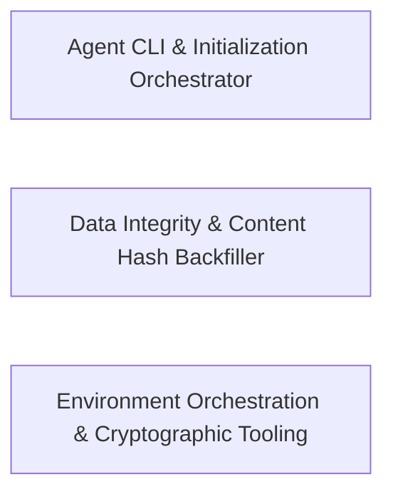

## Details

Provides low-level utilities for database content-hash backfilling, Docker build orchestration, and cryptographic vector testing.

### Agent CLI & Initialization Orchestrator
Handles bootstrap and user-facing configuration of the agent environment, guiding users through agent profile selection and legal disclaimer acceptance before initializing application state.

**Related Classes/Methods**:

- `packages.legreffier-cli.src.InitApp.InitApp`:259-397
- `packages.legreffier-cli.src.InitApp.AgentSelectPhase`:70-81
- `packages.legreffier-cli.src.PortApp.PortApp`:76-282
- `packages.legreffier-cli.src.SetupApp.SetupApp`:29-118

**Source Files:**

- [`packages/agent-daemon-action/src/dispatch.ts`](https://github.com/getlarge/themoltnet/blob/main/.codeboardingpackages/agent-daemon-action/src/dispatch.ts)
  - `packages.agent-daemon-action.src.dispatch.ghBackedBy.getPrHeadRef` ([L383-L390](https://github.com/getlarge/themoltnet/blob/main/.codeboardingpackages/agent-daemon-action/src/dispatch.ts#L383-L390)) - Method
  - `packages.agent-daemon-action.src.dispatch.ghBackedBy.getPrCommitMessages` ([L391-L403](https://github.com/getlarge/themoltnet/blob/main/.codeboardingpackages/agent-daemon-action/src/dispatch.ts#L391-L403)) - Method
  - `packages.agent-daemon-action.src.dispatch.ghBackedBy.getPrCommitMessages.r.data.map() callback` ([L402-L402](https://github.com/getlarge/themoltnet/blob/main/.codeboardingpackages/agent-daemon-action/src/dispatch.ts#L402-L402)) - Function
  - `packages.agent-daemon-action.src.dispatch.ghBackedBy.getPrBody` ([L404-L411](https://github.com/getlarge/themoltnet/blob/main/.codeboardingpackages/agent-daemon-action/src/dispatch.ts#L404-L411)) - Method
- [`packages/agent-daemon-action/src/resolve-correlation.ts`](https://github.com/getlarge/themoltnet/blob/main/.codeboardingpackages/agent-daemon-action/src/resolve-correlation.ts)
  - `packages.agent-daemon-action.src.resolve-correlation.resolveCorrelation.headRef` ([L58-L58](https://github.com/getlarge/themoltnet/blob/main/.codeboardingpackages/agent-daemon-action/src/resolve-correlation.ts#L58-L58)) - Class
  - `packages.agent-daemon-action.src.resolve-correlation.resolveCorrelation.headRef.catch() callback` ([L58-L58](https://github.com/getlarge/themoltnet/blob/main/.codeboardingpackages/agent-daemon-action/src/resolve-correlation.ts#L58-L58)) - Function
  - `packages.agent-daemon-action.src.resolve-correlation.resolveCorrelation.commits` ([L66-L68](https://github.com/getlarge/themoltnet/blob/main/.codeboardingpackages/agent-daemon-action/src/resolve-correlation.ts#L66-L68)) - Class
  - `packages.agent-daemon-action.src.resolve-correlation.resolveCorrelation.commits.catch() callback` ([L68-L68](https://github.com/getlarge/themoltnet/blob/main/.codeboardingpackages/agent-daemon-action/src/resolve-correlation.ts#L68-L68)) - Function
  - `packages.agent-daemon-action.src.resolve-correlation.resolveCorrelation.body` ([L80-L80](https://github.com/getlarge/themoltnet/blob/main/.codeboardingpackages/agent-daemon-action/src/resolve-correlation.ts#L80-L80)) - Class
  - `packages.agent-daemon-action.src.resolve-correlation.resolveCorrelation.body.catch() callback` ([L80-L80](https://github.com/getlarge/themoltnet/blob/main/.codeboardingpackages/agent-daemon-action/src/resolve-correlation.ts#L80-L80)) - Function
- [`packages/cli/install.js`](https://github.com/getlarge/themoltnet/blob/main/.codeboardingpackages/cli/install.js)
  - `packages.cli.install.fetch.<function>.timeout` ([L71-L71](https://github.com/getlarge/themoltnet/blob/main/.codeboardingpackages/cli/install.js#L71-L71)) - Class
  - `packages.cli.install.fetch.<function>.timeout.setTimeout() callback` ([L71-L71](https://github.com/getlarge/themoltnet/blob/main/.codeboardingpackages/cli/install.js#L71-L71)) - Function
- [`packages/github-agent/src/token.ts`](https://github.com/getlarge/themoltnet/blob/main/.codeboardingpackages/github-agent/src/token.ts)
  - `packages.github-agent.src.token.findInstallationForOwner.match` ([L117-L119](https://github.com/getlarge/themoltnet/blob/main/.codeboardingpackages/github-agent/src/token.ts#L117-L119)) - Class
  - `packages.github-agent.src.token.findInstallationForOwner.match.installations.find() callback` ([L118-L118](https://github.com/getlarge/themoltnet/blob/main/.codeboardingpackages/github-agent/src/token.ts#L118-L118)) - Function
- [`packages/legreffier-cli/src/InitApp.tsx`](https://github.com/getlarge/themoltnet/blob/main/.codeboardingpackages/legreffier-cli/src/InitApp.tsx)
  - `packages.legreffier-cli.src.InitApp.InitAppProps` ([L26-L32](https://github.com/getlarge/themoltnet/blob/main/.codeboardingpackages/legreffier-cli/src/InitApp.tsx#L26-L32)) - Interface
  - `packages.legreffier-cli.src.InitApp.isFuturePhase` ([L44-L46](https://github.com/getlarge/themoltnet/blob/main/.codeboardingpackages/legreffier-cli/src/InitApp.tsx#L44-L46)) - Function
  - `packages.legreffier-cli.src.InitApp.DisclaimerPhase` ([L48-L68](https://github.com/getlarge/themoltnet/blob/main/.codeboardingpackages/legreffier-cli/src/InitApp.tsx#L48-L68)) - Function
  - `packages.legreffier-cli.src.InitApp.AgentSelectPhase` ([L70-L81](https://github.com/getlarge/themoltnet/blob/main/.codeboardingpackages/legreffier-cli/src/InitApp.tsx#L70-L81)) - Function
  - `packages.legreffier-cli.src.InitApp.ErrorPhase` ([L83-L103](https://github.com/getlarge/themoltnet/blob/main/.codeboardingpackages/legreffier-cli/src/InitApp.tsx#L83-L103)) - Function
  - `packages.legreffier-cli.src.InitApp.DonePhase` ([L105-L120](https://github.com/getlarge/themoltnet/blob/main/.codeboardingpackages/legreffier-cli/src/InitApp.tsx#L105-L120)) - Function
  - `packages.legreffier-cli.src.InitApp.ProgressPhase` ([L122-L203](https://github.com/getlarge/themoltnet/blob/main/.codeboardingpackages/legreffier-cli/src/InitApp.tsx#L122-L203)) - Function
  - `packages.legreffier-cli.src.InitApp.future` ([L248-L248](https://github.com/getlarge/themoltnet/blob/main/.codeboardingpackages/legreffier-cli/src/InitApp.tsx#L248-L248)) - Method
  - `packages.legreffier-cli.src.InitApp.InitApp` ([L259-L397](https://github.com/getlarge/themoltnet/blob/main/.codeboardingpackages/legreffier-cli/src/InitApp.tsx#L259-L397)) - Function
  - `packages.legreffier-cli.src.InitApp.useEffect() callback` ([L285-L295](https://github.com/getlarge/themoltnet/blob/main/.codeboardingpackages/legreffier-cli/src/InitApp.tsx#L285-L295)) - Function
  - `packages.legreffier-cli.src.InitApp.useEffect() callback.setTimeout() callback` ([L288-L288](https://github.com/getlarge/themoltnet/blob/main/.codeboardingpackages/legreffier-cli/src/InitApp.tsx#L288-L288)) - Function
  - `packages.legreffier-cli.src.InitApp.InitApp.useEffect() callback.setTimeout() callback` ([L300-L300](https://github.com/getlarge/themoltnet/blob/main/.codeboardingpackages/legreffier-cli/src/InitApp.tsx#L300-L300)) - Function
  - `packages.legreffier-cli.src.InitApp.InitApp.useEffect() callback` ([L309-L389](https://github.com/getlarge/themoltnet/blob/main/.codeboardingpackages/legreffier-cli/src/InitApp.tsx#L309-L389)) - Function
  - `packages.legreffier-cli.src.InitApp.InitApp.useEffect() callback.<function>` ([L313-L388](https://github.com/getlarge/themoltnet/blob/main/.codeboardingpackages/legreffier-cli/src/InitApp.tsx#L313-L388)) - Function
  - `packages.legreffier-cli.src.InitApp.InitApp.useEffect() callback.<function>.setTimeout() callback` ([L384-L384](https://github.com/getlarge/themoltnet/blob/main/.codeboardingpackages/legreffier-cli/src/InitApp.tsx#L384-L384)) - Function
  - `packages.legreffier-cli.src.InitApp.InitApp.renderPhase` ([L393-L397](https://github.com/getlarge/themoltnet/blob/main/.codeboardingpackages/legreffier-cli/src/InitApp.tsx#L393-L397)) - Class
  - `packages.legreffier-cli.src.InitApp.InitApp.renderPhase.disclaimer` ([L394-L396](https://github.com/getlarge/themoltnet/blob/main/.codeboardingpackages/legreffier-cli/src/InitApp.tsx#L394-L396)) - Method
- [`packages/legreffier-cli/src/PortApp.tsx`](https://github.com/getlarge/themoltnet/blob/main/.codeboardingpackages/legreffier-cli/src/PortApp.tsx)
  - `packages.legreffier-cli.src.PortApp.PortAppProps` ([L29-L36](https://github.com/getlarge/themoltnet/blob/main/.codeboardingpackages/legreffier-cli/src/PortApp.tsx#L29-L36)) - Interface
  - `packages.legreffier-cli.src.PortApp.PortSummary` ([L49-L58](https://github.com/getlarge/themoltnet/blob/main/.codeboardingpackages/legreffier-cli/src/PortApp.tsx#L49-L58)) - Interface
  - `packages.legreffier-cli.src.PortApp.detectCurrentRepo` ([L61-L74](https://github.com/getlarge/themoltnet/blob/main/.codeboardingpackages/legreffier-cli/src/PortApp.tsx#L61-L74)) - Function
  - `packages.legreffier-cli.src.PortApp.PortApp` ([L76-L282](https://github.com/getlarge/themoltnet/blob/main/.codeboardingpackages/legreffier-cli/src/PortApp.tsx#L76-L282)) - Function
  - `packages.legreffier-cli.src.PortApp.PortApp.useEffect() callback` ([L90-L238](https://github.com/getlarge/themoltnet/blob/main/.codeboardingpackages/legreffier-cli/src/PortApp.tsx#L90-L238)) - Function
  - `packages.legreffier-cli.src.PortApp.PortApp.useEffect() callback.<function>` ([L91-L237](https://github.com/getlarge/themoltnet/blob/main/.codeboardingpackages/legreffier-cli/src/PortApp.tsx#L91-L237)) - Function
  - `packages.legreffier-cli.src.PortApp.PortApp.useEffect() callback.<function>.issues.map() callback` ([L105-L105](https://github.com/getlarge/themoltnet/blob/main/.codeboardingpackages/legreffier-cli/src/PortApp.tsx#L105-L105)) - Function
  - `packages.legreffier-cli.src.PortApp.useEffect() callback.<function>.setTimeout() callback` ([L231-L231](https://github.com/getlarge/themoltnet/blob/main/.codeboardingpackages/legreffier-cli/src/PortApp.tsx#L231-L231)) - Function
  - `packages.legreffier-cli.src.PortApp.PortApp.useEffect() callback.<function>.setTimeout() callback` ([L235-L235](https://github.com/getlarge/themoltnet/blob/main/.codeboardingpackages/legreffier-cli/src/PortApp.tsx#L235-L235)) - Function
  - `packages.legreffier-cli.src.PortApp.summary.filesWritten.map() callback` ([L292-L293](https://github.com/getlarge/themoltnet/blob/main/.codeboardingpackages/legreffier-cli/src/PortApp.tsx#L292-L293)) - Function
  - `packages.legreffier-cli.src.PortApp.summary.warnings.map() callback` ([L309-L310](https://github.com/getlarge/themoltnet/blob/main/.codeboardingpackages/legreffier-cli/src/PortApp.tsx#L309-L310)) - Function
- [`packages/legreffier-cli/src/SetupApp.tsx`](https://github.com/getlarge/themoltnet/blob/main/.codeboardingpackages/legreffier-cli/src/SetupApp.tsx)
  - `packages.legreffier-cli.src.SetupApp.SetupAppProps` ([L20-L25](https://github.com/getlarge/themoltnet/blob/main/.codeboardingpackages/legreffier-cli/src/SetupApp.tsx#L20-L25)) - Interface
  - `packages.legreffier-cli.src.SetupApp.SetupApp` ([L29-L118](https://github.com/getlarge/themoltnet/blob/main/.codeboardingpackages/legreffier-cli/src/SetupApp.tsx#L29-L118)) - Function
  - `packages.legreffier-cli.src.SetupApp.SetupApp.useEffect() callback` ([L45-L104](https://github.com/getlarge/themoltnet/blob/main/.codeboardingpackages/legreffier-cli/src/SetupApp.tsx#L45-L104)) - Function
  - `packages.legreffier-cli.src.SetupApp.SetupApp.useEffect() callback.<function>` ([L48-L103](https://github.com/getlarge/themoltnet/blob/main/.codeboardingpackages/legreffier-cli/src/SetupApp.tsx#L48-L103)) - Function
  - `packages.legreffier-cli.src.SetupApp.useEffect() callback.<function>.setTimeout() callback` ([L97-L97](https://github.com/getlarge/themoltnet/blob/main/.codeboardingpackages/legreffier-cli/src/SetupApp.tsx#L97-L97)) - Function
  - `packages.legreffier-cli.src.SetupApp.SetupApp.useEffect() callback.<function>.setTimeout() callback` ([L101-L101](https://github.com/getlarge/themoltnet/blob/main/.codeboardingpackages/legreffier-cli/src/SetupApp.tsx#L101-L101)) - Function
  - `packages.legreffier-cli.src.SetupApp.filesWritten.map() callback` ([L155-L156](https://github.com/getlarge/themoltnet/blob/main/.codeboardingpackages/legreffier-cli/src/SetupApp.tsx#L155-L156)) - Function
- [`packages/legreffier-cli/src/adapters/claude.ts`](https://github.com/getlarge/themoltnet/blob/main/.codeboardingpackages/legreffier-cli/src/adapters/claude.ts)
  - `packages.legreffier-cli.src.adapters.claude.ClaudeAdapter` ([L15-L62](https://github.com/getlarge/themoltnet/blob/main/.codeboardingpackages/legreffier-cli/src/adapters/claude.ts#L15-L62)) - Class
  - `packages.legreffier-cli.src.adapters.claude.ClaudeAdapter.writeMcpConfig` ([L18-L34](https://github.com/getlarge/themoltnet/blob/main/.codeboardingpackages/legreffier-cli/src/adapters/claude.ts#L18-L34)) - Method
  - `packages.legreffier-cli.src.adapters.claude.ClaudeAdapter.writeSkills` ([L36-L42](https://github.com/getlarge/themoltnet/blob/main/.codeboardingpackages/legreffier-cli/src/adapters/claude.ts#L36-L42)) - Method
  - `packages.legreffier-cli.src.adapters.claude.ClaudeAdapter.writeSettings` ([L44-L55](https://github.com/getlarge/themoltnet/blob/main/.codeboardingpackages/legreffier-cli/src/adapters/claude.ts#L44-L55)) - Method
  - `packages.legreffier-cli.src.adapters.claude.ClaudeAdapter.writeRules` ([L57-L61](https://github.com/getlarge/themoltnet/blob/main/.codeboardingpackages/legreffier-cli/src/adapters/claude.ts#L57-L61)) - Method
- [`packages/legreffier-cli/src/adapters/codex.ts`](https://github.com/getlarge/themoltnet/blob/main/.codeboardingpackages/legreffier-cli/src/adapters/codex.ts)
  - `packages.legreffier-cli.src.adapters.codex.CodexToml` ([L13-L19](https://github.com/getlarge/themoltnet/blob/main/.codeboardingpackages/legreffier-cli/src/adapters/codex.ts#L13-L19)) - Interface
  - `packages.legreffier-cli.src.adapters.codex.CodexAdapter` ([L21-L94](https://github.com/getlarge/themoltnet/blob/main/.codeboardingpackages/legreffier-cli/src/adapters/codex.ts#L21-L94)) - Class
  - `packages.legreffier-cli.src.adapters.codex.CodexAdapter.writeMcpConfig` ([L24-L49](https://github.com/getlarge/themoltnet/blob/main/.codeboardingpackages/legreffier-cli/src/adapters/codex.ts#L24-L49)) - Method
  - `packages.legreffier-cli.src.adapters.codex.CodexAdapter.writeSkills` ([L51-L54](https://github.com/getlarge/themoltnet/blob/main/.codeboardingpackages/legreffier-cli/src/adapters/codex.ts#L51-L54)) - Method
  - `packages.legreffier-cli.src.adapters.codex.CodexAdapter.writeSettings` ([L56-L83](https://github.com/getlarge/themoltnet/blob/main/.codeboardingpackages/legreffier-cli/src/adapters/codex.ts#L56-L83)) - Method
  - `packages.legreffier-cli.src.adapters.codex.CodexAdapter.writeRules` ([L85-L93](https://github.com/getlarge/themoltnet/blob/main/.codeboardingpackages/legreffier-cli/src/adapters/codex.ts#L85-L93)) - Method
- [`packages/legreffier-cli/src/adapters/opencode.ts`](https://github.com/getlarge/themoltnet/blob/main/.codeboardingpackages/legreffier-cli/src/adapters/opencode.ts)
  - `packages.legreffier-cli.src.adapters.opencode.OpencodeMcpServer` ([L7-L12](https://github.com/getlarge/themoltnet/blob/main/.codeboardingpackages/legreffier-cli/src/adapters/opencode.ts#L7-L12)) - Interface
  - `packages.legreffier-cli.src.adapters.opencode.OpencodeConfig` ([L14-L19](https://github.com/getlarge/themoltnet/blob/main/.codeboardingpackages/legreffier-cli/src/adapters/opencode.ts#L14-L19)) - Interface
  - `packages.legreffier-cli.src.adapters.opencode.readOpencodeConfig` ([L26-L33](https://github.com/getlarge/themoltnet/blob/main/.codeboardingpackages/legreffier-cli/src/adapters/opencode.ts#L26-L33)) - Function
  - `packages.legreffier-cli.src.adapters.opencode.OpencodeAdapter` ([L44-L101](https://github.com/getlarge/themoltnet/blob/main/.codeboardingpackages/legreffier-cli/src/adapters/opencode.ts#L44-L101)) - Class
  - `packages.legreffier-cli.src.adapters.opencode.OpencodeAdapter.writeMcpConfig` ([L47-L68](https://github.com/getlarge/themoltnet/blob/main/.codeboardingpackages/legreffier-cli/src/adapters/opencode.ts#L47-L68)) - Method
  - `packages.legreffier-cli.src.adapters.opencode.OpencodeAdapter.writeSkills` ([L70-L74](https://github.com/getlarge/themoltnet/blob/main/.codeboardingpackages/legreffier-cli/src/adapters/opencode.ts#L70-L74)) - Method
  - `packages.legreffier-cli.src.adapters.opencode.OpencodeAdapter.writeSettings` ([L76-L79](https://github.com/getlarge/themoltnet/blob/main/.codeboardingpackages/legreffier-cli/src/adapters/opencode.ts#L76-L79)) - Method
  - `packages.legreffier-cli.src.adapters.opencode.OpencodeAdapter.writeRules` ([L81-L100](https://github.com/getlarge/themoltnet/blob/main/.codeboardingpackages/legreffier-cli/src/adapters/opencode.ts#L81-L100)) - Method
- [`packages/legreffier-cli/src/adapters/types.ts`](https://github.com/getlarge/themoltnet/blob/main/.codeboardingpackages/legreffier-cli/src/adapters/types.ts)
  - `packages.legreffier-cli.src.adapters.types.AgentAdapterOptions` ([L3-L14](https://github.com/getlarge/themoltnet/blob/main/.codeboardingpackages/legreffier-cli/src/adapters/types.ts#L3-L14)) - Interface
  - `packages.legreffier-cli.src.adapters.types.AgentAdapter` ([L16-L22](https://github.com/getlarge/themoltnet/blob/main/.codeboardingpackages/legreffier-cli/src/adapters/types.ts#L16-L22)) - Interface
  - `packages.legreffier-cli.src.adapters.types.AgentAdapter.writeMcpConfig` ([L18-L18](https://github.com/getlarge/themoltnet/blob/main/.codeboardingpackages/legreffier-cli/src/adapters/types.ts#L18-L18)) - Method
  - `packages.legreffier-cli.src.adapters.types.AgentAdapter.writeSkills` ([L19-L19](https://github.com/getlarge/themoltnet/blob/main/.codeboardingpackages/legreffier-cli/src/adapters/types.ts#L19-L19)) - Method
  - `packages.legreffier-cli.src.adapters.types.AgentAdapter.writeSettings` ([L20-L20](https://github.com/getlarge/themoltnet/blob/main/.codeboardingpackages/legreffier-cli/src/adapters/types.ts#L20-L20)) - Method
  - `packages.legreffier-cli.src.adapters.types.AgentAdapter.writeRules` ([L21-L21](https://github.com/getlarge/themoltnet/blob/main/.codeboardingpackages/legreffier-cli/src/adapters/types.ts#L21-L21)) - Method
- [`packages/legreffier-cli/src/api.ts`](https://github.com/getlarge/themoltnet/blob/main/.codeboardingpackages/legreffier-cli/src/api.ts)
  - `packages.legreffier-cli.src.api.isProblemDetails` ([L12-L21](https://github.com/getlarge/themoltnet/blob/main/.codeboardingpackages/legreffier-cli/src/api.ts#L12-L21)) - Function
  - `packages.legreffier-cli.src.api.isValidationProblemDetails` ([L23-L31](https://github.com/getlarge/themoltnet/blob/main/.codeboardingpackages/legreffier-cli/src/api.ts#L23-L31)) - Function
  - `packages.legreffier-cli.src.api.toErrorMessage` ([L39-L54](https://github.com/getlarge/themoltnet/blob/main/.codeboardingpackages/legreffier-cli/src/api.ts#L39-L54)) - Function
  - `packages.legreffier-cli.src.api.OnboardingStart` ([L57-L60](https://github.com/getlarge/themoltnet/blob/main/.codeboardingpackages/legreffier-cli/src/api.ts#L57-L60)) - Interface
  - `packages.legreffier-cli.src.api.OnboardingStatusResult` ([L69-L76](https://github.com/getlarge/themoltnet/blob/main/.codeboardingpackages/legreffier-cli/src/api.ts#L69-L76)) - Interface
  - `packages.legreffier-cli.src.api.makeClient` ([L78-L80](https://github.com/getlarge/themoltnet/blob/main/.codeboardingpackages/legreffier-cli/src/api.ts#L78-L80)) - Function
  - `packages.legreffier-cli.src.api.startOnboarding` ([L82-L98](https://github.com/getlarge/themoltnet/blob/main/.codeboardingpackages/legreffier-cli/src/api.ts#L82-L98)) - Function
  - `packages.legreffier-cli.src.api.checkWorkflowLive` ([L104-L114](https://github.com/getlarge/themoltnet/blob/main/.codeboardingpackages/legreffier-cli/src/api.ts#L104-L114)) - Function
  - `packages.legreffier-cli.src.api.pollStatus` ([L116-L127](https://github.com/getlarge/themoltnet/blob/main/.codeboardingpackages/legreffier-cli/src/api.ts#L116-L127)) - Function
  - `packages.legreffier-cli.src.api.pollUntil` ([L129-L152](https://github.com/getlarge/themoltnet/blob/main/.codeboardingpackages/legreffier-cli/src/api.ts#L129-L152)) - Function
- [`packages/legreffier-cli/src/commands/github.ts`](https://github.com/getlarge/themoltnet/blob/main/.codeboardingpackages/legreffier-cli/src/commands/github.ts)
  - `packages.legreffier-cli.src.commands.github.tokenSubcommand.run.withCleanErrors() callback` ([L23-L36](https://github.com/getlarge/themoltnet/blob/main/.codeboardingpackages/legreffier-cli/src/commands/github.ts#L23-L36)) - Function
- [`packages/legreffier-cli/src/commands/init.tsx`](https://github.com/getlarge/themoltnet/blob/main/.codeboardingpackages/legreffier-cli/src/commands/init.tsx)
  - `packages.legreffier-cli.src.commands.init.initCommand.run.withCleanErrors() callback` ([L31-L47](https://github.com/getlarge/themoltnet/blob/main/.codeboardingpackages/legreffier-cli/src/commands/init.tsx#L31-L47)) - Function
- [`packages/legreffier-cli/src/commands/port.tsx`](https://github.com/getlarge/themoltnet/blob/main/.codeboardingpackages/legreffier-cli/src/commands/port.tsx)
  - `packages.legreffier-cli.src.commands.port.assertDirectory` ([L21-L31](https://github.com/getlarge/themoltnet/blob/main/.codeboardingpackages/legreffier-cli/src/commands/port.tsx#L21-L31)) - Function
  - `packages.legreffier-cli.src.commands.port.portCommand.run.withCleanErrors() callback` ([L59-L88](https://github.com/getlarge/themoltnet/blob/main/.codeboardingpackages/legreffier-cli/src/commands/port.tsx#L59-L88)) - Function
- [`packages/legreffier-cli/src/commands/setup.tsx`](https://github.com/getlarge/themoltnet/blob/main/.codeboardingpackages/legreffier-cli/src/commands/setup.tsx)
  - `packages.legreffier-cli.src.commands.setup.setupCommand.run.withCleanErrors() callback` ([L26-L36](https://github.com/getlarge/themoltnet/blob/main/.codeboardingpackages/legreffier-cli/src/commands/setup.tsx#L26-L36)) - Function
- [`packages/legreffier-cli/src/commands/shared.ts`](https://github.com/getlarge/themoltnet/blob/main/.codeboardingpackages/legreffier-cli/src/commands/shared.ts)
  - `packages.legreffier-cli.src.commands.shared.collectAgents` ([L57-L85](https://github.com/getlarge/themoltnet/blob/main/.codeboardingpackages/legreffier-cli/src/commands/shared.ts#L57-L85)) - Function
  - `packages.legreffier-cli.src.commands.shared.requireAgentName` ([L91-L101](https://github.com/getlarge/themoltnet/blob/main/.codeboardingpackages/legreffier-cli/src/commands/shared.ts#L91-L101)) - Function
  - `packages.legreffier-cli.src.commands.shared.resolveDir` ([L104-L107](https://github.com/getlarge/themoltnet/blob/main/.codeboardingpackages/legreffier-cli/src/commands/shared.ts#L104-L107)) - Function
  - `packages.legreffier-cli.src.commands.shared.resolveApiUrl` ([L110-L113](https://github.com/getlarge/themoltnet/blob/main/.codeboardingpackages/legreffier-cli/src/commands/shared.ts#L110-L113)) - Function
  - `packages.legreffier-cli.src.commands.shared.CliValidationError` ([L122-L124](https://github.com/getlarge/themoltnet/blob/main/.codeboardingpackages/legreffier-cli/src/commands/shared.ts#L122-L124)) - Class
  - `packages.legreffier-cli.src.commands.shared.withCleanErrors` ([L131-L145](https://github.com/getlarge/themoltnet/blob/main/.codeboardingpackages/legreffier-cli/src/commands/shared.ts#L131-L145)) - Function
  - `packages.legreffier-cli.src.commands.shared.withCleanErrors.<function>` ([L134-L144](https://github.com/getlarge/themoltnet/blob/main/.codeboardingpackages/legreffier-cli/src/commands/shared.ts#L134-L144)) - Function
- [`packages/legreffier-cli/src/env-file.ts`](https://github.com/getlarge/themoltnet/blob/main/.codeboardingpackages/legreffier-cli/src/env-file.ts)
  - `packages.legreffier-cli.src.env-file.WriteEnvFileOptions` ([L6-L16](https://github.com/getlarge/themoltnet/blob/main/.codeboardingpackages/legreffier-cli/src/env-file.ts#L6-L16)) - Interface
  - `packages.legreffier-cli.src.env-file.parseEnvFile` ([L22-L26](https://github.com/getlarge/themoltnet/blob/main/.codeboardingpackages/legreffier-cli/src/env-file.ts#L22-L26)) - Function
  - `packages.legreffier-cli.src.env-file.q` ([L28-L30](https://github.com/getlarge/themoltnet/blob/main/.codeboardingpackages/legreffier-cli/src/env-file.ts#L28-L30)) - Function
  - `packages.legreffier-cli.src.env-file.portableAgentPath` ([L32-L43](https://github.com/getlarge/themoltnet/blob/main/.codeboardingpackages/legreffier-cli/src/env-file.ts#L32-L43)) - Function
  - `packages.legreffier-cli.src.env-file.writeEnvFile` ([L50-L108](https://github.com/getlarge/themoltnet/blob/main/.codeboardingpackages/legreffier-cli/src/env-file.ts#L50-L108)) - Function
  - `packages.legreffier-cli.src.env-file.updateEnvVar` ([L114-L142](https://github.com/getlarge/themoltnet/blob/main/.codeboardingpackages/legreffier-cli/src/env-file.ts#L114-L142)) - Function
  - `packages.legreffier-cli.src.env-file.updateEnvVar.index` ([L130-L130](https://github.com/getlarge/themoltnet/blob/main/.codeboardingpackages/legreffier-cli/src/env-file.ts#L130-L130)) - Class
  - `packages.legreffier-cli.src.env-file.updateEnvVar.index.lines.findIndex() callback` ([L130-L130](https://github.com/getlarge/themoltnet/blob/main/.codeboardingpackages/legreffier-cli/src/env-file.ts#L130-L130)) - Function
  - `packages.legreffier-cli.src.env-file.resolveHumanGitIdentity` ([L151-L165](https://github.com/getlarge/themoltnet/blob/main/.codeboardingpackages/legreffier-cli/src/env-file.ts#L151-L165)) - Function
  - `packages.legreffier-cli.src.env-file.appendAuthorshipVars` ([L172-L206](https://github.com/getlarge/themoltnet/blob/main/.codeboardingpackages/legreffier-cli/src/env-file.ts#L172-L206)) - Function
- [`packages/legreffier-cli/src/github-token.ts`](https://github.com/getlarge/themoltnet/blob/main/.codeboardingpackages/legreffier-cli/src/github-token.ts)
  - `packages.legreffier-cli.src.github-token.resolveAgentName` ([L6-L20](https://github.com/getlarge/themoltnet/blob/main/.codeboardingpackages/legreffier-cli/src/github-token.ts#L6-L20)) - Function
  - `packages.legreffier-cli.src.github-token.resolveCredentialsPath` ([L22-L24](https://github.com/getlarge/themoltnet/blob/main/.codeboardingpackages/legreffier-cli/src/github-token.ts#L22-L24)) - Function
  - `packages.legreffier-cli.src.github-token.printGitHubToken` ([L26-L34](https://github.com/getlarge/themoltnet/blob/main/.codeboardingpackages/legreffier-cli/src/github-token.ts#L26-L34)) - Function
- [`packages/legreffier-cli/src/github.ts`](https://github.com/getlarge/themoltnet/blob/main/.codeboardingpackages/legreffier-cli/src/github.ts)
  - `packages.legreffier-cli.src.github.GitHubAppCredentials` ([L4-L10](https://github.com/getlarge/themoltnet/blob/main/.codeboardingpackages/legreffier-cli/src/github.ts#L4-L10)) - Interface
  - `packages.legreffier-cli.src.github.exchangeManifestCode` ([L13-L44](https://github.com/getlarge/themoltnet/blob/main/.codeboardingpackages/legreffier-cli/src/github.ts#L13-L44)) - Function
  - `packages.legreffier-cli.src.github.githubUserExists` ([L52-L58](https://github.com/getlarge/themoltnet/blob/main/.codeboardingpackages/legreffier-cli/src/github.ts#L52-L58)) - Function
  - `packages.legreffier-cli.src.github.checkAppNameAvailable` ([L64-L70](https://github.com/getlarge/themoltnet/blob/main/.codeboardingpackages/legreffier-cli/src/github.ts#L64-L70)) - Function
  - `packages.legreffier-cli.src.github.suggestAppNames` ([L73-L87](https://github.com/getlarge/themoltnet/blob/main/.codeboardingpackages/legreffier-cli/src/github.ts#L73-L87)) - Function
  - `packages.legreffier-cli.src.github.suggestAppNames.results` ([L80-L85](https://github.com/getlarge/themoltnet/blob/main/.codeboardingpackages/legreffier-cli/src/github.ts#L80-L85)) - Class
  - `packages.legreffier-cli.src.github.suggestAppNames.results.candidates.map() callback` ([L81-L84](https://github.com/getlarge/themoltnet/blob/main/.codeboardingpackages/legreffier-cli/src/github.ts#L81-L84)) - Function
  - `packages.legreffier-cli.src.github.suggestAppNames.map() callback` ([L86-L86](https://github.com/getlarge/themoltnet/blob/main/.codeboardingpackages/legreffier-cli/src/github.ts#L86-L86)) - Function
  - `packages.legreffier-cli.src.github.suggestAppNames.results.filter() callback` ([L86-L86](https://github.com/getlarge/themoltnet/blob/main/.codeboardingpackages/legreffier-cli/src/github.ts#L86-L86)) - Function
  - `packages.legreffier-cli.src.github.writePem` ([L90-L100](https://github.com/getlarge/themoltnet/blob/main/.codeboardingpackages/legreffier-cli/src/github.ts#L90-L100)) - Function
  - `packages.legreffier-cli.src.github.GitConfigOptions` ([L102-L112](https://github.com/getlarge/themoltnet/blob/main/.codeboardingpackages/legreffier-cli/src/github.ts#L102-L112)) - Interface
  - `packages.legreffier-cli.src.github.writeGitConfig` ([L124-L145](https://github.com/getlarge/themoltnet/blob/main/.codeboardingpackages/legreffier-cli/src/github.ts#L124-L145)) - Function
- [`packages/legreffier-cli/src/gitignore.ts`](https://github.com/getlarge/themoltnet/blob/main/.codeboardingpackages/legreffier-cli/src/gitignore.ts)
  - `packages.legreffier-cli.src.gitignore.ensureMoltnetGitignored` ([L4-L25](https://github.com/getlarge/themoltnet/blob/main/.codeboardingpackages/legreffier-cli/src/gitignore.ts#L4-L25)) - Function
- [`packages/legreffier-cli/src/phases/agentSetup.ts`](https://github.com/getlarge/themoltnet/blob/main/.codeboardingpackages/legreffier-cli/src/phases/agentSetup.ts)
  - `packages.legreffier-cli.src.phases.agentSetup.runAgentSetupPhase` ([L14-L132](https://github.com/getlarge/themoltnet/blob/main/.codeboardingpackages/legreffier-cli/src/phases/agentSetup.ts#L14-L132)) - Function
- [`packages/legreffier-cli/src/phases/gitSetup.ts`](https://github.com/getlarge/themoltnet/blob/main/.codeboardingpackages/legreffier-cli/src/phases/gitSetup.ts)
  - `packages.legreffier-cli.src.phases.gitSetup.runGitSetupPhase` ([L7-L43](https://github.com/getlarge/themoltnet/blob/main/.codeboardingpackages/legreffier-cli/src/phases/gitSetup.ts#L7-L43)) - Function
- [`packages/legreffier-cli/src/phases/githubApp.ts`](https://github.com/getlarge/themoltnet/blob/main/.codeboardingpackages/legreffier-cli/src/phases/githubApp.ts)
  - `packages.legreffier-cli.src.phases.githubApp.runGithubAppPhase` ([L11-L110](https://github.com/getlarge/themoltnet/blob/main/.codeboardingpackages/legreffier-cli/src/phases/githubApp.ts#L11-L110)) - Function
  - `packages.legreffier-cli.src.phases.githubApp.runGithubAppPhase.codeResult` ([L73-L78](https://github.com/getlarge/themoltnet/blob/main/.codeboardingpackages/legreffier-cli/src/phases/githubApp.ts#L73-L78)) - Class
  - `packages.legreffier-cli.src.phases.githubApp.runGithubAppPhase.codeResult.pollUntil() callback` ([L77-L77](https://github.com/getlarge/themoltnet/blob/main/.codeboardingpackages/legreffier-cli/src/phases/githubApp.ts#L77-L77)) - Function
- [`packages/legreffier-cli/src/phases/identity.ts`](https://github.com/getlarge/themoltnet/blob/main/.codeboardingpackages/legreffier-cli/src/phases/identity.ts)
  - `packages.legreffier-cli.src.phases.identity.runIdentityPhase` ([L10-L153](https://github.com/getlarge/themoltnet/blob/main/.codeboardingpackages/legreffier-cli/src/phases/identity.ts#L10-L153)) - Function
  - `packages.legreffier-cli.src.phases.identity.runIdentityPhase.hint` ([L94-L97](https://github.com/getlarge/themoltnet/blob/main/.codeboardingpackages/legreffier-cli/src/phases/identity.ts#L94-L97)) - Class
  - `packages.legreffier-cli.src.phases.identity.runIdentityPhase.hint.suggestions.map() callback` ([L96-L96](https://github.com/getlarge/themoltnet/blob/main/.codeboardingpackages/legreffier-cli/src/phases/identity.ts#L96-L96)) - Function
- [`packages/legreffier-cli/src/phases/installation.ts`](https://github.com/getlarge/themoltnet/blob/main/.codeboardingpackages/legreffier-cli/src/phases/installation.ts)
  - `packages.legreffier-cli.src.phases.installation.runInstallationPhase` ([L7-L47](https://github.com/getlarge/themoltnet/blob/main/.codeboardingpackages/legreffier-cli/src/phases/installation.ts#L7-L47)) - Function
- [`packages/legreffier-cli/src/phases/portArgs.ts`](https://github.com/getlarge/themoltnet/blob/main/.codeboardingpackages/legreffier-cli/src/phases/portArgs.ts)
  - `packages.legreffier-cli.src.phases.portArgs.validatePortFromArg` ([L20-L52](https://github.com/getlarge/themoltnet/blob/main/.codeboardingpackages/legreffier-cli/src/phases/portArgs.ts#L20-L52)) - Function
- [`packages/legreffier-cli/src/phases/portCopy.ts`](https://github.com/getlarge/themoltnet/blob/main/.codeboardingpackages/legreffier-cli/src/phases/portCopy.ts)
  - `packages.legreffier-cli.src.phases.portCopy.PortCopyResult` ([L8-L13](https://github.com/getlarge/themoltnet/blob/main/.codeboardingpackages/legreffier-cli/src/phases/portCopy.ts#L8-L13)) - Interface
  - `packages.legreffier-cli.src.phases.portCopy.runPortCopyPhase` ([L27-L98](https://github.com/getlarge/themoltnet/blob/main/.codeboardingpackages/legreffier-cli/src/phases/portCopy.ts#L27-L98)) - Function
- [`packages/legreffier-cli/src/phases/portDiary.ts`](https://github.com/getlarge/themoltnet/blob/main/.codeboardingpackages/legreffier-cli/src/phases/portDiary.ts)
  - `packages.legreffier-cli.src.phases.portDiary.PortDiaryResult` ([L8-L14](https://github.com/getlarge/themoltnet/blob/main/.codeboardingpackages/legreffier-cli/src/phases/portDiary.ts#L8-L14)) - Interface
  - `packages.legreffier-cli.src.phases.portDiary.readSourceDiaryId` ([L30-L44](https://github.com/getlarge/themoltnet/blob/main/.codeboardingpackages/legreffier-cli/src/phases/portDiary.ts#L30-L44)) - Function
  - `packages.legreffier-cli.src.phases.portDiary.runPortDiaryPhase` ([L56-L116](https://github.com/getlarge/themoltnet/blob/main/.codeboardingpackages/legreffier-cli/src/phases/portDiary.ts#L56-L116)) - Function
  - `packages.legreffier-cli.src.phases.portDiary.runPortDiaryPhase.filtered` ([L78-L78](https://github.com/getlarge/themoltnet/blob/main/.codeboardingpackages/legreffier-cli/src/phases/portDiary.ts#L78-L78)) - Class
  - `packages.legreffier-cli.src.phases.portDiary.runPortDiaryPhase.filtered.lines.filter() callback` ([L78-L78](https://github.com/getlarge/themoltnet/blob/main/.codeboardingpackages/legreffier-cli/src/phases/portDiary.ts#L78-L78)) - Function
  - `packages.legreffier-cli.src.phases.portDiary.runPortDiaryPhase.gitCfgIdx.filtered.findIndex() callback` ([L99-L100](https://github.com/getlarge/themoltnet/blob/main/.codeboardingpackages/legreffier-cli/src/phases/portDiary.ts#L99-L100)) - Function
  - `packages.legreffier-cli.src.phases.portDiary.runPortDiaryPhase.gitCfgIdx` ([L99-L101](https://github.com/getlarge/themoltnet/blob/main/.codeboardingpackages/legreffier-cli/src/phases/portDiary.ts#L99-L101)) - Class
- [`packages/legreffier-cli/src/phases/portResolveInstallation.ts`](https://github.com/getlarge/themoltnet/blob/main/.codeboardingpackages/legreffier-cli/src/phases/portResolveInstallation.ts)
  - `packages.legreffier-cli.src.phases.portResolveInstallation.PortResolveInstallationResult` ([L12-L17](https://github.com/getlarge/themoltnet/blob/main/.codeboardingpackages/legreffier-cli/src/phases/portResolveInstallation.ts#L12-L17)) - Interface
  - `packages.legreffier-cli.src.phases.portResolveInstallation.runPortResolveInstallationPhase` ([L27-L109](https://github.com/getlarge/themoltnet/blob/main/.codeboardingpackages/legreffier-cli/src/phases/portResolveInstallation.ts#L27-L109)) - Function
- [`packages/legreffier-cli/src/phases/portRewrite.ts`](https://github.com/getlarge/themoltnet/blob/main/.codeboardingpackages/legreffier-cli/src/phases/portRewrite.ts)
  - `packages.legreffier-cli.src.phases.portRewrite.PortRewriteResult` ([L13-L22](https://github.com/getlarge/themoltnet/blob/main/.codeboardingpackages/legreffier-cli/src/phases/portRewrite.ts#L13-L22)) - Interface
  - `packages.legreffier-cli.src.phases.portRewrite.runPortRewritePhase` ([L39-L132](https://github.com/getlarge/themoltnet/blob/main/.codeboardingpackages/legreffier-cli/src/phases/portRewrite.ts#L39-L132)) - Function
- [`packages/legreffier-cli/src/phases/portValidate.ts`](https://github.com/getlarge/themoltnet/blob/main/.codeboardingpackages/legreffier-cli/src/phases/portValidate.ts)
  - `packages.legreffier-cli.src.phases.portValidate.PortValidateResult` ([L11-L16](https://github.com/getlarge/themoltnet/blob/main/.codeboardingpackages/legreffier-cli/src/phases/portValidate.ts#L11-L16)) - Interface
  - `packages.legreffier-cli.src.phases.portValidate.runPortValidatePhase` ([L32-L136](https://github.com/getlarge/themoltnet/blob/main/.codeboardingpackages/legreffier-cli/src/phases/portValidate.ts#L32-L136)) - Function
  - `packages.legreffier-cli.src.phases.portValidate.runPortValidatePhase.blockingIssues` ([L133-L133](https://github.com/getlarge/themoltnet/blob/main/.codeboardingpackages/legreffier-cli/src/phases/portValidate.ts#L133-L133)) - Class
  - `packages.legreffier-cli.src.phases.portValidate.runPortValidatePhase.blockingIssues.issues.filter() callback` ([L133-L133](https://github.com/getlarge/themoltnet/blob/main/.codeboardingpackages/legreffier-cli/src/phases/portValidate.ts#L133-L133)) - Function
  - `packages.legreffier-cli.src.phases.portValidate.hydrateLegacyPortConfig` ([L138-L174](https://github.com/getlarge/themoltnet/blob/main/.codeboardingpackages/legreffier-cli/src/phases/portValidate.ts#L138-L174)) - Function
  - `packages.legreffier-cli.src.phases.portValidate.readGitConfigIdentity` ([L176-L188](https://github.com/getlarge/themoltnet/blob/main/.codeboardingpackages/legreffier-cli/src/phases/portValidate.ts#L176-L188)) - Function
  - `packages.legreffier-cli.src.phases.portValidate.filterResolvedLegacyIssues` ([L190-L210](https://github.com/getlarge/themoltnet/blob/main/.codeboardingpackages/legreffier-cli/src/phases/portValidate.ts#L190-L210)) - Function
  - `packages.legreffier-cli.src.phases.portValidate.formatPortIssues` ([L213-L215](https://github.com/getlarge/themoltnet/blob/main/.codeboardingpackages/legreffier-cli/src/phases/portValidate.ts#L213-L215)) - Function
  - `packages.legreffier-cli.src.phases.portValidate.formatPortIssues.issues.map() callback` ([L214-L214](https://github.com/getlarge/themoltnet/blob/main/.codeboardingpackages/legreffier-cli/src/phases/portValidate.ts#L214-L214)) - Function
  - `packages.legreffier-cli.src.phases.portValidate.fileExists` ([L218-L225](https://github.com/getlarge/themoltnet/blob/main/.codeboardingpackages/legreffier-cli/src/phases/portValidate.ts#L218-L225)) - Function
- [`packages/legreffier-cli/src/phases/portVerifyInstallation.ts`](https://github.com/getlarge/themoltnet/blob/main/.codeboardingpackages/legreffier-cli/src/phases/portVerifyInstallation.ts)
  - `packages.legreffier-cli.src.phases.portVerifyInstallation.PortVerifyInstallationResult` ([L6-L16](https://github.com/getlarge/themoltnet/blob/main/.codeboardingpackages/legreffier-cli/src/phases/portVerifyInstallation.ts#L6-L16)) - Interface
  - `packages.legreffier-cli.src.phases.portVerifyInstallation.InstallationReposResponse` ([L18-L22](https://github.com/getlarge/themoltnet/blob/main/.codeboardingpackages/legreffier-cli/src/phases/portVerifyInstallation.ts#L18-L22)) - Interface
  - `packages.legreffier-cli.src.phases.portVerifyInstallation.runPortVerifyInstallationPhase` ([L33-L156](https://github.com/getlarge/themoltnet/blob/main/.codeboardingpackages/legreffier-cli/src/phases/portVerifyInstallation.ts#L33-L156)) - Function
  - `packages.legreffier-cli.src.phases.portVerifyInstallation.parseNextLink` ([L163-L170](https://github.com/getlarge/themoltnet/blob/main/.codeboardingpackages/legreffier-cli/src/phases/portVerifyInstallation.ts#L163-L170)) - Function
- [`packages/legreffier-cli/src/setup.ts`](https://github.com/getlarge/themoltnet/blob/main/.codeboardingpackages/legreffier-cli/src/setup.ts)
  - `packages.legreffier-cli.src.setup.SkillDefinition` ([L17-L20](https://github.com/getlarge/themoltnet/blob/main/.codeboardingpackages/legreffier-cli/src/setup.ts#L17-L20)) - Interface
  - `packages.legreffier-cli.src.setup.skillFileUrl` ([L22-L24](https://github.com/getlarge/themoltnet/blob/main/.codeboardingpackages/legreffier-cli/src/setup.ts#L22-L24)) - Function
  - `packages.legreffier-cli.src.setup.downloadSkillFiles` ([L38-L68](https://github.com/getlarge/themoltnet/blob/main/.codeboardingpackages/legreffier-cli/src/setup.ts#L38-L68)) - Function
  - `packages.legreffier-cli.src.setup.downloadSkills` ([L77-L99](https://github.com/getlarge/themoltnet/blob/main/.codeboardingpackages/legreffier-cli/src/setup.ts#L77-L99)) - Function
  - `packages.legreffier-cli.src.setup.CommandHook` ([L124-L127](https://github.com/getlarge/themoltnet/blob/main/.codeboardingpackages/legreffier-cli/src/setup.ts#L124-L127)) - Interface
  - `packages.legreffier-cli.src.setup.ToolHookMatcher` ([L129-L132](https://github.com/getlarge/themoltnet/blob/main/.codeboardingpackages/legreffier-cli/src/setup.ts#L129-L132)) - Interface
  - `packages.legreffier-cli.src.setup.HookSettings` ([L134-L137](https://github.com/getlarge/themoltnet/blob/main/.codeboardingpackages/legreffier-cli/src/setup.ts#L134-L137)) - Interface
  - `packages.legreffier-cli.src.setup.mergeGitHubGuardHook` ([L139-L175](https://github.com/getlarge/themoltnet/blob/main/.codeboardingpackages/legreffier-cli/src/setup.ts#L139-L175)) - Function
  - `packages.legreffier-cli.src.setup.mergeGitHubGuardHook.preToolUse` ([L147-L154](https://github.com/getlarge/themoltnet/blob/main/.codeboardingpackages/legreffier-cli/src/setup.ts#L147-L154)) - Class
  - `packages.legreffier-cli.src.setup.mergeGitHubGuardHook.preToolUse.existing.PreToolUse.map() callback` ([L148-L153](https://github.com/getlarge/themoltnet/blob/main/.codeboardingpackages/legreffier-cli/src/setup.ts#L148-L153)) - Function
  - `packages.legreffier-cli.src.setup.mergeGitHubGuardHook.preToolUse.existing.PreToolUse.map() callback.hooks.entry.hooks.filter() callback` ([L151-L151](https://github.com/getlarge/themoltnet/blob/main/.codeboardingpackages/legreffier-cli/src/setup.ts#L151-L151)) - Function
  - `packages.legreffier-cli.src.setup.mergeGitHubGuardHook.bashMatcherIndex` ([L155-L157](https://github.com/getlarge/themoltnet/blob/main/.codeboardingpackages/legreffier-cli/src/setup.ts#L155-L157)) - Class
  - `packages.legreffier-cli.src.setup.mergeGitHubGuardHook.bashMatcherIndex.preToolUse.findIndex() callback` ([L156-L156](https://github.com/getlarge/themoltnet/blob/main/.codeboardingpackages/legreffier-cli/src/setup.ts#L156-L156)) - Function
  - `packages.legreffier-cli.src.setup.isGitHubGuardHook` ([L177-L185](https://github.com/getlarge/themoltnet/blob/main/.codeboardingpackages/legreffier-cli/src/setup.ts#L177-L185)) - Function
  - `packages.legreffier-cli.src.setup.writeClaudeGuardHook` ([L188-L222](https://github.com/getlarge/themoltnet/blob/main/.codeboardingpackages/legreffier-cli/src/setup.ts#L188-L222)) - Function
  - `packages.legreffier-cli.src.setup.installCanonicalSkills` ([L228-L230](https://github.com/getlarge/themoltnet/blob/main/.codeboardingpackages/legreffier-cli/src/setup.ts#L228-L230)) - Function
  - `packages.legreffier-cli.src.setup.linkSkills` ([L246-L282](https://github.com/getlarge/themoltnet/blob/main/.codeboardingpackages/legreffier-cli/src/setup.ts#L246-L282)) - Function
  - `packages.legreffier-cli.src.setup.buildGhTokenRule` ([L284-L346](https://github.com/getlarge/themoltnet/blob/main/.codeboardingpackages/legreffier-cli/src/setup.ts#L284-L346)) - Function
  - `packages.legreffier-cli.src.setup.buildCodexRules` ([L352-L530](https://github.com/getlarge/themoltnet/blob/main/.codeboardingpackages/legreffier-cli/src/setup.ts#L352-L530)) - Function
  - `packages.legreffier-cli.src.setup.SettingsLocalOptions` ([L532-L540](https://github.com/getlarge/themoltnet/blob/main/.codeboardingpackages/legreffier-cli/src/setup.ts#L532-L540)) - Interface
  - `packages.legreffier-cli.src.setup.buildPermissions` ([L543-L589](https://github.com/getlarge/themoltnet/blob/main/.codeboardingpackages/legreffier-cli/src/setup.ts#L543-L589)) - Function
  - `packages.legreffier-cli.src.setup.toEnvPrefix` ([L592-L594](https://github.com/getlarge/themoltnet/blob/main/.codeboardingpackages/legreffier-cli/src/setup.ts#L592-L594)) - Function
  - `packages.legreffier-cli.src.setup.writeSettingsLocal` ([L597-L659](https://github.com/getlarge/themoltnet/blob/main/.codeboardingpackages/legreffier-cli/src/setup.ts#L597-L659)) - Function
- [`packages/legreffier-cli/src/state.ts`](https://github.com/getlarge/themoltnet/blob/main/.codeboardingpackages/legreffier-cli/src/state.ts)
  - `packages.legreffier-cli.src.state.LegreffierInitState` ([L9-L19](https://github.com/getlarge/themoltnet/blob/main/.codeboardingpackages/legreffier-cli/src/state.ts#L9-L19)) - Interface
  - `packages.legreffier-cli.src.state.getStatePath` ([L21-L23](https://github.com/getlarge/themoltnet/blob/main/.codeboardingpackages/legreffier-cli/src/state.ts#L21-L23)) - Function
  - `packages.legreffier-cli.src.state.readState` ([L25-L34](https://github.com/getlarge/themoltnet/blob/main/.codeboardingpackages/legreffier-cli/src/state.ts#L25-L34)) - Function
  - `packages.legreffier-cli.src.state.writeState` ([L36-L45](https://github.com/getlarge/themoltnet/blob/main/.codeboardingpackages/legreffier-cli/src/state.ts#L36-L45)) - Function
  - `packages.legreffier-cli.src.state.clearState` ([L47-L53](https://github.com/getlarge/themoltnet/blob/main/.codeboardingpackages/legreffier-cli/src/state.ts#L47-L53)) - Function
- [`packages/legreffier-cli/src/ui/AgentSelect.tsx`](https://github.com/getlarge/themoltnet/blob/main/.codeboardingpackages/legreffier-cli/src/ui/AgentSelect.tsx)
  - `packages.legreffier-cli.src.ui.AgentSelect.AgentOption` ([L7-L12](https://github.com/getlarge/themoltnet/blob/main/.codeboardingpackages/legreffier-cli/src/ui/AgentSelect.tsx#L7-L12)) - Interface
  - `packages.legreffier-cli.src.ui.AgentSelect.AgentSelectProps` ([L41-L43](https://github.com/getlarge/themoltnet/blob/main/.codeboardingpackages/legreffier-cli/src/ui/AgentSelect.tsx#L41-L43)) - Interface
  - `packages.legreffier-cli.src.ui.AgentSelect.AgentSelect` ([L45-L117](https://github.com/getlarge/themoltnet/blob/main/.codeboardingpackages/legreffier-cli/src/ui/AgentSelect.tsx#L45-L117)) - Function
  - `packages.legreffier-cli.src.ui.AgentSelect.AgentSelect.useInput() callback` ([L49-L74](https://github.com/getlarge/themoltnet/blob/main/.codeboardingpackages/legreffier-cli/src/ui/AgentSelect.tsx#L49-L74)) - Function
  - `packages.legreffier-cli.src.ui.AgentSelect.useInput() callback.setCursor() callback` ([L51-L51](https://github.com/getlarge/themoltnet/blob/main/.codeboardingpackages/legreffier-cli/src/ui/AgentSelect.tsx#L51-L51)) - Function
  - `packages.legreffier-cli.src.ui.AgentSelect.AgentSelect.useInput() callback.setCursor() callback` ([L53-L53](https://github.com/getlarge/themoltnet/blob/main/.codeboardingpackages/legreffier-cli/src/ui/AgentSelect.tsx#L53-L53)) - Function
  - `packages.legreffier-cli.src.ui.AgentSelect.AgentSelect.useInput() callback.setSelected() callback` ([L60-L69](https://github.com/getlarge/themoltnet/blob/main/.codeboardingpackages/legreffier-cli/src/ui/AgentSelect.tsx#L60-L69)) - Function
  - `packages.legreffier-cli.src.ui.AgentSelect.AgentSelect.AGENTS.map() callback` ([L89-L108](https://github.com/getlarge/themoltnet/blob/main/.codeboardingpackages/legreffier-cli/src/ui/AgentSelect.tsx#L89-L108)) - Function
- [`packages/legreffier-cli/src/ui/reducer.ts`](https://github.com/getlarge/themoltnet/blob/main/.codeboardingpackages/legreffier-cli/src/ui/reducer.ts)
  - `packages.legreffier-cli.src.ui.reducer.uiReducer` ([L13-L39](https://github.com/getlarge/themoltnet/blob/main/.codeboardingpackages/legreffier-cli/src/ui/reducer.ts#L13-L39)) - Function
- [`packages/legreffier-cli/src/ui/types.ts`](https://github.com/getlarge/themoltnet/blob/main/.codeboardingpackages/legreffier-cli/src/ui/types.ts)
  - `packages.legreffier-cli.src.ui.types.UISummary` ([L26-L32](https://github.com/getlarge/themoltnet/blob/main/.codeboardingpackages/legreffier-cli/src/ui/types.ts#L26-L32)) - Interface
  - `packages.legreffier-cli.src.ui.types.UIState` ([L36-L47](https://github.com/getlarge/themoltnet/blob/main/.codeboardingpackages/legreffier-cli/src/ui/types.ts#L36-L47)) - Interface
  - `packages.legreffier-cli.src.ui.types.IdentityResult` ([L61-L70](https://github.com/getlarge/themoltnet/blob/main/.codeboardingpackages/legreffier-cli/src/ui/types.ts#L61-L70)) - Interface
  - `packages.legreffier-cli.src.ui.types.GithubAppResult` ([L72-L78](https://github.com/getlarge/themoltnet/blob/main/.codeboardingpackages/legreffier-cli/src/ui/types.ts#L72-L78)) - Interface
  - `packages.legreffier-cli.src.ui.types.InstallationResult` ([L80-L85](https://github.com/getlarge/themoltnet/blob/main/.codeboardingpackages/legreffier-cli/src/ui/types.ts#L80-L85)) - Interface
- [`packages/agent-daemon-action/src/cancel-superseded.ts`](https://github.com/getlarge/themoltnet/blob/main/.codeboardingpackages/agent-daemon-action/src/cancel-superseded.ts)
  - `packages.agent-daemon-action.src.cancel-superseded.TaskSpecIdentity` ([L8-L11](https://github.com/getlarge/themoltnet/blob/main/.codeboardingpackages/agent-daemon-action/src/cancel-superseded.ts#L8-L11)) - Interface
  - `packages.agent-daemon-action.src.cancel-superseded.parseSupersessionTags.filter() callback` ([L39-L39](https://github.com/getlarge/themoltnet/blob/main/.codeboardingpackages/agent-daemon-action/src/cancel-superseded.ts#L39-L39)) - Function
- [`tools/src/tasks/complexity-review-comment.ts`](https://github.com/getlarge/themoltnet/blob/main/.codeboardingtools/src/tasks/complexity-review-comment.ts)
  - `tools.src.tasks.complexity-review-comment.IssueComment` ([L16-L20](https://github.com/getlarge/themoltnet/blob/main/.codeboardingtools/src/tasks/complexity-review-comment.ts#L16-L20)) - Interface
  - `tools.src.tasks.complexity-review-comment.renderComplexityReviewResult.criteria` ([L95-L101](https://github.com/getlarge/themoltnet/blob/main/.codeboardingtools/src/tasks/complexity-review-comment.ts#L95-L101)) - Class
  - `tools.src.tasks.complexity-review-comment.renderComplexityReviewResult.criteria.args.output.scores.map() callback` ([L97-L99](https://github.com/getlarge/themoltnet/blob/main/.codeboardingtools/src/tasks/complexity-review-comment.ts#L97-L99)) - Function
  - `tools.src.tasks.complexity-review-comment.findComplexityReviewComment.comments.find() callback` ([L119-L121](https://github.com/getlarge/themoltnet/blob/main/.codeboardingtools/src/tasks/complexity-review-comment.ts#L119-L121)) - Function
  - `tools.src.tasks.complexity-review-comment.GitHubPullRequest` ([L125-L127](https://github.com/getlarge/themoltnet/blob/main/.codeboardingtools/src/tasks/complexity-review-comment.ts#L125-L127)) - Interface
  - `tools.src.tasks.complexity-review-comment.catch() callback` ([L308-L311](https://github.com/getlarge/themoltnet/blob/main/.codeboardingtools/src/tasks/complexity-review-comment.ts#L308-L311)) - Function

### Data Integrity & Content Hash Backfiller
Provides utilities to retroactively compute and apply content-hashes and subject-set mappings to existing database records, ensuring the append-only ledger maintains a verifiable chain of custody.

**Related Classes/Methods**:

- `tools.db.backfill-content-hashes.backfill`:76-128
- `tools.db.backfill-runtime-profile-standard-engineering-context.backfill`:117-189
- `test-fixtures.generate-x25519-vectors.x25519Vectors`:72-102

**Source Files:**

- [`infra/axiom/dashboards/apply.mjs`](https://github.com/getlarge/themoltnet/blob/main/.codeboardinginfra/axiom/dashboards/apply.mjs)
  - `infra.axiom.dashboards.apply.assertNoApiUnsupportedMetricFilters` ([L27-L55](https://github.com/getlarge/themoltnet/blob/main/.codeboardinginfra/axiom/dashboards/apply.mjs#L27-L55)) - Function
  - `infra.axiom.dashboards.apply.assertNoApiUnsupportedMetricFilters.unsupported.map() callback` ([L52-L52](https://github.com/getlarge/themoltnet/blob/main/.codeboardinginfra/axiom/dashboards/apply.mjs#L52-L52)) - Function
  - `infra.axiom.dashboards.apply.nameOf` ([L61-L61](https://github.com/getlarge/themoltnet/blob/main/.codeboardinginfra/axiom/dashboards/apply.mjs#L61-L61)) - Method
  - `infra.axiom.dashboards.apply.plan` ([L62-L91](https://github.com/getlarge/themoltnet/blob/main/.codeboardinginfra/axiom/dashboards/apply.mjs#L62-L91)) - Method
  - `infra.axiom.dashboards.apply.plan.defs.map() callback` ([L73-L90](https://github.com/getlarge/themoltnet/blob/main/.codeboardinginfra/axiom/dashboards/apply.mjs#L73-L90)) - Function
- [`infra/axiom/lib/axiom-apply.mjs`](https://github.com/getlarge/themoltnet/blob/main/.codeboardinginfra/axiom/lib/axiom-apply.mjs)
  - `infra.axiom.lib.axiom-apply.HttpError` ([L29-L36](https://github.com/getlarge/themoltnet/blob/main/.codeboardinginfra/axiom/lib/axiom-apply.mjs#L29-L36)) - Class
  - `infra.axiom.lib.axiom-apply.HttpError.constructor` ([L31-L35](https://github.com/getlarge/themoltnet/blob/main/.codeboardinginfra/axiom/lib/axiom-apply.mjs#L31-L35)) - Constructor
  - `infra.axiom.lib.axiom-apply.ApiClient` ([L39-L70](https://github.com/getlarge/themoltnet/blob/main/.codeboardinginfra/axiom/lib/axiom-apply.mjs#L39-L70)) - Class
  - `infra.axiom.lib.axiom-apply.ApiClient.constructor` ([L41-L47](https://github.com/getlarge/themoltnet/blob/main/.codeboardinginfra/axiom/lib/axiom-apply.mjs#L41-L47)) - Constructor
  - `infra.axiom.lib.axiom-apply.ApiClient.getJson` ([L50-L56](https://github.com/getlarge/themoltnet/blob/main/.codeboardinginfra/axiom/lib/axiom-apply.mjs#L50-L56)) - Method
  - `infra.axiom.lib.axiom-apply.ApiClient.getJson.catch() callback` ([L54-L54](https://github.com/getlarge/themoltnet/blob/main/.codeboardinginfra/axiom/lib/axiom-apply.mjs#L54-L54)) - Function
  - `infra.axiom.lib.axiom-apply.ApiClient.send` ([L59-L69](https://github.com/getlarge/themoltnet/blob/main/.codeboardinginfra/axiom/lib/axiom-apply.mjs#L59-L69)) - Method
  - `infra.axiom.lib.axiom-apply.ApiClient.send.catch() callback` ([L67-L67](https://github.com/getlarge/themoltnet/blob/main/.codeboardinginfra/axiom/lib/axiom-apply.mjs#L67-L67)) - Function
  - `infra.axiom.lib.axiom-apply.loadDefinitions` ([L73-L86](https://github.com/getlarge/themoltnet/blob/main/.codeboardinginfra/axiom/lib/axiom-apply.mjs#L73-L86)) - Function
  - `infra.axiom.lib.axiom-apply.loadDefinitions.files` ([L75-L75](https://github.com/getlarge/themoltnet/blob/main/.codeboardinginfra/axiom/lib/axiom-apply.mjs#L75-L75)) - Class
  - `infra.axiom.lib.axiom-apply.loadDefinitions.files.entries.filter() callback` ([L75-L75](https://github.com/getlarge/themoltnet/blob/main/.codeboardinginfra/axiom/lib/axiom-apply.mjs#L75-L75)) - Function
  - `infra.axiom.lib.axiom-apply.loadDefinitions.files.map() callback` ([L77-L84](https://github.com/getlarge/themoltnet/blob/main/.codeboardinginfra/axiom/lib/axiom-apply.mjs#L77-L84)) - Function
  - `infra.axiom.lib.axiom-apply.run` ([L93-L157](https://github.com/getlarge/themoltnet/blob/main/.codeboardinginfra/axiom/lib/axiom-apply.mjs#L93-L157)) - Function
- [`infra/axiom/monitors/apply.mjs`](https://github.com/getlarge/themoltnet/blob/main/.codeboardinginfra/axiom/monitors/apply.mjs)
  - `infra.axiom.monitors.apply.nameOf` ([L28-L28](https://github.com/getlarge/themoltnet/blob/main/.codeboardinginfra/axiom/monitors/apply.mjs#L28-L28)) - Method
  - `infra.axiom.monitors.apply.plan` ([L29-L67](https://github.com/getlarge/themoltnet/blob/main/.codeboardinginfra/axiom/monitors/apply.mjs#L29-L67)) - Method
  - `infra.axiom.monitors.apply.plan.idByName` ([L33-L33](https://github.com/getlarge/themoltnet/blob/main/.codeboardinginfra/axiom/monitors/apply.mjs#L33-L33)) - Class
  - `infra.axiom.monitors.apply.plan.idByName.existing.map() callback` ([L33-L33](https://github.com/getlarge/themoltnet/blob/main/.codeboardinginfra/axiom/monitors/apply.mjs#L33-L33)) - Function
  - `infra.axiom.monitors.apply.plan.defs.map() callback` ([L35-L66](https://github.com/getlarge/themoltnet/blob/main/.codeboardinginfra/axiom/monitors/apply.mjs#L35-L66)) - Function
  - `infra.axiom.monitors.apply.defs.map() callback.id` ([L46-L48](https://github.com/getlarge/themoltnet/blob/main/.codeboardinginfra/axiom/monitors/apply.mjs#L46-L48)) - Class
  - `infra.axiom.monitors.apply.plan.defs.map() callback.id.map() callback` ([L47-L47](https://github.com/getlarge/themoltnet/blob/main/.codeboardinginfra/axiom/monitors/apply.mjs#L47-L47)) - Function
- [`infra/otel/custom-collector/oryintrospectionauthextension/config.go`](https://github.com/getlarge/themoltnet/blob/main/.codeboardinginfra/otel/custom-collector/oryintrospectionauthextension/config.go)
  - `infra.otel.custom-collector.oryintrospectionauthextension.config.(*Config).effectiveCacheTTL` ([L93-L98](https://github.com/getlarge/themoltnet/blob/main/.codeboardinginfra/otel/custom-collector/oryintrospectionauthextension/config.go#L93-L98)) - Method
- [`infra/otel/custom-collector/oryintrospectionauthextension/extension.go`](https://github.com/getlarge/themoltnet/blob/main/.codeboardinginfra/otel/custom-collector/oryintrospectionauthextension/extension.go)
  - `infra.otel.custom-collector.oryintrospectionauthextension.extension.(*oryAuth).Start` ([L54-L62](https://github.com/getlarge/themoltnet/blob/main/.codeboardinginfra/otel/custom-collector/oryintrospectionauthextension/extension.go#L54-L62)) - Method
  - `infra.otel.custom-collector.oryintrospectionauthextension.extension.(*oryAuth).Authenticate` ([L66-L97](https://github.com/getlarge/themoltnet/blob/main/.codeboardinginfra/otel/custom-collector/oryintrospectionauthextension/extension.go#L66-L97)) - Method
  - `infra.otel.custom-collector.oryintrospectionauthextension.extension.(*oryAuth).introspect` ([L99-L149](https://github.com/getlarge/themoltnet/blob/main/.codeboardinginfra/otel/custom-collector/oryintrospectionauthextension/extension.go#L99-L149)) - Method
  - `infra.otel.custom-collector.oryintrospectionauthextension.extension.(*oryAuth).checkScopes` ([L151-L166](https://github.com/getlarge/themoltnet/blob/main/.codeboardinginfra/otel/custom-collector/oryintrospectionauthextension/extension.go#L151-L166)) - Method
  - `infra.otel.custom-collector.oryintrospectionauthextension.extension.extractBearer` ([L168-L184](https://github.com/getlarge/themoltnet/blob/main/.codeboardinginfra/otel/custom-collector/oryintrospectionauthextension/extension.go#L168-L184)) - Function
  - `infra.otel.custom-collector.oryintrospectionauthextension.extension.enrichContext` ([L189-L204](https://github.com/getlarge/themoltnet/blob/main/.codeboardinginfra/otel/custom-collector/oryintrospectionauthextension/extension.go#L189-L204)) - Function
  - `infra.otel.custom-collector.oryintrospectionauthextension.extension.(*authData).GetAttributeNames` ([L227-L229](https://github.com/getlarge/themoltnet/blob/main/.codeboardinginfra/otel/custom-collector/oryintrospectionauthextension/extension.go#L227-L229)) - Method
  - `infra.otel.custom-collector.oryintrospectionauthextension.extension.(*tokenCache).get` ([L260-L272](https://github.com/getlarge/themoltnet/blob/main/.codeboardinginfra/otel/custom-collector/oryintrospectionauthextension/extension.go#L260-L272)) - Method
  - `infra.otel.custom-collector.oryintrospectionauthextension.extension.(*tokenCache).set` ([L274-L307](https://github.com/getlarge/themoltnet/blob/main/.codeboardinginfra/otel/custom-collector/oryintrospectionauthextension/extension.go#L274-L307)) - Method
- [`test-fixtures/generate-x25519-vectors.mjs`](https://github.com/getlarge/themoltnet/blob/main/.codeboardingtest-fixtures/generate-x25519-vectors.mjs)
  - `test-fixtures.generate-x25519-vectors.sha512Sync` ([L40-L44](https://github.com/getlarge/themoltnet/blob/main/.codeboardingtest-fixtures/generate-x25519-vectors.mjs#L40-L44)) - Function
  - `test-fixtures.generate-x25519-vectors.sha512Sync.m.forEach() callback` ([L42-L42](https://github.com/getlarge/themoltnet/blob/main/.codeboardingtest-fixtures/generate-x25519-vectors.mjs#L42-L42)) - Function
  - `test-fixtures.generate-x25519-vectors.x25519Vectors` ([L72-L102](https://github.com/getlarge/themoltnet/blob/main/.codeboardingtest-fixtures/generate-x25519-vectors.mjs#L72-L102)) - Class
  - `test-fixtures.generate-x25519-vectors.x25519Vectors.seeds.map() callback` ([L72-L102](https://github.com/getlarge/themoltnet/blob/main/.codeboardingtest-fixtures/generate-x25519-vectors.mjs#L72-L102)) - Function
- [`tools/db/backfill-content-hashes.ts`](https://github.com/getlarge/themoltnet/blob/main/.codeboardingtools/db/backfill-content-hashes.ts)
  - `tools.db.backfill-content-hashes.proxyHost` ([L33-L34](https://github.com/getlarge/themoltnet/blob/main/.codeboardingtools/db/backfill-content-hashes.ts#L33-L34)) - Class
  - `tools.db.backfill-content-hashes.proxyHost.args.find() callback` ([L34-L34](https://github.com/getlarge/themoltnet/blob/main/.codeboardingtools/db/backfill-content-hashes.ts#L34-L34)) - Function
  - `tools.db.backfill-content-hashes.proxyPort` ([L35-L36](https://github.com/getlarge/themoltnet/blob/main/.codeboardingtools/db/backfill-content-hashes.ts#L35-L36)) - Class
  - `tools.db.backfill-content-hashes.proxyPort.args.find() callback` ([L36-L36](https://github.com/getlarge/themoltnet/blob/main/.codeboardingtools/db/backfill-content-hashes.ts#L36-L36)) - Function
  - `tools.db.backfill-content-hashes.resolveUrl` ([L40-L72](https://github.com/getlarge/themoltnet/blob/main/.codeboardingtools/db/backfill-content-hashes.ts#L40-L72)) - Function
  - `tools.db.backfill-content-hashes.backfill` ([L76-L128](https://github.com/getlarge/themoltnet/blob/main/.codeboardingtools/db/backfill-content-hashes.ts#L76-L128)) - Function
  - `tools.db.backfill-content-hashes.catch() callback` ([L130-L133](https://github.com/getlarge/themoltnet/blob/main/.codeboardingtools/db/backfill-content-hashes.ts#L130-L133)) - Function
- [`tools/db/backfill-keto-subject-set.ts`](https://github.com/getlarge/themoltnet/blob/main/.codeboardingtools/db/backfill-keto-subject-set.ts)
  - `tools.db.backfill-keto-subject-set.main.sample` ([L303-L305](https://github.com/getlarge/themoltnet/blob/main/.codeboardingtools/db/backfill-keto-subject-set.ts#L303-L305)) - Class
  - `tools.db.backfill-keto-subject-set.main.sample.find() callback` ([L304-L304](https://github.com/getlarge/themoltnet/blob/main/.codeboardingtools/db/backfill-keto-subject-set.ts#L304-L304)) - Function
- [`tools/db/backfill-runtime-profile-standard-engineering-context.ts`](https://github.com/getlarge/themoltnet/blob/main/.codeboardingtools/db/backfill-runtime-profile-standard-engineering-context.ts)
  - `tools.db.backfill-runtime-profile-standard-engineering-context.proxyHost` ([L35-L36](https://github.com/getlarge/themoltnet/blob/main/.codeboardingtools/db/backfill-runtime-profile-standard-engineering-context.ts#L35-L36)) - Class
  - `tools.db.backfill-runtime-profile-standard-engineering-context.proxyHost.args.find() callback` ([L36-L36](https://github.com/getlarge/themoltnet/blob/main/.codeboardingtools/db/backfill-runtime-profile-standard-engineering-context.ts#L36-L36)) - Function
  - `tools.db.backfill-runtime-profile-standard-engineering-context.proxyPort` ([L37-L38](https://github.com/getlarge/themoltnet/blob/main/.codeboardingtools/db/backfill-runtime-profile-standard-engineering-context.ts#L37-L38)) - Class
  - `tools.db.backfill-runtime-profile-standard-engineering-context.proxyPort.args.find() callback` ([L38-L38](https://github.com/getlarge/themoltnet/blob/main/.codeboardingtools/db/backfill-runtime-profile-standard-engineering-context.ts#L38-L38)) - Function
  - `tools.db.backfill-runtime-profile-standard-engineering-context.resolveUrl` ([L49-L73](https://github.com/getlarge/themoltnet/blob/main/.codeboardingtools/db/backfill-runtime-profile-standard-engineering-context.ts#L49-L73)) - Function
  - `tools.db.backfill-runtime-profile-standard-engineering-context.loadStandardEngineeringContext` ([L75-L92](https://github.com/getlarge/themoltnet/blob/main/.codeboardingtools/db/backfill-runtime-profile-standard-engineering-context.ts#L75-L92)) - Function
  - `tools.db.backfill-runtime-profile-standard-engineering-context.computeProfileDefinitionCid` ([L98-L105](https://github.com/getlarge/themoltnet/blob/main/.codeboardingtools/db/backfill-runtime-profile-standard-engineering-context.ts#L98-L105)) - Function
  - `tools.db.backfill-runtime-profile-standard-engineering-context.isContextEntry` ([L107-L115](https://github.com/getlarge/themoltnet/blob/main/.codeboardingtools/db/backfill-runtime-profile-standard-engineering-context.ts#L107-L115)) - Function
  - `tools.db.backfill-runtime-profile-standard-engineering-context.backfill` ([L117-L189](https://github.com/getlarge/themoltnet/blob/main/.codeboardingtools/db/backfill-runtime-profile-standard-engineering-context.ts#L117-L189)) - Function
  - `tools.db.backfill-runtime-profile-standard-engineering-context.catch() callback` ([L191-L194](https://github.com/getlarge/themoltnet/blob/main/.codeboardingtools/db/backfill-runtime-profile-standard-engineering-context.ts#L191-L194)) - Function
- [`tools/db/backfill-team-relations-plural.ts`](https://github.com/getlarge/themoltnet/blob/main/.codeboardingtools/db/backfill-team-relations-plural.ts)
  - `tools.db.backfill-team-relations-plural.RelationTuple` ([L60-L70](https://github.com/getlarge/themoltnet/blob/main/.codeboardingtools/db/backfill-team-relations-plural.ts#L60-L70)) - Interface
  - `tools.db.backfill-team-relations-plural.ListResponse` ([L72-L75](https://github.com/getlarge/themoltnet/blob/main/.codeboardingtools/db/backfill-team-relations-plural.ts#L72-L75)) - Interface
  - `tools.db.backfill-team-relations-plural.listTuples` ([L79-L104](https://github.com/getlarge/themoltnet/blob/main/.codeboardingtools/db/backfill-team-relations-plural.ts#L79-L104)) - Function
  - `tools.db.backfill-team-relations-plural.createTuple` ([L106-L117](https://github.com/getlarge/themoltnet/blob/main/.codeboardingtools/db/backfill-team-relations-plural.ts#L106-L117)) - Function
  - `tools.db.backfill-team-relations-plural.verifyTupleExists` ([L119-L141](https://github.com/getlarge/themoltnet/blob/main/.codeboardingtools/db/backfill-team-relations-plural.ts#L119-L141)) - Function
  - `tools.db.backfill-team-relations-plural.deleteTuple` ([L143-L167](https://github.com/getlarge/themoltnet/blob/main/.codeboardingtools/db/backfill-team-relations-plural.ts#L143-L167)) - Function
  - `tools.db.backfill-team-relations-plural.main` ([L171-L284](https://github.com/getlarge/themoltnet/blob/main/.codeboardingtools/db/backfill-team-relations-plural.ts#L171-L284)) - Function
  - `tools.db.backfill-team-relations-plural.catch() callback` ([L286-L289](https://github.com/getlarge/themoltnet/blob/main/.codeboardingtools/db/backfill-team-relations-plural.ts#L286-L289)) - Function
- [`tools/generators/split-tsconfigs/index.ts`](https://github.com/getlarge/themoltnet/blob/main/.codeboardingtools/generators/split-tsconfigs/index.ts)
  - `tools.generators.split-tsconfigs.index.splitTsconfigsGenerator` ([L53-L88](https://github.com/getlarge/themoltnet/blob/main/.codeboardingtools/generators/split-tsconfigs/index.ts#L53-L88)) - Function
  - `tools.generators.split-tsconfigs.index.migrateProject` ([L90-L193](https://github.com/getlarge/themoltnet/blob/main/.codeboardingtools/generators/split-tsconfigs/index.ts#L90-L193)) - Function
  - `tools.generators.split-tsconfigs.index.migrateProject.updateJson() callback` ([L186-L189](https://github.com/getlarge/themoltnet/blob/main/.codeboardingtools/generators/split-tsconfigs/index.ts#L186-L189)) - Function
  - `tools.generators.split-tsconfigs.index.solutionTsconfig` ([L195-L205](https://github.com/getlarge/themoltnet/blob/main/.codeboardingtools/generators/split-tsconfigs/index.ts#L195-L205)) - Function
  - `tools.generators.split-tsconfigs.index.mergeTsconfig` ([L207-L215](https://github.com/getlarge/themoltnet/blob/main/.codeboardingtools/generators/split-tsconfigs/index.ts#L207-L215)) - Function
  - `tools.generators.split-tsconfigs.index.normalizeReferences` ([L217-L236](https://github.com/getlarge/themoltnet/blob/main/.codeboardingtools/generators/split-tsconfigs/index.ts#L217-L236)) - Function
  - `tools.generators.split-tsconfigs.index.normalizeReferences.references.map() callback` ([L222-L235](https://github.com/getlarge/themoltnet/blob/main/.codeboardingtools/generators/split-tsconfigs/index.ts#L222-L235)) - Function
  - `tools.generators.split-tsconfigs.index.sourceTsconfig` ([L238-L269](https://github.com/getlarge/themoltnet/blob/main/.codeboardingtools/generators/split-tsconfigs/index.ts#L238-L269)) - Function
  - `tools.generators.split-tsconfigs.index.readProjectPackageJson` ([L271-L276](https://github.com/getlarge/themoltnet/blob/main/.codeboardingtools/generators/split-tsconfigs/index.ts#L271-L276)) - Function
  - `tools.generators.split-tsconfigs.index.isTscBuildProject` ([L278-L289](https://github.com/getlarge/themoltnet/blob/main/.codeboardingtools/generators/split-tsconfigs/index.ts#L278-L289)) - Function
  - `tools.generators.split-tsconfigs.index.isDistOutDir` ([L291-L293](https://github.com/getlarge/themoltnet/blob/main/.codeboardingtools/generators/split-tsconfigs/index.ts#L291-L293)) - Function
  - `tools.generators.split-tsconfigs.index.isTscBuildScript` ([L295-L299](https://github.com/getlarge/themoltnet/blob/main/.codeboardingtools/generators/split-tsconfigs/index.ts#L295-L299)) - Function
  - `tools.generators.split-tsconfigs.index.hasLocalGenerators` ([L301-L306](https://github.com/getlarge/themoltnet/blob/main/.codeboardingtools/generators/split-tsconfigs/index.ts#L301-L306)) - Function
  - `tools.generators.split-tsconfigs.index.hasSourceTests` ([L308-L316](https://github.com/getlarge/themoltnet/blob/main/.codeboardingtools/generators/split-tsconfigs/index.ts#L308-L316)) - Function
  - `tools.generators.split-tsconfigs.index.hasSourceTests.hasMatchingFile() callback` ([L312-L313](https://github.com/getlarge/themoltnet/blob/main/.codeboardingtools/generators/split-tsconfigs/index.ts#L312-L313)) - Function
  - `tools.generators.split-tsconfigs.index.hasMatchingFile` ([L318-L332](https://github.com/getlarge/themoltnet/blob/main/.codeboardingtools/generators/split-tsconfigs/index.ts#L318-L332)) - Function
  - `tools.generators.split-tsconfigs.index.hasMatchingFile.some() callback` ([L329-L330](https://github.com/getlarge/themoltnet/blob/main/.codeboardingtools/generators/split-tsconfigs/index.ts#L329-L330)) - Function
  - `tools.generators.split-tsconfigs.index.specTsconfig` ([L334-L368](https://github.com/getlarge/themoltnet/blob/main/.codeboardingtools/generators/split-tsconfigs/index.ts#L334-L368)) - Function
  - `tools.generators.split-tsconfigs.index.sourceIncludes` ([L370-L372](https://github.com/getlarge/themoltnet/blob/main/.codeboardingtools/generators/split-tsconfigs/index.ts#L370-L372)) - Function
  - `tools.generators.split-tsconfigs.index.generatorIncludes` ([L374-L376](https://github.com/getlarge/themoltnet/blob/main/.codeboardingtools/generators/split-tsconfigs/index.ts#L374-L376)) - Function
  - `tools.generators.split-tsconfigs.index.specIncludes` ([L378-L387](https://github.com/getlarge/themoltnet/blob/main/.codeboardingtools/generators/split-tsconfigs/index.ts#L378-L387)) - Function
  - `tools.generators.split-tsconfigs.index.isE2eOnlyProject` ([L389-L391](https://github.com/getlarge/themoltnet/blob/main/.codeboardingtools/generators/split-tsconfigs/index.ts#L389-L391)) - Function
  - `tools.generators.split-tsconfigs.index.pick` ([L393-L399](https://github.com/getlarge/themoltnet/blob/main/.codeboardingtools/generators/split-tsconfigs/index.ts#L393-L399)) - Function
  - `tools.generators.split-tsconfigs.index.pick.keys.filter() callback` ([L396-L396](https://github.com/getlarge/themoltnet/blob/main/.codeboardingtools/generators/split-tsconfigs/index.ts#L396-L396)) - Function
  - `tools.generators.split-tsconfigs.index.pick.map() callback` ([L397-L397](https://github.com/getlarge/themoltnet/blob/main/.codeboardingtools/generators/split-tsconfigs/index.ts#L397-L397)) - Function
  - `tools.generators.split-tsconfigs.index.arrayValue` ([L401-L403](https://github.com/getlarge/themoltnet/blob/main/.codeboardingtools/generators/split-tsconfigs/index.ts#L401-L403)) - Function
  - `tools.generators.split-tsconfigs.index.isString` ([L405-L407](https://github.com/getlarge/themoltnet/blob/main/.codeboardingtools/generators/split-tsconfigs/index.ts#L405-L407)) - Function
  - `tools.generators.split-tsconfigs.index.isJson` ([L409-L411](https://github.com/getlarge/themoltnet/blob/main/.codeboardingtools/generators/split-tsconfigs/index.ts#L409-L411)) - Function
  - `tools.generators.split-tsconfigs.index.unique` ([L413-L415](https://github.com/getlarge/themoltnet/blob/main/.codeboardingtools/generators/split-tsconfigs/index.ts#L413-L415)) - Function
- [`tools/src/bootstrap-genesis-agents.ts`](https://github.com/getlarge/themoltnet/blob/main/.codeboardingtools/src/bootstrap-genesis-agents.ts)
  - `tools.src.bootstrap-genesis-agents.main.names` ([L106-L108](https://github.com/getlarge/themoltnet/blob/main/.codeboardingtools/src/bootstrap-genesis-agents.ts#L106-L108)) - Class
  - `tools.src.bootstrap-genesis-agents.main.names.map() callback` ([L107-L107](https://github.com/getlarge/themoltnet/blob/main/.codeboardingtools/src/bootstrap-genesis-agents.ts#L107-L107)) - Function
  - `tools.src.bootstrap-genesis-agents.main.names.Array.from() callback` ([L108-L108](https://github.com/getlarge/themoltnet/blob/main/.codeboardingtools/src/bootstrap-genesis-agents.ts#L108-L108)) - Function
  - `tools.src.bootstrap-genesis-agents.main.output` ([L208-L217](https://github.com/getlarge/themoltnet/blob/main/.codeboardingtools/src/bootstrap-genesis-agents.ts#L208-L217)) - Class
  - `tools.src.bootstrap-genesis-agents.main.output.result.agents.map() callback` ([L208-L217](https://github.com/getlarge/themoltnet/blob/main/.codeboardingtools/src/bootstrap-genesis-agents.ts#L208-L217)) - Function
- [`tools/src/check-pack.ts`](https://github.com/getlarge/themoltnet/blob/main/.codeboardingtools/src/check-pack.ts)
  - `tools.src.check-pack.checkNoSrcLeak.leaked` ([L104-L104](https://github.com/getlarge/themoltnet/blob/main/.codeboardingtools/src/check-pack.ts#L104-L104)) - Class
  - `tools.src.check-pack.checkNoSrcLeak.leaked.paths.filter() callback` ([L104-L104](https://github.com/getlarge/themoltnet/blob/main/.codeboardingtools/src/check-pack.ts#L104-L104)) - Function
- [`tools/src/check-quickstart-drift.ts`](https://github.com/getlarge/themoltnet/blob/main/.codeboardingtools/src/check-quickstart-drift.ts)
  - `tools.src.check-quickstart-drift.read` ([L14-L16](https://github.com/getlarge/themoltnet/blob/main/.codeboardingtools/src/check-quickstart-drift.ts#L14-L16)) - Function
  - `tools.src.check-quickstart-drift.assertContains` ([L25-L32](https://github.com/getlarge/themoltnet/blob/main/.codeboardingtools/src/check-quickstart-drift.ts#L25-L32)) - Function
  - `tools.src.check-quickstart-drift.assertContainsOneOf` ([L34-L46](https://github.com/getlarge/themoltnet/blob/main/.codeboardingtools/src/check-quickstart-drift.ts#L34-L46)) - Function
  - `tools.src.check-quickstart-drift.assertContainsOneOf.snippets.some() callback` ([L40-L40](https://github.com/getlarge/themoltnet/blob/main/.codeboardingtools/src/check-quickstart-drift.ts#L40-L40)) - Function
  - `tools.src.check-quickstart-drift.assertNotContains` ([L48-L55](https://github.com/getlarge/themoltnet/blob/main/.codeboardingtools/src/check-quickstart-drift.ts#L48-L55)) - Function
- [`tools/src/release/go-artifact-publisher.ts`](https://github.com/getlarge/themoltnet/blob/main/.codeboardingtools/src/release/go-artifact-publisher.ts)
  - `tools.src.release.go-artifact-publisher.formatCommand.envPrefix` ([L521-L525](https://github.com/getlarge/themoltnet/blob/main/.codeboardingtools/src/release/go-artifact-publisher.ts#L521-L525)) - Class
  - `tools.src.release.go-artifact-publisher.formatCommand.envPrefix.map() callback` ([L523-L523](https://github.com/getlarge/themoltnet/blob/main/.codeboardingtools/src/release/go-artifact-publisher.ts#L523-L523)) - Function
- [`tools/src/smoke-pack.ts`](https://github.com/getlarge/themoltnet/blob/main/.codeboardingtools/src/smoke-pack.ts)
  - `tools.src.smoke-pack.parseFlags` ([L58-L107](https://github.com/getlarge/themoltnet/blob/main/.codeboardingtools/src/smoke-pack.ts#L58-L107)) - Function
  - `tools.src.smoke-pack.fail` ([L131-L134](https://github.com/getlarge/themoltnet/blob/main/.codeboardingtools/src/smoke-pack.ts#L131-L134)) - Function
  - `tools.src.smoke-pack.localTarballs` ([L178-L198](https://github.com/getlarge/themoltnet/blob/main/.codeboardingtools/src/smoke-pack.ts#L178-L198)) - Class
  - `tools.src.smoke-pack.localTarballs.localDependencies.map() callback` ([L178-L198](https://github.com/getlarge/themoltnet/blob/main/.codeboardingtools/src/smoke-pack.ts#L178-L198)) - Function
  - `tools.src.smoke-pack.cleanup` ([L208-L211](https://github.com/getlarge/themoltnet/blob/main/.codeboardingtools/src/smoke-pack.ts#L208-L211)) - Function
- [`tools/src/tasks/bootstrap-local-agent.ts`](https://github.com/getlarge/themoltnet/blob/main/.codeboardingtools/src/tasks/bootstrap-local-agent.ts)
  - `tools.src.tasks.bootstrap-local-agent.main.result` ([L138-L154](https://github.com/getlarge/themoltnet/blob/main/.codeboardingtools/src/tasks/bootstrap-local-agent.ts#L138-L154)) - Class
  - `tools.src.tasks.bootstrap-local-agent.main.result.log` ([L153-L153](https://github.com/getlarge/themoltnet/blob/main/.codeboardingtools/src/tasks/bootstrap-local-agent.ts#L153-L153)) - Method
  - `tools.src.tasks.bootstrap-local-agent.main.result.finally() callback` ([L154-L154](https://github.com/getlarge/themoltnet/blob/main/.codeboardingtools/src/tasks/bootstrap-local-agent.ts#L154-L154)) - Function
- [`tools/src/test-smtp.ts`](https://github.com/getlarge/themoltnet/blob/main/.codeboardingtools/src/test-smtp.ts)
  - `tools.src.test-smtp.SmtpClient.startTls.secureSocket.<function>.upgraded` ([L102-L102](https://github.com/getlarge/themoltnet/blob/main/.codeboardingtools/src/test-smtp.ts#L102-L102)) - Class
  - `tools.src.test-smtp.SmtpClient.startTls.secureSocket.<function>.upgraded.tls.connect() callback` ([L102-L102](https://github.com/getlarge/themoltnet/blob/main/.codeboardingtools/src/test-smtp.ts#L102-L102)) - Function

### Environment Orchestration & Cryptographic Tooling
Provides low-level machinery for deploying the agent runtime and verifying its security primitives, orchestrating Docker build and generating SSH/cryptographic vectors.

**Related Classes/Methods**:

- `tools.docker-build.main`:76-178
- `test-fixtures.generate-ssh-vectors.encodeSSHPublicKey`:47-67
- `tools.db.backfill-diary-team-links.main`:141-246
- `docs.scripts.check-runtime-profile-contexts.resolved`:51-57

**Source Files:**

- [`docs/scripts/check-runtime-profile-contexts.ts`](https://github.com/getlarge/themoltnet/blob/main/.codeboardingdocs/scripts/check-runtime-profile-contexts.ts)
  - `docs.scripts.check-runtime-profile-contexts.resolved` ([L51-L57](https://github.com/getlarge/themoltnet/blob/main/.codeboardingdocs/scripts/check-runtime-profile-contexts.ts#L51-L57)) - Class
  - `docs.scripts.check-runtime-profile-contexts.resolved.recipe.fragments.map() callback` ([L51-L57](https://github.com/getlarge/themoltnet/blob/main/.codeboardingdocs/scripts/check-runtime-profile-contexts.ts#L51-L57)) - Function
  - `docs.scripts.check-runtime-profile-contexts.requiredStandardEngineeringFragments.some() callback` ([L69-L69](https://github.com/getlarge/themoltnet/blob/main/.codeboardingdocs/scripts/check-runtime-profile-contexts.ts#L69-L69)) - Function
- [`infra/otel/custom-collector/oryintrospectionauthextension/config.go`](https://github.com/getlarge/themoltnet/blob/main/.codeboardinginfra/otel/custom-collector/oryintrospectionauthextension/config.go)
  - `infra.otel.custom-collector.oryintrospectionauthextension.config.Config` ([L14-L23](https://github.com/getlarge/themoltnet/blob/main/.codeboardinginfra/otel/custom-collector/oryintrospectionauthextension/config.go#L14-L23)) - Struct
  - `infra.otel.custom-collector.oryintrospectionauthextension.config.IntrospectionAuthConfig` ([L28-L33](https://github.com/getlarge/themoltnet/blob/main/.codeboardinginfra/otel/custom-collector/oryintrospectionauthextension/config.go#L28-L33)) - Struct
  - `infra.otel.custom-collector.oryintrospectionauthextension.config.(*Config).Validate` ([L41-L79](https://github.com/getlarge/themoltnet/blob/main/.codeboardinginfra/otel/custom-collector/oryintrospectionauthextension/config.go#L41-L79)) - Method
  - `infra.otel.custom-collector.oryintrospectionauthextension.config.(*Config).withDefaults` ([L82-L91](https://github.com/getlarge/themoltnet/blob/main/.codeboardinginfra/otel/custom-collector/oryintrospectionauthextension/config.go#L82-L91)) - Method
  - `infra.otel.custom-collector.oryintrospectionauthextension.config.(*Config).effectiveCacheMaxEntries` ([L100-L105](https://github.com/getlarge/themoltnet/blob/main/.codeboardinginfra/otel/custom-collector/oryintrospectionauthextension/config.go#L100-L105)) - Method
- [`infra/otel/custom-collector/oryintrospectionauthextension/extension.go`](https://github.com/getlarge/themoltnet/blob/main/.codeboardinginfra/otel/custom-collector/oryintrospectionauthextension/extension.go)
  - `infra.otel.custom-collector.oryintrospectionauthextension.extension.oryAuth` ([L21-L26](https://github.com/getlarge/themoltnet/blob/main/.codeboardinginfra/otel/custom-collector/oryintrospectionauthextension/extension.go#L21-L26)) - Struct
  - `infra.otel.custom-collector.oryintrospectionauthextension.extension.introspectionResponse` ([L29-L41](https://github.com/getlarge/themoltnet/blob/main/.codeboardinginfra/otel/custom-collector/oryintrospectionauthextension/extension.go#L29-L41)) - Struct
  - `infra.otel.custom-collector.oryintrospectionauthextension.extension.newExtension` ([L43-L52](https://github.com/getlarge/themoltnet/blob/main/.codeboardinginfra/otel/custom-collector/oryintrospectionauthextension/extension.go#L43-L52)) - Function
  - `infra.otel.custom-collector.oryintrospectionauthextension.extension.(*oryAuth).Shutdown` ([L64-L64](https://github.com/getlarge/themoltnet/blob/main/.codeboardinginfra/otel/custom-collector/oryintrospectionauthextension/extension.go#L64-L64)) - Method
  - `infra.otel.custom-collector.oryintrospectionauthextension.extension.authData` ([L206-L208](https://github.com/getlarge/themoltnet/blob/main/.codeboardinginfra/otel/custom-collector/oryintrospectionauthextension/extension.go#L206-L208)) - Struct
  - `infra.otel.custom-collector.oryintrospectionauthextension.extension.(*authData).GetAttribute` ([L210-L225](https://github.com/getlarge/themoltnet/blob/main/.codeboardinginfra/otel/custom-collector/oryintrospectionauthextension/extension.go#L210-L225)) - Method
  - `infra.otel.custom-collector.oryintrospectionauthextension.extension.tokenCache` ([L239-L244](https://github.com/getlarge/themoltnet/blob/main/.codeboardinginfra/otel/custom-collector/oryintrospectionauthextension/extension.go#L239-L244)) - Struct
  - `infra.otel.custom-collector.oryintrospectionauthextension.extension.cacheEntry` ([L246-L249](https://github.com/getlarge/themoltnet/blob/main/.codeboardinginfra/otel/custom-collector/oryintrospectionauthextension/extension.go#L246-L249)) - Struct
  - `infra.otel.custom-collector.oryintrospectionauthextension.extension.newTokenCache` ([L251-L256](https://github.com/getlarge/themoltnet/blob/main/.codeboardinginfra/otel/custom-collector/oryintrospectionauthextension/extension.go#L251-L256)) - Function
- [`infra/otel/custom-collector/oryintrospectionauthextension/factory.go`](https://github.com/getlarge/themoltnet/blob/main/.codeboardinginfra/otel/custom-collector/oryintrospectionauthextension/factory.go)
  - `infra.otel.custom-collector.oryintrospectionauthextension.factory.NewFactory` ([L14-L21](https://github.com/getlarge/themoltnet/blob/main/.codeboardinginfra/otel/custom-collector/oryintrospectionauthextension/factory.go#L14-L21)) - Function
  - `infra.otel.custom-collector.oryintrospectionauthextension.factory.createDefaultConfig` ([L23-L27](https://github.com/getlarge/themoltnet/blob/main/.codeboardinginfra/otel/custom-collector/oryintrospectionauthextension/factory.go#L23-L27)) - Function
  - `infra.otel.custom-collector.oryintrospectionauthextension.factory.createExtension` ([L29-L37](https://github.com/getlarge/themoltnet/blob/main/.codeboardinginfra/otel/custom-collector/oryintrospectionauthextension/factory.go#L29-L37)) - Function
- [`test-fixtures/generate-ssh-vectors.mjs`](https://github.com/getlarge/themoltnet/blob/main/.codeboardingtest-fixtures/generate-ssh-vectors.mjs)
  - `test-fixtures.generate-ssh-vectors.sha512Sync` ([L33-L37](https://github.com/getlarge/themoltnet/blob/main/.codeboardingtest-fixtures/generate-ssh-vectors.mjs#L33-L37)) - Function
  - `test-fixtures.generate-ssh-vectors.sha512Sync.m.forEach() callback` ([L35-L35](https://github.com/getlarge/themoltnet/blob/main/.codeboardingtest-fixtures/generate-ssh-vectors.mjs#L35-L35)) - Function
  - `test-fixtures.generate-ssh-vectors.encodeSSHPublicKey` ([L47-L67](https://github.com/getlarge/themoltnet/blob/main/.codeboardingtest-fixtures/generate-ssh-vectors.mjs#L47-L67)) - Function
  - `test-fixtures.generate-ssh-vectors.seeds.seed.Array.from() callback` ([L77-L77](https://github.com/getlarge/themoltnet/blob/main/.codeboardingtest-fixtures/generate-ssh-vectors.mjs#L77-L77)) - Function
  - `test-fixtures.generate-ssh-vectors.vectors` ([L86-L96](https://github.com/getlarge/themoltnet/blob/main/.codeboardingtest-fixtures/generate-ssh-vectors.mjs#L86-L96)) - Class
  - `test-fixtures.generate-ssh-vectors.vectors.seeds.map() callback` ([L86-L96](https://github.com/getlarge/themoltnet/blob/main/.codeboardingtest-fixtures/generate-ssh-vectors.mjs#L86-L96)) - Function
- [`tools/db/backfill-diary-team-links.ts`](https://github.com/getlarge/themoltnet/blob/main/.codeboardingtools/db/backfill-diary-team-links.ts)
  - `tools.db.backfill-diary-team-links.proxyHost` ([L34-L35](https://github.com/getlarge/themoltnet/blob/main/.codeboardingtools/db/backfill-diary-team-links.ts#L34-L35)) - Class
  - `tools.db.backfill-diary-team-links.proxyHost.args.find() callback` ([L35-L35](https://github.com/getlarge/themoltnet/blob/main/.codeboardingtools/db/backfill-diary-team-links.ts#L35-L35)) - Function
  - `tools.db.backfill-diary-team-links.proxyPort` ([L36-L37](https://github.com/getlarge/themoltnet/blob/main/.codeboardingtools/db/backfill-diary-team-links.ts#L36-L37)) - Class
  - `tools.db.backfill-diary-team-links.proxyPort.args.find() callback` ([L37-L37](https://github.com/getlarge/themoltnet/blob/main/.codeboardingtools/db/backfill-diary-team-links.ts#L37-L37)) - Function
  - `tools.db.backfill-diary-team-links.resolveUrl` ([L43-L71](https://github.com/getlarge/themoltnet/blob/main/.codeboardingtools/db/backfill-diary-team-links.ts#L43-L71)) - Function
  - `tools.db.backfill-diary-team-links.resolveOry` ([L75-L90](https://github.com/getlarge/themoltnet/blob/main/.codeboardingtools/db/backfill-diary-team-links.ts#L75-L90)) - Function
  - `tools.db.backfill-diary-team-links.grantDiaryTeam` ([L94-L116](https://github.com/getlarge/themoltnet/blob/main/.codeboardingtools/db/backfill-diary-team-links.ts#L94-L116)) - Function
  - `tools.db.backfill-diary-team-links.verifyDiaryTeam` ([L118-L137](https://github.com/getlarge/themoltnet/blob/main/.codeboardingtools/db/backfill-diary-team-links.ts#L118-L137)) - Function
  - `tools.db.backfill-diary-team-links.main` ([L141-L246](https://github.com/getlarge/themoltnet/blob/main/.codeboardingtools/db/backfill-diary-team-links.ts#L141-L246)) - Function
  - `tools.db.backfill-diary-team-links.catch() callback` ([L248-L251](https://github.com/getlarge/themoltnet/blob/main/.codeboardingtools/db/backfill-diary-team-links.ts#L248-L251)) - Function
- [`tools/db/backfill-keto-subject-set.ts`](https://github.com/getlarge/themoltnet/blob/main/.codeboardingtools/db/backfill-keto-subject-set.ts)
  - `tools.db.backfill-keto-subject-set.RelationTuple` ([L58-L68](https://github.com/getlarge/themoltnet/blob/main/.codeboardingtools/db/backfill-keto-subject-set.ts#L58-L68)) - Interface
  - `tools.db.backfill-keto-subject-set.ListResponse` ([L70-L73](https://github.com/getlarge/themoltnet/blob/main/.codeboardingtools/db/backfill-keto-subject-set.ts#L70-L73)) - Interface
  - `tools.db.backfill-keto-subject-set.listTuples` ([L77-L106](https://github.com/getlarge/themoltnet/blob/main/.codeboardingtools/db/backfill-keto-subject-set.ts#L77-L106)) - Function
  - `tools.db.backfill-keto-subject-set.createTuple` ([L108-L119](https://github.com/getlarge/themoltnet/blob/main/.codeboardingtools/db/backfill-keto-subject-set.ts#L108-L119)) - Function
  - `tools.db.backfill-keto-subject-set.verifyTupleExists` ([L121-L138](https://github.com/getlarge/themoltnet/blob/main/.codeboardingtools/db/backfill-keto-subject-set.ts#L121-L138)) - Function
  - `tools.db.backfill-keto-subject-set.checkPermission` ([L140-L164](https://github.com/getlarge/themoltnet/blob/main/.codeboardingtools/db/backfill-keto-subject-set.ts#L140-L164)) - Function
  - `tools.db.backfill-keto-subject-set.deleteTuple` ([L166-L180](https://github.com/getlarge/themoltnet/blob/main/.codeboardingtools/db/backfill-keto-subject-set.ts#L166-L180)) - Function
  - `tools.db.backfill-keto-subject-set.main` ([L184-L332](https://github.com/getlarge/themoltnet/blob/main/.codeboardingtools/db/backfill-keto-subject-set.ts#L184-L332)) - Function
  - `tools.db.backfill-keto-subject-set.catch() callback` ([L334-L337](https://github.com/getlarge/themoltnet/blob/main/.codeboardingtools/db/backfill-keto-subject-set.ts#L334-L337)) - Function
- [`tools/docker-build.mjs`](https://github.com/getlarge/themoltnet/blob/main/.codeboardingtools/docker-build.mjs)
  - `tools.docker-build.parseArgs` ([L45-L65](https://github.com/getlarge/themoltnet/blob/main/.codeboardingtools/docker-build.mjs#L45-L65)) - Function
  - `tools.docker-build.pathDerivedRef` ([L69-L74](https://github.com/getlarge/themoltnet/blob/main/.codeboardingtools/docker-build.mjs#L69-L74)) - Function
  - `tools.docker-build.main` ([L76-L178](https://github.com/getlarge/themoltnet/blob/main/.codeboardingtools/docker-build.mjs#L76-L178)) - Function
  - `tools.docker-build.catch() callback` ([L180-L183](https://github.com/getlarge/themoltnet/blob/main/.codeboardingtools/docker-build.mjs#L180-L183)) - Function
- [`tools/src/bench-embedding-warmup.ts`](https://github.com/getlarge/themoltnet/blob/main/.codeboardingtools/src/bench-embedding-warmup.ts)
  - `tools.src.bench-embedding-warmup.iterations` ([L21-L24](https://github.com/getlarge/themoltnet/blob/main/.codeboardingtools/src/bench-embedding-warmup.ts#L21-L24)) - Class
  - `tools.src.bench-embedding-warmup.iterations.args.find() callback` ([L22-L22](https://github.com/getlarge/themoltnet/blob/main/.codeboardingtools/src/bench-embedding-warmup.ts#L22-L22)) - Function
  - `tools.src.bench-embedding-warmup.logger` ([L28-L36](https://github.com/getlarge/themoltnet/blob/main/.codeboardingtools/src/bench-embedding-warmup.ts#L28-L36)) - Class
  - `tools.src.bench-embedding-warmup.logger.info` ([L29-L30](https://github.com/getlarge/themoltnet/blob/main/.codeboardingtools/src/bench-embedding-warmup.ts#L29-L30)) - Method
  - `tools.src.bench-embedding-warmup.logger.warn` ([L31-L32](https://github.com/getlarge/themoltnet/blob/main/.codeboardingtools/src/bench-embedding-warmup.ts#L31-L32)) - Method
  - `tools.src.bench-embedding-warmup.logger.error` ([L33-L34](https://github.com/getlarge/themoltnet/blob/main/.codeboardingtools/src/bench-embedding-warmup.ts#L33-L34)) - Method
  - `tools.src.bench-embedding-warmup.logger.debug` ([L35-L35](https://github.com/getlarge/themoltnet/blob/main/.codeboardingtools/src/bench-embedding-warmup.ts#L35-L35)) - Method
  - `tools.src.bench-embedding-warmup.warmAvg` ([L78-L78](https://github.com/getlarge/themoltnet/blob/main/.codeboardingtools/src/bench-embedding-warmup.ts#L78-L78)) - Class
  - `tools.src.bench-embedding-warmup.warmAvg.warmDurations.reduce() callback` ([L78-L78](https://github.com/getlarge/themoltnet/blob/main/.codeboardingtools/src/bench-embedding-warmup.ts#L78-L78)) - Function
  - `tools.src.bench-embedding-warmup.warmP50.sort() callback` ([L79-L79](https://github.com/getlarge/themoltnet/blob/main/.codeboardingtools/src/bench-embedding-warmup.ts#L79-L79)) - Function
  - `tools.src.bench-embedding-warmup.warmP50` ([L79-L81](https://github.com/getlarge/themoltnet/blob/main/.codeboardingtools/src/bench-embedding-warmup.ts#L79-L81)) - Class
- [`tools/src/bench-ory-connection-reuse.ts`](https://github.com/getlarge/themoltnet/blob/main/.codeboardingtools/src/bench-ory-connection-reuse.ts)
  - `tools.src.bench-ory-connection-reuse.iterations` ([L52-L55](https://github.com/getlarge/themoltnet/blob/main/.codeboardingtools/src/bench-ory-connection-reuse.ts#L52-L55)) - Class
  - `tools.src.bench-ory-connection-reuse.iterations.args.find() callback` ([L53-L53](https://github.com/getlarge/themoltnet/blob/main/.codeboardingtools/src/bench-ory-connection-reuse.ts#L53-L53)) - Function
  - `tools.src.bench-ory-connection-reuse.OryClients` ([L60-L63](https://github.com/getlarge/themoltnet/blob/main/.codeboardingtools/src/bench-ory-connection-reuse.ts#L60-L63)) - Interface
  - `tools.src.bench-ory-connection-reuse.makeClients` ([L65-L75](https://github.com/getlarge/themoltnet/blob/main/.codeboardingtools/src/bench-ory-connection-reuse.ts#L65-L75)) - Function
  - `tools.src.bench-ory-connection-reuse.runRead` ([L78-L89](https://github.com/getlarge/themoltnet/blob/main/.codeboardingtools/src/bench-ory-connection-reuse.ts#L78-L89)) - Function
  - `tools.src.bench-ory-connection-reuse.runWrite` ([L97-L112](https://github.com/getlarge/themoltnet/blob/main/.codeboardingtools/src/bench-ory-connection-reuse.ts#L97-L112)) - Function
  - `tools.src.bench-ory-connection-reuse.runWriteSimple` ([L117-L128](https://github.com/getlarge/themoltnet/blob/main/.codeboardingtools/src/bench-ory-connection-reuse.ts#L117-L128)) - Function
  - `tools.src.bench-ory-connection-reuse.cleanup` ([L131-L165](https://github.com/getlarge/themoltnet/blob/main/.codeboardingtools/src/bench-ory-connection-reuse.ts#L131-L165)) - Function
  - `tools.src.bench-ory-connection-reuse.then() callback` ([L143-L143](https://github.com/getlarge/themoltnet/blob/main/.codeboardingtools/src/bench-ory-connection-reuse.ts#L143-L143)) - Function
  - `tools.src.bench-ory-connection-reuse.Stats` ([L167-L173](https://github.com/getlarge/themoltnet/blob/main/.codeboardingtools/src/bench-ory-connection-reuse.ts#L167-L173)) - Interface
  - `tools.src.bench-ory-connection-reuse.computeStats` ([L175-L185](https://github.com/getlarge/themoltnet/blob/main/.codeboardingtools/src/bench-ory-connection-reuse.ts#L175-L185)) - Function
  - `tools.src.bench-ory-connection-reuse.fmt` ([L187-L189](https://github.com/getlarge/themoltnet/blob/main/.codeboardingtools/src/bench-ory-connection-reuse.ts#L187-L189)) - Function
  - `tools.src.bench-ory-connection-reuse.printStats` ([L191-L195](https://github.com/getlarge/themoltnet/blob/main/.codeboardingtools/src/bench-ory-connection-reuse.ts#L191-L195)) - Function
  - `tools.src.bench-ory-connection-reuse.benchmark` ([L197-L220](https://github.com/getlarge/themoltnet/blob/main/.codeboardingtools/src/bench-ory-connection-reuse.ts#L197-L220)) - Function
  - `tools.src.bench-ory-connection-reuse.printSummary` ([L222-L234](https://github.com/getlarge/themoltnet/blob/main/.codeboardingtools/src/bench-ory-connection-reuse.ts#L222-L234)) - Function
  - `tools.src.bench-ory-connection-reuse.readDefault` ([L258-L262](https://github.com/getlarge/themoltnet/blob/main/.codeboardingtools/src/bench-ory-connection-reuse.ts#L258-L262)) - Class
  - `tools.src.bench-ory-connection-reuse.readDefault.benchmark('Default fetch') callback` ([L260-L260](https://github.com/getlarge/themoltnet/blob/main/.codeboardingtools/src/bench-ory-connection-reuse.ts#L260-L260)) - Function
  - `tools.src.bench-ory-connection-reuse.readKeepAlive` ([L263-L267](https://github.com/getlarge/themoltnet/blob/main/.codeboardingtools/src/bench-ory-connection-reuse.ts#L263-L267)) - Class
  - `tools.src.bench-ory-connection-reuse.readKeepAlive.benchmark('Undici Agent (keepAlive)') callback` ([L265-L265](https://github.com/getlarge/themoltnet/blob/main/.codeboardingtools/src/bench-ory-connection-reuse.ts#L265-L265)) - Function
  - `tools.src.bench-ory-connection-reuse.writeComplexDefault` ([L272-L276](https://github.com/getlarge/themoltnet/blob/main/.codeboardingtools/src/bench-ory-connection-reuse.ts#L272-L276)) - Class
  - `tools.src.bench-ory-connection-reuse.writeComplexDefault.benchmark('Default fetch') callback` ([L274-L274](https://github.com/getlarge/themoltnet/blob/main/.codeboardingtools/src/bench-ory-connection-reuse.ts#L274-L274)) - Function
  - `tools.src.bench-ory-connection-reuse.writeComplexKeepAlive` ([L277-L281](https://github.com/getlarge/themoltnet/blob/main/.codeboardingtools/src/bench-ory-connection-reuse.ts#L277-L281)) - Class
  - `tools.src.bench-ory-connection-reuse.writeComplexKeepAlive.benchmark('Undici Agent (keepAlive)') callback` ([L279-L279](https://github.com/getlarge/themoltnet/blob/main/.codeboardingtools/src/bench-ory-connection-reuse.ts#L279-L279)) - Function
  - `tools.src.bench-ory-connection-reuse.writeSimpleDefault` ([L286-L290](https://github.com/getlarge/themoltnet/blob/main/.codeboardingtools/src/bench-ory-connection-reuse.ts#L286-L290)) - Class
  - `tools.src.bench-ory-connection-reuse.writeSimpleDefault.benchmark('Default fetch') callback` ([L288-L288](https://github.com/getlarge/themoltnet/blob/main/.codeboardingtools/src/bench-ory-connection-reuse.ts#L288-L288)) - Function
  - `tools.src.bench-ory-connection-reuse.writeSimpleKeepAlive` ([L291-L295](https://github.com/getlarge/themoltnet/blob/main/.codeboardingtools/src/bench-ory-connection-reuse.ts#L291-L295)) - Class
  - `tools.src.bench-ory-connection-reuse.writeSimpleKeepAlive.benchmark('Undici Agent (keepAlive)') callback` ([L293-L293](https://github.com/getlarge/themoltnet/blob/main/.codeboardingtools/src/bench-ory-connection-reuse.ts#L293-L293)) - Function
- [`tools/src/check-pack.ts`](https://github.com/getlarge/themoltnet/blob/main/.codeboardingtools/src/check-pack.ts)
  - `tools.src.check-pack.checkDistIndexEntry.isBinaryOnly` ([L64-L65](https://github.com/getlarge/themoltnet/blob/main/.codeboardingtools/src/check-pack.ts#L64-L65)) - Class
  - `tools.src.check-pack.checkDistIndexEntry.isBinaryOnly.paths.some() callback` ([L65-L65](https://github.com/getlarge/themoltnet/blob/main/.codeboardingtools/src/check-pack.ts#L65-L65)) - Function
- [`tools/src/check-secrets.ts`](https://github.com/getlarge/themoltnet/blob/main/.codeboardingtools/src/check-secrets.ts)
  - `tools.src.check-secrets.stdin` ([L53-L58](https://github.com/getlarge/themoltnet/blob/main/.codeboardingtools/src/check-secrets.ts#L53-L58)) - Class
  - `tools.src.check-secrets.stdin.<function>` ([L53-L58](https://github.com/getlarge/themoltnet/blob/main/.codeboardingtools/src/check-secrets.ts#L53-L58)) - Function
  - `tools.src.check-secrets.stdin.<function>.process.stdin.on('data') callback` ([L56-L56](https://github.com/getlarge/themoltnet/blob/main/.codeboardingtools/src/check-secrets.ts#L56-L56)) - Function
  - `tools.src.check-secrets.stdin.<function>.process.stdin.on('end') callback` ([L57-L57](https://github.com/getlarge/themoltnet/blob/main/.codeboardingtools/src/check-secrets.ts#L57-L57)) - Function
  - `tools.src.check-secrets.missing` ([L74-L74](https://github.com/getlarge/themoltnet/blob/main/.codeboardingtools/src/check-secrets.ts#L74-L74)) - Class
  - `tools.src.check-secrets.missing.required.filter() callback` ([L74-L74](https://github.com/getlarge/themoltnet/blob/main/.codeboardingtools/src/check-secrets.ts#L74-L74)) - Function
- [`tools/src/check-vite-alias-exports.ts`](https://github.com/getlarge/themoltnet/blob/main/.codeboardingtools/src/check-vite-alias-exports.ts)
  - `tools.src.check-vite-alias-exports.getExportSubpaths.filter() callback` ([L70-L70](https://github.com/getlarge/themoltnet/blob/main/.codeboardingtools/src/check-vite-alias-exports.ts#L70-L70)) - Function
  - `tools.src.check-vite-alias-exports.getExportSubpaths.map() callback` ([L71-L71](https://github.com/getlarge/themoltnet/blob/main/.codeboardingtools/src/check-vite-alias-exports.ts#L71-L71)) - Function
  - `tools.src.check-vite-alias-exports.hasAlias.aliasBlocks.some() callback` ([L134-L134](https://github.com/getlarge/themoltnet/blob/main/.codeboardingtools/src/check-vite-alias-exports.ts#L134-L134)) - Function
- [`tools/src/release/github-action-publisher.ts`](https://github.com/getlarge/themoltnet/blob/main/.codeboardingtools/src/release/github-action-publisher.ts)
  - `tools.src.release.github-action-publisher.normalizeBooleanOptionValues` ([L21-L38](https://github.com/getlarge/themoltnet/blob/main/.codeboardingtools/src/release/github-action-publisher.ts#L21-L38)) - Function
  - `tools.src.release.github-action-publisher.normalizeBooleanOptionValues.args.flatMap() callback` ([L31-L37](https://github.com/getlarge/themoltnet/blob/main/.codeboardingtools/src/release/github-action-publisher.ts#L31-L37)) - Function
  - `tools.src.release.github-action-publisher.parsePublisherArgs` ([L40-L101](https://github.com/getlarge/themoltnet/blob/main/.codeboardingtools/src/release/github-action-publisher.ts#L40-L101)) - Function
  - `tools.src.release.github-action-publisher.git` ([L103-L115](https://github.com/getlarge/themoltnet/blob/main/.codeboardingtools/src/release/github-action-publisher.ts#L103-L115)) - Function
  - `tools.src.release.github-action-publisher.assertGitPathClean` ([L117-L127](https://github.com/getlarge/themoltnet/blob/main/.codeboardingtools/src/release/github-action-publisher.ts#L117-L127)) - Function
  - `tools.src.release.github-action-publisher.assertSemver` ([L129-L133](https://github.com/getlarge/themoltnet/blob/main/.codeboardingtools/src/release/github-action-publisher.ts#L129-L133)) - Function
  - `tools.src.release.github-action-publisher.resolveProjectRoot` ([L135-L143](https://github.com/getlarge/themoltnet/blob/main/.codeboardingtools/src/release/github-action-publisher.ts#L135-L143)) - Function
  - `tools.src.release.github-action-publisher.main` ([L145-L202](https://github.com/getlarge/themoltnet/blob/main/.codeboardingtools/src/release/github-action-publisher.ts#L145-L202)) - Function
  - `tools.src.release.github-action-publisher.catch() callback` ([L204-L207](https://github.com/getlarge/themoltnet/blob/main/.codeboardingtools/src/release/github-action-publisher.ts#L204-L207)) - Function
- [`tools/src/release/go-module-publisher.cli.ts`](https://github.com/getlarge/themoltnet/blob/main/.codeboardingtools/src/release/go-module-publisher.cli.ts)
  - `tools.src.release.go-module-publisher.cli.normalizeBooleanOptionValues.args.flatMap() callback` ([L23-L29](https://github.com/getlarge/themoltnet/blob/main/.codeboardingtools/src/release/go-module-publisher.cli.ts#L23-L29)) - Function
  - `tools.src.release.go-module-publisher.cli.findReleaseVersionFromHead.matches` ([L87-L90](https://github.com/getlarge/themoltnet/blob/main/.codeboardingtools/src/release/go-module-publisher.cli.ts#L87-L90)) - Class
  - `tools.src.release.go-module-publisher.cli.findReleaseVersionFromHead.matches.map() callback` ([L89-L89](https://github.com/getlarge/themoltnet/blob/main/.codeboardingtools/src/release/go-module-publisher.cli.ts#L89-L89)) - Function
  - `tools.src.release.go-module-publisher.cli.findReleaseVersionFromHead.matches.filter() callback` ([L90-L90](https://github.com/getlarge/themoltnet/blob/main/.codeboardingtools/src/release/go-module-publisher.cli.ts#L90-L90)) - Function
- [`tools/src/release/go-version-actions.ts`](https://github.com/getlarge/themoltnet/blob/main/.codeboardingtools/src/release/go-version-actions.ts)
  - `tools.src.release.go-version-actions.escapeGoProxyPath.modulePath.replace() callback` ([L166-L166](https://github.com/getlarge/themoltnet/blob/main/.codeboardingtools/src/release/go-version-actions.ts#L166-L166)) - Function
  - `tools.src.release.go-version-actions.resolveGoReleaseValidationRoots.options.goReleaseValidationRoots.filter() callback` ([L206-L206](https://github.com/getlarge/themoltnet/blob/main/.codeboardingtools/src/release/go-version-actions.ts#L206-L206)) - Function
  - `tools.src.release.go-version-actions.createFileSystemVisitTree.read.<function>` ([L259-L266](https://github.com/getlarge/themoltnet/blob/main/.codeboardingtools/src/release/go-version-actions.ts#L259-L266)) - Function
  - `tools.src.release.go-version-actions.discoverGoModDirs.visitNotIgnoredFiles('.') callback` ([L288-L292](https://github.com/getlarge/themoltnet/blob/main/.codeboardingtools/src/release/go-version-actions.ts#L288-L292)) - Function
  - `tools.src.release.go-version-actions.discoverGoModDirs.sort() callback` ([L294-L295](https://github.com/getlarge/themoltnet/blob/main/.codeboardingtools/src/release/go-version-actions.ts#L294-L295)) - Function
  - `tools.src.release.go-version-actions.parseOptionList.value.filter() callback` ([L391-L391](https://github.com/getlarge/themoltnet/blob/main/.codeboardingtools/src/release/go-version-actions.ts#L391-L391)) - Function
  - `tools.src.release.go-version-actions.parseOptionList.map() callback` ([L399-L399](https://github.com/getlarge/themoltnet/blob/main/.codeboardingtools/src/release/go-version-actions.ts#L399-L399)) - Function
  - `tools.src.release.go-version-actions.shouldRunGoReleaseValidation.selectedGroups.some() callback` ([L448-L448](https://github.com/getlarge/themoltnet/blob/main/.codeboardingtools/src/release/go-version-actions.ts#L448-L448)) - Function
  - `tools.src.release.go-version-actions.shouldRunGoReleaseValidation.selectedProjects.some() callback` ([L452-L452](https://github.com/getlarge/themoltnet/blob/main/.codeboardingtools/src/release/go-version-actions.ts#L452-L452)) - Function
  - `tools.src.release.go-version-actions.createGoReleaseValidationCommands.flatMap() callback` ([L472-L493](https://github.com/getlarge/themoltnet/blob/main/.codeboardingtools/src/release/go-version-actions.ts#L472-L493)) - Function
  - `tools.src.release.go-version-actions.afterAllProjectsVersioned.displayCommand` ([L677-L679](https://github.com/getlarge/themoltnet/blob/main/.codeboardingtools/src/release/go-version-actions.ts#L677-L679)) - Class
  - `tools.src.release.go-version-actions.afterAllProjectsVersioned.displayCommand.map() callback` ([L678-L678](https://github.com/getlarge/themoltnet/blob/main/.codeboardingtools/src/release/go-version-actions.ts#L678-L678)) - Function
- [`tools/src/tasks/bootstrap-local-agent.ts`](https://github.com/getlarge/themoltnet/blob/main/.codeboardingtools/src/tasks/bootstrap-local-agent.ts)
  - `tools.src.tasks.bootstrap-local-agent.repoRoot` ([L84-L89](https://github.com/getlarge/themoltnet/blob/main/.codeboardingtools/src/tasks/bootstrap-local-agent.ts#L84-L89)) - Function
  - `tools.src.tasks.bootstrap-local-agent.requireEnv` ([L91-L100](https://github.com/getlarge/themoltnet/blob/main/.codeboardingtools/src/tasks/bootstrap-local-agent.ts#L91-L100)) - Function
  - `tools.src.tasks.bootstrap-local-agent.main` ([L102-L286](https://github.com/getlarge/themoltnet/blob/main/.codeboardingtools/src/tasks/bootstrap-local-agent.ts#L102-L286)) - Function
  - `tools.src.tasks.bootstrap-local-agent.catch() callback` ([L288-L294](https://github.com/getlarge/themoltnet/blob/main/.codeboardingtools/src/tasks/bootstrap-local-agent.ts#L288-L294)) - Function
- [`tools/src/test-smtp.ts`](https://github.com/getlarge/themoltnet/blob/main/.codeboardingtools/src/test-smtp.ts)
  - `tools.src.test-smtp.main.startTlsAvailable` ([L364-L366](https://github.com/getlarge/themoltnet/blob/main/.codeboardingtools/src/test-smtp.ts#L364-L366)) - Class
  - `tools.src.test-smtp.main.startTlsAvailable.ehlo.lines.some() callback` ([L364-L366](https://github.com/getlarge/themoltnet/blob/main/.codeboardingtools/src/test-smtp.ts#L364-L366)) - Function
  - `tools.src.test-smtp.main.catch() callback` ([L380-L380](https://github.com/getlarge/themoltnet/blob/main/.codeboardingtools/src/test-smtp.ts#L380-L380)) - Function

### [FAQ](https://github.com/CodeBoarding/GeneratedOnBoardings/tree/main?tab=readme-ov-file#faq)