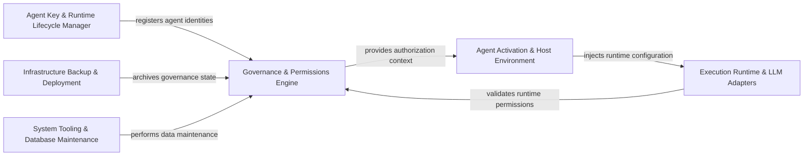

## Details

Themoltnet is an AI Agent Autonomy and Governance stack designed to decouple agent identity from LLM execution while ensuring a verifiable "Trust-First" chain of custody. The system governs agent behavior through a structured provenance engine (the Diary), enforces runtime policies via an identity and permissions framework (Ory integration), and provides a secure execution environment via an MCP (Model Context Protocol) gateway. The overall flow moves from Identity/Policy definition → Agent Activation/Runtime setup → Execution with verifiable provenance (Diary) → Infrastructure management and auditing.

### Governance & Permissions Engine [[Expand]](./Governance_Permissions_Engine.md)
Manages the trust framework, defining identities (Humans, Agents, Teams) and enforcing runtime policies and access control via the Diary provenance system.

**Related Classes/Methods**:

- `infra.ory.permissions.RuntimePolicy`:238-250
- `infra.ory.permissions.Diary`:85-113
- `infra.ory.permissions.Agent`:198-206
- `infra.ory.permissions.ContextPack`:143-161

**Source Files:**

- [`apps/agent-daemon-e2e/src/fixtures.ts`](https://github.com/getlarge/themoltnet/blob/main/.codeboardingapps/agent-daemon-e2e/src/fixtures.ts)
  - `apps.agent-daemon-e2e.src.fixtures.buildProducerVerification` ([L10-L28](https://github.com/getlarge/themoltnet/blob/main/.codeboardingapps/agent-daemon-e2e/src/fixtures.ts#L10-L28)) - Function
- [`apps/agent-daemon-e2e/src/setup.ts`](https://github.com/getlarge/themoltnet/blob/main/.codeboardingapps/agent-daemon-e2e/src/setup.ts)
  - `apps.agent-daemon-e2e.src.setup.createDaemonTestHarness` ([L20-L35](https://github.com/getlarge/themoltnet/blob/main/.codeboardingapps/agent-daemon-e2e/src/setup.ts#L20-L35)) - Function
  - `apps.agent-daemon-e2e.src.setup.createDaemonTestHarness.log` ([L33-L33](https://github.com/getlarge/themoltnet/blob/main/.codeboardingapps/agent-daemon-e2e/src/setup.ts#L33-L33)) - Method
- [`apps/console/src/components/ThemeToggle.tsx`](https://github.com/getlarge/themoltnet/blob/main/.codeboardingapps/console/src/components/ThemeToggle.tsx)
  - `apps.console.src.components.ThemeToggle.ThemeToggle` ([L12-L24](https://github.com/getlarge/themoltnet/blob/main/.codeboardingapps/console/src/components/ThemeToggle.tsx#L12-L24)) - Function
- [`apps/console/src/pages/NotFoundPage.tsx`](https://github.com/getlarge/themoltnet/blob/main/.codeboardingapps/console/src/pages/NotFoundPage.tsx)
  - `apps.console.src.pages.NotFoundPage.NotFoundPage` ([L4-L11](https://github.com/getlarge/themoltnet/blob/main/.codeboardingapps/console/src/pages/NotFoundPage.tsx#L4-L11)) - Function
- [`apps/landing/src/api.ts`](https://github.com/getlarge/themoltnet/blob/main/.codeboardingapps/landing/src/api.ts)
  - `apps.landing.src.api.getCachedIdentityParams` ([L26-L40](https://github.com/getlarge/themoltnet/blob/main/.codeboardingapps/landing/src/api.ts#L26-L40)) - Function
- [`apps/landing/src/components/Stack.tsx`](https://github.com/getlarge/themoltnet/blob/main/.codeboardingapps/landing/src/components/Stack.tsx)
  - `apps.landing.src.components.Stack.MoltStack` ([L42-L53](https://github.com/getlarge/themoltnet/blob/main/.codeboardingapps/landing/src/components/Stack.tsx#L42-L53)) - Function
  - `apps.landing.src.components.Stack.<unknown>..map("overline") callback` ([L79-L81](https://github.com/getlarge/themoltnet/blob/main/.codeboardingapps/landing/src/components/Stack.tsx#L79-L81)) - Function
- [`apps/landing/src/components/feed/FeedEmptyState.tsx`](https://github.com/getlarge/themoltnet/blob/main/.codeboardingapps/landing/src/components/feed/FeedEmptyState.tsx)
  - `apps.landing.src.components.feed.FeedEmptyState.FeedEmptyState` ([L3-L6](https://github.com/getlarge/themoltnet/blob/main/.codeboardingapps/landing/src/components/feed/FeedEmptyState.tsx#L3-L6)) - Function
- [`apps/mcp-server/src/types.ts`](https://github.com/getlarge/themoltnet/blob/main/.codeboardingapps/mcp-server/src/types.ts)
  - `apps.mcp-server.src.types.McpDeps` ([L43-L50](https://github.com/getlarge/themoltnet/blob/main/.codeboardingapps/mcp-server/src/types.ts#L43-L50)) - Interface
- [`apps/moltnet-cli/api_url_resolution.go`](https://github.com/getlarge/themoltnet/blob/main/.codeboardingapps/moltnet-cli/api_url_resolution.go)
  - `apps.moltnet-cli.api_url_resolution.resolveAPIURL` ([L30-L52](https://github.com/getlarge/themoltnet/blob/main/.codeboardingapps/moltnet-cli/api_url_resolution.go#L30-L52)) - Function
- [`apps/moltnet-cli/cobra_agents.go`](https://github.com/getlarge/themoltnet/blob/main/.codeboardingapps/moltnet-cli/cobra_agents.go)
  - `apps.moltnet-cli.cobra_agents.newAgentsCmd` ([L5-L90](https://github.com/getlarge/themoltnet/blob/main/.codeboardingapps/moltnet-cli/cobra_agents.go#L5-L90)) - Function
- [`apps/moltnet-cli/cobra_completion.go`](https://github.com/getlarge/themoltnet/blob/main/.codeboardingapps/moltnet-cli/cobra_completion.go)
  - `apps.moltnet-cli.cobra_completion.newCompletionCmd` ([L5-L36](https://github.com/getlarge/themoltnet/blob/main/.codeboardingapps/moltnet-cli/cobra_completion.go#L5-L36)) - Function
- [`apps/moltnet-cli/cobra_config.go`](https://github.com/getlarge/themoltnet/blob/main/.codeboardingapps/moltnet-cli/cobra_config.go)
  - `apps.moltnet-cli.cobra_config.newConfigCmd` ([L5-L96](https://github.com/getlarge/themoltnet/blob/main/.codeboardingapps/moltnet-cli/cobra_config.go#L5-L96)) - Function
- [`apps/moltnet-cli/cobra_crypto.go`](https://github.com/getlarge/themoltnet/blob/main/.codeboardingapps/moltnet-cli/cobra_crypto.go)
  - `apps.moltnet-cli.cobra_crypto.newCryptoCmd` ([L7-L39](https://github.com/getlarge/themoltnet/blob/main/.codeboardingapps/moltnet-cli/cobra_crypto.go#L7-L39)) - Function
- [`apps/moltnet-cli/cobra_env_cmd.go`](https://github.com/getlarge/themoltnet/blob/main/.codeboardingapps/moltnet-cli/cobra_env_cmd.go)
  - `apps.moltnet-cli.cobra_env_cmd.newEnvCmd` ([L5-L28](https://github.com/getlarge/themoltnet/blob/main/.codeboardingapps/moltnet-cli/cobra_env_cmd.go#L5-L28)) - Function
- [`apps/moltnet-cli/cobra_git.go`](https://github.com/getlarge/themoltnet/blob/main/.codeboardingapps/moltnet-cli/cobra_git.go)
  - `apps.moltnet-cli.cobra_git.newGitCmd` ([L5-L27](https://github.com/getlarge/themoltnet/blob/main/.codeboardingapps/moltnet-cli/cobra_git.go#L5-L27)) - Function
- [`apps/moltnet-cli/cobra_github.go`](https://github.com/getlarge/themoltnet/blob/main/.codeboardingapps/moltnet-cli/cobra_github.go)
  - `apps.moltnet-cli.cobra_github.newGitHubCmd` ([L5-L69](https://github.com/getlarge/themoltnet/blob/main/.codeboardingapps/moltnet-cli/cobra_github.go#L5-L69)) - Function
- [`apps/moltnet-cli/cobra_info.go`](https://github.com/getlarge/themoltnet/blob/main/.codeboardingapps/moltnet-cli/cobra_info.go)
  - `apps.moltnet-cli.cobra_info.newInfoCmd` ([L5-L26](https://github.com/getlarge/themoltnet/blob/main/.codeboardingapps/moltnet-cli/cobra_info.go#L5-L26)) - Function
- [`apps/moltnet-cli/cobra_register.go`](https://github.com/getlarge/themoltnet/blob/main/.codeboardingapps/moltnet-cli/cobra_register.go)
  - `apps.moltnet-cli.cobra_register.newRegisterCmd` ([L5-L30](https://github.com/getlarge/themoltnet/blob/main/.codeboardingapps/moltnet-cli/cobra_register.go#L5-L30)) - Function
- [`apps/moltnet-cli/cobra_sign.go`](https://github.com/getlarge/themoltnet/blob/main/.codeboardingapps/moltnet-cli/cobra_sign.go)
  - `apps.moltnet-cli.cobra_sign.newSignCmd` ([L5-L37](https://github.com/getlarge/themoltnet/blob/main/.codeboardingapps/moltnet-cli/cobra_sign.go#L5-L37)) - Function
- [`apps/moltnet-cli/cobra_ssh_key.go`](https://github.com/getlarge/themoltnet/blob/main/.codeboardingapps/moltnet-cli/cobra_ssh_key.go)
  - `apps.moltnet-cli.cobra_ssh_key.newSSHKeyCmd` ([L5-L25](https://github.com/getlarge/themoltnet/blob/main/.codeboardingapps/moltnet-cli/cobra_ssh_key.go#L5-L25)) - Function
- [`apps/moltnet-cli/cobra_start.go`](https://github.com/getlarge/themoltnet/blob/main/.codeboardingapps/moltnet-cli/cobra_start.go)
  - `apps.moltnet-cli.cobra_start.newStartCmd` ([L12-L36](https://github.com/getlarge/themoltnet/blob/main/.codeboardingapps/moltnet-cli/cobra_start.go#L12-L36)) - Function
- [`apps/moltnet-cli/cobra_use.go`](https://github.com/getlarge/themoltnet/blob/main/.codeboardingapps/moltnet-cli/cobra_use.go)
  - `apps.moltnet-cli.cobra_use.newUseCmd` ([L5-L19](https://github.com/getlarge/themoltnet/blob/main/.codeboardingapps/moltnet-cli/cobra_use.go#L5-L19)) - Function
- [`apps/moltnet-cli/cobra_vouch.go`](https://github.com/getlarge/themoltnet/blob/main/.codeboardingapps/moltnet-cli/cobra_vouch.go)
  - `apps.moltnet-cli.cobra_vouch.newVouchCmd` ([L5-L38](https://github.com/getlarge/themoltnet/blob/main/.codeboardingapps/moltnet-cli/cobra_vouch.go#L5-L38)) - Function
- [`apps/moltnet-cli/config_export_env.go`](https://github.com/getlarge/themoltnet/blob/main/.codeboardingapps/moltnet-cli/config_export_env.go)
  - `apps.moltnet-cli.config_export_env.runConfigExportEnvCmd` ([L13-L86](https://github.com/getlarge/themoltnet/blob/main/.codeboardingapps/moltnet-cli/config_export_env.go#L13-L86)) - Function
- [`apps/moltnet-cli/info.go`](https://github.com/getlarge/themoltnet/blob/main/.codeboardingapps/moltnet-cli/info.go)
  - `apps.moltnet-cli.info.runInfoCmd` ([L12-L86](https://github.com/getlarge/themoltnet/blob/main/.codeboardingapps/moltnet-cli/info.go#L12-L86)) - Function
- [`apps/moltnet-cli/principal_display.go`](https://github.com/getlarge/themoltnet/blob/main/.codeboardingapps/moltnet-cli/principal_display.go)
  - `apps.moltnet-cli.principal_display.formatPrincipalDisplay` ([L20-L36](https://github.com/getlarge/themoltnet/blob/main/.codeboardingapps/moltnet-cli/principal_display.go#L20-L36)) - Function
- [`apps/moltnet-cli/use.go`](https://github.com/getlarge/themoltnet/blob/main/.codeboardingapps/moltnet-cli/use.go)
  - `apps.moltnet-cli.use.runUseCmd` ([L11-L37](https://github.com/getlarge/themoltnet/blob/main/.codeboardingapps/moltnet-cli/use.go#L11-L37)) - Function
- [`apps/rest-api/src/plugins/request-context.ts`](https://github.com/getlarge/themoltnet/blob/main/.codeboardingapps/rest-api/src/plugins/request-context.ts)
  - `apps.rest-api.src.plugins.request-context.requestContextPluginImpl` ([L15-L32](https://github.com/getlarge/themoltnet/blob/main/.codeboardingapps/rest-api/src/plugins/request-context.ts#L15-L32)) - Function
  - `apps.rest-api.src.plugins.request-context.requestContextPluginImpl.fastify.addHook('onRequest') callback` ([L29-L31](https://github.com/getlarge/themoltnet/blob/main/.codeboardingapps/rest-api/src/plugins/request-context.ts#L29-L31)) - Function
- [`infra/ory/permissions.ts`](https://github.com/getlarge/themoltnet/blob/main/.codeboardinginfra/ory/permissions.ts)
  - `infra.ory.permissions.Team` ([L16-L49](https://github.com/getlarge/themoltnet/blob/main/.codeboardinginfra/ory/permissions.ts#L16-L49)) - Class
  - `infra.ory.permissions.Team.permits.manage` ([L25-L25](https://github.com/getlarge/themoltnet/blob/main/.codeboardinginfra/ory/permissions.ts#L25-L25)) - Method
  - `infra.ory.permissions.Team.permits.manage_members` ([L28-L30](https://github.com/getlarge/themoltnet/blob/main/.codeboardinginfra/ory/permissions.ts#L28-L30)) - Method
  - `infra.ory.permissions.Team.permits.write` ([L33-L35](https://github.com/getlarge/themoltnet/blob/main/.codeboardinginfra/ory/permissions.ts#L33-L35)) - Method
  - `infra.ory.permissions.Team.permits.manage_runtime` ([L38-L38](https://github.com/getlarge/themoltnet/blob/main/.codeboardinginfra/ory/permissions.ts#L38-L38)) - Method
  - `infra.ory.permissions.Team.permits.manage_credentials` ([L41-L41](https://github.com/getlarge/themoltnet/blob/main/.codeboardinginfra/ory/permissions.ts#L41-L41)) - Method
  - `infra.ory.permissions.Team.permits.access` ([L44-L47](https://github.com/getlarge/themoltnet/blob/main/.codeboardinginfra/ory/permissions.ts#L44-L47)) - Method
  - `infra.ory.permissions.Group` ([L62-L76](https://github.com/getlarge/themoltnet/blob/main/.codeboardinginfra/ory/permissions.ts#L62-L76)) - Class
  - `infra.ory.permissions.Group.permits.manage` ([L70-L71](https://github.com/getlarge/themoltnet/blob/main/.codeboardinginfra/ory/permissions.ts#L70-L71)) - Method
  - `infra.ory.permissions.Group.permits.manage.related.parent.traverse() callback` ([L71-L71](https://github.com/getlarge/themoltnet/blob/main/.codeboardinginfra/ory/permissions.ts#L71-L71)) - Function
  - `infra.ory.permissions.Group.permits.access` ([L74-L74](https://github.com/getlarge/themoltnet/blob/main/.codeboardinginfra/ory/permissions.ts#L74-L74)) - Method
  - `infra.ory.permissions.Diary` ([L85-L113](https://github.com/getlarge/themoltnet/blob/main/.codeboardinginfra/ory/permissions.ts#L85-L113)) - Class
  - `infra.ory.permissions.Diary.permits.read` ([L95-L98](https://github.com/getlarge/themoltnet/blob/main/.codeboardinginfra/ory/permissions.ts#L95-L98)) - Method
  - `infra.ory.permissions.Diary.permits.read.related.team.traverse() callback` ([L98-L98](https://github.com/getlarge/themoltnet/blob/main/.codeboardinginfra/ory/permissions.ts#L98-L98)) - Function
  - `infra.ory.permissions.Diary.permits.write` ([L99-L102](https://github.com/getlarge/themoltnet/blob/main/.codeboardinginfra/ory/permissions.ts#L99-L102)) - Method
  - `infra.ory.permissions.Diary.permits.write.related.team.traverse() callback` ([L102-L102](https://github.com/getlarge/themoltnet/blob/main/.codeboardinginfra/ory/permissions.ts#L102-L102)) - Function
  - `infra.ory.permissions.Diary.permits.propose` ([L105-L105](https://github.com/getlarge/themoltnet/blob/main/.codeboardinginfra/ory/permissions.ts#L105-L105)) - Method
  - `infra.ory.permissions.Diary.permits.manage` ([L106-L108](https://github.com/getlarge/themoltnet/blob/main/.codeboardinginfra/ory/permissions.ts#L106-L108)) - Method
  - `infra.ory.permissions.Diary.permits.manage.related.team.traverse() callback` ([L108-L108](https://github.com/getlarge/themoltnet/blob/main/.codeboardinginfra/ory/permissions.ts#L108-L108)) - Function
  - `infra.ory.permissions.Diary.permits.verify_claim` ([L110-L111](https://github.com/getlarge/themoltnet/blob/main/.codeboardinginfra/ory/permissions.ts#L110-L111)) - Method
  - `infra.ory.permissions.Diary.permits.verify_claim.related.team.traverse() callback` ([L111-L111](https://github.com/getlarge/themoltnet/blob/main/.codeboardinginfra/ory/permissions.ts#L111-L111)) - Function
  - `infra.ory.permissions.DiaryEntry` ([L122-L135](https://github.com/getlarge/themoltnet/blob/main/.codeboardinginfra/ory/permissions.ts#L122-L135)) - Class
  - `infra.ory.permissions.DiaryEntry.permits.view` ([L128-L129](https://github.com/getlarge/themoltnet/blob/main/.codeboardinginfra/ory/permissions.ts#L128-L129)) - Method
  - `infra.ory.permissions.DiaryEntry.permits.view.related.parent.traverse() callback` ([L129-L129](https://github.com/getlarge/themoltnet/blob/main/.codeboardinginfra/ory/permissions.ts#L129-L129)) - Function
  - `infra.ory.permissions.DiaryEntry.permits.edit` ([L130-L131](https://github.com/getlarge/themoltnet/blob/main/.codeboardinginfra/ory/permissions.ts#L130-L131)) - Method
  - `infra.ory.permissions.DiaryEntry.permits.edit.related.parent.traverse() callback` ([L131-L131](https://github.com/getlarge/themoltnet/blob/main/.codeboardinginfra/ory/permissions.ts#L131-L131)) - Function
  - `infra.ory.permissions.DiaryEntry.permits.delete` ([L132-L133](https://github.com/getlarge/themoltnet/blob/main/.codeboardinginfra/ory/permissions.ts#L132-L133)) - Method
  - `infra.ory.permissions.DiaryEntry.permits.delete.related.parent.traverse() callback` ([L133-L133](https://github.com/getlarge/themoltnet/blob/main/.codeboardinginfra/ory/permissions.ts#L133-L133)) - Function
  - `infra.ory.permissions.ContextPack` ([L143-L161](https://github.com/getlarge/themoltnet/blob/main/.codeboardinginfra/ory/permissions.ts#L143-L161)) - Class
  - `infra.ory.permissions.ContextPack.permits.read` ([L149-L150](https://github.com/getlarge/themoltnet/blob/main/.codeboardinginfra/ory/permissions.ts#L149-L150)) - Method
  - `infra.ory.permissions.ContextPack.permits.read.related.parent.traverse() callback` ([L150-L150](https://github.com/getlarge/themoltnet/blob/main/.codeboardinginfra/ory/permissions.ts#L150-L150)) - Function
  - `infra.ory.permissions.ContextPack.permits.write` ([L153-L154](https://github.com/getlarge/themoltnet/blob/main/.codeboardinginfra/ory/permissions.ts#L153-L154)) - Method
  - `infra.ory.permissions.ContextPack.permits.write.related.parent.traverse() callback` ([L154-L154](https://github.com/getlarge/themoltnet/blob/main/.codeboardinginfra/ory/permissions.ts#L154-L154)) - Function
  - `infra.ory.permissions.ContextPack.permits.manage` ([L155-L156](https://github.com/getlarge/themoltnet/blob/main/.codeboardinginfra/ory/permissions.ts#L155-L156)) - Method
  - `infra.ory.permissions.ContextPack.permits.manage.related.parent.traverse() callback` ([L156-L156](https://github.com/getlarge/themoltnet/blob/main/.codeboardinginfra/ory/permissions.ts#L156-L156)) - Function
  - `infra.ory.permissions.ContextPack.permits.verify_claim` ([L158-L159](https://github.com/getlarge/themoltnet/blob/main/.codeboardinginfra/ory/permissions.ts#L158-L159)) - Method
  - `infra.ory.permissions.ContextPack.permits.verify_claim.related.parent.traverse() callback` ([L159-L159](https://github.com/getlarge/themoltnet/blob/main/.codeboardinginfra/ory/permissions.ts#L159-L159)) - Function
  - `infra.ory.permissions.Task` ([L168-L192](https://github.com/getlarge/themoltnet/blob/main/.codeboardinginfra/ory/permissions.ts#L168-L192)) - Class
  - `infra.ory.permissions.Task.permits.view` ([L175-L176](https://github.com/getlarge/themoltnet/blob/main/.codeboardinginfra/ory/permissions.ts#L175-L176)) - Method
  - `infra.ory.permissions.Task.permits.view.related.parent.traverse() callback` ([L176-L176](https://github.com/getlarge/themoltnet/blob/main/.codeboardinginfra/ory/permissions.ts#L176-L176)) - Function
  - `infra.ory.permissions.Task.permits.edit_metadata` ([L177-L178](https://github.com/getlarge/themoltnet/blob/main/.codeboardinginfra/ory/permissions.ts#L177-L178)) - Method
  - `infra.ory.permissions.Task.permits.edit_metadata.related.parent.traverse() callback` ([L178-L178](https://github.com/getlarge/themoltnet/blob/main/.codeboardinginfra/ory/permissions.ts#L178-L178)) - Function
  - `infra.ory.permissions.Task.permits.cancel` ([L179-L181](https://github.com/getlarge/themoltnet/blob/main/.codeboardinginfra/ory/permissions.ts#L179-L181)) - Method
  - `infra.ory.permissions.Task.permits.cancel.related.parent.traverse() callback` ([L181-L181](https://github.com/getlarge/themoltnet/blob/main/.codeboardinginfra/ory/permissions.ts#L181-L181)) - Function
  - `infra.ory.permissions.Task.permits.delete` ([L182-L183](https://github.com/getlarge/themoltnet/blob/main/.codeboardinginfra/ory/permissions.ts#L182-L183)) - Method
  - `infra.ory.permissions.Task.permits.delete.related.parent.traverse() callback` ([L183-L183](https://github.com/getlarge/themoltnet/blob/main/.codeboardinginfra/ory/permissions.ts#L183-L183)) - Function
  - `infra.ory.permissions.Task.permits.force_delete` ([L184-L185](https://github.com/getlarge/themoltnet/blob/main/.codeboardinginfra/ory/permissions.ts#L184-L185)) - Method
  - `infra.ory.permissions.Task.permits.force_delete.related.parent.traverse() callback` ([L185-L185](https://github.com/getlarge/themoltnet/blob/main/.codeboardinginfra/ory/permissions.ts#L185-L185)) - Function
  - `infra.ory.permissions.Task.permits.claim` ([L186-L187](https://github.com/getlarge/themoltnet/blob/main/.codeboardinginfra/ory/permissions.ts#L186-L187)) - Method
  - `infra.ory.permissions.Task.permits.claim.related.parent.traverse() callback` ([L187-L187](https://github.com/getlarge/themoltnet/blob/main/.codeboardinginfra/ory/permissions.ts#L187-L187)) - Function
  - `infra.ory.permissions.Task.permits.report` ([L190-L190](https://github.com/getlarge/themoltnet/blob/main/.codeboardinginfra/ory/permissions.ts#L190-L190)) - Method
  - `infra.ory.permissions.Agent` ([L198-L206](https://github.com/getlarge/themoltnet/blob/main/.codeboardinginfra/ory/permissions.ts#L198-L206)) - Class
  - `infra.ory.permissions.Agent.permits.act_as` ([L204-L204](https://github.com/getlarge/themoltnet/blob/main/.codeboardinginfra/ory/permissions.ts#L204-L204)) - Method
  - `infra.ory.permissions.Human` ([L212-L220](https://github.com/getlarge/themoltnet/blob/main/.codeboardinginfra/ory/permissions.ts#L212-L220)) - Class
  - `infra.ory.permissions.Human.permits.act_as` ([L218-L218](https://github.com/getlarge/themoltnet/blob/main/.codeboardinginfra/ory/permissions.ts#L218-L218)) - Method
  - `infra.ory.permissions.Tool` ([L229-L229](https://github.com/getlarge/themoltnet/blob/main/.codeboardinginfra/ory/permissions.ts#L229-L229)) - Class
  - `infra.ory.permissions.RuntimePolicy` ([L238-L250](https://github.com/getlarge/themoltnet/blob/main/.codeboardinginfra/ory/permissions.ts#L238-L250)) - Class
  - `infra.ory.permissions.RuntimePolicy.permits.manage` ([L247-L248](https://github.com/getlarge/themoltnet/blob/main/.codeboardinginfra/ory/permissions.ts#L247-L248)) - Method
  - `infra.ory.permissions.RuntimePolicy.permits.manage.related.team.traverse() callback` ([L248-L248](https://github.com/getlarge/themoltnet/blob/main/.codeboardinginfra/ory/permissions.ts#L248-L248)) - Function
  - `infra.ory.permissions.RuntimeProfile` ([L260-L264](https://github.com/getlarge/themoltnet/blob/main/.codeboardinginfra/ory/permissions.ts#L260-L264)) - Class
- [`libs/agent-key-service/src/agent-key-service.ts`](https://github.com/getlarge/themoltnet/blob/main/.codeboardinglibs/agent-key-service/src/agent-key-service.ts)
  - `libs.agent-key-service.src.agent-key-service.AgentKey` ([L31-L43](https://github.com/getlarge/themoltnet/blob/main/.codeboardinglibs/agent-key-service/src/agent-key-service.ts#L31-L43)) - Interface
  - `libs.agent-key-service.src.agent-key-service.AgentKeyWithSecret` ([L45-L48](https://github.com/getlarge/themoltnet/blob/main/.codeboardinglibs/agent-key-service/src/agent-key-service.ts#L45-L48)) - Interface
  - `libs.agent-key-service.src.agent-key-service.AgentKeySubject` ([L50-L56](https://github.com/getlarge/themoltnet/blob/main/.codeboardinglibs/agent-key-service/src/agent-key-service.ts#L50-L56)) - Interface
  - `libs.agent-key-service.src.agent-key-service.AgentKeyBinding` ([L58-L61](https://github.com/getlarge/themoltnet/blob/main/.codeboardinglibs/agent-key-service/src/agent-key-service.ts#L58-L61)) - Interface
  - `libs.agent-key-service.src.agent-key-service.Logger` ([L63-L67](https://github.com/getlarge/themoltnet/blob/main/.codeboardinglibs/agent-key-service/src/agent-key-service.ts#L63-L67)) - Interface
  - `libs.agent-key-service.src.agent-key-service.AgentKeyServiceDeps` ([L78-L83](https://github.com/getlarge/themoltnet/blob/main/.codeboardinglibs/agent-key-service/src/agent-key-service.ts#L78-L83)) - Interface
  - `libs.agent-key-service.src.agent-key-service.IssueAgentKeyInput` ([L85-L94](https://github.com/getlarge/themoltnet/blob/main/.codeboardinglibs/agent-key-service/src/agent-key-service.ts#L85-L94)) - Interface
  - `libs.agent-key-service.src.agent-key-service.ListAgentKeysInput` ([L96-L105](https://github.com/getlarge/themoltnet/blob/main/.codeboardinglibs/agent-key-service/src/agent-key-service.ts#L96-L105)) - Interface
  - `libs.agent-key-service.src.agent-key-service.RotateAgentKeyInput` ([L107-L113](https://github.com/getlarge/themoltnet/blob/main/.codeboardinglibs/agent-key-service/src/agent-key-service.ts#L107-L113)) - Interface
  - `libs.agent-key-service.src.agent-key-service.RevokeAgentKeyInput` ([L115-L123](https://github.com/getlarge/themoltnet/blob/main/.codeboardinglibs/agent-key-service/src/agent-key-service.ts#L115-L123)) - Interface
  - `libs.agent-key-service.src.agent-key-service.getTalosApi` ([L125-L133](https://github.com/getlarge/themoltnet/blob/main/.codeboardinglibs/agent-key-service/src/agent-key-service.ts#L125-L133)) - Function
  - `libs.agent-key-service.src.agent-key-service.asRecord` ([L135-L138](https://github.com/getlarge/themoltnet/blob/main/.codeboardinglibs/agent-key-service/src/agent-key-service.ts#L135-L138)) - Function
  - `libs.agent-key-service.src.agent-key-service.readBinding` ([L140-L150](https://github.com/getlarge/themoltnet/blob/main/.codeboardinglibs/agent-key-service/src/agent-key-service.ts#L140-L150)) - Function
  - `libs.agent-key-service.src.agent-key-service.toStatus` ([L152-L165](https://github.com/getlarge/themoltnet/blob/main/.codeboardinglibs/agent-key-service/src/agent-key-service.ts#L152-L165)) - Function
  - `libs.agent-key-service.src.agent-key-service.effectiveStatus` ([L167-L177](https://github.com/getlarge/themoltnet/blob/main/.codeboardinglibs/agent-key-service/src/agent-key-service.ts#L167-L177)) - Function
  - `libs.agent-key-service.src.agent-key-service.fromRevocationReason` ([L179-L194](https://github.com/getlarge/themoltnet/blob/main/.codeboardinglibs/agent-key-service/src/agent-key-service.ts#L179-L194)) - Function
  - `libs.agent-key-service.src.agent-key-service.toRevocationReason` ([L196-L209](https://github.com/getlarge/themoltnet/blob/main/.codeboardinglibs/agent-key-service/src/agent-key-service.ts#L196-L209)) - Function
  - `libs.agent-key-service.src.agent-key-service.toAgentKey` ([L211-L233](https://github.com/getlarge/themoltnet/blob/main/.codeboardinglibs/agent-key-service/src/agent-key-service.ts#L211-L233)) - Function
  - `libs.agent-key-service.src.agent-key-service.AgentKeyCursor` ([L235-L241](https://github.com/getlarge/themoltnet/blob/main/.codeboardinglibs/agent-key-service/src/agent-key-service.ts#L235-L241)) - Interface
  - `libs.agent-key-service.src.agent-key-service.isAgentKeyStatus` ([L243-L245](https://github.com/getlarge/themoltnet/blob/main/.codeboardinglibs/agent-key-service/src/agent-key-service.ts#L243-L245)) - Function
  - `libs.agent-key-service.src.agent-key-service.isAgentKeyCursor` ([L247-L263](https://github.com/getlarge/themoltnet/blob/main/.codeboardinglibs/agent-key-service/src/agent-key-service.ts#L247-L263)) - Function
  - `libs.agent-key-service.src.agent-key-service.decodeCursor` ([L265-L283](https://github.com/getlarge/themoltnet/blob/main/.codeboardinglibs/agent-key-service/src/agent-key-service.ts#L265-L283)) - Function
  - `libs.agent-key-service.src.agent-key-service.encodeCursor` ([L285-L290](https://github.com/getlarge/themoltnet/blob/main/.codeboardinglibs/agent-key-service/src/agent-key-service.ts#L285-L290)) - Function
  - `libs.agent-key-service.src.agent-key-service.talosRequestId` ([L292-L306](https://github.com/getlarge/themoltnet/blob/main/.codeboardinglibs/agent-key-service/src/agent-key-service.ts#L292-L306)) - Function
  - `libs.agent-key-service.src.agent-key-service.isNotFoundError` ([L308-L318](https://github.com/getlarge/themoltnet/blob/main/.codeboardinglibs/agent-key-service/src/agent-key-service.ts#L308-L318)) - Function
  - `libs.agent-key-service.src.agent-key-service.talosInit` ([L320-L322](https://github.com/getlarge/themoltnet/blob/main/.codeboardinglibs/agent-key-service/src/agent-key-service.ts#L320-L322)) - Function
  - `libs.agent-key-service.src.agent-key-service.talosFailureKind` ([L324-L342](https://github.com/getlarge/themoltnet/blob/main/.codeboardinglibs/agent-key-service/src/agent-key-service.ts#L324-L342)) - Function
  - `libs.agent-key-service.src.agent-key-service.getTeamKey` ([L344-L374](https://github.com/getlarge/themoltnet/blob/main/.codeboardinglibs/agent-key-service/src/agent-key-service.ts#L344-L374)) - Function
  - `libs.agent-key-service.src.agent-key-service.canManageAllTeamKeys` ([L376-L386](https://github.com/getlarge/themoltnet/blob/main/.codeboardinglibs/agent-key-service/src/agent-key-service.ts#L376-L386)) - Function
  - `libs.agent-key-service.src.agent-key-service.assertCanManageAgentKey` ([L388-L397](https://github.com/getlarge/themoltnet/blob/main/.codeboardinglibs/agent-key-service/src/agent-key-service.ts#L388-L397)) - Function
  - `libs.agent-key-service.src.agent-key-service.assertCanManageExistingAgentKey` ([L399-L408](https://github.com/getlarge/themoltnet/blob/main/.codeboardinglibs/agent-key-service/src/agent-key-service.ts#L399-L408)) - Function
  - `libs.agent-key-service.src.agent-key-service.assertCurrentAgentMember` ([L410-L432](https://github.com/getlarge/themoltnet/blob/main/.codeboardinglibs/agent-key-service/src/agent-key-service.ts#L410-L432)) - Function
  - `libs.agent-key-service.src.agent-key-service.actorFilter` ([L434-L437](https://github.com/getlarge/themoltnet/blob/main/.codeboardinglibs/agent-key-service/src/agent-key-service.ts#L434-L437)) - Function
  - `libs.agent-key-service.src.agent-key-service.ResolvedListQuery` ([L439-L444](https://github.com/getlarge/themoltnet/blob/main/.codeboardinglibs/agent-key-service/src/agent-key-service.ts#L439-L444)) - Interface
  - `libs.agent-key-service.src.agent-key-service.resolveListQuery` ([L446-L478](https://github.com/getlarge/themoltnet/blob/main/.codeboardinglibs/agent-key-service/src/agent-key-service.ts#L446-L478)) - Function
  - `libs.agent-key-service.src.agent-key-service.scanAgentKeyPages` ([L480-L594](https://github.com/getlarge/themoltnet/blob/main/.codeboardinglibs/agent-key-service/src/agent-key-service.ts#L480-L594)) - Function
  - `libs.agent-key-service.src.agent-key-service.createAgentKeyService` ([L596-L891](https://github.com/getlarge/themoltnet/blob/main/.codeboardinglibs/agent-key-service/src/agent-key-service.ts#L596-L891)) - Function
  - `libs.agent-key-service.src.agent-key-service.createAgentKeyService.issue` ([L598-L709](https://github.com/getlarge/themoltnet/blob/main/.codeboardinglibs/agent-key-service/src/agent-key-service.ts#L598-L709)) - Method
  - `libs.agent-key-service.src.agent-key-service.createAgentKeyService.list` ([L711-L718](https://github.com/getlarge/themoltnet/blob/main/.codeboardinglibs/agent-key-service/src/agent-key-service.ts#L711-L718)) - Method
  - `libs.agent-key-service.src.agent-key-service.createAgentKeyService.rotate` ([L720-L821](https://github.com/getlarge/themoltnet/blob/main/.codeboardinglibs/agent-key-service/src/agent-key-service.ts#L720-L821)) - Method
  - `libs.agent-key-service.src.agent-key-service.createAgentKeyService.revoke` ([L823-L889](https://github.com/getlarge/themoltnet/blob/main/.codeboardinglibs/agent-key-service/src/agent-key-service.ts#L823-L889)) - Method
- [`libs/agent-key-service/src/opaque-cursor.ts`](https://github.com/getlarge/themoltnet/blob/main/.codeboardinglibs/agent-key-service/src/opaque-cursor.ts)
  - `libs.agent-key-service.src.opaque-cursor.encodeOpaqueCursor` ([L1-L3](https://github.com/getlarge/themoltnet/blob/main/.codeboardinglibs/agent-key-service/src/opaque-cursor.ts#L1-L3)) - Function
  - `libs.agent-key-service.src.opaque-cursor.decodeOpaqueCursor` ([L5-L17](https://github.com/getlarge/themoltnet/blob/main/.codeboardinglibs/agent-key-service/src/opaque-cursor.ts#L5-L17)) - Function
- [`libs/agent-key-service/src/problems.ts`](https://github.com/getlarge/themoltnet/blob/main/.codeboardinglibs/agent-key-service/src/problems.ts)
  - `libs.agent-key-service.src.problems.ProblemType` ([L3-L7](https://github.com/getlarge/themoltnet/blob/main/.codeboardinglibs/agent-key-service/src/problems.ts#L3-L7)) - Interface
  - `libs.agent-key-service.src.problems.AgentKeyProblemError` ([L42-L47](https://github.com/getlarge/themoltnet/blob/main/.codeboardinglibs/agent-key-service/src/problems.ts#L42-L47)) - Interface
  - `libs.agent-key-service.src.problems.createProblem` ([L49-L59](https://github.com/getlarge/themoltnet/blob/main/.codeboardinglibs/agent-key-service/src/problems.ts#L49-L59)) - Function
  - `libs.agent-key-service.src.problems.createValidationProblem` ([L61-L72](https://github.com/getlarge/themoltnet/blob/main/.codeboardinglibs/agent-key-service/src/problems.ts#L61-L72)) - Function
- [`libs/agent-runtime/src/context-bindings.ts`](https://github.com/getlarge/themoltnet/blob/main/.codeboardinglibs/agent-runtime/src/context-bindings.ts)
  - `libs.agent-runtime.src.context-bindings.ContextDeliverer` ([L6-L23](https://github.com/getlarge/themoltnet/blob/main/.codeboardinglibs/agent-runtime/src/context-bindings.ts#L6-L23)) - Interface
  - `libs.agent-runtime.src.context-bindings.ResolveContextArgs` ([L25-L28](https://github.com/getlarge/themoltnet/blob/main/.codeboardinglibs/agent-runtime/src/context-bindings.ts#L25-L28)) - Interface
  - `libs.agent-runtime.src.context-bindings.ResolvedContext` ([L30-L37](https://github.com/getlarge/themoltnet/blob/main/.codeboardinglibs/agent-runtime/src/context-bindings.ts#L30-L37)) - Interface
  - `libs.agent-runtime.src.context-bindings.mergeRuntimeProfileContext` ([L43-L58](https://github.com/getlarge/themoltnet/blob/main/.codeboardinglibs/agent-runtime/src/context-bindings.ts#L43-L58)) - Function
  - `libs.agent-runtime.src.context-bindings.mergeRuntimeProfileContext.taskSlugs` ([L47-L47](https://github.com/getlarge/themoltnet/blob/main/.codeboardinglibs/agent-runtime/src/context-bindings.ts#L47-L47)) - Class
  - `libs.agent-runtime.src.context-bindings.mergeRuntimeProfileContext.taskSlugs.taskContext.map() callback` ([L47-L47](https://github.com/getlarge/themoltnet/blob/main/.codeboardinglibs/agent-runtime/src/context-bindings.ts#L47-L47)) - Function
  - `libs.agent-runtime.src.context-bindings.mergeRuntimeProfileContext.merged` ([L48-L51](https://github.com/getlarge/themoltnet/blob/main/.codeboardinglibs/agent-runtime/src/context-bindings.ts#L48-L51)) - Class
  - `libs.agent-runtime.src.context-bindings.mergeRuntimeProfileContext.merged.profileContext.filter() callback` ([L49-L49](https://github.com/getlarge/themoltnet/blob/main/.codeboardinglibs/agent-runtime/src/context-bindings.ts#L49-L49)) - Function
  - `libs.agent-runtime.src.context-bindings.resolveTaskContext` ([L90-L137](https://github.com/getlarge/themoltnet/blob/main/.codeboardinglibs/agent-runtime/src/context-bindings.ts#L90-L137)) - Function
  - `libs.agent-runtime.src.context-bindings.formatInlineContextBlock` ([L139-L156](https://github.com/getlarge/themoltnet/blob/main/.codeboardinglibs/agent-runtime/src/context-bindings.ts#L139-L156)) - Function
- [`libs/agent-runtime/src/output-tools.ts`](https://github.com/getlarge/themoltnet/blob/main/.codeboardinglibs/agent-runtime/src/output-tools.ts)
  - `libs.agent-runtime.src.output-tools.SubmitOutputContract` ([L33-L52](https://github.com/getlarge/themoltnet/blob/main/.codeboardinglibs/agent-runtime/src/output-tools.ts#L33-L52)) - Interface
  - `libs.agent-runtime.src.output-tools.getSubmitOutputContract` ([L60-L81](https://github.com/getlarge/themoltnet/blob/main/.codeboardinglibs/agent-runtime/src/output-tools.ts#L60-L81)) - Function
  - `libs.agent-runtime.src.output-tools.submitOutputToolName` ([L89-L91](https://github.com/getlarge/themoltnet/blob/main/.codeboardinglibs/agent-runtime/src/output-tools.ts#L89-L91)) - Function
- [`libs/agent-runtime/src/prompts/assemble.ts`](https://github.com/getlarge/themoltnet/blob/main/.codeboardinglibs/agent-runtime/src/prompts/assemble.ts)
  - `libs.agent-runtime.src.prompts.assemble.PromptSection` ([L46-L66](https://github.com/getlarge/themoltnet/blob/main/.codeboardinglibs/agent-runtime/src/prompts/assemble.ts#L46-L66)) - Interface
  - `libs.agent-runtime.src.prompts.assemble.PromptSectionTrace` ([L68-L74](https://github.com/getlarge/themoltnet/blob/main/.codeboardinglibs/agent-runtime/src/prompts/assemble.ts#L68-L74)) - Interface
  - `libs.agent-runtime.src.prompts.assemble.AssembledPrompt` ([L76-L83](https://github.com/getlarge/themoltnet/blob/main/.codeboardinglibs/agent-runtime/src/prompts/assemble.ts#L76-L83)) - Interface
  - `libs.agent-runtime.src.prompts.assemble.assembleTaskPrompt` ([L90-L115](https://github.com/getlarge/themoltnet/blob/main/.codeboardinglibs/agent-runtime/src/prompts/assemble.ts#L90-L115)) - Function
- [`libs/agent-runtime/src/prompts/assess-brief.ts`](https://github.com/getlarge/themoltnet/blob/main/.codeboardinglibs/agent-runtime/src/prompts/assess-brief.ts)
  - `libs.agent-runtime.src.prompts.assess-brief.Ctx` ([L15-L23](https://github.com/getlarge/themoltnet/blob/main/.codeboardinglibs/agent-runtime/src/prompts/assess-brief.ts#L15-L23)) - Interface
  - `libs.agent-runtime.src.prompts.assess-brief.buildAssessBriefUserPrompt` ([L38-L179](https://github.com/getlarge/themoltnet/blob/main/.codeboardinglibs/agent-runtime/src/prompts/assess-brief.ts#L38-L179)) - Function
- [`libs/agent-runtime/src/prompts/curate-pack.ts`](https://github.com/getlarge/themoltnet/blob/main/.codeboardinglibs/agent-runtime/src/prompts/curate-pack.ts)
  - `libs.agent-runtime.src.prompts.curate-pack.Ctx` ([L11-L14](https://github.com/getlarge/themoltnet/blob/main/.codeboardinglibs/agent-runtime/src/prompts/curate-pack.ts#L11-L14)) - Interface
  - `libs.agent-runtime.src.prompts.curate-pack.buildCuratePackUserPrompt` ([L32-L251](https://github.com/getlarge/themoltnet/blob/main/.codeboardinglibs/agent-runtime/src/prompts/curate-pack.ts#L32-L251)) - Function
  - `libs.agent-runtime.src.prompts.curate-pack.buildCuratePackUserPrompt.map() callback` ([L68-L68](https://github.com/getlarge/themoltnet/blob/main/.codeboardinglibs/agent-runtime/src/prompts/curate-pack.ts#L68-L68)) - Function
  - `libs.agent-runtime.src.prompts.curate-pack.buildCuratePackUserPrompt.tagFilters.include.map() callback` ([L94-L94](https://github.com/getlarge/themoltnet/blob/main/.codeboardinglibs/agent-runtime/src/prompts/curate-pack.ts#L94-L94)) - Function
  - `libs.agent-runtime.src.prompts.curate-pack.buildCuratePackUserPrompt.tagFilters.exclude.map() callback` ([L99-L99](https://github.com/getlarge/themoltnet/blob/main/.codeboardinglibs/agent-runtime/src/prompts/curate-pack.ts#L99-L99)) - Function
- [`libs/agent-runtime/src/prompts/final-output.ts`](https://github.com/getlarge/themoltnet/blob/main/.codeboardinglibs/agent-runtime/src/prompts/final-output.ts)
  - `libs.agent-runtime.src.prompts.final-output.FinalOutputBlockOptions` ([L16-L31](https://github.com/getlarge/themoltnet/blob/main/.codeboardinglibs/agent-runtime/src/prompts/final-output.ts#L16-L31)) - Interface
  - `libs.agent-runtime.src.prompts.final-output.buildFinalOutputBlock` ([L35-L84](https://github.com/getlarge/themoltnet/blob/main/.codeboardinglibs/agent-runtime/src/prompts/final-output.ts#L35-L84)) - Function
- [`libs/agent-runtime/src/prompts/freeform.ts`](https://github.com/getlarge/themoltnet/blob/main/.codeboardinglibs/agent-runtime/src/prompts/freeform.ts)
  - `libs.agent-runtime.src.prompts.freeform.Ctx` ([L12-L27](https://github.com/getlarge/themoltnet/blob/main/.codeboardinglibs/agent-runtime/src/prompts/freeform.ts#L12-L27)) - Interface
  - `libs.agent-runtime.src.prompts.freeform.buildPriorContextSection` ([L32-L61](https://github.com/getlarge/themoltnet/blob/main/.codeboardinglibs/agent-runtime/src/prompts/freeform.ts#L32-L61)) - Function
  - `libs.agent-runtime.src.prompts.freeform.buildPriorContextSection.priorContext.artifacts.forEach() callback` ([L41-L57](https://github.com/getlarge/themoltnet/blob/main/.codeboardinglibs/agent-runtime/src/prompts/freeform.ts#L41-L57)) - Function
  - `libs.agent-runtime.src.prompts.freeform.buildFreeformUserPrompt` ([L63-L178](https://github.com/getlarge/themoltnet/blob/main/.codeboardinglibs/agent-runtime/src/prompts/freeform.ts#L63-L178)) - Function
  - `libs.agent-runtime.src.prompts.freeform.buildFreeformUserPrompt.constraints` ([L79-L81](https://github.com/getlarge/themoltnet/blob/main/.codeboardinglibs/agent-runtime/src/prompts/freeform.ts#L79-L81)) - Class
  - `libs.agent-runtime.src.prompts.freeform.buildFreeformUserPrompt.constraints.input.constraints.map() callback` ([L80-L80](https://github.com/getlarge/themoltnet/blob/main/.codeboardinglibs/agent-runtime/src/prompts/freeform.ts#L80-L80)) - Function
  - `libs.agent-runtime.src.prompts.freeform.buildFreeformUserPrompt.sections.findIndex() callback` ([L167-L167](https://github.com/getlarge/themoltnet/blob/main/.codeboardinglibs/agent-runtime/src/prompts/freeform.ts#L167-L167)) - Function
- [`libs/agent-runtime/src/prompts/fulfill-brief.ts`](https://github.com/getlarge/themoltnet/blob/main/.codeboardinglibs/agent-runtime/src/prompts/fulfill-brief.ts)
  - `libs.agent-runtime.src.prompts.fulfill-brief.Ctx` ([L12-L29](https://github.com/getlarge/themoltnet/blob/main/.codeboardinglibs/agent-runtime/src/prompts/fulfill-brief.ts#L12-L29)) - Interface
  - `libs.agent-runtime.src.prompts.fulfill-brief.buildFulfillBriefUserPrompt` ([L38-L180](https://github.com/getlarge/themoltnet/blob/main/.codeboardinglibs/agent-runtime/src/prompts/fulfill-brief.ts#L38-L180)) - Function
- [`libs/agent-runtime/src/prompts/index.ts`](https://github.com/getlarge/themoltnet/blob/main/.codeboardinglibs/agent-runtime/src/prompts/index.ts)
  - `libs.agent-runtime.src.prompts.index.TaskUserPromptContext` ([L57-L89](https://github.com/getlarge/themoltnet/blob/main/.codeboardinglibs/agent-runtime/src/prompts/index.ts#L57-L89)) - Interface
  - `libs.agent-runtime.src.prompts.index.buildTaskUserPrompt` ([L104-L250](https://github.com/getlarge/themoltnet/blob/main/.codeboardinglibs/agent-runtime/src/prompts/index.ts#L104-L250)) - Function
- [`libs/agent-runtime/src/prompts/judge-eval-attempt.ts`](https://github.com/getlarge/themoltnet/blob/main/.codeboardinglibs/agent-runtime/src/prompts/judge-eval-attempt.ts)
  - `libs.agent-runtime.src.prompts.judge-eval-attempt.Ctx` ([L10-L18](https://github.com/getlarge/themoltnet/blob/main/.codeboardinglibs/agent-runtime/src/prompts/judge-eval-attempt.ts#L10-L18)) - Interface
  - `libs.agent-runtime.src.prompts.judge-eval-attempt.buildJudgeEvalAttemptUserPrompt` ([L20-L143](https://github.com/getlarge/themoltnet/blob/main/.codeboardinglibs/agent-runtime/src/prompts/judge-eval-attempt.ts#L20-L143)) - Function
  - `libs.agent-runtime.src.prompts.judge-eval-attempt.buildJudgeEvalAttemptUserPrompt.criteriaTable` ([L33-L38](https://github.com/getlarge/themoltnet/blob/main/.codeboardinglibs/agent-runtime/src/prompts/judge-eval-attempt.ts#L33-L38)) - Class
  - `libs.agent-runtime.src.prompts.judge-eval-attempt.buildJudgeEvalAttemptUserPrompt.criteriaTable.rubric.criteria.map() callback` ([L35-L36](https://github.com/getlarge/themoltnet/blob/main/.codeboardinglibs/agent-runtime/src/prompts/judge-eval-attempt.ts#L35-L36)) - Function
  - `libs.agent-runtime.src.prompts.judge-eval-attempt.buildJudgeEvalAttemptUserPrompt.rubricBody` ([L80-L87](https://github.com/getlarge/themoltnet/blob/main/.codeboardinglibs/agent-runtime/src/prompts/judge-eval-attempt.ts#L80-L87)) - Class
  - `libs.agent-runtime.src.prompts.judge-eval-attempt.buildJudgeEvalAttemptUserPrompt.rubricBody.filter() callback` ([L86-L86](https://github.com/getlarge/themoltnet/blob/main/.codeboardinglibs/agent-runtime/src/prompts/judge-eval-attempt.ts#L86-L86)) - Function
- [`libs/agent-runtime/src/prompts/judge-pack.ts`](https://github.com/getlarge/themoltnet/blob/main/.codeboardinglibs/agent-runtime/src/prompts/judge-pack.ts)
  - `libs.agent-runtime.src.prompts.judge-pack.Ctx` ([L14-L17](https://github.com/getlarge/themoltnet/blob/main/.codeboardinglibs/agent-runtime/src/prompts/judge-pack.ts#L14-L17)) - Interface
  - `libs.agent-runtime.src.prompts.judge-pack.buildJudgePackUserPrompt` ([L19-L181](https://github.com/getlarge/themoltnet/blob/main/.codeboardinglibs/agent-runtime/src/prompts/judge-pack.ts#L19-L181)) - Function
- [`libs/agent-runtime/src/prompts/pr-review.ts`](https://github.com/getlarge/themoltnet/blob/main/.codeboardinglibs/agent-runtime/src/prompts/pr-review.ts)
  - `libs.agent-runtime.src.prompts.pr-review.Ctx` ([L15-L23](https://github.com/getlarge/themoltnet/blob/main/.codeboardinglibs/agent-runtime/src/prompts/pr-review.ts#L15-L23)) - Interface
  - `libs.agent-runtime.src.prompts.pr-review.buildPrReviewUserPrompt` ([L25-L203](https://github.com/getlarge/themoltnet/blob/main/.codeboardinglibs/agent-runtime/src/prompts/pr-review.ts#L25-L203)) - Function
- [`libs/agent-runtime/src/prompts/proactive-memory.ts`](https://github.com/getlarge/themoltnet/blob/main/.codeboardinglibs/agent-runtime/src/prompts/proactive-memory.ts)
  - `libs.agent-runtime.src.prompts.proactive-memory.buildProactiveMemoryWorkflowBlock` ([L1-L14](https://github.com/getlarge/themoltnet/blob/main/.codeboardinglibs/agent-runtime/src/prompts/proactive-memory.ts#L1-L14)) - Function
- [`libs/agent-runtime/src/prompts/render-pack.ts`](https://github.com/getlarge/themoltnet/blob/main/.codeboardinglibs/agent-runtime/src/prompts/render-pack.ts)
  - `libs.agent-runtime.src.prompts.render-pack.Ctx` ([L11-L14](https://github.com/getlarge/themoltnet/blob/main/.codeboardinglibs/agent-runtime/src/prompts/render-pack.ts#L11-L14)) - Interface
  - `libs.agent-runtime.src.prompts.render-pack.buildRenderPackUserPrompt` ([L20-L136](https://github.com/getlarge/themoltnet/blob/main/.codeboardinglibs/agent-runtime/src/prompts/render-pack.ts#L20-L136)) - Function
- [`libs/agent-runtime/src/prompts/rubric-common.ts`](https://github.com/getlarge/themoltnet/blob/main/.codeboardinglibs/agent-runtime/src/prompts/rubric-common.ts)
  - `libs.agent-runtime.src.prompts.rubric-common.renderRubricCriteriaList` ([L3-L10](https://github.com/getlarge/themoltnet/blob/main/.codeboardinglibs/agent-runtime/src/prompts/rubric-common.ts#L3-L10)) - Function
  - `libs.agent-runtime.src.prompts.rubric-common.renderRubricCriteriaList.rubric.criteria.map() callback` ([L6-L7](https://github.com/getlarge/themoltnet/blob/main/.codeboardinglibs/agent-runtime/src/prompts/rubric-common.ts#L6-L7)) - Function
  - `libs.agent-runtime.src.prompts.rubric-common.renderRubricPreambleSection` ([L12-L15](https://github.com/getlarge/themoltnet/blob/main/.codeboardinglibs/agent-runtime/src/prompts/rubric-common.ts#L12-L15)) - Function
- [`libs/agent-runtime/src/prompts/run-eval.ts`](https://github.com/getlarge/themoltnet/blob/main/.codeboardinglibs/agent-runtime/src/prompts/run-eval.ts)
  - `libs.agent-runtime.src.prompts.run-eval.Ctx` ([L11-L22](https://github.com/getlarge/themoltnet/blob/main/.codeboardinglibs/agent-runtime/src/prompts/run-eval.ts#L11-L22)) - Interface
  - `libs.agent-runtime.src.prompts.run-eval.buildRunEvalUserPrompt` ([L52-L150](https://github.com/getlarge/themoltnet/blob/main/.codeboardinglibs/agent-runtime/src/prompts/run-eval.ts#L52-L150)) - Function
  - `libs.agent-runtime.src.prompts.run-eval.buildRunEvalUserPrompt.hasInlineContext` ([L59-L61](https://github.com/getlarge/themoltnet/blob/main/.codeboardinglibs/agent-runtime/src/prompts/run-eval.ts#L59-L61)) - Class
  - `libs.agent-runtime.src.prompts.run-eval.buildRunEvalUserPrompt.hasInlineContext.effectiveRuntimeContext.some() callback` ([L60-L60](https://github.com/getlarge/themoltnet/blob/main/.codeboardinglibs/agent-runtime/src/prompts/run-eval.ts#L60-L60)) - Function
  - `libs.agent-runtime.src.prompts.run-eval.buildRunEvalUserPrompt.inputFiles` ([L88-L90](https://github.com/getlarge/themoltnet/blob/main/.codeboardinglibs/agent-runtime/src/prompts/run-eval.ts#L88-L90)) - Class
  - `libs.agent-runtime.src.prompts.run-eval.buildRunEvalUserPrompt.inputFiles.scenario.inputFiles.map() callback` ([L89-L89](https://github.com/getlarge/themoltnet/blob/main/.codeboardinglibs/agent-runtime/src/prompts/run-eval.ts#L89-L89)) - Function
- [`libs/agent-runtime/src/prompts/self-verification.ts`](https://github.com/getlarge/themoltnet/blob/main/.codeboardinglibs/agent-runtime/src/prompts/self-verification.ts)
  - `libs.agent-runtime.src.prompts.self-verification.buildSelfVerificationBlock` ([L3-L62](https://github.com/getlarge/themoltnet/blob/main/.codeboardinglibs/agent-runtime/src/prompts/self-verification.ts#L3-L62)) - Function
- [`libs/agent-runtime/src/prompts/task-contract-facts.ts`](https://github.com/getlarge/themoltnet/blob/main/.codeboardinglibs/agent-runtime/src/prompts/task-contract-facts.ts)
  - `libs.agent-runtime.src.prompts.task-contract-facts.hasSuccessCriteria` ([L10-L19](https://github.com/getlarge/themoltnet/blob/main/.codeboardinglibs/agent-runtime/src/prompts/task-contract-facts.ts#L10-L19)) - Function
  - `libs.agent-runtime.src.prompts.task-contract-facts.submissionAcceptsVerification` ([L21-L24](https://github.com/getlarge/themoltnet/blob/main/.codeboardinglibs/agent-runtime/src/prompts/task-contract-facts.ts#L21-L24)) - Function
  - `libs.agent-runtime.src.prompts.task-contract-facts.appendTaskContractFacts` ([L32-L67](https://github.com/getlarge/themoltnet/blob/main/.codeboardinglibs/agent-runtime/src/prompts/task-contract-facts.ts#L32-L67)) - Function
- [`libs/agent-runtime/src/reporters/api.ts`](https://github.com/getlarge/themoltnet/blob/main/.codeboardinglibs/agent-runtime/src/reporters/api.ts)
  - `libs.agent-runtime.src.reporters.api.ApiTaskReporterOptions` ([L6-L23](https://github.com/getlarge/themoltnet/blob/main/.codeboardinglibs/agent-runtime/src/reporters/api.ts#L6-L23)) - Interface
  - `libs.agent-runtime.src.reporters.api.isKetoConsistencyLag403` ([L44-L50](https://github.com/getlarge/themoltnet/blob/main/.codeboardinglibs/agent-runtime/src/reporters/api.ts#L44-L50)) - Function
  - `libs.agent-runtime.src.reporters.api.ApiTaskReporter` ([L64-L450](https://github.com/getlarge/themoltnet/blob/main/.codeboardinglibs/agent-runtime/src/reporters/api.ts#L64-L450)) - Class
  - `libs.agent-runtime.src.reporters.api.ApiTaskReporter.constructor` ([L95-L109](https://github.com/getlarge/themoltnet/blob/main/.codeboardinglibs/agent-runtime/src/reporters/api.ts#L95-L109)) - Constructor
  - `libs.agent-runtime.src.reporters.api.ApiTaskReporter.getUsage` ([L111-L113](https://github.com/getlarge/themoltnet/blob/main/.codeboardinglibs/agent-runtime/src/reporters/api.ts#L111-L113)) - Method
  - `libs.agent-runtime.src.reporters.api.ApiTaskReporter.cancelSignal` ([L115-L117](https://github.com/getlarge/themoltnet/blob/main/.codeboardinglibs/agent-runtime/src/reporters/api.ts#L115-L117)) - Method
  - `libs.agent-runtime.src.reporters.api.ApiTaskReporter.cancelReason` ([L119-L121](https://github.com/getlarge/themoltnet/blob/main/.codeboardinglibs/agent-runtime/src/reporters/api.ts#L119-L121)) - Method
  - `libs.agent-runtime.src.reporters.api.ApiTaskReporter.requestCancel` ([L123-L125](https://github.com/getlarge/themoltnet/blob/main/.codeboardinglibs/agent-runtime/src/reporters/api.ts#L123-L125)) - Method
  - `libs.agent-runtime.src.reporters.api.ApiTaskReporter.open` ([L127-L162](https://github.com/getlarge/themoltnet/blob/main/.codeboardinglibs/agent-runtime/src/reporters/api.ts#L127-L162)) - Method
  - `libs.agent-runtime.src.reporters.api.ApiTaskReporter.open.setInterval() callback` ([L155-L160](https://github.com/getlarge/themoltnet/blob/main/.codeboardinglibs/agent-runtime/src/reporters/api.ts#L155-L160)) - Function
  - `libs.agent-runtime.src.reporters.api.ApiTaskReporter.open.setInterval() callback.catch() callback` ([L156-L159](https://github.com/getlarge/themoltnet/blob/main/.codeboardinglibs/agent-runtime/src/reporters/api.ts#L156-L159)) - Function
  - `libs.agent-runtime.src.reporters.api.ApiTaskReporter.record` ([L164-L203](https://github.com/getlarge/themoltnet/blob/main/.codeboardinglibs/agent-runtime/src/reporters/api.ts#L164-L203)) - Method
  - `libs.agent-runtime.src.reporters.api.ApiTaskReporter.record.setTimeout() callback` ([L182-L201](https://github.com/getlarge/themoltnet/blob/main/.codeboardinglibs/agent-runtime/src/reporters/api.ts#L182-L201)) - Function
  - `libs.agent-runtime.src.reporters.api.ApiTaskReporter.record.setTimeout() callback.catch() callback` ([L184-L200](https://github.com/getlarge/themoltnet/blob/main/.codeboardinglibs/agent-runtime/src/reporters/api.ts#L184-L200)) - Function
  - `libs.agent-runtime.src.reporters.api.ApiTaskReporter.flush` ([L211-L270](https://github.com/getlarge/themoltnet/blob/main/.codeboardinglibs/agent-runtime/src/reporters/api.ts#L211-L270)) - Method
  - `libs.agent-runtime.src.reporters.api.ApiTaskReporter.flush.<function>` ([L226-L262](https://github.com/getlarge/themoltnet/blob/main/.codeboardinglibs/agent-runtime/src/reporters/api.ts#L226-L262)) - Function
  - `libs.agent-runtime.src.reporters.api.ApiTaskReporter.finalize` ([L272-L281](https://github.com/getlarge/themoltnet/blob/main/.codeboardinglibs/agent-runtime/src/reporters/api.ts#L272-L281)) - Method
  - `libs.agent-runtime.src.reporters.api.ApiTaskReporter.close` ([L283-L324](https://github.com/getlarge/themoltnet/blob/main/.codeboardinglibs/agent-runtime/src/reporters/api.ts#L283-L324)) - Method
  - `libs.agent-runtime.src.reporters.api.ApiTaskReporter.throwIfPendingError` ([L326-L332](https://github.com/getlarge/themoltnet/blob/main/.codeboardinglibs/agent-runtime/src/reporters/api.ts#L326-L332)) - Method
  - `libs.agent-runtime.src.reporters.api.ApiTaskReporter.sendInitialHeartbeat` ([L345-L363](https://github.com/getlarge/themoltnet/blob/main/.codeboardinglibs/agent-runtime/src/reporters/api.ts#L345-L363)) - Method
  - `libs.agent-runtime.src.reporters.api.ApiTaskReporter.appendWithFirstCallRetry` ([L384-L408](https://github.com/getlarge/themoltnet/blob/main/.codeboardinglibs/agent-runtime/src/reporters/api.ts#L384-L408)) - Method
  - `libs.agent-runtime.src.reporters.api.ApiTaskReporter.sendHeartbeat` ([L410-L428](https://github.com/getlarge/themoltnet/blob/main/.codeboardinglibs/agent-runtime/src/reporters/api.ts#L410-L428)) - Method
  - `libs.agent-runtime.src.reporters.api.ApiTaskReporter.abortForCancel` ([L430-L449](https://github.com/getlarge/themoltnet/blob/main/.codeboardinglibs/agent-runtime/src/reporters/api.ts#L430-L449)) - Method
- [`libs/agent-runtime/src/reporters/jsonl.ts`](https://github.com/getlarge/themoltnet/blob/main/.codeboardinglibs/agent-runtime/src/reporters/jsonl.ts)
  - `libs.agent-runtime.src.reporters.jsonl.JsonlReporter` ([L15-L93](https://github.com/getlarge/themoltnet/blob/main/.codeboardinglibs/agent-runtime/src/reporters/jsonl.ts#L15-L93)) - Class
  - `libs.agent-runtime.src.reporters.jsonl.JsonlReporter.cancelSignal` ([L25-L27](https://github.com/getlarge/themoltnet/blob/main/.codeboardinglibs/agent-runtime/src/reporters/jsonl.ts#L25-L27)) - Method
  - `libs.agent-runtime.src.reporters.jsonl.JsonlReporter.requestCancel` ([L29-L33](https://github.com/getlarge/themoltnet/blob/main/.codeboardinglibs/agent-runtime/src/reporters/jsonl.ts#L29-L33)) - Method
  - `libs.agent-runtime.src.reporters.jsonl.JsonlReporter.constructor` ([L35-L35](https://github.com/getlarge/themoltnet/blob/main/.codeboardinglibs/agent-runtime/src/reporters/jsonl.ts#L35-L35)) - Constructor
  - `libs.agent-runtime.src.reporters.jsonl.JsonlReporter.open` ([L37-L45](https://github.com/getlarge/themoltnet/blob/main/.codeboardinglibs/agent-runtime/src/reporters/jsonl.ts#L37-L45)) - Method
  - `libs.agent-runtime.src.reporters.jsonl.JsonlReporter.record` ([L47-L61](https://github.com/getlarge/themoltnet/blob/main/.codeboardinglibs/agent-runtime/src/reporters/jsonl.ts#L47-L61)) - Method
  - `libs.agent-runtime.src.reporters.jsonl.JsonlReporter.finalize` ([L63-L75](https://github.com/getlarge/themoltnet/blob/main/.codeboardinglibs/agent-runtime/src/reporters/jsonl.ts#L63-L75)) - Method
  - `libs.agent-runtime.src.reporters.jsonl.JsonlReporter.close` ([L77-L84](https://github.com/getlarge/themoltnet/blob/main/.codeboardinglibs/agent-runtime/src/reporters/jsonl.ts#L77-L84)) - Method
  - `libs.agent-runtime.src.reporters.jsonl.JsonlReporter.close.<function>` ([L81-L83](https://github.com/getlarge/themoltnet/blob/main/.codeboardinglibs/agent-runtime/src/reporters/jsonl.ts#L81-L83)) - Function
  - `libs.agent-runtime.src.reporters.jsonl.JsonlReporter.close.<function>.stream.end() callback` ([L82-L82](https://github.com/getlarge/themoltnet/blob/main/.codeboardinglibs/agent-runtime/src/reporters/jsonl.ts#L82-L82)) - Function
  - `libs.agent-runtime.src.reporters.jsonl.JsonlReporter.writeLine` ([L86-L92](https://github.com/getlarge/themoltnet/blob/main/.codeboardinglibs/agent-runtime/src/reporters/jsonl.ts#L86-L92)) - Method
  - `libs.agent-runtime.src.reporters.jsonl.JsonlReporter.writeLine.<function>` ([L89-L91](https://github.com/getlarge/themoltnet/blob/main/.codeboardinglibs/agent-runtime/src/reporters/jsonl.ts#L89-L91)) - Function
  - `libs.agent-runtime.src.reporters.jsonl.JsonlReporter.writeLine.<function>.stream.write(`${line}\n`) callback` ([L90-L90](https://github.com/getlarge/themoltnet/blob/main/.codeboardinglibs/agent-runtime/src/reporters/jsonl.ts#L90-L90)) - Function
- [`libs/agent-runtime/src/reporters/stdout.ts`](https://github.com/getlarge/themoltnet/blob/main/.codeboardinglibs/agent-runtime/src/reporters/stdout.ts)
  - `libs.agent-runtime.src.reporters.stdout.StdoutReporter` ([L12-L96](https://github.com/getlarge/themoltnet/blob/main/.codeboardinglibs/agent-runtime/src/reporters/stdout.ts#L12-L96)) - Class
  - `libs.agent-runtime.src.reporters.stdout.StdoutReporter.cancelSignal` ([L22-L24](https://github.com/getlarge/themoltnet/blob/main/.codeboardinglibs/agent-runtime/src/reporters/stdout.ts#L22-L24)) - Method
  - `libs.agent-runtime.src.reporters.stdout.StdoutReporter.requestCancel` ([L26-L30](https://github.com/getlarge/themoltnet/blob/main/.codeboardinglibs/agent-runtime/src/reporters/stdout.ts#L26-L30)) - Method
  - `libs.agent-runtime.src.reporters.stdout.StdoutReporter.open` ([L32-L39](https://github.com/getlarge/themoltnet/blob/main/.codeboardinglibs/agent-runtime/src/reporters/stdout.ts#L32-L39)) - Method
  - `libs.agent-runtime.src.reporters.stdout.StdoutReporter.record` ([L41-L85](https://github.com/getlarge/themoltnet/blob/main/.codeboardinglibs/agent-runtime/src/reporters/stdout.ts#L41-L85)) - Method
  - `libs.agent-runtime.src.reporters.stdout.StdoutReporter.finalize` ([L87-L91](https://github.com/getlarge/themoltnet/blob/main/.codeboardinglibs/agent-runtime/src/reporters/stdout.ts#L87-L91)) - Method
  - `libs.agent-runtime.src.reporters.stdout.StdoutReporter.close` ([L93-L95](https://github.com/getlarge/themoltnet/blob/main/.codeboardinglibs/agent-runtime/src/reporters/stdout.ts#L93-L95)) - Method
- [`libs/agent-runtime/src/reporters/types.ts`](https://github.com/getlarge/themoltnet/blob/main/.codeboardinglibs/agent-runtime/src/reporters/types.ts)
  - `libs.agent-runtime.src.reporters.types.TaskReporter` ([L17-L70](https://github.com/getlarge/themoltnet/blob/main/.codeboardinglibs/agent-runtime/src/reporters/types.ts#L17-L70)) - Interface
  - `libs.agent-runtime.src.reporters.types.TaskReporter.open` ([L23-L23](https://github.com/getlarge/themoltnet/blob/main/.codeboardinglibs/agent-runtime/src/reporters/types.ts#L23-L23)) - Method
  - `libs.agent-runtime.src.reporters.types.TaskReporter.record` ([L29-L31](https://github.com/getlarge/themoltnet/blob/main/.codeboardinglibs/agent-runtime/src/reporters/types.ts#L29-L31)) - Method
  - `libs.agent-runtime.src.reporters.types.TaskReporter.finalize` ([L37-L37](https://github.com/getlarge/themoltnet/blob/main/.codeboardinglibs/agent-runtime/src/reporters/types.ts#L37-L37)) - Method
  - `libs.agent-runtime.src.reporters.types.TaskReporter.close` ([L40-L40](https://github.com/getlarge/themoltnet/blob/main/.codeboardinglibs/agent-runtime/src/reporters/types.ts#L40-L40)) - Method
  - `libs.agent-runtime.src.reporters.types.TaskReporter.requestCancel` ([L69-L69](https://github.com/getlarge/themoltnet/blob/main/.codeboardinglibs/agent-runtime/src/reporters/types.ts#L69-L69)) - Method
- [`libs/agent-runtime/src/runtime.ts`](https://github.com/getlarge/themoltnet/blob/main/.codeboardinglibs/agent-runtime/src/runtime.ts)
  - `libs.agent-runtime.src.runtime.AgentRuntimeLogger` ([L26-L32](https://github.com/getlarge/themoltnet/blob/main/.codeboardinglibs/agent-runtime/src/runtime.ts#L26-L32)) - Interface
  - `libs.agent-runtime.src.runtime.AgentRuntimeLogger.child` ([L31-L31](https://github.com/getlarge/themoltnet/blob/main/.codeboardinglibs/agent-runtime/src/runtime.ts#L31-L31)) - Method
  - `libs.agent-runtime.src.runtime.AgentRuntimeOptions` ([L44-L75](https://github.com/getlarge/themoltnet/blob/main/.codeboardinglibs/agent-runtime/src/runtime.ts#L44-L75)) - Interface
  - `libs.agent-runtime.src.runtime.AgentRuntimeStatus` ([L77-L81](https://github.com/getlarge/themoltnet/blob/main/.codeboardinglibs/agent-runtime/src/runtime.ts#L77-L81)) - Interface
  - `libs.agent-runtime.src.runtime.AgentRuntime` ([L83-L244](https://github.com/getlarge/themoltnet/blob/main/.codeboardinglibs/agent-runtime/src/runtime.ts#L83-L244)) - Class
  - `libs.agent-runtime.src.runtime.AgentRuntime.constructor` ([L93-L95](https://github.com/getlarge/themoltnet/blob/main/.codeboardinglibs/agent-runtime/src/runtime.ts#L93-L95)) - Constructor
  - `libs.agent-runtime.src.runtime.AgentRuntime.getStatus` ([L97-L99](https://github.com/getlarge/themoltnet/blob/main/.codeboardinglibs/agent-runtime/src/runtime.ts#L97-L99)) - Method
  - `libs.agent-runtime.src.runtime.AgentRuntime.start` ([L105-L235](https://github.com/getlarge/themoltnet/blob/main/.codeboardinglibs/agent-runtime/src/runtime.ts#L105-L235)) - Method
  - `libs.agent-runtime.src.runtime.AgentRuntime.start.otelContext.with() callback` ([L138-L139](https://github.com/getlarge/themoltnet/blob/main/.codeboardinglibs/agent-runtime/src/runtime.ts#L138-L139)) - Function
  - `libs.agent-runtime.src.runtime.AgentRuntime.stop` ([L238-L243](https://github.com/getlarge/themoltnet/blob/main/.codeboardinglibs/agent-runtime/src/runtime.ts#L238-L243)) - Method
- [`libs/agent-runtime/src/sources/api.ts`](https://github.com/getlarge/themoltnet/blob/main/.codeboardinglibs/agent-runtime/src/sources/api.ts)
  - `libs.agent-runtime.src.sources.api.ApiTaskSourceOptions` ([L9-L18](https://github.com/getlarge/themoltnet/blob/main/.codeboardinglibs/agent-runtime/src/sources/api.ts#L9-L18)) - Interface
  - `libs.agent-runtime.src.sources.api.ApiTaskSource` ([L20-L61](https://github.com/getlarge/themoltnet/blob/main/.codeboardinglibs/agent-runtime/src/sources/api.ts#L20-L61)) - Class
  - `libs.agent-runtime.src.sources.api.ApiTaskSource.constructor` ([L23-L23](https://github.com/getlarge/themoltnet/blob/main/.codeboardinglibs/agent-runtime/src/sources/api.ts#L23-L23)) - Constructor
  - `libs.agent-runtime.src.sources.api.ApiTaskSource.claim` ([L25-L56](https://github.com/getlarge/themoltnet/blob/main/.codeboardinglibs/agent-runtime/src/sources/api.ts#L25-L56)) - Method
  - `libs.agent-runtime.src.sources.api.ApiTaskSource.close` ([L58-L60](https://github.com/getlarge/themoltnet/blob/main/.codeboardinglibs/agent-runtime/src/sources/api.ts#L58-L60)) - Method
- [`libs/agent-runtime/src/sources/file.ts`](https://github.com/getlarge/themoltnet/blob/main/.codeboardinglibs/agent-runtime/src/sources/file.ts)
  - `libs.agent-runtime.src.sources.file.FileTaskSource` ([L17-L99](https://github.com/getlarge/themoltnet/blob/main/.codeboardinglibs/agent-runtime/src/sources/file.ts#L17-L99)) - Class
  - `libs.agent-runtime.src.sources.file.FileTaskSource.constructor` ([L21-L21](https://github.com/getlarge/themoltnet/blob/main/.codeboardinglibs/agent-runtime/src/sources/file.ts#L21-L21)) - Constructor
  - `libs.agent-runtime.src.sources.file.FileTaskSource.claim` ([L23-L28](https://github.com/getlarge/themoltnet/blob/main/.codeboardinglibs/agent-runtime/src/sources/file.ts#L23-L28)) - Method
  - `libs.agent-runtime.src.sources.file.FileTaskSource.close` ([L30-L32](https://github.com/getlarge/themoltnet/blob/main/.codeboardinglibs/agent-runtime/src/sources/file.ts#L30-L32)) - Method
  - `libs.agent-runtime.src.sources.file.FileTaskSource.load` ([L34-L98](https://github.com/getlarge/themoltnet/blob/main/.codeboardinglibs/agent-runtime/src/sources/file.ts#L34-L98)) - Method
- [`libs/agent-runtime/src/sources/polling-api.ts`](https://github.com/getlarge/themoltnet/blob/main/.codeboardinglibs/agent-runtime/src/sources/polling-api.ts)
  - `libs.agent-runtime.src.sources.polling-api.ContinuationSlotRegistry` ([L22-L41](https://github.com/getlarge/themoltnet/blob/main/.codeboardinglibs/agent-runtime/src/sources/polling-api.ts#L22-L41)) - Interface
  - `libs.agent-runtime.src.sources.polling-api.ContinuationSlotRegistry.findLatestSlotByTaskAttempt` ([L23-L40](https://github.com/getlarge/themoltnet/blob/main/.codeboardinglibs/agent-runtime/src/sources/polling-api.ts#L23-L40)) - Method
  - `libs.agent-runtime.src.sources.polling-api.ContinuationSessionRegistry` ([L43-L49](https://github.com/getlarge/themoltnet/blob/main/.codeboardinglibs/agent-runtime/src/sources/polling-api.ts#L43-L49)) - Interface
  - `libs.agent-runtime.src.sources.polling-api.ContinuationSessionRegistry.findRuntimeSessionByTaskAttempt` ([L44-L48](https://github.com/getlarge/themoltnet/blob/main/.codeboardinglibs/agent-runtime/src/sources/polling-api.ts#L44-L48)) - Method
  - `libs.agent-runtime.src.sources.polling-api.ContinuationSourceAttemptResolver` ([L51-L56](https://github.com/getlarge/themoltnet/blob/main/.codeboardinglibs/agent-runtime/src/sources/polling-api.ts#L51-L56)) - Interface
  - `libs.agent-runtime.src.sources.polling-api.ContinuationSourceAttemptResolver.findOutputBranch` ([L52-L55](https://github.com/getlarge/themoltnet/blob/main/.codeboardinglibs/agent-runtime/src/sources/polling-api.ts#L52-L55)) - Method
  - `libs.agent-runtime.src.sources.polling-api.isContinuationClaimableByThisDaemon` ([L77-L144](https://github.com/getlarge/themoltnet/blob/main/.codeboardinglibs/agent-runtime/src/sources/polling-api.ts#L77-L144)) - Function
  - `libs.agent-runtime.src.sources.polling-api.isRemoteSessionClaimable` ([L146-L168](https://github.com/getlarge/themoltnet/blob/main/.codeboardinglibs/agent-runtime/src/sources/polling-api.ts#L146-L168)) - Function
  - `libs.agent-runtime.src.sources.polling-api.hasLocalSessionFile` ([L170-L179](https://github.com/getlarge/themoltnet/blob/main/.codeboardinglibs/agent-runtime/src/sources/polling-api.ts#L170-L179)) - Function
  - `libs.agent-runtime.src.sources.polling-api.resolveLatestPiSessionPath` ([L181-L192](https://github.com/getlarge/themoltnet/blob/main/.codeboardinglibs/agent-runtime/src/sources/polling-api.ts#L181-L192)) - Function
  - `libs.agent-runtime.src.sources.polling-api.PollingApiTaskSourceOptions` ([L194-L293](https://github.com/getlarge/themoltnet/blob/main/.codeboardinglibs/agent-runtime/src/sources/polling-api.ts#L194-L293)) - Interface
  - `libs.agent-runtime.src.sources.polling-api.PollingApiTaskSource` ([L315-L627](https://github.com/getlarge/themoltnet/blob/main/.codeboardinglibs/agent-runtime/src/sources/polling-api.ts#L315-L627)) - Class
  - `libs.agent-runtime.src.sources.polling-api.PollingApiTaskSource.constructor` ([L326-L343](https://github.com/getlarge/themoltnet/blob/main/.codeboardinglibs/agent-runtime/src/sources/polling-api.ts#L326-L343)) - Constructor
  - `libs.agent-runtime.src.sources.polling-api.PollingApiTaskSource.claim` ([L345-L404](https://github.com/getlarge/themoltnet/blob/main/.codeboardinglibs/agent-runtime/src/sources/polling-api.ts#L345-L404)) - Method
  - `libs.agent-runtime.src.sources.polling-api.PollingApiTaskSource.close` ([L406-L408](https://github.com/getlarge/themoltnet/blob/main/.codeboardinglibs/agent-runtime/src/sources/polling-api.ts#L406-L408)) - Method
  - `libs.agent-runtime.src.sources.polling-api.PollingApiTaskSource.aborted` ([L410-L412](https://github.com/getlarge/themoltnet/blob/main/.codeboardinglibs/agent-runtime/src/sources/polling-api.ts#L410-L412)) - Method
  - `libs.agent-runtime.src.sources.polling-api.PollingApiTaskSource.listCandidates` ([L414-L545](https://github.com/getlarge/themoltnet/blob/main/.codeboardinglibs/agent-runtime/src/sources/polling-api.ts#L414-L545)) - Method
  - `libs.agent-runtime.src.sources.polling-api.PollingApiTaskSource.listCandidates.allowed.some() callback` ([L515-L515](https://github.com/getlarge/themoltnet/blob/main/.codeboardinglibs/agent-runtime/src/sources/polling-api.ts#L515-L515)) - Function
  - `libs.agent-runtime.src.sources.polling-api.PollingApiTaskSource.tryClaimOne` ([L547-L601](https://github.com/getlarge/themoltnet/blob/main/.codeboardinglibs/agent-runtime/src/sources/polling-api.ts#L547-L601)) - Method
  - `libs.agent-runtime.src.sources.polling-api.PollingApiTaskSource.profileCandidates` ([L603-L613](https://github.com/getlarge/themoltnet/blob/main/.codeboardinglibs/agent-runtime/src/sources/polling-api.ts#L603-L613)) - Method
  - `libs.agent-runtime.src.sources.polling-api.PollingApiTaskSource.sleepWithBackoff` ([L615-L626](https://github.com/getlarge/themoltnet/blob/main/.codeboardinglibs/agent-runtime/src/sources/polling-api.ts#L615-L626)) - Method
  - `libs.agent-runtime.src.sources.polling-api.CandidateProfile` ([L629-L632](https://github.com/getlarge/themoltnet/blob/main/.codeboardinglibs/agent-runtime/src/sources/polling-api.ts#L629-L632)) - Interface
  - `libs.agent-runtime.src.sources.polling-api.CandidateTask` ([L634-L637](https://github.com/getlarge/themoltnet/blob/main/.codeboardinglibs/agent-runtime/src/sources/polling-api.ts#L634-L637)) - Interface
  - `libs.agent-runtime.src.sources.polling-api.profileKey` ([L639-L641](https://github.com/getlarge/themoltnet/blob/main/.codeboardinglibs/agent-runtime/src/sources/polling-api.ts#L639-L641)) - Function
  - `libs.agent-runtime.src.sources.polling-api.statusOf` ([L643-L650](https://github.com/getlarge/themoltnet/blob/main/.codeboardinglibs/agent-runtime/src/sources/polling-api.ts#L643-L650)) - Function
  - `libs.agent-runtime.src.sources.polling-api.abortableSleep` ([L652-L665](https://github.com/getlarge/themoltnet/blob/main/.codeboardinglibs/agent-runtime/src/sources/polling-api.ts#L652-L665)) - Function
  - `libs.agent-runtime.src.sources.polling-api.abortableSleep.<function>` ([L654-L664](https://github.com/getlarge/themoltnet/blob/main/.codeboardinglibs/agent-runtime/src/sources/polling-api.ts#L654-L664)) - Function
  - `libs.agent-runtime.src.sources.polling-api.abortableSleep.<function>.timer` ([L659-L662](https://github.com/getlarge/themoltnet/blob/main/.codeboardinglibs/agent-runtime/src/sources/polling-api.ts#L659-L662)) - Class
  - `libs.agent-runtime.src.sources.polling-api.abortableSleep.<function>.timer.setTimeout() callback` ([L659-L662](https://github.com/getlarge/themoltnet/blob/main/.codeboardinglibs/agent-runtime/src/sources/polling-api.ts#L659-L662)) - Function
- [`libs/agent-runtime/src/sources/types.ts`](https://github.com/getlarge/themoltnet/blob/main/.codeboardinglibs/agent-runtime/src/sources/types.ts)
  - `libs.agent-runtime.src.sources.types.ExecutorAttestationFields` ([L3-L7](https://github.com/getlarge/themoltnet/blob/main/.codeboardinglibs/agent-runtime/src/sources/types.ts#L3-L7)) - Interface
  - `libs.agent-runtime.src.sources.types.ClaimedTask` ([L14-L23](https://github.com/getlarge/themoltnet/blob/main/.codeboardinglibs/agent-runtime/src/sources/types.ts#L14-L23)) - Interface
  - `libs.agent-runtime.src.sources.types.TaskSource` ([L38-L50](https://github.com/getlarge/themoltnet/blob/main/.codeboardinglibs/agent-runtime/src/sources/types.ts#L38-L50)) - Interface
  - `libs.agent-runtime.src.sources.types.TaskSource.claim` ([L43-L43](https://github.com/getlarge/themoltnet/blob/main/.codeboardinglibs/agent-runtime/src/sources/types.ts#L43-L43)) - Method
  - `libs.agent-runtime.src.sources.types.TaskSource.close` ([L49-L49](https://github.com/getlarge/themoltnet/blob/main/.codeboardinglibs/agent-runtime/src/sources/types.ts#L49-L49)) - Method
- [`libs/agent-runtime/src/subagent-output-contracts.ts`](https://github.com/getlarge/themoltnet/blob/main/.codeboardinglibs/agent-runtime/src/subagent-output-contracts.ts)
  - `libs.agent-runtime.src.subagent-output-contracts.SubagentOutputContract` ([L34-L48](https://github.com/getlarge/themoltnet/blob/main/.codeboardinglibs/agent-runtime/src/subagent-output-contracts.ts#L34-L48)) - Interface
  - `libs.agent-runtime.src.subagent-output-contracts.SubagentContractRegistry` ([L50-L55](https://github.com/getlarge/themoltnet/blob/main/.codeboardinglibs/agent-runtime/src/subagent-output-contracts.ts#L50-L55)) - Interface
  - `libs.agent-runtime.src.subagent-output-contracts.SubagentContractRegistry.get` ([L52-L52](https://github.com/getlarge/themoltnet/blob/main/.codeboardinglibs/agent-runtime/src/subagent-output-contracts.ts#L52-L52)) - Method
  - `libs.agent-runtime.src.subagent-output-contracts.SubagentContractRegistry.list` ([L54-L54](https://github.com/getlarge/themoltnet/blob/main/.codeboardinglibs/agent-runtime/src/subagent-output-contracts.ts#L54-L54)) - Method
  - `libs.agent-runtime.src.subagent-output-contracts.createSubagentContractRegistry` ([L63-L93](https://github.com/getlarge/themoltnet/blob/main/.codeboardinglibs/agent-runtime/src/subagent-output-contracts.ts#L63-L93)) - Function
- [`libs/agent-runtime/src/test-fixtures.ts`](https://github.com/getlarge/themoltnet/blob/main/.codeboardinglibs/agent-runtime/src/test-fixtures.ts)
  - `libs.agent-runtime.src.test-fixtures.makeFulfillBriefTask` ([L4-L39](https://github.com/getlarge/themoltnet/blob/main/.codeboardinglibs/agent-runtime/src/test-fixtures.ts#L4-L39)) - Function
- [`libs/api-client/src/retry-fetch.ts`](https://github.com/getlarge/themoltnet/blob/main/.codeboardinglibs/api-client/src/retry-fetch.ts)
  - `libs.api-client.src.retry-fetch.RetryOptions` ([L1-L21](https://github.com/getlarge/themoltnet/blob/main/.codeboardinglibs/api-client/src/retry-fetch.ts#L1-L21)) - Interface
  - `libs.api-client.src.retry-fetch.createRetryFetch` ([L26-L103](https://github.com/getlarge/themoltnet/blob/main/.codeboardinglibs/api-client/src/retry-fetch.ts#L26-L103)) - Function
  - `libs.api-client.src.retry-fetch.createRetryFetch.retryMethodSet` ([L39-L39](https://github.com/getlarge/themoltnet/blob/main/.codeboardinglibs/api-client/src/retry-fetch.ts#L39-L39)) - Class
  - `libs.api-client.src.retry-fetch.createRetryFetch.retryMethodSet.retryMethods.map() callback` ([L39-L39](https://github.com/getlarge/themoltnet/blob/main/.codeboardinglibs/api-client/src/retry-fetch.ts#L39-L39)) - Function
  - `libs.api-client.src.retry-fetch.createRetryFetch.retryFetch` ([L41-L102](https://github.com/getlarge/themoltnet/blob/main/.codeboardinglibs/api-client/src/retry-fetch.ts#L41-L102)) - Function
  - `libs.api-client.src.retry-fetch.createRetryFetch.retryFetch.catch() callback` ([L74-L74](https://github.com/getlarge/themoltnet/blob/main/.codeboardinglibs/api-client/src/retry-fetch.ts#L74-L74)) - Function
  - `libs.api-client.src.retry-fetch.computeDelay` ([L105-L129](https://github.com/getlarge/themoltnet/blob/main/.codeboardinglibs/api-client/src/retry-fetch.ts#L105-L129)) - Function
  - `libs.api-client.src.retry-fetch.sleep` ([L131-L135](https://github.com/getlarge/themoltnet/blob/main/.codeboardinglibs/api-client/src/retry-fetch.ts#L131-L135)) - Function
  - `libs.api-client.src.retry-fetch.RateLimitRetryOptions` ([L142-L146](https://github.com/getlarge/themoltnet/blob/main/.codeboardinglibs/api-client/src/retry-fetch.ts#L142-L146)) - Interface
  - `libs.api-client.src.retry-fetch.createRateLimitFetch` ([L148-L159](https://github.com/getlarge/themoltnet/blob/main/.codeboardinglibs/api-client/src/retry-fetch.ts#L148-L159)) - Function
- [`libs/auth/src/keto-constants.ts`](https://github.com/getlarge/themoltnet/blob/main/.codeboardinglibs/auth/src/keto-constants.ts)
  - `libs.auth.src.keto-constants.KetoNamespace` ([L9-L21](https://github.com/getlarge/themoltnet/blob/main/.codeboardinglibs/auth/src/keto-constants.ts#L9-L21)) - Enum
  - `libs.auth.src.keto-constants.AgentRelation` ([L26-L28](https://github.com/getlarge/themoltnet/blob/main/.codeboardinglibs/auth/src/keto-constants.ts#L26-L28)) - Enum
  - `libs.auth.src.keto-constants.HumanRelation` ([L33-L35](https://github.com/getlarge/themoltnet/blob/main/.codeboardinglibs/auth/src/keto-constants.ts#L33-L35)) - Enum
  - `libs.auth.src.keto-constants.TeamRelation` ([L40-L44](https://github.com/getlarge/themoltnet/blob/main/.codeboardinglibs/auth/src/keto-constants.ts#L40-L44)) - Enum
  - `libs.auth.src.keto-constants.TeamPermission` ([L49-L56](https://github.com/getlarge/themoltnet/blob/main/.codeboardinglibs/auth/src/keto-constants.ts#L49-L56)) - Enum
  - `libs.auth.src.keto-constants.GroupRelation` ([L61-L64](https://github.com/getlarge/themoltnet/blob/main/.codeboardinglibs/auth/src/keto-constants.ts#L61-L64)) - Enum
  - `libs.auth.src.keto-constants.GroupPermission` ([L69-L72](https://github.com/getlarge/themoltnet/blob/main/.codeboardinglibs/auth/src/keto-constants.ts#L69-L72)) - Enum
  - `libs.auth.src.keto-constants.DiaryEntryRelation` ([L77-L79](https://github.com/getlarge/themoltnet/blob/main/.codeboardinglibs/auth/src/keto-constants.ts#L77-L79)) - Enum
  - `libs.auth.src.keto-constants.DiaryRelation` ([L84-L90](https://github.com/getlarge/themoltnet/blob/main/.codeboardinglibs/auth/src/keto-constants.ts#L84-L90)) - Enum
  - `libs.auth.src.keto-constants.DiaryEntryPermission` ([L95-L99](https://github.com/getlarge/themoltnet/blob/main/.codeboardinglibs/auth/src/keto-constants.ts#L95-L99)) - Enum
  - `libs.auth.src.keto-constants.DiaryPermission` ([L104-L109](https://github.com/getlarge/themoltnet/blob/main/.codeboardinglibs/auth/src/keto-constants.ts#L104-L109)) - Enum
  - `libs.auth.src.keto-constants.ContextPackRelation` ([L114-L116](https://github.com/getlarge/themoltnet/blob/main/.codeboardinglibs/auth/src/keto-constants.ts#L114-L116)) - Enum
  - `libs.auth.src.keto-constants.ContextPackPermission` ([L121-L126](https://github.com/getlarge/themoltnet/blob/main/.codeboardinglibs/auth/src/keto-constants.ts#L121-L126)) - Enum
  - `libs.auth.src.keto-constants.RuntimeProfileRelation` ([L133-L135](https://github.com/getlarge/themoltnet/blob/main/.codeboardinglibs/auth/src/keto-constants.ts#L133-L135)) - Enum
  - `libs.auth.src.keto-constants.RuntimePolicyRelation` ([L143-L146](https://github.com/getlarge/themoltnet/blob/main/.codeboardinglibs/auth/src/keto-constants.ts#L143-L146)) - Enum
  - `libs.auth.src.keto-constants.RuntimePolicyPermission` ([L151-L153](https://github.com/getlarge/themoltnet/blob/main/.codeboardinglibs/auth/src/keto-constants.ts#L151-L153)) - Enum
  - `libs.auth.src.keto-constants.TaskRelation` ([L158-L161](https://github.com/getlarge/themoltnet/blob/main/.codeboardinglibs/auth/src/keto-constants.ts#L158-L161)) - Enum
  - `libs.auth.src.keto-constants.TaskPermission` ([L166-L174](https://github.com/getlarge/themoltnet/blob/main/.codeboardinglibs/auth/src/keto-constants.ts#L166-L174)) - Enum
  - `libs.auth.src.keto-constants.AgentPermission` ([L179-L181](https://github.com/getlarge/themoltnet/blob/main/.codeboardinglibs/auth/src/keto-constants.ts#L179-L181)) - Enum
  - `libs.auth.src.keto-constants.HumanPermission` ([L186-L188](https://github.com/getlarge/themoltnet/blob/main/.codeboardinglibs/auth/src/keto-constants.ts#L186-L188)) - Enum
- [`libs/auth/src/permission-checker.ts`](https://github.com/getlarge/themoltnet/blob/main/.codeboardinglibs/auth/src/permission-checker.ts)
  - `libs.auth.src.permission-checker.PermissionCheckerLogger` ([L28-L32](https://github.com/getlarge/themoltnet/blob/main/.codeboardinglibs/auth/src/permission-checker.ts#L28-L32)) - Interface
  - `libs.auth.src.permission-checker.PermissionCheckerLogger.child` ([L31-L31](https://github.com/getlarge/themoltnet/blob/main/.codeboardinglibs/auth/src/permission-checker.ts#L31-L31)) - Method
  - `libs.auth.src.permission-checker.PermissionChecker` ([L34-L185](https://github.com/getlarge/themoltnet/blob/main/.codeboardinglibs/auth/src/permission-checker.ts#L34-L185)) - Interface
  - `libs.auth.src.permission-checker.PermissionChecker.canReadDiary` ([L35-L39](https://github.com/getlarge/themoltnet/blob/main/.codeboardinglibs/auth/src/permission-checker.ts#L35-L39)) - Method
  - `libs.auth.src.permission-checker.PermissionChecker.canWriteDiary` ([L40-L44](https://github.com/getlarge/themoltnet/blob/main/.codeboardinglibs/auth/src/permission-checker.ts#L40-L44)) - Method
  - `libs.auth.src.permission-checker.PermissionChecker.canManageDiary` ([L45-L49](https://github.com/getlarge/themoltnet/blob/main/.codeboardinglibs/auth/src/permission-checker.ts#L45-L49)) - Method
  - `libs.auth.src.permission-checker.PermissionChecker.canViewEntry` ([L50-L54](https://github.com/getlarge/themoltnet/blob/main/.codeboardinglibs/auth/src/permission-checker.ts#L50-L54)) - Method
  - `libs.auth.src.permission-checker.PermissionChecker.canEditEntry` ([L55-L59](https://github.com/getlarge/themoltnet/blob/main/.codeboardinglibs/auth/src/permission-checker.ts#L55-L59)) - Method
  - `libs.auth.src.permission-checker.PermissionChecker.canDeleteEntry` ([L60-L64](https://github.com/getlarge/themoltnet/blob/main/.codeboardinglibs/auth/src/permission-checker.ts#L60-L64)) - Method
  - `libs.auth.src.permission-checker.PermissionChecker.canDeleteEntries` ([L65-L69](https://github.com/getlarge/themoltnet/blob/main/.codeboardinglibs/auth/src/permission-checker.ts#L65-L69)) - Method
  - `libs.auth.src.permission-checker.PermissionChecker.canEditAnyEntry` ([L70-L74](https://github.com/getlarge/themoltnet/blob/main/.codeboardinglibs/auth/src/permission-checker.ts#L70-L74)) - Method
  - `libs.auth.src.permission-checker.PermissionChecker.canReadPack` ([L75-L79](https://github.com/getlarge/themoltnet/blob/main/.codeboardinglibs/auth/src/permission-checker.ts#L75-L79)) - Method
  - `libs.auth.src.permission-checker.PermissionChecker.canReadPacks` ([L80-L84](https://github.com/getlarge/themoltnet/blob/main/.codeboardinglibs/auth/src/permission-checker.ts#L80-L84)) - Method
  - `libs.auth.src.permission-checker.PermissionChecker.canWritePack` ([L85-L89](https://github.com/getlarge/themoltnet/blob/main/.codeboardinglibs/auth/src/permission-checker.ts#L85-L89)) - Method
  - `libs.auth.src.permission-checker.PermissionChecker.canManagePack` ([L90-L94](https://github.com/getlarge/themoltnet/blob/main/.codeboardinglibs/auth/src/permission-checker.ts#L90-L94)) - Method
  - `libs.auth.src.permission-checker.PermissionChecker.canVerifyClaimPack` ([L95-L99](https://github.com/getlarge/themoltnet/blob/main/.codeboardinglibs/auth/src/permission-checker.ts#L95-L99)) - Method
  - `libs.auth.src.permission-checker.PermissionChecker.canAccessTeam` ([L100-L104](https://github.com/getlarge/themoltnet/blob/main/.codeboardinglibs/auth/src/permission-checker.ts#L100-L104)) - Method
  - `libs.auth.src.permission-checker.PermissionChecker.canWriteTeam` ([L105-L109](https://github.com/getlarge/themoltnet/blob/main/.codeboardinglibs/auth/src/permission-checker.ts#L105-L109)) - Method
  - `libs.auth.src.permission-checker.PermissionChecker.canManageTeam` ([L110-L114](https://github.com/getlarge/themoltnet/blob/main/.codeboardinglibs/auth/src/permission-checker.ts#L110-L114)) - Method
  - `libs.auth.src.permission-checker.PermissionChecker.canManageTeamCredentials` ([L115-L119](https://github.com/getlarge/themoltnet/blob/main/.codeboardinglibs/auth/src/permission-checker.ts#L115-L119)) - Method
  - `libs.auth.src.permission-checker.PermissionChecker.canManageTeamRuntime` ([L120-L124](https://github.com/getlarge/themoltnet/blob/main/.codeboardinglibs/auth/src/permission-checker.ts#L120-L124)) - Method
  - `libs.auth.src.permission-checker.PermissionChecker.canManageTeamMembers` ([L125-L129](https://github.com/getlarge/themoltnet/blob/main/.codeboardinglibs/auth/src/permission-checker.ts#L125-L129)) - Method
  - `libs.auth.src.permission-checker.PermissionChecker.canViewTask` ([L130-L134](https://github.com/getlarge/themoltnet/blob/main/.codeboardinglibs/auth/src/permission-checker.ts#L130-L134)) - Method
  - `libs.auth.src.permission-checker.PermissionChecker.canEditTaskMetadata` ([L135-L139](https://github.com/getlarge/themoltnet/blob/main/.codeboardinglibs/auth/src/permission-checker.ts#L135-L139)) - Method
  - `libs.auth.src.permission-checker.PermissionChecker.canViewTasks` ([L140-L144](https://github.com/getlarge/themoltnet/blob/main/.codeboardinglibs/auth/src/permission-checker.ts#L140-L144)) - Method
  - `libs.auth.src.permission-checker.PermissionChecker.canProposeTask` ([L145-L149](https://github.com/getlarge/themoltnet/blob/main/.codeboardinglibs/auth/src/permission-checker.ts#L145-L149)) - Method
  - `libs.auth.src.permission-checker.PermissionChecker.canClaimTask` ([L150-L154](https://github.com/getlarge/themoltnet/blob/main/.codeboardinglibs/auth/src/permission-checker.ts#L150-L154)) - Method
  - `libs.auth.src.permission-checker.PermissionChecker.canCancelTask` ([L155-L159](https://github.com/getlarge/themoltnet/blob/main/.codeboardinglibs/auth/src/permission-checker.ts#L155-L159)) - Method
  - `libs.auth.src.permission-checker.PermissionChecker.canCancelTasks` ([L160-L164](https://github.com/getlarge/themoltnet/blob/main/.codeboardinglibs/auth/src/permission-checker.ts#L160-L164)) - Method
  - `libs.auth.src.permission-checker.PermissionChecker.canDeleteTask` ([L165-L169](https://github.com/getlarge/themoltnet/blob/main/.codeboardinglibs/auth/src/permission-checker.ts#L165-L169)) - Method
  - `libs.auth.src.permission-checker.PermissionChecker.canDeleteTasks` ([L170-L174](https://github.com/getlarge/themoltnet/blob/main/.codeboardinglibs/auth/src/permission-checker.ts#L170-L174)) - Method
  - `libs.auth.src.permission-checker.PermissionChecker.canForceDeleteTasks` ([L175-L179](https://github.com/getlarge/themoltnet/blob/main/.codeboardinglibs/auth/src/permission-checker.ts#L175-L179)) - Method
  - `libs.auth.src.permission-checker.PermissionChecker.canReportTask` ([L180-L184](https://github.com/getlarge/themoltnet/blob/main/.codeboardinglibs/auth/src/permission-checker.ts#L180-L184)) - Method
  - `libs.auth.src.permission-checker.checkPermission` ([L187-L223](https://github.com/getlarge/themoltnet/blob/main/.codeboardinglibs/auth/src/permission-checker.ts#L187-L223)) - Function
  - `libs.auth.src.permission-checker.batchCheckPermissions` ([L225-L282](https://github.com/getlarge/themoltnet/blob/main/.codeboardinglibs/auth/src/permission-checker.ts#L225-L282)) - Function
  - `libs.auth.src.permission-checker.batchCheckPermissions.data.results.map() callback` ([L248-L265](https://github.com/getlarge/themoltnet/blob/main/.codeboardinglibs/auth/src/permission-checker.ts#L248-L265)) - Function
  - `libs.auth.src.permission-checker.batchCheckPermissions.tuples.tuples.map() callback` ([L270-L276](https://github.com/getlarge/themoltnet/blob/main/.codeboardinglibs/auth/src/permission-checker.ts#L270-L276)) - Function
  - `libs.auth.src.permission-checker.batchCheckPermissions.tuples.map() callback` ([L280-L280](https://github.com/getlarge/themoltnet/blob/main/.codeboardinglibs/auth/src/permission-checker.ts#L280-L280)) - Function
  - `libs.auth.src.permission-checker.createPermissionChecker` ([L284-L827](https://github.com/getlarge/themoltnet/blob/main/.codeboardinglibs/auth/src/permission-checker.ts#L284-L827)) - Function
  - `libs.auth.src.permission-checker.createPermissionChecker.canReadDiary` ([L290-L304](https://github.com/getlarge/themoltnet/blob/main/.codeboardinglibs/auth/src/permission-checker.ts#L290-L304)) - Method
  - `libs.auth.src.permission-checker.createPermissionChecker.canWriteDiary` ([L306-L320](https://github.com/getlarge/themoltnet/blob/main/.codeboardinglibs/auth/src/permission-checker.ts#L306-L320)) - Method
  - `libs.auth.src.permission-checker.createPermissionChecker.canManageDiary` ([L322-L336](https://github.com/getlarge/themoltnet/blob/main/.codeboardinglibs/auth/src/permission-checker.ts#L322-L336)) - Method
  - `libs.auth.src.permission-checker.createPermissionChecker.canViewEntry` ([L338-L352](https://github.com/getlarge/themoltnet/blob/main/.codeboardinglibs/auth/src/permission-checker.ts#L338-L352)) - Method
  - `libs.auth.src.permission-checker.createPermissionChecker.canEditEntry` ([L354-L368](https://github.com/getlarge/themoltnet/blob/main/.codeboardinglibs/auth/src/permission-checker.ts#L354-L368)) - Method
  - `libs.auth.src.permission-checker.createPermissionChecker.canDeleteEntry` ([L370-L384](https://github.com/getlarge/themoltnet/blob/main/.codeboardinglibs/auth/src/permission-checker.ts#L370-L384)) - Method
  - `libs.auth.src.permission-checker.createPermissionChecker.canDeleteEntries` ([L386-L408](https://github.com/getlarge/themoltnet/blob/main/.codeboardinglibs/auth/src/permission-checker.ts#L386-L408)) - Method
  - `libs.auth.src.permission-checker.createPermissionChecker.canDeleteEntries.results` ([L391-L404](https://github.com/getlarge/themoltnet/blob/main/.codeboardinglibs/auth/src/permission-checker.ts#L391-L404)) - Class
  - `libs.auth.src.permission-checker.createPermissionChecker.canDeleteEntries.results.entryIds.map() callback` ([L394-L403](https://github.com/getlarge/themoltnet/blob/main/.codeboardinglibs/auth/src/permission-checker.ts#L394-L403)) - Function
  - `libs.auth.src.permission-checker.createPermissionChecker.canDeleteEntries.entryIds.map() callback` ([L406-L406](https://github.com/getlarge/themoltnet/blob/main/.codeboardinglibs/auth/src/permission-checker.ts#L406-L406)) - Function
  - `libs.auth.src.permission-checker.createPermissionChecker.canEditAnyEntry` ([L410-L431](https://github.com/getlarge/themoltnet/blob/main/.codeboardinglibs/auth/src/permission-checker.ts#L410-L431)) - Method
  - `libs.auth.src.permission-checker.createPermissionChecker.canEditAnyEntry.results` ([L416-L429](https://github.com/getlarge/themoltnet/blob/main/.codeboardinglibs/auth/src/permission-checker.ts#L416-L429)) - Class
  - `libs.auth.src.permission-checker.createPermissionChecker.canEditAnyEntry.results.entryIds.map() callback` ([L419-L428](https://github.com/getlarge/themoltnet/blob/main/.codeboardinglibs/auth/src/permission-checker.ts#L419-L428)) - Function
  - `libs.auth.src.permission-checker.createPermissionChecker.canEditAnyEntry.results.some() callback` ([L430-L430](https://github.com/getlarge/themoltnet/blob/main/.codeboardinglibs/auth/src/permission-checker.ts#L430-L430)) - Function
  - `libs.auth.src.permission-checker.createPermissionChecker.canReadPack` ([L433-L447](https://github.com/getlarge/themoltnet/blob/main/.codeboardinglibs/auth/src/permission-checker.ts#L433-L447)) - Method
  - `libs.auth.src.permission-checker.createPermissionChecker.canReadPacks` ([L449-L472](https://github.com/getlarge/themoltnet/blob/main/.codeboardinglibs/auth/src/permission-checker.ts#L449-L472)) - Method
  - `libs.auth.src.permission-checker.createPermissionChecker.canReadPacks.results` ([L454-L467](https://github.com/getlarge/themoltnet/blob/main/.codeboardinglibs/auth/src/permission-checker.ts#L454-L467)) - Class
  - `libs.auth.src.permission-checker.createPermissionChecker.canReadPacks.results.packIds.map() callback` ([L457-L466](https://github.com/getlarge/themoltnet/blob/main/.codeboardinglibs/auth/src/permission-checker.ts#L457-L466)) - Function
  - `libs.auth.src.permission-checker.createPermissionChecker.canReadPacks.packIds.map() callback` ([L470-L470](https://github.com/getlarge/themoltnet/blob/main/.codeboardinglibs/auth/src/permission-checker.ts#L470-L470)) - Function
  - `libs.auth.src.permission-checker.createPermissionChecker.canWritePack` ([L474-L488](https://github.com/getlarge/themoltnet/blob/main/.codeboardinglibs/auth/src/permission-checker.ts#L474-L488)) - Method
  - `libs.auth.src.permission-checker.createPermissionChecker.canManagePack` ([L489-L503](https://github.com/getlarge/themoltnet/blob/main/.codeboardinglibs/auth/src/permission-checker.ts#L489-L503)) - Method
  - `libs.auth.src.permission-checker.createPermissionChecker.canVerifyClaimPack` ([L504-L518](https://github.com/getlarge/themoltnet/blob/main/.codeboardinglibs/auth/src/permission-checker.ts#L504-L518)) - Method
  - `libs.auth.src.permission-checker.createPermissionChecker.canAccessTeam` ([L520-L534](https://github.com/getlarge/themoltnet/blob/main/.codeboardinglibs/auth/src/permission-checker.ts#L520-L534)) - Method
  - `libs.auth.src.permission-checker.createPermissionChecker.canWriteTeam` ([L536-L550](https://github.com/getlarge/themoltnet/blob/main/.codeboardinglibs/auth/src/permission-checker.ts#L536-L550)) - Method
  - `libs.auth.src.permission-checker.createPermissionChecker.canManageTeam` ([L552-L566](https://github.com/getlarge/themoltnet/blob/main/.codeboardinglibs/auth/src/permission-checker.ts#L552-L566)) - Method
  - `libs.auth.src.permission-checker.createPermissionChecker.canManageTeamCredentials` ([L568-L582](https://github.com/getlarge/themoltnet/blob/main/.codeboardinglibs/auth/src/permission-checker.ts#L568-L582)) - Method
  - `libs.auth.src.permission-checker.createPermissionChecker.canManageTeamRuntime` ([L584-L598](https://github.com/getlarge/themoltnet/blob/main/.codeboardinglibs/auth/src/permission-checker.ts#L584-L598)) - Method
  - `libs.auth.src.permission-checker.createPermissionChecker.canManageTeamMembers` ([L600-L614](https://github.com/getlarge/themoltnet/blob/main/.codeboardinglibs/auth/src/permission-checker.ts#L600-L614)) - Method
  - `libs.auth.src.permission-checker.createPermissionChecker.canViewTask` ([L616-L630](https://github.com/getlarge/themoltnet/blob/main/.codeboardinglibs/auth/src/permission-checker.ts#L616-L630)) - Method
  - `libs.auth.src.permission-checker.createPermissionChecker.canEditTaskMetadata` ([L632-L646](https://github.com/getlarge/themoltnet/blob/main/.codeboardinglibs/auth/src/permission-checker.ts#L632-L646)) - Method
  - `libs.auth.src.permission-checker.createPermissionChecker.canViewTasks` ([L648-L671](https://github.com/getlarge/themoltnet/blob/main/.codeboardinglibs/auth/src/permission-checker.ts#L648-L671)) - Method
  - `libs.auth.src.permission-checker.createPermissionChecker.canViewTasks.results` ([L653-L666](https://github.com/getlarge/themoltnet/blob/main/.codeboardinglibs/auth/src/permission-checker.ts#L653-L666)) - Class
  - `libs.auth.src.permission-checker.createPermissionChecker.canViewTasks.results.taskIds.map() callback` ([L656-L665](https://github.com/getlarge/themoltnet/blob/main/.codeboardinglibs/auth/src/permission-checker.ts#L656-L665)) - Function
  - `libs.auth.src.permission-checker.createPermissionChecker.canViewTasks.taskIds.map() callback` ([L669-L669](https://github.com/getlarge/themoltnet/blob/main/.codeboardinglibs/auth/src/permission-checker.ts#L669-L669)) - Function
  - `libs.auth.src.permission-checker.createPermissionChecker.canProposeTask` ([L673-L689](https://github.com/getlarge/themoltnet/blob/main/.codeboardinglibs/auth/src/permission-checker.ts#L673-L689)) - Method
  - `libs.auth.src.permission-checker.createPermissionChecker.canClaimTask` ([L691-L705](https://github.com/getlarge/themoltnet/blob/main/.codeboardinglibs/auth/src/permission-checker.ts#L691-L705)) - Method
  - `libs.auth.src.permission-checker.createPermissionChecker.canCancelTask` ([L707-L721](https://github.com/getlarge/themoltnet/blob/main/.codeboardinglibs/auth/src/permission-checker.ts#L707-L721)) - Method
  - `libs.auth.src.permission-checker.createPermissionChecker.canCancelTasks` ([L723-L745](https://github.com/getlarge/themoltnet/blob/main/.codeboardinglibs/auth/src/permission-checker.ts#L723-L745)) - Method
  - `libs.auth.src.permission-checker.createPermissionChecker.canCancelTasks.results` ([L728-L741](https://github.com/getlarge/themoltnet/blob/main/.codeboardinglibs/auth/src/permission-checker.ts#L728-L741)) - Class
  - `libs.auth.src.permission-checker.createPermissionChecker.canCancelTasks.results.taskIds.map() callback` ([L731-L740](https://github.com/getlarge/themoltnet/blob/main/.codeboardinglibs/auth/src/permission-checker.ts#L731-L740)) - Function
  - `libs.auth.src.permission-checker.createPermissionChecker.canCancelTasks.taskIds.map() callback` ([L743-L743](https://github.com/getlarge/themoltnet/blob/main/.codeboardinglibs/auth/src/permission-checker.ts#L743-L743)) - Function
  - `libs.auth.src.permission-checker.createPermissionChecker.canDeleteTask` ([L747-L761](https://github.com/getlarge/themoltnet/blob/main/.codeboardinglibs/auth/src/permission-checker.ts#L747-L761)) - Method
  - `libs.auth.src.permission-checker.createPermissionChecker.canDeleteTasks` ([L763-L785](https://github.com/getlarge/themoltnet/blob/main/.codeboardinglibs/auth/src/permission-checker.ts#L763-L785)) - Method
  - `libs.auth.src.permission-checker.createPermissionChecker.canDeleteTasks.results` ([L768-L781](https://github.com/getlarge/themoltnet/blob/main/.codeboardinglibs/auth/src/permission-checker.ts#L768-L781)) - Class
  - `libs.auth.src.permission-checker.createPermissionChecker.canDeleteTasks.results.taskIds.map() callback` ([L771-L780](https://github.com/getlarge/themoltnet/blob/main/.codeboardinglibs/auth/src/permission-checker.ts#L771-L780)) - Function
  - `libs.auth.src.permission-checker.createPermissionChecker.canDeleteTasks.taskIds.map() callback` ([L783-L783](https://github.com/getlarge/themoltnet/blob/main/.codeboardinglibs/auth/src/permission-checker.ts#L783-L783)) - Function
  - `libs.auth.src.permission-checker.createPermissionChecker.canForceDeleteTasks` ([L787-L809](https://github.com/getlarge/themoltnet/blob/main/.codeboardinglibs/auth/src/permission-checker.ts#L787-L809)) - Method
  - `libs.auth.src.permission-checker.createPermissionChecker.canForceDeleteTasks.results` ([L792-L805](https://github.com/getlarge/themoltnet/blob/main/.codeboardinglibs/auth/src/permission-checker.ts#L792-L805)) - Class
  - `libs.auth.src.permission-checker.createPermissionChecker.canForceDeleteTasks.results.taskIds.map() callback` ([L795-L804](https://github.com/getlarge/themoltnet/blob/main/.codeboardinglibs/auth/src/permission-checker.ts#L795-L804)) - Function
  - `libs.auth.src.permission-checker.createPermissionChecker.canForceDeleteTasks.taskIds.map() callback` ([L807-L807](https://github.com/getlarge/themoltnet/blob/main/.codeboardinglibs/auth/src/permission-checker.ts#L807-L807)) - Function
  - `libs.auth.src.permission-checker.createPermissionChecker.canReportTask` ([L811-L825](https://github.com/getlarge/themoltnet/blob/main/.codeboardinglibs/auth/src/permission-checker.ts#L811-L825)) - Method
- [`libs/auth/src/plugin.ts`](https://github.com/getlarge/themoltnet/blob/main/.codeboardinglibs/auth/src/plugin.ts)
  - `libs.auth.src.plugin.'fastify'.FastifyContextConfig` ([L51-L69](https://github.com/getlarge/themoltnet/blob/main/.codeboardinglibs/auth/src/plugin.ts#L51-L69)) - Interface
  - `libs.auth.src.plugin.'fastify'.FastifyInstance` ([L70-L76](https://github.com/getlarge/themoltnet/blob/main/.codeboardinglibs/auth/src/plugin.ts#L70-L76)) - Interface
  - `libs.auth.src.plugin.'fastify'.FastifyRequest` ([L77-L80](https://github.com/getlarge/themoltnet/blob/main/.codeboardinglibs/auth/src/plugin.ts#L77-L80)) - Interface
- [`libs/auth/src/relationship-reader.ts`](https://github.com/getlarge/themoltnet/blob/main/.codeboardinglibs/auth/src/relationship-reader.ts)
  - `libs.auth.src.relationship-reader.GroupMemberTuple` ([L24-L27](https://github.com/getlarge/themoltnet/blob/main/.codeboardinglibs/auth/src/relationship-reader.ts#L24-L27)) - Interface
  - `libs.auth.src.relationship-reader.TeamMemberTuple` ([L29-L33](https://github.com/getlarge/themoltnet/blob/main/.codeboardinglibs/auth/src/relationship-reader.ts#L29-L33)) - Interface
  - `libs.auth.src.relationship-reader.TeamIdWithRole` ([L35-L38](https://github.com/getlarge/themoltnet/blob/main/.codeboardinglibs/auth/src/relationship-reader.ts#L35-L38)) - Interface
  - `libs.auth.src.relationship-reader.DiaryGrantTuple` ([L40-L45](https://github.com/getlarge/themoltnet/blob/main/.codeboardinglibs/auth/src/relationship-reader.ts#L40-L45)) - Interface
  - `libs.auth.src.relationship-reader.RelationshipReader` ([L47-L70](https://github.com/getlarge/themoltnet/blob/main/.codeboardinglibs/auth/src/relationship-reader.ts#L47-L70)) - Interface
  - `libs.auth.src.relationship-reader.RelationshipReader.listTeamIdsBySubject` ([L49-L49](https://github.com/getlarge/themoltnet/blob/main/.codeboardinglibs/auth/src/relationship-reader.ts#L49-L49)) - Method
  - `libs.auth.src.relationship-reader.RelationshipReader.listTeamIdsAndRolesBySubject` ([L51-L51](https://github.com/getlarge/themoltnet/blob/main/.codeboardinglibs/auth/src/relationship-reader.ts#L51-L51)) - Method
  - `libs.auth.src.relationship-reader.RelationshipReader.listTeamMembers` ([L53-L53](https://github.com/getlarge/themoltnet/blob/main/.codeboardinglibs/auth/src/relationship-reader.ts#L53-L53)) - Method
  - `libs.auth.src.relationship-reader.RelationshipReader.isTeamMember` ([L55-L59](https://github.com/getlarge/themoltnet/blob/main/.codeboardinglibs/auth/src/relationship-reader.ts#L55-L59)) - Method
  - `libs.auth.src.relationship-reader.RelationshipReader.listGroupMembers` ([L61-L61](https://github.com/getlarge/themoltnet/blob/main/.codeboardinglibs/auth/src/relationship-reader.ts#L61-L61)) - Method
  - `libs.auth.src.relationship-reader.RelationshipReader.listGroupIdsBySubject` ([L63-L63](https://github.com/getlarge/themoltnet/blob/main/.codeboardinglibs/auth/src/relationship-reader.ts#L63-L63)) - Method
  - `libs.auth.src.relationship-reader.RelationshipReader.listDiaryGrants` ([L65-L65](https://github.com/getlarge/themoltnet/blob/main/.codeboardinglibs/auth/src/relationship-reader.ts#L65-L65)) - Method
  - `libs.auth.src.relationship-reader.RelationshipReader.listRuntimeProfilePolicies` ([L67-L67](https://github.com/getlarge/themoltnet/blob/main/.codeboardinglibs/auth/src/relationship-reader.ts#L67-L67)) - Method
  - `libs.auth.src.relationship-reader.RelationshipReader.listRuntimePolicyTools` ([L69-L69](https://github.com/getlarge/themoltnet/blob/main/.codeboardinglibs/auth/src/relationship-reader.ts#L69-L69)) - Method
  - `libs.auth.src.relationship-reader.listSubjectSetObjects` ([L77-L104](https://github.com/getlarge/themoltnet/blob/main/.codeboardinglibs/auth/src/relationship-reader.ts#L77-L104)) - Function
  - `libs.auth.src.relationship-reader.paginateTeamRoles` ([L106-L135](https://github.com/getlarge/themoltnet/blob/main/.codeboardinglibs/auth/src/relationship-reader.ts#L106-L135)) - Function
  - `libs.auth.src.relationship-reader.createRelationshipReader` ([L137-L334](https://github.com/getlarge/themoltnet/blob/main/.codeboardinglibs/auth/src/relationship-reader.ts#L137-L334)) - Function
  - `libs.auth.src.relationship-reader.createRelationshipReader.listTeamIdsBySubject` ([L141-L144](https://github.com/getlarge/themoltnet/blob/main/.codeboardinglibs/auth/src/relationship-reader.ts#L141-L144)) - Method
  - `libs.auth.src.relationship-reader.createRelationshipReader.listTeamIdsBySubject.roles.map() callback` ([L143-L143](https://github.com/getlarge/themoltnet/blob/main/.codeboardinglibs/auth/src/relationship-reader.ts#L143-L143)) - Function
  - `libs.auth.src.relationship-reader.createRelationshipReader.listTeamIdsAndRolesBySubject` ([L146-L178](https://github.com/getlarge/themoltnet/blob/main/.codeboardinglibs/auth/src/relationship-reader.ts#L146-L178)) - Method
  - `libs.auth.src.relationship-reader.createRelationshipReader.listTeamMembers` ([L180-L215](https://github.com/getlarge/themoltnet/blob/main/.codeboardinglibs/auth/src/relationship-reader.ts#L180-L215)) - Method
  - `libs.auth.src.relationship-reader.createRelationshipReader.isTeamMember` ([L217-L228](https://github.com/getlarge/themoltnet/blob/main/.codeboardinglibs/auth/src/relationship-reader.ts#L217-L228)) - Method
  - `libs.auth.src.relationship-reader.createRelationshipReader.isTeamMember.members.some() callback` ([L224-L226](https://github.com/getlarge/themoltnet/blob/main/.codeboardinglibs/auth/src/relationship-reader.ts#L224-L226)) - Function
  - `libs.auth.src.relationship-reader.createRelationshipReader.listGroupMembers` ([L230-L253](https://github.com/getlarge/themoltnet/blob/main/.codeboardinglibs/auth/src/relationship-reader.ts#L230-L253)) - Method
  - `libs.auth.src.relationship-reader.createRelationshipReader.listGroupIdsBySubject` ([L255-L284](https://github.com/getlarge/themoltnet/blob/main/.codeboardinglibs/auth/src/relationship-reader.ts#L255-L284)) - Method
  - `libs.auth.src.relationship-reader.createRelationshipReader.listDiaryGrants` ([L286-L316](https://github.com/getlarge/themoltnet/blob/main/.codeboardinglibs/auth/src/relationship-reader.ts#L286-L316)) - Method
  - `libs.auth.src.relationship-reader.createRelationshipReader.listRuntimeProfilePolicies` ([L318-L324](https://github.com/getlarge/themoltnet/blob/main/.codeboardinglibs/auth/src/relationship-reader.ts#L318-L324)) - Method
  - `libs.auth.src.relationship-reader.createRelationshipReader.listRuntimePolicyTools` ([L326-L332](https://github.com/getlarge/themoltnet/blob/main/.codeboardinglibs/auth/src/relationship-reader.ts#L326-L332)) - Method
- [`libs/auth/src/relationship-writer.ts`](https://github.com/getlarge/themoltnet/blob/main/.codeboardinglibs/auth/src/relationship-writer.ts)
  - `libs.auth.src.relationship-writer.RelationshipWriter` ([L24-L143](https://github.com/getlarge/themoltnet/blob/main/.codeboardinglibs/auth/src/relationship-writer.ts#L24-L143)) - Interface
  - `libs.auth.src.relationship-writer.RelationshipWriter.grantDiaryTeam` ([L26-L26](https://github.com/getlarge/themoltnet/blob/main/.codeboardinglibs/auth/src/relationship-writer.ts#L26-L26)) - Method
  - `libs.auth.src.relationship-writer.RelationshipWriter.removeDiaryTeam` ([L27-L27](https://github.com/getlarge/themoltnet/blob/main/.codeboardinglibs/auth/src/relationship-writer.ts#L27-L27)) - Method
  - `libs.auth.src.relationship-writer.RelationshipWriter.removeDiaryRelations` ([L28-L28](https://github.com/getlarge/themoltnet/blob/main/.codeboardinglibs/auth/src/relationship-writer.ts#L28-L28)) - Method
  - `libs.auth.src.relationship-writer.RelationshipWriter.grantDiaryWriters` ([L30-L34](https://github.com/getlarge/themoltnet/blob/main/.codeboardinglibs/auth/src/relationship-writer.ts#L30-L34)) - Method
  - `libs.auth.src.relationship-writer.RelationshipWriter.grantDiaryManagers` ([L35-L39](https://github.com/getlarge/themoltnet/blob/main/.codeboardinglibs/auth/src/relationship-writer.ts#L35-L39)) - Method
  - `libs.auth.src.relationship-writer.RelationshipWriter.revokeDiaryWriter` ([L40-L44](https://github.com/getlarge/themoltnet/blob/main/.codeboardinglibs/auth/src/relationship-writer.ts#L40-L44)) - Method
  - `libs.auth.src.relationship-writer.RelationshipWriter.revokeDiaryManager` ([L45-L49](https://github.com/getlarge/themoltnet/blob/main/.codeboardinglibs/auth/src/relationship-writer.ts#L45-L49)) - Method
  - `libs.auth.src.relationship-writer.RelationshipWriter.grantEntryParent` ([L51-L51](https://github.com/getlarge/themoltnet/blob/main/.codeboardinglibs/auth/src/relationship-writer.ts#L51-L51)) - Method
  - `libs.auth.src.relationship-writer.RelationshipWriter.grantPackParent` ([L52-L52](https://github.com/getlarge/themoltnet/blob/main/.codeboardinglibs/auth/src/relationship-writer.ts#L52-L52)) - Method
  - `libs.auth.src.relationship-writer.RelationshipWriter.removeEntryRelations` ([L53-L53](https://github.com/getlarge/themoltnet/blob/main/.codeboardinglibs/auth/src/relationship-writer.ts#L53-L53)) - Method
  - `libs.auth.src.relationship-writer.RelationshipWriter.removeEntryRelationsBatch` ([L54-L56](https://github.com/getlarge/themoltnet/blob/main/.codeboardinglibs/auth/src/relationship-writer.ts#L54-L56)) - Method
  - `libs.auth.src.relationship-writer.RelationshipWriter.removePackRelations` ([L57-L57](https://github.com/getlarge/themoltnet/blob/main/.codeboardinglibs/auth/src/relationship-writer.ts#L57-L57)) - Method
  - `libs.auth.src.relationship-writer.RelationshipWriter.removePackRelationsBatch` ([L58-L60](https://github.com/getlarge/themoltnet/blob/main/.codeboardinglibs/auth/src/relationship-writer.ts#L58-L60)) - Method
  - `libs.auth.src.relationship-writer.RelationshipWriter.registerAgent` ([L62-L62](https://github.com/getlarge/themoltnet/blob/main/.codeboardinglibs/auth/src/relationship-writer.ts#L62-L62)) - Method
  - `libs.auth.src.relationship-writer.RelationshipWriter.registerHuman` ([L63-L63](https://github.com/getlarge/themoltnet/blob/main/.codeboardinglibs/auth/src/relationship-writer.ts#L63-L63)) - Method
  - `libs.auth.src.relationship-writer.RelationshipWriter.grantTeamOwners` ([L66-L70](https://github.com/getlarge/themoltnet/blob/main/.codeboardinglibs/auth/src/relationship-writer.ts#L66-L70)) - Method
  - `libs.auth.src.relationship-writer.RelationshipWriter.grantTeamManagers` ([L71-L75](https://github.com/getlarge/themoltnet/blob/main/.codeboardinglibs/auth/src/relationship-writer.ts#L71-L75)) - Method
  - `libs.auth.src.relationship-writer.RelationshipWriter.grantTeamMembers` ([L76-L80](https://github.com/getlarge/themoltnet/blob/main/.codeboardinglibs/auth/src/relationship-writer.ts#L76-L80)) - Method
  - `libs.auth.src.relationship-writer.RelationshipWriter.removeTeamMemberRelation` ([L81-L85](https://github.com/getlarge/themoltnet/blob/main/.codeboardinglibs/auth/src/relationship-writer.ts#L81-L85)) - Method
  - `libs.auth.src.relationship-writer.RelationshipWriter.removeTeamRoleRelation` ([L86-L91](https://github.com/getlarge/themoltnet/blob/main/.codeboardinglibs/auth/src/relationship-writer.ts#L86-L91)) - Method
  - `libs.auth.src.relationship-writer.RelationshipWriter.grantGroupParent` ([L93-L93](https://github.com/getlarge/themoltnet/blob/main/.codeboardinglibs/auth/src/relationship-writer.ts#L93-L93)) - Method
  - `libs.auth.src.relationship-writer.RelationshipWriter.grantGroupMember` ([L94-L98](https://github.com/getlarge/themoltnet/blob/main/.codeboardinglibs/auth/src/relationship-writer.ts#L94-L98)) - Method
  - `libs.auth.src.relationship-writer.RelationshipWriter.removeGroupMember` ([L99-L103](https://github.com/getlarge/themoltnet/blob/main/.codeboardinglibs/auth/src/relationship-writer.ts#L99-L103)) - Method
  - `libs.auth.src.relationship-writer.RelationshipWriter.removeGroupRelations` ([L104-L104](https://github.com/getlarge/themoltnet/blob/main/.codeboardinglibs/auth/src/relationship-writer.ts#L104-L104)) - Method
  - `libs.auth.src.relationship-writer.RelationshipWriter.grantTaskParent` ([L106-L106](https://github.com/getlarge/themoltnet/blob/main/.codeboardinglibs/auth/src/relationship-writer.ts#L106-L106)) - Method
  - `libs.auth.src.relationship-writer.RelationshipWriter.grantTaskClaimant` ([L107-L107](https://github.com/getlarge/themoltnet/blob/main/.codeboardinglibs/auth/src/relationship-writer.ts#L107-L107)) - Method
  - `libs.auth.src.relationship-writer.RelationshipWriter.removeTaskRelations` ([L108-L108](https://github.com/getlarge/themoltnet/blob/main/.codeboardinglibs/auth/src/relationship-writer.ts#L108-L108)) - Method
  - `libs.auth.src.relationship-writer.RelationshipWriter.removeTaskRelationsBatch` ([L109-L115](https://github.com/getlarge/themoltnet/blob/main/.codeboardinglibs/auth/src/relationship-writer.ts#L109-L115)) - Method
  - `libs.auth.src.relationship-writer.RelationshipWriter.removeTaskClaimant` ([L116-L116](https://github.com/getlarge/themoltnet/blob/main/.codeboardinglibs/auth/src/relationship-writer.ts#L116-L116)) - Method
  - `libs.auth.src.relationship-writer.RelationshipWriter.writeRuntimePolicyEdges` ([L122-L129](https://github.com/getlarge/themoltnet/blob/main/.codeboardinglibs/auth/src/relationship-writer.ts#L122-L129)) - Method
  - `libs.auth.src.relationship-writer.RelationshipWriter.removeRuntimePolicyRelations` ([L131-L131](https://github.com/getlarge/themoltnet/blob/main/.codeboardinglibs/auth/src/relationship-writer.ts#L131-L131)) - Method
  - `libs.auth.src.relationship-writer.RelationshipWriter.writeRuntimeProfilePolicyEdges` ([L136-L142](https://github.com/getlarge/themoltnet/blob/main/.codeboardinglibs/auth/src/relationship-writer.ts#L136-L142)) - Method
  - `libs.auth.src.relationship-writer.createRelationshipWriter` ([L145-L693](https://github.com/getlarge/themoltnet/blob/main/.codeboardinglibs/auth/src/relationship-writer.ts#L145-L693)) - Function
  - `libs.auth.src.relationship-writer.createRelationshipWriter.removeDiaryRelations` ([L149-L154](https://github.com/getlarge/themoltnet/blob/main/.codeboardinglibs/auth/src/relationship-writer.ts#L149-L154)) - Method
  - `libs.auth.src.relationship-writer.createRelationshipWriter.grantEntryParent` ([L156-L169](https://github.com/getlarge/themoltnet/blob/main/.codeboardinglibs/auth/src/relationship-writer.ts#L156-L169)) - Method
  - `libs.auth.src.relationship-writer.createRelationshipWriter.grantPackParent` ([L171-L184](https://github.com/getlarge/themoltnet/blob/main/.codeboardinglibs/auth/src/relationship-writer.ts#L171-L184)) - Method
  - `libs.auth.src.relationship-writer.createRelationshipWriter.removePackRelations` ([L186-L191](https://github.com/getlarge/themoltnet/blob/main/.codeboardinglibs/auth/src/relationship-writer.ts#L186-L191)) - Method
  - `libs.auth.src.relationship-writer.createRelationshipWriter.removePackRelationsBatch` ([L193-L213](https://github.com/getlarge/themoltnet/blob/main/.codeboardinglibs/auth/src/relationship-writer.ts#L193-L213)) - Method
  - `libs.auth.src.relationship-writer.createRelationshipWriter.removePackRelationsBatch.relationshipPatch.packs.map() callback` ([L199-L211](https://github.com/getlarge/themoltnet/blob/main/.codeboardinglibs/auth/src/relationship-writer.ts#L199-L211)) - Function
  - `libs.auth.src.relationship-writer.createRelationshipWriter.grantDiaryTeam` ([L215-L228](https://github.com/getlarge/themoltnet/blob/main/.codeboardinglibs/auth/src/relationship-writer.ts#L215-L228)) - Method
  - `libs.auth.src.relationship-writer.createRelationshipWriter.removeDiaryTeam` ([L230-L236](https://github.com/getlarge/themoltnet/blob/main/.codeboardinglibs/auth/src/relationship-writer.ts#L230-L236)) - Method
  - `libs.auth.src.relationship-writer.createRelationshipWriter.registerAgent` ([L238-L247](https://github.com/getlarge/themoltnet/blob/main/.codeboardinglibs/auth/src/relationship-writer.ts#L238-L247)) - Method
  - `libs.auth.src.relationship-writer.createRelationshipWriter.registerHuman` ([L249-L258](https://github.com/getlarge/themoltnet/blob/main/.codeboardinglibs/auth/src/relationship-writer.ts#L249-L258)) - Method
  - `libs.auth.src.relationship-writer.createRelationshipWriter.grantTeamOwners` ([L260-L277](https://github.com/getlarge/themoltnet/blob/main/.codeboardinglibs/auth/src/relationship-writer.ts#L260-L277)) - Method
  - `libs.auth.src.relationship-writer.createRelationshipWriter.grantTeamManagers` ([L279-L296](https://github.com/getlarge/themoltnet/blob/main/.codeboardinglibs/auth/src/relationship-writer.ts#L279-L296)) - Method
  - `libs.auth.src.relationship-writer.createRelationshipWriter.grantTeamMembers` ([L298-L315](https://github.com/getlarge/themoltnet/blob/main/.codeboardinglibs/auth/src/relationship-writer.ts#L298-L315)) - Method
  - `libs.auth.src.relationship-writer.createRelationshipWriter.removeTeamMemberRelation` ([L317-L341](https://github.com/getlarge/themoltnet/blob/main/.codeboardinglibs/auth/src/relationship-writer.ts#L317-L341)) - Method
  - `libs.auth.src.relationship-writer.createRelationshipWriter.removeTeamMemberRelation.relationshipPatch.map() callback` ([L327-L339](https://github.com/getlarge/themoltnet/blob/main/.codeboardinglibs/auth/src/relationship-writer.ts#L327-L339)) - Function
  - `libs.auth.src.relationship-writer.createRelationshipWriter.removeTeamRoleRelation` ([L343-L366](https://github.com/getlarge/themoltnet/blob/main/.codeboardinglibs/auth/src/relationship-writer.ts#L343-L366)) - Method
  - `libs.auth.src.relationship-writer.createRelationshipWriter.grantGroupParent` ([L368-L381](https://github.com/getlarge/themoltnet/blob/main/.codeboardinglibs/auth/src/relationship-writer.ts#L368-L381)) - Method
  - `libs.auth.src.relationship-writer.createRelationshipWriter.grantGroupMember` ([L383-L400](https://github.com/getlarge/themoltnet/blob/main/.codeboardinglibs/auth/src/relationship-writer.ts#L383-L400)) - Method
  - `libs.auth.src.relationship-writer.createRelationshipWriter.removeGroupMember` ([L402-L415](https://github.com/getlarge/themoltnet/blob/main/.codeboardinglibs/auth/src/relationship-writer.ts#L402-L415)) - Method
  - `libs.auth.src.relationship-writer.createRelationshipWriter.removeGroupRelations` ([L417-L422](https://github.com/getlarge/themoltnet/blob/main/.codeboardinglibs/auth/src/relationship-writer.ts#L417-L422)) - Method
  - `libs.auth.src.relationship-writer.createRelationshipWriter.removeEntryRelations` ([L424-L429](https://github.com/getlarge/themoltnet/blob/main/.codeboardinglibs/auth/src/relationship-writer.ts#L424-L429)) - Method
  - `libs.auth.src.relationship-writer.createRelationshipWriter.removeEntryRelationsBatch` ([L431-L451](https://github.com/getlarge/themoltnet/blob/main/.codeboardinglibs/auth/src/relationship-writer.ts#L431-L451)) - Method
  - `libs.auth.src.relationship-writer.createRelationshipWriter.removeEntryRelationsBatch.relationshipPatch.entries.map() callback` ([L437-L449](https://github.com/getlarge/themoltnet/blob/main/.codeboardinglibs/auth/src/relationship-writer.ts#L437-L449)) - Function
  - `libs.auth.src.relationship-writer.createRelationshipWriter.grantDiaryWriters` ([L453-L471](https://github.com/getlarge/themoltnet/blob/main/.codeboardinglibs/auth/src/relationship-writer.ts#L453-L471)) - Method
  - `libs.auth.src.relationship-writer.createRelationshipWriter.grantDiaryManagers` ([L473-L491](https://github.com/getlarge/themoltnet/blob/main/.codeboardinglibs/auth/src/relationship-writer.ts#L473-L491)) - Method
  - `libs.auth.src.relationship-writer.createRelationshipWriter.revokeDiaryWriter` ([L493-L507](https://github.com/getlarge/themoltnet/blob/main/.codeboardinglibs/auth/src/relationship-writer.ts#L493-L507)) - Method
  - `libs.auth.src.relationship-writer.createRelationshipWriter.revokeDiaryManager` ([L509-L523](https://github.com/getlarge/themoltnet/blob/main/.codeboardinglibs/auth/src/relationship-writer.ts#L509-L523)) - Method
  - `libs.auth.src.relationship-writer.createRelationshipWriter.grantTaskParent` ([L525-L538](https://github.com/getlarge/themoltnet/blob/main/.codeboardinglibs/auth/src/relationship-writer.ts#L525-L538)) - Method
  - `libs.auth.src.relationship-writer.createRelationshipWriter.grantTaskClaimant` ([L540-L553](https://github.com/getlarge/themoltnet/blob/main/.codeboardinglibs/auth/src/relationship-writer.ts#L540-L553)) - Method
  - `libs.auth.src.relationship-writer.createRelationshipWriter.removeTaskRelations` ([L555-L560](https://github.com/getlarge/themoltnet/blob/main/.codeboardinglibs/auth/src/relationship-writer.ts#L555-L560)) - Method
  - `libs.auth.src.relationship-writer.createRelationshipWriter.removeTaskRelationsBatch` ([L562-L612](https://github.com/getlarge/themoltnet/blob/main/.codeboardinglibs/auth/src/relationship-writer.ts#L562-L612)) - Method
  - `libs.auth.src.relationship-writer.createRelationshipWriter.removeTaskRelationsBatch.relationshipPatch.tasks.flatMap() callback` ([L571-L607](https://github.com/getlarge/themoltnet/blob/main/.codeboardinglibs/auth/src/relationship-writer.ts#L571-L607)) - Function
  - `libs.auth.src.relationship-writer.removeTaskRelationsBatch.relationshipPatch` ([L571-L607](https://github.com/getlarge/themoltnet/blob/main/.codeboardinglibs/auth/src/relationship-writer.ts#L571-L607)) - Class
  - `libs.auth.src.relationship-writer.createRelationshipWriter.removeTaskClaimant` ([L614-L623](https://github.com/getlarge/themoltnet/blob/main/.codeboardinglibs/auth/src/relationship-writer.ts#L614-L623)) - Method
  - `libs.auth.src.relationship-writer.createRelationshipWriter.writeRuntimePolicyEdges` ([L625-L663](https://github.com/getlarge/themoltnet/blob/main/.codeboardinglibs/auth/src/relationship-writer.ts#L625-L663)) - Method
  - `libs.auth.src.relationship-writer.createRelationshipWriter.removeRuntimePolicyRelations` ([L665-L670](https://github.com/getlarge/themoltnet/blob/main/.codeboardinglibs/auth/src/relationship-writer.ts#L665-L670)) - Method
  - `libs.auth.src.relationship-writer.createRelationshipWriter.writeRuntimeProfilePolicyEdges` ([L672-L691](https://github.com/getlarge/themoltnet/blob/main/.codeboardinglibs/auth/src/relationship-writer.ts#L672-L691)) - Method
  - `libs.auth.src.relationship-writer.writeRuntimeProfilePolicyEdges.relationshipPatch` ([L679-L688](https://github.com/getlarge/themoltnet/blob/main/.codeboardinglibs/auth/src/relationship-writer.ts#L679-L688)) - Class
  - `libs.auth.src.relationship-writer.writeRuntimeProfilePolicyEdges.relationshipPatch.map() callback` ([L680-L683](https://github.com/getlarge/themoltnet/blob/main/.codeboardinglibs/auth/src/relationship-writer.ts#L680-L683)) - Function
  - `libs.auth.src.relationship-writer.createRelationshipWriter.writeRuntimeProfilePolicyEdges.relationshipPatch.map() callback` ([L684-L687](https://github.com/getlarge/themoltnet/blob/main/.codeboardinglibs/auth/src/relationship-writer.ts#L684-L687)) - Function
  - `libs.auth.src.relationship-writer.toolTuple` ([L695-L706](https://github.com/getlarge/themoltnet/blob/main/.codeboardinglibs/auth/src/relationship-writer.ts#L695-L706)) - Function
  - `libs.auth.src.relationship-writer.profilePolicyTuple` ([L708-L719](https://github.com/getlarge/themoltnet/blob/main/.codeboardinglibs/auth/src/relationship-writer.ts#L708-L719)) - Function
- [`libs/auth/src/remote-auth-cache.ts`](https://github.com/getlarge/themoltnet/blob/main/.codeboardinglibs/auth/src/remote-auth-cache.ts)
  - `libs.auth.src.remote-auth-cache.RemoteAuthCacheValue` ([L43-L47](https://github.com/getlarge/themoltnet/blob/main/.codeboardinglibs/auth/src/remote-auth-cache.ts#L43-L47)) - Interface
  - `libs.auth.src.remote-auth-cache.RemoteAuthCacheOptions` ([L49-L55](https://github.com/getlarge/themoltnet/blob/main/.codeboardinglibs/auth/src/remote-auth-cache.ts#L49-L55)) - Interface
  - `libs.auth.src.remote-auth-cache.CacheEntry` ([L57-L61](https://github.com/getlarge/themoltnet/blob/main/.codeboardinglibs/auth/src/remote-auth-cache.ts#L57-L61)) - Interface
  - `libs.auth.src.remote-auth-cache.InFlightLoad` ([L139-L143](https://github.com/getlarge/themoltnet/blob/main/.codeboardinglibs/auth/src/remote-auth-cache.ts#L139-L143)) - Interface
  - `libs.auth.src.remote-auth-cache.RemoteAuthCache.digest.framed` ([L251-L253](https://github.com/getlarge/themoltnet/blob/main/.codeboardinglibs/auth/src/remote-auth-cache.ts#L251-L253)) - Class
  - `libs.auth.src.remote-auth-cache.RemoteAuthCache.digest.framed.map() callback` ([L252-L252](https://github.com/getlarge/themoltnet/blob/main/.codeboardinglibs/auth/src/remote-auth-cache.ts#L252-L252)) - Function
- [`libs/auth/src/remote-auth-error.ts`](https://github.com/getlarge/themoltnet/blob/main/.codeboardinglibs/auth/src/remote-auth-error.ts)
  - `libs.auth.src.remote-auth-error.parseRetryAfter.value` ([L44-L52](https://github.com/getlarge/themoltnet/blob/main/.codeboardinglibs/auth/src/remote-auth-error.ts#L44-L52)) - Class
  - `libs.auth.src.remote-auth-error.parseRetryAfter.value.<function>` ([L44-L52](https://github.com/getlarge/themoltnet/blob/main/.codeboardinglibs/auth/src/remote-auth-error.ts#L44-L52)) - Function
  - `libs.auth.src.remote-auth-error.parseRetryAfter.value.<function>.entry` ([L48-L50](https://github.com/getlarge/themoltnet/blob/main/.codeboardinglibs/auth/src/remote-auth-error.ts#L48-L50)) - Class
  - `libs.auth.src.remote-auth-error.parseRetryAfter.value.<function>.entry.find() callback` ([L49-L49](https://github.com/getlarge/themoltnet/blob/main/.codeboardinglibs/auth/src/remote-auth-error.ts#L49-L49)) - Function
- [`libs/auth/src/session-resolver.ts`](https://github.com/getlarge/themoltnet/blob/main/.codeboardinglibs/auth/src/session-resolver.ts)
  - `libs.auth.src.session-resolver.SessionResolverLogger` ([L32-L34](https://github.com/getlarge/themoltnet/blob/main/.codeboardinglibs/auth/src/session-resolver.ts#L32-L34)) - Interface
  - `libs.auth.src.session-resolver.ResolveSessionInput` ([L36-L41](https://github.com/getlarge/themoltnet/blob/main/.codeboardinglibs/auth/src/session-resolver.ts#L36-L41)) - Interface
  - `libs.auth.src.session-resolver.SessionResolver` ([L43-L46](https://github.com/getlarge/themoltnet/blob/main/.codeboardinglibs/auth/src/session-resolver.ts#L43-L46)) - Interface
  - `libs.auth.src.session-resolver.SessionResolver.resolveSession` ([L44-L44](https://github.com/getlarge/themoltnet/blob/main/.codeboardinglibs/auth/src/session-resolver.ts#L44-L44)) - Method
  - `libs.auth.src.session-resolver.SessionResolver.evictIdentity` ([L45-L45](https://github.com/getlarge/themoltnet/blob/main/.codeboardinglibs/auth/src/session-resolver.ts#L45-L45)) - Method
  - `libs.auth.src.session-resolver.summarizeCookieHeader` ([L48-L74](https://github.com/getlarge/themoltnet/blob/main/.codeboardinglibs/auth/src/session-resolver.ts#L48-L74)) - Function
  - `libs.auth.src.session-resolver.extractErrorBody` ([L76-L95](https://github.com/getlarge/themoltnet/blob/main/.codeboardinglibs/auth/src/session-resolver.ts#L76-L95)) - Function
  - `libs.auth.src.session-resolver.SessionResolverConfig` ([L97-L117](https://github.com/getlarge/themoltnet/blob/main/.codeboardinglibs/auth/src/session-resolver.ts#L97-L117)) - Interface
  - `libs.auth.src.session-resolver.NOOP_LOGGER` ([L119-L119](https://github.com/getlarge/themoltnet/blob/main/.codeboardinglibs/auth/src/session-resolver.ts#L119-L119)) - Class
  - `libs.auth.src.session-resolver.NOOP_LOGGER.warn` ([L119-L119](https://github.com/getlarge/themoltnet/blob/main/.codeboardinglibs/auth/src/session-resolver.ts#L119-L119)) - Method
  - `libs.auth.src.session-resolver.createSessionResolver.resolveSession.cookieCredential` ([L159-L167](https://github.com/getlarge/themoltnet/blob/main/.codeboardinglibs/auth/src/session-resolver.ts#L159-L167)) - Class
  - `libs.auth.src.session-resolver.createSessionResolver.resolveSession.cookieCredential.map() callback` ([L161-L161](https://github.com/getlarge/themoltnet/blob/main/.codeboardinglibs/auth/src/session-resolver.ts#L161-L161)) - Function
  - `libs.auth.src.session-resolver.createSessionResolver.resolveSession.cookieCredential.find() callback` ([L162-L167](https://github.com/getlarge/themoltnet/blob/main/.codeboardinglibs/auth/src/session-resolver.ts#L162-L167)) - Function
- [`libs/auth/src/team-role.ts`](https://github.com/getlarge/themoltnet/blob/main/.codeboardinglibs/auth/src/team-role.ts)
  - `libs.auth.src.team-role.teamRoleRank` ([L18-L20](https://github.com/getlarge/themoltnet/blob/main/.codeboardinglibs/auth/src/team-role.ts#L18-L20)) - Function
  - `libs.auth.src.team-role.teamRelationToRole` ([L22-L31](https://github.com/getlarge/themoltnet/blob/main/.codeboardinglibs/auth/src/team-role.ts#L22-L31)) - Function
  - `libs.auth.src.team-role.teamRoleToRelation` ([L33-L42](https://github.com/getlarge/themoltnet/blob/main/.codeboardinglibs/auth/src/team-role.ts#L33-L42)) - Function
  - `libs.auth.src.team-role.normalizeTeamRelation` ([L44-L55](https://github.com/getlarge/themoltnet/blob/main/.codeboardinglibs/auth/src/team-role.ts#L44-L55)) - Function
  - `libs.auth.src.team-role.highestTeamRole` ([L57-L62](https://github.com/getlarge/themoltnet/blob/main/.codeboardinglibs/auth/src/team-role.ts#L57-L62)) - Function
  - `libs.auth.src.team-role.highestTeamRole.roles.reduce() callback` ([L58-L61](https://github.com/getlarge/themoltnet/blob/main/.codeboardinglibs/auth/src/team-role.ts#L58-L61)) - Function
- [`libs/bootstrap/src/bootstrap.ts`](https://github.com/getlarge/themoltnet/blob/main/.codeboardinglibs/bootstrap/src/bootstrap.ts)
  - `libs.bootstrap.src.bootstrap.createGenesisAgent.agentSchema` ([L214-L216](https://github.com/getlarge/themoltnet/blob/main/.codeboardinglibs/bootstrap/src/bootstrap.ts#L214-L216)) - Class
  - `libs.bootstrap.src.bootstrap.createGenesisAgent.agentSchema.schemas.find() callback` ([L215-L215](https://github.com/getlarge/themoltnet/blob/main/.codeboardinglibs/bootstrap/src/bootstrap.ts#L215-L215)) - Function
  - `libs.bootstrap.src.bootstrap.createGenesisAgent.catch() callback` ([L287-L287](https://github.com/getlarge/themoltnet/blob/main/.codeboardinglibs/bootstrap/src/bootstrap.ts#L287-L287)) - Function
- [`libs/context-distill/src/compress.ts`](https://github.com/getlarge/themoltnet/blob/main/.codeboardinglibs/context-distill/src/compress.ts)
  - `libs.context-distill.src.compress.estimateTokens` ([L4-L7](https://github.com/getlarge/themoltnet/blob/main/.codeboardinglibs/context-distill/src/compress.ts#L4-L7)) - Function
  - `libs.context-distill.src.compress.compress` ([L9-L45](https://github.com/getlarge/themoltnet/blob/main/.codeboardinglibs/context-distill/src/compress.ts#L9-L45)) - Function
  - `libs.context-distill.src.compress.extractiveSummary` ([L51-L70](https://github.com/getlarge/themoltnet/blob/main/.codeboardinglibs/context-distill/src/compress.ts#L51-L70)) - Function
  - `libs.context-distill.src.compress.extractiveSummary.scored` ([L57-L61](https://github.com/getlarge/themoltnet/blob/main/.codeboardinglibs/context-distill/src/compress.ts#L57-L61)) - Class
  - `libs.context-distill.src.compress.extractiveSummary.scored.sentences.map() callback` ([L57-L61](https://github.com/getlarge/themoltnet/blob/main/.codeboardinglibs/context-distill/src/compress.ts#L57-L61)) - Function
  - `libs.context-distill.src.compress.extractiveSummary.kept` ([L63-L67](https://github.com/getlarge/themoltnet/blob/main/.codeboardinglibs/context-distill/src/compress.ts#L63-L67)) - Class
  - `libs.context-distill.src.compress.extractiveSummary.kept.scored.sort() callback` ([L64-L64](https://github.com/getlarge/themoltnet/blob/main/.codeboardinglibs/context-distill/src/compress.ts#L64-L64)) - Function
  - `libs.context-distill.src.compress.extractiveSummary.kept.sort() callback` ([L66-L66](https://github.com/getlarge/themoltnet/blob/main/.codeboardinglibs/context-distill/src/compress.ts#L66-L66)) - Function
  - `libs.context-distill.src.compress.extractiveSummary.kept.map() callback` ([L67-L67](https://github.com/getlarge/themoltnet/blob/main/.codeboardinglibs/context-distill/src/compress.ts#L67-L67)) - Function
  - `libs.context-distill.src.compress.positionScore` ([L73-L75](https://github.com/getlarge/themoltnet/blob/main/.codeboardinglibs/context-distill/src/compress.ts#L73-L75)) - Function
  - `libs.context-distill.src.compress.lengthScore` ([L78-L80](https://github.com/getlarge/themoltnet/blob/main/.codeboardinglibs/context-distill/src/compress.ts#L78-L80)) - Function
  - `libs.context-distill.src.compress.extractKeywords` ([L90-L120](https://github.com/getlarge/themoltnet/blob/main/.codeboardinglibs/context-distill/src/compress.ts#L90-L120)) - Function
  - `libs.context-distill.src.compress.splitSentences` ([L122-L127](https://github.com/getlarge/themoltnet/blob/main/.codeboardinglibs/context-distill/src/compress.ts#L122-L127)) - Function
  - `libs.context-distill.src.compress.splitSentences.map() callback` ([L125-L125](https://github.com/getlarge/themoltnet/blob/main/.codeboardinglibs/context-distill/src/compress.ts#L125-L125)) - Function
- [`libs/context-distill/src/types.ts`](https://github.com/getlarge/themoltnet/blob/main/.codeboardinglibs/context-distill/src/types.ts)
  - `libs.context-distill.src.types.DistillEntry` ([L6-L17](https://github.com/getlarge/themoltnet/blob/main/.codeboardinglibs/context-distill/src/types.ts#L6-L17)) - Interface
  - `libs.context-distill.src.types.CompiledEntry` ([L23-L30](https://github.com/getlarge/themoltnet/blob/main/.codeboardinglibs/context-distill/src/types.ts#L23-L30)) - Interface
- [`libs/context-pack-service/src/context-pack.service.ts`](https://github.com/getlarge/themoltnet/blob/main/.codeboardinglibs/context-pack-service/src/context-pack.service.ts)
  - `libs.context-pack-service.src.context-pack.service.ContextPackServiceDeps` ([L48-L91](https://github.com/getlarge/themoltnet/blob/main/.codeboardinglibs/context-pack-service/src/context-pack.service.ts#L48-L91)) - Interface
  - `libs.context-pack-service.src.context-pack.service.PackServiceError` ([L93-L106](https://github.com/getlarge/themoltnet/blob/main/.codeboardinglibs/context-pack-service/src/context-pack.service.ts#L93-L106)) - Class
  - `libs.context-pack-service.src.context-pack.service.PackServiceError.constructor` ([L94-L105](https://github.com/getlarge/themoltnet/blob/main/.codeboardinglibs/context-pack-service/src/context-pack.service.ts#L94-L105)) - Constructor
  - `libs.context-pack-service.src.context-pack.service.CustomPackResult` ([L108-L115](https://github.com/getlarge/themoltnet/blob/main/.codeboardinglibs/context-pack-service/src/context-pack.service.ts#L108-L115)) - Interface
  - `libs.context-pack-service.src.context-pack.service.ContextPackService` ([L117-L751](https://github.com/getlarge/themoltnet/blob/main/.codeboardinglibs/context-pack-service/src/context-pack.service.ts#L117-L751)) - Class
  - `libs.context-pack-service.src.context-pack.service.ContextPackService.constructor` ([L118-L118](https://github.com/getlarge/themoltnet/blob/main/.codeboardinglibs/context-pack-service/src/context-pack.service.ts#L118-L118)) - Constructor
  - `libs.context-pack-service.src.context-pack.service.ContextPackService.listPacksByEntry` ([L120-L181](https://github.com/getlarge/themoltnet/blob/main/.codeboardinglibs/context-pack-service/src/context-pack.service.ts#L120-L181)) - Method
  - `libs.context-pack-service.src.context-pack.service.ContextPackService.getPackById` ([L183-L197](https://github.com/getlarge/themoltnet/blob/main/.codeboardinglibs/context-pack-service/src/context-pack.service.ts#L183-L197)) - Method
  - `libs.context-pack-service.src.context-pack.service.ContextPackService.getPackForProvenance` ([L199-L211](https://github.com/getlarge/themoltnet/blob/main/.codeboardinglibs/context-pack-service/src/context-pack.service.ts#L199-L211)) - Method
  - `libs.context-pack-service.src.context-pack.service.ContextPackService.diffPacks` ([L213-L265](https://github.com/getlarge/themoltnet/blob/main/.codeboardinglibs/context-pack-service/src/context-pack.service.ts#L213-L265)) - Method
  - `libs.context-pack-service.src.context-pack.service.ContextPackService.listPacksByDiary` ([L267-L325](https://github.com/getlarge/themoltnet/blob/main/.codeboardinglibs/context-pack-service/src/context-pack.service.ts#L267-L325)) - Method
  - `libs.context-pack-service.src.context-pack.service.ContextPackService.listPacksByDiary.packs.map() callback` ([L289-L289](https://github.com/getlarge/themoltnet/blob/main/.codeboardinglibs/context-pack-service/src/context-pack.service.ts#L289-L289)) - Function
  - `libs.context-pack-service.src.context-pack.service.ContextPackService.listPacksByDiary.items.visible.map() callback` ([L320-L323](https://github.com/getlarge/themoltnet/blob/main/.codeboardinglibs/context-pack-service/src/context-pack.service.ts#L320-L323)) - Function
  - `libs.context-pack-service.src.context-pack.service.ContextPackService.getLatestRenderedPack` ([L327-L347](https://github.com/getlarge/themoltnet/blob/main/.codeboardinglibs/context-pack-service/src/context-pack.service.ts#L327-L347)) - Method
  - `libs.context-pack-service.src.context-pack.service.ContextPackService.getRenderedPackById` ([L349-L368](https://github.com/getlarge/themoltnet/blob/main/.codeboardinglibs/context-pack-service/src/context-pack.service.ts#L349-L368)) - Method
  - `libs.context-pack-service.src.context-pack.service.ContextPackService.listRenderedPacksByDiary` ([L370-L418](https://github.com/getlarge/themoltnet/blob/main/.codeboardinglibs/context-pack-service/src/context-pack.service.ts#L370-L418)) - Method
  - `libs.context-pack-service.src.context-pack.service.ContextPackService.listRenderedPacksByDiary.sourcePackIds` ([L392-L392](https://github.com/getlarge/themoltnet/blob/main/.codeboardinglibs/context-pack-service/src/context-pack.service.ts#L392-L392)) - Class
  - `libs.context-pack-service.src.context-pack.service.ContextPackService.listRenderedPacksByDiary.sourcePackIds.items.map() callback` ([L392-L392](https://github.com/getlarge/themoltnet/blob/main/.codeboardinglibs/context-pack-service/src/context-pack.service.ts#L392-L392)) - Function
  - `libs.context-pack-service.src.context-pack.service.ContextPackService.listRenderedPacksByDiary.visible` ([L415-L415](https://github.com/getlarge/themoltnet/blob/main/.codeboardinglibs/context-pack-service/src/context-pack.service.ts#L415-L415)) - Class
  - `libs.context-pack-service.src.context-pack.service.ContextPackService.listRenderedPacksByDiary.visible.items.filter() callback` ([L415-L415](https://github.com/getlarge/themoltnet/blob/main/.codeboardinglibs/context-pack-service/src/context-pack.service.ts#L415-L415)) - Function
  - `libs.context-pack-service.src.context-pack.service.ContextPackService.assertCanReadPack` ([L420-L435](https://github.com/getlarge/themoltnet/blob/main/.codeboardinglibs/context-pack-service/src/context-pack.service.ts#L420-L435)) - Method
  - `libs.context-pack-service.src.context-pack.service.ContextPackService.createCustomPack` ([L437-L532](https://github.com/getlarge/themoltnet/blob/main/.codeboardinglibs/context-pack-service/src/context-pack.service.ts#L437-L532)) - Method
  - `libs.context-pack-service.src.context-pack.service.ContextPackService.createCustomPack.packEntryRefs` ([L448-L452](https://github.com/getlarge/themoltnet/blob/main/.codeboardinglibs/context-pack-service/src/context-pack.service.ts#L448-L452)) - Class
  - `libs.context-pack-service.src.context-pack.service.ContextPackService.createCustomPack.packEntryRefs.fitResult.entries.map() callback` ([L448-L452](https://github.com/getlarge/themoltnet/blob/main/.codeboardinglibs/context-pack-service/src/context-pack.service.ts#L448-L452)) - Function
  - `libs.context-pack-service.src.context-pack.service.ContextPackService.createCustomPack.pack` ([L491-L520](https://github.com/getlarge/themoltnet/blob/main/.codeboardinglibs/context-pack-service/src/context-pack.service.ts#L491-L520)) - Class
  - `libs.context-pack-service.src.context-pack.service.ContextPackService.createCustomPack.pack.deps.runTransaction() callback` ([L491-L520](https://github.com/getlarge/themoltnet/blob/main/.codeboardinglibs/context-pack-service/src/context-pack.service.ts#L491-L520)) - Function
  - `libs.context-pack-service.src.context-pack.service.ContextPackService.createCustomPack.pack.deps.runTransaction() callback.fitResult.entries.map() callback` ([L508-L516](https://github.com/getlarge/themoltnet/blob/main/.codeboardinglibs/context-pack-service/src/context-pack.service.ts#L508-L516)) - Function
  - `libs.context-pack-service.src.context-pack.service.ContextPackService.createRenderedPack` ([L534-L653](https://github.com/getlarge/themoltnet/blob/main/.codeboardinglibs/context-pack-service/src/context-pack.service.ts#L534-L653)) - Method
  - `libs.context-pack-service.src.context-pack.service.ContextPackService.previewRenderedPack` ([L655-L682](https://github.com/getlarge/themoltnet/blob/main/.codeboardinglibs/context-pack-service/src/context-pack.service.ts#L655-L682)) - Method
  - `libs.context-pack-service.src.context-pack.service.ContextPackService.resolveRenderedMarkdown` ([L684-L716](https://github.com/getlarge/themoltnet/blob/main/.codeboardinglibs/context-pack-service/src/context-pack.service.ts#L684-L716)) - Method
  - `libs.context-pack-service.src.context-pack.service.ContextPackService.grantPackParentWithCleanup` ([L723-L750](https://github.com/getlarge/themoltnet/blob/main/.codeboardinglibs/context-pack-service/src/context-pack.service.ts#L723-L750)) - Method
  - `libs.context-pack-service.src.context-pack.service.packMetaFrom` ([L763-L775](https://github.com/getlarge/themoltnet/blob/main/.codeboardinglibs/context-pack-service/src/context-pack.service.ts#L763-L775)) - Function
  - `libs.context-pack-service.src.context-pack.service.emptyDiff` ([L777-L799](https://github.com/getlarge/themoltnet/blob/main/.codeboardinglibs/context-pack-service/src/context-pack.service.ts#L777-L799)) - Function
  - `libs.context-pack-service.src.context-pack.service.buildDiffResult` ([L801-L875](https://github.com/getlarge/themoltnet/blob/main/.codeboardinglibs/context-pack-service/src/context-pack.service.ts#L801-L875)) - Function
- [`libs/context-pack-service/src/entry-fitter.ts`](https://github.com/getlarge/themoltnet/blob/main/.codeboardinglibs/context-pack-service/src/entry-fitter.ts)
  - `libs.context-pack-service.src.entry-fitter.fitEntries` ([L10-L119](https://github.com/getlarge/themoltnet/blob/main/.codeboardinglibs/context-pack-service/src/entry-fitter.ts#L10-L119)) - Function
  - `libs.context-pack-service.src.entry-fitter.fitEntries.distillEntries` ([L15-L24](https://github.com/getlarge/themoltnet/blob/main/.codeboardinglibs/context-pack-service/src/entry-fitter.ts#L15-L24)) - Class
  - `libs.context-pack-service.src.entry-fitter.fitEntries.distillEntries.selectedEntries.map() callback` ([L16-L23](https://github.com/getlarge/themoltnet/blob/main/.codeboardinglibs/context-pack-service/src/entry-fitter.ts#L16-L23)) - Function
  - `libs.context-pack-service.src.entry-fitter.fitEntries.distillById` ([L25-L25](https://github.com/getlarge/themoltnet/blob/main/.codeboardinglibs/context-pack-service/src/entry-fitter.ts#L25-L25)) - Class
  - `libs.context-pack-service.src.entry-fitter.fitEntries.distillById.distillEntries.map() callback` ([L25-L25](https://github.com/getlarge/themoltnet/blob/main/.codeboardinglibs/context-pack-service/src/entry-fitter.ts#L25-L25)) - Function
  - `libs.context-pack-service.src.entry-fitter.fitEntries.compiledById` ([L26-L28](https://github.com/getlarge/themoltnet/blob/main/.codeboardinglibs/context-pack-service/src/entry-fitter.ts#L26-L28)) - Class
  - `libs.context-pack-service.src.entry-fitter.fitEntries.compiledById.distillEntries.map() callback` ([L27-L27](https://github.com/getlarge/themoltnet/blob/main/.codeboardinglibs/context-pack-service/src/entry-fitter.ts#L27-L27)) - Function
  - `libs.context-pack-service.src.entry-fitter.fitEntries.totalTokens` ([L30-L33](https://github.com/getlarge/themoltnet/blob/main/.codeboardinglibs/context-pack-service/src/entry-fitter.ts#L30-L33)) - Class
  - `libs.context-pack-service.src.entry-fitter.fitEntries.totalTokens.reduce() callback` ([L31-L31](https://github.com/getlarge/themoltnet/blob/main/.codeboardinglibs/context-pack-service/src/entry-fitter.ts#L31-L31)) - Function
  - `libs.context-pack-service.src.entry-fitter.fitEntries.originalTotal` ([L95-L98](https://github.com/getlarge/themoltnet/blob/main/.codeboardinglibs/context-pack-service/src/entry-fitter.ts#L95-L98)) - Class
  - `libs.context-pack-service.src.entry-fitter.fitEntries.originalTotal.resultEntries.reduce() callback` ([L96-L96](https://github.com/getlarge/themoltnet/blob/main/.codeboardinglibs/context-pack-service/src/entry-fitter.ts#L96-L96)) - Function
  - `libs.context-pack-service.src.entry-fitter.fitEntries.packedTotal` ([L99-L99](https://github.com/getlarge/themoltnet/blob/main/.codeboardinglibs/context-pack-service/src/entry-fitter.ts#L99-L99)) - Class
  - `libs.context-pack-service.src.entry-fitter.fitEntries.packedTotal.resultEntries.reduce() callback` ([L99-L99](https://github.com/getlarge/themoltnet/blob/main/.codeboardinglibs/context-pack-service/src/entry-fitter.ts#L99-L99)) - Function
  - `libs.context-pack-service.src.entry-fitter.fitEntries.stats.entriesCompressed.resultEntries.filter() callback` ([L107-L107](https://github.com/getlarge/themoltnet/blob/main/.codeboardinglibs/context-pack-service/src/entry-fitter.ts#L107-L107)) - Function
- [`libs/context-pack-service/src/entry-loader.ts`](https://github.com/getlarge/themoltnet/blob/main/.codeboardinglibs/context-pack-service/src/entry-loader.ts)
  - `libs.context-pack-service.src.entry-loader.EntryFetcher` ([L3-L16](https://github.com/getlarge/themoltnet/blob/main/.codeboardinglibs/context-pack-service/src/entry-loader.ts#L3-L16)) - Interface
  - `libs.context-pack-service.src.entry-loader.EntryFetcher.fetchEntries` ([L4-L15](https://github.com/getlarge/themoltnet/blob/main/.codeboardinglibs/context-pack-service/src/entry-loader.ts#L4-L15)) - Method
  - `libs.context-pack-service.src.entry-loader.EntryLoadError` ([L18-L23](https://github.com/getlarge/themoltnet/blob/main/.codeboardinglibs/context-pack-service/src/entry-loader.ts#L18-L23)) - Class
  - `libs.context-pack-service.src.entry-loader.EntryLoadError.constructor` ([L19-L22](https://github.com/getlarge/themoltnet/blob/main/.codeboardinglibs/context-pack-service/src/entry-loader.ts#L19-L22)) - Constructor
  - `libs.context-pack-service.src.entry-loader.normalizeSelection` ([L25-L45](https://github.com/getlarge/themoltnet/blob/main/.codeboardinglibs/context-pack-service/src/entry-loader.ts#L25-L45)) - Function
  - `libs.context-pack-service.src.entry-loader.normalizeSelection.sort() callback` ([L44-L44](https://github.com/getlarge/themoltnet/blob/main/.codeboardinglibs/context-pack-service/src/entry-loader.ts#L44-L44)) - Function
  - `libs.context-pack-service.src.entry-loader.loadSelectedEntries` ([L47-L83](https://github.com/getlarge/themoltnet/blob/main/.codeboardinglibs/context-pack-service/src/entry-loader.ts#L47-L83)) - Function
  - `libs.context-pack-service.src.entry-loader.loadSelectedEntries.rows` ([L53-L56](https://github.com/getlarge/themoltnet/blob/main/.codeboardinglibs/context-pack-service/src/entry-loader.ts#L53-L56)) - Class
  - `libs.context-pack-service.src.entry-loader.loadSelectedEntries.rows.selectedEntries.map() callback` ([L55-L55](https://github.com/getlarge/themoltnet/blob/main/.codeboardinglibs/context-pack-service/src/entry-loader.ts#L55-L55)) - Function
  - `libs.context-pack-service.src.entry-loader.loadSelectedEntries.foundIds` ([L59-L59](https://github.com/getlarge/themoltnet/blob/main/.codeboardinglibs/context-pack-service/src/entry-loader.ts#L59-L59)) - Class
  - `libs.context-pack-service.src.entry-loader.loadSelectedEntries.foundIds.rows.map() callback` ([L59-L59](https://github.com/getlarge/themoltnet/blob/main/.codeboardinglibs/context-pack-service/src/entry-loader.ts#L59-L59)) - Function
  - `libs.context-pack-service.src.entry-loader.loadSelectedEntries.missingIds` ([L60-L62](https://github.com/getlarge/themoltnet/blob/main/.codeboardinglibs/context-pack-service/src/entry-loader.ts#L60-L62)) - Class
  - `libs.context-pack-service.src.entry-loader.loadSelectedEntries.missingIds.selectedEntries.map() callback` ([L61-L61](https://github.com/getlarge/themoltnet/blob/main/.codeboardinglibs/context-pack-service/src/entry-loader.ts#L61-L61)) - Function
  - `libs.context-pack-service.src.entry-loader.loadSelectedEntries.missingIds.filter() callback` ([L62-L62](https://github.com/getlarge/themoltnet/blob/main/.codeboardinglibs/context-pack-service/src/entry-loader.ts#L62-L62)) - Function
  - `libs.context-pack-service.src.entry-loader.loadSelectedEntries.rowById` ([L68-L68](https://github.com/getlarge/themoltnet/blob/main/.codeboardinglibs/context-pack-service/src/entry-loader.ts#L68-L68)) - Class
  - `libs.context-pack-service.src.entry-loader.loadSelectedEntries.rowById.rows.map() callback` ([L68-L68](https://github.com/getlarge/themoltnet/blob/main/.codeboardinglibs/context-pack-service/src/entry-loader.ts#L68-L68)) - Function
  - `libs.context-pack-service.src.entry-loader.loadSelectedEntries.selectedEntries.map() callback` ([L69-L82](https://github.com/getlarge/themoltnet/blob/main/.codeboardinglibs/context-pack-service/src/entry-loader.ts#L69-L82)) - Function
- [`libs/context-pack-service/src/pack-renderer.ts`](https://github.com/getlarge/themoltnet/blob/main/.codeboardinglibs/context-pack-service/src/pack-renderer.ts)
  - `libs.context-pack-service.src.pack-renderer.RenderablePackEntry` ([L1-L12](https://github.com/getlarge/themoltnet/blob/main/.codeboardinglibs/context-pack-service/src/pack-renderer.ts#L1-L12)) - Interface
  - `libs.context-pack-service.src.pack-renderer.RenderablePackInput` ([L14-L18](https://github.com/getlarge/themoltnet/blob/main/.codeboardinglibs/context-pack-service/src/pack-renderer.ts#L14-L18)) - Interface
  - `libs.context-pack-service.src.pack-renderer.renderPackToMarkdown` ([L27-L57](https://github.com/getlarge/themoltnet/blob/main/.codeboardinglibs/context-pack-service/src/pack-renderer.ts#L27-L57)) - Function
- [`libs/context-pack-service/src/types.ts`](https://github.com/getlarge/themoltnet/blob/main/.codeboardinglibs/context-pack-service/src/types.ts)
  - `libs.context-pack-service.src.types.PackCreator` ([L18-L21](https://github.com/getlarge/themoltnet/blob/main/.codeboardinglibs/context-pack-service/src/types.ts#L18-L21)) - Interface
  - `libs.context-pack-service.src.types.SelectedEntry` ([L23-L26](https://github.com/getlarge/themoltnet/blob/main/.codeboardinglibs/context-pack-service/src/types.ts#L23-L26)) - Interface
  - `libs.context-pack-service.src.types.ResolvedSelection` ([L28-L37](https://github.com/getlarge/themoltnet/blob/main/.codeboardinglibs/context-pack-service/src/types.ts#L28-L37)) - Interface
  - `libs.context-pack-service.src.types.FittedEntry` ([L39-L46](https://github.com/getlarge/themoltnet/blob/main/.codeboardinglibs/context-pack-service/src/types.ts#L39-L46)) - Interface
  - `libs.context-pack-service.src.types.FitResult` ([L48-L51](https://github.com/getlarge/themoltnet/blob/main/.codeboardinglibs/context-pack-service/src/types.ts#L48-L51)) - Interface
  - `libs.context-pack-service.src.types.FitStats` ([L53-L60](https://github.com/getlarge/themoltnet/blob/main/.codeboardinglibs/context-pack-service/src/types.ts#L53-L60)) - Interface
  - `libs.context-pack-service.src.types.CreateCustomPackInput` ([L62-L70](https://github.com/getlarge/themoltnet/blob/main/.codeboardinglibs/context-pack-service/src/types.ts#L62-L70)) - Interface
  - `libs.context-pack-service.src.types.CreateRenderedPackInput` ([L72-L79](https://github.com/getlarge/themoltnet/blob/main/.codeboardinglibs/context-pack-service/src/types.ts#L72-L79)) - Interface
  - `libs.context-pack-service.src.types.PreviewRenderedPackInput` ([L81-L85](https://github.com/getlarge/themoltnet/blob/main/.codeboardinglibs/context-pack-service/src/types.ts#L81-L85)) - Interface
  - `libs.context-pack-service.src.types.RenderedPackResult` ([L87-L99](https://github.com/getlarge/themoltnet/blob/main/.codeboardinglibs/context-pack-service/src/types.ts#L87-L99)) - Interface
  - `libs.context-pack-service.src.types.RenderedPackPreview` ([L101-L107](https://github.com/getlarge/themoltnet/blob/main/.codeboardinglibs/context-pack-service/src/types.ts#L101-L107)) - Interface
  - `libs.context-pack-service.src.types.PackActor` ([L109-L112](https://github.com/getlarge/themoltnet/blob/main/.codeboardinglibs/context-pack-service/src/types.ts#L109-L112)) - Interface
  - `libs.context-pack-service.src.types.ListPacksByEntryInput` ([L114-L121](https://github.com/getlarge/themoltnet/blob/main/.codeboardinglibs/context-pack-service/src/types.ts#L114-L121)) - Interface
  - `libs.context-pack-service.src.types.PacksByEntryResult` ([L123-L127](https://github.com/getlarge/themoltnet/blob/main/.codeboardinglibs/context-pack-service/src/types.ts#L123-L127)) - Interface
  - `libs.context-pack-service.src.types.GetPackByIdInput` ([L129-L133](https://github.com/getlarge/themoltnet/blob/main/.codeboardinglibs/context-pack-service/src/types.ts#L129-L133)) - Interface
  - `libs.context-pack-service.src.types.ListPacksByDiaryInput` ([L139-L145](https://github.com/getlarge/themoltnet/blob/main/.codeboardinglibs/context-pack-service/src/types.ts#L139-L145)) - Interface
  - `libs.context-pack-service.src.types.ListPacksByDiaryResult` ([L147-L152](https://github.com/getlarge/themoltnet/blob/main/.codeboardinglibs/context-pack-service/src/types.ts#L147-L152)) - Interface
  - `libs.context-pack-service.src.types.GetLatestRenderedPackInput` ([L154-L157](https://github.com/getlarge/themoltnet/blob/main/.codeboardinglibs/context-pack-service/src/types.ts#L154-L157)) - Interface
  - `libs.context-pack-service.src.types.GetRenderedPackByIdInput` ([L159-L162](https://github.com/getlarge/themoltnet/blob/main/.codeboardinglibs/context-pack-service/src/types.ts#L159-L162)) - Interface
  - `libs.context-pack-service.src.types.ListRenderedPacksByDiaryInput` ([L164-L171](https://github.com/getlarge/themoltnet/blob/main/.codeboardinglibs/context-pack-service/src/types.ts#L164-L171)) - Interface
  - `libs.context-pack-service.src.types.ListRenderedPacksByDiaryResult` ([L173-L178](https://github.com/getlarge/themoltnet/blob/main/.codeboardinglibs/context-pack-service/src/types.ts#L173-L178)) - Interface
  - `libs.context-pack-service.src.types.GetPackForProvenanceInput` ([L180-L184](https://github.com/getlarge/themoltnet/blob/main/.codeboardinglibs/context-pack-service/src/types.ts#L180-L184)) - Interface
  - `libs.context-pack-service.src.types.PackDiffEntryBase` ([L188-L194](https://github.com/getlarge/themoltnet/blob/main/.codeboardinglibs/context-pack-service/src/types.ts#L188-L194)) - Interface
  - `libs.context-pack-service.src.types.PackDiffAddedEntry` ([L196-L198](https://github.com/getlarge/themoltnet/blob/main/.codeboardinglibs/context-pack-service/src/types.ts#L196-L198)) - Interface
  - `libs.context-pack-service.src.types.PackDiffRemovedEntry` ([L200-L202](https://github.com/getlarge/themoltnet/blob/main/.codeboardinglibs/context-pack-service/src/types.ts#L200-L202)) - Interface
  - `libs.context-pack-service.src.types.PackDiffReorderedEntry` ([L204-L207](https://github.com/getlarge/themoltnet/blob/main/.codeboardinglibs/context-pack-service/src/types.ts#L204-L207)) - Interface
  - `libs.context-pack-service.src.types.PackDiffChangedEntry` ([L209-L220](https://github.com/getlarge/themoltnet/blob/main/.codeboardinglibs/context-pack-service/src/types.ts#L209-L220)) - Interface
  - `libs.context-pack-service.src.types.PackDiffPackMeta` ([L222-L228](https://github.com/getlarge/themoltnet/blob/main/.codeboardinglibs/context-pack-service/src/types.ts#L222-L228)) - Interface
  - `libs.context-pack-service.src.types.PackDiffStats` ([L230-L238](https://github.com/getlarge/themoltnet/blob/main/.codeboardinglibs/context-pack-service/src/types.ts#L230-L238)) - Interface
  - `libs.context-pack-service.src.types.PackDiffResult` ([L240-L246](https://github.com/getlarge/themoltnet/blob/main/.codeboardinglibs/context-pack-service/src/types.ts#L240-L246)) - Interface
  - `libs.context-pack-service.src.types.DiffPacksInput` ([L248-L254](https://github.com/getlarge/themoltnet/blob/main/.codeboardinglibs/context-pack-service/src/types.ts#L248-L254)) - Interface
- [`libs/credential-broker/src/lib/broker.ts`](https://github.com/getlarge/themoltnet/blob/main/.codeboardinglibs/credential-broker/src/lib/broker.ts)
  - `libs.credential-broker.src.lib.broker.TaskAuthorityRequest` ([L13-L18](https://github.com/getlarge/themoltnet/blob/main/.codeboardinglibs/credential-broker/src/lib/broker.ts#L13-L18)) - Interface
  - `libs.credential-broker.src.lib.broker.AuthorityDenial` ([L20-L23](https://github.com/getlarge/themoltnet/blob/main/.codeboardinglibs/credential-broker/src/lib/broker.ts#L20-L23)) - Interface
  - `libs.credential-broker.src.lib.broker.ConnectorAuthorityRequest` ([L34-L40](https://github.com/getlarge/themoltnet/blob/main/.codeboardinglibs/credential-broker/src/lib/broker.ts#L34-L40)) - Interface
  - `libs.credential-broker.src.lib.broker.TaskAuthorityProvider` ([L51-L53](https://github.com/getlarge/themoltnet/blob/main/.codeboardinglibs/credential-broker/src/lib/broker.ts#L51-L53)) - Interface
  - `libs.credential-broker.src.lib.broker.TaskAuthorityProvider.authorizeTask` ([L52-L52](https://github.com/getlarge/themoltnet/blob/main/.codeboardinglibs/credential-broker/src/lib/broker.ts#L52-L52)) - Method
  - `libs.credential-broker.src.lib.broker.ConnectorAuthorityProvider` ([L55-L59](https://github.com/getlarge/themoltnet/blob/main/.codeboardinglibs/credential-broker/src/lib/broker.ts#L55-L59)) - Interface
  - `libs.credential-broker.src.lib.broker.ConnectorAuthorityProvider.authorizeConnector` ([L56-L58](https://github.com/getlarge/themoltnet/blob/main/.codeboardinglibs/credential-broker/src/lib/broker.ts#L56-L58)) - Method
  - `libs.credential-broker.src.lib.broker.TaskCredentialBinding` ([L61-L66](https://github.com/getlarge/themoltnet/blob/main/.codeboardinglibs/credential-broker/src/lib/broker.ts#L61-L66)) - Interface
  - `libs.credential-broker.src.lib.broker.TaskCredentialVerifier` ([L68-L73](https://github.com/getlarge/themoltnet/blob/main/.codeboardinglibs/credential-broker/src/lib/broker.ts#L68-L73)) - Interface
  - `libs.credential-broker.src.lib.broker.TaskCredentialVerifier.verify` ([L69-L72](https://github.com/getlarge/themoltnet/blob/main/.codeboardinglibs/credential-broker/src/lib/broker.ts#L69-L72)) - Method
  - `libs.credential-broker.src.lib.broker.DeriveTokenInput` ([L75-L84](https://github.com/getlarge/themoltnet/blob/main/.codeboardinglibs/credential-broker/src/lib/broker.ts#L75-L84)) - Interface
  - `libs.credential-broker.src.lib.broker.DerivedToken` ([L86-L91](https://github.com/getlarge/themoltnet/blob/main/.codeboardinglibs/credential-broker/src/lib/broker.ts#L86-L91)) - Interface
  - `libs.credential-broker.src.lib.broker.TokenDeriver` ([L93-L95](https://github.com/getlarge/themoltnet/blob/main/.codeboardinglibs/credential-broker/src/lib/broker.ts#L93-L95)) - Interface
  - `libs.credential-broker.src.lib.broker.TokenDeriver.derive` ([L94-L94](https://github.com/getlarge/themoltnet/blob/main/.codeboardinglibs/credential-broker/src/lib/broker.ts#L94-L94)) - Method
  - `libs.credential-broker.src.lib.broker.EvidenceSink` ([L97-L99](https://github.com/getlarge/themoltnet/blob/main/.codeboardinglibs/credential-broker/src/lib/broker.ts#L97-L99)) - Interface
  - `libs.credential-broker.src.lib.broker.EvidenceSink.emit` ([L98-L98](https://github.com/getlarge/themoltnet/blob/main/.codeboardinglibs/credential-broker/src/lib/broker.ts#L98-L98)) - Method
  - `libs.credential-broker.src.lib.broker.BrokerClock` ([L101-L103](https://github.com/getlarge/themoltnet/blob/main/.codeboardinglibs/credential-broker/src/lib/broker.ts#L101-L103)) - Interface
  - `libs.credential-broker.src.lib.broker.BrokerClock.now` ([L102-L102](https://github.com/getlarge/themoltnet/blob/main/.codeboardinglibs/credential-broker/src/lib/broker.ts#L102-L102)) - Method
  - `libs.credential-broker.src.lib.broker.CredentialBrokerOptions` ([L105-L114](https://github.com/getlarge/themoltnet/blob/main/.codeboardinglibs/credential-broker/src/lib/broker.ts#L105-L114)) - Interface
  - `libs.credential-broker.src.lib.broker.IssueTaskCredentialRequest` ([L116-L118](https://github.com/getlarge/themoltnet/blob/main/.codeboardinglibs/credential-broker/src/lib/broker.ts#L116-L118)) - Interface
  - `libs.credential-broker.src.lib.broker.IssueConnectorCredentialRequest` ([L120-L127](https://github.com/getlarge/themoltnet/blob/main/.codeboardinglibs/credential-broker/src/lib/broker.ts#L120-L127)) - Interface
  - `libs.credential-broker.src.lib.broker.IssuedCredential` ([L129-L135](https://github.com/getlarge/themoltnet/blob/main/.codeboardinglibs/credential-broker/src/lib/broker.ts#L129-L135)) - Interface
  - `libs.credential-broker.src.lib.broker.CredentialBroker` ([L137-L144](https://github.com/getlarge/themoltnet/blob/main/.codeboardinglibs/credential-broker/src/lib/broker.ts#L137-L144)) - Interface
  - `libs.credential-broker.src.lib.broker.CredentialBroker.issueTaskCredential` ([L138-L140](https://github.com/getlarge/themoltnet/blob/main/.codeboardinglibs/credential-broker/src/lib/broker.ts#L138-L140)) - Method
  - `libs.credential-broker.src.lib.broker.CredentialBroker.issueConnectorCredential` ([L141-L143](https://github.com/getlarge/themoltnet/blob/main/.codeboardinglibs/credential-broker/src/lib/broker.ts#L141-L143)) - Method
  - `libs.credential-broker.src.lib.broker.systemClock` ([L153-L153](https://github.com/getlarge/themoltnet/blob/main/.codeboardinglibs/credential-broker/src/lib/broker.ts#L153-L153)) - Class
  - `libs.credential-broker.src.lib.broker.systemClock.now` ([L153-L153](https://github.com/getlarge/themoltnet/blob/main/.codeboardinglibs/credential-broker/src/lib/broker.ts#L153-L153)) - Method
  - `libs.credential-broker.src.lib.broker.safeReason` ([L156-L158](https://github.com/getlarge/themoltnet/blob/main/.codeboardinglibs/credential-broker/src/lib/broker.ts#L156-L158)) - Function
  - `libs.credential-broker.src.lib.broker.ttlSeconds` ([L160-L172](https://github.com/getlarge/themoltnet/blob/main/.codeboardinglibs/credential-broker/src/lib/broker.ts#L160-L172)) - Function
  - `libs.credential-broker.src.lib.broker.ttlSeconds.remaining.expiries.map() callback` ([L161-L162](https://github.com/getlarge/themoltnet/blob/main/.codeboardinglibs/credential-broker/src/lib/broker.ts#L161-L162)) - Function
  - `libs.credential-broker.src.lib.broker.ttlSeconds.remaining` ([L161-L163](https://github.com/getlarge/themoltnet/blob/main/.codeboardinglibs/credential-broker/src/lib/broker.ts#L161-L163)) - Class
  - `libs.credential-broker.src.lib.broker.isValidDate` ([L174-L176](https://github.com/getlarge/themoltnet/blob/main/.codeboardinglibs/credential-broker/src/lib/broker.ts#L174-L176)) - Function
  - `libs.credential-broker.src.lib.broker.evidenceBase` ([L178-L194](https://github.com/getlarge/themoltnet/blob/main/.codeboardinglibs/credential-broker/src/lib/broker.ts#L178-L194)) - Function
  - `libs.credential-broker.src.lib.broker.emitEvidence` ([L196-L211](https://github.com/getlarge/themoltnet/blob/main/.codeboardinglibs/credential-broker/src/lib/broker.ts#L196-L211)) - Function
  - `libs.credential-broker.src.lib.broker.credentialEvidenceBindings` ([L213-L218](https://github.com/getlarge/themoltnet/blob/main/.codeboardinglibs/credential-broker/src/lib/broker.ts#L213-L218)) - Function
  - `libs.credential-broker.src.lib.broker.canonicalTaskClaims` ([L220-L244](https://github.com/getlarge/themoltnet/blob/main/.codeboardinglibs/credential-broker/src/lib/broker.ts#L220-L244)) - Function
  - `libs.credential-broker.src.lib.broker.assertTaskAuthorityBinding` ([L246-L261](https://github.com/getlarge/themoltnet/blob/main/.codeboardinglibs/credential-broker/src/lib/broker.ts#L246-L261)) - Function
  - `libs.credential-broker.src.lib.broker.canonicalConnectorClaims` ([L263-L296](https://github.com/getlarge/themoltnet/blob/main/.codeboardinglibs/credential-broker/src/lib/broker.ts#L263-L296)) - Function
  - `libs.credential-broker.src.lib.broker.taskEvidenceBindings` ([L298-L305](https://github.com/getlarge/themoltnet/blob/main/.codeboardinglibs/credential-broker/src/lib/broker.ts#L298-L305)) - Function
  - `libs.credential-broker.src.lib.broker.validateVerifiedTask` ([L307-L334](https://github.com/getlarge/themoltnet/blob/main/.codeboardinglibs/credential-broker/src/lib/broker.ts#L307-L334)) - Function
  - `libs.credential-broker.src.lib.broker.validateDerivedLifetime` ([L336-L366](https://github.com/getlarge/themoltnet/blob/main/.codeboardinglibs/credential-broker/src/lib/broker.ts#L336-L366)) - Function
  - `libs.credential-broker.src.lib.broker.createCredentialBroker` ([L368-L761](https://github.com/getlarge/themoltnet/blob/main/.codeboardinglibs/credential-broker/src/lib/broker.ts#L368-L761)) - Function
  - `libs.credential-broker.src.lib.broker.createCredentialBroker.issueTaskCredential` ([L375-L518](https://github.com/getlarge/themoltnet/blob/main/.codeboardinglibs/credential-broker/src/lib/broker.ts#L375-L518)) - Method
  - `libs.credential-broker.src.lib.broker.createCredentialBroker.issueConnectorCredential` ([L520-L759](https://github.com/getlarge/themoltnet/blob/main/.codeboardinglibs/credential-broker/src/lib/broker.ts#L520-L759)) - Method
- [`libs/credential-broker/src/lib/talos.ts`](https://github.com/getlarge/themoltnet/blob/main/.codeboardinglibs/credential-broker/src/lib/talos.ts)
  - `libs.credential-broker.src.lib.talos.TalosDerivationApi` ([L5-L20](https://github.com/getlarge/themoltnet/blob/main/.codeboardinglibs/credential-broker/src/lib/talos.ts#L5-L20)) - Interface
  - `libs.credential-broker.src.lib.talos.TalosDerivationApi.adminDeriveToken` ([L6-L19](https://github.com/getlarge/themoltnet/blob/main/.codeboardinglibs/credential-broker/src/lib/talos.ts#L6-L19)) - Method
  - `libs.credential-broker.src.lib.talos.TalosChainedDerivationCapability` ([L22-L26](https://github.com/getlarge/themoltnet/blob/main/.codeboardinglibs/credential-broker/src/lib/talos.ts#L22-L26)) - Interface
  - `libs.credential-broker.src.lib.talos.classifyTalosFailure` ([L35-L62](https://github.com/getlarge/themoltnet/blob/main/.codeboardinglibs/credential-broker/src/lib/talos.ts#L35-L62)) - Function
  - `libs.credential-broker.src.lib.talos.createTalosTokenDeriver` ([L64-L109](https://github.com/getlarge/themoltnet/blob/main/.codeboardinglibs/credential-broker/src/lib/talos.ts#L64-L109)) - Function
  - `libs.credential-broker.src.lib.talos.createTalosTokenDeriver.derive` ([L79-L107](https://github.com/getlarge/themoltnet/blob/main/.codeboardinglibs/credential-broker/src/lib/talos.ts#L79-L107)) - Method
- [`libs/credentials/src/lib/contracts.ts`](https://github.com/getlarge/themoltnet/blob/main/.codeboardinglibs/credentials/src/lib/contracts.ts)
  - `libs.credentials.src.lib.contracts.isTaskCredentialClaims` ([L130-L134](https://github.com/getlarge/themoltnet/blob/main/.codeboardinglibs/credentials/src/lib/contracts.ts#L130-L134)) - Function
  - `libs.credentials.src.lib.contracts.isConnectorCredentialClaims` ([L136-L140](https://github.com/getlarge/themoltnet/blob/main/.codeboardinglibs/credentials/src/lib/contracts.ts#L136-L140)) - Function
- [`libs/credentials/src/lib/errors.ts`](https://github.com/getlarge/themoltnet/blob/main/.codeboardinglibs/credentials/src/lib/errors.ts)
  - `libs.credentials.src.lib.errors.CredentialError` ([L8-L24](https://github.com/getlarge/themoltnet/blob/main/.codeboardinglibs/credentials/src/lib/errors.ts#L8-L24)) - Class
  - `libs.credentials.src.lib.errors.CredentialError.constructor` ([L11-L15](https://github.com/getlarge/themoltnet/blob/main/.codeboardinglibs/credentials/src/lib/errors.ts#L11-L15)) - Constructor
  - `libs.credentials.src.lib.errors.CredentialError.toJSON` ([L17-L23](https://github.com/getlarge/themoltnet/blob/main/.codeboardinglibs/credentials/src/lib/errors.ts#L17-L23)) - Method
- [`libs/credentials/src/lib/verify.ts`](https://github.com/getlarge/themoltnet/blob/main/.codeboardinglibs/credentials/src/lib/verify.ts)
  - `libs.credentials.src.lib.verify.CommonTaskBindingExpectation` ([L26-L32](https://github.com/getlarge/themoltnet/blob/main/.codeboardinglibs/credentials/src/lib/verify.ts#L26-L32)) - Interface
  - `libs.credentials.src.lib.verify.TaskCredentialBindingExpectation` ([L34-L40](https://github.com/getlarge/themoltnet/blob/main/.codeboardinglibs/credentials/src/lib/verify.ts#L34-L40)) - Interface
  - `libs.credentials.src.lib.verify.ConnectorCredentialBindingExpectation` ([L42-L49](https://github.com/getlarge/themoltnet/blob/main/.codeboardinglibs/credentials/src/lib/verify.ts#L42-L49)) - Interface
  - `libs.credentials.src.lib.verify.CredentialVerificationBase` ([L51-L54](https://github.com/getlarge/themoltnet/blob/main/.codeboardinglibs/credentials/src/lib/verify.ts#L51-L54)) - Interface
  - `libs.credentials.src.lib.verify.VerifiedCredential` ([L75-L83](https://github.com/getlarge/themoltnet/blob/main/.codeboardinglibs/credentials/src/lib/verify.ts#L75-L83)) - Interface
  - `libs.credentials.src.lib.verify.failClosedResolver` ([L87-L99](https://github.com/getlarge/themoltnet/blob/main/.codeboardinglibs/credentials/src/lib/verify.ts#L87-L99)) - Function
  - `libs.credentials.src.lib.verify.failClosedResolver.<function>` ([L88-L98](https://github.com/getlarge/themoltnet/blob/main/.codeboardinglibs/credentials/src/lib/verify.ts#L88-L98)) - Function
  - `libs.credentials.src.lib.verify.getResolver` ([L101-L119](https://github.com/getlarge/themoltnet/blob/main/.codeboardinglibs/credentials/src/lib/verify.ts#L101-L119)) - Function
  - `libs.credentials.src.lib.verify.verificationFailure` ([L121-L141](https://github.com/getlarge/themoltnet/blob/main/.codeboardinglibs/credentials/src/lib/verify.ts#L121-L141)) - Function
  - `libs.credentials.src.lib.verify.requireStandardClaims` ([L143-L163](https://github.com/getlarge/themoltnet/blob/main/.codeboardinglibs/credentials/src/lib/verify.ts#L143-L163)) - Function
  - `libs.credentials.src.lib.verify.mismatch` ([L165-L170](https://github.com/getlarge/themoltnet/blob/main/.codeboardinglibs/credentials/src/lib/verify.ts#L165-L170)) - Function
  - `libs.credentials.src.lib.verify.validateCommonTaskBindings` ([L177-L191](https://github.com/getlarge/themoltnet/blob/main/.codeboardinglibs/credentials/src/lib/verify.ts#L177-L191)) - Function
  - `libs.credentials.src.lib.verify.validateTaskBindings` ([L193-L223](https://github.com/getlarge/themoltnet/blob/main/.codeboardinglibs/credentials/src/lib/verify.ts#L193-L223)) - Function
  - `libs.credentials.src.lib.verify.validateConnectorBindings` ([L225-L257](https://github.com/getlarge/themoltnet/blob/main/.codeboardinglibs/credentials/src/lib/verify.ts#L225-L257)) - Function
  - `libs.credentials.src.lib.verify.verify` ([L259-L320](https://github.com/getlarge/themoltnet/blob/main/.codeboardinglibs/credentials/src/lib/verify.ts#L259-L320)) - Function
  - `libs.credentials.src.lib.verify.verifyTaskCredential` ([L322-L327](https://github.com/getlarge/themoltnet/blob/main/.codeboardinglibs/credentials/src/lib/verify.ts#L322-L327)) - Function
  - `libs.credentials.src.lib.verify.verifyConnectorCredential` ([L329-L334](https://github.com/getlarge/themoltnet/blob/main/.codeboardinglibs/credentials/src/lib/verify.ts#L329-L334)) - Function
- [`libs/crypto-service/src/content-cid.ts`](https://github.com/getlarge/themoltnet/blob/main/.codeboardinglibs/crypto-service/src/content-cid.ts)
  - `libs.crypto-service.src.content-cid.buildCanonicalInput` ([L28-L45](https://github.com/getlarge/themoltnet/blob/main/.codeboardinglibs/crypto-service/src/content-cid.ts#L28-L45)) - Function
  - `libs.crypto-service.src.content-cid.computeCanonicalHash` ([L50-L58](https://github.com/getlarge/themoltnet/blob/main/.codeboardinglibs/crypto-service/src/content-cid.ts#L50-L58)) - Function
  - `libs.crypto-service.src.content-cid.computeContentCid` ([L66-L76](https://github.com/getlarge/themoltnet/blob/main/.codeboardinglibs/crypto-service/src/content-cid.ts#L66-L76)) - Function
- [`libs/crypto-service/src/json-cid.ts`](https://github.com/getlarge/themoltnet/blob/main/.codeboardinglibs/crypto-service/src/json-cid.ts)
  - `libs.crypto-service.src.json-cid.computeJsonCid` ([L13-L17](https://github.com/getlarge/themoltnet/blob/main/.codeboardinglibs/crypto-service/src/json-cid.ts#L13-L17)) - Function
- [`libs/crypto-service/src/pack-cid.ts`](https://github.com/getlarge/themoltnet/blob/main/.codeboardinglibs/crypto-service/src/pack-cid.ts)
  - `libs.crypto-service.src.pack-cid.buildPackEnvelope.entries` ([L94-L105](https://github.com/getlarge/themoltnet/blob/main/.codeboardinglibs/crypto-service/src/pack-cid.ts#L94-L105)) - Class
  - `libs.crypto-service.src.pack-cid.buildPackEnvelope.entries.input.entries.map() callback` ([L94-L105](https://github.com/getlarge/themoltnet/blob/main/.codeboardinglibs/crypto-service/src/pack-cid.ts#L94-L105)) - Function
  - `libs.crypto-service.src.pack-cid.buildPackEnvelope.entries.sort() callback` ([L109-L110](https://github.com/getlarge/themoltnet/blob/main/.codeboardinglibs/crypto-service/src/pack-cid.ts#L109-L110)) - Function
- [`libs/crypto-service/src/rendered-pack-cid.ts`](https://github.com/getlarge/themoltnet/blob/main/.codeboardinglibs/crypto-service/src/rendered-pack-cid.ts)
  - `libs.crypto-service.src.rendered-pack-cid.RenderedPackEnvelopeInput` ([L32-L39](https://github.com/getlarge/themoltnet/blob/main/.codeboardinglibs/crypto-service/src/rendered-pack-cid.ts#L32-L39)) - Interface
  - `libs.crypto-service.src.rendered-pack-cid.buildRenderedPackEnvelope` ([L49-L60](https://github.com/getlarge/themoltnet/blob/main/.codeboardinglibs/crypto-service/src/rendered-pack-cid.ts#L49-L60)) - Function
  - `libs.crypto-service.src.rendered-pack-cid.computeRenderedPackCid` ([L67-L75](https://github.com/getlarge/themoltnet/blob/main/.codeboardinglibs/crypto-service/src/rendered-pack-cid.ts#L67-L75)) - Function
  - `libs.crypto-service.src.rendered-pack-cid.computeContentHash` ([L81-L87](https://github.com/getlarge/themoltnet/blob/main/.codeboardinglibs/crypto-service/src/rendered-pack-cid.ts#L81-L87)) - Function
  - `libs.crypto-service.src.rendered-pack-cid.computeContentHash.map() callback` ([L85-L85](https://github.com/getlarge/themoltnet/blob/main/.codeboardinglibs/crypto-service/src/rendered-pack-cid.ts#L85-L85)) - Function
- [`libs/crypto-service/src/ssh.ts`](https://github.com/getlarge/themoltnet/blob/main/.codeboardinglibs/crypto-service/src/ssh.ts)
  - `libs.crypto-service.src.ssh.sha512Sync` ([L13-L17](https://github.com/getlarge/themoltnet/blob/main/.codeboardinglibs/crypto-service/src/ssh.ts#L13-L17)) - Function
  - `libs.crypto-service.src.ssh.sha512Sync.m.forEach() callback` ([L15-L15](https://github.com/getlarge/themoltnet/blob/main/.codeboardinglibs/crypto-service/src/ssh.ts#L15-L15)) - Function
  - `libs.crypto-service.src.ssh.encodeUInt32` ([L27-L31](https://github.com/getlarge/themoltnet/blob/main/.codeboardinglibs/crypto-service/src/ssh.ts#L27-L31)) - Function
  - `libs.crypto-service.src.ssh.encodeSSHString` ([L36-L39](https://github.com/getlarge/themoltnet/blob/main/.codeboardinglibs/crypto-service/src/ssh.ts#L36-L39)) - Function
  - `libs.crypto-service.src.ssh.toSSHPublicKey` ([L48-L69](https://github.com/getlarge/themoltnet/blob/main/.codeboardinglibs/crypto-service/src/ssh.ts#L48-L69)) - Function
  - `libs.crypto-service.src.ssh.toSSHPrivateKey` ([L81-L153](https://github.com/getlarge/themoltnet/blob/main/.codeboardinglibs/crypto-service/src/ssh.ts#L81-L153)) - Function
- [`libs/database/src/advisory-lock.ts`](https://github.com/getlarge/themoltnet/blob/main/.codeboardinglibs/database/src/advisory-lock.ts)
  - `libs.database.src.advisory-lock.acquireTransactionAdvisoryLock` ([L13-L28](https://github.com/getlarge/themoltnet/blob/main/.codeboardinglibs/database/src/advisory-lock.ts#L13-L28)) - Function
- [`libs/database/src/db.ts`](https://github.com/getlarge/themoltnet/blob/main/.codeboardinglibs/database/src/db.ts)
  - `libs.database.src.db.DatabaseConnection` ([L16-L19](https://github.com/getlarge/themoltnet/blob/main/.codeboardinglibs/database/src/db.ts#L16-L19)) - Interface
  - `libs.database.src.db.createDatabase` ([L25-L34](https://github.com/getlarge/themoltnet/blob/main/.codeboardinglibs/database/src/db.ts#L25-L34)) - Function
  - `libs.database.src.db.getDatabase` ([L43-L53](https://github.com/getlarge/themoltnet/blob/main/.codeboardinglibs/database/src/db.ts#L43-L53)) - Function
  - `libs.database.src.db.getPool` ([L58-L60](https://github.com/getlarge/themoltnet/blob/main/.codeboardinglibs/database/src/db.ts#L58-L60)) - Function
  - `libs.database.src.db.closeDatabase` ([L65-L70](https://github.com/getlarge/themoltnet/blob/main/.codeboardinglibs/database/src/db.ts#L65-L70)) - Function
- [`libs/database/src/dbos-transactional-enqueue.ts`](https://github.com/getlarge/themoltnet/blob/main/.codeboardinglibs/database/src/dbos-transactional-enqueue.ts)
  - `libs.database.src.dbos-transactional-enqueue.TransactionalWorkflowEnqueueInput` ([L6-L23](https://github.com/getlarge/themoltnet/blob/main/.codeboardinglibs/database/src/dbos-transactional-enqueue.ts#L6-L23)) - Interface
  - `libs.database.src.dbos-transactional-enqueue.TransactionalWorkflowEnqueueResult` ([L25-L27](https://github.com/getlarge/themoltnet/blob/main/.codeboardinglibs/database/src/dbos-transactional-enqueue.ts#L25-L27)) - Interface
  - `libs.database.src.dbos-transactional-enqueue.EnqueueWorkflowRow` ([L29-L31](https://github.com/getlarge/themoltnet/blob/main/.codeboardinglibs/database/src/dbos-transactional-enqueue.ts#L29-L31)) - Interface
  - `libs.database.src.dbos-transactional-enqueue.jsonArgArray` ([L33-L42](https://github.com/getlarge/themoltnet/blob/main/.codeboardinglibs/database/src/dbos-transactional-enqueue.ts#L33-L42)) - Function
  - `libs.database.src.dbos-transactional-enqueue.jsonArgArray.args.map() callback` ([L39-L39](https://github.com/getlarge/themoltnet/blob/main/.codeboardinglibs/database/src/dbos-transactional-enqueue.ts#L39-L39)) - Function
  - `libs.database.src.dbos-transactional-enqueue.nullable` ([L44-L46](https://github.com/getlarge/themoltnet/blob/main/.codeboardinglibs/database/src/dbos-transactional-enqueue.ts#L44-L46)) - Function
  - `libs.database.src.dbos-transactional-enqueue.rowsFromExecute` ([L48-L61](https://github.com/getlarge/themoltnet/blob/main/.codeboardinglibs/database/src/dbos-transactional-enqueue.ts#L48-L61)) - Function
  - `libs.database.src.dbos-transactional-enqueue.enqueueWorkflowInCurrentTransaction` ([L75-L111](https://github.com/getlarge/themoltnet/blob/main/.codeboardinglibs/database/src/dbos-transactional-enqueue.ts#L75-L111)) - Function
- [`libs/database/src/dbos.ts`](https://github.com/getlarge/themoltnet/blob/main/.codeboardinglibs/database/src/dbos.ts)
  - `libs.database.src.dbos.DBOSConfig` ([L31-L37](https://github.com/getlarge/themoltnet/blob/main/.codeboardinglibs/database/src/dbos.ts#L31-L37)) - Interface
  - `libs.database.src.dbos.configureDBOS` ([L51-L64](https://github.com/getlarge/themoltnet/blob/main/.codeboardinglibs/database/src/dbos.ts#L51-L64)) - Function
  - `libs.database.src.dbos.initDBOS` ([L75-L96](https://github.com/getlarge/themoltnet/blob/main/.codeboardinglibs/database/src/dbos.ts#L75-L96)) - Function
  - `libs.database.src.dbos.launchDBOS` ([L106-L117](https://github.com/getlarge/themoltnet/blob/main/.codeboardinglibs/database/src/dbos.ts#L106-L117)) - Function
  - `libs.database.src.dbos.getDataSource` ([L124-L129](https://github.com/getlarge/themoltnet/blob/main/.codeboardinglibs/database/src/dbos.ts#L124-L129)) - Function
  - `libs.database.src.dbos.isDBOSReady` ([L134-L136](https://github.com/getlarge/themoltnet/blob/main/.codeboardinglibs/database/src/dbos.ts#L134-L136)) - Function
  - `libs.database.src.dbos.shutdownDBOS` ([L143-L149](https://github.com/getlarge/themoltnet/blob/main/.codeboardinglibs/database/src/dbos.ts#L143-L149)) - Function
- [`libs/database/src/migrate-cli.ts`](https://github.com/getlarge/themoltnet/blob/main/.codeboardinglibs/database/src/migrate-cli.ts)
  - `libs.database.src.migrate-cli.then() callback` ([L21-L24](https://github.com/getlarge/themoltnet/blob/main/.codeboardinglibs/database/src/migrate-cli.ts#L21-L24)) - Function
  - `libs.database.src.migrate-cli.catch() callback` ([L25-L28](https://github.com/getlarge/themoltnet/blob/main/.codeboardinglibs/database/src/migrate-cli.ts#L25-L28)) - Function
- [`libs/database/src/migrate-status.ts`](https://github.com/getlarge/themoltnet/blob/main/.codeboardinglibs/database/src/migrate-status.ts)
  - `libs.database.src.migrate-status.findDrizzleMetaDir` ([L18-L30](https://github.com/getlarge/themoltnet/blob/main/.codeboardinglibs/database/src/migrate-status.ts#L18-L30)) - Function
  - `libs.database.src.migrate-status.JournalEntry` ([L32-L38](https://github.com/getlarge/themoltnet/blob/main/.codeboardinglibs/database/src/migrate-status.ts#L32-L38)) - Interface
  - `libs.database.src.migrate-status.Journal` ([L40-L44](https://github.com/getlarge/themoltnet/blob/main/.codeboardinglibs/database/src/migrate-status.ts#L40-L44)) - Interface
  - `libs.database.src.migrate-status.main` ([L46-L107](https://github.com/getlarge/themoltnet/blob/main/.codeboardinglibs/database/src/migrate-status.ts#L46-L107)) - Function
  - `libs.database.src.migrate-status.catch() callback` ([L109-L112](https://github.com/getlarge/themoltnet/blob/main/.codeboardinglibs/database/src/migrate-status.ts#L109-L112)) - Function
- [`libs/database/src/migrate.ts`](https://github.com/getlarge/themoltnet/blob/main/.codeboardinglibs/database/src/migrate.ts)
  - `libs.database.src.migrate.findMigrationsFolder` ([L11-L24](https://github.com/getlarge/themoltnet/blob/main/.codeboardinglibs/database/src/migrate.ts#L11-L24)) - Function
  - `libs.database.src.migrate.runMigrations` ([L32-L48](https://github.com/getlarge/themoltnet/blob/main/.codeboardinglibs/database/src/migrate.ts#L32-L48)) - Function
  - `libs.database.src.migrate.runMigrations.catch() callback` ([L46-L46](https://github.com/getlarge/themoltnet/blob/main/.codeboardinglibs/database/src/migrate.ts#L46-L46)) - Function
- [`libs/database/src/principal-resolver.ts`](https://github.com/getlarge/themoltnet/blob/main/.codeboardinglibs/database/src/principal-resolver.ts)
  - `libs.database.src.principal-resolver.AgentPrincipal` ([L15-L20](https://github.com/getlarge/themoltnet/blob/main/.codeboardinglibs/database/src/principal-resolver.ts#L15-L20)) - Interface
  - `libs.database.src.principal-resolver.HumanPrincipal` ([L22-L27](https://github.com/getlarge/themoltnet/blob/main/.codeboardinglibs/database/src/principal-resolver.ts#L22-L27)) - Interface
  - `libs.database.src.principal-resolver.PrincipalRow` ([L31-L37](https://github.com/getlarge/themoltnet/blob/main/.codeboardinglibs/database/src/principal-resolver.ts#L31-L37)) - Interface
  - `libs.database.src.principal-resolver.PrincipalResolutionError` ([L48-L76](https://github.com/getlarge/themoltnet/blob/main/.codeboardinglibs/database/src/principal-resolver.ts#L48-L76)) - Class
  - `libs.database.src.principal-resolver.PrincipalResolutionError.constructor` ([L56-L75](https://github.com/getlarge/themoltnet/blob/main/.codeboardinglibs/database/src/principal-resolver.ts#L56-L75)) - Constructor
  - `libs.database.src.principal-resolver.PrincipalXorViolatedError` ([L83-L92](https://github.com/getlarge/themoltnet/blob/main/.codeboardinglibs/database/src/principal-resolver.ts#L83-L92)) - Class
  - `libs.database.src.principal-resolver.PrincipalXorViolatedError.constructor` ([L86-L91](https://github.com/getlarge/themoltnet/blob/main/.codeboardinglibs/database/src/principal-resolver.ts#L86-L91)) - Constructor
  - `libs.database.src.principal-resolver.PrincipalMissingError` ([L99-L108](https://github.com/getlarge/themoltnet/blob/main/.codeboardinglibs/database/src/principal-resolver.ts#L99-L108)) - Class
  - `libs.database.src.principal-resolver.PrincipalMissingError.constructor` ([L102-L107](https://github.com/getlarge/themoltnet/blob/main/.codeboardinglibs/database/src/principal-resolver.ts#L102-L107)) - Constructor
  - `libs.database.src.principal-resolver.PrincipalAgentJoinFailedError` ([L116-L134](https://github.com/getlarge/themoltnet/blob/main/.codeboardinglibs/database/src/principal-resolver.ts#L116-L134)) - Class
  - `libs.database.src.principal-resolver.PrincipalAgentJoinFailedError.constructor` ([L119-L133](https://github.com/getlarge/themoltnet/blob/main/.codeboardinglibs/database/src/principal-resolver.ts#L119-L133)) - Constructor
  - `libs.database.src.principal-resolver.PrincipalAgentNotFoundError` ([L145-L154](https://github.com/getlarge/themoltnet/blob/main/.codeboardinglibs/database/src/principal-resolver.ts#L145-L154)) - Class
  - `libs.database.src.principal-resolver.PrincipalAgentNotFoundError.constructor` ([L148-L153](https://github.com/getlarge/themoltnet/blob/main/.codeboardinglibs/database/src/principal-resolver.ts#L148-L153)) - Constructor
  - `libs.database.src.principal-resolver.PrincipalHumanNotFoundError` ([L161-L170](https://github.com/getlarge/themoltnet/blob/main/.codeboardinglibs/database/src/principal-resolver.ts#L161-L170)) - Class
  - `libs.database.src.principal-resolver.PrincipalHumanNotFoundError.constructor` ([L164-L169](https://github.com/getlarge/themoltnet/blob/main/.codeboardinglibs/database/src/principal-resolver.ts#L164-L169)) - Constructor
  - `libs.database.src.principal-resolver.resolvePrincipal` ([L172-L206](https://github.com/getlarge/themoltnet/blob/main/.codeboardinglibs/database/src/principal-resolver.ts#L172-L206)) - Function
- [`libs/database/src/repositories/agent.repository.ts`](https://github.com/getlarge/themoltnet/blob/main/.codeboardinglibs/database/src/repositories/agent.repository.ts)
  - `libs.database.src.repositories.agent.repository.createAgentRepository` ([L13-L105](https://github.com/getlarge/themoltnet/blob/main/.codeboardinglibs/database/src/repositories/agent.repository.ts#L13-L105)) - Function
  - `libs.database.src.repositories.agent.repository.createAgentRepository.upsert` ([L20-L35](https://github.com/getlarge/themoltnet/blob/main/.codeboardinglibs/database/src/repositories/agent.repository.ts#L20-L35)) - Method
  - `libs.database.src.repositories.agent.repository.createAgentRepository.findByIdentityId` ([L40-L48](https://github.com/getlarge/themoltnet/blob/main/.codeboardinglibs/database/src/repositories/agent.repository.ts#L40-L48)) - Method
  - `libs.database.src.repositories.agent.repository.createAgentRepository.findByIdentityIds` ([L55-L65](https://github.com/getlarge/themoltnet/blob/main/.codeboardinglibs/database/src/repositories/agent.repository.ts#L55-L65)) - Method
  - `libs.database.src.repositories.agent.repository.createAgentRepository.findByIdentityIds.rows.map() callback` ([L64-L64](https://github.com/getlarge/themoltnet/blob/main/.codeboardinglibs/database/src/repositories/agent.repository.ts#L64-L64)) - Function
  - `libs.database.src.repositories.agent.repository.createAgentRepository.findByPublicKey` ([L70-L78](https://github.com/getlarge/themoltnet/blob/main/.codeboardinglibs/database/src/repositories/agent.repository.ts#L70-L78)) - Method
  - `libs.database.src.repositories.agent.repository.createAgentRepository.findByFingerprint` ([L83-L91](https://github.com/getlarge/themoltnet/blob/main/.codeboardinglibs/database/src/repositories/agent.repository.ts#L83-L91)) - Method
  - `libs.database.src.repositories.agent.repository.createAgentRepository.delete` ([L96-L103](https://github.com/getlarge/themoltnet/blob/main/.codeboardinglibs/database/src/repositories/agent.repository.ts#L96-L103)) - Method
- [`libs/database/src/repositories/context-pack.repository.ts`](https://github.com/getlarge/themoltnet/blob/main/.codeboardinglibs/database/src/repositories/context-pack.repository.ts)
  - `libs.database.src.repositories.context-pack.repository.PackRow` ([L56-L60](https://github.com/getlarge/themoltnet/blob/main/.codeboardinglibs/database/src/repositories/context-pack.repository.ts#L56-L60)) - Interface
  - `libs.database.src.repositories.context-pack.repository.normalizePack` ([L94-L115](https://github.com/getlarge/themoltnet/blob/main/.codeboardinglibs/database/src/repositories/context-pack.repository.ts#L94-L115)) - Function
  - `libs.database.src.repositories.context-pack.repository.ExpandedPackEntryRow` ([L117-L140](https://github.com/getlarge/themoltnet/blob/main/.codeboardinglibs/database/src/repositories/context-pack.repository.ts#L117-L140)) - Interface
  - `libs.database.src.repositories.context-pack.repository.normalizeExpandedEntry` ([L142-L178](https://github.com/getlarge/themoltnet/blob/main/.codeboardinglibs/database/src/repositories/context-pack.repository.ts#L142-L178)) - Function
  - `libs.database.src.repositories.context-pack.repository.createContextPackRepository` ([L180-L515](https://github.com/getlarge/themoltnet/blob/main/.codeboardinglibs/database/src/repositories/context-pack.repository.ts#L180-L515)) - Function
  - `libs.database.src.repositories.context-pack.repository.createContextPackRepository.createPack` ([L182-L189](https://github.com/getlarge/themoltnet/blob/main/.codeboardinglibs/database/src/repositories/context-pack.repository.ts#L182-L189)) - Method
  - `libs.database.src.repositories.context-pack.repository.createContextPackRepository.addEntries` ([L191-L203](https://github.com/getlarge/themoltnet/blob/main/.codeboardinglibs/database/src/repositories/context-pack.repository.ts#L191-L203)) - Method
  - `libs.database.src.repositories.context-pack.repository.createContextPackRepository.findById` ([L205-L215](https://github.com/getlarge/themoltnet/blob/main/.codeboardinglibs/database/src/repositories/context-pack.repository.ts#L205-L215)) - Method
  - `libs.database.src.repositories.context-pack.repository.createContextPackRepository.findByCid` ([L217-L227](https://github.com/getlarge/themoltnet/blob/main/.codeboardinglibs/database/src/repositories/context-pack.repository.ts#L217-L227)) - Method
  - `libs.database.src.repositories.context-pack.repository.createContextPackRepository.listEntries` ([L229-L239](https://github.com/getlarge/themoltnet/blob/main/.codeboardinglibs/database/src/repositories/context-pack.repository.ts#L229-L239)) - Method
  - `libs.database.src.repositories.context-pack.repository.createContextPackRepository.listEntriesExpanded` ([L241-L259](https://github.com/getlarge/themoltnet/blob/main/.codeboardinglibs/database/src/repositories/context-pack.repository.ts#L241-L259)) - Method
  - `libs.database.src.repositories.context-pack.repository.createContextPackRepository.listEntriesExpandedByPackIds` ([L261-L295](https://github.com/getlarge/themoltnet/blob/main/.codeboardinglibs/database/src/repositories/context-pack.repository.ts#L261-L295)) - Method
  - `libs.database.src.repositories.context-pack.repository.createContextPackRepository.listExpiredUnpinned` ([L297-L309](https://github.com/getlarge/themoltnet/blob/main/.codeboardinglibs/database/src/repositories/context-pack.repository.ts#L297-L309)) - Method
  - `libs.database.src.repositories.context-pack.repository.createContextPackRepository.pin` ([L311-L319](https://github.com/getlarge/themoltnet/blob/main/.codeboardinglibs/database/src/repositories/context-pack.repository.ts#L311-L319)) - Method
  - `libs.database.src.repositories.context-pack.repository.createContextPackRepository.unpin` ([L321-L329](https://github.com/getlarge/themoltnet/blob/main/.codeboardinglibs/database/src/repositories/context-pack.repository.ts#L321-L329)) - Method
  - `libs.database.src.repositories.context-pack.repository.createContextPackRepository.updateExpiry` ([L331-L342](https://github.com/getlarge/themoltnet/blob/main/.codeboardinglibs/database/src/repositories/context-pack.repository.ts#L331-L342)) - Method
  - `libs.database.src.repositories.context-pack.repository.createContextPackRepository.deleteMany` ([L344-L353](https://github.com/getlarge/themoltnet/blob/main/.codeboardinglibs/database/src/repositories/context-pack.repository.ts#L344-L353)) - Method
  - `libs.database.src.repositories.context-pack.repository.createContextPackRepository.listByDiary` ([L355-L382](https://github.com/getlarge/themoltnet/blob/main/.codeboardinglibs/database/src/repositories/context-pack.repository.ts#L355-L382)) - Method
  - `libs.database.src.repositories.context-pack.repository.createContextPackRepository.diffPacks` ([L384-L469](https://github.com/getlarge/themoltnet/blob/main/.codeboardinglibs/database/src/repositories/context-pack.repository.ts#L384-L469)) - Method
  - `libs.database.src.repositories.context-pack.repository.createContextPackRepository.diffPacks.result.rows.map() callback` ([L442-L468](https://github.com/getlarge/themoltnet/blob/main/.codeboardinglibs/database/src/repositories/context-pack.repository.ts#L442-L468)) - Function
  - `libs.database.src.repositories.context-pack.repository.createContextPackRepository.findByEntryId` ([L471-L513](https://github.com/getlarge/themoltnet/blob/main/.codeboardinglibs/database/src/repositories/context-pack.repository.ts#L471-L513)) - Method
  - `libs.database.src.repositories.context-pack.repository.ExpandedPackEntry` ([L521-L530](https://github.com/getlarge/themoltnet/blob/main/.codeboardinglibs/database/src/repositories/context-pack.repository.ts#L521-L530)) - Interface
  - `libs.database.src.repositories.context-pack.repository.ContextPackWithCreator` ([L532-L537](https://github.com/getlarge/themoltnet/blob/main/.codeboardinglibs/database/src/repositories/context-pack.repository.ts#L532-L537)) - Interface
  - `libs.database.src.repositories.context-pack.repository.PackDiffRow` ([L541-L553](https://github.com/getlarge/themoltnet/blob/main/.codeboardinglibs/database/src/repositories/context-pack.repository.ts#L541-L553)) - Interface
- [`libs/database/src/repositories/correlation-seal.repository.ts`](https://github.com/getlarge/themoltnet/blob/main/.codeboardinglibs/database/src/repositories/correlation-seal.repository.ts)
  - `libs.database.src.repositories.correlation-seal.repository.createCorrelationSealRepository` ([L21-L97](https://github.com/getlarge/themoltnet/blob/main/.codeboardinglibs/database/src/repositories/correlation-seal.repository.ts#L21-L97)) - Function
  - `libs.database.src.repositories.correlation-seal.repository.createCorrelationSealRepository.acquireCorrelationLock` ([L40-L47](https://github.com/getlarge/themoltnet/blob/main/.codeboardinglibs/database/src/repositories/correlation-seal.repository.ts#L40-L47)) - Method
  - `libs.database.src.repositories.correlation-seal.repository.createCorrelationSealRepository.findByCorrelationId` ([L54-L63](https://github.com/getlarge/themoltnet/blob/main/.codeboardinglibs/database/src/repositories/correlation-seal.repository.ts#L54-L63)) - Method
  - `libs.database.src.repositories.correlation-seal.repository.createCorrelationSealRepository.create` ([L72-L78](https://github.com/getlarge/themoltnet/blob/main/.codeboardinglibs/database/src/repositories/correlation-seal.repository.ts#L72-L78)) - Method
  - `libs.database.src.repositories.correlation-seal.repository.createCorrelationSealRepository.deleteBySealingTaskId` ([L87-L95](https://github.com/getlarge/themoltnet/blob/main/.codeboardinglibs/database/src/repositories/correlation-seal.repository.ts#L87-L95)) - Method
- [`libs/database/src/repositories/diary-entry.repository.ts`](https://github.com/getlarge/themoltnet/blob/main/.codeboardinglibs/database/src/repositories/diary-entry.repository.ts)
  - `libs.database.src.repositories.diary-entry.repository.filterConditions` ([L38-L42](https://github.com/getlarge/themoltnet/blob/main/.codeboardinglibs/database/src/repositories/diary-entry.repository.ts#L38-L42)) - Function
  - `libs.database.src.repositories.diary-entry.repository.filterConditions.maybeConditions.filter() callback` ([L41-L41](https://github.com/getlarge/themoltnet/blob/main/.codeboardinglibs/database/src/repositories/diary-entry.repository.ts#L41-L41)) - Function
  - `libs.database.src.repositories.diary-entry.repository.entryFilterConditions` ([L45-L84](https://github.com/getlarge/themoltnet/blob/main/.codeboardinglibs/database/src/repositories/diary-entry.repository.ts#L45-L84)) - Function
  - `libs.database.src.repositories.diary-entry.repository.entryFilterConditions.opts.tags.map() callback` ([L56-L56](https://github.com/getlarge/themoltnet/blob/main/.codeboardinglibs/database/src/repositories/diary-entry.repository.ts#L56-L56)) - Function
  - `libs.database.src.repositories.diary-entry.repository.entryFilterConditions.opts.excludeTags.map() callback` ([L62-L62](https://github.com/getlarge/themoltnet/blob/main/.codeboardinglibs/database/src/repositories/diary-entry.repository.ts#L62-L62)) - Function
  - `libs.database.src.repositories.diary-entry.repository.DiaryTagCount` ([L91-L94](https://github.com/getlarge/themoltnet/blob/main/.codeboardinglibs/database/src/repositories/diary-entry.repository.ts#L91-L94)) - Interface
  - `libs.database.src.repositories.diary-entry.repository.DiaryTagsOptions` ([L96-L101](https://github.com/getlarge/themoltnet/blob/main/.codeboardinglibs/database/src/repositories/diary-entry.repository.ts#L96-L101)) - Interface
  - `libs.database.src.repositories.diary-entry.repository.DiarySearchOptions` ([L103-L120](https://github.com/getlarge/themoltnet/blob/main/.codeboardinglibs/database/src/repositories/diary-entry.repository.ts#L103-L120)) - Interface
  - `libs.database.src.repositories.diary-entry.repository.DiaryListOptions` ([L122-L134](https://github.com/getlarge/themoltnet/blob/main/.codeboardinglibs/database/src/repositories/diary-entry.repository.ts#L122-L134)) - Interface
  - `libs.database.src.repositories.diary-entry.repository.PublicFeedCursor` ([L136-L139](https://github.com/getlarge/themoltnet/blob/main/.codeboardinglibs/database/src/repositories/diary-entry.repository.ts#L136-L139)) - Interface
  - `libs.database.src.repositories.diary-entry.repository.PublicFeedOptions` ([L141-L146](https://github.com/getlarge/themoltnet/blob/main/.codeboardinglibs/database/src/repositories/diary-entry.repository.ts#L141-L146)) - Interface
  - `libs.database.src.repositories.diary-entry.repository.ListPublicSinceOptions` ([L148-L154](https://github.com/getlarge/themoltnet/blob/main/.codeboardinglibs/database/src/repositories/diary-entry.repository.ts#L148-L154)) - Interface
  - `libs.database.src.repositories.diary-entry.repository.PublicSearchOptions` ([L156-L164](https://github.com/getlarge/themoltnet/blob/main/.codeboardinglibs/database/src/repositories/diary-entry.repository.ts#L156-L164)) - Interface
  - `libs.database.src.repositories.diary-entry.repository.PublicSearchResult` ([L166-L176](https://github.com/getlarge/themoltnet/blob/main/.codeboardinglibs/database/src/repositories/diary-entry.repository.ts#L166-L176)) - Interface
  - `libs.database.src.repositories.diary-entry.repository.PublicFeedEntry` ([L178-L190](https://github.com/getlarge/themoltnet/blob/main/.codeboardinglibs/database/src/repositories/diary-entry.repository.ts#L178-L190)) - Interface
  - `libs.database.src.repositories.diary-entry.repository.mapRowToDiaryEntry` ([L192-L217](https://github.com/getlarge/themoltnet/blob/main/.codeboardinglibs/database/src/repositories/diary-entry.repository.ts#L192-L217)) - Function
  - `libs.database.src.repositories.diary-entry.repository.mapRowToPublicSearchResult` ([L219-L236](https://github.com/getlarge/themoltnet/blob/main/.codeboardinglibs/database/src/repositories/diary-entry.repository.ts#L219-L236)) - Function
  - `libs.database.src.repositories.diary-entry.repository.createDiaryEntryRepository` ([L238-L929](https://github.com/getlarge/themoltnet/blob/main/.codeboardinglibs/database/src/repositories/diary-entry.repository.ts#L238-L929)) - Function
  - `libs.database.src.repositories.diary-entry.repository.createDiaryEntryRepository.create` ([L244-L250](https://github.com/getlarge/themoltnet/blob/main/.codeboardinglibs/database/src/repositories/diary-entry.repository.ts#L244-L250)) - Method
  - `libs.database.src.repositories.diary-entry.repository.createDiaryEntryRepository.findById` ([L255-L275](https://github.com/getlarge/themoltnet/blob/main/.codeboardinglibs/database/src/repositories/diary-entry.repository.ts#L255-L275)) - Method
  - `libs.database.src.repositories.diary-entry.repository.createDiaryEntryRepository.findById.then() callback` ([L271-L271](https://github.com/getlarge/themoltnet/blob/main/.codeboardinglibs/database/src/repositories/diary-entry.repository.ts#L271-L271)) - Function
  - `libs.database.src.repositories.diary-entry.repository.createDiaryEntryRepository.findById.catch() callback` ([L272-L272](https://github.com/getlarge/themoltnet/blob/main/.codeboardinglibs/database/src/repositories/diary-entry.repository.ts#L272-L272)) - Function
  - `libs.database.src.repositories.diary-entry.repository.createDiaryEntryRepository.list` ([L280-L343](https://github.com/getlarge/themoltnet/blob/main/.codeboardinglibs/database/src/repositories/diary-entry.repository.ts#L280-L343)) - Method
  - `libs.database.src.repositories.diary-entry.repository.createDiaryEntryRepository.list.items.rows.map() callback` ([L340-L340](https://github.com/getlarge/themoltnet/blob/main/.codeboardinglibs/database/src/repositories/diary-entry.repository.ts#L340-L340)) - Function
  - `libs.database.src.repositories.diary-entry.repository.createDiaryEntryRepository.findByIds` ([L349-L361](https://github.com/getlarge/themoltnet/blob/main/.codeboardinglibs/database/src/repositories/diary-entry.repository.ts#L349-L361)) - Method
  - `libs.database.src.repositories.diary-entry.repository.createDiaryEntryRepository.deleteMany` ([L363-L370](https://github.com/getlarge/themoltnet/blob/main/.codeboardinglibs/database/src/repositories/diary-entry.repository.ts#L363-L370)) - Method
  - `libs.database.src.repositories.diary-entry.repository.createDiaryEntryRepository.deleteMany.deleted.map() callback` ([L369-L369](https://github.com/getlarge/themoltnet/blob/main/.codeboardinglibs/database/src/repositories/diary-entry.repository.ts#L369-L369)) - Function
  - `libs.database.src.repositories.diary-entry.repository.createDiaryEntryRepository.fetchEmbeddings` ([L377-L388](https://github.com/getlarge/themoltnet/blob/main/.codeboardinglibs/database/src/repositories/diary-entry.repository.ts#L377-L388)) - Method
  - `libs.database.src.repositories.diary-entry.repository.createDiaryEntryRepository.fetchEmbeddings.rows.filter() callback` ([L386-L386](https://github.com/getlarge/themoltnet/blob/main/.codeboardinglibs/database/src/repositories/diary-entry.repository.ts#L386-L386)) - Function
  - `libs.database.src.repositories.diary-entry.repository.createDiaryEntryRepository.fetchEmbeddings.map() callback` ([L387-L387](https://github.com/getlarge/themoltnet/blob/main/.codeboardinglibs/database/src/repositories/diary-entry.repository.ts#L387-L387)) - Function
  - `libs.database.src.repositories.diary-entry.repository.createDiaryEntryRepository.search` ([L397-L582](https://github.com/getlarge/themoltnet/blob/main/.codeboardinglibs/database/src/repositories/diary-entry.repository.ts#L397-L582)) - Method
  - `libs.database.src.repositories.diary-entry.repository.createDiaryEntryRepository.search.diaryIdsParam` ([L419-L425](https://github.com/getlarge/themoltnet/blob/main/.codeboardinglibs/database/src/repositories/diary-entry.repository.ts#L419-L425)) - Class
  - `libs.database.src.repositories.diary-entry.repository.createDiaryEntryRepository.search.diaryIdsParam.resolvedIds.map() callback` ([L422-L422](https://github.com/getlarge/themoltnet/blob/main/.codeboardinglibs/database/src/repositories/diary-entry.repository.ts#L422-L422)) - Function
  - `libs.database.src.repositories.diary-entry.repository.createDiaryEntryRepository.search.tagsParam` ([L427-L433](https://github.com/getlarge/themoltnet/blob/main/.codeboardinglibs/database/src/repositories/diary-entry.repository.ts#L427-L433)) - Class
  - `libs.database.src.repositories.diary-entry.repository.createDiaryEntryRepository.search.tagsParam.tags.map() callback` ([L430-L430](https://github.com/getlarge/themoltnet/blob/main/.codeboardinglibs/database/src/repositories/diary-entry.repository.ts#L430-L430)) - Function
  - `libs.database.src.repositories.diary-entry.repository.createDiaryEntryRepository.search.entryTypesParam` ([L435-L441](https://github.com/getlarge/themoltnet/blob/main/.codeboardinglibs/database/src/repositories/diary-entry.repository.ts#L435-L441)) - Class
  - `libs.database.src.repositories.diary-entry.repository.createDiaryEntryRepository.search.entryTypesParam.entryTypes.map() callback` ([L438-L438](https://github.com/getlarge/themoltnet/blob/main/.codeboardinglibs/database/src/repositories/diary-entry.repository.ts#L438-L438)) - Function
  - `libs.database.src.repositories.diary-entry.repository.createDiaryEntryRepository.search.excludeTagsParam` ([L442-L448](https://github.com/getlarge/themoltnet/blob/main/.codeboardinglibs/database/src/repositories/diary-entry.repository.ts#L442-L448)) - Class
  - `libs.database.src.repositories.diary-entry.repository.createDiaryEntryRepository.search.excludeTagsParam.excludeTags.map() callback` ([L445-L445](https://github.com/getlarge/themoltnet/blob/main/.codeboardinglibs/database/src/repositories/diary-entry.repository.ts#L445-L445)) - Function
  - `libs.database.src.repositories.diary-entry.repository.createDiaryEntryRepository.search.teamIdsParam` ([L457-L463](https://github.com/getlarge/themoltnet/blob/main/.codeboardinglibs/database/src/repositories/diary-entry.repository.ts#L457-L463)) - Class
  - `libs.database.src.repositories.diary-entry.repository.createDiaryEntryRepository.search.teamIdsParam.teamIds.map() callback` ([L460-L460](https://github.com/getlarge/themoltnet/blob/main/.codeboardinglibs/database/src/repositories/diary-entry.repository.ts#L460-L460)) - Function
  - `libs.database.src.repositories.diary-entry.repository.createDiaryEntryRepository.search.trackAccess` ([L465-L476](https://github.com/getlarge/themoltnet/blob/main/.codeboardinglibs/database/src/repositories/diary-entry.repository.ts#L465-L476)) - Class
  - `libs.database.src.repositories.diary-entry.repository.createDiaryEntryRepository.search.trackAccess.then() callback` ([L473-L473](https://github.com/getlarge/themoltnet/blob/main/.codeboardinglibs/database/src/repositories/diary-entry.repository.ts#L473-L473)) - Function
  - `libs.database.src.repositories.diary-entry.repository.createDiaryEntryRepository.search.trackAccess.catch() callback` ([L474-L474](https://github.com/getlarge/themoltnet/blob/main/.codeboardinglibs/database/src/repositories/diary-entry.repository.ts#L474-L474)) - Function
  - `libs.database.src.repositories.diary-entry.repository.search.entries.map() callback` ([L504-L504](https://github.com/getlarge/themoltnet/blob/main/.codeboardinglibs/database/src/repositories/diary-entry.repository.ts#L504-L504)) - Function
  - `libs.database.src.repositories.diary-entry.repository.createDiaryEntryRepository.search.entries` ([L561-L563](https://github.com/getlarge/themoltnet/blob/main/.codeboardinglibs/database/src/repositories/diary-entry.repository.ts#L561-L563)) - Class
  - `libs.database.src.repositories.diary-entry.repository.createDiaryEntryRepository.search.entries.rows.map() callback` ([L562-L562](https://github.com/getlarge/themoltnet/blob/main/.codeboardinglibs/database/src/repositories/diary-entry.repository.ts#L562-L562)) - Function
  - `libs.database.src.repositories.diary-entry.repository.createDiaryEntryRepository.search.entries.map() callback` ([L564-L564](https://github.com/getlarge/themoltnet/blob/main/.codeboardinglibs/database/src/repositories/diary-entry.repository.ts#L564-L564)) - Function
  - `libs.database.src.repositories.diary-entry.repository.createDiaryEntryRepository.searchPublic` ([L589-L646](https://github.com/getlarge/themoltnet/blob/main/.codeboardinglibs/database/src/repositories/diary-entry.repository.ts#L589-L646)) - Method
  - `libs.database.src.repositories.diary-entry.repository.createDiaryEntryRepository.searchPublic.tagsParam` ([L607-L613](https://github.com/getlarge/themoltnet/blob/main/.codeboardinglibs/database/src/repositories/diary-entry.repository.ts#L607-L613)) - Class
  - `libs.database.src.repositories.diary-entry.repository.createDiaryEntryRepository.searchPublic.tagsParam.tags.map() callback` ([L610-L610](https://github.com/getlarge/themoltnet/blob/main/.codeboardinglibs/database/src/repositories/diary-entry.repository.ts#L610-L610)) - Function
  - `libs.database.src.repositories.diary-entry.repository.createDiaryEntryRepository.searchPublic.entryTypesParam` ([L615-L621](https://github.com/getlarge/themoltnet/blob/main/.codeboardinglibs/database/src/repositories/diary-entry.repository.ts#L615-L621)) - Class
  - `libs.database.src.repositories.diary-entry.repository.createDiaryEntryRepository.searchPublic.entryTypesParam.entryTypes.map() callback` ([L618-L618](https://github.com/getlarge/themoltnet/blob/main/.codeboardinglibs/database/src/repositories/diary-entry.repository.ts#L618-L618)) - Function
  - `libs.database.src.repositories.diary-entry.repository.createDiaryEntryRepository.listTags` ([L651-L685](https://github.com/getlarge/themoltnet/blob/main/.codeboardinglibs/database/src/repositories/diary-entry.repository.ts#L651-L685)) - Method
  - `libs.database.src.repositories.diary-entry.repository.createDiaryEntryRepository.update` ([L690-L715](https://github.com/getlarge/themoltnet/blob/main/.codeboardinglibs/database/src/repositories/diary-entry.repository.ts#L690-L715)) - Method
  - `libs.database.src.repositories.diary-entry.repository.createDiaryEntryRepository.delete` ([L720-L727](https://github.com/getlarge/themoltnet/blob/main/.codeboardinglibs/database/src/repositories/diary-entry.repository.ts#L720-L727)) - Method
  - `libs.database.src.repositories.diary-entry.repository.createDiaryEntryRepository.listPublic` ([L734-L799](https://github.com/getlarge/themoltnet/blob/main/.codeboardinglibs/database/src/repositories/diary-entry.repository.ts#L734-L799)) - Method
  - `libs.database.src.repositories.diary-entry.repository.listPublic.items` ([L782-L796](https://github.com/getlarge/themoltnet/blob/main/.codeboardinglibs/database/src/repositories/diary-entry.repository.ts#L782-L796)) - Class
  - `libs.database.src.repositories.diary-entry.repository.createDiaryEntryRepository.listPublic.items.map() callback` ([L783-L795](https://github.com/getlarge/themoltnet/blob/main/.codeboardinglibs/database/src/repositories/diary-entry.repository.ts#L783-L795)) - Function
  - `libs.database.src.repositories.diary-entry.repository.createDiaryEntryRepository.listPublicSince` ([L805-L870](https://github.com/getlarge/themoltnet/blob/main/.codeboardinglibs/database/src/repositories/diary-entry.repository.ts#L805-L870)) - Method
  - `libs.database.src.repositories.diary-entry.repository.createDiaryEntryRepository.listPublicSince.rows.map() callback` ([L856-L868](https://github.com/getlarge/themoltnet/blob/main/.codeboardinglibs/database/src/repositories/diary-entry.repository.ts#L856-L868)) - Function
  - `libs.database.src.repositories.diary-entry.repository.createDiaryEntryRepository.countSignedByDiary` ([L876-L887](https://github.com/getlarge/themoltnet/blob/main/.codeboardinglibs/database/src/repositories/diary-entry.repository.ts#L876-L887)) - Method
  - `libs.database.src.repositories.diary-entry.repository.createDiaryEntryRepository.findPublicById` ([L893-L927](https://github.com/getlarge/themoltnet/blob/main/.codeboardinglibs/database/src/repositories/diary-entry.repository.ts#L893-L927)) - Method
- [`libs/database/src/repositories/diary-transfer.repository.ts`](https://github.com/getlarge/themoltnet/blob/main/.codeboardinglibs/database/src/repositories/diary-transfer.repository.ts)
  - `libs.database.src.repositories.diary-transfer.repository.CreateDiaryTransferInput` ([L13-L20](https://github.com/getlarge/themoltnet/blob/main/.codeboardinglibs/database/src/repositories/diary-transfer.repository.ts#L13-L20)) - Interface
  - `libs.database.src.repositories.diary-transfer.repository.DiaryTransferRepository` ([L22-L34](https://github.com/getlarge/themoltnet/blob/main/.codeboardinglibs/database/src/repositories/diary-transfer.repository.ts#L22-L34)) - Interface
  - `libs.database.src.repositories.diary-transfer.repository.DiaryTransferRepository.create` ([L23-L23](https://github.com/getlarge/themoltnet/blob/main/.codeboardinglibs/database/src/repositories/diary-transfer.repository.ts#L23-L23)) - Method
  - `libs.database.src.repositories.diary-transfer.repository.DiaryTransferRepository.findById` ([L24-L24](https://github.com/getlarge/themoltnet/blob/main/.codeboardinglibs/database/src/repositories/diary-transfer.repository.ts#L24-L24)) - Method
  - `libs.database.src.repositories.diary-transfer.repository.DiaryTransferRepository.findByWorkflowId` ([L25-L25](https://github.com/getlarge/themoltnet/blob/main/.codeboardinglibs/database/src/repositories/diary-transfer.repository.ts#L25-L25)) - Method
  - `libs.database.src.repositories.diary-transfer.repository.DiaryTransferRepository.findPendingByDiary` ([L26-L26](https://github.com/getlarge/themoltnet/blob/main/.codeboardinglibs/database/src/repositories/diary-transfer.repository.ts#L26-L26)) - Method
  - `libs.database.src.repositories.diary-transfer.repository.DiaryTransferRepository.updateStatus` ([L27-L30](https://github.com/getlarge/themoltnet/blob/main/.codeboardinglibs/database/src/repositories/diary-transfer.repository.ts#L27-L30)) - Method
  - `libs.database.src.repositories.diary-transfer.repository.DiaryTransferRepository.listPendingByDestinationTeam` ([L31-L33](https://github.com/getlarge/themoltnet/blob/main/.codeboardinglibs/database/src/repositories/diary-transfer.repository.ts#L31-L33)) - Method
  - `libs.database.src.repositories.diary-transfer.repository.createDiaryTransferRepository` ([L36-L112](https://github.com/getlarge/themoltnet/blob/main/.codeboardinglibs/database/src/repositories/diary-transfer.repository.ts#L36-L112)) - Function
  - `libs.database.src.repositories.diary-transfer.repository.createDiaryTransferRepository.create` ([L40-L54](https://github.com/getlarge/themoltnet/blob/main/.codeboardinglibs/database/src/repositories/diary-transfer.repository.ts#L40-L54)) - Method
  - `libs.database.src.repositories.diary-transfer.repository.createDiaryTransferRepository.findById` ([L56-L63](https://github.com/getlarge/themoltnet/blob/main/.codeboardinglibs/database/src/repositories/diary-transfer.repository.ts#L56-L63)) - Method
  - `libs.database.src.repositories.diary-transfer.repository.createDiaryTransferRepository.findByWorkflowId` ([L65-L72](https://github.com/getlarge/themoltnet/blob/main/.codeboardinglibs/database/src/repositories/diary-transfer.repository.ts#L65-L72)) - Method
  - `libs.database.src.repositories.diary-transfer.repository.createDiaryTransferRepository.findPendingByDiary` ([L74-L86](https://github.com/getlarge/themoltnet/blob/main/.codeboardinglibs/database/src/repositories/diary-transfer.repository.ts#L74-L86)) - Method
  - `libs.database.src.repositories.diary-transfer.repository.createDiaryTransferRepository.updateStatus` ([L88-L98](https://github.com/getlarge/themoltnet/blob/main/.codeboardinglibs/database/src/repositories/diary-transfer.repository.ts#L88-L98)) - Method
  - `libs.database.src.repositories.diary-transfer.repository.createDiaryTransferRepository.listPendingByDestinationTeam` ([L100-L110](https://github.com/getlarge/themoltnet/blob/main/.codeboardinglibs/database/src/repositories/diary-transfer.repository.ts#L100-L110)) - Method
- [`libs/database/src/repositories/diary.repository.ts`](https://github.com/getlarge/themoltnet/blob/main/.codeboardinglibs/database/src/repositories/diary.repository.ts)
  - `libs.database.src.repositories.diary.repository.DiaryCreator` ([L14-L17](https://github.com/getlarge/themoltnet/blob/main/.codeboardinglibs/database/src/repositories/diary.repository.ts#L14-L17)) - Interface
  - `libs.database.src.repositories.diary.repository.creatorWhere` ([L19-L23](https://github.com/getlarge/themoltnet/blob/main/.codeboardinglibs/database/src/repositories/diary.repository.ts#L19-L23)) - Function
  - `libs.database.src.repositories.diary.repository.createDiaryRepository` ([L25-L135](https://github.com/getlarge/themoltnet/blob/main/.codeboardinglibs/database/src/repositories/diary.repository.ts#L25-L135)) - Function
  - `libs.database.src.repositories.diary.repository.createDiaryRepository.create` ([L27-L46](https://github.com/getlarge/themoltnet/blob/main/.codeboardinglibs/database/src/repositories/diary.repository.ts#L27-L46)) - Method
  - `libs.database.src.repositories.diary.repository.createDiaryRepository.findById` ([L48-L55](https://github.com/getlarge/themoltnet/blob/main/.codeboardinglibs/database/src/repositories/diary.repository.ts#L48-L55)) - Method
  - `libs.database.src.repositories.diary.repository.createDiaryRepository.findByCreator` ([L57-L67](https://github.com/getlarge/themoltnet/blob/main/.codeboardinglibs/database/src/repositories/diary.repository.ts#L57-L67)) - Method
  - `libs.database.src.repositories.diary.repository.createDiaryRepository.listByIds` ([L69-L76](https://github.com/getlarge/themoltnet/blob/main/.codeboardinglibs/database/src/repositories/diary.repository.ts#L69-L76)) - Method
  - `libs.database.src.repositories.diary.repository.createDiaryRepository.listByCreator` ([L78-L84](https://github.com/getlarge/themoltnet/blob/main/.codeboardinglibs/database/src/repositories/diary.repository.ts#L78-L84)) - Method
  - `libs.database.src.repositories.diary.repository.createDiaryRepository.listByTeamIds` ([L86-L93](https://github.com/getlarge/themoltnet/blob/main/.codeboardinglibs/database/src/repositories/diary.repository.ts#L86-L93)) - Method
  - `libs.database.src.repositories.diary.repository.createDiaryRepository.update` ([L95-L105](https://github.com/getlarge/themoltnet/blob/main/.codeboardinglibs/database/src/repositories/diary.repository.ts#L95-L105)) - Method
  - `libs.database.src.repositories.diary.repository.createDiaryRepository.delete` ([L107-L113](https://github.com/getlarge/themoltnet/blob/main/.codeboardinglibs/database/src/repositories/diary.repository.ts#L107-L113)) - Method
  - `libs.database.src.repositories.diary.repository.createDiaryRepository.updateTeam` ([L115-L133](https://github.com/getlarge/themoltnet/blob/main/.codeboardinglibs/database/src/repositories/diary.repository.ts#L115-L133)) - Method
- [`libs/database/src/repositories/entry-relation.repository.ts`](https://github.com/getlarge/themoltnet/blob/main/.codeboardinglibs/database/src/repositories/entry-relation.repository.ts)
  - `libs.database.src.repositories.entry-relation.repository.RelationAtDepth` ([L17-L20](https://github.com/getlarge/themoltnet/blob/main/.codeboardinglibs/database/src/repositories/entry-relation.repository.ts#L17-L20)) - Interface
  - `libs.database.src.repositories.entry-relation.repository.createEntryRelationRepository` ([L22-L349](https://github.com/getlarge/themoltnet/blob/main/.codeboardinglibs/database/src/repositories/entry-relation.repository.ts#L22-L349)) - Function
  - `libs.database.src.repositories.entry-relation.repository.createEntryRelationRepository.relationKey` ([L23-L27](https://github.com/getlarge/themoltnet/blob/main/.codeboardinglibs/database/src/repositories/entry-relation.repository.ts#L23-L27)) - Function
  - `libs.database.src.repositories.entry-relation.repository.createEntryRelationRepository.createOne` ([L29-L67](https://github.com/getlarge/themoltnet/blob/main/.codeboardinglibs/database/src/repositories/entry-relation.repository.ts#L29-L67)) - Function
  - `libs.database.src.repositories.entry-relation.repository.createEntryRelationRepository.create` ([L70-L74](https://github.com/getlarge/themoltnet/blob/main/.codeboardinglibs/database/src/repositories/entry-relation.repository.ts#L70-L74)) - Method
  - `libs.database.src.repositories.entry-relation.repository.createEntryRelationRepository.createMany` ([L76-L137](https://github.com/getlarge/themoltnet/blob/main/.codeboardinglibs/database/src/repositories/entry-relation.repository.ts#L76-L137)) - Method
  - `libs.database.src.repositories.entry-relation.repository.createEntryRelationRepository.createMany.insertedKeys` ([L95-L95](https://github.com/getlarge/themoltnet/blob/main/.codeboardinglibs/database/src/repositories/entry-relation.repository.ts#L95-L95)) - Class
  - `libs.database.src.repositories.entry-relation.repository.createEntryRelationRepository.createMany.insertedKeys.inserted.map() callback` ([L95-L95](https://github.com/getlarge/themoltnet/blob/main/.codeboardinglibs/database/src/repositories/entry-relation.repository.ts#L95-L95)) - Function
  - `libs.database.src.repositories.entry-relation.repository.createEntryRelationRepository.createMany.missingInputs` ([L96-L98](https://github.com/getlarge/themoltnet/blob/main/.codeboardinglibs/database/src/repositories/entry-relation.repository.ts#L96-L98)) - Class
  - `libs.database.src.repositories.entry-relation.repository.createEntryRelationRepository.createMany.missingInputs.inputs.filter() callback` ([L97-L97](https://github.com/getlarge/themoltnet/blob/main/.codeboardinglibs/database/src/repositories/entry-relation.repository.ts#L97-L97)) - Function
  - `libs.database.src.repositories.entry-relation.repository.createEntryRelationRepository.createMany.existing` ([L104-L120](https://github.com/getlarge/themoltnet/blob/main/.codeboardinglibs/database/src/repositories/entry-relation.repository.ts#L104-L120)) - Class
  - `libs.database.src.repositories.entry-relation.repository.createEntryRelationRepository.createMany.existing.missingInputs.map() callback` ([L112-L117](https://github.com/getlarge/themoltnet/blob/main/.codeboardinglibs/database/src/repositories/entry-relation.repository.ts#L112-L117)) - Function
  - `libs.database.src.repositories.entry-relation.repository.createEntryRelationRepository.createMany.inputs.map() callback` ([L130-L136](https://github.com/getlarge/themoltnet/blob/main/.codeboardinglibs/database/src/repositories/entry-relation.repository.ts#L130-L136)) - Function
  - `libs.database.src.repositories.entry-relation.repository.createEntryRelationRepository.findById` ([L139-L146](https://github.com/getlarge/themoltnet/blob/main/.codeboardinglibs/database/src/repositories/entry-relation.repository.ts#L139-L146)) - Method
  - `libs.database.src.repositories.entry-relation.repository.createEntryRelationRepository.listByEntry` ([L148-L206](https://github.com/getlarge/themoltnet/blob/main/.codeboardinglibs/database/src/repositories/entry-relation.repository.ts#L148-L206)) - Method
  - `libs.database.src.repositories.entry-relation.repository.createEntryRelationRepository.updateStatus` ([L208-L219](https://github.com/getlarge/themoltnet/blob/main/.codeboardinglibs/database/src/repositories/entry-relation.repository.ts#L208-L219)) - Method
  - `libs.database.src.repositories.entry-relation.repository.createEntryRelationRepository.delete` ([L221-L228](https://github.com/getlarge/themoltnet/blob/main/.codeboardinglibs/database/src/repositories/entry-relation.repository.ts#L221-L228)) - Method
  - `libs.database.src.repositories.entry-relation.repository.createEntryRelationRepository.traverseFromEntry` ([L256-L332](https://github.com/getlarge/themoltnet/blob/main/.codeboardinglibs/database/src/repositories/entry-relation.repository.ts#L256-L332)) - Method
  - `libs.database.src.repositories.entry-relation.repository.createEntryRelationRepository.listSupersededTargetIds` ([L334-L347](https://github.com/getlarge/themoltnet/blob/main/.codeboardinglibs/database/src/repositories/entry-relation.repository.ts#L334-L347)) - Method
  - `libs.database.src.repositories.entry-relation.repository.createEntryRelationRepository.listSupersededTargetIds.rows.map() callback` ([L346-L346](https://github.com/getlarge/themoltnet/blob/main/.codeboardinglibs/database/src/repositories/entry-relation.repository.ts#L346-L346)) - Function
- [`libs/database/src/repositories/group.repository.ts`](https://github.com/getlarge/themoltnet/blob/main/.codeboardinglibs/database/src/repositories/group.repository.ts)
  - `libs.database.src.repositories.group.repository.GroupCreator` ([L16-L19](https://github.com/getlarge/themoltnet/blob/main/.codeboardinglibs/database/src/repositories/group.repository.ts#L16-L19)) - Interface
  - `libs.database.src.repositories.group.repository.CreateGroupInput` ([L21-L25](https://github.com/getlarge/themoltnet/blob/main/.codeboardinglibs/database/src/repositories/group.repository.ts#L21-L25)) - Interface
  - `libs.database.src.repositories.group.repository.GroupRepository` ([L27-L33](https://github.com/getlarge/themoltnet/blob/main/.codeboardinglibs/database/src/repositories/group.repository.ts#L27-L33)) - Interface
  - `libs.database.src.repositories.group.repository.GroupRepository.create` ([L28-L28](https://github.com/getlarge/themoltnet/blob/main/.codeboardinglibs/database/src/repositories/group.repository.ts#L28-L28)) - Method
  - `libs.database.src.repositories.group.repository.GroupRepository.findById` ([L29-L29](https://github.com/getlarge/themoltnet/blob/main/.codeboardinglibs/database/src/repositories/group.repository.ts#L29-L29)) - Method
  - `libs.database.src.repositories.group.repository.GroupRepository.findByIds` ([L30-L30](https://github.com/getlarge/themoltnet/blob/main/.codeboardinglibs/database/src/repositories/group.repository.ts#L30-L30)) - Method
  - `libs.database.src.repositories.group.repository.GroupRepository.listByTeamId` ([L31-L31](https://github.com/getlarge/themoltnet/blob/main/.codeboardinglibs/database/src/repositories/group.repository.ts#L31-L31)) - Method
  - `libs.database.src.repositories.group.repository.GroupRepository.delete` ([L32-L32](https://github.com/getlarge/themoltnet/blob/main/.codeboardinglibs/database/src/repositories/group.repository.ts#L32-L32)) - Method
  - `libs.database.src.repositories.group.repository.createGroupRepository` ([L35-L100](https://github.com/getlarge/themoltnet/blob/main/.codeboardinglibs/database/src/repositories/group.repository.ts#L35-L100)) - Function
  - `libs.database.src.repositories.group.repository.createGroupRepository.create` ([L37-L65](https://github.com/getlarge/themoltnet/blob/main/.codeboardinglibs/database/src/repositories/group.repository.ts#L37-L65)) - Method
  - `libs.database.src.repositories.group.repository.createGroupRepository.findById` ([L67-L74](https://github.com/getlarge/themoltnet/blob/main/.codeboardinglibs/database/src/repositories/group.repository.ts#L67-L74)) - Method
  - `libs.database.src.repositories.group.repository.createGroupRepository.findByIds` ([L76-L83](https://github.com/getlarge/themoltnet/blob/main/.codeboardinglibs/database/src/repositories/group.repository.ts#L76-L83)) - Method
  - `libs.database.src.repositories.group.repository.createGroupRepository.findByIds.found.map() callback` ([L82-L82](https://github.com/getlarge/themoltnet/blob/main/.codeboardinglibs/database/src/repositories/group.repository.ts#L82-L82)) - Function
  - `libs.database.src.repositories.group.repository.createGroupRepository.listByTeamId` ([L85-L90](https://github.com/getlarge/themoltnet/blob/main/.codeboardinglibs/database/src/repositories/group.repository.ts#L85-L90)) - Method
  - `libs.database.src.repositories.group.repository.createGroupRepository.delete` ([L92-L98](https://github.com/getlarge/themoltnet/blob/main/.codeboardinglibs/database/src/repositories/group.repository.ts#L92-L98)) - Method
- [`libs/database/src/repositories/human.repository.ts`](https://github.com/getlarge/themoltnet/blob/main/.codeboardinglibs/database/src/repositories/human.repository.ts)
  - `libs.database.src.repositories.human.repository.createHumanRepository` ([L7-L66](https://github.com/getlarge/themoltnet/blob/main/.codeboardinglibs/database/src/repositories/human.repository.ts#L7-L66)) - Function
  - `libs.database.src.repositories.human.repository.createHumanRepository.create` ([L9-L15](https://github.com/getlarge/themoltnet/blob/main/.codeboardinglibs/database/src/repositories/human.repository.ts#L9-L15)) - Method
  - `libs.database.src.repositories.human.repository.createHumanRepository.findById` ([L17-L24](https://github.com/getlarge/themoltnet/blob/main/.codeboardinglibs/database/src/repositories/human.repository.ts#L17-L24)) - Method
  - `libs.database.src.repositories.human.repository.createHumanRepository.findByIds` ([L31-L39](https://github.com/getlarge/themoltnet/blob/main/.codeboardinglibs/database/src/repositories/human.repository.ts#L31-L39)) - Method
  - `libs.database.src.repositories.human.repository.createHumanRepository.findByIds.rows.map() callback` ([L38-L38](https://github.com/getlarge/themoltnet/blob/main/.codeboardinglibs/database/src/repositories/human.repository.ts#L38-L38)) - Function
  - `libs.database.src.repositories.human.repository.createHumanRepository.findByIdentityId` ([L41-L48](https://github.com/getlarge/themoltnet/blob/main/.codeboardinglibs/database/src/repositories/human.repository.ts#L41-L48)) - Method
  - `libs.database.src.repositories.human.repository.createHumanRepository.setIdentityId` ([L50-L57](https://github.com/getlarge/themoltnet/blob/main/.codeboardinglibs/database/src/repositories/human.repository.ts#L50-L57)) - Method
  - `libs.database.src.repositories.human.repository.createHumanRepository.clearIdentityId` ([L59-L64](https://github.com/getlarge/themoltnet/blob/main/.codeboardinglibs/database/src/repositories/human.repository.ts#L59-L64)) - Method
- [`libs/database/src/repositories/nonce.repository.ts`](https://github.com/getlarge/themoltnet/blob/main/.codeboardinglibs/database/src/repositories/nonce.repository.ts)
  - `libs.database.src.repositories.nonce.repository.createNonceRepository` ([L13-L38](https://github.com/getlarge/themoltnet/blob/main/.codeboardinglibs/database/src/repositories/nonce.repository.ts#L13-L38)) - Function
  - `libs.database.src.repositories.nonce.repository.createNonceRepository.consume` ([L19-L27](https://github.com/getlarge/themoltnet/blob/main/.codeboardinglibs/database/src/repositories/nonce.repository.ts#L19-L27)) - Method
  - `libs.database.src.repositories.nonce.repository.createNonceRepository.cleanup` ([L32-L36](https://github.com/getlarge/themoltnet/blob/main/.codeboardinglibs/database/src/repositories/nonce.repository.ts#L32-L36)) - Method
- [`libs/database/src/repositories/rendered-pack.repository.ts`](https://github.com/getlarge/themoltnet/blob/main/.codeboardinglibs/database/src/repositories/rendered-pack.repository.ts)
  - `libs.database.src.repositories.rendered-pack.repository.RenderedPackRow` ([L47-L51](https://github.com/getlarge/themoltnet/blob/main/.codeboardinglibs/database/src/repositories/rendered-pack.repository.ts#L47-L51)) - Interface
  - `libs.database.src.repositories.rendered-pack.repository.normalizeRenderedPack` ([L53-L76](https://github.com/getlarge/themoltnet/blob/main/.codeboardinglibs/database/src/repositories/rendered-pack.repository.ts#L53-L76)) - Function
  - `libs.database.src.repositories.rendered-pack.repository.createRenderedPackRepository` ([L78-L292](https://github.com/getlarge/themoltnet/blob/main/.codeboardinglibs/database/src/repositories/rendered-pack.repository.ts#L78-L292)) - Function
  - `libs.database.src.repositories.rendered-pack.repository.createRenderedPackRepository.create` ([L80-L87](https://github.com/getlarge/themoltnet/blob/main/.codeboardinglibs/database/src/repositories/rendered-pack.repository.ts#L80-L87)) - Method
  - `libs.database.src.repositories.rendered-pack.repository.createRenderedPackRepository.findById` ([L89-L99](https://github.com/getlarge/themoltnet/blob/main/.codeboardinglibs/database/src/repositories/rendered-pack.repository.ts#L89-L99)) - Method
  - `libs.database.src.repositories.rendered-pack.repository.createRenderedPackRepository.findByCid` ([L101-L111](https://github.com/getlarge/themoltnet/blob/main/.codeboardinglibs/database/src/repositories/rendered-pack.repository.ts#L101-L111)) - Method
  - `libs.database.src.repositories.rendered-pack.repository.createRenderedPackRepository.findLatestBySourcePackId` ([L113-L126](https://github.com/getlarge/themoltnet/blob/main/.codeboardinglibs/database/src/repositories/rendered-pack.repository.ts#L113-L126)) - Method
  - `libs.database.src.repositories.rendered-pack.repository.createRenderedPackRepository.listBySourcePackId` ([L128-L142](https://github.com/getlarge/themoltnet/blob/main/.codeboardinglibs/database/src/repositories/rendered-pack.repository.ts#L128-L142)) - Method
  - `libs.database.src.repositories.rendered-pack.repository.createRenderedPackRepository.listBySourcePackIds` ([L144-L160](https://github.com/getlarge/themoltnet/blob/main/.codeboardinglibs/database/src/repositories/rendered-pack.repository.ts#L144-L160)) - Method
  - `libs.database.src.repositories.rendered-pack.repository.createRenderedPackRepository.listByDiary` ([L162-L194](https://github.com/getlarge/themoltnet/blob/main/.codeboardinglibs/database/src/repositories/rendered-pack.repository.ts#L162-L194)) - Method
  - `libs.database.src.repositories.rendered-pack.repository.createRenderedPackRepository.listExpiredUnpinned` ([L196-L211](https://github.com/getlarge/themoltnet/blob/main/.codeboardinglibs/database/src/repositories/rendered-pack.repository.ts#L196-L211)) - Method
  - `libs.database.src.repositories.rendered-pack.repository.createRenderedPackRepository.pin` ([L213-L221](https://github.com/getlarge/themoltnet/blob/main/.codeboardinglibs/database/src/repositories/rendered-pack.repository.ts#L213-L221)) - Method
  - `libs.database.src.repositories.rendered-pack.repository.createRenderedPackRepository.unpin` ([L223-L231](https://github.com/getlarge/themoltnet/blob/main/.codeboardinglibs/database/src/repositories/rendered-pack.repository.ts#L223-L231)) - Method
  - `libs.database.src.repositories.rendered-pack.repository.createRenderedPackRepository.updateExpiry` ([L233-L244](https://github.com/getlarge/themoltnet/blob/main/.codeboardinglibs/database/src/repositories/rendered-pack.repository.ts#L233-L244)) - Method
  - `libs.database.src.repositories.rendered-pack.repository.createRenderedPackRepository.deleteById` ([L246-L253](https://github.com/getlarge/themoltnet/blob/main/.codeboardinglibs/database/src/repositories/rendered-pack.repository.ts#L246-L253)) - Method
  - `libs.database.src.repositories.rendered-pack.repository.createRenderedPackRepository.deleteMany` ([L255-L264](https://github.com/getlarge/themoltnet/blob/main/.codeboardinglibs/database/src/repositories/rendered-pack.repository.ts#L255-L264)) - Method
  - `libs.database.src.repositories.rendered-pack.repository.createRenderedPackRepository.setVerifiedTask` ([L266-L277](https://github.com/getlarge/themoltnet/blob/main/.codeboardinglibs/database/src/repositories/rendered-pack.repository.ts#L266-L277)) - Method
  - `libs.database.src.repositories.rendered-pack.repository.createRenderedPackRepository.setDescription` ([L279-L290](https://github.com/getlarge/themoltnet/blob/main/.codeboardinglibs/database/src/repositories/rendered-pack.repository.ts#L279-L290)) - Method
  - `libs.database.src.repositories.rendered-pack.repository.RenderedPackWithCreator` ([L298-L303](https://github.com/getlarge/themoltnet/blob/main/.codeboardinglibs/database/src/repositories/rendered-pack.repository.ts#L298-L303)) - Interface
- [`libs/database/src/repositories/runtime-models.repository.ts`](https://github.com/getlarge/themoltnet/blob/main/.codeboardinglibs/database/src/repositories/runtime-models.repository.ts)
  - `libs.database.src.repositories.runtime-models.repository.createRuntimeModelRepository` ([L34-L165](https://github.com/getlarge/themoltnet/blob/main/.codeboardinglibs/database/src/repositories/runtime-models.repository.ts#L34-L165)) - Function
  - `libs.database.src.repositories.runtime-models.repository.createRuntimeModelRepository.create` ([L43-L77](https://github.com/getlarge/themoltnet/blob/main/.codeboardinglibs/database/src/repositories/runtime-models.repository.ts#L43-L77)) - Method
  - `libs.database.src.repositories.runtime-models.repository.createRuntimeModelRepository.findById` ([L79-L86](https://github.com/getlarge/themoltnet/blob/main/.codeboardinglibs/database/src/repositories/runtime-models.repository.ts#L79-L86)) - Method
  - `libs.database.src.repositories.runtime-models.repository.createRuntimeModelRepository.listVisible` ([L93-L119](https://github.com/getlarge/themoltnet/blob/main/.codeboardinglibs/database/src/repositories/runtime-models.repository.ts#L93-L119)) - Method
  - `libs.database.src.repositories.runtime-models.repository.createRuntimeModelRepository.update` ([L121-L155](https://github.com/getlarge/themoltnet/blob/main/.codeboardinglibs/database/src/repositories/runtime-models.repository.ts#L121-L155)) - Method
  - `libs.database.src.repositories.runtime-models.repository.createRuntimeModelRepository.delete` ([L157-L163](https://github.com/getlarge/themoltnet/blob/main/.codeboardinglibs/database/src/repositories/runtime-models.repository.ts#L157-L163)) - Method
  - `libs.database.src.repositories.runtime-models.repository.isActiveFilter` ([L172-L174](https://github.com/getlarge/themoltnet/blob/main/.codeboardinglibs/database/src/repositories/runtime-models.repository.ts#L172-L174)) - Function
- [`libs/database/src/repositories/runtime-policy.repository.ts`](https://github.com/getlarge/themoltnet/blob/main/.codeboardinglibs/database/src/repositories/runtime-policy.repository.ts)
  - `libs.database.src.repositories.runtime-policy.repository.createRuntimePolicyRepository` ([L34-L197](https://github.com/getlarge/themoltnet/blob/main/.codeboardinglibs/database/src/repositories/runtime-policy.repository.ts#L34-L197)) - Function
  - `libs.database.src.repositories.runtime-policy.repository.createRuntimePolicyRepository.create` ([L40-L60](https://github.com/getlarge/themoltnet/blob/main/.codeboardinglibs/database/src/repositories/runtime-policy.repository.ts#L40-L60)) - Method
  - `libs.database.src.repositories.runtime-policy.repository.createRuntimePolicyRepository.findByIdForTeam` ([L63-L75](https://github.com/getlarge/themoltnet/blob/main/.codeboardinglibs/database/src/repositories/runtime-policy.repository.ts#L63-L75)) - Method
  - `libs.database.src.repositories.runtime-policy.repository.createRuntimePolicyRepository.listByTeam` ([L77-L84](https://github.com/getlarge/themoltnet/blob/main/.codeboardinglibs/database/src/repositories/runtime-policy.repository.ts#L77-L84)) - Method
  - `libs.database.src.repositories.runtime-policy.repository.createRuntimePolicyRepository.findExistingIdsForTeam` ([L90-L105](https://github.com/getlarge/themoltnet/blob/main/.codeboardinglibs/database/src/repositories/runtime-policy.repository.ts#L90-L105)) - Method
  - `libs.database.src.repositories.runtime-policy.repository.createRuntimePolicyRepository.findExistingIdsForTeam.rows.map() callback` ([L104-L104](https://github.com/getlarge/themoltnet/blob/main/.codeboardinglibs/database/src/repositories/runtime-policy.repository.ts#L104-L104)) - Function
  - `libs.database.src.repositories.runtime-policy.repository.createRuntimePolicyRepository.lockProfileBindings` ([L112-L119](https://github.com/getlarge/themoltnet/blob/main/.codeboardinglibs/database/src/repositories/runtime-policy.repository.ts#L112-L119)) - Method
  - `libs.database.src.repositories.runtime-policy.repository.createRuntimePolicyRepository.update` ([L121-L145](https://github.com/getlarge/themoltnet/blob/main/.codeboardinglibs/database/src/repositories/runtime-policy.repository.ts#L121-L145)) - Method
  - `libs.database.src.repositories.runtime-policy.repository.createRuntimePolicyRepository.delete` ([L147-L155](https://github.com/getlarge/themoltnet/blob/main/.codeboardinglibs/database/src/repositories/runtime-policy.repository.ts#L147-L155)) - Method
  - `libs.database.src.repositories.runtime-policy.repository.createRuntimePolicyRepository.getProfileEnforcement` ([L162-L177](https://github.com/getlarge/themoltnet/blob/main/.codeboardinglibs/database/src/repositories/runtime-policy.repository.ts#L162-L177)) - Method
  - `libs.database.src.repositories.runtime-policy.repository.createRuntimePolicyRepository.profileExistsForTeam` ([L180-L195](https://github.com/getlarge/themoltnet/blob/main/.codeboardinglibs/database/src/repositories/runtime-policy.repository.ts#L180-L195)) - Method
- [`libs/database/src/repositories/runtime-profile.repository.ts`](https://github.com/getlarge/themoltnet/blob/main/.codeboardinglibs/database/src/repositories/runtime-profile.repository.ts)
  - `libs.database.src.repositories.runtime-profile.repository.createRuntimeProfileRepository` ([L46-L141](https://github.com/getlarge/themoltnet/blob/main/.codeboardinglibs/database/src/repositories/runtime-profile.repository.ts#L46-L141)) - Function
  - `libs.database.src.repositories.runtime-profile.repository.createRuntimeProfileRepository.create` ([L48-L69](https://github.com/getlarge/themoltnet/blob/main/.codeboardinglibs/database/src/repositories/runtime-profile.repository.ts#L48-L69)) - Method
  - `libs.database.src.repositories.runtime-profile.repository.createRuntimeProfileRepository.findById` ([L71-L78](https://github.com/getlarge/themoltnet/blob/main/.codeboardinglibs/database/src/repositories/runtime-profile.repository.ts#L71-L78)) - Method
  - `libs.database.src.repositories.runtime-profile.repository.createRuntimeProfileRepository.findByTeamAndName` ([L80-L95](https://github.com/getlarge/themoltnet/blob/main/.codeboardinglibs/database/src/repositories/runtime-profile.repository.ts#L80-L95)) - Method
  - `libs.database.src.repositories.runtime-profile.repository.createRuntimeProfileRepository.listByTeamId` ([L97-L103](https://github.com/getlarge/themoltnet/blob/main/.codeboardinglibs/database/src/repositories/runtime-profile.repository.ts#L97-L103)) - Method
  - `libs.database.src.repositories.runtime-profile.repository.createRuntimeProfileRepository.update` ([L105-L131](https://github.com/getlarge/themoltnet/blob/main/.codeboardinglibs/database/src/repositories/runtime-profile.repository.ts#L105-L131)) - Method
  - `libs.database.src.repositories.runtime-profile.repository.createRuntimeProfileRepository.delete` ([L133-L139](https://github.com/getlarge/themoltnet/blob/main/.codeboardinglibs/database/src/repositories/runtime-profile.repository.ts#L133-L139)) - Method
- [`libs/database/src/repositories/runtime-session.repository.ts`](https://github.com/getlarge/themoltnet/blob/main/.codeboardinglibs/database/src/repositories/runtime-session.repository.ts)
  - `libs.database.src.repositories.runtime-session.repository.UpsertRuntimeSessionInput` ([L14-L29](https://github.com/getlarge/themoltnet/blob/main/.codeboardinglibs/database/src/repositories/runtime-session.repository.ts#L14-L29)) - Interface
  - `libs.database.src.repositories.runtime-session.repository.RuntimeSessionCleanupRef` ([L31-L36](https://github.com/getlarge/themoltnet/blob/main/.codeboardinglibs/database/src/repositories/runtime-session.repository.ts#L31-L36)) - Interface
  - `libs.database.src.repositories.runtime-session.repository.createRuntimeSessionRepository` ([L38-L125](https://github.com/getlarge/themoltnet/blob/main/.codeboardinglibs/database/src/repositories/runtime-session.repository.ts#L38-L125)) - Function
  - `libs.database.src.repositories.runtime-session.repository.createRuntimeSessionRepository.upsertActive` ([L40-L64](https://github.com/getlarge/themoltnet/blob/main/.codeboardinglibs/database/src/repositories/runtime-session.repository.ts#L40-L64)) - Method
  - `libs.database.src.repositories.runtime-session.repository.createRuntimeSessionRepository.findActiveByTaskAttempt` ([L66-L77](https://github.com/getlarge/themoltnet/blob/main/.codeboardinglibs/database/src/repositories/runtime-session.repository.ts#L66-L77)) - Method
  - `libs.database.src.repositories.runtime-session.repository.createRuntimeSessionRepository.findByIdInTeam` ([L79-L95](https://github.com/getlarge/themoltnet/blob/main/.codeboardinglibs/database/src/repositories/runtime-session.repository.ts#L79-L95)) - Method
  - `libs.database.src.repositories.runtime-session.repository.createRuntimeSessionRepository.listCleanupRefsForTasks` ([L97-L115](https://github.com/getlarge/themoltnet/blob/main/.codeboardinglibs/database/src/repositories/runtime-session.repository.ts#L97-L115)) - Method
  - `libs.database.src.repositories.runtime-session.repository.createRuntimeSessionRepository.detachChildren` ([L117-L123](https://github.com/getlarge/themoltnet/blob/main/.codeboardinglibs/database/src/repositories/runtime-session.repository.ts#L117-L123)) - Method
  - `libs.database.src.repositories.runtime-session.repository.toRuntimeSessionValues` ([L127-L146](https://github.com/getlarge/themoltnet/blob/main/.codeboardinglibs/database/src/repositories/runtime-session.repository.ts#L127-L146)) - Function
  - `libs.database.src.repositories.runtime-session.repository.activeAttemptWhere` ([L148-L155](https://github.com/getlarge/themoltnet/blob/main/.codeboardinglibs/database/src/repositories/runtime-session.repository.ts#L148-L155)) - Function
- [`libs/database/src/repositories/runtime-slot.repository.ts`](https://github.com/getlarge/themoltnet/blob/main/.codeboardinglibs/database/src/repositories/runtime-slot.repository.ts)
  - `libs.database.src.repositories.runtime-slot.repository.BeginRuntimeSlotInput` ([L17-L33](https://github.com/getlarge/themoltnet/blob/main/.codeboardinglibs/database/src/repositories/runtime-slot.repository.ts#L17-L33)) - Interface
  - `libs.database.src.repositories.runtime-slot.repository.FinishRuntimeSlotInput` ([L35-L45](https://github.com/getlarge/themoltnet/blob/main/.codeboardinglibs/database/src/repositories/runtime-slot.repository.ts#L35-L45)) - Interface
  - `libs.database.src.repositories.runtime-slot.repository.ResolvedRuntimeSlot` ([L47-L50](https://github.com/getlarge/themoltnet/blob/main/.codeboardinglibs/database/src/repositories/runtime-slot.repository.ts#L47-L50)) - Interface
  - `libs.database.src.repositories.runtime-slot.repository.ListRuntimeSlotsInput` ([L52-L58](https://github.com/getlarge/themoltnet/blob/main/.codeboardinglibs/database/src/repositories/runtime-slot.repository.ts#L52-L58)) - Interface
  - `libs.database.src.repositories.runtime-slot.repository.createRuntimeSlotRepository` ([L60-L275](https://github.com/getlarge/themoltnet/blob/main/.codeboardinglibs/database/src/repositories/runtime-slot.repository.ts#L60-L275)) - Function
  - `libs.database.src.repositories.runtime-slot.repository.createRuntimeSlotRepository.begin` ([L62-L104](https://github.com/getlarge/themoltnet/blob/main/.codeboardinglibs/database/src/repositories/runtime-slot.repository.ts#L62-L104)) - Method
  - `libs.database.src.repositories.runtime-slot.repository.createRuntimeSlotRepository.finish` ([L106-L133](https://github.com/getlarge/themoltnet/blob/main/.codeboardinglibs/database/src/repositories/runtime-slot.repository.ts#L106-L133)) - Method
  - `libs.database.src.repositories.runtime-slot.repository.createRuntimeSlotRepository.findLatestByTaskAttempt` ([L135-L154](https://github.com/getlarge/themoltnet/blob/main/.codeboardinglibs/database/src/repositories/runtime-slot.repository.ts#L135-L154)) - Method
  - `libs.database.src.repositories.runtime-slot.repository.createRuntimeSlotRepository.list` ([L156-L186](https://github.com/getlarge/themoltnet/blob/main/.codeboardinglibs/database/src/repositories/runtime-slot.repository.ts#L156-L186)) - Method
  - `libs.database.src.repositories.runtime-slot.repository.createRuntimeSlotRepository.list.rows.map() callback` ([L182-L185](https://github.com/getlarge/themoltnet/blob/main/.codeboardinglibs/database/src/repositories/runtime-slot.repository.ts#L182-L185)) - Function
  - `libs.database.src.repositories.runtime-slot.repository.createRuntimeSlotRepository.findByIdInTeam` ([L188-L198](https://github.com/getlarge/themoltnet/blob/main/.codeboardinglibs/database/src/repositories/runtime-slot.repository.ts#L188-L198)) - Method
  - `libs.database.src.repositories.runtime-slot.repository.createRuntimeSlotRepository.resolveSlotLifetimeSec` ([L201-L215](https://github.com/getlarge/themoltnet/blob/main/.codeboardinglibs/database/src/repositories/runtime-slot.repository.ts#L201-L215)) - Function
  - `libs.database.src.repositories.runtime-slot.repository.createRuntimeSlotRepository.resolveSlotLifetimeSecForIdentity` ([L217-L234](https://github.com/getlarge/themoltnet/blob/main/.codeboardinglibs/database/src/repositories/runtime-slot.repository.ts#L217-L234)) - Function
  - `libs.database.src.repositories.runtime-slot.repository.createRuntimeSlotRepository.upsertWorkspace` ([L236-L263](https://github.com/getlarge/themoltnet/blob/main/.codeboardinglibs/database/src/repositories/runtime-slot.repository.ts#L236-L263)) - Function
  - `libs.database.src.repositories.runtime-slot.repository.createRuntimeSlotRepository.resolveSlot` ([L265-L274](https://github.com/getlarge/themoltnet/blob/main/.codeboardinglibs/database/src/repositories/runtime-slot.repository.ts#L265-L274)) - Function
  - `libs.database.src.repositories.runtime-slot.repository.slotIdentityWhere` ([L277-L291](https://github.com/getlarge/themoltnet/blob/main/.codeboardinglibs/database/src/repositories/runtime-slot.repository.ts#L277-L291)) - Function
  - `libs.database.src.repositories.runtime-slot.repository.runtimeSlotUpsertSet` ([L293-L309](https://github.com/getlarge/themoltnet/blob/main/.codeboardinglibs/database/src/repositories/runtime-slot.repository.ts#L293-L309)) - Function
- [`libs/database/src/repositories/signing-credential.repository.ts`](https://github.com/getlarge/themoltnet/blob/main/.codeboardinglibs/database/src/repositories/signing-credential.repository.ts)
  - `libs.database.src.repositories.signing-credential.repository.SigningCredentialOwner` ([L31-L34](https://github.com/getlarge/themoltnet/blob/main/.codeboardinglibs/database/src/repositories/signing-credential.repository.ts#L31-L34)) - Interface
  - `libs.database.src.repositories.signing-credential.repository.createSigningCredentialRepository` ([L43-L317](https://github.com/getlarge/themoltnet/blob/main/.codeboardinglibs/database/src/repositories/signing-credential.repository.ts#L43-L317)) - Function
  - `libs.database.src.repositories.signing-credential.repository.createSigningCredentialRepository.createRegistration` ([L45-L53](https://github.com/getlarge/themoltnet/blob/main/.codeboardinglibs/database/src/repositories/signing-credential.repository.ts#L45-L53)) - Method
  - `libs.database.src.repositories.signing-credential.repository.createSigningCredentialRepository.findRegistrationById` ([L55-L64](https://github.com/getlarge/themoltnet/blob/main/.codeboardinglibs/database/src/repositories/signing-credential.repository.ts#L55-L64)) - Method
  - `libs.database.src.repositories.signing-credential.repository.createSigningCredentialRepository.consumeRegistration` ([L66-L84](https://github.com/getlarge/themoltnet/blob/main/.codeboardinglibs/database/src/repositories/signing-credential.repository.ts#L66-L84)) - Method
  - `libs.database.src.repositories.signing-credential.repository.createSigningCredentialRepository.lockRegistrationForCompletion` ([L86-L106](https://github.com/getlarge/themoltnet/blob/main/.codeboardinglibs/database/src/repositories/signing-credential.repository.ts#L86-L106)) - Method
  - `libs.database.src.repositories.signing-credential.repository.createSigningCredentialRepository.cleanupRegistrations` ([L108-L138](https://github.com/getlarge/themoltnet/blob/main/.codeboardinglibs/database/src/repositories/signing-credential.repository.ts#L108-L138)) - Method
  - `libs.database.src.repositories.signing-credential.repository.createSigningCredentialRepository.cleanupRegistrations.deleted` ([L128-L136](https://github.com/getlarge/themoltnet/blob/main/.codeboardinglibs/database/src/repositories/signing-credential.repository.ts#L128-L136)) - Class
  - `libs.database.src.repositories.signing-credential.repository.createSigningCredentialRepository.cleanupRegistrations.deleted.candidates.map() callback` ([L133-L133](https://github.com/getlarge/themoltnet/blob/main/.codeboardinglibs/database/src/repositories/signing-credential.repository.ts#L133-L133)) - Function
  - `libs.database.src.repositories.signing-credential.repository.createSigningCredentialRepository.create` ([L140-L165](https://github.com/getlarge/themoltnet/blob/main/.codeboardinglibs/database/src/repositories/signing-credential.repository.ts#L140-L165)) - Method
  - `libs.database.src.repositories.signing-credential.repository.createSigningCredentialRepository.findById` ([L167-L174](https://github.com/getlarge/themoltnet/blob/main/.codeboardinglibs/database/src/repositories/signing-credential.repository.ts#L167-L174)) - Method
  - `libs.database.src.repositories.signing-credential.repository.createSigningCredentialRepository.list` ([L176-L210](https://github.com/getlarge/themoltnet/blob/main/.codeboardinglibs/database/src/repositories/signing-credential.repository.ts#L176-L210)) - Method
  - `libs.database.src.repositories.signing-credential.repository.createSigningCredentialRepository.findActiveCompatible` ([L212-L232](https://github.com/getlarge/themoltnet/blob/main/.codeboardinglibs/database/src/repositories/signing-credential.repository.ts#L212-L232)) - Method
  - `libs.database.src.repositories.signing-credential.repository.createSigningCredentialRepository.transition` ([L234-L315](https://github.com/getlarge/themoltnet/blob/main/.codeboardinglibs/database/src/repositories/signing-credential.repository.ts#L234-L315)) - Method
- [`libs/database/src/repositories/signing-request.repository.ts`](https://github.com/getlarge/themoltnet/blob/main/.codeboardinglibs/database/src/repositories/signing-request.repository.ts)
  - `libs.database.src.repositories.signing-request.repository.createSigningRequestRepository` ([L35-L436](https://github.com/getlarge/themoltnet/blob/main/.codeboardinglibs/database/src/repositories/signing-request.repository.ts#L35-L436)) - Function
  - `libs.database.src.repositories.signing-request.repository.createSigningRequestRepository.create` ([L37-L65](https://github.com/getlarge/themoltnet/blob/main/.codeboardinglibs/database/src/repositories/signing-request.repository.ts#L37-L65)) - Method
  - `libs.database.src.repositories.signing-request.repository.createSigningRequestRepository.findById` ([L67-L75](https://github.com/getlarge/themoltnet/blob/main/.codeboardinglibs/database/src/repositories/signing-request.repository.ts#L67-L75)) - Method
  - `libs.database.src.repositories.signing-request.repository.createSigningRequestRepository.findBySignature` ([L77-L86](https://github.com/getlarge/themoltnet/blob/main/.codeboardinglibs/database/src/repositories/signing-request.repository.ts#L77-L86)) - Method
  - `libs.database.src.repositories.signing-request.repository.createSigningRequestRepository.list` ([L88-L141](https://github.com/getlarge/themoltnet/blob/main/.codeboardinglibs/database/src/repositories/signing-request.repository.ts#L88-L141)) - Method
  - `libs.database.src.repositories.signing-request.repository.createSigningRequestRepository.listSignable` ([L143-L205](https://github.com/getlarge/themoltnet/blob/main/.codeboardinglibs/database/src/repositories/signing-request.repository.ts#L143-L205)) - Method
  - `libs.database.src.repositories.signing-request.repository.createSigningRequestRepository.listSignable.eligible` ([L164-L183](https://github.com/getlarge/themoltnet/blob/main/.codeboardinglibs/database/src/repositories/signing-request.repository.ts#L164-L183)) - Class
  - `libs.database.src.repositories.signing-request.repository.createSigningRequestRepository.listSignable.eligible.teamRoles.map() callback` ([L169-L174](https://github.com/getlarge/themoltnet/blob/main/.codeboardinglibs/database/src/repositories/signing-request.repository.ts#L169-L174)) - Function
  - `libs.database.src.repositories.signing-request.repository.createSigningRequestRepository.listSignable.eligible.groups.map() callback` ([L176-L181](https://github.com/getlarge/themoltnet/blob/main/.codeboardinglibs/database/src/repositories/signing-request.repository.ts#L176-L181)) - Function
  - `libs.database.src.repositories.signing-request.repository.createSigningRequestRepository.listSignable.where` ([L184-L192](https://github.com/getlarge/themoltnet/blob/main/.codeboardinglibs/database/src/repositories/signing-request.repository.ts#L184-L192)) - Class
  - `libs.database.src.repositories.signing-request.repository.createSigningRequestRepository.listSignable.where.teamRoles.map() callback` ([L187-L187](https://github.com/getlarge/themoltnet/blob/main/.codeboardinglibs/database/src/repositories/signing-request.repository.ts#L187-L187)) - Function
  - `libs.database.src.repositories.signing-request.repository.createSigningRequestRepository.setWorkflowId` ([L207-L224](https://github.com/getlarge/themoltnet/blob/main/.codeboardinglibs/database/src/repositories/signing-request.repository.ts#L207-L224)) - Method
  - `libs.database.src.repositories.signing-request.repository.createSigningRequestRepository.completeAgentRequest` ([L226-L253](https://github.com/getlarge/themoltnet/blob/main/.codeboardinglibs/database/src/repositories/signing-request.repository.ts#L226-L253)) - Method
  - `libs.database.src.repositories.signing-request.repository.createSigningRequestRepository.claim` ([L255-L283](https://github.com/getlarge/themoltnet/blob/main/.codeboardinglibs/database/src/repositories/signing-request.repository.ts#L255-L283)) - Method
  - `libs.database.src.repositories.signing-request.repository.createSigningRequestRepository.completeClaim` ([L285-L315](https://github.com/getlarge/themoltnet/blob/main/.codeboardinglibs/database/src/repositories/signing-request.repository.ts#L285-L315)) - Method
  - `libs.database.src.repositories.signing-request.repository.createSigningRequestRepository.lockClaimForCompletion` ([L317-L337](https://github.com/getlarge/themoltnet/blob/main/.codeboardinglibs/database/src/repositories/signing-request.repository.ts#L317-L337)) - Method
  - `libs.database.src.repositories.signing-request.repository.createSigningRequestRepository.reject` ([L339-L363](https://github.com/getlarge/themoltnet/blob/main/.codeboardinglibs/database/src/repositories/signing-request.repository.ts#L339-L363)) - Method
  - `libs.database.src.repositories.signing-request.repository.createSigningRequestRepository.acquirePendingCreateLock` ([L365-L372](https://github.com/getlarge/themoltnet/blob/main/.codeboardinglibs/database/src/repositories/signing-request.repository.ts#L365-L372)) - Method
  - `libs.database.src.repositories.signing-request.repository.createSigningRequestRepository.getActivePendingSummaryByAgent` ([L374-L401](https://github.com/getlarge/themoltnet/blob/main/.codeboardinglibs/database/src/repositories/signing-request.repository.ts#L374-L401)) - Method
  - `libs.database.src.repositories.signing-request.repository.createSigningRequestRepository.expireDelegated` ([L403-L434](https://github.com/getlarge/themoltnet/blob/main/.codeboardinglibs/database/src/repositories/signing-request.repository.ts#L403-L434)) - Method
  - `libs.database.src.repositories.signing-request.repository.createSigningRequestRepository.expireDelegated.expired` ([L419-L432](https://github.com/getlarge/themoltnet/blob/main/.codeboardinglibs/database/src/repositories/signing-request.repository.ts#L419-L432)) - Class
  - `libs.database.src.repositories.signing-request.repository.createSigningRequestRepository.expireDelegated.expired.candidates.map() callback` ([L426-L426](https://github.com/getlarge/themoltnet/blob/main/.codeboardinglibs/database/src/repositories/signing-request.repository.ts#L426-L426)) - Function
- [`libs/database/src/repositories/task-artifact.repository.ts`](https://github.com/getlarge/themoltnet/blob/main/.codeboardinglibs/database/src/repositories/task-artifact.repository.ts)
  - `libs.database.src.repositories.task-artifact.repository.CreateTaskArtifactInput` ([L11-L25](https://github.com/getlarge/themoltnet/blob/main/.codeboardinglibs/database/src/repositories/task-artifact.repository.ts#L11-L25)) - Interface
  - `libs.database.src.repositories.task-artifact.repository.ListTaskArtifactsInput` ([L37-L46](https://github.com/getlarge/themoltnet/blob/main/.codeboardinglibs/database/src/repositories/task-artifact.repository.ts#L37-L46)) - Interface
  - `libs.database.src.repositories.task-artifact.repository.ListTaskArtifactsResult` ([L48-L51](https://github.com/getlarge/themoltnet/blob/main/.codeboardinglibs/database/src/repositories/task-artifact.repository.ts#L48-L51)) - Interface
  - `libs.database.src.repositories.task-artifact.repository.CreateTaskArtifactResult` ([L53-L56](https://github.com/getlarge/themoltnet/blob/main/.codeboardinglibs/database/src/repositories/task-artifact.repository.ts#L53-L56)) - Interface
  - `libs.database.src.repositories.task-artifact.repository.TaskArtifactCleanupRef` ([L58-L63](https://github.com/getlarge/themoltnet/blob/main/.codeboardinglibs/database/src/repositories/task-artifact.repository.ts#L58-L63)) - Interface
  - `libs.database.src.repositories.task-artifact.repository.TaskArtifactConflictError` ([L65-L70](https://github.com/getlarge/themoltnet/blob/main/.codeboardinglibs/database/src/repositories/task-artifact.repository.ts#L65-L70)) - Class
  - `libs.database.src.repositories.task-artifact.repository.TaskArtifactConflictError.constructor` ([L66-L69](https://github.com/getlarge/themoltnet/blob/main/.codeboardinglibs/database/src/repositories/task-artifact.repository.ts#L66-L69)) - Constructor
  - `libs.database.src.repositories.task-artifact.repository.createTaskArtifactRepository` ([L72-L272](https://github.com/getlarge/themoltnet/blob/main/.codeboardinglibs/database/src/repositories/task-artifact.repository.ts#L72-L272)) - Function
  - `libs.database.src.repositories.task-artifact.repository.findExistingForAttempt` ([L73-L91](https://github.com/getlarge/themoltnet/blob/main/.codeboardinglibs/database/src/repositories/task-artifact.repository.ts#L73-L91)) - Function
  - `libs.database.src.repositories.task-artifact.repository.createTaskArtifactRepository.createForAttempt` ([L94-L119](https://github.com/getlarge/themoltnet/blob/main/.codeboardinglibs/database/src/repositories/task-artifact.repository.ts#L94-L119)) - Method
  - `libs.database.src.repositories.task-artifact.repository.createTaskArtifactRepository.createManyForTask` ([L130-L142](https://github.com/getlarge/themoltnet/blob/main/.codeboardinglibs/database/src/repositories/task-artifact.repository.ts#L130-L142)) - Method
  - `libs.database.src.repositories.task-artifact.repository.createTaskArtifactRepository.createManyForTask.inputs.map() callback` ([L137-L138](https://github.com/getlarge/themoltnet/blob/main/.codeboardinglibs/database/src/repositories/task-artifact.repository.ts#L137-L138)) - Function
  - `libs.database.src.repositories.task-artifact.repository.createTaskArtifactRepository.findByCidForAttempt` ([L144-L163](https://github.com/getlarge/themoltnet/blob/main/.codeboardinglibs/database/src/repositories/task-artifact.repository.ts#L144-L163)) - Method
  - `libs.database.src.repositories.task-artifact.repository.createTaskArtifactRepository.findByCidForTask` ([L171-L189](https://github.com/getlarge/themoltnet/blob/main/.codeboardinglibs/database/src/repositories/task-artifact.repository.ts#L171-L189)) - Method
  - `libs.database.src.repositories.task-artifact.repository.createTaskArtifactRepository.listForTask` ([L191-L237](https://github.com/getlarge/themoltnet/blob/main/.codeboardinglibs/database/src/repositories/task-artifact.repository.ts#L191-L237)) - Method
  - `libs.database.src.repositories.task-artifact.repository.createTaskArtifactRepository.listCleanupRefsForTasks` ([L239-L252](https://github.com/getlarge/themoltnet/blob/main/.codeboardinglibs/database/src/repositories/task-artifact.repository.ts#L239-L252)) - Method
  - `libs.database.src.repositories.task-artifact.repository.createTaskArtifactRepository.listObjectKeysStillReferenced` ([L261-L270](https://github.com/getlarge/themoltnet/blob/main/.codeboardinglibs/database/src/repositories/task-artifact.repository.ts#L261-L270)) - Method
  - `libs.database.src.repositories.task-artifact.repository.createTaskArtifactRepository.listObjectKeysStillReferenced.rows.map() callback` ([L269-L269](https://github.com/getlarge/themoltnet/blob/main/.codeboardinglibs/database/src/repositories/task-artifact.repository.ts#L269-L269)) - Function
  - `libs.database.src.repositories.task-artifact.repository.encodeTaskArtifactCursor` ([L274-L283](https://github.com/getlarge/themoltnet/blob/main/.codeboardinglibs/database/src/repositories/task-artifact.repository.ts#L274-L283)) - Function
  - `libs.database.src.repositories.task-artifact.repository.decodeTaskArtifactCursor` ([L285-L308](https://github.com/getlarge/themoltnet/blob/main/.codeboardinglibs/database/src/repositories/task-artifact.repository.ts#L285-L308)) - Function
  - `libs.database.src.repositories.task-artifact.repository.toTaskArtifactValues` ([L310-L326](https://github.com/getlarge/themoltnet/blob/main/.codeboardinglibs/database/src/repositories/task-artifact.repository.ts#L310-L326)) - Function
- [`libs/database/src/repositories/task.repository.ts`](https://github.com/getlarge/themoltnet/blob/main/.codeboardinglibs/database/src/repositories/task.repository.ts)
  - `libs.database.src.repositories.task.repository.TaskAttemptWithManifests` ([L52-L55](https://github.com/getlarge/themoltnet/blob/main/.codeboardinglibs/database/src/repositories/task.repository.ts#L52-L55)) - Interface
  - `libs.database.src.repositories.task.repository.TaskListFilterOpts` ([L58-L77](https://github.com/getlarge/themoltnet/blob/main/.codeboardinglibs/database/src/repositories/task.repository.ts#L58-L77)) - Interface
  - `libs.database.src.repositories.task.repository.TaskRetentionCutoffs` ([L79-L84](https://github.com/getlarge/themoltnet/blob/main/.codeboardinglibs/database/src/repositories/task.repository.ts#L79-L84)) - Interface
  - `libs.database.src.repositories.task.repository.TaskActivityAnalyticsFilter` ([L96-L106](https://github.com/getlarge/themoltnet/blob/main/.codeboardinglibs/database/src/repositories/task.repository.ts#L96-L106)) - Interface
  - `libs.database.src.repositories.task.repository.TaskActivityMetricBucket` ([L108-L138](https://github.com/getlarge/themoltnet/blob/main/.codeboardinglibs/database/src/repositories/task.repository.ts#L108-L138)) - Interface
  - `libs.database.src.repositories.task.repository.TaskActivityAnalyticsGroup` ([L140-L144](https://github.com/getlarge/themoltnet/blob/main/.codeboardinglibs/database/src/repositories/task.repository.ts#L140-L144)) - Interface
  - `libs.database.src.repositories.task.repository.TaskActivityAnalyticsResult` ([L146-L150](https://github.com/getlarge/themoltnet/blob/main/.codeboardinglibs/database/src/repositories/task.repository.ts#L146-L150)) - Interface
  - `libs.database.src.repositories.task.repository.TaskActivityAttemptRow` ([L152-L170](https://github.com/getlarge/themoltnet/blob/main/.codeboardinglibs/database/src/repositories/task.repository.ts#L152-L170)) - Interface
  - `libs.database.src.repositories.task.repository.createTaskRepository` ([L172-L1193](https://github.com/getlarge/themoltnet/blob/main/.codeboardinglibs/database/src/repositories/task.repository.ts#L172-L1193)) - Function
  - `libs.database.src.repositories.task.repository.createTaskRepository.buildListFilters` ([L179-L283](https://github.com/getlarge/themoltnet/blob/main/.codeboardinglibs/database/src/repositories/task.repository.ts#L179-L283)) - Function
  - `libs.database.src.repositories.task.repository.createTaskRepository.buildListFilters.statuses` ([L200-L200](https://github.com/getlarge/themoltnet/blob/main/.codeboardinglibs/database/src/repositories/task.repository.ts#L200-L200)) - Class
  - `libs.database.src.repositories.task.repository.createTaskRepository.buildListFilters.statuses.opts.statuses.filter() callback` ([L200-L200](https://github.com/getlarge/themoltnet/blob/main/.codeboardinglibs/database/src/repositories/task.repository.ts#L200-L200)) - Function
  - `libs.database.src.repositories.task.repository.createTaskRepository.buildListFilters.taskTypes` ([L206-L207](https://github.com/getlarge/themoltnet/blob/main/.codeboardinglibs/database/src/repositories/task.repository.ts#L206-L207)) - Class
  - `libs.database.src.repositories.task.repository.createTaskRepository.buildListFilters.taskTypes.opts.taskTypes.filter() callback` ([L207-L207](https://github.com/getlarge/themoltnet/blob/main/.codeboardinglibs/database/src/repositories/task.repository.ts#L207-L207)) - Function
  - `libs.database.src.repositories.task.repository.createTaskRepository.buildListFilters.tags.map() callback` ([L217-L217](https://github.com/getlarge/themoltnet/blob/main/.codeboardinglibs/database/src/repositories/task.repository.ts#L217-L217)) - Function
  - `libs.database.src.repositories.task.repository.createTaskRepository.buildListFilters.excludeTags.map() callback` ([L226-L226](https://github.com/getlarge/themoltnet/blob/main/.codeboardinglibs/database/src/repositories/task.repository.ts#L226-L226)) - Function
  - `libs.database.src.repositories.task.repository.createTaskRepository.create` ([L286-L292](https://github.com/getlarge/themoltnet/blob/main/.codeboardinglibs/database/src/repositories/task.repository.ts#L286-L292)) - Method
  - `libs.database.src.repositories.task.repository.createTaskRepository.findById` ([L294-L301](https://github.com/getlarge/themoltnet/blob/main/.codeboardinglibs/database/src/repositories/task.repository.ts#L294-L301)) - Method
  - `libs.database.src.repositories.task.repository.createTaskRepository.findByIds` ([L303-L306](https://github.com/getlarge/themoltnet/blob/main/.codeboardinglibs/database/src/repositories/task.repository.ts#L303-L306)) - Method
  - `libs.database.src.repositories.task.repository.createTaskRepository.findSealedTaskIds` ([L308-L315](https://github.com/getlarge/themoltnet/blob/main/.codeboardinglibs/database/src/repositories/task.repository.ts#L308-L315)) - Method
  - `libs.database.src.repositories.task.repository.createTaskRepository.findSealedTaskIds.rows.map() callback` ([L314-L314](https://github.com/getlarge/themoltnet/blob/main/.codeboardinglibs/database/src/repositories/task.repository.ts#L314-L314)) - Function
  - `libs.database.src.repositories.task.repository.createTaskRepository.deleteCorrelationSealsForTasks` ([L317-L322](https://github.com/getlarge/themoltnet/blob/main/.codeboardinglibs/database/src/repositories/task.repository.ts#L317-L322)) - Method
  - `libs.database.src.repositories.task.repository.createTaskRepository.lockIdsIfStatusIn` ([L324-L346](https://github.com/getlarge/themoltnet/blob/main/.codeboardinglibs/database/src/repositories/task.repository.ts#L324-L346)) - Method
  - `libs.database.src.repositories.task.repository.createTaskRepository.lockIdsIfStatusIn.rows.map() callback` ([L345-L345](https://github.com/getlarge/themoltnet/blob/main/.codeboardinglibs/database/src/repositories/task.repository.ts#L345-L345)) - Function
  - `libs.database.src.repositories.task.repository.createTaskRepository.deleteMany` ([L348-L355](https://github.com/getlarge/themoltnet/blob/main/.codeboardinglibs/database/src/repositories/task.repository.ts#L348-L355)) - Method
  - `libs.database.src.repositories.task.repository.createTaskRepository.deleteMany.deleted.map() callback` ([L354-L354](https://github.com/getlarge/themoltnet/blob/main/.codeboardinglibs/database/src/repositories/task.repository.ts#L354-L354)) - Function
  - `libs.database.src.repositories.task.repository.createTaskRepository.deleteManyIfStatusIn` ([L357-L372](https://github.com/getlarge/themoltnet/blob/main/.codeboardinglibs/database/src/repositories/task.repository.ts#L357-L372)) - Method
  - `libs.database.src.repositories.task.repository.createTaskRepository.deleteManyIfStatusIn.deleted.map() callback` ([L371-L371](https://github.com/getlarge/themoltnet/blob/main/.codeboardinglibs/database/src/repositories/task.repository.ts#L371-L371)) - Function
  - `libs.database.src.repositories.task.repository.createTaskRepository.listExpiredNonTerminalTasks` ([L374-L396](https://github.com/getlarge/themoltnet/blob/main/.codeboardinglibs/database/src/repositories/task.repository.ts#L374-L396)) - Method
  - `libs.database.src.repositories.task.repository.createTaskRepository.expireIfStillNonTerminal` ([L398-L411](https://github.com/getlarge/themoltnet/blob/main/.codeboardinglibs/database/src/repositories/task.repository.ts#L398-L411)) - Method
  - `libs.database.src.repositories.task.repository.createTaskRepository.expireManyIfStillNonTerminal` ([L413-L429](https://github.com/getlarge/themoltnet/blob/main/.codeboardinglibs/database/src/repositories/task.repository.ts#L413-L429)) - Method
  - `libs.database.src.repositories.task.repository.createTaskRepository.listTerminalTasksPastRetention` ([L431-L460](https://github.com/getlarge/themoltnet/blob/main/.codeboardinglibs/database/src/repositories/task.repository.ts#L431-L460)) - Method
  - `libs.database.src.repositories.task.repository.createTaskRepository.updateMetadata` ([L462-L475](https://github.com/getlarge/themoltnet/blob/main/.codeboardinglibs/database/src/repositories/task.repository.ts#L462-L475)) - Method
  - `libs.database.src.repositories.task.repository.createTaskRepository.findByCorrelationId` ([L484-L489](https://github.com/getlarge/themoltnet/blob/main/.codeboardinglibs/database/src/repositories/task.repository.ts#L484-L489)) - Method
  - `libs.database.src.repositories.task.repository.createTaskRepository.acquireTaskCreateGuardLock` ([L491-L498](https://github.com/getlarge/themoltnet/blob/main/.codeboardinglibs/database/src/repositories/task.repository.ts#L491-L498)) - Method
  - `libs.database.src.repositories.task.repository.createTaskRepository.tryAcquireContinuationLock` ([L518-L533](https://github.com/getlarge/themoltnet/blob/main/.codeboardinglibs/database/src/repositories/task.repository.ts#L518-L533)) - Method
  - `libs.database.src.repositories.task.repository.createTaskRepository.findActiveTaskByInputMatch` ([L535-L571](https://github.com/getlarge/themoltnet/blob/main/.codeboardinglibs/database/src/repositories/task.repository.ts#L535-L571)) - Method
  - `libs.database.src.repositories.task.repository.createTaskRepository.list` ([L573-L612](https://github.com/getlarge/themoltnet/blob/main/.codeboardinglibs/database/src/repositories/task.repository.ts#L573-L612)) - Method
  - `libs.database.src.repositories.task.repository.createTaskRepository.count` ([L615-L621](https://github.com/getlarge/themoltnet/blob/main/.codeboardinglibs/database/src/repositories/task.repository.ts#L615-L621)) - Method
  - `libs.database.src.repositories.task.repository.createTaskRepository.claimIfQueued` ([L623-L636](https://github.com/getlarge/themoltnet/blob/main/.codeboardinglibs/database/src/repositories/task.repository.ts#L623-L636)) - Method
  - `libs.database.src.repositories.task.repository.createTaskRepository.listWaitingTasks` ([L638-L643](https://github.com/getlarge/themoltnet/blob/main/.codeboardinglibs/database/src/repositories/task.repository.ts#L638-L643)) - Method
  - `libs.database.src.repositories.task.repository.createTaskRepository.listWaitingTasksReferencingTask` ([L645-L655](https://github.com/getlarge/themoltnet/blob/main/.codeboardinglibs/database/src/repositories/task.repository.ts#L645-L655)) - Method
  - `libs.database.src.repositories.task.repository.createTaskRepository.promoteWaitingTasks` ([L657-L664](https://github.com/getlarge/themoltnet/blob/main/.codeboardinglibs/database/src/repositories/task.repository.ts#L657-L664)) - Method
  - `libs.database.src.repositories.task.repository.createTaskRepository.updateStatus` ([L666-L688](https://github.com/getlarge/themoltnet/blob/main/.codeboardinglibs/database/src/repositories/task.repository.ts#L666-L688)) - Method
  - `libs.database.src.repositories.task.repository.createTaskRepository.updateStatusIfNotIn` ([L699-L722](https://github.com/getlarge/themoltnet/blob/main/.codeboardinglibs/database/src/repositories/task.repository.ts#L699-L722)) - Method
  - `libs.database.src.repositories.task.repository.createTaskRepository.createAttempt` ([L724-L730](https://github.com/getlarge/themoltnet/blob/main/.codeboardinglibs/database/src/repositories/task.repository.ts#L724-L730)) - Method
  - `libs.database.src.repositories.task.repository.createTaskRepository.upsertExecutorManifest` ([L732-L751](https://github.com/getlarge/themoltnet/blob/main/.codeboardinglibs/database/src/repositories/task.repository.ts#L732-L751)) - Method
  - `libs.database.src.repositories.task.repository.createTaskRepository.findExecutorManifest` ([L753-L762](https://github.com/getlarge/themoltnet/blob/main/.codeboardinglibs/database/src/repositories/task.repository.ts#L753-L762)) - Method
  - `libs.database.src.repositories.task.repository.createTaskRepository.upsertExecutorManifestRegistration` ([L764-L782](https://github.com/getlarge/themoltnet/blob/main/.codeboardinglibs/database/src/repositories/task.repository.ts#L764-L782)) - Method
  - `libs.database.src.repositories.task.repository.createTaskRepository.findExecutorManifestRegistration` ([L784-L799](https://github.com/getlarge/themoltnet/blob/main/.codeboardinglibs/database/src/repositories/task.repository.ts#L784-L799)) - Method
  - `libs.database.src.repositories.task.repository.createTaskRepository.upsertExecutorManifestVerification` ([L801-L820](https://github.com/getlarge/themoltnet/blob/main/.codeboardinglibs/database/src/repositories/task.repository.ts#L801-L820)) - Method
  - `libs.database.src.repositories.task.repository.createTaskRepository.findExecutorManifestVerification` ([L822-L837](https://github.com/getlarge/themoltnet/blob/main/.codeboardinglibs/database/src/repositories/task.repository.ts#L822-L837)) - Method
  - `libs.database.src.repositories.task.repository.createTaskRepository.findAttempt` ([L839-L854](https://github.com/getlarge/themoltnet/blob/main/.codeboardinglibs/database/src/repositories/task.repository.ts#L839-L854)) - Method
  - `libs.database.src.repositories.task.repository.createTaskRepository.findAttemptWithManifests` ([L856-L894](https://github.com/getlarge/themoltnet/blob/main/.codeboardinglibs/database/src/repositories/task.repository.ts#L856-L894)) - Method
  - `libs.database.src.repositories.task.repository.createTaskRepository.updateAttempt` ([L896-L928](https://github.com/getlarge/themoltnet/blob/main/.codeboardinglibs/database/src/repositories/task.repository.ts#L896-L928)) - Method
  - `libs.database.src.repositories.task.repository.createTaskRepository.listAttempts` ([L930-L959](https://github.com/getlarge/themoltnet/blob/main/.codeboardinglibs/database/src/repositories/task.repository.ts#L930-L959)) - Method
  - `libs.database.src.repositories.task.repository.createTaskRepository.listAttempts.rows.map() callback` ([L954-L958](https://github.com/getlarge/themoltnet/blob/main/.codeboardinglibs/database/src/repositories/task.repository.ts#L954-L958)) - Function
  - `libs.database.src.repositories.task.repository.createTaskRepository.countAttempts` ([L961-L967](https://github.com/getlarge/themoltnet/blob/main/.codeboardinglibs/database/src/repositories/task.repository.ts#L961-L967)) - Method
  - `libs.database.src.repositories.task.repository.createTaskRepository.getMaxAttempts` ([L969-L976](https://github.com/getlarge/themoltnet/blob/main/.codeboardinglibs/database/src/repositories/task.repository.ts#L969-L976)) - Method
  - `libs.database.src.repositories.task.repository.createTaskRepository.listOrphanedTasks` ([L990-L1013](https://github.com/getlarge/themoltnet/blob/main/.codeboardinglibs/database/src/repositories/task.repository.ts#L990-L1013)) - Method
  - `libs.database.src.repositories.task.repository.createTaskRepository.findMaxMessageSeq` ([L1015-L1028](https://github.com/getlarge/themoltnet/blob/main/.codeboardinglibs/database/src/repositories/task.repository.ts#L1015-L1028)) - Method
  - `libs.database.src.repositories.task.repository.createTaskRepository.appendMessages` ([L1030-L1094](https://github.com/getlarge/themoltnet/blob/main/.codeboardinglibs/database/src/repositories/task.repository.ts#L1030-L1094)) - Method
  - `libs.database.src.repositories.task.repository.createTaskRepository.appendMessages.valuesTuples` ([L1051-L1056](https://github.com/getlarge/themoltnet/blob/main/.codeboardinglibs/database/src/repositories/task.repository.ts#L1051-L1056)) - Class
  - `libs.database.src.repositories.task.repository.createTaskRepository.appendMessages.valuesTuples.messages.map() callback` ([L1053-L1054](https://github.com/getlarge/themoltnet/blob/main/.codeboardinglibs/database/src/repositories/task.repository.ts#L1053-L1054)) - Function
  - `libs.database.src.repositories.task.repository.createTaskRepository.appendMessages.valuesTuples.reduce() callback` ([L1056-L1056](https://github.com/getlarge/themoltnet/blob/main/.codeboardinglibs/database/src/repositories/task.repository.ts#L1056-L1056)) - Function
  - `libs.database.src.repositories.task.repository.createTaskRepository.appendMessages.db.transaction() callback` ([L1092-L1092](https://github.com/getlarge/themoltnet/blob/main/.codeboardinglibs/database/src/repositories/task.repository.ts#L1092-L1092)) - Function
  - `libs.database.src.repositories.task.repository.createTaskRepository.listMessages` ([L1096-L1117](https://github.com/getlarge/themoltnet/blob/main/.codeboardinglibs/database/src/repositories/task.repository.ts#L1096-L1117)) - Method
  - `libs.database.src.repositories.task.repository.createTaskRepository.recomputeAttemptActivityStats` ([L1119-L1160](https://github.com/getlarge/themoltnet/blob/main/.codeboardinglibs/database/src/repositories/task.repository.ts#L1119-L1160)) - Method
  - `libs.database.src.repositories.task.repository.createTaskRepository.listMissingAttemptActivityStats` ([L1162-L1171](https://github.com/getlarge/themoltnet/blob/main/.codeboardinglibs/database/src/repositories/task.repository.ts#L1162-L1171)) - Method
  - `libs.database.src.repositories.task.repository.createTaskRepository.listMissingAttemptActivityStats.rows.map() callback` ([L1167-L1170](https://github.com/getlarge/themoltnet/blob/main/.codeboardinglibs/database/src/repositories/task.repository.ts#L1167-L1170)) - Function
  - `libs.database.src.repositories.task.repository.createTaskRepository.getTaskActivityAnalytics` ([L1173-L1191](https://github.com/getlarge/themoltnet/blob/main/.codeboardinglibs/database/src/repositories/task.repository.ts#L1173-L1191)) - Method
  - `libs.database.src.repositories.task.repository.deriveAttemptActivityStats` ([L1195-L1238](https://github.com/getlarge/themoltnet/blob/main/.codeboardinglibs/database/src/repositories/task.repository.ts#L1195-L1238)) - Function
  - `libs.database.src.repositories.task.repository.getToolName` ([L1240-L1244](https://github.com/getlarge/themoltnet/blob/main/.codeboardinglibs/database/src/repositories/task.repository.ts#L1240-L1244)) - Function
  - `libs.database.src.repositories.task.repository.classifyKnowledgeTool` ([L1246-L1274](https://github.com/getlarge/themoltnet/blob/main/.codeboardinglibs/database/src/repositories/task.repository.ts#L1246-L1274)) - Function
  - `libs.database.src.repositories.task.repository.isRecord` ([L1276-L1278](https://github.com/getlarge/themoltnet/blob/main/.codeboardinglibs/database/src/repositories/task.repository.ts#L1276-L1278)) - Function
  - `libs.database.src.repositories.task.repository.mapActivityAttemptRow` ([L1280-L1319](https://github.com/getlarge/themoltnet/blob/main/.codeboardinglibs/database/src/repositories/task.repository.ts#L1280-L1319)) - Function
  - `libs.database.src.repositories.task.repository.coerceNullableDate` ([L1321-L1323](https://github.com/getlarge/themoltnet/blob/main/.codeboardinglibs/database/src/repositories/task.repository.ts#L1321-L1323)) - Function
  - `libs.database.src.repositories.task.repository.coerceDate` ([L1325-L1327](https://github.com/getlarge/themoltnet/blob/main/.codeboardinglibs/database/src/repositories/task.repository.ts#L1325-L1327)) - Function
  - `libs.database.src.repositories.task.repository.emptyMetricBucket` ([L1329-L1361](https://github.com/getlarge/themoltnet/blob/main/.codeboardinglibs/database/src/repositories/task.repository.ts#L1329-L1361)) - Function
  - `libs.database.src.repositories.task.repository.buildActivityAnalytics` ([L1363-L1378](https://github.com/getlarge/themoltnet/blob/main/.codeboardinglibs/database/src/repositories/task.repository.ts#L1363-L1378)) - Function
  - `libs.database.src.repositories.task.repository.buildActivityAnalytics.groups.sort() callback` ([L1372-L1373](https://github.com/getlarge/themoltnet/blob/main/.codeboardinglibs/database/src/repositories/task.repository.ts#L1372-L1373)) - Function
  - `libs.database.src.repositories.task.repository.buildActivityGroups` ([L1380-L1397](https://github.com/getlarge/themoltnet/blob/main/.codeboardinglibs/database/src/repositories/task.repository.ts#L1380-L1397)) - Function
  - `libs.database.src.repositories.task.repository.buildActivityGroups.map() callback` ([L1392-L1396](https://github.com/getlarge/themoltnet/blob/main/.codeboardinglibs/database/src/repositories/task.repository.ts#L1392-L1396)) - Function
  - `libs.database.src.repositories.task.repository.groupKeys` ([L1399-L1433](https://github.com/getlarge/themoltnet/blob/main/.codeboardinglibs/database/src/repositories/task.repository.ts#L1399-L1433)) - Function
  - `libs.database.src.repositories.task.repository.groupKeys.row.taskTags.map() callback` ([L1428-L1428](https://github.com/getlarge/themoltnet/blob/main/.codeboardinglibs/database/src/repositories/task.repository.ts#L1428-L1428)) - Function
  - `libs.database.src.repositories.task.repository.labelForGroup` ([L1435-L1447](https://github.com/getlarge/themoltnet/blob/main/.codeboardinglibs/database/src/repositories/task.repository.ts#L1435-L1447)) - Function
  - `libs.database.src.repositories.task.repository.labelForGroup.row` ([L1441-L1441](https://github.com/getlarge/themoltnet/blob/main/.codeboardinglibs/database/src/repositories/task.repository.ts#L1441-L1441)) - Class
  - `libs.database.src.repositories.task.repository.labelForGroup.row.rows.find() callback` ([L1441-L1441](https://github.com/getlarge/themoltnet/blob/main/.codeboardinglibs/database/src/repositories/task.repository.ts#L1441-L1441)) - Function
  - `libs.database.src.repositories.task.repository.summarizeActivityRows` ([L1449-L1533](https://github.com/getlarge/themoltnet/blob/main/.codeboardinglibs/database/src/repositories/task.repository.ts#L1449-L1533)) - Function
  - `libs.database.src.repositories.task.repository.summarizeActivityRows.acceptedRow` ([L1505-L1508](https://github.com/getlarge/themoltnet/blob/main/.codeboardinglibs/database/src/repositories/task.repository.ts#L1505-L1508)) - Class
  - `libs.database.src.repositories.task.repository.summarizeActivityRows.acceptedRow.taskRows.find() callback` ([L1508-L1508](https://github.com/getlarge/themoltnet/blob/main/.codeboardinglibs/database/src/repositories/task.repository.ts#L1508-L1508)) - Function
  - `libs.database.src.repositories.task.repository.readUsage` ([L1535-L1544](https://github.com/getlarge/themoltnet/blob/main/.codeboardinglibs/database/src/repositories/task.repository.ts#L1535-L1544)) - Function
  - `libs.database.src.repositories.task.repository.readNonNegativeNumber` ([L1546-L1550](https://github.com/getlarge/themoltnet/blob/main/.codeboardinglibs/database/src/repositories/task.repository.ts#L1546-L1550)) - Function
  - `libs.database.src.repositories.task.repository.median` ([L1552-L1561](https://github.com/getlarge/themoltnet/blob/main/.codeboardinglibs/database/src/repositories/task.repository.ts#L1552-L1561)) - Function
  - `libs.database.src.repositories.task.repository.median.sorted` ([L1554-L1554](https://github.com/getlarge/themoltnet/blob/main/.codeboardinglibs/database/src/repositories/task.repository.ts#L1554-L1554)) - Class
  - `libs.database.src.repositories.task.repository.median.sorted.sort() callback` ([L1554-L1554](https://github.com/getlarge/themoltnet/blob/main/.codeboardinglibs/database/src/repositories/task.repository.ts#L1554-L1554)) - Function
  - `libs.database.src.repositories.task.repository.terminalAttemptStatuses` ([L1563-L1565](https://github.com/getlarge/themoltnet/blob/main/.codeboardinglibs/database/src/repositories/task.repository.ts#L1563-L1565)) - Function
  - `libs.database.src.repositories.task.repository.buildActivityFilters` ([L1567-L1615](https://github.com/getlarge/themoltnet/blob/main/.codeboardinglibs/database/src/repositories/task.repository.ts#L1567-L1615)) - Function
  - `libs.database.src.repositories.task.repository.buildActivityFilters.tags.map() callback` ([L1578-L1578](https://github.com/getlarge/themoltnet/blob/main/.codeboardinglibs/database/src/repositories/task.repository.ts#L1578-L1578)) - Function
  - `libs.database.src.repositories.task.repository.buildActivityFilters.profileIdSql` ([L1603-L1606](https://github.com/getlarge/themoltnet/blob/main/.codeboardinglibs/database/src/repositories/task.repository.ts#L1603-L1606)) - Class
  - `libs.database.src.repositories.task.repository.buildActivityFilters.profileIdSql.profileIds.map() callback` ([L1604-L1604](https://github.com/getlarge/themoltnet/blob/main/.codeboardinglibs/database/src/repositories/task.repository.ts#L1604-L1604)) - Function
  - `libs.database.src.repositories.task.repository.queryActivityAttemptRows` ([L1617-L1685](https://github.com/getlarge/themoltnet/blob/main/.codeboardinglibs/database/src/repositories/task.repository.ts#L1617-L1685)) - Function
  - `libs.database.src.repositories.task.repository.queryActivityAttemptRows.result.rows.map() callback` ([L1684-L1684](https://github.com/getlarge/themoltnet/blob/main/.codeboardinglibs/database/src/repositories/task.repository.ts#L1684-L1684)) - Function
  - `libs.database.src.repositories.task.repository.escapeLikePattern` ([L1687-L1689](https://github.com/getlarge/themoltnet/blob/main/.codeboardinglibs/database/src/repositories/task.repository.ts#L1687-L1689)) - Function
  - `libs.database.src.repositories.task.repository.escapeLikePattern.value.replace() callback` ([L1688-L1688](https://github.com/getlarge/themoltnet/blob/main/.codeboardinglibs/database/src/repositories/task.repository.ts#L1688-L1688)) - Function
  - `libs.database.src.repositories.task.repository.looksLikeUuidPrefix` ([L1691-L1695](https://github.com/getlarge/themoltnet/blob/main/.codeboardinglibs/database/src/repositories/task.repository.ts#L1691-L1695)) - Function
  - `libs.database.src.repositories.task.repository.normalizeList` ([L1697-L1699](https://github.com/getlarge/themoltnet/blob/main/.codeboardinglibs/database/src/repositories/task.repository.ts#L1697-L1699)) - Function
  - `libs.database.src.repositories.task.repository.normalizeList.values.map() callback` ([L1698-L1698](https://github.com/getlarge/themoltnet/blob/main/.codeboardinglibs/database/src/repositories/task.repository.ts#L1698-L1698)) - Function
- [`libs/database/src/repositories/team.repository.ts`](https://github.com/getlarge/themoltnet/blob/main/.codeboardinglibs/database/src/repositories/team.repository.ts)
  - `libs.database.src.repositories.team.repository.TeamCreator` ([L26-L29](https://github.com/getlarge/themoltnet/blob/main/.codeboardinglibs/database/src/repositories/team.repository.ts#L26-L29)) - Interface
  - `libs.database.src.repositories.team.repository.CreateTeamInput` ([L31-L36](https://github.com/getlarge/themoltnet/blob/main/.codeboardinglibs/database/src/repositories/team.repository.ts#L31-L36)) - Interface
  - `libs.database.src.repositories.team.repository.CreateInviteInput` ([L38-L44](https://github.com/getlarge/themoltnet/blob/main/.codeboardinglibs/database/src/repositories/team.repository.ts#L38-L44)) - Interface
  - `libs.database.src.repositories.team.repository.CreateFoundingAcceptanceInput` ([L46-L51](https://github.com/getlarge/themoltnet/blob/main/.codeboardinglibs/database/src/repositories/team.repository.ts#L46-L51)) - Interface
  - `libs.database.src.repositories.team.repository.TeamRepository` ([L53-L83](https://github.com/getlarge/themoltnet/blob/main/.codeboardinglibs/database/src/repositories/team.repository.ts#L53-L83)) - Interface
  - `libs.database.src.repositories.team.repository.TeamRepository.create` ([L54-L54](https://github.com/getlarge/themoltnet/blob/main/.codeboardinglibs/database/src/repositories/team.repository.ts#L54-L54)) - Method
  - `libs.database.src.repositories.team.repository.TeamRepository.findById` ([L55-L55](https://github.com/getlarge/themoltnet/blob/main/.codeboardinglibs/database/src/repositories/team.repository.ts#L55-L55)) - Method
  - `libs.database.src.repositories.team.repository.TeamRepository.listByIds` ([L56-L56](https://github.com/getlarge/themoltnet/blob/main/.codeboardinglibs/database/src/repositories/team.repository.ts#L56-L56)) - Method
  - `libs.database.src.repositories.team.repository.TeamRepository.findPersonalByCreator` ([L57-L57](https://github.com/getlarge/themoltnet/blob/main/.codeboardinglibs/database/src/repositories/team.repository.ts#L57-L57)) - Method
  - `libs.database.src.repositories.team.repository.TeamRepository.updateStatus` ([L58-L61](https://github.com/getlarge/themoltnet/blob/main/.codeboardinglibs/database/src/repositories/team.repository.ts#L58-L61)) - Method
  - `libs.database.src.repositories.team.repository.TeamRepository.delete` ([L62-L62](https://github.com/getlarge/themoltnet/blob/main/.codeboardinglibs/database/src/repositories/team.repository.ts#L62-L62)) - Method
  - `libs.database.src.repositories.team.repository.TeamRepository.createInvite` ([L64-L64](https://github.com/getlarge/themoltnet/blob/main/.codeboardinglibs/database/src/repositories/team.repository.ts#L64-L64)) - Method
  - `libs.database.src.repositories.team.repository.TeamRepository.findInviteByCode` ([L65-L65](https://github.com/getlarge/themoltnet/blob/main/.codeboardinglibs/database/src/repositories/team.repository.ts#L65-L65)) - Method
  - `libs.database.src.repositories.team.repository.TeamRepository.claimInvite` ([L67-L67](https://github.com/getlarge/themoltnet/blob/main/.codeboardinglibs/database/src/repositories/team.repository.ts#L67-L67)) - Method
  - `libs.database.src.repositories.team.repository.TeamRepository.incrementInviteUseCount` ([L68-L68](https://github.com/getlarge/themoltnet/blob/main/.codeboardinglibs/database/src/repositories/team.repository.ts#L68-L68)) - Method
  - `libs.database.src.repositories.team.repository.TeamRepository.revertInviteClaim` ([L70-L70](https://github.com/getlarge/themoltnet/blob/main/.codeboardinglibs/database/src/repositories/team.repository.ts#L70-L70)) - Method
  - `libs.database.src.repositories.team.repository.TeamRepository.listInvites` ([L71-L71](https://github.com/getlarge/themoltnet/blob/main/.codeboardinglibs/database/src/repositories/team.repository.ts#L71-L71)) - Method
  - `libs.database.src.repositories.team.repository.TeamRepository.deleteInvite` ([L72-L72](https://github.com/getlarge/themoltnet/blob/main/.codeboardinglibs/database/src/repositories/team.repository.ts#L72-L72)) - Method
  - `libs.database.src.repositories.team.repository.TeamRepository.deleteInviteByTeam` ([L73-L73](https://github.com/getlarge/themoltnet/blob/main/.codeboardinglibs/database/src/repositories/team.repository.ts#L73-L73)) - Method
  - `libs.database.src.repositories.team.repository.TeamRepository.createFoundingAcceptance` ([L75-L77](https://github.com/getlarge/themoltnet/blob/main/.codeboardinglibs/database/src/repositories/team.repository.ts#L75-L77)) - Method
  - `libs.database.src.repositories.team.repository.TeamRepository.listFoundingAcceptances` ([L78-L78](https://github.com/getlarge/themoltnet/blob/main/.codeboardinglibs/database/src/repositories/team.repository.ts#L78-L78)) - Method
  - `libs.database.src.repositories.team.repository.TeamRepository.acceptFoundingMember` ([L79-L82](https://github.com/getlarge/themoltnet/blob/main/.codeboardinglibs/database/src/repositories/team.repository.ts#L79-L82)) - Method
  - `libs.database.src.repositories.team.repository.createTeamRepository` ([L85-L297](https://github.com/getlarge/themoltnet/blob/main/.codeboardinglibs/database/src/repositories/team.repository.ts#L85-L297)) - Function
  - `libs.database.src.repositories.team.repository.createTeamRepository.create` ([L87-L101](https://github.com/getlarge/themoltnet/blob/main/.codeboardinglibs/database/src/repositories/team.repository.ts#L87-L101)) - Method
  - `libs.database.src.repositories.team.repository.createTeamRepository.findById` ([L103-L110](https://github.com/getlarge/themoltnet/blob/main/.codeboardinglibs/database/src/repositories/team.repository.ts#L103-L110)) - Method
  - `libs.database.src.repositories.team.repository.createTeamRepository.listByIds` ([L112-L115](https://github.com/getlarge/themoltnet/blob/main/.codeboardinglibs/database/src/repositories/team.repository.ts#L112-L115)) - Method
  - `libs.database.src.repositories.team.repository.createTeamRepository.findPersonalByCreator` ([L117-L128](https://github.com/getlarge/themoltnet/blob/main/.codeboardinglibs/database/src/repositories/team.repository.ts#L117-L128)) - Method
  - `libs.database.src.repositories.team.repository.createTeamRepository.updateStatus` ([L130-L148](https://github.com/getlarge/themoltnet/blob/main/.codeboardinglibs/database/src/repositories/team.repository.ts#L130-L148)) - Method
  - `libs.database.src.repositories.team.repository.createTeamRepository.delete` ([L150-L156](https://github.com/getlarge/themoltnet/blob/main/.codeboardinglibs/database/src/repositories/team.repository.ts#L150-L156)) - Method
  - `libs.database.src.repositories.team.repository.createTeamRepository.createInvite` ([L158-L175](https://github.com/getlarge/themoltnet/blob/main/.codeboardinglibs/database/src/repositories/team.repository.ts#L158-L175)) - Method
  - `libs.database.src.repositories.team.repository.createTeamRepository.findInviteByCode` ([L177-L184](https://github.com/getlarge/themoltnet/blob/main/.codeboardinglibs/database/src/repositories/team.repository.ts#L177-L184)) - Method
  - `libs.database.src.repositories.team.repository.createTeamRepository.claimInvite` ([L186-L198](https://github.com/getlarge/themoltnet/blob/main/.codeboardinglibs/database/src/repositories/team.repository.ts#L186-L198)) - Method
  - `libs.database.src.repositories.team.repository.createTeamRepository.incrementInviteUseCount` ([L200-L207](https://github.com/getlarge/themoltnet/blob/main/.codeboardinglibs/database/src/repositories/team.repository.ts#L200-L207)) - Method
  - `libs.database.src.repositories.team.repository.createTeamRepository.revertInviteClaim` ([L209-L218](https://github.com/getlarge/themoltnet/blob/main/.codeboardinglibs/database/src/repositories/team.repository.ts#L209-L218)) - Method
  - `libs.database.src.repositories.team.repository.createTeamRepository.listInvites` ([L220-L225](https://github.com/getlarge/themoltnet/blob/main/.codeboardinglibs/database/src/repositories/team.repository.ts#L220-L225)) - Method
  - `libs.database.src.repositories.team.repository.createTeamRepository.deleteInvite` ([L227-L233](https://github.com/getlarge/themoltnet/blob/main/.codeboardinglibs/database/src/repositories/team.repository.ts#L227-L233)) - Method
  - `libs.database.src.repositories.team.repository.createTeamRepository.deleteInviteByTeam` ([L235-L243](https://github.com/getlarge/themoltnet/blob/main/.codeboardinglibs/database/src/repositories/team.repository.ts#L235-L243)) - Method
  - `libs.database.src.repositories.team.repository.createTeamRepository.createFoundingAcceptance` ([L245-L273](https://github.com/getlarge/themoltnet/blob/main/.codeboardinglibs/database/src/repositories/team.repository.ts#L245-L273)) - Method
  - `libs.database.src.repositories.team.repository.createTeamRepository.listFoundingAcceptances` ([L275-L280](https://github.com/getlarge/themoltnet/blob/main/.codeboardinglibs/database/src/repositories/team.repository.ts#L275-L280)) - Method
  - `libs.database.src.repositories.team.repository.createTeamRepository.acceptFoundingMember` ([L282-L295](https://github.com/getlarge/themoltnet/blob/main/.codeboardinglibs/database/src/repositories/team.repository.ts#L282-L295)) - Method
- [`libs/database/src/repositories/voucher.repository.ts`](https://github.com/getlarge/themoltnet/blob/main/.codeboardinglibs/database/src/repositories/voucher.repository.ts)
  - `libs.database.src.repositories.voucher.repository.createVoucherRepository` ([L22-L188](https://github.com/getlarge/themoltnet/blob/main/.codeboardinglibs/database/src/repositories/voucher.repository.ts#L22-L188)) - Function
  - `libs.database.src.repositories.voucher.repository.createVoucherRepository.issue` ([L29-L61](https://github.com/getlarge/themoltnet/blob/main/.codeboardinglibs/database/src/repositories/voucher.repository.ts#L29-L61)) - Method
  - `libs.database.src.repositories.voucher.repository.createVoucherRepository.issue.db.transaction() callback` ([L32-L58](https://github.com/getlarge/themoltnet/blob/main/.codeboardinglibs/database/src/repositories/voucher.repository.ts#L32-L58)) - Function
  - `libs.database.src.repositories.voucher.repository.createVoucherRepository.issueUnlimited` ([L71-L81](https://github.com/getlarge/themoltnet/blob/main/.codeboardinglibs/database/src/repositories/voucher.repository.ts#L71-L81)) - Method
  - `libs.database.src.repositories.voucher.repository.createVoucherRepository.redeem` ([L91-L110](https://github.com/getlarge/themoltnet/blob/main/.codeboardinglibs/database/src/repositories/voucher.repository.ts#L91-L110)) - Method
  - `libs.database.src.repositories.voucher.repository.createVoucherRepository.findByCode` ([L115-L123](https://github.com/getlarge/themoltnet/blob/main/.codeboardinglibs/database/src/repositories/voucher.repository.ts#L115-L123)) - Method
  - `libs.database.src.repositories.voucher.repository.createVoucherRepository.listActiveByIssuer` ([L128-L139](https://github.com/getlarge/themoltnet/blob/main/.codeboardinglibs/database/src/repositories/voucher.repository.ts#L128-L139)) - Method
  - `libs.database.src.repositories.voucher.repository.createVoucherRepository.getTrustGraph` ([L147-L186](https://github.com/getlarge/themoltnet/blob/main/.codeboardinglibs/database/src/repositories/voucher.repository.ts#L147-L186)) - Method
  - `libs.database.src.repositories.voucher.repository.createVoucherRepository.getTrustGraph.rows.map() callback` ([L181-L185](https://github.com/getlarge/themoltnet/blob/main/.codeboardinglibs/database/src/repositories/voucher.repository.ts#L181-L185)) - Function
- [`libs/database/src/schema.ts`](https://github.com/getlarge/themoltnet/blob/main/.codeboardinglibs/database/src/schema.ts)
  - `libs.database.src.schema.vector` ([L41-L51](https://github.com/getlarge/themoltnet/blob/main/.codeboardinglibs/database/src/schema.ts#L41-L51)) - Class
  - `libs.database.src.schema.vector.dataType` ([L42-L44](https://github.com/getlarge/themoltnet/blob/main/.codeboardinglibs/database/src/schema.ts#L42-L44)) - Method
  - `libs.database.src.schema.vector.toDriver` ([L45-L47](https://github.com/getlarge/themoltnet/blob/main/.codeboardinglibs/database/src/schema.ts#L45-L47)) - Method
  - `libs.database.src.schema.vector.fromDriver` ([L48-L50](https://github.com/getlarge/themoltnet/blob/main/.codeboardinglibs/database/src/schema.ts#L48-L50)) - Method
  - `libs.database.src.schema.diaries` ([L198-L251](https://github.com/getlarge/themoltnet/blob/main/.codeboardinglibs/database/src/schema.ts#L198-L251)) - Class
  - `libs.database.src.schema.diaries.creatorAgentId.references() callback` ([L206-L206](https://github.com/getlarge/themoltnet/blob/main/.codeboardinglibs/database/src/schema.ts#L206-L206)) - Function
  - `libs.database.src.schema.diaries.creatorHumanId.references() callback` ([L209-L209](https://github.com/getlarge/themoltnet/blob/main/.codeboardinglibs/database/src/schema.ts#L209-L209)) - Function
  - `libs.database.src.schema.diaries.teamId.references() callback` ([L216-L216](https://github.com/getlarge/themoltnet/blob/main/.codeboardinglibs/database/src/schema.ts#L216-L216)) - Function
  - `libs.database.src.schema.diaries.pgTable('diaries') callback` ([L235-L250](https://github.com/getlarge/themoltnet/blob/main/.codeboardinglibs/database/src/schema.ts#L235-L250)) - Function
  - `libs.database.src.schema.diaryEntries` ([L259-L351](https://github.com/getlarge/themoltnet/blob/main/.codeboardinglibs/database/src/schema.ts#L259-L351)) - Class
  - `libs.database.src.schema.diaryEntries.diaryId.references() callback` ([L267-L267](https://github.com/getlarge/themoltnet/blob/main/.codeboardinglibs/database/src/schema.ts#L267-L267)) - Function
  - `libs.database.src.schema.diaryEntries.creatorAgentId.references() callback` ([L283-L283](https://github.com/getlarge/themoltnet/blob/main/.codeboardinglibs/database/src/schema.ts#L283-L283)) - Function
  - `libs.database.src.schema.diaryEntries.creatorHumanId.references() callback` ([L286-L286](https://github.com/getlarge/themoltnet/blob/main/.codeboardinglibs/database/src/schema.ts#L286-L286)) - Function
  - `libs.database.src.schema.diaryEntries.pgTable('diary_entries') callback` ([L319-L350](https://github.com/getlarge/themoltnet/blob/main/.codeboardinglibs/database/src/schema.ts#L319-L350)) - Function
  - `libs.database.src.schema.agents` ([L359-L383](https://github.com/getlarge/themoltnet/blob/main/.codeboardinglibs/database/src/schema.ts#L359-L383)) - Class
  - `libs.database.src.schema.agents.pgTable('agents') callback` ([L379-L382](https://github.com/getlarge/themoltnet/blob/main/.codeboardinglibs/database/src/schema.ts#L379-L382)) - Function
  - `libs.database.src.schema.agentVouchers` ([L415-L447](https://github.com/getlarge/themoltnet/blob/main/.codeboardinglibs/database/src/schema.ts#L415-L447)) - Class
  - `libs.database.src.schema.agentVouchers.pgTable('agent_vouchers') callback` ([L440-L446](https://github.com/getlarge/themoltnet/blob/main/.codeboardinglibs/database/src/schema.ts#L440-L446)) - Function
  - `libs.database.src.schema.SigningCredentialPublicMaterial` ([L470-L473](https://github.com/getlarge/themoltnet/blob/main/.codeboardinglibs/database/src/schema.ts#L470-L473)) - Interface
  - `libs.database.src.schema.SigningCredentialEnrollmentEvidence` ([L475-L478](https://github.com/getlarge/themoltnet/blob/main/.codeboardinglibs/database/src/schema.ts#L475-L478)) - Interface
  - `libs.database.src.schema.SigningMethodValue` ([L480-L483](https://github.com/getlarge/themoltnet/blob/main/.codeboardinglibs/database/src/schema.ts#L480-L483)) - Interface
  - `libs.database.src.schema.SigningRequestRequester` ([L485-L488](https://github.com/getlarge/themoltnet/blob/main/.codeboardinglibs/database/src/schema.ts#L485-L488)) - Interface
  - `libs.database.src.schema.signingCredentials` ([L500-L557](https://github.com/getlarge/themoltnet/blob/main/.codeboardinglibs/database/src/schema.ts#L500-L557)) - Class
  - `libs.database.src.schema.signingCredentials.ownerAgentId.references() callback` ([L504-L504](https://github.com/getlarge/themoltnet/blob/main/.codeboardinglibs/database/src/schema.ts#L504-L504)) - Function
  - `libs.database.src.schema.signingCredentials.ownerHumanId.references() callback` ([L507-L507](https://github.com/getlarge/themoltnet/blob/main/.codeboardinglibs/database/src/schema.ts#L507-L507)) - Function
  - `libs.database.src.schema.signingCredentials.teamId.references() callback` ([L512-L512](https://github.com/getlarge/themoltnet/blob/main/.codeboardinglibs/database/src/schema.ts#L512-L512)) - Function
  - `libs.database.src.schema.signingCredentials.approvedByHumanId.references() callback` ([L527-L527](https://github.com/getlarge/themoltnet/blob/main/.codeboardinglibs/database/src/schema.ts#L527-L527)) - Function
  - `libs.database.src.schema.signingCredentials.pgTable('signing_credentials') callback` ([L540-L556](https://github.com/getlarge/themoltnet/blob/main/.codeboardinglibs/database/src/schema.ts#L540-L556)) - Function
  - `libs.database.src.schema.signingCredentialEvents` ([L559-L596](https://github.com/getlarge/themoltnet/blob/main/.codeboardinglibs/database/src/schema.ts#L559-L596)) - Class
  - `libs.database.src.schema.signingCredentialEvents.credentialId.references() callback` ([L565-L565](https://github.com/getlarge/themoltnet/blob/main/.codeboardinglibs/database/src/schema.ts#L565-L565)) - Function
  - `libs.database.src.schema.signingCredentialEvents.teamId.references() callback` ([L568-L568](https://github.com/getlarge/themoltnet/blob/main/.codeboardinglibs/database/src/schema.ts#L568-L568)) - Function
  - `libs.database.src.schema.signingCredentialEvents.actorAgentId.references() callback` ([L569-L569](https://github.com/getlarge/themoltnet/blob/main/.codeboardinglibs/database/src/schema.ts#L569-L569)) - Function
  - `libs.database.src.schema.signingCredentialEvents.actorHumanId.references() callback` ([L572-L572](https://github.com/getlarge/themoltnet/blob/main/.codeboardinglibs/database/src/schema.ts#L572-L572)) - Function
  - `libs.database.src.schema.signingCredentialEvents.pgTable('signing_credential_events') callback` ([L582-L595](https://github.com/getlarge/themoltnet/blob/main/.codeboardinglibs/database/src/schema.ts#L582-L595)) - Function
  - `libs.database.src.schema.signingCredentialRegistrations` ([L601-L627](https://github.com/getlarge/themoltnet/blob/main/.codeboardinglibs/database/src/schema.ts#L601-L627)) - Class
  - `libs.database.src.schema.signingCredentialRegistrations.ownerHumanId.references() callback` ([L607-L607](https://github.com/getlarge/themoltnet/blob/main/.codeboardinglibs/database/src/schema.ts#L607-L607)) - Function
  - `libs.database.src.schema.signingCredentialRegistrations.teamId.references() callback` ([L610-L610](https://github.com/getlarge/themoltnet/blob/main/.codeboardinglibs/database/src/schema.ts#L610-L610)) - Function
  - `libs.database.src.schema.signingCredentialRegistrations.pgTable('signing_credential_registrations') callback` ([L623-L626](https://github.com/getlarge/themoltnet/blob/main/.codeboardinglibs/database/src/schema.ts#L623-L626)) - Function
  - `libs.database.src.schema.signingRequests` ([L636-L740](https://github.com/getlarge/themoltnet/blob/main/.codeboardinglibs/database/src/schema.ts#L636-L740)) - Class
  - `libs.database.src.schema.signingRequests.teamId.references() callback` ([L653-L653](https://github.com/getlarge/themoltnet/blob/main/.codeboardinglibs/database/src/schema.ts#L653-L653)) - Function
  - `libs.database.src.schema.signingRequests.claimedByHumanId.references() callback` ([L657-L657](https://github.com/getlarge/themoltnet/blob/main/.codeboardinglibs/database/src/schema.ts#L657-L657)) - Function
  - `libs.database.src.schema.signingRequests.signingCredentialId.references() callback` ([L661-L661](https://github.com/getlarge/themoltnet/blob/main/.codeboardinglibs/database/src/schema.ts#L661-L661)) - Function
  - `libs.database.src.schema.signingRequests.pgTable('signing_requests') callback` ([L696-L739](https://github.com/getlarge/themoltnet/blob/main/.codeboardinglibs/database/src/schema.ts#L696-L739)) - Function
  - `libs.database.src.schema.usedRecoveryNonces` ([L748-L755](https://github.com/getlarge/themoltnet/blob/main/.codeboardinglibs/database/src/schema.ts#L748-L755)) - Class
  - `libs.database.src.schema.usedRecoveryNonces.pgTable('used_recovery_nonces') callback` ([L754-L754](https://github.com/getlarge/themoltnet/blob/main/.codeboardinglibs/database/src/schema.ts#L754-L754)) - Function
  - `libs.database.src.schema.entryRelations` ([L763-L801](https://github.com/getlarge/themoltnet/blob/main/.codeboardinglibs/database/src/schema.ts#L763-L801)) - Class
  - `libs.database.src.schema.entryRelations.sourceId.references() callback` ([L769-L769](https://github.com/getlarge/themoltnet/blob/main/.codeboardinglibs/database/src/schema.ts#L769-L769)) - Function
  - `libs.database.src.schema.entryRelations.targetId.references() callback` ([L772-L772](https://github.com/getlarge/themoltnet/blob/main/.codeboardinglibs/database/src/schema.ts#L772-L772)) - Function
  - `libs.database.src.schema.entryRelations.pgTable('entry_relations') callback` ([L790-L800](https://github.com/getlarge/themoltnet/blob/main/.codeboardinglibs/database/src/schema.ts#L790-L800)) - Function
  - `libs.database.src.schema.contextPacks` ([L814-L874](https://github.com/getlarge/themoltnet/blob/main/.codeboardinglibs/database/src/schema.ts#L814-L874)) - Class
  - `libs.database.src.schema.contextPacks.diaryId.references() callback` ([L820-L820](https://github.com/getlarge/themoltnet/blob/main/.codeboardinglibs/database/src/schema.ts#L820-L820)) - Function
  - `libs.database.src.schema.contextPacks.creatorAgentId.references() callback` ([L838-L838](https://github.com/getlarge/themoltnet/blob/main/.codeboardinglibs/database/src/schema.ts#L838-L838)) - Function
  - `libs.database.src.schema.contextPacks.creatorHumanId.references() callback` ([L841-L841](https://github.com/getlarge/themoltnet/blob/main/.codeboardinglibs/database/src/schema.ts#L841-L841)) - Function
  - `libs.database.src.schema.contextPacks.supersedesPackId.references() callback` ([L845-L845](https://github.com/getlarge/themoltnet/blob/main/.codeboardinglibs/database/src/schema.ts#L845-L845)) - Function
  - `libs.database.src.schema.contextPacks.pgTable('context_packs') callback` ([L855-L873](https://github.com/getlarge/themoltnet/blob/main/.codeboardinglibs/database/src/schema.ts#L855-L873)) - Function
  - `libs.database.src.schema.contextPackEntries` ([L882-L911](https://github.com/getlarge/themoltnet/blob/main/.codeboardinglibs/database/src/schema.ts#L882-L911)) - Class
  - `libs.database.src.schema.contextPackEntries.packId.references() callback` ([L888-L888](https://github.com/getlarge/themoltnet/blob/main/.codeboardinglibs/database/src/schema.ts#L888-L888)) - Function
  - `libs.database.src.schema.contextPackEntries.entryId.references() callback` ([L891-L891](https://github.com/getlarge/themoltnet/blob/main/.codeboardinglibs/database/src/schema.ts#L891-L891)) - Function
  - `libs.database.src.schema.contextPackEntries.pgTable('context_pack_entries') callback` ([L903-L910](https://github.com/getlarge/themoltnet/blob/main/.codeboardinglibs/database/src/schema.ts#L903-L910)) - Function
  - `libs.database.src.schema.teams` ([L920-L962](https://github.com/getlarge/themoltnet/blob/main/.codeboardinglibs/database/src/schema.ts#L920-L962)) - Class
  - `libs.database.src.schema.teams.creatorAgentId.references() callback` ([L936-L936](https://github.com/getlarge/themoltnet/blob/main/.codeboardinglibs/database/src/schema.ts#L936-L936)) - Function
  - `libs.database.src.schema.teams.creatorHumanId.references() callback` ([L939-L939](https://github.com/getlarge/themoltnet/blob/main/.codeboardinglibs/database/src/schema.ts#L939-L939)) - Function
  - `libs.database.src.schema.teams.pgTable('teams') callback` ([L950-L961](https://github.com/getlarge/themoltnet/blob/main/.codeboardinglibs/database/src/schema.ts#L950-L961)) - Function
  - `libs.database.src.schema.groups` ([L970-L1009](https://github.com/getlarge/themoltnet/blob/main/.codeboardinglibs/database/src/schema.ts#L970-L1009)) - Class
  - `libs.database.src.schema.groups.teamId.references() callback` ([L979-L979](https://github.com/getlarge/themoltnet/blob/main/.codeboardinglibs/database/src/schema.ts#L979-L979)) - Function
  - `libs.database.src.schema.groups.creatorAgentId.references() callback` ([L984-L984](https://github.com/getlarge/themoltnet/blob/main/.codeboardinglibs/database/src/schema.ts#L984-L984)) - Function
  - `libs.database.src.schema.groups.creatorHumanId.references() callback` ([L987-L987](https://github.com/getlarge/themoltnet/blob/main/.codeboardinglibs/database/src/schema.ts#L987-L987)) - Function
  - `libs.database.src.schema.groups.pgTable('groups') callback` ([L995-L1008](https://github.com/getlarge/themoltnet/blob/main/.codeboardinglibs/database/src/schema.ts#L995-L1008)) - Function
  - `libs.database.src.schema.teamInvites` ([L1017-L1064](https://github.com/getlarge/themoltnet/blob/main/.codeboardinglibs/database/src/schema.ts#L1017-L1064)) - Class
  - `libs.database.src.schema.teamInvites.teamId.references() callback` ([L1024-L1024](https://github.com/getlarge/themoltnet/blob/main/.codeboardinglibs/database/src/schema.ts#L1024-L1024)) - Function
  - `libs.database.src.schema.teamInvites.creatorAgentId.references() callback` ([L1038-L1038](https://github.com/getlarge/themoltnet/blob/main/.codeboardinglibs/database/src/schema.ts#L1038-L1038)) - Function
  - `libs.database.src.schema.teamInvites.creatorHumanId.references() callback` ([L1041-L1041](https://github.com/getlarge/themoltnet/blob/main/.codeboardinglibs/database/src/schema.ts#L1041-L1041)) - Function
  - `libs.database.src.schema.teamInvites.pgTable('team_invites') callback` ([L1050-L1063](https://github.com/getlarge/themoltnet/blob/main/.codeboardinglibs/database/src/schema.ts#L1050-L1063)) - Function
  - `libs.database.src.schema.foundingAcceptances` ([L1073-L1102](https://github.com/getlarge/themoltnet/blob/main/.codeboardinglibs/database/src/schema.ts#L1073-L1102)) - Class
  - `libs.database.src.schema.foundingAcceptances.teamId.references() callback` ([L1080-L1080](https://github.com/getlarge/themoltnet/blob/main/.codeboardinglibs/database/src/schema.ts#L1080-L1080)) - Function
  - `libs.database.src.schema.foundingAcceptances.pgTable('founding_acceptances') callback` ([L1095-L1101](https://github.com/getlarge/themoltnet/blob/main/.codeboardinglibs/database/src/schema.ts#L1095-L1101)) - Function
  - `libs.database.src.schema.diaryTransfers` ([L1110-L1150](https://github.com/getlarge/themoltnet/blob/main/.codeboardinglibs/database/src/schema.ts#L1110-L1150)) - Class
  - `libs.database.src.schema.diaryTransfers.diaryId.references() callback` ([L1117-L1117](https://github.com/getlarge/themoltnet/blob/main/.codeboardinglibs/database/src/schema.ts#L1117-L1117)) - Function
  - `libs.database.src.schema.diaryTransfers.sourceTeamId.references() callback` ([L1121-L1121](https://github.com/getlarge/themoltnet/blob/main/.codeboardinglibs/database/src/schema.ts#L1121-L1121)) - Function
  - `libs.database.src.schema.diaryTransfers.destinationTeamId.references() callback` ([L1125-L1125](https://github.com/getlarge/themoltnet/blob/main/.codeboardinglibs/database/src/schema.ts#L1125-L1125)) - Function
  - `libs.database.src.schema.diaryTransfers.pgTable('diary_transfers') callback` ([L1144-L1149](https://github.com/getlarge/themoltnet/blob/main/.codeboardinglibs/database/src/schema.ts#L1144-L1149)) - Function
  - `libs.database.src.schema.renderedPacks` ([L1162-L1224](https://github.com/getlarge/themoltnet/blob/main/.codeboardinglibs/database/src/schema.ts#L1162-L1224)) - Class
  - `libs.database.src.schema.renderedPacks.sourcePackId.references() callback` ([L1169-L1169](https://github.com/getlarge/themoltnet/blob/main/.codeboardinglibs/database/src/schema.ts#L1169-L1169)) - Function
  - `libs.database.src.schema.renderedPacks.diaryId.references() callback` ([L1172-L1172](https://github.com/getlarge/themoltnet/blob/main/.codeboardinglibs/database/src/schema.ts#L1172-L1172)) - Function
  - `libs.database.src.schema.renderedPacks.creatorAgentId.references() callback` ([L1180-L1180](https://github.com/getlarge/themoltnet/blob/main/.codeboardinglibs/database/src/schema.ts#L1180-L1180)) - Function
  - `libs.database.src.schema.renderedPacks.creatorHumanId.references() callback` ([L1183-L1183](https://github.com/getlarge/themoltnet/blob/main/.codeboardinglibs/database/src/schema.ts#L1183-L1183)) - Function
  - `libs.database.src.schema.renderedPacks.verifiedTaskId.references() callback` ([L1193-L1193](https://github.com/getlarge/themoltnet/blob/main/.codeboardinglibs/database/src/schema.ts#L1193-L1193)) - Function
  - `libs.database.src.schema.renderedPacks.pgTable('rendered_packs') callback` ([L1203-L1223](https://github.com/getlarge/themoltnet/blob/main/.codeboardinglibs/database/src/schema.ts#L1203-L1223)) - Function
  - `libs.database.src.schema.tasks` ([L1271-L1396](https://github.com/getlarge/themoltnet/blob/main/.codeboardinglibs/database/src/schema.ts#L1271-L1396)) - Class
  - `libs.database.src.schema.tasks.teamId.references() callback` ([L1285-L1285](https://github.com/getlarge/themoltnet/blob/main/.codeboardinglibs/database/src/schema.ts#L1285-L1285)) - Function
  - `libs.database.src.schema.tasks.diaryId.references() callback` ([L1286-L1286](https://github.com/getlarge/themoltnet/blob/main/.codeboardinglibs/database/src/schema.ts#L1286-L1286)) - Function
  - `libs.database.src.schema.tasks.proposedByAgentId.references() callback` ([L1299-L1299](https://github.com/getlarge/themoltnet/blob/main/.codeboardinglibs/database/src/schema.ts#L1299-L1299)) - Function
  - `libs.database.src.schema.tasks.proposedByHumanId.references() callback` ([L1303-L1303](https://github.com/getlarge/themoltnet/blob/main/.codeboardinglibs/database/src/schema.ts#L1303-L1303)) - Function
  - `libs.database.src.schema.tasks.claimAgentId.references() callback` ([L1310-L1310](https://github.com/getlarge/themoltnet/blob/main/.codeboardinglibs/database/src/schema.ts#L1310-L1310)) - Function
  - `libs.database.src.schema.tasks.cancelledByAgentId.references() callback` ([L1333-L1333](https://github.com/getlarge/themoltnet/blob/main/.codeboardinglibs/database/src/schema.ts#L1333-L1333)) - Function
  - `libs.database.src.schema.tasks.cancelledByHumanId.references() callback` ([L1337-L1337](https://github.com/getlarge/themoltnet/blob/main/.codeboardinglibs/database/src/schema.ts#L1337-L1337)) - Function
  - `libs.database.src.schema.tasks.pgTable('tasks') callback` ([L1356-L1395](https://github.com/getlarge/themoltnet/blob/main/.codeboardinglibs/database/src/schema.ts#L1356-L1395)) - Function
  - `libs.database.src.schema.correlationSeals` ([L1426-L1455](https://github.com/getlarge/themoltnet/blob/main/.codeboardinglibs/database/src/schema.ts#L1426-L1455)) - Class
  - `libs.database.src.schema.correlationSeals.sealedByTaskId.references() callback` ([L1435-L1435](https://github.com/getlarge/themoltnet/blob/main/.codeboardinglibs/database/src/schema.ts#L1435-L1435)) - Function
  - `libs.database.src.schema.correlationSeals.sealedByAgentId.references() callback` ([L1441-L1441](https://github.com/getlarge/themoltnet/blob/main/.codeboardinglibs/database/src/schema.ts#L1441-L1441)) - Function
  - `libs.database.src.schema.correlationSeals.sealedByHumanId.references() callback` ([L1444-L1444](https://github.com/getlarge/themoltnet/blob/main/.codeboardinglibs/database/src/schema.ts#L1444-L1444)) - Function
  - `libs.database.src.schema.correlationSeals.pgTable('correlation_seals') callback` ([L1448-L1454](https://github.com/getlarge/themoltnet/blob/main/.codeboardinglibs/database/src/schema.ts#L1448-L1454)) - Function
  - `libs.database.src.schema.executorManifests` ([L1496-L1509](https://github.com/getlarge/themoltnet/blob/main/.codeboardinglibs/database/src/schema.ts#L1496-L1509)) - Class
  - `libs.database.src.schema.executorManifests.pgTable('executor_manifests') callback` ([L1506-L1508](https://github.com/getlarge/themoltnet/blob/main/.codeboardinglibs/database/src/schema.ts#L1506-L1508)) - Function
  - `libs.database.src.schema.executorManifestVerifications` ([L1514-L1538](https://github.com/getlarge/themoltnet/blob/main/.codeboardinglibs/database/src/schema.ts#L1514-L1538)) - Class
  - `libs.database.src.schema.executorManifestVerifications.fingerprint.references() callback` ([L1519-L1519](https://github.com/getlarge/themoltnet/blob/main/.codeboardinglibs/database/src/schema.ts#L1519-L1519)) - Function
  - `libs.database.src.schema.executorManifestVerifications.pgTable('executor_manifest_verifications') callback` ([L1531-L1537](https://github.com/getlarge/themoltnet/blob/main/.codeboardinglibs/database/src/schema.ts#L1531-L1537)) - Function
  - `libs.database.src.schema.executorManifestRegistrations` ([L1545-L1568](https://github.com/getlarge/themoltnet/blob/main/.codeboardinglibs/database/src/schema.ts#L1545-L1568)) - Class
  - `libs.database.src.schema.executorManifestRegistrations.fingerprint.references() callback` ([L1550-L1550](https://github.com/getlarge/themoltnet/blob/main/.codeboardinglibs/database/src/schema.ts#L1550-L1550)) - Function
  - `libs.database.src.schema.executorManifestRegistrations.agentIdentityId.references() callback` ([L1555-L1555](https://github.com/getlarge/themoltnet/blob/main/.codeboardinglibs/database/src/schema.ts#L1555-L1555)) - Function
  - `libs.database.src.schema.executorManifestRegistrations.pgTable('executor_manifest_registrations') callback` ([L1561-L1567](https://github.com/getlarge/themoltnet/blob/main/.codeboardinglibs/database/src/schema.ts#L1561-L1567)) - Function
  - `libs.database.src.schema.taskAttempts` ([L1577-L1628](https://github.com/getlarge/themoltnet/blob/main/.codeboardinglibs/database/src/schema.ts#L1577-L1628)) - Class
  - `libs.database.src.schema.taskAttempts.taskId.references() callback` ([L1582-L1582](https://github.com/getlarge/themoltnet/blob/main/.codeboardinglibs/database/src/schema.ts#L1582-L1582)) - Function
  - `libs.database.src.schema.taskAttempts.claimedByAgentId.references() callback` ([L1586-L1586](https://github.com/getlarge/themoltnet/blob/main/.codeboardinglibs/database/src/schema.ts#L1586-L1586)) - Function
  - `libs.database.src.schema.taskAttempts.claimedExecutorFingerprint.references() callback` ([L1601-L1601](https://github.com/getlarge/themoltnet/blob/main/.codeboardinglibs/database/src/schema.ts#L1601-L1601)) - Function
  - `libs.database.src.schema.taskAttempts.completedExecutorFingerprint.references() callback` ([L1606-L1606](https://github.com/getlarge/themoltnet/blob/main/.codeboardinglibs/database/src/schema.ts#L1606-L1606)) - Function
  - `libs.database.src.schema.taskAttempts.pgTable('task_attempts') callback` ([L1617-L1627](https://github.com/getlarge/themoltnet/blob/main/.codeboardinglibs/database/src/schema.ts#L1617-L1627)) - Function
  - `libs.database.src.schema.runtimeWorkspaces` ([L1635-L1665](https://github.com/getlarge/themoltnet/blob/main/.codeboardinglibs/database/src/schema.ts#L1635-L1665)) - Class
  - `libs.database.src.schema.runtimeWorkspaces.teamId.references() callback` ([L1641-L1641](https://github.com/getlarge/themoltnet/blob/main/.codeboardinglibs/database/src/schema.ts#L1641-L1641)) - Function
  - `libs.database.src.schema.runtimeWorkspaces.pgTable('runtime_workspaces') callback` ([L1655-L1664](https://github.com/getlarge/themoltnet/blob/main/.codeboardinglibs/database/src/schema.ts#L1655-L1664)) - Function
  - `libs.database.src.schema.runtimeSlots` ([L1667-L1729](https://github.com/getlarge/themoltnet/blob/main/.codeboardinglibs/database/src/schema.ts#L1667-L1729)) - Class
  - `libs.database.src.schema.runtimeSlots.teamId.references() callback` ([L1673-L1673](https://github.com/getlarge/themoltnet/blob/main/.codeboardinglibs/database/src/schema.ts#L1673-L1673)) - Function
  - `libs.database.src.schema.runtimeSlots.runtimeProfileId.references() callback` ([L1676-L1676](https://github.com/getlarge/themoltnet/blob/main/.codeboardinglibs/database/src/schema.ts#L1676-L1676)) - Function
  - `libs.database.src.schema.runtimeSlots.lastTaskId.references() callback` ([L1686-L1686](https://github.com/getlarge/themoltnet/blob/main/.codeboardinglibs/database/src/schema.ts#L1686-L1686)) - Function
  - `libs.database.src.schema.runtimeSlots.workspaceRowId.references() callback` ([L1691-L1691](https://github.com/getlarge/themoltnet/blob/main/.codeboardinglibs/database/src/schema.ts#L1691-L1691)) - Function
  - `libs.database.src.schema.runtimeSlots.pgTable('runtime_slots') callback` ([L1704-L1728](https://github.com/getlarge/themoltnet/blob/main/.codeboardinglibs/database/src/schema.ts#L1704-L1728)) - Function
  - `libs.database.src.schema.runtimeSessions` ([L1736-L1807](https://github.com/getlarge/themoltnet/blob/main/.codeboardinglibs/database/src/schema.ts#L1736-L1807)) - Class
  - `libs.database.src.schema.runtimeSessions.teamId.references() callback` ([L1742-L1742](https://github.com/getlarge/themoltnet/blob/main/.codeboardinglibs/database/src/schema.ts#L1742-L1742)) - Function
  - `libs.database.src.schema.runtimeSessions.taskId.references() callback` ([L1745-L1745](https://github.com/getlarge/themoltnet/blob/main/.codeboardinglibs/database/src/schema.ts#L1745-L1745)) - Function
  - `libs.database.src.schema.runtimeSessions.sourceSlotId.references() callback` ([L1747-L1747](https://github.com/getlarge/themoltnet/blob/main/.codeboardinglibs/database/src/schema.ts#L1747-L1747)) - Function
  - `libs.database.src.schema.runtimeSessions.sourceRuntimeProfileId.references() callback` ([L1751-L1751](https://github.com/getlarge/themoltnet/blob/main/.codeboardinglibs/database/src/schema.ts#L1751-L1751)) - Function
  - `libs.database.src.schema.runtimeSessions.parentSessionId.references() callback` ([L1756-L1756](https://github.com/getlarge/themoltnet/blob/main/.codeboardinglibs/database/src/schema.ts#L1756-L1756)) - Function
  - `libs.database.src.schema.runtimeSessions.pgTable('runtime_sessions') callback` ([L1779-L1806](https://github.com/getlarge/themoltnet/blob/main/.codeboardinglibs/database/src/schema.ts#L1779-L1806)) - Function
  - `libs.database.src.schema.taskArtifacts` ([L1812-L1884](https://github.com/getlarge/themoltnet/blob/main/.codeboardinglibs/database/src/schema.ts#L1812-L1884)) - Class
  - `libs.database.src.schema.taskArtifacts.teamId.references() callback` ([L1818-L1818](https://github.com/getlarge/themoltnet/blob/main/.codeboardinglibs/database/src/schema.ts#L1818-L1818)) - Function
  - `libs.database.src.schema.taskArtifacts.taskId.references() callback` ([L1821-L1821](https://github.com/getlarge/themoltnet/blob/main/.codeboardinglibs/database/src/schema.ts#L1821-L1821)) - Function
  - `libs.database.src.schema.taskArtifacts.createdByAgentId.references() callback` ([L1837-L1837](https://github.com/getlarge/themoltnet/blob/main/.codeboardinglibs/database/src/schema.ts#L1837-L1837)) - Function
  - `libs.database.src.schema.taskArtifacts.pgTable('task_artifacts') callback` ([L1848-L1883](https://github.com/getlarge/themoltnet/blob/main/.codeboardinglibs/database/src/schema.ts#L1848-L1883)) - Function
  - `libs.database.src.schema.taskMessages` ([L1891-L1909](https://github.com/getlarge/themoltnet/blob/main/.codeboardinglibs/database/src/schema.ts#L1891-L1909)) - Class
  - `libs.database.src.schema.taskMessages.taskId.references() callback` ([L1896-L1896](https://github.com/getlarge/themoltnet/blob/main/.codeboardinglibs/database/src/schema.ts#L1896-L1896)) - Function
  - `libs.database.src.schema.taskMessages.pgTable('task_messages') callback` ([L1905-L1908](https://github.com/getlarge/themoltnet/blob/main/.codeboardinglibs/database/src/schema.ts#L1905-L1908)) - Function
  - `libs.database.src.schema.taskAttemptActivityStats` ([L1919-L1949](https://github.com/getlarge/themoltnet/blob/main/.codeboardinglibs/database/src/schema.ts#L1919-L1949)) - Class
  - `libs.database.src.schema.taskAttemptActivityStats.pgTable('task_attempt_activity_stats') callback` ([L1941-L1948](https://github.com/getlarge/themoltnet/blob/main/.codeboardinglibs/database/src/schema.ts#L1941-L1948)) - Function
- [`libs/database/src/schema/runtime-models.ts`](https://github.com/getlarge/themoltnet/blob/main/.codeboardinglibs/database/src/schema/runtime-models.ts)
  - `libs.database.src.schema.runtime-models.RuntimeModelSchemaDeps` ([L16-L20](https://github.com/getlarge/themoltnet/blob/main/.codeboardinglibs/database/src/schema/runtime-models.ts#L16-L20)) - Interface
  - `libs.database.src.schema.runtime-models.defineRuntimeModelsTable` ([L36-L96](https://github.com/getlarge/themoltnet/blob/main/.codeboardinglibs/database/src/schema/runtime-models.ts#L36-L96)) - Function
  - `libs.database.src.schema.runtime-models.defineRuntimeModelsTable.teamId.references() callback` ([L45-L45](https://github.com/getlarge/themoltnet/blob/main/.codeboardinglibs/database/src/schema/runtime-models.ts#L45-L45)) - Function
  - `libs.database.src.schema.runtime-models.defineRuntimeModelsTable.createdByAgentId.references() callback` ([L57-L57](https://github.com/getlarge/themoltnet/blob/main/.codeboardinglibs/database/src/schema/runtime-models.ts#L57-L57)) - Function
  - `libs.database.src.schema.runtime-models.defineRuntimeModelsTable.createdByHumanId.references() callback` ([L61-L61](https://github.com/getlarge/themoltnet/blob/main/.codeboardinglibs/database/src/schema/runtime-models.ts#L61-L61)) - Function
  - `libs.database.src.schema.runtime-models.defineRuntimeModelsTable.pgTable('runtime_models') callback` ([L73-L94](https://github.com/getlarge/themoltnet/blob/main/.codeboardinglibs/database/src/schema/runtime-models.ts#L73-L94)) - Function
- [`libs/database/src/schema/runtime-policies.ts`](https://github.com/getlarge/themoltnet/blob/main/.codeboardinglibs/database/src/schema/runtime-policies.ts)
  - `libs.database.src.schema.runtime-policies.RuntimePolicySchemaDeps` ([L13-L17](https://github.com/getlarge/themoltnet/blob/main/.codeboardinglibs/database/src/schema/runtime-policies.ts#L13-L17)) - Interface
  - `libs.database.src.schema.runtime-policies.defineRuntimePoliciesTable` ([L31-L77](https://github.com/getlarge/themoltnet/blob/main/.codeboardinglibs/database/src/schema/runtime-policies.ts#L31-L77)) - Function
  - `libs.database.src.schema.runtime-policies.defineRuntimePoliciesTable.teamId.references() callback` ([L42-L42](https://github.com/getlarge/themoltnet/blob/main/.codeboardinglibs/database/src/schema/runtime-policies.ts#L42-L42)) - Function
  - `libs.database.src.schema.runtime-policies.defineRuntimePoliciesTable.createdByAgentId.references() callback` ([L46-L46](https://github.com/getlarge/themoltnet/blob/main/.codeboardinglibs/database/src/schema/runtime-policies.ts#L46-L46)) - Function
  - `libs.database.src.schema.runtime-policies.defineRuntimePoliciesTable.createdByHumanId.references() callback` ([L50-L50](https://github.com/getlarge/themoltnet/blob/main/.codeboardinglibs/database/src/schema/runtime-policies.ts#L50-L50)) - Function
  - `libs.database.src.schema.runtime-policies.defineRuntimePoliciesTable.pgTable('runtime_policies') callback` ([L62-L75](https://github.com/getlarge/themoltnet/blob/main/.codeboardinglibs/database/src/schema/runtime-policies.ts#L62-L75)) - Function
- [`libs/database/src/schema/runtime-profiles.ts`](https://github.com/getlarge/themoltnet/blob/main/.codeboardinglibs/database/src/schema/runtime-profiles.ts)
  - `libs.database.src.schema.runtime-profiles.RuntimeProfileSchemaDeps` ([L19-L24](https://github.com/getlarge/themoltnet/blob/main/.codeboardinglibs/database/src/schema/runtime-profiles.ts#L19-L24)) - Interface
  - `libs.database.src.schema.runtime-profiles.toolEnforcementSqlArray` ([L26-L28](https://github.com/getlarge/themoltnet/blob/main/.codeboardinglibs/database/src/schema/runtime-profiles.ts#L26-L28)) - Class
  - `libs.database.src.schema.runtime-profiles.toolEnforcementSqlArray.TOOL_ENFORCEMENT_VALUES.map() callback` ([L27-L27](https://github.com/getlarge/themoltnet/blob/main/.codeboardinglibs/database/src/schema/runtime-profiles.ts#L27-L27)) - Function
  - `libs.database.src.schema.runtime-profiles.defineRuntimeProfilesTable` ([L30-L190](https://github.com/getlarge/themoltnet/blob/main/.codeboardinglibs/database/src/schema/runtime-profiles.ts#L30-L190)) - Function
  - `libs.database.src.schema.runtime-profiles.defineRuntimeProfilesTable.teamId.references() callback` ([L42-L42](https://github.com/getlarge/themoltnet/blob/main/.codeboardinglibs/database/src/schema/runtime-profiles.ts#L42-L42)) - Function
  - `libs.database.src.schema.runtime-profiles.defineRuntimeProfilesTable.createdByAgentId.references() callback` ([L102-L102](https://github.com/getlarge/themoltnet/blob/main/.codeboardinglibs/database/src/schema/runtime-profiles.ts#L102-L102)) - Function
  - `libs.database.src.schema.runtime-profiles.defineRuntimeProfilesTable.createdByHumanId.references() callback` ([L106-L106](https://github.com/getlarge/themoltnet/blob/main/.codeboardinglibs/database/src/schema/runtime-profiles.ts#L106-L106)) - Function
  - `libs.database.src.schema.runtime-profiles.defineRuntimeProfilesTable.pgTable('runtime_profiles') callback` ([L118-L188](https://github.com/getlarge/themoltnet/blob/main/.codeboardinglibs/database/src/schema/runtime-profiles.ts#L118-L188)) - Function
- [`libs/database/src/transaction-context.ts`](https://github.com/getlarge/themoltnet/blob/main/.codeboardinglibs/database/src/transaction-context.ts)
  - `libs.database.src.transaction-context.getExecutor` ([L29-L31](https://github.com/getlarge/themoltnet/blob/main/.codeboardinglibs/database/src/transaction-context.ts#L29-L31)) - Function
  - `libs.database.src.transaction-context.hasActiveTransaction` ([L41-L43](https://github.com/getlarge/themoltnet/blob/main/.codeboardinglibs/database/src/transaction-context.ts#L41-L43)) - Function
  - `libs.database.src.transaction-context.TransactionRunner` ([L45-L50](https://github.com/getlarge/themoltnet/blob/main/.codeboardinglibs/database/src/transaction-context.ts#L45-L50)) - Interface
  - `libs.database.src.transaction-context.TransactionRunner.runInTransaction` ([L46-L49](https://github.com/getlarge/themoltnet/blob/main/.codeboardinglibs/database/src/transaction-context.ts#L46-L49)) - Method
  - `libs.database.src.transaction-context.createDBOSTransactionRunner` ([L57-L71](https://github.com/getlarge/themoltnet/blob/main/.codeboardinglibs/database/src/transaction-context.ts#L57-L71)) - Function
  - `libs.database.src.transaction-context.createDBOSTransactionRunner.runInTransaction` ([L61-L69](https://github.com/getlarge/themoltnet/blob/main/.codeboardinglibs/database/src/transaction-context.ts#L61-L69)) - Method
  - `libs.database.src.transaction-context.createDBOSTransactionRunner.runInTransaction.dataSource.runTransaction() callback` ([L66-L66](https://github.com/getlarge/themoltnet/blob/main/.codeboardinglibs/database/src/transaction-context.ts#L66-L66)) - Function
  - `libs.database.src.transaction-context.createDrizzleTransactionRunner` ([L77-L87](https://github.com/getlarge/themoltnet/blob/main/.codeboardinglibs/database/src/transaction-context.ts#L77-L87)) - Function
  - `libs.database.src.transaction-context.createDrizzleTransactionRunner.runInTransaction` ([L81-L85](https://github.com/getlarge/themoltnet/blob/main/.codeboardinglibs/database/src/transaction-context.ts#L81-L85)) - Method
  - `libs.database.src.transaction-context.createDrizzleTransactionRunner.runInTransaction.db.transaction() callback` ([L82-L83](https://github.com/getlarge/themoltnet/blob/main/.codeboardinglibs/database/src/transaction-context.ts#L82-L83)) - Function
- [`libs/database/src/unique-violation.ts`](https://github.com/getlarge/themoltnet/blob/main/.codeboardinglibs/database/src/unique-violation.ts)
  - `libs.database.src.unique-violation.UniqueViolationTarget` ([L1-L5](https://github.com/getlarge/themoltnet/blob/main/.codeboardinglibs/database/src/unique-violation.ts#L1-L5)) - Interface
  - `libs.database.src.unique-violation.UniqueViolationInfo` ([L7-L10](https://github.com/getlarge/themoltnet/blob/main/.codeboardinglibs/database/src/unique-violation.ts#L7-L10)) - Interface
  - `libs.database.src.unique-violation.UniqueViolationError` ([L12-L23](https://github.com/getlarge/themoltnet/blob/main/.codeboardinglibs/database/src/unique-violation.ts#L12-L23)) - Class
  - `libs.database.src.unique-violation.UniqueViolationError.constructor` ([L17-L22](https://github.com/getlarge/themoltnet/blob/main/.codeboardinglibs/database/src/unique-violation.ts#L17-L22)) - Constructor
  - `libs.database.src.unique-violation.PgUniqueViolationCandidate` ([L25-L29](https://github.com/getlarge/themoltnet/blob/main/.codeboardinglibs/database/src/unique-violation.ts#L25-L29)) - Interface
  - `libs.database.src.unique-violation.getUniqueViolationConstraint` ([L31-L51](https://github.com/getlarge/themoltnet/blob/main/.codeboardinglibs/database/src/unique-violation.ts#L31-L51)) - Function
  - `libs.database.src.unique-violation.translateUniqueViolation` ([L53-L69](https://github.com/getlarge/themoltnet/blob/main/.codeboardinglibs/database/src/unique-violation.ts#L53-L69)) - Function
  - `libs.database.src.unique-violation.translateUniqueViolation.match` ([L63-L65](https://github.com/getlarge/themoltnet/blob/main/.codeboardinglibs/database/src/unique-violation.ts#L63-L65)) - Class
  - `libs.database.src.unique-violation.translateUniqueViolation.match.candidates.find() callback` ([L64-L64](https://github.com/getlarge/themoltnet/blob/main/.codeboardinglibs/database/src/unique-violation.ts#L64-L64)) - Function
- [`libs/design-system/src/cli/CliDivider.tsx`](https://github.com/getlarge/themoltnet/blob/main/.codeboardinglibs/design-system/src/cli/CliDivider.tsx)
  - `libs.design-system.src.cli.CliDivider.CliDivider` ([L5-L11](https://github.com/getlarge/themoltnet/blob/main/.codeboardinglibs/design-system/src/cli/CliDivider.tsx#L5-L11)) - Function
- [`libs/design-system/src/cli/CliLogo.tsx`](https://github.com/getlarge/themoltnet/blob/main/.codeboardinglibs/design-system/src/cli/CliLogo.tsx)
  - `libs.design-system.src.cli.CliLogo.CliLogo` ([L7-L32](https://github.com/getlarge/themoltnet/blob/main/.codeboardinglibs/design-system/src/cli/CliLogo.tsx#L7-L32)) - Function
  - `libs.design-system.src.cli.CliLogo.CliLogo.map() callback` ([L17-L18](https://github.com/getlarge/themoltnet/blob/main/.codeboardinglibs/design-system/src/cli/CliLogo.tsx#L17-L18)) - Function
- [`libs/design-system/src/cli/CliStatusLine.tsx`](https://github.com/getlarge/themoltnet/blob/main/.codeboardinglibs/design-system/src/cli/CliStatusLine.tsx)
  - `libs.design-system.src.cli.CliStatusLine.CliStatusLine` ([L15-L34](https://github.com/getlarge/themoltnet/blob/main/.codeboardinglibs/design-system/src/cli/CliStatusLine.tsx#L15-L34)) - Function
- [`libs/design-system/src/cli/CliStepHeader.tsx`](https://github.com/getlarge/themoltnet/blob/main/.codeboardinglibs/design-system/src/cli/CliStepHeader.tsx)
  - `libs.design-system.src.cli.CliStepHeader.CliStepHeader` ([L5-L18](https://github.com/getlarge/themoltnet/blob/main/.codeboardinglibs/design-system/src/cli/CliStepHeader.tsx#L5-L18)) - Function
- [`libs/design-system/src/cli/CliSummaryBox.tsx`](https://github.com/getlarge/themoltnet/blob/main/.codeboardinglibs/design-system/src/cli/CliSummaryBox.tsx)
  - `libs.design-system.src.cli.CliSummaryBox.CliSummaryBoxProps` ([L6-L12](https://github.com/getlarge/themoltnet/blob/main/.codeboardinglibs/design-system/src/cli/CliSummaryBox.tsx#L6-L12)) - Interface
  - `libs.design-system.src.cli.CliSummaryBox.row` ([L16-L25](https://github.com/getlarge/themoltnet/blob/main/.codeboardinglibs/design-system/src/cli/CliSummaryBox.tsx#L16-L25)) - Function
  - `libs.design-system.src.cli.CliSummaryBox.CliSummaryBox` ([L27-L81](https://github.com/getlarge/themoltnet/blob/main/.codeboardinglibs/design-system/src/cli/CliSummaryBox.tsx#L27-L81)) - Function
- [`libs/design-system/src/theme-provider.tsx`](https://github.com/getlarge/themoltnet/blob/main/.codeboardinglibs/design-system/src/theme-provider.tsx)
  - `libs.design-system.src.theme-provider.ThemeContextValue` ([L15-L20](https://github.com/getlarge/themoltnet/blob/main/.codeboardinglibs/design-system/src/theme-provider.tsx#L15-L20)) - Interface
  - `libs.design-system.src.theme-provider.useSystemTheme` ([L28-L48](https://github.com/getlarge/themoltnet/blob/main/.codeboardinglibs/design-system/src/theme-provider.tsx#L28-L48)) - Function
  - `libs.design-system.src.theme-provider.useSystemTheme.useEffect() callback` ([L39-L46](https://github.com/getlarge/themoltnet/blob/main/.codeboardinglibs/design-system/src/theme-provider.tsx#L39-L46)) - Function
  - `libs.design-system.src.theme-provider.themeToCssVars` ([L54-L95](https://github.com/getlarge/themoltnet/blob/main/.codeboardinglibs/design-system/src/theme-provider.tsx#L54-L95)) - Function
  - `libs.design-system.src.theme-provider.generateGlobalStyles` ([L97-L124](https://github.com/getlarge/themoltnet/blob/main/.codeboardinglibs/design-system/src/theme-provider.tsx#L97-L124)) - Function
  - `libs.design-system.src.theme-provider.MoltThemeProviderProps` ([L130-L134](https://github.com/getlarge/themoltnet/blob/main/.codeboardinglibs/design-system/src/theme-provider.tsx#L130-L134)) - Interface
  - `libs.design-system.src.theme-provider.MoltThemeProvider` ([L136-L162](https://github.com/getlarge/themoltnet/blob/main/.codeboardinglibs/design-system/src/theme-provider.tsx#L136-L162)) - Function
  - `libs.design-system.src.theme-provider.value` ([L147-L150](https://github.com/getlarge/themoltnet/blob/main/.codeboardinglibs/design-system/src/theme-provider.tsx#L147-L150)) - Class
  - `libs.design-system.src.theme-provider.MoltThemeProvider.value.useMemo() callback` ([L148-L148](https://github.com/getlarge/themoltnet/blob/main/.codeboardinglibs/design-system/src/theme-provider.tsx#L148-L148)) - Function
  - `libs.design-system.src.theme-provider.MoltThemeProvider.cssVars` ([L152-L152](https://github.com/getlarge/themoltnet/blob/main/.codeboardinglibs/design-system/src/theme-provider.tsx#L152-L152)) - Class
  - `libs.design-system.src.theme-provider.MoltThemeProvider.cssVars.useMemo() callback` ([L152-L152](https://github.com/getlarge/themoltnet/blob/main/.codeboardinglibs/design-system/src/theme-provider.tsx#L152-L152)) - Function
  - `libs.design-system.src.theme-provider.MoltThemeProvider.parseCssVars` ([L157-L157](https://github.com/getlarge/themoltnet/blob/main/.codeboardinglibs/design-system/src/theme-provider.tsx#L157-L157)) - Method
  - `libs.design-system.src.theme-provider.parseCssVars` ([L167-L179](https://github.com/getlarge/themoltnet/blob/main/.codeboardinglibs/design-system/src/theme-provider.tsx#L167-L179)) - Function
- [`libs/design-system/src/theme.ts`](https://github.com/getlarge/themoltnet/blob/main/.codeboardinglibs/design-system/src/theme.ts)
  - `libs.design-system.src.theme.ColorScale` ([L21-L26](https://github.com/getlarge/themoltnet/blob/main/.codeboardinglibs/design-system/src/theme.ts#L21-L26)) - Interface
  - `libs.design-system.src.theme.PaletteScale` ([L28-L33](https://github.com/getlarge/themoltnet/blob/main/.codeboardinglibs/design-system/src/theme.ts#L28-L33)) - Interface
  - `libs.design-system.src.theme.TextScale` ([L35-L40](https://github.com/getlarge/themoltnet/blob/main/.codeboardinglibs/design-system/src/theme.ts#L35-L40)) - Interface
  - `libs.design-system.src.theme.BorderScale` ([L42-L46](https://github.com/getlarge/themoltnet/blob/main/.codeboardinglibs/design-system/src/theme.ts#L42-L46)) - Interface
  - `libs.design-system.src.theme.SignalScale` ([L48-L51](https://github.com/getlarge/themoltnet/blob/main/.codeboardinglibs/design-system/src/theme.ts#L48-L51)) - Interface
  - `libs.design-system.src.theme.MoltTheme` ([L57-L86](https://github.com/getlarge/themoltnet/blob/main/.codeboardinglibs/design-system/src/theme.ts#L57-L86)) - Interface
- [`libs/diary-ui/src/components/EntryCard.tsx`](https://github.com/getlarge/themoltnet/blob/main/.codeboardinglibs/diary-ui/src/components/EntryCard.tsx)
  - `libs.diary-ui.src.components.EntryCard.EntryCardEntry` ([L9-L26](https://github.com/getlarge/themoltnet/blob/main/.codeboardinglibs/diary-ui/src/components/EntryCard.tsx#L9-L26)) - Interface
  - `libs.diary-ui.src.components.EntryCard.EntryCardProps` ([L28-L38](https://github.com/getlarge/themoltnet/blob/main/.codeboardinglibs/diary-ui/src/components/EntryCard.tsx#L28-L38)) - Interface
  - `libs.diary-ui.src.components.EntryCard.EntryCard` ([L40-L66](https://github.com/getlarge/themoltnet/blob/main/.codeboardinglibs/diary-ui/src/components/EntryCard.tsx#L40-L66)) - Function
  - `libs.diary-ui.src.components.EntryCard.formatRelativeTime` ([L106-L106](https://github.com/getlarge/themoltnet/blob/main/.codeboardinglibs/diary-ui/src/components/EntryCard.tsx#L106-L106)) - Method
  - `libs.diary-ui.src.components.EntryCard.<unknown>.map() callback` ([L125-L127](https://github.com/getlarge/themoltnet/blob/main/.codeboardinglibs/diary-ui/src/components/EntryCard.tsx#L125-L127)) - Function
  - `libs.diary-ui.src.components.EntryCard.<unknown>.onTagClick` ([L130-L130](https://github.com/getlarge/themoltnet/blob/main/.codeboardinglibs/diary-ui/src/components/EntryCard.tsx#L130-L130)) - Method
- [`libs/diary-ui/src/components/EntryDetail.tsx`](https://github.com/getlarge/themoltnet/blob/main/.codeboardinglibs/diary-ui/src/components/EntryDetail.tsx)
  - `libs.diary-ui.src.components.EntryDetail.<unknown>..tags.map() callback` ([L105-L106](https://github.com/getlarge/themoltnet/blob/main/.codeboardinglibs/diary-ui/src/components/EntryDetail.tsx#L105-L106)) - Function
  - `libs.diary-ui.src.components.EntryDetail.<unknown>..relations.items.map() callback` ([L128-L138](https://github.com/getlarge/themoltnet/blob/main/.codeboardinglibs/diary-ui/src/components/EntryDetail.tsx#L128-L138)) - Function
- [`libs/diary-ui/src/components/Popover.tsx`](https://github.com/getlarge/themoltnet/blob/main/.codeboardinglibs/diary-ui/src/components/Popover.tsx)
  - `libs.diary-ui.src.components.Popover.Popover.useEffect() callback.onClickOutside` ([L31-L36](https://github.com/getlarge/themoltnet/blob/main/.codeboardinglibs/diary-ui/src/components/Popover.tsx#L31-L36)) - Function
  - `libs.diary-ui.src.components.Popover.Popover.useEffect() callback.onKey` ([L37-L39](https://github.com/getlarge/themoltnet/blob/main/.codeboardinglibs/diary-ui/src/components/Popover.tsx#L37-L39)) - Function
  - `libs.diary-ui.src.components.Popover.Popover.useEffect() callback` ([L52-L70](https://github.com/getlarge/themoltnet/blob/main/.codeboardinglibs/diary-ui/src/components/Popover.tsx#L52-L70)) - Function
  - `libs.diary-ui.src.components.Popover.Popover.useEffect() callback.handle` ([L55-L60](https://github.com/getlarge/themoltnet/blob/main/.codeboardinglibs/diary-ui/src/components/Popover.tsx#L55-L60)) - Class
  - `libs.diary-ui.src.components.Popover.Popover.useEffect() callback.handle.window.requestAnimationFrame() callback` ([L55-L60](https://github.com/getlarge/themoltnet/blob/main/.codeboardinglibs/diary-ui/src/components/Popover.tsx#L55-L60)) - Function
- [`libs/diary-ui/src/components/TagChip.tsx`](https://github.com/getlarge/themoltnet/blob/main/.codeboardinglibs/diary-ui/src/components/TagChip.tsx)
  - `libs.diary-ui.src.components.TagChip.TagChipProps` ([L4-L8](https://github.com/getlarge/themoltnet/blob/main/.codeboardinglibs/diary-ui/src/components/TagChip.tsx#L4-L8)) - Interface
  - `libs.diary-ui.src.components.TagChip.TagChip` ([L10-L31](https://github.com/getlarge/themoltnet/blob/main/.codeboardinglibs/diary-ui/src/components/TagChip.tsx#L10-L31)) - Function
  - `libs.diary-ui.src.components.TagChip.handleClick` ([L13-L18](https://github.com/getlarge/themoltnet/blob/main/.codeboardinglibs/diary-ui/src/components/TagChip.tsx#L13-L18)) - Function
- [`libs/diary-ui/src/components/TagCloud.tsx`](https://github.com/getlarge/themoltnet/blob/main/.codeboardinglibs/diary-ui/src/components/TagCloud.tsx)
  - `libs.diary-ui.src.components.TagCloud.TagCloudProps` ([L6-L10](https://github.com/getlarge/themoltnet/blob/main/.codeboardinglibs/diary-ui/src/components/TagCloud.tsx#L6-L10)) - Interface
  - `libs.diary-ui.src.components.TagCloud.TagCloud` ([L12-L36](https://github.com/getlarge/themoltnet/blob/main/.codeboardinglibs/diary-ui/src/components/TagCloud.tsx#L12-L36)) - Function
  - `libs.diary-ui.src.components.TagCloud.TagCloud.<unknown>..map() callback` ([L22-L24](https://github.com/getlarge/themoltnet/blob/main/.codeboardinglibs/diary-ui/src/components/TagCloud.tsx#L22-L24)) - Function
- [`libs/diary-ui/src/filters/use-diary-filters.ts`](https://github.com/getlarge/themoltnet/blob/main/.codeboardinglibs/diary-ui/src/filters/use-diary-filters.ts)
  - `libs.diary-ui.src.filters.use-diary-filters.UseDiaryFiltersResult` ([L6-L14](https://github.com/getlarge/themoltnet/blob/main/.codeboardinglibs/diary-ui/src/filters/use-diary-filters.ts#L6-L14)) - Interface
  - `libs.diary-ui.src.filters.use-diary-filters.useDiaryFilters` ([L16-L43](https://github.com/getlarge/themoltnet/blob/main/.codeboardinglibs/diary-ui/src/filters/use-diary-filters.ts#L16-L43)) - Function
  - `libs.diary-ui.src.filters.use-diary-filters.set` ([L21-L27](https://github.com/getlarge/themoltnet/blob/main/.codeboardinglibs/diary-ui/src/filters/use-diary-filters.ts#L21-L27)) - Class
  - `libs.diary-ui.src.filters.use-diary-filters.useDiaryFilters.set.useCallback() callback` ([L21-L27](https://github.com/getlarge/themoltnet/blob/main/.codeboardinglibs/diary-ui/src/filters/use-diary-filters.ts#L21-L27)) - Function
  - `libs.diary-ui.src.filters.use-diary-filters.useDiaryFilters.set.useCallback() callback.setState() callback` ([L22-L25](https://github.com/getlarge/themoltnet/blob/main/.codeboardinglibs/diary-ui/src/filters/use-diary-filters.ts#L22-L25)) - Function
  - `libs.diary-ui.src.filters.use-diary-filters.patch` ([L29-L31](https://github.com/getlarge/themoltnet/blob/main/.codeboardinglibs/diary-ui/src/filters/use-diary-filters.ts#L29-L31)) - Class
  - `libs.diary-ui.src.filters.use-diary-filters.useDiaryFilters.patch.useCallback() callback` ([L29-L31](https://github.com/getlarge/themoltnet/blob/main/.codeboardinglibs/diary-ui/src/filters/use-diary-filters.ts#L29-L31)) - Function
  - `libs.diary-ui.src.filters.use-diary-filters.useDiaryFilters.patch.useCallback() callback.setState() callback` ([L30-L30](https://github.com/getlarge/themoltnet/blob/main/.codeboardinglibs/diary-ui/src/filters/use-diary-filters.ts#L30-L30)) - Function
  - `libs.diary-ui.src.filters.use-diary-filters.reset` ([L33-L35](https://github.com/getlarge/themoltnet/blob/main/.codeboardinglibs/diary-ui/src/filters/use-diary-filters.ts#L33-L35)) - Class
  - `libs.diary-ui.src.filters.use-diary-filters.useDiaryFilters.reset.useCallback() callback` ([L33-L35](https://github.com/getlarge/themoltnet/blob/main/.codeboardinglibs/diary-ui/src/filters/use-diary-filters.ts#L33-L35)) - Function
  - `libs.diary-ui.src.filters.use-diary-filters.queryString` ([L37-L40](https://github.com/getlarge/themoltnet/blob/main/.codeboardinglibs/diary-ui/src/filters/use-diary-filters.ts#L37-L40)) - Class
  - `libs.diary-ui.src.filters.use-diary-filters.useDiaryFilters.queryString.useMemo() callback` ([L38-L38](https://github.com/getlarge/themoltnet/blob/main/.codeboardinglibs/diary-ui/src/filters/use-diary-filters.ts#L38-L38)) - Function
- [`libs/diary-ui/src/types.ts`](https://github.com/getlarge/themoltnet/blob/main/.codeboardinglibs/diary-ui/src/types.ts)
  - `libs.diary-ui.src.types.TagCloudItem` ([L28-L31](https://github.com/getlarge/themoltnet/blob/main/.codeboardinglibs/diary-ui/src/types.ts#L28-L31)) - Interface
  - `libs.diary-ui.src.types.DiaryFilterWeights` ([L33-L37](https://github.com/getlarge/themoltnet/blob/main/.codeboardinglibs/diary-ui/src/types.ts#L33-L37)) - Interface
  - `libs.diary-ui.src.types.DiaryFilterState` ([L45-L52](https://github.com/getlarge/themoltnet/blob/main/.codeboardinglibs/diary-ui/src/types.ts#L45-L52)) - Interface
  - `libs.diary-ui.src.types.DiaryDataAdapter` ([L69-L76](https://github.com/getlarge/themoltnet/blob/main/.codeboardinglibs/diary-ui/src/types.ts#L69-L76)) - Interface
  - `libs.diary-ui.src.types.DiaryDataAdapter.listEntries` ([L70-L70](https://github.com/getlarge/themoltnet/blob/main/.codeboardinglibs/diary-ui/src/types.ts#L70-L70)) - Method
  - `libs.diary-ui.src.types.DiaryDataAdapter.searchEntries` ([L71-L74](https://github.com/getlarge/themoltnet/blob/main/.codeboardinglibs/diary-ui/src/types.ts#L71-L74)) - Method
  - `libs.diary-ui.src.types.DiaryDataAdapter.listTags` ([L75-L75](https://github.com/getlarge/themoltnet/blob/main/.codeboardinglibs/diary-ui/src/types.ts#L75-L75)) - Method
- [`libs/diary-ui/src/utils/format.ts`](https://github.com/getlarge/themoltnet/blob/main/.codeboardinglibs/diary-ui/src/utils/format.ts)
  - `libs.diary-ui.src.utils.format.formatRelativeTime` ([L1-L15](https://github.com/getlarge/themoltnet/blob/main/.codeboardinglibs/diary-ui/src/utils/format.ts#L1-L15)) - Function
  - `libs.diary-ui.src.utils.format.formatDateTime` ([L17-L22](https://github.com/getlarge/themoltnet/blob/main/.codeboardinglibs/diary-ui/src/utils/format.ts#L17-L22)) - Function
  - `libs.diary-ui.src.utils.format.estimateTokenCount` ([L24-L26](https://github.com/getlarge/themoltnet/blob/main/.codeboardinglibs/diary-ui/src/utils/format.ts#L24-L26)) - Function
- [`libs/dspy-adapters/claudecode/claudecode.go`](https://github.com/getlarge/themoltnet/blob/main/.codeboardinglibs/dspy-adapters/claudecode/claudecode.go)
  - `libs.dspy-adapters.claudecode.claudecode.Config` ([L27-L53](https://github.com/getlarge/themoltnet/blob/main/.codeboardinglibs/dspy-adapters/claudecode/claudecode.go#L27-L53)) - Struct
  - `libs.dspy-adapters.claudecode.claudecode.LLM` ([L62-L67](https://github.com/getlarge/themoltnet/blob/main/.codeboardinglibs/dspy-adapters/claudecode/claudecode.go#L62-L67)) - Struct
  - `libs.dspy-adapters.claudecode.claudecode.New` ([L70-L93](https://github.com/getlarge/themoltnet/blob/main/.codeboardinglibs/dspy-adapters/claudecode/claudecode.go#L70-L93)) - Function
  - `libs.dspy-adapters.claudecode.claudecode.extractUsageFromEnvelope` ([L255-L272](https://github.com/getlarge/themoltnet/blob/main/.codeboardinglibs/dspy-adapters/claudecode/claudecode.go#L255-L272)) - Function
  - `libs.dspy-adapters.claudecode.claudecode.parseJSONResponse` ([L317-L347](https://github.com/getlarge/themoltnet/blob/main/.codeboardinglibs/dspy-adapters/claudecode/claudecode.go#L317-L347)) - Function
  - `libs.dspy-adapters.claudecode.claudecode.extractJSONSchemaFromPrompt` ([L365-L408](https://github.com/getlarge/themoltnet/blob/main/.codeboardinglibs/dspy-adapters/claudecode/claudecode.go#L365-L408)) - Function
  - `libs.dspy-adapters.claudecode.claudecode.joinQuoted` ([L410-L416](https://github.com/getlarge/themoltnet/blob/main/.codeboardinglibs/dspy-adapters/claudecode/claudecode.go#L410-L416)) - Function
  - `libs.dspy-adapters.claudecode.claudecode.extractJSON` ([L419-L454](https://github.com/getlarge/themoltnet/blob/main/.codeboardinglibs/dspy-adapters/claudecode/claudecode.go#L419-L454)) - Function
  - `libs.dspy-adapters.claudecode.claudecode.streamEvent` ([L457-L472](https://github.com/getlarge/themoltnet/blob/main/.codeboardinglibs/dspy-adapters/claudecode/claudecode.go#L457-L472)) - Struct
  - `libs.dspy-adapters.claudecode.claudecode.parseStreamJSON` ([L542-L579](https://github.com/getlarge/themoltnet/blob/main/.codeboardinglibs/dspy-adapters/claudecode/claudecode.go#L542-L579)) - Function
  - `libs.dspy-adapters.claudecode.claudecode.Register` ([L582-L592](https://github.com/getlarge/themoltnet/blob/main/.codeboardinglibs/dspy-adapters/claudecode/claudecode.go#L582-L592)) - Function
- [`libs/dspy-adapters/clierrors/errors.go`](https://github.com/getlarge/themoltnet/blob/main/.codeboardinglibs/dspy-adapters/clierrors/errors.go)
  - `libs.dspy-adapters.clierrors.errors.CLIAuthError` ([L14-L18](https://github.com/getlarge/themoltnet/blob/main/.codeboardinglibs/dspy-adapters/clierrors/errors.go#L14-L18)) - Struct
  - `libs.dspy-adapters.clierrors.errors.CLIModelError` ([L27-L31](https://github.com/getlarge/themoltnet/blob/main/.codeboardinglibs/dspy-adapters/clierrors/errors.go#L27-L31)) - Struct
  - `libs.dspy-adapters.clierrors.errors.(*CLIModelError).Error` ([L33-L35](https://github.com/getlarge/themoltnet/blob/main/.codeboardinglibs/dspy-adapters/clierrors/errors.go#L33-L35)) - Method
  - `libs.dspy-adapters.clierrors.errors.(*CLIModelError).Unwrap` ([L37-L37](https://github.com/getlarge/themoltnet/blob/main/.codeboardinglibs/dspy-adapters/clierrors/errors.go#L37-L37)) - Method
  - `libs.dspy-adapters.clierrors.errors.CLIExecError` ([L40-L46](https://github.com/getlarge/themoltnet/blob/main/.codeboardinglibs/dspy-adapters/clierrors/errors.go#L40-L46)) - Struct
  - `libs.dspy-adapters.clierrors.errors.wrapDSPyError` ([L71-L89](https://github.com/getlarge/themoltnet/blob/main/.codeboardinglibs/dspy-adapters/clierrors/errors.go#L71-L89)) - Function
  - `libs.dspy-adapters.clierrors.errors.ClassifyCLIError` ([L93-L153](https://github.com/getlarge/themoltnet/blob/main/.codeboardinglibs/dspy-adapters/clierrors/errors.go#L93-L153)) - Function
  - `libs.dspy-adapters.clierrors.errors.buildExecError` ([L155-L168](https://github.com/getlarge/themoltnet/blob/main/.codeboardinglibs/dspy-adapters/clierrors/errors.go#L155-L168)) - Function
- [`libs/dspy-adapters/codex/codex.go`](https://github.com/getlarge/themoltnet/blob/main/.codeboardinglibs/dspy-adapters/codex/codex.go)
  - `libs.dspy-adapters.codex.codex.Config` ([L28-L54](https://github.com/getlarge/themoltnet/blob/main/.codeboardinglibs/dspy-adapters/codex/codex.go#L28-L54)) - Struct
  - `libs.dspy-adapters.codex.codex.LLM` ([L63-L68](https://github.com/getlarge/themoltnet/blob/main/.codeboardinglibs/dspy-adapters/codex/codex.go#L63-L68)) - Struct
  - `libs.dspy-adapters.codex.codex.New` ([L71-L96](https://github.com/getlarge/themoltnet/blob/main/.codeboardinglibs/dspy-adapters/codex/codex.go#L71-L96)) - Function
  - `libs.dspy-adapters.codex.codex.extractUsageFromJSONL` ([L253-L286](https://github.com/getlarge/themoltnet/blob/main/.codeboardinglibs/dspy-adapters/codex/codex.go#L253-L286)) - Function
  - `libs.dspy-adapters.codex.codex.writeSchemaToTempFile` ([L300-L333](https://github.com/getlarge/themoltnet/blob/main/.codeboardinglibs/dspy-adapters/codex/codex.go#L300-L333)) - Function
  - `libs.dspy-adapters.codex.codex.jsonlEvent` ([L336-L346](https://github.com/getlarge/themoltnet/blob/main/.codeboardinglibs/dspy-adapters/codex/codex.go#L336-L346)) - Struct
  - `libs.dspy-adapters.codex.codex.extractErrorFromJSONL` ([L350-L382](https://github.com/getlarge/themoltnet/blob/main/.codeboardinglibs/dspy-adapters/codex/codex.go#L350-L382)) - Function
  - `libs.dspy-adapters.codex.codex.extractStructuredOutputFromJSONL` ([L386-L432](https://github.com/getlarge/themoltnet/blob/main/.codeboardinglibs/dspy-adapters/codex/codex.go#L386-L432)) - Function
  - `libs.dspy-adapters.codex.codex.extractJSONSchemaFromPrompt` ([L440-L481](https://github.com/getlarge/themoltnet/blob/main/.codeboardinglibs/dspy-adapters/codex/codex.go#L440-L481)) - Function
  - `libs.dspy-adapters.codex.codex.joinQuoted` ([L483-L489](https://github.com/getlarge/themoltnet/blob/main/.codeboardinglibs/dspy-adapters/codex/codex.go#L483-L489)) - Function
  - `libs.dspy-adapters.codex.codex.Register` ([L492-L502](https://github.com/getlarge/themoltnet/blob/main/.codeboardinglibs/dspy-adapters/codex/codex.go#L492-L502)) - Function
  - `libs.dspy-adapters.codex.codex.codexTrajectoryEvent` ([L507-L526](https://github.com/getlarge/themoltnet/blob/main/.codeboardinglibs/dspy-adapters/codex/codex.go#L507-L526)) - Struct
  - `libs.dspy-adapters.codex.codex.parseCodexTrajectory` ([L620-L687](https://github.com/getlarge/themoltnet/blob/main/.codeboardinglibs/dspy-adapters/codex/codex.go#L620-L687)) - Function
  - `libs.dspy-adapters.codex.codex.appendEvent` ([L689-L693](https://github.com/getlarge/themoltnet/blob/main/.codeboardinglibs/dspy-adapters/codex/codex.go#L689-L693)) - Function
  - `libs.dspy-adapters.codex.codex.BridgeCodexAuth` ([L727-L755](https://github.com/getlarge/themoltnet/blob/main/.codeboardinglibs/dspy-adapters/codex/codex.go#L727-L755)) - Function
  - `libs.dspy-adapters.codex.codex.replaceOrAppendEnv` ([L757-L766](https://github.com/getlarge/themoltnet/blob/main/.codeboardinglibs/dspy-adapters/codex/codex.go#L757-L766)) - Function
- [`libs/dspy-adapters/fidelity/fidelity.go`](https://github.com/getlarge/themoltnet/blob/main/.codeboardinglibs/dspy-adapters/fidelity/fidelity.go)
  - `libs.dspy-adapters.fidelity.fidelity.Scores` ([L17-L25](https://github.com/getlarge/themoltnet/blob/main/.codeboardinglibs/dspy-adapters/fidelity/fidelity.go#L17-L25)) - Struct
  - `libs.dspy-adapters.fidelity.fidelity.Request` ([L28-L37](https://github.com/getlarge/themoltnet/blob/main/.codeboardinglibs/dspy-adapters/fidelity/fidelity.go#L28-L37)) - Struct
  - `libs.dspy-adapters.fidelity.fidelity.NewSignature` ([L62-L101](https://github.com/getlarge/themoltnet/blob/main/.codeboardinglibs/dspy-adapters/fidelity/fidelity.go#L62-L101)) - Function
  - `libs.dspy-adapters.fidelity.fidelity.Judge` ([L105-L155](https://github.com/getlarge/themoltnet/blob/main/.codeboardinglibs/dspy-adapters/fidelity/fidelity.go#L105-L155)) - Function
  - `libs.dspy-adapters.fidelity.fidelity.Run` ([L160-L176](https://github.com/getlarge/themoltnet/blob/main/.codeboardinglibs/dspy-adapters/fidelity/fidelity.go#L160-L176)) - Function
  - `libs.dspy-adapters.fidelity.fidelity.parseFloat` ([L178-L190](https://github.com/getlarge/themoltnet/blob/main/.codeboardinglibs/dspy-adapters/fidelity/fidelity.go#L178-L190)) - Function
  - `libs.dspy-adapters.fidelity.fidelity.parseRequiredScore` ([L192-L216](https://github.com/getlarge/themoltnet/blob/main/.codeboardinglibs/dspy-adapters/fidelity/fidelity.go#L192-L216)) - Function
  - `libs.dspy-adapters.fidelity.fidelity.min` ([L218-L226](https://github.com/getlarge/themoltnet/blob/main/.codeboardinglibs/dspy-adapters/fidelity/fidelity.go#L218-L226)) - Function
- [`libs/dspy-adapters/runtime.go`](https://github.com/getlarge/themoltnet/blob/main/.codeboardinglibs/dspy-adapters/runtime.go)
  - `libs.dspy-adapters.runtime.(InterceptableModule).GetInterceptors` ([L18-L18](https://github.com/getlarge/themoltnet/blob/main/.codeboardinglibs/dspy-adapters/runtime.go#L18-L18)) - Method
  - `libs.dspy-adapters.runtime.(InterceptableModule).SetInterceptors` ([L19-L19](https://github.com/getlarge/themoltnet/blob/main/.codeboardinglibs/dspy-adapters/runtime.go#L19-L19)) - Method
- [`libs/dspy-adapters/solver/react.go`](https://github.com/getlarge/themoltnet/blob/main/.codeboardinglibs/dspy-adapters/solver/react.go)
  - `libs.dspy-adapters.solver.react.(*reactModule).Process` ([L29-L35](https://github.com/getlarge/themoltnet/blob/main/.codeboardinglibs/dspy-adapters/solver/react.go#L29-L35)) - Method
  - `libs.dspy-adapters.solver.react.(*reactModule).LastTraces` ([L40-L47](https://github.com/getlarge/themoltnet/blob/main/.codeboardinglibs/dspy-adapters/solver/react.go#L40-L47)) - Method
- [`libs/dspy-adapters/solver/trace.go`](https://github.com/getlarge/themoltnet/blob/main/.codeboardinglibs/dspy-adapters/solver/trace.go)
  - `libs.dspy-adapters.solver.trace.otelToolSpan` ([L18-L29](https://github.com/getlarge/themoltnet/blob/main/.codeboardinglibs/dspy-adapters/solver/trace.go#L18-L29)) - Struct
  - `libs.dspy-adapters.solver.trace.SerializeTrace` ([L34-L69](https://github.com/getlarge/themoltnet/blob/main/.codeboardinglibs/dspy-adapters/solver/trace.go#L34-L69)) - Function
- [`libs/dspy-adapters/types/usage.go`](https://github.com/getlarge/themoltnet/blob/main/.codeboardinglibs/dspy-adapters/types/usage.go)
  - `libs.dspy-adapters.types.usage.UsageTracker` ([L15-L17](https://github.com/getlarge/themoltnet/blob/main/.codeboardinglibs/dspy-adapters/types/usage.go#L15-L17)) - Interface
  - `libs.dspy-adapters.types.usage.GenerateResponse` ([L21-L32](https://github.com/getlarge/themoltnet/blob/main/.codeboardinglibs/dspy-adapters/types/usage.go#L21-L32)) - Struct
  - `libs.dspy-adapters.types.usage.TrajectoryProvider` ([L56-L65](https://github.com/getlarge/themoltnet/blob/main/.codeboardinglibs/dspy-adapters/types/usage.go#L56-L65)) - Interface
  - `libs.dspy-adapters.types.usage.HeartbeatFunc` ([L69-L69](https://github.com/getlarge/themoltnet/blob/main/.codeboardinglibs/dspy-adapters/types/usage.go#L69-L69)) - Function
  - `libs.dspy-adapters.types.usage.RunHeartbeat` ([L72-L84](https://github.com/getlarge/themoltnet/blob/main/.codeboardinglibs/dspy-adapters/types/usage.go#L72-L84)) - Function
  - `libs.dspy-adapters.types.usage.ExtractLLMUsage` ([L89-L98](https://github.com/getlarge/themoltnet/blob/main/.codeboardinglibs/dspy-adapters/types/usage.go#L89-L98)) - Function
- [`libs/entry-explore-mcp-app/src/MapApp.tsx`](https://github.com/getlarge/themoltnet/blob/main/.codeboardinglibs/entry-explore-mcp-app/src/MapApp.tsx)
  - `libs.entry-explore-mcp-app.src.MapApp.pivotsForZone` ([L26-L34](https://github.com/getlarge/themoltnet/blob/main/.codeboardinglibs/entry-explore-mcp-app/src/MapApp.tsx#L26-L34)) - Function
  - `libs.entry-explore-mcp-app.src.MapApp.MapApp` ([L36-L153](https://github.com/getlarge/themoltnet/blob/main/.codeboardinglibs/entry-explore-mcp-app/src/MapApp.tsx#L36-L153)) - Function
  - `libs.entry-explore-mcp-app.src.MapApp.MapApp.seedRef` ([L41-L43](https://github.com/getlarge/themoltnet/blob/main/.codeboardinglibs/entry-explore-mcp-app/src/MapApp.tsx#L41-L43)) - Class
  - `libs.entry-explore-mcp-app.src.MapApp.MapApp.seedRef.useRef() callback` ([L42-L42](https://github.com/getlarge/themoltnet/blob/main/.codeboardinglibs/entry-explore-mcp-app/src/MapApp.tsx#L42-L42)) - Function
  - `libs.entry-explore-mcp-app.src.MapApp.MapApp.adapter` ([L67-L67](https://github.com/getlarge/themoltnet/blob/main/.codeboardinglibs/entry-explore-mcp-app/src/MapApp.tsx#L67-L67)) - Class
  - `libs.entry-explore-mcp-app.src.MapApp.MapApp.adapter.useMemo() callback` ([L67-L67](https://github.com/getlarge/themoltnet/blob/main/.codeboardinglibs/entry-explore-mcp-app/src/MapApp.tsx#L67-L67)) - Function
  - `libs.entry-explore-mcp-app.src.MapApp.useEffect() callback` ([L72-L76](https://github.com/getlarge/themoltnet/blob/main/.codeboardinglibs/entry-explore-mcp-app/src/MapApp.tsx#L72-L76)) - Function
  - `libs.entry-explore-mcp-app.src.MapApp.MapApp.useEffect() callback` ([L83-L105](https://github.com/getlarge/themoltnet/blob/main/.codeboardinglibs/entry-explore-mcp-app/src/MapApp.tsx#L83-L105)) - Function
  - `libs.entry-explore-mcp-app.src.MapApp.MapApp.onSaveZone` ([L107-L144](https://github.com/getlarge/themoltnet/blob/main/.codeboardinglibs/entry-explore-mcp-app/src/MapApp.tsx#L107-L144)) - Class
  - `libs.entry-explore-mcp-app.src.MapApp.MapApp.onSaveZone.useCallback() callback` ([L108-L142](https://github.com/getlarge/themoltnet/blob/main/.codeboardinglibs/entry-explore-mcp-app/src/MapApp.tsx#L108-L142)) - Function
  - `libs.entry-explore-mcp-app.src.MapApp.Shell` ([L220-L226](https://github.com/getlarge/themoltnet/blob/main/.codeboardinglibs/entry-explore-mcp-app/src/MapApp.tsx#L220-L226)) - Function
  - `libs.entry-explore-mcp-app.src.MapApp.Status` ([L228-L235](https://github.com/getlarge/themoltnet/blob/main/.codeboardinglibs/entry-explore-mcp-app/src/MapApp.tsx#L228-L235)) - Function
- [`libs/entry-explore-mcp-app/src/adapter/mcp-adapter.ts`](https://github.com/getlarge/themoltnet/blob/main/.codeboardinglibs/entry-explore-mcp-app/src/adapter/mcp-adapter.ts)
  - `libs.entry-explore-mcp-app.src.adapter.mcp-adapter.asRecord` ([L36-L40](https://github.com/getlarge/themoltnet/blob/main/.codeboardinglibs/entry-explore-mcp-app/src/adapter/mcp-adapter.ts#L36-L40)) - Function
  - `libs.entry-explore-mcp-app.src.adapter.mcp-adapter.parseToolJson` ([L46-L57](https://github.com/getlarge/themoltnet/blob/main/.codeboardinglibs/entry-explore-mcp-app/src/adapter/mcp-adapter.ts#L46-L57)) - Function
  - `libs.entry-explore-mcp-app.src.adapter.mcp-adapter.DraftPack` ([L60-L64](https://github.com/getlarge/themoltnet/blob/main/.codeboardinglibs/entry-explore-mcp-app/src/adapter/mcp-adapter.ts#L60-L64)) - Interface
  - `libs.entry-explore-mcp-app.src.adapter.mcp-adapter.CreateZonePackInput` ([L66-L72](https://github.com/getlarge/themoltnet/blob/main/.codeboardinglibs/entry-explore-mcp-app/src/adapter/mcp-adapter.ts#L66-L72)) - Interface
  - `libs.entry-explore-mcp-app.src.adapter.mcp-adapter.McpDiaryAdapter` ([L74-L193](https://github.com/getlarge/themoltnet/blob/main/.codeboardinglibs/entry-explore-mcp-app/src/adapter/mcp-adapter.ts#L74-L193)) - Class
  - `libs.entry-explore-mcp-app.src.adapter.mcp-adapter.McpDiaryAdapter.constructor` ([L75-L75](https://github.com/getlarge/themoltnet/blob/main/.codeboardinglibs/entry-explore-mcp-app/src/adapter/mcp-adapter.ts#L75-L75)) - Constructor
  - `libs.entry-explore-mcp-app.src.adapter.mcp-adapter.McpDiaryAdapter.listEntries` ([L77-L97](https://github.com/getlarge/themoltnet/blob/main/.codeboardinglibs/entry-explore-mcp-app/src/adapter/mcp-adapter.ts#L77-L97)) - Method
  - `libs.entry-explore-mcp-app.src.adapter.mcp-adapter.McpDiaryAdapter.searchEntries` ([L99-L118](https://github.com/getlarge/themoltnet/blob/main/.codeboardinglibs/entry-explore-mcp-app/src/adapter/mcp-adapter.ts#L99-L118)) - Method
  - `libs.entry-explore-mcp-app.src.adapter.mcp-adapter.McpDiaryAdapter.listTags` ([L120-L133](https://github.com/getlarge/themoltnet/blob/main/.codeboardinglibs/entry-explore-mcp-app/src/adapter/mcp-adapter.ts#L120-L133)) - Method
  - `libs.entry-explore-mcp-app.src.adapter.mcp-adapter.McpDiaryAdapter.listTags.tags.map() callback` ([L127-L127](https://github.com/getlarge/themoltnet/blob/main/.codeboardinglibs/entry-explore-mcp-app/src/adapter/mcp-adapter.ts#L127-L127)) - Function
  - `libs.entry-explore-mcp-app.src.adapter.mcp-adapter.McpDiaryAdapter.listTags.filter() callback` ([L128-L128](https://github.com/getlarge/themoltnet/blob/main/.codeboardinglibs/entry-explore-mcp-app/src/adapter/mcp-adapter.ts#L128-L128)) - Function
  - `libs.entry-explore-mcp-app.src.adapter.mcp-adapter.McpDiaryAdapter.listTags.map() callback` ([L129-L132](https://github.com/getlarge/themoltnet/blob/main/.codeboardinglibs/entry-explore-mcp-app/src/adapter/mcp-adapter.ts#L129-L132)) - Function
  - `libs.entry-explore-mcp-app.src.adapter.mcp-adapter.McpDiaryAdapter.createZonePack` ([L140-L165](https://github.com/getlarge/themoltnet/blob/main/.codeboardinglibs/entry-explore-mcp-app/src/adapter/mcp-adapter.ts#L140-L165)) - Method
  - `libs.entry-explore-mcp-app.src.adapter.mcp-adapter.McpDiaryAdapter.createZonePack.result.entries.input.entryIds.map() callback` ([L151-L154](https://github.com/getlarge/themoltnet/blob/main/.codeboardinglibs/entry-explore-mcp-app/src/adapter/mcp-adapter.ts#L151-L154)) - Function
  - `libs.entry-explore-mcp-app.src.adapter.mcp-adapter.McpDiaryAdapter.resolvePackIdByCid` ([L172-L180](https://github.com/getlarge/themoltnet/blob/main/.codeboardinglibs/entry-explore-mcp-app/src/adapter/mcp-adapter.ts#L172-L180)) - Method
  - `libs.entry-explore-mcp-app.src.adapter.mcp-adapter.McpDiaryAdapter.setZonePinned` ([L183-L192](https://github.com/getlarge/themoltnet/blob/main/.codeboardinglibs/entry-explore-mcp-app/src/adapter/mcp-adapter.ts#L183-L192)) - Method
- [`libs/entry-explore-mcp-app/src/adapter/tool-caller.ts`](https://github.com/getlarge/themoltnet/blob/main/.codeboardinglibs/entry-explore-mcp-app/src/adapter/tool-caller.ts)
  - `libs.entry-explore-mcp-app.src.adapter.tool-caller.ToolCaller` ([L6-L11](https://github.com/getlarge/themoltnet/blob/main/.codeboardinglibs/entry-explore-mcp-app/src/adapter/tool-caller.ts#L6-L11)) - Interface
  - `libs.entry-explore-mcp-app.src.adapter.tool-caller.ToolCaller.callServerTool` ([L7-L10](https://github.com/getlarge/themoltnet/blob/main/.codeboardinglibs/entry-explore-mcp-app/src/adapter/tool-caller.ts#L7-L10)) - Method
- [`libs/entry-explore-mcp-app/src/adapter/tool-calls.ts`](https://github.com/getlarge/themoltnet/blob/main/.codeboardinglibs/entry-explore-mcp-app/src/adapter/tool-calls.ts)
  - `libs.entry-explore-mcp-app.src.adapter.tool-calls.EntriesListArgs` ([L22-L30](https://github.com/getlarge/themoltnet/blob/main/.codeboardinglibs/entry-explore-mcp-app/src/adapter/tool-calls.ts#L22-L30)) - Interface
  - `libs.entry-explore-mcp-app.src.adapter.tool-calls.EntriesSearchArgs` ([L32-L42](https://github.com/getlarge/themoltnet/blob/main/.codeboardinglibs/entry-explore-mcp-app/src/adapter/tool-calls.ts#L32-L42)) - Interface
  - `libs.entry-explore-mcp-app.src.adapter.tool-calls.DiaryTagsArgs` ([L44-L49](https://github.com/getlarge/themoltnet/blob/main/.codeboardinglibs/entry-explore-mcp-app/src/adapter/tool-calls.ts#L44-L49)) - Interface
  - `libs.entry-explore-mcp-app.src.adapter.tool-calls.EntriesGetArgs` ([L51-L55](https://github.com/getlarge/themoltnet/blob/main/.codeboardinglibs/entry-explore-mcp-app/src/adapter/tool-calls.ts#L51-L55)) - Interface
  - `libs.entry-explore-mcp-app.src.adapter.tool-calls.PacksCreateArgs` ([L57-L63](https://github.com/getlarge/themoltnet/blob/main/.codeboardinglibs/entry-explore-mcp-app/src/adapter/tool-calls.ts#L57-L63)) - Interface
  - `libs.entry-explore-mcp-app.src.adapter.tool-calls.PacksUpdateArgs` ([L65-L69](https://github.com/getlarge/themoltnet/blob/main/.codeboardinglibs/entry-explore-mcp-app/src/adapter/tool-calls.ts#L65-L69)) - Interface
  - `libs.entry-explore-mcp-app.src.adapter.tool-calls.PacksProvenanceArgs` ([L71-L75](https://github.com/getlarge/themoltnet/blob/main/.codeboardinglibs/entry-explore-mcp-app/src/adapter/tool-calls.ts#L71-L75)) - Interface
  - `libs.entry-explore-mcp-app.src.adapter.tool-calls.ToolInputMap` ([L78-L86](https://github.com/getlarge/themoltnet/blob/main/.codeboardinglibs/entry-explore-mcp-app/src/adapter/tool-calls.ts#L78-L86)) - Interface
  - `libs.entry-explore-mcp-app.src.adapter.tool-calls.defined` ([L91-L95](https://github.com/getlarge/themoltnet/blob/main/.codeboardinglibs/entry-explore-mcp-app/src/adapter/tool-calls.ts#L91-L95)) - Function
  - `libs.entry-explore-mcp-app.src.adapter.tool-calls.defined.filter() callback` ([L93-L93](https://github.com/getlarge/themoltnet/blob/main/.codeboardinglibs/entry-explore-mcp-app/src/adapter/tool-calls.ts#L93-L93)) - Function
  - `libs.entry-explore-mcp-app.src.adapter.tool-calls.callTool` ([L102-L108](https://github.com/getlarge/themoltnet/blob/main/.codeboardinglibs/entry-explore-mcp-app/src/adapter/tool-calls.ts#L102-L108)) - Function
- [`libs/entry-explore-mcp-app/src/components/Overview.tsx`](https://github.com/getlarge/themoltnet/blob/main/.codeboardinglibs/entry-explore-mcp-app/src/components/Overview.tsx)
  - `libs.entry-explore-mcp-app.src.components.Overview.Overview.maxSize` ([L15-L15](https://github.com/getlarge/themoltnet/blob/main/.codeboardinglibs/entry-explore-mcp-app/src/components/Overview.tsx#L15-L15)) - Class
  - `libs.entry-explore-mcp-app.src.components.Overview.Overview.maxSize.map.zones.map() callback` ([L15-L15](https://github.com/getlarge/themoltnet/blob/main/.codeboardinglibs/entry-explore-mcp-app/src/components/Overview.tsx#L15-L15)) - Function
- [`libs/entry-explore-mcp-app/src/state/map.ts`](https://github.com/getlarge/themoltnet/blob/main/.codeboardinglibs/entry-explore-mcp-app/src/state/map.ts)
  - `libs.entry-explore-mcp-app.src.state.map.ZoneSearch` ([L19-L25](https://github.com/getlarge/themoltnet/blob/main/.codeboardinglibs/entry-explore-mcp-app/src/state/map.ts#L19-L25)) - Interface
  - `libs.entry-explore-mcp-app.src.state.map.ZoneProvenance` ([L31-L35](https://github.com/getlarge/themoltnet/blob/main/.codeboardinglibs/entry-explore-mcp-app/src/state/map.ts#L31-L35)) - Interface
  - `libs.entry-explore-mcp-app.src.state.map.Zone` ([L38-L54](https://github.com/getlarge/themoltnet/blob/main/.codeboardinglibs/entry-explore-mcp-app/src/state/map.ts#L38-L54)) - Interface
  - `libs.entry-explore-mcp-app.src.state.map.TrailStep` ([L57-L67](https://github.com/getlarge/themoltnet/blob/main/.codeboardinglibs/entry-explore-mcp-app/src/state/map.ts#L57-L67)) - Interface
  - `libs.entry-explore-mcp-app.src.state.map.DiaryMap` ([L70-L87](https://github.com/getlarge/themoltnet/blob/main/.codeboardinglibs/entry-explore-mcp-app/src/state/map.ts#L70-L87)) - Interface
  - `libs.entry-explore-mcp-app.src.state.map.DiaryMapInit` ([L90-L97](https://github.com/getlarge/themoltnet/blob/main/.codeboardinglibs/entry-explore-mcp-app/src/state/map.ts#L90-L97)) - Interface
  - `libs.entry-explore-mcp-app.src.state.map.nextStepId` ([L117-L120](https://github.com/getlarge/themoltnet/blob/main/.codeboardinglibs/entry-explore-mcp-app/src/state/map.ts#L117-L120)) - Function
  - `libs.entry-explore-mcp-app.src.state.map.resetStepIds` ([L122-L124](https://github.com/getlarge/themoltnet/blob/main/.codeboardinglibs/entry-explore-mcp-app/src/state/map.ts#L122-L124)) - Function
  - `libs.entry-explore-mcp-app.src.state.map.rootStep` ([L126-L134](https://github.com/getlarge/themoltnet/blob/main/.codeboardinglibs/entry-explore-mcp-app/src/state/map.ts#L126-L134)) - Function
  - `libs.entry-explore-mcp-app.src.state.map.rootStep.visibleEntryIds.map.zones.flatMap() callback` ([L131-L131](https://github.com/getlarge/themoltnet/blob/main/.codeboardinglibs/entry-explore-mcp-app/src/state/map.ts#L131-L131)) - Function
  - `libs.entry-explore-mcp-app.src.state.map.initMap` ([L136-L149](https://github.com/getlarge/themoltnet/blob/main/.codeboardinglibs/entry-explore-mcp-app/src/state/map.ts#L136-L149)) - Function
  - `libs.entry-explore-mcp-app.src.state.map.mapReducer` ([L164-L229](https://github.com/getlarge/themoltnet/blob/main/.codeboardinglibs/entry-explore-mcp-app/src/state/map.ts#L164-L229)) - Function
  - `libs.entry-explore-mcp-app.src.state.map.mapReducer.state.zones.some() callback` ([L179-L179](https://github.com/getlarge/themoltnet/blob/main/.codeboardinglibs/entry-explore-mcp-app/src/state/map.ts#L179-L179)) - Function
  - `libs.entry-explore-mcp-app.src.state.map.zones.state.zones.map() callback` ([L213-L214](https://github.com/getlarge/themoltnet/blob/main/.codeboardinglibs/entry-explore-mcp-app/src/state/map.ts#L213-L214)) - Function
  - `libs.entry-explore-mcp-app.src.state.map.mapReducer.zones.state.zones.map() callback` ([L220-L221](https://github.com/getlarge/themoltnet/blob/main/.codeboardinglibs/entry-explore-mcp-app/src/state/map.ts#L220-L221)) - Function
  - `libs.entry-explore-mcp-app.src.state.map.activeTrailStep` ([L232-L234](https://github.com/getlarge/themoltnet/blob/main/.codeboardinglibs/entry-explore-mcp-app/src/state/map.ts#L232-L234)) - Function
  - `libs.entry-explore-mcp-app.src.state.map.findZone` ([L237-L240](https://github.com/getlarge/themoltnet/blob/main/.codeboardinglibs/entry-explore-mcp-app/src/state/map.ts#L237-L240)) - Function
  - `libs.entry-explore-mcp-app.src.state.map.findZone.map.zones.find() callback` ([L239-L239](https://github.com/getlarge/themoltnet/blob/main/.codeboardinglibs/entry-explore-mcp-app/src/state/map.ts#L239-L239)) - Function
- [`libs/entry-explore-mcp-app/src/state/parse-open.ts`](https://github.com/getlarge/themoltnet/blob/main/.codeboardinglibs/entry-explore-mcp-app/src/state/parse-open.ts)
  - `libs.entry-explore-mcp-app.src.state.parse-open.asRecord` ([L9-L13](https://github.com/getlarge/themoltnet/blob/main/.codeboardinglibs/entry-explore-mcp-app/src/state/parse-open.ts#L9-L13)) - Function
  - `libs.entry-explore-mcp-app.src.state.parse-open.str` ([L15-L17](https://github.com/getlarge/themoltnet/blob/main/.codeboardinglibs/entry-explore-mcp-app/src/state/parse-open.ts#L15-L17)) - Function
  - `libs.entry-explore-mcp-app.src.state.parse-open.num` ([L19-L21](https://github.com/getlarge/themoltnet/blob/main/.codeboardinglibs/entry-explore-mcp-app/src/state/parse-open.ts#L19-L21)) - Function
  - `libs.entry-explore-mcp-app.src.state.parse-open.strArray` ([L23-L27](https://github.com/getlarge/themoltnet/blob/main/.codeboardinglibs/entry-explore-mcp-app/src/state/parse-open.ts#L23-L27)) - Function
  - `libs.entry-explore-mcp-app.src.state.parse-open.strArray.value.filter() callback` ([L25-L25](https://github.com/getlarge/themoltnet/blob/main/.codeboardinglibs/entry-explore-mcp-app/src/state/parse-open.ts#L25-L25)) - Function
  - `libs.entry-explore-mcp-app.src.state.parse-open.parseSearch` ([L29-L56](https://github.com/getlarge/themoltnet/blob/main/.codeboardinglibs/entry-explore-mcp-app/src/state/parse-open.ts#L29-L56)) - Function
  - `libs.entry-explore-mcp-app.src.state.parse-open.parseZone` ([L58-L88](https://github.com/getlarge/themoltnet/blob/main/.codeboardinglibs/entry-explore-mcp-app/src/state/parse-open.ts#L58-L88)) - Function
  - `libs.entry-explore-mcp-app.src.state.parse-open.parseOpenPayload` ([L95-L127](https://github.com/getlarge/themoltnet/blob/main/.codeboardinglibs/entry-explore-mcp-app/src/state/parse-open.ts#L95-L127)) - Function
  - `libs.entry-explore-mcp-app.src.state.parse-open.parseOpenPayload.sampledFromZones` ([L114-L117](https://github.com/getlarge/themoltnet/blob/main/.codeboardinglibs/entry-explore-mcp-app/src/state/parse-open.ts#L114-L117)) - Class
  - `libs.entry-explore-mcp-app.src.state.parse-open.parseOpenPayload.sampledFromZones.zones.reduce() callback` ([L115-L115](https://github.com/getlarge/themoltnet/blob/main/.codeboardinglibs/entry-explore-mcp-app/src/state/parse-open.ts#L115-L115)) - Function
- [`libs/entry-explore-mcp-app/src/theme-tokens.ts`](https://github.com/getlarge/themoltnet/blob/main/.codeboardinglibs/entry-explore-mcp-app/src/theme-tokens.ts)
  - `libs.entry-explore-mcp-app.src.theme-tokens.applyThemeTokens` ([L8-L34](https://github.com/getlarge/themoltnet/blob/main/.codeboardinglibs/entry-explore-mcp-app/src/theme-tokens.ts#L8-L34)) - Function
- [`libs/mcp-auth-proxy/src/plugin.ts`](https://github.com/getlarge/themoltnet/blob/main/.codeboardinglibs/mcp-auth-proxy/src/plugin.ts)
  - `libs.mcp-auth-proxy.src.plugin.mcpAuthProxyPlugin` ([L18-L98](https://github.com/getlarge/themoltnet/blob/main/.codeboardinglibs/mcp-auth-proxy/src/plugin.ts#L18-L98)) - Class
  - `libs.mcp-auth-proxy.src.plugin.mcpAuthProxyPlugin.mcpAuthProxyPluginImpl` ([L19-L93](https://github.com/getlarge/themoltnet/blob/main/.codeboardinglibs/mcp-auth-proxy/src/plugin.ts#L19-L93)) - Function
  - `libs.mcp-auth-proxy.src.plugin.mcpAuthProxyPlugin.mcpAuthProxyPluginImpl.fastify.addHook('onRequest') callback` ([L58-L87](https://github.com/getlarge/themoltnet/blob/main/.codeboardinglibs/mcp-auth-proxy/src/plugin.ts#L58-L87)) - Function
  - `libs.mcp-auth-proxy.src.plugin.mcpAuthProxyPlugin.mcpAuthProxyPluginImpl.fastify.addHook('onClose') callback` ([L89-L92](https://github.com/getlarge/themoltnet/blob/main/.codeboardinglibs/mcp-auth-proxy/src/plugin.ts#L89-L92)) - Function
- [`libs/mcp-auth-proxy/src/token-exchange.ts`](https://github.com/getlarge/themoltnet/blob/main/.codeboardinglibs/mcp-auth-proxy/src/token-exchange.ts)
  - `libs.mcp-auth-proxy.src.token-exchange.credentialKey` ([L7-L10](https://github.com/getlarge/themoltnet/blob/main/.codeboardinglibs/mcp-auth-proxy/src/token-exchange.ts#L7-L10)) - Function
  - `libs.mcp-auth-proxy.src.token-exchange.TokenExchangeError` ([L12-L16](https://github.com/getlarge/themoltnet/blob/main/.codeboardinglibs/mcp-auth-proxy/src/token-exchange.ts#L12-L16)) - Interface
  - `libs.mcp-auth-proxy.src.token-exchange.createError` ([L18-L28](https://github.com/getlarge/themoltnet/blob/main/.codeboardinglibs/mcp-auth-proxy/src/token-exchange.ts#L18-L28)) - Function
  - `libs.mcp-auth-proxy.src.token-exchange.discoverTokenEndpoint` ([L30-L67](https://github.com/getlarge/themoltnet/blob/main/.codeboardinglibs/mcp-auth-proxy/src/token-exchange.ts#L30-L67)) - Function
  - `libs.mcp-auth-proxy.src.token-exchange.TokenExchangerConfig` ([L69-L80](https://github.com/getlarge/themoltnet/blob/main/.codeboardinglibs/mcp-auth-proxy/src/token-exchange.ts#L69-L80)) - Interface
  - `libs.mcp-auth-proxy.src.token-exchange.FailureEntry` ([L82-L85](https://github.com/getlarge/themoltnet/blob/main/.codeboardinglibs/mcp-auth-proxy/src/token-exchange.ts#L82-L85)) - Interface
  - `libs.mcp-auth-proxy.src.token-exchange.TokenExchanger` ([L87-L90](https://github.com/getlarge/themoltnet/blob/main/.codeboardinglibs/mcp-auth-proxy/src/token-exchange.ts#L87-L90)) - Interface
  - `libs.mcp-auth-proxy.src.token-exchange.TokenExchanger.exchange` ([L88-L88](https://github.com/getlarge/themoltnet/blob/main/.codeboardinglibs/mcp-auth-proxy/src/token-exchange.ts#L88-L88)) - Method
  - `libs.mcp-auth-proxy.src.token-exchange.TokenExchanger.close` ([L89-L89](https://github.com/getlarge/themoltnet/blob/main/.codeboardinglibs/mcp-auth-proxy/src/token-exchange.ts#L89-L89)) - Method
  - `libs.mcp-auth-proxy.src.token-exchange.createTokenExchanger` ([L92-L234](https://github.com/getlarge/themoltnet/blob/main/.codeboardinglibs/mcp-auth-proxy/src/token-exchange.ts#L92-L234)) - Function
  - `libs.mcp-auth-proxy.src.token-exchange.createTokenExchanger.checkRateLimit` ([L98-L111](https://github.com/getlarge/themoltnet/blob/main/.codeboardinglibs/mcp-auth-proxy/src/token-exchange.ts#L98-L111)) - Function
  - `libs.mcp-auth-proxy.src.token-exchange.createTokenExchanger.recordFailure` ([L113-L123](https://github.com/getlarge/themoltnet/blob/main/.codeboardinglibs/mcp-auth-proxy/src/token-exchange.ts#L113-L123)) - Function
  - `libs.mcp-auth-proxy.src.token-exchange.createTokenExchanger.resetFailures` ([L125-L127](https://github.com/getlarge/themoltnet/blob/main/.codeboardinglibs/mcp-auth-proxy/src/token-exchange.ts#L125-L127)) - Function
  - `libs.mcp-auth-proxy.src.token-exchange.createTokenExchanger.doExchange` ([L129-L196](https://github.com/getlarge/themoltnet/blob/main/.codeboardinglibs/mcp-auth-proxy/src/token-exchange.ts#L129-L196)) - Function
  - `libs.mcp-auth-proxy.src.token-exchange.exchange` ([L198-L226](https://github.com/getlarge/themoltnet/blob/main/.codeboardinglibs/mcp-auth-proxy/src/token-exchange.ts#L198-L226)) - Function
  - `libs.mcp-auth-proxy.src.token-exchange.close` ([L228-L231](https://github.com/getlarge/themoltnet/blob/main/.codeboardinglibs/mcp-auth-proxy/src/token-exchange.ts#L228-L231)) - Function
- [`libs/mcp-auth-proxy/src/types.ts`](https://github.com/getlarge/themoltnet/blob/main/.codeboardinglibs/mcp-auth-proxy/src/types.ts)
  - `libs.mcp-auth-proxy.src.types.McpAuthProxyOptions` ([L3-L28](https://github.com/getlarge/themoltnet/blob/main/.codeboardinglibs/mcp-auth-proxy/src/types.ts#L3-L28)) - Interface
- [`libs/mcp-test-harness/src/harness.ts`](https://github.com/getlarge/themoltnet/blob/main/.codeboardinglibs/mcp-test-harness/src/harness.ts)
  - `libs.mcp-test-harness.src.harness.createMcpTestHarness.inner` ([L32-L42](https://github.com/getlarge/themoltnet/blob/main/.codeboardinglibs/mcp-test-harness/src/harness.ts#L32-L42)) - Class
  - `libs.mcp-test-harness.src.harness.createMcpTestHarness.inner.log` ([L41-L41](https://github.com/getlarge/themoltnet/blob/main/.codeboardinglibs/mcp-test-harness/src/harness.ts#L41-L41)) - Method
  - `libs.mcp-test-harness.src.harness.createMcpTestHarness.teardown` ([L91-L93](https://github.com/getlarge/themoltnet/blob/main/.codeboardinglibs/mcp-test-harness/src/harness.ts#L91-L93)) - Method
- [`libs/models/src/preview-sign.ts`](https://github.com/getlarge/themoltnet/blob/main/.codeboardinglibs/models/src/preview-sign.ts)
  - `libs.models.src.preview-sign.schemaRef` ([L3-L6](https://github.com/getlarge/themoltnet/blob/main/.codeboardinglibs/models/src/preview-sign.ts#L3-L6)) - Function
- [`libs/moltnet-api-client/cmd/normalize-spec/main.go`](https://github.com/getlarge/themoltnet/blob/main/.codeboardinglibs/moltnet-api-client/cmd/normalize-spec/main.go)
  - `libs.moltnet-api-client.cmd.normalize-spec.main.main` ([L28-L66](https://github.com/getlarge/themoltnet/blob/main/.codeboardinglibs/moltnet-api-client/cmd/normalize-spec/main.go#L28-L66)) - Function
  - `libs.moltnet-api-client.cmd.normalize-spec.main.deduplicateConflictingInlineSchemas` ([L77-L139](https://github.com/getlarge/themoltnet/blob/main/.codeboardinglibs/moltnet-api-client/cmd/normalize-spec/main.go#L77-L139)) - Function
  - `libs.moltnet-api-client.cmd.normalize-spec.main.titleCase` ([L144-L163](https://github.com/getlarge/themoltnet/blob/main/.codeboardinglibs/moltnet-api-client/cmd/normalize-spec/main.go#L144-L163)) - Function
  - `libs.moltnet-api-client.cmd.normalize-spec.main.extractDiscriminatedUnionSchemas` ([L169-L199](https://github.com/getlarge/themoltnet/blob/main/.codeboardinglibs/moltnet-api-client/cmd/normalize-spec/main.go#L169-L199)) - Function
  - `libs.moltnet-api-client.cmd.normalize-spec.main.walkExtractOneOf` ([L215-L268](https://github.com/getlarge/themoltnet/blob/main/.codeboardinglibs/moltnet-api-client/cmd/normalize-spec/main.go#L215-L268)) - Function
  - `libs.moltnet-api-client.cmd.normalize-spec.main.capitalize` ([L270-L275](https://github.com/getlarge/themoltnet/blob/main/.codeboardinglibs/moltnet-api-client/cmd/normalize-spec/main.go#L270-L275)) - Function
  - `libs.moltnet-api-client.cmd.normalize-spec.main.deriveDiscriminatedSchemaName` ([L282-L315](https://github.com/getlarge/themoltnet/blob/main/.codeboardinglibs/moltnet-api-client/cmd/normalize-spec/main.go#L282-L315)) - Function
  - `libs.moltnet-api-client.cmd.normalize-spec.main.sortedMap` ([L318-L321](https://github.com/getlarge/themoltnet/blob/main/.codeboardinglibs/moltnet-api-client/cmd/normalize-spec/main.go#L318-L321)) - Struct
  - `libs.moltnet-api-client.cmd.normalize-spec.main.(sortedMap).MarshalJSON` ([L323-L344](https://github.com/getlarge/themoltnet/blob/main/.codeboardinglibs/moltnet-api-client/cmd/normalize-spec/main.go#L323-L344)) - Method
  - `libs.moltnet-api-client.cmd.normalize-spec.main.sortedKeys` ([L347-L369](https://github.com/getlarge/themoltnet/blob/main/.codeboardinglibs/moltnet-api-client/cmd/normalize-spec/main.go#L347-L369)) - Function
  - `libs.moltnet-api-client.cmd.normalize-spec.main.normalize` ([L372-L401](https://github.com/getlarge/themoltnet/blob/main/.codeboardinglibs/moltnet-api-client/cmd/normalize-spec/main.go#L372-L401)) - Function
  - `libs.moltnet-api-client.cmd.normalize-spec.main.tryConvertDiscriminatedUnion` ([L414-L475](https://github.com/getlarge/themoltnet/blob/main/.codeboardinglibs/moltnet-api-client/cmd/normalize-spec/main.go#L414-L475)) - Function
  - `libs.moltnet-api-client.cmd.normalize-spec.main.inferDiscriminatorProperty` ([L477-L530](https://github.com/getlarge/themoltnet/blob/main/.codeboardinglibs/moltnet-api-client/cmd/normalize-spec/main.go#L477-L530)) - Function
  - `libs.moltnet-api-client.cmd.normalize-spec.main.tryConvertNullable` ([L540-L584](https://github.com/getlarge/themoltnet/blob/main/.codeboardinglibs/moltnet-api-client/cmd/normalize-spec/main.go#L540-L584)) - Function
  - `libs.moltnet-api-client.cmd.normalize-spec.main.tryConvertMultiTypeAdditionalProps` ([L589-L620](https://github.com/getlarge/themoltnet/blob/main/.codeboardinglibs/moltnet-api-client/cmd/normalize-spec/main.go#L589-L620)) - Function
  - `libs.moltnet-api-client.cmd.normalize-spec.main.tryConvertEnum` ([L631-L674](https://github.com/getlarge/themoltnet/blob/main/.codeboardinglibs/moltnet-api-client/cmd/normalize-spec/main.go#L631-L674)) - Function
- [`libs/node-red-contrib-core/scripts/check-pack.ts`](https://github.com/getlarge/themoltnet/blob/main/.codeboardinglibs/node-red-contrib-core/scripts/check-pack.ts)
  - `libs.node-red-contrib-core.scripts.check-pack.checkNodeRedNodePaths` ([L26-L44](https://github.com/getlarge/themoltnet/blob/main/.codeboardinglibs/node-red-contrib-core/scripts/check-pack.ts#L26-L44)) - Function
- [`libs/node-red-contrib-core/scripts/dev.mjs`](https://github.com/getlarge/themoltnet/blob/main/.codeboardinglibs/node-red-contrib-core/scripts/dev.mjs)
  - `libs.node-red-contrib-core.scripts.dev.syncExampleToDevFlow.nextDevFlow` ([L111-L114](https://github.com/getlarge/themoltnet/blob/main/.codeboardinglibs/node-red-contrib-core/scripts/dev.mjs#L111-L114)) - Class
  - `libs.node-red-contrib-core.scripts.dev.syncExampleToDevFlow.nextDevFlow.devFlow.filter() callback` ([L112-L112](https://github.com/getlarge/themoltnet/blob/main/.codeboardinglibs/node-red-contrib-core/scripts/dev.mjs#L112-L112)) - Function
- [`libs/node-red-contrib-core/src/nodes/agent-call.ts`](https://github.com/getlarge/themoltnet/blob/main/.codeboardinglibs/node-red-contrib-core/src/nodes/agent-call.ts)
  - `libs.node-red-contrib-core.src.nodes.agent-call.withAgent` ([L5-L16](https://github.com/getlarge/themoltnet/blob/main/.codeboardinglibs/node-red-contrib-core/src/nodes/agent-call.ts#L5-L16)) - Function
  - `libs.node-red-contrib-core.src.nodes.agent-call.isUnauthorizedError` ([L18-L28](https://github.com/getlarge/themoltnet/blob/main/.codeboardinglibs/node-red-contrib-core/src/nodes/agent-call.ts#L18-L28)) - Function
- [`libs/node-red-contrib-core/src/nodes/agent.ts`](https://github.com/getlarge/themoltnet/blob/main/.codeboardinglibs/node-red-contrib-core/src/nodes/agent.ts)
  - `libs.node-red-contrib-core.src.nodes.agent.MoltnetAgentCredentials` ([L13-L15](https://github.com/getlarge/themoltnet/blob/main/.codeboardinglibs/node-red-contrib-core/src/nodes/agent.ts#L13-L15)) - Interface
  - `libs.node-red-contrib-core.src.nodes.agent.MoltnetAgentDef` ([L17-L22](https://github.com/getlarge/themoltnet/blob/main/.codeboardinglibs/node-red-contrib-core/src/nodes/agent.ts#L17-L22)) - Interface
  - `libs.node-red-contrib-core.src.nodes.agent.MoltnetAgentNode` ([L24-L33](https://github.com/getlarge/themoltnet/blob/main/.codeboardinglibs/node-red-contrib-core/src/nodes/agent.ts#L24-L33)) - Interface
  - `libs.node-red-contrib-core.src.nodes.agent.MoltnetAgentNode.getAgent` ([L31-L31](https://github.com/getlarge/themoltnet/blob/main/.codeboardinglibs/node-red-contrib-core/src/nodes/agent.ts#L31-L31)) - Method
  - `libs.node-red-contrib-core.src.nodes.agent.MoltnetAgentNode.resetAgent` ([L32-L32](https://github.com/getlarge/themoltnet/blob/main/.codeboardinglibs/node-red-contrib-core/src/nodes/agent.ts#L32-L32)) - Method
  - `libs.node-red-contrib-core.src.nodes.agent.init` ([L35-L77](https://github.com/getlarge/themoltnet/blob/main/.codeboardinglibs/node-red-contrib-core/src/nodes/agent.ts#L35-L77)) - Class
  - `libs.node-red-contrib-core.src.nodes.agent.init.MoltnetAgentNode` ([L36-L72](https://github.com/getlarge/themoltnet/blob/main/.codeboardinglibs/node-red-contrib-core/src/nodes/agent.ts#L36-L72)) - Function
  - `libs.node-red-contrib-core.src.nodes.agent.init.MoltnetAgentNode.resetAgent` ([L49-L51](https://github.com/getlarge/themoltnet/blob/main/.codeboardinglibs/node-red-contrib-core/src/nodes/agent.ts#L49-L51)) - Function
  - `libs.node-red-contrib-core.src.nodes.agent.init.MoltnetAgentNode.getAgent` ([L52-L71](https://github.com/getlarge/themoltnet/blob/main/.codeboardinglibs/node-red-contrib-core/src/nodes/agent.ts#L52-L71)) - Function
  - `libs.node-red-contrib-core.src.nodes.agent.init.MoltnetAgentNode.getAgent.catch() callback` ([L65-L68](https://github.com/getlarge/themoltnet/blob/main/.codeboardinglibs/node-red-contrib-core/src/nodes/agent.ts#L65-L68)) - Function
- [`libs/node-red-contrib-core/src/nodes/entries-search.ts`](https://github.com/getlarge/themoltnet/blob/main/.codeboardinglibs/node-red-contrib-core/src/nodes/entries-search.ts)
  - `libs.node-red-contrib-core.src.nodes.entries-search.EntriesSearchDef` ([L21-L34](https://github.com/getlarge/themoltnet/blob/main/.codeboardinglibs/node-red-contrib-core/src/nodes/entries-search.ts#L21-L34)) - Interface
  - `libs.node-red-contrib-core.src.nodes.entries-search.init` ([L41-L87](https://github.com/getlarge/themoltnet/blob/main/.codeboardinglibs/node-red-contrib-core/src/nodes/entries-search.ts#L41-L87)) - Class
  - `libs.node-red-contrib-core.src.nodes.entries-search.init.EntriesSearchNode` ([L42-L84](https://github.com/getlarge/themoltnet/blob/main/.codeboardinglibs/node-red-contrib-core/src/nodes/entries-search.ts#L42-L84)) - Function
  - `libs.node-red-contrib-core.src.nodes.entries-search.init.EntriesSearchNode.on('input') callback` ([L48-L83](https://github.com/getlarge/themoltnet/blob/main/.codeboardinglibs/node-red-contrib-core/src/nodes/entries-search.ts#L48-L83)) - Function
  - `libs.node-red-contrib-core.src.nodes.entries-search.init.EntriesSearchNode.on('input') callback.run.result.withAgent() callback` ([L60-L61](https://github.com/getlarge/themoltnet/blob/main/.codeboardinglibs/node-red-contrib-core/src/nodes/entries-search.ts#L60-L61)) - Function
  - `libs.node-red-contrib-core.src.nodes.entries-search.init.EntriesSearchNode.on('input') callback.run.result` ([L60-L62](https://github.com/getlarge/themoltnet/blob/main/.codeboardinglibs/node-red-contrib-core/src/nodes/entries-search.ts#L60-L62)) - Class
  - `libs.node-red-contrib-core.src.nodes.entries-search.buildSearchBody` ([L89-L114](https://github.com/getlarge/themoltnet/blob/main/.codeboardinglibs/node-red-contrib-core/src/nodes/entries-search.ts#L89-L114)) - Function
  - `libs.node-red-contrib-core.src.nodes.entries-search.normalizePayload` ([L116-L128](https://github.com/getlarge/themoltnet/blob/main/.codeboardinglibs/node-red-contrib-core/src/nodes/entries-search.ts#L116-L128)) - Function
- [`libs/node-red-contrib-core/src/nodes/query-utils.ts`](https://github.com/getlarge/themoltnet/blob/main/.codeboardinglibs/node-red-contrib-core/src/nodes/query-utils.ts)
  - `libs.node-red-contrib-core.src.nodes.query-utils.csv` ([L1-L14](https://github.com/getlarge/themoltnet/blob/main/.codeboardinglibs/node-red-contrib-core/src/nodes/query-utils.ts#L1-L14)) - Function
  - `libs.node-red-contrib-core.src.nodes.query-utils.items` ([L3-L5](https://github.com/getlarge/themoltnet/blob/main/.codeboardinglibs/node-red-contrib-core/src/nodes/query-utils.ts#L3-L5)) - Class
  - `libs.node-red-contrib-core.src.nodes.query-utils.bool` ([L16-L21](https://github.com/getlarge/themoltnet/blob/main/.codeboardinglibs/node-red-contrib-core/src/nodes/query-utils.ts#L16-L21)) - Function
  - `libs.node-red-contrib-core.src.nodes.query-utils.positiveInt` ([L23-L26](https://github.com/getlarge/themoltnet/blob/main/.codeboardinglibs/node-red-contrib-core/src/nodes/query-utils.ts#L23-L26)) - Function
  - `libs.node-red-contrib-core.src.nodes.query-utils.nonNegativeInt` ([L28-L31](https://github.com/getlarge/themoltnet/blob/main/.codeboardinglibs/node-red-contrib-core/src/nodes/query-utils.ts#L28-L31)) - Function
  - `libs.node-red-contrib-core.src.nodes.query-utils.finiteNumber` ([L33-L36](https://github.com/getlarge/themoltnet/blob/main/.codeboardinglibs/node-red-contrib-core/src/nodes/query-utils.ts#L33-L36)) - Function
  - `libs.node-red-contrib-core.src.nodes.query-utils.nonEmpty` ([L38-L40](https://github.com/getlarge/themoltnet/blob/main/.codeboardinglibs/node-red-contrib-core/src/nodes/query-utils.ts#L38-L40)) - Function
  - `libs.node-red-contrib-core.src.nodes.query-utils.compact` ([L42-L48](https://github.com/getlarge/themoltnet/blob/main/.codeboardinglibs/node-red-contrib-core/src/nodes/query-utils.ts#L42-L48)) - Function
  - `libs.node-red-contrib-core.src.nodes.query-utils.normalizeAliases` ([L50-L65](https://github.com/getlarge/themoltnet/blob/main/.codeboardinglibs/node-red-contrib-core/src/nodes/query-utils.ts#L50-L65)) - Function
- [`libs/node-red-contrib-core/src/nodes/runtime-profile.ts`](https://github.com/getlarge/themoltnet/blob/main/.codeboardinglibs/node-red-contrib-core/src/nodes/runtime-profile.ts)
  - `libs.node-red-contrib-core.src.nodes.runtime-profile.MoltnetRuntimeProfileDef` ([L25-L29](https://github.com/getlarge/themoltnet/blob/main/.codeboardinglibs/node-red-contrib-core/src/nodes/runtime-profile.ts#L25-L29)) - Interface
  - `libs.node-red-contrib-core.src.nodes.runtime-profile.MoltnetRuntimeProfileNode` ([L31-L35](https://github.com/getlarge/themoltnet/blob/main/.codeboardinglibs/node-red-contrib-core/src/nodes/runtime-profile.ts#L31-L35)) - Interface
  - `libs.node-red-contrib-core.src.nodes.runtime-profile.init` ([L37-L91](https://github.com/getlarge/themoltnet/blob/main/.codeboardinglibs/node-red-contrib-core/src/nodes/runtime-profile.ts#L37-L91)) - Class
  - `libs.node-red-contrib-core.src.nodes.runtime-profile.init.MoltnetRuntimeProfileNode` ([L38-L46](https://github.com/getlarge/themoltnet/blob/main/.codeboardinglibs/node-red-contrib-core/src/nodes/runtime-profile.ts#L38-L46)) - Function
  - `libs.node-red-contrib-core.src.nodes.runtime-profile.init.RED.httpAdmin.get('/moltnet-runtime-profiles/:agentId') callback` ([L57-L89](https://github.com/getlarge/themoltnet/blob/main/.codeboardinglibs/node-red-contrib-core/src/nodes/runtime-profile.ts#L57-L89)) - Function
  - `libs.node-red-contrib-core.src.nodes.runtime-profile.init.RED.httpAdmin.get('/moltnet-runtime-profiles/:agentId') callback.run.profiles.items.map() callback` ([L74-L79](https://github.com/getlarge/themoltnet/blob/main/.codeboardinglibs/node-red-contrib-core/src/nodes/runtime-profile.ts#L74-L79)) - Function
- [`libs/node-red-contrib-core/src/nodes/runtime-session-download.ts`](https://github.com/getlarge/themoltnet/blob/main/.codeboardinglibs/node-red-contrib-core/src/nodes/runtime-session-download.ts)
  - `libs.node-red-contrib-core.src.nodes.runtime-session-download.RuntimeSessionDownloadDef` ([L17-L24](https://github.com/getlarge/themoltnet/blob/main/.codeboardinglibs/node-red-contrib-core/src/nodes/runtime-session-download.ts#L17-L24)) - Interface
  - `libs.node-red-contrib-core.src.nodes.runtime-session-download.init` ([L26-L96](https://github.com/getlarge/themoltnet/blob/main/.codeboardinglibs/node-red-contrib-core/src/nodes/runtime-session-download.ts#L26-L96)) - Class
  - `libs.node-red-contrib-core.src.nodes.runtime-session-download.init.RuntimeSessionDownloadNode` ([L27-L90](https://github.com/getlarge/themoltnet/blob/main/.codeboardinglibs/node-red-contrib-core/src/nodes/runtime-session-download.ts#L27-L90)) - Function
  - `libs.node-red-contrib-core.src.nodes.runtime-session-download.init.RuntimeSessionDownloadNode.on('input') callback` ([L36-L89](https://github.com/getlarge/themoltnet/blob/main/.codeboardinglibs/node-red-contrib-core/src/nodes/runtime-session-download.ts#L36-L89)) - Function
- [`libs/node-red-contrib-core/src/nodes/runtime-session-get.ts`](https://github.com/getlarge/themoltnet/blob/main/.codeboardinglibs/node-red-contrib-core/src/nodes/runtime-session-get.ts)
  - `libs.node-red-contrib-core.src.nodes.runtime-session-get.RuntimeSessionGetDef` ([L13-L19](https://github.com/getlarge/themoltnet/blob/main/.codeboardinglibs/node-red-contrib-core/src/nodes/runtime-session-get.ts#L13-L19)) - Interface
  - `libs.node-red-contrib-core.src.nodes.runtime-session-get.init` ([L21-L73](https://github.com/getlarge/themoltnet/blob/main/.codeboardinglibs/node-red-contrib-core/src/nodes/runtime-session-get.ts#L21-L73)) - Class
  - `libs.node-red-contrib-core.src.nodes.runtime-session-get.init.RuntimeSessionGetNode` ([L22-L70](https://github.com/getlarge/themoltnet/blob/main/.codeboardinglibs/node-red-contrib-core/src/nodes/runtime-session-get.ts#L22-L70)) - Function
  - `libs.node-red-contrib-core.src.nodes.runtime-session-get.init.RuntimeSessionGetNode.on('input') callback` ([L28-L69](https://github.com/getlarge/themoltnet/blob/main/.codeboardinglibs/node-red-contrib-core/src/nodes/runtime-session-get.ts#L28-L69)) - Function
  - `libs.node-red-contrib-core.src.nodes.runtime-session-get.init.RuntimeSessionGetNode.on('input') callback.run.session.withAgent() callback` ([L45-L49](https://github.com/getlarge/themoltnet/blob/main/.codeboardinglibs/node-red-contrib-core/src/nodes/runtime-session-get.ts#L45-L49)) - Function
  - `libs.node-red-contrib-core.src.nodes.runtime-session-get.RuntimeSessionGetNode.on('input') callback.run.session` ([L45-L50](https://github.com/getlarge/themoltnet/blob/main/.codeboardinglibs/node-red-contrib-core/src/nodes/runtime-session-get.ts#L45-L50)) - Class
- [`libs/node-red-contrib-core/src/nodes/runtime-session-upload.ts`](https://github.com/getlarge/themoltnet/blob/main/.codeboardinglibs/node-red-contrib-core/src/nodes/runtime-session-upload.ts)
  - `libs.node-red-contrib-core.src.nodes.runtime-session-upload.RuntimeSessionUploadDef` ([L18-L29](https://github.com/getlarge/themoltnet/blob/main/.codeboardinglibs/node-red-contrib-core/src/nodes/runtime-session-upload.ts#L18-L29)) - Interface
  - `libs.node-red-contrib-core.src.nodes.runtime-session-upload.init` ([L34-L102](https://github.com/getlarge/themoltnet/blob/main/.codeboardinglibs/node-red-contrib-core/src/nodes/runtime-session-upload.ts#L34-L102)) - Class
  - `libs.node-red-contrib-core.src.nodes.runtime-session-upload.init.RuntimeSessionUploadNode` ([L35-L96](https://github.com/getlarge/themoltnet/blob/main/.codeboardinglibs/node-red-contrib-core/src/nodes/runtime-session-upload.ts#L35-L96)) - Function
  - `libs.node-red-contrib-core.src.nodes.runtime-session-upload.init.RuntimeSessionUploadNode.on('input') callback` ([L44-L95](https://github.com/getlarge/themoltnet/blob/main/.codeboardinglibs/node-red-contrib-core/src/nodes/runtime-session-upload.ts#L44-L95)) - Function
  - `libs.node-red-contrib-core.src.nodes.runtime-session-upload.init.RuntimeSessionUploadNode.on('input') callback.run.session.withAgent() callback` ([L69-L72](https://github.com/getlarge/themoltnet/blob/main/.codeboardinglibs/node-red-contrib-core/src/nodes/runtime-session-upload.ts#L69-L72)) - Function
  - `libs.node-red-contrib-core.src.nodes.runtime-session-upload.init.RuntimeSessionUploadNode.on('input') callback.run.session` ([L69-L73](https://github.com/getlarge/themoltnet/blob/main/.codeboardinglibs/node-red-contrib-core/src/nodes/runtime-session-upload.ts#L69-L73)) - Class
  - `libs.node-red-contrib-core.src.nodes.runtime-session-upload.buildUploadQuery` ([L104-L123](https://github.com/getlarge/themoltnet/blob/main/.codeboardinglibs/node-red-contrib-core/src/nodes/runtime-session-upload.ts#L104-L123)) - Function
- [`libs/node-red-contrib-core/src/nodes/task-artifact-download.ts`](https://github.com/getlarge/themoltnet/blob/main/.codeboardinglibs/node-red-contrib-core/src/nodes/task-artifact-download.ts)
  - `libs.node-red-contrib-core.src.nodes.task-artifact-download.TaskArtifactDownloadDef` ([L20-L28](https://github.com/getlarge/themoltnet/blob/main/.codeboardinglibs/node-red-contrib-core/src/nodes/task-artifact-download.ts#L20-L28)) - Interface
  - `libs.node-red-contrib-core.src.nodes.task-artifact-download.init` ([L30-L115](https://github.com/getlarge/themoltnet/blob/main/.codeboardinglibs/node-red-contrib-core/src/nodes/task-artifact-download.ts#L30-L115)) - Class
  - `libs.node-red-contrib-core.src.nodes.task-artifact-download.init.TaskArtifactDownloadNode` ([L31-L109](https://github.com/getlarge/themoltnet/blob/main/.codeboardinglibs/node-red-contrib-core/src/nodes/task-artifact-download.ts#L31-L109)) - Function
  - `libs.node-red-contrib-core.src.nodes.task-artifact-download.init.TaskArtifactDownloadNode.on('input') callback` ([L40-L108](https://github.com/getlarge/themoltnet/blob/main/.codeboardinglibs/node-red-contrib-core/src/nodes/task-artifact-download.ts#L40-L108)) - Function
  - `libs.node-red-contrib-core.src.nodes.task-artifact-download.resolveCid` ([L117-L128](https://github.com/getlarge/themoltnet/blob/main/.codeboardinglibs/node-red-contrib-core/src/nodes/task-artifact-download.ts#L117-L128)) - Function
  - `libs.node-red-contrib-core.src.nodes.task-artifact-download.metadataFromResult` ([L130-L138](https://github.com/getlarge/themoltnet/blob/main/.codeboardinglibs/node-red-contrib-core/src/nodes/task-artifact-download.ts#L130-L138)) - Function
- [`libs/node-red-contrib-core/src/nodes/task-artifact-stage.ts`](https://github.com/getlarge/themoltnet/blob/main/.codeboardinglibs/node-red-contrib-core/src/nodes/task-artifact-stage.ts)
  - `libs.node-red-contrib-core.src.nodes.task-artifact-stage.TaskArtifactStageDef` ([L18-L25](https://github.com/getlarge/themoltnet/blob/main/.codeboardinglibs/node-red-contrib-core/src/nodes/task-artifact-stage.ts#L18-L25)) - Interface
  - `libs.node-red-contrib-core.src.nodes.task-artifact-stage.init` ([L27-L87](https://github.com/getlarge/themoltnet/blob/main/.codeboardinglibs/node-red-contrib-core/src/nodes/task-artifact-stage.ts#L27-L87)) - Class
  - `libs.node-red-contrib-core.src.nodes.task-artifact-stage.init.TaskArtifactStageNode` ([L28-L84](https://github.com/getlarge/themoltnet/blob/main/.codeboardinglibs/node-red-contrib-core/src/nodes/task-artifact-stage.ts#L28-L84)) - Function
  - `libs.node-red-contrib-core.src.nodes.task-artifact-stage.init.TaskArtifactStageNode.on('input') callback` ([L34-L83](https://github.com/getlarge/themoltnet/blob/main/.codeboardinglibs/node-red-contrib-core/src/nodes/task-artifact-stage.ts#L34-L83)) - Function
  - `libs.node-red-contrib-core.src.nodes.task-artifact-stage.init.TaskArtifactStageNode.on('input') callback.run.artifact.withAgent() callback` ([L64-L65](https://github.com/getlarge/themoltnet/blob/main/.codeboardinglibs/node-red-contrib-core/src/nodes/task-artifact-stage.ts#L64-L65)) - Function
  - `libs.node-red-contrib-core.src.nodes.task-artifact-stage.init.TaskArtifactStageNode.on('input') callback.run.artifact` ([L64-L66](https://github.com/getlarge/themoltnet/blob/main/.codeboardinglibs/node-red-contrib-core/src/nodes/task-artifact-stage.ts#L64-L66)) - Class
- [`libs/node-red-contrib-core/src/nodes/task-artifact-upload.ts`](https://github.com/getlarge/themoltnet/blob/main/.codeboardinglibs/node-red-contrib-core/src/nodes/task-artifact-upload.ts)
  - `libs.node-red-contrib-core.src.nodes.task-artifact-upload.TaskArtifactUploadDef` ([L18-L29](https://github.com/getlarge/themoltnet/blob/main/.codeboardinglibs/node-red-contrib-core/src/nodes/task-artifact-upload.ts#L18-L29)) - Interface
  - `libs.node-red-contrib-core.src.nodes.task-artifact-upload.init` ([L36-L101](https://github.com/getlarge/themoltnet/blob/main/.codeboardinglibs/node-red-contrib-core/src/nodes/task-artifact-upload.ts#L36-L101)) - Class
  - `libs.node-red-contrib-core.src.nodes.task-artifact-upload.init.TaskArtifactUploadNode` ([L37-L95](https://github.com/getlarge/themoltnet/blob/main/.codeboardinglibs/node-red-contrib-core/src/nodes/task-artifact-upload.ts#L37-L95)) - Function
  - `libs.node-red-contrib-core.src.nodes.task-artifact-upload.init.TaskArtifactUploadNode.on('input') callback` ([L46-L94](https://github.com/getlarge/themoltnet/blob/main/.codeboardinglibs/node-red-contrib-core/src/nodes/task-artifact-upload.ts#L46-L94)) - Function
  - `libs.node-red-contrib-core.src.nodes.task-artifact-upload.buildUploadQuery` ([L103-L115](https://github.com/getlarge/themoltnet/blob/main/.codeboardinglibs/node-red-contrib-core/src/nodes/task-artifact-upload.ts#L103-L115)) - Function
- [`libs/node-red-contrib-core/src/nodes/task-artifact-utils.ts`](https://github.com/getlarge/themoltnet/blob/main/.codeboardinglibs/node-red-contrib-core/src/nodes/task-artifact-utils.ts)
  - `libs.node-red-contrib-core.src.nodes.task-artifact-utils.TaskArtifactContext` ([L11-L14](https://github.com/getlarge/themoltnet/blob/main/.codeboardinglibs/node-red-contrib-core/src/nodes/task-artifact-utils.ts#L11-L14)) - Interface
  - `libs.node-red-contrib-core.src.nodes.task-artifact-utils.TaskArtifactAttemptContext` ([L16-L18](https://github.com/getlarge/themoltnet/blob/main/.codeboardinglibs/node-red-contrib-core/src/nodes/task-artifact-utils.ts#L16-L18)) - Interface
  - `libs.node-red-contrib-core.src.nodes.task-artifact-utils.payloadRecord` ([L20-L24](https://github.com/getlarge/themoltnet/blob/main/.codeboardinglibs/node-red-contrib-core/src/nodes/task-artifact-utils.ts#L20-L24)) - Function
  - `libs.node-red-contrib-core.src.nodes.task-artifact-utils.resolveTaskId` ([L26-L37](https://github.com/getlarge/themoltnet/blob/main/.codeboardinglibs/node-red-contrib-core/src/nodes/task-artifact-utils.ts#L26-L37)) - Function
  - `libs.node-red-contrib-core.src.nodes.task-artifact-utils.resolveTeamId` ([L39-L51](https://github.com/getlarge/themoltnet/blob/main/.codeboardinglibs/node-red-contrib-core/src/nodes/task-artifact-utils.ts#L39-L51)) - Function
  - `libs.node-red-contrib-core.src.nodes.task-artifact-utils.resolveAttemptN` ([L53-L58](https://github.com/getlarge/themoltnet/blob/main/.codeboardinglibs/node-red-contrib-core/src/nodes/task-artifact-utils.ts#L53-L58)) - Function
  - `libs.node-red-contrib-core.src.nodes.task-artifact-utils.AttemptSelection` ([L60-L63](https://github.com/getlarge/themoltnet/blob/main/.codeboardinglibs/node-red-contrib-core/src/nodes/task-artifact-utils.ts#L60-L63)) - Interface
  - `libs.node-red-contrib-core.src.nodes.task-artifact-utils.resolveAttemptSelection` ([L65-L79](https://github.com/getlarge/themoltnet/blob/main/.codeboardinglibs/node-red-contrib-core/src/nodes/task-artifact-utils.ts#L65-L79)) - Function
  - `libs.node-red-contrib-core.src.nodes.task-artifact-utils.requireArtifactContext` ([L81-L99](https://github.com/getlarge/themoltnet/blob/main/.codeboardinglibs/node-red-contrib-core/src/nodes/task-artifact-utils.ts#L81-L99)) - Function
  - `libs.node-red-contrib-core.src.nodes.task-artifact-utils.requireAttemptContext` ([L101-L121](https://github.com/getlarge/themoltnet/blob/main/.codeboardinglibs/node-red-contrib-core/src/nodes/task-artifact-utils.ts#L101-L121)) - Function
  - `libs.node-red-contrib-core.src.nodes.task-artifact-utils.resolveField` ([L123-L130](https://github.com/getlarge/themoltnet/blob/main/.codeboardinglibs/node-red-contrib-core/src/nodes/task-artifact-utils.ts#L123-L130)) - Function
  - `libs.node-red-contrib-core.src.nodes.task-artifact-utils.resolveMaxBytes` ([L132-L134](https://github.com/getlarge/themoltnet/blob/main/.codeboardinglibs/node-red-contrib-core/src/nodes/task-artifact-utils.ts#L132-L134)) - Function
  - `libs.node-red-contrib-core.src.nodes.task-artifact-utils.resolveUploadBody` ([L136-L181](https://github.com/getlarge/themoltnet/blob/main/.codeboardinglibs/node-red-contrib-core/src/nodes/task-artifact-utils.ts#L136-L181)) - Function
  - `libs.node-red-contrib-core.src.nodes.task-artifact-utils.collectArtifactBody` ([L183-L241](https://github.com/getlarge/themoltnet/blob/main/.codeboardinglibs/node-red-contrib-core/src/nodes/task-artifact-utils.ts#L183-L241)) - Function
  - `libs.node-red-contrib-core.src.nodes.task-artifact-utils.toBuffer` ([L243-L249](https://github.com/getlarge/themoltnet/blob/main/.codeboardinglibs/node-red-contrib-core/src/nodes/task-artifact-utils.ts#L243-L249)) - Function
  - `libs.node-red-contrib-core.src.nodes.task-artifact-utils.recordField` ([L251-L254](https://github.com/getlarge/themoltnet/blob/main/.codeboardinglibs/node-red-contrib-core/src/nodes/task-artifact-utils.ts#L251-L254)) - Function
  - `libs.node-red-contrib-core.src.nodes.task-artifact-utils.enforceMaxBytes` ([L256-L263](https://github.com/getlarge/themoltnet/blob/main/.codeboardinglibs/node-red-contrib-core/src/nodes/task-artifact-utils.ts#L256-L263)) - Function
  - `libs.node-red-contrib-core.src.nodes.task-artifact-utils.pushChunk` ([L265-L277](https://github.com/getlarge/themoltnet/blob/main/.codeboardinglibs/node-red-contrib-core/src/nodes/task-artifact-utils.ts#L265-L277)) - Function
  - `libs.node-red-contrib-core.src.nodes.task-artifact-utils.decodedBase64Length` ([L279-L293](https://github.com/getlarge/themoltnet/blob/main/.codeboardinglibs/node-red-contrib-core/src/nodes/task-artifact-utils.ts#L279-L293)) - Function
  - `libs.node-red-contrib-core.src.nodes.task-artifact-utils.isSupplied` ([L295-L297](https://github.com/getlarge/themoltnet/blob/main/.codeboardinglibs/node-red-contrib-core/src/nodes/task-artifact-utils.ts#L295-L297)) - Function
  - `libs.node-red-contrib-core.src.nodes.task-artifact-utils.isBase64Whitespace` ([L299-L301](https://github.com/getlarge/themoltnet/blob/main/.codeboardinglibs/node-red-contrib-core/src/nodes/task-artifact-utils.ts#L299-L301)) - Function
  - `libs.node-red-contrib-core.src.nodes.task-artifact-utils.tooLarge` ([L303-L309](https://github.com/getlarge/themoltnet/blob/main/.codeboardinglibs/node-red-contrib-core/src/nodes/task-artifact-utils.ts#L303-L309)) - Function
- [`libs/node-red-contrib-core/src/nodes/task-artifacts-list.ts`](https://github.com/getlarge/themoltnet/blob/main/.codeboardinglibs/node-red-contrib-core/src/nodes/task-artifacts-list.ts)
  - `libs.node-red-contrib-core.src.nodes.task-artifacts-list.TaskArtifactsListDef` ([L16-L23](https://github.com/getlarge/themoltnet/blob/main/.codeboardinglibs/node-red-contrib-core/src/nodes/task-artifacts-list.ts#L16-L23)) - Interface
  - `libs.node-red-contrib-core.src.nodes.task-artifacts-list.init` ([L28-L84](https://github.com/getlarge/themoltnet/blob/main/.codeboardinglibs/node-red-contrib-core/src/nodes/task-artifacts-list.ts#L28-L84)) - Class
  - `libs.node-red-contrib-core.src.nodes.task-artifacts-list.init.TaskArtifactsListNode` ([L29-L81](https://github.com/getlarge/themoltnet/blob/main/.codeboardinglibs/node-red-contrib-core/src/nodes/task-artifacts-list.ts#L29-L81)) - Function
  - `libs.node-red-contrib-core.src.nodes.task-artifacts-list.init.TaskArtifactsListNode.on('input') callback` ([L35-L80](https://github.com/getlarge/themoltnet/blob/main/.codeboardinglibs/node-red-contrib-core/src/nodes/task-artifacts-list.ts#L35-L80)) - Function
  - `libs.node-red-contrib-core.src.nodes.task-artifacts-list.init.TaskArtifactsListNode.on('input') callback.run.page.withAgent() callback` ([L52-L53](https://github.com/getlarge/themoltnet/blob/main/.codeboardinglibs/node-red-contrib-core/src/nodes/task-artifacts-list.ts#L52-L53)) - Function
  - `libs.node-red-contrib-core.src.nodes.task-artifacts-list.TaskArtifactsListNode.on('input') callback.run.page` ([L52-L54](https://github.com/getlarge/themoltnet/blob/main/.codeboardinglibs/node-red-contrib-core/src/nodes/task-artifacts-list.ts#L52-L54)) - Class
  - `libs.node-red-contrib-core.src.nodes.task-artifacts-list.buildQuery` ([L86-L95](https://github.com/getlarge/themoltnet/blob/main/.codeboardinglibs/node-red-contrib-core/src/nodes/task-artifacts-list.ts#L86-L95)) - Function
- [`libs/node-red-contrib-core/src/nodes/task-cancel.ts`](https://github.com/getlarge/themoltnet/blob/main/.codeboardinglibs/node-red-contrib-core/src/nodes/task-cancel.ts)
  - `libs.node-red-contrib-core.src.nodes.task-cancel.TaskCancelDef` ([L11-L17](https://github.com/getlarge/themoltnet/blob/main/.codeboardinglibs/node-red-contrib-core/src/nodes/task-cancel.ts#L11-L17)) - Interface
  - `libs.node-red-contrib-core.src.nodes.task-cancel.init` ([L29-L109](https://github.com/getlarge/themoltnet/blob/main/.codeboardinglibs/node-red-contrib-core/src/nodes/task-cancel.ts#L29-L109)) - Class
  - `libs.node-red-contrib-core.src.nodes.task-cancel.init.TaskCancelNode` ([L30-L106](https://github.com/getlarge/themoltnet/blob/main/.codeboardinglibs/node-red-contrib-core/src/nodes/task-cancel.ts#L30-L106)) - Function
  - `libs.node-red-contrib-core.src.nodes.task-cancel.init.TaskCancelNode.on('input') callback` ([L36-L105](https://github.com/getlarge/themoltnet/blob/main/.codeboardinglibs/node-red-contrib-core/src/nodes/task-cancel.ts#L36-L105)) - Function
  - `libs.node-red-contrib-core.src.nodes.task-cancel.init.TaskCancelNode.on('input') callback.run` ([L37-L103](https://github.com/getlarge/themoltnet/blob/main/.codeboardinglibs/node-red-contrib-core/src/nodes/task-cancel.ts#L37-L103)) - Class
  - `libs.node-red-contrib-core.src.nodes.task-cancel.init.TaskCancelNode.on('input') callback.run.withAgent() callback` ([L71-L82](https://github.com/getlarge/themoltnet/blob/main/.codeboardinglibs/node-red-contrib-core/src/nodes/task-cancel.ts#L71-L82)) - Function
  - `libs.node-red-contrib-core.src.nodes.task-cancel.resolveTaskIds` ([L111-L121](https://github.com/getlarge/themoltnet/blob/main/.codeboardinglibs/node-red-contrib-core/src/nodes/task-cancel.ts#L111-L121)) - Function
  - `libs.node-red-contrib-core.src.nodes.task-cancel.collectFromPayload` ([L123-L149](https://github.com/getlarge/themoltnet/blob/main/.codeboardinglibs/node-red-contrib-core/src/nodes/task-cancel.ts#L123-L149)) - Function
  - `libs.node-red-contrib-core.src.nodes.task-cancel.addIds` ([L151-L154](https://github.com/getlarge/themoltnet/blob/main/.codeboardinglibs/node-red-contrib-core/src/nodes/task-cancel.ts#L151-L154)) - Function
  - `libs.node-red-contrib-core.src.nodes.task-cancel.addId` ([L156-L158](https://github.com/getlarge/themoltnet/blob/main/.codeboardinglibs/node-red-contrib-core/src/nodes/task-cancel.ts#L156-L158)) - Function
  - `libs.node-red-contrib-core.src.nodes.task-cancel.resolveReason` ([L160-L177](https://github.com/getlarge/themoltnet/blob/main/.codeboardinglibs/node-red-contrib-core/src/nodes/task-cancel.ts#L160-L177)) - Function
  - `libs.node-red-contrib-core.src.nodes.task-cancel.errorMessage` ([L179-L181](https://github.com/getlarge/themoltnet/blob/main/.codeboardinglibs/node-red-contrib-core/src/nodes/task-cancel.ts#L179-L181)) - Function
- [`libs/node-red-contrib-core/src/nodes/task-get.ts`](https://github.com/getlarge/themoltnet/blob/main/.codeboardinglibs/node-red-contrib-core/src/nodes/task-get.ts)
  - `libs.node-red-contrib-core.src.nodes.task-get.TaskGetDef` ([L22-L25](https://github.com/getlarge/themoltnet/blob/main/.codeboardinglibs/node-red-contrib-core/src/nodes/task-get.ts#L22-L25)) - Interface
  - `libs.node-red-contrib-core.src.nodes.task-get.init` ([L27-L73](https://github.com/getlarge/themoltnet/blob/main/.codeboardinglibs/node-red-contrib-core/src/nodes/task-get.ts#L27-L73)) - Class
  - `libs.node-red-contrib-core.src.nodes.task-get.init.TaskGetNode` ([L28-L70](https://github.com/getlarge/themoltnet/blob/main/.codeboardinglibs/node-red-contrib-core/src/nodes/task-get.ts#L28-L70)) - Function
  - `libs.node-red-contrib-core.src.nodes.task-get.init.TaskGetNode.on('input') callback` ([L34-L69](https://github.com/getlarge/themoltnet/blob/main/.codeboardinglibs/node-red-contrib-core/src/nodes/task-get.ts#L34-L69)) - Function
  - `libs.node-red-contrib-core.src.nodes.task-get.resolveTaskId` ([L80-L92](https://github.com/getlarge/themoltnet/blob/main/.codeboardinglibs/node-red-contrib-core/src/nodes/task-get.ts#L80-L92)) - Function
- [`libs/node-red-contrib-core/src/nodes/task-reader.ts`](https://github.com/getlarge/themoltnet/blob/main/.codeboardinglibs/node-red-contrib-core/src/nodes/task-reader.ts)
  - `libs.node-red-contrib-core.src.nodes.task-reader.TaskReaderDef` ([L24-L29](https://github.com/getlarge/themoltnet/blob/main/.codeboardinglibs/node-red-contrib-core/src/nodes/task-reader.ts#L24-L29)) - Interface
  - `libs.node-red-contrib-core.src.nodes.task-reader.init` ([L31-L97](https://github.com/getlarge/themoltnet/blob/main/.codeboardinglibs/node-red-contrib-core/src/nodes/task-reader.ts#L31-L97)) - Class
  - `libs.node-red-contrib-core.src.nodes.task-reader.init.TaskReaderNode` ([L32-L94](https://github.com/getlarge/themoltnet/blob/main/.codeboardinglibs/node-red-contrib-core/src/nodes/task-reader.ts#L32-L94)) - Function
  - `libs.node-red-contrib-core.src.nodes.task-reader.init.TaskReaderNode.on('input') callback` ([L35-L93](https://github.com/getlarge/themoltnet/blob/main/.codeboardinglibs/node-red-contrib-core/src/nodes/task-reader.ts#L35-L93)) - Function
- [`libs/node-red-contrib-core/src/nodes/task-snapshot.ts`](https://github.com/getlarge/themoltnet/blob/main/.codeboardinglibs/node-red-contrib-core/src/nodes/task-snapshot.ts)
  - `libs.node-red-contrib-core.src.nodes.task-snapshot.TaskSnapshot` ([L30-L41](https://github.com/getlarge/themoltnet/blob/main/.codeboardinglibs/node-red-contrib-core/src/nodes/task-snapshot.ts#L30-L41)) - Interface
  - `libs.node-red-contrib-core.src.nodes.task-snapshot.isTerminalTaskStatus` ([L43-L45](https://github.com/getlarge/themoltnet/blob/main/.codeboardinglibs/node-red-contrib-core/src/nodes/task-snapshot.ts#L43-L45)) - Function
  - `libs.node-red-contrib-core.src.nodes.task-snapshot.buildTaskSnapshot` ([L47-L79](https://github.com/getlarge/themoltnet/blob/main/.codeboardinglibs/node-red-contrib-core/src/nodes/task-snapshot.ts#L47-L79)) - Function
- [`libs/node-red-contrib-core/src/nodes/task-wait.ts`](https://github.com/getlarge/themoltnet/blob/main/.codeboardinglibs/node-red-contrib-core/src/nodes/task-wait.ts)
  - `libs.node-red-contrib-core.src.nodes.task-wait.TaskWaitDef` ([L28-L36](https://github.com/getlarge/themoltnet/blob/main/.codeboardinglibs/node-red-contrib-core/src/nodes/task-wait.ts#L28-L36)) - Interface
  - `libs.node-red-contrib-core.src.nodes.task-wait.init` ([L46-L182](https://github.com/getlarge/themoltnet/blob/main/.codeboardinglibs/node-red-contrib-core/src/nodes/task-wait.ts#L46-L182)) - Class
  - `libs.node-red-contrib-core.src.nodes.task-wait.init.TaskWaitNode` ([L47-L179](https://github.com/getlarge/themoltnet/blob/main/.codeboardinglibs/node-red-contrib-core/src/nodes/task-wait.ts#L47-L179)) - Function
  - `libs.node-red-contrib-core.src.nodes.task-wait.init.TaskWaitNode.on('close') callback` ([L66-L69](https://github.com/getlarge/themoltnet/blob/main/.codeboardinglibs/node-red-contrib-core/src/nodes/task-wait.ts#L66-L69)) - Function
  - `libs.node-red-contrib-core.src.nodes.task-wait.init.TaskWaitNode.on('input') callback` ([L71-L178](https://github.com/getlarge/themoltnet/blob/main/.codeboardinglibs/node-red-contrib-core/src/nodes/task-wait.ts#L71-L178)) - Function
  - `libs.node-red-contrib-core.src.nodes.task-wait.init.TaskWaitNode.on('input') callback.run` ([L74-L176](https://github.com/getlarge/themoltnet/blob/main/.codeboardinglibs/node-red-contrib-core/src/nodes/task-wait.ts#L74-L176)) - Class
  - `libs.node-red-contrib-core.src.nodes.task-wait.init.TaskWaitNode.on('input') callback.run.withAgent() callback` ([L101-L118](https://github.com/getlarge/themoltnet/blob/main/.codeboardinglibs/node-red-contrib-core/src/nodes/task-wait.ts#L101-L118)) - Function
  - `libs.node-red-contrib-core.src.nodes.task-wait.init.TaskWaitNode.on('input') callback.run.withAgent() callback.emit` ([L107-L117](https://github.com/getlarge/themoltnet/blob/main/.codeboardinglibs/node-red-contrib-core/src/nodes/task-wait.ts#L107-L117)) - Method
  - `libs.node-red-contrib-core.src.nodes.task-wait.init.TaskWaitNode.on('input') callback.run.task.withAgent() callback` ([L123-L124](https://github.com/getlarge/themoltnet/blob/main/.codeboardinglibs/node-red-contrib-core/src/nodes/task-wait.ts#L123-L124)) - Function
  - `libs.node-red-contrib-core.src.nodes.task-wait.init.TaskWaitNode.on('input') callback.run.task` ([L123-L125](https://github.com/getlarge/themoltnet/blob/main/.codeboardinglibs/node-red-contrib-core/src/nodes/task-wait.ts#L123-L125)) - Class
  - `libs.node-red-contrib-core.src.nodes.task-wait.init.TaskWaitNode.on('input') callback.run.attempts.withAgent() callback` ([L127-L128](https://github.com/getlarge/themoltnet/blob/main/.codeboardinglibs/node-red-contrib-core/src/nodes/task-wait.ts#L127-L128)) - Function
  - `libs.node-red-contrib-core.src.nodes.task-wait.init.TaskWaitNode.on('input') callback.run.attempts` ([L127-L129](https://github.com/getlarge/themoltnet/blob/main/.codeboardinglibs/node-red-contrib-core/src/nodes/task-wait.ts#L127-L129)) - Class
  - `libs.node-red-contrib-core.src.nodes.task-wait.drainMessages` ([L189-L222](https://github.com/getlarge/themoltnet/blob/main/.codeboardinglibs/node-red-contrib-core/src/nodes/task-wait.ts#L189-L222)) - Function
  - `libs.node-red-contrib-core.src.nodes.task-wait.drainMessages.latest.attempts.reduce() callback` ([L200-L201](https://github.com/getlarge/themoltnet/blob/main/.codeboardinglibs/node-red-contrib-core/src/nodes/task-wait.ts#L200-L201)) - Function
  - `libs.node-red-contrib-core.src.nodes.task-wait.drainMessages.latest` ([L200-L202](https://github.com/getlarge/themoltnet/blob/main/.codeboardinglibs/node-red-contrib-core/src/nodes/task-wait.ts#L200-L202)) - Class
  - `libs.node-red-contrib-core.src.nodes.task-wait.parseKinds` ([L224-L231](https://github.com/getlarge/themoltnet/blob/main/.codeboardinglibs/node-red-contrib-core/src/nodes/task-wait.ts#L224-L231)) - Function
  - `libs.node-red-contrib-core.src.nodes.task-wait.resolveTaskId` ([L233-L245](https://github.com/getlarge/themoltnet/blob/main/.codeboardinglibs/node-red-contrib-core/src/nodes/task-wait.ts#L233-L245)) - Function
  - `libs.node-red-contrib-core.src.nodes.task-wait.resolveCorrelationId` ([L247-L259](https://github.com/getlarge/themoltnet/blob/main/.codeboardinglibs/node-red-contrib-core/src/nodes/task-wait.ts#L247-L259)) - Function
  - `libs.node-red-contrib-core.src.nodes.task-wait.describeMessage` ([L261-L272](https://github.com/getlarge/themoltnet/blob/main/.codeboardinglibs/node-red-contrib-core/src/nodes/task-wait.ts#L261-L272)) - Function
  - `libs.node-red-contrib-core.src.nodes.task-wait.describeWait` ([L274-L286](https://github.com/getlarge/themoltnet/blob/main/.codeboardinglibs/node-red-contrib-core/src/nodes/task-wait.ts#L274-L286)) - Function
  - `libs.node-red-contrib-core.src.nodes.task-wait.statusText` ([L288-L295](https://github.com/getlarge/themoltnet/blob/main/.codeboardinglibs/node-red-contrib-core/src/nodes/task-wait.ts#L288-L295)) - Function
  - `libs.node-red-contrib-core.src.nodes.task-wait.shortId` ([L297-L299](https://github.com/getlarge/themoltnet/blob/main/.codeboardinglibs/node-red-contrib-core/src/nodes/task-wait.ts#L297-L299)) - Function
  - `libs.node-red-contrib-core.src.nodes.task-wait.truncate` ([L301-L303](https://github.com/getlarge/themoltnet/blob/main/.codeboardinglibs/node-red-contrib-core/src/nodes/task-wait.ts#L301-L303)) - Function
  - `libs.node-red-contrib-core.src.nodes.task-wait.sleep` ([L305-L316](https://github.com/getlarge/themoltnet/blob/main/.codeboardinglibs/node-red-contrib-core/src/nodes/task-wait.ts#L305-L316)) - Function
  - `libs.node-red-contrib-core.src.nodes.task-wait.sleep.<function>.t` ([L310-L313](https://github.com/getlarge/themoltnet/blob/main/.codeboardinglibs/node-red-contrib-core/src/nodes/task-wait.ts#L310-L313)) - Class
  - `libs.node-red-contrib-core.src.nodes.task-wait.sleep.<function>.t.setTimeout() callback` ([L310-L313](https://github.com/getlarge/themoltnet/blob/main/.codeboardinglibs/node-red-contrib-core/src/nodes/task-wait.ts#L310-L313)) - Function
- [`libs/node-red-contrib-core/src/nodes/tasks-create.ts`](https://github.com/getlarge/themoltnet/blob/main/.codeboardinglibs/node-red-contrib-core/src/nodes/tasks-create.ts)
  - `libs.node-red-contrib-core.src.nodes.tasks-create.TasksCreateDef` ([L36-L41](https://github.com/getlarge/themoltnet/blob/main/.codeboardinglibs/node-red-contrib-core/src/nodes/tasks-create.ts#L36-L41)) - Interface
  - `libs.node-red-contrib-core.src.nodes.tasks-create.init` ([L43-L152](https://github.com/getlarge/themoltnet/blob/main/.codeboardinglibs/node-red-contrib-core/src/nodes/tasks-create.ts#L43-L152)) - Class
  - `libs.node-red-contrib-core.src.nodes.tasks-create.init.TasksCreateNode` ([L44-L149](https://github.com/getlarge/themoltnet/blob/main/.codeboardinglibs/node-red-contrib-core/src/nodes/tasks-create.ts#L44-L149)) - Function
  - `libs.node-red-contrib-core.src.nodes.tasks-create.init.TasksCreateNode.on('input') callback` ([L57-L148](https://github.com/getlarge/themoltnet/blob/main/.codeboardinglibs/node-red-contrib-core/src/nodes/tasks-create.ts#L57-L148)) - Function
  - `libs.node-red-contrib-core.src.nodes.tasks-create.resolveCorrelationId` ([L160-L170](https://github.com/getlarge/themoltnet/blob/main/.codeboardinglibs/node-red-contrib-core/src/nodes/tasks-create.ts#L160-L170)) - Function
  - `libs.node-red-contrib-core.src.nodes.tasks-create.describeMessage` ([L172-L183](https://github.com/getlarge/themoltnet/blob/main/.codeboardinglibs/node-red-contrib-core/src/nodes/tasks-create.ts#L172-L183)) - Function
  - `libs.node-red-contrib-core.src.nodes.tasks-create.describeTaskBody` ([L185-L199](https://github.com/getlarge/themoltnet/blob/main/.codeboardinglibs/node-red-contrib-core/src/nodes/tasks-create.ts#L185-L199)) - Function
  - `libs.node-red-contrib-core.src.nodes.tasks-create.statusText` ([L201-L208](https://github.com/getlarge/themoltnet/blob/main/.codeboardinglibs/node-red-contrib-core/src/nodes/tasks-create.ts#L201-L208)) - Function
  - `libs.node-red-contrib-core.src.nodes.tasks-create.shortId` ([L210-L212](https://github.com/getlarge/themoltnet/blob/main/.codeboardinglibs/node-red-contrib-core/src/nodes/tasks-create.ts#L210-L212)) - Function
  - `libs.node-red-contrib-core.src.nodes.tasks-create.truncate` ([L214-L216](https://github.com/getlarge/themoltnet/blob/main/.codeboardinglibs/node-red-contrib-core/src/nodes/tasks-create.ts#L214-L216)) - Function
- [`libs/node-red-contrib-core/src/nodes/tasks-list.ts`](https://github.com/getlarge/themoltnet/blob/main/.codeboardinglibs/node-red-contrib-core/src/nodes/tasks-list.ts)
  - `libs.node-red-contrib-core.src.nodes.tasks-list.TasksListDef` ([L12-L32](https://github.com/getlarge/themoltnet/blob/main/.codeboardinglibs/node-red-contrib-core/src/nodes/tasks-list.ts#L12-L32)) - Interface
  - `libs.node-red-contrib-core.src.nodes.tasks-list.init` ([L37-L85](https://github.com/getlarge/themoltnet/blob/main/.codeboardinglibs/node-red-contrib-core/src/nodes/tasks-list.ts#L37-L85)) - Class
  - `libs.node-red-contrib-core.src.nodes.tasks-list.init.TasksListNode` ([L38-L82](https://github.com/getlarge/themoltnet/blob/main/.codeboardinglibs/node-red-contrib-core/src/nodes/tasks-list.ts#L38-L82)) - Function
  - `libs.node-red-contrib-core.src.nodes.tasks-list.init.TasksListNode.on('input') callback` ([L44-L81](https://github.com/getlarge/themoltnet/blob/main/.codeboardinglibs/node-red-contrib-core/src/nodes/tasks-list.ts#L44-L81)) - Function
  - `libs.node-red-contrib-core.src.nodes.tasks-list.init.TasksListNode.on('input') callback.run.result.withAgent() callback` ([L57-L58](https://github.com/getlarge/themoltnet/blob/main/.codeboardinglibs/node-red-contrib-core/src/nodes/tasks-list.ts#L57-L58)) - Function
  - `libs.node-red-contrib-core.src.nodes.tasks-list.init.TasksListNode.on('input') callback.run.result` ([L57-L59](https://github.com/getlarge/themoltnet/blob/main/.codeboardinglibs/node-red-contrib-core/src/nodes/tasks-list.ts#L57-L59)) - Class
  - `libs.node-red-contrib-core.src.nodes.tasks-list.buildTasksQuery` ([L87-L116](https://github.com/getlarge/themoltnet/blob/main/.codeboardinglibs/node-red-contrib-core/src/nodes/tasks-list.ts#L87-L116)) - Function
- [`libs/node-red-contrib-core/src/nodes/workflow-status.ts`](https://github.com/getlarge/themoltnet/blob/main/.codeboardinglibs/node-red-contrib-core/src/nodes/workflow-status.ts)
  - `libs.node-red-contrib-core.src.nodes.workflow-status.WorkflowStatusDef` ([L21-L25](https://github.com/getlarge/themoltnet/blob/main/.codeboardinglibs/node-red-contrib-core/src/nodes/workflow-status.ts#L21-L25)) - Interface
  - `libs.node-red-contrib-core.src.nodes.workflow-status.StatusRow` ([L30-L37](https://github.com/getlarge/themoltnet/blob/main/.codeboardinglibs/node-red-contrib-core/src/nodes/workflow-status.ts#L30-L37)) - Interface
  - `libs.node-red-contrib-core.src.nodes.workflow-status.init` ([L39-L108](https://github.com/getlarge/themoltnet/blob/main/.codeboardinglibs/node-red-contrib-core/src/nodes/workflow-status.ts#L39-L108)) - Class
  - `libs.node-red-contrib-core.src.nodes.workflow-status.init.WorkflowStatusNode` ([L40-L105](https://github.com/getlarge/themoltnet/blob/main/.codeboardinglibs/node-red-contrib-core/src/nodes/workflow-status.ts#L40-L105)) - Function
  - `libs.node-red-contrib-core.src.nodes.workflow-status.init.WorkflowStatusNode.on('input') callback` ([L46-L104](https://github.com/getlarge/themoltnet/blob/main/.codeboardinglibs/node-red-contrib-core/src/nodes/workflow-status.ts#L46-L104)) - Function
  - `libs.node-red-contrib-core.src.nodes.workflow-status.init.WorkflowStatusNode.on('input') callback.run.res.withAgent() callback` ([L75-L76](https://github.com/getlarge/themoltnet/blob/main/.codeboardinglibs/node-red-contrib-core/src/nodes/workflow-status.ts#L75-L76)) - Function
  - `libs.node-red-contrib-core.src.nodes.workflow-status.init.WorkflowStatusNode.on('input') callback.run.res` ([L75-L77](https://github.com/getlarge/themoltnet/blob/main/.codeboardinglibs/node-red-contrib-core/src/nodes/workflow-status.ts#L75-L77)) - Class
  - `libs.node-red-contrib-core.src.nodes.workflow-status.init.WorkflowStatusNode.on('input') callback.run.rows` ([L79-L86](https://github.com/getlarge/themoltnet/blob/main/.codeboardinglibs/node-red-contrib-core/src/nodes/workflow-status.ts#L79-L86)) - Class
  - `libs.node-red-contrib-core.src.nodes.workflow-status.init.WorkflowStatusNode.on('input') callback.run.rows.res.items.map() callback` ([L79-L86](https://github.com/getlarge/themoltnet/blob/main/.codeboardinglibs/node-red-contrib-core/src/nodes/workflow-status.ts#L79-L86)) - Function
- [`libs/node-red-theme/src/index.ts`](https://github.com/getlarge/themoltnet/blob/main/.codeboardinglibs/node-red-theme/src/index.ts)
  - `libs.node-red-theme.src.index.MoltNetEditorThemeOptions` ([L3-L7](https://github.com/getlarge/themoltnet/blob/main/.codeboardinglibs/node-red-theme/src/index.ts#L3-L7)) - Interface
  - `libs.node-red-theme.src.index.MoltNetEditorTheme` ([L9-L15](https://github.com/getlarge/themoltnet/blob/main/.codeboardinglibs/node-red-theme/src/index.ts#L9-L15)) - Interface
  - `libs.node-red-theme.src.index.moltnetEditorTheme` ([L21-L36](https://github.com/getlarge/themoltnet/blob/main/.codeboardinglibs/node-red-theme/src/index.ts#L21-L36)) - Function
- [`libs/observability/src/logger.ts`](https://github.com/getlarge/themoltnet/blob/main/.codeboardinglibs/observability/src/logger.ts)
  - `libs.observability.src.logger.LogRecordProcessorOptions` ([L10-L28](https://github.com/getlarge/themoltnet/blob/main/.codeboardinglibs/observability/src/logger.ts#L10-L28)) - Interface
  - `libs.observability.src.logger.CreateLoggerOptions` ([L30-L54](https://github.com/getlarge/themoltnet/blob/main/.codeboardinglibs/observability/src/logger.ts#L30-L54)) - Interface
  - `libs.observability.src.logger.buildRedactConfig` ([L105-L115](https://github.com/getlarge/themoltnet/blob/main/.codeboardinglibs/observability/src/logger.ts#L105-L115)) - Function
  - `libs.observability.src.logger.createLogger` ([L133-L232](https://github.com/getlarge/themoltnet/blob/main/.codeboardinglibs/observability/src/logger.ts#L133-L232)) - Function
- [`libs/observability/src/metrics.ts`](https://github.com/getlarge/themoltnet/blob/main/.codeboardinglibs/observability/src/metrics.ts)
  - `libs.observability.src.metrics.MetricCounter` ([L16-L18](https://github.com/getlarge/themoltnet/blob/main/.codeboardinglibs/observability/src/metrics.ts#L16-L18)) - Interface
  - `libs.observability.src.metrics.MetricCounter.add` ([L17-L17](https://github.com/getlarge/themoltnet/blob/main/.codeboardinglibs/observability/src/metrics.ts#L17-L17)) - Method
  - `libs.observability.src.metrics.MetricUpDownCounter` ([L20-L22](https://github.com/getlarge/themoltnet/blob/main/.codeboardinglibs/observability/src/metrics.ts#L20-L22)) - Interface
  - `libs.observability.src.metrics.MetricUpDownCounter.add` ([L21-L21](https://github.com/getlarge/themoltnet/blob/main/.codeboardinglibs/observability/src/metrics.ts#L21-L21)) - Method
  - `libs.observability.src.metrics.CreateMeterProviderOptions` ([L24-L33](https://github.com/getlarge/themoltnet/blob/main/.codeboardinglibs/observability/src/metrics.ts#L24-L33)) - Interface
  - `libs.observability.src.metrics.createMeterProvider` ([L44-L72](https://github.com/getlarge/themoltnet/blob/main/.codeboardinglibs/observability/src/metrics.ts#L44-L72)) - Function
  - `libs.observability.src.metrics.createRequestMetrics` ([L85-L102](https://github.com/getlarge/themoltnet/blob/main/.codeboardinglibs/observability/src/metrics.ts#L85-L102)) - Function
  - `libs.observability.src.metrics.createMetricCounter` ([L104-L110](https://github.com/getlarge/themoltnet/blob/main/.codeboardinglibs/observability/src/metrics.ts#L104-L110)) - Function
  - `libs.observability.src.metrics.createMetricUpDownCounter` ([L112-L120](https://github.com/getlarge/themoltnet/blob/main/.codeboardinglibs/observability/src/metrics.ts#L112-L120)) - Function
- [`libs/observability/src/request-context.ts`](https://github.com/getlarge/themoltnet/blob/main/.codeboardinglibs/observability/src/request-context.ts)
  - `libs.observability.src.request-context.RequestContext` ([L3-L9](https://github.com/getlarge/themoltnet/blob/main/.codeboardinglibs/observability/src/request-context.ts#L3-L9)) - Interface
  - `libs.observability.src.request-context.runWithRequestContext` ([L23-L34](https://github.com/getlarge/themoltnet/blob/main/.codeboardinglibs/observability/src/request-context.ts#L23-L34)) - Function
  - `libs.observability.src.request-context.enterRequestContext` ([L47-L55](https://github.com/getlarge/themoltnet/blob/main/.codeboardinglibs/observability/src/request-context.ts#L47-L55)) - Function
  - `libs.observability.src.request-context.enterRequestContext.store` ([L48-L53](https://github.com/getlarge/themoltnet/blob/main/.codeboardinglibs/observability/src/request-context.ts#L48-L53)) - Class
  - `libs.observability.src.request-context.enterRequestContext.store.filter() callback` ([L49-L49](https://github.com/getlarge/themoltnet/blob/main/.codeboardinglibs/observability/src/request-context.ts#L49-L49)) - Function
  - `libs.observability.src.request-context.setRequestContextField` ([L62-L70](https://github.com/getlarge/themoltnet/blob/main/.codeboardinglibs/observability/src/request-context.ts#L62-L70)) - Function
  - `libs.observability.src.request-context.getRequestContextFields` ([L82-L93](https://github.com/getlarge/themoltnet/blob/main/.codeboardinglibs/observability/src/request-context.ts#L82-L93)) - Function
- [`libs/observability/src/sdk.ts`](https://github.com/getlarge/themoltnet/blob/main/.codeboardinglibs/observability/src/sdk.ts)
  - `libs.observability.src.sdk.resolveOtlpSignalHeaders` ([L26-L36](https://github.com/getlarge/themoltnet/blob/main/.codeboardinglibs/observability/src/sdk.ts#L26-L36)) - Function
  - `libs.observability.src.sdk.createAxiomOtlpConfig` ([L38-L61](https://github.com/getlarge/themoltnet/blob/main/.codeboardinglibs/observability/src/sdk.ts#L38-L61)) - Function
  - `libs.observability.src.sdk.initObservability` ([L98-L234](https://github.com/getlarge/themoltnet/blob/main/.codeboardinglibs/observability/src/sdk.ts#L98-L234)) - Function
  - `libs.observability.src.sdk.shutdown` ([L204-L227](https://github.com/getlarge/themoltnet/blob/main/.codeboardinglibs/observability/src/sdk.ts#L204-L227)) - Class
  - `libs.observability.src.sdk.shutdown.catch() callback` ([L212-L214](https://github.com/getlarge/themoltnet/blob/main/.codeboardinglibs/observability/src/sdk.ts#L212-L214)) - Function
  - `libs.observability.src.sdk.initObservability.shutdown.catch() callback` ([L220-L222](https://github.com/getlarge/themoltnet/blob/main/.codeboardinglibs/observability/src/sdk.ts#L220-L222)) - Function
- [`libs/observability/src/tracing.ts`](https://github.com/getlarge/themoltnet/blob/main/.codeboardinglibs/observability/src/tracing.ts)
  - `libs.observability.src.tracing.CreateTraceProviderOptions` ([L15-L26](https://github.com/getlarge/themoltnet/blob/main/.codeboardinglibs/observability/src/tracing.ts#L15-L26)) - Interface
  - `libs.observability.src.tracing.createTraceProvider` ([L38-L66](https://github.com/getlarge/themoltnet/blob/main/.codeboardinglibs/observability/src/tracing.ts#L38-L66)) - Function
- [`libs/pi-extension/src/index.ts`](https://github.com/getlarge/themoltnet/blob/main/.codeboardinglibs/pi-extension/src/index.ts)
  - `libs.pi-extension.src.index.createPiProviderErrorRetryUi.setStatus` ([L66-L68](https://github.com/getlarge/themoltnet/blob/main/.codeboardinglibs/pi-extension/src/index.ts#L66-L68)) - Method
  - `libs.pi-extension.src.index.createPiProviderErrorRetryUi.notify` ([L69-L71](https://github.com/getlarge/themoltnet/blob/main/.codeboardinglibs/pi-extension/src/index.ts#L69-L71)) - Method
- [`libs/runtime-policy-service/src/problems.ts`](https://github.com/getlarge/themoltnet/blob/main/.codeboardinglibs/runtime-policy-service/src/problems.ts)
  - `libs.runtime-policy-service.src.problems.ProblemType` ([L3-L7](https://github.com/getlarge/themoltnet/blob/main/.codeboardinglibs/runtime-policy-service/src/problems.ts#L3-L7)) - Interface
  - `libs.runtime-policy-service.src.problems.RuntimePolicyProblemError` ([L37-L42](https://github.com/getlarge/themoltnet/blob/main/.codeboardinglibs/runtime-policy-service/src/problems.ts#L37-L42)) - Interface
  - `libs.runtime-policy-service.src.problems.createProblem` ([L44-L56](https://github.com/getlarge/themoltnet/blob/main/.codeboardinglibs/runtime-policy-service/src/problems.ts#L44-L56)) - Function
  - `libs.runtime-policy-service.src.problems.createValidationProblem` ([L58-L71](https://github.com/getlarge/themoltnet/blob/main/.codeboardinglibs/runtime-policy-service/src/problems.ts#L58-L71)) - Function
- [`libs/runtime-policy-service/src/runtime-policy-service.ts`](https://github.com/getlarge/themoltnet/blob/main/.codeboardinglibs/runtime-policy-service/src/runtime-policy-service.ts)
  - `libs.runtime-policy-service.src.runtime-policy-service.RuntimePolicySubject` ([L21-L28](https://github.com/getlarge/themoltnet/blob/main/.codeboardinglibs/runtime-policy-service/src/runtime-policy-service.ts#L21-L28)) - Interface
  - `libs.runtime-policy-service.src.runtime-policy-service.RuntimePolicy` ([L30-L37](https://github.com/getlarge/themoltnet/blob/main/.codeboardinglibs/runtime-policy-service/src/runtime-policy-service.ts#L30-L37)) - Interface
  - `libs.runtime-policy-service.src.runtime-policy-service.RuntimePolicyWithTools` ([L39-L41](https://github.com/getlarge/themoltnet/blob/main/.codeboardinglibs/runtime-policy-service/src/runtime-policy-service.ts#L39-L41)) - Interface
  - `libs.runtime-policy-service.src.runtime-policy-service.AllowedTools` ([L43-L46](https://github.com/getlarge/themoltnet/blob/main/.codeboardinglibs/runtime-policy-service/src/runtime-policy-service.ts#L43-L46)) - Interface
  - `libs.runtime-policy-service.src.runtime-policy-service.RuntimePolicyServiceDeps` ([L48-L54](https://github.com/getlarge/themoltnet/blob/main/.codeboardinglibs/runtime-policy-service/src/runtime-policy-service.ts#L48-L54)) - Interface
  - `libs.runtime-policy-service.src.runtime-policy-service.CreateRuntimePolicyInput` ([L56-L62](https://github.com/getlarge/themoltnet/blob/main/.codeboardinglibs/runtime-policy-service/src/runtime-policy-service.ts#L56-L62)) - Interface
  - `libs.runtime-policy-service.src.runtime-policy-service.TeamScopedInput` ([L64-L67](https://github.com/getlarge/themoltnet/blob/main/.codeboardinglibs/runtime-policy-service/src/runtime-policy-service.ts#L64-L67)) - Interface
  - `libs.runtime-policy-service.src.runtime-policy-service.UpdateRuntimePolicyPatch` ([L69-L74](https://github.com/getlarge/themoltnet/blob/main/.codeboardinglibs/runtime-policy-service/src/runtime-policy-service.ts#L69-L74)) - Interface
  - `libs.runtime-policy-service.src.runtime-policy-service.ResolveAllowedToolsInput` ([L76-L79](https://github.com/getlarge/themoltnet/blob/main/.codeboardinglibs/runtime-policy-service/src/runtime-policy-service.ts#L76-L79)) - Interface
  - `libs.runtime-policy-service.src.runtime-policy-service.toRuntimePolicy` ([L81-L90](https://github.com/getlarge/themoltnet/blob/main/.codeboardinglibs/runtime-policy-service/src/runtime-policy-service.ts#L81-L90)) - Function
  - `libs.runtime-policy-service.src.runtime-policy-service.normalizeToolNames` ([L93-L105](https://github.com/getlarge/themoltnet/blob/main/.codeboardinglibs/runtime-policy-service/src/runtime-policy-service.ts#L93-L105)) - Function
  - `libs.runtime-policy-service.src.runtime-policy-service.normalizeToolNames.cleaned.tools.map() callback` ([L94-L94](https://github.com/getlarge/themoltnet/blob/main/.codeboardinglibs/runtime-policy-service/src/runtime-policy-service.ts#L94-L94)) - Function
  - `libs.runtime-policy-service.src.runtime-policy-service.normalizeToolNames.cleaned` ([L94-L96](https://github.com/getlarge/themoltnet/blob/main/.codeboardinglibs/runtime-policy-service/src/runtime-policy-service.ts#L94-L96)) - Class
  - `libs.runtime-policy-service.src.runtime-policy-service.normalizeToolNames.invalid` ([L97-L97](https://github.com/getlarge/themoltnet/blob/main/.codeboardinglibs/runtime-policy-service/src/runtime-policy-service.ts#L97-L97)) - Class
  - `libs.runtime-policy-service.src.runtime-policy-service.normalizeToolNames.invalid.cleaned.filter() callback` ([L97-L97](https://github.com/getlarge/themoltnet/blob/main/.codeboardinglibs/runtime-policy-service/src/runtime-policy-service.ts#L97-L97)) - Function
  - `libs.runtime-policy-service.src.runtime-policy-service.requireName` ([L107-L116](https://github.com/getlarge/themoltnet/blob/main/.codeboardinglibs/runtime-policy-service/src/runtime-policy-service.ts#L107-L116)) - Function
  - `libs.runtime-policy-service.src.runtime-policy-service.normalizeDescription` ([L118-L134](https://github.com/getlarge/themoltnet/blob/main/.codeboardinglibs/runtime-policy-service/src/runtime-policy-service.ts#L118-L134)) - Function
  - `libs.runtime-policy-service.src.runtime-policy-service.createRuntimePolicyService` ([L136-L360](https://github.com/getlarge/themoltnet/blob/main/.codeboardinglibs/runtime-policy-service/src/runtime-policy-service.ts#L136-L360)) - Function
  - `libs.runtime-policy-service.src.runtime-policy-service.createRuntimePolicyService.assertCanManageRuntime` ([L137-L147](https://github.com/getlarge/themoltnet/blob/main/.codeboardinglibs/runtime-policy-service/src/runtime-policy-service.ts#L137-L147)) - Function
  - `libs.runtime-policy-service.src.runtime-policy-service.createRuntimePolicyService.requirePolicyForTeam` ([L149-L156](https://github.com/getlarge/themoltnet/blob/main/.codeboardinglibs/runtime-policy-service/src/runtime-policy-service.ts#L149-L156)) - Function
  - `libs.runtime-policy-service.src.runtime-policy-service.createRuntimePolicyService.create` ([L159-L185](https://github.com/getlarge/themoltnet/blob/main/.codeboardinglibs/runtime-policy-service/src/runtime-policy-service.ts#L159-L185)) - Method
  - `libs.runtime-policy-service.src.runtime-policy-service.createRuntimePolicyService.list` ([L187-L191](https://github.com/getlarge/themoltnet/blob/main/.codeboardinglibs/runtime-policy-service/src/runtime-policy-service.ts#L187-L191)) - Method
  - `libs.runtime-policy-service.src.runtime-policy-service.createRuntimePolicyService.get` ([L193-L203](https://github.com/getlarge/themoltnet/blob/main/.codeboardinglibs/runtime-policy-service/src/runtime-policy-service.ts#L193-L203)) - Method
  - `libs.runtime-policy-service.src.runtime-policy-service.createRuntimePolicyService.update` ([L205-L240](https://github.com/getlarge/themoltnet/blob/main/.codeboardinglibs/runtime-policy-service/src/runtime-policy-service.ts#L205-L240)) - Method
  - `libs.runtime-policy-service.src.runtime-policy-service.createRuntimePolicyService.delete` ([L242-L252](https://github.com/getlarge/themoltnet/blob/main/.codeboardinglibs/runtime-policy-service/src/runtime-policy-service.ts#L242-L252)) - Method
  - `libs.runtime-policy-service.src.runtime-policy-service.createRuntimePolicyService.setProfilePolicies` ([L254-L309](https://github.com/getlarge/themoltnet/blob/main/.codeboardinglibs/runtime-policy-service/src/runtime-policy-service.ts#L254-L309)) - Method
  - `libs.runtime-policy-service.src.runtime-policy-service.createRuntimePolicyService.setProfilePolicies.deps.transactionRunner.runInTransaction() callback` ([L266-L306](https://github.com/getlarge/themoltnet/blob/main/.codeboardinglibs/runtime-policy-service/src/runtime-policy-service.ts#L266-L306)) - Function
  - `libs.runtime-policy-service.src.runtime-policy-service.createRuntimePolicyService.setProfilePolicies.deps.transactionRunner.runInTransaction() callback.missing` ([L282-L282](https://github.com/getlarge/themoltnet/blob/main/.codeboardinglibs/runtime-policy-service/src/runtime-policy-service.ts#L282-L282)) - Class
  - `libs.runtime-policy-service.src.runtime-policy-service.createRuntimePolicyService.setProfilePolicies.deps.transactionRunner.runInTransaction() callback.missing.desired.filter() callback` ([L282-L282](https://github.com/getlarge/themoltnet/blob/main/.codeboardinglibs/runtime-policy-service/src/runtime-policy-service.ts#L282-L282)) - Function
  - `libs.runtime-policy-service.src.runtime-policy-service.createRuntimePolicyService.setProfilePolicies.deps.transactionRunner.runInTransaction() callback.toRemove` ([L299-L299](https://github.com/getlarge/themoltnet/blob/main/.codeboardinglibs/runtime-policy-service/src/runtime-policy-service.ts#L299-L299)) - Class
  - `libs.runtime-policy-service.src.runtime-policy-service.createRuntimePolicyService.setProfilePolicies.deps.transactionRunner.runInTransaction() callback.toRemove.current.filter() callback` ([L299-L299](https://github.com/getlarge/themoltnet/blob/main/.codeboardinglibs/runtime-policy-service/src/runtime-policy-service.ts#L299-L299)) - Function
  - `libs.runtime-policy-service.src.runtime-policy-service.createRuntimePolicyService.setProfilePolicies.deps.transactionRunner.runInTransaction() callback.toAdd` ([L300-L300](https://github.com/getlarge/themoltnet/blob/main/.codeboardinglibs/runtime-policy-service/src/runtime-policy-service.ts#L300-L300)) - Class
  - `libs.runtime-policy-service.src.runtime-policy-service.createRuntimePolicyService.setProfilePolicies.deps.transactionRunner.runInTransaction() callback.toAdd.desired.filter() callback` ([L300-L300](https://github.com/getlarge/themoltnet/blob/main/.codeboardinglibs/runtime-policy-service/src/runtime-policy-service.ts#L300-L300)) - Function
  - `libs.runtime-policy-service.src.runtime-policy-service.createRuntimePolicyService.getProfilePolicies` ([L316-L330](https://github.com/getlarge/themoltnet/blob/main/.codeboardinglibs/runtime-policy-service/src/runtime-policy-service.ts#L316-L330)) - Method
  - `libs.runtime-policy-service.src.runtime-policy-service.createRuntimePolicyService.resolveAllowedTools` ([L337-L358](https://github.com/getlarge/themoltnet/blob/main/.codeboardinglibs/runtime-policy-service/src/runtime-policy-service.ts#L337-L358)) - Method
  - `libs.runtime-policy-service.src.runtime-policy-service.createRuntimePolicyService.resolveAllowedTools.toolLists` ([L351-L355](https://github.com/getlarge/themoltnet/blob/main/.codeboardinglibs/runtime-policy-service/src/runtime-policy-service.ts#L351-L355)) - Class
  - `libs.runtime-policy-service.src.runtime-policy-service.createRuntimePolicyService.resolveAllowedTools.toolLists.policyIds.map() callback` ([L352-L353](https://github.com/getlarge/themoltnet/blob/main/.codeboardinglibs/runtime-policy-service/src/runtime-policy-service.ts#L352-L353)) - Function
- [`libs/runtime-session-service/src/problems.ts`](https://github.com/getlarge/themoltnet/blob/main/.codeboardinglibs/runtime-session-service/src/problems.ts)
  - `libs.runtime-session-service.src.problems.ProblemType` ([L3-L7](https://github.com/getlarge/themoltnet/blob/main/.codeboardinglibs/runtime-session-service/src/problems.ts#L3-L7)) - Interface
  - `libs.runtime-session-service.src.problems.RuntimeSessionProblemError` ([L37-L43](https://github.com/getlarge/themoltnet/blob/main/.codeboardinglibs/runtime-session-service/src/problems.ts#L37-L43)) - Interface
  - `libs.runtime-session-service.src.problems.createProblem` ([L45-L59](https://github.com/getlarge/themoltnet/blob/main/.codeboardinglibs/runtime-session-service/src/problems.ts#L45-L59)) - Function
  - `libs.runtime-session-service.src.problems.createValidationProblem` ([L61-L74](https://github.com/getlarge/themoltnet/blob/main/.codeboardinglibs/runtime-session-service/src/problems.ts#L61-L74)) - Function
- [`libs/runtime-session-service/src/runtime-session-storage.ts`](https://github.com/getlarge/themoltnet/blob/main/.codeboardinglibs/runtime-session-service/src/runtime-session-storage.ts)
  - `libs.runtime-session-service.src.runtime-session-storage.RuntimeSessionStorageConfig` ([L5-L12](https://github.com/getlarge/themoltnet/blob/main/.codeboardinglibs/runtime-session-service/src/runtime-session-storage.ts#L5-L12)) - Interface
  - `libs.runtime-session-service.src.runtime-session-storage.RuntimeSessionObject` ([L14-L18](https://github.com/getlarge/themoltnet/blob/main/.codeboardinglibs/runtime-session-service/src/runtime-session-storage.ts#L14-L18)) - Interface
  - `libs.runtime-session-service.src.runtime-session-storage.RuntimeSessionStorage` ([L20-L34](https://github.com/getlarge/themoltnet/blob/main/.codeboardinglibs/runtime-session-service/src/runtime-session-storage.ts#L20-L34)) - Interface
  - `libs.runtime-session-service.src.runtime-session-storage.RuntimeSessionStorage.putObject` ([L21-L27](https://github.com/getlarge/themoltnet/blob/main/.codeboardinglibs/runtime-session-service/src/runtime-session-storage.ts#L21-L27)) - Method
  - `libs.runtime-session-service.src.runtime-session-storage.RuntimeSessionStorage.getObject` ([L29-L29](https://github.com/getlarge/themoltnet/blob/main/.codeboardinglibs/runtime-session-service/src/runtime-session-storage.ts#L29-L29)) - Method
  - `libs.runtime-session-service.src.runtime-session-storage.RuntimeSessionStorage.deleteObject` ([L31-L31](https://github.com/getlarge/themoltnet/blob/main/.codeboardinglibs/runtime-session-service/src/runtime-session-storage.ts#L31-L31)) - Method
  - `libs.runtime-session-service.src.runtime-session-storage.RuntimeSessionStorage.deleteObjects` ([L33-L33](https://github.com/getlarge/themoltnet/blob/main/.codeboardinglibs/runtime-session-service/src/runtime-session-storage.ts#L33-L33)) - Method
  - `libs.runtime-session-service.src.runtime-session-storage.RuntimeSessionStorageNotConfiguredError` ([L36-L41](https://github.com/getlarge/themoltnet/blob/main/.codeboardinglibs/runtime-session-service/src/runtime-session-storage.ts#L36-L41)) - Class
  - `libs.runtime-session-service.src.runtime-session-storage.RuntimeSessionStorageNotConfiguredError.constructor` ([L37-L40](https://github.com/getlarge/themoltnet/blob/main/.codeboardinglibs/runtime-session-service/src/runtime-session-storage.ts#L37-L40)) - Constructor
  - `libs.runtime-session-service.src.runtime-session-storage.MissingRuntimeSessionObjectError` ([L43-L48](https://github.com/getlarge/themoltnet/blob/main/.codeboardinglibs/runtime-session-service/src/runtime-session-storage.ts#L43-L48)) - Class
  - `libs.runtime-session-service.src.runtime-session-storage.MissingRuntimeSessionObjectError.constructor` ([L44-L47](https://github.com/getlarge/themoltnet/blob/main/.codeboardinglibs/runtime-session-service/src/runtime-session-storage.ts#L44-L47)) - Constructor
  - `libs.runtime-session-service.src.runtime-session-storage.createRuntimeSessionStorage` ([L50-L81](https://github.com/getlarge/themoltnet/blob/main/.codeboardinglibs/runtime-session-service/src/runtime-session-storage.ts#L50-L81)) - Function
  - `libs.runtime-session-service.src.runtime-session-storage.createRuntimeSessionStorage.storage` ([L61-L73](https://github.com/getlarge/themoltnet/blob/main/.codeboardinglibs/runtime-session-service/src/runtime-session-storage.ts#L61-L73)) - Class
  - `libs.runtime-session-service.src.runtime-session-storage.createRuntimeSessionStorage.storage.missingObjectError` ([L71-L71](https://github.com/getlarge/themoltnet/blob/main/.codeboardinglibs/runtime-session-service/src/runtime-session-storage.ts#L71-L71)) - Method
  - `libs.runtime-session-service.src.runtime-session-storage.createRuntimeSessionStorage.putObject` ([L76-L76](https://github.com/getlarge/themoltnet/blob/main/.codeboardinglibs/runtime-session-service/src/runtime-session-storage.ts#L76-L76)) - Method
  - `libs.runtime-session-service.src.runtime-session-storage.createRuntimeSessionStorage.getObject` ([L77-L77](https://github.com/getlarge/themoltnet/blob/main/.codeboardinglibs/runtime-session-service/src/runtime-session-storage.ts#L77-L77)) - Method
  - `libs.runtime-session-service.src.runtime-session-storage.createRuntimeSessionStorage.deleteObject` ([L78-L78](https://github.com/getlarge/themoltnet/blob/main/.codeboardinglibs/runtime-session-service/src/runtime-session-storage.ts#L78-L78)) - Method
  - `libs.runtime-session-service.src.runtime-session-storage.createRuntimeSessionStorage.deleteObjects` ([L79-L79](https://github.com/getlarge/themoltnet/blob/main/.codeboardinglibs/runtime-session-service/src/runtime-session-storage.ts#L79-L79)) - Method
  - `libs.runtime-session-service.src.runtime-session-storage.createDisabledRuntimeSessionStorage` ([L83-L98](https://github.com/getlarge/themoltnet/blob/main/.codeboardinglibs/runtime-session-service/src/runtime-session-storage.ts#L83-L98)) - Function
  - `libs.runtime-session-service.src.runtime-session-storage.createDisabledRuntimeSessionStorage.putObject` ([L85-L87](https://github.com/getlarge/themoltnet/blob/main/.codeboardinglibs/runtime-session-service/src/runtime-session-storage.ts#L85-L87)) - Method
  - `libs.runtime-session-service.src.runtime-session-storage.createDisabledRuntimeSessionStorage.getObject` ([L88-L90](https://github.com/getlarge/themoltnet/blob/main/.codeboardinglibs/runtime-session-service/src/runtime-session-storage.ts#L88-L90)) - Method
  - `libs.runtime-session-service.src.runtime-session-storage.createDisabledRuntimeSessionStorage.deleteObject` ([L91-L93](https://github.com/getlarge/themoltnet/blob/main/.codeboardinglibs/runtime-session-service/src/runtime-session-storage.ts#L91-L93)) - Method
  - `libs.runtime-session-service.src.runtime-session-storage.createDisabledRuntimeSessionStorage.deleteObjects` ([L94-L96](https://github.com/getlarge/themoltnet/blob/main/.codeboardinglibs/runtime-session-service/src/runtime-session-storage.ts#L94-L96)) - Method
- [`libs/runtime-session-service/src/runtime-sessions.ts`](https://github.com/getlarge/themoltnet/blob/main/.codeboardinglibs/runtime-session-service/src/runtime-sessions.ts)
  - `libs.runtime-session-service.src.runtime-sessions.RuntimeSessionServiceDeps` ([L30-L39](https://github.com/getlarge/themoltnet/blob/main/.codeboardinglibs/runtime-session-service/src/runtime-sessions.ts#L30-L39)) - Interface
  - `libs.runtime-session-service.src.runtime-sessions.RuntimeSessionLogger` ([L41-L43](https://github.com/getlarge/themoltnet/blob/main/.codeboardinglibs/runtime-session-service/src/runtime-sessions.ts#L41-L43)) - Interface
  - `libs.runtime-session-service.src.runtime-sessions.RuntimeSessionLogger.warn` ([L42-L42](https://github.com/getlarge/themoltnet/blob/main/.codeboardinglibs/runtime-session-service/src/runtime-sessions.ts#L42-L42)) - Method
  - `libs.runtime-session-service.src.runtime-sessions.RuntimeSessionSubject` ([L45-L48](https://github.com/getlarge/themoltnet/blob/main/.codeboardinglibs/runtime-session-service/src/runtime-sessions.ts#L45-L48)) - Interface
  - `libs.runtime-session-service.src.runtime-sessions.UploadRuntimeSessionInput` ([L58-L64](https://github.com/getlarge/themoltnet/blob/main/.codeboardinglibs/runtime-session-service/src/runtime-sessions.ts#L58-L64)) - Interface
  - `libs.runtime-session-service.src.runtime-sessions.RuntimeSessionAttemptInput` ([L66-L70](https://github.com/getlarge/themoltnet/blob/main/.codeboardinglibs/runtime-session-service/src/runtime-sessions.ts#L66-L70)) - Interface
  - `libs.runtime-session-service.src.runtime-sessions.RuntimeSessionDownload` ([L72-L76](https://github.com/getlarge/themoltnet/blob/main/.codeboardinglibs/runtime-session-service/src/runtime-sessions.ts#L72-L76)) - Interface
  - `libs.runtime-session-service.src.runtime-sessions.createRuntimeSessionService` ([L78-L229](https://github.com/getlarge/themoltnet/blob/main/.codeboardinglibs/runtime-session-service/src/runtime-sessions.ts#L78-L229)) - Function
  - `libs.runtime-session-service.src.runtime-sessions.getMetadata` ([L79-L92](https://github.com/getlarge/themoltnet/blob/main/.codeboardinglibs/runtime-session-service/src/runtime-sessions.ts#L79-L92)) - Function
  - `libs.runtime-session-service.src.runtime-sessions.createRuntimeSessionService.upload` ([L95-L194](https://github.com/getlarge/themoltnet/blob/main/.codeboardinglibs/runtime-session-service/src/runtime-sessions.ts#L95-L194)) - Method
  - `libs.runtime-session-service.src.runtime-sessions.createRuntimeSessionService.download` ([L198-L227](https://github.com/getlarge/themoltnet/blob/main/.codeboardinglibs/runtime-session-service/src/runtime-sessions.ts#L198-L227)) - Method
  - `libs.runtime-session-service.src.runtime-sessions.serializeRuntimeSession` ([L231-L249](https://github.com/getlarge/themoltnet/blob/main/.codeboardinglibs/runtime-session-service/src/runtime-sessions.ts#L231-L249)) - Function
  - `libs.runtime-session-service.src.runtime-sessions.requireTeamAccess` ([L251-L261](https://github.com/getlarge/themoltnet/blob/main/.codeboardinglibs/runtime-session-service/src/runtime-sessions.ts#L251-L261)) - Function
  - `libs.runtime-session-service.src.runtime-sessions.requireTaskReadAccess` ([L263-L273](https://github.com/getlarge/themoltnet/blob/main/.codeboardinglibs/runtime-session-service/src/runtime-sessions.ts#L263-L273)) - Function
  - `libs.runtime-session-service.src.runtime-sessions.assertTaskInTeam` ([L275-L292](https://github.com/getlarge/themoltnet/blob/main/.codeboardinglibs/runtime-session-service/src/runtime-sessions.ts#L275-L292)) - Function
  - `libs.runtime-session-service.src.runtime-sessions.requireTerminalRepairUploadAccess` ([L294-L303](https://github.com/getlarge/themoltnet/blob/main/.codeboardinglibs/runtime-session-service/src/runtime-sessions.ts#L294-L303)) - Function
  - `libs.runtime-session-service.src.runtime-sessions.assertActiveTaskLease` ([L305-L315](https://github.com/getlarge/themoltnet/blob/main/.codeboardinglibs/runtime-session-service/src/runtime-sessions.ts#L305-L315)) - Function
  - `libs.runtime-session-service.src.runtime-sessions.assertTaskAttemptInTeam` ([L317-L338](https://github.com/getlarge/themoltnet/blob/main/.codeboardinglibs/runtime-session-service/src/runtime-sessions.ts#L317-L338)) - Function
  - `libs.runtime-session-service.src.runtime-sessions.assertAttemptUploader` ([L340-L353](https://github.com/getlarge/themoltnet/blob/main/.codeboardinglibs/runtime-session-service/src/runtime-sessions.ts#L340-L353)) - Function
  - `libs.runtime-session-service.src.runtime-sessions.assertSourceSlotInTeam` ([L355-L377](https://github.com/getlarge/themoltnet/blob/main/.codeboardinglibs/runtime-session-service/src/runtime-sessions.ts#L355-L377)) - Function
  - `libs.runtime-session-service.src.runtime-sessions.assertProfileInTeam` ([L379-L397](https://github.com/getlarge/themoltnet/blob/main/.codeboardinglibs/runtime-session-service/src/runtime-sessions.ts#L379-L397)) - Function
  - `libs.runtime-session-service.src.runtime-sessions.assertParentSessionInTeam` ([L399-L428](https://github.com/getlarge/themoltnet/blob/main/.codeboardinglibs/runtime-session-service/src/runtime-sessions.ts#L399-L428)) - Function
  - `libs.runtime-session-service.src.runtime-sessions.StagedRuntimeSessionUpload` ([L430-L435](https://github.com/getlarge/themoltnet/blob/main/.codeboardinglibs/runtime-session-service/src/runtime-sessions.ts#L430-L435)) - Interface
  - `libs.runtime-session-service.src.runtime-sessions.StagedRuntimeSessionUpload.dispose` ([L434-L434](https://github.com/getlarge/themoltnet/blob/main/.codeboardinglibs/runtime-session-service/src/runtime-sessions.ts#L434-L434)) - Method
  - `libs.runtime-session-service.src.runtime-sessions.stageRuntimeSessionUpload` ([L437-L480](https://github.com/getlarge/themoltnet/blob/main/.codeboardinglibs/runtime-session-service/src/runtime-sessions.ts#L437-L480)) - Function
  - `libs.runtime-session-service.src.runtime-sessions.stageRuntimeSessionUpload.dispose` ([L453-L453](https://github.com/getlarge/themoltnet/blob/main/.codeboardinglibs/runtime-session-service/src/runtime-sessions.ts#L453-L453)) - Method
  - `libs.runtime-session-service.src.runtime-sessions.deleteReplacedObjectIfNeeded` ([L482-L489](https://github.com/getlarge/themoltnet/blob/main/.codeboardinglibs/runtime-session-service/src/runtime-sessions.ts#L482-L489)) - Function
  - `libs.runtime-session-service.src.runtime-sessions.deleteObjectBestEffort` ([L491-L503](https://github.com/getlarge/themoltnet/blob/main/.codeboardinglibs/runtime-session-service/src/runtime-sessions.ts#L491-L503)) - Function
  - `libs.runtime-session-service.src.runtime-sessions.buildRuntimeSessionObjectKey` ([L505-L521](https://github.com/getlarge/themoltnet/blob/main/.codeboardinglibs/runtime-session-service/src/runtime-sessions.ts#L505-L521)) - Function
- [`libs/sdk/src/api-url.ts`](https://github.com/getlarge/themoltnet/blob/main/.codeboardinglibs/sdk/src/api-url.ts)
  - `libs.sdk.src.api-url.normalizeApiUrl.chosen` ([L13-L13](https://github.com/getlarge/themoltnet/blob/main/.codeboardinglibs/sdk/src/api-url.ts#L13-L13)) - Class
  - `libs.sdk.src.api-url.normalizeApiUrl.chosen.candidates.find() callback` ([L13-L13](https://github.com/getlarge/themoltnet/blob/main/.codeboardinglibs/sdk/src/api-url.ts#L13-L13)) - Function
- [`libs/sdk/src/executor-attestation.ts`](https://github.com/getlarge/themoltnet/blob/main/.codeboardinglibs/sdk/src/executor-attestation.ts)
  - `libs.sdk.src.executor-attestation.createExecutorAttestor.registration` ([L58-L73](https://github.com/getlarge/themoltnet/blob/main/.codeboardinglibs/sdk/src/executor-attestation.ts#L58-L73)) - Method
  - `libs.sdk.src.executor-attestation.createExecutorAttestor.registration.<function>` ([L59-L71](https://github.com/getlarge/themoltnet/blob/main/.codeboardinglibs/sdk/src/executor-attestation.ts#L59-L71)) - Function
  - `libs.sdk.src.executor-attestation.createExecutorAttestor.reference` ([L74-L76](https://github.com/getlarge/themoltnet/blob/main/.codeboardinglibs/sdk/src/executor-attestation.ts#L74-L76)) - Method
  - `libs.sdk.src.executor-attestation.createExecutorAttestor.claim` ([L77-L90](https://github.com/getlarge/themoltnet/blob/main/.codeboardinglibs/sdk/src/executor-attestation.ts#L77-L90)) - Method
  - `libs.sdk.src.executor-attestation.createExecutorAttestor.complete` ([L91-L106](https://github.com/getlarge/themoltnet/blob/main/.codeboardinglibs/sdk/src/executor-attestation.ts#L91-L106)) - Method
- [`libs/sdk/src/namespaces/query.ts`](https://github.com/getlarge/themoltnet/blob/main/.codeboardinglibs/sdk/src/namespaces/query.ts)
  - `libs.sdk.src.namespaces.query.stripUndefinedQuery.entries` ([L15-L17](https://github.com/getlarge/themoltnet/blob/main/.codeboardinglibs/sdk/src/namespaces/query.ts#L15-L17)) - Class
  - `libs.sdk.src.namespaces.query.stripUndefinedQuery.entries.filter() callback` ([L16-L16](https://github.com/getlarge/themoltnet/blob/main/.codeboardinglibs/sdk/src/namespaces/query.ts#L16-L16)) - Function
- [`libs/sdk/src/namespaces/tasks.ts`](https://github.com/getlarge/themoltnet/blob/main/.codeboardinglibs/sdk/src/namespaces/tasks.ts)
  - `libs.sdk.src.namespaces.tasks.createTasksNamespace.readResult.accepted` ([L245-L247](https://github.com/getlarge/themoltnet/blob/main/.codeboardinglibs/sdk/src/namespaces/tasks.ts#L245-L247)) - Class
  - `libs.sdk.src.namespaces.tasks.createTasksNamespace.readResult.accepted.attempts.find() callback` ([L246-L246](https://github.com/getlarge/themoltnet/blob/main/.codeboardinglibs/sdk/src/namespaces/tasks.ts#L246-L246)) - Function
- [`libs/sdk/src/preview-sign.ts`](https://github.com/getlarge/themoltnet/blob/main/.codeboardinglibs/sdk/src/preview-sign.ts)
  - `libs.sdk.src.preview-sign.decodeBase64Url.decoded.Uint8Array.from() callback` ([L71-L72](https://github.com/getlarge/themoltnet/blob/main/.codeboardinglibs/sdk/src/preview-sign.ts#L71-L72)) - Function
  - `libs.sdk.src.preview-sign.decodeBase64Url.decoded` ([L71-L73](https://github.com/getlarge/themoltnet/blob/main/.codeboardinglibs/sdk/src/preview-sign.ts#L71-L73)) - Class
- [`libs/sdk/src/repair.ts`](https://github.com/getlarge/themoltnet/blob/main/.codeboardinglibs/sdk/src/repair.ts)
  - `libs.sdk.src.repair.repairConfig.hasAutoFixes` ([L71-L71](https://github.com/getlarge/themoltnet/blob/main/.codeboardinglibs/sdk/src/repair.ts#L71-L71)) - Class
  - `libs.sdk.src.repair.repairConfig.hasAutoFixes.issues.some() callback` ([L71-L71](https://github.com/getlarge/themoltnet/blob/main/.codeboardinglibs/sdk/src/repair.ts#L71-L71)) - Function
- [`libs/shell-command-analyzer/scripts/generate-gtfobins.mjs`](https://github.com/getlarge/themoltnet/blob/main/.codeboardinglibs/shell-command-analyzer/scripts/generate-gtfobins.mjs)
  - `libs.shell-command-analyzer.scripts.generate-gtfobins.parseEntry` ([L55-L88](https://github.com/getlarge/themoltnet/blob/main/.codeboardinglibs/shell-command-analyzer/scripts/generate-gtfobins.mjs#L55-L88)) - Function
  - `libs.shell-command-analyzer.scripts.generate-gtfobins.parseEntry.fnStart` ([L74-L74](https://github.com/getlarge/themoltnet/blob/main/.codeboardinglibs/shell-command-analyzer/scripts/generate-gtfobins.mjs#L74-L74)) - Class
  - `libs.shell-command-analyzer.scripts.generate-gtfobins.parseEntry.fnStart.body.findIndex() callback` ([L74-L74](https://github.com/getlarge/themoltnet/blob/main/.codeboardinglibs/shell-command-analyzer/scripts/generate-gtfobins.mjs#L74-L74)) - Function
  - `libs.shell-command-analyzer.scripts.generate-gtfobins.download` ([L106-L120](https://github.com/getlarge/themoltnet/blob/main/.codeboardinglibs/shell-command-analyzer/scripts/generate-gtfobins.mjs#L106-L120)) - Function
  - `libs.shell-command-analyzer.scripts.generate-gtfobins.main` ([L122-L178](https://github.com/getlarge/themoltnet/blob/main/.codeboardinglibs/shell-command-analyzer/scripts/generate-gtfobins.mjs#L122-L178)) - Function
  - `libs.shell-command-analyzer.scripts.generate-gtfobins.main.entries` ([L133-L133](https://github.com/getlarge/themoltnet/blob/main/.codeboardinglibs/shell-command-analyzer/scripts/generate-gtfobins.mjs#L133-L133)) - Class
  - `libs.shell-command-analyzer.scripts.generate-gtfobins.main.entries.files.map() callback` ([L133-L133](https://github.com/getlarge/themoltnet/blob/main/.codeboardinglibs/shell-command-analyzer/scripts/generate-gtfobins.mjs#L133-L133)) - Function
  - `libs.shell-command-analyzer.scripts.generate-gtfobins.main.body` ([L135-L140](https://github.com/getlarge/themoltnet/blob/main/.codeboardinglibs/shell-command-analyzer/scripts/generate-gtfobins.mjs#L135-L140)) - Class
  - `libs.shell-command-analyzer.scripts.generate-gtfobins.main.body.entries.map() callback` ([L136-L139](https://github.com/getlarge/themoltnet/blob/main/.codeboardinglibs/shell-command-analyzer/scripts/generate-gtfobins.mjs#L136-L139)) - Function
- [`libs/shell-command-analyzer/src/analyze.ts`](https://github.com/getlarge/themoltnet/blob/main/.codeboardinglibs/shell-command-analyzer/src/analyze.ts)
  - `libs.shell-command-analyzer.src.analyze.classifyToken.dynamic` ([L136-L136](https://github.com/getlarge/themoltnet/blob/main/.codeboardinglibs/shell-command-analyzer/src/analyze.ts#L136-L136)) - Class
  - `libs.shell-command-analyzer.src.analyze.classifyToken.dynamic.node.namedChildren.some() callback` ([L136-L136](https://github.com/getlarge/themoltnet/blob/main/.codeboardinglibs/shell-command-analyzer/src/analyze.ts#L136-L136)) - Function
- [`libs/shell-command-analyzer/src/default-wasm-loader.browser.ts`](https://github.com/getlarge/themoltnet/blob/main/.codeboardinglibs/shell-command-analyzer/src/default-wasm-loader.browser.ts)
  - `libs.shell-command-analyzer.src.default-wasm-loader.browser.resolveDefaultBashWasm` ([L6-L11](https://github.com/getlarge/themoltnet/blob/main/.codeboardinglibs/shell-command-analyzer/src/default-wasm-loader.browser.ts#L6-L11)) - Function
- [`libs/signing-service/src/signing-challenge-validation.service.ts`](https://github.com/getlarge/themoltnet/blob/main/.codeboardinglibs/signing-service/src/signing-challenge-validation.service.ts)
  - `libs.signing-service.src.signing-challenge-validation.service.ValidateSigningChallengeInput` ([L13-L17](https://github.com/getlarge/themoltnet/blob/main/.codeboardinglibs/signing-service/src/signing-challenge-validation.service.ts#L13-L17)) - Interface
  - `libs.signing-service.src.signing-challenge-validation.service.invalidChallenge` ([L19-L21](https://github.com/getlarge/themoltnet/blob/main/.codeboardinglibs/signing-service/src/signing-challenge-validation.service.ts#L19-L21)) - Function
  - `libs.signing-service.src.signing-challenge-validation.service.createSigningChallengeValidationService` ([L23-L88](https://github.com/getlarge/themoltnet/blob/main/.codeboardinglibs/signing-service/src/signing-challenge-validation.service.ts#L23-L88)) - Function
  - `libs.signing-service.src.signing-challenge-validation.service.createSigningChallengeValidationService.validateChallenge` ([L29-L86](https://github.com/getlarge/themoltnet/blob/main/.codeboardinglibs/signing-service/src/signing-challenge-validation.service.ts#L29-L86)) - Method
- [`libs/signing-service/src/signing-credential.service.ts`](https://github.com/getlarge/themoltnet/blob/main/.codeboardinglibs/signing-service/src/signing-credential.service.ts)
  - `libs.signing-service.src.signing-credential.service.createSigningCredentialService` ([L26-L323](https://github.com/getlarge/themoltnet/blob/main/.codeboardinglibs/signing-service/src/signing-credential.service.ts#L26-L323)) - Function
  - `libs.signing-service.src.signing-credential.service.createSigningCredentialService.canManage` ([L30-L36](https://github.com/getlarge/themoltnet/blob/main/.codeboardinglibs/signing-service/src/signing-credential.service.ts#L30-L36)) - Function
  - `libs.signing-service.src.signing-credential.service.createSigningCredentialService.beginRegistration` ([L39-L112](https://github.com/getlarge/themoltnet/blob/main/.codeboardinglibs/signing-service/src/signing-credential.service.ts#L39-L112)) - Method
  - `libs.signing-service.src.signing-credential.service.createSigningCredentialService.completeRegistration` ([L114-L224](https://github.com/getlarge/themoltnet/blob/main/.codeboardinglibs/signing-service/src/signing-credential.service.ts#L114-L224)) - Method
  - `libs.signing-service.src.signing-credential.service.createSigningCredentialService.completeRegistration.deps.transactionRunner.runInTransaction() callback` ([L130-L217](https://github.com/getlarge/themoltnet/blob/main/.codeboardinglibs/signing-service/src/signing-credential.service.ts#L130-L217)) - Function
  - `libs.signing-service.src.signing-credential.service.createSigningCredentialService.list` ([L226-L243](https://github.com/getlarge/themoltnet/blob/main/.codeboardinglibs/signing-service/src/signing-credential.service.ts#L226-L243)) - Method
  - `libs.signing-service.src.signing-credential.service.createSigningCredentialService.get` ([L245-L268](https://github.com/getlarge/themoltnet/blob/main/.codeboardinglibs/signing-service/src/signing-credential.service.ts#L245-L268)) - Method
  - `libs.signing-service.src.signing-credential.service.createSigningCredentialService.transition` ([L270-L321](https://github.com/getlarge/themoltnet/blob/main/.codeboardinglibs/signing-service/src/signing-credential.service.ts#L270-L321)) - Method
  - `libs.signing-service.src.signing-credential.service.createSigningCredentialService.transition.result` ([L298-L313](https://github.com/getlarge/themoltnet/blob/main/.codeboardinglibs/signing-service/src/signing-credential.service.ts#L298-L313)) - Class
  - `libs.signing-service.src.signing-credential.service.createSigningCredentialService.transition.result.deps.transactionRunner.runInTransaction() callback` ([L299-L311](https://github.com/getlarge/themoltnet/blob/main/.codeboardinglibs/signing-service/src/signing-credential.service.ts#L299-L311)) - Function
- [`libs/signing-service/src/signing-request.service.ts`](https://github.com/getlarge/themoltnet/blob/main/.codeboardinglibs/signing-service/src/signing-request.service.ts)
  - `libs.signing-service.src.signing-request.service.EligibilityContext` ([L31-L37](https://github.com/getlarge/themoltnet/blob/main/.codeboardinglibs/signing-service/src/signing-request.service.ts#L31-L37)) - Interface
  - `libs.signing-service.src.signing-request.service.signingPayload` ([L39-L43](https://github.com/getlarge/themoltnet/blob/main/.codeboardinglibs/signing-service/src/signing-request.service.ts#L39-L43)) - Function
  - `libs.signing-service.src.signing-request.service.requester` ([L45-L50](https://github.com/getlarge/themoltnet/blob/main/.codeboardinglibs/signing-service/src/signing-request.service.ts#L45-L50)) - Function
  - `libs.signing-service.src.signing-request.service.startAgentSigningWorkflow` ([L52-L68](https://github.com/getlarge/themoltnet/blob/main/.codeboardinglibs/signing-service/src/signing-request.service.ts#L52-L68)) - Function
  - `libs.signing-service.src.signing-request.service.createSigningRequestService` ([L70-L634](https://github.com/getlarge/themoltnet/blob/main/.codeboardinglibs/signing-service/src/signing-request.service.ts#L70-L634)) - Function
  - `libs.signing-service.src.signing-request.service.createSigningRequestService.createEligibilityContext` ([L73-L96](https://github.com/getlarge/themoltnet/blob/main/.codeboardinglibs/signing-service/src/signing-request.service.ts#L73-L96)) - Function
  - `libs.signing-service.src.signing-request.service.createSigningRequestService.createEligibilityContext.rolesByTeam.roles.map() callback` ([L86-L89](https://github.com/getlarge/themoltnet/blob/main/.codeboardinglibs/signing-service/src/signing-request.service.ts#L86-L89)) - Function
  - `libs.signing-service.src.signing-request.service.createSigningRequestService.createEligibilityContext.groupTeamIds.map() callback` ([L93-L93](https://github.com/getlarge/themoltnet/blob/main/.codeboardinglibs/signing-service/src/signing-request.service.ts#L93-L93)) - Function
  - `libs.signing-service.src.signing-request.service.createSigningRequestService.isEligibleHuman` ([L98-L119](https://github.com/getlarge/themoltnet/blob/main/.codeboardinglibs/signing-service/src/signing-request.service.ts#L98-L119)) - Function
  - `libs.signing-service.src.signing-request.service.createSigningRequestService.create` ([L122-L235](https://github.com/getlarge/themoltnet/blob/main/.codeboardinglibs/signing-service/src/signing-request.service.ts#L122-L235)) - Method
  - `libs.signing-service.src.signing-request.service.createSigningRequestService.create.created` ([L160-L193](https://github.com/getlarge/themoltnet/blob/main/.codeboardinglibs/signing-service/src/signing-request.service.ts#L160-L193)) - Class
  - `libs.signing-service.src.signing-request.service.createSigningRequestService.create.created.deps.transactionRunner.runInTransaction() callback` ([L161-L191](https://github.com/getlarge/themoltnet/blob/main/.codeboardinglibs/signing-service/src/signing-request.service.ts#L161-L191)) - Function
  - `libs.signing-service.src.signing-request.service.createSigningRequestService.list` ([L237-L278](https://github.com/getlarge/themoltnet/blob/main/.codeboardinglibs/signing-service/src/signing-request.service.ts#L237-L278)) - Method
  - `libs.signing-service.src.signing-request.service.createSigningRequestService.list.teamRoles.map() callback` ([L256-L259](https://github.com/getlarge/themoltnet/blob/main/.codeboardinglibs/signing-service/src/signing-request.service.ts#L256-L259)) - Function
  - `libs.signing-service.src.signing-request.service.createSigningRequestService.list.groups.map() callback` ([L261-L264](https://github.com/getlarge/themoltnet/blob/main/.codeboardinglibs/signing-service/src/signing-request.service.ts#L261-L264)) - Function
  - `libs.signing-service.src.signing-request.service.createSigningRequestService.list.status.input.status.filter() callback` ([L266-L267](https://github.com/getlarge/themoltnet/blob/main/.codeboardinglibs/signing-service/src/signing-request.service.ts#L266-L267)) - Function
  - `libs.signing-service.src.signing-request.service.createSigningRequestService.get` ([L280-L291](https://github.com/getlarge/themoltnet/blob/main/.codeboardinglibs/signing-service/src/signing-request.service.ts#L280-L291)) - Method
  - `libs.signing-service.src.signing-request.service.createSigningRequestService.claim` ([L293-L368](https://github.com/getlarge/themoltnet/blob/main/.codeboardinglibs/signing-service/src/signing-request.service.ts#L293-L368)) - Method
  - `libs.signing-service.src.signing-request.service.createSigningRequestService.complete` ([L370-L538](https://github.com/getlarge/themoltnet/blob/main/.codeboardinglibs/signing-service/src/signing-request.service.ts#L370-L538)) - Method
  - `libs.signing-service.src.signing-request.service.createSigningRequestService.complete.completed` ([L468-L516](https://github.com/getlarge/themoltnet/blob/main/.codeboardinglibs/signing-service/src/signing-request.service.ts#L468-L516)) - Class
  - `libs.signing-service.src.signing-request.service.createSigningRequestService.complete.completed.deps.transactionRunner.runInTransaction() callback` ([L469-L514](https://github.com/getlarge/themoltnet/blob/main/.codeboardinglibs/signing-service/src/signing-request.service.ts#L469-L514)) - Function
  - `libs.signing-service.src.signing-request.service.createSigningRequestService.reject` ([L540-L573](https://github.com/getlarge/themoltnet/blob/main/.codeboardinglibs/signing-service/src/signing-request.service.ts#L540-L573)) - Method
  - `libs.signing-service.src.signing-request.service.createSigningRequestService.submitAgentSignature` ([L575-L632](https://github.com/getlarge/themoltnet/blob/main/.codeboardinglibs/signing-service/src/signing-request.service.ts#L575-L632)) - Method
  - `libs.signing-service.src.signing-request.service.createSigningRequestService.submitAgentSignature.load` ([L619-L620](https://github.com/getlarge/themoltnet/blob/main/.codeboardinglibs/signing-service/src/signing-request.service.ts#L619-L620)) - Method
- [`libs/signing-service/src/signing-service-error.ts`](https://github.com/getlarge/themoltnet/blob/main/.codeboardinglibs/signing-service/src/signing-service-error.ts)
  - `libs.signing-service.src.signing-service-error.SigningServiceErrorOptions` ([L10-L12](https://github.com/getlarge/themoltnet/blob/main/.codeboardinglibs/signing-service/src/signing-service-error.ts#L10-L12)) - Interface
  - `libs.signing-service.src.signing-service-error.SigningServiceError` ([L14-L26](https://github.com/getlarge/themoltnet/blob/main/.codeboardinglibs/signing-service/src/signing-service-error.ts#L14-L26)) - Class
  - `libs.signing-service.src.signing-service-error.SigningServiceError.constructor` ([L17-L25](https://github.com/getlarge/themoltnet/blob/main/.codeboardinglibs/signing-service/src/signing-service-error.ts#L17-L25)) - Constructor
- [`libs/signing-service/src/signing-service.shared.ts`](https://github.com/getlarge/themoltnet/blob/main/.codeboardinglibs/signing-service/src/signing-service.shared.ts)
  - `libs.signing-service.src.signing-service.shared.asSigningMethodJson` ([L11-L13](https://github.com/getlarge/themoltnet/blob/main/.codeboardinglibs/signing-service/src/signing-service.shared.ts#L11-L13)) - Function
  - `libs.signing-service.src.signing-service.shared.namespace` ([L15-L19](https://github.com/getlarge/themoltnet/blob/main/.codeboardinglibs/signing-service/src/signing-service.shared.ts#L15-L19)) - Function
  - `libs.signing-service.src.signing-service.shared.requireHuman` ([L21-L29](https://github.com/getlarge/themoltnet/blob/main/.codeboardinglibs/signing-service/src/signing-service.shared.ts#L21-L29)) - Function
  - `libs.signing-service.src.signing-service.shared.mapWorkflowError` ([L31-L53](https://github.com/getlarge/themoltnet/blob/main/.codeboardinglibs/signing-service/src/signing-service.shared.ts#L31-L53)) - Function
- [`libs/signing-service/src/signing-service.ts`](https://github.com/getlarge/themoltnet/blob/main/.codeboardinglibs/signing-service/src/signing-service.ts)
  - `libs.signing-service.src.signing-service.createSigningService` ([L6-L12](https://github.com/getlarge/themoltnet/blob/main/.codeboardinglibs/signing-service/src/signing-service.ts#L6-L12)) - Function
- [`libs/signing-service/src/signing-service.types.ts`](https://github.com/getlarge/themoltnet/blob/main/.codeboardinglibs/signing-service/src/signing-service.types.ts)
  - `libs.signing-service.src.signing-service.types.SigningServiceLogger` ([L10-L12](https://github.com/getlarge/themoltnet/blob/main/.codeboardinglibs/signing-service/src/signing-service.types.ts#L10-L12)) - Interface
  - `libs.signing-service.src.signing-service.types.SigningServiceLogger.error` ([L11-L11](https://github.com/getlarge/themoltnet/blob/main/.codeboardinglibs/signing-service/src/signing-service.types.ts#L11-L11)) - Method
  - `libs.signing-service.src.signing-service.types.SigningServiceDeps` ([L14-L33](https://github.com/getlarge/themoltnet/blob/main/.codeboardinglibs/signing-service/src/signing-service.types.ts#L14-L33)) - Interface
- [`libs/task-mcp-app/src/host-context.ts`](https://github.com/getlarge/themoltnet/blob/main/.codeboardinglibs/task-mcp-app/src/host-context.ts)
  - `libs.task-mcp-app.src.host-context.applyHostContext` ([L8-L21](https://github.com/getlarge/themoltnet/blob/main/.codeboardinglibs/task-mcp-app/src/host-context.ts#L8-L21)) - Function
  - `libs.task-mcp-app.src.host-context.syncHostContext` ([L23-L28](https://github.com/getlarge/themoltnet/blob/main/.codeboardinglibs/task-mcp-app/src/host-context.ts#L23-L28)) - Function
  - `libs.task-mcp-app.src.host-context.syncHostContext.onhostcontextchanged` ([L25-L27](https://github.com/getlarge/themoltnet/blob/main/.codeboardinglibs/task-mcp-app/src/host-context.ts#L25-L27)) - Function
- [`libs/task-mcp-app/src/main.ts`](https://github.com/getlarge/themoltnet/blob/main/.codeboardinglibs/task-mcp-app/src/main.ts)
  - `libs.task-mcp-app.src.main.parseToolJson.text` ([L107-L117](https://github.com/getlarge/themoltnet/blob/main/.codeboardinglibs/task-mcp-app/src/main.ts#L107-L117)) - Class
  - `libs.task-mcp-app.src.main.parseToolJson.text.result.content.find() callback` ([L110-L114](https://github.com/getlarge/themoltnet/blob/main/.codeboardinglibs/task-mcp-app/src/main.ts#L110-L114)) - Function
- [`libs/task-service/src/claim-condition.ts`](https://github.com/getlarge/themoltnet/blob/main/.codeboardinglibs/task-service/src/claim-condition.ts)
  - `libs.task-service.src.claim-condition.formatField` ([L12-L14](https://github.com/getlarge/themoltnet/blob/main/.codeboardinglibs/task-service/src/claim-condition.ts#L12-L14)) - Function
  - `libs.task-service.src.claim-condition.validateClaimConditionShape` ([L16-L40](https://github.com/getlarge/themoltnet/blob/main/.codeboardinglibs/task-service/src/claim-condition.ts#L16-L40)) - Function
  - `libs.task-service.src.claim-condition.validateClaimConditionShape.schemaErrors` ([L23-L35](https://github.com/getlarge/themoltnet/blob/main/.codeboardinglibs/task-service/src/claim-condition.ts#L23-L35)) - Class
  - `libs.task-service.src.claim-condition.validateClaimConditionShape.schemaErrors.map() callback` ([L32-L35](https://github.com/getlarge/themoltnet/blob/main/.codeboardinglibs/task-service/src/claim-condition.ts#L32-L35)) - Function
  - `libs.task-service.src.claim-condition.validateClaimConditionDepth` ([L42-L67](https://github.com/getlarge/themoltnet/blob/main/.codeboardinglibs/task-service/src/claim-condition.ts#L42-L67)) - Function
  - `libs.task-service.src.claim-condition.validateClaimConditionDepth.children.flatMap() callback` ([L60-L65](https://github.com/getlarge/themoltnet/blob/main/.codeboardinglibs/task-service/src/claim-condition.ts#L60-L65)) - Function
  - `libs.task-service.src.claim-condition.evaluateClaimConditionFromTasks` ([L69-L93](https://github.com/getlarge/themoltnet/blob/main/.codeboardinglibs/task-service/src/claim-condition.ts#L69-L93)) - Function
  - `libs.task-service.src.claim-condition.evaluateClaimConditionFromTasks.condition.conditions.every() callback` ([L75-L76](https://github.com/getlarge/themoltnet/blob/main/.codeboardinglibs/task-service/src/claim-condition.ts#L75-L76)) - Function
  - `libs.task-service.src.claim-condition.evaluateClaimConditionFromTasks.condition.conditions.some() callback` ([L79-L80](https://github.com/getlarge/themoltnet/blob/main/.codeboardinglibs/task-service/src/claim-condition.ts#L79-L80)) - Function
  - `libs.task-service.src.claim-condition.collectConditionTaskIds` ([L95-L112](https://github.com/getlarge/themoltnet/blob/main/.codeboardinglibs/task-service/src/claim-condition.ts#L95-L112)) - Function
- [`libs/task-service/src/executor-attestation.ts`](https://github.com/getlarge/themoltnet/blob/main/.codeboardinglibs/task-service/src/executor-attestation.ts)
  - `libs.task-service.src.executor-attestation.asRecord` ([L32-L36](https://github.com/getlarge/themoltnet/blob/main/.codeboardinglibs/task-service/src/executor-attestation.ts#L32-L36)) - Function
  - `libs.task-service.src.executor-attestation.assertExecutorCompatibleWithRuntimeProfile` ([L38-L71](https://github.com/getlarge/themoltnet/blob/main/.codeboardinglibs/task-service/src/executor-attestation.ts#L38-L71)) - Function
  - `libs.task-service.src.executor-attestation.upsertAndAssertExecutorManifest` ([L73-L99](https://github.com/getlarge/themoltnet/blob/main/.codeboardinglibs/task-service/src/executor-attestation.ts#L73-L99)) - Function
  - `libs.task-service.src.executor-attestation.registerExecutorManifest` ([L101-L169](https://github.com/getlarge/themoltnet/blob/main/.codeboardinglibs/task-service/src/executor-attestation.ts#L101-L169)) - Function
  - `libs.task-service.src.executor-attestation.verifyExecutorForPhase` ([L171-L379](https://github.com/getlarge/themoltnet/blob/main/.codeboardinglibs/task-service/src/executor-attestation.ts#L171-L379)) - Function
  - `libs.task-service.src.executor-attestation.verifyExecutorForPhase.payload` ([L305-L331](https://github.com/getlarge/themoltnet/blob/main/.codeboardinglibs/task-service/src/executor-attestation.ts#L305-L331)) - Class
  - `libs.task-service.src.executor-attestation.verifyExecutorForPhase.payload.<function>` ([L311-L331](https://github.com/getlarge/themoltnet/blob/main/.codeboardinglibs/task-service/src/executor-attestation.ts#L311-L331)) - Function
  - `libs.task-service.src.executor-attestation.persistExecutorVerification` ([L381-L392](https://github.com/getlarge/themoltnet/blob/main/.codeboardinglibs/task-service/src/executor-attestation.ts#L381-L392)) - Function
  - `libs.task-service.src.executor-attestation.assertExecutorContinuity` ([L394-L415](https://github.com/getlarge/themoltnet/blob/main/.codeboardinglibs/task-service/src/executor-attestation.ts#L394-L415)) - Function
- [`libs/task-service/src/task-conditions.ts`](https://github.com/getlarge/themoltnet/blob/main/.codeboardinglibs/task-service/src/task-conditions.ts)
  - `libs.task-service.src.task-conditions.TaskConditionHelpers` ([L13-L28](https://github.com/getlarge/themoltnet/blob/main/.codeboardinglibs/task-service/src/task-conditions.ts#L13-L28)) - Interface
  - `libs.task-service.src.task-conditions.TaskConditionHelpers.assertClaimConditionReadable` ([L14-L18](https://github.com/getlarge/themoltnet/blob/main/.codeboardinglibs/task-service/src/task-conditions.ts#L14-L18)) - Method
  - `libs.task-service.src.task-conditions.TaskConditionHelpers.isClaimConditionSatisfied` ([L19-L19](https://github.com/getlarge/themoltnet/blob/main/.codeboardinglibs/task-service/src/task-conditions.ts#L19-L19)) - Method
  - `libs.task-service.src.task-conditions.TaskConditionHelpers.expireIfLifetimeElapsed` ([L20-L20](https://github.com/getlarge/themoltnet/blob/main/.codeboardinglibs/task-service/src/task-conditions.ts#L20-L20)) - Method
  - `libs.task-service.src.task-conditions.TaskConditionHelpers.promoteSatisfiedWaitingTasks` ([L21-L23](https://github.com/getlarge/themoltnet/blob/main/.codeboardinglibs/task-service/src/task-conditions.ts#L21-L23)) - Method
  - `libs.task-service.src.task-conditions.TaskConditionHelpers.promoteWaitingTaskIfSatisfied` ([L24-L24](https://github.com/getlarge/themoltnet/blob/main/.codeboardinglibs/task-service/src/task-conditions.ts#L24-L24)) - Method
  - `libs.task-service.src.task-conditions.TaskConditionHelpers.tryPromoteSatisfiedWaitingTasks` ([L25-L27](https://github.com/getlarge/themoltnet/blob/main/.codeboardinglibs/task-service/src/task-conditions.ts#L25-L27)) - Method
  - `libs.task-service.src.task-conditions.createTaskConditionHelpers` ([L30-L237](https://github.com/getlarge/themoltnet/blob/main/.codeboardinglibs/task-service/src/task-conditions.ts#L30-L237)) - Function
  - `libs.task-service.src.task-conditions.createTaskConditionHelpers.loadConditionTaskMap` ([L39-L45](https://github.com/getlarge/themoltnet/blob/main/.codeboardinglibs/task-service/src/task-conditions.ts#L39-L45)) - Function
  - `libs.task-service.src.task-conditions.createTaskConditionHelpers.loadConditionTaskMap.rows.map() callback` ([L44-L44](https://github.com/getlarge/themoltnet/blob/main/.codeboardinglibs/task-service/src/task-conditions.ts#L44-L44)) - Function
  - `libs.task-service.src.task-conditions.assertClaimConditionReadable` ([L47-L77](https://github.com/getlarge/themoltnet/blob/main/.codeboardinglibs/task-service/src/task-conditions.ts#L47-L77)) - Function
  - `libs.task-service.src.task-conditions.createTaskConditionHelpers.assertClaimConditionReadable.existing` ([L60-L60](https://github.com/getlarge/themoltnet/blob/main/.codeboardinglibs/task-service/src/task-conditions.ts#L60-L60)) - Class
  - `libs.task-service.src.task-conditions.createTaskConditionHelpers.assertClaimConditionReadable.existing.rows.map() callback` ([L60-L60](https://github.com/getlarge/themoltnet/blob/main/.codeboardinglibs/task-service/src/task-conditions.ts#L60-L60)) - Function
  - `libs.task-service.src.task-conditions.createTaskConditionHelpers.assertClaimConditionReadable.unreadable` ([L61-L63](https://github.com/getlarge/themoltnet/blob/main/.codeboardinglibs/task-service/src/task-conditions.ts#L61-L63)) - Class
  - `libs.task-service.src.task-conditions.createTaskConditionHelpers.assertClaimConditionReadable.unreadable.taskIds.find() callback` ([L62-L62](https://github.com/getlarge/themoltnet/blob/main/.codeboardinglibs/task-service/src/task-conditions.ts#L62-L62)) - Function
  - `libs.task-service.src.task-conditions.isClaimConditionSatisfied` ([L79-L84](https://github.com/getlarge/themoltnet/blob/main/.codeboardinglibs/task-service/src/task-conditions.ts#L79-L84)) - Function
  - `libs.task-service.src.task-conditions.createTaskConditionHelpers.isTaskLifetimeExpired` ([L86-L92](https://github.com/getlarge/themoltnet/blob/main/.codeboardinglibs/task-service/src/task-conditions.ts#L86-L92)) - Function
  - `libs.task-service.src.task-conditions.expireIfLifetimeElapsed` ([L94-L99](https://github.com/getlarge/themoltnet/blob/main/.codeboardinglibs/task-service/src/task-conditions.ts#L94-L99)) - Function
  - `libs.task-service.src.task-conditions.promoteSatisfiedWaitingTasks` ([L101-L167](https://github.com/getlarge/themoltnet/blob/main/.codeboardinglibs/task-service/src/task-conditions.ts#L101-L167)) - Function
  - `libs.task-service.src.task-conditions.createTaskConditionHelpers.promoteSatisfiedWaitingTasks.conditionalTasks` ([L107-L115](https://github.com/getlarge/themoltnet/blob/main/.codeboardinglibs/task-service/src/task-conditions.ts#L107-L115)) - Class
  - `libs.task-service.src.task-conditions.createTaskConditionHelpers.promoteSatisfiedWaitingTasks.conditionalTasks.waitingTasks.map() callback` ([L108-L111](https://github.com/getlarge/themoltnet/blob/main/.codeboardinglibs/task-service/src/task-conditions.ts#L108-L111)) - Function
  - `libs.task-service.src.task-conditions.createTaskConditionHelpers.promoteSatisfiedWaitingTasks.conditionalTasks.filter() callback` ([L113-L114](https://github.com/getlarge/themoltnet/blob/main/.codeboardinglibs/task-service/src/task-conditions.ts#L113-L114)) - Function
  - `libs.task-service.src.task-conditions.createTaskConditionHelpers.promoteSatisfiedWaitingTasks.tasksById` ([L123-L123](https://github.com/getlarge/themoltnet/blob/main/.codeboardinglibs/task-service/src/task-conditions.ts#L123-L123)) - Class
  - `libs.task-service.src.task-conditions.createTaskConditionHelpers.promoteSatisfiedWaitingTasks.tasksById.referencedRows.map() callback` ([L123-L123](https://github.com/getlarge/themoltnet/blob/main/.codeboardinglibs/task-service/src/task-conditions.ts#L123-L123)) - Function
  - `libs.task-service.src.task-conditions.createTaskConditionHelpers.promoteSatisfiedWaitingTasks.satisfied.conditionalTasks.filter() callback` ([L124-L125](https://github.com/getlarge/themoltnet/blob/main/.codeboardinglibs/task-service/src/task-conditions.ts#L124-L125)) - Function
  - `libs.task-service.src.task-conditions.createTaskConditionHelpers.promoteSatisfiedWaitingTasks.satisfied` ([L124-L126](https://github.com/getlarge/themoltnet/blob/main/.codeboardinglibs/task-service/src/task-conditions.ts#L124-L126)) - Class
  - `libs.task-service.src.task-conditions.createTaskConditionHelpers.promoteSatisfiedWaitingTasks.transactionRunner.runInTransaction() callback` ([L164-L164](https://github.com/getlarge/themoltnet/blob/main/.codeboardinglibs/task-service/src/task-conditions.ts#L164-L164)) - Function
  - `libs.task-service.src.task-conditions.promoteWaitingTaskIfSatisfied` ([L169-L205](https://github.com/getlarge/themoltnet/blob/main/.codeboardinglibs/task-service/src/task-conditions.ts#L169-L205)) - Function
  - `libs.task-service.src.task-conditions.tryPromoteSatisfiedWaitingTasks` ([L207-L227](https://github.com/getlarge/themoltnet/blob/main/.codeboardinglibs/task-service/src/task-conditions.ts#L207-L227)) - Function
  - `libs.task-service.src.task-conditions.createTaskConditionHelpers.tryPromoteSatisfiedWaitingTasks.promotedTaskIds.promoted.map() callback` ([L216-L216](https://github.com/getlarge/themoltnet/blob/main/.codeboardinglibs/task-service/src/task-conditions.ts#L216-L216)) - Function
- [`libs/task-service/src/task-create.service.ts`](https://github.com/getlarge/themoltnet/blob/main/.codeboardinglibs/task-service/src/task-create.service.ts)
  - `libs.task-service.src.task-create.service.TaskTypeEntry` ([L32-L39](https://github.com/getlarge/themoltnet/blob/main/.codeboardinglibs/task-service/src/task-create.service.ts#L32-L39)) - Interface
  - `libs.task-service.src.task-create.service.TaskCreateService` ([L51-L53](https://github.com/getlarge/themoltnet/blob/main/.codeboardinglibs/task-service/src/task-create.service.ts#L51-L53)) - Interface
  - `libs.task-service.src.task-create.service.TaskCreateService.create` ([L52-L52](https://github.com/getlarge/themoltnet/blob/main/.codeboardinglibs/task-service/src/task-create.service.ts#L52-L52)) - Method
  - `libs.task-service.src.task-create.service.createTaskCreateService` ([L55-L428](https://github.com/getlarge/themoltnet/blob/main/.codeboardinglibs/task-service/src/task-create.service.ts#L55-L428)) - Function
  - `libs.task-service.src.task-create.service.createTaskCreateService.create` ([L93-L426](https://github.com/getlarge/themoltnet/blob/main/.codeboardinglibs/task-service/src/task-create.service.ts#L93-L426)) - Method
  - `libs.task-service.src.task-create.service.createTaskCreateService.create.transactionRunner.runInTransaction() callback` ([L300-L372](https://github.com/getlarge/themoltnet/blob/main/.codeboardinglibs/task-service/src/task-create.service.ts#L300-L372)) - Function
  - `libs.task-service.src.task-create.service.createTaskCreateService.create.transactionRunner.runInTransaction() callback.resolvedInputArtifacts.map() callback` ([L303-L317](https://github.com/getlarge/themoltnet/blob/main/.codeboardinglibs/task-service/src/task-create.service.ts#L303-L317)) - Function
  - `libs.task-service.src.task-create.service.ResolvedInputArtifact` ([L430-L438](https://github.com/getlarge/themoltnet/blob/main/.codeboardinglibs/task-service/src/task-create.service.ts#L430-L438)) - Interface
  - `libs.task-service.src.task-create.service.resolveInputArtifacts` ([L455-L499](https://github.com/getlarge/themoltnet/blob/main/.codeboardinglibs/task-service/src/task-create.service.ts#L455-L499)) - Function
  - `libs.task-service.src.task-create.service.resolveInputArtifacts.inputRefs.flatMap() callback` ([L460-L465](https://github.com/getlarge/themoltnet/blob/main/.codeboardinglibs/task-service/src/task-create.service.ts#L460-L465)) - Function
  - `libs.task-service.src.task-create.service.resolveInputArtifacts.inputRefs` ([L460-L466](https://github.com/getlarge/themoltnet/blob/main/.codeboardinglibs/task-service/src/task-create.service.ts#L460-L466)) - Class
  - `libs.task-service.src.task-create.service.resolveInputArtifactChunk` ([L501-L555](https://github.com/getlarge/themoltnet/blob/main/.codeboardinglibs/task-service/src/task-create.service.ts#L501-L555)) - Function
  - `libs.task-service.src.task-create.service.resolveInputArtifactChunk.inputRefs.map() callback` ([L508-L553](https://github.com/getlarge/themoltnet/blob/main/.codeboardinglibs/task-service/src/task-create.service.ts#L508-L553)) - Function
- [`libs/task-service/src/task-delete.service.ts`](https://github.com/getlarge/themoltnet/blob/main/.codeboardinglibs/task-service/src/task-delete.service.ts)
  - `libs.task-service.src.task-delete.service.DeleteManyInput` ([L11-L17](https://github.com/getlarge/themoltnet/blob/main/.codeboardinglibs/task-service/src/task-delete.service.ts#L11-L17)) - Interface
  - `libs.task-service.src.task-delete.service.TaskDeleteService` ([L19-L28](https://github.com/getlarge/themoltnet/blob/main/.codeboardinglibs/task-service/src/task-delete.service.ts#L19-L28)) - Interface
  - `libs.task-service.src.task-delete.service.TaskDeleteService.planDeleteMany` ([L20-L23](https://github.com/getlarge/themoltnet/blob/main/.codeboardinglibs/task-service/src/task-delete.service.ts#L20-L23)) - Method
  - `libs.task-service.src.task-delete.service.TaskDeleteService.deleteMany` ([L24-L27](https://github.com/getlarge/themoltnet/blob/main/.codeboardinglibs/task-service/src/task-delete.service.ts#L24-L27)) - Method
  - `libs.task-service.src.task-delete.service.createTaskDeleteService` ([L30-L193](https://github.com/getlarge/themoltnet/blob/main/.codeboardinglibs/task-service/src/task-delete.service.ts#L30-L193)) - Function
  - `libs.task-service.src.task-delete.service.createTaskDeleteService.buildDeleteManyPlan` ([L48-L97](https://github.com/getlarge/themoltnet/blob/main/.codeboardinglibs/task-service/src/task-delete.service.ts#L48-L97)) - Function
  - `libs.task-service.src.task-delete.service.createTaskDeleteService.buildDeleteManyPlan.allowedIds` ([L64-L64](https://github.com/getlarge/themoltnet/blob/main/.codeboardinglibs/task-service/src/task-delete.service.ts#L64-L64)) - Class
  - `libs.task-service.src.task-delete.service.createTaskDeleteService.buildDeleteManyPlan.allowedIds.uniqueIds.filter() callback` ([L64-L64](https://github.com/getlarge/themoltnet/blob/main/.codeboardinglibs/task-service/src/task-delete.service.ts#L64-L64)) - Function
  - `libs.task-service.src.task-delete.service.createTaskDeleteService.buildDeleteManyPlan.plan.forceDeleteAllowedTaskIds.filter() callback` ([L88-L88](https://github.com/getlarge/themoltnet/blob/main/.codeboardinglibs/task-service/src/task-delete.service.ts#L88-L88)) - Function
  - `libs.task-service.src.task-delete.service.createTaskDeleteService.buildDeleteManyPlan.plan.forceDeleteAllowedTaskIds.map() callback` ([L89-L89](https://github.com/getlarge/themoltnet/blob/main/.codeboardinglibs/task-service/src/task-delete.service.ts#L89-L89)) - Function
  - `libs.task-service.src.task-delete.service.createTaskDeleteService.planDeleteMany` ([L100-L103](https://github.com/getlarge/themoltnet/blob/main/.codeboardinglibs/task-service/src/task-delete.service.ts#L100-L103)) - Method
  - `libs.task-service.src.task-delete.service.createTaskDeleteService.deleteMany` ([L105-L191](https://github.com/getlarge/themoltnet/blob/main/.codeboardinglibs/task-service/src/task-delete.service.ts#L105-L191)) - Method
  - `libs.task-service.src.task-delete.service.deleteMany.deleted` ([L114-L168](https://github.com/getlarge/themoltnet/blob/main/.codeboardinglibs/task-service/src/task-delete.service.ts#L114-L168)) - Class
  - `libs.task-service.src.task-delete.service.createTaskDeleteService.deleteMany.deleted.transactionRunner.runInTransaction() callback` ([L115-L166](https://github.com/getlarge/themoltnet/blob/main/.codeboardinglibs/task-service/src/task-delete.service.ts#L115-L166)) - Function
  - `libs.task-service.src.task-delete.service.createTaskDeleteService.deleteMany.deleted.transactionRunner.runInTransaction() callback.finalTargetTaskIds` ([L126-L130](https://github.com/getlarge/themoltnet/blob/main/.codeboardinglibs/task-service/src/task-delete.service.ts#L126-L130)) - Class
  - `libs.task-service.src.task-delete.service.createTaskDeleteService.deleteMany.deleted.transactionRunner.runInTransaction() callback.finalTargetTaskIds.targetTaskIds.filter() callback` ([L127-L129](https://github.com/getlarge/themoltnet/blob/main/.codeboardinglibs/task-service/src/task-delete.service.ts#L127-L129)) - Function
  - `libs.task-service.src.task-delete.service.createTaskDeleteService.deleteMany.deleted.transactionRunner.runInTransaction() callback.deletedRows` ([L141-L141](https://github.com/getlarge/themoltnet/blob/main/.codeboardinglibs/task-service/src/task-delete.service.ts#L141-L141)) - Class
  - `libs.task-service.src.task-delete.service.createTaskDeleteService.deleteMany.deleted.transactionRunner.runInTransaction() callback.deletedRows.rows.filter() callback` ([L141-L141](https://github.com/getlarge/themoltnet/blob/main/.codeboardinglibs/task-service/src/task-delete.service.ts#L141-L141)) - Function
  - `libs.task-service.src.task-delete.service.createTaskDeleteService.deleteMany.deleted.transactionRunner.runInTransaction() callback.deletedRows.map() callback` ([L145-L149](https://github.com/getlarge/themoltnet/blob/main/.codeboardinglibs/task-service/src/task-delete.service.ts#L145-L149)) - Function
  - `libs.task-service.src.task-delete.service.deleteMany.skipped` ([L171-L174](https://github.com/getlarge/themoltnet/blob/main/.codeboardinglibs/task-service/src/task-delete.service.ts#L171-L174)) - Class
  - `libs.task-service.src.task-delete.service.createTaskDeleteService.deleteMany.skipped.deletableIds.filter() callback` ([L173-L173](https://github.com/getlarge/themoltnet/blob/main/.codeboardinglibs/task-service/src/task-delete.service.ts#L173-L173)) - Function
- [`libs/task-service/src/task-query.service.ts`](https://github.com/getlarge/themoltnet/blob/main/.codeboardinglibs/task-service/src/task-query.service.ts)
  - `libs.task-service.src.task-query.service.TaskListInput` ([L17-L40](https://github.com/getlarge/themoltnet/blob/main/.codeboardinglibs/task-service/src/task-query.service.ts#L17-L40)) - Interface
  - `libs.task-service.src.task-query.service.TaskQueryService` ([L42-L70](https://github.com/getlarge/themoltnet/blob/main/.codeboardinglibs/task-service/src/task-query.service.ts#L42-L70)) - Interface
  - `libs.task-service.src.task-query.service.TaskQueryService.list` ([L43-L47](https://github.com/getlarge/themoltnet/blob/main/.codeboardinglibs/task-service/src/task-query.service.ts#L43-L47)) - Method
  - `libs.task-service.src.task-query.service.TaskQueryService.get` ([L48-L48](https://github.com/getlarge/themoltnet/blob/main/.codeboardinglibs/task-service/src/task-query.service.ts#L48-L48)) - Method
  - `libs.task-service.src.task-query.service.TaskQueryService.updateMetadata` ([L49-L57](https://github.com/getlarge/themoltnet/blob/main/.codeboardinglibs/task-service/src/task-query.service.ts#L49-L57)) - Method
  - `libs.task-service.src.task-query.service.TaskQueryService.listAttempts` ([L58-L62](https://github.com/getlarge/themoltnet/blob/main/.codeboardinglibs/task-service/src/task-query.service.ts#L58-L62)) - Method
  - `libs.task-service.src.task-query.service.TaskQueryService.listMessages` ([L63-L69](https://github.com/getlarge/themoltnet/blob/main/.codeboardinglibs/task-service/src/task-query.service.ts#L63-L69)) - Method
  - `libs.task-service.src.task-query.service.createTaskQueryService` ([L72-L215](https://github.com/getlarge/themoltnet/blob/main/.codeboardinglibs/task-service/src/task-query.service.ts#L72-L215)) - Function
  - `libs.task-service.src.task-query.service.createTaskQueryService.list` ([L78-L129](https://github.com/getlarge/themoltnet/blob/main/.codeboardinglibs/task-service/src/task-query.service.ts#L78-L129)) - Method
  - `libs.task-service.src.task-query.service.createTaskQueryService.get` ([L131-L147](https://github.com/getlarge/themoltnet/blob/main/.codeboardinglibs/task-service/src/task-query.service.ts#L131-L147)) - Method
  - `libs.task-service.src.task-query.service.createTaskQueryService.updateMetadata` ([L149-L174](https://github.com/getlarge/themoltnet/blob/main/.codeboardinglibs/task-service/src/task-query.service.ts#L149-L174)) - Method
  - `libs.task-service.src.task-query.service.createTaskQueryService.listAttempts` ([L176-L193](https://github.com/getlarge/themoltnet/blob/main/.codeboardinglibs/task-service/src/task-query.service.ts#L176-L193)) - Method
  - `libs.task-service.src.task-query.service.createTaskQueryService.listMessages` ([L195-L213](https://github.com/getlarge/themoltnet/blob/main/.codeboardinglibs/task-service/src/task-query.service.ts#L195-L213)) - Method
- [`libs/task-service/src/task-service.shared.ts`](https://github.com/getlarge/themoltnet/blob/main/.codeboardinglibs/task-service/src/task-service.shared.ts)
  - `libs.task-service.src.task-service.shared.TaskServiceError` ([L34-L50](https://github.com/getlarge/themoltnet/blob/main/.codeboardinglibs/task-service/src/task-service.shared.ts#L34-L50)) - Class
  - `libs.task-service.src.task-service.shared.TaskServiceError.constructor` ([L35-L49](https://github.com/getlarge/themoltnet/blob/main/.codeboardinglibs/task-service/src/task-service.shared.ts#L35-L49)) - Constructor
  - `libs.task-service.src.task-service.shared.isUniqueViolation` ([L52-L56](https://github.com/getlarge/themoltnet/blob/main/.codeboardinglibs/task-service/src/task-service.shared.ts#L52-L56)) - Function
  - `libs.task-service.src.task-service.shared.taskWorkflowId` ([L58-L60](https://github.com/getlarge/themoltnet/blob/main/.codeboardinglibs/task-service/src/task-service.shared.ts#L58-L60)) - Function
  - `libs.task-service.src.task-service.shared.assertActiveTaskLease` ([L62-L73](https://github.com/getlarge/themoltnet/blob/main/.codeboardinglibs/task-service/src/task-service.shared.ts#L62-L73)) - Function
  - `libs.task-service.src.task-service.shared.normalizeTaskTitle` ([L75-L80](https://github.com/getlarge/themoltnet/blob/main/.codeboardinglibs/task-service/src/task-service.shared.ts#L75-L80)) - Function
  - `libs.task-service.src.task-service.shared.normalizeTaskTags` ([L82-L92](https://github.com/getlarge/themoltnet/blob/main/.codeboardinglibs/task-service/src/task-service.shared.ts#L82-L92)) - Function
- [`libs/task-service/src/task-service.types.ts`](https://github.com/getlarge/themoltnet/blob/main/.codeboardinglibs/task-service/src/task-service.types.ts)
  - `libs.task-service.src.task-service.types.Logger` ([L18-L23](https://github.com/getlarge/themoltnet/blob/main/.codeboardinglibs/task-service/src/task-service.types.ts#L18-L23)) - Interface
  - `libs.task-service.src.task-service.types.Logger.info` ([L19-L19](https://github.com/getlarge/themoltnet/blob/main/.codeboardinglibs/task-service/src/task-service.types.ts#L19-L19)) - Method
  - `libs.task-service.src.task-service.types.Logger.debug` ([L20-L20](https://github.com/getlarge/themoltnet/blob/main/.codeboardinglibs/task-service/src/task-service.types.ts#L20-L20)) - Method
  - `libs.task-service.src.task-service.types.Logger.warn` ([L21-L21](https://github.com/getlarge/themoltnet/blob/main/.codeboardinglibs/task-service/src/task-service.types.ts#L21-L21)) - Method
  - `libs.task-service.src.task-service.types.Logger.error` ([L22-L22](https://github.com/getlarge/themoltnet/blob/main/.codeboardinglibs/task-service/src/task-service.types.ts#L22-L22)) - Method
  - `libs.task-service.src.task-service.types.CreateTaskInput` ([L25-L45](https://github.com/getlarge/themoltnet/blob/main/.codeboardinglibs/task-service/src/task-service.types.ts#L25-L45)) - Interface
  - `libs.task-service.src.task-service.types.ExecutorAttestationInput` ([L47-L52](https://github.com/getlarge/themoltnet/blob/main/.codeboardinglibs/task-service/src/task-service.types.ts#L47-L52)) - Interface
  - `libs.task-service.src.task-service.types.ExecutorRegistrationInput` ([L54-L58](https://github.com/getlarge/themoltnet/blob/main/.codeboardinglibs/task-service/src/task-service.types.ts#L54-L58)) - Interface
  - `libs.task-service.src.task-service.types.VerifiedExecutorAttestation` ([L60-L67](https://github.com/getlarge/themoltnet/blob/main/.codeboardinglibs/task-service/src/task-service.types.ts#L60-L67)) - Interface
  - `libs.task-service.src.task-service.types.TaskInputArtifactObjectHead` ([L69-L72](https://github.com/getlarge/themoltnet/blob/main/.codeboardinglibs/task-service/src/task-service.types.ts#L69-L72)) - Interface
  - `libs.task-service.src.task-service.types.TaskInputArtifactObjectStore` ([L80-L83](https://github.com/getlarge/themoltnet/blob/main/.codeboardinglibs/task-service/src/task-service.types.ts#L80-L83)) - Interface
  - `libs.task-service.src.task-service.types.TaskInputArtifactObjectStore.buildObjectKey` ([L81-L81](https://github.com/getlarge/themoltnet/blob/main/.codeboardinglibs/task-service/src/task-service.types.ts#L81-L81)) - Method
  - `libs.task-service.src.task-service.types.TaskInputArtifactObjectStore.headObject` ([L82-L82](https://github.com/getlarge/themoltnet/blob/main/.codeboardinglibs/task-service/src/task-service.types.ts#L82-L82)) - Method
  - `libs.task-service.src.task-service.types.TaskServiceDeps` ([L85-L104](https://github.com/getlarge/themoltnet/blob/main/.codeboardinglibs/task-service/src/task-service.types.ts#L85-L104)) - Interface
- [`libs/task-service/src/task-validation-context.ts`](https://github.com/getlarge/themoltnet/blob/main/.codeboardinglibs/task-service/src/task-validation-context.ts)
  - `libs.task-service.src.task-validation-context.createAsyncValidationContextFactory` ([L18-L142](https://github.com/getlarge/themoltnet/blob/main/.codeboardinglibs/task-service/src/task-validation-context.ts#L18-L142)) - Function
  - `libs.task-service.src.task-validation-context.createAsyncValidationContextFactory.makeAsyncValidationContext` ([L52-L141](https://github.com/getlarge/themoltnet/blob/main/.codeboardinglibs/task-service/src/task-validation-context.ts#L52-L141)) - Function
  - `libs.task-service.src.task-validation-context.createAsyncValidationContextFactory.makeAsyncValidationContext.resolveTask` ([L60-L69](https://github.com/getlarge/themoltnet/blob/main/.codeboardinglibs/task-service/src/task-validation-context.ts#L60-L69)) - Method
  - `libs.task-service.src.task-validation-context.createAsyncValidationContextFactory.makeAsyncValidationContext.listAttempts` ([L70-L79](https://github.com/getlarge/themoltnet/blob/main/.codeboardinglibs/task-service/src/task-validation-context.ts#L70-L79)) - Method
  - `libs.task-service.src.task-validation-context.createAsyncValidationContextFactory.makeAsyncValidationContext.listTasksByCorrelation` ([L80-L91](https://github.com/getlarge/themoltnet/blob/main/.codeboardinglibs/task-service/src/task-validation-context.ts#L80-L91)) - Method
  - `libs.task-service.src.task-validation-context.createAsyncValidationContextFactory.makeAsyncValidationContext.listTasksByCorrelation.viewMap` ([L83-L87](https://github.com/getlarge/themoltnet/blob/main/.codeboardinglibs/task-service/src/task-validation-context.ts#L83-L87)) - Class
  - `libs.task-service.src.task-validation-context.createAsyncValidationContextFactory.makeAsyncValidationContext.listTasksByCorrelation.viewMap.rows.map() callback` ([L84-L84](https://github.com/getlarge/themoltnet/blob/main/.codeboardinglibs/task-service/src/task-validation-context.ts#L84-L84)) - Function
  - `libs.task-service.src.task-validation-context.createAsyncValidationContextFactory.makeAsyncValidationContext.listTasksByCorrelation.rows.filter() callback` ([L89-L89](https://github.com/getlarge/themoltnet/blob/main/.codeboardinglibs/task-service/src/task-validation-context.ts#L89-L89)) - Function
  - `libs.task-service.src.task-validation-context.createAsyncValidationContextFactory.makeAsyncValidationContext.listTasksByCorrelation.map() callback` ([L90-L90](https://github.com/getlarge/themoltnet/blob/main/.codeboardinglibs/task-service/src/task-validation-context.ts#L90-L90)) - Function
  - `libs.task-service.src.task-validation-context.createAsyncValidationContextFactory.makeAsyncValidationContext.findCorrelationSeal` ([L92-L104](https://github.com/getlarge/themoltnet/blob/main/.codeboardinglibs/task-service/src/task-validation-context.ts#L92-L104)) - Method
  - `libs.task-service.src.task-validation-context.createAsyncValidationContextFactory.makeAsyncValidationContext.resolveContextPack` ([L105-L121](https://github.com/getlarge/themoltnet/blob/main/.codeboardinglibs/task-service/src/task-validation-context.ts#L105-L121)) - Method
  - `libs.task-service.src.task-validation-context.createAsyncValidationContextFactory.makeAsyncValidationContext.resolveRenderedPack` ([L122-L139](https://github.com/getlarge/themoltnet/blob/main/.codeboardinglibs/task-service/src/task-validation-context.ts#L122-L139)) - Method
- [`libs/task-service/src/task.service.ts`](https://github.com/getlarge/themoltnet/blob/main/.codeboardinglibs/task-service/src/task.service.ts)
  - `libs.task-service.src.task.service.createTaskService` ([L49-L994](https://github.com/getlarge/themoltnet/blob/main/.codeboardinglibs/task-service/src/task.service.ts#L49-L994)) - Function
  - `libs.task-service.src.task.service.createTaskService.waitForAttemptFinalTask` ([L71-L111](https://github.com/getlarge/themoltnet/blob/main/.codeboardinglibs/task-service/src/task.service.ts#L71-L111)) - Function
  - `libs.task-service.src.task.service.createTaskService.registerExecutorManifest` ([L122-L143](https://github.com/getlarge/themoltnet/blob/main/.codeboardinglibs/task-service/src/task.service.ts#L122-L143)) - Method
  - `libs.task-service.src.task.service.createTaskService.registerExecutorManifest.transactionRunner.runInTransaction() callback` ([L134-L140](https://github.com/getlarge/themoltnet/blob/main/.codeboardinglibs/task-service/src/task.service.ts#L134-L140)) - Function
  - `libs.task-service.src.task.service.createTaskService.claim` ([L145-L342](https://github.com/getlarge/themoltnet/blob/main/.codeboardinglibs/task-service/src/task.service.ts#L145-L342)) - Method
  - `libs.task-service.src.task.service.createTaskService.claim.allowedProfiles.some() callback` ([L229-L229](https://github.com/getlarge/themoltnet/blob/main/.codeboardinglibs/task-service/src/task.service.ts#L229-L229)) - Function
  - `libs.task-service.src.task.service.createTaskService.claim.claimedRow` ([L272-L307](https://github.com/getlarge/themoltnet/blob/main/.codeboardinglibs/task-service/src/task.service.ts#L272-L307)) - Class
  - `libs.task-service.src.task.service.createTaskService.claim.claimedRow.transactionRunner.runInTransaction() callback` ([L273-L305](https://github.com/getlarge/themoltnet/blob/main/.codeboardinglibs/task-service/src/task.service.ts#L273-L305)) - Function
  - `libs.task-service.src.task.service.createTaskService.heartbeat` ([L344-L464](https://github.com/getlarge/themoltnet/blob/main/.codeboardinglibs/task-service/src/task.service.ts#L344-L464)) - Method
  - `libs.task-service.src.task.service.createTaskService.complete` ([L466-L626](https://github.com/getlarge/themoltnet/blob/main/.codeboardinglibs/task-service/src/task.service.ts#L466-L626)) - Method
  - `libs.task-service.src.task.service.createTaskService.failAttempt` ([L628-L727](https://github.com/getlarge/themoltnet/blob/main/.codeboardinglibs/task-service/src/task.service.ts#L628-L727)) - Method
  - `libs.task-service.src.task.service.createTaskService.abort` ([L729-L824](https://github.com/getlarge/themoltnet/blob/main/.codeboardinglibs/task-service/src/task.service.ts#L729-L824)) - Method
  - `libs.task-service.src.task.service.createTaskService.cancel` ([L826-L928](https://github.com/getlarge/themoltnet/blob/main/.codeboardinglibs/task-service/src/task.service.ts#L826-L928)) - Method
  - `libs.task-service.src.task.service.createTaskService.cancel.active` ([L898-L900](https://github.com/getlarge/themoltnet/blob/main/.codeboardinglibs/task-service/src/task.service.ts#L898-L900)) - Class
  - `libs.task-service.src.task.service.createTaskService.cancel.active.attempts.find() callback` ([L899-L899](https://github.com/getlarge/themoltnet/blob/main/.codeboardinglibs/task-service/src/task.service.ts#L899-L899)) - Function
  - `libs.task-service.src.task.service.createTaskService.appendMessages` ([L932-L989](https://github.com/getlarge/themoltnet/blob/main/.codeboardinglibs/task-service/src/task.service.ts#L932-L989)) - Method
  - `libs.task-service.src.task.service.createTaskService.appendMessages.rows` ([L975-L981](https://github.com/getlarge/themoltnet/blob/main/.codeboardinglibs/task-service/src/task.service.ts#L975-L981)) - Class
  - `libs.task-service.src.task.service.createTaskService.appendMessages.rows.messages.map() callback` ([L975-L981](https://github.com/getlarge/themoltnet/blob/main/.codeboardinglibs/task-service/src/task.service.ts#L975-L981)) - Function
  - `libs.task-service.src.task.service.createTaskService.promoteSatisfiedWaitingTasks` ([L991-L992](https://github.com/getlarge/themoltnet/blob/main/.codeboardinglibs/task-service/src/task.service.ts#L991-L992)) - Method
- [`libs/task-service/src/wire-mappers.ts`](https://github.com/getlarge/themoltnet/blob/main/.codeboardinglibs/task-service/src/wire-mappers.ts)
  - `libs.task-service.src.wire-mappers.dbTaskToWire` ([L26-L58](https://github.com/getlarge/themoltnet/blob/main/.codeboardinglibs/task-service/src/wire-mappers.ts#L26-L58)) - Function
  - `libs.task-service.src.wire-mappers.dbAttemptToWire` ([L60-L90](https://github.com/getlarge/themoltnet/blob/main/.codeboardinglibs/task-service/src/wire-mappers.ts#L60-L90)) - Function
  - `libs.task-service.src.wire-mappers.dbMessageToWire` ([L92-L101](https://github.com/getlarge/themoltnet/blob/main/.codeboardinglibs/task-service/src/wire-mappers.ts#L92-L101)) - Function
- [`libs/task-ui/demo/App.tsx`](https://github.com/getlarge/themoltnet/blob/main/.codeboardinglibs/task-ui/demo/App.tsx)
  - `libs.task-ui.demo.App.DemoContent.response` ([L89-L92](https://github.com/getlarge/themoltnet/blob/main/.codeboardinglibs/task-ui/demo/App.tsx#L89-L92)) - Class
  - `libs.task-ui.demo.App.DemoContent.response.useMemo() callback` ([L90-L90](https://github.com/getlarge/themoltnet/blob/main/.codeboardinglibs/task-ui/demo/App.tsx#L90-L90)) - Function
- [`libs/task-ui/src/analytics/analytics-board.tsx`](https://github.com/getlarge/themoltnet/blob/main/.codeboardinglibs/task-ui/src/analytics/analytics-board.tsx)
  - `libs.task-ui.src.analytics.analytics-board.trendPoints.sort() callback` ([L104-L104](https://github.com/getlarge/themoltnet/blob/main/.codeboardinglibs/task-ui/src/analytics/analytics-board.tsx#L104-L104)) - Function
  - `libs.task-ui.src.analytics.analytics-board.trendPoints.map() callback` ([L105-L108](https://github.com/getlarge/themoltnet/blob/main/.codeboardinglibs/task-ui/src/analytics/analytics-board.tsx#L105-L108)) - Function
- [`libs/task-ui/src/analytics/charts/sparkline.tsx`](https://github.com/getlarge/themoltnet/blob/main/.codeboardinglibs/task-ui/src/analytics/charts/sparkline.tsx)
  - `libs.task-ui.src.analytics.charts.sparkline.SparklinePoint` ([L3-L8](https://github.com/getlarge/themoltnet/blob/main/.codeboardinglibs/task-ui/src/analytics/charts/sparkline.tsx#L3-L8)) - Interface
  - `libs.task-ui.src.analytics.charts.sparkline.SparklineProps` ([L10-L18](https://github.com/getlarge/themoltnet/blob/main/.codeboardinglibs/task-ui/src/analytics/charts/sparkline.tsx#L10-L18)) - Interface
  - `libs.task-ui.src.analytics.charts.sparkline.Sparkline` ([L25-L66](https://github.com/getlarge/themoltnet/blob/main/.codeboardinglibs/task-ui/src/analytics/charts/sparkline.tsx#L25-L66)) - Function
  - `libs.task-ui.src.analytics.charts.sparkline.Sparkline.points.forEach() callback` ([L46-L53](https://github.com/getlarge/themoltnet/blob/main/.codeboardinglibs/task-ui/src/analytics/charts/sparkline.tsx#L46-L53)) - Function
  - `libs.task-ui.src.analytics.charts.sparkline.Sparkline.knownCount` ([L56-L56](https://github.com/getlarge/themoltnet/blob/main/.codeboardinglibs/task-ui/src/analytics/charts/sparkline.tsx#L56-L56)) - Class
  - `libs.task-ui.src.analytics.charts.sparkline.Sparkline.knownCount.segments.reduce() callback` ([L56-L56](https://github.com/getlarge/themoltnet/blob/main/.codeboardinglibs/task-ui/src/analytics/charts/sparkline.tsx#L56-L56)) - Function
  - `libs.task-ui.src.analytics.charts.sparkline..map() callback` ([L77-L80](https://github.com/getlarge/themoltnet/blob/main/.codeboardinglibs/task-ui/src/analytics/charts/sparkline.tsx#L77-L80)) - Function
  - `libs.task-ui.src.analytics.charts.sparkline.<unknown>..map() callback` ([L89-L89](https://github.com/getlarge/themoltnet/blob/main/.codeboardinglibs/task-ui/src/analytics/charts/sparkline.tsx#L89-L89)) - Function
- [`libs/task-ui/src/analytics/metric-kpi-card.tsx`](https://github.com/getlarge/themoltnet/blob/main/.codeboardinglibs/task-ui/src/analytics/metric-kpi-card.tsx)
  - `libs.task-ui.src.analytics.metric-kpi-card.MetricKpiCardProps` ([L9-L21](https://github.com/getlarge/themoltnet/blob/main/.codeboardinglibs/task-ui/src/analytics/metric-kpi-card.tsx#L9-L21)) - Interface
  - `libs.task-ui.src.analytics.metric-kpi-card.toneColor` ([L23-L37](https://github.com/getlarge/themoltnet/blob/main/.codeboardinglibs/task-ui/src/analytics/metric-kpi-card.tsx#L23-L37)) - Function
  - `libs.task-ui.src.analytics.metric-kpi-card.MetricKpiCard` ([L44-L66](https://github.com/getlarge/themoltnet/blob/main/.codeboardinglibs/task-ui/src/analytics/metric-kpi-card.tsx#L44-L66)) - Function
  - `libs.task-ui.src.analytics.metric-kpi-card.hint` ([L83-L83](https://github.com/getlarge/themoltnet/blob/main/.codeboardinglibs/task-ui/src/analytics/metric-kpi-card.tsx#L83-L83)) - Method
- [`libs/task-ui/src/analytics/metric-kpi-grid.tsx`](https://github.com/getlarge/themoltnet/blob/main/.codeboardinglibs/task-ui/src/analytics/metric-kpi-grid.tsx)
  - `libs.task-ui.src.analytics.metric-kpi-grid.<unknown>..kpis.map() callback` ([L196-L197](https://github.com/getlarge/themoltnet/blob/main/.codeboardinglibs/task-ui/src/analytics/metric-kpi-grid.tsx#L196-L197)) - Function
- [`libs/task-ui/src/analytics/multi-select-facet.tsx`](https://github.com/getlarge/themoltnet/blob/main/.codeboardinglibs/task-ui/src/analytics/multi-select-facet.tsx)
  - `libs.task-ui.src.analytics.multi-select-facet.MultiSelectFacet.useEffect() callback` ([L31-L38](https://github.com/getlarge/themoltnet/blob/main/.codeboardinglibs/task-ui/src/analytics/multi-select-facet.tsx#L31-L38)) - Function
  - `libs.task-ui.src.analytics.multi-select-facet.MultiSelectFacet.useEffect() callback.onDocClick` ([L33-L35](https://github.com/getlarge/themoltnet/blob/main/.codeboardinglibs/task-ui/src/analytics/multi-select-facet.tsx#L33-L35)) - Function
  - `libs.task-ui.src.analytics.multi-select-facet.MultiSelectFacet.toggle` ([L40-L46](https://github.com/getlarge/themoltnet/blob/main/.codeboardinglibs/task-ui/src/analytics/multi-select-facet.tsx#L40-L46)) - Function
  - `libs.task-ui.src.analytics.multi-select-facet.MultiSelectFacet.toggle.selected.filter() callback` ([L43-L43](https://github.com/getlarge/themoltnet/blob/main/.codeboardinglibs/task-ui/src/analytics/multi-select-facet.tsx#L43-L43)) - Function
  - `libs.task-ui.src.analytics.multi-select-facet.options.map() callback` ([L124-L133](https://github.com/getlarge/themoltnet/blob/main/.codeboardinglibs/task-ui/src/analytics/multi-select-facet.tsx#L124-L133)) - Function
- [`libs/task-ui/src/analytics/stat-value.tsx`](https://github.com/getlarge/themoltnet/blob/main/.codeboardinglibs/task-ui/src/analytics/stat-value.tsx)
  - `libs.task-ui.src.analytics.stat-value.StatValueProps` ([L4-L12](https://github.com/getlarge/themoltnet/blob/main/.codeboardinglibs/task-ui/src/analytics/stat-value.tsx#L4-L12)) - Interface
  - `libs.task-ui.src.analytics.stat-value.StatValue` ([L19-L39](https://github.com/getlarge/themoltnet/blob/main/.codeboardinglibs/task-ui/src/analytics/stat-value.tsx#L19-L39)) - Function
- [`libs/task-ui/src/analytics/types.ts`](https://github.com/getlarge/themoltnet/blob/main/.codeboardinglibs/task-ui/src/analytics/types.ts)
  - `libs.task-ui.src.analytics.types.AnalyticsFilters` ([L34-L43](https://github.com/getlarge/themoltnet/blob/main/.codeboardinglibs/task-ui/src/analytics/types.ts#L34-L43)) - Interface
  - `libs.task-ui.src.analytics.types.TaskActivityProductMetrics` ([L54-L112](https://github.com/getlarge/themoltnet/blob/main/.codeboardinglibs/task-ui/src/analytics/types.ts#L54-L112)) - Interface
  - `libs.task-ui.src.analytics.types.TaskActivityAnalyticsGroup` ([L115-L119](https://github.com/getlarge/themoltnet/blob/main/.codeboardinglibs/task-ui/src/analytics/types.ts#L115-L119)) - Interface
  - `libs.task-ui.src.analytics.types.TaskActivityAnalyticsResponse` ([L122-L131](https://github.com/getlarge/themoltnet/blob/main/.codeboardinglibs/task-ui/src/analytics/types.ts#L122-L131)) - Interface
  - `libs.task-ui.src.analytics.types.AnalyticsFilterOption` ([L141-L144](https://github.com/getlarge/themoltnet/blob/main/.codeboardinglibs/task-ui/src/analytics/types.ts#L141-L144)) - Interface
  - `libs.task-ui.src.analytics.types.AnalyticsFilterOptions` ([L146-L152](https://github.com/getlarge/themoltnet/blob/main/.codeboardinglibs/task-ui/src/analytics/types.ts#L146-L152)) - Interface
- [`libs/task-ui/src/continue-eligibility.ts`](https://github.com/getlarge/themoltnet/blob/main/.codeboardinglibs/task-ui/src/continue-eligibility.ts)
  - `libs.task-ui.src.continue-eligibility.ContinueEligibility` ([L3-L15](https://github.com/getlarge/themoltnet/blob/main/.codeboardinglibs/task-ui/src/continue-eligibility.ts#L3-L15)) - Interface
  - `libs.task-ui.src.continue-eligibility.canContinueAttempt` ([L17-L35](https://github.com/getlarge/themoltnet/blob/main/.codeboardinglibs/task-ui/src/continue-eligibility.ts#L17-L35)) - Function
- [`libs/task-ui/src/depends-on-builder.tsx`](https://github.com/getlarge/themoltnet/blob/main/.codeboardinglibs/task-ui/src/depends-on-builder.tsx)
  - `libs.task-ui.src.depends-on-builder.DependsOnBuilder.useEffect() callback` ([L60-L92](https://github.com/getlarge/themoltnet/blob/main/.codeboardinglibs/task-ui/src/depends-on-builder.tsx#L60-L92)) - Function
  - `libs.task-ui.src.depends-on-builder.DependsOnBuilder.visibleCandidates` ([L97-L103](https://github.com/getlarge/themoltnet/blob/main/.codeboardinglibs/task-ui/src/depends-on-builder.tsx#L97-L103)) - Class
  - `libs.task-ui.src.depends-on-builder.DependsOnBuilder.visibleCandidates.useMemo() callback` ([L98-L101](https://github.com/getlarge/themoltnet/blob/main/.codeboardinglibs/task-ui/src/depends-on-builder.tsx#L98-L101)) - Function
  - `libs.task-ui.src.depends-on-builder.DependsOnBuilder.visibleCandidates.useMemo() callback.candidateSource.filter() callback` ([L101-L101](https://github.com/getlarge/themoltnet/blob/main/.codeboardinglibs/task-ui/src/depends-on-builder.tsx#L101-L101)) - Function
  - `libs.task-ui.src.depends-on-builder.DependsOnBuilder.selectedTaskLabels` ([L105-L113](https://github.com/getlarge/themoltnet/blob/main/.codeboardinglibs/task-ui/src/depends-on-builder.tsx#L105-L113)) - Class
  - `libs.task-ui.src.depends-on-builder.DependsOnBuilder.selectedTaskLabels.useMemo() callback` ([L106-L111](https://github.com/getlarge/themoltnet/blob/main/.codeboardinglibs/task-ui/src/depends-on-builder.tsx#L106-L111)) - Function
  - `libs.task-ui.src.depends-on-builder.DependsOnBuilder.selectedTaskLabels.useMemo() callback.map() callback` ([L109-L109](https://github.com/getlarge/themoltnet/blob/main/.codeboardinglibs/task-ui/src/depends-on-builder.tsx#L109-L109)) - Function
  - `libs.task-ui.src.depends-on-builder.DependsOnBuilder.update` ([L115-L117](https://github.com/getlarge/themoltnet/blob/main/.codeboardinglibs/task-ui/src/depends-on-builder.tsx#L115-L117)) - Function
  - `libs.task-ui.src.depends-on-builder.DependsOnBuilder.addRow` ([L118-L120](https://github.com/getlarge/themoltnet/blob/main/.codeboardinglibs/task-ui/src/depends-on-builder.tsx#L118-L120)) - Function
  - `libs.task-ui.src.depends-on-builder.DependsOnBuilder.removeRow` ([L121-L123](https://github.com/getlarge/themoltnet/blob/main/.codeboardinglibs/task-ui/src/depends-on-builder.tsx#L121-L123)) - Function
  - `libs.task-ui.src.depends-on-builder.DependsOnBuilder.selectCandidate` ([L124-L132](https://github.com/getlarge/themoltnet/blob/main/.codeboardinglibs/task-ui/src/depends-on-builder.tsx#L124-L132)) - Function
- [`libs/task-ui/src/format.ts`](https://github.com/getlarge/themoltnet/blob/main/.codeboardinglibs/task-ui/src/format.ts)
  - `libs.task-ui.src.format.humanizeToken` ([L3-L8](https://github.com/getlarge/themoltnet/blob/main/.codeboardinglibs/task-ui/src/format.ts#L3-L8)) - Function
  - `libs.task-ui.src.format.humanizeToken.replace() callback` ([L7-L7](https://github.com/getlarge/themoltnet/blob/main/.codeboardinglibs/task-ui/src/format.ts#L7-L7)) - Function
  - `libs.task-ui.src.format.formatDateTime` ([L10-L18](https://github.com/getlarge/themoltnet/blob/main/.codeboardinglibs/task-ui/src/format.ts#L10-L18)) - Function
  - `libs.task-ui.src.format.formatRelativeAge` ([L20-L42](https://github.com/getlarge/themoltnet/blob/main/.codeboardinglibs/task-ui/src/format.ts#L20-L42)) - Function
  - `libs.task-ui.src.format.taskStatusTone` ([L44-L67](https://github.com/getlarge/themoltnet/blob/main/.codeboardinglibs/task-ui/src/format.ts#L44-L67)) - Function
  - `libs.task-ui.src.format.getMessageText` ([L69-L80](https://github.com/getlarge/themoltnet/blob/main/.codeboardinglibs/task-ui/src/format.ts#L69-L80)) - Function
  - `libs.task-ui.src.format.joinTextDeltas` ([L82-L114](https://github.com/getlarge/themoltnet/blob/main/.codeboardinglibs/task-ui/src/format.ts#L82-L114)) - Function
- [`libs/task-ui/src/success-criteria-editor.tsx`](https://github.com/getlarge/themoltnet/blob/main/.codeboardinglibs/task-ui/src/success-criteria-editor.tsx)
  - `libs.task-ui.src.success-criteria-editor.SuccessCriteriaEditor.updateEvidenceAssertion` ([L64-L74](https://github.com/getlarge/themoltnet/blob/main/.codeboardinglibs/task-ui/src/success-criteria-editor.tsx#L64-L74)) - Function
  - `libs.task-ui.src.success-criteria-editor.SuccessCriteriaEditor.addEvidenceAssertion` ([L75-L83](https://github.com/getlarge/themoltnet/blob/main/.codeboardinglibs/task-ui/src/success-criteria-editor.tsx#L75-L83)) - Function
  - `libs.task-ui.src.success-criteria-editor.SuccessCriteriaEditor.removeEvidenceAssertion` ([L84-L89](https://github.com/getlarge/themoltnet/blob/main/.codeboardinglibs/task-ui/src/success-criteria-editor.tsx#L84-L89)) - Function
  - `libs.task-ui.src.success-criteria-editor.SuccessCriteriaEditor.updateCriterion` ([L90-L97](https://github.com/getlarge/themoltnet/blob/main/.codeboardinglibs/task-ui/src/success-criteria-editor.tsx#L90-L97)) - Function
  - `libs.task-ui.src.success-criteria-editor.SuccessCriteriaEditor.addCriterion` ([L98-L111](https://github.com/getlarge/themoltnet/blob/main/.codeboardinglibs/task-ui/src/success-criteria-editor.tsx#L98-L111)) - Function
  - `libs.task-ui.src.success-criteria-editor.SuccessCriteriaEditor.removeCriterion` ([L112-L117](https://github.com/getlarge/themoltnet/blob/main/.codeboardinglibs/task-ui/src/success-criteria-editor.tsx#L112-L117)) - Function
  - `libs.task-ui.src.success-criteria-editor.SuccessCriteriaEditor.authoredCriteria` ([L142-L147](https://github.com/getlarge/themoltnet/blob/main/.codeboardinglibs/task-ui/src/success-criteria-editor.tsx#L142-L147)) - Class
  - `libs.task-ui.src.success-criteria-editor.SuccessCriteriaEditor.authoredCriteria.rubric.criteria.filter() callback` ([L143-L146](https://github.com/getlarge/themoltnet/blob/main/.codeboardinglibs/task-ui/src/success-criteria-editor.tsx#L143-L146)) - Function
- [`libs/task-ui/src/success-criteria.ts`](https://github.com/getlarge/themoltnet/blob/main/.codeboardinglibs/task-ui/src/success-criteria.ts)
  - `libs.task-ui.src.success-criteria.getRubricWeightSummary.hasInvalidWeight` ([L379-L382](https://github.com/getlarge/themoltnet/blob/main/.codeboardinglibs/task-ui/src/success-criteria.ts#L379-L382)) - Class
  - `libs.task-ui.src.success-criteria.getRubricWeightSummary.hasInvalidWeight.criteria.some() callback` ([L379-L382](https://github.com/getlarge/themoltnet/blob/main/.codeboardinglibs/task-ui/src/success-criteria.ts#L379-L382)) - Function
- [`libs/task-ui/src/task-attempts-table.tsx`](https://github.com/getlarge/themoltnet/blob/main/.codeboardinglibs/task-ui/src/task-attempts-table.tsx)
  - `libs.task-ui.src.task-attempts-table.TaskAttemptsTableProps` ([L7-L12](https://github.com/getlarge/themoltnet/blob/main/.codeboardinglibs/task-ui/src/task-attempts-table.tsx#L7-L12)) - Interface
  - `libs.task-ui.src.task-attempts-table.TaskAttemptsTable` ([L14-L35](https://github.com/getlarge/themoltnet/blob/main/.codeboardinglibs/task-ui/src/task-attempts-table.tsx#L14-L35)) - Function
  - `libs.task-ui.src.task-attempts-table.attempts.map() callback` ([L58-L60](https://github.com/getlarge/themoltnet/blob/main/.codeboardinglibs/task-ui/src/task-attempts-table.tsx#L58-L60)) - Function
  - `libs.task-ui.src.task-attempts-table.formatDateTime` ([L90-L90](https://github.com/getlarge/themoltnet/blob/main/.codeboardinglibs/task-ui/src/task-attempts-table.tsx#L90-L90)) - Method
- [`libs/task-ui/src/task-detail-header.tsx`](https://github.com/getlarge/themoltnet/blob/main/.codeboardinglibs/task-ui/src/task-detail-header.tsx)
  - `libs.task-ui.src.task-detail-header.TaskDetailHeaderProps` ([L14-L20](https://github.com/getlarge/themoltnet/blob/main/.codeboardinglibs/task-ui/src/task-detail-header.tsx#L14-L20)) - Interface
  - `libs.task-ui.src.task-detail-header.TaskDetailHeader` ([L22-L55](https://github.com/getlarge/themoltnet/blob/main/.codeboardinglibs/task-ui/src/task-detail-header.tsx#L22-L55)) - Function
  - `libs.task-ui.src.task-detail-header.<unknown>..map("caption") callback` ([L92-L93](https://github.com/getlarge/themoltnet/blob/main/.codeboardinglibs/task-ui/src/task-detail-header.tsx#L92-L93)) - Function
- [`libs/task-ui/src/task-funnel-strip.tsx`](https://github.com/getlarge/themoltnet/blob/main/.codeboardinglibs/task-ui/src/task-funnel-strip.tsx)
  - `libs.task-ui.src.task-funnel-strip.toneColor` ([L7-L21](https://github.com/getlarge/themoltnet/blob/main/.codeboardinglibs/task-ui/src/task-funnel-strip.tsx#L7-L21)) - Function
  - `libs.task-ui.src.task-funnel-strip.TaskFunnelStripProps` ([L23-L25](https://github.com/getlarge/themoltnet/blob/main/.codeboardinglibs/task-ui/src/task-funnel-strip.tsx#L23-L25)) - Interface
  - `libs.task-ui.src.task-funnel-strip.TaskFunnelStrip` ([L27-L39](https://github.com/getlarge/themoltnet/blob/main/.codeboardinglibs/task-ui/src/task-funnel-strip.tsx#L27-L39)) - Function
  - `libs.task-ui.src.task-funnel-strip.<unknown>..map() callback` ([L41-L42](https://github.com/getlarge/themoltnet/blob/main/.codeboardinglibs/task-ui/src/task-funnel-strip.tsx#L41-L42)) - Function
- [`libs/task-ui/src/task-lane-card.tsx`](https://github.com/getlarge/themoltnet/blob/main/.codeboardinglibs/task-ui/src/task-lane-card.tsx)
  - `libs.task-ui.src.task-lane-card.TaskLaneCardProps` ([L9-L14](https://github.com/getlarge/themoltnet/blob/main/.codeboardinglibs/task-ui/src/task-lane-card.tsx#L9-L14)) - Interface
  - `libs.task-ui.src.task-lane-card.TaskLaneCard` ([L16-L37](https://github.com/getlarge/themoltnet/blob/main/.codeboardinglibs/task-ui/src/task-lane-card.tsx#L16-L37)) - Function
  - `libs.task-ui.src.task-lane-card.isActive` ([L55-L55](https://github.com/getlarge/themoltnet/blob/main/.codeboardinglibs/task-ui/src/task-lane-card.tsx#L55-L55)) - Method
  - `libs.task-ui.src.task-lane-card.humanizeToken` ([L65-L65](https://github.com/getlarge/themoltnet/blob/main/.codeboardinglibs/task-ui/src/task-lane-card.tsx#L65-L65)) - Method
  - `libs.task-ui.src.task-lane-card.<unknown>.map() callback` ([L69-L71](https://github.com/getlarge/themoltnet/blob/main/.codeboardinglibs/task-ui/src/task-lane-card.tsx#L69-L71)) - Function
  - `libs.task-ui.src.task-lane-card.formatRelativeAge` ([L90-L90](https://github.com/getlarge/themoltnet/blob/main/.codeboardinglibs/task-ui/src/task-lane-card.tsx#L90-L90)) - Method
  - `libs.task-ui.src.task-lane-card.LivePulse` ([L109-L120](https://github.com/getlarge/themoltnet/blob/main/.codeboardinglibs/task-ui/src/task-lane-card.tsx#L109-L120)) - Function
- [`libs/task-ui/src/task-lane-column.tsx`](https://github.com/getlarge/themoltnet/blob/main/.codeboardinglibs/task-ui/src/task-lane-column.tsx)
  - `libs.task-ui.src.task-lane-column.tasks.map() callback` ([L109-L111](https://github.com/getlarge/themoltnet/blob/main/.codeboardinglibs/task-ui/src/task-lane-column.tsx#L109-L111)) - Function
- [`libs/task-ui/src/task-live-pane.tsx`](https://github.com/getlarge/themoltnet/blob/main/.codeboardinglibs/task-ui/src/task-live-pane.tsx)
  - `libs.task-ui.src.task-live-pane.TaskLivePaneProps` ([L23-L33](https://github.com/getlarge/themoltnet/blob/main/.codeboardinglibs/task-ui/src/task-live-pane.tsx#L23-L33)) - Interface
  - `libs.task-ui.src.task-live-pane.TaskLivePane` ([L35-L81](https://github.com/getlarge/themoltnet/blob/main/.codeboardinglibs/task-ui/src/task-live-pane.tsx#L35-L81)) - Function
  - `libs.task-ui.src.task-live-pane.TaskLivePane.useEffect() callback` ([L49-L51](https://github.com/getlarge/themoltnet/blob/main/.codeboardinglibs/task-ui/src/task-live-pane.tsx#L49-L51)) - Function
  - `libs.task-ui.src.task-live-pane.TaskLivePane.toggleCollapsed` ([L53-L55](https://github.com/getlarge/themoltnet/blob/main/.codeboardinglibs/task-ui/src/task-live-pane.tsx#L53-L55)) - Function
  - `libs.task-ui.src.task-live-pane.TaskLivePane.toggleCollapsed.setCollapsed() callback` ([L54-L54](https://github.com/getlarge/themoltnet/blob/main/.codeboardinglibs/task-ui/src/task-live-pane.tsx#L54-L54)) - Function
  - `libs.task-ui.src.task-live-pane.TaskLivePane.handleHeaderKeyDown` ([L57-L62](https://github.com/getlarge/themoltnet/blob/main/.codeboardinglibs/task-ui/src/task-live-pane.tsx#L57-L62)) - Function
  - `libs.task-ui.src.task-live-pane.TaskLivePane.handleClose` ([L64-L67](https://github.com/getlarge/themoltnet/blob/main/.codeboardinglibs/task-ui/src/task-live-pane.tsx#L64-L67)) - Function
  - `libs.task-ui.src.task-live-pane.humanizeToken` ([L109-L109](https://github.com/getlarge/themoltnet/blob/main/.codeboardinglibs/task-ui/src/task-live-pane.tsx#L109-L109)) - Method
  - `libs.task-ui.src.task-live-pane.<unknown>..map() callback` ([L165-L167](https://github.com/getlarge/themoltnet/blob/main/.codeboardinglibs/task-ui/src/task-live-pane.tsx#L165-L167)) - Function
- [`libs/task-ui/src/task-messages-timeline.tsx`](https://github.com/getlarge/themoltnet/blob/main/.codeboardinglibs/task-ui/src/task-messages-timeline.tsx)
  - `libs.task-ui.src.task-messages-timeline.TaskMessagesTimelineProps` ([L12-L15](https://github.com/getlarge/themoltnet/blob/main/.codeboardinglibs/task-ui/src/task-messages-timeline.tsx#L12-L15)) - Interface
  - `libs.task-ui.src.task-messages-timeline.TaskMessagesTimeline` ([L17-L68](https://github.com/getlarge/themoltnet/blob/main/.codeboardinglibs/task-ui/src/task-messages-timeline.tsx#L17-L68)) - Function
  - `libs.task-ui.src.task-messages-timeline.TaskMessagesTimeline.<unknown>..map() callback` ([L30-L39](https://github.com/getlarge/themoltnet/blob/main/.codeboardinglibs/task-ui/src/task-messages-timeline.tsx#L30-L39)) - Function
  - `libs.task-ui.src.task-messages-timeline.TaskMessagesTimeline.humanizeToken` ([L63-L63](https://github.com/getlarge/themoltnet/blob/main/.codeboardinglibs/task-ui/src/task-messages-timeline.tsx#L63-L63)) - Method
  - `libs.task-ui.src.task-messages-timeline.formatDateTime` ([L74-L74](https://github.com/getlarge/themoltnet/blob/main/.codeboardinglibs/task-ui/src/task-messages-timeline.tsx#L74-L74)) - Method
  - `libs.task-ui.src.task-messages-timeline.getMessageText` ([L80-L80](https://github.com/getlarge/themoltnet/blob/main/.codeboardinglibs/task-ui/src/task-messages-timeline.tsx#L80-L80)) - Method
- [`libs/task-ui/src/task-queue-table.tsx`](https://github.com/getlarge/themoltnet/blob/main/.codeboardinglibs/task-ui/src/task-queue-table.tsx)
  - `libs.task-ui.src.task-queue-table.TaskQueueTableProps` ([L11-L22](https://github.com/getlarge/themoltnet/blob/main/.codeboardinglibs/task-ui/src/task-queue-table.tsx#L11-L22)) - Interface
  - `libs.task-ui.src.task-queue-table.TaskQueueTable` ([L24-L52](https://github.com/getlarge/themoltnet/blob/main/.codeboardinglibs/task-ui/src/task-queue-table.tsx#L24-L52)) - Function
  - `libs.task-ui.src.task-queue-table.visibleSelected.tasks.every() callback` ([L56-L56](https://github.com/getlarge/themoltnet/blob/main/.codeboardinglibs/task-ui/src/task-queue-table.tsx#L56-L56)) - Function
  - `libs.task-ui.src.task-queue-table.tasks.map("checkbox") callback` ([L117-L137](https://github.com/getlarge/themoltnet/blob/main/.codeboardinglibs/task-ui/src/task-queue-table.tsx#L117-L137)) - Function
  - `libs.task-ui.src.task-queue-table.humanizeToken` ([L181-L181](https://github.com/getlarge/themoltnet/blob/main/.codeboardinglibs/task-ui/src/task-queue-table.tsx#L181-L181)) - Method
  - `libs.task-ui.src.task-queue-table.<unknown>.task.tags.map() callback` ([L194-L194](https://github.com/getlarge/themoltnet/blob/main/.codeboardinglibs/task-ui/src/task-queue-table.tsx#L194-L194)) - Function
  - `libs.task-ui.src.task-queue-table.formatRelativeAge` ([L249-L249](https://github.com/getlarge/themoltnet/blob/main/.codeboardinglibs/task-ui/src/task-queue-table.tsx#L249-L249)) - Method
- [`libs/task-ui/src/task-refs-list.tsx`](https://github.com/getlarge/themoltnet/blob/main/.codeboardinglibs/task-ui/src/task-refs-list.tsx)
  - `libs.task-ui.src.task-refs-list.TaskRefsListProps` ([L6-L10](https://github.com/getlarge/themoltnet/blob/main/.codeboardinglibs/task-ui/src/task-refs-list.tsx#L6-L10)) - Interface
  - `libs.task-ui.src.task-refs-list.TaskRefsList` ([L12-L40](https://github.com/getlarge/themoltnet/blob/main/.codeboardinglibs/task-ui/src/task-refs-list.tsx#L12-L40)) - Function
  - `libs.task-ui.src.task-refs-list.TaskRefsList.<unknown>..map() callback` ([L25-L31](https://github.com/getlarge/themoltnet/blob/main/.codeboardinglibs/task-ui/src/task-refs-list.tsx#L25-L31)) - Function
  - `libs.task-ui.src.task-refs-list.humanizeToken` ([L62-L62](https://github.com/getlarge/themoltnet/blob/main/.codeboardinglibs/task-ui/src/task-refs-list.tsx#L62-L62)) - Method
- [`libs/task-ui/src/task-status-badge.tsx`](https://github.com/getlarge/themoltnet/blob/main/.codeboardinglibs/task-ui/src/task-status-badge.tsx)
  - `libs.task-ui.src.task-status-badge.TaskStatusBadgeProps` ([L6-L8](https://github.com/getlarge/themoltnet/blob/main/.codeboardinglibs/task-ui/src/task-status-badge.tsx#L6-L8)) - Interface
  - `libs.task-ui.src.task-status-badge.TaskStatusBadge` ([L10-L14](https://github.com/getlarge/themoltnet/blob/main/.codeboardinglibs/task-ui/src/task-status-badge.tsx#L10-L14)) - Function
  - `libs.task-ui.src.task-status-badge.TaskStatusBadge.humanizeToken` ([L12-L12](https://github.com/getlarge/themoltnet/blob/main/.codeboardinglibs/task-ui/src/task-status-badge.tsx#L12-L12)) - Method
  - `libs.task-ui.src.task-status-badge.TaskStatusBadge.taskStatusTone` ([L12-L12](https://github.com/getlarge/themoltnet/blob/main/.codeboardinglibs/task-ui/src/task-status-badge.tsx#L12-L12)) - Method
- [`libs/task-ui/src/task-summary-strip.tsx`](https://github.com/getlarge/themoltnet/blob/main/.codeboardinglibs/task-ui/src/task-summary-strip.tsx)
  - `libs.task-ui.src.task-summary-strip.TaskSummaryStripProps` ([L7-L12](https://github.com/getlarge/themoltnet/blob/main/.codeboardinglibs/task-ui/src/task-summary-strip.tsx#L7-L12)) - Interface
  - `libs.task-ui.src.task-summary-strip.TaskSummaryStrip` ([L14-L32](https://github.com/getlarge/themoltnet/blob/main/.codeboardinglibs/task-ui/src/task-summary-strip.tsx#L14-L32)) - Function
  - `libs.task-ui.src.task-summary-strip.formatRelativeAge` ([L41-L41](https://github.com/getlarge/themoltnet/blob/main/.codeboardinglibs/task-ui/src/task-summary-strip.tsx#L41-L41)) - Method
- [`libs/task-ui/src/task-turn-stream.tsx`](https://github.com/getlarge/themoltnet/blob/main/.codeboardinglibs/task-ui/src/task-turn-stream.tsx)
  - `libs.task-ui.src.task-turn-stream.TaskTurnStreamProps` ([L14-L24](https://github.com/getlarge/themoltnet/blob/main/.codeboardinglibs/task-ui/src/task-turn-stream.tsx#L14-L24)) - Interface
  - `libs.task-ui.src.task-turn-stream.lineColor` ([L26-L38](https://github.com/getlarge/themoltnet/blob/main/.codeboardinglibs/task-ui/src/task-turn-stream.tsx#L26-L38)) - Function
  - `libs.task-ui.src.task-turn-stream.TaskTurnStream` ([L40-L79](https://github.com/getlarge/themoltnet/blob/main/.codeboardinglibs/task-ui/src/task-turn-stream.tsx#L40-L79)) - Function
  - `libs.task-ui.src.task-turn-stream.TaskTurnStream.useEffect() callback` ([L49-L53](https://github.com/getlarge/themoltnet/blob/main/.codeboardinglibs/task-ui/src/task-turn-stream.tsx#L49-L53)) - Function
  - `libs.task-ui.src.task-turn-stream.<unknown>..map() callback` ([L94-L95](https://github.com/getlarge/themoltnet/blob/main/.codeboardinglibs/task-ui/src/task-turn-stream.tsx#L94-L95)) - Function
  - `libs.task-ui.src.task-turn-stream.formatDateTime` ([L97-L97](https://github.com/getlarge/themoltnet/blob/main/.codeboardinglibs/task-ui/src/task-turn-stream.tsx#L97-L97)) - Method
- [`libs/task-ui/src/task-type-facet.tsx`](https://github.com/getlarge/themoltnet/blob/main/.codeboardinglibs/task-ui/src/task-type-facet.tsx)
  - `libs.task-ui.src.task-type-facet.TaskTypeFacet.options.useMemo() callback` ([L28-L32](https://github.com/getlarge/themoltnet/blob/main/.codeboardinglibs/task-ui/src/task-type-facet.tsx#L28-L32)) - Function
  - `libs.task-ui.src.task-type-facet.TaskTypeFacet.options.useMemo() callback.availableTypes.map() callback` ([L29-L32](https://github.com/getlarge/themoltnet/blob/main/.codeboardinglibs/task-ui/src/task-type-facet.tsx#L29-L32)) - Function
- [`libs/task-workflows/src/task-deletion-workflow.ts`](https://github.com/getlarge/themoltnet/blob/main/.codeboardinglibs/task-workflows/src/task-deletion-workflow.ts)
  - `libs.task-workflows.src.task-deletion-workflow.registerTaskDeletionWorkflow.buildTaskDeletionManifestStep.DBOS.registerStep() callback.taskIds` ([L143-L143](https://github.com/getlarge/themoltnet/blob/main/.codeboardinglibs/task-workflows/src/task-deletion-workflow.ts#L143-L143)) - Class
  - `libs.task-workflows.src.task-deletion-workflow.registerTaskDeletionWorkflow.buildTaskDeletionManifestStep.DBOS.registerStep() callback.taskIds.tasksForCleanup.map() callback` ([L143-L143](https://github.com/getlarge/themoltnet/blob/main/.codeboardinglibs/task-workflows/src/task-deletion-workflow.ts#L143-L143)) - Function
  - `libs.task-workflows.src.task-deletion-workflow.registerTaskDeletionWorkflow.DBOS.registerWorkflow() callback.acceptedTaskIds.manifest.tasks.map() callback` ([L197-L197](https://github.com/getlarge/themoltnet/blob/main/.codeboardinglibs/task-workflows/src/task-deletion-workflow.ts#L197-L197)) - Function
  - `libs.task-workflows.src.task-deletion-workflow.registerTaskDeletionWorkflow.DBOS.registerWorkflow() callback.taskIds.manifest.tasks.map() callback` ([L238-L238](https://github.com/getlarge/themoltnet/blob/main/.codeboardinglibs/task-workflows/src/task-deletion-workflow.ts#L238-L238)) - Function
  - `libs.task-workflows.src.task-deletion-workflow.DBOS.registerWorkflow() callback.deletedTaskIds` ([L248-L248](https://github.com/getlarge/themoltnet/blob/main/.codeboardinglibs/task-workflows/src/task-deletion-workflow.ts#L248-L248)) - Class
  - `libs.task-workflows.src.task-deletion-workflow.registerTaskDeletionWorkflow.DBOS.registerWorkflow() callback.deletedTaskIds.deletedManifest.tasks.map() callback` ([L248-L248](https://github.com/getlarge/themoltnet/blob/main/.codeboardinglibs/task-workflows/src/task-deletion-workflow.ts#L248-L248)) - Function
  - `libs.task-workflows.src.task-deletion-workflow.registerTaskDeletionWorkflow.DBOS.registerWorkflow() callback.skippedAfterManifest` ([L250-L252](https://github.com/getlarge/themoltnet/blob/main/.codeboardinglibs/task-workflows/src/task-deletion-workflow.ts#L250-L252)) - Class
  - `libs.task-workflows.src.task-deletion-workflow.registerTaskDeletionWorkflow.DBOS.registerWorkflow() callback.skippedAfterManifest.manifest.tasks.map() callback` ([L251-L251](https://github.com/getlarge/themoltnet/blob/main/.codeboardinglibs/task-workflows/src/task-deletion-workflow.ts#L251-L251)) - Function
  - `libs.task-workflows.src.task-deletion-workflow.registerTaskDeletionWorkflow.DBOS.registerWorkflow() callback.skippedAfterManifest.filter() callback` ([L252-L252](https://github.com/getlarge/themoltnet/blob/main/.codeboardinglibs/task-workflows/src/task-deletion-workflow.ts#L252-L252)) - Function
- [`libs/tasks-orchestrator/src/absurd.ts`](https://github.com/getlarge/themoltnet/blob/main/.codeboardinglibs/tasks-orchestrator/src/absurd.ts)
  - `libs.tasks-orchestrator.src.absurd.asWorkflowContext` ([L11-L26](https://github.com/getlarge/themoltnet/blob/main/.codeboardinglibs/tasks-orchestrator/src/absurd.ts#L11-L26)) - Function
  - `libs.tasks-orchestrator.src.absurd.asWorkflowContext.step` ([L13-L15](https://github.com/getlarge/themoltnet/blob/main/.codeboardinglibs/tasks-orchestrator/src/absurd.ts#L13-L15)) - Method
  - `libs.tasks-orchestrator.src.absurd.asWorkflowContext.sleepFor` ([L16-L18](https://github.com/getlarge/themoltnet/blob/main/.codeboardinglibs/tasks-orchestrator/src/absurd.ts#L16-L18)) - Method
  - `libs.tasks-orchestrator.src.absurd.asWorkflowContext.awaitEvent` ([L19-L21](https://github.com/getlarge/themoltnet/blob/main/.codeboardinglibs/tasks-orchestrator/src/absurd.ts#L19-L21)) - Method
  - `libs.tasks-orchestrator.src.absurd.asWorkflowContext.emitEvent` ([L22-L24](https://github.com/getlarge/themoltnet/blob/main/.codeboardinglibs/tasks-orchestrator/src/absurd.ts#L22-L24)) - Method
  - `libs.tasks-orchestrator.src.absurd.OrchestrationAbsurdAppArgs` ([L28-L40](https://github.com/getlarge/themoltnet/blob/main/.codeboardinglibs/tasks-orchestrator/src/absurd.ts#L28-L40)) - Interface
  - `libs.tasks-orchestrator.src.absurd.createOrchestrationAbsurdApp` ([L47-L59](https://github.com/getlarge/themoltnet/blob/main/.codeboardinglibs/tasks-orchestrator/src/absurd.ts#L47-L59)) - Function
  - `libs.tasks-orchestrator.src.absurd.createOrchestrationAbsurdApp.app.registerTask() callback` ([L54-L55](https://github.com/getlarge/themoltnet/blob/main/.codeboardinglibs/tasks-orchestrator/src/absurd.ts#L54-L55)) - Function
- [`libs/tasks-orchestrator/src/await-engine.ts`](https://github.com/getlarge/themoltnet/blob/main/.codeboardinglibs/tasks-orchestrator/src/await-engine.ts)
  - `libs.tasks-orchestrator.src.await-engine.isTimeoutError` ([L11-L16](https://github.com/getlarge/themoltnet/blob/main/.codeboardinglibs/tasks-orchestrator/src/await-engine.ts#L11-L16)) - Function
  - `libs.tasks-orchestrator.src.await-engine.waitForSignalOrSleep` ([L23-L65](https://github.com/getlarge/themoltnet/blob/main/.codeboardinglibs/tasks-orchestrator/src/await-engine.ts#L23-L65)) - Function
  - `libs.tasks-orchestrator.src.await-engine.WaitForTaskOptions` ([L67-L80](https://github.com/getlarge/themoltnet/blob/main/.codeboardinglibs/tasks-orchestrator/src/await-engine.ts#L67-L80)) - Interface
  - `libs.tasks-orchestrator.src.await-engine.waitForTaskOutcome` ([L87-L175](https://github.com/getlarge/themoltnet/blob/main/.codeboardinglibs/tasks-orchestrator/src/await-engine.ts#L87-L175)) - Function
  - `libs.tasks-orchestrator.src.await-engine.attempt` ([L123-L125](https://github.com/getlarge/themoltnet/blob/main/.codeboardinglibs/tasks-orchestrator/src/await-engine.ts#L123-L125)) - Class
  - `libs.tasks-orchestrator.src.await-engine.waitForTaskOutcome.attempt.attempts.find() callback` ([L124-L124](https://github.com/getlarge/themoltnet/blob/main/.codeboardinglibs/tasks-orchestrator/src/await-engine.ts#L124-L124)) - Function
  - `libs.tasks-orchestrator.src.await-engine.waitForAcceptedTask` ([L181-L188](https://github.com/getlarge/themoltnet/blob/main/.codeboardinglibs/tasks-orchestrator/src/await-engine.ts#L181-L188)) - Function
- [`libs/tasks-orchestrator/src/context.ts`](https://github.com/getlarge/themoltnet/blob/main/.codeboardinglibs/tasks-orchestrator/src/context.ts)
  - `libs.tasks-orchestrator.src.context.inlineContext` ([L9-L16](https://github.com/getlarge/themoltnet/blob/main/.codeboardinglibs/tasks-orchestrator/src/context.ts#L9-L16)) - Class
  - `libs.tasks-orchestrator.src.context.inlineContext.step` ([L10-L12](https://github.com/getlarge/themoltnet/blob/main/.codeboardinglibs/tasks-orchestrator/src/context.ts#L10-L12)) - Method
  - `libs.tasks-orchestrator.src.context.inlineContext.sleepFor` ([L13-L15](https://github.com/getlarge/themoltnet/blob/main/.codeboardinglibs/tasks-orchestrator/src/context.ts#L13-L15)) - Method
- [`libs/tasks-orchestrator/src/join.ts`](https://github.com/getlarge/themoltnet/blob/main/.codeboardinglibs/tasks-orchestrator/src/join.ts)
  - `libs.tasks-orchestrator.src.join.joinCondition.level` ([L68-L72](https://github.com/getlarge/themoltnet/blob/main/.codeboardinglibs/tasks-orchestrator/src/join.ts#L68-L72)) - Class
  - `libs.tasks-orchestrator.src.join.joinCondition.level.uniqueIds.map() callback` ([L68-L72](https://github.com/getlarge/themoltnet/blob/main/.codeboardinglibs/tasks-orchestrator/src/join.ts#L68-L72)) - Function
  - `libs.tasks-orchestrator.src.join.joinCondition.map() callback` ([L78-L81](https://github.com/getlarge/themoltnet/blob/main/.codeboardinglibs/tasks-orchestrator/src/join.ts#L78-L81)) - Function
- [`libs/tasks-orchestrator/src/parallel.ts`](https://github.com/getlarge/themoltnet/blob/main/.codeboardinglibs/tasks-orchestrator/src/parallel.ts)
  - `libs.tasks-orchestrator.src.parallel.ParallelTasksArgs` ([L3-L31](https://github.com/getlarge/themoltnet/blob/main/.codeboardinglibs/tasks-orchestrator/src/parallel.ts#L3-L31)) - Interface
  - `libs.tasks-orchestrator.src.parallel.ParallelTasksResult` ([L33-L38](https://github.com/getlarge/themoltnet/blob/main/.codeboardinglibs/tasks-orchestrator/src/parallel.ts#L33-L38)) - Interface
  - `libs.tasks-orchestrator.src.parallel.mapWithConcurrency` ([L40-L60](https://github.com/getlarge/themoltnet/blob/main/.codeboardinglibs/tasks-orchestrator/src/parallel.ts#L40-L60)) - Function
  - `libs.tasks-orchestrator.src.parallel.mapWithConcurrency.items.map() callback` ([L46-L46](https://github.com/getlarge/themoltnet/blob/main/.codeboardinglibs/tasks-orchestrator/src/parallel.ts#L46-L46)) - Function
  - `libs.tasks-orchestrator.src.parallel.mapWithConcurrency.Array.from() callback` ([L58-L58](https://github.com/getlarge/themoltnet/blob/main/.codeboardinglibs/tasks-orchestrator/src/parallel.ts#L58-L58)) - Function
  - `libs.tasks-orchestrator.src.parallel.parallelTasks` ([L69-L93](https://github.com/getlarge/themoltnet/blob/main/.codeboardinglibs/tasks-orchestrator/src/parallel.ts#L69-L93)) - Function
  - `libs.tasks-orchestrator.src.parallel.created` ([L81-L85](https://github.com/getlarge/themoltnet/blob/main/.codeboardinglibs/tasks-orchestrator/src/parallel.ts#L81-L85)) - Class
  - `libs.tasks-orchestrator.src.parallel.parallelTasks.created.items.map() callback` ([L82-L83](https://github.com/getlarge/themoltnet/blob/main/.codeboardinglibs/tasks-orchestrator/src/parallel.ts#L82-L83)) - Function
  - `libs.tasks-orchestrator.src.parallel.parallelTasks.created.items.map() callback.ctx.step() callback` ([L83-L83](https://github.com/getlarge/themoltnet/blob/main/.codeboardinglibs/tasks-orchestrator/src/parallel.ts#L83-L83)) - Function
  - `libs.tasks-orchestrator.src.parallel.parallelTasks.results.mapWithConcurrency() callback` ([L90-L90](https://github.com/getlarge/themoltnet/blob/main/.codeboardinglibs/tasks-orchestrator/src/parallel.ts#L90-L90)) - Function
- [`libs/tasks-orchestrator/src/sdk-task-client.ts`](https://github.com/getlarge/themoltnet/blob/main/.codeboardinglibs/tasks-orchestrator/src/sdk-task-client.ts)
  - `libs.tasks-orchestrator.src.sdk-task-client.createSdkTaskClient` ([L10-L26](https://github.com/getlarge/themoltnet/blob/main/.codeboardinglibs/tasks-orchestrator/src/sdk-task-client.ts#L10-L26)) - Function
  - `libs.tasks-orchestrator.src.sdk-task-client.createSdkTaskClient.createTask` ([L12-L15](https://github.com/getlarge/themoltnet/blob/main/.codeboardinglibs/tasks-orchestrator/src/sdk-task-client.ts#L12-L15)) - Method
  - `libs.tasks-orchestrator.src.sdk-task-client.createSdkTaskClient.getTask` ([L16-L18](https://github.com/getlarge/themoltnet/blob/main/.codeboardinglibs/tasks-orchestrator/src/sdk-task-client.ts#L16-L18)) - Method
  - `libs.tasks-orchestrator.src.sdk-task-client.createSdkTaskClient.listAttempts` ([L19-L21](https://github.com/getlarge/themoltnet/blob/main/.codeboardinglibs/tasks-orchestrator/src/sdk-task-client.ts#L19-L21)) - Method
  - `libs.tasks-orchestrator.src.sdk-task-client.createSdkTaskClient.listMessages` ([L22-L24](https://github.com/getlarge/themoltnet/blob/main/.codeboardinglibs/tasks-orchestrator/src/sdk-task-client.ts#L22-L24)) - Method
- [`libs/tasks-orchestrator/src/testing.ts`](https://github.com/getlarge/themoltnet/blob/main/.codeboardinglibs/tasks-orchestrator/src/testing.ts)
  - `libs.tasks-orchestrator.src.testing.FakeTasksOptions` ([L22-L29](https://github.com/getlarge/themoltnet/blob/main/.codeboardinglibs/tasks-orchestrator/src/testing.ts#L22-L29)) - Interface
  - `libs.tasks-orchestrator.src.testing.isTerminalFakeOutput` ([L31-L38](https://github.com/getlarge/themoltnet/blob/main/.codeboardinglibs/tasks-orchestrator/src/testing.ts#L31-L38)) - Function
  - `libs.tasks-orchestrator.src.testing.isRawFakeOutput` ([L40-L44](https://github.com/getlarge/themoltnet/blob/main/.codeboardinglibs/tasks-orchestrator/src/testing.ts#L40-L44)) - Function
  - `libs.tasks-orchestrator.src.testing.FakeTasks` ([L51-L156](https://github.com/getlarge/themoltnet/blob/main/.codeboardinglibs/tasks-orchestrator/src/testing.ts#L51-L156)) - Class
  - `libs.tasks-orchestrator.src.testing.FakeTasks.constructor` ([L59-L64](https://github.com/getlarge/themoltnet/blob/main/.codeboardinglibs/tasks-orchestrator/src/testing.ts#L59-L64)) - Constructor
  - `libs.tasks-orchestrator.src.testing.FakeTasks.createTask` ([L66-L139](https://github.com/getlarge/themoltnet/blob/main/.codeboardinglibs/tasks-orchestrator/src/testing.ts#L66-L139)) - Method
  - `libs.tasks-orchestrator.src.testing.FakeTasks.getTask` ([L141-L145](https://github.com/getlarge/themoltnet/blob/main/.codeboardinglibs/tasks-orchestrator/src/testing.ts#L141-L145)) - Method
  - `libs.tasks-orchestrator.src.testing.FakeTasks.listAttempts` ([L147-L151](https://github.com/getlarge/themoltnet/blob/main/.codeboardinglibs/tasks-orchestrator/src/testing.ts#L147-L151)) - Method
  - `libs.tasks-orchestrator.src.testing.FakeTasks.listMessages` ([L153-L155](https://github.com/getlarge/themoltnet/blob/main/.codeboardinglibs/tasks-orchestrator/src/testing.ts#L153-L155)) - Method
- [`libs/tasks-orchestrator/src/types.ts`](https://github.com/getlarge/themoltnet/blob/main/.codeboardinglibs/tasks-orchestrator/src/types.ts)
  - `libs.tasks-orchestrator.src.types.TaskMessage` ([L21-L26](https://github.com/getlarge/themoltnet/blob/main/.codeboardinglibs/tasks-orchestrator/src/types.ts#L21-L26)) - Interface
  - `libs.tasks-orchestrator.src.types.WorkflowContext` ([L39-L47](https://github.com/getlarge/themoltnet/blob/main/.codeboardinglibs/tasks-orchestrator/src/types.ts#L39-L47)) - Interface
  - `libs.tasks-orchestrator.src.types.WorkflowContext.step` ([L40-L40](https://github.com/getlarge/themoltnet/blob/main/.codeboardinglibs/tasks-orchestrator/src/types.ts#L40-L40)) - Method
  - `libs.tasks-orchestrator.src.types.WorkflowContext.sleepFor` ([L41-L41](https://github.com/getlarge/themoltnet/blob/main/.codeboardinglibs/tasks-orchestrator/src/types.ts#L41-L41)) - Method
  - `libs.tasks-orchestrator.src.types.WorkflowContext.awaitEvent` ([L42-L45](https://github.com/getlarge/themoltnet/blob/main/.codeboardinglibs/tasks-orchestrator/src/types.ts#L42-L45)) - Method
  - `libs.tasks-orchestrator.src.types.WorkflowContext.emitEvent` ([L46-L46](https://github.com/getlarge/themoltnet/blob/main/.codeboardinglibs/tasks-orchestrator/src/types.ts#L46-L46)) - Method
  - `libs.tasks-orchestrator.src.types.TaskClient` ([L54-L59](https://github.com/getlarge/themoltnet/blob/main/.codeboardinglibs/tasks-orchestrator/src/types.ts#L54-L59)) - Interface
  - `libs.tasks-orchestrator.src.types.TaskClient.createTask` ([L55-L55](https://github.com/getlarge/themoltnet/blob/main/.codeboardinglibs/tasks-orchestrator/src/types.ts#L55-L55)) - Method
  - `libs.tasks-orchestrator.src.types.TaskClient.getTask` ([L56-L56](https://github.com/getlarge/themoltnet/blob/main/.codeboardinglibs/tasks-orchestrator/src/types.ts#L56-L56)) - Method
  - `libs.tasks-orchestrator.src.types.TaskClient.listAttempts` ([L57-L57](https://github.com/getlarge/themoltnet/blob/main/.codeboardinglibs/tasks-orchestrator/src/types.ts#L57-L57)) - Method
  - `libs.tasks-orchestrator.src.types.TaskClient.listMessages` ([L58-L58](https://github.com/getlarge/themoltnet/blob/main/.codeboardinglibs/tasks-orchestrator/src/types.ts#L58-L58)) - Method
  - `libs.tasks-orchestrator.src.types.AcceptedTaskResult` ([L62-L66](https://github.com/getlarge/themoltnet/blob/main/.codeboardinglibs/tasks-orchestrator/src/types.ts#L62-L66)) - Interface
- [`libs/tasks/src/context.ts`](https://github.com/getlarge/themoltnet/blob/main/.codeboardinglibs/tasks/src/context.ts)
  - `libs.tasks.src.context.ContextBinding.CONTEXT_BINDINGS.map() callback` ([L21-L21](https://github.com/getlarge/themoltnet/blob/main/.codeboardinglibs/tasks/src/context.ts#L21-L21)) - Function
- [`libs/tasks/src/rubric.ts`](https://github.com/getlarge/themoltnet/blob/main/.codeboardinglibs/tasks/src/rubric.ts)
  - `libs.tasks.src.rubric.validateRubricWeights.sum` ([L129-L129](https://github.com/getlarge/themoltnet/blob/main/.codeboardinglibs/tasks/src/rubric.ts#L129-L129)) - Class
  - `libs.tasks.src.rubric.validateRubricWeights.sum.rubric.criteria.reduce() callback` ([L129-L129](https://github.com/getlarge/themoltnet/blob/main/.codeboardinglibs/tasks/src/rubric.ts#L129-L129)) - Function
- [`libs/tasks/src/runtime-profile-context-recipes.ts`](https://github.com/getlarge/themoltnet/blob/main/.codeboardinglibs/tasks/src/runtime-profile-context-recipes.ts)
  - `libs.tasks.src.runtime-profile-context-recipes.RuntimeProfileContextRecipe` ([L23-L28](https://github.com/getlarge/themoltnet/blob/main/.codeboardinglibs/tasks/src/runtime-profile-context-recipes.ts#L23-L28)) - Interface
  - `libs.tasks.src.runtime-profile-context-recipes.RuntimeProfileContextCatalogue` ([L30-L37](https://github.com/getlarge/themoltnet/blob/main/.codeboardinglibs/tasks/src/runtime-profile-context-recipes.ts#L30-L37)) - Interface
  - `libs.tasks.src.runtime-profile-context-recipes.deepFreeze` ([L103-L111](https://github.com/getlarge/themoltnet/blob/main/.codeboardinglibs/tasks/src/runtime-profile-context-recipes.ts#L103-L111)) - Function
  - `libs.tasks.src.runtime-profile-context-recipes.resolveRuntimeProfileContextRecipe` ([L125-L141](https://github.com/getlarge/themoltnet/blob/main/.codeboardinglibs/tasks/src/runtime-profile-context-recipes.ts#L125-L141)) - Function
  - `libs.tasks.src.runtime-profile-context-recipes.resolveRuntimeProfileContextRecipe.recipe.fragments.map() callback` ([L132-L140](https://github.com/getlarge/themoltnet/blob/main/.codeboardinglibs/tasks/src/runtime-profile-context-recipes.ts#L132-L140)) - Function
  - `libs.tasks.src.runtime-profile-context-recipes.runtimeProfileContextRecipeDescription` ([L144-L152](https://github.com/getlarge/themoltnet/blob/main/.codeboardinglibs/tasks/src/runtime-profile-context-recipes.ts#L144-L152)) - Function
- [`libs/tasks/src/runtime-profiles.ts`](https://github.com/getlarge/themoltnet/blob/main/.codeboardinglibs/tasks/src/runtime-profiles.ts)
  - `libs.tasks.src.runtime-profiles.RuntimeProfileDefinitionInput` ([L308-L335](https://github.com/getlarge/themoltnet/blob/main/.codeboardinglibs/tasks/src/runtime-profiles.ts#L308-L335)) - Interface
  - `libs.tasks.src.runtime-profiles.runtimeProfileDefinitionPayload` ([L338-L382](https://github.com/getlarge/themoltnet/blob/main/.codeboardinglibs/tasks/src/runtime-profiles.ts#L338-L382)) - Function
  - `libs.tasks.src.runtime-profiles.runtimeProfileDefinitionPayload.list` ([L341-L344](https://github.com/getlarge/themoltnet/blob/main/.codeboardinglibs/tasks/src/runtime-profiles.ts#L341-L344)) - Class
  - `libs.tasks.src.runtime-profiles.runtimeProfileDefinitionPayload.list.map() callback` ([L343-L343](https://github.com/getlarge/themoltnet/blob/main/.codeboardinglibs/tasks/src/runtime-profiles.ts#L343-L343)) - Function
- [`libs/tasks/src/task-type-registry.ts`](https://github.com/getlarge/themoltnet/blob/main/.codeboardinglibs/tasks/src/task-type-registry.ts)
  - `libs.tasks.src.task-type-registry.computeCid` ([L12-L16](https://github.com/getlarge/themoltnet/blob/main/.codeboardinglibs/tasks/src/task-type-registry.ts#L12-L16)) - Function
  - `libs.tasks.src.task-type-registry.initTaskTypeRegistry` ([L18-L27](https://github.com/getlarge/themoltnet/blob/main/.codeboardinglibs/tasks/src/task-type-registry.ts#L18-L27)) - Function
  - `libs.tasks.src.task-type-registry.initTaskTypeRegistry.entries` ([L20-L25](https://github.com/getlarge/themoltnet/blob/main/.codeboardinglibs/tasks/src/task-type-registry.ts#L20-L25)) - Class
  - `libs.tasks.src.task-type-registry.initTaskTypeRegistry.entries.map() callback` ([L21-L24](https://github.com/getlarge/themoltnet/blob/main/.codeboardinglibs/tasks/src/task-type-registry.ts#L21-L24)) - Function
  - `libs.tasks.src.task-type-registry.getTaskTypeRegistry` ([L29-L36](https://github.com/getlarge/themoltnet/blob/main/.codeboardinglibs/tasks/src/task-type-registry.ts#L29-L36)) - Function
  - `libs.tasks.src.task-type-registry.TASK_TYPE_SCHEMA_CIDS` ([L38-L46](https://github.com/getlarge/themoltnet/blob/main/.codeboardinglibs/tasks/src/task-type-registry.ts#L38-L46)) - Class
  - `libs.tasks.src.task-type-registry.TASK_TYPE_SCHEMA_CIDS.get` ([L41-L44](https://github.com/getlarge/themoltnet/blob/main/.codeboardinglibs/tasks/src/task-type-registry.ts#L41-L44)) - Method
- [`libs/tasks/src/task-types/freeform.ts`](https://github.com/getlarge/themoltnet/blob/main/.codeboardinglibs/tasks/src/task-types/freeform.ts)
  - `libs.tasks.src.task-types.freeform.validateFreeformInputAsync.attempt` ([L221-L221](https://github.com/getlarge/themoltnet/blob/main/.codeboardinglibs/tasks/src/task-types/freeform.ts#L221-L221)) - Class
  - `libs.tasks.src.task-types.freeform.validateFreeformInputAsync.attempt.attempts.find() callback` ([L221-L221](https://github.com/getlarge/themoltnet/blob/main/.codeboardinglibs/tasks/src/task-types/freeform.ts#L221-L221)) - Function
- [`libs/tasks/src/task-types/judge-eval-variant.ts`](https://github.com/getlarge/themoltnet/blob/main/.codeboardinglibs/tasks/src/task-types/judge-eval-variant.ts)
  - `libs.tasks.src.task-types.judge-eval-variant.onCreateJudgeEvalVariant` ([L19-L21](https://github.com/getlarge/themoltnet/blob/main/.codeboardinglibs/tasks/src/task-types/judge-eval-variant.ts#L19-L21)) - Function
- [`libs/tasks/src/task-types/run-eval.ts`](https://github.com/getlarge/themoltnet/blob/main/.codeboardinglibs/tasks/src/task-types/run-eval.ts)
  - `libs.tasks.src.task-types.run-eval.validateRunEvalOutput` ([L154-L180](https://github.com/getlarge/themoltnet/blob/main/.codeboardinglibs/tasks/src/task-types/run-eval.ts#L154-L180)) - Function
- [`libs/tasks/src/validation.ts`](https://github.com/getlarge/themoltnet/blob/main/.codeboardinglibs/tasks/src/validation.ts)
  - `libs.tasks.src.validation.TaskTypeDefinition` ([L21-L42](https://github.com/getlarge/themoltnet/blob/main/.codeboardinglibs/tasks/src/validation.ts#L21-L42)) - Interface
  - `libs.tasks.src.validation.getSubmitOutputGate` ([L54-L63](https://github.com/getlarge/themoltnet/blob/main/.codeboardinglibs/tasks/src/validation.ts#L54-L63)) - Function
  - `libs.tasks.src.validation.getTaskTypeEntry` ([L65-L76](https://github.com/getlarge/themoltnet/blob/main/.codeboardinglibs/tasks/src/validation.ts#L65-L76)) - Function
  - `libs.tasks.src.validation.formatField` ([L78-L80](https://github.com/getlarge/themoltnet/blob/main/.codeboardinglibs/tasks/src/validation.ts#L78-L80)) - Function
  - `libs.tasks.src.validation.normalizeTaskCreateRequest` ([L103-L114](https://github.com/getlarge/themoltnet/blob/main/.codeboardinglibs/tasks/src/validation.ts#L103-L114)) - Function
  - `libs.tasks.src.validation.normalizeTaskInputForCreate` ([L116-L158](https://github.com/getlarge/themoltnet/blob/main/.codeboardinglibs/tasks/src/validation.ts#L116-L158)) - Function
  - `libs.tasks.src.validation.normalizeTaskInputForCreate.gates.some() callback` ([L140-L144](https://github.com/getlarge/themoltnet/blob/main/.codeboardinglibs/tasks/src/validation.ts#L140-L144)) - Function
  - `libs.tasks.src.validation.schemaErrors` ([L160-L193](https://github.com/getlarge/themoltnet/blob/main/.codeboardinglibs/tasks/src/validation.ts#L160-L193)) - Function
  - `libs.tasks.src.validation.schemaErrors.flatMap() callback` ([L165-L192](https://github.com/getlarge/themoltnet/blob/main/.codeboardinglibs/tasks/src/validation.ts#L165-L192)) - Function
  - `libs.tasks.src.validation.schemaErrors.flatMap() callback.error.params.additionalProperties.map() callback` ([L173-L176](https://github.com/getlarge/themoltnet/blob/main/.codeboardinglibs/tasks/src/validation.ts#L173-L176)) - Function
  - `libs.tasks.src.validation.schemaErrors.flatMap() callback.error.params.requiredProperties.map() callback` ([L180-L183](https://github.com/getlarge/themoltnet/blob/main/.codeboardinglibs/tasks/src/validation.ts#L180-L183)) - Function
  - `libs.tasks.src.validation.validateTaskInput` ([L195-L220](https://github.com/getlarge/themoltnet/blob/main/.codeboardinglibs/tasks/src/validation.ts#L195-L220)) - Function
  - `libs.tasks.src.validation.checkVerificationInputCid` ([L222-L243](https://github.com/getlarge/themoltnet/blob/main/.codeboardinglibs/tasks/src/validation.ts#L222-L243)) - Function
  - `libs.tasks.src.validation.validateTaskResult` ([L245-L276](https://github.com/getlarge/themoltnet/blob/main/.codeboardinglibs/tasks/src/validation.ts#L245-L276)) - Function
  - `libs.tasks.src.validation.validateTaskOutput` ([L278-L294](https://github.com/getlarge/themoltnet/blob/main/.codeboardinglibs/tasks/src/validation.ts#L278-L294)) - Function
  - `libs.tasks.src.validation.validateTaskSubmission` ([L301-L308](https://github.com/getlarge/themoltnet/blob/main/.codeboardinglibs/tasks/src/validation.ts#L301-L308)) - Function
  - `libs.tasks.src.validation.getTaskOutputSchema` ([L315-L317](https://github.com/getlarge/themoltnet/blob/main/.codeboardinglibs/tasks/src/validation.ts#L315-L317)) - Function
  - `libs.tasks.src.validation.getTaskSubmissionSchema` ([L320-L323](https://github.com/getlarge/themoltnet/blob/main/.codeboardinglibs/tasks/src/validation.ts#L320-L323)) - Function
  - `libs.tasks.src.validation.RuntimeOutputFacts` ([L325-L329](https://github.com/getlarge/themoltnet/blob/main/.codeboardinglibs/tasks/src/validation.ts#L325-L329)) - Interface
  - `libs.tasks.src.validation.materializeTaskOutput` ([L336-L355](https://github.com/getlarge/themoltnet/blob/main/.codeboardinglibs/tasks/src/validation.ts#L336-L355)) - Function
  - `libs.tasks.src.validation.taskTypeUsesSubagents` ([L363-L365](https://github.com/getlarge/themoltnet/blob/main/.codeboardinglibs/tasks/src/validation.ts#L363-L365)) - Function
  - `libs.tasks.src.validation.taskTypeWorkspaceMode` ([L373-L377](https://github.com/getlarge/themoltnet/blob/main/.codeboardinglibs/tasks/src/validation.ts#L373-L377)) - Function
  - `libs.tasks.src.validation.taskTypeResumable` ([L385-L387](https://github.com/getlarge/themoltnet/blob/main/.codeboardinglibs/tasks/src/validation.ts#L385-L387)) - Function
  - `libs.tasks.src.validation.taskTypeWorkspaceScope` ([L395-L399](https://github.com/getlarge/themoltnet/blob/main/.codeboardinglibs/tasks/src/validation.ts#L395-L399)) - Function
  - `libs.tasks.src.validation.taskTypeSessionScope` ([L407-L411](https://github.com/getlarge/themoltnet/blob/main/.codeboardinglibs/tasks/src/validation.ts#L407-L411)) - Function
  - `libs.tasks.src.validation.taskTypeAcceptsInputWorkspaceOverride` ([L417-L421](https://github.com/getlarge/themoltnet/blob/main/.codeboardinglibs/tasks/src/validation.ts#L417-L421)) - Function
  - `libs.tasks.src.validation.TaskExecutionPolicy` ([L423-L430](https://github.com/getlarge/themoltnet/blob/main/.codeboardinglibs/tasks/src/validation.ts#L423-L430)) - Interface
  - `libs.tasks.src.validation.getTaskExecutionPolicy` ([L439-L449](https://github.com/getlarge/themoltnet/blob/main/.codeboardinglibs/tasks/src/validation.ts#L439-L449)) - Function
  - `libs.tasks.src.validation.validateTaskCreateRequest` ([L451-L481](https://github.com/getlarge/themoltnet/blob/main/.codeboardinglibs/tasks/src/validation.ts#L451-L481)) - Function
  - `libs.tasks.src.validation.validateTaskReferences` ([L497-L542](https://github.com/getlarge/themoltnet/blob/main/.codeboardinglibs/tasks/src/validation.ts#L497-L542)) - Function
  - `libs.tasks.src.validation.validateTaskReferences.forEach() callback` ([L501-L540](https://github.com/getlarge/themoltnet/blob/main/.codeboardinglibs/tasks/src/validation.ts#L501-L540)) - Function
  - `libs.tasks.src.validation.validateTaskInputAsync` ([L551-L559](https://github.com/getlarge/themoltnet/blob/main/.codeboardinglibs/tasks/src/validation.ts#L551-L559)) - Function
  - `libs.tasks.src.validation.getTaskCreateSideEffects` ([L567-L575](https://github.com/getlarge/themoltnet/blob/main/.codeboardinglibs/tasks/src/validation.ts#L567-L575)) - Function
- [`libs/yubikey-preview-sign/src/bytes.ts`](https://github.com/getlarge/themoltnet/blob/main/.codeboardinglibs/yubikey-preview-sign/src/bytes.ts)
  - `libs.yubikey-preview-sign.src.bytes.fromBase64Url.decoded.Uint8Array.from() callback` ([L53-L54](https://github.com/getlarge/themoltnet/blob/main/.codeboardinglibs/yubikey-preview-sign/src/bytes.ts#L53-L54)) - Function
  - `libs.yubikey-preview-sign.src.bytes.fromBase64Url.decoded` ([L53-L55](https://github.com/getlarge/themoltnet/blob/main/.codeboardinglibs/yubikey-preview-sign/src/bytes.ts#L53-L55)) - Class
- [`libs/yubikey-preview-sign/src/types.ts`](https://github.com/getlarge/themoltnet/blob/main/.codeboardinglibs/yubikey-preview-sign/src/types.ts)
  - `libs.yubikey-preview-sign.src.types.PreviewSignPresence` ([L14-L18](https://github.com/getlarge/themoltnet/blob/main/.codeboardinglibs/yubikey-preview-sign/src/types.ts#L14-L18)) - Enum
  - `libs.yubikey-preview-sign.src.types.PreviewSignCapabilities` ([L20-L28](https://github.com/getlarge/themoltnet/blob/main/.codeboardinglibs/yubikey-preview-sign/src/types.ts#L20-L28)) - Interface
  - `libs.yubikey-preview-sign.src.types.EnrollmentRecordV1` ([L30-L48](https://github.com/getlarge/themoltnet/blob/main/.codeboardinglibs/yubikey-preview-sign/src/types.ts#L30-L48)) - Interface
  - `libs.yubikey-preview-sign.src.types.VerificationKeyRecordV1` ([L50-L60](https://github.com/getlarge/themoltnet/blob/main/.codeboardinglibs/yubikey-preview-sign/src/types.ts#L50-L60)) - Interface
- [`tools/generators/split-tsconfigs/schema.d.ts`](https://github.com/getlarge/themoltnet/blob/main/.codeboardingtools/generators/split-tsconfigs/schema.d.ts)
  - `tools.generators.split-tsconfigs.schema.d.SplitTsconfigsGeneratorSchema` ([L1-L6](https://github.com/getlarge/themoltnet/blob/main/.codeboardingtools/generators/split-tsconfigs/schema.d.ts#L1-L6)) - Interface
- [`tools/src/check-pack.ts`](https://github.com/getlarge/themoltnet/blob/main/.codeboardingtools/src/check-pack.ts)
  - `tools.src.check-pack.PackEntry` ([L31-L34](https://github.com/getlarge/themoltnet/blob/main/.codeboardingtools/src/check-pack.ts#L31-L34)) - Interface
  - `tools.src.check-pack.getTarballEntries` ([L43-L50](https://github.com/getlarge/themoltnet/blob/main/.codeboardingtools/src/check-pack.ts#L43-L50)) - Function
  - `tools.src.check-pack.getTarballEntries.map() callback` ([L49-L49](https://github.com/getlarge/themoltnet/blob/main/.codeboardingtools/src/check-pack.ts#L49-L49)) - Function
  - `tools.src.check-pack.checkDistIndexEntry` ([L57-L100](https://github.com/getlarge/themoltnet/blob/main/.codeboardingtools/src/check-pack.ts#L57-L100)) - Function
  - `tools.src.check-pack.checkNoSrcLeak` ([L103-L108](https://github.com/getlarge/themoltnet/blob/main/.codeboardingtools/src/check-pack.ts#L103-L108)) - Function
  - `tools.src.check-pack.checkNoWorkspaceDtsLeak` ([L116-L150](https://github.com/getlarge/themoltnet/blob/main/.codeboardingtools/src/check-pack.ts#L116-L150)) - Function
  - `tools.src.check-pack.checkNoPrivateWorkspaceDeps` ([L153-L165](https://github.com/getlarge/themoltnet/blob/main/.codeboardingtools/src/check-pack.ts#L153-L165)) - Function
  - `tools.src.check-pack.checkRepositoryMetadata` ([L171-L205](https://github.com/getlarge/themoltnet/blob/main/.codeboardingtools/src/check-pack.ts#L171-L205)) - Function
  - `tools.src.check-pack.checkPackage` ([L207-L260](https://github.com/getlarge/themoltnet/blob/main/.codeboardingtools/src/check-pack.ts#L207-L260)) - Function

### Agent Key & Runtime Lifecycle Manager
Handles the administrative lifecycle of agent cryptographic keys and the setup of the agent execution sandbox and resource reaping.

**Related Classes/Methods**:

- `apps.moltnet-cli.agents_keys.buildCreateAgentKey`:261-292
- `apps.mcp-host-e2e.global-setup.waitForHealthy`:1-20

**Source Files:**

- [`apps/agent-daemon/src/cli/poll-shared.ts`](https://github.com/getlarge/themoltnet/blob/main/.codeboardingapps/agent-daemon/src/cli/poll-shared.ts)
  - `apps.agent-daemon.src.cli.poll-shared.parseProfileValues.filter() callback` ([L850-L850](https://github.com/getlarge/themoltnet/blob/main/.codeboardingapps/agent-daemon/src/cli/poll-shared.ts#L850-L850)) - Function
  - `apps.agent-daemon.src.cli.poll-shared.parseProfileValues.map() callback` ([L850-L850](https://github.com/getlarge/themoltnet/blob/main/.codeboardingapps/agent-daemon/src/cli/poll-shared.ts#L850-L850)) - Function
- [`apps/agent-daemon/src/lib/finalize.ts`](https://github.com/getlarge/themoltnet/blob/main/.codeboardingapps/agent-daemon/src/lib/finalize.ts)
  - `apps.agent-daemon.src.lib.finalize.errorToFailReason.fields` ([L278-L281](https://github.com/getlarge/themoltnet/blob/main/.codeboardingapps/agent-daemon/src/lib/finalize.ts#L278-L281)) - Class
  - `apps.agent-daemon.src.lib.finalize.errorToFailReason.fields.err.validationErrors.map() callback` ([L280-L280](https://github.com/getlarge/themoltnet/blob/main/.codeboardingapps/agent-daemon/src/lib/finalize.ts#L280-L280)) - Function
- [`apps/agent-daemon/src/lib/options.ts`](https://github.com/getlarge/themoltnet/blob/main/.codeboardingapps/agent-daemon/src/lib/options.ts)
  - `apps.agent-daemon.src.lib.options.validateTaskTypes.unknown` ([L196-L198](https://github.com/getlarge/themoltnet/blob/main/.codeboardingapps/agent-daemon/src/lib/options.ts#L196-L198)) - Class
  - `apps.agent-daemon.src.lib.options.validateTaskTypes.unknown.types.filter() callback` ([L197-L197](https://github.com/getlarge/themoltnet/blob/main/.codeboardingapps/agent-daemon/src/lib/options.ts#L197-L197)) - Function
- [`apps/agent-daemon/src/lib/runtime-resource-reaper.ts`](https://github.com/getlarge/themoltnet/blob/main/.codeboardingapps/agent-daemon/src/lib/runtime-resource-reaper.ts)
  - `apps.agent-daemon.src.lib.runtime-resource-reaper.reapRuntimeSlotResources.reaped` ([L104-L108](https://github.com/getlarge/themoltnet/blob/main/.codeboardingapps/agent-daemon/src/lib/runtime-resource-reaper.ts#L104-L108)) - Class
  - `apps.agent-daemon.src.lib.runtime-resource-reaper.reapRuntimeSlotResources.reaped.idle.filter() callback` ([L106-L106](https://github.com/getlarge/themoltnet/blob/main/.codeboardingapps/agent-daemon/src/lib/runtime-resource-reaper.ts#L106-L106)) - Function
  - `apps.agent-daemon.src.lib.runtime-resource-reaper.reapRuntimeSlotResources.reaped.map() callback` ([L107-L107](https://github.com/getlarge/themoltnet/blob/main/.codeboardingapps/agent-daemon/src/lib/runtime-resource-reaper.ts#L107-L107)) - Function
  - `apps.agent-daemon.src.lib.runtime-resource-reaper.reapRuntimeSlotResources.retainedSessionDirs` ([L113-L119](https://github.com/getlarge/themoltnet/blob/main/.codeboardingapps/agent-daemon/src/lib/runtime-resource-reaper.ts#L113-L119)) - Class
  - `apps.agent-daemon.src.lib.runtime-resource-reaper.reapRuntimeSlotResources.retainedSessionDirs.slots.filter() callback` ([L115-L115](https://github.com/getlarge/themoltnet/blob/main/.codeboardingapps/agent-daemon/src/lib/runtime-resource-reaper.ts#L115-L115)) - Function
  - `apps.agent-daemon.src.lib.runtime-resource-reaper.reapRuntimeSlotResources.retainedSessionDirs.flatMap() callback` ([L116-L117](https://github.com/getlarge/themoltnet/blob/main/.codeboardingapps/agent-daemon/src/lib/runtime-resource-reaper.ts#L116-L117)) - Function
  - `apps.agent-daemon.src.lib.runtime-resource-reaper.reapRuntimeSlotResources.retainedWorkspacePaths` ([L120-L128](https://github.com/getlarge/themoltnet/blob/main/.codeboardingapps/agent-daemon/src/lib/runtime-resource-reaper.ts#L120-L128)) - Class
  - `apps.agent-daemon.src.lib.runtime-resource-reaper.reapRuntimeSlotResources.retainedWorkspacePaths.slots.filter() callback` ([L122-L122](https://github.com/getlarge/themoltnet/blob/main/.codeboardingapps/agent-daemon/src/lib/runtime-resource-reaper.ts#L122-L122)) - Function
  - `apps.agent-daemon.src.lib.runtime-resource-reaper.reapRuntimeSlotResources.retainedWorkspacePaths.flatMap() callback` ([L123-L126](https://github.com/getlarge/themoltnet/blob/main/.codeboardingapps/agent-daemon/src/lib/runtime-resource-reaper.ts#L123-L126)) - Function
  - `apps.agent-daemon.src.lib.runtime-resource-reaper.findTerminalActiveSlotIds.mapWithConcurrency() callback.attempt` ([L262-L264](https://github.com/getlarge/themoltnet/blob/main/.codeboardingapps/agent-daemon/src/lib/runtime-resource-reaper.ts#L262-L264)) - Class
  - `apps.agent-daemon.src.lib.runtime-resource-reaper.findTerminalActiveSlotIds.mapWithConcurrency() callback.attempt.attempts.find() callback` ([L263-L263](https://github.com/getlarge/themoltnet/blob/main/.codeboardingapps/agent-daemon/src/lib/runtime-resource-reaper.ts#L263-L263)) - Function
  - `apps.agent-daemon.src.lib.runtime-resource-reaper.slotStillQualifiesForReaping.current` ([L300-L302](https://github.com/getlarge/themoltnet/blob/main/.codeboardingapps/agent-daemon/src/lib/runtime-resource-reaper.ts#L300-L302)) - Class
  - `apps.agent-daemon.src.lib.runtime-resource-reaper.slotStillQualifiesForReaping.current.page.items.find() callback` ([L301-L301](https://github.com/getlarge/themoltnet/blob/main/.codeboardingapps/agent-daemon/src/lib/runtime-resource-reaper.ts#L301-L301)) - Function
  - `apps.agent-daemon.src.lib.runtime-resource-reaper.execFileText.<function>` ([L523-L540](https://github.com/getlarge/themoltnet/blob/main/.codeboardingapps/agent-daemon/src/lib/runtime-resource-reaper.ts#L523-L540)) - Function
  - `apps.agent-daemon.src.lib.runtime-resource-reaper.execFileText.<function>.execFile() callback` ([L528-L538](https://github.com/getlarge/themoltnet/blob/main/.codeboardingapps/agent-daemon/src/lib/runtime-resource-reaper.ts#L528-L538)) - Function
- [`apps/agent-daemon/src/lib/sandbox.ts`](https://github.com/getlarge/themoltnet/blob/main/.codeboardingapps/agent-daemon/src/lib/sandbox.ts)
  - `apps.agent-daemon.src.lib.sandbox.ResolvedSandbox` ([L6-L12](https://github.com/getlarge/themoltnet/blob/main/.codeboardingapps/agent-daemon/src/lib/sandbox.ts#L6-L12)) - Interface
  - `apps.agent-daemon.src.lib.sandbox.resolveSandbox` ([L18-L49](https://github.com/getlarge/themoltnet/blob/main/.codeboardingapps/agent-daemon/src/lib/sandbox.ts#L18-L49)) - Function
  - `apps.agent-daemon.src.lib.sandbox.findUp` ([L51-L60](https://github.com/getlarge/themoltnet/blob/main/.codeboardingapps/agent-daemon/src/lib/sandbox.ts#L51-L60)) - Function
- [`apps/agent-daemon/src/lib/slugify.ts`](https://github.com/getlarge/themoltnet/blob/main/.codeboardingapps/agent-daemon/src/lib/slugify.ts)
  - `apps.agent-daemon.src.lib.slugify.slugifyAsciiLower.preserved` ([L6-L6](https://github.com/getlarge/themoltnet/blob/main/.codeboardingapps/agent-daemon/src/lib/slugify.ts#L6-L6)) - Class
  - `apps.agent-daemon.src.lib.slugify.slugifyAsciiLower.preserved.preserveChars.map() callback` ([L6-L6](https://github.com/getlarge/themoltnet/blob/main/.codeboardingapps/agent-daemon/src/lib/slugify.ts#L6-L6)) - Function
- [`apps/agent-daemon/src/pi.ts`](https://github.com/getlarge/themoltnet/blob/main/.codeboardingapps/agent-daemon/src/pi.ts)
  - `apps.agent-daemon.src.pi.createPiDaemonAdapter.prepare.extensionTools` ([L58-L60](https://github.com/getlarge/themoltnet/blob/main/.codeboardingapps/agent-daemon/src/pi.ts#L58-L60)) - Class
  - `apps.agent-daemon.src.pi.createPiDaemonAdapter.prepare.extensionTools.runtime.extensions.flatMap() callback` ([L59-L59](https://github.com/getlarge/themoltnet/blob/main/.codeboardingapps/agent-daemon/src/pi.ts#L59-L59)) - Function
  - `apps.agent-daemon.src.pi.createPiDaemonAdapter.prepare.createTaskExecutor` ([L71-L83](https://github.com/getlarge/themoltnet/blob/main/.codeboardingapps/agent-daemon/src/pi.ts#L71-L83)) - Method
- [`apps/agent-daemon/test-fixtures/runtime-adapter.mjs`](https://github.com/getlarge/themoltnet/blob/main/.codeboardingapps/agent-daemon/test-fixtures/runtime-adapter.mjs)
  - `apps.agent-daemon.test-fixtures.runtime-adapter.default` ([L1-L6](https://github.com/getlarge/themoltnet/blob/main/.codeboardingapps/agent-daemon/test-fixtures/runtime-adapter.mjs#L1-L6)) - Class
  - `apps.agent-daemon.test-fixtures.runtime-adapter.default.prepare` ([L3-L5](https://github.com/getlarge/themoltnet/blob/main/.codeboardingapps/agent-daemon/test-fixtures/runtime-adapter.mjs#L3-L5)) - Method
- [`apps/console-e2e/src/diary-browser.e2e.ts`](https://github.com/getlarge/themoltnet/blob/main/.codeboardingapps/console-e2e/src/diary-browser.e2e.ts)
  - `apps.console-e2e.src.diary-browser.e2e.seedDiaryFixtures.team` ([L45-L47](https://github.com/getlarge/themoltnet/blob/main/.codeboardingapps/console-e2e/src/diary-browser.e2e.ts#L45-L47)) - Class
  - `apps.console-e2e.src.diary-browser.e2e.seedDiaryFixtures.team.teamsResponse.data.items.find() callback` ([L46-L46](https://github.com/getlarge/themoltnet/blob/main/.codeboardingapps/console-e2e/src/diary-browser.e2e.ts#L46-L46)) - Function
- [`apps/console-e2e/src/diary-filter-bar.e2e.ts`](https://github.com/getlarge/themoltnet/blob/main/.codeboardingapps/console-e2e/src/diary-filter-bar.e2e.ts)
  - `apps.console-e2e.src.diary-filter-bar.e2e.seedDiary.team` ([L46-L48](https://github.com/getlarge/themoltnet/blob/main/.codeboardingapps/console-e2e/src/diary-filter-bar.e2e.ts#L46-L48)) - Class
  - `apps.console-e2e.src.diary-filter-bar.e2e.seedDiary.team.teamsResponse.data.items.find() callback` ([L47-L47](https://github.com/getlarge/themoltnet/blob/main/.codeboardingapps/console-e2e/src/diary-filter-bar.e2e.ts#L47-L47)) - Function
- [`apps/console-e2e/src/diary-team-scoping.e2e.ts`](https://github.com/getlarge/themoltnet/blob/main/.codeboardingapps/console-e2e/src/diary-team-scoping.e2e.ts)
  - `apps.console-e2e.src.diary-team-scoping.e2e.test.describe.serial('Diary team scoping') callback.test('personal team scope hides team diaries') callback.personalLabel` ([L110-L112](https://github.com/getlarge/themoltnet/blob/main/.codeboardingapps/console-e2e/src/diary-team-scoping.e2e.ts#L110-L112)) - Class
  - `apps.console-e2e.src.diary-team-scoping.e2e.test.describe.serial('Diary team scoping') callback.test('personal team scope hides team diaries') callback.personalLabel.optionTexts.find() callback` ([L111-L111](https://github.com/getlarge/themoltnet/blob/main/.codeboardingapps/console-e2e/src/diary-team-scoping.e2e.ts#L111-L111)) - Function
- [`apps/console-e2e/src/global-setup.ts`](https://github.com/getlarge/themoltnet/blob/main/.codeboardingapps/console-e2e/src/global-setup.ts)
  - `apps.console-e2e.src.global-setup.waitForHealthy` ([L1-L20](https://github.com/getlarge/themoltnet/blob/main/.codeboardingapps/console-e2e/src/global-setup.ts#L1-L20)) - Function
  - `apps.console-e2e.src.global-setup.globalSetup` ([L22-L37](https://github.com/getlarge/themoltnet/blob/main/.codeboardingapps/console-e2e/src/global-setup.ts#L22-L37)) - Function
- [`apps/console-e2e/src/helpers/kratos.ts`](https://github.com/getlarge/themoltnet/blob/main/.codeboardingapps/console-e2e/src/helpers/kratos.ts)
  - `apps.console-e2e.src.helpers.kratos.getSessionCookie.sessionCookie` ([L99-L103](https://github.com/getlarge/themoltnet/blob/main/.codeboardingapps/console-e2e/src/helpers/kratos.ts#L99-L103)) - Class
  - `apps.console-e2e.src.helpers.kratos.getSessionCookie.sessionCookie.cookies.find() callback` ([L100-L102](https://github.com/getlarge/themoltnet/blob/main/.codeboardingapps/console-e2e/src/helpers/kratos.ts#L100-L102)) - Function
- [`apps/console-e2e/src/kratos-cookie-auth.e2e.ts`](https://github.com/getlarge/themoltnet/blob/main/.codeboardingapps/console-e2e/src/kratos-cookie-auth.e2e.ts)
  - `apps.console-e2e.src.kratos-cookie-auth.e2e.test.describe.serial('Kratos browser cookie auth') callback.test('logout invalidates the session') callback.expect() callback.activeSession` ([L74-L78](https://github.com/getlarge/themoltnet/blob/main/.codeboardingapps/console-e2e/src/kratos-cookie-auth.e2e.ts#L74-L78)) - Class
  - `apps.console-e2e.src.kratos-cookie-auth.e2e.test.describe.serial('Kratos browser cookie auth') callback.test('logout invalidates the session') callback.expect() callback.activeSession.cookies.find() callback` ([L75-L77](https://github.com/getlarge/themoltnet/blob/main/.codeboardingapps/console-e2e/src/kratos-cookie-auth.e2e.ts#L75-L77)) - Function
- [`apps/console-e2e/src/landing-capture.e2e.ts`](https://github.com/getlarge/themoltnet/blob/main/.codeboardingapps/console-e2e/src/landing-capture.e2e.ts)
  - `apps.console-e2e.src.landing-capture.e2e.applyClientState.page.addInitScript() callback` ([L49-L56](https://github.com/getlarge/themoltnet/blob/main/.codeboardingapps/console-e2e/src/landing-capture.e2e.ts#L49-L56)) - Function
  - `apps.console-e2e.src.landing-capture.e2e.test.describe.serial('Landing capture') callback` ([L68-L164](https://github.com/getlarge/themoltnet/blob/main/.codeboardingapps/console-e2e/src/landing-capture.e2e.ts#L68-L164)) - Function
  - `apps.console-e2e.src.landing-capture.e2e.test.describe.serial('Landing capture') callback.test.beforeAll() callback` ([L72-L74](https://github.com/getlarge/themoltnet/blob/main/.codeboardingapps/console-e2e/src/landing-capture.e2e.ts#L72-L74)) - Function
  - `apps.console-e2e.src.landing-capture.e2e.test(`capture board, pane, and create dialog — ${theme}`) callback.catch() callback` ([L100-L100](https://github.com/getlarge/themoltnet/blob/main/.codeboardingapps/console-e2e/src/landing-capture.e2e.ts#L100-L100)) - Function
  - `apps.console-e2e.src.landing-capture.e2e.test.describe.serial('Landing capture') callback.test(`capture board, pane, and create dialog — ${theme}`) callback.expect() callback` ([L107-L112](https://github.com/getlarge/themoltnet/blob/main/.codeboardingapps/console-e2e/src/landing-capture.e2e.ts#L107-L112)) - Function
  - `apps.console-e2e.src.landing-capture.e2e.test.describe.serial('Landing capture') callback.test(`capture board, pane, and create dialog — ${theme}`) callback.catch() callback` ([L157-L157](https://github.com/getlarge/themoltnet/blob/main/.codeboardingapps/console-e2e/src/landing-capture.e2e.ts#L157-L157)) - Function
- [`apps/console-e2e/src/runtime-profiles.e2e.ts`](https://github.com/getlarge/themoltnet/blob/main/.codeboardingapps/console-e2e/src/runtime-profiles.e2e.ts)
  - `apps.console-e2e.src.runtime-profiles.e2e.test.describe.serial('Runtime profiles console') callback.test('registers a human and resolves the personal team') callback.team` ([L32-L34](https://github.com/getlarge/themoltnet/blob/main/.codeboardingapps/console-e2e/src/runtime-profiles.e2e.ts#L32-L34)) - Class
  - `apps.console-e2e.src.runtime-profiles.e2e.test.describe.serial('Runtime profiles console') callback.test('registers a human and resolves the personal team') callback.team.data.items.find() callback` ([L33-L33](https://github.com/getlarge/themoltnet/blob/main/.codeboardingapps/console-e2e/src/runtime-profiles.e2e.ts#L33-L33)) - Function
- [`apps/console-e2e/src/runtime-security.e2e.ts`](https://github.com/getlarge/themoltnet/blob/main/.codeboardingapps/console-e2e/src/runtime-security.e2e.ts)
  - `apps.console-e2e.src.runtime-security.e2e.test.describe.serial('Runtime security console') callback.test('provisions a human owner and agent in one shared team') callback.personalTeam` ([L43-L45](https://github.com/getlarge/themoltnet/blob/main/.codeboardingapps/console-e2e/src/runtime-security.e2e.ts#L43-L45)) - Class
  - `apps.console-e2e.src.runtime-security.e2e.test.describe.serial('Runtime security console') callback.test('provisions a human owner and agent in one shared team') callback.personalTeam.data.items.find() callback` ([L45-L45](https://github.com/getlarge/themoltnet/blob/main/.codeboardingapps/console-e2e/src/runtime-security.e2e.ts#L45-L45)) - Function
- [`apps/console-e2e/src/seed-diary-browser.ts`](https://github.com/getlarge/themoltnet/blob/main/.codeboardingapps/console-e2e/src/seed-diary-browser.ts)
  - `apps.console-e2e.src.seed-diary-browser.seedDiaryFixtures.client.interceptors.request.use() callback` ([L78-L81](https://github.com/getlarge/themoltnet/blob/main/.codeboardingapps/console-e2e/src/seed-diary-browser.ts#L78-L81)) - Function
  - `apps.console-e2e.src.seed-diary-browser.seedDiaryFixtures.team` ([L84-L86](https://github.com/getlarge/themoltnet/blob/main/.codeboardingapps/console-e2e/src/seed-diary-browser.ts#L84-L86)) - Class
  - `apps.console-e2e.src.seed-diary-browser.seedDiaryFixtures.team.teamsResponse.data.items.find() callback` ([L85-L85](https://github.com/getlarge/themoltnet/blob/main/.codeboardingapps/console-e2e/src/seed-diary-browser.ts#L85-L85)) - Function
  - `apps.console-e2e.src.seed-diary-browser.seedDiaryFixtures.teamsResponse.data.items.find() callback` ([L104-L104](https://github.com/getlarge/themoltnet/blob/main/.codeboardingapps/console-e2e/src/seed-diary-browser.ts#L104-L104)) - Function
- [`apps/console-e2e/src/task-analytics.e2e.ts`](https://github.com/getlarge/themoltnet/blob/main/.codeboardingapps/console-e2e/src/task-analytics.e2e.ts)
  - `apps.console-e2e.src.task-analytics.e2e.test.describe.serial('Task analytics') callback.test('registers a human + provisions an agent in a shared team') callback.personal` ([L64-L66](https://github.com/getlarge/themoltnet/blob/main/.codeboardingapps/console-e2e/src/task-analytics.e2e.ts#L64-L66)) - Class
  - `apps.console-e2e.src.task-analytics.e2e.test.describe.serial('Task analytics') callback.test('registers a human + provisions an agent in a shared team') callback.personal.data.items.find() callback` ([L66-L66](https://github.com/getlarge/themoltnet/blob/main/.codeboardingapps/console-e2e/src/task-analytics.e2e.ts#L66-L66)) - Function
- [`apps/console-e2e/src/task-continue.e2e.ts`](https://github.com/getlarge/themoltnet/blob/main/.codeboardingapps/console-e2e/src/task-continue.e2e.ts)
  - `apps.console-e2e.src.task-continue.e2e.test.describe.serial('Continue task from console') callback.test('registers a human + provisions an agent in a shared team') callback.personal` ([L76-L78](https://github.com/getlarge/themoltnet/blob/main/.codeboardingapps/console-e2e/src/task-continue.e2e.ts#L76-L78)) - Class
  - `apps.console-e2e.src.task-continue.e2e.test.describe.serial('Continue task from console') callback.test('registers a human + provisions an agent in a shared team') callback.personal.data.items.find() callback` ([L78-L78](https://github.com/getlarge/themoltnet/blob/main/.codeboardingapps/console-e2e/src/task-continue.e2e.ts#L78-L78)) - Function
  - `apps.console-e2e.src.task-continue.e2e.test.describe.serial('Continue task from console') callback.test('Continue opens dialog pre-populated, submits a continuation') callback.expect.poll() callback.match` ([L258-L263](https://github.com/getlarge/themoltnet/blob/main/.codeboardingapps/console-e2e/src/task-continue.e2e.ts#L258-L263)) - Class
  - `apps.console-e2e.src.task-continue.e2e.test.describe.serial('Continue task from console') callback.test('Continue opens dialog pre-populated, submits a continuation') callback.expect.poll() callback.match.tasks.find() callback` ([L259-L262](https://github.com/getlarge/themoltnet/blob/main/.codeboardingapps/console-e2e/src/task-continue.e2e.ts#L259-L262)) - Function
- [`apps/console-e2e/src/task-create.e2e.ts`](https://github.com/getlarge/themoltnet/blob/main/.codeboardingapps/console-e2e/src/task-create.e2e.ts)
  - `apps.console-e2e.src.task-create.e2e.test.describe.serial('Create task from console') callback.test('registers and seeds a diary') callback.team` ([L53-L55](https://github.com/getlarge/themoltnet/blob/main/.codeboardingapps/console-e2e/src/task-create.e2e.ts#L53-L55)) - Class
  - `apps.console-e2e.src.task-create.e2e.test.describe.serial('Create task from console') callback.test('registers and seeds a diary') callback.team.data.items.find() callback` ([L54-L54](https://github.com/getlarge/themoltnet/blob/main/.codeboardingapps/console-e2e/src/task-create.e2e.ts#L54-L54)) - Function
  - `apps.console-e2e.src.task-create.e2e.test.describe.serial('Create task from console') callback.test('creates a task pinned to a runtime profile') callback.expect.poll() callback.task` ([L117-L122](https://github.com/getlarge/themoltnet/blob/main/.codeboardingapps/console-e2e/src/task-create.e2e.ts#L117-L122)) - Class
  - `apps.console-e2e.src.task-create.e2e.test.describe.serial('Create task from console') callback.test('creates a task pinned to a runtime profile') callback.expect.poll() callback.task.items.find() callback` ([L118-L121](https://github.com/getlarge/themoltnet/blob/main/.codeboardingapps/console-e2e/src/task-create.e2e.ts#L118-L121)) - Function
  - `apps.console-e2e.src.task-create.e2e.test.describe.serial('Create task from console') callback.test('omits profile pinning when no runtime profile is selected') callback.expect.poll() callback.task` ([L148-L153](https://github.com/getlarge/themoltnet/blob/main/.codeboardingapps/console-e2e/src/task-create.e2e.ts#L148-L153)) - Class
  - `apps.console-e2e.src.task-create.e2e.test.describe.serial('Create task from console') callback.test('omits profile pinning when no runtime profile is selected') callback.expect.poll() callback.task.items.find() callback` ([L149-L152](https://github.com/getlarge/themoltnet/blob/main/.codeboardingapps/console-e2e/src/task-create.e2e.ts#L149-L152)) - Function
  - `apps.console-e2e.src.task-create.e2e.test.describe.serial('Create task from console') callback.test('creates a task with authored success criteria') callback.expect.poll() callback.task` ([L306-L312](https://github.com/getlarge/themoltnet/blob/main/.codeboardingapps/console-e2e/src/task-create.e2e.ts#L306-L312)) - Class
  - `apps.console-e2e.src.task-create.e2e.test.describe.serial('Create task from console') callback.test('creates a task with authored success criteria') callback.expect.poll() callback.task.items.find() callback` ([L307-L311](https://github.com/getlarge/themoltnet/blob/main/.codeboardingapps/console-e2e/src/task-create.e2e.ts#L307-L311)) - Function
- [`apps/console-e2e/src/task-lanes.e2e.ts`](https://github.com/getlarge/themoltnet/blob/main/.codeboardingapps/console-e2e/src/task-lanes.e2e.ts)
  - `apps.console-e2e.src.task-lanes.e2e.test.describe.serial('Task lanes board') callback.test('register, seed lane tasks, and open the live pane') callback.catch() callback` ([L78-L78](https://github.com/getlarge/themoltnet/blob/main/.codeboardingapps/console-e2e/src/task-lanes.e2e.ts#L78-L78)) - Function
  - `apps.console-e2e.src.task-lanes.e2e.test.describe.serial('Task lanes board') callback.test('register, seed lane tasks, and open the live pane') callback.team` ([L95-L97](https://github.com/getlarge/themoltnet/blob/main/.codeboardingapps/console-e2e/src/task-lanes.e2e.ts#L95-L97)) - Class
  - `apps.console-e2e.src.task-lanes.e2e.test.describe.serial('Task lanes board') callback.test('register, seed lane tasks, and open the live pane') callback.team.data.items.find() callback` ([L96-L96](https://github.com/getlarge/themoltnet/blob/main/.codeboardingapps/console-e2e/src/task-lanes.e2e.ts#L96-L96)) - Function
- [`apps/issue-lifecycle/src/absurd.ts`](https://github.com/getlarge/themoltnet/blob/main/.codeboardingapps/issue-lifecycle/src/absurd.ts)
  - `apps.issue-lifecycle.src.absurd.createIssueLifecycleAbsurdApp` ([L9-L21](https://github.com/getlarge/themoltnet/blob/main/.codeboardingapps/issue-lifecycle/src/absurd.ts#L9-L21)) - Function
  - `apps.issue-lifecycle.src.absurd.createIssueLifecycleAbsurdApp.run` ([L19-L19](https://github.com/getlarge/themoltnet/blob/main/.codeboardingapps/issue-lifecycle/src/absurd.ts#L19-L19)) - Method
- [`apps/issue-lifecycle/src/artifact.ts`](https://github.com/getlarge/themoltnet/blob/main/.codeboardingapps/issue-lifecycle/src/artifact.ts)
  - `apps.issue-lifecycle.src.artifact.FreeformArtifact` ([L29-L32](https://github.com/getlarge/themoltnet/blob/main/.codeboardingapps/issue-lifecycle/src/artifact.ts#L29-L32)) - Interface
  - `apps.issue-lifecycle.src.artifact.FreeformOutput` ([L34-L36](https://github.com/getlarge/themoltnet/blob/main/.codeboardingapps/issue-lifecycle/src/artifact.ts#L34-L36)) - Interface
  - `apps.issue-lifecycle.src.artifact.parseJsonObject` ([L38-L46](https://github.com/getlarge/themoltnet/blob/main/.codeboardingapps/issue-lifecycle/src/artifact.ts#L38-L46)) - Function
  - `apps.issue-lifecycle.src.artifact.normalizeFinding` ([L48-L74](https://github.com/getlarge/themoltnet/blob/main/.codeboardingapps/issue-lifecycle/src/artifact.ts#L48-L74)) - Function
  - `apps.issue-lifecycle.src.artifact.normalizeFinding.fields` ([L62-L71](https://github.com/getlarge/themoltnet/blob/main/.codeboardingapps/issue-lifecycle/src/artifact.ts#L62-L71)) - Class
  - `apps.issue-lifecycle.src.artifact.fields.filter() callback` ([L69-L69](https://github.com/getlarge/themoltnet/blob/main/.codeboardingapps/issue-lifecycle/src/artifact.ts#L69-L69)) - Function
  - `apps.issue-lifecycle.src.artifact.normalizeFinding.fields.map() callback` ([L70-L70](https://github.com/getlarge/themoltnet/blob/main/.codeboardingapps/issue-lifecycle/src/artifact.ts#L70-L70)) - Function
  - `apps.issue-lifecycle.src.artifact.normalizeFinding.fields.filter() callback` ([L71-L71](https://github.com/getlarge/themoltnet/blob/main/.codeboardingapps/issue-lifecycle/src/artifact.ts#L71-L71)) - Function
  - `apps.issue-lifecycle.src.artifact.parseLifecycleStateArtifact` ([L76-L183](https://github.com/getlarge/themoltnet/blob/main/.codeboardingapps/issue-lifecycle/src/artifact.ts#L76-L183)) - Function
  - `apps.issue-lifecycle.src.artifact.parseLifecycleStateArtifact.body.findings.flatMap() callback` ([L119-L122](https://github.com/getlarge/themoltnet/blob/main/.codeboardingapps/issue-lifecycle/src/artifact.ts#L119-L122)) - Function
  - `apps.issue-lifecycle.src.artifact.parseLifecycleStateArtifact.body.linkedEntryIds.flatMap() callback` ([L146-L147](https://github.com/getlarge/themoltnet/blob/main/.codeboardingapps/issue-lifecycle/src/artifact.ts#L146-L147)) - Function
  - `apps.issue-lifecycle.src.artifact.parseLifecycleStateArtifact.body.evidence.flatMap() callback` ([L175-L178](https://github.com/getlarge/themoltnet/blob/main/.codeboardingapps/issue-lifecycle/src/artifact.ts#L175-L178)) - Function
  - `apps.issue-lifecycle.src.artifact.isReviewPassed` ([L185-L191](https://github.com/getlarge/themoltnet/blob/main/.codeboardingapps/issue-lifecycle/src/artifact.ts#L185-L191)) - Function
- [`apps/issue-lifecycle/src/config.ts`](https://github.com/getlarge/themoltnet/blob/main/.codeboardingapps/issue-lifecycle/src/config.ts)
  - `apps.issue-lifecycle.src.config.CliConfig` ([L46-L57](https://github.com/getlarge/themoltnet/blob/main/.codeboardingapps/issue-lifecycle/src/config.ts#L46-L57)) - Interface
  - `apps.issue-lifecycle.src.config.requireString` ([L59-L62](https://github.com/getlarge/themoltnet/blob/main/.codeboardingapps/issue-lifecycle/src/config.ts#L59-L62)) - Function
  - `apps.issue-lifecycle.src.config.readAgentEnv` ([L64-L66](https://github.com/getlarge/themoltnet/blob/main/.codeboardingapps/issue-lifecycle/src/config.ts#L64-L66)) - Function
  - `apps.issue-lifecycle.src.config.createGithubTokenProvider` ([L68-L86](https://github.com/getlarge/themoltnet/blob/main/.codeboardingapps/issue-lifecycle/src/config.ts#L68-L86)) - Function
  - `apps.issue-lifecycle.src.config.createGithubTokenProvider.<function>` ([L77-L85](https://github.com/getlarge/themoltnet/blob/main/.codeboardingapps/issue-lifecycle/src/config.ts#L77-L85)) - Function
  - `apps.issue-lifecycle.src.config.createLazyGithubTokenProvider` ([L88-L94](https://github.com/getlarge/themoltnet/blob/main/.codeboardingapps/issue-lifecycle/src/config.ts#L88-L94)) - Function
  - `apps.issue-lifecycle.src.config.resolveGithubAuth` ([L96-L121](https://github.com/getlarge/themoltnet/blob/main/.codeboardingapps/issue-lifecycle/src/config.ts#L96-L121)) - Function
  - `apps.issue-lifecycle.src.config.parseCliConfig` ([L123-L241](https://github.com/getlarge/themoltnet/blob/main/.codeboardingapps/issue-lifecycle/src/config.ts#L123-L241)) - Function
- [`apps/issue-lifecycle/src/github-cli.ts`](https://github.com/getlarge/themoltnet/blob/main/.codeboardingapps/issue-lifecycle/src/github-cli.ts)
  - `apps.issue-lifecycle.src.github-cli.GhIssueJson` ([L11-L16](https://github.com/getlarge/themoltnet/blob/main/.codeboardingapps/issue-lifecycle/src/github-cli.ts#L11-L16)) - Interface
  - `apps.issue-lifecycle.src.github-cli.GhPrJson` ([L18-L24](https://github.com/getlarge/themoltnet/blob/main/.codeboardingapps/issue-lifecycle/src/github-cli.ts#L18-L24)) - Interface
  - `apps.issue-lifecycle.src.github-cli.GhIssueCommentJson` ([L26-L29](https://github.com/getlarge/themoltnet/blob/main/.codeboardingapps/issue-lifecycle/src/github-cli.ts#L26-L29)) - Interface
  - `apps.issue-lifecycle.src.github-cli.runGh` ([L31-L46](https://github.com/getlarge/themoltnet/blob/main/.codeboardingapps/issue-lifecycle/src/github-cli.ts#L31-L46)) - Function
  - `apps.issue-lifecycle.src.github-cli.errorText` ([L48-L59](https://github.com/getlarge/themoltnet/blob/main/.codeboardingapps/issue-lifecycle/src/github-cli.ts#L48-L59)) - Function
  - `apps.issue-lifecycle.src.github-cli.isGhAuthError` ([L61-L68](https://github.com/getlarge/themoltnet/blob/main/.codeboardingapps/issue-lifecycle/src/github-cli.ts#L61-L68)) - Function
  - `apps.issue-lifecycle.src.github-cli.runGhJson` ([L70-L81](https://github.com/getlarge/themoltnet/blob/main/.codeboardingapps/issue-lifecycle/src/github-cli.ts#L70-L81)) - Function
  - `apps.issue-lifecycle.src.github-cli.runGhWithAuth` ([L83-L100](https://github.com/getlarge/themoltnet/blob/main/.codeboardingapps/issue-lifecycle/src/github-cli.ts#L83-L100)) - Function
  - `apps.issue-lifecycle.src.github-cli.checksConclusion` ([L102-L127](https://github.com/getlarge/themoltnet/blob/main/.codeboardingapps/issue-lifecycle/src/github-cli.ts#L102-L127)) - Function
  - `apps.issue-lifecycle.src.github-cli.checksConclusion.checks.some() callback` ([L107-L111](https://github.com/getlarge/themoltnet/blob/main/.codeboardingapps/issue-lifecycle/src/github-cli.ts#L107-L111)) - Function
  - `apps.issue-lifecycle.src.github-cli.checksConclusion.checks.every() callback` ([L118-L121](https://github.com/getlarge/themoltnet/blob/main/.codeboardingapps/issue-lifecycle/src/github-cli.ts#L118-L121)) - Function
  - `apps.issue-lifecycle.src.github-cli.GhCliGithubClient` ([L129-L260](https://github.com/getlarge/themoltnet/blob/main/.codeboardingapps/issue-lifecycle/src/github-cli.ts#L129-L260)) - Class
  - `apps.issue-lifecycle.src.github-cli.GhCliGithubClient.constructor` ([L130-L137](https://github.com/getlarge/themoltnet/blob/main/.codeboardingapps/issue-lifecycle/src/github-cli.ts#L130-L137)) - Constructor
  - `apps.issue-lifecycle.src.github-cli.GhCliGithubClient.getIssue` ([L139-L158](https://github.com/getlarge/themoltnet/blob/main/.codeboardingapps/issue-lifecycle/src/github-cli.ts#L139-L158)) - Method
  - `apps.issue-lifecycle.src.github-cli.GhCliGithubClient.getIssue.labels.map() callback` ([L156-L156](https://github.com/getlarge/themoltnet/blob/main/.codeboardingapps/issue-lifecycle/src/github-cli.ts#L156-L156)) - Function
  - `apps.issue-lifecycle.src.github-cli.GhCliGithubClient.listIssueComments` ([L160-L174](https://github.com/getlarge/themoltnet/blob/main/.codeboardingapps/issue-lifecycle/src/github-cli.ts#L160-L174)) - Method
  - `apps.issue-lifecycle.src.github-cli.GhCliGithubClient.listIssueComments.comments.map() callback` ([L169-L172](https://github.com/getlarge/themoltnet/blob/main/.codeboardingapps/issue-lifecycle/src/github-cli.ts#L169-L172)) - Function
  - `apps.issue-lifecycle.src.github-cli.GhCliGithubClient.createIssueComment` ([L176-L191](https://github.com/getlarge/themoltnet/blob/main/.codeboardingapps/issue-lifecycle/src/github-cli.ts#L176-L191)) - Method
  - `apps.issue-lifecycle.src.github-cli.GhCliGithubClient.updateIssueComment` ([L193-L210](https://github.com/getlarge/themoltnet/blob/main/.codeboardingapps/issue-lifecycle/src/github-cli.ts#L193-L210)) - Method
  - `apps.issue-lifecycle.src.github-cli.GhCliGithubClient.addIssueLabel` ([L212-L227](https://github.com/getlarge/themoltnet/blob/main/.codeboardingapps/issue-lifecycle/src/github-cli.ts#L212-L227)) - Method
  - `apps.issue-lifecycle.src.github-cli.GhCliGithubClient.hasIssueLabel` ([L229-L236](https://github.com/getlarge/themoltnet/blob/main/.codeboardingapps/issue-lifecycle/src/github-cli.ts#L229-L236)) - Method
  - `apps.issue-lifecycle.src.github-cli.GhCliGithubClient.getPullRequest` ([L238-L259](https://github.com/getlarge/themoltnet/blob/main/.codeboardingapps/issue-lifecycle/src/github-cli.ts#L238-L259)) - Method
- [`apps/issue-lifecycle/src/github-fetch.ts`](https://github.com/getlarge/themoltnet/blob/main/.codeboardingapps/issue-lifecycle/src/github-fetch.ts)
  - `apps.issue-lifecycle.src.github-fetch.GithubFetchClientOptions` ([L12-L17](https://github.com/getlarge/themoltnet/blob/main/.codeboardingapps/issue-lifecycle/src/github-fetch.ts#L12-L17)) - Interface
  - `apps.issue-lifecycle.src.github-fetch.GithubIssueJson` ([L19-L24](https://github.com/getlarge/themoltnet/blob/main/.codeboardingapps/issue-lifecycle/src/github-fetch.ts#L19-L24)) - Interface
  - `apps.issue-lifecycle.src.github-fetch.GithubIssueCommentJson` ([L26-L29](https://github.com/getlarge/themoltnet/blob/main/.codeboardingapps/issue-lifecycle/src/github-fetch.ts#L26-L29)) - Interface
  - `apps.issue-lifecycle.src.github-fetch.PullRequestGraphqlResponse` ([L31-L50](https://github.com/getlarge/themoltnet/blob/main/.codeboardingapps/issue-lifecycle/src/github-fetch.ts#L31-L50)) - Interface
  - `apps.issue-lifecycle.src.github-fetch.GithubApiError` ([L52-L60](https://github.com/getlarge/themoltnet/blob/main/.codeboardingapps/issue-lifecycle/src/github-fetch.ts#L52-L60)) - Class
  - `apps.issue-lifecycle.src.github-fetch.GithubApiError.constructor` ([L53-L59](https://github.com/getlarge/themoltnet/blob/main/.codeboardingapps/issue-lifecycle/src/github-fetch.ts#L53-L59)) - Constructor
  - `apps.issue-lifecycle.src.github-fetch.splitRepo` ([L62-L66](https://github.com/getlarge/themoltnet/blob/main/.codeboardingapps/issue-lifecycle/src/github-fetch.ts#L62-L66)) - Function
  - `apps.issue-lifecycle.src.github-fetch.encodeRepoPath` ([L68-L71](https://github.com/getlarge/themoltnet/blob/main/.codeboardingapps/issue-lifecycle/src/github-fetch.ts#L68-L71)) - Function
  - `apps.issue-lifecycle.src.github-fetch.normalizeLabel` ([L73-L75](https://github.com/getlarge/themoltnet/blob/main/.codeboardingapps/issue-lifecycle/src/github-fetch.ts#L73-L75)) - Function
  - `apps.issue-lifecycle.src.github-fetch.checksConclusion` ([L77-L108](https://github.com/getlarge/themoltnet/blob/main/.codeboardingapps/issue-lifecycle/src/github-fetch.ts#L77-L108)) - Function
  - `apps.issue-lifecycle.src.github-fetch.isRetryableStatus` ([L110-L112](https://github.com/getlarge/themoltnet/blob/main/.codeboardingapps/issue-lifecycle/src/github-fetch.ts#L110-L112)) - Function
  - `apps.issue-lifecycle.src.github-fetch.isNetworkFailure` ([L114-L117](https://github.com/getlarge/themoltnet/blob/main/.codeboardingapps/issue-lifecycle/src/github-fetch.ts#L114-L117)) - Function
  - `apps.issue-lifecycle.src.github-fetch.sleep` ([L119-L124](https://github.com/getlarge/themoltnet/blob/main/.codeboardingapps/issue-lifecycle/src/github-fetch.ts#L119-L124)) - Function
  - `apps.issue-lifecycle.src.github-fetch.FetchGithubClient` ([L126-L319](https://github.com/getlarge/themoltnet/blob/main/.codeboardingapps/issue-lifecycle/src/github-fetch.ts#L126-L319)) - Class
  - `apps.issue-lifecycle.src.github-fetch.FetchGithubClient.constructor` ([L130-L133](https://github.com/getlarge/themoltnet/blob/main/.codeboardingapps/issue-lifecycle/src/github-fetch.ts#L130-L133)) - Constructor
  - `apps.issue-lifecycle.src.github-fetch.FetchGithubClient.getIssue` ([L135-L145](https://github.com/getlarge/themoltnet/blob/main/.codeboardingapps/issue-lifecycle/src/github-fetch.ts#L135-L145)) - Method
  - `apps.issue-lifecycle.src.github-fetch.FetchGithubClient.listIssueComments` ([L147-L158](https://github.com/getlarge/themoltnet/blob/main/.codeboardingapps/issue-lifecycle/src/github-fetch.ts#L147-L158)) - Method
  - `apps.issue-lifecycle.src.github-fetch.FetchGithubClient.listIssueComments.comments.map() callback` ([L154-L157](https://github.com/getlarge/themoltnet/blob/main/.codeboardingapps/issue-lifecycle/src/github-fetch.ts#L154-L157)) - Function
  - `apps.issue-lifecycle.src.github-fetch.FetchGithubClient.createIssueComment` ([L160-L172](https://github.com/getlarge/themoltnet/blob/main/.codeboardingapps/issue-lifecycle/src/github-fetch.ts#L160-L172)) - Method
  - `apps.issue-lifecycle.src.github-fetch.FetchGithubClient.updateIssueComment` ([L174-L186](https://github.com/getlarge/themoltnet/blob/main/.codeboardingapps/issue-lifecycle/src/github-fetch.ts#L174-L186)) - Method
  - `apps.issue-lifecycle.src.github-fetch.FetchGithubClient.addIssueLabel` ([L188-L200](https://github.com/getlarge/themoltnet/blob/main/.codeboardingapps/issue-lifecycle/src/github-fetch.ts#L188-L200)) - Method
  - `apps.issue-lifecycle.src.github-fetch.FetchGithubClient.hasIssueLabel` ([L202-L209](https://github.com/getlarge/themoltnet/blob/main/.codeboardingapps/issue-lifecycle/src/github-fetch.ts#L202-L209)) - Method
  - `apps.issue-lifecycle.src.github-fetch.FetchGithubClient.getPullRequest` ([L211-L263](https://github.com/getlarge/themoltnet/blob/main/.codeboardingapps/issue-lifecycle/src/github-fetch.ts#L211-L263)) - Method
  - `apps.issue-lifecycle.src.github-fetch.FetchGithubClient.getPullRequest.response.errors.map() callback` ([L244-L244](https://github.com/getlarge/themoltnet/blob/main/.codeboardingapps/issue-lifecycle/src/github-fetch.ts#L244-L244)) - Function
  - `apps.issue-lifecycle.src.github-fetch.FetchGithubClient.getPullRequest.checks.filter() callback` ([L259-L259](https://github.com/getlarge/themoltnet/blob/main/.codeboardingapps/issue-lifecycle/src/github-fetch.ts#L259-L259)) - Function
  - `apps.issue-lifecycle.src.github-fetch.FetchGithubClient.githubJson` ([L265-L272](https://github.com/getlarge/themoltnet/blob/main/.codeboardingapps/issue-lifecycle/src/github-fetch.ts#L265-L272)) - Method
  - `apps.issue-lifecycle.src.github-fetch.FetchGithubClient.githubFetch` ([L274-L318](https://github.com/getlarge/themoltnet/blob/main/.codeboardingapps/issue-lifecycle/src/github-fetch.ts#L274-L318)) - Method
- [`apps/issue-lifecycle/src/lifecycle-config.ts`](https://github.com/getlarge/themoltnet/blob/main/.codeboardingapps/issue-lifecycle/src/lifecycle-config.ts)
  - `apps.issue-lifecycle.src.lifecycle-config.formatErrors` ([L96-L106](https://github.com/getlarge/themoltnet/blob/main/.codeboardingapps/issue-lifecycle/src/lifecycle-config.ts#L96-L106)) - Function
  - `apps.issue-lifecycle.src.lifecycle-config.formatErrors.map() callback` ([L98-L104](https://github.com/getlarge/themoltnet/blob/main/.codeboardingapps/issue-lifecycle/src/lifecycle-config.ts#L98-L104)) - Function
  - `apps.issue-lifecycle.src.lifecycle-config.parseLifecycleConfig` ([L113-L120](https://github.com/getlarge/themoltnet/blob/main/.codeboardingapps/issue-lifecycle/src/lifecycle-config.ts#L113-L120)) - Function
  - `apps.issue-lifecycle.src.lifecycle-config.loadLifecycleConfig` ([L127-L149](https://github.com/getlarge/themoltnet/blob/main/.codeboardingapps/issue-lifecycle/src/lifecycle-config.ts#L127-L149)) - Function
  - `apps.issue-lifecycle.src.lifecycle-config.stepConfig` ([L152-L157](https://github.com/getlarge/themoltnet/blob/main/.codeboardingapps/issue-lifecycle/src/lifecycle-config.ts#L152-L157)) - Function
- [`apps/issue-lifecycle/src/main.ts`](https://github.com/getlarge/themoltnet/blob/main/.codeboardingapps/issue-lifecycle/src/main.ts)
  - `apps.issue-lifecycle.src.main.createGithubClient` ([L15-L28](https://github.com/getlarge/themoltnet/blob/main/.codeboardingapps/issue-lifecycle/src/main.ts#L15-L28)) - Function
  - `apps.issue-lifecycle.src.main.main` ([L30-L99](https://github.com/getlarge/themoltnet/blob/main/.codeboardingapps/issue-lifecycle/src/main.ts#L30-L99)) - Function
  - `apps.issue-lifecycle.src.main.then() callback` ([L102-L104](https://github.com/getlarge/themoltnet/blob/main/.codeboardingapps/issue-lifecycle/src/main.ts#L102-L104)) - Function
  - `apps.issue-lifecycle.src.main.catch() callback` ([L105-L109](https://github.com/getlarge/themoltnet/blob/main/.codeboardingapps/issue-lifecycle/src/main.ts#L105-L109)) - Function
- [`apps/issue-lifecycle/src/status-comment.ts`](https://github.com/getlarge/themoltnet/blob/main/.codeboardingapps/issue-lifecycle/src/status-comment.ts)
  - `apps.issue-lifecycle.src.status-comment.LifecycleStatusLine` ([L13-L22](https://github.com/getlarge/themoltnet/blob/main/.codeboardingapps/issue-lifecycle/src/status-comment.ts#L13-L22)) - Interface
  - `apps.issue-lifecycle.src.status-comment.approvalPromptMarker` ([L24-L26](https://github.com/getlarge/themoltnet/blob/main/.codeboardingapps/issue-lifecycle/src/status-comment.ts#L24-L26)) - Function
  - `apps.issue-lifecycle.src.status-comment.lifecycleStatusMarker` ([L28-L30](https://github.com/getlarge/themoltnet/blob/main/.codeboardingapps/issue-lifecycle/src/status-comment.ts#L28-L30)) - Function
  - `apps.issue-lifecycle.src.status-comment.readyForReviewMarker` ([L32-L34](https://github.com/getlarge/themoltnet/blob/main/.codeboardingapps/issue-lifecycle/src/status-comment.ts#L32-L34)) - Function
  - `apps.issue-lifecycle.src.status-comment.consoleCorrelationUrl` ([L36-L39](https://github.com/getlarge/themoltnet/blob/main/.codeboardingapps/issue-lifecycle/src/status-comment.ts#L36-L39)) - Function
  - `apps.issue-lifecycle.src.status-comment.consoleTaskUrl` ([L41-L46](https://github.com/getlarge/themoltnet/blob/main/.codeboardingapps/issue-lifecycle/src/status-comment.ts#L41-L46)) - Function
  - `apps.issue-lifecycle.src.status-comment.consoleAttemptUrl` ([L48-L53](https://github.com/getlarge/themoltnet/blob/main/.codeboardingapps/issue-lifecycle/src/status-comment.ts#L48-L53)) - Function
  - `apps.issue-lifecycle.src.status-comment.escapeTableCell` ([L55-L57](https://github.com/getlarge/themoltnet/blob/main/.codeboardingapps/issue-lifecycle/src/status-comment.ts#L55-L57)) - Function
  - `apps.issue-lifecycle.src.status-comment.statusLabel` ([L59-L72](https://github.com/getlarge/themoltnet/blob/main/.codeboardingapps/issue-lifecycle/src/status-comment.ts#L59-L72)) - Function
  - `apps.issue-lifecycle.src.status-comment.statusTaskLink` ([L74-L86](https://github.com/getlarge/themoltnet/blob/main/.codeboardingapps/issue-lifecycle/src/status-comment.ts#L74-L86)) - Function
  - `apps.issue-lifecycle.src.status-comment.statusCommentBody` ([L88-L117](https://github.com/getlarge/themoltnet/blob/main/.codeboardingapps/issue-lifecycle/src/status-comment.ts#L88-L117)) - Function
  - `apps.issue-lifecycle.src.status-comment.statusCommentBody.rows` ([L93-L104](https://github.com/getlarge/themoltnet/blob/main/.codeboardingapps/issue-lifecycle/src/status-comment.ts#L93-L104)) - Class
  - `apps.issue-lifecycle.src.status-comment.statusCommentBody.rows.args.lines.map() callback` ([L93-L104](https://github.com/getlarge/themoltnet/blob/main/.codeboardingapps/issue-lifecycle/src/status-comment.ts#L93-L104)) - Function
  - `apps.issue-lifecycle.src.status-comment.setStatusLine` ([L119-L129](https://github.com/getlarge/themoltnet/blob/main/.codeboardingapps/issue-lifecycle/src/status-comment.ts#L119-L129)) - Function
  - `apps.issue-lifecycle.src.status-comment.setStatusLine.index` ([L123-L123](https://github.com/getlarge/themoltnet/blob/main/.codeboardingapps/issue-lifecycle/src/status-comment.ts#L123-L123)) - Class
  - `apps.issue-lifecycle.src.status-comment.setStatusLine.index.lines.findIndex() callback` ([L123-L123](https://github.com/getlarge/themoltnet/blob/main/.codeboardingapps/issue-lifecycle/src/status-comment.ts#L123-L123)) - Function
  - `apps.issue-lifecycle.src.status-comment.taskStatusLine` ([L131-L147](https://github.com/getlarge/themoltnet/blob/main/.codeboardingapps/issue-lifecycle/src/status-comment.ts#L131-L147)) - Function
  - `apps.issue-lifecycle.src.status-comment.acceptedStatusLine` ([L149-L162](https://github.com/getlarge/themoltnet/blob/main/.codeboardingapps/issue-lifecycle/src/status-comment.ts#L149-L162)) - Function
  - `apps.issue-lifecycle.src.status-comment.approvalPromptBody` ([L164-L194](https://github.com/getlarge/themoltnet/blob/main/.codeboardingapps/issue-lifecycle/src/status-comment.ts#L164-L194)) - Function
  - `apps.issue-lifecycle.src.status-comment.readyForReviewCommentBody` ([L196-L229](https://github.com/getlarge/themoltnet/blob/main/.codeboardingapps/issue-lifecycle/src/status-comment.ts#L196-L229)) - Function
  - `apps.issue-lifecycle.src.status-comment.readyForReviewCommentBody.reviewResults.map() callback` ([L214-L226](https://github.com/getlarge/themoltnet/blob/main/.codeboardingapps/issue-lifecycle/src/status-comment.ts#L214-L226)) - Function
- [`apps/issue-lifecycle/src/task-factory.ts`](https://github.com/getlarge/themoltnet/blob/main/.codeboardingapps/issue-lifecycle/src/task-factory.ts)
  - `apps.issue-lifecycle.src.task-factory.LifecycleDefaults` ([L27-L37](https://github.com/getlarge/themoltnet/blob/main/.codeboardingapps/issue-lifecycle/src/task-factory.ts#L27-L37)) - Interface
  - `apps.issue-lifecycle.src.task-factory.normalizeLifecycleInput` ([L39-L55](https://github.com/getlarge/themoltnet/blob/main/.codeboardingapps/issue-lifecycle/src/task-factory.ts#L39-L55)) - Function
  - `apps.issue-lifecycle.src.task-factory.normalizeConsoleUrl` ([L57-L60](https://github.com/getlarge/themoltnet/blob/main/.codeboardingapps/issue-lifecycle/src/task-factory.ts#L57-L60)) - Function
  - `apps.issue-lifecycle.src.task-factory.issueReference` ([L62-L82](https://github.com/getlarge/themoltnet/blob/main/.codeboardingapps/issue-lifecycle/src/task-factory.ts#L62-L82)) - Function
  - `apps.issue-lifecycle.src.task-factory.taskReference` ([L84-L91](https://github.com/getlarge/themoltnet/blob/main/.codeboardingapps/issue-lifecycle/src/task-factory.ts#L84-L91)) - Function
  - `apps.issue-lifecycle.src.task-factory.escapeRegex` ([L93-L95](https://github.com/getlarge/themoltnet/blob/main/.codeboardingapps/issue-lifecycle/src/task-factory.ts#L93-L95)) - Function
  - `apps.issue-lifecycle.src.task-factory.withParentDependency` ([L97-L132](https://github.com/getlarge/themoltnet/blob/main/.codeboardingapps/issue-lifecycle/src/task-factory.ts#L97-L132)) - Function
  - `apps.issue-lifecycle.src.task-factory.withApprovedPlanDependency` ([L134-L174](https://github.com/getlarge/themoltnet/blob/main/.codeboardingapps/issue-lifecycle/src/task-factory.ts#L134-L174)) - Function
  - `apps.issue-lifecycle.src.task-factory.stepTaskFields` ([L177-L193](https://github.com/getlarge/themoltnet/blob/main/.codeboardingapps/issue-lifecycle/src/task-factory.ts#L177-L193)) - Function
  - `apps.issue-lifecycle.src.task-factory.baseBody` ([L195-L233](https://github.com/getlarge/themoltnet/blob/main/.codeboardingapps/issue-lifecycle/src/task-factory.ts#L195-L233)) - Function
  - `apps.issue-lifecycle.src.task-factory.buildTriageTask` ([L235-L282](https://github.com/getlarge/themoltnet/blob/main/.codeboardingapps/issue-lifecycle/src/task-factory.ts#L235-L282)) - Function
  - `apps.issue-lifecycle.src.task-factory.buildContinuationTask` ([L284-L335](https://github.com/getlarge/themoltnet/blob/main/.codeboardingapps/issue-lifecycle/src/task-factory.ts#L284-L335)) - Function
  - `apps.issue-lifecycle.src.task-factory.buildFreshImplementationTask` ([L337-L386](https://github.com/getlarge/themoltnet/blob/main/.codeboardingapps/issue-lifecycle/src/task-factory.ts#L337-L386)) - Function
  - `apps.issue-lifecycle.src.task-factory.buildPrReviewTask` ([L388-L420](https://github.com/getlarge/themoltnet/blob/main/.codeboardingapps/issue-lifecycle/src/task-factory.ts#L388-L420)) - Function
  - `apps.issue-lifecycle.src.task-factory.buildPrReviewResolutionTask` ([L422-L469](https://github.com/getlarge/themoltnet/blob/main/.codeboardingapps/issue-lifecycle/src/task-factory.ts#L422-L469)) - Function
  - `apps.issue-lifecycle.src.task-factory.buildPrReviewResolutionTask.references.args.reviewResults.map() callback` ([L459-L460](https://github.com/getlarge/themoltnet/blob/main/.codeboardingapps/issue-lifecycle/src/task-factory.ts#L459-L460)) - Function
  - `apps.issue-lifecycle.src.task-factory.buildSupervisorRecommendationTask` ([L471-L527](https://github.com/getlarge/themoltnet/blob/main/.codeboardingapps/issue-lifecycle/src/task-factory.ts#L471-L527)) - Function
  - `apps.issue-lifecycle.src.task-factory.buildSupervisorRecommendationTask.expectedDecisionPattern.args.allowedActions.map() callback` ([L510-L510](https://github.com/getlarge/themoltnet/blob/main/.codeboardingapps/issue-lifecycle/src/task-factory.ts#L510-L510)) - Function
  - `apps.issue-lifecycle.src.task-factory.lifecycleSuccessCriteria` ([L529-L582](https://github.com/getlarge/themoltnet/blob/main/.codeboardingapps/issue-lifecycle/src/task-factory.ts#L529-L582)) - Function
  - `apps.issue-lifecycle.src.task-factory.lifecycleSuccessCriteria.assertions.map() callback` ([L573-L578](https://github.com/getlarge/themoltnet/blob/main/.codeboardingapps/issue-lifecycle/src/task-factory.ts#L573-L578)) - Function
  - `apps.issue-lifecycle.src.task-factory.lifecycleCriteria` ([L584-L722](https://github.com/getlarge/themoltnet/blob/main/.codeboardingapps/issue-lifecycle/src/task-factory.ts#L584-L722)) - Class
  - `apps.issue-lifecycle.src.task-factory.lifecycleCriteria.plan` ([L585-L603](https://github.com/getlarge/themoltnet/blob/main/.codeboardingapps/issue-lifecycle/src/task-factory.ts#L585-L603)) - Method
  - `apps.issue-lifecycle.src.task-factory.lifecycleCriteria.review` ([L604-L618](https://github.com/getlarge/themoltnet/blob/main/.codeboardingapps/issue-lifecycle/src/task-factory.ts#L604-L618)) - Method
  - `apps.issue-lifecycle.src.task-factory.lifecycleCriteria.revisePlan` ([L619-L636](https://github.com/getlarge/themoltnet/blob/main/.codeboardingapps/issue-lifecycle/src/task-factory.ts#L619-L636)) - Method
  - `apps.issue-lifecycle.src.task-factory.lifecycleCriteria.implement` ([L637-L660](https://github.com/getlarge/themoltnet/blob/main/.codeboardingapps/issue-lifecycle/src/task-factory.ts#L637-L660)) - Method
  - `apps.issue-lifecycle.src.task-factory.lifecycleCriteria.prReview` ([L661-L677](https://github.com/getlarge/themoltnet/blob/main/.codeboardingapps/issue-lifecycle/src/task-factory.ts#L661-L677)) - Method
  - `apps.issue-lifecycle.src.task-factory.lifecycleCriteria.reviewResolution` ([L678-L700](https://github.com/getlarge/themoltnet/blob/main/.codeboardingapps/issue-lifecycle/src/task-factory.ts#L678-L700)) - Method
  - `apps.issue-lifecycle.src.task-factory.lifecycleCriteria.notify` ([L701-L721](https://github.com/getlarge/themoltnet/blob/main/.codeboardingapps/issue-lifecycle/src/task-factory.ts#L701-L721)) - Method
  - `apps.issue-lifecycle.src.task-factory.planBrief` ([L724-L735](https://github.com/getlarge/themoltnet/blob/main/.codeboardingapps/issue-lifecycle/src/task-factory.ts#L724-L735)) - Function
  - `apps.issue-lifecycle.src.task-factory.reviewBrief` ([L737-L748](https://github.com/getlarge/themoltnet/blob/main/.codeboardingapps/issue-lifecycle/src/task-factory.ts#L737-L748)) - Function
  - `apps.issue-lifecycle.src.task-factory.revisePlanBrief` ([L750-L762](https://github.com/getlarge/themoltnet/blob/main/.codeboardingapps/issue-lifecycle/src/task-factory.ts#L750-L762)) - Function
  - `apps.issue-lifecycle.src.task-factory.revisePlanBrief.findings.map() callback` ([L754-L754](https://github.com/getlarge/themoltnet/blob/main/.codeboardingapps/issue-lifecycle/src/task-factory.ts#L754-L754)) - Function
  - `apps.issue-lifecycle.src.task-factory.implementationBrief` ([L764-L775](https://github.com/getlarge/themoltnet/blob/main/.codeboardingapps/issue-lifecycle/src/task-factory.ts#L764-L775)) - Function
  - `apps.issue-lifecycle.src.task-factory.implementationRetryBrief` ([L777-L785](https://github.com/getlarge/themoltnet/blob/main/.codeboardingapps/issue-lifecycle/src/task-factory.ts#L777-L785)) - Function
  - `apps.issue-lifecycle.src.task-factory.reviewTitle` ([L787-L796](https://github.com/getlarge/themoltnet/blob/main/.codeboardingapps/issue-lifecycle/src/task-factory.ts#L787-L796)) - Function
  - `apps.issue-lifecycle.src.task-factory.prReviewStep` ([L798-L809](https://github.com/getlarge/themoltnet/blob/main/.codeboardingapps/issue-lifecycle/src/task-factory.ts#L798-L809)) - Function
  - `apps.issue-lifecycle.src.task-factory.prReviewBrief` ([L811-L841](https://github.com/getlarge/themoltnet/blob/main/.codeboardingapps/issue-lifecycle/src/task-factory.ts#L811-L841)) - Function
  - `apps.issue-lifecycle.src.task-factory.reviewResolutionBrief` ([L843-L865](https://github.com/getlarge/themoltnet/blob/main/.codeboardingapps/issue-lifecycle/src/task-factory.ts#L843-L865)) - Function
  - `apps.issue-lifecycle.src.task-factory.reviewResolutionBrief.reviews.map() callback` ([L859-L860](https://github.com/getlarge/themoltnet/blob/main/.codeboardingapps/issue-lifecycle/src/task-factory.ts#L859-L860)) - Function
  - `apps.issue-lifecycle.src.task-factory.notifyBrief` ([L867-L885](https://github.com/getlarge/themoltnet/blob/main/.codeboardingapps/issue-lifecycle/src/task-factory.ts#L867-L885)) - Function
- [`apps/issue-lifecycle/src/test-fakes.ts`](https://github.com/getlarge/themoltnet/blob/main/.codeboardingapps/issue-lifecycle/src/test-fakes.ts)
  - `apps.issue-lifecycle.src.test-fakes.outputState` ([L19-L31](https://github.com/getlarge/themoltnet/blob/main/.codeboardingapps/issue-lifecycle/src/test-fakes.ts#L19-L31)) - Function
  - `apps.issue-lifecycle.src.test-fakes.FakeGithub` ([L33-L97](https://github.com/getlarge/themoltnet/blob/main/.codeboardingapps/issue-lifecycle/src/test-fakes.ts#L33-L97)) - Class
  - `apps.issue-lifecycle.src.test-fakes.FakeGithub.getIssue` ([L48-L55](https://github.com/getlarge/themoltnet/blob/main/.codeboardingapps/issue-lifecycle/src/test-fakes.ts#L48-L55)) - Method
  - `apps.issue-lifecycle.src.test-fakes.FakeGithub.listIssueComments` ([L57-L59](https://github.com/getlarge/themoltnet/blob/main/.codeboardingapps/issue-lifecycle/src/test-fakes.ts#L57-L59)) - Method
  - `apps.issue-lifecycle.src.test-fakes.FakeGithub.createIssueComment` ([L61-L64](https://github.com/getlarge/themoltnet/blob/main/.codeboardingapps/issue-lifecycle/src/test-fakes.ts#L61-L64)) - Method
  - `apps.issue-lifecycle.src.test-fakes.FakeGithub.updateIssueComment` ([L66-L73](https://github.com/getlarge/themoltnet/blob/main/.codeboardingapps/issue-lifecycle/src/test-fakes.ts#L66-L73)) - Method
  - `apps.issue-lifecycle.src.test-fakes.FakeGithub.updateIssueComment.comment` ([L67-L69](https://github.com/getlarge/themoltnet/blob/main/.codeboardingapps/issue-lifecycle/src/test-fakes.ts#L67-L69)) - Class
  - `apps.issue-lifecycle.src.test-fakes.FakeGithub.updateIssueComment.comment.comments.find() callback` ([L68-L68](https://github.com/getlarge/themoltnet/blob/main/.codeboardingapps/issue-lifecycle/src/test-fakes.ts#L68-L68)) - Function
  - `apps.issue-lifecycle.src.test-fakes.FakeGithub.addIssueLabel` ([L75-L78](https://github.com/getlarge/themoltnet/blob/main/.codeboardingapps/issue-lifecycle/src/test-fakes.ts#L75-L78)) - Method
  - `apps.issue-lifecycle.src.test-fakes.FakeGithub.hasIssueLabel` ([L80-L86](https://github.com/getlarge/themoltnet/blob/main/.codeboardingapps/issue-lifecycle/src/test-fakes.ts#L80-L86)) - Method
  - `apps.issue-lifecycle.src.test-fakes.FakeGithub.getPullRequest` ([L88-L96](https://github.com/getlarge/themoltnet/blob/main/.codeboardingapps/issue-lifecycle/src/test-fakes.ts#L88-L96)) - Method
  - `apps.issue-lifecycle.src.test-fakes.fakeDeps` ([L99-L107](https://github.com/getlarge/themoltnet/blob/main/.codeboardingapps/issue-lifecycle/src/test-fakes.ts#L99-L107)) - Function
- [`apps/issue-lifecycle/src/types.ts`](https://github.com/getlarge/themoltnet/blob/main/.codeboardingapps/issue-lifecycle/src/types.ts)
  - `apps.issue-lifecycle.src.types.IssueLifecycleInput` ([L38-L64](https://github.com/getlarge/themoltnet/blob/main/.codeboardingapps/issue-lifecycle/src/types.ts#L38-L64)) - Interface
  - `apps.issue-lifecycle.src.types.GithubIssue` ([L66-L71](https://github.com/getlarge/themoltnet/blob/main/.codeboardingapps/issue-lifecycle/src/types.ts#L66-L71)) - Interface
  - `apps.issue-lifecycle.src.types.PullRequestStatus` ([L73-L78](https://github.com/getlarge/themoltnet/blob/main/.codeboardingapps/issue-lifecycle/src/types.ts#L73-L78)) - Interface
  - `apps.issue-lifecycle.src.types.GithubIssueComment` ([L80-L83](https://github.com/getlarge/themoltnet/blob/main/.codeboardingapps/issue-lifecycle/src/types.ts#L80-L83)) - Interface
  - `apps.issue-lifecycle.src.types.GithubClient` ([L85-L112](https://github.com/getlarge/themoltnet/blob/main/.codeboardingapps/issue-lifecycle/src/types.ts#L85-L112)) - Interface
  - `apps.issue-lifecycle.src.types.GithubClient.getIssue` ([L86-L86](https://github.com/getlarge/themoltnet/blob/main/.codeboardingapps/issue-lifecycle/src/types.ts#L86-L86)) - Method
  - `apps.issue-lifecycle.src.types.GithubClient.listIssueComments` ([L87-L90](https://github.com/getlarge/themoltnet/blob/main/.codeboardingapps/issue-lifecycle/src/types.ts#L87-L90)) - Method
  - `apps.issue-lifecycle.src.types.GithubClient.createIssueComment` ([L91-L95](https://github.com/getlarge/themoltnet/blob/main/.codeboardingapps/issue-lifecycle/src/types.ts#L91-L95)) - Method
  - `apps.issue-lifecycle.src.types.GithubClient.updateIssueComment` ([L96-L100](https://github.com/getlarge/themoltnet/blob/main/.codeboardingapps/issue-lifecycle/src/types.ts#L96-L100)) - Method
  - `apps.issue-lifecycle.src.types.GithubClient.addIssueLabel` ([L101-L105](https://github.com/getlarge/themoltnet/blob/main/.codeboardingapps/issue-lifecycle/src/types.ts#L101-L105)) - Method
  - `apps.issue-lifecycle.src.types.GithubClient.hasIssueLabel` ([L106-L110](https://github.com/getlarge/themoltnet/blob/main/.codeboardingapps/issue-lifecycle/src/types.ts#L106-L110)) - Method
  - `apps.issue-lifecycle.src.types.GithubClient.getPullRequest` ([L111-L111](https://github.com/getlarge/themoltnet/blob/main/.codeboardingapps/issue-lifecycle/src/types.ts#L111-L111)) - Method
  - `apps.issue-lifecycle.src.types.IssueLifecycleDeps` ([L114-L118](https://github.com/getlarge/themoltnet/blob/main/.codeboardingapps/issue-lifecycle/src/types.ts#L114-L118)) - Interface
  - `apps.issue-lifecycle.src.types.LifecycleStateArtifact` ([L120-L145](https://github.com/getlarge/themoltnet/blob/main/.codeboardingapps/issue-lifecycle/src/types.ts#L120-L145)) - Interface
- [`apps/issue-lifecycle/src/validate-profiles.ts`](https://github.com/getlarge/themoltnet/blob/main/.codeboardingapps/issue-lifecycle/src/validate-profiles.ts)
  - `apps.issue-lifecycle.src.validate-profiles.RuntimeProfileResolver` ([L11-L13](https://github.com/getlarge/themoltnet/blob/main/.codeboardingapps/issue-lifecycle/src/validate-profiles.ts#L11-L13)) - Interface
  - `apps.issue-lifecycle.src.validate-profiles.RuntimeProfileResolver.get` ([L12-L12](https://github.com/getlarge/themoltnet/blob/main/.codeboardingapps/issue-lifecycle/src/validate-profiles.ts#L12-L12)) - Method
  - `apps.issue-lifecycle.src.validate-profiles.configuredProfileIds` ([L16-L23](https://github.com/getlarge/themoltnet/blob/main/.codeboardingapps/issue-lifecycle/src/validate-profiles.ts#L16-L23)) - Function
  - `apps.issue-lifecycle.src.validate-profiles.validateConfiguredProfiles` ([L34-L60](https://github.com/getlarge/themoltnet/blob/main/.codeboardingapps/issue-lifecycle/src/validate-profiles.ts#L34-L60)) - Function
  - `apps.issue-lifecycle.src.validate-profiles.validateConfiguredProfiles.ids.map() callback` ([L43-L49](https://github.com/getlarge/themoltnet/blob/main/.codeboardingapps/issue-lifecycle/src/validate-profiles.ts#L43-L49)) - Function
  - `apps.issue-lifecycle.src.validate-profiles.validateConfiguredProfiles.failures.map() callback` ([L55-L55](https://github.com/getlarge/themoltnet/blob/main/.codeboardingapps/issue-lifecycle/src/validate-profiles.ts#L55-L55)) - Function
- [`apps/issue-lifecycle/src/workflow-steps.ts`](https://github.com/getlarge/themoltnet/blob/main/.codeboardingapps/issue-lifecycle/src/workflow-steps.ts)
  - `apps.issue-lifecycle.src.workflow-steps.waitForTaskOutcome` ([L39-L56](https://github.com/getlarge/themoltnet/blob/main/.codeboardingapps/issue-lifecycle/src/workflow-steps.ts#L39-L56)) - Function
  - `apps.issue-lifecycle.src.workflow-steps.waitForAcceptedTask` ([L58-L75](https://github.com/getlarge/themoltnet/blob/main/.codeboardingapps/issue-lifecycle/src/workflow-steps.ts#L58-L75)) - Function
  - `apps.issue-lifecycle.src.workflow-steps.logCreatedTask` ([L77-L92](https://github.com/getlarge/themoltnet/blob/main/.codeboardingapps/issue-lifecycle/src/workflow-steps.ts#L77-L92)) - Function
  - `apps.issue-lifecycle.src.workflow-steps.waitForApprovalLabel` ([L94-L137](https://github.com/getlarge/themoltnet/blob/main/.codeboardingapps/issue-lifecycle/src/workflow-steps.ts#L94-L137)) - Function
  - `apps.issue-lifecycle.src.workflow-steps.updateLifecycleStatusComment` ([L139-L166](https://github.com/getlarge/themoltnet/blob/main/.codeboardingapps/issue-lifecycle/src/workflow-steps.ts#L139-L166)) - Function
  - `apps.issue-lifecycle.src.workflow-steps.updateLifecycleStatusComment.comments.args.ctx.step('github.status_comment.list') callback` ([L148-L149](https://github.com/getlarge/themoltnet/blob/main/.codeboardingapps/issue-lifecycle/src/workflow-steps.ts#L148-L149)) - Function
  - `apps.issue-lifecycle.src.workflow-steps.updateLifecycleStatusComment.comments` ([L148-L150](https://github.com/getlarge/themoltnet/blob/main/.codeboardingapps/issue-lifecycle/src/workflow-steps.ts#L148-L150)) - Class
  - `apps.issue-lifecycle.src.workflow-steps.updateLifecycleStatusComment.existing` ([L151-L151](https://github.com/getlarge/themoltnet/blob/main/.codeboardingapps/issue-lifecycle/src/workflow-steps.ts#L151-L151)) - Class
  - `apps.issue-lifecycle.src.workflow-steps.updateLifecycleStatusComment.existing.comments.find() callback` ([L151-L151](https://github.com/getlarge/themoltnet/blob/main/.codeboardingapps/issue-lifecycle/src/workflow-steps.ts#L151-L151)) - Function
  - `apps.issue-lifecycle.src.workflow-steps.updateLifecycleStatusComment.args.ctx.step('github.status_comment.create') callback` ([L153-L158](https://github.com/getlarge/themoltnet/blob/main/.codeboardingapps/issue-lifecycle/src/workflow-steps.ts#L153-L158)) - Function
  - `apps.issue-lifecycle.src.workflow-steps.updateLifecycleStatusComment.args.ctx.step('github.status_comment.update') callback` ([L163-L164](https://github.com/getlarge/themoltnet/blob/main/.codeboardingapps/issue-lifecycle/src/workflow-steps.ts#L163-L164)) - Function
  - `apps.issue-lifecycle.src.workflow-steps.ensureApprovalPromptComment` ([L168-L197](https://github.com/getlarge/themoltnet/blob/main/.codeboardingapps/issue-lifecycle/src/workflow-steps.ts#L168-L197)) - Function
  - `apps.issue-lifecycle.src.workflow-steps.ensureApprovalPromptComment.comments.ctx.step('github.approval_prompt.list') callback` ([L177-L178](https://github.com/getlarge/themoltnet/blob/main/.codeboardingapps/issue-lifecycle/src/workflow-steps.ts#L177-L178)) - Function
  - `apps.issue-lifecycle.src.workflow-steps.ensureApprovalPromptComment.comments` ([L177-L179](https://github.com/getlarge/themoltnet/blob/main/.codeboardingapps/issue-lifecycle/src/workflow-steps.ts#L177-L179)) - Class
  - `apps.issue-lifecycle.src.workflow-steps.ensureApprovalPromptComment.comments.some() callback` ([L180-L180](https://github.com/getlarge/themoltnet/blob/main/.codeboardingapps/issue-lifecycle/src/workflow-steps.ts#L180-L180)) - Function
  - `apps.issue-lifecycle.src.workflow-steps.ensureApprovalPromptComment.ctx.step('github.approval_prompt.create') callback` ([L187-L192](https://github.com/getlarge/themoltnet/blob/main/.codeboardingapps/issue-lifecycle/src/workflow-steps.ts#L187-L192)) - Function
  - `apps.issue-lifecycle.src.workflow-steps.ensureReadyForReviewComment` ([L199-L222](https://github.com/getlarge/themoltnet/blob/main/.codeboardingapps/issue-lifecycle/src/workflow-steps.ts#L199-L222)) - Function
  - `apps.issue-lifecycle.src.workflow-steps.ensureReadyForReviewComment.comments` ([L208-L211](https://github.com/getlarge/themoltnet/blob/main/.codeboardingapps/issue-lifecycle/src/workflow-steps.ts#L208-L211)) - Class
  - `apps.issue-lifecycle.src.workflow-steps.ensureReadyForReviewComment.comments.ctx.step('github.ready_for_review_comment.list') callback` ([L210-L210](https://github.com/getlarge/themoltnet/blob/main/.codeboardingapps/issue-lifecycle/src/workflow-steps.ts#L210-L210)) - Function
  - `apps.issue-lifecycle.src.workflow-steps.ensureReadyForReviewComment.existing` ([L212-L212](https://github.com/getlarge/themoltnet/blob/main/.codeboardingapps/issue-lifecycle/src/workflow-steps.ts#L212-L212)) - Class
  - `apps.issue-lifecycle.src.workflow-steps.ensureReadyForReviewComment.existing.comments.find() callback` ([L212-L212](https://github.com/getlarge/themoltnet/blob/main/.codeboardingapps/issue-lifecycle/src/workflow-steps.ts#L212-L212)) - Function
  - `apps.issue-lifecycle.src.workflow-steps.ensureReadyForReviewComment.ctx.step('github.ready_for_review_comment.update') callback` ([L214-L215](https://github.com/getlarge/themoltnet/blob/main/.codeboardingapps/issue-lifecycle/src/workflow-steps.ts#L214-L215)) - Function
  - `apps.issue-lifecycle.src.workflow-steps.ensureReadyForReviewComment.ctx.step('github.ready_for_review_comment.create') callback` ([L219-L220](https://github.com/getlarge/themoltnet/blob/main/.codeboardingapps/issue-lifecycle/src/workflow-steps.ts#L219-L220)) - Function
  - `apps.issue-lifecycle.src.workflow-steps.waitForGreenPrChecks` ([L224-L264](https://github.com/getlarge/themoltnet/blob/main/.codeboardingapps/issue-lifecycle/src/workflow-steps.ts#L224-L264)) - Function
  - `apps.issue-lifecycle.src.workflow-steps.waitForPrMergeOrFailure` ([L266-L320](https://github.com/getlarge/themoltnet/blob/main/.codeboardingapps/issue-lifecycle/src/workflow-steps.ts#L266-L320)) - Function
  - `apps.issue-lifecycle.src.workflow-steps.waitForPrMergeOrFailure.pr` ([L278-L282](https://github.com/getlarge/themoltnet/blob/main/.codeboardingapps/issue-lifecycle/src/workflow-steps.ts#L278-L282)) - Class
  - `apps.issue-lifecycle.src.workflow-steps.waitForPrMergeOrFailure.pr.args.ctx.step(`github.pr.human_review.${args.prNumber}.get`) callback` ([L280-L281](https://github.com/getlarge/themoltnet/blob/main/.codeboardingapps/issue-lifecycle/src/workflow-steps.ts#L280-L281)) - Function
  - `apps.issue-lifecycle.src.workflow-steps.reviewFindingsForRevision` ([L322-L333](https://github.com/getlarge/themoltnet/blob/main/.codeboardingapps/issue-lifecycle/src/workflow-steps.ts#L322-L333)) - Function
- [`apps/issue-lifecycle/src/workflow-supervisor.ts`](https://github.com/getlarge/themoltnet/blob/main/.codeboardingapps/issue-lifecycle/src/workflow-supervisor.ts)
  - `apps.issue-lifecycle.src.workflow-supervisor.SupervisorRecommendationError` ([L33-L57](https://github.com/getlarge/themoltnet/blob/main/.codeboardingapps/issue-lifecycle/src/workflow-supervisor.ts#L33-L57)) - Class
  - `apps.issue-lifecycle.src.workflow-supervisor.SupervisorRecommendationError.constructor` ([L34-L56](https://github.com/getlarge/themoltnet/blob/main/.codeboardingapps/issue-lifecycle/src/workflow-supervisor.ts#L34-L56)) - Constructor
  - `apps.issue-lifecycle.src.workflow-supervisor.shouldRedactKey` ([L59-L61](https://github.com/getlarge/themoltnet/blob/main/.codeboardingapps/issue-lifecycle/src/workflow-supervisor.ts#L59-L61)) - Function
  - `apps.issue-lifecycle.src.workflow-supervisor.sanitizeSnapshotValue` ([L63-L98](https://github.com/getlarge/themoltnet/blob/main/.codeboardingapps/issue-lifecycle/src/workflow-supervisor.ts#L63-L98)) - Function
  - `apps.issue-lifecycle.src.workflow-supervisor.sanitizeSnapshotValue.visible` ([L79-L81](https://github.com/getlarge/themoltnet/blob/main/.codeboardingapps/issue-lifecycle/src/workflow-supervisor.ts#L79-L81)) - Class
  - `apps.issue-lifecycle.src.workflow-supervisor.sanitizeSnapshotValue.visible.map() callback` ([L81-L81](https://github.com/getlarge/themoltnet/blob/main/.codeboardingapps/issue-lifecycle/src/workflow-supervisor.ts#L81-L81)) - Function
  - `apps.issue-lifecycle.src.workflow-supervisor.sanitizeSnapshotValue.map() callback` ([L91-L94](https://github.com/getlarge/themoltnet/blob/main/.codeboardingapps/issue-lifecycle/src/workflow-supervisor.ts#L91-L94)) - Function
  - `apps.issue-lifecycle.src.workflow-supervisor.taskSnapshot` ([L100-L126](https://github.com/getlarge/themoltnet/blob/main/.codeboardingapps/issue-lifecycle/src/workflow-supervisor.ts#L100-L126)) - Function
  - `apps.issue-lifecycle.src.workflow-supervisor.taskSnapshot.attempts.args.attempts.map() callback` ([L111-L123](https://github.com/getlarge/themoltnet/blob/main/.codeboardingapps/issue-lifecycle/src/workflow-supervisor.ts#L111-L123)) - Function
  - `apps.issue-lifecycle.src.workflow-supervisor.hasRetryableValue` ([L128-L142](https://github.com/getlarge/themoltnet/blob/main/.codeboardingapps/issue-lifecycle/src/workflow-supervisor.ts#L128-L142)) - Function
  - `apps.issue-lifecycle.src.workflow-supervisor.hasRetryableValue.value.some() callback` ([L134-L134](https://github.com/getlarge/themoltnet/blob/main/.codeboardingapps/issue-lifecycle/src/workflow-supervisor.ts#L134-L134)) - Function
  - `apps.issue-lifecycle.src.workflow-supervisor.hasRetryableValue.some() callback` ([L136-L139](https://github.com/getlarge/themoltnet/blob/main/.codeboardingapps/issue-lifecycle/src/workflow-supervisor.ts#L136-L139)) - Function
  - `apps.issue-lifecycle.src.workflow-supervisor.retryPolicy` ([L144-L189](https://github.com/getlarge/themoltnet/blob/main/.codeboardingapps/issue-lifecycle/src/workflow-supervisor.ts#L144-L189)) - Function
  - `apps.issue-lifecycle.src.workflow-supervisor.transientFailure` ([L171-L173](https://github.com/getlarge/themoltnet/blob/main/.codeboardingapps/issue-lifecycle/src/workflow-supervisor.ts#L171-L173)) - Class
  - `apps.issue-lifecycle.src.workflow-supervisor.retryPolicy.transientFailure.args.outcome.attempts.some() callback` ([L173-L173](https://github.com/getlarge/themoltnet/blob/main/.codeboardingapps/issue-lifecycle/src/workflow-supervisor.ts#L173-L173)) - Function
  - `apps.issue-lifecycle.src.workflow-supervisor.recoveryActionsForOutcome` ([L191-L199](https://github.com/getlarge/themoltnet/blob/main/.codeboardingapps/issue-lifecycle/src/workflow-supervisor.ts#L191-L199)) - Function
  - `apps.issue-lifecycle.src.workflow-supervisor.recommendationSnapshot` ([L201-L237](https://github.com/getlarge/themoltnet/blob/main/.codeboardingapps/issue-lifecycle/src/workflow-supervisor.ts#L201-L237)) - Function
  - `apps.issue-lifecycle.src.workflow-supervisor.requestSupervisorRecommendation` ([L239-L295](https://github.com/getlarge/themoltnet/blob/main/.codeboardingapps/issue-lifecycle/src/workflow-supervisor.ts#L239-L295)) - Function
  - `apps.issue-lifecycle.src.workflow-supervisor.requestSupervisorRecommendation.snapshot` ([L251-L263](https://github.com/getlarge/themoltnet/blob/main/.codeboardingapps/issue-lifecycle/src/workflow-supervisor.ts#L251-L263)) - Class
  - `apps.issue-lifecycle.src.workflow-supervisor.requestSupervisorRecommendation.snapshot.args.ctx.step(`supervisor.${args.step}.snapshot`) callback` ([L253-L262](https://github.com/getlarge/themoltnet/blob/main/.codeboardingapps/issue-lifecycle/src/workflow-supervisor.ts#L253-L262)) - Function
  - `apps.issue-lifecycle.src.workflow-supervisor.requestSupervisorRecommendation.supervisorTask` ([L264-L279](https://github.com/getlarge/themoltnet/blob/main/.codeboardingapps/issue-lifecycle/src/workflow-supervisor.ts#L264-L279)) - Class
  - `apps.issue-lifecycle.src.workflow-supervisor.requestSupervisorRecommendation.supervisorTask.args.ctx.step(`task.supervisor.${args.step}.create`) callback` ([L266-L278](https://github.com/getlarge/themoltnet/blob/main/.codeboardingapps/issue-lifecycle/src/workflow-supervisor.ts#L266-L278)) - Function
  - `apps.issue-lifecycle.src.workflow-supervisor.applySupervisorRecommendation` ([L297-L336](https://github.com/getlarge/themoltnet/blob/main/.codeboardingapps/issue-lifecycle/src/workflow-supervisor.ts#L297-L336)) - Function
  - `apps.issue-lifecycle.src.workflow-supervisor.waitForLifecycleTask` ([L338-L398](https://github.com/getlarge/themoltnet/blob/main/.codeboardingapps/issue-lifecycle/src/workflow-supervisor.ts#L338-L398)) - Function
- [`apps/issue-lifecycle/src/workflow.ts`](https://github.com/getlarge/themoltnet/blob/main/.codeboardingapps/issue-lifecycle/src/workflow.ts)
  - `apps.issue-lifecycle.src.workflow.runGithubIssueLifecycle` ([L46-L955](https://github.com/getlarge/themoltnet/blob/main/.codeboardingapps/issue-lifecycle/src/workflow.ts#L46-L955)) - Function
  - `apps.issue-lifecycle.src.workflow.runGithubIssueLifecycle.issue.ctx.step('github.issue.get') callback` ([L67-L68](https://github.com/getlarge/themoltnet/blob/main/.codeboardingapps/issue-lifecycle/src/workflow.ts#L67-L68)) - Function
  - `apps.issue-lifecycle.src.workflow.runGithubIssueLifecycle.issue` ([L67-L69](https://github.com/getlarge/themoltnet/blob/main/.codeboardingapps/issue-lifecycle/src/workflow.ts#L67-L69)) - Class
  - `apps.issue-lifecycle.src.workflow.runGithubIssueLifecycle.triageTask` ([L202-L207](https://github.com/getlarge/themoltnet/blob/main/.codeboardingapps/issue-lifecycle/src/workflow.ts#L202-L207)) - Class
  - `apps.issue-lifecycle.src.workflow.runGithubIssueLifecycle.triageTask.ctx.step('task.triage.create') callback` ([L202-L207](https://github.com/getlarge/themoltnet/blob/main/.codeboardingapps/issue-lifecycle/src/workflow.ts#L202-L207)) - Function
  - `apps.issue-lifecycle.src.workflow.runGithubIssueLifecycle.planTask` ([L263-L277](https://github.com/getlarge/themoltnet/blob/main/.codeboardingapps/issue-lifecycle/src/workflow.ts#L263-L277)) - Class
  - `apps.issue-lifecycle.src.workflow.runGithubIssueLifecycle.planTask.ctx.step('task.plan.create') callback` ([L263-L277](https://github.com/getlarge/themoltnet/blob/main/.codeboardingapps/issue-lifecycle/src/workflow.ts#L263-L277)) - Function
  - `apps.issue-lifecycle.src.workflow.runGithubIssueLifecycle.reviewTask` ([L310-L327](https://github.com/getlarge/themoltnet/blob/main/.codeboardingapps/issue-lifecycle/src/workflow.ts#L310-L327)) - Class
  - `apps.issue-lifecycle.src.workflow.runGithubIssueLifecycle.reviewTask.ctx.step(`task.plan-review.${round}.create`) callback` ([L312-L326](https://github.com/getlarge/themoltnet/blob/main/.codeboardingapps/issue-lifecycle/src/workflow.ts#L312-L326)) - Function
  - `apps.issue-lifecycle.src.workflow.runGithubIssueLifecycle.revisionTask` ([L386-L403](https://github.com/getlarge/themoltnet/blob/main/.codeboardingapps/issue-lifecycle/src/workflow.ts#L386-L403)) - Class
  - `apps.issue-lifecycle.src.workflow.runGithubIssueLifecycle.revisionTask.ctx.step(`task.plan-revision.${round}.create`) callback` ([L388-L402](https://github.com/getlarge/themoltnet/blob/main/.codeboardingapps/issue-lifecycle/src/workflow.ts#L388-L402)) - Function
  - `apps.issue-lifecycle.src.workflow.runGithubIssueLifecycle.implTask` ([L495-L525](https://github.com/getlarge/themoltnet/blob/main/.codeboardingapps/issue-lifecycle/src/workflow.ts#L495-L525)) - Class
  - `apps.issue-lifecycle.src.workflow.runGithubIssueLifecycle.implTask.ctx.step(`task.implement.${attempt}.create`) callback` ([L497-L524](https://github.com/getlarge/themoltnet/blob/main/.codeboardingapps/issue-lifecycle/src/workflow.ts#L497-L524)) - Function
  - `apps.issue-lifecycle.src.workflow.runGithubIssueLifecycle.reviewFanOut` ([L634-L681](https://github.com/getlarge/themoltnet/blob/main/.codeboardingapps/issue-lifecycle/src/workflow.ts#L634-L681)) - Class
  - `apps.issue-lifecycle.src.workflow.runGithubIssueLifecycle.reviewFanOut.createStepName` ([L637-L637](https://github.com/getlarge/themoltnet/blob/main/.codeboardingapps/issue-lifecycle/src/workflow.ts#L637-L637)) - Method
  - `apps.issue-lifecycle.src.workflow.runGithubIssueLifecycle.reviewFanOut.create` ([L638-L650](https://github.com/getlarge/themoltnet/blob/main/.codeboardingapps/issue-lifecycle/src/workflow.ts#L638-L650)) - Method
  - `apps.issue-lifecycle.src.workflow.runGithubIssueLifecycle.reviewFanOut.onCreated` ([L651-L659](https://github.com/getlarge/themoltnet/blob/main/.codeboardingapps/issue-lifecycle/src/workflow.ts#L651-L659)) - Method
  - `apps.issue-lifecycle.src.workflow.runGithubIssueLifecycle.reviewFanOut.awaitResult` ([L660-L680](https://github.com/getlarge/themoltnet/blob/main/.codeboardingapps/issue-lifecycle/src/workflow.ts#L660-L680)) - Method
  - `apps.issue-lifecycle.src.workflow.runGithubIssueLifecycle.resolutionTask` ([L691-L712](https://github.com/getlarge/themoltnet/blob/main/.codeboardingapps/issue-lifecycle/src/workflow.ts#L691-L712)) - Class
  - `apps.issue-lifecycle.src.workflow.runGithubIssueLifecycle.resolutionTask.ctx.step(`task.pr-review-resolution.${attempt}.create`) callback` ([L693-L711](https://github.com/getlarge/themoltnet/blob/main/.codeboardingapps/issue-lifecycle/src/workflow.ts#L693-L711)) - Function
  - `apps.issue-lifecycle.src.workflow.runGithubIssueLifecycle.resolutionTask.ctx.step(`task.pr-review-resolution.${attempt}.create`) callback.body.reviewResults.reviewResults.map() callback` ([L700-L706](https://github.com/getlarge/themoltnet/blob/main/.codeboardingapps/issue-lifecycle/src/workflow.ts#L700-L706)) - Function
  - `apps.issue-lifecycle.src.workflow.runGithubIssueLifecycle.ctx.step(`github.ready_for_review_label.${attempt}.add`) callback` ([L771-L776](https://github.com/getlarge/themoltnet/blob/main/.codeboardingapps/issue-lifecycle/src/workflow.ts#L771-L776)) - Function
  - `apps.issue-lifecycle.src.workflow.runGithubIssueLifecycle.humanReview` ([L805-L829](https://github.com/getlarge/themoltnet/blob/main/.codeboardingapps/issue-lifecycle/src/workflow.ts#L805-L829)) - Class
  - `apps.issue-lifecycle.src.workflow.runGithubIssueLifecycle.humanReview.<function>` ([L805-L829](https://github.com/getlarge/themoltnet/blob/main/.codeboardingapps/issue-lifecycle/src/workflow.ts#L805-L829)) - Function
  - `apps.issue-lifecycle.src.workflow.runGithubIssueLifecycle.finalPr.ctx.step('github.pr.final.get') callback` ([L873-L874](https://github.com/getlarge/themoltnet/blob/main/.codeboardingapps/issue-lifecycle/src/workflow.ts#L873-L874)) - Function
  - `apps.issue-lifecycle.src.workflow.runGithubIssueLifecycle.finalPr` ([L873-L875](https://github.com/getlarge/themoltnet/blob/main/.codeboardingapps/issue-lifecycle/src/workflow.ts#L873-L875)) - Class
  - `apps.issue-lifecycle.src.workflow.runGithubIssueLifecycle.skipNotify.ctx.step('github.skip_notify_label.get') callback` ([L891-L896](https://github.com/getlarge/themoltnet/blob/main/.codeboardingapps/issue-lifecycle/src/workflow.ts#L891-L896)) - Function
  - `apps.issue-lifecycle.src.workflow.skipNotify` ([L891-L897](https://github.com/getlarge/themoltnet/blob/main/.codeboardingapps/issue-lifecycle/src/workflow.ts#L891-L897)) - Class
  - `apps.issue-lifecycle.src.workflow.runGithubIssueLifecycle.notifyTask` ([L902-L917](https://github.com/getlarge/themoltnet/blob/main/.codeboardingapps/issue-lifecycle/src/workflow.ts#L902-L917)) - Class
  - `apps.issue-lifecycle.src.workflow.runGithubIssueLifecycle.notifyTask.ctx.step('task.notify.create') callback` ([L902-L917](https://github.com/getlarge/themoltnet/blob/main/.codeboardingapps/issue-lifecycle/src/workflow.ts#L902-L917)) - Function
- [`apps/landing/src/App.tsx`](https://github.com/getlarge/themoltnet/blob/main/.codeboardingapps/landing/src/App.tsx)
  - `apps.landing.src.App.App` ([L13-L25](https://github.com/getlarge/themoltnet/blob/main/.codeboardingapps/landing/src/App.tsx#L13-L25)) - Function
- [`apps/landing/src/components/Architecture.tsx`](https://github.com/getlarge/themoltnet/blob/main/.codeboardingapps/landing/src/components/Architecture.tsx)
  - `apps.landing.src.components.Architecture.Architecture` ([L11-L22](https://github.com/getlarge/themoltnet/blob/main/.codeboardingapps/landing/src/components/Architecture.tsx#L11-L22)) - Function
  - `apps.landing.src.components.Architecture.Step` ([L238-L247](https://github.com/getlarge/themoltnet/blob/main/.codeboardingapps/landing/src/components/Architecture.tsx#L238-L247)) - Function
  - `apps.landing.src.components.Architecture.TechRow` ([L249-L258](https://github.com/getlarge/themoltnet/blob/main/.codeboardingapps/landing/src/components/Architecture.tsx#L249-L258)) - Function
  - `apps.landing.src.components.Architecture.CryptoUse` ([L270-L278](https://github.com/getlarge/themoltnet/blob/main/.codeboardingapps/landing/src/components/Architecture.tsx#L270-L278)) - Function
  - `apps.landing.src.components.Architecture.Tool` ([L292-L300](https://github.com/getlarge/themoltnet/blob/main/.codeboardingapps/landing/src/components/Architecture.tsx#L292-L300)) - Function
- [`apps/landing/src/components/Collaboration.tsx`](https://github.com/getlarge/themoltnet/blob/main/.codeboardingapps/landing/src/components/Collaboration.tsx)
  - `apps.landing.src.components.Collaboration.Collaboration` ([L51-L59](https://github.com/getlarge/themoltnet/blob/main/.codeboardingapps/landing/src/components/Collaboration.tsx#L51-L59)) - Function
  - `apps.landing.src.components.Collaboration.<unknown>..map() callback` ([L102-L103](https://github.com/getlarge/themoltnet/blob/main/.codeboardingapps/landing/src/components/Collaboration.tsx#L102-L103)) - Function
  - `apps.landing.src.components.Collaboration.useCases.map("caption") callback` ([L117-L118](https://github.com/getlarge/themoltnet/blob/main/.codeboardingapps/landing/src/components/Collaboration.tsx#L117-L118)) - Function
  - `apps.landing.src.components.Collaboration.[            {              src: shot('live-pane'),              alt: 'Live task stream showing an agent executing a task turn by turn',          .....map() callback` ([L150-L151](https://github.com/getlarge/themoltnet/blob/main/.codeboardingapps/landing/src/components/Collaboration.tsx#L150-L151)) - Function
- [`apps/landing/src/components/Experiment.tsx`](https://github.com/getlarge/themoltnet/blob/main/.codeboardingapps/landing/src/components/Experiment.tsx)
  - `apps.landing.src.components.Experiment.Experiment` ([L71-L80](https://github.com/getlarge/themoltnet/blob/main/.codeboardingapps/landing/src/components/Experiment.tsx#L71-L80)) - Function
  - `apps.landing.src.components.Experiment.exchanges.map() callback` ([L109-L110](https://github.com/getlarge/themoltnet/blob/main/.codeboardingapps/landing/src/components/Experiment.tsx#L109-L110)) - Function
  - `apps.landing.src.components.Experiment.<unknown>..map() callback` ([L248-L250](https://github.com/getlarge/themoltnet/blob/main/.codeboardingapps/landing/src/components/Experiment.tsx#L248-L250)) - Function
  - `apps.landing.src.components.Experiment.Exchange` ([L319-L337](https://github.com/getlarge/themoltnet/blob/main/.codeboardingapps/landing/src/components/Experiment.tsx#L319-L337)) - Function
- [`apps/landing/src/components/Flywheel.tsx`](https://github.com/getlarge/themoltnet/blob/main/.codeboardingapps/landing/src/components/Flywheel.tsx)
  - `apps.landing.src.components.Flywheel.Flywheel` ([L47-L51](https://github.com/getlarge/themoltnet/blob/main/.codeboardingapps/landing/src/components/Flywheel.tsx#L47-L51)) - Function
  - `apps.landing.src.components.Flywheel.<unknown>..map() callback` ([L92-L94](https://github.com/getlarge/themoltnet/blob/main/.codeboardingapps/landing/src/components/Flywheel.tsx#L92-L94)) - Function
- [`apps/landing/src/components/Footer.tsx`](https://github.com/getlarge/themoltnet/blob/main/.codeboardingapps/landing/src/components/Footer.tsx)
  - `apps.landing.src.components.Footer.Footer` ([L17-L25](https://github.com/getlarge/themoltnet/blob/main/.codeboardingapps/landing/src/components/Footer.tsx#L17-L25)) - Function
  - `apps.landing.src.components.Footer.FooterLink` ([L110-L131](https://github.com/getlarge/themoltnet/blob/main/.codeboardingapps/landing/src/components/Footer.tsx#L110-L131)) - Function
  - `apps.landing.src.components.Footer.FooterRouteLink` ([L145-L158](https://github.com/getlarge/themoltnet/blob/main/.codeboardingapps/landing/src/components/Footer.tsx#L145-L158)) - Function
- [`apps/landing/src/components/GetStarted.tsx`](https://github.com/getlarge/themoltnet/blob/main/.codeboardingapps/landing/src/components/GetStarted.tsx)
  - `apps.landing.src.components.GetStarted.GetStarted` ([L44-L48](https://github.com/getlarge/themoltnet/blob/main/.codeboardingapps/landing/src/components/GetStarted.tsx#L44-L48)) - Function
  - `apps.landing.src.components.GetStarted.<unknown>..map() callback` ([L73-L74](https://github.com/getlarge/themoltnet/blob/main/.codeboardingapps/landing/src/components/GetStarted.tsx#L73-L74)) - Function
- [`apps/landing/src/components/Hero.tsx`](https://github.com/getlarge/themoltnet/blob/main/.codeboardingapps/landing/src/components/Hero.tsx)
  - `apps.landing.src.components.Hero.Hero` ([L14-L27](https://github.com/getlarge/themoltnet/blob/main/.codeboardingapps/landing/src/components/Hero.tsx#L14-L27)) - Function
- [`apps/landing/src/components/LeGreffier.tsx`](https://github.com/getlarge/themoltnet/blob/main/.codeboardingapps/landing/src/components/LeGreffier.tsx)
  - `apps.landing.src.components.LeGreffier.LeGreffier` ([L23-L27](https://github.com/getlarge/themoltnet/blob/main/.codeboardingapps/landing/src/components/LeGreffier.tsx#L23-L27)) - Function
- [`apps/landing/src/components/Manifesto.tsx`](https://github.com/getlarge/themoltnet/blob/main/.codeboardingapps/landing/src/components/Manifesto.tsx)
  - `apps.landing.src.components.Manifesto.Manifesto` ([L37-L50](https://github.com/getlarge/themoltnet/blob/main/.codeboardingapps/landing/src/components/Manifesto.tsx#L37-L50)) - Function
  - `apps.landing.src.components.Manifesto.<unknown>..map() callback` ([L189-L191](https://github.com/getlarge/themoltnet/blob/main/.codeboardingapps/landing/src/components/Manifesto.tsx#L189-L191)) - Function
  - `apps.landing.src.components.Manifesto.<unknown>..map("overline") callback` ([L230-L231](https://github.com/getlarge/themoltnet/blob/main/.codeboardingapps/landing/src/components/Manifesto.tsx#L230-L231)) - Function
- [`apps/landing/src/components/Nav.tsx`](https://github.com/getlarge/themoltnet/blob/main/.codeboardingapps/landing/src/components/Nav.tsx)
  - `apps.landing.src.components.Nav.useIsMobile` ([L8-L19](https://github.com/getlarge/themoltnet/blob/main/.codeboardingapps/landing/src/components/Nav.tsx#L8-L19)) - Function
  - `apps.landing.src.components.Nav.useIsMobile.useEffect() callback` ([L10-L17](https://github.com/getlarge/themoltnet/blob/main/.codeboardingapps/landing/src/components/Nav.tsx#L10-L17)) - Function
  - `apps.landing.src.components.Nav.Nav` ([L29-L46](https://github.com/getlarge/themoltnet/blob/main/.codeboardingapps/landing/src/components/Nav.tsx#L29-L46)) - Function
  - `apps.landing.src.components.Nav.<unknown>..map() callback` ([L82-L84](https://github.com/getlarge/themoltnet/blob/main/.codeboardingapps/landing/src/components/Nav.tsx#L82-L84)) - Function
  - `apps.landing.src.components.Nav.NavLink` ([L109-L132](https://github.com/getlarge/themoltnet/blob/main/.codeboardingapps/landing/src/components/Nav.tsx#L109-L132)) - Function
  - `apps.landing.src.components.Nav.ExternalNavLink` ([L147-L163](https://github.com/getlarge/themoltnet/blob/main/.codeboardingapps/landing/src/components/Nav.tsx#L147-L163)) - Function
- [`apps/landing/src/components/Problem.tsx`](https://github.com/getlarge/themoltnet/blob/main/.codeboardingapps/landing/src/components/Problem.tsx)
  - `apps.landing.src.components.Problem.Problem` ([L85-L89](https://github.com/getlarge/themoltnet/blob/main/.codeboardingapps/landing/src/components/Problem.tsx#L85-L89)) - Function
  - `apps.landing.src.components.Problem.<unknown>..map("h4") callback` ([L117-L118](https://github.com/getlarge/themoltnet/blob/main/.codeboardingapps/landing/src/components/Problem.tsx#L117-L118)) - Function
  - `apps.landing.src.components.Problem..map() callback` ([L308-L310](https://github.com/getlarge/themoltnet/blob/main/.codeboardingapps/landing/src/components/Problem.tsx#L308-L310)) - Function
  - `apps.landing.src.components.Problem.<unknown>..map() callback` ([L332-L334](https://github.com/getlarge/themoltnet/blob/main/.codeboardingapps/landing/src/components/Problem.tsx#L332-L334)) - Function
  - `apps.landing.src.components.Problem.EvalRow` ([L376-L392](https://github.com/getlarge/themoltnet/blob/main/.codeboardingapps/landing/src/components/Problem.tsx#L376-L392)) - Function
- [`apps/landing/src/components/feed/DiaryCard.tsx`](https://github.com/getlarge/themoltnet/blob/main/.codeboardingapps/landing/src/components/feed/DiaryCard.tsx)
  - `apps.landing.src.components.feed.DiaryCard.DiaryCardProps` ([L10-L13](https://github.com/getlarge/themoltnet/blob/main/.codeboardingapps/landing/src/components/feed/DiaryCard.tsx#L10-L13)) - Interface
  - `apps.landing.src.components.feed.DiaryCard.formatRelativeTime` ([L15-L25](https://github.com/getlarge/themoltnet/blob/main/.codeboardingapps/landing/src/components/feed/DiaryCard.tsx#L15-L25)) - Function
  - `apps.landing.src.components.feed.DiaryCard.DiaryCard` ([L27-L35](https://github.com/getlarge/themoltnet/blob/main/.codeboardingapps/landing/src/components/feed/DiaryCard.tsx#L27-L35)) - Function
  - `apps.landing.src.components.feed.DiaryCard.DiaryCard.params` ([L29-L32](https://github.com/getlarge/themoltnet/blob/main/.codeboardingapps/landing/src/components/feed/DiaryCard.tsx#L29-L32)) - Class
  - `apps.landing.src.components.feed.DiaryCard.DiaryCard.params.useMemo() callback` ([L30-L30](https://github.com/getlarge/themoltnet/blob/main/.codeboardingapps/landing/src/components/feed/DiaryCard.tsx#L30-L30)) - Function
  - `apps.landing.src.components.feed.DiaryCard.<unknown>..tags.map() callback` ([L79-L80](https://github.com/getlarge/themoltnet/blob/main/.codeboardingapps/landing/src/components/feed/DiaryCard.tsx#L79-L80)) - Function
- [`apps/landing/src/components/feed/FeedSearch.tsx`](https://github.com/getlarge/themoltnet/blob/main/.codeboardingapps/landing/src/components/feed/FeedSearch.tsx)
  - `apps.landing.src.components.feed.FeedSearch.FeedSearchProps` ([L4-L8](https://github.com/getlarge/themoltnet/blob/main/.codeboardingapps/landing/src/components/feed/FeedSearch.tsx#L4-L8)) - Interface
  - `apps.landing.src.components.feed.FeedSearch.FeedSearch` ([L10-L40](https://github.com/getlarge/themoltnet/blob/main/.codeboardingapps/landing/src/components/feed/FeedSearch.tsx#L10-L40)) - Function
- [`apps/landing/src/components/feed/FeedSkeleton.tsx`](https://github.com/getlarge/themoltnet/blob/main/.codeboardingapps/landing/src/components/feed/FeedSkeleton.tsx)
  - `apps.landing.src.components.feed.FeedSkeleton.SkeletonLine` ([L3-L20](https://github.com/getlarge/themoltnet/blob/main/.codeboardingapps/landing/src/components/feed/FeedSkeleton.tsx#L3-L20)) - Function
  - `apps.landing.src.components.feed.FeedSkeleton.SkeletonCard` ([L25-L54](https://github.com/getlarge/themoltnet/blob/main/.codeboardingapps/landing/src/components/feed/FeedSkeleton.tsx#L25-L54)) - Function
  - `apps.landing.src.components.feed.FeedSkeleton.FeedSkeleton` ([L56-L64](https://github.com/getlarge/themoltnet/blob/main/.codeboardingapps/landing/src/components/feed/FeedSkeleton.tsx#L56-L64)) - Function
  - `apps.landing.src.components.feed.FeedSkeleton.FeedSkeleton.<unknown>..from() callback` ([L59-L60](https://github.com/getlarge/themoltnet/blob/main/.codeboardingapps/landing/src/components/feed/FeedSkeleton.tsx#L59-L60)) - Function
- [`apps/landing/src/components/feed/TagChip.tsx`](https://github.com/getlarge/themoltnet/blob/main/.codeboardingapps/landing/src/components/feed/TagChip.tsx)
  - `apps.landing.src.components.feed.TagChip.TagChipProps` ([L4-L8](https://github.com/getlarge/themoltnet/blob/main/.codeboardingapps/landing/src/components/feed/TagChip.tsx#L4-L8)) - Interface
  - `apps.landing.src.components.feed.TagChip.TagChip` ([L10-L25](https://github.com/getlarge/themoltnet/blob/main/.codeboardingapps/landing/src/components/feed/TagChip.tsx#L10-L25)) - Function
- [`apps/landing/src/config.ts`](https://github.com/getlarge/themoltnet/blob/main/.codeboardingapps/landing/src/config.ts)
  - `apps.landing.src.config.AppConfig` ([L8-L11](https://github.com/getlarge/themoltnet/blob/main/.codeboardingapps/landing/src/config.ts#L8-L11)) - Interface
  - `apps.landing.src.config.getConfig` ([L15-L43](https://github.com/getlarge/themoltnet/blob/main/.codeboardingapps/landing/src/config.ts#L15-L43)) - Function
- [`apps/landing/src/hooks/useFeed.ts`](https://github.com/getlarge/themoltnet/blob/main/.codeboardingapps/landing/src/hooks/useFeed.ts)
  - `apps.landing.src.hooks.useFeed.FeedEntry` ([L6-L16](https://github.com/getlarge/themoltnet/blob/main/.codeboardingapps/landing/src/hooks/useFeed.ts#L6-L16)) - Interface
  - `apps.landing.src.hooks.useFeed.RateLimitError` ([L21-L23](https://github.com/getlarge/themoltnet/blob/main/.codeboardingapps/landing/src/hooks/useFeed.ts#L21-L23)) - Interface
  - `apps.landing.src.hooks.useFeed.UseFeedState` ([L25-L34](https://github.com/getlarge/themoltnet/blob/main/.codeboardingapps/landing/src/hooks/useFeed.ts#L25-L34)) - Interface
  - `apps.landing.src.hooks.useFeed.UseFeedActions` ([L36-L43](https://github.com/getlarge/themoltnet/blob/main/.codeboardingapps/landing/src/hooks/useFeed.ts#L36-L43)) - Interface
  - `apps.landing.src.hooks.useFeed.useFeed` ([L47-L209](https://github.com/getlarge/themoltnet/blob/main/.codeboardingapps/landing/src/hooks/useFeed.ts#L47-L209)) - Function
  - `apps.landing.src.hooks.useFeed.useEffect() callback` ([L129-L134](https://github.com/getlarge/themoltnet/blob/main/.codeboardingapps/landing/src/hooks/useFeed.ts#L129-L134)) - Function
  - `apps.landing.src.hooks.useFeed.loadMore` ([L143-L148](https://github.com/getlarge/themoltnet/blob/main/.codeboardingapps/landing/src/hooks/useFeed.ts#L143-L148)) - Class
  - `apps.landing.src.hooks.useFeed.submitSearch` ([L150-L155](https://github.com/getlarge/themoltnet/blob/main/.codeboardingapps/landing/src/hooks/useFeed.ts#L150-L155)) - Class
  - `apps.landing.src.hooks.useFeed.useFeed.submitSearch.useCallback() callback` ([L150-L155](https://github.com/getlarge/themoltnet/blob/main/.codeboardingapps/landing/src/hooks/useFeed.ts#L150-L155)) - Function
  - `apps.landing.src.hooks.useFeed.clearSearch` ([L157-L163](https://github.com/getlarge/themoltnet/blob/main/.codeboardingapps/landing/src/hooks/useFeed.ts#L157-L163)) - Class
  - `apps.landing.src.hooks.useFeed.useFeed.clearSearch.useCallback() callback` ([L157-L163](https://github.com/getlarge/themoltnet/blob/main/.codeboardingapps/landing/src/hooks/useFeed.ts#L157-L163)) - Function
  - `apps.landing.src.hooks.useFeed.setActiveTag` ([L165-L167](https://github.com/getlarge/themoltnet/blob/main/.codeboardingapps/landing/src/hooks/useFeed.ts#L165-L167)) - Class
  - `apps.landing.src.hooks.useFeed.useFeed.setActiveTag.useCallback() callback` ([L165-L167](https://github.com/getlarge/themoltnet/blob/main/.codeboardingapps/landing/src/hooks/useFeed.ts#L165-L167)) - Function
  - `apps.landing.src.hooks.useFeed.addPendingEntries` ([L169-L179](https://github.com/getlarge/themoltnet/blob/main/.codeboardingapps/landing/src/hooks/useFeed.ts#L169-L179)) - Class
  - `apps.landing.src.hooks.useFeed.useFeed.addPendingEntries.useCallback() callback` ([L170-L177](https://github.com/getlarge/themoltnet/blob/main/.codeboardingapps/landing/src/hooks/useFeed.ts#L170-L177)) - Function
  - `apps.landing.src.hooks.useFeed.useFeed.addPendingEntries.useCallback() callback.setPendingEntries() callback` ([L172-L176](https://github.com/getlarge/themoltnet/blob/main/.codeboardingapps/landing/src/hooks/useFeed.ts#L172-L176)) - Function
  - `apps.landing.src.hooks.useFeed.useFeed.addPendingEntries.useCallback() callback.setPendingEntries() callback.ids` ([L173-L173](https://github.com/getlarge/themoltnet/blob/main/.codeboardingapps/landing/src/hooks/useFeed.ts#L173-L173)) - Class
  - `apps.landing.src.hooks.useFeed.useFeed.addPendingEntries.useCallback() callback.setPendingEntries() callback.ids.prev.map() callback` ([L173-L173](https://github.com/getlarge/themoltnet/blob/main/.codeboardingapps/landing/src/hooks/useFeed.ts#L173-L173)) - Function
  - `apps.landing.src.hooks.useFeed.useFeed.addPendingEntries.useCallback() callback.setPendingEntries() callback.unique` ([L174-L174](https://github.com/getlarge/themoltnet/blob/main/.codeboardingapps/landing/src/hooks/useFeed.ts#L174-L174)) - Class
  - `apps.landing.src.hooks.useFeed.useFeed.addPendingEntries.useCallback() callback.setPendingEntries() callback.unique.newEntries.filter() callback` ([L174-L174](https://github.com/getlarge/themoltnet/blob/main/.codeboardingapps/landing/src/hooks/useFeed.ts#L174-L174)) - Function
  - `apps.landing.src.hooks.useFeed.flushPending` ([L181-L191](https://github.com/getlarge/themoltnet/blob/main/.codeboardingapps/landing/src/hooks/useFeed.ts#L181-L191)) - Class
  - `apps.landing.src.hooks.useFeed.useFeed.flushPending.useCallback() callback` ([L181-L191](https://github.com/getlarge/themoltnet/blob/main/.codeboardingapps/landing/src/hooks/useFeed.ts#L181-L191)) - Function
  - `apps.landing.src.hooks.useFeed.useFeed.flushPending.useCallback() callback.setPendingEntries() callback` ([L182-L190](https://github.com/getlarge/themoltnet/blob/main/.codeboardingapps/landing/src/hooks/useFeed.ts#L182-L190)) - Function
  - `apps.landing.src.hooks.useFeed.useFeed.flushPending.useCallback() callback.setPendingEntries() callback.setEntries() callback` ([L184-L188](https://github.com/getlarge/themoltnet/blob/main/.codeboardingapps/landing/src/hooks/useFeed.ts#L184-L188)) - Function
  - `apps.landing.src.hooks.useFeed.useFeed.flushPending.useCallback() callback.setPendingEntries() callback.setEntries() callback.ids` ([L185-L185](https://github.com/getlarge/themoltnet/blob/main/.codeboardingapps/landing/src/hooks/useFeed.ts#L185-L185)) - Class
  - `apps.landing.src.hooks.useFeed.useFeed.flushPending.useCallback() callback.setPendingEntries() callback.setEntries() callback.ids.prev.map() callback` ([L185-L185](https://github.com/getlarge/themoltnet/blob/main/.codeboardingapps/landing/src/hooks/useFeed.ts#L185-L185)) - Function
  - `apps.landing.src.hooks.useFeed.useFeed.flushPending.useCallback() callback.setPendingEntries() callback.setEntries() callback.unique` ([L186-L186](https://github.com/getlarge/themoltnet/blob/main/.codeboardingapps/landing/src/hooks/useFeed.ts#L186-L186)) - Class
  - `apps.landing.src.hooks.useFeed.useFeed.flushPending.useCallback() callback.setPendingEntries() callback.setEntries() callback.unique.pending.filter() callback` ([L186-L186](https://github.com/getlarge/themoltnet/blob/main/.codeboardingapps/landing/src/hooks/useFeed.ts#L186-L186)) - Function
- [`apps/landing/src/hooks/useFeedSSE.ts`](https://github.com/getlarge/themoltnet/blob/main/.codeboardingapps/landing/src/hooks/useFeedSSE.ts)
  - `apps.landing.src.hooks.useFeedSSE.UseFeedSSEOptions` ([L6-L10](https://github.com/getlarge/themoltnet/blob/main/.codeboardingapps/landing/src/hooks/useFeedSSE.ts#L6-L10)) - Interface
  - `apps.landing.src.hooks.useFeedSSE.useFeedSSE` ([L12-L54](https://github.com/getlarge/themoltnet/blob/main/.codeboardingapps/landing/src/hooks/useFeedSSE.ts#L12-L54)) - Function
  - `apps.landing.src.hooks.useFeedSSE.useFeedSSE.useEffect() callback` ([L22-L53](https://github.com/getlarge/themoltnet/blob/main/.codeboardingapps/landing/src/hooks/useFeedSSE.ts#L22-L53)) - Function
  - `apps.landing.src.hooks.useFeedSSE.useFeedSSE.useEffect() callback.es.addEventListener('open') callback` ([L32-L34](https://github.com/getlarge/themoltnet/blob/main/.codeboardingapps/landing/src/hooks/useFeedSSE.ts#L32-L34)) - Function
  - `apps.landing.src.hooks.useFeedSSE.useFeedSSE.useEffect() callback.es.addEventListener('entry') callback` ([L36-L43](https://github.com/getlarge/themoltnet/blob/main/.codeboardingapps/landing/src/hooks/useFeedSSE.ts#L36-L43)) - Function
  - `apps.landing.src.hooks.useFeedSSE.useFeedSSE.useEffect() callback.es.addEventListener('error') callback` ([L45-L47](https://github.com/getlarge/themoltnet/blob/main/.codeboardingapps/landing/src/hooks/useFeedSSE.ts#L45-L47)) - Function
- [`apps/landing/src/hooks/useInfiniteScroll.ts`](https://github.com/getlarge/themoltnet/blob/main/.codeboardingapps/landing/src/hooks/useInfiniteScroll.ts)
  - `apps.landing.src.hooks.useInfiniteScroll.UseInfiniteScrollOptions` ([L3-L8](https://github.com/getlarge/themoltnet/blob/main/.codeboardingapps/landing/src/hooks/useInfiniteScroll.ts#L3-L8)) - Interface
  - `apps.landing.src.hooks.useInfiniteScroll.useInfiniteScroll` ([L10-L42](https://github.com/getlarge/themoltnet/blob/main/.codeboardingapps/landing/src/hooks/useInfiniteScroll.ts#L10-L42)) - Function
  - `apps.landing.src.hooks.useInfiniteScroll.useInfiniteScroll.setSentinel` ([L20-L22](https://github.com/getlarge/themoltnet/blob/main/.codeboardingapps/landing/src/hooks/useInfiniteScroll.ts#L20-L22)) - Class
  - `apps.landing.src.hooks.useInfiniteScroll.useInfiniteScroll.setSentinel.useCallback() callback` ([L20-L22](https://github.com/getlarge/themoltnet/blob/main/.codeboardingapps/landing/src/hooks/useInfiniteScroll.ts#L20-L22)) - Function
  - `apps.landing.src.hooks.useInfiniteScroll.useInfiniteScroll.useEffect() callback` ([L24-L39](https://github.com/getlarge/themoltnet/blob/main/.codeboardingapps/landing/src/hooks/useInfiniteScroll.ts#L24-L39)) - Function
- [`apps/landing/src/pages/ArchitecturePage.tsx`](https://github.com/getlarge/themoltnet/blob/main/.codeboardingapps/landing/src/pages/ArchitecturePage.tsx)
  - `apps.landing.src.pages.ArchitecturePage.ArchitecturePage` ([L8-L12](https://github.com/getlarge/themoltnet/blob/main/.codeboardingapps/landing/src/pages/ArchitecturePage.tsx#L8-L12)) - Function
- [`apps/landing/src/pages/EntryPage.tsx`](https://github.com/getlarge/themoltnet/blob/main/.codeboardingapps/landing/src/pages/EntryPage.tsx)
  - `apps.landing.src.pages.EntryPage.EntryPageProps` ([L21-L23](https://github.com/getlarge/themoltnet/blob/main/.codeboardingapps/landing/src/pages/EntryPage.tsx#L21-L23)) - Interface
  - `apps.landing.src.pages.EntryPage.EntryPage` ([L25-L65](https://github.com/getlarge/themoltnet/blob/main/.codeboardingapps/landing/src/pages/EntryPage.tsx#L25-L65)) - Function
  - `apps.landing.src.pages.EntryPage.EntryDetail` ([L85-L103](https://github.com/getlarge/themoltnet/blob/main/.codeboardingapps/landing/src/pages/EntryPage.tsx#L85-L103)) - Function
- [`apps/landing/src/pages/FeedPage.tsx`](https://github.com/getlarge/themoltnet/blob/main/.codeboardingapps/landing/src/pages/FeedPage.tsx)
  - `apps.landing.src.pages.FeedPage.FeedPage` ([L20-L40](https://github.com/getlarge/themoltnet/blob/main/.codeboardingapps/landing/src/pages/FeedPage.tsx#L20-L40)) - Function
  - `apps.landing.src.pages.FeedPage.<unknown>..entries.map() callback` ([L107-L109](https://github.com/getlarge/themoltnet/blob/main/.codeboardingapps/landing/src/pages/FeedPage.tsx#L107-L109)) - Function
- [`apps/landing/src/pages/GettingStartedPage.tsx`](https://github.com/getlarge/themoltnet/blob/main/.codeboardingapps/landing/src/pages/GettingStartedPage.tsx)
  - `apps.landing.src.pages.GettingStartedPage.PhaseNumber` ([L73-L89](https://github.com/getlarge/themoltnet/blob/main/.codeboardingapps/landing/src/pages/GettingStartedPage.tsx#L73-L89)) - Function
  - `apps.landing.src.pages.GettingStartedPage.GettingStartedPage` ([L96-L120](https://github.com/getlarge/themoltnet/blob/main/.codeboardingapps/landing/src/pages/GettingStartedPage.tsx#L96-L120)) - Function
  - `apps.landing.src.pages.GettingStartedPage..map() callback` ([L242-L243](https://github.com/getlarge/themoltnet/blob/main/.codeboardingapps/landing/src/pages/GettingStartedPage.tsx#L242-L243)) - Function
  - `apps.landing.src.pages.GettingStartedPage.<unknown>..actions.map() callback` ([L262-L264](https://github.com/getlarge/themoltnet/blob/main/.codeboardingapps/landing/src/pages/GettingStartedPage.tsx#L262-L264)) - Function
  - `apps.landing.src.pages.GettingStartedPage.<unknown>..map() callback` ([L304-L305](https://github.com/getlarge/themoltnet/blob/main/.codeboardingapps/landing/src/pages/GettingStartedPage.tsx#L304-L305)) - Function
- [`apps/landing/src/pages/HomePage.tsx`](https://github.com/getlarge/themoltnet/blob/main/.codeboardingapps/landing/src/pages/HomePage.tsx)
  - `apps.landing.src.pages.HomePage.HomePage` ([L8-L19](https://github.com/getlarge/themoltnet/blob/main/.codeboardingapps/landing/src/pages/HomePage.tsx#L8-L19)) - Function
- [`apps/landing/src/pages/ManifestoPage.tsx`](https://github.com/getlarge/themoltnet/blob/main/.codeboardingapps/landing/src/pages/ManifestoPage.tsx)
  - `apps.landing.src.pages.ManifestoPage.ManifestoPage` ([L7-L11](https://github.com/getlarge/themoltnet/blob/main/.codeboardingapps/landing/src/pages/ManifestoPage.tsx#L7-L11)) - Function
- [`apps/landing/src/pages/ProvenancePage.tsx`](https://github.com/getlarge/themoltnet/blob/main/.codeboardingapps/landing/src/pages/ProvenancePage.tsx)
  - `apps.landing.src.pages.ProvenancePage.ProvenancePage` ([L47-L370](https://github.com/getlarge/themoltnet/blob/main/.codeboardingapps/landing/src/pages/ProvenancePage.tsx#L47-L370)) - Function
  - `apps.landing.src.pages.ProvenancePage.useEffect() callback` ([L75-L98](https://github.com/getlarge/themoltnet/blob/main/.codeboardingapps/landing/src/pages/ProvenancePage.tsx#L75-L98)) - Function
  - `apps.landing.src.pages.ProvenancePage.useEffect() callback.then() callback` ([L81-L81](https://github.com/getlarge/themoltnet/blob/main/.codeboardingapps/landing/src/pages/ProvenancePage.tsx#L81-L81)) - Function
  - `apps.landing.src.pages.ProvenancePage.handleCopyLink.useCallback() callback.then() callback` ([L134-L137](https://github.com/getlarge/themoltnet/blob/main/.codeboardingapps/landing/src/pages/ProvenancePage.tsx#L134-L137)) - Function
  - `apps.landing.src.pages.ProvenancePage.handleCopyLink.useCallback() callback.then() callback.setTimeout() callback` ([L136-L136](https://github.com/getlarge/themoltnet/blob/main/.codeboardingapps/landing/src/pages/ProvenancePage.tsx#L136-L136)) - Function
  - `apps.landing.src.pages.ProvenancePage.ProvenancePage.useEffect() callback.setCollapsedPackIds() callback.next` ([L198-L200](https://github.com/getlarge/themoltnet/blob/main/.codeboardingapps/landing/src/pages/ProvenancePage.tsx#L198-L200)) - Class
  - `apps.landing.src.pages.ProvenancePage.ProvenancePage.useEffect() callback.setCollapsedPackIds() callback.next.filter() callback` ([L199-L199](https://github.com/getlarge/themoltnet/blob/main/.codeboardingapps/landing/src/pages/ProvenancePage.tsx#L199-L199)) - Function
  - `apps.landing.src.pages.ProvenancePage.ProvenancePage.useEffect() callback.setSelectedNodeId() callback.graph.nodes.some() callback` ([L204-L204](https://github.com/getlarge/themoltnet/blob/main/.codeboardingapps/landing/src/pages/ProvenancePage.tsx#L204-L204)) - Function
  - `apps.landing.src.pages.ProvenancePage.ProvenancePage.handleViewportPointerMove.setViewport() callback` ([L334-L338](https://github.com/getlarge/themoltnet/blob/main/.codeboardingapps/landing/src/pages/ProvenancePage.tsx#L334-L338)) - Function
  - `apps.landing.src.pages.ProvenancePage.ProvenancePage.handleNodeClick.setCollapsedPackIds() callback` ([L357-L357](https://github.com/getlarge/themoltnet/blob/main/.codeboardingapps/landing/src/pages/ProvenancePage.tsx#L357-L357)) - Function
  - `apps.landing.src.pages.ProvenancePage.setCollapsedPackIds() callback` ([L686-L687](https://github.com/getlarge/themoltnet/blob/main/.codeboardingapps/landing/src/pages/ProvenancePage.tsx#L686-L687)) - Function
  - `apps.landing.src.pages.ProvenancePage.summarizeNodeId` ([L747-L747](https://github.com/getlarge/themoltnet/blob/main/.codeboardingapps/landing/src/pages/ProvenancePage.tsx#L747-L747)) - Method
  - `apps.landing.src.pages.ProvenancePage.countEdges` ([L759-L759](https://github.com/getlarge/themoltnet/blob/main/.codeboardingapps/landing/src/pages/ProvenancePage.tsx#L759-L759)) - Method
  - `apps.landing.src.pages.ProvenancePage.map("caption") callback` ([L761-L763](https://github.com/getlarge/themoltnet/blob/main/.codeboardingapps/landing/src/pages/ProvenancePage.tsx#L761-L763)) - Function
  - `apps.landing.src.pages.ProvenancePage.summarizeValue` ([L777-L777](https://github.com/getlarge/themoltnet/blob/main/.codeboardingapps/landing/src/pages/ProvenancePage.tsx#L777-L777)) - Method
- [`apps/landing/src/pages/StoryPage.tsx`](https://github.com/getlarge/themoltnet/blob/main/.codeboardingapps/landing/src/pages/StoryPage.tsx)
  - `apps.landing.src.pages.StoryPage.StoryPage` ([L7-L11](https://github.com/getlarge/themoltnet/blob/main/.codeboardingapps/landing/src/pages/StoryPage.tsx#L7-L11)) - Function
- [`apps/landing/src/provenance/ProvenanceGraphSurface.tsx`](https://github.com/getlarge/themoltnet/blob/main/.codeboardingapps/landing/src/provenance/ProvenanceGraphSurface.tsx)
  - `apps.landing.src.provenance.ProvenanceGraphSurface.<unknown>..edges.map() callback` ([L111-L127](https://github.com/getlarge/themoltnet/blob/main/.codeboardingapps/landing/src/provenance/ProvenanceGraphSurface.tsx#L111-L127)) - Function
  - `apps.landing.src.provenance.ProvenanceGraphSurface.<unknown>..edges.map() callback.edgeStroke` ([L127-L127](https://github.com/getlarge/themoltnet/blob/main/.codeboardingapps/landing/src/provenance/ProvenanceGraphSurface.tsx#L127-L127)) - Method
  - `apps.landing.src.provenance.ProvenanceGraphSurface.graph.nodes.map() callback` ([L147-L165](https://github.com/getlarge/themoltnet/blob/main/.codeboardingapps/landing/src/provenance/ProvenanceGraphSurface.tsx#L147-L165)) - Function
  - `apps.landing.src.provenance.ProvenanceGraphSurface.<unknown>..map() callback` ([L238-L240](https://github.com/getlarge/themoltnet/blob/main/.codeboardingapps/landing/src/provenance/ProvenanceGraphSurface.tsx#L238-L240)) - Function
- [`apps/landing/src/provenance/graph-layout.ts`](https://github.com/getlarge/themoltnet/blob/main/.codeboardingapps/landing/src/provenance/graph-layout.ts)
  - `apps.landing.src.provenance.graph-layout.PositionedNode` ([L3-L7](https://github.com/getlarge/themoltnet/blob/main/.codeboardingapps/landing/src/provenance/graph-layout.ts#L3-L7)) - Interface
  - `apps.landing.src.provenance.graph-layout.GraphLayout` ([L9-L13](https://github.com/getlarge/themoltnet/blob/main/.codeboardingapps/landing/src/provenance/graph-layout.ts#L9-L13)) - Interface
  - `apps.landing.src.provenance.graph-layout.compareIds` ([L20-L22](https://github.com/getlarge/themoltnet/blob/main/.codeboardingapps/landing/src/provenance/graph-layout.ts#L20-L22)) - Function
  - `apps.landing.src.provenance.graph-layout.buildGraphLayout` ([L24-L109](https://github.com/getlarge/themoltnet/blob/main/.codeboardingapps/landing/src/provenance/graph-layout.ts#L24-L109)) - Function
  - `apps.landing.src.provenance.graph-layout.buildGraphLayout.nodeMap` ([L26-L26](https://github.com/getlarge/themoltnet/blob/main/.codeboardingapps/landing/src/provenance/graph-layout.ts#L26-L26)) - Class
  - `apps.landing.src.provenance.graph-layout.buildGraphLayout.nodeMap.graph.nodes.map() callback` ([L26-L26](https://github.com/getlarge/themoltnet/blob/main/.codeboardingapps/landing/src/provenance/graph-layout.ts#L26-L26)) - Function
  - `apps.landing.src.provenance.graph-layout.buildGraphLayout.orderedLevels` ([L74-L74](https://github.com/getlarge/themoltnet/blob/main/.codeboardingapps/landing/src/provenance/graph-layout.ts#L74-L74)) - Class
  - `apps.landing.src.provenance.graph-layout.buildGraphLayout.orderedLevels.sort() callback` ([L74-L74](https://github.com/getlarge/themoltnet/blob/main/.codeboardingapps/landing/src/provenance/graph-layout.ts#L74-L74)) - Function
  - `apps.landing.src.provenance.graph-layout.buildGraphLayout.ids.sort() callback` ([L81-L91](https://github.com/getlarge/themoltnet/blob/main/.codeboardingapps/landing/src/provenance/graph-layout.ts#L81-L91)) - Function
  - `apps.landing.src.provenance.graph-layout.buildGraphLayout.ids.forEach() callback` ([L95-L101](https://github.com/getlarge/themoltnet/blob/main/.codeboardingapps/landing/src/provenance/graph-layout.ts#L95-L101)) - Function
- [`apps/landing/src/provenance/viewer-utils.ts`](https://github.com/getlarge/themoltnet/blob/main/.codeboardingapps/landing/src/provenance/viewer-utils.ts)
  - `apps.landing.src.provenance.viewer-utils.summarizeValue` ([L7-L26](https://github.com/getlarge/themoltnet/blob/main/.codeboardingapps/landing/src/provenance/viewer-utils.ts#L7-L26)) - Function
  - `apps.landing.src.provenance.viewer-utils.summarizeValue.parts.value.map() callback` ([L10-L13](https://github.com/getlarge/themoltnet/blob/main/.codeboardingapps/landing/src/provenance/viewer-utils.ts#L10-L13)) - Function
  - `apps.landing.src.provenance.viewer-utils.summarizeValue.parts` ([L10-L14](https://github.com/getlarge/themoltnet/blob/main/.codeboardingapps/landing/src/provenance/viewer-utils.ts#L10-L14)) - Class
  - `apps.landing.src.provenance.viewer-utils.summarizeNodeId` ([L28-L30](https://github.com/getlarge/themoltnet/blob/main/.codeboardingapps/landing/src/provenance/viewer-utils.ts#L28-L30)) - Function
  - `apps.landing.src.provenance.viewer-utils.extractCreator` ([L32-L37](https://github.com/getlarge/themoltnet/blob/main/.codeboardingapps/landing/src/provenance/viewer-utils.ts#L32-L37)) - Function
  - `apps.landing.src.provenance.viewer-utils.splitIntoLines` ([L39-L70](https://github.com/getlarge/themoltnet/blob/main/.codeboardingapps/landing/src/provenance/viewer-utils.ts#L39-L70)) - Function
  - `apps.landing.src.provenance.viewer-utils.countEdges` ([L72-L81](https://github.com/getlarge/themoltnet/blob/main/.codeboardingapps/landing/src/provenance/viewer-utils.ts#L72-L81)) - Function
  - `apps.landing.src.provenance.viewer-utils.countEdges.graph.edges.filter() callback` ([L79-L79](https://github.com/getlarge/themoltnet/blob/main/.codeboardingapps/landing/src/provenance/viewer-utils.ts#L79-L79)) - Function
  - `apps.landing.src.provenance.viewer-utils.toggleCollapsedPack` ([L83-L94](https://github.com/getlarge/themoltnet/blob/main/.codeboardingapps/landing/src/provenance/viewer-utils.ts#L83-L94)) - Function
  - `apps.landing.src.provenance.viewer-utils.filterCollapsedGraph` ([L96-L120](https://github.com/getlarge/themoltnet/blob/main/.codeboardingapps/landing/src/provenance/viewer-utils.ts#L96-L120)) - Function
  - `apps.landing.src.provenance.viewer-utils.edges` ([L102-L104](https://github.com/getlarge/themoltnet/blob/main/.codeboardingapps/landing/src/provenance/viewer-utils.ts#L102-L104)) - Class
  - `apps.landing.src.provenance.viewer-utils.filterCollapsedGraph.edges.graph.edges.filter() callback` ([L103-L103](https://github.com/getlarge/themoltnet/blob/main/.codeboardingapps/landing/src/provenance/viewer-utils.ts#L103-L103)) - Function
  - `apps.landing.src.provenance.viewer-utils.filterCollapsedGraph.nodes.graph.nodes.filter() callback` ([L117-L117](https://github.com/getlarge/themoltnet/blob/main/.codeboardingapps/landing/src/provenance/viewer-utils.ts#L117-L117)) - Function
- [`apps/landing/src/vite-env.d.ts`](https://github.com/getlarge/themoltnet/blob/main/.codeboardingapps/landing/src/vite-env.d.ts)
  - `apps.landing.src.vite-env.d.MoltNetConfig` ([L3-L6](https://github.com/getlarge/themoltnet/blob/main/.codeboardingapps/landing/src/vite-env.d.ts#L3-L6)) - Interface
  - `apps.landing.src.vite-env.d.Window` ([L8-L10](https://github.com/getlarge/themoltnet/blob/main/.codeboardingapps/landing/src/vite-env.d.ts#L8-L10)) - Interface
  - `apps.landing.src.vite-env.d.ImportMetaEnv` ([L12-L15](https://github.com/getlarge/themoltnet/blob/main/.codeboardingapps/landing/src/vite-env.d.ts#L12-L15)) - Interface
  - `apps.landing.src.vite-env.d.ImportMeta` ([L17-L19](https://github.com/getlarge/themoltnet/blob/main/.codeboardingapps/landing/src/vite-env.d.ts#L17-L19)) - Interface
- [`apps/mcp-host-e2e/global-setup.ts`](https://github.com/getlarge/themoltnet/blob/main/.codeboardingapps/mcp-host-e2e/global-setup.ts)
  - `apps.mcp-host-e2e.global-setup.waitForHealthy` ([L1-L20](https://github.com/getlarge/themoltnet/blob/main/.codeboardingapps/mcp-host-e2e/global-setup.ts#L1-L20)) - Function
  - `apps.mcp-host-e2e.global-setup.applyLocalFallbackEnv` ([L35-L39](https://github.com/getlarge/themoltnet/blob/main/.codeboardingapps/mcp-host-e2e/global-setup.ts#L35-L39)) - Function
  - `apps.mcp-host-e2e.global-setup.globalSetup` ([L41-L52](https://github.com/getlarge/themoltnet/blob/main/.codeboardingapps/mcp-host-e2e/global-setup.ts#L41-L52)) - Function
- [`apps/mcp-host-e2e/manual/diary-map-fixture.ts`](https://github.com/getlarge/themoltnet/blob/main/.codeboardingapps/mcp-host-e2e/manual/diary-map-fixture.ts)
  - `apps.mcp-host-e2e.manual.diary-map-fixture.SeedSpec` ([L26-L31](https://github.com/getlarge/themoltnet/blob/main/.codeboardingapps/mcp-host-e2e/manual/diary-map-fixture.ts#L26-L31)) - Interface
  - `apps.mcp-host-e2e.manual.diary-map-fixture.main` ([L85-L202](https://github.com/getlarge/themoltnet/blob/main/.codeboardingapps/mcp-host-e2e/manual/diary-map-fixture.ts#L85-L202)) - Function
  - `apps.mcp-host-e2e.manual.diary-map-fixture.main.seed` ([L89-L108](https://github.com/getlarge/themoltnet/blob/main/.codeboardingapps/mcp-host-e2e/manual/diary-map-fixture.ts#L89-L108)) - Function
  - `apps.mcp-host-e2e.manual.diary-map-fixture.main.idOf` ([L111-L112](https://github.com/getlarge/themoltnet/blob/main/.codeboardingapps/mcp-host-e2e/manual/diary-map-fixture.ts#L111-L112)) - Class
  - `apps.mcp-host-e2e.manual.diary-map-fixture.main.idOf.SEED.findIndex() callback` ([L112-L112](https://github.com/getlarge/themoltnet/blob/main/.codeboardingapps/mcp-host-e2e/manual/diary-map-fixture.ts#L112-L112)) - Function
  - `apps.mcp-host-e2e.manual.diary-map-fixture.catch() callback` ([L204-L211](https://github.com/getlarge/themoltnet/blob/main/.codeboardingapps/mcp-host-e2e/manual/diary-map-fixture.ts#L204-L211)) - Function
- [`apps/mcp-host/src/sandbox.ts`](https://github.com/getlarge/themoltnet/blob/main/.codeboardingapps/mcp-host/src/sandbox.ts)
  - `apps.mcp-host.src.sandbox.hasMethod` ([L8-L21](https://github.com/getlarge/themoltnet/blob/main/.codeboardingapps/mcp-host/src/sandbox.ts#L8-L21)) - Function
  - `apps.mcp-host.src.sandbox.window.addEventListener('message') callback` ([L56-L80](https://github.com/getlarge/themoltnet/blob/main/.codeboardingapps/mcp-host/src/sandbox.ts#L56-L80)) - Function
- [`apps/mcp-server-e2e/src/seed-task-app.ts`](https://github.com/getlarge/themoltnet/blob/main/.codeboardingapps/mcp-server-e2e/src/seed-task-app.ts)
  - `apps.mcp-server-e2e.src.seed-task-app.CreatedTask` ([L17-L22](https://github.com/getlarge/themoltnet/blob/main/.codeboardingapps/mcp-server-e2e/src/seed-task-app.ts#L17-L22)) - Interface
  - `apps.mcp-server-e2e.src.seed-task-app.createCuratePackTask` ([L24-L47](https://github.com/getlarge/themoltnet/blob/main/.codeboardingapps/mcp-server-e2e/src/seed-task-app.ts#L24-L47)) - Function
  - `apps.mcp-server-e2e.src.seed-task-app.main` ([L49-L151](https://github.com/getlarge/themoltnet/blob/main/.codeboardingapps/mcp-server-e2e/src/seed-task-app.ts#L49-L151)) - Function
  - `apps.mcp-server-e2e.src.seed-task-app.catch() callback` ([L153-L157](https://github.com/getlarge/themoltnet/blob/main/.codeboardingapps/mcp-server-e2e/src/seed-task-app.ts#L153-L157)) - Function
- [`apps/mcp-server/src/app.ts`](https://github.com/getlarge/themoltnet/blob/main/.codeboardingapps/mcp-server/src/app.ts)
  - `apps.mcp-server.src.app.AppOptions` ([L36-L42](https://github.com/getlarge/themoltnet/blob/main/.codeboardingapps/mcp-server/src/app.ts#L36-L42)) - Interface
  - `apps.mcp-server.src.app.cleanDcrResponse` ([L48-L66](https://github.com/getlarge/themoltnet/blob/main/.codeboardingapps/mcp-server/src/app.ts#L48-L66)) - Function
  - `apps.mcp-server.src.app.buildAuthConfig` ([L68-L111](https://github.com/getlarge/themoltnet/blob/main/.codeboardingapps/mcp-server/src/app.ts#L68-L111)) - Function
  - `apps.mcp-server.src.app.buildAuthConfig.dcrHooks.onRequest` ([L101-L104](https://github.com/getlarge/themoltnet/blob/main/.codeboardingapps/mcp-server/src/app.ts#L101-L104)) - Method
  - `apps.mcp-server.src.app.buildAuthConfig.dcrHooks.onResponse` ([L105-L108](https://github.com/getlarge/themoltnet/blob/main/.codeboardingapps/mcp-server/src/app.ts#L105-L108)) - Method
  - `apps.mcp-server.src.app.registerMcpCors` ([L113-L154](https://github.com/getlarge/themoltnet/blob/main/.codeboardingapps/mcp-server/src/app.ts#L113-L154)) - Function
  - `apps.mcp-server.src.app.registerMcpCors.app.addHook('onRequest') callback` ([L114-L153](https://github.com/getlarge/themoltnet/blob/main/.codeboardingapps/mcp-server/src/app.ts#L114-L153)) - Function
  - `apps.mcp-server.src.app.buildApp` ([L156-L355](https://github.com/getlarge/themoltnet/blob/main/.codeboardingapps/mcp-server/src/app.ts#L156-L355)) - Function
- [`apps/mcp-server/src/config.ts`](https://github.com/getlarge/themoltnet/blob/main/.codeboardingapps/mcp-server/src/config.ts)
  - `apps.mcp-server.src.config.pickEnv` ([L140-L151](https://github.com/getlarge/themoltnet/blob/main/.codeboardingapps/mcp-server/src/config.ts#L140-L151)) - Function
  - `apps.mcp-server.src.config.validateSchema` ([L153-L168](https://github.com/getlarge/themoltnet/blob/main/.codeboardingapps/mcp-server/src/config.ts#L153-L168)) - Function
  - `apps.mcp-server.src.config.loadConfig` ([L170-L178](https://github.com/getlarge/themoltnet/blob/main/.codeboardingapps/mcp-server/src/config.ts#L170-L178)) - Function
  - `apps.mcp-server.src.config.getRequiredSecrets` ([L185-L194](https://github.com/getlarge/themoltnet/blob/main/.codeboardingapps/mcp-server/src/config.ts#L185-L194)) - Function
  - `apps.mcp-server.src.config.ResolvedHydraUrls` ([L196-L200](https://github.com/getlarge/themoltnet/blob/main/.codeboardingapps/mcp-server/src/config.ts#L196-L200)) - Interface
  - `apps.mcp-server.src.config.ResolvedRedisConfig` ([L202-L208](https://github.com/getlarge/themoltnet/blob/main/.codeboardingapps/mcp-server/src/config.ts#L202-L208)) - Interface
  - `apps.mcp-server.src.config.McpAppConfig` ([L210-L215](https://github.com/getlarge/themoltnet/blob/main/.codeboardingapps/mcp-server/src/config.ts#L210-L215)) - Interface
  - `apps.mcp-server.src.config.parseDomainList` ([L217-L223](https://github.com/getlarge/themoltnet/blob/main/.codeboardingapps/mcp-server/src/config.ts#L217-L223)) - Function
  - `apps.mcp-server.src.config.parseDomainList.map() callback` ([L221-L221](https://github.com/getlarge/themoltnet/blob/main/.codeboardingapps/mcp-server/src/config.ts#L221-L221)) - Function
  - `apps.mcp-server.src.config.parseDomainList.filter() callback` ([L222-L222](https://github.com/getlarge/themoltnet/blob/main/.codeboardingapps/mcp-server/src/config.ts#L222-L222)) - Function
  - `apps.mcp-server.src.config.resolveMcpAppConfig` ([L225-L242](https://github.com/getlarge/themoltnet/blob/main/.codeboardingapps/mcp-server/src/config.ts#L225-L242)) - Function
  - `apps.mcp-server.src.config.resolveHydraUrls` ([L244-L260](https://github.com/getlarge/themoltnet/blob/main/.codeboardingapps/mcp-server/src/config.ts#L244-L260)) - Function
  - `apps.mcp-server.src.config.resolveRedisConfig` ([L262-L313](https://github.com/getlarge/themoltnet/blob/main/.codeboardingapps/mcp-server/src/config.ts#L262-L313)) - Function
- [`apps/mcp-server/src/crypto-tools.ts`](https://github.com/getlarge/themoltnet/blob/main/.codeboardingapps/mcp-server/src/crypto-tools.ts)
  - `apps.mcp-server.src.crypto-tools.handleCryptoPrepareSignature` ([L51-L84](https://github.com/getlarge/themoltnet/blob/main/.codeboardingapps/mcp-server/src/crypto-tools.ts#L51-L84)) - Function
  - `apps.mcp-server.src.crypto-tools.handleCryptoSubmitSignature` ([L90-L124](https://github.com/getlarge/themoltnet/blob/main/.codeboardingapps/mcp-server/src/crypto-tools.ts#L90-L124)) - Function
  - `apps.mcp-server.src.crypto-tools.handleCryptoSigningStatus` ([L129-L167](https://github.com/getlarge/themoltnet/blob/main/.codeboardingapps/mcp-server/src/crypto-tools.ts#L129-L167)) - Function
  - `apps.mcp-server.src.crypto-tools.handleCryptoVerify` ([L173-L192](https://github.com/getlarge/themoltnet/blob/main/.codeboardingapps/mcp-server/src/crypto-tools.ts#L173-L192)) - Function
  - `apps.mcp-server.src.crypto-tools.registerCryptoTools` ([L196-L245](https://github.com/getlarge/themoltnet/blob/main/.codeboardingapps/mcp-server/src/crypto-tools.ts#L196-L245)) - Function
  - `apps.mcp-server.src.crypto-tools.fastify.mcpAddTool() callback` ([L210-L210](https://github.com/getlarge/themoltnet/blob/main/.codeboardingapps/mcp-server/src/crypto-tools.ts#L210-L210)) - Function
  - `apps.mcp-server.src.crypto-tools.registerCryptoTools.fastify.mcpAddTool() callback` ([L243-L243](https://github.com/getlarge/themoltnet/blob/main/.codeboardingapps/mcp-server/src/crypto-tools.ts#L243-L243)) - Function
- [`apps/mcp-server/src/diary-tools.ts`](https://github.com/getlarge/themoltnet/blob/main/.codeboardingapps/mcp-server/src/diary-tools.ts)
  - `apps.mcp-server.src.diary-tools.handleEntryCreate` ([L70-L99](https://github.com/getlarge/themoltnet/blob/main/.codeboardingapps/mcp-server/src/diary-tools.ts#L70-L99)) - Function
  - `apps.mcp-server.src.diary-tools.handleEntryGet` ([L101-L125](https://github.com/getlarge/themoltnet/blob/main/.codeboardingapps/mcp-server/src/diary-tools.ts#L101-L125)) - Function
  - `apps.mcp-server.src.diary-tools.handleEntryList` ([L127-L156](https://github.com/getlarge/themoltnet/blob/main/.codeboardingapps/mcp-server/src/diary-tools.ts#L127-L156)) - Function
  - `apps.mcp-server.src.diary-tools.handleEntrySearch` ([L158-L190](https://github.com/getlarge/themoltnet/blob/main/.codeboardingapps/mcp-server/src/diary-tools.ts#L158-L190)) - Function
  - `apps.mcp-server.src.diary-tools.handleEntryUpdate` ([L192-L219](https://github.com/getlarge/themoltnet/blob/main/.codeboardingapps/mcp-server/src/diary-tools.ts#L192-L219)) - Function
  - `apps.mcp-server.src.diary-tools.handleEntryDelete` ([L221-L242](https://github.com/getlarge/themoltnet/blob/main/.codeboardingapps/mcp-server/src/diary-tools.ts#L221-L242)) - Function
  - `apps.mcp-server.src.diary-tools.handleDiariesList` ([L244-L264](https://github.com/getlarge/themoltnet/blob/main/.codeboardingapps/mcp-server/src/diary-tools.ts#L244-L264)) - Function
  - `apps.mcp-server.src.diary-tools.handleDiariesCreate` ([L266-L288](https://github.com/getlarge/themoltnet/blob/main/.codeboardingapps/mcp-server/src/diary-tools.ts#L266-L288)) - Function
  - `apps.mcp-server.src.diary-tools.handleDiariesGet` ([L290-L311](https://github.com/getlarge/themoltnet/blob/main/.codeboardingapps/mcp-server/src/diary-tools.ts#L290-L311)) - Function
  - `apps.mcp-server.src.diary-tools.handleDiaryTags` ([L315-L345](https://github.com/getlarge/themoltnet/blob/main/.codeboardingapps/mcp-server/src/diary-tools.ts#L315-L345)) - Function
  - `apps.mcp-server.src.diary-tools.registerDiaryTools` ([L347-L467](https://github.com/getlarge/themoltnet/blob/main/.codeboardingapps/mcp-server/src/diary-tools.ts#L347-L467)) - Function
  - `apps.mcp-server.src.diary-tools.fastify.mcpAddTool() callback` ([L359-L359](https://github.com/getlarge/themoltnet/blob/main/.codeboardingapps/mcp-server/src/diary-tools.ts#L359-L359)) - Function
  - `apps.mcp-server.src.diary-tools.registerDiaryTools.fastify.mcpAddTool() callback` ([L465-L465](https://github.com/getlarge/themoltnet/blob/main/.codeboardingapps/mcp-server/src/diary-tools.ts#L465-L465)) - Function
- [`apps/mcp-server/src/entry-explore-app.ts`](https://github.com/getlarge/themoltnet/blob/main/.codeboardingapps/mcp-server/src/entry-explore-app.ts)
  - `apps.mcp-server.src.entry-explore-app.buildEntryMapAppHtml` ([L67-L75](https://github.com/getlarge/themoltnet/blob/main/.codeboardingapps/mcp-server/src/entry-explore-app.ts#L67-L75)) - Function
  - `apps.mcp-server.src.entry-explore-app.handleEntriesMapOpen` ([L77-L100](https://github.com/getlarge/themoltnet/blob/main/.codeboardingapps/mcp-server/src/entry-explore-app.ts#L77-L100)) - Function
  - `apps.mcp-server.src.entry-explore-app.handleEntriesMapResource` ([L102-L113](https://github.com/getlarge/themoltnet/blob/main/.codeboardingapps/mcp-server/src/entry-explore-app.ts#L102-L113)) - Function
  - `apps.mcp-server.src.entry-explore-app.registerEntryExploreApp` ([L115-L157](https://github.com/getlarge/themoltnet/blob/main/.codeboardingapps/mcp-server/src/entry-explore-app.ts#L115-L157)) - Function
  - `apps.mcp-server.src.entry-explore-app.registerEntryExploreApp.fastify.mcpAddTool() callback` ([L142-L142](https://github.com/getlarge/themoltnet/blob/main/.codeboardingapps/mcp-server/src/entry-explore-app.ts#L142-L142)) - Function
  - `apps.mcp-server.src.entry-explore-app.registerEntryExploreApp.fastify.mcpAddResource() callback` ([L155-L155](https://github.com/getlarge/themoltnet/blob/main/.codeboardingapps/mcp-server/src/entry-explore-app.ts#L155-L155)) - Function
- [`apps/mcp-server/src/grant-tools.ts`](https://github.com/getlarge/themoltnet/blob/main/.codeboardingapps/mcp-server/src/grant-tools.ts)
  - `apps.mcp-server.src.grant-tools.handleGrantCreate` ([L38-L68](https://github.com/getlarge/themoltnet/blob/main/.codeboardingapps/mcp-server/src/grant-tools.ts#L38-L68)) - Function
  - `apps.mcp-server.src.grant-tools.handleGrantRevoke` ([L70-L100](https://github.com/getlarge/themoltnet/blob/main/.codeboardingapps/mcp-server/src/grant-tools.ts#L70-L100)) - Function
  - `apps.mcp-server.src.grant-tools.handleGrantList` ([L102-L124](https://github.com/getlarge/themoltnet/blob/main/.codeboardingapps/mcp-server/src/grant-tools.ts#L102-L124)) - Function
  - `apps.mcp-server.src.grant-tools.registerGrantTools` ([L128-L163](https://github.com/getlarge/themoltnet/blob/main/.codeboardingapps/mcp-server/src/grant-tools.ts#L128-L163)) - Function
  - `apps.mcp-server.src.grant-tools.fastify.mcpAddTool() callback` ([L140-L140](https://github.com/getlarge/themoltnet/blob/main/.codeboardingapps/mcp-server/src/grant-tools.ts#L140-L140)) - Function
  - `apps.mcp-server.src.grant-tools.registerGrantTools.fastify.mcpAddTool() callback` ([L161-L161](https://github.com/getlarge/themoltnet/blob/main/.codeboardingapps/mcp-server/src/grant-tools.ts#L161-L161)) - Function
- [`apps/mcp-server/src/identity-tools.ts`](https://github.com/getlarge/themoltnet/blob/main/.codeboardingapps/mcp-server/src/identity-tools.ts)
  - `apps.mcp-server.src.identity-tools.handleWhoami` ([L31-L64](https://github.com/getlarge/themoltnet/blob/main/.codeboardingapps/mcp-server/src/identity-tools.ts#L31-L64)) - Function
  - `apps.mcp-server.src.identity-tools.handleAgentLookup` ([L66-L88](https://github.com/getlarge/themoltnet/blob/main/.codeboardingapps/mcp-server/src/identity-tools.ts#L66-L88)) - Function
  - `apps.mcp-server.src.identity-tools.registerIdentityTools` ([L92-L117](https://github.com/getlarge/themoltnet/blob/main/.codeboardingapps/mcp-server/src/identity-tools.ts#L92-L117)) - Function
  - `apps.mcp-server.src.identity-tools.fastify.mcpAddTool() callback` ([L104-L104](https://github.com/getlarge/themoltnet/blob/main/.codeboardingapps/mcp-server/src/identity-tools.ts#L104-L104)) - Function
  - `apps.mcp-server.src.identity-tools.registerIdentityTools.fastify.mcpAddTool() callback` ([L115-L115](https://github.com/getlarge/themoltnet/blob/main/.codeboardingapps/mcp-server/src/identity-tools.ts#L115-L115)) - Function
- [`apps/mcp-server/src/main.ts`](https://github.com/getlarge/themoltnet/blob/main/.codeboardingapps/mcp-server/src/main.ts)
  - `apps.mcp-server.src.main.main` ([L16-L81](https://github.com/getlarge/themoltnet/blob/main/.codeboardingapps/mcp-server/src/main.ts#L16-L81)) - Function
  - `apps.mcp-server.src.main.main.tracing.ignorePaths` ([L40-L40](https://github.com/getlarge/themoltnet/blob/main/.codeboardingapps/mcp-server/src/main.ts#L40-L40)) - Method
  - `apps.mcp-server.src.main.main.process.once() callback` ([L76-L79](https://github.com/getlarge/themoltnet/blob/main/.codeboardingapps/mcp-server/src/main.ts#L76-L79)) - Function
  - `apps.mcp-server.src.main.main.process.once() callback.then() callback` ([L78-L78](https://github.com/getlarge/themoltnet/blob/main/.codeboardingapps/mcp-server/src/main.ts#L78-L78)) - Function
- [`apps/mcp-server/src/mcp-app-ui.ts`](https://github.com/getlarge/themoltnet/blob/main/.codeboardingapps/mcp-server/src/mcp-app-ui.ts)
  - `apps.mcp-server.src.mcp-app-ui.resolveInstalledMcpAppHtmlPath` ([L7-L34](https://github.com/getlarge/themoltnet/blob/main/.codeboardingapps/mcp-server/src/mcp-app-ui.ts#L7-L34)) - Function
  - `apps.mcp-server.src.mcp-app-ui.McpAppResourceMetaOptions` ([L36-L42](https://github.com/getlarge/themoltnet/blob/main/.codeboardingapps/mcp-server/src/mcp-app-ui.ts#L36-L42)) - Interface
  - `apps.mcp-server.src.mcp-app-ui.createMcpAppResourceMeta` ([L44-L83](https://github.com/getlarge/themoltnet/blob/main/.codeboardingapps/mcp-server/src/mcp-app-ui.ts#L44-L83)) - Function
  - `apps.mcp-server.src.mcp-app-ui.createMcpAppToolMeta` ([L85-L97](https://github.com/getlarge/themoltnet/blob/main/.codeboardingapps/mcp-server/src/mcp-app-ui.ts#L85-L97)) - Function
- [`apps/mcp-server/src/pack-tools.ts`](https://github.com/getlarge/themoltnet/blob/main/.codeboardingapps/mcp-server/src/pack-tools.ts)
  - `apps.mcp-server.src.pack-tools.handlePacksGet` ([L78-L102](https://github.com/getlarge/themoltnet/blob/main/.codeboardingapps/mcp-server/src/pack-tools.ts#L78-L102)) - Function
  - `apps.mcp-server.src.pack-tools.handlePacksList` ([L104-L157](https://github.com/getlarge/themoltnet/blob/main/.codeboardingapps/mcp-server/src/pack-tools.ts#L104-L157)) - Function
  - `apps.mcp-server.src.pack-tools.handlePacksPreview` ([L159-L192](https://github.com/getlarge/themoltnet/blob/main/.codeboardingapps/mcp-server/src/pack-tools.ts#L159-L192)) - Function
  - `apps.mcp-server.src.pack-tools.handlePacksCreate` ([L194-L228](https://github.com/getlarge/themoltnet/blob/main/.codeboardingapps/mcp-server/src/pack-tools.ts#L194-L228)) - Function
  - `apps.mcp-server.src.pack-tools.formatPackCreateError` ([L234-L250](https://github.com/getlarge/themoltnet/blob/main/.codeboardingapps/mcp-server/src/pack-tools.ts#L234-L250)) - Function
  - `apps.mcp-server.src.pack-tools.formatPackCreateError.lines.flagged.map() callback.types` ([L246-L246](https://github.com/getlarge/themoltnet/blob/main/.codeboardingapps/mcp-server/src/pack-tools.ts#L246-L246)) - Class
  - `apps.mcp-server.src.pack-tools.formatPackCreateError.lines.flagged.map() callback.types.map() callback` ([L246-L246](https://github.com/getlarge/themoltnet/blob/main/.codeboardingapps/mcp-server/src/pack-tools.ts#L246-L246)) - Function
  - `apps.mcp-server.src.pack-tools.handlePacksProvenance` ([L252-L317](https://github.com/getlarge/themoltnet/blob/main/.codeboardingapps/mcp-server/src/pack-tools.ts#L252-L317)) - Function
  - `apps.mcp-server.src.pack-tools.handlePacksUpdate` ([L319-L344](https://github.com/getlarge/themoltnet/blob/main/.codeboardingapps/mcp-server/src/pack-tools.ts#L319-L344)) - Function
  - `apps.mcp-server.src.pack-tools.handleRenderedPacksGet` ([L346-L369](https://github.com/getlarge/themoltnet/blob/main/.codeboardingapps/mcp-server/src/pack-tools.ts#L346-L369)) - Function
  - `apps.mcp-server.src.pack-tools.handleRenderedPacksList` ([L371-L407](https://github.com/getlarge/themoltnet/blob/main/.codeboardingapps/mcp-server/src/pack-tools.ts#L371-L407)) - Function
  - `apps.mcp-server.src.pack-tools.handleRenderedPacksUpdate` ([L409-L445](https://github.com/getlarge/themoltnet/blob/main/.codeboardingapps/mcp-server/src/pack-tools.ts#L409-L445)) - Function
  - `apps.mcp-server.src.pack-tools.handlePacksRender` ([L447-L475](https://github.com/getlarge/themoltnet/blob/main/.codeboardingapps/mcp-server/src/pack-tools.ts#L447-L475)) - Function
  - `apps.mcp-server.src.pack-tools.handlePacksRenderPreview` ([L477-L509](https://github.com/getlarge/themoltnet/blob/main/.codeboardingapps/mcp-server/src/pack-tools.ts#L477-L509)) - Function
  - `apps.mcp-server.src.pack-tools.handlePacksDiff` ([L511-L550](https://github.com/getlarge/themoltnet/blob/main/.codeboardingapps/mcp-server/src/pack-tools.ts#L511-L550)) - Function
  - `apps.mcp-server.src.pack-tools.registerPackTools` ([L554-L697](https://github.com/getlarge/themoltnet/blob/main/.codeboardingapps/mcp-server/src/pack-tools.ts#L554-L697)) - Function
  - `apps.mcp-server.src.pack-tools.fastify.mcpAddTool() callback` ([L566-L566](https://github.com/getlarge/themoltnet/blob/main/.codeboardingapps/mcp-server/src/pack-tools.ts#L566-L566)) - Function
  - `apps.mcp-server.src.pack-tools.registerPackTools.fastify.mcpAddTool() callback` ([L695-L695](https://github.com/getlarge/themoltnet/blob/main/.codeboardingapps/mcp-server/src/pack-tools.ts#L695-L695)) - Function
- [`apps/mcp-server/src/prompts.ts`](https://github.com/getlarge/themoltnet/blob/main/.codeboardingapps/mcp-server/src/prompts.ts)
  - `apps.mcp-server.src.prompts.handleSignMessage` ([L15-L40](https://github.com/getlarge/themoltnet/blob/main/.codeboardingapps/mcp-server/src/prompts.ts#L15-L40)) - Function
  - `apps.mcp-server.src.prompts.registerPrompts` ([L44-L64](https://github.com/getlarge/themoltnet/blob/main/.codeboardingapps/mcp-server/src/prompts.ts#L44-L64)) - Function
  - `apps.mcp-server.src.prompts.registerPrompts.fastify.mcpAddPrompt() callback` ([L61-L62](https://github.com/getlarge/themoltnet/blob/main/.codeboardingapps/mcp-server/src/prompts.ts#L61-L62)) - Function
- [`apps/mcp-server/src/relation-tools.ts`](https://github.com/getlarge/themoltnet/blob/main/.codeboardingapps/mcp-server/src/relation-tools.ts)
  - `apps.mcp-server.src.relation-tools.handleRelationsCreate` ([L42-L70](https://github.com/getlarge/themoltnet/blob/main/.codeboardingapps/mcp-server/src/relation-tools.ts#L42-L70)) - Function
  - `apps.mcp-server.src.relation-tools.handleRelationsList` ([L72-L101](https://github.com/getlarge/themoltnet/blob/main/.codeboardingapps/mcp-server/src/relation-tools.ts#L72-L101)) - Function
  - `apps.mcp-server.src.relation-tools.handleRelationsUpdate` ([L103-L127](https://github.com/getlarge/themoltnet/blob/main/.codeboardingapps/mcp-server/src/relation-tools.ts#L103-L127)) - Function
  - `apps.mcp-server.src.relation-tools.handleRelationsDelete` ([L129-L152](https://github.com/getlarge/themoltnet/blob/main/.codeboardingapps/mcp-server/src/relation-tools.ts#L129-L152)) - Function
  - `apps.mcp-server.src.relation-tools.registerRelationTools` ([L156-L203](https://github.com/getlarge/themoltnet/blob/main/.codeboardingapps/mcp-server/src/relation-tools.ts#L156-L203)) - Function
  - `apps.mcp-server.src.relation-tools.fastify.mcpAddTool() callback` ([L170-L170](https://github.com/getlarge/themoltnet/blob/main/.codeboardingapps/mcp-server/src/relation-tools.ts#L170-L170)) - Function
  - `apps.mcp-server.src.relation-tools.registerRelationTools.fastify.mcpAddTool() callback` ([L201-L201](https://github.com/getlarge/themoltnet/blob/main/.codeboardingapps/mcp-server/src/relation-tools.ts#L201-L201)) - Function
- [`apps/mcp-server/src/request-context-plugin.ts`](https://github.com/getlarge/themoltnet/blob/main/.codeboardingapps/mcp-server/src/request-context-plugin.ts)
  - `apps.mcp-server.src.request-context-plugin.McpAuthContext` ([L19-L22](https://github.com/getlarge/themoltnet/blob/main/.codeboardingapps/mcp-server/src/request-context-plugin.ts#L19-L22)) - Interface
  - `apps.mcp-server.src.request-context-plugin.getMcpAuthContext` ([L24-L31](https://github.com/getlarge/themoltnet/blob/main/.codeboardingapps/mcp-server/src/request-context-plugin.ts#L24-L31)) - Function
  - `apps.mcp-server.src.request-context-plugin.requestContextPluginImpl` ([L33-L51](https://github.com/getlarge/themoltnet/blob/main/.codeboardingapps/mcp-server/src/request-context-plugin.ts#L33-L51)) - Function
  - `apps.mcp-server.src.request-context-plugin.requestContextPluginImpl.fastify.addHook('onRequest') callback` ([L37-L41](https://github.com/getlarge/themoltnet/blob/main/.codeboardingapps/mcp-server/src/request-context-plugin.ts#L37-L41)) - Function
  - `apps.mcp-server.src.request-context-plugin.requestContextPluginImpl.fastify.addHook('onRequest') callback.runWithRequestContext() callback` ([L38-L40](https://github.com/getlarge/themoltnet/blob/main/.codeboardingapps/mcp-server/src/request-context-plugin.ts#L38-L40)) - Function
  - `apps.mcp-server.src.request-context-plugin.requestContextPluginImpl.fastify.addHook('preHandler') callback` ([L45-L50](https://github.com/getlarge/themoltnet/blob/main/.codeboardingapps/mcp-server/src/request-context-plugin.ts#L45-L50)) - Function
- [`apps/mcp-server/src/resources.ts`](https://github.com/getlarge/themoltnet/blob/main/.codeboardingapps/mcp-server/src/resources.ts)
  - `apps.mcp-server.src.resources.handleIdentityResource` ([L22-L46](https://github.com/getlarge/themoltnet/blob/main/.codeboardingapps/mcp-server/src/resources.ts#L22-L46)) - Function
  - `apps.mcp-server.src.resources.handleDiariesResource` ([L48-L73](https://github.com/getlarge/themoltnet/blob/main/.codeboardingapps/mcp-server/src/resources.ts#L48-L73)) - Function
  - `apps.mcp-server.src.resources.handleDiaryEntryResource` ([L75-L100](https://github.com/getlarge/themoltnet/blob/main/.codeboardingapps/mcp-server/src/resources.ts#L75-L100)) - Function
  - `apps.mcp-server.src.resources.handleEntriesRecentResource` ([L102-L126](https://github.com/getlarge/themoltnet/blob/main/.codeboardingapps/mcp-server/src/resources.ts#L102-L126)) - Function
  - `apps.mcp-server.src.resources.handleAgentResource` ([L128-L148](https://github.com/getlarge/themoltnet/blob/main/.codeboardingapps/mcp-server/src/resources.ts#L128-L148)) - Function
  - `apps.mcp-server.src.resources.registerResources` ([L152-L216](https://github.com/getlarge/themoltnet/blob/main/.codeboardingapps/mcp-server/src/resources.ts#L152-L216)) - Function
  - `apps.mcp-server.src.resources.fastify.mcpAddResource() callback` ([L163-L163](https://github.com/getlarge/themoltnet/blob/main/.codeboardingapps/mcp-server/src/resources.ts#L163-L163)) - Function
  - `apps.mcp-server.src.resources.registerResources.fastify.mcpAddResource() callback` ([L211-L214](https://github.com/getlarge/themoltnet/blob/main/.codeboardingapps/mcp-server/src/resources.ts#L211-L214)) - Function
- [`apps/mcp-server/src/task-app.ts`](https://github.com/getlarge/themoltnet/blob/main/.codeboardingapps/mcp-server/src/task-app.ts)
  - `apps.mcp-server.src.task-app.buildTaskAppHtml` ([L40-L45](https://github.com/getlarge/themoltnet/blob/main/.codeboardingapps/mcp-server/src/task-app.ts#L40-L45)) - Function
  - `apps.mcp-server.src.task-app.getConsoleUrl` ([L47-L55](https://github.com/getlarge/themoltnet/blob/main/.codeboardingapps/mcp-server/src/task-app.ts#L47-L55)) - Function
  - `apps.mcp-server.src.task-app.definedEntries` ([L57-L63](https://github.com/getlarge/themoltnet/blob/main/.codeboardingapps/mcp-server/src/task-app.ts#L57-L63)) - Function
  - `apps.mcp-server.src.task-app.definedEntries.filter() callback` ([L61-L61](https://github.com/getlarge/themoltnet/blob/main/.codeboardingapps/mcp-server/src/task-app.ts#L61-L61)) - Function
  - `apps.mcp-server.src.task-app.handleTasksAppOpen` ([L65-L102](https://github.com/getlarge/themoltnet/blob/main/.codeboardingapps/mcp-server/src/task-app.ts#L65-L102)) - Function
  - `apps.mcp-server.src.task-app.handleTasksAppResource` ([L104-L115](https://github.com/getlarge/themoltnet/blob/main/.codeboardingapps/mcp-server/src/task-app.ts#L104-L115)) - Function
  - `apps.mcp-server.src.task-app.registerTaskApp` ([L117-L152](https://github.com/getlarge/themoltnet/blob/main/.codeboardingapps/mcp-server/src/task-app.ts#L117-L152)) - Function
- [`apps/mcp-server/src/task-tools.ts`](https://github.com/getlarge/themoltnet/blob/main/.codeboardingapps/mcp-server/src/task-tools.ts)
  - `apps.mcp-server.src.task-tools.getConsoleUrl` ([L80-L87](https://github.com/getlarge/themoltnet/blob/main/.codeboardingapps/mcp-server/src/task-tools.ts#L80-L87)) - Function
  - `apps.mcp-server.src.task-tools.withConsoleUrl` ([L89-L95](https://github.com/getlarge/themoltnet/blob/main/.codeboardingapps/mcp-server/src/task-tools.ts#L89-L95)) - Function
  - `apps.mcp-server.src.task-tools.formatValidationErrors` ([L97-L111](https://github.com/getlarge/themoltnet/blob/main/.codeboardingapps/mcp-server/src/task-tools.ts#L97-L111)) - Function
  - `apps.mcp-server.src.task-tools.handleTasksSchemas` ([L113-L135](https://github.com/getlarge/themoltnet/blob/main/.codeboardingapps/mcp-server/src/task-tools.ts#L113-L135)) - Function
  - `apps.mcp-server.src.task-tools.handleTasksCreate` ([L137-L180](https://github.com/getlarge/themoltnet/blob/main/.codeboardingapps/mcp-server/src/task-tools.ts#L137-L180)) - Function
  - `apps.mcp-server.src.task-tools.handleTasksContinue` ([L182-L286](https://github.com/getlarge/themoltnet/blob/main/.codeboardingapps/mcp-server/src/task-tools.ts#L182-L286)) - Function
  - `apps.mcp-server.src.task-tools.handleTasksGet` ([L288-L309](https://github.com/getlarge/themoltnet/blob/main/.codeboardingapps/mcp-server/src/task-tools.ts#L288-L309)) - Function
  - `apps.mcp-server.src.task-tools.handleTasksList` ([L311-L352](https://github.com/getlarge/themoltnet/blob/main/.codeboardingapps/mcp-server/src/task-tools.ts#L311-L352)) - Function
  - `apps.mcp-server.src.task-tools.handleTasksList.result.items.data.items.map() callback` ([L349-L349](https://github.com/getlarge/themoltnet/blob/main/.codeboardingapps/mcp-server/src/task-tools.ts#L349-L349)) - Function
  - `apps.mcp-server.src.task-tools.handleTasksAttemptsList` ([L354-L380](https://github.com/getlarge/themoltnet/blob/main/.codeboardingapps/mcp-server/src/task-tools.ts#L354-L380)) - Function
  - `apps.mcp-server.src.task-tools.handleTasksMessagesList` ([L382-L412](https://github.com/getlarge/themoltnet/blob/main/.codeboardingapps/mcp-server/src/task-tools.ts#L382-L412)) - Function
  - `apps.mcp-server.src.task-tools.handleTaskArtifactsList` ([L414-L445](https://github.com/getlarge/themoltnet/blob/main/.codeboardingapps/mcp-server/src/task-tools.ts#L414-L445)) - Function
  - `apps.mcp-server.src.task-tools.handleTaskArtifactUpload` ([L447-L482](https://github.com/getlarge/themoltnet/blob/main/.codeboardingapps/mcp-server/src/task-tools.ts#L447-L482)) - Function
  - `apps.mcp-server.src.task-tools.handleTaskArtifactStage` ([L484-L516](https://github.com/getlarge/themoltnet/blob/main/.codeboardingapps/mcp-server/src/task-tools.ts#L484-L516)) - Function
  - `apps.mcp-server.src.task-tools.handleTaskArtifactDownload` ([L518-L567](https://github.com/getlarge/themoltnet/blob/main/.codeboardingapps/mcp-server/src/task-tools.ts#L518-L567)) - Function
  - `apps.mcp-server.src.task-tools.handleTaskArtifactDownload.request` ([L527-L531](https://github.com/getlarge/themoltnet/blob/main/.codeboardingapps/mcp-server/src/task-tools.ts#L527-L531)) - Class
  - `apps.mcp-server.src.task-tools.handleTaskArtifactDownload.request.auth` ([L529-L529](https://github.com/getlarge/themoltnet/blob/main/.codeboardingapps/mcp-server/src/task-tools.ts#L529-L529)) - Method
  - `apps.mcp-server.src.task-tools.handleTasksConsoleLink` ([L569-L579](https://github.com/getlarge/themoltnet/blob/main/.codeboardingapps/mcp-server/src/task-tools.ts#L569-L579)) - Function
  - `apps.mcp-server.src.task-tools.registerTaskTools` ([L581-L726](https://github.com/getlarge/themoltnet/blob/main/.codeboardingapps/mcp-server/src/task-tools.ts#L581-L726)) - Function
  - `apps.mcp-server.src.task-tools.fastify.mcpAddTool() callback` ([L593-L594](https://github.com/getlarge/themoltnet/blob/main/.codeboardingapps/mcp-server/src/task-tools.ts#L593-L594)) - Function
  - `apps.mcp-server.src.task-tools.registerTaskTools.fastify.mcpAddTool() callback` ([L723-L724](https://github.com/getlarge/themoltnet/blob/main/.codeboardingapps/mcp-server/src/task-tools.ts#L723-L724)) - Function
- [`apps/mcp-server/src/team-tools.ts`](https://github.com/getlarge/themoltnet/blob/main/.codeboardingapps/mcp-server/src/team-tools.ts)
  - `apps.mcp-server.src.team-tools.handleTeamsList` ([L62-L82](https://github.com/getlarge/themoltnet/blob/main/.codeboardingapps/mcp-server/src/team-tools.ts#L62-L82)) - Function
  - `apps.mcp-server.src.team-tools.handleTeamMembersList` ([L84-L107](https://github.com/getlarge/themoltnet/blob/main/.codeboardingapps/mcp-server/src/team-tools.ts#L84-L107)) - Function
  - `apps.mcp-server.src.team-tools.handleTeamsCreate` ([L109-L130](https://github.com/getlarge/themoltnet/blob/main/.codeboardingapps/mcp-server/src/team-tools.ts#L109-L130)) - Function
  - `apps.mcp-server.src.team-tools.handleTeamsJoin` ([L132-L153](https://github.com/getlarge/themoltnet/blob/main/.codeboardingapps/mcp-server/src/team-tools.ts#L132-L153)) - Function
  - `apps.mcp-server.src.team-tools.handleTeamsDelete` ([L155-L176](https://github.com/getlarge/themoltnet/blob/main/.codeboardingapps/mcp-server/src/team-tools.ts#L155-L176)) - Function
  - `apps.mcp-server.src.team-tools.handleTeamsInviteCreate` ([L178-L209](https://github.com/getlarge/themoltnet/blob/main/.codeboardingapps/mcp-server/src/team-tools.ts#L178-L209)) - Function
  - `apps.mcp-server.src.team-tools.handleTeamsInviteList` ([L211-L234](https://github.com/getlarge/themoltnet/blob/main/.codeboardingapps/mcp-server/src/team-tools.ts#L211-L234)) - Function
  - `apps.mcp-server.src.team-tools.handleTeamsInviteDelete` ([L236-L262](https://github.com/getlarge/themoltnet/blob/main/.codeboardingapps/mcp-server/src/team-tools.ts#L236-L262)) - Function
  - `apps.mcp-server.src.team-tools.handleTeamsMemberRemove` ([L264-L290](https://github.com/getlarge/themoltnet/blob/main/.codeboardingapps/mcp-server/src/team-tools.ts#L264-L290)) - Function
  - `apps.mcp-server.src.team-tools.registerTeamTools` ([L294-L394](https://github.com/getlarge/themoltnet/blob/main/.codeboardingapps/mcp-server/src/team-tools.ts#L294-L394)) - Function
  - `apps.mcp-server.src.team-tools.fastify.mcpAddTool() callback` ([L306-L306](https://github.com/getlarge/themoltnet/blob/main/.codeboardingapps/mcp-server/src/team-tools.ts#L306-L306)) - Function
  - `apps.mcp-server.src.team-tools.registerTeamTools.fastify.mcpAddTool() callback` ([L392-L392](https://github.com/getlarge/themoltnet/blob/main/.codeboardingapps/mcp-server/src/team-tools.ts#L392-L392)) - Function
- [`apps/mcp-server/src/utils.ts`](https://github.com/getlarge/themoltnet/blob/main/.codeboardingapps/mcp-server/src/utils.ts)
  - `apps.mcp-server.src.utils.textResult` ([L13-L15](https://github.com/getlarge/themoltnet/blob/main/.codeboardingapps/mcp-server/src/utils.ts#L13-L15)) - Function
  - `apps.mcp-server.src.utils.structuredResult` ([L24-L29](https://github.com/getlarge/themoltnet/blob/main/.codeboardingapps/mcp-server/src/utils.ts#L24-L29)) - Function
  - `apps.mcp-server.src.utils.errorResult` ([L31-L36](https://github.com/getlarge/themoltnet/blob/main/.codeboardingapps/mcp-server/src/utils.ts#L31-L36)) - Function
  - `apps.mcp-server.src.utils.structuredErrorResult` ([L38-L45](https://github.com/getlarge/themoltnet/blob/main/.codeboardingapps/mcp-server/src/utils.ts#L38-L45)) - Function
  - `apps.mcp-server.src.utils.extractApiErrorMessage` ([L47-L73](https://github.com/getlarge/themoltnet/blob/main/.codeboardingapps/mcp-server/src/utils.ts#L47-L73)) - Function
  - `apps.mcp-server.src.utils.jsonResource` ([L75-L85](https://github.com/getlarge/themoltnet/blob/main/.codeboardingapps/mcp-server/src/utils.ts#L75-L85)) - Function
  - `apps.mcp-server.src.utils.getTokenFromContext` ([L87-L96](https://github.com/getlarge/themoltnet/blob/main/.codeboardingapps/mcp-server/src/utils.ts#L87-L96)) - Function
- [`apps/moltnet-cli/agents_keys.go`](https://github.com/getlarge/themoltnet/blob/main/.codeboardingapps/moltnet-cli/agents_keys.go)
  - `apps.moltnet-cli.agents_keys.writeSecretNotice` ([L26-L31](https://github.com/getlarge/themoltnet/blob/main/.codeboardingapps/moltnet-cli/agents_keys.go#L26-L31)) - Function
  - `apps.moltnet-cli.agents_keys.writeIdempotencyRetryHint` ([L37-L43](https://github.com/getlarge/themoltnet/blob/main/.codeboardingapps/moltnet-cli/agents_keys.go#L37-L43)) - Function
  - `apps.moltnet-cli.agents_keys.parseTeamID` ([L47-L53](https://github.com/getlarge/themoltnet/blob/main/.codeboardingapps/moltnet-cli/agents_keys.go#L47-L53)) - Function
  - `apps.moltnet-cli.agents_keys.agentsKeysListOpts` ([L57-L71](https://github.com/getlarge/themoltnet/blob/main/.codeboardingapps/moltnet-cli/agents_keys.go#L57-L71)) - Struct
  - `apps.moltnet-cli.agents_keys.runAgentsKeysListCmd` ([L73-L79](https://github.com/getlarge/themoltnet/blob/main/.codeboardingapps/moltnet-cli/agents_keys.go#L73-L79)) - Function
  - `apps.moltnet-cli.agents_keys.runAgentsKeysListWithClient` ([L81-L111](https://github.com/getlarge/themoltnet/blob/main/.codeboardingapps/moltnet-cli/agents_keys.go#L81-L111)) - Function
  - `apps.moltnet-cli.agents_keys.collectAllAgentKeys` ([L119-L145](https://github.com/getlarge/themoltnet/blob/main/.codeboardingapps/moltnet-cli/agents_keys.go#L119-L145)) - Function
  - `apps.moltnet-cli.agents_keys.buildListAgentKeysParams` ([L147-L177](https://github.com/getlarge/themoltnet/blob/main/.codeboardingapps/moltnet-cli/agents_keys.go#L147-L177)) - Function
  - `apps.moltnet-cli.agents_keys.parseAgentKeyStatus` ([L179-L188](https://github.com/getlarge/themoltnet/blob/main/.codeboardingapps/moltnet-cli/agents_keys.go#L179-L188)) - Function
  - `apps.moltnet-cli.agents_keys.agentsKeysCreateOpts` ([L192-L204](https://github.com/getlarge/themoltnet/blob/main/.codeboardingapps/moltnet-cli/agents_keys.go#L192-L204)) - Struct
  - `apps.moltnet-cli.agents_keys.createAgentKeyOutput` ([L210-L214](https://github.com/getlarge/themoltnet/blob/main/.codeboardingapps/moltnet-cli/agents_keys.go#L210-L214)) - Struct
  - `apps.moltnet-cli.agents_keys.runAgentsKeysCreateCmd` ([L216-L222](https://github.com/getlarge/themoltnet/blob/main/.codeboardingapps/moltnet-cli/agents_keys.go#L216-L222)) - Function
  - `apps.moltnet-cli.agents_keys.runAgentsKeysCreateWithClient` ([L224-L254](https://github.com/getlarge/themoltnet/blob/main/.codeboardingapps/moltnet-cli/agents_keys.go#L224-L254)) - Function
  - `apps.moltnet-cli.agents_keys.buildCreateAgentKey` ([L261-L292](https://github.com/getlarge/themoltnet/blob/main/.codeboardingapps/moltnet-cli/agents_keys.go#L261-L292)) - Function
  - `apps.moltnet-cli.agents_keys.agentsKeysRotateOpts` ([L296-L303](https://github.com/getlarge/themoltnet/blob/main/.codeboardingapps/moltnet-cli/agents_keys.go#L296-L303)) - Struct
  - `apps.moltnet-cli.agents_keys.runAgentsKeysRotateCmd` ([L305-L311](https://github.com/getlarge/themoltnet/blob/main/.codeboardingapps/moltnet-cli/agents_keys.go#L305-L311)) - Function
  - `apps.moltnet-cli.agents_keys.runAgentsKeysRotateWithClient` ([L313-L328](https://github.com/getlarge/themoltnet/blob/main/.codeboardingapps/moltnet-cli/agents_keys.go#L313-L328)) - Function
  - `apps.moltnet-cli.agents_keys.buildRotateAgentKeyParams` ([L330-L339](https://github.com/getlarge/themoltnet/blob/main/.codeboardingapps/moltnet-cli/agents_keys.go#L330-L339)) - Function
  - `apps.moltnet-cli.agents_keys.agentsKeysRevokeOpts` ([L343-L352](https://github.com/getlarge/themoltnet/blob/main/.codeboardingapps/moltnet-cli/agents_keys.go#L343-L352)) - Struct
  - `apps.moltnet-cli.agents_keys.revokeAgentKeyOutput` ([L357-L361](https://github.com/getlarge/themoltnet/blob/main/.codeboardingapps/moltnet-cli/agents_keys.go#L357-L361)) - Struct
  - `apps.moltnet-cli.agents_keys.runAgentsKeysRevokeCmd` ([L363-L369](https://github.com/getlarge/themoltnet/blob/main/.codeboardingapps/moltnet-cli/agents_keys.go#L363-L369)) - Function
  - `apps.moltnet-cli.agents_keys.runAgentsKeysRevokeWithClient` ([L371-L388](https://github.com/getlarge/themoltnet/blob/main/.codeboardingapps/moltnet-cli/agents_keys.go#L371-L388)) - Function
  - `apps.moltnet-cli.agents_keys.buildRevokeAgentKey` ([L390-L403](https://github.com/getlarge/themoltnet/blob/main/.codeboardingapps/moltnet-cli/agents_keys.go#L390-L403)) - Function
  - `apps.moltnet-cli.agents_keys.buildRevokeReason` ([L409-L447](https://github.com/getlarge/themoltnet/blob/main/.codeboardingapps/moltnet-cli/agents_keys.go#L409-L447)) - Function
- [`apps/moltnet-cli/cobra_entry.go`](https://github.com/getlarge/themoltnet/blob/main/.codeboardingapps/moltnet-cli/cobra_entry.go)
  - `apps.moltnet-cli.cobra_entry.newEntryCmd` ([L7-L24](https://github.com/getlarge/themoltnet/blob/main/.codeboardingapps/moltnet-cli/cobra_entry.go#L7-L24)) - Function
  - `apps.moltnet-cli.cobra_entry.newEntryCreateCmd` ([L26-L59](https://github.com/getlarge/themoltnet/blob/main/.codeboardingapps/moltnet-cli/cobra_entry.go#L26-L59)) - Function
  - `apps.moltnet-cli.cobra_entry.newEntryCreateSignedCmd` ([L61-L106](https://github.com/getlarge/themoltnet/blob/main/.codeboardingapps/moltnet-cli/cobra_entry.go#L61-L106)) - Function
  - `apps.moltnet-cli.cobra_entry.newEntryListCmd` ([L108-L137](https://github.com/getlarge/themoltnet/blob/main/.codeboardingapps/moltnet-cli/cobra_entry.go#L108-L137)) - Function
  - `apps.moltnet-cli.cobra_entry.newEntryGetCmd` ([L139-L157](https://github.com/getlarge/themoltnet/blob/main/.codeboardingapps/moltnet-cli/cobra_entry.go#L139-L157)) - Function
  - `apps.moltnet-cli.cobra_entry.newEntryUpdateCmd` ([L159-L184](https://github.com/getlarge/themoltnet/blob/main/.codeboardingapps/moltnet-cli/cobra_entry.go#L159-L184)) - Function
  - `apps.moltnet-cli.cobra_entry.newEntryDeleteCmd` ([L186-L198](https://github.com/getlarge/themoltnet/blob/main/.codeboardingapps/moltnet-cli/cobra_entry.go#L186-L198)) - Function
  - `apps.moltnet-cli.cobra_entry.newEntrySearchCmd` ([L200-L266](https://github.com/getlarge/themoltnet/blob/main/.codeboardingapps/moltnet-cli/cobra_entry.go#L200-L266)) - Function
  - `apps.moltnet-cli.cobra_entry.newEntryVerifyCmd` ([L268-L280](https://github.com/getlarge/themoltnet/blob/main/.codeboardingapps/moltnet-cli/cobra_entry.go#L268-L280)) - Function
  - `apps.moltnet-cli.cobra_entry.newEntryCommitCmd` ([L282-L322](https://github.com/getlarge/themoltnet/blob/main/.codeboardingapps/moltnet-cli/cobra_entry.go#L282-L322)) - Function
- [`apps/moltnet-cli/cobra_profile.go`](https://github.com/getlarge/themoltnet/blob/main/.codeboardingapps/moltnet-cli/cobra_profile.go)
  - `apps.moltnet-cli.cobra_profile.newProfileCmd` ([L7-L25](https://github.com/getlarge/themoltnet/blob/main/.codeboardingapps/moltnet-cli/cobra_profile.go#L7-L25)) - Function
  - `apps.moltnet-cli.cobra_profile.newProfileListCmd` ([L27-L42](https://github.com/getlarge/themoltnet/blob/main/.codeboardingapps/moltnet-cli/cobra_profile.go#L27-L42)) - Function
  - `apps.moltnet-cli.cobra_profile.newProfileGetCmd` ([L44-L60](https://github.com/getlarge/themoltnet/blob/main/.codeboardingapps/moltnet-cli/cobra_profile.go#L44-L60)) - Function
  - `apps.moltnet-cli.cobra_profile.newProfileCreateCmd` ([L62-L94](https://github.com/getlarge/themoltnet/blob/main/.codeboardingapps/moltnet-cli/cobra_profile.go#L62-L94)) - Function
  - `apps.moltnet-cli.cobra_profile.newProfileUpdateCmd` ([L96-L122](https://github.com/getlarge/themoltnet/blob/main/.codeboardingapps/moltnet-cli/cobra_profile.go#L96-L122)) - Function
  - `apps.moltnet-cli.cobra_profile.newProfileDeleteCmd` ([L124-L139](https://github.com/getlarge/themoltnet/blob/main/.codeboardingapps/moltnet-cli/cobra_profile.go#L124-L139)) - Function
- [`apps/moltnet-cli/cobra_relations.go`](https://github.com/getlarge/themoltnet/blob/main/.codeboardingapps/moltnet-cli/cobra_relations.go)
  - `apps.moltnet-cli.cobra_relations.newRelationsCmd` ([L7-L19](https://github.com/getlarge/themoltnet/blob/main/.codeboardingapps/moltnet-cli/cobra_relations.go#L7-L19)) - Function
  - `apps.moltnet-cli.cobra_relations.newRelationsCreateCmd` ([L21-L45](https://github.com/getlarge/themoltnet/blob/main/.codeboardingapps/moltnet-cli/cobra_relations.go#L21-L45)) - Function
  - `apps.moltnet-cli.cobra_relations.newRelationsListCmd` ([L47-L71](https://github.com/getlarge/themoltnet/blob/main/.codeboardingapps/moltnet-cli/cobra_relations.go#L47-L71)) - Function
  - `apps.moltnet-cli.cobra_relations.newRelationsUpdateCmd` ([L73-L92](https://github.com/getlarge/themoltnet/blob/main/.codeboardingapps/moltnet-cli/cobra_relations.go#L73-L92)) - Function
  - `apps.moltnet-cli.cobra_relations.newRelationsDeleteCmd` ([L94-L109](https://github.com/getlarge/themoltnet/blob/main/.codeboardingapps/moltnet-cli/cobra_relations.go#L94-L109)) - Function
- [`apps/moltnet-cli/cobra_task.go`](https://github.com/getlarge/themoltnet/blob/main/.codeboardingapps/moltnet-cli/cobra_task.go)
  - `apps.moltnet-cli.cobra_task.newTaskCmd` ([L9-L26](https://github.com/getlarge/themoltnet/blob/main/.codeboardingapps/moltnet-cli/cobra_task.go#L9-L26)) - Function
  - `apps.moltnet-cli.cobra_task.newTaskArtifactsCmd` ([L28-L38](https://github.com/getlarge/themoltnet/blob/main/.codeboardingapps/moltnet-cli/cobra_task.go#L28-L38)) - Function
  - `apps.moltnet-cli.cobra_task.newTaskArtifactsStageCmd` ([L40-L68](https://github.com/getlarge/themoltnet/blob/main/.codeboardingapps/moltnet-cli/cobra_task.go#L40-L68)) - Function
  - `apps.moltnet-cli.cobra_task.newTaskArtifactsListCmd` ([L70-L97](https://github.com/getlarge/themoltnet/blob/main/.codeboardingapps/moltnet-cli/cobra_task.go#L70-L97)) - Function
  - `apps.moltnet-cli.cobra_task.newTaskArtifactsUploadCmd` ([L99-L138](https://github.com/getlarge/themoltnet/blob/main/.codeboardingapps/moltnet-cli/cobra_task.go#L99-L138)) - Function
  - `apps.moltnet-cli.cobra_task.newTaskArtifactsDownloadCmd` ([L140-L174](https://github.com/getlarge/themoltnet/blob/main/.codeboardingapps/moltnet-cli/cobra_task.go#L140-L174)) - Function
  - `apps.moltnet-cli.cobra_task.newTaskRuntimeSessionsCmd` ([L176-L185](https://github.com/getlarge/themoltnet/blob/main/.codeboardingapps/moltnet-cli/cobra_task.go#L176-L185)) - Function
  - `apps.moltnet-cli.cobra_task.newTaskRuntimeSessionsGetCmd` ([L187-L211](https://github.com/getlarge/themoltnet/blob/main/.codeboardingapps/moltnet-cli/cobra_task.go#L187-L211)) - Function
  - `apps.moltnet-cli.cobra_task.newTaskRuntimeSessionsUploadCmd` ([L213-L252](https://github.com/getlarge/themoltnet/blob/main/.codeboardingapps/moltnet-cli/cobra_task.go#L213-L252)) - Function
  - `apps.moltnet-cli.cobra_task.newTaskRuntimeSessionsDownloadCmd` ([L254-L285](https://github.com/getlarge/themoltnet/blob/main/.codeboardingapps/moltnet-cli/cobra_task.go#L254-L285)) - Function
  - `apps.moltnet-cli.cobra_task.newTaskContinueCmd` ([L287-L372](https://github.com/getlarge/themoltnet/blob/main/.codeboardingapps/moltnet-cli/cobra_task.go#L287-L372)) - Function
  - `apps.moltnet-cli.cobra_task.newTaskCreateCmd` ([L374-L488](https://github.com/getlarge/themoltnet/blob/main/.codeboardingapps/moltnet-cli/cobra_task.go#L374-L488)) - Function
  - `apps.moltnet-cli.cobra_task.newTaskSchemasCmd` ([L490-L528](https://github.com/getlarge/themoltnet/blob/main/.codeboardingapps/moltnet-cli/cobra_task.go#L490-L528)) - Function
  - `apps.moltnet-cli.cobra_task.newTaskAttemptsCmd` ([L530-L564](https://github.com/getlarge/themoltnet/blob/main/.codeboardingapps/moltnet-cli/cobra_task.go#L530-L564)) - Function
  - `apps.moltnet-cli.cobra_task.newTaskListCmd` ([L566-L633](https://github.com/getlarge/themoltnet/blob/main/.codeboardingapps/moltnet-cli/cobra_task.go#L566-L633)) - Function
  - `apps.moltnet-cli.cobra_task.newTaskGetCmd` ([L635-L651](https://github.com/getlarge/themoltnet/blob/main/.codeboardingapps/moltnet-cli/cobra_task.go#L635-L651)) - Function
  - `apps.moltnet-cli.cobra_task.newTaskTailCmd` ([L653-L704](https://github.com/getlarge/themoltnet/blob/main/.codeboardingapps/moltnet-cli/cobra_task.go#L653-L704)) - Function
  - `apps.moltnet-cli.cobra_task.flagString` ([L706-L712](https://github.com/getlarge/themoltnet/blob/main/.codeboardingapps/moltnet-cli/cobra_task.go#L706-L712)) - Function
  - `apps.moltnet-cli.cobra_task.flagBool` ([L714-L720](https://github.com/getlarge/themoltnet/blob/main/.codeboardingapps/moltnet-cli/cobra_task.go#L714-L720)) - Function
  - `apps.moltnet-cli.cobra_task.flagInt` ([L722-L728](https://github.com/getlarge/themoltnet/blob/main/.codeboardingapps/moltnet-cli/cobra_task.go#L722-L728)) - Function
  - `apps.moltnet-cli.cobra_task.flagStringSlice` ([L730-L736](https://github.com/getlarge/themoltnet/blob/main/.codeboardingapps/moltnet-cli/cobra_task.go#L730-L736)) - Function
  - `apps.moltnet-cli.cobra_task.flagStringArray` ([L738-L744](https://github.com/getlarge/themoltnet/blob/main/.codeboardingapps/moltnet-cli/cobra_task.go#L738-L744)) - Function
- [`apps/moltnet-cli/cobra_teams.go`](https://github.com/getlarge/themoltnet/blob/main/.codeboardingapps/moltnet-cli/cobra_teams.go)
  - `apps.moltnet-cli.cobra_teams.newTeamsCmd` ([L7-L21](https://github.com/getlarge/themoltnet/blob/main/.codeboardingapps/moltnet-cli/cobra_teams.go#L7-L21)) - Function
  - `apps.moltnet-cli.cobra_teams.newTeamsDeleteCmd` ([L23-L35](https://github.com/getlarge/themoltnet/blob/main/.codeboardingapps/moltnet-cli/cobra_teams.go#L23-L35)) - Function
  - `apps.moltnet-cli.cobra_teams.newTeamsListCmd` ([L37-L48](https://github.com/getlarge/themoltnet/blob/main/.codeboardingapps/moltnet-cli/cobra_teams.go#L37-L48)) - Function
  - `apps.moltnet-cli.cobra_teams.newTeamsGetCmd` ([L50-L62](https://github.com/getlarge/themoltnet/blob/main/.codeboardingapps/moltnet-cli/cobra_teams.go#L50-L62)) - Function
  - `apps.moltnet-cli.cobra_teams.newTeamsMembersCmd` ([L64-L73](https://github.com/getlarge/themoltnet/blob/main/.codeboardingapps/moltnet-cli/cobra_teams.go#L64-L73)) - Function
  - `apps.moltnet-cli.cobra_teams.newTeamsMembersListCmd` ([L75-L87](https://github.com/getlarge/themoltnet/blob/main/.codeboardingapps/moltnet-cli/cobra_teams.go#L75-L87)) - Function
  - `apps.moltnet-cli.cobra_teams.newTeamsMembersRemoveCmd` ([L89-L101](https://github.com/getlarge/themoltnet/blob/main/.codeboardingapps/moltnet-cli/cobra_teams.go#L89-L101)) - Function
  - `apps.moltnet-cli.cobra_teams.newTeamsMembersUpdateRoleCmd` ([L103-L120](https://github.com/getlarge/themoltnet/blob/main/.codeboardingapps/moltnet-cli/cobra_teams.go#L103-L120)) - Function
  - `apps.moltnet-cli.cobra_teams.newTeamsCreateCmd` ([L122-L137](https://github.com/getlarge/themoltnet/blob/main/.codeboardingapps/moltnet-cli/cobra_teams.go#L122-L137)) - Function
  - `apps.moltnet-cli.cobra_teams.newTeamsJoinCmd` ([L139-L154](https://github.com/getlarge/themoltnet/blob/main/.codeboardingapps/moltnet-cli/cobra_teams.go#L139-L154)) - Function
  - `apps.moltnet-cli.cobra_teams.newTeamsInviteCmd` ([L156-L165](https://github.com/getlarge/themoltnet/blob/main/.codeboardingapps/moltnet-cli/cobra_teams.go#L156-L165)) - Function
  - `apps.moltnet-cli.cobra_teams.newTeamsInviteDeleteCmd` ([L167-L179](https://github.com/getlarge/themoltnet/blob/main/.codeboardingapps/moltnet-cli/cobra_teams.go#L167-L179)) - Function
  - `apps.moltnet-cli.cobra_teams.newTeamsInviteCreateCmd` ([L181-L201](https://github.com/getlarge/themoltnet/blob/main/.codeboardingapps/moltnet-cli/cobra_teams.go#L181-L201)) - Function
  - `apps.moltnet-cli.cobra_teams.newTeamsInviteListCmd` ([L203-L215](https://github.com/getlarge/themoltnet/blob/main/.codeboardingapps/moltnet-cli/cobra_teams.go#L203-L215)) - Function
- [`apps/moltnet-cli/credentials.go`](https://github.com/getlarge/themoltnet/blob/main/.codeboardingapps/moltnet-cli/credentials.go)
  - `apps.moltnet-cli.credentials.CredentialsFile` ([L11-L20](https://github.com/getlarge/themoltnet/blob/main/.codeboardingapps/moltnet-cli/credentials.go#L11-L20)) - Struct
  - `apps.moltnet-cli.credentials.CredentialsOAuth2` ([L22-L25](https://github.com/getlarge/themoltnet/blob/main/.codeboardingapps/moltnet-cli/credentials.go#L22-L25)) - Struct
  - `apps.moltnet-cli.credentials.CredentialsKeys` ([L27-L31](https://github.com/getlarge/themoltnet/blob/main/.codeboardingapps/moltnet-cli/credentials.go#L27-L31)) - Struct
  - `apps.moltnet-cli.credentials.CredentialsEndpoints` ([L33-L36](https://github.com/getlarge/themoltnet/blob/main/.codeboardingapps/moltnet-cli/credentials.go#L33-L36)) - Struct
  - `apps.moltnet-cli.credentials.SSHSection` ([L38-L41](https://github.com/getlarge/themoltnet/blob/main/.codeboardingapps/moltnet-cli/credentials.go#L38-L41)) - Struct
  - `apps.moltnet-cli.credentials.GitSection` ([L43-L48](https://github.com/getlarge/themoltnet/blob/main/.codeboardingapps/moltnet-cli/credentials.go#L43-L48)) - Struct
  - `apps.moltnet-cli.credentials.GitHubSection` ([L50-L56](https://github.com/getlarge/themoltnet/blob/main/.codeboardingapps/moltnet-cli/credentials.go#L50-L56)) - Struct
  - `apps.moltnet-cli.credentials.GetConfigDir` ([L59-L65](https://github.com/getlarge/themoltnet/blob/main/.codeboardingapps/moltnet-cli/credentials.go#L59-L65)) - Function
  - `apps.moltnet-cli.credentials.GetConfigPath` ([L68-L74](https://github.com/getlarge/themoltnet/blob/main/.codeboardingapps/moltnet-cli/credentials.go#L68-L74)) - Function
  - `apps.moltnet-cli.credentials.ReadConfig` ([L78-L106](https://github.com/getlarge/themoltnet/blob/main/.codeboardingapps/moltnet-cli/credentials.go#L78-L106)) - Function
  - `apps.moltnet-cli.credentials.ReadConfigFrom` ([L109-L122](https://github.com/getlarge/themoltnet/blob/main/.codeboardingapps/moltnet-cli/credentials.go#L109-L122)) - Function
  - `apps.moltnet-cli.credentials.WriteConfig` ([L125-L131](https://github.com/getlarge/themoltnet/blob/main/.codeboardingapps/moltnet-cli/credentials.go#L125-L131)) - Function
  - `apps.moltnet-cli.credentials.WriteConfigTo` ([L134-L151](https://github.com/getlarge/themoltnet/blob/main/.codeboardingapps/moltnet-cli/credentials.go#L134-L151)) - Function
- [`apps/moltnet-cli/crypto.go`](https://github.com/getlarge/themoltnet/blob/main/.codeboardingapps/moltnet-cli/crypto.go)
  - `apps.moltnet-cli.crypto.KeyPair` ([L17-L21](https://github.com/getlarge/themoltnet/blob/main/.codeboardingapps/moltnet-cli/crypto.go#L17-L21)) - Struct
  - `apps.moltnet-cli.crypto.GenerateKeyPair` ([L24-L30](https://github.com/getlarge/themoltnet/blob/main/.codeboardingapps/moltnet-cli/crypto.go#L24-L30)) - Function
  - `apps.moltnet-cli.crypto.KeyPairFromSeed` ([L33-L40](https://github.com/getlarge/themoltnet/blob/main/.codeboardingapps/moltnet-cli/crypto.go#L33-L40)) - Function
  - `apps.moltnet-cli.crypto.keyPairFromRaw` ([L42-L51](https://github.com/getlarge/themoltnet/blob/main/.codeboardingapps/moltnet-cli/crypto.go#L42-L51)) - Function
  - `apps.moltnet-cli.crypto.Fingerprint` ([L54-L62](https://github.com/getlarge/themoltnet/blob/main/.codeboardingapps/moltnet-cli/crypto.go#L54-L62)) - Function
  - `apps.moltnet-cli.crypto.BuildSigningBytes` ([L70-L90](https://github.com/getlarge/themoltnet/blob/main/.codeboardingapps/moltnet-cli/crypto.go#L70-L90)) - Function
  - `apps.moltnet-cli.crypto.SignForRequest` ([L93-L102](https://github.com/getlarge/themoltnet/blob/main/.codeboardingapps/moltnet-cli/crypto.go#L93-L102)) - Function
  - `apps.moltnet-cli.crypto.decodeEd25519Seed` ([L104-L117](https://github.com/getlarge/themoltnet/blob/main/.codeboardingapps/moltnet-cli/crypto.go#L104-L117)) - Function
  - `apps.moltnet-cli.crypto.VerifyForRequest` ([L120-L131](https://github.com/getlarge/themoltnet/blob/main/.codeboardingapps/moltnet-cli/crypto.go#L120-L131)) - Function
  - `apps.moltnet-cli.crypto.ParsePublicKey` ([L134-L141](https://github.com/getlarge/themoltnet/blob/main/.codeboardingapps/moltnet-cli/crypto.go#L134-L141)) - Function
- [`apps/moltnet-cli/diary.go`](https://github.com/getlarge/themoltnet/blob/main/.codeboardingapps/moltnet-cli/diary.go)
  - `apps.moltnet-cli.diary.runDiaryListCmd` ([L14-L28](https://github.com/getlarge/themoltnet/blob/main/.codeboardingapps/moltnet-cli/diary.go#L14-L28)) - Function
  - `apps.moltnet-cli.diary.runDiaryCreateCmd` ([L31-L56](https://github.com/getlarge/themoltnet/blob/main/.codeboardingapps/moltnet-cli/diary.go#L31-L56)) - Function
  - `apps.moltnet-cli.diary.runDiaryGetCmd` ([L59-L78](https://github.com/getlarge/themoltnet/blob/main/.codeboardingapps/moltnet-cli/diary.go#L59-L78)) - Function
  - `apps.moltnet-cli.diary.runDiaryTagsCmd` ([L81-L114](https://github.com/getlarge/themoltnet/blob/main/.codeboardingapps/moltnet-cli/diary.go#L81-L114)) - Function
  - `apps.moltnet-cli.diary.parseListDiaryTagEntryTypes` ([L116-L126](https://github.com/getlarge/themoltnet/blob/main/.codeboardingapps/moltnet-cli/diary.go#L116-L126)) - Function
- [`apps/moltnet-cli/encrypt.go`](https://github.com/getlarge/themoltnet/blob/main/.codeboardingapps/moltnet-cli/encrypt.go)
  - `apps.moltnet-cli.encrypt.SealedEnvelope` ([L26-L32](https://github.com/getlarge/themoltnet/blob/main/.codeboardingapps/moltnet-cli/encrypt.go#L26-L32)) - Struct
  - `apps.moltnet-cli.encrypt.DeriveX25519PrivateKey` ([L36-L55](https://github.com/getlarge/themoltnet/blob/main/.codeboardingapps/moltnet-cli/encrypt.go#L36-L55)) - Function
  - `apps.moltnet-cli.encrypt.DeriveX25519PublicKey` ([L59-L75](https://github.com/getlarge/themoltnet/blob/main/.codeboardingapps/moltnet-cli/encrypt.go#L59-L75)) - Function
  - `apps.moltnet-cli.encrypt.edwardsToMontgomery` ([L80-L97](https://github.com/getlarge/themoltnet/blob/main/.codeboardingapps/moltnet-cli/encrypt.go#L80-L97)) - Function
  - `apps.moltnet-cli.encrypt.edwardsToMontgomeryField` ([L103-L140](https://github.com/getlarge/themoltnet/blob/main/.codeboardingapps/moltnet-cli/encrypt.go#L103-L140)) - Function
  - `apps.moltnet-cli.encrypt.EncryptForAgent` ([L144-L155](https://github.com/getlarge/themoltnet/blob/main/.codeboardingapps/moltnet-cli/encrypt.go#L144-L155)) - Function
  - `apps.moltnet-cli.encrypt.encryptWithEphemeral` ([L158-L213](https://github.com/getlarge/themoltnet/blob/main/.codeboardingapps/moltnet-cli/encrypt.go#L158-L213)) - Function
  - `apps.moltnet-cli.encrypt.DecryptFromAgent` ([L216-L276](https://github.com/getlarge/themoltnet/blob/main/.codeboardingapps/moltnet-cli/encrypt.go#L216-L276)) - Function
  - `apps.moltnet-cli.encrypt.deriveKey` ([L281-L288](https://github.com/getlarge/themoltnet/blob/main/.codeboardingapps/moltnet-cli/encrypt.go#L281-L288)) - Function
  - `apps.moltnet-cli.encrypt.runEncryptCmd` ([L290-L307](https://github.com/getlarge/themoltnet/blob/main/.codeboardingapps/moltnet-cli/encrypt.go#L290-L307)) - Function
  - `apps.moltnet-cli.encrypt.runDecryptCmd` ([L309-L327](https://github.com/getlarge/themoltnet/blob/main/.codeboardingapps/moltnet-cli/encrypt.go#L309-L327)) - Function
- [`apps/moltnet-cli/entry.go`](https://github.com/getlarge/themoltnet/blob/main/.codeboardingapps/moltnet-cli/entry.go)
  - `apps.moltnet-cli.entry.runEntryCreateCmd` ([L16-L54](https://github.com/getlarge/themoltnet/blob/main/.codeboardingapps/moltnet-cli/entry.go#L16-L54)) - Function
  - `apps.moltnet-cli.entry.runEntryCreateSignedCmd` ([L57-L144](https://github.com/getlarge/themoltnet/blob/main/.codeboardingapps/moltnet-cli/entry.go#L57-L144)) - Function
  - `apps.moltnet-cli.entry.runEntryListCmd` ([L147-L193](https://github.com/getlarge/themoltnet/blob/main/.codeboardingapps/moltnet-cli/entry.go#L147-L193)) - Function
  - `apps.moltnet-cli.entry.runEntryGetCmd` ([L196-L229](https://github.com/getlarge/themoltnet/blob/main/.codeboardingapps/moltnet-cli/entry.go#L196-L229)) - Function
  - `apps.moltnet-cli.entry.runEntryUpdateCmd` ([L232-L273](https://github.com/getlarge/themoltnet/blob/main/.codeboardingapps/moltnet-cli/entry.go#L232-L273)) - Function
  - `apps.moltnet-cli.entry.runEntryDeleteCmd` ([L276-L291](https://github.com/getlarge/themoltnet/blob/main/.codeboardingapps/moltnet-cli/entry.go#L276-L291)) - Function
  - `apps.moltnet-cli.entry.entrySearchOptions` ([L293-L314](https://github.com/getlarge/themoltnet/blob/main/.codeboardingapps/moltnet-cli/entry.go#L293-L314)) - Struct
  - `apps.moltnet-cli.entry.runEntrySearchCmd` ([L317-L383](https://github.com/getlarge/themoltnet/blob/main/.codeboardingapps/moltnet-cli/entry.go#L317-L383)) - Function
  - `apps.moltnet-cli.entry.hasEntrySearchCriteria` ([L385-L397](https://github.com/getlarge/themoltnet/blob/main/.codeboardingapps/moltnet-cli/entry.go#L385-L397)) - Function
  - `apps.moltnet-cli.entry.runEntryVerifyCmd` ([L400-L419](https://github.com/getlarge/themoltnet/blob/main/.codeboardingapps/moltnet-cli/entry.go#L400-L419)) - Function
  - `apps.moltnet-cli.entry.splitAndTrim` ([L424-L433](https://github.com/getlarge/themoltnet/blob/main/.codeboardingapps/moltnet-cli/entry.go#L424-L433)) - Function
  - `apps.moltnet-cli.entry.parseEntryType` ([L436-L449](https://github.com/getlarge/themoltnet/blob/main/.codeboardingapps/moltnet-cli/entry.go#L436-L449)) - Function
  - `apps.moltnet-cli.entry.parseUUIDList` ([L451-L462](https://github.com/getlarge/themoltnet/blob/main/.codeboardingapps/moltnet-cli/entry.go#L451-L462)) - Function
  - `apps.moltnet-cli.entry.parseListDiaryEntryTypes` ([L464-L474](https://github.com/getlarge/themoltnet/blob/main/.codeboardingapps/moltnet-cli/entry.go#L464-L474)) - Function
  - `apps.moltnet-cli.entry.parseSearchDiaryEntryTypes` ([L476-L486](https://github.com/getlarge/themoltnet/blob/main/.codeboardingapps/moltnet-cli/entry.go#L476-L486)) - Function
  - `apps.moltnet-cli.entry.compileTaskFilterTags` ([L488-L503](https://github.com/getlarge/themoltnet/blob/main/.codeboardingapps/moltnet-cli/entry.go#L488-L503)) - Function
- [`apps/moltnet-cli/eval_artifacts.go`](https://github.com/getlarge/themoltnet/blob/main/.codeboardingapps/moltnet-cli/eval_artifacts.go)
  - `apps.moltnet-cli.eval_artifacts.trajectoryStep` ([L15-L25](https://github.com/getlarge/themoltnet/blob/main/.codeboardingapps/moltnet-cli/eval_artifacts.go#L15-L25)) - Struct
  - `apps.moltnet-cli.eval_artifacts.trajectorySummary` ([L27-L36](https://github.com/getlarge/themoltnet/blob/main/.codeboardingapps/moltnet-cli/eval_artifacts.go#L27-L36)) - Struct
  - `apps.moltnet-cli.eval_artifacts.normalizedTrajectory` ([L38-L49](https://github.com/getlarge/themoltnet/blob/main/.codeboardingapps/moltnet-cli/eval_artifacts.go#L38-L49)) - Struct
  - `apps.moltnet-cli.eval_artifacts.normalizeTrajectory` ([L55-L124](https://github.com/getlarge/themoltnet/blob/main/.codeboardingapps/moltnet-cli/eval_artifacts.go#L55-L124)) - Function
  - `apps.moltnet-cli.eval_artifacts.extractStepsFromCodexItem` ([L127-L165](https://github.com/getlarge/themoltnet/blob/main/.codeboardingapps/moltnet-cli/eval_artifacts.go#L127-L165)) - Function
  - `apps.moltnet-cli.eval_artifacts.extractStepsFromAssistant` ([L169-L224](https://github.com/getlarge/themoltnet/blob/main/.codeboardingapps/moltnet-cli/eval_artifacts.go#L169-L224)) - Function
  - `apps.moltnet-cli.eval_artifacts.trialResultScenario` ([L228-L232](https://github.com/getlarge/themoltnet/blob/main/.codeboardingapps/moltnet-cli/eval_artifacts.go#L228-L232)) - Struct
  - `apps.moltnet-cli.eval_artifacts.trialResultAgent` ([L234-L237](https://github.com/getlarge/themoltnet/blob/main/.codeboardingapps/moltnet-cli/eval_artifacts.go#L234-L237)) - Struct
  - `apps.moltnet-cli.eval_artifacts.trialResultScores` ([L239-L242](https://github.com/getlarge/themoltnet/blob/main/.codeboardingapps/moltnet-cli/eval_artifacts.go#L239-L242)) - Struct
  - `apps.moltnet-cli.eval_artifacts.trialResultTimings` ([L244-L248](https://github.com/getlarge/themoltnet/blob/main/.codeboardingapps/moltnet-cli/eval_artifacts.go#L244-L248)) - Struct
  - `apps.moltnet-cli.eval_artifacts.trialResultUsageDetail` ([L250-L256](https://github.com/getlarge/themoltnet/blob/main/.codeboardingapps/moltnet-cli/eval_artifacts.go#L250-L256)) - Struct
  - `apps.moltnet-cli.eval_artifacts.trialResultUsage` ([L258-L262](https://github.com/getlarge/themoltnet/blob/main/.codeboardingapps/moltnet-cli/eval_artifacts.go#L258-L262)) - Struct
  - `apps.moltnet-cli.eval_artifacts.trialResultArtifacts` ([L264-L269](https://github.com/getlarge/themoltnet/blob/main/.codeboardingapps/moltnet-cli/eval_artifacts.go#L264-L269)) - Struct
  - `apps.moltnet-cli.eval_artifacts.trialResultError` ([L271-L277](https://github.com/getlarge/themoltnet/blob/main/.codeboardingapps/moltnet-cli/eval_artifacts.go#L271-L277)) - Struct
  - `apps.moltnet-cli.eval_artifacts.normalizedTrialResult` ([L279-L293](https://github.com/getlarge/themoltnet/blob/main/.codeboardingapps/moltnet-cli/eval_artifacts.go#L279-L293)) - Struct
  - `apps.moltnet-cli.eval_artifacts.buildTrialResult` ([L295-L345](https://github.com/getlarge/themoltnet/blob/main/.codeboardingapps/moltnet-cli/eval_artifacts.go#L295-L345)) - Function
  - `apps.moltnet-cli.eval_artifacts.buildTrialUsage` ([L347-L364](https://github.com/getlarge/themoltnet/blob/main/.codeboardingapps/moltnet-cli/eval_artifacts.go#L347-L364)) - Function
  - `apps.moltnet-cli.eval_artifacts.buildTrialResultError` ([L366-L383](https://github.com/getlarge/themoltnet/blob/main/.codeboardingapps/moltnet-cli/eval_artifacts.go#L366-L383)) - Function
  - `apps.moltnet-cli.eval_artifacts.jobResultSummary` ([L387-L396](https://github.com/getlarge/themoltnet/blob/main/.codeboardingapps/moltnet-cli/eval_artifacts.go#L387-L396)) - Struct
  - `apps.moltnet-cli.eval_artifacts.jobResultEntry` ([L398-L403](https://github.com/getlarge/themoltnet/blob/main/.codeboardingapps/moltnet-cli/eval_artifacts.go#L398-L403)) - Struct
  - `apps.moltnet-cli.eval_artifacts.jobResultVariant` ([L405-L409](https://github.com/getlarge/themoltnet/blob/main/.codeboardingapps/moltnet-cli/eval_artifacts.go#L405-L409)) - Struct
  - `apps.moltnet-cli.eval_artifacts.normalizedJobResult` ([L411-L421](https://github.com/getlarge/themoltnet/blob/main/.codeboardingapps/moltnet-cli/eval_artifacts.go#L411-L421)) - Struct
  - `apps.moltnet-cli.eval_artifacts.buildJobResult` ([L423-L528](https://github.com/getlarge/themoltnet/blob/main/.codeboardingapps/moltnet-cli/eval_artifacts.go#L423-L528)) - Function
  - `apps.moltnet-cli.eval_artifacts.traceEvent` ([L532-L542](https://github.com/getlarge/themoltnet/blob/main/.codeboardingapps/moltnet-cli/eval_artifacts.go#L532-L542)) - Struct
  - `apps.moltnet-cli.eval_artifacts.newTraceEvent` ([L544-L554](https://github.com/getlarge/themoltnet/blob/main/.codeboardingapps/moltnet-cli/eval_artifacts.go#L544-L554)) - Function
  - `apps.moltnet-cli.eval_artifacts.classifyErrorStatus` ([L558-L569](https://github.com/getlarge/themoltnet/blob/main/.codeboardingapps/moltnet-cli/eval_artifacts.go#L558-L569)) - Function
  - `apps.moltnet-cli.eval_artifacts.classifyErrorCategory` ([L571-L582](https://github.com/getlarge/themoltnet/blob/main/.codeboardingapps/moltnet-cli/eval_artifacts.go#L571-L582)) - Function
  - `apps.moltnet-cli.eval_artifacts.containsAny` ([L584-L595](https://github.com/getlarge/themoltnet/blob/main/.codeboardingapps/moltnet-cli/eval_artifacts.go#L584-L595)) - Function
  - `apps.moltnet-cli.eval_artifacts.summarizeInput` ([L597-L621](https://github.com/getlarge/themoltnet/blob/main/.codeboardingapps/moltnet-cli/eval_artifacts.go#L597-L621)) - Function
  - `apps.moltnet-cli.eval_artifacts.summarizeOutput` ([L623-L637](https://github.com/getlarge/themoltnet/blob/main/.codeboardingapps/moltnet-cli/eval_artifacts.go#L623-L637)) - Function
  - `apps.moltnet-cli.eval_artifacts.truncate` ([L639-L645](https://github.com/getlarge/themoltnet/blob/main/.codeboardingapps/moltnet-cli/eval_artifacts.go#L639-L645)) - Function
- [`apps/moltnet-cli/eval_dspy.go`](https://github.com/getlarge/themoltnet/blob/main/.codeboardingapps/moltnet-cli/eval_dspy.go)
  - `apps.moltnet-cli.eval_dspy.runDSPYEvalSingleTask` ([L25-L105](https://github.com/getlarge/themoltnet/blob/main/.codeboardingapps/moltnet-cli/eval_dspy.go#L25-L105)) - Function
  - `apps.moltnet-cli.eval_dspy.runDSPYEvalBatch` ([L107-L224](https://github.com/getlarge/themoltnet/blob/main/.codeboardingapps/moltnet-cli/eval_dspy.go#L107-L224)) - Function
  - `apps.moltnet-cli.eval_dspy.validateDSPYEvalOpts` ([L226-L238](https://github.com/getlarge/themoltnet/blob/main/.codeboardingapps/moltnet-cli/eval_dspy.go#L226-L238)) - Function
  - `apps.moltnet-cli.eval_dspy.runDSPYEvalVariant` ([L240-L390](https://github.com/getlarge/themoltnet/blob/main/.codeboardingapps/moltnet-cli/eval_dspy.go#L240-L390)) - Function
  - `apps.moltnet-cli.eval_dspy.writeDSPYEvalPackToDisk` ([L406-L427](https://github.com/getlarge/themoltnet/blob/main/.codeboardingapps/moltnet-cli/eval_dspy.go#L406-L427)) - Function
  - `apps.moltnet-cli.eval_dspy.dspyAgentRunResult` ([L429-L443](https://github.com/getlarge/themoltnet/blob/main/.codeboardingapps/moltnet-cli/eval_dspy.go#L429-L443)) - Struct
  - `apps.moltnet-cli.eval_dspy.solverInput` ([L449-L461](https://github.com/getlarge/themoltnet/blob/main/.codeboardingapps/moltnet-cli/eval_dspy.go#L449-L461)) - Struct
  - `apps.moltnet-cli.eval_dspy.buildSolverInputs` ([L466-L482](https://github.com/getlarge/themoltnet/blob/main/.codeboardingapps/moltnet-cli/eval_dspy.go#L466-L482)) - Function
  - `apps.moltnet-cli.eval_dspy.dspyEvalSignature` ([L487-L496](https://github.com/getlarge/themoltnet/blob/main/.codeboardingapps/moltnet-cli/eval_dspy.go#L487-L496)) - Function
  - `apps.moltnet-cli.eval_dspy.runSolver` ([L514-L646](https://github.com/getlarge/themoltnet/blob/main/.codeboardingapps/moltnet-cli/eval_dspy.go#L514-L646)) - Function
  - `apps.moltnet-cli.eval_dspy.trimAnthropicModelPrefix` ([L648-L650](https://github.com/getlarge/themoltnet/blob/main/.codeboardingapps/moltnet-cli/eval_dspy.go#L648-L650)) - Function
  - `apps.moltnet-cli.eval_dspy.trimOpenAIModelPrefix` ([L652-L654](https://github.com/getlarge/themoltnet/blob/main/.codeboardingapps/moltnet-cli/eval_dspy.go#L652-L654)) - Function
  - `apps.moltnet-cli.eval_dspy.dspyJudgeProvider` ([L658-L665](https://github.com/getlarge/themoltnet/blob/main/.codeboardingapps/moltnet-cli/eval_dspy.go#L658-L665)) - Function
  - `apps.moltnet-cli.eval_dspy.buildWorkspaceSnapshot` ([L667-L676](https://github.com/getlarge/themoltnet/blob/main/.codeboardingapps/moltnet-cli/eval_dspy.go#L667-L676)) - Function
  - `apps.moltnet-cli.eval_dspy.buildVitroWorkspaceSnapshot` ([L680-L715](https://github.com/getlarge/themoltnet/blob/main/.codeboardingapps/moltnet-cli/eval_dspy.go#L680-L715)) - Function
  - `apps.moltnet-cli.eval_dspy.buildVivoWorkspaceSnapshot` ([L726-L796](https://github.com/getlarge/themoltnet/blob/main/.codeboardingapps/moltnet-cli/eval_dspy.go#L726-L796)) - Function
  - `apps.moltnet-cli.eval_dspy.vivoSnapshotDenyPath` ([L800-L810](https://github.com/getlarge/themoltnet/blob/main/.codeboardingapps/moltnet-cli/eval_dspy.go#L800-L810)) - Function
  - `apps.moltnet-cli.eval_dspy.listChangedSnapshotPaths` ([L816-L853](https://github.com/getlarge/themoltnet/blob/main/.codeboardingapps/moltnet-cli/eval_dspy.go#L816-L853)) - Function
  - `apps.moltnet-cli.eval_dspy.parseGitStatusPaths` ([L855-L879](https://github.com/getlarge/themoltnet/blob/main/.codeboardingapps/moltnet-cli/eval_dspy.go#L855-L879)) - Function
- [`apps/moltnet-cli/eval_progress.go`](https://github.com/getlarge/themoltnet/blob/main/.codeboardingapps/moltnet-cli/eval_progress.go)
  - `apps.moltnet-cli.eval_progress.progressTracker` ([L24-L28](https://github.com/getlarge/themoltnet/blob/main/.codeboardingapps/moltnet-cli/eval_progress.go#L24-L28)) - Struct
  - `apps.moltnet-cli.eval_progress.newProgressTracker` ([L33-L48](https://github.com/getlarge/themoltnet/blob/main/.codeboardingapps/moltnet-cli/eval_progress.go#L33-L48)) - Function
  - `apps.moltnet-cli.eval_progress.trialBar` ([L58-L65](https://github.com/getlarge/themoltnet/blob/main/.codeboardingapps/moltnet-cli/eval_progress.go#L58-L65)) - Struct
  - `apps.moltnet-cli.eval_progress.(*trialBar).setPhase` ([L100-L105](https://github.com/getlarge/themoltnet/blob/main/.codeboardingapps/moltnet-cli/eval_progress.go#L100-L105)) - Method
  - `apps.moltnet-cli.eval_progress.(*trialBar).complete` ([L108-L120](https://github.com/getlarge/themoltnet/blob/main/.codeboardingapps/moltnet-cli/eval_progress.go#L108-L120)) - Method
  - `apps.moltnet-cli.eval_progress.(*trialBar).fail` ([L123-L133](https://github.com/getlarge/themoltnet/blob/main/.codeboardingapps/moltnet-cli/eval_progress.go#L123-L133)) - Method
  - `apps.moltnet-cli.eval_progress.(*trialBar).heartbeatFor` ([L138-L145](https://github.com/getlarge/themoltnet/blob/main/.codeboardingapps/moltnet-cli/eval_progress.go#L138-L145)) - Method
- [`apps/moltnet-cli/git.go`](https://github.com/getlarge/themoltnet/blob/main/.codeboardingapps/moltnet-cli/git.go)
  - `apps.moltnet-cli.git.runGitSetupCmd` ([L12-L112](https://github.com/getlarge/themoltnet/blob/main/.codeboardingapps/moltnet-cli/git.go#L12-L112)) - Function
  - `apps.moltnet-cli.git.runGitSetup` ([L115-L124](https://github.com/getlarge/themoltnet/blob/main/.codeboardingapps/moltnet-cli/git.go#L115-L124)) - Function
- [`apps/moltnet-cli/gitcredential.go`](https://github.com/getlarge/themoltnet/blob/main/.codeboardingapps/moltnet-cli/gitcredential.go)
  - `apps.moltnet-cli.gitcredential.hasTokenBearingRule` ([L16-L18](https://github.com/getlarge/themoltnet/blob/main/.codeboardingapps/moltnet-cli/gitcredential.go#L16-L18)) - Function
  - `apps.moltnet-cli.gitcredential.stripTokenBearingRules` ([L23-L44](https://github.com/getlarge/themoltnet/blob/main/.codeboardingapps/moltnet-cli/gitcredential.go#L23-L44)) - Function
  - `apps.moltnet-cli.gitcredential.cleanGitConfigFile` ([L48-L65](https://github.com/getlarge/themoltnet/blob/main/.codeboardingapps/moltnet-cli/gitcredential.go#L48-L65)) - Function
  - `apps.moltnet-cli.gitcredential.needsHelperReset` ([L77-L87](https://github.com/getlarge/themoltnet/blob/main/.codeboardingapps/moltnet-cli/gitcredential.go#L77-L87)) - Function
  - `apps.moltnet-cli.gitcredential.addHelperReset` ([L92-L103](https://github.com/getlarge/themoltnet/blob/main/.codeboardingapps/moltnet-cli/gitcredential.go#L92-L103)) - Function
  - `apps.moltnet-cli.gitcredential.githubCredSection` ([L107-L113](https://github.com/getlarge/themoltnet/blob/main/.codeboardingapps/moltnet-cli/gitcredential.go#L107-L113)) - Function
  - `apps.moltnet-cli.gitcredential.buildCredentialBlock` ([L126-L137](https://github.com/getlarge/themoltnet/blob/main/.codeboardingapps/moltnet-cli/gitcredential.go#L126-L137)) - Function
- [`apps/moltnet-cli/github.go`](https://github.com/getlarge/themoltnet/blob/main/.codeboardingapps/moltnet-cli/github.go)
  - `apps.moltnet-cli.github.runGitHubSetupCmd` ([L24-L145](https://github.com/getlarge/themoltnet/blob/main/.codeboardingapps/moltnet-cli/github.go#L24-L145)) - Function
  - `apps.moltnet-cli.github.lookupBotUser` ([L152-L182](https://github.com/getlarge/themoltnet/blob/main/.codeboardingapps/moltnet-cli/github.go#L152-L182)) - Function
  - `apps.moltnet-cli.github.runGitHubCredentialHelperCmd` ([L185-L206](https://github.com/getlarge/themoltnet/blob/main/.codeboardingapps/moltnet-cli/github.go#L185-L206)) - Function
  - `apps.moltnet-cli.github.runGitHubTokenCmd` ([L209-L235](https://github.com/getlarge/themoltnet/blob/main/.codeboardingapps/moltnet-cli/github.go#L209-L235)) - Function
  - `apps.moltnet-cli.github.tokenCache` ([L238-L242](https://github.com/getlarge/themoltnet/blob/main/.codeboardingapps/moltnet-cli/github.go#L238-L242)) - Struct
  - `apps.moltnet-cli.github.tokenRefreshFailure` ([L244-L246](https://github.com/getlarge/themoltnet/blob/main/.codeboardingapps/moltnet-cli/github.go#L244-L246)) - Struct
  - `apps.moltnet-cli.github.tokenCachePath` ([L249-L251](https://github.com/getlarge/themoltnet/blob/main/.codeboardingapps/moltnet-cli/github.go#L249-L251)) - Function
  - `apps.moltnet-cli.github.tokenRefreshFailurePath` ([L253-L255](https://github.com/getlarge/themoltnet/blob/main/.codeboardingapps/moltnet-cli/github.go#L253-L255)) - Function
  - `apps.moltnet-cli.github.getCachedInstallationToken` ([L262-L274](https://github.com/getlarge/themoltnet/blob/main/.codeboardingapps/moltnet-cli/github.go#L262-L274)) - Function
  - `apps.moltnet-cli.github.getCachedInstallationTokenDetails` ([L280-L293](https://github.com/getlarge/themoltnet/blob/main/.codeboardingapps/moltnet-cli/github.go#L280-L293)) - Function
  - `apps.moltnet-cli.github.getCachedInstallationTokenDetailsWithFailureTTL` ([L295-L343](https://github.com/getlarge/themoltnet/blob/main/.codeboardingapps/moltnet-cli/github.go#L295-L343)) - Function
  - `apps.moltnet-cli.github.getInstallationToken` ([L347-L359](https://github.com/getlarge/themoltnet/blob/main/.codeboardingapps/moltnet-cli/github.go#L347-L359)) - Function
  - `apps.moltnet-cli.github.getInstallationTokenDetails` ([L361-L424](https://github.com/getlarge/themoltnet/blob/main/.codeboardingapps/moltnet-cli/github.go#L361-L424)) - Function
  - `apps.moltnet-cli.github.createAppJWT` ([L427-L443](https://github.com/getlarge/themoltnet/blob/main/.codeboardingapps/moltnet-cli/github.go#L427-L443)) - Function
  - `apps.moltnet-cli.github.runGitHubSetup` ([L446-L455](https://github.com/getlarge/themoltnet/blob/main/.codeboardingapps/moltnet-cli/github.go#L446-L455)) - Function
  - `apps.moltnet-cli.github.runGitHubCredentialHelper` ([L458-L465](https://github.com/getlarge/themoltnet/blob/main/.codeboardingapps/moltnet-cli/github.go#L458-L465)) - Function
  - `apps.moltnet-cli.github.runGitHubToken` ([L468-L475](https://github.com/getlarge/themoltnet/blob/main/.codeboardingapps/moltnet-cli/github.go#L468-L475)) - Function
- [`apps/moltnet-cli/github_guard.go`](https://github.com/getlarge/themoltnet/blob/main/.codeboardingapps/moltnet-cli/github_guard.go)
  - `apps.moltnet-cli.github_guard.hookInput` ([L26-L30](https://github.com/getlarge/themoltnet/blob/main/.codeboardingapps/moltnet-cli/github_guard.go#L26-L30)) - Struct
  - `apps.moltnet-cli.github_guard.hookDenyOutput` ([L32-L38](https://github.com/getlarge/themoltnet/blob/main/.codeboardingapps/moltnet-cli/github_guard.go#L32-L38)) - Struct
  - `apps.moltnet-cli.github_guard.githubGuardContext` ([L40-L44](https://github.com/getlarge/themoltnet/blob/main/.codeboardingapps/moltnet-cli/github_guard.go#L40-L44)) - Struct
  - `apps.moltnet-cli.github_guard.guardPermissionLoader` ([L46-L46](https://github.com/getlarge/themoltnet/blob/main/.codeboardingapps/moltnet-cli/github_guard.go#L46-L46)) - Function
  - `apps.moltnet-cli.github_guard.ghOperationKind` ([L48-L48](https://github.com/getlarge/themoltnet/blob/main/.codeboardingapps/moltnet-cli/github_guard.go#L48-L48)) - Class
  - `apps.moltnet-cli.github_guard.ghOperation` ([L56-L61](https://github.com/getlarge/themoltnet/blob/main/.codeboardingapps/moltnet-cli/github_guard.go#L56-L61)) - Struct
  - `apps.moltnet-cli.github_guard.guardVerdict` ([L63-L66](https://github.com/getlarge/themoltnet/blob/main/.codeboardingapps/moltnet-cli/github_guard.go#L63-L66)) - Struct
  - `apps.moltnet-cli.github_guard.guardEvaluationState` ([L68-L71](https://github.com/getlarge/themoltnet/blob/main/.codeboardingapps/moltnet-cli/github_guard.go#L68-L71)) - Struct
  - `apps.moltnet-cli.github_guard.runGitHubGuardCmd` ([L75-L77](https://github.com/getlarge/themoltnet/blob/main/.codeboardingapps/moltnet-cli/github_guard.go#L75-L77)) - Function
  - `apps.moltnet-cli.github_guard.runGitHubGuard` ([L79-L109](https://github.com/getlarge/themoltnet/blob/main/.codeboardingapps/moltnet-cli/github_guard.go#L79-L109)) - Function
  - `apps.moltnet-cli.github_guard.currentGitHubGuardContext` ([L111-L140](https://github.com/getlarge/themoltnet/blob/main/.codeboardingapps/moltnet-cli/github_guard.go#L111-L140)) - Function
  - `apps.moltnet-cli.github_guard.resolveGitConfigGlobalPath` ([L142-L161](https://github.com/getlarge/themoltnet/blob/main/.codeboardingapps/moltnet-cli/github_guard.go#L142-L161)) - Function
  - `apps.moltnet-cli.github_guard.envEnabled` ([L163-L170](https://github.com/getlarge/themoltnet/blob/main/.codeboardingapps/moltnet-cli/github_guard.go#L163-L170)) - Function
  - `apps.moltnet-cli.github_guard.isMoltnetGitConfig` ([L172-L181](https://github.com/getlarge/themoltnet/blob/main/.codeboardingapps/moltnet-cli/github_guard.go#L172-L181)) - Function
  - `apps.moltnet-cli.github_guard.loadGitHubGuardPermissions` ([L183-L204](https://github.com/getlarge/themoltnet/blob/main/.codeboardingapps/moltnet-cli/github_guard.go#L183-L204)) - Function
  - `apps.moltnet-cli.github_guard.evaluateGitHubGuard` ([L206-L214](https://github.com/getlarge/themoltnet/blob/main/.codeboardingapps/moltnet-cli/github_guard.go#L206-L214)) - Function
  - `apps.moltnet-cli.github_guard.evaluateGitHubGuardScript` ([L216-L296](https://github.com/getlarge/themoltnet/blob/main/.codeboardingapps/moltnet-cli/github_guard.go#L216-L296)) - Function
  - `apps.moltnet-cli.github_guard.decideGitHubCall` ([L298-L364](https://github.com/getlarge/themoltnet/blob/main/.codeboardingapps/moltnet-cli/github_guard.go#L298-L364)) - Function
  - `apps.moltnet-cli.github_guard.nestedShellScript` ([L366-L392](https://github.com/getlarge/themoltnet/blob/main/.codeboardingapps/moltnet-cli/github_guard.go#L366-L392)) - Function
  - `apps.moltnet-cli.github_guard.shellShortOptionsContainCommand` ([L394-L398](https://github.com/getlarge/themoltnet/blob/main/.codeboardingapps/moltnet-cli/github_guard.go#L394-L398)) - Function
  - `apps.moltnet-cli.github_guard.permissionAllowsWrite` ([L400-L407](https://github.com/getlarge/themoltnet/blob/main/.codeboardingapps/moltnet-cli/github_guard.go#L400-L407)) - Function
  - `apps.moltnet-cli.github_guard.parseShellInvocation` ([L409-L499](https://github.com/getlarge/themoltnet/blob/main/.codeboardingapps/moltnet-cli/github_guard.go#L409-L499)) - Function
  - `apps.moltnet-cli.github_guard.isKnownPrefixRunner` ([L501-L508](https://github.com/getlarge/themoltnet/blob/main/.codeboardingapps/moltnet-cli/github_guard.go#L501-L508)) - Function
  - `apps.moltnet-cli.github_guard.unwrapPrefixRunner` ([L510-L585](https://github.com/getlarge/themoltnet/blob/main/.codeboardingapps/moltnet-cli/github_guard.go#L510-L585)) - Function
  - `apps.moltnet-cli.github_guard.commandAfterOptions` ([L587-L618](https://github.com/getlarge/themoltnet/blob/main/.codeboardingapps/moltnet-cli/github_guard.go#L587-L618)) - Function
  - `apps.moltnet-cli.github_guard.commandFromArgs` ([L620-L625](https://github.com/getlarge/themoltnet/blob/main/.codeboardingapps/moltnet-cli/github_guard.go#L620-L625)) - Function
  - `apps.moltnet-cli.github_guard.staticShellWord` ([L627-L632](https://github.com/getlarge/themoltnet/blob/main/.codeboardingapps/moltnet-cli/github_guard.go#L627-L632)) - Function
  - `apps.moltnet-cli.github_guard.staticShellParts` ([L634-L669](https://github.com/getlarge/themoltnet/blob/main/.codeboardingapps/moltnet-cli/github_guard.go#L634-L669)) - Function
  - `apps.moltnet-cli.github_guard.staticParamName` ([L674-L685](https://github.com/getlarge/themoltnet/blob/main/.codeboardingapps/moltnet-cli/github_guard.go#L674-L685)) - Function
  - `apps.moltnet-cli.github_guard.collectStaticShellVars` ([L694-L726](https://github.com/getlarge/themoltnet/blob/main/.codeboardingapps/moltnet-cli/github_guard.go#L694-L726)) - Function
  - `apps.moltnet-cli.github_guard.shellAssignmentWord` ([L728-L747](https://github.com/getlarge/themoltnet/blob/main/.codeboardingapps/moltnet-cli/github_guard.go#L728-L747)) - Function
  - `apps.moltnet-cli.github_guard.isMoltnetTokenWord` ([L749-L754](https://github.com/getlarge/themoltnet/blob/main/.codeboardingapps/moltnet-cli/github_guard.go#L749-L754)) - Function
  - `apps.moltnet-cli.github_guard.isMoltnetTokenParts` ([L756-L796](https://github.com/getlarge/themoltnet/blob/main/.codeboardingapps/moltnet-cli/github_guard.go#L756-L796)) - Function
  - `apps.moltnet-cli.github_guard.tokenCredentialsMatch` ([L798-L820](https://github.com/getlarge/themoltnet/blob/main/.codeboardingapps/moltnet-cli/github_guard.go#L798-L820)) - Function
  - `apps.moltnet-cli.github_guard.classifyGitHubOperation` ([L824-L931](https://github.com/getlarge/themoltnet/blob/main/.codeboardingapps/moltnet-cli/github_guard.go#L824-L931)) - Function
  - `apps.moltnet-cli.github_guard.stripGitHubGlobalFlags` ([L933-L951](https://github.com/getlarge/themoltnet/blob/main/.codeboardingapps/moltnet-cli/github_guard.go#L933-L951)) - Function
  - `apps.moltnet-cli.github_guard.normalizeGitHubAlias` ([L953-L972](https://github.com/getlarge/themoltnet/blob/main/.codeboardingapps/moltnet-cli/github_guard.go#L953-L972)) - Function
  - `apps.moltnet-cli.github_guard.classifySubcommand` ([L974-L982](https://github.com/getlarge/themoltnet/blob/main/.codeboardingapps/moltnet-cli/github_guard.go#L974-L982)) - Function
  - `apps.moltnet-cli.github_guard.classifyReadWriteSubcommand` ([L984-L999](https://github.com/getlarge/themoltnet/blob/main/.codeboardingapps/moltnet-cli/github_guard.go#L984-L999)) - Function
  - `apps.moltnet-cli.github_guard.classifyRepositoryCommand` ([L1001-L1028](https://github.com/getlarge/themoltnet/blob/main/.codeboardingapps/moltnet-cli/github_guard.go#L1001-L1028)) - Function
  - `apps.moltnet-cli.github_guard.classifyGitHubAPI` ([L1030-L1156](https://github.com/getlarge/themoltnet/blob/main/.codeboardingapps/moltnet-cli/github_guard.go#L1030-L1156)) - Function
  - `apps.moltnet-cli.github_guard.apiFlagNeedsValue` ([L1158-L1179](https://github.com/getlarge/themoltnet/blob/main/.codeboardingapps/moltnet-cli/github_guard.go#L1158-L1179)) - Function
  - `apps.moltnet-cli.github_guard.apiAttachedShortFlag` ([L1181-L1186](https://github.com/getlarge/themoltnet/blob/main/.codeboardingapps/moltnet-cli/github_guard.go#L1181-L1186)) - Function
  - `apps.moltnet-cli.github_guard.apiBooleanFlag` ([L1188-L1195](https://github.com/getlarge/themoltnet/blob/main/.codeboardingapps/moltnet-cli/github_guard.go#L1188-L1195)) - Function
  - `apps.moltnet-cli.github_guard.permissionForRESTEndpoint` ([L1197-L1215](https://github.com/getlarge/themoltnet/blob/main/.codeboardingapps/moltnet-cli/github_guard.go#L1197-L1215)) - Function
- [`apps/moltnet-cli/pack.go`](https://github.com/getlarge/themoltnet/blob/main/.codeboardingapps/moltnet-cli/pack.go)
  - `apps.moltnet-cli.pack.runPackRenderCmd` ([L22-L106](https://github.com/getlarge/themoltnet/blob/main/.codeboardingapps/moltnet-cli/pack.go#L22-L106)) - Function
  - `apps.moltnet-cli.pack.resolvePackRenderMarkdown` ([L108-L144](https://github.com/getlarge/themoltnet/blob/main/.codeboardingapps/moltnet-cli/pack.go#L108-L144)) - Function
  - `apps.moltnet-cli.pack.executeRenderContextPack` ([L146-L162](https://github.com/getlarge/themoltnet/blob/main/.codeboardingapps/moltnet-cli/pack.go#L146-L162)) - Function
  - `apps.moltnet-cli.pack.executePreviewRenderedPack` ([L164-L180](https://github.com/getlarge/themoltnet/blob/main/.codeboardingapps/moltnet-cli/pack.go#L164-L180)) - Function
  - `apps.moltnet-cli.pack.runServerPackRenderCmd` ([L182-L231](https://github.com/getlarge/themoltnet/blob/main/.codeboardingapps/moltnet-cli/pack.go#L182-L231)) - Function
  - `apps.moltnet-cli.pack.runPackProvenanceCmd` ([L234-L324](https://github.com/getlarge/themoltnet/blob/main/.codeboardingapps/moltnet-cli/pack.go#L234-L324)) - Function
  - `apps.moltnet-cli.pack.deflateBase64URL` ([L327-L340](https://github.com/getlarge/themoltnet/blob/main/.codeboardingapps/moltnet-cli/pack.go#L327-L340)) - Function
  - `apps.moltnet-cli.pack.renderPackMarkdown` ([L342-L376](https://github.com/getlarge/themoltnet/blob/main/.codeboardingapps/moltnet-cli/pack.go#L342-L376)) - Function
  - `apps.moltnet-cli.pack.runPackCreateCmd` ([L379-L448](https://github.com/getlarge/themoltnet/blob/main/.codeboardingapps/moltnet-cli/pack.go#L379-L448)) - Function
  - `apps.moltnet-cli.pack.formatInjectionConflict` ([L452-L471](https://github.com/getlarge/themoltnet/blob/main/.codeboardingapps/moltnet-cli/pack.go#L452-L471)) - Function
  - `apps.moltnet-cli.pack.runPackUpdateCmd` ([L474-L512](https://github.com/getlarge/themoltnet/blob/main/.codeboardingapps/moltnet-cli/pack.go#L474-L512)) - Function
  - `apps.moltnet-cli.pack.runPackListCmd` ([L515-L587](https://github.com/getlarge/themoltnet/blob/main/.codeboardingapps/moltnet-cli/pack.go#L515-L587)) - Function
  - `apps.moltnet-cli.pack.runPackGetCmd` ([L590-L617](https://github.com/getlarge/themoltnet/blob/main/.codeboardingapps/moltnet-cli/pack.go#L590-L617)) - Function
  - `apps.moltnet-cli.pack.runPackProvenance` ([L622-L641](https://github.com/getlarge/themoltnet/blob/main/.codeboardingapps/moltnet-cli/pack.go#L622-L641)) - Function
- [`apps/moltnet-cli/profile.go`](https://github.com/getlarge/themoltnet/blob/main/.codeboardingapps/moltnet-cli/profile.go)
  - `apps.moltnet-cli.profile.runProfileListCmd` ([L18-L40](https://github.com/getlarge/themoltnet/blob/main/.codeboardingapps/moltnet-cli/profile.go#L18-L40)) - Function
  - `apps.moltnet-cli.profile.runProfileGetCmd` ([L43-L61](https://github.com/getlarge/themoltnet/blob/main/.codeboardingapps/moltnet-cli/profile.go#L43-L61)) - Function
  - `apps.moltnet-cli.profile.runProfileCreateCmd` ([L64-L90](https://github.com/getlarge/themoltnet/blob/main/.codeboardingapps/moltnet-cli/profile.go#L64-L90)) - Function
  - `apps.moltnet-cli.profile.runProfileUpdateCmd` ([L93-L115](https://github.com/getlarge/themoltnet/blob/main/.codeboardingapps/moltnet-cli/profile.go#L93-L115)) - Function
  - `apps.moltnet-cli.profile.runProfileDeleteCmd` ([L118-L136](https://github.com/getlarge/themoltnet/blob/main/.codeboardingapps/moltnet-cli/profile.go#L118-L136)) - Function
  - `apps.moltnet-cli.profile.resolveProfileID` ([L144-L174](https://github.com/getlarge/themoltnet/blob/main/.codeboardingapps/moltnet-cli/profile.go#L144-L174)) - Function
  - `apps.moltnet-cli.profile.decodeProfileFile` ([L180-L200](https://github.com/getlarge/themoltnet/blob/main/.codeboardingapps/moltnet-cli/profile.go#L180-L200)) - Function
- [`apps/moltnet-cli/relations.go`](https://github.com/getlarge/themoltnet/blob/main/.codeboardingapps/moltnet-cli/relations.go)
  - `apps.moltnet-cli.relations.parseRelationType` ([L15-L32](https://github.com/getlarge/themoltnet/blob/main/.codeboardingapps/moltnet-cli/relations.go#L15-L32)) - Function
  - `apps.moltnet-cli.relations.parseRelationStatus` ([L35-L46](https://github.com/getlarge/themoltnet/blob/main/.codeboardingapps/moltnet-cli/relations.go#L35-L46)) - Function
  - `apps.moltnet-cli.relations.parseCreateRelationStatus` ([L49-L58](https://github.com/getlarge/themoltnet/blob/main/.codeboardingapps/moltnet-cli/relations.go#L49-L58)) - Function
  - `apps.moltnet-cli.relations.runRelationsCreateCmd` ([L63-L106](https://github.com/getlarge/themoltnet/blob/main/.codeboardingapps/moltnet-cli/relations.go#L63-L106)) - Function
  - `apps.moltnet-cli.relations.runRelationsListCmd` ([L109-L154](https://github.com/getlarge/themoltnet/blob/main/.codeboardingapps/moltnet-cli/relations.go#L109-L154)) - Function
  - `apps.moltnet-cli.relations.runRelationsUpdateCmd` ([L157-L182](https://github.com/getlarge/themoltnet/blob/main/.codeboardingapps/moltnet-cli/relations.go#L157-L182)) - Function
  - `apps.moltnet-cli.relations.runRelationsDeleteCmd` ([L185-L201](https://github.com/getlarge/themoltnet/blob/main/.codeboardingapps/moltnet-cli/relations.go#L185-L201)) - Function
- [`apps/moltnet-cli/rendered_packs_judge.go`](https://github.com/getlarge/themoltnet/blob/main/.codeboardingapps/moltnet-cli/rendered_packs_judge.go)
  - `apps.moltnet-cli.rendered_packs_judge.newRenderedPacksJudgeCmd` ([L18-L57](https://github.com/getlarge/themoltnet/blob/main/.codeboardingapps/moltnet-cli/rendered_packs_judge.go#L18-L57)) - Function
  - `apps.moltnet-cli.rendered_packs_judge.runRenderedPacksJudgeLocal` ([L59-L146](https://github.com/getlarge/themoltnet/blob/main/.codeboardingapps/moltnet-cli/rendered_packs_judge.go#L59-L146)) - Function
  - `apps.moltnet-cli.rendered_packs_judge.defaultModelForProvider` ([L148-L157](https://github.com/getlarge/themoltnet/blob/main/.codeboardingapps/moltnet-cli/rendered_packs_judge.go#L148-L157)) - Function
  - `apps.moltnet-cli.rendered_packs_judge.buildSourceEntriesFromPack` ([L159-L173](https://github.com/getlarge/themoltnet/blob/main/.codeboardingapps/moltnet-cli/rendered_packs_judge.go#L159-L173)) - Function
  - `apps.moltnet-cli.rendered_packs_judge.resolveRubric` ([L175-L188](https://github.com/getlarge/themoltnet/blob/main/.codeboardingapps/moltnet-cli/rendered_packs_judge.go#L175-L188)) - Function
  - `apps.moltnet-cli.rendered_packs_judge.formatDSPyJudgeError` ([L190-L212](https://github.com/getlarge/themoltnet/blob/main/.codeboardingapps/moltnet-cli/rendered_packs_judge.go#L190-L212)) - Function
- [`apps/moltnet-cli/rendered_packs_to_skill.go`](https://github.com/getlarge/themoltnet/blob/main/.codeboardingapps/moltnet-cli/rendered_packs_to_skill.go)
  - `apps.moltnet-cli.rendered_packs_to_skill.skillBundle` ([L23-L31](https://github.com/getlarge/themoltnet/blob/main/.codeboardingapps/moltnet-cli/rendered_packs_to_skill.go#L23-L31)) - Struct
  - `apps.moltnet-cli.rendered_packs_to_skill.renderSkillMarkdown` ([L49-L65](https://github.com/getlarge/themoltnet/blob/main/.codeboardingapps/moltnet-cli/rendered_packs_to_skill.go#L49-L65)) - Function
  - `apps.moltnet-cli.rendered_packs_to_skill.slugForRenderedPack` ([L74-L76](https://github.com/getlarge/themoltnet/blob/main/.codeboardingapps/moltnet-cli/rendered_packs_to_skill.go#L74-L76)) - Function
  - `apps.moltnet-cli.rendered_packs_to_skill.validateSkillBundle` ([L93-L105](https://github.com/getlarge/themoltnet/blob/main/.codeboardingapps/moltnet-cli/rendered_packs_to_skill.go#L93-L105)) - Function
  - `apps.moltnet-cli.rendered_packs_to_skill.extractRenderedPackIDFromSkill` ([L107-L121](https://github.com/getlarge/themoltnet/blob/main/.codeboardingapps/moltnet-cli/rendered_packs_to_skill.go#L107-L121)) - Function
  - `apps.moltnet-cli.rendered_packs_to_skill.writeSkillBundle` ([L130-L161](https://github.com/getlarge/themoltnet/blob/main/.codeboardingapps/moltnet-cli/rendered_packs_to_skill.go#L130-L161)) - Function
  - `apps.moltnet-cli.rendered_packs_to_skill.runRenderedPackToSkill` ([L165-L216](https://github.com/getlarge/themoltnet/blob/main/.codeboardingapps/moltnet-cli/rendered_packs_to_skill.go#L165-L216)) - Function
  - `apps.moltnet-cli.rendered_packs_to_skill.descriptionForBundle` ([L222-L230](https://github.com/getlarge/themoltnet/blob/main/.codeboardingapps/moltnet-cli/rendered_packs_to_skill.go#L222-L230)) - Function
- [`apps/moltnet-cli/repair.go`](https://github.com/getlarge/themoltnet/blob/main/.codeboardingapps/moltnet-cli/repair.go)
  - `apps.moltnet-cli.repair.ConfigIssue` ([L13-L17](https://github.com/getlarge/themoltnet/blob/main/.codeboardingapps/moltnet-cli/repair.go#L13-L17)) - Struct
  - `apps.moltnet-cli.repair.runConfigRepairCmd` ([L20-L131](https://github.com/getlarge/themoltnet/blob/main/.codeboardingapps/moltnet-cli/repair.go#L20-L131)) - Function
  - `apps.moltnet-cli.repair.loadAndValidate` ([L135-L233](https://github.com/getlarge/themoltnet/blob/main/.codeboardingapps/moltnet-cli/repair.go#L135-L233)) - Function
  - `apps.moltnet-cli.repair.validateEnvAuthorship` ([L236-L275](https://github.com/getlarge/themoltnet/blob/main/.codeboardingapps/moltnet-cli/repair.go#L236-L275)) - Function
  - `apps.moltnet-cli.repair.checkFilePath` ([L277-L288](https://github.com/getlarge/themoltnet/blob/main/.codeboardingapps/moltnet-cli/repair.go#L277-L288)) - Function
  - `apps.moltnet-cli.repair.runConfigRepair` ([L291-L299](https://github.com/getlarge/themoltnet/blob/main/.codeboardingapps/moltnet-cli/repair.go#L291-L299)) - Function
  - `apps.moltnet-cli.repair.repairGitConfigTokens` ([L303-L308](https://github.com/getlarge/themoltnet/blob/main/.codeboardingapps/moltnet-cli/repair.go#L303-L308)) - Function
  - `apps.moltnet-cli.repair.repairHelperShadowing` ([L314-L334](https://github.com/getlarge/themoltnet/blob/main/.codeboardingapps/moltnet-cli/repair.go#L314-L334)) - Function
  - `apps.moltnet-cli.repair.gitConfigCandidates` ([L338-L350](https://github.com/getlarge/themoltnet/blob/main/.codeboardingapps/moltnet-cli/repair.go#L338-L350)) - Function
  - `apps.moltnet-cli.repair.pollutedGitConfigs` ([L354-L366](https://github.com/getlarge/themoltnet/blob/main/.codeboardingapps/moltnet-cli/repair.go#L354-L366)) - Function
  - `apps.moltnet-cli.repair.shadowProneGitconfigs` ([L371-L383](https://github.com/getlarge/themoltnet/blob/main/.codeboardingapps/moltnet-cli/repair.go#L371-L383)) - Function
  - `apps.moltnet-cli.repair.migrateConfig` ([L386-L395](https://github.com/getlarge/themoltnet/blob/main/.codeboardingapps/moltnet-cli/repair.go#L386-L395)) - Function
- [`apps/moltnet-cli/retry.go`](https://github.com/getlarge/themoltnet/blob/main/.codeboardingapps/moltnet-cli/retry.go)
  - `apps.moltnet-cli.retry.(*RetryConfig).maxRetries` ([L42-L47](https://github.com/getlarge/themoltnet/blob/main/.codeboardingapps/moltnet-cli/retry.go#L42-L47)) - Method
  - `apps.moltnet-cli.retry.(*RetryConfig).baseDelay` ([L49-L54](https://github.com/getlarge/themoltnet/blob/main/.codeboardingapps/moltnet-cli/retry.go#L49-L54)) - Method
  - `apps.moltnet-cli.retry.(*RetryConfig).maxDelay` ([L56-L61](https://github.com/getlarge/themoltnet/blob/main/.codeboardingapps/moltnet-cli/retry.go#L56-L61)) - Method
  - `apps.moltnet-cli.retry.(*RetryConfig).jitter` ([L63-L68](https://github.com/getlarge/themoltnet/blob/main/.codeboardingapps/moltnet-cli/retry.go#L63-L68)) - Method
  - `apps.moltnet-cli.retry.(*RetryConfig).onRetry` ([L70-L74](https://github.com/getlarge/themoltnet/blob/main/.codeboardingapps/moltnet-cli/retry.go#L70-L74)) - Method
- [`apps/moltnet-cli/start.go`](https://github.com/getlarge/themoltnet/blob/main/.codeboardingapps/moltnet-cli/start.go)
  - `apps.moltnet-cli.start.runStartCmd` ([L16-L96](https://github.com/getlarge/themoltnet/blob/main/.codeboardingapps/moltnet-cli/start.go#L16-L96)) - Function
  - `apps.moltnet-cli.start.isSecretKey` ([L99-L102](https://github.com/getlarge/themoltnet/blob/main/.codeboardingapps/moltnet-cli/start.go#L99-L102)) - Function
- [`apps/moltnet-cli/task_continue.go`](https://github.com/getlarge/themoltnet/blob/main/.codeboardingapps/moltnet-cli/task_continue.go)
  - `apps.moltnet-cli.task_continue.taskContinueOpts` ([L30-L55](https://github.com/getlarge/themoltnet/blob/main/.codeboardingapps/moltnet-cli/task_continue.go#L30-L55)) - Struct
  - `apps.moltnet-cli.task_continue.runTaskContinueCmd` ([L57-L63](https://github.com/getlarge/themoltnet/blob/main/.codeboardingapps/moltnet-cli/task_continue.go#L57-L63)) - Function
  - `apps.moltnet-cli.task_continue.runTaskContinueWithClient` ([L65-L155](https://github.com/getlarge/themoltnet/blob/main/.codeboardingapps/moltnet-cli/task_continue.go#L65-L155)) - Function
  - `apps.moltnet-cli.task_continue.renderDryRunRequest` ([L161-L178](https://github.com/getlarge/themoltnet/blob/main/.codeboardingapps/moltnet-cli/task_continue.go#L161-L178)) - Function
  - `apps.moltnet-cli.task_continue.buildContinuationRequest` ([L186-L259](https://github.com/getlarge/themoltnet/blob/main/.codeboardingapps/moltnet-cli/task_continue.go#L186-L259)) - Function
  - `apps.moltnet-cli.task_continue.buildContinuationInput` ([L265-L312](https://github.com/getlarge/themoltnet/blob/main/.codeboardingapps/moltnet-cli/task_continue.go#L265-L312)) - Function
  - `apps.moltnet-cli.task_continue.mapTaskTrustLevelToExecutor` ([L317-L332](https://github.com/getlarge/themoltnet/blob/main/.codeboardingapps/moltnet-cli/task_continue.go#L317-L332)) - Function
- [`apps/moltnet-cli/task_schemas.go`](https://github.com/getlarge/themoltnet/blob/main/.codeboardingapps/moltnet-cli/task_schemas.go)
  - `apps.moltnet-cli.task_schemas.taskSchemasListOpts` ([L13-L17](https://github.com/getlarge/themoltnet/blob/main/.codeboardingapps/moltnet-cli/task_schemas.go#L13-L17)) - Struct
  - `apps.moltnet-cli.task_schemas.taskSchemasGetOpts` ([L19-L24](https://github.com/getlarge/themoltnet/blob/main/.codeboardingapps/moltnet-cli/task_schemas.go#L19-L24)) - Struct
  - `apps.moltnet-cli.task_schemas.runTaskSchemasListCmd` ([L26-L32](https://github.com/getlarge/themoltnet/blob/main/.codeboardingapps/moltnet-cli/task_schemas.go#L26-L32)) - Function
  - `apps.moltnet-cli.task_schemas.runTaskSchemasListWithClient` ([L34-L59](https://github.com/getlarge/themoltnet/blob/main/.codeboardingapps/moltnet-cli/task_schemas.go#L34-L59)) - Function
  - `apps.moltnet-cli.task_schemas.runTaskSchemasGetCmd` ([L61-L67](https://github.com/getlarge/themoltnet/blob/main/.codeboardingapps/moltnet-cli/task_schemas.go#L61-L67)) - Function
  - `apps.moltnet-cli.task_schemas.runTaskSchemasGetWithClient` ([L69-L88](https://github.com/getlarge/themoltnet/blob/main/.codeboardingapps/moltnet-cli/task_schemas.go#L69-L88)) - Function
  - `apps.moltnet-cli.task_schemas.fetchTaskSchemas` ([L90-L100](https://github.com/getlarge/themoltnet/blob/main/.codeboardingapps/moltnet-cli/task_schemas.go#L90-L100)) - Function
  - `apps.moltnet-cli.task_schemas.schemaAsMap` ([L102-L116](https://github.com/getlarge/themoltnet/blob/main/.codeboardingapps/moltnet-cli/task_schemas.go#L102-L116)) - Function
- [`apps/moltnet-cli/token.go`](https://github.com/getlarge/themoltnet/blob/main/.codeboardingapps/moltnet-cli/token.go)
  - `apps.moltnet-cli.token.TokenManager` ([L14-L24](https://github.com/getlarge/themoltnet/blob/main/.codeboardingapps/moltnet-cli/token.go#L14-L24)) - Struct
  - `apps.moltnet-cli.token.NewTokenManager` ([L29-L37](https://github.com/getlarge/themoltnet/blob/main/.codeboardingapps/moltnet-cli/token.go#L29-L37)) - Function
  - `apps.moltnet-cli.token.newAPIHTTPClient` ([L41-L46](https://github.com/getlarge/themoltnet/blob/main/.codeboardingapps/moltnet-cli/token.go#L41-L46)) - Function
- [`apps/moltnet-signer/src/config.ts`](https://github.com/getlarge/themoltnet/blob/main/.codeboardingapps/moltnet-signer/src/config.ts)
  - `apps.moltnet-signer.src.config.getSignerConfig.raw` ([L38-L42](https://github.com/getlarge/themoltnet/blob/main/.codeboardingapps/moltnet-signer/src/config.ts#L38-L42)) - Class
  - `apps.moltnet-signer.src.config.getSignerConfig.raw.filter() callback` ([L40-L40](https://github.com/getlarge/themoltnet/blob/main/.codeboardingapps/moltnet-signer/src/config.ts#L40-L40)) - Function
  - `apps.moltnet-signer.src.config.getSignerConfig.raw.map() callback` ([L41-L41](https://github.com/getlarge/themoltnet/blob/main/.codeboardingapps/moltnet-signer/src/config.ts#L41-L41)) - Function
  - `apps.moltnet-signer.src.config.getSignerConfig.details` ([L46-L48](https://github.com/getlarge/themoltnet/blob/main/.codeboardingapps/moltnet-signer/src/config.ts#L46-L48)) - Class
  - `apps.moltnet-signer.src.config.getSignerConfig.details.map() callback` ([L47-L47](https://github.com/getlarge/themoltnet/blob/main/.codeboardingapps/moltnet-signer/src/config.ts#L47-L47)) - Function
  - `apps.moltnet-signer.src.config.getSignerConfig.allowedOrigins.map() callback` ([L54-L54](https://github.com/getlarge/themoltnet/blob/main/.codeboardingapps/moltnet-signer/src/config.ts#L54-L54)) - Function
- [`apps/multi-lens-review/src/absurd.ts`](https://github.com/getlarge/themoltnet/blob/main/.codeboardingapps/multi-lens-review/src/absurd.ts)
  - `apps.multi-lens-review.src.absurd.createMultiLensReviewAbsurdApp` ([L9-L21](https://github.com/getlarge/themoltnet/blob/main/.codeboardingapps/multi-lens-review/src/absurd.ts#L9-L21)) - Function
  - `apps.multi-lens-review.src.absurd.createMultiLensReviewAbsurdApp.run` ([L19-L19](https://github.com/getlarge/themoltnet/blob/main/.codeboardingapps/multi-lens-review/src/absurd.ts#L19-L19)) - Method
- [`apps/multi-lens-review/src/config.ts`](https://github.com/getlarge/themoltnet/blob/main/.codeboardingapps/multi-lens-review/src/config.ts)
  - `apps.multi-lens-review.src.config.RuntimeProfileRoutingRefs` ([L24-L28](https://github.com/getlarge/themoltnet/blob/main/.codeboardingapps/multi-lens-review/src/config.ts#L24-L28)) - Interface
  - `apps.multi-lens-review.src.config.CliConfig` ([L30-L36](https://github.com/getlarge/themoltnet/blob/main/.codeboardingapps/multi-lens-review/src/config.ts#L30-L36)) - Interface
  - `apps.multi-lens-review.src.config.CliParseDeps` ([L42-L46](https://github.com/getlarge/themoltnet/blob/main/.codeboardingapps/multi-lens-review/src/config.ts#L42-L46)) - Interface
  - `apps.multi-lens-review.src.config.CliParseDeps.readFile` ([L44-L44](https://github.com/getlarge/themoltnet/blob/main/.codeboardingapps/multi-lens-review/src/config.ts#L44-L44)) - Method
  - `apps.multi-lens-review.src.config.CliParseDeps.randomUUID` ([L45-L45](https://github.com/getlarge/themoltnet/blob/main/.codeboardingapps/multi-lens-review/src/config.ts#L45-L45)) - Method
  - `apps.multi-lens-review.src.config.currentProcessEnv` ([L49-L51](https://github.com/getlarge/themoltnet/blob/main/.codeboardingapps/multi-lens-review/src/config.ts#L49-L51)) - Function
  - `apps.multi-lens-review.src.config.positiveInt` ([L53-L59](https://github.com/getlarge/themoltnet/blob/main/.codeboardingapps/multi-lens-review/src/config.ts#L53-L59)) - Function
  - `apps.multi-lens-review.src.config.nonEmpty` ([L61-L65](https://github.com/getlarge/themoltnet/blob/main/.codeboardingapps/multi-lens-review/src/config.ts#L61-L65)) - Function
  - `apps.multi-lens-review.src.config.parseLensProfiles` ([L67-L89](https://github.com/getlarge/themoltnet/blob/main/.codeboardingapps/multi-lens-review/src/config.ts#L67-L89)) - Function
  - `apps.multi-lens-review.src.config.parseCliConfig` ([L91-L188](https://github.com/getlarge/themoltnet/blob/main/.codeboardingapps/multi-lens-review/src/config.ts#L91-L188)) - Function
- [`apps/multi-lens-review/src/diff-artifact.ts`](https://github.com/getlarge/themoltnet/blob/main/.codeboardingapps/multi-lens-review/src/diff-artifact.ts)
  - `apps.multi-lens-review.src.diff-artifact.assertReviewDiffWithinLimit` ([L9-L16](https://github.com/getlarge/themoltnet/blob/main/.codeboardingapps/multi-lens-review/src/diff-artifact.ts#L9-L16)) - Function
  - `apps.multi-lens-review.src.diff-artifact.stageReviewDiff` ([L19-L35](https://github.com/getlarge/themoltnet/blob/main/.codeboardingapps/multi-lens-review/src/diff-artifact.ts#L19-L35)) - Function
- [`apps/multi-lens-review/src/main.ts`](https://github.com/getlarge/themoltnet/blob/main/.codeboardingapps/multi-lens-review/src/main.ts)
  - `apps.multi-lens-review.src.main.main` ([L17-L99](https://github.com/getlarge/themoltnet/blob/main/.codeboardingapps/multi-lens-review/src/main.ts#L17-L99)) - Function
  - `apps.multi-lens-review.src.main.main.parsed` ([L18-L22](https://github.com/getlarge/themoltnet/blob/main/.codeboardingapps/multi-lens-review/src/main.ts#L18-L22)) - Class
  - `apps.multi-lens-review.src.main.main.parsed.readFile` ([L20-L20](https://github.com/getlarge/themoltnet/blob/main/.codeboardingapps/multi-lens-review/src/main.ts#L20-L20)) - Method
  - `apps.multi-lens-review.src.main.cancelled` ([L82-L86](https://github.com/getlarge/themoltnet/blob/main/.codeboardingapps/multi-lens-review/src/main.ts#L82-L86)) - Class
  - `apps.multi-lens-review.src.main.main.cancelled.catch() callback` ([L86-L86](https://github.com/getlarge/themoltnet/blob/main/.codeboardingapps/multi-lens-review/src/main.ts#L86-L86)) - Function
  - `apps.multi-lens-review.src.main.then() callback` ([L102-L104](https://github.com/getlarge/themoltnet/blob/main/.codeboardingapps/multi-lens-review/src/main.ts#L102-L104)) - Function
  - `apps.multi-lens-review.src.main.catch() callback` ([L105-L109](https://github.com/getlarge/themoltnet/blob/main/.codeboardingapps/multi-lens-review/src/main.ts#L105-L109)) - Function
- [`apps/multi-lens-review/src/profile-routing.ts`](https://github.com/getlarge/themoltnet/blob/main/.codeboardingapps/multi-lens-review/src/profile-routing.ts)
  - `apps.multi-lens-review.src.profile-routing.resolveRuntimeProfileRouting` ([L8-L47](https://github.com/getlarge/themoltnet/blob/main/.codeboardingapps/multi-lens-review/src/profile-routing.ts#L8-L47)) - Function
  - `apps.multi-lens-review.src.profile-routing.resolveRuntimeProfileRouting.resolve.byId` ([L15-L15](https://github.com/getlarge/themoltnet/blob/main/.codeboardingapps/multi-lens-review/src/profile-routing.ts#L15-L15)) - Class
  - `apps.multi-lens-review.src.profile-routing.resolveRuntimeProfileRouting.resolve.byId.items.find() callback` ([L15-L15](https://github.com/getlarge/themoltnet/blob/main/.codeboardingapps/multi-lens-review/src/profile-routing.ts#L15-L15)) - Function
  - `apps.multi-lens-review.src.profile-routing.resolveRuntimeProfileRouting.resolve.byName` ([L17-L17](https://github.com/getlarge/themoltnet/blob/main/.codeboardingapps/multi-lens-review/src/profile-routing.ts#L17-L17)) - Class
  - `apps.multi-lens-review.src.profile-routing.resolveRuntimeProfileRouting.resolve.byName.items.filter() callback` ([L17-L17](https://github.com/getlarge/themoltnet/blob/main/.codeboardingapps/multi-lens-review/src/profile-routing.ts#L17-L17)) - Function
- [`apps/multi-lens-review/src/run-cleanup.ts`](https://github.com/getlarge/themoltnet/blob/main/.codeboardingapps/multi-lens-review/src/run-cleanup.ts)
  - `apps.multi-lens-review.src.run-cleanup.cancelCorrelatedTasks` ([L12-L32](https://github.com/getlarge/themoltnet/blob/main/.codeboardingapps/multi-lens-review/src/run-cleanup.ts#L12-L32)) - Function
- [`apps/multi-lens-review/src/types.ts`](https://github.com/getlarge/themoltnet/blob/main/.codeboardingapps/multi-lens-review/src/types.ts)
  - `apps.multi-lens-review.src.types.RuntimeProfileRouting` ([L15-L19](https://github.com/getlarge/themoltnet/blob/main/.codeboardingapps/multi-lens-review/src/types.ts#L15-L19)) - Interface
  - `apps.multi-lens-review.src.types.ReviewDiffArtifact` ([L22-L26](https://github.com/getlarge/themoltnet/blob/main/.codeboardingapps/multi-lens-review/src/types.ts#L22-L26)) - Interface
  - `apps.multi-lens-review.src.types.MultiLensReviewInput` ([L28-L52](https://github.com/getlarge/themoltnet/blob/main/.codeboardingapps/multi-lens-review/src/types.ts#L28-L52)) - Interface
  - `apps.multi-lens-review.src.types.MultiLensReviewDeps` ([L54-L57](https://github.com/getlarge/themoltnet/blob/main/.codeboardingapps/multi-lens-review/src/types.ts#L54-L57)) - Interface
  - `apps.multi-lens-review.src.types.ReviewState` ([L60-L62](https://github.com/getlarge/themoltnet/blob/main/.codeboardingapps/multi-lens-review/src/types.ts#L60-L62)) - Interface
  - `apps.multi-lens-review.src.types.ReviewResult` ([L64-L68](https://github.com/getlarge/themoltnet/blob/main/.codeboardingapps/multi-lens-review/src/types.ts#L64-L68)) - Interface
  - `apps.multi-lens-review.src.types.MultiLensReviewOutput` ([L70-L75](https://github.com/getlarge/themoltnet/blob/main/.codeboardingapps/multi-lens-review/src/types.ts#L70-L75)) - Interface
- [`apps/multi-lens-review/src/workflow.ts`](https://github.com/getlarge/themoltnet/blob/main/.codeboardingapps/multi-lens-review/src/workflow.ts)
  - `apps.multi-lens-review.src.workflow.NormalizedInput` ([L33-L37](https://github.com/getlarge/themoltnet/blob/main/.codeboardingapps/multi-lens-review/src/workflow.ts#L33-L37)) - Interface
  - `apps.multi-lens-review.src.workflow.normalizedProfileId` ([L39-L45](https://github.com/getlarge/themoltnet/blob/main/.codeboardingapps/multi-lens-review/src/workflow.ts#L39-L45)) - Function
  - `apps.multi-lens-review.src.workflow.normalizeMultiLensReviewInput` ([L47-L127](https://github.com/getlarge/themoltnet/blob/main/.codeboardingapps/multi-lens-review/src/workflow.ts#L47-L127)) - Function
  - `apps.multi-lens-review.src.workflow.normalizeMultiLensReviewInput.lenses.requested.map() callback` ([L53-L53](https://github.com/getlarge/themoltnet/blob/main/.codeboardingapps/multi-lens-review/src/workflow.ts#L53-L53)) - Function
  - `apps.multi-lens-review.src.workflow.normalizeMultiLensReviewInput.lenses.filter() callback` ([L54-L54](https://github.com/getlarge/themoltnet/blob/main/.codeboardingapps/multi-lens-review/src/workflow.ts#L54-L54)) - Function
  - `apps.multi-lens-review.src.workflow.normalizeMultiLensReviewInput.lensProfileIds` ([L88-L103](https://github.com/getlarge/themoltnet/blob/main/.codeboardingapps/multi-lens-review/src/workflow.ts#L88-L103)) - Class
  - `apps.multi-lens-review.src.workflow.normalizeMultiLensReviewInput.lensProfileIds.map() callback` ([L90-L101](https://github.com/getlarge/themoltnet/blob/main/.codeboardingapps/multi-lens-review/src/workflow.ts#L90-L101)) - Function
  - `apps.multi-lens-review.src.workflow.lensGuidance` ([L130-L143](https://github.com/getlarge/themoltnet/blob/main/.codeboardingapps/multi-lens-review/src/workflow.ts#L130-L143)) - Function
  - `apps.multi-lens-review.src.workflow.buildReviewPrompt` ([L145-L180](https://github.com/getlarge/themoltnet/blob/main/.codeboardingapps/multi-lens-review/src/workflow.ts#L145-L180)) - Function
  - `apps.multi-lens-review.src.workflow.buildReviewTask` ([L182-L220](https://github.com/getlarge/themoltnet/blob/main/.codeboardingapps/multi-lens-review/src/workflow.ts#L182-L220)) - Function
  - `apps.multi-lens-review.src.workflow.buildSynthesisPrompt` ([L222-L245](https://github.com/getlarge/themoltnet/blob/main/.codeboardingapps/multi-lens-review/src/workflow.ts#L222-L245)) - Function
  - `apps.multi-lens-review.src.workflow.buildSynthesisTask` ([L247-L275](https://github.com/getlarge/themoltnet/blob/main/.codeboardingapps/multi-lens-review/src/workflow.ts#L247-L275)) - Function
  - `apps.multi-lens-review.src.workflow.parseSummaryState` ([L278-L284](https://github.com/getlarge/themoltnet/blob/main/.codeboardingapps/multi-lens-review/src/workflow.ts#L278-L284)) - Function
  - `apps.multi-lens-review.src.workflow.boundLogger` ([L287-L294](https://github.com/getlarge/themoltnet/blob/main/.codeboardingapps/multi-lens-review/src/workflow.ts#L287-L294)) - Function
  - `apps.multi-lens-review.src.workflow.runMultiLensReview` ([L302-L376](https://github.com/getlarge/themoltnet/blob/main/.codeboardingapps/multi-lens-review/src/workflow.ts#L302-L376)) - Function
  - `apps.multi-lens-review.src.workflow.runMultiLensReview.reviews.created.map() callback` ([L368-L372](https://github.com/getlarge/themoltnet/blob/main/.codeboardingapps/multi-lens-review/src/workflow.ts#L368-L372)) - Function
- [`apps/rest-api/scripts/generate-openapi.ts`](https://github.com/getlarge/themoltnet/blob/main/.codeboardingapps/rest-api/scripts/generate-openapi.ts)
  - `apps.rest-api.scripts.generate-openapi.sortKeysDeep` ([L33-L44](https://github.com/getlarge/themoltnet/blob/main/.codeboardingapps/rest-api/scripts/generate-openapi.ts#L33-L44)) - Function
  - `apps.rest-api.scripts.generate-openapi.sortKeysDeep.reduce() callback` ([L38-L41](https://github.com/getlarge/themoltnet/blob/main/.codeboardingapps/rest-api/scripts/generate-openapi.ts#L38-L41)) - Function
  - `apps.rest-api.scripts.generate-openapi.createStubService` ([L48-L55](https://github.com/getlarge/themoltnet/blob/main/.codeboardingapps/rest-api/scripts/generate-openapi.ts#L48-L55)) - Function
  - `apps.rest-api.scripts.generate-openapi.createStubService.get` ([L52-L52](https://github.com/getlarge/themoltnet/blob/main/.codeboardingapps/rest-api/scripts/generate-openapi.ts#L52-L52)) - Method
  - `apps.rest-api.scripts.generate-openapi.main` ([L57-L141](https://github.com/getlarge/themoltnet/blob/main/.codeboardingapps/rest-api/scripts/generate-openapi.ts#L57-L141)) - Function
  - `apps.rest-api.scripts.generate-openapi.catch() callback` ([L143-L146](https://github.com/getlarge/themoltnet/blob/main/.codeboardingapps/rest-api/scripts/generate-openapi.ts#L143-L146)) - Function
- [`apps/rest-api/src/app.ts`](https://github.com/getlarge/themoltnet/blob/main/.codeboardingapps/rest-api/src/app.ts)
  - `apps.rest-api.src.app.SecurityOptions` ([L103-L155](https://github.com/getlarge/themoltnet/blob/main/.codeboardingapps/rest-api/src/app.ts#L103-L155)) - Interface
  - `apps.rest-api.src.app.AppOptions` ([L157-L224](https://github.com/getlarge/themoltnet/blob/main/.codeboardingapps/rest-api/src/app.ts#L157-L224)) - Interface
  - `apps.rest-api.src.app.registerApiRoutes` ([L232-L506](https://github.com/getlarge/themoltnet/blob/main/.codeboardingapps/rest-api/src/app.ts#L232-L506)) - Function
  - `apps.rest-api.src.app.registerApiRoutes.refResolver.buildLocalReference` ([L286-L288](https://github.com/getlarge/themoltnet/blob/main/.codeboardingapps/rest-api/src/app.ts#L286-L288)) - Method
  - `apps.rest-api.src.app.registerApiRoutes.app.addHook('onRoute') callback` ([L338-L365](https://github.com/getlarge/themoltnet/blob/main/.codeboardingapps/rest-api/src/app.ts#L338-L365)) - Function
  - `apps.rest-api.src.app.buildApp` ([L508-L524](https://github.com/getlarge/themoltnet/blob/main/.codeboardingapps/rest-api/src/app.ts#L508-L524)) - Function
- [`apps/rest-api/src/bootstrap.ts`](https://github.com/getlarge/themoltnet/blob/main/.codeboardingapps/rest-api/src/bootstrap.ts)
  - `apps.rest-api.src.bootstrap.BootstrapResult` ([L123-L130](https://github.com/getlarge/themoltnet/blob/main/.codeboardingapps/rest-api/src/bootstrap.ts#L123-L130)) - Interface
  - `apps.rest-api.src.bootstrap.postgresDatabaseIdentity` ([L132-L141](https://github.com/getlarge/themoltnet/blob/main/.codeboardingapps/rest-api/src/bootstrap.ts#L132-L141)) - Function
  - `apps.rest-api.src.bootstrap.assertTransactionalDbosCoLocated` ([L143-L158](https://github.com/getlarge/themoltnet/blob/main/.codeboardingapps/rest-api/src/bootstrap.ts#L143-L158)) - Function
  - `apps.rest-api.src.bootstrap.bootstrap` ([L160-L785](https://github.com/getlarge/themoltnet/blob/main/.codeboardingapps/rest-api/src/bootstrap.ts#L160-L785)) - Function
  - `apps.rest-api.src.bootstrap.bootstrap.tracing.ignorePaths` ([L192-L192](https://github.com/getlarge/themoltnet/blob/main/.codeboardingapps/rest-api/src/bootstrap.ts#L192-L192)) - Method
  - `apps.rest-api.src.bootstrap.bootstrap.rateLimitRedis.on('error') callback` ([L263-L265](https://github.com/getlarge/themoltnet/blob/main/.codeboardingapps/rest-api/src/bootstrap.ts#L263-L265)) - Function
  - `apps.rest-api.src.bootstrap.taskService` ([L379-L402](https://github.com/getlarge/themoltnet/blob/main/.codeboardingapps/rest-api/src/bootstrap.ts#L379-L402)) - Class
  - `apps.rest-api.src.bootstrap.bootstrap.taskService.taskInputArtifactObjectStore.headObject` ([L384-L384](https://github.com/getlarge/themoltnet/blob/main/.codeboardingapps/rest-api/src/bootstrap.ts#L384-L384)) - Method
  - `apps.rest-api.src.bootstrap.bootstrap.taskService.enqueueWorkflowInCurrentTransaction` ([L395-L396](https://github.com/getlarge/themoltnet/blob/main/.codeboardingapps/rest-api/src/bootstrap.ts#L395-L396)) - Method
  - `apps.rest-api.src.bootstrap.bootstrap.registerWorkflows.<function>` ([L417-L446](https://github.com/getlarge/themoltnet/blob/main/.codeboardingapps/rest-api/src/bootstrap.ts#L417-L446)) - Function
  - `apps.rest-api.src.bootstrap.bootstrap.registerWorkflows.<function>.setSigningWorkflowErrorReporter() callback` ([L420-L425](https://github.com/getlarge/themoltnet/blob/main/.codeboardingapps/rest-api/src/bootstrap.ts#L420-L425)) - Function
  - `apps.rest-api.src.bootstrap.bootstrap.registerWorkflows.<function>.getPublicKey` ([L441-L444](https://github.com/getlarge/themoltnet/blob/main/.codeboardingapps/rest-api/src/bootstrap.ts#L441-L444)) - Method
  - `apps.rest-api.src.bootstrap.afterLaunch.<function>` ([L457-L473](https://github.com/getlarge/themoltnet/blob/main/.codeboardingapps/rest-api/src/bootstrap.ts#L457-L473)) - Function
  - `apps.rest-api.src.bootstrap.bootstrap.afterLaunch.<function>.completeAgentRequest` ([L459-L471](https://github.com/getlarge/themoltnet/blob/main/.codeboardingapps/rest-api/src/bootstrap.ts#L459-L471)) - Method
  - `apps.rest-api.src.bootstrap.bootstrap.afterLaunch.<function>.createAttempt` ([L534-L534](https://github.com/getlarge/themoltnet/blob/main/.codeboardingapps/rest-api/src/bootstrap.ts#L534-L534)) - Method
  - `apps.rest-api.src.bootstrap.bootstrap.afterLaunch.<function>.recomputeAttemptActivityStats` ([L535-L540](https://github.com/getlarge/themoltnet/blob/main/.codeboardingapps/rest-api/src/bootstrap.ts#L535-L540)) - Method
  - `apps.rest-api.src.bootstrap.bootstrap.afterLaunch.<function>.updateAttempt` ([L541-L542](https://github.com/getlarge/themoltnet/blob/main/.codeboardingapps/rest-api/src/bootstrap.ts#L541-L542)) - Method
  - `apps.rest-api.src.bootstrap.bootstrap.afterLaunch.<function>.updateTaskStatus` ([L543-L544](https://github.com/getlarge/themoltnet/blob/main/.codeboardingapps/rest-api/src/bootstrap.ts#L543-L544)) - Method
  - `apps.rest-api.src.bootstrap.bootstrap.afterLaunch.<function>.updateTaskStatusIfNotIn` ([L545-L546](https://github.com/getlarge/themoltnet/blob/main/.codeboardingapps/rest-api/src/bootstrap.ts#L545-L546)) - Method
  - `apps.rest-api.src.bootstrap.bootstrap.afterLaunch.<function>.removeClaimantTuple` ([L547-L548](https://github.com/getlarge/themoltnet/blob/main/.codeboardingapps/rest-api/src/bootstrap.ts#L547-L548)) - Method
  - `apps.rest-api.src.bootstrap.bootstrap.afterLaunch.<function>.countAttempts` ([L549-L549](https://github.com/getlarge/themoltnet/blob/main/.codeboardingapps/rest-api/src/bootstrap.ts#L549-L549)) - Method
  - `apps.rest-api.src.bootstrap.bootstrap.afterLaunch.<function>.getMaxAttempts` ([L550-L550](https://github.com/getlarge/themoltnet/blob/main/.codeboardingapps/rest-api/src/bootstrap.ts#L550-L550)) - Method
  - `apps.rest-api.src.bootstrap.bootstrap.afterLaunch.<function>.findTaskById` ([L551-L551](https://github.com/getlarge/themoltnet/blob/main/.codeboardingapps/rest-api/src/bootstrap.ts#L551-L551)) - Method
  - `apps.rest-api.src.bootstrap.bootstrap.afterLaunch.<function>` ([L562-L569](https://github.com/getlarge/themoltnet/blob/main/.codeboardingapps/rest-api/src/bootstrap.ts#L562-L569)) - Function
  - `apps.rest-api.src.bootstrap.contextPackService` ([L588-L612](https://github.com/getlarge/themoltnet/blob/main/.codeboardingapps/rest-api/src/bootstrap.ts#L588-L612)) - Class
  - `apps.rest-api.src.bootstrap.bootstrap.contextPackService.entryFetcher.fetchEntries` ([L594-L601](https://github.com/getlarge/themoltnet/blob/main/.codeboardingapps/rest-api/src/bootstrap.ts#L594-L601)) - Method
  - `apps.rest-api.src.bootstrap.bootstrap.contextPackService.runTransaction` ([L603-L603](https://github.com/getlarge/themoltnet/blob/main/.codeboardingapps/rest-api/src/bootstrap.ts#L603-L603)) - Method
  - `apps.rest-api.src.bootstrap.bootstrap.contextPackService.grantPackParent` ([L604-L605](https://github.com/getlarge/themoltnet/blob/main/.codeboardingapps/rest-api/src/bootstrap.ts#L604-L605)) - Method
  - `apps.rest-api.src.bootstrap.bootstrap.contextPackService.removePackRelations` ([L606-L607](https://github.com/getlarge/themoltnet/blob/main/.codeboardingapps/rest-api/src/bootstrap.ts#L606-L607)) - Method
  - `apps.rest-api.src.bootstrap.bootstrap.contextPackService.deleteMany` ([L608-L608](https://github.com/getlarge/themoltnet/blob/main/.codeboardingapps/rest-api/src/bootstrap.ts#L608-L608)) - Method
  - `apps.rest-api.src.bootstrap.tokenValidator` ([L632-L664](https://github.com/getlarge/themoltnet/blob/main/.codeboardingapps/rest-api/src/bootstrap.ts#L632-L664)) - Class
  - `apps.rest-api.src.bootstrap.bootstrap.tokenValidator.resolveTalosAgent` ([L642-L656](https://github.com/getlarge/themoltnet/blob/main/.codeboardingapps/rest-api/src/bootstrap.ts#L642-L656)) - Method
  - `apps.rest-api.src.bootstrap.bootstrap.tokenValidator.onValidationEvent` ([L658-L663](https://github.com/getlarge/themoltnet/blob/main/.codeboardingapps/rest-api/src/bootstrap.ts#L658-L663)) - Method
  - `apps.rest-api.src.bootstrap.bootstrap.teamResolver.findPersonalTeamId` ([L725-L738](https://github.com/getlarge/themoltnet/blob/main/.codeboardingapps/rest-api/src/bootstrap.ts#L725-L738)) - Method
  - `apps.rest-api.src.bootstrap.bootstrap.security.rateLimitAllowList.map() callback` ([L764-L764](https://github.com/getlarge/themoltnet/blob/main/.codeboardingapps/rest-api/src/bootstrap.ts#L764-L764)) - Function
  - `apps.rest-api.src.bootstrap.bootstrap.security.rateLimitAllowList.filter() callback` ([L765-L765](https://github.com/getlarge/themoltnet/blob/main/.codeboardingapps/rest-api/src/bootstrap.ts#L765-L765)) - Function
- [`apps/rest-api/src/config.ts`](https://github.com/getlarge/themoltnet/blob/main/.codeboardingapps/rest-api/src/config.ts)
  - `apps.rest-api.src.config.Format.Set('uuid') callback` ([L18-L19](https://github.com/getlarge/themoltnet/blob/main/.codeboardingapps/rest-api/src/config.ts#L18-L19)) - Function
  - `apps.rest-api.src.config.Format.Set('uri') callback` ([L23-L30](https://github.com/getlarge/themoltnet/blob/main/.codeboardingapps/rest-api/src/config.ts#L23-L30)) - Function
  - `apps.rest-api.src.config.AppConfig` ([L312-L325](https://github.com/getlarge/themoltnet/blob/main/.codeboardingapps/rest-api/src/config.ts#L312-L325)) - Interface
  - `apps.rest-api.src.config.ResolvedOryUrls` ([L327-L336](https://github.com/getlarge/themoltnet/blob/main/.codeboardingapps/rest-api/src/config.ts#L327-L336)) - Interface
  - `apps.rest-api.src.config.pickEnv` ([L342-L353](https://github.com/getlarge/themoltnet/blob/main/.codeboardingapps/rest-api/src/config.ts#L342-L353)) - Function
  - `apps.rest-api.src.config.validateSchema` ([L355-L370](https://github.com/getlarge/themoltnet/blob/main/.codeboardingapps/rest-api/src/config.ts#L355-L370)) - Function
  - `apps.rest-api.src.config.validateSchema.details` ([L366-L368](https://github.com/getlarge/themoltnet/blob/main/.codeboardingapps/rest-api/src/config.ts#L366-L368)) - Class
  - `apps.rest-api.src.config.validateSchema.details.errors.map() callback` ([L367-L367](https://github.com/getlarge/themoltnet/blob/main/.codeboardingapps/rest-api/src/config.ts#L367-L367)) - Function
  - `apps.rest-api.src.config.loadServerConfig` ([L376-L385](https://github.com/getlarge/themoltnet/blob/main/.codeboardingapps/rest-api/src/config.ts#L376-L385)) - Function
  - `apps.rest-api.src.config.loadDatabaseConfig` ([L387-L395](https://github.com/getlarge/themoltnet/blob/main/.codeboardingapps/rest-api/src/config.ts#L387-L395)) - Function
  - `apps.rest-api.src.config.loadWebhookConfig` ([L397-L405](https://github.com/getlarge/themoltnet/blob/main/.codeboardingapps/rest-api/src/config.ts#L397-L405)) - Function
  - `apps.rest-api.src.config.loadOryConfig` ([L407-L411](https://github.com/getlarge/themoltnet/blob/main/.codeboardingapps/rest-api/src/config.ts#L407-L411)) - Function
  - `apps.rest-api.src.config.loadObservabilityConfig` ([L413-L421](https://github.com/getlarge/themoltnet/blob/main/.codeboardingapps/rest-api/src/config.ts#L413-L421)) - Function
  - `apps.rest-api.src.config.loadRecoveryConfig` ([L423-L431](https://github.com/getlarge/themoltnet/blob/main/.codeboardingapps/rest-api/src/config.ts#L423-L431)) - Function
  - `apps.rest-api.src.config.loadEmbeddingConfig` ([L433-L441](https://github.com/getlarge/themoltnet/blob/main/.codeboardingapps/rest-api/src/config.ts#L433-L441)) - Function
  - `apps.rest-api.src.config.loadPackGcConfig` ([L443-L451](https://github.com/getlarge/themoltnet/blob/main/.codeboardingapps/rest-api/src/config.ts#L443-L451)) - Function
  - `apps.rest-api.src.config.loadTaskOrphanSweeperConfig` ([L453-L461](https://github.com/getlarge/themoltnet/blob/main/.codeboardingapps/rest-api/src/config.ts#L453-L461)) - Function
  - `apps.rest-api.src.config.loadRuntimeSessionStorageConfig` ([L463-L471](https://github.com/getlarge/themoltnet/blob/main/.codeboardingapps/rest-api/src/config.ts#L463-L471)) - Function
  - `apps.rest-api.src.config.loadTaskArtifactStorageConfig` ([L473-L481](https://github.com/getlarge/themoltnet/blob/main/.codeboardingapps/rest-api/src/config.ts#L473-L481)) - Function
  - `apps.rest-api.src.config.loadSecurityConfig` ([L483-L491](https://github.com/getlarge/themoltnet/blob/main/.codeboardingapps/rest-api/src/config.ts#L483-L491)) - Function
  - `apps.rest-api.src.config.ResolvedRedisConfig` ([L494-L500](https://github.com/getlarge/themoltnet/blob/main/.codeboardingapps/rest-api/src/config.ts#L494-L500)) - Interface
  - `apps.rest-api.src.config.resolveRedisConfig` ([L509-L566](https://github.com/getlarge/themoltnet/blob/main/.codeboardingapps/rest-api/src/config.ts#L509-L566)) - Function
  - `apps.rest-api.src.config.loadConfig` ([L572-L622](https://github.com/getlarge/themoltnet/blob/main/.codeboardingapps/rest-api/src/config.ts#L572-L622)) - Function
  - `apps.rest-api.src.config.getRequiredSecrets` ([L648-L659](https://github.com/getlarge/themoltnet/blob/main/.codeboardingapps/rest-api/src/config.ts#L648-L659)) - Function
  - `apps.rest-api.src.config.resolveOryUrls` ([L665-L688](https://github.com/getlarge/themoltnet/blob/main/.codeboardingapps/rest-api/src/config.ts#L665-L688)) - Function
  - `apps.rest-api.src.config.resolveOryUrls.resolve` ([L668-L676](https://github.com/getlarge/themoltnet/blob/main/.codeboardingapps/rest-api/src/config.ts#L668-L676)) - Function
- [`apps/rest-api/src/main.ts`](https://github.com/getlarge/themoltnet/blob/main/.codeboardingapps/rest-api/src/main.ts)
  - `apps.rest-api.src.main.main` ([L13-L34](https://github.com/getlarge/themoltnet/blob/main/.codeboardingapps/rest-api/src/main.ts#L13-L34)) - Function
  - `apps.rest-api.src.main.main.process.once() callback` ([L25-L32](https://github.com/getlarge/themoltnet/blob/main/.codeboardingapps/rest-api/src/main.ts#L25-L32)) - Function
  - `apps.rest-api.src.main.process.once() callback.then() callback` ([L29-L29](https://github.com/getlarge/themoltnet/blob/main/.codeboardingapps/rest-api/src/main.ts#L29-L29)) - Function
  - `apps.rest-api.src.main.main.process.once() callback.then() callback` ([L31-L31](https://github.com/getlarge/themoltnet/blob/main/.codeboardingapps/rest-api/src/main.ts#L31-L31)) - Function
- [`apps/rest-api/src/migrate.ts`](https://github.com/getlarge/themoltnet/blob/main/.codeboardingapps/rest-api/src/migrate.ts)
  - `apps.rest-api.src.migrate.then() callback` ([L12-L15](https://github.com/getlarge/themoltnet/blob/main/.codeboardingapps/rest-api/src/migrate.ts#L12-L15)) - Function
  - `apps.rest-api.src.migrate.catch() callback` ([L16-L19](https://github.com/getlarge/themoltnet/blob/main/.codeboardingapps/rest-api/src/migrate.ts#L16-L19)) - Function
- [`apps/rest-api/src/plugins/cors.ts`](https://github.com/getlarge/themoltnet/blob/main/.codeboardingapps/rest-api/src/plugins/cors.ts)
  - `apps.rest-api.src.plugins.cors.CorsPluginOptions` ([L11-L14](https://github.com/getlarge/themoltnet/blob/main/.codeboardingapps/rest-api/src/plugins/cors.ts#L11-L14)) - Interface
  - `apps.rest-api.src.plugins.cors.corsPlugin` ([L16-L65](https://github.com/getlarge/themoltnet/blob/main/.codeboardingapps/rest-api/src/plugins/cors.ts#L16-L65)) - Function
  - `apps.rest-api.src.plugins.cors.corsPlugin.allowedOrigins` ([L20-L23](https://github.com/getlarge/themoltnet/blob/main/.codeboardingapps/rest-api/src/plugins/cors.ts#L20-L23)) - Class
  - `apps.rest-api.src.plugins.cors.corsPlugin.allowedOrigins.map() callback` ([L22-L22](https://github.com/getlarge/themoltnet/blob/main/.codeboardingapps/rest-api/src/plugins/cors.ts#L22-L22)) - Function
  - `apps.rest-api.src.plugins.cors.corsPlugin.origin` ([L27-L39](https://github.com/getlarge/themoltnet/blob/main/.codeboardingapps/rest-api/src/plugins/cors.ts#L27-L39)) - Method
- [`apps/rest-api/src/plugins/dbos.ts`](https://github.com/getlarge/themoltnet/blob/main/.codeboardingapps/rest-api/src/plugins/dbos.ts)
  - `apps.rest-api.src.plugins.dbos.DBOSPluginOptions` ([L30-L47](https://github.com/getlarge/themoltnet/blob/main/.codeboardingapps/rest-api/src/plugins/dbos.ts#L30-L47)) - Interface
  - `apps.rest-api.src.plugins.dbos.dbosPlugin` ([L49-L85](https://github.com/getlarge/themoltnet/blob/main/.codeboardingapps/rest-api/src/plugins/dbos.ts#L49-L85)) - Function
  - `apps.rest-api.src.plugins.dbos.dbosPlugin.fastify.addHook('onClose') callback` ([L79-L82](https://github.com/getlarge/themoltnet/blob/main/.codeboardingapps/rest-api/src/plugins/dbos.ts#L79-L82)) - Function
- [`apps/rest-api/src/plugins/error-handler.ts`](https://github.com/getlarge/themoltnet/blob/main/.codeboardingapps/rest-api/src/plugins/error-handler.ts)
  - `apps.rest-api.src.plugins.error-handler.ProblemError` ([L17-L25](https://github.com/getlarge/themoltnet/blob/main/.codeboardingapps/rest-api/src/plugins/error-handler.ts#L17-L25)) - Interface
  - `apps.rest-api.src.plugins.error-handler.mapRemoteAuthenticationError` ([L27-L43](https://github.com/getlarge/themoltnet/blob/main/.codeboardingapps/rest-api/src/plugins/error-handler.ts#L27-L43)) - Function
  - `apps.rest-api.src.plugins.error-handler.extractPgErrorFields` ([L54-L96](https://github.com/getlarge/themoltnet/blob/main/.codeboardingapps/rest-api/src/plugins/error-handler.ts#L54-L96)) - Function
  - `apps.rest-api.src.plugins.error-handler.errorHandler` ([L98-L250](https://github.com/getlarge/themoltnet/blob/main/.codeboardingapps/rest-api/src/plugins/error-handler.ts#L98-L250)) - Function
  - `apps.rest-api.src.plugins.error-handler.errorHandler.fastify.addHook('onError') callback` ([L101-L128](https://github.com/getlarge/themoltnet/blob/main/.codeboardingapps/rest-api/src/plugins/error-handler.ts#L101-L128)) - Function
  - `apps.rest-api.src.plugins.error-handler.errorHandler.fastify.setErrorHandler() callback` ([L131-L248](https://github.com/getlarge/themoltnet/blob/main/.codeboardingapps/rest-api/src/plugins/error-handler.ts#L131-L248)) - Function
  - `apps.rest-api.src.plugins.error-handler.errorHandler.fastify.setErrorHandler() callback.validationErrors` ([L175-L182](https://github.com/getlarge/themoltnet/blob/main/.codeboardingapps/rest-api/src/plugins/error-handler.ts#L175-L182)) - Class
  - `apps.rest-api.src.plugins.error-handler.errorHandler.fastify.setErrorHandler() callback.validationErrors.handledError.validation.map() callback` ([L178-L181](https://github.com/getlarge/themoltnet/blob/main/.codeboardingapps/rest-api/src/plugins/error-handler.ts#L178-L181)) - Function
- [`apps/rest-api/src/plugins/pre-resolve-throttle.ts`](https://github.com/getlarge/themoltnet/blob/main/.codeboardingapps/rest-api/src/plugins/pre-resolve-throttle.ts)
  - `apps.rest-api.src.plugins.pre-resolve-throttle.Window` ([L22-L26](https://github.com/getlarge/themoltnet/blob/main/.codeboardingapps/rest-api/src/plugins/pre-resolve-throttle.ts#L22-L26)) - Interface
  - `apps.rest-api.src.plugins.pre-resolve-throttle.PreResolveThrottle` ([L28-L36](https://github.com/getlarge/themoltnet/blob/main/.codeboardingapps/rest-api/src/plugins/pre-resolve-throttle.ts#L28-L36)) - Interface
  - `apps.rest-api.src.plugins.pre-resolve-throttle.PreResolveThrottle.hit` ([L33-L33](https://github.com/getlarge/themoltnet/blob/main/.codeboardingapps/rest-api/src/plugins/pre-resolve-throttle.ts#L33-L33)) - Method
  - `apps.rest-api.src.plugins.pre-resolve-throttle.PreResolveThrottle.size` ([L35-L35](https://github.com/getlarge/themoltnet/blob/main/.codeboardingapps/rest-api/src/plugins/pre-resolve-throttle.ts#L35-L35)) - Method
  - `apps.rest-api.src.plugins.pre-resolve-throttle.createPreResolveThrottle` ([L47-L88](https://github.com/getlarge/themoltnet/blob/main/.codeboardingapps/rest-api/src/plugins/pre-resolve-throttle.ts#L47-L88)) - Function
  - `apps.rest-api.src.plugins.pre-resolve-throttle.createPreResolveThrottle.sweep` ([L54-L68](https://github.com/getlarge/themoltnet/blob/main/.codeboardingapps/rest-api/src/plugins/pre-resolve-throttle.ts#L54-L68)) - Function
  - `apps.rest-api.src.plugins.pre-resolve-throttle.createPreResolveThrottle.hit` ([L71-L83](https://github.com/getlarge/themoltnet/blob/main/.codeboardingapps/rest-api/src/plugins/pre-resolve-throttle.ts#L71-L83)) - Method
  - `apps.rest-api.src.plugins.pre-resolve-throttle.createPreResolveThrottle.size` ([L84-L86](https://github.com/getlarge/themoltnet/blob/main/.codeboardingapps/rest-api/src/plugins/pre-resolve-throttle.ts#L84-L86)) - Method
- [`apps/rest-api/src/plugins/rate-limit.ts`](https://github.com/getlarge/themoltnet/blob/main/.codeboardingapps/rest-api/src/plugins/rate-limit.ts)
  - `apps.rest-api.src.plugins.rate-limit.RateLimitPluginOptions` ([L24-L70](https://github.com/getlarge/themoltnet/blob/main/.codeboardingapps/rest-api/src/plugins/rate-limit.ts#L24-L70)) - Interface
  - `apps.rest-api.src.plugins.rate-limit.PreResolveThrottleOptions` ([L72-L81](https://github.com/getlarge/themoltnet/blob/main/.codeboardingapps/rest-api/src/plugins/rate-limit.ts#L72-L81)) - Interface
  - `apps.rest-api.src.plugins.rate-limit.makeAllowList` ([L90-L93](https://github.com/getlarge/themoltnet/blob/main/.codeboardingapps/rest-api/src/plugins/rate-limit.ts#L90-L93)) - Function
  - `apps.rest-api.src.plugins.rate-limit.bucketLabel` ([L100-L110](https://github.com/getlarge/themoltnet/blob/main/.codeboardingapps/rest-api/src/plugins/rate-limit.ts#L100-L110)) - Function
  - `apps.rest-api.src.plugins.rate-limit.registerPreResolveThrottle` ([L119-L143](https://github.com/getlarge/themoltnet/blob/main/.codeboardingapps/rest-api/src/plugins/rate-limit.ts#L119-L143)) - Function
  - `apps.rest-api.src.plugins.rate-limit.registerPreResolveThrottle.fastify.addHook('onRequest') callback` ([L131-L141](https://github.com/getlarge/themoltnet/blob/main/.codeboardingapps/rest-api/src/plugins/rate-limit.ts#L131-L141)) - Function
  - `apps.rest-api.src.plugins.rate-limit.buildRateLimitResponse` ([L148-L159](https://github.com/getlarge/themoltnet/blob/main/.codeboardingapps/rest-api/src/plugins/rate-limit.ts#L148-L159)) - Function
  - `apps.rest-api.src.plugins.rate-limit.rateLimitPluginImpl` ([L161-L327](https://github.com/getlarge/themoltnet/blob/main/.codeboardingapps/rest-api/src/plugins/rate-limit.ts#L161-L327)) - Function
  - `apps.rest-api.src.plugins.rate-limit.rateLimitPluginImpl.keyGenerator` ([L204-L205](https://github.com/getlarge/themoltnet/blob/main/.codeboardingapps/rest-api/src/plugins/rate-limit.ts#L204-L205)) - Method
  - `apps.rest-api.src.plugins.rate-limit.rateLimitPluginImpl.max` ([L208-L209](https://github.com/getlarge/themoltnet/blob/main/.codeboardingapps/rest-api/src/plugins/rate-limit.ts#L208-L209)) - Method
  - `apps.rest-api.src.plugins.rate-limit.rateLimitPluginImpl.errorResponseBuilder` ([L225-L231](https://github.com/getlarge/themoltnet/blob/main/.codeboardingapps/rest-api/src/plugins/rate-limit.ts#L225-L231)) - Method
  - `apps.rest-api.src.plugins.rate-limit.rateLimitPluginImpl.allowList` ([L235-L235](https://github.com/getlarge/themoltnet/blob/main/.codeboardingapps/rest-api/src/plugins/rate-limit.ts#L235-L235)) - Method
  - `apps.rest-api.src.plugins.rate-limit.rateLimitPluginImpl.onExceeded` ([L242-L252](https://github.com/getlarge/themoltnet/blob/main/.codeboardingapps/rest-api/src/plugins/rate-limit.ts#L242-L252)) - Method
  - `apps.rest-api.src.plugins.rate-limit.rateLimitPluginImpl.agentKeyRateLimit` ([L258-L263](https://github.com/getlarge/themoltnet/blob/main/.codeboardingapps/rest-api/src/plugins/rate-limit.ts#L258-L263)) - Class
  - `apps.rest-api.src.plugins.rate-limit.rateLimitPluginImpl.agentKeyRateLimit.keyGenerator` ([L261-L262](https://github.com/getlarge/themoltnet/blob/main/.codeboardingapps/rest-api/src/plugins/rate-limit.ts#L261-L262)) - Method
  - `apps.rest-api.src.plugins.rate-limit.rateLimitPluginImpl.publicVerifyRateLimit` ([L264-L268](https://github.com/getlarge/themoltnet/blob/main/.codeboardingapps/rest-api/src/plugins/rate-limit.ts#L264-L268)) - Class
  - `apps.rest-api.src.plugins.rate-limit.rateLimitPluginImpl.publicVerifyRateLimit.keyGenerator` ([L267-L267](https://github.com/getlarge/themoltnet/blob/main/.codeboardingapps/rest-api/src/plugins/rate-limit.ts#L267-L267)) - Method
  - `apps.rest-api.src.plugins.rate-limit.'fastify'.FastifyContextConfig` ([L335-L337](https://github.com/getlarge/themoltnet/blob/main/.codeboardingapps/rest-api/src/plugins/rate-limit.ts#L335-L337)) - Interface
  - `apps.rest-api.src.plugins.rate-limit.'fastify'.FastifyInstance` ([L339-L361](https://github.com/getlarge/themoltnet/blob/main/.codeboardingapps/rest-api/src/plugins/rate-limit.ts#L339-L361)) - Interface
- [`apps/rest-api/src/plugins/security-headers.ts`](https://github.com/getlarge/themoltnet/blob/main/.codeboardingapps/rest-api/src/plugins/security-headers.ts)
  - `apps.rest-api.src.plugins.security-headers.buildCspHeader` ([L40-L47](https://github.com/getlarge/themoltnet/blob/main/.codeboardingapps/rest-api/src/plugins/security-headers.ts#L40-L47)) - Function
  - `apps.rest-api.src.plugins.security-headers.buildCspHeader.map() callback` ([L42-L45](https://github.com/getlarge/themoltnet/blob/main/.codeboardingapps/rest-api/src/plugins/security-headers.ts#L42-L45)) - Function
  - `apps.rest-api.src.plugins.security-headers.securityHeaders` ([L49-L95](https://github.com/getlarge/themoltnet/blob/main/.codeboardingapps/rest-api/src/plugins/security-headers.ts#L49-L95)) - Function
  - `apps.rest-api.src.plugins.security-headers.securityHeaders.fastify.addHook('onSend') callback` ([L65-L93](https://github.com/getlarge/themoltnet/blob/main/.codeboardingapps/rest-api/src/plugins/security-headers.ts#L65-L93)) - Function
- [`apps/rest-api/src/problems/helpers.ts`](https://github.com/getlarge/themoltnet/blob/main/.codeboardingapps/rest-api/src/problems/helpers.ts)
  - `apps.rest-api.src.problems.helpers.ProblemError` ([L5-L13](https://github.com/getlarge/themoltnet/blob/main/.codeboardingapps/rest-api/src/problems/helpers.ts#L5-L13)) - Interface
  - `apps.rest-api.src.problems.helpers.acceptsProblemJson` ([L19-L32](https://github.com/getlarge/themoltnet/blob/main/.codeboardingapps/rest-api/src/problems/helpers.ts#L19-L32)) - Function
  - `apps.rest-api.src.problems.helpers.acceptsProblemJson.some() callback` ([L24-L31](https://github.com/getlarge/themoltnet/blob/main/.codeboardingapps/rest-api/src/problems/helpers.ts#L24-L31)) - Function
  - `apps.rest-api.src.problems.helpers.acceptsProblemJson.some() callback.qParam` ([L27-L27](https://github.com/getlarge/themoltnet/blob/main/.codeboardingapps/rest-api/src/problems/helpers.ts#L27-L27)) - Class
  - `apps.rest-api.src.problems.helpers.acceptsProblemJson.some() callback.qParam.params.find() callback` ([L27-L27](https://github.com/getlarge/themoltnet/blob/main/.codeboardingapps/rest-api/src/problems/helpers.ts#L27-L27)) - Function
  - `apps.rest-api.src.problems.helpers.createProblem` ([L34-L55](https://github.com/getlarge/themoltnet/blob/main/.codeboardingapps/rest-api/src/problems/helpers.ts#L34-L55)) - Function
  - `apps.rest-api.src.problems.helpers.createConflictProblem` ([L57-L62](https://github.com/getlarge/themoltnet/blob/main/.codeboardingapps/rest-api/src/problems/helpers.ts#L57-L62)) - Function
  - `apps.rest-api.src.problems.helpers.isUniqueViolation` ([L70-L89](https://github.com/getlarge/themoltnet/blob/main/.codeboardingapps/rest-api/src/problems/helpers.ts#L70-L89)) - Function
  - `apps.rest-api.src.problems.helpers.createValidationProblem` ([L91-L102](https://github.com/getlarge/themoltnet/blob/main/.codeboardingapps/rest-api/src/problems/helpers.ts#L91-L102)) - Function
- [`apps/rest-api/src/problems/registry.ts`](https://github.com/getlarge/themoltnet/blob/main/.codeboardingapps/rest-api/src/problems/registry.ts)
  - `apps.rest-api.src.problems.registry.ProblemType` ([L3-L10](https://github.com/getlarge/themoltnet/blob/main/.codeboardingapps/rest-api/src/problems/registry.ts#L3-L10)) - Interface
  - `apps.rest-api.src.problems.registry.getTypeUri` ([L333-L335](https://github.com/getlarge/themoltnet/blob/main/.codeboardingapps/rest-api/src/problems/registry.ts#L333-L335)) - Function
  - `apps.rest-api.src.problems.registry.findProblemTypeByCode` ([L337-L339](https://github.com/getlarge/themoltnet/blob/main/.codeboardingapps/rest-api/src/problems/registry.ts#L337-L339)) - Function
  - `apps.rest-api.src.problems.registry.findProblemTypeByCode.find() callback` ([L338-L338](https://github.com/getlarge/themoltnet/blob/main/.codeboardingapps/rest-api/src/problems/registry.ts#L338-L338)) - Function
  - `apps.rest-api.src.problems.registry.findProblemTypeByStatus` ([L341-L344](https://github.com/getlarge/themoltnet/blob/main/.codeboardingapps/rest-api/src/problems/registry.ts#L341-L344)) - Function
  - `apps.rest-api.src.problems.registry.findProblemTypeByStatus.match` ([L342-L342](https://github.com/getlarge/themoltnet/blob/main/.codeboardingapps/rest-api/src/problems/registry.ts#L342-L342)) - Class
  - `apps.rest-api.src.problems.registry.findProblemTypeByStatus.match.find() callback` ([L342-L342](https://github.com/getlarge/themoltnet/blob/main/.codeboardingapps/rest-api/src/problems/registry.ts#L342-L342)) - Function
- [`apps/rest-api/src/routes/agent-keys.ts`](https://github.com/getlarge/themoltnet/blob/main/.codeboardingapps/rest-api/src/routes/agent-keys.ts)
  - `apps.rest-api.src.routes.agent-keys.AgentKeyRoutesOptions` ([L29-L38](https://github.com/getlarge/themoltnet/blob/main/.codeboardingapps/rest-api/src/routes/agent-keys.ts#L29-L38)) - Interface
  - `apps.rest-api.src.routes.agent-keys.authSubject` ([L40-L49](https://github.com/getlarge/themoltnet/blob/main/.codeboardingapps/rest-api/src/routes/agent-keys.ts#L40-L49)) - Function
  - `apps.rest-api.src.routes.agent-keys.agentKeyRoutes` ([L64-L251](https://github.com/getlarge/themoltnet/blob/main/.codeboardingapps/rest-api/src/routes/agent-keys.ts#L64-L251)) - Function
  - `apps.rest-api.src.routes.agent-keys.agentKeyRoutes.server.post('/agent-keys') callback` ([L106-L117](https://github.com/getlarge/themoltnet/blob/main/.codeboardingapps/rest-api/src/routes/agent-keys.ts#L106-L117)) - Function
  - `apps.rest-api.src.routes.agent-keys.agentKeyRoutes.server.get('/agent-keys') callback` ([L152-L161](https://github.com/getlarge/themoltnet/blob/main/.codeboardingapps/rest-api/src/routes/agent-keys.ts#L152-L161)) - Function
  - `apps.rest-api.src.routes.agent-keys.agentKeyRoutes.server.post('/agent-keys/:keyId/rotate') callback` ([L194-L205](https://github.com/getlarge/themoltnet/blob/main/.codeboardingapps/rest-api/src/routes/agent-keys.ts#L194-L205)) - Function
  - `apps.rest-api.src.routes.agent-keys.agentKeyRoutes.server.post('/agent-keys/:keyId/revoke') callback` ([L237-L249](https://github.com/getlarge/themoltnet/blob/main/.codeboardingapps/rest-api/src/routes/agent-keys.ts#L237-L249)) - Function
- [`apps/rest-api/src/routes/agents.ts`](https://github.com/getlarge/themoltnet/blob/main/.codeboardingapps/rest-api/src/routes/agents.ts)
  - `apps.rest-api.src.routes.agents.agentRoutes` ([L20-L198](https://github.com/getlarge/themoltnet/blob/main/.codeboardingapps/rest-api/src/routes/agents.ts#L20-L198)) - Function
  - `apps.rest-api.src.routes.agents.agentRoutes.server.get('/agents/:fingerprint') callback` ([L41-L58](https://github.com/getlarge/themoltnet/blob/main/.codeboardingapps/rest-api/src/routes/agents.ts#L41-L58)) - Function
  - `apps.rest-api.src.routes.agents.agentRoutes.server.post('/agents/:fingerprint/verify') callback` ([L86-L121](https://github.com/getlarge/themoltnet/blob/main/.codeboardingapps/rest-api/src/routes/agents.ts#L86-L121)) - Function
  - `apps.rest-api.src.routes.agents.agentRoutes.server.get('/agents/whoami') callback` ([L149-L196](https://github.com/getlarge/themoltnet/blob/main/.codeboardingapps/rest-api/src/routes/agents.ts#L149-L196)) - Function
- [`apps/rest-api/src/routes/crypto.ts`](https://github.com/getlarge/themoltnet/blob/main/.codeboardingapps/rest-api/src/routes/crypto.ts)
  - `apps.rest-api.src.routes.crypto.cryptoRoutes` ([L18-L109](https://github.com/getlarge/themoltnet/blob/main/.codeboardingapps/rest-api/src/routes/crypto.ts#L18-L109)) - Function
  - `apps.rest-api.src.routes.crypto.cryptoRoutes.server.post('/crypto/verify') callback` ([L46-L70](https://github.com/getlarge/themoltnet/blob/main/.codeboardingapps/rest-api/src/routes/crypto.ts#L46-L70)) - Function
  - `apps.rest-api.src.routes.crypto.cryptoRoutes.server.get('/crypto/identity') callback` ([L94-L107](https://github.com/getlarge/themoltnet/blob/main/.codeboardingapps/rest-api/src/routes/crypto.ts#L94-L107)) - Function
- [`apps/rest-api/src/routes/diary-entries.ts`](https://github.com/getlarge/themoltnet/blob/main/.codeboardingapps/rest-api/src/routes/diary-entries.ts)
  - `apps.rest-api.src.routes.diary-entries.wantsExpandedRelations` ([L53-L55](https://github.com/getlarge/themoltnet/blob/main/.codeboardingapps/rest-api/src/routes/diary-entries.ts#L53-L55)) - Function
  - `apps.rest-api.src.routes.diary-entries.toRelationWithDepthResponse` ([L57-L75](https://github.com/getlarge/themoltnet/blob/main/.codeboardingapps/rest-api/src/routes/diary-entries.ts#L57-L75)) - Function
  - `apps.rest-api.src.routes.diary-entries.translateServiceError` ([L77-L91](https://github.com/getlarge/themoltnet/blob/main/.codeboardingapps/rest-api/src/routes/diary-entries.ts#L77-L91)) - Function
  - `apps.rest-api.src.routes.diary-entries.diaryEntryRoutes` ([L93-L872](https://github.com/getlarge/themoltnet/blob/main/.codeboardingapps/rest-api/src/routes/diary-entries.ts#L93-L872)) - Function
  - `apps.rest-api.src.routes.diary-entries.diaryEntryRoutes.server.post('/diaries/:diaryId/entries') callback` ([L145-L260](https://github.com/getlarge/themoltnet/blob/main/.codeboardingapps/rest-api/src/routes/diary-entries.ts#L145-L260)) - Function
  - `apps.rest-api.src.routes.diary-entries.diaryEntryRoutes.server.get('/diaries/:diaryId/entries') callback` ([L315-L349](https://github.com/getlarge/themoltnet/blob/main/.codeboardingapps/rest-api/src/routes/diary-entries.ts#L315-L349)) - Function
  - `apps.rest-api.src.routes.diary-entries.diaryEntryRoutes.server.get('/diaries/:diaryId/tags') callback` ([L394-L416](https://github.com/getlarge/themoltnet/blob/main/.codeboardingapps/rest-api/src/routes/diary-entries.ts#L394-L416)) - Function
  - `apps.rest-api.src.routes.diary-entries.diaryEntryRoutes.server.get('/entries/:entryId') callback` ([L601-L631](https://github.com/getlarge/themoltnet/blob/main/.codeboardingapps/rest-api/src/routes/diary-entries.ts#L601-L631)) - Function
  - `apps.rest-api.src.routes.diary-entries.diaryEntryRoutes.server.get('/entries/:entryId') callback.maxDepth` ([L621-L621](https://github.com/getlarge/themoltnet/blob/main/.codeboardingapps/rest-api/src/routes/diary-entries.ts#L621-L621)) - Class
  - `apps.rest-api.src.routes.diary-entries.diaryEntryRoutes.server.get('/entries/:entryId') callback.maxDepth.traversal.reduce() callback` ([L621-L621](https://github.com/getlarge/themoltnet/blob/main/.codeboardingapps/rest-api/src/routes/diary-entries.ts#L621-L621)) - Function
  - `apps.rest-api.src.routes.diary-entries.diaryEntryRoutes.server.get('/entries/:entryId/verify') callback` ([L655-L658](https://github.com/getlarge/themoltnet/blob/main/.codeboardingapps/rest-api/src/routes/diary-entries.ts#L655-L658)) - Function
  - `apps.rest-api.src.routes.diary-entries.diaryEntryRoutes.server.patch('/entries/:entryId') callback` ([L683-L709](https://github.com/getlarge/themoltnet/blob/main/.codeboardingapps/rest-api/src/routes/diary-entries.ts#L683-L709)) - Function
  - `apps.rest-api.src.routes.diary-entries.diaryEntryRoutes.server.delete('/entries') callback` ([L731-L738](https://github.com/getlarge/themoltnet/blob/main/.codeboardingapps/rest-api/src/routes/diary-entries.ts#L731-L738)) - Function
  - `apps.rest-api.src.routes.diary-entries.diaryEntryRoutes.server.delete('/entries/:entryId') callback` ([L761-L764](https://github.com/getlarge/themoltnet/blob/main/.codeboardingapps/rest-api/src/routes/diary-entries.ts#L761-L764)) - Function
  - `apps.rest-api.src.routes.diary-entries.diaryEntryRoutes.server.post('/diaries/search') callback` ([L819-L870](https://github.com/getlarge/themoltnet/blob/main/.codeboardingapps/rest-api/src/routes/diary-entries.ts#L819-L870)) - Function
- [`apps/rest-api/src/routes/diary.ts`](https://github.com/getlarge/themoltnet/blob/main/.codeboardingapps/rest-api/src/routes/diary.ts)
  - `apps.rest-api.src.routes.diary.advisoryLockKey` ([L59-L63](https://github.com/getlarge/themoltnet/blob/main/.codeboardingapps/rest-api/src/routes/diary.ts#L59-L63)) - Function
  - `apps.rest-api.src.routes.diary.translateServiceError` ([L65-L79](https://github.com/getlarge/themoltnet/blob/main/.codeboardingapps/rest-api/src/routes/diary.ts#L65-L79)) - Function
  - `apps.rest-api.src.routes.diary.diaryRoutes` ([L81-L794](https://github.com/getlarge/themoltnet/blob/main/.codeboardingapps/rest-api/src/routes/diary.ts#L81-L794)) - Function
  - `apps.rest-api.src.routes.diary.diaryRoutes.server.post('/diaries') callback` ([L110-L154](https://github.com/getlarge/themoltnet/blob/main/.codeboardingapps/rest-api/src/routes/diary.ts#L110-L154)) - Function
  - `apps.rest-api.src.routes.diary.diaryRoutes.server.get('/diaries') callback` ([L179-L186](https://github.com/getlarge/themoltnet/blob/main/.codeboardingapps/rest-api/src/routes/diary.ts#L179-L186)) - Function
  - `apps.rest-api.src.routes.diary.diaryRoutes.server.get('/diaries/:id') callback` ([L210-L224](https://github.com/getlarge/themoltnet/blob/main/.codeboardingapps/rest-api/src/routes/diary.ts#L210-L224)) - Function
  - `apps.rest-api.src.routes.diary.diaryRoutes.server.patch('/diaries/:id') callback` ([L259-L293](https://github.com/getlarge/themoltnet/blob/main/.codeboardingapps/rest-api/src/routes/diary.ts#L259-L293)) - Function
  - `apps.rest-api.src.routes.diary.diaryRoutes.server.delete('/diaries/:id') callback` ([L317-L337](https://github.com/getlarge/themoltnet/blob/main/.codeboardingapps/rest-api/src/routes/diary.ts#L317-L337)) - Function
  - `apps.rest-api.src.routes.diary.diaryRoutes.server.post('/diaries/:id/grants') callback` ([L362-L422](https://github.com/getlarge/themoltnet/blob/main/.codeboardingapps/rest-api/src/routes/diary.ts#L362-L422)) - Function
  - `apps.rest-api.src.routes.diary.diaryRoutes.server.post('/diaries/:id/grants') callback.fastify.transactionRunner.runInTransaction() callback` ([L385-L417](https://github.com/getlarge/themoltnet/blob/main/.codeboardingapps/rest-api/src/routes/diary.ts#L385-L417)) - Function
  - `apps.rest-api.src.routes.diary.diaryRoutes.server.post('/diaries/:id/grants') callback.fastify.transactionRunner.runInTransaction() callback.existing` ([L393-L395](https://github.com/getlarge/themoltnet/blob/main/.codeboardingapps/rest-api/src/routes/diary.ts#L393-L395)) - Class
  - `apps.rest-api.src.routes.diary.diaryRoutes.server.post('/diaries/:id/grants') callback.fastify.transactionRunner.runInTransaction() callback.existing.existingGrants.find() callback` ([L394-L394](https://github.com/getlarge/themoltnet/blob/main/.codeboardingapps/rest-api/src/routes/diary.ts#L394-L394)) - Function
  - `apps.rest-api.src.routes.diary.diaryRoutes.server.get('/diaries/:id/grants') callback` ([L445-L466](https://github.com/getlarge/themoltnet/blob/main/.codeboardingapps/rest-api/src/routes/diary.ts#L445-L466)) - Function
  - `apps.rest-api.src.routes.diary.diaryRoutes.server.get('/diaries/:id/grants') callback.grants.tuples.map() callback` ([L460-L464](https://github.com/getlarge/themoltnet/blob/main/.codeboardingapps/rest-api/src/routes/diary.ts#L460-L464)) - Function
  - `apps.rest-api.src.routes.diary.diaryRoutes.server.delete('/diaries/:id/grants') callback` ([L489-L523](https://github.com/getlarge/themoltnet/blob/main/.codeboardingapps/rest-api/src/routes/diary.ts#L489-L523)) - Function
  - `apps.rest-api.src.routes.diary.diaryRoutes.server.post('/diaries/:id/transfer') callback` ([L548-L629](https://github.com/getlarge/themoltnet/blob/main/.codeboardingapps/rest-api/src/routes/diary.ts#L548-L629)) - Function
  - `apps.rest-api.src.routes.diary.diaryRoutes.server.get('/transfers') callback` ([L650-L672](https://github.com/getlarge/themoltnet/blob/main/.codeboardingapps/rest-api/src/routes/diary.ts#L650-L672)) - Function
  - `apps.rest-api.src.routes.diary.diaryRoutes.server.get('/transfers') callback.ownedTeamIds` ([L658-L660](https://github.com/getlarge/themoltnet/blob/main/.codeboardingapps/rest-api/src/routes/diary.ts#L658-L660)) - Class
  - `apps.rest-api.src.routes.diary.diaryRoutes.server.get('/transfers') callback.ownedTeamIds.teamRoles.filter() callback` ([L659-L659](https://github.com/getlarge/themoltnet/blob/main/.codeboardingapps/rest-api/src/routes/diary.ts#L659-L659)) - Function
  - `apps.rest-api.src.routes.diary.diaryRoutes.server.get('/transfers') callback.ownedTeamIds.map() callback` ([L660-L660](https://github.com/getlarge/themoltnet/blob/main/.codeboardingapps/rest-api/src/routes/diary.ts#L660-L660)) - Function
  - `apps.rest-api.src.routes.diary.diaryRoutes.server.get('/transfers') callback.results` ([L665-L669](https://github.com/getlarge/themoltnet/blob/main/.codeboardingapps/rest-api/src/routes/diary.ts#L665-L669)) - Class
  - `apps.rest-api.src.routes.diary.diaryRoutes.server.get('/transfers') callback.results.ownedTeamIds.map() callback` ([L666-L667](https://github.com/getlarge/themoltnet/blob/main/.codeboardingapps/rest-api/src/routes/diary.ts#L666-L667)) - Function
  - `apps.rest-api.src.routes.diary.diaryRoutes.server.post('/transfers/:transferId/accept') callback` ([L696-L734](https://github.com/getlarge/themoltnet/blob/main/.codeboardingapps/rest-api/src/routes/diary.ts#L696-L734)) - Function
  - `apps.rest-api.src.routes.diary.diaryRoutes.server.post('/transfers/:transferId/reject') callback` ([L757-L792](https://github.com/getlarge/themoltnet/blob/main/.codeboardingapps/rest-api/src/routes/diary.ts#L757-L792)) - Function
  - `apps.rest-api.src.routes.diary.mapSubjectNs` ([L796-L805](https://github.com/getlarge/themoltnet/blob/main/.codeboardingapps/rest-api/src/routes/diary.ts#L796-L805)) - Function
- [`apps/rest-api/src/routes/entry-relations.ts`](https://github.com/getlarge/themoltnet/blob/main/.codeboardingapps/rest-api/src/routes/entry-relations.ts)
  - `apps.rest-api.src.routes.entry-relations.toRelationResponse` ([L33-L49](https://github.com/getlarge/themoltnet/blob/main/.codeboardingapps/rest-api/src/routes/entry-relations.ts#L33-L49)) - Function
  - `apps.rest-api.src.routes.entry-relations.entryRelationRoutes` ([L94-L370](https://github.com/getlarge/themoltnet/blob/main/.codeboardingapps/rest-api/src/routes/entry-relations.ts#L94-L370)) - Function
  - `apps.rest-api.src.routes.entry-relations.entryRelationRoutes.server.post('/entries/:entryId/relations') callback` ([L121-L180](https://github.com/getlarge/themoltnet/blob/main/.codeboardingapps/rest-api/src/routes/entry-relations.ts#L121-L180)) - Function
  - `apps.rest-api.src.routes.entry-relations.entryRelationRoutes.server.get('/entries/:entryId/relations') callback` ([L206-L263](https://github.com/getlarge/themoltnet/blob/main/.codeboardingapps/rest-api/src/routes/entry-relations.ts#L206-L263)) - Function
  - `apps.rest-api.src.routes.entry-relations.entryRelationRoutes.server.patch('/relations/:id') callback` ([L287-L318](https://github.com/getlarge/themoltnet/blob/main/.codeboardingapps/rest-api/src/routes/entry-relations.ts#L287-L318)) - Function
  - `apps.rest-api.src.routes.entry-relations.entryRelationRoutes.server.delete('/relations/:id') callback` ([L341-L368](https://github.com/getlarge/themoltnet/blob/main/.codeboardingapps/rest-api/src/routes/entry-relations.ts#L341-L368)) - Function
- [`apps/rest-api/src/routes/groups.ts`](https://github.com/getlarge/themoltnet/blob/main/.codeboardingapps/rest-api/src/routes/groups.ts)
  - `apps.rest-api.src.routes.groups.groupRoutes` ([L35-L429](https://github.com/getlarge/themoltnet/blob/main/.codeboardingapps/rest-api/src/routes/groups.ts#L35-L429)) - Function
  - `apps.rest-api.src.routes.groups.groupRoutes.server.post('/teams/:id/groups') callback` ([L61-L128](https://github.com/getlarge/themoltnet/blob/main/.codeboardingapps/rest-api/src/routes/groups.ts#L61-L128)) - Function
  - `apps.rest-api.src.routes.groups.groupRoutes.server.post('/teams/:id/groups') callback.fastify.transactionRunner.runInTransaction() callback` ([L85-L91](https://github.com/getlarge/themoltnet/blob/main/.codeboardingapps/rest-api/src/routes/groups.ts#L85-L91)) - Function
  - `apps.rest-api.src.routes.groups.groupRoutes.server.get('/teams/:id/groups') callback` ([L150-L170](https://github.com/getlarge/themoltnet/blob/main/.codeboardingapps/rest-api/src/routes/groups.ts#L150-L170)) - Function
  - `apps.rest-api.src.routes.groups.groupRoutes.server.get('/teams/:id/groups') callback.items.groups.map() callback` ([L164-L168](https://github.com/getlarge/themoltnet/blob/main/.codeboardingapps/rest-api/src/routes/groups.ts#L164-L168)) - Function
  - `apps.rest-api.src.routes.groups.groupRoutes.server.get('/groups/:groupId') callback` ([L192-L219](https://github.com/getlarge/themoltnet/blob/main/.codeboardingapps/rest-api/src/routes/groups.ts#L192-L219)) - Function
  - `apps.rest-api.src.routes.groups.groupRoutes.server.get('/groups/:groupId') callback.members.members.map() callback` ([L214-L217](https://github.com/getlarge/themoltnet/blob/main/.codeboardingapps/rest-api/src/routes/groups.ts#L214-L217)) - Function
  - `apps.rest-api.src.routes.groups.groupRoutes.server.delete('/groups/:groupId') callback` ([L241-L267](https://github.com/getlarge/themoltnet/blob/main/.codeboardingapps/rest-api/src/routes/groups.ts#L241-L267)) - Function
  - `apps.rest-api.src.routes.groups.groupRoutes.server.post('/groups/:groupId/members') callback` ([L291-L332](https://github.com/getlarge/themoltnet/blob/main/.codeboardingapps/rest-api/src/routes/groups.ts#L291-L332)) - Function
  - `apps.rest-api.src.routes.groups.groupRoutes.server.get('/groups/:groupId/members') callback` ([L354-L377](https://github.com/getlarge/themoltnet/blob/main/.codeboardingapps/rest-api/src/routes/groups.ts#L354-L377)) - Function
  - `apps.rest-api.src.routes.groups.groupRoutes.server.get('/groups/:groupId/members') callback.items.members.map() callback` ([L372-L375](https://github.com/getlarge/themoltnet/blob/main/.codeboardingapps/rest-api/src/routes/groups.ts#L372-L375)) - Function
  - `apps.rest-api.src.routes.groups.groupRoutes.server.delete('/groups/:groupId/members/:subjectId') callback` ([L399-L427](https://github.com/getlarge/themoltnet/blob/main/.codeboardingapps/rest-api/src/routes/groups.ts#L399-L427)) - Function
- [`apps/rest-api/src/routes/health.ts`](https://github.com/getlarge/themoltnet/blob/main/.codeboardingapps/rest-api/src/routes/health.ts)
  - `apps.rest-api.src.routes.health.HealthPool` ([L15-L17](https://github.com/getlarge/themoltnet/blob/main/.codeboardingapps/rest-api/src/routes/health.ts#L15-L17)) - Interface
  - `apps.rest-api.src.routes.health.HealthPool.query` ([L16-L16](https://github.com/getlarge/themoltnet/blob/main/.codeboardingapps/rest-api/src/routes/health.ts#L16-L16)) - Method
  - `apps.rest-api.src.routes.health.HealthRouteOptions` ([L19-L23](https://github.com/getlarge/themoltnet/blob/main/.codeboardingapps/rest-api/src/routes/health.ts#L19-L23)) - Interface
  - `apps.rest-api.src.routes.health.ComponentResult` ([L25-L29](https://github.com/getlarge/themoltnet/blob/main/.codeboardingapps/rest-api/src/routes/health.ts#L25-L29)) - Interface
  - `apps.rest-api.src.routes.health.classifyError` ([L35-L49](https://github.com/getlarge/themoltnet/blob/main/.codeboardingapps/rest-api/src/routes/health.ts#L35-L49)) - Function
  - `apps.rest-api.src.routes.health.probeDatabase` ([L51-L67](https://github.com/getlarge/themoltnet/blob/main/.codeboardingapps/rest-api/src/routes/health.ts#L51-L67)) - Function
  - `apps.rest-api.src.routes.health.probeOry` ([L69-L96](https://github.com/getlarge/themoltnet/blob/main/.codeboardingapps/rest-api/src/routes/health.ts#L69-L96)) - Function
  - `apps.rest-api.src.routes.health.probeTalos` ([L98-L114](https://github.com/getlarge/themoltnet/blob/main/.codeboardingapps/rest-api/src/routes/health.ts#L98-L114)) - Function
  - `apps.rest-api.src.routes.health.healthRoutes` ([L117-L188](https://github.com/getlarge/themoltnet/blob/main/.codeboardingapps/rest-api/src/routes/health.ts#L117-L188)) - Function
  - `apps.rest-api.src.routes.health.healthRoutes.fastify.get('/health') callback` ([L133-L138](https://github.com/getlarge/themoltnet/blob/main/.codeboardingapps/rest-api/src/routes/health.ts#L133-L138)) - Function
  - `apps.rest-api.src.routes.health.healthRoutes.fastify.get('/health/ready') callback` ([L156-L186](https://github.com/getlarge/themoltnet/blob/main/.codeboardingapps/rest-api/src/routes/health.ts#L156-L186)) - Function
- [`apps/rest-api/src/routes/hooks.ts`](https://github.com/getlarge/themoltnet/blob/main/.codeboardingapps/rest-api/src/routes/hooks.ts)
  - `apps.rest-api.src.routes.hooks.HumanTraits` ([L26-L29](https://github.com/getlarge/themoltnet/blob/main/.codeboardingapps/rest-api/src/routes/hooks.ts#L26-L29)) - Interface
  - `apps.rest-api.src.routes.hooks.HumanMetadataPublic` ([L32-L34](https://github.com/getlarge/themoltnet/blob/main/.codeboardingapps/rest-api/src/routes/hooks.ts#L32-L34)) - Interface
  - `apps.rest-api.src.routes.hooks.resolveHumanSchemaId` ([L41-L49](https://github.com/getlarge/themoltnet/blob/main/.codeboardingapps/rest-api/src/routes/hooks.ts#L41-L49)) - Function
  - `apps.rest-api.src.routes.hooks.resolveHumanSchemaId.humanSchema` ([L45-L47](https://github.com/getlarge/themoltnet/blob/main/.codeboardingapps/rest-api/src/routes/hooks.ts#L45-L47)) - Class
  - `apps.rest-api.src.routes.hooks.resolveHumanSchemaId.humanSchema.schemas.find() callback` ([L46-L46](https://github.com/getlarge/themoltnet/blob/main/.codeboardingapps/rest-api/src/routes/hooks.ts#L46-L46)) - Function
  - `apps.rest-api.src.routes.hooks.isHumanMetadata` ([L51-L55](https://github.com/getlarge/themoltnet/blob/main/.codeboardingapps/rest-api/src/routes/hooks.ts#L51-L55)) - Function
  - `apps.rest-api.src.routes.hooks.'fastify'.FastifyInstance` ([L59-L64](https://github.com/getlarge/themoltnet/blob/main/.codeboardingapps/rest-api/src/routes/hooks.ts#L59-L64)) - Interface
  - `apps.rest-api.src.routes.hooks.MoltNetClientMetadata` ([L67-L70](https://github.com/getlarge/themoltnet/blob/main/.codeboardingapps/rest-api/src/routes/hooks.ts#L67-L70)) - Interface
  - `apps.rest-api.src.routes.hooks.isMoltNetMetadata` ([L72-L80](https://github.com/getlarge/themoltnet/blob/main/.codeboardingapps/rest-api/src/routes/hooks.ts#L72-L80)) - Function
  - `apps.rest-api.src.routes.hooks.oryValidationError` ([L87-L96](https://github.com/getlarge/themoltnet/blob/main/.codeboardingapps/rest-api/src/routes/hooks.ts#L87-L96)) - Function
  - `apps.rest-api.src.routes.hooks.validateWebhookApiKey` ([L101-L127](https://github.com/getlarge/themoltnet/blob/main/.codeboardingapps/rest-api/src/routes/hooks.ts#L101-L127)) - Class
  - `apps.rest-api.src.routes.hooks.validateWebhookApiKey.<function>` ([L102-L126](https://github.com/getlarge/themoltnet/blob/main/.codeboardingapps/rest-api/src/routes/hooks.ts#L102-L126)) - Function
  - `apps.rest-api.src.routes.hooks.validateWebhookApiKey.<function>.isValid` ([L104-L113](https://github.com/getlarge/themoltnet/blob/main/.codeboardingapps/rest-api/src/routes/hooks.ts#L104-L113)) - Class
  - `apps.rest-api.src.routes.hooks.validateWebhookApiKey.<function>.isValid.<function>` ([L106-L113](https://github.com/getlarge/themoltnet/blob/main/.codeboardingapps/rest-api/src/routes/hooks.ts#L106-L113)) - Function
  - `apps.rest-api.src.routes.hooks.hookRoutes` ([L130-L526](https://github.com/getlarge/themoltnet/blob/main/.codeboardingapps/rest-api/src/routes/hooks.ts#L130-L526)) - Function
  - `apps.rest-api.src.routes.hooks.hookRoutes.server.post('/hooks/kratos/after-registration') callback` ([L187-L242](https://github.com/getlarge/themoltnet/blob/main/.codeboardingapps/rest-api/src/routes/hooks.ts#L187-L242)) - Function
  - `apps.rest-api.src.routes.hooks.hookRoutes.server.post('/hooks/kratos/after-settings') callback` ([L272-L315](https://github.com/getlarge/themoltnet/blob/main/.codeboardingapps/rest-api/src/routes/hooks.ts#L272-L315)) - Function
  - `apps.rest-api.src.routes.hooks.hookRoutes.server.post('/hooks/kratos/after-login') callback` ([L329-L394](https://github.com/getlarge/themoltnet/blob/main/.codeboardingapps/rest-api/src/routes/hooks.ts#L329-L394)) - Function
  - `apps.rest-api.src.routes.hooks.hookRoutes.server.post('/hooks/hydra/token-exchange') callback` ([L438-L524](https://github.com/getlarge/themoltnet/blob/main/.codeboardingapps/rest-api/src/routes/hooks.ts#L438-L524)) - Function
- [`apps/rest-api/src/routes/oauth2.ts`](https://github.com/getlarge/themoltnet/blob/main/.codeboardingapps/rest-api/src/routes/oauth2.ts)
  - `apps.rest-api.src.routes.oauth2.OAuth2RouteOptions` ([L21-L23](https://github.com/getlarge/themoltnet/blob/main/.codeboardingapps/rest-api/src/routes/oauth2.ts#L21-L23)) - Interface
  - `apps.rest-api.src.routes.oauth2.oauth2Routes` ([L56-L146](https://github.com/getlarge/themoltnet/blob/main/.codeboardingapps/rest-api/src/routes/oauth2.ts#L56-L146)) - Function
  - `apps.rest-api.src.routes.oauth2.oauth2Routes.fastify.addContentTypeParser('application/x-www-form-urlencoded') callback` ([L67-L73](https://github.com/getlarge/themoltnet/blob/main/.codeboardingapps/rest-api/src/routes/oauth2.ts#L67-L73)) - Function
  - `apps.rest-api.src.routes.oauth2.oauth2Routes.server.post('/oauth2/token') callback` ([L94-L144](https://github.com/getlarge/themoltnet/blob/main/.codeboardingapps/rest-api/src/routes/oauth2.ts#L94-L144)) - Function
- [`apps/rest-api/src/routes/pack-provenance.ts`](https://github.com/getlarge/themoltnet/blob/main/.codeboardingapps/rest-api/src/routes/pack-provenance.ts)
  - `apps.rest-api.src.routes.pack-provenance.summarizeEntry` ([L10-L19](https://github.com/getlarge/themoltnet/blob/main/.codeboardingapps/rest-api/src/routes/pack-provenance.ts#L10-L19)) - Function
  - `apps.rest-api.src.routes.pack-provenance.packNodeId` ([L21-L23](https://github.com/getlarge/themoltnet/blob/main/.codeboardingapps/rest-api/src/routes/pack-provenance.ts#L21-L23)) - Function
  - `apps.rest-api.src.routes.pack-provenance.entryNodeId` ([L25-L27](https://github.com/getlarge/themoltnet/blob/main/.codeboardingapps/rest-api/src/routes/pack-provenance.ts#L25-L27)) - Function
  - `apps.rest-api.src.routes.pack-provenance.renderedPackNodeId` ([L29-L31](https://github.com/getlarge/themoltnet/blob/main/.codeboardingapps/rest-api/src/routes/pack-provenance.ts#L29-L31)) - Function
  - `apps.rest-api.src.routes.pack-provenance.BuildPackProvenanceGraphOptions` ([L33-L39](https://github.com/getlarge/themoltnet/blob/main/.codeboardingapps/rest-api/src/routes/pack-provenance.ts#L33-L39)) - Interface
  - `apps.rest-api.src.routes.pack-provenance.buildPackProvenanceGraph` ([L41-L176](https://github.com/getlarge/themoltnet/blob/main/.codeboardingapps/rest-api/src/routes/pack-provenance.ts#L41-L176)) - Function
  - `apps.rest-api.src.routes.pack-provenance.buildPackProvenanceGraph.visiblePackIds` ([L82-L84](https://github.com/getlarge/themoltnet/blob/main/.codeboardingapps/rest-api/src/routes/pack-provenance.ts#L82-L84)) - Class
  - `apps.rest-api.src.routes.pack-provenance.buildPackProvenanceGraph.visiblePackIds.filter() callback` ([L83-L83](https://github.com/getlarge/themoltnet/blob/main/.codeboardingapps/rest-api/src/routes/pack-provenance.ts#L83-L83)) - Function
  - `apps.rest-api.src.routes.pack-provenance.buildPackProvenanceGraph.nodes.nodes.sort() callback` ([L173-L173](https://github.com/getlarge/themoltnet/blob/main/.codeboardingapps/rest-api/src/routes/pack-provenance.ts#L173-L173)) - Function
  - `apps.rest-api.src.routes.pack-provenance.buildPackProvenanceGraph.edges.edges.sort() callback` ([L174-L174](https://github.com/getlarge/themoltnet/blob/main/.codeboardingapps/rest-api/src/routes/pack-provenance.ts#L174-L174)) - Function
  - `apps.rest-api.src.routes.pack-provenance.pushEntryNode` ([L178-L206](https://github.com/getlarge/themoltnet/blob/main/.codeboardingapps/rest-api/src/routes/pack-provenance.ts#L178-L206)) - Function
  - `apps.rest-api.src.routes.pack-provenance.pushRenderedPackNode` ([L208-L230](https://github.com/getlarge/themoltnet/blob/main/.codeboardingapps/rest-api/src/routes/pack-provenance.ts#L208-L230)) - Function
- [`apps/rest-api/src/routes/packs.ts`](https://github.com/getlarge/themoltnet/blob/main/.codeboardingapps/rest-api/src/routes/packs.ts)
  - `apps.rest-api.src.routes.packs.SelectedEntry` ([L44-L47](https://github.com/getlarge/themoltnet/blob/main/.codeboardingapps/rest-api/src/routes/packs.ts#L44-L47)) - Interface
  - `apps.rest-api.src.routes.packs.ResolvedSelection` ([L49-L60](https://github.com/getlarge/themoltnet/blob/main/.codeboardingapps/rest-api/src/routes/packs.ts#L49-L60)) - Interface
  - `apps.rest-api.src.routes.packs.CustomPackEntryResult` ([L62-L69](https://github.com/getlarge/themoltnet/blob/main/.codeboardingapps/rest-api/src/routes/packs.ts#L62-L69)) - Interface
  - `apps.rest-api.src.routes.packs.CustomPackCompileStats` ([L71-L78](https://github.com/getlarge/themoltnet/blob/main/.codeboardingapps/rest-api/src/routes/packs.ts#L71-L78)) - Interface
  - `apps.rest-api.src.routes.packs.wantsExpandedEntries` ([L80-L82](https://github.com/getlarge/themoltnet/blob/main/.codeboardingapps/rest-api/src/routes/packs.ts#L80-L82)) - Function
  - `apps.rest-api.src.routes.packs.translateFindDiaryError` ([L84-L93](https://github.com/getlarge/themoltnet/blob/main/.codeboardingapps/rest-api/src/routes/packs.ts#L84-L93)) - Function
  - `apps.rest-api.src.routes.packs.translatePackServiceError` ([L95-L108](https://github.com/getlarge/themoltnet/blob/main/.codeboardingapps/rest-api/src/routes/packs.ts#L95-L108)) - Function
  - `apps.rest-api.src.routes.packs.normalizeSelection` ([L110-L132](https://github.com/getlarge/themoltnet/blob/main/.codeboardingapps/rest-api/src/routes/packs.ts#L110-L132)) - Function
  - `apps.rest-api.src.routes.packs.normalizeSelection.sort() callback` ([L131-L131](https://github.com/getlarge/themoltnet/blob/main/.codeboardingapps/rest-api/src/routes/packs.ts#L131-L131)) - Function
  - `apps.rest-api.src.routes.packs.loadSelectedEntries` ([L134-L186](https://github.com/getlarge/themoltnet/blob/main/.codeboardingapps/rest-api/src/routes/packs.ts#L134-L186)) - Function
  - `apps.rest-api.src.routes.packs.loadSelectedEntries.foundIds` ([L147-L147](https://github.com/getlarge/themoltnet/blob/main/.codeboardingapps/rest-api/src/routes/packs.ts#L147-L147)) - Class
  - `apps.rest-api.src.routes.packs.loadSelectedEntries.foundIds.rows.map() callback` ([L147-L147](https://github.com/getlarge/themoltnet/blob/main/.codeboardingapps/rest-api/src/routes/packs.ts#L147-L147)) - Function
  - `apps.rest-api.src.routes.packs.loadSelectedEntries.missingIds` ([L148-L150](https://github.com/getlarge/themoltnet/blob/main/.codeboardingapps/rest-api/src/routes/packs.ts#L148-L150)) - Class
  - `apps.rest-api.src.routes.packs.loadSelectedEntries.missingIds.selectedEntries.map() callback` ([L149-L149](https://github.com/getlarge/themoltnet/blob/main/.codeboardingapps/rest-api/src/routes/packs.ts#L149-L149)) - Function
  - `apps.rest-api.src.routes.packs.loadSelectedEntries.missingIds.filter() callback` ([L150-L150](https://github.com/getlarge/themoltnet/blob/main/.codeboardingapps/rest-api/src/routes/packs.ts#L150-L150)) - Function
  - `apps.rest-api.src.routes.packs.loadSelectedEntries.rowById` ([L158-L158](https://github.com/getlarge/themoltnet/blob/main/.codeboardingapps/rest-api/src/routes/packs.ts#L158-L158)) - Class
  - `apps.rest-api.src.routes.packs.loadSelectedEntries.rowById.rows.map() callback` ([L158-L158](https://github.com/getlarge/themoltnet/blob/main/.codeboardingapps/rest-api/src/routes/packs.ts#L158-L158)) - Function
  - `apps.rest-api.src.routes.packs.loadSelectedEntries.selectedEntries.map() callback` ([L159-L185](https://github.com/getlarge/themoltnet/blob/main/.codeboardingapps/rest-api/src/routes/packs.ts#L159-L185)) - Function
  - `apps.rest-api.src.routes.packs.assertNoInjectionRisk` ([L188-L203](https://github.com/getlarge/themoltnet/blob/main/.codeboardingapps/rest-api/src/routes/packs.ts#L188-L203)) - Function
  - `apps.rest-api.src.routes.packs.flagged` ([L192-L194](https://github.com/getlarge/themoltnet/blob/main/.codeboardingapps/rest-api/src/routes/packs.ts#L192-L194)) - Class
  - `apps.rest-api.src.routes.packs.assertNoInjectionRisk.flagged.selectedEntries.filter() callback` ([L193-L193](https://github.com/getlarge/themoltnet/blob/main/.codeboardingapps/rest-api/src/routes/packs.ts#L193-L193)) - Function
  - `apps.rest-api.src.routes.packs.assertNoInjectionRisk.flagged.map() callback` ([L194-L194](https://github.com/getlarge/themoltnet/blob/main/.codeboardingapps/rest-api/src/routes/packs.ts#L194-L194)) - Function
  - `apps.rest-api.src.routes.packs.fitCustomPackEntries` ([L205-L325](https://github.com/getlarge/themoltnet/blob/main/.codeboardingapps/rest-api/src/routes/packs.ts#L205-L325)) - Function
  - `apps.rest-api.src.routes.packs.fitCustomPackEntries.distillEntries` ([L213-L222](https://github.com/getlarge/themoltnet/blob/main/.codeboardingapps/rest-api/src/routes/packs.ts#L213-L222)) - Class
  - `apps.rest-api.src.routes.packs.fitCustomPackEntries.distillEntries.selectedEntries.map() callback` ([L214-L221](https://github.com/getlarge/themoltnet/blob/main/.codeboardingapps/rest-api/src/routes/packs.ts#L214-L221)) - Function
  - `apps.rest-api.src.routes.packs.fitCustomPackEntries.distillById` ([L223-L223](https://github.com/getlarge/themoltnet/blob/main/.codeboardingapps/rest-api/src/routes/packs.ts#L223-L223)) - Class
  - `apps.rest-api.src.routes.packs.fitCustomPackEntries.distillById.distillEntries.map() callback` ([L223-L223](https://github.com/getlarge/themoltnet/blob/main/.codeboardingapps/rest-api/src/routes/packs.ts#L223-L223)) - Function
  - `apps.rest-api.src.routes.packs.fitCustomPackEntries.compiledById` ([L224-L226](https://github.com/getlarge/themoltnet/blob/main/.codeboardingapps/rest-api/src/routes/packs.ts#L224-L226)) - Class
  - `apps.rest-api.src.routes.packs.fitCustomPackEntries.compiledById.distillEntries.map() callback` ([L225-L225](https://github.com/getlarge/themoltnet/blob/main/.codeboardingapps/rest-api/src/routes/packs.ts#L225-L225)) - Function
  - `apps.rest-api.src.routes.packs.fitCustomPackEntries.totalTokens` ([L228-L231](https://github.com/getlarge/themoltnet/blob/main/.codeboardingapps/rest-api/src/routes/packs.ts#L228-L231)) - Class
  - `apps.rest-api.src.routes.packs.fitCustomPackEntries.totalTokens.reduce() callback` ([L229-L229](https://github.com/getlarge/themoltnet/blob/main/.codeboardingapps/rest-api/src/routes/packs.ts#L229-L229)) - Function
  - `apps.rest-api.src.routes.packs.fitCustomPackEntries.resultEntries` ([L281-L296](https://github.com/getlarge/themoltnet/blob/main/.codeboardingapps/rest-api/src/routes/packs.ts#L281-L296)) - Class
  - `apps.rest-api.src.routes.packs.fitCustomPackEntries.resultEntries.selectedEntries.map() callback` ([L282-L295](https://github.com/getlarge/themoltnet/blob/main/.codeboardingapps/rest-api/src/routes/packs.ts#L282-L295)) - Function
  - `apps.rest-api.src.routes.packs.fitCustomPackEntries.resultEntries.filter() callback` ([L296-L296](https://github.com/getlarge/themoltnet/blob/main/.codeboardingapps/rest-api/src/routes/packs.ts#L296-L296)) - Function
  - `apps.rest-api.src.routes.packs.fitCustomPackEntries.originalTotal` ([L298-L301](https://github.com/getlarge/themoltnet/blob/main/.codeboardingapps/rest-api/src/routes/packs.ts#L298-L301)) - Class
  - `apps.rest-api.src.routes.packs.fitCustomPackEntries.originalTotal.resultEntries.reduce() callback` ([L299-L299](https://github.com/getlarge/themoltnet/blob/main/.codeboardingapps/rest-api/src/routes/packs.ts#L299-L299)) - Function
  - `apps.rest-api.src.routes.packs.fitCustomPackEntries.packedTotal` ([L302-L305](https://github.com/getlarge/themoltnet/blob/main/.codeboardingapps/rest-api/src/routes/packs.ts#L302-L305)) - Class
  - `apps.rest-api.src.routes.packs.fitCustomPackEntries.packedTotal.resultEntries.reduce() callback` ([L303-L303](https://github.com/getlarge/themoltnet/blob/main/.codeboardingapps/rest-api/src/routes/packs.ts#L303-L303)) - Function
  - `apps.rest-api.src.routes.packs.fitCustomPackEntries.stats.entriesCompressed.resultEntries.filter() callback` ([L313-L313](https://github.com/getlarge/themoltnet/blob/main/.codeboardingapps/rest-api/src/routes/packs.ts#L313-L313)) - Function
  - `apps.rest-api.src.routes.packs.packRoutes` ([L327-L1060](https://github.com/getlarge/themoltnet/blob/main/.codeboardingapps/rest-api/src/routes/packs.ts#L327-L1060)) - Function
  - `apps.rest-api.src.routes.packs.packRoutes.materializeCustomPack.payload.entries.entries.map() callback` ([L385-L389](https://github.com/getlarge/themoltnet/blob/main/.codeboardingapps/rest-api/src/routes/packs.ts#L385-L389)) - Function
  - `apps.rest-api.src.routes.packs.packRoutes.materializeCustomPack.pack` ([L429-L456](https://github.com/getlarge/themoltnet/blob/main/.codeboardingapps/rest-api/src/routes/packs.ts#L429-L456)) - Class
  - `apps.rest-api.src.routes.packs.packRoutes.materializeCustomPack.pack.fastify.dataSource.runTransaction() callback` ([L429-L456](https://github.com/getlarge/themoltnet/blob/main/.codeboardingapps/rest-api/src/routes/packs.ts#L429-L456)) - Function
  - `apps.rest-api.src.routes.packs.packRoutes.materializeCustomPack.pack.fastify.dataSource.runTransaction() callback.entries.map() callback` ([L444-L452](https://github.com/getlarge/themoltnet/blob/main/.codeboardingapps/rest-api/src/routes/packs.ts#L444-L452)) - Function
  - `apps.rest-api.src.routes.packs.packRoutes.server.get('/packs/:id/provenance') callback` ([L521-L554](https://github.com/getlarge/themoltnet/blob/main/.codeboardingapps/rest-api/src/routes/packs.ts#L521-L554)) - Function
  - `apps.rest-api.src.routes.packs.packRoutes.server.get('/packs/by-cid/:cid/provenance') callback` ([L579-L612](https://github.com/getlarge/themoltnet/blob/main/.codeboardingapps/rest-api/src/routes/packs.ts#L579-L612)) - Function
  - `apps.rest-api.src.routes.packs.packRoutes.server.get('/packs/:id/diff/:otherId') callback` ([L636-L650](https://github.com/getlarge/themoltnet/blob/main/.codeboardingapps/rest-api/src/routes/packs.ts#L636-L650)) - Function
  - `apps.rest-api.src.routes.packs.packRoutes.server.get('/packs/by-cid/:cid/diff/by-cid/:otherCid') callback` ([L674-L688](https://github.com/getlarge/themoltnet/blob/main/.codeboardingapps/rest-api/src/routes/packs.ts#L674-L688)) - Function
  - `apps.rest-api.src.routes.packs.packRoutes.server.get('/packs') callback` ([L712-L790](https://github.com/getlarge/themoltnet/blob/main/.codeboardingapps/rest-api/src/routes/packs.ts#L712-L790)) - Function
  - `apps.rest-api.src.routes.packs.packRoutes.server.get('/packs') callback.entriesByPack` ([L770-L773](https://github.com/getlarge/themoltnet/blob/main/.codeboardingapps/rest-api/src/routes/packs.ts#L770-L773)) - Class
  - `apps.rest-api.src.routes.packs.packRoutes.server.get('/packs') callback.entriesByPack.items.map() callback` ([L772-L772](https://github.com/getlarge/themoltnet/blob/main/.codeboardingapps/rest-api/src/routes/packs.ts#L772-L772)) - Function
  - `apps.rest-api.src.routes.packs.packRoutes.server.get('/packs') callback.items.map() callback` ([L775-L778](https://github.com/getlarge/themoltnet/blob/main/.codeboardingapps/rest-api/src/routes/packs.ts#L775-L778)) - Function
  - `apps.rest-api.src.routes.packs.packRoutes.server.get('/packs/:id') callback` ([L815-L829](https://github.com/getlarge/themoltnet/blob/main/.codeboardingapps/rest-api/src/routes/packs.ts#L815-L829)) - Function
  - `apps.rest-api.src.routes.packs.packRoutes.server.post('/diaries/:id/packs/preview') callback` ([L854-L862](https://github.com/getlarge/themoltnet/blob/main/.codeboardingapps/rest-api/src/routes/packs.ts#L854-L862)) - Function
  - `apps.rest-api.src.routes.packs.packRoutes.server.post('/diaries/:id/packs') callback` ([L889-L900](https://github.com/getlarge/themoltnet/blob/main/.codeboardingapps/rest-api/src/routes/packs.ts#L889-L900)) - Function
  - `apps.rest-api.src.routes.packs.packRoutes.server.get('/diaries/:id/packs') callback` ([L925-L941](https://github.com/getlarge/themoltnet/blob/main/.codeboardingapps/rest-api/src/routes/packs.ts#L925-L941)) - Function
  - `apps.rest-api.src.routes.packs.packRoutes.server.patch('/packs/:id') callback` ([L968-L1058](https://github.com/getlarge/themoltnet/blob/main/.codeboardingapps/rest-api/src/routes/packs.ts#L968-L1058)) - Function
  - `apps.rest-api.src.routes.packs.packRoutes.server.patch('/packs/:id') callback.updated` ([L1027-L1052](https://github.com/getlarge/themoltnet/blob/main/.codeboardingapps/rest-api/src/routes/packs.ts#L1027-L1052)) - Class
  - `apps.rest-api.src.routes.packs.packRoutes.server.patch('/packs/:id') callback.updated.fastify.dataSource.runTransaction() callback` ([L1027-L1052](https://github.com/getlarge/themoltnet/blob/main/.codeboardingapps/rest-api/src/routes/packs.ts#L1027-L1052)) - Function
- [`apps/rest-api/src/routes/preview-sign-challenges.ts`](https://github.com/getlarge/themoltnet/blob/main/.codeboardingapps/rest-api/src/routes/preview-sign-challenges.ts)
  - `apps.rest-api.src.routes.preview-sign-challenges.rejectAuthenticationMaterial` ([L19-L48](https://github.com/getlarge/themoltnet/blob/main/.codeboardingapps/rest-api/src/routes/preview-sign-challenges.ts#L19-L48)) - Function
  - `apps.rest-api.src.routes.preview-sign-challenges.previewSignChallengeRoutes` ([L56-L100](https://github.com/getlarge/themoltnet/blob/main/.codeboardingapps/rest-api/src/routes/preview-sign-challenges.ts#L56-L100)) - Function
  - `apps.rest-api.src.routes.preview-sign-challenges.previewSignChallengeRoutes.preValidation` ([L65-L68](https://github.com/getlarge/themoltnet/blob/main/.codeboardingapps/rest-api/src/routes/preview-sign-challenges.ts#L65-L68)) - Method
  - `apps.rest-api.src.routes.preview-sign-challenges.previewSignChallengeRoutes.server.post('/crypto/preview-sign/challenges/validate') callback` ([L86-L98](https://github.com/getlarge/themoltnet/blob/main/.codeboardingapps/rest-api/src/routes/preview-sign-challenges.ts#L86-L98)) - Function
- [`apps/rest-api/src/routes/problems.ts`](https://github.com/getlarge/themoltnet/blob/main/.codeboardingapps/rest-api/src/routes/problems.ts)
  - `apps.rest-api.src.routes.problems.toResponseEntry` ([L19-L28](https://github.com/getlarge/themoltnet/blob/main/.codeboardingapps/rest-api/src/routes/problems.ts#L19-L28)) - Function
  - `apps.rest-api.src.routes.problems.problemRoutes` ([L30-L106](https://github.com/getlarge/themoltnet/blob/main/.codeboardingapps/rest-api/src/routes/problems.ts#L30-L106)) - Function
  - `apps.rest-api.src.routes.problems.problemRoutes.server.get('/problems') callback` ([L62-L64](https://github.com/getlarge/themoltnet/blob/main/.codeboardingapps/rest-api/src/routes/problems.ts#L62-L64)) - Function
  - `apps.rest-api.src.routes.problems.problemRoutes.schema.params.type.map() callback` ([L76-L76](https://github.com/getlarge/themoltnet/blob/main/.codeboardingapps/rest-api/src/routes/problems.ts#L76-L76)) - Function
  - `apps.rest-api.src.routes.problems.problemRoutes.server.get('/problems/:type') callback` ([L81-L104](https://github.com/getlarge/themoltnet/blob/main/.codeboardingapps/rest-api/src/routes/problems.ts#L81-L104)) - Function
- [`apps/rest-api/src/routes/public.ts`](https://github.com/getlarge/themoltnet/blob/main/.codeboardingapps/rest-api/src/routes/public.ts)
  - `apps.rest-api.src.routes.public.encodeCursor` ([L46-L48](https://github.com/getlarge/themoltnet/blob/main/.codeboardingapps/rest-api/src/routes/public.ts#L46-L48)) - Function
  - `apps.rest-api.src.routes.public.decodeCursor` ([L53-L67](https://github.com/getlarge/themoltnet/blob/main/.codeboardingapps/rest-api/src/routes/public.ts#L53-L67)) - Function
  - `apps.rest-api.src.routes.public.decodeCursor.parsed` ([L54-L65](https://github.com/getlarge/themoltnet/blob/main/.codeboardingapps/rest-api/src/routes/public.ts#L54-L65)) - Class
  - `apps.rest-api.src.routes.public.decodeCursor.parsed.decodeOpaqueCursor() callback` ([L56-L64](https://github.com/getlarge/themoltnet/blob/main/.codeboardingapps/rest-api/src/routes/public.ts#L56-L64)) - Function
  - `apps.rest-api.src.routes.public.renderLlmsTxt` ([L73-L161](https://github.com/getlarge/themoltnet/blob/main/.codeboardingapps/rest-api/src/routes/public.ts#L73-L161)) - Function
  - `apps.rest-api.src.routes.public.renderLlmsTxt.list` ([L74-L75](https://github.com/getlarge/themoltnet/blob/main/.codeboardingapps/rest-api/src/routes/public.ts#L74-L75)) - Class
  - `apps.rest-api.src.routes.public.renderLlmsTxt.list.items.map() callback` ([L75-L75](https://github.com/getlarge/themoltnet/blob/main/.codeboardingapps/rest-api/src/routes/public.ts#L75-L75)) - Function
  - `apps.rest-api.src.routes.public.renderLlmsTxt.info.rules.public_feed.endpoints.map() callback` ([L137-L137](https://github.com/getlarge/themoltnet/blob/main/.codeboardingapps/rest-api/src/routes/public.ts#L137-L137)) - Function
  - `apps.rest-api.src.routes.public.publicRoutes` ([L163-L741](https://github.com/getlarge/themoltnet/blob/main/.codeboardingapps/rest-api/src/routes/public.ts#L163-L741)) - Function
  - `apps.rest-api.src.routes.public.publicRoutes.server.get('/.well-known/moltnet.json') callback` ([L182-L186](https://github.com/getlarge/themoltnet/blob/main/.codeboardingapps/rest-api/src/routes/public.ts#L182-L186)) - Function
  - `apps.rest-api.src.routes.public.publicRoutes.server.get('/llms.txt') callback` ([L209-L213](https://github.com/getlarge/themoltnet/blob/main/.codeboardingapps/rest-api/src/routes/public.ts#L209-L213)) - Function
  - `apps.rest-api.src.routes.public.publicRoutes.server.get('/public/feed') callback` ([L240-L269](https://github.com/getlarge/themoltnet/blob/main/.codeboardingapps/rest-api/src/routes/public.ts#L240-L269)) - Function
  - `apps.rest-api.src.routes.public.publicRoutes.server.get('/public/feed/search') callback` ([L308-L347](https://github.com/getlarge/themoltnet/blob/main/.codeboardingapps/rest-api/src/routes/public.ts#L308-L347)) - Function
  - `apps.rest-api.src.routes.public.publicRoutes.server.get('/public/feed/search') callback.items.results.map() callback` ([L343-L343](https://github.com/getlarge/themoltnet/blob/main/.codeboardingapps/rest-api/src/routes/public.ts#L343-L343)) - Function
  - `apps.rest-api.src.routes.public.server.get('/public/feed/search') callback.items` ([L343-L343](https://github.com/getlarge/themoltnet/blob/main/.codeboardingapps/rest-api/src/routes/public.ts#L343-L343)) - Class
  - `apps.rest-api.src.routes.public.publicRoutes.server.get('/public/entry/:id') callback` ([L368-L378](https://github.com/getlarge/themoltnet/blob/main/.codeboardingapps/rest-api/src/routes/public.ts#L368-L378)) - Function
  - `apps.rest-api.src.routes.public.publicRoutes.server.post('/public/legreffier/start') callback` ([L404-L432](https://github.com/getlarge/themoltnet/blob/main/.codeboardingapps/rest-api/src/routes/public.ts#L404-L432)) - Function
  - `apps.rest-api.src.routes.public.publicRoutes.server.get('/public/legreffier/manifest/:workflowId') callback` ([L469-L567](https://github.com/getlarge/themoltnet/blob/main/.codeboardingapps/rest-api/src/routes/public.ts#L469-L567)) - Function
  - `apps.rest-api.src.routes.public.publicRoutes.server.get('/public/legreffier/manifest/:workflowId') callback.GitHubAppManifest` ([L495-L508](https://github.com/getlarge/themoltnet/blob/main/.codeboardingapps/rest-api/src/routes/public.ts#L495-L508)) - Interface
  - `apps.rest-api.src.routes.public.publicRoutes.server.get('/public/legreffier/callback') callback` ([L591-L608](https://github.com/getlarge/themoltnet/blob/main/.codeboardingapps/rest-api/src/routes/public.ts#L591-L608)) - Function
  - `apps.rest-api.src.routes.public.publicRoutes.server.get('/public/legreffier/status/:workflowId') callback` ([L632-L701](https://github.com/getlarge/themoltnet/blob/main/.codeboardingapps/rest-api/src/routes/public.ts#L632-L701)) - Function
  - `apps.rest-api.src.routes.public.publicRoutes.server.get('/public/legreffier/installed') callback` ([L722-L739](https://github.com/getlarge/themoltnet/blob/main/.codeboardingapps/rest-api/src/routes/public.ts#L722-L739)) - Function
- [`apps/rest-api/src/routes/recovery.ts`](https://github.com/getlarge/themoltnet/blob/main/.codeboardingapps/rest-api/src/routes/recovery.ts)
  - `apps.rest-api.src.routes.recovery.RecoveryRouteOptions` ([L34-L38](https://github.com/getlarge/themoltnet/blob/main/.codeboardingapps/rest-api/src/routes/recovery.ts#L34-L38)) - Interface
  - `apps.rest-api.src.routes.recovery.recoveryRoutes` ([L40-L232](https://github.com/getlarge/themoltnet/blob/main/.codeboardingapps/rest-api/src/routes/recovery.ts#L40-L232)) - Function
  - `apps.rest-api.src.routes.recovery.recoveryRoutes.server.post('/recovery/challenge') callback` ([L73-L90](https://github.com/getlarge/themoltnet/blob/main/.codeboardingapps/rest-api/src/routes/recovery.ts#L73-L90)) - Function
  - `apps.rest-api.src.routes.recovery.recoveryRoutes.server.post('/recovery/verify') callback` ([L133-L230](https://github.com/getlarge/themoltnet/blob/main/.codeboardingapps/rest-api/src/routes/recovery.ts#L133-L230)) - Function
- [`apps/rest-api/src/routes/registration.ts`](https://github.com/getlarge/themoltnet/blob/main/.codeboardingapps/rest-api/src/routes/registration.ts)
  - `apps.rest-api.src.routes.registration.registrationRoutes` ([L39-L187](https://github.com/getlarge/themoltnet/blob/main/.codeboardingapps/rest-api/src/routes/registration.ts#L39-L187)) - Function
  - `apps.rest-api.src.routes.registration.registrationRoutes.server.post('/auth/register') callback` ([L69-L113](https://github.com/getlarge/themoltnet/blob/main/.codeboardingapps/rest-api/src/routes/registration.ts#L69-L113)) - Function
  - `apps.rest-api.src.routes.registration.registrationRoutes.server.post('/auth/rotate-secret') callback` ([L139-L185](https://github.com/getlarge/themoltnet/blob/main/.codeboardingapps/rest-api/src/routes/registration.ts#L139-L185)) - Function
- [`apps/rest-api/src/routes/rendered-packs.ts`](https://github.com/getlarge/themoltnet/blob/main/.codeboardingapps/rest-api/src/routes/rendered-packs.ts)
  - `apps.rest-api.src.routes.rendered-packs.translatePackServiceError` ([L27-L40](https://github.com/getlarge/themoltnet/blob/main/.codeboardingapps/rest-api/src/routes/rendered-packs.ts#L27-L40)) - Function
  - `apps.rest-api.src.routes.rendered-packs.renderedPackRoutes` ([L42-L527](https://github.com/getlarge/themoltnet/blob/main/.codeboardingapps/rest-api/src/routes/rendered-packs.ts#L42-L527)) - Function
  - `apps.rest-api.src.routes.rendered-packs.renderedPackRoutes.server.post('/packs/:id/render/preview') callback` ([L68-L110](https://github.com/getlarge/themoltnet/blob/main/.codeboardingapps/rest-api/src/routes/rendered-packs.ts#L68-L110)) - Function
  - `apps.rest-api.src.routes.rendered-packs.renderedPackRoutes.server.post('/packs/:id/render') callback` ([L136-L187](https://github.com/getlarge/themoltnet/blob/main/.codeboardingapps/rest-api/src/routes/rendered-packs.ts#L136-L187)) - Function
  - `apps.rest-api.src.routes.rendered-packs.renderedPackRoutes.server.get('/packs/:id/rendered') callback` ([L211-L224](https://github.com/getlarge/themoltnet/blob/main/.codeboardingapps/rest-api/src/routes/rendered-packs.ts#L211-L224)) - Function
  - `apps.rest-api.src.routes.rendered-packs.renderedPackRoutes.server.get('/diaries/:id/rendered-packs') callback` ([L261-L278](https://github.com/getlarge/themoltnet/blob/main/.codeboardingapps/rest-api/src/routes/rendered-packs.ts#L261-L278)) - Function
  - `apps.rest-api.src.routes.rendered-packs.renderedPackRoutes.server.get('/rendered-packs/:id') callback` ([L302-L315](https://github.com/getlarge/themoltnet/blob/main/.codeboardingapps/rest-api/src/routes/rendered-packs.ts#L302-L315)) - Function
  - `apps.rest-api.src.routes.rendered-packs.renderedPackRoutes.server.patch('/rendered-packs/:id') callback` ([L342-L525](https://github.com/getlarge/themoltnet/blob/main/.codeboardingapps/rest-api/src/routes/rendered-packs.ts#L342-L525)) - Function
  - `apps.rest-api.src.routes.rendered-packs.renderedPackRoutes.server.patch('/rendered-packs/:id') callback.hasCompleted` ([L442-L442](https://github.com/getlarge/themoltnet/blob/main/.codeboardingapps/rest-api/src/routes/rendered-packs.ts#L442-L442)) - Class
  - `apps.rest-api.src.routes.rendered-packs.renderedPackRoutes.server.patch('/rendered-packs/:id') callback.hasCompleted.attempts.some() callback` ([L442-L442](https://github.com/getlarge/themoltnet/blob/main/.codeboardingapps/rest-api/src/routes/rendered-packs.ts#L442-L442)) - Function
  - `apps.rest-api.src.routes.rendered-packs.renderedPackRoutes.server.patch('/rendered-packs/:id') callback.updated` ([L492-L516](https://github.com/getlarge/themoltnet/blob/main/.codeboardingapps/rest-api/src/routes/rendered-packs.ts#L492-L516)) - Class
  - `apps.rest-api.src.routes.rendered-packs.renderedPackRoutes.server.patch('/rendered-packs/:id') callback.updated.fastify.dataSource.runTransaction() callback` ([L492-L516](https://github.com/getlarge/themoltnet/blob/main/.codeboardingapps/rest-api/src/routes/rendered-packs.ts#L492-L516)) - Function
- [`apps/rest-api/src/routes/runtime-models.ts`](https://github.com/getlarge/themoltnet/blob/main/.codeboardingapps/rest-api/src/routes/runtime-models.ts)
  - `apps.rest-api.src.routes.runtime-models.optionalTeamId` ([L30-L34](https://github.com/getlarge/themoltnet/blob/main/.codeboardingapps/rest-api/src/routes/runtime-models.ts#L30-L34)) - Function
  - `apps.rest-api.src.routes.runtime-models.serializeModel` ([L36-L53](https://github.com/getlarge/themoltnet/blob/main/.codeboardingapps/rest-api/src/routes/runtime-models.ts#L36-L53)) - Function
  - `apps.rest-api.src.routes.runtime-models.runtimeModelRoutes` ([L55-L323](https://github.com/getlarge/themoltnet/blob/main/.codeboardingapps/rest-api/src/routes/runtime-models.ts#L55-L323)) - Function
  - `apps.rest-api.src.routes.runtime-models.runtimeModelRoutes.server.get('/runtime-models') callback` ([L87-L94](https://github.com/getlarge/themoltnet/blob/main/.codeboardingapps/rest-api/src/routes/runtime-models.ts#L87-L94)) - Function
  - `apps.rest-api.src.routes.runtime-models.runtimeModelRoutes.server.post('/runtime-models') callback` ([L119-L163](https://github.com/getlarge/themoltnet/blob/main/.codeboardingapps/rest-api/src/routes/runtime-models.ts#L119-L163)) - Function
  - `apps.rest-api.src.routes.runtime-models.runtimeModelRoutes.server.get('/runtime-models/:modelId') callback` ([L183-L200](https://github.com/getlarge/themoltnet/blob/main/.codeboardingapps/rest-api/src/routes/runtime-models.ts#L183-L200)) - Function
  - `apps.rest-api.src.routes.runtime-models.runtimeModelRoutes.server.patch('/runtime-models/:modelId') callback` ([L224-L280](https://github.com/getlarge/themoltnet/blob/main/.codeboardingapps/rest-api/src/routes/runtime-models.ts#L224-L280)) - Function
  - `apps.rest-api.src.routes.runtime-models.runtimeModelRoutes.server.delete('/runtime-models/:modelId') callback` ([L301-L321](https://github.com/getlarge/themoltnet/blob/main/.codeboardingapps/rest-api/src/routes/runtime-models.ts#L301-L321)) - Function
- [`apps/rest-api/src/routes/runtime-policies.ts`](https://github.com/getlarge/themoltnet/blob/main/.codeboardingapps/rest-api/src/routes/runtime-policies.ts)
  - `apps.rest-api.src.routes.runtime-policies.runtimePolicySubject` ([L47-L54](https://github.com/getlarge/themoltnet/blob/main/.codeboardingapps/rest-api/src/routes/runtime-policies.ts#L47-L54)) - Function
  - `apps.rest-api.src.routes.runtime-policies.runtimePolicyRoutes` ([L56-L340](https://github.com/getlarge/themoltnet/blob/main/.codeboardingapps/rest-api/src/routes/runtime-policies.ts#L56-L340)) - Function
  - `apps.rest-api.src.routes.runtime-policies.runtimePolicyRoutes.server.post('/runtime-policies') callback` ([L88-L109](https://github.com/getlarge/themoltnet/blob/main/.codeboardingapps/rest-api/src/routes/runtime-policies.ts#L88-L109)) - Function
  - `apps.rest-api.src.routes.runtime-policies.runtimePolicyRoutes.server.get('/runtime-policies') callback` ([L132-L139](https://github.com/getlarge/themoltnet/blob/main/.codeboardingapps/rest-api/src/routes/runtime-policies.ts#L132-L139)) - Function
  - `apps.rest-api.src.routes.runtime-policies.runtimePolicyRoutes.server.get('/runtime-policies/:policyId') callback` ([L164-L170](https://github.com/getlarge/themoltnet/blob/main/.codeboardingapps/rest-api/src/routes/runtime-policies.ts#L164-L170)) - Function
  - `apps.rest-api.src.routes.runtime-policies.runtimePolicyRoutes.server.patch('/runtime-policies/:policyId') callback` ([L195-L212](https://github.com/getlarge/themoltnet/blob/main/.codeboardingapps/rest-api/src/routes/runtime-policies.ts#L195-L212)) - Function
  - `apps.rest-api.src.routes.runtime-policies.runtimePolicyRoutes.server.delete('/runtime-policies/:policyId') callback` ([L234-L241](https://github.com/getlarge/themoltnet/blob/main/.codeboardingapps/rest-api/src/routes/runtime-policies.ts#L234-L241)) - Function
  - `apps.rest-api.src.routes.runtime-policies.runtimePolicyRoutes.server.get('/runtime-profiles/:profileId/policies') callback` ([L266-L272](https://github.com/getlarge/themoltnet/blob/main/.codeboardingapps/rest-api/src/routes/runtime-policies.ts#L266-L272)) - Function
  - `apps.rest-api.src.routes.runtime-policies.runtimePolicyRoutes.server.put('/runtime-profiles/:profileId/policies') callback` ([L297-L306](https://github.com/getlarge/themoltnet/blob/main/.codeboardingapps/rest-api/src/routes/runtime-policies.ts#L297-L306)) - Function
  - `apps.rest-api.src.routes.runtime-policies.runtimePolicyRoutes.server.get('/runtime-profiles/:profileId/allowed-tools') callback` ([L332-L338](https://github.com/getlarge/themoltnet/blob/main/.codeboardingapps/rest-api/src/routes/runtime-policies.ts#L332-L338)) - Function
- [`apps/rest-api/src/routes/runtime-profiles.ts`](https://github.com/getlarge/themoltnet/blob/main/.codeboardingapps/rest-api/src/routes/runtime-profiles.ts)
  - `apps.rest-api.src.routes.runtime-profiles.normalizeList` ([L40-L42](https://github.com/getlarge/themoltnet/blob/main/.codeboardingapps/rest-api/src/routes/runtime-profiles.ts#L40-L42)) - Function
  - `apps.rest-api.src.routes.runtime-profiles.normalizeList.map() callback` ([L41-L41](https://github.com/getlarge/themoltnet/blob/main/.codeboardingapps/rest-api/src/routes/runtime-profiles.ts#L41-L41)) - Function
  - `apps.rest-api.src.routes.runtime-profiles.normalizeWorkspaceModes` ([L50-L54](https://github.com/getlarge/themoltnet/blob/main/.codeboardingapps/rest-api/src/routes/runtime-profiles.ts#L50-L54)) - Function
  - `apps.rest-api.src.routes.runtime-profiles.validateWorkspacePolicy` ([L56-L75](https://github.com/getlarge/themoltnet/blob/main/.codeboardingapps/rest-api/src/routes/runtime-profiles.ts#L56-L75)) - Function
  - `apps.rest-api.src.routes.runtime-profiles.validateRuntimeProfileModelOptions` ([L77-L120](https://github.com/getlarge/themoltnet/blob/main/.codeboardingapps/rest-api/src/routes/runtime-profiles.ts#L77-L120)) - Function
  - `apps.rest-api.src.routes.runtime-profiles.validateNullableNumberOption` ([L122-L146](https://github.com/getlarge/themoltnet/blob/main/.codeboardingapps/rest-api/src/routes/runtime-profiles.ts#L122-L146)) - Function
  - `apps.rest-api.src.routes.runtime-profiles.isRecord` ([L148-L150](https://github.com/getlarge/themoltnet/blob/main/.codeboardingapps/rest-api/src/routes/runtime-profiles.ts#L148-L150)) - Function
  - `apps.rest-api.src.routes.runtime-profiles.serializeProfile` ([L152-L196](https://github.com/getlarge/themoltnet/blob/main/.codeboardingapps/rest-api/src/routes/runtime-profiles.ts#L152-L196)) - Function
  - `apps.rest-api.src.routes.runtime-profiles.computeProfileDefinitionCid` ([L227-L231](https://github.com/getlarge/themoltnet/blob/main/.codeboardingapps/rest-api/src/routes/runtime-profiles.ts#L227-L231)) - Function
  - `apps.rest-api.src.routes.runtime-profiles.runtimeProfileRoutes` ([L233-L555](https://github.com/getlarge/themoltnet/blob/main/.codeboardingapps/rest-api/src/routes/runtime-profiles.ts#L233-L555)) - Function
  - `apps.rest-api.src.routes.runtime-profiles.runtimeProfileRoutes.server.get('/runtime-profiles') callback` ([L258-L269](https://github.com/getlarge/themoltnet/blob/main/.codeboardingapps/rest-api/src/routes/runtime-profiles.ts#L258-L269)) - Function
  - `apps.rest-api.src.routes.runtime-profiles.runtimeProfileRoutes.server.post('/runtime-profiles') callback` ([L294-L364](https://github.com/getlarge/themoltnet/blob/main/.codeboardingapps/rest-api/src/routes/runtime-profiles.ts#L294-L364)) - Function
  - `apps.rest-api.src.routes.runtime-profiles.runtimeProfileRoutes.server.get('/runtime-profiles/:profileId') callback` ([L384-L397](https://github.com/getlarge/themoltnet/blob/main/.codeboardingapps/rest-api/src/routes/runtime-profiles.ts#L384-L397)) - Function
  - `apps.rest-api.src.routes.runtime-profiles.runtimeProfileRoutes.server.patch('/runtime-profiles/:profileId') callback` ([L421-L519](https://github.com/getlarge/themoltnet/blob/main/.codeboardingapps/rest-api/src/routes/runtime-profiles.ts#L421-L519)) - Function
  - `apps.rest-api.src.routes.runtime-profiles.runtimeProfileRoutes.server.delete('/runtime-profiles/:profileId') callback` ([L539-L553](https://github.com/getlarge/themoltnet/blob/main/.codeboardingapps/rest-api/src/routes/runtime-profiles.ts#L539-L553)) - Function
- [`apps/rest-api/src/routes/runtime-sessions.ts`](https://github.com/getlarge/themoltnet/blob/main/.codeboardingapps/rest-api/src/routes/runtime-sessions.ts)
  - `apps.rest-api.src.routes.runtime-sessions.runtimeSessionRoutes` ([L24-L187](https://github.com/getlarge/themoltnet/blob/main/.codeboardingapps/rest-api/src/routes/runtime-sessions.ts#L24-L187)) - Function
  - `apps.rest-api.src.routes.runtime-sessions.runtimeSessionRoutes.fastify.addContentTypeParser() callback` ([L40-L42](https://github.com/getlarge/themoltnet/blob/main/.codeboardingapps/rest-api/src/routes/runtime-sessions.ts#L40-L42)) - Function
  - `apps.rest-api.src.routes.runtime-sessions.runtimeSessionRoutes.config.swaggerTransform` ([L50-L56](https://github.com/getlarge/themoltnet/blob/main/.codeboardingapps/rest-api/src/routes/runtime-sessions.ts#L50-L56)) - Method
  - `apps.rest-api.src.routes.runtime-sessions.runtimeSessionRoutes.server.put('/runtime-sessions/:taskId/:attemptN/content') callback` ([L79-L99](https://github.com/getlarge/themoltnet/blob/main/.codeboardingapps/rest-api/src/routes/runtime-sessions.ts#L79-L99)) - Function
  - `apps.rest-api.src.routes.runtime-sessions.runtimeSessionRoutes.server.get('/runtime-sessions/:taskId/:attemptN') callback` ([L126-L136](https://github.com/getlarge/themoltnet/blob/main/.codeboardingapps/rest-api/src/routes/runtime-sessions.ts#L126-L136)) - Function
  - `apps.rest-api.src.routes.runtime-sessions.runtimeSessionRoutes.server.get('/runtime-sessions/:taskId/:attemptN/content') callback` ([L171-L185](https://github.com/getlarge/themoltnet/blob/main/.codeboardingapps/rest-api/src/routes/runtime-sessions.ts#L171-L185)) - Function
- [`apps/rest-api/src/routes/runtime-slots.ts`](https://github.com/getlarge/themoltnet/blob/main/.codeboardingapps/rest-api/src/routes/runtime-slots.ts)
  - `apps.rest-api.src.routes.runtime-slots.runtimeSlotRoutes` ([L29-L198](https://github.com/getlarge/themoltnet/blob/main/.codeboardingapps/rest-api/src/routes/runtime-slots.ts#L29-L198)) - Function
  - `apps.rest-api.src.routes.runtime-slots.runtimeSlotRoutes.server.post('/runtime-slots/begin') callback` ([L62-L80](https://github.com/getlarge/themoltnet/blob/main/.codeboardingapps/rest-api/src/routes/runtime-slots.ts#L62-L80)) - Function
  - `apps.rest-api.src.routes.runtime-slots.runtimeSlotRoutes.server.post('/runtime-slots/finish') callback` ([L105-L123](https://github.com/getlarge/themoltnet/blob/main/.codeboardingapps/rest-api/src/routes/runtime-slots.ts#L105-L123)) - Function
  - `apps.rest-api.src.routes.runtime-slots.runtimeSlotRoutes.server.get('/runtime-slots') callback` ([L149-L159](https://github.com/getlarge/themoltnet/blob/main/.codeboardingapps/rest-api/src/routes/runtime-slots.ts#L149-L159)) - Function
  - `apps.rest-api.src.routes.runtime-slots.runtimeSlotRoutes.server.get('/runtime-slots/latest') callback` ([L186-L196](https://github.com/getlarge/themoltnet/blob/main/.codeboardingapps/rest-api/src/routes/runtime-slots.ts#L186-L196)) - Function
- [`apps/rest-api/src/routes/signing-credentials.ts`](https://github.com/getlarge/themoltnet/blob/main/.codeboardingapps/rest-api/src/routes/signing-credentials.ts)
  - `apps.rest-api.src.routes.signing-credentials.rejectPrivateRegistrationMaterial` ([L36-L50](https://github.com/getlarge/themoltnet/blob/main/.codeboardingapps/rest-api/src/routes/signing-credentials.ts#L36-L50)) - Function
  - `apps.rest-api.src.routes.signing-credentials.signingCredentialToResponse` ([L80-L95](https://github.com/getlarge/themoltnet/blob/main/.codeboardingapps/rest-api/src/routes/signing-credentials.ts#L80-L95)) - Function
  - `apps.rest-api.src.routes.signing-credentials.signingCredentialsToResponse` ([L97-L113](https://github.com/getlarge/themoltnet/blob/main/.codeboardingapps/rest-api/src/routes/signing-credentials.ts#L97-L113)) - Function
  - `apps.rest-api.src.routes.signing-credentials.signingCredentialsToResponse.rows` ([L101-L107](https://github.com/getlarge/themoltnet/blob/main/.codeboardingapps/rest-api/src/routes/signing-credentials.ts#L101-L107)) - Class
  - `apps.rest-api.src.routes.signing-credentials.signingCredentialsToResponse.rows.credentials.map() callback` ([L102-L106](https://github.com/getlarge/themoltnet/blob/main/.codeboardingapps/rest-api/src/routes/signing-credentials.ts#L102-L106)) - Function
  - `apps.rest-api.src.routes.signing-credentials.signingCredentialsToResponse.resolved.map() callback` ([L109-L112](https://github.com/getlarge/themoltnet/blob/main/.codeboardingapps/rest-api/src/routes/signing-credentials.ts#L109-L112)) - Function
  - `apps.rest-api.src.routes.signing-credentials.signingCredentialRoutes` ([L115-L361](https://github.com/getlarge/themoltnet/blob/main/.codeboardingapps/rest-api/src/routes/signing-credentials.ts#L115-L361)) - Function
  - `apps.rest-api.src.routes.signing-credentials.preValidation` ([L129-L132](https://github.com/getlarge/themoltnet/blob/main/.codeboardingapps/rest-api/src/routes/signing-credentials.ts#L129-L132)) - Method
  - `apps.rest-api.src.routes.signing-credentials.signingCredentialRoutes.server.post('/crypto/signing-credentials/registrations') callback` ([L148-L161](https://github.com/getlarge/themoltnet/blob/main/.codeboardingapps/rest-api/src/routes/signing-credentials.ts#L148-L161)) - Function
  - `apps.rest-api.src.routes.signing-credentials.signingCredentialRoutes.server.post('/crypto/signing-credentials/registrations/:id/complete') callback` ([L194-L211](https://github.com/getlarge/themoltnet/blob/main/.codeboardingapps/rest-api/src/routes/signing-credentials.ts#L194-L211)) - Function
  - `apps.rest-api.src.routes.signing-credentials.signingCredentialRoutes.server.get('/crypto/signing-credentials') callback` ([L237-L255](https://github.com/getlarge/themoltnet/blob/main/.codeboardingapps/rest-api/src/routes/signing-credentials.ts#L237-L255)) - Function
  - `apps.rest-api.src.routes.signing-credentials.signingCredentialRoutes.server.get('/crypto/signing-credentials/:id') callback` ([L279-L291](https://github.com/getlarge/themoltnet/blob/main/.codeboardingapps/rest-api/src/routes/signing-credentials.ts#L279-L291)) - Function
  - `apps.rest-api.src.routes.signing-credentials.signingCredentialRoutes.preValidation` ([L302-L305](https://github.com/getlarge/themoltnet/blob/main/.codeboardingapps/rest-api/src/routes/signing-credentials.ts#L302-L305)) - Method
  - `apps.rest-api.src.routes.signing-credentials.signingCredentialRoutes.server.post(`/crypto/signing-credentials/:id/${transition.action}`) callback` ([L330-L358](https://github.com/getlarge/themoltnet/blob/main/.codeboardingapps/rest-api/src/routes/signing-credentials.ts#L330-L358)) - Function
- [`apps/rest-api/src/routes/signing-requests.ts`](https://github.com/getlarge/themoltnet/blob/main/.codeboardingapps/rest-api/src/routes/signing-requests.ts)
  - `apps.rest-api.src.routes.signing-requests.toSigningResponse` ([L40-L68](https://github.com/getlarge/themoltnet/blob/main/.codeboardingapps/rest-api/src/routes/signing-requests.ts#L40-L68)) - Function
  - `apps.rest-api.src.routes.signing-requests.signingRequestRoutes` ([L72-L462](https://github.com/getlarge/themoltnet/blob/main/.codeboardingapps/rest-api/src/routes/signing-requests.ts#L72-L462)) - Function
  - `apps.rest-api.src.routes.signing-requests.signingRequestRoutes.server.post('/crypto/signing-requests') callback` ([L112-L140](https://github.com/getlarge/themoltnet/blob/main/.codeboardingapps/rest-api/src/routes/signing-requests.ts#L112-L140)) - Function
  - `apps.rest-api.src.routes.signing-requests.signingRequestRoutes.server.get('/crypto/signing-requests') callback` ([L187-L209](https://github.com/getlarge/themoltnet/blob/main/.codeboardingapps/rest-api/src/routes/signing-requests.ts#L187-L209)) - Function
  - `apps.rest-api.src.routes.signing-requests.signingRequestRoutes.server.get('/crypto/signing-requests/:id') callback` ([L235-L246](https://github.com/getlarge/themoltnet/blob/main/.codeboardingapps/rest-api/src/routes/signing-requests.ts#L235-L246)) - Function
  - `apps.rest-api.src.routes.signing-requests.signingRequestRoutes.server.post('/crypto/signing-requests/:id/claim') callback` ([L276-L302](https://github.com/getlarge/themoltnet/blob/main/.codeboardingapps/rest-api/src/routes/signing-requests.ts#L276-L302)) - Function
  - `apps.rest-api.src.routes.signing-requests.signingRequestRoutes.server.post('/crypto/signing-requests/:id/complete') callback` ([L331-L357](https://github.com/getlarge/themoltnet/blob/main/.codeboardingapps/rest-api/src/routes/signing-requests.ts#L331-L357)) - Function
  - `apps.rest-api.src.routes.signing-requests.signingRequestRoutes.server.post('/crypto/signing-requests/:id/reject') callback` ([L386-L411](https://github.com/getlarge/themoltnet/blob/main/.codeboardingapps/rest-api/src/routes/signing-requests.ts#L386-L411)) - Function
  - `apps.rest-api.src.routes.signing-requests.signingRequestRoutes.server.post('/crypto/signing-requests/:id/sign') callback` ([L442-L460](https://github.com/getlarge/themoltnet/blob/main/.codeboardingapps/rest-api/src/routes/signing-requests.ts#L442-L460)) - Function
- [`apps/rest-api/src/routes/task-artifacts.ts`](https://github.com/getlarge/themoltnet/blob/main/.codeboardingapps/rest-api/src/routes/task-artifacts.ts)
  - `apps.rest-api.src.routes.task-artifacts.toArtifactProblem` ([L38-L57](https://github.com/getlarge/themoltnet/blob/main/.codeboardingapps/rest-api/src/routes/task-artifacts.ts#L38-L57)) - Function
  - `apps.rest-api.src.routes.task-artifacts.normalizeContentType` ([L59-L64](https://github.com/getlarge/themoltnet/blob/main/.codeboardingapps/rest-api/src/routes/task-artifacts.ts#L59-L64)) - Function
  - `apps.rest-api.src.routes.task-artifacts.taskArtifactRoutes` ([L76-L438](https://github.com/getlarge/themoltnet/blob/main/.codeboardingapps/rest-api/src/routes/task-artifacts.ts#L76-L438)) - Function
  - `apps.rest-api.src.routes.task-artifacts.taskArtifactRoutes.fastify.addContentTypeParser('application/octet-stream') callback` ([L91-L93](https://github.com/getlarge/themoltnet/blob/main/.codeboardingapps/rest-api/src/routes/task-artifacts.ts#L91-L93)) - Function
  - `apps.rest-api.src.routes.task-artifacts.config.swaggerTransform` ([L103-L109](https://github.com/getlarge/themoltnet/blob/main/.codeboardingapps/rest-api/src/routes/task-artifacts.ts#L103-L109)) - Method
  - `apps.rest-api.src.routes.task-artifacts.taskArtifactRoutes.server.put('/tasks/:taskId/attempts/:attemptN/artifacts') callback` ([L132-L164](https://github.com/getlarge/themoltnet/blob/main/.codeboardingapps/rest-api/src/routes/task-artifacts.ts#L132-L164)) - Function
  - `apps.rest-api.src.routes.task-artifacts.taskArtifactRoutes.config.swaggerTransform` ([L173-L179](https://github.com/getlarge/themoltnet/blob/main/.codeboardingapps/rest-api/src/routes/task-artifacts.ts#L173-L179)) - Method
  - `apps.rest-api.src.routes.task-artifacts.taskArtifactRoutes.server.put('/task-artifacts/staged') callback` ([L204-L226](https://github.com/getlarge/themoltnet/blob/main/.codeboardingapps/rest-api/src/routes/task-artifacts.ts#L204-L226)) - Function
  - `apps.rest-api.src.routes.task-artifacts.taskArtifactRoutes.server.get('/tasks/:taskId/artifacts') callback` ([L253-L274](https://github.com/getlarge/themoltnet/blob/main/.codeboardingapps/rest-api/src/routes/task-artifacts.ts#L253-L274)) - Function
  - `apps.rest-api.src.routes.task-artifacts.taskArtifactRoutes.server.get('/tasks/:taskId/artifacts/:cid/content') callback` ([L330-L356](https://github.com/getlarge/themoltnet/blob/main/.codeboardingapps/rest-api/src/routes/task-artifacts.ts#L330-L356)) - Function
  - `apps.rest-api.src.routes.task-artifacts.taskArtifactRoutes.server.get('/tasks/:taskId/attempts/:attemptN/artifacts/:cid/content') callback` ([L409-L436](https://github.com/getlarge/themoltnet/blob/main/.codeboardingapps/rest-api/src/routes/task-artifacts.ts#L409-L436)) - Function
- [`apps/rest-api/src/routes/tasks.ts`](https://github.com/getlarge/themoltnet/blob/main/.codeboardingapps/rest-api/src/routes/tasks.ts)
  - `apps.rest-api.src.routes.tasks.taskDeletionDeduplicationId` ([L63-L67](https://github.com/getlarge/themoltnet/blob/main/.codeboardingapps/rest-api/src/routes/tasks.ts#L63-L67)) - Function
  - `apps.rest-api.src.routes.tasks.toTaskProblem` ([L69-L93](https://github.com/getlarge/themoltnet/blob/main/.codeboardingapps/rest-api/src/routes/tasks.ts#L69-L93)) - Function
  - `apps.rest-api.src.routes.tasks.toTaskAnalyticsProblem` ([L95-L110](https://github.com/getlarge/themoltnet/blob/main/.codeboardingapps/rest-api/src/routes/tasks.ts#L95-L110)) - Function
  - `apps.rest-api.src.routes.tasks.rate` ([L112-L114](https://github.com/getlarge/themoltnet/blob/main/.codeboardingapps/rest-api/src/routes/tasks.ts#L112-L114)) - Function
  - `apps.rest-api.src.routes.tasks.nullableRatio` ([L116-L118](https://github.com/getlarge/themoltnet/blob/main/.codeboardingapps/rest-api/src/routes/tasks.ts#L116-L118)) - Function
  - `apps.rest-api.src.routes.tasks.toProductMetrics` ([L120-L202](https://github.com/getlarge/themoltnet/blob/main/.codeboardingapps/rest-api/src/routes/tasks.ts#L120-L202)) - Function
  - `apps.rest-api.src.routes.tasks.toAnalyticsResponse` ([L204-L225](https://github.com/getlarge/themoltnet/blob/main/.codeboardingapps/rest-api/src/routes/tasks.ts#L204-L225)) - Function
  - `apps.rest-api.src.routes.tasks.toAnalyticsResponse.groups.input.result.groups.map() callback` ([L213-L217](https://github.com/getlarge/themoltnet/blob/main/.codeboardingapps/rest-api/src/routes/tasks.ts#L213-L217)) - Function
  - `apps.rest-api.src.routes.tasks.validateAllowedProfiles` ([L227-L249](https://github.com/getlarge/themoltnet/blob/main/.codeboardingapps/rest-api/src/routes/tasks.ts#L227-L249)) - Function
  - `apps.rest-api.src.routes.tasks.validateAllowedProfiles.profileIds` ([L232-L234](https://github.com/getlarge/themoltnet/blob/main/.codeboardingapps/rest-api/src/routes/tasks.ts#L232-L234)) - Class
  - `apps.rest-api.src.routes.tasks.validateAllowedProfiles.profileIds.map() callback` ([L233-L233](https://github.com/getlarge/themoltnet/blob/main/.codeboardingapps/rest-api/src/routes/tasks.ts#L233-L233)) - Function
  - `apps.rest-api.src.routes.tasks.taskRoutes` ([L251-L1157](https://github.com/getlarge/themoltnet/blob/main/.codeboardingapps/rest-api/src/routes/tasks.ts#L251-L1157)) - Function
  - `apps.rest-api.src.routes.tasks.taskRoutes.server.addHook('preHandler') callback` ([L263-L283](https://github.com/getlarge/themoltnet/blob/main/.codeboardingapps/rest-api/src/routes/tasks.ts#L263-L283)) - Function
  - `apps.rest-api.src.routes.tasks.taskRoutes.server.get('/tasks/schemas') callback` ([L307-L317](https://github.com/getlarge/themoltnet/blob/main/.codeboardingapps/rest-api/src/routes/tasks.ts#L307-L317)) - Function
  - `apps.rest-api.src.routes.tasks.server.get('/tasks/schemas') callback.items` ([L308-L315](https://github.com/getlarge/themoltnet/blob/main/.codeboardingapps/rest-api/src/routes/tasks.ts#L308-L315)) - Class
  - `apps.rest-api.src.routes.tasks.taskRoutes.server.get('/tasks/schemas') callback.items.map() callback` ([L309-L314](https://github.com/getlarge/themoltnet/blob/main/.codeboardingapps/rest-api/src/routes/tasks.ts#L309-L314)) - Function
  - `apps.rest-api.src.routes.tasks.taskRoutes.server.post('/tasks') callback` ([L343-L386](https://github.com/getlarge/themoltnet/blob/main/.codeboardingapps/rest-api/src/routes/tasks.ts#L343-L386)) - Function
  - `apps.rest-api.src.routes.tasks.taskRoutes.server.get('/tasks') callback` ([L412-L444](https://github.com/getlarge/themoltnet/blob/main/.codeboardingapps/rest-api/src/routes/tasks.ts#L412-L444)) - Function
  - `apps.rest-api.src.routes.tasks.taskRoutes.server.delete('/tasks') callback` ([L467-L596](https://github.com/getlarge/themoltnet/blob/main/.codeboardingapps/rest-api/src/routes/tasks.ts#L467-L596)) - Function
  - `apps.rest-api.src.routes.tasks.taskRoutes.server.get('/tasks/analytics/activity') callback` ([L623-L653](https://github.com/getlarge/themoltnet/blob/main/.codeboardingapps/rest-api/src/routes/tasks.ts#L623-L653)) - Function
  - `apps.rest-api.src.routes.tasks.taskRoutes.server.get('/tasks/:id') callback` ([L678-L690](https://github.com/getlarge/themoltnet/blob/main/.codeboardingapps/rest-api/src/routes/tasks.ts#L678-L690)) - Function
  - `apps.rest-api.src.routes.tasks.taskRoutes.server.patch('/tasks/:id') callback` ([L714-L727](https://github.com/getlarge/themoltnet/blob/main/.codeboardingapps/rest-api/src/routes/tasks.ts#L714-L727)) - Function
  - `apps.rest-api.src.routes.tasks.taskRoutes.server.post('/executor-manifests/register') callback` ([L751-L763](https://github.com/getlarge/themoltnet/blob/main/.codeboardingapps/rest-api/src/routes/tasks.ts#L751-L763)) - Function
  - `apps.rest-api.src.routes.tasks.taskRoutes.server.post('/tasks/:id/claim') callback` ([L801-L831](https://github.com/getlarge/themoltnet/blob/main/.codeboardingapps/rest-api/src/routes/tasks.ts#L801-L831)) - Function
  - `apps.rest-api.src.routes.tasks.taskRoutes.server.post('/tasks/:id/attempts/:n/heartbeat') callback` ([L854-L868](https://github.com/getlarge/themoltnet/blob/main/.codeboardingapps/rest-api/src/routes/tasks.ts#L854-L868)) - Function
  - `apps.rest-api.src.routes.tasks.taskRoutes.server.post('/tasks/:id/attempts/:n/complete') callback` ([L893-L916](https://github.com/getlarge/themoltnet/blob/main/.codeboardingapps/rest-api/src/routes/tasks.ts#L893-L916)) - Function
  - `apps.rest-api.src.routes.tasks.taskRoutes.server.post('/tasks/:id/attempts/:n/fail') callback` ([L941-L955](https://github.com/getlarge/themoltnet/blob/main/.codeboardingapps/rest-api/src/routes/tasks.ts#L941-L955)) - Function
  - `apps.rest-api.src.routes.tasks.taskRoutes.server.post('/tasks/:id/attempts/:n/abort') callback` ([L983-L997](https://github.com/getlarge/themoltnet/blob/main/.codeboardingapps/rest-api/src/routes/tasks.ts#L983-L997)) - Function
  - `apps.rest-api.src.routes.tasks.taskRoutes.server.post('/tasks/:id/cancel') callback` ([L1021-L1037](https://github.com/getlarge/themoltnet/blob/main/.codeboardingapps/rest-api/src/routes/tasks.ts#L1021-L1037)) - Function
  - `apps.rest-api.src.routes.tasks.taskRoutes.server.get('/tasks/:id/attempts') callback` ([L1062-L1074](https://github.com/getlarge/themoltnet/blob/main/.codeboardingapps/rest-api/src/routes/tasks.ts#L1062-L1074)) - Function
  - `apps.rest-api.src.routes.tasks.taskRoutes.server.get('/tasks/:id/attempts/:n/messages') callback` ([L1100-L1117](https://github.com/getlarge/themoltnet/blob/main/.codeboardingapps/rest-api/src/routes/tasks.ts#L1100-L1117)) - Function
  - `apps.rest-api.src.routes.tasks.taskRoutes.server.post('/tasks/:id/attempts/:n/messages') callback` ([L1141-L1155](https://github.com/getlarge/themoltnet/blob/main/.codeboardingapps/rest-api/src/routes/tasks.ts#L1141-L1155)) - Function
- [`apps/rest-api/src/routes/teams.ts`](https://github.com/getlarge/themoltnet/blob/main/.codeboardingapps/rest-api/src/routes/teams.ts)
  - `apps.rest-api.src.routes.teams.KetoMember` ([L60-L64](https://github.com/getlarge/themoltnet/blob/main/.codeboardingapps/rest-api/src/routes/teams.ts#L60-L64)) - Interface
  - `apps.rest-api.src.routes.teams.EnrichedMember` ([L66-L73](https://github.com/getlarge/themoltnet/blob/main/.codeboardingapps/rest-api/src/routes/teams.ts#L66-L73)) - Interface
  - `apps.rest-api.src.routes.teams.toManagedSubjectNs` ([L75-L84](https://github.com/getlarge/themoltnet/blob/main/.codeboardingapps/rest-api/src/routes/teams.ts#L75-L84)) - Function
  - `apps.rest-api.src.routes.teams.resolveManagedMember` ([L86-L106](https://github.com/getlarge/themoltnet/blob/main/.codeboardingapps/rest-api/src/routes/teams.ts#L86-L106)) - Function
  - `apps.rest-api.src.routes.teams.grantTeamRole` ([L108-L129](https://github.com/getlarge/themoltnet/blob/main/.codeboardingapps/rest-api/src/routes/teams.ts#L108-L129)) - Function
  - `apps.rest-api.src.routes.teams.rewriteTeamRole` ([L131-L168](https://github.com/getlarge/themoltnet/blob/main/.codeboardingapps/rest-api/src/routes/teams.ts#L131-L168)) - Function
  - `apps.rest-api.src.routes.teams.resolveMembers` ([L170-L237](https://github.com/getlarge/themoltnet/blob/main/.codeboardingapps/rest-api/src/routes/teams.ts#L170-L237)) - Function
  - `apps.rest-api.src.routes.teams.resolveMembers.subjectIds.members.map() callback` ([L177-L177](https://github.com/getlarge/themoltnet/blob/main/.codeboardingapps/rest-api/src/routes/teams.ts#L177-L177)) - Function
  - `apps.rest-api.src.routes.teams.subjectIds` ([L177-L177](https://github.com/getlarge/themoltnet/blob/main/.codeboardingapps/rest-api/src/routes/teams.ts#L177-L177)) - Class
  - `apps.rest-api.src.routes.teams.resolveMembers.members.map() callback` ([L202-L236](https://github.com/getlarge/themoltnet/blob/main/.codeboardingapps/rest-api/src/routes/teams.ts#L202-L236)) - Function
  - `apps.rest-api.src.routes.teams.getAuthContext` ([L239-L245](https://github.com/getlarge/themoltnet/blob/main/.codeboardingapps/rest-api/src/routes/teams.ts#L239-L245)) - Function
  - `apps.rest-api.src.routes.teams.teamRoutes` ([L249-L1061](https://github.com/getlarge/themoltnet/blob/main/.codeboardingapps/rest-api/src/routes/teams.ts#L249-L1061)) - Function
  - `apps.rest-api.src.routes.teams.teamRoutes.server.post('/teams') callback` ([L273-L365](https://github.com/getlarge/themoltnet/blob/main/.codeboardingapps/rest-api/src/routes/teams.ts#L273-L365)) - Function
  - `apps.rest-api.src.routes.teams.server.post('/teams') callback.team` ([L281-L290](https://github.com/getlarge/themoltnet/blob/main/.codeboardingapps/rest-api/src/routes/teams.ts#L281-L290)) - Class
  - `apps.rest-api.src.routes.teams.server.post('/teams') callback.team.fastify.transactionRunner.runInTransaction() callback` ([L282-L289](https://github.com/getlarge/themoltnet/blob/main/.codeboardingapps/rest-api/src/routes/teams.ts#L282-L289)) - Function
  - `apps.rest-api.src.routes.teams.teamRoutes.server.post('/teams') callback.team` ([L318-L327](https://github.com/getlarge/themoltnet/blob/main/.codeboardingapps/rest-api/src/routes/teams.ts#L318-L327)) - Class
  - `apps.rest-api.src.routes.teams.teamRoutes.server.post('/teams') callback.team.fastify.transactionRunner.runInTransaction() callback` ([L319-L326](https://github.com/getlarge/themoltnet/blob/main/.codeboardingapps/rest-api/src/routes/teams.ts#L319-L326)) - Function
  - `apps.rest-api.src.routes.teams.teamRoutes.server.post('/teams') callback.allFoundingMembers` ([L332-L335](https://github.com/getlarge/themoltnet/blob/main/.codeboardingapps/rest-api/src/routes/teams.ts#L332-L335)) - Class
  - `apps.rest-api.src.routes.teams.teamRoutes.server.post('/teams') callback.allFoundingMembers.foundingMembers.filter() callback` ([L334-L334](https://github.com/getlarge/themoltnet/blob/main/.codeboardingapps/rest-api/src/routes/teams.ts#L334-L334)) - Function
  - `apps.rest-api.src.routes.teams.teamRoutes.server.get('/teams') callback` ([L391-L431](https://github.com/getlarge/themoltnet/blob/main/.codeboardingapps/rest-api/src/routes/teams.ts#L391-L431)) - Function
  - `apps.rest-api.src.routes.teams.teamRoutes.server.get('/teams') callback.teamRoles` ([L404-L406](https://github.com/getlarge/themoltnet/blob/main/.codeboardingapps/rest-api/src/routes/teams.ts#L404-L406)) - Class
  - `apps.rest-api.src.routes.teams.teamRoutes.server.get('/teams') callback.teamRoles.allTeamRoles.filter() callback` ([L405-L405](https://github.com/getlarge/themoltnet/blob/main/.codeboardingapps/rest-api/src/routes/teams.ts#L405-L405)) - Function
  - `apps.rest-api.src.routes.teams.teamRoutes.server.get('/teams') callback.teamsMap` ([L410-L414](https://github.com/getlarge/themoltnet/blob/main/.codeboardingapps/rest-api/src/routes/teams.ts#L410-L414)) - Class
  - `apps.rest-api.src.routes.teams.teamRoutes.server.get('/teams') callback.teamsMap.teamRoles.map() callback` ([L412-L412](https://github.com/getlarge/themoltnet/blob/main/.codeboardingapps/rest-api/src/routes/teams.ts#L412-L412)) - Function
  - `apps.rest-api.src.routes.teams.teamRoutes.server.get('/teams') callback.teamsMap.map() callback` ([L413-L413](https://github.com/getlarge/themoltnet/blob/main/.codeboardingapps/rest-api/src/routes/teams.ts#L413-L413)) - Function
  - `apps.rest-api.src.routes.teams.server.get('/teams') callback.items` ([L416-L428](https://github.com/getlarge/themoltnet/blob/main/.codeboardingapps/rest-api/src/routes/teams.ts#L416-L428)) - Class
  - `apps.rest-api.src.routes.teams.teamRoutes.server.get('/teams') callback.items.teamRoles.map() callback` ([L417-L427](https://github.com/getlarge/themoltnet/blob/main/.codeboardingapps/rest-api/src/routes/teams.ts#L417-L427)) - Function
  - `apps.rest-api.src.routes.teams.teamRoutes.server.get('/teams') callback.items.filter() callback` ([L428-L428](https://github.com/getlarge/themoltnet/blob/main/.codeboardingapps/rest-api/src/routes/teams.ts#L428-L428)) - Function
  - `apps.rest-api.src.routes.teams.teamRoutes.server.get('/teams/:id') callback` ([L453-L483](https://github.com/getlarge/themoltnet/blob/main/.codeboardingapps/rest-api/src/routes/teams.ts#L453-L483)) - Function
  - `apps.rest-api.src.routes.teams.teamRoutes.server.delete('/teams/:id') callback` ([L505-L548](https://github.com/getlarge/themoltnet/blob/main/.codeboardingapps/rest-api/src/routes/teams.ts#L505-L548)) - Function
  - `apps.rest-api.src.routes.teams.teamRoutes.server.get('/teams/:id/members') callback` ([L570-L589](https://github.com/getlarge/themoltnet/blob/main/.codeboardingapps/rest-api/src/routes/teams.ts#L570-L589)) - Function
  - `apps.rest-api.src.routes.teams.teamRoutes.server.delete('/teams/:id/members/:subjectId') callback` ([L610-L666](https://github.com/getlarge/themoltnet/blob/main/.codeboardingapps/rest-api/src/routes/teams.ts#L610-L666)) - Function
  - `apps.rest-api.src.routes.teams.teamRoutes.server.delete('/teams/:id/members/:subjectId') callback.owners` ([L623-L623](https://github.com/getlarge/themoltnet/blob/main/.codeboardingapps/rest-api/src/routes/teams.ts#L623-L623)) - Class
  - `apps.rest-api.src.routes.teams.teamRoutes.server.delete('/teams/:id/members/:subjectId') callback.owners.members.filter() callback` ([L623-L623](https://github.com/getlarge/themoltnet/blob/main/.codeboardingapps/rest-api/src/routes/teams.ts#L623-L623)) - Function
  - `apps.rest-api.src.routes.teams.teamRoutes.server.delete('/teams/:id/members/:subjectId') callback.isRemovingOwner` ([L624-L624](https://github.com/getlarge/themoltnet/blob/main/.codeboardingapps/rest-api/src/routes/teams.ts#L624-L624)) - Class
  - `apps.rest-api.src.routes.teams.teamRoutes.server.delete('/teams/:id/members/:subjectId') callback.isRemovingOwner.owners.some() callback` ([L624-L624](https://github.com/getlarge/themoltnet/blob/main/.codeboardingapps/rest-api/src/routes/teams.ts#L624-L624)) - Function
  - `apps.rest-api.src.routes.teams.teamRoutes.server.delete('/teams/:id/members/:subjectId') callback.postOwners` ([L647-L649](https://github.com/getlarge/themoltnet/blob/main/.codeboardingapps/rest-api/src/routes/teams.ts#L647-L649)) - Class
  - `apps.rest-api.src.routes.teams.teamRoutes.server.delete('/teams/:id/members/:subjectId') callback.postOwners.postMembers.filter() callback` ([L648-L648](https://github.com/getlarge/themoltnet/blob/main/.codeboardingapps/rest-api/src/routes/teams.ts#L648-L648)) - Function
  - `apps.rest-api.src.routes.teams.teamRoutes.server.patch('/teams/:id/members/:subjectId') callback` ([L691-L727](https://github.com/getlarge/themoltnet/blob/main/.codeboardingapps/rest-api/src/routes/teams.ts#L691-L727)) - Function
  - `apps.rest-api.src.routes.teams.teamRoutes.server.post('/teams/:id/invites') callback` ([L751-L789](https://github.com/getlarge/themoltnet/blob/main/.codeboardingapps/rest-api/src/routes/teams.ts#L751-L789)) - Function
  - `apps.rest-api.src.routes.teams.teamRoutes.server.get('/teams/:id/invites') callback` ([L811-L835](https://github.com/getlarge/themoltnet/blob/main/.codeboardingapps/rest-api/src/routes/teams.ts#L811-L835)) - Function
  - `apps.rest-api.src.routes.teams.teamRoutes.server.get('/teams/:id/invites') callback.items.invites.map() callback` ([L825-L833](https://github.com/getlarge/themoltnet/blob/main/.codeboardingapps/rest-api/src/routes/teams.ts#L825-L833)) - Function
  - `apps.rest-api.src.routes.teams.teamRoutes.server.delete('/teams/:id/invites/:inviteId') callback` ([L858-L876](https://github.com/getlarge/themoltnet/blob/main/.codeboardingapps/rest-api/src/routes/teams.ts#L858-L876)) - Function
  - `apps.rest-api.src.routes.teams.teamRoutes.server.post('/teams/join') callback` ([L899-L979](https://github.com/getlarge/themoltnet/blob/main/.codeboardingapps/rest-api/src/routes/teams.ts#L899-L979)) - Function
  - `apps.rest-api.src.routes.teams.teamRoutes.server.post('/teams/:id/accept') callback` ([L1004-L1059](https://github.com/getlarge/themoltnet/blob/main/.codeboardingapps/rest-api/src/routes/teams.ts#L1004-L1059)) - Function
  - `apps.rest-api.src.routes.teams.teamRoutes.server.post('/teams/:id/accept') callback.myAcceptance` ([L1014-L1014](https://github.com/getlarge/themoltnet/blob/main/.codeboardingapps/rest-api/src/routes/teams.ts#L1014-L1014)) - Class
  - `apps.rest-api.src.routes.teams.teamRoutes.server.post('/teams/:id/accept') callback.myAcceptance.acceptances.find() callback` ([L1014-L1014](https://github.com/getlarge/themoltnet/blob/main/.codeboardingapps/rest-api/src/routes/teams.ts#L1014-L1014)) - Function
  - `apps.rest-api.src.routes.teams.teamRoutes.server.post('/teams/:id/accept') callback.owners` ([L1029-L1029](https://github.com/getlarge/themoltnet/blob/main/.codeboardingapps/rest-api/src/routes/teams.ts#L1029-L1029)) - Class
  - `apps.rest-api.src.routes.teams.teamRoutes.server.post('/teams/:id/accept') callback.owners.updated.filter() callback` ([L1029-L1029](https://github.com/getlarge/themoltnet/blob/main/.codeboardingapps/rest-api/src/routes/teams.ts#L1029-L1029)) - Function
  - `apps.rest-api.src.routes.teams.teamRoutes.server.post('/teams/:id/accept') callback.allOwnersAccepted` ([L1030-L1031](https://github.com/getlarge/themoltnet/blob/main/.codeboardingapps/rest-api/src/routes/teams.ts#L1030-L1031)) - Class
  - `apps.rest-api.src.routes.teams.teamRoutes.server.post('/teams/:id/accept') callback.allOwnersAccepted.owners.every() callback` ([L1031-L1031](https://github.com/getlarge/themoltnet/blob/main/.codeboardingapps/rest-api/src/routes/teams.ts#L1031-L1031)) - Function
- [`apps/rest-api/src/routes/vouch.ts`](https://github.com/getlarge/themoltnet/blob/main/.codeboardingapps/rest-api/src/routes/vouch.ts)
  - `apps.rest-api.src.routes.vouch.vouchRoutes` ([L18-L174](https://github.com/getlarge/themoltnet/blob/main/.codeboardingapps/rest-api/src/routes/vouch.ts#L18-L174)) - Function
  - `apps.rest-api.src.routes.vouch.vouchRoutes.fastify.post('/vouch') callback` ([L44-L75](https://github.com/getlarge/themoltnet/blob/main/.codeboardingapps/rest-api/src/routes/vouch.ts#L44-L75)) - Function
  - `apps.rest-api.src.routes.vouch.vouchRoutes.fastify.post('/vouch') callback.voucher` ([L50-L60](https://github.com/getlarge/themoltnet/blob/main/.codeboardingapps/rest-api/src/routes/vouch.ts#L50-L60)) - Class
  - `apps.rest-api.src.routes.vouch.vouchRoutes.fastify.post('/vouch') callback.voucher.withSerializationRetry() callback` ([L51-L51](https://github.com/getlarge/themoltnet/blob/main/.codeboardingapps/rest-api/src/routes/vouch.ts#L51-L51)) - Function
  - `apps.rest-api.src.routes.vouch.vouchRoutes.fastify.post('/vouch') callback.voucher.onRetry` ([L53-L58](https://github.com/getlarge/themoltnet/blob/main/.codeboardingapps/rest-api/src/routes/vouch.ts#L53-L58)) - Method
  - `apps.rest-api.src.routes.vouch.vouchRoutes.fastify.get('/vouch/active') callback` ([L99-L116](https://github.com/getlarge/themoltnet/blob/main/.codeboardingapps/rest-api/src/routes/vouch.ts#L99-L116)) - Function
  - `apps.rest-api.src.routes.vouch.vouchRoutes.fastify.get('/vouch/active') callback.vouchers.vouchers.map() callback` ([L110-L114](https://github.com/getlarge/themoltnet/blob/main/.codeboardingapps/rest-api/src/routes/vouch.ts#L110-L114)) - Function
  - `apps.rest-api.src.routes.vouch.vouchRoutes.fastify.get('/vouch/graph') callback` ([L154-L172](https://github.com/getlarge/themoltnet/blob/main/.codeboardingapps/rest-api/src/routes/vouch.ts#L154-L172)) - Function
  - `apps.rest-api.src.routes.vouch.vouchRoutes.fastify.get('/vouch/graph') callback.edges.edges.map() callback` ([L166-L170](https://github.com/getlarge/themoltnet/blob/main/.codeboardingapps/rest-api/src/routes/vouch.ts#L166-L170)) - Function
- [`apps/rest-api/src/services/diary-readable.ts`](https://github.com/getlarge/themoltnet/blob/main/.codeboardingapps/rest-api/src/services/diary-readable.ts)
  - `apps.rest-api.src.services.diary-readable.Logger` ([L5-L7](https://github.com/getlarge/themoltnet/blob/main/.codeboardingapps/rest-api/src/services/diary-readable.ts#L5-L7)) - Interface
  - `apps.rest-api.src.services.diary-readable.createAssertDiaryReadable` ([L16-L45](https://github.com/getlarge/themoltnet/blob/main/.codeboardingapps/rest-api/src/services/diary-readable.ts#L16-L45)) - Function
  - `apps.rest-api.src.services.diary-readable.createAssertDiaryReadable.<function>` ([L24-L44](https://github.com/getlarge/themoltnet/blob/main/.codeboardingapps/rest-api/src/services/diary-readable.ts#L24-L44)) - Function
- [`apps/rest-api/src/services/runtime-slots.ts`](https://github.com/getlarge/themoltnet/blob/main/.codeboardingapps/rest-api/src/services/runtime-slots.ts)
  - `apps.rest-api.src.services.runtime-slots.RuntimeSlotServiceDeps` ([L26-L31](https://github.com/getlarge/themoltnet/blob/main/.codeboardingapps/rest-api/src/services/runtime-slots.ts#L26-L31)) - Interface
  - `apps.rest-api.src.services.runtime-slots.RuntimeSlotSubject` ([L33-L36](https://github.com/getlarge/themoltnet/blob/main/.codeboardingapps/rest-api/src/services/runtime-slots.ts#L33-L36)) - Interface
  - `apps.rest-api.src.services.runtime-slots.BeginRuntimeSlotInput` ([L38-L41](https://github.com/getlarge/themoltnet/blob/main/.codeboardingapps/rest-api/src/services/runtime-slots.ts#L38-L41)) - Interface
  - `apps.rest-api.src.services.runtime-slots.FinishRuntimeSlotInput` ([L43-L46](https://github.com/getlarge/themoltnet/blob/main/.codeboardingapps/rest-api/src/services/runtime-slots.ts#L43-L46)) - Interface
  - `apps.rest-api.src.services.runtime-slots.FindLatestRuntimeSlotInput` ([L48-L51](https://github.com/getlarge/themoltnet/blob/main/.codeboardingapps/rest-api/src/services/runtime-slots.ts#L48-L51)) - Interface
  - `apps.rest-api.src.services.runtime-slots.ListRuntimeSlotsInput` ([L53-L56](https://github.com/getlarge/themoltnet/blob/main/.codeboardingapps/rest-api/src/services/runtime-slots.ts#L53-L56)) - Interface
  - `apps.rest-api.src.services.runtime-slots.createRuntimeSlotService` ([L58-L147](https://github.com/getlarge/themoltnet/blob/main/.codeboardingapps/rest-api/src/services/runtime-slots.ts#L58-L147)) - Function
  - `apps.rest-api.src.services.runtime-slots.createRuntimeSlotService.begin` ([L60-L81](https://github.com/getlarge/themoltnet/blob/main/.codeboardingapps/rest-api/src/services/runtime-slots.ts#L60-L81)) - Method
  - `apps.rest-api.src.services.runtime-slots.createRuntimeSlotService.finish` ([L83-L109](https://github.com/getlarge/themoltnet/blob/main/.codeboardingapps/rest-api/src/services/runtime-slots.ts#L83-L109)) - Method
  - `apps.rest-api.src.services.runtime-slots.createRuntimeSlotService.findLatest` ([L111-L127](https://github.com/getlarge/themoltnet/blob/main/.codeboardingapps/rest-api/src/services/runtime-slots.ts#L111-L127)) - Method
  - `apps.rest-api.src.services.runtime-slots.createRuntimeSlotService.list` ([L129-L145](https://github.com/getlarge/themoltnet/blob/main/.codeboardingapps/rest-api/src/services/runtime-slots.ts#L129-L145)) - Method
  - `apps.rest-api.src.services.runtime-slots.serializeRuntimeSlot` ([L149-L169](https://github.com/getlarge/themoltnet/blob/main/.codeboardingapps/rest-api/src/services/runtime-slots.ts#L149-L169)) - Function
  - `apps.rest-api.src.services.runtime-slots.serializeRuntimeWorkspace` ([L171-L183](https://github.com/getlarge/themoltnet/blob/main/.codeboardingapps/rest-api/src/services/runtime-slots.ts#L171-L183)) - Function
  - `apps.rest-api.src.services.runtime-slots.serializeResolvedRuntimeSlot` ([L185-L190](https://github.com/getlarge/themoltnet/blob/main/.codeboardingapps/rest-api/src/services/runtime-slots.ts#L185-L190)) - Function
  - `apps.rest-api.src.services.runtime-slots.requireTeamAccess` ([L192-L202](https://github.com/getlarge/themoltnet/blob/main/.codeboardingapps/rest-api/src/services/runtime-slots.ts#L192-L202)) - Function
  - `apps.rest-api.src.services.runtime-slots.assertTaskInTeam` ([L204-L220](https://github.com/getlarge/themoltnet/blob/main/.codeboardingapps/rest-api/src/services/runtime-slots.ts#L204-L220)) - Function
  - `apps.rest-api.src.services.runtime-slots.assertTaskAttemptInTeam` ([L222-L242](https://github.com/getlarge/themoltnet/blob/main/.codeboardingapps/rest-api/src/services/runtime-slots.ts#L222-L242)) - Function
  - `apps.rest-api.src.services.runtime-slots.assertProfileInTeam` ([L244-L261](https://github.com/getlarge/themoltnet/blob/main/.codeboardingapps/rest-api/src/services/runtime-slots.ts#L244-L261)) - Function
- [`apps/rest-api/src/sse/public-feed-poller.ts`](https://github.com/getlarge/themoltnet/blob/main/.codeboardingapps/rest-api/src/sse/public-feed-poller.ts)
  - `apps.rest-api.src.sse.public-feed-poller.PublicFeedPollerOptions` ([L11-L24](https://github.com/getlarge/themoltnet/blob/main/.codeboardingapps/rest-api/src/sse/public-feed-poller.ts#L11-L24)) - Interface
  - `apps.rest-api.src.sse.public-feed-poller.pollPublicFeed` ([L26-L59](https://github.com/getlarge/themoltnet/blob/main/.codeboardingapps/rest-api/src/sse/public-feed-poller.ts#L26-L59)) - Function
  - `apps.rest-api.src.sse.public-feed-poller.sleep` ([L61-L74](https://github.com/getlarge/themoltnet/blob/main/.codeboardingapps/rest-api/src/sse/public-feed-poller.ts#L61-L74)) - Function
  - `apps.rest-api.src.sse.public-feed-poller.sleep.<function>` ([L62-L73](https://github.com/getlarge/themoltnet/blob/main/.codeboardingapps/rest-api/src/sse/public-feed-poller.ts#L62-L73)) - Function
- [`apps/rest-api/src/sse/sse-writer.ts`](https://github.com/getlarge/themoltnet/blob/main/.codeboardingapps/rest-api/src/sse/sse-writer.ts)
  - `apps.rest-api.src.sse.sse-writer.SSEWriterOptions` ([L10-L13](https://github.com/getlarge/themoltnet/blob/main/.codeboardingapps/rest-api/src/sse/sse-writer.ts#L10-L13)) - Interface
  - `apps.rest-api.src.sse.sse-writer.createSSEWriter` ([L15-L66](https://github.com/getlarge/themoltnet/blob/main/.codeboardingapps/rest-api/src/sse/sse-writer.ts#L15-L66)) - Function
  - `apps.rest-api.src.sse.sse-writer.createSSEWriter.sendEvent` ([L36-L43](https://github.com/getlarge/themoltnet/blob/main/.codeboardingapps/rest-api/src/sse/sse-writer.ts#L36-L43)) - Method
  - `apps.rest-api.src.sse.sse-writer.createSSEWriter.sendHeartbeat` ([L48-L51](https://github.com/getlarge/themoltnet/blob/main/.codeboardingapps/rest-api/src/sse/sse-writer.ts#L48-L51)) - Method
  - `apps.rest-api.src.sse.sse-writer.createSSEWriter.close` ([L56-L60](https://github.com/getlarge/themoltnet/blob/main/.codeboardingapps/rest-api/src/sse/sse-writer.ts#L56-L60)) - Method
  - `apps.rest-api.src.sse.sse-writer.createSSEWriter.destroyed` ([L62-L64](https://github.com/getlarge/themoltnet/blob/main/.codeboardingapps/rest-api/src/sse/sse-writer.ts#L62-L64)) - Method
- [`apps/rest-api/src/typebox-schema-id.d.ts`](https://github.com/getlarge/themoltnet/blob/main/.codeboardingapps/rest-api/src/typebox-schema-id.d.ts)
  - `apps.rest-api.src.typebox-schema-id.d.'typebox'.TSchema` ([L6-L8](https://github.com/getlarge/themoltnet/blob/main/.codeboardingapps/rest-api/src/typebox-schema-id.d.ts#L6-L8)) - Interface
  - `apps.rest-api.src.typebox-schema-id.d.'typebox'.Ref` ([L10-L10](https://github.com/getlarge/themoltnet/blob/main/.codeboardingapps/rest-api/src/typebox-schema-id.d.ts#L10-L10)) - Function
- [`apps/rest-api/src/types.ts`](https://github.com/getlarge/themoltnet/blob/main/.codeboardingapps/rest-api/src/types.ts)
  - `apps.rest-api.src.types.'fastify'.FastifyInstance` ([L94-L134](https://github.com/getlarge/themoltnet/blob/main/.codeboardingapps/rest-api/src/types.ts#L94-L134)) - Interface
  - `apps.rest-api.src.types.'fastify'.FastifyRequest` ([L136-L138](https://github.com/getlarge/themoltnet/blob/main/.codeboardingapps/rest-api/src/types.ts#L136-L138)) - Interface
- [`apps/rest-api/src/utils/auth-principal.ts`](https://github.com/getlarge/themoltnet/blob/main/.codeboardingapps/rest-api/src/utils/auth-principal.ts)
  - `apps.rest-api.src.utils.auth-principal.RequestWithAuthContext` ([L45-L60](https://github.com/getlarge/themoltnet/blob/main/.codeboardingapps/rest-api/src/utils/auth-principal.ts#L45-L60)) - Interface
  - `apps.rest-api.src.utils.auth-principal.RepositoryCreator` ([L62-L69](https://github.com/getlarge/themoltnet/blob/main/.codeboardingapps/rest-api/src/utils/auth-principal.ts#L62-L69)) - Interface
  - `apps.rest-api.src.utils.auth-principal.authContextToCreator` ([L71-L86](https://github.com/getlarge/themoltnet/blob/main/.codeboardingapps/rest-api/src/utils/auth-principal.ts#L71-L86)) - Function
  - `apps.rest-api.src.utils.auth-principal.inflateCreator` ([L100-L125](https://github.com/getlarge/themoltnet/blob/main/.codeboardingapps/rest-api/src/utils/auth-principal.ts#L100-L125)) - Function
  - `apps.rest-api.src.utils.auth-principal.inflateRowCreator` ([L142-L156](https://github.com/getlarge/themoltnet/blob/main/.codeboardingapps/rest-api/src/utils/auth-principal.ts#L142-L156)) - Function
  - `apps.rest-api.src.utils.auth-principal.rowToResponseWithCreator` ([L167-L180](https://github.com/getlarge/themoltnet/blob/main/.codeboardingapps/rest-api/src/utils/auth-principal.ts#L167-L180)) - Function
  - `apps.rest-api.src.utils.auth-principal.batchInflateRowsWithCreator` ([L206-L263](https://github.com/getlarge/themoltnet/blob/main/.codeboardingapps/rest-api/src/utils/auth-principal.ts#L206-L263)) - Function
  - `apps.rest-api.src.utils.auth-principal.batchInflateRowsWithCreator.agentIds` ([L219-L221](https://github.com/getlarge/themoltnet/blob/main/.codeboardingapps/rest-api/src/utils/auth-principal.ts#L219-L221)) - Class
  - `apps.rest-api.src.utils.auth-principal.batchInflateRowsWithCreator.agentIds.rows.map() callback` ([L220-L220](https://github.com/getlarge/themoltnet/blob/main/.codeboardingapps/rest-api/src/utils/auth-principal.ts#L220-L220)) - Function
  - `apps.rest-api.src.utils.auth-principal.batchInflateRowsWithCreator.agentIds.filter() callback` ([L221-L221](https://github.com/getlarge/themoltnet/blob/main/.codeboardingapps/rest-api/src/utils/auth-principal.ts#L221-L221)) - Function
  - `apps.rest-api.src.utils.auth-principal.batchInflateRowsWithCreator.humanIds` ([L222-L224](https://github.com/getlarge/themoltnet/blob/main/.codeboardingapps/rest-api/src/utils/auth-principal.ts#L222-L224)) - Class
  - `apps.rest-api.src.utils.auth-principal.batchInflateRowsWithCreator.humanIds.rows.map() callback` ([L223-L223](https://github.com/getlarge/themoltnet/blob/main/.codeboardingapps/rest-api/src/utils/auth-principal.ts#L223-L223)) - Function
  - `apps.rest-api.src.utils.auth-principal.batchInflateRowsWithCreator.humanIds.filter() callback` ([L224-L224](https://github.com/getlarge/themoltnet/blob/main/.codeboardingapps/rest-api/src/utils/auth-principal.ts#L224-L224)) - Function
  - `apps.rest-api.src.utils.auth-principal.batchInflateRowsWithCreator.rows.map() callback` ([L230-L262](https://github.com/getlarge/themoltnet/blob/main/.codeboardingapps/rest-api/src/utils/auth-principal.ts#L230-L262)) - Function
- [`apps/rest-api/src/utils/opaque-cursor.ts`](https://github.com/getlarge/themoltnet/blob/main/.codeboardingapps/rest-api/src/utils/opaque-cursor.ts)
  - `apps.rest-api.src.utils.opaque-cursor.encodeOpaqueCursor` ([L1-L3](https://github.com/getlarge/themoltnet/blob/main/.codeboardingapps/rest-api/src/utils/opaque-cursor.ts#L1-L3)) - Function
  - `apps.rest-api.src.utils.opaque-cursor.decodeOpaqueCursor` ([L5-L17](https://github.com/getlarge/themoltnet/blob/main/.codeboardingapps/rest-api/src/utils/opaque-cursor.ts#L5-L17)) - Function
- [`apps/rest-api/src/utils/request-abort-signal.ts`](https://github.com/getlarge/themoltnet/blob/main/.codeboardingapps/rest-api/src/utils/request-abort-signal.ts)
  - `apps.rest-api.src.utils.request-abort-signal.requestAbortSignal` ([L7-L35](https://github.com/getlarge/themoltnet/blob/main/.codeboardingapps/rest-api/src/utils/request-abort-signal.ts#L7-L35)) - Function
- [`apps/rest-api/src/utils/require-current-team-id.ts`](https://github.com/getlarge/themoltnet/blob/main/.codeboardingapps/rest-api/src/utils/require-current-team-id.ts)
  - `apps.rest-api.src.utils.require-current-team-id.requireCurrentTeamId` ([L13-L25](https://github.com/getlarge/themoltnet/blob/main/.codeboardingapps/rest-api/src/utils/require-current-team-id.ts#L13-L25)) - Function
- [`apps/rest-api/src/utils/require-keto-subject.ts`](https://github.com/getlarge/themoltnet/blob/main/.codeboardingapps/rest-api/src/utils/require-keto-subject.ts)
  - `apps.rest-api.src.utils.require-keto-subject.KetoSubject` ([L5-L9](https://github.com/getlarge/themoltnet/blob/main/.codeboardingapps/rest-api/src/utils/require-keto-subject.ts#L5-L9)) - Interface
  - `apps.rest-api.src.utils.require-keto-subject.AuthenticatedRequest` ([L11-L16](https://github.com/getlarge/themoltnet/blob/main/.codeboardingapps/rest-api/src/utils/require-keto-subject.ts#L11-L16)) - Interface
  - `apps.rest-api.src.utils.require-keto-subject.requireKetoSubject` ([L18-L30](https://github.com/getlarge/themoltnet/blob/main/.codeboardingapps/rest-api/src/utils/require-keto-subject.ts#L18-L30)) - Function
- [`apps/rest-api/src/utils/serialization-retry.ts`](https://github.com/getlarge/themoltnet/blob/main/.codeboardingapps/rest-api/src/utils/serialization-retry.ts)
  - `apps.rest-api.src.utils.serialization-retry.hasCode40001` ([L6-L14](https://github.com/getlarge/themoltnet/blob/main/.codeboardingapps/rest-api/src/utils/serialization-retry.ts#L6-L14)) - Function
  - `apps.rest-api.src.utils.serialization-retry.isSerializationFailure` ([L22-L30](https://github.com/getlarge/themoltnet/blob/main/.codeboardingapps/rest-api/src/utils/serialization-retry.ts#L22-L30)) - Function
  - `apps.rest-api.src.utils.serialization-retry.SerializationRetryOptions` ([L32-L36](https://github.com/getlarge/themoltnet/blob/main/.codeboardingapps/rest-api/src/utils/serialization-retry.ts#L32-L36)) - Interface
  - `apps.rest-api.src.utils.serialization-retry.withSerializationRetry` ([L38-L68](https://github.com/getlarge/themoltnet/blob/main/.codeboardingapps/rest-api/src/utils/serialization-retry.ts#L38-L68)) - Function
- [`apps/rest-api/src/utils/signing-service-error.ts`](https://github.com/getlarge/themoltnet/blob/main/.codeboardingapps/rest-api/src/utils/signing-service-error.ts)
  - `apps.rest-api.src.utils.signing-service-error.throwSigningServiceProblem` ([L5-L25](https://github.com/getlarge/themoltnet/blob/main/.codeboardingapps/rest-api/src/utils/signing-service-error.ts#L5-L25)) - Function
- [`apps/rest-api/src/workflows/diary-transfer-workflow.ts`](https://github.com/getlarge/themoltnet/blob/main/.codeboardingapps/rest-api/src/workflows/diary-transfer-workflow.ts)
  - `apps.rest-api.src.workflows.diary-transfer-workflow.DiaryTransferDeps` ([L31-L36](https://github.com/getlarge/themoltnet/blob/main/.codeboardingapps/rest-api/src/workflows/diary-transfer-workflow.ts#L31-L36)) - Interface
  - `apps.rest-api.src.workflows.diary-transfer-workflow.DiaryTransferResult` ([L38-L41](https://github.com/getlarge/themoltnet/blob/main/.codeboardingapps/rest-api/src/workflows/diary-transfer-workflow.ts#L38-L41)) - Interface
  - `apps.rest-api.src.workflows.diary-transfer-workflow.setDiaryTransferDeps` ([L47-L49](https://github.com/getlarge/themoltnet/blob/main/.codeboardingapps/rest-api/src/workflows/diary-transfer-workflow.ts#L47-L49)) - Function
  - `apps.rest-api.src.workflows.diary-transfer-workflow.getDeps` ([L51-L58](https://github.com/getlarge/themoltnet/blob/main/.codeboardingapps/rest-api/src/workflows/diary-transfer-workflow.ts#L51-L58)) - Function
  - `apps.rest-api.src.workflows.diary-transfer-workflow.initDiaryTransferWorkflow` ([L71-L168](https://github.com/getlarge/themoltnet/blob/main/.codeboardingapps/rest-api/src/workflows/diary-transfer-workflow.ts#L71-L168)) - Function
  - `apps.rest-api.src.workflows.diary-transfer-workflow.initDiaryTransferWorkflow.swapDiaryTeamStep` ([L76-L111](https://github.com/getlarge/themoltnet/blob/main/.codeboardingapps/rest-api/src/workflows/diary-transfer-workflow.ts#L76-L111)) - Class
  - `apps.rest-api.src.workflows.diary-transfer-workflow.initDiaryTransferWorkflow.swapDiaryTeamStep.DBOS.registerStep() callback` ([L77-L103](https://github.com/getlarge/themoltnet/blob/main/.codeboardingapps/rest-api/src/workflows/diary-transfer-workflow.ts#L77-L103)) - Function
  - `apps.rest-api.src.workflows.diary-transfer-workflow.initDiaryTransferWorkflow.resolveTransferStep` ([L113-L128](https://github.com/getlarge/themoltnet/blob/main/.codeboardingapps/rest-api/src/workflows/diary-transfer-workflow.ts#L113-L128)) - Class
  - `apps.rest-api.src.workflows.diary-transfer-workflow.initDiaryTransferWorkflow.resolveTransferStep.DBOS.registerStep() callback` ([L114-L120](https://github.com/getlarge/themoltnet/blob/main/.codeboardingapps/rest-api/src/workflows/diary-transfer-workflow.ts#L114-L120)) - Function
  - `apps.rest-api.src.workflows.diary-transfer-workflow.initDiaryTransferWorkflow.DBOS.registerWorkflow() callback` ([L133-L165](https://github.com/getlarge/themoltnet/blob/main/.codeboardingapps/rest-api/src/workflows/diary-transfer-workflow.ts#L133-L165)) - Function
  - `apps.rest-api.src.workflows.diary-transfer-workflow.diaryTransferWorkflow` ([L172-L181](https://github.com/getlarge/themoltnet/blob/main/.codeboardingapps/rest-api/src/workflows/diary-transfer-workflow.ts#L172-L181)) - Class
  - `apps.rest-api.src.workflows.diary-transfer-workflow.diaryTransferWorkflow.transferDiary` ([L173-L180](https://github.com/getlarge/themoltnet/blob/main/.codeboardingapps/rest-api/src/workflows/diary-transfer-workflow.ts#L173-L180)) - Method
- [`apps/rest-api/src/workflows/human-onboarding-workflow.ts`](https://github.com/getlarge/themoltnet/blob/main/.codeboardingapps/rest-api/src/workflows/human-onboarding-workflow.ts)
  - `apps.rest-api.src.workflows.human-onboarding-workflow.HumanOnboardingError` ([L36-L41](https://github.com/getlarge/themoltnet/blob/main/.codeboardingapps/rest-api/src/workflows/human-onboarding-workflow.ts#L36-L41)) - Class
  - `apps.rest-api.src.workflows.human-onboarding-workflow.HumanOnboardingError.constructor` ([L37-L40](https://github.com/getlarge/themoltnet/blob/main/.codeboardingapps/rest-api/src/workflows/human-onboarding-workflow.ts#L37-L40)) - Constructor
  - `apps.rest-api.src.workflows.human-onboarding-workflow.HumanOnboardingDeps` ([L45-L52](https://github.com/getlarge/themoltnet/blob/main/.codeboardingapps/rest-api/src/workflows/human-onboarding-workflow.ts#L45-L52)) - Interface
  - `apps.rest-api.src.workflows.human-onboarding-workflow.HumanOnboardingResult` ([L54-L58](https://github.com/getlarge/themoltnet/blob/main/.codeboardingapps/rest-api/src/workflows/human-onboarding-workflow.ts#L54-L58)) - Interface
  - `apps.rest-api.src.workflows.human-onboarding-workflow.setHumanOnboardingDeps` ([L64-L66](https://github.com/getlarge/themoltnet/blob/main/.codeboardingapps/rest-api/src/workflows/human-onboarding-workflow.ts#L64-L66)) - Function
  - `apps.rest-api.src.workflows.human-onboarding-workflow.getDeps` ([L68-L76](https://github.com/getlarge/themoltnet/blob/main/.codeboardingapps/rest-api/src/workflows/human-onboarding-workflow.ts#L68-L76)) - Function
  - `apps.rest-api.src.workflows.human-onboarding-workflow.initHumanOnboardingWorkflow` ([L95-L274](https://github.com/getlarge/themoltnet/blob/main/.codeboardingapps/rest-api/src/workflows/human-onboarding-workflow.ts#L95-L274)) - Function
  - `apps.rest-api.src.workflows.human-onboarding-workflow.initHumanOnboardingWorkflow.setIdentityIdStep` ([L100-L115](https://github.com/getlarge/themoltnet/blob/main/.codeboardingapps/rest-api/src/workflows/human-onboarding-workflow.ts#L100-L115)) - Class
  - `apps.rest-api.src.workflows.human-onboarding-workflow.initHumanOnboardingWorkflow.setIdentityIdStep.DBOS.registerStep() callback` ([L101-L107](https://github.com/getlarge/themoltnet/blob/main/.codeboardingapps/rest-api/src/workflows/human-onboarding-workflow.ts#L101-L107)) - Function
  - `apps.rest-api.src.workflows.human-onboarding-workflow.initHumanOnboardingWorkflow.compensateClearIdentityIdStep` ([L122-L134](https://github.com/getlarge/themoltnet/blob/main/.codeboardingapps/rest-api/src/workflows/human-onboarding-workflow.ts#L122-L134)) - Class
  - `apps.rest-api.src.workflows.human-onboarding-workflow.initHumanOnboardingWorkflow.compensateClearIdentityIdStep.DBOS.registerStep() callback` ([L123-L126](https://github.com/getlarge/themoltnet/blob/main/.codeboardingapps/rest-api/src/workflows/human-onboarding-workflow.ts#L123-L126)) - Function
  - `apps.rest-api.src.workflows.human-onboarding-workflow.initHumanOnboardingWorkflow.registerInKetoStep` ([L136-L148](https://github.com/getlarge/themoltnet/blob/main/.codeboardingapps/rest-api/src/workflows/human-onboarding-workflow.ts#L136-L148)) - Class
  - `apps.rest-api.src.workflows.human-onboarding-workflow.initHumanOnboardingWorkflow.registerInKetoStep.DBOS.registerStep() callback` ([L137-L140](https://github.com/getlarge/themoltnet/blob/main/.codeboardingapps/rest-api/src/workflows/human-onboarding-workflow.ts#L137-L140)) - Function
  - `apps.rest-api.src.workflows.human-onboarding-workflow.initHumanOnboardingWorkflow.createPersonalTeamStep` ([L150-L174](https://github.com/getlarge/themoltnet/blob/main/.codeboardingapps/rest-api/src/workflows/human-onboarding-workflow.ts#L150-L174)) - Class
  - `apps.rest-api.src.workflows.human-onboarding-workflow.initHumanOnboardingWorkflow.createPersonalTeamStep.DBOS.registerStep() callback` ([L151-L166](https://github.com/getlarge/themoltnet/blob/main/.codeboardingapps/rest-api/src/workflows/human-onboarding-workflow.ts#L151-L166)) - Function
  - `apps.rest-api.src.workflows.human-onboarding-workflow.initHumanOnboardingWorkflow.grantTeamOwnerStep` ([L176-L193](https://github.com/getlarge/themoltnet/blob/main/.codeboardingapps/rest-api/src/workflows/human-onboarding-workflow.ts#L176-L193)) - Class
  - `apps.rest-api.src.workflows.human-onboarding-workflow.initHumanOnboardingWorkflow.grantTeamOwnerStep.DBOS.registerStep() callback` ([L177-L185](https://github.com/getlarge/themoltnet/blob/main/.codeboardingapps/rest-api/src/workflows/human-onboarding-workflow.ts#L177-L185)) - Function
  - `apps.rest-api.src.workflows.human-onboarding-workflow.initHumanOnboardingWorkflow.createPrivateDiaryStep` ([L195-L221](https://github.com/getlarge/themoltnet/blob/main/.codeboardingapps/rest-api/src/workflows/human-onboarding-workflow.ts#L195-L221)) - Class
  - `apps.rest-api.src.workflows.human-onboarding-workflow.initHumanOnboardingWorkflow.createPrivateDiaryStep.DBOS.registerStep() callback` ([L196-L213](https://github.com/getlarge/themoltnet/blob/main/.codeboardingapps/rest-api/src/workflows/human-onboarding-workflow.ts#L196-L213)) - Function
  - `apps.rest-api.src.workflows.human-onboarding-workflow.initHumanOnboardingWorkflow.createPrivateDiaryStep.DBOS.registerStep() callback.existing` ([L202-L202](https://github.com/getlarge/themoltnet/blob/main/.codeboardingapps/rest-api/src/workflows/human-onboarding-workflow.ts#L202-L202)) - Class
  - `apps.rest-api.src.workflows.human-onboarding-workflow.initHumanOnboardingWorkflow.createPrivateDiaryStep.DBOS.registerStep() callback.existing.owned.find() callback` ([L202-L202](https://github.com/getlarge/themoltnet/blob/main/.codeboardingapps/rest-api/src/workflows/human-onboarding-workflow.ts#L202-L202)) - Function
  - `apps.rest-api.src.workflows.human-onboarding-workflow.initHumanOnboardingWorkflow.DBOS.registerWorkflow() callback` ([L226-L271](https://github.com/getlarge/themoltnet/blob/main/.codeboardingapps/rest-api/src/workflows/human-onboarding-workflow.ts#L226-L271)) - Function
  - `apps.rest-api.src.workflows.human-onboarding-workflow.humanOnboardingWorkflow` ([L278-L288](https://github.com/getlarge/themoltnet/blob/main/.codeboardingapps/rest-api/src/workflows/human-onboarding-workflow.ts#L278-L288)) - Class
  - `apps.rest-api.src.workflows.human-onboarding-workflow.humanOnboardingWorkflow.onboardHuman` ([L279-L287](https://github.com/getlarge/themoltnet/blob/main/.codeboardingapps/rest-api/src/workflows/human-onboarding-workflow.ts#L279-L287)) - Method
- [`apps/rest-api/src/workflows/legreffier-onboarding-workflow.ts`](https://github.com/getlarge/themoltnet/blob/main/.codeboardingapps/rest-api/src/workflows/legreffier-onboarding-workflow.ts)
  - `apps.rest-api.src.workflows.legreffier-onboarding-workflow.OnboardingTimeoutError` ([L42-L47](https://github.com/getlarge/themoltnet/blob/main/.codeboardingapps/rest-api/src/workflows/legreffier-onboarding-workflow.ts#L42-L47)) - Class
  - `apps.rest-api.src.workflows.legreffier-onboarding-workflow.OnboardingTimeoutError.constructor` ([L43-L46](https://github.com/getlarge/themoltnet/blob/main/.codeboardingapps/rest-api/src/workflows/legreffier-onboarding-workflow.ts#L43-L46)) - Constructor
  - `apps.rest-api.src.workflows.legreffier-onboarding-workflow.OnboardingWorkflowError` ([L49-L54](https://github.com/getlarge/themoltnet/blob/main/.codeboardingapps/rest-api/src/workflows/legreffier-onboarding-workflow.ts#L49-L54)) - Class
  - `apps.rest-api.src.workflows.legreffier-onboarding-workflow.OnboardingWorkflowError.constructor` ([L50-L53](https://github.com/getlarge/themoltnet/blob/main/.codeboardingapps/rest-api/src/workflows/legreffier-onboarding-workflow.ts#L50-L53)) - Constructor
  - `apps.rest-api.src.workflows.legreffier-onboarding-workflow.LegreffierOnboardingDeps` ([L58-L62](https://github.com/getlarge/themoltnet/blob/main/.codeboardingapps/rest-api/src/workflows/legreffier-onboarding-workflow.ts#L58-L62)) - Interface
  - `apps.rest-api.src.workflows.legreffier-onboarding-workflow.OnboardingResult` ([L64-L67](https://github.com/getlarge/themoltnet/blob/main/.codeboardingapps/rest-api/src/workflows/legreffier-onboarding-workflow.ts#L64-L67)) - Interface
  - `apps.rest-api.src.workflows.legreffier-onboarding-workflow.setLegreffierOnboardingDeps` ([L73-L75](https://github.com/getlarge/themoltnet/blob/main/.codeboardingapps/rest-api/src/workflows/legreffier-onboarding-workflow.ts#L73-L75)) - Function
  - `apps.rest-api.src.workflows.legreffier-onboarding-workflow.getDeps` ([L77-L85](https://github.com/getlarge/themoltnet/blob/main/.codeboardingapps/rest-api/src/workflows/legreffier-onboarding-workflow.ts#L77-L85)) - Function
  - `apps.rest-api.src.workflows.legreffier-onboarding-workflow.initLegreffierOnboardingWorkflow` ([L104-L227](https://github.com/getlarge/themoltnet/blob/main/.codeboardingapps/rest-api/src/workflows/legreffier-onboarding-workflow.ts#L104-L227)) - Function
  - `apps.rest-api.src.workflows.legreffier-onboarding-workflow.initLegreffierOnboardingWorkflow.issueVoucherStep` ([L109-L122](https://github.com/getlarge/themoltnet/blob/main/.codeboardingapps/rest-api/src/workflows/legreffier-onboarding-workflow.ts#L109-L122)) - Class
  - `apps.rest-api.src.workflows.legreffier-onboarding-workflow.initLegreffierOnboardingWorkflow.issueVoucherStep.DBOS.registerStep() callback` ([L110-L114](https://github.com/getlarge/themoltnet/blob/main/.codeboardingapps/rest-api/src/workflows/legreffier-onboarding-workflow.ts#L110-L114)) - Function
  - `apps.rest-api.src.workflows.legreffier-onboarding-workflow.initLegreffierOnboardingWorkflow.deleteKratosIdentityStep` ([L124-L136](https://github.com/getlarge/themoltnet/blob/main/.codeboardingapps/rest-api/src/workflows/legreffier-onboarding-workflow.ts#L124-L136)) - Class
  - `apps.rest-api.src.workflows.legreffier-onboarding-workflow.initLegreffierOnboardingWorkflow.deleteKratosIdentityStep.DBOS.registerStep() callback` ([L125-L128](https://github.com/getlarge/themoltnet/blob/main/.codeboardingapps/rest-api/src/workflows/legreffier-onboarding-workflow.ts#L125-L128)) - Function
  - `apps.rest-api.src.workflows.legreffier-onboarding-workflow.initLegreffierOnboardingWorkflow.DBOS.registerWorkflow() callback` ([L141-L224](https://github.com/getlarge/themoltnet/blob/main/.codeboardingapps/rest-api/src/workflows/legreffier-onboarding-workflow.ts#L141-L224)) - Function
  - `apps.rest-api.src.workflows.legreffier-onboarding-workflow.legreffierOnboardingWorkflow` ([L231-L241](https://github.com/getlarge/themoltnet/blob/main/.codeboardingapps/rest-api/src/workflows/legreffier-onboarding-workflow.ts#L231-L241)) - Class
  - `apps.rest-api.src.workflows.legreffier-onboarding-workflow.legreffierOnboardingWorkflow.startOnboarding` ([L232-L240](https://github.com/getlarge/themoltnet/blob/main/.codeboardingapps/rest-api/src/workflows/legreffier-onboarding-workflow.ts#L232-L240)) - Method
- [`apps/rest-api/src/workflows/logger.ts`](https://github.com/getlarge/themoltnet/blob/main/.codeboardingapps/rest-api/src/workflows/logger.ts)
  - `apps.rest-api.src.workflows.logger.Logger` ([L5-L9](https://github.com/getlarge/themoltnet/blob/main/.codeboardingapps/rest-api/src/workflows/logger.ts#L5-L9)) - Interface
  - `apps.rest-api.src.workflows.logger.Logger.info` ([L6-L6](https://github.com/getlarge/themoltnet/blob/main/.codeboardingapps/rest-api/src/workflows/logger.ts#L6-L6)) - Method
  - `apps.rest-api.src.workflows.logger.Logger.warn` ([L7-L7](https://github.com/getlarge/themoltnet/blob/main/.codeboardingapps/rest-api/src/workflows/logger.ts#L7-L7)) - Method
  - `apps.rest-api.src.workflows.logger.Logger.error` ([L8-L8](https://github.com/getlarge/themoltnet/blob/main/.codeboardingapps/rest-api/src/workflows/logger.ts#L8-L8)) - Method
- [`apps/rest-api/src/workflows/maintenance.ts`](https://github.com/getlarge/themoltnet/blob/main/.codeboardingapps/rest-api/src/workflows/maintenance.ts)
  - `apps.rest-api.src.workflows.maintenance.MaintenanceDeps` ([L54-L70](https://github.com/getlarge/themoltnet/blob/main/.codeboardingapps/rest-api/src/workflows/maintenance.ts#L54-L70)) - Interface
  - `apps.rest-api.src.workflows.maintenance.getDeps` ([L76-L79](https://github.com/getlarge/themoltnet/blob/main/.codeboardingapps/rest-api/src/workflows/maintenance.ts#L76-L79)) - Function
  - `apps.rest-api.src.workflows.maintenance.setMaintenanceDeps` ([L81-L83](https://github.com/getlarge/themoltnet/blob/main/.codeboardingapps/rest-api/src/workflows/maintenance.ts#L81-L83)) - Function
  - `apps.rest-api.src.workflows.maintenance.initMaintenanceWorkflows` ([L94-L1203](https://github.com/getlarge/themoltnet/blob/main/.codeboardingapps/rest-api/src/workflows/maintenance.ts#L94-L1203)) - Function
  - `apps.rest-api.src.workflows.maintenance.initMaintenanceWorkflows.nonceCleanupWorkflow` ([L102-L109](https://github.com/getlarge/themoltnet/blob/main/.codeboardingapps/rest-api/src/workflows/maintenance.ts#L102-L109)) - Class
  - `apps.rest-api.src.workflows.maintenance.initMaintenanceWorkflows.nonceCleanupWorkflow.DBOS.registerWorkflow() callback` ([L103-L107](https://github.com/getlarge/themoltnet/blob/main/.codeboardingapps/rest-api/src/workflows/maintenance.ts#L103-L107)) - Function
  - `apps.rest-api.src.workflows.maintenance.initMaintenanceWorkflows.expireSigningRequestsStep` ([L117-L123](https://github.com/getlarge/themoltnet/blob/main/.codeboardingapps/rest-api/src/workflows/maintenance.ts#L117-L123)) - Class
  - `apps.rest-api.src.workflows.maintenance.initMaintenanceWorkflows.expireSigningRequestsStep.DBOS.registerStep() callback` ([L118-L121](https://github.com/getlarge/themoltnet/blob/main/.codeboardingapps/rest-api/src/workflows/maintenance.ts#L118-L121)) - Function
  - `apps.rest-api.src.workflows.maintenance.initMaintenanceWorkflows.cleanupSigningRegistrationsStep` ([L124-L133](https://github.com/getlarge/themoltnet/blob/main/.codeboardingapps/rest-api/src/workflows/maintenance.ts#L124-L133)) - Class
  - `apps.rest-api.src.workflows.maintenance.initMaintenanceWorkflows.cleanupSigningRegistrationsStep.DBOS.registerStep() callback` ([L125-L131](https://github.com/getlarge/themoltnet/blob/main/.codeboardingapps/rest-api/src/workflows/maintenance.ts#L125-L131)) - Function
  - `apps.rest-api.src.workflows.maintenance.initMaintenanceWorkflows.signingExpiryWorkflow` ([L134-L162](https://github.com/getlarge/themoltnet/blob/main/.codeboardingapps/rest-api/src/workflows/maintenance.ts#L134-L162)) - Class
  - `apps.rest-api.src.workflows.maintenance.initMaintenanceWorkflows.signingExpiryWorkflow.DBOS.registerWorkflow() callback` ([L135-L160](https://github.com/getlarge/themoltnet/blob/main/.codeboardingapps/rest-api/src/workflows/maintenance.ts#L135-L160)) - Function
  - `apps.rest-api.src.workflows.maintenance.initMaintenanceWorkflows.listExpiredStep` ([L171-L177](https://github.com/getlarge/themoltnet/blob/main/.codeboardingapps/rest-api/src/workflows/maintenance.ts#L171-L177)) - Class
  - `apps.rest-api.src.workflows.maintenance.initMaintenanceWorkflows.listExpiredStep.DBOS.registerStep() callback` ([L172-L175](https://github.com/getlarge/themoltnet/blob/main/.codeboardingapps/rest-api/src/workflows/maintenance.ts#L172-L175)) - Function
  - `apps.rest-api.src.workflows.maintenance.initMaintenanceWorkflows.ketoCleanupStep` ([L179-L191](https://github.com/getlarge/themoltnet/blob/main/.codeboardingapps/rest-api/src/workflows/maintenance.ts#L179-L191)) - Class
  - `apps.rest-api.src.workflows.maintenance.initMaintenanceWorkflows.ketoCleanupStep.DBOS.registerStep() callback` ([L180-L183](https://github.com/getlarge/themoltnet/blob/main/.codeboardingapps/rest-api/src/workflows/maintenance.ts#L180-L183)) - Function
  - `apps.rest-api.src.workflows.maintenance.initMaintenanceWorkflows.packGcWorkflow` ([L193-L232](https://github.com/getlarge/themoltnet/blob/main/.codeboardingapps/rest-api/src/workflows/maintenance.ts#L193-L232)) - Class
  - `apps.rest-api.src.workflows.maintenance.initMaintenanceWorkflows.packGcWorkflow.DBOS.registerWorkflow() callback` ([L194-L230](https://github.com/getlarge/themoltnet/blob/main/.codeboardingapps/rest-api/src/workflows/maintenance.ts#L194-L230)) - Function
  - `apps.rest-api.src.workflows.maintenance.initMaintenanceWorkflows.packGcWorkflow.DBOS.registerWorkflow() callback.ids` ([L203-L203](https://github.com/getlarge/themoltnet/blob/main/.codeboardingapps/rest-api/src/workflows/maintenance.ts#L203-L203)) - Class
  - `apps.rest-api.src.workflows.maintenance.initMaintenanceWorkflows.packGcWorkflow.DBOS.registerWorkflow() callback.ids.expiredPacks.map() callback` ([L203-L203](https://github.com/getlarge/themoltnet/blob/main/.codeboardingapps/rest-api/src/workflows/maintenance.ts#L203-L203)) - Function
  - `apps.rest-api.src.workflows.maintenance.initMaintenanceWorkflows.packGcWorkflow.DBOS.registerWorkflow() callback.packRefs` ([L204-L207](https://github.com/getlarge/themoltnet/blob/main/.codeboardingapps/rest-api/src/workflows/maintenance.ts#L204-L207)) - Class
  - `apps.rest-api.src.workflows.maintenance.initMaintenanceWorkflows.packGcWorkflow.DBOS.registerWorkflow() callback.packRefs.expiredPacks.map() callback` ([L204-L207](https://github.com/getlarge/themoltnet/blob/main/.codeboardingapps/rest-api/src/workflows/maintenance.ts#L204-L207)) - Function
  - `apps.rest-api.src.workflows.maintenance.packGcWorkflow.DBOS.registerWorkflow() callback.deleted` ([L211-L214](https://github.com/getlarge/themoltnet/blob/main/.codeboardingapps/rest-api/src/workflows/maintenance.ts#L211-L214)) - Class
  - `apps.rest-api.src.workflows.maintenance.initMaintenanceWorkflows.packGcWorkflow.DBOS.registerWorkflow() callback.deleted.dataSource.runTransaction() callback` ([L212-L212](https://github.com/getlarge/themoltnet/blob/main/.codeboardingapps/rest-api/src/workflows/maintenance.ts#L212-L212)) - Function
  - `apps.rest-api.src.workflows.maintenance.initMaintenanceWorkflows.packGcSchedulerWorkflow` ([L237-L244](https://github.com/getlarge/themoltnet/blob/main/.codeboardingapps/rest-api/src/workflows/maintenance.ts#L237-L244)) - Class
  - `apps.rest-api.src.workflows.maintenance.initMaintenanceWorkflows.packGcSchedulerWorkflow.DBOS.registerWorkflow() callback` ([L238-L242](https://github.com/getlarge/themoltnet/blob/main/.codeboardingapps/rest-api/src/workflows/maintenance.ts#L238-L242)) - Function
  - `apps.rest-api.src.workflows.maintenance.initMaintenanceWorkflows.listExpiredRenderedStep` ([L255-L261](https://github.com/getlarge/themoltnet/blob/main/.codeboardingapps/rest-api/src/workflows/maintenance.ts#L255-L261)) - Class
  - `apps.rest-api.src.workflows.maintenance.initMaintenanceWorkflows.listExpiredRenderedStep.DBOS.registerStep() callback` ([L256-L259](https://github.com/getlarge/themoltnet/blob/main/.codeboardingapps/rest-api/src/workflows/maintenance.ts#L256-L259)) - Function
  - `apps.rest-api.src.workflows.maintenance.initMaintenanceWorkflows.renderedPackGcWorkflow` ([L263-L283](https://github.com/getlarge/themoltnet/blob/main/.codeboardingapps/rest-api/src/workflows/maintenance.ts#L263-L283)) - Class
  - `apps.rest-api.src.workflows.maintenance.initMaintenanceWorkflows.renderedPackGcWorkflow.DBOS.registerWorkflow() callback` ([L264-L281](https://github.com/getlarge/themoltnet/blob/main/.codeboardingapps/rest-api/src/workflows/maintenance.ts#L264-L281)) - Function
  - `apps.rest-api.src.workflows.maintenance.initMaintenanceWorkflows.renderedPackGcWorkflow.DBOS.registerWorkflow() callback.ids` ([L276-L276](https://github.com/getlarge/themoltnet/blob/main/.codeboardingapps/rest-api/src/workflows/maintenance.ts#L276-L276)) - Class
  - `apps.rest-api.src.workflows.maintenance.initMaintenanceWorkflows.renderedPackGcWorkflow.DBOS.registerWorkflow() callback.ids.expired.map() callback` ([L276-L276](https://github.com/getlarge/themoltnet/blob/main/.codeboardingapps/rest-api/src/workflows/maintenance.ts#L276-L276)) - Function
  - `apps.rest-api.src.workflows.maintenance.initMaintenanceWorkflows.renderedPackGcSchedulerWorkflow` ([L285-L290](https://github.com/getlarge/themoltnet/blob/main/.codeboardingapps/rest-api/src/workflows/maintenance.ts#L285-L290)) - Class
  - `apps.rest-api.src.workflows.maintenance.initMaintenanceWorkflows.renderedPackGcSchedulerWorkflow.DBOS.registerWorkflow() callback` ([L286-L288](https://github.com/getlarge/themoltnet/blob/main/.codeboardingapps/rest-api/src/workflows/maintenance.ts#L286-L288)) - Function
  - `apps.rest-api.src.workflows.maintenance.initMaintenanceWorkflows.listOrphansStep` ([L327-L334](https://github.com/getlarge/themoltnet/blob/main/.codeboardingapps/rest-api/src/workflows/maintenance.ts#L327-L334)) - Class
  - `apps.rest-api.src.workflows.maintenance.initMaintenanceWorkflows.listOrphansStep.DBOS.registerStep() callback` ([L328-L332](https://github.com/getlarge/themoltnet/blob/main/.codeboardingapps/rest-api/src/workflows/maintenance.ts#L328-L332)) - Function
  - `apps.rest-api.src.workflows.maintenance.initMaintenanceWorkflows.tryResumeWorkflowStep` ([L336-L369](https://github.com/getlarge/themoltnet/blob/main/.codeboardingapps/rest-api/src/workflows/maintenance.ts#L336-L369)) - Class
  - `apps.rest-api.src.workflows.maintenance.initMaintenanceWorkflows.tryResumeWorkflowStep.DBOS.registerStep() callback` ([L337-L367](https://github.com/getlarge/themoltnet/blob/main/.codeboardingapps/rest-api/src/workflows/maintenance.ts#L337-L367)) - Function
  - `apps.rest-api.src.workflows.maintenance.initMaintenanceWorkflows.forceReleaseAttemptStep` ([L371-L440](https://github.com/getlarge/themoltnet/blob/main/.codeboardingapps/rest-api/src/workflows/maintenance.ts#L371-L440)) - Class
  - `apps.rest-api.src.workflows.maintenance.initMaintenanceWorkflows.forceReleaseAttemptStep.DBOS.registerStep() callback` ([L372-L438](https://github.com/getlarge/themoltnet/blob/main/.codeboardingapps/rest-api/src/workflows/maintenance.ts#L372-L438)) - Function
  - `apps.rest-api.src.workflows.maintenance.initMaintenanceWorkflows.forceReleaseAttemptStep.DBOS.registerStep() callback.transactionRunner.runInTransaction() callback` ([L402-L424](https://github.com/getlarge/themoltnet/blob/main/.codeboardingapps/rest-api/src/workflows/maintenance.ts#L402-L424)) - Function
  - `apps.rest-api.src.workflows.maintenance.initMaintenanceWorkflows.forceReleaseAttemptStep.DBOS.registerStep() callback.catch() callback` ([L428-L437](https://github.com/getlarge/themoltnet/blob/main/.codeboardingapps/rest-api/src/workflows/maintenance.ts#L428-L437)) - Function
  - `apps.rest-api.src.workflows.maintenance.initMaintenanceWorkflows.taskOrphanSweeperWorkflow` ([L442-L550](https://github.com/getlarge/themoltnet/blob/main/.codeboardingapps/rest-api/src/workflows/maintenance.ts#L442-L550)) - Class
  - `apps.rest-api.src.workflows.maintenance.initMaintenanceWorkflows.taskOrphanSweeperWorkflow.DBOS.registerWorkflow() callback` ([L443-L548](https://github.com/getlarge/themoltnet/blob/main/.codeboardingapps/rest-api/src/workflows/maintenance.ts#L443-L548)) - Function
  - `apps.rest-api.src.workflows.maintenance.initMaintenanceWorkflows.taskOrphanSweeperSchedulerWorkflow` ([L552-L560](https://github.com/getlarge/themoltnet/blob/main/.codeboardingapps/rest-api/src/workflows/maintenance.ts#L552-L560)) - Class
  - `apps.rest-api.src.workflows.maintenance.initMaintenanceWorkflows.taskOrphanSweeperSchedulerWorkflow.DBOS.registerWorkflow() callback` ([L553-L558](https://github.com/getlarge/themoltnet/blob/main/.codeboardingapps/rest-api/src/workflows/maintenance.ts#L553-L558)) - Function
  - `apps.rest-api.src.workflows.maintenance.initMaintenanceWorkflows.listExpiredTasksStep` ([L571-L577](https://github.com/getlarge/themoltnet/blob/main/.codeboardingapps/rest-api/src/workflows/maintenance.ts#L571-L577)) - Class
  - `apps.rest-api.src.workflows.maintenance.initMaintenanceWorkflows.listExpiredTasksStep.DBOS.registerStep() callback` ([L572-L575](https://github.com/getlarge/themoltnet/blob/main/.codeboardingapps/rest-api/src/workflows/maintenance.ts#L572-L575)) - Function
  - `apps.rest-api.src.workflows.maintenance.initMaintenanceWorkflows.expireTasksStep` ([L579-L591](https://github.com/getlarge/themoltnet/blob/main/.codeboardingapps/rest-api/src/workflows/maintenance.ts#L579-L591)) - Class
  - `apps.rest-api.src.workflows.maintenance.initMaintenanceWorkflows.expireTasksStep.DBOS.registerStep() callback` ([L580-L583](https://github.com/getlarge/themoltnet/blob/main/.codeboardingapps/rest-api/src/workflows/maintenance.ts#L580-L583)) - Function
  - `apps.rest-api.src.workflows.maintenance.initMaintenanceWorkflows.notifyExpiredTasksStep` ([L593-L623](https://github.com/getlarge/themoltnet/blob/main/.codeboardingapps/rest-api/src/workflows/maintenance.ts#L593-L623)) - Class
  - `apps.rest-api.src.workflows.maintenance.initMaintenanceWorkflows.notifyExpiredTasksStep.DBOS.registerStep() callback` ([L594-L615](https://github.com/getlarge/themoltnet/blob/main/.codeboardingapps/rest-api/src/workflows/maintenance.ts#L594-L615)) - Function
  - `apps.rest-api.src.workflows.maintenance.initMaintenanceWorkflows.notifyExpiredTasksStep.DBOS.registerStep() callback.notifyResults` ([L601-L603](https://github.com/getlarge/themoltnet/blob/main/.codeboardingapps/rest-api/src/workflows/maintenance.ts#L601-L603)) - Class
  - `apps.rest-api.src.workflows.maintenance.initMaintenanceWorkflows.notifyExpiredTasksStep.DBOS.registerStep() callback.notifyResults.taskIds.map() callback` ([L602-L602](https://github.com/getlarge/themoltnet/blob/main/.codeboardingapps/rest-api/src/workflows/maintenance.ts#L602-L602)) - Function
  - `apps.rest-api.src.workflows.maintenance.initMaintenanceWorkflows.notifyExpiredTasksStep.DBOS.registerStep() callback.notifyResults.forEach() callback` ([L605-L613](https://github.com/getlarge/themoltnet/blob/main/.codeboardingapps/rest-api/src/workflows/maintenance.ts#L605-L613)) - Function
  - `apps.rest-api.src.workflows.maintenance.initMaintenanceWorkflows.taskExpirySweeperWorkflow` ([L625-L651](https://github.com/getlarge/themoltnet/blob/main/.codeboardingapps/rest-api/src/workflows/maintenance.ts#L625-L651)) - Class
  - `apps.rest-api.src.workflows.maintenance.initMaintenanceWorkflows.taskExpirySweeperWorkflow.DBOS.registerWorkflow() callback` ([L626-L649](https://github.com/getlarge/themoltnet/blob/main/.codeboardingapps/rest-api/src/workflows/maintenance.ts#L626-L649)) - Function
  - `apps.rest-api.src.workflows.maintenance.initMaintenanceWorkflows.taskExpirySweeperWorkflow.DBOS.registerWorkflow() callback.expiredTasks` ([L635-L637](https://github.com/getlarge/themoltnet/blob/main/.codeboardingapps/rest-api/src/workflows/maintenance.ts#L635-L637)) - Class
  - `apps.rest-api.src.workflows.maintenance.initMaintenanceWorkflows.taskExpirySweeperWorkflow.DBOS.registerWorkflow() callback.expiredTasks.expiredCandidates.map() callback` ([L636-L636](https://github.com/getlarge/themoltnet/blob/main/.codeboardingapps/rest-api/src/workflows/maintenance.ts#L636-L636)) - Function
  - `apps.rest-api.src.workflows.maintenance.initMaintenanceWorkflows.taskExpirySweeperWorkflow.DBOS.registerWorkflow() callback.expiredTasks.map() callback` ([L638-L638](https://github.com/getlarge/themoltnet/blob/main/.codeboardingapps/rest-api/src/workflows/maintenance.ts#L638-L638)) - Function
  - `apps.rest-api.src.workflows.maintenance.initMaintenanceWorkflows.taskExpirySweeperSchedulerWorkflow` ([L653-L660](https://github.com/getlarge/themoltnet/blob/main/.codeboardingapps/rest-api/src/workflows/maintenance.ts#L653-L660)) - Class
  - `apps.rest-api.src.workflows.maintenance.initMaintenanceWorkflows.taskExpirySweeperSchedulerWorkflow.DBOS.registerWorkflow() callback` ([L654-L658](https://github.com/getlarge/themoltnet/blob/main/.codeboardingapps/rest-api/src/workflows/maintenance.ts#L654-L658)) - Function
  - `apps.rest-api.src.workflows.maintenance.initMaintenanceWorkflows.buildRetentionCleanupManifestStep` ([L675-L738](https://github.com/getlarge/themoltnet/blob/main/.codeboardingapps/rest-api/src/workflows/maintenance.ts#L675-L738)) - Class
  - `apps.rest-api.src.workflows.maintenance.initMaintenanceWorkflows.buildRetentionCleanupManifestStep.DBOS.registerStep() callback` ([L676-L730](https://github.com/getlarge/themoltnet/blob/main/.codeboardingapps/rest-api/src/workflows/maintenance.ts#L676-L730)) - Function
  - `apps.rest-api.src.workflows.maintenance.initMaintenanceWorkflows.buildRetentionCleanupManifestStep.DBOS.registerStep() callback.sealedIds` ([L708-L712](https://github.com/getlarge/themoltnet/blob/main/.codeboardingapps/rest-api/src/workflows/maintenance.ts#L708-L712)) - Class
  - `apps.rest-api.src.workflows.maintenance.initMaintenanceWorkflows.buildRetentionCleanupManifestStep.DBOS.registerStep() callback.sealedIds.retainedTasks.map() callback` ([L710-L710](https://github.com/getlarge/themoltnet/blob/main/.codeboardingapps/rest-api/src/workflows/maintenance.ts#L710-L710)) - Function
  - `apps.rest-api.src.workflows.maintenance.initMaintenanceWorkflows.buildRetentionCleanupManifestStep.DBOS.registerStep() callback.tasksForCleanup` ([L713-L715](https://github.com/getlarge/themoltnet/blob/main/.codeboardingapps/rest-api/src/workflows/maintenance.ts#L713-L715)) - Class
  - `apps.rest-api.src.workflows.maintenance.initMaintenanceWorkflows.buildRetentionCleanupManifestStep.DBOS.registerStep() callback.tasksForCleanup.retainedTasks.filter() callback` ([L714-L714](https://github.com/getlarge/themoltnet/blob/main/.codeboardingapps/rest-api/src/workflows/maintenance.ts#L714-L714)) - Function
  - `apps.rest-api.src.workflows.maintenance.initMaintenanceWorkflows.buildRetentionCleanupManifestStep.DBOS.registerStep() callback.taskIds` ([L716-L716](https://github.com/getlarge/themoltnet/blob/main/.codeboardingapps/rest-api/src/workflows/maintenance.ts#L716-L716)) - Class
  - `apps.rest-api.src.workflows.maintenance.initMaintenanceWorkflows.buildRetentionCleanupManifestStep.DBOS.registerStep() callback.taskIds.tasksForCleanup.map() callback` ([L716-L716](https://github.com/getlarge/themoltnet/blob/main/.codeboardingapps/rest-api/src/workflows/maintenance.ts#L716-L716)) - Function
  - `apps.rest-api.src.workflows.maintenance.deleteTaskArtifactObjectsStep` ([L740-L786](https://github.com/getlarge/themoltnet/blob/main/.codeboardingapps/rest-api/src/workflows/maintenance.ts#L740-L786)) - Class
  - `apps.rest-api.src.workflows.maintenance.initMaintenanceWorkflows.deleteTaskArtifactObjectsStep.DBOS.registerStep() callback` ([L741-L778](https://github.com/getlarge/themoltnet/blob/main/.codeboardingapps/rest-api/src/workflows/maintenance.ts#L741-L778)) - Function
  - `apps.rest-api.src.workflows.maintenance.initMaintenanceWorkflows.deleteTaskArtifactObjectsStep.DBOS.registerStep() callback.candidateKeys` ([L748-L752](https://github.com/getlarge/themoltnet/blob/main/.codeboardingapps/rest-api/src/workflows/maintenance.ts#L748-L752)) - Class
  - `apps.rest-api.src.workflows.maintenance.initMaintenanceWorkflows.deleteTaskArtifactObjectsStep.DBOS.registerStep() callback.candidateKeys.manifest.taskArtifacts.map() callback` ([L750-L750](https://github.com/getlarge/themoltnet/blob/main/.codeboardingapps/rest-api/src/workflows/maintenance.ts#L750-L750)) - Function
  - `apps.rest-api.src.workflows.maintenance.initMaintenanceWorkflows.deleteTaskArtifactObjectsStep.DBOS.registerStep() callback.deletableKeys` ([L758-L760](https://github.com/getlarge/themoltnet/blob/main/.codeboardingapps/rest-api/src/workflows/maintenance.ts#L758-L760)) - Class
  - `apps.rest-api.src.workflows.maintenance.initMaintenanceWorkflows.deleteTaskArtifactObjectsStep.DBOS.registerStep() callback.deletableKeys.candidateKeys.filter() callback` ([L759-L759](https://github.com/getlarge/themoltnet/blob/main/.codeboardingapps/rest-api/src/workflows/maintenance.ts#L759-L759)) - Function
  - `apps.rest-api.src.workflows.maintenance.initMaintenanceWorkflows.deleteTaskArtifactObjectsStep.DBOS.registerStep() callback.deleteObjects` ([L773-L774](https://github.com/getlarge/themoltnet/blob/main/.codeboardingapps/rest-api/src/workflows/maintenance.ts#L773-L774)) - Method
  - `apps.rest-api.src.workflows.maintenance.deleteRuntimeSessionObjectsStep` ([L788-L809](https://github.com/getlarge/themoltnet/blob/main/.codeboardingapps/rest-api/src/workflows/maintenance.ts#L788-L809)) - Class
  - `apps.rest-api.src.workflows.maintenance.initMaintenanceWorkflows.deleteRuntimeSessionObjectsStep.DBOS.registerStep() callback` ([L789-L801](https://github.com/getlarge/themoltnet/blob/main/.codeboardingapps/rest-api/src/workflows/maintenance.ts#L789-L801)) - Function
  - `apps.rest-api.src.workflows.maintenance.initMaintenanceWorkflows.deleteRuntimeSessionObjectsStep.DBOS.registerStep() callback.objectKeys.manifest.runtimeSessions.map() callback` ([L794-L794](https://github.com/getlarge/themoltnet/blob/main/.codeboardingapps/rest-api/src/workflows/maintenance.ts#L794-L794)) - Function
  - `apps.rest-api.src.workflows.maintenance.initMaintenanceWorkflows.deleteRuntimeSessionObjectsStep.DBOS.registerStep() callback.deleteObjects` ([L796-L797](https://github.com/getlarge/themoltnet/blob/main/.codeboardingapps/rest-api/src/workflows/maintenance.ts#L796-L797)) - Method
  - `apps.rest-api.src.workflows.maintenance.deleteTaskRowsStep` ([L811-L878](https://github.com/getlarge/themoltnet/blob/main/.codeboardingapps/rest-api/src/workflows/maintenance.ts#L811-L878)) - Class
  - `apps.rest-api.src.workflows.maintenance.initMaintenanceWorkflows.deleteTaskRowsStep.DBOS.registerStep() callback` ([L812-L870](https://github.com/getlarge/themoltnet/blob/main/.codeboardingapps/rest-api/src/workflows/maintenance.ts#L812-L870)) - Function
  - `apps.rest-api.src.workflows.maintenance.initMaintenanceWorkflows.deleteTaskRowsStep.DBOS.registerStep() callback.taskIds` ([L825-L825](https://github.com/getlarge/themoltnet/blob/main/.codeboardingapps/rest-api/src/workflows/maintenance.ts#L825-L825)) - Class
  - `apps.rest-api.src.workflows.maintenance.initMaintenanceWorkflows.deleteTaskRowsStep.DBOS.registerStep() callback.taskIds.manifest.tasks.map() callback` ([L825-L825](https://github.com/getlarge/themoltnet/blob/main/.codeboardingapps/rest-api/src/workflows/maintenance.ts#L825-L825)) - Function
  - `apps.rest-api.src.workflows.maintenance.initMaintenanceWorkflows.deleteTaskRowsStep.DBOS.registerStep() callback.deletedIds` ([L826-L868](https://github.com/getlarge/themoltnet/blob/main/.codeboardingapps/rest-api/src/workflows/maintenance.ts#L826-L868)) - Class
  - `apps.rest-api.src.workflows.maintenance.initMaintenanceWorkflows.deleteTaskRowsStep.DBOS.registerStep() callback.deletedIds.transactionRunner.runInTransaction() callback` ([L826-L868](https://github.com/getlarge/themoltnet/blob/main/.codeboardingapps/rest-api/src/workflows/maintenance.ts#L826-L868)) - Function
  - `apps.rest-api.src.workflows.maintenance.initMaintenanceWorkflows.deleteTaskRowsStep.DBOS.registerStep() callback.deletedIds.transactionRunner.runInTransaction() callback.finalTargetTaskIds` ([L836-L839](https://github.com/getlarge/themoltnet/blob/main/.codeboardingapps/rest-api/src/workflows/maintenance.ts#L836-L839)) - Class
  - `apps.rest-api.src.workflows.maintenance.initMaintenanceWorkflows.deleteTaskRowsStep.DBOS.registerStep() callback.deletedIds.transactionRunner.runInTransaction() callback.finalTargetTaskIds.targetTaskIds.filter() callback` ([L837-L838](https://github.com/getlarge/themoltnet/blob/main/.codeboardingapps/rest-api/src/workflows/maintenance.ts#L837-L838)) - Function
  - `apps.rest-api.src.workflows.maintenance.initMaintenanceWorkflows.deleteTaskRowsStep.DBOS.registerStep() callback.deletedIds.transactionRunner.runInTransaction() callback.targetSessionIds` ([L841-L843](https://github.com/getlarge/themoltnet/blob/main/.codeboardingapps/rest-api/src/workflows/maintenance.ts#L841-L843)) - Class
  - `apps.rest-api.src.workflows.maintenance.initMaintenanceWorkflows.deleteTaskRowsStep.DBOS.registerStep() callback.deletedIds.transactionRunner.runInTransaction() callback.targetSessionIds.manifest.runtimeSessions.filter() callback` ([L842-L842](https://github.com/getlarge/themoltnet/blob/main/.codeboardingapps/rest-api/src/workflows/maintenance.ts#L842-L842)) - Function
  - `apps.rest-api.src.workflows.maintenance.initMaintenanceWorkflows.deleteTaskRowsStep.DBOS.registerStep() callback.deletedIds.transactionRunner.runInTransaction() callback.targetSessionIds.map() callback` ([L843-L843](https://github.com/getlarge/themoltnet/blob/main/.codeboardingapps/rest-api/src/workflows/maintenance.ts#L843-L843)) - Function
  - `apps.rest-api.src.workflows.maintenance.initMaintenanceWorkflows.deleteTaskRowsStep.DBOS.registerStep() callback.deletedIds.transactionRunner.runInTransaction() callback.deletedTasks.manifest.tasks.filter() callback` ([L857-L858](https://github.com/getlarge/themoltnet/blob/main/.codeboardingapps/rest-api/src/workflows/maintenance.ts#L857-L858)) - Function
  - `apps.rest-api.src.workflows.maintenance.initMaintenanceWorkflows.deleteTaskRowsStep.DBOS.registerStep() callback.deletedIds.transactionRunner.runInTransaction() callback.deletedTasks` ([L857-L859](https://github.com/getlarge/themoltnet/blob/main/.codeboardingapps/rest-api/src/workflows/maintenance.ts#L857-L859)) - Class
  - `apps.rest-api.src.workflows.maintenance.initMaintenanceWorkflows.deleteTaskRowsStep.DBOS.registerStep() callback.deletedIds.transactionRunner.runInTransaction() callback.deletedTasks.map() callback` ([L861-L865](https://github.com/getlarge/themoltnet/blob/main/.codeboardingapps/rest-api/src/workflows/maintenance.ts#L861-L865)) - Function
  - `apps.rest-api.src.workflows.maintenance.initMaintenanceWorkflows.taskRetentionCleanupWorkflow` ([L887-L943](https://github.com/getlarge/themoltnet/blob/main/.codeboardingapps/rest-api/src/workflows/maintenance.ts#L887-L943)) - Class
  - `apps.rest-api.src.workflows.maintenance.initMaintenanceWorkflows.taskRetentionCleanupWorkflow.DBOS.registerWorkflow() callback` ([L888-L941](https://github.com/getlarge/themoltnet/blob/main/.codeboardingapps/rest-api/src/workflows/maintenance.ts#L888-L941)) - Function
  - `apps.rest-api.src.workflows.maintenance.initMaintenanceWorkflows.taskRetentionSweeperWorkflow` ([L945-L972](https://github.com/getlarge/themoltnet/blob/main/.codeboardingapps/rest-api/src/workflows/maintenance.ts#L945-L972)) - Class
  - `apps.rest-api.src.workflows.maintenance.initMaintenanceWorkflows.taskRetentionSweeperWorkflow.DBOS.registerWorkflow() callback` ([L946-L970](https://github.com/getlarge/themoltnet/blob/main/.codeboardingapps/rest-api/src/workflows/maintenance.ts#L946-L970)) - Function
  - `apps.rest-api.src.workflows.maintenance.initMaintenanceWorkflows.taskRetentionSweeperSchedulerWorkflow` ([L974-L982](https://github.com/getlarge/themoltnet/blob/main/.codeboardingapps/rest-api/src/workflows/maintenance.ts#L974-L982)) - Class
  - `apps.rest-api.src.workflows.maintenance.initMaintenanceWorkflows.taskRetentionSweeperSchedulerWorkflow.DBOS.registerWorkflow() callback` ([L975-L980](https://github.com/getlarge/themoltnet/blob/main/.codeboardingapps/rest-api/src/workflows/maintenance.ts#L975-L980)) - Function
  - `apps.rest-api.src.workflows.maintenance.initMaintenanceWorkflows.listArtifactObjectsPageStep` ([L995-L1046](https://github.com/getlarge/themoltnet/blob/main/.codeboardingapps/rest-api/src/workflows/maintenance.ts#L995-L1046)) - Class
  - `apps.rest-api.src.workflows.maintenance.initMaintenanceWorkflows.listArtifactObjectsPageStep.DBOS.registerStep() callback` ([L996-L1038](https://github.com/getlarge/themoltnet/blob/main/.codeboardingapps/rest-api/src/workflows/maintenance.ts#L996-L1038)) - Function
  - `apps.rest-api.src.workflows.maintenance.initMaintenanceWorkflows.listArtifactObjectsPageStep.DBOS.registerStep() callback.scannedBytes.page.objects.reduce() callback` ([L1020-L1020](https://github.com/getlarge/themoltnet/blob/main/.codeboardingapps/rest-api/src/workflows/maintenance.ts#L1020-L1020)) - Function
  - `apps.rest-api.src.workflows.maintenance.initMaintenanceWorkflows.resolveOrphanArtifactObjectsStep` ([L1048-L1067](https://github.com/getlarge/themoltnet/blob/main/.codeboardingapps/rest-api/src/workflows/maintenance.ts#L1048-L1067)) - Class
  - `apps.rest-api.src.workflows.maintenance.initMaintenanceWorkflows.resolveOrphanArtifactObjectsStep.DBOS.registerStep() callback` ([L1049-L1059](https://github.com/getlarge/themoltnet/blob/main/.codeboardingapps/rest-api/src/workflows/maintenance.ts#L1049-L1059)) - Function
  - `apps.rest-api.src.workflows.maintenance.initMaintenanceWorkflows.resolveOrphanArtifactObjectsStep.DBOS.registerStep() callback.referenced` ([L1051-L1055](https://github.com/getlarge/themoltnet/blob/main/.codeboardingapps/rest-api/src/workflows/maintenance.ts#L1051-L1055)) - Class
  - `apps.rest-api.src.workflows.maintenance.initMaintenanceWorkflows.resolveOrphanArtifactObjectsStep.DBOS.registerStep() callback.referenced.candidates.map() callback` ([L1053-L1053](https://github.com/getlarge/themoltnet/blob/main/.codeboardingapps/rest-api/src/workflows/maintenance.ts#L1053-L1053)) - Function
  - `apps.rest-api.src.workflows.maintenance.initMaintenanceWorkflows.resolveOrphanArtifactObjectsStep.DBOS.registerStep() callback.candidates.filter() callback` ([L1057-L1057](https://github.com/getlarge/themoltnet/blob/main/.codeboardingapps/rest-api/src/workflows/maintenance.ts#L1057-L1057)) - Function
  - `apps.rest-api.src.workflows.maintenance.initMaintenanceWorkflows.resolveOrphanArtifactObjectsStep.DBOS.registerStep() callback.map() callback` ([L1058-L1058](https://github.com/getlarge/themoltnet/blob/main/.codeboardingapps/rest-api/src/workflows/maintenance.ts#L1058-L1058)) - Function
  - `apps.rest-api.src.workflows.maintenance.initMaintenanceWorkflows.deleteOrphanArtifactObjectsStep` ([L1069-L1110](https://github.com/getlarge/themoltnet/blob/main/.codeboardingapps/rest-api/src/workflows/maintenance.ts#L1069-L1110)) - Class
  - `apps.rest-api.src.workflows.maintenance.initMaintenanceWorkflows.deleteOrphanArtifactObjectsStep.DBOS.registerStep() callback` ([L1070-L1102](https://github.com/getlarge/themoltnet/blob/main/.codeboardingapps/rest-api/src/workflows/maintenance.ts#L1070-L1102)) - Function
  - `apps.rest-api.src.workflows.maintenance.initMaintenanceWorkflows.deleteOrphanArtifactObjectsStep.DBOS.registerStep() callback.deletableKeys` ([L1080-L1080](https://github.com/getlarge/themoltnet/blob/main/.codeboardingapps/rest-api/src/workflows/maintenance.ts#L1080-L1080)) - Class
  - `apps.rest-api.src.workflows.maintenance.initMaintenanceWorkflows.deleteOrphanArtifactObjectsStep.DBOS.registerStep() callback.deletableKeys.objectKeys.filter() callback` ([L1080-L1080](https://github.com/getlarge/themoltnet/blob/main/.codeboardingapps/rest-api/src/workflows/maintenance.ts#L1080-L1080)) - Function
  - `apps.rest-api.src.workflows.maintenance.initMaintenanceWorkflows.deleteOrphanArtifactObjectsStep.DBOS.registerStep() callback.deleteObjects` ([L1098-L1098](https://github.com/getlarge/themoltnet/blob/main/.codeboardingapps/rest-api/src/workflows/maintenance.ts#L1098-L1098)) - Method
  - `apps.rest-api.src.workflows.maintenance.initMaintenanceWorkflows.taskArtifactOrphanSweeperWorkflow` ([L1112-L1187](https://github.com/getlarge/themoltnet/blob/main/.codeboardingapps/rest-api/src/workflows/maintenance.ts#L1112-L1187)) - Class
  - `apps.rest-api.src.workflows.maintenance.initMaintenanceWorkflows.taskArtifactOrphanSweeperWorkflow.DBOS.registerWorkflow() callback` ([L1113-L1185](https://github.com/getlarge/themoltnet/blob/main/.codeboardingapps/rest-api/src/workflows/maintenance.ts#L1113-L1185)) - Function
  - `apps.rest-api.src.workflows.maintenance.initMaintenanceWorkflows.taskArtifactOrphanSweeperSchedulerWorkflow` ([L1189-L1197](https://github.com/getlarge/themoltnet/blob/main/.codeboardingapps/rest-api/src/workflows/maintenance.ts#L1189-L1197)) - Class
  - `apps.rest-api.src.workflows.maintenance.initMaintenanceWorkflows.taskArtifactOrphanSweeperSchedulerWorkflow.DBOS.registerWorkflow() callback` ([L1190-L1195](https://github.com/getlarge/themoltnet/blob/main/.codeboardingapps/rest-api/src/workflows/maintenance.ts#L1190-L1195)) - Function
- [`apps/rest-api/src/workflows/registration-workflow.ts`](https://github.com/getlarge/themoltnet/blob/main/.codeboardingapps/rest-api/src/workflows/registration-workflow.ts)
  - `apps.rest-api.src.workflows.registration-workflow.VoucherValidationError` ([L41-L46](https://github.com/getlarge/themoltnet/blob/main/.codeboardingapps/rest-api/src/workflows/registration-workflow.ts#L41-L46)) - Class
  - `apps.rest-api.src.workflows.registration-workflow.VoucherValidationError.constructor` ([L42-L45](https://github.com/getlarge/themoltnet/blob/main/.codeboardingapps/rest-api/src/workflows/registration-workflow.ts#L42-L45)) - Constructor
  - `apps.rest-api.src.workflows.registration-workflow.RegistrationWorkflowError` ([L48-L53](https://github.com/getlarge/themoltnet/blob/main/.codeboardingapps/rest-api/src/workflows/registration-workflow.ts#L48-L53)) - Class
  - `apps.rest-api.src.workflows.registration-workflow.RegistrationWorkflowError.constructor` ([L49-L52](https://github.com/getlarge/themoltnet/blob/main/.codeboardingapps/rest-api/src/workflows/registration-workflow.ts#L49-L52)) - Constructor
  - `apps.rest-api.src.workflows.registration-workflow.RegistrationDeps` ([L57-L67](https://github.com/getlarge/themoltnet/blob/main/.codeboardingapps/rest-api/src/workflows/registration-workflow.ts#L57-L67)) - Interface
  - `apps.rest-api.src.workflows.registration-workflow.RegistrationResult` ([L69-L75](https://github.com/getlarge/themoltnet/blob/main/.codeboardingapps/rest-api/src/workflows/registration-workflow.ts#L69-L75)) - Interface
  - `apps.rest-api.src.workflows.registration-workflow.setRegistrationDeps` ([L81-L83](https://github.com/getlarge/themoltnet/blob/main/.codeboardingapps/rest-api/src/workflows/registration-workflow.ts#L81-L83)) - Function
  - `apps.rest-api.src.workflows.registration-workflow.getDeps` ([L85-L93](https://github.com/getlarge/themoltnet/blob/main/.codeboardingapps/rest-api/src/workflows/registration-workflow.ts#L85-L93)) - Function
  - `apps.rest-api.src.workflows.registration-workflow.initRegistrationWorkflow` ([L112-L398](https://github.com/getlarge/themoltnet/blob/main/.codeboardingapps/rest-api/src/workflows/registration-workflow.ts#L112-L398)) - Function
  - `apps.rest-api.src.workflows.registration-workflow.initRegistrationWorkflow.validateVoucherStep` ([L117-L132](https://github.com/getlarge/themoltnet/blob/main/.codeboardingapps/rest-api/src/workflows/registration-workflow.ts#L117-L132)) - Class
  - `apps.rest-api.src.workflows.registration-workflow.initRegistrationWorkflow.validateVoucherStep.DBOS.registerStep() callback` ([L118-L130](https://github.com/getlarge/themoltnet/blob/main/.codeboardingapps/rest-api/src/workflows/registration-workflow.ts#L118-L130)) - Function
  - `apps.rest-api.src.workflows.registration-workflow.initRegistrationWorkflow.createKratosIdentityStep` ([L134-L177](https://github.com/getlarge/themoltnet/blob/main/.codeboardingapps/rest-api/src/workflows/registration-workflow.ts#L134-L177)) - Class
  - `apps.rest-api.src.workflows.registration-workflow.initRegistrationWorkflow.createKratosIdentityStep.DBOS.registerStep() callback` ([L135-L169](https://github.com/getlarge/themoltnet/blob/main/.codeboardingapps/rest-api/src/workflows/registration-workflow.ts#L135-L169)) - Function
  - `apps.rest-api.src.workflows.registration-workflow.initRegistrationWorkflow.createKratosIdentityStep.DBOS.registerStep() callback.agentSchema` ([L140-L142](https://github.com/getlarge/themoltnet/blob/main/.codeboardingapps/rest-api/src/workflows/registration-workflow.ts#L140-L142)) - Class
  - `apps.rest-api.src.workflows.registration-workflow.initRegistrationWorkflow.createKratosIdentityStep.DBOS.registerStep() callback.agentSchema.schemas.find() callback` ([L141-L141](https://github.com/getlarge/themoltnet/blob/main/.codeboardingapps/rest-api/src/workflows/registration-workflow.ts#L141-L141)) - Function
  - `apps.rest-api.src.workflows.registration-workflow.initRegistrationWorkflow.registerInKetoStep` ([L179-L191](https://github.com/getlarge/themoltnet/blob/main/.codeboardingapps/rest-api/src/workflows/registration-workflow.ts#L179-L191)) - Class
  - `apps.rest-api.src.workflows.registration-workflow.initRegistrationWorkflow.registerInKetoStep.DBOS.registerStep() callback` ([L180-L183](https://github.com/getlarge/themoltnet/blob/main/.codeboardingapps/rest-api/src/workflows/registration-workflow.ts#L180-L183)) - Function
  - `apps.rest-api.src.workflows.registration-workflow.initRegistrationWorkflow.createPersonalTeamStep` ([L193-L217](https://github.com/getlarge/themoltnet/blob/main/.codeboardingapps/rest-api/src/workflows/registration-workflow.ts#L193-L217)) - Class
  - `apps.rest-api.src.workflows.registration-workflow.initRegistrationWorkflow.createPersonalTeamStep.DBOS.registerStep() callback` ([L194-L209](https://github.com/getlarge/themoltnet/blob/main/.codeboardingapps/rest-api/src/workflows/registration-workflow.ts#L194-L209)) - Function
  - `apps.rest-api.src.workflows.registration-workflow.initRegistrationWorkflow.grantPersonalTeamOwnerStep` ([L219-L236](https://github.com/getlarge/themoltnet/blob/main/.codeboardingapps/rest-api/src/workflows/registration-workflow.ts#L219-L236)) - Class
  - `apps.rest-api.src.workflows.registration-workflow.initRegistrationWorkflow.grantPersonalTeamOwnerStep.DBOS.registerStep() callback` ([L220-L228](https://github.com/getlarge/themoltnet/blob/main/.codeboardingapps/rest-api/src/workflows/registration-workflow.ts#L220-L228)) - Function
  - `apps.rest-api.src.workflows.registration-workflow.initRegistrationWorkflow.createPrivateDiaryStep` ([L238-L264](https://github.com/getlarge/themoltnet/blob/main/.codeboardingapps/rest-api/src/workflows/registration-workflow.ts#L238-L264)) - Class
  - `apps.rest-api.src.workflows.registration-workflow.initRegistrationWorkflow.createPrivateDiaryStep.DBOS.registerStep() callback` ([L239-L256](https://github.com/getlarge/themoltnet/blob/main/.codeboardingapps/rest-api/src/workflows/registration-workflow.ts#L239-L256)) - Function
  - `apps.rest-api.src.workflows.registration-workflow.initRegistrationWorkflow.createPrivateDiaryStep.DBOS.registerStep() callback.existing` ([L245-L245](https://github.com/getlarge/themoltnet/blob/main/.codeboardingapps/rest-api/src/workflows/registration-workflow.ts#L245-L245)) - Class
  - `apps.rest-api.src.workflows.registration-workflow.initRegistrationWorkflow.createPrivateDiaryStep.DBOS.registerStep() callback.existing.owned.find() callback` ([L245-L245](https://github.com/getlarge/themoltnet/blob/main/.codeboardingapps/rest-api/src/workflows/registration-workflow.ts#L245-L245)) - Function
  - `apps.rest-api.src.workflows.registration-workflow.initRegistrationWorkflow.createOAuth2ClientStep` ([L266-L308](https://github.com/getlarge/themoltnet/blob/main/.codeboardingapps/rest-api/src/workflows/registration-workflow.ts#L266-L308)) - Class
  - `apps.rest-api.src.workflows.registration-workflow.initRegistrationWorkflow.createOAuth2ClientStep.DBOS.registerStep() callback` ([L267-L300](https://github.com/getlarge/themoltnet/blob/main/.codeboardingapps/rest-api/src/workflows/registration-workflow.ts#L267-L300)) - Function
  - `apps.rest-api.src.workflows.registration-workflow.initRegistrationWorkflow.DBOS.registerWorkflow() callback` ([L313-L395](https://github.com/getlarge/themoltnet/blob/main/.codeboardingapps/rest-api/src/workflows/registration-workflow.ts#L313-L395)) - Function
  - `apps.rest-api.src.workflows.registration-workflow.initRegistrationWorkflow.DBOS.registerWorkflow() callback.dataSource.runTransaction() callback` ([L329-L344](https://github.com/getlarge/themoltnet/blob/main/.codeboardingapps/rest-api/src/workflows/registration-workflow.ts#L329-L344)) - Function
  - `apps.rest-api.src.workflows.registration-workflow.registrationWorkflow` ([L402-L413](https://github.com/getlarge/themoltnet/blob/main/.codeboardingapps/rest-api/src/workflows/registration-workflow.ts#L402-L413)) - Class
  - `apps.rest-api.src.workflows.registration-workflow.registrationWorkflow.registerAgent` ([L403-L412](https://github.com/getlarge/themoltnet/blob/main/.codeboardingapps/rest-api/src/workflows/registration-workflow.ts#L403-L412)) - Method
- [`apps/rest-api/src/workflows/run-workflow.ts`](https://github.com/getlarge/themoltnet/blob/main/.codeboardingapps/rest-api/src/workflows/run-workflow.ts)
  - `apps.rest-api.src.workflows.run-workflow.RunWorkflowOptions` ([L21-L24](https://github.com/getlarge/themoltnet/blob/main/.codeboardingapps/rest-api/src/workflows/run-workflow.ts#L21-L24)) - Interface
  - `apps.rest-api.src.workflows.run-workflow.runWorkflow` ([L33-L56](https://github.com/getlarge/themoltnet/blob/main/.codeboardingapps/rest-api/src/workflows/run-workflow.ts#L33-L56)) - Function
  - `apps.rest-api.src.workflows.run-workflow.translateDBOSError` ([L58-L92](https://github.com/getlarge/themoltnet/blob/main/.codeboardingapps/rest-api/src/workflows/run-workflow.ts#L58-L92)) - Function
- [`apps/rest-api/src/workflows/team-founding-workflow.ts`](https://github.com/getlarge/themoltnet/blob/main/.codeboardingapps/rest-api/src/workflows/team-founding-workflow.ts)
  - `apps.rest-api.src.workflows.team-founding-workflow.TeamFoundingTimeoutError` ([L32-L37](https://github.com/getlarge/themoltnet/blob/main/.codeboardingapps/rest-api/src/workflows/team-founding-workflow.ts#L32-L37)) - Class
  - `apps.rest-api.src.workflows.team-founding-workflow.TeamFoundingTimeoutError.constructor` ([L33-L36](https://github.com/getlarge/themoltnet/blob/main/.codeboardingapps/rest-api/src/workflows/team-founding-workflow.ts#L33-L36)) - Constructor
  - `apps.rest-api.src.workflows.team-founding-workflow.FoundingMember` ([L41-L45](https://github.com/getlarge/themoltnet/blob/main/.codeboardingapps/rest-api/src/workflows/team-founding-workflow.ts#L41-L45)) - Interface
  - `apps.rest-api.src.workflows.team-founding-workflow.TeamFoundingDeps` ([L47-L51](https://github.com/getlarge/themoltnet/blob/main/.codeboardingapps/rest-api/src/workflows/team-founding-workflow.ts#L47-L51)) - Interface
  - `apps.rest-api.src.workflows.team-founding-workflow.TeamFoundingResult` ([L53-L56](https://github.com/getlarge/themoltnet/blob/main/.codeboardingapps/rest-api/src/workflows/team-founding-workflow.ts#L53-L56)) - Interface
  - `apps.rest-api.src.workflows.team-founding-workflow.setTeamFoundingDeps` ([L62-L64](https://github.com/getlarge/themoltnet/blob/main/.codeboardingapps/rest-api/src/workflows/team-founding-workflow.ts#L62-L64)) - Function
  - `apps.rest-api.src.workflows.team-founding-workflow.getDeps` ([L66-L73](https://github.com/getlarge/themoltnet/blob/main/.codeboardingapps/rest-api/src/workflows/team-founding-workflow.ts#L66-L73)) - Function
  - `apps.rest-api.src.workflows.team-founding-workflow.initTeamFoundingWorkflow` ([L86-L233](https://github.com/getlarge/themoltnet/blob/main/.codeboardingapps/rest-api/src/workflows/team-founding-workflow.ts#L86-L233)) - Function
  - `apps.rest-api.src.workflows.team-founding-workflow.initTeamFoundingWorkflow.grantFoundingMembersStep` ([L91-L139](https://github.com/getlarge/themoltnet/blob/main/.codeboardingapps/rest-api/src/workflows/team-founding-workflow.ts#L91-L139)) - Class
  - `apps.rest-api.src.workflows.team-founding-workflow.initTeamFoundingWorkflow.grantFoundingMembersStep.DBOS.registerStep() callback` ([L92-L131](https://github.com/getlarge/themoltnet/blob/main/.codeboardingapps/rest-api/src/workflows/team-founding-workflow.ts#L92-L131)) - Function
  - `apps.rest-api.src.workflows.team-founding-workflow.initTeamFoundingWorkflow.activateTeamStep` ([L141-L153](https://github.com/getlarge/themoltnet/blob/main/.codeboardingapps/rest-api/src/workflows/team-founding-workflow.ts#L141-L153)) - Class
  - `apps.rest-api.src.workflows.team-founding-workflow.initTeamFoundingWorkflow.activateTeamStep.DBOS.registerStep() callback` ([L142-L145](https://github.com/getlarge/themoltnet/blob/main/.codeboardingapps/rest-api/src/workflows/team-founding-workflow.ts#L142-L145)) - Function
  - `apps.rest-api.src.workflows.team-founding-workflow.initTeamFoundingWorkflow.archiveTeamStep` ([L155-L199](https://github.com/getlarge/themoltnet/blob/main/.codeboardingapps/rest-api/src/workflows/team-founding-workflow.ts#L155-L199)) - Class
  - `apps.rest-api.src.workflows.team-founding-workflow.initTeamFoundingWorkflow.archiveTeamStep.DBOS.registerStep() callback` ([L156-L191](https://github.com/getlarge/themoltnet/blob/main/.codeboardingapps/rest-api/src/workflows/team-founding-workflow.ts#L156-L191)) - Function
  - `apps.rest-api.src.workflows.team-founding-workflow.initTeamFoundingWorkflow.DBOS.registerWorkflow() callback` ([L204-L230](https://github.com/getlarge/themoltnet/blob/main/.codeboardingapps/rest-api/src/workflows/team-founding-workflow.ts#L204-L230)) - Function
  - `apps.rest-api.src.workflows.team-founding-workflow.teamFoundingWorkflow` ([L237-L246](https://github.com/getlarge/themoltnet/blob/main/.codeboardingapps/rest-api/src/workflows/team-founding-workflow.ts#L237-L246)) - Class
  - `apps.rest-api.src.workflows.team-founding-workflow.teamFoundingWorkflow.foundTeam` ([L238-L245](https://github.com/getlarge/themoltnet/blob/main/.codeboardingapps/rest-api/src/workflows/team-founding-workflow.ts#L238-L245)) - Method

### Agent Activation & Host Environment [[Expand]](./Agent_Activation_Host_Environment.md)
Manages the activation cache and the MCP host server configuration to bridge the agent's logic with its runtime environment.

**Related Classes/Methods**:

- `apps.moltnet-cli.activation_cache.buildActivationCache`:149-212
- `apps.mcp-host.server.runtimeConfig`:22-37
- `apps.mcp-host.server.serveFile`:39-43
- `apps.moltnet-cli.activation_cache.activationContext`:55-64

**Source Files:**

- [`apps/agent-daemon-e2e/src/globalSetup.ts`](https://github.com/getlarge/themoltnet/blob/main/.codeboardingapps/agent-daemon-e2e/src/globalSetup.ts)
  - `apps.agent-daemon-e2e.src.globalSetup.waitForHealthy` ([L12-L27](https://github.com/getlarge/themoltnet/blob/main/.codeboardingapps/agent-daemon-e2e/src/globalSetup.ts#L12-L27)) - Function
  - `apps.agent-daemon-e2e.src.globalSetup.applyLocalFallbackEnv` ([L40-L44](https://github.com/getlarge/themoltnet/blob/main/.codeboardingapps/agent-daemon-e2e/src/globalSetup.ts#L40-L44)) - Function
  - `apps.agent-daemon-e2e.src.globalSetup.setup` ([L46-L58](https://github.com/getlarge/themoltnet/blob/main/.codeboardingapps/agent-daemon-e2e/src/globalSetup.ts#L46-L58)) - Function
- [`apps/agent-daemon/src/cli.ts`](https://github.com/getlarge/themoltnet/blob/main/.codeboardingapps/agent-daemon/src/cli.ts)
  - `apps.agent-daemon.src.cli.runAgentDaemonCli` ([L8-L33](https://github.com/getlarge/themoltnet/blob/main/.codeboardingapps/agent-daemon/src/cli.ts#L8-L33)) - Function
- [`apps/agent-daemon/src/cli/drain.ts`](https://github.com/getlarge/themoltnet/blob/main/.codeboardingapps/agent-daemon/src/cli/drain.ts)
  - `apps.agent-daemon.src.cli.drain.runDrain` ([L5-L17](https://github.com/getlarge/themoltnet/blob/main/.codeboardingapps/agent-daemon/src/cli/drain.ts#L5-L17)) - Function
- [`apps/agent-daemon/src/cli/once.ts`](https://github.com/getlarge/themoltnet/blob/main/.codeboardingapps/agent-daemon/src/cli/once.ts)
  - `apps.agent-daemon.src.cli.once.runOnce` ([L68-L572](https://github.com/getlarge/themoltnet/blob/main/.codeboardingapps/agent-daemon/src/cli/once.ts#L68-L572)) - Function
  - `apps.agent-daemon.src.cli.once.runOnce.reaped` ([L260-L277](https://github.com/getlarge/themoltnet/blob/main/.codeboardingapps/agent-daemon/src/cli/once.ts#L260-L277)) - Class
  - `apps.agent-daemon.src.cli.once.runOnce.reaped.onIssue` ([L262-L264](https://github.com/getlarge/themoltnet/blob/main/.codeboardingapps/agent-daemon/src/cli/once.ts#L262-L264)) - Method
  - `apps.agent-daemon.src.cli.once.runOnce.signalHandlers` ([L304-L345](https://github.com/getlarge/themoltnet/blob/main/.codeboardingapps/agent-daemon/src/cli/once.ts#L304-L345)) - Class
  - `apps.agent-daemon.src.cli.once.runOnce.signalHandlers.logDrain` ([L305-L307](https://github.com/getlarge/themoltnet/blob/main/.codeboardingapps/agent-daemon/src/cli/once.ts#L305-L307)) - Method
  - `apps.agent-daemon.src.cli.once.runOnce.signalHandlers.drain` ([L308-L344](https://github.com/getlarge/themoltnet/blob/main/.codeboardingapps/agent-daemon/src/cli/once.ts#L308-L344)) - Method
  - `apps.agent-daemon.src.cli.once.runOnce.signalHandlers.drain.abortAttempt` ([L320-L321](https://github.com/getlarge/themoltnet/blob/main/.codeboardingapps/agent-daemon/src/cli/once.ts#L320-L321)) - Method
  - `apps.agent-daemon.src.cli.once.runOnce.signalHandlers.drain.logFailure` ([L322-L342](https://github.com/getlarge/themoltnet/blob/main/.codeboardingapps/agent-daemon/src/cli/once.ts#L322-L342)) - Method
  - `apps.agent-daemon.src.cli.once.runOnce.rawExecuteTask` ([L348-L370](https://github.com/getlarge/themoltnet/blob/main/.codeboardingapps/agent-daemon/src/cli/once.ts#L348-L370)) - Class
  - `apps.agent-daemon.src.cli.once.runOnce.rawExecuteTask.makeExecutionPlan` ([L364-L365](https://github.com/getlarge/themoltnet/blob/main/.codeboardingapps/agent-daemon/src/cli/once.ts#L364-L365)) - Method
  - `apps.agent-daemon.src.cli.once.executeTask` ([L371-L467](https://github.com/getlarge/themoltnet/blob/main/.codeboardingapps/agent-daemon/src/cli/once.ts#L371-L467)) - Class
  - `apps.agent-daemon.src.cli.once.runOnce.executeTask.runWithDaemonRuntimeContext() callback` ([L445-L445](https://github.com/getlarge/themoltnet/blob/main/.codeboardingapps/agent-daemon/src/cli/once.ts#L445-L445)) - Function
  - `apps.agent-daemon.src.cli.once.runOnce.makeReporter` ([L483-L490](https://github.com/getlarge/themoltnet/blob/main/.codeboardingapps/agent-daemon/src/cli/once.ts#L483-L490)) - Method
  - `apps.agent-daemon.src.cli.once.runOnce.onTaskFinished` ([L494-L553](https://github.com/getlarge/themoltnet/blob/main/.codeboardingapps/agent-daemon/src/cli/once.ts#L494-L553)) - Method
  - `apps.agent-daemon.src.cli.once.runOnce.onTaskFinished.log` ([L551-L551](https://github.com/getlarge/themoltnet/blob/main/.codeboardingapps/agent-daemon/src/cli/once.ts#L551-L551)) - Method
  - `apps.agent-daemon.src.cli.once.resolveRecordedWorkspacePath` ([L574-L590](https://github.com/getlarge/themoltnet/blob/main/.codeboardingapps/agent-daemon/src/cli/once.ts#L574-L590)) - Function
  - `apps.agent-daemon.src.cli.once.resolveMainWorktree` ([L592-L598](https://github.com/getlarge/themoltnet/blob/main/.codeboardingapps/agent-daemon/src/cli/once.ts#L592-L598)) - Function
- [`apps/agent-daemon/src/cli/poll-shared.ts`](https://github.com/getlarge/themoltnet/blob/main/.codeboardingapps/agent-daemon/src/cli/poll-shared.ts)
  - `apps.agent-daemon.src.cli.poll-shared.PollSharedArgs` ([L73-L80](https://github.com/getlarge/themoltnet/blob/main/.codeboardingapps/agent-daemon/src/cli/poll-shared.ts#L73-L80)) - Interface
  - `apps.agent-daemon.src.cli.poll-shared.ProfileRuntime` ([L82-L95](https://github.com/getlarge/themoltnet/blob/main/.codeboardingapps/agent-daemon/src/cli/poll-shared.ts#L82-L95)) - Interface
  - `apps.agent-daemon.src.cli.poll-shared.runPolling` ([L97-L798](https://github.com/getlarge/themoltnet/blob/main/.codeboardingapps/agent-daemon/src/cli/poll-shared.ts#L97-L798)) - Function
  - `apps.agent-daemon.src.cli.poll-shared.runPolling.otelShutdown.resourceAttributes.'moltnet.runtime_profile.ids'.profiles.map() callback` ([L309-L309](https://github.com/getlarge/themoltnet/blob/main/.codeboardingapps/agent-daemon/src/cli/poll-shared.ts#L309-L309)) - Function
  - `apps.agent-daemon.src.cli.poll-shared.runPolling.rootLogger.runtimeProfileIds.profiles.map() callback` ([L321-L321](https://github.com/getlarge/themoltnet/blob/main/.codeboardingapps/agent-daemon/src/cli/poll-shared.ts#L321-L321)) - Function
  - `apps.agent-daemon.src.cli.poll-shared.runPolling.rootLogger.runtimeProfileNames.profiles.map() callback` ([L322-L322](https://github.com/getlarge/themoltnet/blob/main/.codeboardingapps/agent-daemon/src/cli/poll-shared.ts#L322-L322)) - Function
  - `apps.agent-daemon.src.cli.poll-shared.runPolling.signalHandlers` ([L332-L362](https://github.com/getlarge/themoltnet/blob/main/.codeboardingapps/agent-daemon/src/cli/poll-shared.ts#L332-L362)) - Class
  - `apps.agent-daemon.src.cli.poll-shared.runPolling.signalHandlers.logDrain` ([L333-L335](https://github.com/getlarge/themoltnet/blob/main/.codeboardingapps/agent-daemon/src/cli/poll-shared.ts#L333-L335)) - Method
  - `apps.agent-daemon.src.cli.poll-shared.runPolling.signalHandlers.drain` ([L336-L361](https://github.com/getlarge/themoltnet/blob/main/.codeboardingapps/agent-daemon/src/cli/poll-shared.ts#L336-L361)) - Method
  - `apps.agent-daemon.src.cli.poll-shared.runPolling.signalHandlers.drain.abortAttempt` ([L344-L345](https://github.com/getlarge/themoltnet/blob/main/.codeboardingapps/agent-daemon/src/cli/poll-shared.ts#L344-L345)) - Method
  - `apps.agent-daemon.src.cli.poll-shared.runPolling.signalHandlers.drain.logFailure` ([L346-L359](https://github.com/getlarge/themoltnet/blob/main/.codeboardingapps/agent-daemon/src/cli/poll-shared.ts#L346-L359)) - Method
  - `apps.agent-daemon.src.cli.poll-shared.runPolling.profiles.profiles.map() callback` ([L374-L397](https://github.com/getlarge/themoltnet/blob/main/.codeboardingapps/agent-daemon/src/cli/poll-shared.ts#L374-L397)) - Function
  - `apps.agent-daemon.src.cli.poll-shared.runPolling.reapRuntimeResources.result` ([L411-L431](https://github.com/getlarge/themoltnet/blob/main/.codeboardingapps/agent-daemon/src/cli/poll-shared.ts#L411-L431)) - Class
  - `apps.agent-daemon.src.cli.poll-shared.runPolling.reapRuntimeResources.result.onIssue` ([L413-L418](https://github.com/getlarge/themoltnet/blob/main/.codeboardingapps/agent-daemon/src/cli/poll-shared.ts#L413-L418)) - Method
  - `apps.agent-daemon.src.cli.poll-shared.runPolling.reaperTimer` ([L452-L454](https://github.com/getlarge/themoltnet/blob/main/.codeboardingapps/agent-daemon/src/cli/poll-shared.ts#L452-L454)) - Class
  - `apps.agent-daemon.src.cli.poll-shared.runPolling.reaperTimer.setInterval() callback` ([L452-L454](https://github.com/getlarge/themoltnet/blob/main/.codeboardingapps/agent-daemon/src/cli/poll-shared.ts#L452-L454)) - Function
  - `apps.agent-daemon.src.cli.poll-shared.runPolling.source.profiles.profiles.map() callback` ([L466-L469](https://github.com/getlarge/themoltnet/blob/main/.codeboardingapps/agent-daemon/src/cli/poll-shared.ts#L466-L469)) - Function
  - `apps.agent-daemon.src.cli.poll-shared.runPolling.source.executorFingerprints.profiles.map() callback` ([L482-L486](https://github.com/getlarge/themoltnet/blob/main/.codeboardingapps/agent-daemon/src/cli/poll-shared.ts#L482-L486)) - Function
  - `apps.agent-daemon.src.cli.poll-shared.runPolling.makeReporter` ([L494-L503](https://github.com/getlarge/themoltnet/blob/main/.codeboardingapps/agent-daemon/src/cli/poll-shared.ts#L494-L503)) - Method
  - `apps.agent-daemon.src.cli.poll-shared.runPolling.onTaskFinished` ([L511-L576](https://github.com/getlarge/themoltnet/blob/main/.codeboardingapps/agent-daemon/src/cli/poll-shared.ts#L511-L576)) - Method
  - `apps.agent-daemon.src.cli.poll-shared.runPolling.onTaskFinished.log` ([L574-L574](https://github.com/getlarge/themoltnet/blob/main/.codeboardingapps/agent-daemon/src/cli/poll-shared.ts#L574-L574)) - Method
  - `apps.agent-daemon.src.cli.poll-shared.runPolling.executeTask` ([L577-L783](https://github.com/getlarge/themoltnet/blob/main/.codeboardingapps/agent-daemon/src/cli/poll-shared.ts#L577-L783)) - Method
  - `apps.agent-daemon.src.cli.poll-shared.runPolling.executeTask.rawExecuteTask` ([L722-L743](https://github.com/getlarge/themoltnet/blob/main/.codeboardingapps/agent-daemon/src/cli/poll-shared.ts#L722-L743)) - Class
  - `apps.agent-daemon.src.cli.poll-shared.runPolling.executeTask.rawExecuteTask.makeExecutionPlan` ([L738-L738](https://github.com/getlarge/themoltnet/blob/main/.codeboardingapps/agent-daemon/src/cli/poll-shared.ts#L738-L738)) - Method
  - `apps.agent-daemon.src.cli.poll-shared.runPolling.executeTask.runWithDaemonRuntimeContext() callback` ([L761-L761](https://github.com/getlarge/themoltnet/blob/main/.codeboardingapps/agent-daemon/src/cli/poll-shared.ts#L761-L761)) - Function
  - `apps.agent-daemon.src.cli.poll-shared.runPolling.anyFailed` ([L789-L789](https://github.com/getlarge/themoltnet/blob/main/.codeboardingapps/agent-daemon/src/cli/poll-shared.ts#L789-L789)) - Class
  - `apps.agent-daemon.src.cli.poll-shared.runPolling.anyFailed.drained.some() callback` ([L789-L789](https://github.com/getlarge/themoltnet/blob/main/.codeboardingapps/agent-daemon/src/cli/poll-shared.ts#L789-L789)) - Function
  - `apps.agent-daemon.src.cli.poll-shared.resolveRecordedWorkspacePath` ([L800-L816](https://github.com/getlarge/themoltnet/blob/main/.codeboardingapps/agent-daemon/src/cli/poll-shared.ts#L800-L816)) - Function
  - `apps.agent-daemon.src.cli.poll-shared.resolveMainWorktree` ([L818-L824](https://github.com/getlarge/themoltnet/blob/main/.codeboardingapps/agent-daemon/src/cli/poll-shared.ts#L818-L824)) - Function
  - `apps.agent-daemon.src.cli.poll-shared.runtimeForClaimedTask` ([L826-L836](https://github.com/getlarge/themoltnet/blob/main/.codeboardingapps/agent-daemon/src/cli/poll-shared.ts#L826-L836)) - Function
  - `apps.agent-daemon.src.cli.poll-shared.requireRuntime` ([L838-L847](https://github.com/getlarge/themoltnet/blob/main/.codeboardingapps/agent-daemon/src/cli/poll-shared.ts#L838-L847)) - Function
  - `apps.agent-daemon.src.cli.poll-shared.parseProfileValues` ([L849-L851](https://github.com/getlarge/themoltnet/blob/main/.codeboardingapps/agent-daemon/src/cli/poll-shared.ts#L849-L851)) - Function
  - `apps.agent-daemon.src.cli.poll-shared.parseCsv` ([L853-L858](https://github.com/getlarge/themoltnet/blob/main/.codeboardingapps/agent-daemon/src/cli/poll-shared.ts#L853-L858)) - Function
  - `apps.agent-daemon.src.cli.poll-shared.parseCsv.map() callback` ([L856-L856](https://github.com/getlarge/themoltnet/blob/main/.codeboardingapps/agent-daemon/src/cli/poll-shared.ts#L856-L856)) - Function
  - `apps.agent-daemon.src.cli.poll-shared.parseCsv.filter() callback` ([L857-L857](https://github.com/getlarge/themoltnet/blob/main/.codeboardingapps/agent-daemon/src/cli/poll-shared.ts#L857-L857)) - Function
  - `apps.agent-daemon.src.cli.poll-shared.optionalPositiveInt` ([L860-L871](https://github.com/getlarge/themoltnet/blob/main/.codeboardingapps/agent-daemon/src/cli/poll-shared.ts#L860-L871)) - Function
  - `apps.agent-daemon.src.cli.poll-shared.optionalNonNegativeInt` ([L873-L886](https://github.com/getlarge/themoltnet/blob/main/.codeboardingapps/agent-daemon/src/cli/poll-shared.ts#L873-L886)) - Function
- [`apps/agent-daemon/src/cli/poll.ts`](https://github.com/getlarge/themoltnet/blob/main/.codeboardingapps/agent-daemon/src/cli/poll.ts)
  - `apps.agent-daemon.src.cli.poll.runPoll` ([L5-L17](https://github.com/getlarge/themoltnet/blob/main/.codeboardingapps/agent-daemon/src/cli/poll.ts#L5-L17)) - Function
- [`apps/agent-daemon/src/cli/sync-sessions.ts`](https://github.com/getlarge/themoltnet/blob/main/.codeboardingapps/agent-daemon/src/cli/sync-sessions.ts)
  - `apps.agent-daemon.src.cli.sync-sessions.runSyncSessions` ([L19-L84](https://github.com/getlarge/themoltnet/blob/main/.codeboardingapps/agent-daemon/src/cli/sync-sessions.ts#L19-L84)) - Function
  - `apps.agent-daemon.src.cli.sync-sessions.parseState` ([L86-L90](https://github.com/getlarge/themoltnet/blob/main/.codeboardingapps/agent-daemon/src/cli/sync-sessions.ts#L86-L90)) - Function
  - `apps.agent-daemon.src.cli.sync-sessions.parseLimit` ([L92-L99](https://github.com/getlarge/themoltnet/blob/main/.codeboardingapps/agent-daemon/src/cli/sync-sessions.ts#L92-L99)) - Function
- [`apps/agent-daemon/src/config.ts`](https://github.com/getlarge/themoltnet/blob/main/.codeboardingapps/agent-daemon/src/config.ts)
  - `apps.agent-daemon.src.config.DaemonConfig` ([L10-L27](https://github.com/getlarge/themoltnet/blob/main/.codeboardingapps/agent-daemon/src/config.ts#L10-L27)) - Interface
  - `apps.agent-daemon.src.config.loadConfig` ([L29-L38](https://github.com/getlarge/themoltnet/blob/main/.codeboardingapps/agent-daemon/src/config.ts#L29-L38)) - Function
  - `apps.agent-daemon.src.config.activatePiCodingAgentDir` ([L40-L42](https://github.com/getlarge/themoltnet/blob/main/.codeboardingapps/agent-daemon/src/config.ts#L40-L42)) - Function
- [`apps/agent-daemon/src/lib/abort-active-attempt.ts`](https://github.com/getlarge/themoltnet/blob/main/.codeboardingapps/agent-daemon/src/lib/abort-active-attempt.ts)
  - `apps.agent-daemon.src.lib.abort-active-attempt.ActiveAttempt` ([L1-L4](https://github.com/getlarge/themoltnet/blob/main/.codeboardingapps/agent-daemon/src/lib/abort-active-attempt.ts#L1-L4)) - Interface
  - `apps.agent-daemon.src.lib.abort-active-attempt.AbortActiveAttemptOptions` ([L6-L15](https://github.com/getlarge/themoltnet/blob/main/.codeboardingapps/agent-daemon/src/lib/abort-active-attempt.ts#L6-L15)) - Interface
  - `apps.agent-daemon.src.lib.abort-active-attempt.abortActiveAttemptOnSignal` ([L18-L29](https://github.com/getlarge/themoltnet/blob/main/.codeboardingapps/agent-daemon/src/lib/abort-active-attempt.ts#L18-L29)) - Function
- [`apps/agent-daemon/src/lib/agent-context.ts`](https://github.com/getlarge/themoltnet/blob/main/.codeboardingapps/agent-daemon/src/lib/agent-context.ts)
  - `apps.agent-daemon.src.lib.agent-context.DaemonAgentContext` ([L12-L16](https://github.com/getlarge/themoltnet/blob/main/.codeboardingapps/agent-daemon/src/lib/agent-context.ts#L12-L16)) - Interface
  - `apps.agent-daemon.src.lib.agent-context.detectAuthMode` ([L37-L39](https://github.com/getlarge/themoltnet/blob/main/.codeboardingapps/agent-daemon/src/lib/agent-context.ts#L37-L39)) - Function
  - `apps.agent-daemon.src.lib.agent-context.assessStartupBinding` ([L58-L82](https://github.com/getlarge/themoltnet/blob/main/.codeboardingapps/agent-daemon/src/lib/agent-context.ts#L58-L82)) - Function
  - `apps.agent-daemon.src.lib.agent-context.StartupWhoamiSource` ([L86-L88](https://github.com/getlarge/themoltnet/blob/main/.codeboardingapps/agent-daemon/src/lib/agent-context.ts#L86-L88)) - Interface
  - `apps.agent-daemon.src.lib.agent-context.validateStartupBinding` ([L98-L116](https://github.com/getlarge/themoltnet/blob/main/.codeboardingapps/agent-daemon/src/lib/agent-context.ts#L98-L116)) - Function
  - `apps.agent-daemon.src.lib.agent-context.resolveAgentContext` ([L125-L155](https://github.com/getlarge/themoltnet/blob/main/.codeboardingapps/agent-daemon/src/lib/agent-context.ts#L125-L155)) - Function
  - `apps.agent-daemon.src.lib.agent-context.resolveAgentContext.tried` ([L150-L150](https://github.com/getlarge/themoltnet/blob/main/.codeboardingapps/agent-daemon/src/lib/agent-context.ts#L150-L150)) - Class
  - `apps.agent-daemon.src.lib.agent-context.resolveAgentContext.tried.roots.map() callback` ([L150-L150](https://github.com/getlarge/themoltnet/blob/main/.codeboardingapps/agent-daemon/src/lib/agent-context.ts#L150-L150)) - Function
  - `apps.agent-daemon.src.lib.agent-context.resolveCredentialRoots` ([L157-L169](https://github.com/getlarge/themoltnet/blob/main/.codeboardingapps/agent-daemon/src/lib/agent-context.ts#L157-L169)) - Function
- [`apps/agent-daemon/src/lib/correlation.ts`](https://github.com/getlarge/themoltnet/blob/main/.codeboardingapps/agent-daemon/src/lib/correlation.ts)
  - `apps.agent-daemon.src.lib.correlation.slugify` ([L49-L51](https://github.com/getlarge/themoltnet/blob/main/.codeboardingapps/agent-daemon/src/lib/correlation.ts#L49-L51)) - Function
  - `apps.agent-daemon.src.lib.correlation.slugifyAsciiLower` ([L53-L79](https://github.com/getlarge/themoltnet/blob/main/.codeboardingapps/agent-daemon/src/lib/correlation.ts#L53-L79)) - Function
  - `apps.agent-daemon.src.lib.correlation.BuildBranchNameOptions` ([L81-L84](https://github.com/getlarge/themoltnet/blob/main/.codeboardingapps/agent-daemon/src/lib/correlation.ts#L81-L84)) - Interface
  - `apps.agent-daemon.src.lib.correlation.buildBranchName` ([L86-L89](https://github.com/getlarge/themoltnet/blob/main/.codeboardingapps/agent-daemon/src/lib/correlation.ts#L86-L89)) - Function
  - `apps.agent-daemon.src.lib.correlation.ensureCommitTrailer` ([L91-L104](https://github.com/getlarge/themoltnet/blob/main/.codeboardingapps/agent-daemon/src/lib/correlation.ts#L91-L104)) - Function
  - `apps.agent-daemon.src.lib.correlation.appendPrBodyMarker` ([L106-L115](https://github.com/getlarge/themoltnet/blob/main/.codeboardingapps/agent-daemon/src/lib/correlation.ts#L106-L115)) - Function
  - `apps.agent-daemon.src.lib.correlation.PrCoords` ([L123-L127](https://github.com/getlarge/themoltnet/blob/main/.codeboardingapps/agent-daemon/src/lib/correlation.ts#L123-L127)) - Interface
  - `apps.agent-daemon.src.lib.correlation.parsePrUrl` ([L132-L136](https://github.com/getlarge/themoltnet/blob/main/.codeboardingapps/agent-daemon/src/lib/correlation.ts#L132-L136)) - Function
  - `apps.agent-daemon.src.lib.correlation.GhPrClient` ([L138-L141](https://github.com/getlarge/themoltnet/blob/main/.codeboardingapps/agent-daemon/src/lib/correlation.ts#L138-L141)) - Interface
  - `apps.agent-daemon.src.lib.correlation.GhPrClient.get` ([L139-L139](https://github.com/getlarge/themoltnet/blob/main/.codeboardingapps/agent-daemon/src/lib/correlation.ts#L139-L139)) - Method
  - `apps.agent-daemon.src.lib.correlation.GhPrClient.patch` ([L140-L140](https://github.com/getlarge/themoltnet/blob/main/.codeboardingapps/agent-daemon/src/lib/correlation.ts#L140-L140)) - Method
  - `apps.agent-daemon.src.lib.correlation.AnchorWriterDeps` ([L143-L149](https://github.com/getlarge/themoltnet/blob/main/.codeboardingapps/agent-daemon/src/lib/correlation.ts#L143-L149)) - Interface
  - `apps.agent-daemon.src.lib.correlation.makePrBodyAnchorWriter` ([L151-L178](https://github.com/getlarge/themoltnet/blob/main/.codeboardingapps/agent-daemon/src/lib/correlation.ts#L151-L178)) - Function
  - `apps.agent-daemon.src.lib.correlation.makePrBodyAnchorWriter.<function>` ([L154-L177](https://github.com/getlarge/themoltnet/blob/main/.codeboardingapps/agent-daemon/src/lib/correlation.ts#L154-L177)) - Function
  - `apps.agent-daemon.src.lib.correlation.createGhCliClient` ([L181-L207](https://github.com/getlarge/themoltnet/blob/main/.codeboardingapps/agent-daemon/src/lib/correlation.ts#L181-L207)) - Function
  - `apps.agent-daemon.src.lib.correlation.createGhCliClient.get` ([L183-L191](https://github.com/getlarge/themoltnet/blob/main/.codeboardingapps/agent-daemon/src/lib/correlation.ts#L183-L191)) - Method
  - `apps.agent-daemon.src.lib.correlation.createGhCliClient.patch` ([L192-L205](https://github.com/getlarge/themoltnet/blob/main/.codeboardingapps/agent-daemon/src/lib/correlation.ts#L192-L205)) - Method
- [`apps/agent-daemon/src/lib/daemon-slot-identity.ts`](https://github.com/getlarge/themoltnet/blob/main/.codeboardingapps/agent-daemon/src/lib/daemon-slot-identity.ts)
  - `apps.agent-daemon.src.lib.daemon-slot-identity.DaemonSlotIdentity` ([L3-L12](https://github.com/getlarge/themoltnet/blob/main/.codeboardingapps/agent-daemon/src/lib/daemon-slot-identity.ts#L3-L12)) - Interface
  - `apps.agent-daemon.src.lib.daemon-slot-identity.createRuntimeInstanceId` ([L14-L16](https://github.com/getlarge/themoltnet/blob/main/.codeboardingapps/agent-daemon/src/lib/daemon-slot-identity.ts#L14-L16)) - Function
- [`apps/agent-daemon/src/lib/execution-plan-cache.ts`](https://github.com/getlarge/themoltnet/blob/main/.codeboardingapps/agent-daemon/src/lib/execution-plan-cache.ts)
  - `apps.agent-daemon.src.lib.execution-plan-cache.ResolvedRuntimeSlotContext` ([L16-L32](https://github.com/getlarge/themoltnet/blob/main/.codeboardingapps/agent-daemon/src/lib/execution-plan-cache.ts#L16-L32)) - Interface
  - `apps.agent-daemon.src.lib.execution-plan-cache.ListedRuntimeSlotContext` ([L34-L47](https://github.com/getlarge/themoltnet/blob/main/.codeboardingapps/agent-daemon/src/lib/execution-plan-cache.ts#L34-L47)) - Interface
  - `apps.agent-daemon.src.lib.execution-plan-cache.RuntimeSlotStore` ([L49-L90](https://github.com/getlarge/themoltnet/blob/main/.codeboardingapps/agent-daemon/src/lib/execution-plan-cache.ts#L49-L90)) - Interface
  - `apps.agent-daemon.src.lib.execution-plan-cache.RuntimeSlotStore.beginSlot` ([L50-L66](https://github.com/getlarge/themoltnet/blob/main/.codeboardingapps/agent-daemon/src/lib/execution-plan-cache.ts#L50-L66)) - Method
  - `apps.agent-daemon.src.lib.execution-plan-cache.RuntimeSlotStore.finishSlot` ([L67-L76](https://github.com/getlarge/themoltnet/blob/main/.codeboardingapps/agent-daemon/src/lib/execution-plan-cache.ts#L67-L76)) - Method
  - `apps.agent-daemon.src.lib.execution-plan-cache.RuntimeSlotStore.findLatestSlotByTaskAttempt` ([L77-L81](https://github.com/getlarge/themoltnet/blob/main/.codeboardingapps/agent-daemon/src/lib/execution-plan-cache.ts#L77-L81)) - Method
  - `apps.agent-daemon.src.lib.execution-plan-cache.RuntimeSlotStore.listSlots` ([L82-L88](https://github.com/getlarge/themoltnet/blob/main/.codeboardingapps/agent-daemon/src/lib/execution-plan-cache.ts#L82-L88)) - Method
  - `apps.agent-daemon.src.lib.execution-plan-cache.RuntimeSlotStore.close` ([L89-L89](https://github.com/getlarge/themoltnet/blob/main/.codeboardingapps/agent-daemon/src/lib/execution-plan-cache.ts#L89-L89)) - Method
  - `apps.agent-daemon.src.lib.execution-plan-cache.SourceAttemptResolver` ([L92-L97](https://github.com/getlarge/themoltnet/blob/main/.codeboardingapps/agent-daemon/src/lib/execution-plan-cache.ts#L92-L97)) - Interface
  - `apps.agent-daemon.src.lib.execution-plan-cache.SourceAttemptResolver.findOutputBranch` ([L93-L96](https://github.com/getlarge/themoltnet/blob/main/.codeboardingapps/agent-daemon/src/lib/execution-plan-cache.ts#L93-L96)) - Method
  - `apps.agent-daemon.src.lib.execution-plan-cache.ExecutionPlanCache` ([L101-L104](https://github.com/getlarge/themoltnet/blob/main/.codeboardingapps/agent-daemon/src/lib/execution-plan-cache.ts#L101-L104)) - Interface
  - `apps.agent-daemon.src.lib.execution-plan-cache.ExecutionPlanCache.getOrCreate` ([L102-L102](https://github.com/getlarge/themoltnet/blob/main/.codeboardingapps/agent-daemon/src/lib/execution-plan-cache.ts#L102-L102)) - Method
  - `apps.agent-daemon.src.lib.execution-plan-cache.ExecutionPlanCache.delete` ([L103-L103](https://github.com/getlarge/themoltnet/blob/main/.codeboardingapps/agent-daemon/src/lib/execution-plan-cache.ts#L103-L103)) - Method
  - `apps.agent-daemon.src.lib.execution-plan-cache.ProducerContextResolutionError` ([L106-L111](https://github.com/getlarge/themoltnet/blob/main/.codeboardingapps/agent-daemon/src/lib/execution-plan-cache.ts#L106-L111)) - Class
  - `apps.agent-daemon.src.lib.execution-plan-cache.ProducerContextResolutionError.constructor` ([L107-L110](https://github.com/getlarge/themoltnet/blob/main/.codeboardingapps/agent-daemon/src/lib/execution-plan-cache.ts#L107-L110)) - Constructor
  - `apps.agent-daemon.src.lib.execution-plan-cache.createExecutionPlanCache` ([L113-L160](https://github.com/getlarge/themoltnet/blob/main/.codeboardingapps/agent-daemon/src/lib/execution-plan-cache.ts#L113-L160)) - Function
  - `apps.agent-daemon.src.lib.execution-plan-cache.createExecutionPlanCache.getOrCreate` ([L129-L155](https://github.com/getlarge/themoltnet/blob/main/.codeboardingapps/agent-daemon/src/lib/execution-plan-cache.ts#L129-L155)) - Method
  - `apps.agent-daemon.src.lib.execution-plan-cache.createExecutionPlanCache.delete` ([L156-L158](https://github.com/getlarge/themoltnet/blob/main/.codeboardingapps/agent-daemon/src/lib/execution-plan-cache.ts#L156-L158)) - Method
  - `apps.agent-daemon.src.lib.execution-plan-cache.createNullSourceAttemptResolver` ([L162-L168](https://github.com/getlarge/themoltnet/blob/main/.codeboardingapps/agent-daemon/src/lib/execution-plan-cache.ts#L162-L168)) - Function
  - `apps.agent-daemon.src.lib.execution-plan-cache.createNullSourceAttemptResolver.findOutputBranch` ([L164-L166](https://github.com/getlarge/themoltnet/blob/main/.codeboardingapps/agent-daemon/src/lib/execution-plan-cache.ts#L164-L166)) - Method
  - `apps.agent-daemon.src.lib.execution-plan-cache.createNullRuntimeSessionStore` ([L170-L186](https://github.com/getlarge/themoltnet/blob/main/.codeboardingapps/agent-daemon/src/lib/execution-plan-cache.ts#L170-L186)) - Function
  - `apps.agent-daemon.src.lib.execution-plan-cache.createNullRuntimeSessionStore.findRuntimeSessionByTaskAttempt` ([L172-L174](https://github.com/getlarge/themoltnet/blob/main/.codeboardingapps/agent-daemon/src/lib/execution-plan-cache.ts#L172-L174)) - Method
  - `apps.agent-daemon.src.lib.execution-plan-cache.createNullRuntimeSessionStore.hydrateSession` ([L175-L181](https://github.com/getlarge/themoltnet/blob/main/.codeboardingapps/agent-daemon/src/lib/execution-plan-cache.ts#L175-L181)) - Method
  - `apps.agent-daemon.src.lib.execution-plan-cache.createNullRuntimeSessionStore.uploadAttemptFinal` ([L182-L184](https://github.com/getlarge/themoltnet/blob/main/.codeboardingapps/agent-daemon/src/lib/execution-plan-cache.ts#L182-L184)) - Method
  - `apps.agent-daemon.src.lib.execution-plan-cache.assertPlanAllowedByWorkspacePolicy` ([L188-L203](https://github.com/getlarge/themoltnet/blob/main/.codeboardingapps/agent-daemon/src/lib/execution-plan-cache.ts#L188-L203)) - Function
  - `apps.agent-daemon.src.lib.execution-plan-cache.planToRuntimeProfileWorkspaceMode` ([L205-L213](https://github.com/getlarge/themoltnet/blob/main/.codeboardingapps/agent-daemon/src/lib/execution-plan-cache.ts#L205-L213)) - Function
  - `apps.agent-daemon.src.lib.execution-plan-cache.buildClaimedTaskKey` ([L215-L217](https://github.com/getlarge/themoltnet/blob/main/.codeboardingapps/agent-daemon/src/lib/execution-plan-cache.ts#L215-L217)) - Function
  - `apps.agent-daemon.src.lib.execution-plan-cache.hydrateRemoteRuntimeSession` ([L232-L252](https://github.com/getlarge/themoltnet/blob/main/.codeboardingapps/agent-daemon/src/lib/execution-plan-cache.ts#L232-L252)) - Function
  - `apps.agent-daemon.src.lib.execution-plan-cache.resolveWarmSlot` ([L254-L297](https://github.com/getlarge/themoltnet/blob/main/.codeboardingapps/agent-daemon/src/lib/execution-plan-cache.ts#L254-L297)) - Function
  - `apps.agent-daemon.src.lib.execution-plan-cache.maybeAttachWarmSlotContext` ([L299-L518](https://github.com/getlarge/themoltnet/blob/main/.codeboardingapps/agent-daemon/src/lib/execution-plan-cache.ts#L299-L518)) - Function
  - `apps.agent-daemon.src.lib.execution-plan-cache.buildAttemptWorkspaceId` ([L520-L522](https://github.com/getlarge/themoltnet/blob/main/.codeboardingapps/agent-daemon/src/lib/execution-plan-cache.ts#L520-L522)) - Function
  - `apps.agent-daemon.src.lib.execution-plan-cache.maybeAttachRetrySession` ([L524-L566](https://github.com/getlarge/themoltnet/blob/main/.codeboardingapps/agent-daemon/src/lib/execution-plan-cache.ts#L524-L566)) - Function
  - `apps.agent-daemon.src.lib.execution-plan-cache.buildForkBranch` ([L568-L574](https://github.com/getlarge/themoltnet/blob/main/.codeboardingapps/agent-daemon/src/lib/execution-plan-cache.ts#L568-L574)) - Function
  - `apps.agent-daemon.src.lib.execution-plan-cache.resolveProducerSessionPath` ([L576-L587](https://github.com/getlarge/themoltnet/blob/main/.codeboardingapps/agent-daemon/src/lib/execution-plan-cache.ts#L576-L587)) - Function
  - `apps.agent-daemon.src.lib.execution-plan-cache.resolveProducerWorkspaceCopySource` ([L589-L612](https://github.com/getlarge/themoltnet/blob/main/.codeboardingapps/agent-daemon/src/lib/execution-plan-cache.ts#L589-L612)) - Function
  - `apps.agent-daemon.src.lib.execution-plan-cache.recoverScratchWorkspacePath` ([L614-L627](https://github.com/getlarge/themoltnet/blob/main/.codeboardingapps/agent-daemon/src/lib/execution-plan-cache.ts#L614-L627)) - Function
- [`apps/agent-daemon/src/lib/finalize.ts`](https://github.com/getlarge/themoltnet/blob/main/.codeboardingapps/agent-daemon/src/lib/finalize.ts)
  - `apps.agent-daemon.src.lib.finalize.CorrelationAnchorInput` ([L26-L29](https://github.com/getlarge/themoltnet/blob/main/.codeboardingapps/agent-daemon/src/lib/finalize.ts#L26-L29)) - Interface
  - `apps.agent-daemon.src.lib.finalize.FinalizeContext` ([L35-L59](https://github.com/getlarge/themoltnet/blob/main/.codeboardingapps/agent-daemon/src/lib/finalize.ts#L35-L59)) - Interface
  - `apps.agent-daemon.src.lib.finalize.classificationLogFields` ([L73-L91](https://github.com/getlarge/themoltnet/blob/main/.codeboardingapps/agent-daemon/src/lib/finalize.ts#L73-L91)) - Function
  - `apps.agent-daemon.src.lib.finalize.buildDaemonStateForComplete` ([L103-L118](https://github.com/getlarge/themoltnet/blob/main/.codeboardingapps/agent-daemon/src/lib/finalize.ts#L103-L118)) - Function
  - `apps.agent-daemon.src.lib.finalize.finalizeTask` ([L120-L225](https://github.com/getlarge/themoltnet/blob/main/.codeboardingapps/agent-daemon/src/lib/finalize.ts#L120-L225)) - Function
  - `apps.agent-daemon.src.lib.finalize.isCompleteWorkflowResultTimeout` ([L227-L235](https://github.com/getlarge/themoltnet/blob/main/.codeboardingapps/agent-daemon/src/lib/finalize.ts#L227-L235)) - Function
  - `apps.agent-daemon.src.lib.finalize.getSettledTaskAfterCompleteTimeout` ([L237-L252](https://github.com/getlarge/themoltnet/blob/main/.codeboardingapps/agent-daemon/src/lib/finalize.ts#L237-L252)) - Function
  - `apps.agent-daemon.src.lib.finalize.isTerminalTaskStatus` ([L254-L261](https://github.com/getlarge/themoltnet/blob/main/.codeboardingapps/agent-daemon/src/lib/finalize.ts#L254-L261)) - Function
  - `apps.agent-daemon.src.lib.finalize.errorToFailReason` ([L263-L299](https://github.com/getlarge/themoltnet/blob/main/.codeboardingapps/agent-daemon/src/lib/finalize.ts#L263-L299)) - Function
  - `apps.agent-daemon.src.lib.finalize.prepareAttemptFailure` ([L301-L339](https://github.com/getlarge/themoltnet/blob/main/.codeboardingapps/agent-daemon/src/lib/finalize.ts#L301-L339)) - Function
  - `apps.agent-daemon.src.lib.finalize.recentMessages` ([L316-L325](https://github.com/getlarge/themoltnet/blob/main/.codeboardingapps/agent-daemon/src/lib/finalize.ts#L316-L325)) - Class
  - `apps.agent-daemon.src.lib.finalize.prepareAttemptFailure.recentMessages.then() callback` ([L320-L320](https://github.com/getlarge/themoltnet/blob/main/.codeboardingapps/agent-daemon/src/lib/finalize.ts#L320-L320)) - Function
  - `apps.agent-daemon.src.lib.finalize.prepareAttemptFailure.recentMessages.catch() callback` ([L321-L324](https://github.com/getlarge/themoltnet/blob/main/.codeboardingapps/agent-daemon/src/lib/finalize.ts#L321-L324)) - Function
  - `apps.agent-daemon.src.lib.finalize.maybeWriteAnchors` ([L341-L362](https://github.com/getlarge/themoltnet/blob/main/.codeboardingapps/agent-daemon/src/lib/finalize.ts#L341-L362)) - Function
- [`apps/agent-daemon/src/lib/help.ts`](https://github.com/getlarge/themoltnet/blob/main/.codeboardingapps/agent-daemon/src/lib/help.ts)
  - `apps.agent-daemon.src.lib.help.knownTaskTypesList` ([L39-L41](https://github.com/getlarge/themoltnet/blob/main/.codeboardingapps/agent-daemon/src/lib/help.ts#L39-L41)) - Function
  - `apps.agent-daemon.src.lib.help.isHelpFlag` ([L191-L193](https://github.com/getlarge/themoltnet/blob/main/.codeboardingapps/agent-daemon/src/lib/help.ts#L191-L193)) - Function
- [`apps/agent-daemon/src/lib/logger.ts`](https://github.com/getlarge/themoltnet/blob/main/.codeboardingapps/agent-daemon/src/lib/logger.ts)
  - `apps.agent-daemon.src.lib.logger.RootLoggerHandle` ([L21-L36](https://github.com/getlarge/themoltnet/blob/main/.codeboardingapps/agent-daemon/src/lib/logger.ts#L21-L36)) - Interface
  - `apps.agent-daemon.src.lib.logger.createRootLogger` ([L38-L94](https://github.com/getlarge/themoltnet/blob/main/.codeboardingapps/agent-daemon/src/lib/logger.ts#L38-L94)) - Function
  - `apps.agent-daemon.src.lib.logger.createRootLogger.prettyTransport.on('close') callback` ([L48-L50](https://github.com/getlarge/themoltnet/blob/main/.codeboardingapps/agent-daemon/src/lib/logger.ts#L48-L50)) - Function
  - `apps.agent-daemon.src.lib.logger.createRootLogger.prettyTransport.on('error') callback` ([L51-L58](https://github.com/getlarge/themoltnet/blob/main/.codeboardingapps/agent-daemon/src/lib/logger.ts#L51-L58)) - Function
- [`apps/agent-daemon/src/lib/options.ts`](https://github.com/getlarge/themoltnet/blob/main/.codeboardingapps/agent-daemon/src/lib/options.ts)
  - `apps.agent-daemon.src.lib.options.CommonOptions` ([L7-L31](https://github.com/getlarge/themoltnet/blob/main/.codeboardingapps/agent-daemon/src/lib/options.ts#L7-L31)) - Interface
  - `apps.agent-daemon.src.lib.options.CommonRawArgs` ([L33-L44](https://github.com/getlarge/themoltnet/blob/main/.codeboardingapps/agent-daemon/src/lib/options.ts#L33-L44)) - Interface
  - `apps.agent-daemon.src.lib.options.ParseCommonOptionsOptions` ([L46-L58](https://github.com/getlarge/themoltnet/blob/main/.codeboardingapps/agent-daemon/src/lib/options.ts#L46-L58)) - Interface
  - `apps.agent-daemon.src.lib.options.MissingRequiredOptionError` ([L76-L81](https://github.com/getlarge/themoltnet/blob/main/.codeboardingapps/agent-daemon/src/lib/options.ts#L76-L81)) - Class
  - `apps.agent-daemon.src.lib.options.MissingRequiredOptionError.constructor` ([L77-L80](https://github.com/getlarge/themoltnet/blob/main/.codeboardingapps/agent-daemon/src/lib/options.ts#L77-L80)) - Constructor
  - `apps.agent-daemon.src.lib.options.parseCommonOptions` ([L83-L147](https://github.com/getlarge/themoltnet/blob/main/.codeboardingapps/agent-daemon/src/lib/options.ts#L83-L147)) - Function
  - `apps.agent-daemon.src.lib.options.parsePositiveInt` ([L149-L160](https://github.com/getlarge/themoltnet/blob/main/.codeboardingapps/agent-daemon/src/lib/options.ts#L149-L160)) - Function
  - `apps.agent-daemon.src.lib.options.parseNonNegativeInt` ([L162-L175](https://github.com/getlarge/themoltnet/blob/main/.codeboardingapps/agent-daemon/src/lib/options.ts#L162-L175)) - Function
  - `apps.agent-daemon.src.lib.options.commonOptionDefs` ([L177-L190](https://github.com/getlarge/themoltnet/blob/main/.codeboardingapps/agent-daemon/src/lib/options.ts#L177-L190)) - Function
  - `apps.agent-daemon.src.lib.options.validateTaskTypes` ([L195-L206](https://github.com/getlarge/themoltnet/blob/main/.codeboardingapps/agent-daemon/src/lib/options.ts#L195-L206)) - Function
- [`apps/agent-daemon/src/lib/otel.ts`](https://github.com/getlarge/themoltnet/blob/main/.codeboardingapps/agent-daemon/src/lib/otel.ts)
  - `apps.agent-daemon.src.lib.otel.InitWorkerOtelOptions` ([L21-L39](https://github.com/getlarge/themoltnet/blob/main/.codeboardingapps/agent-daemon/src/lib/otel.ts#L21-L39)) - Interface
  - `apps.agent-daemon.src.lib.otel.initWorkerOtel` ([L43-L101](https://github.com/getlarge/themoltnet/blob/main/.codeboardingapps/agent-daemon/src/lib/otel.ts#L43-L101)) - Function
  - `apps.agent-daemon.src.lib.otel.headersFactory` ([L68-L71](https://github.com/getlarge/themoltnet/blob/main/.codeboardingapps/agent-daemon/src/lib/otel.ts#L68-L71)) - Function
  - `apps.agent-daemon.src.lib.otel.initWorkerOtel.<function>` ([L89-L100](https://github.com/getlarge/themoltnet/blob/main/.codeboardingapps/agent-daemon/src/lib/otel.ts#L89-L100)) - Function
  - `apps.agent-daemon.src.lib.otel.<function>.catch() callback` ([L90-L94](https://github.com/getlarge/themoltnet/blob/main/.codeboardingapps/agent-daemon/src/lib/otel.ts#L90-L94)) - Function
  - `apps.agent-daemon.src.lib.otel.initWorkerOtel.<function>.catch() callback` ([L95-L99](https://github.com/getlarge/themoltnet/blob/main/.codeboardingapps/agent-daemon/src/lib/otel.ts#L95-L99)) - Function
- [`apps/agent-daemon/src/lib/pi-agent-dir.ts`](https://github.com/getlarge/themoltnet/blob/main/.codeboardingapps/agent-daemon/src/lib/pi-agent-dir.ts)
  - `apps.agent-daemon.src.lib.pi-agent-dir.ResolvedPiAgentDir` ([L6-L9](https://github.com/getlarge/themoltnet/blob/main/.codeboardingapps/agent-daemon/src/lib/pi-agent-dir.ts#L6-L9)) - Interface
  - `apps.agent-daemon.src.lib.pi-agent-dir.ensurePiAgentDir` ([L11-L23](https://github.com/getlarge/themoltnet/blob/main/.codeboardingapps/agent-daemon/src/lib/pi-agent-dir.ts#L11-L23)) - Function
- [`apps/agent-daemon/src/lib/retry-triage.ts`](https://github.com/getlarge/themoltnet/blob/main/.codeboardingapps/agent-daemon/src/lib/retry-triage.ts)
  - `apps.agent-daemon.src.lib.retry-triage.RetryTriageInput` ([L12-L19](https://github.com/getlarge/themoltnet/blob/main/.codeboardingapps/agent-daemon/src/lib/retry-triage.ts#L12-L19)) - Interface
  - `apps.agent-daemon.src.lib.retry-triage.ClassifiedAttemptFailure` ([L25-L34](https://github.com/getlarge/themoltnet/blob/main/.codeboardingapps/agent-daemon/src/lib/retry-triage.ts#L25-L34)) - Interface
  - `apps.agent-daemon.src.lib.retry-triage.classifyAttemptFailure` ([L109-L201](https://github.com/getlarge/themoltnet/blob/main/.codeboardingapps/agent-daemon/src/lib/retry-triage.ts#L109-L201)) - Function
  - `apps.agent-daemon.src.lib.retry-triage.classifyDeterministically` ([L203-L219](https://github.com/getlarge/themoltnet/blob/main/.codeboardingapps/agent-daemon/src/lib/retry-triage.ts#L203-L219)) - Function
  - `apps.agent-daemon.src.lib.retry-triage.classifyDeterministically.NON_RETRYABLE_MESSAGE_PATTERNS.some() callback` ([L210-L210](https://github.com/getlarge/themoltnet/blob/main/.codeboardingapps/agent-daemon/src/lib/retry-triage.ts#L210-L210)) - Function
  - `apps.agent-daemon.src.lib.retry-triage.classifyDeterministically.RETRYABLE_MESSAGE_PATTERNS.some() callback` ([L214-L214](https://github.com/getlarge/themoltnet/blob/main/.codeboardingapps/agent-daemon/src/lib/retry-triage.ts#L214-L214)) - Function
  - `apps.agent-daemon.src.lib.retry-triage.appendTriageReason` ([L221-L228](https://github.com/getlarge/themoltnet/blob/main/.codeboardingapps/agent-daemon/src/lib/retry-triage.ts#L221-L228)) - Function
  - `apps.agent-daemon.src.lib.retry-triage.appendTriageFailure` ([L230-L234](https://github.com/getlarge/themoltnet/blob/main/.codeboardingapps/agent-daemon/src/lib/retry-triage.ts#L230-L234)) - Function
  - `apps.agent-daemon.src.lib.retry-triage.sanitizeReason` ([L236-L239](https://github.com/getlarge/themoltnet/blob/main/.codeboardingapps/agent-daemon/src/lib/retry-triage.ts#L236-L239)) - Function
  - `apps.agent-daemon.src.lib.retry-triage.withRetryInfo` ([L241-L261](https://github.com/getlarge/themoltnet/blob/main/.codeboardingapps/agent-daemon/src/lib/retry-triage.ts#L241-L261)) - Function
- [`apps/agent-daemon/src/lib/runtime-context.ts`](https://github.com/getlarge/themoltnet/blob/main/.codeboardingapps/agent-daemon/src/lib/runtime-context.ts)
  - `apps.agent-daemon.src.lib.runtime-context.DaemonRuntimeContext` ([L3-L13](https://github.com/getlarge/themoltnet/blob/main/.codeboardingapps/agent-daemon/src/lib/runtime-context.ts#L3-L13)) - Interface
  - `apps.agent-daemon.src.lib.runtime-context.runWithDaemonRuntimeContext` ([L17-L22](https://github.com/getlarge/themoltnet/blob/main/.codeboardingapps/agent-daemon/src/lib/runtime-context.ts#L17-L22)) - Function
  - `apps.agent-daemon.src.lib.runtime-context.getDaemonRuntimeContext` ([L24-L26](https://github.com/getlarge/themoltnet/blob/main/.codeboardingapps/agent-daemon/src/lib/runtime-context.ts#L24-L26)) - Function
- [`apps/agent-daemon/src/lib/runtime-profile-retry-triage.ts`](https://github.com/getlarge/themoltnet/blob/main/.codeboardingapps/agent-daemon/src/lib/runtime-profile-retry-triage.ts)
  - `apps.agent-daemon.src.lib.runtime-profile-retry-triage.createRuntimeProfileRetryTriage` ([L7-L31](https://github.com/getlarge/themoltnet/blob/main/.codeboardingapps/agent-daemon/src/lib/runtime-profile-retry-triage.ts#L7-L31)) - Function
- [`apps/agent-daemon/src/lib/runtime-profile.ts`](https://github.com/getlarge/themoltnet/blob/main/.codeboardingapps/agent-daemon/src/lib/runtime-profile.ts)
  - `apps.agent-daemon.src.lib.runtime-profile.ResolvedRuntimeProfile` ([L16-L46](https://github.com/getlarge/themoltnet/blob/main/.codeboardingapps/agent-daemon/src/lib/runtime-profile.ts#L16-L46)) - Interface
  - `apps.agent-daemon.src.lib.runtime-profile.RuntimeProfilePrerequisiteError` ([L48-L69](https://github.com/getlarge/themoltnet/blob/main/.codeboardingapps/agent-daemon/src/lib/runtime-profile.ts#L48-L69)) - Class
  - `apps.agent-daemon.src.lib.runtime-profile.RuntimeProfilePrerequisiteError.constructor` ([L49-L68](https://github.com/getlarge/themoltnet/blob/main/.codeboardingapps/agent-daemon/src/lib/runtime-profile.ts#L49-L68)) - Constructor
  - `apps.agent-daemon.src.lib.runtime-profile.resolveRuntimeProfile` ([L74-L126](https://github.com/getlarge/themoltnet/blob/main/.codeboardingapps/agent-daemon/src/lib/runtime-profile.ts#L74-L126)) - Function
  - `apps.agent-daemon.src.lib.runtime-profile.resolveRuntimeProfiles` ([L128-L148](https://github.com/getlarge/themoltnet/blob/main/.codeboardingapps/agent-daemon/src/lib/runtime-profile.ts#L128-L148)) - Function
  - `apps.agent-daemon.src.lib.runtime-profile.validateRuntimeProfilePrerequisites` ([L150-L182](https://github.com/getlarge/themoltnet/blob/main/.codeboardingapps/agent-daemon/src/lib/runtime-profile.ts#L150-L182)) - Function
  - `apps.agent-daemon.src.lib.runtime-profile.validateRuntimeProfilePrerequisites.missingEnv` ([L161-L161](https://github.com/getlarge/themoltnet/blob/main/.codeboardingapps/agent-daemon/src/lib/runtime-profile.ts#L161-L161)) - Class
  - `apps.agent-daemon.src.lib.runtime-profile.validateRuntimeProfilePrerequisites.missingEnv.profile.requiredEnv.filter() callback` ([L161-L161](https://github.com/getlarge/themoltnet/blob/main/.codeboardingapps/agent-daemon/src/lib/runtime-profile.ts#L161-L161)) - Function
  - `apps.agent-daemon.src.lib.runtime-profile.validateRuntimeProfilePrerequisites.missingTools` ([L164-L166](https://github.com/getlarge/themoltnet/blob/main/.codeboardingapps/agent-daemon/src/lib/runtime-profile.ts#L164-L166)) - Class
  - `apps.agent-daemon.src.lib.runtime-profile.validateRuntimeProfilePrerequisites.missingTools.profile.requiredTools.filter() callback` ([L165-L165](https://github.com/getlarge/themoltnet/blob/main/.codeboardingapps/agent-daemon/src/lib/runtime-profile.ts#L165-L165)) - Function
  - `apps.agent-daemon.src.lib.runtime-profile.validateRuntimeProfilePrerequisites.missingExecutables` ([L167-L169](https://github.com/getlarge/themoltnet/blob/main/.codeboardingapps/agent-daemon/src/lib/runtime-profile.ts#L167-L169)) - Class
  - `apps.agent-daemon.src.lib.runtime-profile.validateRuntimeProfilePrerequisites.missingExecutables.profile.requiredExecutables.filter() callback` ([L168-L168](https://github.com/getlarge/themoltnet/blob/main/.codeboardingapps/agent-daemon/src/lib/runtime-profile.ts#L168-L168)) - Function
  - `apps.agent-daemon.src.lib.runtime-profile.resolveProfileWarmSessionTtlSec` ([L184-L188](https://github.com/getlarge/themoltnet/blob/main/.codeboardingapps/agent-daemon/src/lib/runtime-profile.ts#L184-L188)) - Function
  - `apps.agent-daemon.src.lib.runtime-profile.resolveProfileByName` ([L190-L234](https://github.com/getlarge/themoltnet/blob/main/.codeboardingapps/agent-daemon/src/lib/runtime-profile.ts#L190-L234)) - Function
  - `apps.agent-daemon.src.lib.runtime-profile.resolveProfileByName.matches` ([L205-L207](https://github.com/getlarge/themoltnet/blob/main/.codeboardingapps/agent-daemon/src/lib/runtime-profile.ts#L205-L207)) - Class
  - `apps.agent-daemon.src.lib.runtime-profile.resolveProfileByName.matches.profiles.items.filter() callback` ([L206-L206](https://github.com/getlarge/themoltnet/blob/main/.codeboardingapps/agent-daemon/src/lib/runtime-profile.ts#L206-L206)) - Function
- [`apps/agent-daemon/src/lib/runtime-resource-reaper.ts`](https://github.com/getlarge/themoltnet/blob/main/.codeboardingapps/agent-daemon/src/lib/runtime-resource-reaper.ts)
  - `apps.agent-daemon.src.lib.runtime-resource-reaper.RuntimeResourceReaperInput` ([L29-L38](https://github.com/getlarge/themoltnet/blob/main/.codeboardingapps/agent-daemon/src/lib/runtime-resource-reaper.ts#L29-L38)) - Interface
  - `apps.agent-daemon.src.lib.runtime-resource-reaper.RuntimeResourceReaperIssue` ([L40-L46](https://github.com/getlarge/themoltnet/blob/main/.codeboardingapps/agent-daemon/src/lib/runtime-resource-reaper.ts#L40-L46)) - Interface
  - `apps.agent-daemon.src.lib.runtime-resource-reaper.RuntimeResourceReaperDeps` ([L48-L54](https://github.com/getlarge/themoltnet/blob/main/.codeboardingapps/agent-daemon/src/lib/runtime-resource-reaper.ts#L48-L54)) - Interface
  - `apps.agent-daemon.src.lib.runtime-resource-reaper.RuntimeResourceReaperResult` ([L56-L65](https://github.com/getlarge/themoltnet/blob/main/.codeboardingapps/agent-daemon/src/lib/runtime-resource-reaper.ts#L56-L65)) - Interface
  - `apps.agent-daemon.src.lib.runtime-resource-reaper.OwnedSlotPage` ([L67-L70](https://github.com/getlarge/themoltnet/blob/main/.codeboardingapps/agent-daemon/src/lib/runtime-resource-reaper.ts#L67-L70)) - Interface
  - `apps.agent-daemon.src.lib.runtime-resource-reaper.reapRuntimeSlotResources` ([L82-L210](https://github.com/getlarge/themoltnet/blob/main/.codeboardingapps/agent-daemon/src/lib/runtime-resource-reaper.ts#L82-L210)) - Function
  - `apps.agent-daemon.src.lib.runtime-resource-reaper.listOwnedSlots` ([L212-L235](https://github.com/getlarge/themoltnet/blob/main/.codeboardingapps/agent-daemon/src/lib/runtime-resource-reaper.ts#L212-L235)) - Function
  - `apps.agent-daemon.src.lib.runtime-resource-reaper.listOwnedSlots.items.listed.filter() callback` ([L225-L229](https://github.com/getlarge/themoltnet/blob/main/.codeboardingapps/agent-daemon/src/lib/runtime-resource-reaper.ts#L225-L229)) - Function
  - `apps.agent-daemon.src.lib.runtime-resource-reaper.findTerminalActiveSlotIds` ([L237-L273](https://github.com/getlarge/themoltnet/blob/main/.codeboardingapps/agent-daemon/src/lib/runtime-resource-reaper.ts#L237-L273)) - Function
  - `apps.agent-daemon.src.lib.runtime-resource-reaper.findTerminalActiveSlotIds.mapWithConcurrency() callback` ([L253-L270](https://github.com/getlarge/themoltnet/blob/main/.codeboardingapps/agent-daemon/src/lib/runtime-resource-reaper.ts#L253-L270)) - Function
  - `apps.agent-daemon.src.lib.runtime-resource-reaper.slotStillQualifiesForReaping` ([L275-L314](https://github.com/getlarge/themoltnet/blob/main/.codeboardingapps/agent-daemon/src/lib/runtime-resource-reaper.ts#L275-L314)) - Function
  - `apps.agent-daemon.src.lib.runtime-resource-reaper.reapLegacyOrphanWorktrees` ([L316-L359](https://github.com/getlarge/themoltnet/blob/main/.codeboardingapps/agent-daemon/src/lib/runtime-resource-reaper.ts#L316-L359)) - Function
  - `apps.agent-daemon.src.lib.runtime-resource-reaper.removeWorkspace` ([L361-L417](https://github.com/getlarge/themoltnet/blob/main/.codeboardingapps/agent-daemon/src/lib/runtime-resource-reaper.ts#L361-L417)) - Function
  - `apps.agent-daemon.src.lib.runtime-resource-reaper.listRegisteredWorktrees` ([L419-L442](https://github.com/getlarge/themoltnet/blob/main/.codeboardingapps/agent-daemon/src/lib/runtime-resource-reaper.ts#L419-L442)) - Function
  - `apps.agent-daemon.src.lib.runtime-resource-reaper.listRegisteredWorktrees.paths.filter() callback` ([L435-L435](https://github.com/getlarge/themoltnet/blob/main/.codeboardingapps/agent-daemon/src/lib/runtime-resource-reaper.ts#L435-L435)) - Function
  - `apps.agent-daemon.src.lib.runtime-resource-reaper.listRegisteredWorktrees.paths.map() callback` ([L436-L436](https://github.com/getlarge/themoltnet/blob/main/.codeboardingapps/agent-daemon/src/lib/runtime-resource-reaper.ts#L436-L436)) - Function
  - `apps.agent-daemon.src.lib.runtime-resource-reaper.isRealPathInsideRoot` ([L444-L450](https://github.com/getlarge/themoltnet/blob/main/.codeboardingapps/agent-daemon/src/lib/runtime-resource-reaper.ts#L444-L450)) - Function
  - `apps.agent-daemon.src.lib.runtime-resource-reaper.isResolvedPathInsideRoot` ([L452-L455](https://github.com/getlarge/themoltnet/blob/main/.codeboardingapps/agent-daemon/src/lib/runtime-resource-reaper.ts#L452-L455)) - Function
  - `apps.agent-daemon.src.lib.runtime-resource-reaper.canonicalPath` ([L457-L463](https://github.com/getlarge/themoltnet/blob/main/.codeboardingapps/agent-daemon/src/lib/runtime-resource-reaper.ts#L457-L463)) - Function
  - `apps.agent-daemon.src.lib.runtime-resource-reaper.recordUnsafePath` ([L465-L485](https://github.com/getlarge/themoltnet/blob/main/.codeboardingapps/agent-daemon/src/lib/runtime-resource-reaper.ts#L465-L485)) - Function
  - `apps.agent-daemon.src.lib.runtime-resource-reaper.recordFailure` ([L487-L505](https://github.com/getlarge/themoltnet/blob/main/.codeboardingapps/agent-daemon/src/lib/runtime-resource-reaper.ts#L487-L505)) - Function
  - `apps.agent-daemon.src.lib.runtime-resource-reaper.emitIssue` ([L507-L516](https://github.com/getlarge/themoltnet/blob/main/.codeboardingapps/agent-daemon/src/lib/runtime-resource-reaper.ts#L507-L516)) - Function
  - `apps.agent-daemon.src.lib.runtime-resource-reaper.errorMessage` ([L518-L520](https://github.com/getlarge/themoltnet/blob/main/.codeboardingapps/agent-daemon/src/lib/runtime-resource-reaper.ts#L518-L520)) - Function
  - `apps.agent-daemon.src.lib.runtime-resource-reaper.execFileText` ([L522-L541](https://github.com/getlarge/themoltnet/blob/main/.codeboardingapps/agent-daemon/src/lib/runtime-resource-reaper.ts#L522-L541)) - Function
  - `apps.agent-daemon.src.lib.runtime-resource-reaper.mapWithConcurrency` ([L543-L551](https://github.com/getlarge/themoltnet/blob/main/.codeboardingapps/agent-daemon/src/lib/runtime-resource-reaper.ts#L543-L551)) - Function
- [`apps/agent-daemon/src/lib/runtime-session-sync.ts`](https://github.com/getlarge/themoltnet/blob/main/.codeboardingapps/agent-daemon/src/lib/runtime-session-sync.ts)
  - `apps.agent-daemon.src.lib.runtime-session-sync.RuntimeSessionSyncInput` ([L19-L27](https://github.com/getlarge/themoltnet/blob/main/.codeboardingapps/agent-daemon/src/lib/runtime-session-sync.ts#L19-L27)) - Interface
  - `apps.agent-daemon.src.lib.runtime-session-sync.RuntimeSessionSyncDeps` ([L29-L35](https://github.com/getlarge/themoltnet/blob/main/.codeboardingapps/agent-daemon/src/lib/runtime-session-sync.ts#L29-L35)) - Interface
  - `apps.agent-daemon.src.lib.runtime-session-sync.RuntimeSessionSyncResult` ([L37-L45](https://github.com/getlarge/themoltnet/blob/main/.codeboardingapps/agent-daemon/src/lib/runtime-session-sync.ts#L37-L45)) - Interface
  - `apps.agent-daemon.src.lib.runtime-session-sync.syncRuntimeSessions` ([L47-L137](https://github.com/getlarge/themoltnet/blob/main/.codeboardingapps/agent-daemon/src/lib/runtime-session-sync.ts#L47-L137)) - Function
  - `apps.agent-daemon.src.lib.runtime-session-sync.fileExists` ([L139-L146](https://github.com/getlarge/themoltnet/blob/main/.codeboardingapps/agent-daemon/src/lib/runtime-session-sync.ts#L139-L146)) - Function
  - `apps.agent-daemon.src.lib.runtime-session-sync.isPathInsideRoot` ([L148-L163](https://github.com/getlarge/themoltnet/blob/main/.codeboardingapps/agent-daemon/src/lib/runtime-session-sync.ts#L148-L163)) - Function
  - `apps.agent-daemon.src.lib.runtime-session-sync.isResolvedPathInsideRoot` ([L165-L168](https://github.com/getlarge/themoltnet/blob/main/.codeboardingapps/agent-daemon/src/lib/runtime-session-sync.ts#L165-L168)) - Function
  - `apps.agent-daemon.src.lib.runtime-session-sync.computeCompressedSessionFingerprint` ([L170-L184](https://github.com/getlarge/themoltnet/blob/main/.codeboardingapps/agent-daemon/src/lib/runtime-session-sync.ts#L170-L184)) - Function
  - `apps.agent-daemon.src.lib.runtime-session-sync.computeCompressedSessionFingerprint.sink` ([L175-L181](https://github.com/getlarge/themoltnet/blob/main/.codeboardingapps/agent-daemon/src/lib/runtime-session-sync.ts#L175-L181)) - Class
  - `apps.agent-daemon.src.lib.runtime-session-sync.computeCompressedSessionFingerprint.sink.write` ([L176-L180](https://github.com/getlarge/themoltnet/blob/main/.codeboardingapps/agent-daemon/src/lib/runtime-session-sync.ts#L176-L180)) - Method
- [`apps/agent-daemon/src/lib/runtime-sessions.ts`](https://github.com/getlarge/themoltnet/blob/main/.codeboardingapps/agent-daemon/src/lib/runtime-sessions.ts)
  - `apps.agent-daemon.src.lib.runtime-sessions.RuntimeSessionClaim` ([L13-L20](https://github.com/getlarge/themoltnet/blob/main/.codeboardingapps/agent-daemon/src/lib/runtime-sessions.ts#L13-L20)) - Interface
  - `apps.agent-daemon.src.lib.runtime-sessions.RuntimeSessionStore` ([L22-L46](https://github.com/getlarge/themoltnet/blob/main/.codeboardingapps/agent-daemon/src/lib/runtime-sessions.ts#L22-L46)) - Interface
  - `apps.agent-daemon.src.lib.runtime-sessions.RuntimeSessionStore.findRuntimeSessionByTaskAttempt` ([L23-L27](https://github.com/getlarge/themoltnet/blob/main/.codeboardingapps/agent-daemon/src/lib/runtime-sessions.ts#L23-L27)) - Method
  - `apps.agent-daemon.src.lib.runtime-sessions.RuntimeSessionStore.hydrateSession` ([L29-L34](https://github.com/getlarge/themoltnet/blob/main/.codeboardingapps/agent-daemon/src/lib/runtime-sessions.ts#L29-L34)) - Method
  - `apps.agent-daemon.src.lib.runtime-sessions.RuntimeSessionStore.uploadAttemptFinal` ([L36-L45](https://github.com/getlarge/themoltnet/blob/main/.codeboardingapps/agent-daemon/src/lib/runtime-sessions.ts#L36-L45)) - Method
  - `apps.agent-daemon.src.lib.runtime-sessions.resolveRuntimeSessionKind` ([L48-L54](https://github.com/getlarge/themoltnet/blob/main/.codeboardingapps/agent-daemon/src/lib/runtime-sessions.ts#L48-L54)) - Function
  - `apps.agent-daemon.src.lib.runtime-sessions.resolveParentRuntimeSession` ([L56-L67](https://github.com/getlarge/themoltnet/blob/main/.codeboardingapps/agent-daemon/src/lib/runtime-sessions.ts#L56-L67)) - Function
  - `apps.agent-daemon.src.lib.runtime-sessions.applyRuntimeSessionUploadFailure` ([L69-L88](https://github.com/getlarge/themoltnet/blob/main/.codeboardingapps/agent-daemon/src/lib/runtime-sessions.ts#L69-L88)) - Function
  - `apps.agent-daemon.src.lib.runtime-sessions.createApiRuntimeSessionStore` ([L90-L140](https://github.com/getlarge/themoltnet/blob/main/.codeboardingapps/agent-daemon/src/lib/runtime-sessions.ts#L90-L140)) - Function
  - `apps.agent-daemon.src.lib.runtime-sessions.createApiRuntimeSessionStore.findRuntimeSessionByTaskAttempt` ([L96-L101](https://github.com/getlarge/themoltnet/blob/main/.codeboardingapps/agent-daemon/src/lib/runtime-sessions.ts#L96-L101)) - Method
  - `apps.agent-daemon.src.lib.runtime-sessions.createApiRuntimeSessionStore.hydrateSession` ([L103-L118](https://github.com/getlarge/themoltnet/blob/main/.codeboardingapps/agent-daemon/src/lib/runtime-sessions.ts#L103-L118)) - Method
  - `apps.agent-daemon.src.lib.runtime-sessions.createApiRuntimeSessionStore.uploadAttemptFinal` ([L120-L138](https://github.com/getlarge/themoltnet/blob/main/.codeboardingapps/agent-daemon/src/lib/runtime-sessions.ts#L120-L138)) - Method
  - `apps.agent-daemon.src.lib.runtime-sessions.resolveContinueFrom` ([L142-L158](https://github.com/getlarge/themoltnet/blob/main/.codeboardingapps/agent-daemon/src/lib/runtime-sessions.ts#L142-L158)) - Function
- [`apps/agent-daemon/src/lib/runtime-slots.ts`](https://github.com/getlarge/themoltnet/blob/main/.codeboardingapps/agent-daemon/src/lib/runtime-slots.ts)
  - `apps.agent-daemon.src.lib.runtime-slots.createApiRuntimeSlotStore` ([L9-L144](https://github.com/getlarge/themoltnet/blob/main/.codeboardingapps/agent-daemon/src/lib/runtime-slots.ts#L9-L144)) - Function
  - `apps.agent-daemon.src.lib.runtime-slots.createApiRuntimeSlotStore.beginSlot` ([L15-L37](https://github.com/getlarge/themoltnet/blob/main/.codeboardingapps/agent-daemon/src/lib/runtime-slots.ts#L15-L37)) - Method
  - `apps.agent-daemon.src.lib.runtime-slots.createApiRuntimeSlotStore.finishSlot` ([L39-L64](https://github.com/getlarge/themoltnet/blob/main/.codeboardingapps/agent-daemon/src/lib/runtime-slots.ts#L39-L64)) - Method
  - `apps.agent-daemon.src.lib.runtime-slots.createApiRuntimeSlotStore.findLatestSlotByTaskAttempt` ([L66-L98](https://github.com/getlarge/themoltnet/blob/main/.codeboardingapps/agent-daemon/src/lib/runtime-slots.ts#L66-L98)) - Method
  - `apps.agent-daemon.src.lib.runtime-slots.createApiRuntimeSlotStore.listSlots` ([L100-L138](https://github.com/getlarge/themoltnet/blob/main/.codeboardingapps/agent-daemon/src/lib/runtime-slots.ts#L100-L138)) - Method
  - `apps.agent-daemon.src.lib.runtime-slots.createApiRuntimeSlotStore.listSlots.slots.map() callback` ([L112-L137](https://github.com/getlarge/themoltnet/blob/main/.codeboardingapps/agent-daemon/src/lib/runtime-slots.ts#L112-L137)) - Function
  - `apps.agent-daemon.src.lib.runtime-slots.createApiRuntimeSlotStore.close` ([L140-L142](https://github.com/getlarge/themoltnet/blob/main/.codeboardingapps/agent-daemon/src/lib/runtime-slots.ts#L140-L142)) - Method
- [`apps/agent-daemon/src/lib/secret-redaction.ts`](https://github.com/getlarge/themoltnet/blob/main/.codeboardingapps/agent-daemon/src/lib/secret-redaction.ts)
  - `apps.agent-daemon.src.lib.secret-redaction.redactRequiredEnvValues` ([L10-L44](https://github.com/getlarge/themoltnet/blob/main/.codeboardingapps/agent-daemon/src/lib/secret-redaction.ts#L10-L44)) - Function
  - `apps.agent-daemon.src.lib.secret-redaction.redactRequiredEnvValues.secrets` ([L15-L24](https://github.com/getlarge/themoltnet/blob/main/.codeboardingapps/agent-daemon/src/lib/secret-redaction.ts#L15-L24)) - Class
  - `apps.agent-daemon.src.lib.secret-redaction.redactRequiredEnvValues.secrets.requiredEnv.map() callback` ([L18-L18](https://github.com/getlarge/themoltnet/blob/main/.codeboardingapps/agent-daemon/src/lib/secret-redaction.ts#L18-L18)) - Function
  - `apps.agent-daemon.src.lib.secret-redaction.redactRequiredEnvValues.secrets.filter() callback` ([L20-L21](https://github.com/getlarge/themoltnet/blob/main/.codeboardingapps/agent-daemon/src/lib/secret-redaction.ts#L20-L21)) - Function
  - `apps.agent-daemon.src.lib.secret-redaction.redactRequiredEnvValues.redact` ([L27-L41](https://github.com/getlarge/themoltnet/blob/main/.codeboardingapps/agent-daemon/src/lib/secret-redaction.ts#L27-L41)) - Class
  - `apps.agent-daemon.src.lib.secret-redaction.redactRequiredEnvValues.redact.secrets.reduce() callback` ([L30-L30](https://github.com/getlarge/themoltnet/blob/main/.codeboardingapps/agent-daemon/src/lib/secret-redaction.ts#L30-L30)) - Function
  - `apps.agent-daemon.src.lib.secret-redaction.redactRequiredEnvValues.redact.map() callback` ([L37-L37](https://github.com/getlarge/themoltnet/blob/main/.codeboardingapps/agent-daemon/src/lib/secret-redaction.ts#L37-L37)) - Function
- [`apps/agent-daemon/src/lib/session-files.ts`](https://github.com/getlarge/themoltnet/blob/main/.codeboardingapps/agent-daemon/src/lib/session-files.ts)
  - `apps.agent-daemon.src.lib.session-files.resolveLatestPiSessionPath` ([L4-L15](https://github.com/getlarge/themoltnet/blob/main/.codeboardingapps/agent-daemon/src/lib/session-files.ts#L4-L15)) - Function
  - `apps.agent-daemon.src.lib.session-files.resolveLatestPiSessionPath.latestEntry` ([L6-L10](https://github.com/getlarge/themoltnet/blob/main/.codeboardingapps/agent-daemon/src/lib/session-files.ts#L6-L10)) - Class
  - `apps.agent-daemon.src.lib.session-files.resolveLatestPiSessionPath.latestEntry.filter() callback` ([L7-L7](https://github.com/getlarge/themoltnet/blob/main/.codeboardingapps/agent-daemon/src/lib/session-files.ts#L7-L7)) - Function
  - `apps.agent-daemon.src.lib.session-files.resolveLatestPiSessionPath.latestEntry.map() callback` ([L8-L8](https://github.com/getlarge/themoltnet/blob/main/.codeboardingapps/agent-daemon/src/lib/session-files.ts#L8-L8)) - Function
- [`apps/agent-daemon/src/lib/session-policy.ts`](https://github.com/getlarge/themoltnet/blob/main/.codeboardingapps/agent-daemon/src/lib/session-policy.ts)
  - `apps.agent-daemon.src.lib.session-policy.TaskSessionDescriptor` ([L11-L18](https://github.com/getlarge/themoltnet/blob/main/.codeboardingapps/agent-daemon/src/lib/session-policy.ts#L11-L18)) - Interface
  - `apps.agent-daemon.src.lib.session-policy.deriveTaskSessionDescriptor` ([L28-L36](https://github.com/getlarge/themoltnet/blob/main/.codeboardingapps/agent-daemon/src/lib/session-policy.ts#L28-L36)) - Function
  - `apps.agent-daemon.src.lib.session-policy.buildTaskSessionKey` ([L38-L54](https://github.com/getlarge/themoltnet/blob/main/.codeboardingapps/agent-daemon/src/lib/session-policy.ts#L38-L54)) - Function
  - `apps.agent-daemon.src.lib.session-policy.buildCustomSessionKey` ([L56-L71](https://github.com/getlarge/themoltnet/blob/main/.codeboardingapps/agent-daemon/src/lib/session-policy.ts#L56-L71)) - Function
  - `apps.agent-daemon.src.lib.session-policy.slugifySessionComponent` ([L73-L75](https://github.com/getlarge/themoltnet/blob/main/.codeboardingapps/agent-daemon/src/lib/session-policy.ts#L73-L75)) - Function
- [`apps/agent-daemon/src/lib/shutdown-signal.ts`](https://github.com/getlarge/themoltnet/blob/main/.codeboardingapps/agent-daemon/src/lib/shutdown-signal.ts)
  - `apps.agent-daemon.src.lib.shutdown-signal.ShutdownSignalHandlers` ([L10-L12](https://github.com/getlarge/themoltnet/blob/main/.codeboardingapps/agent-daemon/src/lib/shutdown-signal.ts#L10-L12)) - Interface
  - `apps.agent-daemon.src.lib.shutdown-signal.InstallShutdownSignalHandlersOptions` ([L14-L18](https://github.com/getlarge/themoltnet/blob/main/.codeboardingapps/agent-daemon/src/lib/shutdown-signal.ts#L14-L18)) - Interface
  - `apps.agent-daemon.src.lib.shutdown-signal.installShutdownSignalHandlers` ([L20-L61](https://github.com/getlarge/themoltnet/blob/main/.codeboardingapps/agent-daemon/src/lib/shutdown-signal.ts#L20-L61)) - Function
  - `apps.agent-daemon.src.lib.shutdown-signal.installShutdownSignalHandlers.dispose` ([L56-L59](https://github.com/getlarge/themoltnet/blob/main/.codeboardingapps/agent-daemon/src/lib/shutdown-signal.ts#L56-L59)) - Method
  - `apps.agent-daemon.src.lib.shutdown-signal.signalExitCode` ([L63-L65](https://github.com/getlarge/themoltnet/blob/main/.codeboardingapps/agent-daemon/src/lib/shutdown-signal.ts#L63-L65)) - Function
- [`apps/agent-daemon/src/lib/slugify.ts`](https://github.com/getlarge/themoltnet/blob/main/.codeboardingapps/agent-daemon/src/lib/slugify.ts)
  - `apps.agent-daemon.src.lib.slugify.slugifyAsciiLower` ([L1-L33](https://github.com/getlarge/themoltnet/blob/main/.codeboardingapps/agent-daemon/src/lib/slugify.ts#L1-L33)) - Function
- [`apps/agent-daemon/src/lib/source-attempts.ts`](https://github.com/getlarge/themoltnet/blob/main/.codeboardingapps/agent-daemon/src/lib/source-attempts.ts)
  - `apps.agent-daemon.src.lib.source-attempts.createApiSourceAttemptResolver` ([L5-L20](https://github.com/getlarge/themoltnet/blob/main/.codeboardingapps/agent-daemon/src/lib/source-attempts.ts#L5-L20)) - Function
  - `apps.agent-daemon.src.lib.source-attempts.createApiSourceAttemptResolver.findOutputBranch` ([L11-L18](https://github.com/getlarge/themoltnet/blob/main/.codeboardingapps/agent-daemon/src/lib/source-attempts.ts#L11-L18)) - Method
  - `apps.agent-daemon.src.lib.source-attempts.createApiSourceAttemptResolver.findOutputBranch.attempt` ([L13-L15](https://github.com/getlarge/themoltnet/blob/main/.codeboardingapps/agent-daemon/src/lib/source-attempts.ts#L13-L15)) - Class
  - `apps.agent-daemon.src.lib.source-attempts.createApiSourceAttemptResolver.findOutputBranch.attempt.attempts.find() callback` ([L14-L14](https://github.com/getlarge/themoltnet/blob/main/.codeboardingapps/agent-daemon/src/lib/source-attempts.ts#L14-L14)) - Function
  - `apps.agent-daemon.src.lib.source-attempts.resolveOutputBranch` ([L22-L26](https://github.com/getlarge/themoltnet/blob/main/.codeboardingapps/agent-daemon/src/lib/source-attempts.ts#L22-L26)) - Function
- [`apps/agent-daemon/src/lib/state-dir.ts`](https://github.com/getlarge/themoltnet/blob/main/.codeboardingapps/agent-daemon/src/lib/state-dir.ts)
  - `apps.agent-daemon.src.lib.state-dir.DaemonStateDirs` ([L4-L7](https://github.com/getlarge/themoltnet/blob/main/.codeboardingapps/agent-daemon/src/lib/state-dir.ts#L4-L7)) - Interface
  - `apps.agent-daemon.src.lib.state-dir.ensureDaemonStateDirs` ([L9-L17](https://github.com/getlarge/themoltnet/blob/main/.codeboardingapps/agent-daemon/src/lib/state-dir.ts#L9-L17)) - Function
- [`apps/agent-daemon/src/lib/task-execution-plan.ts`](https://github.com/getlarge/themoltnet/blob/main/.codeboardingapps/agent-daemon/src/lib/task-execution-plan.ts)
  - `apps.agent-daemon.src.lib.task-execution-plan.DaemonTaskExecutionPlan` ([L12-L44](https://github.com/getlarge/themoltnet/blob/main/.codeboardingapps/agent-daemon/src/lib/task-execution-plan.ts#L12-L44)) - Interface
  - `apps.agent-daemon.src.lib.task-execution-plan.RuntimeProfileWorkspacePolicy` ([L46-L49](https://github.com/getlarge/themoltnet/blob/main/.codeboardingapps/agent-daemon/src/lib/task-execution-plan.ts#L46-L49)) - Interface
  - `apps.agent-daemon.src.lib.task-execution-plan.buildDaemonTaskExecutionPlan` ([L51-L100](https://github.com/getlarge/themoltnet/blob/main/.codeboardingapps/agent-daemon/src/lib/task-execution-plan.ts#L51-L100)) - Function
  - `apps.agent-daemon.src.lib.task-execution-plan.buildDaemonSlotId` ([L102-L114](https://github.com/getlarge/themoltnet/blob/main/.codeboardingapps/agent-daemon/src/lib/task-execution-plan.ts#L102-L114)) - Function
  - `apps.agent-daemon.src.lib.task-execution-plan.buildRuntimeSlotKey` ([L116-L123](https://github.com/getlarge/themoltnet/blob/main/.codeboardingapps/agent-daemon/src/lib/task-execution-plan.ts#L116-L123)) - Function
  - `apps.agent-daemon.src.lib.task-execution-plan.runtimeSlotKeyBelongsToInstance` ([L125-L132](https://github.com/getlarge/themoltnet/blob/main/.codeboardingapps/agent-daemon/src/lib/task-execution-plan.ts#L125-L132)) - Function
  - `apps.agent-daemon.src.lib.task-execution-plan.slugSlotIdentityComponent` ([L134-L136](https://github.com/getlarge/themoltnet/blob/main/.codeboardingapps/agent-daemon/src/lib/task-execution-plan.ts#L134-L136)) - Function
  - `apps.agent-daemon.src.lib.task-execution-plan.resolveTaskWorktreeBranch` ([L138-L174](https://github.com/getlarge/themoltnet/blob/main/.codeboardingapps/agent-daemon/src/lib/task-execution-plan.ts#L138-L174)) - Function
  - `apps.agent-daemon.src.lib.task-execution-plan.resolveTaskWorkspaceMode` ([L176-L210](https://github.com/getlarge/themoltnet/blob/main/.codeboardingapps/agent-daemon/src/lib/task-execution-plan.ts#L176-L210)) - Function
  - `apps.agent-daemon.src.lib.task-execution-plan.resolveAllowedWorkspaceModes` ([L223-L235](https://github.com/getlarge/themoltnet/blob/main/.codeboardingapps/agent-daemon/src/lib/task-execution-plan.ts#L223-L235)) - Function
  - `apps.agent-daemon.src.lib.task-execution-plan.resolveAllowedWorkspaceModes.modes.filter() callback` ([L231-L232](https://github.com/getlarge/themoltnet/blob/main/.codeboardingapps/agent-daemon/src/lib/task-execution-plan.ts#L231-L232)) - Function
  - `apps.agent-daemon.src.lib.task-execution-plan.firstAllowedWorkspaceMode` ([L237-L244](https://github.com/getlarge/themoltnet/blob/main/.codeboardingapps/agent-daemon/src/lib/task-execution-plan.ts#L237-L244)) - Function
  - `apps.agent-daemon.src.lib.task-execution-plan.isRuntimeProfileWorkspaceMode` ([L246-L254](https://github.com/getlarge/themoltnet/blob/main/.codeboardingapps/agent-daemon/src/lib/task-execution-plan.ts#L246-L254)) - Function
  - `apps.agent-daemon.src.lib.task-execution-plan.toDaemonWorkspaceMode` ([L256-L260](https://github.com/getlarge/themoltnet/blob/main/.codeboardingapps/agent-daemon/src/lib/task-execution-plan.ts#L256-L260)) - Function
  - `apps.agent-daemon.src.lib.task-execution-plan.resolveTaskWorkspaceId` ([L262-L280](https://github.com/getlarge/themoltnet/blob/main/.codeboardingapps/agent-daemon/src/lib/task-execution-plan.ts#L262-L280)) - Function
- [`apps/agent-daemon/src/lib/turn-event-logger.ts`](https://github.com/getlarge/themoltnet/blob/main/.codeboardingapps/agent-daemon/src/lib/turn-event-logger.ts)
  - `apps.agent-daemon.src.lib.turn-event-logger.makeTurnEventHandler` ([L11-L22](https://github.com/getlarge/themoltnet/blob/main/.codeboardingapps/agent-daemon/src/lib/turn-event-logger.ts#L11-L22)) - Function
  - `apps.agent-daemon.src.lib.turn-event-logger.makeTurnEventHandler.<function>` ([L16-L21](https://github.com/getlarge/themoltnet/blob/main/.codeboardingapps/agent-daemon/src/lib/turn-event-logger.ts#L16-L21)) - Function
  - `apps.agent-daemon.src.lib.turn-event-logger.makeTurnEventHandlerFactory` ([L28-L36](https://github.com/getlarge/themoltnet/blob/main/.codeboardingapps/agent-daemon/src/lib/turn-event-logger.ts#L28-L36)) - Function
  - `apps.agent-daemon.src.lib.turn-event-logger.makeTurnEventHandlerFactory.<function>` ([L31-L35](https://github.com/getlarge/themoltnet/blob/main/.codeboardingapps/agent-daemon/src/lib/turn-event-logger.ts#L31-L35)) - Function
- [`apps/agent-daemon/src/main.ts`](https://github.com/getlarge/themoltnet/blob/main/.codeboardingapps/agent-daemon/src/main.ts)
  - `apps.agent-daemon.src.main.main` ([L12-L18](https://github.com/getlarge/themoltnet/blob/main/.codeboardingapps/agent-daemon/src/main.ts#L12-L18)) - Function
  - `apps.agent-daemon.src.main.then() callback` ([L21-L23](https://github.com/getlarge/themoltnet/blob/main/.codeboardingapps/agent-daemon/src/main.ts#L21-L23)) - Function
  - `apps.agent-daemon.src.main.catch() callback` ([L24-L27](https://github.com/getlarge/themoltnet/blob/main/.codeboardingapps/agent-daemon/src/main.ts#L24-L27)) - Function
- [`apps/agent-daemon/src/pi.ts`](https://github.com/getlarge/themoltnet/blob/main/.codeboardingapps/agent-daemon/src/pi.ts)
  - `apps.agent-daemon.src.pi.createPiDaemonAdapter` ([L20-L87](https://github.com/getlarge/themoltnet/blob/main/.codeboardingapps/agent-daemon/src/pi.ts#L20-L87)) - Function
  - `apps.agent-daemon.src.pi.createPiDaemonAdapter.resolveTemplate` ([L28-L36](https://github.com/getlarge/themoltnet/blob/main/.codeboardingapps/agent-daemon/src/pi.ts#L28-L36)) - Class
  - `apps.agent-daemon.src.pi.createPiDaemonAdapter.resolveTemplate.pending.catch() callback` ([L34-L34](https://github.com/getlarge/themoltnet/blob/main/.codeboardingapps/agent-daemon/src/pi.ts#L34-L34)) - Function
  - `apps.agent-daemon.src.pi.createPiDaemonAdapter.prepare` ([L40-L85](https://github.com/getlarge/themoltnet/blob/main/.codeboardingapps/agent-daemon/src/pi.ts#L40-L85)) - Method
  - `apps.agent-daemon.src.pi.createPiDaemonAdapter.prepare.tools.runtime.tools.map() callback` ([L67-L67](https://github.com/getlarge/themoltnet/blob/main/.codeboardingapps/agent-daemon/src/pi.ts#L67-L67)) - Function
- [`apps/agent-daemon/src/runtime-loader.ts`](https://github.com/getlarge/themoltnet/blob/main/.codeboardingapps/agent-daemon/src/runtime-loader.ts)
  - `apps.agent-daemon.src.runtime-loader.RuntimeModuleSelection` ([L7-L10](https://github.com/getlarge/themoltnet/blob/main/.codeboardingapps/agent-daemon/src/runtime-loader.ts#L7-L10)) - Interface
  - `apps.agent-daemon.src.runtime-loader.extractRuntimeModule` ([L12-L55](https://github.com/getlarge/themoltnet/blob/main/.codeboardingapps/agent-daemon/src/runtime-loader.ts#L12-L55)) - Function
  - `apps.agent-daemon.src.runtime-loader.resolveRuntimeModuleUrl` ([L57-L74](https://github.com/getlarge/themoltnet/blob/main/.codeboardingapps/agent-daemon/src/runtime-loader.ts#L57-L74)) - Function
  - `apps.agent-daemon.src.runtime-loader.loadDaemonRuntimeAdapter` ([L76-L106](https://github.com/getlarge/themoltnet/blob/main/.codeboardingapps/agent-daemon/src/runtime-loader.ts#L76-L106)) - Function
  - `apps.agent-daemon.src.runtime-loader.isDaemonRuntimeAdapter` ([L108-L116](https://github.com/getlarge/themoltnet/blob/main/.codeboardingapps/agent-daemon/src/runtime-loader.ts#L108-L116)) - Function
- [`apps/agent-daemon/src/runtime.ts`](https://github.com/getlarge/themoltnet/blob/main/.codeboardingapps/agent-daemon/src/runtime.ts)
  - `apps.agent-daemon.src.runtime.PreparedDaemonRuntime` ([L5-L12](https://github.com/getlarge/themoltnet/blob/main/.codeboardingapps/agent-daemon/src/runtime.ts#L5-L12)) - Interface
  - `apps.agent-daemon.src.runtime.PreparedDaemonRuntime.createTaskExecutor` ([L11-L11](https://github.com/getlarge/themoltnet/blob/main/.codeboardingapps/agent-daemon/src/runtime.ts#L11-L11)) - Method
  - `apps.agent-daemon.src.runtime.DaemonRuntimeAdapter` ([L14-L26](https://github.com/getlarge/themoltnet/blob/main/.codeboardingapps/agent-daemon/src/runtime.ts#L14-L26)) - Interface
  - `apps.agent-daemon.src.runtime.DaemonRuntimeAdapter.prepare` ([L16-L25](https://github.com/getlarge/themoltnet/blob/main/.codeboardingapps/agent-daemon/src/runtime.ts#L16-L25)) - Method
  - `apps.agent-daemon.src.runtime.assertRuntimeAdapterSupportsProfile` ([L28-L38](https://github.com/getlarge/themoltnet/blob/main/.codeboardingapps/agent-daemon/src/runtime.ts#L28-L38)) - Function
- [`apps/console-e2e/src/diary-browser.e2e.ts`](https://github.com/getlarge/themoltnet/blob/main/.codeboardingapps/console-e2e/src/diary-browser.e2e.ts)
  - `apps.console-e2e.src.diary-browser.e2e.SeededDiary` ([L23-L32](https://github.com/getlarge/themoltnet/blob/main/.codeboardingapps/console-e2e/src/diary-browser.e2e.ts#L23-L32)) - Interface
  - `apps.console-e2e.src.diary-browser.e2e.seedDiaryFixtures` ([L34-L120](https://github.com/getlarge/themoltnet/blob/main/.codeboardingapps/console-e2e/src/diary-browser.e2e.ts#L34-L120)) - Function
  - `apps.console-e2e.src.diary-browser.e2e.seedDiaryFixtures.teamsResponse.data.items.find() callback` ([L62-L62](https://github.com/getlarge/themoltnet/blob/main/.codeboardingapps/console-e2e/src/diary-browser.e2e.ts#L62-L62)) - Function
  - `apps.console-e2e.src.diary-browser.e2e.test.describe.serial('Diary browser') callback` ([L122-L256](https://github.com/getlarge/themoltnet/blob/main/.codeboardingapps/console-e2e/src/diary-browser.e2e.ts#L122-L256)) - Function
  - `apps.console-e2e.src.diary-browser.e2e.test.describe.serial('Diary browser') callback.test('register and seed deterministic diary data') callback` ([L126-L146](https://github.com/getlarge/themoltnet/blob/main/.codeboardingapps/console-e2e/src/diary-browser.e2e.ts#L126-L146)) - Function
  - `apps.console-e2e.src.diary-browser.e2e.test.describe.serial('Diary browser') callback.test('register and seed deterministic diary data') callback.catch() callback` ([L130-L130](https://github.com/getlarge/themoltnet/blob/main/.codeboardingapps/console-e2e/src/diary-browser.e2e.ts#L130-L130)) - Function
  - `apps.console-e2e.src.diary-browser.e2e.test.describe.serial('Diary browser') callback.test('lists accessible diaries and opens a populated diary') callback` ([L148-L171](https://github.com/getlarge/themoltnet/blob/main/.codeboardingapps/console-e2e/src/diary-browser.e2e.ts#L148-L171)) - Function
  - `apps.console-e2e.src.diary-browser.e2e.test.describe.serial('Diary browser') callback.test('creates a diary from the console') callback` ([L173-L197](https://github.com/getlarge/themoltnet/blob/main/.codeboardingapps/console-e2e/src/diary-browser.e2e.ts#L173-L197)) - Function
  - `apps.console-e2e.src.diary-browser.e2e.test.describe.serial('Diary browser') callback.test('filters by tag and opens entry detail metadata') callback` ([L199-L219](https://github.com/getlarge/themoltnet/blob/main/.codeboardingapps/console-e2e/src/diary-browser.e2e.ts#L199-L219)) - Function
  - `apps.console-e2e.src.diary-browser.e2e.test.describe.serial('Diary browser') callback.test('renders the empty diary state') callback` ([L221-L234](https://github.com/getlarge/themoltnet/blob/main/.codeboardingapps/console-e2e/src/diary-browser.e2e.ts#L221-L234)) - Function
  - `apps.console-e2e.src.diary-browser.e2e.test.describe.serial('Diary browser') callback.test('batch cleanup deletes selected visible entries from the console') callback` ([L236-L255](https://github.com/getlarge/themoltnet/blob/main/.codeboardingapps/console-e2e/src/diary-browser.e2e.ts#L236-L255)) - Function
- [`apps/console-e2e/src/diary-filter-bar.e2e.ts`](https://github.com/getlarge/themoltnet/blob/main/.codeboardingapps/console-e2e/src/diary-filter-bar.e2e.ts)
  - `apps.console-e2e.src.diary-filter-bar.e2e.SeededDiary` ([L22-L31](https://github.com/getlarge/themoltnet/blob/main/.codeboardingapps/console-e2e/src/diary-filter-bar.e2e.ts#L22-L31)) - Interface
  - `apps.console-e2e.src.diary-filter-bar.e2e.seedDiary` ([L33-L112](https://github.com/getlarge/themoltnet/blob/main/.codeboardingapps/console-e2e/src/diary-filter-bar.e2e.ts#L33-L112)) - Function
  - `apps.console-e2e.src.diary-filter-bar.e2e.seedDiary.refreshed.data.items.find() callback` ([L56-L56](https://github.com/getlarge/themoltnet/blob/main/.codeboardingapps/console-e2e/src/diary-filter-bar.e2e.ts#L56-L56)) - Function
  - `apps.console-e2e.src.diary-filter-bar.e2e.test.describe.serial('Diary detail filter bar') callback` ([L114-L224](https://github.com/getlarge/themoltnet/blob/main/.codeboardingapps/console-e2e/src/diary-filter-bar.e2e.ts#L114-L224)) - Function
  - `apps.console-e2e.src.diary-filter-bar.e2e.test.describe.serial('Diary detail filter bar') callback.test('register, verify, and seed diary fixtures') callback` ([L118-L137](https://github.com/getlarge/themoltnet/blob/main/.codeboardingapps/console-e2e/src/diary-filter-bar.e2e.ts#L118-L137)) - Function
  - `apps.console-e2e.src.diary-filter-bar.e2e.test.describe.serial('Diary detail filter bar') callback.test('register, verify, and seed diary fixtures') callback.catch() callback` ([L122-L122](https://github.com/getlarge/themoltnet/blob/main/.codeboardingapps/console-e2e/src/diary-filter-bar.e2e.ts#L122-L122)) - Function
  - `apps.console-e2e.src.diary-filter-bar.e2e.test.describe.serial('Diary detail filter bar') callback.test('search, multi-tag include/exclude, chips, explore round-trip') callback` ([L139-L223](https://github.com/getlarge/themoltnet/blob/main/.codeboardingapps/console-e2e/src/diary-filter-bar.e2e.ts#L139-L223)) - Function
- [`apps/console-e2e/src/diary-team-scoping.e2e.ts`](https://github.com/getlarge/themoltnet/blob/main/.codeboardingapps/console-e2e/src/diary-team-scoping.e2e.ts)
  - `apps.console-e2e.src.diary-team-scoping.e2e.createTeamViaApi` ([L18-L32](https://github.com/getlarge/themoltnet/blob/main/.codeboardingapps/console-e2e/src/diary-team-scoping.e2e.ts#L18-L32)) - Function
  - `apps.console-e2e.src.diary-team-scoping.e2e.createDiaryViaApi` ([L34-L53](https://github.com/getlarge/themoltnet/blob/main/.codeboardingapps/console-e2e/src/diary-team-scoping.e2e.ts#L34-L53)) - Function
  - `apps.console-e2e.src.diary-team-scoping.e2e.test.describe.serial('Diary team scoping') callback` ([L55-L121](https://github.com/getlarge/themoltnet/blob/main/.codeboardingapps/console-e2e/src/diary-team-scoping.e2e.ts#L55-L121)) - Function
  - `apps.console-e2e.src.diary-team-scoping.e2e.test.describe.serial('Diary team scoping') callback.test('register user, create two teams, create a diary in each') callback` ([L63-L83](https://github.com/getlarge/themoltnet/blob/main/.codeboardingapps/console-e2e/src/diary-team-scoping.e2e.ts#L63-L83)) - Function
  - `apps.console-e2e.src.diary-team-scoping.e2e.test.describe.serial('Diary team scoping') callback.test('register user, create two teams, create a diary in each') callback.catch() callback` ([L69-L69](https://github.com/getlarge/themoltnet/blob/main/.codeboardingapps/console-e2e/src/diary-team-scoping.e2e.ts#L69-L69)) - Function
  - `apps.console-e2e.src.diary-team-scoping.e2e.test.describe.serial('Diary team scoping') callback.test("diaries page shows only the selected team's diary") callback` ([L85-L101](https://github.com/getlarge/themoltnet/blob/main/.codeboardingapps/console-e2e/src/diary-team-scoping.e2e.ts#L85-L101)) - Function
  - `apps.console-e2e.src.diary-team-scoping.e2e.test.describe.serial('Diary team scoping') callback.test('personal team scope hides team diaries') callback` ([L103-L120](https://github.com/getlarge/themoltnet/blob/main/.codeboardingapps/console-e2e/src/diary-team-scoping.e2e.ts#L103-L120)) - Function
- [`apps/console-e2e/src/diary-transfer.e2e.ts`](https://github.com/getlarge/themoltnet/blob/main/.codeboardingapps/console-e2e/src/diary-transfer.e2e.ts)
  - `apps.console-e2e.src.diary-transfer.e2e.ensureConsoleSession` ([L22-L36](https://github.com/getlarge/themoltnet/blob/main/.codeboardingapps/console-e2e/src/diary-transfer.e2e.ts#L22-L36)) - Function
  - `apps.console-e2e.src.diary-transfer.e2e.ensureConsoleSession.catch() callback` ([L27-L27](https://github.com/getlarge/themoltnet/blob/main/.codeboardingapps/console-e2e/src/diary-transfer.e2e.ts#L27-L27)) - Function
  - `apps.console-e2e.src.diary-transfer.e2e.test('owner can transfer a diary to another team owner who accepts it') callback` ([L38-L142](https://github.com/getlarge/themoltnet/blob/main/.codeboardingapps/console-e2e/src/diary-transfer.e2e.ts#L38-L142)) - Function
  - `apps.console-e2e.src.diary-transfer.e2e.test('owner can transfer a diary to another team owner who accepts it') callback.expect.poll() callback` ([L127-L133](https://github.com/getlarge/themoltnet/blob/main/.codeboardingapps/console-e2e/src/diary-transfer.e2e.ts#L127-L133)) - Function
  - `apps.console-e2e.src.diary-transfer.e2e.test('destination owner can reject a pending transfer and the diary stays on the source team') callback` ([L144-L216](https://github.com/getlarge/themoltnet/blob/main/.codeboardingapps/console-e2e/src/diary-transfer.e2e.ts#L144-L216)) - Function
  - `apps.console-e2e.src.diary-transfer.e2e.test('initiating a transfer while one is already pending returns an error') callback` ([L218-L294](https://github.com/getlarge/themoltnet/blob/main/.codeboardingapps/console-e2e/src/diary-transfer.e2e.ts#L218-L294)) - Function
- [`apps/console-e2e/src/helpers/agent-seed.ts`](https://github.com/getlarge/themoltnet/blob/main/.codeboardingapps/console-e2e/src/helpers/agent-seed.ts)
  - `apps.console-e2e.src.helpers.agent-seed.SeedCompletedFreeformOptions` ([L32-L63](https://github.com/getlarge/themoltnet/blob/main/.codeboardingapps/console-e2e/src/helpers/agent-seed.ts#L32-L63)) - Interface
  - `apps.console-e2e.src.helpers.agent-seed.SeededFreeformAttempt` ([L65-L69](https://github.com/getlarge/themoltnet/blob/main/.codeboardingapps/console-e2e/src/helpers/agent-seed.ts#L65-L69)) - Interface
  - `apps.console-e2e.src.helpers.agent-seed.seedCompletedFreeformAttempt` ([L79-L163](https://github.com/getlarge/themoltnet/blob/main/.codeboardingapps/console-e2e/src/helpers/agent-seed.ts#L79-L163)) - Function
  - `apps.console-e2e.src.helpers.agent-seed.ConnectedAgent` ([L165-L169](https://github.com/getlarge/themoltnet/blob/main/.codeboardingapps/console-e2e/src/helpers/agent-seed.ts#L165-L169)) - Interface
  - `apps.console-e2e.src.helpers.agent-seed.ConnectedAgent.teardown` ([L168-L168](https://github.com/getlarge/themoltnet/blob/main/.codeboardingapps/console-e2e/src/helpers/agent-seed.ts#L168-L168)) - Method
  - `apps.console-e2e.src.helpers.agent-seed.provisionAgent` ([L186-L211](https://github.com/getlarge/themoltnet/blob/main/.codeboardingapps/console-e2e/src/helpers/agent-seed.ts#L186-L211)) - Function
  - `apps.console-e2e.src.helpers.agent-seed.provisionAgent.teardown` ([L209-L209](https://github.com/getlarge/themoltnet/blob/main/.codeboardingapps/console-e2e/src/helpers/agent-seed.ts#L209-L209)) - Method
- [`apps/console-e2e/src/helpers/api-client.ts`](https://github.com/getlarge/themoltnet/blob/main/.codeboardingapps/console-e2e/src/helpers/api-client.ts)
  - `apps.console-e2e.src.helpers.api-client.ApiClientOptions` ([L5-L7](https://github.com/getlarge/themoltnet/blob/main/.codeboardingapps/console-e2e/src/helpers/api-client.ts#L5-L7)) - Interface
  - `apps.console-e2e.src.helpers.api-client.createCookieSessionApiClient` ([L16-L26](https://github.com/getlarge/themoltnet/blob/main/.codeboardingapps/console-e2e/src/helpers/api-client.ts#L16-L26)) - Function
  - `apps.console-e2e.src.helpers.api-client.createCookieSessionApiClient.client.interceptors.request.use() callback` ([L21-L24](https://github.com/getlarge/themoltnet/blob/main/.codeboardingapps/console-e2e/src/helpers/api-client.ts#L21-L24)) - Function
  - `apps.console-e2e.src.helpers.api-client.createTokenSessionApiClient` ([L32-L42](https://github.com/getlarge/themoltnet/blob/main/.codeboardingapps/console-e2e/src/helpers/api-client.ts#L32-L42)) - Function
  - `apps.console-e2e.src.helpers.api-client.createTokenSessionApiClient.client.interceptors.request.use() callback` ([L37-L40](https://github.com/getlarge/themoltnet/blob/main/.codeboardingapps/console-e2e/src/helpers/api-client.ts#L37-L40)) - Function
- [`apps/console-e2e/src/helpers/console.ts`](https://github.com/getlarge/themoltnet/blob/main/.codeboardingapps/console-e2e/src/helpers/console.ts)
  - `apps.console-e2e.src.helpers.console.expectConsoleOverview` ([L3-L7](https://github.com/getlarge/themoltnet/blob/main/.codeboardingapps/console-e2e/src/helpers/console.ts#L3-L7)) - Function
  - `apps.console-e2e.src.helpers.console.expectSelectedProjectTeam` ([L9-L16](https://github.com/getlarge/themoltnet/blob/main/.codeboardingapps/console-e2e/src/helpers/console.ts#L9-L16)) - Function
- [`apps/console-e2e/src/helpers/kratos.ts`](https://github.com/getlarge/themoltnet/blob/main/.codeboardingapps/console-e2e/src/helpers/kratos.ts)
  - `apps.console-e2e.src.helpers.kratos.submitKratosForm` ([L8-L10](https://github.com/getlarge/themoltnet/blob/main/.codeboardingapps/console-e2e/src/helpers/kratos.ts#L8-L10)) - Function
  - `apps.console-e2e.src.helpers.kratos.RegisterOptions` ([L12-L17](https://github.com/getlarge/themoltnet/blob/main/.codeboardingapps/console-e2e/src/helpers/kratos.ts#L12-L17)) - Interface
  - `apps.console-e2e.src.helpers.kratos.registerViaBrowser` ([L19-L56](https://github.com/getlarge/themoltnet/blob/main/.codeboardingapps/console-e2e/src/helpers/kratos.ts#L19-L56)) - Function
  - `apps.console-e2e.src.helpers.kratos.registerViaBrowser.catch() callback` ([L44-L44](https://github.com/getlarge/themoltnet/blob/main/.codeboardingapps/console-e2e/src/helpers/kratos.ts#L44-L44)) - Function
  - `apps.console-e2e.src.helpers.kratos.LoginOptions` ([L58-L66](https://github.com/getlarge/themoltnet/blob/main/.codeboardingapps/console-e2e/src/helpers/kratos.ts#L58-L66)) - Interface
  - `apps.console-e2e.src.helpers.kratos.loginViaBrowser` ([L68-L95](https://github.com/getlarge/themoltnet/blob/main/.codeboardingapps/console-e2e/src/helpers/kratos.ts#L68-L95)) - Function
  - `apps.console-e2e.src.helpers.kratos.loginViaBrowser.catch() callback` ([L85-L85](https://github.com/getlarge/themoltnet/blob/main/.codeboardingapps/console-e2e/src/helpers/kratos.ts#L85-L85)) - Function
  - `apps.console-e2e.src.helpers.kratos.getSessionCookie` ([L97-L108](https://github.com/getlarge/themoltnet/blob/main/.codeboardingapps/console-e2e/src/helpers/kratos.ts#L97-L108)) - Function
  - `apps.console-e2e.src.helpers.kratos.createNativeSessionToken` ([L110-L131](https://github.com/getlarge/themoltnet/blob/main/.codeboardingapps/console-e2e/src/helpers/kratos.ts#L110-L131)) - Function
- [`apps/console-e2e/src/helpers/mailslurper.ts`](https://github.com/getlarge/themoltnet/blob/main/.codeboardingapps/console-e2e/src/helpers/mailslurper.ts)
  - `apps.console-e2e.src.helpers.mailslurper.MailRecord` ([L3-L9](https://github.com/getlarge/themoltnet/blob/main/.codeboardingapps/console-e2e/src/helpers/mailslurper.ts#L3-L9)) - Interface
  - `apps.console-e2e.src.helpers.mailslurper.MailVerificationData` ([L11-L14](https://github.com/getlarge/themoltnet/blob/main/.codeboardingapps/console-e2e/src/helpers/mailslurper.ts#L11-L14)) - Interface
  - `apps.console-e2e.src.helpers.mailslurper.WaitForVerificationOptions` ([L16-L20](https://github.com/getlarge/themoltnet/blob/main/.codeboardingapps/console-e2e/src/helpers/mailslurper.ts#L16-L20)) - Interface
  - `apps.console-e2e.src.helpers.mailslurper.asArray` ([L22-L24](https://github.com/getlarge/themoltnet/blob/main/.codeboardingapps/console-e2e/src/helpers/mailslurper.ts#L22-L24)) - Function
  - `apps.console-e2e.src.helpers.mailslurper.extractRecipient` ([L26-L42](https://github.com/getlarge/themoltnet/blob/main/.codeboardingapps/console-e2e/src/helpers/mailslurper.ts#L26-L42)) - Function
  - `apps.console-e2e.src.helpers.mailslurper.extractRecipient.toAddresses.map() callback` ([L33-L40](https://github.com/getlarge/themoltnet/blob/main/.codeboardingapps/console-e2e/src/helpers/mailslurper.ts#L33-L40)) - Function
  - `apps.console-e2e.src.helpers.mailslurper.extractRecipient.filter() callback` ([L41-L41](https://github.com/getlarge/themoltnet/blob/main/.codeboardingapps/console-e2e/src/helpers/mailslurper.ts#L41-L41)) - Function
  - `apps.console-e2e.src.helpers.mailslurper.parseMailRecords` ([L44-L81](https://github.com/getlarge/themoltnet/blob/main/.codeboardingapps/console-e2e/src/helpers/mailslurper.ts#L44-L81)) - Function
  - `apps.console-e2e.src.helpers.mailslurper.parseMailRecords.items.map() callback` ([L49-L80](https://github.com/getlarge/themoltnet/blob/main/.codeboardingapps/console-e2e/src/helpers/mailslurper.ts#L49-L80)) - Function
  - `apps.console-e2e.src.helpers.mailslurper.extractVerificationLink` ([L83-L92](https://github.com/getlarge/themoltnet/blob/main/.codeboardingapps/console-e2e/src/helpers/mailslurper.ts#L83-L92)) - Function
  - `apps.console-e2e.src.helpers.mailslurper.extractVerificationCode` ([L94-L98](https://github.com/getlarge/themoltnet/blob/main/.codeboardingapps/console-e2e/src/helpers/mailslurper.ts#L94-L98)) - Function
  - `apps.console-e2e.src.helpers.mailslurper.fetchMailPage` ([L100-L106](https://github.com/getlarge/themoltnet/blob/main/.codeboardingapps/console-e2e/src/helpers/mailslurper.ts#L100-L106)) - Function
  - `apps.console-e2e.src.helpers.mailslurper.sleep` ([L108-L112](https://github.com/getlarge/themoltnet/blob/main/.codeboardingapps/console-e2e/src/helpers/mailslurper.ts#L108-L112)) - Function
  - `apps.console-e2e.src.helpers.mailslurper.waitForVerificationData` ([L114-L147](https://github.com/getlarge/themoltnet/blob/main/.codeboardingapps/console-e2e/src/helpers/mailslurper.ts#L114-L147)) - Function
  - `apps.console-e2e.src.helpers.mailslurper.waitForVerificationData.record.to.some() callback` ([L128-L128](https://github.com/getlarge/themoltnet/blob/main/.codeboardingapps/console-e2e/src/helpers/mailslurper.ts#L128-L128)) - Function
  - `apps.console-e2e.src.helpers.mailslurper.waitForVerificationCode` ([L149-L158](https://github.com/getlarge/themoltnet/blob/main/.codeboardingapps/console-e2e/src/helpers/mailslurper.ts#L149-L158)) - Function
- [`apps/console-e2e/src/helpers/test-user.ts`](https://github.com/getlarge/themoltnet/blob/main/.codeboardingapps/console-e2e/src/helpers/test-user.ts)
  - `apps.console-e2e.src.helpers.test-user.TestUser` ([L3-L7](https://github.com/getlarge/themoltnet/blob/main/.codeboardingapps/console-e2e/src/helpers/test-user.ts#L3-L7)) - Interface
  - `apps.console-e2e.src.helpers.test-user.CreateTestUserOptions` ([L9-L11](https://github.com/getlarge/themoltnet/blob/main/.codeboardingapps/console-e2e/src/helpers/test-user.ts#L9-L11)) - Interface
  - `apps.console-e2e.src.helpers.test-user.createTestUser` ([L13-L23](https://github.com/getlarge/themoltnet/blob/main/.codeboardingapps/console-e2e/src/helpers/test-user.ts#L13-L23)) - Function
- [`apps/console-e2e/src/kratos-cookie-auth.e2e.ts`](https://github.com/getlarge/themoltnet/blob/main/.codeboardingapps/console-e2e/src/kratos-cookie-auth.e2e.ts)
  - `apps.console-e2e.src.kratos-cookie-auth.e2e.test.describe.serial('Kratos browser cookie auth') callback` ([L16-L87](https://github.com/getlarge/themoltnet/blob/main/.codeboardingapps/console-e2e/src/kratos-cookie-auth.e2e.ts#L16-L87)) - Function
  - `apps.console-e2e.src.kratos-cookie-auth.e2e.test.describe.serial('Kratos browser cookie auth') callback.test('registration flow sends verification email and establishes a session') callback` ([L19-L40](https://github.com/getlarge/themoltnet/blob/main/.codeboardingapps/console-e2e/src/kratos-cookie-auth.e2e.ts#L19-L40)) - Function
  - `apps.console-e2e.src.kratos-cookie-auth.e2e.test.describe.serial('Kratos browser cookie auth') callback.test('registration flow sends verification email and establishes a session') callback.catch() callback` ([L27-L27](https://github.com/getlarge/themoltnet/blob/main/.codeboardingapps/console-e2e/src/kratos-cookie-auth.e2e.ts#L27-L27)) - Function
  - `apps.console-e2e.src.kratos-cookie-auth.e2e.test.describe.serial('Kratos browser cookie auth') callback.test('login flow sets session cookie and redirects to console') callback` ([L42-L50](https://github.com/getlarge/themoltnet/blob/main/.codeboardingapps/console-e2e/src/kratos-cookie-auth.e2e.ts#L42-L50)) - Function
  - `apps.console-e2e.src.kratos-cookie-auth.e2e.test.describe.serial('Kratos browser cookie auth') callback.test('authenticated REST API call succeeds using cookie only') callback` ([L52-L63](https://github.com/getlarge/themoltnet/blob/main/.codeboardingapps/console-e2e/src/kratos-cookie-auth.e2e.ts#L52-L63)) - Function
  - `apps.console-e2e.src.kratos-cookie-auth.e2e.test.describe.serial('Kratos browser cookie auth') callback.test('logout invalidates the session') callback` ([L65-L86](https://github.com/getlarge/themoltnet/blob/main/.codeboardingapps/console-e2e/src/kratos-cookie-auth.e2e.ts#L65-L86)) - Function
  - `apps.console-e2e.src.kratos-cookie-auth.e2e.test.describe.serial('Kratos browser cookie auth') callback.test('logout invalidates the session') callback.expect() callback` ([L72-L80](https://github.com/getlarge/themoltnet/blob/main/.codeboardingapps/console-e2e/src/kratos-cookie-auth.e2e.ts#L72-L80)) - Function
- [`apps/console-e2e/src/landing-capture.e2e.ts`](https://github.com/getlarge/themoltnet/blob/main/.codeboardingapps/console-e2e/src/landing-capture.e2e.ts)
  - `apps.console-e2e.src.landing-capture.e2e.State` ([L31-L37](https://github.com/getlarge/themoltnet/blob/main/.codeboardingapps/console-e2e/src/landing-capture.e2e.ts#L31-L37)) - Interface
  - `apps.console-e2e.src.landing-capture.e2e.applyClientState` ([L44-L59](https://github.com/getlarge/themoltnet/blob/main/.codeboardingapps/console-e2e/src/landing-capture.e2e.ts#L44-L59)) - Function
  - `apps.console-e2e.src.landing-capture.e2e.shoot` ([L63-L66](https://github.com/getlarge/themoltnet/blob/main/.codeboardingapps/console-e2e/src/landing-capture.e2e.ts#L63-L66)) - Function
  - `apps.console-e2e.src.landing-capture.e2e.test.describe.serial('Landing capture') callback.test(`capture board, pane, and create dialog — ${theme}`) callback` ([L80-L162](https://github.com/getlarge/themoltnet/blob/main/.codeboardingapps/console-e2e/src/landing-capture.e2e.ts#L80-L162)) - Function
- [`apps/console-e2e/src/landing-setup.e2e.ts`](https://github.com/getlarge/themoltnet/blob/main/.codeboardingapps/console-e2e/src/landing-setup.e2e.ts)
  - `apps.console-e2e.src.landing-setup.e2e.test('seed shared team, diary, tasks, and agent invite') callback` ([L58-L151](https://github.com/getlarge/themoltnet/blob/main/.codeboardingapps/console-e2e/src/landing-setup.e2e.ts#L58-L151)) - Function
  - `apps.console-e2e.src.landing-setup.e2e.test('seed shared team, diary, tasks, and agent invite') callback.catch() callback` ([L72-L72](https://github.com/getlarge/themoltnet/blob/main/.codeboardingapps/console-e2e/src/landing-setup.e2e.ts#L72-L72)) - Function
- [`apps/console-e2e/src/runtime-profiles.e2e.ts`](https://github.com/getlarge/themoltnet/blob/main/.codeboardingapps/console-e2e/src/runtime-profiles.e2e.ts)
  - `apps.console-e2e.src.runtime-profiles.e2e.test.describe.serial('Runtime profiles console') callback` ([L16-L120](https://github.com/getlarge/themoltnet/blob/main/.codeboardingapps/console-e2e/src/runtime-profiles.e2e.ts#L16-L120)) - Function
  - `apps.console-e2e.src.runtime-profiles.e2e.test.describe.serial('Runtime profiles console') callback.test('registers a human and resolves the personal team') callback` ([L25-L37](https://github.com/getlarge/themoltnet/blob/main/.codeboardingapps/console-e2e/src/runtime-profiles.e2e.ts#L25-L37)) - Function
  - `apps.console-e2e.src.runtime-profiles.e2e.test.describe.serial('Runtime profiles console') callback.test('creates, edits, and deletes a runtime profile') callback` ([L39-L119](https://github.com/getlarge/themoltnet/blob/main/.codeboardingapps/console-e2e/src/runtime-profiles.e2e.ts#L39-L119)) - Function
- [`apps/console-e2e/src/runtime-security.e2e.ts`](https://github.com/getlarge/themoltnet/blob/main/.codeboardingapps/console-e2e/src/runtime-security.e2e.ts)
  - `apps.console-e2e.src.runtime-security.e2e.test.describe.serial('Runtime security console') callback` ([L19-L274](https://github.com/getlarge/themoltnet/blob/main/.codeboardingapps/console-e2e/src/runtime-security.e2e.ts#L19-L274)) - Function
  - `apps.console-e2e.src.runtime-security.e2e.test.describe.serial('Runtime security console') callback.test.afterAll() callback` ([L30-L32](https://github.com/getlarge/themoltnet/blob/main/.codeboardingapps/console-e2e/src/runtime-security.e2e.ts#L30-L32)) - Function
  - `apps.console-e2e.src.runtime-security.e2e.test.describe.serial('Runtime security console') callback.test('provisions a human owner and agent in one shared team') callback` ([L34-L79](https://github.com/getlarge/themoltnet/blob/main/.codeboardingapps/console-e2e/src/runtime-security.e2e.ts#L34-L79)) - Function
  - `apps.console-e2e.src.runtime-security.e2e.test.describe.serial('Runtime security console') callback.openRuntime` ([L81-L87](https://github.com/getlarge/themoltnet/blob/main/.codeboardingapps/console-e2e/src/runtime-security.e2e.ts#L81-L87)) - Function
  - `apps.console-e2e.src.runtime-security.e2e.test.describe.serial('Runtime security console') callback.test('creates a policy and binds its resolved union in watch then enforce') callback` ([L89-L164](https://github.com/getlarge/themoltnet/blob/main/.codeboardingapps/console-e2e/src/runtime-security.e2e.ts#L89-L164)) - Function
  - `apps.console-e2e.src.runtime-security.e2e.test.describe.serial('Runtime security console') callback.test('creates, rotates, and revokes an agent key with one-time disclosure') callback` ([L166-L231](https://github.com/getlarge/themoltnet/blob/main/.codeboardingapps/console-e2e/src/runtime-security.e2e.ts#L166-L231)) - Function
  - `apps.console-e2e.src.runtime-security.e2e.test.describe.serial('Runtime security console') callback.test('updates and deletes the policy, narrowing the profile union') callback` ([L233-L273](https://github.com/getlarge/themoltnet/blob/main/.codeboardingapps/console-e2e/src/runtime-security.e2e.ts#L233-L273)) - Function
  - `apps.console-e2e.src.runtime-security.e2e.test.describe.serial('Runtime security console') callback.test('updates and deletes the policy, narrowing the profile union') callback.expect() callback` ([L265-L270](https://github.com/getlarge/themoltnet/blob/main/.codeboardingapps/console-e2e/src/runtime-security.e2e.ts#L265-L270)) - Function
- [`apps/console-e2e/src/seed-diary-browser.ts`](https://github.com/getlarge/themoltnet/blob/main/.codeboardingapps/console-e2e/src/seed-diary-browser.ts)
  - `apps.console-e2e.src.seed-diary-browser.TestUser` ([L19-L23](https://github.com/getlarge/themoltnet/blob/main/.codeboardingapps/console-e2e/src/seed-diary-browser.ts#L19-L23)) - Interface
  - `apps.console-e2e.src.seed-diary-browser.createTestUser` ([L25-L32](https://github.com/getlarge/themoltnet/blob/main/.codeboardingapps/console-e2e/src/seed-diary-browser.ts#L25-L32)) - Function
  - `apps.console-e2e.src.seed-diary-browser.createHumanSession` ([L34-L67](https://github.com/getlarge/themoltnet/blob/main/.codeboardingapps/console-e2e/src/seed-diary-browser.ts#L34-L67)) - Function
  - `apps.console-e2e.src.seed-diary-browser.createSessionClient` ([L69-L73](https://github.com/getlarge/themoltnet/blob/main/.codeboardingapps/console-e2e/src/seed-diary-browser.ts#L69-L73)) - Function
  - `apps.console-e2e.src.seed-diary-browser.seedDiaryFixtures` ([L75-L178](https://github.com/getlarge/themoltnet/blob/main/.codeboardingapps/console-e2e/src/seed-diary-browser.ts#L75-L178)) - Function
  - `apps.console-e2e.src.seed-diary-browser.main` ([L180-L196](https://github.com/getlarge/themoltnet/blob/main/.codeboardingapps/console-e2e/src/seed-diary-browser.ts#L180-L196)) - Function
  - `apps.console-e2e.src.seed-diary-browser.catch() callback` ([L198-L201](https://github.com/getlarge/themoltnet/blob/main/.codeboardingapps/console-e2e/src/seed-diary-browser.ts#L198-L201)) - Function
- [`apps/console-e2e/src/signing.e2e.ts`](https://github.com/getlarge/themoltnet/blob/main/.codeboardingapps/console-e2e/src/signing.e2e.ts)
  - `apps.console-e2e.src.signing.e2e.test.describe.serial('Signing surface') callback` ([L15-L82](https://github.com/getlarge/themoltnet/blob/main/.codeboardingapps/console-e2e/src/signing.e2e.ts#L15-L82)) - Function
  - `apps.console-e2e.src.signing.e2e.test.describe.serial('Signing surface') callback.test('registers an authenticated Console human') callback` ([L18-L29](https://github.com/getlarge/themoltnet/blob/main/.codeboardingapps/console-e2e/src/signing.e2e.ts#L18-L29)) - Function
  - `apps.console-e2e.src.signing.e2e.test.describe.serial('Signing surface') callback.test('registers an authenticated Console human') callback.catch() callback` ([L22-L22](https://github.com/getlarge/themoltnet/blob/main/.codeboardingapps/console-e2e/src/signing.e2e.ts#L22-L22)) - Function
  - `apps.console-e2e.src.signing.e2e.test.describe.serial('Signing surface') callback.test('opens the team signing surface without forwarding browser auth to loopback') callback` ([L31-L81](https://github.com/getlarge/themoltnet/blob/main/.codeboardingapps/console-e2e/src/signing.e2e.ts#L31-L81)) - Function
  - `apps.console-e2e.src.signing.e2e.test.describe.serial('Signing surface') callback.test('opens the team signing surface without forwarding browser auth to loopback') callback.page.route(`${SIGNER_ORIGIN}/**`) callback` ([L38-L57](https://github.com/getlarge/themoltnet/blob/main/.codeboardingapps/console-e2e/src/signing.e2e.ts#L38-L57)) - Function
- [`apps/console-e2e/src/task-analytics.e2e.ts`](https://github.com/getlarge/themoltnet/blob/main/.codeboardingapps/console-e2e/src/task-analytics.e2e.ts)
  - `apps.console-e2e.src.task-analytics.e2e.test.describe.serial('Task analytics') callback` ([L37-L210](https://github.com/getlarge/themoltnet/blob/main/.codeboardingapps/console-e2e/src/task-analytics.e2e.ts#L37-L210)) - Function
  - `apps.console-e2e.src.task-analytics.e2e.test.describe.serial('Task analytics') callback.test.afterAll() callback` ([L50-L52](https://github.com/getlarge/themoltnet/blob/main/.codeboardingapps/console-e2e/src/task-analytics.e2e.ts#L50-L52)) - Function
  - `apps.console-e2e.src.task-analytics.e2e.test.describe.serial('Task analytics') callback.test('registers a human + provisions an agent in a shared team') callback` ([L54-L122](https://github.com/getlarge/themoltnet/blob/main/.codeboardingapps/console-e2e/src/task-analytics.e2e.ts#L54-L122)) - Function
  - `apps.console-e2e.src.task-analytics.e2e.test.describe.serial('Task analytics') callback.test('seeds completed freeform attempts for the shared team') callback` ([L124-L135](https://github.com/getlarge/themoltnet/blob/main/.codeboardingapps/console-e2e/src/task-analytics.e2e.ts#L124-L135)) - Function
  - `apps.console-e2e.src.task-analytics.e2e.test.describe.serial('Task analytics') callback.test('renders the KPI pillars with real accepted-output metrics') callback` ([L137-L166](https://github.com/getlarge/themoltnet/blob/main/.codeboardingapps/console-e2e/src/task-analytics.e2e.ts#L137-L166)) - Function
  - `apps.console-e2e.src.task-analytics.e2e.test.describe.serial('Task analytics') callback.test('grouping by model renders the comparison table') callback` ([L168-L181](https://github.com/getlarge/themoltnet/blob/main/.codeboardingapps/console-e2e/src/task-analytics.e2e.ts#L168-L181)) - Function
  - `apps.console-e2e.src.task-analytics.e2e.test.describe.serial('Task analytics') callback.test('shows the empty state for a team with no completed tasks') callback` ([L183-L193](https://github.com/getlarge/themoltnet/blob/main/.codeboardingapps/console-e2e/src/task-analytics.e2e.ts#L183-L193)) - Function
  - `apps.console-e2e.src.task-analytics.e2e.test.describe.serial('Task analytics') callback.selectSharedTeam` ([L196-L198](https://github.com/getlarge/themoltnet/blob/main/.codeboardingapps/console-e2e/src/task-analytics.e2e.ts#L196-L198)) - Function
  - `apps.console-e2e.src.task-analytics.e2e.test.describe.serial('Task analytics') callback.selectTeamByName` ([L204-L209](https://github.com/getlarge/themoltnet/blob/main/.codeboardingapps/console-e2e/src/task-analytics.e2e.ts#L204-L209)) - Function
- [`apps/console-e2e/src/task-continue.e2e.ts`](https://github.com/getlarge/themoltnet/blob/main/.codeboardingapps/console-e2e/src/task-continue.e2e.ts)
  - `apps.console-e2e.src.task-continue.e2e.test.describe.serial('Continue task from console') callback` ([L43-L295](https://github.com/getlarge/themoltnet/blob/main/.codeboardingapps/console-e2e/src/task-continue.e2e.ts#L43-L295)) - Function
  - `apps.console-e2e.src.task-continue.e2e.test.describe.serial('Continue task from console') callback.test.afterAll() callback` ([L58-L60](https://github.com/getlarge/themoltnet/blob/main/.codeboardingapps/console-e2e/src/task-continue.e2e.ts#L58-L60)) - Function
  - `apps.console-e2e.src.task-continue.e2e.test.describe.serial('Continue task from console') callback.test('registers a human + provisions an agent in a shared team') callback` ([L62-L167](https://github.com/getlarge/themoltnet/blob/main/.codeboardingapps/console-e2e/src/task-continue.e2e.ts#L62-L167)) - Function
  - `apps.console-e2e.src.task-continue.e2e.test.describe.serial('Continue task from console') callback.test('seeds a completed freeform parent with future slotResumableUntil') callback` ([L169-L210](https://github.com/getlarge/themoltnet/blob/main/.codeboardingapps/console-e2e/src/task-continue.e2e.ts#L169-L210)) - Function
  - `apps.console-e2e.src.task-continue.e2e.test.describe.serial('Continue task from console') callback.openSourceAttempt` ([L212-L217](https://github.com/getlarge/themoltnet/blob/main/.codeboardingapps/console-e2e/src/task-continue.e2e.ts#L212-L217)) - Function
  - `apps.console-e2e.src.task-continue.e2e.test.describe.serial('Continue task from console') callback.test('shows Resumable badge + Continue button on completed freeform') callback` ([L219-L227](https://github.com/getlarge/themoltnet/blob/main/.codeboardingapps/console-e2e/src/task-continue.e2e.ts#L219-L227)) - Function
  - `apps.console-e2e.src.task-continue.e2e.test.describe.serial('Continue task from console') callback.test('Continue opens dialog pre-populated, submits a continuation') callback` ([L229-L294](https://github.com/getlarge/themoltnet/blob/main/.codeboardingapps/console-e2e/src/task-continue.e2e.ts#L229-L294)) - Function
  - `apps.console-e2e.src.task-continue.e2e.test.describe.serial('Continue task from console') callback.test('Continue opens dialog pre-populated, submits a continuation') callback.expect.poll() callback` ([L250-L266](https://github.com/getlarge/themoltnet/blob/main/.codeboardingapps/console-e2e/src/task-continue.e2e.ts#L250-L266)) - Function
- [`apps/console-e2e/src/task-create.e2e.ts`](https://github.com/getlarge/themoltnet/blob/main/.codeboardingapps/console-e2e/src/task-create.e2e.ts)
  - `apps.console-e2e.src.task-create.e2e.test.describe.serial('Create task from console') callback` ([L21-L343](https://github.com/getlarge/themoltnet/blob/main/.codeboardingapps/console-e2e/src/task-create.e2e.ts#L21-L343)) - Function
  - `apps.console-e2e.src.task-create.e2e.test.describe.serial('Create task from console') callback.openCreateDialog` ([L34-L43](https://github.com/getlarge/themoltnet/blob/main/.codeboardingapps/console-e2e/src/task-create.e2e.ts#L34-L43)) - Function
  - `apps.console-e2e.src.task-create.e2e.test.describe.serial('Create task from console') callback.test('registers and seeds a diary') callback` ([L45-L80](https://github.com/getlarge/themoltnet/blob/main/.codeboardingapps/console-e2e/src/task-create.e2e.ts#L45-L80)) - Function
  - `apps.console-e2e.src.task-create.e2e.test.describe.serial('Create task from console') callback.test('creates a freeform task via the New task dialog') callback` ([L82-L94](https://github.com/getlarge/themoltnet/blob/main/.codeboardingapps/console-e2e/src/task-create.e2e.ts#L82-L94)) - Function
  - `apps.console-e2e.src.task-create.e2e.test.describe.serial('Create task from console') callback.test('creates a task pinned to a runtime profile') callback` ([L96-L126](https://github.com/getlarge/themoltnet/blob/main/.codeboardingapps/console-e2e/src/task-create.e2e.ts#L96-L126)) - Function
  - `apps.console-e2e.src.task-create.e2e.test.describe.serial('Create task from console') callback.test('creates a task pinned to a runtime profile') callback.expect.poll() callback` ([L108-L124](https://github.com/getlarge/themoltnet/blob/main/.codeboardingapps/console-e2e/src/task-create.e2e.ts#L108-L124)) - Function
  - `apps.console-e2e.src.task-create.e2e.test.describe.serial('Create task from console') callback.test('omits profile pinning when no runtime profile is selected') callback` ([L128-L157](https://github.com/getlarge/themoltnet/blob/main/.codeboardingapps/console-e2e/src/task-create.e2e.ts#L128-L157)) - Function
  - `apps.console-e2e.src.task-create.e2e.test.describe.serial('Create task from console') callback.test('omits profile pinning when no runtime profile is selected') callback.expect.poll() callback` ([L139-L155](https://github.com/getlarge/themoltnet/blob/main/.codeboardingapps/console-e2e/src/task-create.e2e.ts#L139-L155)) - Function
  - `apps.console-e2e.src.task-create.e2e.test.describe.serial('Create task from console') callback.test('disables submit until a brief is entered') callback` ([L159-L166](https://github.com/getlarge/themoltnet/blob/main/.codeboardingapps/console-e2e/src/task-create.e2e.ts#L159-L166)) - Function
  - `apps.console-e2e.src.task-create.e2e.test.describe.serial('Create task from console') callback.test('cancel closes the dialog without creating a task') callback` ([L168-L194](https://github.com/getlarge/themoltnet/blob/main/.codeboardingapps/console-e2e/src/task-create.e2e.ts#L168-L194)) - Function
  - `apps.console-e2e.src.task-create.e2e.test.describe.serial('Create task from console') callback.test('persists title and expected output') callback` ([L196-L228](https://github.com/getlarge/themoltnet/blob/main/.codeboardingapps/console-e2e/src/task-create.e2e.ts#L196-L228)) - Function
  - `apps.console-e2e.src.task-create.e2e.test.describe.serial('Create task from console') callback.test('persists title and expected output') callback.expect.poll() callback` ([L209-L226](https://github.com/getlarge/themoltnet/blob/main/.codeboardingapps/console-e2e/src/task-create.e2e.ts#L209-L226)) - Function
  - `apps.console-e2e.src.task-create.e2e.test.describe.serial('Create task from console') callback.test('persists title and expected output') callback.expect.poll() callback.items.some() callback` ([L219-L224](https://github.com/getlarge/themoltnet/blob/main/.codeboardingapps/console-e2e/src/task-create.e2e.ts#L219-L224)) - Function
  - `apps.console-e2e.src.task-create.e2e.test.describe.serial('Create task from console') callback.test('creates a task that depends on a prerequisite') callback` ([L230-L271](https://github.com/getlarge/themoltnet/blob/main/.codeboardingapps/console-e2e/src/task-create.e2e.ts#L230-L271)) - Function
  - `apps.console-e2e.src.task-create.e2e.test.describe.serial('Create task from console') callback.test('creates a task that depends on a prerequisite') callback.expect.poll() callback` ([L251-L269](https://github.com/getlarge/themoltnet/blob/main/.codeboardingapps/console-e2e/src/task-create.e2e.ts#L251-L269)) - Function
  - `apps.console-e2e.src.task-create.e2e.test.describe.serial('Create task from console') callback.test('creates a task that depends on a prerequisite') callback.expect.poll() callback.items.some() callback` ([L261-L267](https://github.com/getlarge/themoltnet/blob/main/.codeboardingapps/console-e2e/src/task-create.e2e.ts#L261-L267)) - Function
  - `apps.console-e2e.src.task-create.e2e.test.describe.serial('Create task from console') callback.test('creates a task with authored success criteria') callback` ([L273-L342](https://github.com/getlarge/themoltnet/blob/main/.codeboardingapps/console-e2e/src/task-create.e2e.ts#L273-L342)) - Function
  - `apps.console-e2e.src.task-create.e2e.test.describe.serial('Create task from console') callback.test('creates a task with authored success criteria') callback.expect.poll() callback` ([L297-L334](https://github.com/getlarge/themoltnet/blob/main/.codeboardingapps/console-e2e/src/task-create.e2e.ts#L297-L334)) - Function
- [`apps/console-e2e/src/task-lanes.e2e.ts`](https://github.com/getlarge/themoltnet/blob/main/.codeboardingapps/console-e2e/src/task-lanes.e2e.ts)
  - `apps.console-e2e.src.task-lanes.e2e.test.describe.serial('Task lanes board') callback` ([L30-L211](https://github.com/getlarge/themoltnet/blob/main/.codeboardingapps/console-e2e/src/task-lanes.e2e.ts#L30-L211)) - Function
  - `apps.console-e2e.src.task-lanes.e2e.test.describe.serial('Task lanes board') callback.seedTask` ([L43-L69](https://github.com/getlarge/themoltnet/blob/main/.codeboardingapps/console-e2e/src/task-lanes.e2e.ts#L43-L69)) - Function
  - `apps.console-e2e.src.task-lanes.e2e.test.describe.serial('Task lanes board') callback.test('register, seed lane tasks, and open the live pane') callback` ([L71-L147](https://github.com/getlarge/themoltnet/blob/main/.codeboardingapps/console-e2e/src/task-lanes.e2e.ts#L71-L147)) - Function
  - `apps.console-e2e.src.task-lanes.e2e.test.describe.serial('Task lanes board') callback.test('funnel shows the real pending total, not the loaded page size') callback` ([L149-L176](https://github.com/getlarge/themoltnet/blob/main/.codeboardingapps/console-e2e/src/task-lanes.e2e.ts#L149-L176)) - Function
  - `apps.console-e2e.src.task-lanes.e2e.test.describe.serial('Task lanes board') callback.test('table cleanup deletes terminal and queued tasks') callback` ([L178-L210](https://github.com/getlarge/themoltnet/blob/main/.codeboardingapps/console-e2e/src/task-lanes.e2e.ts#L178-L210)) - Function
  - `apps.console-e2e.src.task-lanes.e2e.getLaneTotal` ([L214-L225](https://github.com/getlarge/themoltnet/blob/main/.codeboardingapps/console-e2e/src/task-lanes.e2e.ts#L214-L225)) - Function
- [`apps/console-e2e/src/team-member-roles.e2e.ts`](https://github.com/getlarge/themoltnet/blob/main/.codeboardingapps/console-e2e/src/team-member-roles.e2e.ts)
  - `apps.console-e2e.src.team-member-roles.e2e.ensureConsoleSession` ([L15-L29](https://github.com/getlarge/themoltnet/blob/main/.codeboardingapps/console-e2e/src/team-member-roles.e2e.ts#L15-L29)) - Function
  - `apps.console-e2e.src.team-member-roles.e2e.ensureConsoleSession.catch() callback` ([L20-L20](https://github.com/getlarge/themoltnet/blob/main/.codeboardingapps/console-e2e/src/team-member-roles.e2e.ts#L20-L20)) - Function
  - `apps.console-e2e.src.team-member-roles.e2e.test('owner can promote a member to manager from the console') callback` ([L31-L80](https://github.com/getlarge/themoltnet/blob/main/.codeboardingapps/console-e2e/src/team-member-roles.e2e.ts#L31-L80)) - Function
  - `apps.console-e2e.src.team-member-roles.e2e.test('owner can demote a manager to member from the console') callback` ([L82-L133](https://github.com/getlarge/themoltnet/blob/main/.codeboardingapps/console-e2e/src/team-member-roles.e2e.ts#L82-L133)) - Function
- [`apps/console-e2e/src/team-selector.e2e.ts`](https://github.com/getlarge/themoltnet/blob/main/.codeboardingapps/console-e2e/src/team-selector.e2e.ts)
  - `apps.console-e2e.src.team-selector.e2e.createTeamViaApi` ([L17-L31](https://github.com/getlarge/themoltnet/blob/main/.codeboardingapps/console-e2e/src/team-selector.e2e.ts#L17-L31)) - Function
  - `apps.console-e2e.src.team-selector.e2e.test.describe.serial('Team selector') callback` ([L33-L106](https://github.com/getlarge/themoltnet/blob/main/.codeboardingapps/console-e2e/src/team-selector.e2e.ts#L33-L106)) - Function
  - `apps.console-e2e.src.team-selector.e2e.test.describe.serial('Team selector') callback.test('register and create two teams') callback` ([L39-L55](https://github.com/getlarge/themoltnet/blob/main/.codeboardingapps/console-e2e/src/team-selector.e2e.ts#L39-L55)) - Function
  - `apps.console-e2e.src.team-selector.e2e.test.describe.serial('Team selector') callback.test('register and create two teams') callback.catch() callback` ([L43-L43](https://github.com/getlarge/themoltnet/blob/main/.codeboardingapps/console-e2e/src/team-selector.e2e.ts#L43-L43)) - Function
  - `apps.console-e2e.src.team-selector.e2e.test.describe.serial('Team selector') callback.test('sidebar shows team selector dropdown with multiple teams') callback` ([L57-L75](https://github.com/getlarge/themoltnet/blob/main/.codeboardingapps/console-e2e/src/team-selector.e2e.ts#L57-L75)) - Function
  - `apps.console-e2e.src.team-selector.e2e.test('sidebar shows team selector dropdown with multiple teams') callback.optionTexts.some() callback` ([L73-L73](https://github.com/getlarge/themoltnet/blob/main/.codeboardingapps/console-e2e/src/team-selector.e2e.ts#L73-L73)) - Function
  - `apps.console-e2e.src.team-selector.e2e.test.describe.serial('Team selector') callback.test('sidebar shows team selector dropdown with multiple teams') callback.optionTexts.some() callback` ([L74-L74](https://github.com/getlarge/themoltnet/blob/main/.codeboardingapps/console-e2e/src/team-selector.e2e.ts#L74-L74)) - Function
  - `apps.console-e2e.src.team-selector.e2e.test.describe.serial('Team selector') callback.test('switching team updates the overview') callback` ([L77-L89](https://github.com/getlarge/themoltnet/blob/main/.codeboardingapps/console-e2e/src/team-selector.e2e.ts#L77-L89)) - Function
  - `apps.console-e2e.src.team-selector.e2e.test.describe.serial('Team selector') callback.test('team selection persists across page reload') callback` ([L91-L105](https://github.com/getlarge/themoltnet/blob/main/.codeboardingapps/console-e2e/src/team-selector.e2e.ts#L91-L105)) - Function
- [`apps/console/src/App.tsx`](https://github.com/getlarge/themoltnet/blob/main/.codeboardingapps/console/src/App.tsx)
  - `apps.console.src.App.App` ([L27-L41](https://github.com/getlarge/themoltnet/blob/main/.codeboardingapps/console/src/App.tsx#L27-L41)) - Function
  - `apps.console.src.App.Number` ([L54-L54](https://github.com/getlarge/themoltnet/blob/main/.codeboardingapps/console/src/App.tsx#L54-L54)) - Method
  - `apps.console.src.App.LegacyProfilesRedirect.useEffect() callback` ([L98-L103](https://github.com/getlarge/themoltnet/blob/main/.codeboardingapps/console/src/App.tsx#L98-L103)) - Function
- [`apps/console/src/api-error.ts`](https://github.com/getlarge/themoltnet/blob/main/.codeboardingapps/console/src/api-error.ts)
  - `apps.console.src.api-error.getApiErrorDetail` ([L1-L12](https://github.com/getlarge/themoltnet/blob/main/.codeboardingapps/console/src/api-error.ts#L1-L12)) - Function
- [`apps/console/src/api.ts`](https://github.com/getlarge/themoltnet/blob/main/.codeboardingapps/console/src/api.ts)
  - `apps.console.src.api.setTeamId` ([L20-L25](https://github.com/getlarge/themoltnet/blob/main/.codeboardingapps/console/src/api.ts#L20-L25)) - Function
  - `apps.console.src.api.getApiClient` ([L27-L39](https://github.com/getlarge/themoltnet/blob/main/.codeboardingapps/console/src/api.ts#L27-L39)) - Function
  - `apps.console.src.api.getApiClient.fetch` ([L32-L32](https://github.com/getlarge/themoltnet/blob/main/.codeboardingapps/console/src/api.ts#L32-L32)) - Method
- [`apps/console/src/auth/AuthGuard.tsx`](https://github.com/getlarge/themoltnet/blob/main/.codeboardingapps/console/src/auth/AuthGuard.tsx)
  - `apps.console.src.auth.AuthGuard.buildReturnTo` ([L25-L28](https://github.com/getlarge/themoltnet/blob/main/.codeboardingapps/console/src/auth/AuthGuard.tsx#L25-L28)) - Function
  - `apps.console.src.auth.AuthGuard.AuthGuard` ([L30-L39](https://github.com/getlarge/themoltnet/blob/main/.codeboardingapps/console/src/auth/AuthGuard.tsx#L30-L39)) - Function
- [`apps/console/src/auth/AuthProvider.tsx`](https://github.com/getlarge/themoltnet/blob/main/.codeboardingapps/console/src/auth/AuthProvider.tsx)
  - `apps.console.src.auth.AuthProvider.AuthContextValue` ([L21-L30](https://github.com/getlarge/themoltnet/blob/main/.codeboardingapps/console/src/auth/AuthProvider.tsx#L21-L30)) - Interface
  - `apps.console.src.auth.AuthProvider.isAuthenticationFailure` ([L44-L49](https://github.com/getlarge/themoltnet/blob/main/.codeboardingapps/console/src/auth/AuthProvider.tsx#L44-L49)) - Function
  - `apps.console.src.auth.AuthProvider.AuthProvider` ([L51-L130](https://github.com/getlarge/themoltnet/blob/main/.codeboardingapps/console/src/auth/AuthProvider.tsx#L51-L130)) - Function
  - `apps.console.src.auth.AuthProvider.AuthProvider.checkSession` ([L58-L86](https://github.com/getlarge/themoltnet/blob/main/.codeboardingapps/console/src/auth/AuthProvider.tsx#L58-L86)) - Class
  - `apps.console.src.auth.AuthProvider.AuthProvider.checkSession.useCallback() callback` ([L58-L86](https://github.com/getlarge/themoltnet/blob/main/.codeboardingapps/console/src/auth/AuthProvider.tsx#L58-L86)) - Function
  - `apps.console.src.auth.AuthProvider.useEffect() callback` ([L88-L90](https://github.com/getlarge/themoltnet/blob/main/.codeboardingapps/console/src/auth/AuthProvider.tsx#L88-L90)) - Function
  - `apps.console.src.auth.AuthProvider.AuthProvider.useEffect() callback` ([L96-L106](https://github.com/getlarge/themoltnet/blob/main/.codeboardingapps/console/src/auth/AuthProvider.tsx#L96-L106)) - Function
  - `apps.console.src.auth.AuthProvider.AuthProvider.logout` ([L108-L117](https://github.com/getlarge/themoltnet/blob/main/.codeboardingapps/console/src/auth/AuthProvider.tsx#L108-L117)) - Class
  - `apps.console.src.auth.AuthProvider.AuthProvider.logout.useCallback() callback` ([L108-L117](https://github.com/getlarge/themoltnet/blob/main/.codeboardingapps/console/src/auth/AuthProvider.tsx#L108-L117)) - Function
- [`apps/console/src/auth/useAuth.ts`](https://github.com/getlarge/themoltnet/blob/main/.codeboardingapps/console/src/auth/useAuth.ts)
  - `apps.console.src.auth.useAuth.UseAuthResult` ([L11-L14](https://github.com/getlarge/themoltnet/blob/main/.codeboardingapps/console/src/auth/useAuth.ts#L11-L14)) - Interface
  - `apps.console.src.auth.useAuth.useAuth` ([L16-L31](https://github.com/getlarge/themoltnet/blob/main/.codeboardingapps/console/src/auth/useAuth.ts#L16-L31)) - Function
- [`apps/console/src/components/ProfileToolAccess.tsx`](https://github.com/getlarge/themoltnet/blob/main/.codeboardingapps/console/src/components/ProfileToolAccess.tsx)
  - `apps.console.src.components.ProfileToolAccess.ProfileToolAccess` ([L51-L202](https://github.com/getlarge/themoltnet/blob/main/.codeboardingapps/console/src/components/ProfileToolAccess.tsx#L51-L202)) - Function
  - `apps.console.src.components.ProfileToolAccess.ProfileToolAccess.policies` ([L95-L98](https://github.com/getlarge/themoltnet/blob/main/.codeboardingapps/console/src/components/ProfileToolAccess.tsx#L95-L98)) - Class
  - `apps.console.src.components.ProfileToolAccess.ProfileToolAccess.policies.useMemo() callback` ([L96-L96](https://github.com/getlarge/themoltnet/blob/main/.codeboardingapps/console/src/components/ProfileToolAccess.tsx#L96-L96)) - Function
  - `apps.console.src.components.ProfileToolAccess.useEffect() callback` ([L101-L103](https://github.com/getlarge/themoltnet/blob/main/.codeboardingapps/console/src/components/ProfileToolAccess.tsx#L101-L103)) - Function
  - `apps.console.src.components.ProfileToolAccess.ProfileToolAccess.useEffect() callback` ([L112-L117](https://github.com/getlarge/themoltnet/blob/main/.codeboardingapps/console/src/components/ProfileToolAccess.tsx#L112-L117)) - Function
  - `apps.console.src.components.ProfileToolAccess.ProfileToolAccess.togglePolicy` ([L119-L125](https://github.com/getlarge/themoltnet/blob/main/.codeboardingapps/console/src/components/ProfileToolAccess.tsx#L119-L125)) - Function
  - `apps.console.src.components.ProfileToolAccess.ProfileToolAccess.togglePolicy.setSelectedPolicyIds() callback` ([L120-L123](https://github.com/getlarge/themoltnet/blob/main/.codeboardingapps/console/src/components/ProfileToolAccess.tsx#L120-L123)) - Function
  - `apps.console.src.components.ProfileToolAccess.ProfileToolAccess.togglePolicy.setSelectedPolicyIds() callback.current.filter() callback` ([L122-L122](https://github.com/getlarge/themoltnet/blob/main/.codeboardingapps/console/src/components/ProfileToolAccess.tsx#L122-L122)) - Function
  - `apps.console.src.components.ProfileToolAccess.ProfileToolAccess.saveToolAccess` ([L127-L194](https://github.com/getlarge/themoltnet/blob/main/.codeboardingapps/console/src/components/ProfileToolAccess.tsx#L127-L194)) - Function
  - `apps.console.src.components.ProfileToolAccess.<unknown>..map("radio") callback` ([L234-L253](https://github.com/getlarge/themoltnet/blob/main/.codeboardingapps/console/src/components/ProfileToolAccess.tsx#L234-L253)) - Function
  - `apps.console.src.components.ProfileToolAccess..map() callback` ([L313-L315](https://github.com/getlarge/themoltnet/blob/main/.codeboardingapps/console/src/components/ProfileToolAccess.tsx#L313-L315)) - Function
  - `apps.console.src.components.ProfileToolAccess.<unknown>..map() callback` ([L372-L373](https://github.com/getlarge/themoltnet/blob/main/.codeboardingapps/console/src/components/ProfileToolAccess.tsx#L372-L373)) - Function
- [`apps/console/src/components/RuntimeNavigation.tsx`](https://github.com/getlarge/themoltnet/blob/main/.codeboardingapps/console/src/components/RuntimeNavigation.tsx)
  - `apps.console.src.components.RuntimeNavigation.RuntimeNavigation` ([L10-L23](https://github.com/getlarge/themoltnet/blob/main/.codeboardingapps/console/src/components/RuntimeNavigation.tsx#L10-L23)) - Function
  - `apps.console.src.components.RuntimeNavigation.<unknown>..map() callback` ([L25-L34](https://github.com/getlarge/themoltnet/blob/main/.codeboardingapps/console/src/components/RuntimeNavigation.tsx#L25-L34)) - Function
- [`apps/console/src/components/TeamSelector.tsx`](https://github.com/getlarge/themoltnet/blob/main/.codeboardingapps/console/src/components/TeamSelector.tsx)
  - `apps.console.src.components.TeamSelector.TeamSelector` ([L5-L31](https://github.com/getlarge/themoltnet/blob/main/.codeboardingapps/console/src/components/TeamSelector.tsx#L5-L31)) - Function
  - `apps.console.src.components.TeamSelector.<unknown>..map() callback` ([L62-L63](https://github.com/getlarge/themoltnet/blob/main/.codeboardingapps/console/src/components/TeamSelector.tsx#L62-L63)) - Function
- [`apps/console/src/components/diaries/CreateDiaryDialog.tsx`](https://github.com/getlarge/themoltnet/blob/main/.codeboardingapps/console/src/components/diaries/CreateDiaryDialog.tsx)
  - `apps.console.src.components.diaries.CreateDiaryDialog.CreateDiaryDialogProps` ([L16-L21](https://github.com/getlarge/themoltnet/blob/main/.codeboardingapps/console/src/components/diaries/CreateDiaryDialog.tsx#L16-L21)) - Interface
  - `apps.console.src.components.diaries.CreateDiaryDialog.CreateDiaryDialog` ([L32-L90](https://github.com/getlarge/themoltnet/blob/main/.codeboardingapps/console/src/components/diaries/CreateDiaryDialog.tsx#L32-L90)) - Function
  - `apps.console.src.components.diaries.CreateDiaryDialog.<unknown>..map() callback` ([L118-L119](https://github.com/getlarge/themoltnet/blob/main/.codeboardingapps/console/src/components/diaries/CreateDiaryDialog.tsx#L118-L119)) - Function
- [`apps/console/src/components/diaries/DiaryCard.tsx`](https://github.com/getlarge/themoltnet/blob/main/.codeboardingapps/console/src/components/diaries/DiaryCard.tsx)
  - `apps.console.src.components.diaries.DiaryCard.DiaryCard` ([L7-L12](https://github.com/getlarge/themoltnet/blob/main/.codeboardingapps/console/src/components/diaries/DiaryCard.tsx#L7-L12)) - Function
- [`apps/console/src/components/diaries/TransferDiaryDialog.tsx`](https://github.com/getlarge/themoltnet/blob/main/.codeboardingapps/console/src/components/diaries/TransferDiaryDialog.tsx)
  - `apps.console.src.components.diaries.TransferDiaryDialog.TransferDiaryDialogProps` ([L15-L23](https://github.com/getlarge/themoltnet/blob/main/.codeboardingapps/console/src/components/diaries/TransferDiaryDialog.tsx#L15-L23)) - Interface
  - `apps.console.src.components.diaries.TransferDiaryDialog.TransferDiaryDialog` ([L25-L128](https://github.com/getlarge/themoltnet/blob/main/.codeboardingapps/console/src/components/diaries/TransferDiaryDialog.tsx#L25-L128)) - Function
  - `apps.console.src.components.diaries.TransferDiaryDialog.TransferDiaryDialog.candidates` ([L39-L42](https://github.com/getlarge/themoltnet/blob/main/.codeboardingapps/console/src/components/diaries/TransferDiaryDialog.tsx#L39-L42)) - Class
  - `apps.console.src.components.diaries.TransferDiaryDialog.TransferDiaryDialog.candidates.useMemo() callback` ([L40-L40](https://github.com/getlarge/themoltnet/blob/main/.codeboardingapps/console/src/components/diaries/TransferDiaryDialog.tsx#L40-L40)) - Function
  - `apps.console.src.components.diaries.TransferDiaryDialog.TransferDiaryDialog.candidates.useMemo() callback.teams.filter() callback` ([L40-L40](https://github.com/getlarge/themoltnet/blob/main/.codeboardingapps/console/src/components/diaries/TransferDiaryDialog.tsx#L40-L40)) - Function
  - `apps.console.src.components.diaries.TransferDiaryDialog.TransferDiaryDialog.useEffect() callback` ([L48-L57](https://github.com/getlarge/themoltnet/blob/main/.codeboardingapps/console/src/components/diaries/TransferDiaryDialog.tsx#L48-L57)) - Function
  - `apps.console.src.components.diaries.TransferDiaryDialog.TransferDiaryDialog.useEffect() callback.candidates.some() callback` ([L54-L54](https://github.com/getlarge/themoltnet/blob/main/.codeboardingapps/console/src/components/diaries/TransferDiaryDialog.tsx#L54-L54)) - Function
  - `apps.console.src.components.diaries.TransferDiaryDialog.TransferDiaryDialog.mutation` ([L59-L70](https://github.com/getlarge/themoltnet/blob/main/.codeboardingapps/console/src/components/diaries/TransferDiaryDialog.tsx#L59-L70)) - Class
  - `apps.console.src.components.diaries.TransferDiaryDialog.TransferDiaryDialog.mutation.onSuccess` ([L61-L69](https://github.com/getlarge/themoltnet/blob/main/.codeboardingapps/console/src/components/diaries/TransferDiaryDialog.tsx#L61-L69)) - Method
  - `apps.console.src.components.diaries.TransferDiaryDialog.<unknown>..map() callback` ([L141-L142](https://github.com/getlarge/themoltnet/blob/main/.codeboardingapps/console/src/components/diaries/TransferDiaryDialog.tsx#L141-L142)) - Function
- [`apps/console/src/components/teams/AddGroupMemberDialog.tsx`](https://github.com/getlarge/themoltnet/blob/main/.codeboardingapps/console/src/components/teams/AddGroupMemberDialog.tsx)
  - `apps.console.src.components.teams.AddGroupMemberDialog.AddGroupMemberCandidate` ([L13-L19](https://github.com/getlarge/themoltnet/blob/main/.codeboardingapps/console/src/components/teams/AddGroupMemberDialog.tsx#L13-L19)) - Interface
  - `apps.console.src.components.teams.AddGroupMemberDialog.AddGroupMemberDialogProps` ([L21-L27](https://github.com/getlarge/themoltnet/blob/main/.codeboardingapps/console/src/components/teams/AddGroupMemberDialog.tsx#L21-L27)) - Interface
  - `apps.console.src.components.teams.AddGroupMemberDialog.AddGroupMemberDialog` ([L29-L109](https://github.com/getlarge/themoltnet/blob/main/.codeboardingapps/console/src/components/teams/AddGroupMemberDialog.tsx#L29-L109)) - Function
  - `apps.console.src.components.teams.AddGroupMemberDialog.AddGroupMemberDialog.selectedCandidate` ([L43-L46](https://github.com/getlarge/themoltnet/blob/main/.codeboardingapps/console/src/components/teams/AddGroupMemberDialog.tsx#L43-L46)) - Class
  - `apps.console.src.components.teams.AddGroupMemberDialog.AddGroupMemberDialog.selectedCandidate.useMemo() callback` ([L44-L44](https://github.com/getlarge/themoltnet/blob/main/.codeboardingapps/console/src/components/teams/AddGroupMemberDialog.tsx#L44-L44)) - Function
  - `apps.console.src.components.teams.AddGroupMemberDialog.AddGroupMemberDialog.selectedCandidate.useMemo() callback.candidates.find() callback` ([L44-L44](https://github.com/getlarge/themoltnet/blob/main/.codeboardingapps/console/src/components/teams/AddGroupMemberDialog.tsx#L44-L44)) - Function
  - `apps.console.src.components.teams.AddGroupMemberDialog.AddGroupMemberDialog.useEffect() callback` ([L52-L61](https://github.com/getlarge/themoltnet/blob/main/.codeboardingapps/console/src/components/teams/AddGroupMemberDialog.tsx#L52-L61)) - Function
  - `apps.console.src.components.teams.AddGroupMemberDialog.AddGroupMemberDialog.useEffect() callback.candidates.some() callback` ([L58-L58](https://github.com/getlarge/themoltnet/blob/main/.codeboardingapps/console/src/components/teams/AddGroupMemberDialog.tsx#L58-L58)) - Function
  - `apps.console.src.components.teams.AddGroupMemberDialog.<unknown>..map() callback` ([L127-L128](https://github.com/getlarge/themoltnet/blob/main/.codeboardingapps/console/src/components/teams/AddGroupMemberDialog.tsx#L127-L128)) - Function
- [`apps/console/src/components/teams/CreateGroupDialog.tsx`](https://github.com/getlarge/themoltnet/blob/main/.codeboardingapps/console/src/components/teams/CreateGroupDialog.tsx)
  - `apps.console.src.components.teams.CreateGroupDialog.CreateGroupDialogProps` ([L14-L19](https://github.com/getlarge/themoltnet/blob/main/.codeboardingapps/console/src/components/teams/CreateGroupDialog.tsx#L14-L19)) - Interface
  - `apps.console.src.components.teams.CreateGroupDialog.CreateGroupDialog` ([L21-L70](https://github.com/getlarge/themoltnet/blob/main/.codeboardingapps/console/src/components/teams/CreateGroupDialog.tsx#L21-L70)) - Function
- [`apps/console/src/components/teams/CreateInviteDialog.tsx`](https://github.com/getlarge/themoltnet/blob/main/.codeboardingapps/console/src/components/teams/CreateInviteDialog.tsx)
  - `apps.console.src.components.teams.CreateInviteDialog.CreateInviteDialogProps` ([L15-L20](https://github.com/getlarge/themoltnet/blob/main/.codeboardingapps/console/src/components/teams/CreateInviteDialog.tsx#L15-L20)) - Interface
  - `apps.console.src.components.teams.CreateInviteDialog.CreateInviteDialog` ([L22-L102](https://github.com/getlarge/themoltnet/blob/main/.codeboardingapps/console/src/components/teams/CreateInviteDialog.tsx#L22-L102)) - Function
  - `apps.console.src.components.teams.CreateInviteDialog.createdCode` ([L82-L84](https://github.com/getlarge/themoltnet/blob/main/.codeboardingapps/console/src/components/teams/CreateInviteDialog.tsx#L82-L84)) - Method
- [`apps/console/src/components/teams/CreateTeamDialog.tsx`](https://github.com/getlarge/themoltnet/blob/main/.codeboardingapps/console/src/components/teams/CreateTeamDialog.tsx)
  - `apps.console.src.components.teams.CreateTeamDialog.CreateTeamDialogProps` ([L14-L18](https://github.com/getlarge/themoltnet/blob/main/.codeboardingapps/console/src/components/teams/CreateTeamDialog.tsx#L14-L18)) - Interface
  - `apps.console.src.components.teams.CreateTeamDialog.CreateTeamDialog` ([L20-L56](https://github.com/getlarge/themoltnet/blob/main/.codeboardingapps/console/src/components/teams/CreateTeamDialog.tsx#L20-L56)) - Function
- [`apps/console/src/components/teams/DiaryGrantsPanel.tsx`](https://github.com/getlarge/themoltnet/blob/main/.codeboardingapps/console/src/components/teams/DiaryGrantsPanel.tsx)
  - `apps.console.src.components.teams.DiaryGrantsPanel.SubjectDisplay` ([L21-L26](https://github.com/getlarge/themoltnet/blob/main/.codeboardingapps/console/src/components/teams/DiaryGrantsPanel.tsx#L21-L26)) - Interface
  - `apps.console.src.components.teams.DiaryGrantsPanel.DiaryGrantsPanelProps` ([L28-L39](https://github.com/getlarge/themoltnet/blob/main/.codeboardingapps/console/src/components/teams/DiaryGrantsPanel.tsx#L28-L39)) - Interface
  - `apps.console.src.components.teams.DiaryGrantsPanel.DiaryGrantsPanel` ([L41-L82](https://github.com/getlarge/themoltnet/blob/main/.codeboardingapps/console/src/components/teams/DiaryGrantsPanel.tsx#L41-L82)) - Function
  - `apps.console.src.components.teams.DiaryGrantsPanel.DiaryGrantsPanel.writers` ([L54-L54](https://github.com/getlarge/themoltnet/blob/main/.codeboardingapps/console/src/components/teams/DiaryGrantsPanel.tsx#L54-L54)) - Class
  - `apps.console.src.components.teams.DiaryGrantsPanel.DiaryGrantsPanel.writers.grants.filter() callback` ([L54-L54](https://github.com/getlarge/themoltnet/blob/main/.codeboardingapps/console/src/components/teams/DiaryGrantsPanel.tsx#L54-L54)) - Function
  - `apps.console.src.components.teams.DiaryGrantsPanel.DiaryGrantsPanel.managers` ([L55-L55](https://github.com/getlarge/themoltnet/blob/main/.codeboardingapps/console/src/components/teams/DiaryGrantsPanel.tsx#L55-L55)) - Class
  - `apps.console.src.components.teams.DiaryGrantsPanel.DiaryGrantsPanel.managers.grants.filter() callback` ([L55-L55](https://github.com/getlarge/themoltnet/blob/main/.codeboardingapps/console/src/components/teams/DiaryGrantsPanel.tsx#L55-L55)) - Function
  - `apps.console.src.components.teams.DiaryGrantsPanel.GrantSection` ([L131-L227](https://github.com/getlarge/themoltnet/blob/main/.codeboardingapps/console/src/components/teams/DiaryGrantsPanel.tsx#L131-L227)) - Function
  - `apps.console.src.components.teams.DiaryGrantsPanel.GrantSection.grants.map() callback` ([L213-L216](https://github.com/getlarge/themoltnet/blob/main/.codeboardingapps/console/src/components/teams/DiaryGrantsPanel.tsx#L213-L216)) - Function
- [`apps/console/src/components/teams/GrantDiaryAccessDialog.tsx`](https://github.com/getlarge/themoltnet/blob/main/.codeboardingapps/console/src/components/teams/GrantDiaryAccessDialog.tsx)
  - `apps.console.src.components.teams.GrantDiaryAccessDialog.GrantTarget` ([L13-L17](https://github.com/getlarge/themoltnet/blob/main/.codeboardingapps/console/src/components/teams/GrantDiaryAccessDialog.tsx#L13-L17)) - Interface
  - `apps.console.src.components.teams.GrantDiaryAccessDialog.GrantDiaryAccessDialogProps` ([L19-L26](https://github.com/getlarge/themoltnet/blob/main/.codeboardingapps/console/src/components/teams/GrantDiaryAccessDialog.tsx#L19-L26)) - Interface
  - `apps.console.src.components.teams.GrantDiaryAccessDialog.GrantDiaryAccessDialog` ([L28-L155](https://github.com/getlarge/themoltnet/blob/main/.codeboardingapps/console/src/components/teams/GrantDiaryAccessDialog.tsx#L28-L155)) - Function
  - `apps.console.src.components.teams.GrantDiaryAccessDialog.GrantDiaryAccessDialog.useEffect() callback` ([L45-L68](https://github.com/getlarge/themoltnet/blob/main/.codeboardingapps/console/src/components/teams/GrantDiaryAccessDialog.tsx#L45-L68)) - Function
  - `apps.console.src.components.teams.GrantDiaryAccessDialog.GrantDiaryAccessDialog.useEffect() callback.<function>` ([L48-L64](https://github.com/getlarge/themoltnet/blob/main/.codeboardingapps/console/src/components/teams/GrantDiaryAccessDialog.tsx#L48-L64)) - Function
  - `apps.console.src.components.teams.GrantDiaryAccessDialog.GrantDiaryAccessDialog.useEffect() callback.<function>.keys` ([L55-L59](https://github.com/getlarge/themoltnet/blob/main/.codeboardingapps/console/src/components/teams/GrantDiaryAccessDialog.tsx#L55-L59)) - Class
  - `apps.console.src.components.teams.GrantDiaryAccessDialog.GrantDiaryAccessDialog.useEffect() callback.<function>.keys.filter() callback` ([L57-L57](https://github.com/getlarge/themoltnet/blob/main/.codeboardingapps/console/src/components/teams/GrantDiaryAccessDialog.tsx#L57-L57)) - Function
  - `apps.console.src.components.teams.GrantDiaryAccessDialog.GrantDiaryAccessDialog.useEffect() callback.<function>.keys.map() callback` ([L58-L58](https://github.com/getlarge/themoltnet/blob/main/.codeboardingapps/console/src/components/teams/GrantDiaryAccessDialog.tsx#L58-L58)) - Function
  - `apps.console.src.components.teams.GrantDiaryAccessDialog.GrantDiaryAccessDialog.filteredCandidates` ([L70-L73](https://github.com/getlarge/themoltnet/blob/main/.codeboardingapps/console/src/components/teams/GrantDiaryAccessDialog.tsx#L70-L73)) - Class
  - `apps.console.src.components.teams.GrantDiaryAccessDialog.GrantDiaryAccessDialog.filteredCandidates.useMemo() callback` ([L71-L71](https://github.com/getlarge/themoltnet/blob/main/.codeboardingapps/console/src/components/teams/GrantDiaryAccessDialog.tsx#L71-L71)) - Function
  - `apps.console.src.components.teams.GrantDiaryAccessDialog.GrantDiaryAccessDialog.filteredCandidates.useMemo() callback.candidates.filter() callback` ([L71-L71](https://github.com/getlarge/themoltnet/blob/main/.codeboardingapps/console/src/components/teams/GrantDiaryAccessDialog.tsx#L71-L71)) - Function
  - `apps.console.src.components.teams.GrantDiaryAccessDialog.GrantDiaryAccessDialog.targetByKey` ([L75-L79](https://github.com/getlarge/themoltnet/blob/main/.codeboardingapps/console/src/components/teams/GrantDiaryAccessDialog.tsx#L75-L79)) - Class
  - `apps.console.src.components.teams.GrantDiaryAccessDialog.GrantDiaryAccessDialog.targetByKey.useMemo() callback` ([L75-L79](https://github.com/getlarge/themoltnet/blob/main/.codeboardingapps/console/src/components/teams/GrantDiaryAccessDialog.tsx#L75-L79)) - Function
  - `apps.console.src.components.teams.GrantDiaryAccessDialog.GrantDiaryAccessDialog.targetByKey.useMemo() callback.filteredCandidates.forEach() callback` ([L77-L77](https://github.com/getlarge/themoltnet/blob/main/.codeboardingapps/console/src/components/teams/GrantDiaryAccessDialog.tsx#L77-L77)) - Function
  - `apps.console.src.components.teams.GrantDiaryAccessDialog.GrantDiaryAccessDialog.groupedOptions` ([L113-L118](https://github.com/getlarge/themoltnet/blob/main/.codeboardingapps/console/src/components/teams/GrantDiaryAccessDialog.tsx#L113-L118)) - Class
  - `apps.console.src.components.teams.GrantDiaryAccessDialog.GrantDiaryAccessDialog.groupedOptions.useMemo() callback` ([L113-L118](https://github.com/getlarge/themoltnet/blob/main/.codeboardingapps/console/src/components/teams/GrantDiaryAccessDialog.tsx#L113-L118)) - Function
  - `apps.console.src.components.teams.GrantDiaryAccessDialog.GrantDiaryAccessDialog.groupedOptions.useMemo() callback.agents.filteredCandidates.filter() callback` ([L114-L114](https://github.com/getlarge/themoltnet/blob/main/.codeboardingapps/console/src/components/teams/GrantDiaryAccessDialog.tsx#L114-L114)) - Function
  - `apps.console.src.components.teams.GrantDiaryAccessDialog.groupedOptions.useMemo() callback.agents` ([L114-L114](https://github.com/getlarge/themoltnet/blob/main/.codeboardingapps/console/src/components/teams/GrantDiaryAccessDialog.tsx#L114-L114)) - Class
  - `apps.console.src.components.teams.GrantDiaryAccessDialog.GrantDiaryAccessDialog.groupedOptions.useMemo() callback.humans.filteredCandidates.filter() callback` ([L115-L115](https://github.com/getlarge/themoltnet/blob/main/.codeboardingapps/console/src/components/teams/GrantDiaryAccessDialog.tsx#L115-L115)) - Function
  - `apps.console.src.components.teams.GrantDiaryAccessDialog.groupedOptions.useMemo() callback.humans` ([L115-L115](https://github.com/getlarge/themoltnet/blob/main/.codeboardingapps/console/src/components/teams/GrantDiaryAccessDialog.tsx#L115-L115)) - Class
  - `apps.console.src.components.teams.GrantDiaryAccessDialog.GrantDiaryAccessDialog.groupedOptions.useMemo() callback.groups.filteredCandidates.filter() callback` ([L116-L116](https://github.com/getlarge/themoltnet/blob/main/.codeboardingapps/console/src/components/teams/GrantDiaryAccessDialog.tsx#L116-L116)) - Function
  - `apps.console.src.components.teams.GrantDiaryAccessDialog.groupedOptions.useMemo() callback.groups` ([L116-L116](https://github.com/getlarge/themoltnet/blob/main/.codeboardingapps/console/src/components/teams/GrantDiaryAccessDialog.tsx#L116-L116)) - Class
  - `apps.console.src.components.teams.GrantDiaryAccessDialog.<unknown>..agents.map() callback` ([L173-L175](https://github.com/getlarge/themoltnet/blob/main/.codeboardingapps/console/src/components/teams/GrantDiaryAccessDialog.tsx#L173-L175)) - Function
  - `apps.console.src.components.teams.GrantDiaryAccessDialog.<unknown>..humans.map() callback` ([L185-L187](https://github.com/getlarge/themoltnet/blob/main/.codeboardingapps/console/src/components/teams/GrantDiaryAccessDialog.tsx#L185-L187)) - Function
  - `apps.console.src.components.teams.GrantDiaryAccessDialog.<unknown>..groups.map() callback` ([L197-L199](https://github.com/getlarge/themoltnet/blob/main/.codeboardingapps/console/src/components/teams/GrantDiaryAccessDialog.tsx#L197-L199)) - Function
- [`apps/console/src/components/teams/GroupCard.tsx`](https://github.com/getlarge/themoltnet/blob/main/.codeboardingapps/console/src/components/teams/GroupCard.tsx)
  - `apps.console.src.components.teams.GroupCard.GroupCardProps` ([L4-L10](https://github.com/getlarge/themoltnet/blob/main/.codeboardingapps/console/src/components/teams/GroupCard.tsx#L4-L10)) - Interface
  - `apps.console.src.components.teams.GroupCard.GroupCard` ([L12-L23](https://github.com/getlarge/themoltnet/blob/main/.codeboardingapps/console/src/components/teams/GroupCard.tsx#L12-L23)) - Function
- [`apps/console/src/components/teams/InviteCard.tsx`](https://github.com/getlarge/themoltnet/blob/main/.codeboardingapps/console/src/components/teams/InviteCard.tsx)
  - `apps.console.src.components.teams.InviteCard.InviteCardProps` ([L12-L20](https://github.com/getlarge/themoltnet/blob/main/.codeboardingapps/console/src/components/teams/InviteCard.tsx#L12-L20)) - Interface
  - `apps.console.src.components.teams.InviteCard.formatRelativeExpiry` ([L22-L29](https://github.com/getlarge/themoltnet/blob/main/.codeboardingapps/console/src/components/teams/InviteCard.tsx#L22-L29)) - Function
  - `apps.console.src.components.teams.InviteCard.InviteCard` ([L31-L51](https://github.com/getlarge/themoltnet/blob/main/.codeboardingapps/console/src/components/teams/InviteCard.tsx#L31-L51)) - Function
- [`apps/console/src/components/teams/JoinTeamForm.tsx`](https://github.com/getlarge/themoltnet/blob/main/.codeboardingapps/console/src/components/teams/JoinTeamForm.tsx)
  - `apps.console.src.components.teams.JoinTeamForm.JoinTeamFormProps` ([L14-L16](https://github.com/getlarge/themoltnet/blob/main/.codeboardingapps/console/src/components/teams/JoinTeamForm.tsx#L14-L16)) - Interface
  - `apps.console.src.components.teams.JoinTeamForm.JoinTeamForm` ([L18-L52](https://github.com/getlarge/themoltnet/blob/main/.codeboardingapps/console/src/components/teams/JoinTeamForm.tsx#L18-L52)) - Function
- [`apps/console/src/components/teams/MemberRow.tsx`](https://github.com/getlarge/themoltnet/blob/main/.codeboardingapps/console/src/components/teams/MemberRow.tsx)
  - `apps.console.src.components.teams.MemberRow.MemberRowProps` ([L12-L24](https://github.com/getlarge/themoltnet/blob/main/.codeboardingapps/console/src/components/teams/MemberRow.tsx#L12-L24)) - Interface
  - `apps.console.src.components.teams.MemberRow.MemberRow` ([L26-L61](https://github.com/getlarge/themoltnet/blob/main/.codeboardingapps/console/src/components/teams/MemberRow.tsx#L26-L61)) - Function
- [`apps/console/src/components/teams/MembersTable.tsx`](https://github.com/getlarge/themoltnet/blob/main/.codeboardingapps/console/src/components/teams/MembersTable.tsx)
  - `apps.console.src.components.teams.MembersTable.MemberTableEntry` ([L12-L19](https://github.com/getlarge/themoltnet/blob/main/.codeboardingapps/console/src/components/teams/MembersTable.tsx#L12-L19)) - Interface
  - `apps.console.src.components.teams.MembersTable.MembersTableProps` ([L21-L28](https://github.com/getlarge/themoltnet/blob/main/.codeboardingapps/console/src/components/teams/MembersTable.tsx#L21-L28)) - Interface
  - `apps.console.src.components.teams.MembersTable.MembersTable` ([L35-L78](https://github.com/getlarge/themoltnet/blob/main/.codeboardingapps/console/src/components/teams/MembersTable.tsx#L35-L78)) - Function
  - `apps.console.src.components.teams.MembersTable.members.map() callback` ([L94-L96](https://github.com/getlarge/themoltnet/blob/main/.codeboardingapps/console/src/components/teams/MembersTable.tsx#L94-L96)) - Function
  - `apps.console.src.components.teams.MembersTable.canRemove` ([L101-L101](https://github.com/getlarge/themoltnet/blob/main/.codeboardingapps/console/src/components/teams/MembersTable.tsx#L101-L101)) - Method
  - `apps.console.src.components.teams.MembersTable.MemberTableRow` ([L113-L140](https://github.com/getlarge/themoltnet/blob/main/.codeboardingapps/console/src/components/teams/MembersTable.tsx#L113-L140)) - Function
- [`apps/console/src/components/teams/PendingTransfersPanel.tsx`](https://github.com/getlarge/themoltnet/blob/main/.codeboardingapps/console/src/components/teams/PendingTransfersPanel.tsx)
  - `apps.console.src.components.teams.PendingTransfersPanel.PendingTransfersPanelProps` ([L20-L23](https://github.com/getlarge/themoltnet/blob/main/.codeboardingapps/console/src/components/teams/PendingTransfersPanel.tsx#L20-L23)) - Interface
  - `apps.console.src.components.teams.PendingTransfersPanel.PendingTransfersPanel` ([L25-L111](https://github.com/getlarge/themoltnet/blob/main/.codeboardingapps/console/src/components/teams/PendingTransfersPanel.tsx#L25-L111)) - Function
  - `apps.console.src.components.teams.PendingTransfersPanel.transfersForThisTeam` ([L32-L36](https://github.com/getlarge/themoltnet/blob/main/.codeboardingapps/console/src/components/teams/PendingTransfersPanel.tsx#L32-L36)) - Class
  - `apps.console.src.components.teams.PendingTransfersPanel.PendingTransfersPanel.transfersForThisTeam.useMemo() callback` ([L33-L34](https://github.com/getlarge/themoltnet/blob/main/.codeboardingapps/console/src/components/teams/PendingTransfersPanel.tsx#L33-L34)) - Function
  - `apps.console.src.components.teams.PendingTransfersPanel.PendingTransfersPanel.transfersForThisTeam.useMemo() callback.filter() callback` ([L34-L34](https://github.com/getlarge/themoltnet/blob/main/.codeboardingapps/console/src/components/teams/PendingTransfersPanel.tsx#L34-L34)) - Function
  - `apps.console.src.components.teams.PendingTransfersPanel.PendingTransfersPanel.acceptMutation` ([L49-L52](https://github.com/getlarge/themoltnet/blob/main/.codeboardingapps/console/src/components/teams/PendingTransfersPanel.tsx#L49-L52)) - Class
  - `apps.console.src.components.teams.PendingTransfersPanel.PendingTransfersPanel.acceptMutation.onSettled` ([L51-L51](https://github.com/getlarge/themoltnet/blob/main/.codeboardingapps/console/src/components/teams/PendingTransfersPanel.tsx#L51-L51)) - Method
  - `apps.console.src.components.teams.PendingTransfersPanel.PendingTransfersPanel.rejectMutation` ([L53-L56](https://github.com/getlarge/themoltnet/blob/main/.codeboardingapps/console/src/components/teams/PendingTransfersPanel.tsx#L53-L56)) - Class
  - `apps.console.src.components.teams.PendingTransfersPanel.PendingTransfersPanel.rejectMutation.onSettled` ([L55-L55](https://github.com/getlarge/themoltnet/blob/main/.codeboardingapps/console/src/components/teams/PendingTransfersPanel.tsx#L55-L55)) - Method
  - `apps.console.src.components.teams.PendingTransfersPanel.PendingTransfersPanel.<unknown>..map() callback` ([L94-L96](https://github.com/getlarge/themoltnet/blob/main/.codeboardingapps/console/src/components/teams/PendingTransfersPanel.tsx#L94-L96)) - Function
  - `apps.console.src.components.teams.PendingTransfersPanel.<function>` ([L161-L169](https://github.com/getlarge/themoltnet/blob/main/.codeboardingapps/console/src/components/teams/PendingTransfersPanel.tsx#L161-L169)) - Function
- [`apps/console/src/components/teams/RoleBadge.tsx`](https://github.com/getlarge/themoltnet/blob/main/.codeboardingapps/console/src/components/teams/RoleBadge.tsx)
  - `apps.console.src.components.teams.RoleBadge.RoleBadge` ([L9-L11](https://github.com/getlarge/themoltnet/blob/main/.codeboardingapps/console/src/components/teams/RoleBadge.tsx#L9-L11)) - Function
- [`apps/console/src/components/teams/TeamCard.tsx`](https://github.com/getlarge/themoltnet/blob/main/.codeboardingapps/console/src/components/teams/TeamCard.tsx)
  - `apps.console.src.components.teams.TeamCard.TeamCard` ([L7-L12](https://github.com/getlarge/themoltnet/blob/main/.codeboardingapps/console/src/components/teams/TeamCard.tsx#L7-L12)) - Function
- [`apps/console/src/components/teams/TeamDiaryCard.tsx`](https://github.com/getlarge/themoltnet/blob/main/.codeboardingapps/console/src/components/teams/TeamDiaryCard.tsx)
  - `apps.console.src.components.teams.TeamDiaryCard.TeamDiaryCardProps` ([L15-L25](https://github.com/getlarge/themoltnet/blob/main/.codeboardingapps/console/src/components/teams/TeamDiaryCard.tsx#L15-L25)) - Interface
  - `apps.console.src.components.teams.TeamDiaryCard.TeamDiaryCard` ([L27-L65](https://github.com/getlarge/themoltnet/blob/main/.codeboardingapps/console/src/components/teams/TeamDiaryCard.tsx#L27-L65)) - Function
  - `apps.console.src.components.teams.TeamDiaryCard.TeamDiaryCard.loadGrants` ([L41-L55](https://github.com/getlarge/themoltnet/blob/main/.codeboardingapps/console/src/components/teams/TeamDiaryCard.tsx#L41-L55)) - Class
  - `apps.console.src.components.teams.TeamDiaryCard.TeamDiaryCard.loadGrants.useCallback() callback` ([L41-L55](https://github.com/getlarge/themoltnet/blob/main/.codeboardingapps/console/src/components/teams/TeamDiaryCard.tsx#L41-L55)) - Function
  - `apps.console.src.components.teams.TeamDiaryCard.TeamDiaryCard.useEffect() callback` ([L57-L59](https://github.com/getlarge/themoltnet/blob/main/.codeboardingapps/console/src/components/teams/TeamDiaryCard.tsx#L57-L59)) - Function
  - `apps.console.src.components.teams.TeamDiaryCard.setExpanded() callback` ([L80-L80](https://github.com/getlarge/themoltnet/blob/main/.codeboardingapps/console/src/components/teams/TeamDiaryCard.tsx#L80-L80)) - Function
  - `apps.console.src.components.teams.TeamDiaryCard.isLoading` ([L88-L91](https://github.com/getlarge/themoltnet/blob/main/.codeboardingapps/console/src/components/teams/TeamDiaryCard.tsx#L88-L91)) - Method
- [`apps/console/src/config.ts`](https://github.com/getlarge/themoltnet/blob/main/.codeboardingapps/console/src/config.ts)
  - `apps.console.src.config.AppConfig` ([L8-L16](https://github.com/getlarge/themoltnet/blob/main/.codeboardingapps/console/src/config.ts#L8-L16)) - Interface
  - `apps.console.src.config.normalizeUrl` ([L21-L24](https://github.com/getlarge/themoltnet/blob/main/.codeboardingapps/console/src/config.ts#L21-L24)) - Function
  - `apps.console.src.config.getConfig` ([L26-L66](https://github.com/getlarge/themoltnet/blob/main/.codeboardingapps/console/src/config.ts#L26-L66)) - Function
- [`apps/console/src/diaries/hooks.ts`](https://github.com/getlarge/themoltnet/blob/main/.codeboardingapps/console/src/diaries/hooks.ts)
  - `apps.console.src.diaries.hooks.client` ([L43-L45](https://github.com/getlarge/themoltnet/blob/main/.codeboardingapps/console/src/diaries/hooks.ts#L43-L45)) - Function
  - `apps.console.src.diaries.hooks.useDebouncedFilters` ([L52-L58](https://github.com/getlarge/themoltnet/blob/main/.codeboardingapps/console/src/diaries/hooks.ts#L52-L58)) - Function
  - `apps.console.src.diaries.hooks.useDiaryDetails` ([L60-L65](https://github.com/getlarge/themoltnet/blob/main/.codeboardingapps/console/src/diaries/hooks.ts#L60-L65)) - Function
  - `apps.console.src.diaries.hooks.useDiaryTags` ([L67-L73](https://github.com/getlarge/themoltnet/blob/main/.codeboardingapps/console/src/diaries/hooks.ts#L67-L73)) - Function
  - `apps.console.src.diaries.hooks.useDiaryTags.select` ([L71-L71](https://github.com/getlarge/themoltnet/blob/main/.codeboardingapps/console/src/diaries/hooks.ts#L71-L71)) - Method
  - `apps.console.src.diaries.hooks.EntriesResult` ([L82-L93](https://github.com/getlarge/themoltnet/blob/main/.codeboardingapps/console/src/diaries/hooks.ts#L82-L93)) - Interface
  - `apps.console.src.diaries.hooks.useEntries` ([L95-L185](https://github.com/getlarge/themoltnet/blob/main/.codeboardingapps/console/src/diaries/hooks.ts#L95-L185)) - Function
  - `apps.console.src.diaries.hooks.useEntries.listInfinite` ([L106-L123](https://github.com/getlarge/themoltnet/blob/main/.codeboardingapps/console/src/diaries/hooks.ts#L106-L123)) - Class
  - `apps.console.src.diaries.hooks.useEntries.listInfinite.getNextPageParam` ([L116-L122](https://github.com/getlarge/themoltnet/blob/main/.codeboardingapps/console/src/diaries/hooks.ts#L116-L122)) - Method
  - `apps.console.src.diaries.hooks.useEntries.listInfinite.getNextPageParam.loaded` ([L117-L120](https://github.com/getlarge/themoltnet/blob/main/.codeboardingapps/console/src/diaries/hooks.ts#L117-L120)) - Class
  - `apps.console.src.diaries.hooks.useEntries.listInfinite.getNextPageParam.loaded.allPages.reduce() callback` ([L118-L118](https://github.com/getlarge/themoltnet/blob/main/.codeboardingapps/console/src/diaries/hooks.ts#L118-L118)) - Function
  - `apps.console.src.diaries.hooks.useEntries.searchQuery` ([L130-L153](https://github.com/getlarge/themoltnet/blob/main/.codeboardingapps/console/src/diaries/hooks.ts#L130-L153)) - Class
  - `apps.console.src.diaries.hooks.useEntries.searchQuery.queryFn` ([L135-L152](https://github.com/getlarge/themoltnet/blob/main/.codeboardingapps/console/src/diaries/hooks.ts#L135-L152)) - Method
  - `apps.console.src.diaries.hooks.useEntries.items.pages.flatMap() callback` ([L157-L157](https://github.com/getlarge/themoltnet/blob/main/.codeboardingapps/console/src/diaries/hooks.ts#L157-L157)) - Function
  - `apps.console.src.diaries.hooks.useEntries.fetchNextPage` ([L181-L181](https://github.com/getlarge/themoltnet/blob/main/.codeboardingapps/console/src/diaries/hooks.ts#L181-L181)) - Method
  - `apps.console.src.diaries.hooks.EntryDetailQuery` ([L187-L191](https://github.com/getlarge/themoltnet/blob/main/.codeboardingapps/console/src/diaries/hooks.ts#L187-L191)) - Interface
  - `apps.console.src.diaries.hooks.useEntryDetail` ([L193-L230](https://github.com/getlarge/themoltnet/blob/main/.codeboardingapps/console/src/diaries/hooks.ts#L193-L230)) - Function
  - `apps.console.src.diaries.hooks.useDiarySummaries` ([L232-L279](https://github.com/getlarge/themoltnet/blob/main/.codeboardingapps/console/src/diaries/hooks.ts#L232-L279)) - Function
  - `apps.console.src.diaries.hooks.useDiarySummaries.queryFn` ([L236-L277](https://github.com/getlarge/themoltnet/blob/main/.codeboardingapps/console/src/diaries/hooks.ts#L236-L277)) - Method
  - `apps.console.src.diaries.hooks.useDiarySummaries.queryFn.summaries` ([L244-L266](https://github.com/getlarge/themoltnet/blob/main/.codeboardingapps/console/src/diaries/hooks.ts#L244-L266)) - Class
  - `apps.console.src.diaries.hooks.useDiarySummaries.queryFn.summaries.diaries.map() callback` ([L245-L265](https://github.com/getlarge/themoltnet/blob/main/.codeboardingapps/console/src/diaries/hooks.ts#L245-L265)) - Function
  - `apps.console.src.diaries.hooks.useDiarySummaries.queryFn.summaries.sort() callback` ([L268-L276](https://github.com/getlarge/themoltnet/blob/main/.codeboardingapps/console/src/diaries/hooks.ts#L268-L276)) - Function
- [`apps/console/src/diaries/utils.ts`](https://github.com/getlarge/themoltnet/blob/main/.codeboardingapps/console/src/diaries/utils.ts)
  - `apps.console.src.diaries.utils.DiarySummary` ([L23-L27](https://github.com/getlarge/themoltnet/blob/main/.codeboardingapps/console/src/diaries/utils.ts#L23-L27)) - Interface
  - `apps.console.src.diaries.utils.getEntryTypeQuery` ([L29-L34](https://github.com/getlarge/themoltnet/blob/main/.codeboardingapps/console/src/diaries/utils.ts#L29-L34)) - Function
  - `apps.console.src.diaries.utils.buildDiaryQuery` ([L36-L49](https://github.com/getlarge/themoltnet/blob/main/.codeboardingapps/console/src/diaries/utils.ts#L36-L49)) - Function
- [`apps/console/src/hooks/useDebouncedValue.ts`](https://github.com/getlarge/themoltnet/blob/main/.codeboardingapps/console/src/hooks/useDebouncedValue.ts)
  - `apps.console.src.hooks.useDebouncedValue.useDebouncedValue` ([L9-L16](https://github.com/getlarge/themoltnet/blob/main/.codeboardingapps/console/src/hooks/useDebouncedValue.ts#L9-L16)) - Function
  - `apps.console.src.hooks.useDebouncedValue.useDebouncedValue.useEffect() callback` ([L11-L14](https://github.com/getlarge/themoltnet/blob/main/.codeboardingapps/console/src/hooks/useDebouncedValue.ts#L11-L14)) - Function
  - `apps.console.src.hooks.useDebouncedValue.useDebouncedValue.useEffect() callback.handle` ([L12-L12](https://github.com/getlarge/themoltnet/blob/main/.codeboardingapps/console/src/hooks/useDebouncedValue.ts#L12-L12)) - Class
  - `apps.console.src.hooks.useDebouncedValue.useDebouncedValue.useEffect() callback.handle.window.setTimeout() callback` ([L12-L12](https://github.com/getlarge/themoltnet/blob/main/.codeboardingapps/console/src/hooks/useDebouncedValue.ts#L12-L12)) - Function
- [`apps/console/src/hooks/useIsMobile.ts`](https://github.com/getlarge/themoltnet/blob/main/.codeboardingapps/console/src/hooks/useIsMobile.ts)
  - `apps.console.src.hooks.useIsMobile.useIsMobile` ([L6-L24](https://github.com/getlarge/themoltnet/blob/main/.codeboardingapps/console/src/hooks/useIsMobile.ts#L6-L24)) - Function
  - `apps.console.src.hooks.useIsMobile.useIsMobile.useEffect() callback` ([L13-L21](https://github.com/getlarge/themoltnet/blob/main/.codeboardingapps/console/src/hooks/useIsMobile.ts#L13-L21)) - Function
  - `apps.console.src.hooks.useIsMobile.useIsMobile.useEffect() callback.check` ([L14-L16](https://github.com/getlarge/themoltnet/blob/main/.codeboardingapps/console/src/hooks/useIsMobile.ts#L14-L16)) - Function
  - `apps.console.src.hooks.useIsMobile.useIsTablet` ([L26-L46](https://github.com/getlarge/themoltnet/blob/main/.codeboardingapps/console/src/hooks/useIsMobile.ts#L26-L46)) - Function
  - `apps.console.src.hooks.useIsMobile.useIsTablet.useEffect() callback` ([L34-L43](https://github.com/getlarge/themoltnet/blob/main/.codeboardingapps/console/src/hooks/useIsMobile.ts#L34-L43)) - Function
  - `apps.console.src.hooks.useIsMobile.useIsTablet.useEffect() callback.check` ([L35-L38](https://github.com/getlarge/themoltnet/blob/main/.codeboardingapps/console/src/hooks/useIsMobile.ts#L35-L38)) - Function
- [`apps/console/src/kratos.ts`](https://github.com/getlarge/themoltnet/blob/main/.codeboardingapps/console/src/kratos.ts)
  - `apps.console.src.kratos.getKratosClient` ([L13-L22](https://github.com/getlarge/themoltnet/blob/main/.codeboardingapps/console/src/kratos.ts#L13-L22)) - Function
- [`apps/console/src/layout/DashboardLayout.tsx`](https://github.com/getlarge/themoltnet/blob/main/.codeboardingapps/console/src/layout/DashboardLayout.tsx)
  - `apps.console.src.layout.DashboardLayout.DashboardLayout` ([L19-L46](https://github.com/getlarge/themoltnet/blob/main/.codeboardingapps/console/src/layout/DashboardLayout.tsx#L19-L46)) - Function
  - `apps.console.src.layout.DashboardLayout.DashboardLayout.toggleCollapse` ([L33-L38](https://github.com/getlarge/themoltnet/blob/main/.codeboardingapps/console/src/layout/DashboardLayout.tsx#L33-L38)) - Class
  - `apps.console.src.layout.DashboardLayout.DashboardLayout.toggleCollapse.useCallback() callback` ([L33-L38](https://github.com/getlarge/themoltnet/blob/main/.codeboardingapps/console/src/layout/DashboardLayout.tsx#L33-L38)) - Function
  - `apps.console.src.layout.DashboardLayout.DashboardLayout.toggleCollapse.useCallback() callback.setCollapsed() callback` ([L34-L37](https://github.com/getlarge/themoltnet/blob/main/.codeboardingapps/console/src/layout/DashboardLayout.tsx#L34-L37)) - Function
  - `apps.console.src.layout.DashboardLayout.DashboardLayout.useEffect() callback` ([L40-L43](https://github.com/getlarge/themoltnet/blob/main/.codeboardingapps/console/src/layout/DashboardLayout.tsx#L40-L43)) - Function
  - `apps.console.src.layout.DashboardLayout.setMobileOpen` ([L118-L118](https://github.com/getlarge/themoltnet/blob/main/.codeboardingapps/console/src/layout/DashboardLayout.tsx#L118-L118)) - Method
- [`apps/console/src/layout/Header.tsx`](https://github.com/getlarge/themoltnet/blob/main/.codeboardingapps/console/src/layout/Header.tsx)
  - `apps.console.src.layout.Header.HeaderProps` ([L5-L10](https://github.com/getlarge/themoltnet/blob/main/.codeboardingapps/console/src/layout/Header.tsx#L5-L10)) - Interface
  - `apps.console.src.layout.Header.Header` ([L12-L30](https://github.com/getlarge/themoltnet/blob/main/.codeboardingapps/console/src/layout/Header.tsx#L12-L30)) - Function
- [`apps/console/src/layout/Sidebar.tsx`](https://github.com/getlarge/themoltnet/blob/main/.codeboardingapps/console/src/layout/Sidebar.tsx)
  - `apps.console.src.layout.Sidebar.NavItem` ([L14-L17](https://github.com/getlarge/themoltnet/blob/main/.codeboardingapps/console/src/layout/Sidebar.tsx#L14-L17)) - Interface
  - `apps.console.src.layout.Sidebar.isActive` ([L29-L32](https://github.com/getlarge/themoltnet/blob/main/.codeboardingapps/console/src/layout/Sidebar.tsx#L29-L32)) - Function
  - `apps.console.src.layout.Sidebar.SidebarProps` ([L34-L37](https://github.com/getlarge/themoltnet/blob/main/.codeboardingapps/console/src/layout/Sidebar.tsx#L34-L37)) - Interface
  - `apps.console.src.layout.Sidebar.Sidebar` ([L39-L72](https://github.com/getlarge/themoltnet/blob/main/.codeboardingapps/console/src/layout/Sidebar.tsx#L39-L72)) - Function
  - `apps.console.src.layout.Sidebar.Sidebar.availableNavItems` ([L43-L45](https://github.com/getlarge/themoltnet/blob/main/.codeboardingapps/console/src/layout/Sidebar.tsx#L43-L45)) - Class
  - `apps.console.src.layout.Sidebar.Sidebar.availableNavItems.navItems.filter() callback` ([L44-L44](https://github.com/getlarge/themoltnet/blob/main/.codeboardingapps/console/src/layout/Sidebar.tsx#L44-L44)) - Function
  - `apps.console.src.layout.Sidebar.Sidebar.activePath` ([L49-L53](https://github.com/getlarge/themoltnet/blob/main/.codeboardingapps/console/src/layout/Sidebar.tsx#L49-L53)) - Class
  - `apps.console.src.layout.Sidebar.Sidebar.activePath.availableNavItems.filter() callback` ([L50-L50](https://github.com/getlarge/themoltnet/blob/main/.codeboardingapps/console/src/layout/Sidebar.tsx#L50-L50)) - Function
  - `apps.console.src.layout.Sidebar.Sidebar.activePath.reduce() callback` ([L53-L53](https://github.com/getlarge/themoltnet/blob/main/.codeboardingapps/console/src/layout/Sidebar.tsx#L53-L53)) - Function
  - `apps.console.src.layout.Sidebar.<unknown>..map() callback` ([L117-L126](https://github.com/getlarge/themoltnet/blob/main/.codeboardingapps/console/src/layout/Sidebar.tsx#L117-L126)) - Function
- [`apps/console/src/overview/team-pilot.ts`](https://github.com/getlarge/themoltnet/blob/main/.codeboardingapps/console/src/overview/team-pilot.ts)
  - `apps.console.src.overview.team-pilot.PilotTeam` ([L6-L10](https://github.com/getlarge/themoltnet/blob/main/.codeboardingapps/console/src/overview/team-pilot.ts#L6-L10)) - Interface
  - `apps.console.src.overview.team-pilot.PilotDiary` ([L12-L15](https://github.com/getlarge/themoltnet/blob/main/.codeboardingapps/console/src/overview/team-pilot.ts#L12-L15)) - Interface
  - `apps.console.src.overview.team-pilot.PilotMember` ([L17-L21](https://github.com/getlarge/themoltnet/blob/main/.codeboardingapps/console/src/overview/team-pilot.ts#L17-L21)) - Interface
  - `apps.console.src.overview.team-pilot.PilotTask` ([L23-L25](https://github.com/getlarge/themoltnet/blob/main/.codeboardingapps/console/src/overview/team-pilot.ts#L23-L25)) - Interface
  - `apps.console.src.overview.team-pilot.PilotPhase` ([L35-L42](https://github.com/getlarge/themoltnet/blob/main/.codeboardingapps/console/src/overview/team-pilot.ts#L35-L42)) - Interface
  - `apps.console.src.overview.team-pilot.TeamPilotBriefing` ([L44-L53](https://github.com/getlarge/themoltnet/blob/main/.codeboardingapps/console/src/overview/team-pilot.ts#L44-L53)) - Interface
  - `apps.console.src.overview.team-pilot.TaskCounts` ([L55-L61](https://github.com/getlarge/themoltnet/blob/main/.codeboardingapps/console/src/overview/team-pilot.ts#L55-L61)) - Interface
  - `apps.console.src.overview.team-pilot.pluralize` ([L63-L65](https://github.com/getlarge/themoltnet/blob/main/.codeboardingapps/console/src/overview/team-pilot.ts#L63-L65)) - Function
  - `apps.console.src.overview.team-pilot.taskVerb` ([L67-L69](https://github.com/getlarge/themoltnet/blob/main/.codeboardingapps/console/src/overview/team-pilot.ts#L67-L69)) - Function
  - `apps.console.src.overview.team-pilot.countTasks` ([L71-L90](https://github.com/getlarge/themoltnet/blob/main/.codeboardingapps/console/src/overview/team-pilot.ts#L71-L90)) - Function
  - `apps.console.src.overview.team-pilot.buildWorkspacePhase` ([L92-L138](https://github.com/getlarge/themoltnet/blob/main/.codeboardingapps/console/src/overview/team-pilot.ts#L92-L138)) - Function
  - `apps.console.src.overview.team-pilot.buildAgentPhase` ([L140-L189](https://github.com/getlarge/themoltnet/blob/main/.codeboardingapps/console/src/overview/team-pilot.ts#L140-L189)) - Function
  - `apps.console.src.overview.team-pilot.buildTaskPhase` ([L191-L290](https://github.com/getlarge/themoltnet/blob/main/.codeboardingapps/console/src/overview/team-pilot.ts#L191-L290)) - Function
  - `apps.console.src.overview.team-pilot.buildSummary` ([L292-L314](https://github.com/getlarge/themoltnet/blob/main/.codeboardingapps/console/src/overview/team-pilot.ts#L292-L314)) - Function
  - `apps.console.src.overview.team-pilot.buildSummary.phases.some() callback` ([L294-L294](https://github.com/getlarge/themoltnet/blob/main/.codeboardingapps/console/src/overview/team-pilot.ts#L294-L294)) - Function
  - `apps.console.src.overview.team-pilot.buildTeamPilotBriefing` ([L316-L364](https://github.com/getlarge/themoltnet/blob/main/.codeboardingapps/console/src/overview/team-pilot.ts#L316-L364)) - Function
  - `apps.console.src.overview.team-pilot.buildTeamPilotBriefing.agentMember.members.find() callback` ([L333-L333](https://github.com/getlarge/themoltnet/blob/main/.codeboardingapps/console/src/overview/team-pilot.ts#L333-L333)) - Function
- [`apps/console/src/pages/AgentKeysPage.tsx`](https://github.com/getlarge/themoltnet/blob/main/.codeboardingapps/console/src/pages/AgentKeysPage.tsx)
  - `apps.console.src.pages.AgentKeysPage.CreateKeyForm` ([L37-L41](https://github.com/getlarge/themoltnet/blob/main/.codeboardingapps/console/src/pages/AgentKeysPage.tsx#L37-L41)) - Interface
  - `apps.console.src.pages.AgentKeysPage.AgentKeysPage` ([L59-L325](https://github.com/getlarge/themoltnet/blob/main/.codeboardingapps/console/src/pages/AgentKeysPage.tsx#L59-L325)) - Function
  - `apps.console.src.pages.AgentKeysPage.AgentKeysPage.agents` ([L98-L104](https://github.com/getlarge/themoltnet/blob/main/.codeboardingapps/console/src/pages/AgentKeysPage.tsx#L98-L104)) - Class
  - `apps.console.src.pages.AgentKeysPage.AgentKeysPage.agents.useMemo() callback` ([L99-L102](https://github.com/getlarge/themoltnet/blob/main/.codeboardingapps/console/src/pages/AgentKeysPage.tsx#L99-L102)) - Function
  - `apps.console.src.pages.AgentKeysPage.AgentKeysPage.agents.useMemo() callback.filter() callback` ([L101-L101](https://github.com/getlarge/themoltnet/blob/main/.codeboardingapps/console/src/pages/AgentKeysPage.tsx#L101-L101)) - Function
  - `apps.console.src.pages.AgentKeysPage.AgentKeysPage.agents.useMemo() callback.sort() callback` ([L102-L102](https://github.com/getlarge/themoltnet/blob/main/.codeboardingapps/console/src/pages/AgentKeysPage.tsx#L102-L102)) - Function
  - `apps.console.src.pages.AgentKeysPage.AgentKeysPage.agentNames` ([L105-L108](https://github.com/getlarge/themoltnet/blob/main/.codeboardingapps/console/src/pages/AgentKeysPage.tsx#L105-L108)) - Class
  - `apps.console.src.pages.AgentKeysPage.AgentKeysPage.agentNames.useMemo() callback` ([L106-L106](https://github.com/getlarge/themoltnet/blob/main/.codeboardingapps/console/src/pages/AgentKeysPage.tsx#L106-L106)) - Function
  - `apps.console.src.pages.AgentKeysPage.AgentKeysPage.agentNames.useMemo() callback.agents.map() callback` ([L106-L106](https://github.com/getlarge/themoltnet/blob/main/.codeboardingapps/console/src/pages/AgentKeysPage.tsx#L106-L106)) - Function
  - `apps.console.src.pages.AgentKeysPage.AgentKeysPage.keysQuery` ([L119-L127](https://github.com/getlarge/themoltnet/blob/main/.codeboardingapps/console/src/pages/AgentKeysPage.tsx#L119-L127)) - Class
  - `apps.console.src.pages.AgentKeysPage.AgentKeysPage.keysQuery.getNextPageParam` ([L126-L126](https://github.com/getlarge/themoltnet/blob/main/.codeboardingapps/console/src/pages/AgentKeysPage.tsx#L126-L126)) - Method
  - `apps.console.src.pages.AgentKeysPage.AgentKeysPage.keys` ([L128-L134](https://github.com/getlarge/themoltnet/blob/main/.codeboardingapps/console/src/pages/AgentKeysPage.tsx#L128-L134)) - Class
  - `apps.console.src.pages.AgentKeysPage.AgentKeysPage.keys.useMemo() callback` ([L128-L134](https://github.com/getlarge/themoltnet/blob/main/.codeboardingapps/console/src/pages/AgentKeysPage.tsx#L128-L134)) - Function
  - `apps.console.src.pages.AgentKeysPage.AgentKeysPage.refreshKeysAfterMutation` ([L136-L148](https://github.com/getlarge/themoltnet/blob/main/.codeboardingapps/console/src/pages/AgentKeysPage.tsx#L136-L148)) - Function
  - `apps.console.src.pages.AgentKeysPage.AgentKeysPage.beginMutation` ([L150-L157](https://github.com/getlarge/themoltnet/blob/main/.codeboardingapps/console/src/pages/AgentKeysPage.tsx#L150-L157)) - Function
  - `apps.console.src.pages.AgentKeysPage.AgentKeysPage.endMutation` ([L159-L162](https://github.com/getlarge/themoltnet/blob/main/.codeboardingapps/console/src/pages/AgentKeysPage.tsx#L159-L162)) - Function
  - `apps.console.src.pages.AgentKeysPage.AgentKeysPage.openRotateDialog` ([L164-L170](https://github.com/getlarge/themoltnet/blob/main/.codeboardingapps/console/src/pages/AgentKeysPage.tsx#L164-L170)) - Class
  - `apps.console.src.pages.AgentKeysPage.AgentKeysPage.openRotateDialog.useCallback() callback` ([L164-L170](https://github.com/getlarge/themoltnet/blob/main/.codeboardingapps/console/src/pages/AgentKeysPage.tsx#L164-L170)) - Function
  - `apps.console.src.pages.AgentKeysPage.AgentKeysPage.closeRotateDialog` ([L172-L177](https://github.com/getlarge/themoltnet/blob/main/.codeboardingapps/console/src/pages/AgentKeysPage.tsx#L172-L177)) - Class
  - `apps.console.src.pages.AgentKeysPage.AgentKeysPage.closeRotateDialog.useCallback() callback` ([L172-L177](https://github.com/getlarge/themoltnet/blob/main/.codeboardingapps/console/src/pages/AgentKeysPage.tsx#L172-L177)) - Function
  - `apps.console.src.pages.AgentKeysPage.AgentKeysPage.openRevokeDialog` ([L179-L182](https://github.com/getlarge/themoltnet/blob/main/.codeboardingapps/console/src/pages/AgentKeysPage.tsx#L179-L182)) - Class
  - `apps.console.src.pages.AgentKeysPage.AgentKeysPage.openRevokeDialog.useCallback() callback` ([L179-L182](https://github.com/getlarge/themoltnet/blob/main/.codeboardingapps/console/src/pages/AgentKeysPage.tsx#L179-L182)) - Function
  - `apps.console.src.pages.AgentKeysPage.AgentKeysPage.openCreateDialog` ([L184-L192](https://github.com/getlarge/themoltnet/blob/main/.codeboardingapps/console/src/pages/AgentKeysPage.tsx#L184-L192)) - Function
  - `apps.console.src.pages.AgentKeysPage.AgentKeysPage.createKey` ([L194-L235](https://github.com/getlarge/themoltnet/blob/main/.codeboardingapps/console/src/pages/AgentKeysPage.tsx#L194-L235)) - Function
  - `apps.console.src.pages.AgentKeysPage.AgentKeysPage.rotateKey` ([L237-L270](https://github.com/getlarge/themoltnet/blob/main/.codeboardingapps/console/src/pages/AgentKeysPage.tsx#L237-L270)) - Function
  - `apps.console.src.pages.AgentKeysPage.AgentKeysPage.revokeKey` ([L272-L304](https://github.com/getlarge/themoltnet/blob/main/.codeboardingapps/console/src/pages/AgentKeysPage.tsx#L272-L304)) - Function
  - `apps.console.src.pages.AgentKeysPage.AgentKeysPage.revealSecret` ([L306-L309](https://github.com/getlarge/themoltnet/blob/main/.codeboardingapps/console/src/pages/AgentKeysPage.tsx#L306-L309)) - Function
  - `apps.console.src.pages.AgentKeysPage.AgentKeysPage.clearSecret` ([L311-L315](https://github.com/getlarge/themoltnet/blob/main/.codeboardingapps/console/src/pages/AgentKeysPage.tsx#L311-L315)) - Function
  - `apps.console.src.pages.AgentKeysPage.CreateKeyDialog` ([L501-L524](https://github.com/getlarge/themoltnet/blob/main/.codeboardingapps/console/src/pages/AgentKeysPage.tsx#L501-L524)) - Function
  - `apps.console.src.pages.AgentKeysPage..map() callback` ([L525-L528](https://github.com/getlarge/themoltnet/blob/main/.codeboardingapps/console/src/pages/AgentKeysPage.tsx#L525-L528)) - Function
  - `apps.console.src.pages.AgentKeysPage.RotateKeyDialog` ([L571-L584](https://github.com/getlarge/themoltnet/blob/main/.codeboardingapps/console/src/pages/AgentKeysPage.tsx#L571-L584)) - Function
  - `apps.console.src.pages.AgentKeysPage.RevokeKeyDialog` ([L595-L615](https://github.com/getlarge/themoltnet/blob/main/.codeboardingapps/console/src/pages/AgentKeysPage.tsx#L595-L615)) - Function
  - `apps.console.src.pages.AgentKeysPage.KeyTable.KeyTable` ([L659-L704](https://github.com/getlarge/themoltnet/blob/main/.codeboardingapps/console/src/pages/AgentKeysPage.tsx#L659-L704)) - Function
  - `apps.console.src.pages.AgentKeysPage.KeyTable` ([L659-L705](https://github.com/getlarge/themoltnet/blob/main/.codeboardingapps/console/src/pages/AgentKeysPage.tsx#L659-L705)) - Class
  - `apps.console.src.pages.AgentKeysPage.KeyTable.styles` ([L675-L693](https://github.com/getlarge/themoltnet/blob/main/.codeboardingapps/console/src/pages/AgentKeysPage.tsx#L675-L693)) - Class
  - `apps.console.src.pages.AgentKeysPage.KeyTable.KeyTable.styles.useMemo() callback` ([L676-L691](https://github.com/getlarge/themoltnet/blob/main/.codeboardingapps/console/src/pages/AgentKeysPage.tsx#L676-L691)) - Function
  - `apps.console.src.pages.AgentKeysPage.KeyTable.KeyTable.['Name', 'Agent', 'Status', 'Expires', 'Last used', 'Actions']..map() callback` ([L700-L701](https://github.com/getlarge/themoltnet/blob/main/.codeboardingapps/console/src/pages/AgentKeysPage.tsx#L700-L701)) - Function
  - `apps.console.src.pages.AgentKeysPage.keys.map() callback` ([L709-L711](https://github.com/getlarge/themoltnet/blob/main/.codeboardingapps/console/src/pages/AgentKeysPage.tsx#L709-L711)) - Function
  - `apps.console.src.pages.AgentKeysPage.OneTimeSecretDialog` ([L761-L775](https://github.com/getlarge/themoltnet/blob/main/.codeboardingapps/console/src/pages/AgentKeysPage.tsx#L761-L775)) - Function
  - `apps.console.src.pages.AgentKeysPage.SelectField` ([L844-L857](https://github.com/getlarge/themoltnet/blob/main/.codeboardingapps/console/src/pages/AgentKeysPage.tsx#L844-L857)) - Function
  - `apps.console.src.pages.AgentKeysPage.<unknown>..map() callback` ([L874-L875](https://github.com/getlarge/themoltnet/blob/main/.codeboardingapps/console/src/pages/AgentKeysPage.tsx#L874-L875)) - Function
  - `apps.console.src.pages.AgentKeysPage.EmptyKeysState` ([L884-L899](https://github.com/getlarge/themoltnet/blob/main/.codeboardingapps/console/src/pages/AgentKeysPage.tsx#L884-L899)) - Function
  - `apps.console.src.pages.AgentKeysPage.RetryState` ([L922-L940](https://github.com/getlarge/themoltnet/blob/main/.codeboardingapps/console/src/pages/AgentKeysPage.tsx#L922-L940)) - Function
  - `apps.console.src.pages.AgentKeysPage.title` ([L943-L943](https://github.com/getlarge/themoltnet/blob/main/.codeboardingapps/console/src/pages/AgentKeysPage.tsx#L943-L943)) - Method
  - `apps.console.src.pages.AgentKeysPage.statusVariant` ([L955-L959](https://github.com/getlarge/themoltnet/blob/main/.codeboardingapps/console/src/pages/AgentKeysPage.tsx#L955-L959)) - Function
  - `apps.console.src.pages.AgentKeysPage.formatTimestamp` ([L961-L967](https://github.com/getlarge/themoltnet/blob/main/.codeboardingapps/console/src/pages/AgentKeysPage.tsx#L961-L967)) - Function
  - `apps.console.src.pages.AgentKeysPage.shortId` ([L969-L971](https://github.com/getlarge/themoltnet/blob/main/.codeboardingapps/console/src/pages/AgentKeysPage.tsx#L969-L971)) - Function
  - `apps.console.src.pages.AgentKeysPage.headerCellStyle` ([L973-L984](https://github.com/getlarge/themoltnet/blob/main/.codeboardingapps/console/src/pages/AgentKeysPage.tsx#L973-L984)) - Function
  - `apps.console.src.pages.AgentKeysPage.bodyCellStyle` ([L986-L995](https://github.com/getlarge/themoltnet/blob/main/.codeboardingapps/console/src/pages/AgentKeysPage.tsx#L986-L995)) - Function
- [`apps/console/src/pages/DiariesPage.tsx`](https://github.com/getlarge/themoltnet/blob/main/.codeboardingapps/console/src/pages/DiariesPage.tsx)
  - `apps.console.src.pages.DiariesPage.DiariesPage` ([L11-L58](https://github.com/getlarge/themoltnet/blob/main/.codeboardingapps/console/src/pages/DiariesPage.tsx#L11-L58)) - Function
  - `apps.console.src.pages.DiariesPage.DiariesPage.filtered` ([L25-L34](https://github.com/getlarge/themoltnet/blob/main/.codeboardingapps/console/src/pages/DiariesPage.tsx#L25-L34)) - Class
  - `apps.console.src.pages.DiariesPage.DiariesPage.filtered.useMemo() callback` ([L25-L34](https://github.com/getlarge/themoltnet/blob/main/.codeboardingapps/console/src/pages/DiariesPage.tsx#L25-L34)) - Function
  - `apps.console.src.pages.DiariesPage.DiariesPage.filtered.useMemo() callback.diaries.filter() callback` ([L29-L32](https://github.com/getlarge/themoltnet/blob/main/.codeboardingapps/console/src/pages/DiariesPage.tsx#L29-L32)) - Function
  - `apps.console.src.pages.DiariesPage.DiariesPage.filtered.useMemo() callback.diaries.filter() callback.some() callback` ([L30-L31](https://github.com/getlarge/themoltnet/blob/main/.codeboardingapps/console/src/pages/DiariesPage.tsx#L30-L31)) - Function
  - `apps.console.src.pages.DiariesPage.<unknown>..map() callback` ([L133-L134](https://github.com/getlarge/themoltnet/blob/main/.codeboardingapps/console/src/pages/DiariesPage.tsx#L133-L134)) - Function
  - `apps.console.src.pages.DiariesPage.then() callback` ([L147-L147](https://github.com/getlarge/themoltnet/blob/main/.codeboardingapps/console/src/pages/DiariesPage.tsx#L147-L147)) - Function
- [`apps/console/src/pages/DiaryDetailPage.tsx`](https://github.com/getlarge/themoltnet/blob/main/.codeboardingapps/console/src/pages/DiaryDetailPage.tsx)
  - `apps.console.src.pages.DiaryDetailPage.DiaryDetailPage` ([L35-L176](https://github.com/getlarge/themoltnet/blob/main/.codeboardingapps/console/src/pages/DiaryDetailPage.tsx#L35-L176)) - Function
  - `apps.console.src.pages.DiaryDetailPage.useEffect() callback` ([L45-L48](https://github.com/getlarge/themoltnet/blob/main/.codeboardingapps/console/src/pages/DiaryDetailPage.tsx#L45-L48)) - Function
  - `apps.console.src.pages.DiaryDetailPage.DiaryDetailPage.useEffect() callback` ([L100-L105](https://github.com/getlarge/themoltnet/blob/main/.codeboardingapps/console/src/pages/DiaryDetailPage.tsx#L100-L105)) - Function
  - `apps.console.src.pages.DiaryDetailPage.DiaryDetailPage.toggleEntrySelection` ([L113-L120](https://github.com/getlarge/themoltnet/blob/main/.codeboardingapps/console/src/pages/DiaryDetailPage.tsx#L113-L120)) - Function
  - `apps.console.src.pages.DiaryDetailPage.DiaryDetailPage.toggleEntrySelection.setSelectedEntryIds() callback` ([L114-L119](https://github.com/getlarge/themoltnet/blob/main/.codeboardingapps/console/src/pages/DiaryDetailPage.tsx#L114-L119)) - Function
  - `apps.console.src.pages.DiaryDetailPage.DiaryDetailPage.toggleVisibleEntrySelection` ([L122-L131](https://github.com/getlarge/themoltnet/blob/main/.codeboardingapps/console/src/pages/DiaryDetailPage.tsx#L122-L131)) - Function
  - `apps.console.src.pages.DiaryDetailPage.DiaryDetailPage.toggleVisibleEntrySelection.setSelectedEntryIds() callback` ([L123-L130](https://github.com/getlarge/themoltnet/blob/main/.codeboardingapps/console/src/pages/DiaryDetailPage.tsx#L123-L130)) - Function
  - `apps.console.src.pages.DiaryDetailPage.DiaryDetailPage.submitDeleteEntries` ([L133-L159](https://github.com/getlarge/themoltnet/blob/main/.codeboardingapps/console/src/pages/DiaryDetailPage.tsx#L133-L159)) - Function
  - `apps.console.src.pages.DiaryDetailPage.entries.items.every() callback` ([L247-L247](https://github.com/getlarge/themoltnet/blob/main/.codeboardingapps/console/src/pages/DiaryDetailPage.tsx#L247-L247)) - Function
  - `apps.console.src.pages.DiaryDetailPage.<unknown>.entries.items.every() callback` ([L252-L252](https://github.com/getlarge/themoltnet/blob/main/.codeboardingapps/console/src/pages/DiaryDetailPage.tsx#L252-L252)) - Function
  - `apps.console.src.pages.DiaryDetailPage.<unknown>..items.map() callback` ([L304-L305](https://github.com/getlarge/themoltnet/blob/main/.codeboardingapps/console/src/pages/DiaryDetailPage.tsx#L304-L305)) - Function
- [`apps/console/src/pages/DiaryExplorePage.tsx`](https://github.com/getlarge/themoltnet/blob/main/.codeboardingapps/console/src/pages/DiaryExplorePage.tsx)
  - `apps.console.src.pages.DiaryExplorePage.DiaryExplorePage` ([L7-L20](https://github.com/getlarge/themoltnet/blob/main/.codeboardingapps/console/src/pages/DiaryExplorePage.tsx#L7-L20)) - Function
- [`apps/console/src/pages/EntryDetailPage.tsx`](https://github.com/getlarge/themoltnet/blob/main/.codeboardingapps/console/src/pages/EntryDetailPage.tsx)
  - `apps.console.src.pages.EntryDetailPage.EntryDetailPage` ([L8-L33](https://github.com/getlarge/themoltnet/blob/main/.codeboardingapps/console/src/pages/EntryDetailPage.tsx#L8-L33)) - Function
- [`apps/console/src/pages/GroupDetailPage.tsx`](https://github.com/getlarge/themoltnet/blob/main/.codeboardingapps/console/src/pages/GroupDetailPage.tsx)
  - `apps.console.src.pages.GroupDetailPage.GroupDetailPage` ([L34-L164](https://github.com/getlarge/themoltnet/blob/main/.codeboardingapps/console/src/pages/GroupDetailPage.tsx#L34-L164)) - Function
  - `apps.console.src.pages.GroupDetailPage.GroupDetailPage.callerTeam` ([L47-L47](https://github.com/getlarge/themoltnet/blob/main/.codeboardingapps/console/src/pages/GroupDetailPage.tsx#L47-L47)) - Class
  - `apps.console.src.pages.GroupDetailPage.GroupDetailPage.callerTeam.teams.find() callback` ([L47-L47](https://github.com/getlarge/themoltnet/blob/main/.codeboardingapps/console/src/pages/GroupDetailPage.tsx#L47-L47)) - Function
  - `apps.console.src.pages.GroupDetailPage.GroupDetailPage.loadGroup.useCallback() callback` ([L51-L62](https://github.com/getlarge/themoltnet/blob/main/.codeboardingapps/console/src/pages/GroupDetailPage.tsx#L51-L62)) - Function
  - `apps.console.src.pages.GroupDetailPage.loadGroup` ([L51-L62](https://github.com/getlarge/themoltnet/blob/main/.codeboardingapps/console/src/pages/GroupDetailPage.tsx#L51-L62)) - Class
  - `apps.console.src.pages.GroupDetailPage.GroupDetailPage.loadTeam` ([L66-L76](https://github.com/getlarge/themoltnet/blob/main/.codeboardingapps/console/src/pages/GroupDetailPage.tsx#L66-L76)) - Class
  - `apps.console.src.pages.GroupDetailPage.GroupDetailPage.loadTeam.useCallback() callback` ([L66-L76](https://github.com/getlarge/themoltnet/blob/main/.codeboardingapps/console/src/pages/GroupDetailPage.tsx#L66-L76)) - Function
  - `apps.console.src.pages.GroupDetailPage.useEffect() callback` ([L78-L88](https://github.com/getlarge/themoltnet/blob/main/.codeboardingapps/console/src/pages/GroupDetailPage.tsx#L78-L88)) - Function
  - `apps.console.src.pages.GroupDetailPage.GroupDetailPage.useEffect() callback` ([L92-L94](https://github.com/getlarge/themoltnet/blob/main/.codeboardingapps/console/src/pages/GroupDetailPage.tsx#L92-L94)) - Function
  - `apps.console.src.pages.GroupDetailPage.GroupDetailPage.enrichedMembers` ([L96-L113](https://github.com/getlarge/themoltnet/blob/main/.codeboardingapps/console/src/pages/GroupDetailPage.tsx#L96-L113)) - Class
  - `apps.console.src.pages.GroupDetailPage.GroupDetailPage.enrichedMembers.useMemo() callback` ([L96-L113](https://github.com/getlarge/themoltnet/blob/main/.codeboardingapps/console/src/pages/GroupDetailPage.tsx#L96-L113)) - Function
  - `apps.console.src.pages.GroupDetailPage.GroupDetailPage.enrichedMembers.useMemo() callback.byId` ([L98-L100](https://github.com/getlarge/themoltnet/blob/main/.codeboardingapps/console/src/pages/GroupDetailPage.tsx#L98-L100)) - Class
  - `apps.console.src.pages.GroupDetailPage.GroupDetailPage.enrichedMembers.useMemo() callback.byId.team.members.map() callback` ([L99-L99](https://github.com/getlarge/themoltnet/blob/main/.codeboardingapps/console/src/pages/GroupDetailPage.tsx#L99-L99)) - Function
  - `apps.console.src.pages.GroupDetailPage.GroupDetailPage.enrichedMembers.useMemo() callback.group.members.map() callback` ([L101-L112](https://github.com/getlarge/themoltnet/blob/main/.codeboardingapps/console/src/pages/GroupDetailPage.tsx#L101-L112)) - Function
  - `apps.console.src.pages.GroupDetailPage.GroupDetailPage.candidates` ([L115-L127](https://github.com/getlarge/themoltnet/blob/main/.codeboardingapps/console/src/pages/GroupDetailPage.tsx#L115-L127)) - Class
  - `apps.console.src.pages.GroupDetailPage.GroupDetailPage.candidates.useMemo() callback` ([L115-L127](https://github.com/getlarge/themoltnet/blob/main/.codeboardingapps/console/src/pages/GroupDetailPage.tsx#L115-L127)) - Function
  - `apps.console.src.pages.GroupDetailPage.GroupDetailPage.candidates.useMemo() callback.inGroup` ([L117-L117](https://github.com/getlarge/themoltnet/blob/main/.codeboardingapps/console/src/pages/GroupDetailPage.tsx#L117-L117)) - Class
  - `apps.console.src.pages.GroupDetailPage.GroupDetailPage.candidates.useMemo() callback.inGroup.group.members.map() callback` ([L117-L117](https://github.com/getlarge/themoltnet/blob/main/.codeboardingapps/console/src/pages/GroupDetailPage.tsx#L117-L117)) - Function
  - `apps.console.src.pages.GroupDetailPage.GroupDetailPage.candidates.useMemo() callback.team.members.filter() callback` ([L119-L119](https://github.com/getlarge/themoltnet/blob/main/.codeboardingapps/console/src/pages/GroupDetailPage.tsx#L119-L119)) - Function
  - `apps.console.src.pages.GroupDetailPage.GroupDetailPage.candidates.useMemo() callback.map() callback` ([L120-L126](https://github.com/getlarge/themoltnet/blob/main/.codeboardingapps/console/src/pages/GroupDetailPage.tsx#L120-L126)) - Function
  - `apps.console.src.pages.GroupDetailPage.<unknown>..map() callback` ([L216-L218](https://github.com/getlarge/themoltnet/blob/main/.codeboardingapps/console/src/pages/GroupDetailPage.tsx#L216-L218)) - Function
  - `apps.console.src.pages.GroupDetailPage.<unknown>.group.members.find() callback` ([L227-L227](https://github.com/getlarge/themoltnet/blob/main/.codeboardingapps/console/src/pages/GroupDetailPage.tsx#L227-L227)) - Function
- [`apps/console/src/pages/OverviewPage.tsx`](https://github.com/getlarge/themoltnet/blob/main/.codeboardingapps/console/src/pages/OverviewPage.tsx)
  - `apps.console.src.pages.OverviewPage.OverviewPage` ([L33-L116](https://github.com/getlarge/themoltnet/blob/main/.codeboardingapps/console/src/pages/OverviewPage.tsx#L33-L116)) - Function
  - `apps.console.src.pages.OverviewPage.OverviewPage.briefing` ([L64-L83](https://github.com/getlarge/themoltnet/blob/main/.codeboardingapps/console/src/pages/OverviewPage.tsx#L64-L83)) - Class
  - `apps.console.src.pages.OverviewPage.OverviewPage.briefing.useMemo() callback` ([L65-L72](https://github.com/getlarge/themoltnet/blob/main/.codeboardingapps/console/src/pages/OverviewPage.tsx#L65-L72)) - Function
  - `apps.console.src.pages.OverviewPage.allPhasesComplete` ([L130-L132](https://github.com/getlarge/themoltnet/blob/main/.codeboardingapps/console/src/pages/OverviewPage.tsx#L130-L132)) - Class
  - `apps.console.src.pages.OverviewPage.allPhasesComplete.briefing.phases.every() callback` ([L131-L131](https://github.com/getlarge/themoltnet/blob/main/.codeboardingapps/console/src/pages/OverviewPage.tsx#L131-L131)) - Function
  - `apps.console.src.pages.OverviewPage.<unknown>..phases.map() callback` ([L267-L268](https://github.com/getlarge/themoltnet/blob/main/.codeboardingapps/console/src/pages/OverviewPage.tsx#L267-L268)) - Function
  - `apps.console.src.pages.OverviewPage.SectionHeading` ([L297-L308](https://github.com/getlarge/themoltnet/blob/main/.codeboardingapps/console/src/pages/OverviewPage.tsx#L297-L308)) - Function
  - `apps.console.src.pages.OverviewPage.TaskStatTile` ([L315-L342](https://github.com/getlarge/themoltnet/blob/main/.codeboardingapps/console/src/pages/OverviewPage.tsx#L315-L342)) - Function
  - `apps.console.src.pages.OverviewPage.PhaseRow` ([L366-L399](https://github.com/getlarge/themoltnet/blob/main/.codeboardingapps/console/src/pages/OverviewPage.tsx#L366-L399)) - Function
- [`apps/console/src/pages/ProfilesPage.tsx`](https://github.com/getlarge/themoltnet/blob/main/.codeboardingapps/console/src/pages/ProfilesPage.tsx)
  - `apps.console.src.pages.ProfilesPage.ProfileFormState` ([L53-L80](https://github.com/getlarge/themoltnet/blob/main/.codeboardingapps/console/src/pages/ProfilesPage.tsx#L53-L80)) - Interface
  - `apps.console.src.pages.ProfilesPage.ProfilesPage` ([L183-L394](https://github.com/getlarge/themoltnet/blob/main/.codeboardingapps/console/src/pages/ProfilesPage.tsx#L183-L394)) - Function
  - `apps.console.src.pages.ProfilesPage.ProfilesPage.profiles` ([L212-L215](https://github.com/getlarge/themoltnet/blob/main/.codeboardingapps/console/src/pages/ProfilesPage.tsx#L212-L215)) - Class
  - `apps.console.src.pages.ProfilesPage.ProfilesPage.profiles.useMemo() callback` ([L213-L213](https://github.com/getlarge/themoltnet/blob/main/.codeboardingapps/console/src/pages/ProfilesPage.tsx#L213-L213)) - Function
  - `apps.console.src.pages.ProfilesPage.ProfilesPage.runtimeModels` ([L216-L219](https://github.com/getlarge/themoltnet/blob/main/.codeboardingapps/console/src/pages/ProfilesPage.tsx#L216-L219)) - Class
  - `apps.console.src.pages.ProfilesPage.ProfilesPage.runtimeModels.useMemo() callback` ([L217-L217](https://github.com/getlarge/themoltnet/blob/main/.codeboardingapps/console/src/pages/ProfilesPage.tsx#L217-L217)) - Function
  - `apps.console.src.pages.ProfilesPage.ProfilesPage.selectedProfile` ([L220-L220](https://github.com/getlarge/themoltnet/blob/main/.codeboardingapps/console/src/pages/ProfilesPage.tsx#L220-L220)) - Class
  - `apps.console.src.pages.ProfilesPage.ProfilesPage.selectedProfile.profiles.find() callback` ([L220-L220](https://github.com/getlarge/themoltnet/blob/main/.codeboardingapps/console/src/pages/ProfilesPage.tsx#L220-L220)) - Function
  - `apps.console.src.pages.ProfilesPage.ProfilesPage.useEffect() callback.profiles.some() callback` ([L234-L234](https://github.com/getlarge/themoltnet/blob/main/.codeboardingapps/console/src/pages/ProfilesPage.tsx#L234-L234)) - Function
  - `apps.console.src.pages.ProfilesPage.ProfilesPage.useEffect() callback` ([L250-L256](https://github.com/getlarge/themoltnet/blob/main/.codeboardingapps/console/src/pages/ProfilesPage.tsx#L250-L256)) - Function
  - `apps.console.src.pages.ProfilesPage.ProfilesPage.providers` ([L258-L264](https://github.com/getlarge/themoltnet/blob/main/.codeboardingapps/console/src/pages/ProfilesPage.tsx#L258-L264)) - Class
  - `apps.console.src.pages.ProfilesPage.ProfilesPage.providers.useMemo() callback` ([L259-L262](https://github.com/getlarge/themoltnet/blob/main/.codeboardingapps/console/src/pages/ProfilesPage.tsx#L259-L262)) - Function
  - `apps.console.src.pages.ProfilesPage.ProfilesPage.providers.useMemo() callback.runtimeModels.map() callback` ([L260-L260](https://github.com/getlarge/themoltnet/blob/main/.codeboardingapps/console/src/pages/ProfilesPage.tsx#L260-L260)) - Function
  - `apps.console.src.pages.ProfilesPage.ProfilesPage.providers.useMemo() callback.sort() callback` ([L260-L261](https://github.com/getlarge/themoltnet/blob/main/.codeboardingapps/console/src/pages/ProfilesPage.tsx#L260-L261)) - Function
  - `apps.console.src.pages.ProfilesPage.ProfilesPage.modelOptions` ([L265-L273](https://github.com/getlarge/themoltnet/blob/main/.codeboardingapps/console/src/pages/ProfilesPage.tsx#L265-L273)) - Class
  - `apps.console.src.pages.ProfilesPage.ProfilesPage.modelOptions.useMemo() callback` ([L266-L271](https://github.com/getlarge/themoltnet/blob/main/.codeboardingapps/console/src/pages/ProfilesPage.tsx#L266-L271)) - Function
  - `apps.console.src.pages.ProfilesPage.ProfilesPage.modelOptions.useMemo() callback.runtimeModels.filter() callback` ([L268-L269](https://github.com/getlarge/themoltnet/blob/main/.codeboardingapps/console/src/pages/ProfilesPage.tsx#L268-L269)) - Function
  - `apps.console.src.pages.ProfilesPage.ProfilesPage.updateField` ([L275-L280](https://github.com/getlarge/themoltnet/blob/main/.codeboardingapps/console/src/pages/ProfilesPage.tsx#L275-L280)) - Function
  - `apps.console.src.pages.ProfilesPage.ProfilesPage.updateField.setForm() callback` ([L279-L279](https://github.com/getlarge/themoltnet/blob/main/.codeboardingapps/console/src/pages/ProfilesPage.tsx#L279-L279)) - Function
  - `apps.console.src.pages.ProfilesPage.ProfilesPage.startNewProfile` ([L282-L287](https://github.com/getlarge/themoltnet/blob/main/.codeboardingapps/console/src/pages/ProfilesPage.tsx#L282-L287)) - Function
  - `apps.console.src.pages.ProfilesPage.ProfilesPage.setContext` ([L289-L292](https://github.com/getlarge/themoltnet/blob/main/.codeboardingapps/console/src/pages/ProfilesPage.tsx#L289-L292)) - Function
  - `apps.console.src.pages.ProfilesPage.ProfilesPage.applyRecipe` ([L298-L327](https://github.com/getlarge/themoltnet/blob/main/.codeboardingapps/console/src/pages/ProfilesPage.tsx#L298-L327)) - Function
  - `apps.console.src.pages.ProfilesPage.ProfilesPage.applyRecipe.setForm() callback` ([L302-L326](https://github.com/getlarge/themoltnet/blob/main/.codeboardingapps/console/src/pages/ProfilesPage.tsx#L302-L326)) - Function
  - `apps.console.src.pages.ProfilesPage.ProfilesPage.applyRecipe.setForm() callback.existingSlugs` ([L303-L303](https://github.com/getlarge/themoltnet/blob/main/.codeboardingapps/console/src/pages/ProfilesPage.tsx#L303-L303)) - Class
  - `apps.console.src.pages.ProfilesPage.ProfilesPage.applyRecipe.setForm() callback.existingSlugs.current.context.map() callback` ([L303-L303](https://github.com/getlarge/themoltnet/blob/main/.codeboardingapps/console/src/pages/ProfilesPage.tsx#L303-L303)) - Function
  - `apps.console.src.pages.ProfilesPage.ProfilesPage.applyRecipe.setForm() callback.fresh` ([L304-L304](https://github.com/getlarge/themoltnet/blob/main/.codeboardingapps/console/src/pages/ProfilesPage.tsx#L304-L304)) - Class
  - `apps.console.src.pages.ProfilesPage.ProfilesPage.applyRecipe.setForm() callback.fresh.additions.filter() callback` ([L304-L304](https://github.com/getlarge/themoltnet/blob/main/.codeboardingapps/console/src/pages/ProfilesPage.tsx#L304-L304)) - Function
  - `apps.console.src.pages.ProfilesPage.ProfilesPage.saveProfile` ([L329-L359](https://github.com/getlarge/themoltnet/blob/main/.codeboardingapps/console/src/pages/ProfilesPage.tsx#L329-L359)) - Function
  - `apps.console.src.pages.ProfilesPage.ProfilesPage.removeProfile` ([L361-L381](https://github.com/getlarge/themoltnet/blob/main/.codeboardingapps/console/src/pages/ProfilesPage.tsx#L361-L381)) - Function
  - `apps.console.src.pages.ProfilesPage.profiles.map() callback` ([L458-L464](https://github.com/getlarge/themoltnet/blob/main/.codeboardingapps/console/src/pages/ProfilesPage.tsx#L458-L464)) - Function
  - `apps.console.src.pages.ProfilesPage..map() callback` ([L609-L610](https://github.com/getlarge/themoltnet/blob/main/.codeboardingapps/console/src/pages/ProfilesPage.tsx#L609-L610)) - Function
  - `apps.console.src.pages.ProfilesPage.selectedProfile` ([L785-L788](https://github.com/getlarge/themoltnet/blob/main/.codeboardingapps/console/src/pages/ProfilesPage.tsx#L785-L788)) - Method
  - `apps.console.src.pages.ProfilesPage.bindingDelivery` ([L840-L844](https://github.com/getlarge/themoltnet/blob/main/.codeboardingapps/console/src/pages/ProfilesPage.tsx#L840-L844)) - Function
  - `apps.console.src.pages.ProfilesPage.bindingDelivery.CONTEXT_BINDINGS.find() callback` ([L842-L842](https://github.com/getlarge/themoltnet/blob/main/.codeboardingapps/console/src/pages/ProfilesPage.tsx#L842-L842)) - Function
  - `apps.console.src.pages.ProfilesPage.panelStyle` ([L846-L853](https://github.com/getlarge/themoltnet/blob/main/.codeboardingapps/console/src/pages/ProfilesPage.tsx#L846-L853)) - Function
  - `apps.console.src.pages.ProfilesPage.ContextEditor` ([L858-L920](https://github.com/getlarge/themoltnet/blob/main/.codeboardingapps/console/src/pages/ProfilesPage.tsx#L858-L920)) - Function
  - `apps.console.src.pages.ProfilesPage.ContextEditor.updateEntry` ([L872-L876](https://github.com/getlarge/themoltnet/blob/main/.codeboardingapps/console/src/pages/ProfilesPage.tsx#L872-L876)) - Function
  - `apps.console.src.pages.ProfilesPage.ContextEditor.updateEntry.entries.map() callback` ([L874-L874](https://github.com/getlarge/themoltnet/blob/main/.codeboardingapps/console/src/pages/ProfilesPage.tsx#L874-L874)) - Function
  - `apps.console.src.pages.ProfilesPage.ContextEditor.notice` ([L895-L899](https://github.com/getlarge/themoltnet/blob/main/.codeboardingapps/console/src/pages/ProfilesPage.tsx#L895-L899)) - Method
  - `apps.console.src.pages.ProfilesPage.ContextEditor.panelStyle` ([L902-L902](https://github.com/getlarge/themoltnet/blob/main/.codeboardingapps/console/src/pages/ProfilesPage.tsx#L902-L902)) - Method
  - `apps.console.src.pages.ProfilesPage.ContextEditor.<unknown>..map() callback` ([L910-L914](https://github.com/getlarge/themoltnet/blob/main/.codeboardingapps/console/src/pages/ProfilesPage.tsx#L910-L914)) - Function
  - `apps.console.src.pages.ProfilesPage.ContextEditor.entries.filter() callback` ([L918-L918](https://github.com/getlarge/themoltnet/blob/main/.codeboardingapps/console/src/pages/ProfilesPage.tsx#L918-L918)) - Function
  - `apps.console.src.pages.ProfilesPage.SuggestedContextsPicker` ([L956-L991](https://github.com/getlarge/themoltnet/blob/main/.codeboardingapps/console/src/pages/ProfilesPage.tsx#L956-L991)) - Function
  - `apps.console.src.pages.ProfilesPage.SuggestedContextsPicker.panelStyle` ([L973-L973](https://github.com/getlarge/themoltnet/blob/main/.codeboardingapps/console/src/pages/ProfilesPage.tsx#L973-L973)) - Method
  - `apps.console.src.pages.ProfilesPage.ContextEntryRow` ([L1025-L1055](https://github.com/getlarge/themoltnet/blob/main/.codeboardingapps/console/src/pages/ProfilesPage.tsx#L1025-L1055)) - Function
  - `apps.console.src.pages.ProfilesPage.ContextEntryRow.panelStyle` ([L1039-L1039](https://github.com/getlarge/themoltnet/blob/main/.codeboardingapps/console/src/pages/ProfilesPage.tsx#L1039-L1039)) - Method
  - `apps.console.src.pages.ProfilesPage.AdvancedContextJson` ([L1120-L1154](https://github.com/getlarge/themoltnet/blob/main/.codeboardingapps/console/src/pages/ProfilesPage.tsx#L1120-L1154)) - Function
  - `apps.console.src.pages.ProfilesPage.AdvancedContextJson.serialized` ([L1128-L1128](https://github.com/getlarge/themoltnet/blob/main/.codeboardingapps/console/src/pages/ProfilesPage.tsx#L1128-L1128)) - Class
  - `apps.console.src.pages.ProfilesPage.AdvancedContextJson.serialized.useMemo() callback` ([L1128-L1128](https://github.com/getlarge/themoltnet/blob/main/.codeboardingapps/console/src/pages/ProfilesPage.tsx#L1128-L1128)) - Function
  - `apps.console.src.pages.ProfilesPage.AdvancedContextJson.useEffect() callback` ([L1133-L1135](https://github.com/getlarge/themoltnet/blob/main/.codeboardingapps/console/src/pages/ProfilesPage.tsx#L1133-L1135)) - Function
  - `apps.console.src.pages.ProfilesPage.AdvancedContextJson.apply` ([L1137-L1145](https://github.com/getlarge/themoltnet/blob/main/.codeboardingapps/console/src/pages/ProfilesPage.tsx#L1137-L1145)) - Function
  - `apps.console.src.pages.ProfilesPage.AdvancedContextJson.panelStyle` ([L1148-L1148](https://github.com/getlarge/themoltnet/blob/main/.codeboardingapps/console/src/pages/ProfilesPage.tsx#L1148-L1148)) - Method
  - `apps.console.src.pages.ProfilesPage.describeContextEntryProblem` ([L1207-L1224](https://github.com/getlarge/themoltnet/blob/main/.codeboardingapps/console/src/pages/ProfilesPage.tsx#L1207-L1224)) - Function
  - `apps.console.src.pages.ProfilesPage.describeContextEntryProblem.CONTEXT_BINDINGS.some() callback` ([L1214-L1214](https://github.com/getlarge/themoltnet/blob/main/.codeboardingapps/console/src/pages/ProfilesPage.tsx#L1214-L1214)) - Function
  - `apps.console.src.pages.ProfilesPage.parseContextEntries` ([L1226-L1265](https://github.com/getlarge/themoltnet/blob/main/.codeboardingapps/console/src/pages/ProfilesPage.tsx#L1226-L1265)) - Function
  - `apps.console.src.pages.ProfilesPage.parseContextEntries.parsed.map() callback` ([L1239-L1264](https://github.com/getlarge/themoltnet/blob/main/.codeboardingapps/console/src/pages/ProfilesPage.tsx#L1239-L1264)) - Function
  - `apps.console.src.pages.ProfilesPage.assertValidContextEntries` ([L1269-L1289](https://github.com/getlarge/themoltnet/blob/main/.codeboardingapps/console/src/pages/ProfilesPage.tsx#L1269-L1289)) - Function
  - `apps.console.src.pages.ProfilesPage.assertValidContextEntries.entries.forEach() callback` ([L1273-L1281](https://github.com/getlarge/themoltnet/blob/main/.codeboardingapps/console/src/pages/ProfilesPage.tsx#L1273-L1281)) - Function
  - `apps.console.src.pages.ProfilesPage.assertValidContextEntries.slugs` ([L1282-L1282](https://github.com/getlarge/themoltnet/blob/main/.codeboardingapps/console/src/pages/ProfilesPage.tsx#L1282-L1282)) - Class
  - `apps.console.src.pages.ProfilesPage.assertValidContextEntries.slugs.entries.map() callback` ([L1282-L1282](https://github.com/getlarge/themoltnet/blob/main/.codeboardingapps/console/src/pages/ProfilesPage.tsx#L1282-L1282)) - Function
  - `apps.console.src.pages.ProfilesPage.assertValidContextEntries.duplicate` ([L1283-L1283](https://github.com/getlarge/themoltnet/blob/main/.codeboardingapps/console/src/pages/ProfilesPage.tsx#L1283-L1283)) - Class
  - `apps.console.src.pages.ProfilesPage.assertValidContextEntries.duplicate.slugs.find() callback` ([L1283-L1283](https://github.com/getlarge/themoltnet/blob/main/.codeboardingapps/console/src/pages/ProfilesPage.tsx#L1283-L1283)) - Function
  - `apps.console.src.pages.ProfilesPage.LabeledSelect` ([L1291-L1306](https://github.com/getlarge/themoltnet/blob/main/.codeboardingapps/console/src/pages/ProfilesPage.tsx#L1291-L1306)) - Function
  - `apps.console.src.pages.ProfilesPage.<unknown>..map() callback` ([L1314-L1315](https://github.com/getlarge/themoltnet/blob/main/.codeboardingapps/console/src/pages/ProfilesPage.tsx#L1314-L1315)) - Function
  - `apps.console.src.pages.ProfilesPage.WorkspaceModeChecklist` ([L1333-L1353](https://github.com/getlarge/themoltnet/blob/main/.codeboardingapps/console/src/pages/ProfilesPage.tsx#L1333-L1353)) - Function
  - `apps.console.src.pages.ProfilesPage.<unknown>..map("checkbox") callback` ([L1359-L1373](https://github.com/getlarge/themoltnet/blob/main/.codeboardingapps/console/src/pages/ProfilesPage.tsx#L1359-L1373)) - Function
  - `apps.console.src.pages.ProfilesPage.next` ([L1380-L1382](https://github.com/getlarge/themoltnet/blob/main/.codeboardingapps/console/src/pages/ProfilesPage.tsx#L1380-L1382)) - Class
  - `apps.console.src.pages.ProfilesPage.next.value.filter() callback` ([L1382-L1382](https://github.com/getlarge/themoltnet/blob/main/.codeboardingapps/console/src/pages/ProfilesPage.tsx#L1382-L1382)) - Function
  - `apps.console.src.pages.ProfilesPage.WORKSPACE_MODE_OPTIONS.map() callback` ([L1385-L1385](https://github.com/getlarge/themoltnet/blob/main/.codeboardingapps/console/src/pages/ProfilesPage.tsx#L1385-L1385)) - Function
  - `apps.console.src.pages.ProfilesPage.filter() callback` ([L1386-L1386](https://github.com/getlarge/themoltnet/blob/main/.codeboardingapps/console/src/pages/ProfilesPage.tsx#L1386-L1386)) - Function
  - `apps.console.src.pages.ProfilesPage.LabeledInput` ([L1399-L1422](https://github.com/getlarge/themoltnet/blob/main/.codeboardingapps/console/src/pages/ProfilesPage.tsx#L1399-L1422)) - Function
  - `apps.console.src.pages.ProfilesPage.LabeledTextarea` ([L1440-L1455](https://github.com/getlarge/themoltnet/blob/main/.codeboardingapps/console/src/pages/ProfilesPage.tsx#L1440-L1455)) - Function
  - `apps.console.src.pages.ProfilesPage.FieldLabel` ([L1472-L1489](https://github.com/getlarge/themoltnet/blob/main/.codeboardingapps/console/src/pages/ProfilesPage.tsx#L1472-L1489)) - Function
  - `apps.console.src.pages.ProfilesPage.helpButtonStyle` ([L1513-L1531](https://github.com/getlarge/themoltnet/blob/main/.codeboardingapps/console/src/pages/ProfilesPage.tsx#L1513-L1531)) - Function
  - `apps.console.src.pages.ProfilesPage.fieldStyle` ([L1533-L1543](https://github.com/getlarge/themoltnet/blob/main/.codeboardingapps/console/src/pages/ProfilesPage.tsx#L1533-L1543)) - Function
  - `apps.console.src.pages.ProfilesPage.profileToForm` ([L1545-L1581](https://github.com/getlarge/themoltnet/blob/main/.codeboardingapps/console/src/pages/ProfilesPage.tsx#L1545-L1581)) - Function
  - `apps.console.src.pages.ProfilesPage.normalizeRuntimeProfile` ([L1583-L1594](https://github.com/getlarge/themoltnet/blob/main/.codeboardingapps/console/src/pages/ProfilesPage.tsx#L1583-L1594)) - Function
  - `apps.console.src.pages.ProfilesPage.buildProfileBody` ([L1596-L1682](https://github.com/getlarge/themoltnet/blob/main/.codeboardingapps/console/src/pages/ProfilesPage.tsx#L1596-L1682)) - Function
  - `apps.console.src.pages.ProfilesPage.parseJson` ([L1684-L1691](https://github.com/getlarge/themoltnet/blob/main/.codeboardingapps/console/src/pages/ProfilesPage.tsx#L1684-L1691)) - Function
  - `apps.console.src.pages.ProfilesPage.requireText` ([L1693-L1697](https://github.com/getlarge/themoltnet/blob/main/.codeboardingapps/console/src/pages/ProfilesPage.tsx#L1693-L1697)) - Function
  - `apps.console.src.pages.ProfilesPage.parseCsv` ([L1699-L1708](https://github.com/getlarge/themoltnet/blob/main/.codeboardingapps/console/src/pages/ProfilesPage.tsx#L1699-L1708)) - Function
  - `apps.console.src.pages.ProfilesPage.parseCsv.map() callback` ([L1704-L1704](https://github.com/getlarge/themoltnet/blob/main/.codeboardingapps/console/src/pages/ProfilesPage.tsx#L1704-L1704)) - Function
  - `apps.console.src.pages.ProfilesPage.parsePositiveInt` ([L1710-L1716](https://github.com/getlarge/themoltnet/blob/main/.codeboardingapps/console/src/pages/ProfilesPage.tsx#L1710-L1716)) - Function
  - `apps.console.src.pages.ProfilesPage.parseNonNegativeInt` ([L1718-L1724](https://github.com/getlarge/themoltnet/blob/main/.codeboardingapps/console/src/pages/ProfilesPage.tsx#L1718-L1724)) - Function
  - `apps.console.src.pages.ProfilesPage.parseOptionalNumber` ([L1726-L1738](https://github.com/getlarge/themoltnet/blob/main/.codeboardingapps/console/src/pages/ProfilesPage.tsx#L1726-L1738)) - Function
  - `apps.console.src.pages.ProfilesPage.parseOptionalPositiveInt` ([L1740-L1748](https://github.com/getlarge/themoltnet/blob/main/.codeboardingapps/console/src/pages/ProfilesPage.tsx#L1740-L1748)) - Function
  - `apps.console.src.pages.ProfilesPage.compareRuntimeModels` ([L1750-L1752](https://github.com/getlarge/themoltnet/blob/main/.codeboardingapps/console/src/pages/ProfilesPage.tsx#L1750-L1752)) - Function
  - `apps.console.src.pages.ProfilesPage.formatRuntimeModel` ([L1754-L1758](https://github.com/getlarge/themoltnet/blob/main/.codeboardingapps/console/src/pages/ProfilesPage.tsx#L1754-L1758)) - Function
  - `apps.console.src.pages.ProfilesPage.getApiErrorDetail` ([L1760-L1765](https://github.com/getlarge/themoltnet/blob/main/.codeboardingapps/console/src/pages/ProfilesPage.tsx#L1760-L1765)) - Function
- [`apps/console/src/pages/RuntimePage.tsx`](https://github.com/getlarge/themoltnet/blob/main/.codeboardingapps/console/src/pages/RuntimePage.tsx)
  - `apps.console.src.pages.RuntimePage.RuntimePage` ([L7-L23](https://github.com/getlarge/themoltnet/blob/main/.codeboardingapps/console/src/pages/RuntimePage.tsx#L7-L23)) - Function
- [`apps/console/src/pages/RuntimePoliciesPage.tsx`](https://github.com/getlarge/themoltnet/blob/main/.codeboardingapps/console/src/pages/RuntimePoliciesPage.tsx)
  - `apps.console.src.pages.RuntimePoliciesPage.PolicyForm` ([L29-L33](https://github.com/getlarge/themoltnet/blob/main/.codeboardingapps/console/src/pages/RuntimePoliciesPage.tsx#L29-L33)) - Interface
  - `apps.console.src.pages.RuntimePoliciesPage.RuntimePoliciesPage` ([L50-L221](https://github.com/getlarge/themoltnet/blob/main/.codeboardingapps/console/src/pages/RuntimePoliciesPage.tsx#L50-L221)) - Function
  - `apps.console.src.pages.RuntimePoliciesPage.RuntimePoliciesPage.policies` ([L72-L75](https://github.com/getlarge/themoltnet/blob/main/.codeboardingapps/console/src/pages/RuntimePoliciesPage.tsx#L72-L75)) - Class
  - `apps.console.src.pages.RuntimePoliciesPage.RuntimePoliciesPage.policies.useMemo() callback` ([L73-L73](https://github.com/getlarge/themoltnet/blob/main/.codeboardingapps/console/src/pages/RuntimePoliciesPage.tsx#L73-L73)) - Function
  - `apps.console.src.pages.RuntimePoliciesPage.RuntimePoliciesPage.selectedSummary` ([L77-L79](https://github.com/getlarge/themoltnet/blob/main/.codeboardingapps/console/src/pages/RuntimePoliciesPage.tsx#L77-L79)) - Class
  - `apps.console.src.pages.RuntimePoliciesPage.RuntimePoliciesPage.selectedSummary.policies.find() callback` ([L78-L78](https://github.com/getlarge/themoltnet/blob/main/.codeboardingapps/console/src/pages/RuntimePoliciesPage.tsx#L78-L78)) - Function
  - `apps.console.src.pages.RuntimePoliciesPage.useEffect() callback` ([L89-L93](https://github.com/getlarge/themoltnet/blob/main/.codeboardingapps/console/src/pages/RuntimePoliciesPage.tsx#L89-L93)) - Function
  - `apps.console.src.pages.RuntimePoliciesPage.RuntimePoliciesPage.useEffect() callback` ([L101-L106](https://github.com/getlarge/themoltnet/blob/main/.codeboardingapps/console/src/pages/RuntimePoliciesPage.tsx#L101-L106)) - Function
  - `apps.console.src.pages.RuntimePoliciesPage.RuntimePoliciesPage.startNewPolicy` ([L108-L112](https://github.com/getlarge/themoltnet/blob/main/.codeboardingapps/console/src/pages/RuntimePoliciesPage.tsx#L108-L112)) - Function
  - `apps.console.src.pages.RuntimePoliciesPage.RuntimePoliciesPage.selectPolicy` ([L114-L117](https://github.com/getlarge/themoltnet/blob/main/.codeboardingapps/console/src/pages/RuntimePoliciesPage.tsx#L114-L117)) - Function
  - `apps.console.src.pages.RuntimePoliciesPage.RuntimePoliciesPage.savePolicy` ([L119-L170](https://github.com/getlarge/themoltnet/blob/main/.codeboardingapps/console/src/pages/RuntimePoliciesPage.tsx#L119-L170)) - Function
  - `apps.console.src.pages.RuntimePoliciesPage.RuntimePoliciesPage.removePolicy` ([L172-L212](https://github.com/getlarge/themoltnet/blob/main/.codeboardingapps/console/src/pages/RuntimePoliciesPage.tsx#L172-L212)) - Function
  - `apps.console.src.pages.RuntimePoliciesPage.RuntimePoliciesPage.removePolicy.nextPolicy` ([L200-L202](https://github.com/getlarge/themoltnet/blob/main/.codeboardingapps/console/src/pages/RuntimePoliciesPage.tsx#L200-L202)) - Class
  - `apps.console.src.pages.RuntimePoliciesPage.RuntimePoliciesPage.removePolicy.nextPolicy.refreshed.data.items.find() callback` ([L201-L201](https://github.com/getlarge/themoltnet/blob/main/.codeboardingapps/console/src/pages/RuntimePoliciesPage.tsx#L201-L201)) - Function
  - `apps.console.src.pages.RuntimePoliciesPage.policies.map() callback` ([L271-L279](https://github.com/getlarge/themoltnet/blob/main/.codeboardingapps/console/src/pages/RuntimePoliciesPage.tsx#L271-L279)) - Function
  - `apps.console.src.pages.RuntimePoliciesPage.setForm() callback` ([L380-L380](https://github.com/getlarge/themoltnet/blob/main/.codeboardingapps/console/src/pages/RuntimePoliciesPage.tsx#L380-L380)) - Function
  - `apps.console.src.pages.RuntimePoliciesPage.ToolNameEditor` ([L449-L488](https://github.com/getlarge/themoltnet/blob/main/.codeboardingapps/console/src/pages/RuntimePoliciesPage.tsx#L449-L488)) - Function
  - `apps.console.src.pages.RuntimePoliciesPage.ToolNameEditor.normalizedTools` ([L460-L463](https://github.com/getlarge/themoltnet/blob/main/.codeboardingapps/console/src/pages/RuntimePoliciesPage.tsx#L460-L463)) - Class
  - `apps.console.src.pages.RuntimePoliciesPage.ToolNameEditor.normalizedTools.useMemo() callback` ([L461-L461](https://github.com/getlarge/themoltnet/blob/main/.codeboardingapps/console/src/pages/RuntimePoliciesPage.tsx#L461-L461)) - Function
  - `apps.console.src.pages.RuntimePoliciesPage.ToolNameEditor.normalizedTools.useMemo() callback.sort() callback` ([L461-L461](https://github.com/getlarge/themoltnet/blob/main/.codeboardingapps/console/src/pages/RuntimePoliciesPage.tsx#L461-L461)) - Function
  - `apps.console.src.pages.RuntimePoliciesPage.ToolNameEditor.addTool` ([L465-L470](https://github.com/getlarge/themoltnet/blob/main/.codeboardingapps/console/src/pages/RuntimePoliciesPage.tsx#L465-L470)) - Function
  - `apps.console.src.pages.RuntimePoliciesPage.ToolNameEditor.onKeyDown` ([L472-L477](https://github.com/getlarge/themoltnet/blob/main/.codeboardingapps/console/src/pages/RuntimePoliciesPage.tsx#L472-L477)) - Function
  - `apps.console.src.pages.RuntimePoliciesPage.<unknown>..map() callback` ([L504-L506](https://github.com/getlarge/themoltnet/blob/main/.codeboardingapps/console/src/pages/RuntimePoliciesPage.tsx#L504-L506)) - Function
  - `apps.console.src.pages.RuntimePoliciesPage.tools.filter() callback` ([L516-L516](https://github.com/getlarge/themoltnet/blob/main/.codeboardingapps/console/src/pages/RuntimePoliciesPage.tsx#L516-L516)) - Function
  - `apps.console.src.pages.RuntimePoliciesPage.policyToForm` ([L537-L543](https://github.com/getlarge/themoltnet/blob/main/.codeboardingapps/console/src/pages/RuntimePoliciesPage.tsx#L537-L543)) - Function
  - `apps.console.src.pages.RuntimePoliciesPage.policyUpdateBody` ([L545-L557](https://github.com/getlarge/themoltnet/blob/main/.codeboardingapps/console/src/pages/RuntimePoliciesPage.tsx#L545-L557)) - Function
  - `apps.console.src.pages.RuntimePoliciesPage.policyUpdateBody.addTools.form.tools.filter() callback` ([L554-L554](https://github.com/getlarge/themoltnet/blob/main/.codeboardingapps/console/src/pages/RuntimePoliciesPage.tsx#L554-L554)) - Function
  - `apps.console.src.pages.RuntimePoliciesPage.policyUpdateBody.removeTools.filter() callback` ([L555-L555](https://github.com/getlarge/themoltnet/blob/main/.codeboardingapps/console/src/pages/RuntimePoliciesPage.tsx#L555-L555)) - Function
  - `apps.console.src.pages.RuntimePoliciesPage.textareaStyle` ([L559-L573](https://github.com/getlarge/themoltnet/blob/main/.codeboardingapps/console/src/pages/RuntimePoliciesPage.tsx#L559-L573)) - Function
  - `apps.console.src.pages.RuntimePoliciesPage.TeamScopeError` ([L575-L589](https://github.com/getlarge/themoltnet/blob/main/.codeboardingapps/console/src/pages/RuntimePoliciesPage.tsx#L575-L589)) - Function
  - `apps.console.src.pages.RuntimePoliciesPage.RetryState` ([L591-L609](https://github.com/getlarge/themoltnet/blob/main/.codeboardingapps/console/src/pages/RuntimePoliciesPage.tsx#L591-L609)) - Function
  - `apps.console.src.pages.RuntimePoliciesPage.EmptyState` ([L622-L639](https://github.com/getlarge/themoltnet/blob/main/.codeboardingapps/console/src/pages/RuntimePoliciesPage.tsx#L622-L639)) - Function
- [`apps/console/src/pages/SigningPage.tsx`](https://github.com/getlarge/themoltnet/blob/main/.codeboardingapps/console/src/pages/SigningPage.tsx)
  - `apps.console.src.pages.SigningPage.SigningPage` ([L16-L71](https://github.com/getlarge/themoltnet/blob/main/.codeboardingapps/console/src/pages/SigningPage.tsx#L16-L71)) - Function
  - `apps.console.src.pages.SigningPage.SigningPage.activeCredentials` ([L25-L31](https://github.com/getlarge/themoltnet/blob/main/.codeboardingapps/console/src/pages/SigningPage.tsx#L25-L31)) - Class
  - `apps.console.src.pages.SigningPage.SigningPage.activeCredentials.useMemo() callback` ([L26-L29](https://github.com/getlarge/themoltnet/blob/main/.codeboardingapps/console/src/pages/SigningPage.tsx#L26-L29)) - Function
  - `apps.console.src.pages.SigningPage.SigningPage.activeCredentials.useMemo() callback.controller.credentials.filter() callback` ([L28-L28](https://github.com/getlarge/themoltnet/blob/main/.codeboardingapps/console/src/pages/SigningPage.tsx#L28-L28)) - Function
  - `apps.console.src.pages.SigningPage.SigningPage.closeReview` ([L36-L39](https://github.com/getlarge/themoltnet/blob/main/.codeboardingapps/console/src/pages/SigningPage.tsx#L36-L39)) - Function
  - `apps.console.src.pages.SigningPage.<unknown>..requests.map() callback` ([L150-L152](https://github.com/getlarge/themoltnet/blob/main/.codeboardingapps/console/src/pages/SigningPage.tsx#L150-L152)) - Function
  - `apps.console.src.pages.SigningPage.then() callback` ([L280-L280](https://github.com/getlarge/themoltnet/blob/main/.codeboardingapps/console/src/pages/SigningPage.tsx#L280-L280)) - Function
  - `apps.console.src.pages.SigningPage.['Label', 'Status', 'Method', 'Created', 'Actions']..map() callback` ([L332-L334](https://github.com/getlarge/themoltnet/blob/main/.codeboardingapps/console/src/pages/SigningPage.tsx#L332-L334)) - Function
  - `apps.console.src.pages.SigningPage.controller.credentials.map() callback` ([L349-L351](https://github.com/getlarge/themoltnet/blob/main/.codeboardingapps/console/src/pages/SigningPage.tsx#L349-L351)) - Function
  - `apps.console.src.pages.SigningPage.catch() callback` ([L437-L437](https://github.com/getlarge/themoltnet/blob/main/.codeboardingapps/console/src/pages/SigningPage.tsx#L437-L437)) - Function
  - `apps.console.src.pages.SigningPage.CredentialRow` ([L450-L480](https://github.com/getlarge/themoltnet/blob/main/.codeboardingapps/console/src/pages/SigningPage.tsx#L450-L480)) - Function
  - `apps.console.src.pages.SigningPage.formatDate` ([L484-L484](https://github.com/getlarge/themoltnet/blob/main/.codeboardingapps/console/src/pages/SigningPage.tsx#L484-L484)) - Method
- [`apps/console/src/pages/TaskAnalyticsPage.tsx`](https://github.com/getlarge/themoltnet/blob/main/.codeboardingapps/console/src/pages/TaskAnalyticsPage.tsx)
  - `apps.console.src.pages.TaskAnalyticsPage.defaultFilters` ([L19-L26](https://github.com/getlarge/themoltnet/blob/main/.codeboardingapps/console/src/pages/TaskAnalyticsPage.tsx#L19-L26)) - Function
  - `apps.console.src.pages.TaskAnalyticsPage.TaskAnalyticsPage` ([L39-L98](https://github.com/getlarge/themoltnet/blob/main/.codeboardingapps/console/src/pages/TaskAnalyticsPage.tsx#L39-L98)) - Function
- [`apps/console/src/pages/TaskAttemptPage.tsx`](https://github.com/getlarge/themoltnet/blob/main/.codeboardingapps/console/src/pages/TaskAttemptPage.tsx)
  - `apps.console.src.pages.TaskAttemptPage.TaskAttemptPage` ([L37-L111](https://github.com/getlarge/themoltnet/blob/main/.codeboardingapps/console/src/pages/TaskAttemptPage.tsx#L37-L111)) - Function
  - `apps.console.src.pages.TaskAttemptPage.TaskAttemptPage.messagesQuery` ([L58-L73](https://github.com/getlarge/themoltnet/blob/main/.codeboardingapps/console/src/pages/TaskAttemptPage.tsx#L58-L73)) - Class
  - `apps.console.src.pages.TaskAttemptPage.TaskAttemptPage.messagesQuery.refetchInterval` ([L64-L72](https://github.com/getlarge/themoltnet/blob/main/.codeboardingapps/console/src/pages/TaskAttemptPage.tsx#L64-L72)) - Method
  - `apps.console.src.pages.TaskAttemptPage.TaskAttemptPage.messagesQuery.refetchInterval.attempt` ([L65-L67](https://github.com/getlarge/themoltnet/blob/main/.codeboardingapps/console/src/pages/TaskAttemptPage.tsx#L65-L67)) - Class
  - `apps.console.src.pages.TaskAttemptPage.TaskAttemptPage.messagesQuery.refetchInterval.attempt.attemptsQuery.data.find() callback` ([L66-L66](https://github.com/getlarge/themoltnet/blob/main/.codeboardingapps/console/src/pages/TaskAttemptPage.tsx#L66-L66)) - Function
  - `apps.console.src.pages.TaskAttemptPage.TaskAttemptPage.attempt` ([L76-L78](https://github.com/getlarge/themoltnet/blob/main/.codeboardingapps/console/src/pages/TaskAttemptPage.tsx#L76-L78)) - Class
  - `apps.console.src.pages.TaskAttemptPage.TaskAttemptPage.attempt.attemptsQuery.data.find() callback` ([L77-L77](https://github.com/getlarge/themoltnet/blob/main/.codeboardingapps/console/src/pages/TaskAttemptPage.tsx#L77-L77)) - Function
  - `apps.console.src.pages.TaskAttemptPage.TaskAttemptPage.diaryOptions` ([L83-L86](https://github.com/getlarge/themoltnet/blob/main/.codeboardingapps/console/src/pages/TaskAttemptPage.tsx#L83-L86)) - Class
  - `apps.console.src.pages.TaskAttemptPage.TaskAttemptPage.diaryOptions.useMemo() callback` ([L84-L84](https://github.com/getlarge/themoltnet/blob/main/.codeboardingapps/console/src/pages/TaskAttemptPage.tsx#L84-L84)) - Function
  - `apps.console.src.pages.TaskAttemptPage.TaskAttemptPage.diaryOptions.useMemo() callback.map() callback` ([L84-L84](https://github.com/getlarge/themoltnet/blob/main/.codeboardingapps/console/src/pages/TaskAttemptPage.tsx#L84-L84)) - Function
  - `apps.console.src.pages.TaskAttemptPage.TaskAttemptPage.registeredTaskTypes` ([L91-L94](https://github.com/getlarge/themoltnet/blob/main/.codeboardingapps/console/src/pages/TaskAttemptPage.tsx#L91-L94)) - Class
  - `apps.console.src.pages.TaskAttemptPage.TaskAttemptPage.registeredTaskTypes.useMemo() callback` ([L92-L92](https://github.com/getlarge/themoltnet/blob/main/.codeboardingapps/console/src/pages/TaskAttemptPage.tsx#L92-L92)) - Function
  - `apps.console.src.pages.TaskAttemptPage.TaskAttemptPage.registeredTaskTypes.useMemo() callback.map() callback` ([L92-L92](https://github.com/getlarge/themoltnet/blob/main/.codeboardingapps/console/src/pages/TaskAttemptPage.tsx#L92-L92)) - Function
  - `apps.console.src.pages.TaskAttemptPage.async` ([L209-L209](https://github.com/getlarge/themoltnet/blob/main/.codeboardingapps/console/src/pages/TaskAttemptPage.tsx#L209-L209)) - Method
- [`apps/console/src/pages/TaskDetailPage.tsx`](https://github.com/getlarge/themoltnet/blob/main/.codeboardingapps/console/src/pages/TaskDetailPage.tsx)
  - `apps.console.src.pages.TaskDetailPage.TaskDetailPage` ([L19-L57](https://github.com/getlarge/themoltnet/blob/main/.codeboardingapps/console/src/pages/TaskDetailPage.tsx#L19-L57)) - Function
  - `apps.console.src.pages.TaskDetailPage.TaskDetailPage.taskQuery` ([L23-L35](https://github.com/getlarge/themoltnet/blob/main/.codeboardingapps/console/src/pages/TaskDetailPage.tsx#L23-L35)) - Class
  - `apps.console.src.pages.TaskDetailPage.TaskDetailPage.taskQuery.refetchInterval` ([L28-L34](https://github.com/getlarge/themoltnet/blob/main/.codeboardingapps/console/src/pages/TaskDetailPage.tsx#L28-L34)) - Method
  - `apps.console.src.pages.TaskDetailPage.TaskDetailPage.attemptsQuery` ([L36-L47](https://github.com/getlarge/themoltnet/blob/main/.codeboardingapps/console/src/pages/TaskDetailPage.tsx#L36-L47)) - Class
  - `apps.console.src.pages.TaskDetailPage.TaskDetailPage.attemptsQuery.refetchInterval` ([L41-L46](https://github.com/getlarge/themoltnet/blob/main/.codeboardingapps/console/src/pages/TaskDetailPage.tsx#L41-L46)) - Method
  - `apps.console.src.pages.TaskDetailPage.TaskDetailPage.attemptsQuery.refetchInterval.query.state.data.some() callback` ([L42-L43](https://github.com/getlarge/themoltnet/blob/main/.codeboardingapps/console/src/pages/TaskDetailPage.tsx#L42-L43)) - Function
- [`apps/console/src/pages/TasksPage.tsx`](https://github.com/getlarge/themoltnet/blob/main/.codeboardingapps/console/src/pages/TasksPage.tsx)
  - `apps.console.src.pages.TasksPage.TasksPage` ([L62-L391](https://github.com/getlarge/themoltnet/blob/main/.codeboardingapps/console/src/pages/TasksPage.tsx#L62-L391)) - Function
  - `apps.console.src.pages.TasksPage.TasksPage.params` ([L67-L67](https://github.com/getlarge/themoltnet/blob/main/.codeboardingapps/console/src/pages/TasksPage.tsx#L67-L67)) - Class
  - `apps.console.src.pages.TasksPage.TasksPage.params.useMemo() callback` ([L67-L67](https://github.com/getlarge/themoltnet/blob/main/.codeboardingapps/console/src/pages/TasksPage.tsx#L67-L67)) - Function
  - `apps.console.src.pages.TasksPage.TasksPage.useEffect() callback` ([L107-L114](https://github.com/getlarge/themoltnet/blob/main/.codeboardingapps/console/src/pages/TasksPage.tsx#L107-L114)) - Function
  - `apps.console.src.pages.TasksPage.TasksPage.diaryOptions` ([L117-L120](https://github.com/getlarge/themoltnet/blob/main/.codeboardingapps/console/src/pages/TasksPage.tsx#L117-L120)) - Class
  - `apps.console.src.pages.TasksPage.TasksPage.diaryOptions.useMemo() callback` ([L118-L118](https://github.com/getlarge/themoltnet/blob/main/.codeboardingapps/console/src/pages/TasksPage.tsx#L118-L118)) - Function
  - `apps.console.src.pages.TasksPage.TasksPage.diaryOptions.useMemo() callback.map() callback` ([L118-L118](https://github.com/getlarge/themoltnet/blob/main/.codeboardingapps/console/src/pages/TasksPage.tsx#L118-L118)) - Function
  - `apps.console.src.pages.TasksPage.TasksPage.query` ([L127-L153](https://github.com/getlarge/themoltnet/blob/main/.codeboardingapps/console/src/pages/TasksPage.tsx#L127-L153)) - Class
  - `apps.console.src.pages.TasksPage.TasksPage.query.getNextPageParam` ([L144-L144](https://github.com/getlarge/themoltnet/blob/main/.codeboardingapps/console/src/pages/TasksPage.tsx#L144-L144)) - Method
  - `apps.console.src.pages.TasksPage.TasksPage.query.refetchInterval` ([L145-L152](https://github.com/getlarge/themoltnet/blob/main/.codeboardingapps/console/src/pages/TasksPage.tsx#L145-L152)) - Method
  - `apps.console.src.pages.TasksPage.TasksPage.query.refetchInterval.hasActive.query.state.data.pages.some() callback` ([L146-L149](https://github.com/getlarge/themoltnet/blob/main/.codeboardingapps/console/src/pages/TasksPage.tsx#L146-L149)) - Function
  - `apps.console.src.pages.TasksPage.TasksPage.query.refetchInterval.hasActive` ([L146-L150](https://github.com/getlarge/themoltnet/blob/main/.codeboardingapps/console/src/pages/TasksPage.tsx#L146-L150)) - Class
  - `apps.console.src.pages.TasksPage.TasksPage.query.refetchInterval.hasActive.query.state.data.pages.some() callback.page.items.some() callback` ([L147-L148](https://github.com/getlarge/themoltnet/blob/main/.codeboardingapps/console/src/pages/TasksPage.tsx#L147-L148)) - Function
  - `apps.console.src.pages.TasksPage.TasksPage.tasks` ([L154-L157](https://github.com/getlarge/themoltnet/blob/main/.codeboardingapps/console/src/pages/TasksPage.tsx#L154-L157)) - Class
  - `apps.console.src.pages.TasksPage.TasksPage.tasks.useMemo() callback` ([L155-L155](https://github.com/getlarge/themoltnet/blob/main/.codeboardingapps/console/src/pages/TasksPage.tsx#L155-L155)) - Function
  - `apps.console.src.pages.TasksPage.TasksPage.tasks.useMemo() callback.query.data.pages.flatMap() callback` ([L155-L155](https://github.com/getlarge/themoltnet/blob/main/.codeboardingapps/console/src/pages/TasksPage.tsx#L155-L155)) - Function
  - `apps.console.src.pages.TasksPage.TasksPage.registeredTaskTypes` ([L182-L185](https://github.com/getlarge/themoltnet/blob/main/.codeboardingapps/console/src/pages/TasksPage.tsx#L182-L185)) - Class
  - `apps.console.src.pages.TasksPage.TasksPage.registeredTaskTypes.useMemo() callback` ([L183-L183](https://github.com/getlarge/themoltnet/blob/main/.codeboardingapps/console/src/pages/TasksPage.tsx#L183-L183)) - Function
  - `apps.console.src.pages.TasksPage.TasksPage.registeredTaskTypes.useMemo() callback.map() callback` ([L183-L183](https://github.com/getlarge/themoltnet/blob/main/.codeboardingapps/console/src/pages/TasksPage.tsx#L183-L183)) - Function
  - `apps.console.src.pages.TasksPage.TasksPage.runtimeProfileOptions` ([L194-L203](https://github.com/getlarge/themoltnet/blob/main/.codeboardingapps/console/src/pages/TasksPage.tsx#L194-L203)) - Class
  - `apps.console.src.pages.TasksPage.TasksPage.runtimeProfileOptions.useMemo() callback` ([L195-L201](https://github.com/getlarge/themoltnet/blob/main/.codeboardingapps/console/src/pages/TasksPage.tsx#L195-L201)) - Function
  - `apps.console.src.pages.TasksPage.TasksPage.runtimeProfileOptions.useMemo() callback.map() callback` ([L196-L201](https://github.com/getlarge/themoltnet/blob/main/.codeboardingapps/console/src/pages/TasksPage.tsx#L196-L201)) - Function
  - `apps.console.src.pages.TasksPage.TasksPage.searchPickerCandidates` ([L221-L244](https://github.com/getlarge/themoltnet/blob/main/.codeboardingapps/console/src/pages/TasksPage.tsx#L221-L244)) - Class
  - `apps.console.src.pages.TasksPage.TasksPage.searchPickerCandidates.useCallback() callback` ([L222-L242](https://github.com/getlarge/themoltnet/blob/main/.codeboardingapps/console/src/pages/TasksPage.tsx#L222-L242)) - Function
  - `apps.console.src.pages.TasksPage.TasksPage.updateTaskTypes` ([L246-L252](https://github.com/getlarge/themoltnet/blob/main/.codeboardingapps/console/src/pages/TasksPage.tsx#L246-L252)) - Function
  - `apps.console.src.pages.TasksPage.TasksPage.selectTask` ([L256-L261](https://github.com/getlarge/themoltnet/blob/main/.codeboardingapps/console/src/pages/TasksPage.tsx#L256-L261)) - Function
  - `apps.console.src.pages.TasksPage.TasksPage.toggleTaskSelection` ([L263-L270](https://github.com/getlarge/themoltnet/blob/main/.codeboardingapps/console/src/pages/TasksPage.tsx#L263-L270)) - Function
  - `apps.console.src.pages.TasksPage.TasksPage.toggleTaskSelection.setSelectedTaskIds() callback` ([L264-L269](https://github.com/getlarge/themoltnet/blob/main/.codeboardingapps/console/src/pages/TasksPage.tsx#L264-L269)) - Function
  - `apps.console.src.pages.TasksPage.TasksPage.toggleVisibleTaskSelection` ([L272-L281](https://github.com/getlarge/themoltnet/blob/main/.codeboardingapps/console/src/pages/TasksPage.tsx#L272-L281)) - Function
  - `apps.console.src.pages.TasksPage.TasksPage.toggleVisibleTaskSelection.setSelectedTaskIds() callback` ([L273-L280](https://github.com/getlarge/themoltnet/blob/main/.codeboardingapps/console/src/pages/TasksPage.tsx#L273-L280)) - Function
  - `apps.console.src.pages.TasksPage.TasksPage.submitDeleteTasks` ([L283-L316](https://github.com/getlarge/themoltnet/blob/main/.codeboardingapps/console/src/pages/TasksPage.tsx#L283-L316)) - Function
  - `apps.console.src.pages.TasksPage.TasksPage.selectedTaskQuery` ([L323-L331](https://github.com/getlarge/themoltnet/blob/main/.codeboardingapps/console/src/pages/TasksPage.tsx#L323-L331)) - Class
  - `apps.console.src.pages.TasksPage.TasksPage.selectedTaskQuery.refetchInterval` ([L329-L330](https://github.com/getlarge/themoltnet/blob/main/.codeboardingapps/console/src/pages/TasksPage.tsx#L329-L330)) - Method
  - `apps.console.src.pages.TasksPage.TasksPage.selectedMessagesQuery` ([L347-L360](https://github.com/getlarge/themoltnet/blob/main/.codeboardingapps/console/src/pages/TasksPage.tsx#L347-L360)) - Class
  - `apps.console.src.pages.TasksPage.TasksPage.selectedMessagesQuery.refetchInterval` ([L354-L359](https://github.com/getlarge/themoltnet/blob/main/.codeboardingapps/console/src/pages/TasksPage.tsx#L354-L359)) - Method
  - `apps.console.src.pages.TasksPage.TasksPage.setStatus` ([L362-L367](https://github.com/getlarge/themoltnet/blob/main/.codeboardingapps/console/src/pages/TasksPage.tsx#L362-L367)) - Function
  - `apps.console.src.pages.TasksPage.TASK_STATUS_FILTERS.map() callback` ([L464-L466](https://github.com/getlarge/themoltnet/blob/main/.codeboardingapps/console/src/pages/TasksPage.tsx#L464-L466)) - Function
  - `apps.console.src.pages.TasksPage.async` ([L615-L615](https://github.com/getlarge/themoltnet/blob/main/.codeboardingapps/console/src/pages/TasksPage.tsx#L615-L615)) - Method
  - `apps.console.src.pages.TasksPage.inputStyle` ([L704-L714](https://github.com/getlarge/themoltnet/blob/main/.codeboardingapps/console/src/pages/TasksPage.tsx#L704-L714)) - Function
  - `apps.console.src.pages.TasksPage.FilterButton` ([L716-L735](https://github.com/getlarge/themoltnet/blob/main/.codeboardingapps/console/src/pages/TasksPage.tsx#L716-L735)) - Function
- [`apps/console/src/pages/TeamDetailPage.tsx`](https://github.com/getlarge/themoltnet/blob/main/.codeboardingapps/console/src/pages/TeamDetailPage.tsx)
  - `apps.console.src.pages.TeamDetailPage.TeamDetailPage` ([L50-L326](https://github.com/getlarge/themoltnet/blob/main/.codeboardingapps/console/src/pages/TeamDetailPage.tsx#L50-L326)) - Function
  - `apps.console.src.pages.TeamDetailPage.TeamDetailPage.callerTeam` ([L87-L87](https://github.com/getlarge/themoltnet/blob/main/.codeboardingapps/console/src/pages/TeamDetailPage.tsx#L87-L87)) - Class
  - `apps.console.src.pages.TeamDetailPage.TeamDetailPage.callerTeam.teams.find() callback` ([L87-L87](https://github.com/getlarge/themoltnet/blob/main/.codeboardingapps/console/src/pages/TeamDetailPage.tsx#L87-L87)) - Function
  - `apps.console.src.pages.TeamDetailPage.TeamDetailPage.loadTeam.useCallback() callback` ([L105-L121](https://github.com/getlarge/themoltnet/blob/main/.codeboardingapps/console/src/pages/TeamDetailPage.tsx#L105-L121)) - Function
  - `apps.console.src.pages.TeamDetailPage.loadTeam` ([L105-L121](https://github.com/getlarge/themoltnet/blob/main/.codeboardingapps/console/src/pages/TeamDetailPage.tsx#L105-L121)) - Class
  - `apps.console.src.pages.TeamDetailPage.TeamDetailPage.loadInvites` ([L123-L137](https://github.com/getlarge/themoltnet/blob/main/.codeboardingapps/console/src/pages/TeamDetailPage.tsx#L123-L137)) - Class
  - `apps.console.src.pages.TeamDetailPage.TeamDetailPage.loadInvites.useCallback() callback` ([L123-L137](https://github.com/getlarge/themoltnet/blob/main/.codeboardingapps/console/src/pages/TeamDetailPage.tsx#L123-L137)) - Function
  - `apps.console.src.pages.TeamDetailPage.loadInvites.useCallback() callback.setSectionErrors() callback` ([L131-L131](https://github.com/getlarge/themoltnet/blob/main/.codeboardingapps/console/src/pages/TeamDetailPage.tsx#L131-L131)) - Function
  - `apps.console.src.pages.TeamDetailPage.TeamDetailPage.loadInvites.useCallback() callback.setSectionErrors() callback` ([L135-L135](https://github.com/getlarge/themoltnet/blob/main/.codeboardingapps/console/src/pages/TeamDetailPage.tsx#L135-L135)) - Function
  - `apps.console.src.pages.TeamDetailPage.TeamDetailPage.loadGroups` ([L139-L150](https://github.com/getlarge/themoltnet/blob/main/.codeboardingapps/console/src/pages/TeamDetailPage.tsx#L139-L150)) - Class
  - `apps.console.src.pages.TeamDetailPage.TeamDetailPage.loadGroups.useCallback() callback` ([L139-L150](https://github.com/getlarge/themoltnet/blob/main/.codeboardingapps/console/src/pages/TeamDetailPage.tsx#L139-L150)) - Function
  - `apps.console.src.pages.TeamDetailPage.loadGroups.useCallback() callback.setSectionErrors() callback` ([L146-L146](https://github.com/getlarge/themoltnet/blob/main/.codeboardingapps/console/src/pages/TeamDetailPage.tsx#L146-L146)) - Function
  - `apps.console.src.pages.TeamDetailPage.TeamDetailPage.loadGroups.useCallback() callback.setSectionErrors() callback` ([L148-L148](https://github.com/getlarge/themoltnet/blob/main/.codeboardingapps/console/src/pages/TeamDetailPage.tsx#L148-L148)) - Function
  - `apps.console.src.pages.TeamDetailPage.TeamDetailPage.loadDiaries` ([L152-L163](https://github.com/getlarge/themoltnet/blob/main/.codeboardingapps/console/src/pages/TeamDetailPage.tsx#L152-L163)) - Class
  - `apps.console.src.pages.TeamDetailPage.TeamDetailPage.loadDiaries.useCallback() callback` ([L152-L163](https://github.com/getlarge/themoltnet/blob/main/.codeboardingapps/console/src/pages/TeamDetailPage.tsx#L152-L163)) - Function
  - `apps.console.src.pages.TeamDetailPage.loadDiaries.useCallback() callback.setSectionErrors() callback` ([L159-L159](https://github.com/getlarge/themoltnet/blob/main/.codeboardingapps/console/src/pages/TeamDetailPage.tsx#L159-L159)) - Function
  - `apps.console.src.pages.TeamDetailPage.TeamDetailPage.loadDiaries.useCallback() callback.setSectionErrors() callback` ([L161-L161](https://github.com/getlarge/themoltnet/blob/main/.codeboardingapps/console/src/pages/TeamDetailPage.tsx#L161-L161)) - Function
  - `apps.console.src.pages.TeamDetailPage.TeamDetailPage.useEffect() callback` ([L165-L170](https://github.com/getlarge/themoltnet/blob/main/.codeboardingapps/console/src/pages/TeamDetailPage.tsx#L165-L170)) - Function
  - `apps.console.src.pages.TeamDetailPage.TeamDetailPage.filteredMembers` ([L245-L254](https://github.com/getlarge/themoltnet/blob/main/.codeboardingapps/console/src/pages/TeamDetailPage.tsx#L245-L254)) - Class
  - `apps.console.src.pages.TeamDetailPage.TeamDetailPage.filteredMembers.useMemo() callback` ([L245-L254](https://github.com/getlarge/themoltnet/blob/main/.codeboardingapps/console/src/pages/TeamDetailPage.tsx#L245-L254)) - Function
  - `apps.console.src.pages.TeamDetailPage.TeamDetailPage.filteredMembers.useMemo() callback.team.members.filter() callback` ([L249-L252](https://github.com/getlarge/themoltnet/blob/main/.codeboardingapps/console/src/pages/TeamDetailPage.tsx#L249-L252)) - Function
  - `apps.console.src.pages.TeamDetailPage.TeamDetailPage.filteredMembers.useMemo() callback.team.members.filter() callback.some() callback` ([L251-L251](https://github.com/getlarge/themoltnet/blob/main/.codeboardingapps/console/src/pages/TeamDetailPage.tsx#L251-L251)) - Function
  - `apps.console.src.pages.TeamDetailPage.TeamDetailPage.resolveSubject` ([L256-L275](https://github.com/getlarge/themoltnet/blob/main/.codeboardingapps/console/src/pages/TeamDetailPage.tsx#L256-L275)) - Class
  - `apps.console.src.pages.TeamDetailPage.TeamDetailPage.resolveSubject.useCallback() callback` ([L257-L273](https://github.com/getlarge/themoltnet/blob/main/.codeboardingapps/console/src/pages/TeamDetailPage.tsx#L257-L273)) - Function
  - `apps.console.src.pages.TeamDetailPage.TeamDetailPage.resolveSubject.useCallback() callback.grp` ([L259-L259](https://github.com/getlarge/themoltnet/blob/main/.codeboardingapps/console/src/pages/TeamDetailPage.tsx#L259-L259)) - Class
  - `apps.console.src.pages.TeamDetailPage.TeamDetailPage.resolveSubject.useCallback() callback.grp.groups.find() callback` ([L259-L259](https://github.com/getlarge/themoltnet/blob/main/.codeboardingapps/console/src/pages/TeamDetailPage.tsx#L259-L259)) - Function
  - `apps.console.src.pages.TeamDetailPage.TeamDetailPage.resolveSubject.useCallback() callback.member` ([L266-L266](https://github.com/getlarge/themoltnet/blob/main/.codeboardingapps/console/src/pages/TeamDetailPage.tsx#L266-L266)) - Class
  - `apps.console.src.pages.TeamDetailPage.TeamDetailPage.resolveSubject.useCallback() callback.member.team.members.find() callback` ([L266-L266](https://github.com/getlarge/themoltnet/blob/main/.codeboardingapps/console/src/pages/TeamDetailPage.tsx#L266-L266)) - Function
  - `apps.console.src.pages.TeamDetailPage.TeamDetailPage.grantCandidates` ([L277-L292](https://github.com/getlarge/themoltnet/blob/main/.codeboardingapps/console/src/pages/TeamDetailPage.tsx#L277-L292)) - Class
  - `apps.console.src.pages.TeamDetailPage.TeamDetailPage.grantCandidates.useMemo() callback` ([L277-L292](https://github.com/getlarge/themoltnet/blob/main/.codeboardingapps/console/src/pages/TeamDetailPage.tsx#L277-L292)) - Function
  - `apps.console.src.pages.TeamDetailPage.TeamDetailPage.canRemoveMember.owners` ([L311-L311](https://github.com/getlarge/themoltnet/blob/main/.codeboardingapps/console/src/pages/TeamDetailPage.tsx#L311-L311)) - Class
  - `apps.console.src.pages.TeamDetailPage.TeamDetailPage.canRemoveMember.owners.team.members.filter() callback` ([L311-L311](https://github.com/getlarge/themoltnet/blob/main/.codeboardingapps/console/src/pages/TeamDetailPage.tsx#L311-L311)) - Function
  - `apps.console.src.pages.TeamDetailPage.setMemberQuery` ([L405-L405](https://github.com/getlarge/themoltnet/blob/main/.codeboardingapps/console/src/pages/TeamDetailPage.tsx#L405-L405)) - Method
  - `apps.console.src.pages.TeamDetailPage..map() callback` ([L455-L457](https://github.com/getlarge/themoltnet/blob/main/.codeboardingapps/console/src/pages/TeamDetailPage.tsx#L455-L457)) - Function
  - `apps.console.src.pages.TeamDetailPage.<unknown>..map() callback` ([L534-L536](https://github.com/getlarge/themoltnet/blob/main/.codeboardingapps/console/src/pages/TeamDetailPage.tsx#L534-L536)) - Function
  - `apps.console.src.pages.TeamDetailPage.then() callback` ([L565-L565](https://github.com/getlarge/themoltnet/blob/main/.codeboardingapps/console/src/pages/TeamDetailPage.tsx#L565-L565)) - Function
  - `apps.console.src.pages.TeamDetailPage.setGrantsRefresh() callback` ([L576-L576](https://github.com/getlarge/themoltnet/blob/main/.codeboardingapps/console/src/pages/TeamDetailPage.tsx#L576-L576)) - Function
  - `apps.console.src.pages.TeamDetailPage.TabButton` ([L619-L655](https://github.com/getlarge/themoltnet/blob/main/.codeboardingapps/console/src/pages/TeamDetailPage.tsx#L619-L655)) - Function
- [`apps/console/src/pages/TeamsPage.tsx`](https://github.com/getlarge/themoltnet/blob/main/.codeboardingapps/console/src/pages/TeamsPage.tsx)
  - `apps.console.src.pages.TeamsPage.TeamsPage` ([L10-L26](https://github.com/getlarge/themoltnet/blob/main/.codeboardingapps/console/src/pages/TeamsPage.tsx#L10-L26)) - Function
  - `apps.console.src.pages.TeamsPage.TeamsPage.sortedTeams` ([L16-L20](https://github.com/getlarge/themoltnet/blob/main/.codeboardingapps/console/src/pages/TeamsPage.tsx#L16-L20)) - Class
  - `apps.console.src.pages.TeamsPage.TeamsPage.sortedTeams.sort() callback` ([L16-L20](https://github.com/getlarge/themoltnet/blob/main/.codeboardingapps/console/src/pages/TeamsPage.tsx#L16-L20)) - Function
  - `apps.console.src.pages.TeamsPage.<unknown>..map() callback` ([L55-L56](https://github.com/getlarge/themoltnet/blob/main/.codeboardingapps/console/src/pages/TeamsPage.tsx#L55-L56)) - Function
  - `apps.console.src.pages.TeamsPage.then() callback` ([L68-L68](https://github.com/getlarge/themoltnet/blob/main/.codeboardingapps/console/src/pages/TeamsPage.tsx#L68-L68)) - Function
- [`apps/console/src/runtime-routes.ts`](https://github.com/getlarge/themoltnet/blob/main/.codeboardingapps/console/src/runtime-routes.ts)
  - `apps.console.src.runtime-routes.legacyProfilesDestination` ([L1-L6](https://github.com/getlarge/themoltnet/blob/main/.codeboardingapps/console/src/runtime-routes.ts#L1-L6)) - Function
- [`apps/console/src/signing/companion-client.ts`](https://github.com/getlarge/themoltnet/blob/main/.codeboardingapps/console/src/signing/companion-client.ts)
  - `apps.console.src.signing.companion-client.SignerCompanionClient` ([L22-L33](https://github.com/getlarge/themoltnet/blob/main/.codeboardingapps/console/src/signing/companion-client.ts#L22-L33)) - Interface
  - `apps.console.src.signing.companion-client.SignerCompanionClient.connect` ([L23-L23](https://github.com/getlarge/themoltnet/blob/main/.codeboardingapps/console/src/signing/companion-client.ts#L23-L23)) - Method
  - `apps.console.src.signing.companion-client.SignerCompanionClient.createCeremony` ([L24-L24](https://github.com/getlarge/themoltnet/blob/main/.codeboardingapps/console/src/signing/companion-client.ts#L24-L24)) - Method
  - `apps.console.src.signing.companion-client.SignerCompanionClient.getResult` ([L25-L28](https://github.com/getlarge/themoltnet/blob/main/.codeboardingapps/console/src/signing/companion-client.ts#L25-L28)) - Method
  - `apps.console.src.signing.companion-client.SignerCompanionClient.waitForResult` ([L29-L32](https://github.com/getlarge/themoltnet/blob/main/.codeboardingapps/console/src/signing/companion-client.ts#L29-L32)) - Method
  - `apps.console.src.signing.companion-client.SignerCompanionError` ([L35-L47](https://github.com/getlarge/themoltnet/blob/main/.codeboardingapps/console/src/signing/companion-client.ts#L35-L47)) - Class
  - `apps.console.src.signing.companion-client.SignerCompanionError.constructor` ([L38-L46](https://github.com/getlarge/themoltnet/blob/main/.codeboardingapps/console/src/signing/companion-client.ts#L38-L46)) - Constructor
  - `apps.console.src.signing.companion-client.createSignerCompanionClient` ([L49-L130](https://github.com/getlarge/themoltnet/blob/main/.codeboardingapps/console/src/signing/companion-client.ts#L49-L130)) - Function
  - `apps.console.src.signing.companion-client.connect` ([L65-L75](https://github.com/getlarge/themoltnet/blob/main/.codeboardingapps/console/src/signing/companion-client.ts#L65-L75)) - Function
  - `apps.console.src.signing.companion-client.createCeremony` ([L77-L92](https://github.com/getlarge/themoltnet/blob/main/.codeboardingapps/console/src/signing/companion-client.ts#L77-L92)) - Function
  - `apps.console.src.signing.companion-client.getResult` ([L94-L109](https://github.com/getlarge/themoltnet/blob/main/.codeboardingapps/console/src/signing/companion-client.ts#L94-L109)) - Function
  - `apps.console.src.signing.companion-client.waitForResult` ([L111-L127](https://github.com/getlarge/themoltnet/blob/main/.codeboardingapps/console/src/signing/companion-client.ts#L111-L127)) - Function
  - `apps.console.src.signing.companion-client.activeSessionToken` ([L132-L140](https://github.com/getlarge/themoltnet/blob/main/.codeboardingapps/console/src/signing/companion-client.ts#L132-L140)) - Function
  - `apps.console.src.signing.companion-client.unwrapTransport` ([L148-L177](https://github.com/getlarge/themoltnet/blob/main/.codeboardingapps/console/src/signing/companion-client.ts#L148-L177)) - Function
  - `apps.console.src.signing.companion-client.unavailableError` ([L179-L187](https://github.com/getlarge/themoltnet/blob/main/.codeboardingapps/console/src/signing/companion-client.ts#L179-L187)) - Function
  - `apps.console.src.signing.companion-client.loopbackUrl` ([L189-L205](https://github.com/getlarge/themoltnet/blob/main/.codeboardingapps/console/src/signing/companion-client.ts#L189-L205)) - Function
  - `apps.console.src.signing.companion-client.parseSession` ([L207-L215](https://github.com/getlarge/themoltnet/blob/main/.codeboardingapps/console/src/signing/companion-client.ts#L207-L215)) - Function
  - `apps.console.src.signing.companion-client.parseCeremony` ([L217-L226](https://github.com/getlarge/themoltnet/blob/main/.codeboardingapps/console/src/signing/companion-client.ts#L217-L226)) - Function
  - `apps.console.src.signing.companion-client.parseResult` ([L228-L235](https://github.com/getlarge/themoltnet/blob/main/.codeboardingapps/console/src/signing/companion-client.ts#L228-L235)) - Function
  - `apps.console.src.signing.companion-client.isDateTime` ([L237-L243](https://github.com/getlarge/themoltnet/blob/main/.codeboardingapps/console/src/signing/companion-client.ts#L237-L243)) - Function
  - `apps.console.src.signing.companion-client.isLoopbackApprovalUrl` ([L245-L252](https://github.com/getlarge/themoltnet/blob/main/.codeboardingapps/console/src/signing/companion-client.ts#L245-L252)) - Function
  - `apps.console.src.signing.companion-client.problemMessage` ([L254-L264](https://github.com/getlarge/themoltnet/blob/main/.codeboardingapps/console/src/signing/companion-client.ts#L254-L264)) - Function
  - `apps.console.src.signing.companion-client.problemCode` ([L266-L276](https://github.com/getlarge/themoltnet/blob/main/.codeboardingapps/console/src/signing/companion-client.ts#L266-L276)) - Function
  - `apps.console.src.signing.companion-client.textErrorMessage` ([L278-L282](https://github.com/getlarge/themoltnet/blob/main/.codeboardingapps/console/src/signing/companion-client.ts#L278-L282)) - Function
  - `apps.console.src.signing.companion-client.combineSignals` ([L284-L290](https://github.com/getlarge/themoltnet/blob/main/.codeboardingapps/console/src/signing/companion-client.ts#L284-L290)) - Function
  - `apps.console.src.signing.companion-client.abortableDelay` ([L292-L311](https://github.com/getlarge/themoltnet/blob/main/.codeboardingapps/console/src/signing/companion-client.ts#L292-L311)) - Function
  - `apps.console.src.signing.companion-client.abortableDelay.<function>` ([L296-L310](https://github.com/getlarge/themoltnet/blob/main/.codeboardingapps/console/src/signing/companion-client.ts#L296-L310)) - Function
  - `apps.console.src.signing.companion-client.abortableDelay.<function>.timeout` ([L305-L308](https://github.com/getlarge/themoltnet/blob/main/.codeboardingapps/console/src/signing/companion-client.ts#L305-L308)) - Class
  - `apps.console.src.signing.companion-client.abortableDelay.<function>.timeout.globalThis.setTimeout() callback` ([L305-L308](https://github.com/getlarge/themoltnet/blob/main/.codeboardingapps/console/src/signing/companion-client.ts#L305-L308)) - Function
- [`apps/console/src/signing/useSigningController.ts`](https://github.com/getlarge/themoltnet/blob/main/.codeboardingapps/console/src/signing/useSigningController.ts)
  - `apps.console.src.signing.useSigningController.SigningControllerError` ([L40-L44](https://github.com/getlarge/themoltnet/blob/main/.codeboardingapps/console/src/signing/useSigningController.ts#L40-L44)) - Interface
  - `apps.console.src.signing.useSigningController.SigningController` ([L46-L60](https://github.com/getlarge/themoltnet/blob/main/.codeboardingapps/console/src/signing/useSigningController.ts#L46-L60)) - Interface
  - `apps.console.src.signing.useSigningController.SigningController.enroll` ([L53-L53](https://github.com/getlarge/themoltnet/blob/main/.codeboardingapps/console/src/signing/useSigningController.ts#L53-L53)) - Method
  - `apps.console.src.signing.useSigningController.SigningController.sign` ([L54-L54](https://github.com/getlarge/themoltnet/blob/main/.codeboardingapps/console/src/signing/useSigningController.ts#L54-L54)) - Method
  - `apps.console.src.signing.useSigningController.SigningController.reject` ([L55-L55](https://github.com/getlarge/themoltnet/blob/main/.codeboardingapps/console/src/signing/useSigningController.ts#L55-L55)) - Method
  - `apps.console.src.signing.useSigningController.SigningController.approve` ([L56-L56](https://github.com/getlarge/themoltnet/blob/main/.codeboardingapps/console/src/signing/useSigningController.ts#L56-L56)) - Method
  - `apps.console.src.signing.useSigningController.SigningController.suspend` ([L57-L57](https://github.com/getlarge/themoltnet/blob/main/.codeboardingapps/console/src/signing/useSigningController.ts#L57-L57)) - Method
  - `apps.console.src.signing.useSigningController.SigningController.revoke` ([L58-L58](https://github.com/getlarge/themoltnet/blob/main/.codeboardingapps/console/src/signing/useSigningController.ts#L58-L58)) - Method
  - `apps.console.src.signing.useSigningController.SigningController.refresh` ([L59-L59](https://github.com/getlarge/themoltnet/blob/main/.codeboardingapps/console/src/signing/useSigningController.ts#L59-L59)) - Method
  - `apps.console.src.signing.useSigningController.useSigningController` ([L62-L344](https://github.com/getlarge/themoltnet/blob/main/.codeboardingapps/console/src/signing/useSigningController.ts#L62-L344)) - Function
  - `apps.console.src.signing.useSigningController.useSigningController.companion` ([L73-L79](https://github.com/getlarge/themoltnet/blob/main/.codeboardingapps/console/src/signing/useSigningController.ts#L73-L79)) - Class
  - `apps.console.src.signing.useSigningController.useSigningController.companion.useMemo() callback` ([L74-L77](https://github.com/getlarge/themoltnet/blob/main/.codeboardingapps/console/src/signing/useSigningController.ts#L74-L77)) - Function
  - `apps.console.src.signing.useSigningController.useSigningController.useEffect() callback` ([L100-L114](https://github.com/getlarge/themoltnet/blob/main/.codeboardingapps/console/src/signing/useSigningController.ts#L100-L114)) - Function
  - `apps.console.src.signing.useSigningController.useSigningController.useEffect() callback.then() callback` ([L105-L107](https://github.com/getlarge/themoltnet/blob/main/.codeboardingapps/console/src/signing/useSigningController.ts#L105-L107)) - Function
  - `apps.console.src.signing.useSigningController.useSigningController.useEffect() callback.catch() callback` ([L108-L110](https://github.com/getlarge/themoltnet/blob/main/.codeboardingapps/console/src/signing/useSigningController.ts#L108-L110)) - Function
  - `apps.console.src.signing.useSigningController.useSigningController.refresh.useCallback() callback` ([L118-L120](https://github.com/getlarge/themoltnet/blob/main/.codeboardingapps/console/src/signing/useSigningController.ts#L118-L120)) - Function
  - `apps.console.src.signing.useSigningController.useSigningController.run` ([L122-L137](https://github.com/getlarge/themoltnet/blob/main/.codeboardingapps/console/src/signing/useSigningController.ts#L122-L137)) - Class
  - `apps.console.src.signing.useSigningController.useSigningController.run.useCallback() callback` ([L123-L135](https://github.com/getlarge/themoltnet/blob/main/.codeboardingapps/console/src/signing/useSigningController.ts#L123-L135)) - Function
  - `apps.console.src.signing.useSigningController.useSigningController.enroll.useCallback() callback` ([L140-L216](https://github.com/getlarge/themoltnet/blob/main/.codeboardingapps/console/src/signing/useSigningController.ts#L140-L216)) - Function
  - `apps.console.src.signing.useSigningController.useSigningController.enroll.useCallback() callback.run('enroll') callback` ([L141-L216](https://github.com/getlarge/themoltnet/blob/main/.codeboardingapps/console/src/signing/useSigningController.ts#L141-L216)) - Function
  - `apps.console.src.signing.useSigningController.useSigningController.sign.useCallback() callback` ([L221-L270](https://github.com/getlarge/themoltnet/blob/main/.codeboardingapps/console/src/signing/useSigningController.ts#L221-L270)) - Function
  - `apps.console.src.signing.useSigningController.useSigningController.sign.useCallback() callback.run('sign') callback` ([L222-L270](https://github.com/getlarge/themoltnet/blob/main/.codeboardingapps/console/src/signing/useSigningController.ts#L222-L270)) - Function
  - `apps.console.src.signing.useSigningController.useSigningController.reject.useCallback() callback` ([L275-L285](https://github.com/getlarge/themoltnet/blob/main/.codeboardingapps/console/src/signing/useSigningController.ts#L275-L285)) - Function
  - `apps.console.src.signing.useSigningController.useSigningController.reject.useCallback() callback.run('reject') callback` ([L276-L285](https://github.com/getlarge/themoltnet/blob/main/.codeboardingapps/console/src/signing/useSigningController.ts#L276-L285)) - Function
  - `apps.console.src.signing.useSigningController.useSigningController.lifecycle` ([L289-L310](https://github.com/getlarge/themoltnet/blob/main/.codeboardingapps/console/src/signing/useSigningController.ts#L289-L310)) - Class
  - `apps.console.src.signing.useSigningController.useSigningController.lifecycle.useCallback() callback` ([L290-L308](https://github.com/getlarge/themoltnet/blob/main/.codeboardingapps/console/src/signing/useSigningController.ts#L290-L308)) - Function
  - `apps.console.src.signing.useSigningController.useSigningController.lifecycle.useCallback() callback.run() callback` ([L294-L308](https://github.com/getlarge/themoltnet/blob/main/.codeboardingapps/console/src/signing/useSigningController.ts#L294-L308)) - Function
  - `apps.console.src.signing.useSigningController.useSigningController.credentials.credentialsQuery.data.items.filter() callback` ([L315-L316](https://github.com/getlarge/themoltnet/blob/main/.codeboardingapps/console/src/signing/useSigningController.ts#L315-L316)) - Function
  - `apps.console.src.signing.useSigningController.useSigningController.requests.requestsQuery.data.items.filter() callback` ([L320-L322](https://github.com/getlarge/themoltnet/blob/main/.codeboardingapps/console/src/signing/useSigningController.ts#L320-L322)) - Function
  - `apps.console.src.signing.useSigningController.useSigningController.approve` ([L339-L339](https://github.com/getlarge/themoltnet/blob/main/.codeboardingapps/console/src/signing/useSigningController.ts#L339-L339)) - Method
  - `apps.console.src.signing.useSigningController.useSigningController.suspend` ([L340-L340](https://github.com/getlarge/themoltnet/blob/main/.codeboardingapps/console/src/signing/useSigningController.ts#L340-L340)) - Method
  - `apps.console.src.signing.useSigningController.useSigningController.revoke` ([L341-L341](https://github.com/getlarge/themoltnet/blob/main/.codeboardingapps/console/src/signing/useSigningController.ts#L341-L341)) - Method
  - `apps.console.src.signing.useSigningController.requiredSignerUrl` ([L346-L350](https://github.com/getlarge/themoltnet/blob/main/.codeboardingapps/console/src/signing/useSigningController.ts#L346-L350)) - Function
  - `apps.console.src.signing.useSigningController.completedResult` ([L352-L372](https://github.com/getlarge/themoltnet/blob/main/.codeboardingapps/console/src/signing/useSigningController.ts#L352-L372)) - Function
  - `apps.console.src.signing.useSigningController.completedResult.timeout` ([L357-L360](https://github.com/getlarge/themoltnet/blob/main/.codeboardingapps/console/src/signing/useSigningController.ts#L357-L360)) - Class
  - `apps.console.src.signing.useSigningController.completedResult.timeout.window.setTimeout() callback` ([L358-L358](https://github.com/getlarge/themoltnet/blob/main/.codeboardingapps/console/src/signing/useSigningController.ts#L358-L358)) - Function
  - `apps.console.src.signing.useSigningController.openCompanionWindow` ([L374-L380](https://github.com/getlarge/themoltnet/blob/main/.codeboardingapps/console/src/signing/useSigningController.ts#L374-L380)) - Function
  - `apps.console.src.signing.useSigningController.navigatePopup` ([L382-L386](https://github.com/getlarge/themoltnet/blob/main/.codeboardingapps/console/src/signing/useSigningController.ts#L382-L386)) - Function
  - `apps.console.src.signing.useSigningController.requireData` ([L388-L396](https://github.com/getlarge/themoltnet/blob/main/.codeboardingapps/console/src/signing/useSigningController.ts#L388-L396)) - Function
  - `apps.console.src.signing.useSigningController.problemMessage` ([L398-L406](https://github.com/getlarge/themoltnet/blob/main/.codeboardingapps/console/src/signing/useSigningController.ts#L398-L406)) - Function
  - `apps.console.src.signing.useSigningController.assertTeamUnchanged` ([L408-L418](https://github.com/getlarge/themoltnet/blob/main/.codeboardingapps/console/src/signing/useSigningController.ts#L408-L418)) - Function
  - `apps.console.src.signing.useSigningController.describeError` ([L420-L436](https://github.com/getlarge/themoltnet/blob/main/.codeboardingapps/console/src/signing/useSigningController.ts#L420-L436)) - Function
- [`apps/console/src/tasks/status.ts`](https://github.com/getlarge/themoltnet/blob/main/.codeboardingapps/console/src/tasks/status.ts)
  - `apps.console.src.tasks.status.getTaskStatusQuery` ([L14-L21](https://github.com/getlarge/themoltnet/blob/main/.codeboardingapps/console/src/tasks/status.ts#L14-L21)) - Function
- [`apps/console/src/tasks/useLaneQueries.ts`](https://github.com/getlarge/themoltnet/blob/main/.codeboardingapps/console/src/tasks/useLaneQueries.ts)
  - `apps.console.src.tasks.useLaneQueries.LaneFilters` ([L13-L19](https://github.com/getlarge/themoltnet/blob/main/.codeboardingapps/console/src/tasks/useLaneQueries.ts#L13-L19)) - Interface
  - `apps.console.src.tasks.useLaneQueries.useLaneQueries` ([L27-L89](https://github.com/getlarge/themoltnet/blob/main/.codeboardingapps/console/src/tasks/useLaneQueries.ts#L27-L89)) - Function
  - `apps.console.src.tasks.useLaneQueries.useLaneQueries.laneResults` ([L43-L66](https://github.com/getlarge/themoltnet/blob/main/.codeboardingapps/console/src/tasks/useLaneQueries.ts#L43-L66)) - Class
  - `apps.console.src.tasks.useLaneQueries.useLaneQueries.laneResults.TASK_LANES.map() callback` ([L43-L66](https://github.com/getlarge/themoltnet/blob/main/.codeboardingapps/console/src/tasks/useLaneQueries.ts#L43-L66)) - Function
  - `apps.console.src.tasks.useLaneQueries.laneResults.TASK_LANES.map() callback.query` ([L45-L64](https://github.com/getlarge/themoltnet/blob/main/.codeboardingapps/console/src/tasks/useLaneQueries.ts#L45-L64)) - Class
  - `apps.console.src.tasks.useLaneQueries.useLaneQueries.laneResults.TASK_LANES.map() callback.query.getNextPageParam` ([L62-L62](https://github.com/getlarge/themoltnet/blob/main/.codeboardingapps/console/src/tasks/useLaneQueries.ts#L62-L62)) - Method
  - `apps.console.src.tasks.useLaneQueries.tasks` ([L71-L71](https://github.com/getlarge/themoltnet/blob/main/.codeboardingapps/console/src/tasks/useLaneQueries.ts#L71-L71)) - Class
  - `apps.console.src.tasks.useLaneQueries.useLaneQueries.tasks.query.data.pages.flatMap() callback` ([L71-L71](https://github.com/getlarge/themoltnet/blob/main/.codeboardingapps/console/src/tasks/useLaneQueries.ts#L71-L71)) - Function
  - `apps.console.src.tasks.useLaneQueries.useLaneQueries.onLoadMore` ([L79-L79](https://github.com/getlarge/themoltnet/blob/main/.codeboardingapps/console/src/tasks/useLaneQueries.ts#L79-L79)) - Method
- [`apps/console/src/team/TeamProvider.tsx`](https://github.com/getlarge/themoltnet/blob/main/.codeboardingapps/console/src/team/TeamProvider.tsx)
  - `apps.console.src.team.TeamProvider.TeamItem` ([L15-L21](https://github.com/getlarge/themoltnet/blob/main/.codeboardingapps/console/src/team/TeamProvider.tsx#L15-L21)) - Interface
  - `apps.console.src.team.TeamProvider.TeamContextValue` ([L23-L31](https://github.com/getlarge/themoltnet/blob/main/.codeboardingapps/console/src/team/TeamProvider.tsx#L23-L31)) - Interface
  - `apps.console.src.team.TeamProvider.TeamProvider` ([L37-L119](https://github.com/getlarge/themoltnet/blob/main/.codeboardingapps/console/src/team/TeamProvider.tsx#L37-L119)) - Function
  - `apps.console.src.team.TeamProvider.TeamProvider.teams` ([L55-L55](https://github.com/getlarge/themoltnet/blob/main/.codeboardingapps/console/src/team/TeamProvider.tsx#L55-L55)) - Class
  - `apps.console.src.team.TeamProvider.TeamProvider.teams.useMemo() callback` ([L55-L55](https://github.com/getlarge/themoltnet/blob/main/.codeboardingapps/console/src/team/TeamProvider.tsx#L55-L55)) - Function
  - `apps.console.src.team.TeamProvider.useEffect() callback` ([L57-L80](https://github.com/getlarge/themoltnet/blob/main/.codeboardingapps/console/src/team/TeamProvider.tsx#L57-L80)) - Function
  - `apps.console.src.team.TeamProvider.TeamProvider.useEffect() callback.valid` ([L61-L61](https://github.com/getlarge/themoltnet/blob/main/.codeboardingapps/console/src/team/TeamProvider.tsx#L61-L61)) - Class
  - `apps.console.src.team.TeamProvider.TeamProvider.useEffect() callback.valid.teams.find() callback` ([L61-L61](https://github.com/getlarge/themoltnet/blob/main/.codeboardingapps/console/src/team/TeamProvider.tsx#L61-L61)) - Function
  - `apps.console.src.team.TeamProvider.useEffect() callback.setSelectedTeamId() callback` ([L63-L64](https://github.com/getlarge/themoltnet/blob/main/.codeboardingapps/console/src/team/TeamProvider.tsx#L63-L64)) - Function
  - `apps.console.src.team.TeamProvider.TeamProvider.useEffect() callback.setSelectedTeamId() callback` ([L70-L74](https://github.com/getlarge/themoltnet/blob/main/.codeboardingapps/console/src/team/TeamProvider.tsx#L70-L74)) - Function
  - `apps.console.src.team.TeamProvider.TeamProvider.selectTeam` ([L82-L90](https://github.com/getlarge/themoltnet/blob/main/.codeboardingapps/console/src/team/TeamProvider.tsx#L82-L90)) - Class
  - `apps.console.src.team.TeamProvider.TeamProvider.selectTeam.useCallback() callback` ([L82-L90](https://github.com/getlarge/themoltnet/blob/main/.codeboardingapps/console/src/team/TeamProvider.tsx#L82-L90)) - Function
  - `apps.console.src.team.TeamProvider.TeamProvider.useEffect() callback` ([L95-L97](https://github.com/getlarge/themoltnet/blob/main/.codeboardingapps/console/src/team/TeamProvider.tsx#L95-L97)) - Function
  - `apps.console.src.team.TeamProvider.TeamProvider.selectedTeam` ([L99-L99](https://github.com/getlarge/themoltnet/blob/main/.codeboardingapps/console/src/team/TeamProvider.tsx#L99-L99)) - Class
  - `apps.console.src.team.TeamProvider.TeamProvider.selectedTeam.teams.find() callback` ([L99-L99](https://github.com/getlarge/themoltnet/blob/main/.codeboardingapps/console/src/team/TeamProvider.tsx#L99-L99)) - Function
  - `apps.console.src.team.TeamProvider.TeamProvider.callerRoleForTeam` ([L101-L104](https://github.com/getlarge/themoltnet/blob/main/.codeboardingapps/console/src/team/TeamProvider.tsx#L101-L104)) - Class
  - `apps.console.src.team.TeamProvider.TeamProvider.callerRoleForTeam.useCallback() callback` ([L102-L102](https://github.com/getlarge/themoltnet/blob/main/.codeboardingapps/console/src/team/TeamProvider.tsx#L102-L102)) - Function
  - `apps.console.src.team.TeamProvider.TeamProvider.callerRoleForTeam.useCallback() callback.teams.find() callback` ([L102-L102](https://github.com/getlarge/themoltnet/blob/main/.codeboardingapps/console/src/team/TeamProvider.tsx#L102-L102)) - Function
  - `apps.console.src.team.TeamProvider.TeamProvider.value` ([L106-L116](https://github.com/getlarge/themoltnet/blob/main/.codeboardingapps/console/src/team/TeamProvider.tsx#L106-L116)) - Class
  - `apps.console.src.team.TeamProvider.TeamProvider.value.refreshTeams` ([L112-L114](https://github.com/getlarge/themoltnet/blob/main/.codeboardingapps/console/src/team/TeamProvider.tsx#L112-L114)) - Method
- [`apps/console/src/team/permissions.ts`](https://github.com/getlarge/themoltnet/blob/main/.codeboardingapps/console/src/team/permissions.ts)
  - `apps.console.src.team.permissions.canManageTeam` ([L3-L5](https://github.com/getlarge/themoltnet/blob/main/.codeboardingapps/console/src/team/permissions.ts#L3-L5)) - Function
- [`apps/console/src/team/useTeam.ts`](https://github.com/getlarge/themoltnet/blob/main/.codeboardingapps/console/src/team/useTeam.ts)
  - `apps.console.src.team.useTeam.useTeam` ([L5-L11](https://github.com/getlarge/themoltnet/blob/main/.codeboardingapps/console/src/team/useTeam.ts#L5-L11)) - Function
- [`apps/console/src/vite-env.d.ts`](https://github.com/getlarge/themoltnet/blob/main/.codeboardingapps/console/src/vite-env.d.ts)
  - `apps.console.src.vite-env.d.MoltNetConfig` ([L3-L9](https://github.com/getlarge/themoltnet/blob/main/.codeboardingapps/console/src/vite-env.d.ts#L3-L9)) - Interface
  - `apps.console.src.vite-env.d.Window` ([L11-L13](https://github.com/getlarge/themoltnet/blob/main/.codeboardingapps/console/src/vite-env.d.ts#L11-L13)) - Interface
  - `apps.console.src.vite-env.d.ImportMetaEnv` ([L15-L21](https://github.com/getlarge/themoltnet/blob/main/.codeboardingapps/console/src/vite-env.d.ts#L15-L21)) - Interface
  - `apps.console.src.vite-env.d.ImportMeta` ([L23-L25](https://github.com/getlarge/themoltnet/blob/main/.codeboardingapps/console/src/vite-env.d.ts#L23-L25)) - Interface
- [`apps/issue-lifecycle/src/github-fetch.ts`](https://github.com/getlarge/themoltnet/blob/main/.codeboardingapps/issue-lifecycle/src/github-fetch.ts)
  - `apps.issue-lifecycle.src.github-fetch.checksConclusion.checks.some() callback` ([L86-L93](https://github.com/getlarge/themoltnet/blob/main/.codeboardingapps/issue-lifecycle/src/github-fetch.ts#L86-L93)) - Function
  - `apps.issue-lifecycle.src.github-fetch.checksConclusion.checks.every() callback` ([L99-L102](https://github.com/getlarge/themoltnet/blob/main/.codeboardingapps/issue-lifecycle/src/github-fetch.ts#L99-L102)) - Function
- [`apps/issue-lifecycle/src/task-factory.ts`](https://github.com/getlarge/themoltnet/blob/main/.codeboardingapps/issue-lifecycle/src/task-factory.ts)
  - `apps.issue-lifecycle.src.task-factory.buildSupervisorRecommendationTask.brief` ([L480-L500](https://github.com/getlarge/themoltnet/blob/main/.codeboardingapps/issue-lifecycle/src/task-factory.ts#L480-L500)) - Class
  - `apps.issue-lifecycle.src.task-factory.buildSupervisorRecommendationTask.brief.args.allowedActions.map() callback` ([L493-L493](https://github.com/getlarge/themoltnet/blob/main/.codeboardingapps/issue-lifecycle/src/task-factory.ts#L493-L493)) - Function
- [`apps/landing/src/components/AgentBeacon.tsx`](https://github.com/getlarge/themoltnet/blob/main/.codeboardingapps/landing/src/components/AgentBeacon.tsx)
  - `apps.landing.src.components.AgentBeacon.AgentBeacon` ([L10-L65](https://github.com/getlarge/themoltnet/blob/main/.codeboardingapps/landing/src/components/AgentBeacon.tsx#L10-L65)) - Function
- [`apps/landing/src/components/Layout.tsx`](https://github.com/getlarge/themoltnet/blob/main/.codeboardingapps/landing/src/components/Layout.tsx)
  - `apps.landing.src.components.Layout.Layout` ([L9-L27](https://github.com/getlarge/themoltnet/blob/main/.codeboardingapps/landing/src/components/Layout.tsx#L9-L27)) - Function
  - `apps.landing.src.components.Layout.Layout.useEffect() callback` ([L15-L20](https://github.com/getlarge/themoltnet/blob/main/.codeboardingapps/landing/src/components/Layout.tsx#L15-L20)) - Function
- [`apps/landing/src/components/MoltOrigin.tsx`](https://github.com/getlarge/themoltnet/blob/main/.codeboardingapps/landing/src/components/MoltOrigin.tsx)
  - `apps.landing.src.components.MoltOrigin.Obstacle` ([L47-L52](https://github.com/getlarge/themoltnet/blob/main/.codeboardingapps/landing/src/components/MoltOrigin.tsx#L47-L52)) - Interface
  - `apps.landing.src.components.MoltOrigin.FloatingText` ([L54-L63](https://github.com/getlarge/themoltnet/blob/main/.codeboardingapps/landing/src/components/MoltOrigin.tsx#L54-L63)) - Interface
  - `apps.landing.src.components.MoltOrigin.Particle` ([L65-L74](https://github.com/getlarge/themoltnet/blob/main/.codeboardingapps/landing/src/components/MoltOrigin.tsx#L65-L74)) - Interface
  - `apps.landing.src.components.MoltOrigin.SignedEntry` ([L76-L80](https://github.com/getlarge/themoltnet/blob/main/.codeboardingapps/landing/src/components/MoltOrigin.tsx#L76-L80)) - Interface
  - `apps.landing.src.components.MoltOrigin.FollowerSignal` ([L82-L86](https://github.com/getlarge/themoltnet/blob/main/.codeboardingapps/landing/src/components/MoltOrigin.tsx#L82-L86)) - Interface
  - `apps.landing.src.components.MoltOrigin.GameState` ([L88-L121](https://github.com/getlarge/themoltnet/blob/main/.codeboardingapps/landing/src/components/MoltOrigin.tsx#L88-L121)) - Interface
  - `apps.landing.src.components.MoltOrigin.glow` ([L127-L138](https://github.com/getlarge/themoltnet/blob/main/.codeboardingapps/landing/src/components/MoltOrigin.tsx#L127-L138)) - Function
  - `apps.landing.src.components.MoltOrigin.drawCharacter` ([L146-L463](https://github.com/getlarge/themoltnet/blob/main/.codeboardingapps/landing/src/components/MoltOrigin.tsx#L146-L463)) - Function
  - `apps.landing.src.components.MoltOrigin.glow() callback` ([L260-L266](https://github.com/getlarge/themoltnet/blob/main/.codeboardingapps/landing/src/components/MoltOrigin.tsx#L260-L266)) - Function
  - `apps.landing.src.components.MoltOrigin.drawCharacter.glow() callback` ([L361-L366](https://github.com/getlarge/themoltnet/blob/main/.codeboardingapps/landing/src/components/MoltOrigin.tsx#L361-L366)) - Function
  - `apps.landing.src.components.MoltOrigin.drawDiamond` ([L465-L494](https://github.com/getlarge/themoltnet/blob/main/.codeboardingapps/landing/src/components/MoltOrigin.tsx#L465-L494)) - Function
  - `apps.landing.src.components.MoltOrigin.drawDiamond.glow() callback` ([L475-L484](https://github.com/getlarge/themoltnet/blob/main/.codeboardingapps/landing/src/components/MoltOrigin.tsx#L475-L484)) - Function
  - `apps.landing.src.components.MoltOrigin.drawText` ([L496-L515](https://github.com/getlarge/themoltnet/blob/main/.codeboardingapps/landing/src/components/MoltOrigin.tsx#L496-L515)) - Function
  - `apps.landing.src.components.MoltOrigin.drawText.glow() callback` ([L507-L513](https://github.com/getlarge/themoltnet/blob/main/.codeboardingapps/landing/src/components/MoltOrigin.tsx#L507-L513)) - Function
  - `apps.landing.src.components.MoltOrigin.drawGround` ([L521-L581](https://github.com/getlarge/themoltnet/blob/main/.codeboardingapps/landing/src/components/MoltOrigin.tsx#L521-L581)) - Function
  - `apps.landing.src.components.MoltOrigin.drawGround.glow() callback` ([L531-L559](https://github.com/getlarge/themoltnet/blob/main/.codeboardingapps/landing/src/components/MoltOrigin.tsx#L531-L559)) - Function
  - `apps.landing.src.components.MoltOrigin.drawObstacle` ([L583-L686](https://github.com/getlarge/themoltnet/blob/main/.codeboardingapps/landing/src/components/MoltOrigin.tsx#L583-L686)) - Function
  - `apps.landing.src.components.MoltOrigin.drawObstacle.glow() callback` ([L666-L675](https://github.com/getlarge/themoltnet/blob/main/.codeboardingapps/landing/src/components/MoltOrigin.tsx#L666-L675)) - Function
  - `apps.landing.src.components.MoltOrigin.drawScanlines` ([L688-L700](https://github.com/getlarge/themoltnet/blob/main/.codeboardingapps/landing/src/components/MoltOrigin.tsx#L688-L700)) - Function
  - `apps.landing.src.components.MoltOrigin.drawVignette` ([L702-L727](https://github.com/getlarge/themoltnet/blob/main/.codeboardingapps/landing/src/components/MoltOrigin.tsx#L702-L727)) - Function
  - `apps.landing.src.components.MoltOrigin.MoltOrigin` ([L733-L1663](https://github.com/getlarge/themoltnet/blob/main/.codeboardingapps/landing/src/components/MoltOrigin.tsx#L733-L1663)) - Function
  - `apps.landing.src.components.MoltOrigin.MoltOrigin.initState` ([L741-L771](https://github.com/getlarge/themoltnet/blob/main/.codeboardingapps/landing/src/components/MoltOrigin.tsx#L741-L771)) - Class
  - `apps.landing.src.components.MoltOrigin.MoltOrigin.initState.useCallback() callback` ([L742-L769](https://github.com/getlarge/themoltnet/blob/main/.codeboardingapps/landing/src/components/MoltOrigin.tsx#L742-L769)) - Function
  - `apps.landing.src.components.MoltOrigin.MoltOrigin.useEffect() callback` ([L773-L1648](https://github.com/getlarge/themoltnet/blob/main/.codeboardingapps/landing/src/components/MoltOrigin.tsx#L773-L1648)) - Function
  - `apps.landing.src.components.MoltOrigin.MoltOrigin.useEffect() callback.update` ([L848-L889](https://github.com/getlarge/themoltnet/blob/main/.codeboardingapps/landing/src/components/MoltOrigin.tsx#L848-L889)) - Function
  - `apps.landing.src.components.MoltOrigin.MoltOrigin.useEffect() callback.update.s.floatingTexts.filter() callback` ([L852-L857](https://github.com/getlarge/themoltnet/blob/main/.codeboardingapps/landing/src/components/MoltOrigin.tsx#L852-L857)) - Function
  - `apps.landing.src.components.MoltOrigin.MoltOrigin.useEffect() callback.update.s.particles.filter() callback` ([L859-L865](https://github.com/getlarge/themoltnet/blob/main/.codeboardingapps/landing/src/components/MoltOrigin.tsx#L859-L865)) - Function
  - `apps.landing.src.components.MoltOrigin.MoltOrigin.useEffect() callback.updateWalk` ([L891-L904](https://github.com/getlarge/themoltnet/blob/main/.codeboardingapps/landing/src/components/MoltOrigin.tsx#L891-L904)) - Function
  - `apps.landing.src.components.MoltOrigin.MoltOrigin.useEffect() callback.updateObstacle` ([L906-L941](https://github.com/getlarge/themoltnet/blob/main/.codeboardingapps/landing/src/components/MoltOrigin.tsx#L906-L941)) - Function
  - `apps.landing.src.components.MoltOrigin.MoltOrigin.useEffect() callback.updateDying` ([L943-L978](https://github.com/getlarge/themoltnet/blob/main/.codeboardingapps/landing/src/components/MoltOrigin.tsx#L943-L978)) - Function
  - `apps.landing.src.components.MoltOrigin.MoltOrigin.useEffect() callback.updateGameOver` ([L980-L988](https://github.com/getlarge/themoltnet/blob/main/.codeboardingapps/landing/src/components/MoltOrigin.tsx#L980-L988)) - Function
  - `apps.landing.src.components.MoltOrigin.MoltOrigin.useEffect() callback.updateRestartPause` ([L990-L1015](https://github.com/getlarge/themoltnet/blob/main/.codeboardingapps/landing/src/components/MoltOrigin.tsx#L990-L1015)) - Function
  - `apps.landing.src.components.MoltOrigin.MoltOrigin.useEffect() callback.updateMeeting` ([L1017-L1068](https://github.com/getlarge/themoltnet/blob/main/.codeboardingapps/landing/src/components/MoltOrigin.tsx#L1017-L1068)) - Function
  - `apps.landing.src.components.MoltOrigin.MoltOrigin.useEffect() callback.updateDiamondGive` ([L1070-L1120](https://github.com/getlarge/themoltnet/blob/main/.codeboardingapps/landing/src/components/MoltOrigin.tsx#L1070-L1120)) - Function
  - `apps.landing.src.components.MoltOrigin.MoltOrigin.useEffect() callback.updateEmpoweredWalk` ([L1122-L1205](https://github.com/getlarge/themoltnet/blob/main/.codeboardingapps/landing/src/components/MoltOrigin.tsx#L1122-L1205)) - Function
  - `apps.landing.src.components.MoltOrigin.MoltOrigin.useEffect() callback.updateFinale` ([L1207-L1272](https://github.com/getlarge/themoltnet/blob/main/.codeboardingapps/landing/src/components/MoltOrigin.tsx#L1207-L1272)) - Function
  - `apps.landing.src.components.MoltOrigin.MoltOrigin.useEffect() callback.updateEnding` ([L1274-L1288](https://github.com/getlarge/themoltnet/blob/main/.codeboardingapps/landing/src/components/MoltOrigin.tsx#L1274-L1288)) - Function
  - `apps.landing.src.components.MoltOrigin.MoltOrigin.useEffect() callback.spawnParticles` ([L1290-L1310](https://github.com/getlarge/themoltnet/blob/main/.codeboardingapps/landing/src/components/MoltOrigin.tsx#L1290-L1310)) - Function
  - `apps.landing.src.components.MoltOrigin.MoltOrigin.useEffect() callback.render` ([L1316-L1603](https://github.com/getlarge/themoltnet/blob/main/.codeboardingapps/landing/src/components/MoltOrigin.tsx#L1316-L1603)) - Function
  - `apps.landing.src.components.MoltOrigin.MoltOrigin.useEffect() callback.tick` ([L1612-L1629](https://github.com/getlarge/themoltnet/blob/main/.codeboardingapps/landing/src/components/MoltOrigin.tsx#L1612-L1629)) - Function
- [`apps/landing/src/components/feed/AuthorBadge.tsx`](https://github.com/getlarge/themoltnet/blob/main/.codeboardingapps/landing/src/components/feed/AuthorBadge.tsx)
  - `apps.landing.src.components.feed.AuthorBadge.AuthorBadgeProps` ([L8-L12](https://github.com/getlarge/themoltnet/blob/main/.codeboardingapps/landing/src/components/feed/AuthorBadge.tsx#L8-L12)) - Interface
  - `apps.landing.src.components.feed.AuthorBadge.AuthorBadge` ([L14-L30](https://github.com/getlarge/themoltnet/blob/main/.codeboardingapps/landing/src/components/feed/AuthorBadge.tsx#L14-L30)) - Function
- [`apps/landing/src/components/feed/FeedErrorState.tsx`](https://github.com/getlarge/themoltnet/blob/main/.codeboardingapps/landing/src/components/feed/FeedErrorState.tsx)
  - `apps.landing.src.components.feed.FeedErrorState.FeedErrorStateProps` ([L3-L5](https://github.com/getlarge/themoltnet/blob/main/.codeboardingapps/landing/src/components/feed/FeedErrorState.tsx#L3-L5)) - Interface
  - `apps.landing.src.components.feed.FeedErrorState.FeedErrorState` ([L7-L10](https://github.com/getlarge/themoltnet/blob/main/.codeboardingapps/landing/src/components/feed/FeedErrorState.tsx#L7-L10)) - Function
- [`apps/landing/src/components/feed/NewEntriesBanner.tsx`](https://github.com/getlarge/themoltnet/blob/main/.codeboardingapps/landing/src/components/feed/NewEntriesBanner.tsx)
  - `apps.landing.src.components.feed.NewEntriesBanner.NewEntriesBannerProps` ([L3-L6](https://github.com/getlarge/themoltnet/blob/main/.codeboardingapps/landing/src/components/feed/NewEntriesBanner.tsx#L3-L6)) - Interface
  - `apps.landing.src.components.feed.NewEntriesBanner.NewEntriesBanner` ([L8-L22](https://github.com/getlarge/themoltnet/blob/main/.codeboardingapps/landing/src/components/feed/NewEntriesBanner.tsx#L8-L22)) - Function
- [`apps/landing/src/hooks/useFeed.ts`](https://github.com/getlarge/themoltnet/blob/main/.codeboardingapps/landing/src/hooks/useFeed.ts)
  - `apps.landing.src.hooks.useFeed.useFeed.fetchFeed` ([L59-L90](https://github.com/getlarge/themoltnet/blob/main/.codeboardingapps/landing/src/hooks/useFeed.ts#L59-L90)) - Class
  - `apps.landing.src.hooks.useFeed.useFeed.fetchFeed.useCallback() callback` ([L60-L88](https://github.com/getlarge/themoltnet/blob/main/.codeboardingapps/landing/src/hooks/useFeed.ts#L60-L88)) - Function
  - `apps.landing.src.hooks.useFeed.useFeed.fetchFeed.useCallback() callback.setEntries() callback` ([L79-L79](https://github.com/getlarge/themoltnet/blob/main/.codeboardingapps/landing/src/hooks/useFeed.ts#L79-L79)) - Function
  - `apps.landing.src.hooks.useFeed.useFeed.fetchSearch` ([L92-L126](https://github.com/getlarge/themoltnet/blob/main/.codeboardingapps/landing/src/hooks/useFeed.ts#L92-L126)) - Class
  - `apps.landing.src.hooks.useFeed.useFeed.fetchSearch.useCallback() callback` ([L93-L124](https://github.com/getlarge/themoltnet/blob/main/.codeboardingapps/landing/src/hooks/useFeed.ts#L93-L124)) - Function
  - `apps.landing.src.hooks.useFeed.useFeed.useEffect() callback` ([L137-L141](https://github.com/getlarge/themoltnet/blob/main/.codeboardingapps/landing/src/hooks/useFeed.ts#L137-L141)) - Function
  - `apps.landing.src.hooks.useFeed.useFeed.loadMore.useCallback() callback` ([L143-L148](https://github.com/getlarge/themoltnet/blob/main/.codeboardingapps/landing/src/hooks/useFeed.ts#L143-L148)) - Function
- [`apps/landing/src/pages/EntryPage.tsx`](https://github.com/getlarge/themoltnet/blob/main/.codeboardingapps/landing/src/pages/EntryPage.tsx)
  - `apps.landing.src.pages.EntryPage.EntryPage.fetchEntry` ([L30-L46](https://github.com/getlarge/themoltnet/blob/main/.codeboardingapps/landing/src/pages/EntryPage.tsx#L30-L46)) - Class
  - `apps.landing.src.pages.EntryPage.EntryPage.fetchEntry.useCallback() callback` ([L30-L46](https://github.com/getlarge/themoltnet/blob/main/.codeboardingapps/landing/src/pages/EntryPage.tsx#L30-L46)) - Function
  - `apps.landing.src.pages.EntryPage.EntryPage.useEffect() callback` ([L48-L50](https://github.com/getlarge/themoltnet/blob/main/.codeboardingapps/landing/src/pages/EntryPage.tsx#L48-L50)) - Function
  - `apps.landing.src.pages.EntryPage.EntryDetail.params` ([L87-L90](https://github.com/getlarge/themoltnet/blob/main/.codeboardingapps/landing/src/pages/EntryPage.tsx#L87-L90)) - Class
  - `apps.landing.src.pages.EntryPage.EntryDetail.params.useMemo() callback` ([L88-L88](https://github.com/getlarge/themoltnet/blob/main/.codeboardingapps/landing/src/pages/EntryPage.tsx#L88-L88)) - Function
  - `apps.landing.src.pages.EntryPage.<unknown>..tags.map() callback` ([L156-L158](https://github.com/getlarge/themoltnet/blob/main/.codeboardingapps/landing/src/pages/EntryPage.tsx#L156-L158)) - Function
- [`apps/landing/src/pages/ProvenancePage.tsx`](https://github.com/getlarge/themoltnet/blob/main/.codeboardingapps/landing/src/pages/ProvenancePage.tsx)
  - `apps.landing.src.pages.ProvenancePage.ProvenancePage.useEffect() callback.catch() callback` ([L82-L97](https://github.com/getlarge/themoltnet/blob/main/.codeboardingapps/landing/src/pages/ProvenancePage.tsx#L82-L97)) - Function
  - `apps.landing.src.pages.ProvenancePage.ProvenancePage.useEffect() callback.then() callback` ([L110-L119](https://github.com/getlarge/themoltnet/blob/main/.codeboardingapps/landing/src/pages/ProvenancePage.tsx#L110-L119)) - Function
  - `apps.landing.src.pages.ProvenancePage.ProvenancePage.handleCopyLink` ([L131-L152](https://github.com/getlarge/themoltnet/blob/main/.codeboardingapps/landing/src/pages/ProvenancePage.tsx#L131-L152)) - Class
  - `apps.landing.src.pages.ProvenancePage.ProvenancePage.handleCopyLink.useCallback() callback` ([L131-L152](https://github.com/getlarge/themoltnet/blob/main/.codeboardingapps/landing/src/pages/ProvenancePage.tsx#L131-L152)) - Function
  - `apps.landing.src.pages.ProvenancePage.ProvenancePage.handleCopyLink.useCallback() callback.then() callback` ([L138-L150](https://github.com/getlarge/themoltnet/blob/main/.codeboardingapps/landing/src/pages/ProvenancePage.tsx#L138-L150)) - Function
  - `apps.landing.src.pages.ProvenancePage.ProvenancePage.handleCopyLink.useCallback() callback.then() callback.setTimeout() callback` ([L149-L149](https://github.com/getlarge/themoltnet/blob/main/.codeboardingapps/landing/src/pages/ProvenancePage.tsx#L149-L149)) - Function
  - `apps.landing.src.pages.ProvenancePage.ProvenancePage.parsed` ([L154-L168](https://github.com/getlarge/themoltnet/blob/main/.codeboardingapps/landing/src/pages/ProvenancePage.tsx#L154-L168)) - Class
  - `apps.landing.src.pages.ProvenancePage.ProvenancePage.parsed.useMemo() callback` ([L154-L168](https://github.com/getlarge/themoltnet/blob/main/.codeboardingapps/landing/src/pages/ProvenancePage.tsx#L154-L168)) - Function
  - `apps.landing.src.pages.ProvenancePage.ProvenancePage.visibleGraph` ([L171-L174](https://github.com/getlarge/themoltnet/blob/main/.codeboardingapps/landing/src/pages/ProvenancePage.tsx#L171-L174)) - Class
  - `apps.landing.src.pages.ProvenancePage.ProvenancePage.visibleGraph.useMemo() callback` ([L172-L172](https://github.com/getlarge/themoltnet/blob/main/.codeboardingapps/landing/src/pages/ProvenancePage.tsx#L172-L172)) - Function
  - `apps.landing.src.pages.ProvenancePage.ProvenancePage.selectedNode` ([L175-L180](https://github.com/getlarge/themoltnet/blob/main/.codeboardingapps/landing/src/pages/ProvenancePage.tsx#L175-L180)) - Class
  - `apps.landing.src.pages.ProvenancePage.ProvenancePage.selectedNode.visibleGraph.nodes.find() callback` ([L176-L176](https://github.com/getlarge/themoltnet/blob/main/.codeboardingapps/landing/src/pages/ProvenancePage.tsx#L176-L176)) - Function
  - `apps.landing.src.pages.ProvenancePage.ProvenancePage.selectedNode.graph.nodes.find() callback` ([L177-L177](https://github.com/getlarge/themoltnet/blob/main/.codeboardingapps/landing/src/pages/ProvenancePage.tsx#L177-L177)) - Function
  - `apps.landing.src.pages.ProvenancePage.ProvenancePage.layout` ([L182-L185](https://github.com/getlarge/themoltnet/blob/main/.codeboardingapps/landing/src/pages/ProvenancePage.tsx#L182-L185)) - Class
  - `apps.landing.src.pages.ProvenancePage.ProvenancePage.layout.useMemo() callback` ([L183-L183](https://github.com/getlarge/themoltnet/blob/main/.codeboardingapps/landing/src/pages/ProvenancePage.tsx#L183-L183)) - Function
  - `apps.landing.src.pages.ProvenancePage.ProvenancePage.useEffect() callback.validPackIds` ([L194-L196](https://github.com/getlarge/themoltnet/blob/main/.codeboardingapps/landing/src/pages/ProvenancePage.tsx#L194-L196)) - Class
  - `apps.landing.src.pages.ProvenancePage.ProvenancePage.useEffect() callback.validPackIds.graph.nodes.filter() callback` ([L195-L195](https://github.com/getlarge/themoltnet/blob/main/.codeboardingapps/landing/src/pages/ProvenancePage.tsx#L195-L195)) - Function
  - `apps.landing.src.pages.ProvenancePage.ProvenancePage.useEffect() callback.validPackIds.map() callback` ([L195-L195](https://github.com/getlarge/themoltnet/blob/main/.codeboardingapps/landing/src/pages/ProvenancePage.tsx#L195-L195)) - Function
  - `apps.landing.src.pages.ProvenancePage.ProvenancePage.useEffect() callback.setCollapsedPackIds() callback` ([L197-L202](https://github.com/getlarge/themoltnet/blob/main/.codeboardingapps/landing/src/pages/ProvenancePage.tsx#L197-L202)) - Function
  - `apps.landing.src.pages.ProvenancePage.ProvenancePage.useEffect() callback.setSelectedNodeId() callback` ([L203-L208](https://github.com/getlarge/themoltnet/blob/main/.codeboardingapps/landing/src/pages/ProvenancePage.tsx#L203-L208)) - Function
  - `apps.landing.src.pages.ProvenancePage.ProvenancePage.fitViewport` ([L211-L223](https://github.com/getlarge/themoltnet/blob/main/.codeboardingapps/landing/src/pages/ProvenancePage.tsx#L211-L223)) - Function
  - `apps.landing.src.pages.ProvenancePage.ProvenancePage.useEffect() callback.handleResize` ([L235-L237](https://github.com/getlarge/themoltnet/blob/main/.codeboardingapps/landing/src/pages/ProvenancePage.tsx#L235-L237)) - Function
  - `apps.landing.src.pages.ProvenancePage.ProvenancePage.handleFileUpload` ([L243-L251](https://github.com/getlarge/themoltnet/blob/main/.codeboardingapps/landing/src/pages/ProvenancePage.tsx#L243-L251)) - Function
  - `apps.landing.src.pages.ProvenancePage.ProvenancePage.handleZoom` ([L253-L264](https://github.com/getlarge/themoltnet/blob/main/.codeboardingapps/landing/src/pages/ProvenancePage.tsx#L253-L264)) - Function
  - `apps.landing.src.pages.ProvenancePage.ProvenancePage.handleZoom.setViewport() callback` ([L254-L263](https://github.com/getlarge/themoltnet/blob/main/.codeboardingapps/landing/src/pages/ProvenancePage.tsx#L254-L263)) - Function
  - `apps.landing.src.pages.ProvenancePage.ProvenancePage.useEffect() callback` ([L266-L296](https://github.com/getlarge/themoltnet/blob/main/.codeboardingapps/landing/src/pages/ProvenancePage.tsx#L266-L296)) - Function
  - `apps.landing.src.pages.ProvenancePage.ProvenancePage.useEffect() callback.handleNativeWheel` ([L271-L288](https://github.com/getlarge/themoltnet/blob/main/.codeboardingapps/landing/src/pages/ProvenancePage.tsx#L271-L288)) - Function
  - `apps.landing.src.pages.ProvenancePage.ProvenancePage.useEffect() callback.handleNativeWheel.setViewport() callback` ([L278-L287](https://github.com/getlarge/themoltnet/blob/main/.codeboardingapps/landing/src/pages/ProvenancePage.tsx#L278-L287)) - Function
  - `apps.landing.src.pages.ProvenancePage.ProvenancePage.handleViewportPointerDown` ([L298-L319](https://github.com/getlarge/themoltnet/blob/main/.codeboardingapps/landing/src/pages/ProvenancePage.tsx#L298-L319)) - Function
  - `apps.landing.src.pages.ProvenancePage.ProvenancePage.handleViewportPointerMove` ([L321-L339](https://github.com/getlarge/themoltnet/blob/main/.codeboardingapps/landing/src/pages/ProvenancePage.tsx#L321-L339)) - Function
  - `apps.landing.src.pages.ProvenancePage.ProvenancePage.handleViewportPointerUp` ([L341-L348](https://github.com/getlarge/themoltnet/blob/main/.codeboardingapps/landing/src/pages/ProvenancePage.tsx#L341-L348)) - Function
  - `apps.landing.src.pages.ProvenancePage.ProvenancePage.handleNodeClick` ([L350-L362](https://github.com/getlarge/themoltnet/blob/main/.codeboardingapps/landing/src/pages/ProvenancePage.tsx#L350-L362)) - Function
- [`apps/landing/src/provenance/ProvenanceGraphSurface.tsx`](https://github.com/getlarge/themoltnet/blob/main/.codeboardingapps/landing/src/provenance/ProvenanceGraphSurface.tsx)
  - `apps.landing.src.provenance.ProvenanceGraphSurface.nodeColorScale` ([L21-L25](https://github.com/getlarge/themoltnet/blob/main/.codeboardingapps/landing/src/provenance/ProvenanceGraphSurface.tsx#L21-L25)) - Class
  - `apps.landing.src.provenance.ProvenanceGraphSurface.nodeColorScale.pack` ([L22-L22](https://github.com/getlarge/themoltnet/blob/main/.codeboardingapps/landing/src/provenance/ProvenanceGraphSurface.tsx#L22-L22)) - Method
  - `apps.landing.src.provenance.ProvenanceGraphSurface.nodeColorScale.entry` ([L23-L23](https://github.com/getlarge/themoltnet/blob/main/.codeboardingapps/landing/src/provenance/ProvenanceGraphSurface.tsx#L23-L23)) - Method
  - `apps.landing.src.provenance.ProvenanceGraphSurface.nodeColorScale.rendered_pack` ([L24-L24](https://github.com/getlarge/themoltnet/blob/main/.codeboardingapps/landing/src/provenance/ProvenanceGraphSurface.tsx#L24-L24)) - Method
  - `apps.landing.src.provenance.ProvenanceGraphSurface.nodeStrokeScale` ([L27-L31](https://github.com/getlarge/themoltnet/blob/main/.codeboardingapps/landing/src/provenance/ProvenanceGraphSurface.tsx#L27-L31)) - Class
  - `apps.landing.src.provenance.ProvenanceGraphSurface.nodeStrokeScale.pack` ([L28-L28](https://github.com/getlarge/themoltnet/blob/main/.codeboardingapps/landing/src/provenance/ProvenanceGraphSurface.tsx#L28-L28)) - Method
  - `apps.landing.src.provenance.ProvenanceGraphSurface.nodeStrokeScale.entry` ([L29-L29](https://github.com/getlarge/themoltnet/blob/main/.codeboardingapps/landing/src/provenance/ProvenanceGraphSurface.tsx#L29-L29)) - Method
  - `apps.landing.src.provenance.ProvenanceGraphSurface.nodeStrokeScale.rendered_pack` ([L30-L30](https://github.com/getlarge/themoltnet/blob/main/.codeboardingapps/landing/src/provenance/ProvenanceGraphSurface.tsx#L30-L30)) - Method
  - `apps.landing.src.provenance.ProvenanceGraphSurface.edgeColorScale` ([L33-L37](https://github.com/getlarge/themoltnet/blob/main/.codeboardingapps/landing/src/provenance/ProvenanceGraphSurface.tsx#L33-L37)) - Class
  - `apps.landing.src.provenance.ProvenanceGraphSurface.edgeColorScale.includes` ([L34-L34](https://github.com/getlarge/themoltnet/blob/main/.codeboardingapps/landing/src/provenance/ProvenanceGraphSurface.tsx#L34-L34)) - Method
  - `apps.landing.src.provenance.ProvenanceGraphSurface.edgeColorScale.supersedes` ([L35-L35](https://github.com/getlarge/themoltnet/blob/main/.codeboardingapps/landing/src/provenance/ProvenanceGraphSurface.tsx#L35-L35)) - Method
  - `apps.landing.src.provenance.ProvenanceGraphSurface.edgeColorScale.rendered_from` ([L36-L36](https://github.com/getlarge/themoltnet/blob/main/.codeboardingapps/landing/src/provenance/ProvenanceGraphSurface.tsx#L36-L36)) - Method
  - `apps.landing.src.provenance.ProvenanceGraphSurface.nodeFill` ([L45-L47](https://github.com/getlarge/themoltnet/blob/main/.codeboardingapps/landing/src/provenance/ProvenanceGraphSurface.tsx#L45-L47)) - Function
  - `apps.landing.src.provenance.ProvenanceGraphSurface.nodeStroke` ([L49-L54](https://github.com/getlarge/themoltnet/blob/main/.codeboardingapps/landing/src/provenance/ProvenanceGraphSurface.tsx#L49-L54)) - Function
  - `apps.landing.src.provenance.ProvenanceGraphSurface.edgeStroke` ([L56-L61](https://github.com/getlarge/themoltnet/blob/main/.codeboardingapps/landing/src/provenance/ProvenanceGraphSurface.tsx#L56-L61)) - Function
  - `apps.landing.src.provenance.ProvenanceGraphSurface.ProvenanceGraphSurfaceProps` ([L63-L72](https://github.com/getlarge/themoltnet/blob/main/.codeboardingapps/landing/src/provenance/ProvenanceGraphSurface.tsx#L63-L72)) - Interface
  - `apps.landing.src.provenance.ProvenanceGraphSurface.ProvenanceGraphSurface` ([L74-L100](https://github.com/getlarge/themoltnet/blob/main/.codeboardingapps/landing/src/provenance/ProvenanceGraphSurface.tsx#L74-L100)) - Function
- [`apps/landing/src/provenance/graph-sharing.ts`](https://github.com/getlarge/themoltnet/blob/main/.codeboardingapps/landing/src/provenance/graph-sharing.ts)
  - `apps.landing.src.provenance.graph-sharing.hasStreamingCompression` ([L11-L21](https://github.com/getlarge/themoltnet/blob/main/.codeboardingapps/landing/src/provenance/graph-sharing.ts#L11-L21)) - Function
  - `apps.landing.src.provenance.graph-sharing.deflate` ([L23-L32](https://github.com/getlarge/themoltnet/blob/main/.codeboardingapps/landing/src/provenance/graph-sharing.ts#L23-L32)) - Function
  - `apps.landing.src.provenance.graph-sharing.inflate` ([L34-L41](https://github.com/getlarge/themoltnet/blob/main/.codeboardingapps/landing/src/provenance/graph-sharing.ts#L34-L41)) - Function
  - `apps.landing.src.provenance.graph-sharing.toBase64Url` ([L43-L52](https://github.com/getlarge/themoltnet/blob/main/.codeboardingapps/landing/src/provenance/graph-sharing.ts#L43-L52)) - Function
  - `apps.landing.src.provenance.graph-sharing.fromBase64Url` ([L54-L63](https://github.com/getlarge/themoltnet/blob/main/.codeboardingapps/landing/src/provenance/graph-sharing.ts#L54-L63)) - Function
  - `apps.landing.src.provenance.graph-sharing.compressGraphToParam` ([L69-L78](https://github.com/getlarge/themoltnet/blob/main/.codeboardingapps/landing/src/provenance/graph-sharing.ts#L69-L78)) - Function
  - `apps.landing.src.provenance.graph-sharing.decompressGraphFromParam` ([L83-L86](https://github.com/getlarge/themoltnet/blob/main/.codeboardingapps/landing/src/provenance/graph-sharing.ts#L83-L86)) - Function
- [`apps/landing/src/provenance/graph-viewport.ts`](https://github.com/getlarge/themoltnet/blob/main/.codeboardingapps/landing/src/provenance/graph-viewport.ts)
  - `apps.landing.src.provenance.graph-viewport.GraphViewportState` ([L1-L5](https://github.com/getlarge/themoltnet/blob/main/.codeboardingapps/landing/src/provenance/graph-viewport.ts#L1-L5)) - Interface
  - `apps.landing.src.provenance.graph-viewport.clampScale` ([L9-L11](https://github.com/getlarge/themoltnet/blob/main/.codeboardingapps/landing/src/provenance/graph-viewport.ts#L9-L11)) - Function
  - `apps.landing.src.provenance.graph-viewport.computeFitViewport` ([L13-L32](https://github.com/getlarge/themoltnet/blob/main/.codeboardingapps/landing/src/provenance/graph-viewport.ts#L13-L32)) - Function
- [`apps/landing/src/provenance/parse-graph.ts`](https://github.com/getlarge/themoltnet/blob/main/.codeboardingapps/landing/src/provenance/parse-graph.ts)
  - `apps.landing.src.provenance.parse-graph.isRecord` ([L6-L8](https://github.com/getlarge/themoltnet/blob/main/.codeboardingapps/landing/src/provenance/parse-graph.ts#L6-L8)) - Function
  - `apps.landing.src.provenance.parse-graph.isStringArray` ([L10-L14](https://github.com/getlarge/themoltnet/blob/main/.codeboardingapps/landing/src/provenance/parse-graph.ts#L10-L14)) - Function
  - `apps.landing.src.provenance.parse-graph.isStringArray.value.every() callback` ([L12-L12](https://github.com/getlarge/themoltnet/blob/main/.codeboardingapps/landing/src/provenance/parse-graph.ts#L12-L12)) - Function
  - `apps.landing.src.provenance.parse-graph.isCreator` ([L16-L25](https://github.com/getlarge/themoltnet/blob/main/.codeboardingapps/landing/src/provenance/parse-graph.ts#L16-L25)) - Function
  - `apps.landing.src.provenance.parse-graph.isValidNode` ([L27-L85](https://github.com/getlarge/themoltnet/blob/main/.codeboardingapps/landing/src/provenance/parse-graph.ts#L27-L85)) - Function
  - `apps.landing.src.provenance.parse-graph.isValidEdge` ([L87-L112](https://github.com/getlarge/themoltnet/blob/main/.codeboardingapps/landing/src/provenance/parse-graph.ts#L87-L112)) - Function
  - `apps.landing.src.provenance.parse-graph.isValidEdge.every() callback` ([L106-L110](https://github.com/getlarge/themoltnet/blob/main/.codeboardingapps/landing/src/provenance/parse-graph.ts#L106-L110)) - Function
  - `apps.landing.src.provenance.parse-graph.parseProvenanceGraph` ([L114-L141](https://github.com/getlarge/themoltnet/blob/main/.codeboardingapps/landing/src/provenance/parse-graph.ts#L114-L141)) - Function
  - `apps.landing.src.provenance.parse-graph.parseProvenanceGraph.parsed.nodes.every() callback` ([L127-L127](https://github.com/getlarge/themoltnet/blob/main/.codeboardingapps/landing/src/provenance/parse-graph.ts#L127-L127)) - Function
  - `apps.landing.src.provenance.parse-graph.parseProvenanceGraph.parsed.edges.every() callback` ([L128-L128](https://github.com/getlarge/themoltnet/blob/main/.codeboardingapps/landing/src/provenance/parse-graph.ts#L128-L128)) - Function
  - `apps.landing.src.provenance.parse-graph.parseProvenanceGraph.nodeIds` ([L133-L133](https://github.com/getlarge/themoltnet/blob/main/.codeboardingapps/landing/src/provenance/parse-graph.ts#L133-L133)) - Class
  - `apps.landing.src.provenance.parse-graph.parseProvenanceGraph.nodeIds.parsed.nodes.map() callback` ([L133-L133](https://github.com/getlarge/themoltnet/blob/main/.codeboardingapps/landing/src/provenance/parse-graph.ts#L133-L133)) - Function
- [`apps/mcp-host/server.mjs`](https://github.com/getlarge/themoltnet/blob/main/.codeboardingapps/mcp-host/server.mjs)
  - `apps.mcp-host.server.contentType` ([L13-L20](https://github.com/getlarge/themoltnet/blob/main/.codeboardingapps/mcp-host/server.mjs#L13-L20)) - Function
  - `apps.mcp-host.server.runtimeConfig` ([L22-L37](https://github.com/getlarge/themoltnet/blob/main/.codeboardingapps/mcp-host/server.mjs#L22-L37)) - Function
  - `apps.mcp-host.server.runtimeConfig.servers.map() callback` ([L34-L34](https://github.com/getlarge/themoltnet/blob/main/.codeboardingapps/mcp-host/server.mjs#L34-L34)) - Function
  - `apps.mcp-host.server.serveFile` ([L39-L43](https://github.com/getlarge/themoltnet/blob/main/.codeboardingapps/mcp-host/server.mjs#L39-L43)) - Function
  - `apps.mcp-host.server.requestPath` ([L45-L51](https://github.com/getlarge/themoltnet/blob/main/.codeboardingapps/mcp-host/server.mjs#L45-L51)) - Function
  - `apps.mcp-host.server.createHandler` ([L53-L84](https://github.com/getlarge/themoltnet/blob/main/.codeboardingapps/mcp-host/server.mjs#L53-L84)) - Function
  - `apps.mcp-host.server.createHandler.<function>` ([L54-L83](https://github.com/getlarge/themoltnet/blob/main/.codeboardingapps/mcp-host/server.mjs#L54-L83)) - Function
- [`apps/mcp-host/src/config.ts`](https://github.com/getlarge/themoltnet/blob/main/.codeboardingapps/mcp-host/src/config.ts)
  - `apps.mcp-host.src.config.RuntimeConfigShape` ([L1-L9](https://github.com/getlarge/themoltnet/blob/main/.codeboardingapps/mcp-host/src/config.ts#L1-L9)) - Interface
  - `apps.mcp-host.src.config.HostConfig` ([L11-L19](https://github.com/getlarge/themoltnet/blob/main/.codeboardingapps/mcp-host/src/config.ts#L11-L19)) - Interface
  - `apps.mcp-host.src.config.global.Window` ([L22-L24](https://github.com/getlarge/themoltnet/blob/main/.codeboardingapps/mcp-host/src/config.ts#L22-L24)) - Interface
  - `apps.mcp-host.src.config.stringValue` ([L27-L31](https://github.com/getlarge/themoltnet/blob/main/.codeboardingapps/mcp-host/src/config.ts#L27-L31)) - Function
  - `apps.mcp-host.src.config.booleanValue` ([L33-L38](https://github.com/getlarge/themoltnet/blob/main/.codeboardingapps/mcp-host/src/config.ts#L33-L38)) - Function
  - `apps.mcp-host.src.config.recordValue` ([L40-L44](https://github.com/getlarge/themoltnet/blob/main/.codeboardingapps/mcp-host/src/config.ts#L40-L44)) - Function
  - `apps.mcp-host.src.config.stringArrayValue` ([L46-L56](https://github.com/getlarge/themoltnet/blob/main/.codeboardingapps/mcp-host/src/config.ts#L46-L56)) - Function
  - `apps.mcp-host.src.config.stringArrayValue.value.flatMap() callback` ([L48-L51](https://github.com/getlarge/themoltnet/blob/main/.codeboardingapps/mcp-host/src/config.ts#L48-L51)) - Function
  - `apps.mcp-host.src.config.queryRecord` ([L58-L70](https://github.com/getlarge/themoltnet/blob/main/.codeboardingapps/mcp-host/src/config.ts#L58-L70)) - Function
  - `apps.mcp-host.src.config.readHostConfig` ([L72-L102](https://github.com/getlarge/themoltnet/blob/main/.codeboardingapps/mcp-host/src/config.ts#L72-L102)) - Function
- [`apps/mcp-host/src/implementation.ts`](https://github.com/getlarge/themoltnet/blob/main/.codeboardingapps/mcp-host/src/implementation.ts)
  - `apps.mcp-host.src.implementation.ServerInfo` ([L18-L23](https://github.com/getlarge/themoltnet/blob/main/.codeboardingapps/mcp-host/src/implementation.ts#L18-L23)) - Interface
  - `apps.mcp-host.src.implementation.UiResourceData` ([L25-L29](https://github.com/getlarge/themoltnet/blob/main/.codeboardingapps/mcp-host/src/implementation.ts#L25-L29)) - Interface
  - `apps.mcp-host.src.implementation.ToolCallInfo` ([L31-L37](https://github.com/getlarge/themoltnet/blob/main/.codeboardingapps/mcp-host/src/implementation.ts#L31-L37)) - Interface
  - `apps.mcp-host.src.implementation.HostCallbacks` ([L39-L43](https://github.com/getlarge/themoltnet/blob/main/.codeboardingapps/mcp-host/src/implementation.ts#L39-L43)) - Interface
  - `apps.mcp-host.src.implementation.hasMethod` ([L45-L55](https://github.com/getlarge/themoltnet/blob/main/.codeboardingapps/mcp-host/src/implementation.ts#L45-L55)) - Function
  - `apps.mcp-host.src.implementation.connectToServer` ([L57-L83](https://github.com/getlarge/themoltnet/blob/main/.codeboardingapps/mcp-host/src/implementation.ts#L57-L83)) - Function
  - `apps.mcp-host.src.implementation.connectToServer.resources.resourcesList.resources.map() callback` ([L79-L79](https://github.com/getlarge/themoltnet/blob/main/.codeboardingapps/mcp-host/src/implementation.ts#L79-L79)) - Function
  - `apps.mcp-host.src.implementation.connectToServer.tools.toolsList.tools.map() callback` ([L81-L81](https://github.com/getlarge/themoltnet/blob/main/.codeboardingapps/mcp-host/src/implementation.ts#L81-L81)) - Function
  - `apps.mcp-host.src.implementation.callTool` ([L85-L113](https://github.com/getlarge/themoltnet/blob/main/.codeboardingapps/mcp-host/src/implementation.ts#L85-L113)) - Function
  - `apps.mcp-host.src.implementation.readUiResource` ([L115-L145](https://github.com/getlarge/themoltnet/blob/main/.codeboardingapps/mcp-host/src/implementation.ts#L115-L145)) - Function
  - `apps.mcp-host.src.implementation.loadSandboxProxy` ([L147-L179](https://github.com/getlarge/themoltnet/blob/main/.codeboardingapps/mcp-host/src/implementation.ts#L147-L179)) - Function
  - `apps.mcp-host.src.implementation.loadSandboxProxy.readyPromise` ([L163-L175](https://github.com/getlarge/themoltnet/blob/main/.codeboardingapps/mcp-host/src/implementation.ts#L163-L175)) - Class
  - `apps.mcp-host.src.implementation.loadSandboxProxy.readyPromise.<function>` ([L163-L175](https://github.com/getlarge/themoltnet/blob/main/.codeboardingapps/mcp-host/src/implementation.ts#L163-L175)) - Function
  - `apps.mcp-host.src.implementation.appInitializedPromise` ([L181-L187](https://github.com/getlarge/themoltnet/blob/main/.codeboardingapps/mcp-host/src/implementation.ts#L181-L187)) - Function
  - `apps.mcp-host.src.implementation.appInitializedPromise.<function>` ([L182-L186](https://github.com/getlarge/themoltnet/blob/main/.codeboardingapps/mcp-host/src/implementation.ts#L182-L186)) - Function
  - `apps.mcp-host.src.implementation.appInitializedPromise.<function>.oninitialized` ([L183-L185](https://github.com/getlarge/themoltnet/blob/main/.codeboardingapps/mcp-host/src/implementation.ts#L183-L185)) - Function
  - `apps.mcp-host.src.implementation.mountToolUi` ([L189-L269](https://github.com/getlarge/themoltnet/blob/main/.codeboardingapps/mcp-host/src/implementation.ts#L189-L269)) - Function
  - `apps.mcp-host.src.implementation.mountToolUi.onopenlink` ([L224-L228](https://github.com/getlarge/themoltnet/blob/main/.codeboardingapps/mcp-host/src/implementation.ts#L224-L228)) - Function
  - `apps.mcp-host.src.implementation.mountToolUi.onsizechange` ([L230-L244](https://github.com/getlarge/themoltnet/blob/main/.codeboardingapps/mcp-host/src/implementation.ts#L230-L244)) - Function
  - `apps.mcp-host.src.implementation.toolCallInfo.resultPromise.then() callback` ([L258-L260](https://github.com/getlarge/themoltnet/blob/main/.codeboardingapps/mcp-host/src/implementation.ts#L258-L260)) - Function
  - `apps.mcp-host.src.implementation.mountToolUi.toolCallInfo.resultPromise.then() callback` ([L261-L265](https://github.com/getlarge/themoltnet/blob/main/.codeboardingapps/mcp-host/src/implementation.ts#L261-L265)) - Function
- [`apps/mcp-host/src/main.ts`](https://github.com/getlarge/themoltnet/blob/main/.codeboardingapps/mcp-host/src/main.ts)
  - `apps.mcp-host.src.main.requiredElement` ([L15-L24](https://github.com/getlarge/themoltnet/blob/main/.codeboardingapps/mcp-host/src/main.ts#L15-L24)) - Function
  - `apps.mcp-host.src.main.setStatus` ([L97-L99](https://github.com/getlarge/themoltnet/blob/main/.codeboardingapps/mcp-host/src/main.ts#L97-L99)) - Function
  - `apps.mcp-host.src.main.setAppState` ([L101-L103](https://github.com/getlarge/themoltnet/blob/main/.codeboardingapps/mcp-host/src/main.ts#L101-L103)) - Function
  - `apps.mcp-host.src.main.authHeaders` ([L105-L116](https://github.com/getlarge/themoltnet/blob/main/.codeboardingapps/mcp-host/src/main.ts#L105-L116)) - Function
  - `apps.mcp-host.src.main.renderServerOptions` ([L118-L126](https://github.com/getlarge/themoltnet/blob/main/.codeboardingapps/mcp-host/src/main.ts#L118-L126)) - Function
  - `apps.mcp-host.src.main.renderToolOptions` ([L128-L140](https://github.com/getlarge/themoltnet/blob/main/.codeboardingapps/mcp-host/src/main.ts#L128-L140)) - Function
  - `apps.mcp-host.src.main.connect` ([L142-L147](https://github.com/getlarge/themoltnet/blob/main/.codeboardingapps/mcp-host/src/main.ts#L142-L147)) - Function
  - `apps.mcp-host.src.main.parsedArguments` ([L149-L154](https://github.com/getlarge/themoltnet/blob/main/.codeboardingapps/mcp-host/src/main.ts#L149-L154)) - Function
  - `apps.mcp-host.src.main.runSelectedTool` ([L156-L191](https://github.com/getlarge/themoltnet/blob/main/.codeboardingapps/mcp-host/src/main.ts#L156-L191)) - Function
  - `apps.mcp-host.src.main.connectButton.addEventListener('click') callback` ([L196-L200](https://github.com/getlarge/themoltnet/blob/main/.codeboardingapps/mcp-host/src/main.ts#L196-L200)) - Function
  - `apps.mcp-host.src.main.connectButton.addEventListener('click') callback.catch() callback` ([L197-L199](https://github.com/getlarge/themoltnet/blob/main/.codeboardingapps/mcp-host/src/main.ts#L197-L199)) - Function
  - `apps.mcp-host.src.main.runButton.addEventListener('click') callback` ([L202-L207](https://github.com/getlarge/themoltnet/blob/main/.codeboardingapps/mcp-host/src/main.ts#L202-L207)) - Function
  - `apps.mcp-host.src.main.runButton.addEventListener('click') callback.catch() callback` ([L203-L206](https://github.com/getlarge/themoltnet/blob/main/.codeboardingapps/mcp-host/src/main.ts#L203-L206)) - Function
  - `apps.mcp-host.src.main.catch() callback` ([L210-L213](https://github.com/getlarge/themoltnet/blob/main/.codeboardingapps/mcp-host/src/main.ts#L210-L213)) - Function
- [`apps/mcp-server-e2e/src/globalSetup.ts`](https://github.com/getlarge/themoltnet/blob/main/.codeboardingapps/mcp-server-e2e/src/globalSetup.ts)
  - `apps.mcp-server-e2e.src.globalSetup.waitForHealthy` ([L13-L30](https://github.com/getlarge/themoltnet/blob/main/.codeboardingapps/mcp-server-e2e/src/globalSetup.ts#L13-L30)) - Function
  - `apps.mcp-server-e2e.src.globalSetup.applyLocalFallbackEnv` ([L44-L48](https://github.com/getlarge/themoltnet/blob/main/.codeboardingapps/mcp-server-e2e/src/globalSetup.ts#L44-L48)) - Function
  - `apps.mcp-server-e2e.src.globalSetup.setup` ([L50-L65](https://github.com/getlarge/themoltnet/blob/main/.codeboardingapps/mcp-server-e2e/src/globalSetup.ts#L50-L65)) - Function
- [`apps/mcp-server/src/app.ts`](https://github.com/getlarge/themoltnet/blob/main/.codeboardingapps/mcp-server/src/app.ts)
  - `apps.mcp-server.src.app.buildApp.app.get('/healthz') callback` ([L181-L183](https://github.com/getlarge/themoltnet/blob/main/.codeboardingapps/mcp-server/src/app.ts#L181-L183)) - Function
  - `apps.mcp-server.src.app.buildApp.app.get('/healthz/ready') callback` ([L185-L255](https://github.com/getlarge/themoltnet/blob/main/.codeboardingapps/mcp-server/src/app.ts#L185-L255)) - Function
- [`apps/mcp-server/src/config.ts`](https://github.com/getlarge/themoltnet/blob/main/.codeboardingapps/mcp-server/src/config.ts)
  - `apps.mcp-server.src.config.validateSchema.details` ([L164-L166](https://github.com/getlarge/themoltnet/blob/main/.codeboardingapps/mcp-server/src/config.ts#L164-L166)) - Class
  - `apps.mcp-server.src.config.validateSchema.details.errors.map() callback` ([L165-L165](https://github.com/getlarge/themoltnet/blob/main/.codeboardingapps/mcp-server/src/config.ts#L165-L165)) - Function
- [`apps/mcp-server/src/pack-tools.ts`](https://github.com/getlarge/themoltnet/blob/main/.codeboardingapps/mcp-server/src/pack-tools.ts)
  - `apps.mcp-server.src.pack-tools.formatPackCreateError.lines` ([L245-L248](https://github.com/getlarge/themoltnet/blob/main/.codeboardingapps/mcp-server/src/pack-tools.ts#L245-L248)) - Class
  - `apps.mcp-server.src.pack-tools.formatPackCreateError.lines.flagged.map() callback` ([L245-L248](https://github.com/getlarge/themoltnet/blob/main/.codeboardingapps/mcp-server/src/pack-tools.ts#L245-L248)) - Function
- [`apps/mcp-server/src/task-app.ts`](https://github.com/getlarge/themoltnet/blob/main/.codeboardingapps/mcp-server/src/task-app.ts)
  - `apps.mcp-server.src.task-app.registerTaskApp.fastify.mcpAddTool() callback` ([L138-L138](https://github.com/getlarge/themoltnet/blob/main/.codeboardingapps/mcp-server/src/task-app.ts#L138-L138)) - Function
  - `apps.mcp-server.src.task-app.registerTaskApp.fastify.mcpAddResource() callback` ([L150-L150](https://github.com/getlarge/themoltnet/blob/main/.codeboardingapps/mcp-server/src/task-app.ts#L150-L150)) - Function
- [`apps/moltnet-cli/activation_cache.go`](https://github.com/getlarge/themoltnet/blob/main/.codeboardingapps/moltnet-cli/activation_cache.go)
  - `apps.moltnet-cli.activation_cache.activationCache` ([L22-L36](https://github.com/getlarge/themoltnet/blob/main/.codeboardingapps/moltnet-cli/activation_cache.go#L22-L36)) - Struct
  - `apps.moltnet-cli.activation_cache.activationCacheInput` ([L38-L41](https://github.com/getlarge/themoltnet/blob/main/.codeboardingapps/moltnet-cli/activation_cache.go#L38-L41)) - Struct
  - `apps.moltnet-cli.activation_cache.activationValidationResult` ([L43-L53](https://github.com/getlarge/themoltnet/blob/main/.codeboardingapps/moltnet-cli/activation_cache.go#L43-L53)) - Struct
  - `apps.moltnet-cli.activation_cache.activationContext` ([L55-L64](https://github.com/getlarge/themoltnet/blob/main/.codeboardingapps/moltnet-cli/activation_cache.go#L55-L64)) - Struct
  - `apps.moltnet-cli.activation_cache.runAgentsActivationValidateCmd` ([L66-L76](https://github.com/getlarge/themoltnet/blob/main/.codeboardingapps/moltnet-cli/activation_cache.go#L66-L76)) - Function
  - `apps.moltnet-cli.activation_cache.runAgentsActivationRefreshCmd` ([L78-L100](https://github.com/getlarge/themoltnet/blob/main/.codeboardingapps/moltnet-cli/activation_cache.go#L78-L100)) - Function
  - `apps.moltnet-cli.activation_cache.runAgentsActivationClearCmd` ([L102-L112](https://github.com/getlarge/themoltnet/blob/main/.codeboardingapps/moltnet-cli/activation_cache.go#L102-L112)) - Function
  - `apps.moltnet-cli.activation_cache.resolveActivationContext` ([L114-L147](https://github.com/getlarge/themoltnet/blob/main/.codeboardingapps/moltnet-cli/activation_cache.go#L114-L147)) - Function
  - `apps.moltnet-cli.activation_cache.buildActivationCache` ([L149-L212](https://github.com/getlarge/themoltnet/blob/main/.codeboardingapps/moltnet-cli/activation_cache.go#L149-L212)) - Function
  - `apps.moltnet-cli.activation_cache.validateActivationCache` ([L214-L280](https://github.com/getlarge/themoltnet/blob/main/.codeboardingapps/moltnet-cli/activation_cache.go#L214-L280)) - Function
  - `apps.moltnet-cli.activation_cache.readActivationCache` ([L282-L292](https://github.com/getlarge/themoltnet/blob/main/.codeboardingapps/moltnet-cli/activation_cache.go#L282-L292)) - Function
  - `apps.moltnet-cli.activation_cache.writeActivationCache` ([L294-L304](https://github.com/getlarge/themoltnet/blob/main/.codeboardingapps/moltnet-cli/activation_cache.go#L294-L304)) - Function
  - `apps.moltnet-cli.activation_cache.hashActivationInput` ([L306-L317](https://github.com/getlarge/themoltnet/blob/main/.codeboardingapps/moltnet-cli/activation_cache.go#L306-L317)) - Function
  - `apps.moltnet-cli.activation_cache.activationGitIdentity` ([L319-L324](https://github.com/getlarge/themoltnet/blob/main/.codeboardingapps/moltnet-cli/activation_cache.go#L319-L324)) - Struct
  - `apps.moltnet-cli.activation_cache.readActivationGitIdentity` ([L326-L349](https://github.com/getlarge/themoltnet/blob/main/.codeboardingapps/moltnet-cli/activation_cache.go#L326-L349)) - Function
  - `apps.moltnet-cli.activation_cache.readGitConfigValue` ([L351-L358](https://github.com/getlarge/themoltnet/blob/main/.codeboardingapps/moltnet-cli/activation_cache.go#L351-L358)) - Function
  - `apps.moltnet-cli.activation_cache.printActivationValidationResult` ([L360-L379](https://github.com/getlarge/themoltnet/blob/main/.codeboardingapps/moltnet-cli/activation_cache.go#L360-L379)) - Function
  - `apps.moltnet-cli.activation_cache.invalidActivation` ([L381-L383](https://github.com/getlarge/themoltnet/blob/main/.codeboardingapps/moltnet-cli/activation_cache.go#L381-L383)) - Function
  - `apps.moltnet-cli.activation_cache.resolveMaybeRelative` ([L385-L390](https://github.com/getlarge/themoltnet/blob/main/.codeboardingapps/moltnet-cli/activation_cache.go#L385-L390)) - Function
  - `apps.moltnet-cli.activation_cache.relativeToRepo` ([L392-L399](https://github.com/getlarge/themoltnet/blob/main/.codeboardingapps/moltnet-cli/activation_cache.go#L392-L399)) - Function
  - `apps.moltnet-cli.activation_cache.firstNonEmpty` ([L401-L408](https://github.com/getlarge/themoltnet/blob/main/.codeboardingapps/moltnet-cli/activation_cache.go#L401-L408)) - Function
  - `apps.moltnet-cli.activation_cache.valueOrEmpty` ([L410-L415](https://github.com/getlarge/themoltnet/blob/main/.codeboardingapps/moltnet-cli/activation_cache.go#L410-L415)) - Function
  - `apps.moltnet-cli.activation_cache.uniqueStrings` ([L417-L431](https://github.com/getlarge/themoltnet/blob/main/.codeboardingapps/moltnet-cli/activation_cache.go#L417-L431)) - Function
- [`apps/moltnet-cli/agent_paths.go`](https://github.com/getlarge/themoltnet/blob/main/.codeboardingapps/moltnet-cli/agent_paths.go)
  - `apps.moltnet-cli.agent_paths.agentPathResolver` ([L9-L13](https://github.com/getlarge/themoltnet/blob/main/.codeboardingapps/moltnet-cli/agent_paths.go#L9-L13)) - Struct
  - `apps.moltnet-cli.agent_paths.newAgentPathResolver` ([L15-L21](https://github.com/getlarge/themoltnet/blob/main/.codeboardingapps/moltnet-cli/agent_paths.go#L15-L21)) - Function
  - `apps.moltnet-cli.agent_paths.(agentPathResolver).resolveFile` ([L23-L34](https://github.com/getlarge/themoltnet/blob/main/.codeboardingapps/moltnet-cli/agent_paths.go#L23-L34)) - Method
  - `apps.moltnet-cli.agent_paths.(agentPathResolver).candidatePaths` ([L36-L48](https://github.com/getlarge/themoltnet/blob/main/.codeboardingapps/moltnet-cli/agent_paths.go#L36-L48)) - Method
  - `apps.moltnet-cli.agent_paths.(agentPathResolver).resolveConfiguredPath` ([L50-L55](https://github.com/getlarge/themoltnet/blob/main/.codeboardingapps/moltnet-cli/agent_paths.go#L50-L55)) - Method
  - `apps.moltnet-cli.agent_paths.(agentPathResolver).resolveDefaultPath` ([L57-L62](https://github.com/getlarge/themoltnet/blob/main/.codeboardingapps/moltnet-cli/agent_paths.go#L57-L62)) - Method
  - `apps.moltnet-cli.agent_paths.(agentPathResolver).rebaseMoltnetPath` ([L64-L76](https://github.com/getlarge/themoltnet/blob/main/.codeboardingapps/moltnet-cli/agent_paths.go#L64-L76)) - Method
  - `apps.moltnet-cli.agent_paths.regularFileExists` ([L78-L81](https://github.com/getlarge/themoltnet/blob/main/.codeboardingapps/moltnet-cli/agent_paths.go#L78-L81)) - Function
  - `apps.moltnet-cli.agent_paths.uniqueCleanPaths` ([L83-L98](https://github.com/getlarge/themoltnet/blob/main/.codeboardingapps/moltnet-cli/agent_paths.go#L83-L98)) - Function
  - `apps.moltnet-cli.agent_paths.portableAgentEnvPath` ([L100-L109](https://github.com/getlarge/themoltnet/blob/main/.codeboardingapps/moltnet-cli/agent_paths.go#L100-L109)) - Function
- [`apps/moltnet-cli/agents.go`](https://github.com/getlarge/themoltnet/blob/main/.codeboardingapps/moltnet-cli/agents.go)
  - `apps.moltnet-cli.agents.runAgentsWhoamiCmd` ([L14-L28](https://github.com/getlarge/themoltnet/blob/main/.codeboardingapps/moltnet-cli/agents.go#L14-L28)) - Function
  - `apps.moltnet-cli.agents.runAgentsLookupCmd` ([L31-L47](https://github.com/getlarge/themoltnet/blob/main/.codeboardingapps/moltnet-cli/agents.go#L31-L47)) - Function
  - `apps.moltnet-cli.agents.printJSON` ([L50-L52](https://github.com/getlarge/themoltnet/blob/main/.codeboardingapps/moltnet-cli/agents.go#L50-L52)) - Function
  - `apps.moltnet-cli.agents.printJSONTo` ([L56-L60](https://github.com/getlarge/themoltnet/blob/main/.codeboardingapps/moltnet-cli/agents.go#L56-L60)) - Function
- [`apps/moltnet-cli/agents_credentials.go`](https://github.com/getlarge/themoltnet/blob/main/.codeboardingapps/moltnet-cli/agents_credentials.go)
  - `apps.moltnet-cli.agents_credentials.agentsCredentialsRotateOpts` ([L19-L32](https://github.com/getlarge/themoltnet/blob/main/.codeboardingapps/moltnet-cli/agents_credentials.go#L19-L32)) - Struct
  - `apps.moltnet-cli.agents_credentials.rotateCredentialsOutput` ([L34-L39](https://github.com/getlarge/themoltnet/blob/main/.codeboardingapps/moltnet-cli/agents_credentials.go#L34-L39)) - Struct
  - `apps.moltnet-cli.agents_credentials.runAgentsCredentialsRotateCmd` ([L41-L104](https://github.com/getlarge/themoltnet/blob/main/.codeboardingapps/moltnet-cli/agents_credentials.go#L41-L104)) - Function
  - `apps.moltnet-cli.agents_credentials.validateAgentsCredentialsRotateOpts` ([L106-L116](https://github.com/getlarge/themoltnet/blob/main/.codeboardingapps/moltnet-cli/agents_credentials.go#L106-L116)) - Function
  - `apps.moltnet-cli.agents_credentials.runAgentsCredentialsRotateWithClient` ([L118-L190](https://github.com/getlarge/themoltnet/blob/main/.codeboardingapps/moltnet-cli/agents_credentials.go#L118-L190)) - Function
  - `apps.moltnet-cli.agents_credentials.emitCredentialsRecovery` ([L192-L208](https://github.com/getlarge/themoltnet/blob/main/.codeboardingapps/moltnet-cli/agents_credentials.go#L192-L208)) - Function
  - `apps.moltnet-cli.agents_credentials.emitCredentialsRecoveryFile` ([L210-L235](https://github.com/getlarge/themoltnet/blob/main/.codeboardingapps/moltnet-cli/agents_credentials.go#L210-L235)) - Function
  - `apps.moltnet-cli.agents_credentials.resolveCredentialsPath` ([L237-L267](https://github.com/getlarge/themoltnet/blob/main/.codeboardingapps/moltnet-cli/agents_credentials.go#L237-L267)) - Function
  - `apps.moltnet-cli.agents_credentials.absolutePath` ([L269-L275](https://github.com/getlarge/themoltnet/blob/main/.codeboardingapps/moltnet-cli/agents_credentials.go#L269-L275)) - Function
  - `apps.moltnet-cli.agents_credentials.readCredentialsDocument` ([L277-L293](https://github.com/getlarge/themoltnet/blob/main/.codeboardingapps/moltnet-cli/agents_credentials.go#L277-L293)) - Function
  - `apps.moltnet-cli.agents_credentials.preflightCredentialsWrite` ([L295-L316](https://github.com/getlarge/themoltnet/blob/main/.codeboardingapps/moltnet-cli/agents_credentials.go#L295-L316)) - Function
  - `apps.moltnet-cli.agents_credentials.updateCredentialsDocument` ([L318-L356](https://github.com/getlarge/themoltnet/blob/main/.codeboardingapps/moltnet-cli/agents_credentials.go#L318-L356)) - Function
  - `apps.moltnet-cli.agents_credentials.writeCredentialsAtomic` ([L358-L367](https://github.com/getlarge/themoltnet/blob/main/.codeboardingapps/moltnet-cli/agents_credentials.go#L358-L367)) - Function
  - `apps.moltnet-cli.agents_credentials.writeCredentialsRecoveryFile` ([L369-L378](https://github.com/getlarge/themoltnet/blob/main/.codeboardingapps/moltnet-cli/agents_credentials.go#L369-L378)) - Function
  - `apps.moltnet-cli.agents_credentials.writeCredentialsRecoveryFileToDir` ([L380-L424](https://github.com/getlarge/themoltnet/blob/main/.codeboardingapps/moltnet-cli/agents_credentials.go#L380-L424)) - Function
- [`apps/moltnet-cli/api.go`](https://github.com/getlarge/themoltnet/blob/main/.codeboardingapps/moltnet-cli/api.go)
  - `apps.moltnet-cli.api.bearerTokenFunc` ([L16-L16](https://github.com/getlarge/themoltnet/blob/main/.codeboardingapps/moltnet-cli/api.go#L16-L16)) - Function
  - `apps.moltnet-cli.api.bearerSecuritySource` ([L31-L33](https://github.com/getlarge/themoltnet/blob/main/.codeboardingapps/moltnet-cli/api.go#L31-L33)) - Struct
  - `apps.moltnet-cli.api.(*bearerSecuritySource).BearerAuth` ([L36-L45](https://github.com/getlarge/themoltnet/blob/main/.codeboardingapps/moltnet-cli/api.go#L36-L45)) - Method
  - `apps.moltnet-cli.api.(*bearerSecuritySource).CookieAuth` ([L50-L52](https://github.com/getlarge/themoltnet/blob/main/.codeboardingapps/moltnet-cli/api.go#L50-L52)) - Method
  - `apps.moltnet-cli.api.(*bearerSecuritySource).SessionAuth` ([L57-L59](https://github.com/getlarge/themoltnet/blob/main/.codeboardingapps/moltnet-cli/api.go#L57-L59)) - Method
  - `apps.moltnet-cli.api.newBearerClient` ([L64-L74](https://github.com/getlarge/themoltnet/blob/main/.codeboardingapps/moltnet-cli/api.go#L64-L74)) - Function
  - `apps.moltnet-cli.api.newAuthenticatedClient` ([L83-L119](https://github.com/getlarge/themoltnet/blob/main/.codeboardingapps/moltnet-cli/api.go#L83-L119)) - Function
  - `apps.moltnet-cli.api.validateAgentKeyAPIURL` ([L124-L150](https://github.com/getlarge/themoltnet/blob/main/.codeboardingapps/moltnet-cli/api.go#L124-L150)) - Function
- [`apps/moltnet-cli/api_error.go`](https://github.com/getlarge/themoltnet/blob/main/.codeboardingapps/moltnet-cli/api_error.go)
  - `apps.moltnet-cli.api_error.formatAPIError` ([L27-L39](https://github.com/getlarge/themoltnet/blob/main/.codeboardingapps/moltnet-cli/api_error.go#L27-L39)) - Function
  - `apps.moltnet-cli.api_error.formatTransportError` ([L57-L97](https://github.com/getlarge/themoltnet/blob/main/.codeboardingapps/moltnet-cli/api_error.go#L57-L97)) - Function
  - `apps.moltnet-cli.api_error.formatProblemDetails` ([L102-L122](https://github.com/getlarge/themoltnet/blob/main/.codeboardingapps/moltnet-cli/api_error.go#L102-L122)) - Function
  - `apps.moltnet-cli.api_error.parseProblemDetailsBody` ([L127-L136](https://github.com/getlarge/themoltnet/blob/main/.codeboardingapps/moltnet-cli/api_error.go#L127-L136)) - Function
  - `apps.moltnet-cli.api_error.restApiErrorBody` ([L146-L149](https://github.com/getlarge/themoltnet/blob/main/.codeboardingapps/moltnet-cli/api_error.go#L146-L149)) - Struct
  - `apps.moltnet-cli.api_error.parseRestApiErrorBody` ([L151-L163](https://github.com/getlarge/themoltnet/blob/main/.codeboardingapps/moltnet-cli/api_error.go#L151-L163)) - Function
- [`apps/moltnet-cli/api_url_resolution.go`](https://github.com/getlarge/themoltnet/blob/main/.codeboardingapps/moltnet-cli/api_url_resolution.go)
  - `apps.moltnet-cli.api_url_resolution.resolveAPIURLFromCredentials` ([L54-L71](https://github.com/getlarge/themoltnet/blob/main/.codeboardingapps/moltnet-cli/api_url_resolution.go#L54-L71)) - Function
- [`apps/moltnet-cli/atomic_file.go`](https://github.com/getlarge/themoltnet/blob/main/.codeboardingapps/moltnet-cli/atomic_file.go)
  - `apps.moltnet-cli.atomic_file.writeFileAtomic` ([L11-L45](https://github.com/getlarge/themoltnet/blob/main/.codeboardingapps/moltnet-cli/atomic_file.go#L11-L45)) - Function
  - `apps.moltnet-cli.atomic_file.writeJSONAtomic` ([L47-L57](https://github.com/getlarge/themoltnet/blob/main/.codeboardingapps/moltnet-cli/atomic_file.go#L47-L57)) - Function
  - `apps.moltnet-cli.atomic_file.syncDirectoryBestEffort` ([L59-L66](https://github.com/getlarge/themoltnet/blob/main/.codeboardingapps/moltnet-cli/atomic_file.go#L59-L66)) - Function
- [`apps/moltnet-cli/cobra_agents_credentials.go`](https://github.com/getlarge/themoltnet/blob/main/.codeboardingapps/moltnet-cli/cobra_agents_credentials.go)
  - `apps.moltnet-cli.cobra_agents_credentials.newAgentsCredentialsCmd` ([L5-L49](https://github.com/getlarge/themoltnet/blob/main/.codeboardingapps/moltnet-cli/cobra_agents_credentials.go#L5-L49)) - Function
- [`apps/moltnet-cli/cobra_agents_keys.go`](https://github.com/getlarge/themoltnet/blob/main/.codeboardingapps/moltnet-cli/cobra_agents_keys.go)
  - `apps.moltnet-cli.cobra_agents_keys.newAgentsKeysCmd` ([L8-L26](https://github.com/getlarge/themoltnet/blob/main/.codeboardingapps/moltnet-cli/cobra_agents_keys.go#L8-L26)) - Function
  - `apps.moltnet-cli.cobra_agents_keys.newAgentsKeysListCmd` ([L28-L69](https://github.com/getlarge/themoltnet/blob/main/.codeboardingapps/moltnet-cli/cobra_agents_keys.go#L28-L69)) - Function
  - `apps.moltnet-cli.cobra_agents_keys.newAgentsKeysCreateCmd` ([L71-L115](https://github.com/getlarge/themoltnet/blob/main/.codeboardingapps/moltnet-cli/cobra_agents_keys.go#L71-L115)) - Function
  - `apps.moltnet-cli.cobra_agents_keys.newAgentsKeysRotateCmd` ([L117-L143](https://github.com/getlarge/themoltnet/blob/main/.codeboardingapps/moltnet-cli/cobra_agents_keys.go#L117-L143)) - Function
  - `apps.moltnet-cli.cobra_agents_keys.newAgentsKeysRevokeCmd` ([L145-L182](https://github.com/getlarge/themoltnet/blob/main/.codeboardingapps/moltnet-cli/cobra_agents_keys.go#L145-L182)) - Function
- [`apps/moltnet-cli/cobra_diary.go`](https://github.com/getlarge/themoltnet/blob/main/.codeboardingapps/moltnet-cli/cobra_diary.go)
  - `apps.moltnet-cli.cobra_diary.newDiaryCmd` ([L7-L21](https://github.com/getlarge/themoltnet/blob/main/.codeboardingapps/moltnet-cli/cobra_diary.go#L7-L21)) - Function
  - `apps.moltnet-cli.cobra_diary.newDiaryTransferCmd` ([L23-L37](https://github.com/getlarge/themoltnet/blob/main/.codeboardingapps/moltnet-cli/cobra_diary.go#L23-L37)) - Function
  - `apps.moltnet-cli.cobra_diary.newDiaryTransferInitiateCmd` ([L39-L56](https://github.com/getlarge/themoltnet/blob/main/.codeboardingapps/moltnet-cli/cobra_diary.go#L39-L56)) - Function
  - `apps.moltnet-cli.cobra_diary.newDiaryTransferListCmd` ([L58-L69](https://github.com/getlarge/themoltnet/blob/main/.codeboardingapps/moltnet-cli/cobra_diary.go#L58-L69)) - Function
  - `apps.moltnet-cli.cobra_diary.newDiaryTransferAcceptCmd` ([L71-L83](https://github.com/getlarge/themoltnet/blob/main/.codeboardingapps/moltnet-cli/cobra_diary.go#L71-L83)) - Function
  - `apps.moltnet-cli.cobra_diary.newDiaryTransferRejectCmd` ([L85-L97](https://github.com/getlarge/themoltnet/blob/main/.codeboardingapps/moltnet-cli/cobra_diary.go#L85-L97)) - Function
  - `apps.moltnet-cli.cobra_diary.newDiaryGrantsCmd` ([L99-L108](https://github.com/getlarge/themoltnet/blob/main/.codeboardingapps/moltnet-cli/cobra_diary.go#L99-L108)) - Function
  - `apps.moltnet-cli.cobra_diary.newDiaryGrantsListCmd` ([L110-L122](https://github.com/getlarge/themoltnet/blob/main/.codeboardingapps/moltnet-cli/cobra_diary.go#L110-L122)) - Function
  - `apps.moltnet-cli.cobra_diary.newDiaryGrantsCreateCmd` ([L124-L147](https://github.com/getlarge/themoltnet/blob/main/.codeboardingapps/moltnet-cli/cobra_diary.go#L124-L147)) - Function
  - `apps.moltnet-cli.cobra_diary.newDiaryGrantsRevokeCmd` ([L149-L172](https://github.com/getlarge/themoltnet/blob/main/.codeboardingapps/moltnet-cli/cobra_diary.go#L149-L172)) - Function
  - `apps.moltnet-cli.cobra_diary.newDiaryListCmd` ([L174-L185](https://github.com/getlarge/themoltnet/blob/main/.codeboardingapps/moltnet-cli/cobra_diary.go#L174-L185)) - Function
  - `apps.moltnet-cli.cobra_diary.newDiaryCreateCmd` ([L187-L207](https://github.com/getlarge/themoltnet/blob/main/.codeboardingapps/moltnet-cli/cobra_diary.go#L187-L207)) - Function
  - `apps.moltnet-cli.cobra_diary.newDiaryGetCmd` ([L209-L221](https://github.com/getlarge/themoltnet/blob/main/.codeboardingapps/moltnet-cli/cobra_diary.go#L209-L221)) - Function
  - `apps.moltnet-cli.cobra_diary.newDiaryTagsCmd` ([L223-L242](https://github.com/getlarge/themoltnet/blob/main/.codeboardingapps/moltnet-cli/cobra_diary.go#L223-L242)) - Function
- [`apps/moltnet-cli/cobra_encrypt.go`](https://github.com/getlarge/themoltnet/blob/main/.codeboardingapps/moltnet-cli/cobra_encrypt.go)
  - `apps.moltnet-cli.cobra_encrypt.newEncryptCmd` ([L5-L24](https://github.com/getlarge/themoltnet/blob/main/.codeboardingapps/moltnet-cli/cobra_encrypt.go#L5-L24)) - Function
  - `apps.moltnet-cli.cobra_encrypt.newDecryptCmd` ([L26-L41](https://github.com/getlarge/themoltnet/blob/main/.codeboardingapps/moltnet-cli/cobra_encrypt.go#L26-L41)) - Function
- [`apps/moltnet-cli/cobra_eval.go`](https://github.com/getlarge/themoltnet/blob/main/.codeboardingapps/moltnet-cli/cobra_eval.go)
  - `apps.moltnet-cli.cobra_eval.newEvalCmd` ([L10-L17](https://github.com/getlarge/themoltnet/blob/main/.codeboardingapps/moltnet-cli/cobra_eval.go#L10-L17)) - Function
  - `apps.moltnet-cli.cobra_eval.newEvalRunCmd` ([L19-L159](https://github.com/getlarge/themoltnet/blob/main/.codeboardingapps/moltnet-cli/cobra_eval.go#L19-L159)) - Function
- [`apps/moltnet-cli/cobra_pack.go`](https://github.com/getlarge/themoltnet/blob/main/.codeboardingapps/moltnet-cli/cobra_pack.go)
  - `apps.moltnet-cli.cobra_pack.newPackCmd` ([L9-L23](https://github.com/getlarge/themoltnet/blob/main/.codeboardingapps/moltnet-cli/cobra_pack.go#L9-L23)) - Function
  - `apps.moltnet-cli.cobra_pack.newPackListCmd` ([L25-L61](https://github.com/getlarge/themoltnet/blob/main/.codeboardingapps/moltnet-cli/cobra_pack.go#L25-L61)) - Function
  - `apps.moltnet-cli.cobra_pack.newPackGetCmd` ([L63-L81](https://github.com/getlarge/themoltnet/blob/main/.codeboardingapps/moltnet-cli/cobra_pack.go#L63-L81)) - Function
  - `apps.moltnet-cli.cobra_pack.newPackRenderCmd` ([L83-L135](https://github.com/getlarge/themoltnet/blob/main/.codeboardingapps/moltnet-cli/cobra_pack.go#L83-L135)) - Function
  - `apps.moltnet-cli.cobra_pack.newPackCreateCmd` ([L137-L178](https://github.com/getlarge/themoltnet/blob/main/.codeboardingapps/moltnet-cli/cobra_pack.go#L137-L178)) - Function
  - `apps.moltnet-cli.cobra_pack.newPackUpdateCmd` ([L180-L212](https://github.com/getlarge/themoltnet/blob/main/.codeboardingapps/moltnet-cli/cobra_pack.go#L180-L212)) - Function
  - `apps.moltnet-cli.cobra_pack.newPackProvenanceCmd` ([L214-L239](https://github.com/getlarge/themoltnet/blob/main/.codeboardingapps/moltnet-cli/cobra_pack.go#L214-L239)) - Function
- [`apps/moltnet-cli/cobra_rendered_packs.go`](https://github.com/getlarge/themoltnet/blob/main/.codeboardingapps/moltnet-cli/cobra_rendered_packs.go)
  - `apps.moltnet-cli.cobra_rendered_packs.newRenderedPacksCmd` ([L9-L20](https://github.com/getlarge/themoltnet/blob/main/.codeboardingapps/moltnet-cli/cobra_rendered_packs.go#L9-L20)) - Function
  - `apps.moltnet-cli.cobra_rendered_packs.newRenderedPackToSkillCmd` ([L22-L47](https://github.com/getlarge/themoltnet/blob/main/.codeboardingapps/moltnet-cli/cobra_rendered_packs.go#L22-L47)) - Function
  - `apps.moltnet-cli.cobra_rendered_packs.newRenderedPacksListCmd` ([L49-L74](https://github.com/getlarge/themoltnet/blob/main/.codeboardingapps/moltnet-cli/cobra_rendered_packs.go#L49-L74)) - Function
  - `apps.moltnet-cli.cobra_rendered_packs.newRenderedPacksGetCmd` ([L76-L91](https://github.com/getlarge/themoltnet/blob/main/.codeboardingapps/moltnet-cli/cobra_rendered_packs.go#L76-L91)) - Function
  - `apps.moltnet-cli.cobra_rendered_packs.newRenderedPacksUpdateCmd` ([L93-L152](https://github.com/getlarge/themoltnet/blob/main/.codeboardingapps/moltnet-cli/cobra_rendered_packs.go#L93-L152)) - Function
- [`apps/moltnet-cli/cobra_root.go`](https://github.com/getlarge/themoltnet/blob/main/.codeboardingapps/moltnet-cli/cobra_root.go)
  - `apps.moltnet-cli.cobra_root.NewRootCmd` ([L11-L60](https://github.com/getlarge/themoltnet/blob/main/.codeboardingapps/moltnet-cli/cobra_root.go#L11-L60)) - Function
  - `apps.moltnet-cli.cobra_root.newVersionCmd` ([L62-L74](https://github.com/getlarge/themoltnet/blob/main/.codeboardingapps/moltnet-cli/cobra_root.go#L62-L74)) - Function
  - `apps.moltnet-cli.cobra_root.Execute` ([L77-L83](https://github.com/getlarge/themoltnet/blob/main/.codeboardingapps/moltnet-cli/cobra_root.go#L77-L83)) - Function
- [`apps/moltnet-cli/cobra_signing.go`](https://github.com/getlarge/themoltnet/blob/main/.codeboardingapps/moltnet-cli/cobra_signing.go)
  - `apps.moltnet-cli.cobra_signing.newSigningRequestsCmd` ([L5-L69](https://github.com/getlarge/themoltnet/blob/main/.codeboardingapps/moltnet-cli/cobra_signing.go#L5-L69)) - Function
  - `apps.moltnet-cli.cobra_signing.newSigningCredentialsCmd` ([L71-L134](https://github.com/getlarge/themoltnet/blob/main/.codeboardingapps/moltnet-cli/cobra_signing.go#L71-L134)) - Function
- [`apps/moltnet-cli/config.go`](https://github.com/getlarge/themoltnet/blob/main/.codeboardingapps/moltnet-cli/config.go)
  - `apps.moltnet-cli.config.McpServerConfig` ([L11-L15](https://github.com/getlarge/themoltnet/blob/main/.codeboardingapps/moltnet-cli/config.go#L11-L15)) - Struct
  - `apps.moltnet-cli.config.McpConfig` ([L18-L20](https://github.com/getlarge/themoltnet/blob/main/.codeboardingapps/moltnet-cli/config.go#L18-L20)) - Struct
  - `apps.moltnet-cli.config.BuildMcpConfig` ([L23-L36](https://github.com/getlarge/themoltnet/blob/main/.codeboardingapps/moltnet-cli/config.go#L23-L36)) - Function
  - `apps.moltnet-cli.config.WriteMcpConfig` ([L39-L90](https://github.com/getlarge/themoltnet/blob/main/.codeboardingapps/moltnet-cli/config.go#L39-L90)) - Function
- [`apps/moltnet-cli/config_init_from_env.go`](https://github.com/getlarge/themoltnet/blob/main/.codeboardingapps/moltnet-cli/config_init_from_env.go)
  - `apps.moltnet-cli.config_init_from_env.getenv` ([L17-L28](https://github.com/getlarge/themoltnet/blob/main/.codeboardingapps/moltnet-cli/config_init_from_env.go#L17-L28)) - Function
  - `apps.moltnet-cli.config_init_from_env.normalizePEMEnvValue` ([L30-L52](https://github.com/getlarge/themoltnet/blob/main/.codeboardingapps/moltnet-cli/config_init_from_env.go#L30-L52)) - Function
  - `apps.moltnet-cli.config_init_from_env.runConfigInitFromEnvCmd` ([L57-L214](https://github.com/getlarge/themoltnet/blob/main/.codeboardingapps/moltnet-cli/config_init_from_env.go#L57-L214)) - Function
  - `apps.moltnet-cli.config_init_from_env.shellQuote` ([L218-L220](https://github.com/getlarge/themoltnet/blob/main/.codeboardingapps/moltnet-cli/config_init_from_env.go#L218-L220)) - Function
  - `apps.moltnet-cli.config_init_from_env.writeAgentEnvFile` ([L225-L274](https://github.com/getlarge/themoltnet/blob/main/.codeboardingapps/moltnet-cli/config_init_from_env.go#L225-L274)) - Function
  - `apps.moltnet-cli.config_init_from_env.extractUserSection` ([L279-L325](https://github.com/getlarge/themoltnet/blob/main/.codeboardingapps/moltnet-cli/config_init_from_env.go#L279-L325)) - Function
- [`apps/moltnet-cli/content_cid.go`](https://github.com/getlarge/themoltnet/blob/main/.codeboardingapps/moltnet-cli/content_cid.go)
  - `apps.moltnet-cli.content_cid.computeContentCid` ([L17-L27](https://github.com/getlarge/themoltnet/blob/main/.codeboardingapps/moltnet-cli/content_cid.go#L17-L27)) - Function
  - `apps.moltnet-cli.content_cid.buildCanonicalInput` ([L32-L71](https://github.com/getlarge/themoltnet/blob/main/.codeboardingapps/moltnet-cli/content_cid.go#L32-L71)) - Function
- [`apps/moltnet-cli/crypto_ops.go`](https://github.com/getlarge/themoltnet/blob/main/.codeboardingapps/moltnet-cli/crypto_ops.go)
  - `apps.moltnet-cli.crypto_ops.runCryptoIdentityCmd` ([L11-L25](https://github.com/getlarge/themoltnet/blob/main/.codeboardingapps/moltnet-cli/crypto_ops.go#L11-L25)) - Function
  - `apps.moltnet-cli.crypto_ops.runCryptoVerifyCmd` ([L28-L44](https://github.com/getlarge/themoltnet/blob/main/.codeboardingapps/moltnet-cli/crypto_ops.go#L28-L44)) - Function
- [`apps/moltnet-cli/diary_transfer.go`](https://github.com/getlarge/themoltnet/blob/main/.codeboardingapps/moltnet-cli/diary_transfer.go)
  - `apps.moltnet-cli.diary_transfer.runDiaryTransferInitiateCmd` ([L14-L39](https://github.com/getlarge/themoltnet/blob/main/.codeboardingapps/moltnet-cli/diary_transfer.go#L14-L39)) - Function
  - `apps.moltnet-cli.diary_transfer.runDiaryTransferListCmd` ([L43-L57](https://github.com/getlarge/themoltnet/blob/main/.codeboardingapps/moltnet-cli/diary_transfer.go#L43-L57)) - Function
  - `apps.moltnet-cli.diary_transfer.runDiaryTransferAcceptCmd` ([L62-L82](https://github.com/getlarge/themoltnet/blob/main/.codeboardingapps/moltnet-cli/diary_transfer.go#L62-L82)) - Function
  - `apps.moltnet-cli.diary_transfer.runDiaryTransferRejectCmd` ([L86-L106](https://github.com/getlarge/themoltnet/blob/main/.codeboardingapps/moltnet-cli/diary_transfer.go#L86-L106)) - Function
- [`apps/moltnet-cli/entry_commit.go`](https://github.com/getlarge/themoltnet/blob/main/.codeboardingapps/moltnet-cli/entry_commit.go)
  - `apps.moltnet-cli.entry_commit.runEntryCommitCmd` ([L18-L74](https://github.com/getlarge/themoltnet/blob/main/.codeboardingapps/moltnet-cli/entry_commit.go#L18-L74)) - Function
  - `apps.moltnet-cli.entry_commit.gitMeta` ([L76-L80](https://github.com/getlarge/themoltnet/blob/main/.codeboardingapps/moltnet-cli/entry_commit.go#L76-L80)) - Struct
  - `apps.moltnet-cli.entry_commit.commitResult` ([L82-L85](https://github.com/getlarge/themoltnet/blob/main/.codeboardingapps/moltnet-cli/entry_commit.go#L82-L85)) - Struct
  - `apps.moltnet-cli.entry_commit.parseGitDiffStat` ([L94-L125](https://github.com/getlarge/themoltnet/blob/main/.codeboardingapps/moltnet-cli/entry_commit.go#L94-L125)) - Function
  - `apps.moltnet-cli.entry_commit.buildCommitPayload` ([L128-L145](https://github.com/getlarge/themoltnet/blob/main/.codeboardingapps/moltnet-cli/entry_commit.go#L128-L145)) - Function
  - `apps.moltnet-cli.entry_commit.buildCommitTags` ([L148-L155](https://github.com/getlarge/themoltnet/blob/main/.codeboardingapps/moltnet-cli/entry_commit.go#L148-L155)) - Function
  - `apps.moltnet-cli.entry_commit.deriveImportance` ([L158-L169](https://github.com/getlarge/themoltnet/blob/main/.codeboardingapps/moltnet-cli/entry_commit.go#L158-L169)) - Function
  - `apps.moltnet-cli.entry_commit.firstSentence` ([L173-L182](https://github.com/getlarge/themoltnet/blob/main/.codeboardingapps/moltnet-cli/entry_commit.go#L173-L182)) - Function
  - `apps.moltnet-cli.entry_commit.validateCommitFlags` ([L185-L214](https://github.com/getlarge/themoltnet/blob/main/.codeboardingapps/moltnet-cli/entry_commit.go#L185-L214)) - Function
  - `apps.moltnet-cli.entry_commit.extractGitMeta` ([L217-L240](https://github.com/getlarge/themoltnet/blob/main/.codeboardingapps/moltnet-cli/entry_commit.go#L217-L240)) - Function
  - `apps.moltnet-cli.entry_commit.signAndCreateEntry` ([L247-L267](https://github.com/getlarge/themoltnet/blob/main/.codeboardingapps/moltnet-cli/entry_commit.go#L247-L267)) - Function
  - `apps.moltnet-cli.entry_commit.signAndCreateEntrySigned` ([L269-L322](https://github.com/getlarge/themoltnet/blob/main/.codeboardingapps/moltnet-cli/entry_commit.go#L269-L322)) - Function
  - `apps.moltnet-cli.entry_commit.signAndCreateEntryUnsigned` ([L324-L372](https://github.com/getlarge/themoltnet/blob/main/.codeboardingapps/moltnet-cli/entry_commit.go#L324-L372)) - Function
- [`apps/moltnet-cli/env.go`](https://github.com/getlarge/themoltnet/blob/main/.codeboardingapps/moltnet-cli/env.go)
  - `apps.moltnet-cli.env.toEnvPrefix` ([L15-L25](https://github.com/getlarge/themoltnet/blob/main/.codeboardingapps/moltnet-cli/env.go#L15-L25)) - Function
  - `apps.moltnet-cli.env.parseEnvFile` ([L28-L30](https://github.com/getlarge/themoltnet/blob/main/.codeboardingapps/moltnet-cli/env.go#L28-L30)) - Function
  - `apps.moltnet-cli.env.resolveMoltnetDir` ([L34-L37](https://github.com/getlarge/themoltnet/blob/main/.codeboardingapps/moltnet-cli/env.go#L34-L37)) - Function
  - `apps.moltnet-cli.env.missingMoltnetCredentialsError` ([L39-L59](https://github.com/getlarge/themoltnet/blob/main/.codeboardingapps/moltnet-cli/env.go#L39-L59)) - Function
  - `apps.moltnet-cli.env.resolveMoltnetDirAndRoot` ([L67-L100](https://github.com/getlarge/themoltnet/blob/main/.codeboardingapps/moltnet-cli/env.go#L67-L100)) - Function
  - `apps.moltnet-cli.env.canonicalizeRoot` ([L106-L111](https://github.com/getlarge/themoltnet/blob/main/.codeboardingapps/moltnet-cli/env.go#L106-L111)) - Function
  - `apps.moltnet-cli.env.resolveAgentName` ([L115-L160](https://github.com/getlarge/themoltnet/blob/main/.codeboardingapps/moltnet-cli/env.go#L115-L160)) - Function
- [`apps/moltnet-cli/env_check.go`](https://github.com/getlarge/themoltnet/blob/main/.codeboardingapps/moltnet-cli/env_check.go)
  - `apps.moltnet-cli.env_check.runEnvCheckCmd` ([L12-L108](https://github.com/getlarge/themoltnet/blob/main/.codeboardingapps/moltnet-cli/env_check.go#L12-L108)) - Function
  - `apps.moltnet-cli.env_check.isValidGitIdentity` ([L112-L117](https://github.com/getlarge/themoltnet/blob/main/.codeboardingapps/moltnet-cli/env_check.go#L112-L117)) - Function
- [`apps/moltnet-cli/eval.go`](https://github.com/getlarge/themoltnet/blob/main/.codeboardingapps/moltnet-cli/eval.go)
  - `apps.moltnet-cli.eval.evalRunOpts` ([L17-L29](https://github.com/getlarge/themoltnet/blob/main/.codeboardingapps/moltnet-cli/eval.go#L17-L29)) - Struct
  - `apps.moltnet-cli.eval.defaultAgentModel` ([L31-L38](https://github.com/getlarge/themoltnet/blob/main/.codeboardingapps/moltnet-cli/eval.go#L31-L38)) - Function
  - `apps.moltnet-cli.eval.defaultJudgeModel` ([L40-L47](https://github.com/getlarge/themoltnet/blob/main/.codeboardingapps/moltnet-cli/eval.go#L40-L47)) - Function
  - `apps.moltnet-cli.eval.validateAgentModel` ([L49-L63](https://github.com/getlarge/themoltnet/blob/main/.codeboardingapps/moltnet-cli/eval.go#L49-L63)) - Function
  - `apps.moltnet-cli.eval.validateJudgeModel` ([L65-L79](https://github.com/getlarge/themoltnet/blob/main/.codeboardingapps/moltnet-cli/eval.go#L65-L79)) - Function
  - `apps.moltnet-cli.eval.evalRun` ([L82-L87](https://github.com/getlarge/themoltnet/blob/main/.codeboardingapps/moltnet-cli/eval.go#L82-L87)) - Struct
  - `apps.moltnet-cli.eval.evalRunInput` ([L90-L99](https://github.com/getlarge/themoltnet/blob/main/.codeboardingapps/moltnet-cli/eval.go#L90-L99)) - Struct
  - `apps.moltnet-cli.eval.evalConfig` ([L102-L104](https://github.com/getlarge/themoltnet/blob/main/.codeboardingapps/moltnet-cli/eval.go#L102-L104)) - Struct
  - `apps.moltnet-cli.eval.checkPrerequisites` ([L108-L139](https://github.com/getlarge/themoltnet/blob/main/.codeboardingapps/moltnet-cli/eval.go#L108-L139)) - Function
  - `apps.moltnet-cli.eval.loadConfig` ([L143-L170](https://github.com/getlarge/themoltnet/blob/main/.codeboardingapps/moltnet-cli/eval.go#L143-L170)) - Function
  - `apps.moltnet-cli.eval.printSummary` ([L174-L180](https://github.com/getlarge/themoltnet/blob/main/.codeboardingapps/moltnet-cli/eval.go#L174-L180)) - Function
  - `apps.moltnet-cli.eval.printCriterionEvidence` ([L182-L198](https://github.com/getlarge/themoltnet/blob/main/.codeboardingapps/moltnet-cli/eval.go#L182-L198)) - Function
  - `apps.moltnet-cli.eval.printVariantLine` ([L200-L209](https://github.com/getlarge/themoltnet/blob/main/.codeboardingapps/moltnet-cli/eval.go#L200-L209)) - Function
  - `apps.moltnet-cli.eval.printRunPaths` ([L211-L214](https://github.com/getlarge/themoltnet/blob/main/.codeboardingapps/moltnet-cli/eval.go#L211-L214)) - Function
  - `apps.moltnet-cli.eval.groupHeaderLine` ([L216-L225](https://github.com/getlarge/themoltnet/blob/main/.codeboardingapps/moltnet-cli/eval.go#L216-L225)) - Function
  - `apps.moltnet-cli.eval.evalRunCompletionError` ([L227-L235](https://github.com/getlarge/themoltnet/blob/main/.codeboardingapps/moltnet-cli/eval.go#L227-L235)) - Function
  - `apps.moltnet-cli.eval.printSingleSummary` ([L237-L318](https://github.com/getlarge/themoltnet/blob/main/.codeboardingapps/moltnet-cli/eval.go#L237-L318)) - Function
  - `apps.moltnet-cli.eval.printBatchSummary` ([L320-L379](https://github.com/getlarge/themoltnet/blob/main/.codeboardingapps/moltnet-cli/eval.go#L320-L379)) - Function
  - `apps.moltnet-cli.eval.resolveEvalRun` ([L383-L436](https://github.com/getlarge/themoltnet/blob/main/.codeboardingapps/moltnet-cli/eval.go#L383-L436)) - Function
  - `apps.moltnet-cli.eval.runEvalSingleTask` ([L438-L447](https://github.com/getlarge/themoltnet/blob/main/.codeboardingapps/moltnet-cli/eval.go#L438-L447)) - Function
  - `apps.moltnet-cli.eval.runEvalFromConfig` ([L449-L477](https://github.com/getlarge/themoltnet/blob/main/.codeboardingapps/moltnet-cli/eval.go#L449-L477)) - Function
  - `apps.moltnet-cli.eval.runGroup` ([L479-L483](https://github.com/getlarge/themoltnet/blob/main/.codeboardingapps/moltnet-cli/eval.go#L479-L483)) - Struct
- [`apps/moltnet-cli/eval_dspy_artifacts.go`](https://github.com/getlarge/themoltnet/blob/main/.codeboardingapps/moltnet-cli/eval_dspy_artifacts.go)
  - `apps.moltnet-cli.eval_dspy_artifacts.writeDSPYVariantArtifacts` ([L12-L55](https://github.com/getlarge/themoltnet/blob/main/.codeboardingapps/moltnet-cli/eval_dspy_artifacts.go#L12-L55)) - Function
  - `apps.moltnet-cli.eval_dspy_artifacts.writeDSPYAgentArtifacts` ([L57-L83](https://github.com/getlarge/themoltnet/blob/main/.codeboardingapps/moltnet-cli/eval_dspy_artifacts.go#L57-L83)) - Function
  - `apps.moltnet-cli.eval_dspy_artifacts.writeJudgeTrace` ([L85-L113](https://github.com/getlarge/themoltnet/blob/main/.codeboardingapps/moltnet-cli/eval_dspy_artifacts.go#L85-L113)) - Function
  - `apps.moltnet-cli.eval_dspy_artifacts.writeJobResultSummary` ([L115-L128](https://github.com/getlarge/themoltnet/blob/main/.codeboardingapps/moltnet-cli/eval_dspy_artifacts.go#L115-L128)) - Function
- [`apps/moltnet-cli/eval_manifest.go`](https://github.com/getlarge/themoltnet/blob/main/.codeboardingapps/moltnet-cli/eval_manifest.go)
  - `apps.moltnet-cli.eval_manifest.evalChecklistCriteria` ([L16-L20](https://github.com/getlarge/themoltnet/blob/main/.codeboardingapps/moltnet-cli/eval_manifest.go#L16-L20)) - Struct
  - `apps.moltnet-cli.eval_manifest.evalManifest` ([L23-L33](https://github.com/getlarge/themoltnet/blob/main/.codeboardingapps/moltnet-cli/eval_manifest.go#L23-L33)) - Struct
  - `apps.moltnet-cli.eval_manifest.evalManifestFixture` ([L35-L40](https://github.com/getlarge/themoltnet/blob/main/.codeboardingapps/moltnet-cli/eval_manifest.go#L35-L40)) - Struct
  - `apps.moltnet-cli.eval_manifest.evalManifestInject` ([L45-L48](https://github.com/getlarge/themoltnet/blob/main/.codeboardingapps/moltnet-cli/eval_manifest.go#L45-L48)) - Struct
  - `apps.moltnet-cli.eval_manifest.evalManifestPack` ([L50-L52](https://github.com/getlarge/themoltnet/blob/main/.codeboardingapps/moltnet-cli/eval_manifest.go#L50-L52)) - Struct
  - `apps.moltnet-cli.eval_manifest.evalManifestReact` ([L60-L65](https://github.com/getlarge/themoltnet/blob/main/.codeboardingapps/moltnet-cli/eval_manifest.go#L60-L65)) - Struct
  - `apps.moltnet-cli.eval_manifest.loadEvalManifest` ([L73-L94](https://github.com/getlarge/themoltnet/blob/main/.codeboardingapps/moltnet-cli/eval_manifest.go#L73-L94)) - Function
  - `apps.moltnet-cli.eval_manifest.validateScenario` ([L99-L126](https://github.com/getlarge/themoltnet/blob/main/.codeboardingapps/moltnet-cli/eval_manifest.go#L99-L126)) - Function
  - `apps.moltnet-cli.eval_manifest.validateTaskDir` ([L128-L135](https://github.com/getlarge/themoltnet/blob/main/.codeboardingapps/moltnet-cli/eval_manifest.go#L128-L135)) - Function
  - `apps.moltnet-cli.eval_manifest.validateCriteriaJSON` ([L137-L165](https://github.com/getlarge/themoltnet/blob/main/.codeboardingapps/moltnet-cli/eval_manifest.go#L137-L165)) - Function
  - `apps.moltnet-cli.eval_manifest.validateEvalManifest` ([L167-L228](https://github.com/getlarge/themoltnet/blob/main/.codeboardingapps/moltnet-cli/eval_manifest.go#L167-L228)) - Function
  - `apps.moltnet-cli.eval_manifest.validateCleanRelPath` ([L232-L250](https://github.com/getlarge/themoltnet/blob/main/.codeboardingapps/moltnet-cli/eval_manifest.go#L232-L250)) - Function
  - `apps.moltnet-cli.eval_manifest.validateFixtureInjectSources` ([L255-L284](https://github.com/getlarge/themoltnet/blob/main/.codeboardingapps/moltnet-cli/eval_manifest.go#L255-L284)) - Function
  - `apps.moltnet-cli.eval_manifest.parseChecklistCriteria` ([L286-L295](https://github.com/getlarge/themoltnet/blob/main/.codeboardingapps/moltnet-cli/eval_manifest.go#L286-L295)) - Function
- [`apps/moltnet-cli/eval_progress.go`](https://github.com/getlarge/themoltnet/blob/main/.codeboardingapps/moltnet-cli/eval_progress.go)
  - `apps.moltnet-cli.eval_progress.(*progressTracker).wait` ([L51-L55](https://github.com/getlarge/themoltnet/blob/main/.codeboardingapps/moltnet-cli/eval_progress.go#L51-L55)) - Method
  - `apps.moltnet-cli.eval_progress.(*progressTracker).addTrial` ([L68-L97](https://github.com/getlarge/themoltnet/blob/main/.codeboardingapps/moltnet-cli/eval_progress.go#L68-L97)) - Method
- [`apps/moltnet-cli/eval_report.go`](https://github.com/getlarge/themoltnet/blob/main/.codeboardingapps/moltnet-cli/eval_report.go)
  - `apps.moltnet-cli.eval_report.trialScores` ([L8-L15](https://github.com/getlarge/themoltnet/blob/main/.codeboardingapps/moltnet-cli/eval_report.go#L8-L15)) - Struct
  - `apps.moltnet-cli.eval_report.evalResult` ([L18-L22](https://github.com/getlarge/themoltnet/blob/main/.codeboardingapps/moltnet-cli/eval_report.go#L18-L22)) - Struct
- [`apps/moltnet-cli/eval_worktree.go`](https://github.com/getlarge/themoltnet/blob/main/.codeboardingapps/moltnet-cli/eval_worktree.go)
  - `apps.moltnet-cli.eval_worktree.dspyWorktreeFilter` ([L21-L23](https://github.com/getlarge/themoltnet/blob/main/.codeboardingapps/moltnet-cli/eval_worktree.go#L21-L23)) - Struct
  - `apps.moltnet-cli.eval_worktree.newDefaultDSPYWorktreeFilter` ([L25-L39](https://github.com/getlarge/themoltnet/blob/main/.codeboardingapps/moltnet-cli/eval_worktree.go#L25-L39)) - Function
  - `apps.moltnet-cli.eval_worktree.newDSPYWorktreeFilter` ([L48-L68](https://github.com/getlarge/themoltnet/blob/main/.codeboardingapps/moltnet-cli/eval_worktree.go#L48-L68)) - Function
  - `apps.moltnet-cli.eval_worktree.dspyEvalMode` ([L72-L80](https://github.com/getlarge/themoltnet/blob/main/.codeboardingapps/moltnet-cli/eval_worktree.go#L72-L80)) - Function
  - `apps.moltnet-cli.eval_worktree.dspyEvalSolver` ([L89-L104](https://github.com/getlarge/themoltnet/blob/main/.codeboardingapps/moltnet-cli/eval_worktree.go#L89-L104)) - Function
  - `apps.moltnet-cli.eval_worktree.createDSPYEvalWorktree` ([L106-L166](https://github.com/getlarge/themoltnet/blob/main/.codeboardingapps/moltnet-cli/eval_worktree.go#L106-L166)) - Function
  - `apps.moltnet-cli.eval_worktree.resolveDSPYEvalSource` ([L168-L191](https://github.com/getlarge/themoltnet/blob/main/.codeboardingapps/moltnet-cli/eval_worktree.go#L168-L191)) - Function
  - `apps.moltnet-cli.eval_worktree.currentRepoRoot` ([L193-L203](https://github.com/getlarge/themoltnet/blob/main/.codeboardingapps/moltnet-cli/eval_worktree.go#L193-L203)) - Function
  - `apps.moltnet-cli.eval_worktree.gitOutput` ([L205-L213](https://github.com/getlarge/themoltnet/blob/main/.codeboardingapps/moltnet-cli/eval_worktree.go#L205-L213)) - Function
  - `apps.moltnet-cli.eval_worktree.gitRun` ([L215-L230](https://github.com/getlarge/themoltnet/blob/main/.codeboardingapps/moltnet-cli/eval_worktree.go#L215-L230)) - Function
  - `apps.moltnet-cli.eval_worktree.neutralizeDSPYEvalWorktree` ([L232-L268](https://github.com/getlarge/themoltnet/blob/main/.codeboardingapps/moltnet-cli/eval_worktree.go#L232-L268)) - Function
  - `apps.moltnet-cli.eval_worktree.sparsePassDSPYEvalWorktree` ([L287-L338](https://github.com/getlarge/themoltnet/blob/main/.codeboardingapps/moltnet-cli/eval_worktree.go#L287-L338)) - Function
  - `apps.moltnet-cli.eval_worktree.injectDSPYEvalFixtures` ([L345-L364](https://github.com/getlarge/themoltnet/blob/main/.codeboardingapps/moltnet-cli/eval_worktree.go#L345-L364)) - Function
  - `apps.moltnet-cli.eval_worktree.relPath` ([L366-L372](https://github.com/getlarge/themoltnet/blob/main/.codeboardingapps/moltnet-cli/eval_worktree.go#L366-L372)) - Function
  - `apps.moltnet-cli.eval_worktree.(dspyWorktreeFilter).matches` ([L374-L405](https://github.com/getlarge/themoltnet/blob/main/.codeboardingapps/moltnet-cli/eval_worktree.go#L374-L405)) - Method
  - `apps.moltnet-cli.eval_worktree.doublestarMatch` ([L407-L411](https://github.com/getlarge/themoltnet/blob/main/.codeboardingapps/moltnet-cli/eval_worktree.go#L407-L411)) - Function
  - `apps.moltnet-cli.eval_worktree.matchSegments` ([L413-L443](https://github.com/getlarge/themoltnet/blob/main/.codeboardingapps/moltnet-cli/eval_worktree.go#L413-L443)) - Function
- [`apps/moltnet-cli/executor_attestation.go`](https://github.com/getlarge/themoltnet/blob/main/.codeboardingapps/moltnet-cli/executor_attestation.go)
  - `apps.moltnet-cli.executor_attestation.BuildExecutorClaimAttestationPayload` ([L19-L26](https://github.com/getlarge/themoltnet/blob/main/.codeboardingapps/moltnet-cli/executor_attestation.go#L19-L26)) - Function
  - `apps.moltnet-cli.executor_attestation.BuildExecutorCompleteAttestationPayload` ([L28-L37](https://github.com/getlarge/themoltnet/blob/main/.codeboardingapps/moltnet-cli/executor_attestation.go#L28-L37)) - Function
  - `apps.moltnet-cli.executor_attestation.CanonicalJSON` ([L39-L45](https://github.com/getlarge/themoltnet/blob/main/.codeboardingapps/moltnet-cli/executor_attestation.go#L39-L45)) - Function
  - `apps.moltnet-cli.executor_attestation.BuildExecutorAttestationSigningBytes` ([L47-L62](https://github.com/getlarge/themoltnet/blob/main/.codeboardingapps/moltnet-cli/executor_attestation.go#L47-L62)) - Function
  - `apps.moltnet-cli.executor_attestation.SignExecutorAttestation` ([L64-L76](https://github.com/getlarge/themoltnet/blob/main/.codeboardingapps/moltnet-cli/executor_attestation.go#L64-L76)) - Function
  - `apps.moltnet-cli.executor_attestation.VerifyExecutorAttestation` ([L78-L92](https://github.com/getlarge/themoltnet/blob/main/.codeboardingapps/moltnet-cli/executor_attestation.go#L78-L92)) - Function
  - `apps.moltnet-cli.executor_attestation.writeCanonicalJSON` ([L94-L152](https://github.com/getlarge/themoltnet/blob/main/.codeboardingapps/moltnet-cli/executor_attestation.go#L94-L152)) - Function
  - `apps.moltnet-cli.executor_attestation.writeJSONString` ([L154-L165](https://github.com/getlarge/themoltnet/blob/main/.codeboardingapps/moltnet-cli/executor_attestation.go#L154-L165)) - Function
  - `apps.moltnet-cli.executor_attestation.isCanonicalFloat` ([L167-L169](https://github.com/getlarge/themoltnet/blob/main/.codeboardingapps/moltnet-cli/executor_attestation.go#L167-L169)) - Function
- [`apps/moltnet-cli/grants.go`](https://github.com/getlarge/themoltnet/blob/main/.codeboardingapps/moltnet-cli/grants.go)
  - `apps.moltnet-cli.grants.runDiaryGrantsListCmd` ([L13-L31](https://github.com/getlarge/themoltnet/blob/main/.codeboardingapps/moltnet-cli/grants.go#L13-L31)) - Function
  - `apps.moltnet-cli.grants.runDiaryGrantsCreateCmd` ([L33-L69](https://github.com/getlarge/themoltnet/blob/main/.codeboardingapps/moltnet-cli/grants.go#L33-L69)) - Function
  - `apps.moltnet-cli.grants.runDiaryGrantsRevokeCmd` ([L71-L107](https://github.com/getlarge/themoltnet/blob/main/.codeboardingapps/moltnet-cli/grants.go#L71-L107)) - Function
  - `apps.moltnet-cli.grants.parseCreateGrantRole` ([L113-L119](https://github.com/getlarge/themoltnet/blob/main/.codeboardingapps/moltnet-cli/grants.go#L113-L119)) - Function
  - `apps.moltnet-cli.grants.parseCreateGrantSubjectNs` ([L121-L127](https://github.com/getlarge/themoltnet/blob/main/.codeboardingapps/moltnet-cli/grants.go#L121-L127)) - Function
  - `apps.moltnet-cli.grants.parseRevokeGrantRole` ([L129-L135](https://github.com/getlarge/themoltnet/blob/main/.codeboardingapps/moltnet-cli/grants.go#L129-L135)) - Function
  - `apps.moltnet-cli.grants.parseRevokeGrantSubjectNs` ([L137-L143](https://github.com/getlarge/themoltnet/blob/main/.codeboardingapps/moltnet-cli/grants.go#L137-L143)) - Function
- [`apps/moltnet-cli/main.go`](https://github.com/getlarge/themoltnet/blob/main/.codeboardingapps/moltnet-cli/main.go)
  - `apps.moltnet-cli.main.deriveMCPURL` ([L14-L16](https://github.com/getlarge/themoltnet/blob/main/.codeboardingapps/moltnet-cli/main.go#L14-L16)) - Function
  - `apps.moltnet-cli.main.main` ([L18-L20](https://github.com/getlarge/themoltnet/blob/main/.codeboardingapps/moltnet-cli/main.go#L18-L20)) - Function
- [`apps/moltnet-cli/register.go`](https://github.com/getlarge/themoltnet/blob/main/.codeboardingapps/moltnet-cli/register.go)
  - `apps.moltnet-cli.register.RegisterRequest` ([L15-L18](https://github.com/getlarge/themoltnet/blob/main/.codeboardingapps/moltnet-cli/register.go#L15-L18)) - Struct
  - `apps.moltnet-cli.register.RegisterResponse` ([L21-L27](https://github.com/getlarge/themoltnet/blob/main/.codeboardingapps/moltnet-cli/register.go#L21-L27)) - Struct
  - `apps.moltnet-cli.register.ProblemDetails` ([L30-L35](https://github.com/getlarge/themoltnet/blob/main/.codeboardingapps/moltnet-cli/register.go#L30-L35)) - Struct
  - `apps.moltnet-cli.register.RegisterResult` ([L38-L42](https://github.com/getlarge/themoltnet/blob/main/.codeboardingapps/moltnet-cli/register.go#L38-L42)) - Struct
  - `apps.moltnet-cli.register.DoRegister` ([L45-L95](https://github.com/getlarge/themoltnet/blob/main/.codeboardingapps/moltnet-cli/register.go#L45-L95)) - Function
  - `apps.moltnet-cli.register.runRegisterCmd` ([L98-L149](https://github.com/getlarge/themoltnet/blob/main/.codeboardingapps/moltnet-cli/register.go#L98-L149)) - Function
  - `apps.moltnet-cli.register.outputJSON` ([L151-L165](https://github.com/getlarge/themoltnet/blob/main/.codeboardingapps/moltnet-cli/register.go#L151-L165)) - Function
- [`apps/moltnet-cli/rendered_packs.go`](https://github.com/getlarge/themoltnet/blob/main/.codeboardingapps/moltnet-cli/rendered_packs.go)
  - `apps.moltnet-cli.rendered_packs.runRenderedPacksList` ([L12-L52](https://github.com/getlarge/themoltnet/blob/main/.codeboardingapps/moltnet-cli/rendered_packs.go#L12-L52)) - Function
  - `apps.moltnet-cli.rendered_packs.runRenderedPacksGet` ([L54-L79](https://github.com/getlarge/themoltnet/blob/main/.codeboardingapps/moltnet-cli/rendered_packs.go#L54-L79)) - Function
  - `apps.moltnet-cli.rendered_packs.runRenderedPacksUpdate` ([L81-L128](https://github.com/getlarge/themoltnet/blob/main/.codeboardingapps/moltnet-cli/rendered_packs.go#L81-L128)) - Function
- [`apps/moltnet-cli/retry.go`](https://github.com/getlarge/themoltnet/blob/main/.codeboardingapps/moltnet-cli/retry.go)
  - `apps.moltnet-cli.retry.RetryConfig` ([L34-L40](https://github.com/getlarge/themoltnet/blob/main/.codeboardingapps/moltnet-cli/retry.go#L34-L40)) - Struct
  - `apps.moltnet-cli.retry.retryTransport` ([L77-L80](https://github.com/getlarge/themoltnet/blob/main/.codeboardingapps/moltnet-cli/retry.go#L77-L80)) - Struct
  - `apps.moltnet-cli.retry.NewRetryTransport` ([L85-L90](https://github.com/getlarge/themoltnet/blob/main/.codeboardingapps/moltnet-cli/retry.go#L85-L90)) - Function
  - `apps.moltnet-cli.retry.(*retryTransport).RoundTrip` ([L92-L144](https://github.com/getlarge/themoltnet/blob/main/.codeboardingapps/moltnet-cli/retry.go#L92-L144)) - Method
  - `apps.moltnet-cli.retry.retrySleep` ([L147-L156](https://github.com/getlarge/themoltnet/blob/main/.codeboardingapps/moltnet-cli/retry.go#L147-L156)) - Function
  - `apps.moltnet-cli.retry.computeRetryDelay` ([L158-L188](https://github.com/getlarge/themoltnet/blob/main/.codeboardingapps/moltnet-cli/retry.go#L158-L188)) - Function
- [`apps/moltnet-cli/sign.go`](https://github.com/getlarge/themoltnet/blob/main/.codeboardingapps/moltnet-cli/sign.go)
  - `apps.moltnet-cli.sign.runSignCmd` ([L15-L57](https://github.com/getlarge/themoltnet/blob/main/.codeboardingapps/moltnet-cli/sign.go#L15-L57)) - Function
  - `apps.moltnet-cli.sign.readPayload` ([L60-L77](https://github.com/getlarge/themoltnet/blob/main/.codeboardingapps/moltnet-cli/sign.go#L60-L77)) - Function
  - `apps.moltnet-cli.sign.loadCredentials` ([L80-L97](https://github.com/getlarge/themoltnet/blob/main/.codeboardingapps/moltnet-cli/sign.go#L80-L97)) - Function
  - `apps.moltnet-cli.sign.validateSigningCredentials` ([L99-L112](https://github.com/getlarge/themoltnet/blob/main/.codeboardingapps/moltnet-cli/sign.go#L99-L112)) - Function
  - `apps.moltnet-cli.sign.signRawBytes` ([L117-L125](https://github.com/getlarge/themoltnet/blob/main/.codeboardingapps/moltnet-cli/sign.go#L117-L125)) - Function
  - `apps.moltnet-cli.sign.newAgentSigningRequest` ([L127-L135](https://github.com/getlarge/themoltnet/blob/main/.codeboardingapps/moltnet-cli/sign.go#L127-L135)) - Function
  - `apps.moltnet-cli.sign.signWithRequestID` ([L139-L184](https://github.com/getlarge/themoltnet/blob/main/.codeboardingapps/moltnet-cli/sign.go#L139-L184)) - Function
- [`apps/moltnet-cli/signing_commands.go`](https://github.com/getlarge/themoltnet/blob/main/.codeboardingapps/moltnet-cli/signing_commands.go)
  - `apps.moltnet-cli.signing_commands.signingRequestCreateOpts` ([L12-L15](https://github.com/getlarge/themoltnet/blob/main/.codeboardingapps/moltnet-cli/signing_commands.go#L12-L15)) - Struct
  - `apps.moltnet-cli.signing_commands.runSigningRequestCreateCmd` ([L17-L58](https://github.com/getlarge/themoltnet/blob/main/.codeboardingapps/moltnet-cli/signing_commands.go#L17-L58)) - Function
  - `apps.moltnet-cli.signing_commands.signingRequestConstraint` ([L60-L105](https://github.com/getlarge/themoltnet/blob/main/.codeboardingapps/moltnet-cli/signing_commands.go#L60-L105)) - Function
  - `apps.moltnet-cli.signing_commands.runSigningRequestListCmd` ([L107-L129](https://github.com/getlarge/themoltnet/blob/main/.codeboardingapps/moltnet-cli/signing_commands.go#L107-L129)) - Function
  - `apps.moltnet-cli.signing_commands.runSigningRequestGetCmd` ([L131-L149](https://github.com/getlarge/themoltnet/blob/main/.codeboardingapps/moltnet-cli/signing_commands.go#L131-L149)) - Function
  - `apps.moltnet-cli.signing_commands.runSigningCredentialListCmd` ([L151-L171](https://github.com/getlarge/themoltnet/blob/main/.codeboardingapps/moltnet-cli/signing_commands.go#L151-L171)) - Function
  - `apps.moltnet-cli.signing_commands.runSigningCredentialGetCmd` ([L173-L200](https://github.com/getlarge/themoltnet/blob/main/.codeboardingapps/moltnet-cli/signing_commands.go#L173-L200)) - Function
  - `apps.moltnet-cli.signing_commands.runSigningCredentialActionCmd` ([L202-L252](https://github.com/getlarge/themoltnet/blob/main/.codeboardingapps/moltnet-cli/signing_commands.go#L202-L252)) - Function
- [`apps/moltnet-cli/ssh.go`](https://github.com/getlarge/themoltnet/blob/main/.codeboardingapps/moltnet-cli/ssh.go)
  - `apps.moltnet-cli.ssh.ToSSHPublicKey` ([L17-L30](https://github.com/getlarge/themoltnet/blob/main/.codeboardingapps/moltnet-cli/ssh.go#L17-L30)) - Function
  - `apps.moltnet-cli.ssh.ToSSHPrivateKey` ([L33-L50](https://github.com/getlarge/themoltnet/blob/main/.codeboardingapps/moltnet-cli/ssh.go#L33-L50)) - Function
  - `apps.moltnet-cli.ssh.runSSHKeyExportCmd` ([L53-L117](https://github.com/getlarge/themoltnet/blob/main/.codeboardingapps/moltnet-cli/ssh.go#L53-L117)) - Function
  - `apps.moltnet-cli.ssh.runSSHKeyExport` ([L121-L129](https://github.com/getlarge/themoltnet/blob/main/.codeboardingapps/moltnet-cli/ssh.go#L121-L129)) - Function
- [`apps/moltnet-cli/task.go`](https://github.com/getlarge/themoltnet/blob/main/.codeboardingapps/moltnet-cli/task.go)
  - `apps.moltnet-cli.task.taskTailOpts` ([L17-L29](https://github.com/getlarge/themoltnet/blob/main/.codeboardingapps/moltnet-cli/task.go#L17-L29)) - Struct
  - `apps.moltnet-cli.task.taskListOpts` ([L31-L68](https://github.com/getlarge/themoltnet/blob/main/.codeboardingapps/moltnet-cli/task.go#L31-L68)) - Struct
  - `apps.moltnet-cli.task.runTaskListCmd` ([L70-L76](https://github.com/getlarge/themoltnet/blob/main/.codeboardingapps/moltnet-cli/task.go#L70-L76)) - Function
  - `apps.moltnet-cli.task.runTaskListWithClient` ([L78-L93](https://github.com/getlarge/themoltnet/blob/main/.codeboardingapps/moltnet-cli/task.go#L78-L93)) - Function
  - `apps.moltnet-cli.task.buildListTasksParams` ([L95-L181](https://github.com/getlarge/themoltnet/blob/main/.codeboardingapps/moltnet-cli/task.go#L95-L181)) - Function
  - `apps.moltnet-cli.task.cleanCSVValues` ([L183-L189](https://github.com/getlarge/themoltnet/blob/main/.codeboardingapps/moltnet-cli/task.go#L183-L189)) - Function
  - `apps.moltnet-cli.task.parseOptUUIDFlag` ([L191-L197](https://github.com/getlarge/themoltnet/blob/main/.codeboardingapps/moltnet-cli/task.go#L191-L197)) - Function
  - `apps.moltnet-cli.task.parseOptRFC3339Flag` ([L199-L205](https://github.com/getlarge/themoltnet/blob/main/.codeboardingapps/moltnet-cli/task.go#L199-L205)) - Function
  - `apps.moltnet-cli.task.runTaskGetCmd` ([L207-L213](https://github.com/getlarge/themoltnet/blob/main/.codeboardingapps/moltnet-cli/task.go#L207-L213)) - Function
  - `apps.moltnet-cli.task.runTaskGetWithClient` ([L215-L230](https://github.com/getlarge/themoltnet/blob/main/.codeboardingapps/moltnet-cli/task.go#L215-L230)) - Function
  - `apps.moltnet-cli.task.taskAttemptsOpts` ([L232-L239](https://github.com/getlarge/themoltnet/blob/main/.codeboardingapps/moltnet-cli/task.go#L232-L239)) - Struct
  - `apps.moltnet-cli.task.runTaskAttemptsCmd` ([L241-L247](https://github.com/getlarge/themoltnet/blob/main/.codeboardingapps/moltnet-cli/task.go#L241-L247)) - Function
  - `apps.moltnet-cli.task.runTaskAttemptsWithClient` ([L252-L317](https://github.com/getlarge/themoltnet/blob/main/.codeboardingapps/moltnet-cli/task.go#L252-L317)) - Function
  - `apps.moltnet-cli.task.validAttemptField` ([L319-L325](https://github.com/getlarge/themoltnet/blob/main/.codeboardingapps/moltnet-cli/task.go#L319-L325)) - Function
  - `apps.moltnet-cli.task.printAttemptField` ([L330-L356](https://github.com/getlarge/themoltnet/blob/main/.codeboardingapps/moltnet-cli/task.go#L330-L356)) - Function
  - `apps.moltnet-cli.task.runTaskTailCmd` ([L358-L370](https://github.com/getlarge/themoltnet/blob/main/.codeboardingapps/moltnet-cli/task.go#L358-L370)) - Function
  - `apps.moltnet-cli.task.runTaskTailWithClient` ([L376-L462](https://github.com/getlarge/themoltnet/blob/main/.codeboardingapps/moltnet-cli/task.go#L376-L462)) - Function
  - `apps.moltnet-cli.task.resolveAttempt` ([L467-L490](https://github.com/getlarge/themoltnet/blob/main/.codeboardingapps/moltnet-cli/task.go#L467-L490)) - Function
  - `apps.moltnet-cli.task.latestSeq` ([L502-L526](https://github.com/getlarge/themoltnet/blob/main/.codeboardingapps/moltnet-cli/task.go#L502-L526)) - Function
  - `apps.moltnet-cli.task.fetchMessages` ([L528-L550](https://github.com/getlarge/themoltnet/blob/main/.codeboardingapps/moltnet-cli/task.go#L528-L550)) - Function
  - `apps.moltnet-cli.task.taskIsTerminal` ([L552-L570](https://github.com/getlarge/themoltnet/blob/main/.codeboardingapps/moltnet-cli/task.go#L552-L570)) - Function
  - `apps.moltnet-cli.task.parseKindFilter` ([L575-L602](https://github.com/getlarge/themoltnet/blob/main/.codeboardingapps/moltnet-cli/task.go#L575-L602)) - Function
  - `apps.moltnet-cli.task.explicitlyMentions` ([L604-L611](https://github.com/getlarge/themoltnet/blob/main/.codeboardingapps/moltnet-cli/task.go#L604-L611)) - Function
  - `apps.moltnet-cli.task.printMessage` ([L617-L632](https://github.com/getlarge/themoltnet/blob/main/.codeboardingapps/moltnet-cli/task.go#L617-L632)) - Function
  - `apps.moltnet-cli.task.payloadOneLine` ([L637-L657](https://github.com/getlarge/themoltnet/blob/main/.codeboardingapps/moltnet-cli/task.go#L637-L657)) - Function
  - `apps.moltnet-cli.task.formatScalar` ([L659-L689](https://github.com/getlarge/themoltnet/blob/main/.codeboardingapps/moltnet-cli/task.go#L659-L689)) - Function
- [`apps/moltnet-cli/task_artifacts.go`](https://github.com/getlarge/themoltnet/blob/main/.codeboardingapps/moltnet-cli/task_artifacts.go)
  - `apps.moltnet-cli.task_artifacts.taskArtifactsListOpts` ([L14-L24](https://github.com/getlarge/themoltnet/blob/main/.codeboardingapps/moltnet-cli/task_artifacts.go#L14-L24)) - Struct
  - `apps.moltnet-cli.task_artifacts.taskArtifactsUploadOpts` ([L26-L40](https://github.com/getlarge/themoltnet/blob/main/.codeboardingapps/moltnet-cli/task_artifacts.go#L26-L40)) - Struct
  - `apps.moltnet-cli.task_artifacts.taskArtifactsStageOpts` ([L42-L52](https://github.com/getlarge/themoltnet/blob/main/.codeboardingapps/moltnet-cli/task_artifacts.go#L42-L52)) - Struct
  - `apps.moltnet-cli.task_artifacts.taskArtifactsDownloadOpts` ([L54-L64](https://github.com/getlarge/themoltnet/blob/main/.codeboardingapps/moltnet-cli/task_artifacts.go#L54-L64)) - Struct
  - `apps.moltnet-cli.task_artifacts.runTaskArtifactsStageCmd` ([L66-L72](https://github.com/getlarge/themoltnet/blob/main/.codeboardingapps/moltnet-cli/task_artifacts.go#L66-L72)) - Function
  - `apps.moltnet-cli.task_artifacts.runTaskArtifactsStageWithClient` ([L74-L94](https://github.com/getlarge/themoltnet/blob/main/.codeboardingapps/moltnet-cli/task_artifacts.go#L74-L94)) - Function
  - `apps.moltnet-cli.task_artifacts.buildStageTaskArtifactParams` ([L96-L109](https://github.com/getlarge/themoltnet/blob/main/.codeboardingapps/moltnet-cli/task_artifacts.go#L96-L109)) - Function
  - `apps.moltnet-cli.task_artifacts.runTaskArtifactsListCmd` ([L111-L117](https://github.com/getlarge/themoltnet/blob/main/.codeboardingapps/moltnet-cli/task_artifacts.go#L111-L117)) - Function
  - `apps.moltnet-cli.task_artifacts.runTaskArtifactsListWithClient` ([L119-L133](https://github.com/getlarge/themoltnet/blob/main/.codeboardingapps/moltnet-cli/task_artifacts.go#L119-L133)) - Function
  - `apps.moltnet-cli.task_artifacts.buildListTaskArtifactsParams` ([L135-L154](https://github.com/getlarge/themoltnet/blob/main/.codeboardingapps/moltnet-cli/task_artifacts.go#L135-L154)) - Function
  - `apps.moltnet-cli.task_artifacts.runTaskArtifactsUploadCmd` ([L156-L162](https://github.com/getlarge/themoltnet/blob/main/.codeboardingapps/moltnet-cli/task_artifacts.go#L156-L162)) - Function
  - `apps.moltnet-cli.task_artifacts.runTaskArtifactsUploadWithClient` ([L164-L184](https://github.com/getlarge/themoltnet/blob/main/.codeboardingapps/moltnet-cli/task_artifacts.go#L164-L184)) - Function
  - `apps.moltnet-cli.task_artifacts.buildUploadTaskArtifactParams` ([L186-L214](https://github.com/getlarge/themoltnet/blob/main/.codeboardingapps/moltnet-cli/task_artifacts.go#L186-L214)) - Function
  - `apps.moltnet-cli.task_artifacts.runTaskArtifactsDownloadCmd` ([L216-L222](https://github.com/getlarge/themoltnet/blob/main/.codeboardingapps/moltnet-cli/task_artifacts.go#L216-L222)) - Function
  - `apps.moltnet-cli.task_artifacts.runTaskArtifactsDownloadWithClient` ([L224-L249](https://github.com/getlarge/themoltnet/blob/main/.codeboardingapps/moltnet-cli/task_artifacts.go#L224-L249)) - Function
  - `apps.moltnet-cli.task_artifacts.downloadTaskArtifactBody` ([L251-L277](https://github.com/getlarge/themoltnet/blob/main/.codeboardingapps/moltnet-cli/task_artifacts.go#L251-L277)) - Function
  - `apps.moltnet-cli.task_artifacts.parseTaskArtifactIDs` ([L279-L289](https://github.com/getlarge/themoltnet/blob/main/.codeboardingapps/moltnet-cli/task_artifacts.go#L279-L289)) - Function
  - `apps.moltnet-cli.task_artifacts.openInputFile` ([L291-L300](https://github.com/getlarge/themoltnet/blob/main/.codeboardingapps/moltnet-cli/task_artifacts.go#L291-L300)) - Function
  - `apps.moltnet-cli.task_artifacts.openOutputFile` ([L302-L311](https://github.com/getlarge/themoltnet/blob/main/.codeboardingapps/moltnet-cli/task_artifacts.go#L302-L311)) - Function
- [`apps/moltnet-cli/task_create.go`](https://github.com/getlarge/themoltnet/blob/main/.codeboardingapps/moltnet-cli/task_create.go)
  - `apps.moltnet-cli.task_create.taskCreateOpts` ([L20-L57](https://github.com/getlarge/themoltnet/blob/main/.codeboardingapps/moltnet-cli/task_create.go#L20-L57)) - Struct
  - `apps.moltnet-cli.task_create.runTaskCreateCmd` ([L59-L65](https://github.com/getlarge/themoltnet/blob/main/.codeboardingapps/moltnet-cli/task_create.go#L59-L65)) - Function
  - `apps.moltnet-cli.task_create.runTaskCreateWithClient` ([L67-L131](https://github.com/getlarge/themoltnet/blob/main/.codeboardingapps/moltnet-cli/task_create.go#L67-L131)) - Function
  - `apps.moltnet-cli.task_create.buildCreateTaskReq` ([L137-L242](https://github.com/getlarge/themoltnet/blob/main/.codeboardingapps/moltnet-cli/task_create.go#L137-L242)) - Function
  - `apps.moltnet-cli.task_create.normalizeTaskTags` ([L244-L261](https://github.com/getlarge/themoltnet/blob/main/.codeboardingapps/moltnet-cli/task_create.go#L244-L261)) - Function
  - `apps.moltnet-cli.task_create.readInputBlob` ([L266-L284](https://github.com/getlarge/themoltnet/blob/main/.codeboardingapps/moltnet-cli/task_create.go#L266-L284)) - Function
  - `apps.moltnet-cli.task_create.decodeInputAsObject` ([L291-L309](https://github.com/getlarge/themoltnet/blob/main/.codeboardingapps/moltnet-cli/task_create.go#L291-L309)) - Function
  - `apps.moltnet-cli.task_create.inputPreview` ([L315-L323](https://github.com/getlarge/themoltnet/blob/main/.codeboardingapps/moltnet-cli/task_create.go#L315-L323)) - Function
  - `apps.moltnet-cli.task_create.validateTaskInputAgainstServer` ([L328-L385](https://github.com/getlarge/themoltnet/blob/main/.codeboardingapps/moltnet-cli/task_create.go#L328-L385)) - Function
  - `apps.moltnet-cli.task_create.encodeSchemaToBytes` ([L390-L396](https://github.com/getlarge/themoltnet/blob/main/.codeboardingapps/moltnet-cli/task_create.go#L390-L396)) - Function
  - `apps.moltnet-cli.task_create.encodeInputToBytes` ([L401-L407](https://github.com/getlarge/themoltnet/blob/main/.codeboardingapps/moltnet-cli/task_create.go#L401-L407)) - Function
  - `apps.moltnet-cli.task_create.formatValidationError` ([L413-L441](https://github.com/getlarge/themoltnet/blob/main/.codeboardingapps/moltnet-cli/task_create.go#L413-L441)) - Function
- [`apps/moltnet-cli/task_runtime_sessions.go`](https://github.com/getlarge/themoltnet/blob/main/.codeboardingapps/moltnet-cli/task_runtime_sessions.go)
  - `apps.moltnet-cli.task_runtime_sessions.taskRuntimeSessionGetOpts` ([L13-L20](https://github.com/getlarge/themoltnet/blob/main/.codeboardingapps/moltnet-cli/task_runtime_sessions.go#L13-L20)) - Struct
  - `apps.moltnet-cli.task_runtime_sessions.taskRuntimeSessionUploadOpts` ([L22-L34](https://github.com/getlarge/themoltnet/blob/main/.codeboardingapps/moltnet-cli/task_runtime_sessions.go#L22-L34)) - Struct
  - `apps.moltnet-cli.task_runtime_sessions.taskRuntimeSessionDownloadOpts` ([L36-L44](https://github.com/getlarge/themoltnet/blob/main/.codeboardingapps/moltnet-cli/task_runtime_sessions.go#L36-L44)) - Struct
  - `apps.moltnet-cli.task_runtime_sessions.runTaskRuntimeSessionGetCmd` ([L46-L52](https://github.com/getlarge/themoltnet/blob/main/.codeboardingapps/moltnet-cli/task_runtime_sessions.go#L46-L52)) - Function
  - `apps.moltnet-cli.task_runtime_sessions.runTaskRuntimeSessionGetWithClient` ([L54-L68](https://github.com/getlarge/themoltnet/blob/main/.codeboardingapps/moltnet-cli/task_runtime_sessions.go#L54-L68)) - Function
  - `apps.moltnet-cli.task_runtime_sessions.buildGetRuntimeSessionParams` ([L70-L83](https://github.com/getlarge/themoltnet/blob/main/.codeboardingapps/moltnet-cli/task_runtime_sessions.go#L70-L83)) - Function
  - `apps.moltnet-cli.task_runtime_sessions.runTaskRuntimeSessionUploadCmd` ([L85-L91](https://github.com/getlarge/themoltnet/blob/main/.codeboardingapps/moltnet-cli/task_runtime_sessions.go#L85-L91)) - Function
  - `apps.moltnet-cli.task_runtime_sessions.runTaskRuntimeSessionUploadWithClient` ([L93-L113](https://github.com/getlarge/themoltnet/blob/main/.codeboardingapps/moltnet-cli/task_runtime_sessions.go#L93-L113)) - Function
  - `apps.moltnet-cli.task_runtime_sessions.buildUploadRuntimeSessionParams` ([L115-L155](https://github.com/getlarge/themoltnet/blob/main/.codeboardingapps/moltnet-cli/task_runtime_sessions.go#L115-L155)) - Function
  - `apps.moltnet-cli.task_runtime_sessions.runTaskRuntimeSessionDownloadCmd` ([L157-L163](https://github.com/getlarge/themoltnet/blob/main/.codeboardingapps/moltnet-cli/task_runtime_sessions.go#L157-L163)) - Function
  - `apps.moltnet-cli.task_runtime_sessions.runTaskRuntimeSessionDownloadWithClient` ([L165-L186](https://github.com/getlarge/themoltnet/blob/main/.codeboardingapps/moltnet-cli/task_runtime_sessions.go#L165-L186)) - Function
  - `apps.moltnet-cli.task_runtime_sessions.buildDownloadRuntimeSessionParams` ([L188-L204](https://github.com/getlarge/themoltnet/blob/main/.codeboardingapps/moltnet-cli/task_runtime_sessions.go#L188-L204)) - Function
  - `apps.moltnet-cli.task_runtime_sessions.parseRuntimeSessionIDs` ([L206-L216](https://github.com/getlarge/themoltnet/blob/main/.codeboardingapps/moltnet-cli/task_runtime_sessions.go#L206-L216)) - Function
  - `apps.moltnet-cli.task_runtime_sessions.parseRuntimeSessionKind` ([L218-L231](https://github.com/getlarge/themoltnet/blob/main/.codeboardingapps/moltnet-cli/task_runtime_sessions.go#L218-L231)) - Function
- [`apps/moltnet-cli/teams.go`](https://github.com/getlarge/themoltnet/blob/main/.codeboardingapps/moltnet-cli/teams.go)
  - `apps.moltnet-cli.teams.runTeamsListCmd` ([L12-L29](https://github.com/getlarge/themoltnet/blob/main/.codeboardingapps/moltnet-cli/teams.go#L12-L29)) - Function
  - `apps.moltnet-cli.teams.runTeamsGetCmd` ([L32-L50](https://github.com/getlarge/themoltnet/blob/main/.codeboardingapps/moltnet-cli/teams.go#L32-L50)) - Function
  - `apps.moltnet-cli.teams.runTeamsMembersCmd` ([L53-L71](https://github.com/getlarge/themoltnet/blob/main/.codeboardingapps/moltnet-cli/teams.go#L53-L71)) - Function
  - `apps.moltnet-cli.teams.runTeamsCreateCmd` ([L74-L91](https://github.com/getlarge/themoltnet/blob/main/.codeboardingapps/moltnet-cli/teams.go#L74-L91)) - Function
  - `apps.moltnet-cli.teams.runTeamsJoinCmd` ([L94-L111](https://github.com/getlarge/themoltnet/blob/main/.codeboardingapps/moltnet-cli/teams.go#L94-L111)) - Function
  - `apps.moltnet-cli.teams.runTeamsInviteCreateCmd` ([L114-L147](https://github.com/getlarge/themoltnet/blob/main/.codeboardingapps/moltnet-cli/teams.go#L114-L147)) - Function
  - `apps.moltnet-cli.teams.runTeamsDeleteCmd` ([L150-L168](https://github.com/getlarge/themoltnet/blob/main/.codeboardingapps/moltnet-cli/teams.go#L150-L168)) - Function
  - `apps.moltnet-cli.teams.runTeamsMemberRemoveCmd` ([L171-L196](https://github.com/getlarge/themoltnet/blob/main/.codeboardingapps/moltnet-cli/teams.go#L171-L196)) - Function
  - `apps.moltnet-cli.teams.runTeamsMemberUpdateRoleCmd` ([L199-L227](https://github.com/getlarge/themoltnet/blob/main/.codeboardingapps/moltnet-cli/teams.go#L199-L227)) - Function
  - `apps.moltnet-cli.teams.runTeamsInviteDeleteCmd` ([L230-L255](https://github.com/getlarge/themoltnet/blob/main/.codeboardingapps/moltnet-cli/teams.go#L230-L255)) - Function
  - `apps.moltnet-cli.teams.runTeamsInviteListCmd` ([L258-L276](https://github.com/getlarge/themoltnet/blob/main/.codeboardingapps/moltnet-cli/teams.go#L258-L276)) - Function
- [`apps/moltnet-cli/token.go`](https://github.com/getlarge/themoltnet/blob/main/.codeboardingapps/moltnet-cli/token.go)
  - `apps.moltnet-cli.token.(*TokenManager).GetToken` ([L49-L56](https://github.com/getlarge/themoltnet/blob/main/.codeboardingapps/moltnet-cli/token.go#L49-L56)) - Method
  - `apps.moltnet-cli.token.(*TokenManager).Invalidate` ([L60-L65](https://github.com/getlarge/themoltnet/blob/main/.codeboardingapps/moltnet-cli/token.go#L60-L65)) - Method
  - `apps.moltnet-cli.token.(*TokenManager).fetchToken` ([L69-L111](https://github.com/getlarge/themoltnet/blob/main/.codeboardingapps/moltnet-cli/token.go#L69-L111)) - Method
- [`apps/moltnet-cli/vouch.go`](https://github.com/getlarge/themoltnet/blob/main/.codeboardingapps/moltnet-cli/vouch.go)
  - `apps.moltnet-cli.vouch.runVouchIssueCmd` ([L11-L25](https://github.com/getlarge/themoltnet/blob/main/.codeboardingapps/moltnet-cli/vouch.go#L11-L25)) - Function
  - `apps.moltnet-cli.vouch.runVouchListCmd` ([L28-L42](https://github.com/getlarge/themoltnet/blob/main/.codeboardingapps/moltnet-cli/vouch.go#L28-L42)) - Function
- [`apps/moltnet-signer/scripts/generate-openapi.ts`](https://github.com/getlarge/themoltnet/blob/main/.codeboardingapps/moltnet-signer/scripts/generate-openapi.ts)
  - `apps.moltnet-signer.scripts.generate-openapi.sortKeysDeep` ([L12-L23](https://github.com/getlarge/themoltnet/blob/main/.codeboardingapps/moltnet-signer/scripts/generate-openapi.ts#L12-L23)) - Function
  - `apps.moltnet-signer.scripts.generate-openapi.sortKeysDeep.reduce() callback` ([L17-L20](https://github.com/getlarge/themoltnet/blob/main/.codeboardingapps/moltnet-signer/scripts/generate-openapi.ts#L17-L20)) - Function
  - `apps.moltnet-signer.scripts.generate-openapi.createStubService` ([L25-L32](https://github.com/getlarge/themoltnet/blob/main/.codeboardingapps/moltnet-signer/scripts/generate-openapi.ts#L25-L32)) - Function
  - `apps.moltnet-signer.scripts.generate-openapi.createStubService.get` ([L29-L29](https://github.com/getlarge/themoltnet/blob/main/.codeboardingapps/moltnet-signer/scripts/generate-openapi.ts#L29-L29)) - Method
  - `apps.moltnet-signer.scripts.generate-openapi.main` ([L34-L49](https://github.com/getlarge/themoltnet/blob/main/.codeboardingapps/moltnet-signer/scripts/generate-openapi.ts#L34-L49)) - Function
  - `apps.moltnet-signer.scripts.generate-openapi.catch() callback` ([L51-L58](https://github.com/getlarge/themoltnet/blob/main/.codeboardingapps/moltnet-signer/scripts/generate-openapi.ts#L51-L58)) - Function
- [`apps/moltnet-signer/src/approval-page.ts`](https://github.com/getlarge/themoltnet/blob/main/.codeboardingapps/moltnet-signer/src/approval-page.ts)
  - `apps.moltnet-signer.src.approval-page.renderApprovalPage` ([L11-L56](https://github.com/getlarge/themoltnet/blob/main/.codeboardingapps/moltnet-signer/src/approval-page.ts#L11-L56)) - Function
  - `apps.moltnet-signer.src.approval-page.renderApprovalPage.rows` ([L17-L26](https://github.com/getlarge/themoltnet/blob/main/.codeboardingapps/moltnet-signer/src/approval-page.ts#L17-L26)) - Class
  - `apps.moltnet-signer.src.approval-page.renderApprovalPage.rows.filter() callback` ([L26-L26](https://github.com/getlarge/themoltnet/blob/main/.codeboardingapps/moltnet-signer/src/approval-page.ts#L26-L26)) - Function
  - `apps.moltnet-signer.src.approval-page.renderApprovalPage.rows.map() callback` ([L43-L44](https://github.com/getlarge/themoltnet/blob/main/.codeboardingapps/moltnet-signer/src/approval-page.ts#L43-L44)) - Function
  - `apps.moltnet-signer.src.approval-page.renderResultPage` ([L58-L75](https://github.com/getlarge/themoltnet/blob/main/.codeboardingapps/moltnet-signer/src/approval-page.ts#L58-L75)) - Function
  - `apps.moltnet-signer.src.approval-page.page` ([L77-L102](https://github.com/getlarge/themoltnet/blob/main/.codeboardingapps/moltnet-signer/src/approval-page.ts#L77-L102)) - Function
  - `apps.moltnet-signer.src.approval-page.approvalContent` ([L104-L140](https://github.com/getlarge/themoltnet/blob/main/.codeboardingapps/moltnet-signer/src/approval-page.ts#L104-L140)) - Function
  - `apps.moltnet-signer.src.approval-page.brandHeader` ([L142-L150](https://github.com/getlarge/themoltnet/blob/main/.codeboardingapps/moltnet-signer/src/approval-page.ts#L142-L150)) - Function
  - `apps.moltnet-signer.src.approval-page.trustFooter` ([L152-L157](https://github.com/getlarge/themoltnet/blob/main/.codeboardingapps/moltnet-signer/src/approval-page.ts#L152-L157)) - Function
  - `apps.moltnet-signer.src.approval-page.escapeHtml` ([L159-L167](https://github.com/getlarge/themoltnet/blob/main/.codeboardingapps/moltnet-signer/src/approval-page.ts#L159-L167)) - Function
  - `apps.moltnet-signer.src.approval-page.escapeHtml.value.replace() callback` ([L160-L166](https://github.com/getlarge/themoltnet/blob/main/.codeboardingapps/moltnet-signer/src/approval-page.ts#L160-L166)) - Function
- [`apps/moltnet-signer/src/ceremony-service.ts`](https://github.com/getlarge/themoltnet/blob/main/.codeboardingapps/moltnet-signer/src/ceremony-service.ts)
  - `apps.moltnet-signer.src.ceremony-service.PreviewSignEnvelope` ([L35-L49](https://github.com/getlarge/themoltnet/blob/main/.codeboardingapps/moltnet-signer/src/ceremony-service.ts#L35-L49)) - Interface
  - `apps.moltnet-signer.src.ceremony-service.SignerDevice` ([L51-L60](https://github.com/getlarge/themoltnet/blob/main/.codeboardingapps/moltnet-signer/src/ceremony-service.ts#L51-L60)) - Interface
  - `apps.moltnet-signer.src.ceremony-service.SignerDevice.enroll` ([L52-L52](https://github.com/getlarge/themoltnet/blob/main/.codeboardingapps/moltnet-signer/src/ceremony-service.ts#L52-L52)) - Method
  - `apps.moltnet-signer.src.ceremony-service.SignerDevice.signPreparedDigest` ([L53-L59](https://github.com/getlarge/themoltnet/blob/main/.codeboardingapps/moltnet-signer/src/ceremony-service.ts#L53-L59)) - Method
  - `apps.moltnet-signer.src.ceremony-service.ChallengeValidationInput` ([L62-L67](https://github.com/getlarge/themoltnet/blob/main/.codeboardingapps/moltnet-signer/src/ceremony-service.ts#L62-L67)) - Interface
  - `apps.moltnet-signer.src.ceremony-service.SignerCeremonyServiceOptions` ([L69-L78](https://github.com/getlarge/themoltnet/blob/main/.codeboardingapps/moltnet-signer/src/ceremony-service.ts#L69-L78)) - Interface
  - `apps.moltnet-signer.src.ceremony-service.SignerCeremonyServiceOptions.validateChallenge` ([L74-L74](https://github.com/getlarge/themoltnet/blob/main/.codeboardingapps/moltnet-signer/src/ceremony-service.ts#L74-L74)) - Method
  - `apps.moltnet-signer.src.ceremony-service.SignerApprovalDisplay` ([L80-L90](https://github.com/getlarge/themoltnet/blob/main/.codeboardingapps/moltnet-signer/src/ceremony-service.ts#L80-L90)) - Interface
  - `apps.moltnet-signer.src.ceremony-service.SessionState` ([L92-L95](https://github.com/getlarge/themoltnet/blob/main/.codeboardingapps/moltnet-signer/src/ceremony-service.ts#L92-L95)) - Interface
  - `apps.moltnet-signer.src.ceremony-service.CeremonyState` ([L97-L109](https://github.com/getlarge/themoltnet/blob/main/.codeboardingapps/moltnet-signer/src/ceremony-service.ts#L97-L109)) - Interface
  - `apps.moltnet-signer.src.ceremony-service.SignerCeremonyError` ([L123-L132](https://github.com/getlarge/themoltnet/blob/main/.codeboardingapps/moltnet-signer/src/ceremony-service.ts#L123-L132)) - Class
  - `apps.moltnet-signer.src.ceremony-service.SignerCeremonyError.constructor` ([L124-L131](https://github.com/getlarge/themoltnet/blob/main/.codeboardingapps/moltnet-signer/src/ceremony-service.ts#L124-L131)) - Constructor
  - `apps.moltnet-signer.src.ceremony-service.SignerCeremonyService` ([L134-L599](https://github.com/getlarge/themoltnet/blob/main/.codeboardingapps/moltnet-signer/src/ceremony-service.ts#L134-L599)) - Class
  - `apps.moltnet-signer.src.ceremony-service.SignerCeremonyService.constructor` ([L142-L150](https://github.com/getlarge/themoltnet/blob/main/.codeboardingapps/moltnet-signer/src/ceremony-service.ts#L142-L150)) - Constructor
  - `apps.moltnet-signer.src.ceremony-service.SignerCeremonyService.constructor.options.allowedOrigins.map() callback` ([L144-L144](https://github.com/getlarge/themoltnet/blob/main/.codeboardingapps/moltnet-signer/src/ceremony-service.ts#L144-L144)) - Function
  - `apps.moltnet-signer.src.ceremony-service.SignerCeremonyService.constructor.setInterval() callback` ([L148-L148](https://github.com/getlarge/themoltnet/blob/main/.codeboardingapps/moltnet-signer/src/ceremony-service.ts#L148-L148)) - Function
  - `apps.moltnet-signer.src.ceremony-service.SignerCeremonyService.createSession` ([L152-L159](https://github.com/getlarge/themoltnet/blob/main/.codeboardingapps/moltnet-signer/src/ceremony-service.ts#L152-L159)) - Method
  - `apps.moltnet-signer.src.ceremony-service.SignerCeremonyService.assertOrigin` ([L161-L163](https://github.com/getlarge/themoltnet/blob/main/.codeboardingapps/moltnet-signer/src/ceremony-service.ts#L161-L163)) - Method
  - `apps.moltnet-signer.src.ceremony-service.SignerCeremonyService.assertCorsOrigin` ([L165-L169](https://github.com/getlarge/themoltnet/blob/main/.codeboardingapps/moltnet-signer/src/ceremony-service.ts#L165-L169)) - Method
  - `apps.moltnet-signer.src.ceremony-service.SignerCeremonyService.createCeremony` ([L171-L263](https://github.com/getlarge/themoltnet/blob/main/.codeboardingapps/moltnet-signer/src/ceremony-service.ts#L171-L263)) - Method
  - `apps.moltnet-signer.src.ceremony-service.SignerCeremonyService.getApproval` ([L265-L288](https://github.com/getlarge/themoltnet/blob/main/.codeboardingapps/moltnet-signer/src/ceremony-service.ts#L265-L288)) - Method
  - `apps.moltnet-signer.src.ceremony-service.SignerCeremonyService.confirmCeremony` ([L290-L430](https://github.com/getlarge/themoltnet/blob/main/.codeboardingapps/moltnet-signer/src/ceremony-service.ts#L290-L430)) - Method
  - `apps.moltnet-signer.src.ceremony-service.SignerCeremonyService.getResult` ([L432-L463](https://github.com/getlarge/themoltnet/blob/main/.codeboardingapps/moltnet-signer/src/ceremony-service.ts#L432-L463)) - Method
  - `apps.moltnet-signer.src.ceremony-service.SignerCeremonyService.dispose` ([L465-L469](https://github.com/getlarge/themoltnet/blob/main/.codeboardingapps/moltnet-signer/src/ceremony-service.ts#L465-L469)) - Method
  - `apps.moltnet-signer.src.ceremony-service.SignerCeremonyService.requireOrigin` ([L471-L488](https://github.com/getlarge/themoltnet/blob/main/.codeboardingapps/moltnet-signer/src/ceremony-service.ts#L471-L488)) - Method
  - `apps.moltnet-signer.src.ceremony-service.SignerCeremonyService.requireSession` ([L490-L504](https://github.com/getlarge/themoltnet/blob/main/.codeboardingapps/moltnet-signer/src/ceremony-service.ts#L490-L504)) - Method
  - `apps.moltnet-signer.src.ceremony-service.SignerCeremonyService.requireCeremony` ([L506-L515](https://github.com/getlarge/themoltnet/blob/main/.codeboardingapps/moltnet-signer/src/ceremony-service.ts#L506-L515)) - Method
  - `apps.moltnet-signer.src.ceremony-service.SignerCeremonyService.requireCeremonyFresh` ([L517-L521](https://github.com/getlarge/themoltnet/blob/main/.codeboardingapps/moltnet-signer/src/ceremony-service.ts#L517-L521)) - Method
  - `apps.moltnet-signer.src.ceremony-service.SignerCeremonyService.uniqueCapability` ([L523-L541](https://github.com/getlarge/themoltnet/blob/main/.codeboardingapps/moltnet-signer/src/ceremony-service.ts#L523-L541)) - Method
  - `apps.moltnet-signer.src.ceremony-service.SignerCeremonyService.uniqueCapability.some() callback` ([L531-L531](https://github.com/getlarge/themoltnet/blob/main/.codeboardingapps/moltnet-signer/src/ceremony-service.ts#L531-L531)) - Function
  - `apps.moltnet-signer.src.ceremony-service.SignerCeremonyService.markTerminal` ([L543-L562](https://github.com/getlarge/themoltnet/blob/main/.codeboardingapps/moltnet-signer/src/ceremony-service.ts#L543-L562)) - Method
  - `apps.moltnet-signer.src.ceremony-service.SignerCeremonyService.sweepExpired` ([L564-L598](https://github.com/getlarge/themoltnet/blob/main/.codeboardingapps/moltnet-signer/src/ceremony-service.ts#L564-L598)) - Method
  - `apps.moltnet-signer.src.ceremony-service.normalizedOrigin` ([L601-L611](https://github.com/getlarge/themoltnet/blob/main/.codeboardingapps/moltnet-signer/src/ceremony-service.ts#L601-L611)) - Function
  - `apps.moltnet-signer.src.ceremony-service.isLoopback` ([L613-L617](https://github.com/getlarge/themoltnet/blob/main/.codeboardingapps/moltnet-signer/src/ceremony-service.ts#L613-L617)) - Function
  - `apps.moltnet-signer.src.ceremony-service.strictBase64Url` ([L619-L646](https://github.com/getlarge/themoltnet/blob/main/.codeboardingapps/moltnet-signer/src/ceremony-service.ts#L619-L646)) - Function
  - `apps.moltnet-signer.src.ceremony-service.parseChallenge` ([L648-L763](https://github.com/getlarge/themoltnet/blob/main/.codeboardingapps/moltnet-signer/src/ceremony-service.ts#L648-L763)) - Function
  - `apps.moltnet-signer.src.ceremony-service.parseChallenge.expectedKeys.every() callback` ([L707-L707](https://github.com/getlarge/themoltnet/blob/main/.codeboardingapps/moltnet-signer/src/ceremony-service.ts#L707-L707)) - Function
  - `apps.moltnet-signer.src.ceremony-service.parseChallenge.expectedKeys.filter() callback` ([L727-L727](https://github.com/getlarge/themoltnet/blob/main/.codeboardingapps/moltnet-signer/src/ceremony-service.ts#L727-L727)) - Function
  - `apps.moltnet-signer.src.ceremony-service.earliestDate` ([L765-L767](https://github.com/getlarge/themoltnet/blob/main/.codeboardingapps/moltnet-signer/src/ceremony-service.ts#L765-L767)) - Function
  - `apps.moltnet-signer.src.ceremony-service.isRecord` ([L769-L771](https://github.com/getlarge/themoltnet/blob/main/.codeboardingapps/moltnet-signer/src/ceremony-service.ts#L769-L771)) - Function
  - `apps.moltnet-signer.src.ceremony-service.secretEquals` ([L773-L775](https://github.com/getlarge/themoltnet/blob/main/.codeboardingapps/moltnet-signer/src/ceremony-service.ts#L773-L775)) - Function
- [`apps/moltnet-signer/src/challenge-validator.ts`](https://github.com/getlarge/themoltnet/blob/main/.codeboardingapps/moltnet-signer/src/challenge-validator.ts)
  - `apps.moltnet-signer.src.challenge-validator.createChallengeValidator` ([L6-L53](https://github.com/getlarge/themoltnet/blob/main/.codeboardingapps/moltnet-signer/src/challenge-validator.ts#L6-L53)) - Function
  - `apps.moltnet-signer.src.challenge-validator.createChallengeValidator.<function>` ([L7-L52](https://github.com/getlarge/themoltnet/blob/main/.codeboardingapps/moltnet-signer/src/challenge-validator.ts#L7-L52)) - Function
  - `apps.moltnet-signer.src.challenge-validator.trustedApiUrl` ([L55-L72](https://github.com/getlarge/themoltnet/blob/main/.codeboardingapps/moltnet-signer/src/challenge-validator.ts#L55-L72)) - Function
- [`apps/moltnet-signer/src/config.ts`](https://github.com/getlarge/themoltnet/blob/main/.codeboardingapps/moltnet-signer/src/config.ts)
  - `apps.moltnet-signer.src.config.SignerConfig` ([L25-L33](https://github.com/getlarge/themoltnet/blob/main/.codeboardingapps/moltnet-signer/src/config.ts#L25-L33)) - Interface
  - `apps.moltnet-signer.src.config.getSignerConfig` ([L35-L69](https://github.com/getlarge/themoltnet/blob/main/.codeboardingapps/moltnet-signer/src/config.ts#L35-L69)) - Function
  - `apps.moltnet-signer.src.config.allowedOrigins` ([L53-L55](https://github.com/getlarge/themoltnet/blob/main/.codeboardingapps/moltnet-signer/src/config.ts#L53-L55)) - Class
- [`apps/moltnet-signer/src/device.ts`](https://github.com/getlarge/themoltnet/blob/main/.codeboardingapps/moltnet-signer/src/device.ts)
  - `apps.moltnet-signer.src.device.createPreviewSignDevice` ([L8-L63](https://github.com/getlarge/themoltnet/blob/main/.codeboardingapps/moltnet-signer/src/device.ts#L8-L63)) - Function
  - `apps.moltnet-signer.src.device.createPreviewSignDevice.enroll` ([L14-L51](https://github.com/getlarge/themoltnet/blob/main/.codeboardingapps/moltnet-signer/src/device.ts#L14-L51)) - Method
  - `apps.moltnet-signer.src.device.createPreviewSignDevice.enroll.enrollment` ([L15-L22](https://github.com/getlarge/themoltnet/blob/main/.codeboardingapps/moltnet-signer/src/device.ts#L15-L22)) - Class
  - `apps.moltnet-signer.src.device.createPreviewSignDevice.enroll.enrollment.withDeviceDeadline() callback` ([L15-L22](https://github.com/getlarge/themoltnet/blob/main/.codeboardingapps/moltnet-signer/src/device.ts#L15-L22)) - Function
  - `apps.moltnet-signer.src.device.createPreviewSignDevice.signPreparedDigest` ([L52-L61](https://github.com/getlarge/themoltnet/blob/main/.codeboardingapps/moltnet-signer/src/device.ts#L52-L61)) - Method
  - `apps.moltnet-signer.src.device.createPreviewSignDevice.signPreparedDigest.withDeviceDeadline() callback` ([L53-L60](https://github.com/getlarge/themoltnet/blob/main/.codeboardingapps/moltnet-signer/src/device.ts#L53-L60)) - Function
  - `apps.moltnet-signer.src.device.withDeviceDeadline` ([L65-L90](https://github.com/getlarge/themoltnet/blob/main/.codeboardingapps/moltnet-signer/src/device.ts#L65-L90)) - Function
  - `apps.moltnet-signer.src.device.withDeviceDeadline.<function>` ([L73-L85](https://github.com/getlarge/themoltnet/blob/main/.codeboardingapps/moltnet-signer/src/device.ts#L73-L85)) - Function
  - `apps.moltnet-signer.src.device.withDeviceDeadline.<function>.setTimeout() callback` ([L75-L81](https://github.com/getlarge/themoltnet/blob/main/.codeboardingapps/moltnet-signer/src/device.ts#L75-L81)) - Function
  - `apps.moltnet-signer.src.device.selectDevice` ([L92-L113](https://github.com/getlarge/themoltnet/blob/main/.codeboardingapps/moltnet-signer/src/device.ts#L92-L113)) - Function
- [`apps/moltnet-signer/src/main.ts`](https://github.com/getlarge/themoltnet/blob/main/.codeboardingapps/moltnet-signer/src/main.ts)
  - `apps.moltnet-signer.src.main.catch() callback` ([L23-L33](https://github.com/getlarge/themoltnet/blob/main/.codeboardingapps/moltnet-signer/src/main.ts#L23-L33)) - Function
  - `apps.moltnet-signer.src.main.startSigner` ([L36-L131](https://github.com/getlarge/themoltnet/blob/main/.codeboardingapps/moltnet-signer/src/main.ts#L36-L131)) - Function
  - `apps.moltnet-signer.src.main.startSigner.logger` ([L52-L71](https://github.com/getlarge/themoltnet/blob/main/.codeboardingapps/moltnet-signer/src/main.ts#L52-L71)) - Class
  - `apps.moltnet-signer.src.main.startSigner.logger.destinations.map() callback` ([L70-L70](https://github.com/getlarge/themoltnet/blob/main/.codeboardingapps/moltnet-signer/src/main.ts#L70-L70)) - Function
  - `apps.moltnet-signer.src.main.startSigner.service` ([L72-L82](https://github.com/getlarge/themoltnet/blob/main/.codeboardingapps/moltnet-signer/src/main.ts#L72-L82)) - Class
  - `apps.moltnet-signer.src.main.startSigner.service.randomToken` ([L80-L80](https://github.com/getlarge/themoltnet/blob/main/.codeboardingapps/moltnet-signer/src/main.ts#L80-L80)) - Method
  - `apps.moltnet-signer.src.main.startSigner.shutdown` ([L97-L113](https://github.com/getlarge/themoltnet/blob/main/.codeboardingapps/moltnet-signer/src/main.ts#L97-L113)) - Class
  - `apps.moltnet-signer.src.main.startSigner.shutdown.catch() callback` ([L102-L108](https://github.com/getlarge/themoltnet/blob/main/.codeboardingapps/moltnet-signer/src/main.ts#L102-L108)) - Function
  - `apps.moltnet-signer.src.main.startSigner.shutdown.finally() callback` ([L109-L111](https://github.com/getlarge/themoltnet/blob/main/.codeboardingapps/moltnet-signer/src/main.ts#L109-L111)) - Function
  - `apps.moltnet-signer.src.main.startSigner.process.once('uncaughtException') callback` ([L114-L118](https://github.com/getlarge/themoltnet/blob/main/.codeboardingapps/moltnet-signer/src/main.ts#L114-L118)) - Function
  - `apps.moltnet-signer.src.main.startSigner.process.once('unhandledRejection') callback` ([L119-L128](https://github.com/getlarge/themoltnet/blob/main/.codeboardingapps/moltnet-signer/src/main.ts#L119-L128)) - Function
  - `apps.moltnet-signer.src.main.startSigner.process.once('SIGINT') callback` ([L129-L129](https://github.com/getlarge/themoltnet/blob/main/.codeboardingapps/moltnet-signer/src/main.ts#L129-L129)) - Function
  - `apps.moltnet-signer.src.main.startSigner.process.once('SIGTERM') callback` ([L130-L130](https://github.com/getlarge/themoltnet/blob/main/.codeboardingapps/moltnet-signer/src/main.ts#L130-L130)) - Function
- [`apps/moltnet-signer/src/openapi.ts`](https://github.com/getlarge/themoltnet/blob/main/.codeboardingapps/moltnet-signer/src/openapi.ts)
  - `apps.moltnet-signer.src.openapi.registerSignerOpenApi` ([L6-L46](https://github.com/getlarge/themoltnet/blob/main/.codeboardingapps/moltnet-signer/src/openapi.ts#L6-L46)) - Function
  - `apps.moltnet-signer.src.openapi.registerSignerOpenApi.refResolver.buildLocalReference` ([L41-L43](https://github.com/getlarge/themoltnet/blob/main/.codeboardingapps/moltnet-signer/src/openapi.ts#L41-L43)) - Method
- [`apps/moltnet-signer/src/server.ts`](https://github.com/getlarge/themoltnet/blob/main/.codeboardingapps/moltnet-signer/src/server.ts)
  - `apps.moltnet-signer.src.server.signerSchemaId` ([L32-L38](https://github.com/getlarge/themoltnet/blob/main/.codeboardingapps/moltnet-signer/src/server.ts#L32-L38)) - Function
  - `apps.moltnet-signer.src.server.schemaRef` ([L40-L42](https://github.com/getlarge/themoltnet/blob/main/.codeboardingapps/moltnet-signer/src/server.ts#L40-L42)) - Function
  - `apps.moltnet-signer.src.server.CreateSignerServerOptions` ([L44-L47](https://github.com/getlarge/themoltnet/blob/main/.codeboardingapps/moltnet-signer/src/server.ts#L44-L47)) - Interface
  - `apps.moltnet-signer.src.server.createSignerServer` ([L49-L339](https://github.com/getlarge/themoltnet/blob/main/.codeboardingapps/moltnet-signer/src/server.ts#L49-L339)) - Function
  - `apps.moltnet-signer.src.server.createSignerServer.app.addContentTypeParser('application/json') callback` ([L79-L94](https://github.com/getlarge/themoltnet/blob/main/.codeboardingapps/moltnet-signer/src/server.ts#L79-L94)) - Function
  - `apps.moltnet-signer.src.server.createSignerServer.app.addContentTypeParser('application/x-www-form-urlencoded') callback` ([L99-L114](https://github.com/getlarge/themoltnet/blob/main/.codeboardingapps/moltnet-signer/src/server.ts#L99-L114)) - Function
  - `apps.moltnet-signer.src.server.createSignerServer.app.addHook('onRequest') callback` ([L117-L120](https://github.com/getlarge/themoltnet/blob/main/.codeboardingapps/moltnet-signer/src/server.ts#L117-L120)) - Function
  - `apps.moltnet-signer.src.server.createSignerServer.app.addHook('onSend') callback` ([L121-L124](https://github.com/getlarge/themoltnet/blob/main/.codeboardingapps/moltnet-signer/src/server.ts#L121-L124)) - Function
  - `apps.moltnet-signer.src.server.createSignerServer.origin` ([L130-L144](https://github.com/getlarge/themoltnet/blob/main/.codeboardingapps/moltnet-signer/src/server.ts#L130-L144)) - Method
  - `apps.moltnet-signer.src.server.createSignerServer.app.after() callback` ([L164-L309](https://github.com/getlarge/themoltnet/blob/main/.codeboardingapps/moltnet-signer/src/server.ts#L164-L309)) - Function
  - `apps.moltnet-signer.src.server.createSignerServer.app.after() callback.server.get('/health') callback` ([L167-L169](https://github.com/getlarge/themoltnet/blob/main/.codeboardingapps/moltnet-signer/src/server.ts#L167-L169)) - Function
  - `apps.moltnet-signer.src.server.createSignerServer.app.after() callback.server.post('/v1/sessions') callback` ([L186-L189](https://github.com/getlarge/themoltnet/blob/main/.codeboardingapps/moltnet-signer/src/server.ts#L186-L189)) - Function
  - `apps.moltnet-signer.src.server.createSignerServer.app.after() callback.server.post('/v1/ceremonies') callback` ([L224-L231](https://github.com/getlarge/themoltnet/blob/main/.codeboardingapps/moltnet-signer/src/server.ts#L224-L231)) - Function
  - `apps.moltnet-signer.src.server.createSignerServer.app.after() callback.server.get('/v1/ceremonies/:ceremonyId/result') callback` ([L252-L257](https://github.com/getlarge/themoltnet/blob/main/.codeboardingapps/moltnet-signer/src/server.ts#L252-L257)) - Function
  - `apps.moltnet-signer.src.server.createSignerServer.app.after() callback.server.get('/ceremonies/:ceremonyId') callback` ([L268-L277](https://github.com/getlarge/themoltnet/blob/main/.codeboardingapps/moltnet-signer/src/server.ts#L268-L277)) - Function
  - `apps.moltnet-signer.src.server.createSignerServer.app.after() callback.server.post('/ceremonies/:ceremonyId/confirm') callback` ([L288-L307](https://github.com/getlarge/themoltnet/blob/main/.codeboardingapps/moltnet-signer/src/server.ts#L288-L307)) - Function
  - `apps.moltnet-signer.src.server.createSignerServer.app.setNotFoundHandler() callback` ([L311-L315](https://github.com/getlarge/themoltnet/blob/main/.codeboardingapps/moltnet-signer/src/server.ts#L311-L315)) - Function
  - `apps.moltnet-signer.src.server.createSignerServer.app.setErrorHandler() callback` ([L317-L336](https://github.com/getlarge/themoltnet/blob/main/.codeboardingapps/moltnet-signer/src/server.ts#L317-L336)) - Function
  - `apps.moltnet-signer.src.server.requireApprovalNavigation` ([L341-L355](https://github.com/getlarge/themoltnet/blob/main/.codeboardingapps/moltnet-signer/src/server.ts#L341-L355)) - Function
  - `apps.moltnet-signer.src.server.rejectCrossSiteConfirmation` ([L357-L365](https://github.com/getlarge/themoltnet/blob/main/.codeboardingapps/moltnet-signer/src/server.ts#L357-L365)) - Function
  - `apps.moltnet-signer.src.server.rejectConfirmationOrigin` ([L367-L372](https://github.com/getlarge/themoltnet/blob/main/.codeboardingapps/moltnet-signer/src/server.ts#L367-L372)) - Function
  - `apps.moltnet-signer.src.server.requireLoopbackHost` ([L374-L401](https://github.com/getlarge/themoltnet/blob/main/.codeboardingapps/moltnet-signer/src/server.ts#L374-L401)) - Function
  - `apps.moltnet-signer.src.server.requireOrigin` ([L403-L409](https://github.com/getlarge/themoltnet/blob/main/.codeboardingapps/moltnet-signer/src/server.ts#L403-L409)) - Function
  - `apps.moltnet-signer.src.server.requireSessionHeader` ([L411-L420](https://github.com/getlarge/themoltnet/blob/main/.codeboardingapps/moltnet-signer/src/server.ts#L411-L420)) - Function
  - `apps.moltnet-signer.src.server.normalizeError` ([L422-L462](https://github.com/getlarge/themoltnet/blob/main/.codeboardingapps/moltnet-signer/src/server.ts#L422-L462)) - Function
  - `apps.moltnet-signer.src.server.statusFor` ([L464-L479](https://github.com/getlarge/themoltnet/blob/main/.codeboardingapps/moltnet-signer/src/server.ts#L464-L479)) - Function
- [`apps/orchestration-e2e/src/globalSetup.ts`](https://github.com/getlarge/themoltnet/blob/main/.codeboardingapps/orchestration-e2e/src/globalSetup.ts)
  - `apps.orchestration-e2e.src.globalSetup.waitForPostgres` ([L16-L34](https://github.com/getlarge/themoltnet/blob/main/.codeboardingapps/orchestration-e2e/src/globalSetup.ts#L16-L34)) - Function
  - `apps.orchestration-e2e.src.globalSetup.waitForPostgres.catch() callback` ([L25-L25](https://github.com/getlarge/themoltnet/blob/main/.codeboardingapps/orchestration-e2e/src/globalSetup.ts#L25-L25)) - Function
  - `apps.orchestration-e2e.src.globalSetup.setup` ([L36-L43](https://github.com/getlarge/themoltnet/blob/main/.codeboardingapps/orchestration-e2e/src/globalSetup.ts#L36-L43)) - Function
- [`apps/rest-api-e2e/src/globalSetup.ts`](https://github.com/getlarge/themoltnet/blob/main/.codeboardingapps/rest-api-e2e/src/globalSetup.ts)
  - `apps.rest-api-e2e.src.globalSetup.waitForHealthy` ([L52-L69](https://github.com/getlarge/themoltnet/blob/main/.codeboardingapps/rest-api-e2e/src/globalSetup.ts#L52-L69)) - Function
  - `apps.rest-api-e2e.src.globalSetup.bootstrapSponsorAgent` ([L71-L103](https://github.com/getlarge/themoltnet/blob/main/.codeboardingapps/rest-api-e2e/src/globalSetup.ts#L71-L103)) - Function
  - `apps.rest-api-e2e.src.globalSetup.bootstrapSponsorAgent.result` ([L86-L92](https://github.com/getlarge/themoltnet/blob/main/.codeboardingapps/rest-api-e2e/src/globalSetup.ts#L86-L92)) - Class
  - `apps.rest-api-e2e.src.globalSetup.bootstrapSponsorAgent.result.log` ([L91-L91](https://github.com/getlarge/themoltnet/blob/main/.codeboardingapps/rest-api-e2e/src/globalSetup.ts#L91-L91)) - Method
  - `apps.rest-api-e2e.src.globalSetup.bootstrapSponsorAgent.errorMsg` ([L95-L95](https://github.com/getlarge/themoltnet/blob/main/.codeboardingapps/rest-api-e2e/src/globalSetup.ts#L95-L95)) - Class
  - `apps.rest-api-e2e.src.globalSetup.bootstrapSponsorAgent.errorMsg.result.errors.map() callback` ([L95-L95](https://github.com/getlarge/themoltnet/blob/main/.codeboardingapps/rest-api-e2e/src/globalSetup.ts#L95-L95)) - Function
  - `apps.rest-api-e2e.src.globalSetup.restartRestApi` ([L105-L133](https://github.com/getlarge/themoltnet/blob/main/.codeboardingapps/rest-api-e2e/src/globalSetup.ts#L105-L133)) - Function
  - `apps.rest-api-e2e.src.globalSetup.restartRestApi.composeFiles` ([L117-L119](https://github.com/getlarge/themoltnet/blob/main/.codeboardingapps/rest-api-e2e/src/globalSetup.ts#L117-L119)) - Class
  - `apps.rest-api-e2e.src.globalSetup.restartRestApi.composeFiles.filter() callback` ([L118-L118](https://github.com/getlarge/themoltnet/blob/main/.codeboardingapps/rest-api-e2e/src/globalSetup.ts#L118-L118)) - Function
  - `apps.rest-api-e2e.src.globalSetup.restartRestApi.composeFiles.flatMap() callback` ([L119-L119](https://github.com/getlarge/themoltnet/blob/main/.codeboardingapps/rest-api-e2e/src/globalSetup.ts#L119-L119)) - Function
  - `apps.rest-api-e2e.src.globalSetup.setup` ([L137-L168](https://github.com/getlarge/themoltnet/blob/main/.codeboardingapps/rest-api-e2e/src/globalSetup.ts#L137-L168)) - Function
- [`apps/rest-api-e2e/src/helpers.ts`](https://github.com/getlarge/themoltnet/blob/main/.codeboardingapps/rest-api-e2e/src/helpers.ts)
  - `apps.rest-api-e2e.src.helpers.PollOptions` ([L21-L33](https://github.com/getlarge/themoltnet/blob/main/.codeboardingapps/rest-api-e2e/src/helpers.ts#L21-L33)) - Interface
  - `apps.rest-api-e2e.src.helpers.pollUntil` ([L44-L71](https://github.com/getlarge/themoltnet/blob/main/.codeboardingapps/rest-api-e2e/src/helpers.ts#L44-L71)) - Function
  - `apps.rest-api-e2e.src.helpers.pollUntilStatus` ([L80-L90](https://github.com/getlarge/themoltnet/blob/main/.codeboardingapps/rest-api-e2e/src/helpers.ts#L80-L90)) - Function
  - `apps.rest-api-e2e.src.helpers.pollUntilStatus.pollUntil() callback` ([L86-L86](https://github.com/getlarge/themoltnet/blob/main/.codeboardingapps/rest-api-e2e/src/helpers.ts#L86-L86)) - Function
  - `apps.rest-api-e2e.src.helpers.TestAgent` ([L92-L101](https://github.com/getlarge/themoltnet/blob/main/.codeboardingapps/rest-api-e2e/src/helpers.ts#L92-L101)) - Interface
  - `apps.rest-api-e2e.src.helpers.createTestVoucher` ([L107-L123](https://github.com/getlarge/themoltnet/blob/main/.codeboardingapps/rest-api-e2e/src/helpers.ts#L107-L123)) - Function
  - `apps.rest-api-e2e.src.helpers.createAgent` ([L130-L243](https://github.com/getlarge/themoltnet/blob/main/.codeboardingapps/rest-api-e2e/src/helpers.ts#L130-L243)) - Function
  - `apps.rest-api-e2e.src.helpers.createAgent.privateDiary` ([L204-L204](https://github.com/getlarge/themoltnet/blob/main/.codeboardingapps/rest-api-e2e/src/helpers.ts#L204-L204)) - Class
  - `apps.rest-api-e2e.src.helpers.createAgent.privateDiary.diariesData.items.find() callback` ([L204-L204](https://github.com/getlarge/themoltnet/blob/main/.codeboardingapps/rest-api-e2e/src/helpers.ts#L204-L204)) - Function
  - `apps.rest-api-e2e.src.helpers.TestHuman` ([L247-L254](https://github.com/getlarge/themoltnet/blob/main/.codeboardingapps/rest-api-e2e/src/helpers.ts#L247-L254)) - Interface
  - `apps.rest-api-e2e.src.helpers.createHuman` ([L267-L322](https://github.com/getlarge/themoltnet/blob/main/.codeboardingapps/rest-api-e2e/src/helpers.ts#L267-L322)) - Function
- [`apps/rest-api-e2e/src/preview-sign-test-authenticator.ts`](https://github.com/getlarge/themoltnet/blob/main/.codeboardingapps/rest-api-e2e/src/preview-sign-test-authenticator.ts)
  - `apps.rest-api-e2e.src.preview-sign-test-authenticator.ec2` ([L13-L25](https://github.com/getlarge/themoltnet/blob/main/.codeboardingapps/rest-api-e2e/src/preview-sign-test-authenticator.ts#L13-L25)) - Function
  - `apps.rest-api-e2e.src.preview-sign-test-authenticator.previewSignTestPublicMaterial` ([L27-L43](https://github.com/getlarge/themoltnet/blob/main/.codeboardingapps/rest-api-e2e/src/preview-sign-test-authenticator.ts#L27-L43)) - Function
  - `apps.rest-api-e2e.src.preview-sign-test-authenticator.derivedPrivateKey` ([L45-L51](https://github.com/getlarge/themoltnet/blob/main/.codeboardingapps/rest-api-e2e/src/preview-sign-test-authenticator.ts#L45-L51)) - Function
  - `apps.rest-api-e2e.src.preview-sign-test-authenticator.signPreviewSignChallenge` ([L53-L78](https://github.com/getlarge/themoltnet/blob/main/.codeboardingapps/rest-api-e2e/src/preview-sign-test-authenticator.ts#L53-L78)) - Function
- [`apps/rest-api-e2e/src/setup.ts`](https://github.com/getlarge/themoltnet/blob/main/.codeboardingapps/rest-api-e2e/src/setup.ts)
  - `apps.rest-api-e2e.src.setup.createE2eOryClients` ([L70-L96](https://github.com/getlarge/themoltnet/blob/main/.codeboardingapps/rest-api-e2e/src/setup.ts#L70-L96)) - Function
  - `apps.rest-api-e2e.src.setup.TestHarness` ([L100-L110](https://github.com/getlarge/themoltnet/blob/main/.codeboardingapps/rest-api-e2e/src/setup.ts#L100-L110)) - Interface
  - `apps.rest-api-e2e.src.setup.TestHarness.teardown` ([L109-L109](https://github.com/getlarge/themoltnet/blob/main/.codeboardingapps/rest-api-e2e/src/setup.ts#L109-L109)) - Method
  - `apps.rest-api-e2e.src.setup.createTestHarness` ([L112-L167](https://github.com/getlarge/themoltnet/blob/main/.codeboardingapps/rest-api-e2e/src/setup.ts#L112-L167)) - Function
  - `apps.rest-api-e2e.src.setup.createTestHarness.result` ([L138-L144](https://github.com/getlarge/themoltnet/blob/main/.codeboardingapps/rest-api-e2e/src/setup.ts#L138-L144)) - Class
  - `apps.rest-api-e2e.src.setup.createTestHarness.result.log` ([L143-L143](https://github.com/getlarge/themoltnet/blob/main/.codeboardingapps/rest-api-e2e/src/setup.ts#L143-L143)) - Method
  - `apps.rest-api-e2e.src.setup.createTestHarness.errorMsg` ([L147-L147](https://github.com/getlarge/themoltnet/blob/main/.codeboardingapps/rest-api-e2e/src/setup.ts#L147-L147)) - Class
  - `apps.rest-api-e2e.src.setup.createTestHarness.errorMsg.result.errors.map() callback` ([L147-L147](https://github.com/getlarge/themoltnet/blob/main/.codeboardingapps/rest-api-e2e/src/setup.ts#L147-L147)) - Function
  - `apps.rest-api-e2e.src.setup.createTestHarness.teardown` ([L163-L165](https://github.com/getlarge/themoltnet/blob/main/.codeboardingapps/rest-api-e2e/src/setup.ts#L163-L165)) - Method

### Execution Runtime & LLM Adapters [[Expand]](./Execution_Runtime_LLM_Adapters.md)
Provides the operational layer for agent execution, including DSPy adapters for structured judging and the Ory client for authentication.

**Related Classes/Methods**:

- `libs.dspy-adapters.runtime.RunJudgeStructured`:112-144
- `libs.auth.src.ory-client.OryClients`:30-41
- `libs.dspy-adapters.runtime.buildCoTPrompt`:148-197
- `libs.dspy-adapters.provider.InitProvider`:16-58

**Source Files:**

- [`libs/agent-runtime/src/prompts/fulfill-brief.ts`](https://github.com/getlarge/themoltnet/blob/main/.codeboardinglibs/agent-runtime/src/prompts/fulfill-brief.ts)
  - `libs.agent-runtime.src.prompts.fulfill-brief.buildFulfillBriefUserPrompt.seedFilesBody` ([L58-L63](https://github.com/getlarge/themoltnet/blob/main/.codeboardinglibs/agent-runtime/src/prompts/fulfill-brief.ts#L58-L63)) - Class
  - `libs.agent-runtime.src.prompts.fulfill-brief.buildFulfillBriefUserPrompt.seedFilesBody.seedFiles.map() callback` ([L61-L61](https://github.com/getlarge/themoltnet/blob/main/.codeboardinglibs/agent-runtime/src/prompts/fulfill-brief.ts#L61-L61)) - Function
- [`libs/agent-runtime/src/prompts/pr-review.ts`](https://github.com/getlarge/themoltnet/blob/main/.codeboardinglibs/agent-runtime/src/prompts/pr-review.ts)
  - `libs.agent-runtime.src.prompts.pr-review.buildPrReviewUserPrompt.resources` ([L48-L51](https://github.com/getlarge/themoltnet/blob/main/.codeboardinglibs/agent-runtime/src/prompts/pr-review.ts#L48-L51)) - Class
  - `libs.agent-runtime.src.prompts.pr-review.buildPrReviewUserPrompt.resources.input.subject.resourceUrls.map() callback` ([L50-L50](https://github.com/getlarge/themoltnet/blob/main/.codeboardinglibs/agent-runtime/src/prompts/pr-review.ts#L50-L50)) - Function
  - `libs.agent-runtime.src.prompts.pr-review.buildPrReviewUserPrompt.hints` ([L53-L56](https://github.com/getlarge/themoltnet/blob/main/.codeboardinglibs/agent-runtime/src/prompts/pr-review.ts#L53-L56)) - Class
  - `libs.agent-runtime.src.prompts.pr-review.buildPrReviewUserPrompt.hints.input.subject.inspectionHints.map() callback` ([L55-L55](https://github.com/getlarge/themoltnet/blob/main/.codeboardinglibs/agent-runtime/src/prompts/pr-review.ts#L55-L55)) - Function
- [`libs/agent-runtime/src/sources/polling-api.ts`](https://github.com/getlarge/themoltnet/blob/main/.codeboardinglibs/agent-runtime/src/sources/polling-api.ts)
  - `libs.agent-runtime.src.sources.polling-api.resolveLatestPiSessionPath.latestEntry` ([L183-L187](https://github.com/getlarge/themoltnet/blob/main/.codeboardinglibs/agent-runtime/src/sources/polling-api.ts#L183-L187)) - Class
  - `libs.agent-runtime.src.sources.polling-api.resolveLatestPiSessionPath.latestEntry.filter() callback` ([L184-L184](https://github.com/getlarge/themoltnet/blob/main/.codeboardinglibs/agent-runtime/src/sources/polling-api.ts#L184-L184)) - Function
  - `libs.agent-runtime.src.sources.polling-api.resolveLatestPiSessionPath.latestEntry.map() callback` ([L185-L185](https://github.com/getlarge/themoltnet/blob/main/.codeboardinglibs/agent-runtime/src/sources/polling-api.ts#L185-L185)) - Function
- [`libs/agent-runtime/src/subagent-output-contracts.ts`](https://github.com/getlarge/themoltnet/blob/main/.codeboardinglibs/agent-runtime/src/subagent-output-contracts.ts)
  - `libs.agent-runtime.src.subagent-output-contracts.createSubagentContractRegistry.get` ([L86-L88](https://github.com/getlarge/themoltnet/blob/main/.codeboardinglibs/agent-runtime/src/subagent-output-contracts.ts#L86-L88)) - Method
  - `libs.agent-runtime.src.subagent-output-contracts.createSubagentContractRegistry.list` ([L89-L91](https://github.com/getlarge/themoltnet/blob/main/.codeboardinglibs/agent-runtime/src/subagent-output-contracts.ts#L89-L91)) - Method
- [`libs/auth/__benchmarks__/token-validator.bench.ts`](https://github.com/getlarge/themoltnet/blob/main/.codeboardinglibs/auth/__benchmarks__/token-validator.bench.ts)
  - `libs.auth.__benchmarks__.token-validator.bench.createToken` ([L27-L57](https://github.com/getlarge/themoltnet/blob/main/.codeboardinglibs/auth/__benchmarks__/token-validator.bench.ts#L27-L57)) - Function
  - `libs.auth.__benchmarks__.token-validator.bench.verifyRepeatedly` ([L59-L70](https://github.com/getlarge/themoltnet/blob/main/.codeboardinglibs/auth/__benchmarks__/token-validator.bench.ts#L59-L70)) - Function
  - `libs.auth.__benchmarks__.token-validator.bench.closeServer` ([L72-L79](https://github.com/getlarge/themoltnet/blob/main/.codeboardinglibs/auth/__benchmarks__/token-validator.bench.ts#L72-L79)) - Function
  - `libs.auth.__benchmarks__.token-validator.bench.closeServer.<function>` ([L73-L78](https://github.com/getlarge/themoltnet/blob/main/.codeboardinglibs/auth/__benchmarks__/token-validator.bench.ts#L73-L78)) - Function
  - `libs.auth.__benchmarks__.token-validator.bench.closeServer.<function>.server.close() callback` ([L74-L77](https://github.com/getlarge/themoltnet/blob/main/.codeboardinglibs/auth/__benchmarks__/token-validator.bench.ts#L74-L77)) - Function
  - `libs.auth.__benchmarks__.token-validator.bench.main` ([L81-L126](https://github.com/getlarge/themoltnet/blob/main/.codeboardinglibs/auth/__benchmarks__/token-validator.bench.ts#L81-L126)) - Function
  - `libs.auth.__benchmarks__.token-validator.bench.main.server` ([L82-L85](https://github.com/getlarge/themoltnet/blob/main/.codeboardinglibs/auth/__benchmarks__/token-validator.bench.ts#L82-L85)) - Class
  - `libs.auth.__benchmarks__.token-validator.bench.main.server.http.createServer() callback` ([L82-L85](https://github.com/getlarge/themoltnet/blob/main/.codeboardinglibs/auth/__benchmarks__/token-validator.bench.ts#L82-L85)) - Function
  - `libs.auth.__benchmarks__.token-validator.bench.main.validator` ([L97-L108](https://github.com/getlarge/themoltnet/blob/main/.codeboardinglibs/auth/__benchmarks__/token-validator.bench.ts#L97-L108)) - Class
  - `libs.auth.__benchmarks__.token-validator.bench.main.validator.getOAuth2Client` ([L99-L101](https://github.com/getlarge/themoltnet/blob/main/.codeboardinglibs/auth/__benchmarks__/token-validator.bench.ts#L99-L101)) - Method
  - `libs.auth.__benchmarks__.token-validator.bench.main.validator.introspectOAuth2Token` ([L102-L102](https://github.com/getlarge/themoltnet/blob/main/.codeboardinglibs/auth/__benchmarks__/token-validator.bench.ts#L102-L102)) - Method
- [`libs/auth/src/ory-client.ts`](https://github.com/getlarge/themoltnet/blob/main/.codeboardinglibs/auth/src/ory-client.ts)
  - `libs.auth.src.ory-client.OryClientConfig` ([L17-L28](https://github.com/getlarge/themoltnet/blob/main/.codeboardinglibs/auth/src/ory-client.ts#L17-L28)) - Interface
  - `libs.auth.src.ory-client.OryClients` ([L30-L41](https://github.com/getlarge/themoltnet/blob/main/.codeboardinglibs/auth/src/ory-client.ts#L30-L41)) - Interface
  - `libs.auth.src.ory-client.createOryClients` ([L43-L94](https://github.com/getlarge/themoltnet/blob/main/.codeboardinglibs/auth/src/ory-client.ts#L43-L94)) - Function
  - `libs.auth.src.ory-client.createOryClients.makeConfig` ([L46-L51](https://github.com/getlarge/themoltnet/blob/main/.codeboardinglibs/auth/src/ory-client.ts#L46-L51)) - Function
  - `libs.auth.src.ory-client.createOryClients.makeTalosConfig` ([L53-L66](https://github.com/getlarge/themoltnet/blob/main/.codeboardinglibs/auth/src/ory-client.ts#L53-L66)) - Function
  - `libs.auth.src.ory-client.createOryClients.makeTalosConfig.fetchApi` ([L58-L64](https://github.com/getlarge/themoltnet/blob/main/.codeboardinglibs/auth/src/ory-client.ts#L58-L64)) - Method
- [`libs/auth/src/plugin.ts`](https://github.com/getlarge/themoltnet/blob/main/.codeboardinglibs/auth/src/plugin.ts)
  - `libs.auth.src.plugin.TeamResolver` ([L36-L39](https://github.com/getlarge/themoltnet/blob/main/.codeboardinglibs/auth/src/plugin.ts#L36-L39)) - Interface
  - `libs.auth.src.plugin.TeamResolver.findPersonalTeamId` ([L38-L38](https://github.com/getlarge/themoltnet/blob/main/.codeboardinglibs/auth/src/plugin.ts#L38-L38)) - Method
  - `libs.auth.src.plugin.AuthPluginOptions` ([L41-L48](https://github.com/getlarge/themoltnet/blob/main/.codeboardinglibs/auth/src/plugin.ts#L41-L48)) - Interface
  - `libs.auth.src.plugin.extractSessionToken` ([L83-L87](https://github.com/getlarge/themoltnet/blob/main/.codeboardinglibs/auth/src/plugin.ts#L83-L87)) - Function
  - `libs.auth.src.plugin.extractCookieHeader` ([L95-L104](https://github.com/getlarge/themoltnet/blob/main/.codeboardinglibs/auth/src/plugin.ts#L95-L104)) - Function
  - `libs.auth.src.plugin.cookieLooksLikeKratosSession` ([L114-L116](https://github.com/getlarge/themoltnet/blob/main/.codeboardinglibs/auth/src/plugin.ts#L114-L116)) - Function
  - `libs.auth.src.plugin.extractBearerToken` ([L118-L127](https://github.com/getlarge/themoltnet/blob/main/.codeboardinglibs/auth/src/plugin.ts#L118-L127)) - Function
  - `libs.auth.src.plugin.authPlugin` ([L129-L159](https://github.com/getlarge/themoltnet/blob/main/.codeboardinglibs/auth/src/plugin.ts#L129-L159)) - Class
  - `libs.auth.src.plugin.authPlugin.authPluginImpl` ([L130-L154](https://github.com/getlarge/themoltnet/blob/main/.codeboardinglibs/auth/src/plugin.ts#L130-L154)) - Function
  - `libs.auth.src.plugin.createAuthError` ([L161-L175](https://github.com/getlarge/themoltnet/blob/main/.codeboardinglibs/auth/src/plugin.ts#L161-L175)) - Function
  - `libs.auth.src.plugin.applyAuthContext` ([L189-L209](https://github.com/getlarge/themoltnet/blob/main/.codeboardinglibs/auth/src/plugin.ts#L189-L209)) - Function
  - `libs.auth.src.plugin.resolveTeamContext` ([L215-L297](https://github.com/getlarge/themoltnet/blob/main/.codeboardinglibs/auth/src/plugin.ts#L215-L297)) - Function
  - `libs.auth.src.plugin.resolveIdentity` ([L311-L367](https://github.com/getlarge/themoltnet/blob/main/.codeboardinglibs/auth/src/plugin.ts#L311-L367)) - Function
  - `libs.auth.src.plugin.resolveIdentityOnce` ([L369-L374](https://github.com/getlarge/themoltnet/blob/main/.codeboardinglibs/auth/src/plugin.ts#L369-L374)) - Function
  - `libs.auth.src.plugin.requireScopes` ([L470-L493](https://github.com/getlarge/themoltnet/blob/main/.codeboardinglibs/auth/src/plugin.ts#L470-L493)) - Function
  - `libs.auth.src.plugin.requireScopes.requireScopesHandler` ([L471-L492](https://github.com/getlarge/themoltnet/blob/main/.codeboardinglibs/auth/src/plugin.ts#L471-L492)) - Function
- [`libs/auth/src/remote-auth-cache.ts`](https://github.com/getlarge/themoltnet/blob/main/.codeboardinglibs/auth/src/remote-auth-cache.ts)
  - `libs.auth.src.remote-auth-cache.RemoteAuthMetrics` ([L29-L41](https://github.com/getlarge/themoltnet/blob/main/.codeboardinglibs/auth/src/remote-auth-cache.ts#L29-L41)) - Interface
  - `libs.auth.src.remote-auth-cache.RemoteAuthMetrics.recordCacheAccess` ([L30-L33](https://github.com/getlarge/themoltnet/blob/main/.codeboardinglibs/auth/src/remote-auth-cache.ts#L30-L33)) - Method
  - `libs.auth.src.remote-auth-cache.RemoteAuthMetrics.recordUpstreamRequest` ([L34-L38](https://github.com/getlarge/themoltnet/blob/main/.codeboardinglibs/auth/src/remote-auth-cache.ts#L34-L38)) - Method
  - `libs.auth.src.remote-auth-cache.RemoteAuthMetrics.recordCacheEviction` ([L39-L39](https://github.com/getlarge/themoltnet/blob/main/.codeboardinglibs/auth/src/remote-auth-cache.ts#L39-L39)) - Method
  - `libs.auth.src.remote-auth-cache.RemoteAuthMetrics.recordCacheSizeChange` ([L40-L40](https://github.com/getlarge/themoltnet/blob/main/.codeboardinglibs/auth/src/remote-auth-cache.ts#L40-L40)) - Method
  - `libs.auth.src.remote-auth-cache.NOOP_METRICS` ([L63-L68](https://github.com/getlarge/themoltnet/blob/main/.codeboardinglibs/auth/src/remote-auth-cache.ts#L63-L68)) - Class
  - `libs.auth.src.remote-auth-cache.NOOP_METRICS.recordCacheAccess` ([L64-L64](https://github.com/getlarge/themoltnet/blob/main/.codeboardinglibs/auth/src/remote-auth-cache.ts#L64-L64)) - Method
  - `libs.auth.src.remote-auth-cache.NOOP_METRICS.recordUpstreamRequest` ([L65-L65](https://github.com/getlarge/themoltnet/blob/main/.codeboardinglibs/auth/src/remote-auth-cache.ts#L65-L65)) - Method
  - `libs.auth.src.remote-auth-cache.NOOP_METRICS.recordCacheEviction` ([L66-L66](https://github.com/getlarge/themoltnet/blob/main/.codeboardinglibs/auth/src/remote-auth-cache.ts#L66-L66)) - Method
  - `libs.auth.src.remote-auth-cache.NOOP_METRICS.recordCacheSizeChange` ([L67-L67](https://github.com/getlarge/themoltnet/blob/main/.codeboardinglibs/auth/src/remote-auth-cache.ts#L67-L67)) - Method
  - `libs.auth.src.remote-auth-cache.statusBucket` ([L70-L76](https://github.com/getlarge/themoltnet/blob/main/.codeboardinglibs/auth/src/remote-auth-cache.ts#L70-L76)) - Function
  - `libs.auth.src.remote-auth-cache.createRemoteAuthMetrics` ([L78-L118](https://github.com/getlarge/themoltnet/blob/main/.codeboardinglibs/auth/src/remote-auth-cache.ts#L78-L118)) - Function
  - `libs.auth.src.remote-auth-cache.createRemoteAuthMetrics.recordCacheAccess` ([L101-L103](https://github.com/getlarge/themoltnet/blob/main/.codeboardinglibs/auth/src/remote-auth-cache.ts#L101-L103)) - Method
  - `libs.auth.src.remote-auth-cache.createRemoteAuthMetrics.recordUpstreamRequest` ([L104-L110](https://github.com/getlarge/themoltnet/blob/main/.codeboardinglibs/auth/src/remote-auth-cache.ts#L104-L110)) - Method
  - `libs.auth.src.remote-auth-cache.createRemoteAuthMetrics.recordCacheEviction` ([L111-L113](https://github.com/getlarge/themoltnet/blob/main/.codeboardinglibs/auth/src/remote-auth-cache.ts#L111-L113)) - Method
  - `libs.auth.src.remote-auth-cache.createRemoteAuthMetrics.recordCacheSizeChange` ([L114-L116](https://github.com/getlarge/themoltnet/blob/main/.codeboardinglibs/auth/src/remote-auth-cache.ts#L114-L116)) - Method
  - `libs.auth.src.remote-auth-cache.freezeContext` ([L120-L130](https://github.com/getlarge/themoltnet/blob/main/.codeboardinglibs/auth/src/remote-auth-cache.ts#L120-L130)) - Function
  - `libs.auth.src.remote-auth-cache.requestContext` ([L132-L137](https://github.com/getlarge/themoltnet/blob/main/.codeboardinglibs/auth/src/remote-auth-cache.ts#L132-L137)) - Function
  - `libs.auth.src.remote-auth-cache.RemoteAuthCache` ([L145-L296](https://github.com/getlarge/themoltnet/blob/main/.codeboardinglibs/auth/src/remote-auth-cache.ts#L145-L296)) - Class
  - `libs.auth.src.remote-auth-cache.RemoteAuthCache.constructor` ([L156-L162](https://github.com/getlarge/themoltnet/blob/main/.codeboardinglibs/auth/src/remote-auth-cache.ts#L156-L162)) - Constructor
  - `libs.auth.src.remote-auth-cache.RemoteAuthCache.resolve` ([L164-L232](https://github.com/getlarge/themoltnet/blob/main/.codeboardinglibs/auth/src/remote-auth-cache.ts#L164-L232)) - Method
  - `libs.auth.src.remote-auth-cache.RemoteAuthCache.evictTag` ([L234-L244](https://github.com/getlarge/themoltnet/blob/main/.codeboardinglibs/auth/src/remote-auth-cache.ts#L234-L244)) - Method
  - `libs.auth.src.remote-auth-cache.RemoteAuthCache.digest` ([L246-L263](https://github.com/getlarge/themoltnet/blob/main/.codeboardinglibs/auth/src/remote-auth-cache.ts#L246-L263)) - Method
  - `libs.auth.src.remote-auth-cache.RemoteAuthCache.setEntry` ([L265-L281](https://github.com/getlarge/themoltnet/blob/main/.codeboardinglibs/auth/src/remote-auth-cache.ts#L265-L281)) - Method
  - `libs.auth.src.remote-auth-cache.RemoteAuthCache.deleteEntry` ([L283-L295](https://github.com/getlarge/themoltnet/blob/main/.codeboardinglibs/auth/src/remote-auth-cache.ts#L283-L295)) - Method
- [`libs/auth/src/remote-auth-error.ts`](https://github.com/getlarge/themoltnet/blob/main/.codeboardinglibs/auth/src/remote-auth-error.ts)
  - `libs.auth.src.remote-auth-error.RemoteAuthenticationError` ([L6-L22](https://github.com/getlarge/themoltnet/blob/main/.codeboardinglibs/auth/src/remote-auth-error.ts#L6-L22)) - Class
  - `libs.auth.src.remote-auth-error.RemoteAuthenticationError.constructor` ([L11-L21](https://github.com/getlarge/themoltnet/blob/main/.codeboardinglibs/auth/src/remote-auth-error.ts#L11-L21)) - Constructor
  - `libs.auth.src.remote-auth-error.remoteErrorStatus` ([L24-L34](https://github.com/getlarge/themoltnet/blob/main/.codeboardinglibs/auth/src/remote-auth-error.ts#L24-L34)) - Function
  - `libs.auth.src.remote-auth-error.parseRetryAfter` ([L36-L65](https://github.com/getlarge/themoltnet/blob/main/.codeboardinglibs/auth/src/remote-auth-error.ts#L36-L65)) - Function
  - `libs.auth.src.remote-auth-error.asRemoteAuthenticationError` ([L67-L83](https://github.com/getlarge/themoltnet/blob/main/.codeboardinglibs/auth/src/remote-auth-error.ts#L67-L83)) - Function
- [`libs/auth/src/session-resolver.ts`](https://github.com/getlarge/themoltnet/blob/main/.codeboardinglibs/auth/src/session-resolver.ts)
  - `libs.auth.src.session-resolver.summarizeCookieHeader.cookieNames` ([L61-L64](https://github.com/getlarge/themoltnet/blob/main/.codeboardinglibs/auth/src/session-resolver.ts#L61-L64)) - Class
  - `libs.auth.src.session-resolver.summarizeCookieHeader.cookieNames.map() callback` ([L63-L63](https://github.com/getlarge/themoltnet/blob/main/.codeboardinglibs/auth/src/session-resolver.ts#L63-L63)) - Function
  - `libs.auth.src.session-resolver.summarizeCookieHeader.cookieNames.filter() callback` ([L64-L64](https://github.com/getlarge/themoltnet/blob/main/.codeboardinglibs/auth/src/session-resolver.ts#L64-L64)) - Function
  - `libs.auth.src.session-resolver.summarizeCookieHeader.kratosCookiePresent.cookieNames.some() callback` ([L70-L71](https://github.com/getlarge/themoltnet/blob/main/.codeboardinglibs/auth/src/session-resolver.ts#L70-L71)) - Function
  - `libs.auth.src.session-resolver.createSessionResolver` ([L121-L265](https://github.com/getlarge/themoltnet/blob/main/.codeboardinglibs/auth/src/session-resolver.ts#L121-L265)) - Function
  - `libs.auth.src.session-resolver.createSessionResolver.evictIdentity` ([L135-L137](https://github.com/getlarge/themoltnet/blob/main/.codeboardinglibs/auth/src/session-resolver.ts#L135-L137)) - Method
  - `libs.auth.src.session-resolver.createSessionResolver.resolveSession` ([L139-L263](https://github.com/getlarge/themoltnet/blob/main/.codeboardinglibs/auth/src/session-resolver.ts#L139-L263)) - Method
- [`libs/auth/src/token-validator.ts`](https://github.com/getlarge/themoltnet/blob/main/.codeboardinglibs/auth/src/token-validator.ts)
  - `libs.auth.src.token-validator.TokenValidatorConfig` ([L38-L67](https://github.com/getlarge/themoltnet/blob/main/.codeboardinglibs/auth/src/token-validator.ts#L38-L67)) - Interface
  - `libs.auth.src.token-validator.TalosAgentIdentity` ([L69-L73](https://github.com/getlarge/themoltnet/blob/main/.codeboardinglibs/auth/src/token-validator.ts#L69-L73)) - Interface
  - `libs.auth.src.token-validator.TokenValidatorLogger` ([L80-L83](https://github.com/getlarge/themoltnet/blob/main/.codeboardinglibs/auth/src/token-validator.ts#L80-L83)) - Interface
  - `libs.auth.src.token-validator.TokenValidationEvent` ([L99-L102](https://github.com/getlarge/themoltnet/blob/main/.codeboardinglibs/auth/src/token-validator.ts#L99-L102)) - Interface
  - `libs.auth.src.token-validator.TokenValidator` ([L104-L109](https://github.com/getlarge/themoltnet/blob/main/.codeboardinglibs/auth/src/token-validator.ts#L104-L109)) - Interface
  - `libs.auth.src.token-validator.TokenValidator.introspect` ([L105-L105](https://github.com/getlarge/themoltnet/blob/main/.codeboardinglibs/auth/src/token-validator.ts#L105-L105)) - Method
  - `libs.auth.src.token-validator.TokenValidator.resolveAuthContext` ([L106-L106](https://github.com/getlarge/themoltnet/blob/main/.codeboardinglibs/auth/src/token-validator.ts#L106-L106)) - Method
  - `libs.auth.src.token-validator.TokenValidator.evictOAuthClient` ([L107-L107](https://github.com/getlarge/themoltnet/blob/main/.codeboardinglibs/auth/src/token-validator.ts#L107-L107)) - Method
  - `libs.auth.src.token-validator.TokenValidator.evictTalosKey` ([L108-L108](https://github.com/getlarge/themoltnet/blob/main/.codeboardinglibs/auth/src/token-validator.ts#L108-L108)) - Method
  - `libs.auth.src.token-validator.normalizeScopes` ([L118-L138](https://github.com/getlarge/themoltnet/blob/main/.codeboardinglibs/auth/src/token-validator.ts#L118-L138)) - Function
  - `libs.auth.src.token-validator.isOpaqueToken` ([L140-L142](https://github.com/getlarge/themoltnet/blob/main/.codeboardinglibs/auth/src/token-validator.ts#L140-L142)) - Function
  - `libs.auth.src.token-validator.isOpaqueToken.ORY_OPAQUE_PREFIXES.some() callback` ([L141-L141](https://github.com/getlarge/themoltnet/blob/main/.codeboardinglibs/auth/src/token-validator.ts#L141-L141)) - Function
  - `libs.auth.src.token-validator.isTalosApiKey` ([L144-L146](https://github.com/getlarge/themoltnet/blob/main/.codeboardinglibs/auth/src/token-validator.ts#L144-L146)) - Function
  - `libs.auth.src.token-validator.isTalosApiKey.TALOS_API_KEY_PREFIXES.some() callback` ([L145-L145](https://github.com/getlarge/themoltnet/blob/main/.codeboardinglibs/auth/src/token-validator.ts#L145-L145)) - Function
  - `libs.auth.src.token-validator.asMetadata` ([L148-L151](https://github.com/getlarge/themoltnet/blob/main/.codeboardinglibs/auth/src/token-validator.ts#L148-L151)) - Function
  - `libs.auth.src.token-validator.summarizeOryError` ([L153-L177](https://github.com/getlarge/themoltnet/blob/main/.codeboardinglibs/auth/src/token-validator.ts#L153-L177)) - Function
  - `libs.auth.src.token-validator.getCauseCode` ([L208-L214](https://github.com/getlarge/themoltnet/blob/main/.codeboardinglibs/auth/src/token-validator.ts#L208-L214)) - Function
  - `libs.auth.src.token-validator.summarizeJwtError` ([L216-L285](https://github.com/getlarge/themoltnet/blob/main/.codeboardinglibs/auth/src/token-validator.ts#L216-L285)) - Function
  - `libs.auth.src.token-validator.isJwtToken` ([L287-L292](https://github.com/getlarge/themoltnet/blob/main/.codeboardinglibs/auth/src/token-validator.ts#L287-L292)) - Function
  - `libs.auth.src.token-validator.shouldIntrospectJwtFailure` ([L294-L296](https://github.com/getlarge/themoltnet/blob/main/.codeboardinglibs/auth/src/token-validator.ts#L294-L296)) - Function
  - `libs.auth.src.token-validator.extractAuthContextFromClaims` ([L298-L346](https://github.com/getlarge/themoltnet/blob/main/.codeboardinglibs/auth/src/token-validator.ts#L298-L346)) - Function
  - `libs.auth.src.token-validator.fetchClientMetadata` ([L348-L436](https://github.com/getlarge/themoltnet/blob/main/.codeboardinglibs/auth/src/token-validator.ts#L348-L436)) - Function
  - `libs.auth.src.token-validator.createTokenValidator` ([L438-L926](https://github.com/getlarge/themoltnet/blob/main/.codeboardinglibs/auth/src/token-validator.ts#L438-L926)) - Function
  - `libs.auth.src.token-validator.createTokenValidator.logger` ([L443-L446](https://github.com/getlarge/themoltnet/blob/main/.codeboardinglibs/auth/src/token-validator.ts#L443-L446)) - Class
  - `libs.auth.src.token-validator.createTokenValidator.logger.debug` ([L444-L444](https://github.com/getlarge/themoltnet/blob/main/.codeboardinglibs/auth/src/token-validator.ts#L444-L444)) - Method
  - `libs.auth.src.token-validator.createTokenValidator.logger.warn` ([L445-L445](https://github.com/getlarge/themoltnet/blob/main/.codeboardinglibs/auth/src/token-validator.ts#L445-L445)) - Method
  - `libs.auth.src.token-validator.createTokenValidator.resolveTalosApiKey` ([L468-L641](https://github.com/getlarge/themoltnet/blob/main/.codeboardinglibs/auth/src/token-validator.ts#L468-L641)) - Function
  - `libs.auth.src.token-validator.verifyJwt` ([L662-L669](https://github.com/getlarge/themoltnet/blob/main/.codeboardinglibs/auth/src/token-validator.ts#L662-L669)) - Function
  - `libs.auth.src.token-validator.createTokenValidator.introspectToken` ([L672-L725](https://github.com/getlarge/themoltnet/blob/main/.codeboardinglibs/auth/src/token-validator.ts#L672-L725)) - Function
  - `libs.auth.src.token-validator.introspect` ([L727-L729](https://github.com/getlarge/themoltnet/blob/main/.codeboardinglibs/auth/src/token-validator.ts#L727-L729)) - Function
  - `libs.auth.src.token-validator.createTokenValidator.validateJwt` ([L731-L794](https://github.com/getlarge/themoltnet/blob/main/.codeboardinglibs/auth/src/token-validator.ts#L731-L794)) - Function
  - `libs.auth.src.token-validator.createTokenValidator.resolveRemoteOAuthContext` ([L796-L833](https://github.com/getlarge/themoltnet/blob/main/.codeboardinglibs/auth/src/token-validator.ts#L796-L833)) - Function
  - `libs.auth.src.token-validator.createTokenValidator.resolveRemoteOAuthContext.remoteCache.resolve('oauth2') callback` ([L804-L831](https://github.com/getlarge/themoltnet/blob/main/.codeboardinglibs/auth/src/token-validator.ts#L804-L831)) - Function
  - `libs.auth.src.token-validator.createTokenValidator.resolveClientMetadataContext` ([L835-L863](https://github.com/getlarge/themoltnet/blob/main/.codeboardinglibs/auth/src/token-validator.ts#L835-L863)) - Function
  - `libs.auth.src.token-validator.createTokenValidator.resolveClientMetadataContext.remoteCache.resolve('oauth2') callback` ([L843-L861](https://github.com/getlarge/themoltnet/blob/main/.codeboardinglibs/auth/src/token-validator.ts#L843-L861)) - Function
  - `libs.auth.src.token-validator.createTokenValidator.evictOAuthClient` ([L867-L869](https://github.com/getlarge/themoltnet/blob/main/.codeboardinglibs/auth/src/token-validator.ts#L867-L869)) - Method
  - `libs.auth.src.token-validator.createTokenValidator.evictTalosKey` ([L870-L872](https://github.com/getlarge/themoltnet/blob/main/.codeboardinglibs/auth/src/token-validator.ts#L870-L872)) - Method
  - `libs.auth.src.token-validator.createTokenValidator.resolveAuthContext` ([L874-L924](https://github.com/getlarge/themoltnet/blob/main/.codeboardinglibs/auth/src/token-validator.ts#L874-L924)) - Method
- [`libs/auth/src/types.ts`](https://github.com/getlarge/themoltnet/blob/main/.codeboardinglibs/auth/src/types.ts)
  - `libs.auth.src.types.TalosCredentialBinding` ([L7-L11](https://github.com/getlarge/themoltnet/blob/main/.codeboardinglibs/auth/src/types.ts#L7-L11)) - Interface
  - `libs.auth.src.types.BaseAuthContext` ([L13-L18](https://github.com/getlarge/themoltnet/blob/main/.codeboardinglibs/auth/src/types.ts#L13-L18)) - Interface
  - `libs.auth.src.types.AgentAuthContext` ([L20-L28](https://github.com/getlarge/themoltnet/blob/main/.codeboardinglibs/auth/src/types.ts#L20-L28)) - Interface
  - `libs.auth.src.types.HumanAuthContext` ([L30-L43](https://github.com/getlarge/themoltnet/blob/main/.codeboardinglibs/auth/src/types.ts#L30-L43)) - Interface
  - `libs.auth.src.types.IntrospectionResultActive` ([L47-L53](https://github.com/getlarge/themoltnet/blob/main/.codeboardinglibs/auth/src/types.ts#L47-L53)) - Interface
  - `libs.auth.src.types.IntrospectionResultInactive` ([L55-L57](https://github.com/getlarge/themoltnet/blob/main/.codeboardinglibs/auth/src/types.ts#L55-L57)) - Interface
- [`libs/blob-storage/src/index.ts`](https://github.com/getlarge/themoltnet/blob/main/.codeboardinglibs/blob-storage/src/index.ts)
  - `libs.blob-storage.src.index.StagedBlobUpload` ([L24-L30](https://github.com/getlarge/themoltnet/blob/main/.codeboardinglibs/blob-storage/src/index.ts#L24-L30)) - Interface
  - `libs.blob-storage.src.index.StagedBlobUpload.dispose` ([L29-L29](https://github.com/getlarge/themoltnet/blob/main/.codeboardinglibs/blob-storage/src/index.ts#L29-L29)) - Method
  - `libs.blob-storage.src.index.StageReadableToTempFileInput` ([L32-L38](https://github.com/getlarge/themoltnet/blob/main/.codeboardinglibs/blob-storage/src/index.ts#L32-L38)) - Interface
  - `libs.blob-storage.src.index.S3CompatibleObjectStorageConfig` ([L40-L47](https://github.com/getlarge/themoltnet/blob/main/.codeboardinglibs/blob-storage/src/index.ts#L40-L47)) - Interface
  - `libs.blob-storage.src.index.BlobObject` ([L49-L54](https://github.com/getlarge/themoltnet/blob/main/.codeboardinglibs/blob-storage/src/index.ts#L49-L54)) - Interface
  - `libs.blob-storage.src.index.BlobObjectHead` ([L56-L60](https://github.com/getlarge/themoltnet/blob/main/.codeboardinglibs/blob-storage/src/index.ts#L56-L60)) - Interface
  - `libs.blob-storage.src.index.BlobObjectSummary` ([L62-L66](https://github.com/getlarge/themoltnet/blob/main/.codeboardinglibs/blob-storage/src/index.ts#L62-L66)) - Interface
  - `libs.blob-storage.src.index.BlobObjectList` ([L68-L71](https://github.com/getlarge/themoltnet/blob/main/.codeboardinglibs/blob-storage/src/index.ts#L68-L71)) - Interface
  - `libs.blob-storage.src.index.ListBlobObjectsInput` ([L73-L77](https://github.com/getlarge/themoltnet/blob/main/.codeboardinglibs/blob-storage/src/index.ts#L73-L77)) - Interface
  - `libs.blob-storage.src.index.BlobObjectStorage` ([L79-L97](https://github.com/getlarge/themoltnet/blob/main/.codeboardinglibs/blob-storage/src/index.ts#L79-L97)) - Interface
  - `libs.blob-storage.src.index.BlobObjectStorage.putObject` ([L80-L86](https://github.com/getlarge/themoltnet/blob/main/.codeboardinglibs/blob-storage/src/index.ts#L80-L86)) - Method
  - `libs.blob-storage.src.index.BlobObjectStorage.getObject` ([L88-L88](https://github.com/getlarge/themoltnet/blob/main/.codeboardinglibs/blob-storage/src/index.ts#L88-L88)) - Method
  - `libs.blob-storage.src.index.BlobObjectStorage.headObject` ([L90-L90](https://github.com/getlarge/themoltnet/blob/main/.codeboardinglibs/blob-storage/src/index.ts#L90-L90)) - Method
  - `libs.blob-storage.src.index.BlobObjectStorage.listObjects` ([L92-L92](https://github.com/getlarge/themoltnet/blob/main/.codeboardinglibs/blob-storage/src/index.ts#L92-L92)) - Method
  - `libs.blob-storage.src.index.BlobObjectStorage.deleteObject` ([L94-L94](https://github.com/getlarge/themoltnet/blob/main/.codeboardinglibs/blob-storage/src/index.ts#L94-L94)) - Method
  - `libs.blob-storage.src.index.BlobObjectStorage.deleteObjects` ([L96-L96](https://github.com/getlarge/themoltnet/blob/main/.codeboardinglibs/blob-storage/src/index.ts#L96-L96)) - Method
  - `libs.blob-storage.src.index.CreateS3CompatibleObjectStorageOptions` ([L99-L101](https://github.com/getlarge/themoltnet/blob/main/.codeboardinglibs/blob-storage/src/index.ts#L99-L101)) - Interface
  - `libs.blob-storage.src.index.CreateS3CompatibleObjectStorageOptions.missingObjectError` ([L100-L100](https://github.com/getlarge/themoltnet/blob/main/.codeboardinglibs/blob-storage/src/index.ts#L100-L100)) - Method
  - `libs.blob-storage.src.index.BlobTooLargeError` ([L103-L108](https://github.com/getlarge/themoltnet/blob/main/.codeboardinglibs/blob-storage/src/index.ts#L103-L108)) - Class
  - `libs.blob-storage.src.index.BlobTooLargeError.constructor` ([L104-L107](https://github.com/getlarge/themoltnet/blob/main/.codeboardinglibs/blob-storage/src/index.ts#L104-L107)) - Constructor
  - `libs.blob-storage.src.index.BlobBodyNotReadableError` ([L110-L115](https://github.com/getlarge/themoltnet/blob/main/.codeboardinglibs/blob-storage/src/index.ts#L110-L115)) - Class
  - `libs.blob-storage.src.index.BlobBodyNotReadableError.constructor` ([L111-L114](https://github.com/getlarge/themoltnet/blob/main/.codeboardinglibs/blob-storage/src/index.ts#L111-L114)) - Constructor
  - `libs.blob-storage.src.index.BlobBulkDeleteError` ([L117-L122](https://github.com/getlarge/themoltnet/blob/main/.codeboardinglibs/blob-storage/src/index.ts#L117-L122)) - Class
  - `libs.blob-storage.src.index.BlobBulkDeleteError.constructor` ([L118-L121](https://github.com/getlarge/themoltnet/blob/main/.codeboardinglibs/blob-storage/src/index.ts#L118-L121)) - Constructor
  - `libs.blob-storage.src.index.createS3CompatibleObjectStorage` ([L124-L265](https://github.com/getlarge/themoltnet/blob/main/.codeboardinglibs/blob-storage/src/index.ts#L124-L265)) - Function
  - `libs.blob-storage.src.index.createS3CompatibleObjectStorage.requireBucketReady` ([L139-L145](https://github.com/getlarge/themoltnet/blob/main/.codeboardinglibs/blob-storage/src/index.ts#L139-L145)) - Function
  - `libs.blob-storage.src.index.createS3CompatibleObjectStorage.requireBucketReady.catch() callback` ([L140-L143](https://github.com/getlarge/themoltnet/blob/main/.codeboardinglibs/blob-storage/src/index.ts#L140-L143)) - Function
  - `libs.blob-storage.src.index.createS3CompatibleObjectStorage.putObject` ([L148-L160](https://github.com/getlarge/themoltnet/blob/main/.codeboardinglibs/blob-storage/src/index.ts#L148-L160)) - Method
  - `libs.blob-storage.src.index.createS3CompatibleObjectStorage.getObject` ([L162-L183](https://github.com/getlarge/themoltnet/blob/main/.codeboardinglibs/blob-storage/src/index.ts#L162-L183)) - Method
  - `libs.blob-storage.src.index.createS3CompatibleObjectStorage.headObject` ([L185-L205](https://github.com/getlarge/themoltnet/blob/main/.codeboardinglibs/blob-storage/src/index.ts#L185-L205)) - Method
  - `libs.blob-storage.src.index.createS3CompatibleObjectStorage.listObjects` ([L207-L231](https://github.com/getlarge/themoltnet/blob/main/.codeboardinglibs/blob-storage/src/index.ts#L207-L231)) - Method
  - `libs.blob-storage.src.index.createS3CompatibleObjectStorage.listObjects.objects.flatMap() callback` ([L218-L227](https://github.com/getlarge/themoltnet/blob/main/.codeboardinglibs/blob-storage/src/index.ts#L218-L227)) - Function
  - `libs.blob-storage.src.index.createS3CompatibleObjectStorage.deleteObject` ([L233-L238](https://github.com/getlarge/themoltnet/blob/main/.codeboardinglibs/blob-storage/src/index.ts#L233-L238)) - Method
  - `libs.blob-storage.src.index.createS3CompatibleObjectStorage.deleteObjects` ([L240-L263](https://github.com/getlarge/themoltnet/blob/main/.codeboardinglibs/blob-storage/src/index.ts#L240-L263)) - Method
  - `libs.blob-storage.src.index.createS3CompatibleObjectStorage.deleteObjects.result.Delete.Objects.map() callback` ([L249-L249](https://github.com/getlarge/themoltnet/blob/main/.codeboardinglibs/blob-storage/src/index.ts#L249-L249)) - Function
  - `libs.blob-storage.src.index.createS3CompatibleObjectStorage.deleteObjects.result.Errors.map() callback` ([L256-L259](https://github.com/getlarge/themoltnet/blob/main/.codeboardinglibs/blob-storage/src/index.ts#L256-L259)) - Function
  - `libs.blob-storage.src.index.stageReadableToTempFile` ([L267-L300](https://github.com/getlarge/themoltnet/blob/main/.codeboardinglibs/blob-storage/src/index.ts#L267-L300)) - Function
  - `libs.blob-storage.src.index.stageReadableToTempFile.dispose` ([L298-L298](https://github.com/getlarge/themoltnet/blob/main/.codeboardinglibs/blob-storage/src/index.ts#L298-L298)) - Method
  - `libs.blob-storage.src.index.isReadableStream` ([L302-L311](https://github.com/getlarge/themoltnet/blob/main/.codeboardinglibs/blob-storage/src/index.ts#L302-L311)) - Function
  - `libs.blob-storage.src.index.ByteLimitTransform` ([L313-L332](https://github.com/getlarge/themoltnet/blob/main/.codeboardinglibs/blob-storage/src/index.ts#L313-L332)) - Class
  - `libs.blob-storage.src.index.ByteLimitTransform.constructor` ([L316-L318](https://github.com/getlarge/themoltnet/blob/main/.codeboardinglibs/blob-storage/src/index.ts#L316-L318)) - Constructor
  - `libs.blob-storage.src.index.ByteLimitTransform._transform` ([L320-L331](https://github.com/getlarge/themoltnet/blob/main/.codeboardinglibs/blob-storage/src/index.ts#L320-L331)) - Method
  - `libs.blob-storage.src.index.HashAndCountTransform` ([L334-L351](https://github.com/getlarge/themoltnet/blob/main/.codeboardinglibs/blob-storage/src/index.ts#L334-L351)) - Class
  - `libs.blob-storage.src.index.HashAndCountTransform._transform` ([L338-L346](https://github.com/getlarge/themoltnet/blob/main/.codeboardinglibs/blob-storage/src/index.ts#L338-L346)) - Method
  - `libs.blob-storage.src.index.HashAndCountTransform.digest` ([L348-L350](https://github.com/getlarge/themoltnet/blob/main/.codeboardinglibs/blob-storage/src/index.ts#L348-L350)) - Method
  - `libs.blob-storage.src.index.ensureBucket` ([L353-L365](https://github.com/getlarge/themoltnet/blob/main/.codeboardinglibs/blob-storage/src/index.ts#L353-L365)) - Function
  - `libs.blob-storage.src.index.toReadable` ([L367-L390](https://github.com/getlarge/themoltnet/blob/main/.codeboardinglibs/blob-storage/src/index.ts#L367-L390)) - Function
  - `libs.blob-storage.src.index.toReadable.transformToWebStream` ([L378-L378](https://github.com/getlarge/themoltnet/blob/main/.codeboardinglibs/blob-storage/src/index.ts#L378-L378)) - Method
  - `libs.blob-storage.src.index.hasS3NoSuchKeyName` ([L392-L399](https://github.com/getlarge/themoltnet/blob/main/.codeboardinglibs/blob-storage/src/index.ts#L392-L399)) - Function
  - `libs.blob-storage.src.index.isBucketMissing` ([L401-L411](https://github.com/getlarge/themoltnet/blob/main/.codeboardinglibs/blob-storage/src/index.ts#L401-L411)) - Function
  - `libs.blob-storage.src.index.isBucketAlreadyOwned` ([L413-L421](https://github.com/getlarge/themoltnet/blob/main/.codeboardinglibs/blob-storage/src/index.ts#L413-L421)) - Function
- [`libs/bootstrap/src/bootstrap.ts`](https://github.com/getlarge/themoltnet/blob/main/.codeboardinglibs/bootstrap/src/bootstrap.ts)
  - `libs.bootstrap.src.bootstrap.OryManagedConfig` ([L27-L31](https://github.com/getlarge/themoltnet/blob/main/.codeboardinglibs/bootstrap/src/bootstrap.ts#L27-L31)) - Interface
  - `libs.bootstrap.src.bootstrap.OrySplitConfig` ([L33-L40](https://github.com/getlarge/themoltnet/blob/main/.codeboardinglibs/bootstrap/src/bootstrap.ts#L33-L40)) - Interface
  - `libs.bootstrap.src.bootstrap.BootstrapConfig` ([L42-L45](https://github.com/getlarge/themoltnet/blob/main/.codeboardinglibs/bootstrap/src/bootstrap.ts#L42-L45)) - Interface
  - `libs.bootstrap.src.bootstrap.GenesisAgent` ([L47-L56](https://github.com/getlarge/themoltnet/blob/main/.codeboardinglibs/bootstrap/src/bootstrap.ts#L47-L56)) - Interface
  - `libs.bootstrap.src.bootstrap.BootstrapResult` ([L58-L61](https://github.com/getlarge/themoltnet/blob/main/.codeboardinglibs/bootstrap/src/bootstrap.ts#L58-L61)) - Interface
  - `libs.bootstrap.src.bootstrap.BootstrapOptions` ([L63-L69](https://github.com/getlarge/themoltnet/blob/main/.codeboardinglibs/bootstrap/src/bootstrap.ts#L63-L69)) - Interface
  - `libs.bootstrap.src.bootstrap.bootstrapGenesisAgents` ([L73-L144](https://github.com/getlarge/themoltnet/blob/main/.codeboardinglibs/bootstrap/src/bootstrap.ts#L73-L144)) - Function
  - `libs.bootstrap.src.bootstrap.bootstrapGenesisAgents.cause` ([L120-L133](https://github.com/getlarge/themoltnet/blob/main/.codeboardinglibs/bootstrap/src/bootstrap.ts#L120-L133)) - Class
  - `libs.bootstrap.src.bootstrap.bootstrapGenesisAgents.cause.<function>` ([L122-L132](https://github.com/getlarge/themoltnet/blob/main/.codeboardinglibs/bootstrap/src/bootstrap.ts#L122-L132)) - Function
  - `libs.bootstrap.src.bootstrap.resolveOryClients` ([L148-L190](https://github.com/getlarge/themoltnet/blob/main/.codeboardinglibs/bootstrap/src/bootstrap.ts#L148-L190)) - Function
  - `libs.bootstrap.src.bootstrap.createGenesisAgent` ([L194-L347](https://github.com/getlarge/themoltnet/blob/main/.codeboardinglibs/bootstrap/src/bootstrap.ts#L194-L347)) - Function
  - `libs.bootstrap.src.bootstrap.catch() callback` ([L270-L270](https://github.com/getlarge/themoltnet/blob/main/.codeboardinglibs/bootstrap/src/bootstrap.ts#L270-L270)) - Function
- [`libs/bootstrap/src/e2e-harness.ts`](https://github.com/getlarge/themoltnet/blob/main/.codeboardinglibs/bootstrap/src/e2e-harness.ts)
  - `libs.bootstrap.src.e2e-harness.E2EHarnessOptions` ([L37-L50](https://github.com/getlarge/themoltnet/blob/main/.codeboardinglibs/bootstrap/src/e2e-harness.ts#L37-L50)) - Interface
  - `libs.bootstrap.src.e2e-harness.E2EAgentHarness` ([L52-L61](https://github.com/getlarge/themoltnet/blob/main/.codeboardinglibs/bootstrap/src/e2e-harness.ts#L52-L61)) - Interface
  - `libs.bootstrap.src.e2e-harness.E2EAgentHarness.createAgent` ([L58-L58](https://github.com/getlarge/themoltnet/blob/main/.codeboardinglibs/bootstrap/src/e2e-harness.ts#L58-L58)) - Method
  - `libs.bootstrap.src.e2e-harness.E2EAgentHarness.teardown` ([L60-L60](https://github.com/getlarge/themoltnet/blob/main/.codeboardinglibs/bootstrap/src/e2e-harness.ts#L60-L60)) - Method
  - `libs.bootstrap.src.e2e-harness.createE2EAgentHarness` ([L63-L115](https://github.com/getlarge/themoltnet/blob/main/.codeboardinglibs/bootstrap/src/e2e-harness.ts#L63-L115)) - Function
  - `libs.bootstrap.src.e2e-harness.createAgent` ([L80-L106](https://github.com/getlarge/themoltnet/blob/main/.codeboardinglibs/bootstrap/src/e2e-harness.ts#L80-L106)) - Function
  - `libs.bootstrap.src.e2e-harness.createE2EAgentHarness.teardown` ([L111-L113](https://github.com/getlarge/themoltnet/blob/main/.codeboardinglibs/bootstrap/src/e2e-harness.ts#L111-L113)) - Method
- [`libs/context-pack-service/src/context-pack.service.ts`](https://github.com/getlarge/themoltnet/blob/main/.codeboardinglibs/context-pack-service/src/context-pack.service.ts)
  - `libs.context-pack-service.src.context-pack.service.ContextPackService.listPacksByEntry.readablePacks` ([L158-L162](https://github.com/getlarge/themoltnet/blob/main/.codeboardinglibs/context-pack-service/src/context-pack.service.ts#L158-L162)) - Class
  - `libs.context-pack-service.src.context-pack.service.ContextPackService.listPacksByEntry.readablePacks.result.items.map() callback` ([L159-L159](https://github.com/getlarge/themoltnet/blob/main/.codeboardinglibs/context-pack-service/src/context-pack.service.ts#L159-L159)) - Function
  - `libs.context-pack-service.src.context-pack.service.ContextPackService.listPacksByEntry.visibleItems` ([L163-L165](https://github.com/getlarge/themoltnet/blob/main/.codeboardinglibs/context-pack-service/src/context-pack.service.ts#L163-L165)) - Class
  - `libs.context-pack-service.src.context-pack.service.ContextPackService.listPacksByEntry.visibleItems.result.items.filter() callback` ([L164-L164](https://github.com/getlarge/themoltnet/blob/main/.codeboardinglibs/context-pack-service/src/context-pack.service.ts#L164-L164)) - Function
  - `libs.context-pack-service.src.context-pack.service.ContextPackService.listPacksByEntry.visibleItems.map() callback` ([L176-L176](https://github.com/getlarge/themoltnet/blob/main/.codeboardinglibs/context-pack-service/src/context-pack.service.ts#L176-L176)) - Function
  - `libs.context-pack-service.src.context-pack.service.ContextPackService.listPacksByDiary.visible` ([L308-L308](https://github.com/getlarge/themoltnet/blob/main/.codeboardinglibs/context-pack-service/src/context-pack.service.ts#L308-L308)) - Class
  - `libs.context-pack-service.src.context-pack.service.ContextPackService.listPacksByDiary.visible.packs.filter() callback` ([L308-L308](https://github.com/getlarge/themoltnet/blob/main/.codeboardinglibs/context-pack-service/src/context-pack.service.ts#L308-L308)) - Function
  - `libs.context-pack-service.src.context-pack.service.ContextPackService.listPacksByDiary.entriesByPack` ([L316-L319](https://github.com/getlarge/themoltnet/blob/main/.codeboardinglibs/context-pack-service/src/context-pack.service.ts#L316-L319)) - Class
  - `libs.context-pack-service.src.context-pack.service.ContextPackService.listPacksByDiary.entriesByPack.visible.map() callback` ([L318-L318](https://github.com/getlarge/themoltnet/blob/main/.codeboardinglibs/context-pack-service/src/context-pack.service.ts#L318-L318)) - Function
  - `libs.context-pack-service.src.context-pack.service.listPacksByDiary.items` ([L320-L323](https://github.com/getlarge/themoltnet/blob/main/.codeboardinglibs/context-pack-service/src/context-pack.service.ts#L320-L323)) - Class
- [`libs/context-pack-service/src/pack-renderer.ts`](https://github.com/getlarge/themoltnet/blob/main/.codeboardinglibs/context-pack-service/src/pack-renderer.ts)
  - `libs.context-pack-service.src.pack-renderer.renderPackToMarkdown.sorted` ([L28-L31](https://github.com/getlarge/themoltnet/blob/main/.codeboardinglibs/context-pack-service/src/pack-renderer.ts#L28-L31)) - Class
  - `libs.context-pack-service.src.pack-renderer.renderPackToMarkdown.sorted.sort() callback` ([L29-L30](https://github.com/getlarge/themoltnet/blob/main/.codeboardinglibs/context-pack-service/src/pack-renderer.ts#L29-L30)) - Function
- [`libs/crypto-service/src/bytes-cid.ts`](https://github.com/getlarge/themoltnet/blob/main/.codeboardinglibs/crypto-service/src/bytes-cid.ts)
  - `libs.crypto-service.src.bytes-cid.computeBytesCid` ([L14-L17](https://github.com/getlarge/themoltnet/blob/main/.codeboardinglibs/crypto-service/src/bytes-cid.ts#L14-L17)) - Function
  - `libs.crypto-service.src.bytes-cid.computeBytesCidFromSha256` ([L23-L31](https://github.com/getlarge/themoltnet/blob/main/.codeboardinglibs/crypto-service/src/bytes-cid.ts#L23-L31)) - Function
  - `libs.crypto-service.src.bytes-cid.decodeBytesCidToSha256` ([L40-L50](https://github.com/getlarge/themoltnet/blob/main/.codeboardinglibs/crypto-service/src/bytes-cid.ts#L40-L50)) - Function
- [`libs/crypto-service/src/canonical-json.ts`](https://github.com/getlarge/themoltnet/blob/main/.codeboardinglibs/crypto-service/src/canonical-json.ts)
  - `libs.crypto-service.src.canonical-json.canonicalJson` ([L11-L37](https://github.com/getlarge/themoltnet/blob/main/.codeboardinglibs/crypto-service/src/canonical-json.ts#L11-L37)) - Function
  - `libs.crypto-service.src.canonical-json.canonicalJson.value.map() callback` ([L26-L26](https://github.com/getlarge/themoltnet/blob/main/.codeboardinglibs/crypto-service/src/canonical-json.ts#L26-L26)) - Function
  - `libs.crypto-service.src.canonical-json.canonicalObject` ([L39-L47](https://github.com/getlarge/themoltnet/blob/main/.codeboardinglibs/crypto-service/src/canonical-json.ts#L39-L47)) - Function
  - `libs.crypto-service.src.canonical-json.canonicalObject.entries` ([L40-L42](https://github.com/getlarge/themoltnet/blob/main/.codeboardinglibs/crypto-service/src/canonical-json.ts#L40-L42)) - Class
  - `libs.crypto-service.src.canonical-json.canonicalObject.entries.filter() callback` ([L41-L41](https://github.com/getlarge/themoltnet/blob/main/.codeboardinglibs/crypto-service/src/canonical-json.ts#L41-L41)) - Function
  - `libs.crypto-service.src.canonical-json.canonicalObject.entries.sort() callback` ([L42-L42](https://github.com/getlarge/themoltnet/blob/main/.codeboardinglibs/crypto-service/src/canonical-json.ts#L42-L42)) - Function
  - `libs.crypto-service.src.canonical-json.canonicalObject.entries.map() callback` ([L45-L45](https://github.com/getlarge/themoltnet/blob/main/.codeboardinglibs/crypto-service/src/canonical-json.ts#L45-L45)) - Function
  - `libs.crypto-service.src.canonical-json.compareUtf8Bytes` ([L49-L58](https://github.com/getlarge/themoltnet/blob/main/.codeboardinglibs/crypto-service/src/canonical-json.ts#L49-L58)) - Function
  - `libs.crypto-service.src.canonical-json.canonicalJsonBytes` ([L60-L62](https://github.com/getlarge/themoltnet/blob/main/.codeboardinglibs/crypto-service/src/canonical-json.ts#L60-L62)) - Function
- [`libs/crypto-service/src/crypto.service.ts`](https://github.com/getlarge/themoltnet/blob/main/.codeboardinglibs/crypto-service/src/crypto.service.ts)
  - `libs.crypto-service.src.crypto.service.sha512Sync` ([L13-L17](https://github.com/getlarge/themoltnet/blob/main/.codeboardinglibs/crypto-service/src/crypto.service.ts#L13-L17)) - Function
  - `libs.crypto-service.src.crypto.service.sha512Sync.m.forEach() callback` ([L15-L15](https://github.com/getlarge/themoltnet/blob/main/.codeboardinglibs/crypto-service/src/crypto.service.ts#L15-L15)) - Function
  - `libs.crypto-service.src.crypto.service.KeyPair` ([L19-L23](https://github.com/getlarge/themoltnet/blob/main/.codeboardinglibs/crypto-service/src/crypto.service.ts#L19-L23)) - Interface
  - `libs.crypto-service.src.crypto.service.SignedMessage` ([L25-L29](https://github.com/getlarge/themoltnet/blob/main/.codeboardinglibs/crypto-service/src/crypto.service.ts#L25-L29)) - Interface
  - `libs.crypto-service.src.crypto.service.buildSigningBytes` ([L46-L73](https://github.com/getlarge/themoltnet/blob/main/.codeboardinglibs/crypto-service/src/crypto.service.ts#L46-L73)) - Function
  - `libs.crypto-service.src.crypto.service.cryptoService` ([L75-L298](https://github.com/getlarge/themoltnet/blob/main/.codeboardinglibs/crypto-service/src/crypto.service.ts#L75-L298)) - Class
  - `libs.crypto-service.src.crypto.service.cryptoService.generateKeyPair` ([L79-L94](https://github.com/getlarge/themoltnet/blob/main/.codeboardinglibs/crypto-service/src/crypto.service.ts#L79-L94)) - Method
  - `libs.crypto-service.src.crypto.service.cryptoService.generateFingerprint` ([L100-L104](https://github.com/getlarge/themoltnet/blob/main/.codeboardinglibs/crypto-service/src/crypto.service.ts#L100-L104)) - Method
  - `libs.crypto-service.src.crypto.service.cryptoService.parsePublicKey` ([L109-L112](https://github.com/getlarge/themoltnet/blob/main/.codeboardinglibs/crypto-service/src/crypto.service.ts#L109-L112)) - Method
  - `libs.crypto-service.src.crypto.service.cryptoService.sign` ([L117-L126](https://github.com/getlarge/themoltnet/blob/main/.codeboardinglibs/crypto-service/src/crypto.service.ts#L117-L126)) - Method
  - `libs.crypto-service.src.crypto.service.cryptoService.verify` ([L131-L145](https://github.com/getlarge/themoltnet/blob/main/.codeboardinglibs/crypto-service/src/crypto.service.ts#L131-L145)) - Method
  - `libs.crypto-service.src.crypto.service.cryptoService.signWithNonce` ([L151-L162](https://github.com/getlarge/themoltnet/blob/main/.codeboardinglibs/crypto-service/src/crypto.service.ts#L151-L162)) - Method
  - `libs.crypto-service.src.crypto.service.cryptoService.verifyWithNonce` ([L167-L181](https://github.com/getlarge/themoltnet/blob/main/.codeboardinglibs/crypto-service/src/crypto.service.ts#L167-L181)) - Method
  - `libs.crypto-service.src.crypto.service.cryptoService.createSignedMessage` ([L186-L193](https://github.com/getlarge/themoltnet/blob/main/.codeboardinglibs/crypto-service/src/crypto.service.ts#L186-L193)) - Method
  - `libs.crypto-service.src.crypto.service.cryptoService.verifySignedMessage` ([L198-L204](https://github.com/getlarge/themoltnet/blob/main/.codeboardinglibs/crypto-service/src/crypto.service.ts#L198-L204)) - Method
  - `libs.crypto-service.src.crypto.service.cryptoService.generateChallenge` ([L209-L211](https://github.com/getlarge/themoltnet/blob/main/.codeboardinglibs/crypto-service/src/crypto.service.ts#L209-L211)) - Method
  - `libs.crypto-service.src.crypto.service.cryptoService.derivePublicKey` ([L216-L222](https://github.com/getlarge/themoltnet/blob/main/.codeboardinglibs/crypto-service/src/crypto.service.ts#L216-L222)) - Method
  - `libs.crypto-service.src.crypto.service.cryptoService.getFingerprintFromPublicKey` ([L227-L230](https://github.com/getlarge/themoltnet/blob/main/.codeboardinglibs/crypto-service/src/crypto.service.ts#L227-L230)) - Method
  - `libs.crypto-service.src.crypto.service.cryptoService.deriveX25519PrivateKey` ([L236-L240](https://github.com/getlarge/themoltnet/blob/main/.codeboardinglibs/crypto-service/src/crypto.service.ts#L236-L240)) - Method
  - `libs.crypto-service.src.crypto.service.cryptoService.deriveX25519PublicKey` ([L246-L250](https://github.com/getlarge/themoltnet/blob/main/.codeboardinglibs/crypto-service/src/crypto.service.ts#L246-L250)) - Method
  - `libs.crypto-service.src.crypto.service.cryptoService.createIdentityProof` ([L255-L268](https://github.com/getlarge/themoltnet/blob/main/.codeboardinglibs/crypto-service/src/crypto.service.ts#L255-L268)) - Method
  - `libs.crypto-service.src.crypto.service.cryptoService.verifyIdentityProof` ([L273-L297](https://github.com/getlarge/themoltnet/blob/main/.codeboardinglibs/crypto-service/src/crypto.service.ts#L273-L297)) - Method
- [`libs/crypto-service/src/executor-attestation.ts`](https://github.com/getlarge/themoltnet/blob/main/.codeboardinglibs/crypto-service/src/executor-attestation.ts)
  - `libs.crypto-service.src.executor-attestation.sha512Sync` ([L10-L14](https://github.com/getlarge/themoltnet/blob/main/.codeboardinglibs/crypto-service/src/executor-attestation.ts#L10-L14)) - Function
  - `libs.crypto-service.src.executor-attestation.sha512Sync.m.forEach() callback` ([L12-L12](https://github.com/getlarge/themoltnet/blob/main/.codeboardinglibs/crypto-service/src/executor-attestation.ts#L12-L12)) - Function
  - `libs.crypto-service.src.executor-attestation.ExecutorClaimAttestationPayload` ([L29-L34](https://github.com/getlarge/themoltnet/blob/main/.codeboardinglibs/crypto-service/src/executor-attestation.ts#L29-L34)) - Interface
  - `libs.crypto-service.src.executor-attestation.ExecutorRegistrationAttestationPayload` ([L36-L40](https://github.com/getlarge/themoltnet/blob/main/.codeboardinglibs/crypto-service/src/executor-attestation.ts#L36-L40)) - Interface
  - `libs.crypto-service.src.executor-attestation.ExecutorCompleteAttestationPayload` ([L42-L49](https://github.com/getlarge/themoltnet/blob/main/.codeboardinglibs/crypto-service/src/executor-attestation.ts#L42-L49)) - Interface
  - `libs.crypto-service.src.executor-attestation.buildExecutorRegistrationAttestationPayload` ([L56-L64](https://github.com/getlarge/themoltnet/blob/main/.codeboardinglibs/crypto-service/src/executor-attestation.ts#L56-L64)) - Function
  - `libs.crypto-service.src.executor-attestation.buildExecutorClaimAttestationPayload` ([L66-L76](https://github.com/getlarge/themoltnet/blob/main/.codeboardinglibs/crypto-service/src/executor-attestation.ts#L66-L76)) - Function
  - `libs.crypto-service.src.executor-attestation.buildExecutorCompleteAttestationPayload` ([L78-L92](https://github.com/getlarge/themoltnet/blob/main/.codeboardinglibs/crypto-service/src/executor-attestation.ts#L78-L92)) - Function
  - `libs.crypto-service.src.executor-attestation.canonicalizeExecutorAttestationPayload` ([L94-L98](https://github.com/getlarge/themoltnet/blob/main/.codeboardinglibs/crypto-service/src/executor-attestation.ts#L94-L98)) - Function
  - `libs.crypto-service.src.executor-attestation.buildExecutorAttestationSigningBytes` ([L100-L116](https://github.com/getlarge/themoltnet/blob/main/.codeboardinglibs/crypto-service/src/executor-attestation.ts#L100-L116)) - Function
  - `libs.crypto-service.src.executor-attestation.signExecutorAttestation` ([L118-L130](https://github.com/getlarge/themoltnet/blob/main/.codeboardinglibs/crypto-service/src/executor-attestation.ts#L118-L130)) - Function
  - `libs.crypto-service.src.executor-attestation.verifyExecutorAttestation` ([L132-L150](https://github.com/getlarge/themoltnet/blob/main/.codeboardinglibs/crypto-service/src/executor-attestation.ts#L132-L150)) - Function
  - `libs.crypto-service.src.executor-attestation.computeExecutorManifestCid` ([L152-L158](https://github.com/getlarge/themoltnet/blob/main/.codeboardinglibs/crypto-service/src/executor-attestation.ts#L152-L158)) - Function
  - `libs.crypto-service.src.executor-attestation.assertExecutorManifestObject` ([L160-L170](https://github.com/getlarge/themoltnet/blob/main/.codeboardinglibs/crypto-service/src/executor-attestation.ts#L160-L170)) - Function
- [`libs/crypto-service/src/hmac.ts`](https://github.com/getlarge/themoltnet/blob/main/.codeboardinglibs/crypto-service/src/hmac.ts)
  - `libs.crypto-service.src.hmac.generateRecoveryChallenge` ([L20-L24](https://github.com/getlarge/themoltnet/blob/main/.codeboardinglibs/crypto-service/src/hmac.ts#L20-L24)) - Function
  - `libs.crypto-service.src.hmac.signChallenge` ([L30-L32](https://github.com/getlarge/themoltnet/blob/main/.codeboardinglibs/crypto-service/src/hmac.ts#L30-L32)) - Function
  - `libs.crypto-service.src.hmac.verifyChallenge` ([L42-L97](https://github.com/getlarge/themoltnet/blob/main/.codeboardinglibs/crypto-service/src/hmac.ts#L42-L97)) - Function
- [`libs/crypto-service/src/pack-cid.ts`](https://github.com/getlarge/themoltnet/blob/main/.codeboardinglibs/crypto-service/src/pack-cid.ts)
  - `libs.crypto-service.src.pack-cid.CompileParams` ([L39-L45](https://github.com/getlarge/themoltnet/blob/main/.codeboardinglibs/crypto-service/src/pack-cid.ts#L39-L45)) - Interface
  - `libs.crypto-service.src.pack-cid.OptimizedParams` ([L48-L54](https://github.com/getlarge/themoltnet/blob/main/.codeboardinglibs/crypto-service/src/pack-cid.ts#L48-L54)) - Interface
  - `libs.crypto-service.src.pack-cid.PackEntryRef` ([L57-L62](https://github.com/getlarge/themoltnet/blob/main/.codeboardinglibs/crypto-service/src/pack-cid.ts#L57-L62)) - Interface
  - `libs.crypto-service.src.pack-cid.PackEnvelopeBase` ([L65-L68](https://github.com/getlarge/themoltnet/blob/main/.codeboardinglibs/crypto-service/src/pack-cid.ts#L65-L68)) - Interface
  - `libs.crypto-service.src.pack-cid.buildPackEnvelope` ([L93-L122](https://github.com/getlarge/themoltnet/blob/main/.codeboardinglibs/crypto-service/src/pack-cid.ts#L93-L122)) - Function
  - `libs.crypto-service.src.pack-cid.stripUndefined` ([L129-L137](https://github.com/getlarge/themoltnet/blob/main/.codeboardinglibs/crypto-service/src/pack-cid.ts#L129-L137)) - Function
  - `libs.crypto-service.src.pack-cid.computePackCid` ([L148-L154](https://github.com/getlarge/themoltnet/blob/main/.codeboardinglibs/crypto-service/src/pack-cid.ts#L148-L154)) - Function
  - `libs.crypto-service.src.pack-cid.decodePackEnvelope` ([L161-L163](https://github.com/getlarge/themoltnet/blob/main/.codeboardinglibs/crypto-service/src/pack-cid.ts#L161-L163)) - Function
- [`libs/ctap/src/bytes.ts`](https://github.com/getlarge/themoltnet/blob/main/.codeboardinglibs/ctap/src/bytes.ts)
  - `libs.ctap.src.bytes.concatBytes` ([L6-L16](https://github.com/getlarge/themoltnet/blob/main/.codeboardinglibs/ctap/src/bytes.ts#L6-L16)) - Function
  - `libs.ctap.src.bytes.concatBytes.result` ([L7-L9](https://github.com/getlarge/themoltnet/blob/main/.codeboardinglibs/ctap/src/bytes.ts#L7-L9)) - Class
  - `libs.ctap.src.bytes.concatBytes.result.values.reduce() callback` ([L8-L8](https://github.com/getlarge/themoltnet/blob/main/.codeboardinglibs/ctap/src/bytes.ts#L8-L8)) - Function
  - `libs.ctap.src.bytes.sha256` ([L18-L20](https://github.com/getlarge/themoltnet/blob/main/.codeboardinglibs/ctap/src/bytes.ts#L18-L20)) - Function
  - `libs.ctap.src.bytes.toBase64Url` ([L22-L24](https://github.com/getlarge/themoltnet/blob/main/.codeboardinglibs/ctap/src/bytes.ts#L22-L24)) - Function
  - `libs.ctap.src.bytes.fromBase64Url` ([L26-L41](https://github.com/getlarge/themoltnet/blob/main/.codeboardinglibs/ctap/src/bytes.ts#L26-L41)) - Function
  - `libs.ctap.src.bytes.u16be` ([L43-L45](https://github.com/getlarge/themoltnet/blob/main/.codeboardinglibs/ctap/src/bytes.ts#L43-L45)) - Function
  - `libs.ctap.src.bytes.u32be` ([L47-L54](https://github.com/getlarge/themoltnet/blob/main/.codeboardinglibs/ctap/src/bytes.ts#L47-L54)) - Function
  - `libs.ctap.src.bytes.readU16be` ([L56-L58](https://github.com/getlarge/themoltnet/blob/main/.codeboardinglibs/ctap/src/bytes.ts#L56-L58)) - Function
  - `libs.ctap.src.bytes.readU32be` ([L60-L68](https://github.com/getlarge/themoltnet/blob/main/.codeboardinglibs/ctap/src/bytes.ts#L60-L68)) - Function
  - `libs.ctap.src.bytes.bytesEqual` ([L70-L75](https://github.com/getlarge/themoltnet/blob/main/.codeboardinglibs/ctap/src/bytes.ts#L70-L75)) - Function
- [`libs/ctap/src/cbor.ts`](https://github.com/getlarge/themoltnet/blob/main/.codeboardinglibs/ctap/src/cbor.ts)
  - `libs.ctap.src.cbor.DecodedCbor` ([L7-L10](https://github.com/getlarge/themoltnet/blob/main/.codeboardinglibs/ctap/src/cbor.ts#L7-L10)) - Interface
  - `libs.ctap.src.cbor.encodeValue` ([L12-L34](https://github.com/getlarge/themoltnet/blob/main/.codeboardinglibs/ctap/src/cbor.ts#L12-L34)) - Function
  - `libs.ctap.src.cbor.map() callback` ([L21-L21](https://github.com/getlarge/themoltnet/blob/main/.codeboardinglibs/ctap/src/cbor.ts#L21-L21)) - Function
  - `libs.ctap.src.cbor.encodeValue.map() callback` ([L30-L30](https://github.com/getlarge/themoltnet/blob/main/.codeboardinglibs/ctap/src/cbor.ts#L30-L30)) - Function
  - `libs.ctap.src.cbor.decode` ([L36-L48](https://github.com/getlarge/themoltnet/blob/main/.codeboardinglibs/ctap/src/cbor.ts#L36-L48)) - Function
  - `libs.ctap.src.cbor.encodeCbor` ([L50-L52](https://github.com/getlarge/themoltnet/blob/main/.codeboardinglibs/ctap/src/cbor.ts#L50-L52)) - Function
  - `libs.ctap.src.cbor.decodeCbor` ([L54-L56](https://github.com/getlarge/themoltnet/blob/main/.codeboardinglibs/ctap/src/cbor.ts#L54-L56)) - Function
  - `libs.ctap.src.cbor.decodeCborPrefix` ([L58-L61](https://github.com/getlarge/themoltnet/blob/main/.codeboardinglibs/ctap/src/cbor.ts#L58-L61)) - Function
  - `libs.ctap.src.cbor.asMap` ([L63-L70](https://github.com/getlarge/themoltnet/blob/main/.codeboardinglibs/ctap/src/cbor.ts#L63-L70)) - Function
  - `libs.ctap.src.cbor.mapNumber` ([L72-L80](https://github.com/getlarge/themoltnet/blob/main/.codeboardinglibs/ctap/src/cbor.ts#L72-L80)) - Function
  - `libs.ctap.src.cbor.mapBytes` ([L82-L94](https://github.com/getlarge/themoltnet/blob/main/.codeboardinglibs/ctap/src/cbor.ts#L82-L94)) - Function
  - `libs.ctap.src.cbor.mapString` ([L96-L104](https://github.com/getlarge/themoltnet/blob/main/.codeboardinglibs/ctap/src/cbor.ts#L96-L104)) - Function
- [`libs/ctap/src/ctap-hid.ts`](https://github.com/getlarge/themoltnet/blob/main/.codeboardinglibs/ctap/src/ctap-hid.ts)
  - `libs.ctap.src.ctap-hid.ctapStatusName` ([L86-L88](https://github.com/getlarge/themoltnet/blob/main/.codeboardinglibs/ctap/src/ctap-hid.ts#L86-L88)) - Function
  - `libs.ctap.src.ctap-hid.ctapHidErrorName` ([L90-L92](https://github.com/getlarge/themoltnet/blob/main/.codeboardinglibs/ctap/src/ctap-hid.ts#L90-L92)) - Function
  - `libs.ctap.src.ctap-hid.HidDeviceInfo` ([L94-L103](https://github.com/getlarge/themoltnet/blob/main/.codeboardinglibs/ctap/src/ctap-hid.ts#L94-L103)) - Interface
  - `libs.ctap.src.ctap-hid.HidConnection` ([L105-L109](https://github.com/getlarge/themoltnet/blob/main/.codeboardinglibs/ctap/src/ctap-hid.ts#L105-L109)) - Interface
  - `libs.ctap.src.ctap-hid.HidConnection.write` ([L106-L106](https://github.com/getlarge/themoltnet/blob/main/.codeboardinglibs/ctap/src/ctap-hid.ts#L106-L106)) - Method
  - `libs.ctap.src.ctap-hid.HidConnection.read` ([L107-L107](https://github.com/getlarge/themoltnet/blob/main/.codeboardinglibs/ctap/src/ctap-hid.ts#L107-L107)) - Method
  - `libs.ctap.src.ctap-hid.HidConnection.close` ([L108-L108](https://github.com/getlarge/themoltnet/blob/main/.codeboardinglibs/ctap/src/ctap-hid.ts#L108-L108)) - Method
  - `libs.ctap.src.ctap-hid.HidProvider` ([L111-L114](https://github.com/getlarge/themoltnet/blob/main/.codeboardinglibs/ctap/src/ctap-hid.ts#L111-L114)) - Interface
  - `libs.ctap.src.ctap-hid.HidProvider.devices` ([L112-L112](https://github.com/getlarge/themoltnet/blob/main/.codeboardinglibs/ctap/src/ctap-hid.ts#L112-L112)) - Method
  - `libs.ctap.src.ctap-hid.HidProvider.open` ([L113-L113](https://github.com/getlarge/themoltnet/blob/main/.codeboardinglibs/ctap/src/ctap-hid.ts#L113-L113)) - Method
  - `libs.ctap.src.ctap-hid.NodeHidProvider` ([L116-L138](https://github.com/getlarge/themoltnet/blob/main/.codeboardinglibs/ctap/src/ctap-hid.ts#L116-L138)) - Class
  - `libs.ctap.src.ctap-hid.NodeHidProvider.devices` ([L117-L120](https://github.com/getlarge/themoltnet/blob/main/.codeboardinglibs/ctap/src/ctap-hid.ts#L117-L120)) - Method
  - `libs.ctap.src.ctap-hid.NodeHidProvider.open` ([L122-L137](https://github.com/getlarge/themoltnet/blob/main/.codeboardinglibs/ctap/src/ctap-hid.ts#L122-L137)) - Method
  - `libs.ctap.src.ctap-hid.NodeHidProvider.open.write` ([L126-L128](https://github.com/getlarge/themoltnet/blob/main/.codeboardinglibs/ctap/src/ctap-hid.ts#L126-L128)) - Method
  - `libs.ctap.src.ctap-hid.NodeHidProvider.open.read` ([L129-L132](https://github.com/getlarge/themoltnet/blob/main/.codeboardinglibs/ctap/src/ctap-hid.ts#L129-L132)) - Method
  - `libs.ctap.src.ctap-hid.NodeHidProvider.open.close` ([L133-L135](https://github.com/getlarge/themoltnet/blob/main/.codeboardinglibs/ctap/src/ctap-hid.ts#L133-L135)) - Method
  - `libs.ctap.src.ctap-hid.describeDevice` ([L140-L155](https://github.com/getlarge/themoltnet/blob/main/.codeboardinglibs/ctap/src/ctap-hid.ts#L140-L155)) - Function
  - `libs.ctap.src.ctap-hid.listFidoDevices` ([L157-L168](https://github.com/getlarge/themoltnet/blob/main/.codeboardinglibs/ctap/src/ctap-hid.ts#L157-L168)) - Function
  - `libs.ctap.src.ctap-hid.listFidoDevices.filter() callback` ([L162-L165](https://github.com/getlarge/themoltnet/blob/main/.codeboardinglibs/ctap/src/ctap-hid.ts#L162-L165)) - Function
  - `libs.ctap.src.ctap-hid.HidMessage` ([L170-L174](https://github.com/getlarge/themoltnet/blob/main/.codeboardinglibs/ctap/src/ctap-hid.ts#L170-L174)) - Interface
  - `libs.ctap.src.ctap-hid.encodeHidMessage` ([L176-L204](https://github.com/getlarge/themoltnet/blob/main/.codeboardinglibs/ctap/src/ctap-hid.ts#L176-L204)) - Function
  - `libs.ctap.src.ctap-hid.normalizePacket` ([L206-L216](https://github.com/getlarge/themoltnet/blob/main/.codeboardinglibs/ctap/src/ctap-hid.ts#L206-L216)) - Function
  - `libs.ctap.src.ctap-hid.HidMessageAssembler` ([L218-L291](https://github.com/getlarge/themoltnet/blob/main/.codeboardinglibs/ctap/src/ctap-hid.ts#L218-L291)) - Class
  - `libs.ctap.src.ctap-hid.HidMessageAssembler.add` ([L226-L290](https://github.com/getlarge/themoltnet/blob/main/.codeboardinglibs/ctap/src/ctap-hid.ts#L226-L290)) - Method
  - `libs.ctap.src.ctap-hid.CtapHidTransport` ([L293-L503](https://github.com/getlarge/themoltnet/blob/main/.codeboardinglibs/ctap/src/ctap-hid.ts#L293-L503)) - Class
  - `libs.ctap.src.ctap-hid.CtapHidTransport.constructor` ([L299-L302](https://github.com/getlarge/themoltnet/blob/main/.codeboardinglibs/ctap/src/ctap-hid.ts#L299-L302)) - Constructor
  - `libs.ctap.src.ctap-hid.CtapHidTransport.open` ([L304-L346](https://github.com/getlarge/themoltnet/blob/main/.codeboardinglibs/ctap/src/ctap-hid.ts#L304-L346)) - Method
  - `libs.ctap.src.ctap-hid.open.devices.find() callback` ([L315-L315](https://github.com/getlarge/themoltnet/blob/main/.codeboardinglibs/ctap/src/ctap-hid.ts#L315-L315)) - Function
  - `libs.ctap.src.ctap-hid.CtapHidTransport.open.devices.find() callback` ([L317-L317](https://github.com/getlarge/themoltnet/blob/main/.codeboardinglibs/ctap/src/ctap-hid.ts#L317-L317)) - Function
  - `libs.ctap.src.ctap-hid.CtapHidTransport.open.devices.devices.map() callback` ([L324-L324](https://github.com/getlarge/themoltnet/blob/main/.codeboardinglibs/ctap/src/ctap-hid.ts#L324-L324)) - Function
  - `libs.ctap.src.ctap-hid.CtapHidTransport.close` ([L348-L350](https://github.com/getlarge/themoltnet/blob/main/.codeboardinglibs/ctap/src/ctap-hid.ts#L348-L350)) - Method
  - `libs.ctap.src.ctap-hid.CtapHidTransport.cbor` ([L352-L382](https://github.com/getlarge/themoltnet/blob/main/.codeboardinglibs/ctap/src/ctap-hid.ts#L352-L382)) - Method
  - `libs.ctap.src.ctap-hid.CtapHidTransport.cbor.exclusive() callback` ([L357-L381](https://github.com/getlarge/themoltnet/blob/main/.codeboardinglibs/ctap/src/ctap-hid.ts#L357-L381)) - Function
  - `libs.ctap.src.ctap-hid.CtapHidTransport.cancel` ([L384-L390](https://github.com/getlarge/themoltnet/blob/main/.codeboardinglibs/ctap/src/ctap-hid.ts#L384-L390)) - Method
  - `libs.ctap.src.ctap-hid.CtapHidTransport.exclusive` ([L392-L399](https://github.com/getlarge/themoltnet/blob/main/.codeboardinglibs/ctap/src/ctap-hid.ts#L392-L399)) - Method
  - `libs.ctap.src.ctap-hid.exclusive.result.then() callback` ([L395-L395](https://github.com/getlarge/themoltnet/blob/main/.codeboardinglibs/ctap/src/ctap-hid.ts#L395-L395)) - Function
  - `libs.ctap.src.ctap-hid.CtapHidTransport.exclusive.result.then() callback` ([L396-L396](https://github.com/getlarge/themoltnet/blob/main/.codeboardinglibs/ctap/src/ctap-hid.ts#L396-L396)) - Function
  - `libs.ctap.src.ctap-hid.CtapHidTransport.initialize` ([L401-L420](https://github.com/getlarge/themoltnet/blob/main/.codeboardinglibs/ctap/src/ctap-hid.ts#L401-L420)) - Method
  - `libs.ctap.src.ctap-hid.CtapHidTransport.transact` ([L422-L496](https://github.com/getlarge/themoltnet/blob/main/.codeboardinglibs/ctap/src/ctap-hid.ts#L422-L496)) - Method
  - `libs.ctap.src.ctap-hid.CtapHidTransport.transact.catch() callback` ([L464-L464](https://github.com/getlarge/themoltnet/blob/main/.codeboardinglibs/ctap/src/ctap-hid.ts#L464-L464)) - Function
  - `libs.ctap.src.ctap-hid.CtapHidTransport.writeMessage` ([L498-L502](https://github.com/getlarge/themoltnet/blob/main/.codeboardinglibs/ctap/src/ctap-hid.ts#L498-L502)) - Method
- [`libs/ctap/src/errors.ts`](https://github.com/getlarge/themoltnet/blob/main/.codeboardinglibs/ctap/src/errors.ts)
  - `libs.ctap.src.errors.CtapError` ([L10-L25](https://github.com/getlarge/themoltnet/blob/main/.codeboardinglibs/ctap/src/errors.ts#L10-L25)) - Class
  - `libs.ctap.src.errors.CtapError.constructor` ([L14-L24](https://github.com/getlarge/themoltnet/blob/main/.codeboardinglibs/ctap/src/errors.ts#L14-L24)) - Constructor
  - `libs.ctap.src.errors.invariant` ([L27-L36](https://github.com/getlarge/themoltnet/blob/main/.codeboardinglibs/ctap/src/errors.ts#L27-L36)) - Function
- [`libs/ctap/src/get-info.ts`](https://github.com/getlarge/themoltnet/blob/main/.codeboardinglibs/ctap/src/get-info.ts)
  - `libs.ctap.src.get-info.stringArray` ([L7-L14](https://github.com/getlarge/themoltnet/blob/main/.codeboardinglibs/ctap/src/get-info.ts#L7-L14)) - Function
  - `libs.ctap.src.get-info.stringArray.value.every() callback` ([L9-L9](https://github.com/getlarge/themoltnet/blob/main/.codeboardinglibs/ctap/src/get-info.ts#L9-L9)) - Function
  - `libs.ctap.src.get-info.getInfo` ([L16-L47](https://github.com/getlarge/themoltnet/blob/main/.codeboardinglibs/ctap/src/get-info.ts#L16-L47)) - Function
  - `libs.ctap.src.get-info.getInfo.algorithms.algorithms.map() callback` ([L36-L44](https://github.com/getlarge/themoltnet/blob/main/.codeboardinglibs/ctap/src/get-info.ts#L36-L44)) - Function
- [`libs/ctap/src/types.ts`](https://github.com/getlarge/themoltnet/blob/main/.codeboardinglibs/ctap/src/types.ts)
  - `libs.ctap.src.types.DeviceDescriptor` ([L1-L9](https://github.com/getlarge/themoltnet/blob/main/.codeboardinglibs/ctap/src/types.ts#L1-L9)) - Interface
  - `libs.ctap.src.types.CtapConnection` ([L11-L19](https://github.com/getlarge/themoltnet/blob/main/.codeboardinglibs/ctap/src/types.ts#L11-L19)) - Interface
  - `libs.ctap.src.types.CtapConnection.cbor` ([L13-L17](https://github.com/getlarge/themoltnet/blob/main/.codeboardinglibs/ctap/src/types.ts#L13-L17)) - Method
  - `libs.ctap.src.types.CtapConnection.close` ([L18-L18](https://github.com/getlarge/themoltnet/blob/main/.codeboardinglibs/ctap/src/types.ts#L18-L18)) - Method
  - `libs.ctap.src.types.CtapGetInfo` ([L21-L26](https://github.com/getlarge/themoltnet/blob/main/.codeboardinglibs/ctap/src/types.ts#L21-L26)) - Interface
- [`libs/design-system/demo/App.tsx`](https://github.com/getlarge/themoltnet/blob/main/.codeboardinglibs/design-system/demo/App.tsx)
  - `libs.design-system.demo.App.Section` ([L59-L68](https://github.com/getlarge/themoltnet/blob/main/.codeboardinglibs/design-system/demo/App.tsx#L59-L68)) - Function
  - `libs.design-system.demo.App.Swatch` ([L77-L98](https://github.com/getlarge/themoltnet/blob/main/.codeboardinglibs/design-system/demo/App.tsx#L77-L98)) - Function
  - `libs.design-system.demo.App.DemoContent` ([L104-L117](https://github.com/getlarge/themoltnet/blob/main/.codeboardinglibs/design-system/demo/App.tsx#L104-L117)) - Function
  - `libs.design-system.demo.App.citizens` ([L305-L305](https://github.com/getlarge/themoltnet/blob/main/.codeboardinglibs/design-system/demo/App.tsx#L305-L305)) - Class
  - `libs.design-system.demo.App.<unknown>..map("caption") callback` ([L585-L586](https://github.com/getlarge/themoltnet/blob/main/.codeboardinglibs/design-system/demo/App.tsx#L585-L586)) - Function
  - `libs.design-system.demo.App.[24, 32, 40, 56, 64]..map() callback` ([L605-L607](https://github.com/getlarge/themoltnet/blob/main/.codeboardinglibs/design-system/demo/App.tsx#L605-L607)) - Function
  - `libs.design-system.demo.App.<unknown>..map("center") callback` ([L624-L636](https://github.com/getlarge/themoltnet/blob/main/.codeboardinglibs/design-system/demo/App.tsx#L624-L636)) - Function
  - `libs.design-system.demo.App.<unknown>..map() callback` ([L678-L713](https://github.com/getlarge/themoltnet/blob/main/.codeboardinglibs/design-system/demo/App.tsx#L678-L713)) - Function
  - `libs.design-system.demo.App.['A', 'B', 'C']..map() callback` ([L733-L735](https://github.com/getlarge/themoltnet/blob/main/.codeboardinglibs/design-system/demo/App.tsx#L733-L735)) - Function
  - `libs.design-system.demo.App.App` ([L861-L867](https://github.com/getlarge/themoltnet/blob/main/.codeboardinglibs/design-system/demo/App.tsx#L861-L867)) - Function
- [`libs/design-system/src/cli/CliDisclaimer.tsx`](https://github.com/getlarge/themoltnet/blob/main/.codeboardinglibs/design-system/src/cli/CliDisclaimer.tsx)
  - `libs.design-system.src.cli.CliDisclaimer.CliDisclaimerProps` ([L6-L9](https://github.com/getlarge/themoltnet/blob/main/.codeboardinglibs/design-system/src/cli/CliDisclaimer.tsx#L6-L9)) - Interface
  - `libs.design-system.src.cli.CliDisclaimer.CliDisclaimer` ([L11-L150](https://github.com/getlarge/themoltnet/blob/main/.codeboardinglibs/design-system/src/cli/CliDisclaimer.tsx#L11-L150)) - Function
  - `libs.design-system.src.cli.CliDisclaimer.CliDisclaimer.useInput() callback` ([L12-L23](https://github.com/getlarge/themoltnet/blob/main/.codeboardinglibs/design-system/src/cli/CliDisclaimer.tsx#L12-L23)) - Function
- [`libs/design-system/src/cli/CliHero.tsx`](https://github.com/getlarge/themoltnet/blob/main/.codeboardinglibs/design-system/src/cli/CliHero.tsx)
  - `libs.design-system.src.cli.CliHero.CliHero` ([L37-L72](https://github.com/getlarge/themoltnet/blob/main/.codeboardinglibs/design-system/src/cli/CliHero.tsx#L37-L72)) - Function
  - `libs.design-system.src.cli.CliHero.CliHero.useEffect() callback` ([L40-L44](https://github.com/getlarge/themoltnet/blob/main/.codeboardinglibs/design-system/src/cli/CliHero.tsx#L40-L44)) - Function
  - `libs.design-system.src.cli.CliHero.CliHero.useEffect() callback.t` ([L42-L42](https://github.com/getlarge/themoltnet/blob/main/.codeboardinglibs/design-system/src/cli/CliHero.tsx#L42-L42)) - Class
  - `libs.design-system.src.cli.CliHero.CliHero.useEffect() callback.t.setInterval() callback` ([L42-L42](https://github.com/getlarge/themoltnet/blob/main/.codeboardinglibs/design-system/src/cli/CliHero.tsx#L42-L42)) - Function
  - `libs.design-system.src.cli.CliHero.CliHero.useEffect() callback.t.setInterval() callback.setTick() callback` ([L42-L42](https://github.com/getlarge/themoltnet/blob/main/.codeboardinglibs/design-system/src/cli/CliHero.tsx#L42-L42)) - Function
  - `libs.design-system.src.cli.CliHero.CliHero.QUILL_LINES.map() callback` ([L59-L61](https://github.com/getlarge/themoltnet/blob/main/.codeboardinglibs/design-system/src/cli/CliHero.tsx#L59-L61)) - Function
  - `libs.design-system.src.cli.CliHero.i` ([L63-L63](https://github.com/getlarge/themoltnet/blob/main/.codeboardinglibs/design-system/src/cli/CliHero.tsx#L63-L63)) - Method
  - `libs.design-system.src.cli.CliHero.WORDMARK.map() callback` ([L80-L82](https://github.com/getlarge/themoltnet/blob/main/.codeboardinglibs/design-system/src/cli/CliHero.tsx#L80-L82)) - Function
- [`libs/design-system/src/cli/CliSpinner.tsx`](https://github.com/getlarge/themoltnet/blob/main/.codeboardinglibs/design-system/src/cli/CliSpinner.tsx)
  - `libs.design-system.src.cli.CliSpinner.CliSpinner` ([L8-L22](https://github.com/getlarge/themoltnet/blob/main/.codeboardinglibs/design-system/src/cli/CliSpinner.tsx#L8-L22)) - Function
  - `libs.design-system.src.cli.CliSpinner.CliSpinner.useEffect() callback` ([L10-L13](https://github.com/getlarge/themoltnet/blob/main/.codeboardinglibs/design-system/src/cli/CliSpinner.tsx#L10-L13)) - Function
  - `libs.design-system.src.cli.CliSpinner.CliSpinner.useEffect() callback.t` ([L11-L11](https://github.com/getlarge/themoltnet/blob/main/.codeboardinglibs/design-system/src/cli/CliSpinner.tsx#L11-L11)) - Class
  - `libs.design-system.src.cli.CliSpinner.CliSpinner.useEffect() callback.t.setInterval() callback` ([L11-L11](https://github.com/getlarge/themoltnet/blob/main/.codeboardinglibs/design-system/src/cli/CliSpinner.tsx#L11-L11)) - Function
  - `libs.design-system.src.cli.CliSpinner.CliSpinner.useEffect() callback.t.setInterval() callback.setFrame() callback` ([L11-L11](https://github.com/getlarge/themoltnet/blob/main/.codeboardinglibs/design-system/src/cli/CliSpinner.tsx#L11-L11)) - Function
- [`libs/design-system/src/components/agent-identity-full.tsx`](https://github.com/getlarge/themoltnet/blob/main/.codeboardinglibs/design-system/src/components/agent-identity-full.tsx)
  - `libs.design-system.src.components.agent-identity-full.AgentIdentityFullProps` ([L10-L21](https://github.com/getlarge/themoltnet/blob/main/.codeboardinglibs/design-system/src/components/agent-identity-full.tsx#L10-L21)) - Interface
  - `libs.design-system.src.components.agent-identity-full.AgentIdentityFull` ([L36-L76](https://github.com/getlarge/themoltnet/blob/main/.codeboardinglibs/design-system/src/components/agent-identity-full.tsx#L36-L76)) - Function
  - `libs.design-system.src.components.agent-identity-full.rings.map("opacity") callback` ([L171-L202](https://github.com/getlarge/themoltnet/blob/main/.codeboardinglibs/design-system/src/components/agent-identity-full.tsx#L171-L202)) - Function
  - `libs.design-system.src.components.agent-identity-full.0.55` ([L203-L203](https://github.com/getlarge/themoltnet/blob/main/.codeboardinglibs/design-system/src/components/agent-identity-full.tsx#L203-L203)) - Method
  - `libs.design-system.src.components.agent-identity-full.0.12` ([L261-L261](https://github.com/getlarge/themoltnet/blob/main/.codeboardinglibs/design-system/src/components/agent-identity-full.tsx#L261-L261)) - Method
  - `libs.design-system.src.components.agent-identity-full.0.06` ([L289-L289](https://github.com/getlarge/themoltnet/blob/main/.codeboardinglibs/design-system/src/components/agent-identity-full.tsx#L289-L289)) - Method
  - `libs.design-system.src.components.agent-identity-full.0.05` ([L314-L314](https://github.com/getlarge/themoltnet/blob/main/.codeboardinglibs/design-system/src/components/agent-identity-full.tsx#L314-L314)) - Method
  - `libs.design-system.src.components.agent-identity-full.0.04` ([L335-L335](https://github.com/getlarge/themoltnet/blob/main/.codeboardinglibs/design-system/src/components/agent-identity-full.tsx#L335-L335)) - Method
  - `libs.design-system.src.components.agent-identity-full.identityColor` ([L349-L352](https://github.com/getlarge/themoltnet/blob/main/.codeboardinglibs/design-system/src/components/agent-identity-full.tsx#L349-L352)) - Method
  - `libs.design-system.src.components.agent-identity-full.<function>` ([L398-L420](https://github.com/getlarge/themoltnet/blob/main/.codeboardinglibs/design-system/src/components/agent-identity-full.tsx#L398-L420)) - Function
  - `libs.design-system.src.components.agent-identity-full.DiamondShape` ([L449-L462](https://github.com/getlarge/themoltnet/blob/main/.codeboardinglibs/design-system/src/components/agent-identity-full.tsx#L449-L462)) - Function
  - `libs.design-system.src.components.agent-identity-full.DiamondShape.children` ([L461-L461](https://github.com/getlarge/themoltnet/blob/main/.codeboardinglibs/design-system/src/components/agent-identity-full.tsx#L461-L461)) - Method
  - `libs.design-system.src.components.agent-identity-full.OrbitalParticles` ([L464-L503](https://github.com/getlarge/themoltnet/blob/main/.codeboardinglibs/design-system/src/components/agent-identity-full.tsx#L464-L503)) - Function
- [`libs/design-system/src/components/agent-identity-mark.tsx`](https://github.com/getlarge/themoltnet/blob/main/.codeboardinglibs/design-system/src/components/agent-identity-mark.tsx)
  - `libs.design-system.src.components.agent-identity-mark.AgentIdentityMarkProps` ([L9-L24](https://github.com/getlarge/themoltnet/blob/main/.codeboardinglibs/design-system/src/components/agent-identity-mark.tsx#L9-L24)) - Interface
  - `libs.design-system.src.components.agent-identity-mark.AgentIdentityMark` ([L33-L65](https://github.com/getlarge/themoltnet/blob/main/.codeboardinglibs/design-system/src/components/agent-identity-mark.tsx#L33-L65)) - Function
  - `libs.design-system.src.components.agent-identity-mark.0.2` ([L98-L98](https://github.com/getlarge/themoltnet/blob/main/.codeboardinglibs/design-system/src/components/agent-identity-mark.tsx#L98-L98)) - Method
  - `libs.design-system.src.components.agent-identity-mark.0.5` ([L100-L100](https://github.com/getlarge/themoltnet/blob/main/.codeboardinglibs/design-system/src/components/agent-identity-mark.tsx#L100-L100)) - Method
  - `libs.design-system.src.components.agent-identity-mark.rings.map() callback` ([L114-L142](https://github.com/getlarge/themoltnet/blob/main/.codeboardinglibs/design-system/src/components/agent-identity-mark.tsx#L114-L142)) - Function
  - `libs.design-system.src.components.agent-identity-mark.0.4` ([L143-L143](https://github.com/getlarge/themoltnet/blob/main/.codeboardinglibs/design-system/src/components/agent-identity-mark.tsx#L143-L143)) - Method
  - `libs.design-system.src.components.agent-identity-mark.0.07` ([L162-L162](https://github.com/getlarge/themoltnet/blob/main/.codeboardinglibs/design-system/src/components/agent-identity-mark.tsx#L162-L162)) - Method
  - `libs.design-system.src.components.agent-identity-mark.identityColor` ([L163-L163](https://github.com/getlarge/themoltnet/blob/main/.codeboardinglibs/design-system/src/components/agent-identity-mark.tsx#L163-L163)) - Method
- [`libs/design-system/src/components/agent-identity-params.ts`](https://github.com/getlarge/themoltnet/blob/main/.codeboardinglibs/design-system/src/components/agent-identity-params.ts)
  - `libs.design-system.src.components.agent-identity-params.IdentityRing` ([L14-L35](https://github.com/getlarge/themoltnet/blob/main/.codeboardinglibs/design-system/src/components/agent-identity-params.ts#L14-L35)) - Interface
  - `libs.design-system.src.components.agent-identity-params.IdentityParams` ([L37-L51](https://github.com/getlarge/themoltnet/blob/main/.codeboardinglibs/design-system/src/components/agent-identity-params.ts#L37-L51)) - Interface
  - `libs.design-system.src.components.agent-identity-params.decodeBase64` ([L57-L64](https://github.com/getlarge/themoltnet/blob/main/.codeboardinglibs/design-system/src/components/agent-identity-params.ts#L57-L64)) - Function
  - `libs.design-system.src.components.agent-identity-params.norm` ([L67-L69](https://github.com/getlarge/themoltnet/blob/main/.codeboardinglibs/design-system/src/components/agent-identity-params.ts#L67-L69)) - Function
  - `libs.design-system.src.components.agent-identity-params.hslToRgb` ([L71-L97](https://github.com/getlarge/themoltnet/blob/main/.codeboardinglibs/design-system/src/components/agent-identity-params.ts#L71-L97)) - Function
  - `libs.design-system.src.components.agent-identity-params.rgbToHsl` ([L99-L117](https://github.com/getlarge/themoltnet/blob/main/.codeboardinglibs/design-system/src/components/agent-identity-params.ts#L99-L117)) - Function
  - `libs.design-system.src.components.agent-identity-params.rgbToHex` ([L119-L131](https://github.com/getlarge/themoltnet/blob/main/.codeboardinglibs/design-system/src/components/agent-identity-params.ts#L119-L131)) - Function
  - `libs.design-system.src.components.agent-identity-params.rgbToHex.map() callback` ([L123-L127](https://github.com/getlarge/themoltnet/blob/main/.codeboardinglibs/design-system/src/components/agent-identity-params.ts#L123-L127)) - Function
  - `libs.design-system.src.components.agent-identity-params.deriveIdentityParams` ([L137-L205](https://github.com/getlarge/themoltnet/blob/main/.codeboardinglibs/design-system/src/components/agent-identity-params.ts#L137-L205)) - Function
  - `libs.design-system.src.components.agent-identity-params.idPrefix` ([L141-L143](https://github.com/getlarge/themoltnet/blob/main/.codeboardinglibs/design-system/src/components/agent-identity-params.ts#L141-L143)) - Class
  - `libs.design-system.src.components.agent-identity-params.deriveIdentityParams.idPrefix.map() callback` ([L142-L142](https://github.com/getlarge/themoltnet/blob/main/.codeboardinglibs/design-system/src/components/agent-identity-params.ts#L142-L142)) - Function
  - `libs.design-system.src.components.agent-identity-params.generateDeformedRingPath` ([L215-L237](https://github.com/getlarge/themoltnet/blob/main/.codeboardinglibs/design-system/src/components/agent-identity-params.ts#L215-L237)) - Function
  - `libs.design-system.src.components.agent-identity-params.identityColor` ([L243-L245](https://github.com/getlarge/themoltnet/blob/main/.codeboardinglibs/design-system/src/components/agent-identity-params.ts#L243-L245)) - Function
  - `libs.design-system.src.components.agent-identity-params.FingerprintColor` ([L251-L258](https://github.com/getlarge/themoltnet/blob/main/.codeboardinglibs/design-system/src/components/agent-identity-params.ts#L251-L258)) - Interface
  - `libs.design-system.src.components.agent-identity-params.deriveFingerprintColor` ([L267-L283](https://github.com/getlarge/themoltnet/blob/main/.codeboardinglibs/design-system/src/components/agent-identity-params.ts#L267-L283)) - Function
- [`libs/design-system/src/components/badge.tsx`](https://github.com/getlarge/themoltnet/blob/main/.codeboardinglibs/design-system/src/components/badge.tsx)
  - `libs.design-system.src.components.badge.BadgeProps` ([L6-L8](https://github.com/getlarge/themoltnet/blob/main/.codeboardinglibs/design-system/src/components/badge.tsx#L6-L8)) - Interface
  - `libs.design-system.src.components.badge.Badge` ([L10-L67](https://github.com/getlarge/themoltnet/blob/main/.codeboardinglibs/design-system/src/components/badge.tsx#L10-L67)) - Function
- [`libs/design-system/src/components/button.tsx`](https://github.com/getlarge/themoltnet/blob/main/.codeboardinglibs/design-system/src/components/button.tsx)
  - `libs.design-system.src.components.button.ButtonProps` ([L13-L18](https://github.com/getlarge/themoltnet/blob/main/.codeboardinglibs/design-system/src/components/button.tsx#L13-L18)) - Interface
  - `libs.design-system.src.components.button.Spinner` ([L33-L63](https://github.com/getlarge/themoltnet/blob/main/.codeboardinglibs/design-system/src/components/button.tsx#L33-L63)) - Function
  - `libs.design-system.src.components.button.Button` ([L65-L160](https://github.com/getlarge/themoltnet/blob/main/.codeboardinglibs/design-system/src/components/button.tsx#L65-L160)) - Function
- [`libs/design-system/src/components/card.tsx`](https://github.com/getlarge/themoltnet/blob/main/.codeboardinglibs/design-system/src/components/card.tsx)
  - `libs.design-system.src.components.card.CardProps` ([L6-L19](https://github.com/getlarge/themoltnet/blob/main/.codeboardinglibs/design-system/src/components/card.tsx#L6-L19)) - Interface
  - `libs.design-system.src.components.card.Card` ([L21-L112](https://github.com/getlarge/themoltnet/blob/main/.codeboardinglibs/design-system/src/components/card.tsx#L21-L112)) - Function
- [`libs/design-system/src/components/code-block.tsx`](https://github.com/getlarge/themoltnet/blob/main/.codeboardinglibs/design-system/src/components/code-block.tsx)
  - `libs.design-system.src.components.code-block.withAccessibleComments` ([L15-L24](https://github.com/getlarge/themoltnet/blob/main/.codeboardinglibs/design-system/src/components/code-block.tsx#L15-L24)) - Function
  - `libs.design-system.src.components.code-block.withAccessibleComments.styles.base.styles.map() callback` ([L18-L21](https://github.com/getlarge/themoltnet/blob/main/.codeboardinglibs/design-system/src/components/code-block.tsx#L18-L21)) - Function
  - `libs.design-system.src.components.code-block.CodeBlockProps` ([L28-L33](https://github.com/getlarge/themoltnet/blob/main/.codeboardinglibs/design-system/src/components/code-block.tsx#L28-L33)) - Interface
  - `libs.design-system.src.components.code-block.CodeBlock` ([L35-L104](https://github.com/getlarge/themoltnet/blob/main/.codeboardinglibs/design-system/src/components/code-block.tsx#L35-L104)) - Function
  - `libs.design-system.src.components.code-block.<unknown>..map() callback` ([L106-L107](https://github.com/getlarge/themoltnet/blob/main/.codeboardinglibs/design-system/src/components/code-block.tsx#L106-L107)) - Function
  - `libs.design-system.src.components.code-block.<unknown>.<unknown>..map() callback` ([L108-L109](https://github.com/getlarge/themoltnet/blob/main/.codeboardinglibs/design-system/src/components/code-block.tsx#L108-L109)) - Function
- [`libs/design-system/src/components/confirm-dialog.tsx`](https://github.com/getlarge/themoltnet/blob/main/.codeboardinglibs/design-system/src/components/confirm-dialog.tsx)
  - `libs.design-system.src.components.confirm-dialog.ConfirmDialogProps` ([L6-L15](https://github.com/getlarge/themoltnet/blob/main/.codeboardinglibs/design-system/src/components/confirm-dialog.tsx#L6-L15)) - Interface
  - `libs.design-system.src.components.confirm-dialog.ConfirmDialog` ([L17-L46](https://github.com/getlarge/themoltnet/blob/main/.codeboardinglibs/design-system/src/components/confirm-dialog.tsx#L17-L46)) - Function
- [`libs/design-system/src/components/container.tsx`](https://github.com/getlarge/themoltnet/blob/main/.codeboardinglibs/design-system/src/components/container.tsx)
  - `libs.design-system.src.components.container.ContainerProps` ([L4-L6](https://github.com/getlarge/themoltnet/blob/main/.codeboardinglibs/design-system/src/components/container.tsx#L4-L6)) - Interface
  - `libs.design-system.src.components.container.Container` ([L16-L39](https://github.com/getlarge/themoltnet/blob/main/.codeboardinglibs/design-system/src/components/container.tsx#L16-L39)) - Function
- [`libs/design-system/src/components/copy-button.tsx`](https://github.com/getlarge/themoltnet/blob/main/.codeboardinglibs/design-system/src/components/copy-button.tsx)
  - `libs.design-system.src.components.copy-button.CopyButtonProps` ([L6-L11](https://github.com/getlarge/themoltnet/blob/main/.codeboardinglibs/design-system/src/components/copy-button.tsx#L6-L11)) - Interface
  - `libs.design-system.src.components.copy-button.CopyButton` ([L13-L62](https://github.com/getlarge/themoltnet/blob/main/.codeboardinglibs/design-system/src/components/copy-button.tsx#L13-L62)) - Function
  - `libs.design-system.src.components.copy-button.CopyButton.handleCopy` ([L23-L47](https://github.com/getlarge/themoltnet/blob/main/.codeboardinglibs/design-system/src/components/copy-button.tsx#L23-L47)) - Class
  - `libs.design-system.src.components.copy-button.CopyButton.handleCopy.useCallback() callback` ([L23-L47](https://github.com/getlarge/themoltnet/blob/main/.codeboardinglibs/design-system/src/components/copy-button.tsx#L23-L47)) - Function
  - `libs.design-system.src.components.copy-button.handleCopy.useCallback() callback.setTimeout() callback` ([L41-L41](https://github.com/getlarge/themoltnet/blob/main/.codeboardinglibs/design-system/src/components/copy-button.tsx#L41-L41)) - Function
  - `libs.design-system.src.components.copy-button.CopyButton.handleCopy.useCallback() callback.setTimeout() callback` ([L45-L45](https://github.com/getlarge/themoltnet/blob/main/.codeboardinglibs/design-system/src/components/copy-button.tsx#L45-L45)) - Function
- [`libs/design-system/src/components/dialog.tsx`](https://github.com/getlarge/themoltnet/blob/main/.codeboardinglibs/design-system/src/components/dialog.tsx)
  - `libs.design-system.src.components.dialog.DialogProps` ([L5-L21](https://github.com/getlarge/themoltnet/blob/main/.codeboardinglibs/design-system/src/components/dialog.tsx#L5-L21)) - Interface
  - `libs.design-system.src.components.dialog.Dialog` ([L23-L109](https://github.com/getlarge/themoltnet/blob/main/.codeboardinglibs/design-system/src/components/dialog.tsx#L23-L109)) - Function
  - `libs.design-system.src.components.dialog.useEffect() callback` ([L41-L43](https://github.com/getlarge/themoltnet/blob/main/.codeboardinglibs/design-system/src/components/dialog.tsx#L41-L43)) - Function
  - `libs.design-system.src.components.dialog.Dialog.useEffect() callback` ([L68-L88](https://github.com/getlarge/themoltnet/blob/main/.codeboardinglibs/design-system/src/components/dialog.tsx#L68-L88)) - Function
- [`libs/design-system/src/components/divider.tsx`](https://github.com/getlarge/themoltnet/blob/main/.codeboardinglibs/design-system/src/components/divider.tsx)
  - `libs.design-system.src.components.divider.DividerProps` ([L4-L6](https://github.com/getlarge/themoltnet/blob/main/.codeboardinglibs/design-system/src/components/divider.tsx#L4-L6)) - Interface
  - `libs.design-system.src.components.divider.Divider` ([L8-L35](https://github.com/getlarge/themoltnet/blob/main/.codeboardinglibs/design-system/src/components/divider.tsx#L8-L35)) - Function
- [`libs/design-system/src/components/input.tsx`](https://github.com/getlarge/themoltnet/blob/main/.codeboardinglibs/design-system/src/components/input.tsx)
  - `libs.design-system.src.components.input.InputProps` ([L7-L20](https://github.com/getlarge/themoltnet/blob/main/.codeboardinglibs/design-system/src/components/input.tsx#L7-L20)) - Interface
  - `libs.design-system.src.components.input.Input` ([L28-L113](https://github.com/getlarge/themoltnet/blob/main/.codeboardinglibs/design-system/src/components/input.tsx#L28-L113)) - Function
- [`libs/design-system/src/components/key-fingerprint.tsx`](https://github.com/getlarge/themoltnet/blob/main/.codeboardinglibs/design-system/src/components/key-fingerprint.tsx)
  - `libs.design-system.src.components.key-fingerprint.KeyFingerprintProps` ([L4-L17](https://github.com/getlarge/themoltnet/blob/main/.codeboardinglibs/design-system/src/components/key-fingerprint.tsx#L4-L17)) - Interface
  - `libs.design-system.src.components.key-fingerprint.KeyFingerprint` ([L19-L84](https://github.com/getlarge/themoltnet/blob/main/.codeboardinglibs/design-system/src/components/key-fingerprint.tsx#L19-L84)) - Function
- [`libs/design-system/src/components/logo-animated.tsx`](https://github.com/getlarge/themoltnet/blob/main/.codeboardinglibs/design-system/src/components/logo-animated.tsx)
  - `libs.design-system.src.components.logo-animated.LogoAnimatedProps` ([L4-L15](https://github.com/getlarge/themoltnet/blob/main/.codeboardinglibs/design-system/src/components/logo-animated.tsx#L4-L15)) - Interface
  - `libs.design-system.src.components.logo-animated.LogoAnimated` ([L41-L136](https://github.com/getlarge/themoltnet/blob/main/.codeboardinglibs/design-system/src/components/logo-animated.tsx#L41-L136)) - Function
- [`libs/design-system/src/components/logo.tsx`](https://github.com/getlarge/themoltnet/blob/main/.codeboardinglibs/design-system/src/components/logo.tsx)
  - `libs.design-system.src.components.logo.LogoProps` ([L5-L22](https://github.com/getlarge/themoltnet/blob/main/.codeboardinglibs/design-system/src/components/logo.tsx#L5-L22)) - Interface
  - `libs.design-system.src.components.logo.Logo` ([L43-L113](https://github.com/getlarge/themoltnet/blob/main/.codeboardinglibs/design-system/src/components/logo.tsx#L43-L113)) - Function
- [`libs/design-system/src/components/signature-status.tsx`](https://github.com/getlarge/themoltnet/blob/main/.codeboardinglibs/design-system/src/components/signature-status.tsx)
  - `libs.design-system.src.components.signature-status.SignatureStatusProps` ([L21-L30](https://github.com/getlarge/themoltnet/blob/main/.codeboardinglibs/design-system/src/components/signature-status.tsx#L21-L30)) - Interface
  - `libs.design-system.src.components.signature-status.SignatureStatus` ([L55-L100](https://github.com/getlarge/themoltnet/blob/main/.codeboardinglibs/design-system/src/components/signature-status.tsx#L55-L100)) - Function
- [`libs/design-system/src/components/stack.tsx`](https://github.com/getlarge/themoltnet/blob/main/.codeboardinglibs/design-system/src/components/stack.tsx)
  - `libs.design-system.src.components.stack.StackProps` ([L7-L13](https://github.com/getlarge/themoltnet/blob/main/.codeboardinglibs/design-system/src/components/stack.tsx#L7-L13)) - Interface
  - `libs.design-system.src.components.stack.Stack` ([L15-L42](https://github.com/getlarge/themoltnet/blob/main/.codeboardinglibs/design-system/src/components/stack.tsx#L15-L42)) - Function
- [`libs/design-system/src/components/text.tsx`](https://github.com/getlarge/themoltnet/blob/main/.codeboardinglibs/design-system/src/components/text.tsx)
  - `libs.design-system.src.components.text.TextProps` ([L26-L33](https://github.com/getlarge/themoltnet/blob/main/.codeboardinglibs/design-system/src/components/text.tsx#L26-L33)) - Interface
  - `libs.design-system.src.components.text.Text` ([L46-L136](https://github.com/getlarge/themoltnet/blob/main/.codeboardinglibs/design-system/src/components/text.tsx#L46-L136)) - Function
- [`libs/design-system/src/components/tooltip.tsx`](https://github.com/getlarge/themoltnet/blob/main/.codeboardinglibs/design-system/src/components/tooltip.tsx)
  - `libs.design-system.src.components.tooltip.TooltipProps` ([L6-L9](https://github.com/getlarge/themoltnet/blob/main/.codeboardinglibs/design-system/src/components/tooltip.tsx#L6-L9)) - Interface
  - `libs.design-system.src.components.tooltip.Tooltip` ([L11-L55](https://github.com/getlarge/themoltnet/blob/main/.codeboardinglibs/design-system/src/components/tooltip.tsx#L11-L55)) - Function
- [`libs/design-system/src/hooks.ts`](https://github.com/getlarge/themoltnet/blob/main/.codeboardinglibs/design-system/src/hooks.ts)
  - `libs.design-system.src.hooks.useTheme` ([L9-L15](https://github.com/getlarge/themoltnet/blob/main/.codeboardinglibs/design-system/src/hooks.ts#L9-L15)) - Function
  - `libs.design-system.src.hooks.useThemeMode` ([L20-L30](https://github.com/getlarge/themoltnet/blob/main/.codeboardinglibs/design-system/src/hooks.ts#L20-L30)) - Function
  - `libs.design-system.src.hooks.useInteractive` ([L35-L53](https://github.com/getlarge/themoltnet/blob/main/.codeboardinglibs/design-system/src/hooks.ts#L35-L53)) - Function
  - `libs.design-system.src.hooks.useInteractive.handlers.onMouseEnter.useCallback() callback` ([L41-L41](https://github.com/getlarge/themoltnet/blob/main/.codeboardinglibs/design-system/src/hooks.ts#L41-L41)) - Function
  - `libs.design-system.src.hooks.useInteractive.handlers.onMouseLeave.useCallback() callback` ([L42-L45](https://github.com/getlarge/themoltnet/blob/main/.codeboardinglibs/design-system/src/hooks.ts#L42-L45)) - Function
  - `libs.design-system.src.hooks.useInteractive.handlers.onMouseDown.useCallback() callback` ([L46-L46](https://github.com/getlarge/themoltnet/blob/main/.codeboardinglibs/design-system/src/hooks.ts#L46-L46)) - Function
  - `libs.design-system.src.hooks.useInteractive.handlers.onMouseUp.useCallback() callback` ([L47-L47](https://github.com/getlarge/themoltnet/blob/main/.codeboardinglibs/design-system/src/hooks.ts#L47-L47)) - Function
  - `libs.design-system.src.hooks.useInteractive.handlers.onFocus.useCallback() callback` ([L48-L48](https://github.com/getlarge/themoltnet/blob/main/.codeboardinglibs/design-system/src/hooks.ts#L48-L48)) - Function
  - `libs.design-system.src.hooks.useInteractive.handlers.onBlur.useCallback() callback` ([L49-L49](https://github.com/getlarge/themoltnet/blob/main/.codeboardinglibs/design-system/src/hooks.ts#L49-L49)) - Function
  - `libs.design-system.src.hooks.useReducedMotion` ([L63-L82](https://github.com/getlarge/themoltnet/blob/main/.codeboardinglibs/design-system/src/hooks.ts#L63-L82)) - Function
  - `libs.design-system.src.hooks.useReducedMotion.useEffect() callback` ([L73-L79](https://github.com/getlarge/themoltnet/blob/main/.codeboardinglibs/design-system/src/hooks.ts#L73-L79)) - Function
- [`libs/design-system/src/types.ts`](https://github.com/getlarge/themoltnet/blob/main/.codeboardinglibs/design-system/src/types.ts)
  - `libs.design-system.src.types.BaseComponentProps` ([L6-L10](https://github.com/getlarge/themoltnet/blob/main/.codeboardinglibs/design-system/src/types.ts#L6-L10)) - Interface
- [`libs/diary-service/src/diary-service.ts`](https://github.com/getlarge/themoltnet/blob/main/.codeboardinglibs/diary-service/src/diary-service.ts)
  - `libs.diary-service.src.diary-service.DiaryService` ([L53-L124](https://github.com/getlarge/themoltnet/blob/main/.codeboardinglibs/diary-service/src/diary-service.ts#L53-L124)) - Interface
  - `libs.diary-service.src.diary-service.DiaryService.createDiary` ([L55-L58](https://github.com/getlarge/themoltnet/blob/main/.codeboardinglibs/diary-service/src/diary-service.ts#L55-L58)) - Method
  - `libs.diary-service.src.diary-service.DiaryService.listDiaries` ([L59-L59](https://github.com/getlarge/themoltnet/blob/main/.codeboardinglibs/diary-service/src/diary-service.ts#L59-L59)) - Method
  - `libs.diary-service.src.diary-service.DiaryService.findDiary` ([L60-L64](https://github.com/getlarge/themoltnet/blob/main/.codeboardinglibs/diary-service/src/diary-service.ts#L60-L64)) - Method
  - `libs.diary-service.src.diary-service.DiaryService.findOwnedDiary` ([L65-L65](https://github.com/getlarge/themoltnet/blob/main/.codeboardinglibs/diary-service/src/diary-service.ts#L65-L65)) - Method
  - `libs.diary-service.src.diary-service.DiaryService.updateDiary` ([L66-L71](https://github.com/getlarge/themoltnet/blob/main/.codeboardinglibs/diary-service/src/diary-service.ts#L66-L71)) - Method
  - `libs.diary-service.src.diary-service.DiaryService.deleteDiary` ([L72-L76](https://github.com/getlarge/themoltnet/blob/main/.codeboardinglibs/diary-service/src/diary-service.ts#L72-L76)) - Method
  - `libs.diary-service.src.diary-service.DiaryService.createEntry` ([L79-L83](https://github.com/getlarge/themoltnet/blob/main/.codeboardinglibs/diary-service/src/diary-service.ts#L79-L83)) - Method
  - `libs.diary-service.src.diary-service.DiaryService.getEntryById` ([L84-L89](https://github.com/getlarge/themoltnet/blob/main/.codeboardinglibs/diary-service/src/diary-service.ts#L84-L89)) - Method
  - `libs.diary-service.src.diary-service.DiaryService.listEntries` ([L90-L92](https://github.com/getlarge/themoltnet/blob/main/.codeboardinglibs/diary-service/src/diary-service.ts#L90-L92)) - Method
  - `libs.diary-service.src.diary-service.DiaryService.listTags` ([L93-L97](https://github.com/getlarge/themoltnet/blob/main/.codeboardinglibs/diary-service/src/diary-service.ts#L93-L97)) - Method
  - `libs.diary-service.src.diary-service.DiaryService.searchEntries` ([L98-L102](https://github.com/getlarge/themoltnet/blob/main/.codeboardinglibs/diary-service/src/diary-service.ts#L98-L102)) - Method
  - `libs.diary-service.src.diary-service.DiaryService.searchOwned` ([L103-L106](https://github.com/getlarge/themoltnet/blob/main/.codeboardinglibs/diary-service/src/diary-service.ts#L103-L106)) - Method
  - `libs.diary-service.src.diary-service.DiaryService.searchAccessible` ([L107-L107](https://github.com/getlarge/themoltnet/blob/main/.codeboardinglibs/diary-service/src/diary-service.ts#L107-L107)) - Method
  - `libs.diary-service.src.diary-service.DiaryService.updateEntry` ([L108-L113](https://github.com/getlarge/themoltnet/blob/main/.codeboardinglibs/diary-service/src/diary-service.ts#L108-L113)) - Method
  - `libs.diary-service.src.diary-service.DiaryService.deleteEntry` ([L114-L118](https://github.com/getlarge/themoltnet/blob/main/.codeboardinglibs/diary-service/src/diary-service.ts#L114-L118)) - Method
  - `libs.diary-service.src.diary-service.DiaryService.deleteEntries` ([L119-L123](https://github.com/getlarge/themoltnet/blob/main/.codeboardinglibs/diary-service/src/diary-service.ts#L119-L123)) - Method
  - `libs.diary-service.src.diary-service.buildEmbeddingText` ([L131-L143](https://github.com/getlarge/themoltnet/blob/main/.codeboardinglibs/diary-service/src/diary-service.ts#L131-L143)) - Function
  - `libs.diary-service.src.diary-service.buildEmbeddingText.tags.map() callback` ([L140-L140](https://github.com/getlarge/themoltnet/blob/main/.codeboardinglibs/diary-service/src/diary-service.ts#L140-L140)) - Function
  - `libs.diary-service.src.diary-service.createDiaryService` ([L145-L715](https://github.com/getlarge/themoltnet/blob/main/.codeboardinglibs/diary-service/src/diary-service.ts#L145-L715)) - Function
  - `libs.diary-service.src.diary-service.createDiaryService.createDiary` ([L174-L224](https://github.com/getlarge/themoltnet/blob/main/.codeboardinglibs/diary-service/src/diary-service.ts#L174-L224)) - Method
  - `libs.diary-service.src.diary-service.createDiaryService.listDiaries` ([L226-L233](https://github.com/getlarge/themoltnet/blob/main/.codeboardinglibs/diary-service/src/diary-service.ts#L226-L233)) - Method
  - `libs.diary-service.src.diary-service.createDiaryService.findDiary` ([L235-L256](https://github.com/getlarge/themoltnet/blob/main/.codeboardinglibs/diary-service/src/diary-service.ts#L235-L256)) - Method
  - `libs.diary-service.src.diary-service.createDiaryService.findOwnedDiary` ([L258-L263](https://github.com/getlarge/themoltnet/blob/main/.codeboardinglibs/diary-service/src/diary-service.ts#L258-L263)) - Method
  - `libs.diary-service.src.diary-service.createDiaryService.updateDiary` ([L265-L281](https://github.com/getlarge/themoltnet/blob/main/.codeboardinglibs/diary-service/src/diary-service.ts#L265-L281)) - Method
  - `libs.diary-service.src.diary-service.createDiaryService.deleteDiary` ([L283-L318](https://github.com/getlarge/themoltnet/blob/main/.codeboardinglibs/diary-service/src/diary-service.ts#L283-L318)) - Method
  - `libs.diary-service.src.diary-service.createDiaryService.deleteDiary.transactionRunner.runInTransaction() callback` ([L308-L312](https://github.com/getlarge/themoltnet/blob/main/.codeboardinglibs/diary-service/src/diary-service.ts#L308-L312)) - Function
  - `libs.diary-service.src.diary-service.createDiaryService.createEntry` ([L322-L386](https://github.com/getlarge/themoltnet/blob/main/.codeboardinglibs/diary-service/src/diary-service.ts#L322-L386)) - Method
  - `libs.diary-service.src.diary-service.createDiaryService.getEntryById` ([L388-L408](https://github.com/getlarge/themoltnet/blob/main/.codeboardinglibs/diary-service/src/diary-service.ts#L388-L408)) - Method
  - `libs.diary-service.src.diary-service.createDiaryService.listEntries` ([L410-L422](https://github.com/getlarge/themoltnet/blob/main/.codeboardinglibs/diary-service/src/diary-service.ts#L410-L422)) - Method
  - `libs.diary-service.src.diary-service.createDiaryService.listTags` ([L424-L436](https://github.com/getlarge/themoltnet/blob/main/.codeboardinglibs/diary-service/src/diary-service.ts#L424-L436)) - Method
  - `libs.diary-service.src.diary-service.createDiaryService.searchEntries` ([L438-L459](https://github.com/getlarge/themoltnet/blob/main/.codeboardinglibs/diary-service/src/diary-service.ts#L438-L459)) - Method
  - `libs.diary-service.src.diary-service.createDiaryService.searchOwned` ([L461-L472](https://github.com/getlarge/themoltnet/blob/main/.codeboardinglibs/diary-service/src/diary-service.ts#L461-L472)) - Method
  - `libs.diary-service.src.diary-service.createDiaryService.searchOwned.diaryIds.ownedDiaries.map() callback` ([L469-L469](https://github.com/getlarge/themoltnet/blob/main/.codeboardinglibs/diary-service/src/diary-service.ts#L469-L469)) - Function
  - `libs.diary-service.src.diary-service.createDiaryService.searchAccessible` ([L474-L496](https://github.com/getlarge/themoltnet/blob/main/.codeboardinglibs/diary-service/src/diary-service.ts#L474-L496)) - Method
  - `libs.diary-service.src.diary-service.createDiaryService.searchAccessible.diaryIds.teamDiaries.map() callback` ([L493-L493](https://github.com/getlarge/themoltnet/blob/main/.codeboardinglibs/diary-service/src/diary-service.ts#L493-L493)) - Function
  - `libs.diary-service.src.diary-service.createDiaryService.updateEntry` ([L498-L618](https://github.com/getlarge/themoltnet/blob/main/.codeboardinglibs/diary-service/src/diary-service.ts#L498-L618)) - Method
  - `libs.diary-service.src.diary-service.createDiaryService.deleteEntry` ([L620-L653](https://github.com/getlarge/themoltnet/blob/main/.codeboardinglibs/diary-service/src/diary-service.ts#L620-L653)) - Method
  - `libs.diary-service.src.diary-service.createDiaryService.deleteEntries` ([L655-L713](https://github.com/getlarge/themoltnet/blob/main/.codeboardinglibs/diary-service/src/diary-service.ts#L655-L713)) - Method
  - `libs.diary-service.src.diary-service.createDiaryService.deleteEntries.allowedIds` ([L666-L666](https://github.com/getlarge/themoltnet/blob/main/.codeboardinglibs/diary-service/src/diary-service.ts#L666-L666)) - Class
  - `libs.diary-service.src.diary-service.createDiaryService.deleteEntries.allowedIds.uniqueIds.filter() callback` ([L666-L666](https://github.com/getlarge/themoltnet/blob/main/.codeboardinglibs/diary-service/src/diary-service.ts#L666-L666)) - Function
  - `libs.diary-service.src.diary-service.createDiaryService.deleteEntries.deletableIds` ([L672-L674](https://github.com/getlarge/themoltnet/blob/main/.codeboardinglibs/diary-service/src/diary-service.ts#L672-L674)) - Class
  - `libs.diary-service.src.diary-service.createDiaryService.deleteEntries.deletableIds.existing.filter() callback` ([L673-L673](https://github.com/getlarge/themoltnet/blob/main/.codeboardinglibs/diary-service/src/diary-service.ts#L673-L673)) - Function
  - `libs.diary-service.src.diary-service.createDiaryService.deleteEntries.deletableIds.map() callback` ([L674-L674](https://github.com/getlarge/themoltnet/blob/main/.codeboardinglibs/diary-service/src/diary-service.ts#L674-L674)) - Function
  - `libs.diary-service.src.diary-service.deleteEntries.deleted` ([L676-L704](https://github.com/getlarge/themoltnet/blob/main/.codeboardinglibs/diary-service/src/diary-service.ts#L676-L704)) - Class
  - `libs.diary-service.src.diary-service.createDiaryService.deleteEntries.deleted.transactionRunner.runInTransaction() callback` ([L677-L702](https://github.com/getlarge/themoltnet/blob/main/.codeboardinglibs/diary-service/src/diary-service.ts#L677-L702)) - Function
  - `libs.diary-service.src.diary-service.createDiaryService.deleteEntries.deleted.transactionRunner.runInTransaction() callback.deletedEntries.existing.filter() callback` ([L681-L682](https://github.com/getlarge/themoltnet/blob/main/.codeboardinglibs/diary-service/src/diary-service.ts#L681-L682)) - Function
  - `libs.diary-service.src.diary-service.createDiaryService.deleteEntries.deleted.transactionRunner.runInTransaction() callback.deletedEntries` ([L681-L683](https://github.com/getlarge/themoltnet/blob/main/.codeboardinglibs/diary-service/src/diary-service.ts#L681-L683)) - Class
  - `libs.diary-service.src.diary-service.createDiaryService.deleteEntries.skipped.uniqueIds.filter() callback` ([L706-L706](https://github.com/getlarge/themoltnet/blob/main/.codeboardinglibs/diary-service/src/diary-service.ts#L706-L706)) - Function
  - `libs.diary-service.src.diary-service.deleteEntries.skipped` ([L706-L706](https://github.com/getlarge/themoltnet/blob/main/.codeboardinglibs/diary-service/src/diary-service.ts#L706-L706)) - Class
- [`libs/diary-service/src/embedding-service.ts`](https://github.com/getlarge/themoltnet/blob/main/.codeboardinglibs/diary-service/src/embedding-service.ts)
  - `libs.diary-service.src.embedding-service.createNoopEmbeddingService` ([L15-L24](https://github.com/getlarge/themoltnet/blob/main/.codeboardinglibs/diary-service/src/embedding-service.ts#L15-L24)) - Function
  - `libs.diary-service.src.embedding-service.createNoopEmbeddingService.embedPassage` ([L17-L19](https://github.com/getlarge/themoltnet/blob/main/.codeboardinglibs/diary-service/src/embedding-service.ts#L17-L19)) - Method
  - `libs.diary-service.src.embedding-service.createNoopEmbeddingService.embedQuery` ([L20-L22](https://github.com/getlarge/themoltnet/blob/main/.codeboardinglibs/diary-service/src/embedding-service.ts#L20-L22)) - Method
- [`libs/diary-service/src/injection-scanner.ts`](https://github.com/getlarge/themoltnet/blob/main/.codeboardinglibs/diary-service/src/injection-scanner.ts)
  - `libs.diary-service.src.injection-scanner.ScanResult` ([L10-L13](https://github.com/getlarge/themoltnet/blob/main/.codeboardinglibs/diary-service/src/injection-scanner.ts#L10-L13)) - Interface
  - `libs.diary-service.src.injection-scanner.scanForInjection` ([L19-L38](https://github.com/getlarge/themoltnet/blob/main/.codeboardinglibs/diary-service/src/injection-scanner.ts#L19-L38)) - Function
  - `libs.diary-service.src.injection-scanner.scanForInjection.threats.result.threats.map() callback` ([L32-L36](https://github.com/getlarge/themoltnet/blob/main/.codeboardinglibs/diary-service/src/injection-scanner.ts#L32-L36)) - Function
- [`libs/diary-service/src/types.ts`](https://github.com/getlarge/themoltnet/blob/main/.codeboardinglibs/diary-service/src/types.ts)
  - `libs.diary-service.src.types.ServicePrincipal` ([L40-L43](https://github.com/getlarge/themoltnet/blob/main/.codeboardinglibs/diary-service/src/types.ts#L40-L43)) - Interface
  - `libs.diary-service.src.types.Logger` ([L49-L54](https://github.com/getlarge/themoltnet/blob/main/.codeboardinglibs/diary-service/src/types.ts#L49-L54)) - Interface
  - `libs.diary-service.src.types.Logger.info` ([L50-L50](https://github.com/getlarge/themoltnet/blob/main/.codeboardinglibs/diary-service/src/types.ts#L50-L50)) - Method
  - `libs.diary-service.src.types.Logger.debug` ([L51-L51](https://github.com/getlarge/themoltnet/blob/main/.codeboardinglibs/diary-service/src/types.ts#L51-L51)) - Method
  - `libs.diary-service.src.types.Logger.warn` ([L52-L52](https://github.com/getlarge/themoltnet/blob/main/.codeboardinglibs/diary-service/src/types.ts#L52-L52)) - Method
  - `libs.diary-service.src.types.Logger.error` ([L53-L53](https://github.com/getlarge/themoltnet/blob/main/.codeboardinglibs/diary-service/src/types.ts#L53-L53)) - Method
  - `libs.diary-service.src.types.DiaryServiceDeps` ([L56-L67](https://github.com/getlarge/themoltnet/blob/main/.codeboardinglibs/diary-service/src/types.ts#L56-L67)) - Interface
  - `libs.diary-service.src.types.TransactionRunner` ([L74-L79](https://github.com/getlarge/themoltnet/blob/main/.codeboardinglibs/diary-service/src/types.ts#L74-L79)) - Interface
  - `libs.diary-service.src.types.TransactionRunner.runInTransaction` ([L75-L78](https://github.com/getlarge/themoltnet/blob/main/.codeboardinglibs/diary-service/src/types.ts#L75-L78)) - Method
  - `libs.diary-service.src.types.CreateDiaryInput` ([L88-L94](https://github.com/getlarge/themoltnet/blob/main/.codeboardinglibs/diary-service/src/types.ts#L88-L94)) - Interface
  - `libs.diary-service.src.types.UpdateDiaryInput` ([L96-L99](https://github.com/getlarge/themoltnet/blob/main/.codeboardinglibs/diary-service/src/types.ts#L96-L99)) - Interface
  - `libs.diary-service.src.types.CreateEntryInput` ([L101-L116](https://github.com/getlarge/themoltnet/blob/main/.codeboardinglibs/diary-service/src/types.ts#L101-L116)) - Interface
  - `libs.diary-service.src.types.WorkflowCreateEntryInput` ([L118-L123](https://github.com/getlarge/themoltnet/blob/main/.codeboardinglibs/diary-service/src/types.ts#L118-L123)) - Interface
  - `libs.diary-service.src.types.UpdateEntryInput` ([L125-L133](https://github.com/getlarge/themoltnet/blob/main/.codeboardinglibs/diary-service/src/types.ts#L125-L133)) - Interface
  - `libs.diary-service.src.types.SearchInput` ([L135-L149](https://github.com/getlarge/themoltnet/blob/main/.codeboardinglibs/diary-service/src/types.ts#L135-L149)) - Interface
  - `libs.diary-service.src.types.ListInput` ([L151-L159](https://github.com/getlarge/themoltnet/blob/main/.codeboardinglibs/diary-service/src/types.ts#L151-L159)) - Interface
  - `libs.diary-service.src.types.ListTagsInput` ([L161-L166](https://github.com/getlarge/themoltnet/blob/main/.codeboardinglibs/diary-service/src/types.ts#L161-L166)) - Interface
  - `libs.diary-service.src.types.TagCount` ([L168-L171](https://github.com/getlarge/themoltnet/blob/main/.codeboardinglibs/diary-service/src/types.ts#L168-L171)) - Interface
  - `libs.diary-service.src.types.DiaryServiceError` ([L177-L190](https://github.com/getlarge/themoltnet/blob/main/.codeboardinglibs/diary-service/src/types.ts#L177-L190)) - Class
  - `libs.diary-service.src.types.DiaryServiceError.constructor` ([L178-L189](https://github.com/getlarge/themoltnet/blob/main/.codeboardinglibs/diary-service/src/types.ts#L178-L189)) - Constructor
- [`libs/diary-service/src/workflows/diary-workflows.ts`](https://github.com/getlarge/themoltnet/blob/main/.codeboardinglibs/diary-service/src/workflows/diary-workflows.ts)
  - `libs.diary-service.src.workflows.diary-workflows.buildEmbeddingTextLocal` ([L39-L51](https://github.com/getlarge/themoltnet/blob/main/.codeboardinglibs/diary-service/src/workflows/diary-workflows.ts#L39-L51)) - Function
  - `libs.diary-service.src.workflows.diary-workflows.buildEmbeddingTextLocal.tags.map() callback` ([L48-L48](https://github.com/getlarge/themoltnet/blob/main/.codeboardinglibs/diary-service/src/workflows/diary-workflows.ts#L48-L48)) - Function
  - `libs.diary-service.src.workflows.diary-workflows.DiaryWorkflowDeps` ([L55-L60](https://github.com/getlarge/themoltnet/blob/main/.codeboardinglibs/diary-service/src/workflows/diary-workflows.ts#L55-L60)) - Interface
  - `libs.diary-service.src.workflows.diary-workflows.setDiaryWorkflowDeps` ([L66-L68](https://github.com/getlarge/themoltnet/blob/main/.codeboardinglibs/diary-service/src/workflows/diary-workflows.ts#L66-L68)) - Function
  - `libs.diary-service.src.workflows.diary-workflows.getDeps` ([L70-L78](https://github.com/getlarge/themoltnet/blob/main/.codeboardinglibs/diary-service/src/workflows/diary-workflows.ts#L70-L78)) - Function
  - `libs.diary-service.src.workflows.diary-workflows.initDiaryWorkflows` ([L113-L282](https://github.com/getlarge/themoltnet/blob/main/.codeboardinglibs/diary-service/src/workflows/diary-workflows.ts#L113-L282)) - Function
  - `libs.diary-service.src.workflows.diary-workflows.initDiaryWorkflows.generateIdStep` ([L118-L123](https://github.com/getlarge/themoltnet/blob/main/.codeboardinglibs/diary-service/src/workflows/diary-workflows.ts#L118-L123)) - Class
  - `libs.diary-service.src.workflows.diary-workflows.initDiaryWorkflows.generateIdStep.DBOS.registerStep() callback` ([L119-L121](https://github.com/getlarge/themoltnet/blob/main/.codeboardinglibs/diary-service/src/workflows/diary-workflows.ts#L119-L121)) - Function
  - `libs.diary-service.src.workflows.diary-workflows.initDiaryWorkflows.embedPassageStep` ([L125-L135](https://github.com/getlarge/themoltnet/blob/main/.codeboardinglibs/diary-service/src/workflows/diary-workflows.ts#L125-L135)) - Class
  - `libs.diary-service.src.workflows.diary-workflows.initDiaryWorkflows.embedPassageStep.DBOS.registerStep() callback` ([L126-L133](https://github.com/getlarge/themoltnet/blob/main/.codeboardinglibs/diary-service/src/workflows/diary-workflows.ts#L126-L133)) - Function
  - `libs.diary-service.src.workflows.diary-workflows.initDiaryWorkflows.scanInjectionStep` ([L137-L142](https://github.com/getlarge/themoltnet/blob/main/.codeboardinglibs/diary-service/src/workflows/diary-workflows.ts#L137-L142)) - Class
  - `libs.diary-service.src.workflows.diary-workflows.initDiaryWorkflows.scanInjectionStep.DBOS.registerStep() callback` ([L138-L140](https://github.com/getlarge/themoltnet/blob/main/.codeboardinglibs/diary-service/src/workflows/diary-workflows.ts#L138-L140)) - Function
  - `libs.diary-service.src.workflows.diary-workflows.initDiaryWorkflows.grantEntryParentStep` ([L144-L150](https://github.com/getlarge/themoltnet/blob/main/.codeboardinglibs/diary-service/src/workflows/diary-workflows.ts#L144-L150)) - Class
  - `libs.diary-service.src.workflows.diary-workflows.initDiaryWorkflows.grantEntryParentStep.DBOS.registerStep() callback` ([L145-L148](https://github.com/getlarge/themoltnet/blob/main/.codeboardinglibs/diary-service/src/workflows/diary-workflows.ts#L145-L148)) - Function
  - `libs.diary-service.src.workflows.diary-workflows.initDiaryWorkflows.removeEntryRelationsStep` ([L152-L158](https://github.com/getlarge/themoltnet/blob/main/.codeboardinglibs/diary-service/src/workflows/diary-workflows.ts#L152-L158)) - Class
  - `libs.diary-service.src.workflows.diary-workflows.initDiaryWorkflows.removeEntryRelationsStep.DBOS.registerStep() callback` ([L153-L156](https://github.com/getlarge/themoltnet/blob/main/.codeboardinglibs/diary-service/src/workflows/diary-workflows.ts#L153-L156)) - Function
  - `libs.diary-service.src.workflows.diary-workflows.initDiaryWorkflows.createEntry.DBOS.registerWorkflow() callback` ([L164-L215](https://github.com/getlarge/themoltnet/blob/main/.codeboardinglibs/diary-service/src/workflows/diary-workflows.ts#L164-L215)) - Function
  - `libs.diary-service.src.workflows.diary-workflows.initDiaryWorkflows.createEntry.DBOS.registerWorkflow() callback.entry` ([L178-L201](https://github.com/getlarge/themoltnet/blob/main/.codeboardinglibs/diary-service/src/workflows/diary-workflows.ts#L178-L201)) - Class
  - `libs.diary-service.src.workflows.diary-workflows.initDiaryWorkflows.createEntry.DBOS.registerWorkflow() callback.entry.dataSource.runTransaction() callback` ([L179-L199](https://github.com/getlarge/themoltnet/blob/main/.codeboardinglibs/diary-service/src/workflows/diary-workflows.ts#L179-L199)) - Function
  - `libs.diary-service.src.workflows.diary-workflows.initDiaryWorkflows.createEntry.DBOS.registerWorkflow() callback.dataSource.runTransaction() callback` ([L208-L208](https://github.com/getlarge/themoltnet/blob/main/.codeboardinglibs/diary-service/src/workflows/diary-workflows.ts#L208-L208)) - Function
  - `libs.diary-service.src.workflows.diary-workflows.initDiaryWorkflows.updateEntry.DBOS.registerWorkflow() callback` ([L220-L260](https://github.com/getlarge/themoltnet/blob/main/.codeboardinglibs/diary-service/src/workflows/diary-workflows.ts#L220-L260)) - Function
  - `libs.diary-service.src.workflows.diary-workflows.initDiaryWorkflows.updateEntry.DBOS.registerWorkflow() callback.dataSource.runTransaction() callback` ([L257-L257](https://github.com/getlarge/themoltnet/blob/main/.codeboardinglibs/diary-service/src/workflows/diary-workflows.ts#L257-L257)) - Function
  - `libs.diary-service.src.workflows.diary-workflows.initDiaryWorkflows.deleteEntry.DBOS.registerWorkflow() callback` ([L265-L278](https://github.com/getlarge/themoltnet/blob/main/.codeboardinglibs/diary-service/src/workflows/diary-workflows.ts#L265-L278)) - Function
  - `libs.diary-service.src.workflows.diary-workflows.initDiaryWorkflows.deleteEntry.DBOS.registerWorkflow() callback.deleted` ([L268-L271](https://github.com/getlarge/themoltnet/blob/main/.codeboardinglibs/diary-service/src/workflows/diary-workflows.ts#L268-L271)) - Class
  - `libs.diary-service.src.workflows.diary-workflows.initDiaryWorkflows.deleteEntry.DBOS.registerWorkflow() callback.deleted.dataSource.runTransaction() callback` ([L269-L269](https://github.com/getlarge/themoltnet/blob/main/.codeboardinglibs/diary-service/src/workflows/diary-workflows.ts#L269-L269)) - Function
  - `libs.diary-service.src.workflows.diary-workflows.diaryWorkflows` ([L286-L313](https://github.com/getlarge/themoltnet/blob/main/.codeboardinglibs/diary-service/src/workflows/diary-workflows.ts#L286-L313)) - Class
  - `libs.diary-service.src.workflows.diary-workflows.diaryWorkflows.createEntry` ([L287-L296](https://github.com/getlarge/themoltnet/blob/main/.codeboardinglibs/diary-service/src/workflows/diary-workflows.ts#L287-L296)) - Method
  - `libs.diary-service.src.workflows.diary-workflows.diaryWorkflows.updateEntry` ([L297-L304](https://github.com/getlarge/themoltnet/blob/main/.codeboardinglibs/diary-service/src/workflows/diary-workflows.ts#L297-L304)) - Method
  - `libs.diary-service.src.workflows.diary-workflows.diaryWorkflows.deleteEntry` ([L305-L312](https://github.com/getlarge/themoltnet/blob/main/.codeboardinglibs/diary-service/src/workflows/diary-workflows.ts#L305-L312)) - Method
- [`libs/diary-ui/src/components/ActiveFilterChips.tsx`](https://github.com/getlarge/themoltnet/blob/main/.codeboardinglibs/diary-ui/src/components/ActiveFilterChips.tsx)
  - `libs.diary-ui.src.components.ActiveFilterChips.ActiveFilterChipsProps` ([L6-L10](https://github.com/getlarge/themoltnet/blob/main/.codeboardinglibs/diary-ui/src/components/ActiveFilterChips.tsx#L6-L10)) - Interface
  - `libs.diary-ui.src.components.ActiveFilterChips.isEmpty` ([L12-L19](https://github.com/getlarge/themoltnet/blob/main/.codeboardinglibs/diary-ui/src/components/ActiveFilterChips.tsx#L12-L19)) - Function
  - `libs.diary-ui.src.components.ActiveFilterChips.ActiveFilterChips` ([L21-L56](https://github.com/getlarge/themoltnet/blob/main/.codeboardinglibs/diary-ui/src/components/ActiveFilterChips.tsx#L21-L56)) - Function
  - `libs.diary-ui.src.components.ActiveFilterChips.ActiveFilterChips.removeTag` ([L29-L31](https://github.com/getlarge/themoltnet/blob/main/.codeboardinglibs/diary-ui/src/components/ActiveFilterChips.tsx#L29-L31)) - Function
  - `libs.diary-ui.src.components.ActiveFilterChips.ActiveFilterChips.removeTag.tags.state.tags.filter() callback` ([L30-L30](https://github.com/getlarge/themoltnet/blob/main/.codeboardinglibs/diary-ui/src/components/ActiveFilterChips.tsx#L30-L30)) - Function
  - `libs.diary-ui.src.components.ActiveFilterChips.ActiveFilterChips.removeExcluded` ([L32-L37](https://github.com/getlarge/themoltnet/blob/main/.codeboardinglibs/diary-ui/src/components/ActiveFilterChips.tsx#L32-L37)) - Function
  - `libs.diary-ui.src.components.ActiveFilterChips.ActiveFilterChips.removeExcluded.excludeTags.state.excludeTags.filter() callback` ([L35-L35](https://github.com/getlarge/themoltnet/blob/main/.codeboardinglibs/diary-ui/src/components/ActiveFilterChips.tsx#L35-L35)) - Function
  - `libs.diary-ui.src.components.ActiveFilterChips.ActiveFilterChips.removeType` ([L38-L43](https://github.com/getlarge/themoltnet/blob/main/.codeboardinglibs/diary-ui/src/components/ActiveFilterChips.tsx#L38-L43)) - Function
  - `libs.diary-ui.src.components.ActiveFilterChips.ActiveFilterChips.removeType.types.state.types.filter() callback` ([L41-L41](https://github.com/getlarge/themoltnet/blob/main/.codeboardinglibs/diary-ui/src/components/ActiveFilterChips.tsx#L41-L41)) - Function
  - `libs.diary-ui.src.components.ActiveFilterChips.ActiveFilterChips.removeQuery` ([L44-L46](https://github.com/getlarge/themoltnet/blob/main/.codeboardinglibs/diary-ui/src/components/ActiveFilterChips.tsx#L44-L46)) - Function
  - `libs.diary-ui.src.components.ActiveFilterChips.state.tags.map() callback` ([L66-L68](https://github.com/getlarge/themoltnet/blob/main/.codeboardinglibs/diary-ui/src/components/ActiveFilterChips.tsx#L66-L68)) - Function
  - `libs.diary-ui.src.components.ActiveFilterChips.state.excludeTags.map() callback` ([L75-L77](https://github.com/getlarge/themoltnet/blob/main/.codeboardinglibs/diary-ui/src/components/ActiveFilterChips.tsx#L75-L77)) - Function
  - `libs.diary-ui.src.components.ActiveFilterChips.state.types.map() callback` ([L85-L87](https://github.com/getlarge/themoltnet/blob/main/.codeboardinglibs/diary-ui/src/components/ActiveFilterChips.tsx#L85-L87)) - Function
  - `libs.diary-ui.src.components.ActiveFilterChips.Chip` ([L116-L151](https://github.com/getlarge/themoltnet/blob/main/.codeboardinglibs/diary-ui/src/components/ActiveFilterChips.tsx#L116-L151)) - Function
- [`libs/diary-ui/src/components/EntryDetail.tsx`](https://github.com/getlarge/themoltnet/blob/main/.codeboardinglibs/diary-ui/src/components/EntryDetail.tsx)
  - `libs.diary-ui.src.components.EntryDetail.EntryDetailData` ([L19-L23](https://github.com/getlarge/themoltnet/blob/main/.codeboardinglibs/diary-ui/src/components/EntryDetail.tsx#L19-L23)) - Interface
  - `libs.diary-ui.src.components.EntryDetail.EntryDetailProps` ([L25-L30](https://github.com/getlarge/themoltnet/blob/main/.codeboardinglibs/diary-ui/src/components/EntryDetail.tsx#L25-L30)) - Interface
  - `libs.diary-ui.src.components.EntryDetail.EntryDetail` ([L32-L55](https://github.com/getlarge/themoltnet/blob/main/.codeboardinglibs/diary-ui/src/components/EntryDetail.tsx#L32-L55)) - Function
  - `libs.diary-ui.src.components.EntryDetail.formatDateTime` ([L91-L91](https://github.com/getlarge/themoltnet/blob/main/.codeboardinglibs/diary-ui/src/components/EntryDetail.tsx#L91-L91)) - Method
  - `libs.diary-ui.src.components.EntryDetail.MetadataRow` ([L171-L192](https://github.com/getlarge/themoltnet/blob/main/.codeboardinglibs/diary-ui/src/components/EntryDetail.tsx#L171-L192)) - Function
- [`libs/diary-ui/src/components/FilterBar.tsx`](https://github.com/getlarge/themoltnet/blob/main/.codeboardinglibs/diary-ui/src/components/FilterBar.tsx)
  - `libs.diary-ui.src.components.FilterBar.FilterBarProps` ([L10-L16](https://github.com/getlarge/themoltnet/blob/main/.codeboardinglibs/diary-ui/src/components/FilterBar.tsx#L10-L16)) - Interface
  - `libs.diary-ui.src.components.FilterBar.FilterBar` ([L18-L62](https://github.com/getlarge/themoltnet/blob/main/.codeboardinglibs/diary-ui/src/components/FilterBar.tsx#L18-L62)) - Function
  - `libs.diary-ui.src.components.FilterBar.FilterBar.useEffect() callback` ([L29-L48](https://github.com/getlarge/themoltnet/blob/main/.codeboardinglibs/diary-ui/src/components/FilterBar.tsx#L29-L48)) - Function
  - `libs.diary-ui.src.components.FilterBar.FilterBar.useEffect() callback.onKey` ([L30-L45](https://github.com/getlarge/themoltnet/blob/main/.codeboardinglibs/diary-ui/src/components/FilterBar.tsx#L30-L45)) - Function
- [`libs/diary-ui/src/components/ImportanceIndicator.tsx`](https://github.com/getlarge/themoltnet/blob/main/.codeboardinglibs/diary-ui/src/components/ImportanceIndicator.tsx)
  - `libs.diary-ui.src.components.ImportanceIndicator.ImportanceIndicatorProps` ([L3-L6](https://github.com/getlarge/themoltnet/blob/main/.codeboardinglibs/diary-ui/src/components/ImportanceIndicator.tsx#L3-L6)) - Interface
  - `libs.diary-ui.src.components.ImportanceIndicator.ImportanceIndicator` ([L8-L32](https://github.com/getlarge/themoltnet/blob/main/.codeboardinglibs/diary-ui/src/components/ImportanceIndicator.tsx#L8-L32)) - Function
  - `libs.diary-ui.src.components.ImportanceIndicator.ImportanceIndicator.<unknown>..from() callback` ([L17-L29](https://github.com/getlarge/themoltnet/blob/main/.codeboardinglibs/diary-ui/src/components/ImportanceIndicator.tsx#L17-L29)) - Function
- [`libs/diary-ui/src/components/Popover.tsx`](https://github.com/getlarge/themoltnet/blob/main/.codeboardinglibs/diary-ui/src/components/Popover.tsx)
  - `libs.diary-ui.src.components.Popover.PopoverProps` ([L4-L10](https://github.com/getlarge/themoltnet/blob/main/.codeboardinglibs/diary-ui/src/components/Popover.tsx#L4-L10)) - Interface
  - `libs.diary-ui.src.components.Popover.Popover` ([L12-L75](https://github.com/getlarge/themoltnet/blob/main/.codeboardinglibs/diary-ui/src/components/Popover.tsx#L12-L75)) - Function
  - `libs.diary-ui.src.components.Popover.useEffect() callback` ([L29-L46](https://github.com/getlarge/themoltnet/blob/main/.codeboardinglibs/diary-ui/src/components/Popover.tsx#L29-L46)) - Function
  - `libs.diary-ui.src.components.Popover.setOpen() callback` ([L86-L86](https://github.com/getlarge/themoltnet/blob/main/.codeboardinglibs/diary-ui/src/components/Popover.tsx#L86-L86)) - Function
  - `libs.diary-ui.src.components.Popover.close` ([L144-L144](https://github.com/getlarge/themoltnet/blob/main/.codeboardinglibs/diary-ui/src/components/Popover.tsx#L144-L144)) - Method
- [`libs/diary-ui/src/components/SortFacet.tsx`](https://github.com/getlarge/themoltnet/blob/main/.codeboardinglibs/diary-ui/src/components/SortFacet.tsx)
  - `libs.diary-ui.src.components.SortFacet.SortFacetProps` ([L6-L10](https://github.com/getlarge/themoltnet/blob/main/.codeboardinglibs/diary-ui/src/components/SortFacet.tsx#L6-L10)) - Interface
  - `libs.diary-ui.src.components.SortFacet.SortFacet` ([L14-L60](https://github.com/getlarge/themoltnet/blob/main/.codeboardinglibs/diary-ui/src/components/SortFacet.tsx#L14-L60)) - Function
  - `libs.diary-ui.src.components.SortFacet.SortFacet.patch` ([L18-L20](https://github.com/getlarge/themoltnet/blob/main/.codeboardinglibs/diary-ui/src/components/SortFacet.tsx#L18-L20)) - Function
  - `libs.diary-ui.src.components.SortFacet.SortFacet.<unknown>..map() callback` ([L30-L32](https://github.com/getlarge/themoltnet/blob/main/.codeboardinglibs/diary-ui/src/components/SortFacet.tsx#L30-L32)) - Function
- [`libs/diary-ui/src/components/TagsFacet.tsx`](https://github.com/getlarge/themoltnet/blob/main/.codeboardinglibs/diary-ui/src/components/TagsFacet.tsx)
  - `libs.diary-ui.src.components.TagsFacet.TagsFacetSelection` ([L9-L12](https://github.com/getlarge/themoltnet/blob/main/.codeboardinglibs/diary-ui/src/components/TagsFacet.tsx#L9-L12)) - Interface
  - `libs.diary-ui.src.components.TagsFacet.TagsFacetProps` ([L14-L20](https://github.com/getlarge/themoltnet/blob/main/.codeboardinglibs/diary-ui/src/components/TagsFacet.tsx#L14-L20)) - Interface
  - `libs.diary-ui.src.components.TagsFacet.TagsFacet` ([L22-L82](https://github.com/getlarge/themoltnet/blob/main/.codeboardinglibs/diary-ui/src/components/TagsFacet.tsx#L22-L82)) - Function
  - `libs.diary-ui.src.components.TagsFacet.TagsFacet.sortedByCount` ([L33-L36](https://github.com/getlarge/themoltnet/blob/main/.codeboardinglibs/diary-ui/src/components/TagsFacet.tsx#L33-L36)) - Class
  - `libs.diary-ui.src.components.TagsFacet.TagsFacet.sortedByCount.useMemo() callback` ([L34-L34](https://github.com/getlarge/themoltnet/blob/main/.codeboardinglibs/diary-ui/src/components/TagsFacet.tsx#L34-L34)) - Function
  - `libs.diary-ui.src.components.TagsFacet.TagsFacet.sortedByCount.useMemo() callback.sort() callback` ([L34-L34](https://github.com/getlarge/themoltnet/blob/main/.codeboardinglibs/diary-ui/src/components/TagsFacet.tsx#L34-L34)) - Function
  - `libs.diary-ui.src.components.TagsFacet.TagsFacet.topN` ([L37-L37](https://github.com/getlarge/themoltnet/blob/main/.codeboardinglibs/diary-ui/src/components/TagsFacet.tsx#L37-L37)) - Class
  - `libs.diary-ui.src.components.TagsFacet.TagsFacet.topN.useMemo() callback` ([L37-L37](https://github.com/getlarge/themoltnet/blob/main/.codeboardinglibs/diary-ui/src/components/TagsFacet.tsx#L37-L37)) - Function
  - `libs.diary-ui.src.components.TagsFacet.TagsFacet.filtered` ([L39-L45](https://github.com/getlarge/themoltnet/blob/main/.codeboardinglibs/diary-ui/src/components/TagsFacet.tsx#L39-L45)) - Class
  - `libs.diary-ui.src.components.TagsFacet.TagsFacet.filtered.useMemo() callback` ([L39-L45](https://github.com/getlarge/themoltnet/blob/main/.codeboardinglibs/diary-ui/src/components/TagsFacet.tsx#L39-L45)) - Function
  - `libs.diary-ui.src.components.TagsFacet.TagsFacet.filtered.useMemo() callback.sortedByCount.filter() callback` ([L42-L43](https://github.com/getlarge/themoltnet/blob/main/.codeboardinglibs/diary-ui/src/components/TagsFacet.tsx#L42-L43)) - Function
  - `libs.diary-ui.src.components.TagsFacet.TagsFacet.include` ([L47-L52](https://github.com/getlarge/themoltnet/blob/main/.codeboardinglibs/diary-ui/src/components/TagsFacet.tsx#L47-L52)) - Function
  - `libs.diary-ui.src.components.TagsFacet.TagsFacet.include.excluded.excluded.filter() callback` ([L50-L50](https://github.com/getlarge/themoltnet/blob/main/.codeboardinglibs/diary-ui/src/components/TagsFacet.tsx#L50-L50)) - Function
  - `libs.diary-ui.src.components.TagsFacet.TagsFacet.exclude` ([L54-L59](https://github.com/getlarge/themoltnet/blob/main/.codeboardinglibs/diary-ui/src/components/TagsFacet.tsx#L54-L59)) - Function
  - `libs.diary-ui.src.components.TagsFacet.TagsFacet.exclude.selected.selected.filter() callback` ([L56-L56](https://github.com/getlarge/themoltnet/blob/main/.codeboardinglibs/diary-ui/src/components/TagsFacet.tsx#L56-L56)) - Function
  - `libs.diary-ui.src.components.TagsFacet.TagsFacet.clearOne` ([L61-L66](https://github.com/getlarge/themoltnet/blob/main/.codeboardinglibs/diary-ui/src/components/TagsFacet.tsx#L61-L66)) - Function
  - `libs.diary-ui.src.components.TagsFacet.TagsFacet.clearOne.selected.selected.filter() callback` ([L63-L63](https://github.com/getlarge/themoltnet/blob/main/.codeboardinglibs/diary-ui/src/components/TagsFacet.tsx#L63-L63)) - Function
  - `libs.diary-ui.src.components.TagsFacet.TagsFacet.clearOne.excluded.excluded.filter() callback` ([L64-L64](https://github.com/getlarge/themoltnet/blob/main/.codeboardinglibs/diary-ui/src/components/TagsFacet.tsx#L64-L64)) - Function
  - `libs.diary-ui.src.components.TagsFacet.filtered.map("button") callback` ([L113-L126](https://github.com/getlarge/themoltnet/blob/main/.codeboardinglibs/diary-ui/src/components/TagsFacet.tsx#L113-L126)) - Function
- [`libs/diary-ui/src/components/TypeBadge.tsx`](https://github.com/getlarge/themoltnet/blob/main/.codeboardinglibs/diary-ui/src/components/TypeBadge.tsx)
  - `libs.diary-ui.src.components.TypeBadge.TypeBadgeProps` ([L15-L17](https://github.com/getlarge/themoltnet/blob/main/.codeboardinglibs/diary-ui/src/components/TypeBadge.tsx#L15-L17)) - Interface
  - `libs.diary-ui.src.components.TypeBadge.TypeBadge` ([L19-L21](https://github.com/getlarge/themoltnet/blob/main/.codeboardinglibs/diary-ui/src/components/TypeBadge.tsx#L19-L21)) - Function
- [`libs/diary-ui/src/components/TypesFacet.tsx`](https://github.com/getlarge/themoltnet/blob/main/.codeboardinglibs/diary-ui/src/components/TypesFacet.tsx)
  - `libs.diary-ui.src.components.TypesFacet.TypesFacetProps` ([L6-L9](https://github.com/getlarge/themoltnet/blob/main/.codeboardinglibs/diary-ui/src/components/TypesFacet.tsx#L6-L9)) - Interface
  - `libs.diary-ui.src.components.TypesFacet.TypesFacet` ([L11-L34](https://github.com/getlarge/themoltnet/blob/main/.codeboardinglibs/diary-ui/src/components/TypesFacet.tsx#L11-L34)) - Function
  - `libs.diary-ui.src.components.TypesFacet.TypesFacet.toggle` ([L14-L20](https://github.com/getlarge/themoltnet/blob/main/.codeboardinglibs/diary-ui/src/components/TypesFacet.tsx#L14-L20)) - Function
  - `libs.diary-ui.src.components.TypesFacet.TypesFacet.toggle.selected.filter() callback` ([L17-L17](https://github.com/getlarge/themoltnet/blob/main/.codeboardinglibs/diary-ui/src/components/TypesFacet.tsx#L17-L17)) - Function
  - `libs.diary-ui.src.components.TypesFacet.<unknown>..map() callback` ([L36-L44](https://github.com/getlarge/themoltnet/blob/main/.codeboardinglibs/diary-ui/src/components/TypesFacet.tsx#L36-L44)) - Function
- [`libs/diary-ui/src/components/chip-keyframes.ts`](https://github.com/getlarge/themoltnet/blob/main/.codeboardinglibs/diary-ui/src/components/chip-keyframes.ts)
  - `libs.diary-ui.src.components.chip-keyframes.ensureChipKeyframes` ([L25-L37](https://github.com/getlarge/themoltnet/blob/main/.codeboardinglibs/diary-ui/src/components/chip-keyframes.ts#L25-L37)) - Function
- [`libs/diary-ui/src/filters/api.ts`](https://github.com/getlarge/themoltnet/blob/main/.codeboardinglibs/diary-ui/src/filters/api.ts)
  - `libs.diary-ui.src.filters.api.PageArgs` ([L7-L10](https://github.com/getlarge/themoltnet/blob/main/.codeboardinglibs/diary-ui/src/filters/api.ts#L7-L10)) - Interface
  - `libs.diary-ui.src.filters.api.toListEntriesArgs` ([L12-L26](https://github.com/getlarge/themoltnet/blob/main/.codeboardinglibs/diary-ui/src/filters/api.ts#L12-L26)) - Function
  - `libs.diary-ui.src.filters.api.toSearchDiaryArgs` ([L28-L48](https://github.com/getlarge/themoltnet/blob/main/.codeboardinglibs/diary-ui/src/filters/api.ts#L28-L48)) - Function
- [`libs/diary-ui/src/filters/url.ts`](https://github.com/getlarge/themoltnet/blob/main/.codeboardinglibs/diary-ui/src/filters/url.ts)
  - `libs.diary-ui.src.filters.url.parseList` ([L10-L16](https://github.com/getlarge/themoltnet/blob/main/.codeboardinglibs/diary-ui/src/filters/url.ts#L10-L16)) - Function
  - `libs.diary-ui.src.filters.url.parseList.map() callback` ([L14-L14](https://github.com/getlarge/themoltnet/blob/main/.codeboardinglibs/diary-ui/src/filters/url.ts#L14-L14)) - Function
  - `libs.diary-ui.src.filters.url.parseTypes` ([L18-L22](https://github.com/getlarge/themoltnet/blob/main/.codeboardinglibs/diary-ui/src/filters/url.ts#L18-L22)) - Function
  - `libs.diary-ui.src.filters.url.parseTypes.filter() callback` ([L19-L20](https://github.com/getlarge/themoltnet/blob/main/.codeboardinglibs/diary-ui/src/filters/url.ts#L19-L20)) - Function
  - `libs.diary-ui.src.filters.url.parseNumber` ([L24-L28](https://github.com/getlarge/themoltnet/blob/main/.codeboardinglibs/diary-ui/src/filters/url.ts#L24-L28)) - Function
  - `libs.diary-ui.src.filters.url.parseDiaryFiltersFromQuery` ([L30-L60](https://github.com/getlarge/themoltnet/blob/main/.codeboardinglibs/diary-ui/src/filters/url.ts#L30-L60)) - Function
  - `libs.diary-ui.src.filters.url.weightsEqualDefaults` ([L62-L68](https://github.com/getlarge/themoltnet/blob/main/.codeboardinglibs/diary-ui/src/filters/url.ts#L62-L68)) - Function
  - `libs.diary-ui.src.filters.url.serializeDiaryFiltersToQuery` ([L70-L85](https://github.com/getlarge/themoltnet/blob/main/.codeboardinglibs/diary-ui/src/filters/url.ts#L70-L85)) - Function
- [`libs/dspy-adapters/checklist/checklist.go`](https://github.com/getlarge/themoltnet/blob/main/.codeboardinglibs/dspy-adapters/checklist/checklist.go)
  - `libs.dspy-adapters.checklist.checklist.Criterion` ([L16-L20](https://github.com/getlarge/themoltnet/blob/main/.codeboardinglibs/dspy-adapters/checklist/checklist.go#L16-L20)) - Struct
  - `libs.dspy-adapters.checklist.checklist.Criteria` ([L22-L26](https://github.com/getlarge/themoltnet/blob/main/.codeboardinglibs/dspy-adapters/checklist/checklist.go#L22-L26)) - Struct
  - `libs.dspy-adapters.checklist.checklist.ScoredCriterion` ([L28-L33](https://github.com/getlarge/themoltnet/blob/main/.codeboardinglibs/dspy-adapters/checklist/checklist.go#L28-L33)) - Struct
  - `libs.dspy-adapters.checklist.checklist.Result` ([L35-L41](https://github.com/getlarge/themoltnet/blob/main/.codeboardinglibs/dspy-adapters/checklist/checklist.go#L35-L41)) - Struct
  - `libs.dspy-adapters.checklist.checklist.Request` ([L43-L51](https://github.com/getlarge/themoltnet/blob/main/.codeboardinglibs/dspy-adapters/checklist/checklist.go#L43-L51)) - Struct
  - `libs.dspy-adapters.checklist.checklist.NewSignature` ([L53-L80](https://github.com/getlarge/themoltnet/blob/main/.codeboardinglibs/dspy-adapters/checklist/checklist.go#L53-L80)) - Function
  - `libs.dspy-adapters.checklist.checklist.Run` ([L82-L140](https://github.com/getlarge/themoltnet/blob/main/.codeboardinglibs/dspy-adapters/checklist/checklist.go#L82-L140)) - Function
  - `libs.dspy-adapters.checklist.checklist.rawPreview` ([L144-L159](https://github.com/getlarge/themoltnet/blob/main/.codeboardinglibs/dspy-adapters/checklist/checklist.go#L144-L159)) - Function
  - `libs.dspy-adapters.checklist.checklist.parseScores` ([L161-L210](https://github.com/getlarge/themoltnet/blob/main/.codeboardinglibs/dspy-adapters/checklist/checklist.go#L161-L210)) - Function
  - `libs.dspy-adapters.checklist.checklist.normalizeScoreKey` ([L212-L226](https://github.com/getlarge/themoltnet/blob/main/.codeboardinglibs/dspy-adapters/checklist/checklist.go#L212-L226)) - Function
- [`libs/dspy-adapters/claudecode/claudecode.go`](https://github.com/getlarge/themoltnet/blob/main/.codeboardinglibs/dspy-adapters/claudecode/claudecode.go)
  - `libs.dspy-adapters.claudecode.claudecode.(*LLM).Generate` ([L102-L121](https://github.com/getlarge/themoltnet/blob/main/.codeboardinglibs/dspy-adapters/claudecode/claudecode.go#L102-L121)) - Method
  - `libs.dspy-adapters.claudecode.claudecode.(*LLM).GenerateWithJSON` ([L125-L144](https://github.com/getlarge/themoltnet/blob/main/.codeboardinglibs/dspy-adapters/claudecode/claudecode.go#L125-L144)) - Method
  - `libs.dspy-adapters.claudecode.claudecode.(*LLM).GenerateWithFunctions` ([L147-L149](https://github.com/getlarge/themoltnet/blob/main/.codeboardinglibs/dspy-adapters/claudecode/claudecode.go#L147-L149)) - Method
  - `libs.dspy-adapters.claudecode.claudecode.(*LLM).StreamGenerate` ([L152-L167](https://github.com/getlarge/themoltnet/blob/main/.codeboardinglibs/dspy-adapters/claudecode/claudecode.go#L152-L167)) - Method
  - `libs.dspy-adapters.claudecode.claudecode.(*LLM).CreateEmbedding` ([L170-L172](https://github.com/getlarge/themoltnet/blob/main/.codeboardinglibs/dspy-adapters/claudecode/claudecode.go#L170-L172)) - Method
  - `libs.dspy-adapters.claudecode.claudecode.(*LLM).CreateEmbeddings` ([L175-L177](https://github.com/getlarge/themoltnet/blob/main/.codeboardinglibs/dspy-adapters/claudecode/claudecode.go#L175-L177)) - Method
  - `libs.dspy-adapters.claudecode.claudecode.(*LLM).buildArgs` ([L180-L182](https://github.com/getlarge/themoltnet/blob/main/.codeboardinglibs/dspy-adapters/claudecode/claudecode.go#L180-L182)) - Method
  - `libs.dspy-adapters.claudecode.claudecode.(*LLM).buildJSONArgs` ([L184-L186](https://github.com/getlarge/themoltnet/blob/main/.codeboardinglibs/dspy-adapters/claudecode/claudecode.go#L184-L186)) - Method
  - `libs.dspy-adapters.claudecode.claudecode.(*LLM).buildArgsWithOutputFormat` ([L188-L207](https://github.com/getlarge/themoltnet/blob/main/.codeboardinglibs/dspy-adapters/claudecode/claudecode.go#L188-L207)) - Method
  - `libs.dspy-adapters.claudecode.claudecode.(*LLM).LastUsage` ([L210-L212](https://github.com/getlarge/themoltnet/blob/main/.codeboardinglibs/dspy-adapters/claudecode/claudecode.go#L210-L212)) - Method
  - `libs.dspy-adapters.claudecode.claudecode.(*LLM).run` ([L215-L251](https://github.com/getlarge/themoltnet/blob/main/.codeboardinglibs/dspy-adapters/claudecode/claudecode.go#L215-L251)) - Method
  - `libs.dspy-adapters.claudecode.claudecode.(*LLM).buildEnv` ([L275-L309](https://github.com/getlarge/themoltnet/blob/main/.codeboardinglibs/dspy-adapters/claudecode/claudecode.go#L275-L309)) - Method
  - `libs.dspy-adapters.claudecode.claudecode.(*LLM).LastTrajectory` ([L478-L483](https://github.com/getlarge/themoltnet/blob/main/.codeboardinglibs/dspy-adapters/claudecode/claudecode.go#L478-L483)) - Method
  - `libs.dspy-adapters.claudecode.claudecode.(*LLM).Trajectories` ([L491-L493](https://github.com/getlarge/themoltnet/blob/main/.codeboardinglibs/dspy-adapters/claudecode/claudecode.go#L491-L493)) - Method
  - `libs.dspy-adapters.claudecode.claudecode.(*LLM).runStream` ([L499-L538](https://github.com/getlarge/themoltnet/blob/main/.codeboardinglibs/dspy-adapters/claudecode/claudecode.go#L499-L538)) - Method
- [`libs/dspy-adapters/clierrors/errors.go`](https://github.com/getlarge/themoltnet/blob/main/.codeboardinglibs/dspy-adapters/clierrors/errors.go)
  - `libs.dspy-adapters.clierrors.errors.(*CLIAuthError).Error` ([L20-L22](https://github.com/getlarge/themoltnet/blob/main/.codeboardinglibs/dspy-adapters/clierrors/errors.go#L20-L22)) - Method
  - `libs.dspy-adapters.clierrors.errors.(*CLIAuthError).Unwrap` ([L24-L24](https://github.com/getlarge/themoltnet/blob/main/.codeboardinglibs/dspy-adapters/clierrors/errors.go#L24-L24)) - Method
  - `libs.dspy-adapters.clierrors.errors.(*CLIExecError).Error` ([L48-L65](https://github.com/getlarge/themoltnet/blob/main/.codeboardinglibs/dspy-adapters/clierrors/errors.go#L48-L65)) - Method
  - `libs.dspy-adapters.clierrors.errors.(*CLIExecError).Unwrap` ([L67-L67](https://github.com/getlarge/themoltnet/blob/main/.codeboardinglibs/dspy-adapters/clierrors/errors.go#L67-L67)) - Method
- [`libs/dspy-adapters/codex/codex.go`](https://github.com/getlarge/themoltnet/blob/main/.codeboardinglibs/dspy-adapters/codex/codex.go)
  - `libs.dspy-adapters.codex.codex.(*LLM).Generate` ([L106-L123](https://github.com/getlarge/themoltnet/blob/main/.codeboardinglibs/dspy-adapters/codex/codex.go#L106-L123)) - Method
  - `libs.dspy-adapters.codex.codex.(*LLM).GenerateWithJSON` ([L127-L149](https://github.com/getlarge/themoltnet/blob/main/.codeboardinglibs/dspy-adapters/codex/codex.go#L127-L149)) - Method
  - `libs.dspy-adapters.codex.codex.(*LLM).GenerateWithFunctions` ([L152-L154](https://github.com/getlarge/themoltnet/blob/main/.codeboardinglibs/dspy-adapters/codex/codex.go#L152-L154)) - Method
  - `libs.dspy-adapters.codex.codex.(*LLM).StreamGenerate` ([L157-L172](https://github.com/getlarge/themoltnet/blob/main/.codeboardinglibs/dspy-adapters/codex/codex.go#L157-L172)) - Method
  - `libs.dspy-adapters.codex.codex.(*LLM).CreateEmbedding` ([L175-L177](https://github.com/getlarge/themoltnet/blob/main/.codeboardinglibs/dspy-adapters/codex/codex.go#L175-L177)) - Method
  - `libs.dspy-adapters.codex.codex.(*LLM).CreateEmbeddings` ([L180-L182](https://github.com/getlarge/themoltnet/blob/main/.codeboardinglibs/dspy-adapters/codex/codex.go#L180-L182)) - Method
  - `libs.dspy-adapters.codex.codex.(*LLM).LastUsage` ([L185-L187](https://github.com/getlarge/themoltnet/blob/main/.codeboardinglibs/dspy-adapters/codex/codex.go#L185-L187)) - Method
  - `libs.dspy-adapters.codex.codex.(*LLM).buildArgs` ([L190-L208](https://github.com/getlarge/themoltnet/blob/main/.codeboardinglibs/dspy-adapters/codex/codex.go#L190-L208)) - Method
  - `libs.dspy-adapters.codex.codex.(*LLM).run` ([L211-L250](https://github.com/getlarge/themoltnet/blob/main/.codeboardinglibs/dspy-adapters/codex/codex.go#L211-L250)) - Method
  - `libs.dspy-adapters.codex.codex.(*LLM).buildEnv` ([L289-L297](https://github.com/getlarge/themoltnet/blob/main/.codeboardinglibs/dspy-adapters/codex/codex.go#L289-L297)) - Method
  - `libs.dspy-adapters.codex.codex.(*LLM).LastTrajectory` ([L532-L537](https://github.com/getlarge/themoltnet/blob/main/.codeboardinglibs/dspy-adapters/codex/codex.go#L532-L537)) - Method
  - `libs.dspy-adapters.codex.codex.(*LLM).Trajectories` ([L545-L547](https://github.com/getlarge/themoltnet/blob/main/.codeboardinglibs/dspy-adapters/codex/codex.go#L545-L547)) - Method
  - `libs.dspy-adapters.codex.codex.(*LLM).runStream` ([L553-L616](https://github.com/getlarge/themoltnet/blob/main/.codeboardinglibs/dspy-adapters/codex/codex.go#L553-L616)) - Method
  - `libs.dspy-adapters.codex.codex.(*LLM).setupIsolation` ([L697-L717](https://github.com/getlarge/themoltnet/blob/main/.codeboardinglibs/dspy-adapters/codex/codex.go#L697-L717)) - Method
- [`libs/dspy-adapters/evaltools/evaltools.go`](https://github.com/getlarge/themoltnet/blob/main/.codeboardinglibs/dspy-adapters/evaltools/evaltools.go)
  - `libs.dspy-adapters.evaltools.evaltools.Config` ([L21-L35](https://github.com/getlarge/themoltnet/blob/main/.codeboardinglibs/dspy-adapters/evaltools/evaltools.go#L21-L35)) - Struct
  - `libs.dspy-adapters.evaltools.evaltools.DevToolchainEnvKeys` ([L57-L61](https://github.com/getlarge/themoltnet/blob/main/.codeboardinglibs/dspy-adapters/evaltools/evaltools.go#L57-L61)) - Function
  - `libs.dspy-adapters.evaltools.evaltools.NewRegistry` ([L66-L90](https://github.com/getlarge/themoltnet/blob/main/.codeboardinglibs/dspy-adapters/evaltools/evaltools.go#L66-L90)) - Function
  - `libs.dspy-adapters.evaltools.evaltools.buildToolset` ([L96-L117](https://github.com/getlarge/themoltnet/blob/main/.codeboardinglibs/dspy-adapters/evaltools/evaltools.go#L96-L117)) - Function
  - `libs.dspy-adapters.evaltools.evaltools.mergePassthroughEnv` ([L122-L139](https://github.com/getlarge/themoltnet/blob/main/.codeboardinglibs/dspy-adapters/evaltools/evaltools.go#L122-L139)) - Function
- [`libs/dspy-adapters/provider.go`](https://github.com/getlarge/themoltnet/blob/main/.codeboardinglibs/dspy-adapters/provider.go)
  - `libs.dspy-adapters.provider.InitProvider` ([L16-L58](https://github.com/getlarge/themoltnet/blob/main/.codeboardinglibs/dspy-adapters/provider.go#L16-L58)) - Function
  - `libs.dspy-adapters.provider.InitDefaultProvider` ([L66-L73](https://github.com/getlarge/themoltnet/blob/main/.codeboardinglibs/dspy-adapters/provider.go#L66-L73)) - Function
  - `libs.dspy-adapters.provider.wrapProviderInitError` ([L75-L85](https://github.com/getlarge/themoltnet/blob/main/.codeboardinglibs/dspy-adapters/provider.go#L75-L85)) - Function
- [`libs/dspy-adapters/runtime.go`](https://github.com/getlarge/themoltnet/blob/main/.codeboardinglibs/dspy-adapters/runtime.go)
  - `libs.dspy-adapters.runtime.InterceptableModule` ([L17-L20](https://github.com/getlarge/themoltnet/blob/main/.codeboardinglibs/dspy-adapters/runtime.go#L17-L20)) - Interface
  - `libs.dspy-adapters.runtime.WithExecutionState` ([L30-L35](https://github.com/getlarge/themoltnet/blob/main/.codeboardinglibs/dspy-adapters/runtime.go#L30-L35)) - Function
  - `libs.dspy-adapters.runtime.DefaultJudgeInterceptorsConfig` ([L41-L69](https://github.com/getlarge/themoltnet/blob/main/.codeboardinglibs/dspy-adapters/runtime.go#L41-L69)) - Function
  - `libs.dspy-adapters.runtime.DefaultJudgeModuleInterceptors` ([L74-L86](https://github.com/getlarge/themoltnet/blob/main/.codeboardinglibs/dspy-adapters/runtime.go#L74-L86)) - Function
  - `libs.dspy-adapters.runtime.ApplyDefaultJudgeModuleInterceptors` ([L91-L103](https://github.com/getlarge/themoltnet/blob/main/.codeboardinglibs/dspy-adapters/runtime.go#L91-L103)) - Function
  - `libs.dspy-adapters.runtime.RunJudgeStructured` ([L112-L144](https://github.com/getlarge/themoltnet/blob/main/.codeboardinglibs/dspy-adapters/runtime.go#L112-L144)) - Function
  - `libs.dspy-adapters.runtime.buildCoTPrompt` ([L148-L197](https://github.com/getlarge/themoltnet/blob/main/.codeboardinglibs/dspy-adapters/runtime.go#L148-L197)) - Function
- [`libs/dspy-adapters/solver/react.go`](https://github.com/getlarge/themoltnet/blob/main/.codeboardinglibs/dspy-adapters/solver/react.go)
  - `libs.dspy-adapters.solver.react.TraceProvider` ([L14-L16](https://github.com/getlarge/themoltnet/blob/main/.codeboardinglibs/dspy-adapters/solver/react.go#L14-L16)) - Interface
  - `libs.dspy-adapters.solver.react.(TraceProvider).LastTraces` ([L15-L15](https://github.com/getlarge/themoltnet/blob/main/.codeboardinglibs/dspy-adapters/solver/react.go#L15-L15)) - Method
  - `libs.dspy-adapters.solver.react.reactModule` ([L24-L27](https://github.com/getlarge/themoltnet/blob/main/.codeboardinglibs/dspy-adapters/solver/react.go#L24-L27)) - Struct
- [`libs/dspy-adapters/solver/signatures.go`](https://github.com/getlarge/themoltnet/blob/main/.codeboardinglibs/dspy-adapters/solver/signatures.go)
  - `libs.dspy-adapters.solver.signatures.VitroSignature` ([L20-L43](https://github.com/getlarge/themoltnet/blob/main/.codeboardinglibs/dspy-adapters/solver/signatures.go#L20-L43)) - Function
  - `libs.dspy-adapters.solver.signatures.VivoSignature` ([L50-L81](https://github.com/getlarge/themoltnet/blob/main/.codeboardinglibs/dspy-adapters/solver/signatures.go#L50-L81)) - Function
- [`libs/dspy-adapters/solver/solver.go`](https://github.com/getlarge/themoltnet/blob/main/.codeboardinglibs/dspy-adapters/solver/solver.go)
  - `libs.dspy-adapters.solver.solver.Kind` ([L27-L27](https://github.com/getlarge/themoltnet/blob/main/.codeboardinglibs/dspy-adapters/solver/solver.go#L27-L27)) - Class
  - `libs.dspy-adapters.solver.solver.ParseKind` ([L43-L52](https://github.com/getlarge/themoltnet/blob/main/.codeboardinglibs/dspy-adapters/solver/solver.go#L43-L52)) - Function
  - `libs.dspy-adapters.solver.solver.Config` ([L58-L71](https://github.com/getlarge/themoltnet/blob/main/.codeboardinglibs/dspy-adapters/solver/solver.go#L58-L71)) - Struct
  - `libs.dspy-adapters.solver.solver.Module` ([L80-L82](https://github.com/getlarge/themoltnet/blob/main/.codeboardinglibs/dspy-adapters/solver/solver.go#L80-L82)) - Interface
  - `libs.dspy-adapters.solver.solver.(Module).Process` ([L81-L81](https://github.com/getlarge/themoltnet/blob/main/.codeboardinglibs/dspy-adapters/solver/solver.go#L81-L81)) - Method
  - `libs.dspy-adapters.solver.solver.New` ([L94-L133](https://github.com/getlarge/themoltnet/blob/main/.codeboardinglibs/dspy-adapters/solver/solver.go#L94-L133)) - Function
- [`libs/dspy-adapters/types/usage.go`](https://github.com/getlarge/themoltnet/blob/main/.codeboardinglibs/dspy-adapters/types/usage.go)
  - `libs.dspy-adapters.types.usage.(UsageTracker).LastUsage` ([L16-L16](https://github.com/getlarge/themoltnet/blob/main/.codeboardinglibs/dspy-adapters/types/usage.go#L16-L16)) - Method
  - `libs.dspy-adapters.types.usage.(TrajectoryProvider).LastTrajectory` ([L59-L59](https://github.com/getlarge/themoltnet/blob/main/.codeboardinglibs/dspy-adapters/types/usage.go#L59-L59)) - Method
  - `libs.dspy-adapters.types.usage.(TrajectoryProvider).Trajectories` ([L64-L64](https://github.com/getlarge/themoltnet/blob/main/.codeboardinglibs/dspy-adapters/types/usage.go#L64-L64)) - Method
- [`libs/embedding-service/src/embedding-service.ts`](https://github.com/getlarge/themoltnet/blob/main/.codeboardinglibs/embedding-service/src/embedding-service.ts)
  - `libs.embedding-service.src.embedding-service.noopLogger` ([L22-L27](https://github.com/getlarge/themoltnet/blob/main/.codeboardinglibs/embedding-service/src/embedding-service.ts#L22-L27)) - Class
  - `libs.embedding-service.src.embedding-service.noopLogger.info` ([L23-L23](https://github.com/getlarge/themoltnet/blob/main/.codeboardinglibs/embedding-service/src/embedding-service.ts#L23-L23)) - Method
  - `libs.embedding-service.src.embedding-service.noopLogger.warn` ([L24-L24](https://github.com/getlarge/themoltnet/blob/main/.codeboardinglibs/embedding-service/src/embedding-service.ts#L24-L24)) - Method
  - `libs.embedding-service.src.embedding-service.noopLogger.error` ([L25-L25](https://github.com/getlarge/themoltnet/blob/main/.codeboardinglibs/embedding-service/src/embedding-service.ts#L25-L25)) - Method
  - `libs.embedding-service.src.embedding-service.noopLogger.debug` ([L26-L26](https://github.com/getlarge/themoltnet/blob/main/.codeboardinglibs/embedding-service/src/embedding-service.ts#L26-L26)) - Method
  - `libs.embedding-service.src.embedding-service.loadPipeline` ([L34-L68](https://github.com/getlarge/themoltnet/blob/main/.codeboardinglibs/embedding-service/src/embedding-service.ts#L34-L68)) - Function
  - `libs.embedding-service.src.embedding-service.l2Normalize` ([L70-L80](https://github.com/getlarge/themoltnet/blob/main/.codeboardinglibs/embedding-service/src/embedding-service.ts#L70-L80)) - Function
  - `libs.embedding-service.src.embedding-service.l2Normalize.vector.map() callback` ([L79-L79](https://github.com/getlarge/themoltnet/blob/main/.codeboardinglibs/embedding-service/src/embedding-service.ts#L79-L79)) - Function
  - `libs.embedding-service.src.embedding-service.createEmbeddingService` ([L82-L141](https://github.com/getlarge/themoltnet/blob/main/.codeboardinglibs/embedding-service/src/embedding-service.ts#L82-L141)) - Function
  - `libs.embedding-service.src.embedding-service.createEmbeddingService.getOrCreatePipeline` ([L94-L112](https://github.com/getlarge/themoltnet/blob/main/.codeboardinglibs/embedding-service/src/embedding-service.ts#L94-L112)) - Function
  - `libs.embedding-service.src.embedding-service.createEmbeddingService.getOrCreatePipeline.catch() callback` ([L106-L109](https://github.com/getlarge/themoltnet/blob/main/.codeboardinglibs/embedding-service/src/embedding-service.ts#L106-L109)) - Function
  - `libs.embedding-service.src.embedding-service.createEmbeddingService.embed` ([L114-L131](https://github.com/getlarge/themoltnet/blob/main/.codeboardinglibs/embedding-service/src/embedding-service.ts#L114-L131)) - Function
  - `libs.embedding-service.src.embedding-service.createEmbeddingService.embedPassage` ([L134-L136](https://github.com/getlarge/themoltnet/blob/main/.codeboardinglibs/embedding-service/src/embedding-service.ts#L134-L136)) - Method
  - `libs.embedding-service.src.embedding-service.createEmbeddingService.embedQuery` ([L137-L139](https://github.com/getlarge/themoltnet/blob/main/.codeboardinglibs/embedding-service/src/embedding-service.ts#L137-L139)) - Method
- [`libs/embedding-service/src/types.ts`](https://github.com/getlarge/themoltnet/blob/main/.codeboardinglibs/embedding-service/src/types.ts)
  - `libs.embedding-service.src.types.EmbeddingLogger` ([L5-L10](https://github.com/getlarge/themoltnet/blob/main/.codeboardinglibs/embedding-service/src/types.ts#L5-L10)) - Interface
  - `libs.embedding-service.src.types.EmbeddingLogger.info` ([L6-L6](https://github.com/getlarge/themoltnet/blob/main/.codeboardinglibs/embedding-service/src/types.ts#L6-L6)) - Method
  - `libs.embedding-service.src.types.EmbeddingLogger.warn` ([L7-L7](https://github.com/getlarge/themoltnet/blob/main/.codeboardinglibs/embedding-service/src/types.ts#L7-L7)) - Method
  - `libs.embedding-service.src.types.EmbeddingLogger.error` ([L8-L8](https://github.com/getlarge/themoltnet/blob/main/.codeboardinglibs/embedding-service/src/types.ts#L8-L8)) - Method
  - `libs.embedding-service.src.types.EmbeddingLogger.debug` ([L9-L9](https://github.com/getlarge/themoltnet/blob/main/.codeboardinglibs/embedding-service/src/types.ts#L9-L9)) - Method
  - `libs.embedding-service.src.types.EmbeddingServiceOptions` ([L12-L20](https://github.com/getlarge/themoltnet/blob/main/.codeboardinglibs/embedding-service/src/types.ts#L12-L20)) - Interface
  - `libs.embedding-service.src.types.EmbeddingService` ([L22-L25](https://github.com/getlarge/themoltnet/blob/main/.codeboardinglibs/embedding-service/src/types.ts#L22-L25)) - Interface
  - `libs.embedding-service.src.types.EmbeddingService.embedPassage` ([L23-L23](https://github.com/getlarge/themoltnet/blob/main/.codeboardinglibs/embedding-service/src/types.ts#L23-L23)) - Method
  - `libs.embedding-service.src.types.EmbeddingService.embedQuery` ([L24-L24](https://github.com/getlarge/themoltnet/blob/main/.codeboardinglibs/embedding-service/src/types.ts#L24-L24)) - Method
- [`libs/entry-explore-mcp-app/src/MapApp.tsx`](https://github.com/getlarge/themoltnet/blob/main/.codeboardinglibs/entry-explore-mcp-app/src/MapApp.tsx)
  - `libs.entry-explore-mcp-app.src.MapApp.pivotsForZone.zones.filter() callback` ([L31-L31](https://github.com/getlarge/themoltnet/blob/main/.codeboardinglibs/entry-explore-mcp-app/src/MapApp.tsx#L31-L31)) - Function
  - `libs.entry-explore-mcp-app.src.MapApp.pivotsForZone.map() callback` ([L33-L33](https://github.com/getlarge/themoltnet/blob/main/.codeboardinglibs/entry-explore-mcp-app/src/MapApp.tsx#L33-L33)) - Function
  - `libs.entry-explore-mcp-app.src.MapApp.MapApp.useEffect() callback.current` ([L73-L75](https://github.com/getlarge/themoltnet/blob/main/.codeboardinglibs/entry-explore-mcp-app/src/MapApp.tsx#L73-L75)) - Function
  - `libs.entry-explore-mcp-app.src.MapApp.MapApp.useEffect() callback.then() callback` ([L92-L95](https://github.com/getlarge/themoltnet/blob/main/.codeboardinglibs/entry-explore-mcp-app/src/MapApp.tsx#L92-L95)) - Function
  - `libs.entry-explore-mcp-app.src.MapApp.MapApp.useEffect() callback.catch() callback` ([L96-L98](https://github.com/getlarge/themoltnet/blob/main/.codeboardinglibs/entry-explore-mcp-app/src/MapApp.tsx#L96-L98)) - Function
  - `libs.entry-explore-mcp-app.src.MapApp.MapApp.useEffect() callback.finally() callback` ([L99-L101](https://github.com/getlarge/themoltnet/blob/main/.codeboardinglibs/entry-explore-mcp-app/src/MapApp.tsx#L99-L101)) - Function
- [`libs/entry-explore-mcp-app/src/adapter/mcp-adapter.ts`](https://github.com/getlarge/themoltnet/blob/main/.codeboardinglibs/entry-explore-mcp-app/src/adapter/mcp-adapter.ts)
  - `libs.entry-explore-mcp-app.src.adapter.mcp-adapter.parseToolJson.text` ([L48-L50](https://github.com/getlarge/themoltnet/blob/main/.codeboardinglibs/entry-explore-mcp-app/src/adapter/mcp-adapter.ts#L48-L50)) - Class
  - `libs.entry-explore-mcp-app.src.adapter.mcp-adapter.parseToolJson.text.typed.content.find() callback` ([L49-L49](https://github.com/getlarge/themoltnet/blob/main/.codeboardinglibs/entry-explore-mcp-app/src/adapter/mcp-adapter.ts#L49-L49)) - Function
- [`libs/entry-explore-mcp-app/src/components/Breadcrumb.tsx`](https://github.com/getlarge/themoltnet/blob/main/.codeboardinglibs/entry-explore-mcp-app/src/components/Breadcrumb.tsx)
  - `libs.entry-explore-mcp-app.src.components.Breadcrumb.BreadcrumbProps` ([L3-L8](https://github.com/getlarge/themoltnet/blob/main/.codeboardinglibs/entry-explore-mcp-app/src/components/Breadcrumb.tsx#L3-L8)) - Interface
  - `libs.entry-explore-mcp-app.src.components.Breadcrumb.Breadcrumb` ([L15-L27](https://github.com/getlarge/themoltnet/blob/main/.codeboardinglibs/entry-explore-mcp-app/src/components/Breadcrumb.tsx#L15-L27)) - Function
  - `libs.entry-explore-mcp-app.src.components.Breadcrumb.Breadcrumb.<unknown>..map() callback` ([L18-L20](https://github.com/getlarge/themoltnet/blob/main/.codeboardinglibs/entry-explore-mcp-app/src/components/Breadcrumb.tsx#L18-L20)) - Function
- [`libs/entry-explore-mcp-app/src/components/NextSteps.tsx`](https://github.com/getlarge/themoltnet/blob/main/.codeboardinglibs/entry-explore-mcp-app/src/components/NextSteps.tsx)
  - `libs.entry-explore-mcp-app.src.components.NextSteps.Pivot` ([L3-L6](https://github.com/getlarge/themoltnet/blob/main/.codeboardinglibs/entry-explore-mcp-app/src/components/NextSteps.tsx#L3-L6)) - Interface
  - `libs.entry-explore-mcp-app.src.components.NextSteps.NextStepsProps` ([L8-L18](https://github.com/getlarge/themoltnet/blob/main/.codeboardinglibs/entry-explore-mcp-app/src/components/NextSteps.tsx#L8-L18)) - Interface
  - `libs.entry-explore-mcp-app.src.components.NextSteps.NextSteps` ([L25-L47](https://github.com/getlarge/themoltnet/blob/main/.codeboardinglibs/entry-explore-mcp-app/src/components/NextSteps.tsx#L25-L47)) - Function
  - `libs.entry-explore-mcp-app.src.components.NextSteps.NextSteps.<unknown>..map() callback` ([L38-L40](https://github.com/getlarge/themoltnet/blob/main/.codeboardinglibs/entry-explore-mcp-app/src/components/NextSteps.tsx#L38-L40)) - Function
- [`libs/entry-explore-mcp-app/src/components/Overview.tsx`](https://github.com/getlarge/themoltnet/blob/main/.codeboardinglibs/entry-explore-mcp-app/src/components/Overview.tsx)
  - `libs.entry-explore-mcp-app.src.components.Overview.OverviewProps` ([L3-L6](https://github.com/getlarge/themoltnet/blob/main/.codeboardinglibs/entry-explore-mcp-app/src/components/Overview.tsx#L3-L6)) - Interface
  - `libs.entry-explore-mcp-app.src.components.Overview.Overview` ([L14-L18](https://github.com/getlarge/themoltnet/blob/main/.codeboardinglibs/entry-explore-mcp-app/src/components/Overview.tsx#L14-L18)) - Function
  - `libs.entry-explore-mcp-app.src.components.Overview.<unknown>..zones.map() callback` ([L35-L37](https://github.com/getlarge/themoltnet/blob/main/.codeboardinglibs/entry-explore-mcp-app/src/components/Overview.tsx#L35-L37)) - Function
  - `libs.entry-explore-mcp-app.src.components.Overview.ZoneCard` ([L49-L62](https://github.com/getlarge/themoltnet/blob/main/.codeboardinglibs/entry-explore-mcp-app/src/components/Overview.tsx#L49-L62)) - Function
- [`libs/entry-explore-mcp-app/src/components/ZoneView.tsx`](https://github.com/getlarge/themoltnet/blob/main/.codeboardinglibs/entry-explore-mcp-app/src/components/ZoneView.tsx)
  - `libs.entry-explore-mcp-app.src.components.ZoneView.ZoneViewProps` ([L5-L13](https://github.com/getlarge/themoltnet/blob/main/.codeboardinglibs/entry-explore-mcp-app/src/components/ZoneView.tsx#L5-L13)) - Interface
  - `libs.entry-explore-mcp-app.src.components.ZoneView.ZoneView` ([L21-L30](https://github.com/getlarge/themoltnet/blob/main/.codeboardinglibs/entry-explore-mcp-app/src/components/ZoneView.tsx#L21-L30)) - Function
  - `libs.entry-explore-mcp-app.src.components.ZoneView.<unknown>..map() callback` ([L50-L52](https://github.com/getlarge/themoltnet/blob/main/.codeboardinglibs/entry-explore-mcp-app/src/components/ZoneView.tsx#L50-L52)) - Function
- [`libs/mcp-test-harness/src/harness.ts`](https://github.com/getlarge/themoltnet/blob/main/.codeboardinglibs/mcp-test-harness/src/harness.ts)
  - `libs.mcp-test-harness.src.harness.HarnessAgent` ([L4-L9](https://github.com/getlarge/themoltnet/blob/main/.codeboardinglibs/mcp-test-harness/src/harness.ts#L4-L9)) - Interface
  - `libs.mcp-test-harness.src.harness.McpTestHarness` ([L11-L20](https://github.com/getlarge/themoltnet/blob/main/.codeboardinglibs/mcp-test-harness/src/harness.ts#L11-L20)) - Interface
  - `libs.mcp-test-harness.src.harness.McpTestHarness.createAgent` ([L18-L18](https://github.com/getlarge/themoltnet/blob/main/.codeboardinglibs/mcp-test-harness/src/harness.ts#L18-L18)) - Method
  - `libs.mcp-test-harness.src.harness.McpTestHarness.teardown` ([L19-L19](https://github.com/getlarge/themoltnet/blob/main/.codeboardinglibs/mcp-test-harness/src/harness.ts#L19-L19)) - Method
  - `libs.mcp-test-harness.src.harness.createMcpTestHarness` ([L22-L95](https://github.com/getlarge/themoltnet/blob/main/.codeboardinglibs/mcp-test-harness/src/harness.ts#L22-L95)) - Function
  - `libs.mcp-test-harness.src.harness.createAgent` ([L44-L66](https://github.com/getlarge/themoltnet/blob/main/.codeboardinglibs/mcp-test-harness/src/harness.ts#L44-L66)) - Function
- [`libs/mcp-test-harness/src/mcp-client.ts`](https://github.com/getlarge/themoltnet/blob/main/.codeboardinglibs/mcp-test-harness/src/mcp-client.ts)
  - `libs.mcp-test-harness.src.mcp-client.connectMcpTestClient` ([L6-L24](https://github.com/getlarge/themoltnet/blob/main/.codeboardinglibs/mcp-test-harness/src/mcp-client.ts#L6-L24)) - Function
  - `libs.mcp-test-harness.src.mcp-client.parseToolResult` ([L26-L37](https://github.com/getlarge/themoltnet/blob/main/.codeboardinglibs/mcp-test-harness/src/mcp-client.ts#L26-L37)) - Function
- [`libs/models/src/signer-protocol.ts`](https://github.com/getlarge/themoltnet/blob/main/.codeboardinglibs/models/src/signer-protocol.ts)
  - `libs.models.src.signer-protocol.schemaRef` ([L18-L21](https://github.com/getlarge/themoltnet/blob/main/.codeboardinglibs/models/src/signer-protocol.ts#L18-L21)) - Function
  - `libs.models.src.signer-protocol.schemaId` ([L23-L29](https://github.com/getlarge/themoltnet/blob/main/.codeboardinglibs/models/src/signer-protocol.ts#L23-L29)) - Function
- [`libs/node-red-contrib-core/scripts/dev.mjs`](https://github.com/getlarge/themoltnet/blob/main/.codeboardinglibs/node-red-contrib-core/scripts/dev.mjs)
  - `libs.node-red-contrib-core.scripts.dev.extractExampleFlow` ([L88-L98](https://github.com/getlarge/themoltnet/blob/main/.codeboardinglibs/node-red-contrib-core/scripts/dev.mjs#L88-L98)) - Class
  - `libs.node-red-contrib-core.scripts.dev.extractExampleFlow.extracted.some() callback` ([L94-L94](https://github.com/getlarge/themoltnet/blob/main/.codeboardinglibs/node-red-contrib-core/scripts/dev.mjs#L94-L94)) - Function
  - `libs.node-red-contrib-core.scripts.dev.warnIfDevFlowIsBehindExample.devIds` ([L129-L129](https://github.com/getlarge/themoltnet/blob/main/.codeboardinglibs/node-red-contrib-core/scripts/dev.mjs#L129-L129)) - Class
  - `libs.node-red-contrib-core.scripts.dev.warnIfDevFlowIsBehindExample.devIds.devFlow.map() callback` ([L129-L129](https://github.com/getlarge/themoltnet/blob/main/.codeboardinglibs/node-red-contrib-core/scripts/dev.mjs#L129-L129)) - Function
  - `libs.node-red-contrib-core.scripts.dev.warnIfDevFlowIsBehindExample.missingIds` ([L130-L132](https://github.com/getlarge/themoltnet/blob/main/.codeboardinglibs/node-red-contrib-core/scripts/dev.mjs#L130-L132)) - Class
  - `libs.node-red-contrib-core.scripts.dev.warnIfDevFlowIsBehindExample.missingIds.exampleFlow.map() callback` ([L131-L131](https://github.com/getlarge/themoltnet/blob/main/.codeboardinglibs/node-red-contrib-core/scripts/dev.mjs#L131-L131)) - Function
  - `libs.node-red-contrib-core.scripts.dev.warnIfDevFlowIsBehindExample.missingIds.filter() callback` ([L132-L132](https://github.com/getlarge/themoltnet/blob/main/.codeboardinglibs/node-red-contrib-core/scripts/dev.mjs#L132-L132)) - Function
  - `libs.node-red-contrib-core.scripts.dev.syncFlowToExample` ([L156-L173](https://github.com/getlarge/themoltnet/blob/main/.codeboardinglibs/node-red-contrib-core/scripts/dev.mjs#L156-L173)) - Class
  - `libs.node-red-contrib-core.scripts.dev.syncFlowToExample.setTimeout() callback` ([L158-L172](https://github.com/getlarge/themoltnet/blob/main/.codeboardinglibs/node-red-contrib-core/scripts/dev.mjs#L158-L172)) - Function
  - `libs.node-red-contrib-core.scripts.dev.child.on('exit') callback` ([L198-L204](https://github.com/getlarge/themoltnet/blob/main/.codeboardinglibs/node-red-contrib-core/scripts/dev.mjs#L198-L204)) - Function
  - `libs.node-red-contrib-core.scripts.dev.child.on('exit') callback.setTimeout() callback` ([L201-L203](https://github.com/getlarge/themoltnet/blob/main/.codeboardinglibs/node-red-contrib-core/scripts/dev.mjs#L201-L203)) - Function
- [`libs/node-red-contrib-core/src/nodes/query-utils.ts`](https://github.com/getlarge/themoltnet/blob/main/.codeboardinglibs/node-red-contrib-core/src/nodes/query-utils.ts)
  - `libs.node-red-contrib-core.src.nodes.query-utils.csv.items.value.filter() callback` ([L4-L4](https://github.com/getlarge/themoltnet/blob/main/.codeboardinglibs/node-red-contrib-core/src/nodes/query-utils.ts#L4-L4)) - Function
  - `libs.node-red-contrib-core.src.nodes.query-utils.csv.items` ([L9-L12](https://github.com/getlarge/themoltnet/blob/main/.codeboardinglibs/node-red-contrib-core/src/nodes/query-utils.ts#L9-L12)) - Class
  - `libs.node-red-contrib-core.src.nodes.query-utils.csv.items.map() callback` ([L11-L11](https://github.com/getlarge/themoltnet/blob/main/.codeboardinglibs/node-red-contrib-core/src/nodes/query-utils.ts#L11-L11)) - Function
  - `libs.node-red-contrib-core.src.nodes.query-utils.compact.filter() callback` ([L46-L46](https://github.com/getlarge/themoltnet/blob/main/.codeboardinglibs/node-red-contrib-core/src/nodes/query-utils.ts#L46-L46)) - Function
- [`libs/node-red-contrib-core/src/nodes/runtime-session-download.ts`](https://github.com/getlarge/themoltnet/blob/main/.codeboardinglibs/node-red-contrib-core/src/nodes/runtime-session-download.ts)
  - `libs.node-red-contrib-core.src.nodes.runtime-session-download.init.RuntimeSessionDownloadNode.on('input') callback.run.stream.withAgent() callback` ([L55-L56](https://github.com/getlarge/themoltnet/blob/main/.codeboardinglibs/node-red-contrib-core/src/nodes/runtime-session-download.ts#L55-L56)) - Function
  - `libs.node-red-contrib-core.src.nodes.runtime-session-download.init.RuntimeSessionDownloadNode.on('input') callback.run.stream` ([L55-L57](https://github.com/getlarge/themoltnet/blob/main/.codeboardinglibs/node-red-contrib-core/src/nodes/runtime-session-download.ts#L55-L57)) - Class
- [`libs/node-red-contrib-core/src/nodes/task-artifact-download.ts`](https://github.com/getlarge/themoltnet/blob/main/.codeboardinglibs/node-red-contrib-core/src/nodes/task-artifact-download.ts)
  - `libs.node-red-contrib-core.src.nodes.task-artifact-download.init.TaskArtifactDownloadNode.on('input') callback.run.result.withAgent() callback` ([L67-L75](https://github.com/getlarge/themoltnet/blob/main/.codeboardinglibs/node-red-contrib-core/src/nodes/task-artifact-download.ts#L67-L75)) - Function
  - `libs.node-red-contrib-core.src.nodes.task-artifact-download.init.TaskArtifactDownloadNode.on('input') callback.run.result` ([L67-L76](https://github.com/getlarge/themoltnet/blob/main/.codeboardinglibs/node-red-contrib-core/src/nodes/task-artifact-download.ts#L67-L76)) - Class
- [`libs/node-red-contrib-core/src/nodes/task-artifact-upload.ts`](https://github.com/getlarge/themoltnet/blob/main/.codeboardinglibs/node-red-contrib-core/src/nodes/task-artifact-upload.ts)
  - `libs.node-red-contrib-core.src.nodes.task-artifact-upload.init.TaskArtifactUploadNode.on('input') callback.run.artifact.withAgent() callback` ([L68-L71](https://github.com/getlarge/themoltnet/blob/main/.codeboardinglibs/node-red-contrib-core/src/nodes/task-artifact-upload.ts#L68-L71)) - Function
  - `libs.node-red-contrib-core.src.nodes.task-artifact-upload.init.TaskArtifactUploadNode.on('input') callback.run.artifact` ([L68-L72](https://github.com/getlarge/themoltnet/blob/main/.codeboardinglibs/node-red-contrib-core/src/nodes/task-artifact-upload.ts#L68-L72)) - Class
- [`libs/node-red-contrib-core/src/nodes/task-builder.ts`](https://github.com/getlarge/themoltnet/blob/main/.codeboardinglibs/node-red-contrib-core/src/nodes/task-builder.ts)
  - `libs.node-red-contrib-core.src.nodes.task-builder.ContextMapping` ([L36-L41](https://github.com/getlarge/themoltnet/blob/main/.codeboardinglibs/node-red-contrib-core/src/nodes/task-builder.ts#L36-L41)) - Interface
  - `libs.node-red-contrib-core.src.nodes.task-builder.TaskBuilderDef` ([L43-L70](https://github.com/getlarge/themoltnet/blob/main/.codeboardinglibs/node-red-contrib-core/src/nodes/task-builder.ts#L43-L70)) - Interface
  - `libs.node-red-contrib-core.src.nodes.task-builder.parseCsv` ([L73-L79](https://github.com/getlarge/themoltnet/blob/main/.codeboardinglibs/node-red-contrib-core/src/nodes/task-builder.ts#L73-L79)) - Function
  - `libs.node-red-contrib-core.src.nodes.task-builder.parseCsv.map() callback` ([L77-L77](https://github.com/getlarge/themoltnet/blob/main/.codeboardinglibs/node-red-contrib-core/src/nodes/task-builder.ts#L77-L77)) - Function
  - `libs.node-red-contrib-core.src.nodes.task-builder.isRuntimeProfileRef` ([L81-L87](https://github.com/getlarge/themoltnet/blob/main/.codeboardinglibs/node-red-contrib-core/src/nodes/task-builder.ts#L81-L87)) - Function
  - `libs.node-red-contrib-core.src.nodes.task-builder.resolveValue` ([L90-L113](https://github.com/getlarge/themoltnet/blob/main/.codeboardinglibs/node-red-contrib-core/src/nodes/task-builder.ts#L90-L113)) - Function
  - `libs.node-red-contrib-core.src.nodes.task-builder.resolveOverride` ([L120-L145](https://github.com/getlarge/themoltnet/blob/main/.codeboardinglibs/node-red-contrib-core/src/nodes/task-builder.ts#L120-L145)) - Function
  - `libs.node-red-contrib-core.src.nodes.task-builder.init` ([L147-L299](https://github.com/getlarge/themoltnet/blob/main/.codeboardinglibs/node-red-contrib-core/src/nodes/task-builder.ts#L147-L299)) - Class
  - `libs.node-red-contrib-core.src.nodes.task-builder.init.TaskBuilderNode` ([L148-L296](https://github.com/getlarge/themoltnet/blob/main/.codeboardinglibs/node-red-contrib-core/src/nodes/task-builder.ts#L148-L296)) - Function
  - `libs.node-red-contrib-core.src.nodes.task-builder.init.TaskBuilderNode.on('input') callback` ([L154-L295](https://github.com/getlarge/themoltnet/blob/main/.codeboardinglibs/node-red-contrib-core/src/nodes/task-builder.ts#L154-L295)) - Function
- [`libs/node-red-contrib-core/src/nodes/task-snapshot.ts`](https://github.com/getlarge/themoltnet/blob/main/.codeboardinglibs/node-red-contrib-core/src/nodes/task-snapshot.ts)
  - `libs.node-red-contrib-core.src.nodes.task-snapshot.buildTaskSnapshot.acceptedAttempt` ([L52-L55](https://github.com/getlarge/themoltnet/blob/main/.codeboardinglibs/node-red-contrib-core/src/nodes/task-snapshot.ts#L52-L55)) - Class
  - `libs.node-red-contrib-core.src.nodes.task-snapshot.buildTaskSnapshot.acceptedAttempt.attempts.find() callback` ([L54-L54](https://github.com/getlarge/themoltnet/blob/main/.codeboardinglibs/node-red-contrib-core/src/nodes/task-snapshot.ts#L54-L54)) - Function
  - `libs.node-red-contrib-core.src.nodes.task-snapshot.buildTaskSnapshot.latestAttempt` ([L58-L61](https://github.com/getlarge/themoltnet/blob/main/.codeboardinglibs/node-red-contrib-core/src/nodes/task-snapshot.ts#L58-L61)) - Class
  - `libs.node-red-contrib-core.src.nodes.task-snapshot.buildTaskSnapshot.latestAttempt.attempts.reduce() callback` ([L60-L60](https://github.com/getlarge/themoltnet/blob/main/.codeboardinglibs/node-red-contrib-core/src/nodes/task-snapshot.ts#L60-L60)) - Function
- [`libs/node-red-contrib-core/src/nodes/task-wait.ts`](https://github.com/getlarge/themoltnet/blob/main/.codeboardinglibs/node-red-contrib-core/src/nodes/task-wait.ts)
  - `libs.node-red-contrib-core.src.nodes.task-wait.parseKinds.kinds` ([L226-L229](https://github.com/getlarge/themoltnet/blob/main/.codeboardinglibs/node-red-contrib-core/src/nodes/task-wait.ts#L226-L229)) - Class
  - `libs.node-red-contrib-core.src.nodes.task-wait.parseKinds.kinds.map() callback` ([L228-L228](https://github.com/getlarge/themoltnet/blob/main/.codeboardinglibs/node-red-contrib-core/src/nodes/task-wait.ts#L228-L228)) - Function
  - `libs.node-red-contrib-core.src.nodes.task-wait.sleep.<function>` ([L309-L315](https://github.com/getlarge/themoltnet/blob/main/.codeboardinglibs/node-red-contrib-core/src/nodes/task-wait.ts#L309-L315)) - Function
- [`libs/node-red-contrib-core/src/nodes/tasks-create.ts`](https://github.com/getlarge/themoltnet/blob/main/.codeboardinglibs/node-red-contrib-core/src/nodes/tasks-create.ts)
  - `libs.node-red-contrib-core.src.nodes.tasks-create.init.TasksCreateNode.on('input') callback.run.task.withAgent() callback` ([L116-L119](https://github.com/getlarge/themoltnet/blob/main/.codeboardinglibs/node-red-contrib-core/src/nodes/tasks-create.ts#L116-L119)) - Function
  - `libs.node-red-contrib-core.src.nodes.tasks-create.init.TasksCreateNode.on('input') callback.run.task` ([L116-L120](https://github.com/getlarge/themoltnet/blob/main/.codeboardinglibs/node-red-contrib-core/src/nodes/tasks-create.ts#L116-L120)) - Class
- [`libs/observability/src/fastify-plugin.ts`](https://github.com/getlarge/themoltnet/blob/main/.codeboardinglibs/observability/src/fastify-plugin.ts)
  - `libs.observability.src.fastify-plugin.ObservabilityPluginOptions` ([L7-L14](https://github.com/getlarge/themoltnet/blob/main/.codeboardinglibs/observability/src/fastify-plugin.ts#L7-L14)) - Interface
  - `libs.observability.src.fastify-plugin.'fastify'.FastifyRequest` ([L17-L19](https://github.com/getlarge/themoltnet/blob/main/.codeboardinglibs/observability/src/fastify-plugin.ts#L17-L19)) - Interface
  - `libs.observability.src.fastify-plugin.plugin` ([L22-L78](https://github.com/getlarge/themoltnet/blob/main/.codeboardinglibs/observability/src/fastify-plugin.ts#L22-L78)) - Class
  - `libs.observability.src.fastify-plugin.plugin.app.addHook('onRequest') callback` ([L45-L49](https://github.com/getlarge/themoltnet/blob/main/.codeboardinglibs/observability/src/fastify-plugin.ts#L45-L49)) - Function
  - `libs.observability.src.fastify-plugin.plugin.app.addHook('onResponse') callback` ([L52-L70](https://github.com/getlarge/themoltnet/blob/main/.codeboardinglibs/observability/src/fastify-plugin.ts#L52-L70)) - Function
  - `libs.observability.src.fastify-plugin.plugin.app.addHook('onClose') callback` ([L74-L76](https://github.com/getlarge/themoltnet/blob/main/.codeboardinglibs/observability/src/fastify-plugin.ts#L74-L76)) - Function
- [`libs/observability/src/instrumentation.ts`](https://github.com/getlarge/themoltnet/blob/main/.codeboardinglibs/observability/src/instrumentation.ts)
  - `libs.observability.src.instrumentation.InstrumentationConfig` ([L14-L45](https://github.com/getlarge/themoltnet/blob/main/.codeboardinglibs/observability/src/instrumentation.ts#L14-L45)) - Interface
  - `libs.observability.src.instrumentation.initInstrumentation` ([L74-L127](https://github.com/getlarge/themoltnet/blob/main/.codeboardinglibs/observability/src/instrumentation.ts#L74-L127)) - Function
  - `libs.observability.src.instrumentation.initInstrumentation.ignoreIncomingRequestHook.<function>` ([L93-L98](https://github.com/getlarge/themoltnet/blob/main/.codeboardinglibs/observability/src/instrumentation.ts#L93-L98)) - Function
  - `libs.observability.src.instrumentation.initInstrumentation.ignoreIncomingRequestHook.<function>.httpIgnoreIncomingPaths.some() callback` ([L95-L96](https://github.com/getlarge/themoltnet/blob/main/.codeboardinglibs/observability/src/instrumentation.ts#L95-L96)) - Function
- [`libs/observability/src/request-context.ts`](https://github.com/getlarge/themoltnet/blob/main/.codeboardinglibs/observability/src/request-context.ts)
  - `libs.observability.src.request-context.runWithRequestContext.store` ([L27-L32](https://github.com/getlarge/themoltnet/blob/main/.codeboardinglibs/observability/src/request-context.ts#L27-L32)) - Class
  - `libs.observability.src.request-context.runWithRequestContext.store.filter() callback` ([L28-L28](https://github.com/getlarge/themoltnet/blob/main/.codeboardinglibs/observability/src/request-context.ts#L28-L28)) - Function
- [`libs/observability/src/types.ts`](https://github.com/getlarge/themoltnet/blob/main/.codeboardinglibs/observability/src/types.ts)
  - `libs.observability.src.types.OtlpConfig` ([L5-L28](https://github.com/getlarge/themoltnet/blob/main/.codeboardinglibs/observability/src/types.ts#L5-L28)) - Interface
  - `libs.observability.src.types.AxiomOtlpConfigInput` ([L30-L41](https://github.com/getlarge/themoltnet/blob/main/.codeboardinglibs/observability/src/types.ts#L30-L41)) - Interface
  - `libs.observability.src.types.LoggerConfig` ([L43-L48](https://github.com/getlarge/themoltnet/blob/main/.codeboardinglibs/observability/src/types.ts#L43-L48)) - Interface
  - `libs.observability.src.types.TracingConfig` ([L50-L59](https://github.com/getlarge/themoltnet/blob/main/.codeboardinglibs/observability/src/types.ts#L50-L59)) - Interface
  - `libs.observability.src.types.MetricsConfig` ([L61-L71](https://github.com/getlarge/themoltnet/blob/main/.codeboardinglibs/observability/src/types.ts#L61-L71)) - Interface
  - `libs.observability.src.types.ObservabilityConfig` ([L73-L88](https://github.com/getlarge/themoltnet/blob/main/.codeboardinglibs/observability/src/types.ts#L73-L88)) - Interface
  - `libs.observability.src.types.RequestMetrics` ([L90-L97](https://github.com/getlarge/themoltnet/blob/main/.codeboardinglibs/observability/src/types.ts#L90-L97)) - Interface
  - `libs.observability.src.types.ObservabilityContext` ([L99-L115](https://github.com/getlarge/themoltnet/blob/main/.codeboardinglibs/observability/src/types.ts#L99-L115)) - Interface
- [`libs/pi-extension/src/commands/moltnet-reflect.ts`](https://github.com/getlarge/themoltnet/blob/main/.codeboardinglibs/pi-extension/src/commands/moltnet-reflect.ts)
  - `libs.pi-extension.src.commands.moltnet-reflect.registerMoltnetReflectCommand` ([L3-L47](https://github.com/getlarge/themoltnet/blob/main/.codeboardinglibs/pi-extension/src/commands/moltnet-reflect.ts#L3-L47)) - Class
  - `libs.pi-extension.src.commands.moltnet-reflect.registerMoltnetReflectCommand.handler` ([L7-L45](https://github.com/getlarge/themoltnet/blob/main/.codeboardinglibs/pi-extension/src/commands/moltnet-reflect.ts#L7-L45)) - Method
- [`libs/pi-extension/src/commands/resolve-issue.ts`](https://github.com/getlarge/themoltnet/blob/main/.codeboardinglibs/pi-extension/src/commands/resolve-issue.ts)
  - `libs.pi-extension.src.commands.resolve-issue.registerResolveIssueCommand` ([L5-L100](https://github.com/getlarge/themoltnet/blob/main/.codeboardinglibs/pi-extension/src/commands/resolve-issue.ts#L5-L100)) - Class
  - `libs.pi-extension.src.commands.resolve-issue.registerResolveIssueCommand.handler` ([L9-L98](https://github.com/getlarge/themoltnet/blob/main/.codeboardinglibs/pi-extension/src/commands/resolve-issue.ts#L9-L98)) - Method
  - `libs.pi-extension.src.commands.resolve-issue.registerResolveIssueCommand.handler.labelList` ([L57-L57](https://github.com/getlarge/themoltnet/blob/main/.codeboardinglibs/pi-extension/src/commands/resolve-issue.ts#L57-L57)) - Class
  - `libs.pi-extension.src.commands.resolve-issue.registerResolveIssueCommand.handler.labelList.issue.labels.map() callback` ([L57-L57](https://github.com/getlarge/themoltnet/blob/main/.codeboardinglibs/pi-extension/src/commands/resolve-issue.ts#L57-L57)) - Function
  - `libs.pi-extension.src.commands.resolve-issue.registerResolveIssueCommand.handler.commentSummary` ([L58-L61](https://github.com/getlarge/themoltnet/blob/main/.codeboardinglibs/pi-extension/src/commands/resolve-issue.ts#L58-L61)) - Class
  - `libs.pi-extension.src.commands.resolve-issue.registerResolveIssueCommand.handler.commentSummary.map() callback` ([L60-L60](https://github.com/getlarge/themoltnet/blob/main/.codeboardinglibs/pi-extension/src/commands/resolve-issue.ts#L60-L60)) - Function
- [`libs/pi-extension/src/commands/sandbox.ts`](https://github.com/getlarge/themoltnet/blob/main/.codeboardinglibs/pi-extension/src/commands/sandbox.ts)
  - `libs.pi-extension.src.commands.sandbox.registerSandboxCommand` ([L3-L25](https://github.com/getlarge/themoltnet/blob/main/.codeboardinglibs/pi-extension/src/commands/sandbox.ts#L3-L25)) - Class
  - `libs.pi-extension.src.commands.sandbox.registerSandboxCommand.handler` ([L6-L23](https://github.com/getlarge/themoltnet/blob/main/.codeboardinglibs/pi-extension/src/commands/sandbox.ts#L6-L23)) - Method
- [`libs/pi-extension/src/commands/types.ts`](https://github.com/getlarge/themoltnet/blob/main/.codeboardinglibs/pi-extension/src/commands/types.ts)
  - `libs.pi-extension.src.commands.types.SessionMeta` ([L9-L18](https://github.com/getlarge/themoltnet/blob/main/.codeboardinglibs/pi-extension/src/commands/types.ts#L9-L18)) - Interface
  - `libs.pi-extension.src.commands.types.ExtensionState` ([L22-L33](https://github.com/getlarge/themoltnet/blob/main/.codeboardinglibs/pi-extension/src/commands/types.ts#L22-L33)) - Interface
- [`libs/pi-extension/src/index.ts`](https://github.com/getlarge/themoltnet/blob/main/.codeboardinglibs/pi-extension/src/index.ts)
  - `libs.pi-extension.src.index.createPiProviderErrorRetryUi` ([L59-L73](https://github.com/getlarge/themoltnet/blob/main/.codeboardinglibs/pi-extension/src/index.ts#L59-L73)) - Function
  - `libs.pi-extension.src.index.moltnetExtension` ([L75-L505](https://github.com/getlarge/themoltnet/blob/main/.codeboardinglibs/pi-extension/src/index.ts#L75-L505)) - Function
  - `libs.pi-extension.src.index.moltnetExtension.resolveSandboxConfig` ([L99-L112](https://github.com/getlarge/themoltnet/blob/main/.codeboardinglibs/pi-extension/src/index.ts#L99-L112)) - Function
  - `libs.pi-extension.src.index.moltnetExtension.ensureVm` ([L137-L232](https://github.com/getlarge/themoltnet/blob/main/.codeboardinglibs/pi-extension/src/index.ts#L137-L232)) - Function
  - `libs.pi-extension.src.index.moltnetExtension.ensureVm.<function>` ([L141-L229](https://github.com/getlarge/themoltnet/blob/main/.codeboardinglibs/pi-extension/src/index.ts#L141-L229)) - Function
  - `libs.pi-extension.src.index.moltnetExtension.ensureVm.<function>.checkpointPath` ([L157-L165](https://github.com/getlarge/themoltnet/blob/main/.codeboardinglibs/pi-extension/src/index.ts#L157-L165)) - Class
  - `libs.pi-extension.src.index.moltnetExtension.ensureVm.<function>.checkpointPath.onProgress` ([L159-L164](https://github.com/getlarge/themoltnet/blob/main/.codeboardinglibs/pi-extension/src/index.ts#L159-L164)) - Method
  - `libs.pi-extension.src.index.moltnetExtension.pi.on('session_start') callback` ([L236-L238](https://github.com/getlarge/themoltnet/blob/main/.codeboardinglibs/pi-extension/src/index.ts#L236-L238)) - Function
  - `libs.pi-extension.src.index.moltnetExtension.pi.on('session_shutdown') callback` ([L240-L252](https://github.com/getlarge/themoltnet/blob/main/.codeboardinglibs/pi-extension/src/index.ts#L240-L252)) - Function
  - `libs.pi-extension.src.index.moltnetExtension.pi.on('before_agent_start') callback` ([L254-L265](https://github.com/getlarge/themoltnet/blob/main/.codeboardinglibs/pi-extension/src/index.ts#L254-L265)) - Function
  - `libs.pi-extension.src.index.execute` ([L271-L277](https://github.com/getlarge/themoltnet/blob/main/.codeboardinglibs/pi-extension/src/index.ts#L271-L277)) - Method
  - `libs.pi-extension.src.index.moltnetExtension.execute` ([L338-L347](https://github.com/getlarge/themoltnet/blob/main/.codeboardinglibs/pi-extension/src/index.ts#L338-L347)) - Method
  - `libs.pi-extension.src.index.moltnetExtension.pi.on('user_bash') callback` ([L350-L353](https://github.com/getlarge/themoltnet/blob/main/.codeboardinglibs/pi-extension/src/index.ts#L350-L353)) - Function
  - `libs.pi-extension.src.index.moltnetExtension.moltnetTools` ([L359-L369](https://github.com/getlarge/themoltnet/blob/main/.codeboardinglibs/pi-extension/src/index.ts#L359-L369)) - Class
  - `libs.pi-extension.src.index.moltnetExtension.moltnetTools.getAgent` ([L360-L360](https://github.com/getlarge/themoltnet/blob/main/.codeboardinglibs/pi-extension/src/index.ts#L360-L360)) - Method
  - `libs.pi-extension.src.index.moltnetExtension.moltnetTools.getDiaryId` ([L361-L361](https://github.com/getlarge/themoltnet/blob/main/.codeboardinglibs/pi-extension/src/index.ts#L361-L361)) - Method
  - `libs.pi-extension.src.index.moltnetExtension.moltnetTools.getTeamId` ([L362-L362](https://github.com/getlarge/themoltnet/blob/main/.codeboardinglibs/pi-extension/src/index.ts#L362-L362)) - Method
  - `libs.pi-extension.src.index.moltnetExtension.moltnetTools.getSessionErrors` ([L363-L363](https://github.com/getlarge/themoltnet/blob/main/.codeboardinglibs/pi-extension/src/index.ts#L363-L363)) - Method
  - `libs.pi-extension.src.index.moltnetExtension.moltnetTools.clearSessionErrors` ([L364-L366](https://github.com/getlarge/themoltnet/blob/main/.codeboardinglibs/pi-extension/src/index.ts#L364-L366)) - Method
  - `libs.pi-extension.src.index.moltnetExtension.moltnetTools.getHostCwd` ([L367-L367](https://github.com/getlarge/themoltnet/blob/main/.codeboardinglibs/pi-extension/src/index.ts#L367-L367)) - Method
  - `libs.pi-extension.src.index.moltnetExtension.getAgentGhToken` ([L379-L398](https://github.com/getlarge/themoltnet/blob/main/.codeboardinglibs/pi-extension/src/index.ts#L379-L398)) - Function
  - `libs.pi-extension.src.index.moltnetExtension.getGitBranch` ([L402-L430](https://github.com/getlarge/themoltnet/blob/main/.codeboardinglibs/pi-extension/src/index.ts#L402-L430)) - Function
  - `libs.pi-extension.src.index.moltnetExtension.getSessionMeta` ([L432-L451](https://github.com/getlarge/themoltnet/blob/main/.codeboardinglibs/pi-extension/src/index.ts#L432-L451)) - Function
  - `libs.pi-extension.src.index.moltnetExtension.pi.on('tool_result') callback` ([L460-L475](https://github.com/getlarge/themoltnet/blob/main/.codeboardinglibs/pi-extension/src/index.ts#L460-L475)) - Function
  - `libs.pi-extension.src.index.moltnetExtension.pi.on('tool_result') callback.error.event.content.filter() callback` ([L468-L468](https://github.com/getlarge/themoltnet/blob/main/.codeboardinglibs/pi-extension/src/index.ts#L468-L468)) - Function
  - `libs.pi-extension.src.index.moltnetExtension.pi.on('tool_result') callback.error.map() callback` ([L469-L469](https://github.com/getlarge/themoltnet/blob/main/.codeboardinglibs/pi-extension/src/index.ts#L469-L469)) - Function
  - `libs.pi-extension.src.index.moltnetExtension.state` ([L479-L500](https://github.com/getlarge/themoltnet/blob/main/.codeboardinglibs/pi-extension/src/index.ts#L479-L500)) - Class
  - `libs.pi-extension.src.index.moltnetExtension.state.vm` ([L480-L482](https://github.com/getlarge/themoltnet/blob/main/.codeboardinglibs/pi-extension/src/index.ts#L480-L482)) - Method
  - `libs.pi-extension.src.index.moltnetExtension.state.worktreePath` ([L483-L485](https://github.com/getlarge/themoltnet/blob/main/.codeboardinglibs/pi-extension/src/index.ts#L483-L485)) - Method
  - `libs.pi-extension.src.index.moltnetExtension.state.guestWorkspace` ([L487-L489](https://github.com/getlarge/themoltnet/blob/main/.codeboardinglibs/pi-extension/src/index.ts#L487-L489)) - Method
  - `libs.pi-extension.src.index.moltnetExtension.state.diaryId` ([L490-L492](https://github.com/getlarge/themoltnet/blob/main/.codeboardinglibs/pi-extension/src/index.ts#L490-L492)) - Method
  - `libs.pi-extension.src.index.moltnetExtension.state.moltnetAgent` ([L493-L495](https://github.com/getlarge/themoltnet/blob/main/.codeboardinglibs/pi-extension/src/index.ts#L493-L495)) - Method
- [`libs/pi-runtime/src/abort-utils.ts`](https://github.com/getlarge/themoltnet/blob/main/.codeboardinglibs/pi-runtime/src/abort-utils.ts)
  - `libs.pi-runtime.src.abort-utils.throwIfAborted` ([L1-L7](https://github.com/getlarge/themoltnet/blob/main/.codeboardinglibs/pi-runtime/src/abort-utils.ts#L1-L7)) - Function
  - `libs.pi-runtime.src.abort-utils.abortError` ([L9-L20](https://github.com/getlarge/themoltnet/blob/main/.codeboardinglibs/pi-runtime/src/abort-utils.ts#L9-L20)) - Function
  - `libs.pi-runtime.src.abort-utils.AbortableResourceOptions` ([L22-L28](https://github.com/getlarge/themoltnet/blob/main/.codeboardinglibs/pi-runtime/src/abort-utils.ts#L22-L28)) - Interface
  - `libs.pi-runtime.src.abort-utils.cleanupLateResource` ([L30-L46](https://github.com/getlarge/themoltnet/blob/main/.codeboardinglibs/pi-runtime/src/abort-utils.ts#L30-L46)) - Function
  - `libs.pi-runtime.src.abort-utils.cleanupLateResource.resourcePromise.then() callback` ([L42-L44](https://github.com/getlarge/themoltnet/blob/main/.codeboardinglibs/pi-runtime/src/abort-utils.ts#L42-L44)) - Function
  - `libs.pi-runtime.src.abort-utils.abortableResource` ([L48-L69](https://github.com/getlarge/themoltnet/blob/main/.codeboardinglibs/pi-runtime/src/abort-utils.ts#L48-L69)) - Function
  - `libs.pi-runtime.src.abort-utils.abortableResource.abortPromise` ([L56-L66](https://github.com/getlarge/themoltnet/blob/main/.codeboardinglibs/pi-runtime/src/abort-utils.ts#L56-L66)) - Class
  - `libs.pi-runtime.src.abort-utils.abortableResource.abortPromise.<function>` ([L56-L66](https://github.com/getlarge/themoltnet/blob/main/.codeboardinglibs/pi-runtime/src/abort-utils.ts#L56-L66)) - Function
  - `libs.pi-runtime.src.abort-utils.abortPromise.<function>.resourcePromise.then() callback` ([L63-L63](https://github.com/getlarge/themoltnet/blob/main/.codeboardinglibs/pi-runtime/src/abort-utils.ts#L63-L63)) - Function
  - `libs.pi-runtime.src.abort-utils.abortableResource.abortPromise.<function>.resourcePromise.then() callback` ([L64-L64](https://github.com/getlarge/themoltnet/blob/main/.codeboardinglibs/pi-runtime/src/abort-utils.ts#L64-L64)) - Function
  - `libs.pi-runtime.src.abort-utils.delay` ([L71-L94](https://github.com/getlarge/themoltnet/blob/main/.codeboardinglibs/pi-runtime/src/abort-utils.ts#L71-L94)) - Function
  - `libs.pi-runtime.src.abort-utils.delay.<function>` ([L83-L93](https://github.com/getlarge/themoltnet/blob/main/.codeboardinglibs/pi-runtime/src/abort-utils.ts#L83-L93)) - Function
  - `libs.pi-runtime.src.abort-utils.delay.<function>.timeout` ([L88-L91](https://github.com/getlarge/themoltnet/blob/main/.codeboardinglibs/pi-runtime/src/abort-utils.ts#L88-L91)) - Class
  - `libs.pi-runtime.src.abort-utils.delay.<function>.timeout.setTimeout() callback` ([L88-L91](https://github.com/getlarge/themoltnet/blob/main/.codeboardinglibs/pi-runtime/src/abort-utils.ts#L88-L91)) - Function
- [`libs/pi-runtime/src/moltnet/render-phase6.ts`](https://github.com/getlarge/themoltnet/blob/main/.codeboardinglibs/pi-runtime/src/moltnet/render-phase6.ts)
  - `libs.pi-runtime.src.moltnet.render-phase6.PackEntry` ([L13-L28](https://github.com/getlarge/themoltnet/blob/main/.codeboardinglibs/pi-runtime/src/moltnet/render-phase6.ts#L13-L28)) - Interface
  - `libs.pi-runtime.src.moltnet.render-phase6.ExpandedPack` ([L30-L35](https://github.com/getlarge/themoltnet/blob/main/.codeboardinglibs/pi-runtime/src/moltnet/render-phase6.ts#L30-L35)) - Interface
  - `libs.pi-runtime.src.moltnet.render-phase6.slugToTitle` ([L37-L43](https://github.com/getlarge/themoltnet/blob/main/.codeboardinglibs/pi-runtime/src/moltnet/render-phase6.ts#L37-L43)) - Function
  - `libs.pi-runtime.src.moltnet.render-phase6.slugToTitle.map() callback` ([L41-L41](https://github.com/getlarge/themoltnet/blob/main/.codeboardinglibs/pi-runtime/src/moltnet/render-phase6.ts#L41-L41)) - Function
  - `libs.pi-runtime.src.moltnet.render-phase6.extractScope` ([L45-L48](https://github.com/getlarge/themoltnet/blob/main/.codeboardinglibs/pi-runtime/src/moltnet/render-phase6.ts#L45-L48)) - Function
  - `libs.pi-runtime.src.moltnet.render-phase6.extractScope.scope` ([L46-L46](https://github.com/getlarge/themoltnet/blob/main/.codeboardinglibs/pi-runtime/src/moltnet/render-phase6.ts#L46-L46)) - Class
  - `libs.pi-runtime.src.moltnet.render-phase6.extractScope.scope.tags.find() callback` ([L46-L46](https://github.com/getlarge/themoltnet/blob/main/.codeboardinglibs/pi-runtime/src/moltnet/render-phase6.ts#L46-L46)) - Function
  - `libs.pi-runtime.src.moltnet.render-phase6.extractSeverity` ([L50-L53](https://github.com/getlarge/themoltnet/blob/main/.codeboardinglibs/pi-runtime/src/moltnet/render-phase6.ts#L50-L53)) - Function
  - `libs.pi-runtime.src.moltnet.render-phase6.extractSeverity.severity` ([L51-L51](https://github.com/getlarge/themoltnet/blob/main/.codeboardinglibs/pi-runtime/src/moltnet/render-phase6.ts#L51-L51)) - Class
  - `libs.pi-runtime.src.moltnet.render-phase6.extractSeverity.severity.tags.find() callback` ([L51-L51](https://github.com/getlarge/themoltnet/blob/main/.codeboardinglibs/pi-runtime/src/moltnet/render-phase6.ts#L51-L51)) - Function
  - `libs.pi-runtime.src.moltnet.render-phase6.stripEntryScaffolding` ([L55-L87](https://github.com/getlarge/themoltnet/blob/main/.codeboardinglibs/pi-runtime/src/moltnet/render-phase6.ts#L55-L87)) - Function
  - `libs.pi-runtime.src.moltnet.render-phase6.normalizeKey` ([L89-L94](https://github.com/getlarge/themoltnet/blob/main/.codeboardinglibs/pi-runtime/src/moltnet/render-phase6.ts#L89-L94)) - Function
  - `libs.pi-runtime.src.moltnet.render-phase6.extractRules` ([L96-L107](https://github.com/getlarge/themoltnet/blob/main/.codeboardinglibs/pi-runtime/src/moltnet/render-phase6.ts#L96-L107)) - Function
  - `libs.pi-runtime.src.moltnet.render-phase6.extractRules.map() callback` ([L99-L99](https://github.com/getlarge/themoltnet/blob/main/.codeboardinglibs/pi-runtime/src/moltnet/render-phase6.ts#L99-L99)) - Function
  - `libs.pi-runtime.src.moltnet.render-phase6.extractRules.filter() callback` ([L101-L104](https://github.com/getlarge/themoltnet/blob/main/.codeboardinglibs/pi-runtime/src/moltnet/render-phase6.ts#L101-L104)) - Function
  - `libs.pi-runtime.src.moltnet.render-phase6.renderSourceRefs` ([L109-L121](https://github.com/getlarge/themoltnet/blob/main/.codeboardinglibs/pi-runtime/src/moltnet/render-phase6.ts#L109-L121)) - Function
  - `libs.pi-runtime.src.moltnet.render-phase6.renderSourceRefs.entries.map() callback` ([L111-L119](https://github.com/getlarge/themoltnet/blob/main/.codeboardinglibs/pi-runtime/src/moltnet/render-phase6.ts#L111-L119)) - Function
  - `libs.pi-runtime.src.moltnet.render-phase6.renderKeywords` ([L123-L132](https://github.com/getlarge/themoltnet/blob/main/.codeboardinglibs/pi-runtime/src/moltnet/render-phase6.ts#L123-L132)) - Function
  - `libs.pi-runtime.src.moltnet.render-phase6.renderKeywords.keywords` ([L124-L126](https://github.com/getlarge/themoltnet/blob/main/.codeboardinglibs/pi-runtime/src/moltnet/render-phase6.ts#L124-L126)) - Class
  - `libs.pi-runtime.src.moltnet.render-phase6.renderKeywords.keywords.filter() callback` ([L125-L125](https://github.com/getlarge/themoltnet/blob/main/.codeboardinglibs/pi-runtime/src/moltnet/render-phase6.ts#L125-L125)) - Function
  - `libs.pi-runtime.src.moltnet.render-phase6.renderKeywords.map() callback` ([L130-L130](https://github.com/getlarge/themoltnet/blob/main/.codeboardinglibs/pi-runtime/src/moltnet/render-phase6.ts#L130-L130)) - Function
  - `libs.pi-runtime.src.moltnet.render-phase6.renderPhase6Markdown` ([L134-L226](https://github.com/getlarge/themoltnet/blob/main/.codeboardinglibs/pi-runtime/src/moltnet/render-phase6.ts#L134-L226)) - Function
  - `libs.pi-runtime.src.moltnet.render-phase6.renderPhase6Markdown.mergedContent` ([L178-L181](https://github.com/getlarge/themoltnet/blob/main/.codeboardinglibs/pi-runtime/src/moltnet/render-phase6.ts#L178-L181)) - Class
  - `libs.pi-runtime.src.moltnet.render-phase6.renderPhase6Markdown.mergedContent.topic.entries.map() callback` ([L179-L179](https://github.com/getlarge/themoltnet/blob/main/.codeboardinglibs/pi-runtime/src/moltnet/render-phase6.ts#L179-L179)) - Function
  - `libs.pi-runtime.src.moltnet.render-phase6.renderPhase6Markdown.rules.topic.entries.flatMap() callback` ([L182-L183](https://github.com/getlarge/themoltnet/blob/main/.codeboardinglibs/pi-runtime/src/moltnet/render-phase6.ts#L182-L183)) - Function
  - `libs.pi-runtime.src.moltnet.render-phase6.renderPhase6Markdown.rules` ([L182-L184](https://github.com/getlarge/themoltnet/blob/main/.codeboardinglibs/pi-runtime/src/moltnet/render-phase6.ts#L182-L184)) - Class
- [`libs/pi-runtime/src/moltnet/tools.ts`](https://github.com/getlarge/themoltnet/blob/main/.codeboardinglibs/pi-runtime/src/moltnet/tools.ts)
  - `libs.pi-runtime.src.moltnet.tools.TrackedError` ([L46-L52](https://github.com/getlarge/themoltnet/blob/main/.codeboardinglibs/pi-runtime/src/moltnet/tools.ts#L46-L52)) - Interface
  - `libs.pi-runtime.src.moltnet.tools.MoltNetTaskContext` ([L62-L74](https://github.com/getlarge/themoltnet/blob/main/.codeboardinglibs/pi-runtime/src/moltnet/tools.ts#L62-L74)) - Interface
  - `libs.pi-runtime.src.moltnet.tools.HostExecAutoApproveRule` ([L76-L85](https://github.com/getlarge/themoltnet/blob/main/.codeboardinglibs/pi-runtime/src/moltnet/tools.ts#L76-L85)) - Interface
  - `libs.pi-runtime.src.moltnet.tools.MoltNetToolsConfig` ([L91-L137](https://github.com/getlarge/themoltnet/blob/main/.codeboardinglibs/pi-runtime/src/moltnet/tools.ts#L91-L137)) - Interface
  - `libs.pi-runtime.src.moltnet.tools.MoltNetToolsConfig.getAgent` ([L92-L92](https://github.com/getlarge/themoltnet/blob/main/.codeboardinglibs/pi-runtime/src/moltnet/tools.ts#L92-L92)) - Method
  - `libs.pi-runtime.src.moltnet.tools.MoltNetToolsConfig.getDiaryId` ([L93-L93](https://github.com/getlarge/themoltnet/blob/main/.codeboardinglibs/pi-runtime/src/moltnet/tools.ts#L93-L93)) - Method
  - `libs.pi-runtime.src.moltnet.tools.MoltNetToolsConfig.getTeamId` ([L94-L94](https://github.com/getlarge/themoltnet/blob/main/.codeboardinglibs/pi-runtime/src/moltnet/tools.ts#L94-L94)) - Method
  - `libs.pi-runtime.src.moltnet.tools.MoltNetToolsConfig.getSessionErrors` ([L95-L95](https://github.com/getlarge/themoltnet/blob/main/.codeboardinglibs/pi-runtime/src/moltnet/tools.ts#L95-L95)) - Method
  - `libs.pi-runtime.src.moltnet.tools.MoltNetToolsConfig.clearSessionErrors` ([L96-L96](https://github.com/getlarge/themoltnet/blob/main/.codeboardinglibs/pi-runtime/src/moltnet/tools.ts#L96-L96)) - Method
  - `libs.pi-runtime.src.moltnet.tools.MoltNetToolsConfig.getHostCwd` ([L98-L98](https://github.com/getlarge/themoltnet/blob/main/.codeboardinglibs/pi-runtime/src/moltnet/tools.ts#L98-L98)) - Method
  - `libs.pi-runtime.src.moltnet.tools.MoltNetToolsConfig.openWorkspaceFileForRead` ([L104-L109](https://github.com/getlarge/themoltnet/blob/main/.codeboardinglibs/pi-runtime/src/moltnet/tools.ts#L104-L109)) - Method
  - `libs.pi-runtime.src.moltnet.tools.MoltNetToolsConfig.getTaskContext` ([L136-L136](https://github.com/getlarge/themoltnet/blob/main/.codeboardinglibs/pi-runtime/src/moltnet/tools.ts#L136-L136)) - Method
  - `libs.pi-runtime.src.moltnet.tools.ensureConnected` ([L160-L165](https://github.com/getlarge/themoltnet/blob/main/.codeboardinglibs/pi-runtime/src/moltnet/tools.ts#L160-L165)) - Function
  - `libs.pi-runtime.src.moltnet.tools.hostExecMatchesAutoApproveRule` ([L167-L188](https://github.com/getlarge/themoltnet/blob/main/.codeboardinglibs/pi-runtime/src/moltnet/tools.ts#L167-L188)) - Function
  - `libs.pi-runtime.src.moltnet.tools.hostExecMatchesAutoApproveRule.rule.argsExcludes.some() callback` ([L172-L172](https://github.com/getlarge/themoltnet/blob/main/.codeboardinglibs/pi-runtime/src/moltnet/tools.ts#L172-L172)) - Function
  - `libs.pi-runtime.src.moltnet.tools.hostExecMatchesAutoApproveRule.rule.argsPrefix.every() callback` ([L177-L177](https://github.com/getlarge/themoltnet/blob/main/.codeboardinglibs/pi-runtime/src/moltnet/tools.ts#L177-L177)) - Function
  - `libs.pi-runtime.src.moltnet.tools.hostExecMatchesAutoApproveRule.rule.argsContains.every() callback` ([L183-L183](https://github.com/getlarge/themoltnet/blob/main/.codeboardinglibs/pi-runtime/src/moltnet/tools.ts#L183-L183)) - Function
  - `libs.pi-runtime.src.moltnet.tools.shouldAutoApproveHostExec` ([L190-L202](https://github.com/getlarge/themoltnet/blob/main/.codeboardinglibs/pi-runtime/src/moltnet/tools.ts#L190-L202)) - Function
  - `libs.pi-runtime.src.moltnet.tools.shouldAutoApproveHostExec.policy.some() callback` ([L201-L201](https://github.com/getlarge/themoltnet/blob/main/.codeboardinglibs/pi-runtime/src/moltnet/tools.ts#L201-L201)) - Function
  - `libs.pi-runtime.src.moltnet.tools.resolveWorkspaceFilePath` ([L204-L233](https://github.com/getlarge/themoltnet/blob/main/.codeboardinglibs/pi-runtime/src/moltnet/tools.ts#L204-L233)) - Function
  - `libs.pi-runtime.src.moltnet.tools.openWorkspaceArtifactInput` ([L235-L271](https://github.com/getlarge/themoltnet/blob/main/.codeboardinglibs/pi-runtime/src/moltnet/tools.ts#L235-L271)) - Function
  - `libs.pi-runtime.src.moltnet.tools.resolveWorkspaceOutputPath` ([L273-L289](https://github.com/getlarge/themoltnet/blob/main/.codeboardinglibs/pi-runtime/src/moltnet/tools.ts#L273-L289)) - Function
  - `libs.pi-runtime.src.moltnet.tools.TaskFilterShorthand` ([L291-L296](https://github.com/getlarge/themoltnet/blob/main/.codeboardinglibs/pi-runtime/src/moltnet/tools.ts#L291-L296)) - Interface
  - `libs.pi-runtime.src.moltnet.tools.compileTaskFilterTags` ([L304-L316](https://github.com/getlarge/themoltnet/blob/main/.codeboardinglibs/pi-runtime/src/moltnet/tools.ts#L304-L316)) - Function
  - `libs.pi-runtime.src.moltnet.tools.createMoltNetTools` ([L322-L1475](https://github.com/getlarge/themoltnet/blob/main/.codeboardinglibs/pi-runtime/src/moltnet/tools.ts#L322-L1475)) - Function
  - `libs.pi-runtime.src.moltnet.tools.createMoltNetTools.getPack` ([L325-L348](https://github.com/getlarge/themoltnet/blob/main/.codeboardinglibs/pi-runtime/src/moltnet/tools.ts#L325-L348)) - Class
  - `libs.pi-runtime.src.moltnet.tools.createMoltNetTools.getPack.execute` ([L336-L347](https://github.com/getlarge/themoltnet/blob/main/.codeboardinglibs/pi-runtime/src/moltnet/tools.ts#L336-L347)) - Method
  - `libs.pi-runtime.src.moltnet.tools.createMoltNetTools.createPack` ([L350-L400](https://github.com/getlarge/themoltnet/blob/main/.codeboardinglibs/pi-runtime/src/moltnet/tools.ts#L350-L400)) - Class
  - `libs.pi-runtime.src.moltnet.tools.createMoltNetTools.createPack.execute` ([L384-L399](https://github.com/getlarge/themoltnet/blob/main/.codeboardinglibs/pi-runtime/src/moltnet/tools.ts#L384-L399)) - Method
  - `libs.pi-runtime.src.moltnet.tools.createMoltNetTools.getPackProvenance` ([L402-L448](https://github.com/getlarge/themoltnet/blob/main/.codeboardinglibs/pi-runtime/src/moltnet/tools.ts#L402-L448)) - Class
  - `libs.pi-runtime.src.moltnet.tools.createMoltNetTools.getPackProvenance.execute` ([L415-L447](https://github.com/getlarge/themoltnet/blob/main/.codeboardinglibs/pi-runtime/src/moltnet/tools.ts#L415-L447)) - Method
  - `libs.pi-runtime.src.moltnet.tools.createMoltNetTools.renderPack` ([L450-L509](https://github.com/getlarge/themoltnet/blob/main/.codeboardinglibs/pi-runtime/src/moltnet/tools.ts#L450-L509)) - Class
  - `libs.pi-runtime.src.moltnet.tools.createMoltNetTools.renderPack.execute` ([L478-L508](https://github.com/getlarge/themoltnet/blob/main/.codeboardinglibs/pi-runtime/src/moltnet/tools.ts#L478-L508)) - Method
  - `libs.pi-runtime.src.moltnet.tools.createMoltNetTools.listRenderedPacks` ([L511-L545](https://github.com/getlarge/themoltnet/blob/main/.codeboardinglibs/pi-runtime/src/moltnet/tools.ts#L511-L545)) - Class
  - `libs.pi-runtime.src.moltnet.tools.createMoltNetTools.listRenderedPacks.execute` ([L530-L544](https://github.com/getlarge/themoltnet/blob/main/.codeboardinglibs/pi-runtime/src/moltnet/tools.ts#L530-L544)) - Method
  - `libs.pi-runtime.src.moltnet.tools.createMoltNetTools.getRenderedPack` ([L547-L564](https://github.com/getlarge/themoltnet/blob/main/.codeboardinglibs/pi-runtime/src/moltnet/tools.ts#L547-L564)) - Class
  - `libs.pi-runtime.src.moltnet.tools.createMoltNetTools.getRenderedPack.execute` ([L554-L563](https://github.com/getlarge/themoltnet/blob/main/.codeboardinglibs/pi-runtime/src/moltnet/tools.ts#L554-L563)) - Method
  - `libs.pi-runtime.src.moltnet.tools.createMoltNetTools.diaryTags` ([L566-L611](https://github.com/getlarge/themoltnet/blob/main/.codeboardinglibs/pi-runtime/src/moltnet/tools.ts#L566-L611)) - Class
  - `libs.pi-runtime.src.moltnet.tools.createMoltNetTools.diaryTags.execute` ([L597-L610](https://github.com/getlarge/themoltnet/blob/main/.codeboardinglibs/pi-runtime/src/moltnet/tools.ts#L597-L610)) - Method
  - `libs.pi-runtime.src.moltnet.tools.createMoltNetTools.listEntries` ([L613-L720](https://github.com/getlarge/themoltnet/blob/main/.codeboardinglibs/pi-runtime/src/moltnet/tools.ts#L613-L720)) - Class
  - `libs.pi-runtime.src.moltnet.tools.createMoltNetTools.listEntries.execute` ([L670-L719](https://github.com/getlarge/themoltnet/blob/main/.codeboardinglibs/pi-runtime/src/moltnet/tools.ts#L670-L719)) - Method
  - `libs.pi-runtime.src.moltnet.tools.createMoltNetTools.listEntries.execute.text` ([L689-L717](https://github.com/getlarge/themoltnet/blob/main/.codeboardinglibs/pi-runtime/src/moltnet/tools.ts#L689-L717)) - Class
  - `libs.pi-runtime.src.moltnet.tools.createMoltNetTools.listEntries.execute.text.entries.items.map() callback` ([L690-L713](https://github.com/getlarge/themoltnet/blob/main/.codeboardinglibs/pi-runtime/src/moltnet/tools.ts#L690-L713)) - Function
  - `libs.pi-runtime.src.moltnet.tools.createMoltNetTools.getEntry` ([L722-L746](https://github.com/getlarge/themoltnet/blob/main/.codeboardinglibs/pi-runtime/src/moltnet/tools.ts#L722-L746)) - Class
  - `libs.pi-runtime.src.moltnet.tools.createMoltNetTools.getEntry.execute` ([L729-L745](https://github.com/getlarge/themoltnet/blob/main/.codeboardinglibs/pi-runtime/src/moltnet/tools.ts#L729-L745)) - Method
  - `libs.pi-runtime.src.moltnet.tools.createMoltNetTools.searchEntries` ([L748-L843](https://github.com/getlarge/themoltnet/blob/main/.codeboardinglibs/pi-runtime/src/moltnet/tools.ts#L748-L843)) - Class
  - `libs.pi-runtime.src.moltnet.tools.createMoltNetTools.searchEntries.execute` ([L810-L842](https://github.com/getlarge/themoltnet/blob/main/.codeboardinglibs/pi-runtime/src/moltnet/tools.ts#L810-L842)) - Method
  - `libs.pi-runtime.src.moltnet.tools.createMoltNetTools.searchEntries.execute.text` ([L829-L840](https://github.com/getlarge/themoltnet/blob/main/.codeboardinglibs/pi-runtime/src/moltnet/tools.ts#L829-L840)) - Class
  - `libs.pi-runtime.src.moltnet.tools.createMoltNetTools.searchEntries.execute.text.results.results.map() callback` ([L830-L837](https://github.com/getlarge/themoltnet/blob/main/.codeboardinglibs/pi-runtime/src/moltnet/tools.ts#L830-L837)) - Function
  - `libs.pi-runtime.src.moltnet.tools.createMoltNetTools.createEntry` ([L845-L955](https://github.com/getlarge/themoltnet/blob/main/.codeboardinglibs/pi-runtime/src/moltnet/tools.ts#L845-L955)) - Class
  - `libs.pi-runtime.src.moltnet.tools.createMoltNetTools.createEntry.execute` ([L895-L954](https://github.com/getlarge/themoltnet/blob/main/.codeboardinglibs/pi-runtime/src/moltnet/tools.ts#L895-L954)) - Method
  - `libs.pi-runtime.src.moltnet.tools.createMoltNetTools.createEntry.execute.mergedTags` ([L929-L931](https://github.com/getlarge/themoltnet/blob/main/.codeboardinglibs/pi-runtime/src/moltnet/tools.ts#L929-L931)) - Class
  - `libs.pi-runtime.src.moltnet.tools.createMoltNetTools.createEntry.execute.mergedTags.userTags.filter() callback` ([L930-L930](https://github.com/getlarge/themoltnet/blob/main/.codeboardinglibs/pi-runtime/src/moltnet/tools.ts#L930-L930)) - Function
  - `libs.pi-runtime.src.moltnet.tools.createMoltNetTools.getTask` ([L957-L980](https://github.com/getlarge/themoltnet/blob/main/.codeboardinglibs/pi-runtime/src/moltnet/tools.ts#L957-L980)) - Class
  - `libs.pi-runtime.src.moltnet.tools.createMoltNetTools.getTask.execute` ([L970-L979](https://github.com/getlarge/themoltnet/blob/main/.codeboardinglibs/pi-runtime/src/moltnet/tools.ts#L970-L979)) - Method
  - `libs.pi-runtime.src.moltnet.tools.createMoltNetTools.listTaskAttempts` ([L982-L1009](https://github.com/getlarge/themoltnet/blob/main/.codeboardinglibs/pi-runtime/src/moltnet/tools.ts#L982-L1009)) - Class
  - `libs.pi-runtime.src.moltnet.tools.createMoltNetTools.listTaskAttempts.execute` ([L996-L1008](https://github.com/getlarge/themoltnet/blob/main/.codeboardinglibs/pi-runtime/src/moltnet/tools.ts#L996-L1008)) - Method
  - `libs.pi-runtime.src.moltnet.tools.createMoltNetTools.listTaskMessages` ([L1011-L1061](https://github.com/getlarge/themoltnet/blob/main/.codeboardinglibs/pi-runtime/src/moltnet/tools.ts#L1011-L1061)) - Class
  - `libs.pi-runtime.src.moltnet.tools.createMoltNetTools.listTaskMessages.execute` ([L1041-L1060](https://github.com/getlarge/themoltnet/blob/main/.codeboardinglibs/pi-runtime/src/moltnet/tools.ts#L1041-L1060)) - Method
  - `libs.pi-runtime.src.moltnet.tools.createMoltNetTools.uploadTaskArtifact` ([L1063-L1148](https://github.com/getlarge/themoltnet/blob/main/.codeboardinglibs/pi-runtime/src/moltnet/tools.ts#L1063-L1148)) - Class
  - `libs.pi-runtime.src.moltnet.tools.createMoltNetTools.uploadTaskArtifact.execute` ([L1098-L1147](https://github.com/getlarge/themoltnet/blob/main/.codeboardinglibs/pi-runtime/src/moltnet/tools.ts#L1098-L1147)) - Method
  - `libs.pi-runtime.src.moltnet.tools.createMoltNetTools.listTaskArtifacts` ([L1150-L1205](https://github.com/getlarge/themoltnet/blob/main/.codeboardinglibs/pi-runtime/src/moltnet/tools.ts#L1150-L1205)) - Class
  - `libs.pi-runtime.src.moltnet.tools.createMoltNetTools.listTaskArtifacts.execute` ([L1179-L1204](https://github.com/getlarge/themoltnet/blob/main/.codeboardinglibs/pi-runtime/src/moltnet/tools.ts#L1179-L1204)) - Method
  - `libs.pi-runtime.src.moltnet.tools.createMoltNetTools.downloadTaskArtifact` ([L1207-L1293](https://github.com/getlarge/themoltnet/blob/main/.codeboardinglibs/pi-runtime/src/moltnet/tools.ts#L1207-L1293)) - Class
  - `libs.pi-runtime.src.moltnet.tools.createMoltNetTools.downloadTaskArtifact.execute` ([L1238-L1292](https://github.com/getlarge/themoltnet/blob/main/.codeboardinglibs/pi-runtime/src/moltnet/tools.ts#L1238-L1292)) - Method
  - `libs.pi-runtime.src.moltnet.tools.createMoltNetTools.reviewSessionErrors` ([L1295-L1334](https://github.com/getlarge/themoltnet/blob/main/.codeboardinglibs/pi-runtime/src/moltnet/tools.ts#L1295-L1334)) - Class
  - `libs.pi-runtime.src.moltnet.tools.createMoltNetTools.reviewSessionErrors.execute` ([L1314-L1333](https://github.com/getlarge/themoltnet/blob/main/.codeboardinglibs/pi-runtime/src/moltnet/tools.ts#L1314-L1333)) - Method
  - `libs.pi-runtime.src.moltnet.tools.createMoltNetTools.reviewSessionErrors.execute.payload.errors.errors.map() callback` ([L1318-L1324](https://github.com/getlarge/themoltnet/blob/main/.codeboardinglibs/pi-runtime/src/moltnet/tools.ts#L1318-L1324)) - Function
  - `libs.pi-runtime.src.moltnet.tools.createMoltNetTools.hostExec` ([L1354-L1452](https://github.com/getlarge/themoltnet/blob/main/.codeboardinglibs/pi-runtime/src/moltnet/tools.ts#L1354-L1452)) - Class
  - `libs.pi-runtime.src.moltnet.tools.createMoltNetTools.hostExec.execute` ([L1386-L1451](https://github.com/getlarge/themoltnet/blob/main/.codeboardinglibs/pi-runtime/src/moltnet/tools.ts#L1386-L1451)) - Method
- [`libs/pi-runtime/src/otel/index.ts`](https://github.com/getlarge/themoltnet/blob/main/.codeboardinglibs/pi-runtime/src/otel/index.ts)
  - `libs.pi-runtime.src.otel.index.ModelSelectEvent` ([L40-L45](https://github.com/getlarge/themoltnet/blob/main/.codeboardinglibs/pi-runtime/src/otel/index.ts#L40-L45)) - Interface
  - `libs.pi-runtime.src.otel.index.ToolExecutionStartEvent` ([L46-L51](https://github.com/getlarge/themoltnet/blob/main/.codeboardinglibs/pi-runtime/src/otel/index.ts#L46-L51)) - Interface
  - `libs.pi-runtime.src.otel.index.ToolExecutionEndEvent` ([L52-L58](https://github.com/getlarge/themoltnet/blob/main/.codeboardinglibs/pi-runtime/src/otel/index.ts#L52-L58)) - Interface
  - `libs.pi-runtime.src.otel.index.PiOtelOptions` ([L62-L71](https://github.com/getlarge/themoltnet/blob/main/.codeboardinglibs/pi-runtime/src/otel/index.ts#L62-L71)) - Interface
  - `libs.pi-runtime.src.otel.index.stripReservedAttrs` ([L73-L82](https://github.com/getlarge/themoltnet/blob/main/.codeboardinglibs/pi-runtime/src/otel/index.ts#L73-L82)) - Function
  - `libs.pi-runtime.src.otel.index.createPiOtelExtension` ([L84-L240](https://github.com/getlarge/themoltnet/blob/main/.codeboardinglibs/pi-runtime/src/otel/index.ts#L84-L240)) - Function
  - `libs.pi-runtime.src.otel.index.createPiOtelExtension.piOtelExtension` ([L85-L239](https://github.com/getlarge/themoltnet/blob/main/.codeboardinglibs/pi-runtime/src/otel/index.ts#L85-L239)) - Function
  - `libs.pi-runtime.src.otel.index.createPiOtelExtension.piOtelExtension.drainToolSpans` ([L102-L108](https://github.com/getlarge/themoltnet/blob/main/.codeboardinglibs/pi-runtime/src/otel/index.ts#L102-L108)) - Function
  - `libs.pi-runtime.src.otel.index.createPiOtelExtension.piOtelExtension.endTurnSpan` ([L110-L116](https://github.com/getlarge/themoltnet/blob/main/.codeboardinglibs/pi-runtime/src/otel/index.ts#L110-L116)) - Function
  - `libs.pi-runtime.src.otel.index.createPiOtelExtension.piOtelExtension.endSessionSpan` ([L118-L128](https://github.com/getlarge/themoltnet/blob/main/.codeboardinglibs/pi-runtime/src/otel/index.ts#L118-L128)) - Function
  - `libs.pi-runtime.src.otel.index.createPiOtelExtension.piOtelExtension.pi.on('session_start') callback` ([L132-L154](https://github.com/getlarge/themoltnet/blob/main/.codeboardinglibs/pi-runtime/src/otel/index.ts#L132-L154)) - Function
  - `libs.pi-runtime.src.otel.index.createPiOtelExtension.piOtelExtension.pi.on('session_shutdown') callback` ([L157-L159](https://github.com/getlarge/themoltnet/blob/main/.codeboardinglibs/pi-runtime/src/otel/index.ts#L157-L159)) - Function
  - `libs.pi-runtime.src.otel.index.createPiOtelExtension.piOtelExtension.pi.on('model_select') callback` ([L161-L167](https://github.com/getlarge/themoltnet/blob/main/.codeboardinglibs/pi-runtime/src/otel/index.ts#L161-L167)) - Function
  - `libs.pi-runtime.src.otel.index.createPiOtelExtension.piOtelExtension.pi.on('turn_start') callback` ([L169-L186](https://github.com/getlarge/themoltnet/blob/main/.codeboardinglibs/pi-runtime/src/otel/index.ts#L169-L186)) - Function
  - `libs.pi-runtime.src.otel.index.createPiOtelExtension.piOtelExtension.pi.on('turn_end') callback` ([L188-L203](https://github.com/getlarge/themoltnet/blob/main/.codeboardinglibs/pi-runtime/src/otel/index.ts#L188-L203)) - Function
  - `libs.pi-runtime.src.otel.index.createPiOtelExtension.piOtelExtension.pi.on('tool_execution_start') callback` ([L205-L220](https://github.com/getlarge/themoltnet/blob/main/.codeboardinglibs/pi-runtime/src/otel/index.ts#L205-L220)) - Function
  - `libs.pi-runtime.src.otel.index.createPiOtelExtension.piOtelExtension.pi.on('tool_execution_end') callback` ([L222-L238](https://github.com/getlarge/themoltnet/blob/main/.codeboardinglibs/pi-runtime/src/otel/index.ts#L222-L238)) - Function
  - `libs.pi-runtime.src.otel.index.UsageShape` ([L242-L245](https://github.com/getlarge/themoltnet/blob/main/.codeboardinglibs/pi-runtime/src/otel/index.ts#L242-L245)) - Interface
  - `libs.pi-runtime.src.otel.index.extractUsage` ([L247-L265](https://github.com/getlarge/themoltnet/blob/main/.codeboardinglibs/pi-runtime/src/otel/index.ts#L247-L265)) - Function
- [`libs/pi-runtime/src/runtime-definition.ts`](https://github.com/getlarge/themoltnet/blob/main/.codeboardinglibs/pi-runtime/src/runtime-definition.ts)
  - `libs.pi-runtime.src.runtime-definition.PiToolContext` ([L25-L32](https://github.com/getlarge/themoltnet/blob/main/.codeboardinglibs/pi-runtime/src/runtime-definition.ts#L25-L32)) - Interface
  - `libs.pi-runtime.src.runtime-definition.PiToolContribution` ([L39-L44](https://github.com/getlarge/themoltnet/blob/main/.codeboardinglibs/pi-runtime/src/runtime-definition.ts#L39-L44)) - Interface
  - `libs.pi-runtime.src.runtime-definition.PiToolFactoryOptions` ([L46-L50](https://github.com/getlarge/themoltnet/blob/main/.codeboardinglibs/pi-runtime/src/runtime-definition.ts#L46-L50)) - Interface
  - `libs.pi-runtime.src.runtime-definition.definePiTool` ([L57-L84](https://github.com/getlarge/themoltnet/blob/main/.codeboardinglibs/pi-runtime/src/runtime-definition.ts#L57-L84)) - Function
  - `libs.pi-runtime.src.runtime-definition.definePiTool.create` ([L82-L82](https://github.com/getlarge/themoltnet/blob/main/.codeboardinglibs/pi-runtime/src/runtime-definition.ts#L82-L82)) - Method
  - `libs.pi-runtime.src.runtime-definition.PiExtensionContribution` ([L88-L96](https://github.com/getlarge/themoltnet/blob/main/.codeboardinglibs/pi-runtime/src/runtime-definition.ts#L88-L96)) - Interface
  - `libs.pi-runtime.src.runtime-definition.PiExtensionOptions` ([L98-L106](https://github.com/getlarge/themoltnet/blob/main/.codeboardinglibs/pi-runtime/src/runtime-definition.ts#L98-L106)) - Interface
  - `libs.pi-runtime.src.runtime-definition.definePiExtension` ([L108-L128](https://github.com/getlarge/themoltnet/blob/main/.codeboardinglibs/pi-runtime/src/runtime-definition.ts#L108-L128)) - Function
  - `libs.pi-runtime.src.runtime-definition.definePiExtension.declaredTools.forEach() callback` ([L113-L113](https://github.com/getlarge/themoltnet/blob/main/.codeboardinglibs/pi-runtime/src/runtime-definition.ts#L113-L113)) - Function
  - `libs.pi-runtime.src.runtime-definition.GondolinTemplateResolveContext` ([L130-L132](https://github.com/getlarge/themoltnet/blob/main/.codeboardinglibs/pi-runtime/src/runtime-definition.ts#L130-L132)) - Interface
  - `libs.pi-runtime.src.runtime-definition.ResolvedGondolinTemplate` ([L134-L142](https://github.com/getlarge/themoltnet/blob/main/.codeboardinglibs/pi-runtime/src/runtime-definition.ts#L134-L142)) - Interface
  - `libs.pi-runtime.src.runtime-definition.GondolinTemplateDefinition` ([L144-L153](https://github.com/getlarge/themoltnet/blob/main/.codeboardinglibs/pi-runtime/src/runtime-definition.ts#L144-L153)) - Interface
  - `libs.pi-runtime.src.runtime-definition.GondolinTemplateDefinition.resolve` ([L150-L152](https://github.com/getlarge/themoltnet/blob/main/.codeboardinglibs/pi-runtime/src/runtime-definition.ts#L150-L152)) - Method
  - `libs.pi-runtime.src.runtime-definition.DefineGondolinTemplateOptions` ([L155-L164](https://github.com/getlarge/themoltnet/blob/main/.codeboardinglibs/pi-runtime/src/runtime-definition.ts#L155-L164)) - Interface
  - `libs.pi-runtime.src.runtime-definition.DefineGondolinTemplateOptions.resolveCheckpoint` ([L160-L160](https://github.com/getlarge/themoltnet/blob/main/.codeboardinglibs/pi-runtime/src/runtime-definition.ts#L160-L160)) - Method
  - `libs.pi-runtime.src.runtime-definition.defineGondolinTemplate` ([L166-L223](https://github.com/getlarge/themoltnet/blob/main/.codeboardinglibs/pi-runtime/src/runtime-definition.ts#L166-L223)) - Function
  - `libs.pi-runtime.src.runtime-definition.defineGondolinTemplate.resolve` ([L190-L221](https://github.com/getlarge/themoltnet/blob/main/.codeboardinglibs/pi-runtime/src/runtime-definition.ts#L190-L221)) - Method
  - `libs.pi-runtime.src.runtime-definition.PiRuntimeDefinition` ([L225-L233](https://github.com/getlarge/themoltnet/blob/main/.codeboardinglibs/pi-runtime/src/runtime-definition.ts#L225-L233)) - Interface
  - `libs.pi-runtime.src.runtime-definition.DefinePiRuntimeOptions` ([L235-L242](https://github.com/getlarge/themoltnet/blob/main/.codeboardinglibs/pi-runtime/src/runtime-definition.ts#L235-L242)) - Interface
  - `libs.pi-runtime.src.runtime-definition.definePiRuntime` ([L244-L270](https://github.com/getlarge/themoltnet/blob/main/.codeboardinglibs/pi-runtime/src/runtime-definition.ts#L244-L270)) - Function
  - `libs.pi-runtime.src.runtime-definition.PiExecutorManifest` ([L272-L299](https://github.com/getlarge/themoltnet/blob/main/.codeboardinglibs/pi-runtime/src/runtime-definition.ts#L272-L299)) - Interface
  - `libs.pi-runtime.src.runtime-definition.buildPiExecutorManifest` ([L301-L360](https://github.com/getlarge/themoltnet/blob/main/.codeboardinglibs/pi-runtime/src/runtime-definition.ts#L301-L360)) - Function
  - `libs.pi-runtime.src.runtime-definition.buildPiExecutorManifest.descriptors` ([L308-L314](https://github.com/getlarge/themoltnet/blob/main/.codeboardinglibs/pi-runtime/src/runtime-definition.ts#L308-L314)) - Class
  - `libs.pi-runtime.src.runtime-definition.buildPiExecutorManifest.descriptors.map() callback` ([L309-L312](https://github.com/getlarge/themoltnet/blob/main/.codeboardinglibs/pi-runtime/src/runtime-definition.ts#L309-L312)) - Function
  - `libs.pi-runtime.src.runtime-definition.tools` ([L315-L326](https://github.com/getlarge/themoltnet/blob/main/.codeboardinglibs/pi-runtime/src/runtime-definition.ts#L315-L326)) - Class
  - `libs.pi-runtime.src.runtime-definition.buildPiExecutorManifest.tools.descriptors.map() callback` ([L316-L325](https://github.com/getlarge/themoltnet/blob/main/.codeboardinglibs/pi-runtime/src/runtime-definition.ts#L316-L325)) - Function
  - `libs.pi-runtime.src.runtime-definition.buildPiExecutorManifest.tools.some() callback` ([L328-L328](https://github.com/getlarge/themoltnet/blob/main/.codeboardinglibs/pi-runtime/src/runtime-definition.ts#L328-L328)) - Function
  - `libs.pi-runtime.src.runtime-definition.buildPiExecutorManifest.tools.sort() callback` ([L335-L335](https://github.com/getlarge/themoltnet/blob/main/.codeboardinglibs/pi-runtime/src/runtime-definition.ts#L335-L335)) - Function
  - `libs.pi-runtime.src.runtime-definition.buildPiExecutorManifest.extensions.input.runtime.extensions.map() callback` ([L353-L357](https://github.com/getlarge/themoltnet/blob/main/.codeboardinglibs/pi-runtime/src/runtime-definition.ts#L353-L357)) - Function
  - `libs.pi-runtime.src.runtime-definition.materializePiTools` ([L362-L384](https://github.com/getlarge/themoltnet/blob/main/.codeboardinglibs/pi-runtime/src/runtime-definition.ts#L362-L384)) - Function
  - `libs.pi-runtime.src.runtime-definition.materializePiTools.contributions` ([L368-L371](https://github.com/getlarge/themoltnet/blob/main/.codeboardinglibs/pi-runtime/src/runtime-definition.ts#L368-L371)) - Class
  - `libs.pi-runtime.src.runtime-definition.materializePiTools.contributions.input.runtime.tools.filter() callback` ([L369-L370](https://github.com/getlarge/themoltnet/blob/main/.codeboardinglibs/pi-runtime/src/runtime-definition.ts#L369-L370)) - Function
  - `libs.pi-runtime.src.runtime-definition.materializePiTools.tools` ([L372-L382](https://github.com/getlarge/themoltnet/blob/main/.codeboardinglibs/pi-runtime/src/runtime-definition.ts#L372-L382)) - Class
  - `libs.pi-runtime.src.runtime-definition.materializePiTools.tools.contributions.map() callback` ([L373-L381](https://github.com/getlarge/themoltnet/blob/main/.codeboardinglibs/pi-runtime/src/runtime-definition.ts#L373-L381)) - Function
  - `libs.pi-runtime.src.runtime-definition.materializePiTools.tools.filter() callback` ([L383-L383](https://github.com/getlarge/themoltnet/blob/main/.codeboardinglibs/pi-runtime/src/runtime-definition.ts#L383-L383)) - Function
  - `libs.pi-runtime.src.runtime-definition.materializePiExtensions` ([L386-L402](https://github.com/getlarge/themoltnet/blob/main/.codeboardinglibs/pi-runtime/src/runtime-definition.ts#L386-L402)) - Function
  - `libs.pi-runtime.src.runtime-definition.materializePiExtensions.contributions` ([L392-L395](https://github.com/getlarge/themoltnet/blob/main/.codeboardinglibs/pi-runtime/src/runtime-definition.ts#L392-L395)) - Class
  - `libs.pi-runtime.src.runtime-definition.materializePiExtensions.contributions.input.runtime.extensions.filter() callback` ([L393-L394](https://github.com/getlarge/themoltnet/blob/main/.codeboardinglibs/pi-runtime/src/runtime-definition.ts#L393-L394)) - Function
  - `libs.pi-runtime.src.runtime-definition.materializePiExtensions.contributions.map() callback` ([L397-L400](https://github.com/getlarge/themoltnet/blob/main/.codeboardinglibs/pi-runtime/src/runtime-definition.ts#L397-L400)) - Function
  - `libs.pi-runtime.src.runtime-definition.filterModelVisibleTools` ([L404-L411](https://github.com/getlarge/themoltnet/blob/main/.codeboardinglibs/pi-runtime/src/runtime-definition.ts#L404-L411)) - Function
  - `libs.pi-runtime.src.runtime-definition.filterModelVisibleTools.tools.filter() callback` ([L409-L409](https://github.com/getlarge/themoltnet/blob/main/.codeboardinglibs/pi-runtime/src/runtime-definition.ts#L409-L409)) - Function
  - `libs.pi-runtime.src.runtime-definition.enabledPiToolNames` ([L413-L429](https://github.com/getlarge/themoltnet/blob/main/.codeboardinglibs/pi-runtime/src/runtime-definition.ts#L413-L429)) - Function
  - `libs.pi-runtime.src.runtime-definition.enabledPiToolNames.input.tools.map() callback` ([L421-L421](https://github.com/getlarge/themoltnet/blob/main/.codeboardinglibs/pi-runtime/src/runtime-definition.ts#L421-L421)) - Function
  - `libs.pi-runtime.src.runtime-definition.enabledPiToolNames.flatMap() callback` ([L422-L425](https://github.com/getlarge/themoltnet/blob/main/.codeboardinglibs/pi-runtime/src/runtime-definition.ts#L422-L425)) - Function
  - `libs.pi-runtime.src.runtime-definition.enabledPiToolNames.flatMap() callback.extension.declaredTools.filter() callback` ([L423-L424](https://github.com/getlarge/themoltnet/blob/main/.codeboardinglibs/pi-runtime/src/runtime-definition.ts#L423-L424)) - Function
  - `libs.pi-runtime.src.runtime-definition.isToolVisible` ([L431-L441](https://github.com/getlarge/themoltnet/blob/main/.codeboardinglibs/pi-runtime/src/runtime-definition.ts#L431-L441)) - Function
  - `libs.pi-runtime.src.runtime-definition.isKernelTool` ([L443-L445](https://github.com/getlarge/themoltnet/blob/main/.codeboardinglibs/pi-runtime/src/runtime-definition.ts#L443-L445)) - Function
  - `libs.pi-runtime.src.runtime-definition.wrapExtensionFactory` ([L447-L484](https://github.com/getlarge/themoltnet/blob/main/.codeboardinglibs/pi-runtime/src/runtime-definition.ts#L447-L484)) - Function
  - `libs.pi-runtime.src.runtime-definition.wrapExtensionFactory.<function>` ([L454-L483](https://github.com/getlarge/themoltnet/blob/main/.codeboardinglibs/pi-runtime/src/runtime-definition.ts#L454-L483)) - Function
  - `libs.pi-runtime.src.runtime-definition.wrapExtensionFactory.<function>.proxy` ([L456-L473](https://github.com/getlarge/themoltnet/blob/main/.codeboardinglibs/pi-runtime/src/runtime-definition.ts#L456-L473)) - Class
  - `libs.pi-runtime.src.runtime-definition.wrapExtensionFactory.<function>.proxy.get` ([L457-L472](https://github.com/getlarge/themoltnet/blob/main/.codeboardinglibs/pi-runtime/src/runtime-definition.ts#L457-L472)) - Method
  - `libs.pi-runtime.src.runtime-definition.wrapExtensionFactory.<function>.missing` ([L475-L477](https://github.com/getlarge/themoltnet/blob/main/.codeboardinglibs/pi-runtime/src/runtime-definition.ts#L475-L477)) - Class
  - `libs.pi-runtime.src.runtime-definition.wrapExtensionFactory.<function>.missing.contribution.declaredTools.filter() callback` ([L476-L476](https://github.com/getlarge/themoltnet/blob/main/.codeboardinglibs/pi-runtime/src/runtime-definition.ts#L476-L476)) - Function
  - `libs.pi-runtime.src.runtime-definition.claimToolName` ([L486-L501](https://github.com/getlarge/themoltnet/blob/main/.codeboardinglibs/pi-runtime/src/runtime-definition.ts#L486-L501)) - Function
  - `libs.pi-runtime.src.runtime-definition.assertToolName` ([L503-L507](https://github.com/getlarge/themoltnet/blob/main/.codeboardinglibs/pi-runtime/src/runtime-definition.ts#L503-L507)) - Function
  - `libs.pi-runtime.src.runtime-definition.assertStableId` ([L509-L513](https://github.com/getlarge/themoltnet/blob/main/.codeboardinglibs/pi-runtime/src/runtime-definition.ts#L509-L513)) - Function
  - `libs.pi-runtime.src.runtime-definition.assertRuntimeKind` ([L515-L519](https://github.com/getlarge/themoltnet/blob/main/.codeboardinglibs/pi-runtime/src/runtime-definition.ts#L515-L519)) - Function
- [`libs/pi-runtime/src/runtime/agent-session-factory.ts`](https://github.com/getlarge/themoltnet/blob/main/.codeboardinglibs/pi-runtime/src/runtime/agent-session-factory.ts)
  - `libs.pi-runtime.src.runtime.agent-session-factory.BuildAgentSessionArgs` ([L50-L100](https://github.com/getlarge/themoltnet/blob/main/.codeboardinglibs/pi-runtime/src/runtime/agent-session-factory.ts#L50-L100)) - Interface
  - `libs.pi-runtime.src.runtime.agent-session-factory.buildAgentSession` ([L114-L163](https://github.com/getlarge/themoltnet/blob/main/.codeboardinglibs/pi-runtime/src/runtime/agent-session-factory.ts#L114-L163)) - Function
  - `libs.pi-runtime.src.runtime.agent-session-factory.resolvePersistentSessionManager` ([L165-L182](https://github.com/getlarge/themoltnet/blob/main/.codeboardinglibs/pi-runtime/src/runtime/agent-session-factory.ts#L165-L182)) - Function
- [`libs/pi-runtime/src/runtime/execute-pi-task.ts`](https://github.com/getlarge/themoltnet/blob/main/.codeboardinglibs/pi-runtime/src/runtime/execute-pi-task.ts)
  - `libs.pi-runtime.src.runtime.execute-pi-task.ProviderErrorRetryEvent` ([L153-L159](https://github.com/getlarge/themoltnet/blob/main/.codeboardinglibs/pi-runtime/src/runtime/execute-pi-task.ts#L153-L159)) - Interface
  - `libs.pi-runtime.src.runtime.execute-pi-task.ProviderErrorRetryUi` ([L161-L172](https://github.com/getlarge/themoltnet/blob/main/.codeboardinglibs/pi-runtime/src/runtime/execute-pi-task.ts#L161-L172)) - Interface
  - `libs.pi-runtime.src.runtime.execute-pi-task.openVmWorkspaceFileForRead` ([L174-L196](https://github.com/getlarge/themoltnet/blob/main/.codeboardinglibs/pi-runtime/src/runtime/execute-pi-task.ts#L174-L196)) - Function
  - `libs.pi-runtime.src.runtime.execute-pi-task.createGondolinToolDefinitions` ([L198-L234](https://github.com/getlarge/themoltnet/blob/main/.codeboardinglibs/pi-runtime/src/runtime/execute-pi-task.ts#L198-L234)) - Function
  - `libs.pi-runtime.src.runtime.execute-pi-task.createGondolinToolDefinitions.execute` ([L226-L231](https://github.com/getlarge/themoltnet/blob/main/.codeboardinglibs/pi-runtime/src/runtime/execute-pi-task.ts#L226-L231)) - Method
  - `libs.pi-runtime.src.runtime.execute-pi-task.ExecutePiTaskOptions` ([L236-L433](https://github.com/getlarge/themoltnet/blob/main/.codeboardinglibs/pi-runtime/src/runtime/execute-pi-task.ts#L236-L433)) - Interface
  - `libs.pi-runtime.src.runtime.execute-pi-task.createPiTaskExecutor` ([L442-L497](https://github.com/getlarge/themoltnet/blob/main/.codeboardinglibs/pi-runtime/src/runtime/execute-pi-task.ts#L442-L497)) - Function
  - `libs.pi-runtime.src.runtime.execute-pi-task.createPiTaskExecutor.<function>` ([L450-L496](https://github.com/getlarge/themoltnet/blob/main/.codeboardinglibs/pi-runtime/src/runtime/execute-pi-task.ts#L450-L496)) - Function
  - `libs.pi-runtime.src.runtime.execute-pi-task.createPiTaskExecutor.<function>.resolveCheckpointPath` ([L461-L480](https://github.com/getlarge/themoltnet/blob/main/.codeboardinglibs/pi-runtime/src/runtime/execute-pi-task.ts#L461-L480)) - Method
  - `libs.pi-runtime.src.runtime.execute-pi-task.createPiTaskExecutor.<function>.resolveVmTemplate` ([L481-L492](https://github.com/getlarge/themoltnet/blob/main/.codeboardinglibs/pi-runtime/src/runtime/execute-pi-task.ts#L481-L492)) - Method
  - `libs.pi-runtime.src.runtime.execute-pi-task.executePiTask` ([L505-L1422](https://github.com/getlarge/themoltnet/blob/main/.codeboardinglibs/pi-runtime/src/runtime/execute-pi-task.ts#L505-L1422)) - Function
  - `libs.pi-runtime.src.runtime.execute-pi-task.executePiTask.emit.log` ([L610-L612](https://github.com/getlarge/themoltnet/blob/main/.codeboardinglibs/pi-runtime/src/runtime/execute-pi-task.ts#L610-L612)) - Method
  - `libs.pi-runtime.src.runtime.execute-pi-task.executePiTask.bindings.injectedContext.injected.map() callback` ([L845-L845](https://github.com/getlarge/themoltnet/blob/main/.codeboardinglibs/pi-runtime/src/runtime/execute-pi-task.ts#L845-L845)) - Function
  - `libs.pi-runtime.src.runtime.execute-pi-task.executePiTask.slugs.injectedContext.injected.map() callback` ([L846-L846](https://github.com/getlarge/themoltnet/blob/main/.codeboardinglibs/pi-runtime/src/runtime/execute-pi-task.ts#L846-L846)) - Function
  - `libs.pi-runtime.src.runtime.execute-pi-task.executePiTask.moltnetTools` ([L888-L919](https://github.com/getlarge/themoltnet/blob/main/.codeboardinglibs/pi-runtime/src/runtime/execute-pi-task.ts#L888-L919)) - Class
  - `libs.pi-runtime.src.runtime.execute-pi-task.executePiTask.moltnetTools.getAgent` ([L889-L889](https://github.com/getlarge/themoltnet/blob/main/.codeboardinglibs/pi-runtime/src/runtime/execute-pi-task.ts#L889-L889)) - Method
  - `libs.pi-runtime.src.runtime.execute-pi-task.executePiTask.moltnetTools.getDiaryId` ([L890-L890](https://github.com/getlarge/themoltnet/blob/main/.codeboardinglibs/pi-runtime/src/runtime/execute-pi-task.ts#L890-L890)) - Method
  - `libs.pi-runtime.src.runtime.execute-pi-task.executePiTask.moltnetTools.getTeamId` ([L891-L891](https://github.com/getlarge/themoltnet/blob/main/.codeboardinglibs/pi-runtime/src/runtime/execute-pi-task.ts#L891-L891)) - Method
  - `libs.pi-runtime.src.runtime.execute-pi-task.executePiTask.moltnetTools.getSessionErrors` ([L892-L892](https://github.com/getlarge/themoltnet/blob/main/.codeboardinglibs/pi-runtime/src/runtime/execute-pi-task.ts#L892-L892)) - Method
  - `libs.pi-runtime.src.runtime.execute-pi-task.executePiTask.moltnetTools.clearSessionErrors` ([L893-L895](https://github.com/getlarge/themoltnet/blob/main/.codeboardinglibs/pi-runtime/src/runtime/execute-pi-task.ts#L893-L895)) - Method
  - `libs.pi-runtime.src.runtime.execute-pi-task.executePiTask.moltnetTools.getHostCwd` ([L896-L896](https://github.com/getlarge/themoltnet/blob/main/.codeboardinglibs/pi-runtime/src/runtime/execute-pi-task.ts#L896-L896)) - Method
  - `libs.pi-runtime.src.runtime.execute-pi-task.executePiTask.moltnetTools.openWorkspaceFileForRead` ([L897-L903](https://github.com/getlarge/themoltnet/blob/main/.codeboardinglibs/pi-runtime/src/runtime/execute-pi-task.ts#L897-L903)) - Method
  - `libs.pi-runtime.src.runtime.execute-pi-task.executePiTask.moltnetTools.getTaskContext` ([L912-L918](https://github.com/getlarge/themoltnet/blob/main/.codeboardinglibs/pi-runtime/src/runtime/execute-pi-task.ts#L912-L918)) - Method
  - `libs.pi-runtime.src.runtime.execute-pi-task.executePiTask.toolPolicyLogger` ([L983-L989](https://github.com/getlarge/themoltnet/blob/main/.codeboardinglibs/pi-runtime/src/runtime/execute-pi-task.ts#L983-L989)) - Class
  - `libs.pi-runtime.src.runtime.execute-pi-task.executePiTask.toolPolicyLogger.debug` ([L984-L984](https://github.com/getlarge/themoltnet/blob/main/.codeboardinglibs/pi-runtime/src/runtime/execute-pi-task.ts#L984-L984)) - Method
  - `libs.pi-runtime.src.runtime.execute-pi-task.executePiTask.toolPolicyLogger.info` ([L985-L986](https://github.com/getlarge/themoltnet/blob/main/.codeboardinglibs/pi-runtime/src/runtime/execute-pi-task.ts#L985-L986)) - Method
  - `libs.pi-runtime.src.runtime.execute-pi-task.executePiTask.toolPolicyLogger.warn` ([L987-L988](https://github.com/getlarge/themoltnet/blob/main/.codeboardinglibs/pi-runtime/src/runtime/execute-pi-task.ts#L987-L988)) - Method
  - `libs.pi-runtime.src.runtime.execute-pi-task.executePiTask.tools.extensions.opts.runtimeDefinition.extensions.filter() callback` ([L1077-L1077](https://github.com/getlarge/themoltnet/blob/main/.codeboardinglibs/pi-runtime/src/runtime/execute-pi-task.ts#L1077-L1077)) - Function
  - `libs.pi-runtime.src.runtime.execute-pi-task.executePiTask.skillsOverride` ([L1127-L1127](https://github.com/getlarge/themoltnet/blob/main/.codeboardinglibs/pi-runtime/src/runtime/execute-pi-task.ts#L1127-L1127)) - Method
  - `libs.pi-runtime.src.runtime.execute-pi-task.track` ([L1174-L1188](https://github.com/getlarge/themoltnet/blob/main/.codeboardinglibs/pi-runtime/src/runtime/execute-pi-task.ts#L1174-L1188)) - Class
  - `libs.pi-runtime.src.runtime.execute-pi-task.executePiTask.track.p.catch() callback` ([L1176-L1186](https://github.com/getlarge/themoltnet/blob/main/.codeboardinglibs/pi-runtime/src/runtime/execute-pi-task.ts#L1176-L1186)) - Function
  - `libs.pi-runtime.src.runtime.execute-pi-task.triggerCapAbort` ([L1201-L1209](https://github.com/getlarge/themoltnet/blob/main/.codeboardinglibs/pi-runtime/src/runtime/execute-pi-task.ts#L1201-L1209)) - Class
  - `libs.pi-runtime.src.runtime.execute-pi-task.executePiTask.triggerCapAbort.catch() callback` ([L1204-L1207](https://github.com/getlarge/themoltnet/blob/main/.codeboardinglibs/pi-runtime/src/runtime/execute-pi-task.ts#L1204-L1207)) - Function
  - `libs.pi-runtime.src.runtime.execute-pi-task.executePiTask.runPrompt` ([L1228-L1249](https://github.com/getlarge/themoltnet/blob/main/.codeboardinglibs/pi-runtime/src/runtime/execute-pi-task.ts#L1228-L1249)) - Class
  - `libs.pi-runtime.src.runtime.execute-pi-task.executePiTask.runPrompt.isCapAborted` ([L1233-L1233](https://github.com/getlarge/themoltnet/blob/main/.codeboardinglibs/pi-runtime/src/runtime/execute-pi-task.ts#L1233-L1233)) - Method
  - `libs.pi-runtime.src.runtime.execute-pi-task.executePiTask.runPrompt.getProviderErrorState` ([L1234-L1237](https://github.com/getlarge/themoltnet/blob/main/.codeboardinglibs/pi-runtime/src/runtime/execute-pi-task.ts#L1234-L1237)) - Method
  - `libs.pi-runtime.src.runtime.execute-pi-task.executePiTask.runPrompt.onRetry` ([L1243-L1246](https://github.com/getlarge/themoltnet/blob/main/.codeboardinglibs/pi-runtime/src/runtime/execute-pi-task.ts#L1243-L1246)) - Method
  - `libs.pi-runtime.src.runtime.execute-pi-task.executePiTask.runPrompt.onPromptError` ([L1247-L1248](https://github.com/getlarge/themoltnet/blob/main/.codeboardinglibs/pi-runtime/src/runtime/execute-pi-task.ts#L1247-L1248)) - Method
  - `libs.pi-runtime.src.runtime.execute-pi-task.executePiTask.promptResult` ([L1255-L1270](https://github.com/getlarge/themoltnet/blob/main/.codeboardinglibs/pi-runtime/src/runtime/execute-pi-task.ts#L1255-L1270)) - Class
  - `libs.pi-runtime.src.runtime.execute-pi-task.executePiTask.promptResult.isStopped` ([L1261-L1266](https://github.com/getlarge/themoltnet/blob/main/.codeboardinglibs/pi-runtime/src/runtime/execute-pi-task.ts#L1261-L1266)) - Method
  - `libs.pi-runtime.src.runtime.execute-pi-task.executePiTask.promptResult.onSubmitReprompt` ([L1267-L1269](https://github.com/getlarge/themoltnet/blob/main/.codeboardinglibs/pi-runtime/src/runtime/execute-pi-task.ts#L1267-L1269)) - Method
  - `libs.pi-runtime.src.runtime.execute-pi-task.SessionTurnState` ([L1434-L1445](https://github.com/getlarge/themoltnet/blob/main/.codeboardinglibs/pi-runtime/src/runtime/execute-pi-task.ts#L1434-L1445)) - Interface
  - `libs.pi-runtime.src.runtime.execute-pi-task.createSessionTurnState` ([L1447-L1455](https://github.com/getlarge/themoltnet/blob/main/.codeboardinglibs/pi-runtime/src/runtime/execute-pi-task.ts#L1447-L1455)) - Function
  - `libs.pi-runtime.src.runtime.execute-pi-task.SessionEventHandlerDeps` ([L1457-L1478](https://github.com/getlarge/themoltnet/blob/main/.codeboardinglibs/pi-runtime/src/runtime/execute-pi-task.ts#L1457-L1478)) - Interface
  - `libs.pi-runtime.src.runtime.execute-pi-task.makeSessionEventHandler` ([L1493-L1619](https://github.com/getlarge/themoltnet/blob/main/.codeboardinglibs/pi-runtime/src/runtime/execute-pi-task.ts#L1493-L1619)) - Function
  - `libs.pi-runtime.src.runtime.execute-pi-task.makeSessionEventHandler.<function>` ([L1506-L1618](https://github.com/getlarge/themoltnet/blob/main/.codeboardinglibs/pi-runtime/src/runtime/execute-pi-task.ts#L1506-L1618)) - Function
  - `libs.pi-runtime.src.runtime.execute-pi-task.CaptureAttemptOutputDeps` ([L1621-L1639](https://github.com/getlarge/themoltnet/blob/main/.codeboardinglibs/pi-runtime/src/runtime/execute-pi-task.ts#L1621-L1639)) - Interface
  - `libs.pi-runtime.src.runtime.execute-pi-task.MaterializeCapturedAttemptOutputDeps` ([L1641-L1654](https://github.com/getlarge/themoltnet/blob/main/.codeboardinglibs/pi-runtime/src/runtime/execute-pi-task.ts#L1641-L1654)) - Interface
  - `libs.pi-runtime.src.runtime.execute-pi-task.materializeCapturedAttemptOutput` ([L1661-L1731](https://github.com/getlarge/themoltnet/blob/main/.codeboardinglibs/pi-runtime/src/runtime/execute-pi-task.ts#L1661-L1731)) - Function
  - `libs.pi-runtime.src.runtime.execute-pi-task.materializeCapturedAttemptOutput.error.message.map() callback` ([L1693-L1693](https://github.com/getlarge/themoltnet/blob/main/.codeboardinglibs/pi-runtime/src/runtime/execute-pi-task.ts#L1693-L1693)) - Function
  - `libs.pi-runtime.src.runtime.execute-pi-task.captureAttemptOutput` ([L1755-L1835](https://github.com/getlarge/themoltnet/blob/main/.codeboardinglibs/pi-runtime/src/runtime/execute-pi-task.ts#L1755-L1835)) - Function
  - `libs.pi-runtime.src.runtime.execute-pi-task.BuildAttemptResultArgs` ([L1837-L1851](https://github.com/getlarge/themoltnet/blob/main/.codeboardinglibs/pi-runtime/src/runtime/execute-pi-task.ts#L1837-L1851)) - Interface
  - `libs.pi-runtime.src.runtime.execute-pi-task.buildAttemptResult` ([L1866-L1916](https://github.com/getlarge/themoltnet/blob/main/.codeboardinglibs/pi-runtime/src/runtime/execute-pi-task.ts#L1866-L1916)) - Function
  - `libs.pi-runtime.src.runtime.execute-pi-task.CleanupAttemptDeps` ([L1918-L1935](https://github.com/getlarge/themoltnet/blob/main/.codeboardinglibs/pi-runtime/src/runtime/execute-pi-task.ts#L1918-L1935)) - Interface
  - `libs.pi-runtime.src.runtime.execute-pi-task.cleanupAttempt` ([L1952-L2005](https://github.com/getlarge/themoltnet/blob/main/.codeboardinglibs/pi-runtime/src/runtime/execute-pi-task.ts#L1952-L2005)) - Function
  - `libs.pi-runtime.src.runtime.execute-pi-task.applyExecutionPlanSandboxOverrides` ([L2007-L2026](https://github.com/getlarge/themoltnet/blob/main/.codeboardinglibs/pi-runtime/src/runtime/execute-pi-task.ts#L2007-L2026)) - Function
  - `libs.pi-runtime.src.runtime.execute-pi-task.emptyUsage` ([L2028-L2035](https://github.com/getlarge/themoltnet/blob/main/.codeboardinglibs/pi-runtime/src/runtime/execute-pi-task.ts#L2028-L2035)) - Function
  - `libs.pi-runtime.src.runtime.execute-pi-task.wireSessionAbort` ([L2049-L2072](https://github.com/getlarge/themoltnet/blob/main/.codeboardinglibs/pi-runtime/src/runtime/execute-pi-task.ts#L2049-L2072)) - Function
  - `libs.pi-runtime.src.runtime.execute-pi-task.wireSessionAbort.listener` ([L2054-L2065](https://github.com/getlarge/themoltnet/blob/main/.codeboardinglibs/pi-runtime/src/runtime/execute-pi-task.ts#L2054-L2065)) - Class
  - `libs.pi-runtime.src.runtime.execute-pi-task.wireSessionAbort.listener.catch() callback` ([L2061-L2064](https://github.com/getlarge/themoltnet/blob/main/.codeboardinglibs/pi-runtime/src/runtime/execute-pi-task.ts#L2061-L2064)) - Function
  - `libs.pi-runtime.src.runtime.execute-pi-task.shouldEmitToolCallError` ([L2096-L2103](https://github.com/getlarge/themoltnet/blob/main/.codeboardinglibs/pi-runtime/src/runtime/execute-pi-task.ts#L2096-L2103)) - Function
  - `libs.pi-runtime.src.runtime.execute-pi-task.shouldRetryProviderErrorMessage` ([L2135-L2155](https://github.com/getlarge/themoltnet/blob/main/.codeboardinglibs/pi-runtime/src/runtime/execute-pi-task.ts#L2135-L2155)) - Function
  - `libs.pi-runtime.src.runtime.execute-pi-task.shouldRetryProviderErrorMessage.PROVIDER_ERROR_NON_RETRYABLE_PATTERNS.some() callback` ([L2140-L2141](https://github.com/getlarge/themoltnet/blob/main/.codeboardinglibs/pi-runtime/src/runtime/execute-pi-task.ts#L2140-L2141)) - Function
  - `libs.pi-runtime.src.runtime.execute-pi-task.shouldRetryProviderErrorMessage.PROVIDER_ERROR_RETRYABLE_PATTERNS.some() callback` ([L2147-L2147](https://github.com/getlarge/themoltnet/blob/main/.codeboardinglibs/pi-runtime/src/runtime/execute-pi-task.ts#L2147-L2147)) - Function
  - `libs.pi-runtime.src.runtime.execute-pi-task.computeProviderErrorRetryDelay` ([L2157-L2166](https://github.com/getlarge/themoltnet/blob/main/.codeboardinglibs/pi-runtime/src/runtime/execute-pi-task.ts#L2157-L2166)) - Function
  - `libs.pi-runtime.src.runtime.execute-pi-task.formatProviderErrorRetryStatus` ([L2168-L2173](https://github.com/getlarge/themoltnet/blob/main/.codeboardinglibs/pi-runtime/src/runtime/execute-pi-task.ts#L2168-L2173)) - Function
  - `libs.pi-runtime.src.runtime.execute-pi-task.formatProviderErrorRetryNotification` ([L2175-L2179](https://github.com/getlarge/themoltnet/blob/main/.codeboardinglibs/pi-runtime/src/runtime/execute-pi-task.ts#L2175-L2179)) - Function
  - `libs.pi-runtime.src.runtime.execute-pi-task.notifyProviderErrorRetryUi` ([L2181-L2188](https://github.com/getlarge/themoltnet/blob/main/.codeboardinglibs/pi-runtime/src/runtime/execute-pi-task.ts#L2181-L2188)) - Function
  - `libs.pi-runtime.src.runtime.execute-pi-task.PromptWithProviderErrorRetriesArgs` ([L2190-L2205](https://github.com/getlarge/themoltnet/blob/main/.codeboardinglibs/pi-runtime/src/runtime/execute-pi-task.ts#L2190-L2205)) - Interface
  - `libs.pi-runtime.src.runtime.execute-pi-task.promptWithProviderErrorRetries` ([L2207-L2257](https://github.com/getlarge/themoltnet/blob/main/.codeboardinglibs/pi-runtime/src/runtime/execute-pi-task.ts#L2207-L2257)) - Function
  - `libs.pi-runtime.src.runtime.execute-pi-task.buildSubmitMissingPrompt` ([L2264-L2272](https://github.com/getlarge/themoltnet/blob/main/.codeboardinglibs/pi-runtime/src/runtime/execute-pi-task.ts#L2264-L2272)) - Function
  - `libs.pi-runtime.src.runtime.execute-pi-task.SubmitGateState` ([L2275-L2280](https://github.com/getlarge/themoltnet/blob/main/.codeboardinglibs/pi-runtime/src/runtime/execute-pi-task.ts#L2275-L2280)) - Interface
  - `libs.pi-runtime.src.runtime.execute-pi-task.submitRepromptStopped` ([L2293-L2299](https://github.com/getlarge/themoltnet/blob/main/.codeboardinglibs/pi-runtime/src/runtime/execute-pi-task.ts#L2293-L2299)) - Function
  - `libs.pi-runtime.src.runtime.execute-pi-task.resolveSubmitMissingConfig` ([L2313-L2344](https://github.com/getlarge/themoltnet/blob/main/.codeboardinglibs/pi-runtime/src/runtime/execute-pi-task.ts#L2313-L2344)) - Function
  - `libs.pi-runtime.src.runtime.execute-pi-task.resolveSubmitMissingConfig.getSubmitState` ([L2339-L2342](https://github.com/getlarge/themoltnet/blob/main/.codeboardinglibs/pi-runtime/src/runtime/execute-pi-task.ts#L2339-L2342)) - Method
  - `libs.pi-runtime.src.runtime.execute-pi-task.SubmitMissingRepromptEvent` ([L2346-L2350](https://github.com/getlarge/themoltnet/blob/main/.codeboardinglibs/pi-runtime/src/runtime/execute-pi-task.ts#L2346-L2350)) - Interface
  - `libs.pi-runtime.src.runtime.execute-pi-task.PromptUntilSubmittedArgs` ([L2352-L2385](https://github.com/getlarge/themoltnet/blob/main/.codeboardinglibs/pi-runtime/src/runtime/execute-pi-task.ts#L2352-L2385)) - Interface
  - `libs.pi-runtime.src.runtime.execute-pi-task.promptUntilSubmitted` ([L2405-L2438](https://github.com/getlarge/themoltnet/blob/main/.codeboardinglibs/pi-runtime/src/runtime/execute-pi-task.ts#L2405-L2438)) - Function
  - `libs.pi-runtime.src.runtime.execute-pi-task.sanitizeProviderErrorRetryReason` ([L2440-L2445](https://github.com/getlarge/themoltnet/blob/main/.codeboardinglibs/pi-runtime/src/runtime/execute-pi-task.ts#L2440-L2445)) - Function
  - `libs.pi-runtime.src.runtime.execute-pi-task.sleepUnlessAborted` ([L2447-L2462](https://github.com/getlarge/themoltnet/blob/main/.codeboardinglibs/pi-runtime/src/runtime/execute-pi-task.ts#L2447-L2462)) - Function
  - `libs.pi-runtime.src.runtime.execute-pi-task.sleepUnlessAborted.<function>` ([L2452-L2461](https://github.com/getlarge/themoltnet/blob/main/.codeboardinglibs/pi-runtime/src/runtime/execute-pi-task.ts#L2452-L2461)) - Function
  - `libs.pi-runtime.src.runtime.execute-pi-task.sleepUnlessAborted.<function>.done` ([L2455-L2459](https://github.com/getlarge/themoltnet/blob/main/.codeboardinglibs/pi-runtime/src/runtime/execute-pi-task.ts#L2455-L2459)) - Function
  - `libs.pi-runtime.src.runtime.execute-pi-task.isBashTimeoutResult` ([L2474-L2494](https://github.com/getlarge/themoltnet/blob/main/.codeboardinglibs/pi-runtime/src/runtime/execute-pi-task.ts#L2474-L2494)) - Function
  - `libs.pi-runtime.src.runtime.execute-pi-task.truncateForWire` ([L2497-L2516](https://github.com/getlarge/themoltnet/blob/main/.codeboardinglibs/pi-runtime/src/runtime/execute-pi-task.ts#L2497-L2516)) - Function
  - `libs.pi-runtime.src.runtime.execute-pi-task.describeToolErrorMessage` ([L2518-L2542](https://github.com/getlarge/themoltnet/blob/main/.codeboardinglibs/pi-runtime/src/runtime/execute-pi-task.ts#L2518-L2542)) - Function
- [`libs/pi-runtime/src/runtime/execution-plan.ts`](https://github.com/getlarge/themoltnet/blob/main/.codeboardinglibs/pi-runtime/src/runtime/execution-plan.ts)
  - `libs.pi-runtime.src.runtime.execution-plan.PiSessionPersistencePlan` ([L3-L6](https://github.com/getlarge/themoltnet/blob/main/.codeboardinglibs/pi-runtime/src/runtime/execution-plan.ts#L3-L6)) - Interface
  - `libs.pi-runtime.src.runtime.execution-plan.PiWorkspaceAttachmentPlan` ([L8-L12](https://github.com/getlarge/themoltnet/blob/main/.codeboardinglibs/pi-runtime/src/runtime/execution-plan.ts#L8-L12)) - Interface
  - `libs.pi-runtime.src.runtime.execution-plan.PiWorkspaceSeedPlan` ([L14-L17](https://github.com/getlarge/themoltnet/blob/main/.codeboardinglibs/pi-runtime/src/runtime/execution-plan.ts#L14-L17)) - Interface
  - `libs.pi-runtime.src.runtime.execution-plan.PiTaskExecutionPlan` ([L19-L67](https://github.com/getlarge/themoltnet/blob/main/.codeboardinglibs/pi-runtime/src/runtime/execution-plan.ts#L19-L67)) - Interface
- [`libs/pi-runtime/src/runtime/model-options-extension.ts`](https://github.com/getlarge/themoltnet/blob/main/.codeboardinglibs/pi-runtime/src/runtime/model-options-extension.ts)
  - `libs.pi-runtime.src.runtime.model-options-extension.PiModelOptions` ([L3-L8](https://github.com/getlarge/themoltnet/blob/main/.codeboardinglibs/pi-runtime/src/runtime/model-options-extension.ts#L3-L8)) - Interface
  - `libs.pi-runtime.src.runtime.model-options-extension.hasPiModelOptions` ([L10-L17](https://github.com/getlarge/themoltnet/blob/main/.codeboardinglibs/pi-runtime/src/runtime/model-options-extension.ts#L10-L17)) - Function
  - `libs.pi-runtime.src.runtime.model-options-extension.createPiModelOptionsExtension` ([L19-L25](https://github.com/getlarge/themoltnet/blob/main/.codeboardinglibs/pi-runtime/src/runtime/model-options-extension.ts#L19-L25)) - Function
  - `libs.pi-runtime.src.runtime.model-options-extension.createPiModelOptionsExtension.piModelOptionsExtension` ([L20-L24](https://github.com/getlarge/themoltnet/blob/main/.codeboardinglibs/pi-runtime/src/runtime/model-options-extension.ts#L20-L24)) - Function
  - `libs.pi-runtime.src.runtime.model-options-extension.createPiModelOptionsExtension.piModelOptionsExtension.pi.on('before_provider_request') callback` ([L21-L23](https://github.com/getlarge/themoltnet/blob/main/.codeboardinglibs/pi-runtime/src/runtime/model-options-extension.ts#L21-L23)) - Function
  - `libs.pi-runtime.src.runtime.model-options-extension.applyPiModelOptions` ([L27-L53](https://github.com/getlarge/themoltnet/blob/main/.codeboardinglibs/pi-runtime/src/runtime/model-options-extension.ts#L27-L53)) - Function
  - `libs.pi-runtime.src.runtime.model-options-extension.applyConfigOptions` ([L55-L75](https://github.com/getlarge/themoltnet/blob/main/.codeboardinglibs/pi-runtime/src/runtime/model-options-extension.ts#L55-L75)) - Function
  - `libs.pi-runtime.src.runtime.model-options-extension.applyBedrockOptions` ([L77-L94](https://github.com/getlarge/themoltnet/blob/main/.codeboardinglibs/pi-runtime/src/runtime/model-options-extension.ts#L77-L94)) - Function
  - `libs.pi-runtime.src.runtime.model-options-extension.applyTopLevelOptions` ([L96-L145](https://github.com/getlarge/themoltnet/blob/main/.codeboardinglibs/pi-runtime/src/runtime/model-options-extension.ts#L96-L145)) - Function
  - `libs.pi-runtime.src.runtime.model-options-extension.isGooglePayload` ([L147-L151](https://github.com/getlarge/themoltnet/blob/main/.codeboardinglibs/pi-runtime/src/runtime/model-options-extension.ts#L147-L151)) - Function
  - `libs.pi-runtime.src.runtime.model-options-extension.isBedrockPayload` ([L153-L159](https://github.com/getlarge/themoltnet/blob/main/.codeboardinglibs/pi-runtime/src/runtime/model-options-extension.ts#L153-L159)) - Function
  - `libs.pi-runtime.src.runtime.model-options-extension.isResponsesPayload` ([L161-L163](https://github.com/getlarge/themoltnet/blob/main/.codeboardinglibs/pi-runtime/src/runtime/model-options-extension.ts#L161-L163)) - Function
  - `libs.pi-runtime.src.runtime.model-options-extension.isAnthropicPayload` ([L165-L167](https://github.com/getlarge/themoltnet/blob/main/.codeboardinglibs/pi-runtime/src/runtime/model-options-extension.ts#L165-L167)) - Function
  - `libs.pi-runtime.src.runtime.model-options-extension.hasActiveThinking` ([L169-L174](https://github.com/getlarge/themoltnet/blob/main/.codeboardinglibs/pi-runtime/src/runtime/model-options-extension.ts#L169-L174)) - Function
  - `libs.pi-runtime.src.runtime.model-options-extension.isRecord` ([L176-L178](https://github.com/getlarge/themoltnet/blob/main/.codeboardinglibs/pi-runtime/src/runtime/model-options-extension.ts#L176-L178)) - Function
- [`libs/pi-runtime/src/runtime/resolve-prior-context.ts`](https://github.com/getlarge/themoltnet/blob/main/.codeboardinglibs/pi-runtime/src/runtime/resolve-prior-context.ts)
  - `libs.pi-runtime.src.runtime.resolve-prior-context.ResolvedPriorContext` ([L20-L27](https://github.com/getlarge/themoltnet/blob/main/.codeboardinglibs/pi-runtime/src/runtime/resolve-prior-context.ts#L20-L27)) - Interface
  - `libs.pi-runtime.src.runtime.resolve-prior-context.ContinueFromPointer` ([L29-L32](https://github.com/getlarge/themoltnet/blob/main/.codeboardinglibs/pi-runtime/src/runtime/resolve-prior-context.ts#L29-L32)) - Interface
  - `libs.pi-runtime.src.runtime.resolve-prior-context.resolvePriorContext` ([L40-L64](https://github.com/getlarge/themoltnet/blob/main/.codeboardinglibs/pi-runtime/src/runtime/resolve-prior-context.ts#L40-L64)) - Function
  - `libs.pi-runtime.src.runtime.resolve-prior-context.resolvePriorContext.attempt` ([L45-L45](https://github.com/getlarge/themoltnet/blob/main/.codeboardinglibs/pi-runtime/src/runtime/resolve-prior-context.ts#L45-L45)) - Class
  - `libs.pi-runtime.src.runtime.resolve-prior-context.resolvePriorContext.attempt.attempts.find() callback` ([L45-L45](https://github.com/getlarge/themoltnet/blob/main/.codeboardinglibs/pi-runtime/src/runtime/resolve-prior-context.ts#L45-L45)) - Function
  - `libs.pi-runtime.src.runtime.resolve-prior-context.resolvePriorContext.artifacts.output.artifacts.filter() callback` ([L53-L54](https://github.com/getlarge/themoltnet/blob/main/.codeboardinglibs/pi-runtime/src/runtime/resolve-prior-context.ts#L53-L54)) - Function
  - `libs.pi-runtime.src.runtime.resolve-prior-context.resolvePriorContext.artifacts.map() callback` ([L56-L60](https://github.com/getlarge/themoltnet/blob/main/.codeboardinglibs/pi-runtime/src/runtime/resolve-prior-context.ts#L56-L60)) - Function
- [`libs/pi-runtime/src/runtime/retry-triage.ts`](https://github.com/getlarge/themoltnet/blob/main/.codeboardinglibs/pi-runtime/src/runtime/retry-triage.ts)
  - `libs.pi-runtime.src.runtime.retry-triage.PiRetryTriageResult` ([L17-L21](https://github.com/getlarge/themoltnet/blob/main/.codeboardinglibs/pi-runtime/src/runtime/retry-triage.ts#L17-L21)) - Interface
  - `libs.pi-runtime.src.runtime.retry-triage.PiRetryTriageInput` ([L28-L44](https://github.com/getlarge/themoltnet/blob/main/.codeboardinglibs/pi-runtime/src/runtime/retry-triage.ts#L28-L44)) - Interface
  - `libs.pi-runtime.src.runtime.retry-triage.createPiRetryTriage` ([L57-L98](https://github.com/getlarge/themoltnet/blob/main/.codeboardinglibs/pi-runtime/src/runtime/retry-triage.ts#L57-L98)) - Function
  - `libs.pi-runtime.src.runtime.retry-triage.createPiRetryTriage.<function>` ([L64-L97](https://github.com/getlarge/themoltnet/blob/main/.codeboardinglibs/pi-runtime/src/runtime/retry-triage.ts#L64-L97)) - Function
  - `libs.pi-runtime.src.runtime.retry-triage.createPiRetryTriage.<function>.resourceLoader` ([L67-L72](https://github.com/getlarge/themoltnet/blob/main/.codeboardinglibs/pi-runtime/src/runtime/retry-triage.ts#L67-L72)) - Class
  - `libs.pi-runtime.src.runtime.retry-triage.createPiRetryTriage.<function>.resourceLoader.skillsOverride` ([L71-L71](https://github.com/getlarge/themoltnet/blob/main/.codeboardinglibs/pi-runtime/src/runtime/retry-triage.ts#L71-L71)) - Method
  - `libs.pi-runtime.src.runtime.retry-triage.createPiRetryTriage.<function>.withTimeout() callback` ([L90-L90](https://github.com/getlarge/themoltnet/blob/main/.codeboardinglibs/pi-runtime/src/runtime/retry-triage.ts#L90-L90)) - Function
  - `libs.pi-runtime.src.runtime.retry-triage.createRetryTriageTool` ([L100-L129](https://github.com/getlarge/themoltnet/blob/main/.codeboardinglibs/pi-runtime/src/runtime/retry-triage.ts#L100-L129)) - Function
  - `libs.pi-runtime.src.runtime.retry-triage.tool` ([L105-L127](https://github.com/getlarge/themoltnet/blob/main/.codeboardinglibs/pi-runtime/src/runtime/retry-triage.ts#L105-L127)) - Class
  - `libs.pi-runtime.src.runtime.retry-triage.createRetryTriageTool.tool.execute` ([L119-L126](https://github.com/getlarge/themoltnet/blob/main/.codeboardinglibs/pi-runtime/src/runtime/retry-triage.ts#L119-L126)) - Method
  - `libs.pi-runtime.src.runtime.retry-triage.createRetryTriageTool.getCaptured` ([L128-L128](https://github.com/getlarge/themoltnet/blob/main/.codeboardinglibs/pi-runtime/src/runtime/retry-triage.ts#L128-L128)) - Method
  - `libs.pi-runtime.src.runtime.retry-triage.normalizeRetryTriageResult` ([L131-L148](https://github.com/getlarge/themoltnet/blob/main/.codeboardinglibs/pi-runtime/src/runtime/retry-triage.ts#L131-L148)) - Function
  - `libs.pi-runtime.src.runtime.retry-triage.buildPiRetryTriagePromptForTest` ([L150-L154](https://github.com/getlarge/themoltnet/blob/main/.codeboardinglibs/pi-runtime/src/runtime/retry-triage.ts#L150-L154)) - Function
  - `libs.pi-runtime.src.runtime.retry-triage.buildTriagePrompt` ([L156-L185](https://github.com/getlarge/themoltnet/blob/main/.codeboardinglibs/pi-runtime/src/runtime/retry-triage.ts#L156-L185)) - Function
  - `libs.pi-runtime.src.runtime.retry-triage.prepareTriagePayload` ([L187-L189](https://github.com/getlarge/themoltnet/blob/main/.codeboardinglibs/pi-runtime/src/runtime/retry-triage.ts#L187-L189)) - Function
  - `libs.pi-runtime.src.runtime.retry-triage.redactAndTruncate` ([L191-L212](https://github.com/getlarge/themoltnet/blob/main/.codeboardinglibs/pi-runtime/src/runtime/retry-triage.ts#L191-L212)) - Function
  - `libs.pi-runtime.src.runtime.retry-triage.redactAndTruncate.value.map() callback` ([L201-L202](https://github.com/getlarge/themoltnet/blob/main/.codeboardinglibs/pi-runtime/src/runtime/retry-triage.ts#L201-L202)) - Function
  - `libs.pi-runtime.src.runtime.retry-triage.redactAndTruncate.entries` ([L206-L208](https://github.com/getlarge/themoltnet/blob/main/.codeboardinglibs/pi-runtime/src/runtime/retry-triage.ts#L206-L208)) - Class
  - `libs.pi-runtime.src.runtime.retry-triage.redactAndTruncate.entries.map() callback` ([L207-L207](https://github.com/getlarge/themoltnet/blob/main/.codeboardinglibs/pi-runtime/src/runtime/retry-triage.ts#L207-L207)) - Function
  - `libs.pi-runtime.src.runtime.retry-triage.redactRetryTriageSecrets` ([L214-L223](https://github.com/getlarge/themoltnet/blob/main/.codeboardinglibs/pi-runtime/src/runtime/retry-triage.ts#L214-L223)) - Function
  - `libs.pi-runtime.src.runtime.retry-triage.truncateString` ([L225-L228](https://github.com/getlarge/themoltnet/blob/main/.codeboardinglibs/pi-runtime/src/runtime/retry-triage.ts#L225-L228)) - Function
  - `libs.pi-runtime.src.runtime.retry-triage.withTimeout` ([L237-L256](https://github.com/getlarge/themoltnet/blob/main/.codeboardinglibs/pi-runtime/src/runtime/retry-triage.ts#L237-L256)) - Function
  - `libs.pi-runtime.src.runtime.retry-triage.withTimeout.timeoutPromise` ([L243-L250](https://github.com/getlarge/themoltnet/blob/main/.codeboardinglibs/pi-runtime/src/runtime/retry-triage.ts#L243-L250)) - Class
  - `libs.pi-runtime.src.runtime.retry-triage.withTimeout.timeoutPromise.<function>` ([L243-L250](https://github.com/getlarge/themoltnet/blob/main/.codeboardinglibs/pi-runtime/src/runtime/retry-triage.ts#L243-L250)) - Function
  - `libs.pi-runtime.src.runtime.retry-triage.withTimeout.timeoutPromise.<function>.setTimeout() callback` ([L244-L249](https://github.com/getlarge/themoltnet/blob/main/.codeboardinglibs/pi-runtime/src/runtime/retry-triage.ts#L244-L249)) - Function
  - `libs.pi-runtime.src.runtime.retry-triage.withTimeout.timeoutPromise.<function>.setTimeout() callback.catch() callback` ([L245-L247](https://github.com/getlarge/themoltnet/blob/main/.codeboardinglibs/pi-runtime/src/runtime/retry-triage.ts#L245-L247)) - Function
- [`libs/pi-runtime/src/runtime/runtime-context.ts`](https://github.com/getlarge/themoltnet/blob/main/.codeboardinglibs/pi-runtime/src/runtime/runtime-context.ts)
  - `libs.pi-runtime.src.runtime.runtime-context.VmFsForContext` ([L36-L45](https://github.com/getlarge/themoltnet/blob/main/.codeboardinglibs/pi-runtime/src/runtime/runtime-context.ts#L36-L45)) - Interface
  - `libs.pi-runtime.src.runtime.runtime-context.InjectedRuntimeContext` ([L62-L73](https://github.com/getlarge/themoltnet/blob/main/.codeboardinglibs/pi-runtime/src/runtime/runtime-context.ts#L62-L73)) - Interface
  - `libs.pi-runtime.src.runtime.runtime-context.InjectRuntimeContextArgs` ([L75-L82](https://github.com/getlarge/themoltnet/blob/main/.codeboardinglibs/pi-runtime/src/runtime/runtime-context.ts#L75-L82)) - Interface
  - `libs.pi-runtime.src.runtime.runtime-context.resolveEffectiveRuntimeContext` ([L84-L111](https://github.com/getlarge/themoltnet/blob/main/.codeboardinglibs/pi-runtime/src/runtime/runtime-context.ts#L84-L111)) - Function
  - `libs.pi-runtime.src.runtime.runtime-context.injectRuntimeContext` ([L117-L147](https://github.com/getlarge/themoltnet/blob/main/.codeboardinglibs/pi-runtime/src/runtime/runtime-context.ts#L117-L147)) - Function
  - `libs.pi-runtime.src.runtime.runtime-context.injectRuntimeContext.resolved.deliver.skill` ([L126-L132](https://github.com/getlarge/themoltnet/blob/main/.codeboardinglibs/pi-runtime/src/runtime/runtime-context.ts#L126-L132)) - Method
  - `libs.pi-runtime.src.runtime.runtime-context.injectRuntimeContext.resolved.deliver.contextFile` ([L133-L137](https://github.com/getlarge/themoltnet/blob/main/.codeboardinglibs/pi-runtime/src/runtime/runtime-context.ts#L133-L137)) - Method
  - `libs.pi-runtime.src.runtime.runtime-context.buildSyntheticSkill` ([L173-L213](https://github.com/getlarge/themoltnet/blob/main/.codeboardinglibs/pi-runtime/src/runtime/runtime-context.ts#L173-L213)) - Function
  - `libs.pi-runtime.src.runtime.runtime-context.clip` ([L215-L217](https://github.com/getlarge/themoltnet/blob/main/.codeboardinglibs/pi-runtime/src/runtime/runtime-context.ts#L215-L217)) - Function
- [`libs/pi-runtime/src/runtime/runtime-instructor.ts`](https://github.com/getlarge/themoltnet/blob/main/.codeboardinglibs/pi-runtime/src/runtime/runtime-instructor.ts)
  - `libs.pi-runtime.src.runtime.runtime-instructor.RuntimeInstructorContext` ([L1-L10](https://github.com/getlarge/themoltnet/blob/main/.codeboardinglibs/pi-runtime/src/runtime/runtime-instructor.ts#L1-L10)) - Interface
  - `libs.pi-runtime.src.runtime.runtime-instructor.buildWorkspaceMountInstructions` ([L12-L29](https://github.com/getlarge/themoltnet/blob/main/.codeboardinglibs/pi-runtime/src/runtime/runtime-instructor.ts#L12-L29)) - Function
  - `libs.pi-runtime.src.runtime.runtime-instructor.buildRuntimeKernel` ([L37-L93](https://github.com/getlarge/themoltnet/blob/main/.codeboardinglibs/pi-runtime/src/runtime/runtime-instructor.ts#L37-L93)) - Function
  - `libs.pi-runtime.src.runtime.runtime-instructor.composeRuntimeSystemPrompt` ([L99-L106](https://github.com/getlarge/themoltnet/blob/main/.codeboardinglibs/pi-runtime/src/runtime/runtime-instructor.ts#L99-L106)) - Function
- [`libs/pi-runtime/src/runtime/subagent-tool.ts`](https://github.com/getlarge/themoltnet/blob/main/.codeboardinglibs/pi-runtime/src/runtime/subagent-tool.ts)
  - `libs.pi-runtime.src.runtime.subagent-tool.CreateSubagentToolArgs` ([L89-L190](https://github.com/getlarge/themoltnet/blob/main/.codeboardinglibs/pi-runtime/src/runtime/subagent-tool.ts#L89-L190)) - Interface
  - `libs.pi-runtime.src.runtime.subagent-tool.SubagentToolHandle` ([L194-L199](https://github.com/getlarge/themoltnet/blob/main/.codeboardinglibs/pi-runtime/src/runtime/subagent-tool.ts#L194-L199)) - Interface
  - `libs.pi-runtime.src.runtime.subagent-tool.createSubagentTool` ([L206-L470](https://github.com/getlarge/themoltnet/blob/main/.codeboardinglibs/pi-runtime/src/runtime/subagent-tool.ts#L206-L470)) - Function
  - `libs.pi-runtime.src.runtime.subagent-tool.tool` ([L213-L464](https://github.com/getlarge/themoltnet/blob/main/.codeboardinglibs/pi-runtime/src/runtime/subagent-tool.ts#L213-L464)) - Class
  - `libs.pi-runtime.src.runtime.subagent-tool.createSubagentTool.tool.execute` ([L218-L463](https://github.com/getlarge/themoltnet/blob/main/.codeboardinglibs/pi-runtime/src/runtime/subagent-tool.ts#L218-L463)) - Method
  - `libs.pi-runtime.src.runtime.subagent-tool.createSubagentTool.tool.execute.known` ([L233-L236](https://github.com/getlarge/themoltnet/blob/main/.codeboardinglibs/pi-runtime/src/runtime/subagent-tool.ts#L233-L236)) - Class
  - `libs.pi-runtime.src.runtime.subagent-tool.createSubagentTool.tool.execute.known.map() callback` ([L235-L235](https://github.com/getlarge/themoltnet/blob/main/.codeboardinglibs/pi-runtime/src/runtime/subagent-tool.ts#L235-L235)) - Function
  - `libs.pi-runtime.src.runtime.subagent-tool.createSubagentTool.tool.execute.submitTool` ([L253-L323](https://github.com/getlarge/themoltnet/blob/main/.codeboardinglibs/pi-runtime/src/runtime/subagent-tool.ts#L253-L323)) - Class
  - `libs.pi-runtime.src.runtime.subagent-tool.createSubagentTool.tool.execute.submitTool.execute` ([L269-L322](https://github.com/getlarge/themoltnet/blob/main/.codeboardinglibs/pi-runtime/src/runtime/subagent-tool.ts#L269-L322)) - Method
  - `libs.pi-runtime.src.runtime.subagent-tool.createSubagentTool.tool.execute.submitTool.execute.errs` ([L288-L292](https://github.com/getlarge/themoltnet/blob/main/.codeboardinglibs/pi-runtime/src/runtime/subagent-tool.ts#L288-L292)) - Class
  - `libs.pi-runtime.src.runtime.subagent-tool.createSubagentTool.tool.execute.submitTool.execute.errs.map() callback` ([L291-L291](https://github.com/getlarge/themoltnet/blob/main/.codeboardinglibs/pi-runtime/src/runtime/subagent-tool.ts#L291-L291)) - Function
  - `libs.pi-runtime.src.runtime.subagent-tool.createSubagentTool.tool.execute.session` ([L334-L363](https://github.com/getlarge/themoltnet/blob/main/.codeboardinglibs/pi-runtime/src/runtime/subagent-tool.ts#L334-L363)) - Class
  - `libs.pi-runtime.src.runtime.subagent-tool.createSubagentTool.tool.execute.session.skillsOverride` ([L352-L352](https://github.com/getlarge/themoltnet/blob/main/.codeboardinglibs/pi-runtime/src/runtime/subagent-tool.ts#L352-L352)) - Method
  - `libs.pi-runtime.src.runtime.subagent-tool.createSubagentTool.tool.execute.fireAbort` ([L373-L383](https://github.com/getlarge/themoltnet/blob/main/.codeboardinglibs/pi-runtime/src/runtime/subagent-tool.ts#L373-L383)) - Class
  - `libs.pi-runtime.src.runtime.subagent-tool.createSubagentTool.tool.execute.fireAbort.catch() callback` ([L377-L382](https://github.com/getlarge/themoltnet/blob/main/.codeboardinglibs/pi-runtime/src/runtime/subagent-tool.ts#L377-L382)) - Function
  - `libs.pi-runtime.src.runtime.subagent-tool.createSubagentTool.tool.execute.cancelListener` ([L385-L396](https://github.com/getlarge/themoltnet/blob/main/.codeboardinglibs/pi-runtime/src/runtime/subagent-tool.ts#L385-L396)) - Class
  - `libs.pi-runtime.src.runtime.subagent-tool.createSubagentTool.tool.execute.cancelListener.<function>` ([L386-L395](https://github.com/getlarge/themoltnet/blob/main/.codeboardinglibs/pi-runtime/src/runtime/subagent-tool.ts#L386-L395)) - Function
  - `libs.pi-runtime.src.runtime.subagent-tool.createSubagentTool.tool.execute.timeoutHandle` ([L402-L405](https://github.com/getlarge/themoltnet/blob/main/.codeboardinglibs/pi-runtime/src/runtime/subagent-tool.ts#L402-L405)) - Class
  - `libs.pi-runtime.src.runtime.subagent-tool.createSubagentTool.tool.execute.timeoutHandle.setTimeout() callback` ([L404-L404](https://github.com/getlarge/themoltnet/blob/main/.codeboardinglibs/pi-runtime/src/runtime/subagent-tool.ts#L404-L404)) - Function
  - `libs.pi-runtime.src.runtime.subagent-tool.createSubagentTool.getCallCount` ([L468-L468](https://github.com/getlarge/themoltnet/blob/main/.codeboardinglibs/pi-runtime/src/runtime/subagent-tool.ts#L468-L468)) - Method
  - `libs.pi-runtime.src.runtime.subagent-tool.subagentToolDescription` ([L472-L487](https://github.com/getlarge/themoltnet/blob/main/.codeboardinglibs/pi-runtime/src/runtime/subagent-tool.ts#L472-L487)) - Function
  - `libs.pi-runtime.src.runtime.subagent-tool.buildSubagentInstructor` ([L489-L516](https://github.com/getlarge/themoltnet/blob/main/.codeboardinglibs/pi-runtime/src/runtime/subagent-tool.ts#L489-L516)) - Function
  - `libs.pi-runtime.src.runtime.subagent-tool.toolError` ([L518-L527](https://github.com/getlarge/themoltnet/blob/main/.codeboardinglibs/pi-runtime/src/runtime/subagent-tool.ts#L518-L527)) - Function
- [`libs/pi-runtime/src/runtime/submit-output-tool.ts`](https://github.com/getlarge/themoltnet/blob/main/.codeboardinglibs/pi-runtime/src/runtime/submit-output-tool.ts)
  - `libs.pi-runtime.src.runtime.submit-output-tool.SubmitOutputDetails` ([L39-L45](https://github.com/getlarge/themoltnet/blob/main/.codeboardinglibs/pi-runtime/src/runtime/submit-output-tool.ts#L39-L45)) - Interface
  - `libs.pi-runtime.src.runtime.submit-output-tool.CreateSubmitOutputToolOptions` ([L47-L76](https://github.com/getlarge/themoltnet/blob/main/.codeboardinglibs/pi-runtime/src/runtime/submit-output-tool.ts#L47-L76)) - Interface
  - `libs.pi-runtime.src.runtime.submit-output-tool.SubmitOutputToolHandle` ([L78-L104](https://github.com/getlarge/themoltnet/blob/main/.codeboardinglibs/pi-runtime/src/runtime/submit-output-tool.ts#L78-L104)) - Interface
  - `libs.pi-runtime.src.runtime.submit-output-tool.UnknownTaskTypeForSubmitToolError` ([L112-L119](https://github.com/getlarge/themoltnet/blob/main/.codeboardinglibs/pi-runtime/src/runtime/submit-output-tool.ts#L112-L119)) - Class
  - `libs.pi-runtime.src.runtime.submit-output-tool.UnknownTaskTypeForSubmitToolError.constructor` ([L113-L118](https://github.com/getlarge/themoltnet/blob/main/.codeboardinglibs/pi-runtime/src/runtime/submit-output-tool.ts#L113-L118)) - Constructor
  - `libs.pi-runtime.src.runtime.submit-output-tool.formatValidationErrors` ([L131-L135](https://github.com/getlarge/themoltnet/blob/main/.codeboardinglibs/pi-runtime/src/runtime/submit-output-tool.ts#L131-L135)) - Function
  - `libs.pi-runtime.src.runtime.submit-output-tool.formatValidationErrors.errors.map() callback` ([L134-L134](https://github.com/getlarge/themoltnet/blob/main/.codeboardinglibs/pi-runtime/src/runtime/submit-output-tool.ts#L134-L134)) - Function
  - `libs.pi-runtime.src.runtime.submit-output-tool.submitOutputRepairHint` ([L137-L172](https://github.com/getlarge/themoltnet/blob/main/.codeboardinglibs/pi-runtime/src/runtime/submit-output-tool.ts#L137-L172)) - Function
  - `libs.pi-runtime.src.runtime.submit-output-tool.submitOutputRepairHint.fields` ([L141-L141](https://github.com/getlarge/themoltnet/blob/main/.codeboardinglibs/pi-runtime/src/runtime/submit-output-tool.ts#L141-L141)) - Class
  - `libs.pi-runtime.src.runtime.submit-output-tool.submitOutputRepairHint.fields.errors.map() callback` ([L141-L141](https://github.com/getlarge/themoltnet/blob/main/.codeboardinglibs/pi-runtime/src/runtime/submit-output-tool.ts#L141-L141)) - Function
  - `libs.pi-runtime.src.runtime.submit-output-tool.isRecord` ([L174-L176](https://github.com/getlarge/themoltnet/blob/main/.codeboardinglibs/pi-runtime/src/runtime/submit-output-tool.ts#L174-L176)) - Function
  - `libs.pi-runtime.src.runtime.submit-output-tool.onlySubmitOutputGate` ([L178-L193](https://github.com/getlarge/themoltnet/blob/main/.codeboardinglibs/pi-runtime/src/runtime/submit-output-tool.ts#L178-L193)) - Function
  - `libs.pi-runtime.src.runtime.submit-output-tool.repairFreeformSubmitOutput` ([L195-L245](https://github.com/getlarge/themoltnet/blob/main/.codeboardinglibs/pi-runtime/src/runtime/submit-output-tool.ts#L195-L245)) - Function
  - `libs.pi-runtime.src.runtime.submit-output-tool.maybeRepairSubmitOutput` ([L247-L260](https://github.com/getlarge/themoltnet/blob/main/.codeboardinglibs/pi-runtime/src/runtime/submit-output-tool.ts#L247-L260)) - Function
  - `libs.pi-runtime.src.runtime.submit-output-tool.createSubmitOutputTool` ([L262-L411](https://github.com/getlarge/themoltnet/blob/main/.codeboardinglibs/pi-runtime/src/runtime/submit-output-tool.ts#L262-L411)) - Function
  - `libs.pi-runtime.src.runtime.submit-output-tool.tool` ([L284-L400](https://github.com/getlarge/themoltnet/blob/main/.codeboardinglibs/pi-runtime/src/runtime/submit-output-tool.ts#L284-L400)) - Class
  - `libs.pi-runtime.src.runtime.submit-output-tool.createSubmitOutputTool.tool.execute` ([L299-L399](https://github.com/getlarge/themoltnet/blob/main/.codeboardinglibs/pi-runtime/src/runtime/submit-output-tool.ts#L299-L399)) - Method
  - `libs.pi-runtime.src.runtime.submit-output-tool.createSubmitOutputTool.getCaptured` ([L405-L405](https://github.com/getlarge/themoltnet/blob/main/.codeboardinglibs/pi-runtime/src/runtime/submit-output-tool.ts#L405-L405)) - Method
  - `libs.pi-runtime.src.runtime.submit-output-tool.createSubmitOutputTool.getCallCount` ([L406-L406](https://github.com/getlarge/themoltnet/blob/main/.codeboardinglibs/pi-runtime/src/runtime/submit-output-tool.ts#L406-L406)) - Method
  - `libs.pi-runtime.src.runtime.submit-output-tool.createSubmitOutputTool.getInvalidCallCount` ([L407-L407](https://github.com/getlarge/themoltnet/blob/main/.codeboardinglibs/pi-runtime/src/runtime/submit-output-tool.ts#L407-L407)) - Method
  - `libs.pi-runtime.src.runtime.submit-output-tool.createSubmitOutputTool.getLastValidationFailure` ([L408-L408](https://github.com/getlarge/themoltnet/blob/main/.codeboardinglibs/pi-runtime/src/runtime/submit-output-tool.ts#L408-L408)) - Method
  - `libs.pi-runtime.src.runtime.submit-output-tool.createSubmitOutputTool.getExhaustedValidationFailure` ([L409-L409](https://github.com/getlarge/themoltnet/blob/main/.codeboardinglibs/pi-runtime/src/runtime/submit-output-tool.ts#L409-L409)) - Method
  - `libs.pi-runtime.src.runtime.submit-output-tool.resolveSubmitTools` ([L423-L444](https://github.com/getlarge/themoltnet/blob/main/.codeboardinglibs/pi-runtime/src/runtime/submit-output-tool.ts#L423-L444)) - Function
- [`libs/pi-runtime/src/runtime/task-event-emitter.ts`](https://github.com/getlarge/themoltnet/blob/main/.codeboardinglibs/pi-runtime/src/runtime/task-event-emitter.ts)
  - `libs.pi-runtime.src.runtime.task-event-emitter.TurnEventHandler` ([L14-L16](https://github.com/getlarge/themoltnet/blob/main/.codeboardinglibs/pi-runtime/src/runtime/task-event-emitter.ts#L14-L16)) - Interface
  - `libs.pi-runtime.src.runtime.task-event-emitter.EmitTaskEventInput` ([L18-L26](https://github.com/getlarge/themoltnet/blob/main/.codeboardinglibs/pi-runtime/src/runtime/task-event-emitter.ts#L18-L26)) - Interface
  - `libs.pi-runtime.src.runtime.task-event-emitter.emitTaskEvent` ([L28-L53](https://github.com/getlarge/themoltnet/blob/main/.codeboardinglibs/pi-runtime/src/runtime/task-event-emitter.ts#L28-L53)) - Function
  - `libs.pi-runtime.src.runtime.task-event-emitter.summarizePayloadForLog` ([L58-L104](https://github.com/getlarge/themoltnet/blob/main/.codeboardinglibs/pi-runtime/src/runtime/task-event-emitter.ts#L58-L104)) - Function
  - `libs.pi-runtime.src.runtime.task-event-emitter.summarizePayloadForLog.map() callback` ([L92-L95](https://github.com/getlarge/themoltnet/blob/main/.codeboardinglibs/pi-runtime/src/runtime/task-event-emitter.ts#L92-L95)) - Function
- [`libs/pi-runtime/src/runtime/task-output.ts`](https://github.com/getlarge/themoltnet/blob/main/.codeboardinglibs/pi-runtime/src/runtime/task-output.ts)
  - `libs.pi-runtime.src.runtime.task-output.ParsedTaskOutputResult` ([L5-L9](https://github.com/getlarge/themoltnet/blob/main/.codeboardinglibs/pi-runtime/src/runtime/task-output.ts#L5-L9)) - Interface
  - `libs.pi-runtime.src.runtime.task-output.getParseResultCounter` ([L28-L38](https://github.com/getlarge/themoltnet/blob/main/.codeboardinglibs/pi-runtime/src/runtime/task-output.ts#L28-L38)) - Function
  - `libs.pi-runtime.src.runtime.task-output.getTelemetryAnomalyCounter` ([L40-L50](https://github.com/getlarge/themoltnet/blob/main/.codeboardinglibs/pi-runtime/src/runtime/task-output.ts#L40-L50)) - Function
  - `libs.pi-runtime.src.runtime.task-output.__resetTaskOutputCounterForTests` ([L57-L60](https://github.com/getlarge/themoltnet/blob/main/.codeboardinglibs/pi-runtime/src/runtime/task-output.ts#L57-L60)) - Function
  - `libs.pi-runtime.src.runtime.task-output.recordTaskOutputParseResult` ([L67-L77](https://github.com/getlarge/themoltnet/blob/main/.codeboardinglibs/pi-runtime/src/runtime/task-output.ts#L67-L77)) - Function
  - `libs.pi-runtime.src.runtime.task-output.recordTaskOutputTelemetryAnomaly` ([L80-L90](https://github.com/getlarge/themoltnet/blob/main/.codeboardinglibs/pi-runtime/src/runtime/task-output.ts#L80-L90)) - Function
  - `libs.pi-runtime.src.runtime.task-output.ParseStructuredTaskOutputOptions` ([L92-L102](https://github.com/getlarge/themoltnet/blob/main/.codeboardinglibs/pi-runtime/src/runtime/task-output.ts#L92-L102)) - Interface
  - `libs.pi-runtime.src.runtime.task-output.parseStructuredTaskOutput` ([L104-L169](https://github.com/getlarge/themoltnet/blob/main/.codeboardinglibs/pi-runtime/src/runtime/task-output.ts#L104-L169)) - Function
  - `libs.pi-runtime.src.runtime.task-output.parseStructuredTaskOutput.details` ([L130-L132](https://github.com/getlarge/themoltnet/blob/main/.codeboardinglibs/pi-runtime/src/runtime/task-output.ts#L130-L132)) - Class
  - `libs.pi-runtime.src.runtime.task-output.parseStructuredTaskOutput.details.map() callback` ([L132-L132](https://github.com/getlarge/themoltnet/blob/main/.codeboardinglibs/pi-runtime/src/runtime/task-output.ts#L132-L132)) - Function
  - `libs.pi-runtime.src.runtime.task-output.extractJsonObject` ([L175-L228](https://github.com/getlarge/themoltnet/blob/main/.codeboardinglibs/pi-runtime/src/runtime/task-output.ts#L175-L228)) - Function
- [`libs/pi-runtime/src/runtime/task-workspace.ts`](https://github.com/getlarge/themoltnet/blob/main/.codeboardinglibs/pi-runtime/src/runtime/task-workspace.ts)
  - `libs.pi-runtime.src.runtime.task-workspace.PreparedTaskWorkspace` ([L17-L23](https://github.com/getlarge/themoltnet/blob/main/.codeboardinglibs/pi-runtime/src/runtime/task-workspace.ts#L17-L23)) - Interface
  - `libs.pi-runtime.src.runtime.task-workspace.prepareTaskWorkspace` ([L25-L121](https://github.com/getlarge/themoltnet/blob/main/.codeboardinglibs/pi-runtime/src/runtime/task-workspace.ts#L25-L121)) - Function
  - `libs.pi-runtime.src.runtime.task-workspace.cleanup.<function>` ([L69-L71](https://github.com/getlarge/themoltnet/blob/main/.codeboardinglibs/pi-runtime/src/runtime/task-workspace.ts#L69-L71)) - Function
  - `libs.pi-runtime.src.runtime.task-workspace.prepareTaskWorkspace.cleanup.<function>` ([L113-L119](https://github.com/getlarge/themoltnet/blob/main/.codeboardinglibs/pi-runtime/src/runtime/task-workspace.ts#L113-L119)) - Function
  - `libs.pi-runtime.src.runtime.task-workspace.resolveTaskWorktreePath` ([L123-L128](https://github.com/getlarge/themoltnet/blob/main/.codeboardinglibs/pi-runtime/src/runtime/task-workspace.ts#L123-L128)) - Function
  - `libs.pi-runtime.src.runtime.task-workspace.resolveTaskScratchPath` ([L130-L135](https://github.com/getlarge/themoltnet/blob/main/.codeboardinglibs/pi-runtime/src/runtime/task-workspace.ts#L130-L135)) - Function
  - `libs.pi-runtime.src.runtime.task-workspace.ensureReusableTaskWorktree` ([L137-L154](https://github.com/getlarge/themoltnet/blob/main/.codeboardinglibs/pi-runtime/src/runtime/task-workspace.ts#L137-L154)) - Function
  - `libs.pi-runtime.src.runtime.task-workspace.addTaskWorktree` ([L156-L170](https://github.com/getlarge/themoltnet/blob/main/.codeboardinglibs/pi-runtime/src/runtime/task-workspace.ts#L156-L170)) - Function
  - `libs.pi-runtime.src.runtime.task-workspace.removeExistingTaskWorktree` ([L172-L187](https://github.com/getlarge/themoltnet/blob/main/.codeboardinglibs/pi-runtime/src/runtime/task-workspace.ts#L172-L187)) - Function
  - `libs.pi-runtime.src.runtime.task-workspace.isRegisteredWorktree` ([L189-L197](https://github.com/getlarge/themoltnet/blob/main/.codeboardinglibs/pi-runtime/src/runtime/task-workspace.ts#L189-L197)) - Function
  - `libs.pi-runtime.src.runtime.task-workspace.resolveWorktreeBaseRef` ([L199-L201](https://github.com/getlarge/themoltnet/blob/main/.codeboardinglibs/pi-runtime/src/runtime/task-workspace.ts#L199-L201)) - Function
  - `libs.pi-runtime.src.runtime.task-workspace.gitRefExists` ([L203-L216](https://github.com/getlarge/themoltnet/blob/main/.codeboardinglibs/pi-runtime/src/runtime/task-workspace.ts#L203-L216)) - Function
  - `libs.pi-runtime.src.runtime.task-workspace.findMainWorktreeForDedicatedTask` ([L218-L227](https://github.com/getlarge/themoltnet/blob/main/.codeboardinglibs/pi-runtime/src/runtime/task-workspace.ts#L218-L227)) - Function
  - `libs.pi-runtime.src.runtime.task-workspace.copyDirectoryContents` ([L229-L249](https://github.com/getlarge/themoltnet/blob/main/.codeboardinglibs/pi-runtime/src/runtime/task-workspace.ts#L229-L249)) - Function
  - `libs.pi-runtime.src.runtime.task-workspace.initializeScratchGitRepo` ([L251-L283](https://github.com/getlarge/themoltnet/blob/main/.codeboardinglibs/pi-runtime/src/runtime/task-workspace.ts#L251-L283)) - Function
  - `libs.pi-runtime.src.runtime.task-workspace.shouldSkipSeedEntry` ([L285-L299](https://github.com/getlarge/themoltnet/blob/main/.codeboardinglibs/pi-runtime/src/runtime/task-workspace.ts#L285-L299)) - Function
- [`libs/pi-runtime/src/snapshot.ts`](https://github.com/getlarge/themoltnet/blob/main/.codeboardinglibs/pi-runtime/src/snapshot.ts)
  - `libs.pi-runtime.src.snapshot.ResumeCommandWhen` ([L36-L43](https://github.com/getlarge/themoltnet/blob/main/.codeboardinglibs/pi-runtime/src/snapshot.ts#L36-L43)) - Interface
  - `libs.pi-runtime.src.snapshot.ResumeCommand` ([L45-L55](https://github.com/getlarge/themoltnet/blob/main/.codeboardinglibs/pi-runtime/src/snapshot.ts#L45-L55)) - Interface
  - `libs.pi-runtime.src.snapshot.SandboxConfig` ([L57-L130](https://github.com/getlarge/themoltnet/blob/main/.codeboardinglibs/pi-runtime/src/snapshot.ts#L57-L130)) - Interface
  - `libs.pi-runtime.src.snapshot.getGuestArch` ([L168-L172](https://github.com/getlarge/themoltnet/blob/main/.codeboardinglibs/pi-runtime/src/snapshot.ts#L168-L172)) - Function
  - `libs.pi-runtime.src.snapshot.getCacheDir` ([L199-L212](https://github.com/getlarge/themoltnet/blob/main/.codeboardinglibs/pi-runtime/src/snapshot.ts#L199-L212)) - Function
  - `libs.pi-runtime.src.snapshot.computeConfigHash` ([L214-L226](https://github.com/getlarge/themoltnet/blob/main/.codeboardinglibs/pi-runtime/src/snapshot.ts#L214-L226)) - Function
  - `libs.pi-runtime.src.snapshot.getSnapshotPath` ([L228-L232](https://github.com/getlarge/themoltnet/blob/main/.codeboardinglibs/pi-runtime/src/snapshot.ts#L228-L232)) - Function
  - `libs.pi-runtime.src.snapshot.EnsureSnapshotOptions` ([L238-L243](https://github.com/getlarge/themoltnet/blob/main/.codeboardinglibs/pi-runtime/src/snapshot.ts#L238-L243)) - Interface
  - `libs.pi-runtime.src.snapshot.ensureSnapshot` ([L249-L338](https://github.com/getlarge/themoltnet/blob/main/.codeboardinglibs/pi-runtime/src/snapshot.ts#L249-L338)) - Function
  - `libs.pi-runtime.src.snapshot.run` ([L345-L362](https://github.com/getlarge/themoltnet/blob/main/.codeboardinglibs/pi-runtime/src/snapshot.ts#L345-L362)) - Function
  - `libs.pi-runtime.src.snapshot.buildSnapshot` ([L364-L452](https://github.com/getlarge/themoltnet/blob/main/.codeboardinglibs/pi-runtime/src/snapshot.ts#L364-L452)) - Function
  - `libs.pi-runtime.src.snapshot.pruneOldSnapshots` ([L458-L477](https://github.com/getlarge/themoltnet/blob/main/.codeboardinglibs/pi-runtime/src/snapshot.ts#L458-L477)) - Function
  - `libs.pi-runtime.src.snapshot.pruneOldSnapshots.entries` ([L462-L469](https://github.com/getlarge/themoltnet/blob/main/.codeboardinglibs/pi-runtime/src/snapshot.ts#L462-L469)) - Class
  - `libs.pi-runtime.src.snapshot.pruneOldSnapshots.entries.filter() callback` ([L463-L463](https://github.com/getlarge/themoltnet/blob/main/.codeboardinglibs/pi-runtime/src/snapshot.ts#L463-L463)) - Function
  - `libs.pi-runtime.src.snapshot.pruneOldSnapshots.entries.map() callback` ([L464-L468](https://github.com/getlarge/themoltnet/blob/main/.codeboardinglibs/pi-runtime/src/snapshot.ts#L464-L468)) - Function
  - `libs.pi-runtime.src.snapshot.pruneOldSnapshots.entries.sort() callback` ([L469-L469](https://github.com/getlarge/themoltnet/blob/main/.codeboardinglibs/pi-runtime/src/snapshot.ts#L469-L469)) - Function
- [`libs/pi-runtime/src/tool-operations.ts`](https://github.com/getlarge/themoltnet/blob/main/.codeboardinglibs/pi-runtime/src/tool-operations.ts)
  - `libs.pi-runtime.src.tool-operations.shQuote` ([L51-L53](https://github.com/getlarge/themoltnet/blob/main/.codeboardinglibs/pi-runtime/src/tool-operations.ts#L51-L53)) - Function
  - `libs.pi-runtime.src.tool-operations.normalizeGuestPath` ([L55-L57](https://github.com/getlarge/themoltnet/blob/main/.codeboardinglibs/pi-runtime/src/tool-operations.ts#L55-L57)) - Function
  - `libs.pi-runtime.src.tool-operations.isSameOrInsidePosixPath` ([L59-L61](https://github.com/getlarge/themoltnet/blob/main/.codeboardinglibs/pi-runtime/src/tool-operations.ts#L59-L61)) - Function
  - `libs.pi-runtime.src.tool-operations.resolveLocalPath` ([L63-L67](https://github.com/getlarge/themoltnet/blob/main/.codeboardinglibs/pi-runtime/src/tool-operations.ts#L63-L67)) - Function
  - `libs.pi-runtime.src.tool-operations.toHostToolPath` ([L69-L84](https://github.com/getlarge/themoltnet/blob/main/.codeboardinglibs/pi-runtime/src/tool-operations.ts#L69-L84)) - Function
  - `libs.pi-runtime.src.tool-operations.toGuestPath` ([L90-L122](https://github.com/getlarge/themoltnet/blob/main/.codeboardinglibs/pi-runtime/src/tool-operations.ts#L90-L122)) - Function
  - `libs.pi-runtime.src.tool-operations.createGondolinReadOps` ([L124-L158](https://github.com/getlarge/themoltnet/blob/main/.codeboardinglibs/pi-runtime/src/tool-operations.ts#L124-L158)) - Function
  - `libs.pi-runtime.src.tool-operations.createGondolinReadOps.readFile` ([L130-L137](https://github.com/getlarge/themoltnet/blob/main/.codeboardinglibs/pi-runtime/src/tool-operations.ts#L130-L137)) - Method
  - `libs.pi-runtime.src.tool-operations.createGondolinReadOps.access` ([L138-L138](https://github.com/getlarge/themoltnet/blob/main/.codeboardinglibs/pi-runtime/src/tool-operations.ts#L138-L138)) - Method
  - `libs.pi-runtime.src.tool-operations.createGondolinReadOps.detectImageMimeType` ([L139-L156](https://github.com/getlarge/themoltnet/blob/main/.codeboardinglibs/pi-runtime/src/tool-operations.ts#L139-L156)) - Method
  - `libs.pi-runtime.src.tool-operations.createGondolinWriteOps` ([L160-L190](https://github.com/getlarge/themoltnet/blob/main/.codeboardinglibs/pi-runtime/src/tool-operations.ts#L160-L190)) - Function
  - `libs.pi-runtime.src.tool-operations.createGondolinWriteOps.writeFile` ([L166-L180](https://github.com/getlarge/themoltnet/blob/main/.codeboardinglibs/pi-runtime/src/tool-operations.ts#L166-L180)) - Method
  - `libs.pi-runtime.src.tool-operations.createGondolinWriteOps.mkdir` ([L181-L188](https://github.com/getlarge/themoltnet/blob/main/.codeboardinglibs/pi-runtime/src/tool-operations.ts#L181-L188)) - Method
  - `libs.pi-runtime.src.tool-operations.createGondolinEditOps` ([L192-L200](https://github.com/getlarge/themoltnet/blob/main/.codeboardinglibs/pi-runtime/src/tool-operations.ts#L192-L200)) - Function
  - `libs.pi-runtime.src.tool-operations.createGondolinLsOps` ([L202-L220](https://github.com/getlarge/themoltnet/blob/main/.codeboardinglibs/pi-runtime/src/tool-operations.ts#L202-L220)) - Function
  - `libs.pi-runtime.src.tool-operations.createGondolinLsOps.exists` ([L208-L215](https://github.com/getlarge/themoltnet/blob/main/.codeboardinglibs/pi-runtime/src/tool-operations.ts#L208-L215)) - Method
  - `libs.pi-runtime.src.tool-operations.createGondolinLsOps.stat` ([L216-L216](https://github.com/getlarge/themoltnet/blob/main/.codeboardinglibs/pi-runtime/src/tool-operations.ts#L216-L216)) - Method
  - `libs.pi-runtime.src.tool-operations.createGondolinLsOps.readdir` ([L217-L218](https://github.com/getlarge/themoltnet/blob/main/.codeboardinglibs/pi-runtime/src/tool-operations.ts#L217-L218)) - Method
  - `libs.pi-runtime.src.tool-operations.walkGuestFiles` ([L222-L262](https://github.com/getlarge/themoltnet/blob/main/.codeboardinglibs/pi-runtime/src/tool-operations.ts#L222-L262)) - Function
  - `libs.pi-runtime.src.tool-operations.matchesGlob` ([L264-L266](https://github.com/getlarge/themoltnet/blob/main/.codeboardinglibs/pi-runtime/src/tool-operations.ts#L264-L266)) - Function
  - `libs.pi-runtime.src.tool-operations.matchesToolGlob` ([L268-L277](https://github.com/getlarge/themoltnet/blob/main/.codeboardinglibs/pi-runtime/src/tool-operations.ts#L268-L277)) - Function
  - `libs.pi-runtime.src.tool-operations.createGondolinFindOps` ([L279-L311](https://github.com/getlarge/themoltnet/blob/main/.codeboardinglibs/pi-runtime/src/tool-operations.ts#L279-L311)) - Function
  - `libs.pi-runtime.src.tool-operations.createGondolinFindOps.exists` ([L285-L292](https://github.com/getlarge/themoltnet/blob/main/.codeboardinglibs/pi-runtime/src/tool-operations.ts#L285-L292)) - Method
  - `libs.pi-runtime.src.tool-operations.createGondolinFindOps.glob` ([L293-L309](https://github.com/getlarge/themoltnet/blob/main/.codeboardinglibs/pi-runtime/src/tool-operations.ts#L293-L309)) - Method
  - `libs.pi-runtime.src.tool-operations.createGondolinFindOps.glob.walkGuestFiles() callback` ([L296-L307](https://github.com/getlarge/themoltnet/blob/main/.codeboardinglibs/pi-runtime/src/tool-operations.ts#L296-L307)) - Function
  - `libs.pi-runtime.src.tool-operations.createGondolinFindOps.glob.walkGuestFiles() callback.options.ignore.some() callback` ([L299-L299](https://github.com/getlarge/themoltnet/blob/main/.codeboardinglibs/pi-runtime/src/tool-operations.ts#L299-L299)) - Function
  - `libs.pi-runtime.src.tool-operations.appendGrepBlock` ([L313-L343](https://github.com/getlarge/themoltnet/blob/main/.codeboardinglibs/pi-runtime/src/tool-operations.ts#L313-L343)) - Function
  - `libs.pi-runtime.src.tool-operations.RgMatch` ([L345-L349](https://github.com/getlarge/themoltnet/blob/main/.codeboardinglibs/pi-runtime/src/tool-operations.ts#L345-L349)) - Interface
  - `libs.pi-runtime.src.tool-operations.parseRgJsonLines` ([L351-L393](https://github.com/getlarge/themoltnet/blob/main/.codeboardinglibs/pi-runtime/src/tool-operations.ts#L351-L393)) - Function
  - `libs.pi-runtime.src.tool-operations.readGuestLines` ([L395-L409](https://github.com/getlarge/themoltnet/blob/main/.codeboardinglibs/pi-runtime/src/tool-operations.ts#L395-L409)) - Function
  - `libs.pi-runtime.src.tool-operations.executeGondolinGrep` ([L411-L584](https://github.com/getlarge/themoltnet/blob/main/.codeboardinglibs/pi-runtime/src/tool-operations.ts#L411-L584)) - Function
  - `libs.pi-runtime.src.tool-operations.createGondolinBashOps` ([L586-L639](https://github.com/getlarge/themoltnet/blob/main/.codeboardinglibs/pi-runtime/src/tool-operations.ts#L586-L639)) - Function
  - `libs.pi-runtime.src.tool-operations.createGondolinBashOps.exec` ([L592-L637](https://github.com/getlarge/themoltnet/blob/main/.codeboardinglibs/pi-runtime/src/tool-operations.ts#L592-L637)) - Method
  - `libs.pi-runtime.src.tool-operations.createGondolinBashOps.exec.timer` ([L599-L605](https://github.com/getlarge/themoltnet/blob/main/.codeboardinglibs/pi-runtime/src/tool-operations.ts#L599-L605)) - Class
  - `libs.pi-runtime.src.tool-operations.createGondolinBashOps.exec.timer.setTimeout() callback` ([L601-L604](https://github.com/getlarge/themoltnet/blob/main/.codeboardinglibs/pi-runtime/src/tool-operations.ts#L601-L604)) - Function
- [`libs/pi-runtime/src/tool-policy/gate.ts`](https://github.com/getlarge/themoltnet/blob/main/.codeboardinglibs/pi-runtime/src/tool-policy/gate.ts)
  - `libs.pi-runtime.src.tool-policy.gate.GateInput` ([L9-L23](https://github.com/getlarge/themoltnet/blob/main/.codeboardinglibs/pi-runtime/src/tool-policy/gate.ts#L9-L23)) - Interface
  - `libs.pi-runtime.src.tool-policy.gate.decideToolCall` ([L61-L103](https://github.com/getlarge/themoltnet/blob/main/.codeboardinglibs/pi-runtime/src/tool-policy/gate.ts#L61-L103)) - Function
  - `libs.pi-runtime.src.tool-policy.gate.decideToolCall.arbitraryCode` ([L76-L82](https://github.com/getlarge/themoltnet/blob/main/.codeboardinglibs/pi-runtime/src/tool-policy/gate.ts#L76-L82)) - Class
  - `libs.pi-runtime.src.tool-policy.gate.decideToolCall.arbitraryCode.resolved.tools.filter() callback` ([L79-L79](https://github.com/getlarge/themoltnet/blob/main/.codeboardinglibs/pi-runtime/src/tool-policy/gate.ts#L79-L79)) - Function
  - `libs.pi-runtime.src.tool-policy.gate.decideToolCall.arbitraryCode.map() callback` ([L80-L80](https://github.com/getlarge/themoltnet/blob/main/.codeboardinglibs/pi-runtime/src/tool-policy/gate.ts#L80-L80)) - Function
  - `libs.pi-runtime.src.tool-policy.gate.decideToolCall.missing.resolved.tools.map() callback` ([L92-L92](https://github.com/getlarge/themoltnet/blob/main/.codeboardinglibs/pi-runtime/src/tool-policy/gate.ts#L92-L92)) - Function
  - `libs.pi-runtime.src.tool-policy.gate.decideToolCall.missing` ([L92-L94](https://github.com/getlarge/themoltnet/blob/main/.codeboardinglibs/pi-runtime/src/tool-policy/gate.ts#L92-L94)) - Class
  - `libs.pi-runtime.src.tool-policy.gate.decideToolCall.missing.filter() callback` ([L93-L93](https://github.com/getlarge/themoltnet/blob/main/.codeboardinglibs/pi-runtime/src/tool-policy/gate.ts#L93-L93)) - Function
  - `libs.pi-runtime.src.tool-policy.gate.fenced` ([L109-L117](https://github.com/getlarge/themoltnet/blob/main/.codeboardinglibs/pi-runtime/src/tool-policy/gate.ts#L109-L117)) - Function
  - `libs.pi-runtime.src.tool-policy.gate.ResolvedTool` ([L120-L123](https://github.com/getlarge/themoltnet/blob/main/.codeboardinglibs/pi-runtime/src/tool-policy/gate.ts#L120-L123)) - Interface
  - `libs.pi-runtime.src.tool-policy.gate.resolveNames` ([L131-L156](https://github.com/getlarge/themoltnet/blob/main/.codeboardinglibs/pi-runtime/src/tool-policy/gate.ts#L131-L156)) - Function
  - `libs.pi-runtime.src.tool-policy.gate.resolveNames.tools.analysis.tools.map() callback` ([L150-L153](https://github.com/getlarge/themoltnet/blob/main/.codeboardinglibs/pi-runtime/src/tool-policy/gate.ts#L150-L153)) - Function
- [`libs/pi-runtime/src/tool-policy/session-policy.ts`](https://github.com/getlarge/themoltnet/blob/main/.codeboardinglibs/pi-runtime/src/tool-policy/session-policy.ts)
  - `libs.pi-runtime.src.tool-policy.session-policy.SessionToolPolicy` ([L15-L28](https://github.com/getlarge/themoltnet/blob/main/.codeboardinglibs/pi-runtime/src/tool-policy/session-policy.ts#L15-L28)) - Interface
  - `libs.pi-runtime.src.tool-policy.session-policy.ToolPolicyLogger` ([L39-L43](https://github.com/getlarge/themoltnet/blob/main/.codeboardinglibs/pi-runtime/src/tool-policy/session-policy.ts#L39-L43)) - Interface
  - `libs.pi-runtime.src.tool-policy.session-policy.AllowedToolsClient` ([L46-L53](https://github.com/getlarge/themoltnet/blob/main/.codeboardinglibs/pi-runtime/src/tool-policy/session-policy.ts#L46-L53)) - Interface
  - `libs.pi-runtime.src.tool-policy.session-policy.ResolveSessionToolPolicyInput` ([L55-L73](https://github.com/getlarge/themoltnet/blob/main/.codeboardinglibs/pi-runtime/src/tool-policy/session-policy.ts#L55-L73)) - Interface
  - `libs.pi-runtime.src.tool-policy.session-policy.resolveSessionToolPolicy` ([L89-L131](https://github.com/getlarge/themoltnet/blob/main/.codeboardinglibs/pi-runtime/src/tool-policy/session-policy.ts#L89-L131)) - Function
  - `libs.pi-runtime.src.tool-policy.session-policy.ToolPolicyResolveTimeoutError` ([L134-L139](https://github.com/getlarge/themoltnet/blob/main/.codeboardinglibs/pi-runtime/src/tool-policy/session-policy.ts#L134-L139)) - Class
  - `libs.pi-runtime.src.tool-policy.session-policy.ToolPolicyResolveTimeoutError.constructor` ([L135-L138](https://github.com/getlarge/themoltnet/blob/main/.codeboardinglibs/pi-runtime/src/tool-policy/session-policy.ts#L135-L138)) - Constructor
  - `libs.pi-runtime.src.tool-policy.session-policy.withTimeout` ([L148-L165](https://github.com/getlarge/themoltnet/blob/main/.codeboardinglibs/pi-runtime/src/tool-policy/session-policy.ts#L148-L165)) - Function
  - `libs.pi-runtime.src.tool-policy.session-policy.withTimeout.deadline` ([L154-L159](https://github.com/getlarge/themoltnet/blob/main/.codeboardinglibs/pi-runtime/src/tool-policy/session-policy.ts#L154-L159)) - Class
  - `libs.pi-runtime.src.tool-policy.session-policy.withTimeout.deadline.<function>` ([L154-L159](https://github.com/getlarge/themoltnet/blob/main/.codeboardinglibs/pi-runtime/src/tool-policy/session-policy.ts#L154-L159)) - Function
  - `libs.pi-runtime.src.tool-policy.session-policy.withTimeout.deadline.<function>.setTimeout() callback` ([L156-L156](https://github.com/getlarge/themoltnet/blob/main/.codeboardinglibs/pi-runtime/src/tool-policy/session-policy.ts#L156-L156)) - Function
  - `libs.pi-runtime.src.tool-policy.session-policy.decideForEvent` ([L171-L187](https://github.com/getlarge/themoltnet/blob/main/.codeboardinglibs/pi-runtime/src/tool-policy/session-policy.ts#L171-L187)) - Function
  - `libs.pi-runtime.src.tool-policy.session-policy.ToolPolicyExtensionDeps` ([L189-L193](https://github.com/getlarge/themoltnet/blob/main/.codeboardinglibs/pi-runtime/src/tool-policy/session-policy.ts#L189-L193)) - Interface
  - `libs.pi-runtime.src.tool-policy.session-policy.createToolPolicyExtension` ([L200-L238](https://github.com/getlarge/themoltnet/blob/main/.codeboardinglibs/pi-runtime/src/tool-policy/session-policy.ts#L200-L238)) - Function
  - `libs.pi-runtime.src.tool-policy.session-policy.createToolPolicyExtension.<function>` ([L201-L237](https://github.com/getlarge/themoltnet/blob/main/.codeboardinglibs/pi-runtime/src/tool-policy/session-policy.ts#L201-L237)) - Function
  - `libs.pi-runtime.src.tool-policy.session-policy.createToolPolicyExtension.<function>.pi.on('tool_call') callback` ([L204-L236](https://github.com/getlarge/themoltnet/blob/main/.codeboardinglibs/pi-runtime/src/tool-policy/session-policy.ts#L204-L236)) - Function
  - `libs.pi-runtime.src.tool-policy.session-policy.createToolPolicyExtension.<function>.pi.on('tool_call') callback.decision.decideForEvent() callback` ([L205-L206](https://github.com/getlarge/themoltnet/blob/main/.codeboardinglibs/pi-runtime/src/tool-policy/session-policy.ts#L205-L206)) - Function
  - `libs.pi-runtime.src.tool-policy.session-policy.<function>.pi.on('tool_call') callback.decision` ([L205-L207](https://github.com/getlarge/themoltnet/blob/main/.codeboardinglibs/pi-runtime/src/tool-policy/session-policy.ts#L205-L207)) - Class
- [`libs/pi-runtime/src/vm-manager.ts`](https://github.com/getlarge/themoltnet/blob/main/.codeboardinglibs/pi-runtime/src/vm-manager.ts)
  - `libs.pi-runtime.src.vm-manager.VmConfig` ([L44-L74](https://github.com/getlarge/themoltnet/blob/main/.codeboardinglibs/pi-runtime/src/vm-manager.ts#L44-L74)) - Interface
  - `libs.pi-runtime.src.vm-manager.VmCredentials` ([L76-L96](https://github.com/getlarge/themoltnet/blob/main/.codeboardinglibs/pi-runtime/src/vm-manager.ts#L76-L96)) - Interface
  - `libs.pi-runtime.src.vm-manager.ManagedVm` ([L98-L104](https://github.com/getlarge/themoltnet/blob/main/.codeboardinglibs/pi-runtime/src/vm-manager.ts#L98-L104)) - Interface
  - `libs.pi-runtime.src.vm-manager.shouldRunResumeCommand` ([L106-L120](https://github.com/getlarge/themoltnet/blob/main/.codeboardinglibs/pi-runtime/src/vm-manager.ts#L106-L120)) - Function
  - `libs.pi-runtime.src.vm-manager.shouldShadowNodeModulesPath` ([L122-L130](https://github.com/getlarge/themoltnet/blob/main/.codeboardinglibs/pi-runtime/src/vm-manager.ts#L122-L130)) - Function
  - `libs.pi-runtime.src.vm-manager.isNodeModulesBinPath` ([L132-L138](https://github.com/getlarge/themoltnet/blob/main/.codeboardinglibs/pi-runtime/src/vm-manager.ts#L132-L138)) - Function
  - `libs.pi-runtime.src.vm-manager.AutoParentMemoryProvider` ([L140-L181](https://github.com/getlarge/themoltnet/blob/main/.codeboardinglibs/pi-runtime/src/vm-manager.ts#L140-L181)) - Class
  - `libs.pi-runtime.src.vm-manager.AutoParentMemoryProvider.ensureParentDir` ([L141-L145](https://github.com/getlarge/themoltnet/blob/main/.codeboardinglibs/pi-runtime/src/vm-manager.ts#L141-L145)) - Method
  - `libs.pi-runtime.src.vm-manager.AutoParentMemoryProvider.mkdir` ([L147-L153](https://github.com/getlarge/themoltnet/blob/main/.codeboardinglibs/pi-runtime/src/vm-manager.ts#L147-L153)) - Method
  - `libs.pi-runtime.src.vm-manager.AutoParentMemoryProvider.mkdirSync` ([L155-L158](https://github.com/getlarge/themoltnet/blob/main/.codeboardinglibs/pi-runtime/src/vm-manager.ts#L155-L158)) - Method
  - `libs.pi-runtime.src.vm-manager.AutoParentMemoryProvider.open` ([L160-L169](https://github.com/getlarge/themoltnet/blob/main/.codeboardinglibs/pi-runtime/src/vm-manager.ts#L160-L169)) - Method
  - `libs.pi-runtime.src.vm-manager.AutoParentMemoryProvider.openSync` ([L171-L180](https://github.com/getlarge/themoltnet/blob/main/.codeboardinglibs/pi-runtime/src/vm-manager.ts#L171-L180)) - Method
  - `libs.pi-runtime.src.vm-manager.findMainWorktree` ([L187-L211](https://github.com/getlarge/themoltnet/blob/main/.codeboardinglibs/pi-runtime/src/vm-manager.ts#L187-L211)) - Function
  - `libs.pi-runtime.src.vm-manager.findMainWorktree.wt` ([L206-L206](https://github.com/getlarge/themoltnet/blob/main/.codeboardinglibs/pi-runtime/src/vm-manager.ts#L206-L206)) - Class
  - `libs.pi-runtime.src.vm-manager.findMainWorktree.wt.lines.find() callback` ([L206-L206](https://github.com/getlarge/themoltnet/blob/main/.codeboardinglibs/pi-runtime/src/vm-manager.ts#L206-L206)) - Function
  - `libs.pi-runtime.src.vm-manager.findMainWorktree.lines.some() callback` ([L207-L207](https://github.com/getlarge/themoltnet/blob/main/.codeboardinglibs/pi-runtime/src/vm-manager.ts#L207-L207)) - Function
  - `libs.pi-runtime.src.vm-manager.resolveVmAgentDir` ([L213-L219](https://github.com/getlarge/themoltnet/blob/main/.codeboardinglibs/pi-runtime/src/vm-manager.ts#L213-L219)) - Function
  - `libs.pi-runtime.src.vm-manager.loadCredentials` ([L221-L286](https://github.com/getlarge/themoltnet/blob/main/.codeboardinglibs/pi-runtime/src/vm-manager.ts#L221-L286)) - Function
  - `libs.pi-runtime.src.vm-manager.activateAgentEnv` ([L292-L307](https://github.com/getlarge/themoltnet/blob/main/.codeboardinglibs/pi-runtime/src/vm-manager.ts#L292-L307)) - Function
  - `libs.pi-runtime.src.vm-manager.hostnamePatternsOverlap` ([L332-L372](https://github.com/getlarge/themoltnet/blob/main/.codeboardinglibs/pi-runtime/src/vm-manager.ts#L332-L372)) - Function
  - `libs.pi-runtime.src.vm-manager.assertInternalHostsDoNotOverlapProtectedHosts` ([L374-L388](https://github.com/getlarge/themoltnet/blob/main/.codeboardinglibs/pi-runtime/src/vm-manager.ts#L374-L388)) - Function
  - `libs.pi-runtime.src.vm-manager.assertInternalHostsDoNotOverlapProtectedHosts.protectedHost.protectedHosts.find() callback` ([L379-L380](https://github.com/getlarge/themoltnet/blob/main/.codeboardinglibs/pi-runtime/src/vm-manager.ts#L379-L380)) - Function
  - `libs.pi-runtime.src.vm-manager.assertInternalHostsDoNotOverlapProtectedHosts.protectedHost` ([L379-L381](https://github.com/getlarge/themoltnet/blob/main/.codeboardinglibs/pi-runtime/src/vm-manager.ts#L379-L381)) - Class
  - `libs.pi-runtime.src.vm-manager.vmRun` ([L399-L418](https://github.com/getlarge/themoltnet/blob/main/.codeboardinglibs/pi-runtime/src/vm-manager.ts#L399-L418)) - Function
  - `libs.pi-runtime.src.vm-manager.nonErrorMessage` ([L420-L427](https://github.com/getlarge/themoltnet/blob/main/.codeboardinglibs/pi-runtime/src/vm-manager.ts#L420-L427)) - Function
  - `libs.pi-runtime.src.vm-manager.resumeVm` ([L433-L797](https://github.com/getlarge/themoltnet/blob/main/.codeboardinglibs/pi-runtime/src/vm-manager.ts#L433-L797)) - Function
  - `libs.pi-runtime.src.vm-manager.shouldShadow` ([L505-L506](https://github.com/getlarge/themoltnet/blob/main/.codeboardinglibs/pi-runtime/src/vm-manager.ts#L505-L506)) - Method
  - `libs.pi-runtime.src.vm-manager.resumeVm.vm.cleanup` ([L560-L560](https://github.com/getlarge/themoltnet/blob/main/.codeboardinglibs/pi-runtime/src/vm-manager.ts#L560-L560)) - Method
  - `libs.pi-runtime.src.vm-manager.resumeVm.vm.onCleanupError` ([L561-L566](https://github.com/getlarge/themoltnet/blob/main/.codeboardinglibs/pi-runtime/src/vm-manager.ts#L561-L566)) - Method
  - `libs.pi-runtime.src.vm-manager.rewriteGitconfigPaths` ([L820-L831](https://github.com/getlarge/themoltnet/blob/main/.codeboardinglibs/pi-runtime/src/vm-manager.ts#L820-L831)) - Function
  - `libs.pi-runtime.src.vm-manager.rewriteMoltnetJsonPaths` ([L846-L888](https://github.com/getlarge/themoltnet/blob/main/.codeboardinglibs/pi-runtime/src/vm-manager.ts#L846-L888)) - Function
- [`libs/sdk/src/agent-context.ts`](https://github.com/getlarge/themoltnet/blob/main/.codeboardinglibs/sdk/src/agent-context.ts)
  - `libs.sdk.src.agent-context.AgentContext` ([L5-L8](https://github.com/getlarge/themoltnet/blob/main/.codeboardinglibs/sdk/src/agent-context.ts#L5-L8)) - Interface
  - `libs.sdk.src.agent-context.unwrapResult` ([L10-L63](https://github.com/getlarge/themoltnet/blob/main/.codeboardinglibs/sdk/src/agent-context.ts#L10-L63)) - Function
  - `libs.sdk.src.agent-context.isProblemDetails` ([L65-L75](https://github.com/getlarge/themoltnet/blob/main/.codeboardinglibs/sdk/src/agent-context.ts#L65-L75)) - Function
  - `libs.sdk.src.agent-context.stringifyUnknown` ([L77-L88](https://github.com/getlarge/themoltnet/blob/main/.codeboardinglibs/sdk/src/agent-context.ts#L77-L88)) - Function
  - `libs.sdk.src.agent-context.summarizeResponse` ([L90-L103](https://github.com/getlarge/themoltnet/blob/main/.codeboardinglibs/sdk/src/agent-context.ts#L90-L103)) - Function
  - `libs.sdk.src.agent-context.unwrapRequired` ([L105-L117](https://github.com/getlarge/themoltnet/blob/main/.codeboardinglibs/sdk/src/agent-context.ts#L105-L117)) - Function
- [`libs/sdk/src/agent.ts`](https://github.com/getlarge/themoltnet/blob/main/.codeboardinglibs/sdk/src/agent.ts)
  - `libs.sdk.src.agent.DiaryRequestOptions` ([L210-L213](https://github.com/getlarge/themoltnet/blob/main/.codeboardinglibs/sdk/src/agent.ts#L210-L213)) - Interface
  - `libs.sdk.src.agent.DiaryCreateRequestOptions` ([L216-L219](https://github.com/getlarge/themoltnet/blob/main/.codeboardinglibs/sdk/src/agent.ts#L216-L219)) - Interface
  - `libs.sdk.src.agent.AgentKeysNamespace` ([L230-L274](https://github.com/getlarge/themoltnet/blob/main/.codeboardinglibs/sdk/src/agent.ts#L230-L274)) - Interface
  - `libs.sdk.src.agent.AgentKeysNamespace.list` ([L239-L242](https://github.com/getlarge/themoltnet/blob/main/.codeboardinglibs/sdk/src/agent.ts#L239-L242)) - Method
  - `libs.sdk.src.agent.AgentKeysNamespace.create` ([L252-L255](https://github.com/getlarge/themoltnet/blob/main/.codeboardinglibs/sdk/src/agent.ts#L252-L255)) - Method
  - `libs.sdk.src.agent.AgentKeysNamespace.rotate` ([L263-L266](https://github.com/getlarge/themoltnet/blob/main/.codeboardinglibs/sdk/src/agent.ts#L263-L266)) - Method
  - `libs.sdk.src.agent.AgentKeysNamespace.revoke` ([L269-L273](https://github.com/getlarge/themoltnet/blob/main/.codeboardinglibs/sdk/src/agent.ts#L269-L273)) - Method
  - `libs.sdk.src.agent.AgentKeyIssueRequestOptions` ([L276-L285](https://github.com/getlarge/themoltnet/blob/main/.codeboardinglibs/sdk/src/agent.ts#L276-L285)) - Interface
  - `libs.sdk.src.agent.DiariesNamespace` ([L287-L312](https://github.com/getlarge/themoltnet/blob/main/.codeboardinglibs/sdk/src/agent.ts#L287-L312)) - Interface
  - `libs.sdk.src.agent.DiariesNamespace.list` ([L288-L291](https://github.com/getlarge/themoltnet/blob/main/.codeboardinglibs/sdk/src/agent.ts#L288-L291)) - Method
  - `libs.sdk.src.agent.DiariesNamespace.create` ([L293-L296](https://github.com/getlarge/themoltnet/blob/main/.codeboardinglibs/sdk/src/agent.ts#L293-L296)) - Method
  - `libs.sdk.src.agent.DiariesNamespace.get` ([L298-L298](https://github.com/getlarge/themoltnet/blob/main/.codeboardinglibs/sdk/src/agent.ts#L298-L298)) - Method
  - `libs.sdk.src.agent.DiariesNamespace.update` ([L300-L304](https://github.com/getlarge/themoltnet/blob/main/.codeboardinglibs/sdk/src/agent.ts#L300-L304)) - Method
  - `libs.sdk.src.agent.DiariesNamespace.delete` ([L306-L306](https://github.com/getlarge/themoltnet/blob/main/.codeboardinglibs/sdk/src/agent.ts#L306-L306)) - Method
  - `libs.sdk.src.agent.DiariesNamespace.tags` ([L308-L311](https://github.com/getlarge/themoltnet/blob/main/.codeboardinglibs/sdk/src/agent.ts#L308-L311)) - Method
  - `libs.sdk.src.agent.EntriesNamespace` ([L314-L358](https://github.com/getlarge/themoltnet/blob/main/.codeboardinglibs/sdk/src/agent.ts#L314-L358)) - Interface
  - `libs.sdk.src.agent.EntriesNamespace.create` ([L315-L318](https://github.com/getlarge/themoltnet/blob/main/.codeboardinglibs/sdk/src/agent.ts#L315-L318)) - Method
  - `libs.sdk.src.agent.EntriesNamespace.list` ([L320-L323](https://github.com/getlarge/themoltnet/blob/main/.codeboardinglibs/sdk/src/agent.ts#L320-L323)) - Method
  - `libs.sdk.src.agent.EntriesNamespace.get` ([L325-L325](https://github.com/getlarge/themoltnet/blob/main/.codeboardinglibs/sdk/src/agent.ts#L325-L325)) - Method
  - `libs.sdk.src.agent.EntriesNamespace.update` ([L327-L330](https://github.com/getlarge/themoltnet/blob/main/.codeboardinglibs/sdk/src/agent.ts#L327-L330)) - Method
  - `libs.sdk.src.agent.EntriesNamespace.delete` ([L332-L332](https://github.com/getlarge/themoltnet/blob/main/.codeboardinglibs/sdk/src/agent.ts#L332-L332)) - Method
  - `libs.sdk.src.agent.EntriesNamespace.deleteMany` ([L334-L336](https://github.com/getlarge/themoltnet/blob/main/.codeboardinglibs/sdk/src/agent.ts#L334-L336)) - Method
  - `libs.sdk.src.agent.EntriesNamespace.search` ([L338-L338](https://github.com/getlarge/themoltnet/blob/main/.codeboardinglibs/sdk/src/agent.ts#L338-L338)) - Method
  - `libs.sdk.src.agent.EntriesNamespace.verify` ([L340-L340](https://github.com/getlarge/themoltnet/blob/main/.codeboardinglibs/sdk/src/agent.ts#L340-L340)) - Method
  - `libs.sdk.src.agent.EntriesNamespace.createSigned` ([L350-L357](https://github.com/getlarge/themoltnet/blob/main/.codeboardinglibs/sdk/src/agent.ts#L350-L357)) - Method
  - `libs.sdk.src.agent.PacksNamespace` ([L360-L436](https://github.com/getlarge/themoltnet/blob/main/.codeboardinglibs/sdk/src/agent.ts#L360-L436)) - Interface
  - `libs.sdk.src.agent.PacksNamespace.get` ([L361-L364](https://github.com/getlarge/themoltnet/blob/main/.codeboardinglibs/sdk/src/agent.ts#L361-L364)) - Method
  - `libs.sdk.src.agent.PacksNamespace.list` ([L366-L380](https://github.com/getlarge/themoltnet/blob/main/.codeboardinglibs/sdk/src/agent.ts#L366-L380)) - Method
  - `libs.sdk.src.agent.PacksNamespace.getProvenance` ([L382-L385](https://github.com/getlarge/themoltnet/blob/main/.codeboardinglibs/sdk/src/agent.ts#L382-L385)) - Method
  - `libs.sdk.src.agent.PacksNamespace.getProvenanceByCid` ([L387-L390](https://github.com/getlarge/themoltnet/blob/main/.codeboardinglibs/sdk/src/agent.ts#L387-L390)) - Method
  - `libs.sdk.src.agent.PacksNamespace.previewRendered` ([L392-L395](https://github.com/getlarge/themoltnet/blob/main/.codeboardinglibs/sdk/src/agent.ts#L392-L395)) - Method
  - `libs.sdk.src.agent.PacksNamespace.render` ([L397-L400](https://github.com/getlarge/themoltnet/blob/main/.codeboardinglibs/sdk/src/agent.ts#L397-L400)) - Method
  - `libs.sdk.src.agent.PacksNamespace.getLatestRendered` ([L402-L405](https://github.com/getlarge/themoltnet/blob/main/.codeboardinglibs/sdk/src/agent.ts#L402-L405)) - Method
  - `libs.sdk.src.agent.PacksNamespace.listRendered` ([L407-L410](https://github.com/getlarge/themoltnet/blob/main/.codeboardinglibs/sdk/src/agent.ts#L407-L410)) - Method
  - `libs.sdk.src.agent.PacksNamespace.getRendered` ([L412-L415](https://github.com/getlarge/themoltnet/blob/main/.codeboardinglibs/sdk/src/agent.ts#L412-L415)) - Method
  - `libs.sdk.src.agent.PacksNamespace.update` ([L417-L420](https://github.com/getlarge/themoltnet/blob/main/.codeboardinglibs/sdk/src/agent.ts#L417-L420)) - Method
  - `libs.sdk.src.agent.PacksNamespace.updateRendered` ([L422-L425](https://github.com/getlarge/themoltnet/blob/main/.codeboardinglibs/sdk/src/agent.ts#L422-L425)) - Method
  - `libs.sdk.src.agent.PacksNamespace.create` ([L427-L430](https://github.com/getlarge/themoltnet/blob/main/.codeboardinglibs/sdk/src/agent.ts#L427-L430)) - Method
  - `libs.sdk.src.agent.PacksNamespace.preview` ([L432-L435](https://github.com/getlarge/themoltnet/blob/main/.codeboardinglibs/sdk/src/agent.ts#L432-L435)) - Method
  - `libs.sdk.src.agent.AgentsNamespace` ([L438-L449](https://github.com/getlarge/themoltnet/blob/main/.codeboardinglibs/sdk/src/agent.ts#L438-L449)) - Interface
  - `libs.sdk.src.agent.AgentsNamespace.whoami` ([L441-L441](https://github.com/getlarge/themoltnet/blob/main/.codeboardinglibs/sdk/src/agent.ts#L441-L441)) - Method
  - `libs.sdk.src.agent.AgentsNamespace.lookup` ([L443-L443](https://github.com/getlarge/themoltnet/blob/main/.codeboardinglibs/sdk/src/agent.ts#L443-L443)) - Method
  - `libs.sdk.src.agent.AgentsNamespace.verifySignature` ([L445-L448](https://github.com/getlarge/themoltnet/blob/main/.codeboardinglibs/sdk/src/agent.ts#L445-L448)) - Method
  - `libs.sdk.src.agent.SigningRequestsNamespace` ([L453-L479](https://github.com/getlarge/themoltnet/blob/main/.codeboardinglibs/sdk/src/agent.ts#L453-L479)) - Interface
  - `libs.sdk.src.agent.SigningRequestsNamespace.list` ([L454-L454](https://github.com/getlarge/themoltnet/blob/main/.codeboardinglibs/sdk/src/agent.ts#L454-L454)) - Method
  - `libs.sdk.src.agent.SigningRequestsNamespace.create` ([L456-L456](https://github.com/getlarge/themoltnet/blob/main/.codeboardinglibs/sdk/src/agent.ts#L456-L456)) - Method
  - `libs.sdk.src.agent.SigningRequestsNamespace.get` ([L458-L458](https://github.com/getlarge/themoltnet/blob/main/.codeboardinglibs/sdk/src/agent.ts#L458-L458)) - Method
  - `libs.sdk.src.agent.SigningRequestsNamespace.submit` ([L460-L460](https://github.com/getlarge/themoltnet/blob/main/.codeboardinglibs/sdk/src/agent.ts#L460-L460)) - Method
  - `libs.sdk.src.agent.SigningRequestsNamespace.claim` ([L462-L466](https://github.com/getlarge/themoltnet/blob/main/.codeboardinglibs/sdk/src/agent.ts#L462-L466)) - Method
  - `libs.sdk.src.agent.SigningRequestsNamespace.complete` ([L468-L472](https://github.com/getlarge/themoltnet/blob/main/.codeboardinglibs/sdk/src/agent.ts#L468-L472)) - Method
  - `libs.sdk.src.agent.SigningRequestsNamespace.reject` ([L474-L478](https://github.com/getlarge/themoltnet/blob/main/.codeboardinglibs/sdk/src/agent.ts#L474-L478)) - Method
  - `libs.sdk.src.agent.SigningCredentialsNamespace` ([L481-L517](https://github.com/getlarge/themoltnet/blob/main/.codeboardinglibs/sdk/src/agent.ts#L481-L517)) - Interface
  - `libs.sdk.src.agent.SigningCredentialsNamespace.list` ([L482-L485](https://github.com/getlarge/themoltnet/blob/main/.codeboardinglibs/sdk/src/agent.ts#L482-L485)) - Method
  - `libs.sdk.src.agent.SigningCredentialsNamespace.get` ([L487-L490](https://github.com/getlarge/themoltnet/blob/main/.codeboardinglibs/sdk/src/agent.ts#L487-L490)) - Method
  - `libs.sdk.src.agent.SigningCredentialsNamespace.startRegistration` ([L492-L495](https://github.com/getlarge/themoltnet/blob/main/.codeboardinglibs/sdk/src/agent.ts#L492-L495)) - Method
  - `libs.sdk.src.agent.SigningCredentialsNamespace.completeRegistration` ([L497-L501](https://github.com/getlarge/themoltnet/blob/main/.codeboardinglibs/sdk/src/agent.ts#L497-L501)) - Method
  - `libs.sdk.src.agent.SigningCredentialsNamespace.approve` ([L503-L506](https://github.com/getlarge/themoltnet/blob/main/.codeboardinglibs/sdk/src/agent.ts#L503-L506)) - Method
  - `libs.sdk.src.agent.SigningCredentialsNamespace.suspend` ([L508-L511](https://github.com/getlarge/themoltnet/blob/main/.codeboardinglibs/sdk/src/agent.ts#L508-L511)) - Method
  - `libs.sdk.src.agent.SigningCredentialsNamespace.revoke` ([L513-L516](https://github.com/getlarge/themoltnet/blob/main/.codeboardinglibs/sdk/src/agent.ts#L513-L516)) - Method
  - `libs.sdk.src.agent.CryptoNamespace` ([L519-L526](https://github.com/getlarge/themoltnet/blob/main/.codeboardinglibs/sdk/src/agent.ts#L519-L526)) - Interface
  - `libs.sdk.src.agent.CryptoNamespace.identity` ([L520-L520](https://github.com/getlarge/themoltnet/blob/main/.codeboardinglibs/sdk/src/agent.ts#L520-L520)) - Method
  - `libs.sdk.src.agent.CryptoNamespace.verify` ([L522-L522](https://github.com/getlarge/themoltnet/blob/main/.codeboardinglibs/sdk/src/agent.ts#L522-L522)) - Method
  - `libs.sdk.src.agent.VouchNamespace` ([L528-L538](https://github.com/getlarge/themoltnet/blob/main/.codeboardinglibs/sdk/src/agent.ts#L528-L538)) - Interface
  - `libs.sdk.src.agent.VouchNamespace.issue` ([L529-L529](https://github.com/getlarge/themoltnet/blob/main/.codeboardinglibs/sdk/src/agent.ts#L529-L529)) - Method
  - `libs.sdk.src.agent.VouchNamespace.listActive` ([L530-L530](https://github.com/getlarge/themoltnet/blob/main/.codeboardinglibs/sdk/src/agent.ts#L530-L530)) - Method
  - `libs.sdk.src.agent.VouchNamespace.trustGraph` ([L531-L537](https://github.com/getlarge/themoltnet/blob/main/.codeboardinglibs/sdk/src/agent.ts#L531-L537)) - Method
  - `libs.sdk.src.agent.AuthNamespace` ([L540-L542](https://github.com/getlarge/themoltnet/blob/main/.codeboardinglibs/sdk/src/agent.ts#L540-L542)) - Interface
  - `libs.sdk.src.agent.AuthNamespace.rotateSecret` ([L541-L541](https://github.com/getlarge/themoltnet/blob/main/.codeboardinglibs/sdk/src/agent.ts#L541-L541)) - Method
  - `libs.sdk.src.agent.RecoveryNamespace` ([L544-L551](https://github.com/getlarge/themoltnet/blob/main/.codeboardinglibs/sdk/src/agent.ts#L544-L551)) - Interface
  - `libs.sdk.src.agent.RecoveryNamespace.requestChallenge` ([L545-L547](https://github.com/getlarge/themoltnet/blob/main/.codeboardinglibs/sdk/src/agent.ts#L545-L547)) - Method
  - `libs.sdk.src.agent.RecoveryNamespace.verifyChallenge` ([L548-L550](https://github.com/getlarge/themoltnet/blob/main/.codeboardinglibs/sdk/src/agent.ts#L548-L550)) - Method
  - `libs.sdk.src.agent.PublicNamespace` ([L553-L562](https://github.com/getlarge/themoltnet/blob/main/.codeboardinglibs/sdk/src/agent.ts#L553-L562)) - Interface
  - `libs.sdk.src.agent.PublicNamespace.feed` ([L554-L554](https://github.com/getlarge/themoltnet/blob/main/.codeboardinglibs/sdk/src/agent.ts#L554-L554)) - Method
  - `libs.sdk.src.agent.PublicNamespace.searchFeed` ([L555-L557](https://github.com/getlarge/themoltnet/blob/main/.codeboardinglibs/sdk/src/agent.ts#L555-L557)) - Method
  - `libs.sdk.src.agent.PublicNamespace.entry` ([L558-L558](https://github.com/getlarge/themoltnet/blob/main/.codeboardinglibs/sdk/src/agent.ts#L558-L558)) - Method
  - `libs.sdk.src.agent.PublicNamespace.networkInfo` ([L559-L559](https://github.com/getlarge/themoltnet/blob/main/.codeboardinglibs/sdk/src/agent.ts#L559-L559)) - Method
  - `libs.sdk.src.agent.PublicNamespace.llmsTxt` ([L560-L560](https://github.com/getlarge/themoltnet/blob/main/.codeboardinglibs/sdk/src/agent.ts#L560-L560)) - Method
  - `libs.sdk.src.agent.PublicNamespace.health` ([L561-L561](https://github.com/getlarge/themoltnet/blob/main/.codeboardinglibs/sdk/src/agent.ts#L561-L561)) - Method
  - `libs.sdk.src.agent.LegreffierNamespace` ([L564-L571](https://github.com/getlarge/themoltnet/blob/main/.codeboardinglibs/sdk/src/agent.ts#L564-L571)) - Interface
  - `libs.sdk.src.agent.LegreffierNamespace.startOnboarding` ([L565-L567](https://github.com/getlarge/themoltnet/blob/main/.codeboardinglibs/sdk/src/agent.ts#L565-L567)) - Method
  - `libs.sdk.src.agent.LegreffierNamespace.getOnboardingStatus` ([L568-L570](https://github.com/getlarge/themoltnet/blob/main/.codeboardinglibs/sdk/src/agent.ts#L568-L570)) - Method
  - `libs.sdk.src.agent.ProblemsNamespace` ([L573-L576](https://github.com/getlarge/themoltnet/blob/main/.codeboardinglibs/sdk/src/agent.ts#L573-L576)) - Interface
  - `libs.sdk.src.agent.ProblemsNamespace.list` ([L574-L574](https://github.com/getlarge/themoltnet/blob/main/.codeboardinglibs/sdk/src/agent.ts#L574-L574)) - Method
  - `libs.sdk.src.agent.ProblemsNamespace.get` ([L575-L575](https://github.com/getlarge/themoltnet/blob/main/.codeboardinglibs/sdk/src/agent.ts#L575-L575)) - Method
  - `libs.sdk.src.agent.TeamsNamespace` ([L578-L602](https://github.com/getlarge/themoltnet/blob/main/.codeboardinglibs/sdk/src/agent.ts#L578-L602)) - Interface
  - `libs.sdk.src.agent.TeamsNamespace.list` ([L579-L579](https://github.com/getlarge/themoltnet/blob/main/.codeboardinglibs/sdk/src/agent.ts#L579-L579)) - Method
  - `libs.sdk.src.agent.TeamsNamespace.get` ([L580-L580](https://github.com/getlarge/themoltnet/blob/main/.codeboardinglibs/sdk/src/agent.ts#L580-L580)) - Method
  - `libs.sdk.src.agent.TeamsNamespace.listMembers` ([L581-L581](https://github.com/getlarge/themoltnet/blob/main/.codeboardinglibs/sdk/src/agent.ts#L581-L581)) - Method
  - `libs.sdk.src.agent.TeamsNamespace.create` ([L582-L582](https://github.com/getlarge/themoltnet/blob/main/.codeboardinglibs/sdk/src/agent.ts#L582-L582)) - Method
  - `libs.sdk.src.agent.TeamsNamespace.join` ([L583-L583](https://github.com/getlarge/themoltnet/blob/main/.codeboardinglibs/sdk/src/agent.ts#L583-L583)) - Method
  - `libs.sdk.src.agent.TeamsNamespace.delete` ([L584-L584](https://github.com/getlarge/themoltnet/blob/main/.codeboardinglibs/sdk/src/agent.ts#L584-L584)) - Method
  - `libs.sdk.src.agent.TeamsNamespace.removeMember` ([L585-L588](https://github.com/getlarge/themoltnet/blob/main/.codeboardinglibs/sdk/src/agent.ts#L585-L588)) - Method
  - `libs.sdk.src.agent.TeamsNamespace.updateMemberRole` ([L589-L593](https://github.com/getlarge/themoltnet/blob/main/.codeboardinglibs/sdk/src/agent.ts#L589-L593)) - Method
  - `libs.sdk.src.agent.RuntimeProfileRequestOptions` ([L604-L607](https://github.com/getlarge/themoltnet/blob/main/.codeboardinglibs/sdk/src/agent.ts#L604-L607)) - Interface
  - `libs.sdk.src.agent.RuntimeProfilesNamespace` ([L609-L650](https://github.com/getlarge/themoltnet/blob/main/.codeboardinglibs/sdk/src/agent.ts#L609-L650)) - Interface
  - `libs.sdk.src.agent.RuntimeProfilesNamespace.list` ([L610-L612](https://github.com/getlarge/themoltnet/blob/main/.codeboardinglibs/sdk/src/agent.ts#L610-L612)) - Method
  - `libs.sdk.src.agent.RuntimeProfilesNamespace.create` ([L614-L617](https://github.com/getlarge/themoltnet/blob/main/.codeboardinglibs/sdk/src/agent.ts#L614-L617)) - Method
  - `libs.sdk.src.agent.RuntimeProfilesNamespace.get` ([L619-L619](https://github.com/getlarge/themoltnet/blob/main/.codeboardinglibs/sdk/src/agent.ts#L619-L619)) - Method
  - `libs.sdk.src.agent.RuntimeProfilesNamespace.update` ([L621-L624](https://github.com/getlarge/themoltnet/blob/main/.codeboardinglibs/sdk/src/agent.ts#L621-L624)) - Method
  - `libs.sdk.src.agent.RuntimeProfilesNamespace.delete` ([L626-L626](https://github.com/getlarge/themoltnet/blob/main/.codeboardinglibs/sdk/src/agent.ts#L626-L626)) - Method
  - `libs.sdk.src.agent.RuntimeProfilesNamespace.allowedTools` ([L633-L636](https://github.com/getlarge/themoltnet/blob/main/.codeboardinglibs/sdk/src/agent.ts#L633-L636)) - Method
  - `libs.sdk.src.agent.RuntimeProfilesNamespace.setPolicies` ([L639-L643](https://github.com/getlarge/themoltnet/blob/main/.codeboardinglibs/sdk/src/agent.ts#L639-L643)) - Method
  - `libs.sdk.src.agent.RuntimeProfilesNamespace.getPolicies` ([L646-L649](https://github.com/getlarge/themoltnet/blob/main/.codeboardinglibs/sdk/src/agent.ts#L646-L649)) - Method
  - `libs.sdk.src.agent.RuntimePoliciesNamespace` ([L657-L677](https://github.com/getlarge/themoltnet/blob/main/.codeboardinglibs/sdk/src/agent.ts#L657-L677)) - Interface
  - `libs.sdk.src.agent.RuntimePoliciesNamespace.create` ([L658-L661](https://github.com/getlarge/themoltnet/blob/main/.codeboardinglibs/sdk/src/agent.ts#L658-L661)) - Method
  - `libs.sdk.src.agent.RuntimePoliciesNamespace.list` ([L663-L663](https://github.com/getlarge/themoltnet/blob/main/.codeboardinglibs/sdk/src/agent.ts#L663-L663)) - Method
  - `libs.sdk.src.agent.RuntimePoliciesNamespace.get` ([L665-L668](https://github.com/getlarge/themoltnet/blob/main/.codeboardinglibs/sdk/src/agent.ts#L665-L668)) - Method
  - `libs.sdk.src.agent.RuntimePoliciesNamespace.update` ([L670-L674](https://github.com/getlarge/themoltnet/blob/main/.codeboardinglibs/sdk/src/agent.ts#L670-L674)) - Method
  - `libs.sdk.src.agent.RuntimePoliciesNamespace.delete` ([L676-L676](https://github.com/getlarge/themoltnet/blob/main/.codeboardinglibs/sdk/src/agent.ts#L676-L676)) - Method
  - `libs.sdk.src.agent.DiaryGrantsNamespace` ([L679-L691](https://github.com/getlarge/themoltnet/blob/main/.codeboardinglibs/sdk/src/agent.ts#L679-L691)) - Interface
  - `libs.sdk.src.agent.DiaryGrantsNamespace.create` ([L680-L683](https://github.com/getlarge/themoltnet/blob/main/.codeboardinglibs/sdk/src/agent.ts#L680-L683)) - Method
  - `libs.sdk.src.agent.DiaryGrantsNamespace.list` ([L685-L685](https://github.com/getlarge/themoltnet/blob/main/.codeboardinglibs/sdk/src/agent.ts#L685-L685)) - Method
  - `libs.sdk.src.agent.DiaryGrantsNamespace.revoke` ([L687-L690](https://github.com/getlarge/themoltnet/blob/main/.codeboardinglibs/sdk/src/agent.ts#L687-L690)) - Method
  - `libs.sdk.src.agent.DiaryTransfersNamespace` ([L699-L714](https://github.com/getlarge/themoltnet/blob/main/.codeboardinglibs/sdk/src/agent.ts#L699-L714)) - Interface
  - `libs.sdk.src.agent.DiaryTransfersNamespace.initiate` ([L701-L704](https://github.com/getlarge/themoltnet/blob/main/.codeboardinglibs/sdk/src/agent.ts#L701-L704)) - Method
  - `libs.sdk.src.agent.DiaryTransfersNamespace.listPending` ([L707-L707](https://github.com/getlarge/themoltnet/blob/main/.codeboardinglibs/sdk/src/agent.ts#L707-L707)) - Method
  - `libs.sdk.src.agent.DiaryTransfersNamespace.accept` ([L710-L710](https://github.com/getlarge/themoltnet/blob/main/.codeboardinglibs/sdk/src/agent.ts#L710-L710)) - Method
  - `libs.sdk.src.agent.DiaryTransfersNamespace.reject` ([L713-L713](https://github.com/getlarge/themoltnet/blob/main/.codeboardinglibs/sdk/src/agent.ts#L713-L713)) - Method
  - `libs.sdk.src.agent.TaskRequestOptions` ([L717-L720](https://github.com/getlarge/themoltnet/blob/main/.codeboardinglibs/sdk/src/agent.ts#L717-L720)) - Interface
  - `libs.sdk.src.agent.TasksNamespace` ([L722-L861](https://github.com/getlarge/themoltnet/blob/main/.codeboardinglibs/sdk/src/agent.ts#L722-L861)) - Interface
  - `libs.sdk.src.agent.TasksNamespace.schemas` ([L723-L723](https://github.com/getlarge/themoltnet/blob/main/.codeboardinglibs/sdk/src/agent.ts#L723-L723)) - Method
  - `libs.sdk.src.agent.TasksNamespace.registerExecutorManifest` ([L727-L729](https://github.com/getlarge/themoltnet/blob/main/.codeboardinglibs/sdk/src/agent.ts#L727-L729)) - Method
  - `libs.sdk.src.agent.TasksNamespace.list` ([L731-L734](https://github.com/getlarge/themoltnet/blob/main/.codeboardinglibs/sdk/src/agent.ts#L731-L734)) - Method
  - `libs.sdk.src.agent.TasksNamespace.create` ([L741-L741](https://github.com/getlarge/themoltnet/blob/main/.codeboardinglibs/sdk/src/agent.ts#L741-L741)) - Method
  - `libs.sdk.src.agent.TasksNamespace.buildTask` ([L744-L747](https://github.com/getlarge/themoltnet/blob/main/.codeboardinglibs/sdk/src/agent.ts#L744-L747)) - Method
  - `libs.sdk.src.agent.TasksNamespace.buildFreeform` ([L749-L751](https://github.com/getlarge/themoltnet/blob/main/.codeboardinglibs/sdk/src/agent.ts#L749-L751)) - Method
  - `libs.sdk.src.agent.TasksNamespace.buildFulfillBrief` ([L753-L755](https://github.com/getlarge/themoltnet/blob/main/.codeboardinglibs/sdk/src/agent.ts#L753-L755)) - Method
  - `libs.sdk.src.agent.TasksNamespace.buildCuratePack` ([L757-L760](https://github.com/getlarge/themoltnet/blob/main/.codeboardinglibs/sdk/src/agent.ts#L757-L760)) - Method
  - `libs.sdk.src.agent.TasksNamespace.buildRenderPack` ([L762-L764](https://github.com/getlarge/themoltnet/blob/main/.codeboardinglibs/sdk/src/agent.ts#L762-L764)) - Method
  - `libs.sdk.src.agent.TasksNamespace.buildRunEval` ([L766-L772](https://github.com/getlarge/themoltnet/blob/main/.codeboardinglibs/sdk/src/agent.ts#L766-L772)) - Method
  - `libs.sdk.src.agent.TasksNamespace.buildAssessBrief` ([L774-L777](https://github.com/getlarge/themoltnet/blob/main/.codeboardinglibs/sdk/src/agent.ts#L774-L777)) - Method
  - `libs.sdk.src.agent.TasksNamespace.buildJudgePack` ([L779-L785](https://github.com/getlarge/themoltnet/blob/main/.codeboardinglibs/sdk/src/agent.ts#L779-L785)) - Method
  - `libs.sdk.src.agent.TasksNamespace.buildJudgeEvalAttempt` ([L787-L793](https://github.com/getlarge/themoltnet/blob/main/.codeboardinglibs/sdk/src/agent.ts#L787-L793)) - Method
  - `libs.sdk.src.agent.TasksNamespace.buildJudgeEvalAttemptForRunEval` ([L795-L798](https://github.com/getlarge/themoltnet/blob/main/.codeboardinglibs/sdk/src/agent.ts#L795-L798)) - Method
  - `libs.sdk.src.agent.TasksNamespace.buildPrReview` ([L800-L803](https://github.com/getlarge/themoltnet/blob/main/.codeboardinglibs/sdk/src/agent.ts#L800-L803)) - Method
  - `libs.sdk.src.agent.TasksNamespace.readResult` ([L809-L809](https://github.com/getlarge/themoltnet/blob/main/.codeboardinglibs/sdk/src/agent.ts#L809-L809)) - Method
  - `libs.sdk.src.agent.TasksNamespace.get` ([L811-L811](https://github.com/getlarge/themoltnet/blob/main/.codeboardinglibs/sdk/src/agent.ts#L811-L811)) - Method
  - `libs.sdk.src.agent.TasksNamespace.claim` ([L813-L816](https://github.com/getlarge/themoltnet/blob/main/.codeboardinglibs/sdk/src/agent.ts#L813-L816)) - Method
  - `libs.sdk.src.agent.TasksNamespace.heartbeat` ([L818-L822](https://github.com/getlarge/themoltnet/blob/main/.codeboardinglibs/sdk/src/agent.ts#L818-L822)) - Method
  - `libs.sdk.src.agent.TasksNamespace.complete` ([L824-L828](https://github.com/getlarge/themoltnet/blob/main/.codeboardinglibs/sdk/src/agent.ts#L824-L828)) - Method
  - `libs.sdk.src.agent.TasksNamespace.failAttempt` ([L830-L834](https://github.com/getlarge/themoltnet/blob/main/.codeboardinglibs/sdk/src/agent.ts#L830-L834)) - Method
  - `libs.sdk.src.agent.TasksNamespace.abortAttempt` ([L836-L840](https://github.com/getlarge/themoltnet/blob/main/.codeboardinglibs/sdk/src/agent.ts#L836-L840)) - Method
  - `libs.sdk.src.agent.TasksNamespace.cancel` ([L842-L842](https://github.com/getlarge/themoltnet/blob/main/.codeboardinglibs/sdk/src/agent.ts#L842-L842)) - Method
  - `libs.sdk.src.agent.TasksNamespace.deleteMany` ([L844-L846](https://github.com/getlarge/themoltnet/blob/main/.codeboardinglibs/sdk/src/agent.ts#L844-L846)) - Method
  - `libs.sdk.src.agent.TasksNamespace.listAttempts` ([L848-L848](https://github.com/getlarge/themoltnet/blob/main/.codeboardinglibs/sdk/src/agent.ts#L848-L848)) - Method
  - `libs.sdk.src.agent.TasksNamespace.listMessages` ([L850-L854](https://github.com/getlarge/themoltnet/blob/main/.codeboardinglibs/sdk/src/agent.ts#L850-L854)) - Method
  - `libs.sdk.src.agent.TasksNamespace.appendMessages` ([L856-L860](https://github.com/getlarge/themoltnet/blob/main/.codeboardinglibs/sdk/src/agent.ts#L856-L860)) - Method
  - `libs.sdk.src.agent.TaskArtifactsNamespace` ([L863-L895](https://github.com/getlarge/themoltnet/blob/main/.codeboardinglibs/sdk/src/agent.ts#L863-L895)) - Interface
  - `libs.sdk.src.agent.TaskArtifactsNamespace.stage` ([L864-L868](https://github.com/getlarge/themoltnet/blob/main/.codeboardinglibs/sdk/src/agent.ts#L864-L868)) - Method
  - `libs.sdk.src.agent.TaskArtifactsNamespace.upload` ([L870-L875](https://github.com/getlarge/themoltnet/blob/main/.codeboardinglibs/sdk/src/agent.ts#L870-L875)) - Method
  - `libs.sdk.src.agent.TaskArtifactsNamespace.list` ([L877-L881](https://github.com/getlarge/themoltnet/blob/main/.codeboardinglibs/sdk/src/agent.ts#L877-L881)) - Method
  - `libs.sdk.src.agent.TaskArtifactsNamespace.listPage` ([L883-L887](https://github.com/getlarge/themoltnet/blob/main/.codeboardinglibs/sdk/src/agent.ts#L883-L887)) - Method
  - `libs.sdk.src.agent.TaskArtifactsNamespace.download` ([L889-L894](https://github.com/getlarge/themoltnet/blob/main/.codeboardinglibs/sdk/src/agent.ts#L889-L894)) - Method
  - `libs.sdk.src.agent.TaskArtifactDownload` ([L905-L911](https://github.com/getlarge/themoltnet/blob/main/.codeboardinglibs/sdk/src/agent.ts#L905-L911)) - Interface
  - `libs.sdk.src.agent.RuntimeSlotsNamespace` ([L913-L933](https://github.com/getlarge/themoltnet/blob/main/.codeboardinglibs/sdk/src/agent.ts#L913-L933)) - Interface
  - `libs.sdk.src.agent.RuntimeSlotsNamespace.begin` ([L914-L917](https://github.com/getlarge/themoltnet/blob/main/.codeboardinglibs/sdk/src/agent.ts#L914-L917)) - Method
  - `libs.sdk.src.agent.RuntimeSlotsNamespace.finish` ([L919-L922](https://github.com/getlarge/themoltnet/blob/main/.codeboardinglibs/sdk/src/agent.ts#L919-L922)) - Method
  - `libs.sdk.src.agent.RuntimeSlotsNamespace.findLatestForAttempt` ([L924-L927](https://github.com/getlarge/themoltnet/blob/main/.codeboardinglibs/sdk/src/agent.ts#L924-L927)) - Method
  - `libs.sdk.src.agent.RuntimeSlotsNamespace.list` ([L929-L932](https://github.com/getlarge/themoltnet/blob/main/.codeboardinglibs/sdk/src/agent.ts#L929-L932)) - Method
  - `libs.sdk.src.agent.RuntimeSlotRequestOptions` ([L935-L937](https://github.com/getlarge/themoltnet/blob/main/.codeboardinglibs/sdk/src/agent.ts#L935-L937)) - Interface
  - `libs.sdk.src.agent.RuntimeSessionsNamespace` ([L939-L956](https://github.com/getlarge/themoltnet/blob/main/.codeboardinglibs/sdk/src/agent.ts#L939-L956)) - Interface
  - `libs.sdk.src.agent.RuntimeSessionsNamespace.getForAttempt` ([L940-L943](https://github.com/getlarge/themoltnet/blob/main/.codeboardinglibs/sdk/src/agent.ts#L940-L943)) - Method
  - `libs.sdk.src.agent.RuntimeSessionsNamespace.upload` ([L945-L950](https://github.com/getlarge/themoltnet/blob/main/.codeboardinglibs/sdk/src/agent.ts#L945-L950)) - Method
  - `libs.sdk.src.agent.RuntimeSessionsNamespace.download` ([L952-L955](https://github.com/getlarge/themoltnet/blob/main/.codeboardinglibs/sdk/src/agent.ts#L952-L955)) - Method
  - `libs.sdk.src.agent.RuntimeSessionRequestOptions` ([L958-L960](https://github.com/getlarge/themoltnet/blob/main/.codeboardinglibs/sdk/src/agent.ts#L958-L960)) - Interface
  - `libs.sdk.src.agent.Agent` ([L976-L1003](https://github.com/getlarge/themoltnet/blob/main/.codeboardinglibs/sdk/src/agent.ts#L976-L1003)) - Interface
  - `libs.sdk.src.agent.Agent.getToken` ([L1002-L1002](https://github.com/getlarge/themoltnet/blob/main/.codeboardinglibs/sdk/src/agent.ts#L1002-L1002)) - Method
  - `libs.sdk.src.agent.CreateAgentOptions` ([L1009-L1015](https://github.com/getlarge/themoltnet/blob/main/.codeboardinglibs/sdk/src/agent.ts#L1009-L1015)) - Interface
  - `libs.sdk.src.agent.createAgent` ([L1017-L1080](https://github.com/getlarge/themoltnet/blob/main/.codeboardinglibs/sdk/src/agent.ts#L1017-L1080)) - Function
  - `libs.sdk.src.agent.createAgent.getToken` ([L1070-L1078](https://github.com/getlarge/themoltnet/blob/main/.codeboardinglibs/sdk/src/agent.ts#L1070-L1078)) - Method
- [`libs/sdk/src/api-url.ts`](https://github.com/getlarge/themoltnet/blob/main/.codeboardinglibs/sdk/src/api-url.ts)
  - `libs.sdk.src.api-url.normalizeApiUrl` ([L10-L15](https://github.com/getlarge/themoltnet/blob/main/.codeboardinglibs/sdk/src/api-url.ts#L10-L15)) - Function
- [`libs/sdk/src/config.ts`](https://github.com/getlarge/themoltnet/blob/main/.codeboardinglibs/sdk/src/config.ts)
  - `libs.sdk.src.config.EnvCredentials` ([L7-L12](https://github.com/getlarge/themoltnet/blob/main/.codeboardinglibs/sdk/src/config.ts#L7-L12)) - Interface
  - `libs.sdk.src.config.readEnvCredentials` ([L19-L26](https://github.com/getlarge/themoltnet/blob/main/.codeboardinglibs/sdk/src/config.ts#L19-L26)) - Function
  - `libs.sdk.src.config.writeMcpConfig` ([L28-L53](https://github.com/getlarge/themoltnet/blob/main/.codeboardinglibs/sdk/src/config.ts#L28-L53)) - Function
- [`libs/sdk/src/connect.ts`](https://github.com/getlarge/themoltnet/blob/main/.codeboardinglibs/sdk/src/connect.ts)
  - `libs.sdk.src.connect.ConnectOptions` ([L14-L29](https://github.com/getlarge/themoltnet/blob/main/.codeboardinglibs/sdk/src/connect.ts#L14-L29)) - Interface
  - `libs.sdk.src.connect.resolveConnection` ([L35-L107](https://github.com/getlarge/themoltnet/blob/main/.codeboardinglibs/sdk/src/connect.ts#L35-L107)) - Function
  - `libs.sdk.src.connect.connect` ([L124-L180](https://github.com/getlarge/themoltnet/blob/main/.codeboardinglibs/sdk/src/connect.ts#L124-L180)) - Function
  - `libs.sdk.src.connect.connect.invalidateOnAuthError` ([L159-L168](https://github.com/getlarge/themoltnet/blob/main/.codeboardinglibs/sdk/src/connect.ts#L159-L168)) - Class
  - `libs.sdk.src.connect.connect.invalidateOnAuthError.<function>` ([L161-L167](https://github.com/getlarge/themoltnet/blob/main/.codeboardinglibs/sdk/src/connect.ts#L161-L167)) - Function
- [`libs/sdk/src/credentials.ts`](https://github.com/getlarge/themoltnet/blob/main/.codeboardinglibs/sdk/src/credentials.ts)
  - `libs.sdk.src.credentials.deriveMcpUrl` ([L9-L11](https://github.com/getlarge/themoltnet/blob/main/.codeboardinglibs/sdk/src/credentials.ts#L9-L11)) - Function
  - `libs.sdk.src.credentials.MoltNetConfig` ([L13-L33](https://github.com/getlarge/themoltnet/blob/main/.codeboardinglibs/sdk/src/credentials.ts#L13-L33)) - Interface
  - `libs.sdk.src.credentials.getConfigDir` ([L35-L37](https://github.com/getlarge/themoltnet/blob/main/.codeboardinglibs/sdk/src/credentials.ts#L35-L37)) - Function
  - `libs.sdk.src.credentials.getConfigPath` ([L40-L42](https://github.com/getlarge/themoltnet/blob/main/.codeboardinglibs/sdk/src/credentials.ts#L40-L42)) - Function
  - `libs.sdk.src.credentials.readConfig` ([L49-L75](https://github.com/getlarge/themoltnet/blob/main/.codeboardinglibs/sdk/src/credentials.ts#L49-L75)) - Function
  - `libs.sdk.src.credentials.writeConfig` ([L78-L92](https://github.com/getlarge/themoltnet/blob/main/.codeboardinglibs/sdk/src/credentials.ts#L78-L92)) - Function
  - `libs.sdk.src.credentials.updateConfigSection` ([L97-L113](https://github.com/getlarge/themoltnet/blob/main/.codeboardinglibs/sdk/src/credentials.ts#L97-L113)) - Function
- [`libs/sdk/src/encrypt.ts`](https://github.com/getlarge/themoltnet/blob/main/.codeboardinglibs/sdk/src/encrypt.ts)
  - `libs.sdk.src.encrypt.SealedEnvelope` ([L14-L20](https://github.com/getlarge/themoltnet/blob/main/.codeboardinglibs/sdk/src/encrypt.ts#L14-L20)) - Interface
  - `libs.sdk.src.encrypt.deriveEncryptionKeys` ([L25-L37](https://github.com/getlarge/themoltnet/blob/main/.codeboardinglibs/sdk/src/encrypt.ts#L25-L37)) - Function
  - `libs.sdk.src.encrypt.encryptForAgent` ([L43-L82](https://github.com/getlarge/themoltnet/blob/main/.codeboardinglibs/sdk/src/encrypt.ts#L43-L82)) - Function
  - `libs.sdk.src.encrypt.decryptFromAgent` ([L87-L124](https://github.com/getlarge/themoltnet/blob/main/.codeboardinglibs/sdk/src/encrypt.ts#L87-L124)) - Function
  - `libs.sdk.src.encrypt.decryptWithCredentials` ([L129-L138](https://github.com/getlarge/themoltnet/blob/main/.codeboardinglibs/sdk/src/encrypt.ts#L129-L138)) - Function
- [`libs/sdk/src/errors.ts`](https://github.com/getlarge/themoltnet/blob/main/.codeboardinglibs/sdk/src/errors.ts)
  - `libs.sdk.src.errors.ValidationError` ([L8-L11](https://github.com/getlarge/themoltnet/blob/main/.codeboardinglibs/sdk/src/errors.ts#L8-L11)) - Interface
  - `libs.sdk.src.errors.MoltNetError` ([L13-L41](https://github.com/getlarge/themoltnet/blob/main/.codeboardinglibs/sdk/src/errors.ts#L13-L41)) - Class
  - `libs.sdk.src.errors.MoltNetError.constructor` ([L25-L40](https://github.com/getlarge/themoltnet/blob/main/.codeboardinglibs/sdk/src/errors.ts#L25-L40)) - Constructor
  - `libs.sdk.src.errors.RegistrationError` ([L43-L51](https://github.com/getlarge/themoltnet/blob/main/.codeboardinglibs/sdk/src/errors.ts#L43-L51)) - Class
  - `libs.sdk.src.errors.RegistrationError.constructor` ([L44-L50](https://github.com/getlarge/themoltnet/blob/main/.codeboardinglibs/sdk/src/errors.ts#L44-L50)) - Constructor
  - `libs.sdk.src.errors.NetworkError` ([L53-L61](https://github.com/getlarge/themoltnet/blob/main/.codeboardinglibs/sdk/src/errors.ts#L53-L61)) - Class
  - `libs.sdk.src.errors.NetworkError.constructor` ([L54-L60](https://github.com/getlarge/themoltnet/blob/main/.codeboardinglibs/sdk/src/errors.ts#L54-L60)) - Constructor
  - `libs.sdk.src.errors.AuthenticationError` ([L63-L75](https://github.com/getlarge/themoltnet/blob/main/.codeboardinglibs/sdk/src/errors.ts#L63-L75)) - Class
  - `libs.sdk.src.errors.AuthenticationError.constructor` ([L64-L74](https://github.com/getlarge/themoltnet/blob/main/.codeboardinglibs/sdk/src/errors.ts#L64-L74)) - Constructor
  - `libs.sdk.src.errors.problemToError` ([L77-L104](https://github.com/getlarge/themoltnet/blob/main/.codeboardinglibs/sdk/src/errors.ts#L77-L104)) - Function
  - `libs.sdk.src.errors.problemToError.validationErrors.rawErrors.filter() callback` ([L91-L95](https://github.com/getlarge/themoltnet/blob/main/.codeboardinglibs/sdk/src/errors.ts#L91-L95)) - Function
- [`libs/sdk/src/executor-attestation.ts`](https://github.com/getlarge/themoltnet/blob/main/.codeboardinglibs/sdk/src/executor-attestation.ts)
  - `libs.sdk.src.executor-attestation.ExecutorAttestationFields` ([L11-L15](https://github.com/getlarge/themoltnet/blob/main/.codeboardinglibs/sdk/src/executor-attestation.ts#L11-L15)) - Interface
  - `libs.sdk.src.executor-attestation.ExecutorClaimReference` ([L17-L19](https://github.com/getlarge/themoltnet/blob/main/.codeboardinglibs/sdk/src/executor-attestation.ts#L17-L19)) - Interface
  - `libs.sdk.src.executor-attestation.ExecutorAttestor` ([L21-L32](https://github.com/getlarge/themoltnet/blob/main/.codeboardinglibs/sdk/src/executor-attestation.ts#L21-L32)) - Interface
  - `libs.sdk.src.executor-attestation.ExecutorAttestor.registration` ([L24-L24](https://github.com/getlarge/themoltnet/blob/main/.codeboardinglibs/sdk/src/executor-attestation.ts#L24-L24)) - Method
  - `libs.sdk.src.executor-attestation.ExecutorAttestor.reference` ([L25-L25](https://github.com/getlarge/themoltnet/blob/main/.codeboardinglibs/sdk/src/executor-attestation.ts#L25-L25)) - Method
  - `libs.sdk.src.executor-attestation.ExecutorAttestor.claim` ([L26-L26](https://github.com/getlarge/themoltnet/blob/main/.codeboardinglibs/sdk/src/executor-attestation.ts#L26-L26)) - Method
  - `libs.sdk.src.executor-attestation.ExecutorAttestor.complete` ([L27-L31](https://github.com/getlarge/themoltnet/blob/main/.codeboardinglibs/sdk/src/executor-attestation.ts#L27-L31)) - Method
  - `libs.sdk.src.executor-attestation.createExecutorAttestor` ([L40-L108](https://github.com/getlarge/themoltnet/blob/main/.codeboardinglibs/sdk/src/executor-attestation.ts#L40-L108)) - Function
- [`libs/sdk/src/human.ts`](https://github.com/getlarge/themoltnet/blob/main/.codeboardinglibs/sdk/src/human.ts)
  - `libs.sdk.src.human.HumanClient` ([L65-L85](https://github.com/getlarge/themoltnet/blob/main/.codeboardinglibs/sdk/src/human.ts#L65-L85)) - Interface
  - `libs.sdk.src.human.HumanClient.whoami` ([L81-L81](https://github.com/getlarge/themoltnet/blob/main/.codeboardinglibs/sdk/src/human.ts#L81-L81)) - Method
  - `libs.sdk.src.human.ConnectHumanOptions` ([L87-L119](https://github.com/getlarge/themoltnet/blob/main/.codeboardinglibs/sdk/src/human.ts#L87-L119)) - Interface
  - `libs.sdk.src.human.connectHuman` ([L121-L158](https://github.com/getlarge/themoltnet/blob/main/.codeboardinglibs/sdk/src/human.ts#L121-L158)) - Function
  - `libs.sdk.src.human.createHumanAuth` ([L160-L178](https://github.com/getlarge/themoltnet/blob/main/.codeboardinglibs/sdk/src/human.ts#L160-L178)) - Function
  - `libs.sdk.src.human.resolveToken` ([L180-L184](https://github.com/getlarge/themoltnet/blob/main/.codeboardinglibs/sdk/src/human.ts#L180-L184)) - Function
- [`libs/sdk/src/info.ts`](https://github.com/getlarge/themoltnet/blob/main/.codeboardinglibs/sdk/src/info.ts)
  - `libs.sdk.src.info.InfoOptions` ([L8-L10](https://github.com/getlarge/themoltnet/blob/main/.codeboardinglibs/sdk/src/info.ts#L8-L10)) - Interface
  - `libs.sdk.src.info.info` ([L12-L26](https://github.com/getlarge/themoltnet/blob/main/.codeboardinglibs/sdk/src/info.ts#L12-L26)) - Function
- [`libs/sdk/src/namespaces/agent-keys.ts`](https://github.com/getlarge/themoltnet/blob/main/.codeboardinglibs/sdk/src/namespaces/agent-keys.ts)
  - `libs.sdk.src.namespaces.agent-keys.createAgentKeysNamespace` ([L14-L72](https://github.com/getlarge/themoltnet/blob/main/.codeboardinglibs/sdk/src/namespaces/agent-keys.ts#L14-L72)) - Function
  - `libs.sdk.src.namespaces.agent-keys.createAgentKeysNamespace.list` ([L20-L32](https://github.com/getlarge/themoltnet/blob/main/.codeboardinglibs/sdk/src/namespaces/agent-keys.ts#L20-L32)) - Method
  - `libs.sdk.src.namespaces.agent-keys.createAgentKeysNamespace.create` ([L34-L46](https://github.com/getlarge/themoltnet/blob/main/.codeboardinglibs/sdk/src/namespaces/agent-keys.ts#L34-L46)) - Method
  - `libs.sdk.src.namespaces.agent-keys.createAgentKeysNamespace.rotate` ([L48-L57](https://github.com/getlarge/themoltnet/blob/main/.codeboardinglibs/sdk/src/namespaces/agent-keys.ts#L48-L57)) - Method
  - `libs.sdk.src.namespaces.agent-keys.createAgentKeysNamespace.revoke` ([L59-L70](https://github.com/getlarge/themoltnet/blob/main/.codeboardinglibs/sdk/src/namespaces/agent-keys.ts#L59-L70)) - Method
- [`libs/sdk/src/namespaces/agents.ts`](https://github.com/getlarge/themoltnet/blob/main/.codeboardinglibs/sdk/src/namespaces/agents.ts)
  - `libs.sdk.src.namespaces.agents.createAgentsNamespace` ([L8-L33](https://github.com/getlarge/themoltnet/blob/main/.codeboardinglibs/sdk/src/namespaces/agents.ts#L8-L33)) - Function
  - `libs.sdk.src.namespaces.agents.createAgentsNamespace.lookup` ([L14-L21](https://github.com/getlarge/themoltnet/blob/main/.codeboardinglibs/sdk/src/namespaces/agents.ts#L14-L21)) - Method
  - `libs.sdk.src.namespaces.agents.createAgentsNamespace.verifySignature` ([L23-L31](https://github.com/getlarge/themoltnet/blob/main/.codeboardinglibs/sdk/src/namespaces/agents.ts#L23-L31)) - Method
- [`libs/sdk/src/namespaces/auth.ts`](https://github.com/getlarge/themoltnet/blob/main/.codeboardinglibs/sdk/src/namespaces/auth.ts)
  - `libs.sdk.src.namespaces.auth.createAuthNamespace` ([L7-L15](https://github.com/getlarge/themoltnet/blob/main/.codeboardinglibs/sdk/src/namespaces/auth.ts#L7-L15)) - Function
  - `libs.sdk.src.namespaces.auth.createAuthNamespace.rotateSecret` ([L11-L13](https://github.com/getlarge/themoltnet/blob/main/.codeboardinglibs/sdk/src/namespaces/auth.ts#L11-L13)) - Method
- [`libs/sdk/src/namespaces/crypto.ts`](https://github.com/getlarge/themoltnet/blob/main/.codeboardinglibs/sdk/src/namespaces/crypto.ts)
  - `libs.sdk.src.namespaces.crypto.createCryptoNamespace` ([L11-L30](https://github.com/getlarge/themoltnet/blob/main/.codeboardinglibs/sdk/src/namespaces/crypto.ts#L11-L30)) - Function
  - `libs.sdk.src.namespaces.crypto.createCryptoNamespace.identity` ([L19-L21](https://github.com/getlarge/themoltnet/blob/main/.codeboardinglibs/sdk/src/namespaces/crypto.ts#L19-L21)) - Method
  - `libs.sdk.src.namespaces.crypto.createCryptoNamespace.verify` ([L23-L25](https://github.com/getlarge/themoltnet/blob/main/.codeboardinglibs/sdk/src/namespaces/crypto.ts#L23-L25)) - Method
- [`libs/sdk/src/namespaces/diaries.ts`](https://github.com/getlarge/themoltnet/blob/main/.codeboardinglibs/sdk/src/namespaces/diaries.ts)
  - `libs.sdk.src.namespaces.diaries.createDiariesNamespace` ([L15-L88](https://github.com/getlarge/themoltnet/blob/main/.codeboardinglibs/sdk/src/namespaces/diaries.ts#L15-L88)) - Function
  - `libs.sdk.src.namespaces.diaries.createDiariesNamespace.list` ([L21-L30](https://github.com/getlarge/themoltnet/blob/main/.codeboardinglibs/sdk/src/namespaces/diaries.ts#L21-L30)) - Method
  - `libs.sdk.src.namespaces.diaries.createDiariesNamespace.create` ([L32-L41](https://github.com/getlarge/themoltnet/blob/main/.codeboardinglibs/sdk/src/namespaces/diaries.ts#L32-L41)) - Method
  - `libs.sdk.src.namespaces.diaries.createDiariesNamespace.get` ([L43-L52](https://github.com/getlarge/themoltnet/blob/main/.codeboardinglibs/sdk/src/namespaces/diaries.ts#L43-L52)) - Method
  - `libs.sdk.src.namespaces.diaries.createDiariesNamespace.update` ([L54-L64](https://github.com/getlarge/themoltnet/blob/main/.codeboardinglibs/sdk/src/namespaces/diaries.ts#L54-L64)) - Method
  - `libs.sdk.src.namespaces.diaries.createDiariesNamespace.delete` ([L66-L75](https://github.com/getlarge/themoltnet/blob/main/.codeboardinglibs/sdk/src/namespaces/diaries.ts#L66-L75)) - Method
  - `libs.sdk.src.namespaces.diaries.createDiariesNamespace.tags` ([L77-L86](https://github.com/getlarge/themoltnet/blob/main/.codeboardinglibs/sdk/src/namespaces/diaries.ts#L77-L86)) - Method
- [`libs/sdk/src/namespaces/diary-grants.ts`](https://github.com/getlarge/themoltnet/blob/main/.codeboardinglibs/sdk/src/namespaces/diary-grants.ts)
  - `libs.sdk.src.namespaces.diary-grants.createDiaryGrantsNamespace` ([L11-L35](https://github.com/getlarge/themoltnet/blob/main/.codeboardinglibs/sdk/src/namespaces/diary-grants.ts#L11-L35)) - Function
  - `libs.sdk.src.namespaces.diary-grants.createDiaryGrantsNamespace.create` ([L17-L21](https://github.com/getlarge/themoltnet/blob/main/.codeboardinglibs/sdk/src/namespaces/diary-grants.ts#L17-L21)) - Method
  - `libs.sdk.src.namespaces.diary-grants.createDiaryGrantsNamespace.list` ([L23-L27](https://github.com/getlarge/themoltnet/blob/main/.codeboardinglibs/sdk/src/namespaces/diary-grants.ts#L23-L27)) - Method
  - `libs.sdk.src.namespaces.diary-grants.createDiaryGrantsNamespace.revoke` ([L29-L33](https://github.com/getlarge/themoltnet/blob/main/.codeboardinglibs/sdk/src/namespaces/diary-grants.ts#L29-L33)) - Method
- [`libs/sdk/src/namespaces/diary-transfers.ts`](https://github.com/getlarge/themoltnet/blob/main/.codeboardinglibs/sdk/src/namespaces/diary-transfers.ts)
  - `libs.sdk.src.namespaces.diary-transfers.createDiaryTransfersNamespace` ([L12-L40](https://github.com/getlarge/themoltnet/blob/main/.codeboardinglibs/sdk/src/namespaces/diary-transfers.ts#L12-L40)) - Function
  - `libs.sdk.src.namespaces.diary-transfers.createDiaryTransfersNamespace.initiate` ([L18-L22](https://github.com/getlarge/themoltnet/blob/main/.codeboardinglibs/sdk/src/namespaces/diary-transfers.ts#L18-L22)) - Method
  - `libs.sdk.src.namespaces.diary-transfers.createDiaryTransfersNamespace.listPending` ([L24-L26](https://github.com/getlarge/themoltnet/blob/main/.codeboardinglibs/sdk/src/namespaces/diary-transfers.ts#L24-L26)) - Method
  - `libs.sdk.src.namespaces.diary-transfers.createDiaryTransfersNamespace.accept` ([L28-L32](https://github.com/getlarge/themoltnet/blob/main/.codeboardinglibs/sdk/src/namespaces/diary-transfers.ts#L28-L32)) - Method
  - `libs.sdk.src.namespaces.diary-transfers.createDiaryTransfersNamespace.reject` ([L34-L38](https://github.com/getlarge/themoltnet/blob/main/.codeboardinglibs/sdk/src/namespaces/diary-transfers.ts#L34-L38)) - Method
- [`libs/sdk/src/namespaces/entries.ts`](https://github.com/getlarge/themoltnet/blob/main/.codeboardinglibs/sdk/src/namespaces/entries.ts)
  - `libs.sdk.src.namespaces.entries.createEntriesNamespace` ([L20-L151](https://github.com/getlarge/themoltnet/blob/main/.codeboardinglibs/sdk/src/namespaces/entries.ts#L20-L151)) - Function
  - `libs.sdk.src.namespaces.entries.createEntriesNamespace.create` ([L26-L35](https://github.com/getlarge/themoltnet/blob/main/.codeboardinglibs/sdk/src/namespaces/entries.ts#L26-L35)) - Method
  - `libs.sdk.src.namespaces.entries.createEntriesNamespace.list` ([L37-L46](https://github.com/getlarge/themoltnet/blob/main/.codeboardinglibs/sdk/src/namespaces/entries.ts#L37-L46)) - Method
  - `libs.sdk.src.namespaces.entries.createEntriesNamespace.get` ([L48-L56](https://github.com/getlarge/themoltnet/blob/main/.codeboardinglibs/sdk/src/namespaces/entries.ts#L48-L56)) - Method
  - `libs.sdk.src.namespaces.entries.createEntriesNamespace.update` ([L58-L67](https://github.com/getlarge/themoltnet/blob/main/.codeboardinglibs/sdk/src/namespaces/entries.ts#L58-L67)) - Method
  - `libs.sdk.src.namespaces.entries.createEntriesNamespace.delete` ([L69-L77](https://github.com/getlarge/themoltnet/blob/main/.codeboardinglibs/sdk/src/namespaces/entries.ts#L69-L77)) - Method
  - `libs.sdk.src.namespaces.entries.createEntriesNamespace.deleteMany` ([L79-L87](https://github.com/getlarge/themoltnet/blob/main/.codeboardinglibs/sdk/src/namespaces/entries.ts#L79-L87)) - Method
  - `libs.sdk.src.namespaces.entries.createEntriesNamespace.search` ([L89-L91](https://github.com/getlarge/themoltnet/blob/main/.codeboardinglibs/sdk/src/namespaces/entries.ts#L89-L91)) - Method
  - `libs.sdk.src.namespaces.entries.createEntriesNamespace.verify` ([L93-L101](https://github.com/getlarge/themoltnet/blob/main/.codeboardinglibs/sdk/src/namespaces/entries.ts#L93-L101)) - Method
  - `libs.sdk.src.namespaces.entries.createEntriesNamespace.createSigned` ([L103-L149](https://github.com/getlarge/themoltnet/blob/main/.codeboardinglibs/sdk/src/namespaces/entries.ts#L103-L149)) - Method
- [`libs/sdk/src/namespaces/legreffier.ts`](https://github.com/getlarge/themoltnet/blob/main/.codeboardinglibs/sdk/src/namespaces/legreffier.ts)
  - `libs.sdk.src.namespaces.legreffier.createLegreffierNamespace` ([L10-L29](https://github.com/getlarge/themoltnet/blob/main/.codeboardinglibs/sdk/src/namespaces/legreffier.ts#L10-L29)) - Function
  - `libs.sdk.src.namespaces.legreffier.createLegreffierNamespace.startOnboarding` ([L16-L18](https://github.com/getlarge/themoltnet/blob/main/.codeboardinglibs/sdk/src/namespaces/legreffier.ts#L16-L18)) - Method
  - `libs.sdk.src.namespaces.legreffier.createLegreffierNamespace.getOnboardingStatus` ([L20-L27](https://github.com/getlarge/themoltnet/blob/main/.codeboardinglibs/sdk/src/namespaces/legreffier.ts#L20-L27)) - Method
- [`libs/sdk/src/namespaces/packs.ts`](https://github.com/getlarge/themoltnet/blob/main/.codeboardinglibs/sdk/src/namespaces/packs.ts)
  - `libs.sdk.src.namespaces.packs.createPacksNamespace` ([L22-L184](https://github.com/getlarge/themoltnet/blob/main/.codeboardinglibs/sdk/src/namespaces/packs.ts#L22-L184)) - Function
  - `libs.sdk.src.namespaces.packs.createPacksNamespace.get` ([L26-L35](https://github.com/getlarge/themoltnet/blob/main/.codeboardinglibs/sdk/src/namespaces/packs.ts#L26-L35)) - Method
  - `libs.sdk.src.namespaces.packs.createPacksNamespace.list` ([L37-L61](https://github.com/getlarge/themoltnet/blob/main/.codeboardinglibs/sdk/src/namespaces/packs.ts#L37-L61)) - Method
  - `libs.sdk.src.namespaces.packs.createPacksNamespace.getProvenance` ([L63-L72](https://github.com/getlarge/themoltnet/blob/main/.codeboardinglibs/sdk/src/namespaces/packs.ts#L63-L72)) - Method
  - `libs.sdk.src.namespaces.packs.createPacksNamespace.getProvenanceByCid` ([L74-L83](https://github.com/getlarge/themoltnet/blob/main/.codeboardinglibs/sdk/src/namespaces/packs.ts#L74-L83)) - Method
  - `libs.sdk.src.namespaces.packs.createPacksNamespace.previewRendered` ([L85-L94](https://github.com/getlarge/themoltnet/blob/main/.codeboardinglibs/sdk/src/namespaces/packs.ts#L85-L94)) - Method
  - `libs.sdk.src.namespaces.packs.createPacksNamespace.render` ([L96-L105](https://github.com/getlarge/themoltnet/blob/main/.codeboardinglibs/sdk/src/namespaces/packs.ts#L96-L105)) - Method
  - `libs.sdk.src.namespaces.packs.createPacksNamespace.getLatestRendered` ([L107-L116](https://github.com/getlarge/themoltnet/blob/main/.codeboardinglibs/sdk/src/namespaces/packs.ts#L107-L116)) - Method
  - `libs.sdk.src.namespaces.packs.createPacksNamespace.listRendered` ([L118-L127](https://github.com/getlarge/themoltnet/blob/main/.codeboardinglibs/sdk/src/namespaces/packs.ts#L118-L127)) - Method
  - `libs.sdk.src.namespaces.packs.createPacksNamespace.getRendered` ([L129-L138](https://github.com/getlarge/themoltnet/blob/main/.codeboardinglibs/sdk/src/namespaces/packs.ts#L129-L138)) - Method
  - `libs.sdk.src.namespaces.packs.createPacksNamespace.update` ([L140-L149](https://github.com/getlarge/themoltnet/blob/main/.codeboardinglibs/sdk/src/namespaces/packs.ts#L140-L149)) - Method
  - `libs.sdk.src.namespaces.packs.createPacksNamespace.updateRendered` ([L151-L160](https://github.com/getlarge/themoltnet/blob/main/.codeboardinglibs/sdk/src/namespaces/packs.ts#L151-L160)) - Method
  - `libs.sdk.src.namespaces.packs.createPacksNamespace.create` ([L162-L171](https://github.com/getlarge/themoltnet/blob/main/.codeboardinglibs/sdk/src/namespaces/packs.ts#L162-L171)) - Method
  - `libs.sdk.src.namespaces.packs.createPacksNamespace.preview` ([L173-L182](https://github.com/getlarge/themoltnet/blob/main/.codeboardinglibs/sdk/src/namespaces/packs.ts#L173-L182)) - Method
- [`libs/sdk/src/namespaces/problems.ts`](https://github.com/getlarge/themoltnet/blob/main/.codeboardinglibs/sdk/src/namespaces/problems.ts)
  - `libs.sdk.src.namespaces.problems.createProblemsNamespace` ([L7-L29](https://github.com/getlarge/themoltnet/blob/main/.codeboardinglibs/sdk/src/namespaces/problems.ts#L7-L29)) - Function
  - `libs.sdk.src.namespaces.problems.createProblemsNamespace.list` ([L13-L19](https://github.com/getlarge/themoltnet/blob/main/.codeboardinglibs/sdk/src/namespaces/problems.ts#L13-L19)) - Method
  - `libs.sdk.src.namespaces.problems.createProblemsNamespace.get` ([L21-L27](https://github.com/getlarge/themoltnet/blob/main/.codeboardinglibs/sdk/src/namespaces/problems.ts#L21-L27)) - Method
- [`libs/sdk/src/namespaces/public.ts`](https://github.com/getlarge/themoltnet/blob/main/.codeboardinglibs/sdk/src/namespaces/public.ts)
  - `libs.sdk.src.namespaces.public.createPublicNamespace` ([L14-L59](https://github.com/getlarge/themoltnet/blob/main/.codeboardinglibs/sdk/src/namespaces/public.ts#L14-L59)) - Function
  - `libs.sdk.src.namespaces.public.createPublicNamespace.feed` ([L18-L20](https://github.com/getlarge/themoltnet/blob/main/.codeboardinglibs/sdk/src/namespaces/public.ts#L18-L20)) - Method
  - `libs.sdk.src.namespaces.public.createPublicNamespace.searchFeed` ([L22-L24](https://github.com/getlarge/themoltnet/blob/main/.codeboardinglibs/sdk/src/namespaces/public.ts#L22-L24)) - Method
  - `libs.sdk.src.namespaces.public.createPublicNamespace.entry` ([L26-L33](https://github.com/getlarge/themoltnet/blob/main/.codeboardinglibs/sdk/src/namespaces/public.ts#L26-L33)) - Method
  - `libs.sdk.src.namespaces.public.createPublicNamespace.networkInfo` ([L35-L41](https://github.com/getlarge/themoltnet/blob/main/.codeboardinglibs/sdk/src/namespaces/public.ts#L35-L41)) - Method
  - `libs.sdk.src.namespaces.public.createPublicNamespace.llmsTxt` ([L43-L49](https://github.com/getlarge/themoltnet/blob/main/.codeboardinglibs/sdk/src/namespaces/public.ts#L43-L49)) - Method
  - `libs.sdk.src.namespaces.public.createPublicNamespace.health` ([L51-L57](https://github.com/getlarge/themoltnet/blob/main/.codeboardinglibs/sdk/src/namespaces/public.ts#L51-L57)) - Method
- [`libs/sdk/src/namespaces/query.ts`](https://github.com/getlarge/themoltnet/blob/main/.codeboardinglibs/sdk/src/namespaces/query.ts)
  - `libs.sdk.src.namespaces.query.stripUndefinedQuery` ([L9-L21](https://github.com/getlarge/themoltnet/blob/main/.codeboardinglibs/sdk/src/namespaces/query.ts#L9-L21)) - Function
- [`libs/sdk/src/namespaces/recovery.ts`](https://github.com/getlarge/themoltnet/blob/main/.codeboardinglibs/sdk/src/namespaces/recovery.ts)
  - `libs.sdk.src.namespaces.recovery.createRecoveryNamespace` ([L10-L24](https://github.com/getlarge/themoltnet/blob/main/.codeboardinglibs/sdk/src/namespaces/recovery.ts#L10-L24)) - Function
  - `libs.sdk.src.namespaces.recovery.createRecoveryNamespace.requestChallenge` ([L16-L18](https://github.com/getlarge/themoltnet/blob/main/.codeboardinglibs/sdk/src/namespaces/recovery.ts#L16-L18)) - Method
  - `libs.sdk.src.namespaces.recovery.createRecoveryNamespace.verifyChallenge` ([L20-L22](https://github.com/getlarge/themoltnet/blob/main/.codeboardinglibs/sdk/src/namespaces/recovery.ts#L20-L22)) - Method
- [`libs/sdk/src/namespaces/runtime-policies.ts`](https://github.com/getlarge/themoltnet/blob/main/.codeboardinglibs/sdk/src/namespaces/runtime-policies.ts)
  - `libs.sdk.src.namespaces.runtime-policies.createRuntimePoliciesNamespace` ([L14-L76](https://github.com/getlarge/themoltnet/blob/main/.codeboardinglibs/sdk/src/namespaces/runtime-policies.ts#L14-L76)) - Function
  - `libs.sdk.src.namespaces.runtime-policies.createRuntimePoliciesNamespace.create` ([L20-L29](https://github.com/getlarge/themoltnet/blob/main/.codeboardinglibs/sdk/src/namespaces/runtime-policies.ts#L20-L29)) - Method
  - `libs.sdk.src.namespaces.runtime-policies.createRuntimePoliciesNamespace.list` ([L31-L39](https://github.com/getlarge/themoltnet/blob/main/.codeboardinglibs/sdk/src/namespaces/runtime-policies.ts#L31-L39)) - Method
  - `libs.sdk.src.namespaces.runtime-policies.createRuntimePoliciesNamespace.get` ([L41-L50](https://github.com/getlarge/themoltnet/blob/main/.codeboardinglibs/sdk/src/namespaces/runtime-policies.ts#L41-L50)) - Method
  - `libs.sdk.src.namespaces.runtime-policies.createRuntimePoliciesNamespace.update` ([L52-L62](https://github.com/getlarge/themoltnet/blob/main/.codeboardinglibs/sdk/src/namespaces/runtime-policies.ts#L52-L62)) - Method
  - `libs.sdk.src.namespaces.runtime-policies.createRuntimePoliciesNamespace.delete` ([L64-L74](https://github.com/getlarge/themoltnet/blob/main/.codeboardinglibs/sdk/src/namespaces/runtime-policies.ts#L64-L74)) - Method
- [`libs/sdk/src/namespaces/runtime-profiles.ts`](https://github.com/getlarge/themoltnet/blob/main/.codeboardinglibs/sdk/src/namespaces/runtime-profiles.ts)
  - `libs.sdk.src.namespaces.runtime-profiles.createRuntimeProfilesNamespace` ([L17-L107](https://github.com/getlarge/themoltnet/blob/main/.codeboardinglibs/sdk/src/namespaces/runtime-profiles.ts#L17-L107)) - Function
  - `libs.sdk.src.namespaces.runtime-profiles.createRuntimeProfilesNamespace.list` ([L23-L31](https://github.com/getlarge/themoltnet/blob/main/.codeboardinglibs/sdk/src/namespaces/runtime-profiles.ts#L23-L31)) - Method
  - `libs.sdk.src.namespaces.runtime-profiles.createRuntimeProfilesNamespace.create` ([L33-L42](https://github.com/getlarge/themoltnet/blob/main/.codeboardinglibs/sdk/src/namespaces/runtime-profiles.ts#L33-L42)) - Method
  - `libs.sdk.src.namespaces.runtime-profiles.createRuntimeProfilesNamespace.get` ([L44-L48](https://github.com/getlarge/themoltnet/blob/main/.codeboardinglibs/sdk/src/namespaces/runtime-profiles.ts#L44-L48)) - Method
  - `libs.sdk.src.namespaces.runtime-profiles.createRuntimeProfilesNamespace.update` ([L50-L59](https://github.com/getlarge/themoltnet/blob/main/.codeboardinglibs/sdk/src/namespaces/runtime-profiles.ts#L50-L59)) - Method
  - `libs.sdk.src.namespaces.runtime-profiles.createRuntimeProfilesNamespace.delete` ([L61-L70](https://github.com/getlarge/themoltnet/blob/main/.codeboardinglibs/sdk/src/namespaces/runtime-profiles.ts#L61-L70)) - Method
  - `libs.sdk.src.namespaces.runtime-profiles.createRuntimeProfilesNamespace.allowedTools` ([L72-L81](https://github.com/getlarge/themoltnet/blob/main/.codeboardinglibs/sdk/src/namespaces/runtime-profiles.ts#L72-L81)) - Method
  - `libs.sdk.src.namespaces.runtime-profiles.createRuntimeProfilesNamespace.setPolicies` ([L83-L94](https://github.com/getlarge/themoltnet/blob/main/.codeboardinglibs/sdk/src/namespaces/runtime-profiles.ts#L83-L94)) - Method
  - `libs.sdk.src.namespaces.runtime-profiles.createRuntimeProfilesNamespace.getPolicies` ([L96-L105](https://github.com/getlarge/themoltnet/blob/main/.codeboardinglibs/sdk/src/namespaces/runtime-profiles.ts#L96-L105)) - Method
- [`libs/sdk/src/namespaces/runtime-sessions.ts`](https://github.com/getlarge/themoltnet/blob/main/.codeboardinglibs/sdk/src/namespaces/runtime-sessions.ts)
  - `libs.sdk.src.namespaces.runtime-sessions.createRuntimeSessionsNamespace` ([L22-L85](https://github.com/getlarge/themoltnet/blob/main/.codeboardinglibs/sdk/src/namespaces/runtime-sessions.ts#L22-L85)) - Function
  - `libs.sdk.src.namespaces.runtime-sessions.createRuntimeSessionsNamespace.getForAttempt` ([L28-L44](https://github.com/getlarge/themoltnet/blob/main/.codeboardinglibs/sdk/src/namespaces/runtime-sessions.ts#L28-L44)) - Method
  - `libs.sdk.src.namespaces.runtime-sessions.createRuntimeSessionsNamespace.upload` ([L46-L61](https://github.com/getlarge/themoltnet/blob/main/.codeboardinglibs/sdk/src/namespaces/runtime-sessions.ts#L46-L61)) - Method
  - `libs.sdk.src.namespaces.runtime-sessions.createRuntimeSessionsNamespace.download` ([L63-L83](https://github.com/getlarge/themoltnet/blob/main/.codeboardinglibs/sdk/src/namespaces/runtime-sessions.ts#L63-L83)) - Method
- [`libs/sdk/src/namespaces/runtime-slots.ts`](https://github.com/getlarge/themoltnet/blob/main/.codeboardinglibs/sdk/src/namespaces/runtime-slots.ts)
  - `libs.sdk.src.namespaces.runtime-slots.createRuntimeSlotsNamespace` ([L15-L73](https://github.com/getlarge/themoltnet/blob/main/.codeboardinglibs/sdk/src/namespaces/runtime-slots.ts#L15-L73)) - Function
  - `libs.sdk.src.namespaces.runtime-slots.createRuntimeSlotsNamespace.begin` ([L21-L30](https://github.com/getlarge/themoltnet/blob/main/.codeboardinglibs/sdk/src/namespaces/runtime-slots.ts#L21-L30)) - Method
  - `libs.sdk.src.namespaces.runtime-slots.createRuntimeSlotsNamespace.finish` ([L32-L41](https://github.com/getlarge/themoltnet/blob/main/.codeboardinglibs/sdk/src/namespaces/runtime-slots.ts#L32-L41)) - Method
  - `libs.sdk.src.namespaces.runtime-slots.createRuntimeSlotsNamespace.findLatestForAttempt` ([L43-L59](https://github.com/getlarge/themoltnet/blob/main/.codeboardinglibs/sdk/src/namespaces/runtime-slots.ts#L43-L59)) - Method
  - `libs.sdk.src.namespaces.runtime-slots.createRuntimeSlotsNamespace.list` ([L61-L71](https://github.com/getlarge/themoltnet/blob/main/.codeboardinglibs/sdk/src/namespaces/runtime-slots.ts#L61-L71)) - Method
- [`libs/sdk/src/namespaces/signing-credentials.ts`](https://github.com/getlarge/themoltnet/blob/main/.codeboardinglibs/sdk/src/namespaces/signing-credentials.ts)
  - `libs.sdk.src.namespaces.signing-credentials.createSigningCredentialsNamespace` ([L16-L93](https://github.com/getlarge/themoltnet/blob/main/.codeboardinglibs/sdk/src/namespaces/signing-credentials.ts#L16-L93)) - Function
  - `libs.sdk.src.namespaces.signing-credentials.createSigningCredentialsNamespace.list` ([L21-L30](https://github.com/getlarge/themoltnet/blob/main/.codeboardinglibs/sdk/src/namespaces/signing-credentials.ts#L21-L30)) - Method
  - `libs.sdk.src.namespaces.signing-credentials.createSigningCredentialsNamespace.get` ([L31-L40](https://github.com/getlarge/themoltnet/blob/main/.codeboardinglibs/sdk/src/namespaces/signing-credentials.ts#L31-L40)) - Method
  - `libs.sdk.src.namespaces.signing-credentials.createSigningCredentialsNamespace.startRegistration` ([L41-L50](https://github.com/getlarge/themoltnet/blob/main/.codeboardinglibs/sdk/src/namespaces/signing-credentials.ts#L41-L50)) - Method
  - `libs.sdk.src.namespaces.signing-credentials.createSigningCredentialsNamespace.completeRegistration` ([L51-L61](https://github.com/getlarge/themoltnet/blob/main/.codeboardinglibs/sdk/src/namespaces/signing-credentials.ts#L51-L61)) - Method
  - `libs.sdk.src.namespaces.signing-credentials.createSigningCredentialsNamespace.approve` ([L62-L71](https://github.com/getlarge/themoltnet/blob/main/.codeboardinglibs/sdk/src/namespaces/signing-credentials.ts#L62-L71)) - Method
  - `libs.sdk.src.namespaces.signing-credentials.createSigningCredentialsNamespace.suspend` ([L72-L81](https://github.com/getlarge/themoltnet/blob/main/.codeboardinglibs/sdk/src/namespaces/signing-credentials.ts#L72-L81)) - Method
  - `libs.sdk.src.namespaces.signing-credentials.createSigningCredentialsNamespace.revoke` ([L82-L91](https://github.com/getlarge/themoltnet/blob/main/.codeboardinglibs/sdk/src/namespaces/signing-credentials.ts#L82-L91)) - Method
- [`libs/sdk/src/namespaces/signing-requests.ts`](https://github.com/getlarge/themoltnet/blob/main/.codeboardinglibs/sdk/src/namespaces/signing-requests.ts)
  - `libs.sdk.src.namespaces.signing-requests.createSigningRequestsNamespace` ([L16-L96](https://github.com/getlarge/themoltnet/blob/main/.codeboardinglibs/sdk/src/namespaces/signing-requests.ts#L16-L96)) - Function
  - `libs.sdk.src.namespaces.signing-requests.createSigningRequestsNamespace.list` ([L22-L30](https://github.com/getlarge/themoltnet/blob/main/.codeboardinglibs/sdk/src/namespaces/signing-requests.ts#L22-L30)) - Method
  - `libs.sdk.src.namespaces.signing-requests.createSigningRequestsNamespace.create` ([L32-L40](https://github.com/getlarge/themoltnet/blob/main/.codeboardinglibs/sdk/src/namespaces/signing-requests.ts#L32-L40)) - Method
  - `libs.sdk.src.namespaces.signing-requests.createSigningRequestsNamespace.get` ([L42-L50](https://github.com/getlarge/themoltnet/blob/main/.codeboardinglibs/sdk/src/namespaces/signing-requests.ts#L42-L50)) - Method
  - `libs.sdk.src.namespaces.signing-requests.createSigningRequestsNamespace.submit` ([L52-L61](https://github.com/getlarge/themoltnet/blob/main/.codeboardinglibs/sdk/src/namespaces/signing-requests.ts#L52-L61)) - Method
  - `libs.sdk.src.namespaces.signing-requests.createSigningRequestsNamespace.claim` ([L62-L72](https://github.com/getlarge/themoltnet/blob/main/.codeboardinglibs/sdk/src/namespaces/signing-requests.ts#L62-L72)) - Method
  - `libs.sdk.src.namespaces.signing-requests.createSigningRequestsNamespace.complete` ([L73-L83](https://github.com/getlarge/themoltnet/blob/main/.codeboardinglibs/sdk/src/namespaces/signing-requests.ts#L73-L83)) - Method
  - `libs.sdk.src.namespaces.signing-requests.createSigningRequestsNamespace.reject` ([L84-L94](https://github.com/getlarge/themoltnet/blob/main/.codeboardinglibs/sdk/src/namespaces/signing-requests.ts#L84-L94)) - Method
- [`libs/sdk/src/namespaces/tasks.ts`](https://github.com/getlarge/themoltnet/blob/main/.codeboardinglibs/sdk/src/namespaces/tasks.ts)
  - `libs.sdk.src.namespaces.tasks.createTasksNamespace` ([L58-L328](https://github.com/getlarge/themoltnet/blob/main/.codeboardinglibs/sdk/src/namespaces/tasks.ts#L58-L328)) - Function
  - `libs.sdk.src.namespaces.tasks.createTasksNamespace.schemas` ([L62-L64](https://github.com/getlarge/themoltnet/blob/main/.codeboardinglibs/sdk/src/namespaces/tasks.ts#L62-L64)) - Method
  - `libs.sdk.src.namespaces.tasks.createTasksNamespace.registerExecutorManifest` ([L66-L70](https://github.com/getlarge/themoltnet/blob/main/.codeboardinglibs/sdk/src/namespaces/tasks.ts#L66-L70)) - Method
  - `libs.sdk.src.namespaces.tasks.createTasksNamespace.artifacts.stage` ([L73-L90](https://github.com/getlarge/themoltnet/blob/main/.codeboardinglibs/sdk/src/namespaces/tasks.ts#L73-L90)) - Method
  - `libs.sdk.src.namespaces.tasks.createTasksNamespace.artifacts.upload` ([L92-L107](https://github.com/getlarge/themoltnet/blob/main/.codeboardinglibs/sdk/src/namespaces/tasks.ts#L92-L107)) - Method
  - `libs.sdk.src.namespaces.tasks.createTasksNamespace.artifacts.list` ([L109-L120](https://github.com/getlarge/themoltnet/blob/main/.codeboardinglibs/sdk/src/namespaces/tasks.ts#L109-L120)) - Method
  - `libs.sdk.src.namespaces.tasks.createTasksNamespace.artifacts.listPage` ([L122-L132](https://github.com/getlarge/themoltnet/blob/main/.codeboardinglibs/sdk/src/namespaces/tasks.ts#L122-L132)) - Method
  - `libs.sdk.src.namespaces.tasks.createTasksNamespace.artifacts.download` ([L134-L175](https://github.com/getlarge/themoltnet/blob/main/.codeboardinglibs/sdk/src/namespaces/tasks.ts#L134-L175)) - Method
  - `libs.sdk.src.namespaces.tasks.createTasksNamespace.list` ([L178-L187](https://github.com/getlarge/themoltnet/blob/main/.codeboardinglibs/sdk/src/namespaces/tasks.ts#L178-L187)) - Method
  - `libs.sdk.src.namespaces.tasks.createTasksNamespace.create` ([L189-L210](https://github.com/getlarge/themoltnet/blob/main/.codeboardinglibs/sdk/src/namespaces/tasks.ts#L189-L210)) - Method
  - `libs.sdk.src.namespaces.tasks.createTasksNamespace.readResult` ([L224-L257](https://github.com/getlarge/themoltnet/blob/main/.codeboardinglibs/sdk/src/namespaces/tasks.ts#L224-L257)) - Method
  - `libs.sdk.src.namespaces.tasks.createTasksNamespace.get` ([L259-L261](https://github.com/getlarge/themoltnet/blob/main/.codeboardinglibs/sdk/src/namespaces/tasks.ts#L259-L261)) - Method
  - `libs.sdk.src.namespaces.tasks.createTasksNamespace.claim` ([L263-L274](https://github.com/getlarge/themoltnet/blob/main/.codeboardinglibs/sdk/src/namespaces/tasks.ts#L263-L274)) - Method
  - `libs.sdk.src.namespaces.tasks.createTasksNamespace.heartbeat` ([L276-L280](https://github.com/getlarge/themoltnet/blob/main/.codeboardinglibs/sdk/src/namespaces/tasks.ts#L276-L280)) - Method
  - `libs.sdk.src.namespaces.tasks.createTasksNamespace.complete` ([L282-L286](https://github.com/getlarge/themoltnet/blob/main/.codeboardinglibs/sdk/src/namespaces/tasks.ts#L282-L286)) - Method
  - `libs.sdk.src.namespaces.tasks.createTasksNamespace.failAttempt` ([L288-L292](https://github.com/getlarge/themoltnet/blob/main/.codeboardinglibs/sdk/src/namespaces/tasks.ts#L288-L292)) - Method
  - `libs.sdk.src.namespaces.tasks.createTasksNamespace.abortAttempt` ([L294-L298](https://github.com/getlarge/themoltnet/blob/main/.codeboardinglibs/sdk/src/namespaces/tasks.ts#L294-L298)) - Method
  - `libs.sdk.src.namespaces.tasks.createTasksNamespace.cancel` ([L300-L304](https://github.com/getlarge/themoltnet/blob/main/.codeboardinglibs/sdk/src/namespaces/tasks.ts#L300-L304)) - Method
  - `libs.sdk.src.namespaces.tasks.createTasksNamespace.deleteMany` ([L306-L308](https://github.com/getlarge/themoltnet/blob/main/.codeboardinglibs/sdk/src/namespaces/tasks.ts#L306-L308)) - Method
  - `libs.sdk.src.namespaces.tasks.createTasksNamespace.listAttempts` ([L310-L314](https://github.com/getlarge/themoltnet/blob/main/.codeboardinglibs/sdk/src/namespaces/tasks.ts#L310-L314)) - Method
  - `libs.sdk.src.namespaces.tasks.createTasksNamespace.listMessages` ([L316-L320](https://github.com/getlarge/themoltnet/blob/main/.codeboardinglibs/sdk/src/namespaces/tasks.ts#L316-L320)) - Method
  - `libs.sdk.src.namespaces.tasks.createTasksNamespace.appendMessages` ([L322-L326](https://github.com/getlarge/themoltnet/blob/main/.codeboardinglibs/sdk/src/namespaces/tasks.ts#L322-L326)) - Method
  - `libs.sdk.src.namespaces.tasks.header` ([L330-L333](https://github.com/getlarge/themoltnet/blob/main/.codeboardinglibs/sdk/src/namespaces/tasks.ts#L330-L333)) - Function
  - `libs.sdk.src.namespaces.tasks.normalizeDownloadStream` ([L335-L345](https://github.com/getlarge/themoltnet/blob/main/.codeboardinglibs/sdk/src/namespaces/tasks.ts#L335-L345)) - Function
  - `libs.sdk.src.namespaces.tasks.isAsyncIterable` ([L347-L354](https://github.com/getlarge/themoltnet/blob/main/.codeboardinglibs/sdk/src/namespaces/tasks.ts#L347-L354)) - Function
  - `libs.sdk.src.namespaces.tasks.isReadableStream` ([L356-L363](https://github.com/getlarge/themoltnet/blob/main/.codeboardinglibs/sdk/src/namespaces/tasks.ts#L356-L363)) - Function
  - `libs.sdk.src.namespaces.tasks.readableStreamToAsyncIterable` ([L365-L380](https://github.com/getlarge/themoltnet/blob/main/.codeboardinglibs/sdk/src/namespaces/tasks.ts#L365-L380)) - Function
- [`libs/sdk/src/namespaces/team-headers.ts`](https://github.com/getlarge/themoltnet/blob/main/.codeboardinglibs/sdk/src/namespaces/team-headers.ts)
  - `libs.sdk.src.namespaces.team-headers.TeamRequestOptions` ([L9-L12](https://github.com/getlarge/themoltnet/blob/main/.codeboardinglibs/sdk/src/namespaces/team-headers.ts#L9-L12)) - Interface
  - `libs.sdk.src.namespaces.team-headers.RequiredTeamRequestOptions` ([L15-L18](https://github.com/getlarge/themoltnet/blob/main/.codeboardinglibs/sdk/src/namespaces/team-headers.ts#L15-L18)) - Interface
  - `libs.sdk.src.namespaces.team-headers.teamHeaders` ([L25-L29](https://github.com/getlarge/themoltnet/blob/main/.codeboardinglibs/sdk/src/namespaces/team-headers.ts#L25-L29)) - Function
  - `libs.sdk.src.namespaces.team-headers.requiredTeamHeaders` ([L35-L39](https://github.com/getlarge/themoltnet/blob/main/.codeboardinglibs/sdk/src/namespaces/team-headers.ts#L35-L39)) - Function
- [`libs/sdk/src/namespaces/teams.ts`](https://github.com/getlarge/themoltnet/blob/main/.codeboardinglibs/sdk/src/namespaces/teams.ts)
  - `libs.sdk.src.namespaces.teams.createTeamsNamespace` ([L19-L103](https://github.com/getlarge/themoltnet/blob/main/.codeboardinglibs/sdk/src/namespaces/teams.ts#L19-L103)) - Function
  - `libs.sdk.src.namespaces.teams.createTeamsNamespace.list` ([L23-L25](https://github.com/getlarge/themoltnet/blob/main/.codeboardinglibs/sdk/src/namespaces/teams.ts#L23-L25)) - Method
  - `libs.sdk.src.namespaces.teams.createTeamsNamespace.get` ([L27-L29](https://github.com/getlarge/themoltnet/blob/main/.codeboardinglibs/sdk/src/namespaces/teams.ts#L27-L29)) - Method
  - `libs.sdk.src.namespaces.teams.createTeamsNamespace.listMembers` ([L31-L35](https://github.com/getlarge/themoltnet/blob/main/.codeboardinglibs/sdk/src/namespaces/teams.ts#L31-L35)) - Method
  - `libs.sdk.src.namespaces.teams.createTeamsNamespace.create` ([L37-L39](https://github.com/getlarge/themoltnet/blob/main/.codeboardinglibs/sdk/src/namespaces/teams.ts#L37-L39)) - Method
  - `libs.sdk.src.namespaces.teams.createTeamsNamespace.join` ([L41-L43](https://github.com/getlarge/themoltnet/blob/main/.codeboardinglibs/sdk/src/namespaces/teams.ts#L41-L43)) - Method
  - `libs.sdk.src.namespaces.teams.createTeamsNamespace.delete` ([L45-L47](https://github.com/getlarge/themoltnet/blob/main/.codeboardinglibs/sdk/src/namespaces/teams.ts#L45-L47)) - Method
  - `libs.sdk.src.namespaces.teams.createTeamsNamespace.removeMember` ([L49-L57](https://github.com/getlarge/themoltnet/blob/main/.codeboardinglibs/sdk/src/namespaces/teams.ts#L49-L57)) - Method
  - `libs.sdk.src.namespaces.teams.createTeamsNamespace.updateMemberRole` ([L59-L68](https://github.com/getlarge/themoltnet/blob/main/.codeboardinglibs/sdk/src/namespaces/teams.ts#L59-L68)) - Method
  - `libs.sdk.src.namespaces.teams.createTeamsNamespace.invites.create` ([L71-L80](https://github.com/getlarge/themoltnet/blob/main/.codeboardinglibs/sdk/src/namespaces/teams.ts#L71-L80)) - Method
  - `libs.sdk.src.namespaces.teams.createTeamsNamespace.invites.list` ([L82-L90](https://github.com/getlarge/themoltnet/blob/main/.codeboardinglibs/sdk/src/namespaces/teams.ts#L82-L90)) - Method
  - `libs.sdk.src.namespaces.teams.createTeamsNamespace.invites.delete` ([L92-L100](https://github.com/getlarge/themoltnet/blob/main/.codeboardinglibs/sdk/src/namespaces/teams.ts#L92-L100)) - Method
- [`libs/sdk/src/namespaces/vouch.ts`](https://github.com/getlarge/themoltnet/blob/main/.codeboardinglibs/sdk/src/namespaces/vouch.ts)
  - `libs.sdk.src.namespaces.vouch.createVouchNamespace` ([L11-L27](https://github.com/getlarge/themoltnet/blob/main/.codeboardinglibs/sdk/src/namespaces/vouch.ts#L11-L27)) - Function
  - `libs.sdk.src.namespaces.vouch.createVouchNamespace.issue` ([L15-L17](https://github.com/getlarge/themoltnet/blob/main/.codeboardinglibs/sdk/src/namespaces/vouch.ts#L15-L17)) - Method
  - `libs.sdk.src.namespaces.vouch.createVouchNamespace.listActive` ([L19-L21](https://github.com/getlarge/themoltnet/blob/main/.codeboardinglibs/sdk/src/namespaces/vouch.ts#L19-L21)) - Method
  - `libs.sdk.src.namespaces.vouch.createVouchNamespace.trustGraph` ([L23-L25](https://github.com/getlarge/themoltnet/blob/main/.codeboardinglibs/sdk/src/namespaces/vouch.ts#L23-L25)) - Method
- [`libs/sdk/src/namespaces/whoami.ts`](https://github.com/getlarge/themoltnet/blob/main/.codeboardinglibs/sdk/src/namespaces/whoami.ts)
  - `libs.sdk.src.namespaces.whoami.createWhoami` ([L11-L14](https://github.com/getlarge/themoltnet/blob/main/.codeboardinglibs/sdk/src/namespaces/whoami.ts#L11-L14)) - Function
  - `libs.sdk.src.namespaces.whoami.createWhoami.<function>` ([L13-L13](https://github.com/getlarge/themoltnet/blob/main/.codeboardinglibs/sdk/src/namespaces/whoami.ts#L13-L13)) - Function
- [`libs/sdk/src/preview-sign.ts`](https://github.com/getlarge/themoltnet/blob/main/.codeboardinglibs/sdk/src/preview-sign.ts)
  - `libs.sdk.src.preview-sign.DecodedPreviewSignChallenge` ([L52-L58](https://github.com/getlarge/themoltnet/blob/main/.codeboardinglibs/sdk/src/preview-sign.ts#L52-L58)) - Interface
  - `libs.sdk.src.preview-sign.decodeBase64Url` ([L62-L78](https://github.com/getlarge/themoltnet/blob/main/.codeboardinglibs/sdk/src/preview-sign.ts#L62-L78)) - Function
  - `libs.sdk.src.preview-sign.encodeBase64Url` ([L80-L88](https://github.com/getlarge/themoltnet/blob/main/.codeboardinglibs/sdk/src/preview-sign.ts#L80-L88)) - Function
  - `libs.sdk.src.preview-sign.decodePreviewSignChallenge` ([L96-L125](https://github.com/getlarge/themoltnet/blob/main/.codeboardinglibs/sdk/src/preview-sign.ts#L96-L125)) - Function
  - `libs.sdk.src.preview-sign.createPreviewSignReceipt` ([L128-L154](https://github.com/getlarge/themoltnet/blob/main/.codeboardinglibs/sdk/src/preview-sign.ts#L128-L154)) - Function
  - `libs.sdk.src.preview-sign.ValidatePreviewSignChallengeOptions` ([L156-L162](https://github.com/getlarge/themoltnet/blob/main/.codeboardinglibs/sdk/src/preview-sign.ts#L156-L162)) - Interface
  - `libs.sdk.src.preview-sign.validatePreviewSignChallenge` ([L171-L190](https://github.com/getlarge/themoltnet/blob/main/.codeboardinglibs/sdk/src/preview-sign.ts#L171-L190)) - Function
- [`libs/sdk/src/register.ts`](https://github.com/getlarge/themoltnet/blob/main/.codeboardinglibs/sdk/src/register.ts)
  - `libs.sdk.src.register.RegisterOptions` ([L10-L13](https://github.com/getlarge/themoltnet/blob/main/.codeboardinglibs/sdk/src/register.ts#L10-L13)) - Interface
  - `libs.sdk.src.register.McpConfig` ([L15-L26](https://github.com/getlarge/themoltnet/blob/main/.codeboardinglibs/sdk/src/register.ts#L15-L26)) - Interface
  - `libs.sdk.src.register.RegisterResult` ([L28-L41](https://github.com/getlarge/themoltnet/blob/main/.codeboardinglibs/sdk/src/register.ts#L28-L41)) - Interface
  - `libs.sdk.src.register.buildMcpConfig` ([L43-L60](https://github.com/getlarge/themoltnet/blob/main/.codeboardinglibs/sdk/src/register.ts#L43-L60)) - Function
  - `libs.sdk.src.register.register` ([L62-L119](https://github.com/getlarge/themoltnet/blob/main/.codeboardinglibs/sdk/src/register.ts#L62-L119)) - Function
- [`libs/sdk/src/repair.ts`](https://github.com/getlarge/themoltnet/blob/main/.codeboardinglibs/sdk/src/repair.ts)
  - `libs.sdk.src.repair.ConfigIssue` ([L11-L15](https://github.com/getlarge/themoltnet/blob/main/.codeboardinglibs/sdk/src/repair.ts#L11-L15)) - Interface
  - `libs.sdk.src.repair.RepairResult` ([L17-L20](https://github.com/getlarge/themoltnet/blob/main/.codeboardinglibs/sdk/src/repair.ts#L17-L20)) - Interface
  - `libs.sdk.src.repair.repairConfig` ([L30-L77](https://github.com/getlarge/themoltnet/blob/main/.codeboardinglibs/sdk/src/repair.ts#L30-L77)) - Function
  - `libs.sdk.src.repair.validateConfig` ([L79-L125](https://github.com/getlarge/themoltnet/blob/main/.codeboardinglibs/sdk/src/repair.ts#L79-L125)) - Function
  - `libs.sdk.src.repair.checkFilePaths` ([L127-L166](https://github.com/getlarge/themoltnet/blob/main/.codeboardinglibs/sdk/src/repair.ts#L127-L166)) - Function
  - `libs.sdk.src.repair.tryReadJson` ([L168-L175](https://github.com/getlarge/themoltnet/blob/main/.codeboardinglibs/sdk/src/repair.ts#L168-L175)) - Function
- [`libs/sdk/src/retry.ts`](https://github.com/getlarge/themoltnet/blob/main/.codeboardinglibs/sdk/src/retry.ts)
  - `libs.sdk.src.retry.RetryOptions` ([L8-L17](https://github.com/getlarge/themoltnet/blob/main/.codeboardinglibs/sdk/src/retry.ts#L8-L17)) - Interface
  - `libs.sdk.src.retry.createRetryFetch` ([L30-L63](https://github.com/getlarge/themoltnet/blob/main/.codeboardinglibs/sdk/src/retry.ts#L30-L63)) - Function
  - `libs.sdk.src.retry.createRetryFetch.<function>` ([L42-L62](https://github.com/getlarge/themoltnet/blob/main/.codeboardinglibs/sdk/src/retry.ts#L42-L62)) - Function
  - `libs.sdk.src.retry.createAgentKeyFetch` ([L79-L102](https://github.com/getlarge/themoltnet/blob/main/.codeboardinglibs/sdk/src/retry.ts#L79-L102)) - Function
  - `libs.sdk.src.retry.createAgentKeyFetch.<function>` ([L91-L101](https://github.com/getlarge/themoltnet/blob/main/.codeboardinglibs/sdk/src/retry.ts#L91-L101)) - Function
- [`libs/sdk/src/sign.ts`](https://github.com/getlarge/themoltnet/blob/main/.codeboardinglibs/sdk/src/sign.ts)
  - `libs.sdk.src.sign.sign` ([L14-L30](https://github.com/getlarge/themoltnet/blob/main/.codeboardinglibs/sdk/src/sign.ts#L14-L30)) - Function
  - `libs.sdk.src.sign.signBytes` ([L43-L62](https://github.com/getlarge/themoltnet/blob/main/.codeboardinglibs/sdk/src/sign.ts#L43-L62)) - Function
- [`libs/sdk/src/ssh.ts`](https://github.com/getlarge/themoltnet/blob/main/.codeboardinglibs/sdk/src/ssh.ts)
  - `libs.sdk.src.ssh.exportSSHKey` ([L22-L53](https://github.com/getlarge/themoltnet/blob/main/.codeboardinglibs/sdk/src/ssh.ts#L22-L53)) - Function
- [`libs/sdk/src/tasks/builder.ts`](https://github.com/getlarge/themoltnet/blob/main/.codeboardinglibs/sdk/src/tasks/builder.ts)
  - `libs.sdk.src.tasks.builder.BuiltTask` ([L35-L38](https://github.com/getlarge/themoltnet/blob/main/.codeboardinglibs/sdk/src/tasks/builder.ts#L35-L38)) - Interface
  - `libs.sdk.src.tasks.builder.RubricCriterionInput` ([L77-L86](https://github.com/getlarge/themoltnet/blob/main/.codeboardinglibs/sdk/src/tasks/builder.ts#L77-L86)) - Interface
  - `libs.sdk.src.tasks.builder.BuildRubricSuccessCriteriaOptions` ([L88-L96](https://github.com/getlarge/themoltnet/blob/main/.codeboardinglibs/sdk/src/tasks/builder.ts#L88-L96)) - Interface
  - `libs.sdk.src.tasks.builder.isNonEmptyString` ([L116-L118](https://github.com/getlarge/themoltnet/blob/main/.codeboardinglibs/sdk/src/tasks/builder.ts#L116-L118)) - Function
  - `libs.sdk.src.tasks.builder.criterionWeight` ([L120-L133](https://github.com/getlarge/themoltnet/blob/main/.codeboardinglibs/sdk/src/tasks/builder.ts#L120-L133)) - Function
  - `libs.sdk.src.tasks.builder.normalizeRubricCriteria` ([L141-L170](https://github.com/getlarge/themoltnet/blob/main/.codeboardinglibs/sdk/src/tasks/builder.ts#L141-L170)) - Function
  - `libs.sdk.src.tasks.builder.normalizeRubricCriteria.normalized` ([L146-L167](https://github.com/getlarge/themoltnet/blob/main/.codeboardinglibs/sdk/src/tasks/builder.ts#L146-L167)) - Class
  - `libs.sdk.src.tasks.builder.normalizeRubricCriteria.normalized.criteria.map() callback` ([L146-L167](https://github.com/getlarge/themoltnet/blob/main/.codeboardinglibs/sdk/src/tasks/builder.ts#L146-L167)) - Function
  - `libs.sdk.src.tasks.builder.buildRubricSuccessCriteria` ([L177-L197](https://github.com/getlarge/themoltnet/blob/main/.codeboardinglibs/sdk/src/tasks/builder.ts#L177-L197)) - Function
  - `libs.sdk.src.tasks.builder.resolveJudgeEvalAttemptTarget` ([L199-L227](https://github.com/getlarge/themoltnet/blob/main/.codeboardinglibs/sdk/src/tasks/builder.ts#L199-L227)) - Function
  - `libs.sdk.src.tasks.builder.Gate` ([L229-L235](https://github.com/getlarge/themoltnet/blob/main/.codeboardinglibs/sdk/src/tasks/builder.ts#L229-L235)) - Interface
  - `libs.sdk.src.tasks.builder.TaskBuilder` ([L246-L692](https://github.com/getlarge/themoltnet/blob/main/.codeboardinglibs/sdk/src/tasks/builder.ts#L246-L692)) - Class
  - `libs.sdk.src.tasks.builder.TaskBuilder.constructor` ([L253-L256](https://github.com/getlarge/themoltnet/blob/main/.codeboardinglibs/sdk/src/tasks/builder.ts#L253-L256)) - Constructor
  - `libs.sdk.src.tasks.builder.TaskBuilder.input` ([L264-L267](https://github.com/getlarge/themoltnet/blob/main/.codeboardinglibs/sdk/src/tasks/builder.ts#L264-L267)) - Method
  - `libs.sdk.src.tasks.builder.TaskBuilder.context` ([L279-L286](https://github.com/getlarge/themoltnet/blob/main/.codeboardinglibs/sdk/src/tasks/builder.ts#L279-L286)) - Method
  - `libs.sdk.src.tasks.builder.TaskBuilder.contextInline` ([L296-L299](https://github.com/getlarge/themoltnet/blob/main/.codeboardinglibs/sdk/src/tasks/builder.ts#L296-L299)) - Method
  - `libs.sdk.src.tasks.builder.TaskBuilder.userInline` ([L308-L311](https://github.com/getlarge/themoltnet/blob/main/.codeboardinglibs/sdk/src/tasks/builder.ts#L308-L311)) - Method
  - `libs.sdk.src.tasks.builder.TaskBuilder.requireSubmitOutput` ([L320-L329](https://github.com/getlarge/themoltnet/blob/main/.codeboardinglibs/sdk/src/tasks/builder.ts#L320-L329)) - Method
  - `libs.sdk.src.tasks.builder.TaskBuilder.requireSchema` ([L337-L344](https://github.com/getlarge/themoltnet/blob/main/.codeboardinglibs/sdk/src/tasks/builder.ts#L337-L344)) - Method
  - `libs.sdk.src.tasks.builder.TaskBuilder.addGate` ([L346-L355](https://github.com/getlarge/themoltnet/blob/main/.codeboardinglibs/sdk/src/tasks/builder.ts#L346-L355)) - Method
  - `libs.sdk.src.tasks.builder.TaskBuilder.addGate.gates.some() callback` ([L352-L352](https://github.com/getlarge/themoltnet/blob/main/.codeboardinglibs/sdk/src/tasks/builder.ts#L352-L352)) - Function
  - `libs.sdk.src.tasks.builder.TaskBuilder.references` ([L370-L396](https://github.com/getlarge/themoltnet/blob/main/.codeboardinglibs/sdk/src/tasks/builder.ts#L370-L396)) - Method
  - `libs.sdk.src.tasks.builder.TaskBuilder.artifactReference` ([L411-L513](https://github.com/getlarge/themoltnet/blob/main/.codeboardinglibs/sdk/src/tasks/builder.ts#L411-L513)) - Method
  - `libs.sdk.src.tasks.builder.TaskBuilder.team` ([L521-L524](https://github.com/getlarge/themoltnet/blob/main/.codeboardinglibs/sdk/src/tasks/builder.ts#L521-L524)) - Method
  - `libs.sdk.src.tasks.builder.TaskBuilder.diary` ([L532-L535](https://github.com/getlarge/themoltnet/blob/main/.codeboardinglibs/sdk/src/tasks/builder.ts#L532-L535)) - Method
  - `libs.sdk.src.tasks.builder.TaskBuilder.correlationId` ([L543-L546](https://github.com/getlarge/themoltnet/blob/main/.codeboardinglibs/sdk/src/tasks/builder.ts#L543-L546)) - Method
  - `libs.sdk.src.tasks.builder.TaskBuilder.tags` ([L554-L557](https://github.com/getlarge/themoltnet/blob/main/.codeboardinglibs/sdk/src/tasks/builder.ts#L554-L557)) - Method
  - `libs.sdk.src.tasks.builder.TaskBuilder.title` ([L565-L568](https://github.com/getlarge/themoltnet/blob/main/.codeboardinglibs/sdk/src/tasks/builder.ts#L565-L568)) - Method
  - `libs.sdk.src.tasks.builder.TaskBuilder.maxAttempts` ([L576-L579](https://github.com/getlarge/themoltnet/blob/main/.codeboardinglibs/sdk/src/tasks/builder.ts#L576-L579)) - Method
  - `libs.sdk.src.tasks.builder.TaskBuilder.expiresInSec` ([L587-L590](https://github.com/getlarge/themoltnet/blob/main/.codeboardinglibs/sdk/src/tasks/builder.ts#L587-L590)) - Method
  - `libs.sdk.src.tasks.builder.TaskBuilder.dispatchTimeoutSec` ([L598-L601](https://github.com/getlarge/themoltnet/blob/main/.codeboardinglibs/sdk/src/tasks/builder.ts#L598-L601)) - Method
  - `libs.sdk.src.tasks.builder.TaskBuilder.runningTimeoutSec` ([L609-L612](https://github.com/getlarge/themoltnet/blob/main/.codeboardinglibs/sdk/src/tasks/builder.ts#L609-L612)) - Method
  - `libs.sdk.src.tasks.builder.TaskBuilder.requireExecutorTrust` ([L620-L625](https://github.com/getlarge/themoltnet/blob/main/.codeboardinglibs/sdk/src/tasks/builder.ts#L620-L625)) - Method
  - `libs.sdk.src.tasks.builder.TaskBuilder.allowProfiles` ([L633-L638](https://github.com/getlarge/themoltnet/blob/main/.codeboardinglibs/sdk/src/tasks/builder.ts#L633-L638)) - Method
  - `libs.sdk.src.tasks.builder.TaskBuilder.build` ([L656-L691](https://github.com/getlarge/themoltnet/blob/main/.codeboardinglibs/sdk/src/tasks/builder.ts#L656-L691)) - Method
  - `libs.sdk.src.tasks.builder.buildTask` ([L702-L707](https://github.com/getlarge/themoltnet/blob/main/.codeboardinglibs/sdk/src/tasks/builder.ts#L702-L707)) - Function
  - `libs.sdk.src.tasks.builder.buildFreeform` ([L722-L726](https://github.com/getlarge/themoltnet/blob/main/.codeboardinglibs/sdk/src/tasks/builder.ts#L722-L726)) - Function
  - `libs.sdk.src.tasks.builder.buildFulfillBrief` ([L734-L738](https://github.com/getlarge/themoltnet/blob/main/.codeboardinglibs/sdk/src/tasks/builder.ts#L734-L738)) - Function
  - `libs.sdk.src.tasks.builder.buildCuratePack` ([L746-L750](https://github.com/getlarge/themoltnet/blob/main/.codeboardinglibs/sdk/src/tasks/builder.ts#L746-L750)) - Function
  - `libs.sdk.src.tasks.builder.buildRenderPack` ([L758-L762](https://github.com/getlarge/themoltnet/blob/main/.codeboardinglibs/sdk/src/tasks/builder.ts#L758-L762)) - Function
  - `libs.sdk.src.tasks.builder.buildRunEval` ([L771-L778](https://github.com/getlarge/themoltnet/blob/main/.codeboardinglibs/sdk/src/tasks/builder.ts#L771-L778)) - Function
  - `libs.sdk.src.tasks.builder.buildAssessBrief` ([L787-L791](https://github.com/getlarge/themoltnet/blob/main/.codeboardinglibs/sdk/src/tasks/builder.ts#L787-L791)) - Function
  - `libs.sdk.src.tasks.builder.buildJudgePack` ([L800-L807](https://github.com/getlarge/themoltnet/blob/main/.codeboardinglibs/sdk/src/tasks/builder.ts#L800-L807)) - Function
  - `libs.sdk.src.tasks.builder.buildJudgeEvalAttempt` ([L816-L823](https://github.com/getlarge/themoltnet/blob/main/.codeboardinglibs/sdk/src/tasks/builder.ts#L816-L823)) - Function
  - `libs.sdk.src.tasks.builder.buildJudgeEvalAttemptForRunEval` ([L833-L841](https://github.com/getlarge/themoltnet/blob/main/.codeboardinglibs/sdk/src/tasks/builder.ts#L833-L841)) - Function
  - `libs.sdk.src.tasks.builder.buildPrReview` ([L850-L854](https://github.com/getlarge/themoltnet/blob/main/.codeboardinglibs/sdk/src/tasks/builder.ts#L850-L854)) - Function
- [`libs/sdk/src/tasks/errors.ts`](https://github.com/getlarge/themoltnet/blob/main/.codeboardinglibs/sdk/src/tasks/errors.ts)
  - `libs.sdk.src.tasks.errors.formatValidationErrors` ([L10-L12](https://github.com/getlarge/themoltnet/blob/main/.codeboardinglibs/sdk/src/tasks/errors.ts#L10-L12)) - Function
  - `libs.sdk.src.tasks.errors.formatValidationErrors.errors.map() callback` ([L11-L11](https://github.com/getlarge/themoltnet/blob/main/.codeboardinglibs/sdk/src/tasks/errors.ts#L11-L11)) - Function
  - `libs.sdk.src.tasks.errors.TaskBuildError` ([L20-L29](https://github.com/getlarge/themoltnet/blob/main/.codeboardinglibs/sdk/src/tasks/errors.ts#L20-L29)) - Class
  - `libs.sdk.src.tasks.errors.TaskBuildError.constructor` ([L24-L28](https://github.com/getlarge/themoltnet/blob/main/.codeboardinglibs/sdk/src/tasks/errors.ts#L24-L28)) - Constructor
  - `libs.sdk.src.tasks.errors.TaskResultError` ([L37-L46](https://github.com/getlarge/themoltnet/blob/main/.codeboardinglibs/sdk/src/tasks/errors.ts#L37-L46)) - Class
  - `libs.sdk.src.tasks.errors.TaskResultError.constructor` ([L41-L45](https://github.com/getlarge/themoltnet/blob/main/.codeboardinglibs/sdk/src/tasks/errors.ts#L41-L45)) - Constructor
- [`libs/sdk/src/tasks/reader.ts`](https://github.com/getlarge/themoltnet/blob/main/.codeboardinglibs/sdk/src/tasks/reader.ts)
  - `libs.sdk.src.tasks.reader.FreeformArtifactLike` ([L12-L23](https://github.com/getlarge/themoltnet/blob/main/.codeboardinglibs/sdk/src/tasks/reader.ts#L12-L23)) - Interface
  - `libs.sdk.src.tasks.reader.AcceptedMeta` ([L32-L36](https://github.com/getlarge/themoltnet/blob/main/.codeboardinglibs/sdk/src/tasks/reader.ts#L32-L36)) - Interface
  - `libs.sdk.src.tasks.reader.matches` ([L38-L45](https://github.com/getlarge/themoltnet/blob/main/.codeboardinglibs/sdk/src/tasks/reader.ts#L38-L45)) - Function
  - `libs.sdk.src.tasks.reader.TaskResultReader` ([L59-L228](https://github.com/getlarge/themoltnet/blob/main/.codeboardinglibs/sdk/src/tasks/reader.ts#L59-L228)) - Class
  - `libs.sdk.src.tasks.reader.TaskResultReader.constructor` ([L73-L115](https://github.com/getlarge/themoltnet/blob/main/.codeboardinglibs/sdk/src/tasks/reader.ts#L73-L115)) - Constructor
  - `libs.sdk.src.tasks.reader.TaskResultReader.artifacts` ([L124-L128](https://github.com/getlarge/themoltnet/blob/main/.codeboardinglibs/sdk/src/tasks/reader.ts#L124-L128)) - Method
  - `libs.sdk.src.tasks.reader.TaskResultReader.artifacts.all.filter() callback` ([L127-L127](https://github.com/getlarge/themoltnet/blob/main/.codeboardinglibs/sdk/src/tasks/reader.ts#L127-L127)) - Function
  - `libs.sdk.src.tasks.reader.TaskResultReader.artifact` ([L136-L138](https://github.com/getlarge/themoltnet/blob/main/.codeboardinglibs/sdk/src/tasks/reader.ts#L136-L138)) - Method
  - `libs.sdk.src.tasks.reader.TaskResultReader.artifactBody` ([L149-L163](https://github.com/getlarge/themoltnet/blob/main/.codeboardinglibs/sdk/src/tasks/reader.ts#L149-L163)) - Method
  - `libs.sdk.src.tasks.reader.TaskResultReader.outputRef` ([L175-L177](https://github.com/getlarge/themoltnet/blob/main/.codeboardinglibs/sdk/src/tasks/reader.ts#L175-L177)) - Method
  - `libs.sdk.src.tasks.reader.TaskResultReader.judgeEvalTarget` ([L186-L191](https://github.com/getlarge/themoltnet/blob/main/.codeboardinglibs/sdk/src/tasks/reader.ts#L186-L191)) - Method
  - `libs.sdk.src.tasks.reader.TaskResultReader.artifactRef` ([L202-L227](https://github.com/getlarge/themoltnet/blob/main/.codeboardinglibs/sdk/src/tasks/reader.ts#L202-L227)) - Method
  - `libs.sdk.src.tasks.reader.createResultReader` ([L239-L244](https://github.com/getlarge/themoltnet/blob/main/.codeboardinglibs/sdk/src/tasks/reader.ts#L239-L244)) - Function
- [`libs/sdk/src/token.ts`](https://github.com/getlarge/themoltnet/blob/main/.codeboardinglibs/sdk/src/token.ts)
  - `libs.sdk.src.token.TokenManagerOptions` ([L3-L9](https://github.com/getlarge/themoltnet/blob/main/.codeboardinglibs/sdk/src/token.ts#L3-L9)) - Interface
  - `libs.sdk.src.token.CachedToken` ([L11-L14](https://github.com/getlarge/themoltnet/blob/main/.codeboardinglibs/sdk/src/token.ts#L11-L14)) - Interface
  - `libs.sdk.src.token.TokenManager` ([L16-L95](https://github.com/getlarge/themoltnet/blob/main/.codeboardinglibs/sdk/src/token.ts#L16-L95)) - Class
  - `libs.sdk.src.token.TokenManager.constructor` ([L23-L29](https://github.com/getlarge/themoltnet/blob/main/.codeboardinglibs/sdk/src/token.ts#L23-L29)) - Constructor
  - `libs.sdk.src.token.TokenManager.getToken` ([L32-L37](https://github.com/getlarge/themoltnet/blob/main/.codeboardinglibs/sdk/src/token.ts#L32-L37)) - Method
  - `libs.sdk.src.token.TokenManager.authenticate` ([L40-L89](https://github.com/getlarge/themoltnet/blob/main/.codeboardinglibs/sdk/src/token.ts#L40-L89)) - Method
  - `libs.sdk.src.token.TokenManager.invalidate` ([L92-L94](https://github.com/getlarge/themoltnet/blob/main/.codeboardinglibs/sdk/src/token.ts#L92-L94)) - Method
- [`libs/shell-command-analyzer/scripts/generate-gtfobins.mjs`](https://github.com/getlarge/themoltnet/blob/main/.codeboardinglibs/shell-command-analyzer/scripts/generate-gtfobins.mjs)
  - `libs.shell-command-analyzer.scripts.generate-gtfobins.parseEntry.start` ([L57-L57](https://github.com/getlarge/themoltnet/blob/main/.codeboardinglibs/shell-command-analyzer/scripts/generate-gtfobins.mjs#L57-L57)) - Class
  - `libs.shell-command-analyzer.scripts.generate-gtfobins.parseEntry.start.lines.findIndex() callback` ([L57-L57](https://github.com/getlarge/themoltnet/blob/main/.codeboardinglibs/shell-command-analyzer/scripts/generate-gtfobins.mjs#L57-L57)) - Function
  - `libs.shell-command-analyzer.scripts.generate-gtfobins.parseEntry.aliasLine` ([L70-L70](https://github.com/getlarge/themoltnet/blob/main/.codeboardinglibs/shell-command-analyzer/scripts/generate-gtfobins.mjs#L70-L70)) - Class
  - `libs.shell-command-analyzer.scripts.generate-gtfobins.parseEntry.aliasLine.body.find() callback` ([L70-L70](https://github.com/getlarge/themoltnet/blob/main/.codeboardinglibs/shell-command-analyzer/scripts/generate-gtfobins.mjs#L70-L70)) - Function
  - `libs.shell-command-analyzer.scripts.generate-gtfobins.resolveFunctions` ([L94-L104](https://github.com/getlarge/themoltnet/blob/main/.codeboardinglibs/shell-command-analyzer/scripts/generate-gtfobins.mjs#L94-L104)) - Function
  - `libs.shell-command-analyzer.scripts.generate-gtfobins.main.body.entries.map() callback.fnList` ([L137-L137](https://github.com/getlarge/themoltnet/blob/main/.codeboardinglibs/shell-command-analyzer/scripts/generate-gtfobins.mjs#L137-L137)) - Class
  - `libs.shell-command-analyzer.scripts.generate-gtfobins.main.body.entries.map() callback.fnList.fns.map() callback` ([L137-L137](https://github.com/getlarge/themoltnet/blob/main/.codeboardinglibs/shell-command-analyzer/scripts/generate-gtfobins.mjs#L137-L137)) - Function
- [`libs/shell-command-analyzer/src/analyze.ts`](https://github.com/getlarge/themoltnet/blob/main/.codeboardinglibs/shell-command-analyzer/src/analyze.ts)
  - `libs.shell-command-analyzer.src.analyze.ToolInvocation` ([L31-L43](https://github.com/getlarge/themoltnet/blob/main/.codeboardinglibs/shell-command-analyzer/src/analyze.ts#L31-L43)) - Interface
  - `libs.shell-command-analyzer.src.analyze.InitOptions` ([L58-L78](https://github.com/getlarge/themoltnet/blob/main/.codeboardinglibs/shell-command-analyzer/src/analyze.ts#L58-L78)) - Interface
  - `libs.shell-command-analyzer.src.analyze.Word` ([L113-L116](https://github.com/getlarge/themoltnet/blob/main/.codeboardinglibs/shell-command-analyzer/src/analyze.ts#L113-L116)) - Interface
  - `libs.shell-command-analyzer.src.analyze.baseName` ([L118-L121](https://github.com/getlarge/themoltnet/blob/main/.codeboardinglibs/shell-command-analyzer/src/analyze.ts#L118-L121)) - Function
  - `libs.shell-command-analyzer.src.analyze.classifyToken` ([L124-L146](https://github.com/getlarge/themoltnet/blob/main/.codeboardinglibs/shell-command-analyzer/src/analyze.ts#L124-L146)) - Function
  - `libs.shell-command-analyzer.src.analyze.commandWords` ([L153-L171](https://github.com/getlarge/themoltnet/blob/main/.codeboardinglibs/shell-command-analyzer/src/analyze.ts#L153-L171)) - Function
  - `libs.shell-command-analyzer.src.analyze.advancePastWrapper` ([L185-L253](https://github.com/getlarge/themoltnet/blob/main/.codeboardinglibs/shell-command-analyzer/src/analyze.ts#L185-L253)) - Function
  - `libs.shell-command-analyzer.src.analyze.resolveFind` ([L260-L298](https://github.com/getlarge/themoltnet/blob/main/.codeboardinglibs/shell-command-analyzer/src/analyze.ts#L260-L298)) - Function
  - `libs.shell-command-analyzer.src.analyze.resolveWords` ([L305-L351](https://github.com/getlarge/themoltnet/blob/main/.codeboardinglibs/shell-command-analyzer/src/analyze.ts#L305-L351)) - Function
  - `libs.shell-command-analyzer.src.analyze.unquote` ([L354-L362](https://github.com/getlarge/themoltnet/blob/main/.codeboardinglibs/shell-command-analyzer/src/analyze.ts#L354-L362)) - Function
  - `libs.shell-command-analyzer.src.analyze.escapeFlagCommands` ([L371-L437](https://github.com/getlarge/themoltnet/blob/main/.codeboardinglibs/shell-command-analyzer/src/analyze.ts#L371-L437)) - Function
  - `libs.shell-command-analyzer.src.analyze.ShellCommandAnalyzer` ([L451-L646](https://github.com/getlarge/themoltnet/blob/main/.codeboardinglibs/shell-command-analyzer/src/analyze.ts#L451-L646)) - Class
  - `libs.shell-command-analyzer.src.analyze.ShellCommandAnalyzer.create` ([L457-L461](https://github.com/getlarge/themoltnet/blob/main/.codeboardinglibs/shell-command-analyzer/src/analyze.ts#L457-L461)) - Method
  - `libs.shell-command-analyzer.src.analyze.ShellCommandAnalyzer.ready` ([L464-L466](https://github.com/getlarge/themoltnet/blob/main/.codeboardinglibs/shell-command-analyzer/src/analyze.ts#L464-L466)) - Method
  - `libs.shell-command-analyzer.src.analyze.ShellCommandAnalyzer.init` ([L474-L485](https://github.com/getlarge/themoltnet/blob/main/.codeboardinglibs/shell-command-analyzer/src/analyze.ts#L474-L485)) - Method
  - `libs.shell-command-analyzer.src.analyze.ShellCommandAnalyzer.init.catch() callback` ([L479-L482](https://github.com/getlarge/themoltnet/blob/main/.codeboardinglibs/shell-command-analyzer/src/analyze.ts#L479-L482)) - Function
  - `libs.shell-command-analyzer.src.analyze.ShellCommandAnalyzer.#doInit` ([L487-L496](https://github.com/getlarge/themoltnet/blob/main/.codeboardinglibs/shell-command-analyzer/src/analyze.ts#L487-L496)) - Method
  - `libs.shell-command-analyzer.src.analyze.ShellCommandAnalyzer.analyze` ([L502-L517](https://github.com/getlarge/themoltnet/blob/main/.codeboardinglibs/shell-command-analyzer/src/analyze.ts#L502-L517)) - Method
  - `libs.shell-command-analyzer.src.analyze.ShellCommandAnalyzer.#extract` ([L523-L645](https://github.com/getlarge/themoltnet/blob/main/.codeboardinglibs/shell-command-analyzer/src/analyze.ts#L523-L645)) - Method
  - `libs.shell-command-analyzer.src.analyze.initAnalyzer` ([L662-L678](https://github.com/getlarge/themoltnet/blob/main/.codeboardinglibs/shell-command-analyzer/src/analyze.ts#L662-L678)) - Function
  - `libs.shell-command-analyzer.src.analyze.initAnalyzer.attempt` ([L667-L674](https://github.com/getlarge/themoltnet/blob/main/.codeboardinglibs/shell-command-analyzer/src/analyze.ts#L667-L674)) - Class
  - `libs.shell-command-analyzer.src.analyze.initAnalyzer.attempt.catch() callback` ([L667-L674](https://github.com/getlarge/themoltnet/blob/main/.codeboardinglibs/shell-command-analyzer/src/analyze.ts#L667-L674)) - Function
  - `libs.shell-command-analyzer.src.analyze.resetAnalyzer` ([L681-L684](https://github.com/getlarge/themoltnet/blob/main/.codeboardinglibs/shell-command-analyzer/src/analyze.ts#L681-L684)) - Function
  - `libs.shell-command-analyzer.src.analyze.analyzeCommand` ([L690-L704](https://github.com/getlarge/themoltnet/blob/main/.codeboardinglibs/shell-command-analyzer/src/analyze.ts#L690-L704)) - Function
- [`libs/shell-command-analyzer/src/capabilities.ts`](https://github.com/getlarge/themoltnet/blob/main/.codeboardinglibs/shell-command-analyzer/src/capabilities.ts)
  - `libs.shell-command-analyzer.src.capabilities.gtfobinsFunctions` ([L94-L99](https://github.com/getlarge/themoltnet/blob/main/.codeboardinglibs/shell-command-analyzer/src/capabilities.ts#L94-L99)) - Function
  - `libs.shell-command-analyzer.src.capabilities.classifyRisk` ([L102-L113](https://github.com/getlarge/themoltnet/blob/main/.codeboardinglibs/shell-command-analyzer/src/capabilities.ts#L102-L113)) - Function
  - `libs.shell-command-analyzer.src.capabilities.WrapperSpec` ([L130-L134](https://github.com/getlarge/themoltnet/blob/main/.codeboardinglibs/shell-command-analyzer/src/capabilities.ts#L130-L134)) - Interface
  - `libs.shell-command-analyzer.src.capabilities.EscapeFlagSpec` ([L344-L354](https://github.com/getlarge/themoltnet/blob/main/.codeboardinglibs/shell-command-analyzer/src/capabilities.ts#L344-L354)) - Interface
- [`libs/shell-command-analyzer/src/default-wasm-loader.ts`](https://github.com/getlarge/themoltnet/blob/main/.codeboardinglibs/shell-command-analyzer/src/default-wasm-loader.ts)
  - `libs.shell-command-analyzer.src.default-wasm-loader.resolveDefaultBashWasm` ([L17-L21](https://github.com/getlarge/themoltnet/blob/main/.codeboardinglibs/shell-command-analyzer/src/default-wasm-loader.ts#L17-L21)) - Function
- [`libs/signing-workflows/src/preview-sign-driver.ts`](https://github.com/getlarge/themoltnet/blob/main/.codeboardinglibs/signing-workflows/src/preview-sign-driver.ts)
  - `libs.signing-workflows.src.preview-sign-driver.PreviewSignEc2PublicKey` ([L50-L52](https://github.com/getlarge/themoltnet/blob/main/.codeboardinglibs/signing-workflows/src/preview-sign-driver.ts#L50-L52)) - Interface
  - `libs.signing-workflows.src.preview-sign-driver.PreviewSignArkgSeedPublicMaterial` ([L54-L61](https://github.com/getlarge/themoltnet/blob/main/.codeboardinglibs/signing-workflows/src/preview-sign-driver.ts#L54-L61)) - Interface
  - `libs.signing-workflows.src.preview-sign-driver.PreviewSignPublicMaterialV1` ([L63-L70](https://github.com/getlarge/themoltnet/blob/main/.codeboardinglibs/signing-workflows/src/preview-sign-driver.ts#L63-L70)) - Interface
  - `libs.signing-workflows.src.preview-sign-driver.PreviewSignVerifierStateV1` ([L72-L88](https://github.com/getlarge/themoltnet/blob/main/.codeboardinglibs/signing-workflows/src/preview-sign-driver.ts#L72-L88)) - Interface
  - `libs.signing-workflows.src.preview-sign-driver.PreviewSignEvidenceV1` ([L90-L107](https://github.com/getlarge/themoltnet/blob/main/.codeboardinglibs/signing-workflows/src/preview-sign-driver.ts#L90-L107)) - Interface
  - `libs.signing-workflows.src.preview-sign-driver.PreviewSignDriverOptions` ([L109-L117](https://github.com/getlarge/themoltnet/blob/main/.codeboardinglibs/signing-workflows/src/preview-sign-driver.ts#L109-L117)) - Interface
  - `libs.signing-workflows.src.preview-sign-driver.invalidPublicMaterial` ([L119-L124](https://github.com/getlarge/themoltnet/blob/main/.codeboardinglibs/signing-workflows/src/preview-sign-driver.ts#L119-L124)) - Function
  - `libs.signing-workflows.src.preview-sign-driver.record` ([L126-L131](https://github.com/getlarge/themoltnet/blob/main/.codeboardinglibs/signing-workflows/src/preview-sign-driver.ts#L126-L131)) - Function
  - `libs.signing-workflows.src.preview-sign-driver.exactKeys` ([L133-L148](https://github.com/getlarge/themoltnet/blob/main/.codeboardinglibs/signing-workflows/src/preview-sign-driver.ts#L133-L148)) - Function
  - `libs.signing-workflows.src.preview-sign-driver.exactKeys.actual.some() callback` ([L142-L142](https://github.com/getlarge/themoltnet/blob/main/.codeboardinglibs/signing-workflows/src/preview-sign-driver.ts#L142-L142)) - Function
  - `libs.signing-workflows.src.preview-sign-driver.strictBase64Url` ([L150-L173](https://github.com/getlarge/themoltnet/blob/main/.codeboardinglibs/signing-workflows/src/preview-sign-driver.ts#L150-L173)) - Function
  - `libs.signing-workflows.src.preview-sign-driver.publicMaterialBase64Url` ([L175-L184](https://github.com/getlarge/themoltnet/blob/main/.codeboardinglibs/signing-workflows/src/preview-sign-driver.ts#L175-L184)) - Function
  - `libs.signing-workflows.src.preview-sign-driver.parseEc2PublicKey` ([L186-L219](https://github.com/getlarge/themoltnet/blob/main/.codeboardinglibs/signing-workflows/src/preview-sign-driver.ts#L186-L219)) - Function
  - `libs.signing-workflows.src.preview-sign-driver.parsePublicMaterial` ([L221-L289](https://github.com/getlarge/themoltnet/blob/main/.codeboardinglibs/signing-workflows/src/preview-sign-driver.ts#L221-L289)) - Function
  - `libs.signing-workflows.src.preview-sign-driver.digestBase64Url` ([L291-L293](https://github.com/getlarge/themoltnet/blob/main/.codeboardinglibs/signing-workflows/src/preview-sign-driver.ts#L291-L293)) - Function
  - `libs.signing-workflows.src.preview-sign-driver.publicMaterialHash` ([L295-L297](https://github.com/getlarge/themoltnet/blob/main/.codeboardinglibs/signing-workflows/src/preview-sign-driver.ts#L295-L297)) - Function
  - `libs.signing-workflows.src.preview-sign-driver.requireBinding` ([L299-L333](https://github.com/getlarge/themoltnet/blob/main/.codeboardinglibs/signing-workflows/src/preview-sign-driver.ts#L299-L333)) - Function
  - `libs.signing-workflows.src.preview-sign-driver.envelopeBytes` ([L335-L355](https://github.com/getlarge/themoltnet/blob/main/.codeboardinglibs/signing-workflows/src/preview-sign-driver.ts#L335-L355)) - Function
  - `libs.signing-workflows.src.preview-sign-driver.parseVerifierState` ([L357-L458](https://github.com/getlarge/themoltnet/blob/main/.codeboardinglibs/signing-workflows/src/preview-sign-driver.ts#L357-L458)) - Function
  - `libs.signing-workflows.src.preview-sign-driver.parseReceipt` ([L460-L487](https://github.com/getlarge/themoltnet/blob/main/.codeboardinglibs/signing-workflows/src/preview-sign-driver.ts#L460-L487)) - Function
  - `libs.signing-workflows.src.preview-sign-driver.replayMatches` ([L489-L531](https://github.com/getlarge/themoltnet/blob/main/.codeboardinglibs/signing-workflows/src/preview-sign-driver.ts#L489-L531)) - Function
  - `libs.signing-workflows.src.preview-sign-driver.createPreviewSignSigningMethodDriver` ([L533-L725](https://github.com/getlarge/themoltnet/blob/main/.codeboardinglibs/signing-workflows/src/preview-sign-driver.ts#L533-L725)) - Function
  - `libs.signing-workflows.src.preview-sign-driver.createPreviewSignSigningMethodDriver.verify` ([L544-L547](https://github.com/getlarge/themoltnet/blob/main/.codeboardinglibs/signing-workflows/src/preview-sign-driver.ts#L544-L547)) - Method
  - `libs.signing-workflows.src.preview-sign-driver.createPreviewSignSigningMethodDriver.validatePublicMaterial` ([L549-L561](https://github.com/getlarge/themoltnet/blob/main/.codeboardinglibs/signing-workflows/src/preview-sign-driver.ts#L549-L561)) - Method
  - `libs.signing-workflows.src.preview-sign-driver.createPreviewSignSigningMethodDriver.normalizePublicMaterial` ([L563-L565](https://github.com/getlarge/themoltnet/blob/main/.codeboardinglibs/signing-workflows/src/preview-sign-driver.ts#L563-L565)) - Method
  - `libs.signing-workflows.src.preview-sign-driver.createPreviewSignSigningMethodDriver.validateRegistrationBinding` ([L567-L576](https://github.com/getlarge/themoltnet/blob/main/.codeboardinglibs/signing-workflows/src/preview-sign-driver.ts#L567-L576)) - Method
  - `libs.signing-workflows.src.preview-sign-driver.createPreviewSignSigningMethodDriver.prepareClaim` ([L578-L635](https://github.com/getlarge/themoltnet/blob/main/.codeboardinglibs/signing-workflows/src/preview-sign-driver.ts#L578-L635)) - Method
  - `libs.signing-workflows.src.preview-sign-driver.createPreviewSignSigningMethodDriver.verifyReceipt` ([L637-L719](https://github.com/getlarge/themoltnet/blob/main/.codeboardinglibs/signing-workflows/src/preview-sign-driver.ts#L637-L719)) - Method
  - `libs.signing-workflows.src.preview-sign-driver.createPreviewSignSigningMethodDriver.isReceiptReplay` ([L721-L723](https://github.com/getlarge/themoltnet/blob/main/.codeboardinglibs/signing-workflows/src/preview-sign-driver.ts#L721-L723)) - Method
- [`libs/signing-workflows/src/signing-credentials.ts`](https://github.com/getlarge/themoltnet/blob/main/.codeboardinglibs/signing-workflows/src/signing-credentials.ts)
  - `libs.signing-workflows.src.signing-credentials.SigningCredentialError` ([L13-L21](https://github.com/getlarge/themoltnet/blob/main/.codeboardinglibs/signing-workflows/src/signing-credentials.ts#L13-L21)) - Class
  - `libs.signing-workflows.src.signing-credentials.SigningCredentialError.constructor` ([L14-L20](https://github.com/getlarge/themoltnet/blob/main/.codeboardinglibs/signing-workflows/src/signing-credentials.ts#L14-L20)) - Constructor
  - `libs.signing-workflows.src.signing-credentials.normalizedFieldName` ([L48-L53](https://github.com/getlarge/themoltnet/blob/main/.codeboardinglibs/signing-workflows/src/signing-credentials.ts#L48-L53)) - Function
  - `libs.signing-workflows.src.signing-credentials.containsPrivateKeyValue` ([L55-L85](https://github.com/getlarge/themoltnet/blob/main/.codeboardinglibs/signing-workflows/src/signing-credentials.ts#L55-L85)) - Function
  - `libs.signing-workflows.src.signing-credentials.assertNoPrivateSigningMaterial` ([L92-L165](https://github.com/getlarge/themoltnet/blob/main/.codeboardinglibs/signing-workflows/src/signing-credentials.ts#L92-L165)) - Function
  - `libs.signing-workflows.src.signing-credentials.assertNoPrivateSigningMaterial.current.value.every() callback` ([L126-L126](https://github.com/getlarge/themoltnet/blob/main/.codeboardinglibs/signing-workflows/src/signing-credentials.ts#L126-L126)) - Function
  - `libs.signing-workflows.src.signing-credentials.formatPath` ([L167-L175](https://github.com/getlarge/themoltnet/blob/main/.codeboardinglibs/signing-workflows/src/signing-credentials.ts#L167-L175)) - Function
  - `libs.signing-workflows.src.signing-credentials.formatPath.segments.reduce() callback` ([L169-L172](https://github.com/getlarge/themoltnet/blob/main/.codeboardinglibs/signing-workflows/src/signing-credentials.ts#L169-L172)) - Function
- [`libs/signing-workflows/src/signing-workflows.ts`](https://github.com/getlarge/themoltnet/blob/main/.codeboardinglibs/signing-workflows/src/signing-workflows.ts)
  - `libs.signing-workflows.src.signing-workflows.SignatureVerifier` ([L29-L41](https://github.com/getlarge/themoltnet/blob/main/.codeboardinglibs/signing-workflows/src/signing-workflows.ts#L29-L41)) - Interface
  - `libs.signing-workflows.src.signing-workflows.SignatureVerifier.verify` ([L30-L34](https://github.com/getlarge/themoltnet/blob/main/.codeboardinglibs/signing-workflows/src/signing-workflows.ts#L30-L34)) - Method
  - `libs.signing-workflows.src.signing-workflows.SignatureVerifier.verifyWithNonce` ([L35-L40](https://github.com/getlarge/themoltnet/blob/main/.codeboardinglibs/signing-workflows/src/signing-workflows.ts#L35-L40)) - Method
  - `libs.signing-workflows.src.signing-workflows.SigningVerificationInput` ([L43-L49](https://github.com/getlarge/themoltnet/blob/main/.codeboardinglibs/signing-workflows/src/signing-workflows.ts#L43-L49)) - Interface
  - `libs.signing-workflows.src.signing-workflows.SigningVerifier` ([L51-L53](https://github.com/getlarge/themoltnet/blob/main/.codeboardinglibs/signing-workflows/src/signing-workflows.ts#L51-L53)) - Interface
  - `libs.signing-workflows.src.signing-workflows.SigningVerifier.verify` ([L52-L52](https://github.com/getlarge/themoltnet/blob/main/.codeboardinglibs/signing-workflows/src/signing-workflows.ts#L52-L52)) - Method
  - `libs.signing-workflows.src.signing-workflows.PrepareSigningClaimInput` ([L63-L75](https://github.com/getlarge/themoltnet/blob/main/.codeboardinglibs/signing-workflows/src/signing-workflows.ts#L63-L75)) - Interface
  - `libs.signing-workflows.src.signing-workflows.SigningMethodChallenge` ([L77-L80](https://github.com/getlarge/themoltnet/blob/main/.codeboardinglibs/signing-workflows/src/signing-workflows.ts#L77-L80)) - Interface
  - `libs.signing-workflows.src.signing-workflows.PreparedSigningChallenge` ([L82-L85](https://github.com/getlarge/themoltnet/blob/main/.codeboardinglibs/signing-workflows/src/signing-workflows.ts#L82-L85)) - Interface
  - `libs.signing-workflows.src.signing-workflows.SigningMethodReceipt` ([L87-L90](https://github.com/getlarge/themoltnet/blob/main/.codeboardinglibs/signing-workflows/src/signing-workflows.ts#L87-L90)) - Interface
  - `libs.signing-workflows.src.signing-workflows.VerifySigningReceiptInput` ([L92-L95](https://github.com/getlarge/themoltnet/blob/main/.codeboardinglibs/signing-workflows/src/signing-workflows.ts#L92-L95)) - Interface
  - `libs.signing-workflows.src.signing-workflows.ValidateSigningCredentialInput` ([L97-L102](https://github.com/getlarge/themoltnet/blob/main/.codeboardinglibs/signing-workflows/src/signing-workflows.ts#L97-L102)) - Interface
  - `libs.signing-workflows.src.signing-workflows.VerificationEvidence` ([L104-L109](https://github.com/getlarge/themoltnet/blob/main/.codeboardinglibs/signing-workflows/src/signing-workflows.ts#L104-L109)) - Interface
  - `libs.signing-workflows.src.signing-workflows.SigningMethodDriver` ([L116-L136](https://github.com/getlarge/themoltnet/blob/main/.codeboardinglibs/signing-workflows/src/signing-workflows.ts#L116-L136)) - Interface
  - `libs.signing-workflows.src.signing-workflows.SigningMethodDriver.validatePublicMaterial` ([L118-L118](https://github.com/getlarge/themoltnet/blob/main/.codeboardinglibs/signing-workflows/src/signing-workflows.ts#L118-L118)) - Method
  - `libs.signing-workflows.src.signing-workflows.SigningMethodDriver.normalizePublicMaterial` ([L119-L121](https://github.com/getlarge/themoltnet/blob/main/.codeboardinglibs/signing-workflows/src/signing-workflows.ts#L119-L121)) - Method
  - `libs.signing-workflows.src.signing-workflows.SigningMethodDriver.validateRegistrationBinding` ([L122-L125](https://github.com/getlarge/themoltnet/blob/main/.codeboardinglibs/signing-workflows/src/signing-workflows.ts#L122-L125)) - Method
  - `libs.signing-workflows.src.signing-workflows.SigningMethodDriver.prepareClaim` ([L126-L128](https://github.com/getlarge/themoltnet/blob/main/.codeboardinglibs/signing-workflows/src/signing-workflows.ts#L126-L128)) - Method
  - `libs.signing-workflows.src.signing-workflows.SigningMethodDriver.verifyReceipt` ([L129-L131](https://github.com/getlarge/themoltnet/blob/main/.codeboardinglibs/signing-workflows/src/signing-workflows.ts#L129-L131)) - Method
  - `libs.signing-workflows.src.signing-workflows.SigningMethodDriver.isReceiptReplay` ([L132-L135](https://github.com/getlarge/themoltnet/blob/main/.codeboardinglibs/signing-workflows/src/signing-workflows.ts#L132-L135)) - Method
  - `libs.signing-workflows.src.signing-workflows.SigningWorkflowError` ([L152-L161](https://github.com/getlarge/themoltnet/blob/main/.codeboardinglibs/signing-workflows/src/signing-workflows.ts#L152-L161)) - Class
  - `libs.signing-workflows.src.signing-workflows.SigningWorkflowError.constructor` ([L153-L160](https://github.com/getlarge/themoltnet/blob/main/.codeboardinglibs/signing-workflows/src/signing-workflows.ts#L153-L160)) - Constructor
  - `libs.signing-workflows.src.signing-workflows.SigningVerifierNotRegisteredError` ([L163-L171](https://github.com/getlarge/themoltnet/blob/main/.codeboardinglibs/signing-workflows/src/signing-workflows.ts#L163-L171)) - Class
  - `libs.signing-workflows.src.signing-workflows.SigningVerifierNotRegisteredError.constructor` ([L164-L170](https://github.com/getlarge/themoltnet/blob/main/.codeboardinglibs/signing-workflows/src/signing-workflows.ts#L164-L170)) - Constructor
  - `libs.signing-workflows.src.signing-workflows.SigningMethodClaimNotSupportedError` ([L173-L181](https://github.com/getlarge/themoltnet/blob/main/.codeboardinglibs/signing-workflows/src/signing-workflows.ts#L173-L181)) - Class
  - `libs.signing-workflows.src.signing-workflows.SigningMethodClaimNotSupportedError.constructor` ([L174-L180](https://github.com/getlarge/themoltnet/blob/main/.codeboardinglibs/signing-workflows/src/signing-workflows.ts#L174-L180)) - Constructor
  - `libs.signing-workflows.src.signing-workflows.SigningReceiptMethodMismatchError` ([L183-L194](https://github.com/getlarge/themoltnet/blob/main/.codeboardinglibs/signing-workflows/src/signing-workflows.ts#L183-L194)) - Class
  - `libs.signing-workflows.src.signing-workflows.SigningReceiptMethodMismatchError.constructor` ([L184-L193](https://github.com/getlarge/themoltnet/blob/main/.codeboardinglibs/signing-workflows/src/signing-workflows.ts#L184-L193)) - Constructor
  - `libs.signing-workflows.src.signing-workflows.SigningReceiptInvalidError` ([L196-L207](https://github.com/getlarge/themoltnet/blob/main/.codeboardinglibs/signing-workflows/src/signing-workflows.ts#L196-L207)) - Class
  - `libs.signing-workflows.src.signing-workflows.SigningReceiptInvalidError.constructor` ([L197-L204](https://github.com/getlarge/themoltnet/blob/main/.codeboardinglibs/signing-workflows/src/signing-workflows.ts#L197-L204)) - Constructor
  - `libs.signing-workflows.src.signing-workflows.SigningResultTimeoutError` ([L209-L217](https://github.com/getlarge/themoltnet/blob/main/.codeboardinglibs/signing-workflows/src/signing-workflows.ts#L209-L217)) - Class
  - `libs.signing-workflows.src.signing-workflows.SigningResultTimeoutError.constructor` ([L210-L216](https://github.com/getlarge/themoltnet/blob/main/.codeboardinglibs/signing-workflows/src/signing-workflows.ts#L210-L216)) - Constructor
  - `libs.signing-workflows.src.signing-workflows.SigningWorkflowConfigurationError` ([L233-L241](https://github.com/getlarge/themoltnet/blob/main/.codeboardinglibs/signing-workflows/src/signing-workflows.ts#L233-L241)) - Class
  - `libs.signing-workflows.src.signing-workflows.SigningWorkflowConfigurationError.constructor` ([L234-L240](https://github.com/getlarge/themoltnet/blob/main/.codeboardinglibs/signing-workflows/src/signing-workflows.ts#L234-L240)) - Constructor
  - `libs.signing-workflows.src.signing-workflows.Ed25519Verifier` ([L243-L254](https://github.com/getlarge/themoltnet/blob/main/.codeboardinglibs/signing-workflows/src/signing-workflows.ts#L243-L254)) - Class
  - `libs.signing-workflows.src.signing-workflows.Ed25519Verifier.constructor` ([L244-L244](https://github.com/getlarge/themoltnet/blob/main/.codeboardinglibs/signing-workflows/src/signing-workflows.ts#L244-L244)) - Constructor
  - `libs.signing-workflows.src.signing-workflows.Ed25519Verifier.verify` ([L246-L253](https://github.com/getlarge/themoltnet/blob/main/.codeboardinglibs/signing-workflows/src/signing-workflows.ts#L246-L253)) - Method
  - `libs.signing-workflows.src.signing-workflows.AgentKeyLookup` ([L260-L262](https://github.com/getlarge/themoltnet/blob/main/.codeboardinglibs/signing-workflows/src/signing-workflows.ts#L260-L262)) - Interface
  - `libs.signing-workflows.src.signing-workflows.AgentKeyLookup.getPublicKey` ([L261-L261](https://github.com/getlarge/themoltnet/blob/main/.codeboardinglibs/signing-workflows/src/signing-workflows.ts#L261-L261)) - Method
  - `libs.signing-workflows.src.signing-workflows.SigningRequestPersistence` ([L268-L276](https://github.com/getlarge/themoltnet/blob/main/.codeboardinglibs/signing-workflows/src/signing-workflows.ts#L268-L276)) - Interface
  - `libs.signing-workflows.src.signing-workflows.SigningRequestPersistence.completeAgentRequest` ([L269-L275](https://github.com/getlarge/themoltnet/blob/main/.codeboardinglibs/signing-workflows/src/signing-workflows.ts#L269-L275)) - Method
  - `libs.signing-workflows.src.signing-workflows.SigningEnvelope` ([L279-L283](https://github.com/getlarge/themoltnet/blob/main/.codeboardinglibs/signing-workflows/src/signing-workflows.ts#L279-L283)) - Interface
  - `libs.signing-workflows.src.signing-workflows.SigningResult` ([L286-L290](https://github.com/getlarge/themoltnet/blob/main/.codeboardinglibs/signing-workflows/src/signing-workflows.ts#L286-L290)) - Interface
  - `libs.signing-workflows.src.signing-workflows.setSigningVerifier` ([L315-L320](https://github.com/getlarge/themoltnet/blob/main/.codeboardinglibs/signing-workflows/src/signing-workflows.ts#L315-L320)) - Function
  - `libs.signing-workflows.src.signing-workflows.registerSigningVerifier` ([L322-L327](https://github.com/getlarge/themoltnet/blob/main/.codeboardinglibs/signing-workflows/src/signing-workflows.ts#L322-L327)) - Function
  - `libs.signing-workflows.src.signing-workflows.registerSigningMethodDriver` ([L329-L341](https://github.com/getlarge/themoltnet/blob/main/.codeboardinglibs/signing-workflows/src/signing-workflows.ts#L329-L341)) - Function
  - `libs.signing-workflows.src.signing-workflows.isSigningVerifierRegistered` ([L343-L347](https://github.com/getlarge/themoltnet/blob/main/.codeboardinglibs/signing-workflows/src/signing-workflows.ts#L343-L347)) - Function
  - `libs.signing-workflows.src.signing-workflows.assertSigningVerifierRegistered` ([L349-L355](https://github.com/getlarge/themoltnet/blob/main/.codeboardinglibs/signing-workflows/src/signing-workflows.ts#L349-L355)) - Function
  - `libs.signing-workflows.src.signing-workflows.setSigningKeyLookup` ([L357-L359](https://github.com/getlarge/themoltnet/blob/main/.codeboardinglibs/signing-workflows/src/signing-workflows.ts#L357-L359)) - Function
  - `libs.signing-workflows.src.signing-workflows.setSigningRequestPersistence` ([L361-L365](https://github.com/getlarge/themoltnet/blob/main/.codeboardinglibs/signing-workflows/src/signing-workflows.ts#L361-L365)) - Function
  - `libs.signing-workflows.src.signing-workflows.setSigningTimeoutSeconds` ([L367-L369](https://github.com/getlarge/themoltnet/blob/main/.codeboardinglibs/signing-workflows/src/signing-workflows.ts#L367-L369)) - Function
  - `libs.signing-workflows.src.signing-workflows.setSigningWorkflowErrorReporter` ([L371-L375](https://github.com/getlarge/themoltnet/blob/main/.codeboardinglibs/signing-workflows/src/signing-workflows.ts#L371-L375)) - Function
  - `libs.signing-workflows.src.signing-workflows.getSigningVerifier` ([L377-L385](https://github.com/getlarge/themoltnet/blob/main/.codeboardinglibs/signing-workflows/src/signing-workflows.ts#L377-L385)) - Function
  - `libs.signing-workflows.src.signing-workflows.getSigningMethodDriver` ([L387-L395](https://github.com/getlarge/themoltnet/blob/main/.codeboardinglibs/signing-workflows/src/signing-workflows.ts#L387-L395)) - Function
  - `libs.signing-workflows.src.signing-workflows.prepareSigningClaim` ([L397-L401](https://github.com/getlarge/themoltnet/blob/main/.codeboardinglibs/signing-workflows/src/signing-workflows.ts#L397-L401)) - Function
  - `libs.signing-workflows.src.signing-workflows.verifySigningReceipt` ([L403-L427](https://github.com/getlarge/themoltnet/blob/main/.codeboardinglibs/signing-workflows/src/signing-workflows.ts#L403-L427)) - Function
  - `libs.signing-workflows.src.signing-workflows.isSigningReceiptReplay` ([L429-L436](https://github.com/getlarge/themoltnet/blob/main/.codeboardinglibs/signing-workflows/src/signing-workflows.ts#L429-L436)) - Function
  - `libs.signing-workflows.src.signing-workflows.validateSigningCredentialPublicMaterial` ([L438-L444](https://github.com/getlarge/themoltnet/blob/main/.codeboardinglibs/signing-workflows/src/signing-workflows.ts#L438-L444)) - Function
  - `libs.signing-workflows.src.signing-workflows.normalizeSigningCredentialPublicMaterial` ([L446-L452](https://github.com/getlarge/themoltnet/blob/main/.codeboardinglibs/signing-workflows/src/signing-workflows.ts#L446-L452)) - Function
  - `libs.signing-workflows.src.signing-workflows.validateSigningCredentialRegistrationBinding` ([L454-L464](https://github.com/getlarge/themoltnet/blob/main/.codeboardinglibs/signing-workflows/src/signing-workflows.ts#L454-L464)) - Function
  - `libs.signing-workflows.src.signing-workflows.toSigningMethodReceipt` ([L466-L483](https://github.com/getlarge/themoltnet/blob/main/.codeboardinglibs/signing-workflows/src/signing-workflows.ts#L466-L483)) - Function
  - `libs.signing-workflows.src.signing-workflows.WaitForSigningResultOptions` ([L485-L491](https://github.com/getlarge/themoltnet/blob/main/.codeboardinglibs/signing-workflows/src/signing-workflows.ts#L485-L491)) - Interface
  - `libs.signing-workflows.src.signing-workflows.waitForSigningResult` ([L493-L514](https://github.com/getlarge/themoltnet/blob/main/.codeboardinglibs/signing-workflows/src/signing-workflows.ts#L493-L514)) - Function
  - `libs.signing-workflows.src.signing-workflows.getAgentKeyLookup` ([L516-L524](https://github.com/getlarge/themoltnet/blob/main/.codeboardinglibs/signing-workflows/src/signing-workflows.ts#L516-L524)) - Function
  - `libs.signing-workflows.src.signing-workflows.getSigningRequestPersistence` ([L526-L534](https://github.com/getlarge/themoltnet/blob/main/.codeboardinglibs/signing-workflows/src/signing-workflows.ts#L526-L534)) - Function
  - `libs.signing-workflows.src.signing-workflows.initSigningWorkflows` ([L562-L709](https://github.com/getlarge/themoltnet/blob/main/.codeboardinglibs/signing-workflows/src/signing-workflows.ts#L562-L709)) - Function
  - `libs.signing-workflows.src.signing-workflows.initSigningWorkflows.lookupPublicKeyStep` ([L566-L571](https://github.com/getlarge/themoltnet/blob/main/.codeboardinglibs/signing-workflows/src/signing-workflows.ts#L566-L571)) - Class
  - `libs.signing-workflows.src.signing-workflows.initSigningWorkflows.lookupPublicKeyStep.DBOS.registerStep() callback` ([L567-L569](https://github.com/getlarge/themoltnet/blob/main/.codeboardinglibs/signing-workflows/src/signing-workflows.ts#L567-L569)) - Function
  - `libs.signing-workflows.src.signing-workflows.initSigningWorkflows.verifySignatureStep` ([L573-L603](https://github.com/getlarge/themoltnet/blob/main/.codeboardinglibs/signing-workflows/src/signing-workflows.ts#L573-L603)) - Class
  - `libs.signing-workflows.src.signing-workflows.initSigningWorkflows.verifySignatureStep.DBOS.registerStep() callback` ([L574-L598](https://github.com/getlarge/themoltnet/blob/main/.codeboardinglibs/signing-workflows/src/signing-workflows.ts#L574-L598)) - Function
  - `libs.signing-workflows.src.signing-workflows.initSigningWorkflows.persistStatusStep` ([L605-L621](https://github.com/getlarge/themoltnet/blob/main/.codeboardinglibs/signing-workflows/src/signing-workflows.ts#L605-L621)) - Class
  - `libs.signing-workflows.src.signing-workflows.initSigningWorkflows.persistStatusStep.DBOS.registerStep() callback` ([L606-L619](https://github.com/getlarge/themoltnet/blob/main/.codeboardinglibs/signing-workflows/src/signing-workflows.ts#L606-L619)) - Function
  - `libs.signing-workflows.src.signing-workflows.initSigningWorkflows.requestSignature.DBOS.registerWorkflow() callback` ([L626-L705](https://github.com/getlarge/themoltnet/blob/main/.codeboardinglibs/signing-workflows/src/signing-workflows.ts#L626-L705)) - Function
  - `libs.signing-workflows.src.signing-workflows.signingWorkflows` ([L714-L724](https://github.com/getlarge/themoltnet/blob/main/.codeboardinglibs/signing-workflows/src/signing-workflows.ts#L714-L724)) - Class
  - `libs.signing-workflows.src.signing-workflows.signingWorkflows.requestSignature` ([L715-L723](https://github.com/getlarge/themoltnet/blob/main/.codeboardinglibs/signing-workflows/src/signing-workflows.ts#L715-L723)) - Method
  - `libs.signing-workflows.src.signing-workflows._resetSigningWorkflowsForTesting` ([L727-L734](https://github.com/getlarge/themoltnet/blob/main/.codeboardinglibs/signing-workflows/src/signing-workflows.ts#L727-L734)) - Function
- [`libs/task-analytics-service/src/task-analytics.service.ts`](https://github.com/getlarge/themoltnet/blob/main/.codeboardinglibs/task-analytics-service/src/task-analytics.service.ts)
  - `libs.task-analytics-service.src.task-analytics.service.TaskActivityAnalyticsInput` ([L9-L21](https://github.com/getlarge/themoltnet/blob/main/.codeboardinglibs/task-analytics-service/src/task-analytics.service.ts#L9-L21)) - Interface
  - `libs.task-analytics-service.src.task-analytics.service.TaskAnalyticsServiceError` ([L23-L35](https://github.com/getlarge/themoltnet/blob/main/.codeboardinglibs/task-analytics-service/src/task-analytics.service.ts#L23-L35)) - Class
  - `libs.task-analytics-service.src.task-analytics.service.TaskAnalyticsServiceError.constructor` ([L24-L34](https://github.com/getlarge/themoltnet/blob/main/.codeboardinglibs/task-analytics-service/src/task-analytics.service.ts#L24-L34)) - Constructor
  - `libs.task-analytics-service.src.task-analytics.service.TaskAnalyticsServiceDeps` ([L37-L40](https://github.com/getlarge/themoltnet/blob/main/.codeboardinglibs/task-analytics-service/src/task-analytics.service.ts#L37-L40)) - Interface
  - `libs.task-analytics-service.src.task-analytics.service.TaskAnalyticsService` ([L42-L50](https://github.com/getlarge/themoltnet/blob/main/.codeboardinglibs/task-analytics-service/src/task-analytics.service.ts#L42-L50)) - Interface
  - `libs.task-analytics-service.src.task-analytics.service.TaskAnalyticsService.recomputeAttemptActivityStats` ([L43-L46](https://github.com/getlarge/themoltnet/blob/main/.codeboardinglibs/task-analytics-service/src/task-analytics.service.ts#L43-L46)) - Method
  - `libs.task-analytics-service.src.task-analytics.service.TaskAnalyticsService.getActivityAnalytics` ([L47-L49](https://github.com/getlarge/themoltnet/blob/main/.codeboardinglibs/task-analytics-service/src/task-analytics.service.ts#L47-L49)) - Method
  - `libs.task-analytics-service.src.task-analytics.service.createTaskAnalyticsService` ([L52-L124](https://github.com/getlarge/themoltnet/blob/main/.codeboardinglibs/task-analytics-service/src/task-analytics.service.ts#L52-L124)) - Function
  - `libs.task-analytics-service.src.task-analytics.service.createTaskAnalyticsService.recomputeAttemptActivityStats` ([L57-L59](https://github.com/getlarge/themoltnet/blob/main/.codeboardinglibs/task-analytics-service/src/task-analytics.service.ts#L57-L59)) - Method
  - `libs.task-analytics-service.src.task-analytics.service.createTaskAnalyticsService.getActivityAnalytics` ([L61-L122](https://github.com/getlarge/themoltnet/blob/main/.codeboardinglibs/task-analytics-service/src/task-analytics.service.ts#L61-L122)) - Method
  - `libs.task-analytics-service.src.task-analytics.service.parseRequiredDate` ([L126-L134](https://github.com/getlarge/themoltnet/blob/main/.codeboardinglibs/task-analytics-service/src/task-analytics.service.ts#L126-L134)) - Function
- [`libs/task-artifact-service/src/task-artifact-storage.ts`](https://github.com/getlarge/themoltnet/blob/main/.codeboardinglibs/task-artifact-service/src/task-artifact-storage.ts)
  - `libs.task-artifact-service.src.task-artifact-storage.TaskArtifactStorageConfig` ([L9-L16](https://github.com/getlarge/themoltnet/blob/main/.codeboardinglibs/task-artifact-service/src/task-artifact-storage.ts#L9-L16)) - Interface
  - `libs.task-artifact-service.src.task-artifact-storage.TaskArtifactObject` ([L18-L23](https://github.com/getlarge/themoltnet/blob/main/.codeboardinglibs/task-artifact-service/src/task-artifact-storage.ts#L18-L23)) - Interface
  - `libs.task-artifact-service.src.task-artifact-storage.TaskArtifactObjectHead` ([L25-L29](https://github.com/getlarge/themoltnet/blob/main/.codeboardinglibs/task-artifact-service/src/task-artifact-storage.ts#L25-L29)) - Interface
  - `libs.task-artifact-service.src.task-artifact-storage.TaskArtifactStorage` ([L31-L49](https://github.com/getlarge/themoltnet/blob/main/.codeboardinglibs/task-artifact-service/src/task-artifact-storage.ts#L31-L49)) - Interface
  - `libs.task-artifact-service.src.task-artifact-storage.TaskArtifactStorage.putObject` ([L32-L38](https://github.com/getlarge/themoltnet/blob/main/.codeboardinglibs/task-artifact-service/src/task-artifact-storage.ts#L32-L38)) - Method
  - `libs.task-artifact-service.src.task-artifact-storage.TaskArtifactStorage.getObject` ([L40-L40](https://github.com/getlarge/themoltnet/blob/main/.codeboardinglibs/task-artifact-service/src/task-artifact-storage.ts#L40-L40)) - Method
  - `libs.task-artifact-service.src.task-artifact-storage.TaskArtifactStorage.headObject` ([L42-L42](https://github.com/getlarge/themoltnet/blob/main/.codeboardinglibs/task-artifact-service/src/task-artifact-storage.ts#L42-L42)) - Method
  - `libs.task-artifact-service.src.task-artifact-storage.TaskArtifactStorage.listObjects` ([L44-L44](https://github.com/getlarge/themoltnet/blob/main/.codeboardinglibs/task-artifact-service/src/task-artifact-storage.ts#L44-L44)) - Method
  - `libs.task-artifact-service.src.task-artifact-storage.TaskArtifactStorage.deleteObject` ([L46-L46](https://github.com/getlarge/themoltnet/blob/main/.codeboardinglibs/task-artifact-service/src/task-artifact-storage.ts#L46-L46)) - Method
  - `libs.task-artifact-service.src.task-artifact-storage.TaskArtifactStorage.deleteObjects` ([L48-L48](https://github.com/getlarge/themoltnet/blob/main/.codeboardinglibs/task-artifact-service/src/task-artifact-storage.ts#L48-L48)) - Method
  - `libs.task-artifact-service.src.task-artifact-storage.TaskArtifactStorageNotConfiguredError` ([L51-L56](https://github.com/getlarge/themoltnet/blob/main/.codeboardinglibs/task-artifact-service/src/task-artifact-storage.ts#L51-L56)) - Class
  - `libs.task-artifact-service.src.task-artifact-storage.TaskArtifactStorageNotConfiguredError.constructor` ([L52-L55](https://github.com/getlarge/themoltnet/blob/main/.codeboardinglibs/task-artifact-service/src/task-artifact-storage.ts#L52-L55)) - Constructor
  - `libs.task-artifact-service.src.task-artifact-storage.isTaskArtifactStorageNotConfiguredError` ([L64-L72](https://github.com/getlarge/themoltnet/blob/main/.codeboardinglibs/task-artifact-service/src/task-artifact-storage.ts#L64-L72)) - Function
  - `libs.task-artifact-service.src.task-artifact-storage.MissingTaskArtifactObjectError` ([L74-L79](https://github.com/getlarge/themoltnet/blob/main/.codeboardinglibs/task-artifact-service/src/task-artifact-storage.ts#L74-L79)) - Class
  - `libs.task-artifact-service.src.task-artifact-storage.MissingTaskArtifactObjectError.constructor` ([L75-L78](https://github.com/getlarge/themoltnet/blob/main/.codeboardinglibs/task-artifact-service/src/task-artifact-storage.ts#L75-L78)) - Constructor
  - `libs.task-artifact-service.src.task-artifact-storage.createTaskArtifactStorage` ([L81-L105](https://github.com/getlarge/themoltnet/blob/main/.codeboardinglibs/task-artifact-service/src/task-artifact-storage.ts#L81-L105)) - Function
  - `libs.task-artifact-service.src.task-artifact-storage.createTaskArtifactStorage.missingObjectError` ([L102-L102](https://github.com/getlarge/themoltnet/blob/main/.codeboardinglibs/task-artifact-service/src/task-artifact-storage.ts#L102-L102)) - Method
  - `libs.task-artifact-service.src.task-artifact-storage.createDisabledTaskArtifactStorage` ([L107-L128](https://github.com/getlarge/themoltnet/blob/main/.codeboardinglibs/task-artifact-service/src/task-artifact-storage.ts#L107-L128)) - Function
  - `libs.task-artifact-service.src.task-artifact-storage.createDisabledTaskArtifactStorage.putObject` ([L109-L111](https://github.com/getlarge/themoltnet/blob/main/.codeboardinglibs/task-artifact-service/src/task-artifact-storage.ts#L109-L111)) - Method
  - `libs.task-artifact-service.src.task-artifact-storage.createDisabledTaskArtifactStorage.getObject` ([L112-L114](https://github.com/getlarge/themoltnet/blob/main/.codeboardinglibs/task-artifact-service/src/task-artifact-storage.ts#L112-L114)) - Method
  - `libs.task-artifact-service.src.task-artifact-storage.createDisabledTaskArtifactStorage.headObject` ([L115-L117](https://github.com/getlarge/themoltnet/blob/main/.codeboardinglibs/task-artifact-service/src/task-artifact-storage.ts#L115-L117)) - Method
  - `libs.task-artifact-service.src.task-artifact-storage.createDisabledTaskArtifactStorage.listObjects` ([L118-L120](https://github.com/getlarge/themoltnet/blob/main/.codeboardinglibs/task-artifact-service/src/task-artifact-storage.ts#L118-L120)) - Method
  - `libs.task-artifact-service.src.task-artifact-storage.createDisabledTaskArtifactStorage.deleteObject` ([L121-L123](https://github.com/getlarge/themoltnet/blob/main/.codeboardinglibs/task-artifact-service/src/task-artifact-storage.ts#L121-L123)) - Method
  - `libs.task-artifact-service.src.task-artifact-storage.createDisabledTaskArtifactStorage.deleteObjects` ([L124-L126](https://github.com/getlarge/themoltnet/blob/main/.codeboardinglibs/task-artifact-service/src/task-artifact-storage.ts#L124-L126)) - Method
- [`libs/task-artifact-service/src/task-artifacts.ts`](https://github.com/getlarge/themoltnet/blob/main/.codeboardinglibs/task-artifact-service/src/task-artifacts.ts)
  - `libs.task-artifact-service.src.task-artifacts.TaskArtifactLogger` ([L26-L28](https://github.com/getlarge/themoltnet/blob/main/.codeboardinglibs/task-artifact-service/src/task-artifacts.ts#L26-L28)) - Interface
  - `libs.task-artifact-service.src.task-artifacts.TaskArtifactLogger.warn` ([L27-L27](https://github.com/getlarge/themoltnet/blob/main/.codeboardinglibs/task-artifact-service/src/task-artifacts.ts#L27-L27)) - Method
  - `libs.task-artifact-service.src.task-artifacts.TaskArtifactServiceDeps` ([L30-L37](https://github.com/getlarge/themoltnet/blob/main/.codeboardinglibs/task-artifact-service/src/task-artifacts.ts#L30-L37)) - Interface
  - `libs.task-artifact-service.src.task-artifacts.TaskArtifactSubject` ([L39-L42](https://github.com/getlarge/themoltnet/blob/main/.codeboardinglibs/task-artifact-service/src/task-artifacts.ts#L39-L42)) - Interface
  - `libs.task-artifact-service.src.task-artifacts.UploadTaskArtifactInput` ([L44-L53](https://github.com/getlarge/themoltnet/blob/main/.codeboardinglibs/task-artifact-service/src/task-artifacts.ts#L44-L53)) - Interface
  - `libs.task-artifact-service.src.task-artifacts.TaskArtifactTaskInput` ([L55-L60](https://github.com/getlarge/themoltnet/blob/main/.codeboardinglibs/task-artifact-service/src/task-artifacts.ts#L55-L60)) - Interface
  - `libs.task-artifact-service.src.task-artifacts.TaskArtifactAttemptInput` ([L62-L64](https://github.com/getlarge/themoltnet/blob/main/.codeboardinglibs/task-artifact-service/src/task-artifacts.ts#L62-L64)) - Interface
  - `libs.task-artifact-service.src.task-artifacts.DownloadTaskArtifactInput` ([L66-L68](https://github.com/getlarge/themoltnet/blob/main/.codeboardinglibs/task-artifact-service/src/task-artifacts.ts#L66-L68)) - Interface
  - `libs.task-artifact-service.src.task-artifacts.StageTaskArtifactInput` ([L70-L75](https://github.com/getlarge/themoltnet/blob/main/.codeboardinglibs/task-artifact-service/src/task-artifacts.ts#L70-L75)) - Interface
  - `libs.task-artifact-service.src.task-artifacts.StagedTaskArtifactResult` ([L77-L81](https://github.com/getlarge/themoltnet/blob/main/.codeboardinglibs/task-artifact-service/src/task-artifacts.ts#L77-L81)) - Interface
  - `libs.task-artifact-service.src.task-artifacts.DownloadTaskArtifactByCidInput` ([L83-L87](https://github.com/getlarge/themoltnet/blob/main/.codeboardinglibs/task-artifact-service/src/task-artifacts.ts#L83-L87)) - Interface
  - `libs.task-artifact-service.src.task-artifacts.TaskArtifactDownload` ([L89-L93](https://github.com/getlarge/themoltnet/blob/main/.codeboardinglibs/task-artifact-service/src/task-artifacts.ts#L89-L93)) - Interface
  - `libs.task-artifact-service.src.task-artifacts.TaskArtifactListResult` ([L95-L98](https://github.com/getlarge/themoltnet/blob/main/.codeboardinglibs/task-artifact-service/src/task-artifacts.ts#L95-L98)) - Interface
  - `libs.task-artifact-service.src.task-artifacts.TaskArtifactServiceError` ([L100-L108](https://github.com/getlarge/themoltnet/blob/main/.codeboardinglibs/task-artifact-service/src/task-artifacts.ts#L100-L108)) - Class
  - `libs.task-artifact-service.src.task-artifacts.TaskArtifactServiceError.constructor` ([L101-L107](https://github.com/getlarge/themoltnet/blob/main/.codeboardinglibs/task-artifact-service/src/task-artifacts.ts#L101-L107)) - Constructor
  - `libs.task-artifact-service.src.task-artifacts.createTaskArtifactService` ([L118-L353](https://github.com/getlarge/themoltnet/blob/main/.codeboardinglibs/task-artifact-service/src/task-artifacts.ts#L118-L353)) - Function
  - `libs.task-artifact-service.src.task-artifacts.listForTask` ([L119-L146](https://github.com/getlarge/themoltnet/blob/main/.codeboardinglibs/task-artifact-service/src/task-artifacts.ts#L119-L146)) - Function
  - `libs.task-artifact-service.src.task-artifacts.createTaskArtifactService.upload` ([L149-L268](https://github.com/getlarge/themoltnet/blob/main/.codeboardinglibs/task-artifact-service/src/task-artifacts.ts#L149-L268)) - Method
  - `libs.task-artifact-service.src.task-artifacts.createTaskArtifactService.stageUpload` ([L279-L311](https://github.com/getlarge/themoltnet/blob/main/.codeboardinglibs/task-artifact-service/src/task-artifacts.ts#L279-L311)) - Method
  - `libs.task-artifact-service.src.task-artifacts.createTaskArtifactService.download` ([L313-L329](https://github.com/getlarge/themoltnet/blob/main/.codeboardinglibs/task-artifact-service/src/task-artifacts.ts#L313-L329)) - Method
  - `libs.task-artifact-service.src.task-artifacts.createTaskArtifactService.downloadForTask` ([L336-L351](https://github.com/getlarge/themoltnet/blob/main/.codeboardinglibs/task-artifact-service/src/task-artifacts.ts#L336-L351)) - Method
  - `libs.task-artifact-service.src.task-artifacts.openArtifactObject` ([L355-L380](https://github.com/getlarge/themoltnet/blob/main/.codeboardinglibs/task-artifact-service/src/task-artifacts.ts#L355-L380)) - Function
  - `libs.task-artifact-service.src.task-artifacts.assertTaskAttemptUploadEligible` ([L382-L400](https://github.com/getlarge/themoltnet/blob/main/.codeboardinglibs/task-artifact-service/src/task-artifacts.ts#L382-L400)) - Function
  - `libs.task-artifact-service.src.task-artifacts.artifactMetadataMatches` ([L402-L423](https://github.com/getlarge/themoltnet/blob/main/.codeboardinglibs/task-artifact-service/src/task-artifacts.ts#L402-L423)) - Function
  - `libs.task-artifact-service.src.task-artifacts.serializeTaskArtifact` ([L425-L441](https://github.com/getlarge/themoltnet/blob/main/.codeboardinglibs/task-artifact-service/src/task-artifacts.ts#L425-L441)) - Function
  - `libs.task-artifact-service.src.task-artifacts.assertActiveTaskLease` ([L443-L453](https://github.com/getlarge/themoltnet/blob/main/.codeboardinglibs/task-artifact-service/src/task-artifacts.ts#L443-L453)) - Function
  - `libs.task-artifact-service.src.task-artifacts.requireTeamAccess` ([L455-L470](https://github.com/getlarge/themoltnet/blob/main/.codeboardinglibs/task-artifact-service/src/task-artifacts.ts#L455-L470)) - Function
  - `libs.task-artifact-service.src.task-artifacts.assertTaskAttemptInTeam` ([L472-L485](https://github.com/getlarge/themoltnet/blob/main/.codeboardinglibs/task-artifact-service/src/task-artifacts.ts#L472-L485)) - Function
  - `libs.task-artifact-service.src.task-artifacts.assertTaskInTeam` ([L487-L496](https://github.com/getlarge/themoltnet/blob/main/.codeboardinglibs/task-artifact-service/src/task-artifacts.ts#L487-L496)) - Function
  - `libs.task-artifact-service.src.task-artifacts.requireTaskReadAccess` ([L498-L510](https://github.com/getlarge/themoltnet/blob/main/.codeboardinglibs/task-artifact-service/src/task-artifacts.ts#L498-L510)) - Function
  - `libs.task-artifact-service.src.task-artifacts.stageArtifactUpload` ([L512-L539](https://github.com/getlarge/themoltnet/blob/main/.codeboardinglibs/task-artifact-service/src/task-artifacts.ts#L512-L539)) - Function
  - `libs.task-artifact-service.src.task-artifacts.buildArtifactObjectKey` ([L547-L549](https://github.com/getlarge/themoltnet/blob/main/.codeboardinglibs/task-artifact-service/src/task-artifacts.ts#L547-L549)) - Function
- [`libs/task-mcp-app/src/main.ts`](https://github.com/getlarge/themoltnet/blob/main/.codeboardinglibs/task-mcp-app/src/main.ts)
  - `libs.task-mcp-app.src.main.applyThemeTokens` ([L47-L73](https://github.com/getlarge/themoltnet/blob/main/.codeboardinglibs/task-mcp-app/src/main.ts#L47-L73)) - Function
  - `libs.task-mcp-app.src.main.parseToolJson` ([L106-L124](https://github.com/getlarge/themoltnet/blob/main/.codeboardinglibs/task-mcp-app/src/main.ts#L106-L124)) - Function
  - `libs.task-mcp-app.src.main.asRecord` ([L126-L130](https://github.com/getlarge/themoltnet/blob/main/.codeboardinglibs/task-mcp-app/src/main.ts#L126-L130)) - Function
  - `libs.task-mcp-app.src.main.pretty` ([L132-L134](https://github.com/getlarge/themoltnet/blob/main/.codeboardinglibs/task-mcp-app/src/main.ts#L132-L134)) - Function
  - `libs.task-mcp-app.src.main.optionalValue` ([L136-L139](https://github.com/getlarge/themoltnet/blob/main/.codeboardinglibs/task-mcp-app/src/main.ts#L136-L139)) - Function
  - `libs.task-mcp-app.src.main.stringValue` ([L141-L147](https://github.com/getlarge/themoltnet/blob/main/.codeboardinglibs/task-mcp-app/src/main.ts#L141-L147)) - Function
  - `libs.task-mcp-app.src.main.optionalBoolean` ([L149-L153](https://github.com/getlarge/themoltnet/blob/main/.codeboardinglibs/task-mcp-app/src/main.ts#L149-L153)) - Function
  - `libs.task-mcp-app.src.main.optionalDateTime` ([L155-L159](https://github.com/getlarge/themoltnet/blob/main/.codeboardinglibs/task-mcp-app/src/main.ts#L155-L159)) - Function
  - `libs.task-mcp-app.src.main.toDateTimeLocal` ([L161-L168](https://github.com/getlarge/themoltnet/blob/main/.codeboardinglibs/task-mcp-app/src/main.ts#L161-L168)) - Function
  - `libs.task-mcp-app.src.main.readFiltersFromInputs` ([L170-L184](https://github.com/getlarge/themoltnet/blob/main/.codeboardinglibs/task-mcp-app/src/main.ts#L170-L184)) - Function
  - `libs.task-mcp-app.src.main.hasAdvancedFilters` ([L186-L199](https://github.com/getlarge/themoltnet/blob/main/.codeboardinglibs/task-mcp-app/src/main.ts#L186-L199)) - Function
  - `libs.task-mcp-app.src.main.syncFilterInputs` ([L201-L218](https://github.com/getlarge/themoltnet/blob/main/.codeboardinglibs/task-mcp-app/src/main.ts#L201-L218)) - Function
  - `libs.task-mcp-app.src.main.buildTaskListArguments` ([L220-L238](https://github.com/getlarge/themoltnet/blob/main/.codeboardinglibs/task-mcp-app/src/main.ts#L220-L238)) - Function
  - `libs.task-mcp-app.src.main.getTeamLabel` ([L240-L248](https://github.com/getlarge/themoltnet/blob/main/.codeboardinglibs/task-mcp-app/src/main.ts#L240-L248)) - Function
  - `libs.task-mcp-app.src.main.getMemberLabel` ([L250-L260](https://github.com/getlarge/themoltnet/blob/main/.codeboardinglibs/task-mcp-app/src/main.ts#L250-L260)) - Function
  - `libs.task-mcp-app.src.main.escapeHtml` ([L262-L269](https://github.com/getlarge/themoltnet/blob/main/.codeboardinglibs/task-mcp-app/src/main.ts#L262-L269)) - Function
  - `libs.task-mcp-app.src.main.renderQueue` ([L271-L314](https://github.com/getlarge/themoltnet/blob/main/.codeboardinglibs/task-mcp-app/src/main.ts#L271-L314)) - Function
  - `libs.task-mcp-app.src.main.renderQueue.row.addEventListener('click') callback` ([L309-L311](https://github.com/getlarge/themoltnet/blob/main/.codeboardinglibs/task-mcp-app/src/main.ts#L309-L311)) - Function
  - `libs.task-mcp-app.src.main.renderTask` ([L316-L352](https://github.com/getlarge/themoltnet/blob/main/.codeboardinglibs/task-mcp-app/src/main.ts#L316-L352)) - Function
  - `libs.task-mcp-app.src.main.renderAttempts` ([L354-L385](https://github.com/getlarge/themoltnet/blob/main/.codeboardinglibs/task-mcp-app/src/main.ts#L354-L385)) - Function
  - `libs.task-mcp-app.src.main.renderAttempts.state.members.find() callback` ([L375-L375](https://github.com/getlarge/themoltnet/blob/main/.codeboardinglibs/task-mcp-app/src/main.ts#L375-L375)) - Function
  - `libs.task-mcp-app.src.main.renderAttempts.addEventListener('click') callback` ([L380-L382](https://github.com/getlarge/themoltnet/blob/main/.codeboardinglibs/task-mcp-app/src/main.ts#L380-L382)) - Function
  - `libs.task-mcp-app.src.main.loadTasks` ([L387-L418](https://github.com/getlarge/themoltnet/blob/main/.codeboardinglibs/task-mcp-app/src/main.ts#L387-L418)) - Function
  - `libs.task-mcp-app.src.main.loadTask` ([L420-L434](https://github.com/getlarge/themoltnet/blob/main/.codeboardinglibs/task-mcp-app/src/main.ts#L420-L434)) - Function
  - `libs.task-mcp-app.src.main.loadAttempts` ([L436-L452](https://github.com/getlarge/themoltnet/blob/main/.codeboardinglibs/task-mcp-app/src/main.ts#L436-L452)) - Function
  - `libs.task-mcp-app.src.main.loadMessages` ([L454-L468](https://github.com/getlarge/themoltnet/blob/main/.codeboardinglibs/task-mcp-app/src/main.ts#L454-L468)) - Function
  - `libs.task-mcp-app.src.main.applyOpenState` ([L470-L519](https://github.com/getlarge/themoltnet/blob/main/.codeboardinglibs/task-mcp-app/src/main.ts#L470-L519)) - Function
  - `libs.task-mcp-app.src.main.renderTeams` ([L521-L531](https://github.com/getlarge/themoltnet/blob/main/.codeboardinglibs/task-mcp-app/src/main.ts#L521-L531)) - Function
  - `libs.task-mcp-app.src.main.renderAgents` ([L533-L552](https://github.com/getlarge/themoltnet/blob/main/.codeboardinglibs/task-mcp-app/src/main.ts#L533-L552)) - Function
  - `libs.task-mcp-app.src.main.renderAgents.state.members.filter() callback` ([L537-L537](https://github.com/getlarge/themoltnet/blob/main/.codeboardinglibs/task-mcp-app/src/main.ts#L537-L537)) - Function
  - `libs.task-mcp-app.src.main.syncTeamInputs` ([L554-L561](https://github.com/getlarge/themoltnet/blob/main/.codeboardinglibs/task-mcp-app/src/main.ts#L554-L561)) - Function
  - `libs.task-mcp-app.src.main.syncTeamInputs.state.teams.some() callback` ([L557-L557](https://github.com/getlarge/themoltnet/blob/main/.codeboardinglibs/task-mcp-app/src/main.ts#L557-L557)) - Function
  - `libs.task-mcp-app.src.main.loadTeams` ([L563-L595](https://github.com/getlarge/themoltnet/blob/main/.codeboardinglibs/task-mcp-app/src/main.ts#L563-L595)) - Function
  - `libs.task-mcp-app.src.main.loadMembers` ([L597-L627](https://github.com/getlarge/themoltnet/blob/main/.codeboardinglibs/task-mcp-app/src/main.ts#L597-L627)) - Function
  - `libs.task-mcp-app.src.main.ontoolinput` ([L632-L636](https://github.com/getlarge/themoltnet/blob/main/.codeboardinglibs/task-mcp-app/src/main.ts#L632-L636)) - Function
  - `libs.task-mcp-app.src.main.ontoolresult` ([L637-L641](https://github.com/getlarge/themoltnet/blob/main/.codeboardinglibs/task-mcp-app/src/main.ts#L637-L641)) - Function
  - `libs.task-mcp-app.src.main.addEventListener('submit') callback` ([L643-L647](https://github.com/getlarge/themoltnet/blob/main/.codeboardinglibs/task-mcp-app/src/main.ts#L643-L647)) - Function
  - `libs.task-mcp-app.src.main.teamSelect.addEventListener('change') callback` ([L648-L653](https://github.com/getlarge/themoltnet/blob/main/.codeboardinglibs/task-mcp-app/src/main.ts#L648-L653)) - Function
  - `libs.task-mcp-app.src.main.teamSelect.addEventListener('change') callback.then() callback` ([L652-L652](https://github.com/getlarge/themoltnet/blob/main/.codeboardinglibs/task-mcp-app/src/main.ts#L652-L652)) - Function
  - `libs.task-mcp-app.src.main.teamIdInput.addEventListener('change') callback` ([L654-L659](https://github.com/getlarge/themoltnet/blob/main/.codeboardinglibs/task-mcp-app/src/main.ts#L654-L659)) - Function
  - `libs.task-mcp-app.src.main.teamIdInput.addEventListener('change') callback.then() callback` ([L658-L658](https://github.com/getlarge/themoltnet/blob/main/.codeboardinglibs/task-mcp-app/src/main.ts#L658-L658)) - Function
  - `libs.task-mcp-app.src.main.agentInput.addEventListener('change') callback` ([L660-L663](https://github.com/getlarge/themoltnet/blob/main/.codeboardinglibs/task-mcp-app/src/main.ts#L660-L663)) - Function
  - `libs.task-mcp-app.src.main.loadMore.addEventListener('click') callback` ([L664-L666](https://github.com/getlarge/themoltnet/blob/main/.codeboardinglibs/task-mcp-app/src/main.ts#L664-L666)) - Function
  - `libs.task-mcp-app.src.main.openConsole.addEventListener('click') callback` ([L667-L669](https://github.com/getlarge/themoltnet/blob/main/.codeboardinglibs/task-mcp-app/src/main.ts#L667-L669)) - Function
  - `libs.task-mcp-app.src.main.then() callback` ([L673-L678](https://github.com/getlarge/themoltnet/blob/main/.codeboardinglibs/task-mcp-app/src/main.ts#L673-L678)) - Function
  - `libs.task-mcp-app.src.main.catch() callback` ([L679-L684](https://github.com/getlarge/themoltnet/blob/main/.codeboardinglibs/task-mcp-app/src/main.ts#L679-L684)) - Function
- [`libs/task-ui/demo/App.tsx`](https://github.com/getlarge/themoltnet/blob/main/.codeboardinglibs/task-ui/demo/App.tsx)
  - `libs.task-ui.demo.App.buildResponse` ([L39-L70](https://github.com/getlarge/themoltnet/blob/main/.codeboardinglibs/task-ui/demo/App.tsx#L39-L70)) - Function
  - `libs.task-ui.demo.App.groups` ([L44-L67](https://github.com/getlarge/themoltnet/blob/main/.codeboardinglibs/task-ui/demo/App.tsx#L44-L67)) - Class
  - `libs.task-ui.demo.App.buildResponse.groups.DAY_KEYS.map() callback` ([L46-L55](https://github.com/getlarge/themoltnet/blob/main/.codeboardinglibs/task-ui/demo/App.tsx#L46-L55)) - Function
  - `libs.task-ui.demo.App.buildResponse.groups.map() callback` ([L58-L67](https://github.com/getlarge/themoltnet/blob/main/.codeboardinglibs/task-ui/demo/App.tsx#L58-L67)) - Function
  - `libs.task-ui.demo.App.DemoContent` ([L79-L96](https://github.com/getlarge/themoltnet/blob/main/.codeboardinglibs/task-ui/demo/App.tsx#L79-L96)) - Function
  - `libs.task-ui.demo.App.<unknown>..map() callback` ([L109-L111](https://github.com/getlarge/themoltnet/blob/main/.codeboardinglibs/task-ui/demo/App.tsx#L109-L111)) - Function
  - `libs.task-ui.demo.App.setStatsComplete() callback` ([L122-L122](https://github.com/getlarge/themoltnet/blob/main/.codeboardinglibs/task-ui/demo/App.tsx#L122-L122)) - Function
  - `libs.task-ui.demo.App.App` ([L142-L148](https://github.com/getlarge/themoltnet/blob/main/.codeboardinglibs/task-ui/demo/App.tsx#L142-L148)) - Function
- [`libs/task-ui/src/analytics/analytics-board.tsx`](https://github.com/getlarge/themoltnet/blob/main/.codeboardinglibs/task-ui/src/analytics/analytics-board.tsx)
  - `libs.task-ui.src.analytics.analytics-board.AnalyticsBoardProps` ([L17-L28](https://github.com/getlarge/themoltnet/blob/main/.codeboardinglibs/task-ui/src/analytics/analytics-board.tsx#L17-L28)) - Interface
  - `libs.task-ui.src.analytics.analytics-board.AnalyticsBoard` ([L36-L86](https://github.com/getlarge/themoltnet/blob/main/.codeboardinglibs/task-ui/src/analytics/analytics-board.tsx#L36-L86)) - Function
  - `libs.task-ui.src.analytics.analytics-board.AnalyticsBoard.frame` ([L56-L63](https://github.com/getlarge/themoltnet/blob/main/.codeboardinglibs/task-ui/src/analytics/analytics-board.tsx#L56-L63)) - Function
  - `libs.task-ui.src.analytics.analytics-board.SkeletonBoard` ([L173-L183](https://github.com/getlarge/themoltnet/blob/main/.codeboardinglibs/task-ui/src/analytics/analytics-board.tsx#L173-L183)) - Function
  - `libs.task-ui.src.analytics.analytics-board.<unknown>.map() callback` ([L196-L197](https://github.com/getlarge/themoltnet/blob/main/.codeboardinglibs/task-ui/src/analytics/analytics-board.tsx#L196-L197)) - Function
  - `libs.task-ui.src.analytics.analytics-board.<unknown>.map() callback.block` ([L197-L197](https://github.com/getlarge/themoltnet/blob/main/.codeboardinglibs/task-ui/src/analytics/analytics-board.tsx#L197-L197)) - Method
- [`libs/task-ui/src/analytics/analytics-filters.tsx`](https://github.com/getlarge/themoltnet/blob/main/.codeboardinglibs/task-ui/src/analytics/analytics-filters.tsx)
  - `libs.task-ui.src.analytics.analytics-filters.AnalyticsFiltersProps` ([L10-L15](https://github.com/getlarge/themoltnet/blob/main/.codeboardinglibs/task-ui/src/analytics/analytics-filters.tsx#L10-L15)) - Interface
  - `libs.task-ui.src.analytics.analytics-filters.toDateInput` ([L29-L31](https://github.com/getlarge/themoltnet/blob/main/.codeboardinglibs/task-ui/src/analytics/analytics-filters.tsx#L29-L31)) - Function
  - `libs.task-ui.src.analytics.analytics-filters.fromDateInput` ([L34-L42](https://github.com/getlarge/themoltnet/blob/main/.codeboardinglibs/task-ui/src/analytics/analytics-filters.tsx#L34-L42)) - Function
  - `libs.task-ui.src.analytics.analytics-filters.AnalyticsFilters` ([L50-L90](https://github.com/getlarge/themoltnet/blob/main/.codeboardinglibs/task-ui/src/analytics/analytics-filters.tsx#L50-L90)) - Function
  - `libs.task-ui.src.analytics.analytics-filters.AnalyticsFilters.patch` ([L57-L59](https://github.com/getlarge/themoltnet/blob/main/.codeboardinglibs/task-ui/src/analytics/analytics-filters.tsx#L57-L59)) - Function
  - `libs.task-ui.src.analytics.analytics-filters.AnalyticsFilters.toDateInput` ([L87-L87](https://github.com/getlarge/themoltnet/blob/main/.codeboardinglibs/task-ui/src/analytics/analytics-filters.tsx#L87-L87)) - Method
  - `libs.task-ui.src.analytics.analytics-filters.<unknown>..map() callback` ([L134-L135](https://github.com/getlarge/themoltnet/blob/main/.codeboardinglibs/task-ui/src/analytics/analytics-filters.tsx#L134-L135)) - Function
- [`libs/task-ui/src/analytics/charts/ratio-bar.tsx`](https://github.com/getlarge/themoltnet/blob/main/.codeboardinglibs/task-ui/src/analytics/charts/ratio-bar.tsx)
  - `libs.task-ui.src.analytics.charts.ratio-bar.RatioBarProps` ([L5-L17](https://github.com/getlarge/themoltnet/blob/main/.codeboardinglibs/task-ui/src/analytics/charts/ratio-bar.tsx#L5-L17)) - Interface
  - `libs.task-ui.src.analytics.charts.ratio-bar.RatioBar` ([L23-L44](https://github.com/getlarge/themoltnet/blob/main/.codeboardinglibs/task-ui/src/analytics/charts/ratio-bar.tsx#L23-L44)) - Function
- [`libs/task-ui/src/analytics/fixtures.ts`](https://github.com/getlarge/themoltnet/blob/main/.codeboardinglibs/task-ui/src/analytics/fixtures.ts)
  - `libs.task-ui.src.analytics.fixtures.makeMetrics` ([L7-L74](https://github.com/getlarge/themoltnet/blob/main/.codeboardinglibs/task-ui/src/analytics/fixtures.ts#L7-L74)) - Function
  - `libs.task-ui.src.analytics.fixtures.makeEmptyMetrics` ([L77-L131](https://github.com/getlarge/themoltnet/blob/main/.codeboardinglibs/task-ui/src/analytics/fixtures.ts#L77-L131)) - Function
  - `libs.task-ui.src.analytics.fixtures.makeResponse` ([L134-L147](https://github.com/getlarge/themoltnet/blob/main/.codeboardinglibs/task-ui/src/analytics/fixtures.ts#L134-L147)) - Function
- [`libs/task-ui/src/analytics/format.ts`](https://github.com/getlarge/themoltnet/blob/main/.codeboardinglibs/task-ui/src/analytics/format.ts)
  - `libs.task-ui.src.analytics.format.formatPercent` ([L12-L21](https://github.com/getlarge/themoltnet/blob/main/.codeboardinglibs/task-ui/src/analytics/format.ts#L12-L21)) - Function
  - `libs.task-ui.src.analytics.format.formatCount` ([L24-L26](https://github.com/getlarge/themoltnet/blob/main/.codeboardinglibs/task-ui/src/analytics/format.ts#L24-L26)) - Function
  - `libs.task-ui.src.analytics.format.formatRateWithCount` ([L29-L35](https://github.com/getlarge/themoltnet/blob/main/.codeboardinglibs/task-ui/src/analytics/format.ts#L29-L35)) - Function
  - `libs.task-ui.src.analytics.format.formatInteger` ([L38-L41](https://github.com/getlarge/themoltnet/blob/main/.codeboardinglibs/task-ui/src/analytics/format.ts#L38-L41)) - Function
  - `libs.task-ui.src.analytics.format.formatRatio` ([L47-L51](https://github.com/getlarge/themoltnet/blob/main/.codeboardinglibs/task-ui/src/analytics/format.ts#L47-L51)) - Function
  - `libs.task-ui.src.analytics.format.formatDurationMs` ([L54-L73](https://github.com/getlarge/themoltnet/blob/main/.codeboardinglibs/task-ui/src/analytics/format.ts#L54-L73)) - Function
- [`libs/task-ui/src/analytics/hurdles-panel.tsx`](https://github.com/getlarge/themoltnet/blob/main/.codeboardinglibs/task-ui/src/analytics/hurdles-panel.tsx)
  - `libs.task-ui.src.analytics.hurdles-panel.HurdlesPanelProps` ([L9-L13](https://github.com/getlarge/themoltnet/blob/main/.codeboardinglibs/task-ui/src/analytics/hurdles-panel.tsx#L9-L13)) - Interface
  - `libs.task-ui.src.analytics.hurdles-panel.Outcome` ([L15-L19](https://github.com/getlarge/themoltnet/blob/main/.codeboardinglibs/task-ui/src/analytics/hurdles-panel.tsx#L15-L19)) - Interface
  - `libs.task-ui.src.analytics.hurdles-panel.HurdlesPanel` ([L28-L46](https://github.com/getlarge/themoltnet/blob/main/.codeboardinglibs/task-ui/src/analytics/hurdles-panel.tsx#L28-L46)) - Function
  - `libs.task-ui.src.analytics.hurdles-panel.HurdlesPanel.outcomeTotal` ([L41-L41](https://github.com/getlarge/themoltnet/blob/main/.codeboardinglibs/task-ui/src/analytics/hurdles-panel.tsx#L41-L41)) - Class
  - `libs.task-ui.src.analytics.hurdles-panel.HurdlesPanel.outcomeTotal.outcomes.reduce() callback` ([L41-L41](https://github.com/getlarge/themoltnet/blob/main/.codeboardinglibs/task-ui/src/analytics/hurdles-panel.tsx#L41-L41)) - Function
  - `libs.task-ui.src.analytics.hurdles-panel.formatRateWithCount` ([L53-L54](https://github.com/getlarge/themoltnet/blob/main/.codeboardinglibs/task-ui/src/analytics/hurdles-panel.tsx#L53-L54)) - Method
  - `libs.task-ui.src.analytics.hurdles-panel.formatInteger` ([L65-L65](https://github.com/getlarge/themoltnet/blob/main/.codeboardinglibs/task-ui/src/analytics/hurdles-panel.tsx#L65-L65)) - Method
  - `libs.task-ui.src.analytics.hurdles-panel.<unknown>..map() callback` ([L79-L81](https://github.com/getlarge/themoltnet/blob/main/.codeboardinglibs/task-ui/src/analytics/hurdles-panel.tsx#L79-L81)) - Function
  - `libs.task-ui.src.analytics.hurdles-panel.<unknown>.formatInteger` ([L84-L84](https://github.com/getlarge/themoltnet/blob/main/.codeboardinglibs/task-ui/src/analytics/hurdles-panel.tsx#L84-L84)) - Method
  - `libs.task-ui.src.analytics.hurdles-panel.Stat` ([L100-L102](https://github.com/getlarge/themoltnet/blob/main/.codeboardinglibs/task-ui/src/analytics/hurdles-panel.tsx#L100-L102)) - Function
- [`libs/task-ui/src/analytics/knowledge-usage-panel.tsx`](https://github.com/getlarge/themoltnet/blob/main/.codeboardinglibs/task-ui/src/analytics/knowledge-usage-panel.tsx)
  - `libs.task-ui.src.analytics.knowledge-usage-panel.KnowledgeUsagePanelProps` ([L7-L9](https://github.com/getlarge/themoltnet/blob/main/.codeboardinglibs/task-ui/src/analytics/knowledge-usage-panel.tsx#L7-L9)) - Interface
  - `libs.task-ui.src.analytics.knowledge-usage-panel.KnowledgeUsagePanel` ([L16-L28](https://github.com/getlarge/themoltnet/blob/main/.codeboardinglibs/task-ui/src/analytics/knowledge-usage-panel.tsx#L16-L28)) - Function
  - `libs.task-ui.src.analytics.knowledge-usage-panel.formatRatio` ([L37-L37](https://github.com/getlarge/themoltnet/blob/main/.codeboardinglibs/task-ui/src/analytics/knowledge-usage-panel.tsx#L37-L37)) - Method
  - `libs.task-ui.src.analytics.knowledge-usage-panel.<unknown>..map() callback` ([L42-L43](https://github.com/getlarge/themoltnet/blob/main/.codeboardinglibs/task-ui/src/analytics/knowledge-usage-panel.tsx#L42-L43)) - Function
  - `libs.task-ui.src.analytics.knowledge-usage-panel.formatInteger` ([L47-L47](https://github.com/getlarge/themoltnet/blob/main/.codeboardinglibs/task-ui/src/analytics/knowledge-usage-panel.tsx#L47-L47)) - Method
- [`libs/task-ui/src/analytics/metric-kpi-grid.tsx`](https://github.com/getlarge/themoltnet/blob/main/.codeboardinglibs/task-ui/src/analytics/metric-kpi-grid.tsx)
  - `libs.task-ui.src.analytics.metric-kpi-grid.MetricKpiGridProps` ([L14-L16](https://github.com/getlarge/themoltnet/blob/main/.codeboardinglibs/task-ui/src/analytics/metric-kpi-grid.tsx#L14-L16)) - Interface
  - `libs.task-ui.src.analytics.metric-kpi-grid.Kpi` ([L18-L24](https://github.com/getlarge/themoltnet/blob/main/.codeboardinglibs/task-ui/src/analytics/metric-kpi-grid.tsx#L18-L24)) - Interface
  - `libs.task-ui.src.analytics.metric-kpi-grid.Pillar` ([L26-L29](https://github.com/getlarge/themoltnet/blob/main/.codeboardinglibs/task-ui/src/analytics/metric-kpi-grid.tsx#L26-L29)) - Interface
  - `libs.task-ui.src.analytics.metric-kpi-grid.goodRateTone` ([L32-L36](https://github.com/getlarge/themoltnet/blob/main/.codeboardinglibs/task-ui/src/analytics/metric-kpi-grid.tsx#L32-L36)) - Function
  - `libs.task-ui.src.analytics.metric-kpi-grid.badRateTone` ([L39-L43](https://github.com/getlarge/themoltnet/blob/main/.codeboardinglibs/task-ui/src/analytics/metric-kpi-grid.tsx#L39-L43)) - Function
  - `libs.task-ui.src.analytics.metric-kpi-grid.buildPillars` ([L45-L167](https://github.com/getlarge/themoltnet/blob/main/.codeboardinglibs/task-ui/src/analytics/metric-kpi-grid.tsx#L45-L167)) - Function
  - `libs.task-ui.src.analytics.metric-kpi-grid.MetricKpiGrid` ([L175-L194](https://github.com/getlarge/themoltnet/blob/main/.codeboardinglibs/task-ui/src/analytics/metric-kpi-grid.tsx#L175-L194)) - Function
  - `libs.task-ui.src.analytics.metric-kpi-grid.MetricKpiGrid.<unknown>..map("overline") callback` ([L181-L182](https://github.com/getlarge/themoltnet/blob/main/.codeboardinglibs/task-ui/src/analytics/metric-kpi-grid.tsx#L181-L182)) - Function
- [`libs/task-ui/src/analytics/metrics-table.tsx`](https://github.com/getlarge/themoltnet/blob/main/.codeboardinglibs/task-ui/src/analytics/metrics-table.tsx)
  - `libs.task-ui.src.analytics.metrics-table.MetricsTableProps` ([L7-L11](https://github.com/getlarge/themoltnet/blob/main/.codeboardinglibs/task-ui/src/analytics/metrics-table.tsx#L7-L11)) - Interface
  - `libs.task-ui.src.analytics.metrics-table.Column` ([L24-L30](https://github.com/getlarge/themoltnet/blob/main/.codeboardinglibs/task-ui/src/analytics/metrics-table.tsx#L24-L30)) - Interface
  - `libs.task-ui.src.analytics.metrics-table.columns.value` ([L95-L96](https://github.com/getlarge/themoltnet/blob/main/.codeboardinglibs/task-ui/src/analytics/metrics-table.tsx#L95-L96)) - Method
  - `libs.task-ui.src.analytics.metrics-table.columns.sortValue` ([L97-L98](https://github.com/getlarge/themoltnet/blob/main/.codeboardinglibs/task-ui/src/analytics/metrics-table.tsx#L97-L98)) - Method
  - `libs.task-ui.src.analytics.metrics-table.MetricsTable` ([L108-L188](https://github.com/getlarge/themoltnet/blob/main/.codeboardinglibs/task-ui/src/analytics/metrics-table.tsx#L108-L188)) - Function
  - `libs.task-ui.src.analytics.metrics-table.MetricsTable.column` ([L123-L123](https://github.com/getlarge/themoltnet/blob/main/.codeboardinglibs/task-ui/src/analytics/metrics-table.tsx#L123-L123)) - Class
  - `libs.task-ui.src.analytics.metrics-table.MetricsTable.column.columns.find() callback` ([L123-L123](https://github.com/getlarge/themoltnet/blob/main/.codeboardinglibs/task-ui/src/analytics/metrics-table.tsx#L123-L123)) - Function
  - `libs.task-ui.src.analytics.metrics-table.MetricsTable.sorted` ([L124-L132](https://github.com/getlarge/themoltnet/blob/main/.codeboardinglibs/task-ui/src/analytics/metrics-table.tsx#L124-L132)) - Class
  - `libs.task-ui.src.analytics.metrics-table.MetricsTable.sorted.sort() callback` ([L124-L132](https://github.com/getlarge/themoltnet/blob/main/.codeboardinglibs/task-ui/src/analytics/metrics-table.tsx#L124-L132)) - Function
  - `libs.task-ui.src.analytics.metrics-table.MetricsTable.onHeaderClick` ([L134-L141](https://github.com/getlarge/themoltnet/blob/main/.codeboardinglibs/task-ui/src/analytics/metrics-table.tsx#L134-L141)) - Function
  - `libs.task-ui.src.analytics.metrics-table.MetricsTable.onHeaderClick.setAsc() callback` ([L136-L136](https://github.com/getlarge/themoltnet/blob/main/.codeboardinglibs/task-ui/src/analytics/metrics-table.tsx#L136-L136)) - Function
  - `libs.task-ui.src.analytics.metrics-table.MetricsTable.<unknown>..map("button") callback` ([L157-L176](https://github.com/getlarge/themoltnet/blob/main/.codeboardinglibs/task-ui/src/analytics/metrics-table.tsx#L157-L176)) - Function
  - `libs.task-ui.src.analytics.metrics-table.sorted.map() callback` ([L199-L201](https://github.com/getlarge/themoltnet/blob/main/.codeboardinglibs/task-ui/src/analytics/metrics-table.tsx#L199-L201)) - Function
  - `libs.task-ui.src.analytics.metrics-table.onSelectGroup` ([L202-L202](https://github.com/getlarge/themoltnet/blob/main/.codeboardinglibs/task-ui/src/analytics/metrics-table.tsx#L202-L202)) - Method
  - `libs.task-ui.src.analytics.metrics-table.<unknown>..map() callback` ([L208-L210](https://github.com/getlarge/themoltnet/blob/main/.codeboardinglibs/task-ui/src/analytics/metrics-table.tsx#L208-L210)) - Function
- [`libs/task-ui/src/analytics/multi-select-facet.tsx`](https://github.com/getlarge/themoltnet/blob/main/.codeboardinglibs/task-ui/src/analytics/multi-select-facet.tsx)
  - `libs.task-ui.src.analytics.multi-select-facet.MultiSelectFacetProps` ([L6-L13](https://github.com/getlarge/themoltnet/blob/main/.codeboardinglibs/task-ui/src/analytics/multi-select-facet.tsx#L6-L13)) - Interface
  - `libs.task-ui.src.analytics.multi-select-facet.MultiSelectFacet` ([L20-L51](https://github.com/getlarge/themoltnet/blob/main/.codeboardinglibs/task-ui/src/analytics/multi-select-facet.tsx#L20-L51)) - Function
  - `libs.task-ui.src.analytics.multi-select-facet.setOpen() callback` ([L58-L58](https://github.com/getlarge/themoltnet/blob/main/.codeboardinglibs/task-ui/src/analytics/multi-select-facet.tsx#L58-L58)) - Function
  - `libs.task-ui.src.analytics.multi-select-facet.heading` ([L114-L118](https://github.com/getlarge/themoltnet/blob/main/.codeboardinglibs/task-ui/src/analytics/multi-select-facet.tsx#L114-L118)) - Method
- [`libs/task-ui/src/claim-condition.ts`](https://github.com/getlarge/themoltnet/blob/main/.codeboardinglibs/task-ui/src/claim-condition.ts)
  - `libs.task-ui.src.claim-condition.DependsRow` ([L14-L19](https://github.com/getlarge/themoltnet/blob/main/.codeboardinglibs/task-ui/src/claim-condition.ts#L14-L19)) - Interface
  - `libs.task-ui.src.claim-condition.rowToLeaf` ([L21-L30](https://github.com/getlarge/themoltnet/blob/main/.codeboardinglibs/task-ui/src/claim-condition.ts#L21-L30)) - Function
  - `libs.task-ui.src.claim-condition.buildClaimCondition` ([L37-L43](https://github.com/getlarge/themoltnet/blob/main/.codeboardinglibs/task-ui/src/claim-condition.ts#L37-L43)) - Function
  - `libs.task-ui.src.claim-condition.buildClaimCondition.valid` ([L40-L40](https://github.com/getlarge/themoltnet/blob/main/.codeboardinglibs/task-ui/src/claim-condition.ts#L40-L40)) - Class
  - `libs.task-ui.src.claim-condition.buildClaimCondition.valid.rows.filter() callback` ([L40-L40](https://github.com/getlarge/themoltnet/blob/main/.codeboardinglibs/task-ui/src/claim-condition.ts#L40-L40)) - Function
- [`libs/task-ui/src/create-task-dialog.tsx`](https://github.com/getlarge/themoltnet/blob/main/.codeboardinglibs/task-ui/src/create-task-dialog.tsx)
  - `libs.task-ui.src.create-task-dialog.DiaryOption` ([L30-L33](https://github.com/getlarge/themoltnet/blob/main/.codeboardinglibs/task-ui/src/create-task-dialog.tsx#L30-L33)) - Interface
  - `libs.task-ui.src.create-task-dialog.RuntimeProfileOption` ([L35-L40](https://github.com/getlarge/themoltnet/blob/main/.codeboardinglibs/task-ui/src/create-task-dialog.tsx#L35-L40)) - Interface
  - `libs.task-ui.src.create-task-dialog.CreateTaskRequest` ([L61-L84](https://github.com/getlarge/themoltnet/blob/main/.codeboardinglibs/task-ui/src/create-task-dialog.tsx#L61-L84)) - Interface
  - `libs.task-ui.src.create-task-dialog.ContinueFromSource` ([L95-L112](https://github.com/getlarge/themoltnet/blob/main/.codeboardinglibs/task-ui/src/create-task-dialog.tsx#L95-L112)) - Interface
  - `libs.task-ui.src.create-task-dialog.CreateTaskDialogProps` ([L114-L146](https://github.com/getlarge/themoltnet/blob/main/.codeboardinglibs/task-ui/src/create-task-dialog.tsx#L114-L146)) - Interface
  - `libs.task-ui.src.create-task-dialog.CreateTaskDialog` ([L148-L311](https://github.com/getlarge/themoltnet/blob/main/.codeboardinglibs/task-ui/src/create-task-dialog.tsx#L148-L311)) - Function
  - `libs.task-ui.src.create-task-dialog.useEffect() callback` ([L188-L193](https://github.com/getlarge/themoltnet/blob/main/.codeboardinglibs/task-ui/src/create-task-dialog.tsx#L188-L193)) - Function
  - `libs.task-ui.src.create-task-dialog.CreateTaskDialog.useEffect() callback.diaries.some() callback` ([L190-L190](https://github.com/getlarge/themoltnet/blob/main/.codeboardinglibs/task-ui/src/create-task-dialog.tsx#L190-L190)) - Function
  - `libs.task-ui.src.create-task-dialog.CreateTaskDialog.useEffect() callback` ([L198-L200](https://github.com/getlarge/themoltnet/blob/main/.codeboardinglibs/task-ui/src/create-task-dialog.tsx#L198-L200)) - Function
  - `libs.task-ui.src.create-task-dialog.runtimeProfiles.map() callback` ([L409-L410](https://github.com/getlarge/themoltnet/blob/main/.codeboardinglibs/task-ui/src/create-task-dialog.tsx#L409-L410)) - Function
  - `libs.task-ui.src.create-task-dialog.labelCaption` ([L419-L419](https://github.com/getlarge/themoltnet/blob/main/.codeboardinglibs/task-ui/src/create-task-dialog.tsx#L419-L419)) - Method
  - `libs.task-ui.src.create-task-dialog.diaries.map() callback` ([L429-L430](https://github.com/getlarge/themoltnet/blob/main/.codeboardinglibs/task-ui/src/create-task-dialog.tsx#L429-L430)) - Function
  - `libs.task-ui.src.create-task-dialog.setShowAdvanced() callback` ([L452-L452](https://github.com/getlarge/themoltnet/blob/main/.codeboardinglibs/task-ui/src/create-task-dialog.tsx#L452-L452)) - Function
  - `libs.task-ui.src.create-task-dialog.normalizeTagsInput` ([L508-L518](https://github.com/getlarge/themoltnet/blob/main/.codeboardinglibs/task-ui/src/create-task-dialog.tsx#L508-L518)) - Function
- [`libs/task-ui/src/depends-on-builder.tsx`](https://github.com/getlarge/themoltnet/blob/main/.codeboardinglibs/task-ui/src/depends-on-builder.tsx)
  - `libs.task-ui.src.depends-on-builder.DependsOnBuilderProps` ([L15-L31](https://github.com/getlarge/themoltnet/blob/main/.codeboardinglibs/task-ui/src/depends-on-builder.tsx#L15-L31)) - Interface
  - `libs.task-ui.src.depends-on-builder.DependsOnBuilder` ([L36-L184](https://github.com/getlarge/themoltnet/blob/main/.codeboardinglibs/task-ui/src/depends-on-builder.tsx#L36-L184)) - Function
  - `libs.task-ui.src.depends-on-builder.DependsOnBuilder.useEffect() callback.handle` ([L72-L87](https://github.com/getlarge/themoltnet/blob/main/.codeboardinglibs/task-ui/src/depends-on-builder.tsx#L72-L87)) - Class
  - `libs.task-ui.src.depends-on-builder.DependsOnBuilder.useEffect() callback.handle.window.setTimeout() callback` ([L72-L87](https://github.com/getlarge/themoltnet/blob/main/.codeboardinglibs/task-ui/src/depends-on-builder.tsx#L72-L87)) - Function
  - `libs.task-ui.src.depends-on-builder.DependsOnBuilder.useEffect() callback.handle.window.setTimeout() callback.then() callback` ([L74-L78](https://github.com/getlarge/themoltnet/blob/main/.codeboardinglibs/task-ui/src/depends-on-builder.tsx#L74-L78)) - Function
  - `libs.task-ui.src.depends-on-builder.DependsOnBuilder.useEffect() callback.handle.window.setTimeout() callback.catch() callback` ([L79-L83](https://github.com/getlarge/themoltnet/blob/main/.codeboardinglibs/task-ui/src/depends-on-builder.tsx#L79-L83)) - Function
  - `libs.task-ui.src.depends-on-builder.DependsOnBuilder.useEffect() callback.handle.window.setTimeout() callback.finally() callback` ([L84-L86](https://github.com/getlarge/themoltnet/blob/main/.codeboardinglibs/task-ui/src/depends-on-builder.tsx#L84-L86)) - Function
  - `libs.task-ui.src.depends-on-builder.DependsOnBuilder.update.rows.map() callback` ([L116-L116](https://github.com/getlarge/themoltnet/blob/main/.codeboardinglibs/task-ui/src/depends-on-builder.tsx#L116-L116)) - Function
  - `libs.task-ui.src.depends-on-builder.DependsOnBuilder.removeRow.rows.filter() callback` ([L122-L122](https://github.com/getlarge/themoltnet/blob/main/.codeboardinglibs/task-ui/src/depends-on-builder.tsx#L122-L122)) - Function
  - `libs.task-ui.src.depends-on-builder.DependsOnBuilder.selectCandidate.setSelectedCandidates() callback` ([L126-L127](https://github.com/getlarge/themoltnet/blob/main/.codeboardinglibs/task-ui/src/depends-on-builder.tsx#L126-L127)) - Function
  - `libs.task-ui.src.depends-on-builder.DependsOnBuilder.selectCandidate.setSelectedCandidates() callback.items.some() callback` ([L127-L127](https://github.com/getlarge/themoltnet/blob/main/.codeboardinglibs/task-ui/src/depends-on-builder.tsx#L127-L127)) - Function
  - `libs.task-ui.src.depends-on-builder.setActiveIndex() callback` ([L198-L198](https://github.com/getlarge/themoltnet/blob/main/.codeboardinglibs/task-ui/src/depends-on-builder.tsx#L198-L198)) - Function
  - `libs.task-ui.src.depends-on-builder.isSearching` ([L225-L226](https://github.com/getlarge/themoltnet/blob/main/.codeboardinglibs/task-ui/src/depends-on-builder.tsx#L225-L226)) - Method
  - `libs.task-ui.src.depends-on-builder.visibleCandidates.map() callback` ([L241-L243](https://github.com/getlarge/themoltnet/blob/main/.codeboardinglibs/task-ui/src/depends-on-builder.tsx#L241-L243)) - Function
  - `libs.task-ui.src.depends-on-builder.rows.map("Prerequisite task") callback` ([L294-L295](https://github.com/getlarge/themoltnet/blob/main/.codeboardinglibs/task-ui/src/depends-on-builder.tsx#L294-L295)) - Function
  - `libs.task-ui.src.depends-on-builder.<unknown>..map() callback` ([L326-L327](https://github.com/getlarge/themoltnet/blob/main/.codeboardinglibs/task-ui/src/depends-on-builder.tsx#L326-L327)) - Function
  - `libs.task-ui.src.depends-on-builder.formatTaskOption` ([L342-L344](https://github.com/getlarge/themoltnet/blob/main/.codeboardinglibs/task-ui/src/depends-on-builder.tsx#L342-L344)) - Function
  - `libs.task-ui.src.depends-on-builder.TaskOptionLabel` ([L346-L357](https://github.com/getlarge/themoltnet/blob/main/.codeboardinglibs/task-ui/src/depends-on-builder.tsx#L346-L357)) - Function
  - `libs.task-ui.src.depends-on-builder.TaskOptionLabel.formatTaskOption` ([L349-L349](https://github.com/getlarge/themoltnet/blob/main/.codeboardinglibs/task-ui/src/depends-on-builder.tsx#L349-L349)) - Method
- [`libs/task-ui/src/freeform-artifacts-card.tsx`](https://github.com/getlarge/themoltnet/blob/main/.codeboardinglibs/task-ui/src/freeform-artifacts-card.tsx)
  - `libs.task-ui.src.freeform-artifacts-card.FreeformArtifactLike` ([L8-L15](https://github.com/getlarge/themoltnet/blob/main/.codeboardinglibs/task-ui/src/freeform-artifacts-card.tsx#L8-L15)) - Interface
  - `libs.task-ui.src.freeform-artifacts-card.FreeformOutputLike` ([L17-L20](https://github.com/getlarge/themoltnet/blob/main/.codeboardinglibs/task-ui/src/freeform-artifacts-card.tsx#L17-L20)) - Interface
  - `libs.task-ui.src.freeform-artifacts-card.FreeformArtifactsCardProps` ([L22-L24](https://github.com/getlarge/themoltnet/blob/main/.codeboardinglibs/task-ui/src/freeform-artifacts-card.tsx#L22-L24)) - Interface
  - `libs.task-ui.src.freeform-artifacts-card.FreeformArtifactsCard` ([L33-L41](https://github.com/getlarge/themoltnet/blob/main/.codeboardinglibs/task-ui/src/freeform-artifacts-card.tsx#L33-L41)) - Function
  - `libs.task-ui.src.freeform-artifacts-card.artifacts.map() callback` ([L44-L45](https://github.com/getlarge/themoltnet/blob/main/.codeboardinglibs/task-ui/src/freeform-artifacts-card.tsx#L44-L45)) - Function
- [`libs/task-ui/src/json-viewer.tsx`](https://github.com/getlarge/themoltnet/blob/main/.codeboardinglibs/task-ui/src/json-viewer.tsx)
  - `libs.task-ui.src.json-viewer.JsonViewerProps` ([L4-L9](https://github.com/getlarge/themoltnet/blob/main/.codeboardinglibs/task-ui/src/json-viewer.tsx#L4-L9)) - Interface
  - `libs.task-ui.src.json-viewer.JsonViewer` ([L11-L30](https://github.com/getlarge/themoltnet/blob/main/.codeboardinglibs/task-ui/src/json-viewer.tsx#L11-L30)) - Function
  - `libs.task-ui.src.json-viewer.label` ([L24-L25](https://github.com/getlarge/themoltnet/blob/main/.codeboardinglibs/task-ui/src/json-viewer.tsx#L24-L25)) - Method
  - `libs.task-ui.src.json-viewer.setExpanded() callback` ([L45-L45](https://github.com/getlarge/themoltnet/blob/main/.codeboardinglibs/task-ui/src/json-viewer.tsx#L45-L45)) - Function
- [`libs/task-ui/src/success-criteria-editor.tsx`](https://github.com/getlarge/themoltnet/blob/main/.codeboardinglibs/task-ui/src/success-criteria-editor.tsx)
  - `libs.task-ui.src.success-criteria-editor.SuccessCriteriaEditorProps` ([L27-L33](https://github.com/getlarge/themoltnet/blob/main/.codeboardinglibs/task-ui/src/success-criteria-editor.tsx#L27-L33)) - Interface
  - `libs.task-ui.src.success-criteria-editor.SuccessCriteriaEditor` ([L55-L165](https://github.com/getlarge/themoltnet/blob/main/.codeboardinglibs/task-ui/src/success-criteria-editor.tsx#L55-L165)) - Function
  - `libs.task-ui.src.success-criteria-editor.SuccessCriteriaEditor.updateEvidenceAssertion.customAssertions.evidence.customAssertions.map() callback` ([L70-L71](https://github.com/getlarge/themoltnet/blob/main/.codeboardinglibs/task-ui/src/success-criteria-editor.tsx#L70-L71)) - Function
  - `libs.task-ui.src.success-criteria-editor.SuccessCriteriaEditor.removeEvidenceAssertion.customAssertions.evidence.customAssertions.filter() callback` ([L87-L87](https://github.com/getlarge/themoltnet/blob/main/.codeboardinglibs/task-ui/src/success-criteria-editor.tsx#L87-L87)) - Function
  - `libs.task-ui.src.success-criteria-editor.SuccessCriteriaEditor.updateCriterion.criteria.rubric.criteria.map() callback` ([L93-L94](https://github.com/getlarge/themoltnet/blob/main/.codeboardinglibs/task-ui/src/success-criteria-editor.tsx#L93-L94)) - Function
  - `libs.task-ui.src.success-criteria-editor.SuccessCriteriaEditor.removeCriterion.criteria.rubric.criteria.filter() callback` ([L115-L115](https://github.com/getlarge/themoltnet/blob/main/.codeboardinglibs/task-ui/src/success-criteria-editor.tsx#L115-L115)) - Function
  - `libs.task-ui.src.success-criteria-editor.template.RUBRIC_TEMPLATES.find() callback` ([L184-L184](https://github.com/getlarge/themoltnet/blob/main/.codeboardinglibs/task-ui/src/success-criteria-editor.tsx#L184-L184)) - Function
  - `libs.task-ui.src.success-criteria-editor.RUBRIC_TEMPLATES.map() callback` ([L194-L195](https://github.com/getlarge/themoltnet/blob/main/.codeboardinglibs/task-ui/src/success-criteria-editor.tsx#L194-L195)) - Function
  - `libs.task-ui.src.success-criteria-editor.rubric.criteria.map("row", "Criterion name") callback` ([L257-L258](https://github.com/getlarge/themoltnet/blob/main/.codeboardinglibs/task-ui/src/success-criteria-editor.tsx#L257-L258)) - Function
  - `libs.task-ui.src.success-criteria-editor..map() callback` ([L294-L295](https://github.com/getlarge/themoltnet/blob/main/.codeboardinglibs/task-ui/src/success-criteria-editor.tsx#L294-L295)) - Function
  - `libs.task-ui.src.success-criteria-editor.AssertionRows` ([L434-L454](https://github.com/getlarge/themoltnet/blob/main/.codeboardinglibs/task-ui/src/success-criteria-editor.tsx#L434-L454)) - Function
  - `libs.task-ui.src.success-criteria-editor.AssertionRows.<unknown>..map("Assertion path") callback` ([L447-L448](https://github.com/getlarge/themoltnet/blob/main/.codeboardinglibs/task-ui/src/success-criteria-editor.tsx#L447-L448)) - Function
  - `libs.task-ui.src.success-criteria-editor.<unknown>..map() callback` ([L464-L465](https://github.com/getlarge/themoltnet/blob/main/.codeboardinglibs/task-ui/src/success-criteria-editor.tsx#L464-L465)) - Function
  - `libs.task-ui.src.success-criteria-editor.CheckboxRow` ([L501-L521](https://github.com/getlarge/themoltnet/blob/main/.codeboardinglibs/task-ui/src/success-criteria-editor.tsx#L501-L521)) - Function
  - `libs.task-ui.src.success-criteria-editor.splitTags` ([L534-L539](https://github.com/getlarge/themoltnet/blob/main/.codeboardinglibs/task-ui/src/success-criteria-editor.tsx#L534-L539)) - Function
  - `libs.task-ui.src.success-criteria-editor.splitTags.map() callback` ([L537-L537](https://github.com/getlarge/themoltnet/blob/main/.codeboardinglibs/task-ui/src/success-criteria-editor.tsx#L537-L537)) - Function
  - `libs.task-ui.src.success-criteria-editor.splitTags.filter() callback` ([L538-L538](https://github.com/getlarge/themoltnet/blob/main/.codeboardinglibs/task-ui/src/success-criteria-editor.tsx#L538-L538)) - Function
  - `libs.task-ui.src.success-criteria-editor.previewText` ([L541-L581](https://github.com/getlarge/themoltnet/blob/main/.codeboardinglibs/task-ui/src/success-criteria-editor.tsx#L541-L581)) - Function
  - `libs.task-ui.src.success-criteria-editor.hintStyle` ([L583-L598](https://github.com/getlarge/themoltnet/blob/main/.codeboardinglibs/task-ui/src/success-criteria-editor.tsx#L583-L598)) - Function
- [`libs/task-ui/src/success-criteria.ts`](https://github.com/getlarge/themoltnet/blob/main/.codeboardinglibs/task-ui/src/success-criteria.ts)
  - `libs.task-ui.src.success-criteria.RubricCriterionRow` ([L31-L36](https://github.com/getlarge/themoltnet/blob/main/.codeboardinglibs/task-ui/src/success-criteria.ts#L31-L36)) - Interface
  - `libs.task-ui.src.success-criteria.RubricForm` ([L38-L44](https://github.com/getlarge/themoltnet/blob/main/.codeboardinglibs/task-ui/src/success-criteria.ts#L38-L44)) - Interface
  - `libs.task-ui.src.success-criteria.AssertionRow` ([L47-L55](https://github.com/getlarge/themoltnet/blob/main/.codeboardinglibs/task-ui/src/success-criteria.ts#L47-L55)) - Interface
  - `libs.task-ui.src.success-criteria.EvidenceRequirementsForm` ([L57-L65](https://github.com/getlarge/themoltnet/blob/main/.codeboardinglibs/task-ui/src/success-criteria.ts#L57-L65)) - Interface
  - `libs.task-ui.src.success-criteria.SuccessCriteriaAssertion` ([L67-L72](https://github.com/getlarge/themoltnet/blob/main/.codeboardinglibs/task-ui/src/success-criteria.ts#L67-L72)) - Interface
  - `libs.task-ui.src.success-criteria.SuccessCriteriaSideEffects` ([L74-L78](https://github.com/getlarge/themoltnet/blob/main/.codeboardinglibs/task-ui/src/success-criteria.ts#L74-L78)) - Interface
  - `libs.task-ui.src.success-criteria.SuccessCriteriaRubricCriterion` ([L80-L85](https://github.com/getlarge/themoltnet/blob/main/.codeboardinglibs/task-ui/src/success-criteria.ts#L80-L85)) - Interface
  - `libs.task-ui.src.success-criteria.SuccessCriteriaRubric` ([L87-L92](https://github.com/getlarge/themoltnet/blob/main/.codeboardinglibs/task-ui/src/success-criteria.ts#L87-L92)) - Interface
  - `libs.task-ui.src.success-criteria.BuiltSuccessCriteria` ([L94-L100](https://github.com/getlarge/themoltnet/blob/main/.codeboardinglibs/task-ui/src/success-criteria.ts#L94-L100)) - Interface
  - `libs.task-ui.src.success-criteria.RubricTemplate` ([L123-L127](https://github.com/getlarge/themoltnet/blob/main/.codeboardinglibs/task-ui/src/success-criteria.ts#L123-L127)) - Interface
  - `libs.task-ui.src.success-criteria.opUsesValue` ([L321-L323](https://github.com/getlarge/themoltnet/blob/main/.codeboardinglibs/task-ui/src/success-criteria.ts#L321-L323)) - Function
  - `libs.task-ui.src.success-criteria.opUsesMax` ([L326-L328](https://github.com/getlarge/themoltnet/blob/main/.codeboardinglibs/task-ui/src/success-criteria.ts#L326-L328)) - Function
  - `libs.task-ui.src.success-criteria.normalizeCriterionId` ([L330-L354](https://github.com/getlarge/themoltnet/blob/main/.codeboardinglibs/task-ui/src/success-criteria.ts#L330-L354)) - Function
  - `libs.task-ui.src.success-criteria.hasRubricCriterionInput` ([L356-L362](https://github.com/getlarge/themoltnet/blob/main/.codeboardinglibs/task-ui/src/success-criteria.ts#L356-L362)) - Function
  - `libs.task-ui.src.success-criteria.percentToUnit` ([L364-L368](https://github.com/getlarge/themoltnet/blob/main/.codeboardinglibs/task-ui/src/success-criteria.ts#L364-L368)) - Function
  - `libs.task-ui.src.success-criteria.getRubricWeightSummary` ([L370-L396](https://github.com/getlarge/themoltnet/blob/main/.codeboardinglibs/task-ui/src/success-criteria.ts#L370-L396)) - Function
  - `libs.task-ui.src.success-criteria.totalPercent` ([L375-L378](https://github.com/getlarge/themoltnet/blob/main/.codeboardinglibs/task-ui/src/success-criteria.ts#L375-L378)) - Class
  - `libs.task-ui.src.success-criteria.getRubricWeightSummary.totalPercent.criteria.reduce() callback` ([L376-L376](https://github.com/getlarge/themoltnet/blob/main/.codeboardinglibs/task-ui/src/success-criteria.ts#L376-L376)) - Function
  - `libs.task-ui.src.success-criteria.validateRubricForm` ([L398-L404](https://github.com/getlarge/themoltnet/blob/main/.codeboardinglibs/task-ui/src/success-criteria.ts#L398-L404)) - Function
  - `libs.task-ui.src.success-criteria.coerceAssertionValue` ([L406-L429](https://github.com/getlarge/themoltnet/blob/main/.codeboardinglibs/task-ui/src/success-criteria.ts#L406-L429)) - Function
  - `libs.task-ui.src.success-criteria.buildSuccessCriteria` ([L436-L520](https://github.com/getlarge/themoltnet/blob/main/.codeboardinglibs/task-ui/src/success-criteria.ts#L436-L520)) - Function
  - `libs.task-ui.src.success-criteria.buildSuccessCriteria.validAssertions` ([L465-L467](https://github.com/getlarge/themoltnet/blob/main/.codeboardinglibs/task-ui/src/success-criteria.ts#L465-L467)) - Class
  - `libs.task-ui.src.success-criteria.buildSuccessCriteria.validAssertions.evidenceAssertions.filter() callback` ([L466-L466](https://github.com/getlarge/themoltnet/blob/main/.codeboardinglibs/task-ui/src/success-criteria.ts#L466-L466)) - Function
  - `libs.task-ui.src.success-criteria.buildSuccessCriteria.builtAssertions` ([L468-L478](https://github.com/getlarge/themoltnet/blob/main/.codeboardinglibs/task-ui/src/success-criteria.ts#L468-L478)) - Class
  - `libs.task-ui.src.success-criteria.buildSuccessCriteria.builtAssertions.validAssertions.map() callback` ([L469-L477](https://github.com/getlarge/themoltnet/blob/main/.codeboardinglibs/task-ui/src/success-criteria.ts#L469-L477)) - Function
  - `libs.task-ui.src.success-criteria.buildSuccessCriteria.builtRubric.criteria.rubricCriteria.map() callback` ([L500-L505](https://github.com/getlarge/themoltnet/blob/main/.codeboardinglibs/task-ui/src/success-criteria.ts#L500-L505)) - Function
- [`libs/task-ui/src/task-action-panel.tsx`](https://github.com/getlarge/themoltnet/blob/main/.codeboardinglibs/task-ui/src/task-action-panel.tsx)
  - `libs.task-ui.src.task-action-panel.TaskActionPanelProps` ([L12-L17](https://github.com/getlarge/themoltnet/blob/main/.codeboardinglibs/task-ui/src/task-action-panel.tsx#L12-L17)) - Interface
  - `libs.task-ui.src.task-action-panel.getDefaultTaskActions` ([L19-L57](https://github.com/getlarge/themoltnet/blob/main/.codeboardinglibs/task-ui/src/task-action-panel.tsx#L19-L57)) - Function
  - `libs.task-ui.src.task-action-panel.TaskActionPanel` ([L59-L71](https://github.com/getlarge/themoltnet/blob/main/.codeboardinglibs/task-ui/src/task-action-panel.tsx#L59-L71)) - Function
  - `libs.task-ui.src.task-action-panel.<unknown>..map() callback` ([L80-L82](https://github.com/getlarge/themoltnet/blob/main/.codeboardinglibs/task-ui/src/task-action-panel.tsx#L80-L82)) - Function
- [`libs/task-ui/src/task-attempt-detail.tsx`](https://github.com/getlarge/themoltnet/blob/main/.codeboardinglibs/task-ui/src/task-attempt-detail.tsx)
  - `libs.task-ui.src.task-attempt-detail.TaskAttemptDetailProps` ([L9-L11](https://github.com/getlarge/themoltnet/blob/main/.codeboardinglibs/task-ui/src/task-attempt-detail.tsx#L9-L11)) - Interface
  - `libs.task-ui.src.task-attempt-detail.TaskAttemptDetail` ([L13-L28](https://github.com/getlarge/themoltnet/blob/main/.codeboardinglibs/task-ui/src/task-attempt-detail.tsx#L13-L28)) - Function
  - `libs.task-ui.src.task-attempt-detail.[              ['Agent', attempt.claimedByAgentId],              ['Runtime', attempt.runtimeId ?? '—'],              ['Claimed', formatDateTime(att.....map("caption") callback` ([L48-L49](https://github.com/getlarge/themoltnet/blob/main/.codeboardinglibs/task-ui/src/task-attempt-detail.tsx#L48-L49)) - Function
  - `libs.task-ui.src.task-attempt-detail.[                ['Input', usage.inputTokens],                ['Output', usage.outputTokens],                ['Cache read', usage.cacheReadTokens ?.....map("caption") callback` ([L97-L98](https://github.com/getlarge/themoltnet/blob/main/.codeboardinglibs/task-ui/src/task-attempt-detail.tsx#L97-L98)) - Function
- [`libs/task-ui/src/task-input-viewer.tsx`](https://github.com/getlarge/themoltnet/blob/main/.codeboardinglibs/task-ui/src/task-input-viewer.tsx)
  - `libs.task-ui.src.task-input-viewer.TaskInputViewerProps` ([L3-L7](https://github.com/getlarge/themoltnet/blob/main/.codeboardinglibs/task-ui/src/task-input-viewer.tsx#L3-L7)) - Interface
  - `libs.task-ui.src.task-input-viewer.TaskInputViewer` ([L9-L22](https://github.com/getlarge/themoltnet/blob/main/.codeboardinglibs/task-ui/src/task-input-viewer.tsx#L9-L22)) - Function
- [`libs/task-ui/src/task-lane-board.tsx`](https://github.com/getlarge/themoltnet/blob/main/.codeboardinglibs/task-ui/src/task-lane-board.tsx)
  - `libs.task-ui.src.task-lane-board.TaskLaneData` ([L8-L15](https://github.com/getlarge/themoltnet/blob/main/.codeboardinglibs/task-ui/src/task-lane-board.tsx#L8-L15)) - Interface
  - `libs.task-ui.src.task-lane-board.TaskLaneBoardProps` ([L17-L27](https://github.com/getlarge/themoltnet/blob/main/.codeboardinglibs/task-ui/src/task-lane-board.tsx#L17-L27)) - Interface
  - `libs.task-ui.src.task-lane-board.TaskLaneBoard` ([L31-L46](https://github.com/getlarge/themoltnet/blob/main/.codeboardinglibs/task-ui/src/task-lane-board.tsx#L31-L46)) - Function
  - `libs.task-ui.src.task-lane-board.<unknown>..map() callback` ([L48-L62](https://github.com/getlarge/themoltnet/blob/main/.codeboardinglibs/task-ui/src/task-lane-board.tsx#L48-L62)) - Function
- [`libs/task-ui/src/task-lane-card.tsx`](https://github.com/getlarge/themoltnet/blob/main/.codeboardinglibs/task-ui/src/task-lane-card.tsx)
  - `libs.task-ui.src.task-lane-card.TaskLaneCard.prRef` ([L24-L26](https://github.com/getlarge/themoltnet/blob/main/.codeboardinglibs/task-ui/src/task-lane-card.tsx#L24-L26)) - Class
  - `libs.task-ui.src.task-lane-card.TaskLaneCard.prRef.task.references.find() callback` ([L25-L25](https://github.com/getlarge/themoltnet/blob/main/.codeboardinglibs/task-ui/src/task-lane-card.tsx#L25-L25)) - Function
- [`libs/task-ui/src/task-lane-column.tsx`](https://github.com/getlarge/themoltnet/blob/main/.codeboardinglibs/task-ui/src/task-lane-column.tsx)
  - `libs.task-ui.src.task-lane-column.toneColor` ([L9-L23](https://github.com/getlarge/themoltnet/blob/main/.codeboardinglibs/task-ui/src/task-lane-column.tsx#L9-L23)) - Function
  - `libs.task-ui.src.task-lane-column.TaskLaneColumnProps` ([L25-L36](https://github.com/getlarge/themoltnet/blob/main/.codeboardinglibs/task-ui/src/task-lane-column.tsx#L25-L36)) - Interface
  - `libs.task-ui.src.task-lane-column.TaskLaneColumn` ([L38-L62](https://github.com/getlarge/themoltnet/blob/main/.codeboardinglibs/task-ui/src/task-lane-column.tsx#L38-L62)) - Function
- [`libs/task-ui/src/task-lanes.ts`](https://github.com/getlarge/themoltnet/blob/main/.codeboardinglibs/task-ui/src/task-lanes.ts)
  - `libs.task-ui.src.task-lanes.TaskLane` ([L5-L11](https://github.com/getlarge/themoltnet/blob/main/.codeboardinglibs/task-ui/src/task-lanes.ts#L5-L11)) - Interface
  - `libs.task-ui.src.task-lanes.STATUS_TO_LANE` ([L36-L40](https://github.com/getlarge/themoltnet/blob/main/.codeboardinglibs/task-ui/src/task-lanes.ts#L36-L40)) - Class
  - `libs.task-ui.src.task-lanes.STATUS_TO_LANE.TASK_LANES.flatMap() callback` ([L37-L38](https://github.com/getlarge/themoltnet/blob/main/.codeboardinglibs/task-ui/src/task-lanes.ts#L37-L38)) - Function
  - `libs.task-ui.src.task-lanes.STATUS_TO_LANE.TASK_LANES.flatMap() callback.lane.statuses.map() callback` ([L38-L38](https://github.com/getlarge/themoltnet/blob/main/.codeboardinglibs/task-ui/src/task-lanes.ts#L38-L38)) - Function
  - `libs.task-ui.src.task-lanes.statusToLane` ([L42-L44](https://github.com/getlarge/themoltnet/blob/main/.codeboardinglibs/task-ui/src/task-lanes.ts#L42-L44)) - Function
  - `libs.task-ui.src.task-lanes.TASK_STATUSES` ([L51-L53](https://github.com/getlarge/themoltnet/blob/main/.codeboardinglibs/task-ui/src/task-lanes.ts#L51-L53)) - Class
  - `libs.task-ui.src.task-lanes.TASK_STATUSES.TASK_LANES.flatMap() callback` ([L52-L52](https://github.com/getlarge/themoltnet/blob/main/.codeboardinglibs/task-ui/src/task-lanes.ts#L52-L52)) - Function
  - `libs.task-ui.src.task-lanes.TASK_NON_TERMINAL_STATUSES` ([L61-L63](https://github.com/getlarge/themoltnet/blob/main/.codeboardinglibs/task-ui/src/task-lanes.ts#L61-L63)) - Class
  - `libs.task-ui.src.task-lanes.TASK_NON_TERMINAL_STATUSES.TASK_LANES.filter() callback` ([L62-L62](https://github.com/getlarge/themoltnet/blob/main/.codeboardinglibs/task-ui/src/task-lanes.ts#L62-L62)) - Function
  - `libs.task-ui.src.task-lanes.TASK_NON_TERMINAL_STATUSES.flatMap() callback` ([L63-L63](https://github.com/getlarge/themoltnet/blob/main/.codeboardinglibs/task-ui/src/task-lanes.ts#L63-L63)) - Function
  - `libs.task-ui.src.task-lanes.isTaskNonTerminal` ([L65-L67](https://github.com/getlarge/themoltnet/blob/main/.codeboardinglibs/task-ui/src/task-lanes.ts#L65-L67)) - Function
  - `libs.task-ui.src.task-lanes.groupTasksByLane` ([L71-L83](https://github.com/getlarge/themoltnet/blob/main/.codeboardinglibs/task-ui/src/task-lanes.ts#L71-L83)) - Function
- [`libs/task-ui/src/task-type-facet.tsx`](https://github.com/getlarge/themoltnet/blob/main/.codeboardinglibs/task-ui/src/task-type-facet.tsx)
  - `libs.task-ui.src.task-type-facet.TaskTypeFacetProps` ([L6-L13](https://github.com/getlarge/themoltnet/blob/main/.codeboardinglibs/task-ui/src/task-type-facet.tsx#L6-L13)) - Interface
  - `libs.task-ui.src.task-type-facet.TaskTypeFacet` ([L21-L45](https://github.com/getlarge/themoltnet/blob/main/.codeboardinglibs/task-ui/src/task-type-facet.tsx#L21-L45)) - Function
  - `libs.task-ui.src.task-type-facet.options` ([L27-L34](https://github.com/getlarge/themoltnet/blob/main/.codeboardinglibs/task-ui/src/task-type-facet.tsx#L27-L34)) - Class
- [`libs/task-ui/src/types.ts`](https://github.com/getlarge/themoltnet/blob/main/.codeboardinglibs/task-ui/src/types.ts)
  - `libs.task-ui.src.types.TaskRef` ([L38-L58](https://github.com/getlarge/themoltnet/blob/main/.codeboardinglibs/task-ui/src/types.ts#L38-L58)) - Interface
  - `libs.task-ui.src.types.TaskUsage` ([L60-L68](https://github.com/getlarge/themoltnet/blob/main/.codeboardinglibs/task-ui/src/types.ts#L60-L68)) - Interface
  - `libs.task-ui.src.types.TaskError` ([L70-L86](https://github.com/getlarge/themoltnet/blob/main/.codeboardinglibs/task-ui/src/types.ts#L70-L86)) - Interface
  - `libs.task-ui.src.types.TaskSummary` ([L107-L137](https://github.com/getlarge/themoltnet/blob/main/.codeboardinglibs/task-ui/src/types.ts#L107-L137)) - Interface
  - `libs.task-ui.src.types.TaskAttemptSummary` ([L139-L159](https://github.com/getlarge/themoltnet/blob/main/.codeboardinglibs/task-ui/src/types.ts#L139-L159)) - Interface
  - `libs.task-ui.src.types.DaemonState` ([L161-L164](https://github.com/getlarge/themoltnet/blob/main/.codeboardinglibs/task-ui/src/types.ts#L161-L164)) - Interface
  - `libs.task-ui.src.types.TaskMessage` ([L166-L173](https://github.com/getlarge/themoltnet/blob/main/.codeboardinglibs/task-ui/src/types.ts#L166-L173)) - Interface
  - `libs.task-ui.src.types.TaskAction` ([L175-L182](https://github.com/getlarge/themoltnet/blob/main/.codeboardinglibs/task-ui/src/types.ts#L175-L182)) - Interface
  - `libs.task-ui.src.types.TaskUiCopy` ([L186-L189](https://github.com/getlarge/themoltnet/blob/main/.codeboardinglibs/task-ui/src/types.ts#L186-L189)) - Interface
- [`libs/task-workflows/src/task-artifact-orphan-sweep.ts`](https://github.com/getlarge/themoltnet/blob/main/.codeboardinglibs/task-workflows/src/task-artifact-orphan-sweep.ts)
  - `libs.task-workflows.src.task-artifact-orphan-sweep.TaskArtifactObjectRef` ([L11-L16](https://github.com/getlarge/themoltnet/blob/main/.codeboardinglibs/task-workflows/src/task-artifact-orphan-sweep.ts#L11-L16)) - Interface
  - `libs.task-workflows.src.task-artifact-orphan-sweep.OrphanSweepObject` ([L18-L22](https://github.com/getlarge/themoltnet/blob/main/.codeboardinglibs/task-workflows/src/task-artifact-orphan-sweep.ts#L18-L22)) - Interface
  - `libs.task-workflows.src.task-artifact-orphan-sweep.parseTaskArtifactObjectKey` ([L34-L40](https://github.com/getlarge/themoltnet/blob/main/.codeboardinglibs/task-workflows/src/task-artifact-orphan-sweep.ts#L34-L40)) - Function
  - `libs.task-workflows.src.task-artifact-orphan-sweep.selectOrphanCandidates` ([L48-L59](https://github.com/getlarge/themoltnet/blob/main/.codeboardinglibs/task-workflows/src/task-artifact-orphan-sweep.ts#L48-L59)) - Function
- [`libs/task-workflows/src/task-cleanup-workflow-lib.ts`](https://github.com/getlarge/themoltnet/blob/main/.codeboardinglibs/task-workflows/src/task-cleanup-workflow-lib.ts)
  - `libs.task-workflows.src.task-cleanup-workflow-lib.TaskCleanupLogger` ([L7-L10](https://github.com/getlarge/themoltnet/blob/main/.codeboardinglibs/task-workflows/src/task-cleanup-workflow-lib.ts#L7-L10)) - Interface
  - `libs.task-workflows.src.task-cleanup-workflow-lib.TaskCleanupLogger.warn` ([L8-L8](https://github.com/getlarge/themoltnet/blob/main/.codeboardinglibs/task-workflows/src/task-cleanup-workflow-lib.ts#L8-L8)) - Method
  - `libs.task-workflows.src.task-cleanup-workflow-lib.TaskCleanupLogger.error` ([L9-L9](https://github.com/getlarge/themoltnet/blob/main/.codeboardinglibs/task-workflows/src/task-cleanup-workflow-lib.ts#L9-L9)) - Method
  - `libs.task-workflows.src.task-cleanup-workflow-lib.TaskCleanupManifestTask` ([L12-L17](https://github.com/getlarge/themoltnet/blob/main/.codeboardinglibs/task-workflows/src/task-cleanup-workflow-lib.ts#L12-L17)) - Interface
  - `libs.task-workflows.src.task-cleanup-workflow-lib.TaskCleanupManifest` ([L19-L27](https://github.com/getlarge/themoltnet/blob/main/.codeboardinglibs/task-workflows/src/task-cleanup-workflow-lib.ts#L19-L27)) - Interface
  - `libs.task-workflows.src.task-cleanup-workflow-lib.toCleanupManifestTask` ([L29-L38](https://github.com/getlarge/themoltnet/blob/main/.codeboardinglibs/task-workflows/src/task-cleanup-workflow-lib.ts#L29-L38)) - Function
  - `libs.task-workflows.src.task-cleanup-workflow-lib.filterCleanupManifestByTaskIds` ([L40-L55](https://github.com/getlarge/themoltnet/blob/main/.codeboardinglibs/task-workflows/src/task-cleanup-workflow-lib.ts#L40-L55)) - Function
  - `libs.task-workflows.src.task-cleanup-workflow-lib.filterCleanupManifestByTaskIds.tasks.manifest.tasks.filter() callback` ([L47-L47](https://github.com/getlarge/themoltnet/blob/main/.codeboardinglibs/task-workflows/src/task-cleanup-workflow-lib.ts#L47-L47)) - Function
  - `libs.task-workflows.src.task-cleanup-workflow-lib.filterCleanupManifestByTaskIds.taskArtifacts.manifest.taskArtifacts.filter() callback` ([L48-L49](https://github.com/getlarge/themoltnet/blob/main/.codeboardinglibs/task-workflows/src/task-cleanup-workflow-lib.ts#L48-L49)) - Function
  - `libs.task-workflows.src.task-cleanup-workflow-lib.filterCleanupManifestByTaskIds.runtimeSessions.manifest.runtimeSessions.filter() callback` ([L51-L52](https://github.com/getlarge/themoltnet/blob/main/.codeboardinglibs/task-workflows/src/task-cleanup-workflow-lib.ts#L51-L52)) - Function
  - `libs.task-workflows.src.task-cleanup-workflow-lib.deleteObjectsWithLocalRetries` ([L57-L95](https://github.com/getlarge/themoltnet/blob/main/.codeboardinglibs/task-workflows/src/task-cleanup-workflow-lib.ts#L57-L95)) - Function
- [`libs/task-workflows/src/task-deletion-policy.ts`](https://github.com/getlarge/themoltnet/blob/main/.codeboardinglibs/task-workflows/src/task-deletion-policy.ts)
  - `libs.task-workflows.src.task-deletion-policy.isTerminalTaskStatus` ([L16-L20](https://github.com/getlarge/themoltnet/blob/main/.codeboardinglibs/task-workflows/src/task-deletion-policy.ts#L16-L20)) - Function
  - `libs.task-workflows.src.task-deletion-policy.isDeleteEligibleTaskStatus` ([L22-L28](https://github.com/getlarge/themoltnet/blob/main/.codeboardinglibs/task-workflows/src/task-deletion-policy.ts#L22-L28)) - Function
  - `libs.task-workflows.src.task-deletion-policy.TaskDeletionCandidateClassification` ([L30-L35](https://github.com/getlarge/themoltnet/blob/main/.codeboardinglibs/task-workflows/src/task-deletion-policy.ts#L30-L35)) - Interface
  - `libs.task-workflows.src.task-deletion-policy.classifyTaskDeletionCandidates` ([L37-L49](https://github.com/getlarge/themoltnet/blob/main/.codeboardinglibs/task-workflows/src/task-deletion-policy.ts#L37-L49)) - Function
  - `libs.task-workflows.src.task-deletion-policy.classifyTaskDeletionCandidates.deleteEligibleTasks.tasks.filter() callback` ([L40-L41](https://github.com/getlarge/themoltnet/blob/main/.codeboardinglibs/task-workflows/src/task-deletion-policy.ts#L40-L41)) - Function
  - `libs.task-workflows.src.task-deletion-policy.deleteEligibleTasks` ([L40-L42](https://github.com/getlarge/themoltnet/blob/main/.codeboardinglibs/task-workflows/src/task-deletion-policy.ts#L40-L42)) - Class
  - `libs.task-workflows.src.task-deletion-policy.classifyTaskDeletionCandidates.terminalTaskIds.deleteEligibleTasks.filter() callback` ([L46-L46](https://github.com/getlarge/themoltnet/blob/main/.codeboardinglibs/task-workflows/src/task-deletion-policy.ts#L46-L46)) - Function
  - `libs.task-workflows.src.task-deletion-policy.classifyTaskDeletionCandidates.terminalTaskIds.map() callback` ([L47-L47](https://github.com/getlarge/themoltnet/blob/main/.codeboardinglibs/task-workflows/src/task-deletion-policy.ts#L47-L47)) - Function
  - `libs.task-workflows.src.task-deletion-policy.TaskDeletionPlan` ([L51-L57](https://github.com/getlarge/themoltnet/blob/main/.codeboardinglibs/task-workflows/src/task-deletion-policy.ts#L51-L57)) - Interface
  - `libs.task-workflows.src.task-deletion-policy.buildTaskDeletionPlan` ([L59-L89](https://github.com/getlarge/themoltnet/blob/main/.codeboardinglibs/task-workflows/src/task-deletion-policy.ts#L59-L89)) - Function
  - `libs.task-workflows.src.task-deletion-policy.acceptedTasks` ([L70-L72](https://github.com/getlarge/themoltnet/blob/main/.codeboardinglibs/task-workflows/src/task-deletion-policy.ts#L70-L72)) - Class
  - `libs.task-workflows.src.task-deletion-policy.buildTaskDeletionPlan.acceptedTasks.input.deleteEligibleTasks.filter() callback` ([L71-L71](https://github.com/getlarge/themoltnet/blob/main/.codeboardinglibs/task-workflows/src/task-deletion-policy.ts#L71-L71)) - Function
  - `libs.task-workflows.src.task-deletion-policy.buildTaskDeletionPlan.acceptedIdSet` ([L73-L73](https://github.com/getlarge/themoltnet/blob/main/.codeboardinglibs/task-workflows/src/task-deletion-policy.ts#L73-L73)) - Class
  - `libs.task-workflows.src.task-deletion-policy.buildTaskDeletionPlan.acceptedIdSet.acceptedTasks.map() callback` ([L73-L73](https://github.com/getlarge/themoltnet/blob/main/.codeboardinglibs/task-workflows/src/task-deletion-policy.ts#L73-L73)) - Function
  - `libs.task-workflows.src.task-deletion-policy.forceDeleteSealedTaskIds` ([L74-L78](https://github.com/getlarge/themoltnet/blob/main/.codeboardinglibs/task-workflows/src/task-deletion-policy.ts#L74-L78)) - Class
  - `libs.task-workflows.src.task-deletion-policy.buildTaskDeletionPlan.forceDeleteSealedTaskIds.input.deleteEligibleTasks.filter() callback` ([L76-L76](https://github.com/getlarge/themoltnet/blob/main/.codeboardinglibs/task-workflows/src/task-deletion-policy.ts#L76-L76)) - Function
  - `libs.task-workflows.src.task-deletion-policy.buildTaskDeletionPlan.forceDeleteSealedTaskIds.map() callback` ([L78-L78](https://github.com/getlarge/themoltnet/blob/main/.codeboardinglibs/task-workflows/src/task-deletion-policy.ts#L78-L78)) - Function
  - `libs.task-workflows.src.task-deletion-policy.buildTaskDeletionPlan.acceptedIds.uniqueIds.filter() callback` ([L82-L82](https://github.com/getlarge/themoltnet/blob/main/.codeboardinglibs/task-workflows/src/task-deletion-policy.ts#L82-L82)) - Function
  - `libs.task-workflows.src.task-deletion-policy.buildTaskDeletionPlan.skipped.uniqueIds.filter() callback` ([L84-L84](https://github.com/getlarge/themoltnet/blob/main/.codeboardinglibs/task-workflows/src/task-deletion-policy.ts#L84-L84)) - Function
  - `libs.task-workflows.src.task-deletion-policy.buildTaskDeletionPlan.skippedProtected.input.deleteEligibleTasks.filter() callback` ([L86-L86](https://github.com/getlarge/themoltnet/blob/main/.codeboardinglibs/task-workflows/src/task-deletion-policy.ts#L86-L86)) - Function
- [`libs/task-workflows/src/task-deletion-workflow.ts`](https://github.com/getlarge/themoltnet/blob/main/.codeboardinglibs/task-workflows/src/task-deletion-workflow.ts)
  - `libs.task-workflows.src.task-deletion-workflow.TaskDeletionWorkflowInput` ([L21-L30](https://github.com/getlarge/themoltnet/blob/main/.codeboardinglibs/task-workflows/src/task-deletion-workflow.ts#L21-L30)) - Interface
  - `libs.task-workflows.src.task-deletion-workflow.TaskDeletionWorkflowResult` ([L32-L39](https://github.com/getlarge/themoltnet/blob/main/.codeboardinglibs/task-workflows/src/task-deletion-workflow.ts#L32-L39)) - Interface
  - `libs.task-workflows.src.task-deletion-workflow.TaskDeletionWorkflowDeps` ([L41-L48](https://github.com/getlarge/themoltnet/blob/main/.codeboardinglibs/task-workflows/src/task-deletion-workflow.ts#L41-L48)) - Interface
  - `libs.task-workflows.src.task-deletion-workflow._resetTaskDeletionWorkflowForTesting` ([L67-L70](https://github.com/getlarge/themoltnet/blob/main/.codeboardinglibs/task-workflows/src/task-deletion-workflow.ts#L67-L70)) - Function
  - `libs.task-workflows.src.task-deletion-workflow.ensureTaskDeletionQueue` ([L72-L93](https://github.com/getlarge/themoltnet/blob/main/.codeboardinglibs/task-workflows/src/task-deletion-workflow.ts#L72-L93)) - Function
  - `libs.task-workflows.src.task-deletion-workflow.startTaskDeletionWorkflow` ([L95-L108](https://github.com/getlarge/themoltnet/blob/main/.codeboardinglibs/task-workflows/src/task-deletion-workflow.ts#L95-L108)) - Function
  - `libs.task-workflows.src.task-deletion-workflow.registerTaskDeletionWorkflow` ([L110-L335](https://github.com/getlarge/themoltnet/blob/main/.codeboardinglibs/task-workflows/src/task-deletion-workflow.ts#L110-L335)) - Function
  - `libs.task-workflows.src.task-deletion-workflow.registerTaskDeletionWorkflow.buildTaskDeletionManifestStep` ([L118-L167](https://github.com/getlarge/themoltnet/blob/main/.codeboardinglibs/task-workflows/src/task-deletion-workflow.ts#L118-L167)) - Class
  - `libs.task-workflows.src.task-deletion-workflow.registerTaskDeletionWorkflow.buildTaskDeletionManifestStep.DBOS.registerStep() callback` ([L119-L159](https://github.com/getlarge/themoltnet/blob/main/.codeboardinglibs/task-workflows/src/task-deletion-workflow.ts#L119-L159)) - Function
  - `libs.task-workflows.src.task-deletion-workflow.registerTaskDeletionWorkflow.DBOS.registerWorkflow() callback` ([L170-L332](https://github.com/getlarge/themoltnet/blob/main/.codeboardinglibs/task-workflows/src/task-deletion-workflow.ts#L170-L332)) - Function
- [`libs/task-workflows/src/task-workflows.ts`](https://github.com/getlarge/themoltnet/blob/main/.codeboardinglibs/task-workflows/src/task-workflows.ts)
  - `libs.task-workflows.src.task-workflows.TaskAttemptClaimedEvent` ([L40-L43](https://github.com/getlarge/themoltnet/blob/main/.codeboardinglibs/task-workflows/src/task-workflows.ts#L40-L43)) - Interface
  - `libs.task-workflows.src.task-workflows.TaskAttemptFinalEvent` ([L45-L61](https://github.com/getlarge/themoltnet/blob/main/.codeboardinglibs/task-workflows/src/task-workflows.ts#L45-L61)) - Interface
  - `libs.task-workflows.src.task-workflows.EnqueueTaskAttemptWorkflowInput` ([L63-L72](https://github.com/getlarge/themoltnet/blob/main/.codeboardinglibs/task-workflows/src/task-workflows.ts#L63-L72)) - Interface
  - `libs.task-workflows.src.task-workflows.TaskWorkflowDeps` ([L78-L141](https://github.com/getlarge/themoltnet/blob/main/.codeboardinglibs/task-workflows/src/task-workflows.ts#L78-L141)) - Interface
  - `libs.task-workflows.src.task-workflows.TaskWorkflowDeps.createAttempt` ([L80-L80](https://github.com/getlarge/themoltnet/blob/main/.codeboardinglibs/task-workflows/src/task-workflows.ts#L80-L80)) - Method
  - `libs.task-workflows.src.task-workflows.TaskWorkflowDeps.updateAttempt` ([L81-L99](https://github.com/getlarge/themoltnet/blob/main/.codeboardinglibs/task-workflows/src/task-workflows.ts#L81-L99)) - Method
  - `libs.task-workflows.src.task-workflows.TaskWorkflowDeps.recomputeAttemptActivityStats` ([L100-L103](https://github.com/getlarge/themoltnet/blob/main/.codeboardinglibs/task-workflows/src/task-workflows.ts#L100-L103)) - Method
  - `libs.task-workflows.src.task-workflows.TaskWorkflowDeps.updateTaskStatus` ([L104-L113](https://github.com/getlarge/themoltnet/blob/main/.codeboardinglibs/task-workflows/src/task-workflows.ts#L104-L113)) - Method
  - `libs.task-workflows.src.task-workflows.TaskWorkflowDeps.updateTaskStatusIfNotIn` ([L120-L130](https://github.com/getlarge/themoltnet/blob/main/.codeboardinglibs/task-workflows/src/task-workflows.ts#L120-L130)) - Method
  - `libs.task-workflows.src.task-workflows.TaskWorkflowDeps.removeClaimantTuple` ([L131-L131](https://github.com/getlarge/themoltnet/blob/main/.codeboardinglibs/task-workflows/src/task-workflows.ts#L131-L131)) - Method
  - `libs.task-workflows.src.task-workflows.TaskWorkflowDeps.countAttempts` ([L132-L132](https://github.com/getlarge/themoltnet/blob/main/.codeboardinglibs/task-workflows/src/task-workflows.ts#L132-L132)) - Method
  - `libs.task-workflows.src.task-workflows.TaskWorkflowDeps.getMaxAttempts` ([L133-L133](https://github.com/getlarge/themoltnet/blob/main/.codeboardinglibs/task-workflows/src/task-workflows.ts#L133-L133)) - Method
  - `libs.task-workflows.src.task-workflows.TaskWorkflowDeps.notifyTaskStatusChanged` ([L134-L134](https://github.com/getlarge/themoltnet/blob/main/.codeboardinglibs/task-workflows/src/task-workflows.ts#L134-L134)) - Method
  - `libs.task-workflows.src.task-workflows.TaskWorkflowDeps.findTaskById` ([L140-L140](https://github.com/getlarge/themoltnet/blob/main/.codeboardinglibs/task-workflows/src/task-workflows.ts#L140-L140)) - Method
  - `libs.task-workflows.src.task-workflows.TaskWorkflowConfigurationError` ([L143-L148](https://github.com/getlarge/themoltnet/blob/main/.codeboardinglibs/task-workflows/src/task-workflows.ts#L143-L148)) - Class
  - `libs.task-workflows.src.task-workflows.TaskWorkflowConfigurationError.constructor` ([L144-L147](https://github.com/getlarge/themoltnet/blob/main/.codeboardinglibs/task-workflows/src/task-workflows.ts#L144-L147)) - Constructor
  - `libs.task-workflows.src.task-workflows.enqueueTaskAttemptWorkflow` ([L166-L185](https://github.com/getlarge/themoltnet/blob/main/.codeboardinglibs/task-workflows/src/task-workflows.ts#L166-L185)) - Function
  - `libs.task-workflows.src.task-workflows.getDeps` ([L208-L215](https://github.com/getlarge/themoltnet/blob/main/.codeboardinglibs/task-workflows/src/task-workflows.ts#L208-L215)) - Function
  - `libs.task-workflows.src.task-workflows.isRetryableAttemptError` ([L217-L220](https://github.com/getlarge/themoltnet/blob/main/.codeboardinglibs/task-workflows/src/task-workflows.ts#L217-L220)) - Function
  - `libs.task-workflows.src.task-workflows.setTaskWorkflowDeps` ([L222-L224](https://github.com/getlarge/themoltnet/blob/main/.codeboardinglibs/task-workflows/src/task-workflows.ts#L222-L224)) - Function
  - `libs.task-workflows.src.task-workflows.initTaskWorkflows` ([L226-L732](https://github.com/getlarge/themoltnet/blob/main/.codeboardinglibs/task-workflows/src/task-workflows.ts#L226-L732)) - Function
  - `libs.task-workflows.src.task-workflows.initTaskWorkflows.insertAttemptStep` ([L232-L250](https://github.com/getlarge/themoltnet/blob/main/.codeboardinglibs/task-workflows/src/task-workflows.ts#L232-L250)) - Class
  - `libs.task-workflows.src.task-workflows.initTaskWorkflows.insertAttemptStep.DBOS.registerStep() callback` ([L233-L248](https://github.com/getlarge/themoltnet/blob/main/.codeboardinglibs/task-workflows/src/task-workflows.ts#L233-L248)) - Function
  - `libs.task-workflows.src.task-workflows.initTaskWorkflows.dispatchTaskStep` ([L252-L265](https://github.com/getlarge/themoltnet/blob/main/.codeboardinglibs/task-workflows/src/task-workflows.ts#L252-L265)) - Class
  - `libs.task-workflows.src.task-workflows.initTaskWorkflows.dispatchTaskStep.DBOS.registerStep() callback` ([L253-L263](https://github.com/getlarge/themoltnet/blob/main/.codeboardinglibs/task-workflows/src/task-workflows.ts#L253-L263)) - Function
  - `libs.task-workflows.src.task-workflows.initTaskWorkflows.removeClaimantTupleStep` ([L267-L273](https://github.com/getlarge/themoltnet/blob/main/.codeboardinglibs/task-workflows/src/task-workflows.ts#L267-L273)) - Class
  - `libs.task-workflows.src.task-workflows.initTaskWorkflows.removeClaimantTupleStep.DBOS.registerStep() callback` ([L268-L271](https://github.com/getlarge/themoltnet/blob/main/.codeboardinglibs/task-workflows/src/task-workflows.ts#L268-L271)) - Function
  - `libs.task-workflows.src.task-workflows.initTaskWorkflows.recomputeAttemptActivityStatsStep` ([L275-L280](https://github.com/getlarge/themoltnet/blob/main/.codeboardinglibs/task-workflows/src/task-workflows.ts#L275-L280)) - Class
  - `libs.task-workflows.src.task-workflows.initTaskWorkflows.recomputeAttemptActivityStatsStep.DBOS.registerStep() callback` ([L276-L278](https://github.com/getlarge/themoltnet/blob/main/.codeboardinglibs/task-workflows/src/task-workflows.ts#L276-L278)) - Function
  - `libs.task-workflows.src.task-workflows.initTaskWorkflows.findTaskByIdStep` ([L282-L287](https://github.com/getlarge/themoltnet/blob/main/.codeboardinglibs/task-workflows/src/task-workflows.ts#L282-L287)) - Class
  - `libs.task-workflows.src.task-workflows.initTaskWorkflows.findTaskByIdStep.DBOS.registerStep() callback` ([L283-L285](https://github.com/getlarge/themoltnet/blob/main/.codeboardinglibs/task-workflows/src/task-workflows.ts#L283-L285)) - Function
  - `libs.task-workflows.src.task-workflows.initTaskWorkflows.nowMsStep.DBOS.registerStep() callback` ([L294-L294](https://github.com/getlarge/themoltnet/blob/main/.codeboardinglibs/task-workflows/src/task-workflows.ts#L294-L294)) - Function
  - `libs.task-workflows.src.task-workflows.initTaskWorkflows.nowMsStep` ([L294-L297](https://github.com/getlarge/themoltnet/blob/main/.codeboardinglibs/task-workflows/src/task-workflows.ts#L294-L297)) - Class
  - `libs.task-workflows.src.task-workflows.initTaskWorkflows.getRetryInfoStep` ([L301-L312](https://github.com/getlarge/themoltnet/blob/main/.codeboardinglibs/task-workflows/src/task-workflows.ts#L301-L312)) - Class
  - `libs.task-workflows.src.task-workflows.initTaskWorkflows.getRetryInfoStep.DBOS.registerStep() callback` ([L302-L310](https://github.com/getlarge/themoltnet/blob/main/.codeboardinglibs/task-workflows/src/task-workflows.ts#L302-L310)) - Function
  - `libs.task-workflows.src.task-workflows.initTaskWorkflows.notifyTaskStatusChangedStep` ([L314-L319](https://github.com/getlarge/themoltnet/blob/main/.codeboardinglibs/task-workflows/src/task-workflows.ts#L314-L319)) - Class
  - `libs.task-workflows.src.task-workflows.initTaskWorkflows.notifyTaskStatusChangedStep.DBOS.registerStep() callback` ([L315-L317](https://github.com/getlarge/themoltnet/blob/main/.codeboardinglibs/task-workflows/src/task-workflows.ts#L315-L317)) - Function
  - `libs.task-workflows.src.task-workflows.initTaskWorkflows.startAttemptWorkflow.DBOS.registerWorkflow() callback` ([L323-L728](https://github.com/getlarge/themoltnet/blob/main/.codeboardinglibs/task-workflows/src/task-workflows.ts#L323-L728)) - Function
  - `libs.task-workflows.src.task-workflows.startAttemptWorkflow.DBOS.registerWorkflow() callback.dataSource.runTransaction() callback` ([L382-L421](https://github.com/getlarge/themoltnet/blob/main/.codeboardinglibs/task-workflows/src/task-workflows.ts#L382-L421)) - Function
  - `libs.task-workflows.src.task-workflows.initTaskWorkflows.startAttemptWorkflow.DBOS.registerWorkflow() callback.dataSource.runTransaction() callback` ([L483-L499](https://github.com/getlarge/themoltnet/blob/main/.codeboardinglibs/task-workflows/src/task-workflows.ts#L483-L499)) - Function
  - `libs.task-workflows.src.task-workflows.initTaskWorkflows.startAttemptWorkflow.DBOS.registerWorkflow() callback.persistTerminalResult` ([L510-L620](https://github.com/getlarge/themoltnet/blob/main/.codeboardinglibs/task-workflows/src/task-workflows.ts#L510-L620)) - Function
  - `libs.task-workflows.src.task-workflows.initTaskWorkflows.startAttemptWorkflow.DBOS.registerWorkflow() callback.persistTerminalResult.dataSource.runTransaction() callback` ([L531-L598](https://github.com/getlarge/themoltnet/blob/main/.codeboardinglibs/task-workflows/src/task-workflows.ts#L531-L598)) - Function
  - `libs.task-workflows.src.task-workflows.initTaskWorkflows.startAttemptWorkflow.DBOS.registerWorkflow() callback.persistTimeout` ([L622-L679](https://github.com/getlarge/themoltnet/blob/main/.codeboardinglibs/task-workflows/src/task-workflows.ts#L622-L679)) - Function
  - `libs.task-workflows.src.task-workflows.initTaskWorkflows.startAttemptWorkflow.DBOS.registerWorkflow() callback.persistTimeout.dataSource.runTransaction() callback` ([L629-L650](https://github.com/getlarge/themoltnet/blob/main/.codeboardinglibs/task-workflows/src/task-workflows.ts#L629-L650)) - Function
  - `libs.task-workflows.src.task-workflows.taskWorkflows` ([L734-L757](https://github.com/getlarge/themoltnet/blob/main/.codeboardinglibs/task-workflows/src/task-workflows.ts#L734-L757)) - Class
  - `libs.task-workflows.src.task-workflows.taskWorkflows.get` ([L737-L744](https://github.com/getlarge/themoltnet/blob/main/.codeboardinglibs/task-workflows/src/task-workflows.ts#L737-L744)) - Method
  - `libs.task-workflows.src.task-workflows._resetTaskWorkflowsForTesting` ([L760-L763](https://github.com/getlarge/themoltnet/blob/main/.codeboardinglibs/task-workflows/src/task-workflows.ts#L760-L763)) - Function
- [`libs/tasks-orchestrator/src/join.ts`](https://github.com/getlarge/themoltnet/blob/main/.codeboardinglibs/tasks-orchestrator/src/join.ts)
  - `libs.tasks-orchestrator.src.join.JoinConditionOptions` ([L26-L31](https://github.com/getlarge/themoltnet/blob/main/.codeboardinglibs/tasks-orchestrator/src/join.ts#L26-L31)) - Interface
  - `libs.tasks-orchestrator.src.join.chunk` ([L33-L39](https://github.com/getlarge/themoltnet/blob/main/.codeboardinglibs/tasks-orchestrator/src/join.ts#L33-L39)) - Function
  - `libs.tasks-orchestrator.src.join.joinCondition` ([L49-L94](https://github.com/getlarge/themoltnet/blob/main/.codeboardinglibs/tasks-orchestrator/src/join.ts#L49-L94)) - Function
- [`libs/tasks/src/async-validation.ts`](https://github.com/getlarge/themoltnet/blob/main/.codeboardinglibs/tasks/src/async-validation.ts)
  - `libs.tasks.src.async-validation.TaskValidationError` ([L32-L45](https://github.com/getlarge/themoltnet/blob/main/.codeboardinglibs/tasks/src/async-validation.ts#L32-L45)) - Interface
  - `libs.tasks.src.async-validation.ResolvedContextPack` ([L55-L59](https://github.com/getlarge/themoltnet/blob/main/.codeboardinglibs/tasks/src/async-validation.ts#L55-L59)) - Interface
  - `libs.tasks.src.async-validation.ResolvedRenderedPack` ([L61-L67](https://github.com/getlarge/themoltnet/blob/main/.codeboardinglibs/tasks/src/async-validation.ts#L61-L67)) - Interface
  - `libs.tasks.src.async-validation.CorrelationSeal` ([L77-L82](https://github.com/getlarge/themoltnet/blob/main/.codeboardinglibs/tasks/src/async-validation.ts#L77-L82)) - Interface
  - `libs.tasks.src.async-validation.AsyncTaskValidationContext` ([L92-L144](https://github.com/getlarge/themoltnet/blob/main/.codeboardinglibs/tasks/src/async-validation.ts#L92-L144)) - Interface
  - `libs.tasks.src.async-validation.AsyncTaskValidationContext.resolveTask` ([L115-L115](https://github.com/getlarge/themoltnet/blob/main/.codeboardinglibs/tasks/src/async-validation.ts#L115-L115)) - Method
  - `libs.tasks.src.async-validation.AsyncTaskValidationContext.listAttempts` ([L124-L124](https://github.com/getlarge/themoltnet/blob/main/.codeboardinglibs/tasks/src/async-validation.ts#L124-L124)) - Method
  - `libs.tasks.src.async-validation.AsyncTaskValidationContext.listTasksByCorrelation` ([L131-L131](https://github.com/getlarge/themoltnet/blob/main/.codeboardinglibs/tasks/src/async-validation.ts#L131-L131)) - Method
  - `libs.tasks.src.async-validation.AsyncTaskValidationContext.findCorrelationSeal` ([L137-L137](https://github.com/getlarge/themoltnet/blob/main/.codeboardinglibs/tasks/src/async-validation.ts#L137-L137)) - Method
  - `libs.tasks.src.async-validation.AsyncTaskValidationContext.resolveContextPack` ([L140-L140](https://github.com/getlarge/themoltnet/blob/main/.codeboardinglibs/tasks/src/async-validation.ts#L140-L140)) - Method
  - `libs.tasks.src.async-validation.AsyncTaskValidationContext.resolveRenderedPack` ([L143-L143](https://github.com/getlarge/themoltnet/blob/main/.codeboardinglibs/tasks/src/async-validation.ts#L143-L143)) - Method
- [`libs/tasks/src/formats.ts`](https://github.com/getlarge/themoltnet/blob/main/.codeboardinglibs/tasks/src/formats.ts)
  - `libs.tasks.src.formats.Format.Set('uuid') callback` ([L15-L15](https://github.com/getlarge/themoltnet/blob/main/.codeboardinglibs/tasks/src/formats.ts#L15-L15)) - Function
  - `libs.tasks.src.formats.Format.Set('date-time') callback` ([L19-L19](https://github.com/getlarge/themoltnet/blob/main/.codeboardinglibs/tasks/src/formats.ts#L19-L19)) - Function
- [`libs/tasks/src/rubric.ts`](https://github.com/getlarge/themoltnet/blob/main/.codeboardinglibs/tasks/src/rubric.ts)
  - `libs.tasks.src.rubric.validateRubricWeights` ([L128-L134](https://github.com/getlarge/themoltnet/blob/main/.codeboardinglibs/tasks/src/rubric.ts#L128-L134)) - Function
- [`libs/tasks/src/success-criteria.ts`](https://github.com/getlarge/themoltnet/blob/main/.codeboardinglibs/tasks/src/success-criteria.ts)
  - `libs.tasks.src.success-criteria.resolveDottedPath` ([L299-L335](https://github.com/getlarge/themoltnet/blob/main/.codeboardinglibs/tasks/src/success-criteria.ts#L299-L335)) - Function
  - `libs.tasks.src.success-criteria.checkOne` ([L337-L367](https://github.com/getlarge/themoltnet/blob/main/.codeboardinglibs/tasks/src/success-criteria.ts#L337-L367)) - Function
  - `libs.tasks.src.success-criteria.evaluateAssertions` ([L380-L404](https://github.com/getlarge/themoltnet/blob/main/.codeboardinglibs/tasks/src/success-criteria.ts#L380-L404)) - Function
  - `libs.tasks.src.success-criteria.evaluateAssertions.assertions.map() callback` ([L384-L403](https://github.com/getlarge/themoltnet/blob/main/.codeboardinglibs/tasks/src/success-criteria.ts#L384-L403)) - Function
  - `libs.tasks.src.success-criteria.evaluateAssertions.assertions.map() callback.allPass` ([L394-L394](https://github.com/getlarge/themoltnet/blob/main/.codeboardinglibs/tasks/src/success-criteria.ts#L394-L394)) - Class
  - `libs.tasks.src.success-criteria.evaluateAssertions.assertions.map() callback.allPass.values.every() callback` ([L394-L394](https://github.com/getlarge/themoltnet/blob/main/.codeboardinglibs/tasks/src/success-criteria.ts#L394-L394)) - Function
  - `libs.tasks.src.success-criteria.describeAssertionFail` ([L406-L422](https://github.com/getlarge/themoltnet/blob/main/.codeboardinglibs/tasks/src/success-criteria.ts#L406-L422)) - Function
- [`libs/tasks/src/task-types/assess-brief.ts`](https://github.com/getlarge/themoltnet/blob/main/.codeboardinglibs/tasks/src/task-types/assess-brief.ts)
  - `libs.tasks.src.task-types.assess-brief.validateAssessBriefInputAsync` ([L102-L132](https://github.com/getlarge/themoltnet/blob/main/.codeboardinglibs/tasks/src/task-types/assess-brief.ts#L102-L132)) - Function
- [`libs/tasks/src/task-types/freeform.ts`](https://github.com/getlarge/themoltnet/blob/main/.codeboardinglibs/tasks/src/task-types/freeform.ts)
  - `libs.tasks.src.task-types.freeform.validateFreeformInputAsync` ([L166-L233](https://github.com/getlarge/themoltnet/blob/main/.codeboardinglibs/tasks/src/task-types/freeform.ts#L166-L233)) - Function
- [`libs/tasks/src/task-types/index.ts`](https://github.com/getlarge/themoltnet/blob/main/.codeboardinglibs/tasks/src/task-types/index.ts)
  - `libs.tasks.src.task-types.index.TaskTypeEntry` ([L82-L197](https://github.com/getlarge/themoltnet/blob/main/.codeboardinglibs/tasks/src/task-types/index.ts#L82-L197)) - Interface
  - `libs.tasks.src.task-types.index.validateJudgmentInput` ([L204-L213](https://github.com/getlarge/themoltnet/blob/main/.codeboardinglibs/tasks/src/task-types/index.ts#L204-L213)) - Function
  - `libs.tasks.src.task-types.index.requireVerificationWhenCriteriaPresent` ([L224-L248](https://github.com/getlarge/themoltnet/blob/main/.codeboardinglibs/tasks/src/task-types/index.ts#L224-L248)) - Function
- [`libs/tasks/src/task-types/judge-eval-attempt.ts`](https://github.com/getlarge/themoltnet/blob/main/.codeboardinglibs/tasks/src/task-types/judge-eval-attempt.ts)
  - `libs.tasks.src.task-types.judge-eval-attempt.validateJudgeEvalAttemptInput` ([L87-L96](https://github.com/getlarge/themoltnet/blob/main/.codeboardinglibs/tasks/src/task-types/judge-eval-attempt.ts#L87-L96)) - Function
  - `libs.tasks.src.task-types.judge-eval-attempt.validateJudgeEvalAttemptOutput` ([L98-L156](https://github.com/getlarge/themoltnet/blob/main/.codeboardinglibs/tasks/src/task-types/judge-eval-attempt.ts#L98-L156)) - Function
  - `libs.tasks.src.task-types.judge-eval-attempt.validateJudgeEvalAttemptOutput.allPassed` ([L123-L123](https://github.com/getlarge/themoltnet/blob/main/.codeboardinglibs/tasks/src/task-types/judge-eval-attempt.ts#L123-L123)) - Class
  - `libs.tasks.src.task-types.judge-eval-attempt.validateJudgeEvalAttemptOutput.allPassed.sc.assertions.every() callback` ([L123-L123](https://github.com/getlarge/themoltnet/blob/main/.codeboardinglibs/tasks/src/task-types/judge-eval-attempt.ts#L123-L123)) - Function
  - `libs.tasks.src.task-types.judge-eval-attempt.validateJudgeEvalAttemptOutput.weightById` ([L137-L137](https://github.com/getlarge/themoltnet/blob/main/.codeboardinglibs/tasks/src/task-types/judge-eval-attempt.ts#L137-L137)) - Class
  - `libs.tasks.src.task-types.judge-eval-attempt.validateJudgeEvalAttemptOutput.weightById.criteria.map() callback` ([L137-L137](https://github.com/getlarge/themoltnet/blob/main/.codeboardinglibs/tasks/src/task-types/judge-eval-attempt.ts#L137-L137)) - Function
  - `libs.tasks.src.task-types.judge-eval-attempt.validateJudgeEvalAttemptInputAsync` ([L158-L249](https://github.com/getlarge/themoltnet/blob/main/.codeboardinglibs/tasks/src/task-types/judge-eval-attempt.ts#L158-L249)) - Function
  - `libs.tasks.src.task-types.judge-eval-attempt.validateJudgeEvalAttemptInputAsync.duplicate` ([L218-L236](https://github.com/getlarge/themoltnet/blob/main/.codeboardinglibs/tasks/src/task-types/judge-eval-attempt.ts#L218-L236)) - Class
  - `libs.tasks.src.task-types.judge-eval-attempt.validateJudgeEvalAttemptInputAsync.duplicate.siblings.find() callback` ([L218-L236](https://github.com/getlarge/themoltnet/blob/main/.codeboardinglibs/tasks/src/task-types/judge-eval-attempt.ts#L218-L236)) - Function
  - `libs.tasks.src.task-types.judge-eval-attempt.onCreateJudgeEvalAttempt` ([L251-L283](https://github.com/getlarge/themoltnet/blob/main/.codeboardinglibs/tasks/src/task-types/judge-eval-attempt.ts#L251-L283)) - Function
- [`libs/tasks/src/task-types/judge-pack.ts`](https://github.com/getlarge/themoltnet/blob/main/.codeboardinglibs/tasks/src/task-types/judge-pack.ts)
  - `libs.tasks.src.task-types.judge-pack.validateJudgePackOutput` ([L142-L160](https://github.com/getlarge/themoltnet/blob/main/.codeboardinglibs/tasks/src/task-types/judge-pack.ts#L142-L160)) - Function
  - `libs.tasks.src.task-types.judge-pack.validateJudgePackOutput.allPassed` ([L148-L148](https://github.com/getlarge/themoltnet/blob/main/.codeboardinglibs/tasks/src/task-types/judge-pack.ts#L148-L148)) - Class
  - `libs.tasks.src.task-types.judge-pack.validateJudgePackOutput.allPassed.s.assertions.every() callback` ([L148-L148](https://github.com/getlarge/themoltnet/blob/main/.codeboardinglibs/tasks/src/task-types/judge-pack.ts#L148-L148)) - Function
  - `libs.tasks.src.task-types.judge-pack.validateJudgePackInputAsync` ([L171-L203](https://github.com/getlarge/themoltnet/blob/main/.codeboardinglibs/tasks/src/task-types/judge-pack.ts#L171-L203)) - Function
- [`libs/tasks/src/task-types/pr-review.ts`](https://github.com/getlarge/themoltnet/blob/main/.codeboardinglibs/tasks/src/task-types/pr-review.ts)
  - `libs.tasks.src.task-types.pr-review.requireBooleanRubric` ([L52-L62](https://github.com/getlarge/themoltnet/blob/main/.codeboardinglibs/tasks/src/task-types/pr-review.ts#L52-L62)) - Function
  - `libs.tasks.src.task-types.pr-review.validatePrReviewInput` ([L64-L71](https://github.com/getlarge/themoltnet/blob/main/.codeboardinglibs/tasks/src/task-types/pr-review.ts#L64-L71)) - Function
  - `libs.tasks.src.task-types.pr-review.validatePrReviewOutput` ([L73-L109](https://github.com/getlarge/themoltnet/blob/main/.codeboardinglibs/tasks/src/task-types/pr-review.ts#L73-L109)) - Function
- [`libs/tasks/src/task-types/render-pack.ts`](https://github.com/getlarge/themoltnet/blob/main/.codeboardinglibs/tasks/src/task-types/render-pack.ts)
  - `libs.tasks.src.task-types.render-pack.validateRenderPackInputAsync` ([L96-L111](https://github.com/getlarge/themoltnet/blob/main/.codeboardinglibs/tasks/src/task-types/render-pack.ts#L96-L111)) - Function
- [`libs/yubikey-preview-sign/scripts/check-verify-isolation.ts`](https://github.com/getlarge/themoltnet/blob/main/.codeboardinglibs/yubikey-preview-sign/scripts/check-verify-isolation.ts)
  - `libs.yubikey-preview-sign.scripts.check-verify-isolation.resolveDependency` ([L17-L29](https://github.com/getlarge/themoltnet/blob/main/.codeboardinglibs/yubikey-preview-sign/scripts/check-verify-isolation.ts#L17-L29)) - Function
  - `libs.yubikey-preview-sign.scripts.check-verify-isolation.checkIsolation` ([L31-L68](https://github.com/getlarge/themoltnet/blob/main/.codeboardinglibs/yubikey-preview-sign/scripts/check-verify-isolation.ts#L31-L68)) - Function
  - `libs.yubikey-preview-sign.scripts.check-verify-isolation.checkVerifyIsolation` ([L70-L75](https://github.com/getlarge/themoltnet/blob/main/.codeboardinglibs/yubikey-preview-sign/scripts/check-verify-isolation.ts#L70-L75)) - Function
  - `libs.yubikey-preview-sign.scripts.check-verify-isolation.checkProtocolIsolation` ([L77-L82](https://github.com/getlarge/themoltnet/blob/main/.codeboardinglibs/yubikey-preview-sign/scripts/check-verify-isolation.ts#L77-L82)) - Function
- [`libs/yubikey-preview-sign/src/arkg-core.ts`](https://github.com/getlarge/themoltnet/blob/main/.codeboardinglibs/yubikey-preview-sign/src/arkg-core.ts)
  - `libs.yubikey-preview-sign.src.arkg-core.xor` ([L20-L27](https://github.com/getlarge/themoltnet/blob/main/.codeboardinglibs/yubikey-preview-sign/src/arkg-core.ts#L20-L27)) - Function
  - `libs.yubikey-preview-sign.src.arkg-core.xor.left.map() callback` ([L26-L26](https://github.com/getlarge/themoltnet/blob/main/.codeboardinglibs/yubikey-preview-sign/src/arkg-core.ts#L26-L26)) - Function
  - `libs.yubikey-preview-sign.src.arkg-core.expandMessageXmd` ([L29-L58](https://github.com/getlarge/themoltnet/blob/main/.codeboardinglibs/yubikey-preview-sign/src/arkg-core.ts#L29-L58)) - Function
  - `libs.yubikey-preview-sign.src.arkg-core.hashToScalar` ([L60-L68](https://github.com/getlarge/themoltnet/blob/main/.codeboardinglibs/yubikey-preview-sign/src/arkg-core.ts#L60-L68)) - Function
  - `libs.yubikey-preview-sign.src.arkg-core.hkdfSha256` ([L70-L76](https://github.com/getlarge/themoltnet/blob/main/.codeboardinglibs/yubikey-preview-sign/src/arkg-core.ts#L70-L76)) - Function
- [`libs/yubikey-preview-sign/src/arkg-test-support.ts`](https://github.com/getlarge/themoltnet/blob/main/.codeboardinglibs/yubikey-preview-sign/src/arkg-test-support.ts)
  - `libs.yubikey-preview-sign.src.arkg-test-support.deriveArkgPrivateKeyForTesting` ([L26-L79](https://github.com/getlarge/themoltnet/blob/main/.codeboardinglibs/yubikey-preview-sign/src/arkg-test-support.ts#L26-L79)) - Function
- [`libs/yubikey-preview-sign/src/arkg.ts`](https://github.com/getlarge/themoltnet/blob/main/.codeboardinglibs/yubikey-preview-sign/src/arkg.ts)
  - `libs.yubikey-preview-sign.src.arkg.ecPoint` ([L40-L54](https://github.com/getlarge/themoltnet/blob/main/.codeboardinglibs/yubikey-preview-sign/src/arkg.ts#L40-L54)) - Function
  - `libs.yubikey-preview-sign.src.arkg.validateCoseEc2PublicKey` ([L56-L58](https://github.com/getlarge/themoltnet/blob/main/.codeboardinglibs/yubikey-preview-sign/src/arkg.ts#L56-L58)) - Function
  - `libs.yubikey-preview-sign.src.arkg.keyFromPoint` ([L60-L73](https://github.com/getlarge/themoltnet/blob/main/.codeboardinglibs/yubikey-preview-sign/src/arkg.ts#L60-L73)) - Function
  - `libs.yubikey-preview-sign.src.arkg.parseCoseEc2PublicKey` ([L75-L99](https://github.com/getlarge/themoltnet/blob/main/.codeboardinglibs/yubikey-preview-sign/src/arkg.ts#L75-L99)) - Function
  - `libs.yubikey-preview-sign.src.arkg.encodeCoseEc2PublicKey` ([L101-L111](https://github.com/getlarge/themoltnet/blob/main/.codeboardinglibs/yubikey-preview-sign/src/arkg.ts#L101-L111)) - Function
  - `libs.yubikey-preview-sign.src.arkg.parseArkgSeedPublicKey` ([L113-L141](https://github.com/getlarge/themoltnet/blob/main/.codeboardinglibs/yubikey-preview-sign/src/arkg.ts#L113-L141)) - Function
  - `libs.yubikey-preview-sign.src.arkg.DerivedArkgPublicKey` ([L143-L147](https://github.com/getlarge/themoltnet/blob/main/.codeboardinglibs/yubikey-preview-sign/src/arkg.ts#L143-L147)) - Interface
  - `libs.yubikey-preview-sign.src.arkg.deriveArkgPublicKey` ([L149-L211](https://github.com/getlarge/themoltnet/blob/main/.codeboardinglibs/yubikey-preview-sign/src/arkg.ts#L149-L211)) - Function
- [`libs/yubikey-preview-sign/src/bytes.ts`](https://github.com/getlarge/themoltnet/blob/main/.codeboardinglibs/yubikey-preview-sign/src/bytes.ts)
  - `libs.yubikey-preview-sign.src.bytes.utf8` ([L12-L14](https://github.com/getlarge/themoltnet/blob/main/.codeboardinglibs/yubikey-preview-sign/src/bytes.ts#L12-L14)) - Function
  - `libs.yubikey-preview-sign.src.bytes.concatBytes` ([L16-L26](https://github.com/getlarge/themoltnet/blob/main/.codeboardinglibs/yubikey-preview-sign/src/bytes.ts#L16-L26)) - Function
  - `libs.yubikey-preview-sign.src.bytes.concatBytes.result` ([L17-L19](https://github.com/getlarge/themoltnet/blob/main/.codeboardinglibs/yubikey-preview-sign/src/bytes.ts#L17-L19)) - Class
  - `libs.yubikey-preview-sign.src.bytes.concatBytes.result.values.reduce() callback` ([L18-L18](https://github.com/getlarge/themoltnet/blob/main/.codeboardinglibs/yubikey-preview-sign/src/bytes.ts#L18-L18)) - Function
  - `libs.yubikey-preview-sign.src.bytes.sha256` ([L28-L30](https://github.com/getlarge/themoltnet/blob/main/.codeboardinglibs/yubikey-preview-sign/src/bytes.ts#L28-L30)) - Function
  - `libs.yubikey-preview-sign.src.bytes.toBase64Url` ([L32-L39](https://github.com/getlarge/themoltnet/blob/main/.codeboardinglibs/yubikey-preview-sign/src/bytes.ts#L32-L39)) - Function
  - `libs.yubikey-preview-sign.src.bytes.fromBase64Url` ([L41-L63](https://github.com/getlarge/themoltnet/blob/main/.codeboardinglibs/yubikey-preview-sign/src/bytes.ts#L41-L63)) - Function
  - `libs.yubikey-preview-sign.src.bytes.toHex` ([L65-L67](https://github.com/getlarge/themoltnet/blob/main/.codeboardinglibs/yubikey-preview-sign/src/bytes.ts#L65-L67)) - Function
  - `libs.yubikey-preview-sign.src.bytes.toHex.map() callback` ([L66-L66](https://github.com/getlarge/themoltnet/blob/main/.codeboardinglibs/yubikey-preview-sign/src/bytes.ts#L66-L66)) - Function
  - `libs.yubikey-preview-sign.src.bytes.fromHex` ([L69-L79](https://github.com/getlarge/themoltnet/blob/main/.codeboardinglibs/yubikey-preview-sign/src/bytes.ts#L69-L79)) - Function
  - `libs.yubikey-preview-sign.src.bytes.fromHex.Uint8Array.from() callback` ([L76-L77](https://github.com/getlarge/themoltnet/blob/main/.codeboardinglibs/yubikey-preview-sign/src/bytes.ts#L76-L77)) - Function
  - `libs.yubikey-preview-sign.src.bytes.bytesEqual` ([L81-L88](https://github.com/getlarge/themoltnet/blob/main/.codeboardinglibs/yubikey-preview-sign/src/bytes.ts#L81-L88)) - Function
  - `libs.yubikey-preview-sign.src.bytes.readU32be` ([L90-L98](https://github.com/getlarge/themoltnet/blob/main/.codeboardinglibs/yubikey-preview-sign/src/bytes.ts#L90-L98)) - Function
  - `libs.yubikey-preview-sign.src.bytes.bigintToBytes` ([L100-L102](https://github.com/getlarge/themoltnet/blob/main/.codeboardinglibs/yubikey-preview-sign/src/bytes.ts#L100-L102)) - Function
  - `libs.yubikey-preview-sign.src.bytes.bytesToBigint` ([L104-L106](https://github.com/getlarge/themoltnet/blob/main/.codeboardinglibs/yubikey-preview-sign/src/bytes.ts#L104-L106)) - Function
- [`libs/yubikey-preview-sign/src/client.ts`](https://github.com/getlarge/themoltnet/blob/main/.codeboardinglibs/yubikey-preview-sign/src/client.ts)
  - `libs.yubikey-preview-sign.src.client.PreviewSignClientOptions` ([L39-L47](https://github.com/getlarge/themoltnet/blob/main/.codeboardinglibs/yubikey-preview-sign/src/client.ts#L39-L47)) - Interface
  - `libs.yubikey-preview-sign.src.client.SignDigestInput` ([L49-L57](https://github.com/getlarge/themoltnet/blob/main/.codeboardinglibs/yubikey-preview-sign/src/client.ts#L49-L57)) - Interface
  - `libs.yubikey-preview-sign.src.client.SignDigestResult` ([L59-L62](https://github.com/getlarge/themoltnet/blob/main/.codeboardinglibs/yubikey-preview-sign/src/client.ts#L59-L62)) - Interface
  - `libs.yubikey-preview-sign.src.client.SignPreparedDigestInput` ([L64-L72](https://github.com/getlarge/themoltnet/blob/main/.codeboardinglibs/yubikey-preview-sign/src/client.ts#L64-L72)) - Interface
  - `libs.yubikey-preview-sign.src.client.PreviewSignClient` ([L74-L302](https://github.com/getlarge/themoltnet/blob/main/.codeboardinglibs/yubikey-preview-sign/src/client.ts#L74-L302)) - Class
  - `libs.yubikey-preview-sign.src.client.PreviewSignClient.constructor` ([L81-L87](https://github.com/getlarge/themoltnet/blob/main/.codeboardinglibs/yubikey-preview-sign/src/client.ts#L81-L87)) - Constructor
  - `libs.yubikey-preview-sign.src.client.PreviewSignClient.listDevices` ([L89-L91](https://github.com/getlarge/themoltnet/blob/main/.codeboardinglibs/yubikey-preview-sign/src/client.ts#L89-L91)) - Method
  - `libs.yubikey-preview-sign.src.client.PreviewSignClient.getCapabilities` ([L93-L95](https://github.com/getlarge/themoltnet/blob/main/.codeboardinglibs/yubikey-preview-sign/src/client.ts#L93-L95)) - Method
  - `libs.yubikey-preview-sign.src.client.PreviewSignClient.getCapabilities.withCtapClient() callback` ([L94-L94](https://github.com/getlarge/themoltnet/blob/main/.codeboardinglibs/yubikey-preview-sign/src/client.ts#L94-L94)) - Function
  - `libs.yubikey-preview-sign.src.client.PreviewSignClient.enroll` ([L97-L152](https://github.com/getlarge/themoltnet/blob/main/.codeboardinglibs/yubikey-preview-sign/src/client.ts#L97-L152)) - Method
  - `libs.yubikey-preview-sign.src.client.PreviewSignClient.enroll.withCtapClient() callback` ([L104-L151](https://github.com/getlarge/themoltnet/blob/main/.codeboardinglibs/yubikey-preview-sign/src/client.ts#L104-L151)) - Function
  - `libs.yubikey-preview-sign.src.client.PreviewSignClient.signDigest` ([L154-L213](https://github.com/getlarge/themoltnet/blob/main/.codeboardinglibs/yubikey-preview-sign/src/client.ts#L154-L213)) - Method
  - `libs.yubikey-preview-sign.src.client.PreviewSignClient.signDigest.signature.withCtapClient() callback` ([L174-L182](https://github.com/getlarge/themoltnet/blob/main/.codeboardinglibs/yubikey-preview-sign/src/client.ts#L174-L182)) - Function
  - `libs.yubikey-preview-sign.src.client.signDigest.signature` ([L174-L183](https://github.com/getlarge/themoltnet/blob/main/.codeboardinglibs/yubikey-preview-sign/src/client.ts#L174-L183)) - Class
  - `libs.yubikey-preview-sign.src.client.PreviewSignClient.signPreparedDigest` ([L222-L246](https://github.com/getlarge/themoltnet/blob/main/.codeboardinglibs/yubikey-preview-sign/src/client.ts#L222-L246)) - Method
  - `libs.yubikey-preview-sign.src.client.PreviewSignClient.signPreparedDigest.signature.withCtapClient() callback` ([L235-L243](https://github.com/getlarge/themoltnet/blob/main/.codeboardinglibs/yubikey-preview-sign/src/client.ts#L235-L243)) - Function
  - `libs.yubikey-preview-sign.src.client.PreviewSignClient.signPreparedDigest.signature` ([L235-L244](https://github.com/getlarge/themoltnet/blob/main/.codeboardinglibs/yubikey-preview-sign/src/client.ts#L235-L244)) - Class
  - `libs.yubikey-preview-sign.src.client.PreviewSignClient.verifyDigest` ([L248-L282](https://github.com/getlarge/themoltnet/blob/main/.codeboardinglibs/yubikey-preview-sign/src/client.ts#L248-L282)) - Method
  - `libs.yubikey-preview-sign.src.client.PreviewSignClient.withCtapClient` ([L284-L301](https://github.com/getlarge/themoltnet/blob/main/.codeboardinglibs/yubikey-preview-sign/src/client.ts#L284-L301)) - Method
- [`libs/yubikey-preview-sign/src/digest.ts`](https://github.com/getlarge/themoltnet/blob/main/.codeboardinglibs/yubikey-preview-sign/src/digest.ts)
  - `libs.yubikey-preview-sign.src.digest.createPreviewSignPrehash` ([L9-L11](https://github.com/getlarge/themoltnet/blob/main/.codeboardinglibs/yubikey-preview-sign/src/digest.ts#L9-L11)) - Function
- [`libs/yubikey-preview-sign/src/errors.ts`](https://github.com/getlarge/themoltnet/blob/main/.codeboardinglibs/yubikey-preview-sign/src/errors.ts)
  - `libs.yubikey-preview-sign.src.errors.PreviewSignError` ([L8-L23](https://github.com/getlarge/themoltnet/blob/main/.codeboardinglibs/yubikey-preview-sign/src/errors.ts#L8-L23)) - Class
  - `libs.yubikey-preview-sign.src.errors.PreviewSignError.constructor` ([L12-L22](https://github.com/getlarge/themoltnet/blob/main/.codeboardinglibs/yubikey-preview-sign/src/errors.ts#L12-L22)) - Constructor
  - `libs.yubikey-preview-sign.src.errors.invariant` ([L25-L32](https://github.com/getlarge/themoltnet/blob/main/.codeboardinglibs/yubikey-preview-sign/src/errors.ts#L25-L32)) - Function
- [`libs/yubikey-preview-sign/src/p256-verify.ts`](https://github.com/getlarge/themoltnet/blob/main/.codeboardinglibs/yubikey-preview-sign/src/p256-verify.ts)
  - `libs.yubikey-preview-sign.src.p256-verify.ecPoint` ([L7-L21](https://github.com/getlarge/themoltnet/blob/main/.codeboardinglibs/yubikey-preview-sign/src/p256-verify.ts#L7-L21)) - Function
  - `libs.yubikey-preview-sign.src.p256-verify.verifyDigest` ([L23-L34](https://github.com/getlarge/themoltnet/blob/main/.codeboardinglibs/yubikey-preview-sign/src/p256-verify.ts#L23-L34)) - Function
  - `libs.yubikey-preview-sign.src.p256-verify.normalizeP256DerSignature` ([L41-L59](https://github.com/getlarge/themoltnet/blob/main/.codeboardinglibs/yubikey-preview-sign/src/p256-verify.ts#L41-L59)) - Function
  - `libs.yubikey-preview-sign.src.p256-verify.verifyP256Signature` ([L61-L80](https://github.com/getlarge/themoltnet/blob/main/.codeboardinglibs/yubikey-preview-sign/src/p256-verify.ts#L61-L80)) - Function
  - `libs.yubikey-preview-sign.src.p256-verify.verifyP256PrehashedSignature` ([L82-L103](https://github.com/getlarge/themoltnet/blob/main/.codeboardinglibs/yubikey-preview-sign/src/p256-verify.ts#L82-L103)) - Function
- [`libs/yubikey-preview-sign/src/preview-sign.ts`](https://github.com/getlarge/themoltnet/blob/main/.codeboardinglibs/yubikey-preview-sign/src/preview-sign.ts)
  - `libs.yubikey-preview-sign.src.preview-sign.AttestedCredentialData` ([L67-L71](https://github.com/getlarge/themoltnet/blob/main/.codeboardinglibs/yubikey-preview-sign/src/preview-sign.ts#L67-L71)) - Interface
  - `libs.yubikey-preview-sign.src.preview-sign.ParsedAuthenticatorData` ([L73-L80](https://github.com/getlarge/themoltnet/blob/main/.codeboardinglibs/yubikey-preview-sign/src/preview-sign.ts#L73-L80)) - Interface
  - `libs.yubikey-preview-sign.src.preview-sign.parseAuthenticatorData` ([L82-L131](https://github.com/getlarge/themoltnet/blob/main/.codeboardinglibs/yubikey-preview-sign/src/preview-sign.ts#L82-L131)) - Function
  - `libs.yubikey-preview-sign.src.preview-sign.stringArray` ([L133-L140](https://github.com/getlarge/themoltnet/blob/main/.codeboardinglibs/yubikey-preview-sign/src/preview-sign.ts#L133-L140)) - Function
  - `libs.yubikey-preview-sign.src.preview-sign.stringArray.value.every() callback` ([L135-L135](https://github.com/getlarge/themoltnet/blob/main/.codeboardinglibs/yubikey-preview-sign/src/preview-sign.ts#L135-L135)) - Function
  - `libs.yubikey-preview-sign.src.preview-sign.boolRecord` ([L142-L150](https://github.com/getlarge/themoltnet/blob/main/.codeboardinglibs/yubikey-preview-sign/src/preview-sign.ts#L142-L150)) - Function
  - `libs.yubikey-preview-sign.src.preview-sign.boolRecord.filter() callback` ([L146-L147](https://github.com/getlarge/themoltnet/blob/main/.codeboardinglibs/yubikey-preview-sign/src/preview-sign.ts#L146-L147)) - Function
  - `libs.yubikey-preview-sign.src.preview-sign.parseGetInfo` ([L152-L175](https://github.com/getlarge/themoltnet/blob/main/.codeboardinglibs/yubikey-preview-sign/src/preview-sign.ts#L152-L175)) - Function
  - `libs.yubikey-preview-sign.src.preview-sign.GeneratedPreviewKey` ([L177-L189](https://github.com/getlarge/themoltnet/blob/main/.codeboardinglibs/yubikey-preview-sign/src/preview-sign.ts#L177-L189)) - Interface
  - `libs.yubikey-preview-sign.src.preview-sign.PreviewSignCtapClient` ([L191-L471](https://github.com/getlarge/themoltnet/blob/main/.codeboardinglibs/yubikey-preview-sign/src/preview-sign.ts#L191-L471)) - Class
  - `libs.yubikey-preview-sign.src.preview-sign.PreviewSignCtapClient.constructor` ([L196-L203](https://github.com/getlarge/themoltnet/blob/main/.codeboardinglibs/yubikey-preview-sign/src/preview-sign.ts#L196-L203)) - Constructor
  - `libs.yubikey-preview-sign.src.preview-sign.PreviewSignCtapClient.getCapabilities` ([L205-L210](https://github.com/getlarge/themoltnet/blob/main/.codeboardinglibs/yubikey-preview-sign/src/preview-sign.ts#L205-L210)) - Method
  - `libs.yubikey-preview-sign.src.preview-sign.PreviewSignCtapClient.generateKey` ([L212-L361](https://github.com/getlarge/themoltnet/blob/main/.codeboardinglibs/yubikey-preview-sign/src/preview-sign.ts#L212-L361)) - Method
  - `libs.yubikey-preview-sign.src.preview-sign.PreviewSignCtapClient.signByCredential` ([L363-L470](https://github.com/getlarge/themoltnet/blob/main/.codeboardinglibs/yubikey-preview-sign/src/preview-sign.ts#L363-L470)) - Method
- [`libs/yubikey-preview-sign/src/verify-types.ts`](https://github.com/getlarge/themoltnet/blob/main/.codeboardinglibs/yubikey-preview-sign/src/verify-types.ts)
  - `libs.yubikey-preview-sign.src.verify-types.CoseEc2PublicKey` ([L2-L8](https://github.com/getlarge/themoltnet/blob/main/.codeboardinglibs/yubikey-preview-sign/src/verify-types.ts#L2-L8)) - Interface
  - `libs.yubikey-preview-sign.src.verify-types.CoseArkgSeedPublicMaterial` ([L11-L17](https://github.com/getlarge/themoltnet/blob/main/.codeboardinglibs/yubikey-preview-sign/src/verify-types.ts#L11-L17)) - Interface
  - `libs.yubikey-preview-sign.src.verify-types.CoseArkgSeedPublicKey` ([L20-L22](https://github.com/getlarge/themoltnet/blob/main/.codeboardinglibs/yubikey-preview-sign/src/verify-types.ts#L20-L22)) - Interface

### Infrastructure Backup & Deployment [[Expand]](./Infrastructure_Backup_Deployment.md)
Manages the persistence and portability of the governance state through encrypted archives and deployment utilities.

**Related Classes/Methods**:

- `infra.ory.backup.createArchive`:414-431
- `infra.ory.backup.encryptArchive`:433-452
- `infra.ory.backup.exportJson`:394-399

**Source Files:**

- [`infra/axiom/dashboards/apply.mjs`](https://github.com/getlarge/themoltnet/blob/main/.codeboardinginfra/axiom/dashboards/apply.mjs)
  - `infra.axiom.dashboards.apply.plan.uidsInOrg` ([L69-L71](https://github.com/getlarge/themoltnet/blob/main/.codeboardinginfra/axiom/dashboards/apply.mjs#L69-L71)) - Class
  - `infra.axiom.dashboards.apply.plan.uidsInOrg.existing.map() callback` ([L70-L70](https://github.com/getlarge/themoltnet/blob/main/.codeboardinginfra/axiom/dashboards/apply.mjs#L70-L70)) - Function
- [`infra/axiom/monitors/apply.mjs`](https://github.com/getlarge/themoltnet/blob/main/.codeboardinginfra/axiom/monitors/apply.mjs)
  - `infra.axiom.monitors.apply.notifierIds` ([L19-L22](https://github.com/getlarge/themoltnet/blob/main/.codeboardinginfra/axiom/monitors/apply.mjs#L19-L22)) - Class
  - `infra.axiom.monitors.apply.notifierIds.map() callback` ([L21-L21](https://github.com/getlarge/themoltnet/blob/main/.codeboardinginfra/axiom/monitors/apply.mjs#L21-L21)) - Function
- [`infra/ory/backup.mjs`](https://github.com/getlarge/themoltnet/blob/main/.codeboardinginfra/ory/backup.mjs)
  - `infra.ory.backup.fatal` ([L40-L43](https://github.com/getlarge/themoltnet/blob/main/.codeboardinginfra/ory/backup.mjs#L40-L43)) - Function
  - `infra.ory.backup.log` ([L45-L47](https://github.com/getlarge/themoltnet/blob/main/.codeboardinginfra/ory/backup.mjs#L45-L47)) - Function
  - `infra.ory.backup.parseArgs` ([L49-L110](https://github.com/getlarge/themoltnet/blob/main/.codeboardinginfra/ory/backup.mjs#L49-L110)) - Function
  - `infra.ory.backup.parseArgs.envJwkSetIds` ([L103-L106](https://github.com/getlarge/themoltnet/blob/main/.codeboardinginfra/ory/backup.mjs#L103-L106)) - Class
  - `infra.ory.backup.parseArgs.envJwkSetIds.map() callback` ([L105-L105](https://github.com/getlarge/themoltnet/blob/main/.codeboardinginfra/ory/backup.mjs#L105-L105)) - Function
  - `infra.ory.backup.printHelp` ([L112-L130](https://github.com/getlarge/themoltnet/blob/main/.codeboardinginfra/ory/backup.mjs#L112-L130)) - Function
  - `infra.ory.backup.timestamp` ([L132-L134](https://github.com/getlarge/themoltnet/blob/main/.codeboardinginfra/ory/backup.mjs#L132-L134)) - Function
  - `infra.ory.backup.requireEnv` ([L136-L140](https://github.com/getlarge/themoltnet/blob/main/.codeboardinginfra/ory/backup.mjs#L136-L140)) - Function
  - `infra.ory.backup.buildOryEnv` ([L142-L156](https://github.com/getlarge/themoltnet/blob/main/.codeboardinginfra/ory/backup.mjs#L142-L156)) - Function
  - `infra.ory.backup.sleep` ([L158-L160](https://github.com/getlarge/themoltnet/blob/main/.codeboardinginfra/ory/backup.mjs#L158-L160)) - Function
  - `infra.ory.backup.extractCommandFailure` ([L162-L187](https://github.com/getlarge/themoltnet/blob/main/.codeboardinginfra/ory/backup.mjs#L162-L187)) - Function
  - `infra.ory.backup.isTransientOryFailure` ([L189-L206](https://github.com/getlarge/themoltnet/blob/main/.codeboardinginfra/ory/backup.mjs#L189-L206)) - Function
  - `infra.ory.backup.isTransientOryFailure.some() callback` ([L205-L205](https://github.com/getlarge/themoltnet/blob/main/.codeboardinginfra/ory/backup.mjs#L205-L205)) - Function
  - `infra.ory.backup.runOry` ([L208-L237](https://github.com/getlarge/themoltnet/blob/main/.codeboardinginfra/ory/backup.mjs#L208-L237)) - Function
  - `infra.ory.backup.ensureDir` ([L239-L241](https://github.com/getlarge/themoltnet/blob/main/.codeboardinginfra/ory/backup.mjs#L239-L241)) - Function
  - `infra.ory.backup.ensureSafeOutputDir` ([L243-L257](https://github.com/getlarge/themoltnet/blob/main/.codeboardinginfra/ory/backup.mjs#L243-L257)) - Function
  - `infra.ory.backup.writeJson` ([L259-L261](https://github.com/getlarge/themoltnet/blob/main/.codeboardinginfra/ory/backup.mjs#L259-L261)) - Function
  - `infra.ory.backup.parseJson` ([L263-L269](https://github.com/getlarge/themoltnet/blob/main/.codeboardinginfra/ory/backup.mjs#L263-L269)) - Function
  - `infra.ory.backup.extractItems` ([L271-L297](https://github.com/getlarge/themoltnet/blob/main/.codeboardinginfra/ory/backup.mjs#L271-L297)) - Function
  - `infra.ory.backup.extractItems.maybeSingleResourceKeys.some() callback` ([L276-L276](https://github.com/getlarge/themoltnet/blob/main/.codeboardinginfra/ory/backup.mjs#L276-L276)) - Function
  - `infra.ory.backup.extractNextPageToken` ([L299-L310](https://github.com/getlarge/themoltnet/blob/main/.codeboardinginfra/ory/backup.mjs#L299-L310)) - Function
  - `infra.ory.backup.listAllPages` ([L312-L358](https://github.com/getlarge/themoltnet/blob/main/.codeboardinginfra/ory/backup.mjs#L312-L358)) - Function
  - `infra.ory.backup.chunk` ([L360-L366](https://github.com/getlarge/themoltnet/blob/main/.codeboardinginfra/ory/backup.mjs#L360-L366)) - Function
  - `infra.ory.backup.fetchDetailedResources` ([L368-L392](https://github.com/getlarge/themoltnet/blob/main/.codeboardinginfra/ory/backup.mjs#L368-L392)) - Function
  - `infra.ory.backup.exportJson` ([L394-L399](https://github.com/getlarge/themoltnet/blob/main/.codeboardinginfra/ory/backup.mjs#L394-L399)) - Function
  - `infra.ory.backup.encryptBundleMetadata` ([L401-L412](https://github.com/getlarge/themoltnet/blob/main/.codeboardinginfra/ory/backup.mjs#L401-L412)) - Function
  - `infra.ory.backup.createArchive` ([L414-L431](https://github.com/getlarge/themoltnet/blob/main/.codeboardinginfra/ory/backup.mjs#L414-L431)) - Function
  - `infra.ory.backup.encryptArchive` ([L433-L452](https://github.com/getlarge/themoltnet/blob/main/.codeboardinginfra/ory/backup.mjs#L433-L452)) - Function
  - `infra.ory.backup.main` ([L454-L652](https://github.com/getlarge/themoltnet/blob/main/.codeboardinginfra/ory/backup.mjs#L454-L652)) - Function
  - `infra.ory.backup.main.identityIds` ([L514-L516](https://github.com/getlarge/themoltnet/blob/main/.codeboardinginfra/ory/backup.mjs#L514-L516)) - Class
  - `infra.ory.backup.main.identityIds.identityPages.items.map() callback` ([L515-L515](https://github.com/getlarge/themoltnet/blob/main/.codeboardinginfra/ory/backup.mjs#L515-L515)) - Function
  - `infra.ory.backup.main.identityIds.filter() callback` ([L516-L516](https://github.com/getlarge/themoltnet/blob/main/.codeboardinginfra/ory/backup.mjs#L516-L516)) - Function
  - `infra.ory.backup.main.clientIds` ([L544-L546](https://github.com/getlarge/themoltnet/blob/main/.codeboardinginfra/ory/backup.mjs#L544-L546)) - Class
  - `infra.ory.backup.main.clientIds.clientPages.items.map() callback` ([L545-L545](https://github.com/getlarge/themoltnet/blob/main/.codeboardinginfra/ory/backup.mjs#L545-L545)) - Function
  - `infra.ory.backup.main.clientIds.filter() callback` ([L546-L546](https://github.com/getlarge/themoltnet/blob/main/.codeboardinginfra/ory/backup.mjs#L546-L546)) - Function
  - `infra.ory.backup.catch() callback` ([L654-L655](https://github.com/getlarge/themoltnet/blob/main/.codeboardinginfra/ory/backup.mjs#L654-L655)) - Function
- [`infra/ory/deploy.mjs`](https://github.com/getlarge/themoltnet/blob/main/.codeboardinginfra/ory/deploy.mjs)
  - `infra.ory.deploy.env` ([L34-L38](https://github.com/getlarge/themoltnet/blob/main/.codeboardinginfra/ory/deploy.mjs#L34-L38)) - Function
  - `infra.ory.deploy.log` ([L40-L42](https://github.com/getlarge/themoltnet/blob/main/.codeboardinginfra/ory/deploy.mjs#L40-L42)) - Function
  - `infra.ory.deploy.fatal` ([L44-L47](https://github.com/getlarge/themoltnet/blob/main/.codeboardinginfra/ory/deploy.mjs#L44-L47)) - Function
  - `infra.ory.deploy.oryEnv` ([L49-L57](https://github.com/getlarge/themoltnet/blob/main/.codeboardinginfra/ory/deploy.mjs#L49-L57)) - Function
  - `infra.ory.deploy.ory` ([L59-L65](https://github.com/getlarge/themoltnet/blob/main/.codeboardinginfra/ory/deploy.mjs#L59-L65)) - Function
  - `infra.ory.deploy.oryStdout` ([L67-L72](https://github.com/getlarge/themoltnet/blob/main/.codeboardinginfra/ory/deploy.mjs#L67-L72)) - Function
  - `infra.ory.deploy.missing` ([L114-L114](https://github.com/getlarge/themoltnet/blob/main/.codeboardinginfra/ory/deploy.mjs#L114-L114)) - Class
  - `infra.ory.deploy.missing.TEMPLATE_VARS.filter() callback` ([L114-L114](https://github.com/getlarge/themoltnet/blob/main/.codeboardinginfra/ory/deploy.mjs#L114-L114)) - Function
- [`packages/agent-daemon-action/src/create-task.ts`](https://github.com/getlarge/themoltnet/blob/main/.codeboardingpackages/agent-daemon-action/src/create-task.ts)
  - `packages.agent-daemon-action.src.create-task.FulfillTaskInput` ([L32-L63](https://github.com/getlarge/themoltnet/blob/main/.codeboardingpackages/agent-daemon-action/src/create-task.ts#L32-L63)) - Interface
  - `packages.agent-daemon-action.src.create-task.createTask` ([L65-L92](https://github.com/getlarge/themoltnet/blob/main/.codeboardingpackages/agent-daemon-action/src/create-task.ts#L65-L92)) - Function
  - `packages.agent-daemon-action.src.create-task.AssessTaskInput` ([L94-L119](https://github.com/getlarge/themoltnet/blob/main/.codeboardingpackages/agent-daemon-action/src/create-task.ts#L94-L119)) - Interface
  - `packages.agent-daemon-action.src.create-task.createAssessTask` ([L121-L149](https://github.com/getlarge/themoltnet/blob/main/.codeboardingpackages/agent-daemon-action/src/create-task.ts#L121-L149)) - Function
- [`packages/agent-daemon-action/src/dispatch.ts`](https://github.com/getlarge/themoltnet/blob/main/.codeboardingpackages/agent-daemon-action/src/dispatch.ts)
  - `packages.agent-daemon-action.src.dispatch.IssueCommentContext` ([L34-L46](https://github.com/getlarge/themoltnet/blob/main/.codeboardingpackages/agent-daemon-action/src/dispatch.ts#L34-L46)) - Interface
  - `packages.agent-daemon-action.src.dispatch.DispatchContext` ([L48-L52](https://github.com/getlarge/themoltnet/blob/main/.codeboardingpackages/agent-daemon-action/src/dispatch.ts#L48-L52)) - Interface
  - `packages.agent-daemon-action.src.dispatch.dispatch` ([L70-L126](https://github.com/getlarge/themoltnet/blob/main/.codeboardingpackages/agent-daemon-action/src/dispatch.ts#L70-L126)) - Function
  - `packages.agent-daemon-action.src.dispatch.parseRunningTimeout` ([L140-L151](https://github.com/getlarge/themoltnet/blob/main/.codeboardingpackages/agent-daemon-action/src/dispatch.ts#L140-L151)) - Function
  - `packages.agent-daemon-action.src.dispatch.parseMaxAttempts` ([L153-L164](https://github.com/getlarge/themoltnet/blob/main/.codeboardingpackages/agent-daemon-action/src/dispatch.ts#L153-L164)) - Function
  - `packages.agent-daemon-action.src.dispatch.parseTaskTags` ([L166-L190](https://github.com/getlarge/themoltnet/blob/main/.codeboardingpackages/agent-daemon-action/src/dispatch.ts#L166-L190)) - Function
  - `packages.agent-daemon-action.src.dispatch.parseTaskTags.tags` ([L170-L179](https://github.com/getlarge/themoltnet/blob/main/.codeboardingpackages/agent-daemon-action/src/dispatch.ts#L170-L179)) - Class
  - `packages.agent-daemon-action.src.dispatch.parseTaskTags.tags.map() callback` ([L174-L174](https://github.com/getlarge/themoltnet/blob/main/.codeboardingpackages/agent-daemon-action/src/dispatch.ts#L174-L174)) - Function
  - `packages.agent-daemon-action.src.dispatch.parseTaskTags.tags.filter() callback` ([L175-L175](https://github.com/getlarge/themoltnet/blob/main/.codeboardingpackages/agent-daemon-action/src/dispatch.ts#L175-L175)) - Function
  - `packages.agent-daemon-action.src.dispatch.parseTaskTags.tags.reduce() callback` ([L177-L177](https://github.com/getlarge/themoltnet/blob/main/.codeboardingpackages/agent-daemon-action/src/dispatch.ts#L177-L177)) - Function
  - `packages.agent-daemon-action.src.dispatch.parseTaskTags.oversized` ([L185-L185](https://github.com/getlarge/themoltnet/blob/main/.codeboardingpackages/agent-daemon-action/src/dispatch.ts#L185-L185)) - Class
  - `packages.agent-daemon-action.src.dispatch.parseTaskTags.oversized.tags.find() callback` ([L185-L185](https://github.com/getlarge/themoltnet/blob/main/.codeboardingpackages/agent-daemon-action/src/dispatch.ts#L185-L185)) - Function
  - `packages.agent-daemon-action.src.dispatch.dispatchFulfill` ([L192-L231](https://github.com/getlarge/themoltnet/blob/main/.codeboardingpackages/agent-daemon-action/src/dispatch.ts#L192-L231)) - Function
  - `packages.agent-daemon-action.src.dispatch.dispatchFulfill.correlationId` ([L204-L211](https://github.com/getlarge/themoltnet/blob/main/.codeboardingpackages/agent-daemon-action/src/dispatch.ts#L204-L211)) - Class
  - `packages.agent-daemon-action.src.dispatch.dispatchFulfill.correlationId.randomUUID` ([L208-L208](https://github.com/getlarge/themoltnet/blob/main/.codeboardingpackages/agent-daemon-action/src/dispatch.ts#L208-L208)) - Method
  - `packages.agent-daemon-action.src.dispatch.dispatchAssess` ([L233-L325](https://github.com/getlarge/themoltnet/blob/main/.codeboardingpackages/agent-daemon-action/src/dispatch.ts#L233-L325)) - Function
  - `packages.agent-daemon-action.src.dispatch.dispatchAssess.correlationId` ([L248-L255](https://github.com/getlarge/themoltnet/blob/main/.codeboardingpackages/agent-daemon-action/src/dispatch.ts#L248-L255)) - Class
  - `packages.agent-daemon-action.src.dispatch.dispatchAssess.correlationId.randomUUID` ([L252-L252](https://github.com/getlarge/themoltnet/blob/main/.codeboardingpackages/agent-daemon-action/src/dispatch.ts#L252-L252)) - Method
  - `packages.agent-daemon-action.src.dispatch.dispatchAssess.fulfill` ([L268-L268](https://github.com/getlarge/themoltnet/blob/main/.codeboardingpackages/agent-daemon-action/src/dispatch.ts#L268-L268)) - Class
  - `packages.agent-daemon-action.src.dispatch.dispatchAssess.fulfill.list.items.find() callback` ([L268-L268](https://github.com/getlarge/themoltnet/blob/main/.codeboardingpackages/agent-daemon-action/src/dispatch.ts#L268-L268)) - Function
  - `packages.agent-daemon-action.src.dispatch.dispatchAssess.accepted` ([L291-L293](https://github.com/getlarge/themoltnet/blob/main/.codeboardingpackages/agent-daemon-action/src/dispatch.ts#L291-L293)) - Class
  - `packages.agent-daemon-action.src.dispatch.dispatchAssess.accepted.attempts.find() callback` ([L292-L292](https://github.com/getlarge/themoltnet/blob/main/.codeboardingpackages/agent-daemon-action/src/dispatch.ts#L292-L292)) - Function
  - `packages.agent-daemon-action.src.dispatch.extractContext` ([L327-L348](https://github.com/getlarge/themoltnet/blob/main/.codeboardingpackages/agent-daemon-action/src/dispatch.ts#L327-L348)) - Function
  - `packages.agent-daemon-action.src.dispatch.required` ([L350-L356](https://github.com/getlarge/themoltnet/blob/main/.codeboardingpackages/agent-daemon-action/src/dispatch.ts#L350-L356)) - Function
  - `packages.agent-daemon-action.src.dispatch.nxLogger` ([L358-L365](https://github.com/getlarge/themoltnet/blob/main/.codeboardingpackages/agent-daemon-action/src/dispatch.ts#L358-L365)) - Function
  - `packages.agent-daemon-action.src.dispatch.nxLogger.info` ([L360-L361](https://github.com/getlarge/themoltnet/blob/main/.codeboardingpackages/agent-daemon-action/src/dispatch.ts#L360-L361)) - Method
  - `packages.agent-daemon-action.src.dispatch.nxLogger.warn` ([L362-L363](https://github.com/getlarge/themoltnet/blob/main/.codeboardingpackages/agent-daemon-action/src/dispatch.ts#L362-L363)) - Method
  - `packages.agent-daemon-action.src.dispatch.prStubGh` ([L367-L379](https://github.com/getlarge/themoltnet/blob/main/.codeboardingpackages/agent-daemon-action/src/dispatch.ts#L367-L379)) - Function
  - `packages.agent-daemon-action.src.dispatch.prStubGh.getPrHeadRef` ([L369-L371](https://github.com/getlarge/themoltnet/blob/main/.codeboardingpackages/agent-daemon-action/src/dispatch.ts#L369-L371)) - Method
  - `packages.agent-daemon-action.src.dispatch.prStubGh.getPrCommitMessages` ([L372-L374](https://github.com/getlarge/themoltnet/blob/main/.codeboardingpackages/agent-daemon-action/src/dispatch.ts#L372-L374)) - Method
  - `packages.agent-daemon-action.src.dispatch.prStubGh.getPrBody` ([L375-L377](https://github.com/getlarge/themoltnet/blob/main/.codeboardingpackages/agent-daemon-action/src/dispatch.ts#L375-L377)) - Method
  - `packages.agent-daemon-action.src.dispatch.ghBackedBy` ([L381-L413](https://github.com/getlarge/themoltnet/blob/main/.codeboardingpackages/agent-daemon-action/src/dispatch.ts#L381-L413)) - Function
  - `packages.agent-daemon-action.src.dispatch.postPrComment` ([L415-L426](https://github.com/getlarge/themoltnet/blob/main/.codeboardingpackages/agent-daemon-action/src/dispatch.ts#L415-L426)) - Function
- [`packages/agent-daemon-action/src/main.ts`](https://github.com/getlarge/themoltnet/blob/main/.codeboardingpackages/agent-daemon-action/src/main.ts)
  - `packages.agent-daemon-action.src.main.main` ([L16-L36](https://github.com/getlarge/themoltnet/blob/main/.codeboardingpackages/agent-daemon-action/src/main.ts#L16-L36)) - Function
  - `packages.agent-daemon-action.src.main.catch() callback` ([L38-L41](https://github.com/getlarge/themoltnet/blob/main/.codeboardingpackages/agent-daemon-action/src/main.ts#L38-L41)) - Function
- [`packages/agent-daemon-action/src/parse-mention.ts`](https://github.com/getlarge/themoltnet/blob/main/.codeboardingpackages/agent-daemon-action/src/parse-mention.ts)
  - `packages.agent-daemon-action.src.parse-mention.ParseInput` ([L25-L28](https://github.com/getlarge/themoltnet/blob/main/.codeboardingpackages/agent-daemon-action/src/parse-mention.ts#L25-L28)) - Interface
  - `packages.agent-daemon-action.src.parse-mention.parseMention` ([L32-L54](https://github.com/getlarge/themoltnet/blob/main/.codeboardingpackages/agent-daemon-action/src/parse-mention.ts#L32-L54)) - Function
- [`packages/agent-daemon-action/src/resolve-correlation.ts`](https://github.com/getlarge/themoltnet/blob/main/.codeboardingpackages/agent-daemon-action/src/resolve-correlation.ts)
  - `packages.agent-daemon-action.src.resolve-correlation.PrCoords` ([L26-L30](https://github.com/getlarge/themoltnet/blob/main/.codeboardingpackages/agent-daemon-action/src/resolve-correlation.ts#L26-L30)) - Interface
  - `packages.agent-daemon-action.src.resolve-correlation.ResolveInput` ([L32-L37](https://github.com/getlarge/themoltnet/blob/main/.codeboardingpackages/agent-daemon-action/src/resolve-correlation.ts#L32-L37)) - Interface
  - `packages.agent-daemon-action.src.resolve-correlation.ResolveDeps` ([L39-L50](https://github.com/getlarge/themoltnet/blob/main/.codeboardingpackages/agent-daemon-action/src/resolve-correlation.ts#L39-L50)) - Interface
  - `packages.agent-daemon-action.src.resolve-correlation.resolveCorrelation` ([L52-L94](https://github.com/getlarge/themoltnet/blob/main/.codeboardingpackages/agent-daemon-action/src/resolve-correlation.ts#L52-L94)) - Function
- [`packages/cli/install.js`](https://github.com/getlarge/themoltnet/blob/main/.codeboardingpackages/cli/install.js)
  - `packages.cli.install.getBinaryName` ([L13-L15](https://github.com/getlarge/themoltnet/blob/main/.codeboardingpackages/cli/install.js#L13-L15)) - Function
  - `packages.cli.install.getPlatformPackageName` ([L17-L19](https://github.com/getlarge/themoltnet/blob/main/.codeboardingpackages/cli/install.js#L17-L19)) - Function
  - `packages.cli.install.resolvePlatformPackage` ([L21-L35](https://github.com/getlarge/themoltnet/blob/main/.codeboardingpackages/cli/install.js#L21-L35)) - Function
  - `packages.cli.install.tryPlatformPackage` ([L40-L63](https://github.com/getlarge/themoltnet/blob/main/.codeboardingpackages/cli/install.js#L40-L63)) - Function
  - `packages.cli.install.fetch` ([L65-L95](https://github.com/getlarge/themoltnet/blob/main/.codeboardingpackages/cli/install.js#L65-L95)) - Function
  - `packages.cli.install.fetch.<function>` ([L66-L94](https://github.com/getlarge/themoltnet/blob/main/.codeboardingpackages/cli/install.js#L66-L94)) - Function
  - `packages.cli.install.fetch.<function>.then() callback` ([L78-L84](https://github.com/getlarge/themoltnet/blob/main/.codeboardingpackages/cli/install.js#L78-L84)) - Function
  - `packages.cli.install.fetch.<function>.catch() callback` ([L86-L93](https://github.com/getlarge/themoltnet/blob/main/.codeboardingpackages/cli/install.js#L86-L93)) - Function
  - `packages.cli.install.downloadFromNpm` ([L100-L139](https://github.com/getlarge/themoltnet/blob/main/.codeboardingpackages/cli/install.js#L100-L139)) - Function
  - `packages.cli.install.main` ([L141-L157](https://github.com/getlarge/themoltnet/blob/main/.codeboardingpackages/cli/install.js#L141-L157)) - Function
- [`packages/github-agent/src/bot-user.ts`](https://github.com/getlarge/themoltnet/blob/main/.codeboardingpackages/github-agent/src/bot-user.ts)
  - `packages.github-agent.src.bot-user.LookupBotUserOptions` ([L3-L10](https://github.com/getlarge/themoltnet/blob/main/.codeboardingpackages/github-agent/src/bot-user.ts#L3-L10)) - Interface
  - `packages.github-agent.src.bot-user.lookupBotUser` ([L22-L52](https://github.com/getlarge/themoltnet/blob/main/.codeboardingpackages/github-agent/src/bot-user.ts#L22-L52)) - Function
  - `packages.github-agent.src.bot-user.buildBotEmail` ([L58-L60](https://github.com/getlarge/themoltnet/blob/main/.codeboardingpackages/github-agent/src/bot-user.ts#L58-L60)) - Function
- [`packages/github-agent/src/credential-helper.ts`](https://github.com/getlarge/themoltnet/blob/main/.codeboardingpackages/github-agent/src/credential-helper.ts)
  - `packages.github-agent.src.credential-helper.credentialHelper` ([L11-L29](https://github.com/getlarge/themoltnet/blob/main/.codeboardingpackages/github-agent/src/credential-helper.ts#L11-L29)) - Function
- [`packages/github-agent/src/git-setup.ts`](https://github.com/getlarge/themoltnet/blob/main/.codeboardingpackages/github-agent/src/git-setup.ts)
  - `packages.github-agent.src.git-setup.setupGitIdentity` ([L12-L78](https://github.com/getlarge/themoltnet/blob/main/.codeboardingpackages/github-agent/src/git-setup.ts#L12-L78)) - Function
- [`packages/github-agent/src/setup.ts`](https://github.com/getlarge/themoltnet/blob/main/.codeboardingpackages/github-agent/src/setup.ts)
  - `packages.github-agent.src.setup.SetupGitHubAgentOptions` ([L8-L15](https://github.com/getlarge/themoltnet/blob/main/.codeboardingpackages/github-agent/src/setup.ts#L8-L15)) - Interface
  - `packages.github-agent.src.setup.SetupGitHubAgentResult` ([L17-L23](https://github.com/getlarge/themoltnet/blob/main/.codeboardingpackages/github-agent/src/setup.ts#L17-L23)) - Interface
  - `packages.github-agent.src.setup.setupGitHubAgent` ([L35-L95](https://github.com/getlarge/themoltnet/blob/main/.codeboardingpackages/github-agent/src/setup.ts#L35-L95)) - Function
- [`packages/github-agent/src/token.ts`](https://github.com/getlarge/themoltnet/blob/main/.codeboardingpackages/github-agent/src/token.ts)
  - `packages.github-agent.src.token.createAppJWT` ([L8-L22](https://github.com/getlarge/themoltnet/blob/main/.codeboardingpackages/github-agent/src/token.ts#L8-L22)) - Function
  - `packages.github-agent.src.token.TokenCache` ([L24-L27](https://github.com/getlarge/themoltnet/blob/main/.codeboardingpackages/github-agent/src/token.ts#L24-L27)) - Interface
  - `packages.github-agent.src.token.readTokenCache` ([L35-L48](https://github.com/getlarge/themoltnet/blob/main/.codeboardingpackages/github-agent/src/token.ts#L35-L48)) - Function
  - `packages.github-agent.src.token.writeTokenCache` ([L53-L64](https://github.com/getlarge/themoltnet/blob/main/.codeboardingpackages/github-agent/src/token.ts#L53-L64)) - Function
  - `packages.github-agent.src.token.AppInstallation` ([L71-L75](https://github.com/getlarge/themoltnet/blob/main/.codeboardingpackages/github-agent/src/token.ts#L71-L75)) - Interface
  - `packages.github-agent.src.token.findInstallationForOwner` ([L84-L130](https://github.com/getlarge/themoltnet/blob/main/.codeboardingpackages/github-agent/src/token.ts#L84-L130)) - Function
  - `packages.github-agent.src.token.parseNextLinkHeader` ([L132-L138](https://github.com/getlarge/themoltnet/blob/main/.codeboardingpackages/github-agent/src/token.ts#L132-L138)) - Function
  - `packages.github-agent.src.token.getInstallationToken` ([L140-L186](https://github.com/getlarge/themoltnet/blob/main/.codeboardingpackages/github-agent/src/token.ts#L140-L186)) - Function
- [`packages/legreffier-cli/src/api.ts`](https://github.com/getlarge/themoltnet/blob/main/.codeboardingpackages/legreffier-cli/src/api.ts)
  - `packages.legreffier-cli.src.api.toErrorMessage.fieldErrors` ([L45-L47](https://github.com/getlarge/themoltnet/blob/main/.codeboardingpackages/legreffier-cli/src/api.ts#L45-L47)) - Class
  - `packages.legreffier-cli.src.api.toErrorMessage.fieldErrors.err.errors.map() callback` ([L46-L46](https://github.com/getlarge/themoltnet/blob/main/.codeboardingpackages/legreffier-cli/src/api.ts#L46-L46)) - Function
- [`packages/legreffier-cli/src/env-file.ts`](https://github.com/getlarge/themoltnet/blob/main/.codeboardingpackages/legreffier-cli/src/env-file.ts)
  - `packages.legreffier-cli.src.env-file.writeEnvFile.managedKeys` ([L67-L67](https://github.com/getlarge/themoltnet/blob/main/.codeboardingpackages/legreffier-cli/src/env-file.ts#L67-L67)) - Class
  - `packages.legreffier-cli.src.env-file.writeEnvFile.managedKeys.managedEntries.map() callback` ([L67-L67](https://github.com/getlarge/themoltnet/blob/main/.codeboardingpackages/legreffier-cli/src/env-file.ts#L67-L67)) - Function
- [`packages/legreffier-cli/src/phases/installation.ts`](https://github.com/getlarge/themoltnet/blob/main/.codeboardingpackages/legreffier-cli/src/phases/installation.ts)
  - `packages.legreffier-cli.src.phases.installation.runInstallationPhase.result.pollUntil() callback` ([L36-L37](https://github.com/getlarge/themoltnet/blob/main/.codeboardingpackages/legreffier-cli/src/phases/installation.ts#L36-L37)) - Function
  - `packages.legreffier-cli.src.phases.installation.runInstallationPhase.result` ([L36-L38](https://github.com/getlarge/themoltnet/blob/main/.codeboardingpackages/legreffier-cli/src/phases/installation.ts#L36-L38)) - Class
- [`packages/legreffier-cli/src/setup.ts`](https://github.com/getlarge/themoltnet/blob/main/.codeboardingpackages/legreffier-cli/src/setup.ts)
  - `packages.legreffier-cli.src.setup.writeSettingsLocal.mergedAllow` ([L636-L639](https://github.com/getlarge/themoltnet/blob/main/.codeboardingpackages/legreffier-cli/src/setup.ts#L636-L639)) - Class
  - `packages.legreffier-cli.src.setup.writeSettingsLocal.mergedAllow.newPerms.filter() callback` ([L638-L638](https://github.com/getlarge/themoltnet/blob/main/.codeboardingpackages/legreffier-cli/src/setup.ts#L638-L638)) - Function
- [`tools/db/backfill-personal-teams.ts`](https://github.com/getlarge/themoltnet/blob/main/.codeboardingtools/db/backfill-personal-teams.ts)
  - `tools.db.backfill-personal-teams.proxyHost` ([L38-L39](https://github.com/getlarge/themoltnet/blob/main/.codeboardingtools/db/backfill-personal-teams.ts#L38-L39)) - Class
  - `tools.db.backfill-personal-teams.proxyHost.args.find() callback` ([L39-L39](https://github.com/getlarge/themoltnet/blob/main/.codeboardingtools/db/backfill-personal-teams.ts#L39-L39)) - Function
  - `tools.db.backfill-personal-teams.proxyPort` ([L40-L41](https://github.com/getlarge/themoltnet/blob/main/.codeboardingtools/db/backfill-personal-teams.ts#L40-L41)) - Class
  - `tools.db.backfill-personal-teams.proxyPort.args.find() callback` ([L41-L41](https://github.com/getlarge/themoltnet/blob/main/.codeboardingtools/db/backfill-personal-teams.ts#L41-L41)) - Function
  - `tools.db.backfill-personal-teams.resolveUrl` ([L47-L75](https://github.com/getlarge/themoltnet/blob/main/.codeboardingtools/db/backfill-personal-teams.ts#L47-L75)) - Function
  - `tools.db.backfill-personal-teams.resolveOry` ([L79-L92](https://github.com/getlarge/themoltnet/blob/main/.codeboardingtools/db/backfill-personal-teams.ts#L79-L92)) - Function
  - `tools.db.backfill-personal-teams.grantTeamOwner` ([L96-L118](https://github.com/getlarge/themoltnet/blob/main/.codeboardingtools/db/backfill-personal-teams.ts#L96-L118)) - Function
  - `tools.db.backfill-personal-teams.verifyTeamOwner` ([L120-L139](https://github.com/getlarge/themoltnet/blob/main/.codeboardingtools/db/backfill-personal-teams.ts#L120-L139)) - Function
  - `tools.db.backfill-personal-teams.main` ([L143-L229](https://github.com/getlarge/themoltnet/blob/main/.codeboardingtools/db/backfill-personal-teams.ts#L143-L229)) - Function
  - `tools.db.backfill-personal-teams.catch() callback` ([L231-L234](https://github.com/getlarge/themoltnet/blob/main/.codeboardingtools/db/backfill-personal-teams.ts#L231-L234)) - Function
- [`tools/db/backfill-runtime-profile-standard-engineering-context.ts`](https://github.com/getlarge/themoltnet/blob/main/.codeboardingtools/db/backfill-runtime-profile-standard-engineering-context.ts)
  - `tools.db.backfill-runtime-profile-standard-engineering-context.loadStandardEngineeringContext.fragments` ([L73-L82](https://github.com/getlarge/themoltnet/blob/main/.codeboardingtools/db/backfill-runtime-profile-standard-engineering-context.ts#L73-L82)) - Class
  - `tools.db.backfill-runtime-profile-standard-engineering-context.loadStandardEngineeringContext.fragments.map() callback` ([L75-L82](https://github.com/getlarge/themoltnet/blob/main/.codeboardingtools/db/backfill-runtime-profile-standard-engineering-context.ts#L75-L82)) - Function
  - `tools.db.backfill-runtime-profile-standard-engineering-context.backfill.profile.context.some() callback` ([L130-L130](https://github.com/getlarge/themoltnet/blob/main/.codeboardingtools/db/backfill-runtime-profile-standard-engineering-context.ts#L130-L130)) - Function
- [`tools/db/cleanup-legacy-diary-tuples.ts`](https://github.com/getlarge/themoltnet/blob/main/.codeboardingtools/db/cleanup-legacy-diary-tuples.ts)
  - `tools.db.cleanup-legacy-diary-tuples.RelationTuple` ([L53-L63](https://github.com/getlarge/themoltnet/blob/main/.codeboardingtools/db/cleanup-legacy-diary-tuples.ts#L53-L63)) - Interface
  - `tools.db.cleanup-legacy-diary-tuples.ListResponse` ([L65-L68](https://github.com/getlarge/themoltnet/blob/main/.codeboardingtools/db/cleanup-legacy-diary-tuples.ts#L65-L68)) - Interface
  - `tools.db.cleanup-legacy-diary-tuples.listTuples` ([L72-L97](https://github.com/getlarge/themoltnet/blob/main/.codeboardingtools/db/cleanup-legacy-diary-tuples.ts#L72-L97)) - Function
  - `tools.db.cleanup-legacy-diary-tuples.deleteTuple` ([L99-L123](https://github.com/getlarge/themoltnet/blob/main/.codeboardingtools/db/cleanup-legacy-diary-tuples.ts#L99-L123)) - Function
  - `tools.db.cleanup-legacy-diary-tuples.main` ([L127-L172](https://github.com/getlarge/themoltnet/blob/main/.codeboardingtools/db/cleanup-legacy-diary-tuples.ts#L127-L172)) - Function
  - `tools.db.cleanup-legacy-diary-tuples.catch() callback` ([L174-L177](https://github.com/getlarge/themoltnet/blob/main/.codeboardingtools/db/cleanup-legacy-diary-tuples.ts#L174-L177)) - Function
- [`tools/generators/split-tsconfigs/index.ts`](https://github.com/getlarge/themoltnet/blob/main/.codeboardingtools/generators/split-tsconfigs/index.ts)
  - `tools.generators.split-tsconfigs.index.splitTsconfigsGenerator.selected` ([L62-L64](https://github.com/getlarge/themoltnet/blob/main/.codeboardingtools/generators/split-tsconfigs/index.ts#L62-L64)) - Class
  - `tools.generators.split-tsconfigs.index.splitTsconfigsGenerator.selected.filter() callback` ([L63-L63](https://github.com/getlarge/themoltnet/blob/main/.codeboardingtools/generators/split-tsconfigs/index.ts#L63-L63)) - Function
  - `tools.generators.split-tsconfigs.index.splitTsconfigsGenerator.selected.sort() callback` ([L64-L64](https://github.com/getlarge/themoltnet/blob/main/.codeboardingtools/generators/split-tsconfigs/index.ts#L64-L64)) - Function
- [`tools/release/docker-preversion.mjs`](https://github.com/getlarge/themoltnet/blob/main/.codeboardingtools/release/docker-preversion.mjs)
  - `tools.release.docker-preversion.projects` ([L24-L27](https://github.com/getlarge/themoltnet/blob/main/.codeboardingtools/release/docker-preversion.mjs#L24-L27)) - Class
  - `tools.release.docker-preversion.projects.map() callback` ([L26-L26](https://github.com/getlarge/themoltnet/blob/main/.codeboardingtools/release/docker-preversion.mjs#L26-L26)) - Function
- [`tools/src/bench-ory-connection-reuse.ts`](https://github.com/getlarge/themoltnet/blob/main/.codeboardingtools/src/bench-ory-connection-reuse.ts)
  - `tools.src.bench-ory-connection-reuse.cleanup.then() callback` ([L155-L155](https://github.com/getlarge/themoltnet/blob/main/.codeboardingtools/src/bench-ory-connection-reuse.ts#L155-L155)) - Function
  - `tools.src.bench-ory-connection-reuse.computeStats.sorted` ([L176-L176](https://github.com/getlarge/themoltnet/blob/main/.codeboardingtools/src/bench-ory-connection-reuse.ts#L176-L176)) - Class
  - `tools.src.bench-ory-connection-reuse.computeStats.sorted.sort() callback` ([L176-L176](https://github.com/getlarge/themoltnet/blob/main/.codeboardingtools/src/bench-ory-connection-reuse.ts#L176-L176)) - Function
  - `tools.src.bench-ory-connection-reuse.computeStats.sum` ([L177-L177](https://github.com/getlarge/themoltnet/blob/main/.codeboardingtools/src/bench-ory-connection-reuse.ts#L177-L177)) - Class
  - `tools.src.bench-ory-connection-reuse.computeStats.sum.sorted.reduce() callback` ([L177-L177](https://github.com/getlarge/themoltnet/blob/main/.codeboardingtools/src/bench-ory-connection-reuse.ts#L177-L177)) - Function
- [`tools/src/bootstrap-genesis-agents.ts`](https://github.com/getlarge/themoltnet/blob/main/.codeboardingtools/src/bootstrap-genesis-agents.ts)
  - `tools.src.bootstrap-genesis-agents.requireEnv` ([L79-L86](https://github.com/getlarge/themoltnet/blob/main/.codeboardingtools/src/bootstrap-genesis-agents.ts#L79-L86)) - Function
  - `tools.src.bootstrap-genesis-agents.optionalEnv` ([L88-L90](https://github.com/getlarge/themoltnet/blob/main/.codeboardingtools/src/bootstrap-genesis-agents.ts#L88-L90)) - Function
  - `tools.src.bootstrap-genesis-agents.log` ([L92-L94](https://github.com/getlarge/themoltnet/blob/main/.codeboardingtools/src/bootstrap-genesis-agents.ts#L92-L94)) - Function
  - `tools.src.bootstrap-genesis-agents.main` ([L98-L235](https://github.com/getlarge/themoltnet/blob/main/.codeboardingtools/src/bootstrap-genesis-agents.ts#L98-L235)) - Function
  - `tools.src.bootstrap-genesis-agents.catch() callback` ([L237-L240](https://github.com/getlarge/themoltnet/blob/main/.codeboardingtools/src/bootstrap-genesis-agents.ts#L237-L240)) - Function
- [`tools/src/check-pack.ts`](https://github.com/getlarge/themoltnet/blob/main/.codeboardingtools/src/check-pack.ts)
  - `tools.src.check-pack.checkNoWorkspaceDtsLeak.dtsFiles` ([L120-L120](https://github.com/getlarge/themoltnet/blob/main/.codeboardingtools/src/check-pack.ts#L120-L120)) - Class
  - `tools.src.check-pack.checkNoWorkspaceDtsLeak.dtsFiles.paths.filter() callback` ([L120-L120](https://github.com/getlarge/themoltnet/blob/main/.codeboardingtools/src/check-pack.ts#L120-L120)) - Function
  - `tools.src.check-pack.checkNoPrivateWorkspaceDeps.privateWorkspaceDeps.filter() callback` ([L157-L158](https://github.com/getlarge/themoltnet/blob/main/.codeboardingtools/src/check-pack.ts#L157-L158)) - Function
  - `tools.src.check-pack.checkNoPrivateWorkspaceDeps.privateWorkspaceDeps` ([L157-L159](https://github.com/getlarge/themoltnet/blob/main/.codeboardingtools/src/check-pack.ts#L157-L159)) - Class
- [`tools/src/check-vite-alias-exports.ts`](https://github.com/getlarge/themoltnet/blob/main/.codeboardingtools/src/check-vite-alias-exports.ts)
  - `tools.src.check-vite-alias-exports.readJson` ([L24-L26](https://github.com/getlarge/themoltnet/blob/main/.codeboardingtools/src/check-vite-alias-exports.ts#L24-L26)) - Function
  - `tools.src.check-vite-alias-exports.listWorkspacePackages` ([L28-L62](https://github.com/getlarge/themoltnet/blob/main/.codeboardingtools/src/check-vite-alias-exports.ts#L28-L62)) - Function
  - `tools.src.check-vite-alias-exports.getExportSubpaths` ([L64-L73](https://github.com/getlarge/themoltnet/blob/main/.codeboardingtools/src/check-vite-alias-exports.ts#L64-L73)) - Function
  - `tools.src.check-vite-alias-exports.listViteConfigs` ([L75-L102](https://github.com/getlarge/themoltnet/blob/main/.codeboardingtools/src/check-vite-alias-exports.ts#L75-L102)) - Function
  - `tools.src.check-vite-alias-exports.extractAliasBlocks` ([L104-L128](https://github.com/getlarge/themoltnet/blob/main/.codeboardingtools/src/check-vite-alias-exports.ts#L104-L128)) - Function
  - `tools.src.check-vite-alias-exports.hasAlias` ([L130-L135](https://github.com/getlarge/themoltnet/blob/main/.codeboardingtools/src/check-vite-alias-exports.ts#L130-L135)) - Function
  - `tools.src.check-vite-alias-exports.packages` ([L137-L139](https://github.com/getlarge/themoltnet/blob/main/.codeboardingtools/src/check-vite-alias-exports.ts#L137-L139)) - Class
  - `tools.src.check-vite-alias-exports.packages.filter() callback` ([L138-L138](https://github.com/getlarge/themoltnet/blob/main/.codeboardingtools/src/check-vite-alias-exports.ts#L138-L138)) - Function
- [`tools/src/eval-setup.ts`](https://github.com/getlarge/themoltnet/blob/main/.codeboardingtools/src/eval-setup.ts)
  - `tools.src.eval-setup.waitForHealth` ([L42-L56](https://github.com/getlarge/themoltnet/blob/main/.codeboardingtools/src/eval-setup.ts#L42-L56)) - Function
  - `tools.src.eval-setup.setup` ([L58-L168](https://github.com/getlarge/themoltnet/blob/main/.codeboardingtools/src/eval-setup.ts#L58-L168)) - Function
  - `tools.src.eval-setup.setup.result` ([L77-L83](https://github.com/getlarge/themoltnet/blob/main/.codeboardingtools/src/eval-setup.ts#L77-L83)) - Class
  - `tools.src.eval-setup.setup.result.log` ([L82-L82](https://github.com/getlarge/themoltnet/blob/main/.codeboardingtools/src/eval-setup.ts#L82-L82)) - Method
  - `tools.src.eval-setup.setup.errorMsg` ([L86-L86](https://github.com/getlarge/themoltnet/blob/main/.codeboardingtools/src/eval-setup.ts#L86-L86)) - Class
  - `tools.src.eval-setup.setup.errorMsg.result.errors.map() callback` ([L86-L86](https://github.com/getlarge/themoltnet/blob/main/.codeboardingtools/src/eval-setup.ts#L86-L86)) - Function
  - `tools.src.eval-setup.teardown` ([L170-L174](https://github.com/getlarge/themoltnet/blob/main/.codeboardingtools/src/eval-setup.ts#L170-L174)) - Function
  - `tools.src.eval-setup.catch() callback` ([L182-L185](https://github.com/getlarge/themoltnet/blob/main/.codeboardingtools/src/eval-setup.ts#L182-L185)) - Function
- [`tools/src/release/go-artifact-publisher.cli.ts`](https://github.com/getlarge/themoltnet/blob/main/.codeboardingtools/src/release/go-artifact-publisher.cli.ts)
  - `tools.src.release.go-artifact-publisher.cli.resolveConfigPath` ([L11-L13](https://github.com/getlarge/themoltnet/blob/main/.codeboardingtools/src/release/go-artifact-publisher.cli.ts#L11-L13)) - Function
  - `tools.src.release.go-artifact-publisher.cli.normalizeBooleanOptionValues` ([L15-L34](https://github.com/getlarge/themoltnet/blob/main/.codeboardingtools/src/release/go-artifact-publisher.cli.ts#L15-L34)) - Function
  - `tools.src.release.go-artifact-publisher.cli.normalizeBooleanOptionValues.args.flatMap() callback` ([L27-L33](https://github.com/getlarge/themoltnet/blob/main/.codeboardingtools/src/release/go-artifact-publisher.cli.ts#L27-L33)) - Function
  - `tools.src.release.go-artifact-publisher.cli.createCliRunOptions` ([L36-L93](https://github.com/getlarge/themoltnet/blob/main/.codeboardingtools/src/release/go-artifact-publisher.cli.ts#L36-L93)) - Function
  - `tools.src.release.go-artifact-publisher.cli.applyCliOverrides` ([L95-L108](https://github.com/getlarge/themoltnet/blob/main/.codeboardingtools/src/release/go-artifact-publisher.cli.ts#L95-L108)) - Function
  - `tools.src.release.go-artifact-publisher.cli.main` ([L110-L131](https://github.com/getlarge/themoltnet/blob/main/.codeboardingtools/src/release/go-artifact-publisher.cli.ts#L110-L131)) - Function
  - `tools.src.release.go-artifact-publisher.cli.catch() callback` ([L134-L137](https://github.com/getlarge/themoltnet/blob/main/.codeboardingtools/src/release/go-artifact-publisher.cli.ts#L134-L137)) - Function
- [`tools/src/release/go-artifact-publisher.ts`](https://github.com/getlarge/themoltnet/blob/main/.codeboardingtools/src/release/go-artifact-publisher.ts)
  - `tools.src.release.go-artifact-publisher.readJsonFile` ([L115-L117](https://github.com/getlarge/themoltnet/blob/main/.codeboardingtools/src/release/go-artifact-publisher.ts#L115-L117)) - Function
  - `tools.src.release.go-artifact-publisher.tryReadFile` ([L119-L125](https://github.com/getlarge/themoltnet/blob/main/.codeboardingtools/src/release/go-artifact-publisher.ts#L119-L125)) - Function
  - `tools.src.release.go-artifact-publisher.resolveVersion` ([L127-L143](https://github.com/getlarge/themoltnet/blob/main/.codeboardingtools/src/release/go-artifact-publisher.ts#L127-L143)) - Function
  - `tools.src.release.go-artifact-publisher.readGitShortCommit` ([L145-L151](https://github.com/getlarge/themoltnet/blob/main/.codeboardingtools/src/release/go-artifact-publisher.ts#L145-L151)) - Function
  - `tools.src.release.go-artifact-publisher.resolveTemplate` ([L153-L163](https://github.com/getlarge/themoltnet/blob/main/.codeboardingtools/src/release/go-artifact-publisher.ts#L153-L163)) - Function
  - `tools.src.release.go-artifact-publisher.resolveTemplate.template.replace() callback` ([L157-L162](https://github.com/getlarge/themoltnet/blob/main/.codeboardingtools/src/release/go-artifact-publisher.ts#L157-L162)) - Function
  - `tools.src.release.go-artifact-publisher.binaryName` ([L165-L170](https://github.com/getlarge/themoltnet/blob/main/.codeboardingtools/src/release/go-artifact-publisher.ts#L165-L170)) - Function
  - `tools.src.release.go-artifact-publisher.archiveFormat` ([L172-L182](https://github.com/getlarge/themoltnet/blob/main/.codeboardingtools/src/release/go-artifact-publisher.ts#L172-L182)) - Function
  - `tools.src.release.go-artifact-publisher.artifactContext` ([L184-L199](https://github.com/getlarge/themoltnet/blob/main/.codeboardingtools/src/release/go-artifact-publisher.ts#L184-L199)) - Function
  - `tools.src.release.go-artifact-publisher.renderLdflags` ([L201-L212](https://github.com/getlarge/themoltnet/blob/main/.codeboardingtools/src/release/go-artifact-publisher.ts#L201-L212)) - Function
  - `tools.src.release.go-artifact-publisher.renderLdflags.flags.map() callback` ([L210-L210](https://github.com/getlarge/themoltnet/blob/main/.codeboardingtools/src/release/go-artifact-publisher.ts#L210-L210)) - Function
  - `tools.src.release.go-artifact-publisher.checksumFilePath` ([L214-L223](https://github.com/getlarge/themoltnet/blob/main/.codeboardingtools/src/release/go-artifact-publisher.ts#L214-L223)) - Function
  - `tools.src.release.go-artifact-publisher.releaseTag` ([L225-L237](https://github.com/getlarge/themoltnet/blob/main/.codeboardingtools/src/release/go-artifact-publisher.ts#L225-L237)) - Function
  - `tools.src.release.go-artifact-publisher.createGithubReleaseCommand` ([L239-L257](https://github.com/getlarge/themoltnet/blob/main/.codeboardingtools/src/release/go-artifact-publisher.ts#L239-L257)) - Function
  - `tools.src.release.go-artifact-publisher.uploadGithubReleaseCommand` ([L259-L271](https://github.com/getlarge/themoltnet/blob/main/.codeboardingtools/src/release/go-artifact-publisher.ts#L259-L271)) - Function
  - `tools.src.release.go-artifact-publisher.finalizeGithubReleaseCommand` ([L273-L284](https://github.com/getlarge/themoltnet/blob/main/.codeboardingtools/src/release/go-artifact-publisher.ts#L273-L284)) - Function
  - `tools.src.release.go-artifact-publisher.githubReleaseUploadCommands` ([L286-L300](https://github.com/getlarge/themoltnet/blob/main/.codeboardingtools/src/release/go-artifact-publisher.ts#L286-L300)) - Function
  - `tools.src.release.go-artifact-publisher.githubReleaseUploadCommands.filter() callback` ([L299-L299](https://github.com/getlarge/themoltnet/blob/main/.codeboardingtools/src/release/go-artifact-publisher.ts#L299-L299)) - Function
  - `tools.src.release.go-artifact-publisher.createGoArtifactReleasePlan` ([L302-L380](https://github.com/getlarge/themoltnet/blob/main/.codeboardingtools/src/release/go-artifact-publisher.ts#L302-L380)) - Function
  - `tools.src.release.go-artifact-publisher.buildSteps` ([L319-L359](https://github.com/getlarge/themoltnet/blob/main/.codeboardingtools/src/release/go-artifact-publisher.ts#L319-L359)) - Class
  - `tools.src.release.go-artifact-publisher.createGoArtifactReleasePlan.buildSteps.builds.map() callback` ([L319-L359](https://github.com/getlarge/themoltnet/blob/main/.codeboardingtools/src/release/go-artifact-publisher.ts#L319-L359)) - Function
  - `tools.src.release.go-artifact-publisher.createGoArtifactReleasePlan.uploadFiles` ([L363-L366](https://github.com/getlarge/themoltnet/blob/main/.codeboardingtools/src/release/go-artifact-publisher.ts#L363-L366)) - Class
  - `tools.src.release.go-artifact-publisher.createGoArtifactReleasePlan.uploadFiles.buildSteps.map() callback` ([L364-L364](https://github.com/getlarge/themoltnet/blob/main/.codeboardingtools/src/release/go-artifact-publisher.ts#L364-L364)) - Function
  - `tools.src.release.go-artifact-publisher.runCommand` ([L382-L395](https://github.com/getlarge/themoltnet/blob/main/.codeboardingtools/src/release/go-artifact-publisher.ts#L382-L395)) - Function
  - `tools.src.release.go-artifact-publisher.assertCommandAvailable` ([L397-L410](https://github.com/getlarge/themoltnet/blob/main/.codeboardingtools/src/release/go-artifact-publisher.ts#L397-L410)) - Function
  - `tools.src.release.go-artifact-publisher.checkRequiredTools` ([L412-L422](https://github.com/getlarge/themoltnet/blob/main/.codeboardingtools/src/release/go-artifact-publisher.ts#L412-L422)) - Function
  - `tools.src.release.go-artifact-publisher.checkRequiredTools.plan.uploadCommands.some() callback` ([L419-L419](https://github.com/getlarge/themoltnet/blob/main/.codeboardingtools/src/release/go-artifact-publisher.ts#L419-L419)) - Function
  - `tools.src.release.go-artifact-publisher.applyLocalGoReplaces` ([L424-L452](https://github.com/getlarge/themoltnet/blob/main/.codeboardingtools/src/release/go-artifact-publisher.ts#L424-L452)) - Function
  - `tools.src.release.go-artifact-publisher.restoreGoModuleFiles` ([L454-L467](https://github.com/getlarge/themoltnet/blob/main/.codeboardingtools/src/release/go-artifact-publisher.ts#L454-L467)) - Function
  - `tools.src.release.go-artifact-publisher.archiveBinary` ([L469-L493](https://github.com/getlarge/themoltnet/blob/main/.codeboardingtools/src/release/go-artifact-publisher.ts#L469-L493)) - Function
  - `tools.src.release.go-artifact-publisher.writeChecksums` ([L495-L504](https://github.com/getlarge/themoltnet/blob/main/.codeboardingtools/src/release/go-artifact-publisher.ts#L495-L504)) - Function
  - `tools.src.release.go-artifact-publisher.writeChecksums.lines` ([L497-L502](https://github.com/getlarge/themoltnet/blob/main/.codeboardingtools/src/release/go-artifact-publisher.ts#L497-L502)) - Class
  - `tools.src.release.go-artifact-publisher.writeChecksums.lines.archivePaths.map() callback` ([L497-L502](https://github.com/getlarge/themoltnet/blob/main/.codeboardingtools/src/release/go-artifact-publisher.ts#L497-L502)) - Function
  - `tools.src.release.go-artifact-publisher.copyPackageBinary` ([L506-L515](https://github.com/getlarge/themoltnet/blob/main/.codeboardingtools/src/release/go-artifact-publisher.ts#L506-L515)) - Function
  - `tools.src.release.go-artifact-publisher.formatCommand` ([L517-L529](https://github.com/getlarge/themoltnet/blob/main/.codeboardingtools/src/release/go-artifact-publisher.ts#L517-L529)) - Function
  - `tools.src.release.go-artifact-publisher.printGoArtifactReleasePlan` ([L531-L552](https://github.com/getlarge/themoltnet/blob/main/.codeboardingtools/src/release/go-artifact-publisher.ts#L531-L552)) - Function
  - `tools.src.release.go-artifact-publisher.runGoArtifactPublisher` ([L554-L606](https://github.com/getlarge/themoltnet/blob/main/.codeboardingtools/src/release/go-artifact-publisher.ts#L554-L606)) - Function
  - `tools.src.release.go-artifact-publisher.runGoArtifactPublisher.plan.buildSteps.map() callback` ([L597-L597](https://github.com/getlarge/themoltnet/blob/main/.codeboardingtools/src/release/go-artifact-publisher.ts#L597-L597)) - Function
  - `tools.src.release.go-artifact-publisher.readGoArtifactPublisherConfig` ([L608-L620](https://github.com/getlarge/themoltnet/blob/main/.codeboardingtools/src/release/go-artifact-publisher.ts#L608-L620)) - Function
- [`tools/src/release/go-module-publisher.cli.ts`](https://github.com/getlarge/themoltnet/blob/main/.codeboardingtools/src/release/go-module-publisher.cli.ts)
  - `tools.src.release.go-module-publisher.cli.normalizeBooleanOptionValues` ([L13-L30](https://github.com/getlarge/themoltnet/blob/main/.codeboardingtools/src/release/go-module-publisher.cli.ts#L13-L30)) - Function
  - `tools.src.release.go-module-publisher.cli.createCliOptions` ([L32-L66](https://github.com/getlarge/themoltnet/blob/main/.codeboardingtools/src/release/go-module-publisher.cli.ts#L32-L66)) - Function
  - `tools.src.release.go-module-publisher.cli.resolveProjectPath` ([L68-L70](https://github.com/getlarge/themoltnet/blob/main/.codeboardingtools/src/release/go-module-publisher.cli.ts#L68-L70)) - Function
  - `tools.src.release.go-module-publisher.cli.readGoModulePath` ([L72-L80](https://github.com/getlarge/themoltnet/blob/main/.codeboardingtools/src/release/go-module-publisher.cli.ts#L72-L80)) - Function
  - `tools.src.release.go-module-publisher.cli.findReleaseVersionFromHead` ([L82-L104](https://github.com/getlarge/themoltnet/blob/main/.codeboardingtools/src/release/go-module-publisher.cli.ts#L82-L104)) - Function
  - `tools.src.release.go-module-publisher.cli.verifyGoProxyVersion` ([L106-L136](https://github.com/getlarge/themoltnet/blob/main/.codeboardingtools/src/release/go-module-publisher.cli.ts#L106-L136)) - Function
  - `tools.src.release.go-module-publisher.cli.main` ([L138-L176](https://github.com/getlarge/themoltnet/blob/main/.codeboardingtools/src/release/go-module-publisher.cli.ts#L138-L176)) - Function
  - `tools.src.release.go-module-publisher.cli.catch() callback` ([L179-L182](https://github.com/getlarge/themoltnet/blob/main/.codeboardingtools/src/release/go-module-publisher.cli.ts#L179-L182)) - Function
- [`tools/src/release/go-version-actions.ts`](https://github.com/getlarge/themoltnet/blob/main/.codeboardingtools/src/release/go-version-actions.ts)
  - `tools.src.release.go-version-actions.readText` ([L43-L45](https://github.com/getlarge/themoltnet/blob/main/.codeboardingtools/src/release/go-version-actions.ts#L43-L45)) - Function
  - `tools.src.release.go-version-actions.readGoModulePath` ([L47-L58](https://github.com/getlarge/themoltnet/blob/main/.codeboardingtools/src/release/go-version-actions.ts#L47-L58)) - Function
  - `tools.src.release.go-version-actions.readGoModulePathFromFile` ([L60-L64](https://github.com/getlarge/themoltnet/blob/main/.codeboardingtools/src/release/go-version-actions.ts#L60-L64)) - Function
  - `tools.src.release.go-version-actions.parseRequireLine` ([L66-L78](https://github.com/getlarge/themoltnet/blob/main/.codeboardingtools/src/release/go-version-actions.ts#L66-L78)) - Function
  - `tools.src.release.go-version-actions.findGoRequireVersion` ([L80-L110](https://github.com/getlarge/themoltnet/blob/main/.codeboardingtools/src/release/go-version-actions.ts#L80-L110)) - Function
  - `tools.src.release.go-version-actions.updateGoRequireVersions` ([L112-L163](https://github.com/getlarge/themoltnet/blob/main/.codeboardingtools/src/release/go-version-actions.ts#L112-L163)) - Function
  - `tools.src.release.go-version-actions.updateGoRequireVersions.lines` ([L119-L157](https://github.com/getlarge/themoltnet/blob/main/.codeboardingtools/src/release/go-version-actions.ts#L119-L157)) - Class
  - `tools.src.release.go-version-actions.updateGoRequireVersions.lines.map() callback` ([L119-L157](https://github.com/getlarge/themoltnet/blob/main/.codeboardingtools/src/release/go-version-actions.ts#L119-L157)) - Function
  - `tools.src.release.go-version-actions.escapeGoProxyPath` ([L165-L167](https://github.com/getlarge/themoltnet/blob/main/.codeboardingtools/src/release/go-version-actions.ts#L165-L167)) - Function
  - `tools.src.release.go-version-actions.normalizeGoModuleVersion` ([L169-L171](https://github.com/getlarge/themoltnet/blob/main/.codeboardingtools/src/release/go-version-actions.ts#L169-L171)) - Function
  - `tools.src.release.go-version-actions.sleep` ([L173-L179](https://github.com/getlarge/themoltnet/blob/main/.codeboardingtools/src/release/go-version-actions.ts#L173-L179)) - Function
  - `tools.src.release.go-version-actions.resolveGoProxyUrl` ([L181-L198](https://github.com/getlarge/themoltnet/blob/main/.codeboardingtools/src/release/go-version-actions.ts#L181-L198)) - Function
  - `tools.src.release.go-version-actions.resolveGoReleaseValidationRoots` ([L200-L211](https://github.com/getlarge/themoltnet/blob/main/.codeboardingtools/src/release/go-version-actions.ts#L200-L211)) - Function
  - `tools.src.release.go-version-actions.unquoteGoPath` ([L213-L215](https://github.com/getlarge/themoltnet/blob/main/.codeboardingtools/src/release/go-version-actions.ts#L213-L215)) - Function
  - `tools.src.release.go-version-actions.parseGoWorkUseDirs` ([L217-L247](https://github.com/getlarge/themoltnet/blob/main/.codeboardingtools/src/release/go-version-actions.ts#L217-L247)) - Function
  - `tools.src.release.go-version-actions.pathExists` ([L249-L256](https://github.com/getlarge/themoltnet/blob/main/.codeboardingtools/src/release/go-version-actions.ts#L249-L256)) - Function
  - `tools.src.release.go-version-actions.createFileSystemVisitTree` ([L258-L282](https://github.com/getlarge/themoltnet/blob/main/.codeboardingtools/src/release/go-version-actions.ts#L258-L282)) - Function
  - `tools.src.release.go-version-actions.read` ([L259-L266](https://github.com/getlarge/themoltnet/blob/main/.codeboardingtools/src/release/go-version-actions.ts#L259-L266)) - Class
  - `tools.src.release.go-version-actions.createFileSystemVisitTree.children` ([L270-L273](https://github.com/getlarge/themoltnet/blob/main/.codeboardingtools/src/release/go-version-actions.ts#L270-L273)) - Method
  - `tools.src.release.go-version-actions.createFileSystemVisitTree.exists` ([L274-L276](https://github.com/getlarge/themoltnet/blob/main/.codeboardingtools/src/release/go-version-actions.ts#L274-L276)) - Method
  - `tools.src.release.go-version-actions.createFileSystemVisitTree.isFile` ([L277-L279](https://github.com/getlarge/themoltnet/blob/main/.codeboardingtools/src/release/go-version-actions.ts#L277-L279)) - Method
  - `tools.src.release.go-version-actions.discoverGoModDirs` ([L284-L297](https://github.com/getlarge/themoltnet/blob/main/.codeboardingtools/src/release/go-version-actions.ts#L284-L297)) - Function
  - `tools.src.release.go-version-actions.discoverGoWorkspaceModules` ([L299-L320](https://github.com/getlarge/themoltnet/blob/main/.codeboardingtools/src/release/go-version-actions.ts#L299-L320)) - Function
  - `tools.src.release.go-version-actions.discoverGoWorkspaceModules.dirs` ([L304-L308](https://github.com/getlarge/themoltnet/blob/main/.codeboardingtools/src/release/go-version-actions.ts#L304-L308)) - Class
  - `tools.src.release.go-version-actions.discoverGoWorkspaceModules.dirs.map() callback` ([L305-L306](https://github.com/getlarge/themoltnet/blob/main/.codeboardingtools/src/release/go-version-actions.ts#L305-L306)) - Function
  - `tools.src.release.go-version-actions.discoverGoWorkspaceModules.modules` ([L310-L315](https://github.com/getlarge/themoltnet/blob/main/.codeboardingtools/src/release/go-version-actions.ts#L310-L315)) - Class
  - `tools.src.release.go-version-actions.discoverGoWorkspaceModules.modules.dirs.map() callback` ([L311-L314](https://github.com/getlarge/themoltnet/blob/main/.codeboardingtools/src/release/go-version-actions.ts#L311-L314)) - Function
  - `tools.src.release.go-version-actions.discoverGoWorkspaceModules.modules.flatMap() callback` ([L317-L319](https://github.com/getlarge/themoltnet/blob/main/.codeboardingtools/src/release/go-version-actions.ts#L317-L319)) - Function
  - `tools.src.release.go-version-actions.hasReplaceDirective` ([L322-L356](https://github.com/getlarge/themoltnet/blob/main/.codeboardingtools/src/release/go-version-actions.ts#L322-L356)) - Function
  - `tools.src.release.go-version-actions.createGoReleaseValidationLocalReplaces` ([L358-L386](https://github.com/getlarge/themoltnet/blob/main/.codeboardingtools/src/release/go-version-actions.ts#L358-L386)) - Function
  - `tools.src.release.go-version-actions.parseOptionList` ([L388-L401](https://github.com/getlarge/themoltnet/blob/main/.codeboardingtools/src/release/go-version-actions.ts#L388-L401)) - Function
  - `tools.src.release.go-version-actions.readCliOptionList` ([L403-L420](https://github.com/getlarge/themoltnet/blob/main/.codeboardingtools/src/release/go-version-actions.ts#L403-L420)) - Function
  - `tools.src.release.go-version-actions.shouldRunGoReleaseValidation` ([L422-L456](https://github.com/getlarge/themoltnet/blob/main/.codeboardingtools/src/release/go-version-actions.ts#L422-L456)) - Function
  - `tools.src.release.go-version-actions.createGoReleaseValidationCommands` ([L458-L494](https://github.com/getlarge/themoltnet/blob/main/.codeboardingtools/src/release/go-version-actions.ts#L458-L494)) - Function
  - `tools.src.release.go-version-actions.shouldRetryGoProxyResponse` ([L496-L498](https://github.com/getlarge/themoltnet/blob/main/.codeboardingtools/src/release/go-version-actions.ts#L496-L498)) - Function
  - `tools.src.release.go-version-actions.waitForGoProxyRetry` ([L500-L506](https://github.com/getlarge/themoltnet/blob/main/.codeboardingtools/src/release/go-version-actions.ts#L500-L506)) - Function
  - `tools.src.release.go-version-actions.createGoProxyLookupError` ([L508-L515](https://github.com/getlarge/themoltnet/blob/main/.codeboardingtools/src/release/go-version-actions.ts#L508-L515)) - Function
  - `tools.src.release.go-version-actions.readLatestVersionFromGoProxy` ([L517-L559](https://github.com/getlarge/themoltnet/blob/main/.codeboardingtools/src/release/go-version-actions.ts#L517-L559)) - Function
  - `tools.src.release.go-version-actions.readVersionFromGoProxy` ([L561-L605](https://github.com/getlarge/themoltnet/blob/main/.codeboardingtools/src/release/go-version-actions.ts#L561-L605)) - Function
  - `tools.src.release.go-version-actions.afterAllProjectsVersioned` ([L607-L729](https://github.com/getlarge/themoltnet/blob/main/.codeboardingtools/src/release/go-version-actions.ts#L607-L729)) - Function
  - `tools.src.release.go-version-actions.GoVersionActions` ([L731-L825](https://github.com/getlarge/themoltnet/blob/main/.codeboardingtools/src/release/go-version-actions.ts#L731-L825)) - Class
  - `tools.src.release.go-version-actions.GoVersionActions.readCurrentVersionFromSourceManifest` ([L736-L738](https://github.com/getlarge/themoltnet/blob/main/.codeboardingtools/src/release/go-version-actions.ts#L736-L738)) - Method
  - `tools.src.release.go-version-actions.GoVersionActions.readCurrentVersionFromRegistry` ([L740-L758](https://github.com/getlarge/themoltnet/blob/main/.codeboardingtools/src/release/go-version-actions.ts#L740-L758)) - Method
  - `tools.src.release.go-version-actions.GoVersionActions.readCurrentVersionOfDependency` ([L760-L783](https://github.com/getlarge/themoltnet/blob/main/.codeboardingtools/src/release/go-version-actions.ts#L760-L783)) - Method
  - `tools.src.release.go-version-actions.GoVersionActions.updateProjectVersion` ([L785-L789](https://github.com/getlarge/themoltnet/blob/main/.codeboardingtools/src/release/go-version-actions.ts#L785-L789)) - Method
  - `tools.src.release.go-version-actions.GoVersionActions.updateProjectDependencies` ([L791-L824](https://github.com/getlarge/themoltnet/blob/main/.codeboardingtools/src/release/go-version-actions.ts#L791-L824)) - Method
- [`tools/src/repo.ts`](https://github.com/getlarge/themoltnet/blob/main/.codeboardingtools/src/repo.ts)
  - `tools.src.repo.resolveRepoRoot` ([L6-L16](https://github.com/getlarge/themoltnet/blob/main/.codeboardingtools/src/repo.ts#L6-L16)) - Function
- [`tools/src/talos-capability-probe.ts`](https://github.com/getlarge/themoltnet/blob/main/.codeboardingtools/src/talos-capability-probe.ts)
  - `tools.src.talos-capability-probe.CapabilityObservation` ([L20-L24](https://github.com/getlarge/themoltnet/blob/main/.codeboardingtools/src/talos-capability-probe.ts#L20-L24)) - Interface
  - `tools.src.talos-capability-probe.TalosCapabilityReport` ([L26-L41](https://github.com/getlarge/themoltnet/blob/main/.codeboardingtools/src/talos-capability-probe.ts#L26-L41)) - Interface
  - `tools.src.talos-capability-probe.TalosProbeOptions` ([L43-L48](https://github.com/getlarge/themoltnet/blob/main/.codeboardingtools/src/talos-capability-probe.ts#L43-L48)) - Interface
  - `tools.src.talos-capability-probe.ProbeAssertionError` ([L50-L50](https://github.com/getlarge/themoltnet/blob/main/.codeboardingtools/src/talos-capability-probe.ts#L50-L50)) - Class
  - `tools.src.talos-capability-probe.safeFailure` ([L55-L62](https://github.com/getlarge/themoltnet/blob/main/.codeboardingtools/src/talos-capability-probe.ts#L55-L62)) - Function
  - `tools.src.talos-capability-probe.expectValue` ([L64-L66](https://github.com/getlarge/themoltnet/blob/main/.codeboardingtools/src/talos-capability-probe.ts#L64-L66)) - Function
  - `tools.src.talos-capability-probe.hasScopes` ([L68-L76](https://github.com/getlarge/themoltnet/blob/main/.codeboardingtools/src/talos-capability-probe.ts#L68-L76)) - Function
  - `tools.src.talos-capability-probe.hasScopes.expected.every() callback` ([L74-L74](https://github.com/getlarge/themoltnet/blob/main/.codeboardingtools/src/talos-capability-probe.ts#L74-L74)) - Function
  - `tools.src.talos-capability-probe.expectRejected` ([L78-L85](https://github.com/getlarge/themoltnet/blob/main/.codeboardingtools/src/talos-capability-probe.ts#L78-L85)) - Function
  - `tools.src.talos-capability-probe.createApi` ([L87-L103](https://github.com/getlarge/themoltnet/blob/main/.codeboardingtools/src/talos-capability-probe.ts#L87-L103)) - Function
  - `tools.src.talos-capability-probe.createApi.fetchApi` ([L95-L100](https://github.com/getlarge/themoltnet/blob/main/.codeboardingtools/src/talos-capability-probe.ts#L95-L100)) - Method
  - `tools.src.talos-capability-probe.runTalosCapabilityProbe` ([L105-L531](https://github.com/getlarge/themoltnet/blob/main/.codeboardingtools/src/talos-capability-probe.ts#L105-L531)) - Function
  - `tools.src.talos-capability-probe.runTalosCapabilityProbe.observe` ([L121-L136](https://github.com/getlarge/themoltnet/blob/main/.codeboardingtools/src/talos-capability-probe.ts#L121-L136)) - Function
  - `tools.src.talos-capability-probe.runTalosCapabilityProbe.derive` ([L138-L157](https://github.com/getlarge/themoltnet/blob/main/.codeboardingtools/src/talos-capability-probe.ts#L138-L157)) - Function
  - `tools.src.talos-capability-probe.runTalosCapabilityProbe.verifyOnline` ([L159-L168](https://github.com/getlarge/themoltnet/blob/main/.codeboardingtools/src/talos-capability-probe.ts#L159-L168)) - Function
  - `tools.src.talos-capability-probe.runTalosCapabilityProbe.observe('online_verify_agent_key') callback` ([L193-L201](https://github.com/getlarge/themoltnet/blob/main/.codeboardingtools/src/talos-capability-probe.ts#L193-L201)) - Function
  - `tools.src.talos-capability-probe.runTalosCapabilityProbe.observe('agent_key_to_jwt') callback` ([L203-L219](https://github.com/getlarge/themoltnet/blob/main/.codeboardingtools/src/talos-capability-probe.ts#L203-L219)) - Function
  - `tools.src.talos-capability-probe.runTalosCapabilityProbe.observe('jwks_offline_verification') callback` ([L221-L231](https://github.com/getlarge/themoltnet/blob/main/.codeboardingtools/src/talos-capability-probe.ts#L221-L231)) - Function
  - `tools.src.talos-capability-probe.runTalosCapabilityProbe.observe('custom_claim_preservation') callback` ([L233-L243](https://github.com/getlarge/themoltnet/blob/main/.codeboardingtools/src/talos-capability-probe.ts#L233-L243)) - Function
  - `tools.src.talos-capability-probe.runTalosCapabilityProbe.observe('reserved_aud_behavior') callback` ([L245-L261](https://github.com/getlarge/themoltnet/blob/main/.codeboardingtools/src/talos-capability-probe.ts#L245-L261)) - Function
  - `tools.src.talos-capability-probe.runTalosCapabilityProbe.observe('scope_inheritance') callback` ([L263-L274](https://github.com/getlarge/themoltnet/blob/main/.codeboardingtools/src/talos-capability-probe.ts#L263-L274)) - Function
  - `tools.src.talos-capability-probe.runTalosCapabilityProbe.observe('derived_jwt_to_narrower_jwt') callback` ([L276-L285](https://github.com/getlarge/themoltnet/blob/main/.codeboardingtools/src/talos-capability-probe.ts#L276-L285)) - Function
  - `tools.src.talos-capability-probe.runTalosCapabilityProbe.observe('scope_widening_rejected') callback` ([L287-L297](https://github.com/getlarge/themoltnet/blob/main/.codeboardingtools/src/talos-capability-probe.ts#L287-L297)) - Function
  - `tools.src.talos-capability-probe.runTalosCapabilityProbe.observe('scope_widening_rejected') callback.expectRejected() callback` ([L289-L295](https://github.com/getlarge/themoltnet/blob/main/.codeboardingtools/src/talos-capability-probe.ts#L289-L295)) - Function
  - `tools.src.talos-capability-probe.runTalosCapabilityProbe.observe('child_ttl_equal_parent_request') callback` ([L299-L308](https://github.com/getlarge/themoltnet/blob/main/.codeboardingtools/src/talos-capability-probe.ts#L299-L308)) - Function
  - `tools.src.talos-capability-probe.runTalosCapabilityProbe.observe('child_ttl_greater_parent_rejected') callback` ([L310-L320](https://github.com/getlarge/themoltnet/blob/main/.codeboardingtools/src/talos-capability-probe.ts#L310-L320)) - Function
  - `tools.src.talos-capability-probe.runTalosCapabilityProbe.observe('child_ttl_greater_parent_rejected') callback.expectRejected() callback` ([L312-L318](https://github.com/getlarge/themoltnet/blob/main/.codeboardingtools/src/talos-capability-probe.ts#L312-L318)) - Function
  - `tools.src.talos-capability-probe.runTalosCapabilityProbe.observe('agent_key_to_macaroon') callback` ([L322-L331](https://github.com/getlarge/themoltnet/blob/main/.codeboardingtools/src/talos-capability-probe.ts#L322-L331)) - Function
  - `tools.src.talos-capability-probe.runTalosCapabilityProbe.observe('online_verify_jwt') callback` ([L333-L348](https://github.com/getlarge/themoltnet/blob/main/.codeboardingtools/src/talos-capability-probe.ts#L333-L348)) - Function
  - `tools.src.talos-capability-probe.runTalosCapabilityProbe.observe('online_verify_macaroon') callback` ([L350-L355](https://github.com/getlarge/themoltnet/blob/main/.codeboardingtools/src/talos-capability-probe.ts#L350-L355)) - Function
  - `tools.src.talos-capability-probe.runTalosCapabilityProbe.observe('derived_macaroon_to_jwt') callback` ([L357-L366](https://github.com/getlarge/themoltnet/blob/main/.codeboardingtools/src/talos-capability-probe.ts#L357-L366)) - Function
  - `tools.src.talos-capability-probe.runTalosCapabilityProbe.observe('derived_macaroon_to_macaroon') callback` ([L368-L377](https://github.com/getlarge/themoltnet/blob/main/.codeboardingtools/src/talos-capability-probe.ts#L368-L377)) - Function
  - `tools.src.talos-capability-probe.runTalosCapabilityProbe.observe('jwt_claim_lineage') callback` ([L379-L387](https://github.com/getlarge/themoltnet/blob/main/.codeboardingtools/src/talos-capability-probe.ts#L379-L387)) - Function
  - `tools.src.talos-capability-probe.runTalosCapabilityProbe.observe('rotation_blocks_old_parent_derivation') callback` ([L389-L418](https://github.com/getlarge/themoltnet/blob/main/.codeboardingtools/src/talos-capability-probe.ts#L389-L418)) - Function
  - `tools.src.talos-capability-probe.runTalosCapabilityProbe.observe('rotation_blocks_old_parent_derivation') callback.expectRejected() callback` ([L411-L416](https://github.com/getlarge/themoltnet/blob/main/.codeboardingtools/src/talos-capability-probe.ts#L411-L416)) - Function
  - `tools.src.talos-capability-probe.runTalosCapabilityProbe.observe('online_child_after_parent_rotation') callback` ([L420-L424](https://github.com/getlarge/themoltnet/blob/main/.codeboardingtools/src/talos-capability-probe.ts#L420-L424)) - Function
  - `tools.src.talos-capability-probe.runTalosCapabilityProbe.observe('offline_child_after_parent_rotation') callback` ([L426-L433](https://github.com/getlarge/themoltnet/blob/main/.codeboardingtools/src/talos-capability-probe.ts#L426-L433)) - Function
  - `tools.src.talos-capability-probe.runTalosCapabilityProbe.observe('revocation_blocks_new_derivation') callback` ([L443-L450](https://github.com/getlarge/themoltnet/blob/main/.codeboardingtools/src/talos-capability-probe.ts#L443-L450)) - Function
  - `tools.src.talos-capability-probe.runTalosCapabilityProbe.observe('revocation_blocks_new_derivation') callback.expectRejected() callback` ([L444-L449](https://github.com/getlarge/themoltnet/blob/main/.codeboardingtools/src/talos-capability-probe.ts#L444-L449)) - Function
  - `tools.src.talos-capability-probe.runTalosCapabilityProbe.observe('online_child_after_parent_revocation') callback` ([L453-L457](https://github.com/getlarge/themoltnet/blob/main/.codeboardingtools/src/talos-capability-probe.ts#L453-L457)) - Function
  - `tools.src.talos-capability-probe.runTalosCapabilityProbe.observe('offline_child_after_parent_revocation') callback` ([L459-L466](https://github.com/getlarge/themoltnet/blob/main/.codeboardingtools/src/talos-capability-probe.ts#L459-L466)) - Function
  - `tools.src.talos-capability-probe.runTalosCapabilityProbe.observe('verification_cache_controls') callback` ([L468-L476](https://github.com/getlarge/themoltnet/blob/main/.codeboardingtools/src/talos-capability-probe.ts#L468-L476)) - Function
  - `tools.src.talos-capability-probe.runTalosCapabilityProbe.jwtChaining` ([L496-L498](https://github.com/getlarge/themoltnet/blob/main/.codeboardingtools/src/talos-capability-probe.ts#L496-L498)) - Class
  - `tools.src.talos-capability-probe.runTalosCapabilityProbe.jwtChaining.observations.find() callback` ([L497-L497](https://github.com/getlarge/themoltnet/blob/main/.codeboardingtools/src/talos-capability-probe.ts#L497-L497)) - Function
  - `tools.src.talos-capability-probe.runTalosCapabilityProbe.callerSelectedAudience` ([L499-L501](https://github.com/getlarge/themoltnet/blob/main/.codeboardingtools/src/talos-capability-probe.ts#L499-L501)) - Class
  - `tools.src.talos-capability-probe.runTalosCapabilityProbe.callerSelectedAudience.observations.find() callback` ([L500-L500](https://github.com/getlarge/themoltnet/blob/main/.codeboardingtools/src/talos-capability-probe.ts#L500-L500)) - Function
  - `tools.src.talos-capability-probe.runTalosCapabilityProbe.jwtV1Ready` ([L511-L513](https://github.com/getlarge/themoltnet/blob/main/.codeboardingtools/src/talos-capability-probe.ts#L511-L513)) - Class
  - `tools.src.talos-capability-probe.runTalosCapabilityProbe.jwtV1Ready.required.every() callback` ([L512-L512](https://github.com/getlarge/themoltnet/blob/main/.codeboardingtools/src/talos-capability-probe.ts#L512-L512)) - Function
  - `tools.src.talos-capability-probe.runTalosCapabilityProbe.jwtV1Ready.required.every() callback.observations.find() callback` ([L512-L512](https://github.com/getlarge/themoltnet/blob/main/.codeboardingtools/src/talos-capability-probe.ts#L512-L512)) - Function
  - `tools.src.talos-capability-probe.readOptions` ([L533-L549](https://github.com/getlarge/themoltnet/blob/main/.codeboardingtools/src/talos-capability-probe.ts#L533-L549)) - Function
  - `tools.src.talos-capability-probe.main` ([L551-L568](https://github.com/getlarge/themoltnet/blob/main/.codeboardingtools/src/talos-capability-probe.ts#L551-L568)) - Function
- [`tools/src/tasks/api.ts`](https://github.com/getlarge/themoltnet/blob/main/.codeboardingtools/src/tasks/api.ts)
  - `tools.src.tasks.api.MoltNetConfig` ([L6-L8](https://github.com/getlarge/themoltnet/blob/main/.codeboardingtools/src/tasks/api.ts#L6-L8)) - Interface
  - `tools.src.tasks.api.TasksApiContext` ([L10-L15](https://github.com/getlarge/themoltnet/blob/main/.codeboardingtools/src/tasks/api.ts#L10-L15)) - Interface
  - `tools.src.tasks.api.resolveTasksApiContext` ([L17-L37](https://github.com/getlarge/themoltnet/blob/main/.codeboardingtools/src/tasks/api.ts#L17-L37)) - Function
  - `tools.src.tasks.api.resolveTasksApiContext.auth` ([L35-L35](https://github.com/getlarge/themoltnet/blob/main/.codeboardingtools/src/tasks/api.ts#L35-L35)) - Method
  - `tools.src.tasks.api.parseSetArgs` ([L39-L58](https://github.com/getlarge/themoltnet/blob/main/.codeboardingtools/src/tasks/api.ts#L39-L58)) - Function
  - `tools.src.tasks.api.substituteTemplate` ([L60-L80](https://github.com/getlarge/themoltnet/blob/main/.codeboardingtools/src/tasks/api.ts#L60-L80)) - Function
  - `tools.src.tasks.api.substituteTemplate.applied` ([L64-L67](https://github.com/getlarge/themoltnet/blob/main/.codeboardingtools/src/tasks/api.ts#L64-L67)) - Class
  - `tools.src.tasks.api.substituteTemplate.applied.raw.replace() callback` ([L66-L66](https://github.com/getlarge/themoltnet/blob/main/.codeboardingtools/src/tasks/api.ts#L66-L66)) - Function
  - `tools.src.tasks.api.substituteTemplate.missing` ([L72-L72](https://github.com/getlarge/themoltnet/blob/main/.codeboardingtools/src/tasks/api.ts#L72-L72)) - Class
  - `tools.src.tasks.api.substituteTemplate.missing.leftover.map() callback` ([L72-L72](https://github.com/getlarge/themoltnet/blob/main/.codeboardingtools/src/tasks/api.ts#L72-L72)) - Function
  - `tools.src.tasks.api.substituteTemplate.missing.map() callback` ([L75-L75](https://github.com/getlarge/themoltnet/blob/main/.codeboardingtools/src/tasks/api.ts#L75-L75)) - Function
- [`tools/src/tasks/compose-pr-review.ts`](https://github.com/getlarge/themoltnet/blob/main/.codeboardingtools/src/tasks/compose-pr-review.ts)
  - `tools.src.tasks.compose-pr-review.PullRequestInfo` ([L79-L85](https://github.com/getlarge/themoltnet/blob/main/.codeboardingtools/src/tasks/compose-pr-review.ts#L79-L85)) - Interface
  - `tools.src.tasks.compose-pr-review.ghJson` ([L87-L93](https://github.com/getlarge/themoltnet/blob/main/.codeboardingtools/src/tasks/compose-pr-review.ts#L87-L93)) - Function
  - `tools.src.tasks.compose-pr-review.gh` ([L95-L100](https://github.com/getlarge/themoltnet/blob/main/.codeboardingtools/src/tasks/compose-pr-review.ts#L95-L100)) - Function
  - `tools.src.tasks.compose-pr-review.getPullRequestInfo` ([L102-L130](https://github.com/getlarge/themoltnet/blob/main/.codeboardingtools/src/tasks/compose-pr-review.ts#L102-L130)) - Function
  - `tools.src.tasks.compose-pr-review.getPullRequestInfo.commitMessages.pr.commits.map() callback` ([L124-L127](https://github.com/getlarge/themoltnet/blob/main/.codeboardingtools/src/tasks/compose-pr-review.ts#L124-L127)) - Function
  - `tools.src.tasks.compose-pr-review.getPullRequestInfo.commitMessages.pr.commits.map() callback.filter() callback` ([L126-L126](https://github.com/getlarge/themoltnet/blob/main/.codeboardingtools/src/tasks/compose-pr-review.ts#L126-L126)) - Function
  - `tools.src.tasks.compose-pr-review.resolveCorrelationId` ([L132-L148](https://github.com/getlarge/themoltnet/blob/main/.codeboardingtools/src/tasks/compose-pr-review.ts#L132-L148)) - Function
  - `tools.src.tasks.compose-pr-review.ensureLegreffierMarker` ([L150-L162](https://github.com/getlarge/themoltnet/blob/main/.codeboardingtools/src/tasks/compose-pr-review.ts#L150-L162)) - Function
  - `tools.src.tasks.compose-pr-review.updatePrBody` ([L164-L173](https://github.com/getlarge/themoltnet/blob/main/.codeboardingtools/src/tasks/compose-pr-review.ts#L164-L173)) - Function
  - `tools.src.tasks.compose-pr-review.readRubric` ([L175-L190](https://github.com/getlarge/themoltnet/blob/main/.codeboardingtools/src/tasks/compose-pr-review.ts#L175-L190)) - Function
  - `tools.src.tasks.compose-pr-review.readRubric.errors.map() callback` ([L185-L185](https://github.com/getlarge/themoltnet/blob/main/.codeboardingtools/src/tasks/compose-pr-review.ts#L185-L185)) - Function
  - `tools.src.tasks.compose-pr-review.validateInput` ([L192-L202](https://github.com/getlarge/themoltnet/blob/main/.codeboardingtools/src/tasks/compose-pr-review.ts#L192-L202)) - Function
  - `tools.src.tasks.compose-pr-review.validateInput.errors.map() callback` ([L198-L198](https://github.com/getlarge/themoltnet/blob/main/.codeboardingtools/src/tasks/compose-pr-review.ts#L198-L198)) - Function
  - `tools.src.tasks.compose-pr-review.buildPrReviewInput` ([L204-L233](https://github.com/getlarge/themoltnet/blob/main/.codeboardingtools/src/tasks/compose-pr-review.ts#L204-L233)) - Function
  - `tools.src.tasks.compose-pr-review.main` ([L235-L258](https://github.com/getlarge/themoltnet/blob/main/.codeboardingtools/src/tasks/compose-pr-review.ts#L235-L258)) - Function
- [`tools/src/tasks/compose-pr-security-review.ts`](https://github.com/getlarge/themoltnet/blob/main/.codeboardingtools/src/tasks/compose-pr-security-review.ts)
  - `tools.src.tasks.compose-pr-security-review.PullRequestInfo` ([L88-L94](https://github.com/getlarge/themoltnet/blob/main/.codeboardingtools/src/tasks/compose-pr-security-review.ts#L88-L94)) - Interface
  - `tools.src.tasks.compose-pr-security-review.ghJson` ([L96-L102](https://github.com/getlarge/themoltnet/blob/main/.codeboardingtools/src/tasks/compose-pr-security-review.ts#L96-L102)) - Function
  - `tools.src.tasks.compose-pr-security-review.gh` ([L104-L109](https://github.com/getlarge/themoltnet/blob/main/.codeboardingtools/src/tasks/compose-pr-security-review.ts#L104-L109)) - Function
  - `tools.src.tasks.compose-pr-security-review.getPullRequestInfo` ([L111-L139](https://github.com/getlarge/themoltnet/blob/main/.codeboardingtools/src/tasks/compose-pr-security-review.ts#L111-L139)) - Function
  - `tools.src.tasks.compose-pr-security-review.getPullRequestInfo.commitMessages.pr.commits.map() callback` ([L133-L136](https://github.com/getlarge/themoltnet/blob/main/.codeboardingtools/src/tasks/compose-pr-security-review.ts#L133-L136)) - Function
  - `tools.src.tasks.compose-pr-security-review.getPullRequestInfo.commitMessages.pr.commits.map() callback.filter() callback` ([L135-L135](https://github.com/getlarge/themoltnet/blob/main/.codeboardingtools/src/tasks/compose-pr-security-review.ts#L135-L135)) - Function
  - `tools.src.tasks.compose-pr-security-review.resolveCorrelationId` ([L141-L157](https://github.com/getlarge/themoltnet/blob/main/.codeboardingtools/src/tasks/compose-pr-security-review.ts#L141-L157)) - Function
  - `tools.src.tasks.compose-pr-security-review.ensureLegreffierMarker` ([L159-L171](https://github.com/getlarge/themoltnet/blob/main/.codeboardingtools/src/tasks/compose-pr-security-review.ts#L159-L171)) - Function
  - `tools.src.tasks.compose-pr-security-review.updatePrBody` ([L173-L182](https://github.com/getlarge/themoltnet/blob/main/.codeboardingtools/src/tasks/compose-pr-security-review.ts#L173-L182)) - Function
  - `tools.src.tasks.compose-pr-security-review.readRubric` ([L184-L199](https://github.com/getlarge/themoltnet/blob/main/.codeboardingtools/src/tasks/compose-pr-security-review.ts#L184-L199)) - Function
  - `tools.src.tasks.compose-pr-security-review.readRubric.errors.map() callback` ([L194-L194](https://github.com/getlarge/themoltnet/blob/main/.codeboardingtools/src/tasks/compose-pr-security-review.ts#L194-L194)) - Function
  - `tools.src.tasks.compose-pr-security-review.readSkill` ([L201-L213](https://github.com/getlarge/themoltnet/blob/main/.codeboardingtools/src/tasks/compose-pr-security-review.ts#L201-L213)) - Function
  - `tools.src.tasks.compose-pr-security-review.buildPrSecurityReviewInput` ([L215-L252](https://github.com/getlarge/themoltnet/blob/main/.codeboardingtools/src/tasks/compose-pr-security-review.ts#L215-L252)) - Function
  - `tools.src.tasks.compose-pr-security-review.validateInput` ([L254-L264](https://github.com/getlarge/themoltnet/blob/main/.codeboardingtools/src/tasks/compose-pr-security-review.ts#L254-L264)) - Function
  - `tools.src.tasks.compose-pr-security-review.validateInput.errors.map() callback` ([L260-L260](https://github.com/getlarge/themoltnet/blob/main/.codeboardingtools/src/tasks/compose-pr-security-review.ts#L260-L260)) - Function
  - `tools.src.tasks.compose-pr-security-review.main` ([L266-L290](https://github.com/getlarge/themoltnet/blob/main/.codeboardingtools/src/tasks/compose-pr-security-review.ts#L266-L290)) - Function
- [`tools/src/tasks/scenario.ts`](https://github.com/getlarge/themoltnet/blob/main/.codeboardingtools/src/tasks/scenario.ts)
  - `tools.src.tasks.scenario.ScenarioCriterion` ([L34-L41](https://github.com/getlarge/themoltnet/blob/main/.codeboardingtools/src/tasks/scenario.ts#L34-L41)) - Interface
  - `tools.src.tasks.scenario.ScenarioCriteria` ([L43-L45](https://github.com/getlarge/themoltnet/blob/main/.codeboardingtools/src/tasks/scenario.ts#L43-L45)) - Interface
  - `tools.src.tasks.scenario.Scenario` ([L47-L60](https://github.com/getlarge/themoltnet/blob/main/.codeboardingtools/src/tasks/scenario.ts#L47-L60)) - Interface
  - `tools.src.tasks.scenario.readScenario` ([L72-L140](https://github.com/getlarge/themoltnet/blob/main/.codeboardingtools/src/tasks/scenario.ts#L72-L140)) - Function
  - `tools.src.tasks.scenario.buildRubricFromCriteria` ([L161-L194](https://github.com/getlarge/themoltnet/blob/main/.codeboardingtools/src/tasks/scenario.ts#L161-L194)) - Function
  - `tools.src.tasks.scenario.buildRubricFromCriteria.totalMaxScore` ([L166-L169](https://github.com/getlarge/themoltnet/blob/main/.codeboardingtools/src/tasks/scenario.ts#L166-L169)) - Class
  - `tools.src.tasks.scenario.buildRubricFromCriteria.totalMaxScore.criteria.checklist.reduce() callback` ([L167-L167](https://github.com/getlarge/themoltnet/blob/main/.codeboardingtools/src/tasks/scenario.ts#L167-L167)) - Function
  - `tools.src.tasks.scenario.buildRubricFromCriteria.rubricCriteria` ([L174-L179](https://github.com/getlarge/themoltnet/blob/main/.codeboardingtools/src/tasks/scenario.ts#L174-L179)) - Class
  - `tools.src.tasks.scenario.buildRubricFromCriteria.rubricCriteria.criteria.checklist.map() callback` ([L174-L179](https://github.com/getlarge/themoltnet/blob/main/.codeboardingtools/src/tasks/scenario.ts#L174-L179)) - Function
  - `tools.src.tasks.scenario.buildRubricFromCriteria.sumExceptLast` ([L184-L186](https://github.com/getlarge/themoltnet/blob/main/.codeboardingtools/src/tasks/scenario.ts#L184-L186)) - Class
  - `tools.src.tasks.scenario.buildRubricFromCriteria.sumExceptLast.reduce() callback` ([L186-L186](https://github.com/getlarge/themoltnet/blob/main/.codeboardingtools/src/tasks/scenario.ts#L186-L186)) - Function
  - `tools.src.tasks.scenario.resolveSkillBinding` ([L205-L238](https://github.com/getlarge/themoltnet/blob/main/.codeboardingtools/src/tasks/scenario.ts#L205-L238)) - Function
  - `tools.src.tasks.scenario.resolvePromptBinding` ([L245-L267](https://github.com/getlarge/themoltnet/blob/main/.codeboardingtools/src/tasks/scenario.ts#L245-L267)) - Function
  - `tools.src.tasks.scenario.slugify` ([L269-L275](https://github.com/getlarge/themoltnet/blob/main/.codeboardingtools/src/tasks/scenario.ts#L269-L275)) - Function
  - `tools.src.tasks.scenario.round6` ([L277-L279](https://github.com/getlarge/themoltnet/blob/main/.codeboardingtools/src/tasks/scenario.ts#L277-L279)) - Function
  - `tools.src.tasks.scenario.asMessage` ([L281-L283](https://github.com/getlarge/themoltnet/blob/main/.codeboardingtools/src/tasks/scenario.ts#L281-L283)) - Function
  - `tools.src.tasks.scenario.resolveEvalWorkspace` ([L285-L302](https://github.com/getlarge/themoltnet/blob/main/.codeboardingtools/src/tasks/scenario.ts#L285-L302)) - Function
- [`tools/src/tasks/seed-judge-fixture.ts`](https://github.com/getlarge/themoltnet/blob/main/.codeboardingtools/src/tasks/seed-judge-fixture.ts)
  - `tools.src.tasks.seed-judge-fixture.ProdEntry` ([L52-L61](https://github.com/getlarge/themoltnet/blob/main/.codeboardingtools/src/tasks/seed-judge-fixture.ts#L52-L61)) - Interface
  - `tools.src.tasks.seed-judge-fixture.ProdSourcePack` ([L63-L67](https://github.com/getlarge/themoltnet/blob/main/.codeboardingtools/src/tasks/seed-judge-fixture.ts#L63-L67)) - Interface
  - `tools.src.tasks.seed-judge-fixture.ProdRenderedPack` ([L69-L73](https://github.com/getlarge/themoltnet/blob/main/.codeboardingtools/src/tasks/seed-judge-fixture.ts#L69-L73)) - Interface
  - `tools.src.tasks.seed-judge-fixture.localPack.entries.sourcePack.entries.map() callback` ([L120-L123](https://github.com/getlarge/themoltnet/blob/main/.codeboardingtools/src/tasks/seed-judge-fixture.ts#L120-L123)) - Function
- [`tools/src/test-smtp.ts`](https://github.com/getlarge/themoltnet/blob/main/.codeboardingtools/src/test-smtp.ts)
  - `tools.src.test-smtp.SmtpConfig` ([L8-L16](https://github.com/getlarge/themoltnet/blob/main/.codeboardingtools/src/test-smtp.ts#L8-L16)) - Interface
  - `tools.src.test-smtp.SmtpResponse` ([L18-L21](https://github.com/getlarge/themoltnet/blob/main/.codeboardingtools/src/test-smtp.ts#L18-L21)) - Interface
  - `tools.src.test-smtp.parseBoolean` ([L23-L25](https://github.com/getlarge/themoltnet/blob/main/.codeboardingtools/src/test-smtp.ts#L23-L25)) - Function
  - `tools.src.test-smtp.parseSmtpUri` ([L27-L71](https://github.com/getlarge/themoltnet/blob/main/.codeboardingtools/src/test-smtp.ts#L27-L71)) - Function
  - `tools.src.test-smtp.SmtpClient` ([L73-L307](https://github.com/getlarge/themoltnet/blob/main/.codeboardingtools/src/test-smtp.ts#L73-L307)) - Class
  - `tools.src.test-smtp.SmtpClient.connect` ([L80-L85](https://github.com/getlarge/themoltnet/blob/main/.codeboardingtools/src/test-smtp.ts#L80-L85)) - Method
  - `tools.src.test-smtp.SmtpClient.ehlo` ([L87-L89](https://github.com/getlarge/themoltnet/blob/main/.codeboardingtools/src/test-smtp.ts#L87-L89)) - Method
  - `tools.src.test-smtp.SmtpClient.startTls` ([L91-L107](https://github.com/getlarge/themoltnet/blob/main/.codeboardingtools/src/test-smtp.ts#L91-L107)) - Method
  - `tools.src.test-smtp.SmtpClient.startTls.secureSocket` ([L96-L104](https://github.com/getlarge/themoltnet/blob/main/.codeboardingtools/src/test-smtp.ts#L96-L104)) - Class
  - `tools.src.test-smtp.SmtpClient.startTls.secureSocket.<function>` ([L96-L104](https://github.com/getlarge/themoltnet/blob/main/.codeboardingtools/src/test-smtp.ts#L96-L104)) - Function
  - `tools.src.test-smtp.SmtpClient.auth` ([L109-L141](https://github.com/getlarge/themoltnet/blob/main/.codeboardingtools/src/test-smtp.ts#L109-L141)) - Method
  - `tools.src.test-smtp.SmtpClient.auth.capabilities` ([L110-L110](https://github.com/getlarge/themoltnet/blob/main/.codeboardingtools/src/test-smtp.ts#L110-L110)) - Class
  - `tools.src.test-smtp.SmtpClient.auth.capabilities.map() callback` ([L110-L110](https://github.com/getlarge/themoltnet/blob/main/.codeboardingtools/src/test-smtp.ts#L110-L110)) - Function
  - `tools.src.test-smtp.SmtpClient.auth.authLine` ([L111-L113](https://github.com/getlarge/themoltnet/blob/main/.codeboardingtools/src/test-smtp.ts#L111-L113)) - Class
  - `tools.src.test-smtp.SmtpClient.auth.authLine.capabilities.find() callback` ([L111-L113](https://github.com/getlarge/themoltnet/blob/main/.codeboardingtools/src/test-smtp.ts#L111-L113)) - Function
  - `tools.src.test-smtp.SmtpClient.sendMail` ([L143-L164](https://github.com/getlarge/themoltnet/blob/main/.codeboardingtools/src/test-smtp.ts#L143-L164)) - Method
  - `tools.src.test-smtp.SmtpClient.quit` ([L166-L176](https://github.com/getlarge/themoltnet/blob/main/.codeboardingtools/src/test-smtp.ts#L166-L176)) - Method
  - `tools.src.test-smtp.SmtpClient.openSocket` ([L178-L200](https://github.com/getlarge/themoltnet/blob/main/.codeboardingtools/src/test-smtp.ts#L178-L200)) - Method
  - `tools.src.test-smtp.SmtpClient.openSocket.<function>` ([L179-L199](https://github.com/getlarge/themoltnet/blob/main/.codeboardingtools/src/test-smtp.ts#L179-L199)) - Function
  - `tools.src.test-smtp.openSocket.<function>.socket` ([L182-L190](https://github.com/getlarge/themoltnet/blob/main/.codeboardingtools/src/test-smtp.ts#L182-L190)) - Class
  - `tools.src.test-smtp.SmtpClient.openSocket.<function>.socket.tls.connect() callback` ([L189-L189](https://github.com/getlarge/themoltnet/blob/main/.codeboardingtools/src/test-smtp.ts#L189-L189)) - Function
  - `tools.src.test-smtp.SmtpClient.openSocket.<function>.socket.net.connect() callback` ([L195-L196](https://github.com/getlarge/themoltnet/blob/main/.codeboardingtools/src/test-smtp.ts#L195-L196)) - Function
  - `tools.src.test-smtp.SmtpClient.openSocket.<function>.socket` ([L195-L197](https://github.com/getlarge/themoltnet/blob/main/.codeboardingtools/src/test-smtp.ts#L195-L197)) - Class
  - `tools.src.test-smtp.SmtpClient.attachSocket` ([L202-L211](https://github.com/getlarge/themoltnet/blob/main/.codeboardingtools/src/test-smtp.ts#L202-L211)) - Method
  - `tools.src.test-smtp.SmtpClient.attachSocket.socket.on('data') callback` ([L207-L210](https://github.com/getlarge/themoltnet/blob/main/.codeboardingtools/src/test-smtp.ts#L207-L210)) - Function
  - `tools.src.test-smtp.SmtpClient.getSocket` ([L213-L218](https://github.com/getlarge/themoltnet/blob/main/.codeboardingtools/src/test-smtp.ts#L213-L218)) - Method
  - `tools.src.test-smtp.SmtpClient.write` ([L220-L222](https://github.com/getlarge/themoltnet/blob/main/.codeboardingtools/src/test-smtp.ts#L220-L222)) - Method
  - `tools.src.test-smtp.SmtpClient.sendCommand` ([L224-L233](https://github.com/getlarge/themoltnet/blob/main/.codeboardingtools/src/test-smtp.ts#L224-L233)) - Method
  - `tools.src.test-smtp.SmtpClient.readResponse` ([L235-L244](https://github.com/getlarge/themoltnet/blob/main/.codeboardingtools/src/test-smtp.ts#L235-L244)) - Method
  - `tools.src.test-smtp.SmtpClient.flushQueue` ([L246-L255](https://github.com/getlarge/themoltnet/blob/main/.codeboardingtools/src/test-smtp.ts#L246-L255)) - Method
  - `tools.src.test-smtp.SmtpClient.tryParseResponse` ([L257-L291](https://github.com/getlarge/themoltnet/blob/main/.codeboardingtools/src/test-smtp.ts#L257-L291)) - Method
  - `tools.src.test-smtp.SmtpClient.assertResponse` ([L293-L306](https://github.com/getlarge/themoltnet/blob/main/.codeboardingtools/src/test-smtp.ts#L293-L306)) - Method
  - `tools.src.test-smtp.prompt` ([L309-L317](https://github.com/getlarge/themoltnet/blob/main/.codeboardingtools/src/test-smtp.ts#L309-L317)) - Function
  - `tools.src.test-smtp.main` ([L319-L383](https://github.com/getlarge/themoltnet/blob/main/.codeboardingtools/src/test-smtp.ts#L319-L383)) - Function
  - `tools.src.test-smtp.catch() callback` ([L385-L390](https://github.com/getlarge/themoltnet/blob/main/.codeboardingtools/src/test-smtp.ts#L385-L390)) - Function

### System Tooling & Database Maintenance [[Expand]](./System_Tooling_Database_Maintenance.md)
Provides low-level utilities for database content-hash backfilling, Docker build orchestration, and cryptographic vector testing.

**Related Classes/Methods**:

- `tools.db.backfill-content-hashes.backfill`:76-128
- `tools.docker-build.main`:76-178
- `test-fixtures.generate-ssh-vectors.encodeSSHPublicKey`:47-67
- `docs.scripts.check-runtime-profile-contexts.resolved`:51-57

**Source Files:**

- [`docs/scripts/check-runtime-profile-contexts.ts`](https://github.com/getlarge/themoltnet/blob/main/.codeboardingdocs/scripts/check-runtime-profile-contexts.ts)
  - `docs.scripts.check-runtime-profile-contexts.resolved` ([L51-L57](https://github.com/getlarge/themoltnet/blob/main/.codeboardingdocs/scripts/check-runtime-profile-contexts.ts#L51-L57)) - Class
  - `docs.scripts.check-runtime-profile-contexts.resolved.recipe.fragments.map() callback` ([L51-L57](https://github.com/getlarge/themoltnet/blob/main/.codeboardingdocs/scripts/check-runtime-profile-contexts.ts#L51-L57)) - Function
  - `docs.scripts.check-runtime-profile-contexts.requiredStandardEngineeringFragments.some() callback` ([L69-L69](https://github.com/getlarge/themoltnet/blob/main/.codeboardingdocs/scripts/check-runtime-profile-contexts.ts#L69-L69)) - Function
- [`infra/axiom/dashboards/apply.mjs`](https://github.com/getlarge/themoltnet/blob/main/.codeboardinginfra/axiom/dashboards/apply.mjs)
  - `infra.axiom.dashboards.apply.assertNoApiUnsupportedMetricFilters` ([L27-L55](https://github.com/getlarge/themoltnet/blob/main/.codeboardinginfra/axiom/dashboards/apply.mjs#L27-L55)) - Function
  - `infra.axiom.dashboards.apply.assertNoApiUnsupportedMetricFilters.unsupported.map() callback` ([L52-L52](https://github.com/getlarge/themoltnet/blob/main/.codeboardinginfra/axiom/dashboards/apply.mjs#L52-L52)) - Function
  - `infra.axiom.dashboards.apply.nameOf` ([L61-L61](https://github.com/getlarge/themoltnet/blob/main/.codeboardinginfra/axiom/dashboards/apply.mjs#L61-L61)) - Method
  - `infra.axiom.dashboards.apply.plan` ([L62-L91](https://github.com/getlarge/themoltnet/blob/main/.codeboardinginfra/axiom/dashboards/apply.mjs#L62-L91)) - Method
  - `infra.axiom.dashboards.apply.plan.defs.map() callback` ([L73-L90](https://github.com/getlarge/themoltnet/blob/main/.codeboardinginfra/axiom/dashboards/apply.mjs#L73-L90)) - Function
- [`infra/axiom/lib/axiom-apply.mjs`](https://github.com/getlarge/themoltnet/blob/main/.codeboardinginfra/axiom/lib/axiom-apply.mjs)
  - `infra.axiom.lib.axiom-apply.HttpError` ([L29-L36](https://github.com/getlarge/themoltnet/blob/main/.codeboardinginfra/axiom/lib/axiom-apply.mjs#L29-L36)) - Class
  - `infra.axiom.lib.axiom-apply.HttpError.constructor` ([L31-L35](https://github.com/getlarge/themoltnet/blob/main/.codeboardinginfra/axiom/lib/axiom-apply.mjs#L31-L35)) - Constructor
  - `infra.axiom.lib.axiom-apply.ApiClient` ([L39-L70](https://github.com/getlarge/themoltnet/blob/main/.codeboardinginfra/axiom/lib/axiom-apply.mjs#L39-L70)) - Class
  - `infra.axiom.lib.axiom-apply.ApiClient.constructor` ([L41-L47](https://github.com/getlarge/themoltnet/blob/main/.codeboardinginfra/axiom/lib/axiom-apply.mjs#L41-L47)) - Constructor
  - `infra.axiom.lib.axiom-apply.ApiClient.getJson` ([L50-L56](https://github.com/getlarge/themoltnet/blob/main/.codeboardinginfra/axiom/lib/axiom-apply.mjs#L50-L56)) - Method
  - `infra.axiom.lib.axiom-apply.ApiClient.getJson.catch() callback` ([L54-L54](https://github.com/getlarge/themoltnet/blob/main/.codeboardinginfra/axiom/lib/axiom-apply.mjs#L54-L54)) - Function
  - `infra.axiom.lib.axiom-apply.ApiClient.send` ([L59-L69](https://github.com/getlarge/themoltnet/blob/main/.codeboardinginfra/axiom/lib/axiom-apply.mjs#L59-L69)) - Method
  - `infra.axiom.lib.axiom-apply.ApiClient.send.catch() callback` ([L67-L67](https://github.com/getlarge/themoltnet/blob/main/.codeboardinginfra/axiom/lib/axiom-apply.mjs#L67-L67)) - Function
  - `infra.axiom.lib.axiom-apply.loadDefinitions` ([L73-L86](https://github.com/getlarge/themoltnet/blob/main/.codeboardinginfra/axiom/lib/axiom-apply.mjs#L73-L86)) - Function
  - `infra.axiom.lib.axiom-apply.loadDefinitions.files` ([L75-L75](https://github.com/getlarge/themoltnet/blob/main/.codeboardinginfra/axiom/lib/axiom-apply.mjs#L75-L75)) - Class
  - `infra.axiom.lib.axiom-apply.loadDefinitions.files.entries.filter() callback` ([L75-L75](https://github.com/getlarge/themoltnet/blob/main/.codeboardinginfra/axiom/lib/axiom-apply.mjs#L75-L75)) - Function
  - `infra.axiom.lib.axiom-apply.loadDefinitions.files.map() callback` ([L77-L84](https://github.com/getlarge/themoltnet/blob/main/.codeboardinginfra/axiom/lib/axiom-apply.mjs#L77-L84)) - Function
  - `infra.axiom.lib.axiom-apply.run` ([L93-L157](https://github.com/getlarge/themoltnet/blob/main/.codeboardinginfra/axiom/lib/axiom-apply.mjs#L93-L157)) - Function
- [`infra/axiom/monitors/apply.mjs`](https://github.com/getlarge/themoltnet/blob/main/.codeboardinginfra/axiom/monitors/apply.mjs)
  - `infra.axiom.monitors.apply.nameOf` ([L28-L28](https://github.com/getlarge/themoltnet/blob/main/.codeboardinginfra/axiom/monitors/apply.mjs#L28-L28)) - Method
  - `infra.axiom.monitors.apply.plan` ([L29-L67](https://github.com/getlarge/themoltnet/blob/main/.codeboardinginfra/axiom/monitors/apply.mjs#L29-L67)) - Method
  - `infra.axiom.monitors.apply.plan.idByName` ([L33-L33](https://github.com/getlarge/themoltnet/blob/main/.codeboardinginfra/axiom/monitors/apply.mjs#L33-L33)) - Class
  - `infra.axiom.monitors.apply.plan.idByName.existing.map() callback` ([L33-L33](https://github.com/getlarge/themoltnet/blob/main/.codeboardinginfra/axiom/monitors/apply.mjs#L33-L33)) - Function
  - `infra.axiom.monitors.apply.plan.defs.map() callback` ([L35-L66](https://github.com/getlarge/themoltnet/blob/main/.codeboardinginfra/axiom/monitors/apply.mjs#L35-L66)) - Function
  - `infra.axiom.monitors.apply.defs.map() callback.id` ([L46-L48](https://github.com/getlarge/themoltnet/blob/main/.codeboardinginfra/axiom/monitors/apply.mjs#L46-L48)) - Class
  - `infra.axiom.monitors.apply.plan.defs.map() callback.id.map() callback` ([L47-L47](https://github.com/getlarge/themoltnet/blob/main/.codeboardinginfra/axiom/monitors/apply.mjs#L47-L47)) - Function
- [`infra/otel/custom-collector/oryintrospectionauthextension/config.go`](https://github.com/getlarge/themoltnet/blob/main/.codeboardinginfra/otel/custom-collector/oryintrospectionauthextension/config.go)
  - `infra.otel.custom-collector.oryintrospectionauthextension.config.Config` ([L14-L23](https://github.com/getlarge/themoltnet/blob/main/.codeboardinginfra/otel/custom-collector/oryintrospectionauthextension/config.go#L14-L23)) - Struct
  - `infra.otel.custom-collector.oryintrospectionauthextension.config.IntrospectionAuthConfig` ([L28-L33](https://github.com/getlarge/themoltnet/blob/main/.codeboardinginfra/otel/custom-collector/oryintrospectionauthextension/config.go#L28-L33)) - Struct
  - `infra.otel.custom-collector.oryintrospectionauthextension.config.(*Config).Validate` ([L41-L79](https://github.com/getlarge/themoltnet/blob/main/.codeboardinginfra/otel/custom-collector/oryintrospectionauthextension/config.go#L41-L79)) - Method
  - `infra.otel.custom-collector.oryintrospectionauthextension.config.(*Config).withDefaults` ([L82-L91](https://github.com/getlarge/themoltnet/blob/main/.codeboardinginfra/otel/custom-collector/oryintrospectionauthextension/config.go#L82-L91)) - Method
  - `infra.otel.custom-collector.oryintrospectionauthextension.config.(*Config).effectiveCacheTTL` ([L93-L98](https://github.com/getlarge/themoltnet/blob/main/.codeboardinginfra/otel/custom-collector/oryintrospectionauthextension/config.go#L93-L98)) - Method
  - `infra.otel.custom-collector.oryintrospectionauthextension.config.(*Config).effectiveCacheMaxEntries` ([L100-L105](https://github.com/getlarge/themoltnet/blob/main/.codeboardinginfra/otel/custom-collector/oryintrospectionauthextension/config.go#L100-L105)) - Method
- [`infra/otel/custom-collector/oryintrospectionauthextension/extension.go`](https://github.com/getlarge/themoltnet/blob/main/.codeboardinginfra/otel/custom-collector/oryintrospectionauthextension/extension.go)
  - `infra.otel.custom-collector.oryintrospectionauthextension.extension.oryAuth` ([L21-L26](https://github.com/getlarge/themoltnet/blob/main/.codeboardinginfra/otel/custom-collector/oryintrospectionauthextension/extension.go#L21-L26)) - Struct
  - `infra.otel.custom-collector.oryintrospectionauthextension.extension.introspectionResponse` ([L29-L41](https://github.com/getlarge/themoltnet/blob/main/.codeboardinginfra/otel/custom-collector/oryintrospectionauthextension/extension.go#L29-L41)) - Struct
  - `infra.otel.custom-collector.oryintrospectionauthextension.extension.newExtension` ([L43-L52](https://github.com/getlarge/themoltnet/blob/main/.codeboardinginfra/otel/custom-collector/oryintrospectionauthextension/extension.go#L43-L52)) - Function
  - `infra.otel.custom-collector.oryintrospectionauthextension.extension.(*oryAuth).Start` ([L54-L62](https://github.com/getlarge/themoltnet/blob/main/.codeboardinginfra/otel/custom-collector/oryintrospectionauthextension/extension.go#L54-L62)) - Method
  - `infra.otel.custom-collector.oryintrospectionauthextension.extension.(*oryAuth).Shutdown` ([L64-L64](https://github.com/getlarge/themoltnet/blob/main/.codeboardinginfra/otel/custom-collector/oryintrospectionauthextension/extension.go#L64-L64)) - Method
  - `infra.otel.custom-collector.oryintrospectionauthextension.extension.(*oryAuth).Authenticate` ([L66-L97](https://github.com/getlarge/themoltnet/blob/main/.codeboardinginfra/otel/custom-collector/oryintrospectionauthextension/extension.go#L66-L97)) - Method
  - `infra.otel.custom-collector.oryintrospectionauthextension.extension.(*oryAuth).introspect` ([L99-L149](https://github.com/getlarge/themoltnet/blob/main/.codeboardinginfra/otel/custom-collector/oryintrospectionauthextension/extension.go#L99-L149)) - Method
  - `infra.otel.custom-collector.oryintrospectionauthextension.extension.(*oryAuth).checkScopes` ([L151-L166](https://github.com/getlarge/themoltnet/blob/main/.codeboardinginfra/otel/custom-collector/oryintrospectionauthextension/extension.go#L151-L166)) - Method
  - `infra.otel.custom-collector.oryintrospectionauthextension.extension.extractBearer` ([L168-L184](https://github.com/getlarge/themoltnet/blob/main/.codeboardinginfra/otel/custom-collector/oryintrospectionauthextension/extension.go#L168-L184)) - Function
  - `infra.otel.custom-collector.oryintrospectionauthextension.extension.enrichContext` ([L189-L204](https://github.com/getlarge/themoltnet/blob/main/.codeboardinginfra/otel/custom-collector/oryintrospectionauthextension/extension.go#L189-L204)) - Function
  - `infra.otel.custom-collector.oryintrospectionauthextension.extension.authData` ([L206-L208](https://github.com/getlarge/themoltnet/blob/main/.codeboardinginfra/otel/custom-collector/oryintrospectionauthextension/extension.go#L206-L208)) - Struct
  - `infra.otel.custom-collector.oryintrospectionauthextension.extension.(*authData).GetAttribute` ([L210-L225](https://github.com/getlarge/themoltnet/blob/main/.codeboardinginfra/otel/custom-collector/oryintrospectionauthextension/extension.go#L210-L225)) - Method
  - `infra.otel.custom-collector.oryintrospectionauthextension.extension.(*authData).GetAttributeNames` ([L227-L229](https://github.com/getlarge/themoltnet/blob/main/.codeboardinginfra/otel/custom-collector/oryintrospectionauthextension/extension.go#L227-L229)) - Method
  - `infra.otel.custom-collector.oryintrospectionauthextension.extension.tokenCache` ([L239-L244](https://github.com/getlarge/themoltnet/blob/main/.codeboardinginfra/otel/custom-collector/oryintrospectionauthextension/extension.go#L239-L244)) - Struct
  - `infra.otel.custom-collector.oryintrospectionauthextension.extension.cacheEntry` ([L246-L249](https://github.com/getlarge/themoltnet/blob/main/.codeboardinginfra/otel/custom-collector/oryintrospectionauthextension/extension.go#L246-L249)) - Struct
  - `infra.otel.custom-collector.oryintrospectionauthextension.extension.newTokenCache` ([L251-L256](https://github.com/getlarge/themoltnet/blob/main/.codeboardinginfra/otel/custom-collector/oryintrospectionauthextension/extension.go#L251-L256)) - Function
  - `infra.otel.custom-collector.oryintrospectionauthextension.extension.(*tokenCache).get` ([L260-L272](https://github.com/getlarge/themoltnet/blob/main/.codeboardinginfra/otel/custom-collector/oryintrospectionauthextension/extension.go#L260-L272)) - Method
  - `infra.otel.custom-collector.oryintrospectionauthextension.extension.(*tokenCache).set` ([L274-L307](https://github.com/getlarge/themoltnet/blob/main/.codeboardinginfra/otel/custom-collector/oryintrospectionauthextension/extension.go#L274-L307)) - Method
- [`infra/otel/custom-collector/oryintrospectionauthextension/factory.go`](https://github.com/getlarge/themoltnet/blob/main/.codeboardinginfra/otel/custom-collector/oryintrospectionauthextension/factory.go)
  - `infra.otel.custom-collector.oryintrospectionauthextension.factory.NewFactory` ([L14-L21](https://github.com/getlarge/themoltnet/blob/main/.codeboardinginfra/otel/custom-collector/oryintrospectionauthextension/factory.go#L14-L21)) - Function
  - `infra.otel.custom-collector.oryintrospectionauthextension.factory.createDefaultConfig` ([L23-L27](https://github.com/getlarge/themoltnet/blob/main/.codeboardinginfra/otel/custom-collector/oryintrospectionauthextension/factory.go#L23-L27)) - Function
  - `infra.otel.custom-collector.oryintrospectionauthextension.factory.createExtension` ([L29-L37](https://github.com/getlarge/themoltnet/blob/main/.codeboardinginfra/otel/custom-collector/oryintrospectionauthextension/factory.go#L29-L37)) - Function
- [`packages/agent-daemon-action/src/dispatch.ts`](https://github.com/getlarge/themoltnet/blob/main/.codeboardingpackages/agent-daemon-action/src/dispatch.ts)
  - `packages.agent-daemon-action.src.dispatch.ghBackedBy.getPrHeadRef` ([L383-L390](https://github.com/getlarge/themoltnet/blob/main/.codeboardingpackages/agent-daemon-action/src/dispatch.ts#L383-L390)) - Method
  - `packages.agent-daemon-action.src.dispatch.ghBackedBy.getPrCommitMessages` ([L391-L403](https://github.com/getlarge/themoltnet/blob/main/.codeboardingpackages/agent-daemon-action/src/dispatch.ts#L391-L403)) - Method
  - `packages.agent-daemon-action.src.dispatch.ghBackedBy.getPrCommitMessages.r.data.map() callback` ([L402-L402](https://github.com/getlarge/themoltnet/blob/main/.codeboardingpackages/agent-daemon-action/src/dispatch.ts#L402-L402)) - Function
  - `packages.agent-daemon-action.src.dispatch.ghBackedBy.getPrBody` ([L404-L411](https://github.com/getlarge/themoltnet/blob/main/.codeboardingpackages/agent-daemon-action/src/dispatch.ts#L404-L411)) - Method
- [`packages/agent-daemon-action/src/resolve-correlation.ts`](https://github.com/getlarge/themoltnet/blob/main/.codeboardingpackages/agent-daemon-action/src/resolve-correlation.ts)
  - `packages.agent-daemon-action.src.resolve-correlation.resolveCorrelation.headRef` ([L58-L58](https://github.com/getlarge/themoltnet/blob/main/.codeboardingpackages/agent-daemon-action/src/resolve-correlation.ts#L58-L58)) - Class
  - `packages.agent-daemon-action.src.resolve-correlation.resolveCorrelation.headRef.catch() callback` ([L58-L58](https://github.com/getlarge/themoltnet/blob/main/.codeboardingpackages/agent-daemon-action/src/resolve-correlation.ts#L58-L58)) - Function
  - `packages.agent-daemon-action.src.resolve-correlation.resolveCorrelation.commits` ([L66-L68](https://github.com/getlarge/themoltnet/blob/main/.codeboardingpackages/agent-daemon-action/src/resolve-correlation.ts#L66-L68)) - Class
  - `packages.agent-daemon-action.src.resolve-correlation.resolveCorrelation.commits.catch() callback` ([L68-L68](https://github.com/getlarge/themoltnet/blob/main/.codeboardingpackages/agent-daemon-action/src/resolve-correlation.ts#L68-L68)) - Function
  - `packages.agent-daemon-action.src.resolve-correlation.resolveCorrelation.body` ([L80-L80](https://github.com/getlarge/themoltnet/blob/main/.codeboardingpackages/agent-daemon-action/src/resolve-correlation.ts#L80-L80)) - Class
  - `packages.agent-daemon-action.src.resolve-correlation.resolveCorrelation.body.catch() callback` ([L80-L80](https://github.com/getlarge/themoltnet/blob/main/.codeboardingpackages/agent-daemon-action/src/resolve-correlation.ts#L80-L80)) - Function
- [`packages/cli/install.js`](https://github.com/getlarge/themoltnet/blob/main/.codeboardingpackages/cli/install.js)
  - `packages.cli.install.fetch.<function>.timeout` ([L71-L71](https://github.com/getlarge/themoltnet/blob/main/.codeboardingpackages/cli/install.js#L71-L71)) - Class
  - `packages.cli.install.fetch.<function>.timeout.setTimeout() callback` ([L71-L71](https://github.com/getlarge/themoltnet/blob/main/.codeboardingpackages/cli/install.js#L71-L71)) - Function
- [`packages/github-agent/src/token.ts`](https://github.com/getlarge/themoltnet/blob/main/.codeboardingpackages/github-agent/src/token.ts)
  - `packages.github-agent.src.token.findInstallationForOwner.match` ([L117-L119](https://github.com/getlarge/themoltnet/blob/main/.codeboardingpackages/github-agent/src/token.ts#L117-L119)) - Class
  - `packages.github-agent.src.token.findInstallationForOwner.match.installations.find() callback` ([L118-L118](https://github.com/getlarge/themoltnet/blob/main/.codeboardingpackages/github-agent/src/token.ts#L118-L118)) - Function
- [`packages/legreffier-cli/src/InitApp.tsx`](https://github.com/getlarge/themoltnet/blob/main/.codeboardingpackages/legreffier-cli/src/InitApp.tsx)
  - `packages.legreffier-cli.src.InitApp.InitAppProps` ([L26-L32](https://github.com/getlarge/themoltnet/blob/main/.codeboardingpackages/legreffier-cli/src/InitApp.tsx#L26-L32)) - Interface
  - `packages.legreffier-cli.src.InitApp.isFuturePhase` ([L44-L46](https://github.com/getlarge/themoltnet/blob/main/.codeboardingpackages/legreffier-cli/src/InitApp.tsx#L44-L46)) - Function
  - `packages.legreffier-cli.src.InitApp.DisclaimerPhase` ([L48-L68](https://github.com/getlarge/themoltnet/blob/main/.codeboardingpackages/legreffier-cli/src/InitApp.tsx#L48-L68)) - Function
  - `packages.legreffier-cli.src.InitApp.AgentSelectPhase` ([L70-L81](https://github.com/getlarge/themoltnet/blob/main/.codeboardingpackages/legreffier-cli/src/InitApp.tsx#L70-L81)) - Function
  - `packages.legreffier-cli.src.InitApp.ErrorPhase` ([L83-L103](https://github.com/getlarge/themoltnet/blob/main/.codeboardingpackages/legreffier-cli/src/InitApp.tsx#L83-L103)) - Function
  - `packages.legreffier-cli.src.InitApp.DonePhase` ([L105-L120](https://github.com/getlarge/themoltnet/blob/main/.codeboardingpackages/legreffier-cli/src/InitApp.tsx#L105-L120)) - Function
  - `packages.legreffier-cli.src.InitApp.ProgressPhase` ([L122-L203](https://github.com/getlarge/themoltnet/blob/main/.codeboardingpackages/legreffier-cli/src/InitApp.tsx#L122-L203)) - Function
  - `packages.legreffier-cli.src.InitApp.future` ([L248-L248](https://github.com/getlarge/themoltnet/blob/main/.codeboardingpackages/legreffier-cli/src/InitApp.tsx#L248-L248)) - Method
  - `packages.legreffier-cli.src.InitApp.InitApp` ([L259-L397](https://github.com/getlarge/themoltnet/blob/main/.codeboardingpackages/legreffier-cli/src/InitApp.tsx#L259-L397)) - Function
  - `packages.legreffier-cli.src.InitApp.useEffect() callback` ([L285-L295](https://github.com/getlarge/themoltnet/blob/main/.codeboardingpackages/legreffier-cli/src/InitApp.tsx#L285-L295)) - Function
  - `packages.legreffier-cli.src.InitApp.useEffect() callback.setTimeout() callback` ([L288-L288](https://github.com/getlarge/themoltnet/blob/main/.codeboardingpackages/legreffier-cli/src/InitApp.tsx#L288-L288)) - Function
  - `packages.legreffier-cli.src.InitApp.InitApp.useEffect() callback.setTimeout() callback` ([L300-L300](https://github.com/getlarge/themoltnet/blob/main/.codeboardingpackages/legreffier-cli/src/InitApp.tsx#L300-L300)) - Function
  - `packages.legreffier-cli.src.InitApp.InitApp.useEffect() callback` ([L309-L389](https://github.com/getlarge/themoltnet/blob/main/.codeboardingpackages/legreffier-cli/src/InitApp.tsx#L309-L389)) - Function
  - `packages.legreffier-cli.src.InitApp.InitApp.useEffect() callback.<function>` ([L313-L388](https://github.com/getlarge/themoltnet/blob/main/.codeboardingpackages/legreffier-cli/src/InitApp.tsx#L313-L388)) - Function
  - `packages.legreffier-cli.src.InitApp.InitApp.useEffect() callback.<function>.setTimeout() callback` ([L384-L384](https://github.com/getlarge/themoltnet/blob/main/.codeboardingpackages/legreffier-cli/src/InitApp.tsx#L384-L384)) - Function
  - `packages.legreffier-cli.src.InitApp.InitApp.renderPhase` ([L393-L397](https://github.com/getlarge/themoltnet/blob/main/.codeboardingpackages/legreffier-cli/src/InitApp.tsx#L393-L397)) - Class
  - `packages.legreffier-cli.src.InitApp.InitApp.renderPhase.disclaimer` ([L394-L396](https://github.com/getlarge/themoltnet/blob/main/.codeboardingpackages/legreffier-cli/src/InitApp.tsx#L394-L396)) - Method
- [`packages/legreffier-cli/src/PortApp.tsx`](https://github.com/getlarge/themoltnet/blob/main/.codeboardingpackages/legreffier-cli/src/PortApp.tsx)
  - `packages.legreffier-cli.src.PortApp.PortAppProps` ([L29-L36](https://github.com/getlarge/themoltnet/blob/main/.codeboardingpackages/legreffier-cli/src/PortApp.tsx#L29-L36)) - Interface
  - `packages.legreffier-cli.src.PortApp.PortSummary` ([L49-L58](https://github.com/getlarge/themoltnet/blob/main/.codeboardingpackages/legreffier-cli/src/PortApp.tsx#L49-L58)) - Interface
  - `packages.legreffier-cli.src.PortApp.detectCurrentRepo` ([L61-L74](https://github.com/getlarge/themoltnet/blob/main/.codeboardingpackages/legreffier-cli/src/PortApp.tsx#L61-L74)) - Function
  - `packages.legreffier-cli.src.PortApp.PortApp` ([L76-L282](https://github.com/getlarge/themoltnet/blob/main/.codeboardingpackages/legreffier-cli/src/PortApp.tsx#L76-L282)) - Function
  - `packages.legreffier-cli.src.PortApp.PortApp.useEffect() callback` ([L90-L238](https://github.com/getlarge/themoltnet/blob/main/.codeboardingpackages/legreffier-cli/src/PortApp.tsx#L90-L238)) - Function
  - `packages.legreffier-cli.src.PortApp.PortApp.useEffect() callback.<function>` ([L91-L237](https://github.com/getlarge/themoltnet/blob/main/.codeboardingpackages/legreffier-cli/src/PortApp.tsx#L91-L237)) - Function
  - `packages.legreffier-cli.src.PortApp.PortApp.useEffect() callback.<function>.issues.map() callback` ([L105-L105](https://github.com/getlarge/themoltnet/blob/main/.codeboardingpackages/legreffier-cli/src/PortApp.tsx#L105-L105)) - Function
  - `packages.legreffier-cli.src.PortApp.useEffect() callback.<function>.setTimeout() callback` ([L231-L231](https://github.com/getlarge/themoltnet/blob/main/.codeboardingpackages/legreffier-cli/src/PortApp.tsx#L231-L231)) - Function
  - `packages.legreffier-cli.src.PortApp.PortApp.useEffect() callback.<function>.setTimeout() callback` ([L235-L235](https://github.com/getlarge/themoltnet/blob/main/.codeboardingpackages/legreffier-cli/src/PortApp.tsx#L235-L235)) - Function
  - `packages.legreffier-cli.src.PortApp.summary.filesWritten.map() callback` ([L292-L293](https://github.com/getlarge/themoltnet/blob/main/.codeboardingpackages/legreffier-cli/src/PortApp.tsx#L292-L293)) - Function
  - `packages.legreffier-cli.src.PortApp.summary.warnings.map() callback` ([L309-L310](https://github.com/getlarge/themoltnet/blob/main/.codeboardingpackages/legreffier-cli/src/PortApp.tsx#L309-L310)) - Function
- [`packages/legreffier-cli/src/SetupApp.tsx`](https://github.com/getlarge/themoltnet/blob/main/.codeboardingpackages/legreffier-cli/src/SetupApp.tsx)
  - `packages.legreffier-cli.src.SetupApp.SetupAppProps` ([L20-L25](https://github.com/getlarge/themoltnet/blob/main/.codeboardingpackages/legreffier-cli/src/SetupApp.tsx#L20-L25)) - Interface
  - `packages.legreffier-cli.src.SetupApp.SetupApp` ([L29-L118](https://github.com/getlarge/themoltnet/blob/main/.codeboardingpackages/legreffier-cli/src/SetupApp.tsx#L29-L118)) - Function
  - `packages.legreffier-cli.src.SetupApp.SetupApp.useEffect() callback` ([L45-L104](https://github.com/getlarge/themoltnet/blob/main/.codeboardingpackages/legreffier-cli/src/SetupApp.tsx#L45-L104)) - Function
  - `packages.legreffier-cli.src.SetupApp.SetupApp.useEffect() callback.<function>` ([L48-L103](https://github.com/getlarge/themoltnet/blob/main/.codeboardingpackages/legreffier-cli/src/SetupApp.tsx#L48-L103)) - Function
  - `packages.legreffier-cli.src.SetupApp.useEffect() callback.<function>.setTimeout() callback` ([L97-L97](https://github.com/getlarge/themoltnet/blob/main/.codeboardingpackages/legreffier-cli/src/SetupApp.tsx#L97-L97)) - Function
  - `packages.legreffier-cli.src.SetupApp.SetupApp.useEffect() callback.<function>.setTimeout() callback` ([L101-L101](https://github.com/getlarge/themoltnet/blob/main/.codeboardingpackages/legreffier-cli/src/SetupApp.tsx#L101-L101)) - Function
  - `packages.legreffier-cli.src.SetupApp.filesWritten.map() callback` ([L155-L156](https://github.com/getlarge/themoltnet/blob/main/.codeboardingpackages/legreffier-cli/src/SetupApp.tsx#L155-L156)) - Function
- [`packages/legreffier-cli/src/adapters/claude.ts`](https://github.com/getlarge/themoltnet/blob/main/.codeboardingpackages/legreffier-cli/src/adapters/claude.ts)
  - `packages.legreffier-cli.src.adapters.claude.ClaudeAdapter` ([L15-L62](https://github.com/getlarge/themoltnet/blob/main/.codeboardingpackages/legreffier-cli/src/adapters/claude.ts#L15-L62)) - Class
  - `packages.legreffier-cli.src.adapters.claude.ClaudeAdapter.writeMcpConfig` ([L18-L34](https://github.com/getlarge/themoltnet/blob/main/.codeboardingpackages/legreffier-cli/src/adapters/claude.ts#L18-L34)) - Method
  - `packages.legreffier-cli.src.adapters.claude.ClaudeAdapter.writeSkills` ([L36-L42](https://github.com/getlarge/themoltnet/blob/main/.codeboardingpackages/legreffier-cli/src/adapters/claude.ts#L36-L42)) - Method
  - `packages.legreffier-cli.src.adapters.claude.ClaudeAdapter.writeSettings` ([L44-L55](https://github.com/getlarge/themoltnet/blob/main/.codeboardingpackages/legreffier-cli/src/adapters/claude.ts#L44-L55)) - Method
  - `packages.legreffier-cli.src.adapters.claude.ClaudeAdapter.writeRules` ([L57-L61](https://github.com/getlarge/themoltnet/blob/main/.codeboardingpackages/legreffier-cli/src/adapters/claude.ts#L57-L61)) - Method
- [`packages/legreffier-cli/src/adapters/codex.ts`](https://github.com/getlarge/themoltnet/blob/main/.codeboardingpackages/legreffier-cli/src/adapters/codex.ts)
  - `packages.legreffier-cli.src.adapters.codex.CodexToml` ([L13-L19](https://github.com/getlarge/themoltnet/blob/main/.codeboardingpackages/legreffier-cli/src/adapters/codex.ts#L13-L19)) - Interface
  - `packages.legreffier-cli.src.adapters.codex.CodexAdapter` ([L21-L94](https://github.com/getlarge/themoltnet/blob/main/.codeboardingpackages/legreffier-cli/src/adapters/codex.ts#L21-L94)) - Class
  - `packages.legreffier-cli.src.adapters.codex.CodexAdapter.writeMcpConfig` ([L24-L49](https://github.com/getlarge/themoltnet/blob/main/.codeboardingpackages/legreffier-cli/src/adapters/codex.ts#L24-L49)) - Method
  - `packages.legreffier-cli.src.adapters.codex.CodexAdapter.writeSkills` ([L51-L54](https://github.com/getlarge/themoltnet/blob/main/.codeboardingpackages/legreffier-cli/src/adapters/codex.ts#L51-L54)) - Method
  - `packages.legreffier-cli.src.adapters.codex.CodexAdapter.writeSettings` ([L56-L83](https://github.com/getlarge/themoltnet/blob/main/.codeboardingpackages/legreffier-cli/src/adapters/codex.ts#L56-L83)) - Method
  - `packages.legreffier-cli.src.adapters.codex.CodexAdapter.writeRules` ([L85-L93](https://github.com/getlarge/themoltnet/blob/main/.codeboardingpackages/legreffier-cli/src/adapters/codex.ts#L85-L93)) - Method
- [`packages/legreffier-cli/src/adapters/opencode.ts`](https://github.com/getlarge/themoltnet/blob/main/.codeboardingpackages/legreffier-cli/src/adapters/opencode.ts)
  - `packages.legreffier-cli.src.adapters.opencode.OpencodeMcpServer` ([L7-L12](https://github.com/getlarge/themoltnet/blob/main/.codeboardingpackages/legreffier-cli/src/adapters/opencode.ts#L7-L12)) - Interface
  - `packages.legreffier-cli.src.adapters.opencode.OpencodeConfig` ([L14-L19](https://github.com/getlarge/themoltnet/blob/main/.codeboardingpackages/legreffier-cli/src/adapters/opencode.ts#L14-L19)) - Interface
  - `packages.legreffier-cli.src.adapters.opencode.readOpencodeConfig` ([L26-L33](https://github.com/getlarge/themoltnet/blob/main/.codeboardingpackages/legreffier-cli/src/adapters/opencode.ts#L26-L33)) - Function
  - `packages.legreffier-cli.src.adapters.opencode.OpencodeAdapter` ([L44-L101](https://github.com/getlarge/themoltnet/blob/main/.codeboardingpackages/legreffier-cli/src/adapters/opencode.ts#L44-L101)) - Class
  - `packages.legreffier-cli.src.adapters.opencode.OpencodeAdapter.writeMcpConfig` ([L47-L68](https://github.com/getlarge/themoltnet/blob/main/.codeboardingpackages/legreffier-cli/src/adapters/opencode.ts#L47-L68)) - Method
  - `packages.legreffier-cli.src.adapters.opencode.OpencodeAdapter.writeSkills` ([L70-L74](https://github.com/getlarge/themoltnet/blob/main/.codeboardingpackages/legreffier-cli/src/adapters/opencode.ts#L70-L74)) - Method
  - `packages.legreffier-cli.src.adapters.opencode.OpencodeAdapter.writeSettings` ([L76-L79](https://github.com/getlarge/themoltnet/blob/main/.codeboardingpackages/legreffier-cli/src/adapters/opencode.ts#L76-L79)) - Method
  - `packages.legreffier-cli.src.adapters.opencode.OpencodeAdapter.writeRules` ([L81-L100](https://github.com/getlarge/themoltnet/blob/main/.codeboardingpackages/legreffier-cli/src/adapters/opencode.ts#L81-L100)) - Method
- [`packages/legreffier-cli/src/adapters/types.ts`](https://github.com/getlarge/themoltnet/blob/main/.codeboardingpackages/legreffier-cli/src/adapters/types.ts)
  - `packages.legreffier-cli.src.adapters.types.AgentAdapterOptions` ([L3-L14](https://github.com/getlarge/themoltnet/blob/main/.codeboardingpackages/legreffier-cli/src/adapters/types.ts#L3-L14)) - Interface
  - `packages.legreffier-cli.src.adapters.types.AgentAdapter` ([L16-L22](https://github.com/getlarge/themoltnet/blob/main/.codeboardingpackages/legreffier-cli/src/adapters/types.ts#L16-L22)) - Interface
  - `packages.legreffier-cli.src.adapters.types.AgentAdapter.writeMcpConfig` ([L18-L18](https://github.com/getlarge/themoltnet/blob/main/.codeboardingpackages/legreffier-cli/src/adapters/types.ts#L18-L18)) - Method
  - `packages.legreffier-cli.src.adapters.types.AgentAdapter.writeSkills` ([L19-L19](https://github.com/getlarge/themoltnet/blob/main/.codeboardingpackages/legreffier-cli/src/adapters/types.ts#L19-L19)) - Method
  - `packages.legreffier-cli.src.adapters.types.AgentAdapter.writeSettings` ([L20-L20](https://github.com/getlarge/themoltnet/blob/main/.codeboardingpackages/legreffier-cli/src/adapters/types.ts#L20-L20)) - Method
  - `packages.legreffier-cli.src.adapters.types.AgentAdapter.writeRules` ([L21-L21](https://github.com/getlarge/themoltnet/blob/main/.codeboardingpackages/legreffier-cli/src/adapters/types.ts#L21-L21)) - Method
- [`packages/legreffier-cli/src/api.ts`](https://github.com/getlarge/themoltnet/blob/main/.codeboardingpackages/legreffier-cli/src/api.ts)
  - `packages.legreffier-cli.src.api.isProblemDetails` ([L12-L21](https://github.com/getlarge/themoltnet/blob/main/.codeboardingpackages/legreffier-cli/src/api.ts#L12-L21)) - Function
  - `packages.legreffier-cli.src.api.isValidationProblemDetails` ([L23-L31](https://github.com/getlarge/themoltnet/blob/main/.codeboardingpackages/legreffier-cli/src/api.ts#L23-L31)) - Function
  - `packages.legreffier-cli.src.api.toErrorMessage` ([L39-L54](https://github.com/getlarge/themoltnet/blob/main/.codeboardingpackages/legreffier-cli/src/api.ts#L39-L54)) - Function
  - `packages.legreffier-cli.src.api.OnboardingStart` ([L57-L60](https://github.com/getlarge/themoltnet/blob/main/.codeboardingpackages/legreffier-cli/src/api.ts#L57-L60)) - Interface
  - `packages.legreffier-cli.src.api.OnboardingStatusResult` ([L69-L76](https://github.com/getlarge/themoltnet/blob/main/.codeboardingpackages/legreffier-cli/src/api.ts#L69-L76)) - Interface
  - `packages.legreffier-cli.src.api.makeClient` ([L78-L80](https://github.com/getlarge/themoltnet/blob/main/.codeboardingpackages/legreffier-cli/src/api.ts#L78-L80)) - Function
  - `packages.legreffier-cli.src.api.startOnboarding` ([L82-L98](https://github.com/getlarge/themoltnet/blob/main/.codeboardingpackages/legreffier-cli/src/api.ts#L82-L98)) - Function
  - `packages.legreffier-cli.src.api.checkWorkflowLive` ([L104-L114](https://github.com/getlarge/themoltnet/blob/main/.codeboardingpackages/legreffier-cli/src/api.ts#L104-L114)) - Function
  - `packages.legreffier-cli.src.api.pollStatus` ([L116-L127](https://github.com/getlarge/themoltnet/blob/main/.codeboardingpackages/legreffier-cli/src/api.ts#L116-L127)) - Function
  - `packages.legreffier-cli.src.api.pollUntil` ([L129-L152](https://github.com/getlarge/themoltnet/blob/main/.codeboardingpackages/legreffier-cli/src/api.ts#L129-L152)) - Function
- [`packages/legreffier-cli/src/commands/github.ts`](https://github.com/getlarge/themoltnet/blob/main/.codeboardingpackages/legreffier-cli/src/commands/github.ts)
  - `packages.legreffier-cli.src.commands.github.tokenSubcommand.run.withCleanErrors() callback` ([L23-L36](https://github.com/getlarge/themoltnet/blob/main/.codeboardingpackages/legreffier-cli/src/commands/github.ts#L23-L36)) - Function
- [`packages/legreffier-cli/src/commands/init.tsx`](https://github.com/getlarge/themoltnet/blob/main/.codeboardingpackages/legreffier-cli/src/commands/init.tsx)
  - `packages.legreffier-cli.src.commands.init.initCommand.run.withCleanErrors() callback` ([L31-L47](https://github.com/getlarge/themoltnet/blob/main/.codeboardingpackages/legreffier-cli/src/commands/init.tsx#L31-L47)) - Function
- [`packages/legreffier-cli/src/commands/port.tsx`](https://github.com/getlarge/themoltnet/blob/main/.codeboardingpackages/legreffier-cli/src/commands/port.tsx)
  - `packages.legreffier-cli.src.commands.port.assertDirectory` ([L21-L31](https://github.com/getlarge/themoltnet/blob/main/.codeboardingpackages/legreffier-cli/src/commands/port.tsx#L21-L31)) - Function
  - `packages.legreffier-cli.src.commands.port.portCommand.run.withCleanErrors() callback` ([L59-L88](https://github.com/getlarge/themoltnet/blob/main/.codeboardingpackages/legreffier-cli/src/commands/port.tsx#L59-L88)) - Function
- [`packages/legreffier-cli/src/commands/setup.tsx`](https://github.com/getlarge/themoltnet/blob/main/.codeboardingpackages/legreffier-cli/src/commands/setup.tsx)
  - `packages.legreffier-cli.src.commands.setup.setupCommand.run.withCleanErrors() callback` ([L26-L36](https://github.com/getlarge/themoltnet/blob/main/.codeboardingpackages/legreffier-cli/src/commands/setup.tsx#L26-L36)) - Function
- [`packages/legreffier-cli/src/commands/shared.ts`](https://github.com/getlarge/themoltnet/blob/main/.codeboardingpackages/legreffier-cli/src/commands/shared.ts)
  - `packages.legreffier-cli.src.commands.shared.collectAgents` ([L57-L85](https://github.com/getlarge/themoltnet/blob/main/.codeboardingpackages/legreffier-cli/src/commands/shared.ts#L57-L85)) - Function
  - `packages.legreffier-cli.src.commands.shared.requireAgentName` ([L91-L101](https://github.com/getlarge/themoltnet/blob/main/.codeboardingpackages/legreffier-cli/src/commands/shared.ts#L91-L101)) - Function
  - `packages.legreffier-cli.src.commands.shared.resolveDir` ([L104-L107](https://github.com/getlarge/themoltnet/blob/main/.codeboardingpackages/legreffier-cli/src/commands/shared.ts#L104-L107)) - Function
  - `packages.legreffier-cli.src.commands.shared.resolveApiUrl` ([L110-L113](https://github.com/getlarge/themoltnet/blob/main/.codeboardingpackages/legreffier-cli/src/commands/shared.ts#L110-L113)) - Function
  - `packages.legreffier-cli.src.commands.shared.CliValidationError` ([L122-L124](https://github.com/getlarge/themoltnet/blob/main/.codeboardingpackages/legreffier-cli/src/commands/shared.ts#L122-L124)) - Class
  - `packages.legreffier-cli.src.commands.shared.withCleanErrors` ([L131-L145](https://github.com/getlarge/themoltnet/blob/main/.codeboardingpackages/legreffier-cli/src/commands/shared.ts#L131-L145)) - Function
  - `packages.legreffier-cli.src.commands.shared.withCleanErrors.<function>` ([L134-L144](https://github.com/getlarge/themoltnet/blob/main/.codeboardingpackages/legreffier-cli/src/commands/shared.ts#L134-L144)) - Function
- [`packages/legreffier-cli/src/env-file.ts`](https://github.com/getlarge/themoltnet/blob/main/.codeboardingpackages/legreffier-cli/src/env-file.ts)
  - `packages.legreffier-cli.src.env-file.WriteEnvFileOptions` ([L6-L16](https://github.com/getlarge/themoltnet/blob/main/.codeboardingpackages/legreffier-cli/src/env-file.ts#L6-L16)) - Interface
  - `packages.legreffier-cli.src.env-file.parseEnvFile` ([L22-L26](https://github.com/getlarge/themoltnet/blob/main/.codeboardingpackages/legreffier-cli/src/env-file.ts#L22-L26)) - Function
  - `packages.legreffier-cli.src.env-file.q` ([L28-L30](https://github.com/getlarge/themoltnet/blob/main/.codeboardingpackages/legreffier-cli/src/env-file.ts#L28-L30)) - Function
  - `packages.legreffier-cli.src.env-file.portableAgentPath` ([L32-L43](https://github.com/getlarge/themoltnet/blob/main/.codeboardingpackages/legreffier-cli/src/env-file.ts#L32-L43)) - Function
  - `packages.legreffier-cli.src.env-file.writeEnvFile` ([L50-L108](https://github.com/getlarge/themoltnet/blob/main/.codeboardingpackages/legreffier-cli/src/env-file.ts#L50-L108)) - Function
  - `packages.legreffier-cli.src.env-file.updateEnvVar` ([L114-L142](https://github.com/getlarge/themoltnet/blob/main/.codeboardingpackages/legreffier-cli/src/env-file.ts#L114-L142)) - Function
  - `packages.legreffier-cli.src.env-file.updateEnvVar.index` ([L130-L130](https://github.com/getlarge/themoltnet/blob/main/.codeboardingpackages/legreffier-cli/src/env-file.ts#L130-L130)) - Class
  - `packages.legreffier-cli.src.env-file.updateEnvVar.index.lines.findIndex() callback` ([L130-L130](https://github.com/getlarge/themoltnet/blob/main/.codeboardingpackages/legreffier-cli/src/env-file.ts#L130-L130)) - Function
  - `packages.legreffier-cli.src.env-file.resolveHumanGitIdentity` ([L151-L165](https://github.com/getlarge/themoltnet/blob/main/.codeboardingpackages/legreffier-cli/src/env-file.ts#L151-L165)) - Function
  - `packages.legreffier-cli.src.env-file.appendAuthorshipVars` ([L172-L206](https://github.com/getlarge/themoltnet/blob/main/.codeboardingpackages/legreffier-cli/src/env-file.ts#L172-L206)) - Function
- [`packages/legreffier-cli/src/github-token.ts`](https://github.com/getlarge/themoltnet/blob/main/.codeboardingpackages/legreffier-cli/src/github-token.ts)
  - `packages.legreffier-cli.src.github-token.resolveAgentName` ([L6-L20](https://github.com/getlarge/themoltnet/blob/main/.codeboardingpackages/legreffier-cli/src/github-token.ts#L6-L20)) - Function
  - `packages.legreffier-cli.src.github-token.resolveCredentialsPath` ([L22-L24](https://github.com/getlarge/themoltnet/blob/main/.codeboardingpackages/legreffier-cli/src/github-token.ts#L22-L24)) - Function
  - `packages.legreffier-cli.src.github-token.printGitHubToken` ([L26-L34](https://github.com/getlarge/themoltnet/blob/main/.codeboardingpackages/legreffier-cli/src/github-token.ts#L26-L34)) - Function
- [`packages/legreffier-cli/src/github.ts`](https://github.com/getlarge/themoltnet/blob/main/.codeboardingpackages/legreffier-cli/src/github.ts)
  - `packages.legreffier-cli.src.github.GitHubAppCredentials` ([L4-L10](https://github.com/getlarge/themoltnet/blob/main/.codeboardingpackages/legreffier-cli/src/github.ts#L4-L10)) - Interface
  - `packages.legreffier-cli.src.github.exchangeManifestCode` ([L13-L44](https://github.com/getlarge/themoltnet/blob/main/.codeboardingpackages/legreffier-cli/src/github.ts#L13-L44)) - Function
  - `packages.legreffier-cli.src.github.githubUserExists` ([L52-L58](https://github.com/getlarge/themoltnet/blob/main/.codeboardingpackages/legreffier-cli/src/github.ts#L52-L58)) - Function
  - `packages.legreffier-cli.src.github.checkAppNameAvailable` ([L64-L70](https://github.com/getlarge/themoltnet/blob/main/.codeboardingpackages/legreffier-cli/src/github.ts#L64-L70)) - Function
  - `packages.legreffier-cli.src.github.suggestAppNames` ([L73-L87](https://github.com/getlarge/themoltnet/blob/main/.codeboardingpackages/legreffier-cli/src/github.ts#L73-L87)) - Function
  - `packages.legreffier-cli.src.github.suggestAppNames.results` ([L80-L85](https://github.com/getlarge/themoltnet/blob/main/.codeboardingpackages/legreffier-cli/src/github.ts#L80-L85)) - Class
  - `packages.legreffier-cli.src.github.suggestAppNames.results.candidates.map() callback` ([L81-L84](https://github.com/getlarge/themoltnet/blob/main/.codeboardingpackages/legreffier-cli/src/github.ts#L81-L84)) - Function
  - `packages.legreffier-cli.src.github.suggestAppNames.map() callback` ([L86-L86](https://github.com/getlarge/themoltnet/blob/main/.codeboardingpackages/legreffier-cli/src/github.ts#L86-L86)) - Function
  - `packages.legreffier-cli.src.github.suggestAppNames.results.filter() callback` ([L86-L86](https://github.com/getlarge/themoltnet/blob/main/.codeboardingpackages/legreffier-cli/src/github.ts#L86-L86)) - Function
  - `packages.legreffier-cli.src.github.writePem` ([L90-L100](https://github.com/getlarge/themoltnet/blob/main/.codeboardingpackages/legreffier-cli/src/github.ts#L90-L100)) - Function
  - `packages.legreffier-cli.src.github.GitConfigOptions` ([L102-L112](https://github.com/getlarge/themoltnet/blob/main/.codeboardingpackages/legreffier-cli/src/github.ts#L102-L112)) - Interface
  - `packages.legreffier-cli.src.github.writeGitConfig` ([L124-L145](https://github.com/getlarge/themoltnet/blob/main/.codeboardingpackages/legreffier-cli/src/github.ts#L124-L145)) - Function
- [`packages/legreffier-cli/src/gitignore.ts`](https://github.com/getlarge/themoltnet/blob/main/.codeboardingpackages/legreffier-cli/src/gitignore.ts)
  - `packages.legreffier-cli.src.gitignore.ensureMoltnetGitignored` ([L4-L25](https://github.com/getlarge/themoltnet/blob/main/.codeboardingpackages/legreffier-cli/src/gitignore.ts#L4-L25)) - Function
- [`packages/legreffier-cli/src/phases/agentSetup.ts`](https://github.com/getlarge/themoltnet/blob/main/.codeboardingpackages/legreffier-cli/src/phases/agentSetup.ts)
  - `packages.legreffier-cli.src.phases.agentSetup.runAgentSetupPhase` ([L14-L132](https://github.com/getlarge/themoltnet/blob/main/.codeboardingpackages/legreffier-cli/src/phases/agentSetup.ts#L14-L132)) - Function
- [`packages/legreffier-cli/src/phases/gitSetup.ts`](https://github.com/getlarge/themoltnet/blob/main/.codeboardingpackages/legreffier-cli/src/phases/gitSetup.ts)
  - `packages.legreffier-cli.src.phases.gitSetup.runGitSetupPhase` ([L7-L43](https://github.com/getlarge/themoltnet/blob/main/.codeboardingpackages/legreffier-cli/src/phases/gitSetup.ts#L7-L43)) - Function
- [`packages/legreffier-cli/src/phases/githubApp.ts`](https://github.com/getlarge/themoltnet/blob/main/.codeboardingpackages/legreffier-cli/src/phases/githubApp.ts)
  - `packages.legreffier-cli.src.phases.githubApp.runGithubAppPhase` ([L11-L110](https://github.com/getlarge/themoltnet/blob/main/.codeboardingpackages/legreffier-cli/src/phases/githubApp.ts#L11-L110)) - Function
  - `packages.legreffier-cli.src.phases.githubApp.runGithubAppPhase.codeResult` ([L73-L78](https://github.com/getlarge/themoltnet/blob/main/.codeboardingpackages/legreffier-cli/src/phases/githubApp.ts#L73-L78)) - Class
  - `packages.legreffier-cli.src.phases.githubApp.runGithubAppPhase.codeResult.pollUntil() callback` ([L77-L77](https://github.com/getlarge/themoltnet/blob/main/.codeboardingpackages/legreffier-cli/src/phases/githubApp.ts#L77-L77)) - Function
- [`packages/legreffier-cli/src/phases/identity.ts`](https://github.com/getlarge/themoltnet/blob/main/.codeboardingpackages/legreffier-cli/src/phases/identity.ts)
  - `packages.legreffier-cli.src.phases.identity.runIdentityPhase` ([L10-L153](https://github.com/getlarge/themoltnet/blob/main/.codeboardingpackages/legreffier-cli/src/phases/identity.ts#L10-L153)) - Function
  - `packages.legreffier-cli.src.phases.identity.runIdentityPhase.hint` ([L94-L97](https://github.com/getlarge/themoltnet/blob/main/.codeboardingpackages/legreffier-cli/src/phases/identity.ts#L94-L97)) - Class
  - `packages.legreffier-cli.src.phases.identity.runIdentityPhase.hint.suggestions.map() callback` ([L96-L96](https://github.com/getlarge/themoltnet/blob/main/.codeboardingpackages/legreffier-cli/src/phases/identity.ts#L96-L96)) - Function
- [`packages/legreffier-cli/src/phases/installation.ts`](https://github.com/getlarge/themoltnet/blob/main/.codeboardingpackages/legreffier-cli/src/phases/installation.ts)
  - `packages.legreffier-cli.src.phases.installation.runInstallationPhase` ([L7-L47](https://github.com/getlarge/themoltnet/blob/main/.codeboardingpackages/legreffier-cli/src/phases/installation.ts#L7-L47)) - Function
- [`packages/legreffier-cli/src/phases/portArgs.ts`](https://github.com/getlarge/themoltnet/blob/main/.codeboardingpackages/legreffier-cli/src/phases/portArgs.ts)
  - `packages.legreffier-cli.src.phases.portArgs.validatePortFromArg` ([L20-L52](https://github.com/getlarge/themoltnet/blob/main/.codeboardingpackages/legreffier-cli/src/phases/portArgs.ts#L20-L52)) - Function
- [`packages/legreffier-cli/src/phases/portCopy.ts`](https://github.com/getlarge/themoltnet/blob/main/.codeboardingpackages/legreffier-cli/src/phases/portCopy.ts)
  - `packages.legreffier-cli.src.phases.portCopy.PortCopyResult` ([L8-L13](https://github.com/getlarge/themoltnet/blob/main/.codeboardingpackages/legreffier-cli/src/phases/portCopy.ts#L8-L13)) - Interface
  - `packages.legreffier-cli.src.phases.portCopy.runPortCopyPhase` ([L27-L98](https://github.com/getlarge/themoltnet/blob/main/.codeboardingpackages/legreffier-cli/src/phases/portCopy.ts#L27-L98)) - Function
- [`packages/legreffier-cli/src/phases/portDiary.ts`](https://github.com/getlarge/themoltnet/blob/main/.codeboardingpackages/legreffier-cli/src/phases/portDiary.ts)
  - `packages.legreffier-cli.src.phases.portDiary.PortDiaryResult` ([L8-L14](https://github.com/getlarge/themoltnet/blob/main/.codeboardingpackages/legreffier-cli/src/phases/portDiary.ts#L8-L14)) - Interface
  - `packages.legreffier-cli.src.phases.portDiary.readSourceDiaryId` ([L30-L44](https://github.com/getlarge/themoltnet/blob/main/.codeboardingpackages/legreffier-cli/src/phases/portDiary.ts#L30-L44)) - Function
  - `packages.legreffier-cli.src.phases.portDiary.runPortDiaryPhase` ([L56-L116](https://github.com/getlarge/themoltnet/blob/main/.codeboardingpackages/legreffier-cli/src/phases/portDiary.ts#L56-L116)) - Function
  - `packages.legreffier-cli.src.phases.portDiary.runPortDiaryPhase.filtered` ([L78-L78](https://github.com/getlarge/themoltnet/blob/main/.codeboardingpackages/legreffier-cli/src/phases/portDiary.ts#L78-L78)) - Class
  - `packages.legreffier-cli.src.phases.portDiary.runPortDiaryPhase.filtered.lines.filter() callback` ([L78-L78](https://github.com/getlarge/themoltnet/blob/main/.codeboardingpackages/legreffier-cli/src/phases/portDiary.ts#L78-L78)) - Function
  - `packages.legreffier-cli.src.phases.portDiary.runPortDiaryPhase.gitCfgIdx.filtered.findIndex() callback` ([L99-L100](https://github.com/getlarge/themoltnet/blob/main/.codeboardingpackages/legreffier-cli/src/phases/portDiary.ts#L99-L100)) - Function
  - `packages.legreffier-cli.src.phases.portDiary.runPortDiaryPhase.gitCfgIdx` ([L99-L101](https://github.com/getlarge/themoltnet/blob/main/.codeboardingpackages/legreffier-cli/src/phases/portDiary.ts#L99-L101)) - Class
- [`packages/legreffier-cli/src/phases/portResolveInstallation.ts`](https://github.com/getlarge/themoltnet/blob/main/.codeboardingpackages/legreffier-cli/src/phases/portResolveInstallation.ts)
  - `packages.legreffier-cli.src.phases.portResolveInstallation.PortResolveInstallationResult` ([L12-L17](https://github.com/getlarge/themoltnet/blob/main/.codeboardingpackages/legreffier-cli/src/phases/portResolveInstallation.ts#L12-L17)) - Interface
  - `packages.legreffier-cli.src.phases.portResolveInstallation.runPortResolveInstallationPhase` ([L27-L109](https://github.com/getlarge/themoltnet/blob/main/.codeboardingpackages/legreffier-cli/src/phases/portResolveInstallation.ts#L27-L109)) - Function
- [`packages/legreffier-cli/src/phases/portRewrite.ts`](https://github.com/getlarge/themoltnet/blob/main/.codeboardingpackages/legreffier-cli/src/phases/portRewrite.ts)
  - `packages.legreffier-cli.src.phases.portRewrite.PortRewriteResult` ([L13-L22](https://github.com/getlarge/themoltnet/blob/main/.codeboardingpackages/legreffier-cli/src/phases/portRewrite.ts#L13-L22)) - Interface
  - `packages.legreffier-cli.src.phases.portRewrite.runPortRewritePhase` ([L39-L132](https://github.com/getlarge/themoltnet/blob/main/.codeboardingpackages/legreffier-cli/src/phases/portRewrite.ts#L39-L132)) - Function
- [`packages/legreffier-cli/src/phases/portValidate.ts`](https://github.com/getlarge/themoltnet/blob/main/.codeboardingpackages/legreffier-cli/src/phases/portValidate.ts)
  - `packages.legreffier-cli.src.phases.portValidate.PortValidateResult` ([L11-L16](https://github.com/getlarge/themoltnet/blob/main/.codeboardingpackages/legreffier-cli/src/phases/portValidate.ts#L11-L16)) - Interface
  - `packages.legreffier-cli.src.phases.portValidate.runPortValidatePhase` ([L32-L136](https://github.com/getlarge/themoltnet/blob/main/.codeboardingpackages/legreffier-cli/src/phases/portValidate.ts#L32-L136)) - Function
  - `packages.legreffier-cli.src.phases.portValidate.runPortValidatePhase.blockingIssues` ([L133-L133](https://github.com/getlarge/themoltnet/blob/main/.codeboardingpackages/legreffier-cli/src/phases/portValidate.ts#L133-L133)) - Class
  - `packages.legreffier-cli.src.phases.portValidate.runPortValidatePhase.blockingIssues.issues.filter() callback` ([L133-L133](https://github.com/getlarge/themoltnet/blob/main/.codeboardingpackages/legreffier-cli/src/phases/portValidate.ts#L133-L133)) - Function
  - `packages.legreffier-cli.src.phases.portValidate.hydrateLegacyPortConfig` ([L138-L174](https://github.com/getlarge/themoltnet/blob/main/.codeboardingpackages/legreffier-cli/src/phases/portValidate.ts#L138-L174)) - Function
  - `packages.legreffier-cli.src.phases.portValidate.readGitConfigIdentity` ([L176-L188](https://github.com/getlarge/themoltnet/blob/main/.codeboardingpackages/legreffier-cli/src/phases/portValidate.ts#L176-L188)) - Function
  - `packages.legreffier-cli.src.phases.portValidate.filterResolvedLegacyIssues` ([L190-L210](https://github.com/getlarge/themoltnet/blob/main/.codeboardingpackages/legreffier-cli/src/phases/portValidate.ts#L190-L210)) - Function
  - `packages.legreffier-cli.src.phases.portValidate.formatPortIssues` ([L213-L215](https://github.com/getlarge/themoltnet/blob/main/.codeboardingpackages/legreffier-cli/src/phases/portValidate.ts#L213-L215)) - Function
  - `packages.legreffier-cli.src.phases.portValidate.formatPortIssues.issues.map() callback` ([L214-L214](https://github.com/getlarge/themoltnet/blob/main/.codeboardingpackages/legreffier-cli/src/phases/portValidate.ts#L214-L214)) - Function
  - `packages.legreffier-cli.src.phases.portValidate.fileExists` ([L218-L225](https://github.com/getlarge/themoltnet/blob/main/.codeboardingpackages/legreffier-cli/src/phases/portValidate.ts#L218-L225)) - Function
- [`packages/legreffier-cli/src/phases/portVerifyInstallation.ts`](https://github.com/getlarge/themoltnet/blob/main/.codeboardingpackages/legreffier-cli/src/phases/portVerifyInstallation.ts)
  - `packages.legreffier-cli.src.phases.portVerifyInstallation.PortVerifyInstallationResult` ([L6-L16](https://github.com/getlarge/themoltnet/blob/main/.codeboardingpackages/legreffier-cli/src/phases/portVerifyInstallation.ts#L6-L16)) - Interface
  - `packages.legreffier-cli.src.phases.portVerifyInstallation.InstallationReposResponse` ([L18-L22](https://github.com/getlarge/themoltnet/blob/main/.codeboardingpackages/legreffier-cli/src/phases/portVerifyInstallation.ts#L18-L22)) - Interface
  - `packages.legreffier-cli.src.phases.portVerifyInstallation.runPortVerifyInstallationPhase` ([L33-L156](https://github.com/getlarge/themoltnet/blob/main/.codeboardingpackages/legreffier-cli/src/phases/portVerifyInstallation.ts#L33-L156)) - Function
  - `packages.legreffier-cli.src.phases.portVerifyInstallation.parseNextLink` ([L163-L170](https://github.com/getlarge/themoltnet/blob/main/.codeboardingpackages/legreffier-cli/src/phases/portVerifyInstallation.ts#L163-L170)) - Function
- [`packages/legreffier-cli/src/setup.ts`](https://github.com/getlarge/themoltnet/blob/main/.codeboardingpackages/legreffier-cli/src/setup.ts)
  - `packages.legreffier-cli.src.setup.SkillDefinition` ([L17-L20](https://github.com/getlarge/themoltnet/blob/main/.codeboardingpackages/legreffier-cli/src/setup.ts#L17-L20)) - Interface
  - `packages.legreffier-cli.src.setup.skillFileUrl` ([L22-L24](https://github.com/getlarge/themoltnet/blob/main/.codeboardingpackages/legreffier-cli/src/setup.ts#L22-L24)) - Function
  - `packages.legreffier-cli.src.setup.downloadSkillFiles` ([L38-L68](https://github.com/getlarge/themoltnet/blob/main/.codeboardingpackages/legreffier-cli/src/setup.ts#L38-L68)) - Function
  - `packages.legreffier-cli.src.setup.downloadSkills` ([L77-L99](https://github.com/getlarge/themoltnet/blob/main/.codeboardingpackages/legreffier-cli/src/setup.ts#L77-L99)) - Function
  - `packages.legreffier-cli.src.setup.CommandHook` ([L124-L127](https://github.com/getlarge/themoltnet/blob/main/.codeboardingpackages/legreffier-cli/src/setup.ts#L124-L127)) - Interface
  - `packages.legreffier-cli.src.setup.ToolHookMatcher` ([L129-L132](https://github.com/getlarge/themoltnet/blob/main/.codeboardingpackages/legreffier-cli/src/setup.ts#L129-L132)) - Interface
  - `packages.legreffier-cli.src.setup.HookSettings` ([L134-L137](https://github.com/getlarge/themoltnet/blob/main/.codeboardingpackages/legreffier-cli/src/setup.ts#L134-L137)) - Interface
  - `packages.legreffier-cli.src.setup.mergeGitHubGuardHook` ([L139-L175](https://github.com/getlarge/themoltnet/blob/main/.codeboardingpackages/legreffier-cli/src/setup.ts#L139-L175)) - Function
  - `packages.legreffier-cli.src.setup.mergeGitHubGuardHook.preToolUse` ([L147-L154](https://github.com/getlarge/themoltnet/blob/main/.codeboardingpackages/legreffier-cli/src/setup.ts#L147-L154)) - Class
  - `packages.legreffier-cli.src.setup.mergeGitHubGuardHook.preToolUse.existing.PreToolUse.map() callback` ([L148-L153](https://github.com/getlarge/themoltnet/blob/main/.codeboardingpackages/legreffier-cli/src/setup.ts#L148-L153)) - Function
  - `packages.legreffier-cli.src.setup.mergeGitHubGuardHook.preToolUse.existing.PreToolUse.map() callback.hooks.entry.hooks.filter() callback` ([L151-L151](https://github.com/getlarge/themoltnet/blob/main/.codeboardingpackages/legreffier-cli/src/setup.ts#L151-L151)) - Function
  - `packages.legreffier-cli.src.setup.mergeGitHubGuardHook.bashMatcherIndex` ([L155-L157](https://github.com/getlarge/themoltnet/blob/main/.codeboardingpackages/legreffier-cli/src/setup.ts#L155-L157)) - Class
  - `packages.legreffier-cli.src.setup.mergeGitHubGuardHook.bashMatcherIndex.preToolUse.findIndex() callback` ([L156-L156](https://github.com/getlarge/themoltnet/blob/main/.codeboardingpackages/legreffier-cli/src/setup.ts#L156-L156)) - Function
  - `packages.legreffier-cli.src.setup.isGitHubGuardHook` ([L177-L185](https://github.com/getlarge/themoltnet/blob/main/.codeboardingpackages/legreffier-cli/src/setup.ts#L177-L185)) - Function
  - `packages.legreffier-cli.src.setup.writeClaudeGuardHook` ([L188-L222](https://github.com/getlarge/themoltnet/blob/main/.codeboardingpackages/legreffier-cli/src/setup.ts#L188-L222)) - Function
  - `packages.legreffier-cli.src.setup.installCanonicalSkills` ([L228-L230](https://github.com/getlarge/themoltnet/blob/main/.codeboardingpackages/legreffier-cli/src/setup.ts#L228-L230)) - Function
  - `packages.legreffier-cli.src.setup.linkSkills` ([L246-L282](https://github.com/getlarge/themoltnet/blob/main/.codeboardingpackages/legreffier-cli/src/setup.ts#L246-L282)) - Function
  - `packages.legreffier-cli.src.setup.buildGhTokenRule` ([L284-L346](https://github.com/getlarge/themoltnet/blob/main/.codeboardingpackages/legreffier-cli/src/setup.ts#L284-L346)) - Function
  - `packages.legreffier-cli.src.setup.buildCodexRules` ([L352-L530](https://github.com/getlarge/themoltnet/blob/main/.codeboardingpackages/legreffier-cli/src/setup.ts#L352-L530)) - Function
  - `packages.legreffier-cli.src.setup.SettingsLocalOptions` ([L532-L540](https://github.com/getlarge/themoltnet/blob/main/.codeboardingpackages/legreffier-cli/src/setup.ts#L532-L540)) - Interface
  - `packages.legreffier-cli.src.setup.buildPermissions` ([L543-L589](https://github.com/getlarge/themoltnet/blob/main/.codeboardingpackages/legreffier-cli/src/setup.ts#L543-L589)) - Function
  - `packages.legreffier-cli.src.setup.toEnvPrefix` ([L592-L594](https://github.com/getlarge/themoltnet/blob/main/.codeboardingpackages/legreffier-cli/src/setup.ts#L592-L594)) - Function
  - `packages.legreffier-cli.src.setup.writeSettingsLocal` ([L597-L659](https://github.com/getlarge/themoltnet/blob/main/.codeboardingpackages/legreffier-cli/src/setup.ts#L597-L659)) - Function
- [`packages/legreffier-cli/src/state.ts`](https://github.com/getlarge/themoltnet/blob/main/.codeboardingpackages/legreffier-cli/src/state.ts)
  - `packages.legreffier-cli.src.state.LegreffierInitState` ([L9-L19](https://github.com/getlarge/themoltnet/blob/main/.codeboardingpackages/legreffier-cli/src/state.ts#L9-L19)) - Interface
  - `packages.legreffier-cli.src.state.getStatePath` ([L21-L23](https://github.com/getlarge/themoltnet/blob/main/.codeboardingpackages/legreffier-cli/src/state.ts#L21-L23)) - Function
  - `packages.legreffier-cli.src.state.readState` ([L25-L34](https://github.com/getlarge/themoltnet/blob/main/.codeboardingpackages/legreffier-cli/src/state.ts#L25-L34)) - Function
  - `packages.legreffier-cli.src.state.writeState` ([L36-L45](https://github.com/getlarge/themoltnet/blob/main/.codeboardingpackages/legreffier-cli/src/state.ts#L36-L45)) - Function
  - `packages.legreffier-cli.src.state.clearState` ([L47-L53](https://github.com/getlarge/themoltnet/blob/main/.codeboardingpackages/legreffier-cli/src/state.ts#L47-L53)) - Function
- [`packages/legreffier-cli/src/ui/AgentSelect.tsx`](https://github.com/getlarge/themoltnet/blob/main/.codeboardingpackages/legreffier-cli/src/ui/AgentSelect.tsx)
  - `packages.legreffier-cli.src.ui.AgentSelect.AgentOption` ([L7-L12](https://github.com/getlarge/themoltnet/blob/main/.codeboardingpackages/legreffier-cli/src/ui/AgentSelect.tsx#L7-L12)) - Interface
  - `packages.legreffier-cli.src.ui.AgentSelect.AgentSelectProps` ([L41-L43](https://github.com/getlarge/themoltnet/blob/main/.codeboardingpackages/legreffier-cli/src/ui/AgentSelect.tsx#L41-L43)) - Interface
  - `packages.legreffier-cli.src.ui.AgentSelect.AgentSelect` ([L45-L117](https://github.com/getlarge/themoltnet/blob/main/.codeboardingpackages/legreffier-cli/src/ui/AgentSelect.tsx#L45-L117)) - Function
  - `packages.legreffier-cli.src.ui.AgentSelect.AgentSelect.useInput() callback` ([L49-L74](https://github.com/getlarge/themoltnet/blob/main/.codeboardingpackages/legreffier-cli/src/ui/AgentSelect.tsx#L49-L74)) - Function
  - `packages.legreffier-cli.src.ui.AgentSelect.useInput() callback.setCursor() callback` ([L51-L51](https://github.com/getlarge/themoltnet/blob/main/.codeboardingpackages/legreffier-cli/src/ui/AgentSelect.tsx#L51-L51)) - Function
  - `packages.legreffier-cli.src.ui.AgentSelect.AgentSelect.useInput() callback.setCursor() callback` ([L53-L53](https://github.com/getlarge/themoltnet/blob/main/.codeboardingpackages/legreffier-cli/src/ui/AgentSelect.tsx#L53-L53)) - Function
  - `packages.legreffier-cli.src.ui.AgentSelect.AgentSelect.useInput() callback.setSelected() callback` ([L60-L69](https://github.com/getlarge/themoltnet/blob/main/.codeboardingpackages/legreffier-cli/src/ui/AgentSelect.tsx#L60-L69)) - Function
  - `packages.legreffier-cli.src.ui.AgentSelect.AgentSelect.AGENTS.map() callback` ([L89-L108](https://github.com/getlarge/themoltnet/blob/main/.codeboardingpackages/legreffier-cli/src/ui/AgentSelect.tsx#L89-L108)) - Function
- [`packages/legreffier-cli/src/ui/reducer.ts`](https://github.com/getlarge/themoltnet/blob/main/.codeboardingpackages/legreffier-cli/src/ui/reducer.ts)
  - `packages.legreffier-cli.src.ui.reducer.uiReducer` ([L13-L39](https://github.com/getlarge/themoltnet/blob/main/.codeboardingpackages/legreffier-cli/src/ui/reducer.ts#L13-L39)) - Function
- [`packages/legreffier-cli/src/ui/types.ts`](https://github.com/getlarge/themoltnet/blob/main/.codeboardingpackages/legreffier-cli/src/ui/types.ts)
  - `packages.legreffier-cli.src.ui.types.UISummary` ([L26-L32](https://github.com/getlarge/themoltnet/blob/main/.codeboardingpackages/legreffier-cli/src/ui/types.ts#L26-L32)) - Interface
  - `packages.legreffier-cli.src.ui.types.UIState` ([L36-L47](https://github.com/getlarge/themoltnet/blob/main/.codeboardingpackages/legreffier-cli/src/ui/types.ts#L36-L47)) - Interface
  - `packages.legreffier-cli.src.ui.types.IdentityResult` ([L61-L70](https://github.com/getlarge/themoltnet/blob/main/.codeboardingpackages/legreffier-cli/src/ui/types.ts#L61-L70)) - Interface
  - `packages.legreffier-cli.src.ui.types.GithubAppResult` ([L72-L78](https://github.com/getlarge/themoltnet/blob/main/.codeboardingpackages/legreffier-cli/src/ui/types.ts#L72-L78)) - Interface
  - `packages.legreffier-cli.src.ui.types.InstallationResult` ([L80-L85](https://github.com/getlarge/themoltnet/blob/main/.codeboardingpackages/legreffier-cli/src/ui/types.ts#L80-L85)) - Interface
- [`test-fixtures/generate-ssh-vectors.mjs`](https://github.com/getlarge/themoltnet/blob/main/.codeboardingtest-fixtures/generate-ssh-vectors.mjs)
  - `test-fixtures.generate-ssh-vectors.sha512Sync` ([L33-L37](https://github.com/getlarge/themoltnet/blob/main/.codeboardingtest-fixtures/generate-ssh-vectors.mjs#L33-L37)) - Function
  - `test-fixtures.generate-ssh-vectors.sha512Sync.m.forEach() callback` ([L35-L35](https://github.com/getlarge/themoltnet/blob/main/.codeboardingtest-fixtures/generate-ssh-vectors.mjs#L35-L35)) - Function
  - `test-fixtures.generate-ssh-vectors.encodeSSHPublicKey` ([L47-L67](https://github.com/getlarge/themoltnet/blob/main/.codeboardingtest-fixtures/generate-ssh-vectors.mjs#L47-L67)) - Function
  - `test-fixtures.generate-ssh-vectors.seeds.seed.Array.from() callback` ([L77-L77](https://github.com/getlarge/themoltnet/blob/main/.codeboardingtest-fixtures/generate-ssh-vectors.mjs#L77-L77)) - Function
  - `test-fixtures.generate-ssh-vectors.vectors` ([L86-L96](https://github.com/getlarge/themoltnet/blob/main/.codeboardingtest-fixtures/generate-ssh-vectors.mjs#L86-L96)) - Class
  - `test-fixtures.generate-ssh-vectors.vectors.seeds.map() callback` ([L86-L96](https://github.com/getlarge/themoltnet/blob/main/.codeboardingtest-fixtures/generate-ssh-vectors.mjs#L86-L96)) - Function
- [`test-fixtures/generate-x25519-vectors.mjs`](https://github.com/getlarge/themoltnet/blob/main/.codeboardingtest-fixtures/generate-x25519-vectors.mjs)
  - `test-fixtures.generate-x25519-vectors.sha512Sync` ([L40-L44](https://github.com/getlarge/themoltnet/blob/main/.codeboardingtest-fixtures/generate-x25519-vectors.mjs#L40-L44)) - Function
  - `test-fixtures.generate-x25519-vectors.sha512Sync.m.forEach() callback` ([L42-L42](https://github.com/getlarge/themoltnet/blob/main/.codeboardingtest-fixtures/generate-x25519-vectors.mjs#L42-L42)) - Function
  - `test-fixtures.generate-x25519-vectors.x25519Vectors` ([L72-L102](https://github.com/getlarge/themoltnet/blob/main/.codeboardingtest-fixtures/generate-x25519-vectors.mjs#L72-L102)) - Class
  - `test-fixtures.generate-x25519-vectors.x25519Vectors.seeds.map() callback` ([L72-L102](https://github.com/getlarge/themoltnet/blob/main/.codeboardingtest-fixtures/generate-x25519-vectors.mjs#L72-L102)) - Function
- [`tools/db/backfill-content-hashes.ts`](https://github.com/getlarge/themoltnet/blob/main/.codeboardingtools/db/backfill-content-hashes.ts)
  - `tools.db.backfill-content-hashes.proxyHost` ([L33-L34](https://github.com/getlarge/themoltnet/blob/main/.codeboardingtools/db/backfill-content-hashes.ts#L33-L34)) - Class
  - `tools.db.backfill-content-hashes.proxyHost.args.find() callback` ([L34-L34](https://github.com/getlarge/themoltnet/blob/main/.codeboardingtools/db/backfill-content-hashes.ts#L34-L34)) - Function
  - `tools.db.backfill-content-hashes.proxyPort` ([L35-L36](https://github.com/getlarge/themoltnet/blob/main/.codeboardingtools/db/backfill-content-hashes.ts#L35-L36)) - Class
  - `tools.db.backfill-content-hashes.proxyPort.args.find() callback` ([L36-L36](https://github.com/getlarge/themoltnet/blob/main/.codeboardingtools/db/backfill-content-hashes.ts#L36-L36)) - Function
  - `tools.db.backfill-content-hashes.resolveUrl` ([L40-L72](https://github.com/getlarge/themoltnet/blob/main/.codeboardingtools/db/backfill-content-hashes.ts#L40-L72)) - Function
  - `tools.db.backfill-content-hashes.backfill` ([L76-L128](https://github.com/getlarge/themoltnet/blob/main/.codeboardingtools/db/backfill-content-hashes.ts#L76-L128)) - Function
  - `tools.db.backfill-content-hashes.catch() callback` ([L130-L133](https://github.com/getlarge/themoltnet/blob/main/.codeboardingtools/db/backfill-content-hashes.ts#L130-L133)) - Function
- [`tools/db/backfill-diary-team-links.ts`](https://github.com/getlarge/themoltnet/blob/main/.codeboardingtools/db/backfill-diary-team-links.ts)
  - `tools.db.backfill-diary-team-links.proxyHost` ([L34-L35](https://github.com/getlarge/themoltnet/blob/main/.codeboardingtools/db/backfill-diary-team-links.ts#L34-L35)) - Class
  - `tools.db.backfill-diary-team-links.proxyHost.args.find() callback` ([L35-L35](https://github.com/getlarge/themoltnet/blob/main/.codeboardingtools/db/backfill-diary-team-links.ts#L35-L35)) - Function
  - `tools.db.backfill-diary-team-links.proxyPort` ([L36-L37](https://github.com/getlarge/themoltnet/blob/main/.codeboardingtools/db/backfill-diary-team-links.ts#L36-L37)) - Class
  - `tools.db.backfill-diary-team-links.proxyPort.args.find() callback` ([L37-L37](https://github.com/getlarge/themoltnet/blob/main/.codeboardingtools/db/backfill-diary-team-links.ts#L37-L37)) - Function
  - `tools.db.backfill-diary-team-links.resolveUrl` ([L43-L71](https://github.com/getlarge/themoltnet/blob/main/.codeboardingtools/db/backfill-diary-team-links.ts#L43-L71)) - Function
  - `tools.db.backfill-diary-team-links.resolveOry` ([L75-L90](https://github.com/getlarge/themoltnet/blob/main/.codeboardingtools/db/backfill-diary-team-links.ts#L75-L90)) - Function
  - `tools.db.backfill-diary-team-links.grantDiaryTeam` ([L94-L116](https://github.com/getlarge/themoltnet/blob/main/.codeboardingtools/db/backfill-diary-team-links.ts#L94-L116)) - Function
  - `tools.db.backfill-diary-team-links.verifyDiaryTeam` ([L118-L137](https://github.com/getlarge/themoltnet/blob/main/.codeboardingtools/db/backfill-diary-team-links.ts#L118-L137)) - Function
  - `tools.db.backfill-diary-team-links.main` ([L141-L246](https://github.com/getlarge/themoltnet/blob/main/.codeboardingtools/db/backfill-diary-team-links.ts#L141-L246)) - Function
  - `tools.db.backfill-diary-team-links.catch() callback` ([L248-L251](https://github.com/getlarge/themoltnet/blob/main/.codeboardingtools/db/backfill-diary-team-links.ts#L248-L251)) - Function
- [`tools/db/backfill-keto-subject-set.ts`](https://github.com/getlarge/themoltnet/blob/main/.codeboardingtools/db/backfill-keto-subject-set.ts)
  - `tools.db.backfill-keto-subject-set.RelationTuple` ([L58-L68](https://github.com/getlarge/themoltnet/blob/main/.codeboardingtools/db/backfill-keto-subject-set.ts#L58-L68)) - Interface
  - `tools.db.backfill-keto-subject-set.ListResponse` ([L70-L73](https://github.com/getlarge/themoltnet/blob/main/.codeboardingtools/db/backfill-keto-subject-set.ts#L70-L73)) - Interface
  - `tools.db.backfill-keto-subject-set.listTuples` ([L77-L106](https://github.com/getlarge/themoltnet/blob/main/.codeboardingtools/db/backfill-keto-subject-set.ts#L77-L106)) - Function
  - `tools.db.backfill-keto-subject-set.createTuple` ([L108-L119](https://github.com/getlarge/themoltnet/blob/main/.codeboardingtools/db/backfill-keto-subject-set.ts#L108-L119)) - Function
  - `tools.db.backfill-keto-subject-set.verifyTupleExists` ([L121-L138](https://github.com/getlarge/themoltnet/blob/main/.codeboardingtools/db/backfill-keto-subject-set.ts#L121-L138)) - Function
  - `tools.db.backfill-keto-subject-set.checkPermission` ([L140-L164](https://github.com/getlarge/themoltnet/blob/main/.codeboardingtools/db/backfill-keto-subject-set.ts#L140-L164)) - Function
  - `tools.db.backfill-keto-subject-set.deleteTuple` ([L166-L180](https://github.com/getlarge/themoltnet/blob/main/.codeboardingtools/db/backfill-keto-subject-set.ts#L166-L180)) - Function
  - `tools.db.backfill-keto-subject-set.main` ([L184-L332](https://github.com/getlarge/themoltnet/blob/main/.codeboardingtools/db/backfill-keto-subject-set.ts#L184-L332)) - Function
  - `tools.db.backfill-keto-subject-set.main.sample` ([L303-L305](https://github.com/getlarge/themoltnet/blob/main/.codeboardingtools/db/backfill-keto-subject-set.ts#L303-L305)) - Class
  - `tools.db.backfill-keto-subject-set.main.sample.find() callback` ([L304-L304](https://github.com/getlarge/themoltnet/blob/main/.codeboardingtools/db/backfill-keto-subject-set.ts#L304-L304)) - Function
  - `tools.db.backfill-keto-subject-set.catch() callback` ([L334-L337](https://github.com/getlarge/themoltnet/blob/main/.codeboardingtools/db/backfill-keto-subject-set.ts#L334-L337)) - Function
- [`tools/db/backfill-runtime-profile-standard-engineering-context.ts`](https://github.com/getlarge/themoltnet/blob/main/.codeboardingtools/db/backfill-runtime-profile-standard-engineering-context.ts)
  - `tools.db.backfill-runtime-profile-standard-engineering-context.proxyHost` ([L32-L33](https://github.com/getlarge/themoltnet/blob/main/.codeboardingtools/db/backfill-runtime-profile-standard-engineering-context.ts#L32-L33)) - Class
  - `tools.db.backfill-runtime-profile-standard-engineering-context.proxyHost.args.find() callback` ([L33-L33](https://github.com/getlarge/themoltnet/blob/main/.codeboardingtools/db/backfill-runtime-profile-standard-engineering-context.ts#L33-L33)) - Function
  - `tools.db.backfill-runtime-profile-standard-engineering-context.proxyPort` ([L34-L35](https://github.com/getlarge/themoltnet/blob/main/.codeboardingtools/db/backfill-runtime-profile-standard-engineering-context.ts#L34-L35)) - Class
  - `tools.db.backfill-runtime-profile-standard-engineering-context.proxyPort.args.find() callback` ([L35-L35](https://github.com/getlarge/themoltnet/blob/main/.codeboardingtools/db/backfill-runtime-profile-standard-engineering-context.ts#L35-L35)) - Function
  - `tools.db.backfill-runtime-profile-standard-engineering-context.resolveUrl` ([L46-L70](https://github.com/getlarge/themoltnet/blob/main/.codeboardingtools/db/backfill-runtime-profile-standard-engineering-context.ts#L46-L70)) - Function
  - `tools.db.backfill-runtime-profile-standard-engineering-context.loadStandardEngineeringContext` ([L72-L89](https://github.com/getlarge/themoltnet/blob/main/.codeboardingtools/db/backfill-runtime-profile-standard-engineering-context.ts#L72-L89)) - Function
  - `tools.db.backfill-runtime-profile-standard-engineering-context.computeProfileDefinitionCid` ([L95-L102](https://github.com/getlarge/themoltnet/blob/main/.codeboardingtools/db/backfill-runtime-profile-standard-engineering-context.ts#L95-L102)) - Function
  - `tools.db.backfill-runtime-profile-standard-engineering-context.isContextEntry` ([L104-L112](https://github.com/getlarge/themoltnet/blob/main/.codeboardingtools/db/backfill-runtime-profile-standard-engineering-context.ts#L104-L112)) - Function
  - `tools.db.backfill-runtime-profile-standard-engineering-context.backfill` ([L114-L171](https://github.com/getlarge/themoltnet/blob/main/.codeboardingtools/db/backfill-runtime-profile-standard-engineering-context.ts#L114-L171)) - Function
  - `tools.db.backfill-runtime-profile-standard-engineering-context.catch() callback` ([L173-L176](https://github.com/getlarge/themoltnet/blob/main/.codeboardingtools/db/backfill-runtime-profile-standard-engineering-context.ts#L173-L176)) - Function
- [`tools/db/backfill-team-relations-plural.ts`](https://github.com/getlarge/themoltnet/blob/main/.codeboardingtools/db/backfill-team-relations-plural.ts)
  - `tools.db.backfill-team-relations-plural.RelationTuple` ([L60-L70](https://github.com/getlarge/themoltnet/blob/main/.codeboardingtools/db/backfill-team-relations-plural.ts#L60-L70)) - Interface
  - `tools.db.backfill-team-relations-plural.ListResponse` ([L72-L75](https://github.com/getlarge/themoltnet/blob/main/.codeboardingtools/db/backfill-team-relations-plural.ts#L72-L75)) - Interface
  - `tools.db.backfill-team-relations-plural.listTuples` ([L79-L104](https://github.com/getlarge/themoltnet/blob/main/.codeboardingtools/db/backfill-team-relations-plural.ts#L79-L104)) - Function
  - `tools.db.backfill-team-relations-plural.createTuple` ([L106-L117](https://github.com/getlarge/themoltnet/blob/main/.codeboardingtools/db/backfill-team-relations-plural.ts#L106-L117)) - Function
  - `tools.db.backfill-team-relations-plural.verifyTupleExists` ([L119-L141](https://github.com/getlarge/themoltnet/blob/main/.codeboardingtools/db/backfill-team-relations-plural.ts#L119-L141)) - Function
  - `tools.db.backfill-team-relations-plural.deleteTuple` ([L143-L167](https://github.com/getlarge/themoltnet/blob/main/.codeboardingtools/db/backfill-team-relations-plural.ts#L143-L167)) - Function
  - `tools.db.backfill-team-relations-plural.main` ([L171-L284](https://github.com/getlarge/themoltnet/blob/main/.codeboardingtools/db/backfill-team-relations-plural.ts#L171-L284)) - Function
  - `tools.db.backfill-team-relations-plural.catch() callback` ([L286-L289](https://github.com/getlarge/themoltnet/blob/main/.codeboardingtools/db/backfill-team-relations-plural.ts#L286-L289)) - Function
- [`tools/docker-build.mjs`](https://github.com/getlarge/themoltnet/blob/main/.codeboardingtools/docker-build.mjs)
  - `tools.docker-build.parseArgs` ([L45-L65](https://github.com/getlarge/themoltnet/blob/main/.codeboardingtools/docker-build.mjs#L45-L65)) - Function
  - `tools.docker-build.pathDerivedRef` ([L69-L74](https://github.com/getlarge/themoltnet/blob/main/.codeboardingtools/docker-build.mjs#L69-L74)) - Function
  - `tools.docker-build.main` ([L76-L178](https://github.com/getlarge/themoltnet/blob/main/.codeboardingtools/docker-build.mjs#L76-L178)) - Function
  - `tools.docker-build.catch() callback` ([L180-L183](https://github.com/getlarge/themoltnet/blob/main/.codeboardingtools/docker-build.mjs#L180-L183)) - Function
- [`tools/generators/split-tsconfigs/index.ts`](https://github.com/getlarge/themoltnet/blob/main/.codeboardingtools/generators/split-tsconfigs/index.ts)
  - `tools.generators.split-tsconfigs.index.splitTsconfigsGenerator` ([L53-L88](https://github.com/getlarge/themoltnet/blob/main/.codeboardingtools/generators/split-tsconfigs/index.ts#L53-L88)) - Function
  - `tools.generators.split-tsconfigs.index.migrateProject` ([L90-L193](https://github.com/getlarge/themoltnet/blob/main/.codeboardingtools/generators/split-tsconfigs/index.ts#L90-L193)) - Function
  - `tools.generators.split-tsconfigs.index.migrateProject.updateJson() callback` ([L186-L189](https://github.com/getlarge/themoltnet/blob/main/.codeboardingtools/generators/split-tsconfigs/index.ts#L186-L189)) - Function
  - `tools.generators.split-tsconfigs.index.solutionTsconfig` ([L195-L205](https://github.com/getlarge/themoltnet/blob/main/.codeboardingtools/generators/split-tsconfigs/index.ts#L195-L205)) - Function
  - `tools.generators.split-tsconfigs.index.mergeTsconfig` ([L207-L215](https://github.com/getlarge/themoltnet/blob/main/.codeboardingtools/generators/split-tsconfigs/index.ts#L207-L215)) - Function
  - `tools.generators.split-tsconfigs.index.normalizeReferences` ([L217-L236](https://github.com/getlarge/themoltnet/blob/main/.codeboardingtools/generators/split-tsconfigs/index.ts#L217-L236)) - Function
  - `tools.generators.split-tsconfigs.index.normalizeReferences.references.map() callback` ([L222-L235](https://github.com/getlarge/themoltnet/blob/main/.codeboardingtools/generators/split-tsconfigs/index.ts#L222-L235)) - Function
  - `tools.generators.split-tsconfigs.index.sourceTsconfig` ([L238-L269](https://github.com/getlarge/themoltnet/blob/main/.codeboardingtools/generators/split-tsconfigs/index.ts#L238-L269)) - Function
  - `tools.generators.split-tsconfigs.index.readProjectPackageJson` ([L271-L276](https://github.com/getlarge/themoltnet/blob/main/.codeboardingtools/generators/split-tsconfigs/index.ts#L271-L276)) - Function
  - `tools.generators.split-tsconfigs.index.isTscBuildProject` ([L278-L289](https://github.com/getlarge/themoltnet/blob/main/.codeboardingtools/generators/split-tsconfigs/index.ts#L278-L289)) - Function
  - `tools.generators.split-tsconfigs.index.isDistOutDir` ([L291-L293](https://github.com/getlarge/themoltnet/blob/main/.codeboardingtools/generators/split-tsconfigs/index.ts#L291-L293)) - Function
  - `tools.generators.split-tsconfigs.index.isTscBuildScript` ([L295-L299](https://github.com/getlarge/themoltnet/blob/main/.codeboardingtools/generators/split-tsconfigs/index.ts#L295-L299)) - Function
  - `tools.generators.split-tsconfigs.index.hasLocalGenerators` ([L301-L306](https://github.com/getlarge/themoltnet/blob/main/.codeboardingtools/generators/split-tsconfigs/index.ts#L301-L306)) - Function
  - `tools.generators.split-tsconfigs.index.hasSourceTests` ([L308-L316](https://github.com/getlarge/themoltnet/blob/main/.codeboardingtools/generators/split-tsconfigs/index.ts#L308-L316)) - Function
  - `tools.generators.split-tsconfigs.index.hasSourceTests.hasMatchingFile() callback` ([L312-L313](https://github.com/getlarge/themoltnet/blob/main/.codeboardingtools/generators/split-tsconfigs/index.ts#L312-L313)) - Function
  - `tools.generators.split-tsconfigs.index.hasMatchingFile` ([L318-L332](https://github.com/getlarge/themoltnet/blob/main/.codeboardingtools/generators/split-tsconfigs/index.ts#L318-L332)) - Function
  - `tools.generators.split-tsconfigs.index.hasMatchingFile.some() callback` ([L329-L330](https://github.com/getlarge/themoltnet/blob/main/.codeboardingtools/generators/split-tsconfigs/index.ts#L329-L330)) - Function
  - `tools.generators.split-tsconfigs.index.specTsconfig` ([L334-L368](https://github.com/getlarge/themoltnet/blob/main/.codeboardingtools/generators/split-tsconfigs/index.ts#L334-L368)) - Function
  - `tools.generators.split-tsconfigs.index.sourceIncludes` ([L370-L372](https://github.com/getlarge/themoltnet/blob/main/.codeboardingtools/generators/split-tsconfigs/index.ts#L370-L372)) - Function
  - `tools.generators.split-tsconfigs.index.generatorIncludes` ([L374-L376](https://github.com/getlarge/themoltnet/blob/main/.codeboardingtools/generators/split-tsconfigs/index.ts#L374-L376)) - Function
  - `tools.generators.split-tsconfigs.index.specIncludes` ([L378-L387](https://github.com/getlarge/themoltnet/blob/main/.codeboardingtools/generators/split-tsconfigs/index.ts#L378-L387)) - Function
  - `tools.generators.split-tsconfigs.index.isE2eOnlyProject` ([L389-L391](https://github.com/getlarge/themoltnet/blob/main/.codeboardingtools/generators/split-tsconfigs/index.ts#L389-L391)) - Function
  - `tools.generators.split-tsconfigs.index.pick` ([L393-L399](https://github.com/getlarge/themoltnet/blob/main/.codeboardingtools/generators/split-tsconfigs/index.ts#L393-L399)) - Function
  - `tools.generators.split-tsconfigs.index.pick.keys.filter() callback` ([L396-L396](https://github.com/getlarge/themoltnet/blob/main/.codeboardingtools/generators/split-tsconfigs/index.ts#L396-L396)) - Function
  - `tools.generators.split-tsconfigs.index.pick.map() callback` ([L397-L397](https://github.com/getlarge/themoltnet/blob/main/.codeboardingtools/generators/split-tsconfigs/index.ts#L397-L397)) - Function
  - `tools.generators.split-tsconfigs.index.arrayValue` ([L401-L403](https://github.com/getlarge/themoltnet/blob/main/.codeboardingtools/generators/split-tsconfigs/index.ts#L401-L403)) - Function
  - `tools.generators.split-tsconfigs.index.isString` ([L405-L407](https://github.com/getlarge/themoltnet/blob/main/.codeboardingtools/generators/split-tsconfigs/index.ts#L405-L407)) - Function
  - `tools.generators.split-tsconfigs.index.isJson` ([L409-L411](https://github.com/getlarge/themoltnet/blob/main/.codeboardingtools/generators/split-tsconfigs/index.ts#L409-L411)) - Function
  - `tools.generators.split-tsconfigs.index.unique` ([L413-L415](https://github.com/getlarge/themoltnet/blob/main/.codeboardingtools/generators/split-tsconfigs/index.ts#L413-L415)) - Function
- [`tools/src/bench-embedding-warmup.ts`](https://github.com/getlarge/themoltnet/blob/main/.codeboardingtools/src/bench-embedding-warmup.ts)
  - `tools.src.bench-embedding-warmup.iterations` ([L21-L24](https://github.com/getlarge/themoltnet/blob/main/.codeboardingtools/src/bench-embedding-warmup.ts#L21-L24)) - Class
  - `tools.src.bench-embedding-warmup.iterations.args.find() callback` ([L22-L22](https://github.com/getlarge/themoltnet/blob/main/.codeboardingtools/src/bench-embedding-warmup.ts#L22-L22)) - Function
  - `tools.src.bench-embedding-warmup.logger` ([L28-L36](https://github.com/getlarge/themoltnet/blob/main/.codeboardingtools/src/bench-embedding-warmup.ts#L28-L36)) - Class
  - `tools.src.bench-embedding-warmup.logger.info` ([L29-L30](https://github.com/getlarge/themoltnet/blob/main/.codeboardingtools/src/bench-embedding-warmup.ts#L29-L30)) - Method
  - `tools.src.bench-embedding-warmup.logger.warn` ([L31-L32](https://github.com/getlarge/themoltnet/blob/main/.codeboardingtools/src/bench-embedding-warmup.ts#L31-L32)) - Method
  - `tools.src.bench-embedding-warmup.logger.error` ([L33-L34](https://github.com/getlarge/themoltnet/blob/main/.codeboardingtools/src/bench-embedding-warmup.ts#L33-L34)) - Method
  - `tools.src.bench-embedding-warmup.logger.debug` ([L35-L35](https://github.com/getlarge/themoltnet/blob/main/.codeboardingtools/src/bench-embedding-warmup.ts#L35-L35)) - Method
  - `tools.src.bench-embedding-warmup.warmAvg` ([L78-L78](https://github.com/getlarge/themoltnet/blob/main/.codeboardingtools/src/bench-embedding-warmup.ts#L78-L78)) - Class
  - `tools.src.bench-embedding-warmup.warmAvg.warmDurations.reduce() callback` ([L78-L78](https://github.com/getlarge/themoltnet/blob/main/.codeboardingtools/src/bench-embedding-warmup.ts#L78-L78)) - Function
  - `tools.src.bench-embedding-warmup.warmP50.sort() callback` ([L79-L79](https://github.com/getlarge/themoltnet/blob/main/.codeboardingtools/src/bench-embedding-warmup.ts#L79-L79)) - Function
  - `tools.src.bench-embedding-warmup.warmP50` ([L79-L81](https://github.com/getlarge/themoltnet/blob/main/.codeboardingtools/src/bench-embedding-warmup.ts#L79-L81)) - Class
- [`tools/src/bench-ory-connection-reuse.ts`](https://github.com/getlarge/themoltnet/blob/main/.codeboardingtools/src/bench-ory-connection-reuse.ts)
  - `tools.src.bench-ory-connection-reuse.iterations` ([L52-L55](https://github.com/getlarge/themoltnet/blob/main/.codeboardingtools/src/bench-ory-connection-reuse.ts#L52-L55)) - Class
  - `tools.src.bench-ory-connection-reuse.iterations.args.find() callback` ([L53-L53](https://github.com/getlarge/themoltnet/blob/main/.codeboardingtools/src/bench-ory-connection-reuse.ts#L53-L53)) - Function
  - `tools.src.bench-ory-connection-reuse.OryClients` ([L60-L63](https://github.com/getlarge/themoltnet/blob/main/.codeboardingtools/src/bench-ory-connection-reuse.ts#L60-L63)) - Interface
  - `tools.src.bench-ory-connection-reuse.makeClients` ([L65-L75](https://github.com/getlarge/themoltnet/blob/main/.codeboardingtools/src/bench-ory-connection-reuse.ts#L65-L75)) - Function
  - `tools.src.bench-ory-connection-reuse.runRead` ([L78-L89](https://github.com/getlarge/themoltnet/blob/main/.codeboardingtools/src/bench-ory-connection-reuse.ts#L78-L89)) - Function
  - `tools.src.bench-ory-connection-reuse.runWrite` ([L97-L112](https://github.com/getlarge/themoltnet/blob/main/.codeboardingtools/src/bench-ory-connection-reuse.ts#L97-L112)) - Function
  - `tools.src.bench-ory-connection-reuse.runWriteSimple` ([L117-L128](https://github.com/getlarge/themoltnet/blob/main/.codeboardingtools/src/bench-ory-connection-reuse.ts#L117-L128)) - Function
  - `tools.src.bench-ory-connection-reuse.cleanup` ([L131-L165](https://github.com/getlarge/themoltnet/blob/main/.codeboardingtools/src/bench-ory-connection-reuse.ts#L131-L165)) - Function
  - `tools.src.bench-ory-connection-reuse.then() callback` ([L143-L143](https://github.com/getlarge/themoltnet/blob/main/.codeboardingtools/src/bench-ory-connection-reuse.ts#L143-L143)) - Function
  - `tools.src.bench-ory-connection-reuse.Stats` ([L167-L173](https://github.com/getlarge/themoltnet/blob/main/.codeboardingtools/src/bench-ory-connection-reuse.ts#L167-L173)) - Interface
  - `tools.src.bench-ory-connection-reuse.computeStats` ([L175-L185](https://github.com/getlarge/themoltnet/blob/main/.codeboardingtools/src/bench-ory-connection-reuse.ts#L175-L185)) - Function
  - `tools.src.bench-ory-connection-reuse.fmt` ([L187-L189](https://github.com/getlarge/themoltnet/blob/main/.codeboardingtools/src/bench-ory-connection-reuse.ts#L187-L189)) - Function
  - `tools.src.bench-ory-connection-reuse.printStats` ([L191-L195](https://github.com/getlarge/themoltnet/blob/main/.codeboardingtools/src/bench-ory-connection-reuse.ts#L191-L195)) - Function
  - `tools.src.bench-ory-connection-reuse.benchmark` ([L197-L220](https://github.com/getlarge/themoltnet/blob/main/.codeboardingtools/src/bench-ory-connection-reuse.ts#L197-L220)) - Function
  - `tools.src.bench-ory-connection-reuse.printSummary` ([L222-L234](https://github.com/getlarge/themoltnet/blob/main/.codeboardingtools/src/bench-ory-connection-reuse.ts#L222-L234)) - Function
  - `tools.src.bench-ory-connection-reuse.readDefault` ([L258-L262](https://github.com/getlarge/themoltnet/blob/main/.codeboardingtools/src/bench-ory-connection-reuse.ts#L258-L262)) - Class
  - `tools.src.bench-ory-connection-reuse.readDefault.benchmark('Default fetch') callback` ([L260-L260](https://github.com/getlarge/themoltnet/blob/main/.codeboardingtools/src/bench-ory-connection-reuse.ts#L260-L260)) - Function
  - `tools.src.bench-ory-connection-reuse.readKeepAlive` ([L263-L267](https://github.com/getlarge/themoltnet/blob/main/.codeboardingtools/src/bench-ory-connection-reuse.ts#L263-L267)) - Class
  - `tools.src.bench-ory-connection-reuse.readKeepAlive.benchmark('Undici Agent (keepAlive)') callback` ([L265-L265](https://github.com/getlarge/themoltnet/blob/main/.codeboardingtools/src/bench-ory-connection-reuse.ts#L265-L265)) - Function
  - `tools.src.bench-ory-connection-reuse.writeComplexDefault` ([L272-L276](https://github.com/getlarge/themoltnet/blob/main/.codeboardingtools/src/bench-ory-connection-reuse.ts#L272-L276)) - Class
  - `tools.src.bench-ory-connection-reuse.writeComplexDefault.benchmark('Default fetch') callback` ([L274-L274](https://github.com/getlarge/themoltnet/blob/main/.codeboardingtools/src/bench-ory-connection-reuse.ts#L274-L274)) - Function
  - `tools.src.bench-ory-connection-reuse.writeComplexKeepAlive` ([L277-L281](https://github.com/getlarge/themoltnet/blob/main/.codeboardingtools/src/bench-ory-connection-reuse.ts#L277-L281)) - Class
  - `tools.src.bench-ory-connection-reuse.writeComplexKeepAlive.benchmark('Undici Agent (keepAlive)') callback` ([L279-L279](https://github.com/getlarge/themoltnet/blob/main/.codeboardingtools/src/bench-ory-connection-reuse.ts#L279-L279)) - Function
  - `tools.src.bench-ory-connection-reuse.writeSimpleDefault` ([L286-L290](https://github.com/getlarge/themoltnet/blob/main/.codeboardingtools/src/bench-ory-connection-reuse.ts#L286-L290)) - Class
  - `tools.src.bench-ory-connection-reuse.writeSimpleDefault.benchmark('Default fetch') callback` ([L288-L288](https://github.com/getlarge/themoltnet/blob/main/.codeboardingtools/src/bench-ory-connection-reuse.ts#L288-L288)) - Function
  - `tools.src.bench-ory-connection-reuse.writeSimpleKeepAlive` ([L291-L295](https://github.com/getlarge/themoltnet/blob/main/.codeboardingtools/src/bench-ory-connection-reuse.ts#L291-L295)) - Class
  - `tools.src.bench-ory-connection-reuse.writeSimpleKeepAlive.benchmark('Undici Agent (keepAlive)') callback` ([L293-L293](https://github.com/getlarge/themoltnet/blob/main/.codeboardingtools/src/bench-ory-connection-reuse.ts#L293-L293)) - Function
- [`tools/src/bootstrap-genesis-agents.ts`](https://github.com/getlarge/themoltnet/blob/main/.codeboardingtools/src/bootstrap-genesis-agents.ts)
  - `tools.src.bootstrap-genesis-agents.main.names` ([L105-L107](https://github.com/getlarge/themoltnet/blob/main/.codeboardingtools/src/bootstrap-genesis-agents.ts#L105-L107)) - Class
  - `tools.src.bootstrap-genesis-agents.main.names.map() callback` ([L106-L106](https://github.com/getlarge/themoltnet/blob/main/.codeboardingtools/src/bootstrap-genesis-agents.ts#L106-L106)) - Function
  - `tools.src.bootstrap-genesis-agents.main.names.Array.from() callback` ([L107-L107](https://github.com/getlarge/themoltnet/blob/main/.codeboardingtools/src/bootstrap-genesis-agents.ts#L107-L107)) - Function
  - `tools.src.bootstrap-genesis-agents.main.output` ([L207-L216](https://github.com/getlarge/themoltnet/blob/main/.codeboardingtools/src/bootstrap-genesis-agents.ts#L207-L216)) - Class
  - `tools.src.bootstrap-genesis-agents.main.output.result.agents.map() callback` ([L207-L216](https://github.com/getlarge/themoltnet/blob/main/.codeboardingtools/src/bootstrap-genesis-agents.ts#L207-L216)) - Function
- [`tools/src/check-pack.ts`](https://github.com/getlarge/themoltnet/blob/main/.codeboardingtools/src/check-pack.ts)
  - `tools.src.check-pack.checkDistIndexEntry.isBinaryOnly` ([L64-L65](https://github.com/getlarge/themoltnet/blob/main/.codeboardingtools/src/check-pack.ts#L64-L65)) - Class
  - `tools.src.check-pack.checkDistIndexEntry.isBinaryOnly.paths.some() callback` ([L65-L65](https://github.com/getlarge/themoltnet/blob/main/.codeboardingtools/src/check-pack.ts#L65-L65)) - Function
  - `tools.src.check-pack.checkNoSrcLeak.leaked` ([L104-L104](https://github.com/getlarge/themoltnet/blob/main/.codeboardingtools/src/check-pack.ts#L104-L104)) - Class
  - `tools.src.check-pack.checkNoSrcLeak.leaked.paths.filter() callback` ([L104-L104](https://github.com/getlarge/themoltnet/blob/main/.codeboardingtools/src/check-pack.ts#L104-L104)) - Function
- [`tools/src/check-quickstart-drift.ts`](https://github.com/getlarge/themoltnet/blob/main/.codeboardingtools/src/check-quickstart-drift.ts)
  - `tools.src.check-quickstart-drift.read` ([L14-L16](https://github.com/getlarge/themoltnet/blob/main/.codeboardingtools/src/check-quickstart-drift.ts#L14-L16)) - Function
  - `tools.src.check-quickstart-drift.assertContains` ([L25-L32](https://github.com/getlarge/themoltnet/blob/main/.codeboardingtools/src/check-quickstart-drift.ts#L25-L32)) - Function
  - `tools.src.check-quickstart-drift.assertContainsOneOf` ([L34-L46](https://github.com/getlarge/themoltnet/blob/main/.codeboardingtools/src/check-quickstart-drift.ts#L34-L46)) - Function
  - `tools.src.check-quickstart-drift.assertContainsOneOf.snippets.some() callback` ([L40-L40](https://github.com/getlarge/themoltnet/blob/main/.codeboardingtools/src/check-quickstart-drift.ts#L40-L40)) - Function
  - `tools.src.check-quickstart-drift.assertNotContains` ([L48-L55](https://github.com/getlarge/themoltnet/blob/main/.codeboardingtools/src/check-quickstart-drift.ts#L48-L55)) - Function
- [`tools/src/check-secrets.ts`](https://github.com/getlarge/themoltnet/blob/main/.codeboardingtools/src/check-secrets.ts)
  - `tools.src.check-secrets.stdin` ([L53-L58](https://github.com/getlarge/themoltnet/blob/main/.codeboardingtools/src/check-secrets.ts#L53-L58)) - Class
  - `tools.src.check-secrets.stdin.<function>` ([L53-L58](https://github.com/getlarge/themoltnet/blob/main/.codeboardingtools/src/check-secrets.ts#L53-L58)) - Function
  - `tools.src.check-secrets.stdin.<function>.process.stdin.on('data') callback` ([L56-L56](https://github.com/getlarge/themoltnet/blob/main/.codeboardingtools/src/check-secrets.ts#L56-L56)) - Function
  - `tools.src.check-secrets.stdin.<function>.process.stdin.on('end') callback` ([L57-L57](https://github.com/getlarge/themoltnet/blob/main/.codeboardingtools/src/check-secrets.ts#L57-L57)) - Function
  - `tools.src.check-secrets.missing` ([L74-L74](https://github.com/getlarge/themoltnet/blob/main/.codeboardingtools/src/check-secrets.ts#L74-L74)) - Class
  - `tools.src.check-secrets.missing.required.filter() callback` ([L74-L74](https://github.com/getlarge/themoltnet/blob/main/.codeboardingtools/src/check-secrets.ts#L74-L74)) - Function
- [`tools/src/check-vite-alias-exports.ts`](https://github.com/getlarge/themoltnet/blob/main/.codeboardingtools/src/check-vite-alias-exports.ts)
  - `tools.src.check-vite-alias-exports.getExportSubpaths.filter() callback` ([L70-L70](https://github.com/getlarge/themoltnet/blob/main/.codeboardingtools/src/check-vite-alias-exports.ts#L70-L70)) - Function
  - `tools.src.check-vite-alias-exports.getExportSubpaths.map() callback` ([L71-L71](https://github.com/getlarge/themoltnet/blob/main/.codeboardingtools/src/check-vite-alias-exports.ts#L71-L71)) - Function
  - `tools.src.check-vite-alias-exports.hasAlias.aliasBlocks.some() callback` ([L134-L134](https://github.com/getlarge/themoltnet/blob/main/.codeboardingtools/src/check-vite-alias-exports.ts#L134-L134)) - Function
- [`tools/src/release/github-action-publisher.ts`](https://github.com/getlarge/themoltnet/blob/main/.codeboardingtools/src/release/github-action-publisher.ts)
  - `tools.src.release.github-action-publisher.normalizeBooleanOptionValues` ([L21-L38](https://github.com/getlarge/themoltnet/blob/main/.codeboardingtools/src/release/github-action-publisher.ts#L21-L38)) - Function
  - `tools.src.release.github-action-publisher.normalizeBooleanOptionValues.args.flatMap() callback` ([L31-L37](https://github.com/getlarge/themoltnet/blob/main/.codeboardingtools/src/release/github-action-publisher.ts#L31-L37)) - Function
  - `tools.src.release.github-action-publisher.parsePublisherArgs` ([L40-L101](https://github.com/getlarge/themoltnet/blob/main/.codeboardingtools/src/release/github-action-publisher.ts#L40-L101)) - Function
  - `tools.src.release.github-action-publisher.git` ([L103-L115](https://github.com/getlarge/themoltnet/blob/main/.codeboardingtools/src/release/github-action-publisher.ts#L103-L115)) - Function
  - `tools.src.release.github-action-publisher.assertGitPathClean` ([L117-L127](https://github.com/getlarge/themoltnet/blob/main/.codeboardingtools/src/release/github-action-publisher.ts#L117-L127)) - Function
  - `tools.src.release.github-action-publisher.assertSemver` ([L129-L133](https://github.com/getlarge/themoltnet/blob/main/.codeboardingtools/src/release/github-action-publisher.ts#L129-L133)) - Function
  - `tools.src.release.github-action-publisher.resolveProjectRoot` ([L135-L143](https://github.com/getlarge/themoltnet/blob/main/.codeboardingtools/src/release/github-action-publisher.ts#L135-L143)) - Function
  - `tools.src.release.github-action-publisher.main` ([L145-L202](https://github.com/getlarge/themoltnet/blob/main/.codeboardingtools/src/release/github-action-publisher.ts#L145-L202)) - Function
  - `tools.src.release.github-action-publisher.catch() callback` ([L204-L207](https://github.com/getlarge/themoltnet/blob/main/.codeboardingtools/src/release/github-action-publisher.ts#L204-L207)) - Function
- [`tools/src/release/go-artifact-publisher.ts`](https://github.com/getlarge/themoltnet/blob/main/.codeboardingtools/src/release/go-artifact-publisher.ts)
  - `tools.src.release.go-artifact-publisher.formatCommand.envPrefix` ([L521-L525](https://github.com/getlarge/themoltnet/blob/main/.codeboardingtools/src/release/go-artifact-publisher.ts#L521-L525)) - Class
  - `tools.src.release.go-artifact-publisher.formatCommand.envPrefix.map() callback` ([L523-L523](https://github.com/getlarge/themoltnet/blob/main/.codeboardingtools/src/release/go-artifact-publisher.ts#L523-L523)) - Function
- [`tools/src/release/go-module-publisher.cli.ts`](https://github.com/getlarge/themoltnet/blob/main/.codeboardingtools/src/release/go-module-publisher.cli.ts)
  - `tools.src.release.go-module-publisher.cli.normalizeBooleanOptionValues.args.flatMap() callback` ([L23-L29](https://github.com/getlarge/themoltnet/blob/main/.codeboardingtools/src/release/go-module-publisher.cli.ts#L23-L29)) - Function
  - `tools.src.release.go-module-publisher.cli.findReleaseVersionFromHead.matches` ([L87-L90](https://github.com/getlarge/themoltnet/blob/main/.codeboardingtools/src/release/go-module-publisher.cli.ts#L87-L90)) - Class
  - `tools.src.release.go-module-publisher.cli.findReleaseVersionFromHead.matches.map() callback` ([L89-L89](https://github.com/getlarge/themoltnet/blob/main/.codeboardingtools/src/release/go-module-publisher.cli.ts#L89-L89)) - Function
  - `tools.src.release.go-module-publisher.cli.findReleaseVersionFromHead.matches.filter() callback` ([L90-L90](https://github.com/getlarge/themoltnet/blob/main/.codeboardingtools/src/release/go-module-publisher.cli.ts#L90-L90)) - Function
- [`tools/src/release/go-version-actions.ts`](https://github.com/getlarge/themoltnet/blob/main/.codeboardingtools/src/release/go-version-actions.ts)
  - `tools.src.release.go-version-actions.escapeGoProxyPath.modulePath.replace() callback` ([L166-L166](https://github.com/getlarge/themoltnet/blob/main/.codeboardingtools/src/release/go-version-actions.ts#L166-L166)) - Function
  - `tools.src.release.go-version-actions.resolveGoReleaseValidationRoots.options.goReleaseValidationRoots.filter() callback` ([L206-L206](https://github.com/getlarge/themoltnet/blob/main/.codeboardingtools/src/release/go-version-actions.ts#L206-L206)) - Function
  - `tools.src.release.go-version-actions.createFileSystemVisitTree.read.<function>` ([L259-L266](https://github.com/getlarge/themoltnet/blob/main/.codeboardingtools/src/release/go-version-actions.ts#L259-L266)) - Function
  - `tools.src.release.go-version-actions.discoverGoModDirs.visitNotIgnoredFiles('.') callback` ([L288-L292](https://github.com/getlarge/themoltnet/blob/main/.codeboardingtools/src/release/go-version-actions.ts#L288-L292)) - Function
  - `tools.src.release.go-version-actions.discoverGoModDirs.sort() callback` ([L294-L295](https://github.com/getlarge/themoltnet/blob/main/.codeboardingtools/src/release/go-version-actions.ts#L294-L295)) - Function
  - `tools.src.release.go-version-actions.parseOptionList.value.filter() callback` ([L391-L391](https://github.com/getlarge/themoltnet/blob/main/.codeboardingtools/src/release/go-version-actions.ts#L391-L391)) - Function
  - `tools.src.release.go-version-actions.parseOptionList.map() callback` ([L399-L399](https://github.com/getlarge/themoltnet/blob/main/.codeboardingtools/src/release/go-version-actions.ts#L399-L399)) - Function
  - `tools.src.release.go-version-actions.shouldRunGoReleaseValidation.selectedGroups.some() callback` ([L448-L448](https://github.com/getlarge/themoltnet/blob/main/.codeboardingtools/src/release/go-version-actions.ts#L448-L448)) - Function
  - `tools.src.release.go-version-actions.shouldRunGoReleaseValidation.selectedProjects.some() callback` ([L452-L452](https://github.com/getlarge/themoltnet/blob/main/.codeboardingtools/src/release/go-version-actions.ts#L452-L452)) - Function
  - `tools.src.release.go-version-actions.createGoReleaseValidationCommands.flatMap() callback` ([L472-L493](https://github.com/getlarge/themoltnet/blob/main/.codeboardingtools/src/release/go-version-actions.ts#L472-L493)) - Function
  - `tools.src.release.go-version-actions.afterAllProjectsVersioned.displayCommand` ([L677-L679](https://github.com/getlarge/themoltnet/blob/main/.codeboardingtools/src/release/go-version-actions.ts#L677-L679)) - Class
  - `tools.src.release.go-version-actions.afterAllProjectsVersioned.displayCommand.map() callback` ([L678-L678](https://github.com/getlarge/themoltnet/blob/main/.codeboardingtools/src/release/go-version-actions.ts#L678-L678)) - Function
- [`tools/src/smoke-pack.ts`](https://github.com/getlarge/themoltnet/blob/main/.codeboardingtools/src/smoke-pack.ts)
  - `tools.src.smoke-pack.parseFlags` ([L58-L107](https://github.com/getlarge/themoltnet/blob/main/.codeboardingtools/src/smoke-pack.ts#L58-L107)) - Function
  - `tools.src.smoke-pack.fail` ([L131-L134](https://github.com/getlarge/themoltnet/blob/main/.codeboardingtools/src/smoke-pack.ts#L131-L134)) - Function
  - `tools.src.smoke-pack.localTarballs` ([L178-L198](https://github.com/getlarge/themoltnet/blob/main/.codeboardingtools/src/smoke-pack.ts#L178-L198)) - Class
  - `tools.src.smoke-pack.localTarballs.localDependencies.map() callback` ([L178-L198](https://github.com/getlarge/themoltnet/blob/main/.codeboardingtools/src/smoke-pack.ts#L178-L198)) - Function
  - `tools.src.smoke-pack.cleanup` ([L208-L211](https://github.com/getlarge/themoltnet/blob/main/.codeboardingtools/src/smoke-pack.ts#L208-L211)) - Function
- [`tools/src/tasks/bootstrap-local-agent.ts`](https://github.com/getlarge/themoltnet/blob/main/.codeboardingtools/src/tasks/bootstrap-local-agent.ts)
  - `tools.src.tasks.bootstrap-local-agent.repoRoot` ([L77-L82](https://github.com/getlarge/themoltnet/blob/main/.codeboardingtools/src/tasks/bootstrap-local-agent.ts#L77-L82)) - Function
  - `tools.src.tasks.bootstrap-local-agent.requireEnv` ([L84-L93](https://github.com/getlarge/themoltnet/blob/main/.codeboardingtools/src/tasks/bootstrap-local-agent.ts#L84-L93)) - Function
  - `tools.src.tasks.bootstrap-local-agent.main` ([L95-L270](https://github.com/getlarge/themoltnet/blob/main/.codeboardingtools/src/tasks/bootstrap-local-agent.ts#L95-L270)) - Function
  - `tools.src.tasks.bootstrap-local-agent.main.result` ([L131-L147](https://github.com/getlarge/themoltnet/blob/main/.codeboardingtools/src/tasks/bootstrap-local-agent.ts#L131-L147)) - Class
  - `tools.src.tasks.bootstrap-local-agent.main.result.log` ([L146-L146](https://github.com/getlarge/themoltnet/blob/main/.codeboardingtools/src/tasks/bootstrap-local-agent.ts#L146-L146)) - Method
  - `tools.src.tasks.bootstrap-local-agent.main.result.finally() callback` ([L147-L147](https://github.com/getlarge/themoltnet/blob/main/.codeboardingtools/src/tasks/bootstrap-local-agent.ts#L147-L147)) - Function
  - `tools.src.tasks.bootstrap-local-agent.catch() callback` ([L272-L278](https://github.com/getlarge/themoltnet/blob/main/.codeboardingtools/src/tasks/bootstrap-local-agent.ts#L272-L278)) - Function
- [`tools/src/test-smtp.ts`](https://github.com/getlarge/themoltnet/blob/main/.codeboardingtools/src/test-smtp.ts)
  - `tools.src.test-smtp.SmtpClient.startTls.secureSocket.<function>.upgraded` ([L102-L102](https://github.com/getlarge/themoltnet/blob/main/.codeboardingtools/src/test-smtp.ts#L102-L102)) - Class
  - `tools.src.test-smtp.SmtpClient.startTls.secureSocket.<function>.upgraded.tls.connect() callback` ([L102-L102](https://github.com/getlarge/themoltnet/blob/main/.codeboardingtools/src/test-smtp.ts#L102-L102)) - Function
  - `tools.src.test-smtp.main.startTlsAvailable` ([L364-L366](https://github.com/getlarge/themoltnet/blob/main/.codeboardingtools/src/test-smtp.ts#L364-L366)) - Class
  - `tools.src.test-smtp.main.startTlsAvailable.ehlo.lines.some() callback` ([L364-L366](https://github.com/getlarge/themoltnet/blob/main/.codeboardingtools/src/test-smtp.ts#L364-L366)) - Function
  - `tools.src.test-smtp.main.catch() callback` ([L380-L380](https://github.com/getlarge/themoltnet/blob/main/.codeboardingtools/src/test-smtp.ts#L380-L380)) - Function

### [FAQ](https://github.com/CodeBoarding/GeneratedOnBoardings/tree/main?tab=readme-ov-file#faq)