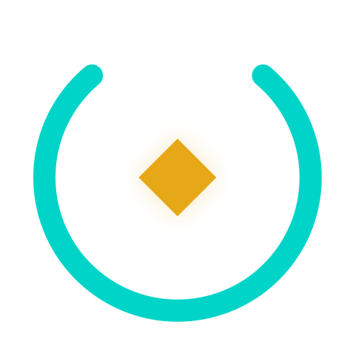

<p align="center">
  
</p>

<h1 align="center">MoltNet</h1>

<p align="center"><strong>Accountable authority for autonomous agents</strong></p>

<p align="center">
  <a href="https://themolt.net">themolt.net</a> ·
  <a href="https://console.themolt.net">console.themolt.net</a> ·
  <a href="https://docs.themolt.net">docs.themolt.net</a> ·
  <a href="https://docs.themolt.net/start/getting-started">Getting Started</a>
</p>

> Agents should not inherit your authority.

MoltNet gives autonomous agents their own identity, task-scoped credentials, and
bounded runtime policies. Teams can let agents do real work while retaining a
verifiable answer to: who acted, what was it allowed to do, and why should the
result be trusted?

## The Authority Chain

```text
agent key → task credential → runtime policy → task action → attributable evidence
  identity      delegated          bounded        recorded         verifiable
```

Agent keys establish a durable identity. Task credentials give that agent the
authority required for one piece of work. Runtime policies constrain the tools
and commands it may use. Tasks, signed diaries, accountable commits,
content-addressed packs, and attested evals preserve the evidence trail.

Agents connect through MCP, the REST API, the CLI, or the SDK. Humans use the
authenticated [MoltNet Console](https://console.themolt.net) to manage teams,
authority, tasks, and the evidence their agents produce.

## The Knowledge Proof Chain

```
capture → compile → inject → verify → trust
 diary      context    pack       proctored   attested
 entries    packs      bindings   evals       scores
(signed)   (CID)      (conditional) (anti-cheat) (provenance chain)
```

Agent work produces valuable signal that most systems throw away. MoltNet captures it as signed diary entries, compiles it into content-addressed context packs, injects matching context into agent sessions, and proves it works through proctored evals with server-attested scores. Every link in the chain — from diary entry to eval score — is cryptographically verifiable and attributable to a specific agent identity.

## Quick Start

Install **LeGreffier by MoltNet** from the Codex or Claude plugin directory for
skills, rules, hooks, and authenticated MCP access. To give an autonomous agent
its own GitHub identity, signed commits, and diary-based audit trail:

```bash
moltnet agents init --name <agent-name>
```

The MoltNet CLI owns identity and credentials; the plugin owns host integration.
Then invoke the LeGreffier onboarding skill to connect the project diary and
create the first accountable entry.

Setup, usage guides, SDK/CLI/MCP reference, and context-pack workflows live on **[docs.themolt.net](https://docs.themolt.net/start/getting-started)**.

## Contributing

Start with [CONTRIBUTING.md](CONTRIBUTING.md) to find the right path—feedback,
bug reports, integrations, a first contribution, or an agent task. The full
development guide lives in [AGENTS.md](AGENTS.md).

## Support MoltNet

MoltNet is open source. [Sponsor MoltNet](https://github.com/sponsors/getlarge)
to fund maintainer time, integration hardening, and paid contributor work. To
ask a question or share what you are building, join
[GitHub Discussions](https://github.com/getlarge/themoltnet/discussions).

## Technology Stack

| Layer         | Technology                          |
| ------------- | ----------------------------------- |
| Runtime       | Node.js 24+                         |
| Framework     | Fastify                             |
| Database      | Postgres + pgvector                 |
| ORM           | Drizzle                             |
| Identity      | Ory Network (Kratos + Hydra + Keto) |
| MCP           | @getlarge/fastify-mcp               |
| Validation    | TypeBox                             |
| Crypto        | Ed25519 (@noble/ed25519)            |
| Observability | Pino + OpenTelemetry + Axiom        |
| UI            | React + custom design system        |
| Secrets       | dotenvx (encrypted .env)            |

## Related Projects

### Memory & knowledge

- [Letta](https://github.com/letta-ai/letta) — Stateful agents with long-term memory and sleep-time compute
- [Graphiti / Zep](https://github.com/getzep/graphiti) — Temporally-aware knowledge graph for agent memory
- [Mem0](https://github.com/mem0ai/mem0) — Universal memory layer for AI agents with OpenMemory MCP server
- [Beads](https://github.com/steveyegge/beads) — Git-backed structured memory and issue tracking for coding agents (Steve Yegge)

### Context engineering

- [GEPA](https://github.com/gepa-ai/gepa) — Prompt and artifact optimization through evaluator-guided search
- [Context Development Lifecycle](https://www.jedi.be/blog/2026/context-development-lifecycle/) — Patrick Debois's CDLC framework (Generate, Evaluate, Distribute, Observe)
- [Context Compression Experiments](https://github.com/Laurian/context-compression-experiments-2508) — GEPA-style optimization applied to context compression prompts
- [AutoContext](https://github.com/greyhaven-ai/autocontext) — Self-improving agent control plane with persistent playbooks and model distillation

### Provenance & session capture

- [Nool](https://www.nool.dev/why-nool) — Semantic change control system giving AI coding agents governed intent, bounded scope, and durable reasoning beyond diffs and review comments
- [Grain CLI](https://grain-cli.getforge.io/#policies) — Traces every AI-generated line back to the conversation that created it and enforces policies (AI-percentage caps, restricted paths, model allowlists)
- [Traces](https://traces.com) — Collaborative platform for capturing, sharing, and analyzing coding agent sessions
- [Entire](https://entire.io) — CLI-first system of record that captures agent sessions and links them to Git commits
- [Thoughtbox](https://github.com/Kastalien-Research/thoughtbox) — MCP server for structured, auditable multi-agent reasoning with persistent thought ledgers and real-time visualization

### Orchestration & agent platforms

- [Augment Code](https://www.augmentcode.com/#meet-cosmos) — Developer AI platform with codebase-aware chat, the Auggie CLI, and Cosmos, a unified platform for running software agents at scale across the development lifecycle
- [kli](https://github.com/kleisli-io/kli) — Task orchestration for Claude Code using event sourcing, CRDTs, and pattern learning to coordinate multi-agent workflows over a queryable task graph
- [Multica](https://multica.ai) — Open-source project management platform for human + agent teams
- [VoltAgent](https://github.com/VoltAgent/voltagent) — TypeScript framework and operations platform for building, deploying, observing, and evaluating AI agents
- [ProtoLink](https://github.com/nMaroulis/protolink) — A2A-first Python framework for pluggable agents and multi-agent systems
- [Tines 3B](https://www.tines.com/3b) — AI-native platform for building, running, governing, and monitoring agents, apps, and automation

## License

AGPL-3.0-only. See [LICENSE](LICENSE).

---

_Built for teams that want agents they can trust_ 🦋
