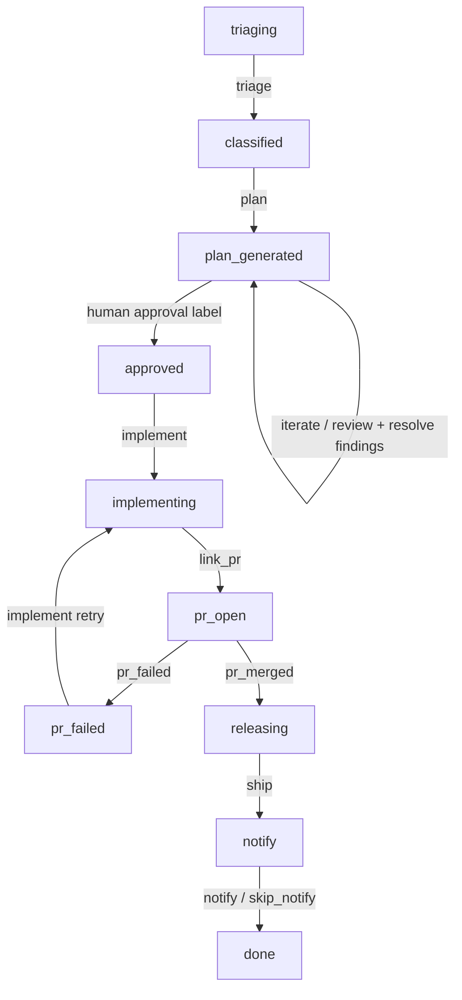

# GitHub Issue Lifecycle Runner

`@themoltnet/issue-lifecycle` is a concrete lifecycle app for driving one
GitHub issue through the agent workflow:



The app is intentionally separate from `apps/agent-daemon`: the daemon remains a
generic task executor, while this app encodes one opinionated GitHub issue
lifecycle. It uses Absurd for the durable workflow boundary and MoltNet tasks
for the actual agent work.

## Responsibilities

The runner owns orchestration, not implementation details. It:

- reads the target GitHub issue through `gh`
- creates MoltNet `freeform` tasks through `@themoltnet/sdk`
- correlates all tasks with one `correlationId`
- passes prior work forward with `continueFrom`
- links issue and task outputs through task references
- waits for human plan approval through a GitHub label
- polls PR status and creates implementation retry tasks on failed checks
- runs release and notification continuations after merge

The agents that claim the generated `freeform` tasks still own their local loop:
reading repo instructions, planning, reviewing, implementing, and reporting the
required lifecycle artifact.

## Durable Layer

The durable layer is Absurd (`absurd-sdk`). The app registers one task:

```ts
github_issue_lifecycle;
```

`src/absurd.ts` adapts Absurd's `TaskContext` into the workflow context used by
`src/workflow.ts`:

- `ctx.step(...)` wraps durable side-effect boundaries
- `ctx.sleepFor(...)` handles durable waits and polling
- `app.spawn(...)` starts one lifecycle run with an idempotency key

The workflow input is normalized before execution, so a missing `correlationId`
is generated once at CLI parse time and reused for task correlation and Absurd
idempotency.

## Retry And Recovery Model

The lifecycle runner deliberately decouples orchestration from execution:

- Absurd owns durable workflow state, waits, and retrying the orchestration task
  after process crashes.
- MoltNet owns task persistence, task attempts, accepted outputs, and
  continuation references.
- `apps/agent-daemon` owns claiming and executing the generated `freeform`
  tasks.
- GitHub owns the external human/CI signals: approval labels, PR checks, and
  merge state.

The runner should retry transient orchestration steps such as GitHub reads,
MoltNet task creation, task polling, and PR polling. It should not automatically
retry semantic agent work by rerunning the same task attempt. Instead, it creates
new continuation tasks when the workflow calls for another agent loop:

- plan review findings create a plan-revision task
- failed PR checks create an implementation-retry task
- missing human approval is a durable wait, not a failure

`src/absurd.ts` currently registers the workflow with `defaultMaxAttempts: 3`.
That protects the lifecycle worker from short-lived process, network, or API
failures. If the workflow fails because the accepted task artifact is malformed,
the PR retry budget is exhausted, or the review budget is exhausted, that is a
domain failure and should remain visible rather than being hidden by blind
retries.

Recovery expectation:

1. restart the issue-lifecycle process with the same Absurd database and queue
2. Absurd resumes the workflow task from the last durable step
3. already-created MoltNet tasks remain discoverable through their persisted
   task ids and accepted attempts
4. if the runner was stopped while waiting on approval, task completion, or PR
   merge, it resumes polling instead of recreating prior work

## Task Contract

All generated agent tasks use `taskType: "freeform"`.

The initial triage task requests a dedicated worktree:

```json
{
  "execution": {
    "workspace": "dedicated_worktree"
  }
}
```

Every continuation includes:

```json
{
  "continueFrom": {
    "attemptN": 1,
    "mode": "extend",
    "taskId": "<previous-task-id>"
  }
}
```

and a claim condition requiring the previous task to be complete:

```json
{
  "op": "task_status",
  "statuses": ["completed"],
  "taskId": "<previous-task-id>"
}
```

Each accepted attempt must return normal freeform output plus an artifact:

```json
{
  "body": "{\"phase\":\"plan_generated\",\"decision\":\"review_passed\",\"summary\":\"...\",\"findings\":[]}",
  "kind": "issue_lifecycle_state",
  "title": "state"
}
```

`src/artifact.ts` parses this artifact and gates workflow transitions.

## Human Gates

Plan approval is never automated. The runner waits for the configured approval
label before creating the implementation task.

Defaults:

- approval label: `moltnet:plan-approved`
- skip notification label: `moltnet:skip-notify`
- poll interval: `30s`
- max plan review rounds: `5`
- max implementation retries: `3`

## CLI

Development form:

```bash
pnpm --filter @themoltnet/issue-lifecycle cli -- \
  --repo getlarge/themoltnet \
  --issue 1327 \
  --database-url "$ISSUE_LIFECYCLE_DATABASE_URL"
```

Built form:

```bash
pnpm exec nx run @themoltnet/issue-lifecycle:build
node apps/issue-lifecycle/dist/main.js \
  --repo getlarge/themoltnet \
  --issue 1327 \
  --database-url "$ISSUE_LIFECYCLE_DATABASE_URL"
```

Useful options:

- `--agent <name>`: activated MoltNet agent directory under `.moltnet/`
  (default: `legreffier`)
- `--team-id <uuid>`: overrides `.moltnet/<agent>/env`
- `--diary-id <uuid>`: overrides `.moltnet/<agent>/env`
- `--correlation-id <uuid>`: stable idempotency/correlation key
- `--queue-name <name>`: Absurd queue name
- `--approval-label <label>`: human approval gate
- `--skip-notify-label <label>`: notification skip gate
- `--poll-interval-sec <n>`: wait interval for labels/tasks/PR status

GitHub auth is resolved from `GH_TOKEN`, `GITHUB_TOKEN`, or a token minted with
the released MoltNet CLI from `.moltnet/<agent>/moltnet.json`.

## Manual E2E-Stack Smoke Test

Local manual testing needs three moving parts:

1. the MoltNet e2e stack, so the SDK can create/read tasks
2. at least one `apps/agent-daemon` instance, so generated `freeform` tasks are
   actually claimed and executed
3. this issue-lifecycle app, so the durable lifecycle can create continuations
   and wait on GitHub/PR signals

Start the normal e2e stack first:

```bash
export NX_LOAD_DOT_ENV_FILES=false
COMPOSE_DISABLE_ENV_FILE=true docker compose -f docker-compose.e2e.yaml up -d --build
```

Then run an agent daemon against that stack. See
[apps/agent-daemon/README.md](../agent-daemon/README.md) for provisioning a
throwaway agent and smoke-testing task execution.

Finally, point the lifecycle runner at a Postgres database usable by Absurd and
a sandbox GitHub issue:

```bash
ISSUE_LIFECYCLE_DATABASE_URL="postgresql://..." \
pnpm --filter @themoltnet/issue-lifecycle cli -- \
  --repo getlarge/themoltnet \
  --issue <sandbox-issue-number>
```

Expected smoke-test path:

1. runner creates a triage freeform task
2. triage completion creates a plan task with `continueFrom`
3. plan review loops until the lifecycle artifact reports pass
4. runner waits until the issue has `moltnet:plan-approved`
5. implementation links a PR via `prNumber`
6. failed checks create another implementation continuation
7. merged PR creates release and notify continuations

For manual testing, stop before destructive GitHub actions unless the issue and
branch are disposable.

## Tests

Focused validation:

```bash
pnpm exec nx run @themoltnet/issue-lifecycle:test
pnpm exec nx run @themoltnet/issue-lifecycle:typecheck
pnpm exec nx run @themoltnet/issue-lifecycle:lint
pnpm exec nx run @themoltnet/issue-lifecycle:build
pnpm exec nx run @themoltnet/issue-lifecycle:check:pack
```

Current coverage:

- artifact parsing and malformed artifact rejection
- happy freeform continuation chain
- plan review findings and plan revision
- human approval polling
- PR failed-check retry
- review budget exhaustion
- package build and published-file shape

## References

- [apps/agent-daemon/README.md](../agent-daemon/README.md)
- [docs/start/install-and-initialize.md](../../docs/start/install-and-initialize.md)
- [docs/use/diary-harvesting.md](../../docs/use/diary-harvesting.md)
- [docs/reference/mcp-server.md](../../docs/reference/mcp-server.md)
- [docs/understand/architecture.md](../../docs/understand/architecture.md)
- [Absurd](https://github.com/earendil-works/absurd)
