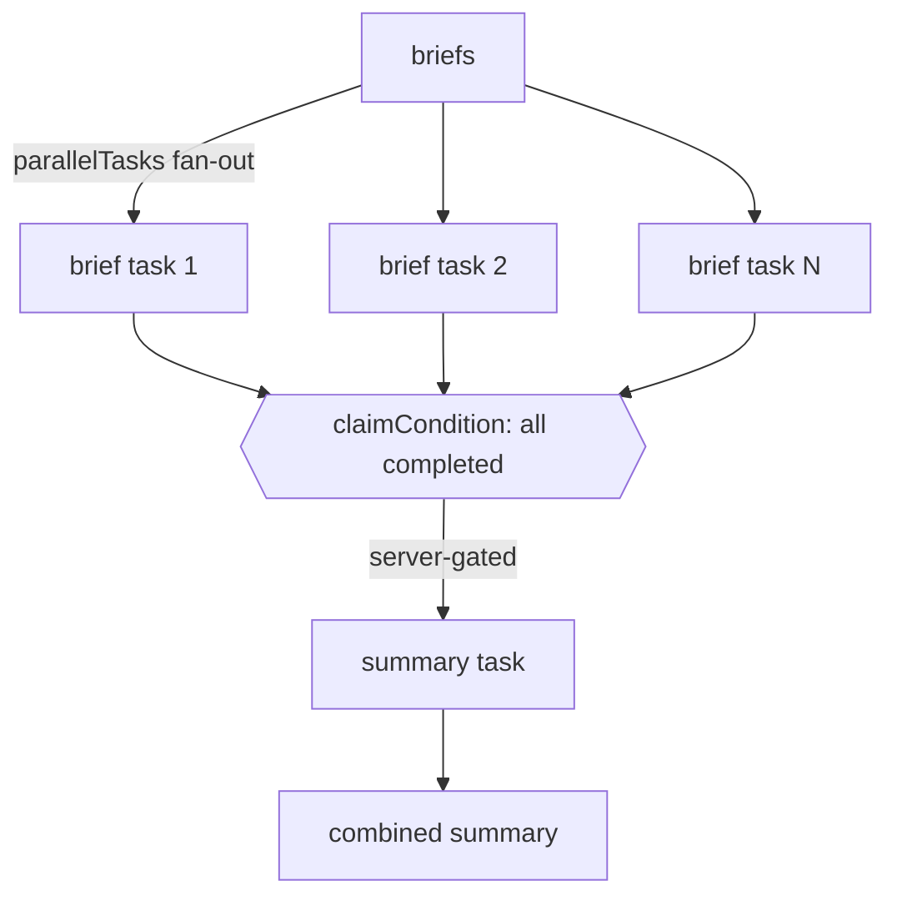

# Parallel Brief Runner

`@themoltnet/parallel-brief-runner` is the minimal reference lifecycle for the
[`@moltnet/orchestration`](../../libs/orchestration) library. It exists to
demonstrate the two orchestration primitives end to end, in as little code as
possible:

- **`parallelTasks`** — fan out one `freeform` MoltNet task per brief, then await
  them (optionally concurrency-bounded).
- **`joinCondition`** — gate a single summary continuation on **all** brief tasks
  completing, enforced server-side by the task-service claim layer (no
  orchestrator-side barrier).



Like `apps/issue-lifecycle`, the workflow body is written against the
transport-neutral `WorkflowContext`, so the same `runParallelBriefs` runs:

- **inline** (synchronous, no DB) in `src/workflow.test.ts` via the lib's
  `FakeTasks`, and
- **durably** on Absurd via `createParallelBriefsAbsurdApp` (see `src/absurd.ts`).

## Task contract

Each brief task and the summary task must return a `summary` string field in its
freeform output. The summary task additionally receives the brief task outputs as
`context` references and `input.priorSummaries`.

## CLI

```bash
PARALLEL_BRIEFS_DATABASE_URL="postgres://…" \
  pnpm --filter @themoltnet/parallel-brief-runner cli \
  --team <uuid> --diary <uuid> \
  --brief "summarize the auth module" \
  --brief "summarize the task-service" \
  --summary "produce a combined architecture note"
```

The Postgres URL is read from the `PARALLEL_BRIEFS_DATABASE_URL` environment
variable (not argv, so the credential is not exposed via shell history or
process listings). It must point at an Absurd-initialized Postgres (`absurdctl
init` + `absurdctl create-queue parallel-briefs`), the same setup documented in
`apps/issue-lifecycle/README.md`.

## Tests

```bash
pnpm exec nx run @themoltnet/parallel-brief-runner:test
```
