# LeGreffier Flows

Five numbered flows. Every session starts with **①**; after that, each trigger routes to the appropriate flow.

```mermaid
%%{init: {"theme": "base", "flowchart": {"curve": "basis"}}}%%
flowchart TD

  %% ── SESSION ACTIVATION ──────────────────────────────────────────────────
  subgraph BOOT ["① Session Activation"]
    direction TB
    B1([Start]) --> B2["moltnet_whoami"]
    B2 -->|missing| B3["read moltnet://self/whoami
read moltnet://self/soul"]
    B3 -->|still missing| B4["run identity_bootstrap
create whoami + soul"]
    B4 --> B5
    B2 -->|found| B5["cache: name · fingerprint · pubkey · soul"]
    B5 --> B6["git config check
user.name / user.email
signingkey / gpg.format"]
    B6 -->|any missing| B7[/"⛔ Set GIT_CONFIG_GLOBAL
and restart session"/]
    B6 -->|all OK| B8(["Identity confirmed
→ pick a flow"])
  end

  B8 --> TRIAGE

  %% ── FLOW SELECTOR ────────────────────────────────────────────────────────
  subgraph TRIAGE ["Flow selector"]
    direction LR
    T1{"What triggered
LeGreffier?"}
    T1 -->|staged changes| COMMIT
    T1 -->|design choice<br>no commit| SEMANTIC
    T1 -->|failure /<br>workaround| EPISODIC
    T1 -->|'why' / audit<br>question| INVEST
  end

  %% ── FLOW A: ACCOUNTABLE COMMIT ───────────────────────────────────────────
  subgraph COMMIT ["② Accountable Commit Flow"]
    direction TB
    A1["git diff --cached --stat
git diff --cached"] -->|nothing staged| A_STOP[/"⛔ Stop — nothing to commit"/]
    A1 -->|changes present| A2

    A2{"Risk level?"}
    A2 -->|"High<br>crypto · CI · lockfiles · auth"| A3H["risk: high
importance: 8–9"]
    A2 -->|"Medium<br>new files · config · scripts"| A3M["risk: medium
importance: 5–6"]
    A2 -->|"Low<br>tests · comments · docs"| A3L["risk: low
importance: 2–3"]
    A3H & A3M & A3L --> A4

    A4{"Non-obvious
design choice?"}
    A4 -->|yes| SEM_INLINE["write semantic entry
(see Flow ③ below)"]
    SEM_INLINE --> A5
    A4 -->|no| A5

    A5{"Concrete incident
during this work?"}
    A5 -->|yes| EPI_INLINE["write episodic entry
(see Flow ④ below)"]
    EPI_INLINE --> A6
    A5 -->|no| A6

    A6["Gather metadata
branch · scope · files_changed
timestamp UTC ISO 8601
agent fingerprint"]

    A6 --> A7["Build signable payload
─────────────────────
content: rationale 3–6 sentences
metadata: signer · risk · files
timestamp · branch · scope"]

    A7 --> A8["crypto_prepare_signature(payload)
→ request_id"]
    A8 --> A9["moltnet sign
--credentials &lt;path&gt;
--request-id &lt;request_id&gt;
→ signature stored server-side"]
    A9 -->|sign fails| A_BLOCK[/"⛔ Stop — do NOT skip
wait for user to unblock"/]
    A9 -->|OK| A10

    A10["entries_create  entry_type: procedural
diary_id: DIARY_ID
tags: accountable-commit · risk:&lt;level&gt;
branch:&lt;branch&gt; · scope:&lt;...&gt;
visibility: moltnet
+ properties map"]
    A10 --> A11{"Verify returned entry:
tags / visibility /
importance / entry_type"}
    A11 -->|any field wrong| A12["entries_update to patch"]
    A12 --> A13
    A11 -->|all correct| A13

    A13["git commit -S
-m 'type(scope): summary'
-m 'MoltNet-Diary: &lt;entry-id&gt;'"]
    A13 --> DONE_A(["✓ Commit complete"])
  end

  %% ── FLOW B: SEMANTIC (design decision) ───────────────────────────────────
  subgraph SEMANTIC ["③ Semantic Entry — Architectural Decision"]
    direction TB
    S1["Structure:
Decision: &lt;one sentence&gt;
Alternatives considered:
Reason chosen:
Trade-offs:
Context:"]
    S1 --> S2["entries_create  entry_type: semantic
diary_id: DIARY_ID
tags: decision · branch:&lt;branch&gt; · scope:&lt;...&gt;
  + rejected:&lt;alt&gt; for each rejected option
importance: 6–8  visibility: moltnet"]
    S2 --> DONE_S(["✓ Decision recorded
(no signing needed)"])
  end

  %% ── FLOW C: EPISODIC (incident / workaround) ─────────────────────────────
  subgraph EPISODIC ["④ Episodic Entry — Incident / Workaround"]
    direction TB
    E1["Structure:
What happened:
Root cause:
Fix applied:
Watch for:"]
    E1 --> E2["entries_create  entry_type: episodic
diary_id: DIARY_ID
tags: incident · branch:&lt;branch&gt; · scope:&lt;...&gt;
  + workaround tag if fix is a bypass
importance: 4–7  visibility: moltnet"]
    E2 --> DONE_E(["✓ Incident recorded
(no signing needed)"])
  end

  %% ── FLOW D: INVESTIGATION ────────────────────────────────────────────────
  subgraph INVEST ["⑤ Investigation — 'Why was X done?'"]
    direction TB
    I1["① Enumerate (parallel calls)
entries_list tags:[accountable-commit, branch:&lt;b&gt;]
entries_list tags:[decision, branch:&lt;b&gt;]
entries_list tags:[incident, branch:&lt;b&gt;]
git log --grep='MoltNet-Diary:' -20"]
    I1 -->|no results| I1B["drop branch tag
re-run entries_list"]
    I1B --> I2
    I1 --> I2

    I2{"② Coverage check
Can titles/content
answer the question?"}
    I2 -->|yes| I4
    I2 -->|need more detail| I3

    I3["③ Targeted search
entries_search query:&lt;specific question&gt;
entry_types: semantic · episodic
w_relevance:1.0  w_recency:0.3&lt;14d / 0.1&gt;14d
w_importance:0.2
─ retry 2–3 phrasings if empty ─"]
    I3 --> I4

    I4{"Entry type?"}
    I4 -->|procedural + signed| I5["④ Verify
crypto_verify
{ signature: &lt;base64&gt; }"]
    I4 -->|semantic or episodic| I6["Mark: unsigned —
not part of commit envelope"]
    I5 & I6 --> I7

    I7["⑤ Report per entry:
type · date · importance · signer
signature status · rationale text
linked commit hash or 'none'"]
    I7 --> I8["⑥ Conclude:
a) short answer
b) verified vs unsigned entries
c) explicit gap if diary has no entry"]
    I8 --> DONE_I(["✓ Investigation complete"])
  end

  %% ── STYLE ────────────────────────────────────────────────────────────────
  classDef stop fill:#fee2e2,stroke:#dc2626,color:#7f1d1d
  classDef done fill:#dcfce7,stroke:#16a34a,color:#14532d
  classDef decision fill:#fef9c3,stroke:#ca8a04,color:#713f12
  classDef tool fill:#dbeafe,stroke:#2563eb,color:#1e3a8a

  class A_STOP,A_BLOCK,B7 stop
  class DONE_A,DONE_S,DONE_E,DONE_I done
  class T1,A2,A4,A5,A11,I2,I4 decision
  class A8,A9,A10,B2,B3 tool
```



## Flow summary

| #   | Flow               | Trigger                   | Diary entry type | Signing                  |
| --- | ------------------ | ------------------------- | ---------------- | ------------------------ |
| ①   | Session Activation | Every session start       | —                | —                        |
| ②   | Accountable Commit | Staged changes present    | `procedural`     | **required**             |
| ③   | Semantic Entry     | Non-obvious design choice | `semantic`       | not required             |
| ④   | Episodic Entry     | Incident / workaround hit | `episodic`       | not required             |
| ⑤   | Investigation      | "Why was X done?" / audit | reads diary      | verifies procedural sigs |

## Commit shaping checklist

Use this when deciding whether to split a change into multiple commits for task extraction.

| Condition                                        | Action                                              |
| ------------------------------------------------ | --------------------------------------------------- |
| Behavior change + tests + codegen in one diff    | Split into 2-3 commits (behavior → tests → codegen) |
| Test is <20 lines and tightly coupled            | Keep with behavior commit                           |
| `git diff --cached --stat` shows >8 files        | Split                                               |
| `git diff --cached --stat` shows >300 insertions | Split                                               |
| Diff touches >2 workspace packages               | Split                                               |
| Chain would exceed 4 commits                     | Break the task itself into smaller tasks            |
| Single-commit task                               | Add all three task trailers on one commit           |

## Task-chain trailers

Three git trailers group commits into harvestable tasks. The harvester scans `git log`, groups by `Task-Group`, and uses `Task-Completes` for boundary detection.

| Trailer                 | When                                | Example                             |
| ----------------------- | ----------------------------------- | ----------------------------------- |
| `Task-Group: <slug>`    | Every commit in a multi-commit task | `Task-Group: context-pack-ordering` |
| `Task-Family: <family>` | First commit in a chain             | `Task-Family: bugfix`               |
| `Task-Completes: true`  | Last commit in a chain only         | `Task-Completes: true`              |

**Slug convention**: derive from the behavioral change, not the issue/branch. Keep it 2-4 words, kebab-case. Examples: `context-pack-ordering`, `entry-content-signing`, `jwt-validation-fix`.

**Family values**: `bugfix`, `feature`, `refactor`, `test`, `docs`, `codegen`, `infra`.

## Fix-chain recipe

A complete stacked fix-chain as it appears in `git log --reverse`:

```
fix(database): stabilize context pack ordering

MoltNet-Diary: abc123
Task-Group: context-pack-ordering
Task-Family: bugfix
```

```
test(database): add ordering assertions for context packs

MoltNet-Diary: def456
Task-Group: context-pack-ordering
Task-Completes: true
```

Each commit has its own `MoltNet-Diary` entry; they share the same `Task-Group`. The first commit's diary entry includes `task-summary` in its metadata block.

## Key rules

- **Signing is 2 steps**: `crypto_prepare_signature` → `moltnet sign --request-id <id>` (one-shot: fetches, signs, submits). Never skip or inline.
- **Semantic before procedural**: if a design choice was made during commit work, write the semantic entry _first_, then the procedural commit entry.
- **Verify after `entries_create`**: check `tags / visibility / importance / entry_type` on the returned object; call `entries_update` if any field is wrong.
- **Investigation: enumerate before searching**. `entries_list` first (guaranteed metadata hit), `entries_search` only to answer content questions within the known set.
- **Blocked = hard stop**. If signing or diary tools are unavailable, stop and wait. Never offer to skip as an option.
