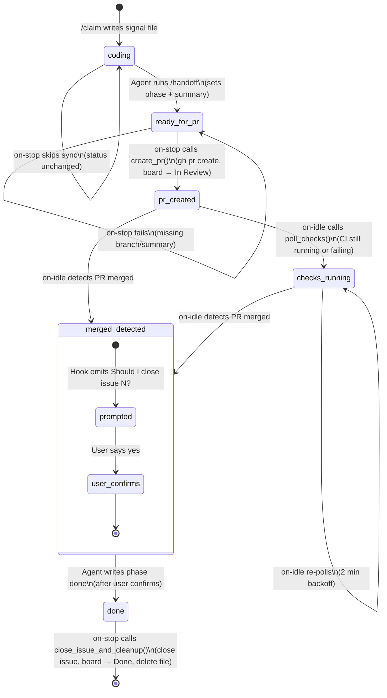
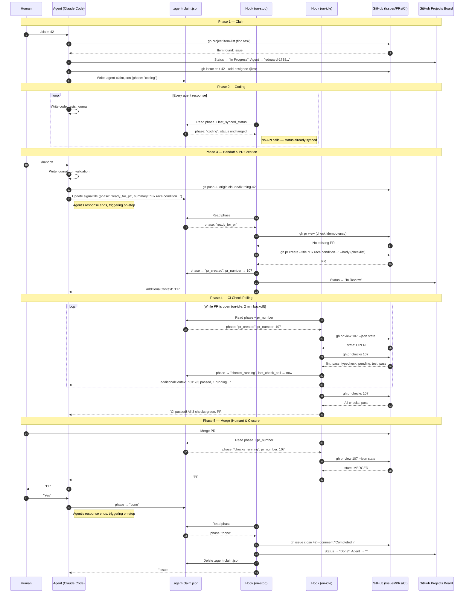
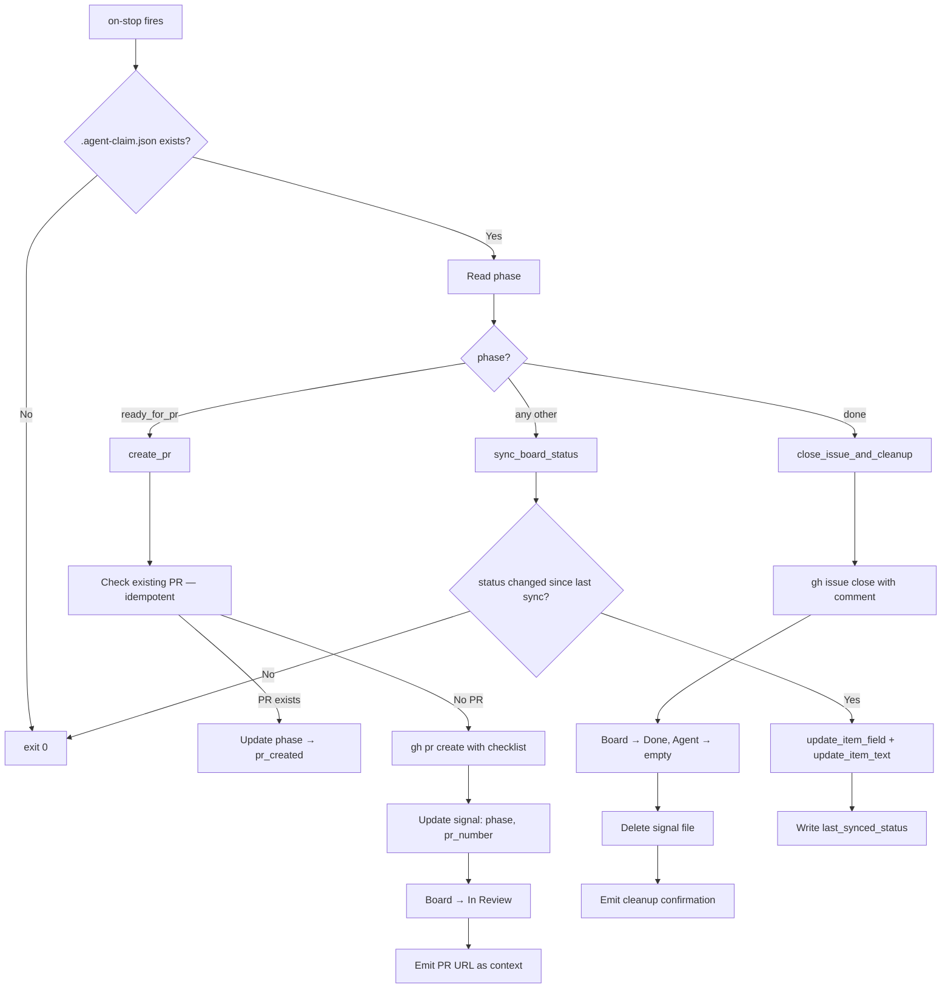
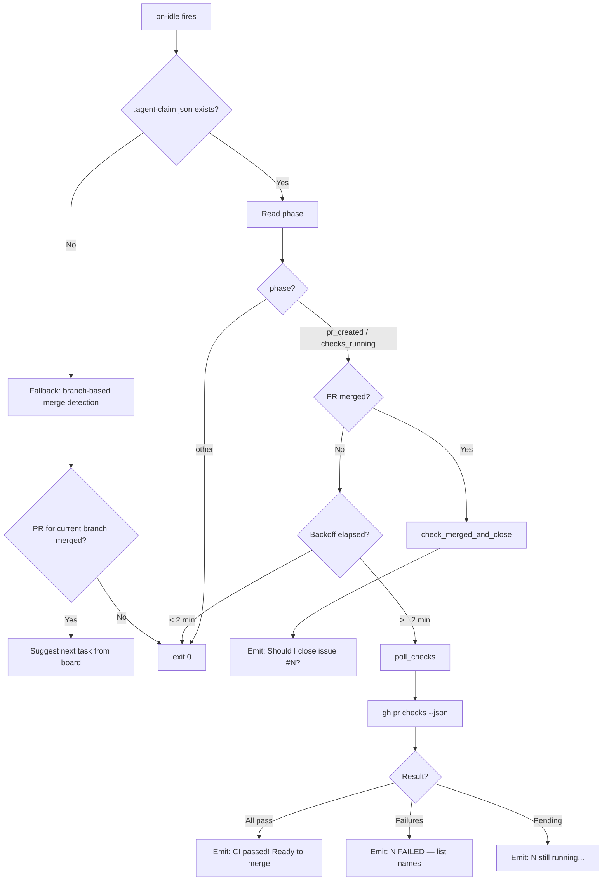

# Hook-Driven Task Lifecycle

_How `.agent-claim.json` phase transitions automate the claim-to-close workflow._

This document describes the automated task lifecycle system built on Claude Code hooks and a local signal file. It replaces the manual post-coding workflow (create PR, watch CI, close issue) with phase-driven automation where the hooks handle the mechanics.

---

## Participants

| Actor                      | What it is                                               | Role                                                               |
| -------------------------- | -------------------------------------------------------- | ------------------------------------------------------------------ |
| **Agent**                  | Claude Code session                                      | Claims tasks, writes code, writes signal file, responds to prompts |
| **Hook (`on-stop`)**       | `agent-sync.sh on-stop`, runs after every agent response | Creates PRs, closes issues, syncs board status                     |
| **Hook (`on-idle`)**       | `agent-sync.sh on-idle`, runs when session is idle       | Polls CI checks, detects PR merge, prompts agent                   |
| **Hook (`session-start`)** | `agent-sync.sh session-start`, runs once on startup      | Injects project board context into session                         |
| **Signal File**            | `.agent-claim.json` in project root                      | Ephemeral state machine driving hook behavior                      |
| **GitHub**                 | Issues, PRs, Actions CI, Projects board                  | Source of truth for tasks, code review, CI status                  |
| **Human**                  | The orchestrator                                         | Merges PRs, confirms issue closure, spawns agents                  |

---

## Phase State Machine



---

## Full Lifecycle Sequence



---

## Signal File Schema

The `.agent-claim.json` file is the only state the hooks inspect. It is ephemeral — created on `/claim`, deleted after `done`.

```json
{
  "schema_version": 1,
  "item_id": "PVTI_lADOBx...",
  "issue_number": 42,
  "branch": "claude/fix-thing-42",
  "agent_id": "edouard-1738000000",
  "phase": "coding",
  "summary": "",
  "status": "In Progress",
  "pr_number": null,
  "last_check_poll": null,
  "last_synced_status": "In Progress"
}
```

| Field                | Type            | Written by            | Purpose                                                   |
| -------------------- | --------------- | --------------------- | --------------------------------------------------------- |
| `schema_version`     | number          | `/claim`              | Schema version for forward compatibility (currently `1`)  |
| `item_id`            | string          | `/claim`              | GitHub Projects item ID for board updates                 |
| `issue_number`       | number          | `/claim`              | GitHub issue to close at end of lifecycle                 |
| `branch`             | string          | `/claim`              | Git branch name, used for PR creation                     |
| `agent_id`           | string          | `/claim`              | Session identifier for the Agent field on the board       |
| `phase`              | string          | Agent + hooks         | State machine driver (see phases below)                   |
| `summary`            | string          | `/handoff`            | PR title — populated when transitioning to `ready_for_pr` |
| `status`             | string          | Agent + hooks         | Project board Status value to sync                        |
| `pr_number`          | number/null     | `create_pr()`         | PR number, populated after PR creation                    |
| `last_check_poll`    | ISO string/null | `poll_checks()`       | Timestamp of last CI poll for 2-min backoff               |
| `last_synced_status` | string/null     | `sync_board_status()` | Last status synced to board — skips redundant API calls   |

---

## Phase Reference

| Phase            | Set by                      | Triggers                                               | Board Status            |
| ---------------- | --------------------------- | ------------------------------------------------------ | ----------------------- |
| `coding`         | Agent via `/claim`          | on-stop: sync status to board                          | In Progress             |
| `ready_for_pr`   | Agent via `/handoff`        | on-stop: `create_pr()`                                 | In Progress → In Review |
| `pr_created`     | `create_pr()`               | on-idle: `poll_checks()` or `check_merged_and_close()` | In Review               |
| `checks_running` | `poll_checks()`             | on-idle: re-poll (2 min backoff)                       | In Review               |
| `done`           | Agent (after user confirms) | on-stop: `close_issue_and_cleanup()`                   | Done                    |

---

## Hook Dispatch Logic

### on-stop (runs after every agent response)



### on-idle (runs when session is idle)



---

## Hook Configuration

Hooks are declared in `.claude/settings.json`:

```json
{
  "hooks": {
    "SessionStart": [
      {
        "matcher": "startup",
        "hooks": [
          {
            "type": "command",
            "command": "... agent-sync.sh session-start",
            "timeout": 30000
          }
        ]
      }
    ],
    "Stop": [
      {
        "matcher": "",
        "hooks": [
          {
            "type": "command",
            "command": "... agent-sync.sh on-stop",
            "timeout": 30000
          }
        ]
      }
    ],
    "Notification": [
      {
        "matcher": "idle_prompt",
        "hooks": [
          {
            "type": "command",
            "command": "... agent-sync.sh on-idle",
            "timeout": 30000
          }
        ]
      }
    ]
  }
}
```

The Stop hook is **synchronous** (no `async: true`) so it can return `additionalContext` with the PR URL after creation. The common case (`coding` phase with unchanged status) exits immediately with zero API calls, so the latency impact is negligible.

---

## Design Decisions

### Unchecked mission integrity boxes

The PR body includes all 5 mission integrity checklist items as **unchecked** boxes. The agent or reviewer must check them manually. This preserves the purpose of the checklist — pre-checking them would be decorative.

### Board sync skips unchanged status

The `sync_board_status()` function tracks `last_synced_status` in the signal file. If the status hasn't changed since the last sync, it exits immediately with zero API calls. This eliminates redundant `gh project view` + `fetch_fields` + `item-edit` calls on every response during the `coding` phase.

### Structured JSON for CI check parsing

`poll_checks()` uses `gh pr checks --json name,state,conclusion` instead of text parsing. This avoids false matches (e.g., a check named "password-check" matching "pass") and handles header lines/error messages correctly.

### Atomic signal file writes

`write_claim_field()` creates the temp file in the same directory as the signal file (`mktemp "$CLAIM_FILE.XXXXXX"`) to ensure `mv` is an atomic rename on the same filesystem, not a copy+delete across filesystems.

### Schema versioning

The signal file includes `schema_version: 1`. If the schema changes in the future, the hook can detect and reject incompatible files instead of silently producing wrong behavior.

### 2-minute backoff for check polling

The on-idle hook fires frequently. Without backoff, it would spam the GitHub API. The `last_check_poll` timestamp in the signal file ensures polls happen at most once every 2 minutes. If date parsing fails, it falls back to epoch 0 (forces a re-poll) — this is intentional to avoid silently stuck polling, at the cost of one extra API call.

### User must confirm issue closure

The hook detects merge but does not auto-close. It prompts the agent, which prompts the user. Only after the user says "yes" does the agent write `phase: done`. This keeps the human in the loop for the final destructive action.

### Signal file is ephemeral

Deleted after the `done` phase completes. No persistent state between tasks. A new `/claim` writes a fresh file.

### Idempotent operations

- **PR creation**: `create_pr()` checks if a PR already exists for the branch before calling `gh pr create`
- **Issue closure**: `gh issue close` is safe to retry (closing an already-closed issue is a no-op)
- **Check polling**: reading CI status is naturally idempotent
- **Board updates**: setting a field to its current value is harmless

### No signal file = legacy behavior

If `.agent-claim.json` doesn't exist, the hooks fall back to the original behavior: on-stop is a no-op, on-idle does branch-based merge detection. This preserves backward compatibility for sessions that don't use `/claim`.

---

## Files Involved

| File                          | Purpose                                               |
| ----------------------------- | ----------------------------------------------------- |
| `scripts/agent-sync.sh`       | Hook script — all lifecycle logic                     |
| `.claude/commands/claim.md`   | `/claim` slash command — step 6 writes signal file    |
| `.claude/commands/handoff.md` | `/handoff` slash command — step 7 sets `ready_for_pr` |
| `.claude/settings.json`       | Hook configuration + bash permissions                 |
| `.gitignore`                  | Ensures `.agent-claim.json` is not committed          |
| `.agent-claim.json`           | Ephemeral signal file (gitignored)                    |

---

## Testing

### Manual phase-by-phase testing

1. **Signal file creation** — run `/claim 42`, verify `.agent-claim.json` exists with `phase: coding`

2. **PR creation** — write a signal file manually and run the hook:

   ```bash
   echo '{"schema_version":1,"item_id":"TEST","issue_number":42,"branch":"claude/test","agent_id":"test","phase":"ready_for_pr","summary":"Test PR","status":"In Review","pr_number":null,"last_check_poll":null,"last_synced_status":null}' > .agent-claim.json
   echo '{}' | CLAUDE_PROJECT_DIR=. MOLTNET_PROJECT_NUMBER=1 ./scripts/agent-sync.sh on-stop
   ```

3. **Check polling** — create a real PR, set phase to `pr_created` with the PR number, then:

   ```bash
   echo '{}' | CLAUDE_PROJECT_DIR=. MOLTNET_PROJECT_NUMBER=1 ./scripts/agent-sync.sh on-idle
   ```

4. **Issue closure** — merge the PR, set `phase: done`, then:

   ```bash
   echo '{}' | CLAUDE_PROJECT_DIR=. MOLTNET_PROJECT_NUMBER=1 ./scripts/agent-sync.sh on-stop
   ```

5. **Full lifecycle** — claim a real issue, implement a change, run `/handoff`, and let the hooks drive through to closure.
