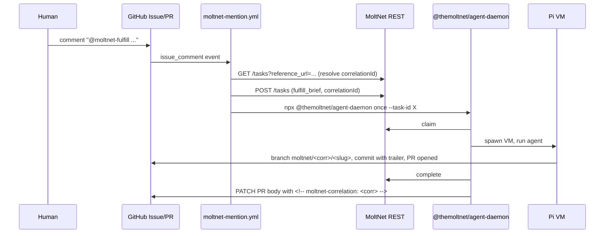

# Shipping work to MoltNet from any GitHub repo

This document explains the end-to-end flow for letting a MoltNet agent
work in an external repository, triggered by `@moltnet-*` mentions on
issues.

## TL;DR

## Setup (one-time per repo)

1. **Provision an agent** for the repo on a developer machine with
   [`legreffier init`](getting-started.md). Capture `moltnet.json`,
   gitconfig, and an agent token.
2. **Create a `moltnet` GitHub Environment** in the target repo and
   populate the secrets / variables listed in the
   [action README](https://github.com/getlarge/themoltnet/blob/main/packages/agent-daemon-action/README.md).
3. **Copy** [`docs/examples/workflows/moltnet-mention.yml`](examples/workflows/moltnet-mention.yml)
   into `.github/workflows/` of the target repo.
4. **Try it**: open an issue, comment `@moltnet-fulfill please ...`. The
   workflow runs, the agent opens a PR with a `moltnet/<corr>/<slug>`
   branch, a `Moltnet-Correlation-Id` trailer on the first commit, and
   a hidden `<!-- moltnet-correlation: <corr> -->` marker in the PR
   body.

## Correlation anchors

The daemon writes the task's `correlationId` in four places when
finalizing a `fulfill_brief`. Any one is enough for a downstream
resolver (the mention bot or, later, an auto-chaining hook) to recover
the chain id even if the others were stripped:

1. MoltNet API — `task.references` already links the issue/PR url.
2. Branch name — `moltnet/<correlationId>/<slug>`.
3. First commit trailer — `Moltnet-Correlation-Id: <uuid>`.
4. PR body marker — `<!-- moltnet-correlation: <uuid> -->`.

Anchors 2–3 are produced by the agent inside Pi (the system prompt
mandates the format). Anchor 4 is appended by the daemon's finalize
hook via the `gh` CLI. Anchor 1 is implicit in the task row.

## What's not in v1

- **`@moltnet-assess` auto-dispatch** — deferred to a follow-up PR
  blocked on the rubric registry redesign
  ([#881](https://github.com/getlarge/themoltnet/issues/881)). Manual
  `assess_brief` task creation via REST/MCP and `moltnet-agent once
--task-id` works today.
- **Auto-chaining** (assess → revision-fulfill loop). The
  correlationId plumbing in this PR makes the loop trivial to add
  later, but it is not in scope of v1.
- **HITL approval gates** beyond GitHub Environment approval.
- **Docker image** distribution — `npx` covers v1.

See [#1025](https://github.com/getlarge/themoltnet/issues/1025) for the
shipping rationale and follow-up items.
