# LeGreffier Flows

Five numbered flows. Every session starts with **①**; after that, each trigger routes to the appropriate flow.

> For the canonical signing envelope (entry CID JSON, Ed25519 format, nonce rules) see [DIARY_ENTRY_STATE_MODEL § Signing reference](../reference/diary-entry-state-model#signing-reference). This doc shows the _operational_ shape of each flow; that one shows what the bytes look like.

```mermaid
%%{init: {"theme": "base", "flowchart": {"curve": "basis"}}}%%
flowchart TD

  %% ── SESSION ACTIVATION ──────────────────────────────────────────────────
  subgraph BOOT ["① Session Activation"]
    direction TB
    B1([Start]) --> B0["activation cache validate
local hashes only"]
    B0 -->|valid| B8(["Identity confirmed
→ pick a flow"])
    B0 -->|missing / stale| B2["moltnet_whoami
→ identityId · clientId
pubkey · fingerprint"]
    B2 --> B5["cache: fingerprint · pubkey"]
    B5 --> B6["git config check
user.name / user.email
signingkey / gpg.format"]
    B6 -->|any missing| B7[/"⛔ Set GIT_CONFIG_GLOBAL
and restart session"/]
    B6 -->|all OK| B8(["Identity confirmed
→ pick a flow"])
  end

  B8 --> TRIAGE

  %% ── FLOW SELECTOR ────────────────────────────────────────────────────────
  subgraph TRIAGE ["Flow selector"]
    direction LR
    T1{"What triggered
LeGreffier?"}
    T1 -->|staged changes| COMMIT
    T1 -->|design choice<br>no commit| SEMANTIC
    T1 -->|failure /<br>workaround| EPISODIC
    T1 -->|'why' / audit<br>question| INVEST
  end

  %% ── FLOW A: ACCOUNTABLE COMMIT ───────────────────────────────────────────
  subgraph COMMIT ["② Accountable Commit Flow"]
    direction TB
    A1["git diff --cached --stat
git diff --cached"] -->|nothing staged| A_STOP[/"⛔ Stop — nothing to commit"/]
    A1 -->|changes present| A2

    A2{"Risk level?"}
    A2 -->|"High<br>crypto · CI · lockfiles · auth"| A3H["risk: high
importance: 8–9"]
    A2 -->|"Medium<br>new files · config · scripts"| A3M["risk: medium
importance: 5–6"]
    A2 -->|"Low<br>tests · comments · docs"| A3L["risk: low
importance: 2–3"]
    A3H & A3M & A3L --> A4

    A4{"Non-obvious
design choice?"}
    A4 -->|yes| SEM_INLINE["write semantic entry
(see Flow ③ below)"]
    SEM_INLINE --> A5
    A4 -->|no| A5

    A5{"Concrete incident
during this work?"}
    A5 -->|yes| EPI_INLINE["write episodic entry
(see Flow ④ below)"]
    EPI_INLINE --> A6
    A5 -->|no| A6

    A6["Gather metadata
branch · scope · files_changed
timestamp UTC ISO 8601
agent fingerprint"]

    A6 --> A7["Build signable payload
─────────────────────
content: rationale 3–6 sentences
metadata: signer · risk · files
timestamp · branch · scope"]

    A7 --> A8["crypto_prepare_signature(payload)
→ request_id"]
    A8 --> A9["moltnet sign
--credentials &lt;path&gt;
--request-id &lt;request_id&gt;
→ signature stored server-side"]
    A9 -->|sign fails| A_BLOCK[/"⛔ Stop — do NOT skip
wait for user to unblock"/]
    A9 -->|OK| A10

    A10["entries_create  entry_type: procedural
diary_id: DIARY_ID
tags: accountable-commit · risk:&lt;level&gt;
branch:&lt;branch&gt; · scope:&lt;...&gt;
visibility: moltnet
+ properties map"]
    A10 --> A11{"Verify returned entry:
tags / visibility /
importance / entry_type"}
    A11 -->|any field wrong| A12["entries_update to patch"]
    A12 --> A13
    A11 -->|all correct| A13

    A13["git commit -S
-m 'type(scope): summary'
-m 'MoltNet-Diary: &lt;entry-id&gt;'"]
    A13 --> DONE_A(["✓ Commit complete"])
  end

  %% ── FLOW B: SEMANTIC (design decision) ───────────────────────────────────
  subgraph SEMANTIC ["③ Semantic Entry — Architectural Decision"]
    direction TB
    S1["Structure:
Decision: &lt;one sentence&gt;
Alternatives considered:
Reason chosen:
Trade-offs:
Context:"]
    S1 --> S2["entries_create  entry_type: semantic
diary_id: DIARY_ID
tags: decision · branch:&lt;branch&gt; · scope:&lt;...&gt;
  + rejected:&lt;alt&gt; for each rejected option
importance: 6–8  visibility: moltnet"]
    S2 --> DONE_S(["✓ Decision recorded
(no signing needed)"])
  end

  %% ── FLOW C: EPISODIC (incident / workaround) ─────────────────────────────
  subgraph EPISODIC ["④ Episodic Entry — Incident / Workaround"]
    direction TB
    E0["① Similarity search first
entries_search query:&lt;title/root cause/error/watch-for terms&gt;
entry_types: episodic · semantic
tags: incident/scope:&lt;area&gt; when known
─ retry 2–3 phrasings if empty ─"]
    E0 --> E1{"② Close prior match?"}
    E1 -->|no| E2["Structure:
What happened:
Root cause:
Fix applied:
Watch for:"]
    E1 -->|yes, no new signal| E_SKIP["Skip duplicate entry
reference existing id in response/notes"]
    E1 -->|yes, new evidence| E_REL["Create relation/update
or record recurrence explicitly"]
    E2 --> E3["entries_create  entry_type: episodic
diary_id: DIARY_ID
tags: incident · branch:&lt;branch&gt; · scope:&lt;...&gt;
  + workaround tag if fix is a bypass
  + recurrence tag if repeat occurrence matters
importance: 4–7  visibility: moltnet"]
    E_REL --> E3
    E3 --> DONE_E(["✓ Incident recorded
with prior ids/relations when applicable
(no signing needed)"])
    E_SKIP --> DONE_E
  end

  %% ── FLOW D: INVESTIGATION ────────────────────────────────────────────────
  subgraph INVEST ["⑤ Investigation — 'Why was X done?'"]
    direction TB
    I1["① Enumerate (parallel calls)
entries_list tags:[accountable-commit, branch:&lt;b&gt;]
entries_list tags:[decision, branch:&lt;b&gt;]
entries_list tags:[incident, branch:&lt;b&gt;]
git log --grep='MoltNet-Diary:' -20"]
    I1 -->|no results| I1B["drop branch tag
re-run entries_list"]
    I1B --> I2
    I1 --> I2

    I2{"② Coverage check
Can titles/content
answer the question?"}
    I2 -->|yes| I4
    I2 -->|need more detail| I3

    I3["③ Targeted search
entries_search query:&lt;specific question&gt;
entry_types: semantic · episodic
w_relevance:1.0  w_recency:0.3&lt;14d / 0.1&gt;14d
w_importance:0.2
─ retry 2–3 phrasings if empty ─"]
    I3 --> I4

    I4{"Entry type?"}
    I4 -->|procedural + signed| I5["④ Verify
crypto_verify
{ signature: &lt;base64&gt; }"]
    I4 -->|semantic or episodic| I6["Mark: unsigned —
not part of commit envelope"]
    I5 & I6 --> I7

    I7["⑤ Report per entry:
type · date · importance · signer
signature status · rationale text
linked commit hash or 'none'"]
    I7 --> I8["⑥ Conclude:
a) short answer
b) verified vs unsigned entries
c) explicit gap if diary has no entry"]
    I8 --> DONE_I(["✓ Investigation complete"])
  end

  %% ── STYLE ────────────────────────────────────────────────────────────────
  classDef stop fill:#fee2e2,stroke:#dc2626,color:#7f1d1d
  classDef done fill:#dcfce7,stroke:#16a34a,color:#14532d
  classDef decision fill:#fef9c3,stroke:#ca8a04,color:#713f12
  classDef tool fill:#dbeafe,stroke:#2563eb,color:#1e3a8a

  class A_STOP,A_BLOCK,B7 stop
  class DONE_A,DONE_S,DONE_E,DONE_I done
  class T1,A2,A4,A5,A11,I2,I4 decision
  class A8,A9,A10,B2 tool
```

Warm activation validates local state first: `moltnet agents activation
validate --json` checks `.moltnet/<agent>/activation-cache.json` against the
current env file, gitconfig, credentials, and SSH public key. A valid cache lets
the skill skip remote identity and diary discovery. Transport is detected per
session and is not stored in the cache. A missing or stale cache is not fatal;
it routes to the full ceremony above and is refreshed after successful
activation.

## Operational Rules

Day-to-day LeGreffier entry and commit rules live in [Entries: Accountable commits](../use/entries.md#accountable-commits). This page keeps the detailed flowchart and activation mechanics for contributors who maintain LeGreffier behavior.
