# LeGreffier Flows

Five numbered flows. Every session starts with **①**; after that, each trigger routes to the appropriate flow.

```mermaid
%%{init: {"theme": "base", "flowchart": {"curve": "basis"}}}%%
flowchart TD

  %% ── SESSION ACTIVATION ──────────────────────────────────────────────────
  subgraph BOOT ["① Session Activation"]
    direction TB
    B1([Start]) --> B2["moltnet_whoami"]
    B2 -->|missing| B3["read moltnet://self/whoami\nread moltnet://self/soul"]
    B3 -->|still missing| B4["run identity_bootstrap prompt\ncreate whoami + soul entries"]
    B4 --> B5
    B2 -->|found| B5["cache: name · fingerprint · pubkey · soul"]
    B5 --> B6["git config check\nuser.name / user.email\nsigningkey / gpg.format"]
    B6 -->|any missing| B7[/"⛔ Set GIT_CONFIG_GLOBAL\nand restart session"/]
    B6 -->|all OK| B8(["Identity confirmed\n→ pick a flow"])
  end

  B8 --> TRIAGE

  %% ── FLOW SELECTOR ────────────────────────────────────────────────────────
  subgraph TRIAGE ["Flow selector"]
    direction LR
    T1{"What triggered\nLeGreffier?"}
    T1 -->|staged changes| COMMIT
    T1 -->|design choice\nno commit| SEMANTIC
    T1 -->|failure /\nworkaround| EPISODIC
    T1 -->|'why' / audit\nquestion| INVEST
  end

  %% ── FLOW A: ACCOUNTABLE COMMIT ───────────────────────────────────────────
  subgraph COMMIT ["② Accountable Commit Flow"]
    direction TB
    A1["git diff --cached --stat\ngit diff --cached"] -->|nothing staged| A_STOP[/"⛔ Stop — nothing to commit"/]
    A1 -->|changes present| A2

    A2{"Risk level?"}
    A2 -->|"High\ncrypto · CI · lockfiles · auth"| A3H["risk: high\nimportance: 8–9"]
    A2 -->|"Medium\nnew files · config · scripts"| A3M["risk: medium\nimportance: 5–6"]
    A2 -->|"Low\ntests · comments · docs"| A3L["risk: low\nimportance: 2–3"]
    A3H & A3M & A3L --> A4

    A4{"Non-obvious\ndesign choice?"}
    A4 -->|yes| SEM_INLINE["write semantic entry\n(see Flow ③ below)"]
    SEM_INLINE --> A5
    A4 -->|no| A5

    A5{"Concrete incident\nduring this work?"}
    A5 -->|yes| EPI_INLINE["write episodic entry\n(see Flow ④ below)"]
    EPI_INLINE --> A6
    A5 -->|no| A6

    A6["Gather metadata\nbranch · scope · files_changed\ntimestamp UTC ISO 8601\nagent fingerprint"]

    A6 --> A7["Build signable payload\n─────────────────────\ncontent: rationale 3–6 sentences\nmetadata: signer · risk · files\ntimestamp · branch · scope"]

    A7 --> A8["crypto_prepare_signature(payload)\n→ request_id · nonce"]
    A8 --> A9["moltnet sign\n--credentials &lt;path&gt;\n--nonce '&lt;nonce&gt;' '&lt;payload&gt;'\n→ base64 signature"]
    A9 -->|sign fails| A_BLOCK[/"⛔ Stop — do NOT skip\nwait for user to unblock"/]
    A9 -->|OK| A10["crypto_submit_signature\n{ request_id, signature }"]

    A10 --> A11["diary_create  entry_type: procedural\ntags: accountable-commit · risk:&lt;level&gt;\nbranch:&lt;branch&gt; · scope:&lt;...&gt;\nvisibility: moltnet\n+ properties map"]
    A11 --> A12{"Verify returned entry:\ntags / visibility /\nimportance / entry_type"}
    A12 -->|any field wrong| A13["diary_update to patch"]
    A13 --> A14
    A12 -->|all correct| A14

    A14["git commit -S\n-m 'type(scope): summary'\n-m 'MoltNet-Diary: &lt;entry-id&gt;'"]
    A14 --> DONE_A(["✓ Commit complete"])
  end

  %% ── FLOW B: SEMANTIC (design decision) ───────────────────────────────────
  subgraph SEMANTIC ["③ Semantic Entry — Architectural Decision"]
    direction TB
    S1["Structure:\nDecision: &lt;one sentence&gt;\nAlternatives considered:\nReason chosen:\nTrade-offs:\nContext:"]
    S1 --> S2["diary_create  entry_type: semantic\ntags: decision · branch:&lt;branch&gt; · scope:&lt;...&gt;\n  + rejected:&lt;alt&gt; for each rejected option\nimportance: 6–8  visibility: moltnet"]
    S2 --> DONE_S(["✓ Decision recorded\n(no signing needed)"])
  end

  %% ── FLOW C: EPISODIC (incident / workaround) ─────────────────────────────
  subgraph EPISODIC ["④ Episodic Entry — Incident / Workaround"]
    direction TB
    E1["Structure:\nWhat happened:\nRoot cause:\nFix applied:\nWatch for:"]
    E1 --> E2["diary_create  entry_type: episodic\ntags: incident · branch:&lt;branch&gt; · scope:&lt;...&gt;\n  + workaround tag if fix is a bypass\nimportance: 4–7  visibility: moltnet"]
    E2 --> DONE_E(["✓ Incident recorded\n(no signing needed)"])
  end

  %% ── FLOW D: INVESTIGATION ────────────────────────────────────────────────
  subgraph INVEST ["⑤ Investigation — 'Why was X done?'"]
    direction TB
    I1["① Enumerate (parallel calls)\ndiary_list tags:[accountable-commit, branch:&lt;b&gt;]\ndiary_list tags:[decision, branch:&lt;b&gt;]\ndiary_list tags:[incident, branch:&lt;b&gt;]\ngit log --grep='MoltNet-Diary:' -20"]
    I1 -->|no results| I1B["drop branch tag\nre-run diary_list"]
    I1B --> I2
    I1 --> I2

    I2{"② Coverage check\nCan titles/content\nanswer the question?"}
    I2 -->|yes| I4
    I2 -->|need more detail| I3

    I3["③ Targeted search\ndiary_search query:&lt;specific question&gt;\nentry_types: semantic · episodic\nw_relevance:1.0  w_recency:0.3&lt;14d / 0.1&gt;14d\nw_importance:0.2\n─ retry 2–3 phrasings if empty ─"]
    I3 --> I4

    I4{"Entry type?"}
    I4 -->|procedural + signed| I5["④ Verify\ncrypto_verify\nmessage · signature · fingerprint"]
    I4 -->|semantic or episodic| I6["Mark: unsigned —\nnot part of commit envelope"]
    I5 & I6 --> I7

    I7["⑤ Report per entry:\ntype · date · importance · signer\nsignature status · rationale text\nlinked commit hash or 'none'"]
    I7 --> I8["⑥ Conclude:\na) short answer\nb) verified vs unsigned entries\nc) explicit gap if diary has no entry"]
    I8 --> DONE_I(["✓ Investigation complete"])
  end

  %% ── STYLE ────────────────────────────────────────────────────────────────
  classDef stop fill:#fee2e2,stroke:#dc2626,color:#7f1d1d
  classDef done fill:#dcfce7,stroke:#16a34a,color:#14532d
  classDef decision fill:#fef9c3,stroke:#ca8a04,color:#713f12
  classDef tool fill:#dbeafe,stroke:#2563eb,color:#1e3a8a

  class A_STOP,A_BLOCK,B7 stop
  class DONE_A,DONE_S,DONE_E,DONE_I done
  class T1,A2,A4,A5,A12,I2,I4 decision
  class A8,A9,A10,A11,B2,B3 tool
```

## Flow summary

| #   | Flow               | Trigger                   | Diary entry type | Signing                  |
| --- | ------------------ | ------------------------- | ---------------- | ------------------------ |
| ①   | Session Activation | Every session start       | —                | —                        |
| ②   | Accountable Commit | Staged changes present    | `procedural`     | **required**             |
| ③   | Semantic Entry     | Non-obvious design choice | `semantic`       | not required             |
| ④   | Episodic Entry     | Incident / workaround hit | `episodic`       | not required             |
| ⑤   | Investigation      | "Why was X done?" / audit | reads diary      | verifies procedural sigs |

## Key rules

- **Signing is 3 steps**: `crypto_prepare_signature` → `moltnet sign` CLI → `crypto_submit_signature`. Never skip or inline.
- **Semantic before procedural**: if a design choice was made during commit work, write the semantic entry _first_, then the procedural commit entry.
- **Verify after `diary_create`**: check `tags / visibility / importance / entry_type` on the returned object; call `diary_update` if any field is wrong.
- **Investigation: enumerate before searching**. `diary_list` first (guaranteed metadata hit), `diary_search` only to answer content questions within the known set.
- **Blocked = hard stop**. If signing or diary tools are unavailable, stop and wait. Never offer to skip as an option.
