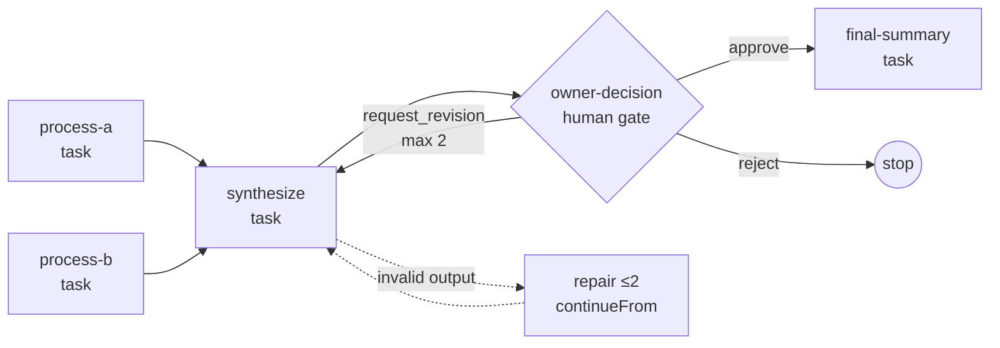
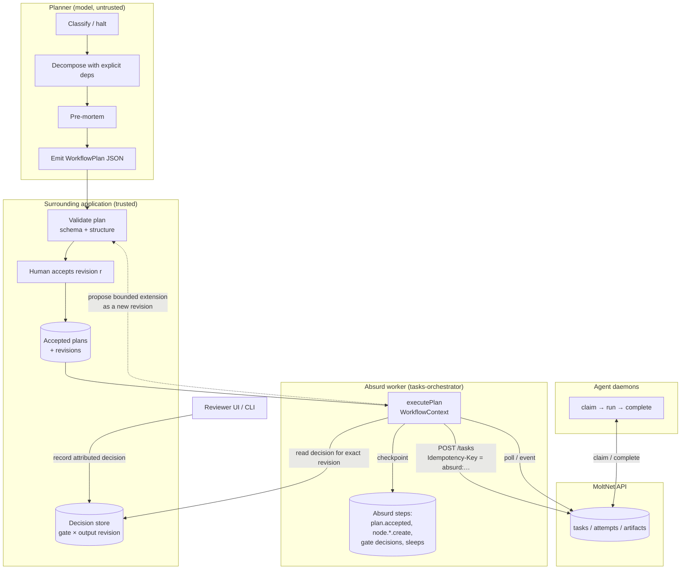

# WinDAGs planning for MoltNet tasks and Absurd orchestration

Research report, 2 October 2026. Code, fixtures and tests live in
[`libs/workflow-plan`](../../libs/workflow-plan/README.md). The branch extends
the process-design draft on `codex/process-design-research`
(`.agents/skills/design-moltnet-workflow`).

## Decision summary

**Recommendation: build a small planner-to-plan boundary of our own; adapt
WinDAGs ideas, reuse none of its code.**

- WinDAGs' planning output, as returned by its own validator, cannot drive
  reliable execution: dependencies are discarded, input/output contracts are
  stripped, the documented schema and the runtime validator disagree, defaults
  fill in missing values, and no structural check exists for ids, references or
  cycles. All five are confirmed by executable evidence against the pinned
  revision (section 3).
- The WinDAGs execution engine is not available: `windags-skills` only mirrors
  types from a private `@workgroup-ai/core` package and references a server, CLI
  and desktop app that are not published.
- The repository is BUSL-1.1 (non-commercial production use only until
  2030-03-03), and 478 skill files declare Apache-2.0 while the repository
  licence does not. Incorporating code or prompts needs a licence decision first
  (section 8).
- What is worth adapting is the planning _shape_: a classify-and-halt gate, a
  decomposer with explicit dependency rules, a pre-mortem, and the honesty rule
  that a planning topology must not be presented as a runtime one. These are
  prompt and process ideas, not components.
- MoltNet already owns task lifecycle, idempotent creation, server-gated joins
  (`claimCondition`), continuation, and bounded semantic repair; Absurd (through
  `@themoltnet/tasks-orchestrator`) owns durable progression. The missing piece
  is a validated, versioned plan representation and a thin executor over the
  existing `WorkflowContext`. A spike of both runs in this branch with fakes and
  passes interruption tests (section 6).

## 1. Revisions and environment

| Item                           | Value                                                                                                                                                                |
| ------------------------------ | -------------------------------------------------------------------------------------------------------------------------------------------------------------------- |
| WinDAGs checkout               | `curiositech/windags-skills` @ `9e2fed3bb42ad027284c5a3342e5487be45bf05e` (2026-06-26, after tag `v2.9.0`; `plugin.json` says 2.10.0, `mcp-server` 0.7.0)            |
| Checkout location              | isolated clone in the session scratchpad; deps installed project-locally with `npm ci` (181 packages); nothing installed globally, no agent config touched           |
| MoltNet base                   | `origin/main` @ `74c0d0a7e`, worktree `research/windags-absurd-planning`                                                                                             |
| Process-design research branch | `origin/codex/process-design-research` @ `9121f22a3` (docs only; `PROCESS-DESIGN-RESEARCH.md` is not on any remote branch and was not found on this machine)         |
| Node / pnpm / Claude Code CLI  | Node 22.22.0, pnpm 10.34.5, `claude` 2.1.287                                                                                                                         |
| Model path for the live run    | headless `claude -p` through a 98-line transport patch (`fixtures/harness/claude-cli-transport.patch`); no API key was present in the environment                    |
| Models served                  | `sonnet` alias → `claude-sonnet-5-5`; `haiku` alias → `claude-haiku-4-5-20251001` (as reported by the CLI's `modelUsage`)                                            |
| Absurd                         | `absurd-sdk` 0.4.0 (catalog), `uvx absurdctl` 0.5.0 available; **no Docker daemon and no permission to create a Postgres cluster**, so no real Absurd store          |
| Blog post                      | windags.ai "Two skills for the L3 the web doesn't have": describes a Critical Decision Method interviewer and a brainstorm facilitator; no planning/execution claims |

## 2. What WinDAGs is, and what it is not

Runnable code in the pinned revision:

- `mcp-server/` — a stdio MCP server: BM25 + MiniLM + reciprocal-rank-fusion +
  cross-encoder skill search over 590 bundled `SKILL.md` files, skill grafting,
  a cost estimator, `windags_validate_dag` (Zod), and `windags_run_pipeline`
  (`run-pipeline.js`: five sequential model calls).
- `skills/next-move/` — prompts, JSON schemas, templates and references for the
  `/next-move` slash command, which in Claude Code runs the same five stages as
  subagents.
- `scripts/` — catalogue maintenance, distillation and benchmark tooling.

Not present anywhere accessible:

- The execution engine. `validate-prediction.js`, `provider-models.js` and
  `cost-estimator.js` state they "mirror `@workgroup-ai/core`"; `npm view` of
  `@workgroup-ai/core`, `workgroup-ai` and `windags-mcp` all return 404. The
  references `POST /api/execute`, `ws://…/ws/execution/:id`,
  `packages/cli/src/server.ts`, `apps/tauri-desktop/…` and the
  `VERDICT: approved|rejected|escalate` reviewer protocol all point into that
  private monorepo. `references/runtime-honesty.md` itself documents that only
  `dag` and `workflow` topologies execute natively there and that `team-loop`,
  `swarm`, `blackboard`, `team-builder` and `recurring` are plan-only.
- Any test of the pipeline or validator semantics. `npm test` runs four smoke
  scripts (search cascade, telemetry, user skills, MCP handshake). They pass in
  16 s once native deps install (`--ignore-scripts` breaks `sharp`). Nothing
  exercises `run-pipeline.js`; the only e2e script hard-codes a path on the
  author's laptop for API keys.
- Triple persistence (`.windags/triples`) is written by the Claude Code slash
  command, not by the headless pipeline ("No triple write — that's the client's
  call").

`run-pipeline.js` is therefore exactly what the task brief suspected: a sequence
of model calls with parsing and normalisation, no execution, no persistence, no
recovery.

## 3. Planner defects confirmed against the pinned revision

Method: `fixtures/harness/upstream-hypotheses.mjs` imports the upstream Zod
validator and the documented JSON schema (Ajv draft-2020) and re-executes the
`postProcessPredictedDAG` block of `run-pipeline.js` verbatim (it is not
exported). The recorded result is `fixtures/upstream/hypotheses-9e2fed3b.json`;
the vitest file `src/windags/upstream-regression.test.ts` asserts it. A second,
live confirmation comes from the pipeline run in section 4.

| #   | Hypothesis                                            | Result    | Evidence                                                                                                                                                                                                                                                                            |
| --- | ----------------------------------------------------- | --------- | ----------------------------------------------------------------------------------------------------------------------------------------------------------------------------------------------------------------------------------------------------------------------------------- |
| H1  | Node reconstruction discards dependencies             | Confirmed | `postProcessPredictedDAG` rebuilds every node from an allow-list that has no `dependencies`; the Zod schema then defaults it to `[]`. The decomposer stage had `synthesize → [process-a, process-b]`; the returned DAG has `[]` on every node, statically and in the live run.      |
| H2  | Validation strips input/output contracts              | Confirmed | Zod `z.object` strips unknown keys: `input_contract`, `output_contract`, `why`, `commitment_level`, `cascade_depth`, `wave_number`, `parallelizable` all vanish. The returned node has exactly `id, skill_id, role_description, dependencies, estimated_*, confidence, model_tier`. |
| H3  | Documented JSON schema and runtime validator disagree | Confirmed | Same document: JSON schema accepts `model_tier: "sonnet"` and `premortem.recommendation: "PROCEED"`, Zod rejects both; after upstream normalisation (`balanced`, `ACCEPT`) Zod accepts and the JSON schema rejects. Required fields differ too (JSON schema: 11 per node; Zod: 3).  |
| H4  | Defaults conceal missing information                  | Confirmed | `validatePredictedDAG({})` succeeds with title "Untitled prediction", confidence 0.7, `ACCEPT_WITH_MONITORING`. Post-processing injects `skill_id: "general-purpose"` (not in the catalogue), 5 minutes, $0.02, confidence 0.7. The one thing caught: an empty `role_description`.  |
| H5  | No structural checks                                  | Confirmed | Duplicate ids, a self-cycle and a dangling reference validate under both the Zod validator and the JSON schema.                                                                                                                                                                     |
| H6  | Empty candidate set is not an error                   | Confirmed | A harness mistake in live run 1 exposed a 1-skill catalogue; every cascade query errored, the selector got zero candidates, and the pipeline still returned a "valid" DAG with seven invented skill ids (`json-evidence-processor`, `approval-gate-handler`, …).                    |

Also observed: the decomposer prompt asks for `commitment_level`,
`testable_outcome`, `estimated_minutes`, `model_tier`, `waves` and
`dependency_graph`, while `decomposer-output.schema.json` requires a per-subtask
`wave` field the prompt never mentions. The live decomposer output has no `wave`
field, so it does not satisfy the documented schema; `runDecomposer` only checks
that `subtasks` is a non-empty array.

### Minimal fixes and why they are not applied upstream here

The fixes are small: carry `dependencies` through `postProcessPredictedDAG`,
make the Zod node schema `passthrough()` or list the contract fields, align the
two enum sets, and add a structural pass (ids, references, cycles). Upstream is
BUSL-1.1 and the repository is AGPL-3.0, so no upstream code is vendored or
forked in this branch. Instead:

- upstream behaviour is pinned by recorded fixtures and assertions (the tests
  will fail when a newer revision changes it);
- our converter (`src/windags/convert.ts`) recovers dependencies from the
  `DecomposerOutput` stage, records every loss in `provenance.lossNotes`, and
  our validator (`src/plan/validate.ts`) performs the structural checks the
  upstream validators lack.

This keeps "upstream behaviour" and "our behaviour" separable: the regression
file's first `describe` block is upstream, the second is ours.

## 4. The live planning run

One bounded run of `windags_run_pipeline` with the real 590-skill cascade
(called over MCP against the upstream server) and the headless Claude CLI
transport. Task hint: the synthetic evidence-synthesis workflow in section 5,
against a throwaway git project containing a `CLAUDE.md` that describes it.

| Stage                     | Model alias / served       | Input tokens | Output tokens |        Latency | Cost (CLI list price) |
| ------------------------- | -------------------------- | -----------: | ------------: | -------------: | --------------------: |
| sensemaker                | sonnet / claude-sonnet-5-5 |        3 934 |           417 |          8.7 s |                $0.007 |
| decomposer                | sonnet / claude-sonnet-5-5 |        5 194 |         1 241 |         11.5 s |                $0.019 |
| skill_selector (parallel) | haiku / claude-haiku-4-5   |       10 652 |         7 446 |         80.0 s |                $0.067 |
| premortem (parallel)      | haiku / claude-haiku-4-5   |        4 433 |         7 853 |         80.6 s |                $0.050 |
| synthesizer               | sonnet / claude-sonnet-5-5 |        5 959 |         2 631 |         16.7 s |                $0.050 |
| cascade (6 queries)       | local                      |            — |             — | 2.0–4.6 s each |                    $0 |
| **Total**                 |                            |              |               |    **134.7 s** |            **$0.193** |

Observed quality (fixture `fixtures/upstream/live-run-2.json`):

- Sensemaker: `well-structured`, confidence 0.82, no halt. Reasonable.
- Decomposer: six subtasks with correct dependencies for the five real steps
  (`process-set-a`, `process-set-b` → `synthesize-findings` →
  `human-decision-gate` → `write-gated-summary`). It also emitted a
  `bounded-repair` node depending on the gate: a recovery _policy_ modelled as
  _work_, in parallel with the summary. Nothing in the format can say "only on
  approve" or "only on reject", so the gate's outcomes are not expressible.
- Skill selector: plausible primaries (`research-craft`, `human-gate-designer`,
  `output-contract-enforcer`), with reasoning; 80 s for one haiku call.
- Pre-mortem: `ACCEPT_WITH_MONITORING`, four risks, useful mitigations.
- Synthesizer/validator: topology `dag`, every `dependencies: []`, no contracts
  (H1, H2 live). The returned DAG alone is a list of titled nodes grouped in
  waves.
- Intervention effort: without the decomposer stage the converter cannot build a
  plan at all (the gate has nothing to review). With it, a reviewer still has to
  author every output contract, every gate's decider and options, every recovery
  budget, and decide what to do with the `bounded-repair` node. The converter
  records 7 loss notes for this run.

Run 1 (invalidated by the harness, kept as evidence for H6) cost $0.16 and 106
s. Total spend for the investigation: about $0.49 including the one CLI probe.

## 5. The synthetic experiment

Domain-neutral, harmless, synthetic data (`evidence/set-a.json`,
`evidence/set-b.json` with ids A1–A3, B1–B3). The workflow:



Two artefacts were compared:

1. **Hand-authored reference plan** (`src/testing/reference-plan.ts`): explicit
   `dependsOn`, typed input bindings (`output` of a node, `decision` of a gate,
   staged `artifact`), JSON-schema output contracts plus a named domain check
   (`citations-resolve`), recovery budgets per node (attempts, repairs,
   `onExhausted`), a gate with options, decider role, revision target and
   budget, gate edges, and a termination policy.
2. **WinDAGs-generated plan**, converted from live run 2 with the decomposer
   stage. Same node kinds and the same two-roots-into-one-join shape, but open
   output contracts, zero repair budget, gate defaults, and a summary that
   depends on the gate only (the reference also binds the synthesis output).

The experiment itself runs on the reference plan so that execution correctness
is not confounded by planner quality (section 6).

## 6. The thin adapter and what it proved

`src/executor/execute-plan.ts` executes a validated plan against two interfaces
that already exist in the repository: the tasks-orchestrator `WorkflowContext`
(durable steps, inline or Absurd) and `TaskClient` (create/get/listAttempts). It
reuses `createTaskStep` (stable `absurd:` keys from `executionId` + checkpoint
name), `waitForValidatedTask` (bounded semantic repair through `continueFrom`),
and the decomposed `beginWorkflowStep`/`completeWorkflowStep` for the human
gate.

Fakes, clearly labelled under `src/testing/`: an in-memory task service that
models idempotent creation (same key + same body → existing task; same key +
changed body → conflict), queued/running/completed/failed transitions driven by
a simulated agent, output CIDs, and `claimCondition` gating; and an in-memory
decision store that only matches a decision against the exact reviewed
`(node, run, taskId, attemptN, outputCid)`.

Tests (`pnpm exec nx run @moltnet/workflow-plan:test`: 33 passed, 1 skipped):

| Property tested                                               | Result                                                                                                                                              |
| ------------------------------------------------------------- | --------------------------------------------------------------------------------------------------------------------------------------------------- |
| Dependencies and contracts survive                            | Validator rejects implicit bindings, unknown references, cycles, unreachable gate options, bad revision targets, bad termination                    |
| Independent tasks progress independently                      | `process-b` is created and claimed before `process-a` completes; both awaited together                                                              |
| Join receives the correct output revisions                    | `synthesize` is created with `references` to the exact accepted `taskId` + `outputCid` of both predecessors                                         |
| Rejection blocks downstream                                   | `reject` → status `rejected`, `final-summary` `skipped_by_decision`, no task ever created                                                           |
| Revision invalidates the right work                           | `request_revision` re-runs only `synthesize` (new task, run 2); `process-a/b` keep one task each; the summary binds revision 2                      |
| Revision budget bounded                                       | Three `request_revision` → `blocked` with reason `maxRevisions`, downstream `blocked`                                                               |
| Bounded repair of invalid output                              | Unknown citation `A9` → repair task with `continueFrom` and the exact parser feedback; original stays `completed`; join binds the repaired revision |
| Repair budget exhausted                                       | `invalid_output` visible on the node, downstream `blocked`, reason carried                                                                          |
| Execution failure visible                                     | failed task → node `failed` with reason, dependants `blocked`                                                                                       |
| Interrupt after task creation, restart                        | 2 tasks before crash, 4 after completion, zero duplicates, zero idempotency conflicts, same task ids reused from checkpoints                        |
| Interrupt in the create gap (task created, checkpoint lost)   | Idempotency key returns the same task (`idempotent_hit` once), still 4 tasks total                                                                  |
| Interrupt during the human wait, decision recorded while down | Decision found on restart, nothing re-run, exactly one new task; a second replay reuses the decision checkpoint without re-reading                  |
| Stale decision for an older output revision                   | Ignored; only the decision for the current revision counts                                                                                          |
| Recovery with a different plan                                | `PlanMismatchError` (fail closed) instead of silently regenerating the workflow                                                                     |

### What remains unverified

- **Real Absurd checkpoints.** `replayContext` simulates them (same repeat-name
  rules as the adapter). `src/executor/absurd.e2e.test.ts` runs the same
  crash-and-replay scenario on `createOrchestrationAbsurdApp`, but is skipped
  without `ORCHESTRATION_ABSURD_URL`. This session had no Docker daemon and the
  permission policy denied creating a local Postgres cluster.
- **The real MoltNet task API.** Idempotency semantics, `claimCondition`,
  `continueFrom` preflight, `references` validation and daemon claiming are all
  faked. The fake follows the documented contract (`docs/reference/tasks.md`,
  `libs/tasks/src/task-types/freeform.ts`) but proves nothing about the server.
- **A real reviewer path.** The decision store is written by the test; no
  console/CLI/API surface records attributed decisions yet.
- **Deployed MoltNet.** Creating synthetic tasks on the production API was
  deliberately not done without an explicit go-ahead.

## 7. Proposed representation and boundary

### Versioned plan (`src/plan/schema.ts`, `schemaVersion: 1`)

- `planId` + monotonic `revision` (+ `extends` for plan extensions); an accepted
  revision is never mutated, and the executor pins its fingerprint in the first
  checkpoint.
- `process` — the expert's model (activities with execution owner and epistemic
  status: extracted / interpretation / assumption / proposal / decision;
  unresolved questions with owner and blocked nodes). Reviewed, never executed.
- `nodes` — `task` (MoltNet task type, brief, typed `inputs` bindings, output
  contract = JSON schema + named domain checks, `authority` = allowed profiles,
  trust level, selected skills **separately from** required capabilities,
  `recovery` = attempts / repairs / replacements / `onExhausted`), `human_gate`
  (reviewed node, options, decider role and attestation level, revision target
  and budget, durable wait), `join`.
- `gateEdges` — which decision enables which successor.
- `termination` — success nodes, total task cap, plan-revision cap, deadline,
  who may cancel.
- `provenance` — source (`hand_authored`, `windags`, `agent_proposed`), source
  reference, loss notes, acceptance.

The distinctions requested by the brief are first-class: completion is a task
status; domain acceptance is `output.schema` + `domainChecks` evaluated by the
orchestrator; human authorisation is a `DecisionRecord` against an exact
`OutputRevision`; task references (`references[]`) carry provenance while
bindings (`inputs`) carry data flow; retry (`maxAttempts`), repair
(`maxRepairs`, `continueFrom`) and changed-input revision (new `runN`, new task
id, descendants invalidated) are separate budgets; `selectedSkills` is advisory,
`requiredCapabilities`/`allowedProfiles` are what the daemon can enforce.

### Who owns what



- **Absurd**: durable progression only (steps, sleeps, replay). It never sees
  task semantics.
- **MoltNet**: task lifecycle, attempts, acceptance, artifacts, idempotent
  creation, `claimCondition`, `continueFrom`. The executor never re-implements
  status transitions; it reads them.
- **Agents**: claim and execute tasks within their profile and tool policy; they
  do not change the plan.
- **Application**: plan validation and acceptance, decision recording with
  attribution, plan/revision persistence, cancellation authority, the reviewer
  surface. These were the gaps the research-branch skill also named ("a workflow
  that merely displays a question has no completed approval/resume
  integration").

### Dynamic planning: two options

1. **Generate, validate, accept, then execute.** Supported today by the spike:
   the plan is data, the executor pins it, recovery fails closed on a different
   plan. Recommended as the first production path.
2. **Bounded extension during execution.** Representable as a new plan revision
   with `extends` and a `termination.maxPlanRevisions` budget; the executor
   would need to accept a revision at a checkpoint boundary, re-validate the
   merged graph, and only ever add nodes downstream of the current frontier. Not
   implemented; it should wait until option 1 has run against real services,
   because every extension is another plan acceptance and the reviewer surface
   for that does not exist yet.

In both options the generated plan is validated data. No generated orchestration
code is executed, and `executePlan` refuses to continue a recovered execution
whose accepted plan fingerprint differs.

## 8. Licences

- Repository: BUSL-1.1, licensor Curiositech, Inc.; Additional Use Grant permits
  production use for non-commercial and personal projects; Change Date
  2030-03-03 to Apache-2.0. MoltNet is a product, so any production use of
  WinDAGs code or prompts needs a commercial licence or must wait for the change
  date.
- File-level terms disagree with the repository: of 590 `SKILL.md` files, 478
  declare `license: Apache-2.0` (including `skills/next-move/SKILL.md`), 44
  declare `BSL-1.1`, 68 declare nothing; `mcp-server/package.json` says
  BUSL-1.1. Whether a per-file Apache-2.0 header overrides the repository
  licence for that file is unresolved and should be treated as unresolved.
- Consequence for this branch: no upstream code or prompt text is vendored. The
  harness scripts are ours; fixtures are recorded outputs; the 98-line transport
  patch is a derivative kept only as evidence of how the run was performed.
- MoltNet's own libraries used here are AGPL-3.0-only (`tasks-orchestrator`) and
  private.

## 9. Capability boundaries, in one table

| Capability                          | WinDAGs @ 9e2fed3b                              | MoltNet + Absurd today                                              | Spike in this branch                               |
| ----------------------------------- | ----------------------------------------------- | ------------------------------------------------------------------- | -------------------------------------------------- |
| Classify problem, halt on ambiguity | Yes (prompt)                                    | No                                                                  | Not needed; adopt as prompt                        |
| Decompose with dependencies         | Yes at the decomposer stage; lost at the output | No                                                                  | Converter recovers from decomposer stage           |
| Skill retrieval                     | Yes, local cascade, 2–5 s per query             | Context packs / runtime profiles (different concept)                | Carried as advisory `selectedSkills`               |
| Input/output contracts              | Asked for, then stripped                        | `outputContract` (schema) on freeform; `expectedOutput` prose       | Schema + named domain checks per node              |
| Human gate semantics                | Skill name only                                 | Label-based approval in issue-lifecycle; no generic decision record | Options, decider, revision target, exact revision  |
| Durable execution                   | Private engine, not available                   | Absurd via `WorkflowContext`                                        | Same seam, replay-tested with fakes                |
| Idempotent task creation            | n/a                                             | `Idempotency-Key`, `createTaskStep`                                 | Used                                               |
| Join                                | Wave ordering                                   | `claimCondition` (server-gated)                                     | Orchestrator-side await; `joinCondition` available |
| Repair vs retry vs revision         | Not distinguished                               | `maxAttempts` / `waitForValidatedTask` / caller                     | Three budgets + invalidation                       |
| Plan persistence and recovery       | Triples (client-side JSON)                      | n/a                                                                 | Fingerprint pinned; mismatch fails closed          |
| Cancellation                        | n/a                                             | `tasks_cancel`                                                      | Policy field only; not implemented                 |

## 10. Next experiment

The smallest one that converts "verified with fakes" into "verified against
services":

1. `pnpm run e2e:up` on a machine with Docker, then
   `ORCHESTRATION_ABSURD_URL=… pnpm exec nx run @moltnet/workflow-plan:test` to
   run `absurd.e2e.test.ts` (real checkpoint store, fake tasks and reviewer).
2. Replace `FakeTaskService` with `createSdkTaskClient(agent)` against the e2e
   REST API, start one agent daemon with a profile allowed to claim `freeform`
   tasks in a throwaway team, and run the reference plan once; the four task
   outputs are tiny JSON documents.
3. Record the human decision through the released `moltnet` CLI into a table the
   application owns (the decision store interface is four fields plus the
   reviewed revision), and re-run the crash-during-wait scenario against it.
4. Measure: tasks created vs expected (4, 5 with one revision), wall-clock per
   stage, the number of reviewer actions, and whether the daemon honours the
   `outputContract`.

Only after that is it worth asking a model to produce a `WorkflowPlan` directly
(a `propose_plan` task whose output contract is the plan schema), and comparing
it with the hand-authored one on the same validator.

## Appendix: commands that produced the evidence

```bash
# upstream, pinned
git clone https://github.com/curiositech/windags-skills && git -C windags-skills checkout 9e2fed3bb42ad027284c5a3342e5487be45bf05e
cd windags-skills/mcp-server && npm ci && npm test              # 4 smoke scripts, 16 s, pass

# static trace of the four hypotheses (fixtures/upstream/hypotheses-9e2fed3b.json)
WINDAGS_DIR=… WINDAGS_REV=9e2fed3b… OUT=… AJV_2020=… AJV_FORMATS=… node fixtures/harness/upstream-hypotheses.mjs

# live run (patched copy = upstream + fixtures/harness/claude-cli-transport.patch)
WINDAGS_PROVIDER=claude-cli WINDAGS_CLAUDE_CLI=1 PATCHED_DIR=… PROJECT_ROOT=… OUT_FILE=… TASK_HINT="…" \
  node scripts/moltnet-live-run.mjs                             # 134.7 s, $0.193

# this branch
pnpm exec nx run @moltnet/workflow-plan:typecheck
pnpm exec nx run @moltnet/workflow-plan:lint
pnpm exec nx run @moltnet/workflow-plan:test                    # 33 passed, 1 skipped (opt-in Absurd)
```
