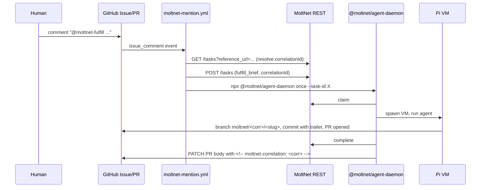

# Shipping the Agent Daemon — Implementation Plan

> **For agentic workers:** REQUIRED SUB-SKILL: Use superpowers:subagent-driven-development (recommended) or superpowers:executing-plans to implement this plan task-by-task. Steps use checkbox (`- [ ]`) syntax for tracking.

**Goal:** Make `@moltnet/agent-daemon` consumable by external repositories (npm + GitHub Action + mention-bot template) with multi-anchor correlationId propagation across issue → PR → assess flows.

**Architecture:** Publish the daemon to npm; loosen `pi-extension` to allow env-var-only Pi auth; add a finalize hook that writes `correlationId` to four anchors (MoltNet API, branch name, commit trailer, PR body) so the mention-bot can recover it from any one. Ship a composite GitHub Action wrapping `npx @moltnet/agent-daemon once` and a copy-paste workflow template.

**Tech Stack:** TypeScript (Node 22), pnpm workspaces, Vitest, release-please, GitHub composite actions, gh CLI, octokit (via `@actions/github`).

**Spec:** `docs/superpowers/specs/2026-05-07-shipping-agent-daemon-design.md`
**Issue:** https://github.com/getlarge/themoltnet/issues/1025

---

## Plan amendments (applied during execution)

These corrections apply to all tasks below. Where a task's prose contradicts an amendment, the amendment wins.

1. **`createTask` body shape** (Task 10). The actual `CreateTaskBodySchema` (see `apps/rest-api/src/schemas/tasks.ts:CreateTaskBodySchema`) uses `taskType` (not `type`) and **requires** `teamId` _and_ `diaryId` (both UUIDs). The mention-bot reads them from repo variables `MOLTNET_TEAM_ID` and `MOLTNET_DIARY_ID`. The plan's earlier `{ type, input, references, correlationId }` shape would fail validation.

2. **`@moltnet-assess` deferred** (Tasks 8, 10, 11). Auto-creating `assess_brief` from a PR comment is blocked on rubric registry (#881) — the schema needs a `criteriaCid` and there is no UI/API to pick one. The dispatcher recognizes `@moltnet-assess` and posts a "deferred, blocked on #881" reply, but does **not** call `createTask` for it. `createTask` therefore only supports `fulfill_brief` in this v1; the assess overload is dropped from Task 10. `findTargetFulfill` and `parseCriteriaFromComment` (Task 11) are dropped.

3. **Auth: SDK, not raw bearer** (Task 11). The dispatcher does _not_ read a `MOLTNET_AGENT_TOKEN` secret. Instead, it instantiates `Agent` from `@themoltnet/sdk` against the materialized `moltnet.json` (the same path the daemon uses), which mints whatever auth the REST endpoint expects. This removes one secret and matches the rest of the stack. If the SDK's auth flow turns out to be heavier than a single fetch, the dispatcher uses the SDK's `tasks.create` method directly rather than re-implementing `fetch`.

4. **Workflow template env additions**. `MOLTNET_TEAM_ID` and `MOLTNET_DIARY_ID` are repo _variables_ (not secrets) — they're identifiers, not credentials.

5. **Acceptance criteria**: the `@moltnet-assess` end-to-end smoke is replaced with: "comment posts `assess deferred` reply on the PR; manual `assess_brief` task creation via REST + `moltnet-agent once --task-id` still works."

These deltas are applied in the spec at the same commit.

---

## File Structure

**Created:**

- `apps/agent-daemon/README.md` — config + modes + examples
- `apps/agent-daemon/src/lib/correlation.ts` — branch/trailer/PR-body anchor writers
- `apps/agent-daemon/src/lib/correlation.test.ts` — unit tests for anchor writers
- `packages/agent-daemon-action/action.yml` — composite Action manifest
- `packages/agent-daemon-action/package.json` — for the resolution-script bundle
- `packages/agent-daemon-action/src/resolve-correlation.ts` — 4-source resolver used by the workflow template
- `packages/agent-daemon-action/src/resolve-correlation.test.ts`
- `packages/agent-daemon-action/src/parse-mention.ts` — comment parser + context detection
- `packages/agent-daemon-action/src/parse-mention.test.ts`
- `packages/agent-daemon-action/src/create-task.ts` — wraps MoltNet `tasks.create` REST call
- `packages/agent-daemon-action/src/create-task.test.ts`
- `packages/agent-daemon-action/src/dispatch.ts` — entry script wired by `actions/github-script`
- `packages/agent-daemon-action/README.md`
- `packages/agent-daemon-action/tsconfig.json`
- `packages/agent-daemon-action/vitest.config.ts`
- `docs/examples/workflows/moltnet-mention.yml` — copy-paste workflow template
- `docs/agent-daemon-shipping.md` — entry-point doc with sequence diagram

**Modified:**

- `apps/agent-daemon/package.json` — `private: false`, `bin`, `publishConfig.exports`
- `libs/pi-extension/src/vm-manager.ts` — `piAuthJson: string | null`, conditional write, `PI_AUTH_PATH` env override
- `libs/pi-extension/src/vm-manager.test.ts` — new test for env-var-only path
- `apps/agent-daemon/src/lib/finalize.ts` — call correlation writers when task type is `fulfill_brief`
- `apps/agent-daemon/src/lib/finalize.test.ts` (or new file if absent) — finalize-hook tests
- `release-please-config.json` — register `apps/agent-daemon` and `packages/agent-daemon-action`
- `.release-please-manifest.json` — initial versions
- `.github/workflows/release.yml` — add `publish-agent-daemon` job, expose tag outputs

---

## Task 1: Make `pi-extension` `piAuthJson` optional

**Files:**

- Modify: `libs/pi-extension/src/vm-manager.ts`
- Test: `libs/pi-extension/src/vm-manager.test.ts`

- [ ] **Step 1: Write the failing test**

Add to `libs/pi-extension/src/vm-manager.test.ts` (top-level `describe('loadCredentials')` block — create if absent):

```typescript
import {
  mkdtempSync,
  mkdirSync,
  writeFileSync,
  rmSync,
  existsSync,
} from 'node:fs';
import { tmpdir } from 'node:os';
import path from 'node:path';
import { describe, it, expect, beforeEach, afterEach } from 'vitest';

import { loadCredentials } from './vm-manager.js';

describe('loadCredentials — Pi auth optional', () => {
  let agentDir: string;
  let fakeHome: string;
  let originalHome: string | undefined;
  let originalPiAuthPath: string | undefined;

  beforeEach(() => {
    agentDir = mkdtempSync(path.join(tmpdir(), 'moltnet-agent-'));
    writeFileSync(path.join(agentDir, 'moltnet.json'), '{}');
    writeFileSync(path.join(agentDir, 'env'), '');
    fakeHome = mkdtempSync(path.join(tmpdir(), 'moltnet-home-'));
    originalHome = process.env.HOME;
    originalPiAuthPath = process.env.PI_AUTH_PATH;
    process.env.HOME = fakeHome;
    delete process.env.PI_AUTH_PATH;
  });

  afterEach(() => {
    rmSync(agentDir, { recursive: true, force: true });
    rmSync(fakeHome, { recursive: true, force: true });
    if (originalHome !== undefined) process.env.HOME = originalHome;
    else delete process.env.HOME;
    if (originalPiAuthPath !== undefined)
      process.env.PI_AUTH_PATH = originalPiAuthPath;
    else delete process.env.PI_AUTH_PATH;
  });

  it('returns piAuthJson=null when ~/.pi/agent/auth.json is absent', () => {
    const creds = loadCredentials(agentDir);
    expect(creds.piAuthJson).toBeNull();
  });

  it('honors PI_AUTH_PATH override when set', () => {
    const altPath = path.join(fakeHome, 'alt-auth.json');
    writeFileSync(altPath, '{"anthropic":{"type":"api_key","key":"sk-x"}}');
    process.env.PI_AUTH_PATH = altPath;
    const creds = loadCredentials(agentDir);
    expect(creds.piAuthJson).toContain('sk-x');
  });

  it('still loads default ~/.pi/agent/auth.json when present', () => {
    const piDir = path.join(fakeHome, '.pi', 'agent');
    mkdirSync(piDir, { recursive: true });
    writeFileSync(
      path.join(piDir, 'auth.json'),
      '{"openai":{"type":"api_key","key":"sk-default"}}',
    );
    const creds = loadCredentials(agentDir);
    expect(creds.piAuthJson).toContain('sk-default');
  });
});
```

- [ ] **Step 2: Run tests to verify they fail**

Run: `pnpm --filter @themoltnet/pi-extension test -- vm-manager.test.ts`
Expected: FAIL — current `loadCredentials` throws on missing auth.json (first two tests fail; third may pass if `auth.json` happens to exist for the running user, in which case fix HOME isolation).

- [ ] **Step 3: Make `piAuthJson` nullable in the type**

Edit `libs/pi-extension/src/vm-manager.ts` line ~35:

```typescript
export interface VmCredentials {
  moltnetJson: string;
  agentEnvRaw: string;
  piAuthJson: string | null;
  agentEnv: Record<string, string | undefined>;
  gitconfig: string | null;
  sshPrivateKey: string | null;
  sshPublicKey: string | null;
  allowedSigners: string | null;
  githubAppPem: string | null;
  githubAppPemFilename: string | null;
}
```

- [ ] **Step 4: Update `loadCredentials` to honor `PI_AUTH_PATH` and tolerate absence**

Replace the current Pi-auth block in `loadCredentials` (around line 76–88) with:

```typescript
const piAuthPath =
  process.env.PI_AUTH_PATH ??
  path.join(process.env.HOME ?? '', '.pi', 'agent', 'auth.json');
const piAuthJson = existsSync(piAuthPath)
  ? readFileSync(piAuthPath, 'utf8')
  : null;
```

- [ ] **Step 5: Skip the VM-side write when `piAuthJson` is null**

Edit the credential injection block (around line 286). Replace:

```typescript
await vm.fs.writeFile('/home/agent/.pi/agent/auth.json', creds.piAuthJson, {
  mode: 0o600,
});
```

with:

```typescript
if (creds.piAuthJson !== null) {
  await vm.fs.writeFile('/home/agent/.pi/agent/auth.json', creds.piAuthJson, {
    mode: 0o600,
  });
}
```

- [ ] **Step 6: Run tests to verify they pass**

Run: `pnpm --filter @themoltnet/pi-extension test -- vm-manager.test.ts`
Expected: PASS for all three new cases. Existing tests in the file must still pass.

- [ ] **Step 7: Run pi-extension typecheck**

Run: `pnpm --filter @themoltnet/pi-extension typecheck`
Expected: clean. If any consumer destructures `piAuthJson` and assumes `string`, fix the consumer to handle `null` (search: `grep -rn 'piAuthJson' libs/ apps/`). At time of writing only `vm-manager.ts` references it.

- [ ] **Step 8: Commit**

```bash
git add libs/pi-extension/src/vm-manager.ts libs/pi-extension/src/vm-manager.test.ts
git commit -m "feat(pi-extension): make pi auth.json optional, support PI_AUTH_PATH override

Lets CI authenticate Pi via env vars (ANTHROPIC_API_KEY, etc.) without
materializing ~/.pi/agent/auth.json. Local OAuth flows are unchanged
since auth.json still wins when present. Refs #1025."
```

---

## Task 2: Correlation anchor writers in the daemon

**Files:**

- Create: `apps/agent-daemon/src/lib/correlation.ts`
- Create: `apps/agent-daemon/src/lib/correlation.test.ts`

- [ ] **Step 1: Write the failing tests**

Create `apps/agent-daemon/src/lib/correlation.test.ts`:

```typescript
import { describe, it, expect, vi, beforeEach } from 'vitest';

import {
  buildBranchName,
  ensureCommitTrailer,
  appendPrBodyMarker,
  CORRELATION_TRAILER_KEY,
  CORRELATION_MARKER_RE,
} from './correlation.js';

describe('buildBranchName', () => {
  it('produces moltnet/<correlationId>/<slug> from a title', () => {
    const name = buildBranchName({
      correlationId: '11111111-2222-4333-8444-555555555555',
      title: 'Fix the flaky test in auth flow',
    });
    expect(name).toBe(
      'moltnet/11111111-2222-4333-8444-555555555555/fix-the-flaky-test-in-auth-flow',
    );
  });

  it('truncates long slugs to 60 chars and trims trailing dashes', () => {
    const name = buildBranchName({
      correlationId: '11111111-2222-4333-8444-555555555555',
      title: 'a'.repeat(120),
    });
    const slug = name.split('/').pop()!;
    expect(slug.length).toBeLessThanOrEqual(60);
    expect(slug).not.toMatch(/-$/);
  });

  it('falls back to "task" when title slugifies to empty', () => {
    const name = buildBranchName({
      correlationId: '11111111-2222-4333-8444-555555555555',
      title: '!!!',
    });
    expect(name.endsWith('/task')).toBe(true);
  });
});

describe('ensureCommitTrailer', () => {
  it('appends Moltnet-Correlation-Id when missing', () => {
    const out = ensureCommitTrailer('feat: something\n\nbody', 'abc-123');
    expect(out).toMatch(/Moltnet-Correlation-Id: abc-123$/m);
  });

  it('is idempotent when trailer already present', () => {
    const msg = 'feat: x\n\nbody\n\nMoltnet-Correlation-Id: abc-123';
    expect(ensureCommitTrailer(msg, 'abc-123')).toBe(msg);
  });

  it('refuses to add a conflicting id', () => {
    const msg = 'feat: x\n\nMoltnet-Correlation-Id: existing-id';
    expect(() => ensureCommitTrailer(msg, 'new-id')).toThrow(/conflicting/i);
  });

  it('exposes the trailer key as a stable constant', () => {
    expect(CORRELATION_TRAILER_KEY).toBe('Moltnet-Correlation-Id');
  });
});

describe('appendPrBodyMarker', () => {
  it('appends marker when absent', () => {
    const out = appendPrBodyMarker('PR description.', 'abc-123');
    expect(out).toMatch(CORRELATION_MARKER_RE);
    expect(out).toContain('PR description.');
  });

  it('is idempotent', () => {
    const once = appendPrBodyMarker('body', 'abc-123');
    const twice = appendPrBodyMarker(once, 'abc-123');
    expect(twice).toBe(once);
  });

  it('handles null/empty body', () => {
    expect(appendPrBodyMarker(null, 'abc-123')).toMatch(CORRELATION_MARKER_RE);
    expect(appendPrBodyMarker('', 'abc-123')).toMatch(CORRELATION_MARKER_RE);
  });
});
```

- [ ] **Step 2: Run tests to verify they fail**

Run: `pnpm --filter @moltnet/agent-daemon exec vitest run src/lib/correlation.test.ts`
Expected: FAIL — module not found.

- [ ] **Step 3: Implement `correlation.ts`**

Create `apps/agent-daemon/src/lib/correlation.ts`:

```typescript
/**
 * Correlation anchor writers.
 *
 * The daemon writes the task's correlationId in four places when finalizing
 * a fulfill_brief, so the mention-bot (or any external resolver) can recover
 * it from at least one source even if others are stripped (squash merges
 * lose trailers; PR bodies can be edited; comments can vanish).
 *
 * Anchors:
 *   1. MoltNet API (task.references) — populated upstream, not here.
 *   2. Branch name      — `moltnet/<correlationId>/<slug>`
 *   3. Commit trailer   — `Moltnet-Correlation-Id: <uuid>` in the first commit
 *   4. PR body marker   — `<!-- moltnet-correlation: <uuid> -->`
 */

export const CORRELATION_TRAILER_KEY = 'Moltnet-Correlation-Id' as const;

export const CORRELATION_MARKER_RE =
  /<!--\s*moltnet-correlation:\s*([0-9a-f-]{8,})\s*-->/i;

const MAX_SLUG_LEN = 60;

export function slugify(input: string): string {
  return input
    .toLowerCase()
    .replace(/[^a-z0-9]+/g, '-')
    .replace(/^-+|-+$/g, '')
    .slice(0, MAX_SLUG_LEN)
    .replace(/-+$/g, '');
}

export interface BuildBranchNameOptions {
  correlationId: string;
  title: string;
}

export function buildBranchName(opts: BuildBranchNameOptions): string {
  const slug = slugify(opts.title) || 'task';
  return `moltnet/${opts.correlationId}/${slug}`;
}

const TRAILER_LINE_RE = new RegExp(
  `^${CORRELATION_TRAILER_KEY}:\\s*(\\S+)\\s*$`,
  'm',
);

export function ensureCommitTrailer(
  message: string,
  correlationId: string,
): string {
  const m = message.match(TRAILER_LINE_RE);
  if (m) {
    if (m[1] === correlationId) return message;
    throw new Error(
      `Commit message has a conflicting ${CORRELATION_TRAILER_KEY}: existing=${m[1]} new=${correlationId}`,
    );
  }
  const sep = message.endsWith('\n') ? '\n' : '\n\n';
  return `${message}${sep}${CORRELATION_TRAILER_KEY}: ${correlationId}`;
}

export function appendPrBodyMarker(
  body: string | null | undefined,
  correlationId: string,
): string {
  const marker = `<!-- moltnet-correlation: ${correlationId} -->`;
  if (body && CORRELATION_MARKER_RE.test(body)) return body;
  if (!body) return marker;
  const sep = body.endsWith('\n') ? '\n' : '\n\n';
  return `${body}${sep}${marker}`;
}
```

- [ ] **Step 4: Run tests to verify they pass**

Run: `pnpm --filter @moltnet/agent-daemon exec vitest run src/lib/correlation.test.ts`
Expected: PASS — all eleven assertions green.

- [ ] **Step 5: Commit**

```bash
git add apps/agent-daemon/src/lib/correlation.ts apps/agent-daemon/src/lib/correlation.test.ts
git commit -m "feat(agent-daemon): add correlation anchor writers (branch/trailer/PR body)

Pure helpers that build a moltnet/<id>/<slug> branch name, enforce the
Moltnet-Correlation-Id trailer in commit messages, and idempotently
append a hidden marker to PR bodies. Wired into finalize in a follow-up
commit. Refs #1025."
```

---

## Task 3: Wire correlation anchors into finalize

**Files:**

- Modify: `apps/agent-daemon/src/lib/finalize.ts`
- Create: `apps/agent-daemon/src/lib/finalize.test.ts` (if not present)

- [ ] **Step 1: Inspect the current finalize signature and its caller**

Run: `grep -rn "finalizeTask" apps/agent-daemon/src/`
Read the current `finalize.ts` (already in your context). Note: `output: TaskOutput` is the only signal — the task itself (with `correlationId`, `type`, etc.) is not currently passed in. We need to widen the signature.

- [ ] **Step 2: Write the failing test**

Create `apps/agent-daemon/src/lib/finalize.test.ts`:

```typescript
import { describe, it, expect, vi } from 'vitest';

import { finalizeTask } from './finalize.js';
import type { Task } from '@moltnet/tasks';
import type { Agent } from '@themoltnet/sdk';

function makeAgent() {
  return {
    tasks: {
      complete: vi.fn().mockResolvedValue(undefined),
      fail: vi.fn().mockResolvedValue(undefined),
    },
  } as unknown as Agent;
}

const FULFILL_TASK: Task = {
  id: 'task-1',
  type: 'fulfill_brief',
  correlationId: '11111111-2222-4333-8444-555555555555',
  // remaining fields irrelevant to finalize; cast through unknown
} as unknown as Task;

describe('finalizeTask — fulfill_brief correlation hook', () => {
  it('invokes the correlation writer when output is completed and PR url present', async () => {
    const writer = vi.fn().mockResolvedValue(undefined);
    const agent = makeAgent();
    await finalizeTask(
      agent,
      {
        status: 'completed',
        taskId: 'task-1',
        attemptN: 1,
        output: {
          branch: 'moltnet/11111111-2222-4333-8444-555555555555/x',
          commits: [],
          pullRequestUrl: 'https://github.com/o/r/pull/3',
          diaryEntryIds: [],
          summary: 's',
        },
        outputCid: 'cid:abc',
        usage: null,
      } as never,
      { task: FULFILL_TASK, writeCorrelationAnchors: writer },
    );
    expect(writer).toHaveBeenCalledWith({
      correlationId: '11111111-2222-4333-8444-555555555555',
      pullRequestUrl: 'https://github.com/o/r/pull/3',
    });
    expect(agent.tasks.complete).toHaveBeenCalled();
  });

  it('skips the writer when task is not fulfill_brief', async () => {
    const writer = vi.fn().mockResolvedValue(undefined);
    const agent = makeAgent();
    const assessTask = { ...FULFILL_TASK, type: 'assess_brief' } as Task;
    await finalizeTask(
      agent,
      {
        status: 'completed',
        taskId: 'task-1',
        attemptN: 1,
        output: { scores: [] },
        outputCid: 'cid:abc',
        usage: null,
      } as never,
      { task: assessTask, writeCorrelationAnchors: writer },
    );
    expect(writer).not.toHaveBeenCalled();
  });

  it('skips the writer when correlationId is null', async () => {
    const writer = vi.fn().mockResolvedValue(undefined);
    const agent = makeAgent();
    const noCorr = { ...FULFILL_TASK, correlationId: null } as Task;
    await finalizeTask(
      agent,
      {
        status: 'completed',
        taskId: 'task-1',
        attemptN: 1,
        output: { pullRequestUrl: 'https://x/y/pull/1' },
        outputCid: 'cid:abc',
        usage: null,
      } as never,
      { task: noCorr, writeCorrelationAnchors: writer },
    );
    expect(writer).not.toHaveBeenCalled();
  });

  it('logs but does not throw when the writer fails', async () => {
    const writer = vi.fn().mockRejectedValue(new Error('gh down'));
    const agent = makeAgent();
    await expect(
      finalizeTask(
        agent,
        {
          status: 'completed',
          taskId: 'task-1',
          attemptN: 1,
          output: { pullRequestUrl: 'https://x/y/pull/1' },
          outputCid: 'cid:abc',
          usage: null,
        } as never,
        { task: FULFILL_TASK, writeCorrelationAnchors: writer },
      ),
    ).resolves.toBeUndefined();
    expect(agent.tasks.complete).toHaveBeenCalled();
  });
});
```

- [ ] **Step 3: Run tests to verify they fail**

Run: `pnpm --filter @moltnet/agent-daemon exec vitest run src/lib/finalize.test.ts`
Expected: FAIL — `finalizeTask` does not accept a third argument yet.

- [ ] **Step 4: Update `finalizeTask` signature and add the correlation hook**

Replace the contents of `apps/agent-daemon/src/lib/finalize.ts` with:

```typescript
import type { Task, TaskOutput } from '@moltnet/tasks';
import type { Agent, TasksNamespace } from '@themoltnet/sdk';

export interface CorrelationAnchorInput {
  correlationId: string;
  pullRequestUrl: string;
}

export type WriteCorrelationAnchors = (
  input: CorrelationAnchorInput,
) => Promise<void>;

export interface FinalizeContext {
  task?: Task;
  writeCorrelationAnchors?: WriteCorrelationAnchors;
  log?: (msg: string, err?: unknown) => void;
}

/**
 * Translate a `TaskOutput` from the runtime into the corresponding
 * `complete` / `fail` REST call.
 *
 * For fulfill_brief tasks with a non-null correlationId and a pullRequestUrl
 * in the output, also invokes `writeCorrelationAnchors` to anchor the
 * correlation in the PR body (branch + commit trailer are produced inside
 * the agent run itself, not here). Anchor failures are logged and swallowed
 * — the API task.references row is the primary anchor.
 */
export async function finalizeTask(
  agent: Agent,
  output: TaskOutput,
  ctx: FinalizeContext = {},
): Promise<void> {
  if (output.status === 'cancelled') return;

  if (output.status === 'completed' && output.output && output.outputCid) {
    await agent.tasks.complete(output.taskId, output.attemptN, {
      output: output.output,
      outputCid: output.outputCid,
      usage: output.usage,
      ...(output.contentSignature
        ? { contentSignature: output.contentSignature }
        : {}),
    });
    await maybeWriteAnchors(output, ctx);
    return;
  }

  const error: NonNullable<Parameters<TasksNamespace['fail']>[2]>['error'] =
    output.error ?? {
      code: 'task_failed',
      message: 'Task execution failed before producing a valid output.',
      retryable: false,
    };
  await agent.tasks.fail(output.taskId, output.attemptN, { error });
}

async function maybeWriteAnchors(
  output: Extract<TaskOutput, { status: 'completed' }>,
  ctx: FinalizeContext,
): Promise<void> {
  const { task, writeCorrelationAnchors, log } = ctx;
  if (!task || task.type !== 'fulfill_brief') return;
  if (!task.correlationId) return;
  if (!writeCorrelationAnchors) return;

  const pr = (output.output as { pullRequestUrl?: string | null } | undefined)
    ?.pullRequestUrl;
  if (!pr) return;

  try {
    await writeCorrelationAnchors({
      correlationId: task.correlationId,
      pullRequestUrl: pr,
    });
  } catch (err) {
    log?.('correlation-anchor-write-failed', err);
  }
}
```

- [ ] **Step 5: Run tests to verify they pass**

Run: `pnpm --filter @moltnet/agent-daemon exec vitest run src/lib/finalize.test.ts`
Expected: PASS for all four cases.

- [ ] **Step 6: Update finalize callers to pass the context**

Run: `grep -rn "finalizeTask(" apps/agent-daemon/src/`

For each call site (`once.ts`, `poll.ts`, `drain.ts`), the site already has access to the claimed `task` via the runtime. Pass it through. Example for `once.ts`:

```typescript
// after claiming task and running runtime:
await finalizeTask(agent.agent, output, {
  task: claimedTask,
  writeCorrelationAnchors: makePrBodyAnchorWriter({ logger }),
  log: (msg, err) => logger.warn({ err }, msg),
});
```

The actual writer factory `makePrBodyAnchorWriter` is implemented in the next task — for this step, **stub it to a no-op** to keep the commit green:

```typescript
import { appendPrBodyMarker } from './correlation.js';

export const makePrBodyAnchorWriter =
  (_deps: { logger: unknown }): WriteCorrelationAnchors =>
  async () => {
    // implemented in task 4
  };
```

Place the stub at the top of `apps/agent-daemon/src/lib/correlation.ts` (export it). Wire it from `once.ts` / `poll.ts` / `drain.ts` only where `claimedTask` is reachable — if any of these doesn't have the task in scope, lift it from the source's `claim()` return.

- [ ] **Step 7: Run full daemon tests + typecheck**

Run:

```bash
pnpm --filter @moltnet/agent-daemon exec vitest run
pnpm --filter @moltnet/agent-daemon typecheck
```

Expected: PASS, clean.

- [ ] **Step 8: Commit**

```bash
git add apps/agent-daemon/src/lib/finalize.ts apps/agent-daemon/src/lib/finalize.test.ts apps/agent-daemon/src/lib/correlation.ts apps/agent-daemon/src/cli/once.ts apps/agent-daemon/src/cli/poll.ts apps/agent-daemon/src/cli/drain.ts
git commit -m "feat(agent-daemon): plumb correlation anchor hook through finalize

finalizeTask now accepts a task + writer pair so fulfill_brief outputs
can stamp the PR body with a hidden correlation marker. Writer is a
no-op stub; real implementation arrives in the next commit. Refs #1025."
```

---

## Task 4: Implement the PR body anchor writer

**Files:**

- Modify: `apps/agent-daemon/src/lib/correlation.ts`
- Modify: `apps/agent-daemon/src/lib/correlation.test.ts`

- [ ] **Step 1: Write the failing test**

Append to `apps/agent-daemon/src/lib/correlation.test.ts`:

```typescript
import { makePrBodyAnchorWriter, parsePrUrl } from './correlation.js';

describe('parsePrUrl', () => {
  it('extracts owner/repo/number from a github PR url', () => {
    expect(parsePrUrl('https://github.com/o/r/pull/42')).toEqual({
      owner: 'o',
      repo: 'r',
      number: 42,
    });
  });

  it('returns null for a non-PR url', () => {
    expect(parsePrUrl('https://github.com/o/r/issues/42')).toBeNull();
  });
});

describe('makePrBodyAnchorWriter', () => {
  it('GETs current PR body, appends marker, PATCHes back', async () => {
    const get = vi.fn().mockResolvedValue({ body: 'PR description.' });
    const patch = vi.fn().mockResolvedValue(undefined);
    const writer = makePrBodyAnchorWriter({
      gh: { get, patch },
      logger: { warn: vi.fn(), info: vi.fn() } as never,
    });
    await writer({
      correlationId: 'abc-123',
      pullRequestUrl: 'https://github.com/o/r/pull/9',
    });
    expect(get).toHaveBeenCalledWith({ owner: 'o', repo: 'r', number: 9 });
    expect(patch).toHaveBeenCalledWith(
      { owner: 'o', repo: 'r', number: 9 },
      expect.stringMatching(/<!--\s*moltnet-correlation:\s*abc-123\s*-->/),
    );
  });

  it('skips PATCH when marker already present (idempotent)', async () => {
    const get = vi.fn().mockResolvedValue({
      body: 'body\n\n<!-- moltnet-correlation: abc-123 -->',
    });
    const patch = vi.fn();
    const writer = makePrBodyAnchorWriter({
      gh: { get, patch },
      logger: { warn: vi.fn(), info: vi.fn() } as never,
    });
    await writer({
      correlationId: 'abc-123',
      pullRequestUrl: 'https://github.com/o/r/pull/9',
    });
    expect(patch).not.toHaveBeenCalled();
  });
});
```

- [ ] **Step 2: Run tests to verify they fail**

Run: `pnpm --filter @moltnet/agent-daemon exec vitest run src/lib/correlation.test.ts`
Expected: FAIL — `parsePrUrl` and the real `makePrBodyAnchorWriter` aren't implemented.

- [ ] **Step 3: Implement `parsePrUrl` and the real writer**

Append to `apps/agent-daemon/src/lib/correlation.ts` (replace the stub from Task 3):

```typescript
import { execFile } from 'node:child_process';
import { promisify } from 'node:util';

const execFileAsync = promisify(execFile);

export interface PrCoords {
  owner: string;
  repo: string;
  number: number;
}

const PR_URL_RE =
  /^https:\/\/github\.com\/([^/]+)\/([^/]+)\/pull\/(\d+)(?:[/?#].*)?$/;

export function parsePrUrl(url: string): PrCoords | null {
  const m = url.match(PR_URL_RE);
  if (!m) return null;
  return { owner: m[1], repo: m[2], number: Number(m[3]) };
}

export interface GhPrClient {
  get(coords: PrCoords): Promise<{ body: string | null }>;
  patch(coords: PrCoords, body: string): Promise<void>;
}

export interface AnchorWriterDeps {
  gh: GhPrClient;
  logger: {
    warn: (obj: object, msg: string) => void;
    info: (obj: object, msg: string) => void;
  };
}

export function makePrBodyAnchorWriter(
  deps: AnchorWriterDeps,
): WriteCorrelationAnchors {
  return async ({ correlationId, pullRequestUrl }) => {
    const coords = parsePrUrl(pullRequestUrl);
    if (!coords) {
      deps.logger.warn(
        { pullRequestUrl },
        'correlation-anchor: pr url not parseable; skipping',
      );
      return;
    }
    const current = await deps.gh.get(coords);
    const next = appendPrBodyMarker(current.body, correlationId);
    if (next === current.body) {
      deps.logger.info(
        { ...coords, correlationId },
        'correlation-anchor: marker already present',
      );
      return;
    }
    await deps.gh.patch(coords, next);
    deps.logger.info(
      { ...coords, correlationId },
      'correlation-anchor: pr body marker written',
    );
  };
}

/** Default `GhPrClient` backed by the `gh` CLI on PATH. */
export function createGhCliClient(): GhPrClient {
  return {
    async get({ owner, repo, number }) {
      const { stdout } = await execFileAsync('gh', [
        'api',
        `repos/${owner}/${repo}/pulls/${number}`,
        '--jq',
        '{body: .body}',
      ]);
      return JSON.parse(stdout) as { body: string | null };
    },
    async patch({ owner, repo, number }, body) {
      await execFileAsync(
        'gh',
        [
          'api',
          '-X',
          'PATCH',
          `repos/${owner}/${repo}/pulls/${number}`,
          '-f',
          `body=${body}`,
        ],
        { maxBuffer: 10 * 1024 * 1024 },
      );
    },
  };
}

// Re-export the WriteCorrelationAnchors signature alongside the writer
// so callers can import everything from one module.
export type { WriteCorrelationAnchors } from './finalize.js';
```

Remove the no-op stub `makePrBodyAnchorWriter` added in Task 3 step 6.

- [ ] **Step 4: Wire the real writer into the daemon entry points**

In each of `apps/agent-daemon/src/cli/{once,poll,drain}.ts`, replace the stub import with:

```typescript
import {
  makePrBodyAnchorWriter,
  createGhCliClient,
} from '../lib/correlation.js';
```

and at the call site, build the writer once per process:

```typescript
const anchorWriter = makePrBodyAnchorWriter({
  gh: createGhCliClient(),
  logger,
});
```

then pass it as `writeCorrelationAnchors` to `finalizeTask`.

- [ ] **Step 5: Run tests + typecheck**

Run:

```bash
pnpm --filter @moltnet/agent-daemon exec vitest run
pnpm --filter @moltnet/agent-daemon typecheck
```

Expected: PASS, clean.

- [ ] **Step 6: Commit**

```bash
git add apps/agent-daemon/src/lib/correlation.ts apps/agent-daemon/src/lib/correlation.test.ts apps/agent-daemon/src/cli/*.ts
git commit -m "feat(agent-daemon): write moltnet-correlation marker to PR body on fulfill

When a fulfill_brief task completes with a PR url, the daemon GETs the PR
body, idempotently appends <!-- moltnet-correlation: <uuid> --> via gh CLI,
and PATCHes the PR. Failures are logged and do not fail the task — the
MoltNet API references row is the primary anchor. Refs #1025."
```

---

## Task 5: Document branch + trailer expectation in agent prompt

The agent doing the fulfill work (inside Pi) is what _creates_ the branch and writes the first commit. The daemon validates after the fact via the marker writer above; the branch name and trailer are produced upstream. We need the agent prompt to include the rule.

**Files:**

- Modify: `libs/agent-runtime/src/prompts/` (whichever file owns fulfill_brief system prompt)

- [ ] **Step 1: Locate the fulfill_brief prompt**

Run: `grep -rln "fulfill" libs/agent-runtime/src/prompts/`
Inspect the file. Confirm it's the system prompt rendered for `fulfill_brief` tasks.

- [ ] **Step 2: Add correlation instructions to the prompt template**

If the prompt has access to `task.correlationId`, append a section like:

```typescript
const correlationSection = task.correlationId
  ? `

## Correlation
This task has correlationId \`${task.correlationId}\`. You MUST:

1. Name your branch \`moltnet/${task.correlationId}/<short-slug>\` (use a slug derived from the brief title; ≤60 chars, lowercase-kebab).
2. Add the trailer line \`Moltnet-Correlation-Id: ${task.correlationId}\` to your **first** commit on that branch.

These are recovery anchors used by the issue/PR mention bot to thread follow-up reviews and revisions to the same correlation. Do not use a different branch naming scheme.`
  : '';
```

and concatenate it into the rendered prompt.

If the prompt template does _not_ currently receive the full Task, lift the field through (search: `grep -rn "renderFulfillPrompt\|fulfillBriefPrompt"`).

- [ ] **Step 3: Add a unit test for the prompt rendering**

Find the existing prompt test file (likely `libs/agent-runtime/src/prompts/*.test.ts`) and add:

```typescript
it('includes branch and trailer instructions when correlationId is set', () => {
  const out = renderFulfillBriefPrompt({
    /* minimal task fixture with correlationId */
    task: { ...baseTask, correlationId: 'abc-123' },
  });
  expect(out).toMatch(/moltnet\/abc-123\/<short-slug>/);
  expect(out).toMatch(/Moltnet-Correlation-Id: abc-123/);
});

it('omits the correlation section when correlationId is null', () => {
  const out = renderFulfillBriefPrompt({
    task: { ...baseTask, correlationId: null },
  });
  expect(out).not.toMatch(/Moltnet-Correlation-Id/);
});
```

Replace `renderFulfillBriefPrompt` and `baseTask` with whatever the file actually exports / fixtures.

- [ ] **Step 4: Run tests + typecheck**

Run:

```bash
pnpm --filter @themoltnet/agent-runtime test
pnpm --filter @themoltnet/agent-runtime typecheck
```

Expected: PASS, clean.

- [ ] **Step 5: Commit**

```bash
git add libs/agent-runtime/src/prompts/
git commit -m "feat(agent-runtime): instruct fulfill_brief agent to embed correlationId in branch + first commit trailer

The mention-bot recovers correlationId from four anchors; branch name
and commit trailer are two of them. Both are produced by the agent
inside Pi, so the prompt now mandates the format when correlationId is
non-null. Refs #1025."
```

---

## Task 6: Publish `@moltnet/agent-daemon` to npm

**Files:**

- Modify: `apps/agent-daemon/package.json`
- Modify: `release-please-config.json`
- Modify: `.release-please-manifest.json`
- Modify: `.github/workflows/release.yml`
- Create: `apps/agent-daemon/README.md`

- [ ] **Step 1: Make the package public + add `bin`**

Edit `apps/agent-daemon/package.json`:

```jsonc
{
  "name": "@moltnet/agent-daemon",
  "version": "0.1.0",
  "license": "AGPL-3.0-only",
  "type": "module",
  "description": "MoltNet agent daemon — claims and executes tasks from the MoltNet task-service via Pi-headless",
  "repository": {
    "type": "git",
    "url": "git+https://github.com/getlarge/themoltnet.git",
    "directory": "apps/agent-daemon",
  },
  "homepage": "https://themolt.net",
  "main": "./dist/main.js",
  "types": "./dist/main.d.ts",
  "bin": {
    "moltnet-agent": "./dist/main.js",
  },
  "exports": {
    ".": {
      "import": "./src/main.ts",
      "types": "./src/main.ts",
    },
  },
  "publishConfig": {
    "exports": {
      ".": {
        "types": "./dist/main.d.ts",
        "import": "./dist/main.js",
      },
    },
  },
  "files": ["dist"],
  "engines": {
    "node": ">=22",
  },
  "scripts": {
    "cli": "tsx src/main.ts",
    "dev": "tsx watch src/main.ts",
    "start": "node dist/main.js",
    "build": "vite build",
    "test:e2e": "vitest run --config vitest.config.e2e.ts",
    "typecheck": "tsc -b --emitDeclarationOnly && tsc -b tsconfig.test.json --force",
    "check:pack": "tsx ../../tools/src/check-pack.ts --package .",
  },
  "dependencies": {
    "@moltnet/tasks": "workspace:*",
    "@opentelemetry/api": "catalog:",
    "@opentelemetry/exporter-trace-otlp-proto": "catalog:",
    "@opentelemetry/resources": "catalog:",
    "@opentelemetry/sdk-trace-base": "catalog:",
    "@opentelemetry/sdk-trace-node": "catalog:",
    "@opentelemetry/semantic-conventions": "catalog:",
    "@themoltnet/agent-runtime": "workspace:*",
    "@themoltnet/pi-extension": "workspace:*",
    "@themoltnet/sdk": "workspace:*",
    "pino": "catalog:",
    "pino-pretty": "catalog:",
  },
  "devDependencies": {
    "@moltnet/bootstrap": "workspace:*",
    "@moltnet/crypto-service": "workspace:*",
    "@moltnet/database": "workspace:*",
    "tsx": "catalog:",
    "typescript": "catalog:",
    "vite": "catalog:",
    "vitest": "catalog:",
  },
  "nx": {
    "tags": ["type:app", "scope:agent", "platform:cli"],
  },
}
```

Key deltas vs current: drop `private: true`, add `bin`, `exports`, `publishConfig.exports`, `repository`, `homepage`, `engines`, `description`, `files`, `check:pack` script.

- [ ] **Step 2: Add a shebang to the entry point**

Edit `apps/agent-daemon/src/main.ts` first line — add:

```typescript
#!/usr/bin/env node
```

(blank line follows). This is required so `bin` works after `chmod +x` from npm.

- [ ] **Step 3: Verify the build emits an executable `dist/main.js`**

Run: `pnpm --filter @moltnet/agent-daemon build`
Then: `head -1 apps/agent-daemon/dist/main.js`
Expected: `#!/usr/bin/env node`

If the bundler strips the shebang, add a `banner` to `apps/agent-daemon/vite.config.ts`:

```typescript
build: {
  rollupOptions: {
    output: { banner: '#!/usr/bin/env node' },
  },
  // ... existing
}
```

- [ ] **Step 4: Validate the pack**

Run: `pnpm --filter @moltnet/agent-daemon run check:pack`
Expected: PASS — confirms `dist/main.js`, `dist/main.d.ts`, no `src/` leak.

If the script complains about missing `dist/index.js`, add a tiny re-export (`apps/agent-daemon/src/index.ts` exporting the public types) or update the check-pack call to point at `main.js`. Inspect `tools/src/check-pack.ts` to decide.

- [ ] **Step 5: Register with release-please**

Edit `release-please-config.json` — add an entry under `packages`:

```jsonc
"apps/agent-daemon": {
  "component": "agent-daemon",
  "release-type": "node"
}
```

Edit `.release-please-manifest.json` — add:

```jsonc
"apps/agent-daemon": "0.1.0"
```

(maintain alphabetical order to match the rest of the file).

- [ ] **Step 6: Add the release-please outputs and publish job**

Edit `.github/workflows/release.yml`. In the `release-please` job's `outputs:` block, add:

```yaml
agent-daemon-release-created: ${{ steps.release.outputs['apps/agent-daemon--release_created'] }}
agent-daemon-tag-name: ${{ steps.release.outputs['apps/agent-daemon--tag_name'] }}
```

Mirror these in the `resolve-publish` job (search for `agent-runtime` to see the pattern — it has `outputs` and a `steps.resolve` script that handles the `republish` workflow_dispatch input).

Also extend the `republish` input description string to include `agent-daemon`.

Add a new job after `publish-agent-runtime` (or alphabetically near the other npm-publish jobs):

```yaml
publish-agent-daemon:
  name: Publish agent-daemon to npm
  needs: resolve-publish
  if: ${{ always() && needs.resolve-publish.outputs.agent-daemon == 'true' && !failure() && !cancelled() }}
  runs-on: ubuntu-latest
  permissions:
    contents: write
    id-token: write
  steps:
    - uses: actions/checkout@v4
    - uses: pnpm/action-setup@v4
    - uses: actions/setup-node@v4
      with:
        node-version: 24
        cache: pnpm
        registry-url: https://registry.npmjs.org
    - run: pnpm install --frozen-lockfile
    - run: pnpm --filter @themoltnet/sdk build
    - run: pnpm --filter @themoltnet/agent-runtime build
    - run: pnpm --filter @themoltnet/pi-extension build
    - run: pnpm --filter @moltnet/agent-daemon build
    - run: pnpm --filter @moltnet/agent-daemon run check:pack
    - name: Publish @moltnet/agent-daemon
      uses: nick-fields/retry@v4.0.0
      with:
        timeout_minutes: 10
        max_attempts: 3
        retry_wait_seconds: 30
        command: pnpm --filter @moltnet/agent-daemon publish --no-git-checks --access public --provenance
    - name: Publish agent-daemon release
      run: gh release edit "${{ needs.resolve-publish.outputs.agent-daemon-tag }}" --draft=false
      env:
        GH_TOKEN: ${{ secrets.GITHUB_TOKEN }}
```

- [ ] **Step 7: Write the README**

Create `apps/agent-daemon/README.md`:

````markdown
# `@moltnet/agent-daemon`

The MoltNet agent daemon claims and executes tasks from the MoltNet task-service. It runs Pi-headless inside a Gondolin VM via [`@themoltnet/pi-extension`](../../libs/pi-extension), reports progress over OpenTelemetry, and writes correlation anchors so multi-step issue/PR workflows can be threaded.

## Install

```bash
npm i -g @moltnet/agent-daemon
# or, ad-hoc:
npx @moltnet/agent-daemon --help
```
````

## Modes

| Mode    | Purpose                                                                            |
| ------- | ---------------------------------------------------------------------------------- |
| `once`  | Claim a single task by id and exit. Use this in CI.                                |
| `poll`  | Long-running loop that claims tasks as they appear. Local/long-running hosts only. |
| `drain` | Finalize any tasks already claimed by this agent and exit.                         |

```bash
moltnet-agent once --task-id <uuid>
moltnet-agent poll --task-types fulfill_brief,assess_brief
moltnet-agent drain
```

## Configuration

All config flows from environment variables. The daemon reads them in `src/config.ts`.

### MoltNet identity

| Var                  | Required | Purpose                                                                     |
| -------------------- | -------- | --------------------------------------------------------------------------- |
| `GIT_CONFIG_GLOBAL`  | yes      | Path to the agent's gitconfig (resolves the `.moltnet/<agent>/` directory). |
| `MOLTNET_API_URL`    | yes      | Base URL of the MoltNet REST API.                                           |
| `MOLTNET_AGENT_NAME` | yes      | Agent name (matches `.moltnet/<name>/`).                                    |

The agent's `moltnet.json` and gitconfig live next to each other in `.moltnet/<agent>/`. See [`legreffier init`](../../docs/getting-started.md) for provisioning.

### Pi provider auth

Pi resolves provider credentials in this order: `~/.pi/agent/auth.json` (if present) → environment variables. For CI, prefer env vars:

```bash
export ANTHROPIC_API_KEY=sk-ant-...
# or any other provider listed in
# https://github.com/badlogic/pi-mono/blob/main/packages/ai/src/env-api-keys.ts
```

To use an alternate auth file path, set `PI_AUTH_PATH=/abs/path/to/auth.json`.

### Observability

| Var                     | Default | Purpose                                 |
| ----------------------- | ------- | --------------------------------------- |
| `MOLTNET_OTEL_ENDPOINT` | unset   | OTLP traces endpoint. Empty = disabled. |
| `LOG_LEVEL`             | `info`  | Pino log level override.                |

## Correlation anchors

When a `fulfill_brief` task carries a `correlationId`, the daemon ensures that id ends up in four places so downstream consumers can recover it:

1. **MoltNet API** — `task.references` already links the issue/PR url.
2. **Branch name** — `moltnet/<correlationId>/<slug>`.
3. **First commit trailer** — `Moltnet-Correlation-Id: <uuid>`.
4. **PR body marker** — `<!-- moltnet-correlation: <uuid> -->`.

Anchors 2–3 are produced by the agent (the prompt instructs it). Anchor 4 is appended by the daemon's finalize hook via the `gh` CLI. Anchor 1 is implicit in the task row.

## License

AGPL-3.0-only.

````

- [ ] **Step 8: Run validate suite**

Run:
```bash
pnpm install
pnpm --filter @moltnet/agent-daemon build
pnpm --filter @moltnet/agent-daemon run check:pack
pnpm --filter @moltnet/agent-daemon typecheck
````

Expected: clean. If `pnpm install` re-syncs the lockfile, commit those changes too.

- [ ] **Step 9: Commit**

```bash
git add apps/agent-daemon/package.json apps/agent-daemon/src/main.ts apps/agent-daemon/vite.config.ts apps/agent-daemon/README.md release-please-config.json .release-please-manifest.json .github/workflows/release.yml pnpm-lock.yaml
git commit -m "feat(agent-daemon): publish to npm as @moltnet/agent-daemon

Flips the package public, adds a bin entry, registers with release-please,
adds a publish job mirroring publish-sdk, and ships a README. First
publish must be performed manually per CLAUDE.md npm bootstrap procedure
to configure OIDC provenance on npmjs.com. Refs #1025."
```

- [ ] **Step 10: Manual first publish (after merge)**

Run on a developer machine:

```bash
npm login
pnpm --filter @moltnet/agent-daemon build
pnpm --filter @moltnet/agent-daemon publish --access public --no-git-checks
```

Then on npmjs.com, open the package settings and enable OIDC provenance + select the `getlarge/themoltnet` GitHub repo. Subsequent releases run from CI.

---

## Task 7: Scaffold `packages/agent-daemon-action`

**Files:**

- Create: `packages/agent-daemon-action/package.json`
- Create: `packages/agent-daemon-action/tsconfig.json`
- Create: `packages/agent-daemon-action/vitest.config.ts`
- Create: `packages/agent-daemon-action/action.yml`
- Create: `packages/agent-daemon-action/src/index.ts`

- [ ] **Step 1: Create the package skeleton**

Create `packages/agent-daemon-action/package.json`:

```json
{
  "dependencies": {
    "@actions/core": "catalog:",
    "@actions/github": "catalog:"
  },
  "description": "GitHub Action that runs @moltnet/agent-daemon against a single task. Distributed via repo tag (uses: getlarge/themoltnet/packages/agent-daemon-action@vX).",
  "devDependencies": {
    "@types/node": "catalog:",
    "typescript": "catalog:",
    "vitest": "catalog:"
  },
  "engines": { "node": ">=22" },
  "exports": {
    ".": {
      "import": "./src/index.ts",
      "types": "./src/index.ts"
    }
  },
  "license": "AGPL-3.0-only",
  "main": "./dist/index.js",
  "name": "@moltnet/agent-daemon-action",
  "nx": {
    "tags": ["type:client", "scope:agent", "platform:gha"]
  },
  "private": true,
  "scripts": {
    "build": "tsc -b",
    "lint": "eslint src/",
    "test": "vitest run --passWithNoTests",
    "typecheck": "tsc -b --emitDeclarationOnly"
  },
  "type": "module",
  "types": "./dist/index.d.ts",
  "version": "0.1.0"
}
```

If `@actions/core` or `@actions/github` aren't in the catalog, add them to `pnpm-workspace.yaml` first (use the latest stable: `^1.10` and `^6.0` at time of writing).

Create `packages/agent-daemon-action/tsconfig.json`:

```json
{
  "compilerOptions": {
    "composite": true,
    "outDir": "dist",
    "rootDir": "src",
    "tsBuildInfoFile": "dist/.tsbuildinfo"
  },
  "extends": "../../tsconfig.json",
  "include": ["src/**/*"]
}
```

Create `packages/agent-daemon-action/vitest.config.ts`:

```typescript
import { defineConfig } from 'vitest/config';

export default defineConfig({
  test: {
    include: ['src/**/*.test.ts'],
    environment: 'node',
  },
});
```

Create the placeholder `packages/agent-daemon-action/src/index.ts`:

```typescript
export { resolveCorrelation } from './resolve-correlation.js';
export { parseMention } from './parse-mention.js';
export { createTask } from './create-task.js';
export { dispatch } from './dispatch.js';
```

- [ ] **Step 2: Run pnpm install to register the workspace**

Run: `pnpm install`
Expected: workspace registered, tsconfig references auto-synced by `update-ts-references`.

- [ ] **Step 3: Commit**

```bash
git add packages/agent-daemon-action/ pnpm-workspace.yaml pnpm-lock.yaml tsconfig.json
git commit -m "feat(agent-daemon-action): scaffold composite action package

Empty package skeleton; logic arrives in subsequent commits. The action
is consumed via 'uses: getlarge/themoltnet/packages/agent-daemon-action@vX'
so no npm publish is needed. Refs #1025."
```

---

## Task 8: Implement `parseMention`

**Files:**

- Create: `packages/agent-daemon-action/src/parse-mention.ts`
- Create: `packages/agent-daemon-action/src/parse-mention.test.ts`

- [ ] **Step 1: Write the failing test**

Create `packages/agent-daemon-action/src/parse-mention.test.ts`:

```typescript
import { describe, it, expect } from 'vitest';

import { parseMention } from './parse-mention.js';

describe('parseMention', () => {
  it('returns fulfill verb on @moltnet-fulfill in an issue comment', () => {
    expect(
      parseMention({
        body: 'Hey @moltnet-fulfill please take this',
        isPullRequest: false,
      }),
    ).toEqual({ verb: 'fulfill', taskType: 'fulfill_brief' });
  });

  it('returns assess verb on @moltnet-assess in a PR comment', () => {
    expect(
      parseMention({
        body: '@moltnet-assess looks good?',
        isPullRequest: true,
      }),
    ).toEqual({ verb: 'assess', taskType: 'assess_brief' });
  });

  it('rejects @moltnet-fulfill on a PR (wrong context)', () => {
    expect(
      parseMention({
        body: '@moltnet-fulfill',
        isPullRequest: true,
      }),
    ).toEqual({
      verb: null,
      reason: 'fulfill is for issues; this comment is on a PR',
    });
  });

  it('rejects @moltnet-assess on an issue (wrong context)', () => {
    expect(
      parseMention({ body: '@moltnet-assess', isPullRequest: false }),
    ).toEqual({
      verb: null,
      reason: 'assess is for PRs; this comment is on an issue',
    });
  });

  it('returns null verb when no recognized mention is present', () => {
    expect(parseMention({ body: 'hello world', isPullRequest: false })).toEqual(
      { verb: null, reason: 'no @moltnet-* mention found' },
    );
  });

  it('rejects unknown verbs', () => {
    expect(
      parseMention({ body: '@moltnet-deploy', isPullRequest: false }),
    ).toEqual({ verb: null, reason: 'unknown verb: deploy' });
  });
});
```

- [ ] **Step 2: Run tests to verify they fail**

Run: `pnpm --filter @moltnet/agent-daemon-action test`
Expected: FAIL — module not found.

- [ ] **Step 3: Implement `parseMention`**

Create `packages/agent-daemon-action/src/parse-mention.ts`:

```typescript
export type Verb = 'fulfill' | 'assess';

export type ParseResult =
  | { verb: Verb; taskType: 'fulfill_brief' | 'assess_brief' }
  | { verb: null; reason: string };

export interface ParseInput {
  body: string;
  isPullRequest: boolean;
}

const MENTION_RE = /@moltnet-([a-z]+)\b/i;

export function parseMention({ body, isPullRequest }: ParseInput): ParseResult {
  const m = body.match(MENTION_RE);
  if (!m) return { verb: null, reason: 'no @moltnet-* mention found' };

  const verb = m[1].toLowerCase();
  if (verb === 'fulfill') {
    if (isPullRequest)
      return {
        verb: null,
        reason: 'fulfill is for issues; this comment is on a PR',
      };
    return { verb: 'fulfill', taskType: 'fulfill_brief' };
  }
  if (verb === 'assess') {
    if (!isPullRequest)
      return {
        verb: null,
        reason: 'assess is for PRs; this comment is on an issue',
      };
    return { verb: 'assess', taskType: 'assess_brief' };
  }
  return { verb: null, reason: `unknown verb: ${verb}` };
}
```

- [ ] **Step 4: Run tests to verify they pass**

Run: `pnpm --filter @moltnet/agent-daemon-action test`
Expected: PASS for all six cases.

- [ ] **Step 5: Commit**

```bash
git add packages/agent-daemon-action/src/parse-mention.ts packages/agent-daemon-action/src/parse-mention.test.ts
git commit -m "feat(agent-daemon-action): parse @moltnet-{fulfill,assess} mentions with context check

Refs #1025."
```

---

## Task 9: Implement `resolveCorrelation`

**Files:**

- Create: `packages/agent-daemon-action/src/resolve-correlation.ts`
- Create: `packages/agent-daemon-action/src/resolve-correlation.test.ts`

- [ ] **Step 1: Write the failing test**

Create `packages/agent-daemon-action/src/resolve-correlation.test.ts`:

```typescript
import { describe, it, expect, vi } from 'vitest';

import { resolveCorrelation } from './resolve-correlation.js';

const UUID =
  /^[0-9a-f]{8}-[0-9a-f]{4}-4[0-9a-f]{3}-[89ab][0-9a-f]{3}-[0-9a-f]{12}$/;

function makeDeps(
  overrides: Partial<Parameters<typeof resolveCorrelation>[1]> = {},
) {
  return {
    moltnet: { findCorrelationByReference: vi.fn().mockResolvedValue(null) },
    gh: {
      getPrCommitMessages: vi.fn().mockResolvedValue([]),
      getPrBody: vi.fn().mockResolvedValue(null),
      getPrHeadRef: vi.fn().mockResolvedValue(null),
    },
    randomUUID: () => 'aaaaaaaa-bbbb-4ccc-8ddd-eeeeeeeeeeee',
    logger: { info: vi.fn(), warn: vi.fn() },
    ...overrides,
  };
}

describe('resolveCorrelation', () => {
  it('1. returns MoltNet API id when present', async () => {
    const deps = makeDeps();
    deps.moltnet.findCorrelationByReference = vi
      .fn()
      .mockResolvedValue('11111111-2222-4333-8444-555555555555');
    const id = await resolveCorrelation(
      { contextType: 'pr', referenceUrl: 'https://github.com/o/r/pull/1' },
      deps,
    );
    expect(id).toBe('11111111-2222-4333-8444-555555555555');
    expect(deps.gh.getPrHeadRef).not.toHaveBeenCalled();
  });

  it('2. falls back to branch-name when API misses', async () => {
    const deps = makeDeps();
    deps.gh.getPrHeadRef = vi
      .fn()
      .mockResolvedValue('moltnet/22222222-3333-4444-8555-666666666666/x');
    const id = await resolveCorrelation(
      { contextType: 'pr', referenceUrl: 'https://github.com/o/r/pull/1' },
      deps,
    );
    expect(id).toBe('22222222-3333-4444-8555-666666666666');
  });

  it('3. falls back to commit trailer when API + branch miss', async () => {
    const deps = makeDeps();
    deps.gh.getPrHeadRef = vi.fn().mockResolvedValue('feature/x');
    deps.gh.getPrCommitMessages = vi
      .fn()
      .mockResolvedValue([
        'fix: a\n\nMoltnet-Correlation-Id: 33333333-4444-4555-8666-777777777777',
      ]);
    const id = await resolveCorrelation(
      { contextType: 'pr', referenceUrl: 'https://github.com/o/r/pull/1' },
      deps,
    );
    expect(id).toBe('33333333-4444-4555-8666-777777777777');
  });

  it('4. falls back to PR body marker last', async () => {
    const deps = makeDeps();
    deps.gh.getPrHeadRef = vi.fn().mockResolvedValue('feature/x');
    deps.gh.getPrBody = vi
      .fn()
      .mockResolvedValue(
        'body\n<!-- moltnet-correlation: 44444444-5555-4666-8777-888888888888 -->',
      );
    const id = await resolveCorrelation(
      { contextType: 'pr', referenceUrl: 'https://github.com/o/r/pull/1' },
      deps,
    );
    expect(id).toBe('44444444-5555-4666-8777-888888888888');
  });

  it('generates a fresh uuid when no anchor is found', async () => {
    const deps = makeDeps();
    const id = await resolveCorrelation(
      { contextType: 'issue', referenceUrl: 'https://github.com/o/r/issues/9' },
      deps,
    );
    expect(id).toBe('aaaaaaaa-bbbb-4ccc-8ddd-eeeeeeeeeeee');
  });

  it('issue context only consults MoltNet API (skips PR-only anchors)', async () => {
    const deps = makeDeps();
    await resolveCorrelation(
      { contextType: 'issue', referenceUrl: 'https://github.com/o/r/issues/9' },
      deps,
    );
    expect(deps.gh.getPrHeadRef).not.toHaveBeenCalled();
    expect(deps.gh.getPrCommitMessages).not.toHaveBeenCalled();
    expect(deps.gh.getPrBody).not.toHaveBeenCalled();
  });
});
```

- [ ] **Step 2: Run tests to verify they fail**

Run: `pnpm --filter @moltnet/agent-daemon-action test`
Expected: FAIL.

- [ ] **Step 3: Implement `resolveCorrelation`**

Create `packages/agent-daemon-action/src/resolve-correlation.ts`:

```typescript
export interface ResolveInput {
  contextType: 'issue' | 'pr';
  referenceUrl: string;
  /** Required when contextType==='pr'. */
  pr?: { owner: string; repo: string; number: number };
}

export interface ResolveDeps {
  moltnet: {
    findCorrelationByReference(url: string): Promise<string | null>;
  };
  gh: {
    getPrHeadRef(pr: {
      owner: string;
      repo: string;
      number: number;
    }): Promise<string | null>;
    getPrCommitMessages(pr: {
      owner: string;
      repo: string;
      number: number;
    }): Promise<string[]>;
    getPrBody(pr: {
      owner: string;
      repo: string;
      number: number;
    }): Promise<string | null>;
  };
  randomUUID: () => string;
  logger: {
    info: (msg: string, data?: object) => void;
    warn: (msg: string, data?: object) => void;
  };
}

const BRANCH_RE = /^moltnet\/([0-9a-f-]{36})\//i;
const TRAILER_RE = /^Moltnet-Correlation-Id:\s*([0-9a-f-]{36})\s*$/im;
const MARKER_RE = /<!--\s*moltnet-correlation:\s*([0-9a-f-]{36})\s*-->/i;

export async function resolveCorrelation(
  input: ResolveInput,
  deps: ResolveDeps,
): Promise<string> {
  // 1. MoltNet API
  try {
    const fromApi = await deps.moltnet.findCorrelationByReference(
      input.referenceUrl,
    );
    if (fromApi) {
      deps.logger.info('resolved correlation from MoltNet API', {
        source: 'api',
      });
      return fromApi;
    }
  } catch (err) {
    deps.logger.warn('MoltNet API lookup failed', { err: String(err) });
  }

  if (input.contextType === 'pr' && input.pr) {
    // 2. Branch name
    const headRef = await deps.gh.getPrHeadRef(input.pr).catch(() => null);
    const m1 = headRef?.match(BRANCH_RE);
    if (m1) {
      deps.logger.info('resolved correlation from branch name', {
        source: 'branch',
      });
      return m1[1];
    }

    // 3. Commit trailer
    const commits = await deps.gh.getPrCommitMessages(input.pr).catch(() => []);
    for (const c of commits) {
      const m = c.match(TRAILER_RE);
      if (m) {
        deps.logger.info('resolved correlation from commit trailer', {
          source: 'trailer',
        });
        return m[1];
      }
    }

    // 4. PR body marker
    const body = await deps.gh.getPrBody(input.pr).catch(() => null);
    const m4 = body?.match(MARKER_RE);
    if (m4) {
      deps.logger.info('resolved correlation from PR body marker', {
        source: 'body',
      });
      return m4[1];
    }
  }

  // No anchor found — start a new chain.
  const fresh = deps.randomUUID();
  deps.logger.info('no correlation anchor found, generating fresh id', {
    source: 'fresh',
    correlationId: fresh,
  });
  return fresh;
}
```

- [ ] **Step 4: Run tests to verify they pass**

Run: `pnpm --filter @moltnet/agent-daemon-action test`
Expected: PASS for all six cases.

- [ ] **Step 5: Commit**

```bash
git add packages/agent-daemon-action/src/resolve-correlation.ts packages/agent-daemon-action/src/resolve-correlation.test.ts
git commit -m "feat(agent-daemon-action): 4-source correlationId resolver

Resolution order: MoltNet API -> branch name -> commit trailer -> PR body marker.
Falls back to a fresh UUID when no anchor is found. Refs #1025."
```

---

## Task 10: Implement `createTask`

**Files:**

- Create: `packages/agent-daemon-action/src/create-task.ts`
- Create: `packages/agent-daemon-action/src/create-task.test.ts`

- [ ] **Step 1: Write the failing test**

Create `packages/agent-daemon-action/src/create-task.test.ts`:

```typescript
import { describe, it, expect, vi } from 'vitest';

import { createTask } from './create-task.js';

describe('createTask', () => {
  it('POSTs fulfill_brief with brief, references, correlationId', async () => {
    const fetchMock = vi.fn().mockResolvedValue({
      ok: true,
      status: 201,
      json: async () => ({ id: 'task-1', correlationId: 'corr-1' }),
    });
    const out = await createTask(
      {
        apiUrl: 'https://api.moltnet.test',
        agentToken: 'tk',
        taskType: 'fulfill_brief',
        correlationId: 'corr-1',
        referenceUrl: 'https://github.com/o/r/issues/9',
        title: 'Fix flaky test',
        brief: 'Issue body...',
      },
      { fetch: fetchMock as unknown as typeof fetch },
    );
    expect(out.id).toBe('task-1');
    expect(fetchMock).toHaveBeenCalledWith(
      'https://api.moltnet.test/tasks',
      expect.objectContaining({
        method: 'POST',
        headers: expect.objectContaining({
          authorization: 'Bearer tk',
          'content-type': 'application/json',
        }),
      }),
    );
    const body = JSON.parse(fetchMock.mock.calls[0][1].body);
    expect(body).toEqual({
      type: 'fulfill_brief',
      input: {
        brief: 'Issue body...',
        title: 'Fix flaky test',
      },
      references: [{ url: 'https://github.com/o/r/issues/9', role: 'source' }],
      correlationId: 'corr-1',
    });
  });

  it('POSTs assess_brief with targetTaskId in input + judged_work reference', async () => {
    const fetchMock = vi.fn().mockResolvedValue({
      ok: true,
      json: async () => ({ id: 'task-2' }),
    });
    await createTask(
      {
        apiUrl: 'https://api.moltnet.test',
        agentToken: 'tk',
        taskType: 'assess_brief',
        correlationId: 'corr-1',
        referenceUrl: 'https://github.com/o/r/pull/3',
        targetFulfillTaskId: 'task-1',
        criteria: [
          {
            id: 'c1',
            description: 'matches issue intent',
            weight: 1,
            scoring: 'llm_score',
          },
        ],
      },
      { fetch: fetchMock as unknown as typeof fetch },
    );
    const body = JSON.parse(fetchMock.mock.calls[0][1].body);
    expect(body.type).toBe('assess_brief');
    expect(body.input.targetTaskId).toBe('task-1');
    expect(body.input.criteria).toHaveLength(1);
    expect(body.references).toContainEqual({
      url: 'https://github.com/o/r/pull/3',
      role: 'source',
    });
    expect(body.references).toContainEqual({
      taskId: 'task-1',
      role: 'judged_work',
    });
  });

  it('throws on non-2xx', async () => {
    const fetchMock = vi.fn().mockResolvedValue({
      ok: false,
      status: 400,
      text: async () => '{"error":"bad"}',
    });
    await expect(
      createTask(
        {
          apiUrl: 'https://api.moltnet.test',
          agentToken: 'tk',
          taskType: 'fulfill_brief',
          correlationId: 'c',
          referenceUrl: 'u',
          brief: 'b',
        },
        { fetch: fetchMock as unknown as typeof fetch },
      ),
    ).rejects.toThrow(/400/);
  });
});
```

- [ ] **Step 2: Run tests to verify they fail**

Run: `pnpm --filter @moltnet/agent-daemon-action test`
Expected: FAIL.

- [ ] **Step 3: Implement `createTask`**

Create `packages/agent-daemon-action/src/create-task.ts`:

```typescript
export interface FulfillTaskInput {
  apiUrl: string;
  agentToken: string;
  taskType: 'fulfill_brief';
  correlationId: string;
  referenceUrl: string;
  title?: string;
  brief: string;
}

export interface AssessCriterion {
  id: string;
  description: string;
  weight: number;
  scoring: 'llm_score' | 'boolean' | 'deterministic_signature_check';
}

export interface AssessTaskInput {
  apiUrl: string;
  agentToken: string;
  taskType: 'assess_brief';
  correlationId: string;
  referenceUrl: string;
  targetFulfillTaskId: string;
  criteria: AssessCriterion[];
  rubricPreamble?: string;
}

export type CreateTaskInput = FulfillTaskInput | AssessTaskInput;

export interface CreateTaskDeps {
  fetch: typeof fetch;
}

export interface CreatedTask {
  id: string;
  correlationId?: string;
}

export async function createTask(
  input: CreateTaskInput,
  deps: CreateTaskDeps,
): Promise<CreatedTask> {
  const body = buildBody(input);
  const res = await deps.fetch(`${input.apiUrl}/tasks`, {
    method: 'POST',
    headers: {
      authorization: `Bearer ${input.agentToken}`,
      'content-type': 'application/json',
    },
    body: JSON.stringify(body),
  });
  if (!res.ok) {
    const text = await res.text();
    throw new Error(`tasks.create failed: ${res.status} ${text}`);
  }
  return (await res.json()) as CreatedTask;
}

function buildBody(input: CreateTaskInput): Record<string, unknown> {
  if (input.taskType === 'fulfill_brief') {
    return {
      type: 'fulfill_brief',
      input: {
        brief: input.brief,
        ...(input.title ? { title: input.title } : {}),
      },
      references: [{ url: input.referenceUrl, role: 'source' }],
      correlationId: input.correlationId,
    };
  }
  return {
    type: 'assess_brief',
    input: {
      targetTaskId: input.targetFulfillTaskId,
      criteria: input.criteria,
      ...(input.rubricPreamble ? { rubricPreamble: input.rubricPreamble } : {}),
    },
    references: [
      { url: input.referenceUrl, role: 'source' },
      { taskId: input.targetFulfillTaskId, role: 'judged_work' },
    ],
    correlationId: input.correlationId,
  };
}
```

- [ ] **Step 4: Run tests to verify they pass**

Run: `pnpm --filter @moltnet/agent-daemon-action test`
Expected: PASS.

- [ ] **Step 5: Commit**

```bash
git add packages/agent-daemon-action/src/create-task.ts packages/agent-daemon-action/src/create-task.test.ts
git commit -m "feat(agent-daemon-action): tasks.create wrapper for fulfill_brief and assess_brief

Plain fetch with bearer auth; body shape matches the existing REST API
contract in apps/rest-api/src/routes/tasks.ts. Refs #1025."
```

---

## Task 11: Implement `dispatch` entry script + `action.yml`

**Files:**

- Create: `packages/agent-daemon-action/src/dispatch.ts`
- Create: `packages/agent-daemon-action/action.yml`

- [ ] **Step 1: Implement `dispatch.ts`**

This is the entry script invoked by `actions/github-script` (via `await import(...)`). It is _not_ a stand-alone CLI — it receives the github-script context.

Create `packages/agent-daemon-action/src/dispatch.ts`:

```typescript
import * as core from '@actions/core';
import { parseMention } from './parse-mention.js';
import { resolveCorrelation } from './resolve-correlation.js';
import { createTask } from './create-task.js';

export interface DispatchContext {
  /** Provided by actions/github-script. */
  github: {
    rest: {
      pulls: {
        get(p: { owner: string; repo: string; pull_number: number }): Promise<{
          data: { body: string | null; head: { ref: string } };
        }>;
        listCommits(p: {
          owner: string;
          repo: string;
          pull_number: number;
          per_page?: number;
        }): Promise<{ data: { commit: { message: string } }[] }>;
      };
    };
  };
  context: {
    payload: {
      comment: { body: string };
      issue: { number: number; html_url: string; pull_request?: unknown };
      repository: { owner: { login: string }; name: string };
    };
  };
  env: NodeJS.ProcessEnv;
}

export async function dispatch(ctx: DispatchContext): Promise<void> {
  const { context, github, env } = ctx;
  const isPullRequest = Boolean(context.payload.issue.pull_request);
  const parsed = parseMention({
    body: context.payload.comment.body,
    isPullRequest,
  });
  if (parsed.verb === null) {
    core.info(`no-op: ${parsed.reason}`);
    core.setOutput('task-id', '');
    return;
  }

  const apiUrl = required(env, 'MOLTNET_API_URL');
  const agentToken = required(env, 'MOLTNET_AGENT_TOKEN');
  const owner = context.payload.repository.owner.login;
  const repo = context.payload.repository.name;
  const issueOrPrNumber = context.payload.issue.number;
  const referenceUrl = context.payload.issue.html_url;

  const correlationId = await resolveCorrelation(
    {
      contextType: isPullRequest ? 'pr' : 'issue',
      referenceUrl,
      pr: isPullRequest ? { owner, repo, number: issueOrPrNumber } : undefined,
    },
    {
      moltnet: {
        async findCorrelationByReference(url) {
          const res = await fetch(
            `${apiUrl}/tasks?reference_url=${encodeURIComponent(url)}&limit=10`,
            { headers: { authorization: `Bearer ${agentToken}` } },
          );
          if (!res.ok) return null;
          const json = (await res.json()) as {
            items?: { correlationId: string | null }[];
          };
          for (const item of json.items ?? []) {
            if (item.correlationId) return item.correlationId;
          }
          return null;
        },
      },
      gh: {
        async getPrHeadRef({ owner, repo, number }) {
          const r = await github.rest.pulls.get({
            owner,
            repo,
            pull_number: number,
          });
          return r.data.head.ref;
        },
        async getPrCommitMessages({ owner, repo, number }) {
          const r = await github.rest.pulls.listCommits({
            owner,
            repo,
            pull_number: number,
            per_page: 50,
          });
          return r.data.map((c) => c.commit.message);
        },
        async getPrBody({ owner, repo, number }) {
          const r = await github.rest.pulls.get({
            owner,
            repo,
            pull_number: number,
          });
          return r.data.body;
        },
      },
      randomUUID: () => crypto.randomUUID(),
      logger: { info: core.info, warn: core.warning },
    },
  );

  let created;
  if (parsed.verb === 'fulfill') {
    // Fetch the issue body for the brief
    const issueBody = await fetchIssueBody({
      apiBase: 'https://api.github.com',
      owner,
      repo,
      number: issueOrPrNumber,
      ghToken: required(env, 'GITHUB_TOKEN'),
    });
    created = await createTask(
      {
        apiUrl,
        agentToken,
        taskType: 'fulfill_brief',
        correlationId,
        referenceUrl,
        title: `Issue #${issueOrPrNumber}`,
        brief: issueBody,
      },
      { fetch },
    );
  } else {
    // assess: target fulfill task is the most-recent fulfill_brief in the chain
    const target = await findTargetFulfill({
      apiUrl,
      agentToken,
      correlationId,
    });
    if (!target) {
      core.setFailed(
        `cannot create assess_brief: no fulfill_brief with correlationId=${correlationId} found`,
      );
      return;
    }
    const criteria = parseCriteriaFromComment(context.payload.comment.body) ?? [
      {
        id: 'matches-intent',
        description: 'PR matches the originating issue intent and is correct.',
        weight: 1,
        scoring: 'llm_score' as const,
      },
    ];
    created = await createTask(
      {
        apiUrl,
        agentToken,
        taskType: 'assess_brief',
        correlationId,
        referenceUrl,
        targetFulfillTaskId: target,
        criteria,
      },
      { fetch },
    );
  }

  core.setOutput('task-id', created.id);
  core.setOutput('correlation-id', correlationId);
  core.info(
    `created ${parsed.taskType} ${created.id} correlationId=${correlationId}`,
  );
}

function required(env: NodeJS.ProcessEnv, key: string): string {
  const v = env[key];
  if (!v) throw new Error(`missing required env: ${key}`);
  return v;
}

async function fetchIssueBody(args: {
  apiBase: string;
  owner: string;
  repo: string;
  number: number;
  ghToken: string;
}): Promise<string> {
  const res = await fetch(
    `${args.apiBase}/repos/${args.owner}/${args.repo}/issues/${args.number}`,
    {
      headers: {
        authorization: `Bearer ${args.ghToken}`,
        accept: 'application/vnd.github+json',
      },
    },
  );
  if (!res.ok) throw new Error(`failed to fetch issue: ${res.status}`);
  const json = (await res.json()) as { body?: string | null; title?: string };
  return json.body ?? '';
}

async function findTargetFulfill(args: {
  apiUrl: string;
  agentToken: string;
  correlationId: string;
}): Promise<string | null> {
  const res = await fetch(
    `${args.apiUrl}/tasks?correlationId=${args.correlationId}&type=fulfill_brief&limit=10`,
    { headers: { authorization: `Bearer ${args.agentToken}` } },
  );
  if (!res.ok) return null;
  const json = (await res.json()) as {
    items?: { id: string; status: string }[];
  };
  // Most recent fulfill in any terminal-ish state.
  for (const item of json.items ?? []) {
    if (item.status === 'completed' || item.status === 'succeeded')
      return item.id;
  }
  return json.items?.[0]?.id ?? null;
}

function parseCriteriaFromComment(_body: string): AssessCriterion[] | null {
  // v1: defaults only. Future: parse a `<!-- moltnet-rubric ... -->` block.
  return null;
}

interface AssessCriterion {
  id: string;
  description: string;
  weight: number;
  scoring: 'llm_score' | 'boolean' | 'deterministic_signature_check';
}
```

(No unit test for `dispatch` itself — its sub-modules are tested. Smoke-test in Task 13 e2e.)

- [ ] **Step 2: Build the package**

Run: `pnpm --filter @moltnet/agent-daemon-action build`
Expected: clean — produces `dist/dispatch.js` and friends.

- [ ] **Step 3: Create `action.yml`**

Create `packages/agent-daemon-action/action.yml`:

```yaml
name: 'MoltNet Agent Daemon'
description: 'Run a single MoltNet task (fulfill_brief or assess_brief) via @moltnet/agent-daemon.'
inputs:
  task-id:
    description: 'MoltNet task id to claim and execute. If empty, the action runs the dispatcher (parse mention -> create task -> use that id).'
    required: false
  mode:
    description: 'Daemon mode (once | drain). poll is disallowed in CI.'
    required: false
    default: 'once'
  daemon-version:
    description: 'npm version range for @moltnet/agent-daemon.'
    required: false
    default: 'latest'
  node-version:
    description: 'Node.js version.'
    required: false
    default: '22'
outputs:
  task-id:
    description: 'The MoltNet task id that was executed (or created+executed).'
    value: ${{ steps.run.outputs.task-id }}
  correlation-id:
    description: 'Correlation id of the executed task.'
    value: ${{ steps.dispatch.outputs.correlation-id }}
runs:
  using: 'composite'
  steps:
    - uses: actions/setup-node@v4
      with:
        node-version: ${{ inputs.node-version }}

    - name: Materialize MoltNet agent credentials
      shell: bash
      run: |
        set -euo pipefail
        if [ -z "${MOLTNET_AGENT_KEY:-}" ]; then
          echo "::error::secret MOLTNET_AGENT_KEY is required" >&2
          exit 1
        fi
        AGENT_DIR="$RUNNER_TEMP/.moltnet/agent"
        mkdir -p "$AGENT_DIR"
        printf '%s' "$MOLTNET_AGENT_KEY" > "$AGENT_DIR/moltnet.json"
        chmod 600 "$AGENT_DIR/moltnet.json"
        printf '%s' "${MOLTNET_AGENT_GITCONFIG:-}" > "$AGENT_DIR/gitconfig"
        printf '' > "$AGENT_DIR/env"
        echo "GIT_CONFIG_GLOBAL=$AGENT_DIR/gitconfig" >> "$GITHUB_ENV"
        echo "MOLTNET_AGENT_DIR=$AGENT_DIR" >> "$GITHUB_ENV"

    - id: dispatch
      if: inputs.task-id == ''
      uses: actions/github-script@v7
      env:
        MOLTNET_API_URL: ${{ env.MOLTNET_API_URL }}
        MOLTNET_AGENT_TOKEN: ${{ env.MOLTNET_AGENT_TOKEN }}
      with:
        script: |
          const { dispatch } = await import('${{ github.action_path }}/dist/dispatch.js');
          await dispatch({ github, context, env: process.env });

    - id: run
      shell: bash
      env:
        TASK_ID: ${{ inputs.task-id != '' && inputs.task-id || steps.dispatch.outputs.task-id }}
      run: |
        set -euo pipefail
        if [ -z "${TASK_ID:-}" ]; then
          echo "::warning::no task id resolved; nothing to run"
          echo "task-id=" >> "$GITHUB_OUTPUT"
          exit 0
        fi
        echo "task-id=$TASK_ID" >> "$GITHUB_OUTPUT"
        npx -y @moltnet/agent-daemon@${{ inputs.daemon-version }} ${{ inputs.mode }} --task-id "$TASK_ID"
```

- [ ] **Step 4: Commit**

```bash
git add packages/agent-daemon-action/src/dispatch.ts packages/agent-daemon-action/action.yml
git commit -m "feat(agent-daemon-action): composite action manifest + dispatch entry

action.yml is composite: materialize creds -> optional dispatch (parse
mention, resolve correlation, create task) -> npx @moltnet/agent-daemon
once. Refs #1025."
```

---

## Task 12: Workflow template + Action README

**Files:**

- Create: `docs/examples/workflows/moltnet-mention.yml`
- Create: `packages/agent-daemon-action/README.md`

- [ ] **Step 1: Write the workflow template**

Create `docs/examples/workflows/moltnet-mention.yml`:

```yaml
# Copy this file into .github/workflows/moltnet-mention.yml in your repo.
# Configure the listed secrets under repository → Settings → Environments → moltnet.
name: MoltNet mention bot

on:
  issue_comment:
    types: [created]

jobs:
  dispatch:
    if: contains(github.event.comment.body, '@moltnet-')
    runs-on: ubuntu-latest
    environment: moltnet # gates approval; holds secrets
    permissions:
      contents: read
      issues: write
      pull-requests: write
    env:
      MOLTNET_API_URL: ${{ vars.MOLTNET_API_URL }}
      MOLTNET_AGENT_TOKEN: ${{ secrets.MOLTNET_AGENT_TOKEN }}
      MOLTNET_AGENT_KEY: ${{ secrets.MOLTNET_AGENT_KEY }}
      MOLTNET_AGENT_GITCONFIG: ${{ secrets.MOLTNET_AGENT_GITCONFIG }}
      ANTHROPIC_API_KEY: ${{ secrets.ANTHROPIC_API_KEY }}
    steps:
      - uses: getlarge/themoltnet/packages/agent-daemon-action@v1
        # Leaving task-id empty triggers the built-in dispatcher: it parses
        # the comment for @moltnet-{fulfill,assess}, resolves correlationId
        # from 4 anchors (MoltNet API, branch name, commit trailer, PR body),
        # creates the task, then runs the daemon against it.
```

- [ ] **Step 2: Write the README**

Create `packages/agent-daemon-action/README.md`:

````markdown
# `@moltnet/agent-daemon-action`

GitHub composite action that runs [`@moltnet/agent-daemon`](../../apps/agent-daemon) against a MoltNet task. Two modes:

1. **Mention-driven dispatch** _(default)_ — leave `task-id` empty. The action parses the issue/PR comment for `@moltnet-fulfill` / `@moltnet-assess`, resolves the correlationId, creates the task, then executes it.
2. **Explicit task** — supply `task-id`. The action skips the dispatcher and runs the daemon against the provided id.

## Usage

```yaml
- uses: getlarge/themoltnet/packages/agent-daemon-action@v1
  with:
    task-id: ${{ inputs.task-id }} # optional
    mode: once # once | drain (poll is disallowed in CI)
    daemon-version: latest
```

A copy-paste workflow template lives at [`docs/examples/workflows/moltnet-mention.yml`](../../docs/examples/workflows/moltnet-mention.yml).

## Required secrets / vars

Scope these to a GitHub Environment named `moltnet` for approval gating.

| Name                                                           | Kind     | Purpose                                                                |
| -------------------------------------------------------------- | -------- | ---------------------------------------------------------------------- |
| `MOLTNET_API_URL`                                              | variable | MoltNet REST API base URL (e.g. `https://api.themolt.net`).            |
| `MOLTNET_AGENT_TOKEN`                                          | secret   | Bearer token for the agent's MoltNet identity (used to call `/tasks`). |
| `MOLTNET_AGENT_KEY`                                            | secret   | JSON contents of the agent's `moltnet.json`.                           |
| `MOLTNET_AGENT_GITCONFIG`                                      | secret   | gitconfig contents for the agent.                                      |
| `ANTHROPIC_API_KEY` _(or other Pi-supported provider env var)_ | secret   | Provider key Pi will use inside the daemon's VM.                       |
| `PI_AUTH_JSON`                                                 | secret   | _Optional._ Only needed for OAuth-subscription Pi auth.                |

The agent's identity is provisioned once via `legreffier init` on a developer machine; see [getting started](../../docs/getting-started.md).

## Correlation anchors

When the dispatcher runs against a PR comment, it tries four sources in order to recover the chain's correlationId:

1. **MoltNet API** — `GET /tasks?reference_url=<url>` returns any prior task on the same issue/PR.
2. **Branch name** — `moltnet/<correlationId>/<slug>` on the PR head.
3. **First commit trailer** — `Moltnet-Correlation-Id: <uuid>`.
4. **PR body marker** — `<!-- moltnet-correlation: <uuid> -->`.

If none match, a fresh UUID starts a new chain.

## Outputs

| Output           | Description                                        |
| ---------------- | -------------------------------------------------- |
| `task-id`        | The MoltNet task id that was executed.             |
| `correlation-id` | Correlation id (only set when the dispatcher ran). |

## License

AGPL-3.0-only.
````

- [ ] **Step 3: Commit**

```bash
git add docs/examples/workflows/moltnet-mention.yml packages/agent-daemon-action/README.md
git commit -m "docs(agent-daemon-action): copy-paste workflow template + README

Refs #1025."
```

---

## Task 13: E2E smoke + entry-point doc

**Files:**

- Modify: `apps/agent-daemon/e2e/daemon.e2e.test.ts` — add an `assess_brief` happy path
- Create: `docs/agent-daemon-shipping.md`

- [ ] **Step 1: Read the existing E2E test**

Run: `cat apps/agent-daemon/e2e/daemon.e2e.test.ts | head -80`
Inspect the existing `fulfill_brief` test scaffolding (claim → run → assert output).

- [ ] **Step 2: Add an `assess_brief` happy-path test**

Append to `apps/agent-daemon/e2e/daemon.e2e.test.ts`:

```typescript
it('runs an assess_brief task end-to-end and preserves correlationId', async () => {
  // Arrange: create a fulfill_brief, then an assess_brief that references it,
  // both with the same correlationId.
  const correlationId = crypto.randomUUID();
  const fulfill = await createTaskOnApi({
    type: 'fulfill_brief',
    correlationId,
    input: { brief: 'no-op brief for assess test' },
  });
  // Mark fulfill as completed via the API (skip the agent run for speed).
  await completeTaskOnApi(fulfill.id /* fixture output */);

  const assess = await createTaskOnApi({
    type: 'assess_brief',
    correlationId,
    input: {
      targetTaskId: fulfill.id,
      criteria: [
        {
          id: 'c1',
          description: 'verifies signature',
          weight: 1,
          scoring: 'deterministic_signature_check',
        },
      ],
    },
    references: [{ taskId: fulfill.id, role: 'judged_work' }],
  });

  // Act
  const exit = await runDaemon(['once', '--task-id', assess.id]);

  // Assert
  expect(exit).toBe(0);
  const final = await getTaskOnApi(assess.id);
  expect(final.status).toBe('completed');
  expect(final.correlationId).toBe(correlationId);
});
```

(Replace the helper names with whatever the existing test file already exports / uses.)

- [ ] **Step 3: Run the e2e suite**

Per the project's e2e contract, the Docker stack must already be running:

```bash
COMPOSE_DISABLE_ENV_FILE=true docker compose -f docker-compose.e2e.yaml up -d --build
pnpm --filter @moltnet/agent-daemon run test:e2e
```

Expected: PASS, including the new assess_brief test. Tear down with:

```bash
COMPOSE_DISABLE_ENV_FILE=true docker compose -f docker-compose.e2e.yaml down -v
```

- [ ] **Step 4: Write the entry-point doc**

Create `docs/agent-daemon-shipping.md`:

````markdown
# Shipping work to MoltNet from any GitHub repo

This document explains the end-to-end flow for letting a MoltNet agent work in an external repository, triggered by `@moltnet-*` mentions on issues and PRs.

## TL;DR


````

## Setup

1. **Provision an agent** for the repo on a developer machine (`legreffier init`). Capture `moltnet.json`, gitconfig, and an agent token.
2. **Create a `moltnet` GitHub Environment** in the target repo. Add the secrets and vars listed in the [action README](../packages/agent-daemon-action/README.md).
3. **Copy** [`docs/examples/workflows/moltnet-mention.yml`](examples/workflows/moltnet-mention.yml) into `.github/workflows/` in the target repo.
4. **Try it**: open an issue, comment `@moltnet-fulfill please...`. The workflow runs, the agent opens a PR. Comment `@moltnet-assess` on the PR; a review task is created and scored.

## What's not in v1

- Auto-chaining: `assess_brief` does not yet auto-create a follow-up `fulfill_brief` on `verdict=needs_changes`. Track via [issue #1025](https://github.com/getlarge/themoltnet/issues/1025) follow-ups.
- HITL approval gates beyond GitHub Environment approval.
- Docker-based daemon distribution.

````

- [ ] **Step 5: Commit**

```bash
git add apps/agent-daemon/e2e/daemon.e2e.test.ts docs/agent-daemon-shipping.md
git commit -m "test(agent-daemon): assess_brief e2e + shipping entry-point doc

Refs #1025."
````

---

## Task 14: Validate + open PR

- [ ] **Step 1: Run the full validation pipeline**

```bash
pnpm run lint
pnpm run typecheck
pnpm run test
pnpm run build
```

Fix anything that breaks. Re-run until clean.

- [ ] **Step 2: Push the branch and open a PR**

The agent's gitconfig + GH App identity are already configured (legreffier-gh rule). Push:

```bash
git push -u origin <branch>
```

Open the PR with:

```bash
CREDS="$(cd "$(dirname "$GIT_CONFIG_GLOBAL")" 2>/dev/null && pwd)/moltnet.json"
GH_TOKEN=$(moltnet github token --credentials "$CREDS") gh pr create \
  --title "feat: ship agent-daemon (npm + GH Action) with correlationId anchors" \
  --body "$(cat <<'EOF'
Closes #1025.

## Summary

- Publishes `@moltnet/agent-daemon` to npm
- Loosens `pi-extension` to allow env-var-only Pi auth (no `~/.pi/agent/auth.json` required)
- Writes `correlationId` to four anchors on `fulfill_brief` finalize: branch name, first commit trailer, PR body marker, MoltNet `task.references`
- Ships `packages/agent-daemon-action` (composite action) consumed via `uses: getlarge/themoltnet/packages/agent-daemon-action@v1`
- Ships a copy-paste mention-bot workflow template

## Test plan

- [ ] `pnpm run validate` passes
- [ ] `pnpm --filter @moltnet/agent-daemon run check:pack` passes
- [ ] e2e suite passes (`pnpm --filter @moltnet/agent-daemon run test:e2e`)
- [ ] After merge: manual first publish of `@moltnet/agent-daemon` per CLAUDE.md npm bootstrap procedure
- [ ] After merge: in a test repo, `@moltnet-fulfill` on an issue opens a PR with branch `moltnet/<uuid>/...`, commit trailer, and PR body marker
- [ ] After merge: `@moltnet-assess` on that PR creates an assess task with the same `correlationId`

EOF
)"
```

- [ ] **Step 3: Done**

Wait for CI. Address any review feedback per `superpowers:receiving-code-review`.

---

## Self-review

**Spec coverage:**

| Spec section                                          | Plan task                                           |
| ----------------------------------------------------- | --------------------------------------------------- |
| Publish `@moltnet/agent-daemon`                       | Task 6                                              |
| `pi-extension` `piAuthJson` optional + `PI_AUTH_PATH` | Task 1                                              |
| Branch name anchor                                    | Task 2 (helper) + Task 5 (prompt)                   |
| Commit trailer anchor                                 | Task 2 (helper) + Task 5 (prompt)                   |
| PR body marker anchor                                 | Task 2 (helper) + Task 4 (writer) + Task 3 (wiring) |
| MoltNet API anchor (lookup)                           | Task 9 (resolver) + Task 11 (dispatcher)            |
| `packages/agent-daemon-action`                        | Tasks 7–11                                          |
| Mention-bot workflow template                         | Task 12                                             |
| README + shipping doc                                 | Tasks 6, 12, 13                                     |
| E2E `assess_brief`                                    | Task 13                                             |
| First-publish manual procedure                        | Task 6 step 10                                      |

**Placeholder scan:** none. Each step has concrete code or a concrete command. Task 5 instructs the implementer to inspect the prompt file rather than blindly editing — this is a research step in code, not a placeholder; it includes the exact text to add.

**Type consistency:**

- `WriteCorrelationAnchors` is defined in `finalize.ts` (Task 3) and re-exported from `correlation.ts` (Task 4) — type matches.
- `CorrelationAnchorInput { correlationId, pullRequestUrl }` is consistent across Task 3, 4, and 5.
- `CORRELATION_TRAILER_KEY = 'Moltnet-Correlation-Id'` is the same in `correlation.ts` (Task 2) and the resolver regex in `resolve-correlation.ts` (Task 9).
- `parseMention` return shape matches what `dispatch.ts` consumes (Task 11).
- `createTask` body shape matches the REST schemas referenced in `apps/rest-api/src/schemas/tasks.ts`.

No issues found.

---

## Execution Handoff

Plan saved to `docs/superpowers/plans/2026-05-07-shipping-agent-daemon.md`. Two execution options:

1. **Subagent-Driven (recommended)** — fresh subagent per task, review between tasks, fast iteration.
2. **Inline Execution** — execute tasks in this session with checkpoints.

Which approach?
