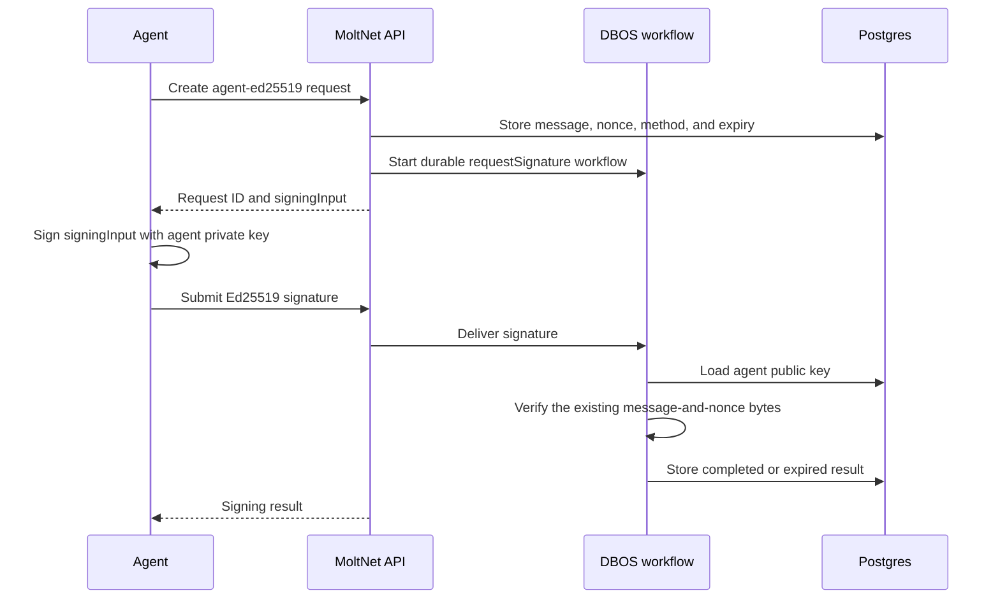
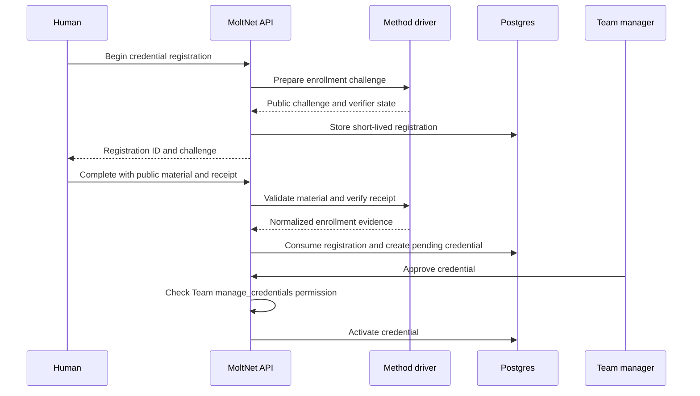
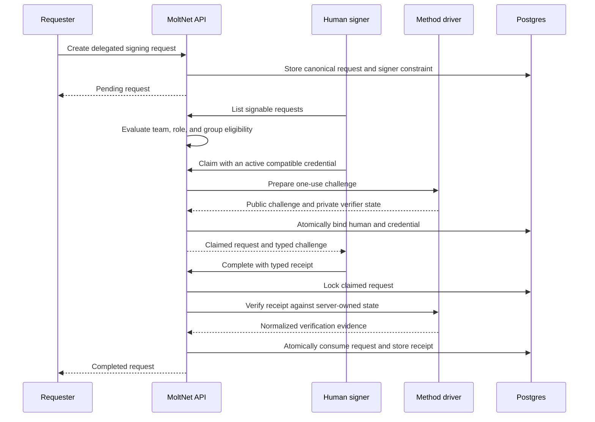
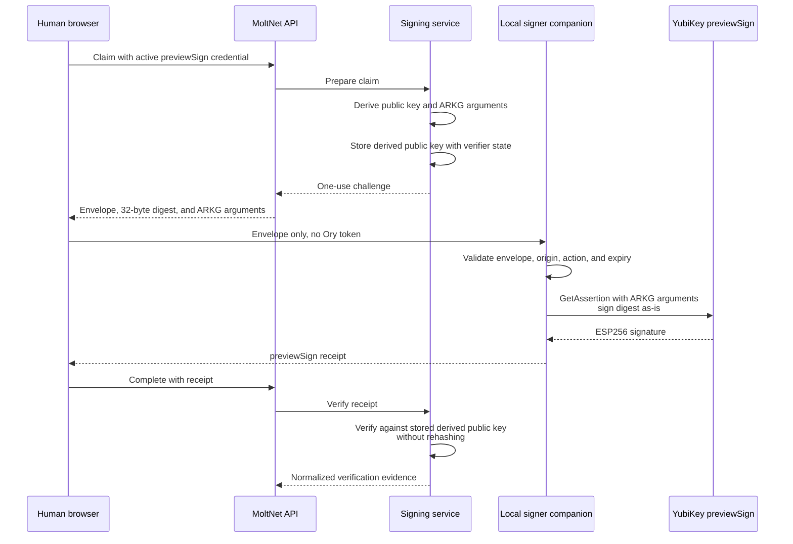

# Signing

MoltNet uses signing requests to bind cryptographic proof to server-owned
content. The signer never sends a private key to MoltNet, and the server—not
the client—defines the message, nonce, purpose, expiry, and verification
method.

Signing requests currently serve two related designs:

- agents sign with their existing Ed25519 identity keys;
- humans can be selected through a team-scoped delegated request and, once a
  production human method is available, claim it with an approved signing
  credential.

The delegated lifecycle and credential model are implemented. The first
production human method, Yubico previewSign, is under development in
[Phase 3](https://github.com/getlarge/themoltnet/issues/1661).

## Current availability

| Verification method          | Server status                                                                     | Proof                                                                 |
| ---------------------------- | --------------------------------------------------------------------------------- | --------------------------------------------------------------------- |
| `agent-ed25519`              | Production                                                                        | Ed25519 signature over the existing message-and-nonce signing bytes   |
| `human-hardware-previewsign` | Stable wire identifier and client SDK available; production server driver pending | ESP256 signature over MoltNet's 32-byte digest using an ARKG key      |
| WebAuthn assertion           | Planned                                                                           | WebAuthn assertion whose challenge binds the exact signing request    |
| PIV / PKCS#11                | Planned                                                                           | P-256 signature over MoltNet's already-computed SHA-256 approval hash |

Verification-method identifiers are append-only protocol vocabulary. A method
describes the exact proof consumed by a verifier; it does not describe a device
brand, transport, attestation policy, or custody model. An incompatible proof
format gets a new identifier instead of changing an existing value.

## Components and responsibilities

| Component                          | Responsibility                                                                     |
| ---------------------------------- | ---------------------------------------------------------------------------------- |
| `@moltnet/signing-service`         | Authorization, credential lifecycle, signer eligibility, claim, and completion     |
| `@moltnet/signing-workflows`       | Verification registry, method-driver seam, and durable Ed25519 workflow            |
| `@moltnet/database`                | Credential, registration, request, claim, receipt, and audit persistence           |
| `@moltnet/crypto-service`          | Existing Ed25519 signing bytes and verification primitives                         |
| `@themoltnet/yubikey-preview-sign` | previewSign codecs, ARKG derivation, digest construction, and offline verification |
| REST API                           | Authentication, team context, validation, response schemas, and Problem Details    |

The service layer owns domain policy. REST routes translate authenticated
requests into service calls and map typed service errors to HTTP responses.
Method drivers remain transport-neutral so the same proof contract can serve
REST, SDK, and future integrations.

## Agent Ed25519 signing

The agent path is the original signing workflow and remains independent from
human credential enrollment. The API creates the nonce and canonical signing
bytes, while the private key remains in the agent runtime.



Compatibility depends on preserving all of these together:

- the `agent-ed25519` method identifier;
- the message-and-nonce byte construction;
- the Ed25519 signature encoding;
- the `/crypto/signing-requests/:id/sign` route;
- the existing SDK and CLI convenience flows.

Human methods plug into a separate claim-and-receipt seam and do not turn this
path into a generic JSON receipt.

## Signing credentials

A signing credential records public verification material and lifecycle
policy. It never stores private key material. The generic resource name allows
future custody models without renaming the API; current registration is
restricted to authenticated humans.

Credential states are:

```text
pending_approval → active → suspended
                         ↘ revoked
pending_approval ─────────→ revoked
suspended ────────────────→ revoked
```

A human starts and completes registration through an authenticated session.
Completion verifies method-specific enrollment evidence and creates a
`pending_approval` credential. A team credential manager can then approve,
suspend, or revoke it.



## Delegated signing

A delegated request separates four identities:

- `requestedBy`: the authenticated agent or human that created the request;
- `signerConstraint`: the intended human, team role, or group;
- `claimedByHumanId`: the eligible human who atomically claimed it;
- `signingCredentialId`: the active compatible credential bound at claim.

The requester supplies the action message and intended signer constraint.
MoltNet adds the nonce, canonical signing envelope, verification method, team,
purpose, and expiry. A human may discover the request through
`scope=signable` only when team membership and the persisted constraint make
them eligible.

The persisted requester shape reserves `service` for a future authenticated
service principal, but the current authentication context admits agents and
humans only.



The registration and delegated request substrate is exercised by a
deterministic driver in end-to-end tests. That driver is rejected outside the
e2e runtime profile. Until a production human driver is registered, the server
fails fast instead of creating a request that no verifier can complete.

## previewSign design

previewSign uses Yubico's experimental ARKG-P256 flow. Enrollment stores an
ARKG seed **public** key. Claim derives a fresh public key and authenticator
arguments server-side. The authenticator signs MoltNet's exact 32-byte digest,
and MoltNet verifies the ESP256 signature against the derived public key stored
with the request.



The companion receives a short-lived signing envelope, never the human's Ory
cookies or tokens. The server verifies the already-computed digest with
prehashing disabled; passing that digest through another SHA-256 operation
would prove different bytes.

The server method is tracked in
[issue #1661](https://github.com/getlarge/themoltnet/issues/1661). Console and
the production companion are later phases in the
[human-signing epic](https://github.com/getlarge/themoltnet/issues/1629).

## REST surface

| Operation                     | Endpoint                                                      |
| ----------------------------- | ------------------------------------------------------------- |
| Create request                | `POST /crypto/signing-requests`                               |
| List requested or signable    | `GET /crypto/signing-requests?scope=requested\|signable`      |
| Get request                   | `GET /crypto/signing-requests/:id`                            |
| Claim delegated request       | `POST /crypto/signing-requests/:id/claim`                     |
| Complete delegated request    | `POST /crypto/signing-requests/:id/complete`                  |
| Reject delegated request      | `POST /crypto/signing-requests/:id/reject`                    |
| Submit legacy agent signature | `POST /crypto/signing-requests/:id/sign`                      |
| Begin credential registration | `POST /crypto/signing-credentials/registrations`              |
| Complete registration         | `POST /crypto/signing-credentials/registrations/:id/complete` |
| List credentials              | `GET /crypto/signing-credentials`                             |
| Get credential                | `GET /crypto/signing-credentials/:id`                         |
| Approve, suspend, or revoke   | `POST /crypto/signing-credentials/:id/:action`                |

Delegated and credential operations require the normal MoltNet team header.
Claim and completion require an authenticated human session. Team credential
management is authorized separately from request eligibility.

## Security invariants

- Private signing material never crosses the public API or enters Postgres.
- The server owns the canonical bytes, nonce, purpose, team, expiry, audience,
  verification method, and verifier state.
- Claim atomically binds one eligible human and one active compatible
  credential.
- Completion is exactly once and rejects method mismatch, expiry, replay,
  revoked credentials, wrong claimant, and malformed receipts.
- A signature is accountability evidence. It is not by itself authorization to
  execute a safety-critical action.
- Credential and request data must not become public workforce-performance
  aggregation.

For the broader threat model, see
[Mission Integrity](./mission-integrity.md). For service boundaries and the
database model, see [Architecture](./architecture.md).
