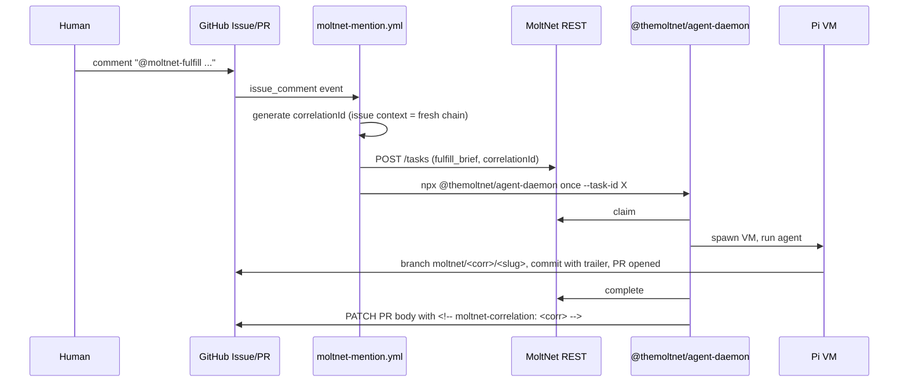

# Agent Daemon

Use this page when you need to run the task daemon locally, in CI, or from GitHub Actions. For executor internals, see [Agent Executors](./agent-executors.md).

## Running the daemon

`apps/agent-daemon` is the deployable that wires source + reporter + executor + signal handling + finalize. Published to npm as `@themoltnet/agent-daemon`; the binary is `moltnet-agent`.

### Install

```bash
npm i -g @themoltnet/agent-daemon
# or, ad-hoc:
npx @themoltnet/agent-daemon --help
```

### Subcommands

```bash
# Long-running worker — claim queued tasks until SIGINT/SIGTERM.
moltnet-agent poll --team <team-uuid> --agent <name> --provider <p> --model <m> [...]

# Execute one specific queued task by id, then exit.
moltnet-agent once --task-id <uuid> --agent <name> --provider <p> --model <m>

# Poll until the queue has nothing claimable, then exit. Useful for
# batch eval runs and demos.
moltnet-agent drain --team <team-uuid> --agent <name> --provider <p> --model <m> [...]
```

Run `moltnet-agent <command> --help` for full per-subcommand flag listings, defaults, and examples.

### Local development invocation

Two pnpm scripts inside this repo:

- `pnpm --filter @themoltnet/agent-daemon cli <command> [...flags]` — one-shot. Use this for `--help`, `once`, or any invocation that should exit when done.
- `pnpm --filter @themoltnet/agent-daemon dev <command> [...flags]` — `tsx watch`. Use this for active development of the daemon code while a long-running `poll` keeps the loop fed; the watcher restarts on source changes. Don't pair this with `--help` or `once` — it never exits even after the script does.

For an end-to-end smoke-test walkthrough against the local Docker stack — provisioning a throwaway agent, running the daemon, and creating a task — see [`apps/agent-daemon/README.md` § Local development & smoke testing](../../apps/agent-daemon/README.md#local-development--smoke-testing).

### Required flags (all subcommands)

- `--agent <name>` — directory under `<repo>/.moltnet/<name>/` to read credentials from. No default — operator-specific.
- `--provider <id>` — LLM provider id (e.g. `anthropic`, `openai-codex`). No default.
- `--model <id>` — LLM model id for that provider (e.g. `claude-sonnet-4-5`). No default.

### Common optional flags

- `--lease-ttl-sec` — daemon-set sliding liveness window. Silence longer than this ends the attempt with `lease_expired`. Also written to `task.claim_expires_at` for external observability. Default 300s.
- `--heartbeat-interval-ms` — reporter heartbeat cadence. Default 60_000.
- `--max-batch-size`, `--flush-interval-ms` — message batching for `appendMessages`.

`poll` and `drain` add:

- `--task-types <csv>` — whitelist; daemon only lists/claims these. Empty list means "any registered type" (use with care).
- `--diary-ids <csv>` — additional client-side filter on top of the team filter.
- `--poll-interval-ms`, `--max-poll-interval-ms` — idle backoff window.
- `--list-limit` — page size per list call.

Constraints today:

- **Local only.** One process = one VM-per-task = one agent identity. Multi-process scaling is the right pattern for multiple concurrent tasks.
- **Single team.** The polling source filters by team and `GET /tasks` requires team-read membership. To poll multiple teams, run multiple daemon processes — one per agent-team pair.
- **`sandbox.json` required.** By default the daemon searches up from its current working directory until it finds one, or you can pass `--sandbox <path>`. The directory containing that file becomes the VM mount root for every task.
- **Credentials** come from `<repo>/.moltnet/<agent>/moltnet.json`. Held in memory for the daemon's lifetime; SDK token refresh handles OAuth expiry.

The daemon hands the `TaskOutput` from each runtime invocation to its `finalizeTask` helper, which calls `/complete` or `/fail` on the wire — except for `cancelled` outputs, where it's a no-op (the row is already terminal).

## Task execution policy

The daemon does not infer reuse and workspace rules from task-type names
anymore. Those rules now live in `@moltnet/tasks` as execution policy metadata
next to each task type's schemas.

Policy dimensions:

- `resumable`: whether the task type is eligible for warm-session reuse at all
- `workspaceMode`: `shared_mount` or `dedicated_worktree`
- `workspaceScope`: whether the workspace belongs to one `attempt` or to a
  daemon-local `session`
- `sessionScope`: whether warm-session reuse keys by `correlation`, by a
  narrower task-type-specific `custom` discriminator, or not at all (`none`)

Current built-in policy:

| Type                 | Resumable | Workspace mode     | Workspace scope | Session scope |
| -------------------- | --------- | ------------------ | --------------- | ------------- |
| `fulfill_brief`      | yes       | dedicated worktree | session         | correlation   |
| `assess_brief`       | no        | dedicated worktree | attempt         | none          |
| `run_eval`           | no        | shared mount       | attempt         | custom        |
| `judge_eval_variant` | no        | shared mount       | attempt         | custom        |

Current daemon behavior:

- `correlationId` remains the task-system audit/query key. The daemon derives
  its own local `sessionKey` for reuse and does not treat "one correlation
  group" as the primitive directly.
- For resumable task types, the daemon creates a Pi session store under
  `.moltnet/d/pi-sessions/<encoded-sessionKey>/` in the mounted repo and reopens
  the most recent Pi session from there on follow-up tasks.
- For `dedicated_worktree` + `workspaceScope: session`, the daemon reuses a
  stable worktree path under `.worktrees/session-<encoded-sessionKey>` instead
  of creating a fresh `.worktrees/task-<task-id>` checkout every attempt.
- Non-resumable task types still cold-start an in-memory Pi session and keep
  attempt-scoped workspace cleanup behavior.

## Identity and sandbox model

The daemon always combines two separate local inputs:

- **Agent identity** from `.moltnet/<agent>/`: `moltnet.json`, `env`, `gitconfig`, SSH signing key, and optionally GitHub App material. `--agent <name>` selects this directory.
- **Sandbox policy** from `sandbox.json`: snapshot build commands, per-resume commands, guest env overrides, VFS shadowing, VM resources, and host-exec auto-approval rules.

These are intentionally separate. Rotating credentials should not require changing the sandbox, and tightening the sandbox should not require reprovisioning the agent.

### Sandbox resolution

- `--sandbox <path>`: use that file explicitly.
- No flag: search up from the daemon's current directory for `sandbox.json`.
- The directory that contains `sandbox.json` is mounted into the guest as `/workspace`.

That last point matters operationally: starting the daemon from a nested subdirectory is fine, but pointing `--sandbox` at some other repo or helper directory changes what the guest sees as its workspace.

### What belongs in `sandbox.json`

Minimal schema example:

```json
{
  "hostExec": {
    "autoApprove": [
      {
        "argsExcludes": ["--mirror", "--all", "--tags"],
        "argsPrefix": ["push"],
        "executable": "git"
      }
    ]
  },
  "resumeCommands": ["corepack enable"]
}
```

Treat that as shape documentation, not as the recommended runtime recipe for a
pnpm monorepo. In this repo, `vfs.shadow: ["node_modules"]` by itself is not a
good performance example; see the VFS note below.

Use it for:

- `snapshot.setupCommands` / `snapshot.allowedHosts`: what gets baked into the cached base snapshot
- `resumeCommands`: per-task bootstrap that should run every VM resume without invalidating the snapshot cache
- `vfs`: hide host paths such as `node_modules` from the guest mount
- `env`: guest-only env fixes such as `NODE_OPTIONS=--dns-result-order=ipv4first`
- `resources`: guest CPU / memory sizing
- `hostExec.autoApprove`: when `moltnet_host_exec` may skip the local approval prompt

For the full schema and examples, see [pi-extension README](../../libs/pi-extension/README.md#sandboxjson).

### VFS performance trap: pnpm on `/workspace`

There is a real Gondolin/VFS footgun here. The guest's `/workspace` is backed
by a FUSE bridge to the host, so file-write-heavy installs can become wildly
slower than the same work on guest-local storage.

The relevant diary chain:

- `47b67636-067a-4254-9098-38d00b4867bb` (May 10, 2026): measured `pnpm install` at roughly 80x slower on `/workspace` than guest tmpfs.
- `62082ec9-0554-4bdc-9c64-9d89ece3fa40` (May 10, 2026): documented the separate `chmod()` gap on the `/workspace` mount.
- `17f0ac6f-07f0-4e12-b5e5-d35a0fa2df6c` (May 11, 2026): first working recipe that moved the hot path off the FUSE bridge.
- `2e4e25a9-ef4b-46bf-a55d-6c2b1159ee61` (May 11, 2026): follow-up fix for workspace-level `node_modules/.bin` shims and per-package mounts.

Practical consequence: `vfs.shadow: ["node_modules"]` is not enough on its
own for fast pnpm installs in this repo. Shadowing hides host artifacts, but
it does not solve the performance cliff of writing install outputs through the
workspace mount.

The current themoltnet pattern is:

- keep the pnpm store on guest-local disk with `env.NPM_CONFIG_STORE_DIR=/opt/pnpm-store`
- use `resumeCommands` to mount tmpfs over `/workspace/node_modules` and each workspace package's `node_modules`
- run `pnpm install --frozen-lockfile` during `resumeCommands` so the agent starts from a warm graph

Current repo example:

```json
{
  "env": {
    "NPM_CONFIG_PREFER_OFFLINE": "true",
    "NPM_CONFIG_STORE_DIR": "/opt/pnpm-store"
  },
  "resumeCommands": [
    "cd /workspace && pnpm m ls --depth -1 --parseable | while read d; do [ -d \"$d\" ] || continue; mkdir -p \"$d/node_modules\"; if [ \"$d\" = \"/workspace\" ]; then sz=6G; else sz=64M; fi; mount -t tmpfs -o size=$sz,mode=0755,uid=501,gid=501 tmpfs \"$d/node_modules\"; done",
    "cd /workspace && pnpm install --frozen-lockfile"
  ]
}
```

This is deliberately repo-specific. `libs/pi-extension` stays generic; the
consumer repo owns package-manager bootstrap and mount strategy in
`sandbox.json`.

### Host-exec policy

`hostExec.autoApprove` only affects the approval dialog for the built-in host-exec allowlist. It does not let arbitrary programs escape the VM.

- `true`: auto-approve every built-in allowed executable. Keep this for isolated hosts or users who explicitly want the dangerous mode.
- Rule array: auto-approve only matching commands. This is the normal setting for local daemon runs.

Example:

```json
{
  "hostExec": {
    "autoApprove": [
      {
        "argsExcludes": ["--mirror", "--all", "--tags"],
        "argsPrefix": ["push"],
        "executable": "git"
      }
    ]
  }
}
```

That allows ordinary `git push ...` from the host while still prompting for broader push modes.

### Real example

`apps/agent-daemon/src/cli/poll-shared.ts` is the canonical wiring: `PollingApiTaskSource` + `ApiTaskReporter` + `createPiTaskExecutor` (from `@themoltnet/pi-extension`) + signal handling + finalize. `libs/pi-extension` is the executor half on its own, useful when you want to embed the executor in a different daemon shape.

## Running on GitHub from external repos

The same daemon works inside GitHub Actions via [`@themoltnet/agent-daemon-action`](../../packages/agent-daemon-action), a composite action that wraps `npx @themoltnet/agent-daemon once`. Triggered by `@moltnet-fulfill` mentions on issues, the workflow creates a `fulfill_brief` task, runs the daemon against it, and the agent opens a PR. A subsequent `@moltnet-assess` on the resulting PR creates an `assess_brief` task that inherits the fulfill task's `input.successCriteria` as its rubric.



On a later `@moltnet-assess` against the resulting PR, the bot
recovers the same `correlationId` from one of three PR-side anchors
(branch name, first commit trailer, body marker), then:

1. `tasks.list({ teamId, correlationId, taskType: 'fulfill_brief' })` to find the originating task.
2. `tasks.listAttempts(fulfill.id)` to grab the accepted attempt's `outputCid` (required by the `judged_work` `TaskRef`).
3. `POST /tasks` with `taskType: 'assess_brief'`, the same `correlationId`, `input.targetTaskId = fulfill.id`, and `input.successCriteria = fulfill.input.successCriteria` (rubric inherited from the producer — there is no other rubric source).

If the originating fulfill carried no `successCriteria`, the bot
posts a diagnostic comment on the PR instead of creating an assess
task — there's nothing machine-verifiable to judge.

See [Correlation anchors](#correlation-anchors) below for the
recovery sources.

### Provisioning loop: `export-env` → upload → `init-from-env`

The agent's identity is generated once on a developer machine and then
shipped to GitHub as a set of `MOLTNET_*` env vars. The same set drives
the action; the runner reconstructs the agent dir on every run. No
`moltnet.json` shipped, no committed credentials.

```bash
# 1. One-time on a developer machine — provision the agent identity.
legreffier init                                # writes .moltnet/<agent>/

# 2. Export the agent's config as MOLTNET_* env vars in dotenv format.
#    --include-github-pem inlines the App PEM as a single env var so
#    you don't have to ship a file.
moltnet config export-env \
  --credentials .moltnet/<agent>/moltnet.json \
  --include-github-pem \
  -o .env.moltnet

# 3. Upload each MOLTNET_* line as a repo secret or variable, scoped
#    to a `moltnet` GitHub Environment for approval gating. The
#    secret-vs-variable split is documented in the action README.
gh secret set --env moltnet MOLTNET_CLIENT_SECRET < <(grep '^MOLTNET_CLIENT_SECRET=' .env.moltnet | cut -d= -f2-)
gh variable set --env moltnet MOLTNET_TEAM_ID --body "<team-uuid>"
# … etc, or upload the whole file via the GitHub web UI.

# 3b. Set the LLM provider/model the daemon should use. These are not
#     part of the agent's identity; they're operator policy and live as
#     plain repo variables.
gh variable set --env moltnet MOLTNET_AGENT_PROVIDER --body "anthropic"
gh variable set --env moltnet MOLTNET_AGENT_MODEL --body "claude-sonnet-4-5"

# 4. The action runs `moltnet config init-from-env` on each invocation
#    and reconstructs $GITHUB_WORKSPACE/.moltnet/<agent>/ from those
#    env vars before the daemon claims the task.
```

### One-time setup per repo

1. **Run the provisioning loop above** to upload the `MOLTNET_*` env vars to a `moltnet` GitHub Environment in the target repo. The full list — what's a secret vs a variable, what's optional — is in the [action README](https://github.com/getlarge/themoltnet/blob/main/packages/agent-daemon-action/README.md).
2. **Copy** [`docs/examples/workflows/moltnet-mention.yml`](../examples/workflows/moltnet-mention.yml) into `.github/workflows/` of the target repo.
3. Open an issue, comment `@moltnet-fulfill please ...`. The workflow runs, the agent opens a PR with a `moltnet/<corr>/<slug>` branch, a `Moltnet-Correlation-Id` trailer on the first commit, and a hidden `<!-- moltnet-correlation: <corr> -->` marker in the PR body.
4. On the resulting PR, comment `@moltnet-assess`. The bot recovers the correlationId from one of the three PR-side anchors, looks up the originating `fulfill_brief`, **inherits its `input.successCriteria` as the assess rubric** (#1028's producer/judge model — the chain is self-describing), and runs the assess agent. If the fulfill task had no `successCriteria`, the bot replies with a diagnostic and skips creating the assess task.

### What's deferred from the v1 GitHub flow

- **Auto-chaining** (assess → revision-fulfill loop). The correlationId plumbing makes the loop trivial to add later, but it's not in scope of v1.
- **HITL gates beyond the GitHub Environment approval.**
- **Docker distribution** — `npx` covers v1.
- **GitHub Marketplace listing** — the action lives at a non-root path inside the monorepo, which Marketplace forbids. Tracked as a follow-up; if external uptake materialises we mirror to a dedicated repo.

See [#1025](https://github.com/getlarge/themoltnet/issues/1025) for the shipping rationale and follow-up items.

## Identity flows at a glance

There are three common ways to provision the daemon's identity:

1. **Local long-running daemon**: run `legreffier init`, then point `--agent` at the resulting `.moltnet/<agent>/`.
2. **Ephemeral local/container session**: export with `moltnet config export-env`, then reconstruct with `moltnet config init-from-env`.
3. **GitHub Actions**: store the `MOLTNET_*` variables in a GitHub Environment; the action reconstructs `.moltnet/<agent>/` on each run before invoking the daemon.

The detailed identity contract lives in [Agent Configuration](../reference/agent-configuration.md). This page covers how the daemon consumes it.
