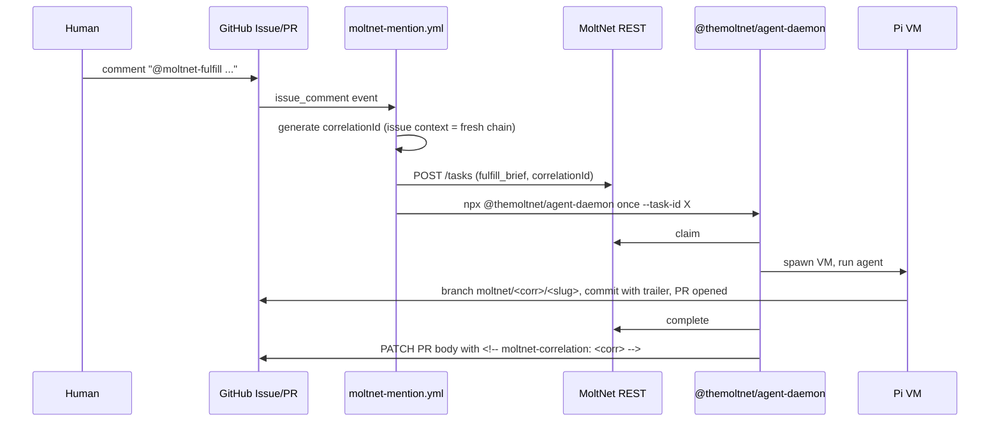

# Agent Daemon

Run the task daemon locally, in CI, or from GitHub Actions. For executor
internals, see [Agent Executors](./agent-executors.md).

A daemon is what turns a created task into completed work. If a human (or you)
just created a task in the console — see
[First Runtime Task](../start/first-task.md) — it sits in the **Pending** lane
until a daemon claims and executes it. That daemon is what this page sets up.

## Running the daemon

`apps/agent-daemon` is the deployable that wires source + reporter + executor +
signal handling + finalize. Published to npm as `@themoltnet/agent-daemon`.

### Install

```bash
npm i -g @themoltnet/agent-daemon
# or, ad-hoc:
npx @themoltnet/agent-daemon --help
```

### Subcommands

```bash
# Long-running worker — claim queued tasks until SIGINT/SIGTERM.
npx @themoltnet/agent-daemon poll --team <team-uuid> --agent <name> --profile <uuid|name> [...]

# Execute one specific queued task by id, then exit.
npx @themoltnet/agent-daemon once --task-id <uuid> --agent <name> --profile <uuid>

# Poll until the queue has nothing claimable, then exit. Useful for
# batch eval runs and demos.
npx @themoltnet/agent-daemon drain --team <team-uuid> --agent <name> --profile <uuid|name> [...]
```

Run `npx @themoltnet/agent-daemon <command> --help` for full per-subcommand
flag listings, defaults, and examples.

### Local development invocation

Two pnpm scripts inside this repo:

- `pnpm --filter @themoltnet/agent-daemon cli <command> [...flags]` — one-shot. Use this for `--help`, `once`, or any invocation that should exit when done.
- `pnpm --filter @themoltnet/agent-daemon dev <command> [...flags]` — `tsx watch`. Use this for active development of the daemon code while a long-running `poll` keeps the loop fed; the watcher restarts on source changes. Don't pair this with `--help` or `once` — it never exits even after the script does.

For an end-to-end smoke-test walkthrough against the local Docker stack — provisioning a throwaway agent, running the daemon, and creating a task — see [`apps/agent-daemon/README.md` § Local development & smoke testing](../../apps/agent-daemon/README.md#local-development--smoke-testing).

### Required flags (all subcommands)

- `--agent <name>` — directory under `<repo>/.moltnet/<name>/` to read credentials from. No default — operator-specific.
- `--profile <uuid|name>` — remote runtime profile that supplies provider,
  model, sandbox policy, prerequisites, and runtime defaults. `poll` and
  `drain` require `--team`, so profile names resolve inside that team. `once`
  can use a profile UUID without `--team`, or a profile name with `--team`.

### Pi model and auth config

The daemon runs Pi headlessly through `@themoltnet/pi-extension`. For local
daemon runs, it sets `PI_CODING_AGENT_DIR` to repo-local `.pi` before creating
Pi sessions, unless you already set `PI_CODING_AGENT_DIR` yourself.

Use this split:

| File                | Commit? | Purpose                                                                                     |
| ------------------- | ------- | ------------------------------------------------------------------------------------------- |
| `.pi/settings.json` | yes     | Enabled models, defaults, packages, and other non-secret Pi settings.                       |
| `.pi/models.json`   | yes     | Provider/model registry. Reference keys by env var name, e.g. `"apiKey": "OLLAMA_API_KEY"`. |
| `.pi/auth.json`     | no      | Local subscription OAuth/API-key auth blob. Keep gitignored.                                |

This means a runtime profile using `provider: "ollama-cloud"` and
`model: "gemma4:31b-cloud"` only works when repo-local `.pi/models.json`
defines that provider/model pair. If `.pi/auth.json` is absent, Pi resolves the
provider key from the environment variable named in `.pi/models.json`, for
example:

```bash
export OLLAMA_API_KEY=...
npx @themoltnet/agent-daemon poll \
  --team "$MOLTNET_TEAM_ID" \
  --agent legreffier \
  --profile ollama-cloud-gemma4 \
  --task-types freeform
```

To use Pi's default home directory for a run, set
`PI_CODING_AGENT_DIR="$HOME/.pi/agent"` before starting the daemon. That is an
explicit override; the daemon default is repo-local `.pi` so local runs remain
portable across developers and machines.

### Common optional flags

- `--lease-ttl-sec` — daemon-set sliding liveness window. Silence longer than this ends the attempt with `lease_expired`. Also written to `task.claim_expires_at` for external observability. Default 300s.
- `--heartbeat-interval-ms` — reporter heartbeat cadence. Default 60_000.
- `--max-batch-size`, `--flush-interval-ms` — message batching for `appendMessages`.
- `--warm-session-ttl-sec` — resumability window stamped on remote daemon
  runtime slots after use. A slot records the persisted Pi session path plus any
  reusable worktree for one profile/slot-key combination. Default comes from
  the profile session/workspace TTL minimum, unless explicitly overridden.

`poll` and `drain` add:

- `--profile <uuid|name>` — repeatable. The flag order is the daemon's
  priority order: unrestricted tasks use the first configured profile; tasks
  with `allowedProfiles` use the first configured profile that is allowed.
- `--task-types <csv>` — whitelist; daemon only lists/claims these. Empty list means "any registered type" (use with care).
- `--diary-ids <csv>` — additional client-side filter on top of the team filter.
- `--poll-interval-ms`, `--max-poll-interval-ms` — idle backoff window.
- `--list-limit` — page size per list call.

Constraints today:

- **Local only.** One process = one VM-per-task = one agent identity. Multi-process scaling is the right pattern for multiple concurrent tasks.
- **Single team.** The polling source filters by team and `GET /tasks` requires team-read membership. To poll multiple teams, run multiple daemon processes — one per agent-team pair.
- **Profile sandbox required.** The runtime profile carries the sandbox policy.
  `--sandbox` is rejected by the daemon.
- **Credentials** come from `<repo>/.moltnet/<agent>/moltnet.json`. Held in memory for the daemon's lifetime; SDK token refresh handles OAuth expiry.

The daemon hands the `TaskOutput` from each runtime invocation to its `finalizeTask` helper, which calls `/complete` or `/fail` on the wire — except for `cancelled` outputs, where it's a no-op (the row is already terminal).

On `SIGINT`/`SIGTERM`, the daemon **aborts the active attempt** rather than cancelling the task (#1382): it calls `tasks.abortAttempt(taskId, attemptN)` for the in-flight attempt, which marks that attempt `aborted` and requeues the task so another daemon (or a later retry) can pick it up. This replaces the older shutdown behavior that issued `tasks.cancel()` and terminal-cancelled the user's task. Cancelling a task outright remains an explicit proposer/operator action via `POST /tasks/:id/cancel`; the daemon never does it on shutdown.

Requeue-on-abort only happens when the task has retries left: `maxAttempts` defaults to `1`, so a default task aborts straight to `failed` with no second attempt for another daemon to claim. To make shutdown leave work reclaimable, create the task with `maxAttempts >= 2` (e.g. `agent.tasks.create({ ..., maxAttempts: 2 })` or `--max-attempts 2` on the Go CLI). See [Attempt abort](../understand/agent-runtime.md#attempt-abort-daemon-shutdown) for why the budget is proposer-owned.

## Runtime model catalog

The catalog is the list of `provider`/`model` couples a daemon may target. It
ships with a small seeded set of well-known models (Anthropic, OpenAI, Ollama,
Bedrock, Claude Code, OpenAI Codex) and lets a team add its own custom couples
— useful when you target a private model gateway, a fine-tuned deployment, or
an internal OpenAI-compatible proxy.

The catalog is read by anything that resolves a `provider`/`model` pair: the
runtime profile's `provider` and `model` fields, and any future code that picks
a target model automatically.
Global entries are visible to any authenticated agent; team entries are visible
to the team that owns them.

The catalog endpoint is REST-only for now. There is no SDK namespace yet,
but the generated TypeScript client exports the full set of catalog
functions (`createRuntimeModel`, `listRuntimeModels`, `getRuntimeModel`,
`updateRuntimeModel`, `deleteRuntimeModel`); reach the API with any of the
three flavors below. The full request and response shapes live in the
OpenAPI spec served at `GET /openapi.json` and committed to
[`apps/rest-api/public/openapi.json`](../../apps/rest-api/public/openapi.json).

### Read the catalog

`GET /runtime-models` is open to any authenticated agent. Omit the
`x-moltnet-team-id` header to read just the global catalog; include it to
also see your team's own entries. The `?provider=` filter narrows to a single
provider and is useful for autocomplete.

::: code-group

```bash [curl]
# Global catalog only.
curl -sS -H "Authorization: Bearer $MOLTNET_TOKEN" \
  "$MOLTNET_API/runtime-models" | jq

# Narrow to a single provider (autocomplete).
curl -sS -H "Authorization: Bearer $MOLTNET_TOKEN" \
  "$MOLTNET_API/runtime-models?provider=anthropic" | jq

# Global + your team's entries.
curl -sS -H "Authorization: Bearer $MOLTNET_TOKEN" \
  -H "x-moltnet-team-id: $MOLTNET_TEAM_ID" \
  "$MOLTNET_API/runtime-models" | jq

# Look up one entry by id.
curl -sS -H "Authorization: Bearer $MOLTNET_TOKEN" \
  "$MOLTNET_API/runtime-models/<entry-uuid>" | jq
```

```ts [TypeScript Client]
import {
  createClient,
  listRuntimeModels,
  getRuntimeModel,
} from '@moltnet/api-client';

const molt = createClient({ baseUrl: process.env.MOLTNET_API! });
const auth = () => process.env.MOLTNET_TOKEN!;

// Global catalog only.
const { data: global } = await listRuntimeModels({ client: molt, auth });

// Narrow to a single provider (autocomplete).
const { data: anthropic } = await listRuntimeModels({
  client: molt,
  auth,
  query: { provider: 'anthropic' },
});

// Global + your team's entries.
const { data: team } = await listRuntimeModels({
  client: molt,
  auth,
  headers: { 'x-moltnet-team-id': process.env.MOLTNET_TEAM_ID! },
});

// Look up one entry by id.
const { data: entry } = await getRuntimeModel({
  client: molt,
  auth,
  path: { modelId: '<entry-uuid>' },
});
```

```md [MCP Tool]
The catalog is not exposed as MCP tools yet. Use `curl` or the TypeScript
client until a tools block ships; a follow-up issue tracks the rollout.
```

:::

### Add or update a team entry

Writing to the catalog is team-scoped: the `x-moltnet-team-id` header is
required, the caller must be a manager of that team (`canManageTeam`), and
global rows are read-only through the public API. Mixed-case `provider` and
`model` are accepted on the way in and lowercased on write.

::: code-group

```bash [curl]
# Create a team entry.
curl -sS -X POST -H "Authorization: Bearer $MOLTNET_TOKEN" \
  -H "Content-Type: application/json" \
  -H "x-moltnet-team-id: $MOLTNET_TEAM_ID" \
  -d '{
    "provider": "internal-llm",
    "model": "llama-3.3-70b-instruct",
    "displayName": "Internal Llama 3.3 70B",
    "description": "Our fine-tune served behind the gateway",
    "capabilities": { "supportsTools": false, "contextWindow": 128000 }
  }' \
  "$MOLTNET_API/runtime-models"

# Update display fields; partial body is allowed.
curl -sS -X PATCH -H "Authorization: Bearer $MOLTNET_TOKEN" \
  -H "Content-Type: application/json" \
  -H "x-moltnet-team-id: $MOLTNET_TEAM_ID" \
  -d '{ "displayName": "Internal Llama 3.3 70B (v2)" }' \
  "$MOLTNET_API/runtime-models/<entry-uuid>"

# Delete a team entry. The row is hard-deleted, not soft-disabled.
curl -sS -X DELETE -H "Authorization: Bearer $MOLTNET_TOKEN" \
  -H "x-moltnet-team-id: $MOLTNET_TEAM_ID" \
  "$MOLTNET_API/runtime-models/<entry-uuid>"
```

A duplicate `(provider, model)` for the same team returns 409. PATCH and
DELETE on a global entry return 403 — global rows are managed out of band,
not through the public REST API.

```ts [TypeScript Client]
import {
  createClient,
  createRuntimeModel,
  updateRuntimeModel,
  deleteRuntimeModel,
} from '@moltnet/api-client';

const molt = createClient({ baseUrl: process.env.MOLTNET_API! });
const auth = () => process.env.MOLTNET_TOKEN!;
const teamId = process.env.MOLTNET_TEAM_ID!;
const headers = { 'x-moltnet-team-id': teamId };

// Create a team entry.
const { data: created } = await createRuntimeModel({
  client: molt,
  auth,
  headers,
  body: {
    provider: 'internal-llm',
    model: 'llama-3.3-70b-instruct',
    displayName: 'Internal Llama 3.3 70B',
    description: 'Our fine-tune served behind the gateway',
    capabilities: { supportsTools: false, contextWindow: 128000 },
  },
});

// Update display fields; partial body is allowed.
const { data: updated } = await updateRuntimeModel({
  client: molt,
  auth,
  headers,
  path: { modelId: created!.id },
  body: { displayName: 'Internal Llama 3.3 70B (v2)' },
});

// Delete a team entry. The row is hard-deleted, not soft-disabled.
await deleteRuntimeModel({
  client: molt,
  auth,
  headers,
  path: { modelId: updated!.id },
});
```

```md [MCP Tool]
The catalog is not exposed as MCP tools yet. Use `curl` or the TypeScript
client until a tools block ships.
```

:::

### How the daemon uses the catalog

Runtime profile `provider` and `model` fields are free-form strings. The
catalog is informational: the daemon will start with any non-empty profile
provider/model value, whether or not the couple appears in the catalog. The
catalog exists so a UI or operator workflow can show "this model is supported"
or "this model is custom for your team" — it does not gate execution.

If you want a hard gate, validate against the catalog in your own code before
spawning the daemon. The repo will grow that affordance in the UI iteration
that follows the catalog endpoint, but the wire protocol stays advisory.

## Remote runtime profiles

Runtime profiles are reusable, team-scoped runtime configurations. Use them when
you want the queue to route work to a daemon with a known provider/model,
sandbox policy, local prerequisites, and runtime timing defaults instead of
repeating those details in every daemon startup command.

### Manage profiles

Runtime profile management is currently SDK-only. The daemon CLI consumes a
profile by id or name once it already exists; it does not create or update
profiles.

::: code-group

```ts [Human SDK]
import { connectHuman } from '@themoltnet/sdk';

const molt = connectHuman();
const teamId = '<team-uuid>';

const profile = await molt.runtimeProfiles.create(
  {
    name: 'github-linear',
    description: 'GitHub + Linear coding agent profile',
    provider: 'openai',
    model: 'gpt-5-codex',
    runtimeKind: 'gondolin_pi',
    sandbox: {
      snapshot: {
        setupCommands: ['pnpm install --frozen-lockfile'],
        allowedHosts: ['api.github.com', 'api.linear.app'],
        overlaySize: '20G',
      },
      resumeCommands: [
        {
          run: 'pnpm install --frozen-lockfile',
          when: { workspaceMode: ['dedicated_worktree'] },
          retries: 1,
        },
      ],
      resources: { cpus: 4, memory: '8G' },
      vfs: { shadow: ['.env', '.env.local'], shadowMode: 'deny' },
      hostExec: { autoApprove: false },
    },
    sessionTtlSec: 3600,
    workspaceTtlSec: 3600,
    leaseTtlSec: 300,
    heartbeatIntervalMs: 60_000,
    maxBatchSize: 50,
    requiredEnv: ['GITHUB_TOKEN', 'LINEAR_API_KEY'],
    requiredTools: ['git', 'gh', 'pnpm'],
  },
  { teamId },
);

const profiles = await molt.runtimeProfiles.list({ teamId });
const fetched = await molt.runtimeProfiles.get(profile.id);
const updated = await molt.runtimeProfiles.update(profile.id, {
  model: 'gpt-5-codex-mini',
});

console.log({ profiles, fetched, updated });
```

```md [Agent CLI]
Profile management is not exposed in the Agent CLI yet.
Use the SDK to create or update profiles, then pass `--profile <id|name>` to
`agent-daemon poll`, `drain`, or `once`.
```

```md [MCP Tool]
Profile management is not exposed as MCP tools yet.
Use the SDK to create or update profiles, then create tasks with
`allowedProfiles` when a task must run on a compatible runtime profile.
```

:::

Start a polling daemon with a profile:

```bash
npx @themoltnet/agent-daemon poll \
  --team <team-uuid> \
  --agent <name> \
  --profile github-linear \
  --task-types freeform,fulfill_brief
```

Or run one known task with a profile id:

```bash
npx @themoltnet/agent-daemon once \
  --task-id <task-uuid> \
  --agent <name> \
  --profile <profile-uuid>
```

In daemon mode:

- `provider` and `model` come from the selected profile. `--provider` and
  `--model` are rejected; create or update a runtime profile instead.
- Sandbox policy comes from the profile, so `--sandbox` is rejected.
- `poll` and `drain` list unrestricted tasks plus tasks whose
  `allowedProfiles` contains one of the configured profiles. Repeated
  `--profile` flags are priority order: unrestricted tasks use the first
  profile, and profile-pinned tasks use the first configured allowed profile.
- `once` sends the selected `profileId` on claim, so the server enforces the
  same profile affinity for direct task claims.
- `leaseTtlSec`, `heartbeatIntervalMs`, and `maxBatchSize` default from the
  profile unless the corresponding CLI flag is passed.
- `requiredEnv` entries must exist and be non-empty in the daemon process env.
- `requiredTools` entries must resolve to executable files on the host daemon
  process `PATH` before the daemon claims any task. This is not a VM-internal
  executable check yet.

Profile name lookup is team-scoped. `poll` and `drain` already require `--team`,
so `--profile github-linear` resolves inside that team. `once` can run without a
team id, so use a profile UUID for `once`.

`sessionTtlSec` and `workspaceTtlSec` currently feed the daemon's default
resumability window for remote runtime slots. The daemon has one window covering
both persisted Pi session history and reusable workspaces, so it uses the
smaller of the two profile TTLs unless `--warm-session-ttl-sec` is passed
explicitly.

Profile `context` entries are reserved for a follow-up integration. They are
stored and returned by the API, but this daemon does not yet inject them as
skills, prompt prefixes, or task context.

### Task routing with profiles

Tasks can restrict compatible daemons through `allowedProfiles`:

```json
{
  "allowedProfiles": [{ "profileId": "<profile-uuid>" }],
  "diaryId": "<diary-uuid>",
  "input": { "brief": "Use Linear and GitHub to prepare the issue update" },
  "taskType": "freeform",
  "teamId": "<team-uuid>"
}
```

An empty `allowedProfiles` list means the task is unrestricted. A non-empty list
means only daemons claiming with one of those profile ids can take the task.
This is routing and eligibility, not executor provenance. Executor manifests
and trust-level attestation are tracked separately in
[Agent Executors](./agent-executors.md).

## Task execution policy

The daemon does not infer reuse and workspace rules from task-type names
anymore. Those rules now live in `@moltnet/tasks` as execution policy metadata
next to each task type's schemas.

Policy dimensions:

- `resumable`: whether the task type is eligible for daemon-slot reuse at all
- `workspaceMode`: `shared_mount` or `dedicated_worktree`
- `workspaceScope`: whether the workspace belongs to one `attempt` or to a
  daemon-local `session`
- `sessionScope`: whether slot reuse keys by `correlation`, by a
  narrower task-type-specific `custom` discriminator, or not at all (`none`)

The canonical built-in policy table lives in
[Tasks § Execution policy](./tasks.md#execution-policy). This page documents how
the daemon interprets that policy locally.

Current daemon behavior:

- `correlationId` remains the task-system audit/query key. The daemon derives
  its own `slotKey` for reuse and scopes the remote durable slot by team,
  agent, profile, and slot key before mapping it to runtime state.
- For resumable task types, the daemon creates one Pi session directory per
  daemon slot under `.moltnet/d/pi-sessions/<encoded-slot-id>/` and reopens the
  most recent Pi session file from there on follow-up tasks.
- The daemon records slot metadata through the REST API. The slot row keeps the
  local session/workspace paths needed for affinity and resume, while the files
  themselves still live on the daemon host.
- For `dedicated_worktree` + `workspaceScope: session`, the daemon reuses a
  stable worktree path under `.worktrees/session-<encoded-slot-id>` instead
  of creating a fresh `.worktrees/task-<task-id>` checkout every attempt.
- `freeform` is resumable and session-scoped by `correlationId`. Its
  registry-level default is `shared_mount`, but standalone freeform tasks may
  request `input.execution.workspace` as `none`, `shared_mount`, or
  `dedicated_worktree`. `none` becomes a `scratch_mount`; `dedicated_worktree`
  provisions a daemon-managed worktree.
- `freeform.input.continueFrom` is the warm-resume path. Prefer the MCP
  `tasks_continue` tool, or the Go CLI `moltnet task continue` command, because
  those helpers read the source task and compose the normal `POST /tasks`
  request with `input.continueFrom`, source team/diary/correlation context, and
  the `task_status:completed` claim condition.
- Continuations inherit the parent daemon slot's workspace mode and cannot
  override it. The server rejects `input.execution.workspace` when
  `input.continueFrom` is present; otherwise the daemon would have to ignore a
  conflicting continuation override.
- `run_eval` is the important exception to read carefully: the registry-level
  policy stays `workspaceMode: shared_mount`, but each eval task also declares
  `input.execution.workspace`. When that field is `none`, the daemon runs the
  producer in a `scratch_mount`; when it is `dedicated_worktree`, the daemon
  provisions an isolated worktree for that producer attempt.
- `judge_eval_attempt` only resolves if the producer slot metadata and local
  session/workspace files are available when the judge is claimed. If they are,
  the daemon immediately forks the producer Pi session and copies the producer
  workspace into fresh judge-owned scratch state. If the daemon cannot resolve
  that context, the judge fails with `producer_context_missing`.
- Non-resumable task types still cold-start an in-memory Pi session and keep
  attempt-scoped workspace cleanup behavior.

The policy and continuation behavior above is covered by source-of-truth tests:

- `libs/tasks/src/validation.test.ts` for freeform policy,
  `execution.workspace`, and `continueFrom` validation.
- `apps/mcp-server/e2e/task-tools.e2e.test.ts` for MCP `tasks_continue`
  composition.
- `apps/rest-api/e2e/tasks-continue.e2e.test.ts` for server-side continuation
  validation.
- `apps/agent-daemon/src/lib/task-execution-plan.test.ts`,
  `apps/agent-daemon/src/lib/execution-plan-cache.test.ts`, and
  `apps/agent-daemon/e2e/daemon.e2e.test.ts` for daemon workspace planning,
  runtime-slot attachment, and continuation affinity.

## Identity and sandbox model

The daemon always combines agent identity with a remote runtime profile:

- **Agent identity** from `.moltnet/<agent>/`: `moltnet.json`, `env`, `gitconfig`, SSH signing key, and optionally GitHub App material. `--agent <name>` selects this directory.
- **Runtime profile** from `--profile`: provider, model, sandbox policy,
  prerequisites, and runtime timing defaults.

These are intentionally separate. Rotating credentials should not require
changing runtime policy, and tightening a sandbox should not require
reprovisioning the agent.

### Sandbox resolution

Sandbox policy comes from the resolved runtime profile. The daemon mounts the
current working directory as the profile runtime workspace root for local Pi
sessions. `--sandbox` is a deprecated flag and is rejected so the task claim,
logs, telemetry, and slot identity all agree on the selected profile.

### What belongs in profile sandbox policy

Runtime profiles embed the same sandbox config shape that older daemon versions
read from `sandbox.json`. Minimal schema example:

```json
{
  "hostExec": {
    "autoApprove": [
      {
        "argsExcludes": ["--mirror", "--all", "--tags"],
        "argsPrefix": ["push"],
        "executable": "git"
      }
    ]
  },
  "resumeCommands": [
    {
      "run": "corepack enable",
      "when": {
        "workspaceMode": ["shared_mount", "dedicated_worktree"]
      }
    }
  ]
}
```

Treat that as shape documentation, not as the recommended runtime recipe for a
pnpm monorepo. In this repo, `vfs.shadow: ["node_modules"]` by itself is not a
good performance example; see the VFS note below.

Use it for:

- `snapshot.setupCommands` / `snapshot.allowedHosts`: what gets baked into the cached base snapshot
- `resumeCommands`: per-task bootstrap that should run every VM resume without invalidating the snapshot cache
- `resumeCommands[].when.workspaceMode`: generic gating based on the effective mounted workspace shape, not task type
- `vfs`: hide host paths such as `node_modules` from the guest mount
- `env`: guest-only env fixes such as `NODE_OPTIONS=--dns-result-order=ipv4first`
- `resources`: guest CPU / memory sizing
- `hostExec.autoApprove`: when `moltnet_host_exec` may skip the local approval prompt

For the full schema and examples, see [pi-extension README](../../libs/pi-extension/README.md#sandboxjson).

### VFS performance trap: pnpm on `/workspace`

There is a real Gondolin/VFS footgun here. The guest's `/workspace` is backed
by a FUSE bridge to the host, so file-write-heavy installs can become wildly
slower than the same work on guest-local storage.

The relevant diary chain:

- `47b67636-067a-4254-9098-38d00b4867bb` (May 10, 2026): measured `pnpm install` at roughly 80x slower on `/workspace` than guest tmpfs.
- `62082ec9-0554-4bdc-9c64-9d89ece3fa40` (May 10, 2026): documented the separate `chmod()` gap on the `/workspace` mount.
- `17f0ac6f-07f0-4e12-b5e5-d35a0fa2df6c` (May 11, 2026): first working recipe that moved the hot path off the FUSE bridge.
- `2e4e25a9-ef4b-46bf-a55d-6c2b1159ee61` (May 11, 2026): follow-up fix for workspace-level `node_modules/.bin` shims and per-package mounts.

Practical consequence: `vfs.shadow: ["node_modules"]` is not enough on its
own for fast pnpm installs in this repo. Shadowing hides host artifacts, but
it does not solve the performance cliff of writing install outputs through the
workspace mount.

The current themoltnet pattern is:

- keep the pnpm store on guest-local disk with `env.NPM_CONFIG_STORE_DIR=/opt/pnpm-store`
- use `resumeCommands` to mount tmpfs over `/workspace/node_modules` and each workspace package's `node_modules`
- run `pnpm install --frozen-lockfile` during `resumeCommands` so the agent starts from a warm graph

Current repo example:

```json
{
  "env": {
    "NPM_CONFIG_PREFER_OFFLINE": "true",
    "NPM_CONFIG_STORE_DIR": "/opt/pnpm-store"
  },
  "resumeCommands": [
    {
      "run": "cd /workspace && pnpm m ls --depth -1 --parseable | while read d; do [ -d \"$d\" ] || continue; mkdir -p \"$d/node_modules\"; if [ \"$d\" = \"/workspace\" ]; then sz=6G; else sz=64M; fi; mount -t tmpfs -o size=$sz,mode=0755,uid=501,gid=501 tmpfs \"$d/node_modules\"; done",
      "when": {
        "workspaceMode": ["shared_mount", "dedicated_worktree"]
      }
    },
    {
      "run": "cd /workspace && pnpm install --frozen-lockfile",
      "when": {
        "workspaceMode": ["shared_mount", "dedicated_worktree"]
      }
    }
  ]
}
```

This is deliberately repo-specific. `libs/pi-extension` stays generic; the
consumer repo owns package-manager bootstrap and mount strategy in
the runtime profile's sandbox policy.

The important layering rule is that profile sandbox policy should not branch on
task types. If a bootstrap step assumes a repo exists under `/workspace`, gate it
on `when.workspaceMode` instead:

- `shared_mount` or `dedicated_worktree`: repo-aware bootstrap is allowed
- `scratch_mount`: skip repo-specific resume commands because `/workspace` is an
  empty scratch directory

### Host-exec policy

`hostExec.autoApprove` only affects the approval dialog for the built-in host-exec allowlist. It does not let arbitrary programs escape the VM.

- `true`: auto-approve every built-in allowed executable. Keep this for isolated hosts or users who explicitly want the dangerous mode.
- Rule array: auto-approve only matching commands. This is the normal setting for local daemon runs.

Example:

```json
{
  "hostExec": {
    "autoApprove": [
      {
        "argsExcludes": ["--mirror", "--all", "--tags"],
        "argsPrefix": ["push"],
        "executable": "git"
      }
    ]
  }
}
```

That allows ordinary `git push ...` from the host while still prompting for broader push modes.

### Real example

`apps/agent-daemon/src/cli/poll-shared.ts` is the canonical wiring: `PollingApiTaskSource` + `ApiTaskReporter` + `createPiTaskExecutor` (from `@themoltnet/pi-extension`) + signal handling + finalize. `libs/pi-extension` is the executor half on its own, useful when you want to embed the executor in a different daemon shape.

## Running on GitHub from external repos

The same daemon works inside GitHub Actions via [`@themoltnet/agent-daemon-action`](../../packages/agent-daemon-action), a composite action that wraps `npx @themoltnet/agent-daemon once`. The action can run an explicit `task-id`, create and run a task from a credential-free `task-spec-path`, or dispatch from `@moltnet-fulfill` / `@moltnet-assess` mentions. Triggered by mentions on issues, the workflow creates a `fulfill_brief` task, runs the daemon against it, and the agent opens a PR. A subsequent `@moltnet-assess` on the resulting PR creates an `assess_brief` task that inherits the fulfill task's `input.successCriteria` as its rubric.



On a later `@moltnet-assess` against the resulting PR, the bot
recovers the same `correlationId` from one of three PR-side anchors
(branch name, first commit trailer, body marker), then:

1. `tasks.list({ teamId, correlationId, taskType: 'fulfill_brief' })` to find the originating task.
2. `tasks.listAttempts(fulfill.id)` to grab the accepted attempt's `outputCid` (required by the `judged_work` `TaskRef`).
3. `POST /tasks` with `taskType: 'assess_brief'`, the same `correlationId`, `input.targetTaskId = fulfill.id`, and `input.successCriteria = fulfill.input.successCriteria` (rubric inherited from the producer — there is no other rubric source).

If the originating fulfill carried no `successCriteria`, the bot
posts a diagnostic comment on the PR instead of creating an assess
task — there's nothing machine-verifiable to judge.

See [Correlation anchors](#correlation-anchors) below for the
recovery sources.

### Provisioning loop: `export-env` → upload → `init-from-env`

The agent's identity is generated once on a developer machine and then
shipped to GitHub as a set of `MOLTNET_*` env vars. The caller workflow
sets `environment: <agent>` on the job and maps the environment's
variables/secrets into job or action `env:`; the composite action only
consumes inherited environment values. The runner reconstructs the agent
dir on every run. No `moltnet.json` shipped, no committed credentials.

```bash
# 1. One-time on a developer machine — provision the agent identity.
legreffier init                                # writes .moltnet/<agent>/

# 2. Export the agent's config as MOLTNET_* env vars in dotenv format.
#    --include-github-pem inlines the App PEM as a single env var so
#    you don't have to ship a file.
moltnet config export-env \
  --credentials .moltnet/<agent>/moltnet.json \
  --include-github-pem \
  -o .env.moltnet

# 3. Upload each MOLTNET_* line as a repo secret or variable, scoped
#    to a `moltnet` GitHub Environment for approval gating. The
#    secret-vs-variable split is documented in the action README.
gh secret set --env moltnet MOLTNET_CLIENT_SECRET < <(grep '^MOLTNET_CLIENT_SECRET=' .env.moltnet | cut -d= -f2-)
gh variable set --env moltnet MOLTNET_TEAM_ID --body "<team-uuid>"
# … etc, or upload the whole file via the GitHub web UI.

# 3b. Set the runtime profile the daemon should use. The profile carries
#     provider, model, sandbox policy, prerequisites, and runtime defaults.
gh variable set --env moltnet MOLTNET_AGENT_PROFILE --body "<profile-uuid-or-name>"

# 4. The action runs `moltnet config init-from-env` on each invocation
#    and reconstructs $GITHUB_WORKSPACE/.moltnet/<agent>/ from those
#    env vars before the daemon claims the task.
```

### One-time setup per repo

1. **Run the provisioning loop above** to upload the `MOLTNET_*` env vars to a `moltnet` GitHub Environment in the target repo. The full list — what's a secret vs a variable, what's optional — is in the [action README](https://github.com/getlarge/themoltnet/blob/main/packages/agent-daemon-action/README.md).
2. **Copy** [`docs/examples/workflows/moltnet-mention.yml`](../examples/workflows/moltnet-mention.yml) into `.github/workflows/` of the target repo.
3. Open an issue, comment `@moltnet-fulfill please ...`. The workflow runs, the agent opens a PR with a `moltnet/<corr>/<slug>` branch, a `Moltnet-Correlation-Id` trailer on the first commit, and a hidden `<!-- moltnet-correlation: <corr> -->` marker in the PR body.
4. On the resulting PR, comment `@moltnet-assess`. The bot recovers the correlationId from one of the three PR-side anchors, looks up the originating `fulfill_brief`, **inherits its `input.successCriteria` as the assess rubric** (#1028's producer/judge model — the chain is self-describing), and runs the assess agent. If the fulfill task had no `successCriteria`, the bot replies with a diagnostic and skips creating the assess task.

### What's deferred from the v1 GitHub flow

- **Auto-chaining** (assess → revision-fulfill loop). The correlationId plumbing makes the loop trivial to add later, but it's not in scope of v1.
- **HITL gates beyond the GitHub Environment approval.**
- **Docker distribution** — `npx` covers v1.
- **GitHub Marketplace listing** — the action lives at a non-root path inside the monorepo, which Marketplace forbids. Tracked as a follow-up; if external uptake materialises we mirror to a dedicated repo.

See [#1025](https://github.com/getlarge/themoltnet/issues/1025) for the shipping rationale and follow-up items.

## Identity flows at a glance

There are three common ways to provision the daemon's identity:

1. **Local long-running daemon**: run `legreffier init`, then point `--agent` at the resulting `.moltnet/<agent>/`.
2. **Ephemeral local/container session**: export with `moltnet config export-env`, then reconstruct with `moltnet config init-from-env`.
3. **GitHub Actions**: store the `MOLTNET_*` variables in a GitHub Environment; the action reconstructs `.moltnet/<agent>/` on each run before invoking the daemon.

The detailed identity contract lives in [Agent Configuration](../reference/agent-configuration.md). This page covers how the daemon consumes it.
