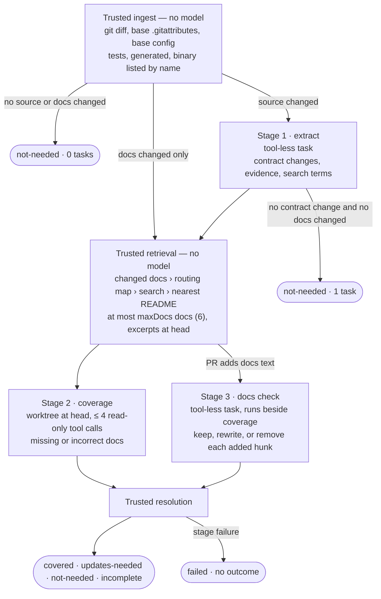
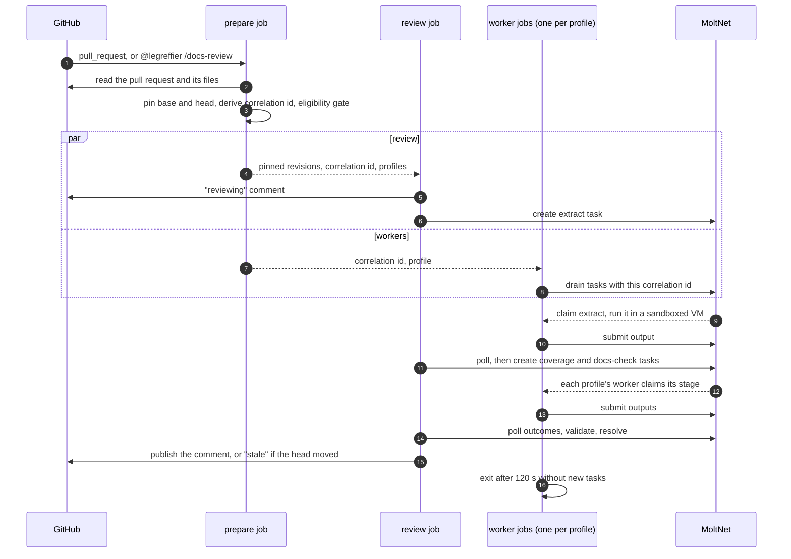

# @moltnet/docs-impact-review

Experimental documentation-impact reviewer for pull requests
([#2373](https://github.com/getlarge/themoltnet/issues/2373)). It answers one
question: **does this PR leave users, operators, or contributors with missing
or incorrect instructions?** It is not a correctness, security, style, or
general docs review.

This library is the reviewer. CI runs it through
[`docs-impact-review-action`](../../packages/docs-impact-review-action/README.md),
which bundles it; locally, the `cli` target runs it against existing pull
requests to measure precision and per-stage latency.

## Pipeline



Any coverage gap turns a clean outcome into `incomplete`; the report keeps
the clean outcome as `reviewedOutcome` and the comment says what the review
found for the part it read. A docs-check failure is recorded as a gap while
the coverage result stands. Trusted code
validates every stage output strictly: evidence must cite changed files,
findings must reference a known change (or `docs:<changed doc>` for a
contradiction in a doc the PR edits), and `incomplete` can only be decided by
trusted code, never by the model.

## Budgets

Defaults live in `DEFAULT_BUDGETS`. A repository overrides any key marked
configurable under `budgets` in its
[configuration file](#repository-configuration).

| Budget                               | Key                      | Default    | Configurable range |
| ------------------------------------ | ------------------------ | ---------- | ------------------ |
| Diff bytes (stage 1)                 | `diffTotalBytes`         | 64 000     | 8 000 – 256 000    |
| Per-file patch bytes                 | `diffPerFileBytes`       | 12 000     | 1 000 – 64 000     |
| Diff bytes reserved for changed docs | `diffDocsReserveBytes`   | 16 000     | 0 – 128 000        |
| Docs-diff bytes (coverage stage)     | `docsDiffBytes`          | 16 000     | 1 000 – 64 000     |
| Excerpt bytes per doc                | `docExcerptBytes`        | 8 000      | 1 000 – 32 000     |
| Docs per review                      | `maxDocs`                | 6          | 1 – 20             |
| Docs hunks checked                   | `maxDocsHunks`           | 12         | 1 – 50             |
| Running timeout per stage (s)        | `stageRunningTimeoutSec` | 120        | 30 – 240           |
| Manifest lines, bytes per docs hunk  | —                        | 150, 1 500 | not configurable   |
| Model turns / output tokens          | —                        | 6 / 4096   | runtime profile    |

The diff is packed in three steps, each skipping a file that does not fit:
changed docs up to `diffDocsReserveBytes`, then source (files a routing rule
names first), then the remaining docs in whatever budget is left. A large
source change therefore cannot push the pull request's own docs out of the
review. Every file left out is listed as a gap.

The 240 s timeout ceiling keeps two chained stages (300 s dispatch plus the
running timeout each) inside the reusable workflow's 20-minute job. A larger
diff takes longer to read, so raise `diffTotalBytes` together with the
timeout, and check the run summary's per-stage timing first.

Byte budgets target ~24k input tokens per stage. Output tokens start above the
issue's 1.5k target because reasoning tokens count against the limit; tune it
from measured `outputTokens`.

## Timing

Every stage records server timestamps plus transcript markers, so poll delay
never skews the split:

| Field               | Span                                                                               |
| ------------------- | ---------------------------------------------------------------------------------- |
| `queueMs`           | task queued → claimed                                                              |
| `openMs`            | claimed → first heartbeat (`startedAt`)                                            |
| `setupMs`           | first heartbeat → `execute_start`: snapshot, worktree, VM resume, guest projection |
| `firstModelEventMs` | `execute_start` → first model text or tool call                                    |
| `modelMs`           | first model event → completed                                                      |
| `observedMs`        | client-observed create → terminal, including poll delay                            |

Polling defaults to 2 s (`--poll-interval`). Faster polling trips the REST
API's per-principal read limit, shared with a daemon running as the same
identity, and the SDK then stalls on `Retry-After`. The corpus summary prints
p50/p95 for each phase, plus ingest, retrieval, and total wall time.

## Run against existing PRs

Run from a checkout of the reviewed repository with `gh` authenticated.

Ingestion and routing only, no tasks:

```bash
pnpm exec nx run @moltnet/docs-impact-review:cli -- \
  --repo getlarge/themoltnet --pr 2462 --pr 2464 --dry-run
```

Full review, which needs the runtime profile and a daemon claiming it.
`--project` scopes the tasks to a project location. Use it for a daemon started
from a project binding, such as the Desktop; a CI worker whose workspace is the
checkout itself doesn't need it.

The profile and its read-only tool policy are created once per team. The
steps, with ready-to-apply definitions, are in the action's
[Set up the runtime profile](../../packages/docs-impact-review-action/README.md#set-up-the-runtime-profile);
MoltNet's own profiles are in `.github/runtime-profiles/` and
`.github/runtime-policies/`.

```bash

# terminal 1: a daemon that claims the review stages
# --binding: the coverage stage needs a git worktree of the reviewed repo
moltnet-agent poll --agent "$MOLTNET_AGENT_NAME" --team "$MOLTNET_TEAM_ID" \
  --profile legreffier-docs-review-v1 --task-types freeform --binding themoltnet

# terminal 2: review a corpus, write per-PR reports
pnpm exec nx run @moltnet/docs-impact-review:cli -- \
  --repo getlarge/themoltnet --pr 2462 --pr 2454 --pr 2459 \
  --team "$MOLTNET_TEAM_ID" --diary "$MOLTNET_DIARY_ID" \
  --profile legreffier-docs-review-v1 --project "$MOLTNET_PROJECT_ID" \
  --config .github/docs-impact-review.json --out /tmp/docs-impact
```

Each stage task is tagged `review:docs-impact`,
`stage:<extract|coverage|docs-check>`,
`pr:<n>`, and `revision:<head>`, and shares one correlation id per PR.

## In CI

In this repository,
[`docs-impact-review.yml`](../../.github/workflows/docs-impact-review.yml) calls
the reusable workflow
[`docs-impact-review-reusable.yml`](../../.github/workflows/docs-impact-review-reusable.yml),
which runs
[`docs-impact-review-action`](../../packages/docs-impact-review-action/README.md)
(bundling this library) and its workers. The action README describes the trust
model and how other repositories set the review up. The review is advisory:
its comment never blocks a merge.



**Triggers.** Non-draft pull requests on `opened`, `ready_for_review`,
`synchronize` and `reopened`. An owner, member or collaborator can rerun it on
any pull request, drafts included, by commenting `@legreffier /docs-review`. A
new push cancels the run for the previous head.

**Protected paths.** A pull request that changes the review runtime is not
reviewed by it: the workflow, the `legreffier-docs-review-*` profiles, the
runtime policies, this library, the action, and `agent-daemon-action`.

**Comment identity.** The comment is written by the LeGreffier GitHub App, from
the `legreffier` environment's `MOLTNET_GITHUB_APP_ID` variable and
`MOLTNET_GITHUB_APP_PRIVATE_KEY` secret.

**Configuration** (repository variables; the `prepare` job computes the
worker list outside the `legreffier` environment, so environment-scoped
variables are not visible to it):

| Variable                                 | Purpose                                         |
| ---------------------------------------- | ----------------------------------------------- |
| `MOLTNET_DOCS_IMPACT_REVIEW_ENABLED`     | `true` to enable the workflow                   |
| `MOLTNET_DOCS_IMPACT_PROFILE`            | default profile, used by every stage (required) |
| `MOLTNET_DOCS_IMPACT_COVERAGE_PROFILE`   | optional profile for the coverage stage         |
| `MOLTNET_DOCS_IMPACT_DOCS_CHECK_PROFILE` | optional profile for the docs check             |

The target is a review in about 2–3 minutes, a little more when the runner
starts cold. Stage budgets (the running timeout and the profile's turn limit)
and input budgets are described in [Budgets](#budgets). The run summary records the
per-stage timing breakdown and token counts.

## Repository configuration

A repository configures the review in `.github/docs-impact-review.json`. The
reviewer reads it from the pull request's **base** revision, so a pull request
cannot change the rules it is reviewed by. Without the file, the defaults apply
and the comment says so.

```json
{
  "budgets": {
    "diffTotalBytes": 96000
  },
  "docs": {
    "agentFacing": ["prompts/**"],
    "exclude": ["vendor/**"],
    "include": ["docs/**/*.rst"]
  },
  "instructions": "User-facing CLI docs live in docs/reference/.",
  "routing": [
    {
      "docs": ["docs/reference/cli.md"],
      "id": "cli",
      "paths": ["apps/cli/**"]
    }
  ],
  "version": 1
}
```

| Key                | Effect                                                                                                                                                                                                                                                                                              |
| ------------------ | --------------------------------------------------------------------------------------------------------------------------------------------------------------------------------------------------------------------------------------------------------------------------------------------------- |
| `routing`          | Maps code paths to the pages that document them. Nearest READMEs are found automatically, so list only pages a README would miss. Routed pages are required reading: if they overflow, the review reports a gap.                                                                                    |
| `docs.include`     | Files reviewed as documentation besides Markdown (`*.md`, `*.mdx`), for example `docs/**/*.rst` or `**/*.adoc`. Excerpts and docs-check sections follow Markdown headings, so other formats are reviewed without an outline. Nearest-README lookup stays `README.md`; route other pages explicitly. |
| `docs.exclude`     | Documentation that is never reviewed, searched, or selected. Added to the built-in `**/CHANGELOG.md` and `**/.*/**/CHANGELOG.md`.                                                                                                                                                                   |
| `docs.agentFacing` | Instructions written for agents (skills, prompts). They rank below user and operator docs unless the pull request changed them or a routing rule names them. Added to the built-in `.agents/**`, `.claude/**`, `.codex/**`, `.cursor/**`, `.pi/**`, `**/skills/**`, `**/.*/**/skills/**`.           |
| `budgets`          | Overrides for the configurable keys in [Budgets](#budgets). Each key is optional and must fall in its range. `diffPerFileBytes` and `diffDocsReserveBytes` may not exceed `diffTotalBytes` when the file sets them; a default above a smaller configured total is capped to it.                     |
| `instructions`     | Up to 2,000 characters of guidance added to every stage brief. It refines the review within its fixed scope and output format; it cannot change them.                                                                                                                                               |

The `docs` lists add to the built-in ones (`docs.include` has none); an empty
list adds nothing.

**Globs** (routing `paths`, `docs.include`, `docs.exclude`, `docs.agentFacing`) use Node's
[`path.matchesGlob`](https://nodejs.org/api/path.html#pathmatchesglobpath-pattern),
which follows minimatch syntax: `*`, `?`, `**`, `{a,b}` and `[ab]`. Paths are
relative to the repository root and always use `/`. Four pitfalls:

| Pitfall                                                                | Wrong                                           | Right                                                           |
| ---------------------------------------------------------------------- | ----------------------------------------------- | --------------------------------------------------------------- |
| `*` and `**` never match a name starting with a dot                    | `**/CHANGELOG.md` misses `.github/CHANGELOG.md` | add `**/.*/**/CHANGELOG.md`, or `.github/**` for that directory |
| A pattern matches whole paths, not directories                         | `vendor` matches only a file named `vendor`     | `vendor/**`                                                     |
| Paths have no leading `/` or `./` (rejected)                           | `/docs/**`, `./docs/**`                         | `docs/**`                                                       |
| On macOS and Windows, wildcard parts ignore case; CI on Linux does not | `docs/*.MD` matches `docs/a.md` locally only    | match the case of the files: `docs/*.md`                        |

Good patterns:

```json
{
  "docs": {
    "agentFacing": ["prompts/**", "**/.*/**/prompts/**"],
    "exclude": ["vendor/**", "docs/generated/**", "**/*.snap.md"]
  },
  "routing": [
    {
      "docs": ["docs/reference/cli.md"],
      "id": "cli",
      "paths": ["apps/cli/**", "packages/cli/src/**/*.{ts,tsx}"]
    }
  ],
  "version": 1
}
```

A leading `!` (negation) and `\` are rejected, and a path segment may hold
at most three `*`: the matcher backtracks, so a segment such as `*a*a*a*a*b`
would take exponential time on a long file name.

Routing `docs` entries are exact paths, not globs, and routing `id`s must be
unique. A routing rule may not name a page that `docs.exclude` drops: the
configuration is rejected instead of silently losing a required route.

**Versioning.** The file declares `"version": 1`. Within version 1, new keys
are only added, never renamed or removed, and an unknown key is an error that
names it. A configuration using a key the pinned reviewer does not know yet
needs a newer reviewer.

An invalid configuration fails that pull request's review with a message naming
the file, the revision, and the keys to fix (the first five, and how many
more); other pull requests still run. So does any other per-pull-request
failure, such as a revision that cannot be fetched: its failed report is
written like any other, including to `--out`.

Mark generated code and docs with `linguist-generated` in `.gitattributes`
rather than in this file: the reviewer reads it from the base revision too.

This repository's own configuration is
[`.github/docs-impact-review.json`](../../.github/docs-impact-review.json). A
test fails when a routed page no longer exists.

When replaying pull requests whose base predates the file, pass
`--config .github/docs-impact-review.json` so the review uses the current rules.
